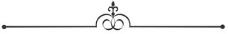
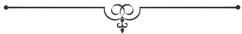

::: WordSection
[
]{.calibre18}

{.calibre45}

THÉÂTRE

[LE BOUTON DE ROSE]{lang="EN-GB"}

[[Liste des pièces de théâtre](../Text/Zola3_split_000.htm){.calibre4 .pcalibre .pcalibre1}]{.calibre42}

]{.calibre41} [{.calibre46}]{.calibre41}

## []{#_Toc368783391 .calibre4 .pcalibre .pcalibre1}[]{#_Toc368783251 .calibre4 .pcalibre .pcalibre1}[Acte I]{#_Toc368783111 .calibre4 .pcalibre .pcalibre1} {#calibre_toc_17 .calibre37}

La chambre à coucher de Ribalier. Au fond, au milieu, un lit avec une table de nuit. Dans des pans coupés ; à gauche, la fenêtre ; à droite, la cheminée. Quand la fenêtre est ouverte, on aperçoit au dehors, fixée dans le mur, l'enseigne de l'hôtel, une tête de cerf très cornue, avec ces mots : Au GRAND CERF. Au second plan : à gauche, la porte du cabinet de toilette ; à droite, la porte d'entrée de la chambre. Au premier plan :à gauche, la porte de l'appartement de Brochard ; à droite, la porte de la chambre de Jules. Une table à gauche, près de laquelle est un fauteuil ; un canapé, à droite. Sièges. Deux bougies allumées sont posées sur la cheminée.

::: WordSection
*[
]{.calibre18}*

{.calibre45}

THÉÂTRE

[LE BOUTON DE ROSE]{lang="EN-GB" xmlns:xml="http://www.w3.org/XML/1998/namespace"}

ACTE I

[[Liste des pièces de théâtre](../Text/Zola3_split_000.htm){.calibre4 .pcalibre .pcalibre1}]{.calibre42}

{.calibre46}

### []{#_Toc368783392 .calibre4 .pcalibre .pcalibre1}[]{#_Toc368783252 .calibre4 .pcalibre .pcalibre1}[Scène première]{#_Toc368783112 .calibre4 .pcalibre .pcalibre1} {#scène-première .calibre48 .sigil_not_in_toc}

PUTOIS, FRANÇOISE

Au lever du rideau, Putois allume une bouillotte à esprit-de-vin, sur la table. Françoise est penchée à la fenêtre grande ouverte.

**
FRANÇOISE**.
En voilà une vraie noce ! Ah ! bien, ils s'en donnent !\... Dis-donc, Putois, tu les entends ?

*(Des cris et des applaudissements éclatent au dehors.)*
Je parie que c'est monsieur Ribalier qui danse !

**
PUTOIS**, *regardant la pendule.*
Trois heures moins vingt\... On ne se couchera pas cette nuit. J'ai les jambes qui me rentrent dans le corps\... Vois-tu, ma femme, j'en crèverais, si les bourgeois se mariaient tous les jours.

**
FRANÇOISE**, *descendant.*
Oh ! ça n'arrive qu'une fois\... Tiens ! ils ont raison de se goberger ! Il serait beau que les maîtres du Grand-Cerf, le meilleur hôtel de Tours, ne fissent pas sauter les casseroles et danser les violons pour leur mariage.

*(Elle s'approche de Putois.)*
Dis donc, Putois, c'est le tour de monsieur Ribalier. Maintenant que son associé, monsieur Brochard, a une femme, il va peut-être se décider, lui aussi.

**
PUTOIS**.
Il est bien malin\... Et un homme qui tient à sa tranquillité !

(*Il est allé prendre un bol sur la cheminée.)*

**
FRANÇOISE**.
Qu'est-ce que tu fais là ?

**
PUTOIS**.
Le lait de poule de monsieur Ribalier, pardi !\... Avec ça que monsieur Ribalier se passerait de son lait de poule ! Il en avale un chaque soir depuis six ans, pour se tenir le teint frais.

**
FRANÇOISE**, *devant la cheminée.*
Et tous ces petits pots ?

**
PUTOIS**.
Veux-tu bien ne pas toucher ! Ce sont les pommades de monsieur Ribalier\... Ah ! il ne vieillit pas\... Un si bel homme !\... Écoute, tu devrais filer, Françoise, parce que tu vas me faire arriver des histoires. Il n'aime pas que les femmes viennent fouiller dans sa chambre, il n'a confiance qu'en moi.

(Nouvelles rumeurs au dehors.)

**
FRANÇOISE**, *sa précipitant à la fenêtre.*
Qu'est-ce que c'est ?

*(On entend des rires accompagnant le refrain : « Allons-nous-en, gens de la noce, allons-nous-en chacun chez nous. »)*
C'est la famille Coquet et la famille Pingat qui s'en vont.

**
PUTOIS**.
Bon voyage ! Ce n'est pas trop tôt.

**
FRANÇOISE**.
Ah ! voilà monsieur Ribalier !

**
PUTOIS**.
Va-t'en, n'est-ce pas ?

(Françoise ferme la fenêtre et s'esquive derrière le dos de Ribalier.)

::: WordSection
*[
]{.calibre18}*

{.calibre45}

THÉÂTRE

[LE BOUTON DE ROSE]{lang="EN-GB"}

ACTE I

[[Liste des pièces de théâtre](../Text/Zola3_split_000.htm){.calibre4 .pcalibre .pcalibre1}]{.calibre42}

]{.calibre4} [{.calibre47}]{.calibre4}

### []{#_Toc368783393 .calibre4 .pcalibre .pcalibre1}[]{#_Toc368783253 .calibre4 .pcalibre .pcalibre1}[Scène II]{#_Toc368783113 .calibre4 .pcalibre .pcalibre1} {#scène-ii .calibre48 .sigil_not_in_toc}

PUTOIS, RIBALIER

**
RIBALIER**.
Ouf ! je me suis échappé\... Quelle corvée, bon Dieu ! La mairie, l'église, un repas de quatre heures, dix quadrilles, cinq valses et sept polkas dans les jambes ! Et il faut rire, encore ! Autrement, on vous prend pour un vieux bonhomme.

**
PUTOIS**.
Hein ? Monsieur en a sa claque ?

**
RIBALIER**.
Oui, mon ami, je suis fatigué. Je te l'avoue, à toi !\... Tiens ! ôte-moi mon habit\... Gredin d'habit ! Vois-tu, c'est là-dessous qu'il me pince\... Il y a vingt ans que tu me sers. Tu es mon meilleur ami.

**
PUTOIS**, *très ému, lâchant la manche qu'il vient de retirer.*
Monsieur, ne dites pas de ces choses-là, ça m'attendrit, ça m'enlève toutes mes forces.

**
RIBALIER**.
Eh bien, non, remets-toi. Tu es très sensible, je le sais\... Donne-moi mon veston.

*(Putois a emporté l'habit ; il revient avec le veston dont il l'aide à passer la première manche.)*
Mais, mon pauvre Putois, tu dors debout, toi aussi ! Ah ! digne et excellent serviteur !

**
PUTOIS**, *très ému, lâchant la seconde manche.*
Monsieur, je vous en prie, ne dites pas de ces choses-là !

**
RIBALIER**.
Non, non\... Enfin ! je respire ! Dire qu'ils rient encore, en bas ! Je leur souhaite de l'agrément. Je vais passer une bonne nuit, par exemple ! Sacrédié ! quel dodo ! oh ! à poings fermés !\... Toi aussi, tu vas bien dormir, n'est-ce pas, Putois ?

**
PUTOIS**.
Monsieur est trop bon. Je dors comme une souche.

**
RIBALIER**.
Voyons, il n'est rien venu, aujourd'hui ?

**
PUTOIS**.
Si, une lettre pour monsieur Brochard, que j'ai mise dans son ancienne chambre, sa chambre de garçon.

**
RIBALIER**.
Bien. Il la trouvera\... Hein, crois-tu qu'il la lira, cette nuit ?

**[
PUTOIS]{lang="EN-US"}**[, *riant.*
Ho ! ho ! ho !]{lang="EN-US"}

**
RIBALIER**.
Veux-tu te taire, farceur !\... Tu as tout préparé dans mon cabinet, n'est-ce pas ?

*(Il se dirige vers le cabinet.)*
Et dépêchons ! J'ai hâte d'être couché.

(*Au moment où il va sortir, Jules paraît à droite.)*

::: WordSection
[
]{.calibre18}

{.calibre45}

THÉÂTRE

[LE BOUTON DE ROSE]{lang="EN-GB" xmlns:xml="http://www.w3.org/XML/1998/namespace"}

ACTE I

[[Liste des pièces de théâtre](../Text/Zola3_split_000.htm){.calibre4 .pcalibre .pcalibre1}]{.calibre42}

]{.calibre41} [{.calibre46}]{.calibre41}

### []{#_Toc368783394 .calibre4 .pcalibre .pcalibre1}[]{#_Toc368783254 .calibre4 .pcalibre .pcalibre1}[Scène III]{#_Toc368783114 .calibre4 .pcalibre .pcalibre1} {#scène-iii .calibre48 .sigil_not_in_toc}

PUTOIS, RIBALIER, JULES

(Pendant la scène. Putois fait la couverture.)

**
JULES**.
Bonsoir, mon oncle\... Oh ! je vous laisse, vous devez être joliment las !

**
RIBALIER**.
Moi, mon garçon, mais pas du tout ! Jamais je n'ai été si gaillard.

**
JULES**.
Toujours vingt, ans, ce cher oncle ! Et pas un cheveu blanc, et terrible pour les dames !

**
RIBALIER**, *avec fatuité.*
Oui, oui.

**
JULES**.
Depuis que je passe mes vacances ici, toute la ville de Tours me parle de vous. Monsieur Ribalier, du Grand-Cerf, eh ! eh ! il en a fait des victimes et il en fait encore !

**
RIBALIER**.
Oui, oui. On exagère\... Quand je me suis associé avec Brochard, nous avons dû nous partager la besogne. Lui, ancien sergent-major, homme de poigne, s'est chargé du personnel de l'hôtel et des fournisseurs. Moi, élevé dans le commerce, je me suis réservé les rapports avec les clients, j'ai toujours été fait pour le monde\... Alors, tu comprends, je me montre aimable, j'accueille les voyageurs d'un sourire\...

**
JULES**.
Et vous poussez les choses plus loin à l'égard des voyageuses\... Ne dites pas non. Je vous ai surpris avec la dame du 17.

**
RIBALIER**.
Ah ! la dame du 17 !

(Il étouffe un bâillement.)

**
JULES**.
Allons, bonsoir, je rentre dans ma chambre\... Vous êtes trop fatigué, vous dormez les yeux ouverts.

**
RIBALIER**.
Mais non, mais non ! Je passerais la nuit\... N'est-ce pas ? Putois, je disais tout à l'heure que je passerais la nuit volontiers.

**
PUTOIS**.
C'est vrai, monsieur.

*(Il bâille à son tour.)*
Nous passerions la nuit.

**
JULES**.
En ce cas, j'allume un cigare. Vous permettez ?

(Il monte et allume son cigare à l'une des bougies posées sur la cheminée.)

**
RIBALIER**, *résigné.*
C'est ça, allume un cigare.

**
JULES**.
J'ai quitté le bal derrière vous. Le monde s'en allait. Alors, ma foi ! je me suis dit : Je vais monter fumer un cigare chez mon oncle.

**
RIBALIER**.
Tu es bien gentil\... À propos, Jules, tu as dû rencontrer la mariée, à Brétigny ? Valentine demeurait là, chez une tante qui tenait une pension d'officiers. Elle est fille d'un ancien capitaine et a encore, je crois, deux oncles dans l'armée.

**
JULES**.
Oui, nous nous sommes reconnus ce matin. Ça date de deux ans déjà. C'était avant mon entrée à Saint-Cyr, pendant les vacances.

**
RIBALIER**.
Cette Valentine, elle est adorable ! Brochard ne mérite guère un amour de femme pareil. Il y a vingt ans que je suis l'ami de Brochard, eh bien ! je n'ai pu encore m'habituer à ses violences. Il blesse tous mes sentiments d'homme bien élevé\... Dis donc, tu n'as pas fait deux doigts de cour à Valentine, dans le temps ?

**
JULES**.
Non, mon oncle.

**
RIBALIER**.
Comment ? pas un petit baiser innocent ?

**
JULES**.
Mais non.

**
RIBALIER**.
Vrai ?\... Tant pis ! Je suis l'ami de Brochard, mais je ne le plaindrais pas du tout. Ce serait bien fait.

(On entend le craquement d'une porte.)

**
JULES**.
Qu'est-ce que c'est que ça ?

**
RIBALIER**.
C'est la porte de Brochard, là, à côté.

**
PUTOIS**.
La sacrée porte ! J'ai pourtant mis de l'huile.

(Il entre dans le cabinet de toilette.)

**
RIBALIER**.
On amène la mariée dans la chambre. Pauvre petite chérie, va !

**
JULES**.
Eh bien ! c'est agréable ! Mais on ne peut seulement pas remuer dans cette chambre, si les boiseries craquent !

::: WordSection
[
]{.calibre18}

{.calibre45}

THÉÂTRE

[LE BOUTON DE ROSE]{lang="EN-GB"}

ACTE I

[[Liste des pièces de théâtre](../Text/Zola3_split_000.htm){.calibre4 .pcalibre .pcalibre1}]{.calibre42}

]{.calibre41} [{.calibre46}]{.calibre41}

### []{#_Toc368783395 .calibre4 .pcalibre .pcalibre1}[]{#_Toc368783255 .calibre4 .pcalibre .pcalibre1}[Scène IV]{#_Toc368783115 .calibre4 .pcalibre .pcalibre1} {#scène-iv .calibre48 .sigil_not_in_toc}

RIBALIER, FRANÇOISE, JULES

**
FRANÇOISE**, *à Ribalier.*
C'est un monsieur qui veut vous parler.

**
RIBALIER**.
À une pareille heure ! Dis que je suis couché\... Quel est cet original ? Tu le connais ?

**
FRANÇOISE**.
Oh ! bien sûr ! Je ne puis faire sa chambre, sans qu'il cherche à rire. Il me tient des discours joliment drôles\... C'est le monsieur du 17, monsieur Chamorin.

**
RIBALIER**, *à part.*
Lui ! se douterait-il ?

**
CHAMORIN**, *entrouvrant la porte.*
Pardon, je me permets d'entrer\...

**
JULES**.
Je vous laisse, mon oncle.

**
RIBALIER**, *inquiet, bas à Jules.*
Non, reste, mon garçon.

(Françoise sort, pendant que Chamorin la suit avec des yeux tendres.)

::: WordSection
*[
]{.calibre18}*

{.calibre45}

THÉÂTRE

[LE BOUTON DE ROSE]{lang="EN-GB"}

ACTE I

[[Liste des pièces de théâtre](../Text/Zola3_split_000.htm){.calibre4 .pcalibre .pcalibre1}]{.calibre42}

]{.calibre41} [{.calibre46}]{.calibre41}

### []{#_Toc368783396 .calibre4 .pcalibre .pcalibre1}[]{#_Toc368783256 .calibre4 .pcalibre .pcalibre1}[Scène V]{#_Toc368783116 .calibre4 .pcalibre .pcalibre1} {#scène-v .calibre48 .sigil_not_in_toc}

RIBALIER, CHAMORIN, JULES

**
CHAMORIN**.
Pardon, monsieur, c'est pour vous demander un service. J'étais au bal, ainsi que tous les voyageurs. Alors, j'ai pensé que vous ne dormiez sans doute pas.

**
RIBALIER**.
Parlez, monsieur Chamorin. Je suis toujours à la disposition des personnes qui veulent bien honorer ma maison de leur présence.

**
CHAMORIN**.
Je n'attendais pas moins de votre courtoisie. Depuis un mois que nous sommes chez vous, vous nous gâtez. Oui, c'est le mot, vous nous gâtez.

**
RIBALIER**, *bas, à Jules.*
Il ne sait rien. Tu peux t'en aller.

**
JULES**.
Adieu, mon oncle.

(Il entre dans sa chambre, à droite.)

::: WordSection
*[
]{.calibre18}*

{.calibre45}

THÉÂTRE

[LE BOUTON DE ROSE]{lang="EN-GB"}

ACTE I

[[Liste des pièces de théâtre](../Text/Zola3_split_000.htm){.calibre4 .pcalibre .pcalibre1}]{.calibre42}

]{.calibre41} [{.calibre46}]{.calibre41}

### []{#_Toc368783397 .calibre4 .pcalibre .pcalibre1}[]{#_Toc368783257 .calibre4 .pcalibre .pcalibre1}[Scène VI]{#_Toc368783117 .calibre4 .pcalibre .pcalibre1} {#scène-vi .calibre48 .sigil_not_in_toc}

RIBALIER, CHAMORIN

**
RIBALIER**.
Veuillez-vous asseoir, et dites vite, car je vous avouerai que je suis un peu pressé.

**
CHAMORIN**, *après un silence.*
Monsieur, ma femme me trompe.

**
RIBALIER**.
Croyez, monsieur, que je sympathise\...

**
CHAMORIN**.
Elle me trompe depuis cinq ans.

**
RIBALIER**, *lui donnant une poignée de main.*
Ah ! monsieur !\... On s'illusionne si souvent dans la vie ! Votre malheur n'est peut-être pas certain ?

**
CHAMORIN**.
Certain, oh ! bien certain !

**
RIBALIER**.
Pauvre monsieur !

(Il lui serre la main de nouveau.)

**
CHAMORIN**.
Mais non, mais non. Elle me trompe, je le sais, je ne suis pas à plaindre\... Vous suivez le raisonnement ?

**
RIBALIER**.
De toutes mes oreilles.

**
CHAMORIN**.
Quand j'épousai Hortense\...

**
RIBALIER**, *désespéré.*
Soyez bref, je vous en prie.

**
CHAMORIN**.
J'étais très tendre, j'avais le cœur débordant d'une tendresse que les années, aujourd'hui, n'ont pu encore épuiser.

**
RIBALIER**.
Soyez bref\... Vous êtes ce qu'on appelle un homme inflammable.

**
CHAMORIN**.
C'est cela\... Eh bien ! Hortense ne m'a pas compris. Elle est pratique, elle s'est plu à fouler aux pieds toutes les fleurs que j'avais dans l'âme. Au bout de la première semaine, j'ai vu que nous n'étions pas faits l'un pour l'autre. Elle comprimait tous mes élans.

**
RIBALIER**.
Allons au fait\... Elle vous a trompé.

**
CHAMORIN**.
Après trois mois de mariage\... Lorsque j'ai su sa trahison, ah ! j'avoue que je me suis demandé ce que j'allais faire. Heureusement, j'ai beaucoup de calme.

**
RIBALIER**.
Vous avez éclaté ?

**
CHAMORIN**.
Non, j'ai dissimulé\... La trahison d'Hortense a été pour moi un trait de lumière. J'ai vu là le doigt de la Providence, monsieur. Elle me trompait, je n'avais qu'à la surprendre, à plaider, à obtenir une séparation\... C'était parfait, parfait, comprenez-vous ?

**
RIBALIER**.
Très bien\... Vous étiez content ?

**
CHAMORIN**.
Oh ! content, dites, ravi !\... Alors, j'ai dissimulé, j'ai employé toutes mes heures disponibles à guetter ma femme. Il faut vous dire, monsieur, qu'Hortense est une personne très fine. Je suis juste : elle ne vaut pas grand-chose, mais elle est très fine\... Je l'ai donc guettée nuit et jour\...

**
RIBALIER**.
Et vous ne l'avez pas surprise ?

**
CHAMORIN**.
Non, monsieur, je ne l'ai pas surprise\... Pourtant, elle persévérait. Moi aussi, je me suis entêté\...

*(Baissant la voix.)*
J'ai fini, monsieur, par lui fournir des occasions.

**
RIBALIER**.
Elle en a profité ?

**
CHAMORIN**.
Parfaitement.

**
RIBALIER**.
Et vous ne l'avez pas surprise ?

**
CHAMORIN**.
Non, monsieur, je ne l'ai pas surprise.

**
RIBALIER**.
Jamais ?

**
CHAMORIN**.
Jamais !

(Ils se lèvent.)

**
RIBALIER**[^[^[\[60\]]{.calibre65 lang="EN-US"}^]{lang="EN-US"}^](../Text/Zola3_split_151.htm#_ftn60){#_ftnref60 .pcalibre .pcalibre1}.
Une femme très fine.

**
CHAMORIN**.
Oh ! très fine, j'ai eu l'honneur de vous le dire\... Tenez, je veux vous en donner un exemple. Un soir\...

**
RIBALIER**.
Je vous crois sur parole, c'est inutile.

**
CHAMORIN**.
Rien qu'un exemple. Vous me désobligeriez\... Un soir, je pars en voyage. Vous savez, l'éternel piège dont le succès est certain, le mari qui part en voyage et qui revient au milieu de la nuit\... Il pleuvait, monsieur. Je passe deux heures sous une porte, en face de chez moi. Enfin, je vois entrer mon homme, un de mes meilleurs amis. Je reste encore une heure sous la porte, puis je monte. J'avais la clef, j'ouvre doucement. Une chambre toute noire, monsieur ; pas un bruit, rien qu'un petit souffle dans le silence. J'étais stupide. J'allume avec précaution une bougie et je vois le chignon de ma femme qui dort le nez dans l'oreiller. Personne, absolument personne. J'étais stupide. Je me glisse auprès d'Hortense sans la réveiller, et je m'endors.

**
RIBALIER**.
Eh bien ?

**
CHAMORIN**.
Écoutez ! Le matin, j'étais réveillé par une volée de coups de bâton. Ma femme me surprenait avec la cuisinière\... Oui, monsieur, c'était la cuisinière.

RIBALIER.
Ah ! charmant !\... Vous perdiez la partie.
**
CHAMORIN**.
Le mot est juste, je perdais la partie\... Un autre soir\...

**
RIBALIER**, *à bout de patience.*
Non, de grâce ! je saisis parfaitement. Quel service puis-je vous rendre ?

**
CHAMORIN**, *continuant tranquillement.*
Un autre soir, je laisse Hortense avec le meilleur de mes amis. Je raconte que je dois passer la nuit dehors. Mais, au lieu de sortir, je file dans la chambre à coucher, et je me cache au fond d'un cabinet. Je n'étais pas mal là-dedans. J'ai la faiblesse de m'endormir. Il était très tard déjà, lorsqu'un bruit me réveille. Quelle est mon émotion ! J'entends ma femme en conversation criminelle, tout près de moi. Je prends mon temps, je veux pousser la porte du cabinet. Impossible, monsieur, j'étais enfermé !

**
RIBALIER**.
Charmant, charmant\...

**
CHAMORIN**.
Et j'ai passé la nuit là, monsieur, ne voulant point me donner le ridicule, devant mon meilleur ami, de taper à la porte du cabinet. Le pis est que je n'ai pu me rendormir. C'est la femme de chambre qui m'a délivré le matin.

**
RIBALIER**.
C'était encore une partie perdue.

**
CHAMORIN**.
Oui, monsieur, c'était encore une partie perdue\... Le duel dure ainsi depuis cinq ans.

RIBALIER.
Et vous avez toujours été battu ?

**
CHAMORIN**.
Toujours, monsieur !\... Un autre soir\...

**
RIBALIER**, *s'emportant.*
Ah ! non, c'est assez !\... Qu'est-ce que vous me voulez à la fin ? Pourquoi me racontez-vous tout ça ?

**
CHAMORIN**, *toujours très tranquille.*
J'avais amassé une jolie aisance dans la parfumerie. Alors, j'ai voyagé. J'ai promené Hortense, habitant les villes cinq ou six semaines, comptant sur les aventures des hôtels. Oh ! je ne suis pas découragé, monsieur, je la pincerai, je la pincerai.

**
RIBALIER**.
Mais, encore un coup, tout ça ne me regarde pas ! J'ai sommeil, finissons-en. Que puis-je faire pour vous ?

**
CHAMORIN**.
Mon Dieu ! monsieur, c'est bien simple\... D'abord votre figure me plaît. Oui, vous êtes d'une politesse et d'une distinction qui m'ont gagné tout de suite.

**
RIBALIER**.
Je vous en supplie\...

**
CHAMORIN**.
Ma femme aussi est séduite\...

*(Solennel.)*
Je ne vous demande pas un dévouement. Non, non, il y a des services qu'on ne peut pas demander\... Mais j'ai compté sur vous si j'avais besoin d'un témoin. Vous trouverais-je à toute heure ?

**
RIBALIER**.
Eh bien ! oui, comme vous voudrez\... Nous en recauserons. Bonsoir.

(Il le reconduit.)

**
CHAMORIN**.
Je vous ai tout raconté. Vous êtes mon ami, maintenant.

**
RIBALIER**.
Sans doute, je vous plains beaucoup. Adieu !

**
CHAMORIN**.
Permettez ! ma femme me trompe, je le sais, je ne suis pas à plaindre\... Vous saisissez la nuance ?

**
RIBALIER**.
Oui, oui, adieu !

::: WordSection
[
]{.calibre18}

{.calibre45}

THÉÂTRE

[LE BOUTON DE ROSE]{lang="EN-GB"}

ACTE I

[[Liste des pièces de théâtre](../Text/Zola3_split_000.htm){.calibre4 .pcalibre .pcalibre1}]{.calibre42}

]{.calibre41} [{.calibre46}]{.calibre41}

### []{#_Toc368783398 .calibre4 .pcalibre .pcalibre1}[]{#_Toc368783258 .calibre4 .pcalibre .pcalibre1}[Scène VII]{#_Toc368783118 .calibre4 .pcalibre .pcalibre1} {#scène-vii .calibre48 .sigil_not_in_toc}

RIBALIER seul, puis HORTENSE

**
RIBALIER**.
Enfin ! il est parti ! Quel homme !\... N'importe, me voilà prévenu. Il cherche à surprendre sa femme, et je profiterai de l'avertissement.

*(On entend un craquement.)*
Qu'est-ce que c'est ? Ah ! oui, Brochard entre dans la chambre nuptiale. Pauvre petite chérie, va !\...

*(Cherchant.)*
Où est donc mon foulard ? Où diable Putois a-t-il mis mon foulard ?

(Il disparaît dans le cabinet de toilette. Dès que la scène est vide, on frappe discrètement à la porte d'entrée. Silence. La porte s'ouvre. Hortense entre avec précaution. Elle est en robe de bal.)

**
HORTENSE**.
Monsieur Ribalier ! monsieur Ribalier ! Camille !\... Personne, la chambre est vide. Ah ! il est dans son cabinet de toilette, je l'entends. Mon Dieu ! mon cœur bat\... Mon mari sortait du corridor pour rentrer chez lui. Il me croit enfermée dans ma chambre. J'ai dû me faire toute petite contre le mur\... Ce bal m'a donné la fièvre. Camille a dansé trois fois avec moi. Quelle bonne grâce ! quel usage du monde ! lui seul était distingué !\... Il ne m'attend pas, il va être si heureux, si heureux !

::: WordSection
[
]{.calibre18}

{.calibre45}

THÉÂTRE

[LE BOUTON DE ROSE]{lang="EN-GB"}

ACTE I

[[Liste des pièces de théâtre](../Text/Zola3_split_000.htm){.calibre4 .pcalibre .pcalibre1}]{.calibre42}

]{.calibre41} [{.calibre46}]{.calibre41}

### []{#_Toc368783399 .calibre4 .pcalibre .pcalibre1}[]{#_Toc368783259 .calibre4 .pcalibre .pcalibre1}[Scène VIII]{#_Toc368783119 .calibre4 .pcalibre .pcalibre1} {#scène-viii .calibre48 .sigil_not_in_toc}

RIBALIER, HORTENSE, puis PUTOIS

**
RIBALIER**, *reparaissant en toilette de nuit, un foulard sur la tête.*
Saperlotte ! je vais donc pouvoir\...

(*Il aperçoit Hortense.)*
Hortense ! Eh bien ! c'est le comble ! Je ne me coucherai pas cette nuit.

(*Haut.)*
Comment, madame, vous ici, à pareille heure ?

**
HORTENSE**.
Oui, mon mari me croit enfermée chez moi. J'ai profité du tumulte de cette noce\... Ah ! croyez que j'ai hésité, beaucoup hésité\...

**
RIBALIER**, *à part.*
Pas assez, fichtre !

**
HORTENSE**, *très tendre.*
Ah ! mon ami\...

**
RIBALIER**, *désespéré.*
Madame ! madame !

HORTENSE.
Non, appelez-moi Hortense\... Mon ami, notre erreur d'un jour ne doit pas avoir de lendemain, vous le savez, nous l'avons juré.

**
RIBALIER**.
Et nous tiendrons notre serment.

**
HORTENSE**.
Alors, j'ai pensé que vous n'abuseriez pas de ma faiblesse, et je suis venue.

**
RIBALIER**.
Je vous jure que je n'abuserai bas\... Mais quelle imprudence !

**
HORTENSE**.
J'ai voulu vous revoir, j'avais le besoin de vous revoir.

**
RIBALIER**.
Eh bien ! vous voyez, j'allais me coucher.

**
HORTENSE**.
J'ai voulu entendre une fois encore le son de votre voix.

**
RIBALIER**.
Oui, je comprends\... C'est très gentil.

**
HORTENSE**.
J'ai voulu, -- ne vous moquez pas, -- j'ai voulu appuyer ma tête à votre épaule. Oh ! une petite seconde, rien qu'une seconde\... Vous permettez ?

**
RIBALIER**.
Oui.

**
HORTENSE**, *après avoir posé la tête sur son épaule.*
On est si bien\... Je dormirais là.

**
RIBALIER**.
Oui, oui\...

*(À part.)*
C'est moi qui dormirais !

**
HORTENSE**.
Et j'ai voulu m'assurer que vous ne me méprisiez pas\... Ah ! dites-le moi, Camille, dites que vous ne me méprisez pas !

(*Elle se relève, éclate en sanglots et va s'asseoir près de la table.)*

**
RIBALIER**[^[^[\[61\]]{.calibre65 lang="EN-US"}^]{lang="EN-US"}^](../Text/Zola3_split_151.htm#_ftn61){#_ftnref61 .pcalibre .pcalibre1}, *à part.*
Allons, bon ! des larmes ! l'éternelle scène ! Jamais je n'en sortirai. La femme après le mari !\...

(*Haut.)*
Je vous estime, Hortense. Calmez-vous\... Il faut vite remonter dans votre chambre.

**
HORTENSE**.
Comment ! c'est vous qui me parlez ainsi, vous qui, hier encore, vous traîniez à mes genoux !

**
RIBALIER**.
Hier, sans doute\...

**
HORTENSE**.
Comme vous êtes brutal ! Laissez-moi passer la nuit sur ce fauteuil, je vous regarderai dormir.

**
RIBALIER**.
Ne plaisantons pas. Soyez raisonnable, Hortense\... Songez donc, si votre mari descendait !

**
HORTENSE**.
Mon mari ! il ne compte pas, mon cher.
*(Elle se lève, en oubliant son mouchoir qu'elle a posé sur la table.)*

**
RIBALIER**, *se fâchant.*
Eh bien ! puisqu'il vous faut des explications, je viens de le voir, votre mari, et il m'a tout raconté, et je n'ai pas envie de figurer dans un procès.

HORTENSE.
Ah ! il vous a raconté\... Alors, je reste. Vous n'avez aucune crainte, n'est-ce pas ?

**
RIBALIER**, *suppliant.*
Écoutez, ma chère Hortense, si vous m'aimez, laissez-moi. Il faut que je passe la nuit, des comptes à régler. On n'est pas toujours libre dans le commerce, vous le savez bien.

(Putois sort du cabinet de toilette.)

**
HORTENSE**.
Vous m'abusez, Camille.

**
RIBALIER**, *la poussant vers la porte.*
Je ne mens jamais, mon adorée. Là, filez vite. Vous êtes gentille d'habitude !

**
PUTOIS**, *qui a pris sur la table le mouchoir oublié par Hortense.*
Le mouchoir de cette dame, monsieur.

**
RIBALIER**, *remettant le mouchoir à Hortense.*
Ah ! fichtre ! votre mouchoir !\... Adieu, mon amour.

**
HORTENSE**.
Vous ne m'aimez plus, Camille, vous ne m'aimez plus.

::: WordSection
[
]{.calibre18}

{.calibre45}

THÉÂTRE

[LE BOUTON DE ROSE]{lang="EN-GB"}

ACTE I

[[Liste des pièces de théâtre](../Text/Zola3_split_000.htm){.calibre4 .pcalibre .pcalibre1}]{.calibre42}

]{.calibre41} [{.calibre46}]{.calibre41}

### []{#_Toc368783400 .calibre4 .pcalibre .pcalibre1}[]{#_Toc368783260 .calibre4 .pcalibre .pcalibre1}[Scène IX]{#_Toc368783120 .calibre4 .pcalibre .pcalibre1} {#scène-ix .calibre48 .sigil_not_in_toc}

PUTOIS, RIBALIER

**
RIBALIER**, *fermant la porte violemment.*
Si jamais on me repince avec toi, par exemple !

**
PUTOIS**.
En voilà une d'expédiée !

(Il prépare le lait de poule.)

**
RIBALIER**.
Personne ne viendra plus, j'espère. Trois heures et quart, mon Dieu ! et je suis encore là à piétiner\... Mon lait de poule, Putois ?

**
PUTOIS**.
Je vais le faire, monsieur.

**
RIBALIER**, *se fâchant.*
Comment, tu vas le faire, animal ! Mais il devrait être fait ! Tu veux donc aussi m'assassiner ?

**
PUTOIS**.
Oh ! monsieur, ne dites pas ça !

(Il remet le bol et la cuiller sur la table.)

**
RIBALIER**.
Oui, tu veux m'assassiner.

**
PUTOIS**.
Ne dites pas ça, retirez ce mot\... Vous savez que ça m'ôte toutes mes forces.

(Il tombe dans le fauteuil.)

**
RIBALIER**.
Eh bien ! eh bien ! le voilà qui s'en va ! Je n'ai pas assez ménagé sa sensibilité\... Voyons. Putois, un peu de virilité, que diable ! J'ai eu tort, je retire le mot.

(Il passe derrière le fauteuil et se trouve de l'autre côté de la table.)

**
PUTOIS**, *balbutiant.*
Oh ! monsieur ! oh ! monsieur !

**
RIBALIER**, *qui a versé un verre d'eau.*
Tiens, bois, mon garçon\... Hein, ça va mieux ?\...

(*Il prépare le lait de poule avec l'eau de la bouillotte.)*
Ah ! ces anciens serviteurs ! des cœurs d'or ! On n'en fait plus de pareils, la race en est perdue.

*(À Putois.)*
Te remets-tu ?

(*Il tourne le lait de poule avec la cuiller.)*
C'est de la vieille roche. C'est solide. Ça fait tout dans une maison.

(*Il porte le lait de poule sur la table de nuit.)*

**
PUTOIS**, *se levant.*
Je demande pardon à monsieur\... Monsieur a-t-il encore besoin de quelque chose ?

**
RIBALIER**.
Oui, j'ai besoin de dormir\... Vois-tu, Putois, je ne donnerais pas ma place pour cent écus. Se coucher quand on a sommeil, il n'y a point de plus grosse réjouissance. On s'étend, on se roule, on est chez soi, enfin.

PUTOIS.
Je partage l'opinion de monsieur.

(*Il va à la cheminée, souffle l'une des bougies et prend l'autre.)*

**
RIBALIER**.
Mon Dieu ! je ne dis pas, il y a des cas\... sans doute\... c'est très agréable\... Mais, la main sur la conscience, Putois, je ne changerais point ma place contre celle de Brochard. Moi, je vais ronfler à mon aise, tandis que lui\... Crois-tu qu'il pourra dormir ?

**
PUTOIS**, *riant.*
Ho ! ho ! ho !

**
RIBALIER**.
Veux-tu te taire, farceur !\...

(*Putois va poser la bougie sur la table de nuit.)*
Ah ! qu'on est sage de rester garçon ! Tu as vu comme j'ai congédié cette dame ? Si j'avais été marié, jamais je n'aurais pu flanquer ma femme dehors. Comprends-tu ? Les femmes, c'est gentil, mais c'est encombrant.

**
PUTOIS**.
Je le sais, monsieur, je le sais.

(*Il s'approche de la table et souffle la lampe à esprit-de-vin, sous la bouillotte.)*

**
RIBALIER**.
Dieu me préserve de m'en mettre jamais une sur les bras ! Et il faut les surveiller, et elles vous fichent dedans ! Va, j'ai entendu de belles histoires, tout à l'heure. J'aimerais mieux faire un an de bagne que d'avoir une femme à garder.

**
PUTOIS**.
Je crois bien.

(*Il va écouter à la porte de Brochard.)*

RIBALIER, *s'apprêtant à monter sur le lit.*
Françoise te donne du souci, mon pauvre garçon. Console-toi, elles sont toutes les mêmes.

(*L'apercevant à la porte.)*
Qu'est-ce que tu fais là ?

**
PUTOIS**.
J'écoute, monsieur.

**
RIBALIER**.
Comment, tu écoutes ?

**
PUTOIS**.
J'écoute si monsieur Brochard n'a besoin de rien.

**
RIBALIER**, *allant le prendre par l'oreille.*
Veux-tu bien t'en aller, polisson ! Ça ne se fait pas\... Bonsoir, Putois. Ne m'éveille pas avant onze heures.

**
PUTOIS**.
Bonsoir, monsieur.

::: WordSection
[
]{.calibre18}

{.calibre45}

THÉÂTRE

[LE BOUTON DE ROSE]{lang="EN-GB"}

ACTE I

[[Liste des pièces de théâtre](../Text/Zola3_split_000.htm){.calibre4 .pcalibre .pcalibre1}]{.calibre42}

]{.calibre41} [{.calibre46}]{.calibre41}

### []{#_Toc368783401 .calibre4 .pcalibre .pcalibre1}[]{#_Toc368783261 .calibre4 .pcalibre .pcalibre1}[Scène X]{#_Toc368783121 .calibre4 .pcalibre .pcalibre1} {#scène-x .calibre48 .sigil_not_in_toc}

RIBALIER, puis BROCHARD

**
RIBALIER**.
Enfin, je vais donc m'en donner !

(*Il ôte sa robe de chambre.)*
La maison dort, je n'entends plus rien. On ne tousse seulement pas chez Brochard. Ils ont dû éteindre. Pauvre petite chérie, va !

(*Il boit son lait de poule, souffle la bougie et se couche.)*
Mon Dieu ! que je suis bien !

(*Il s'endort en balbutiant.)*
Me marier ! Ah ! non, par exemple !\... Pas d'embarras, pas de femme\... Pas de femme à garder\...

(*Un silence. On entend Ribalier qui commence à ronfler. La porte d'entrée s'ouvre. Brochard paraît en habit, un bouton de rose à la boutonnière. Il tient un bougeoir. La scène s'éclaire.)*

**
BROCHARD**.
Il dort déjà, cet égoïste\...

(*Il pose son bougeoir sur la cheminée et hausse la voix.)*
Eh ! Ribalier !

(*Il s'approche et le secoue.)*
Eh ! Ribalier !

**
RIBALIER**, *endormi.*
Fiche-moi la paix !

**
BROCHARD**.
Ribalier !

**
RIBALIER**.
Non, non, j'ai sommeil.

**
BROCHARD**.
Tonnerre ! veux-tu répondre ?

**
RIBALIER**, *se débattant.*
Hein ? qu'est-ce qu'il y a ? qu'est-ce que c'est ?

(*Il reconnaît Brochard et s'assied sur son séant.)*
Brochard !

**
BROCHARD**.
Ah ! enfin !

**
RIBALIER**, *stupéfait.*
Brochard ! Qu'est-ce que tu fais là ?

**
BROCHARD**.
Je te réveille, parbleu !

**
RIBALIER**.
Comment ! tu es là ? Ça ne se passe donc pas bien ?

**
BROCHARD**.
Quoi ?

**
RIBALIER**.
Ta femme t'a mis à la porte ?

**
BROCHARD**.
Mais non ! Je ne suis pas encore entre dans la chambre.

**
RIBALIER**.
Je croyais avoir entendu\...

**
BROCHARD**.
Je viens de ma chambre de garçon\... Toute une grosse affaire ! Je pars pour le Mans.

**
RIBALIER**.
Pour le Mans !\... C'est une drôle d'idée, le soir de tes noces !

**
BROCHARD**.
Voyons, réveille-toi et tâche de comprendre.

**
RIBALIER**, *se levant et remettant sa robe de chambre.*
Je dormais si bien ! Ah ! que c'est dur de se relever, lorsqu'on a fait son trou pour la nuit !\... Si je comptais sur toi, par exemple ! On m'aurait dit : « Brochard va venir », j'aurais dit : « Brochard, allons donc ! pas possible ! » Enfin, c'est clair\... Voyons, qu'y a-t-il ?

**
BROCHARD**.
Tu sais que la grande foire de la Saint-Jean d'été commence après-demain ?

**
RIBALIER**.
Oui. Mais je ne vois pas\...

**
BROCHARD**.
La foire de la Saint-Jean qui chaque année, nous rapporte un joli magot.

**
RIBALIER**.
Parbleu ! notre fortune est là\... Nous nous approvisionnons depuis huit jours.

**
BROCHARD**.
Et tu sais quelle est la pièce indispensable de tout repas, la pièce sans laquelle le plus petit vigneron refuserait de se mettre à table ?

**
RIBALIER**.
Le chapon, pardi ! L'année dernière, on en a mangé, chez nous, trois cent soixante-dix-sept. Cette année, nous doublerons ce chiffre.

BROCHARD.
Eh bien, mon ami, Gaillardin nous manque de parole.

**
RIBALIER**.
Pas de chapons ! alors nous sommes perdus, ruinés, déshonorés.

**
BROCHARD**.
C'est pourquoi je pars ! J'ai trouvé dans mon ancienne chambre une lettre\...

**
RIBALIER**.
Oui, je sais. J'avais parié que tu ne la lirais pas.

**
BROCHARD**.
Je l'ai lue. C'est Péquignot qui m'écrit qu'il y aura ce matin dimanche, au marché du Mans, une vente de volailles exceptionnelle.

**
RIBALIER**.
Tiens ! tiens !

**
BROCHARD**.
Et il m'avertit que Bourguignon, de la Cloche d'Or, notre rival, doit aller là-bas faire une rafle sur le marché\... Alors, je n'ai pas hésité, j'ai juré que nous aurions les chapons. Il nous les faut, Ribalier, pour notre honneur. La Cloche d'Or ne peut pas battre le Grand-Cerf.

**
RIBALIER**.
Évidemment.

**
BROCHARD**.
Je file par l'express de quatre heures\... Bourguignon arrivera trois heures trop tard.

**
RIBALIER**.
Superbe ! Tu es un homme, Brochard.

**
BROCHARD**.
Oui, un homme d'action.

**
RIBALIER**.
Moi, dans ta position, je n'irais pas au Mans\... Non, je n'aurais jamais cette force-là. Il pourrait être question de tous les chapons du monde, je ne lâcherais pas ma femme.

**
BROCHARD**.
Les affaires avant tout !

**
RIBALIER**.
Et ta femme, crue va-t-elle dire ?

**
BROCHARD**.
Valentine est raisonnable. Elle comprendra.

**
RIBALIER**.
Allons, tant mieux ! Pars pour le Mans, mon ami !

(*Il remonte et fait le geste de retirer sa robe de chambre.)*
Moi, je me recouche et je dors. Tu permets ?

**
BROCHARD**, *le ramenant.*
Je n'ai pas fini\...

(*Un silence.)*
Je te confie ma femme, Ribalier.

**
RIBALIER**.
À moi ?

BROCHARD.
Oui, à toi.

**
RIBALIER**, *riant.*
À moi ? Tu plaisantes ? On ne confie pas des poules à un vieux renard de mon espèce. J'en ai trop croqué pour qu'on m'en amène en pension. J'aurais l'air d'une bête.

**
BROCHARD**.
Ribalier !

**
RIBALIER**.
Que diable ! tout le monde me connaît bien, à Tours. Je serais ridicule. Jamais de la vie ! La ville entière rirait de nous deux !

**
BROCHARD**, *s'emportant.*
Je couperai les oreilles de ceux qui riront.

**
RIBALIER**.
Si tu te fâches\...

**
BROCHARD**, *criant très fort.*
Je te confie ma femme, Ribalier !

**
RIBALIER**.
Voilà les violences qui commencent. Ça me retourne.

**
BROCHARD**.
Je te confie ma femme. Tu la garderas, tu la surveilleras et tu me la rendras intacte, telle que je la remets entre tes mains.

**
RIBALIER**.
Bon Dieu ! me voilà avec une femme sur les bras !

**
BROCHARD**.
N'es-tu pas mon ami ? Douterais-tu de toi ?

**
RIBALIER**.
Non, certes.

**
BROCHARD**.
J'ai épousé une orpheline pour ne pas avoir de belle-mère. Entre quelles mains veux-tu que je la laisse, si ce n'est entre les tiennes ?

**
RIBALIER**.
Sans doute, mais\...

**
BROCHARD**, *recommençant à crier.*
Si tu refusais, je romprais.

**
RIBALIER**.
Ne crie pas si fort, ça me rend malade.

**
BROCHARD**.
Oui, je romprais avec toi. Nous vendrions, nous liquiderions\... Tu acceptes ? et de bon cœur ?

RIBALIER, *anéanti.*
J'accepte.

**
BROCHARD**.
Et de bon cœur ?

**
RIBALIER**.
Et de bon cœur\...

(*Timidement.)*
Dis donc, Brochard, si j'allais au Mans acheter les chapons ?

**
BROCHARD**, *dédaigneux.*
Toi, tu achèterais les chapons ?

**
RIBALIER**.
C'est vrai, je n'ai jamais su acheter\... J'en mourrais. Juste au moment où je m'applaudissais d'être garçon !

**
BROCHARD**, *se dirigeant, vers sa chambre.*
Je vais appeler Valentine.

**
RIBALIER**, *le ramenant.*
Attends. Je perds la tête, je ne sais plus où j'en suis. Il me faut des explications, des instructions. C'est une mission si délicate ! Tâchons de procéder avec ordre. D'abord, es-tu bien certain\... ?

**
BROCHARD**.
De quoi ?

**
RIBALIER**.
Tu me donnes ta caisse à garder, n'est-ce pas ? et tu me dis : Il y a vingt francs dedans.

**
BROCHARD**.
Eh bien ?

**
RIBALIER**.
Tu es sur que les vingt francs y sont ?

**
BROCHARD**.
Que veux-tu dire ?

**
RIBALIER**.
Dame ! si les vingt francs n'y étaient pas, il ne faudrait point me les réclamer.

**
BROCHARD**.
Ribalier, ta vie dissipée a desséché en toi toutes les croyances\... Valentine est une fleur.

**
RIBALIER**.
Tu en es sûr ? Ces choses-là, tu sais\...

**
BROCHARD**.
À la fin, tu m'ennuies !

**
RIBALIER**.
Bon ! Je n'insiste pas\... Tu comprends, c'est ma garantie\... Maintenant, sais-tu si on n'a jamais fait la cour à ta femme ?

**
BROCHARD**, *se fâchant.*
Ah ! ça, as-tu fini ?

**
RIBALIER**.
Mais il faut bien que je sache !\... Comment veux-tu que je la protège, si j'ignore les dangers qu'elle peut courir ?

**
BROCHARD**.
On a dû la marier à un militaire, un capitaine, un lieutenant, je ne sais plus\... Elle a grandi au milieu des militaires.

**
RIBALIER**.
Tu vois !

**
BROCHARD**.
Défie-toi des militaires.

**
RIBALIER**.
Et le Grand-Cerf qui en est plein ! Nous avons tous les officiers du 207e.

(*La porte de gauche s'entrouvre et l'on aperçoit la tête de Valentine. Elle écoute en marquant sa surprise.)*

**
BROCHARD**.
Défie-toi des militaires.

(*Il s'anime.)*
Et assez causé. Je pars, je te laisse un dépôt sacré. Tu surveilleras ma femme, nuit et jour, et tu me la rendras\...

**
RIBALIER**, *ahuri.*
Je te la rendrai\...

**
BROCHARD**.
Intacte, ou je romps avec toi. Nous vendrons, nous liquiderons\...

(*Il lui donne une rude poignée de main.)*
C'est dit.

**
RIBALIER**, *allant s'asseoir à droite.*
Quel homme ! quel homme !

(Brochard va à la porte de gauche, l'ouvre et se trouve nez à nez avec Valentine.)

::: WordSection
*[
]{.calibre18}*

{.calibre45}

THÉÂTRE

[LE BOUTON DE ROSE]{lang="EN-GB"}

ACTE I

[[Liste des pièces de théâtre](../Text/Zola3_split_000.htm){.calibre4 .pcalibre .pcalibre1}]{.calibre42}

]{.calibre41} [{.calibre46}]{.calibre41}

### []{#_Toc368783402 .calibre4 .pcalibre .pcalibre1}[]{#_Toc368783262 .calibre4 .pcalibre .pcalibre1}[Scène XI]{#_Toc368783122 .calibre4 .pcalibre .pcalibre1} {#scène-xi .calibre48 .sigil_not_in_toc}

VALENTINE, BROCHARD, RIBALIER

**
BROCHARD**.
Vous étiez là ?

**
VALENTINE**, *baissant les yeux et faisant la niaise pendant toute la scène.*
J'arrivais, mon ami\... Tout ce bruit m'inquiétait\...

**
BROCHARD**.
Vous avez entendu ce que nous disions ?

**
VALENTINE**.
Non, mon ami.

**BROCHARD.**
Eh bien ! je suis obligé de partir. Oh ! une absence d'un jour, je serai de retour demain lundi\... Pendant ce temps mon associé Ribalier vous tiendra lieu de père.

**
VALENTINE**.
Bien, mon ami.

**
RIBALIER**, *à part.*
Me voilà dans les rôles de père, à présent.

**
BROCHARD**.
Vous serez raisonnable.

**
VALENTINE**.
Oui, mon ami.

**
BROCHARD**.
Vous ne vous ennuierez pas trop ?

**
VALENTINE**.
Non, mon ami.

**
BROCHARD**.
Vous écouterez tout ce que Ribalier vous dira ?

**
VALENTINE**.
Oui, mon ami.

**
BROCHARD**, *à Ribalier, à demi-voix.*
Hein ? comme c'est chaste ! comme c'est élevé !\... « Oui, mon ami. » -- « Non, mon ami »\... Un vrai mouton.

**
RIBALIER**.
Elles sont toutes des moutons.

**
BROCHARD**.
Approchez, Valentine.

**
VALENTINE**.
Me voici, mon ami.

**
BROCHARD**.
Avant de partir, je veux vous laisser un gage\...

*(Il prend le bouton de rose à sa boutonnière.)*
J'ai pris en souvenir ce bouton de rose, qui surmontait le gâteau de Savoie. Je vous demande de le garder là, précieusement, par tendresse pour votre époux.

(*Il le lui met au corsage, et le montre du geste à Ribalier.)*

**
VALENTINE**.
Je le garderai, mon ami.

**
BROCHARD**.
Maintenant, Valentine, je dépose un baiser sur votre front.

(*Il continue à lui parler à voix basse, en l'accompagnant jusqu'à la porte de sa chambre. Valentine sort. On frappe à la porte d'entrée.)*

**
RIBALIER**, *se levant.*
Qu'est-ce que c'est ? Tout ce monde ne va donc pas débarrasser ma chambre ! Je tombe de sommeil.

(*Il ouvre, Chamorin paraît en toilette de nuit.)*
Comment ! c'est encore vous ?

(Brochard passe au fond et descend à droite.)

::: WordSection
*[
]{.calibre18}*

{.calibre45}

THÉÂTRE

[LE BOUTON DE ROSE]{lang="EN-GB"}

ACTE I

[[Liste des pièces de théâtre](../Text/Zola3_split_000.htm){.calibre4 .pcalibre .pcalibre1}]{.calibre42}

]{.calibre41} [{.calibre46}]{.calibre41}

### []{#_Toc368783403 .calibre4 .pcalibre .pcalibre1}[]{#_Toc368783263 .calibre4 .pcalibre .pcalibre1}[Scène XII]{#_Toc368783123 .calibre4 .pcalibre .pcalibre1} {#scène-xii .calibre48 .sigil_not_in_toc}

BROCHARD, RIBALIER, CHAMORIN

**
CHAMORIN**.
Parlez plus bas ! J'ai vu de la lumière sous la porte, et j'ai frappé.

**
RIBALIER**.
Mais que voulez-vous ?

**
CHAMORIN**.
Plus bas ! J'étais couché. J'ai entendu ma femme qui marchait dans le corridor\... Alors, j'ai pensé à venir vous chercher comme témoin.

**
RIBALIER**.
Comme témoin ?

**
CHAMORIN**.
Oui\... Nous allons battre l'hôtel ensemble, et si nous trouvons ma femme\...

**
RIBALIER**, *hors de lui.*
Ah ! ça ! vous vous moquez de moi ! J'en ai assez, je vous en avertis !\... C'est incroyable qu'on envahisse ainsi ma chambre.

*(Il se jette dans le fauteuil, près de la table.)*
Je ne bouge plus, je dors là.

**
CHAMORIN**[^[^[\[62\]]{.calibre65 lang="EN-US"}^]{lang="EN-US"}^](../Text/Zola3_split_151.htm#_ftn62){#_ftnref62 .pcalibre .pcalibre1}, *s'excusant.*
Une autre nuit, monsieur, une autre nuit, si cela vous dérange trop en ce moment\...

(*Allant à Brochard.)*
Monsieur, ma femme me trompe.

**
BROCHARD**.
Permettez !\... Je suis marié d'aujourd'hui, monsieur.

**
CHAMORIN**.
Elle me trompe, je le sais, je ne suis pas à plaindre.

**
BROCHARD**, *se fâchant.*
Vous êtes un mauvais plaisant, monsieur.

(*Ribalier, dérangé par le bruit, quitte le fauteuil et va se recoucher.)*

**
CHAMORIN**.
Mais je ne plaisante pas, je vous assure\... Un soir, je pars en voyage. Vous savez, l'éternel piège dont le succès est certain, le mari qui part en voyage et qui revient au milieu de la nuit\... Il pleuvait, monsieur. Je passe deux heures sous une porte\...

**
BROCHARD**, *furieux.*
Et moi, je vous coupe les oreilles si vous continuez. On ne raconte pas des histoires pareilles à un homme, le jour de ses noces\...

**
CHAMORIN**, *s'excusant.*
Monsieur\...

**
BROCHARD**.
Vous manquez de tact, taisez-vous !

(Au bruit de la querelle, la porte de Jules s'ouvre, et le jeune homme paraît.)

::: WordSection
[
]{.calibre18}

{.calibre45}

THÉÂTRE

[LE BOUTON DE ROSE]{lang="EN-GB"}

ACTE I

[[Liste des pièces de théâtre](../Text/Zola3_split_000.htm){.calibre4 .pcalibre .pcalibre1}]{.calibre42}

]{.calibre41} [{.calibre46}]{.calibre41}

### []{#_Toc368783404 .calibre4 .pcalibre .pcalibre1}[]{#_Toc368783264 .calibre4 .pcalibre .pcalibre1}[Scène XIII]{#_Toc368783124 .calibre4 .pcalibre .pcalibre1} {#scène-xiii .calibre48 .sigil_not_in_toc}

BROCHARD, RIBALIER, CHAMORIN, JULES

**
JULES**.
Qu'y a-t-il ? J'ai cru qu'on étranglait mon oncle ?

**
BROCHARD**.
Ah ! c'est vous, jeune homme\... Adieu ! Je pars pour le Mans.

**
JULES**, *étonné.*
Pour le Mans ?

**
BROCHARD**, *regardant la pendule.*
Bigre ! quatre heures moins un quart.

(*À Chamorin.)*
Allons, sortez, monsieur.

**
CHAMORIN**.
Je sors, je sors\...

(*À Jules.)*
Monsieur, ma femme me trompe\...

**
BROCHARD**.
Mais sortez donc, monsieur !\...

(*Se retournant.)*
Et veille sur elle, Ribalier !

**
RIBALIER**, *endormi, balbutiant.*
Je veille, je veille. N'aie pas peur\...

(Jules les accompagne jusqu'à la porte. Au moment où il va rentrer chez lui, Valentine paraît à la porte de gauche.)

::: WordSection
*[
]{.calibre18}*

{.calibre45}

THÉÂTRE

[LE BOUTON DE ROSE]{lang="EN-GB"}

ACTE I

[[Liste des pièces de théâtre](../Text/Zola3_split_000.htm){.calibre4 .pcalibre .pcalibre1}]{.calibre42}

]{.calibre41} [{.calibre46}]{.calibre41}

### []{#_Toc368783405 .calibre4 .pcalibre .pcalibre1}[]{#_Toc368783265 .calibre4 .pcalibre .pcalibre1}[Scène XIV]{#_Toc368783125 .calibre4 .pcalibre .pcalibre1} {#scène-xiv .calibre48 .sigil_not_in_toc}

VALENTINE, RIBALIER endormi, JULES

**
VALENTINE**, *appelant.*
Monsieur Jules !

**
JULES**, se retournant.
Mademoiselle Valentine !

**
VALENTINE**, *souriante.*
Chut !

(*Elle va ouvrir la fenêtre toute grande ; on aperçoit l'enseigne, la tête de cerf très cornue. Elle se penche et regarde.)*
Il est parti !

(Tous deux se rapprochent.)

**
JULES**.
Comment, votre mari vous laisse ?

(*Ribalier ronfle. Effrayés, ils se séparent.)*

**
VALENTINE**.
Chut !

(*Ribalier ronfle de nouveau.)*
C'est mon gardien. Il me surveille\... Ah ! ils se mettent deux contre moi, ils me gardent, comme si je ne pouvais pas me garder moi-même. Je me vengerai\... Voulez-vous m'aider, monsieur Jules ?

**
JULES**.
Oh ! de tout mon cœur ! Je ne vous ai pas oubliée, je vous aime toujours.

(*Au moment où il va lui prendre la main, Ribalier ronfle plus fort, et ils se séparent.)*

**
VALENTINE**.
Chut ! chut ! À demain !

(Ils se dirigent tous deux vers leurs chambres.)
