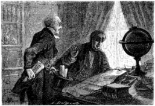

]{.calibre20}

CINQ SEMAINES EN BALLON

]{.calibre20}

## []{#_Toc349730898 .pcalibre .pcalibre4 .pcalibre3}[]{#_Toc349730551 .pcalibre .pcalibre4 .pcalibre3}[]{#_Toc349730172 .pcalibre .pcalibre4 .pcalibre3}[]{#_Toc349729623 .pcalibre .pcalibre4 .pcalibre3}[]{#_Toc349729244 .pcalibre .pcalibre4 .pcalibre3}[]{#_Toc349728695 .pcalibre .pcalibre4 .pcalibre3}[]{#_Toc349728316 .pcalibre .pcalibre4 .pcalibre3}[]{#_Toc349727729 .pcalibre .pcalibre4 .pcalibre3}[]{#_Toc349727180 .pcalibre .pcalibre4 .pcalibre3}[]{#_Toc349726801 .pcalibre .pcalibre4 .pcalibre3}[]{#_Toc349726252 .pcalibre .pcalibre4 .pcalibre3}[]{#_Toc349725905 .pcalibre .pcalibre4 .pcalibre3}[]{#_Toc349725558 .pcalibre .pcalibre4 .pcalibre3}[]{#_Toc349725211 .pcalibre .pcalibre4 .pcalibre3}[]{#_Toc349724864 .pcalibre .pcalibre4 .pcalibre3}[Chapitre 2]{#_Toc349724485 .pcalibre .pcalibre4 .pcalibre3} {#calibre_toc_232 .calibre21}

UN ARTICLE DU « DAILY TELEGRAPH ». --- GUERRE DE JOURNAUX SAVANTS. --- M. PETERMANN SOUTIENT SON AMI LE DOCTEUR FERGUSSON. --- RÉPONSE DU SAVANT KONER. --- PARIS ENGAGÉS. --- DIVERSES PROPOSITIONS FAITES AU DOCTEUR.

Le lendemain, dans son numéro du 15 janvier, le *Daily Telegraph* publiait un article ainsi conçu :

« L\'Afrique va livrer enfin le secret de ses vastes solitudes ; un Œdipe moderne nous donnera le mot de cette énigme que les savants de soixante siècles n\'ont pu déchiffrer. Autrefois, rechercher les sources du Nil, *fontes Nili quaerere*, était regardé comme une tentative insensée, une irréalisable chimère.

« Le docteur Barth, en suivant jusqu\'au Soudan la route tracée par Denham et Clapperton ; le docteur Livingstone, en multipliant ses intrépides investigations depuis le cap de Bonne-Espérance jusqu\'au bassin du Zambezi ; les capitaines Burton et Speke, par la découverte des Grands Lacs intérieurs, ont ouvert trois chemins à la civilisation moderne ; leur point d\'intersection, où nul voyageur n\'a encore pu parvenir, est le cœur même de l\'Afrique. C\'est là que doivent tendre tous les efforts.

« Or, les travaux de ces hardis pionniers de la science vont être renoués par l\'audacieuse tentative du docteur Samuel Fergusson, dont nos lecteurs ont souvent apprécié les belles explorations.

« Cet intrépide découvreur *(discoverer)* se propose de traverser en ballon toute l\'Afrique de l\'est à l\'ouest. Si nous sommes bien informés, le point de départ de ce surprenant voyage serait l\'île de Zanzibar sur la côte orientale. Quant au point d\'arrivée, à la Providence seule il est réservé de le connaître.

« La proposition de cette exploration scientifique a été faite hier officiellement à la Société royale de géographie ; une somme de deux mille cinq cents livres est votée pour subvenir aux frais de l\'entreprise.

« Nous tiendrons nos lecteurs au courant de cette tentative, qui est sans précédents dans les fastes géographiques. »

Comme on le pense, cet article eut un énorme retentissement ; il souleva d\'abord les tempêtes de l\'incrédulité ; le docteur Fergusson passa pour un être purement chimérique, de l\'invention de M. Barnum, qui, après avoir travaillé aux États-Unis, s\'apprêtait à « faire » les Îles Britanniques.

Une réponse plaisante parut à Genève dans le numéro de février des *Bulletins de la Société géographique* ; elle raillait spirituellement la Société royale de Londres, le Traveller\'s club et l\'esturgeon phénoménal.

Mais M. Petermann, dans ses *Mittheilungen*, publiés à Gotha, réduisit au silence le plus absolu le journal de Genève, M. Petermann connaissait personnellement le docteur Fergusson, et se rendait garant de l\'intrépidité de son audacieux ami.

Bientôt d\'ailleurs le doute ne fut plus possible ; les préparatifs du voyage se faisaient à Londres ; les fabriques de Lyon avaient reçu une commande importante de taffetas pour la construction de l\'aérostat ; enfin le gouvernement britannique mettait à la disposition du docteur le transport *Le Resolute*, capitaine Pennet.

Aussitôt mille encouragements se firent jour, mille félicitations éclatèrent. Les détails de l\'entreprise parurent tout au long dans les Bulletins de la Société géographique de Paris ; un article remarquable fut imprimé dans les *Nouvelles Annales des voyages, de la géographie, de l\'histoire et de l\'archéologie* de M. V.-A. Malte-Brun ; un travail minutieux publié dans *Zeitschrift für Allgemeine Erdkunde*, par le docteur W. Koner, démontra victorieusement la possibilité du voyage, ses chances de succès, la nature des obstacles, les immenses avantages du mode de locomotion par la voie aérienne ; il blâma seulement le point de départ ; il indiquait plutôt Masuah, petit port de l\'Abyssinie, d\'où James Bruce, en 1768, s\'était élancé à la recherche des sources du Nil. D\'ailleurs il admirait sans réserve cet esprit énergique du docteur Fergusson, et ce cœur couvert d\'un triple airain qui concevait et tentait un pareil voyage.

Le *North American Review* ne vit pas sans déplaisir une telle gloire réservée à l\'Angleterre ; il tourna la proposition du docteur en plaisanterie, et l\'engagea à pousser jusqu\'en Amérique, pendant qu\'il serait en si bon chemin.

Bref, sans compter les journaux du monde entier, il n\'y eut pas de recueil scientifique, depuis le *Journal des Missions évangéliques* jusqu\'à la *Revue algérienne et coloniale*, depuis les *Annales de la Propagation de la foi* jusqu\'au *Church Missionnary Intelligencer*, qui ne relatât le fait sous toutes ses formes.

Des paris considérables s\'établirent à Londres et dans l\'Angleterre, 1° sur l\'existence réelle ou supposée du docteur Fergusson ; 2° sur le voyage lui-même, qui ne serait pas tenté suivant les uns, qui serait entrepris suivant les autres ; 3° sur la question de savoir s\'il réussirait ou s\'il ne réussirait pas ; 4° sur les probabilités ou les improbabilités du retour du docteur Fergusson. On engagea des sommes énormes au livre des paris, comme s\'il se fût agi des courses d\'Epsom.

Ainsi donc, croyants, incrédules, ignorants et savants, tous eurent les yeux fixés sur le docteur ; il devint le lion du jour sans se douter qu\'il portât une crinière. Il donna volontiers des renseignements précis sur son expédition. Il fut aisément abordable et l\'homme le plus naturel du monde. Plus d\'un aventurier hardi se présenta, qui voulait partager la gloire et les dangers de sa tentative ; mais il refusa sans donner de raisons de son refus.

{#Image465 .calibre30}

De nombreux inventeurs de mécanismes applicables à la direction des ballons vinrent lui proposer leur système. Il n\'en voulut accepter aucun. À qui lui demanda s\'il avait découvert quelque chose à cet égard, il refusa constamment de s\'expliquer, et s\'occupa plus activement que jamais des préparatifs de son voyage.
