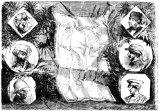

]{.calibre20}

CINQ SEMAINES EN BALLON

]{.calibre20}

## []{#_Toc349730900 .pcalibre .pcalibre4 .pcalibre3}[]{#_Toc349730553 .pcalibre .pcalibre4 .pcalibre3}[]{#_Toc349730174 .pcalibre .pcalibre4 .pcalibre3}[]{#_Toc349729625 .pcalibre .pcalibre4 .pcalibre3}[]{#_Toc349729246 .pcalibre .pcalibre4 .pcalibre3}[]{#_Toc349728697 .pcalibre .pcalibre4 .pcalibre3}[]{#_Toc349728318 .pcalibre .pcalibre4 .pcalibre3}[]{#_Toc349727731 .pcalibre .pcalibre4 .pcalibre3}[]{#_Toc349727182 .pcalibre .pcalibre4 .pcalibre3}[]{#_Toc349726803 .pcalibre .pcalibre4 .pcalibre3}[]{#_Toc349726254 .pcalibre .pcalibre4 .pcalibre3}[]{#_Toc349725907 .pcalibre .pcalibre4 .pcalibre3}[]{#_Toc349725560 .pcalibre .pcalibre4 .pcalibre3}[]{#_Toc349725213 .pcalibre .pcalibre4 .pcalibre3}[]{#_Toc349724866 .pcalibre .pcalibre4 .pcalibre3}[Chapitre 4]{#_Toc349724487 .pcalibre .pcalibre4 .pcalibre3} {#calibre_toc_234 .calibre21}

EXPLORATIONS AFRICAINES. --- BARTH, RICHARDSON, OVERWEG, WERNE, BRUN-ROLLET, PENEY, ANDREA DEBONO, MIANI, GUILLAUME LEJEAN, BRUCE, KRAPF ET REBMANN, MAIZAN, ROSCHER, BURTON ET SPEKE.

La ligne aérienne que le docteur Fergusson comptait suivre n\'avait pas été choisie au hasard ; son point de départ fut sérieusement étudié, et ce ne fut pas sans raison qu\'il résolut de s\'élever de l\'île de Zanzibar. Cette île, située près de la côte orientale d\'Afrique, se trouve par 6° de latitude australe, c\'est-à-dire à quatre cent trente milles géographiques au-dessous de l\'équateur[[\[7\]]{.MsoFootnoteReference}](../Text/Section0004.xhtml#_ftn7){#_ftnref7 .pcalibre4 .pcalibre3}.

De cette île venait de partir la dernière expédition envoyée par les Grands Lacs à la découverte des sources du Nil.

Mais il est bon d\'indiquer quelles explorations le docteur Fergusson espérait rattacher entre elles. Il y en a deux principales : celle du docteur Barth en 1849, celle des lieutenants Burton et Speke en 1858.

{#Image468 .calibre33}

Le docteur Barth est un Hambourgeois qui obtint pour son compatriote Overweg et pour lui la permission de se joindre à l\'expédition de l\'Anglais Richardson ; celui-ci était chargé d\'une mission dans le Soudan.

Ce vaste pays est situé entre 15° et 10° de latitude nord, c\'est-à-dire que, pour y parvenir, il faut s\'avancer de plus de quinze cent milles[[\[8\]]{.MsoFootnoteReference}](../Text/Section0004.xhtml#_ftn8){#_ftnref8 .pcalibre4 .pcalibre3} dans l\'intérieur de l\'Afrique.

Jusque-là, cette contrée n\'était connue que par le voyage de Denham, de Clapperton et d\'Oudney, de 1822 à 1824. Richardson, Barth et Overweg, jaloux de pousser plus loin leurs investigations, arrivent à Tunis et à Tripoli, comme leurs devanciers, et parviennent à Mourzouk, capitale du Fezzan.

Ils abandonnent alors la ligne perpendiculaire et font un crochet dans l\'ouest vers Ghât, guidés, non sans difficultés, par les Touareg. Après mille scènes de pillage, de vexations, d\'attaques à main armée, leur caravane arrive en octobre dans la vaste oasis de l\'Asben. Le docteur Barth se détache de ses compagnons, fait une excursion à la ville d\'Aghadès, et rejoint l\'expédition, qui se remet en marche le 12 décembre. Elle arrive dans la province du Damerghou ; là, les trois voyageurs se séparent, et Barth prend la route de Kano, où il parvient à force de patience et en payant des tributs considérables.

Malgré une fièvre intense, il quitte cette ville le 7 mars, suivi d\'un seul domestique. Le principal but de son voyage est de reconnaître le lac Tchad, dont il est encore séparé par trois cent cinquante milles. Il s\'avance donc vers l\'est et atteint la ville de Zouricolo, dans le Bornou, qui est le noyau du grand empire central de l\'Afrique. Là il apprend la mort de Richardson, tué par la fatigue et les privations. Il arrive à Kouka, capitale du Bornou, sur les bords du lac. Enfin, au bout de trois semaines, le 14 avril, douze mois et demi après avoir quitté Tripoli, il atteint la ville de Ngornou.

Nous le retrouvons partant le 29 mars 1851, avec Overweg, pour visiter le royaume d\'Adamaoua, au sud du lac ; il parvient jusqu\'à la ville d\'Yola, un peu au-dessous du 9^e^ degré de latitude nord. C\'est la limite extrême atteinte au sud par ce hardi voyageur.

Il revient au mois d\'août à Kouka, de là parcourt successivement le Mandara, le Barghimi, le Kanem, et atteint comme limite extrême dans l\'est la ville de Masena, située par 17° 20\' de longitude ouest[[\[9\]]{.MsoFootnoteReference}](../Text/Section0004.xhtml#_ftn9){#_ftnref9 .pcalibre4 .pcalibre3}.

Le 25 novembre 1852, après la mort d\'Overweg, son dernier compagnon, il s\'enfonce dans l\'ouest, visite Sockoto, traverse le Niger, et arrive enfin à Tombouctou, où il doit languir huit longs mois, au milieu des vexations du cheik, des mauvais traitements et de la misère. Mais la présence d\'un chrétien dans la ville ne peut être plus longtemps tolérée ; les Foullannes menacent de l\'assiéger. Le docteur la quitte donc le 17 mars 1854, se réfugie sur la frontière, où il demeure trente-trois jours dans le dénuement le plus complet, revient à Kano en novembre, rentre à Kouka, d\'où il reprend la route de Denham, après quatre mois d\'attente ; il revoit Tripoli vers la fin d\'août 1855, et rentre à Londres le 6 septembre, seul de ses compagnons.

Voilà ce que fut ce hardi voyage de Barth.

Le docteur Fergusson nota soigneusement qu\'il s\'était arrêté à 4° de latitude nord et à 17° de longitude ouest.

Voyons maintenant ce que firent les lieutenants Burton et Speke dans l\'Afrique orientale.

Les diverses expéditions qui remontèrent le Nil ne purent jamais parvenir aux sources mystérieuses de ce fleuve. D\'après la relation du médecin allemand Ferdinand Werne, l\'expédition tentée en 1840, sous les auspices de Mehemet-Ali, s\'arrêta à Gondokoro, entre les 4^e^ et 5^e^ parallèles nord.

En 1855, Brun-Rollet, un Savoisien, nommé consul de Sardaigne dans le Soudan oriental, en remplacement de Vaudey, mort à la peine, partit de Karthoum, et sous le nom de marchand Yacoub, trafiquant de gomme et d\'ivoire, il parvint à Belenia, au-delà du 4^e^ degré, et retourna malade à Karthoum, où il mourut en 1857.

Ni le docteur Peney, chef du service médical égyptien, qui sur un petit steamer atteignit un degré au-dessous de Gondokoro, et revint mourir d\'épuisement à Karthoum --- ni le Vénitien Miani, qui, contournant les cataractes situées au-dessous de Gondokoro, atteignit le 2^e^ parallèle ---, ni le négociant maltais Andrea Debono, qui poussa plus loin encore son excursion sur le Nil --- ne purent franchir l\'infranchissable limite.

En 1859, M. Guillaume Lejean, chargé d\'une mission par le gouvernement français, se rendit à Karthoum par la mer Rouge, s\'embarqua sur le Nil avec vingt et un hommes d\'équipage et vingt soldats ; mais il ne put dépasser Gondokoro, et courut les plus grands dangers au milieu des Nègres en pleine révolte. L\'expédition dirigée par M. d\'Escayrac de Lauture tenta également d\'arriver aux fameuses sources.

Mais ce terme fatal arrêta toujours les voyageurs ; les envoyés de Néron avaient atteint autrefois le 9^e^ degré de latitude ; on ne gagna donc en dix-huit siècles que 5 ou 6 degrés, soit de trois cents à trois cent soixante milles géographiques.

Plusieurs voyageurs tentèrent de parvenir aux sources du Nil, en prenant un point de départ sur la côte orientale de l\'Afrique.

De 1768 à 1772, l\'Écossais Bruce partit de Masuah, port de l\'Abyssinie, parcourut le Tigré, visita les ruines d\'Axum, vit les sources du Nil où elles n\'étaient pas, et n\'obtint aucun résultat sérieux.

En 1844, le docteur Krapf, missionnaire anglican, fondait un établissement à Monbaz sur la côte de Zanguebar, et découvrait, en compagnie du révérend Rebmann, deux montagnes à trois cents milles de la côte ; ce sont les monts Kilimandjaro et Kenia, que MM. de Heuglin et Thornton viennent de gravir en partie.

En 1845, le Français Maizan débarquait seul à Bagamayo, en face de Zanzibar, et parvenait à Deje-la-Mhora, où le chef le faisait périr dans de cruels supplices.

En 1859, au mois d\'août, le jeune voyageur Roscher, de Hambourg, parti avec une caravane de marchands arabes, atteignait le lac Nyassa, où il fut assassiné pendant son sommeil.

Enfin, en 1857, les lieutenants Burton et Speke, tous deux officiers à l\'armée du Bengale, furent envoyés par la Société de Géographie de Londres pour explorer les Grands Lacs africains ; le 17 juin ils quittèrent Zanzibar et s\'enfoncèrent directement dans l\'ouest.

Après quatre mois de souffrances inouïes, leurs bagages pillés, leurs porteurs assommés, ils arrivèrent à Kazeh, centre de réunion des trafiquants et des caravanes ; ils étaient en pleine terre de la Lune ; là ils recueillirent des documents précieux sur les mœurs, le gouvernement, la religion, la faune et la flore du pays ; puis ils se dirigèrent vers le premier des Grands Lacs, le Tanganayika, situé entre 3° et 8° de latitude australe ; ils y parvinrent le 14 février 1858, et visitèrent les diverses peuplades des rives, pour la plupart cannibales.

Ils repartirent le 26 mai, et rentrèrent à Kazeh le 20 juin. Là, Burton épuisé resta plusieurs mois malade ; pendant ce temps, Speke fit au nord une pointe de plus de trois cents milles, jusqu\'au lac Oukéréoué, qu\'il aperçut le 3 août ; mais il n\'en put voir que l\'ouverture par 2° 30\' de latitude.

Il était de retour à Kazeh le 25 août, et reprenait avec Burton le chemin de Zanzibar, qu\'ils revirent au mois de mars l\'année suivante. Ces deux hardis explorateurs revinrent alors en Angleterre, et la Société de Géographie de Paris leur décerna son prix annuel.

Le docteur Fergusson remarqua avec soin qu\'ils n\'avaient franchi ni le 2^e^ degré de latitude australe, ni le 29^e^ degré de longitude est.

Il s\'agissait donc de réunir les explorations de Burton et Speke à celles du docteur Barth ; c\'était s\'engager à franchir une étendue de pays de plus de douze degrés.
