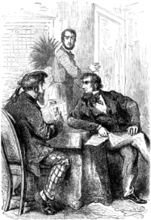

]{.calibre20}

CINQ SEMAINES EN BALLON

]{.calibre20}

## []{#_Toc349730901 .pcalibre .pcalibre4 .pcalibre3}[]{#_Toc349730554 .pcalibre .pcalibre4 .pcalibre3}[]{#_Toc349730175 .pcalibre .pcalibre4 .pcalibre3}[]{#_Toc349729626 .pcalibre .pcalibre4 .pcalibre3}[]{#_Toc349729247 .pcalibre .pcalibre4 .pcalibre3}[]{#_Toc349728698 .pcalibre .pcalibre4 .pcalibre3}[]{#_Toc349728319 .pcalibre .pcalibre4 .pcalibre3}[]{#_Toc349727732 .pcalibre .pcalibre4 .pcalibre3}[]{#_Toc349727183 .pcalibre .pcalibre4 .pcalibre3}[]{#_Toc349726804 .pcalibre .pcalibre4 .pcalibre3}[]{#_Toc349726255 .pcalibre .pcalibre4 .pcalibre3}[]{#_Toc349725908 .pcalibre .pcalibre4 .pcalibre3}[]{#_Toc349725561 .pcalibre .pcalibre4 .pcalibre3}[]{#_Toc349725214 .pcalibre .pcalibre4 .pcalibre3}[]{#_Toc349724867 .pcalibre .pcalibre4 .pcalibre3}[Chapitre 5]{#_Toc349724488 .pcalibre .pcalibre4 .pcalibre3} {#calibre_toc_235 .calibre21}

RÊVES DE KENNEDY. --- ARTICLES ET PRONOMS AU PLURIEL. --- INSINUATIONS DE DICK. --- PROMENADE SUR LA CARTE D\'AFRIQUE. --- CE QUI RESTE ENTRE LES DEUX POINTES DU COMPAS. --- EXPÉDITIONS ACTUELLES. --- SPEKE ET GRANT. --- KRAPF, DE DECKEN, DE HEUGLIN.

Le docteur Fergusson pressait activement les préparatifs de son départ ; il dirigeait lui-même la construction de son aérostat, suivant certaines modifications sur lesquelles il gardait un silence absolu.

Depuis longtemps déjà, il s\'était appliqué à l\'étude de la langue arabe et de divers idiomes mandingues ; grâce à ses dispositions de polyglotte, il fit de rapides progrès.

En attendant, son ami le chasseur ne le quittait pas d\'une semelle ; il craignait sans doute que le docteur ne prît son vol sans rien dire ; il lui tenait encore à ce sujet les discours les plus persuasifs, qui ne persuadaient pas Samuel Fergusson, et s\'échappait en supplications pathétiques, dont celui-ci se montrait peu touché. Dick le sentait glisser entre ses doigts.

Le pauvre Écossais était réellement à plaindre ; il ne considérait plus la voûte azurée sans de sombres terreurs ; il éprouvait, en dormant, des balancements vertigineux, et chaque nuit il se sentait choir d\'incommensurables hauteurs.

Nous devons ajouter que, pendant ces terribles cauchemars, il tomba de son lit une fois ou deux. Son premier soin fut de montrer à Fergusson une forte contusion qu\'il se fit à la tête.

--- Et pourtant, ajouta-t-il avec bonhomie, trois pieds de hauteur ! pas plus ! et une bosse pareille ! Juge donc !

Cette insinuation, pleine de mélancolie, n\'émut pas le docteur.

--- Nous ne tomberons pas, fit-il.

--- Mais enfin, si nous tombons ?

--- Nous ne tomberons pas.

Ce fut net, et Kennedy n\'eut rien à répondre.

Ce qui exaspérait particulièrement Dick, c\'est que le docteur semblait faire une abnégation parfaite de sa personnalité, à lui Kennedy ; il le considérait comme irrévocablement destiné à devenir son compagnon aérien. Cela n\'était plus l\'objet d\'un doute. Samuel faisait un intolérable abus du pronom pluriel de la première personne.

« Nous » avançons\..., « nous » serons prêts le\..., « nous » partirons le\...

Et de l\'adjectif possessif au singulier :

« Notre » ballon\..., « notre » nacelle\..., « notre » exploration\...

Et du pluriel donc !

« Nos » préparatifs\..., « nos » découvertes\..., « nos » ascensions\...

Dick en frissonnait, quoique décidé à ne point partir ; mais il ne voulait pas trop contrarier son ami. Avouons même que, sans s\'en rendre bien compte, il avait fait venir tout doucement d\'Édimbourg quelques vêtements assortis et ses meilleurs fusils de chasse.

Un jour, après avoir reconnu qu\'avec un bonheur insolent, on pouvait avoir une chance sur mille de réussir, il feignit de se rendre aux désirs du docteur ; mais, pour reculer le voyage, il entama la série des échappatoires les plus variées. Il se rejeta sur l\'utilité de l\'expédition et sur son opportunité\... Cette découverte des sources du Nil était-elle vraiment nécessaire ?\... Aurait-on réellement travaillé pour le bonheur de l\'humanité ?\... Quand, au bout du compte, les peuplades de l\'Afrique seraient civilisées, en seraient-elles plus heureuses ?\... Était-on certain, d\'ailleurs, que la civilisation ne fût pas plutôt là qu\'en Europe ? --- Peut-être. --- Et d\'abord ne pouvait-on attendre encore ?\... La traversée de l\'Afrique serait certainement faite un jour, et d\'une façon moins hasardeuse\... Dans un mois, dans six mois, avant un an, quelque explorateur arriverait sans doute\...

Ces insinuations produisaient un effet tout contraire à leur but, et le docteur frémissait d\'impatience.

--- Veux-tu donc, malheureux Dick, veux-tu donc, faux ami, que cette gloire profite à un autre ? Faut-il donc mentir à mon passé ? reculer devant des obstacles qui ne sont pas sérieux ? reconnaître par de lâches hésitations ce qu\'ont fait pour moi, et le gouvernement anglais, et la Société Royale de Londres ?

--- Mais\..., reprit Kennedy, qui avait une grande habitude de cette conjonction.

--- Mais, fit le docteur, ne sais-tu pas que mon voyage doit concourir au succès des entreprises actuelles ? Ignores-tu que de nouveaux explorateurs s\'avancent vers le centre de l\'Afrique ?

--- Cependant\...

--- Écoute-moi bien, Dick, et jette les yeux sur cette carte.

Dick les jeta avec résignation.

--- Remonte le cours du Nil, dit Fergusson.

--- Je le remonte, répondit docilement l\'Écossais.

--- Arrive à Gondokoro.

--- J\'y suis.

Et Kennedy songeait combien était facile un pareil voyage\... sur la carte.

{#Image469 .calibre35}

--- Prends une des pointes de ce compas, reprit le docteur, et appuie-la sur cette ville que les plus hardis ont à peine dépassée.

--- J\'appuie.

--- Et maintenant cherche sur la côte l\'île de Zanzibar, par 6° de latitude sud.

--- Je la tiens.

--- Suis maintenant ce parallèle et arrive à Kazeh.

--- C\'est fait.

--- Remonte par le 33^e^ degré de longitude jusqu\'à l\'ouverture du lac Oukéréoué, à l\'endroit où s\'arrêta le lieutenant Speke.

--- M\'y voici ! Un peu plus, je tombais dans le lac.

--- Eh bien ! sais-tu ce qu\'on a le droit de supposer d\'après les renseignements donnés par les peuplades riveraines ?

--- Je ne m\'en doute pas.

--- C\'est que ce lac, dont l\'extrémité inférieure est par 2° 30\' de latitude, doit s\'étendre également de deux degrés et demi au-dessus de l\'équateur.

--- Vraiment !

--- Or, de cette extrémité septentrionale s\'échappe un cours d\'eau qui doit nécessairement rejoindre le Nil, si ce n\'est le Nil lui-même.

--- Voilà qui est curieux.

--- Or, appuie la seconde pointe de ton compas sur cette extrémité du lac Oukéréoué.

--- C\'est fait, ami Fergusson.

--- Combien comptes-tu de degrés entre les deux pointes ?

--- À peine deux.

--- Et sais-tu ce que cela fait, Dick ?

--- Pas le moins du monde.

--- Cela fait à peine cent vingt milles[[\[10\]]{.MsoFootnoteReference}](../Text/Section0004.xhtml#_ftn10){#_ftnref10 .pcalibre4 .pcalibre3}, c\'est-à-dire rien.

--- Presque rien, Samuel.

--- Or, sais-tu ce qui se passe en ce moment ?

--- Non, sur ma vie !

--- Eh bien ! le voici. La Société de Géographie a regardé comme très importante l\'exploration de ce lac entrevu par Speke. Sous ses auspices, le lieutenant, aujourd\'hui capitaine Speke, s\'est associé le capitaine Grant de l\'armée des Indes ; ils se sont mis à la tête d\'une expédition nombreuse et largement subventionnée ; ils ont mission de remonter le lac et de revenir jusqu\'à Gondokoro ; ils ont reçu un subside de plus de cinq mille livres, et le gouverneur du Cap a mis des soldats hottentots à leur disposition ; ils sont partis de Zanzibar à la fin d\'octobre 1860. Pendant ce temps, l\'Anglais John Petherick, consul de Sa Majesté à Karthoum, a reçu du Foreign-office sept cents livres environ ; il doit équiper un bateau à vapeur à Karthoum, le charger de provisions suffisantes, et se rendre à Gondokoro ; là il attendra la caravane du capitaine Speke et sera en mesure de la ravitailler.

--- Bien imaginé, dit Kennedy.

--- Tu vois bien que cela presse, si nous voulons participer à ces travaux d\'exploration. Et ce n\'est pas tout ; pendant que l\'on marche d\'un pas sûr à la découverte des sources du Nil, d\'autres voyageurs vont hardiment au cœur de l\'Afrique.

--- À pied, fit Kennedy.

--- À pied, répondit le docteur sans relever l\'insinuation. Le docteur Krapf se propose de pousser dans l\'ouest par le Djob, rivière située sous l\'équateur. Le baron de Decken a quitté Monbaz, a reconnu les montagnes de Kenia et de Kilimandjaro, et s\'enfonce vers le centre.

--- À pied toujours ?

--- Toujours à pied, ou à dos de mulet.

--- C\'est exactement la même chose pour moi, répliqua Kennedy.

--- Enfin, reprit le docteur, M. de Heuglin, vice-consul d\'Autriche à Karthoum, vient d\'organiser une expédition très importante, dont le premier but est de rechercher le voyageur Vogel, qui, en 1853, fut envoyé dans le Soudan pour s\'associer aux travaux du docteur Barth. En 1856, il quitta le Bornou, et résolut d\'explorer ce pays inconnu qui s\'étend entre le lac Tchad et le Darfour. Or, depuis ce temps, il n\'a pas reparu. Des lettres arrivées en juin 1860 à Alexandrie rapportent qu\'il fut assassiné par les ordres du roi du Wadaï ; mais d\'autres lettres, adressées par le docteur Hartmann au père du voyageur, disent, d\'après les récits d\'un fellatah du Bornou, que Vogel serait seulement retenu prisonnier à Wara ; tout espoir n\'est donc pas perdu. Un comité s\'est formé sous la présidence du duc régent de Saxe-Cobourg-Gotha ; mon ami Petermann en est le secrétaire ; une souscription nationale a fait les frais de l\'expédition, à laquelle se sont joints de nombreux savants ; M. de Heuglin est parti de Masuah dans le mois de juin, et en même temps qu\'il recherche les traces de Vogel, il doit explorer tout le pays compris entre le Nil et le Tchad, c\'est-à-dire relier les opérations du capitaine Speke à celles du docteur Barth. Et alors l\'Afrique aura été traversée de l\'est à l\'ouest[[\[11\]]{.MsoFootnoteReference}](../Text/Section0004.xhtml#_ftn11){#_ftnref11 .pcalibre4 .pcalibre3}.

--- Eh bien ! reprit l\'Écossais, puisque tout cela s\'emmanche si bien, qu\'allons-nous faire là-bas ?

Le docteur Fergusson ne répondit pas, et se contenta de hausser les épaules.
