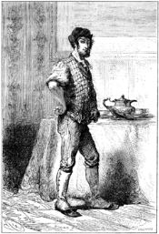
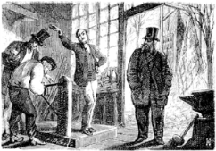

]{.calibre20}

CINQ SEMAINES EN BALLON

]{.calibre20}

## []{#_Toc349730902 .pcalibre .pcalibre4 .pcalibre3}[]{#_Toc349730555 .pcalibre .pcalibre4 .pcalibre3}[]{#_Toc349730176 .pcalibre .pcalibre4 .pcalibre3}[]{#_Toc349729627 .pcalibre .pcalibre4 .pcalibre3}[]{#_Toc349729248 .pcalibre .pcalibre4 .pcalibre3}[]{#_Toc349728699 .pcalibre .pcalibre4 .pcalibre3}[]{#_Toc349728320 .pcalibre .pcalibre4 .pcalibre3}[]{#_Toc349727733 .pcalibre .pcalibre4 .pcalibre3}[]{#_Toc349727184 .pcalibre .pcalibre4 .pcalibre3}[]{#_Toc349726805 .pcalibre .pcalibre4 .pcalibre3}[]{#_Toc349726256 .pcalibre .pcalibre4 .pcalibre3}[]{#_Toc349725909 .pcalibre .pcalibre4 .pcalibre3}[]{#_Toc349725562 .pcalibre .pcalibre4 .pcalibre3}[]{#_Toc349725215 .pcalibre .pcalibre4 .pcalibre3}[]{#_Toc349724868 .pcalibre .pcalibre4 .pcalibre3}[Chapitre 6]{#_Toc349724489 .pcalibre .pcalibre4 .pcalibre3} {#calibre_toc_236 .calibre21}

UN DOMESTIQUE IMPOSSIBLE. --- IL APERÇOIT LES SATELLITES DE JUPITER. --- DICK ET JOE AUX PRISES. --- LE DOUTE ET LA CROYANCE. --- LE PESAGE. --- JOE-WELLINGTON. --- IL REÇOIT UNE DEMI-COURONNE.

Le docteur Fergusson avait un domestique ; il répondait avec empressement au nom de Joe ; une excellente nature ; ayant voué à son maître une confiance absolue et un dévouement sans bornes ; devançant même ses ordres, toujours interprétés d\'une façon intelligente ; un Caleb pas grognon et d\'une éternelle bonne humeur ; on l\'eût fait exprès qu\'on n\'eût pas mieux réussi. Fergusson s\'en rapportait entièrement à lui pour les détails de son existence, et il avait raison. Rare et honnête Joe ! un domestique qui commande votre dîner, et dont le goût est le vôtre, qui fait votre malle et n\'oublie ni les bas ni les chemises, qui possède vos clefs et vos secrets, et n\'en abuse pas !

{#Image470 .calibre36}

Mais aussi quel homme était le docteur pour ce digne Joe ! avec quel respect et quelle confiance il accueillait ses décisions. Quand Fergusson avait parlé, fou qui eût voulu répondre. Tout ce qu\'il pensait était juste ; tout ce qu\'il disait, sensé ; tout ce qu\'il commandait, faisable ; tout ce qu\'il entreprenait, possible ; tout ce qu\'il achevait, admirable. Vous auriez coupé Joe en morceaux, ce qui vous eût répugné sans doute, qu\'il n\'aurait pas changé d\'avis à l\'égard de son maître.

Aussi, quand le docteur conçut ce projet de traverser l\'Afrique par les airs, ce fut pour Joe chose faite ; il n\'existait plus d\'obstacles ; dès l\'instant que le docteur Fergusson avait résolu de partir, il était arrivé --- avec son fidèle serviteur, car ce brave garçon, sans en avoir jamais parlé, savait bien qu\'il serait du voyage.

Il devait d\'ailleurs y rendre les plus grands services par son intelligence et sa merveilleuse agilité. S\'il eût fallu nommer un professeur de gymnastique pour les singes du Zoological Garden, qui sont bien dégourdis cependant, Joe aurait certainement obtenu cette place. Sauter, grimper, voler, exécuter mille tours impossibles, il s\'en faisait un jeu.

Si Fergusson était la tête et Kennedy le bras, Joe devait être la main. Il avait déjà accompagné son maître pendant plusieurs voyages, et possédait quelque teinture de science appropriée à sa façon ; mais il se distinguait surtout par une philosophie douce, un optimisme charmant ; il trouvait tout facile, logique, naturel, et par conséquent il ignorait le besoin de se plaindre ou de maugréer.

Entre autres qualités, il possédait une puissance et une étendue de vision étonnantes ; il partageait avec Moestlin, le professeur de Képler, la rare faculté de distinguer sans lunettes les satellites de Jupiter et de compter dans le groupe des Pléiades quatorze étoiles, dont les dernières sont de neuvième grandeur. Il ne s\'en montrait pas plus fier pour cela ; au contraire : il vous saluait de très loin, et, à l\'occasion, il savait joliment se servir de ses yeux.

Avec cette confiance que Joe témoignait au docteur, il ne faut donc pas s\'étonner des incessantes discussions qui s\'élevaient entre Kennedy et le digne serviteur, toute déférence gardée d\'ailleurs.

L\'un doutait, l\'autre croyait ; l\'un était la prudence clairvoyante, l\'autre la confiance aveugle ; le docteur se trouvait entre le doute et la croyance ! je dois dire qu\'il ne se préoccupait ni de l\'une ni de l\'autre.

--- Eh bien ! monsieur Kennedy ? disait Joe.

--- Eh bien ! mon garçon ?

--- Voilà le moment qui approche. Il paraît que nous nous embarquons pour la lune.

--- Tu veux dire la terre de la Lune, ce qui n\'est pas tout à fait aussi loin ; mais sois tranquille, c\'est aussi dangereux.

--- Dangereux ! avec un homme comme le docteur Fergusson !

--- Je ne voudrais pas t\'enlever tes illusions, mon cher Joe ; mais ce qu\'il entreprend là est tout bonnement le fait d\'un insensé : il ne partira pas.

--- Il ne partira pas ! Vous n\'avez donc pas vu son ballon à l\'atelier de MM. Mittchell, dans le Borough[[\[12\]]{.MsoFootnoteReference}](../Text/Section0004.xhtml#_ftn12){#_ftnref12 .pcalibre4 .pcalibre3}.

--- Je me garderais bien de l\'aller voir.

--- Vous perdez là un beau spectacle, monsieur ! Quelle belle chose ! quelle jolie coupe ! quelle charmante nacelle ! Comme nous serons à notre aise là-dedans !

--- Tu comptes donc sérieusement accompagner ton maître ?

--- Moi, répliqua Joe avec conviction, mais je l\'accompagnerai où il voudra ! Il ne manquerait plus que cela ! le laisser aller seul, quand nous avons couru le monde ensemble ! Et qui le soutiendrait donc quand il serait fatigué ? qui lui tendrait une main vigoureuse pour sauter un précipice ? qui le soignerait s\'il tombait malade ? Non, monsieur Dick, Joe sera toujours à son poste auprès du docteur, que dis-je, autour du docteur Fergusson.

--- Brave garçon !

--- D\'ailleurs, vous venez avec nous, reprit Joe.

--- Sans doute ! fit Kennedy ; c\'est-à-dire je vous accompagne pour empêcher jusqu\'au dernier moment Samuel de commettre une pareille folie ! Je le suivrai même jusqu\'à Zanzibar, afin que là encore la main d\'un ami l\'arrête dans son projet insensé.

--- Vous n\'arrêterez rien du tout, monsieur Kennedy, sauf votre respect. Mon maître n\'est point un cerveau brûlé ; il médite longuement ce qu\'il veut entreprendre, et quand sa résolution est prise, le diable serait bien qui l\'en ferait démordre.

--- C\'est ce que nous verrons !

--- Ne vous flattez pas de cet espoir. D\'ailleurs, l\'important est que vous veniez. Pour un chasseur comme vous, l\'Afrique est un pays merveilleux. Ainsi, de toute façon, vous ne regretterez point votre voyage.

--- Non, certes, je ne le regretterai pas, surtout si cet entêté se rend enfin à l\'évidence.

--- À propos, dit Joe, vous savez que c\'est aujourd\'hui le pesage.

--- Comment, le pesage ?

--- Sans doute, mon maître, vous et moi, nous allons tous trois nous peser.

--- Comme des jockeys !

--- Comme des jockeys. Seulement, rassurez-vous, on ne vous fera pas maigrir si vous êtes trop lourd. On vous prendra comme vous serez.

--- Je ne me laisserai certainement pas peser, dit l\'Écossais avec fermeté.

--- Mais, Monsieur, il paraît que c\'est nécessaire pour sa machine.

--- Eh bien ! sa machine s\'en passera.

--- Par exemple ! et si, faute de calculs exacts, nous n\'allions pas pouvoir monter !

--- Eh parbleu ! je ne demande que cela !

--- Voyons, monsieur Kennedy, mon maître va venir à l\'instant nous chercher.

--- Je n\'irai pas.

--- Vous ne voudrez pas lui faire cette peine.

--- Je la lui ferai.

--- Bon ! fit Joe en riant, vous parlez ainsi parce qu\'il n\'est pas là ; mais quand il vous dira face à face : « Dick (sauf votre respect), Dick, j\'ai besoin de connaître exactement ton poids », vous irez, je vous en réponds.

--- Je n\'irai pas.

En ce moment le docteur rentra dans son cabinet de travail où se tenait cette conversation ; il regarda Kennedy, qui ne se sentit pas trop à son aise.

--- Dick, dit le docteur, viens avec Joe ; j\'ai besoin de savoir ce que vous pesez tous les deux.

--- Mais\...

--- Tu pourras garder ton chapeau sur la tête. Viens.

Et Kennedy y alla.

Ils se rendirent tous les trois à l\'atelier de MM. Mittchell, où l\'une de ces balances dites romaines avait été préparée. Il fallait effectivement que le docteur connût le poids de ses compagnons pour établir l\'équilibre de son aérostat. Il fit donc monter Dick sur la plate-forme de la balance ; celui-ci, sans faire de résistance, disait à mi-voix :

--- C\'est bon ! c\'est bon ! cela n\'engage à rien.

--- Cent cinquante-trois livres, dit le docteur, en inscrivant ce nombre sur son carnet.

--- Suis-je trop lourd ?

--- Mais non, monsieur Kennedy, répliqua Joe ; d\'ailleurs, je suis léger, cela fera compensation.

Et ce disant, Joe prit avec enthousiasme la place du chasseur ; il faillit même renverser la balance dans son emportement ; il se posa dans l\'attitude du Wellington qui singe Achille à l\'entrée d\'Hyde-Park, et fut magnifique, même sans bouclier.

{#Image472 .calibre37}

--- Cent vingt livres, inscrivit le docteur.

--- Eh ! eh ! fit Joe avec un sourire de satisfaction. Pourquoi souriait-il ? Il n\'eût jamais pu le dire.

--- À mon tour, dit Fergusson, et il inscrivit cent trente-cinq livres pour son propre compte.

--- À nous trois, dit-il, nous ne pesons pas plus de quatre cents livres.

--- Mais, mon maître, reprit Joe, si cela était nécessaire pour votre expérience, je pourrais bien me faire maigrir d\'une vingtaine de livres en ne mangeant pas.

--- C\'est inutile mon garçon, répondit le docteur ; tu peux manger à ton aise, et voilà une demi-couronne pour te lester à ta fantaisie.
