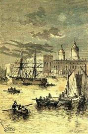
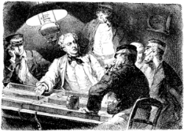

]{.calibre20}

CINQ SEMAINES EN BALLON

]{.calibre20}

## []{#_Toc349730904 .pcalibre .pcalibre4 .pcalibre3}[]{#_Toc349730557 .pcalibre .pcalibre4 .pcalibre3}[]{#_Toc349730178 .pcalibre .pcalibre4 .pcalibre3}[]{#_Toc349729629 .pcalibre .pcalibre4 .pcalibre3}[]{#_Toc349729250 .pcalibre .pcalibre4 .pcalibre3}[]{#_Toc349728701 .pcalibre .pcalibre4 .pcalibre3}[]{#_Toc349728322 .pcalibre .pcalibre4 .pcalibre3}[]{#_Toc349727735 .pcalibre .pcalibre4 .pcalibre3}[]{#_Toc349727186 .pcalibre .pcalibre4 .pcalibre3}[]{#_Toc349726807 .pcalibre .pcalibre4 .pcalibre3}[]{#_Toc349726258 .pcalibre .pcalibre4 .pcalibre3}[]{#_Toc349725911 .pcalibre .pcalibre4 .pcalibre3}[]{#_Toc349725564 .pcalibre .pcalibre4 .pcalibre3}[]{#_Toc349725217 .pcalibre .pcalibre4 .pcalibre3}[]{#_Toc349724870 .pcalibre .pcalibre4 .pcalibre3}[Chapitre 8]{#_Toc349724491 .pcalibre .pcalibre4 .pcalibre3} {#calibre_toc_238 .calibre21}

IMPORTANCE DE JOE. --- LE COMMANDANT DU « RESOLUTE ». --- L\'ARSENAL DE KENNEDY. --- AMÉNAGEMENTS. --- LE DÎNER D\'ADIEU. --- LE DÉPART DU 21 FÉVRIER. --- SÉANCES SCIENTIFIQUES DU DOCTEUR. --- DUVEYRIER, LIVINGSTONE. -- DÉTAILS DU VOYAGE AÉRIEN.--- KENNEDY RÉDUIT AU SILENCE.

Vers le 10 février, les préparatifs touchaient à leur fin, les aérostats renfermés l\'un dans l\'autre étaient entièrement terminés ; ils avaient subi une forte pression d\'air refoulé dans leurs flancs ; cette épreuve donnait bonne opinion de leur solidité, et témoignait des soins apportés à leur construction.

Joe ne se sentait pas de joie ; il allait incessamment de Greek street aux ateliers de MM. Mittchell, toujours affairé, mais toujours épanoui, donnant volontiers des détails sur l\'affaire aux gens qui ne lui en demandaient point, fier entre toutes choses d\'accompagner son maître. Je crois même qu\'à montrer l\'aérostat, à développer les idées et les plans du docteur, à laisser apercevoir celui-ci par une fenêtre entrouverte, ou à son passage dans les rues, le digne garçon gagna quelques demi-couronnes ; il ne faut pas lui en vouloir ; il avait bien le droit de spéculer un peu sur l\'admiration et la curiosité de ses contemporains.

Le 16 février, le *Resolute* vint jeter l\'ancre devant Greenwich. C\'était un navire à hélice du port de huit cents tonneaux, bon marcheur, et qui fut chargé de ravitailler la dernière expédition de Sir James Ross aux régions polaires. Le commandant Pennet passait pour un aimable homme, il s\'intéressait particulièrement au voyage du docteur, qu\'il appréciait de longue date. Ce Pennet faisait plutôt un savant qu\'un soldat, cela n\'empêchait pas son bâtiment de porter quatre caronades, qui n\'avaient jamais fait de mal à personne, et servaient seulement à produire les bruits les plus pacifiques du monde.

{#Image474 .calibre39}

La cale du *Resolute* fut aménagée de manière à loger l\'aérostat ; il y fut transporté avec les plus grandes précautions dans la journée du 18 février ; on l\'emmagasina au fond du navire, de manière à prévenir tout accident ; la nacelle et ses accessoires, les ancres, les cordes, les vivres, les caisses à eau que l\'on devait remplir à l\'arrivée, tout fut arrimé sous les yeux de Fergusson.

On embarqua dix tonneaux d\'acide sulfurique et dix tonneaux de vieille ferraille pour la production du gaz hydrogène. Cette quantité était plus que suffisante, mais il fallait parer aux pertes possibles. L\'appareil destiné à développer le gaz, et composé d\'une trentaine de barils, fut mis à fond de cale.

Ces divers préparatifs se terminèrent le 18 février au soir. Deux cabines confortablement disposées attendaient le docteur Fergusson et son ami Kennedy. Ce dernier, tout en jurant qu\'il ne partirait pas, se rendit à bord avec un véritable arsenal de chasse, deux excellents fusils à deux coups, se chargeant par la culasse, et une carabine à toute épreuve de la fabrique de Purdey Moore et Dickson d\'Édimbourg ; avec une pareille arme, le chasseur n\'était pas embarrassé de loger à deux mille pas de distance une balle dans l\'œil d\'un chamois ; il y joignit deux revolvers Colt à six coups pour les besoins imprévus ; sa poudrière, son sac à cartouches, son plomb et ses balles, en quantité suffisante, ne dépassaient pas les limites de poids assignées par le docteur.

Les trois voyageurs s\'installèrent à bord dans la journée du 19 février ; ils furent reçus avec une grande distinction par le capitaine et ses officiers, le docteur toujours assez froid, uniquement préoccupé de son expédition, Dick ému sans trop vouloir le paraître, Joe bondissant, éclatant en propos burlesques ; il devint promptement le loustic du poste des maîtres, où un cadre lui avait été réservé.

Le 20, un grand dîner d\'adieu fut donné au docteur Fergusson et à Kennedy par la Société Royale de Géographie. Le commandant Pennet et ses officiers assistaient à ce repas, qui fut très animé et très fourni en libations flatteuses ; les santés y furent portées en assez grand nombre pour assurer à tous les convives une existence de centenaires. Sir Francis M\... présidait avec une émotion contenue, mais pleine de dignité.

À sa grande confusion, Dick Kennedy eut une large part dans les félicitations bachiques. Après avoir bu « à l\'intrépide Fergusson, la gloire de l\'Angleterre », on dut boire « au non moins courageux Kennedy, son audacieux compagnon ».

Dick rougit beaucoup, ce qui passa pour de la modestie : les applaudissements redoublèrent. Dick rougit encore davantage.

Un message de la reine arriva au dessert ; elle présentait ses compliments aux deux voyageurs et faisait des vœux pour la réussite de l\'entreprise.

Ce qui nécessita de nouveaux toasts « à Sa Très Gracieuse Majesté ».

À minuit, après des adieux émouvants et de chaleureuses poignées de main, les convives se séparèrent.

Les embarcations du *Resolute* attendaient au pont de Westminster ; le commandant y prit place en compagnie de ses passagers et de ses officiers, et le courant rapide de la Tamise les porta vers Greenwich.

À une heure, chacun dormait à bord.

Le lendemain, 21 février, à trois heures du matin, les fourneaux ronflaient ; à cinq heures, on levait l\'ancre, et sous l\'impulsion de son hélice, le *Resolute* fila vers l\'embouchure de la Tamise.

Nous n\'avons pas besoin de dire que les conversations du bord roulèrent uniquement sur l\'expédition du docteur Fergusson. À le voir comme à l\'entendre, il inspirait une telle confiance que bientôt, sauf l\'Écossais, personne ne mit en question le succès de son entreprise.

Pendant les longues heures inoccupées du voyage, le docteur faisait un véritable cours de géographie dans le carré des officiers. Ces jeunes gens se passionnaient pour les découvertes faites depuis quarante ans en Afrique ; il leur raconta les explorations de Barth, de Burton, de Speke, de Grant, il leur dépeignit cette mystérieuse contrée livrée de toutes parts aux investigations de la science. Dans le nord, le jeune Duveyrier explorait le Sahara et ramenait à Paris les chefs Touareg. Sous l\'inspiration du gouvernement français, deux expéditions se préparaient, qui, descendant du nord et venant à l\'ouest, se croiseraient à Tombouctou. Au sud, l\'infatigable Livingstone s\'avançait toujours vers l\'équateur, et depuis mars 1862, il remontait, en compagnie de Mackensie, la rivière Rovoonia. Le XIXe siècle ne se passerait certainement pas sans que l\'Afrique n\'eût révélé les secrets enfouis dans son sein depuis six mille ans.

{#Image476 .calibre40}

L\'intérêt des auditeurs de Fergusson fut excité surtout quand il leur fit connaître en détail les préparatifs de son voyage ; ils voulurent vérifier ses calculs ; ils discutèrent, et le docteur entra franchement dans la discussion.

En général, on s\'étonnait de la quantité relativement restreinte de vivres qu\'il emportait avec lui. Un jour, l\'un des officiers interrogea le docteur à cet égard.

--- Cela vous surprend, répondit Fergusson.

--- Sans doute.

--- Mais quelle durée supposez-vous donc qu\'aura mon voyage ? Des mois entiers ? C\'est une grande erreur ; s\'il se prolongeait, nous serions perdus, nous n\'arriverions pas. Sachez donc qu\'il n\'y a pas plus de trois mille cinq cents, mettez quatre mille milles[[\[16\]]{.MsoFootnoteReference}](../Text/Section0004.xhtml#_ftn16){#_ftnref16 .pcalibre4 .pcalibre3} de Zanzibar à la côte du Sénégal. Or, à deux cent quarante milles[[\[17\]]{.MsoFootnoteReference}](../Text/Section0004.xhtml#_ftn17){#_ftnref17 .pcalibre4 .pcalibre3} par douze heures, ce qui n\'approche pas de la vitesse de nos chemins de fer, en voyageant jour et nuit, il suffirait de sept jours pour traverser l\'Afrique.

--- Mais alors vous ne pourriez rien voir, ni faire de relèvements géographiques, ni reconnaître le pays.

--- Aussi, répondit le docteur, si je suis maître de mon ballon, si je monte ou descends à ma volonté, je m\'arrêterai quand bon me semblera, surtout lorsque des courants trop violents menaceront de m\'entraîner.

--- Et vous en rencontrerez, dit le commandant Pennet ; il y a des ouragans qui font plus de deux cent quarante milles à l\'heure.

--- Vous le voyez, répliqua le docteur, avec une telle rapidité, on traverserait l\'Afrique en douze heures ; on se lèverait à Zanzibar pour aller se coucher à Saint-Louis.

--- Mais, reprit un officier, est-ce qu\'un ballon pourrait être entraîné par une vitesse pareille ?

--- Cela s\'est vu, répondit Fergusson.

--- Et le ballon a résisté ?

--- Parfaitement. C\'était à l\'époque du couronnement de Napoléon en 1804. L\'aéronaute Garnerin lança de Paris, à onze heures du soir, un ballon qui portait l\'inscription suivante tracée en lettres d\'or : « Paris, 25 frimaire an XIII, couronnement de l\'empereur Napoléon par S.S. Pie VII. » Le lendemain matin, à cinq heures, les habitants de Rome voyaient le même ballon planer au-dessus du Vatican, parcourir la campagne romaine, et aller s\'abattre dans le lac de Bracciano. Ainsi, messieurs, un ballon peut résister à de pareilles vitesses.

--- Un ballon, oui ; mais un homme, se hasarda à dire Kennedy.

--- Mais un homme aussi ! Car un ballon est toujours immobile par rapport à l\'air qui l\'environne ; ce n\'est pas lui qui marche, c\'est la masse de l\'air elle-même ; aussi, allumez une bougie dans votre nacelle, et la flamme ne vacillera pas. Un aéronaute montant le ballon de Garnerin n\'aurait aucunement souffert de cette vitesse. D\'ailleurs, je ne tiens pas à expérimenter une semblable rapidité, et si je puis m\'accrocher pendant la nuit à quelque arbre ou quelque accident de terrain, je ne m\'en ferai pas faute. Nous emportons d\'ailleurs pour deux mois de vivres, et rien n\'empêchera notre adroit chasseur de nous fournir du gibier en abondance quand nous prendrons terre.

--- Ah ! monsieur Kennedy ! vous allez faire là des coups de maître, dit un jeune midshipman en regardant l\'Écossais avec des yeux d\'envie.

--- Sans compter, reprit un autre, que votre plaisir sera doublé d\'une grande gloire.

--- Messieurs, répondit le chasseur\..., je suis fort sensible\... à vos compliments\... mais il ne m\'appartient pas de les recevoir\...

--- Hein ! fit-on de tous côtés, vous ne partirez pas ?

--- Je ne partirai pas.

--- Vous n\'accompagnerez pas le docteur Fergusson ?

--- Non seulement je ne l\'accompagnerai pas, mais je ne suis ici que pour l\'arrêter au dernier moment.

Tous les regards se dirigèrent vers le docteur.

--- Ne l\'écoutez pas, répondit-il avec son air calme. C\'est une chose qu\'il ne faut pas discuter avec lui ; au fond, il sait parfaitement qu\'il partira.

--- Par saint Patrick ! s\'écria Kennedy, j\'atteste\...

--- N\'atteste rien, ami Dick ; tu es jaugé, tu es pesé, toi, ta poudre, tes fusils et tes balles ; ainsi n\'en parlons plus.

Et de fait, depuis ce jour jusqu\'à l\'arrivée à Zanzibar, Dick n\'ouvrit plus la bouche ; il ne parla pas plus de cela que d\'autre chose. Il se tut.
