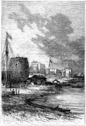
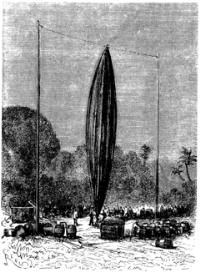
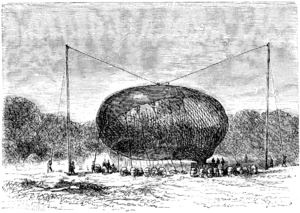
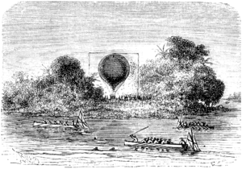
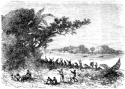
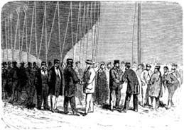

]{.calibre20}

CINQ SEMAINES EN BALLON

]{.calibre20}

## []{#_Toc349730907 .pcalibre .pcalibre4 .pcalibre3}[]{#_Toc349730560 .pcalibre .pcalibre4 .pcalibre3}[]{#_Toc349730181 .pcalibre .pcalibre4 .pcalibre3}[]{#_Toc349729632 .pcalibre .pcalibre4 .pcalibre3}[]{#_Toc349729253 .pcalibre .pcalibre4 .pcalibre3}[]{#_Toc349728704 .pcalibre .pcalibre4 .pcalibre3}[]{#_Toc349728325 .pcalibre .pcalibre4 .pcalibre3}[]{#_Toc349727738 .pcalibre .pcalibre4 .pcalibre3}[]{#_Toc349727189 .pcalibre .pcalibre4 .pcalibre3}[]{#_Toc349726810 .pcalibre .pcalibre4 .pcalibre3}[]{#_Toc349726261 .pcalibre .pcalibre4 .pcalibre3}[]{#_Toc349725914 .pcalibre .pcalibre4 .pcalibre3}[]{#_Toc349725567 .pcalibre .pcalibre4 .pcalibre3}[]{#_Toc349725220 .pcalibre .pcalibre4 .pcalibre3}[]{#_Toc349724873 .pcalibre .pcalibre4 .pcalibre3}[Chapitre 11]{#_Toc349724494 .pcalibre .pcalibre4 .pcalibre3} {#calibre_toc_241 .calibre21}

ARRIVÉE À ZANZIBAR. --- LE CONSUL ANGLAIS. --- MAUVAISES DISPOSITIONS DES HABITANTS. --- L\'ÎLE KOUMBENI. --- LES FAISEURS DE PLUIE. --- GONFLEMENT DU BALLON. --- DÉPART DU 18 AVRIL. --- DERNIER ADIEU. --- LE « VICTORIA ».

Un vent constamment favorable avait hâté la marche du *Resolute* vers le lieu de sa destination. La navigation du canal de Mozambique fut particulièrement paisible. La traversée maritime faisait bien augurer de la traversée aérienne. Chacun aspirait au moment de l\'arrivée, et voulait mettre la dernière main aux préparatifs du docteur Fergusson.

Enfin le bâtiment vint en vue de la ville de Zanzibar, située sur l\'île du même nom, et le 15 avril, à onze heures du matin, il laissa tomber l\'ancre dans le port.

L\'île de Zanzibar appartient à l\'iman de Mascate, allié de la France et de l\'Angleterre, et c\'est à coup sûr sa plus belle colonie. Le port reçoit un grand nombre de navires des contrées avoisinantes.

L\'île n\'est séparée de la côte africaine que par un canal dont la plus grande largeur n\'excède pas trente milles[[\[27\]]{.MsoFootnoteReference}](../Text/Section0004.xhtml#_ftn27){#_ftnref27 .pcalibre4 .pcalibre3}.

Elle fait un grand commerce de gomme, d\'ivoire, et surtout d\'ébène, car Zanzibar est le grand marché d\'esclaves. Là vient se concentrer tout ce butin conquis dans les batailles que les chefs de l\'intérieur se livrent incessamment. Ce trafic s\'étend aussi sur toute la côte orientale, et jusque sous les latitudes du Nil, et M. G. Lejean y a vu faire ouvertement la traite sous pavillon français.

Dès l\'arrivée du *Resolute*, le consul anglais de Zanzibar vint à bord se mettre à la disposition du docteur, des projets duquel, depuis un mois, les journaux d\'Europe l\'avaient tenu au courant. Mais jusque-là il faisait partie de la nombreuse phalange des incrédules.

--- Je doutais, dit-il en tendant la main à Samuel Fergusson, mais maintenant je ne doute plus.

Il offrit sa propre maison au docteur, à Dick Kennedy, et naturellement au brave Joe.

Par ses soins, le docteur prit connaissance de diverses lettres qu\'il avait reçues du capitaine Speke. Le capitaine et ses compagnons avaient eu à souffrir terriblement de la faim et du mauvais temps avant d\'atteindre le pays d\'Ugogo ; ils ne s\'avançaient qu\'avec une extrême difficulté et ne pensaient plus pouvoir donner promptement de leurs nouvelles.

--- Voilà des périls et des privations que nous saurons éviter, dit le docteur.

{#Image478 .calibre42}

Les bagages des trois voyageurs furent transportés à la maison du consul. On se disposait à débarquer le ballon sur la plage de Zanzibar ; il y avait près du mât des signaux un emplacement favorable, auprès d\'une énorme construction qui l\'eût abrité des vents d\'est. Cette grosse tour, semblable à un tonneau dressé sur sa base, et près duquel la tonne d\'Heidelberg n\'eût été qu\'un simple baril, servait de fort, et sur sa plate-forme veillaient des Beloutchis armés de lances, sorte de garnisaires fainéants et braillards.

Mais, lors du débarquement de l\'aérostat, le consul fut averti que la population de l\'île s\'y opposerait par la force. Rien de plus aveugle que les passions fanatisées. La nouvelle de l\'arrivée d\'un chrétien qui devait s\'enlever dans les airs fut reçue avec irritation ; les Nègres, plus émus que les Arabes, virent dans ce projet des intentions hostiles à leur religion ; ils se figuraient qu\'on en voulait au soleil et à la lune. Or, ces deux autres sont un objet de vénération pour les peuplades africaines. On résolut donc de s\'opposer à cette expédition sacrilège.

Le consul, instruit de ces dispositions, on conféra avec le docteur Fergusson et le commandant Pennet. Celui-ci ne voulait pas reculer devant des menaces ; mais son ami lui fit entendre raison à ce sujet.

--- Nous finirons certainement par l\'emporter, lui dit-il ; les garnisaires mêmes de l\'iman nous prêteraient main-forte au besoin ; mais, mon cher commandant, un accident est vite arrivé ; il suffirait d\'un mauvais coup pour causer au ballon un accident irréparable, et le voyage serait compromis sans remise ; il faut donc agir avec de grandes précautions.

--- Mais que faire ? Si nous débarquons sur la côte d\'Afrique, nous rencontrerons les mêmes difficultés ! Que faire ?

--- Rien n\'est plus simple, répondit le consul. Voyez ces îles situées au-delà du port ; débarquez votre aérostat dans l\'une d\'elles, entourez-vous d\'une ceinture de matelots, et vous n\'aurez aucun risque à courir.

--- Parfait, dit le docteur, et nous serons à notre aise pour achever nos préparatifs.

Le commandant se rendit à ce conseil. Le *Resolute* s\'approcha de l\'île de Koumbeni. Pendant la matinée du 16 avril, le ballon fut mis en sûreté au milieu d\'une clairière, entre les grands bois dont le sol est hérissé.

On dressa deux mâts hauts de quatre-vingts pieds et placés à une pareille distance l\'un de l\'autre ; un jeu de poulies fixées à leur extrémité permit d\'enlever l\'aérostat au moyen d\'un câble transversal ; il était alors entièrement dégonflé. Le ballon intérieur se trouvait rattaché au sommet du ballon extérieur de manière à être soulevé comme lui.

{#Image479 .calibre43}

C\'est à l\'appendice inférieur de chaque ballon que furent fixés les deux tuyaux d\'introduction de l\'hydrogène.

La journée du 17 se passa à disposer l\'appareil destiné à produire le gaz ; il se composait de trente tonneaux, dans lesquels la décomposition de l\'eau se faisait au moyen de ferraille et d\'acide sulfurique mis en présence dans une grande quantité d\'eau. L\'hydrogène se rendait dans une vaste tonne centrale après avoir été lavé à son passage, et de là il passait dans chaque aérostat par les tuyaux d\'introduction. De cette façon, chacun d\'eux se remplissait d\'une quantité de gaz parfaitement déterminée.

Il fallut employer, pour cette opération, dix-huit cent soixante-dix gallons[[\[28\]]{.MsoFootnoteReference}](../Text/Section0004.xhtml#_ftn28){#_ftnref28 .pcalibre4 .pcalibre3} d\'acide sulfurique, seize mille cinquante livres de fer[[\[29\]]{.MsoFootnoteReference}](../Text/Section0004.xhtml#_ftn29){#_ftnref29 .pcalibre4 .pcalibre3} et neuf cent soixante-six gallons d\'eau[[\[30\]]{.MsoFootnoteReference}](../Text/Section0004.xhtml#_ftn30){#_ftnref30 .pcalibre4 .pcalibre3}.

Cette opération commença dans la nuit suivante, vers trois heures du matin ; elle dura près de huit heures. Le lendemain, l\'aérostat, recouvert de son filet, se balançait gracieusement au-dessus de la nacelle, retenu par un grand nombre de sacs de terre. L\'appareil de dilatation fut monté avec un grand soin, et les tuyaux sortant de l\'aérostat furent adaptés à la boîte cylindrique.

{#Image34 .calibre44}

Les ancres, les cordes, les instruments, les couvertures de voyage, la tente, les vivres, les armes, durent prendre dans la nacelle la place qui leur était assignée ; la provision d\'eau fut faite à Zanzibar. Les deux cents livres de lest furent réparties dans cinquante sacs placés au fond de la nacelle, mais cependant à portée de la main.

Ces préparatifs se terminaient vers cinq heures du soir ; des sentinelles veillaient sans cesse autour de l\'île, et les embarcations du *Resolute* sillonnaient le canal.

{#Image41 .calibre45}

Les Nègres continuaient à manifester leur colère par des cris, des grimaces et des contorsions. Les sorciers parcouraient les groupes irrités, en soufflant sur toute cette irritation ; quelques fanatiques essayèrent de gagner l\'île à la nage, mais on les éloigna facilement.

Alors les sortilèges et les incantations commencèrent ; les faiseurs de pluie, qui prétendent commander aux nuages, appelèrent les ouragans et les « averses de pierre[[\[31\]]{.MsoFootnoteReference}](../Text/Section0004.xhtml#_ftn31){#_ftnref31 .pcalibre4 .pcalibre3} » à leur secours ; pour cela, ils cueillirent des feuilles de tous les arbres différents du pays ; ils les firent bouillir à petit feu, pendant que l\'on tuait un mouton en lui enfonçant une longue aiguille dans le cœur. Mais, en dépit de leurs cérémonies, le ciel demeura pur, et ils en furent pour leur mouton et leurs grimaces.

{#Image42 .calibre46}

Les Nègres se livrèrent alors à de furieuses orgies, s\'enivrant du « tembo », liqueur ardente tirée du cocotier, ou d\'une bière extrêmement capiteuse, appelée « togwa ». Leurs chants, sans mélodie appréciable, mais dont le rythme est très juste, se poursuivirent fort avant dans la nuit.

Vers six heures du soir un dernier dîner réunit les voyageurs à la table du commandant et de ses officiers. Kennedy, que personne n\'interrogeait plus, murmurait tout bas des paroles insaisissables ; il ne quittait pas des yeux le docteur Fergusson.

Ce repas d\'ailleurs fut triste. L\'approche du moment suprême inspirait à tous de pénibles réflexions. Que réservait la destinée à ces hardis voyageurs ? Se retrouveraient-ils jamais au milieu de leurs amis, assis au foyer domestique ? Si les moyens de transport venaient à manquer, que devenir au sein de peuplades féroces, dans ces contrées inexplorées, au milieu de déserts immenses ?

Ces idées, éparses jusque-là, et auxquelles on s\'attachait peu, assiégeaient alors les imaginations surexcitées. Le docteur Fergusson, toujours froid, toujours impassible, causa de choses et d\'autres ; mais en vain chercha-t-il à dissiper cette tristesse communicative ; il ne put y parvenir.

Comme on craignait quelques démonstrations contre la personne du docteur et de ses compagnons, ils couchèrent tous les trois à bord du *Resolute*. À six heures du matin, ils quittaient leur cabine et se rendaient à l\'île de Koumbeni.

Le ballon se balançait légèrement au souffle du vent de l\'est. Les sacs de terre qui le retenaient avaient été remplacés par vingt matelots. Le commandant Pennet et ses officiers assistaient à ce départ solennel.

En ce moment, Kennedy alla droit au docteur, lui prit la main et dit :

--- Il est bien décidé, Samuel, que tu pars ?

--- Cela est très décidé, mon cher Dick.

--- J\'ai bien fait tout ce qui dépendait de moi pour empêcher ce voyage ?

--- Tout.

--- Alors j\'ai la conscience tranquille à cet égard, et je t\'accompagne.

--- J\'en étais sûr, répondit le docteur, en laissant voir sur ses traits une rapide émotion.

{#Image44 .calibre47}

L\'instant des derniers adieux arrivait. Le commandant et ses officiers embrassèrent avec effusion leurs intrépides amis, sans en excepter le digne Joe, fier et joyeux. Chacun des assistants voulut prendre sa part des poignées de main du docteur Fergusson.

À neuf heures, les trois compagnons de route prirent place dans la nacelle : le docteur alluma son chalumeau et poussa la flamme de manière à produire une chaleur rapide. Le ballon, qui se maintenait à terre en parfait équilibre, commença à se soulever au bout de quelques minutes. Les matelots durent filer un peu des cordes qui le retenaient. La nacelle s\'éleva d\'une vingtaine de pieds.

--- Mes amis, s\'écria le docteur debout entre ses deux compagnons et ôtant son chapeau, donnons à notre navire aérien un nom qui lui porte bonheur ! qu\'il soit baptisé le *Victoria* !

Un hourra formidable retentit :

--- Vive la reine ! vive l\'Angleterre !

En ce moment, la force ascensionnelle de l\'aérostat s\'accroissait prodigieusement. Fergusson, Kennedy et Joe lancèrent un dernier adieu à leurs amis.

--- Lâchez tout ! s\'écria le docteur.

Et le *Victoria* s\'éleva rapidement dans les airs, tandis que les quatre caronades du *Resolute* tonnaient en son honneur.
