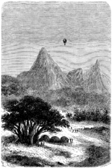

]{.calibre20}

CINQ SEMAINES EN BALLON

]{.calibre20}

## []{#_Toc349730909 .pcalibre .pcalibre4 .pcalibre3}[]{#_Toc349730562 .pcalibre .pcalibre4 .pcalibre3}[]{#_Toc349730183 .pcalibre .pcalibre4 .pcalibre3}[]{#_Toc349729634 .pcalibre .pcalibre4 .pcalibre3}[]{#_Toc349729255 .pcalibre .pcalibre4 .pcalibre3}[]{#_Toc349728706 .pcalibre .pcalibre4 .pcalibre3}[]{#_Toc349728327 .pcalibre .pcalibre4 .pcalibre3}[]{#_Toc349727740 .pcalibre .pcalibre4 .pcalibre3}[]{#_Toc349727191 .pcalibre .pcalibre4 .pcalibre3}[]{#_Toc349726812 .pcalibre .pcalibre4 .pcalibre3}[]{#_Toc349726263 .pcalibre .pcalibre4 .pcalibre3}[]{#_Toc349725916 .pcalibre .pcalibre4 .pcalibre3}[]{#_Toc349725569 .pcalibre .pcalibre4 .pcalibre3}[]{#_Toc349725222 .pcalibre .pcalibre4 .pcalibre3}[]{#_Toc349724875 .pcalibre .pcalibre4 .pcalibre3}[Chapitre 13]{#_Toc349724496 .pcalibre .pcalibre4 .pcalibre3} {#calibre_toc_243 .calibre21}

CHANGEMENT DE TEMPS. --- FIÈVRE DE KENNEDY. --- LA MÉDECINE DU DOCTEUR. --- VOYAGE PAR TERRE. --- LE BASSIN D\'IMENGÉ. --- LE MONT RUBEHO. --- À SIX MILLE PIEDS. --- UNE HALTE DE JOUR.

La nuit fut paisible ; cependant le samedi matin, en se réveillant. Kennedy se plaignit de lassitude et de frissons de fièvre. Le temps changeait ; le ciel couvert de nuages épais semblait s\'approvisionner pour un nouveau déluge. Un triste pays que ce Zungomero, où il pleut continuellement, sauf peut-être pendant une quinzaine de jours du mois de janvier.

Une pluie violente ne tarda pas à assaillir les voyageurs ; au-dessous d\'eux, les chemins coupés par des « nullahs », sortes de torrents momentanés, devenaient impraticables, embarrassés d\'ailleurs de buissons épineux et de lianes gigantesques. On saisissait distinctement ces émanations d\'hydrogène sulfuré dont parle le capitaine Burton.

--- D\'après lui, dit le docteur, et il a raison, c\'est à croire qu\'un cadavre est caché derrière chaque hallier.

--- Un vilain pays, répondit Joe, et il me semble que monsieur Kennedy ne se porte pas trop bien pour y avoir passé la nuit.

--- En effet, j\'ai une fièvre assez forte, fit le chasseur.

--- Cela n\'a rien d\'étonnant, mon cher Dick, nous nous trouvons dans l\'une des régions les plus insalubres de l\'Afrique. Mais nous n\'y resterons pas longtemps. En route.

Grâce à une manœuvre adroite de Joe, l\'ancre fut décrochée, et, au moyen de l\'échelle, Joe regagna la nacelle. Le docteur dilata vivement le gaz, et le *Victoria* reprit son vol, poussé par un vent assez fort.

Quelques huttes apparaissaient à peine au milieu de ce brouillard pestilentiel. Le pays changeait d\'aspect. Il arrive fréquemment en Afrique qu\'une région malsaine et de peu d\'étendue confine à des contrées parfaitement salubres.

Kennedy souffrait visiblement, et la fièvre accablait sa nature vigoureuse.

--- Ce n\'est pourtant pas le cas d\'être malade, fit-il en s\'enveloppant de sa couverture et se couchant sous la tente.

--- Un peu de patience, mon cher Dick, répondit le docteur Fergusson, et tu seras guéri rapidement.

--- Guéri ! ma foi ! Samuel, si tu as dans ta pharmacie de voyage quelque drogue qui me remette sur pied, administre-la-moi sans retard. Je l\'avalerai les yeux fermés.

--- J\'ai mieux que cela, ami Dick, et je vais naturellement te donner un fébrifuge qui ne coûtera rien.

--- Et comment feras-tu ?

--- C\'est fort simple. Je vais tout bonnement monter au-dessus de ces nuages qui nous inondent, et m\'éloigner de cette atmosphère pestilentielle. Je te demande dix minutes pour dilater l\'hydrogène.

Les dix minutes n\'étaient pas écoulées que les voyageurs avaient dépassé la zone humide.

--- Attends un peu, Dick, et tu vas sentir l\'influence de l\'air pur et du soleil.

--- En voilà un remède ! dit Joe. Mais c\'est merveilleux !

--- Non ! c\'est tout naturel.

--- Oh ! pour naturel, je n\'en doute pas.

--- J\'envoie Dick en bon air, comme cela se fait tous les jours en Europe, et comme à la Martinique je l\'enverrais aux Pitons[[\[36\]]{.MsoFootnoteReference}](../Text/Section0004.xhtml#_ftn36){#_ftnref36 .pcalibre4 .pcalibre3} pour fuir la fièvre jaune.

--- Ah çà ! mais c\'est un paradis que ce ballon, dit Kennedy déjà plus à l\'aise.

--- En tout cas, il y mène, répondit sérieusement Joe.

C\'était un curieux spectacle que celui des masses de nuages agglomérées en ce moment au-dessous de la nacelle ; elles roulaient les unes sur les autres, et se confondaient dans un éclat magnifique en réfléchissant les rayons du soleil. Le *Victoria* atteignit une hauteur de quatre mille pieds. Le thermomètre indiquait un certain abaissement dans la température. On ne voyait plus la terre. À une cinquantaine de milles dans l\'ouest, le mont Rubeho dressait sa tête étincelante ; il formait la limite du pays d\'Ugogo par 36° 20\' de longitude. Le vent soufflait avec une vitesse de vingt milles à l\'heure, mais les voyageurs ne sentaient rien de cette rapidité ; ils n\'éprouvaient aucune secousse, n\'ayant pas même le sentiment de la locomotion.

Trois heures plus tard, la prédiction du docteur se réalisait. Kennedy ne sentait plus aucun frisson de fièvre, et déjeuna avec appétit.

--- Voilà qui enfonce le sulfate de quinine, dit-il avec satisfaction.

--- Décidément, fit Joe, c\'est ici que je me retirerai pendant mes vieux jours.

Vers dix heures du matin, l\'atmosphère s\'éclaircit. Il se fit une trouée dans les nuages ; la terre reparut ; le *Victoria* s\'en rapprocha insensiblement. Le docteur Fergusson cherchait un courant qui le portât plus au nord-est, et il le rencontra à six cents pieds du sol. Le pays devenait accidenté, montueux même. Le district du Zungomero s\'effaçait dans l\'est avec les derniers cocotiers de cette latitude.

Bientôt les crêtes d\'une montagne prirent une saillie plus arrêtée. Quelques pics s\'élevaient çà et là. Il fallut veiller à chaque instant aux cônes aigus qui semblaient surgir inopinément.

--- Nous sommes au milieu des brisants, dit Kennedy.

--- Sois tranquille, Dick, nous ne toucherons pas.

--- Jolie manière de voyager, tout de même ! répliqua Joe.

En effet, le docteur manœuvrait son ballon avec une merveilleuse dextérité.

--- S\'il nous fallait marcher sur ce terrain détrempé, dit-il, nous nous traînerions dans une boue malsaine. Depuis notre départ de Zanzibar, la moitié de nos bêtes de somme seraient déjà mortes de fatigue. Nous aurions l\'air de spectres, et le désespoir nous prendrait au cœur. Nous serions en lutte incessante avec nos guides, nos porteurs, exposés à leur brutalité sans frein. Le jour, une chaleur humide, insupportable, accablante ! La nuit, un froid souvent intolérable, et les piqûres de certaines mouches, dont les mandibules percent la toile la plus épaisse, et qui rendent fou ! Et tout cela sans parler des bêtes et des peuplades féroces !

--- Je demande à ne pas en essayer, répliqua simplement Joe.

--- Je n\'exagère rien, reprit le docteur Fergusson, car, au récit des voyageurs qui ont eu l\'audace de s\'aventurer dans ces contrées, les larmes vous viendraient aux yeux.

Vers onze heures, on dépassait le bassin d\'Imengé ; les tribus éparses sur ces collines menaçaient vainement le *Victoria* de leurs armes ; il arrivait enfin aux dernières ondulations de terrain qui précèdent le Rubeho ; elles forment la troisième chaîne et la plus élevée des montagnes de l\'Usagara.

Les voyageurs se rendaient parfaitement compte de la conformation orographique du pays. Ces trois ramifications, dont le Duthumi forme le premier échelon, sont séparées par de vastes plaines longitudinales ; ces croupes élevées se composent de cônes arrondis, entre lesquels le sol est parsemé de blocs erratiques et de galets. La déclivité la plus roide de ces montagnes fait face à la côte de Zanzibar ; les pentes occidentales ne sont guère que des plateaux inclinés. Les dépressions de terrain sont couvertes d\'une terre noire et fertile, où la végétation est vigoureuse. Divers cours d\'eau s\'infiltrent vers l\'est, et vont affluer dans le Kingani, au milieu de bouquets gigantesques de sycomores, de tamarins, de calebassiers et de palmyras.

{#Image52 .calibre53}

--- Attention ! dit le docteur Fergusson. Nous approchons du Rubeho, dont le nom signifie dans la langue du pays : « Passage des vents ». Nous ferons bien d\'en doubler les arêtes aiguës à une certaine hauteur. Si ma carte est exacte, nous allons nous porter à une élévation de plus de cinq mille pieds.

--- Est-ce que nous aurons souvent l\'occasion d\'atteindre ces zones supérieures ?

--- Rarement ; l\'altitude des montagnes de l\'Afrique paraît être médiocre relativement aux sommets de l\'Europe et de l\'Asie. Mais, en tout cas, notre *Victoria* ne serait pas embarrassé de les franchir.

En peu de temps, le gaz se dilata sous l\'action de la chaleur, et le ballon prit une marche ascensionnelle très marquée. La dilatation de l\'hydrogène n\'offrait rien de dangereux d\'ailleurs, et la vaste capacité de l\'aérostat n\'était remplie qu\'aux trois quarts ; le baromètre, par une dépression de près de huit pouces, indiqua une élévation de six mille pieds.

--- Irions-nous longtemps ainsi ? demanda Joe.

--- L\'atmosphère terrestre a une hauteur de six mille toises, répondit le docteur. Avec un vaste ballon, on irait loin. C\'est ce qu\'ont fait MM. Brioschi et Gay-Lussac ; mais alors le sang leur sortait par la bouche et par les oreilles. L\'air respirable manquait. Il y a quelques années, deux hardis Français, MM. Barral et Bixio, s\'aventurèrent aussi dans les hautes régions ; mais leur ballon se déchira\...

--- Et ils tombèrent ? demanda vivement Kennedy.

--- Sans doute ! mais comme doivent tomber des savants ; sans se faire aucun mal.

--- Eh bien ! messieurs, dit Joe, libre à vous de recommencer leur chute ; mais pour moi, qui ne suis qu\'un ignorant, je préfère rester dans un milieu honnête, ni trop haut, ni trop bas. Il ne faut point être ambitieux.

À six mille pieds, la densité de l\'air a déjà diminué sensiblement ; le son s\'y transporte avec difficulté, et la voix se fait moins bien entendre. La vue des objets devient confuse. Le regard ne perçoit plus que de grandes masses assez indéterminées ; les hommes, les animaux, deviennent absolument invisibles : les routes sont des lacets, et les lacs, des étangs.

Le docteur et ses compagnons se sentaient dans un état anormal ; un courant atmosphérique d\'une extrême vélocité les entraînait au-delà des montagnes arides, sur le sommet desquelles de vastes plaques de neige étonnaient le regard ; leur aspect convulsionné démontrait quelque travail neptunien des premiers jours du monde.

Le soleil brillait au zénith, et ses rayons tombaient d\'aplomb sur ces cimes désertes. Le docteur prit un dessin exact de ces montagnes, qui sont faites de quatre croupes distinctes, presque en ligne droite, et dont la plus septentrionale est la plus allongée.

Bientôt le *Victoria* descendit le versant opposé du Rubeho, en longeant une côte boisée et parsemée d\'arbres d\'un vert très sombre ; puis vinrent des crêtes et des ravins, dans une sorte de désert qui précédait le pays d\'Ugogo ; plus bas s\'étalaient des plaines jaunes, torréfiées, craquelées, jonchées çà et là de plantes salines et de buissons épineux.

Quelques taillis, plus loin devenus forêts, embellirent l\'horizon. Le docteur s\'approcha du sol, les ancres furent lancées, et l\'une d\'elles s\'accrocha bientôt dans les branches d\'un vaste sycomore.

Joe, se glissant rapidement dans l\'arbre, assujettit l\'ancre avec précaution ; le docteur laissa son chalumeau en activité pour conserver à l\'aérostat une certaine force ascensionnelle qui le maintînt en l\'air. Le vent s\'était presque subitement calmé.

--- Maintenant, dit Fergusson, prends deux fusils, ami Dick, l\'un pour toi, l\'autre pour Joe, et tâchez, à vous deux, de rapporter quelques belles tranches d\'antilope. Ce sera pour notre dîner.

--- En chasse ! s\'écria Kennedy.

Il escalada la nacelle et descendit. Joe s\'était laissé dégringoler de branche en branche et l\'attendait en se détirant les membres. Le docteur, allégé du poids de ses deux compagnons, put éteindre entièrement son chalumeau.

--- N\'allez pas vous envoler, mon maître, s\'écria Joe.

--- Sois tranquille, mon garçon, je suis solidement retenu. Je vais mettre mes notes en ordre. Bonne chasse et soyez prudents. D\'ailleurs, de mon poste, j\'observerai le pays, et, à la moindre chose suspecte, je tire un coup de carabine. Ce sera le signal de ralliement.

--- Convenu, répondit le chasseur.
