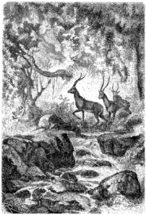
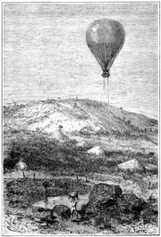

]{.calibre20}

CINQ SEMAINES EN BALLON

]{.calibre20}

## []{#_Toc349730910 .pcalibre .pcalibre4 .pcalibre3}[]{#_Toc349730563 .pcalibre .pcalibre4 .pcalibre3}[]{#_Toc349730184 .pcalibre .pcalibre4 .pcalibre3}[]{#_Toc349729635 .pcalibre .pcalibre4 .pcalibre3}[]{#_Toc349729256 .pcalibre .pcalibre4 .pcalibre3}[]{#_Toc349728707 .pcalibre .pcalibre4 .pcalibre3}[]{#_Toc349728328 .pcalibre .pcalibre4 .pcalibre3}[]{#_Toc349727741 .pcalibre .pcalibre4 .pcalibre3}[]{#_Toc349727192 .pcalibre .pcalibre4 .pcalibre3}[]{#_Toc349726813 .pcalibre .pcalibre4 .pcalibre3}[]{#_Toc349726264 .pcalibre .pcalibre4 .pcalibre3}[]{#_Toc349725917 .pcalibre .pcalibre4 .pcalibre3}[]{#_Toc349725570 .pcalibre .pcalibre4 .pcalibre3}[]{#_Toc349725223 .pcalibre .pcalibre4 .pcalibre3}[]{#_Toc349724876 .pcalibre .pcalibre4 .pcalibre3}[Chapitre 14]{#_Toc349724497 .pcalibre .pcalibre4 .pcalibre3} {#calibre_toc_244 .calibre21}

LA FORÊT DE GOMMIERS. --- L\'ANTILOPE BLEUE. --- LE SIGNAL DE RALLIEMENT. --- UN ASSAUT INATTENDU. --- LE KANYEMÉ. --- UNE NUIT EN PLEIN AIR. --- LE MABUNGURU. --- JIHOUE-LA-MKOA. --- PROVISION D\'EAU. --- ARRIVÉE À KAZEH.

Le pays, aride, desséché, fait d\'une terre argileuse qui se fendillait à la chaleur, paraissait désert ; çà et là, quelques traces de caravanes, des ossements blanchis d\'hommes et de bêtes, à demi rongés, et confondus dans la même poussière.

Après une demi-heure de marche, Dick et Joe s\'enfonçaient dans une forêt de gommiers, l\'œil aux aguets et le doigt sur la détente du fusil. On ne savait pas à qui on aurait affaire. Sans être un rifleman, Joe maniait adroitement une arme à feu.

--- Cela fait du bien de marcher, monsieur Dick, et cependant ce terrain-là n\'est pas trop commode, fit-il en heurtant les fragments de quartz dont il était parsemé.

Kennedy fit signe à son compagnon de se taire et de s\'arrêter. Il fallait savoir se passer de chiens, et, quelle que fût l\'agilité de Joe, il ne pouvait avoir le nez d\'un braque ou d\'un lévrier.

{#Image53 .calibre54}

Dans le lit d\'un torrent où stagnaient encore quelques mares, se désaltérait une troupe d\'une dizaine d\'antilopes. Ces gracieux animaux, flairant un danger, paraissaient inquiets ; entre chaque lampée, leur jolie tête se redressait avec vivacité, humant de ses narines mobiles l\'air au vent des chasseurs.

Kennedy contourna quelques massifs, tandis que Joe demeurait immobile ; il parvint à portée de fusil et fit feu. La troupe disparut en un clin d\'œil ; seule, une antilope mâle, frappée au défaut de l\'épaule, tombait foudroyée. Kennedy se précipita sur sa proie.

C\'était un blawe-bock, un magnifique animal d\'un bleu pâle tirant sur le gris, avec le ventre et l\'intérieur des jambes d\'une blancheur de neige.

--- Le beau coup de fusil ! s\'écria le chasseur. C\'est une espèce très rare d\'antilope, et j\'espère bien préparer sa peau de manière à la conserver.

--- Par exemple ! y pensez-vous, monsieur Dick ?

--- Sans doute ! Regarde donc ce splendide pelage.

--- Mais le docteur Fergusson n\'admettra jamais une pareille surcharge.

--- Tu as raison, Joe ! Il est pourtant fâcheux d\'abandonner tout entier un si bel animal !

--- Tout entier ! non pas, monsieur Dick ; nous allons en tirer tous les avantages nutritifs qu\'il possède, et, si vous le permettez, je vais m\'en acquitter aussi bien que le syndic de l\'honorable corporation des bouchers de Londres.

--- À ton aise, mon ami ; tu sais pourtant qu\'en ma qualité de chasseur, je ne suis pas plus embarrassé de dépouiller une pièce de gibier que de l\'abattre.

--- J\'en suis sûr, monsieur Dick ; alors ne vous gênez pas pour établir un fourneau sur trois pierres ; vous aurez du bois mort en quantité, et je ne vous demande que quelques minutes pour utiliser vos charbons ardents.

--- Ce ne sera pas long, répliqua Kennedy.

Il procéda aussitôt à la construction de son foyer, qui flambait quelques instants plus tard.

Joe avait retiré du corps de l\'antilope une douzaine de côtelettes et les morceaux les plus tendres du filet, qui se transformèrent bientôt en grillades savoureuses.

--- Voilà qui fera plaisir à l\'ami Samuel, dit le chasseur.

--- Savez-vous à quoi je pense, monsieur Dick ?

--- Mais à ce que tu fais, sans doute, à tes beefsteaks.

--- Pas le moins du monde. Je pense à la figure que nous ferions si nous ne retrouvions plus l\'aérostat.

--- Bon ! quelle idée ! tu veux que le docteur nous abandonne ?

--- Non ; mais si son ancre venait à se détacher ?

--- Impossible. D\'ailleurs Samuel ne serait pas embarrassé de redescendre avec son ballon ; il le manœuvre assez proprement.

--- Mais si le vent l\'emportait, s\'il ne pouvait revenir vers nous ?

--- Voyons, Joe, trêve à tes suppositions ; elles n\'ont rien de plaisant.

--- Ah ! Monsieur, tout ce qui arrive en ce monde est naturel ; or, tout peut arriver, donc il faut tout prévoir\...

En ce moment un coup de fusil retentit dans l\'air.

--- Hein ! fit Joe.

--- Ma carabine ! je reconnais sa détonation.

--- Un signal !

--- Un danger pour nous !

--- Pour lui peut-être, répliqua Joe.

--- En route !

Les chasseurs avaient rapidement ramassé le produit de leur chasse, et ils reprirent leur chemin en se guidant sur des brisées que Kennedy avait faites. L\'épaisseur du fourré les empêchait d\'apercevoir le *Victoria*, dont ils ne pouvaient être bien éloignés.

Un second coup de feu se fit entendre.

--- Cela presse, fit Joe.

--- Bon ! encore une autre détonation.

--- Cela m\'a l\'air d\'une défense personnelle.

--- Hâtons-nous.

Et ils coururent à toutes jambes. Arrivés à la lisière du bois, ils virent tout d\'abord le *Victoria* à sa place, et le docteur dans la nacelle.

--- Qu\'y a-t-il donc ? demanda Kennedy.

--- Grand Dieu ! s\'écria Joe.

--- Que vois-tu ?

--- Là-bas, une troupe de Nègres qui assiègent le ballon !

En effet, à deux milles de là, une trentaine d\'individus se pressaient en gesticulant, en hurlant, en gambadant au pied du sycomore. Quelques-uns, grimpés dans l\'arbre, s\'avançaient jusque sur les branches les plus élevées. Le danger semblait imminent.

--- Mon maître est perdu, s\'écria Joe.

--- Allons, Joe, du sang-froid et du coup d\'œil. Nous tenons la vie de quatre de ces moricauds dans nos mains. En avant !

Ils avaient franchi un mille avec une extrême rapidité, quand un nouveau coup de fusil partit de la nacelle ; il atteignit un grand diable qui se hissait par la corde de l\'ancre. Un corps sans vie tomba de branches en branches, et resta suspendu à une vingtaine de pieds du sol, ses deux bras et ses deux jambes se balançant dans l\'air.

--- Hein ! fit Joe en s\'arrêtant, par où diable se tient-il donc, cet animal-là ?

--- Peu importe, répondit Kennedy, courons ! courons !

--- Ah ! monsieur Kennedy, s\'écria Joe, en éclatant de rire : par sa queue ! c\'est par sa queue ! Un singe ! ce ne sont que des singes.

--- Ça vaut encore mieux que des hommes, répliqua Kennedy en se précipitant au milieu de la bande hurlante.

C\'était une troupe de cynocéphales assez redoutables, féroces et brutaux, horribles à voir avec leurs museaux de chien. Cependant quelques coups de fusil en eurent facilement raison, et cette horde grimaçante s\'échappa, laissant plusieurs des siens à terre.

En un instant, Kennedy s\'accrochait à l\'échelle ; Joe se hissait dans les sycomores et détachait l\'ancre ; la nacelle s\'abaissait jusqu\'à lui, et il y rentrait sans difficulté. Quelques minutes après, le *Victoria* s\'élevait dans l\'air et se dirigeait vers l\'est sous l\'impulsion d\'un vent modéré.

--- En voilà un assaut ! dit Joe.

--- Nous t\'avions cru assiégé par des indigènes.

--- Ce n\'étaient que des singes, heureusement ! répondit le docteur.

--- De loin, la différence n\'est pas grande, mon cher Samuel.

--- Ni même de près, répliqua Joe.

--- Quoi qu\'il en soit, reprit Fergusson, cette attaque de singes pouvait avoir les plus graves conséquences. Si l\'ancre avait perdu prise sous leurs secousses réitérées, qui sait où le vent m\'eût entraîné !

--- Que vous disais-je, monsieur Kennedy ?

--- Tu avais raison, Joe ; mais, tout en ayant raison, à ce moment-là tu préparais des beefsteaks d\'antilope, dont la vue me mettait déjà en appétit.

--- Je le crois bien, répondit le docteur, la chair d\'antilope est exquise.

--- Vous pouvez en juger, monsieur, la table est servie.

--- Sur ma foi, dit le chasseur, ces tranches de venaison ont un fumet sauvage qui n\'est point à dédaigner.

Joe prépara le breuvage en question, qui fut dégusté avec recueillement.

--- Jusqu\'ici cela va assez bien, dit-il.

--- Très bien, riposta Kennedy.

--- Voyons, monsieur Dick, regrettez-vous de nous avoir accompagnés ?

--- J\'aurais voulu voir qu\'on m\'en eût empêché ! répondit le chasseur avec un air résolu.

Il était alors quatre heures du soir ; le *Victoria* rencontra un courant plus rapide ; le sol montait insensiblement, et bientôt la colonne barométrique indiqua une hauteur de 1 500 pieds au-dessus du niveau de la mer. Le docteur fut alors obligé de soutenir son aérostat par une dilatation de gaz assez forte, et le chalumeau fonctionnait sans cesse.

Vers sept heures, le *Victoria* planait sur le bassin de Kanyemé ; le docteur reconnut aussitôt ce vaste défrichement de dix milles d\'étendue, avec ses villages perdus au milieu des baobabs et des calebassiers. Là est la résidence de l\'un des sultans du pays de l\'Ugogo, où la civilisation est peut-être moins arriérée, on y vend plus rarement les membres de sa famille ; mais, bêtes et gens, tous vivent ensemble dans des huttes rondes sans charpente, et qui ressemblent à des meules de foin.

Après Kanyemé, le terrain devint aride et rocailleux ; mais, au bout d\'une heure, dans une dépression fertile, la végétation reprit toute sa vigueur, à quelque distance du Mdaburu. Le vent tombait avec le jour, et l\'atmosphère semblait s\'endormir. Le docteur chercha vainement un courant à différentes hauteurs ; en voyant ce calme de la nature, il résolut de passer la nuit dans les airs, et, pour plus de sûreté, il s\'éleva de 1 000 pieds environ. Le *Victoria* demeurait immobile. La nuit magnifiquement étoilée se fit en silence.

Dick et Joe s\'étendirent sur leur couche paisible, et s\'endormirent d\'un profond sommeil pendant le quart du docteur ; à minuit, celui-ci fut remplacé par l\'Écossais.

--- S\'il survenait le moindre incident, réveille-moi, lui dit-il ; et surtout ne perds pas le baromètre des yeux. C\'est notre boussole, à nous autres !

La nuit fut froide, il y eut jusqu\'à 27 degrés[[\[37\]]{.MsoFootnoteReference}](../Text/Section0004.xhtml#_ftn37){#_ftnref37 .pcalibre4 .pcalibre3} de différence entre sa température et celle du jour. Avec les ténèbres avait éclaté le concert nocturne des animaux, que la soif et la faim chassent de leurs repaires ; les grenouilles firent retentir leur voix de soprano, doublée du glapissement des chacals, pendant que la basse imposante des lions soutenait les accords de cet orchestre vivant.

En reprenant son poste le matin, le docteur Fergusson consulta sa boussole, et s\'aperçut que la direction du vent avait changé pendant la nuit. Le *Victoria* dérivait dans le nord-est d\'une trentaine de milles depuis deux heures environ ; il passait au-dessus du Mabunguru, pays pierreux, parsemé de blocs de syénite d\'un beau poli, et tout bosselé de roches en dos d\'âne ; des masses coniques, semblables aux rochers de Karnak, hérissaient le sol comme autant de dolmens druidiques ; de nombreux ossements de buffles et d\'éléphants blanchissaient çà et là ; il y avait peu d\'arbres, sinon dans l\'est, des bois profonds, sous lesquels se cachaient quelques villages.

Vers sept heures, une roche ronde, de près de deux milles d\'étendue, apparut comme une immense carapace.

--- Nous sommes en bon chemin, dit le docteur Fergusson. Voilà Jihoue-la-Mkoa, où nous allons faire halte pendant quelques instants. Je vais renouveler la provision d\'eau nécessaire à l\'alimentation de mon chalumeau, essayons de nous accrocher quelque part.

--- Il y a peu d\'arbres, répondit le chasseur.

--- Essayons cependant ; Joe, jette les ancres.

Le ballon, perdant peu à peu de sa force ascensionnelle, s\'approcha de terre ; les ancres coururent ; la patte de l\'une d\'elles s\'engagea dans une fissure de rocher, et le *Victoria* demeura immobile.

Il ne faut pas croire que le docteur pût éteindre complètement son chalumeau pendant ses haltes. L\'équilibre du ballon avait été calculé au niveau de la mer ; or le pays allait toujours en montant, et se trouvant élevé de 600 à 700 pieds, le ballon aurait eu une tendance à descendre plus bas que le sol lui-même ; il fallait donc le soutenir par une certaine dilatation du gaz. Dans le cas seulement où, en l\'absence de tout vent, le docteur eût laissé la nacelle reposer sur terre, l\'aérostat, alors délesté d\'un poids considérable, se serait maintenu sans le secours du chalumeau.

Les cartes indiquaient de vastes mares sur le versant occidental de Jihoue-la-Mkoa. Joe s\'y rendit seul avec un baril, qui pouvait contenir une dizaine de gallons ; il trouva sans peine l\'endroit indiqué, non loin d\'un petit village désert, fit sa provision d\'eau, et revint en moins de trois quarts d\'heure ; il n\'avait rien vu de particulier, si ce n\'est d\'immenses trappes à éléphant ; il faillit même choir dans l\'une d\'elles, où gisait une carcasse à demi rongée.

{#Image55 .calibre55}

Il rapporta de son excursion une sorte de nèfles, que des singes mangeaient avidement. Le docteur reconnut le fruit du « mbenbu », arbre très abondant sur la partie occidentale de Jihoue-la-Mkoa. Fergusson attendait Joe avec une certaine impatience, car un séjour même rapide sur cette terre inhospitalière lui inspirait toujours des craintes.

L\'eau fut embarquée sans difficulté, car la nacelle descendit presque au niveau du sol ; Joe put arracher l\'ancre, et remonta lestement auprès de son maître. Aussitôt celui-ci raviva sa flamme, et le *Victoria* reprit la route des airs.

Il se trouvait alors à une centaine de milles de Kazeh, important établissement de l\'intérieur de l\'Afrique, où, grâce à un courant de sud-est, les voyageurs pouvaient espérer de parvenir pendant cette journée ; ils marchaient avec une vitesse de 14 milles à l\'heure ; la conduite de l\'aérostat devint alors assez difficile ; on ne pouvait s\'élever trop haut sans dilater beaucoup le gaz, car le pays se trouvait déjà à une hauteur moyenne de 3 000 pieds. Or, autant que possible, le docteur préférait ne pas forcer sa dilatation ; il suivit donc fort adroitement les sinuosités d\'une pente assez roide, et rasa de près les villages de Thembo et de Tura-Wels. Ce dernier fait partie de l\'Unyamwezy, magnifique contrée où les arbres atteignent les plus grandes dimensions, entre autres les cactus, qui deviennent gigantesques.

Vers deux heures, par un temps magnifique, sous un soleil de feu qui dévorait le moindre courant d\'air, le *Victoria* planait au-dessus de la ville de Kazeh, située à 350 milles de la côte.

--- Nous sommes partis de Zanzibar à neuf heures du matin, dit le docteur Fergusson en consultant ses notes, et après deux jours de traversée nous avons parcouru par nos déviations près de 500 milles géographiques[[\[38\]]{.MsoFootnoteReference}](../Text/Section0004.xhtml#_ftn38){#_ftnref38 .pcalibre4 .pcalibre3}. Les capitaines Burton et Speke mirent quatre mois et demi à faire le même chemin !
