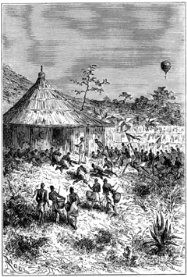
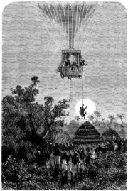

]{.calibre20}

CINQ SEMAINES EN BALLON

]{.calibre20}

## []{#_Toc349730911 .pcalibre .pcalibre4 .pcalibre3}[]{#_Toc349730564 .pcalibre .pcalibre4 .pcalibre3}[]{#_Toc349730185 .pcalibre .pcalibre4 .pcalibre3}[]{#_Toc349729636 .pcalibre .pcalibre4 .pcalibre3}[]{#_Toc349729257 .pcalibre .pcalibre4 .pcalibre3}[]{#_Toc349728708 .pcalibre .pcalibre4 .pcalibre3}[]{#_Toc349728329 .pcalibre .pcalibre4 .pcalibre3}[]{#_Toc349727742 .pcalibre .pcalibre4 .pcalibre3}[]{#_Toc349727193 .pcalibre .pcalibre4 .pcalibre3}[]{#_Toc349726814 .pcalibre .pcalibre4 .pcalibre3}[]{#_Toc349726265 .pcalibre .pcalibre4 .pcalibre3}[]{#_Toc349725918 .pcalibre .pcalibre4 .pcalibre3}[]{#_Toc349725571 .pcalibre .pcalibre4 .pcalibre3}[]{#_Toc349725224 .pcalibre .pcalibre4 .pcalibre3}[]{#_Toc349724877 .pcalibre .pcalibre4 .pcalibre3}[Chapitre 15]{#_Toc349724498 .pcalibre .pcalibre4 .pcalibre3} {#calibre_toc_245 .calibre21}

KAZEH. --- LE MARCHÉ BRUYANT. --- APPARITION DU « VICTORIA ». --- LES WANGANGA. --- LES FILS DE LA LUNE. --- PROMENADE DU DOCTEUR. --- POPULATION. --- LE TEMBÉ ROYAL. --- LES FEMMES DU SULTAN. --- UNE IVRESSE ROYALE. --- JOE ADORÉ. --- COMMENT ON DANSE DANS LA LUNE. --- REVIREMENT. --- DEUX LUNES AU FIRMAMENT. --- INSTABILITÉ DES GRANDEURS DIVINES.

Kazeh, point important de l\'Afrique centrale, n\'est point une ville ; à vrai dire, il n\'y a pas de ville à l\'intérieur. Kazeh n\'est qu\'un ensemble de six vastes excavations. Là sont renfermées des cases, des huttes à esclaves, avec de petites cours et de petits jardins, soigneusement cultivés ; oignons, patates, aubergines, citrouilles et champignons d\'une saveur parfaite y poussent à ravir.

L\'Unyamwezy est la terre de la Lune par excellence, le parc fertile et splendide de l\'Afrique ; au centre se trouve le district de l\'Unyanembé, une contrée délicieuse, où vivent paresseusement quelques familles d\'Omani, qui sont des Arabes d\'origine très pure.

Ils ont longtemps fait le commerce à l\'intérieur de l\'Afrique et dans l\'Arabie ; ils ont trafiqué de gommes, d\'ivoire, d\'indienne, d\'esclaves ; leurs caravanes sillonnaient ces régions équatoriales ; elles vont encore chercher à la côte les objets de luxe et de plaisir pour ces marchands enrichis, et ceux-ci, au milieu de femmes et de serviteurs, mènent dans cette contrée charmante l\'existence la moins agitée et la plus horizontale, toujours étendus, riant, fumant ou dormant.

Autour de ces excavations, de nombreuses cases d\'indigènes, de vastes emplacements pour les marchés, des champs de cannabis et de datura, de beaux arbres et de frais ombrages, voilà Kazeh.

Là est le rendez-vous général des caravanes : celles du Sud avec leurs esclaves et leurs chargements d\'ivoire ; celles de l\'Ouest, qui exportent le coton et les verroteries aux tribus des Grands Lacs.

Aussi, dans les marchés, règne-t-il une agitation perpétuelle, un brouhaha sans nom, composé du cri des porteurs métis, du son des tambours et des cornets, des hennissements des mules, du braiement des ânes, du chant des femmes, du piaillement des enfants, et des coups de rotin du Jemadar[[\[39\]]{.MsoFootnoteReference}](../Text/Section0004.xhtml#_ftn39){#_ftnref39 .pcalibre4 .pcalibre3}, qui bat la mesure dans cette symphonie pastorale.

Là s\'étalent sans ordre, et même avec un désordre charmant, les étoffes voyantes, les rassades, les ivoires, les dents de rhinocéros, les dents de requins, le miel, le tabac, le coton ; là se pratiquent les marchés les plus étranges, où chaque objet n\'a de valeur que par les désirs qu\'il excite.

Tout d\'un coup, cette agitation, ce mouvement, ce bruit tomba subitement. Le *Victoria* venait d\'apparaître dans les airs ; il planait majestueusement et descendait peu à peu, sans s\'écarter de la verticale. Hommes, femmes, enfants, esclaves, marchands, Arabes et Nègres, tout disparut et se glissa dans les « tembés » et sous les huttes.

--- Mon cher Samuel, dit Kennedy, si nous continuons à produire de pareils effets, nous aurons de la peine à établir des relations commerciales avec ces gens-là.

--- Il y aurait cependant, dit Joe, une opération commerciale d\'une grande simplicité à faire. Ce serait de descendre tranquillement et d\'emporter les marchandises les plus précieuses, sans nous préoccuper des marchands. On s\'enrichirait.

--- Bon ! répliqua le docteur, ces indigènes ont eu peur au premier moment. Mais ils ne tarderont pas à revenir par superstition ou par curiosité.

--- Vous croyez, mon maître ?

--- Nous verrons bien ; mais il sera prudent de ne point trop les approcher, le *Victoria* n\'est pas un ballon blindé ni cuirassé ; il n\'est donc à l\'abri ni d\'une balle, ni d\'une flèche.

--- Comptes-tu donc, mon cher Samuel, entrer en pourparlers avec ces Africains ?

--- Si cela se peut, pourquoi pas ? répondit le docteur ; il doit se trouver à Kazeh des marchands arabes plus instruits, moins sauvages. Je me rappelle que MM. Burton et Speke n\'eurent qu\'à se louer de l\'hospitalité des habitants de la ville. Ainsi, nous pouvons tenter l\'aventure.

Le *Victoria*, s\'étant insensiblement rapproché de terre, accrocha l\'une de ses ancres au sommet d\'un arbre près de la place du marché.

Toute la population reparaissait en ce moment hors de ses trous ; les têtes sortaient avec circonspection. Plusieurs « Waganga », reconnaissables à leurs insignes de coquillages coniques, s\'avancèrent hardiment ; c\'étaient les sorciers de l\'endroit. Ils portaient à leur ceinture de petites gourdes noires enduites de graisse, et divers objets de magie, d\'une malpropreté d\'ailleurs toute doctorale.

Peu à peu, la foule se fit à leurs côtés, les femmes et les enfants les entourèrent, les tambours rivalisèrent de fracas, les mains se choquèrent et furent tendues vers le ciel.

--- C\'est leur manière de supplier, dit le docteur Fergusson ; si je ne me trompe, nous allons être appelés à jouer un grand rôle.

--- Eh bien ! monsieur, jouez-le.

--- Toi-même, mon brave Joe, tu vas peut-être devenir un dieu.

--- Eh ! monsieur, cela ne m\'inquiète guère, et l\'encens ne me déplaît pas.

En ce moment, un des sorciers, un « Myanga », fit un geste, et toute cette clameur s\'éteignit dans un profond silence. Il adressa quelques paroles aux voyageurs, mais dans une langue inconnue.

Le docteur Fergusson, n\'ayant pas compris, lança à tout hasard quelques mots d\'arabe, et il lui fut immédiatement répondu dans cette langue.

L\'orateur se livra à une abondante harangue, très fleurie, très écoutée ; le docteur ne tarda pas à reconnaître que le *Victoria* était tout bonnement pris pour la Lune en personne, et que cette aimable déesse avait daigné s\'approcher de la ville avec ses trois Fils, honneur qui ne serait jamais oublié dans cette terre aimée du Soleil.

Le docteur répondit avec une grande dignité que la Lune faisait tous les mille ans sa tournée départementale, éprouvant le besoin de se montrer de plus près à ses adorateurs ; il les priait donc de ne pas se gêner et d\'abuser de sa divine présence pour faire connaître leurs besoins et leurs vœux.

Le sorcier répondit à son tour que le sultan, le « Mwani », malade depuis de longues années, réclamait les secours du ciel, et il invitait les fils de la Lune à se rendre auprès de lui.

Le docteur fit part de l\'invitation à ses compagnons.

--- Et tu vas te rendre auprès de ce roi nègre ? dit le chasseur.

--- Sans doute. Ces gens-là me paraissent bien disposés ; l\'atmosphère est calme ; il n\'y a pas un souffle de vent ! Nous n\'avons rien à craindre pour le *Victoria.*

--- Mais que feras-tu ?

--- Sois tranquille, mon cher Dick ; avec un peu de médecine je m\'en tirerai.

Puis, s\'adressant à la foule :

--- La Lune, prenant en pitié le souverain cher aux enfants de l\'Unyamwezy, nous a confié le soin de sa guérison. Qu\'il se prépare à nous recevoir !

Les clameurs, les chants, les démonstrations redoublèrent, et toute cette vaste fourmilière de têtes noires se remit en mouvement.

--- Maintenant, mes amis, dit le docteur Fergusson, il faut tout prévoir ; nous pouvons, à un moment donné, être forcés de repartir rapidement. Dick restera donc dans la nacelle, et, au moyen d\'un chalumeau, il maintiendra une force ascensionnelle suffisante. L\'ancre est solidement assujettie ; il n\'y a rien à craindre. Je vais descendre à terre. Joe m\'accompagnera ; seulement il restera au pied de l\'échelle.

--- Comment ! tu iras seul chez ce moricaud ? dit Kennedy.

--- Comment ! monsieur Samuel, s\'écria Joe, vous ne voulez pas que je vous suive jusqu\'au bout ?

--- Non, j\'irai seul ; ces braves gens se figurent que leur grande déesse la Lune est venue leur rendre visite, je suis protégé par la superstition ; ainsi, n\'ayez aucune crainte, et restez chacun au poste que je vous assigne.

--- Puisque tu le veux, répondit le chasseur.

--- Veille à la dilatation du gaz.

--- C\'est convenu.

Les cris des indigènes redoublaient ; ils réclamaient énergiquement l\'intervention céleste.

--- Voilà ! voilà ! fit Joe. Je les trouve un peu impérieux envers leur bonne Lune et ses divins Fils.

Le docteur, muni de sa pharmacie de voyage, descendit à terre, précédé de Joe. Celui-ci, grave et digne comme il convenait, s\'assit au pied de l\'échelle, les jambes croisées sous lui à la façon arabe, et une partie de la foule l\'entoura d\'un cercle respectueux.

Pendant ce temps, le docteur Fergusson, conduit au son des instruments, escorté par des pyrrhiques religieuses, s\'avança lentement vers le « tembé royal », situé assez loin hors de la ville ; il était environ trois heures, et le soleil resplendissait ; il ne pouvait faire moins pour la circonstance.

Le docteur marchait avec dignité ; les « Waganga » l\'entouraient et contenaient la foule. Fergusson fut bientôt rejoint par le fils naturel du sultan, jeune garçon assez bien tourné, qui, suivant la coutume du pays, était le seul héritier des biens paternels, à l\'exclusion des enfants légitimes ; il se prosterna devant le Fils de la Lune ; celui-ci le releva d\'un geste gracieux.

Trois quarts d\'heure après, par des sentiers ombreux, au milieu de tout le luxe d\'une végétation tropicale, cette procession enthousiasmée arriva au palais du sultan, sorte d\'édifice carré, appelé Ititénya, et situé au versant d\'une colline. Une espèce de verandah, formée par le toit de chaume, régnait à l\'extérieur, appuyée sur des poteaux de bois qui avaient la prétention d\'être sculptés. De longues lignes d\'argile rougeâtre ornaient les murs, cherchant à reproduire des figures d\'hommes et de serpents, ceux-ci naturellement mieux réussis que ceux-là. La toiture de cette habitation ne reposait pas immédiatement sur les murailles, et l\'air pouvait y circuler librement ; d\'ailleurs, pas de fenêtres, et à peine une porte.

Le docteur Fergusson fut reçu avec de grands honneurs par les gardes et les favoris, des hommes de belle race, des Wanyamwezi, type pur des populations de l\'Afrique centrale, forts et robustes, bien faits et bien portants. Leurs cheveux divisés en un grand nombre de petites tresses retombaient sur leurs épaules ; au moyen d\'incisions noires ou bleues, ils zébraient leurs joues depuis les tempes jusqu\'à la bouche. Leurs oreilles, affreusement distendues, supportaient des disques en bois et des plaques de gomme copal ; ils étaient vêtus de toiles brillamment peintes ; les soldats, armés de la sagaie, de l\'arc, de la flèche barbelée et empoisonnée du suc de l\'euphorbe, du coutelas, du « sime », long sabre à dents de scie, et de petites haches d\'armes.

{#Image58 .calibre56}

Le docteur pénétra dans le palais. Là, en dépit de la maladie du sultan, le vacarme déjà terrible redoubla à son arrivée. Il remarqua au linteau de la porte des queues de lièvre, des crinières de zèbre, suspendues en manière de talisman. Il fut reçu par la troupe des femmes de Sa Majesté, aux accords harmonieux de l\'« upatu », sorte de cymbale faite avec le fond d\'un pot de cuivre, et au fracas du « kilindo », tambour de cinq pieds de haut creusé dans un tronc d\'arbre, et contre lequel deux virtuoses s\'escrimaient à coups de poing.

La plupart de ces femmes paraissaient fort jolies, et fumaient en riant le tabac et le thang dans de grandes pipes noires ; elles semblaient bien faites sous leur longue robe drapée avec grâce, et portaient le « kilt » en fibres de calebasse, fixé autour de leur ceinture.

Six d\'entre elles n\'étaient pas les moins gaies de la bande, quoique placées à l\'écart et réservées à un cruel supplice. À la mort du sultan, elles devaient être enterrées vivantes auprès de lui, pour le distraire pendant l\'éternelle solitude.

Le docteur Fergusson, après avoir embrassé tout cet ensemble d\'un coup d\'œil, s\'avança jusqu\'au lit de bois du souverain. Il vit là un homme d\'une quarantaine d\'années, parfaitement abruti par les orgies de toutes sortes et dont il n\'y avait rien à faire. Cette maladie, qui se prolongeait depuis des années, n\'était qu\'une ivresse perpétuelle. Ce royal ivrogne avait à peu près perdu connaissance, et tout l\'ammoniaque du monde ne l\'aurait pas remis sur pied.

Les favoris et les femmes, fléchissant le genou, se courbaient pendant cette visite solennelle. Au moyen de quelques gouttes d\'un violent cordial, le docteur ranima un instant ce corps abruti ; le sultan fit un mouvement, et, pour un cadavre qui ne donnait plus signe d\'existence depuis quelques heures, ce symptôme fut accueilli par un redoublement de cris en l\'honneur du médecin.

Celui-ci, qui en avait assez, écarta par un mouvement rapide ses adorateurs trop démonstratifs et sortit du palais. Il se dirigea vers le *Victoria*. Il était six heures du soir.

Joe, pendant son absence, attendait tranquillement au bas de l\'échelle ; la foule lui rendait les plus grands devoirs. En véritable Fils de la Lune, il se laissait faire. Pour une divinité, il avait l\'air d\'un assez brave homme, pas fier, familier même avec les jeunes Africaines, qui ne se lassaient pas de le contempler. Il leur tenait d\'ailleurs d\'aimables discours.

--- Adorez, mesdemoiselles, adorez, leur disait-il ; je suis un bon diable, quoique fils de déesse !

On lui présenta les dons propitiatoires, ordinairement déposés dans les « mzimu » ou huttes-fétiches. Cela consistait en épis d\'orge et en « pombé ». Joe se crut obligé de goûter à cette espèce de bière forte ; mais son palais, quoique fait au gin et au wiskey, ne put en supporter la violence. Il fit une affreuse grimace, que l\'assistance prit pour un sourire aimable.

Et puis les jeunes filles, confondant leurs voix dans une mélopée traînante, exécutèrent une danse grave autour de lui.

--- Ah ! vous dansez, dit-il, eh bien ! je ne serai pas en reste avec vous, et je vais vous montrer une danse de mon pays.

Et il entama une gigue étourdissante, se contournant, se détirant, se déjetant, dansant des pieds, dansant des genoux, dansant des mains, se développant en contorsions extravagantes, en poses incroyables, en grimaces impossibles, donnant ainsi à ces populations une étrange idée de la manière dont les dieux dansent dans la Lune.

Or, tous ces Africains, imitateurs comme des singes, eurent bientôt fait de reproduire ses manières, ses gambades, ses trémoussements ; ils ne perdaient pas un geste, ils n\'oubliaient pas une attitude ; ce fut alors un tohu-bohu, un remuement, une agitation dont il est difficile de donner une idée, même faible. Au plus beau de la fête, Joe aperçut le docteur.

Celui-ci revenait en toute hâte, au milieu d\'une foule hurlante et désordonnée. Les sorciers et les chefs semblaient fort animés. On entourait le docteur ; on le pressait, on le menaçait. Étrange revirement ! Que s\'était-il passé ? Le sultan avait-il maladroitement succombé entre les mains de son médecin céleste ?

Kennedy, de son poste, vit le danger sans en comprendre la cause. Le ballon, fortement sollicité par la dilatation du gaz, tendait sa corde de retenue, impatient de s\'élever dans les airs.

Le docteur parvint au pied de l\'échelle. Une crainte superstitieuse retenait encore la foule et l\'empêchait de se porter à des violences contre sa personne ; il gravit rapidement les échelons, et Joe le suivit avec agilité.

--- Pas un instant à perdre, lui dit son maître. Ne cherche pas à décrocher l\'ancre ! Nous couperons la corde ! Suis-moi !

--- Mais qu\'y a-t-il donc ? demanda Joe en escaladant la nacelle.

--- Qu\'est-il arrivé ? fit Kennedy, sa carabine à la main.

--- Regardez, répondit le docteur en montrant l\'horizon.

--- Eh bien ? demanda le chasseur.

--- Eh bien ! la lune !

La lune, en effet, se levait rouge et splendide, un globe de feu sur un fond d\'azur. C\'était bien elle ! Elle et le *Victoria* !

Ou il y avait deux lunes, ou les étrangers n\'étaient que des imposteurs, des intrigants, des faux dieux !

Telles avaient été les réflexions naturelles de la foule. De là le revirement.

Joe ne put retenir un immense éclat de rire. La population de Kazeh, comprenant que sa proie lui échappait, poussa des hurlements prolongés ; des arcs, des mousquets furent dirigés vers le ballon.

Mais un des sorciers fit un signe. Les armes s\'abaissèrent ; il grimpa dans l\'arbre, avec l\'intention de saisir la corde de l\'ancre, et d\'amener la machine à terre.

Joe s\'élança une hachette à la main.

--- Faut-il couper ? dit-il.

--- Attends, répondit le docteur.

--- Mais ce Nègre ?\...

--- Nous pourrons peut-être sauver notre ancre, et j\'y tiens. Il sera toujours temps de couper.

Le sorcier, arrivé dans l\'arbre, fit si bien qu\'en rompant les branches il parvint à décrocher l\'ancre ; celle-ci, violemment attirée par l\'aérostat, attrapa le sorcier entre les jambes, et celui-ci, à cheval sur cet hippogriffe inattendu, partit pour les régions de l\'air.

La stupeur de la foule fut immense de voir l\'un de ses Waganga s\'élancer dans l\'espace.

{#Image62 .calibre57}

--- Hurrah ! s\'écria Joe pendant que le *Victoria*, grâce à sa puissance ascensionnelle, montait avec une grande rapidité.

--- Il se tient bien, dit Kennedy ; un petit voyage ne lui fera pas de mal.

--- Est-ce que nous allons lâcher ce Nègre tout d\'un coup ? demanda Joe.

--- Fi donc ! répliqua le docteur, nous le replacerons tranquillement à terre, et je crois qu\'après une telle aventure, son pouvoir de magicien s\'accroîtra singulièrement dans l\'esprit de ses contemporains.

--- Ils sont capables d\'en faire un dieu, s\'écria Joe.

Le *Victoria* était parvenu à une hauteur de mille pieds environ. Le Nègre se cramponnait à la corde avec une énergie terrible. Il se taisait, ses yeux demeuraient fixes. Sa terreur se mêlait d\'étonnement. Un léger vent d\'ouest poussait le ballon au-delà de la ville.

Une demi-heure plus tard, le docteur, voyant le pays désert, modéra la flamme du chalumeau, et se rapprocha de terre. À vingt pieds du sol, le Nègre prit rapidement son parti ; il s\'élança, tomba sur les jambes, et se mit à fuir vers Kazeh, tandis que, subitement délesté, le *Victoria* remontait dans les airs.
