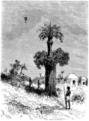
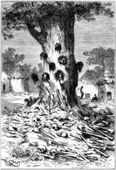

]{.calibre20}

CINQ SEMAINES EN BALLON

]{.calibre20}

## []{#_Toc349730916 .pcalibre .pcalibre4 .pcalibre3}[]{#_Toc349730569 .pcalibre .pcalibre4 .pcalibre3}[]{#_Toc349730190 .pcalibre .pcalibre4 .pcalibre3}[]{#_Toc349729641 .pcalibre .pcalibre4 .pcalibre3}[]{#_Toc349729262 .pcalibre .pcalibre4 .pcalibre3}[]{#_Toc349728713 .pcalibre .pcalibre4 .pcalibre3}[]{#_Toc349728334 .pcalibre .pcalibre4 .pcalibre3}[]{#_Toc349727747 .pcalibre .pcalibre4 .pcalibre3}[]{#_Toc349727198 .pcalibre .pcalibre4 .pcalibre3}[]{#_Toc349726819 .pcalibre .pcalibre4 .pcalibre3}[]{#_Toc349726270 .pcalibre .pcalibre4 .pcalibre3}[]{#_Toc349725923 .pcalibre .pcalibre4 .pcalibre3}[]{#_Toc349725576 .pcalibre .pcalibre4 .pcalibre3}[]{#_Toc349725229 .pcalibre .pcalibre4 .pcalibre3}[]{#_Toc349724882 .pcalibre .pcalibre4 .pcalibre3}[Chapitre 20]{#_Toc349724503 .pcalibre .pcalibre4 .pcalibre3} {#calibre_toc_250 .calibre21}

LA BOUTEILLE CÉLESTE. --- LES FIGUIERS-PALMIERS. --- LES « MAMMOTH TREES ». --- L\'ARBRE DE GUERRE. --- L\'ATTELAGE AILÉ. --- COMBATS DE DEUX PEUPLADES. --- MASSACRE. --- INTERVENTION DIVINE.

Le vent devenait violent et irrégulier. Le *Victoria* courait de véritables bordées dans les airs. Rejeté tantôt dans le nord, tantôt dans le sud, il ne pouvait rencontrer un souffle constant.

--- Nous marchons très vite sans avancer beaucoup, dit Kennedy, en remarquant les fréquentes oscillations de l\'aiguille aimantée.

--- Le *Victoria* file avec une vitesse d\'au moins trente lieues à l\'heure, dit Samuel Fergusson. Penchez-vous, et voyez comme la campagne disparaît rapidement sous nos pieds. Tenez ! cette forêt a l\'air de se précipiter au-devant de nous !

--- La forêt est déjà devenue une clairière, répondit le chasseur.

--- Et la clairière un village, riposta Joe, quelques instants plus tard. Voilà-t-il des faces de Nègres assez ébahies !

--- C\'est bien naturel, répondit le docteur. Les paysans de France, à la première apparition des ballons, ont tiré dessus, les prenant pour des monstres aériens ; il est donc permis à un Nègre du Soudan d\'ouvrir de grands yeux.

--- Ma foi ! dit Joe, pendant que le *Victoria* rasait un village à cent pieds du sol, je m\'en vais leur jeter une bouteille vide, avec votre permission, mon maître ; si elle arrive saine et sauve, ils l\'adoreront ; si elle se casse, ils se feront des talismans avec les morceaux !

Et, ce disant, il lança une bouteille, qui ne manqua pas de se briser en mille pièces, tandis que les indigènes se précipitaient dans leurs huttes rondes, en poussant de grands cris.

{#Image264 .calibre65}

Un peu plus loin, Kennedy s\'écria :

--- Regardez donc cet arbre singulier ! il est d\'une espèce par en haut, et d\'une autre par en bas.

--- Bon ! fit Joe ; voilà un pays où les arbres poussent les uns sur les autres.

--- C\'est tout simplement un tronc de figuier, répondit le docteur, sur lequel il s\'est répandu un peu de terre végétale. Le vent un beau jour y a jeté une graine de palmier, et le palmier a poussé comme en plein champ.

--- Une fameuse mode, dit Joe, et que j\'importerai en Angleterre ; cela fera bien dans les parcs de Londres ; sans compter que ce serait un moyen de multiplier les arbres à fruit ; on aurait des jardins en hauteur ; voilà qui sera goûté de tous les petits propriétaires.

En ce moment, il fallut élever le *Victoria* pour franchir une forêt d\'arbres hauts de plus de trois cents pieds, sortes de banians séculaires.

--- Voilà de magnifiques arbres, s\'écria Kennedy ; je ne connais rien de beau comme l\'aspect de ces vénérables forêts. Vois donc, Samuel.

--- La hauteur de ces banians est vraiment merveilleuse, mon cher Dick ; et cependant elle n\'aurait rien d\'étonnant dans les forêts du Nouveau Monde.

--- Comment ! il existe des arbres plus élevés ?

--- Sans doute, parmi ceux que nous appelons les « mammoth trees ». Ainsi, en Californie, on a trouvé un cèdre élevé de quatre cent cinquante pieds, hauteur qui dépasse la tour du Parlement, et même la grande pyramide d\'Égypte. La base avait cent vingt pieds de tour, et les couches concentriques de son bois lui donnaient plus de quatre mille ans d\'existence.

--- Eh ! monsieur, cela n\'a rien d\'étonnant alors ! Quand on vit quatre mille ans, quoi de plus naturel que d\'avoir une belle taille ?

Mais, pendant l\'histoire du docteur et la réponse de Joe, la forêt avait déjà fait place à une grande réunion de huttes circulairement disposées autour d\'une place. Au milieu croissait un arbre unique, et Joe de s\'écrier à sa vue :

--- Eh bien ! s\'il y a quatre mille ans que celui-là produit de pareilles fleurs, je ne lui en fais pas mon compliment.

Et il montrait un sycomore gigantesque dont le tronc disparaissait en entier sous un amas d\'ossements humains. Les fleurs dont parlait Joe étaient des têtes fraîchement coupées, suspendues à des poignards fixés dans l\'écorce.

--- L\'arbre de guerre des cannibales ! dit le docteur. Les Indiens enlèvent la peau du crâne, les Africains la tête entière.

--- Affaire de mode, dit Joe.

{#Image265 .calibre66}

Mais déjà le village aux têtes sanglantes disparaissait à l\'horizon ; un autre plus loin offrait un spectacle non moins repoussant ; des cadavres à demi dévorés, des squelettes tombant en poussière, des membres humains épars çà et là, étaient laissés en pâture aux hyènes et aux chacals.

--- Ce sont sans doute les corps des criminels ; ainsi que cela se pratique dans l\'Abyssinie, on les expose aux bêtes féroces, qui achèvent de les dévorer à leur aise, après les avoir étranglés d\'un coup de dent.

--- Ce n\'est pas beaucoup plus cruel que la potence, dit l\'Écossais. C\'est plus sale, voilà tout.

--- Dans les régions du sud de l\'Afrique, reprit le docteur, on se contente de renfermer le criminel dans sa propre hutte, avec ses bestiaux, et peut-être sa famille ; on y met le feu, et tout brûle en même temps. J\'appelle cela de la cruauté, mais j\'avoue avec Kennedy que, si la potence est moins cruelle, elle est aussi barbare.

Joe, avec l\'excellente vue dont il se servait si bien, signala quelques bandes d\'oiseaux carnassiers qui planaient à l\'horizon.

--- Ce sont des aigles, s\'écria Kennedy, après les avoir reconnus avec la lunette, de magnifiques oiseaux dont le vol est aussi rapide que le nôtre.

--- Le Ciel nous préserve de leurs attaques ! dit le docteur ; ils sont plus à craindre pour nous que les bêtes féroces ou les tribus sauvages.

--- Bah ! répondit le chasseur, nous les écarterions à coups de fusil.

--- J\'aime autant, mon cher Dick, ne pas recourir à ton adresse ; le taffetas de notre ballon ne résisterait pas à un de leurs coups de bec ; heureusement, je crois ces redoutables oiseaux plus effrayés qu\'attirés par notre machine.

--- Eh mais ! une idée, dit Joe, car aujourd\'hui les idées me poussent par douzaines ; si nous parvenions à prendre un attelage d\'aigles vivants, nous les attacherions à notre nacelle, et ils nous traîneraient dans les airs !

--- Le moyen a été sérieusement proposé, répondit le docteur ; mais je le crois peu praticable avec des animaux assez rétifs de leur naturel.

--- On les dresserait, reprit Joe ; au lieu de mors, on les guiderait avec des œillères qui leur intercepteraient la vue ; borgnes, ils iraient à droite ou à gauche ; aveugles, ils s\'arrêteraient.

--- Permets-moi, mon brave Joe, de préférer un vent favorable à tes aigles attelés ; cela coûte moins cher à nourrir, et c\'est plus sûr.

--- Je vous le permets, monsieur, mais je garde mon idée.

Il était midi ; le *Victoria*, depuis quelque temps, se tenait à une allure plus modérée ; le pays marchait au-dessous de lui, il ne fuyait plus.

Tout d\'un coup, des cris et des sifflements parvinrent aux oreilles des voyageurs ; ceux-ci se penchèrent et aperçurent dans une plaine ouverte un spectacle fait pour les émouvoir.

Deux peuplades aux prises se battaient avec acharnement et faisaient voler des nuées de flèches dans les airs. Les combattants, avides de s\'entre-tuer, ne s\'apercevaient pas de l\'arrivée du *Victoria* ; ils étaient environ trois cents, se choquant dans une inextricable mêlée ; la plupart d\'entre eux, rouges du sang des blessés dans lequel ils se vautraient, formaient un ensemble hideux à voir.

À l\'apparition de l\'aérostat, il y eut un temps d\'arrêt ; les hurlements redoublèrent ; quelques flèches furent lancées vers la nacelle, et l\'une d\'elles assez près pour que Joe l\'arrêtât de la main.

--- Montons hors de leur portée ! s\'écria le docteur Fergusson ! Pas d\'imprudence ! cela ne nous est pas permis.

Le massacre continuait de part et d\'autre, à coups de haches et de sagaies ; dès qu\'un ennemi gisait sur le sol, son adversaire se hâtait de lui couper la tête ; les femmes, mêlées à cette cohue, ramassaient les têtes sanglantes et les empilaient à chaque extrémité du champ de bataille ; souvent elles se battaient pour conquérir ce hideux trophée.

--- L\'affreuse scène ! s\'écria Kennedy avec un profond dégoût.

--- Ce sont de vilains bonshommes ! dit Joe. Après cela, s\'ils avaient un uniforme, ils seraient comme tous les guerriers du monde.

--- J\'ai une furieuse envie d\'intervenir dans le combat, reprit le chasseur en brandissant sa carabine.

--- Non pas, répondit vivement le docteur ! non pas ! mêlons-nous de ce qui nous regarde ! Sais-tu qui a tort ou raison, pour jouer le rôle de la Providence ? Fuyons au plus tôt ce spectacle repoussant ! Si les grands capitaines pouvaient dominer ainsi le théâtre de leurs exploits, ils finiraient peut-être par perdre le goût du sang et des conquêtes !

Le chef de l\'un de ces partis sauvages se distinguait par une taille athlétique, jointe à une force d\'hercule. D\'une main il plongeait sa lance dans les rangs compacts de ses ennemis, et de l\'autre y faisait de grandes trouées à coups de hache. À un moment, il rejeta loin de lui sa sagaie rouge de sang, se précipita sur un blessé dont il trancha le bras d\'un seul coup, prit ce bras d\'une main, et, le portant à sa bouche, il y mordit à pleines dents.

--- Ah ! dit Kennedy, l\'horrible bête ! je n\'y tiens plus !

Et le guerrier, frappé d\'une balle au front, tomba en arrière.

À sa chute, une profonde stupeur s\'empara de ses guerriers ; cette mort surnaturelle les épouvanta en ranimant l\'ardeur de leurs adversaires, et en une seconde le champ de bataille fut abandonné de la moitié des combattants.

--- Allons chercher plus haut un courant qui nous emporte, dit le docteur. Je suis écœuré de ce spectacle.

Mais il ne partit pas si vite qu\'il ne pût voir la tribu victorieuse, se précipitant sur les morts et les blessés, se disputer cette chair encore chaude, et s\'en repaître avidement.

--- Pouah ! fit Joe, cela est repoussant !

Le *Victoria* s\'élevait en se dilatant ; les hurlements de cette horde en délire le poursuivirent pendant quelques instants ; mais enfin, ramené vers le sud, il s\'éloigna de cette scène de carnage et de cannibalisme.

Le terrain offrait alors des accidents variés, avec de nombreux cours d\'eau qui s\'écoulaient vers l\'est ; ils se jetaient sans doute dans ces affluents du lac Nû ou du fleuve des Gazelles, sur lequel M. Guillaume Lejean a donné de si curieux détails.

La nuit venue, le *Victoria* jeta l\'ancre par 27° de longitude, et 4° 20\' de latitude septentrionale, après une traversée de 150 milles.
