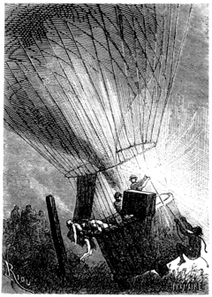
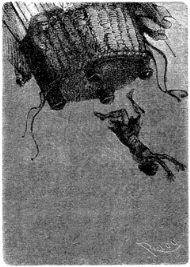
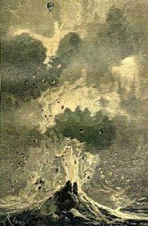

]{.calibre20}

CINQ SEMAINES EN BALLON

]{.calibre20}

## []{#_Toc349730918 .pcalibre .pcalibre4 .pcalibre3}[]{#_Toc349730571 .pcalibre .pcalibre4 .pcalibre3}[]{#_Toc349730192 .pcalibre .pcalibre4 .pcalibre3}[]{#_Toc349729643 .pcalibre .pcalibre4 .pcalibre3}[]{#_Toc349729264 .pcalibre .pcalibre4 .pcalibre3}[]{#_Toc349728715 .pcalibre .pcalibre4 .pcalibre3}[]{#_Toc349728336 .pcalibre .pcalibre4 .pcalibre3}[]{#_Toc349727749 .pcalibre .pcalibre4 .pcalibre3}[]{#_Toc349727200 .pcalibre .pcalibre4 .pcalibre3}[]{#_Toc349726821 .pcalibre .pcalibre4 .pcalibre3}[]{#_Toc349726272 .pcalibre .pcalibre4 .pcalibre3}[]{#_Toc349725925 .pcalibre .pcalibre4 .pcalibre3}[]{#_Toc349725578 .pcalibre .pcalibre4 .pcalibre3}[]{#_Toc349725231 .pcalibre .pcalibre4 .pcalibre3}[]{#_Toc349724884 .pcalibre .pcalibre4 .pcalibre3}[Chapitre 22]{#_Toc349724505 .pcalibre .pcalibre4 .pcalibre3} {#calibre_toc_252 .calibre21}

LA GERBE DE LUMIÈRE. --- LE MISSIONNAIRE. --- ENLÈVEMENT DANS UN RAYON DE LUMIÈRE. --- LE PRÊTRE LAZARISTE. --- PEU D\'ESPOIR. --- SOINS DU DOCTEUR. --- UNE VIE D\'ABNÉGATION. --- PASSAGE D\'UN VOLCAN.

Fergusson projeta vers les divers points de l\'espace son puissant rayon de lumière et l\'arrêta sur un endroit où des cris d\'épouvante se firent entendre. Ses deux compagnons y jetèrent un regard avide.

Le baobab au-dessus duquel se maintenait le *Victoria* presque immobile s\'élevait au centre d\'une clairière ; entre des champs de sésame et de cannes à sucre, on distinguait une cinquantaine de huttes basses et coniques autour desquelles fourmillait une tribu nombreuse.

À cent pieds au-dessous du ballon se dressait un poteau. Au pied de ce poteau gisait une créature humaine, un jeune homme de trente ans au plus, avec de longs cheveux noirs, à demi nu, maigre, ensanglanté, couvert de blessures, la tête inclinée sur la poitrine, comme le Christ en croix. Quelques cheveux plus ras sur le sommet du crâne indiquaient encore la place d\'une tonsure à demi effacée.

--- Un missionnaire ! un prêtre ! s\'écria Joe.

--- Pauvre malheureux ! répondit le chasseur.

--- Nous le sauverons, Dick ! fit le docteur, nous le sauverons !

La foule des Nègres, en apercevant le ballon, semblable à une comète énorme avec une queue de lumière éclatante, fut prise d\'une épouvante facile à concevoir. À ces cris, le prisonnier releva la tête. Ses yeux brillèrent d\'un rapide espoir, et sans trop comprendre ce qui se passait, il tendit ses mains vers ces sauveurs inespérés.

--- Il vit ! il vit ! s\'écria Fergusson ; Dieu soit loué ! Ces sauvages sont plongés dans un magnifique effroi ! Nous le sauverons ! Vous êtes prêts, mes amis ?

--- Nous sommes prêts, Samuel.

--- Joe, éteins le chalumeau.

L\'ordre du docteur fut exécuté. Une brise à peine saisissable poussait doucement le *Victoria* au-dessus du prisonnier, en même temps qu\'il s\'abaissait insensiblement avec la contraction du gaz. Pendant dix minutes environ, il resta flottant au milieu des ondes lumineuses. Fergusson plongeait sur la foule son faisceau étincelant qui dessinait çà et là de rapides et vives plaques de lumière. La tribu, sous l\'empire d\'une indescriptible crainte, disparut peu à peu dans ses huttes, et la solitude se fit autour du poteau. Le docteur avait donc eu raison de compter sur l\'apparition fantastique du *Victoria* qui projetait des rayons de soleil dans cette intense obscurité.

La nacelle s\'approcha du sol. Cependant quelques Nègres, plus audacieux, comprenant que leur victime allait leur échapper, revinrent avec de grands cris. Kennedy prit son fusil, mais le docteur lui ordonna de ne point tirer.

Le prêtre, agenouillé, n\'ayant plus la force de se tenir debout, n\'était pas même lié à ce poteau, car sa faiblesse rendait les liens inutiles. Au moment où la nacelle arriva près du sol, le chasseur, jetant son arme et saisissant le prêtre à bras-le-corps, le déposa dans la nacelle, à l\'instant même où Joe précipitait brusquement les deux cents livres de lest.

{#Image268 .calibre68}

Le docteur s\'attendait à monter avec une rapidité extrême ; mais, contrairement à ses prévisions, le ballon, après s\'être élevé de trois à quatre pieds au-dessus du sol, demeura immobile !

--- Qui nous retient ? s\'écria-t-il avec l\'accent de la terreur.

Quelques sauvages accouraient en poussant des cris féroces.

--- Oh ! s\'écria Joe en se penchant au-dehors. Un de ces maudits Noirs s\'est accroché au-dessous de la nacelle !

--- Dick ! Dick ! s\'écria le docteur, la caisse à eau !

Dick comprit la pensée de son ami, et soulevant une des caisses à eau qui pesait plus de cent livres, il la précipita par-dessus bord.

Le *Victoria*, subitement délesté, fit un bond de trois cents pieds dans les airs, au milieu des rugissements de la tribu, à laquelle le prisonnier échappait dans un rayon d\'une éblouissante lumière.

--- Hurrah ! s\'écrièrent les deux compagnons du docteur.

Soudain le ballon fit un nouveau bond, qui le porta à plus de mille pieds d\'élévation.

--- Qu\'est-ce donc ? demanda Kennedy qui faillit perdre l\'équilibre.

--- Ce n\'est rien ! c\'est ce gredin qui nous lâche, répondit tranquillement Samuel Fergusson.

{#Image269 .calibre69}

Et Joe, se penchant rapidement, put encore apercevoir le sauvage, les mains étendues, tournoyant dans l\'espace, et bientôt se brisant contre terre. Le docteur écarta alors les deux fils électriques, et l\'obscurité redevint profonde. Il était une heure du matin.

Le Français évanoui ouvrit enfin les yeux.

--- Vous êtes sauvé, lui dit le docteur.

--- Sauvé, répondit-il en anglais, avec un triste sourire, sauvé d\'une mort cruelle ! Mes frères, je vous remercie ; mais mes jours sont comptés, mes heures même, et je n\'ai plus beaucoup de temps à vivre !

Et le missionnaire, épuisé, retomba dans son assoupissement.

--- Il se meurt, s\'écria Dick.

--- Non, non, répondit Fergusson en se penchant sur lui, mais il est bien faible ; couchons-le sous la tente.

Ils étendirent doucement sur leurs couvertures ce pauvre corps amaigri, couvert de cicatrices et de blessures encore saignantes, où le fer et le feu avaient laissé en vingt endroits leurs traces douloureuses. Le docteur fit, avec un mouchoir, un peu de charpie qu\'il étendit sur les plaies après les avoir lavées ; ces soins, il les donna adroitement, avec l\'habileté d\'un médecin ; puis, prenant un cordial dans sa pharmacie, il en versa quelques gouttes sur les lèvres du prêtre.

Celui-ci pressa faiblement ses lèvres compatissantes et eut à peine la force de dire : « Merci ! merci ! »

Le docteur comprit qu\'il fallait lui laisser un repos absolu ; il ramena les rideaux de la tente, et revint prendre la direction du ballon.

Celui-ci, en tenant compte du poids de son nouvel hôte, avait été délesté de près de cent quatre-vingts livres ; il se maintenait donc sans l\'aide du chalumeau. Au premier rayon du jour, un courant le poussait doucement vers l\'ouest-nord-ouest. Fergusson alla considérer pendant quelques instants le prêtre assoupi.

--- Puissions-nous conserver ce compagnon que le Ciel nous a envoyé ! dit le chasseur. As-tu quelque espoir ?

--- Oui, Dick, avec des soins, dans cet air si pur.

--- Comme cet homme a souffert ! dit Joe avec émotion. Savez-vous qu\'il faisait là des choses plus hardies que nous, en venant seul au milieu de ces peuplades !

--- Cela n\'est pas douteux, répondit le chasseur.

Pendant toute cette journée, le docteur ne voulut pas que le sommeil du malheureux fût interrompu ; c\'était un long assoupissement, entrecoupé de quelques murmures de souffrance qui ne laissaient pas d\'inquiéter Fergusson.

Vers le soir, le *Victoria* demeurait stationnaire au milieu de l\'obscurité, et pendant cette nuit, tandis que Joe et Kennedy se relayaient aux côtés du malade, Fergusson veilla à la sûreté de tous.

Le lendemain au matin, le *Victoria* avait à peine dérivé dans l\'ouest. La journée s\'annonçait pure et magnifique. Le malade put appeler ses nouveaux amis d\'une voix meilleure. On releva les rideaux de la tente, et il aspira avec bonheur l\'air vif du matin.

--- Comment vous trouvez-vous ? lui demanda Fergusson.

--- Mieux peut-être, répondit-il. Mais vous, mes amis, je ne vous ai encore vus que dans un rêve ! À peine puis-je me rendre compte de ce qui s\'est passé ! Qui êtes-vous, afin que vos noms ne soient pas oubliés dans ma dernière prière ?

--- Nous sommes des voyageurs anglais, répondit Samuel ; nous avons tenté de traverser l\'Afrique en ballon, et, pendant notre passage, nous avons eu le bonheur de vous sauver.

--- La science a ses héros, dit le missionnaire.

--- Mais la religion a ses martyrs, répondit l\'Écossais.

--- Vous êtes missionnaire ? demanda le docteur.

--- Je suis un prêtre de la mission des Lazaristes. Le Ciel vous a envoyés vers moi, le Ciel en soit loué ! Le sacrifice de ma vie était fait ! Mais vous venez d\'Europe. Parlez-moi de l\'Europe, de la France ! Je suis sans nouvelles depuis cinq ans.

--- Cinq ans, seul, parmi ces sauvages ! s\'écria Kennedy.

--- Ce sont des âmes à racheter, dit le jeune prêtre, des frères ignorants et barbares, que la religion seule peut instruire et civiliser.

Samuel Fergusson, répondant au désir du missionnaire, l\'entretint longuement de la France.

Celui-ci l\'écoutait avidement et des larmes coulèrent de ses yeux. Le pauvre jeune homme prenait tour à tour les mains de Kennedy et de Joe dans les siennes, brûlantes de fièvre ; le docteur lui prépara quelques tasses de thé qu\'il but avec plaisir ; il eut alors la force de se relever un peu et de sourire en se voyant emporté dans ce ciel si pur !

--- Vous êtes de hardis voyageurs, dit-il, et vous réussirez dans votre audacieuse entreprise ; vous reverrez vos parents, vos amis, votre patrie, vous !\...

La faiblesse du jeune prêtre devint si grande alors, qu\'il fallut le coucher de nouveau. Une prostration de quelques heures le tint comme mort entre les mains de Fergusson. Celui-ci ne pouvait contenir son émotion ; il sentait cette existence s\'enfuir. Allaient-ils donc perdre si vite celui qu\'ils avaient arraché au supplice ? Il pansa de nouveau les plaies horribles du martyr et dut sacrifier la plus grande partie de sa provision d\'eau pour rafraîchir ses membres brûlants. Il l\'entoura des soins les plus tendres et les plus intelligents. Le malade renaissait peu à peu entre ses bras, et reprenait le sentiment, sinon la vie.

Le docteur surprit son histoire entre ses paroles entrecoupées.

--- Parlez votre langue maternelle, lui avait-il dit ; je la comprends, et cela vous fatiguera moins.

Le missionnaire était un pauvre jeune homme du village d\'Aradon, en Bretagne, en plein Morbihan ; ses premiers instincts l\'entraînèrent vers la carrière ecclésiastique ; à cette vie d\'abnégation il voulut encore joindre la vie de danger, en entrant dans l\'ordre des prêtres de la Mission, dont saint Vincent de Paul fut le glorieux fondateur ; à vingt ans, il quittait son pays pour les plages inhospitalières de l\'Afrique. Et de là peu à peu, franchissant les obstacles, bravant les privations, marchant et priant, il s\'avança jusqu\'au sein des tribus qui habitent les affluents du Nil supérieur ; pendant deux ans, sa religion fut repoussée, son zèle fut méconnu, ses charités furent mal prises ; il demeura prisonnier de l\'une des plus cruelles peuplades du Nyambarra, en butte à mille mauvais traitements. Mais toujours il enseignait, il instruisait, il priait. Cette tribu dispersée et lui laissé pour mort après un de ces combats si fréquents de peuplade à peuplade, au lieu de retourner sur ses pas, il continua son pèlerinage évangélique. Son temps le plus paisible fut celui où on le prit pour un fou ; il s\'était familiarisé avec les idiomes de ces contrées ; il catéchisait. Enfin, pendant deux longues années encore, il parcourut ces régions barbares, poussé par cette force surhumaine qui vient de Dieu ; depuis un an, il résidait dans cette tribu des Nyam-Nyam, nommée Barafri, l\'une des plus sauvages. Le chef étant mort il y a quelques jours, ce fut à lui qu\'on attribua cette mort inattendue ; on résolut de l\'immoler ; depuis quarante heures déjà durait son supplice ; ainsi que l\'avait supposé le docteur, il devait mourir au soleil de midi. Quand il entendit le bruit des armes à feu, la nature l\'emporta : « À moi ! à moi ! » s\'écria-t-il, et il crut avoir rêvé, lorsqu\'une voix venue du ciel lui lança des paroles de consolation.

--- Je ne regrette pas, ajouta-t-il, cette existence qui s\'en va, ma vie est à Dieu !

--- Espérez encore, lui répondit le docteur ; nous sommes près de vous ; nous vous sauverons de la mort comme nous vous avons arraché au supplice.

--- Je n\'en demande pas tant au Ciel, répondit le prêtre résigné ! Béni soit Dieu de m\'avoir donné avant de mourir cette joie de presser des mains amies, et d\'entendre la langue de mon pays.

Le missionnaire s\'affaiblit de nouveau. La journée se passa ainsi entre l\'espoir et la crainte, Kennedy très ému et Joe s\'essuyant les yeux à l\'écart.

Le *Victoria* faisait peu de chemin, et le vent semblait vouloir ménager son précieux fardeau.

Joe signala vers le soir une lueur immense dans l\'ouest. Sous des latitudes plus élevées, on eût pu croire à une vaste aurore boréale ; le ciel paraissait en feu. Le docteur vint examiner attentivement ce phénomène.

--- Ce ne peut être qu\'un volcan en activité, dit-il.

--- Mais le vent nous porte au-dessus, répliqua Kennedy.

--- Eh bien ! nous le franchirons à une hauteur rassurante.

{#Image270 .calibre70}

Trois heures après, le *Victoria* se trouvait en pleines montagnes ; sa position exacte était par 24° 15\' de longitude et 4° 42\' de latitude ; devant lui, un cratère embrasé déversait des torrents de lave en fusion, et projetait des quartiers de roches à une grande élévation ; il y avait des coulées de feu liquide qui retombaient en cascades éblouissantes. Magnifique et dangereux spectacle, car le vent, avec une fixité constante, portait le ballon vers cette atmosphère incendiée.

Cet obstacle que l\'on ne pouvait tourner, il fallut le franchir ; le chalumeau fut développé à toute flamme, et le *Victoria* parvint à six mille pieds, laissant entre le volcan et lui un espace de plus de trois cents toises.

De son lit de douleur, le prêtre mourant put contempler ce cratère en feu d\'où s\'échappaient avec fracas mille gerbes éblouissantes.

--- Que c\'est beau, dit-il, et que la puissance de Dieu est infinie jusque dans ses plus terribles manifestations !

Cet épanchement de laves en ignition revêtait les flancs de la montagne d\'un véritable tapis de flammes ; l\'hémisphère inférieur du ballon resplendissait dans la nuit ; une chaleur torride montait jusqu\'à la nacelle, et le docteur Fergusson eut hâte de fuir cette périlleuse situation.

Vers dix heures du soir, la montagne n\'était plus qu\'un point rouge à l\'horizon, et le *Victoria* poursuivait tranquillement son voyage dans une zone moins élevée.
