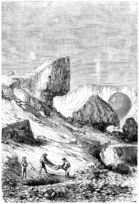

]{.calibre20}

CINQ SEMAINES EN BALLON

]{.calibre20}

## []{#_Toc349730919 .pcalibre .pcalibre4 .pcalibre3}[]{#_Toc349730572 .pcalibre .pcalibre4 .pcalibre3}[]{#_Toc349730193 .pcalibre .pcalibre4 .pcalibre3}[]{#_Toc349729644 .pcalibre .pcalibre4 .pcalibre3}[]{#_Toc349729265 .pcalibre .pcalibre4 .pcalibre3}[]{#_Toc349728716 .pcalibre .pcalibre4 .pcalibre3}[]{#_Toc349728337 .pcalibre .pcalibre4 .pcalibre3}[]{#_Toc349727750 .pcalibre .pcalibre4 .pcalibre3}[]{#_Toc349727201 .pcalibre .pcalibre4 .pcalibre3}[]{#_Toc349726822 .pcalibre .pcalibre4 .pcalibre3}[]{#_Toc349726273 .pcalibre .pcalibre4 .pcalibre3}[]{#_Toc349725926 .pcalibre .pcalibre4 .pcalibre3}[]{#_Toc349725579 .pcalibre .pcalibre4 .pcalibre3}[]{#_Toc349725232 .pcalibre .pcalibre4 .pcalibre3}[]{#_Toc349724885 .pcalibre .pcalibre4 .pcalibre3}[Chapitre 23]{#_Toc349724506 .pcalibre .pcalibre4 .pcalibre3} {#calibre_toc_253 .calibre21}

COLÈRE DE JOE. --- LA MORT D\'UN JUSTE. --- LA VEILLÉE DU CORPS. --- ARIDITÉ. --- L\'ENSEVELISSEMENT. --- LES BLOCS DE QUARTZ. --- HALLUCINATION DE JOE. --- UN LEST PRÉCIEUX. --- RELÈVEMENT DES MONTAGNES AURIFÈRES. --- COMMENCEMENT DES DÉSESPOIRS DE JOE.

Une nuit magnifique s\'étendait sur la terre. Le prêtre s\'endormit dans une prostration paisible.

--- Il n\'en reviendra pas, dit Joe ! Pauvre jeune homme ! trente ans à peine !

--- Il s\'éteindra dans nos bras ! dit le docteur avec désespoir. Sa respiration déjà si faible s\'affaiblit encore, et je ne puis rien pour le sauver !

--- Les infâmes gueux ! s\'écriait Joe, que ces subites colères prenaient de temps à autre. Et penser que ce digne prêtre a trouvé encore des paroles pour les plaindre, pour les excuser, pour leur pardonner !

--- Le Ciel lui fait une nuit bien belle, Joe, sa dernière nuit peut-être. Il souffrira peu désormais, et sa mort ne sera qu\'un paisible sommeil.

Le mourant prononça quelques paroles entrecoupées ; le docteur s\'approcha ; la respiration du malade devenait embarrassée ; il demandait de l\'air ; les rideaux furent entièrement retirés, et il aspira avec délices les souffles légers de cette nuit transparente ; les étoiles lui adressaient leur tremblante lumière, et la lune l\'enveloppait dans le blanc linceul de ses rayons.

--- Mes amis, dit-il d\'une voix affaiblie, je m\'en vais ! Que le Dieu qui récompense vous conduise au port ! qu\'il vous paie pour moi ma dette de reconnaissance !

--- Espérez encore, lui répondit Kennedy. Ce n\'est qu\'un affaiblissement passager. Vous ne mourrez pas ! Peut-on mourir par cette belle nuit d\'été ?

--- La mort est là, reprit le missionnaire, je le sais ! Laissez-moi la regarder en face ! La mort, commencement des choses éternelles, n\'est que la fin des soucis terrestres. Mettez-moi à genoux, mes frères, je vous en prie !

Kennedy le souleva ; ce fut pitié de voir ses membres sans forces se replier sous lui.

--- Mon Dieu ! mon Dieu ! s\'écria l\'apôtre mourant, ayez pitié de moi !

Sa figure resplendit. Loin de cette terre dont il n\'avait jamais connu les joies, au milieu de cette nuit qui lui jetait ses plus douces clartés, sur le chemin de ce ciel vers lequel il s\'élevait comme dans une assomption miraculeuse, il semblait déjà revivre de l\'existence nouvelle.

Son dernier geste fut une bénédiction suprême à ses amis d\'un jour. Et il retomba dans les bras de Kennedy, dont le visage se baignait de grosses larmes.

--- Mort ! dit le docteur en se penchant sur lui, mort !

Et d\'un commun accord les trois amis s\'agenouillèrent pour prier en silence.

--- Demain matin, reprit bientôt Fergusson, nous l\'ensevelirons dans cette terre d\'Afrique arrosée de son sang.

Pendant le reste de la nuit, le corps fut veillé tour à tour par le docteur, Kennedy, Joe, et pas une parole ne troubla ce religieux silence ; chacun pleurait.

Le lendemain, le vent venait du sud, et le *Victoria* marchait assez lentement au-dessus d\'un vaste plateau de montagnes ; là des cratères éteints, ici des ravins incultes ; pas une goutte d\'eau sur ces crêtes desséchées ; des rocs amoncelés, des blocs erratiques, des marnières blanchâtres, tout dénotait une stérilité profonde.

Vers midi, le docteur, pour procéder à l\'ensevelissement du corps, résolut de descendre dans un ravin, au milieu de roches plutoniques de formation primitive ; les montagnes environnantes devaient l\'abriter et lui permettre d\'amener sa nacelle jusqu\'au sol, car il n\'existait aucun arbre qui pût lui offrir un point d\'arrêt.

Mais, ainsi qu\'il l\'avait fait comprendre à Kennedy, par suite de sa perte de lest lors de l\'enlèvement du prêtre, il ne pouvait descendre maintenant qu\'à la condition de lâcher une quantité proportionnelle de gaz ; il ouvrit donc la soupape du ballon extérieur. L\'hydrogène fusa, et le *Victoria* s\'abaissa tranquillement vers le ravin.

Dès que la nacelle toucha à terre, le docteur ferma sa soupape ; Joe sauta sur le sol, tout en se retenant d\'une main au bord extérieur, et de l\'autre, il ramassa un certain nombre de pierres qui bientôt remplacèrent son propre poids ; alors il put employer ses deux mains, et il eut bientôt entassé dans la nacelle plus de cinq cents livres de pierres ; alors le docteur et Kennedy purent descendre à leur tour. Le *Victoria* se trouvait équilibré, et sa force ascensionnelle était impuissante à l\'enlever.

D\'ailleurs, il ne fallut pas employer une grande quantité de ces pierres, car les blocs ramassés par Joe étaient d\'une pesanteur extrême, ce qui éveilla un instant l\'attention de Fergusson. Le sol était parsemé de quartz et de roches porphyriteuses.

--- Voilà une singulière découverte, se dit mentalement le docteur.

Pendant ce temps, Kennedy et Joe allèrent à quelques pas choisir un emplacement pour la fosse. Il faisait une chaleur extrême dans ce ravin encaissé comme une sorte de fournaise. Le soleil de midi y versait d\'aplomb ses rayons brûlants.

{#Image272 .calibre71}

Il fallut d\'abord déblayer le terrain des fragments de roc qui l\'encombraient ; puis une fosse fut creusée assez profondément pour que les animaux féroces ne pussent déterrer le cadavre.

Le corps du martyr y fut déposé avec respect.

La terre retomba sur ces dépouilles mortelles, et au-dessus de gros fragments de roches furent disposés comme un tombeau.

Le docteur cependant demeurait immobile et perdu dans ses réflexions. Il n\'entendait pas l\'appel de ses compagnons, il ne revenait pas avec eux chercher un abri contre la chaleur du jour.

--- À quoi penses-tu donc, Samuel ? lui demanda Kennedy.

--- À un contraste bizarre de la nature, à un singulier effet du hasard. Savez-vous dans quelle terre cet homme d\'abnégation, ce pauvre de cœur a été enseveli ?

--- Que veux-tu dire ? Samuel, demanda l\'Écossais.

--- Ce prêtre, qui avait fait vœu de pauvreté, repose maintenant dans une mine d\'or !

--- Une mine d\'or ! s\'écrièrent Kennedy et Joe.

--- Une mine d\'or, répondit tranquillement le docteur. Ces blocs que vous foulez aux pieds comme des pierres sans valeur sont du minerai d\'une grande pureté.

--- Impossible ! impossible ! répéta Joe.

--- Vous ne chercheriez pas longtemps dans ces fissures de schiste ardoisé sans rencontrer des pépites importantes.

Joe se précipita comme un fou sur ces fragments épars. Kennedy n\'était pas loin de l\'imiter.

--- Calme-toi, mon brave Joe, lui dit son maître.

--- Monsieur, vous en parlez à votre aise.

--- Comment ! un philosophe de ta trempe\...

--- Eh ! Monsieur, il n\'y a pas de philosophie qui tienne.

--- Voyons ! réfléchis un peu. À quoi nous servirait toute cette richesse ? nous ne pouvons pas l\'emporter.

--- Nous ne pouvons pas l\'emporter ? par exemple !

--- C\'est un peu lourd pour notre nacelle ! J\'hésitais même à te faire part de cette découverte, dans la crainte d\'exciter tes regrets.

--- Comment ! dit Joe, abandonner ces trésors ! Une fortune à nous ! bien à nous ! la laisser !

--- Prends garde, mon ami. Est-ce que la fièvre de l\'or te prendrait ? est-ce que ce mort, que tu viens d\'ensevelir, ne t\'as pas enseigné la valeur des choses humaines ?

--- Tout cela est vrai, répondit Joe ; mais enfin, de l\'or ! Monsieur Kennedy, est-ce que vous ne m\'aiderez pas à ramasser un peu de ces millions ?

--- Qu\'en ferions-nous, mon pauvre Joe ? dit le chasseur qui ne put s\'empêcher de sourire. Nous ne sommes pas venus ici chercher la fortune, et nous ne devons pas la rapporter.

--- C\'est un peu lourd, les millions, reprit le docteur, et cela ne se met pas aisément dans la poche.

--- Mais enfin, répondit Joe, poussé dans ses derniers retranchements, ne peut-on, au lieu de sable, emporter ce minerai pour lest ?

--- Eh bien ! j\'y consens, dit Fergusson ; mais tu ne feras pas trop la grimace, quand nous jetterons quelques milliers de livres par-dessus le bord.

--- Des milliers de livres ! reprenait Joe, est-il possible que tout cela soit de l\'or !

--- Oui, mon ami ; c\'est un réservoir où la nature a entassé ses trésors depuis des siècles ; il y a là de quoi enrichir des pays tout entiers ! Une Australie et une Californie réunies au fond d\'un désert !

--- Et tout cela demeurera inutile !

--- Peut-être ! En tout cas, voici ce que je ferai pour te consoler.

--- Ce sera difficile, répliqua Joe d\'un air contrit.

--- Écoute. Je vais prendre la situation exacte de ce placer, je te la donnerai, et, à ton retour en Angleterre, tu en feras part à tes concitoyens, si tu crois que tant d\'or puisse faire leur bonheur.

--- Allons, mon maître, je vois bien que vous avez raison ; je me résigne, puisqu\'il n\'y a pas moyen de faire autrement. Emplissons notre nacelle de ce précieux minerai. Ce qui restera à la fin du voyage sera toujours autant de gagné.

Et Joe se mit à l\'ouvrage ; il y allait de bon cœur ; il eut bientôt entassé près de mille livres de fragments de quartz, dans lequel l\'or se trouve renfermé comme dans une gangue d\'une grande dureté.

Le docteur le regardait faire en souriant ; pendant ce travail, il prit ses hauteurs, trouva pour le gisement de la tombe du missionnaire 22° 23\' de longitude, et 4° 55\' de latitude septentrionale.

Puis, jetant un dernier regard sur ce renflement du sol sous lequel reposait le corps du pauvre Français, il revint vers la nacelle.

Il eût voulu dresser une croix modeste et grossière sur ce tombeau abandonné au milieu des déserts de l\'Afrique ; mais pas un arbre ne croissait aux environs.

--- Dieu la reconnaîtra, dit-il.

Une préoccupation assez sérieuse se glissait aussi dans l\'esprit de Fergusson ; il aurait donné beaucoup de cet or pour trouver un peu d\'eau ; il voulait remplacer celle qu\'il avait jetée avec la caisse pendant l\'enlèvement du Nègre, mais c\'était une chose impossible dans ces terrains arides ; cela ne laissait pas de l\'inquiéter ; obligé d\'alimenter sans cesse son chalumeau, il commençait à se trouver à court pour les besoins de la soif ; il se promit donc de ne négliger aucune occasion de renouveler sa réserve.

De retour à la nacelle, il la trouva encombrée par les pierres de l\'avide Joe ; il y monta sans rien dire, Kennedy prit sa place habituelle, et Joe les suivit tous deux, non sans jeter un regard de convoitise sur les trésors du ravin.

Le docteur alluma son chalumeau ; le serpentin s\'échauffa, le courant d\'hydrogène se fit au bout de quelques minutes, le gaz se dilata, mais le ballon ne bougea pas.

Joe le regardait faire avec inquiétude et ne disait mot.

--- Joe, fit le docteur.

Joe ne répondit pas.

--- Joe, m\'entends-tu ?

Joe fit signe qu\'il entendait, mais qu\'il ne voulait pas comprendre.

--- Tu vas me faire le plaisir, reprit Fergusson, de jeter une certaine quantité de ce minerai à terre.

--- Mais, monsieur, vous m\'avez permis\...

--- Je t\'ai permis de remplacer le lest, voilà tout.

--- Cependant\...

--- Veux-tu donc que nous restions éternellement dans ce désert ?

Joe jeta un regard désespéré vers Kennedy ; mais le chasseur prit l\'air d\'un homme qui n\'y pouvait rien.

--- Eh bien, Joe ?

--- Votre chalumeau ne fonctionne donc pas ? reprit l\'entêté.

--- Mon chalumeau est allumé, tu le vois bien ! mais le ballon ne s\'enlèvera que lorsque tu l\'auras délesté un peu.

Joe se gratta l\'oreille, prit un fragment de quartz, le plus petit de tous, le pesa, le repesa, le fit sauter dans ses mains ; c\'était un poids de trois ou quatre livres ; il le jeta.

Le *Victoria* ne bougea pas.

--- Hein ! fit-il, nous ne montons pas encore ?

--- Pas encore, répondit le docteur. Continue.

Kennedy riait. Joe jeta encore une dizaine de livres. Le ballon demeurait toujours immobile. Joe pâlit.

--- Mon pauvre garçon, dit Fergusson, Dick, toi et moi, nous pesons, si je ne me trompe, environ quatre cents livres ; il faut donc te débarrasser d\'un poids au moins égal au nôtre, puisqu\'il nous remplaçait.

--- Quatre cents livres à jeter ! s\'écria Joe piteusement.

--- Et quelque chose avec pour nous enlever. Allons, courage !

Le digne garçon, poussant de profonds soupirs, se mit à délester le ballon. De temps en temps il s\'arrêtait :

--- Nous montons ! disait-il.

--- Nous ne montons pas, lui était-il invariablement répondu.

--- Il remue, dit-il enfin.

--- Va encore, répétait Fergusson.

--- Il monte ! j\'en suis sûr.

--- Va toujours, répliquait Kennedy.

Alors Joe, prenant un dernier bloc avec désespoir, le précipita en dehors de la nacelle. Le *Victoria* s\'éleva d\'une centaine de pieds, et, le chalumeau aidant, il dépassa bientôt les cimes environnantes.

--- Maintenant, Joe, dit le docteur, il te reste encore une jolie fortune, si nous parvenons à garder cette provision jusqu\'à la fin du voyage, et tu seras riche pour le reste de tes jours.

Joe ne répondit rien et s\'étendit moelleusement sur son lit de minerai.

--- Vois, mon cher Dick, reprit le docteur, ce que peut la puissance de ce métal sur le meilleur garçon du monde. Que de passions, que d\'avidités, que de crimes enfanterait la connaissance d\'une pareille mine ! Cela est attristant.

Au soir, le *Victoria* s\'était avancé de quatre-vingt-dix milles dans l\'ouest ; il se trouvait alors en droite ligne à quatorze cents milles de Zanzibar.
