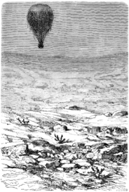
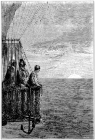

]{.calibre20}

CINQ SEMAINES EN BALLON

]{.calibre20}

## []{#_Toc349730920 .pcalibre .pcalibre4 .pcalibre3}[]{#_Toc349730573 .pcalibre .pcalibre4 .pcalibre3}[]{#_Toc349730194 .pcalibre .pcalibre4 .pcalibre3}[]{#_Toc349729645 .pcalibre .pcalibre4 .pcalibre3}[]{#_Toc349729266 .pcalibre .pcalibre4 .pcalibre3}[]{#_Toc349728717 .pcalibre .pcalibre4 .pcalibre3}[]{#_Toc349728338 .pcalibre .pcalibre4 .pcalibre3}[]{#_Toc349727751 .pcalibre .pcalibre4 .pcalibre3}[]{#_Toc349727202 .pcalibre .pcalibre4 .pcalibre3}[]{#_Toc349726823 .pcalibre .pcalibre4 .pcalibre3}[]{#_Toc349726274 .pcalibre .pcalibre4 .pcalibre3}[]{#_Toc349725927 .pcalibre .pcalibre4 .pcalibre3}[]{#_Toc349725580 .pcalibre .pcalibre4 .pcalibre3}[]{#_Toc349725233 .pcalibre .pcalibre4 .pcalibre3}[]{#_Toc349724886 .pcalibre .pcalibre4 .pcalibre3}[Chapitre 24]{#_Toc349724507 .pcalibre .pcalibre4 .pcalibre3} {#calibre_toc_254 .calibre21}

LE VENT TOMBE. --- LES APPROCHES DU DÉSERT. --- LE DÉCOMPTE DE LA PROVISION D\'EAU. --- LES NUITS DE L\'ÉQUATEUR. --- INQUIÉTUDES DE SAMUEL FERGUSSON. --- LA SITUATION TELLE QU\'ELLE EST. --- ÉNERGIQUES RÉPONSES DE KENNEDY ET DE JOE. --- ENCORE UNE NUIT.

Le *Victoria*, accroché à un arbre solitaire et presque desséché, passa la nuit dans une tranquillité parfaite ; les voyageurs purent goûter un peu de ce sommeil dont ils avaient si grand besoin ; les émotions des journées précédentes leur avaient laissé de tristes souvenirs.

Vers le matin, le ciel reprit sa limpidité brillante et sa chaleur. Le ballon s\'éleva dans les airs ; après plusieurs essais infructueux, il rencontra un courant, peu rapide d\'ailleurs, qui le porta vers le nord-ouest.

--- Nous n\'avançons plus, dit le docteur ; si je ne me trompe, nous avons accompli la moitié de notre voyage à peu près en dix jours ; mais, au train dont nous marchons, il nous faudra des mois pour le terminer. Cela est d\'autant plus fâcheux que nous sommes menacés de manquer d\'eau.

--- Mais nous en trouverons, répondit Dick ; il est impossible de ne pas rencontrer quelque rivière, quelque ruisseau, quelque étang, dans cette vaste étendue de pays.

--- Je le désire.

--- Ne serait-ce pas le chargement de Joe qui retarderait notre marche ?

Kennedy parlait ainsi pour taquiner le brave garçon ; il le faisait d\'autant plus volontiers, qu\'il avait un instant éprouvé les hallucinations de Joe ; mais, n\'en ayant rien fait paraître, il se posait en esprit fort ; le tout en riant, du reste.

Joe lui lança un coup d\'œil piteux. Mais le docteur ne répondit pas. Il songeait, non sans de secrètes terreurs, aux vastes solitudes du Sahara ; là, des semaines se passent sans que les caravanes rencontrent un puits où se désaltérer. Aussi surveillait-il avec la plus soigneuse attention les moindres dépressions du sol.

Ces précautions et les derniers incidents avaient sensiblement modifié la disposition d\'esprit des trois voyageurs ; ils parlaient moins ; ils s\'absorbaient davantage dans leurs propres pensées.

Le digne Joe n\'était plus le même depuis que ses regards avaient plongé dans cet océan d\'or ; il se taisait ; il considérait avec avidité ces pierres entassées dans la nacelle, sans valeur aujourd\'hui, inestimables demain.

{#Image273 .calibre72}

L\'aspect de cette partie de l\'Afrique était inquiétant d\'ailleurs. Le désert se faisait peu à peu. Plus un village, pas même une réunion de quelques huttes. La végétation se retirait. À peine quelques plantes rabougries comme dans les terrains bruyéreux de l\'Écosse, un commencement de sables blanchâtres et des pierres de feu, quelques lentisques et des buissons épineux. Au milieu de cette stérilité, la carcasse rudimentaire du globe apparaissant en arêtes de roches vives et tranchantes. Ces symptômes d\'aridité donnaient à penser au docteur Fergusson.

Il ne semblait pas qu\'une caravane eût jamais affronté cette contrée déserte ; elle aurait laissé des traces visibles de campement, les ossements blanchis de ses hommes ou de ses bêtes. Mais rien. Et l\'on sentait que bientôt une immensité de sable s\'emparerait de cette région désolée.

Si l\'eau n\'eût pas manqué ! Mais il en restait en tout trois gallons[[\[44\]]{.MsoFootnoteReference}](../Text/Section0004.xhtml#_ftn44){#_ftnref44 .pcalibre4 .pcalibre3} ! Fergusson mit de côté un gallon destiné à étancher la soif ardente qu\'une chaleur de quatre-vingt-dix degrés[[\[45\]]{.MsoFootnoteReference}](../Text/Section0004.xhtml#_ftn45){#_ftnref45 .pcalibre4 .pcalibre3} rendait intolérable ; deux gallons restaient donc pour alimenter le chalumeau ; ils ne pouvaient produire que quatre cent quatre-vingts pieds cubes de gaz ; or, le chalumeau en dépensait neuf pieds cubes par heure environ ; on ne pouvait donc plus marcher que pendant cinquante-quatre heures. Tout cela était rigoureusement mathématique.

--- Cinquante-quatre heures ! dit-il à ses compagnons. Or, comme je suis bien décidé à ne pas voyager la nuit, de peur de manquer un ruisseau, une source, une mare, c\'est trois jours et demi de voyage qu\'il nous reste, et pendant lesquels il faut trouver de l\'eau à tout prix. J\'ai cru devoir vous prévenir de cette situation grave, mes amis, car je ne réserve qu\'un seul gallon pour notre soif, et nous devrons nous mettre à une ration sévère.

--- Rationne-nous, répondit le chasseur ; mais il n\'est pas encore temps de se désespérer ; nous avons trois jours devant nous, dis-tu ?

--- Oui, mon cher Dick.

--- Eh bien ! comme nos regrets ne sauraient qu\'y faire, dans trois jours il sera temps de prendre un parti ; jusque-là redoublons de vigilance.

Au repas du soir, l\'eau fut donc strictement mesurée ; la quantité d\'eau-de-vie s\'accrut dans les grogs ; mais il fallait se défier de cette liqueur plus propre à altérer qu\'à rafraîchir.

La nacelle reposa pendant la nuit sur un immense plateau qui présentait une forte dépression. Sa hauteur était à peine de huit cents pieds au-dessus du niveau de la mer. Cette circonstance rendit quelque espoir au docteur ; elle lui rappela les présomptions des géographes sur l\'existence d\'une vaste étendue d\'eau au centre de l\'Afrique. Mais, si ce lac existait, il y fallait parvenir ; or, pas un changement ne se faisait dans le ciel immobile.

À la nuit paisible, à sa magnificence étoilée, succédèrent le jour immuable et les rayons ardents du soleil ; dès ses premières lueurs, la température devenait brûlante. À cinq heures du matin, le docteur donna le signal du départ, et pendant un temps assez long le *Victoria* demeura sans mouvement dans une atmosphère de plomb.

Le docteur aurait pu échapper à cette chaleur intense en s\'élevant dans des zones supérieures ; mais il fallait dépenser une plus grande quantité d\'eau, chose impossible alors. Il se contenta donc de maintenir son aérostat à cent pieds du sol ; là, un courant faible le poussait vers l\'horizon occidental.

Le déjeuner se composa d\'un peu de viande séchée et de pemmican. Vers midi, le *Victoria* avait à peine fait quelques milles.

--- Nous ne pouvons aller plus vite, dit le docteur. Nous ne commandons pas, nous obéissons.

--- Ah ! mon cher Samuel, dit le chasseur, voilà une de ces occasions où un propulseur ne serait pas à dédaigner.

--- Sans doute, Dick, en admettant toutefois qu\'il ne dépensât pas d\'eau pour se mettre en mouvement, car alors la situation serait exactement la même ; jusqu\'ici, d\'ailleurs, on n\'a rien inventé qui fût praticable. Les ballons en sont encore au point où se trouvaient les navires avant l\'invention de la vapeur. On a mis six mille ans à imaginer les aubes et les hélices ; nous avons donc le temps d\'attendre.

--- Maudite chaleur ! fit Joe en essuyant son front ruisselant.

--- Si nous avions de l\'eau, cette chaleur nous rendrait quelque service, car elle dilate l\'hydrogène de l\'aérostat et nécessite une flamme moins forte dans le serpentin ! Il est vrai que si nous n\'étions pas à bout de liquide, nous n\'aurions pas à l\'économiser. Ah ! maudit sauvage qui nous a coûté cette précieuse caisse !

--- Tu ne regrettes pas ce que tu as fait, Samuel ?

--- Non, Dick, puisque nous avons pu soustraire cet infortuné à une mort horrible. Mais les cent livres d\'eau que nous avons jetées nous seraient bien utiles ; c\'étaient encore douze ou treize jours de marche assurés, et de quoi traverser certainement ce désert.

--- Nous avons fait au moins la moitié du voyage ? demanda Joe.

--- Comme distance, oui ; comme durée, non, si le vent nous abandonne. Or il a une tendance à diminuer tout à fait.

--- Allons, monsieur, reprit Joe, il ne faut pas nous plaindre ; nous nous en sommes assez bien tirés jusqu\'ici, et, quoi que je fasse, il m\'est impossible de me désespérer. Nous trouverons de l\'eau, c\'est moi qui vous le dis.

Le sol, cependant, se déprimait de mille en mille ; les ondulations des montagnes aurifères venaient mourir sur la plaine ; c\'étaient les derniers ressauts d\'une nature épuisée. Les herbes éparses remplaçaient les beaux arbres de l\'est ; quelques bandes d\'une verdure altérée luttaient encore contre l\'envahissement des sables ; les grandes roches tombées des sommets lointains, écrasées dans leur chute, s\'éparpillaient en cailloux aigus, qui bientôt se feraient sable grossier, puis poussière impalpable.

--- Voici l\'Afrique, telle que tu te la représentais, Joe ; j\'avais raison de te dire : Prends patience !

--- Eh bien, monsieur, répliqua Joe, voilà qui est naturel, au moins ! de la chaleur et du sable ! il serait absurde de rechercher autre chose dans un pareil pays. Voyez-vous, ajouta-t-il en riant, moi je n\'avais pas confiance dans vos forêts et vos prairies ; c\'était un contre-sens ! ce n\'est pas la peine de venir si loin pour rencontrer la campagne d\'Angleterre. Voici la première fois que je me crois en Afrique, et je ne suis pas fâché d\'en goûter un peu.

{#Image274 .calibre73}

Vers le soir, le docteur constata que le *Victoria* n\'avait pas gagné vingt milles pendant cette journée brûlante. Une obscurité chaude l\'enveloppa dès que le soleil eut disparu derrière un horizon tracé avec la netteté d\'une ligne droite.

Le lendemain était le 1^er^ mai, un jeudi ; mais les jours se succédaient avec une monotonie désespérante ; le matin valait le matin qui l\'avait précédé ; midi jetait à profusion ses mêmes rayons toujours inépuisables, et la nuit condensait dans son ombre cette chaleur éparse que le jour suivant devait léguer encore à la nuit suivante. Le vent, à peine sensible, devenait plutôt une expiration qu\'un souffle, et l\'on pouvait pressentir le moment où cette haleine s\'éteindrait elle-même.

Le docteur réagissait contre la tristesse de cette situation ; il conservait le calme et le sang-froid d\'un cœur aguerri. Sa lunette à la main, il interrogeait tous les points de l\'horizon ; il voyait décroître insensiblement les dernières collines et s\'effacer la dernière végétation ; devant lui s\'étendait toute l\'immensité du désert.

La responsabilité qui pesait sur lui l\'affectait beaucoup, bien qu\'il n\'en laissât rien paraître. Ces deux hommes, Dick et Joe, deux amis tous les deux, il les avait entraînés au loin, presque par la force de l\'amitié ou du devoir. Avait-il bien agi ? N\'était-ce pas tenter les voies défendues ? N\'essayait-il pas dans ce voyage de franchir les limites de l\'impossible ? Dieu n\'avait-il pas réservé à des siècles plus reculés la connaissance de ce continent ingrat ?

Toutes ces pensées, comme il arrive aux heures de découragement, se multiplièrent dans sa tête, et, par une irrésistible association d\'idées, Samuel s\'emportait au-delà de la logique et du raisonnement. Après avoir constaté ce qu\'il n\'eût pas dû faire, il se demandait ce qu\'il fallait faire alors. Serait-il impossible de retourner sur ses pas ? N\'existait-il pas des courants supérieurs qui le reporteraient vers des contrées moins arides ? Sûr du pays passé, il ignorait le pays à venir ; aussi, sa conscience parlant haut, il résolut de s\'expliquer franchement avec ses deux compagnons ; il leur exposa nettement la situation ; il leur montra ce qui avait été fait et ce qui restait à faire ; à la rigueur on pouvait revenir, le tenter du moins ; quelle était leur opinion ?

--- Je n\'ai d\'autre opinion que celle de mon maître, répondit Joe. Ce qu\'il souffrira, je puis le souffrir, et mieux que lui. Où il ira, j\'irai.

--- Et toi, Kennedy ?

--- Moi, mon cher Samuel, je ne suis pas homme à me désespérer ; personne n\'ignorait moins que moi les périls de l\'entreprise ; mais je n\'ai plus voulu les voir du moment que tu les affrontais. Je suis donc à toi corps et âme. Dans la situation présente, mon avis est que nous devons persévérer, aller jusqu\'au bout. Les dangers, d\'ailleurs, me paraissent aussi grands pour revenir. Ainsi donc, en avant, tu peux compter sur nous.

--- Merci, mes dignes amis, répondit le docteur véritablement ému. Je m\'attendais à tant de dévouement ; mais il me fallait ces encourageantes paroles. Encore une fois, merci.

Et ces trois hommes se serrèrent la main avec effusion.

--- Écoutez-moi, reprit Fergusson. D\'après mes relèvements, nous ne sommes pas à plus de trois cents milles du golfe de Guinée ; le désert ne peut donc s\'étendre indéfiniment, puisque la côte est habitée et reconnue jusqu\'à une certaine profondeur dans les terres. S\'il le faut, nous nous dirigerons vers cette côte, et il est impossible que nous ne rencontrions pas quelque oasis, quelque puits où renouveler notre provision d\'eau. Mais ce qui nous manque, c\'est le vent, et, sans lui, nous sommes retenus en calme plat au milieu des airs.

--- Attendons avec résignation, dit le chasseur.

Mais chacun à son tour interrogea vainement l\'espace pendant cette interminable journée ; rien n\'apparut qui pût faire naître une espérance. Les derniers mouvements du sol disparurent au soleil couchant, dont les rayons horizontaux s\'allongèrent en longues lignes de feu sur cette plate immensité. C\'était le désert.

Les voyageurs n\'avaient pas franchi une distance de quinze milles, ayant dépensé, ainsi que le jour précédent, cent trente-cinq pieds cubes de gaz pour alimenter le chalumeau, et deux pintes d\'eau sur huit durent être sacrifiées à l\'étanchement d\'une soif ardente.

La nuit se passa tranquille, trop tranquille ! Le docteur ne dormit pas.
