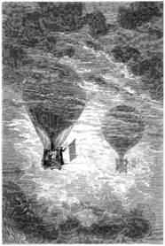

]{.calibre20}

CINQ SEMAINES EN BALLON

]{.calibre20}

## []{#_Toc349730921 .pcalibre .pcalibre4 .pcalibre3}[]{#_Toc349730574 .pcalibre .pcalibre4 .pcalibre3}[]{#_Toc349730195 .pcalibre .pcalibre4 .pcalibre3}[]{#_Toc349729646 .pcalibre .pcalibre4 .pcalibre3}[]{#_Toc349729267 .pcalibre .pcalibre4 .pcalibre3}[]{#_Toc349728718 .pcalibre .pcalibre4 .pcalibre3}[]{#_Toc349728339 .pcalibre .pcalibre4 .pcalibre3}[]{#_Toc349727752 .pcalibre .pcalibre4 .pcalibre3}[]{#_Toc349727203 .pcalibre .pcalibre4 .pcalibre3}[]{#_Toc349726824 .pcalibre .pcalibre4 .pcalibre3}[]{#_Toc349726275 .pcalibre .pcalibre4 .pcalibre3}[]{#_Toc349725928 .pcalibre .pcalibre4 .pcalibre3}[]{#_Toc349725581 .pcalibre .pcalibre4 .pcalibre3}[]{#_Toc349725234 .pcalibre .pcalibre4 .pcalibre3}[]{#_Toc349724887 .pcalibre .pcalibre4 .pcalibre3}[Chapitre 25]{#_Toc349724508 .pcalibre .pcalibre4 .pcalibre3} {#calibre_toc_255 .calibre21}

UN PEU DE PHILOSOPHIE. --- UN NUAGE À L\'HORIZON. --- AU MILIEU D\'UN BROUILLARD. --- LE BALLON INATTENDU. --- LES SIGNAUX. --- VUE EXACTE DU « VICTORIA ». --- LES PALMIERS. --- TRACES D\'UNE CARAVANE. --- LE PUITS AU MILIEU DU DÉSERT.

Le lendemain, même pureté du ciel, même immobilité de l\'atmosphère. Le *Victoria* s\'éleva jusqu\'à une hauteur de cinq cents pieds ; mais c\'est à peine s\'il se déplaça sensiblement dans l\'ouest.

--- Nous sommes en plein désert, dit le docteur. Voici l\'immensité de sable ! Quel étrange spectacle ! Quelle singulière disposition de la nature ! Pourquoi là-bas cette végétation excessive, ici cette extrême aridité, et cela, par la même latitude, sous les mêmes rayons de soleil ?

--- Le pourquoi, mon cher Samuel, m\'inquiète peu, répondit Kennedy ; la raison me préoccupe moins que le fait. Cela est ainsi, voilà l\'important.

--- Il faut bien philosopher un peu, mon cher Dick ; cela ne peut pas faire de mal.

--- Philosophons, je le veux bien ; nous en avons le temps ; à peine si nous marchons. Le vent a peur de souffler, il dort.

--- Cela ne durera pas, dit Joe, il me semble apercevoir quelques bandes de nuages dans l\'est.

--- Joe a raison, répondit le docteur.

--- Bon, fit Kennedy, est-ce que nous tiendrions notre nuage, avec une bonne pluie et un bon vent qu\'il nous jetterait au visage ?

--- Nous verrons bien, Dick, nous verrons bien.

--- C\'est pourtant vendredi, mon maître, et je me défie des vendredis.

--- Eh bien ! j\'espère qu\'aujourd\'hui même tu reviendras de tes préventions.

--- Je le désire, monsieur. Ouf ! fit-il en s\'épongeant le visage, la chaleur est une bonne chose, en hiver surtout ; mais en été, il ne faut pas en abuser.

--- Est-ce que tu ne crains pas l\'ardeur du soleil pour notre ballon ? demanda Kennedy au docteur.

--- Non ; la gutta-percha dont le taffetas est enduit supporte des températures beaucoup plus élevées. Celle à laquelle je l\'ai soumise intérieurement au moyen du serpentin a été quelquefois de cent cinquante-huit degrés[[\[46\]]{.MsoFootnoteReference}](../Text/Section0004.xhtml#_ftn46){#_ftnref46 .pcalibre4 .pcalibre3}, et l\'enveloppe ne paraît pas avoir souffert.

--- Un nuage ! un vrai nuage ! s\'écria en ce moment Joe, dont la vue perçante défiait toutes les lunettes.

En effet, une bande épaisse et maintenant distincte s\'élevait lentement au-dessus de l\'horizon ; elle paraissait profonde et comme boursouflée ; c\'était un amoncellement de petits nuages qui conservaient invariablement leur forme première, d\'où le docteur conclut qu\'il n\'existait aucun courant d\'air dans leur agglomération.

Cette masse compacte avait paru vers huit heures du matin, et à onze heures seulement, elle atteignait le disque du soleil, qui disparut tout entier derrière cet épais rideau ; à ce moment même, la bande inférieure du nuage abandonnait la ligne de l\'horizon qui éclatait en pleine lumière.

--- Ce n\'est qu\'un nuage isolé, dit le docteur, il ne faut pas trop compter sur lui. Regarde, Dick, sa forme est encore exactement celle qu\'il avait ce matin.

--- En effet, Samuel, il n\'y a là ni pluie ni vent, pour nous du moins.

--- C\'est à craindre, car il se maintient à une très grande hauteur.

--- Eh bien ! Samuel, si nous allions chercher ce nuage qui ne veut pas crever sur nous ?

--- J\'imagine que cela ne servira pas à grand-chose, répondit le docteur ; ce sera une dépense de gaz et par conséquent d\'eau plus considérable. Mais, dans notre situation, il ne faut rien négliger ; nous allons monter.

Le docteur poussa toute grande la flamme du chalumeau dans les spirales du serpentin ; une violente chaleur se développa, et bientôt le ballon s\'éleva sous l\'action de son hydrogène dilaté.

À quinze cents pieds environ du sol, il rencontra la masse opaque du nuage, et entra dans un épais brouillard, se maintenant à cette élévation ; mais il n\'y trouva pas le moindre souffle de vent ; ce brouillard paraissait même dépourvu d\'humidité, et les objets exposés à son contact furent à peine humectés. Le *Victoria*, enveloppé dans cette vapeur, y gagna peut-être une marche plus sensible, mais ce fut tout.

Le docteur constatait avec tristesse le médiocre résultat obtenu par sa manœuvre, quand il entendit Joe s\'écrier avec les accents de la plus vive surprise :

--- Ah ! par exemple !

--- Qu\'est-ce donc, Joe ?

--- Mon maître ! monsieur Kennedy ! voilà qui est étrange !

--- Qu\'y a-t-il donc ?

--- Nous ne sommes pas seuls ici ! il y a des intrigants ! On nous a volé notre invention !

--- Devient-il fou ? demanda Kennedy.

Joe représentait la statue de la stupéfaction ! Il restait immobile.

--- Est-ce que le soleil aurait dérangé l\'esprit de ce pauvre garçon ? dit le docteur en se tournant vers lui.

--- Me diras-tu ?\... dit-il.

--- Mais voyez, monsieur, dit Joe en indiquant un point dans l\'espace.

--- Par saint Patrick ! s\'écria Kennedy à son tour, ceci n\'est pas croyable ! Samuel, Samuel, vois donc !

--- Je vois, répondit tranquillement le docteur.

--- Un autre ballon ! d\'autres voyageurs comme nous !

{#Image275 .calibre74}

En effet, à deux cents pieds, un aérostat flottait dans l\'air avec sa nacelle et ses voyageurs ; il suivait exactement la même route que le *Victoria.*

--- Eh bien ! dit le docteur, il ne nous reste qu\'à lui faire des signaux ; prends le pavillon, Kennedy, et montrons nos couleurs.

Il paraît que les voyageurs du second aérostat avaient eu au même moment la même pensée, car le même drapeau répétait identiquement le même salut dans une main qui l\'agitait de la même façon.

--- Qu\'est-ce que cela signifie ? demanda le chasseur.

--- Ce sont des singes, s\'écria Joe, ils se moquent de nous !

--- Cela signifie, répondit Fergusson en riant, que c\'est toi-même qui te fais ce signal, mon cher Dick ; cela veut dire que nous-mêmes nous sommes dans cette seconde nacelle, et que ce ballon est tout bonnement notre *Victoria.*

--- Quant à cela, mon maître, sauf votre respect, dit Joe, vous ne me le ferez jamais croire.

--- Monte sur le bord, Joe, agite tes bras, et tu verras.

Joe obéit : il vit ses gestes exactement et instantanément reproduits.

--- Ce n\'est qu\'un effet de mirage, dit le docteur, et pas autre chose ; un simple phénomène d\'optique ; il est dû à la raréfaction inégale des couches de l\'air, et voilà tout.

--- C\'est merveilleux ! répétait Joe, qui ne pouvait se rendre et multipliait ses expériences à tour de bras.

--- Quel curieux spectacle ! reprit Kennedy. Cela fait plaisir de voir notre brave *Victoria* ! Savez-vous qu\'il a bon air et se tient majestueusement ?

--- Vous avez beau expliquer la chose à votre façon, répliqua Joe, c\'est un singulier effet tout de même.

Mais bientôt cette image s\'effaça graduellement ; les nuages s\'élevèrent à une plus grande hauteur, abandonnant le *Victoria*, qui n\'essaya plus de les suivre, et, au bout d\'une heure, ils disparurent en plein ciel.

Le vent, à peine sensible, sembla diminuer encore. Le docteur désespéré se rapprocha du sol.

Les voyageurs, que cet incident avait arrachés à leurs préoccupations, retombèrent dans de tristes pensées, accablés par une chaleur dévorante.

Vers quatre heures, Joe signala un objet en relief sur l\'immense plateau de sable, et il put affirmer bientôt que deux palmiers s\'élevaient à une distance peu éloignée.

--- Des palmiers ! dit Fergusson, mais il y a donc une fontaine, un puits ?

Il prit une lunette et s\'assura que les yeux de Joe ne le trompaient pas.

--- Enfin, répéta-t-il, de l\'eau ! de l\'eau ! et nous sommes sauvés, car, si peu que nous marchions, nous avançons toujours et nous finirons par arriver !

--- Eh bien, monsieur ! dit Joe, si nous buvions en attendant ? L\'air est vraiment étouffant.

--- Buvons, mon garçon.

Personne ne se fit prier. Une pinte entière y passa, ce qui réduisit la provision à trois pintes et demie seulement.

--- Ah ! cela fait du bien ! fit Joe. Que c\'est bon ! Jamais bière de Perkins ne m\'a fait autant de plaisir.

--- Voilà les avantages de la privation, répondit le docteur.

--- Ils sont faibles, en somme, dit le chasseur, et quand je devrais ne jamais éprouver de plaisir à boire de l\'eau, j\'y consentirais à la condition de n\'en être jamais privé.

À six heures, le *Victoria* planait au-dessus des palmiers.

C\'étaient deux maigres arbres, chétifs, desséchés, deux spectres d\'arbres sans feuillage, plus morts que vivants. Fergusson les considéra avec effroi.

À leur pied, on distinguait les pierres à demi rongées d\'un puits ; mais ces pierres, effritées sous les ardeurs du soleil, semblaient ne former qu\'une impalpable poussière. Il n\'y avait pas apparence d\'humidité. Le cœur de Samuel se serra, et il allait faire part de ses craintes à ses compagnons, quand les exclamations de ceux-ci attirèrent son attention.

À perte de vue dans l\'ouest s\'étendait une longue ligne d\'ossements blanchis ; des fragments de squelettes entouraient la fontaine ; une caravane avait poussé jusque-là, marquant son passage par ce long ossuaire ; les plus faibles étaient tombés peu à peu sur le sable ; les plus forts, parvenus à cette source tant désirée, avaient trouvé sur ses bords une mort horrible.

Les voyageurs se regardèrent en pâlissant.

--- Ne descendons pas, dit Kennedy, fuyons ce hideux spectacle ! Il n\'y a pas là une goutte d\'eau à recueillir.

--- Non pas, Dick, il faut en avoir la conscience nette. Autant passer la nuit ici qu\'ailleurs. Nous fouillerons ce puits jusqu\'au fond ; il y a eu là une source ; peut-être en reste-t-il quelque chose.

Le *Victoria* prit terre ; Joe et Kennedy mirent dans la nacelle un poids de sable équivalent au leur et ils descendirent. Ils coururent au puits et pénétrèrent à l\'intérieur par un escalier qui n\'était plus que poussière. La source paraissait tarie depuis de longues années. Ils creusèrent dans un sable sec et friable, le plus aride des sables ; il n\'y avait pas trace d\'humidité.

Le docteur les vit remonter à la surface du désert, suants, défaits, couverts d\'une poussière fine, abattus, découragés, désespérés.

Il comprit l\'inutilité de leurs recherches ; il s\'y attendait, il ne dit rien. Il sentait qu\'à partir de ce moment il devrait avoir du courage et de l\'énergie pour trois.

Joe rapportait les fragments d\'une outre racornie, qu\'il jeta avec colère au milieu des ossements dispersés sur le sol.

Pendant le souper, pas une parole ne fut échangée entre les voyageurs ; ils mangeaient avec répugnance.

Et pourtant, ils n\'avaient pas encore véritablement enduré les tourments de la soif, et ils ne se désespéraient que pour l\'avenir.
