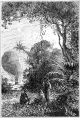
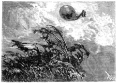

]{.calibre20}

CINQ SEMAINES EN BALLON

]{.calibre20}

## []{#_Toc349730924 .pcalibre .pcalibre4 .pcalibre3}[]{#_Toc349730577 .pcalibre .pcalibre4 .pcalibre3}[]{#_Toc349730198 .pcalibre .pcalibre4 .pcalibre3}[]{#_Toc349729649 .pcalibre .pcalibre4 .pcalibre3}[]{#_Toc349729270 .pcalibre .pcalibre4 .pcalibre3}[]{#_Toc349728721 .pcalibre .pcalibre4 .pcalibre3}[]{#_Toc349728342 .pcalibre .pcalibre4 .pcalibre3}[]{#_Toc349727755 .pcalibre .pcalibre4 .pcalibre3}[]{#_Toc349727206 .pcalibre .pcalibre4 .pcalibre3}[]{#_Toc349726827 .pcalibre .pcalibre4 .pcalibre3}[]{#_Toc349726278 .pcalibre .pcalibre4 .pcalibre3}[]{#_Toc349725931 .pcalibre .pcalibre4 .pcalibre3}[]{#_Toc349725584 .pcalibre .pcalibre4 .pcalibre3}[]{#_Toc349725237 .pcalibre .pcalibre4 .pcalibre3}[]{#_Toc349724890 .pcalibre .pcalibre4 .pcalibre3}[Chapitre 28]{#_Toc349724511 .pcalibre .pcalibre4 .pcalibre3} {#calibre_toc_258 .calibre21}

SOIRÉE DÉLICIEUSE. --- LA CUISINE DE JOE. --- DISSERTATION SUR LA VIANDE CRUE. --- HISTOIRE DE JAMES BRUCE. --- LE BIVAC. --- LES RÊVES DE JOE. --- LE BAROMÈTRE BAISSE. --- LE BAROMÈTRE REMONTE. --- PRÉPARATIFS DE DÉPART. --- L\'OURAGAN.

La soirée fut charmante et se passa sous de frais ombrages de mimosas, après un repas réconfortant ; le thé et le grog n\'y furent pas ménagés.

Kennedy avait parcouru ce petit domaine dans tous les sens, il en avait fouillé les buissons ; les voyageurs étaient les seuls êtres animés de ce paradis terrestre ; ils s\'étendirent sur leurs couvertures et passèrent une nuit paisible, qui leur apporta l\'oubli des douleurs passées.

Le lendemain, 7 mai, le soleil brillait de tout son éclat, mais ses rayons ne pouvaient traverser l\'épais rideau d\'ombrage. Comme il avait des vivres en suffisante quantité, le docteur résolut d\'attendre en cet endroit un vent favorable.

{#Image279 .calibre78}

Joe y avait transporté sa cuisine portative, et il se livrait à une foule de combinaisons culinaires, en dépensant l\'eau avec une insouciante prodigalité.

--- Quelle étrange succession de chagrins et de plaisirs ! s\'écria Kennedy ; cette abondance après cette privation ! ce luxe succédant à cette misère ! Ah ! j\'ai été bien près de devenir fou !

--- Mon cher Dick, lui dit le docteur, sans Joe, tu ne serais pas là en train de discourir sur l\'instabilité des choses humaines.

--- Brave ami ! fit Dick en tendant la main à Joe.

--- Il n\'y a pas de quoi, répondit celui-ci. À charge de revanche, monsieur Dick, en préférant toutefois que l\'occasion ne se présente pas de me rendre la pareille !

--- C\'est une pauvre nature que la nôtre ! reprit Fergusson. Se laisser abattre pour si peu !

--- Pour si peu d\'eau, voulez-vous dire, mon maître ! Il faut que cet élément soit bien nécessaire à la vie !

--- Sans doute, Joe, et les gens privés de manger résistent plus longtemps que les gens privés de boire.

--- Je le crois ; d\'ailleurs, au besoin, on mange ce qui se rencontre, même son semblable, quoique cela doive faire un repas à vous rester longtemps sur le cœur !

--- Les sauvages ne s\'en font pas faute, cependant, dit Kennedy.

--- Oui, mais ce sont des sauvages, et qui sont habitués à manger de la viande crue ; voilà une coutume qui me répugnerait !

--- Cela est assez répugnant, en effet, reprit le docteur, pour que personne n\'ait ajouté foi aux récits des premiers voyageurs en Afrique ; ceux-ci rapportèrent que plusieurs peuplades se nourrissaient de viande crue, et on refusa généralement d\'admettre le fait. Ce fut dans ces circonstances qu\'il arriva une singulière aventure à James Bruce.

--- Contez-nous cela, monsieur ; nous avons le temps de vous entendre, dit Joe en s\'étalant voluptueusement sur l\'herbe fraîche.

--- Volontiers. James Bruce était un Écossais du comté de Stirling, qui, de 1768 à 1772, parcourut toute l\'Abyssinie jusqu\'au lac Tyana, à la recherche des sources du Nil ; puis, il revint en Angleterre, où il publia ses voyages en 1790 seulement. Ses récits furent accueillis avec une incrédulité extrême, incrédulité qui sans doute est réservée aux nôtres. Les habitudes des Abyssiniens semblaient si différentes des us et coutumes anglais, que personne ne voulait y croire. Entre autres détails, James Bruce avait avancé que les peuples de l\'Afrique orientale mangeaient de la viande crue. Ce fait souleva tout le monde contre lui. Il pouvait en parler à son aise ! on n\'irait point voir ! Bruce était un homme très courageux et très rageur. Ces doutes l\'irritaient au suprême degré. Un jour, dans un salon d\'Édimbourg, un Écossais reprit en sa présence le thème des plaisanteries quotidiennes, et à l\'endroit de la viande crue, il déclara nettement que la chose n\'était ni possible ni vraie. Bruce ne dit rien ; il sortit, et rentra quelques instants après avec un beefsteack cru, saupoudré de sel et de poivre à la mode africaine. « Monsieur, dit-il à l\'Écossais, en doutant d\'une chose que j\'ai avancée, vous m\'avez fait une injure grave ; en la croyant impraticable, vous vous êtes complètement trompé. Et, pour le prouver à tous, vous allez manger tout de suite ce beefsteack cru, ou vous me rendrez raison de vos paroles. » L\'Écossais eut peur, et il obéit non sans de fortes grimaces. Alors, avec le plus grand sang-froid, James Bruce ajouta : « En admettant même que la chose ne soit pas vraie, monsieur, vous ne soutiendrez plus, du moins, qu\'elle est impossible. »

--- Bien riposté, fit Joe. Si l\'Écossais a pu attraper une indigestion, il n\'a eu que ce qu\'il méritait. Et si, à notre retour en Angleterre, on met notre voyage en doute\...

--- Eh bien ! que feras-tu ? Joe.

--- Je ferai manger aux incrédules les morceaux du *Victoria*, sans sel et sans poivre !

Et chacun de rire des expédients de Joe. La journée se passa de la sorte, en agréables propos ; avec la force revenait l\'espoir ; avec l\'espoir, l\'audace. Le passé s\'effaçait devant l\'avenir avec une providentielle rapidité.

Joe n\'aurait jamais voulu quitter cet asile enchanteur ; c\'était le royaume de ses rêves ; il se sentait chez lui ; il fallut que son maître lui en donnât le relèvement exact, et ce fut avec un grand sérieux qu\'il inscrivit sur ses tablettes de voyage : 15° 43\' de longitude et 8° 32\' de latitude.

Kennedy ne regrettait qu\'une seule chose, de ne pouvoir chasser dans cette forêt en miniature ; selon lui, la situation manquait un peu de bêtes féroces.

--- Cependant, mon cher Dick, reprit le docteur, tu oublies promptement. Et ce lion, et cette lionne ?

--- Ça ! fit-il avec le dédain du vrai chasseur pour l\'animal abattu ! Mais, au fait, leur présence dans cette oasis peut faire supposer que nous ne sommes pas très éloignés de contrées plus fertiles.

--- Preuve médiocre, Dick ; ces animaux-là, pressés par la faim ou la soif, franchissent souvent des distances considérables ; pendant la nuit prochaine, nous ferons même bien de veiller avec plus de vigilance et d\'allumer des feux.

--- Par cette température, fit Joe ! Enfin, si cela est nécessaire, on le fera. Mais j\'éprouverai une véritable peine à brûler ce joli bois, qui nous a été si utile.

--- Nous ferons surtout attention à ne pas l\'incendier, répondit le docteur, afin que d\'autres puissent y trouver quelque jour un refuge au milieu du désert !

--- On y veillera, monsieur ; mais pensez-vous que cette oasis soit connue ?

--- Certainement. C\'est un lieu de halte pour les caravanes qui fréquentent le centre de l\'Afrique, et leur visite pourrait bien ne pas te plaire, Joe.

--- Est-ce qu\'il y a encore par ici de ces affreux Nyam-Nyam ?

--- Sans doute, c\'est le nom général de toutes ces populations, et, sous le même climat, les mêmes races doivent avoir des habitudes pareilles.

--- Pouah ! fit Joe ! Après tout, cela est bien naturel ! Si des sauvages avaient les goûts des gentlemen, où serait la différence ? Par exemple, voilà des braves gens qui ne se seraient pas fait prier pour avaler le beefsteack de l\'Écossais, et même l\'Écossais par-dessus le marché.

Sur cette réflexion très sensée, Joe alla dresser ses bûchers pour la nuit, les faisant aussi minces que possible. Ces précautions furent heureusement inutiles, et chacun s\'endormit tour à tour dans un profond sommeil.

Le lendemain, le temps ne changea pas encore ; il se maintenait au beau avec obstination. Le ballon demeurait immobile, sans qu\'aucune oscillation ne vînt trahir un souffle de vent.

Le docteur recommençait à s\'inquiéter : si le voyage devait ainsi se prolonger, les vivres seraient insuffisants. Après avoir failli succomber faute d\'eau, en serait-on réduit à mourir de faim ?

Mais il reprit assurance en voyant le mercure baisser très sensiblement dans le baromètre ; il y avait des signes évidents d\'un changement prochain dans l\'atmosphère ; il résolut donc de faire ses préparatifs de départ pour profiter de la première occasion ; la caisse d\'alimentation et la caisse à eau furent entièrement remplies toutes les deux.

Fergusson dut rétablir ensuite l\'équilibre de l\'aérostat, et Joe fut obligé de sacrifier une notable partie de son précieux minerai. Avec la santé, les idées d\'ambition lui étaient revenues ; il fit plus d\'une grimace avant d\'obéir à son maître ; mais celui-ci lui démontra qu\'il ne pouvait enlever un poids aussi considérable ; il lui donna à choisir entre l\'eau ou l\'or ; Joe n\'hésita plus, et il jeta sur le sable une forte quantité de ses précieux cailloux.

--- Voilà pour ceux qui viendront après nous, dit-il ; ils seront bien étonnés de trouver la fortune en pareil lieu.

--- Eh ! fit Kennedy, si quelque savant voyageur vient à rencontrer ces échantillons ?\...

--- Ne doute pas, mon cher Dick, qu\'il n\'en soit fort surpris et qu\'il ne publie sa surprise en nombreux in-folios ! Nous entendrons parler quelque jour d\'un merveilleux gisement de quartz aurifère au milieu des sables de l\'Afrique.

--- Et c\'est Joe qui en sera la cause.

L\'idée de mystifier peut-être quelque savant consola le brave garçon et le fit sourire.

Pendant le reste de la journée, le docteur attendit vainement un changement dans l\'atmosphère. La température s\'éleva et, sans les ombrages de l\'oasis, elle eût été insoutenable. Le thermomètre marqua au soleil cent quarante-neuf degrés[[\[50\]]{.MsoFootnoteReference}](../Text/Section0004.xhtml#_ftn50){#_ftnref50 .pcalibre4 .pcalibre3}. Une véritable pluie de feu traversait l\'air. Ce fut la plus haute chaleur qui eût encore été observée.

Joe disposa comme la veille le bivac du soir, et, pendant les quarts du docteur et de Kennedy, il ne se produisit aucun incident nouveau.

Mais, vers trois heures du matin, Joe veillant, la température s\'abaissa subitement, le ciel se couvrit de nuages, et l\'obscurité augmenta.

--- Alerte ! s\'écria Joe en réveillant ses deux compagnons ! alerte ! voici le vent.

--- Enfin ! dit le docteur en considérant le ciel, c\'est une tempête ! Au *Victoria* ! au *Victoria* !

Il était temps d\'y arriver. Le *Victoria* se courbait sous l\'effort de l\'ouragan et entraînait la nacelle qui rayait le sable. Si, par hasard, une partie du lest eût été précipitée à terre, le ballon serait parti, et tout espoir de le retrouver eût été à jamais perdu.

Mais le rapide Joe courut à toutes jambes et arrêta la nacelle, tandis que l\'aérostat se couchait sur le sable au risque de se déchirer. Le docteur prit sa place habituelle, alluma son chalumeau, et jeta l\'excès de poids.

Les voyageurs regardèrent une dernière fois les arbres de l\'oasis qui pliaient sous la tempête, et bientôt, ramassant le vent d\'est à deux cents pieds du sol, ils disparurent dans la nuit.

{#Image280 .calibre79}
