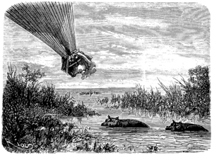

]{.calibre20}

CINQ SEMAINES EN BALLON

]{.calibre20}

## []{#_Toc349730927 .pcalibre .pcalibre4 .pcalibre3}[]{#_Toc349730580 .pcalibre .pcalibre4 .pcalibre3}[]{#_Toc349730201 .pcalibre .pcalibre4 .pcalibre3}[]{#_Toc349729652 .pcalibre .pcalibre4 .pcalibre3}[]{#_Toc349729273 .pcalibre .pcalibre4 .pcalibre3}[]{#_Toc349728724 .pcalibre .pcalibre4 .pcalibre3}[]{#_Toc349728345 .pcalibre .pcalibre4 .pcalibre3}[]{#_Toc349727758 .pcalibre .pcalibre4 .pcalibre3}[]{#_Toc349727209 .pcalibre .pcalibre4 .pcalibre3}[]{#_Toc349726830 .pcalibre .pcalibre4 .pcalibre3}[]{#_Toc349726281 .pcalibre .pcalibre4 .pcalibre3}[]{#_Toc349725934 .pcalibre .pcalibre4 .pcalibre3}[]{#_Toc349725587 .pcalibre .pcalibre4 .pcalibre3}[]{#_Toc349725240 .pcalibre .pcalibre4 .pcalibre3}[]{#_Toc349724893 .pcalibre .pcalibre4 .pcalibre3}[Chapitre 31]{#_Toc349724514 .pcalibre .pcalibre4 .pcalibre3} {#calibre_toc_261 .calibre21}

DÉPART DANS LA NUIT. --- TOUS LES TROIS. --- LES INSTINCTS DE KENNEDY. --- PRÉCAUTIONS. --- LE COURS DU SHARI. --- LE LAC TCHAD. --- L\'EAU DU LAC. --- L\'HIPPOPOTAME. --- UNE BALLE PERDUE.

Vers trois heures du matin, Joe, étant de quart, vit enfin la ville se déplacer sous ses pieds. Le *Victoria* reprenait sa marche. Kennedy et le docteur se réveillèrent.

Ce dernier consulta la boussole, et reconnut avec satisfaction que le vent les portait vers le nord-nord-est.

--- Nous jouons de bonheur, dit-il ; tout nous réussit ; nous découvrirons le lac Tchad aujourd\'hui même.

--- Est-ce une grande étendue d\'eau ? demanda Kennedy.

--- Considérable, mon cher Dick ; dans sa plus grande longueur et sa plus grande largeur, ce lac peut mesurer cent vingt milles.

--- Cela variera un peu notre voyage de nous promener sur une nappe liquide.

--- Mais il me semble que nous n\'avons pas à nous plaindre ; il est très varié, et surtout il se passe dans les meilleures conditions possibles.

--- Sans doute, Samuel ; sauf les privations du désert, nous n\'aurons couru aucun danger sérieux.

--- Il est certain que notre brave *Victoria* s\'est toujours merveilleusement comporté. C\'est aujourd\'hui le 12 mai ; nous sommes partis le 18 avril ; c\'est donc vingt-cinq jours de marche. Encore une dizaine de jours, et nous serons arrivés.

--- Où ?

--- Je n\'en sais rien ; mais que nous importe ?

--- Tu as raison, Samuel ; fions-nous à la Providence du soin de nous diriger et de nous maintenir en bonne santé, comme nous voilà ! On n\'a pas l\'air d\'avoir traversé les pays les plus pestilentiels du monde !

--- Nous étions à même de nous élever, et c\'est ce que nous avons fait.

--- Vivent les voyages aériens ! s\'écria Joe. Nous voici, après vingt-cinq jours, bien portants, bien nourris, bien reposés, trop reposés peut-être, car mes jambes commencent à se rouiller, et je ne serais pas fâché de les dégourdir pendant une trentaine de milles.

--- Tu te donneras ce plaisir-là dans les rues de Londres, Joe ; mais, pour conclure, nous sommes partis trois comme Denham, Clapperton, Overweg, comme Barth, Richardson et Vogel, et, plus heureux que nos devanciers, tous trois nous nous retrouvons encore ! Mais il est bien important de ne pas nous séparer. Si pendant que l\'un de nous est à terre, le *Victoria* devait s\'enlever pour éviter un danger subit, imprévu, qui sait si nous le reverrions jamais ? Aussi, je le dis franchement à Kennedy, je n\'aime pas qu\'il s\'éloigne sous prétexte de chasse.

--- Tu me permettras pourtant bien, ami Samuel, de me passer encore cette fantaisie ; il n\'y a pas de mal à renouveler nos provisions ; d\'ailleurs, avant notre départ, tu m\'as fait entrevoir toute une série de chasses superbes, et jusqu\'ici j\'ai peu fait dans la voie des Anderson et des Cumming.

--- Mais, mon cher Dick, la mémoire te fait défaut, ou ta modestie t\'engage à oublier tes prouesses ; il me semble que, sans parler du menu gibier, tu as déjà une antilope, un éléphant et deux lions sur la conscience.

--- Bon ! qu\'est-ce que cela pour un chasseur africain qui voit passer tous les animaux de la création au bout de son fusil ? Tiens ! tiens ! regarde cette troupe de girafes !

--- Ça, des girafes ! fit Joe : elles sont grosses comme le poing !

--- Parce que nous sommes à mille pieds au-dessus d\'elles ; mais, de près, tu verrais qu\'elles ont trois fois ta hauteur.

--- Et que dis-tu de ce troupeau de gazelles ? reprit Kennedy, et ces autruches qui fuient avec la rapidité du vent ?

--- Ça ! des autruches ! fit Joe, ce sont des poules, tout ce qu\'il y a de plus poules !

--- Voyons, Samuel, ne peut-on s\'approcher ?

--- On peut s\'approcher, Dick, mais non prendre terre. À quoi bon, dès lors, frapper ces animaux qui ne te seront d\'aucune utilité ? S\'il s\'agissait de détruire un lion, un chat-tigre, une hyène, je le comprendrais ; ce serait toujours une bête dangereuse de moins ; mais une antilope, une gazelle, sans autre profit que la vaine satisfaction de tes instincts de chasseur, cela n\'en vaut vraiment pas la peine. Après tout, mon ami, nous allons nous maintenir à cent pieds du sol, et si tu distingues quelque animal féroce, tu nous feras plaisir en lui envoyant une balle dans le cœur.

Le *Victoria* descendit peu à peu, et se maintint néanmoins à une hauteur rassurante. Dans cette contrée sauvage et très peuplée, il fallait se défier de périls inattendus.

Les voyageurs suivaient directement alors le cours du Shari ; les bords charmants de ce fleuve disparaissaient sous les ombrages d\'arbres aux nuances variées ; des lianes et des plantes grimpantes serpentaient de toutes parts et produisaient de curieux enchevêtrements de couleurs. Les crocodiles s\'ébattaient en plein soleil ou plongeaient sous les eaux avec une vivacité de lézard ; en se jouant, ils accostaient les nombreuses îles vertes qui rompaient le courant du fleuve.

Ce fut ainsi, au milieu d\'une nature riche et verdoyante, que passa le district de Maffatay. Vers neuf heures du matin, le docteur Fergusson et ses amis atteignaient enfin la rive méridionale du lac Tchad.

C\'était donc là cette Caspienne de l\'Afrique, dont l\'existence fut si longtemps reléguée au rang des fables, cette mer intérieure à laquelle parvinrent seulement les expéditions de Denham et de Barth.

Le docteur essaya d\'en fixer la configuration actuelle, bien différente déjà de celle de 1847 ; en effet, la carte de ce lac est impossible à tracer ; il est entouré de marais fangeux et presque infranchissables, dans lesquels Barth pensa périr ; d\'une année à l\'autre, ces marais, couverts de roseaux et de papyrus de quinze pieds, deviennent le lac lui-même ; souvent aussi, les villes étalées sur ses bords sont à demi submergées, comme il arriva à Ngornou en 1856, et maintenant les hippopotames et les alligators plongent aux lieux mêmes où s\'élevaient les habitations du Bornou.

{#Image297 .calibre84}

Le soleil versait ses rayons éblouissants sur cette eau tranquille, et au nord les deux éléments se confondaient dans un même horizon.

Le docteur voulut constater la nature de l\'eau, que longtemps on crut salée ; il n\'y avait aucun danger à s\'approcher de la surface du lac, et la nacelle vint le raser comme un oiseau à cinq pieds de distance.

Joe plongea une bouteille, et la ramena à demi pleine ; cette eau fut goûtée et trouvée peu potable, avec un certain goût de natron.

Tandis que le docteur inscrivait le résultat de son expérience, un coup de fusil éclata à ses côtés. Kennedy n\'avait pu résister au désir d\'envoyer une balle à un monstrueux hippopotame ; celui-ci, qui respirait tranquillement, disparut au bruit de la détonation, et la balle conique du chasseur ne parut pas le troubler autrement.

--- Il aurait mieux valu le harponner, dit Joe.

--- Et comment ?

--- Avec une de nos ancres. C\'eût été un hameçon convenable pour un pareil animal.

--- Mais, dit Kennedy, Joe a vraiment une idée\...

--- Que je vous prie de ne pas mettre à exécution ! répliqua le docteur. L\'animal nous aurait vite entraînés où nous n\'avons que faire.

--- Surtout maintenant que nous sommes fixés sur la qualité de l\'eau du Tchad. Est-ce que cela se mange, ce poisson-là, monsieur Fergusson ?

--- Ton poisson, Joe, est tout bonnement un mammifère du genre des pachydermes ; sa chair est excellente, dit-on, et fait l\'objet d\'un grand commerce entre les tribus riveraines du lac.

--- Alors je regrette que le coup de fusil de M. Dick n\'ait pas mieux réussi.

--- Cet animal n\'est vulnérable qu\'au ventre et entre les cuisses ; la balle de Dick ne l\'aura pas même entamé. Mais, si le terrain me paraît propice, nous nous arrêterons à l\'extrêmité septentrionale du lac ; là, Kennedy se trouvera en pleine ménagerie, et il pourra se dédommager à son aise.

--- Eh bien ! dit Joe, que monsieur Dick chasse un peu à l\'hippopotame ! Je voudrais goûter la chair de cet amphibie. Il n\'est vraiment pas naturel de pénétrer jusqu\'au centre de l\'Afrique pour y vivre de bécassines et de perdrix comme en Angleterre !
