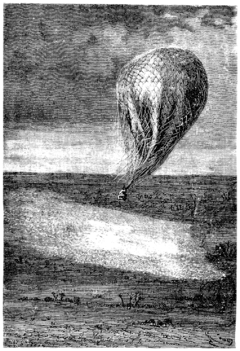

]{.calibre20}

CINQ SEMAINES EN BALLON

]{.calibre20}

## []{#_Toc349730936 .pcalibre .pcalibre4 .pcalibre3}[]{#_Toc349730589 .pcalibre .pcalibre4 .pcalibre3}[]{#_Toc349730210 .pcalibre .pcalibre4 .pcalibre3}[]{#_Toc349729661 .pcalibre .pcalibre4 .pcalibre3}[]{#_Toc349729282 .pcalibre .pcalibre4 .pcalibre3}[]{#_Toc349728733 .pcalibre .pcalibre4 .pcalibre3}[]{#_Toc349728354 .pcalibre .pcalibre4 .pcalibre3}[]{#_Toc349727767 .pcalibre .pcalibre4 .pcalibre3}[]{#_Toc349727218 .pcalibre .pcalibre4 .pcalibre3}[]{#_Toc349726839 .pcalibre .pcalibre4 .pcalibre3}[]{#_Toc349726290 .pcalibre .pcalibre4 .pcalibre3}[]{#_Toc349725943 .pcalibre .pcalibre4 .pcalibre3}[]{#_Toc349725596 .pcalibre .pcalibre4 .pcalibre3}[]{#_Toc349725249 .pcalibre .pcalibre4 .pcalibre3}[]{#_Toc349724902 .pcalibre .pcalibre4 .pcalibre3}[Chapitre 40]{#_Toc349724523 .pcalibre .pcalibre4 .pcalibre3} {#calibre_toc_270 .calibre21}

INQUIÉTUDES DU DOCTEUR FERGUSSON. --- DIRECTION PERSISTANTE VERS LE SUD. --- UN NUAGE DE SAUTERELLES. --- VUE DE JENNÉ. --- VUE DE SÉGO. --- CHANGEMENT DE VENT. --- REGRETS DE JOE.

Le lit du fleuve était alors partagé par de grandes îles en branches étroites d\'un courant fort rapide. Sur l\'une d\'entre elles s\'élevaient quelques cases de bergers ; mais il fut impossible d\'en faire un relèvement exact, car la vitesse du *Victoria* s\'accroissait toujours. Malheureusement, il inclinait encore plus au sud et franchit en quelques instants le lac Debo.

Fergusson chercha à diverses élévations, en forçant extrêmement sa dilatation, d\'autres courants dans l\'atmosphère, mais en vain. Il abandonna promptement cette manœuvre, qui augmentait encore la déperdition de son gaz, en le pressant contre les parois fatiguées de l\'aérostat.

Il ne dit rien, mais il devint fort inquiet. Cette obstination du vent à le rejeter vers la partie méridionale de l\'Afrique déjouait ses calculs. Il ne savait plus sur qui ni sur quoi compter. S\'il n\'atteignait pas les territoires anglais ou français, que devenir au milieu des barbares qui infestaient les côtes de Guinée ? Comment y attendre un navire pour retourner en Angleterre ? Et la direction actuelle du vent le chassait sur le royaume de Dahomey, parmi les peuplades les plus sauvages, à la merci d\'un roi qui, dans les fêtes publiques, sacrifiait des milliers de victimes humaines ! Là, on serait perdu.

Il fut donc désagréablement ramené au sentiment de la situation par cette réflexion de Joe :

--- Bon ! disait celui-ci, voici la pluie qui va redoubler, et cette fois, ce sera le déluge, s\'il faut en juger par ce nuage qui s\'avance !

--- Encore un nuage ! dit Fergusson.

--- Et un fameux ! répondit Kennedy.

--- Comme je n\'en ai jamais vu, répliqua Joe, avec des arêtes tirées au cordeau.

--- Je respire, dit le docteur en déposant sa lunette. Ce n\'est pas un nuage.

--- Par exemple ! fit Joe.

--- Non ! c\'est une nuée !

--- Eh bien ?

--- Mais une nuée de sauterelles.

--- Ça, des sauterelles !

--- Des milliards de sauterelles qui vont passer sur ce pays comme une trombe, et malheur à lui, car si elles s\'abattent, il sera dévasté !

--- Je voudrais bien voir cela !

--- Attends un peu, Joe ; dans dix minutes, ce nuage nous aura atteints, et tu en jugeras par tes propres yeux.

{#Image432 .calibre77}

Fergusson disait vrai ; ce nuage épais, opaque, d\'une étendue de plusieurs milles, arrivait avec un bruit assourdissant, promenant sur le sol son ombre immense ; c\'était une innombrable légion de ces sauterelles auxquelles on a donné le nom de criquets. À cent pas du *Victoria*, elles s\'abattirent sur un pays verdoyant ; un quart d\'heure plus tard, la masse reprenait son vol, et les voyageurs pouvaient encore apercevoir de loin les arbres, les buissons entièrement dénudés, les prairies comme fauchées. On eût dit qu\'un subit hiver venait de plonger la campagne dans la plus profonde stérilité.

--- Eh bien, Joe ?

--- Eh bien ! monsieur, c\'est fort curieux, mais fort naturel. Ce qu\'une sauterelle ferait en petit, des milliards le font en grand.

--- C\'est une effrayante pluie, dit le chasseur, et plus terrible encore que la grêle par ses dévastations.

--- Et il est impossible de s\'en préserver, répondit Fergusson ; quelquefois les habitants ont eu l\'idée d\'incendier des forêts, des moissons même pour arrêter le vol de ces insectes ; mais les premiers rangs, se précipitant dans les flammes, les éteignaient sous leur masse, et le reste de la bande passait irrésistiblement. Heureusement, dans ces contrées, il y a une sorte de compensation à leurs ravages ; les indigènes recueillent ces insectes en grand nombre et les mangent avec plaisir.

--- Ce sont les crevettes de l\'air, dit Joe, qui, « pour s\'instruire », ajouta-t-il, regretta de n\'avoir pu en goûter.

Le pays devint plus marécageux vers le soir ; les forêts firent place à des bouquets d\'arbres isolés ; sur les bords du fleuve, on distinguait quelques plantations de tabac et des marais gras de fourrages. Dans une grande île apparut alors la ville de Jenné, avec les deux tours de sa mosquée de terre, et l\'odeur infecte qui s\'échappait de millions de nids d\'hirondelles accumulés sur ses murs. Quelques cimes de baobabs, de mimosas et de dattiers perçaient entre les maisons ; même à la nuit, l\'activité paraissait très grande. Jenné est en effet une ville fort commerçante ; elle fournit à tous les besoins de Tombouctou ; ses barques sur le fleuve, ses caravanes par les chemins ombragés, y transportent les diverses productions de son industrie.

--- Si cela n\'eût pas dû prolonger notre voyage, dit le docteur, j\'aurais tenté de descendre dans cette ville ; il doit s\'y trouver plus d\'un Arabe qui a voyagé en France ou en Angleterre, et auquel notre genre de locomotion n\'est peut-être pas étranger. Mais ce ne serait pas prudent.

--- Remettons cette visite à notre prochaine excursion, dit Joe en riant.

--- D\'ailleurs, si je ne me trompe, mes amis, le vent a une légère tendance à souffler de l\'est ; il ne faut pas perdre une pareille occasion.

Le docteur jeta quelques objets devenus inutiles, des bouteilles vides et une caisse de viande qui n\'était plus d\'aucun usage ; il réussit à maintenir le *Victoria* dans une zone plus favorable à ses projets. À quatre heures du matin, les premiers rayons du soleil éclairaient Sego, la capitale du Bambarra, parfaitement reconnaissable aux quatre villes qui la composent, à ses mosquées mauresques, et au va-et-vient incessant des bacs qui transportent les habitants dans les divers quartiers. Mais les voyageurs ne furent pas plus vus qu\'ils ne virent ; ils fuyaient rapidement et directement dans le nord-ouest, et les inquiétudes du docteur se calmaient peu à peu.

--- Encore deux jours dans cette direction, et avec cette vitesse nous atteindrons le fleuve du Sénégal.

--- Et nous serons en pays ami ? demanda le chasseur.

--- Pas tout à fait encore ; à la rigueur, si le *Victoria* venait à nous manquer, nous pourrions gagner des établissements français ! Mais puisse-t-il tenir pendant quelques centaines de milles, et nous arriverons sans fatigues, sans craintes, sans dangers, jusqu\'à la côte occidentale.

--- Et ce sera fini ! fit Joe. Eh bien, tant pis ! Si ce n\'était le plaisir de raconter, je ne voudrais plus jamais mettre pied à terre ! Pensez-vous qu\'on ajoute foi à nos récits, mon maître ?

--- Qui sait, mon brave Joe ? Enfin, il y aura toujours un fait incontestable ; mille témoins nous auront vus partir d\'un côté de l\'Afrique ; mille témoins nous verront arriver à l\'autre côté.

--- En ce cas, répondit Kennedy, il me paraît difficile de dire que nous n\'avons pas traversé !

--- Ah ! monsieur Samuel ! reprit Joe avec un gros soupir, je regretterai plus d\'une fois mes cailloux en or massif ! Voilà qui aurait donné du poids à nos histoires et de la vraisemblance à nos récits. À un gramme d\'or par auditeur, je me serais composé une jolie foule pour m\'entendre et même pour m\'admirer !
