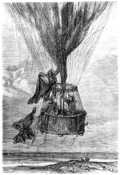
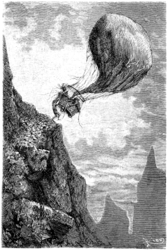

]{.calibre20}

CINQ SEMAINES EN BALLON

]{.calibre20}

## []{#_Toc349730937 .pcalibre .pcalibre4 .pcalibre3}[]{#_Toc349730590 .pcalibre .pcalibre4 .pcalibre3}[]{#_Toc349730211 .pcalibre .pcalibre4 .pcalibre3}[]{#_Toc349729662 .pcalibre .pcalibre4 .pcalibre3}[]{#_Toc349729283 .pcalibre .pcalibre4 .pcalibre3}[]{#_Toc349728734 .pcalibre .pcalibre4 .pcalibre3}[]{#_Toc349728355 .pcalibre .pcalibre4 .pcalibre3}[]{#_Toc349727768 .pcalibre .pcalibre4 .pcalibre3}[]{#_Toc349727219 .pcalibre .pcalibre4 .pcalibre3}[]{#_Toc349726840 .pcalibre .pcalibre4 .pcalibre3}[]{#_Toc349726291 .pcalibre .pcalibre4 .pcalibre3}[]{#_Toc349725944 .pcalibre .pcalibre4 .pcalibre3}[]{#_Toc349725597 .pcalibre .pcalibre4 .pcalibre3}[]{#_Toc349725250 .pcalibre .pcalibre4 .pcalibre3}[]{#_Toc349724903 .pcalibre .pcalibre4 .pcalibre3}[Chapitre 41]{#_Toc349724524 .pcalibre .pcalibre4 .pcalibre3} {#calibre_toc_271 .calibre21}

LES APPROCHES DU SÉNÉGAL. --- LE « VICTORIA » BAISSE DE PLUS EN PLUS. --- ON JETTE, ON JETTE TOUJOURS. --- LE MARABOUT AL-HADJI. --- MM. PASCAL, VINCENT, LAMBERT. --- UN RIVAL DE MAHOMET. --- LES MONTAGNES DIFFICILES. --- LES ARMES DE KENNEDY. --- UNE MANŒUVRE DE JOE. --- HALTE AU-DESSUS D\'UNE FORÊT.

Le 27 mai, vers neuf heures du matin, le pays se présenta sous un nouvel aspect : les rampes longuement étendues se changeaient en collines qui faisaient présager de prochaines montagnes ; on aurait à franchir la chaîne qui sépare le bassin du Niger du bassin du Sénégal et détermine l\'écoulement des eaux soit au golfe de Guinée, soit à la baie du cap Vert.

Jusqu\'au Sénégal, cette partie de l\'Afrique est signalée comme dangereuse. Le docteur Fergusson le savait par les récits de ses devanciers ; ils avaient souffert mille privations et couru mille dangers au milieu de ces Nègres barbares ; ce climat funeste dévora la plus grande partie des compagnons de Mungo-Park. Fergusson fut donc plus que jamais décidé à ne pas prendre pied sur cette contrée inhospitalière.

Mais il n\'eut pas un moment de repos ; le *Victoria* baissait d\'une manière sensible ; il fallut jeter encore une foule d\'objets plus ou moins inutiles, surtout au moment de franchir une crête. Et ce fut ainsi pendant plus de cent vingt milles ; on se fatigua à monter et à descendre ; le ballon, ce nouveau rocher de Sisyphe, retombait incessamment ; les formes de l\'aérostat peu gonflé s\'efflanquaient déjà ; il s\'allongeait, et le vent creusait de vastes poches dans son enveloppe détendue.

Kennedy ne put s\'empêcher d\'en faire la remarque.

--- Est-ce que le ballon aurait une fissure ? dit-il.

--- Non, répondit le docteur ; mais la gutta-percha s\'est évidemment ramollie ou fondue sous la chaleur, et l\'hydrogène fuit à travers le taffetas.

--- Comment empêcher cette fuite ?

--- C\'est impossible. Allégeons-nous ; c\'est le seul moyen ; jetons tout ce qu\'on peut jeter.

--- Mais quoi ? fit le chasseur en regardant la nacelle déjà fort dégarnie.

--- Débarrassons-nous de la tente, dont le poids est assez considérable.

Joe, que cet ordre concernait, monta au-dessus du cercle qui réunissait les cordes du filet ; de là, il vint facilement à bout de détacher les épais rideaux de la tente, et il les précipita au-dehors.

{#Image433 .calibre77}

--- Voilà qui fera le bonheur de toute une tribu de Nègres, dit-il ; il y a là de quoi habiller un millier d\'indigènes, car ils sont assez discrets sur l\'étoffe.

Le ballon s\'était relevé un peu, mais bientôt il devint évident qu\'il se rapprochait encore du sol.

--- Descendons, dit Kennedy, et voyons ce que l\'on peut faire à cette enveloppe.

--- Je te le répète, Dick, nous n\'avons aucun moyen de la réparer.

--- Alors comment ferons-nous ?

--- Nous sacrifierons tout ce qui ne sera pas complètement indispensable ; je veux à tout prix éviter une halte dans ces parages ; les forêts dont nous rasons la cime en ce moment ne sont rien moins que sûres.

--- Quoi ! des lions ? des hyènes ? fit Joe avec mépris.

--- Mieux que cela, mon garçon, des hommes, et des plus cruels qui soient en Afrique.

--- Comment le sait-on ?

--- Par les voyageurs qui nous ont précédés ; puis les Français, qui occupent la colonie du Sénégal, ont eu forcément des rapports avec les peuplades environnantes ; sous le gouvernement du colonel Faidherbe, des reconnaissances ont été poussées fort en avant dans le pays ; des officiers, tels que MM. Pascal, Vincent, Lambert, ont rapporté des documents précieux de leurs expéditions. Ils ont exploré ces contrées formées par le coude du Sénégal, là où la guerre et le pillage n\'ont plus laissé que des ruines.

--- Que s\'est-il donc passé ?

--- Le voici. En 1854, un marabout du Fouta sénégalais, Al-Hadji, se disant inspiré comme Mahomet, poussa toutes les tribus à la guerre contre les infidèles, c\'est-à-dire les Européens. Il porta la destruction et la désolation entre le fleuve Sénégal et son affluent la Falémé. Trois hordes de fanatiques guidées par lui sillonnèrent le pays de façon à n\'épargner ni un village ni une hutte, pillant et massacrant ; il s\'avança même dans la vallée du Niger, jusqu\'à la ville de Sego, qui fut longtemps menacée. En 1857, il remontait plus au nord et investissait le fort de Médine, bâti par les Français sur les bords du fleuve ; cet établissement fut défendu par un héros, Paul Holl, qui pendant plusieurs mois, sans nourriture, sans munitions presque, tint jusqu\'au moment où le colonel Faidherbe vint le délivrer. Al-Hadji et ses bandes repassèrent alors le Sénégal, et revinrent dans le Kaarta continuer leurs rapines et leurs massacres ; or, voici les contrées dans lesquelles il s\'est enfui et réfugié avec ses hordes de bandits, et je vous affirme qu\'il ne ferait pas bon tomber entre ses mains.

--- Nous n\'y tomberons pas, dit Joe, quand nous devrions sacrifier jusqu\'à nos chaussures pour relever le *Victoria.*

--- Nous ne sommes pas éloignés du fleuve, dit le docteur ; mais je prévois que notre ballon ne pourra nous porter au-delà.

--- Arrivons toujours sur les bords, répliqua le chasseur, ce sera cela de gagné.

--- C\'est ce que nous essayons de faire, dit le docteur ; seulement, une chose m\'inquiète.

--- Laquelle ?

--- Nous aurons des montagnes à dépasser, et ce sera difficile, puisque je ne puis augmenter la force ascensionnelle de l\'aérostat, même en produisant la plus grande chaleur possible.

--- Attendons, fit Kennedy, et nous verrons alors.

--- Pauvre *Victoria* ! fit Joe, je m\'y suis attaché comme le marin à son navire ; je ne m\'en séparerai pas sans peine ! Il n\'est plus ce qu\'il était au départ, soit ! mais il ne faut pas en dire du mal ! Il nous a rendu de fiers services, et ce sera pour moi un crève-cœur de l\'abandonner.

--- Sois tranquille, Joe ; si nous l\'abandonnons, ce sera malgré nous. Il nous servira jusqu\'à ce qu\'il soit au bout de ses forces. Je lui demande encore vingt-quatre heures.

--- Il s\'épuise, fit Joe en le considérant, il maigrit, sa vie s\'en va. Pauvre ballon !

--- Si je ne me trompe, dit Kennedy, voici à l\'horizon les montagnes dont tu parlais, Samuel.

--- Ce sont bien elles, dit le docteur après les avoir examinées avec sa lunette ; elles me paraissent fort élevées, nous aurons du mal à les franchir.

--- Ne pourrait-on les éviter ?

--- Je ne pense pas, Dick ; vois l\'immense espace qu\'elles occupent : près de la moitié de l\'horizon !

--- Elles ont même l\'air de se resserrer autour de nous, dit Joe ; elles gagnent sur la droite et sur la gauche.

--- Il faut absolument passer par-dessus.

Ces obstacles si dangereux paraissaient approcher avec une rapidité extrême, ou, pour mieux dire, le vent très fort précipitait le *Victoria* vers des pics aigus. Il fallait s\'élever à tout prix, sous peine de les heurter.

--- Vidons notre caisse à eau, dit Fergusson ; ne réservons que le nécessaire pour un jour.

--- Voilà ! dit Joe.

--- Le ballon se relève-t-il ? demanda Kennedy.

--- Un peu, d\'une cinquantaine de pieds, répondit le docteur, qui ne quittait pas le baromètre des yeux. Mais ce n\'est pas assez.

En effet, les hautes cimes arrivaient sur les voyageurs à faire croire qu\'elles se précipitaient sur eux ; ils étaient loin de les dominer ; il s\'en fallait de plus de cinq cents pieds encore. La provision d\'eau du chalumeau fut également jetée au-dehors ; on n\'en conserva que quelques pintes ; mais cela fut encore insuffisant.

--- Il faut pourtant passer, dit le docteur.

--- Jetons les caisses, puisque nous les avons vidées, dit Kennedy.

--- Jetez-les.

--- Voilà ! fit Joe. C\'est triste de s\'en aller morceau par morceau.

--- Pour toi, Joe, ne va pas renouveler ton dévouement de l\'autre jour ! Quoi qu\'il arrive, jure-moi de ne pas nous quitter.

--- Soyez tranquille, mon maître, nous ne nous quitterons pas.

Le *Victoria* avait regagné en hauteur une vingtaine de toises, mais la crête de la montagne le dominait toujours. C\'était une arête assez droite qui terminait une véritable muraille coupée à pic. Elle s\'élevait encore de plus de deux cents pieds au-dessus des voyageurs.

--- Dans dix minutes, se dit le docteur, notre nacelle sera brisée contre ces roches, si nous ne parvenons pas à les dépasser !

--- Eh bien, monsieur Samuel ? fit Joe.

--- Ne conserve que notre provision de pemmican, et jette toute cette viande qui pèse.

Le ballon fut encore délesté d\'une cinquantaine de livres ; il s\'éleva très sensiblement, mais peu importait, s\'il n\'arrivait pas au-dessus de la ligne des montagnes. La situation était effrayante ; le *Victoria* courait avec une grande rapidité ; on sentait qu\'il allait se mettre en pièces ; le choc serait terrible en effet.

Le docteur regarda autour de lui dans la nacelle.

Elle était presque vide.

--- S\'il le faut, Dick, tu te tiendras prêt à sacrifier tes armes.

--- Sacrifier mes armes ! répondit le chasseur avec émotion.

--- Mon ami, si je te le demande, c\'est que ce sera nécessaire.

--- Samuel ! Samuel !

--- Tes armes, tes provisions de plomb et de poudre peuvent nous coûter la vie.

--- Nous approchons ! s\'écria Joe, nous approchons !

Dix toises ! La montagne dépassait le *Victoria* de dix toises encore.

Joe prit les couvertures et les précipita au-dehors. Sans en rien dire à Kennedy, il lança également plusieurs sacs de balles et de plomb.

Le ballon remonta, il dépassa la cime dangereuse, et son pôle supérieur s\'éclaira des rayons du soleil. Mais la nacelle se trouvait encore un peu au-dessous des quartiers de rocs, contre lesquels elle allait inévitablement se briser.

--- Kennedy ! Kennedy ! s\'écria le docteur, jette tes armes, ou nous sommes perdus.

--- Attendez, monsieur Dick ! fit Joe, attendez !

Et Kennedy, se retournant, le vit disparaître au-dehors de la nacelle.

--- Joe ! Joe ! cria-t-il.

--- Le malheureux ! fit le docteur.

La crête de la montagne pouvait avoir en cet endroit une vingtaine de pieds de largeur, et de l\'autre côté, la pente présentait une moindre déclivité. La nacelle arriva juste au niveau de ce plateau assez uni ; elle glissa sur un sol composé de cailloux aigus qui criaient sous son passage.

--- Nous passons ! nous passons ! nous sommes passés ! cria une voix qui fit bondir le cœur de Fergusson.

L\'intrépide garçon se soutenait par les mains au bord inférieur de la nacelle ; il courait à pied sur la crête, délestant ainsi le ballon de la totalité de son poids ; il était même obligé de le retenir fortement, car il tendait à lui échapper.

Lorsqu\'il fut arrivé au versant opposé, et que l\'abîme se présenta devant lui, Joe, par un vigoureux effort du poignet, se releva, et s\'accrochant aux cordages, il remonta auprès de ses compagnons.

{#Image434 .calibre89}

--- Pas plus difficile que cela, fit-il.

--- Mon brave Joe ! mon ami ! dit le docteur avec effusion.

--- Oh ! ce que j\'en ai fait, répondit celui-ci, ce n\'est pas pour vous ; c\'est pour la carabine de M. Dick ! Je lui devais bien cela depuis l\'affaire de l\'Arabe ! J\'aime à payer mes dettes, et maintenant nous sommes quittes, ajouta-t-il en présentant au chasseur son arme de prédilection. J\'aurais eu trop de peine à vous voir vous en séparer.

Kennedy lui serra vigoureusement la main sans pouvoir dire un mot.

Le *Victoria* n\'avait plus qu\'à descendre ; cela lui était facile ; il se retrouva bientôt à deux cents pieds du sol, et fut alors en équilibre. Le terrain semblait convulsionné ; il présentait de nombreux accidents fort difficiles à éviter pendant la nuit avec un ballon qui n\'obéissait plus. Le soir arrivait rapidement, et, malgré ses répugnances, le docteur dut se résoudre à faire halte jusqu\'au lendemain.

--- Nous allons chercher un lieu favorable pour nous arrêter, dit-il.

--- Ah ! répondit Kennedy, tu te décides enfin ?

--- Oui, j\'ai médité longuement un projet que nous allons mettre à exécution ; il n\'est encore que six heures du soir, nous aurons le temps. Jette les ancres, Joe.

Joe obéit, et les deux ancres pendirent au-dessous de la nacelle.

--- J\'aperçois de vastes forêts, dit le docteur ; nous allons courir au-dessus de leurs cimes, et nous nous accrocherons à quelque arbre. Pour rien au monde, je ne consentirais à passer la nuit à terre.

--- Pourrons-nous descendre ? demanda Kennedy.

--- À quoi bon ? Je vous répète qu\'il serait dangereux de nous séparer. D\'ailleurs, je réclame votre aide pour un travail difficile.

Le *Victoria*, qui rasait le sommet de forêts immenses, ne tarda pas à s\'arrêter brusquement ; ses ancres étaient prises ; le vent tomba avec le soir, et il demeura presque immobile au-dessus de ce vaste champ de verdure formé par la cime d\'une forêt de sycomores.
