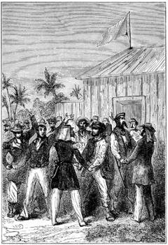
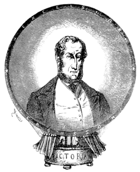

]{.calibre20}

CINQ SEMAINES EN BALLON

]{.calibre20}

## []{#_Toc349730940 .pcalibre .pcalibre4 .pcalibre3}[]{#_Toc349730593 .pcalibre .pcalibre4 .pcalibre3}[]{#_Toc349730214 .pcalibre .pcalibre4 .pcalibre3}[]{#_Toc349729665 .pcalibre .pcalibre4 .pcalibre3}[]{#_Toc349729286 .pcalibre .pcalibre4 .pcalibre3}[]{#_Toc349728737 .pcalibre .pcalibre4 .pcalibre3}[]{#_Toc349728358 .pcalibre .pcalibre4 .pcalibre3}[]{#_Toc349727771 .pcalibre .pcalibre4 .pcalibre3}[]{#_Toc349727222 .pcalibre .pcalibre4 .pcalibre3}[]{#_Toc349726843 .pcalibre .pcalibre4 .pcalibre3}[]{#_Toc349726294 .pcalibre .pcalibre4 .pcalibre3}[]{#_Toc349725947 .pcalibre .pcalibre4 .pcalibre3}[]{#_Toc349725600 .pcalibre .pcalibre4 .pcalibre3}[]{#_Toc349725253 .pcalibre .pcalibre4 .pcalibre3}[]{#_Toc349724906 .pcalibre .pcalibre4 .pcalibre3}[Chapitre 44]{#_Toc349724527 .pcalibre .pcalibre4 .pcalibre3} {#calibre_toc_274 .calibre21}

CONCLUSION. --- LE PROCÈS-VERBAL. --- LES ÉTABLISSEMENTS FRANÇAIS. --- LE POSTE DE MÉDINE. --- LE « BASILIC ». --- SAINT-LOUIS. --- LA FRÉGATE ANGLAISE. --- RETOUR À LONDRES.

L\'expédition qui se trouvait sur le bord du fleuve avait été envoyée par le gouverneur du Sénégal ; elle se composait de deux officiers, MM. Dufraisse, lieutenant d\'infanterie de marine, et Rodamel, enseigne de vaisseau ; d\'un sergent et de sept soldats. Depuis deux jours, ils s\'occupaient de reconnaître la situation la plus favorable pour l\'établissement d\'un poste à Gouina, lorsqu\'ils furent témoins de l\'arrivée du docteur Fergusson.

On se figure aisément les félicitations et les embrassements dont furent accablés les trois voyageurs. Les Français, ayant pu contrôler par eux-mêmes l\'accomplissement de cet audacieux projet, devenaient les témoins naturels de Samuel Fergusson.

Aussi le docteur leur demanda-t-il tout d\'abord de constater officiellement son arrivée aux cataractes de Gouina.

--- Vous ne refuserez pas de signer au procès-verbal ? demanda-t-il au lieutenant Dufraisse.

--- À vos ordres, répondit ce dernier.

Les Anglais furent conduits à un poste provisoire établi sur le bord du fleuve ; ils y trouvèrent les soins les plus attentifs et des provisions en abondance. Et c\'est là que fut rédigé en ces termes le procès-verbal qui figure aujourd\'hui dans les archives de la Société géographique de Londres :

« Nous, soussignés, déclarons que ledit jour nous avons vu arriver suspendus au filet d\'un ballon le docteur Fergusson et ses deux compagnons Richard Kennedy et Joseph Wilson[[\[59\]]{.MsoFootnoteReference}](../Text/Section0004.xhtml#_ftn59){#_ftnref59 .pcalibre4 .pcalibre3} ; lequel ballon est tombé à quelques pas de nous dans le lit même du fleuve, et, entraîné par le courant, s\'est abîmé dans les cataractes de Gouina. En foi de quoi nous avons signé le présent procès-verbal, contradictoirement avec les susnommés, pour valoir ce que de droit. --- Fait aux cataractes de Gouina, le 24 mai 1862.

« SAMUEL FERGUSSON, RICHARD KENNEDY, JOSEPH WILSON ; DUFRAISSE, lieutenant d\'infanterie de marine ; RODAMEL, enseigne de vaisseau ; DUFAYS, sergent ; FLIPPEAU, MAYOR, PÉLISSIER, LOROIS, RASCAGNET, GUILLON, LEBEL, soldats. »

{#Image439 .calibre77}

Ici finit l\'étonnante traversée du docteur Fergusson et de ses braves compagnons, constatée par d\'irrécusables témoignages ; ils se trouvaient avec des amis au milieu de tribus plus hospitalières et dont les rapports sont fréquents avec les établissements français.

Ils étaient arrivés au Sénégal le samedi 24 mai, et, le 27 du même mois, ils atteignaient le poste de Médine, situé un peu plus au nord sur le fleuve.

Là, les officiers français les reçurent à bras ouverts, et déployèrent envers eux toutes les ressources de leur hospitalité ; le docteur et ses compagnons purent s\'embarquer presque immédiatement sur le petit bateau à vapeur le *Basilic*, qui descendait le Sénégal jusqu\'à son embouchure.

Quatorze jours après, le 10 juin, ils arrivèrent à Saint-Louis, où le gouverneur les reçut magnifiquement ; ils étaient complètement remis de leurs émotions et de leurs fatigues. D\'ailleurs Joe disait à qui voulait l\'entendre :

--- C\'est un piètre voyage que le nôtre, après tout, et si quelqu\'un est avide d\'émotions, je ne lui conseille pas de l\'entreprendre ; cela devient fastidieux à la fin, et, sans les aventures du lac Tchad et du Sénégal, je crois véritablement que nous serions morts d\'ennui !

Une frégate anglaise était en partance ; les trois voyageurs prirent passage à bord ; le 25 juin, ils arrivaient à Portsmouth, et le lendemain à Londres.

Nous ne décrirons pas l\'accueil qu\'ils reçurent à la Société royale de Géographie, ni l\'empressement dont ils furent l\'objet ; Kennedy repartit aussitôt pour Édimbourg avec sa fameuse carabine ; il avait hâte de rassurer sa vieille gouvernante.

Le docteur Fergusson et son fidèle Joe demeurèrent les mêmes hommes que nous avons connus. Cependant, il s\'était fait en eux un changement à leur insu.

Ils étaient devenus deux amis.

Les journaux de l\'Europe entière ne tarirent pas en éloges sur les audacieux explorateurs, et le *Daily Telegraph* fit un tirage de neuf cent soixante-dix-sept mille exemplaires le jour où il publia un extrait du voyage.

Le docteur Fergusson fit en séance publique à la Société royale de Géographie le récit de son expédition aéronautique, et il obtint pour lui et ses deux compagnons la médaille d\'or destinée à récompenser la plus remarquable exploration de l\'année 1862.

{#Image440 .calibre94}

Le voyage du docteur Fergusson a eu tout d\'abord pour résultat de constater de la manière la plus précise les faits et les relèvements géographiques reconnus par MM. Barth, Burton, Speke et autres. Grâce aux expéditions actuelles de MM. Speke et Grant, de Heuglin et Munzinger, qui remontent aux sources du Nil ou se dirigent vers le centre de l\'Afrique, nous pourrons avant peu contrôler les propres découvertes du docteur Fergusson dans cette immense contrée comprise entre les quatorzième et trente-troisième degrés de longitude.
