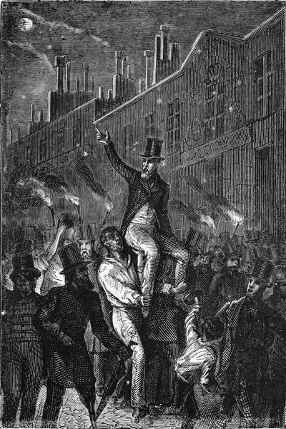

]{.calibre20}

DE LA TERRE À LA LUNE

]{.calibre20}

## []{#_Toc349053392 .pcalibre .pcalibre4 .pcalibre3}[Chapitre 3 -- Effet de la communication Barbicane]{#_Toc349053188 .pcalibre .pcalibre4 .pcalibre3} {#calibre_toc_7 .calibre21}

]{.calibre20}

DE LA TERRE À LA LUNE

]{.calibre20}

Il est impossible de peindre l\'effet produit par les dernières paroles de l\'honorable président. Quels cris ! quelles vociférations ! quelle succession de grognements, de hurrahs, de « hip ! hip ! hip ! » et de toutes ces onomatopées qui foisonnent dans la langue américaine ! C\'était un désordre, un brouhaha indescriptible ! Les bouches criaient, les mains battaient, les pieds ébranlaient le plancher des salles. Toutes les armes de ce musée d\'artillerie, partant à la fois, n\'auraient pas agité plus violemment les ondes sonores. Cela ne peut surprendre. Il y a des canonniers, presque aussi bruyants que leurs canons.

Barbicane demeurait calme au milieu de ces clameurs enthousiastes ; peut-être voulait-il encore adresser quelques paroles à ses collègues, car ses gestes réclamèrent le silence, et son timbre fulminant s\'épuisa en violentes détonations. On ne l\'entendit même pas. Bientôt il fut arraché de son siège, porté en triomphe, et des mains de ses fidèles camarades il passa dans les bras d\'une foule non moins surexcitée.

Rien ne saurait étonner un Américain. On a souvent répété que le mot « impossible » n\'était pas français ; on s\'est évidemment trompé de dictionnaire. En Amérique, tout est facile, tout est simple, et quant aux difficultés mécaniques, elles sont mortes avant d\'être nées. Entre le projet Barbicane et sa réalisation, pas un véritable Yankee ne se fût permis d\'entrevoir l\'apparence d\'une difficulté. Chose dite, chose faite.

La promenade triomphale du président se prolongea dans la soirée. Une véritable marche aux flambeaux. Irlandais, Allemands, Français, Écossais, tous ces individus hétérogènes dont se compose la population du Maryland, criaient dans leur langue maternelle, et les vivats, les hurrahs, les bravos s\'entremêlaient dans un inexprimable élan.

::: calibre9
{.sgc1}

Précisément, comme si elle eût compris qu\'il s\'agissait d\'elle, la Lune brillait alors avec une sereine magnificence, éclipsant de son intense irradiation les feux environnants. Tous les Yankees dirigeaient leurs yeux vers son disque étincelant ; les uns la saluaient de la main, les autres l\'appelaient des plus doux noms ; ceux-ci la mesuraient du regard, ceux-là la menaçaient du poing ; de huit heures à minuit, un opticien de Jone\'s-Fall-Street fit sa fortune à vendre des lunettes. L\'astre des nuits était lorgné comme une lady de haute volée. Les Américains en agissaient avec un sans-façon de propriétaires. Il semblait que la blonde Phœbé appartînt à ces audacieux conquérants et fît déjà partie du territoire de l\'Union. Et pourtant il n\'était question que de lui envoyer un projectile, façon assez brutale d\'entrer en relation, même avec un satellite, mais fort en usage parmi les nations civilisées.

Minuit venait de sonner, et l\'enthousiasme ne baissait pas ; il se maintenait à dose égale dans toutes les classes de la population ; le magistrat, le savant, le négociant, le marchand, le portefaix, les hommes intelligents aussi bien que les gens « verts[[\[17\]]{.MsoFootnoteReference2}](../Text/Section0004.xhtml#_ftn17002){#_ftnref17002 .pcalibre4 .pcalibre3} », se sentaient remués dans leur fibre la plus délicate ; il s\'agissait là d\'une entreprise nationale ; aussi la ville haute, la ville basse, les quais baignés par les eaux du Patapsco, les navires emprisonnés dans leurs bassins regorgeaient d\'une foule ivre de joie, de gin et de whisky ; chacun conversait, pérorait, discutait, disputait, approuvait, applaudissait, depuis le gentleman nonchalamment étendu sur le canapé des bar-rooms devant sa chope de sherry-cobbler[[\[18\]]{.MsoFootnoteReference2}](../Text/Section0004.xhtml#_ftn18002){#_ftnref18002 .pcalibre4 .pcalibre3}, jusqu\'au waterman qui se grisait de « casse-poitrine[[\[19\]]{.MsoFootnoteReference2}](../Text/Section0004.xhtml#_ftn19002){#_ftnref19002 .pcalibre4 .pcalibre3} » dans les sombres tavernes du Fells-Point.

Cependant, vers deux heures, l\'émotion se calma. Le président Barbicane parvint à rentrer chez lui, brisé, écrasé, moulu. Un hercule n\'eût pas résisté à un enthousiasme pareil. La foule abandonna peu à peu les places et les rues. Les quatre rails-roads de l\'Ohio, de Susquehanna, de Philadelphie et de Washington, qui convergent à Baltimore, jetèrent le public hexogène aux quatre coins des États-Unis, et la ville se reposa dans une tranquillité relative.

Ce serait d\'ailleurs une erreur de croire que, pendant cette soirée mémorable, Baltimore fût seule en proie à cette agitation. Les grandes villes de l\'Union, New York, Boston, Albany, Washington, Richmond, Crescent-City[[\[20\]]{.MsoFootnoteReference2}](../Text/Section0004.xhtml#_ftn20002){#_ftnref20002 .pcalibre4 .pcalibre3}, Charleston, la Mobile, du Texas au Massachusetts, du Michigan aux Florides, toutes prenaient leur part de ce délire. En effet, les trente mille correspondants du Gun-Club connaissaient la lettre de leur président, et ils attendaient avec une égale impatience la fameuse communication du 5 octobre. Aussi, le soir même, à mesure que les paroles s\'échappaient des lèvres de l\'orateur, elles couraient sur les fils télégraphiques, à travers les états de l\'Union, avec une vitesse de deux cent quarante-huit mille quatre cent quarante-sept milles[[\[21\]]{.MsoFootnoteReference2}](../Text/Section0004.xhtml#_ftn21002){#_ftnref21002 .pcalibre4 .pcalibre3} à la seconde. On peut donc dire avec une certitude absolue qu\'au même instant les États-Unis d\'Amérique, dix fois grands comme la France, poussèrent un seul hurrah, et que vingt-cinq millions de cœurs, gonflés d\'orgueil, battirent de la même pulsation.

Le lendemain, quinze cents journaux quotidiens, hebdomadaires, bimensuels ou mensuels, s\'emparèrent de la question ; ils l\'examinèrent sous ses différents aspects physiques, météorologiques, économiques ou moraux, au point de vue de la prépondérance politique ou de la civilisation. Ils se demandèrent si la Lune était un monde achevé, si elle ne subissait plus aucune transformation. Ressemblait-elle à la Terre au temps où l\'atmosphère n\'existait pas encore ? Quel spectacle présentait cette face invisible au sphéroïde terrestre ? Bien qu\'il ne s\'agît encore que d\'envoyer un boulet à l\'astre des nuits, tous voyaient là le point de départ d\'une série d\'expériences ; tous espéraient qu\'un jour l\'Amérique pénétrerait les derniers secrets de ce disque mystérieux, et quelques-uns même semblèrent craindre que sa conquête ne dérangeât sensiblement l\'équilibre européen.

Le projet discuté, pas une feuille ne mit en doute sa réalisation ; les recueils, les brochures, les bulletins, les « magazines » publiés par les sociétés savantes, littéraires ou religieuses, en firent ressortir les avantages, et « la Société d\'Histoire naturelle » de Boston, « la Société américaine des sciences et des arts » d\'Albany, « la Société géographique et statistique » de New York, « la Société philosophique américaine » de Philadelphie, « l\'Institution Smithsonienne » de Washington, envoyèrent dans mille lettres leurs félicitations au Gun-Club, avec des offres immédiates de service et d\'argent.

Aussi, on peut le dire, jamais proposition ne réunit un pareil nombre d\'adhérents ; d\'hésitations, de doutes, d\'inquiétudes, il ne fut même pas question. Quant aux plaisanteries, aux caricatures, aux chansons qui eussent accueilli en Europe, et particulièrement en France, l\'idée d\'envoyer un projectile à la Lune, elles auraient fort mal servi leur auteur ; tous les « lifepreservers[[\[22\]]{.MsoFootnoteReference2}](../Text/Section0004.xhtml#_ftn22002){#_ftnref22002 .pcalibre4 .pcalibre3} » du monde, eussent été impuissants à le garantir contre l\'indignation générale. Il y a des choses dont on ne rit pas dans le Nouveau Monde. Impey Barbicane devint donc, à partir de ce jour, un des plus grands citoyens des États-Unis, quelque chose comme le Washington de la science, et un trait, entre plusieurs, montrera jusqu\'où allait cette inféodation subite d\'un peuple à un homme.

Quelques jours après la fameuse séance du Gun-Club, le directeur d\'une troupe anglaise annonça au théâtre de Baltimore la représentation de « *Much ado about nothing* »[[\[23\]]{.MsoFootnoteReference2}](../Text/Section0004.xhtml#_ftn23002){#_ftnref23002 .pcalibre4 .pcalibre3}. Mais la population de la ville, voyant dans ce titre une allusion blessante aux projets du président Barbicane, envahit la salle, brisa les banquettes et obligea le malheureux directeur à changer son affiche. Celui-ci, en homme d\'esprit, s\'inclinant devant la volonté publique, remplaça la malencontreuse comédie par « *As you like it* »[[\[24\]]{.MsoFootnoteReference2}](../Text/Section0004.xhtml#_ftn24002){#_ftnref24002 .pcalibre4 .pcalibre3}, et, pendant plusieurs semaines, il fit des recettes phénoménales.
