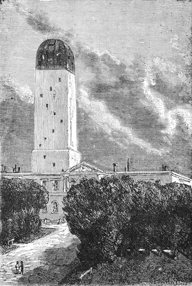

]{.calibre20}

DE LA TERRE À LA LUNE

]{.calibre20}

## []{#_Toc349053393 .pcalibre .pcalibre4 .pcalibre3}[Chapitre 4 -- Réponse de l\'Observatoire de Cambridge]{#_Toc349053189 .pcalibre .pcalibre4 .pcalibre3} {#calibre_toc_8 .calibre21}

]{.calibre20}

DE LA TERRE À LA LUNE

]{.calibre20}

Cependant Barbicane ne perdit pas un instant au milieu des ovations dont il était l\'objet.

Son premier soin fut de réunir ses collègues dans les bureaux du Gun-Club. Là, après discussion, on convint de consulter les astronomes sur la partie astronomique de l\'entreprise ; leur réponse une fois connue, on discuterait alors les moyens mécaniques, et rien ne serait négligé pour assurer le succès de cette grande expérience.

Une note très précise, contenant des questions spéciales, fut donc rédigée et adressée à l\'Observatoire de Cambridge, dans le Massachusetts. Cette ville, où fut fondée la première Université des États-Unis, est justement célèbre par son bureau astronomique. Là se trouvent réunis des savants du plus haut mérite ; là fonctionne la puissante lunette qui permit à Bond de résoudre la nébuleuse d\'Andromède et à Clarke de découvrir le satellite de Sirius. Cet établissement célèbre justifiait donc à tous les titres la confiance du Gun-Club.

::: calibre9
{.sgc1}

Aussi, deux jours après, sa réponse, si impatiemment attendue, arrivait entre les mains du président Barbicane. Elle était conçue en ces termes :

Le Directeur de l\'Observatoire de Cambridge au Président du Gun-Club, à Baltimore.

« Cambridge, 7 octobre.

« Au reçu de votre honorée du 6 courant, adressée à l\'Observatoire de Cambridge au nom des membres du Gun-Club de Baltimore, notre bureau s\'est immédiatement réuni, et il a jugé à propos de répondre comme suit :

« Les questions qui lui ont été posées sont celles-ci :

« 1º Est-il possible d\'envoyer un projectile dans la Lune ?

« 2º Quelle est la distance exacte qui sépare la Terre de son satellite ?

« 3º Quelle sera la durée du trajet du projectile auquel aura été imprimée une vitesse initiale suffisante, et, par conséquent, à quel moment devra-t-on le lancer pour qu\'il rencontre la Lune en un point déterminé ?

« 4º À quel moment précis la Lune se présentera-t-elle dans la position la plus favorable pour être atteinte par le projectile ?

« 5º Quel point du ciel devra-t-on viser avec le canon destiné à lancer le projectile ?

« 6º Quelle place la Lune occupera-t-elle dans le ciel au moment où partira le projectile ?

« Sur la première question : -- est-il possible d\'envoyer un projectile dans la Lune ?

« Oui, il est possible d\'envoyer un projectile dans la Lune, si l\'on parvient à animer ce projectile d\'une vitesse initiale de douze mille yards par seconde. Le calcul démontre que cette vitesse est suffisante. À mesure que l\'on s\'éloigne de la Terre, l\'action de la pesanteur diminue en raison inverse du carré des distances, c\'est-à-dire que, pour une distance trois fois plus grande, cette action est neuf fois moins forte. En conséquence, la pesanteur du boulet décroîtra rapidement, et finira par s\'annuler complètement au moment où l\'attraction de la Lune fera équilibre à celle de la Terre, c\'est-à-dire aux quarante-sept cinquante-deuxièmes du trajet. En ce moment, le projectile ne pèsera plus, et, s\'il franchit ce point, il tombera sur la Lune par l\'effet seul de l\'attraction lunaire. La possibilité théorique de l\'expérience est donc absolument démontrée ; quant à sa réussite, elle dépend uniquement de la puissance de l\'engin employé.

« Sur la deuxième question : -- Quelle est la distance exacte qui sépare la Terre de son satellite ?

« La Lune ne décrit pas autour de la Terre une circonférence, mais bien une ellipse dont notre globe occupe l\'un des foyers ; de là cette conséquence que la Lune se trouve tantôt plus rapprochée de la Terre, et tantôt plus éloignée, ou, en termes astronomiques, tantôt dans son apogée, tantôt dans son périgée. Or, la différence entre sa plus grande et sa plus petite distance est assez considérable, dans l\'espèce, pour qu\'on ne doive pas la négliger. En effet, dans son apogée, la Lune est à deux cent quarante-sept mille cinq cent cinquante-deux milles (99 640 lieues de 4 kilomètres), et dans son périgée à deux cent dix-huit mille six cent cinquante-sept milles seulement (88 010 lieues), ce qui fait une différence de vingt-huit mille huit cent quatre-vingt-quinze milles (11 630 lieues), ou plus du neuvième du parcours. C\'est donc la distance périgéenne de la Lune qui doit servir de base aux calculs.

« Sur la troisième question : -- Quelle sera la durée du trajet du projectile auquel aura été imprimée une vitesse initiale suffisante, et, par conséquent, à quel moment devra-t-on le lancer pour qu\'il rencontre la Lune en un point déterminé ?

« Si le boulet conservait indéfiniment la vitesse initiale de douze mille yards par seconde qui lui aura été imprimée à son départ, il ne mettrait que neuf heures environ à se rendre à sa destination ; mais comme cette vitesse initiale ira continuellement en décroissant, il se trouve, tout calcul fait, que le projectile emploiera trois cent mille secondes, soit quatre-vingt-trois heures et vingt minutes, pour atteindre le point où les attractions terrestre et lunaire se font équilibre, et de ce point il tombera sur la Lune en cinquante mille secondes, ou treize heures cinquante-trois minutes et vingt secondes. Il conviendra donc de le lancer quatre-vingt-dix-sept heures treize minutes et vingt secondes avant l\'arrivée de la Lune au point visé.

« Sur la quatrième question : -- À quel moment précis la Lune se présentera-t-elle dans la position la plus favorable pour être atteinte par le projectile ?

« D\'après ce qui vient d\'être dit ci-dessus, il faut d\'abord choisir l\'époque où la Lune sera dans son périgée, et en même temps le moment où elle passera au zénith, ce qui diminuera encore le parcours d\'une distance égale au rayon terrestre, soit trois mille neuf cent dix-neuf milles ; de telle sorte que le trajet définitif sera de deux cent quatorze mille neuf cent soixante-seize milles (86 410 lieues). Mais, si chaque mois la Lune passe à son périgée, elle ne se trouve pas toujours au zénith à ce moment. Elle ne se présente dans ces deux conditions qu\'à de longs intervalles. Il faudra donc attendre la coïncidence du passage au périgée et au zénith. Or, par une heureuse circonstance, le 4 décembre de l\'année prochaine, la Lune offrira ces deux conditions : à minuit, elle sera dans son périgée, c\'est-à-dire à sa plus courte distance de la Terre, et elle passera en même temps au zénith.

« Sur la cinquième question : -- Quel point du ciel devra-t-on viser avec le canon destiné à lancer le projectile ?

« Les observations précédentes étant admises, le canon devra être braqué sur le zénith[[\[25\]]{.MsoFootnoteReference2}](../Text/Section0004.xhtml#_ftn25002){#_ftnref25002 .pcalibre4 .pcalibre3} du lieu ; de la sorte, le tir sera perpendiculaire au plan de l\'horizon, et le projectile se dérobera plus rapidement aux effets de l\'attraction terrestre. Mais, pour que la Lune monte au zénith d\'un lieu, il faut que ce lieu ne soit pas plus haut en latitude que la déclinaison de cet astre, autrement dit, qu\'il soit compris entre 0 degré et 28 degrés de latitude nord ou sud[[\[26\]]{.MsoFootnoteReference2}](../Text/Section0004.xhtml#_ftn26002){#_ftnref26002 .pcalibre4 .pcalibre3}. En tout autre endroit, le tir devrait être nécessairement oblique, ce qui nuirait à la réussite de l\'expérience.

« Sur la sixième question : -- Quelle place la Lune occupera-t-elle dans le ciel au moment où partira le projectile ?

« Au moment où le projectile sera lancé dans l\'espace, la Lune, qui avance chaque jour de treize degrés dix minutes et trente-cinq secondes, devra se trouver éloignée du point zénithal de quatre fois ce nombre, soit cinquante-deux degrés quarante-deux minutes et vingt secondes, espace qui correspond au chemin qu\'elle fera pendant la durée du parcours du projectile. Mais comme il faut également tenir compte de la déviation que fera éprouver au boulet le mouvement de rotation de la terre, et comme le boulet n\'arrivera à la Lune qu\'après avoir dévié d\'une distance égale à seize rayons terrestres, qui, comptés sur l\'orbite de la Lune, font environ onze degrés, on doit ajouter ces onze degrés à ceux qui expriment le retard de la Lune déjà mentionné, soit soixante-quatre degrés en chiffres ronds. Ainsi donc, au moment du tir, le rayon visuel mené à la Lune fera avec la verticale du lieu un angle de soixante-quatre degrés.

« Telles sont les réponses aux questions posées à l\'Observatoire de Cambridge par les membres du Gun-Club.

« En résumé :

« 1. Le canon devra être établi dans un pays situé entre 0 degré et 28 degrés de latitude nord ou sud.

« 2. Il devra être braqué sur le zénith du lieu.

« 3. Le projectile devra être animé d\'une vitesse initiale de douze mille yards par seconde.

« 4. Il devra être lancé le 1^er^ décembre de l\'année prochaine, à onze heures moins treize minutes et vingt secondes.

« 5. Il rencontrera la Lune quatre jours après son départ, le 4 décembre à minuit précis, au moment où elle passera au zénith.

« Les membres du Gun-Club doivent donc commencer sans retard les travaux nécessités par une pareille entreprise et être prêts à opérer au moment déterminé, car, s\'ils laissaient passer cette date du 4 décembre, ils ne retrouveraient la Lune dans les mêmes conditions de périgée et de zénith que dix-huit ans et onze jours après.

« Le bureau de l\'Observatoire de Cambridge se met entièrement à leur disposition pour les questions d\'astronomie théorique, et il joint par la présente ses félicitations à celles de l\'Amérique tout entière.

« Pour le bureau :

« J.-M. Belfast,

Directeur de l\'Observatoire de Cambridge. »
