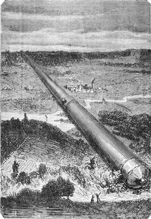

]{.calibre20}

DE LA TERRE À LA LUNE

]{.calibre20}

## []{#_Toc349053397 .pcalibre .pcalibre4 .pcalibre3}[Chapitre 8 -- Histoire du canon]{#_Toc349053193 .pcalibre .pcalibre4 .pcalibre3} {#calibre_toc_12 .calibre21}

]{.calibre20}

DE LA TERRE À LA LUNE

]{.calibre20}

Les résolutions prises dans cette séance produisirent un grand effet au-dehors. Quelques gens timorés s\'effrayaient un peu à l\'idée d\'un boulet, pesant vingt mille livres, lancé à travers l\'espace. On se demandait quel canon pourrait jamais transmettre une vitesse initiale suffisante à une pareille masse. Le procès verbal de la seconde séance du Comité devait répondre victorieusement à ces questions.

Le lendemain soir, les quatre membres du Gun-Club s\'attablaient devant de nouvelles montagnes de sandwiches et au bord d\'un véritable océan de thé. La discussion reprit aussitôt son cours, et, cette fois, sans préambule.

« Mes chers collègues, dit Barbicane, nous allons nous occuper de l\'engin à construire, de sa longueur, de sa forme, de sa composition et de son poids. Il est probable que nous arriverons à lui donner des dimensions gigantesques ; mais si grandes que soient les difficultés, notre génie industriel en aura facilement raison. Veuillez donc m\'écouter, et ne m\'épargnez pas les objections à bout portant. Je ne les crains pas ! »

Un grognement approbateur accueillit cette déclaration.

« N\'oublions pas, reprit Barbicane, à quel point notre discussion nous a conduits hier ; le problème se présente maintenant sous, cette forme : imprimer une vitesse initiale de douze mille yards par seconde à un obus de cent huit pouces de diamètre et d\'un poids de vingt mille livres.

--- Voilà bien le problème, en effet, répondit le major Elphiston.

--- Je continue, reprit Barbicane. Quand un projectile est lancé dans l\'espace, que se passe-t-il ? Il est sollicité par trois forces indépendantes, la résistance du milieu, l\'attraction de la Terre et la force d\'impulsion dont il est animé. Examinons ces trois forces. La résistance du milieu, c\'est-à-dire la résistance de l\'air, sera peu importante. En effet, l\'atmosphère terrestre n\'a que quarante milles (16 lieues environ). Or, avec une rapidité de douze mille yards, le projectile l\'aura traversée en cinq secondes, et ce temps est assez court pour que la résistance du milieu soit regardée comme insignifiante. Passons alors à l\'attraction de la Terre, c\'est-à-dire à la pesanteur de l\'obus. Nous savons que cette pesanteur diminuera en raison inverse du carré des distances ; en effet, voici ce que la physique nous apprend : quand un corps abandonné à lui-même tombe à la surface de la Terre, sa chute est de quinze pieds[[\[40\]]{.MsoFootnoteReference2}](../Text/Section0004.xhtml#_ftn40002){#_ftnref40002 .pcalibre4 .pcalibre3} dans la première seconde, et si ce même corps était transporté à deux cent cinquante-sept mille cent quarante-deux milles, autrement dit, à la distance où se trouve la Lune, sa chute serait réduite à une demi-ligne environ dans la première seconde. C\'est presque l\'immobilité. Il s\'agit donc de vaincre progressivement cette action de la pesanteur. Comment y parviendrons-nous ? Par la force d\'impulsion.

--- Voilà la difficulté, répondit le major.

--- La voilà, en effet, reprit le président, mais nous en triompherons, car cette force d\'impulsion qui nous est nécessaire résultera de la longueur de l\'engin et de la quantité de poudre employée, celle-ci n\'étant limitée que par la résistance de celui-là. Occupons-nous donc aujourd\'hui des dimensions à donner au canon. Il est bien entendu que nous pouvons l\'établir dans des conditions de résistance pour ainsi dire infinie, puisqu\'il n\'est pas destiné à être manœuvré.

--- Tout ceci est évident, répondit le général.

--- Jusqu\'ici, dit Barbicane, les canons les plus longs, nos énormes Columbiads, n\'ont pas dépassé vingt-cinq pieds en longueur ; nous allons donc étonner bien des gens par les dimensions que nous serons forcés d\'adopter.

--- Eh ! sans doute, s\'écria J.-T. Maston. Pour mon compte, je demande un canon d\'un demi-mille au moins !

--- Un demi-mille ! s\'écrièrent le major et le général.

--- Oui ! un demi-mille, et il sera encore trop court de moitié.

--- Allons, Maston, répondit Morgan, vous exagérez.

--- Non pas ! répliqua le bouillant secrétaire, et je ne sais vraiment pourquoi vous me taxez d\'exagération.

--- Parce que vous allez trop loin !

--- Sachez, monsieur, répondit J.-T. Maston en prenant ses grands airs, sachez qu\'un artilleur est comme un boulet, il ne peut jamais aller trop loin ! »

La discussion tournait aux personnalités, mais le président intervint.

« Du calme, mes amis, et raisonnons ; il faut évidemment un canon d\'une grande volée, puisque la longueur de la pièce accroîtra la détente des gaz accumulés sous le projectile, mais il est inutile de dépasser certaines limites.

--- Parfaitement, dit le major.

--- Quelles sont les règles usitées en pareil cas ? Ordinairement la longueur d\'un canon est vingt à vingt-cinq fois le diamètre du boulet, et il pèse deux cent trente-cinq à deux cent quarante fois son poids.

--- Ce n\'est pas assez, s\'écria J.-T. Maston avec impétuosité.

--- J\'en conviens, mon digne ami, et, en effet, en suivant cette proportion, pour un projectile large de neuf pieds pesant vingt mille livres, l\'engin n\'aurait qu\'une longueur de deux cent vingt-cinq pieds et un poids de sept millions deux cent mille livres.

--- C\'est ridicule, répartit J.-T. Maston. Autant prendre un pistolet !

--- Je le pense aussi, répondit Barbicane, c\'est pourquoi je me propose de quadrupler cette longueur et de construire un canon de neuf cents pieds. »

::: calibre9
{.sgc1}

Le général et le major firent quelques objections ; mais néanmoins cette proposition, vivement soutenue par le secrétaire du Gun-Club, fut définitivement adoptée.

« Maintenant, dit Elphiston, quelle épaisseur donner à ses parois.

--- Une épaisseur de six pieds, répondit Barbicane.

--- Vous ne pensez sans doute pas à dresser une pareille masse sur un affût ? demanda le major.

--- Ce serait pourtant superbe ! dit J.-T. Maston.

--- Mais impraticable, répondit Barbicane. Non, je songe à couler cet engin dans le sol même, à le fretter avec des cercles de fer forgé, et enfin à l\'entourer d\'un épais massif de maçonnerie à pierre et à chaux, de telle façon qu\'il participe de toute la résistance du terrain environnant. Une fois la pièce fondue, l\'âme sera soigneusement alésée et calibrée, de manière à empêcher le vent[[\[41\]]{.MsoFootnoteReference2}](../Text/Section0004.xhtml#_ftn41002){#_ftnref41002 .pcalibre4 .pcalibre3} du boulet ; ainsi il n\'y aura aucune déperdition de gaz, et toute la force expansive de la poudre sera employée à l\'impulsion.

--- Hurrah ! hurrah ! fit J.-T. Maston, nous tenons notre canon.

--- Pas encore ! répondit Barbicane en calmant de la main son impatient ami.

--- Et pourquoi ?

--- Parce que nous n\'avons pas discuté sa forme. Sera-ce un canon, un obusier ou un mortier ?

--- Un canon, répliqua Morgan.

--- Un obusier, repartit le major.

--- Un mortier ! » s\'écria J.-T. Maston.

Une nouvelle discussion assez vive allait s\'engager, chacun préconisant son arme favorite, lorsque le président l\'arrêta net.

« Mes amis, dit-il, je vais vous mettre tous d\'accord ; notre Columbiad tiendra de ces trois bouches à feu à la fois. Ce sera un canon, puisque la chambre de la poudre aura le même diamètre que l\'âme. Ce sera un obusier, puisqu\'il lancera un obus. Enfin, ce sera un mortier, puisqu\'il sera braqué sous un angle de quatre-vingt-dix degrés, et que, sans recul possible, inébranlablement fixé au sol, il communiquera au projectile toute la puissance d\'impulsion accumulée dans ses flancs.

--- Adopté, adopté, répondirent les membres du Comité.

--- Une simple réflexion, dit Elphiston, ce can-obuso-mortier sera-t-il rayé ?

--- Non, répondit Barbicane, non ; il nous faut une vitesse initiale énorme, et vous savez bien que le boulet sort moins rapidement des canons rayés que des canons à âme lisse.

--- C\'est juste.

--- Enfin, nous le tenons, cette fois ! répéta J.-T. Maston.

--- Pas tout à fait encore, répliqua le président.

--- Et pourquoi ?

--- Parce que nous ne savons pas encore de quel métal il sera fait.

--- Décidons-le sans retard.

--- J\'allais vous le proposer. »

Les quatre membres du Comité avalèrent chacun une douzaine de sandwiches suivis d\'un bol de thé, et la discussion recommença.

« Mes braves collègues, dit Barbicane, notre canon doit être d\'une grande ténacité, d\'une grande dureté, infusible à la chaleur, indissoluble et inoxydable à l\'action corrosive des acides.

--- Il n\'y a pas de doute à cet égard, répondit le major, et comme il faudra employer une quantité considérable de métal, nous n\'aurons pas l\'embarras du choix.

--- Eh bien ! alors, dit Morgan, je propose pour la fabrication de la Columbiad le meilleur alliage connu jusqu\'ici, c\'est-à-dire cent parties de cuivre, douze parties d\'étain et six parties de laiton.

--- Mes amis, répondit le président, j\'avoue que cette composition a donné des résultats excellents ; mais, dans l\'espèce, elle coûterait trop cher et serait d\'un emploi fort difficile. Je pense donc qu\'il faut adopter une matière excellente, mais à bas prix, telle que la fonte de fer. N\'est-ce pas votre avis, major ?

--- Parfaitement, répondit Elphiston.

--- En effet, reprit Barbicane, la fonte de fer coûte dix fois moins que le bronze ; elle est facile à fondre, elle se coule simplement dans des moules de sable, elle est d\'une manipulation rapide ; c\'est donc à la fois économie d\'argent et de temps. D\'ailleurs, cette matière est excellente, et je me rappelle que pendant la guerre, au siège d\'*Atlanta*, des pièces en fonte ont tiré mille coups chacune de vingt minutes en vingt minutes, sans en avoir souffert.

--- Cependant, la fonte est très cassante, répondit Morgan.

--- Oui, mais très résistante aussi ; d\'ailleurs, nous n\'éclaterons pas, je vous en réponds.

--- On peut éclater et être honnête, répliqua sentencieusement J.-T. Maston.

--- Évidemment, répondit Barbicane. Je vais donc prier notre digne secrétaire de calculer le poids d\'un canon de fonte long de neuf cents pieds, d\'un diamètre intérieur de neuf pieds, avec parois de six pieds d\'épaisseur.

--- À l\'instant », répondit J.-T. Maston.

Et, ainsi qu\'il avait fait la veille, il aligna ses formules avec une merveilleuse facilité, et dit au bout d\'une minute :

« Ce canon pèsera soixante-huit mille quarante tonnes (68 040 000 kg).

--- Et à deux *cents* la livre (10 centimes), il coûtera ?\...

--- Deux millions cinq cent dix mille sept cent un dollars (13 608 000 francs). »

J.-T. Maston, le major et le général regardèrent Barbicane d\'un air inquiet.

« Eh bien ! messieurs, dit le président, je vous répéterai ce que je vous disais hier, soyez tranquilles, les millions ne nous manqueront pas ! »

Sur cette assurance de son président, le Comité se sépara, après avoir remis au lendemain soir sa troisième séance.
