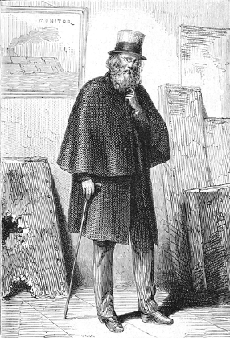
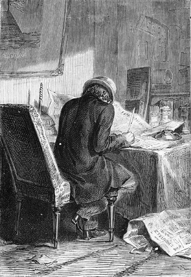

]{.calibre20}

DE LA TERRE À LA LUNE

]{.calibre20}

## []{#_Toc349053399 .pcalibre .pcalibre4 .pcalibre3}[Chapitre 10 -- Un ennemi sur vingt-cinq millions d\'amis]{#_Toc349053195 .pcalibre .pcalibre4 .pcalibre3} {#calibre_toc_14 .calibre21}

]{.calibre20}

DE LA TERRE À LA LUNE

]{.calibre20}

Le public américain trouvait un puissant intérêt dans les moindres détails de l\'entreprise du Gun-Club. Il suivait jour par jour les discussions du Comité. Les plus simples préparatifs de cette grande expérience, les questions de chiffres qu\'elle soulevait, les difficultés mécaniques à résoudre, en un mot, « sa mise en train », voilà ce qui le passionnait au plus haut degré.

Plus d\'un an allait s\'écouler entre le commencement des travaux et leur achèvement ; mais ce laps de temps ne devait pas être vide d\'émotions ; l\'emplacement à choisir pour le forage, la construction du moule, la fonte de la Columbiad, son chargement très périlleux, c\'était là plus qu\'il ne fallait pour exciter la curiosité publique. Le projectile, une fois lancé, échapperait aux regards en quelques dixièmes de seconde ; puis, ce qu\'il deviendrait, comme il se comporterait dans l\'espace, de quelle façon il atteindrait la Lune, c\'est ce qu\'un petit nombre de privilégiés verraient seuls de leurs propres yeux. Ainsi donc, les préparatifs de l\'expérience, les détails précis de l\'exécution en constituaient alors le véritable intérêt.

Cependant, l\'attrait purement scientifique de l\'entreprise fut tout d\'un coup surexcité par un incident.

On sait quelles nombreuses légions d\'admirateurs et d\'amis le projet Barbicane avait ralliées à son auteur. Pourtant, si honorable, si extraordinaire qu\'elle fût, cette majorité ne devait pas être l\'unanimité. Un seul homme, un seul dans tous les états de l\'Union, protesta contre la tentative du Gun-Club ; il l\'attaqua avec violence, à chaque occasion ; et la nature est ainsi faite, que Barbicane fut plus sensible à cette opposition d\'un seul qu\'aux applaudissements de tous les autres.

Cependant, il savait bien le motif de cette antipathie, d\'où venait cette inimitié solitaire, pourquoi elle était personnelle et d\'ancienne date, enfin dans quelle rivalité d\'amour-propre elle avait pris naissance.

Cet ennemi persévérant, le président du Gun-Club ne l\'avait jamais vu. Heureusement, car la rencontre de ces deux hommes eût certainement entraîné de fâcheuses conséquences. Ce rival était un savant comme Barbicane, une nature fière, audacieuse, convaincue, violente, un pur Yankee. On le nommait le capitaine Nicholl. Il habitait Philadelphie.

::: calibre9
{.sgc1}

Personne n\'ignore la lutte curieuse qui établit pendant la guerre fédérale entre le projectile et la cuirasse des navires blindés ; celui-là destiné à percer celle-ci ; celle-ci décidée à ne point se laisser percer. De là une transformation radicale de la marine dans les états des deux continents. Le boulet et la plaque luttèrent avec un acharnement sans exemple, l\'un grossissant, l\'autre s\'épaississant dans une proportion constante. Les navires, armés de pièces formidables, marchaient au feu sous l\'abri de leur invulnérable carapace. Les *Merrimac*, les *Monitor*, les *Ram-Tenesse*, les *Weckausen*[[\[45\]]{.MsoFootnoteReference2}](../Text/Section0004.xhtml#_ftn45002){#_ftnref45002 .pcalibre4 .pcalibre3} lançaient des projectiles énormes, après s\'être cuirassés contre les projectiles des autres. Ils faisaient à autrui ce qu\'ils ne voulaient pas qu\'on leur fît, principe immoral sur lequel repose tout l\'art de la guerre.

Or, si Barbicane fut un grand fondeur de projectiles, Nicholl fut un grand forgeur de plaques. L\'un fondait nuit et jour à Baltimore, et l\'autre forgeait jour et nuit à Philadelphie. Chacun suivait un courant d\'idées essentiellement opposé.

::: calibre9
{.sgc1}

Aussitôt que Barbicane inventait un nouveau boulet, Nicholl inventait une nouvelle plaque. Le président du Gun-Club passait sa vie à percer des trous, le capitaine à l\'en empêcher. De là une rivalité de tous les instants qui allait jusqu\'aux personnes. Nicholl apparaissait dans les rêves de Barbicane sous la forme d\'une cuirasse impénétrable contre laquelle il venait se briser, et Barbicane, dans les songes de Nicholl, comme un projectile qui le perçait de part en part.

Cependant, bien qu\'ils suivissent deux lignes divergentes, ces savants auraient fini par se rencontrer, en dépit de tous les axiomes de géométrie ; mais alors c\'eût été sur le terrain du duel. Fort heureusement pour ces citoyens si utiles à leur pays, une distance de cinquante à soixante milles les séparait l\'un de l\'autre, et leurs amis hérissèrent la route de tels obstacles qu\'ils ne se rencontrèrent jamais.

Néanmoins, il y avait doute pour les hommes compétents. Aux dernières expériences, les projectiles cylindro-coniques de Barbicane vinrent se ficher comme des épingles sur les plaques de Nicholl ; ce jour-là, le forgeur de Philadelphie se crut victorieux et n\'eut plus assez de mépris pour son rival ; mais quand celui-ci substitua plus tard aux boulets coniques de simples obus de six cents livres, le capitaine dut en rabattre. En effet ces projectiles, quoiqu\'animés d\'une vitesse médiocre[[\[46\]]{.MsoFootnoteReference2}](../Text/Section0004.xhtml#_ftn46002){#_ftnref46002 .pcalibre4 .pcalibre3}, brisèrent, trouèrent, firent voler en morceaux les plaques du meilleur métal.

Or, les choses en étaient à ce point, la victoire semblait devoir rester au boulet, quand la guerre finit le jour même où Nicholl terminait une nouvelle cuirasse d\'acier forgé ! C\'était un chef-d\'œuvre dans son genre ; elle défiait tous les projectiles du monde. Le capitaine la fit transporter au polygone de Washington, en provoquant le président du Gun-Club à la briser. Barbicane, la paix étant faite, ne voulut pas tenter l\'expérience.

Alors Nicholl, furieux, offrit d\'exposer sa plaque au choc des boulets les plus invraisemblables, pleins, creux, ronds ou coniques. Refus du président qui, décidément, ne voulait pas compromettre son dernier succès.

Nicholl, surexcité par cet entêtement inqualifiable, voulut tenter Barbicane en lui laissant toutes les chances. Il proposa de mettre sa plaque à deux cents yards du canon. Barbicane de s\'obstiner dans son refus. À cent yards ? Pas même à soixante-quinze.

« À cinquante alors, s\'écria le capitaine par la voix des journaux, à vingt-cinq yards ma plaque, et je me mettrai derrière ! »

Barbicane fit répondre que, quand même le capitaine Nicholl se mettrait devant, il ne tirerait pas davantage.

Nicholl, à cette réplique, ne se contint plus ; il en vint aux personnalités ; il insinua que la poltronnerie était indivisible ; que l\'homme qui refuse de tirer un coup de canon est bien près d\'en avoir peur ; qu\'en somme, ces artilleurs qui se battent maintenant à six milles de distance ont prudemment remplacé le courage individuel par les formules mathématiques, et qu\'au surplus il y a autant de bravoure à attendre tranquillement un boulet derrière une plaque, qu\'à l\'envoyer dans toutes les règles de l\'art.

À ces insinuations Barbicane ne répondit rien ; peut-être même ne les connut-il pas, car alors les calculs de sa grande entreprise l\'absorbaient entièrement.

Lorsqu\'il fit sa fameuse communication au Gun-Club, la colère du capitaine Nicholl fut portée à son paroxysme. Il s\'y mêlait une suprême jalousie et un sentiment absolu d\'impuissance ! Comment inventer quelque chose de mieux que cette Columbiad de neuf cents pieds ! Quelle cuirasse résisterait jamais à un projectile de vingt mille livres ! Nicholl demeura d\'abord atterré, anéanti, brisé sous ce « coup de canon » puis il se releva, et résolut d\'écraser la proposition du poids de ses arguments.

Il attaqua donc très violemment les travaux du Gun-Club ; il publia nombre de lettres que les journaux ne se refusèrent pas à reproduire. Il essaya de démolir scientifiquement l\'œuvre de Barbicane. Une fois la guerre entamée, il appela à son aide des raisons de tout ordre, et, à vrai dire, trop souvent spécieuses et de mauvais aloi.

D\'abord, Barbicane fut très violemment attaqué dans ses chiffres ; Nicholl chercha à prouver par A + B la fausseté de ses formules, et il l\'accusa d\'ignorer les principes rudimentaires de la balistique. Entre autres erreurs, et suivant ses calculs à lui, Nicholl, il était absolument impossible d\'imprimer à un corps quelconque une vitesse de douze mille yards par seconde ; il soutint, l\'algèbre à la main, que, même avec cette vitesse, jamais un projectile aussi pesant ne franchirait les limites de l\'atmosphère terrestre ! Il n\'irait seulement pas à huit lieues ! Mieux encore. En regardant la vitesse comme acquise, en la tenant pour suffisante, l\'obus ne résisterait pas à la pression des gaz développés par l\'inflammation de seize cents mille livres de poudre, et résistât-il à cette pression, du moins il ne supporterait pas une pareille température, il fondrait à sa sortie de la Columbiad et retomberait en pluie bouillante sur le crâne des imprudents spectateurs.

Barbicane, à ces attaques, ne sourcilla pas et continua son œuvre.

Alors Nicholl prit la question sous d\'autres faces ; sans parler de son inutilité à tous les points de vue, il regarda l\'expérience comme fort dangereuse, et pour les citoyens qui autoriseraient de leur présence un aussi condamnable spectacle, et pour les villes voisines de ce déplorable canon ; il fit également remarquer que si le projectile n\'atteignait pas son but, résultat absolument impossible, il retomberait évidemment sur la Terre, et que la chute d\'une pareille masse, multipliée par le carré de sa vitesse, compromettrait singulièrement quelque point du globe. Donc, en pareille circonstance, et sans porter atteinte aux droits de citoyens libres, il était des cas où l\'intervention du gouvernement devenait nécessaire, et il ne fallait pas engager la sûreté de tous pour le bon plaisir d\'un seul.

On voit à quelle exagération se laissait entraîner le capitaine Nicholl. Il était seul de son opinion. Aussi personne ne tint compte de ses malencontreuses prophéties. On le laissa donc crier à son aise, et jusqu\'à s\'époumoner, puisque cela lui convenait. Il se faisait le défenseur d\'une cause perdue d\'avance ; on l\'entendait, mais on ne l\'écoutait pas, et il n\'enleva pas un seul admirateur au président du Gun-Club. Celui-ci, d\'ailleurs, ne prit même pas la peine de rétorquer les arguments de son rival.

Nicholl, acculé dans ses derniers retranchements, et ne pouvant même pas payer de sa personne dans sa cause, résolut de payer de son argent. Il proposa donc publiquement dans l\'*Enquirer* de Richmond une série de paris conçus en ces termes et suivant une proportion croissante.

Il paria :

1\. Que les fonds nécessaires à l\'entreprise du Gun-Club ne seraient pas faits, ci\... 1000 dollars ;

2\. Que l\'opération de la fonte d\'un canon de neuf cents pieds était impraticable et ne réussirait pas, ci\... 2000 ;

3\. Qu\'il serait impossible de charger la Columbiad, et que le pyroxylé prendrait feu de lui-même sous la pression du projectile, ci\... 3000 ;

4\. Que la Columbiad éclaterait au premier coup, ci\... 4000 ;

5\. Que le boulet n\'irait pas seulement à six milles et retomberait quelques secondes après avoir été lancé, ci\... 5000.

On le voit c\'était une somme importante que risquait le capitaine dans son invincible entêtement. Il ne s\'agissait pas moins de quinze mille dollars[[\[47\]]{.MsoFootnoteReference2}](../Text/Section0004.xhtml#_ftn47002){#_ftnref47002 .pcalibre4 .pcalibre3}.

Malgré l\'importance du pari, le 19 mai, il reçut un pli cacheté, d\'un laconisme superbe et conçu en ces termes :

Baltimore, 18 octobre.

Tenu.

Barbicane.
