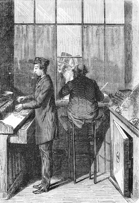
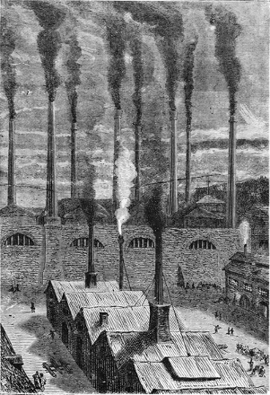

]{.calibre20}

DE LA TERRE À LA LUNE

]{.calibre20}

## []{#_Toc349053401 .pcalibre .pcalibre4 .pcalibre3}[Chapitre 12 -- Urbi et Orbi]{#_Toc349053197 .pcalibre .pcalibre4 .pcalibre3} {#calibre_toc_16 .calibre21}

]{.calibre20}

DE LA TERRE À LA LUNE

]{.calibre20}

Les difficultés astronomiques, mécaniques, topographiques une fois résolues, vint la question d\'argent. Il s\'agissait de se procurer une somme énorme pour l\'exécution du projet. Nul particulier, nul État même n\'aurait pu disposer des millions nécessaires.

Le président Barbicane prit donc le parti, bien que l\'entreprise fût américaine, d\'en faire une affaire d\'un intérêt universel et de demander à chaque peuple sa coopération financière. C\'était à la fois le droit et le devoir de toute la Terre d\'intervenir dans les affaires de son satellite. La souscription ouverte dans ce but s\'étendit de Baltimore au monde entier, *urbi et orbi.*

::: calibre9
{.sgc1}

Cette souscription devait réussir au-delà de toute espérance. Il s\'agissait cependant de sommes à donner, non à prêter. L\'opération était purement désintéressée dans le sens littéral du mot, et n\'offrait aucune chance de bénéfice.

Mais l\'effet de la communication Barbicane ne s\'était pas arrêté aux frontières des États-Unis ; il avait franchi l\'Atlantique et le Pacifique, envahissant à la fois l\'Asie et l\'Europe, l\'Afrique et l\'Océanie. Les observatoires de l\'Union se mirent en rapport immédiat avec les observatoires des pays étrangers ; les uns, ceux de Paris, de Pétersbourg, du Cap, de Berlin, d\'Altona, de Stockholm, de Varsovie, de Hambourg, de Bude, de Bologne, de Malte, de Lisbonne, de Bénarès, de Madras, de Péking, firent parvenir leurs compliments au Gun-Club ; les autres gardèrent une prudente expectative.

Quant à l\'observatoire de Greenwich, approuvé par les vingt-deux autres établissements astronomiques de la Grande-Bretagne, il fut net ; il nia hardiment la possibilité du succès, et se rangea aux théories du capitaine Nicholl. Aussi, tandis que diverses sociétés savantes promettaient d\'envoyer des délégués à Tampa-Town, le bureau de Greenwich, réuni en séance, passa brutalement à l\'ordre du jour sur la proposition Barbicane. C\'était là de la belle et bonne jalousie anglaise. Pas autre chose.

En somme, l\'effet fut excellent dans le monde scientifique, et de là il passa parmi les masses qui, en général, se passionnèrent pour la question. Fait d\'une haute importance, puisque ces masses allaient être appelées à souscrire un capital considérable.

Le président Barbicane, le 8 octobre, avait lancé un manifeste empreint d\'enthousiasme, et dans lequel il faisait appel « à tous les hommes de bonne volonté sur la Terre ». Ce document, traduit en toutes langues, réussit beaucoup.

Les souscriptions furent ouvertes dans les principales villes de l\'Union pour se centraliser à la banque de Baltimore, 9, Baltimore street ; puis on souscrivit dans les différents états des deux continents :

À Vienne, chez S.-M. de Rothschild ;

À Pétersbourg, chez Stieglitz et Cie ;

À Paris, au Crédit mobilier ;

À Stockholm, chez Tottie et Arfuredson ;

À Londres, chez N.-M. de Rothschild et fils ;

À Turin, chez Ardouin et Cie ;

À Berlin, chez Mendelssohn ;

À Genève, chez Lombard, Odier et Cie ;

À Constantinople, à la Banque Ottomane ;

À Bruxelles, chez S. Lambert ;

À Madrid, chez Daniel Weisweller ;

À Amsterdam, au Crédit Néerlandais ;

À Rome, chez Torlonia et Cie ;

À Lisbonne, chez Lecesne ;

À Copenhague, à la Banque privée ;

À Buenos Aires, à la Banque Maua ;

À Rio de Janeiro, même maison ;

À Montevideo, même maison ;

À Valparaiso, chez Thomas La Chambre et Cie ;

À Mexico, chez Martin Daran et Cie ;

À Lima, chez Thomas La Chambre et Cie.

Trois jours après le manifeste du président Barbicane, quatre millions de dollars[[\[50\]]{.MsoFootnoteReference2}](../Text/Section0004.xhtml#_ftn50002){#_ftnref50002 .pcalibre4 .pcalibre3} étaient versés dans les différentes villes de l\'Union. Avec un pareil acompte, le Gun-Club pouvait déjà marcher.

Mais, quelques jours plus tard, les dépêches apprenaient à l\'Amérique que les souscriptions étrangères se couvraient avec un véritable empressement. Certains pays se distinguaient par leur générosité ; d\'autres se desserraient moins facilement. Affaire de tempérament.

Du reste, les chiffres sont plus éloquents que les paroles, et voici l\'état officiel des sommes qui furent portées à l\'actif du Gun-Club, après souscription close.

La Russie versa pour son contingent l\'énorme somme de trois cent soixante-huit mille sept cent trente-trois roubles[[\[51\]]{.MsoFootnoteReference2}](../Text/Section0004.xhtml#_ftn51002){#_ftnref51002 .pcalibre4 .pcalibre3}. Pour s\'en étonner, il faudrait méconnaître le goût scientifique des Russes et le progrès qu\'ils impriment aux études astronomiques, grâce à leurs nombreux observatoires, dont le principal a coûté deux millions de roubles.

La France commença par rire de la prétention des Américains. La Lune servit de prétexte à mille calembours usés et à une vingtaine de vaudevilles, dans lesquels le mauvais goût le disputait à l\'ignorance. Mais, de même que les Français payèrent jadis après avoir chanté, ils payèrent, cette fois, après avoir ri, et ils souscrivirent pour une somme de douze cent cinquante-trois mille neuf cent trente francs. À ce prix-là, ils avaient bien le droit de s\'égayer un peu.

L\'Autriche se montra suffisamment, généreuse au milieu de ses tracas financiers. Sa part s\'éleva dans la contribution publique à la somme de deux cent seize mille florins[[\[52\]]{.MsoFootnoteReference2}](../Text/Section0004.xhtml#_ftn52002){#_ftnref52002 .pcalibre4 .pcalibre3}, qui furent les bienvenus.

Cinquante-deux mille rixdales[[\[53\]]{.MsoFootnoteReference2}](../Text/Section0004.xhtml#_ftn53002){#_ftnref53002 .pcalibre4 .pcalibre3}, tel fut l\'appoint de la Suède et de la Norvège. Le chiffre était considérable relativement au pays ; mais il eût été certainement plus élevé, si la souscription avait eu lieu à Christiania en même temps qu\'à Stockholm. Pour une raison ou pour une autre, les Norvégiens n\'aiment pas à envoyer leur argent en Suède.

La Prusse, par un envoi de deux cent cinquante mille thalers[[\[54\]]{.MsoFootnoteReference2}](../Text/Section0004.xhtml#_ftn54002){#_ftnref54002 .pcalibre4 .pcalibre3}, témoigna de sa haute approbation pour l\'entreprise. Ses différents observatoires contribuèrent avec empressement pour une somme importante et furent les plus ardents à encourager le président Barbicane.

La Turquie se conduisit généreusement ; mais elle était personnellement intéressée dans l\'affaire ; la Lune, en effet, règle le cours de ses années et son jeûne du Ramadan. Elle ne pouvait faire moins que de donner un million trois cent soixante-douze mille six cent quarante piastres[[\[55\]]{.MsoFootnoteReference2}](../Text/Section0004.xhtml#_ftn55002){#_ftnref55002 .pcalibre4 .pcalibre3}, et elle les donna avec une ardeur qui dénonçait, cependant, une certaine pression du gouvernement de la Porte.

La Belgique se distingua entre tous les états de second ordre par un don de cinq cent treize mille francs, environ douze centimes par habitant.

La Hollande et ses colonies s\'intéressèrent dans l\'opération pour cent dix mille florins[[\[56\]]{.MsoFootnoteReference2}](../Text/Section0004.xhtml#_ftn56002){#_ftnref56002 .pcalibre4 .pcalibre3}, demandant seulement qu\'il leur fût fait une bonification de cinq pour cent d\'escompte, puisqu\'elles payaient comptant.

Le Danemark, un peu restreint dans son territoire, donna cependant neuf mille ducats fins[[\[57\]]{.MsoFootnoteReference2}](../Text/Section0004.xhtml#_ftn57002){#_ftnref57002 .pcalibre4 .pcalibre3}, ce qui prouve l\'amour des Danois pour les expéditions scientifiques.

La Confédération germanique s\'engagea pour trente-quatre mille deux cent quatre-vingt-cinq florins[[\[58\]]{.MsoFootnoteReference2}](../Text/Section0004.xhtml#_ftn58002){#_ftnref58002 .pcalibre4 .pcalibre3} ; on ne pouvait rien lui demander de plus ; d\'ailleurs, elle n\'eût pas donné davantage.

Quoique très gênée, l\'Italie trouva deux cent mille lires dans les poches de ses enfants, mais en les retournant bien. Si elle avait eu la Vénétie, elle aurait fait mieux ; mais enfin elle n\'avait pas la Vénétie.

Les états de l\'Église ne crurent pas devoir envoyer moins de sept mille quarante écus romains[[\[59\]]{.MsoFootnoteReference2}](../Text/Section0004.xhtml#_ftn59002){#_ftnref59002 .pcalibre4 .pcalibre3}, et le Portugal poussa son dévouement à la science jusqu\'à trente mille cruzades[[\[60\]]{.MsoFootnoteReference2}](../Text/Section0004.xhtml#_ftn60002){#_ftnref60002 .pcalibre4 .pcalibre3}.

Quant au Mexique, ce fut le denier de la veuve, quatre-vingt-six piastres fortes[[\[61\]]{.MsoFootnoteReference2}](../Text/Section0004.xhtml#_ftn61002){#_ftnref61002 .pcalibre4 .pcalibre3} ; mais les empires qui se fondent sont toujours un peu gênés.

Deux cent cinquante-sept francs, tel fut l\'apport modeste de la Suisse dans l\'œuvre américaine. Il faut le dire franchement, la Suisse ne voyait point le côté pratique de l\'opération ; il ne lui semblait pas que l\'action d\'envoyer un boulet dans la Lune fût de nature à établir des relations d\'affaires avec l\'astre des nuits, et il lui paraissait peu prudent d\'engager ses capitaux dans une entreprise aussi aléatoire. Après tout, la Suisse avait peut-être raison.

::: calibre9
{.sgc1}

Quant à l\'Espagne, il lui fut impossible de réunir plus de cent dix réaux[[\[62\]]{.MsoFootnoteReference2}](../Text/Section0004.xhtml#_ftn62002){#_ftnref62002 .pcalibre4 .pcalibre3}. Elle donna pour prétexte qu\'elle avait ses chemins de fer à terminer. La vérité est que la science n\'est pas très bien vue dans ce pays-là. Il est encore un peu arriéré. Et puis certains Espagnols, non des moins instruits, ne se rendaient pas un compte exact de la masse du projectile comparée à celle de la Lune ; ils craignaient qu\'il ne vînt à déranger son orbite, à la troubler dans son rôle de satellite et à provoquer sa chute à la surface du globe terrestre. Dans ce cas-là, il valait mieux s\'abstenir. Ce qu\'ils firent, à quelques réaux près.

Restait l\'Angleterre. On connaît la méprisante antipathie avec laquelle elle accueillit la proposition Barbicane. Les Anglais n\'ont qu\'une seule et même âme pour les vingt-cinq millions d\'habitants que renferme la Grande-Bretagne. Ils donnèrent à entendre que l\'entreprise du Gun-Club était contraire « au principe de non-intervention », et ils ne souscrivirent même pas pour un farthing.

À cette nouvelle, le Gun-Club se contenta de hausser les épaules et revint à sa grande affaire. Quand l\'Amérique du Sud, c\'est-à-dire le Pérou, le Chili, le Brésil, les provinces de la Plata, la Colombie, eurent pour leur quote-part versé entre ses mains la somme de trois cent mille dollars[[\[63\]]{.MsoFootnoteReference2}](../Text/Section0004.xhtml#_ftn63002){#_ftnref63002 .pcalibre4 .pcalibre3} , il se trouva à la tête d\'un capital considérable, dont voici le décompte :

Souscription des États-Unis .. \... 4 000 000 dollars

Souscriptions étrangères \...\..... 1 446 675 dollars

Total \...\...\...\...\...\...\...\...\...\.... 5 446 675 dollars

C\'était donc cinq millions quatre cent quarante-six mille six cent soixante-quinze dollars[[\[64\]]{.MsoFootnoteReference2}](../Text/Section0004.xhtml#_ftn64002){#_ftnref64002 .pcalibre4 .pcalibre3} que le public versait dans la caisse du Gun-Club.

Que personne ne soit surpris de l\'importance de la somme. Les travaux de la fonte, du forage, de la maçonnerie, le transport des ouvriers, leur installation dans un pays presque inhabité, les constructions de fours et de bâtiments, l\'outillage des usines, la poudre, le projectile, les faux frais, devaient, suivant les devis, l\'absorber à peu près tout entière. Certains coups de canon de la guerre fédérale sont revenus à mille dollars ; celui du président Barbicane, unique dans les fastes de l\'artillerie, pouvait bien coûter cinq mille fois plus.

Le 20 octobre, un traité fut conclu avec l\'usine de Goldspring, près New York, qui, pendant la guerre, avait fourni à Parrott ses meilleurs canons de fonte.

Il fut stipulé, entre les parties contractantes, que l\'usine de Goldspring s\'engageait à transporter à Tampa-Town, dans la Floride méridionale, le matériel nécessaire pour la fonte de la Columbiad.

Cette opération devait être terminée, au plus tard, le 15 octobre prochain, et le canon livré en bon état, sous peine d\'une indemnité de cent dollars[[\[65\]]{.MsoFootnoteReference2}](../Text/Section0004.xhtml#_ftn65002){#_ftnref65002 .pcalibre4 .pcalibre3} par jour jusqu\'au moment où la Lune se présenterait dans les mêmes conditions, c\'est-à-dire dans dix-huit ans et onze jours. L\'engagement des ouvriers, leur paie, les aménagements nécessaires incombaient à la compagnie du Goldspring.

Ce traité, fait double et de bonne foi, fut signé par I. Barbicane, président du Gun-Club, et J. Murchison, directeur de l\'usine de Goldspring, qui approuvèrent l\'écriture de part et d\'autre.
