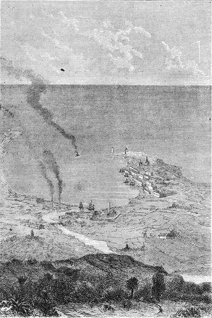
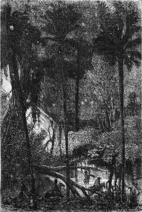

]{.calibre20}

DE LA TERRE À LA LUNE

]{.calibre20}

## []{#_Toc349053402 .pcalibre .pcalibre4 .pcalibre3}[Chapitre 13 -- Stone\'s-Hill]{#_Toc349053198 .pcalibre .pcalibre4 .pcalibre3} {#calibre_toc_17 .calibre21}

]{.calibre20}

DE LA TERRE À LA LUNE

]{.calibre20}

Depuis le choix fait par les membres du Gun-Club au détriment du Texas, chacun en Amérique, où tout le monde sait lire, se fit un devoir d\'étudier la géographie de la Floride. [Jamais les libraires ne vendirent tant de *Bartram\'s travel in Florida*, de *Roman\'s natural history of East and West Florida*, de *William\'s territory of Florida*, de *Cleland on the culture of the Sugar-Cane in East Florida*.]{lang="FRE" xmlns:xml="http://www.w3.org/XML/1998/namespace"} Il fallut imprimer de nouvelles éditions. C\'était une fureur.

Barbicane avait mieux à faire qu\'à lire ; il voulait voir de ses propres yeux et marquer l\'emplacement de la Columbiad. Aussi, sans perdre un instant, il mit à la disposition de l\'Observatoire de Cambridge les fonds nécessaires à la construction d\'un télescope, et traita avec la maison Breadwill and Co d\'Albany, pour la confection du projectile en aluminium ; puis il quitta Baltimore, accompagné de J.-T. Maston, du major Elphiston et du directeur de l\'usine de Goldspring.

Le lendemain, les quatre compagnons de route arrivèrent à La Nouvelle-Orléans. Là ils s\'embarquèrent immédiatement sur le *Tampico*, aviso de la marine fédérale, que le gouvernement mettait à leur disposition, et, les feux étant poussés, les rivages de la Louisiane disparurent bientôt à leurs yeux.

La traversée ne fut pas longue ; deux jours après son départ, le *Tampico*, ayant franchi quatre cent quatre-vingts milles[[\[66\]]{.MsoFootnoteReference2}](../Text/Section0004.xhtml#_ftn66002){#_ftnref66002 .pcalibre4 .pcalibre3}, eut connaissance de la côte floridienne. En approchant, Barbicane se vit en présence d\'une terre basse, plate, d\'un aspect assez infertile. Après avoir rangé une suite d\'anses riches en huîtres et en homards, le *Tampico* donna dans la baie d\'Espiritu-Santo.

Cette baie se divise en deux rades allongées, la rade de Tampa et la rade d\'Hillisboro, dont le steamer franchit bientôt le goulet. Peu de temps après, le fort Broocke dessina ses batteries rasantes au-dessus des flots, et la ville de Tampa apparut, négligemment couchée au fond du petit port naturel formé par l\'embouchure de la rivière Hillisboro.

::: calibre9
{.sgc1}

Ce fut là que le *Tampico* mouilla, le 22 octobre, à sept heures du soir ; les quatre passagers débarquèrent immédiatement.

Barbicane sentit son cœur, battre avec violence lorsqu\'il foula le sol floridien ; il semblait le tâter du pied, comme fait un architecte d\'une maison dont il éprouve la solidité. J.-T. Maston grattait la terre du bout de son crochet.

« Messieurs, dit alors Barbicane, nous n\'avons pas de temps à perdre, et dès demain nous monterons à cheval pour reconnaître le pays. »

Au moment où Barbicane avait atterri, les trois mille habitants de Tampa-Town s\'étaient portés à sa rencontre, honneur bien dû au président du Gun-Club qui les avait favorisés de son choix. Ils le reçurent au milieu d\'acclamations formidables ; mais Barbicane se déroba à toute ovation, gagna une chambre de l\'hôtel Franklin et ne voulut recevoir personne. Le métier d\'homme célèbre ne lui allait décidément pas.

Le lendemain, 23 octobre, de petits chevaux de race espagnole, pleins de vigueur et de feu, piaffaient sous ses fenêtres. Mais, au lieu de quatre, il y en avait cinquante, avec leurs cavaliers. Barbicane descendit, accompagné de ses trois compagnons, et s\'étonna tout d\'abord de se trouver au milieu d\'une pareille cavalcade. Il remarqua en outre que chaque cavalier portait une carabine en bandoulière et des pistolets dans ses fontes. La raison d\'un tel déploiement de forces lui fut aussitôt donnée par un jeune Floridien, qui lui dit :

« Monsieur, il y a les Séminoles.

--- Quels Séminoles ?

--- Des sauvages qui courent les prairies et il nous a paru prudent de, vous faire escorte.

--- Peuh ! fit J.-T. Maston en escaladant sa monture.

--- Enfin, reprit le Floridien, c\'est plus sûr.

--- Messieurs, répondit Barbicane, je vous remercie de votre attention, et maintenant, en route ! »

La petite troupe s\'ébranla aussitôt et disparut dans un nuage de poussière. Il était cinq heures du matin ; le soleil resplendissait déjà et le thermomètre marquait 84 degrés[[\[67\]]{.MsoFootnoteReference2}](../Text/Section0004.xhtml#_ftn67002){#_ftnref67002 .pcalibre4 .pcalibre3} ; mais de fraîches brises de mer modéraient cette excessive température.

Barbicane, en quittant Tampa-Town, descendit vers le sud et suivit la côte, de manière à gagner le creek[[\[68\]]{.MsoFootnoteReference2}](../Text/Section0004.xhtml#_ftn68002){#_ftnref68002 .pcalibre4 .pcalibre3} d\'Alifia. Cette petite rivière se jette dans la baie Hillisboro, à douze milles au-dessous de Tampa-Town. Barbicane et son escorte côtoyèrent sa rive droite en remontant vers l\'est. Bientôt les flots de la baie disparurent derrière un pli de terrain, et la campagne floridienne s\'offrit seule aux regards.

La Floride se divise en deux parties : l\'une au nord, plus populeuse, moins abandonnée, a Tallahassee pour capitale et Pensacola, l\'un des principaux arsenaux maritimes des États-Unis ; l\'autre, pressée entre l\'Atlantique et le golfe du Mexique, qui l\'étreignent de leurs eaux, n\'est qu\'une mince presqu\'île rongée par le courant du Gulf-Stream, pointe de terre perdue au milieu d\'un petit archipel, et que doublent incessamment les nombreux navires du canal de Bahama. C\'est la sentinelle avancée du golfe des grandes tempêtes. La superficie de cet État est de trente-huit millions trente-trois mille deux cent soixante-sept acres[[\[69\]]{.MsoFootnoteReference2}](../Text/Section0004.xhtml#_ftn69002){#_ftnref69002 .pcalibre4 .pcalibre3} parmi lesquels il fallait en choisir un situé en deçà du vingt-huitième parallèle et convenable à l\'entreprise ; aussi Barbicane, en chevauchant, examinait attentivement la configuration du sol et sa distribution particulière.

La Floride, découverte par Juan Ponce de Leôn, en 1512, le jour des Rameaux, fut d\'abord nommée Pâques-Fleuries. Elle méritait peu cette appellation charmante sur ses côtes arides et brûlées. Mais, à quelques milles du rivage, la nature du terrain changea peu à peu, et le pays se montra digne de son nom ; le sol était entrecoupé d\'un réseau de creeks, de rios, de cours d\'eau, d\'étangs, de petits lacs ; on se serait cru dans la Hollande ou la Guyane ; mais la campagne s\'éleva sensiblement et montra bientôt ses plaines cultivées, où réussissaient toutes les productions végétales du Nord et du Midi, ses champs immenses dont le soleil des tropiques et les eaux conservées dans l\'argile du sol faisaient tous les frais de culture, puis enfin ses prairies d\'ananas, d\'ignames, de tabac, de riz, de coton et de canne à sucre, qui s\'étendaient à perte de vue, en étalant leurs richesses avec une insouciante prodigalité.

Barbicane parut très satisfait de constater l\'élévation progressive du terrain, et, lorsque J.-T. Maston l\'interrogea à ce sujet :

« Mon digne ami, lui répondit-il, nous avons un intérêt de premier ordre à couler notre Columbiad dans les hautes terres.

--- Pour être plus près de la Lune ? s\'écria le secrétaire du Gun-Club.

--- Non ! répondit Barbicane en souriant. Qu\'importent quelques toises de plus ou de moins ? Non, mais au milieu de terrains élevés, nos travaux marcheront plus facilement ; nous n\'aurons pas à lutter avec les eaux, ce qui nous évitera des tubages longs et coûteux, et c\'est à considérer, lorsqu\'il s\'agit de forer un puits de neuf cents pieds de profondeur.

--- Vous avez raison, dit alors l\'ingénieur Murchison ; il faut, autant que possible, éviter les cours d\'eau pendant le forage ; mais si nous rencontrons des sources, qu\'à cela ne tienne, nous les épuiserons avec nos machines, ou nous les détournerons. Il ne s\'agit pas ici d\'un puits artésien[[\[70\]]{.MsoFootnoteReference2}](../Text/Section0004.xhtml#_ftn70002){#_ftnref70002 .pcalibre4 .pcalibre3}, étroit et obscur, où le taraud, la douille, la sonde, en un mot tous les outils du foreur, travaillent en aveugles. Non. Nous opérerons à ciel ouvert, au grand jour, la pioche ou le pic à la main, et, la mine aidant, nous irons rapidement en besogne.

--- Cependant, reprit Barbicane, si par l\'élévation du sol ou sa nature nous pouvons éviter une lutte avec les eaux souterraines, le travail en sera plus rapide et plus parfait ; cherchons donc à ouvrir notre tranchée dans un terrain situé à quelques centaines de toises au-dessus du niveau de la mer.

--- Vous avez raison, monsieur Barbicane, et, si je ne me trompe, nous trouverons avant peu un emplacement convenable.

--- Ah ! je voudrais être au premier coup de pioche, dit le président.

--- Et moi au dernier ! s\'écria J.-T. Maston.

--- Nous y arriverons, messieurs, répondit l\'ingénieur, et, croyez-moi, la compagnie du Goldspring n\'aura pas à vous payer d\'indemnité de retard.

--- Par sainte Barbe ! vous aurez raison ! répliqua J.-T. Maston ; cent dollars par jour jusqu\'à ce que la Lune se représente dans les mêmes conditions, c\'est-à-dire pendant dix-huit ans et onze jours, savez-vous bien que cela ferait six cent cinquante-huit mille cent dollars[[\[71\]]{.MsoFootnoteReference2}](../Text/Section0004.xhtml#_ftn71002){#_ftnref71002 .pcalibre4 .pcalibre3} ?

--- Non, monsieur, nous ne le savons pas, répondit l\'ingénieur, et nous n\'aurons pas besoin de l\'apprendre. »

Vers dix heures du matin. la petite troupe avait franchi une douzaine de milles ; aux campagnes fertiles succédait alors la région des forêts. Là croissaient les essences les plus variées avec une profusion tropicale. Ces forêts presque impénétrables étaient faites de grenadiers, d\'orangers, de citronniers, de figuiers, d\'oliviers, d\'abricotiers, de bananiers, de grands ceps de vigne, dont les fruits et les fleurs rivalisaient de couleurs et de parfums. À l\'ombre odorante de ces arbres magnifiques chantait et volait tout un monde d\'oiseaux aux brillantes couleurs, au milieu desquels on distinguait plus particulièrement des crabiers, dont le nid devait être un écrin, pour être digne de ces bijoux emplumés.

J.-T. Maston et le major ne pouvaient se trouver en présence de cette opulente nature sans en admirer les splendides beautés. Mais le président Barbicane, peu sensible à ces merveilles, avait hâte d\'aller en avant ; ce pays si fertile lui déplaisait par sa fertilité même ; sans être autrement hydroscope, il sentait l\'eau sous ses pas et cherchait, mais en vain, les signes d\'une incontestable aridité.

Cependant on avançait ; il fallut passer à gué plusieurs rivières, et non sans quelque danger, car elles étaient infestées de caïmans longs de quinze à dix-huit pieds. J.-T. Maston les menaça hardiment de son redoutable crochet, mais il ne parvint à effrayer que les pélicans, les sarcelles, les phaétons, sauvages habitants de ces rives, tandis que de grands flamants rouges le regardaient d\'un air stupide.

::: calibre9
{.sgc1}

Enfin ces hôtes des pays humides disparurent à leur tour ; les arbres moins gros s\'éparpillèrent dans les bois moins épais ; quelques groupes isolés se détachèrent au, milieu de plaines infinies où passaient des troupeaux de daims effarouchés.

« Enfin ! s\'écria Barbicane en se dressant sur ses étriers, voici la région des pins !

--- Et celle des sauvages », répondit le major.

En effet, quelques Séminoles apparaissaient à l\'horizon ; ils s\'agitaient, ils couraient de l\'un à l\'autre sur leurs chevaux rapides, brandissant de longues lances ou déchargeant leurs fusils à détonation sourde ; d\'ailleurs ils se bornèrent à ces démonstrations hostiles, sans inquiéter Barbicane et ses compagnons.

Ceux-ci occupaient alors le milieu d\'une plaine rocailleuse, vaste espace découvert d\'une étendue de plusieurs acres, que le soleil inondait de rayons brûlants. Elle était formée par une large extumescence du terrain, qui semblait offrir aux membres du Gun-Club toutes les conditions requises pour l\'établissement de leur Columbiad.

« Halte ! dit Barbicane en s\'arrêtant. Cet endroit a-t-il un nom dans le pays ?

--- Il s\'appelle Stone\'s-Hill[[\[72\]]{.MsoFootnoteReference2}](../Text/Section0004.xhtml#_ftn72002){#_ftnref72002 .pcalibre4 .pcalibre3} », répondit un des Floridiens.

Barbicane, sans mot dire, mit pied à terre, prit ses instruments et commença à relever sa position avec une extrême précision ; la petite troupe, rangée autour de lui, l\'examinait en gardant un profond silence.

::: calibre9
{.sgc1}

En ce moment le soleil passait au méridien.

Barbicane, après quelques instants, chiffra rapidement le résultat de ses observations et dit :

« Cet emplacement est situé à trois cents toises au-dessus du niveau de la mer par 27 degrés 7\' de latitude et 5 degrés 7\' de longitude ouest[[\[73\]]{.MsoFootnoteReference2}](../Text/Section0004.xhtml#_ftn73002){#_ftnref73002 .pcalibre4 .pcalibre3} ; il me paraît offrir par sa nature aride et rocailleuse toutes les conditions favorables à l\'expérience ; c\'est donc dans cette plaine que s\'élèveront nos magasins, nos ateliers, nos fourneaux, les huttes de nos ouvriers, et c\'est d\'ici, d\'ici même, répéta-t-il en frappant du pied le sommet de Stone\'s-Hill, que notre projectile s\'envolera vers les espaces du monde solaire ! »
