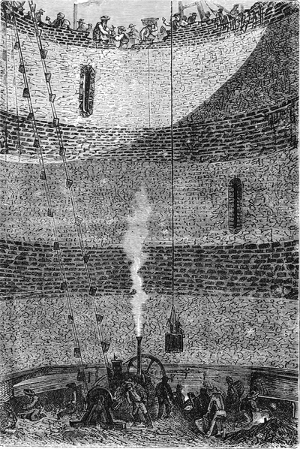

]{.calibre20}

DE LA TERRE À LA LUNE

]{.calibre20}

## []{#_Toc349053403 .pcalibre .pcalibre4 .pcalibre3}[Chapitre 14 -- Pioche et truelle]{#_Toc349053199 .pcalibre .pcalibre4 .pcalibre3} {#calibre_toc_18 .calibre21}

]{.calibre20}

DE LA TERRE À LA LUNE

]{.calibre20}

Le soir même, Barbicane et ses compagnons rentraient à Tampa-Town, et l\'ingénieur Murchison se réembarquait sur le *Tampico* pour La Nouvelle-Orléans. Il devait embaucher une armée d\'ouvriers et ramener la plus grande partie du matériel. Les membres du Gun-Club demeurèrent à Tampa-Town, afin d\'organiser les premiers travaux en s\'aidant des gens du pays.

Huit jours après son départ, le *Tampico* revenait dans la baie d\'Espiritu-Santo avec une flottille de bateaux à vapeur. Murchison avait réuni quinze cents travailleurs. Aux mauvais jours de l\'esclavage, il eût perdu son temps et ses peines. Mais depuis que l\'Amérique, la terre de la liberté, ne comptait plus que des hommes libres dans son sein, ceux-ci accouraient partout où les appelait une main-d\'œuvre largement rétribuée. Or, l\'argent ne manquait pas au Gun-Club ; il offrait à ses hommes une haute paie, avec gratifications considérables et proportionnelles. L\'ouvrier embauché pour la Floride pouvait compter, après l\'achèvement des travaux, sur un capital déposé en son nom à la banque de Baltimore. Murchison n\'eut donc que l\'embarras du choix, et il put se montrer sévère sur l\'intelligence et l\'habileté de ses travailleurs. On est autorisé à croire qu\'il enrôla dans sa laborieuse légion l\'élite des mécaniciens, des chauffeurs, des fondeurs, des chaufourniers, des mineurs, des briquetiers et des manœuvres de tout genre, noirs ou blancs, sans distinction de couleur. Beaucoup d\'entre eux emmenaient leur famille. C\'était une véritable émigration.

Le 31 octobre, à dix heures du matin, cette troupe débarqua sur les quais de Tampa-Town ; on comprend le mouvement et l\'activité qui régnèrent dans cette petite ville dont on doublait en un jour la population. En effet, Tampa-Town devait gagner énormément à cette initiative du Gun-Club, non par le nombre des ouvriers, qui furent dirigés immédiatement sur Stone\'s-Hill, mais grâce à cette affluence de curieux qui convergèrent peu à peu de tous les points du globe vers la presqu\'île floridienne.

Pendant les premiers jours, on s\'occupa de décharger l\'outillage apporté par la flottille, les machines, les vivres, ainsi qu\'un assez grand nombre de maisons de tôles faites de pièces démontées et numérotées. En même temps, Barbicane plantait les premiers jalons d\'un railway long de quinze milles et destiné à relier Stone\'s-Hill à Tampa-Town.

On sait dans quelles conditions se fait le chemin de fer américain ; capricieux dans ses détours, hardi dans ses pentes, méprisant les garde-fous et les ouvrages d\'art, escaladant les collines, dégringolant les vallées, le rail-road court en aveugle et sans souci de la ligne droite ; il n\'est pas coûteux, il n\'est point gênant ; seulement, on y déraille et l\'on y saute en toute liberté. Le chemin de Tampa-Town à Stone\'s-Hill ne fut qu\'une simple bagatelle, et ne demanda ni grand temps ni grand argent pour s\'établir.

Du reste, Barbicane était l\'âme de ce monde accouru à sa voix ; il l\'animait, il lui communiquait son souffle, son enthousiasme, sa conviction ; il se trouvait en tous lieux, comme s\'il eût été doué du don d\'ubiquité et toujours suivi de J.-T. Maston, sa mouche bourdonnante. Son esprit pratique s\'ingéniait à mille inventions. Avec lui point d\'obstacles, nulle difficulté, jamais d\'embarras ; il était mineur, maçon, mécanicien autant qu\'artilleur, ayant des réponses pour toutes les demandes et des solutions pour tous les problèmes. Il correspondait activement avec le Gun-Club ou l\'usine de Goldspring, et jour et nuit, les feux allumés, la vapeur maintenue en pression, le *Tampico* attendait ses ordres dans la rade d\'Hillisboro.

Barbicane, le 1er novembre, quitta Tampa-Town avec un détachement de travailleurs, et dès le lendemain une ville de maisons mécaniques s\'éleva autour de Stone\'s-Hill ; on l\'entoura de palissades, et à son mouvement, à son ardeur, on l\'eût bientôt prise pour une des grandes cités de l\'Union. La vie y fut réglée disciplinairement, et les travaux commencèrent dans un ordre parfait.

Des sondages soigneusement pratiqués avaient permis de reconnaître la nature du terrain, et le creusement put être entrepris dès le 4 novembre. Ce jour-là, Barbicane réunit ses chefs d\'atelier et leur dit :

« Vous savez tous, mes amis, pourquoi je vous ai réunis dans cette partie sauvage de la Floride. Il s\'agit de couler un canon mesurant neuf pieds de diamètre intérieur, six pieds d\'épaisseur à ses parois et dix-neuf pieds et demi à son revêtement de pierre ; c\'est donc au total un puits large de soixante pieds qu\'il faut creuser à une profondeur de neuf cents. Cet ouvrage considérable doit être terminé en huit mois ; or, vous avez deux millions cinq cent quarante-trois mille quatre cents pieds cubes de terrain à extraire en deux cent cinquante-cinq jours, soit, en chiffres ronds, dix mille pieds cubes par jour. Ce qui n\'offrirait aucune difficulté pour mille ouvriers travaillant à coudées franches sera plus pénible dans un espace relativement restreint. Néanmoins, puisque ce travail doit se faire, il se fera, et je compte sur votre courage autant que sur votre habileté. »

À huit heures du matin, le premier coup de pioche fut donné dans le sol floridien, et depuis ce moment ce vaillant outil ne resta plus oisif un seul instant dans la main des mineurs. Les ouvriers se relayaient par quart de journée.

D\'ailleurs, quelque colossale que fût l\'opération, elle ne dépassait point la limite des forces humaines. Loin de là. Que de travaux d\'une difficulté plus réelle et dans lesquels les éléments durent être directement combattus, qui furent menés à bonne fin ! Et, pour ne parler que d\'ouvrages semblables, il suffira de citer ce *Puits du Père Joseph*, construit auprès du Caire par le sultan Saladin, à une époque où les machines n\'étaient pas encore venues centupler la force de l\'homme, et qui descend au niveau même du Nil, à une profondeur de trois cents pieds ! Et cet autre puits creusé à Coblentz par le margrave Jean de Bade jusqu\'à six cents pieds dans le sol ! Eh bien ! de quoi s\'agissait-il, en somme ? De tripler cette profondeur et sur une largeur décuple, ce qui rendrait le forage plus facile ! Aussi il n\'était pas un contremaître, pas un ouvrier qui doutât du succès de l\'opération.

Une décision importante, prise par l\'ingénieur Murchison, d\'accord avec le président Barbicane, vint encore permettre d\'accélérer la marche des travaux. Un article du traité portait que la Columbiad serait frettée avec des cercles de fer forgé placés à chaud. Luxe de précautions inutiles, car l\'engin pouvait évidemment se passer de ces anneaux compresseurs. On renonça donc à cette clause.

De là une grande économie de temps, car on put alors employer ce nouveau système de creusement adopté maintenant dans la construction des puits, par lequel la maçonnerie se fait en même temps que le forage. Grâce à ce procédé très simple, il n\'est plus nécessaire d\'étayer les terres au moyen d\'étrésillons ; la muraille les contient avec une inébranlable puissance et descend d\'elle-même par son propre poids.

Cette manœuvre ne devait commencer qu\'au moment où la pioche aurait atteint la partie solide du sol.

Le 4 novembre, cinquante ouvriers creusèrent au centre même de l\'enceinte palissadée, c\'est-à-dire à la partie supérieure de Stone\'s-Hill, un trou circulaire large de soixante pieds.

La pioche rencontra d\'abord une sorte de terreau noir, épais de six pouces, dont elle eut facilement raison. À ce terreau succédèrent deux pieds d\'un sable fin qui fut soigneusement retiré, car il devait servir à la confection du moule intérieur.

Après ce sable apparut une argile blanche assez compacte, semblable à la marne d\'Angleterre, et qui s\'étageait sur une épaisseur de quatre pieds.

Puis le fer des pics étincela sur la couche dure du sol, sur une espèce de roche formée de coquillages pétrifiés, très sèche, très solide, et que les outils ne devaient plus quitter. À ce point, le trou présentait une profondeur de six pieds et demi, et les travaux de maçonnerie furent commencés.

Au fond de cette excavation, on construisit un « rouet » en bois de chêne, sorte de disque fortement boulonné et d\'une solidité à toute épreuve ; il était percé à son centre d\'un trou offrant un diamètre égal au diamètre extérieur de la Columbiad. Ce fut sur ce rouet que reposeront les premières assises de la maçonnerie, dont le ciment hydraulique enchaînait les pierres avec une inflexible ténacité. Les ouvriers, après avoir maçonné de la circonférence au centre, se trouvaient renfermés dans un puits large de vingt et un pieds.

Lorsque cet ouvrage fut achevé, les mineurs reprirent le pic et la pioche, et ils entamèrent la roche sous le rouet même, en ayant soin de le supporter au fur et à mesure sur des « tins[[\[74\]]{.MsoFootnoteReference2}](../Text/Section0004.xhtml#_ftn74002){#_ftnref74002 .pcalibre4 .pcalibre3} » d\'une extrême solidité ; toutes les fois que le trou avait gagné deux pieds en profondeur, on retirait successivement ces tins ; le rouet s\'abaissait peu à peu, et avec lui le massif annulaire de maçonnerie, à la couche supérieure auquel les maçons travaillaient incessamment, tout en réservant des « évents », qui devaient permettre aux gaz de s\'échapper pendant l\'opération de la fonte.

Ce genre de travail exigeait de la part des ouvriers une habileté extrême et une attention de tous les instants ; plus d\'un, en creusant sous le rouet, fut blessé dangereusement par les éclats de pierre, et même mortellement mais l\'ardeur ne se ralentit pas une seule minute, et jour et nuit : le jour, aux rayons d\'un soleil qui versait, quelques mois plus tard, quatre-vingt-dix-neuf degrés[[\[75\]]{.MsoFootnoteReference2}](../Text/Section0004.xhtml#_ftn75002){#_ftnref75002 .pcalibre4 .pcalibre3} de chaleur à ces plaines calcinées ; la nuit, sous les blanches nappes de la lumière électrique, le bruit des pics sur la roche, la détonation des mines, le grincement des machines, le tourbillon des fumées éparses dans les airs tracèrent autour de Stone\'s-Hill un cercle d\'épouvante que les troupeaux de bisons ou les détachements de Séminoles n\'osaient plus franchir.

Cependant les travaux avançaient régulièrement ; des grues à vapeur activaient l\'enlèvement des matériaux ; d\'obstacles inattendus il fut peu question, mais seulement de difficultés prévues, et l\'on s\'en tirait avec habileté.

::: calibre9
{.sgc1}

Le premier mois écoulé, le puits avait atteint la profondeur assignée pour ce laps de temps, soit cent douze pieds. En décembre, cette profondeur fut doublée, et triplée en janvier. Pendant le mois de février, les travailleurs eurent à lutter contre une nappe d\'eau qui se fit jour à travers l\'écorce terrestre. Il fallut employer des pompes puissantes et des appareils à air comprimé pour l\'épuiser afin de bétonner l\'orifice des sources, comme on aveugle une voie d\'eau à bord d\'un navire. Enfin on eut raison de ces courants malencontreux. Seulement, par suite de la mobilité du terrain, le rouet céda en partie, et il y eut un débordement partiel. Que l\'on juge de l\'épouvantable poussée de ce disque de maçonnerie haut de soixante-quinze toises ! Cet accident coûta la vie à plusieurs ouvriers.

Trois semaines durent être employées à étayer le revêtement de pierre, à le reprendre en sous-œuvre et à rétablir le rouet dans ses conditions premières de solidité. Mais, grâce à l\'habileté de l\'ingénieur, à la puissance des machines employées, l\'édifice, un instant compromis, retrouva son aplomb, et le forage continua.

Aucun incident nouveau n\'arrêta désormais la marche de l\'opération, et le 10 juin, vingt jours avant l\'expiration des délais fixés par Barbicane, le puits, entièrement revêtu de son parement de pierres, avait atteint la profondeur de neuf cents pieds. Au fond, la maçonnerie reposait sur un cube massif mesurant trente pieds d\'épaisseur, tandis qu\'à sa partie supérieure elle venait affleurer le sol.

Le président Barbicane et les membres du Gun-Club félicitèrent chaudement l\'ingénieur Murchison ; son travail cyclopéen s\'était accompli dans des conditions extraordinaires de rapidité.

Pendant ces huit mois, Barbicane ne quitta pas un instant Stone\'s-Hill ; tout en suivant de près les opérations du forage, il s\'inquiétait incessamment du bien-être et de la santé de ses travailleurs, et il fut assez heureux pour éviter ces épidémies communes aux grandes agglomérations d\'hommes et si désastreuses dans ces régions du globe exposées à toutes les influences tropicales.

Plusieurs ouvriers, il est vrai, payèrent de leur vie les imprudences inhérentes à ces dangereux travaux ; mais ces déplorables malheurs sont impossibles à éviter, et ce sont des détails dont les Américains se préoccupent assez peu. Ils ont plus souci de l\'humanité en général que de l\'individu en particulier. Cependant Barbicane professait les principes contraires, et il les appliquait en toute occasion.

Aussi, grâce à ses soins, à son intelligence, à son utile intervention dans les cas difficiles, à sa prodigieuse et humaine sagacité, la moyenne des catastrophes ne dépassa pas celle des pays d\'outre-mer cités pour leur luxe de précautions, entre autres la France, où l\'on compte environ un accident sur deux cent mille francs de travaux.
