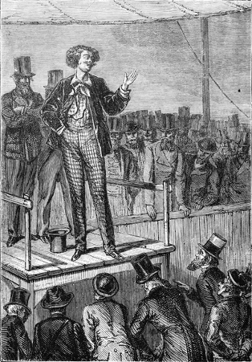
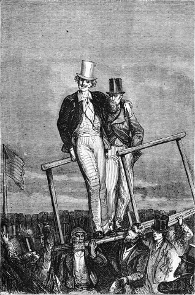

]{.calibre20}

DE LA TERRE À LA LUNE

]{.calibre20}

## []{#_Toc349053409 .pcalibre .pcalibre4 .pcalibre3}[Chapitre 20 -- Attaque et riposte]{#_Toc349053205 .pcalibre .pcalibre4 .pcalibre3} {#calibre_toc_24 .calibre21}

]{.calibre20}

DE LA TERRE À LA LUNE

]{.calibre20}

Cet incident semblait devoir terminer la discussion. C\'était le « mot de la fin », et l\'on n\'eût pas trouvé mieux. Cependant, quand l\'agitation se fut calmée, on entendit ces paroles prononcées d\'une voix forte et sévère : « Maintenant que l\'orateur a donné une large part à la fantaisie, voudra-t-il bien rentrer dans son sujet, faire moins de théories et discuter la partie pratique de son expédition ? »

Tous les regards se dirigèrent vers le personnage qui parlait ainsi. C\'était un homme maigre, sec, d\'une figure énergique, avec une barbe taillée à l\'américaine qui foisonnait sous son menton. À la faveur des diverses agitations produites dans l\'assemblée, il avait peu à peu gagné le premier rang des spectateurs. Là, les bras croisés, l\'œil brillant et hardi, il fixait imperturbablement le héros du meeting. Après avoir formulé sa demande, il se tut et ne parut pas s\'émouvoir des milliers de regards qui convergeaient vers lui, ni du murmure désapprobateur excité par ses paroles. La réponse se faisant attendre, il posa de nouveau sa question avec le même accent net et précis, puis il ajouta :

« Nous sommes ici pour nous occuper de la Lune et non de la Terre.

--- Vous avez raison, monsieur, répondit Michel Ardan, la discussion s\'est égarée. Revenons à la Lune.

--- Monsieur, reprit l\'inconnu, vous prétendez que notre satellite est habité. Bien. Mais s\'il existe des Sélénites, ces gens-là, à coup sûr, vivent sans respirer, car -- je vous en préviens dans votre intérêt -- il n\'y a pas la moindre molécule d\'air à la surface de la Lune. »

À cette affirmation, Ardan redressa sa fauve crinière ; il comprit que la lutte allait s\'engager avec cet homme sur le vif de la question. Il le regarda fixement à son tour, et dit :

« Ah ! il n\'a pas d\'air dans la Lune ! Et qui prétend cela, s\'il vous plaît ?

--- Les savants.

--- Vraiment ?

--- Vraiment.

--- Monsieur, reprit Michel, toute plaisanterie à part, j\'ai une profonde estime pour les savants qui savent, mais un profond dédain pour les savants qui ne savent pas.

--- Vous en connaissez qui appartiennent à cette dernière catégorie ?

--- Particulièrement. En France, il y en a un qui soutient que « mathématiquement » l\'oiseau ne peut pas voler, et un autre dont les théories démontrent que le poisson n\'est pas fait pour vivre dans l\'eau.

--- Il ne s\'agit pas de ceux-là, monsieur, et je pourrais citer à l\'appui de ma proposition des noms que vous ne récuseriez pas.

--- Alors, monsieur, vous embarrasseriez fort un pauvre ignorant qui, d\'ailleurs, ne demande pas mieux que de s\'instruire !

--- Pourquoi donc abordez-vous les questions scientifiques si vous ne les avez pas étudiées ? demanda l\'inconnu assez brutalement.

--- Pourquoi ! répondit Ardan. Par la raison que celui-là est toujours brave qui ne soupçonne pas le danger ! Je ne sais rien, c\'est vrai, mais c\'est précisément ma faiblesse qui fait ma force.

--- Votre faiblesse va jusqu\'à la folie, s\'écria l\'inconnu d\'un ton de mauvaise humeur.

--- Eh ! tant mieux, riposta le Français, si ma folie me mène jusqu\'à la Lune ! »

Barbicane et ses collègues dévoraient des yeux cet intrus qui venait si hardiment se jeter au travers de l\'entreprise. Aucun ne le connaissait, et le président, peu rassuré sur les suites d\'une discussion si franchement posée, regardait son nouvel ami avec une certaine appréhension. L\'assemblée était attentive et sérieusement inquiète, car cette lutte avait pour résultat d\'appeler son attention sur les dangers ou même les véritables impossibilités de l\'expédition.

« Monsieur, reprit l\'adversaire de Michel Ardan, les raisons sont nombreuses et indiscutables qui prouvent l\'absence de toute atmosphère autour de la Lune. Je dirai même *a priori* que, si cette atmosphère a jamais existé, elle a dû être soutirée par la Terre. Mais j\'aime mieux vous opposer des faits irrécusables.

--- Opposez, monsieur, répondit Michel Ardan avec une galanterie parfaite, opposez tant qu\'il vous plaira !

--- Vous savez, dit l\'inconnu, que lorsque des rayons lumineux traversent un milieu tel que l\'air, ils sont déviés de la ligne droite, ou, en d\'autres termes, qu\'ils subissent une réfraction. Eh bien ! lorsque des étoiles sont occultées par la Lune, jamais leurs rayons, en rasant les bords du disque, n\'ont éprouvé la moindre déviation ni donné le plus léger indice de réfraction. De là cette conséquence évidente que la Lune n\'est pas enveloppée d\'une atmosphère. »

On regarda le Français, car, l\'observation une fois admise, les conséquences en étaient rigoureuses.

« En effet, répondit Michel Ardan, voilà votre meilleur argument, pour ne pas dire le seul, et un savant serait peut-être embarrassé d\'y répondre ; moi, je vous dirai seulement que cet argument n\'a pas une valeur absolue, parce qu\'il suppose le diamètre angulaire de la Lune parfaitement déterminé, ce qui n\'est pas. Mais passons, et dites-moi, mon cher monsieur, si vous admettez l\'existence de volcans à la surface de la Lune.

{#Image46 .calibre157}

--- Des volcans éteints, oui ; enflammés, non.

--- Laissez-moi croire pourtant, et sans dépasser les bornes de la logique, que ces volcans ont été en activité pendant une certaine période !

--- Cela est certain, mais comme ils pouvaient fournir eux-mêmes l\'oxygène nécessaire à la combustion, le fait de leur éruption ne prouve aucunement la présence d\'une atmosphère lunaire.

--- Passons alors, répondit Michel Ardan, et laissons de côté ce genre d\'arguments pour arriver aux observations directes. Mais je vous préviens que je vais mettre des noms en avant.

--- Mettez.

--- Je mets. En 1715, les astronomes Louville et Halley, observant l\'éclipse du 3 mai, remarquèrent certaines fulminations d\'une nature bizarre. Ces éclats de lumière, rapides et souvent renouvelés, furent attribués par eux à des orages qui se déchaînaient dans l\'atmosphère de la Lune.

--- En 1715, répliqua l\'inconnu, les astronomes Louville et Halley ont pris pour des phénomènes lunaires des phénomènes purement terrestres, tels que bolides ou autres, qui se produisaient dans notre atmosphère. Voilà ce qu\'ont répondu les savants à l\'énoncé de ces faits, et ce que je réponds avec eux.

--- Passons encore, répondit Ardan, sans être troublé de la riposte. Herschell, en 1787, n\'a-t-il pas observé un grand nombre de points lumineux à la surface de la Lune ?

--- Sans doute ; mais sans s\'expliquer sur l\'origine de ces points lumineux, Herschell lui-même n\'a pas conclu de leur apparition à la nécessité d\'une atmosphère lunaire.

--- Bien répondu, dit Michel Ardan en complimentant son adversaire ; je vois que vous êtes très fort en sélénographie.

--- Très fort, monsieur, et j\'ajouterai que les plus habiles observateurs, ceux qui ont le mieux étudié l\'astre des nuits, MM. Beer et Moelder, sont d\'accord sur le défaut absolu d\'air à sa surface. »

Un mouvement se fit dans l\'assistance, qui parut s\'émouvoir des arguments de ce singulier personnage.

« Passons toujours, répondit Michel Ardan avec le plus grand calme, et arrivons maintenant à un fait important. Un habile astronome français, M. Laussedat, en observant l\'éclipse du 18 juillet 1860, constata que les cornes du croissant solaire étaient arrondies et tronquées. Or, ce phénomène n\'a pu être produit que par une déviation des rayons du soleil à travers l\'atmosphère de la Lune, et il n\'a pas d\'autre explication possible.

--- Mais le fait est-il certain ? demanda vivement l\'inconnu.

--- Absolument certain ! »

Un mouvement inverse ramena l\'assemblée vers son héros favori, dont l\'adversaire resta silencieux. Ardan reprit la parole, et sans tirer vanité de son dernier avantage, il dit simplement :

« Vous voyez donc bien, mon cher monsieur, qu\'il ne faut pas se prononcer d\'une façon absolue contre l\'existence d\'une atmosphère à la surface de la Lune ; cette atmosphère est probablement peu dense, assez subtile, mais aujourd\'hui la science admet généralement qu\'elle existe.

--- Pas sur les montagnes, ne vous en déplaise, riposta l\'inconnu, qui n\'en voulait pas démordre.

--- Non, mais au fond des vallées, et ne dépassant pas en hauteur quelques centaines de pieds.

--- En tout cas, vous feriez bien de prendre vos précautions, car cet air sera terriblement raréfié.

--- Oh ! mon brave monsieur, il y en aura toujours assez pour un homme seul ; d\'ailleurs, une fois rendu là-haut, je tâcherai de l\'économiser de mon mieux et de ne respirer que dans les grandes occasions ! »

Un formidable éclat de rire vint tonner aux oreilles du mystérieux interlocuteur, qui promena ses regards sur l\'assemblée, en la bravant avec fierté.

« Donc, reprit Michel Ardan d\'un air dégagé, puisque nous sommes d\'accord sur la présence d\'une certaine atmosphère, nous voilà forcés d\'admettre la présence d\'une certaine quantité d\'eau. C\'est une conséquence dont je me réjouis fort pour mon compte. D\'ailleurs, mon aimable contradicteur, permettez-moi de vous soumettre encore une observation. Nous ne connaissons qu\'un côté du disque de la Lune, et s\'il y a peu d\'air sur la face qui nous regarde, il est possible qu\'il y en ait beaucoup sur la face opposée.

--- Et pour quelle raison ?

--- Parce que la Lune, sous l\'action de l\'attraction terrestre, a pris la forme d\'un œuf que nous apercevons par le petit bout. De là cette conséquence due aux calculs de Hansen, que son centre de gravité est situé dans l\'autre hémisphère. De là cette conclusion que toutes les masses d\'air et d\'eau ont dû être entraînées sur l\'autre face de notre satellite aux premiers jours de sa création.

--- Pures fantaisies ! s\'écria l\'inconnu.

--- Non ! pures théories, qui sont appuyées sur les lois de la mécanique, et il me paraît difficile de les réfuter. J\'en appelle donc à cette assemblée, et je mets aux voix la question de savoir si la vie, telle qu\'elle existe sur la Terre, est possible à la surface de la Lune ? »

Trois cent mille auditeurs à la fois applaudirent à la proposition. L\'adversaire de Michel Ardan voulait encore parler, mais il ne pouvait plus se faire entendre. Les cris, les menaces fondaient sur lui comme la grêle.

« Assez ! assez ! disaient les uns.

--- Chassez cet intrus ! répétaient les autres.

--- À la porte ! à la porte ! » s\'écriait la foule irritée.

Mais lui, ferme, cramponné à l\'estrade, ne bougeait pas et laissait passer l\'orage, qui eût pris des proportions formidables, si Michel Ardan ne l\'eût apaisé d\'un geste. Il était trop chevaleresque pour abandonner son contradicteur dans une semblable extrémité.

« Vous désirez ajouter quelques mots ? lui demanda-t-il du ton le plus gracieux.

--- Oui ! cent, mille, répondit l\'inconnu avec emportement. Ou plutôt, non, un seul ! Pour persévérer dans votre entreprise, il faut que vous soyez\...

--- Imprudent ! Comment pouvez-vous me traiter ainsi, moi qui ai demandé un boulet cylindro-conique à mon ami Barbicane, afin de ne pas tourner en route à la façon des écureuils ?

--- Mais, malheureux, l\'épouvantable contrecoup vous mettra en pièces au départ !

--- Mon cher contradicteur, vous venez de poser le doigt sur la véritable et la seule difficulté ; cependant, j\'ai trop bonne opinion du génie industriel des Américains pour croire qu\'ils ne parviendront pas à la résoudre !

--- Mais la chaleur développée par la vitesse du projectile en traversant les couches d\'air ?

--- Oh ! ses parois sont épaisses, et j\'aurai si rapidement franchi l\'atmosphère !

--- Mais des vivres ? de l\'eau ?

--- J\'ai calculé que je pouvais en emporter pour un an, et ma traversée durera quatre jours !

--- Mais de l\'air pour respirer en route ?

--- J\'en ferai par des procédés chimiques.

--- Mais votre chute sur la Lune, si vous y arrivez jamais ?

--- Elle sera six fois moins rapide qu\'une chute sur la Terre, puisque la pesanteur est six fois moindre à la surface de la Lune.

--- Mais elle sera encore suffisante pour vous briser comme du verre !

--- Et qui m\'empêchera de retarder ma chute au moyen de fusées convenablement disposées et enflammées en temps utile ?

--- Mais enfin, en supposant que toutes les difficultés soient résolues, tous les obstacles aplanis, en réunissant toutes les chances en votre faveur, en admettant que vous arriviez sain et sauf dans la Lune, comment reviendrez-vous ?

--- Je ne reviendrai pas ! »

À cette réponse, qui touchait au sublime par sa simplicité, l\'assemblée demeura muette. Mais son silence fut plus éloquent que n\'eussent été ses cris d\'enthousiasme. L\'inconnu en profita pour protester une dernière fois.

« Vous vous tuerez infailliblement, s\'écria-t-il, et votre mort, qui n\'aura été que la mort d\'un insensé, n\'aura pas même servi la science.

--- Continuez, mon généreux inconnu, car véritablement vous pronostiquez d\'une façon fort agréable.

--- Ah ! c\'en est trop ! s\'écria l\'adversaire de Michel Ardan, et je ne sais pas pourquoi je continue une discussion aussi peu sérieuse ! Poursuivez à votre aise cette folle entreprise ! Ce n\'est pas à vous qu\'il faut s\'en prendre !

--- Oh ! ne vous gênez pas !

--- Non ! c\'est un autre qui portera la responsabilité de vos actes !

--- Et qui donc, s\'il vous plaît ? demanda Michel Ardan d\'une voix impérieuse.

--- L\'ignorant qui a organisé cette tentative aussi impossible que ridicule ! »

L\'attaque était directe. Barbicane, depuis l\'intervention de l\'inconnu, faisait de violents efforts pour se contenir, et « brûler sa fumée » comme certains foyers de chaudières ; mais, en se voyant si outrageusement désigné, il se leva précipitamment et allait marcher à l\'adversaire qui le bravait en face, quand il se vit subitement séparé de lui.

L\'estrade fut enlevée tout d\'un coup par cent bras vigoureux, et le président du Gun-Club dut partager avec Michel Ardan les honneurs du triomphe. Le pavois était lourd, mais les porteurs se relayaient sans cesse, et chacun se disputait, luttait, combattait pour prêter à cette manifestation l\'appui de ses épaules.

{#Image47 .calibre158}

Cependant l\'inconnu n\'avait point profité du tumulte pour quitter la place. L\'aurait-il pu, d\'ailleurs, au milieu de cette foule compacte ? Non, sans doute. En tout cas, il se tenait au premier rang, les bras croisés, et dévorait des yeux le président Barbicane.

Celui-ci ne le perdait pas de vue, et les regards de ces deux hommes demeuraient engagés comme deux épées frémissantes.

Les cris de l\'immense foule se maintinrent à leur maximum d\'intensité pendant cette marche triomphale. Michel Ardan se laissait faire avec un plaisir évident. Sa face rayonnait. Quelquefois l\'estrade semblait prise de tangage et de roulis comme un navire battu des flots. Mais les deux héros du meeting avaient le pied marin ; ils ne bronchaient pas, et leur vaisseau arriva sans avaries au port de Tampa-Town. Michel Ardan parvint heureusement à se dérober aux dernières étreintes de ses vigoureux admirateurs ; il s\'enfuit à l\'hôtel Franklin, gagna prestement sa chambre et se glissa rapidement dans son lit, tandis qu\'une armée de cent mille hommes veillait sous ses fenêtres.

Pendant ce temps, une scène courte, grave, décisive, avait lieu entre le personnage mystérieux et le président du Gun-Club.

Barbicane, libre enfin, était allé droit à son adversaire.

« Venez ! » dit-il d\'une voix brève. Celui-ci le suivit sur le quai, et bientôt tous les deux se trouvèrent seuls à l\'entrée d\'un wharf ouvert sur le Jone\'s-Fall.

Là, ces ennemis, encore inconnus l\'un à l\'autre, se regardèrent.

« Qui êtes-vous ? demanda Barbicane.

--- Le capitaine Nicholl.

--- Je m\'en doutais. Jusqu\'ici le hasard ne vous avait jamais jeté sur mon chemin\...

--- Je suis venu m\'y mettre !

--- Vous m\'avez insulté !

--- Publiquement.

--- Et vous me rendrez raison de cette insulte.

--- À l\'instant.

--- Non. Je désire que tout se passe secrètement entre nous. Il y a un bois situé à trois milles de Tampa, le bois de Skersnaw. Vous le connaissez ?

--- Je le connais.

--- Vous plaira-t-il d\'y entrer demain matin à cinq heures par un côté ?\...

--- Oui, si à la même heure vous entrez par l\'autre côté.

--- Et vous n\'oublierez pas votre rifle ? dit Barbicane.

--- Pas plus que vous n\'oublierez le vôtre », répondit Nicholl.

Sur ces paroles froidement prononcées, le président du Gun-Club et le capitaine se séparèrent. Barbicane revint à sa demeure, mais au lieu de prendre quelques heures de repos, il passa la nuit à chercher les moyens d\'éviter le contrecoup du projectile et de résoudre ce difficile problème posé par Michel Ardan dans la discussion du meeting.
