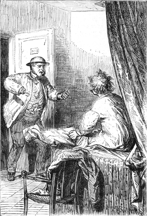
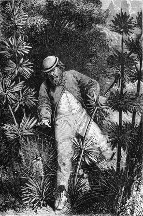
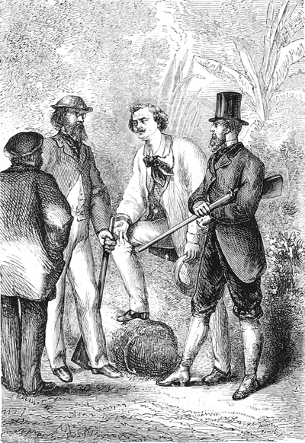

]{.calibre20}

DE LA TERRE À LA LUNE

]{.calibre20}

## []{#_Toc349053410 .pcalibre .pcalibre4 .pcalibre3}[Chapitre 21 -- Comment un Français arrange une affaire]{#_Toc349053206 .pcalibre .pcalibre4 .pcalibre3} {#calibre_toc_25 .calibre21}

]{.calibre20}

DE LA TERRE À LA LUNE

]{.calibre20}

Pendant que les conventions de ce duel étaient discutées entre le président et le capitaine, duel terrible et sauvage, dans lequel chaque adversaire devient chasseur d\'homme, Michel Ardan se reposait des fatigues du triomphe. Se reposer n\'est évidemment pas une expression juste, car les lits américains peuvent rivaliser pour la dureté avec des tables de marbre ou de granit.

Ardan dormait donc assez mal, se tournant, se retournant entre les serviettes qui lui servaient de draps, et il songeait à installer une couchette plus confortable dans son projectile, quand un bruit violent vint l\'arracher à ses rêves. Des coups désordonnés ébranlaient sa porte. Ils semblaient être portés avec un instrument de fer. De formidables éclats de voix se mêlaient à ce tapage un peu trop matinal.

« Ouvre ! criait-on. Mais, au nom du Ciel, ouvre donc ! »

Ardan n\'avait aucune raison d\'acquiescer à une demande si bruyamment posée. Cependant il se leva et ouvrit sa porte, au moment où elle allait céder aux efforts du visiteur obstiné. Le secrétaire du Gun-Club fit irruption dans la chambre. Une bombe ne serait pas entrée avec moins de cérémonie.

{#Image48 .calibre159}

« Hier soir, s\'écria J.-T. Maston *ex abrupto*, notre président a été insulté publiquement pendant le meeting ! Il a provoqué son adversaire, qui n\'est autre que le capitaine Nicholl ! Ils se battent ce matin au bois de Skersnaw ! J\'ai tout appris de la bouche de Barbicane ! S\'il est tué, c\'est l\'anéantissement de nos projets ! Il faut donc empêcher ce duel ! Or, un seul homme au monde peut avoir assez d\'empire sur Barbicane pour l\'arrêter, et cet homme c\'est Michel Ardan ! »

Pendant que J.-T. Maston parlait ainsi, Michel Ardan, renonçant à l\'interrompre, s\'était précipité dans son vaste pantalon, et, moins de deux minutes après, les deux amis gagnaient à toutes jambes les faubourgs de Tampa-Town.

Ce fut pendant cette course rapide que Maston mit Ardan au courant de la situation. Il lui apprit les véritables causes de l\'inimitié de Barbicane et de Nicholl, comment cette inimitié était de vieille date, pourquoi jusque-là, grâce à des amis communs, le président et le capitaine ne s\'étaient jamais rencontrés face à face ; il ajouta qu\'il s\'agissait uniquement d\'une rivalité de plaque et de boulet, et qu\'enfin la scène du meeting n\'avait été qu\'une occasion longtemps cherchée par Nicholl de satisfaire de vieilles rancunes.

Rien de plus terrible que ces duels particuliers à l\'Amérique, pendant lesquels les deux adversaires se cherchent à travers les taillis, se guettent au coin des halliers et se tirent au milieu des fourrés comme des bêtes fauves. C\'est alors que chacun d\'eux doit envier ces qualités merveilleuses si naturelles aux Indiens des Prairies, leur intelligence rapide, leur ruse ingénieuse, leur sentiment des traces, leur flair de l\'ennemi. Une erreur, une hésitation, un faux pas peuvent amener la mort. Dans ces rencontres, les Yankees se font souvent accompagner de leurs chiens et, à la fois chasseurs et gibier, ils se relancent pendant des heures entières.

« Quels diables de gens vous êtes ! s\'écria Michel Ardan, quand son compagnon lui eut dépeint avec beaucoup d\'énergie toute cette mise en scène.

--- Nous sommes ainsi, répondit modestement J.-T. Maston ; mais hâtons-nous. »

Cependant Michel Ardan et lui eurent beau courir à travers la plaine encore tout humide de rosée, franchir les rizières et les creeks, couper au plus court, ils ne purent atteindre avant cinq heures et demie le bois de Skersnaw. Barbicane devait avoir passé sa lisière depuis une demi-heure.

Là travaillait un vieux bushman occupé à débiter en fagots des arbres abattus sous sa hache. Maston courut à lui en criant :

« Avez-vous vu entrer dans le bois un homme armé d\'un rifle, Barbicane, le président\... mon meilleur ami ?\... »

Le digne secrétaire du Gun-Club pensait naïvement que son président devait être connu du monde entier. Mais le bushman n\'eut pas l\'air de le comprendre.

« Un chasseur, dit alors Ardan.

--- Un chasseur ? oui, répondit le bushman.

--- Il y a longtemps ?

--- Une heure à peu près.

--- Trop tard ! s\'écria Maston.

--- Et avez-vous entendu des coups de fusil ? demanda Michel Ardan.

--- Non.

--- Pas un seul ?

--- Pas un seul. Ce chasseur-là n\'a pas l\'air de faire bonne chasse !

--- Que faire ? dit Maston.

--- Entrer dans le bois, au risque d\'attraper une balle qui ne nous est pas destinée.

--- Ah ! s\'écria Maston avec un accent auquel on ne pouvait se méprendre, j\'aimerais mieux dix balles dans ma tête qu\'une seule dans la tête de Barbicane.

--- En avant donc ! » reprit Ardan en serrant la main de son compagnon.

Quelques secondes plus tard, les deux amis disparaissaient dans le taillis. C\'était un fourré fort épais, fait de cyprès géants, de sycomores, de tulipiers, d\'oliviers, de tamarins, de chênes vifs et de magnolias. Ces divers arbres enchevêtraient leurs branches dans un inextricable pêle-mêle, sans permettre à la vue de s\'étendre au loin. Michel Ardan et Maston marchaient l\'un près de l\'autre, passant silencieusement à travers les hautes herbes, se frayant un chemin au milieu des lianes vigoureuses, interrogeant du regard les buissons ou les branches perdues dans la sombre épaisseur du feuillage et attendant à chaque pas la redoutable détonation des rifles. Quant aux traces que Barbicane avait dû laisser de son passage à travers le bois, il leur était impossible de les reconnaître, et ils marchaient en aveugles dans ces sentiers à peine frayés, sur lesquels un Indien eût suivi pas à pas la marche de son adversaire.

Après une heure de vaines recherches, les deux compagnons s\'arrêtèrent. Leur inquiétude redoublait.

« Il faut que tout soit fini, dit Maston découragé. Un homme comme Barbicane n\'a pas rusé avec son ennemi, ni tendu de piège, ni pratiqué de manœuvre ! Il est trop franc, trop courageux. Il est allé en avant, droit au danger, et sans doute assez loin du bushman pour que le vent ait emporté la détonation d\'une arme à feu !

--- Mais nous ! nous ! répondit Michel Ardan, depuis notre entrée sous bois, nous aurions entendu !\...

--- Et si nous sommes arrivés trop tard ! » s\'écria Maston avec un accent de désespoir.

Michel Ardan ne trouva pas un mot à répondre ; Maston et lui reprirent leur marche interrompue. De temps en temps ils poussaient de grands cris ; ils appelaient soit Barbicane, soit Nicholl ; mais ni l\'un ni l\'autre des deux adversaires ne répondait à leur voix. De joyeuses volées d\'oiseaux, éveillés au bruit, disparaissaient entre les branches, et quelques daims effarouchés s\'enfuyaient précipitamment à travers les taillis.

Pendant une heure encore, la recherche se prolongea. La plus grande partie du bois avait été explorée. Rien ne décelait la présence des combattants. C\'était à douter de l\'affirmation du bushman, et Ardan allait renoncer à poursuivre plus longtemps une reconnaissance inutile, quand, tout d\'un coup, Maston s\'arrêta.

« Chut ! fit-il. Quelqu\'un là-bas !

--- Quelqu\'un ? répondit Michel Ardan.

--- Oui ! un homme ! Il semble immobile. Son rifle n\'est plus entre ses mains. Que fait-il donc ?

--- Mais le reconnais-tu ? demanda Michel Ardan, que sa vue basse servait fort mal en pareille circonstance.

--- Oui ! oui ! Il se retourne, répondit Maston.

--- Et c\'est ?\...

--- Le capitaine Nicholl !

--- Nicholl ! » s\'écria Michel Ardan, qui ressentit un violent serrement de cœur.

Nicholl désarmé ! Il n\'avait donc plus rien à craindre de son adversaire ?

« Marchons à lui, dit Michel Ardan, nous saurons à quoi nous en tenir. »

Mais son compagnon et lui n\'eurent pas fait cinquante pas, qu\'ils s\'arrêtèrent pour examiner plus attentivement le capitaine. Ils s\'imaginaient trouver un homme altéré de sang et tout entier à sa vengeance ! En le voyant, ils demeurèrent stupéfaits.

{#Image49 .calibre160}

Un filet à maille serrée était tendu entre deux tulipiers gigantesques, et, au milieu du réseau, un petit oiseau, les ailes enchevêtrées, se débattait en poussant des cris plaintifs. L\'oiseleur qui avait disposé cette toile inextricable n\'était pas un être humain, mais bien une venimeuse araignée, particulière au pays, grosse comme un œuf de pigeon, et munie de pattes énormes. Le hideux animal, au moment de se précipiter sur sa proie, avait dû rebrousser chemin et chercher asile sur les hautes branches du tulipier, car un ennemi redoutable venait le menacer à son tour.

En effet, le capitaine Nicholl, son fusil à terre, oubliant les dangers de sa situation, s\'occupait à délivrer le plus délicatement possible la victime prise dans les filets de la monstrueuse araignée. Quand il eut fini, il donna la volée au petit oiseau, qui battit joyeusement de l\'aile et disparut.

Nicholl, attendri, le regardait fuir à travers les branches, quand il entendit ces paroles prononcées d\'une voix émue :

« Vous êtes un brave homme, vous ! »

Il se retourna. Michel Ardan était devant lui, répétant sur tous les tons :

« Et un aimable homme !

--- Michel Ardan ! s\'écria le capitaine. Que venez-vous faire ici, monsieur ?

--- Vous serrer la main, Nicholl, et vous empêcher de tuer Barbicane ou d\'être tué par lui.

--- Barbicane ! s\'écria le capitaine, que je cherche depuis deux heures sans le trouver ! Où se cache-t-il ?\...

--- Nicholl, dit Michel Ardan, ceci n\'est pas poli ! il faut toujours respecter son adversaire ; soyez tranquille, si Barbicane est vivant, nous le trouverons, et d\'autant plus facilement que, s\'il ne s\'est pas amusé comme vous à secourir des oiseaux opprimés, il doit vous chercher aussi. Mais quand nous l\'aurons trouvé, c\'est Michel Ardan qui vous le dit, il ne sera plus question de duel entre vous.

--- Entre le président Barbicane et moi, répondit gravement Nicholl, il y a une rivalité telle, que la mort de l\'un de nous\...

--- Allons donc ! allons donc ! reprit Michel Ardan, de braves gens comme vous, cela a pu se détester, mais cela s\'estime. Vous ne vous battrez pas.

--- Je me battrai, monsieur !

--- Point.

--- Capitaine, dit alors J.-T. Maston avec beaucoup de cœur, je suis l\'ami du président, son *alter ego*, un autre lui-même ; si vous voulez absolument tuer quelqu\'un, tirez sur moi, ce sera exactement la même chose.

--- Monsieur, dit Nicholl en serrant son rifle d\'une main convulsive, ces plaisanteries\...

--- L\'ami Maston ne plaisante pas, répondit Michel Ardan, et je comprends son idée de se faire tuer pour l\'homme qu\'il aime ! Mais ni lui ni Barbicane ne tomberont sous les balles du capitaine Nicholl, car j\'ai à faire aux deux rivaux une proposition si séduisante qu\'ils s\'empresseront de l\'accepter.

--- Et laquelle ? demanda Nicholl avec une visible incrédulité.

--- Patience, répondit Ardan, je ne puis la communiquer qu\'en présence de Barbicane.

--- Cherchons-le donc », s\'écria le capitaine.

Aussitôt ces trois hommes se mirent en chemin ; le capitaine, après avoir désarmé son rifle, le jeta sur son épaule et s\'avança d\'un pas saccadé, sans mot dire.

Pendant une demi-heure encore, les recherches furent inutiles. Maston se sentait pris d\'un sinistre pressentiment. Il observait sévèrement Nicholl, se demandant si, la vengeance du capitaine satisfaite, le malheureux Barbicane, déjà frappé d\'une balle, ne gisait pas sans vie au fond de quelque taillis ensanglanté. Michel Ardan semblait avoir la même pensée, et tous deux interrogeaient déjà du regard le capitaine Nicholl, quand Maston s\'arrêta soudain.

Le buste immobile d\'un homme adossé au pied d\'un gigantesque catalpa apparaissait à vingt pas, à moitié perdu dans les herbes.

« C\'est lui ! » fit Maston.

Barbicane ne bougeait pas. Ardan plongea ses regards dans les yeux du capitaine, mais celui-ci ne broncha pas. Ardan fit quelques pas en criant :

« Barbicane ! Barbicane ! »

Nulle réponse. Ardan se précipita vers son ami ; mais, au moment où il allait lui saisir le bras, il s\'arrêta court en poussant un cri de surprise.

Barbicane, le crayon à la main, traçait des formules et des figures géométriques sur un carnet, tandis que son fusil désarmé gisait à terre.

Absorbé dans son travail, le savant, oubliant à son tour son duel et sa vengeance, n\'avait rien vu, rien entendu.

Mais quand Michel Ardan posa sa main sur la sienne, il se leva et le considéra d\'un œil étonné.

« Ah ! s\'écria-t-il enfin, toi ! ici ! J\'ai trouvé, mon ami ! J\'ai trouvé !

--- Quoi ?

--- Mon moyen !

--- Quel moyen ?

--- Le moyen d\'annuler l\'effet du contrecoup au départ du projectile !

--- Vraiment ? dit Michel en regardant le capitaine du coin de l\'œil.

--- Oui ! de l\'eau ! de l\'eau simple qui fera ressort\... Ah ! Maston ! s\'écria Barbicane, vous aussi !

--- Lui-même, répondit Michel Ardan, et permets que je te présente en même temps le digne capitaine Nicholl !

--- Nicholl ! s\'écria Barbicane, qui fut debout en un instant. Pardon, capitaine, dit-il, j\'avais oublié\... Je suis prêt\... »

Michel Ardan intervint sans laisser aux deux ennemis le temps de s\'interpeller.

« Parbleu ! dit-il, il est heureux que de braves gens comme vous ne se soient pas rencontrés plus tôt ! Nous aurions maintenant à pleurer l\'un ou l\'autre. Mais, grâce à Dieu qui s\'en est mêlé, il n\'y a plus rien à craindre. Quand on oublie sa haine pour se plonger dans des problèmes de mécanique ou jouer des tours aux araignées, c\'est que cette haine n\'est dangereuse pour personne. »

Et Michel Ardan raconta au président l\'histoire du capitaine.

« Je vous demande un peu, dit-il en terminant, si deux bons êtres comme vous sont faits pour se casser réciproquement la tête à coups de carabine ? »

Il y avait dans cette situation, un peu ridicule, quelque chose de si inattendu, que Barbicane et Nicholl ne savaient trop quelle contenance garder l\'un vis-à-vis de l\'autre. Michel Ardan le sentit bien, et il résolut de brusquer la réconciliation.

« Mes braves amis, dit-il en laissant poindre sur ses lèvres son meilleur sourire, il n\'y a jamais eu entre vous qu\'un malentendu. Pas autre chose. Eh bien ! pour prouver que tout est fini entre vous, et puisque vous êtes gens à risquer votre peau, acceptez franchement la proposition que je vais vous faire.

--- Parlez, dit Nicholl.

--- L\'ami Barbicane croit que son projectile ira tout droit à la Lune.

--- Oui, certes, répliqua le président.

--- Et l\'ami Nicholl est persuadé qu\'il retombera sur la terre.

--- J\'en suis certain, s\'écria le capitaine.

--- Bon ! reprit Michel Ardan. Je n\'ai pas la prétention de vous mettre d\'accord ; mais je vous dis tout bonnement : Partez avec moi, et venez voir si nous resterons en route.

{#Image50 .calibre161}

--- Hein ! » fit J.-T. Maston stupéfait.

Les deux rivaux, à cette proposition subite, avaient levé les yeux l\'un sur l\'autre. Ils s\'observaient avec attention. Barbicane attendait la réponse du capitaine. Nicholl guettait les paroles du président.

« Eh bien ? fit Michel de son ton le plus engageant. Puisqu\'il n\'y a plus de contrecoup à craindre !

--- Accepté ! » s\'écria Barbicane.

Mais, si vite qu\'il eût prononcé ce mot, Nicholl l\'avait achevé en même temps que lui.

« Hurrah ! bravo ! vivat ! hip ! hip ! hip ! s\'écria Michel Ardan en tendant la main aux deux adversaires. Et maintenant que l\'affaire est arrangée, mes amis, permettez-moi de vous traiter à la française. Allons déjeuner. »
