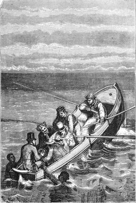

]{.calibre20}

DE LA TERRE À LA LUNE

]{.calibre20}

## []{#_Toc349053411 .pcalibre .pcalibre4 .pcalibre3}[Chapitre 22 -- Le nouveau citoyen des États-Unis]{#_Toc349053207 .pcalibre .pcalibre4 .pcalibre3} {#calibre_toc_26 .calibre21}

]{.calibre20}

DE LA TERRE À LA LUNE

]{.calibre20}

Ce jour-là toute l\'Amérique apprit en même temps l\'affaire du capitaine Nicholl et du président Barbicane, ainsi que son singulier dénouement. Le rôle joué dans cette rencontre par le chevaleresque Européen, sa proposition inattendue qui tranchait la difficulté, l\'acceptation simultanée des deux rivaux, cette conquête du continent lunaire à laquelle la France et les États-Unis allaient marcher d\'accord, tout se réunit pour accroître encore la popularité de Michel Ardan.

On sait avec quelle frénésie les Yankees se passionnent pour un individu. Dans un pays où de graves magistrats s\'attellent à la voiture d\'une danseuse et la traînent triomphalement, que l\'on juge de la passion déchaînée par l\'audacieux Français ! Si l\'on ne détela pas ses chevaux, c\'est probablement parce qu\'il n\'en avait pas, mais toutes les autres marques d\'enthousiasmes lui furent prodiguées. Pas un citoyen qui ne s\'unît à lui d\'esprit et de cœur ! *Ex pluribus unum*, suivant la devise des États-Unis.

À dater de ce jour, Michel Ardan n\'eut plus un moment de repos. Des députations venues de tous les coins de l\'Union le harcelèrent sans fin ni trêve. Il dut les recevoir bon gré mal gré. Ce qu\'il serra de mains, ce qu\'il tutoya de gens ne peut se compter ; il fut bientôt sur les dents ; sa voix, enrouée dans des speechs innombrables, ne s\'échappait plus de ses lèvres qu\'en sons inintelligibles, et il faillit gagner une gastro-entérite à la suite des toasts qu\'il dut porter à tous les comtés de l\'Union. Ce succès eût grisé un autre dès le premier jour, mais lui sut se contenir dans une demi-ébriété spirituelle et charmante.

Parmi les députations de toute espèce qui l\'assaillirent, celle des « lunatiques » n\'eut garde d\'oublier ce qu\'elle devait au futur conquérant de la Lune. Un jour, quelques-uns de ces pauvres gens, assez nombreux en Amérique, vinrent le trouver et demandèrent à retourner avec lui dans leur pays natal. Certains d\'entre eux prétendaient parler « le sélénite » et voulurent l\'apprendre à Michel Ardan. Celui-ci se prêta de bon cœur à leur innocente manie et se chargea de commissions pour leurs amis de la Lune.

« Singulière folie ! dit-il à Barbicane après les avoir congédiés, et folie qui frappe souvent les vives intelligences. Un de nos plus illustres savants, Arago, me disait que beaucoup de gens très sages et très réservés dans leurs conceptions se laissaient aller à une grande exaltation, à d\'incroyables singularités, toutes les fois que la Lune les occupait. Tu ne crois pas à l\'influence de la Lune sur les maladies ?

--- Peu, répondit le président du Gun-Club.

--- Je n\'y crois pas non plus, et cependant l\'histoire a enregistré des faits au moins étonnants. Ainsi, en 1693, pendant une épidémie, les personnes périrent en plus grand nombre le 21 janvier, au moment d\'une éclipse. Le célèbre Bacon s\'évanouissait pendant les éclipses de la Lune et ne revenait à la vie qu\'après l\'entière émersion de l\'astre. Le roi Charles VI retomba six fois en démence pendant l\'année 1399 soit à la nouvelle, soit à la pleine Lune. Des médecins ont classé le mal caduc parmi ceux qui suivent les phases de la Lune. Les maladies nerveuses ont paru subir souvent son influence. Mead parle d\'un enfant qui entrait en convulsions quand la Lune entrait en opposition. Gall avait remarqué que l\'exaltation des personnes faibles s\'accroissait deux fois par mois, aux époques de la nouvelle et de la pleine Lune. Enfin il y a encore mille observations de ce genre sur les vertiges, les fièvres malignes, les somnambulismes, tendant à prouver que l\'astre des nuits a une mystérieuse influence sur les maladies terrestres.

--- Mais comment ? pourquoi ? demanda Barbicane.

--- Pourquoi ? répondit Ardan. Ma foi, je te ferai la même réponse qu\'Arago répétait dix-neuf siècles après Plutarque : « C\'est peut-être parce que ça n\'est pas vrai ! »

Au milieu de son triomphe, Michel Ardan ne put échapper à aucune des corvées inhérentes à l\'état d\'homme célèbre. Les entrepreneurs de succès voulurent l\'exhiber. Barnum lui offrit un million pour le promener de ville en ville dans tous les États-Unis et le montrer comme un animal curieux. Michel Ardan le traita de cornac et l\'envoya promener lui-même.

Cependant, s\'il refusa de satisfaire ainsi la curiosité publique, ses portraits, du moins, coururent le monde entier et occupèrent la place d\'honneur dans les albums ; on en fit des épreuves de toutes dimensions, depuis la grandeur naturelle jusqu\'aux réductions microscopiques des timbres-poste. Chacun pouvait posséder son héros dans toutes les poses imaginables, en tête, en buste, en pied, de face, de profil, de trois quarts, de dos. On en tira plus de quinze cent mille exemplaires, et il avait là une belle occasion de se débiter en reliques, mais il n\'en profita pas. Rien qu\'à vendre ses cheveux un dollar la pièce, il lui en restait assez pour faire fortune !

Pour tout dire, cette popularité ne lui déplaisait pas. Au contraire. Il se mettait à la disposition du public et correspondait avec l\'univers entier. On répétait ses bons mots, on les propageait, surtout ceux qu\'il ne faisait pas. On lui en prêtait, suivant l\'habitude, car il était riche de ce côté.

Non seulement il eut pour lui les hommes, mais aussi les femmes. Quel nombre infini de « beaux mariages » il aurait faits, pour peu que la fantaisie l\'eût pris de « se fixer » ! Les vieilles misses surtout, celles qui depuis quarante ans séchaient sur pied rêvaient nuit et jour devant ses photographies.

Il est certain qu\'il eût trouvé des compagnes par centaines, même s\'il leur avait imposé la condition de le suivre dans les airs. Les femmes sont intrépides quand elles n\'ont pas peur de tout. Mais son intention n\'était pas de faire souche sur le continent lunaire, et d\'y transplanter une race croisée de Français et d\'Américains. Il refusa donc.

« Aller jouer là-haut, disait-il, le rôle d\'Adam avec une fille d\'Ève, merci ! Je n\'aurais qu\'à rencontrer des serpents !\... »

Dès qu\'il put se soustraire enfin aux joies trop répétées du triomphe, il alla, suivi de ses amis, faire une visite à la Columbiad. Il lui devait bien cela. Du reste, il était devenu très fort en balistique, depuis qu\'il vivait avec Barbicane, J.-T. Maston et *tutti quanti*. Son plus grand plaisir consistait à répéter à ces braves artilleurs qu\'ils n\'étaient que des meurtriers aimables et savants. Il ne tarissait pas en plaisanteries à cet égard. Le jour où il visita la Columbiad, il l\'admira fort et descendit jusqu\'au fond de l\'âme de ce gigantesque mortier qui devait bientôt le lancer vers l\'astre des nuits.

« Au moins, dit-il, ce canon-là ne fera de mal à personne, ce qui est déjà assez étonnant de la part d\'un canon. Mais quant à vos engins qui détruisent, qui incendient, qui brisent, qui tuent, ne m\'en parlez pas, et surtout ne venez jamais me dire qu\'ils ont « une âme », je ne vous croirais pas ! »

Il faut rapporter ici une proposition relative à J.-T. Maston. Quand le secrétaire du Gun-Club entendit Barbicane et Nicholl accepter la proposition de Michel Ardan, il résolut de se joindre à eux et de faire « la partie à quatre ». Un jour il demanda à être du voyage. Barbicane, désolé de refuser, lui fit comprendre que le projectile ne pouvait emporter un aussi grand nombre de passagers. J.-T. Maston, désespéré, alla trouver Michel Ardan, qui l\'invita à se résigner et fit valoir des arguments *ad hominem*.

« Vois-tu, mon vieux Maston, lui dit-il, il ne faut pas prendre mes paroles en mauvaise part ; mais vraiment là, entre nous, tu es trop incomplet pour te présenter dans la Lune !

--- Incomplet ! s\'écria le vaillant invalide.

--- Oui ! mon brave ami ! Songe au cas où nous rencontrerions des habitants là-haut. Voudrais-tu donc leur donner une aussi triste idée de ce qui se passe ici-bas, leur apprendre ce que c\'est que la guerre, leur montrer qu\'on emploie le meilleur de son temps à se dévorer, à se manger, à se casser bras et jambes, et cela sur un globe qui pourrait nourrir cent milliards d\'habitants, et où il y en a douze cents millions à peine ? Allons donc, mon digne ami, tu nous ferais mettre à la porte !

--- Mais si vous arrivez en morceaux, répliqua J.-T. Maston, vous serez aussi incomplets que moi !

--- Sans doute, répondit Michel Ardan, mais nous n\'arriverons pas en morceaux ! »

En effet, une expérience préparatoire, tentée le 18 octobre, avait donné les meilleurs résultats et fait concevoir les plus légitimes espérances. Barbicane, désirant se rendre compte de l\'effet de contrecoup au moment du départ d\'un projectile, fit venir un mortier de trente-deux pouces (0,75 cm) de l\'arsenal de Pensacola. On l\'installa sur le rivage de la rade d\'Hillisboro, afin que la bombe retombât dans la mer et que sa chute fût amortie. Il ne s\'agissait que d\'expérimenter la secousse au départ et non le choc à l\'arrivée. Un projectile creux fut préparé avec le plus grand soin pour cette curieuse expérience. Un épais capitonnage, appliqué sur un réseau de ressorts faits du meilleur acier, doublait ses parois intérieures. C\'était un véritable nid soigneusement ouaté.

« Quel dommage de ne pouvoir y prendre place ! » disait J.-T. Maston en regrettant que sa taille ne lui permît pas de tenter l\'aventure.

Dans cette charmante bombe, qui se fermait au moyen d\'un couvercle à vis, on introduisit d\'abord un gros chat, puis un écureuil appartenant au secrétaire perpétuel du Gun-Club, et auquel J.-T. Maston tenait particulièrement. Mais on voulait savoir comment ce petit animal, peu sujet au vertige, supporterait ce voyage expérimental.

Le mortier fut chargé avec cent soixante livres de poudre et la bombe placée dans la pièce. On fit feu.

Aussitôt le projectile s\'enleva avec rapidité, décrivit majestueusement sa parabole, atteignit une hauteur de mille pieds environ, et par une courbe gracieuse alla s\'abîmer au milieu des flots.

Sans perdre un instant, une embarcation se dirigea vers le lieu de sa chute ; des plongeurs habiles se précipitèrent sous les eaux, et attachèrent des câbles aux oreillettes de la bombe, qui fut rapidement hissée à bord. Cinq minutes ne s\'étaient pas écoulées entre le moment où les animaux furent enfermés et le moment où l\'on dévissa le couvercle de leur prison.

Ardan, Barbicane, Maston, Nicholl se trouvaient sur l\'embarcation, et ils assistèrent à l\'opération avec un sentiment d\'intérêt facile à comprendre. À peine la bombe fut-elle ouverte, que le chat s\'élança au-dehors, un peu froissé, mais plein de vie, et sans avoir l\'air de revenir d\'une expédition aérienne.

Mais d\'écureuil point. On chercha. Nulle trace. Il fallut bien alors reconnaître la vérité. Le chat avait mangé son compagnon de voyage.

{#Image51 .calibre162}

J.-T. Maston fut très attristé de la perte de son pauvre écureuil, et se proposa de l\'inscrire au martyrologe de la science.

Quoi qu\'il en soit, après cette expérience, toute hésitation, toute crainte disparurent ; d\'ailleurs les plans de Barbicane devaient encore perfectionner le projectile et anéantir presque entièrement les effets de contrecoup. Il n\'y avait donc plus qu\'à partir.

Deux jours plus tard, Michel Ardan reçut un message du président de l\'Union, honneur auquel il se montra particulièrement sensible.

À l\'exemple de son chevaleresque compatriote, le marquis de la Fayette, le gouvernement lui décernait le titre de citoyen des États-Unis d\'Amérique.
