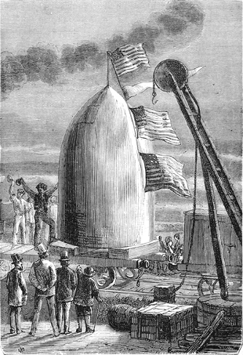
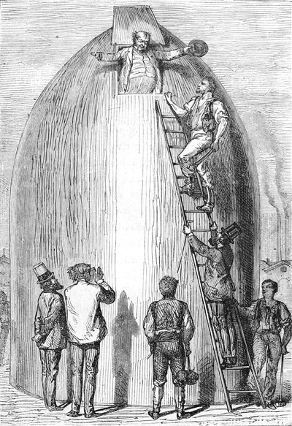

]{.calibre20}

DE LA TERRE À LA LUNE

]{.calibre20}

## []{#_Toc349053412 .pcalibre .pcalibre4 .pcalibre3}[Chapitre 23 -- Le wagon-projectile]{#_Toc349053208 .pcalibre .pcalibre4 .pcalibre3} {#calibre_toc_27 .calibre21}

]{.calibre20}

DE LA TERRE À LA LUNE

]{.calibre20}

Après l\'achèvement de la célèbre Columbiad, l\'intérêt public se rejeta immédiatement sur le projectile, ce nouveau véhicule destiné à transporter à travers l\'espace les trois hardis aventuriers. Personne n\'avait oublié que, par sa dépêche du 30 septembre, Michel Ardan demandait une modification aux plans arrêtés par les membres du Comité.

Le président Barbicane pensait alors avec raison que la forme du projectile importait peu, car, après avoir traversé l\'atmosphère en quelques secondes, son parcours devait s\'effectuer dans le vide absolu. Le Comité avait donc adopté la forme ronde, afin que le boulet pût tourner sur lui-même et se comporter à sa fantaisie. Mais, dès l\'instant qu\'on le transformait en véhicule, c\'était une autre affaire. Michel Ardan ne se souciait pas de voyager à la façon des écureuils ; il voulait monter la tête en haut, les pieds en bas, ayant autant de dignité que dans la nacelle d\'un ballon, plus vite sans doute, mais sans se livrer à une succession de cabrioles peu convenables.

De nouveaux plans furent donc envoyés à la maison Breadwill and Co d\'Albany, avec recommandation de les exécuter sans retard. Le projectile, ainsi modifié, fut fondu le 2 novembre et expédié immédiatement à Stone\'s-Hill par les railways de l\'Est. Le 10, il arriva sans accident au lieu de sa destination. Michel Ardan, Barbicane et Nicholl attendaient avec la plus vive impatience ce « wagon-projectile » dans lequel ils devaient prendre passage pour voler à la découverte d\'un nouveau monde.

{#Image52 .calibre163}

Il faut en convenir, c\'était une magnifique pièce de métal, un produit métallurgique qui faisait le plus grand honneur au génie industriel des Américains. On venait d\'obtenir pour la première fois l\'aluminium en masse aussi considérable, ce qui pouvait être justement regardé comme un résultat prodigieux. Ce précieux projectile étincelait aux rayons du Soleil. À le voir avec ses formes imposantes et coiffé de son chapeau conique, on l\'eût pris volontiers pour une de ces épaisses tourelles en façon de poivrières, que les architectes du Moyen Âge suspendaient à l\'angle des châteaux forts. Il ne lui manquait que des meurtrières et une girouette.

« Je m\'attends, s\'écriait Michel Ardan, à ce qu\'il en sorte un homme d\'armes portant la haquebutte et le corselet d\'acier. Nous serons là-dedans comme des seigneurs féodaux, et, avec un peu d\'artillerie, on y tiendrait tête à toutes les armées sélénites, si toutefois il y en a dans la Lune !

--- Ainsi le véhicule te plaît ? demanda Barbicane à son ami.

--- Oui ! oui ! sans doute, répondit Michel Ardan qui l\'examinait en artiste. Je regrette seulement que ses formes ne soient pas plus effilées, son cône plus gracieux ; on aurait dû le terminer par une touffe d\'ornements en métal guilloché, avec une chimère, par exemple, une gargouille, une salamandre sortant du feu les ailes déployées et la gueule ouverte\...

--- À quoi bon ? dit Barbicane, dont l\'esprit positif était peu sensible aux beautés de l\'art.

--- À quoi bon, ami Barbicane ! Hélas ! puisque tu me le demandes, je crains bien que tu ne le comprennes jamais !

--- Dis toujours, mon brave compagnon.

--- Eh bien ! suivant moi, il faut toujours mettre un peu d\'art dans ce que l\'on fait, cela vaut mieux. Connais-tu une pièce indienne qu\'on appelle *le Chariot de l\'enfant ?*

--- Pas même de nom, répondit Barbicane.

--- Cela ne m\'étonne pas, reprit Michel Ardan. Apprends donc que, dans cette pièce, il y a un voleur qui, au moment de percer le mur d\'une maison, se demande s\'il donnera à son trou la forme d\'une lyre, d\'une fleur, d\'un oiseau ou d\'une amphore. Eh bien ! dis-moi, ami Barbicane, si à cette époque tu avais été membre du jury, est-ce que tu aurais condamné ce voleur-là ?

--- Sans hésiter, répondit le président du Gun-Club, et avec la circonstance aggravante d\'effraction.

--- Et moi je l\'aurais acquitté, ami Barbicane ! Voilà pourquoi tu ne pourras jamais me comprendre !

--- Je n\'essaierai même pas, mon vaillant artiste.

--- Mais au moins, reprit Michel Ardan, puisque l\'extérieur de notre wagon-projectile laisse à désirer, on me permettra de le meubler à mon aise, et avec tout le luxe qui convient à des ambassadeurs de la Terre !

--- À cet égard, mon brave Michel, répondit Barbicane, tu agiras à ta fantaisie, et nous te laisserons faire à ta guise. »

Mais, avant de passer à l\'agréable, le président du Gun-Club avait songé à l\'utile, et les moyens inventés par lui pour amoindrir les effets du contrecoup furent appliqués avec une intelligence parfaite.

Barbicane s\'était dit, non sans raison, que nul ressort ne serait assez puissant pour amortir le choc, et, pendant sa fameuse promenade dans le bois de Skersnaw, il avait fini par résoudre cette grande difficulté d\'une ingénieuse façon. C\'est à l\'eau qu\'il comptait demander de lui rendre ce service signalé. Voici comment.

Le projectile devait être rempli à la hauteur de trois pieds d\'une couche d\'eau destinée à supporter un disque en bois parfaitement étanche, qui glissait à frottement sur les parois intérieures du projectile. C\'est sur ce véritable radeau que les voyageurs prenaient place. Quant à la masse liquide, elle était divisée par des cloisons horizontales que le choc au départ devait briser successivement. Alors chaque nappe d\'eau, de la plus basse à la plus haute, s\'échappant par des tuyaux de dégagement vers la partie supérieure du projectile, arrivait ainsi à faire ressort, et le disque, muni lui-même de tampons extrêmement puissants, ne pouvait heurter le culot inférieur qu\'après l\'écrasement successif des diverses cloisons. Sans doute les voyageurs éprouveraient encore un contrecoup violent après le complet échappement de la masse liquide, mais le premier choc devait être presque entièrement amorti par ce ressort d\'une grande puissance.

Il est vrai que trois pieds d\'eau sur une surface de cinquante-quatre pieds carrés devaient peser près de onze mille cinq cents livres ; mais la détente des gaz accumulés dans la Columbiad suffirait, suivant Barbicane, à vaincre cet accroissement de poids ; d\'ailleurs le choc devait chasser toute cette eau en moins d\'une seconde, et le projectile reprendrait promptement sa pesanteur normale.

Voilà ce qu\'avait imaginé le président du Gun-Club et de quelle façon il pensait avoir résolu la grave question du contrecoup. Du reste, ce travail, intelligemment compris par les ingénieurs de la maison Breadwill, fut merveilleusement exécuté ; l\'effet une fois produit et l\'eau chassée au-dehors, les voyageurs pouvaient se débarrasser facilement des cloisons brisées et démonter le disque mobile qui les supportait au moment du départ.

Quant aux parois supérieures du projectile, elles étaient revêtues d\'un épais capitonnage de cuir, appliqué sur des spirales du meilleur acier, qui avaient la souplesse des ressorts de montre. Les tuyaux d\'échappement dissimulés sous ce capitonnage ne laissaient pas même soupçonner leur existence.

Ainsi donc toutes les précautions imaginables pour amortir le premier choc avaient été prises, et pour se laisser écraser, disait Michel Ardan, il faudrait être « de bien mauvaise composition ».

Le projectile mesurait neuf pieds de large extérieurement sur douze pieds de haut. Afin de ne pas dépasser le poids assigné, on avait un peu diminué l\'épaisseur de ses parois et renforcé sa partie inférieure, qui devait supporter toute la violence des gaz développés par la déflagration du pyroxyle. Il en est ainsi, d\'ailleurs, dans les bombes et les obus cylindro-coniques, dont le culot est toujours plus épais.

On pénétrait dans cette tour de métal par une étroite ouverture ménagée sur les parois du cône, et semblable à ces « trous d\'homme » des chaudières à vapeur. Elle se fermait hermétiquement au moyen d\'une plaque d\'aluminium, retenue à l\'intérieur par de puissantes vis de pression. Les voyageurs pourraient donc sortir à volonté de leur prison mobile, dès qu\'ils auraient atteint l\'astre des nuits.

Mais il ne suffisait pas d\'aller, il fallait voir en route. Rien ne fut plus facile. En effet, sous le capitonnage se trouvaient quatre hublots de verre lenticulaire d\'une forte épaisseur, deux percés dans la paroi circulaire du projectile ; un troisième à sa partie inférieure et un quatrième dans son chapeau conique. Les voyageurs seraient donc à même d\'observer, pendant leur parcours, la Terre qu\'ils abandonnaient, la Lune dont ils s\'approchaient et les espaces constellés du ciel. Seulement, ces hublots étaient protégés contre les chocs du départ par des plaques solidement encastrées, qu\'il était facile de rejeter au-dehors en dévissant des écrous intérieurs. De cette façon, l\'air contenu dans le projectile ne pouvait pas s\'échapper, et les observations devenaient possibles.

Tous ces mécanismes, admirablement établis, fonctionnaient avec la plus grande facilité, et les ingénieurs ne s\'étaient pas montrés moins intelligents dans les aménagements du wagon-projectile.

Des récipients solidement assujettis étaient destinés à contenir l\'eau et les vivres nécessaires aux trois voyageurs ; ceux-ci pouvaient même se procurer le feu et la lumière au moyen de gaz emmagasiné dans un récipient spécial sous une pression de plusieurs atmosphères. Il suffisait de tourner un robinet, et pendant six jours ce gaz devait éclairer et chauffer ce confortable véhicule. On le voit, rien ne manquait des choses essentielles à la vie et même au bien-être. De plus, grâce aux instincts de Michel Ardan, l\'agréable vint se joindre à l\'utile sous la forme d\'objets d\'art ; il eût fait de son projectile un véritable atelier d\'artiste, si l\'espace ne lui eût pas manqué. Du reste, on se tromperait en supposant que trois personnes dussent se trouver à l\'étroit dans cette tour de métal. Elle avait une surface de cinquante-quatre pieds carrés à peu près sur dix pieds de hauteur, ce qui permettait à ses hôtes une certaine liberté de mouvement. Ils n\'eussent pas été aussi à leur aise dans le plus confortable wagon des États-Unis.

La question des vivres et de l\'éclairage étant résolue restait la question de l\'air. Il était évident que l\'air enfermé dans le projectile ne suffirait pas pendant quatre jours à la respiration des voyageurs ; chaque homme, en effet, consomme dans une heure environ tout l\'oxygène contenu dans cent litres d\'air. Barbicane, ses deux compagnons, et deux chiens qu\'il comptait emmener, devaient consommer, par vingt-quatre heures, deux mille quatre cents litres d\'oxygène, ou, en poids, à peu près sept livres. Il fallait donc renouveler l\'air du projectile. Comment ? Par un procédé bien simple, celui de MM. Reiset et Regnault, indiqué par Michel Ardan pendant la discussion du meeting.

On sait que l\'air se compose principalement de vingt et une parties d\'oxygène et de soixante-dix-neuf parties d\'azote. Or, que se passe-t-il dans l\'acte de la respiration ? Un phénomène fort simple. L\'homme absorbe l\'oxygène de l\'air, éminemment propre à entretenir la vie, et rejette l\'azote intact. L\'air expiré a perdu près de cinq pour cent de son oxygène et contient alors un volume à peu près égal d\'acide carbonique, produit définitif de la combustion des éléments du sang par l\'oxygène inspiré. Il arrive donc que dans un milieu clos, et après un certain temps, tout l\'oxygène de l\'air est remplacé par l\'acide carbonique, gaz essentiellement délétère.

La question se réduisait dès lors à ceci : l\'azote s\'étant conservé intact, 1º refaire l\'oxygène absorbé ; 2º détruire l\'acide carbonique expiré. Rien de plus facile au moyen du chlorate de potasse et de la potasse caustique.

Le chlorate de potasse est un sel qui se présente sous la forme de paillettes blanches ; lorsqu\'on le porte à une température supérieure à quatre cents degrés, il se transforme en chlorure de potassium, et l\'oxygène qu\'il contient se dégage entièrement. Or, dix-huit livres de chlorate de potasse rendent sept livres d\'oxygène, c\'est-à-dire la quantité nécessaire aux voyageurs pendant vingt-quatre heures. Voilà pour refaire l\'oxygène.

Quant à la potasse caustique, c\'est une matière très avide de l\'acide carbonique mêlé à l\'air, et il suffit de l\'agiter pour qu\'elle s\'en empare et forme du bicarbonate de potasse. Voilà pour absorber l\'acide carbonique.

En combinant ces deux moyens, on était certain de rendre à l\'air vicié toutes ses qualités vivifiantes. C\'est ce que les deux chimistes, MM. Reiset et Regnault, avaient expérimenté avec succès. Mais, il faut le dire, l\'expérience avait eu lieu jusqu\'alors *in anima vili*. Quelle que fût sa précision scientifique, on ignorait absolument comment des hommes la supporteraient.

Telle fut l\'observation faite à la séance où se traita cette grave question. Michel Ardan ne voulait pas mettre en doute la possibilité de vivre au moyen de cet air factice, et il offrit d\'en faire l\'essai avant le départ. Mais l\'honneur de tenter cette épreuve fut réclamé énergiquement par J.-T. Maston.

« Puisque je ne pars pas, dit ce brave artilleur, c\'est bien le moins que j\'habite le projectile pendant une huitaine de jours. »

Il y aurait eu mauvaise grâce à lui refuser. On se rendit à ses vœux. Une quantité suffisante de chlorate de potasse et de potasse caustique fut mise à sa disposition avec des vivres pour huit jours ; puis, ayant serré la main de ses amis, le 12 novembre, à six heures du matin, après avoir expressément recommandé de ne pas ouvrir sa prison avant le 20, à six heures du soir, il se glissa dans le projectile, dont la plaque fut hermétiquement fermée.

Que se passa-t-il pendant cette huitaine ? Impossible de s\'en rendre compte. L\'épaisseur des parois du projectile empêchait tout bruit intérieur d\'arriver au-dehors.

Le 20 novembre, à six heures précises, la plaque fut retirée ; les amis de J.-T. Maston ne laissaient pas d\'être un peu inquiets. Mais ils furent promptement rassurés en entendant une voix joyeuse qui poussait un hurrah formidable.

Bientôt le secrétaire du Gun-Club apparut au sommet du cône dans une attitude triomphante. Il avait engraissé !

{#Image53 .calibre164}
