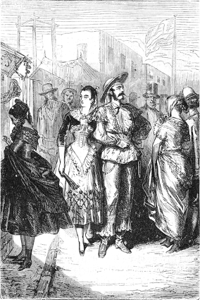
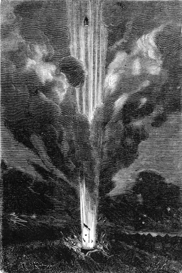

]{.calibre20}

DE LA TERRE À LA LUNE

]{.calibre20}

## []{#_Toc349053415 .pcalibre .pcalibre4 .pcalibre3}[Chapitre 26 -- Feu !]{#_Toc349053211 .pcalibre .pcalibre4 .pcalibre3} {#calibre_toc_30 .calibre21}

]{.calibre20}

DE LA TERRE À LA LUNE

]{.calibre20}

Le premier jour de décembre était arrivé, jour fatal, car si le départ du projectile ne s\'effectuait pas le soir même, à dix heures quarante-six minutes et quarante secondes du soir, plus de dix-huit ans s\'écouleraient avant que la Lune se représentât dans ces mêmes conditions simultanées de zénith et de périgée.

Le temps était magnifique ; malgré les approches de l\'hiver, le soleil resplendissait et baignait de sa radieuse effluve cette Terre que trois de ses habitants allaient abandonner pour un nouveau monde.

Que de gens dormirent mal pendant la nuit qui précéda ce jour si impatiemment désiré ! Que de poitrines furent oppressées par le pesant fardeau de l\'attente ! Tous les cœurs palpitèrent d\'inquiétude, sauf le cœur de Michel Ardan. Cet impassible personnage allait et venait avec son affairement habituel, mais rien ne dénonçait en lui une préoccupation inaccoutumée. Son sommeil avait été paisible, le sommeil de Turenne, avant la bataille, sur l\'affût d\'un canon.

Depuis le, matin une foule innombrable couvrait les prairies qui s\'étendent à perte de vue autour de Stone\'s-Hill. Tous les quarts d\'heure, le rail-road de Tampa amenait de nouveaux curieux ; cette immigration prit bientôt des proportions fabuleuses, et, suivant les relevés du *Tampa-Town Observer*, pendant cette mémorable journée, cinq millions de spectateurs foulèrent du pied le sol de la Floride.

{#Image56 .calibre167}

Depuis un mois la plus grande partie de cette foule bivouaquait autour de l\'enceinte, et jetait les fondements d\'une ville qui s\'est appelée depuis Ardan\'s-Town. Des baraquements, des cabanes, des cahutes, des tentes hérissaient la plaine, et ces habitations éphémères abritaient une population assez nombreuse pour faire envie aux plus grandes cités de l\'Europe.

Tous les peuples de la terre y avaient des représentants ; tous les dialectes du monde s\'y parlaient à la fois. On eût dit la confusion des langues, comme aux temps bibliques de la tour de Babel. Là, les diverses classes de la société américaine se confondaient dans une égalité, absolue. Banquiers, cultivateurs, marins, commissionnaires, courtiers, planteurs de coton, négociants, bateliers, magistrats, s\'y coudoyaient avec un sans-gêne primitif. Les créoles de la Louisiane fraternisaient avec les fermiers de l\'Indiana ; les gentlemen du Kentucky et du Tennessee, les Virginiens élégants et hautains donnaient la réplique aux trappeurs à demi sauvages des Lacs et aux marchands de bœufs de Cincinnati. Coiffés du chapeau de castor blanc à larges bords ou du panama classique, vêtus de pantalons en cotonnade bleue des fabriques d\'Opelousas, drapés dans leurs blouses élégantes de toile écrue, chaussés de bottines aux couleurs éclatantes, ils exhibaient d\'extravagants jabots de batiste et faisaient étinceler à leur chemise, à leurs machettes, à leurs cravates, à leurs dix doigts, voire même à leurs oreilles, tout un assortiment de bagues, d\'épingles, de brillants, de chaînes, de boucles, de breloques, dont le haut prix égalait le mauvais goût. Femmes, enfants, serviteurs, dans des toilettes non moins opulentes, accompagnaient, suivaient, précédaient, entouraient ces maris, ces pères, ces maîtres, qui ressemblaient à des chefs de tribu au milieu de leurs familles innombrables.

À l\'heure des repas, il fallait voir tout ce monde se précipiter sur les mets particuliers aux états du Sud et dévorer, avec un appétit menaçant pour l\'approvisionnement de la Floride, ces aliments qui répugneraient à un estomac européen, tels que grenouilles fricassées, singes à l\'étouffée, « fish-chowder[[\[92\]]{.MsoFootnoteReference2}](../Text/Section0004.xhtml#_ftn92002){#_ftnref92002 .pcalibre4 .pcalibre3} », sarigue rôtie, opossum saignant, ou grillades de racoon.

Mais aussi quelle série variée de liqueurs ou de boissons venait en aide à cette alimentation indigeste ! Quels cris excitants, quelles vociférations engageantes retentissaient dans les bar-rooms ou les tavernes ornées de verres, de chopés, de flacons, de carafes, de bouteilles aux formes invraisemblables, de mortiers pour piler le sucre et de paquets de paille !

« Voilà le julep à la menthe ! criait l\'un de ces débitants d\'une voix retentissante.

--- Voici le sangaree au vin de Bordeaux ! répliquait un autre d\'un ton glapissant.

--- Et du gin-sling ! répétait celui-ci.

--- Et le cocktail ! le brandy-smash ! criait celui-là.

--- Qui veut goûter le véritable mint-julep, à la dernière mode ? » s\'écriaient ces adroits marchands en faisant passer rapidement d\'un verre à l\'autre, comme un escamoteur fait d\'une muscade, le sucre, le citron, la menthe verte, la glace pilée, l\'eau, le cognac et l\'ananas frais qui composent cette boisson rafraîchissante.

Aussi, d\'habitude, ces incitations adressées aux gosiers altérés sous l\'action brûlante des épices se répétaient, se croisaient dans l\'air et produisaient un assourdissant tapage. Mais ce jour-là, ce premier décembre, ces cris étaient rares. Les débitants se fussent vainement enroués à provoquer les chalands. Personne ne songeait ni à manger ni à boire, et, à quatre heures du soir, combien de spectateurs circulaient dans la foule qui n\'avaient pas encore pris leur lunch accoutumé ! Symptôme plus significatif encore, la passion violente de l\'Américain pour les jeux était vaincue par l\'émotion. À voir les quilles du tempins couchées sur le flanc, les dés du creps dormant dans leurs cornets, la roulette immobile, le cribbage abandonné, les cartes du whist, du vingt-et-un, du rouge et noir, du monte et du faro, tranquillement enfermées dans leurs enveloppes intactes, on comprenait que l\'événement du jour absorbait tout autre besoin et ne laissait place à aucune distraction.

Jusqu\'au soir, une agitation sourde, sans clameur, comme celle qui précède les grandes catastrophes, courut parmi cette foule anxieuse. Un indescriptible malaise régnait dans les esprits, une torpeur pénible, un sentiment indéfinissable qui serrait le cœur. Chacun aurait voulu « que ce fût fini ».

Cependant, vers sept heures, ce lourd silence se dissipa brusquement. La Lune se levait, sur l\'horizon. Plusieurs millions de hurrahs saluèrent son apparition. Elle était exacte au rendez-vous. Les clameurs montèrent jusqu\'au ciel ; les applaudissements éclatèrent de toutes parts, tandis que la blonde Phœbé brillait paisiblement dans un ciel admirable et caressait cette foule enivrée de ses rayons les plus affectueux.

En ce moment parurent les trois intrépides voyageurs. À leur aspect les cris redoublèrent d\'intensité. Unanimement, instantanément, le chant national des États-Unis s\'échappa de toutes les poitrines haletantes, et le Yankee doodle, repris en chœur par cinq millions d\'exécutants, s\'éleva comme une tempête sonore jusqu\'aux dernières limites de l\'atmosphère.

Puis, après cet irrésistible élan, l\'hymne se tut, les dernières harmonies s\'éteignirent peu à peu, les bruits se dissipèrent, et une rumeur silencieuse flotta au-dessus de cette foule si profondément impressionnée. Cependant, le Français et les deux Américains avaient franchi l\'enceinte réservée autour de laquelle se pressait l\'immense foule. Ils étaient accompagnés des membres du Gun-Club et des députations envoyées par les observatoires européens. Barbicane, froid et calme, donnait tranquillement ses derniers ordres. Nicholl, les lèvres serrées, les mains croisées derrière le dos, marchait d\'un pas ferme et mesuré. Michel Ardan, toujours dégagé, vêtu en parfait voyageur, les guêtres de cuir aux pieds, la gibecière au côté, flottant dans ses vastes vêtements de velours marron, le cigare à la bouche, distribuait sur son passage de chaleureuses poignées de main avec une prodigalité princière. Il était intarissable de verve, de gaieté, riant, plaisantant, faisant au digne J.-T. Maston des farces de gamin, en un mot « Français », et, qui pis est, « Parisien » jusqu\'à la dernière seconde.

Dix heures sonnèrent. Le moment était venu de prendre place dans le projectile ; la manœuvre nécessaire pour y descendre, la plaque de fermeture à visser, le dégagement des grues et des échafaudages penchés sur la gueule de la Columbiad exigeaient un certain temps.

Barbicane avait réglé son chronomètre à un dixième de seconde près sur celui de l\'ingénieur Murchison, chargé de mettre le feu aux poudres au moyen de l\'étincelle électrique ; les voyageurs enfermés dans le projectile pourraient ainsi suivre de l\'œil l\'impassible aiguille qui marquerait l\'instant précis de leur départ.

Le moment des adieux était donc arrivé. La scène fut touchante ; en dépit de sa gaieté fébrile, Michel Ardan se sentit ému. J.-T. Maston avait retrouvé sous ses paupières sèches une vieille larme qu\'il réservait sans doute pour cette occasion. Il la versa sur le front de son cher et brave président.

« Si je partais ? dit-il, il est encore temps !

--- Impossible, mon vieux Maston », répondit Barbicane.

Quelques instants plus tard, les trois compagnons de route étaient installés dans le projectile, dont ils avaient vissé intérieurement la plaque d\'ouverture, et la bouche de la Columbiad, entièrement dégagée, s\'ouvrait librement vers le ciel.

Nicholl, Barbicane et Michel Ardan étaient définitivement murés dans leur wagon de métal.

Qui pourrait peindre l\'émotion universelle, arrivée alors à son paroxysme ?

La lune s\'avançait sur un firmament d\'une pureté limpide, éteignant sur son passage les feux scintillants des étoiles ; elle parcourait alors la constellation des Gémeaux et se trouvait presque à mi-chemin de l\'horizon et du zénith. Chacun devait donc facilement comprendre que l\'on visait en avant du but, comme le chasseur vise en avant du lièvre qu\'il veut atteindre.

Un silence effrayant planait sur toute cette scène. Pas un souffle de vent sur la terre ! Pas un souffle dans les poitrines ! Les cœurs n\'osaient plus battre. Tous les regards effarés fixaient la gueule béante de la Columbiad.

Murchison suivait de l\'œil l\'aiguille de son chronomètre. Il s\'en fallait à peine de quarante secondes que l\'instant du départ ne sonnât, et chacune d\'elles durait un siècle.

À la vingtième, il y eut un frémissement universel, et il vint à la pensée de cette foule que les audacieux voyageurs enfermés dans le projectile comptaient aussi ces terribles secondes ! Des cris isolés s\'échappèrent :

« Trente-cinq ! -- trente-six ! -- trente-sept ! -- trente-huit ! -- trente-neuf ! -- quarante ! Feu !!! »

{.calibre168}

Aussitôt Murchison, pressant du doigt l\'interrupteur de l\'appareil, rétablit le courant et lança l\'étincelle électrique au fond de la Columbiad.

Une détonation épouvantable, inouïe, surhumaine, dont rien ne saurait donner une idée, ni les éclats de la foudre, ni le fracas des éruptions, se produisit instantanément. Une immense gerbe de feu jaillit des entrailles du sol comme d\'un cratère. La terre se souleva, et c\'est à peine si quelques personnes purent un instant entrevoir le projectile fendant victorieusement l\'air au milieu des vapeurs flamboyantes.
