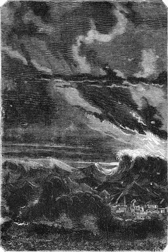
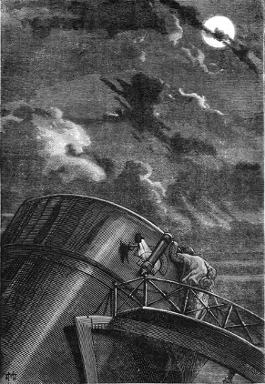

]{.calibre20}

DE LA TERRE À LA LUNE

]{.calibre20}

## []{#_Toc349053416 .pcalibre .pcalibre4 .pcalibre3}[Chapitre 27 -- Temps couvert]{#_Toc349053212 .pcalibre .pcalibre4 .pcalibre3} {#calibre_toc_31 .calibre21}

]{.calibre20}

DE LA TERRE À LA LUNE

]{.calibre20}

Au moment où la gerbe incandescente s\'éleva vers le ciel à une prodigieuse hauteur, cet épanouissement de flammes éclaira la Floride entière, et, pendant un instant incalculable, le jour se substitua à la nuit sur une étendue considérable de pays. Cet immense panache de feu fut aperçu de cent milles en mer du golfe comme de l\'Atlantique, et plus d\'un capitaine de navire nota sur son livre de bord l\'apparition de ce météore gigantesque.

La détonation de la Columbiad fut accompagnée d\'un véritable tremblement de terre. La Floride se sentit secouer jusque dans ses entrailles. Les gaz de la poudre, dilatés par la chaleur, repoussèrent avec une incomparable violence les couches atmosphériques, et cet ouragan artificiel, cent fois plus rapide que l\'ouragan des tempêtes, passa comme une trombe au milieu des airs.

Pas un spectateur n\'était resté debout ; hommes, femmes, enfants, tous furent couchés comme des épis sous l\'orage ; il y eut un tumulte inexprimable, un grand nombre de personnes gravement blessées, et J.-T. Maston, qui, contre toute prudence, se tenait trop en avant, se vit rejeté à vingt toises en arrière et passa comme un boulet au-dessus de la tête de ses concitoyens. Trois cent mille personnes demeurèrent momentanément sourdes et comme frappées de stupeur.

Le courant atmosphérique, après avoir renversé les baraquements, culbuté les cabanes, déraciné les arbres dans un rayon de vingt milles, chassé les trains du railway jusqu\'à Tampa, fondit sur cette ville comme une avalanche, et détruisit une centaine de maisons, entre autres l\'église Saint-Mary, et le nouvel édifice de la Bourse, qui se lézarda dans toute sa longueur. Quelques-uns des bâtiments du port, choqués les uns contre les autres, coulèrent à pic, et une dizaine de navires, mouillés en rade, vinrent à la côte, après avoir cassé leurs chaînes comme des fils de coton.

{#Image58 .calibre169}

Mais le cercle de ces dévastations s\'étendit plus loin encore, et au-delà des limites des États-Unis. L\'effet du contrecoup, aidé des vents d\'ouest, fut ressenti sur l\'Atlantique à plus de trois cents milles des rivages américains. Une tempête factice, une tempête inattendue, que n\'avait pu prévoir l\'amiral Fitz-Roy, se jeta sur les navires avec une violence inouïe ; plusieurs bâtiments, saisis dans ces tourbillons épouvantables sans avoir le temps d\'amener, sombrèrent sous voiles, entre autres le *Childe-Harold*, de Liverpool, regrettable catastrophe qui devint de la part de l\'Angleterre l\'objet des plus vives récriminations.

Enfin, et pour tout dire, bien que le fait n\'ait d\'autre garantie que l\'affirmation de quelques indigènes, une demi-heure après le départ du projectile, des habitants de Gorée et de Sierra-Leone prétendirent avoir entendu une commotion sourde, dernier déplacement des ondes sonores, qui, après avoir traversé l\'Atlantique, venait mourir sur la côte africaine.

Mais il faut revenir à la Floride. Le premier instant du tumulte passé, les blessés, les sourds, enfin la foule entière se réveilla, et des cris frénétiques : « Hurrah pour Ardan ! Hurrah pour Barbicane ! Hurrah pour Nicholl ! » s\'élevèrent jusqu\'aux cieux. Plusieurs millions d\'hommes, le nez en l\'air, armés de télescopes, de lunettes, de lorgnettes, interrogeaient l\'espace, oubliant les contusions et les émotions, pour ne se préoccuper que du projectile. Mais ils le cherchaient en vain. On ne pouvait plus l\'apercevoir, et il fallait se résoudre à attendre les télégrammes de Long\'s-Peak. Le directeur de l\'Observatoire de Cambridge se trouvait à son poste dans les montagnes Rocheuses, et c\'était à lui, astronome habile et persévérant, que les observations avaient été confiées.

{.calibre170}

Mais un phénomène imprévu, quoique facile à prévoir, et contre lequel on ne pouvait rien, vint bientôt mettre l\'impatience publique à une rude épreuve.

Le temps, si beau jusqu\'alors, changea subitement ; le ciel assombri se couvrit de nuages. Pouvait-il en être autrement, après le terrible déplacement des couches atmosphériques, et cette dispersion de l\'énorme quantité de vapeurs qui provenaient de la déflagration de quatre cent mille livres de pyroxyle ? Tout l\'ordre naturel avait été troublé. Cela ne saurait étonner, puisque, dans les combats sur mer, on a souvent vu l\'état atmosphérique brutalement modifié par les décharges de l\'artillerie.

Le lendemain, le soleil se leva sur un horizon chargé de nuages épais, lourd et impénétrable rideau jeté entre le ciel et la terre, et qui, malheureusement, s\'étendit jusqu\'aux régions des montagnes Rocheuses. Ce fut une fatalité. Un concert de réclamations s\'éleva de toutes les parties du globe. Mais la nature s\'en émut peu, et décidément, puisque les hommes avaient troublé l\'atmosphère par leur détonation, ils devaient en subir les conséquences.

Pendant cette première journée, chacun chercha à pénétrer le voile opaque des nuages, mais chacun en fut pour ses peines, et chacun d\'ailleurs se trompait en portant ses regards vers le ciel, car, par suite du mouvement diurne du globe, le projectile filait nécessairement alors par la ligne des antipodes.

Quoi qu\'il en soit, lorsque la nuit vint envelopper la Terre, nuit impénétrable et profonde, quand la Lune fut remontée sur l\'horizon, il fut impossible de l\'apercevoir ; on eût dit qu\'elle se dérobait à dessein aux regards des téméraires qui avaient tiré sur elle. Il n\'y eut donc pas d\'observation possible, et les dépêches de Long\'s-Peak confirmèrent ce fâcheux contre-temps.

Cependant, si l\'expérience avait réussi, les voyageurs, partis le 1er décembre à dix heures quarante-six minutes et quarante secondes du soir, devaient arriver le 4 à minuit. Donc, jusqu\'à cette époque, et comme après tout il eût été bien difficile d\'observer dans ces conditions un corps aussi petit que l\'obus, on prit patience sans trop crier.

Le 4 décembre, de huit heures du soir à minuit, il eût été possible de suivre la trace du projectile, qui aurait apparu comme un point noir sur le disque éclatant de la Lune. Mais le temps demeura impitoyablement couvert, ce qui porta au paroxysme l\'exaspération publique. On en vint à injurier la Lune qui ne se montrait point. Triste retour des choses d\'ici-bas !

J.-T. Maston, désespéré, partit pour Long\'s-Peak. Il voulait observer lui-même. Il ne mettait pas en doute que ses amis ne fussent arrivés au terme de leur voyage. On n\'avait pas, d\'ailleurs, entendu dire que le projectile fût retombé sur un point quelconque des îles et des continents terrestres, et J.-T. Maston n\'admettait pas un instant une chute possible dans les océans dont le globe est aux trois quarts couvert.

Le 5, même temps. Les grands télescopes du Vieux Monde, ceux d\'Herschell, de Rosse, de Foucault, étaient invariablement braqués sur l\'astre des nuits, car le temps était précisément magnifique en Europe ; mais la faiblesse relative de ces instruments empêchait toute observation utile.

Le 6, même temps. L\'impatience rongeait les trois quarts du globe. On en vint à proposer les moyens les plus insensés pour dissiper les nuages accumulés dans l\'air.

Le 7, le ciel sembla se modifier un peu. On espéra, mais l\'espoir ne fut pas de longue durée, et le soir, les nuages épaissis défendirent la voûte étoilée contre tous les regards.

Alors cela devint grave. En effet, le 11, à neuf heures onze minutes du matin, la Lune devait entrer dans son dernier quartier. Après ce délai, elle irait en déclinant, et, quand même le ciel serait rasséréné, les chances de l\'observation seraient singulièrement amoindries ; en effet, la Lune ne montrerait plus alors qu\'une portion toujours décroissante de son disque et finirait par devenir nouvelle, c\'est-à-dire qu\'elle se coucherait et se lèverait avec le soleil, dont les rayons la rendraient absolument invisible. Il faudrait donc attendre jusqu\'au 3 janvier, à midi quarante-quatre minutes, pour la retrouver pleine et commencer les observations.

Les journaux publiaient ces réflexions avec mille commentaires et ne dissimulaient point au public qu\'il devait s\'armer d\'une patience angélique.

Le 8, rien. Le 9, le soleil reparut un instant comme pour narguer les Américains. Il fut couvert de huées, et, blessé sans doute d\'un pareil accueil, il se montra fort avare de ses rayons.

Le 10, pas de changement. J.-T. Maston faillit devenir fou, et l\'on eut des craintes pour le cerveau de ce digne homme, si bien conservé jusqu\'alors sous son crâne de guttapercha.

Mais le 11, une de ces épouvantables tempêtes des régions intertropicales se déchaîna dans l\'atmosphère. De grands vents d\'est balayèrent les nuages amoncelés depuis si longtemps, et le soir, le disque à demi rongé de l\'astre des nuits passa majestueusement au milieu des limpides constellations du ciel.
