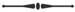

# [[{.calibre10} ]{.calibre2} [ACTES ET PAROLES IV]{.calibre2} Depuis l'exil 1876-1885]{.calibre_55} {#filepos35794470 .calibre_}

:::::: calibre_20
::::: calibre_3
::: calibre_16

------------------------------------------------------------------------

::: calibre_16

:::::
::::::

[(1885)]{.calibre_3}

[Victor Hugo]{.calibre_10}

[[POLITIQUE
]{.bold}]{.calibre_21}

:::::: calibre_22
::::: calibre_21
[ ]{.bold}

::: calibre_16

------------------------------------------------------------------------

::: calibre_16

:::::
::::::

[
Pour toutes demandes ou suggestions]{.calibre_3}

## [[[]{.calibre2}[]{.calibre2}[]{.calibre2}[]{.calibre2}[]{.calibre2}[]{.calibre2}[Table des matières]{.calibre2}]{.bold1}]{.calibre_24} {#calibre_pb_5691 .calibre_57}

::: calibre_52

[]{.calibre_10}

[[[[[1876]{.calibre9}]{.underline}]{.calibre_4}](index_split_4650.html#filepos35818650)]{.calibre_10}

> [[[[[I. Pour la Serbie]{.calibre16}]{.underline}]{.calibre_4}](index_split_4651.html#filepos35819136)]{.calibre_10}

> [[[[[II. Au président du Congrès de la paix à Genève]{.calibre16}]{.underline}]{.calibre_4}](index_split_4652.html#filepos35830273)]{.calibre_10}

> [[[[[III. Le banquet de Marseille]{.calibre16}]{.underline}]{.calibre_4}](index_split_4653.html#filepos35832085)]{.calibre_10}

> [[[[[1877]{.calibre9}]{.underline}]{.calibre_4}](index_split_4654.html#filepos35840096)]{.calibre_10}

> [[[[[I. Les ouvriers lyonnais]{.calibre16}]{.underline}]{.calibre_4}](index_split_4655.html#filepos35840643)]{.calibre_10}

> [[[[[II. Le seize mai]{.calibre16}]{.underline}]{.calibre_4}](index_split_4656.html#filepos35860195)]{.calibre_10}

> [[[[[I -- La prorogation]{.calibre9}]{.underline}]{.calibre_4}](index_split_4656.html#filepos35860195)]{.calibre_10}

> [[[[[II -- La dissolution]{.calibre9}]{.underline}]{.calibre_4}](index_split_4656.html#filepos35860195)]{.calibre_10}

> [[[[[III -- Les élections]{.calibre9}]{.underline}]{.calibre_4}](index_split_4656.html#filepos35860195)]{.calibre_10}

> [[[[[III. Anniversaire de Mentana]{.calibre16}]{.underline}]{.calibre_4}](index_split_4656.html#filepos35860195)]{.calibre_10}

> [[[[[IV. Le dîner d'Hernani]{.calibre16}]{.underline}]{.calibre_4}](index_split_4656.html#filepos35860195)]{.calibre_10}

> [[[[[1878]{.calibre9}]{.underline}]{.calibre_4}](index_split_4657.html#filepos35942162)]{.calibre_10}

> [[[[[I. Inauguration du tombeau de Ledru-Rollin]{.calibre16}]{.underline}]{.calibre_4}](index_split_4658.html#filepos35942648)]{.calibre_10}

> [[[[[II. Le centenaire de Voltaire]{.calibre16}]{.underline}]{.calibre_4}](index_split_4659.html#filepos35953741)]{.calibre_10}

> [[[[[III. Congrès littéraire international]{.calibre16}]{.underline}]{.calibre_4}](index_split_4659.html#filepos35953741)]{.calibre_10}

> [[[[[I -- Discours d'ouverture]{.calibre9}]{.underline}]{.calibre_4}](index_split_4659.html#filepos35953741)]{.calibre_10}

> [[[[[II -- Le domaine public payant]{.calibre9}]{.underline}]{.calibre_4}](index_split_4659.html#filepos35953741)]{.calibre_10}

> [[[[[1879]{.calibre9}]{.underline}]{.calibre_4}](index_split_4660.html#filepos36045621)]{.calibre_10}

> [[[[[I. Discours pour l'amnistie]{.calibre16}]{.underline}]{.calibre_4}](index_split_4661.html#filepos36046107)]{.calibre_10}

> [[[[[II. Discours sur l'Afrique]{.calibre16}]{.underline}]{.calibre_4}](index_split_4661.html#filepos36046107)]{.calibre_10}

> [[[[[III. La 100ème représentation de [Notre Dame de Paris]{.italic}]{.calibre16}]{.underline}]{.calibre_4}](index_split_4661.html#filepos36046107)]{.calibre_10}

> [[[[[1880]{.calibre9}]{.underline}]{.calibre_4}](index_split_4662.html#filepos36080954)]{.calibre_10}

> [[[[[I. Le cinquantenaire d'[Hernani]{.italic}]{.calibre16}]{.underline}]{.calibre_4}](index_split_4663.html#filepos36081440)]{.calibre_10}

> [[[[[II. Deuxième discours pour l'amnistie]{.calibre16}]{.underline}]{.calibre_4}](index_split_4663.html#filepos36081440)]{.calibre_10}

> [[[[[III. L'instruction élémentaire]{.calibre16}]{.underline}]{.calibre_4}](index_split_4663.html#filepos36081440)]{.calibre_10}

> [[[[[IV. La fête de Besançon]{.calibre16}]{.underline}]{.calibre_4}](index_split_4663.html#filepos36081440)]{.calibre_10}

> [[[[[1881]{.calibre9}]{.underline}]{.calibre_4}](index_split_4664.html#filepos36141105)]{.calibre_10}

> [[[[[I. La fête du 27 février 1881]{.calibre16}]{.underline}]{.calibre_4}](index_split_4665.html#filepos36141591)]{.calibre_10}

> [[[[[II. Obsèques de Paul de Saint-Victor]{.calibre16}]{.underline}]{.calibre_4}](index_split_4666.html#filepos36187833)]{.calibre_10}

> [[[[[1882]{.calibre9}]{.underline}]{.calibre_4}](index_split_4667.html#filepos36190776)]{.calibre_10}

> [[[[[I. Le banquet Grisel]{.calibre16}]{.underline}]{.calibre_4}](index_split_4668.html#filepos36191262)]{.calibre_10}

> [[[[[II. Obsèques de Louis Blanc]{.calibre16}]{.underline}]{.calibre_4}](index_split_4668.html#filepos36191262)]{.calibre_10}

> [[[[[1883]{.calibre9}]{.underline}]{.calibre_4}](index_split_4669.html#filepos36202276)]{.calibre_10}

> [[[[[Banquet du 81ème anniversaire de la naissance de Victor Hugo]{.calibre16}]{.underline}]{.calibre_4}](index_split_4670.html#filepos36202762)]{.calibre_10}

> [[[[[1884]{.calibre9}]{.underline}]{.calibre_4}](index_split_4671.html#filepos36216021)]{.calibre_10}

> [[[[[I. Le déjeuner des enfants de Veules]{.calibre16}]{.underline}]{.calibre_4}](index_split_4672.html#filepos36216507)]{.calibre_10}

> [[[[[II. Visite à la statue de la Liberté]{.calibre16}]{.underline}]{.calibre_4}](index_split_4672.html#filepos36216507)]{.calibre_10}

> [[[[[1885]{.calibre9}]{.underline}]{.calibre_4}](index_split_4673.html#filepos36233316)]{.calibre_10}

> [[[[[I. Mort de Victor Hugo]{.calibre16}]{.underline}]{.calibre_4}](index_split_4674.html#filepos36233802)]{.calibre_10}

> [[[[[II. Les funérailles]{.calibre16}]{.underline}]{.calibre_4}](index_split_4675.html#filepos36280508)]{.calibre_10}

> [[[[[A l'Arc de Triomphe]{.calibre9}]{.underline}]{.calibre_4}](index_split_4675.html#filepos36280508)]{.calibre_10}

> [[[[[Les discours]{.calibre9}]{.underline}]{.calibre_4}](index_split_4676.html#filepos36297637)]{.calibre_10}

> [[[[[Le cortège]{.calibre9}]{.underline}]{.calibre_4}](index_split_4677.html#filepos36304550)]{.calibre_10}

> [[[[[Le corbillard]{.calibre9}]{.underline}]{.calibre_4}](index_split_4678.html#filepos36308011)]{.calibre_10}

> [[[[[Le défilé]{.calibre9}]{.underline}]{.calibre_4}](index_split_4679.html#filepos36313810)]{.calibre_10}

> [[[[[Au Panthéon]{.calibre9}]{.underline}]{.calibre_4}](index_split_4680.html#filepos36320549)]{.calibre_10}

> [[[[[Notes]{.calibre9}]{.underline}]{.calibre_4}](index_split_4681.html#filepos36327455)]{.calibre_10}

> [[[[[Note I. Le cercle des écoles]{.calibre16}]{.underline}]{.calibre_4}](index_split_4682.html#filepos36328193)]{.calibre_10}

> [[[[[Note II. Le droit de la femme]{.calibre16}]{.underline}]{.calibre_4}](index_split_4683.html#filepos36332587)]{.calibre_10}

> [[[[[Note III. Meeting pour la paix]{.calibre16}]{.underline}]{.calibre_4}](index_split_4684.html#filepos36335197)]{.calibre_10}

> [[[[[Note IV. Un journal pour le peuple]{.calibre16}]{.underline}]{.calibre_4}](index_split_4685.html#filepos36337421)]{.calibre_10}

> [[[[[Note V. La ville de Saint-Quentin]{.calibre16}]{.underline}]{.calibre_4}](index_split_4686.html#filepos36339544)]{.calibre_10}

> [[[[[Note VI. Contre l'extradition d'Hartmann]{.calibre16}]{.underline}]{.calibre_4}](index_split_4687.html#filepos36341937)]{.calibre_10}

> [[[[[Note VII. Le centenaire de Camoëns]{.calibre16}]{.underline}]{.calibre_4}](index_split_4688.html#filepos36343840)]{.calibre_10}

> [[[[[Note VIII. La tour de Vertbois]{.calibre16}]{.underline}]{.calibre_4}](index_split_4689.html#filepos36345527)]{.calibre_10}

> [[[[[Note IX. Les morts de Mentana]{.calibre16}]{.underline}]{.calibre_4}](index_split_4690.html#filepos36348074)]{.calibre_10}

> [[[[[Note X. Les arènes de Lutèce]{.calibre16}]{.underline}]{.calibre_4}](index_split_4691.html#filepos36349925)]{.calibre_10}

> [[[[[Note XI. Demande en grâce pour O'Donnel]{.calibre16}]{.underline}]{.calibre_4}](index_split_4692.html#filepos36351814)]{.calibre_10}

> [[[[[Note XII. Le Mont Saint-Michel]{.calibre16}]{.underline}]{.calibre_4}](index_split_4693.html#filepos36353508)]{.calibre_10}

> [[[[[Note XIII. L'abolition de l'esclavage au Brésil]{.calibre16}]{.underline}]{.calibre_4}](index_split_4694.html#filepos36355119)]{.calibre_10}

> [[[[[Note XIV.]{.calibre16} [Anniversaire de la délivrance de la Grèce]{.calibre16}]{.underline}]{.calibre_4}](index_split_4695.html#filepos36357171)]{.calibre_10}

> [[[[[Note XV. Inauguration de la statue de George Sand]{.calibre16}]{.underline}]{.calibre_4}](index_split_4696.html#filepos36358866)]{.calibre_10}

> [[[[[Note XVI. Fête du 27 février 1881]{.calibre16}]{.underline}]{.calibre_4}](index_split_4697.html#filepos36361481)]{.calibre_10}

> [[[[[Note XVII. Procès-verbaux des séances du sénat, de la chambre et du conseil municipal]{.calibre16}]{.underline}]{.calibre_4}](index_split_4698.html#filepos36372075)]{.calibre_10}

> [[[[[Note XVIII. Les décrets sur le Panthéon]{.calibre16}]{.underline}]{.calibre_4}](index_split_4699.html#filepos36394782)]{.calibre_10}

> [[[[[Note XIX. Discours prononcés aux funérailles]{.calibre16}]{.underline}]{.calibre_4}](index_split_4700.html#filepos36409522)]{.calibre_10}

> [[[[[Discours de M. Le Royer]{.calibre9}]{.underline}]{.calibre_4}](index_split_4700.html#filepos36409522)]{.calibre_10}

> [[[[[Discours de M. Floquet]{.calibre9}]{.underline}]{.calibre_4}](index_split_4700.html#filepos36409522)]{.calibre_10}

> [[[[[Discours de M. Goblet]{.calibre9}]{.underline}]{.calibre_4}](index_split_4700.html#filepos36409522)]{.calibre_10}

> [[[[[Discours de M. Émile Augier]{.calibre9}]{.underline}]{.calibre_4}](index_split_4700.html#filepos36409522)]{.calibre_10}

> [[[[[Discours de M. Michelin]{.calibre9}]{.underline}]{.calibre_4}](index_split_4700.html#filepos36409522)]{.calibre_10}

> [[[[[Discours de M. Lefèvre]{.calibre9}]{.underline}]{.calibre_4}](index_split_4700.html#filepos36409522)]{.calibre_10}

> [[[[[Discours de M. Oudet]{.calibre9}]{.underline}]{.calibre_4}](index_split_4701.html#filepos36460169)]{.calibre_10}

> [[[[[Discours de M. Henri de Bornier]{.calibre9}]{.underline}]{.calibre_4}](index_split_4701.html#filepos36460169)]{.calibre_10}

> [[[[[Discours de M. Jules Claretie]{.calibre9}]{.underline}]{.calibre_4}](index_split_4701.html#filepos36460169)]{.calibre_10}

> [[[[[Discours de M. Leconte de l'Isle]{.calibre9}]{.underline}]{.calibre_4}](index_split_4701.html#filepos36460169)]{.calibre_10}

> [[[[[Discours de M. Philippe Jourde]{.calibre9}]{.underline}]{.calibre_4}](index_split_4701.html#filepos36460169)]{.calibre_10}

> [[[[[Discours de M. Louis Ulbach]{.calibre9}]{.underline}]{.calibre_4}](index_split_4701.html#filepos36460169)]{.calibre_10}

> [[[[[Discours de M. Got]{.calibre9}]{.underline}]{.calibre_4}](index_split_4701.html#filepos36460169)]{.calibre_10}

> [[[[[Discours de M. Madier de Montjau]{.calibre9}]{.underline}]{.calibre_4}](index_split_4701.html#filepos36460169)]{.calibre_10}

> [[[[[Discours de M. Guillaume]{.calibre9}]{.underline}]{.calibre_4}](index_split_4701.html#filepos36460169)]{.calibre_10}

> [[[[[Discours de M. Delcambre]{.calibre9}]{.underline}]{.calibre_4}](index_split_4701.html#filepos36460169)]{.calibre_10}

> [[[[[Discours de M. Tullo Massaroni]{.calibre9}]{.underline}]{.calibre_4}](index_split_4701.html#filepos36460169)]{.calibre_10}

> [[[[[Discours de M. Le Mat]{.calibre9}]{.underline}]{.calibre_4}](index_split_4701.html#filepos36460169)]{.calibre_10}

> [[[[[Discours de M. Raqueni]{.calibre9}]{.underline}]{.calibre_4}](index_split_4701.html#filepos36460169)]{.calibre_10}

> [[[[[Discours de M. Lemonnier]{.calibre9}]{.underline}]{.calibre_4}](index_split_4701.html#filepos36460169)]{.calibre_10}

> [[[[[Discours de M. Boland]{.calibre9}]{.underline}]{.calibre_4}](index_split_4701.html#filepos36460169)]{.calibre_10}

> [[[[[Discours de M. Ém. Édouard]{.calibre9}]{.underline}]{.calibre_4}](index_split_4701.html#filepos36460169)]{.calibre_10}

[ ]{.calibre4}

## [[[]{.calibre2}[]{.calibre2}[]{.calibre2}[]{.calibre2}[]{.calibre2}[]{.calibre2}[]{.calibre2}[]{.calibre2}[]{.calibre2}[]{.calibre2}[]{.calibre2}[]{.calibre2}[]{.calibre2}[]{.calibre2}[]{.calibre2}[]{.calibre2}[]{.calibre2}[]{.calibre2}[]{.calibre2}[]{.calibre2}[]{.calibre2}[]{.calibre2}[]{.calibre2}[]{.calibre2}[]{.calibre2}[]{.calibre2}[]{.calibre2}[]{.calibre2}[]{.calibre2}[1876]{.calibre2}]{.bold1}]{.calibre_24} {#calibre_pb_5693 .calibre_57}

::: calibre_52

[[
]{.calibre_7}]{.bold}

### [[[]{.calibre2}[]{.calibre2}[]{.calibre2}[]{.calibre2}[]{.calibre2}[]{.calibre2}[]{.calibre2}[]{.calibre2}[]{.calibre2}[]{.calibre2}[]{.calibre2}[]{.calibre2}[]{.calibre2}[]{.calibre2}[]{.calibre2}[]{.calibre2}[]{.calibre2}[]{.calibre2}[]{.calibre2}[]{.calibre2}[]{.calibre2}[]{.calibre2}[]{.calibre2}[]{.calibre2}[]{.calibre2}[]{.calibre2}[]{.calibre2}[I.]{.calibre2} Pour la Serbie]{.bold1}]{.calibre_39} {#i.-pour-la-serbie .calibre_38}

[ ]{.calibre4}

[Il devient nécessaire d'appeler l'attention des gouvernements européens sur un fait tellement petit, à ce qu'il paraît, que les gouvernements semblent ne point l'apercevoir. Ce fait, le voici : on assassine un peuple. Où ? En Europe. Ce fait a-t-il des témoins ? Un témoin, le monde entier. Les gouvernements le voient-ils ? Non.]{.calibre4}

[Les nations ont au-dessus d'elles quelque chose qui est au-dessous d'elles les gouvernements. À de certains moments, ce contre-sens éclate : la civilisation est dans les peuples, la barbarie est dans les gouvernants. Cette barbarie est-elle voulue ? Non ; elle est simplement professionnelle. Ce que le genre humain sait, les gouvernements l'ignorent. Cela tient à ce que les gouvernements ne voient rien qu'à travers cette myopie, la raison d'état ; le genre humain regarde avec un autre oeil, la conscience.]{.calibre4}

[Nous allons étonner les gouvernements européens en leur apprenant une chose, c'est que les crimes sont des crimes, c'est qu'il n'est pas plus permis à un gouvernement qu'à un individu d'être un assassin, c'est que l'Europe est solidaire, c'est que tout ce qui se fait en Europe est fait par l'Europe, c'est que, s'il existe un gouvernement bête fauve, il doit être traité en bête fauve ; c'est qu'à l'heure qu'il est, tout près de nous, là, sous nos yeux, on massacre, on incendie, on pille, on extermine, on égorge les pères et les mères, on vend les petites filles et les petits garçons ; c'est que, les enfants trop petits pour être vendus, on les fend en deux d'un coup de sabre ; c'est qu'on brûle les familles dans les maisons ; c'est que telle ville, Balak, par exemple, est réduite en quelques heures de neuf mille habitants à treize cents ; c'est que les cimetières sont encombrés de plus de cadavres qu'on n'en peut enterrer, de sorte qu'aux vivants qui leur ont envoyé le carnage, les morts renvoient la peste, ce qui est bien fait ; nous apprenons aux gouvernements d'Europe ceci, c'est qu'on ouvre les femmes grosses pour leur tuer les enfants dans les entrailles, c'est qu'il y a dans les places publiques des tas de squelettes de femmes ayant la trace de l'éventrement, c'est que les chiens rongent dans les rues le crâne des jeunes filles violées, c'est que tout cela est horrible, c'est qu'il suffirait d'un geste des gouvernements d'Europe pour l'empêcher, et que les sauvages qui commettent ces forfaits sont effrayants, et que les civilisés qui les laissent commettre sont épouvantables.]{.calibre4}

[Le moment est venu d'élever la voix. L'indignation universelle se soulève. Il y a des heures où la conscience humaine prend la parole et donne aux gouvernements l'ordre de l'écouter.]{.calibre4}

[Les gouvernements balbutient une réponse. Ils ont déjà essayé ce bégaiement. Ils disent : on exagère.]{.calibre4}

[Oui, l'on exagère. Ce n'est pas en quelques heures que la ville de Balak a été exterminée, c'est en quelques jours ; on dit deux cents villages brûlés, il n'y en a que quatre-vingt-dix-neuf ; ce que vous appelez la peste n'est que le typhus ; toutes les femmes n'ont pas été violées, toutes les filles n'ont pas été vendues, quelques-unes ont échappé. On a châtré des prisonniers, mais on leur a aussi coupé la tête, ce qui amoindrit le fait ; l'enfant qu'on dit avoir été jeté d'une pique à l'autre n'a été, en réalité, mis qu'à la pointe d'une baïonnette ; où il y a une vous mettez deux, vous grossissez du double ; etc., etc., etc.]{.calibre4}

[Et puis, pourquoi ce peuple s'est-il révolté ? Pourquoi un troupeau d'hommes ne se laisse-t-il pas posséder comme un troupeau de bêtes ? Pourquoi ?... etc.]{.calibre4}

[Cette façon de pallier ajoute à l'horreur. Chicaner l'indignation publique, rien de plus misérable. Les atténuations aggravent. C'est la subtilité plaidant pour la barbarie. C'est Byzance excusant Stamboul.]{.calibre4}

[Nommons les choses par leur nom. Tuer un homme au coin d'un bois qu'on appelle la forêt de Bondy ou la forêt Noire est un crime ; tuer un peuple au coin de cet autre bois qu'on appelle la diplomatie est un crime aussi.]{.calibre4}

[Plus grand. Voilà tout.]{.calibre4}

[Est-ce que le crime diminue en raison de son énormité ? Hélas ! c'est en effet une vieille loi de l'histoire. Tuez six hommes, vous êtes Troppmann ; tuez-en six cent mille, vous êtes César. Être monstrueux, c'est être acceptable. Preuves : la Saint-Barthélemy, bénie par Rome ; les dragonnades, glorifiées par Bossuet ; le Deux-Décembre, salué par l'Europe.]{.calibre4}

[Mais il est temps qu'à la vieille loi succède la loi nouvelle ; si noire que soit la nuit, il faut bien que l'horizon finisse par blanchir.]{.calibre4}

[Oui, la nuit est noire ; on en est à la résurrection des spectres ; après le Syllabus, voici le Koran ; d'une Bible à l'autre on fraternise ; [jungamus dextras]{.italic} ; derrière le Saint-Siège se dresse la Sublime Porte ; on nous donne le choix des ténèbres ; et, voyant que Rome nous offrait son moyen âge, la Turquie a cru pouvoir nous offrir le sien.]{.calibre4}

[De là les choses qui se font en Serbie.]{.calibre4}

[Où s'arrêtera-t-on ?]{.calibre4}

[Quand finira le martyre de cette héroïque petite nation ?]{.calibre4}

[Il est temps qu'il sorte de la civilisation une majestueuse défense d'aller plus loin.]{.calibre4}

[Cette défense d'aller plus loin dans le crime, nous, les peuples, nous l'intimons aux gouvernements.]{.calibre4}

[Mais on nous dit : Vous oubliez qu'il y a des « questions ». Assassiner un homme est un crime, assassiner un peuple est « une question ». Chaque gouvernement a sa question ; la Russie a Constantinople, l'Angleterre a l'Inde, la France a la Prusse, la Prusse a la France.]{.calibre4}

[Nous répondons :]{.calibre4}

[L'humanité aussi a sa question ; et cette question la voici, elle est plus grande que l'Inde, l'Angleterre et la Russie : c'est le petit enfant dans le ventre de sa mère.]{.calibre4}

[Remplaçons les questions politiques par la question humaine.]{.calibre4}

[Tout l'avenir est là.]{.calibre4}

[Disons-le, quoiqu'on fasse, l'avenir sera. Tout le sert, même les crimes. Serviteurs effroyables.]{.calibre4}

[Ce qui se passe en Serbie démontre la nécessité des États-Unis d'Europe. Qu'aux gouvernements désunis succèdent les peuples unis. Finissons-en avec les empires meurtriers. Muselons les fanatismes et les despotismes. Brisons les glaives valets des superstitions et les dogmes qui ont le sabre au poing. Plus de guerres, plus de massacres, plus de carnages ; libre pensée, libre échange ; fraternité. Est-ce donc si difficile, la paix ? La République d'Europe, la Fédération continentale, il n'y a pas d'autre réalité politique que celle-là. Les raisonnements le constatent, les événements aussi. Sur cette réalité, qui est une nécessité, tous les philosophes sont d'accord, et aujourd'hui les bourreaux joignent leur démonstration à la démonstration des philosophes. À sa façon, et précisément parce qu'elle est horrible, la sauvagerie témoigne pour la civilisation. Le progrès est signé Achmet-Pacha. Ce que les atrocités de Serbie mettent hors de doute, c'est qu'il faut à l'Europe une nationalité européenne, un gouvernement un, un immense arbitrage fraternel, la démocratie en paix avec elle-même, toutes les nations soeurs ayant pour cité et pour chef-lieu Paris, c'est-à-dire la liberté ayant pour capitale la lumière. En un mot, les États-Unis d'Europe. C'est là le but, c'est là le port. Ceci n'était hier que la vérité ; grâce aux bourreaux de la Serbie, c'est aujourd'hui l'évidence. Aux penseurs s'ajoutent les assassins. La preuve était faite par les génies, la voilà faite par les monstres.]{.calibre4}

[L'avenir est un dieu traîné par des tigres.]{.calibre4}

[[Paris, 29 août 1876.]{.italic}]{.calibre_26}

::: calibre_27

[[
]{.calibre_7}]{.bold}

### [[[]{.calibre2}[]{.calibre2}[]{.calibre2}[]{.calibre2}[]{.calibre2}[]{.calibre2}[]{.calibre2}[]{.calibre2}[]{.calibre2}[]{.calibre2}[]{.calibre2}[]{.calibre2}[]{.calibre2}[]{.calibre2}[]{.calibre2}[]{.calibre2}[]{.calibre2}[]{.calibre2}[]{.calibre2}[]{.calibre2}[]{.calibre2}[]{.calibre2}[]{.calibre2}[]{.calibre2}[]{.calibre2}[]{.calibre2}[]{.calibre2}[II. Au président du Congrès de la paix à Genève]{.calibre2}]{.bold1}]{.calibre_39} {#ii.-au-président-du-congrès-de-la-paix-à-genève .calibre_38}

[ ]{.calibre4}

[[Paris, 10 septembre 1876.]{.italic}]{.calibre_26}

::: calibre_27

[Mon honorable et cher président,]{.calibre4}

[Je vous envoie mes voeux fraternels.]{.calibre4}

[Le Congrès de la paix persiste, et il a raison.]{.calibre4}

[Devant la France mutilée, devant la Serbie torturée, la civilisation s'indigne, et la protestation du Congrès de la paix est nécessaire.]{.calibre4}

[C'est à Berlin qu'est l'obstacle à la paix ; c'est à Rome qu'est l'obstacle à la liberté. Heureusement le pape et l'empereur ne sont pas d'accord ; Rome et Berlin sont aux prises.]{.calibre4}

[Espérons.]{.calibre4}

[Recevez mon cordial serrement de main.]{.calibre4}

[[VICTOR HUGO.]{.italic}]{.calibre_26}

::: calibre_27

[[
]{.calibre_7}]{.bold}

### [[[]{.calibre2}[]{.calibre2}[]{.calibre2}[]{.calibre2}[]{.calibre2}[]{.calibre2}[]{.calibre2}[]{.calibre2}[]{.calibre2}[]{.calibre2}[]{.calibre2}[]{.calibre2}[]{.calibre2}[]{.calibre2}[]{.calibre2}[]{.calibre2}[]{.calibre2}[]{.calibre2}[]{.calibre2}[]{.calibre2}[]{.calibre2}[]{.calibre2}[]{.calibre2}[]{.calibre2}[]{.calibre2}[]{.calibre2}[]{.calibre2}[III. Le banquet de Marseille]{.calibre2}]{.bold1}]{.calibre_39} {#iii.-le-banquet-de-marseille .calibre_38}

[ ]{.calibre4}

[Victor Hugo, invité au banquet par lequel les démocrates de Marseille célèbrent le grand anniversaire de la République, et ne pouvant s'y rendre, a écrit la lettre suivante :]{.calibre4}

[ ]{.calibre4}

[[Paris, 22 septembre 1876.]{.italic}]{.calibre_26}

::: calibre_27

[Mes chers concitoyens,]{.calibre4}

[Vous m'avez adressé, en termes éloquents, un appel dont je suis profondément touché. C'est un regret pour moi de ne pouvoir m'y rendre. Je veux du moins me sentir parmi vous, et ce que je vous dirais, je vous l'écris.]{.calibre4}

[L'heure où nous sommes sera une de celles qui caractériseront ce siècle.]{.calibre4}

[En ce moment la monarchie fait à sa façon la preuve de la république. De tous les côtés, les rois font le mal ; la querelle des trônes et flagrante ; de pape à empereur, on s'excommunie ; de sultan à sultan, on s'assassine. Partout le cynisme de la victoire ; partout cette espèce d'ivrognerie terrible qu'on appelle la guerre. La force s'imagine qu'elle est le droit ; ici, on mutile la France, c'est-à-dire la civilisation ; là, on poignarde la Serbie, c'est-à-dire l'humanité. A cette heure, il y a un gouvernement, qui est un bandit, assis sur un peuple, qui est un cadavre.]{.calibre4}

[Certes les monarchies ne le font pas exprès, mais elles démontrent la nécessité de la république.]{.calibre4}

[La monarchie impériale aboutit à Sedan ; la monarchie pontificale aboutit au Syllabus. Le Syllabus, je l'ai dit et je le répète, c'est toute la quantité de bûcher possible au dix-neuvième siècle. Au moment où nous sommes, ce qui sort de l'autel, ce n'est pas la prière, c'est la menace ; l'oraison est coupée par ce hoquet farouche : Anathème ! anathème ! Le prêtre bénit à poing fermé. On refuse aux cercueils ce qui leur est dû ; on ajoute à la violation du respect la violation de la loi ; on méconnaît ce qu'il y a de mystérieux et de vénérable dans la volonté du mourant ; on choisit, pour insulter la philosophie et la raison, l'instant où la liberté de la conscience s'appuie sur la majesté de la mort.]{.calibre4}

[Qui fait ces choses audacieuses ? Le vieil esprit sacerdotal et monarchique. Ici la conquête, là le massacre, là l'intolérance ; le mensonge épousant la nuit, la haine de trône à trône engendrant la guerre de peuple à peuple, tel est le spectacle. Où la démocratie dit : Paix et liberté ! le despotisme dit : Carnage et servitude ! De là les crimes qui aujourd'hui épouvantent l'Europe. Admirons la manière dont les monarchies s'y prennent pour montrer les beautés de la république : elles montrent leurs laideurs.]{.calibre4}

[Tant que les fanatismes et les despotismes seront les maîtres, l'Europe sera difforme et terrible. Mais espérons. Que prouvent les carcans et les chaînes ? qu'il faut que les peuples soient libres. Que prouvent les sabres et les mitrailles ? qu'il faut que les peuples soient frères. Que prouvent les sceptres ? qu'il faut des lois.]{.calibre4}

[Les lois, les voici : liberté de pensée, liberté de croyance, liberté de conscience ; liberté dans la vie, délivrance dans la mort ; l'homme libre, l'âme libre.]{.calibre4}

[Célébrons donc ce rassurant anniversaire, le 22 septembre 1792. Il y a une aurore dans l'humanité, comme il y en a une dans le ciel ; ce jour-là le ciel et l'homme ont été d'accord, les deux aurores ont fait leur jonction. [Lux populi, lux Dei.]{.italic}]{.calibre4}

[La généreuse ville de Marseille a raison de vénérer ce jour suprême ; elle fait bien ; je m'associe à sa patriotique manifestation.]{.calibre4}

[Cet anniversaire vient à propos.]{.calibre4}

[Il y a quatre-vingt-quatre ans, à pareil jour, au milieu des plus redoutables complications, en présence de la coalition des rois, l'immense énigme humaine étant posée, une bouche sublime, la bouche de la France, s'est ouverte et a jeté aux peuples ce cri qui est une solution : République ! Il y a dans ce cri une puissance d'écroulement qui ébranle sur leur base les tyrannies, les usurpations et les impostures, et qui fait trembler toutes les tours des ténèbres. L'écroulement du mal, c'est la construction du bien.]{.calibre4}

[Répétons-le, ce cri libérateur République !]{.calibre4}

[Répétons-le d'une voix si ferme et si haute qu'il ait raison de toutes les surdités. Achevons ce que nos aïeux ont commencé. Soyons les fils obéissants de nos glorieux pères. Complétons la révolution française par la fraternité européenne, et l'unité de la France par l'unité du continent. Établissons entre les nations cette solide paix, la fédération, et cette solide justice, l'arbitrage. Soyons des peuples d'esprit au lieu d'être des peuples stupides. Échangeons des idées et non des boulets. Quoi de plus bête qu'un canon ? Que toute l'oscillation du progrès soit contenue entre ces deux termes :]{.calibre4}

[Civilisation, mais révolution.]{.calibre4}

[Révolution, mais civilisation.]{.calibre4}

[Et, convaincus, dévoués, unanimes, glorifions nos dates mémorables. Glorifions le 14 juillet, glorifions le 10 août, glorifions le 22 septembre. Ayons une si fière façon de nous en souvenir qu'il en sorte la liberté du monde. Célébrer les grands anniversaires, c'est préparer les grands événements.]{.calibre4}

[Mes concitoyens, je vous salue.]{.calibre4}

## [[[]{.calibre2}[]{.calibre2}[]{.calibre2}[]{.calibre2}[]{.calibre2}[]{.calibre2}[]{.calibre2}[]{.calibre2}[]{.calibre2}[]{.calibre2}[]{.calibre2}[]{.calibre2}[]{.calibre2}[]{.calibre2}[]{.calibre2}[]{.calibre2}[]{.calibre2}[]{.calibre2}[]{.calibre2}[]{.calibre2}[]{.calibre2}[]{.calibre2}[]{.calibre2}[]{.calibre2}[]{.calibre2}[]{.calibre2}[]{.calibre2}[]{.calibre2}[]{.calibre2}[1877]{.calibre2}]{.bold1}]{.calibre_24} {#calibre_pb_5698 .calibre_57}

::: calibre_52

[ ]{.calibre4}

[[
]{.calibre_7}]{.bold}

### [[[]{.calibre2}[]{.calibre2}[]{.calibre2}[]{.calibre2}[]{.calibre2}[]{.calibre2}[]{.calibre2}[]{.calibre2}[]{.calibre2}[]{.calibre2}[]{.calibre2}[]{.calibre2}[]{.calibre2}[]{.calibre2}[]{.calibre2}[]{.calibre2}[]{.calibre2}[]{.calibre2}[]{.calibre2}[]{.calibre2}[]{.calibre2}[]{.calibre2}[]{.calibre2}[]{.calibre2}[]{.calibre2}[]{.calibre2}[]{.calibre2}[I. Les ouvriers lyonnais]{.calibre2}]{.bold1}]{.calibre_39} {#i.-les-ouvriers-lyonnais .calibre_38}

[ ]{.calibre4}

[Le dimanche 25 mars, une conférence a lieu dans la salle du Château-d'Eau pour les ouvriers lyonnais.]{.calibre4}

[Victor Hugo et Louis Blanc y prennent la parole.]{.calibre4}

[Voici le discours de Victor Hugo :]{.calibre4}

[ ]{.calibre4}

[Les ouvriers de Lyon souffrent, les ouvriers de Paris leur viennent en aide. Ouvriers de Paris, vous faites votre devoir, et c'est bien. Vous donnez là un noble exemple. La civilisation vous remercie.]{.calibre4}

[Nous vivons dans un temps où il est nécessaire d'accomplir d'éclatantes actions de fraternité. D'abord, parce qu'il est toujours bon de faire le bien ; ensuite, parce que le passé ne veut pas se résigner à disparaître, parce qu'en présence de l'avenir, qui apporte aux nations la fédération et la concorde, le passé tâche de réveiller la haine. [(Applaudissements).]{.italic}]{.calibre4}

[Répondons à la haine par la solidarité et par l'union.]{.calibre4}

[Messieurs, je ne prononcerai que des paroles austères et graves. Avoir devant soi le peuple de Paris, c'est un suprême honneur, et l'on n'en est digne qu'à la condition d'avoir en soi la droiture. Et j'ajoute, la modération. Car, si la droiture est la puissance, la modération est la force.]{.calibre4}

[Maintenant, et sous ces réserves, trouvez bon que je vous dise ma pensée entière.]{.calibre4}

[À l'heure où nous sommes, le monde est en proie à deux efforts contraires.]{.calibre4}

[Un mot suffit pour caractériser cette heure étrange. À quoi songent les rois ? A la guerre. À quoi songent les peuples ? A la paix. [(Applaudissements prolongés.)]{.italic}]{.calibre4}

[L'agitation fiévreuse des gouvernements a pour contraste et pour leçon le calme des nations. Les princes arment, les peuples travaillent. Les peuples s'aiment et s'unissent. Aux rois préméditant et préparant des événements violents, les peuples opposent la grandeur des actions paisibles.]{.calibre4}

[Majestueuse résistance.]{.calibre4}

[Les populations s'entendent, s'associent, s'entraident.]{.calibre4}

[Ainsi, voyez :]{.calibre4}

[Lyon souffre, Paris s'émeut.]{.calibre4}

[Que le patriotique auditoire ici rassemblé me permette de lui parler de Lyon.]{.calibre4}

[Lyon est une glorieuse ville, une ville laborieuse et militante. Au-dessus de Lyon, il n'y a que Paris. À ne voir que l'histoire, on pourrait presque dire que c'est à Lyon que la France est née. Lyon est un des plus antiques berceaux du fait moderne ; Lyon est le lieu d'inoculation de la démocratie latine à la théocratie celtique ; c'est à Lyon que la Gaule s'est transformée et transfigurée jusqu'à devenir l'héritière de l'Italie ; Lyon est le point d'intersection de ce qui a été jadis Rome et de ce qui est aujourd'hui la France. --- Lyon a été notre premier centre. Agrippa a fait de Lyon le noeud des chemins militaires de la Gaule, et ce procédé péremptoire de civilisation a été imité depuis par les routes stratégiques de la Vendée. Comme toutes les cités prédestinées, la ville de Lyon a été éprouvée ; au deuxième siècle par l'incendie, au cinquième siècle par l'inondation, au dix-septième siècle par la peste. Fait que l'histoire doit noter, Néron, qui avait brûlé Rome, a rebâti Lyon. Lyon, historiquement illustre, n'est pas moins illustre politiquement. Aujourd'hui, entre toutes les villes d'Europe, Lyon représente l'initiative ingénieuse, le labeur puissant, opiniâtre et fécond, l'invention dans l'industrie, l'effort du bien vers le mieux, et cette chose touchante et sublime, --- car l'ouvrier de Lyon souffre, --- la pauvreté créant la richesse. [(Mouvement.)]{.italic} Oui, citoyens, j'y insiste, la vertu qui est dans le travail, l'intuition sociale qui connaît et qui réclame sans relâche la quantité acceptable des révolutions, l'esprit d'aventure pour le progrès, ce je ne sais quoi d'infatigable qu'on a quand on porte en soi l'avenir, voilà ce qui caractérise la France, voilà ce qui caractérise Lyon. Lyon a été la métropole des Gaule, et l'est encore, avec l'accroissement démocratique. C'est la ville du métier, c'est la ville de l'art, c'est la ville où la machine obéit à l'âme, c'est la ville où dans l'ouvrier il y a un penseur, et où Jacquard se complète par Voltaire. [(Applaudissements.)]{.italic} Lyon est la première de nos villes ; car Paris est autre chose, Paris dépasse les proportions d'une nation ; Lyon est essentiellement la cité française, et Paris est la cité humaine. C'est pourquoi l'assistance que Paris offre à Lyon est un admirable spectacle ; on pourrait dire que Lyon assisté par Paris, c'est la capitale de la France secourue par la capitale du monde. [(Bravos.)]{.italic}]{.calibre4}

[Glorifions ces deux villes. Dans un moment où les partis du passé semblent conspirer la diminution de la France, et essayent de détrôner le chef-lieu de la révolution au profit du chef-lieu de la monarchie, il est bon d'affirmer les grandes réalités de la civilisation française, c'est-à-dire Lyon, la ville du travail, et Paris, la ville de la lumière. [(Sensation. Bravos répétés.)]{.italic}]{.calibre4}

[Autour de ces deux capitales se groupent toutes nos illustres villes, leurs soeurs ou leurs filles, et parmi elles cette admirable Marseille qui veut une place à part, car elle représente en France la Grèce de même que Lyon représente l'Italie.]{.calibre4}

[Mais élargissons l'horizon, regardons l'Europe, regardons les nations, et, en même temps que nous démontrons la solidarité de nos villes, constatons, citoyens, au profit de la civilisation, tous les symptômes de la concorde humaine.]{.calibre4}

[Ces symptômes éclatent de toutes parts.]{.calibre4}

[Comme je le disais en commençant, à l'heure troublée où nous sommes, les phénomènes inquiétants viennent des rois, les phénomènes rassurants viennent des peuples.]{.calibre4}

[Au-dessous du grondement bestial de la guerre déchaînée il y a sept ans par deux empereurs, au-dessous des menaces de carnage et de dévastation à chaque instant renouvelées, quelquefois même réalisées en partie, témoin l'assassinat de la Bulgarie par la Turquie, au-dessous de la mobilisation des armées, au-dessous de tout ce sombre tumulte militaire, on sent une immense volonté de paix.]{.calibre4}

[Je le répète et j'y insiste, qui veut la guerre ? Les rois. Qui veut la paix ? Les peuples.]{.calibre4}

[Il semble qu'en ce moment une bataille étrange se prépare entre la guerre, qui est la volonté du passé, et la paix, qui est la volonté du présent. [(Applaudissements.)]{.italic}]{.calibre4}

[Citoyens, la paix vaincra.]{.calibre4}

[Ce triomphe de l'avenir, il est visible dès aujourd'hui, il approche, nous y touchons. Il s'appellera l'Exposition de 1878. Qu'est-ce en effet qu'une Exposition internationale ? C'est la signature de tous les peuples mise au bas d'un acte de fraternité. C'est le pacte des industries s'associant aux arts, des sciences encourageant les découvertes, des produits s'échangeant avec les idées, du progrès multipliant le bien-être, de l'idéal s'accouplant au réel. C'est la communion des nations dans l'harmonie qui sort du travail. Lutte, si l'on veut, mais lutte féconde ; éblouissante mêlée des travailleurs qui laisse derrière elle, non la mort, mais la vie, non des cadavres, mais des chefs-d'oeuvre ; bataille superbe où il n'y a que des vainqueurs. [(Longs applaudissements.)]{.italic}]{.calibre4}

[Ce spectacle splendide, il est juste que ce soit Paris qui le donne au monde.]{.calibre4}

[1870, c'est-à-dire le guet-apens de la guerre, a été le fait de la Prusse ; 1878, c'est-à-dire la victoire de la paix, sera la réplique de la France.]{.calibre4}

[L'Exposition universelle de 1878, ce sera la guerre mise en déroute par la paix.]{.calibre4}

[Ce sera la réconciliation avec Paris, dont l'univers a besoin.]{.calibre4}

[La paix, c'est le verbe de l'avenir, c'est l'annonce des États-Unis de l'Europe, c'est le nom de baptême du vingtième siècle. Ne nous lassons pas, nous les philosophes, de déclarer au monde la paix. Faisons sortir de ce mot suprême tout ce qu'il contient.]{.calibre4}

[Disons-le, ce qu'il faut à la France, à l'Europe, au monde civilisé, ce qui est dès à présent réalisable, ce que nous voulons, le voici : les religions sans l'intolérance, c'est-à-dire la raison remplaçant le dogmatisme ; la pénalité sans la mort, c'est-à-dire la correction remplaçant la vindicte ; le travail sans l'exploitation, c'est-à-dire le bien-être remplaçant le malaise ; la circulation sans la frontière, c'est-à-dire la liberté remplaçant la ligature ; les nationalités sans l'antagonisme, c'est-à-dire l'arbitrage remplaçant la guerre (mouvement) ; en un mot, tous les désarmements, excepté le désarmement de la conscience. [(Bravos répétés.)]{.italic}]{.calibre4}

[Ah ! cette exception-là, je la maintiens. Car tant que la politique contiendra la guerre, tant que la pénalité contiendra l'échafaud, tant que le dogme contiendra l'enfer, tant que la force sociale sera comminatoire, tant que le principe, qui est le droit, sera distinct du fait, qui est le code, tant que l'indissoluble sera dans la loi civile et l'irréparable dans la loi criminelle, tant que la liberté pourra être garrottée, tant que la vérité pourra être bâillonnée, tant que le juge pourra dégénérer en bourreau, tant que le chef pourra dégénérer en tyran, tant que nous aurons pour précipices des abîmes creusés par nous-mêmes, tant qu'il y aura des opprimés, des exploités, des accablés, des justes qui saignent, des faibles qui pleurent, il faut, citoyens, que la conscience reste armée. [(Applaudissements prolongés.)]{.italic}]{.calibre4}

[La conscience armée, c'est Juvénal terrible, c'est Tacite pensif, c'est Dante flétrissant Boniface, c'est-à-dire l'homme probe châtiant l'homme infaillible, c'est Voltaire vengeant Calas, c'est-à-dire la justice rappelant à l'ordre la magistrature. [(Sensation. Triple salve d'applaudissements.)]{.italic} La conscience armée, c'est le droit incorruptible faisant obstacle à la loi inique, c'est la philosophie supprimant la torture, c'est la tolérance abolissant l'inquisition, c'est le jour vrai remplaçant dans les âmes le jour faux, c'est la clarté de l'aurore substituée à la lueur des bûchers. Oui, la conscience reste et restera armée, Juvénal et Tacite resteront debout, tant que l'histoire nous montrera la justice humaine satisfaite de son peu de ressemblance avec la justice divine, tant que la raison d'état sera en colère, tant qu'un épouvantable [vae victis]{.italic} régnera, tant qu'on écoutera un cri de clémence comme on écouterait un cri séditieux, tant qu'on refusera de faire tourner sur ses gonds la seule porte qui puisse fermer la guerre civile, l'amnistie ! [(Profonde émotion. --- Applaudissements prolongés.)]{.italic}]{.calibre4}

[Cela dit, je conclus. Et je conclus par l'espérance.]{.calibre4}

[Ayons une foi absolue dans la patrie. La destinée de la France fait partie de l'avenir humain. Depuis trois siècles la lumière du monde est française. Le monde ne changera pas de flambeau.]{.calibre4}

[Pourtant, généreux patriotes qui m'écoutez, ne croyez pas que je pousse l'espérance jusqu'à l'illusion. Ma foi en la France est filiale, et par conséquent passionnée, mais elle est philosophique, et par conséquent réfléchie. Messieurs, ma parole est sincère, mais elle est virile, et je ne veux rien dissimuler. Non, je n'oublie pas que je parle aux hommes de Paris. La responsabilité est en proportion de l'auditoire. Une seule chose est à la taille du peuple, c'est la vérité. Et dire la réalité, c'est le devoir.]{.calibre4}

[Eh bien, la réalité, c'est que nous traversons une heure redoutable. La réalité, c'est que, si la nuit complète se faisait, il y aurait des possibilités de naufrage. Les crises succèdent aux catastrophes. J'espère cependant.]{.calibre4}

[Je fais plus qu'espérer. J'affirme. Pourquoi ? Je vais vous le dire, et ce sera mon dernier mot.]{.calibre4}

[La marche du genre humain vers l'avenir a toutes les complications d'un voyage de découvertes. Le progrès est une navigation ; souvent nocturne. On pourrait dire que l'humanité est en pleine mer. Elle avance lentement, dans un roulis terrible, immense navire battu des vents. Il y a des instants sinistres. À de certains moments, la noirceur de l'horizon est profonde ; il semble qu'on aille au hasard. Où ? à l'abîme. On rencontre un écueil, l'empire ; on se heurte à un bas-fond, le [Syllabus]{.italic} ; on traverse un cyclone, Sedan [(mouvement)]{.italic} ; l'année de l'infaillibilité du pape est l'année de la chute de la France ; les ouragans et les tonnerres se mêlent ; on a au-dessus de sa tête tout le passé en nuage et chargé de foudres ; cet éclair, c'est le glaive ; cet autre éclair, c'est le sceptre ; ce grondement, c'est la guerre. Que va-t-on devenir ? Va-t-on finir par s'entre-dévorer ? En viendra-t-on à un radeau de la [Méduse]{.italic}, à une lutte d'affamés et de naufragés, à la bataille dans la tempête ? Est-ce qu'il est possible qu'on soit perdu ? On lève les yeux. On cherche dans le ciel une indication, une espérance, un conseil. L'anxiété est au comble. Où est le salut ? Tout à coup, la brume s'écarte, une lueur apparaît ; il semble qu'une déchirure se fasse dans le noir complot des nuées, une trouée blanchit toute cette ombre, et, subitement, à l'horizon, au-dessus des gouffres, au delà des nuages, le genre humain frissonnant aperçoit cette haute clarté allumée il y a quatre-vingts ans par des géants sur la cime du dix-huitième siècle, ce majestueux phare à feux tournants qui présente alternativement aux nations désemparées chacun des trois rayons dont se compose la civilisation future : Liberté, Égalité, Fraternité. (Applaudissements prolongés.)]{.calibre4}

[Liberté, cela s'adresse au peuple ; Égalité, cela s'adresse aux hommes ; Fraternité, cela s'adresse aux âmes.]{.calibre4}

[Navigateurs en détresse, abordez à ce grand rivage, la République.]{.calibre4}

[Le port est là. [(Longue acclamation. Cris de : Vive la république ! Vive l'amnistie ! Vive Victor Hugo !)]{.italic}]{.calibre4}

[[
]{.calibre_7}]{.bold}

### [[[]{.calibre2}[]{.calibre2}[]{.calibre2}[]{.calibre2}[]{.calibre2}[]{.calibre2}[]{.calibre2}[]{.calibre2}[]{.calibre2}[]{.calibre2}[]{.calibre2}[]{.calibre2}[]{.calibre2}[]{.calibre2}[]{.calibre2}[]{.calibre2}[]{.calibre2}[]{.calibre2}[]{.calibre2}[]{.calibre2}[]{.calibre2}[]{.calibre2}[]{.calibre2}[]{.calibre2}[]{.calibre2}[]{.calibre2}[]{.calibre2}[II. Le seize mai]{.calibre2}]{.bold1}]{.calibre_39} {#ii.-le-seize-mai .calibre_38}

[]{.calibre_10}

### [[I -- La prorogation]{.bold}]{.calibre_18} {#i-la-prorogation .calibre_48}

[ ]{.calibre4}

[Le 16 mai 1877, un essai préliminaire de coup d'état fut tenté par M. le maréchal de Mac-Mahon, président de la République. Brusquement il congédia, sur les plus futiles prétextes, le ministère républicain de M. Jules Simon, qui réunissait dans la chambre une majorité de deux cents voix. Le nouveau cabinet, sous la présidence de M. de Broglie, ne fut composé que de monarchistes.]{.calibre4}

[Deux jours après, un décret du président de la République prorogeait le parlement pour un mois.]{.calibre4}

[Aussitôt les gauches des deux chambres tinrent chacune leur réunion plénière et rédigèrent des déclarations collectives adressées au pays.]{.calibre4}

[Dans la réunion des gauches du Sénat, Victor Hugo prit la parole :]{.calibre4}

[Dans quelles circonstances l'événement qui nous préoccupe se produit-il ?]{.calibre4}

[Laissez-moi vous le dire. Deux choses me frappent.]{.calibre4}

[Voici la première :]{.calibre4}

[ ]{.calibre4}

[La France était en pleine paix, en pleine convalescence de ses derniers malheurs, en pleine possession d'elle-même ; la France donnait au monde tous les grands exemples, l'exemple du travail, de l'industrie, du progrès sous toutes les formes ; elle était superbe de tranquillité et d'activité ; elle se préparait à convier tous les peuples chez elle ; elle prenait l'initiative de l'Exposition universelle, et, meurtrie, mutilée, mais toujours grande, elle allait donner une fête à la civilisation. En ce moment-là, dans ce calme fécond et auguste, quelqu'un la trouble. Qui ? Son gouvernement. Une sorte de déclaration de guerre est faite. À qui ? A la France en paix. Par qui ? Par le pouvoir. [(Oui ! oui ! --- Adhésion unanime.)]{.italic}]{.calibre4}

[La seconde chose qui me frappe, la voici :]{.calibre4}

[ ]{.calibre4}

[Si la France est en paix, l'Europe ne l'est pas. Si au dedans nous sommes tranquilles, au dehors nous sommes inquiets. Le continent prend feu. Deux empires se heurtent en orient ; au nord, un autre empire guette ; à côté du nord, une puissante nation voisine fait son branle-bas de combat. Plus que jamais, il importe que la France, pour rester forte, reste paisible. Eh bien ! c'est le moment qu'on choisit pour l'agiter ! C'est pour le pays l'heure de la prudence ; c'est pour le gouvernement l'heure des imprudences.]{.calibre4}

[Ces deux grands faits, la paix en France, la guerre en Europe, exigeaient tous les deux un gouvernement sage. C'est l'instant que prend le gouvernement pour devenir un gouvernement d'aventure.]{.calibre4}

[Une étincelle suffirait pour tout embraser ; le gouvernement secoue la torche. [(Sensation profonde.)]{.italic}]{.calibre4}

[Oui, gouvernement d'aventure. Je ne veux pas, pour l'instant, le qualifier plus sévèrement, espérant toujours que le pouvoir se sentira averti par l'énormité de certains souvenirs, et qu'il s'arrêtera. Je recommande au pouvoir personnel la lecture attentive de la constitution. (Mouvement.)]{.calibre4}

[Il y a là sur la responsabilité plusieurs articles sérieux.]{.calibre4}

[J'en pourrais dire davantage. Mais je me borne à ces quelques paroles. J'ai une fonction comme sénateur et une mission comme citoyen ; je ne faillirai ni à l'une ni à l'autre.]{.calibre4}

[Vous, mes collègues, vous résisterez vaillamment, je le sais et je le déclare, aux empiétements illégaux et aux usurpations inconstitutionnelles. Surveillons plus que jamais le pouvoir. Dans la situation où nous sommes, souvenez-vous de ceci : toute la défiance que vous montrerez au nouveau ministère, vous sera rendue en confiance par la nation.]{.calibre4}

[Messieurs, rassurons la France, rassurons-la dans le présent, rassurons-la dans l'avenir.]{.calibre4}

[La république est une délivrance définitive. Espérance est un des noms de la liberté. Aucun piège ne réussira. La vérité et la raison prévaudront. La justice triomphera de la magistrature. La conscience humaine triomphera du clergé. La souveraineté nationale triomphera des dictatures, cléricales ou soldatesques.]{.calibre4}

[La France peut compter sur nous, et nous pouvons compter sur elle.]{.calibre4}

[Soyons fidèles à tous nos devoirs, et à tous nos droits. [(Adhésion unanime. --- Applaudissements prolongés.)]{.italic}]{.calibre4}

[]{.calibre_7}

### [[II -- La dissolution]{.bold}]{.calibre_18} {#ii-la-dissolution .calibre_48}

[ ]{.calibre4}

[La prorogation d'un mois expirée, le maréchal de Mac-Mahon adresse, le 17 juin, un message au sénat, lui demandant, aux termes de la constitution, de prononcer avec le président de la République, la dissolution de la chambre des députés.]{.calibre4}

[La chambre des députés réplique aussitôt par un ordre du jour déclarant que « le ministère n'a pas la confiance de la nation ». Cet ordre du jour est voté par 363 voix contre 158.]{.calibre4}

[Le 21 juin, les bureaux du sénat se réunissent pour nommer la commission chargée du rapport sur la demande de dissolution.]{.calibre4}

[Dans le quatrième bureau, dont Victor Hugo fait partie, se passe l'incident suivant, rapporté ainsi par le [Rappel]{.italic}.]{.calibre4}

[ ]{.calibre4}

[[Réunion dans les bureaux du sénat.]{.italic}]{.calibre_10}

[ ]{.calibre4}

[« Il s'est produit, au 4ème bureau, un incident qui a causé une vive émotion.]{.calibre4}

[« M. Victor Hugo fait partie de ce bureau. M. le vicomte de Meaux, ministre du commerce, en fait également partie.]{.calibre4}

[« La discussion s'est ouverte sur le projet de dissolution.]{.calibre4}

[« Après des discours de MM. Bertauld et de Lasteyrie contre le projet et de MM. de Meaux et Depeyre pour, la séance semblait terminée, lorsque M. Victor Hugo a demandé la parole.]{.calibre4}

[« Il a dit :]{.calibre4}

[ ]{.calibre4}

[J'ai gardé le silence jusqu'à ce moment, et j'étais résolu à ne point intervenir dans le débat, espérant qu'une question essentielle serait posée, et aimant mieux qu'elle le fût par d'autres que par moi.]{.calibre4}

[Cette question n'a pas été posée. Je vois que la séance va se clore, et je crois de mon devoir de parler. Je désire n'être point nommé commissaire, et je prie mes amis de voter, comme je le ferai moi-même, pour notre honorable collègue, M. Bertauld.]{.calibre4}

[Cela dit, et absolument désintéressé dans le vote qui va suivre, j'entre dans ce qui est pour moi la question nécessaire et immédiate.]{.calibre4}

[Un ministre est ici présent. Je profite de sa présence, c'est à lui que je parle, et voici ce que j'ai à dire à M. le ministre du commerce :]{.calibre4}

[Il est impossible que le président de la République et les membres du cabinet nouveau n'aient point examiné entre eux une éventualité, qui est pour nous une certitude : le cas où, dans trois mois, la chambre, dissoute aujourd'hui, reviendrait augmentée en nombre dans le sens républicain, et, ce qui est une augmentation plus grande encore, accrue en autorité et en puissance par son mandat renouvelé et par le vote décisif de la France souveraine.]{.calibre4}

[En présence de cette chambre, qui sera à la fois la chambre ancienne, répudiée par le pouvoir personnel, et la chambre nouvelle, voulue par la souveraineté nationale, que fera le gouvernement ? quels plans a-t-il arrêtés ? quelle conduite compte-t-il suivre ? Le président fera-t-il simplement son devoir, qui est de se retirer et d'obéir à la nation, et les ministres disparaîtront-ils avec lui ? En un mot, quelle est la résolution du président et de son cabinet, dans le cas grave que je viens d'indiquer ?]{.calibre4}

[Je pose cette question au membre du cabinet ici présent. Je la pose catégoriquement et absolument. Aucun faux-fuyant n'est possible : ou le ministre me répondra, et j'enregistrerai sa réponse ; ou il refusera de répondre, et je constaterai son silence. Dans les deux cas, mon but sera atteint ; et, que le ministre parle ou qu'il se taise, l'espèce de clarté que je désire, je l'aurai.]{.calibre4}

[ ]{.calibre4}

[« Sur ces paroles, au milieu du profond silence et de l'attente unanime des sénateurs, M. de Meaux s'est levé. Voici sa réponse :]{.calibre4}

[« La question posée par M. Victor Hugo ne pourrait être posée qu'au président de la République, et excède la compétence des ministres. »]{.calibre4}

[« Une certaine agitation a suivi cette réponse. MM. Valentin, Ribière, Lepetit et d'autres encore se sont vivement récriés.]{.calibre4}

[« M. Victor Hugo a repris la parole en ces termes :]{.calibre4}

[ ]{.calibre4}

[Vous venez d'entendre la réponse de M. le ministre. Eh bien ! je vais répliquer à l'honorable M. de Meaux par un fait qui est presque pour lui un fait personnel.]{.calibre4}

[Un homme qui lui touche de très près, orateur considérable de la droite, dont j'avais été l'ami à la chambre des pairs et dont j'étais l'adversaire à l'assemblée législative, M. de Montalembert, après la crise de juillet 1851, s'émut, bien qu'allié momentané de l'Élysée, des intentions qu'on prêtait au président, M. Louis Bonaparte, lequel protestait du reste de sa loyauté.]{.calibre4}

[M. de Montalembert, alors, se souvenant de notre ancienne amitié, me pria de faire, en mon nom et au sien, au ministre Baroche, la question que je viens de faire tout à l'heure à M. de Meaux... [(Profond mouvement d'attention.)]{.italic} Et le ministre d'alors fit à cette question identiquement la même réponse que le ministre d'aujourd'hui.]{.calibre4}

[Trois mois après, éclatait ce crime qui s'appellera dans l'histoire le 2 décembre.]{.calibre4}

[ ]{.calibre4}

[« Une vive émotion succède à ces paroles.]{.calibre4}

[« Aucune réplique de M. de Meaux. Exclamations des sénateurs présents.]{.calibre4}

[« Le président du bureau, M. Batbie, fait, tardivement, remarquer que les interpellations aux ministres ne sont d'usage qu'en séance publique ; dans les bureaux, il n'y a pas de ministre ; un membre parle à un membre, un collègue à un collègue ; et M. Victor Hugo ne peut pas exiger de M. de Meaux une autre réponse que celle qui lui a été faite.]{.calibre4}

[« --- Je m'en contente ! s'écrie M. Victor Hugo.]{.calibre4}

[« Et les quinze membres de la gauche applaudissent. »]{.calibre4}

[{.calibre3}]{.calibre_7}

[[]{.italic}]{.calibre_10}

[[Séance publique du sénat.]{.italic}]{.calibre_10}

[--- 12 juin 1877. ---]{.calibre_10}

[ ]{.calibre4}

[Messieurs,]{.calibre4}

[Un conflit éclate entre deux pouvoirs. Il appartient au sénat de les départager. C'est aujourd'hui que le sénat va être juge.]{.calibre4}

[Et c'est aujourd'hui que le sénat va être jugé. [(Applaudissements à gauche.)]{.italic}]{.calibre4}

[Car si au-dessus du gouvernement il y a le sénat, au-dessus du sénat il y a la nation.]{.calibre4}

[Jamais situation n'a été plus grave.]{.calibre4}

[Il dépend aujourd'hui du sénat de pacifier la France ou de la troubler.]{.calibre4}

[Et pacifier la France, c'est rassurer l'Europe ; et troubler la France, c'est alarmer le monde.]{.calibre4}

[Cette délivrance ou cette catastrophe dépendent du sénat.]{.calibre4}

[Messieurs, le sénat va aujourd'hui faire sa preuve. Le sénat aujourd'hui peut être fondé par le sénat. [(Bruit à droite. --- Approbation à droite.)]{.italic}]{.calibre4}

[L'occasion est unique, vous ne la laisserez pas échapper.]{.calibre4}

[Quelques publicistes doutent que le sénat soit utile ; montrez que le sénat est nécessaire.]{.calibre4}

[La France est en péril, venez au secours de la France. (Bravos à gauche.)]{.calibre4}

[Messieurs, le passé donne quelquefois des renseignements. De certains crimes, que l'histoire n'oublie pas, ont des reflets sinistres, et l'on dirait qu'ils éclairent confusément les événements possibles.]{.calibre4}

[Ces crimes sont derrière nous, et par moments nous croyons les revoir devant nous.]{.calibre4}

[Il y a parmi vous, messieurs, des hommes qui se souviennent. Quelquefois se souvenir, c'est prévoir. [(Applaudissements à gauche.)]{.italic}]{.calibre4}

[Ces hommes ont vu, il y a vingt-six ans, ce phénomène :]{.calibre4}

[Une grande nation qui ne demande que la paix, une nation qui sait ce qu'elle veut, qui sait d'où elle vient et qui a droit de savoir où elle va, une nation qui ne ment pas, qui ne cache rien, qui n'élude rien, qui ne sous-entend rien, et qui marche dans la voie du progrès droit devant elle et à visage découvert, la France, qui a donné à l'Europe quatre illustres siècles de philosophie et de civilisation, qui a proclamé par Voltaire la liberté religieuse [(Protestations à droite, vive approbation à gauche)]{.italic} et par Mirabeau la liberté politique ; la France qui travaille, qui enseigne, qui fraternise, qui a un but, le bien et qui le dit, qui a un moyen, le juste, et qui le déclare, et, derrière cet immense pays en pleine activité, en pleine bonne volonté, en pleine lumière, un gouvernement masqué. [(Applaudissements prolongés à gauche. Réclamations à droite.)]{.italic}]{.calibre4}

[Messieurs, nous qui avons vu cela, nous sommes pensifs aujourd'hui, nous regardons avec une attention profonde ce qui semble être devant nous : une audace qui hésite, des sabres qu'on entend traîner, des protestations de loyauté qui ont un certain son de voix ; nous reconnaissons le masque. [(Sensation.)]{.italic}]{.calibre4}

[Messieurs, les vieillards sont des avertisseurs. Ils ont pour fonction de décourager les choses mauvaises et de déconseiller les choses périlleuses. Dire des paroles utiles, dussent-elles paraître inutiles, c'est là leur dignité et leur tristesse. [(Très bien ! à gauche.)]{.italic}]{.calibre4}

[Je ne demande pas mieux que de croire à la loyauté, mais je me souviens qu'on y a déjà cru. [(C'est vrai ! à gauche.)]{.italic} Ce n'est pas ma faute si je me souviens. Je vois des ressemblances qui m'inquiètent, non pour moi qui n'ai rien à perdre dans la vie et qui ai tout à gagner dans la mort, mais pour mon pays. Messieurs, vous écouterez l'homme en cheveux blancs qui a vu ce que vous allez revoir peut-être, qui n'a plus d'autre intérêt sur la terre que le vôtre, qui vous conseille tous avec droiture, amis et ennemis, et qui ne peut ni haïr ni mentir, étant si près de la vérité éternelle. [(Profonde sensation. Applaudissements prolongés.)]{.italic}]{.calibre4}

[Vous allez entrer dans une aventure. Eh bien, écoutez celui qui en revient. [(Mouvement.)]{.italic} Vous allez affronter l'inconnu, écoutez celui qui vous dit : l'inconnu, je le connais. Vous allez vous embarquer sur un navire dont la voile frissonne au vent, et qui va bientôt partir pour un grand voyage plein de promesses, écoutez celui qui vous dit : Arrêtez, j'ai fait ce naufrage-là. [(Applaudissements.)]{.italic}]{.calibre4}

[Je crois être dans le vrai. Puissé-je me tromper, et Dieu veuille qu'il n'y ait rien de cet affreux passé dans l'avenir !]{.calibre4}

[Ces réserves faites, --- et c'était mon devoir de les faire, --- j'aborde le moment présent, tel qu'il apparaît et tel qu'il se montre, et je tâcherai de ne rien dire qui puisse être contesté.]{.calibre4}

[Personne ne niera, je suppose, que l'acte du 16 mai ait été inattendu.]{.calibre4}

[Cela a été quelque chose comme le commencement d'une préméditation qui se dévoile.]{.calibre4}

[L'effet a été terrible.]{.calibre4}

[Remontons à quelques semaines en arrière. La France était en plein travail, c'est-à-dire en pleine fête. Elle se préparait à l'Exposition universelle de 1878 avec la fierté joyeuse des grandes nations civilisatrices. Elle déclarait au monde l'hospitalité. Paris, convalescent, glorieux et superbe, élevait un palais à la fraternité des nations ; la France, en dépit des convulsions continentales, était confiante et tranquille, et sentait s'approcher l'heure du suprême triomphe, du triomphe de la paix. Tout à coup, dans ce ciel bleu un coup de foudre éclate, et au lieu d'une victoire on apporte à la France une catastrophe. [(Vive émotion. --- Bravos à gauche.)]{.italic}]{.calibre4}

[Le 15 mai, tout prospérait ; le 16, tout s'est arrêté. On a assisté au spectacle étrange d'un malheur public, fait exprès. (Sensation.) Subitement, le crédit se déconcerte ; la confiance disparaît ; les commandes cessent ; les usines s'éteignent ; les manufactures se ferment ; les plus puissantes renvoient la moitié de leurs ouvriers ; lisez les remontrances des chambres de commerce ; le chômage, cette peste du travail, se répand et s'accroît, et une sorte d'agonie commence. Ce que cette calamité, le 16 mai, coûte à notre industrie, à notre commerce, à notre travail national, ne peut se chiffrer que par des centaines de millions. [(Allons donc ! à droite. --- Oui ! oui ! à gauche.)]{.italic}]{.calibre4}

[Eh bien, messieurs, aujourd'hui que vous demande-t-on ? De la continuer. Le 16 mai désire se compléter. Un mois d'agonie, c'est peu ; il en demande quatre. Dissolvez la chambre. On verra où la France en sera au bout de quatre mois. La durée du 16 mai, c'est la durée de la catastrophe. Aggravation funeste. Partout la stagnation commerciale, partout la fièvre politique. Trois mois de querelle et de haine. L'angoisse ajoutée à l'angoisse. Ce qui n'était que le chômage sera la faillite ; ruine pour les riches, famine pour les pauvres ; l'électeur acculé à son droit ; l'ouvrier sans pain armé du vote. La colère mêlée à la justice. Tel est le lendemain de la dissolution. [(Mouvement.)]{.italic}]{.calibre4}

[Si vous l'accordiez, messieurs, le service que le 16 mai aurait rendu à la France équivaudrait au service vice que rend une rupture de rails à un train lancé à toute vapeur. [(C'est vrai !)]{.italic}]{.calibre4}

[Et j'hésite à achever ma pensée, mais il faut, sinon tout dire, au moins tout indiquer.]{.calibre4}

[Messieurs, réfléchissez. L'Europe est en guerre. La France a des ennemis. Si, en l'absence des chambres, dans l'éclipse de la souveraineté nationale, si l'étranger...]{.calibre4}

[[(Bruit et protestations à droite. --- A gauche : N'interrompez pas ! --- M. le président : Faites silence ! --- A gauche : C'est à la droite qu'il faut dire cela !)]{.italic}]{.calibre4}

[... Si l'étranger profitait de cette paralysie de la France, si... je m'arrête.]{.calibre4}

[Ici, messieurs, la situation apparaît tellement grave, que nous avons pu voir dans les bureaux du sénat des membres du cabinet faire appel à notre patriotisme et nous demander de ne pas insister.]{.calibre4}

[Nous n'insistons pas.]{.calibre4}

[Mais nous nous retournons vers le pouvoir personnel, et nous lui disons :]{.calibre4}

[La guerre extérieure actuelle ajoutée à la crise intérieure faite par vous crée une situation telle que, de votre aveu, l'on ne peut pas même sonder ce qui est possible. Pourquoi alors faire cette crise ? Puisque vous avez le choix du moment, pourquoi choisir ce moment-ci ? Vous n'avez aucun reproche sérieux à faire à la chambre des députés ; le mot [radical]{.italic} appliqué à ses tendances ou à ses actes est vide de sens. La chambre a eu le très grand tort, à mes yeux, de ne pas voter l'amnistie ; mais je ne suppose pas que ce soit là votre grief contre elle[. (Sourires à gauche.)]{.italic} La chambre des députés a poussé l'esprit de conciliation et de consentement jusqu'à partager avec le sénat son privilège en matière d'impôts, c'est-à-dire qu'elle a fait en France plus de concessions au sénat que la chambre des communes n'en fait en Angleterre à la chambre des lords. [(A gauche : C'est vrai !)]{.italic} La chambre des députés, à part les turbulences de la droite, est modérée, parlementaire et patriote ; seulement il y a entre elle, chambre nationale, et vous, pouvoir personnel, incompatibilité d'humeur ; vous avez, à ce qu'il parait, des théories politiques qui font mauvais ménage avec les théories politiques de la chambre des députés, et vous voulez divorcer. Soit. Mais il n'y a là aucune urgence. Pourquoi prendre l'heure la plus périlleuse ? Dissoudre la chambre en ce moment, c'est désarmer la France. (Mouvement.) Pourquoi ne pas attendre que le conflit européen soit apaisé ? Quand la situation sera redevenue calme, si votre incompatibilité d'humeur ne s'est pas dissipée, si vous persistez dans votre fantaisie théorique, vous nous en reparlerez, et, puisque nous sommes ce qu'en Angleterre on appelle la cour des divorces, nous aviserons. Nous choisirons entre la chambre et vous. Mais rien ne presse, attendez. En ce moment, soyons prudents, et n'ajoutons pas, de gaieté de coeur, à la complication extérieure, déjà très redoutable, une complication intérieure plus redoutable encore. [(Très bien ! très bien ! à gauche.)]{.italic}]{.calibre4}

[Nous disons cela, qui est sage.]{.calibre4}

[Messieurs, une chose me frappe, et je dois la dire : c'est qu'en ce moment, dans l'heure critique où nous sommes, l'esprit de gouvernement est de ce côté (montrant la gauche), et l'esprit de révolution est du côté opposé [(montrant la droite). (C'est vrai ! c'est vrai ! à gauche).]{.italic}]{.calibre4}

[En effet, que veut-on de ce côté, du côté républicain ?]{.calibre4}

[Le maintien de ce qui est, l'amélioration lente et sage des institutions, le progrès pas à pas, aucune secousse, aucune violence, le suffrage universel, c'est-à-dire la paix entre les opinions, et l'Exposition universelle, c'est-à-dire la paix entre les nations. Et qu'est-ce que cet ensemble de bonnes volontés tournées vers le bien ? Messieurs, c'est l'esprit de gouvernement. [(Applaudissements à gauche.)]{.italic}]{.calibre4}

[Et du côté opposé, du côté monarchique, que veut-on ?]{.calibre4}

[Le renversement de la république, la paix publique livrée à la compétition de trois monarchies, le parti pris pour le pape contre notre alliée l'Italie, la partialité pour un culte allant jusqu'à l'acceptation d'une guerre religieuse éventuelle [(Dénégations à droite. --- A gauche : Oui ! oui !)]{.italic}, et cela à une époque où la France ne peut et ne doit faire que des guerres patriotiques, le suffrage universel discuté, la force rompant l'équilibre de la loi et du droit, la négation de notre législation civile par la revendication catholique ; en un mot, une effrayante remise en question de toutes les solutions sur lesquelles repose la société moderne. (Applaudissements répétés à gauche.) Qu'est-ce que tout cela, messieurs ? c'est l'esprit de révolution. [(Oui ! oui ! --- Applaudissements.)]{.italic}]{.calibre4}

[J'avais donc raison de le dire : oui, à cette heure, l'esprit de gouvernement est dans l'opposition, et l'esprit de révolution est dans le gouvernement !]{.calibre4}

[Qu'est-ce que la dissolution ?]{.calibre4}

[C'est une révolution possible. Quelle révolution ? La pire de toutes. La révolution inconnue. [(Sensation. --- Murmures à droite. --- Vive adhésion, à gauche.)]{.italic}]{.calibre4}

[Messieurs les sénateurs, croyez-moi. Oui, soyez le gouvernement. Coupez court à cette tentative. Arrêtez net cette étrange insurrection du 16 mai...]{.calibre4}

[[(Réclamations à droite ; cris :]{.italic} A l'ordre ! à l'ordre ! --- [Applaudissements prolongés à gauche.]{.italic} --- M. le président : Les applaudissements par lesquels on soutient l'orateur n'empêcheront pas le président de faire son devoir : ce n'est pas assez d'avoir porté contre une partie de cette chambre des accusations d'opinions factieuses, vous appelez un acte qui n'est pas sorti de la légalité un acte révolutionnaire ; le président s'en étonne. --- [A gauche :]{.italic} Ce sont des préliminaires de révolution ! --- [M. Valentin :]{.italic} L'avertissement était nécessaire ! --- [M. le président :]{.italic} Monsieur Valentin, vous n'avez pas la parole ! --- [A gauche,]{.italic} [à M. Victor Hugo :]{.italic} Continuez ! --- [A droite :]{.italic} Que l'orateur retire le mot « insurrection » ! --- [A gauche, unanimement :]{.italic} Non ! ne retirez rien ! --- [L'orateur ne retire rien et continue :)]{.italic}]{.calibre4}

[Ayez, messieurs, une volonté, une grande volonté, et signifiez-la. La France veut être rassurée. Rassurez-la. On l'ébranle. Raffermissez-la. Vous êtes le seul pouvoir que ne domine aucun autre. Ces pouvoirs-là finissent par avoir toute la responsabilité. La chambre relève, de vous, vous pouvez la dissoudre ; le président relève de vous, vous pouvez le juger. Ayez le respect, je dis plus, l'effroi de votre toute-puissance, et usez-en pour le bien. Redoutez-vous vous-mêmes, et prenez garde à ce que vous allez faire. Des corps tels que celui-ci sauvent ou perdent les nations.]{.calibre4}

[Sauvez votre pays. [(Sensation. --- Vifs applaudissements à gauche.)]{.italic}]{.calibre4}

[Messieurs, la logique de la situation qui nous est faite me ramène à ce que je vous disais en commençant :]{.calibre4}

[C'est aujourd'hui que la grave question des deux chambres, posée par la constitution, va être résolue.]{.calibre4}

[Deux chambres sont-elles utiles ? Une seule chambre est-elle préférable ? En d'autres termes, faut-il un sénat ?]{.calibre4}

[Chose étrange ! le gouvernement, en croyant poser la question de la chambre des députés, a posé la question du sénat. [(Mouvement.)]{.italic}]{.calibre4}

[Et, chose non moins remarquable, c'est le sénat qui va la résoudre. (Approbation à gauche.)]{.calibre4}

[On vous propose de dissoudre une chambre. Vous pouvez vous faire cette demande : laquelle ? [(Très bien ! à gauche.)]{.italic}]{.calibre4}

[Messieurs, j'y insiste. Il dépend aujourd'hui du sénat de pacifier la France ou de troubler le monde.]{.calibre4}

[La France est aujourd'hui désarmée en face de toutes les coalitions du passé. Le sénat est son bouclier. La France, livrée aux aventures, n'a plus qu'un point d'appui, un seul, le sénat. Ce point d'appui lui manquera-t-il ?]{.calibre4}

[Le sénat, en votant la dissolution, compromet la tranquillité publique et prouve qu'il est dangereux.]{.calibre4}

[Le sénat, en rejetant la dissolution, rassure la patrie et prouve qu'il est nécessaire.]{.calibre4}

[Sénateurs, prouvez que vous êtes nécessaires. [(Adhésion à gauche.)]{.italic}]{.calibre4}

[Je me tourne vers les hommes qui en ce moment gouvernent, et je leur dis :]{.calibre4}

[Si vous obtenez la dissolution, dans trois mois le suffrage universel vous renverra cette chambre.]{.calibre4}

[La même.]{.calibre4}

[Pour vous pire. Pourquoi ?]{.calibre4}

[Parce qu'elle sera la même. [(Sensation profonde.)]{.italic}]{.calibre4}

[Souvenez-vous des 221. Ce chiffre sonne comme un écho de précipice. C'est là que Charles X est tombé. [(Sensation.)]{.italic}]{.calibre4}

[Le gouvernement fait cette imprudence, l'ouverture de l'inconnu.]{.calibre4}

[Messieurs les sénateurs, vous refuserez la dissolution. Et ainsi vous rassurerez la France et vous fonderez le sénat. [(Très bien ! à gauche.)]{.italic}]{.calibre4}

[Deux grands résultats obtenus par un seul vote.]{.calibre4}

[Ce vote, la France l'attend de vous.]{.calibre4}

[Messieurs, le péril de la dissolution, ce pourrait être, ou de nous jeter avant l'heure, d'un mouvement éperdu et désordonné, dans le progrès sans transition, et dans ces conditions-là le progrès peut être un précipice ; ou de nous ramener à ce gouffre bien autrement redoutable, le passé. Dans le premier cas, on tombe la tête la première ; dans le second cas, on tombe à reculons. [(Applaudissements à gauche, rires à droite.)]{.italic} Ne pas tomber vaut mieux. Vous aurez la sagesse que les ministres n'ont pas. Mais n'est-il pas étrange que le gouvernement en soit là de nous offrir le choix entre deux abîmes ! [(Vive émotion.)]{.italic}]{.calibre4}

[Nous ne tomberons ni dans l'un ni dans l'autre. Votre prudence préservera la patrie. On peut dire de la France qu'elle est insubmersible. S'il y avait un déluge, elle serait l'arche. Oui, dans un temps donné, la France triomphera de l'ennemi du dedans comme de l'ennemi du dehors. Ce n'est pas une espérance que j'exprime ici, c'est une certitude. Qu'est-ce qu'une coalition des partis contre la souveraine réalité ? Quand même un de ces partis voudrait mettre le droit divin au-dessus du droit public, et l'autre le sabre au-dessus du vote, et l'autre le dogme au-dessus de la raison, non, une arrestation de civilisation en plein dix-neuvième siècle n'est pas possible ; une constitution n'est pas une gorge de montagnes où peuvent s'embusquer des trabucaires ; on ne dévalise pas la révolution française ; on ne détrousse pas le progrès humain comme on détrousse une diligence. Nos ennemis peuvent se liguer. Soit. Leur ligue est vaine. Au milieu de nos fluctuations et de nos orages, dans l'obscurité de la lutte profonde, quelqu'un qu'on ne terrasse pas est dès à présent visible et debout, c'est la loi, l'éternelle loi honnête et juste qui sort de la conscience publique, et derrière la brume épaisse où nous combattons il y a un victorieux, l'avenir. [(Vive sensation. --- Applaudissements à gauche.)]{.italic}]{.calibre4}

[Nos enfants auront cet éblouissement. Et, nous aussi, et avec plus d'assurance que les anciens croisés, nous pouvons dire : Dieu le veut ! Non, le passé ne prévaudra pas. Eût-il la force, nous avons la justice, et la justice est plus forte que la force. Nous sommes la philosophie et la liberté. Non, tout le moyen âge condensé dans le Syllabus n'aura pas raison de Voltaire ; non, toute la monarchie, fût-elle triple, et eût-elle, comme l'hydre, trois têtes, n'aura pas raison de la république. [(Non ! non ! non ! à gauche.)]{.italic} Le peuple, appuyé sur le droit, c'est Hercule appuyé sur la massue.]{.calibre4}

[Et maintenant que la France reste en paix. Que le peuple demeure tranquille. Pour rassurer la civilisation, Hercule au repos suffit.]{.calibre4}

[Je vote contre la catastrophe.]{.calibre4}

[Je refuse la dissolution.]{.calibre4}

[[(Acclamation unanime et prolongée à gauche. --- Les sénateurs de gauche se lèvent, et M. Victor Hugo, en regagnant sa place, est chaleureusement félicité par tous ses collègues. --- La séance est suspendue.)]{.italic}]{.calibre4}

[{.calibre3}]{.calibre_7}

[]{.calibre_10}

[RÉPONSE AUX OUVRIERS LYONNAIS]{.calibre_10}

[ ]{.calibre4}

[La dissolution est prononcée par 349 voix contre 130.]{.calibre4}

[La nation est résolue, le pouvoir est agressif. Le maréchal de Mac-Mahon, après une revue passée le 1er juillet, adresse à l'armée un ordre du jour, qui se termine ainsi :]{.calibre4}

[« ... Vous m'aiderez, j'en suis certain, à maintenir le respect de l'autorité et des lois dans l'exercice de la mission qui m'a été confiée, et que je remplirai jusqu'au bout. »]{.calibre4}

[Une adresse de remerciement à Victor Hugo pour le discours sur les ouvriers lyonnais avait été votée par le comité d'initiative de Perrache, et envoyée, le 14 juillet, dans un album splendidement relié, contenant les noms de tous les signataires et portant sur la couverture : La démocratie lyonnaise à Victor Hugo.]{.calibre4}

[ ]{.calibre4}

[Victor Hugo répond :]{.calibre4}

[ ]{.calibre4}

[[Paris, 19 juillet 1877.]{.italic}]{.calibre_26}

::: calibre_27

[Mes chers et vaillants concitoyens,]{.calibre4}

[Je reçois avec émotion votre envoi magnifique. J'avais déjà eu un bonheur, faire mon devoir, et le faire pour vous. Ce bonheur, vous le complétez. Je vous remercie.]{.calibre4}

[Je continuerai ; vous vous appuierez sur moi et je m'appuierai sur vous.]{.calibre4}

[L'heure actuelle est menaçante ; le temps des épreuves va recommencer peut-être. Ce que nous avons déjà fait, nous le ferons encore. Nous aussi, nous irons [jusqu'au bout]{.italic}.]{.calibre4}

[On nous fait, bien malgré nous, hélas ! une situation périlleuse. Puisqu'il le faut, nous l'acceptons. Quant à moi, je ne reculerai devant aucune des conséquences du devoir. Sortir de l'exil donne le droit d'y rentrer. Quant au sacrifice de la vie, il est peu de chose à côté du sacrifice de la patrie.]{.calibre4}

[Mais ne craignons rien. Nous avons pour nous, citoyens libres de la France libre, la force des choses à laquelle s'ajoute la force des idées. Ce sont là les deux courants suprêmes de la civilisation.]{.calibre4}

[Aucun doute sur l'avenir n'est possible. La vérité, la raison et la justice vaincront, et du misérable conflit actuel sortira, par la toute-puissance du suffrage universel, sans secousse et sans lutte peut-être, la république prospère, douce et forte.]{.calibre4}

[Le peuple français est l'armée humaine, et la démocratie lyonnaise en est l'avant-garde. Où va cette armée ? à la paix. Où va cette avant-garde ? à la liberté.]{.calibre4}

[Hommes de Lyon, mes frères, je vous salue.]{.calibre4}

[{.calibre3}]{.calibre_7}

[]{.calibre_7}

[LA PUBLICATION]{.calibre_10}

[DE]{.calibre_10}

[[L'HISTOIRE D'UN CRIME]{.italic}]{.calibre_10}

[--- 1er octobre 1877-]{.calibre_10}

[ ]{.calibre4}

[Entre les « actes » de Victor Hugo, il faut noter à cette place un de ceux qui furent le plus efficaces et le plus salutaires-la publication de [l'Histoire d'un crime.]{.italic}]{.calibre4}

[Les élections générales avaient été fixées par le gouvernement du 16 mai à la date du 14 octobre.]{.calibre4}

[Le 1er octobre, [l'Histoire d'un crime]{.italic} parut, précédée de ces deux simples lignes :]{.calibre4}

[Ce livre est plus qu'actuel, il est urgent.]{.calibre4}

[Je le publie.]{.calibre4}

[ ]{.calibre4}

### [[III -- Les élections]{.bold}]{.calibre_18} {#iii-les-élections .calibre_48}

[ ]{.calibre4}

[[Discours pour la candidature de M. Jules Grévy.]{.italic}]{.calibre_10}

[ ]{.calibre4}

[Le pouvoir personnel s'était affirmé, dans les discours et manifestes du président de la république, par des paroles imprudentes : « Mon nom ... ma pensée... ma politique... ma volonté. »]{.calibre4}

[Le 12 octobre, avant-veille des élections, une réunion électorale eut lieu au gymnase Paz, pour soutenir, dans le neuvième arrondissement de Paris, la candidature de M. Jules Grévy, qui fut élu, le surlendemain, à l'immense majorité de 12,372 voix.]{.calibre4}

[Victor Hugo prit la parole dans cette réunion, et dit :]{.calibre4}

[ ]{.calibre4}

[Messieurs,]{.calibre4}

[Un homme éminent se présente à vos suffrages. Nous appuyons sa candidature.]{.calibre4}

[Vous le nommerez ; car le nommer c'est réélire en lui la chambre dont il fut le président.]{.calibre4}

[Le pays va rappeler cette chambre si étrangement congédiée. Il va la réélire, avec sévérité pour ceux qui l'ont dissoute.]{.calibre4}

[Nommer Jules Grévy, c'est faire réparation au passé et donner un gage à l'avenir.]{.calibre4}

[Je n'ajouterai rien à tout ce qui vient de vous être dit sur cet homme qui réalise la définition de Cicéron : éloquent et honnête.]{.calibre4}

[Je me bornerai à exposer devant vous, avec une brièveté et une réserve que vous apprécierez, quelques idées, utiles peut-être en ce moment.]{.calibre4}

[Électeurs,]{.calibre4}

[Vous allez exercer le grand droit et remplir le grand devoir du citoyen.]{.calibre4}

[Vous allez nommer un législateur.]{.calibre4}

[C'est-à-dire incarner dans un homme votre souveraineté.]{.calibre4}

[C'est là, citoyens, un choix considérable.]{.calibre4}

[Le législateur est la plus haute expression de la volonté nationale.]{.calibre4}

[Sa fonction domine toutes les autres fonctions. Pourquoi ? C'est que c'est de sa conscience que sort la loi. La conscience est la loi intérieure ; la loi est la conscience extérieure. De là le religieux respect qui lui est dû. Le respect de la loi, c'est le devoir de la magistrature, l'obligation du clergé, l'honneur de l'armée. La loi est le dogme du juge, la limite du prêtre, la consigne du soldat. Le mot [hors la loi]{.italic} exprime à la fois le plus grand des crimes et le plus terrible des châtiments. D'où vient cette suprématie de la loi ? C'est, je le répète, que la loi est pour le peuple ce qu'est pour l'homme la conscience. Rien en dehors d'elle, rien au-dessus d'elle. De là, dans les états bien réglés, la subordination du pouvoir exécutif au pouvoir législatif. [(Vive adhésion.)]{.italic}]{.calibre4}

[Cette subordination est étroite, absolue, nécessaire.]{.calibre4}

[Toute résistance du pouvoir exécutif au pouvoir législatif est un empiétement ; toute violation du pouvoir législatif par le pouvoir exécutif est un crime. La force contre le droit, c'est là un tel forfait que le Dix-huit-Brumaire suffit pour effacer la gloire d'Austerlitz, et que le Deux-Décembre suffit pour engloutir le nom de Bonaparte. Dans le Dix-huit-Brumaire et dans le Deux-Décembre, ce qui a naufragé, ce n'est pas la France, c'est Napoléon.]{.calibre4}

[Si je prononce en ce moment ce nom, Napoléon, c'est uniquement parce qu'il est toujours utile de rappeler les faits et d'invoquer les principes ; mais il va sans dire que ce nom tient trop de place dans l'histoire pour que je songe à le rapprocher des noms de nos gouvernants actuels. Je ne veux blesser aucune modestie. [(Bravos et rires.)]{.italic}]{.calibre4}

[Ce que je veux affirmer, et affirmer inflexiblement, c'est le profond respect dû par le pouvoir à la loi, et au législateur qui fait la loi, et au suffrage universel qui fait le législateur.]{.calibre4}

[Vous le voyez, messieurs, d'échelon en échelon, c'est au suffrage universel qu'il faut remonter. Il est le point de départ et le point d'arrivée ; il a le premier et le dernier mot.]{.calibre4}

[Messieurs, le suffrage universel va parler, et ce qu'il dira sera souverain et définitif. La parole suprême que va prononcer l'auguste voix de la France sera à la fois un décret et un arrêt, décret pour la république, arrêt contre la monarchie. [(Oui ! oui ! --- Applaudissements.)]{.italic}]{.calibre4}

[Quelquefois, messieurs, cela se voit dans l'histoire, les factions s'emparent du gouvernement. Elles créent ce qu'on pourrait appeler des crises de fantaisie, qui sont les plus fatales de toutes. Ces crises sont d'autant plus redoutables qu'elles sont vaines ; la raison leur manque ; elles ont l'inconscience de l'ignorance et l'irascibilité du caprice. Brusquement, violemment, sans motif, car tel est leur bon plaisir, elles arrêtent le travail, l'industrie, le commerce, les échanges, les idées, déconcertent les intérêts, entravent la circulation, bâillonnent la pensée, inquiètent jusqu'à la liberté d'aller et de venir. Elles ont la hardiesse de s'annoncer elles-mêmes comme ne voulant pas finir, et posent leurs conditions. Leur persistance frappe de stupeur le pays amoindri et appauvri. On peut dire de certains gouvernements qu'ils font un noeud à la prospérité publique. Ce noeud peut être tranché ou dénoué : il est tranché par les révolutions ; il est dénoué par le suffrage universel. [(Applaudissements.)]{.italic}]{.calibre4}

[Tout dénouer, ne rien trancher, telle est, citoyens, l'excellence du suffrage universel.]{.calibre4}

[Le peuple gouverne par le vote, c'est l'ordre, et règne par le scrutin, c'est la paix.]{.calibre4}

[Il faut donc que le suffrage universel soit obéi. Il le sera. Ce qu'il veut est voulu d'en haut. Le peuple, c'est la souveraineté ; la France, c'est la lumière. On ne parle en maître ni au peuple, ni à la France. Il arrive quelquefois qu'un gouvernement, peu éclairé, semble oublier les proportions ; le suffrage universel les lui rappelle. La France est majeure ; elle sait qui elle est, elle fait ce qui convient ; elle régit la civilisation par sa raison, par sa philosophie, par sa logique, par ses chefs-d'oeuvre, par ses héroïsmes ; elle a la majesté des choses nécessaires, elle est l'objet d'une sorte de contemplation des peuples et il lui suffit de marcher pour se montrer déesse. Qui que nous soyons, mesurons nos paroles quand nous avons l'immense honneur de lui parler. Cette France est si illustre que les plus hautes statures s'inclinent devant elle. Devant sa grandeur, les plus grands demeurent interdits. Montesquieu hésiterait à lui dire : « Ma politique », et, certes, Washington n'oserait pas lui dire : « Ma volonté ». [(Rires approbatifs.)]{.italic}]{.calibre4}

[Citoyens, le suffrage universel vaincra. Le nuage actuel s'évanouira. La France donnera ses ordres, et n'importe qui obéira. Je ne fais à personne l'injure de douter de cette obéissance. La victoire sera complète. Dès à présent nous sommes pleins de pensées de paix, et nous sentons quelque pitié. Nous ne pousserons pas notre victoire jusqu'à ses limites logiques, mais le triomphe du droit et de la loi est certain. L'avenir vaincra le passé ! [(Assentiment unanime.)]{.italic}]{.calibre4}

[Citoyens, ayons foi dans la patrie. Ne désespérons jamais. La France est une prédestinée. Elle a charge de peuples, elle est la nation utile, elle ne peut ni décliner ni décroître, elle couvre ses mutilations de son rayonnement. À l'heure qu'il est, sanglante, démembrée, rançonnée, livrée aux factions du passé, contestée, discutée, mise en question, elle sourit superbement, et le monde l'admire. C'est qu'elle a la conscience de sa nécessité. Comment craindrait-elle les pygmées, elle qui a eu raison des géants ? Elle fait des miracles dans l'ordre des idées, elle fait des prodiges dans l'ordre des événements ; elle emploie, dans sa toute-puissance, même les cataclysmes à fonder l'avenir ; et --- ce sera mon dernier mot --- oui, citoyens, on peut tout attendre de cette France qui a su faire sortir du plus formidable des orages, la révolution, le plus stable des gouvernements, la république. [(Applaudissements prolongés.)]{.italic}]{.calibre4}

[ ]{.calibre4}

### [[[]{.calibre2}[]{.calibre2}[]{.calibre2}[]{.calibre2}[]{.calibre2}[]{.calibre2}[]{.calibre2}[]{.calibre2}[]{.calibre2}[]{.calibre2}[]{.calibre2}[]{.calibre2}[]{.calibre2}[]{.calibre2}[]{.calibre2}[]{.calibre2}[]{.calibre2}[]{.calibre2}[]{.calibre2}[]{.calibre2}[]{.calibre2}[]{.calibre2}[]{.calibre2}[]{.calibre2}[]{.calibre2}[]{.calibre2}[]{.calibre2}[III. Anniversaire de Mentana]{.calibre2}]{.bold1}]{.calibre_39} {#iii.-anniversaire-de-mentana .calibre_38}

[ ]{.calibre4}

[La lettre suivante, adressée par Victor Hugo au municipe de Rome, a été lue à la cérémonie funèbre de l'anniversaire de Mentana :]{.calibre4}

[ ]{.calibre4}

[[Versailles, 22 novembre 1877.]{.italic}]{.calibre_26}

::: calibre_27

[Un fils de la France envoie un salut aux fils de l'Italie. Mentana est une des hontes de Louis Bonaparte et une des gloires de Garibaldi. La fraternité des peuples proteste contre ce délit de l'empire, qui est un deuil pour la France.]{.calibre4}

[Pour nous français, l'Italie est une patrie aussi bien que la France, et Paris, où vit l'esprit moderne, tend la main à Rome, où vit l'âme antique. Peuples, aimons-nous.]{.calibre4}

[Paix aux hommes, lumière aux esprits.]{.calibre4}

[ ]{.calibre4}

### [[[]{.calibre2}[]{.calibre2}[]{.calibre2}[]{.calibre2}[]{.calibre2}[]{.calibre2}[]{.calibre2}[]{.calibre2}[]{.calibre2}[]{.calibre2}[]{.calibre2}[]{.calibre2}[]{.calibre2}[]{.calibre2}[]{.calibre2}[]{.calibre2}[]{.calibre2}[]{.calibre2}[]{.calibre2}[]{.calibre2}[]{.calibre2}[]{.calibre2}[]{.calibre2}[]{.calibre2}[]{.calibre2}[]{.calibre2}[]{.calibre2}[IV. Le dîner d'Hernani]{.calibre2}]{.bold1}]{.calibre_39} {#iv.-le-dîner-dhernani .calibre_38}

[ ]{.calibre4}

[Victor Hugo, touché de l'accueil fait par la presse unanime de toutes les opinions à la reprise d'[Hernani]{.italic}, offrait, le 11 décembre 1877, au Grand-Hôtel, un dîner aux journalistes, et en même temps aux comédiens qui jouaient [Hernani]{.italic}.]{.calibre4}

[Victor Hugo avait à sa droite Mlle Sarah Bernhardt, et à sa gauche M. Perrin, administrateur général de la Comédie-Française.]{.calibre4}

[En face de Victor Hugo était son petit-fils Georges, à droite duquel étaient Émile Augier, et à gauche M. Ernest Legouvé.]{.calibre4}

[À la droite de Victor Hugo, après Mlle Sarah Bernhardt, étaient : MM. Émile de Girardin, Paul Meurice, Théodore de Banville, Maubant, Leconte de Lisle, Arsène Houssaye, Duquesnel, Henri de Pène, Alphonse Daudet, Blowitz, du [Times]{.italic}, La Rounat, Jean-Paul Laurens, etc.]{.calibre4}

[À sa gauche après M. Perrin, étaient : MM. Auguste Vacquerie, Paul de Saint-Victor, Bapst, Adrien Hébrard, Philippe Jourde, Texier, Grenier, Duportal, Magnier, Monselet, Émile Deschanel, Ernest Lefèvre, I. Rousset, Pierre Véron, Crawford, du [Daily News]{.italic}, etc.]{.calibre4}

[À la droite de Georges Hugo, après M. Émile Augier : MM. Worms, Caraguel, de Biéville, Hostein, de La Pommeraye, Larochelle, Calmann Lévy, Louis Ulbach, Catulle Mendès, etc.]{.calibre4}

[À sa gauche, après M. Ernest Legouvé : MM. Lockroy, Spuller, Mounet-Sully, Ritt, Alexandre Rey, Émile Bayard, etc.]{.calibre4}

[Le dîner a commencé à neuf heures. La table, dressée en fer à cheval et adossée à la cheminée monumentale de la salle du Zodiaque, occupait tout l'espace de la vaste rotonde, splendidement illuminée. Un admirable massif de plantes exotiques se dressait dans l'espace réservé du fer à cheval.]{.calibre4}

[Au dessert, Victor Hugo s'est levé ; un profond silence s'est aussitôt établi. D'une voix émue, et qui pourtant se faisait entendre jusqu'aux extrémités de la salle, Victor Hugo a dit :]{.calibre4}

[ ]{.calibre4}

[Je demande à mes convives la permission de boire à leur santé.]{.calibre4}

[Je suis ici le débiteur de tous, et je commence par un remerciement. Je remercie de leur présence, de leur concours, de leur sympathique adhésion, les grands talents, les nobles esprits, les généreux écrivains, les hautes renommées qui m'entourent. Je remercie, dans la personne de son honorable directeur, ce magnifique théâtre national auquel se rattache, par ses deux extrémités, un demi-siècle de ma vie. Je remercie mes chers et vaillants auxiliaires, ces excellents artistes que le public tous les soirs couvre de ses applaudissements. [(Bravos.)]{.italic}]{.calibre4}

[Je ne prononcerai aucun nom, car il faudrait les nommer tous. Pourtant [(Victor Hugo se tourne vers Mlle Sarah Bernhardt),]{.italic} permettez-moi, madame, une exception que votre sexe autorise. Je dis plus, commande.]{.calibre4}

[Vous venez de vous montrer non seulement la rivale, mais l'égale des trois grandes actrices, Mlle Mars, Mme Dorval, Mlle Favart, qui vous ont précédée dans ce rôle de doña Sol.]{.calibre4}

[Je vais plus loin ; j'ai le droit de le dire, moi qui ai vu, hélas ! la représentation de 1830 [(Rires d'approbation),]{.italic} vous avez dépassé et éclipsé Mlle Mars. Ceci est de la gloire ; vous vous êtes vous-même couronnée reine, reine deux fois, reine par la beauté, reine par le talent.]{.calibre4}

[ ]{.calibre4}

[Victor Hugo se penche et baise la main de Mlle Sarah Bernhardt en disant :]{.calibre4}

[ ]{.calibre4}

[Je vous remercie, madame ! [(Vifs applaudissements.)]{.italic}]{.calibre4}

[Messieurs, qu'est-ce que cette réunion ? c'est une simple fête toute cordiale et toute littéraire ; ces fêtes-là sont toujours les bienvenues, même et surtout dans les jours orageux et difficiles.]{.calibre4}

[Il ne sera pas dit ici une seule parole qui puisse faire une allusion quelconque à une autre passion que celle de l'idéal et de l'absolu, dont nous sommes tous animés.]{.calibre4}

[Nous sommes dans la région sereine. Nous nous rencontrons sur le calme sommet des purs esprits. Il y a des orages autour de nous, il n'y en a pas en nous. [(Applaudissements.)]{.italic}]{.calibre4}

[Il est bon que le monde littéraire jette son reflet lumineux et sans nuage sur le monde politique. Il est bon que notre région paisible donne aux régions troublées ce grand exemple, la concorde, et ce beau spectacle, la fraternité. [(Triple salve d'applaudissements.)]{.italic}]{.calibre4}

[Je comptais m'arrêter ici, mais vos applaudissements m'encouragent à continuer ; je dirai donc quelques mots encore.]{.calibre4}

[Messieurs, à mon âge, il est rare qu'on n'ait pas, qu'on ne finisse pas par avoir une idée fixe. L'idée fixe ressemble à l'étoile fixe ; plus la nuit est noire, plus l'étoile brille. [(Sensation.)]{.italic}]{.calibre4}

[Il en est de même de l'idée. Mon idée m'apparaît avec d'autant plus d'éclat que le moment est plus ténébreux. Cette idée fixe, je vais vous la dire : --- C'est la paix.]{.calibre4}

[Depuis que j'existe, dès les commencements de ma jeunesse jusqu'à cet achèvement qui est ma vieillesse, je n'ai jamais eu qu'un but, la pacification ; la pacification des esprits, la pacification des âmes, la pacification des coeurs. Mon rêve aurait été : plus de guerre, plus de haine ; les peuples uniquement occupés de travail, d'industrie, de bien-être, de progrès, la prospérité par la tranquillité. [(Mouvement. Applaudissements.)]{.italic}]{.calibre4}

[Ce rêve, quelles que soient les épreuves passées ou futures, je le continuerai, et je tâcherai de le réaliser sans me lasser jamais, jusqu'à mon dernier souffle.]{.calibre4}

[Corneille, le vieux Corneille, le grand Corneille, se sentant près de mourir, jetait cette superbe aspiration vers la gloire, ce grand et dernier cri, dans ce vers :]{.calibre4}

[ ]{.calibre4}

[Au moment d'expirer, je tâche d'éblouir.]{.calibre_10}

[ ]{.calibre4}

[Eh bien ! messieurs, si l'on avait droit de parler après Corneille, et s'il m'était donné d'exprimer mon voeu suprême, je dirais, moi :]{.calibre4}

[ ]{.calibre4}

[Au moment d'expirer, je tâche d'apaiser.]{.calibre_10}

[ ]{.calibre4}

[[(Applaudissements prolongés, profonde émotion.)]{.italic}]{.calibre4}

[Telle est, messieurs, la signification, tel est le sens, tel est le but de cette réunion, de cette agape fraternelle, dans laquelle il n'y a aucun sous-entendu, aucun malentendu. Rien que de grand, de bon, de généreux. [(Salve d'applaudissements. --- Oui ! oui !)]{.italic}]{.calibre4}

[Nous tous qui sommes ici, poètes, philosophes, écrivains, artistes, nous avons deux patries, l'une la France, l'autre l'art. [(Vifs applaudissements.)]{.italic}]{.calibre4}

[Oui, l'art est une patrie ; c'est une cité que celle qui a pour citoyens éternels ces hommes lumineux, Homère, Eschyle, Sophocle, Aristophane, Théocrite, Plaute, Lucrèce, Virgile, Horace, Juvénal, Dante, Shakespeare, Rabelais, Molière, Corneille, Voltaire... [(Cri unanime : --- ... Victor Hugo !)]{.italic}]{.calibre4}

[Et c'est une cité moins vaste, mais aussi grande, celle que nous pouvons appeler notre histoire nationale, et qui compte des hommes non moins grands : Charlemagne, Roland, Duguesclin, Bayard, Turenne, Condé, Villars, Vauban, Hoche, Marceau, Kléber, Mirabeau. [(Applaudissements répétés.)]{.italic}]{.calibre4}

[Eh bien, mes chers confrères, mes chers hôtes, nous appartenons à ces deux cités. Soyons-en fiers, et permettez-moi de vous dire, en buvant à votre santé, que je bois à la santé de nos deux patries : --- A la santé de la grande France ! et à la santé du grand art !]{.calibre4}

[ ]{.calibre4}

[Plusieurs salves d'applaudissements ont suivi le discours de Victor Hugo. Tous les convives étaient debout, saluant et acclamant le poète.]{.calibre4}

[M. Émile Perrin s'est alors levé et a dit :]{.calibre4}

[ ]{.calibre4}

[Messieurs,]{.calibre4}

[Puisque cet honneur m'est réservé de répondre à l'hôte illustre qui noue a conviés, puisque je dois prendre la parole après la vois que vous venez d'entendre, devant vous, messieurs, qui représentez ici une des gloires de notre pays, une de ses forces les plus expansives, l'art dramatique en France, vous, ses auteurs, ses interprètes et ses juges, permettez-moi de parler au nom de la Comédie-Française. C'est au nom de tout ce qui constitue notre maison, au nom de ses souvenirs, de son présent, de son avenir, au nom de ses grands poètes qui ont fondé son existence et formé son patrimoine, au nom de cette longue suite d'artistes célèbres qui sont les ancêtres et les conseillers de ceux d'aujourd'hui, que je vous demande, messieurs, de porter ce toast à M. Victor Hugo[. (Applaudissements.)]{.italic}]{.calibre4}

[De cette vie si prodigieusement remplie, je ne veux ici retenir qu'un jour ; dans cette oeuvre immense si multiple, si fortement mêlée à l'art de notre temps qu'elle en semble, à elle seule, l'expression vivante (Bravos), je ne veux ici relever qu'une date.]{.calibre4}

[Le 25 février 1830, il y aura bientôt quarante-huit ans, la Comédie-Française avait l'honneur de représenter pour la première fois Hernani. Un demi-siècle a passé sur cette oeuvre d'abord si passionnément contestée et qui souleva tant de tempêtes. Aujourd'hui, elle est entrée dans la région sereine des chefs-d'oeuvre. Elle est devenue classique à son tour, car la postérité a commencé pour elle, et la voilà à mi-chemin de son premier centenaire [(Applaudissements.)]{.italic} Dans cinquante ans, aux jours des glorieux anniversaires, on jouera Hernani comme on joue le Cid et les Horaces. Ils sont tous trois d'une même famille, frères par la mâle fierté des sentiments, frères par l'incomparable splendeur du langage. [(Bravos prolongés.)]{.italic}]{.calibre4}

[Dans cinquante ans, messieurs, bien peu de nous pourront avoir le bonheur d'applaudir [Hernani]{.italic}. Mais une génération nouvelle se chargera de ce soin ; elle s'y empressera comme ses aînées, et son coeur battra comme le nôtre, animé du même enthousiasme, de la même ardeur.]{.calibre4}

[En portant ce toast à Victor Hugo, à l'auteur d'[Hernani]{.italic}, je bois, messieurs, à l'immortelle jeunesse du génie... [(Bravos.)]{.italic}]{.calibre4}

[ ]{.calibre4}

[M. de Biéville a pris ensuite la parole :]{.calibre4}

[ ]{.calibre4}

[Très cher et très illustre poète,]{.calibre4}

[C'est comme le plus ancien des critiques dramatiques que quelques-uns de mes confrères m'ont fait l'honneur de me désigner pour vous porter un toast.]{.calibre4}

[Quel chemin nous avons fait depuis le jour mémorable de la première représentation d'[Hernani]{.italic} ! Alors, cher grand poète, vous comptiez déjà d'ardents admirateurs parmi les critiques dramatiques, mais vous y trouviez aussi d'ardents détracteurs ; aujourd'hui, l'admiration nous a tous gagnés.]{.calibre4}

[Au nom de la critique dramatique, je bois à l'auteur d'[Hernani]{.italic}, au plus grand poète de ce siècle, au fondateur de la liberté dramatique au Théâtre-Français. [(Applaudissements.)]{.italic}]{.calibre4}

[ ]{.calibre4}

[M. Théodore de Banville s'est levé à son tour, et, tourné vers M. Victor Hugo, lui a dit, avec une émotion qui se communiquait à tout l'auditoire :]{.calibre4}

[ ]{.calibre4}

[Maître,]{.calibre4}

[Depuis bien longtemps, on ne compte plus vos chefs-d'oeuvre. Cependant, vous en avez fait un aujourd'hui qui passe tous les autres : c'est d'avoir assemblé cent cinquante parisiens animés d'une même pensée. On dit qu'en ces temps troublés nous ne nous entendons sur rien ; c'est une erreur, puisque nous n'avons tous qu'une seule âme pour fêter et acclamer votre gloire. Le génie a cela de divin, entre autres choses, qu'il aplanit les obstacles, fond les dissentiments, et emporte les esprits dans son sillon de lumière.]{.calibre4}

[Oui, vous nous unissez tous dans un même sentiment de reconnaissance et de fierté, car c'est grâce à vous que la France est elle-même vis-à-vis de l'étranger, et que, douloureusement blessée, elle reste encore victorieuse. Elle le sera toujours, puisqu'elle porte à son front la clarté de l'idée, et qu'il faut bien la suivre, si l'on ne veut pas marcher dans la nuit noire. Elle a toujours eu ce privilège de ravir par l'intelligence, d'entasser les merveilles, et de faire croire à ses miracles à force de miracles. C'est en quoi, Maître, vous la représentez parfaitement, car vous avez stupéfait l'envie et l'admiration elle-même, par le prodige d'une création inépuisable, qui foisonne comme les feuilles de la forêt et les étoiles du ciel. L'univers est encore ébloui de votre dernière oeuvre, que déjà vous l'avez oubliée depuis longtemps et que vous nous étonnez par une oeuvre nouvelle. Ayant encore le frisson lyrique des [Contemplations]{.italic}, nous sommes enchantés et charmés par la flûte des [Chansons des rues et des bois]{.italic}.]{.calibre4}

[Nous écoutons avidement le romancier, l'historien, le douloureux avocat des [Misérables]{.italic}, quand mille poèmes nouveaux s'éveillent, ouvrant leurs ailes d'aigle ; et, après avoir offert au monde cette [Légende des Siècles]{.italic} qui semble ne pouvoir jamais être égalée, vous réalisez ce fait inouï de lui donner une soeur qui la surpasse, et de vous montrer chaque jour pareil et supérieur à vous-même. Et ce qui fait la force de ce grand Paris que vous adorez, de cette France dont vous êtes l'orgueil, c'est qu'ils vous suivent, vous comprennent, et que, si haut que vous montiez, leur âme est à l'unisson de la vôtre. Le peuple qui se presse à [Hernani]{.italic} jette dans la caisse du théâtre plus d'argent qu'elle n'en peut tenir, et, comprenant en artiste les beautés du poème, témoigne ainsi qu'il y a entre vous et lui une solidarité complète. Votre génie est son génie, et c'est pourquoi j'exprime la pensée de tous en confondant nos plus chers espoirs dans ce double voeu : Vive la France ! vive Victor Hugo !]{.calibre4}

[ ]{.calibre4}

[Ce discours a été interrompu presque à chaque phrase par les applaudissements de la salle entière.]{.calibre4}

[M. Henri de La Pommeraye s'est fait applaudir à son tour en portant ce simple toast qui a fait fondre en larmes de joie le petit Georges : « Aux petits-enfants de Victor Hugo ! » Et ce cri cordial a bien terminé cette fête cordiale.]{.calibre4}

## [[[]{.calibre2}[]{.calibre2}[]{.calibre2}[]{.calibre2}[]{.calibre2}[]{.calibre2}[]{.calibre2}[]{.calibre2}[]{.calibre2}[]{.calibre2}[]{.calibre2}[]{.calibre2}[]{.calibre2}[]{.calibre2}[]{.calibre2}[]{.calibre2}[]{.calibre2}[]{.calibre2}[]{.calibre2}[]{.calibre2}[]{.calibre2}[]{.calibre2}[]{.calibre2}[]{.calibre2}[]{.calibre2}[]{.calibre2}[]{.calibre2}[]{.calibre2}[]{.calibre2}[1878]{.calibre2}]{.bold1}]{.calibre_24} {#calibre_pb_5702 .calibre_57}

::: calibre_52

[[
]{.calibre_7}]{.bold}

### [[[]{.calibre2}[]{.calibre2}[]{.calibre2}[]{.calibre2}[]{.calibre2}[]{.calibre2}[]{.calibre2}[]{.calibre2}[]{.calibre2}[]{.calibre2}[]{.calibre2}[]{.calibre2}[]{.calibre2}[]{.calibre2}[]{.calibre2}[]{.calibre2}[]{.calibre2}[]{.calibre2}[]{.calibre2}[]{.calibre2}[]{.calibre2}[]{.calibre2}[]{.calibre2}[]{.calibre2}[]{.calibre2}[]{.calibre2}[]{.calibre2}[I. Inauguration du tombeau de Ledru-Rollin]{.calibre2}]{.bold1}]{.calibre_39} {#i.-inauguration-du-tombeau-de-ledru-rollin .calibre_38}

[ ]{.calibre4}

[--- 24 février ---]{.calibre_10}

[ ]{.calibre4}

[Les grandes dates évoquent les grandes mémoires. À de certaines heures, les glorieux souvenirs sont de droit. Le 24 février se reflète sur la tombe de Ledru-Rollin. Cette date et cette mémoire se complètent l'une par l'autre ; le 24 février est le fait, Ledru-Rollin est l'homme. Est-il le seul ? Non. Ils sont trois. Trois illustres esprits résument et représentent cette époque mémorable ; Louis Blanc en est l'apôtre, Lamartine en est l'orateur, Ledru-Rollin en est le tribun.]{.calibre4}

[Personne plus que Ledru-Rollin n'a eu les dons souverains de la parole humaine. Il avait l'accent, le geste, la hauteur, la probité ferme et fière, l'impétuosité convaincue, l'affirmation tonnante et superbe.]{.calibre4}

[Quand l'honnête homme parle, une certaine violence oratoire lui sied et semble la force auguste de la raison. Devant les hypocrisies, les tyrannies et les abjections, il est nécessaire parfois de faire éclater l'indignation de l'idéal et d'illuminer la justice par la colère. [(Applaudissements.)]{.italic}]{.calibre4}

[Il y a deux sortes d'orateur, l'orateur philosophe et l'orateur tribun ; l'antiquité nous a laissé ces deux types ; Cicéron est l'un, Démosthène est l'autre. Ces deux types de l'orateur, le philosophe et le tribun, l'un majestueux et paisible, l'autre fougueux, s'entraident plus qu'ils ne croient ; tous deux servent le progrès qui à besoin du rayonnement continu et tranquille de la sagesse, mais qui a besoin aussi, dans les occasions suprêmes, des coups de foudre de la vérité. [(Bravos répétés.)]{.italic}]{.calibre4}

[De même qu'il a toutes les formes de l'éloquence, Ledru-Rollin a eu toutes les formes du courage, depuis la bravoure qui soutient la lutte jusqu'à la patience qui subit l'exil. Ne nous plaignons pas, ce sont là les lois de la vie sévère ; l'amour de la patrie s'affirme par l'acceptation du bannissement, la conviction se manifeste par la persévérance ; il est bon que la preuve du combattant soit faite par le proscrit. [(Profonde sensation.)]{.italic}]{.calibre4}

[Citoyens, c'est une grande chose qu'un grand tribun. C'était il y a quatre-vingt-dix ans Mirabeau ; c'était hier Ledru-Rollin ; c'est aujourd'hui Gambetta. Ces puissants orateurs sont les athlètes du droit. Et, disons-le, dans le grand tribun, il y a un homme d'état.]{.calibre4}

[Ledru-Rollin suffit à le démontrer.]{.calibre4}

[Ici il importe d'insister.]{.calibre4}

[Deux actes mémorables dominent la vie de Ledru-Rollin ; ce sont deux actes de haute politique : la liberté romaine défendue, le suffrage universel proclamé.]{.calibre4}

[Ces deux actes considérables, si divers en apparence, ont au fond le même but, la paix. Je le prouve.]{.calibre4}

[Prendre, dans un moment critique, la défense de Rome, c'était cimenter à jamais l'amitié de la France et de l'Italie ; c'était garder en réserve cette amitié, force immense de l'avenir. C'était accoupler, dans une sorte de rayonnement fraternel, l'âme de Rome et l'âme de Paris, ces deux lumières du monde. C'était offrir aux peuples ce magnifique et rassurant spectacle, les deux cités qui sont le double centre des hommes, les deux capitales-soeurs de la civilisation, étroitement unies pour la liberté et pour le progrès, faisant cause commune, et se protégeant l'une l'autre contre le nord d'où vient la guerre et contre la nuit d'où vient le fanatisme. [(Acclamations.)]{.italic}]{.calibre4}

[Nous traversons en ce moment une heure solennelle. Deux personnes nouvelles, un pape et un roi, font leur entrée dans la destinée de l'Italie. Puisqu'il m'est donné, dans un pareil instant, d'élever la voix, laissez-moi, citoyens, envoyer, au nom de ce grand Paris, un voeu de gloire et de bonheur à cette grande Rome. Laissez-moi dire à cette nation illustre qu'il y a entre elle et nous parenté sacrée, que nous voulons ce qu'elle veut [(Oui ! oui !),]{.italic} que son unité nous importe autant qu'à elle-même, que sa liberté fait partie de notre délivrance, et que sa puissance fait partie de notre prospérité. Laissez-moi dire enfin qu'il y a, à cette heure, une bonne façon d'être patriote, c'est, pour un italien, d'aimer la France, et, pour un français, d'aimer l'Italie. [(Vive l'Italie ! vive la France !)]{.italic}]{.calibre4}

[Certes, Ledru-Rollin avait un magnanime sentiment du droit et en même temps une féconde pensée politique quand il prenait fait et cause pour Rome ; sa pensée n'était pas moins profonde quand il décrétait le suffrage universel. Là encore il travaillait, je viens de le dire, à l'apaisement de l'avenir. Qu'est-ce en effet que le suffrage universel ? C'est l'évidence faite sur la volonté nationale, c'est la loi seule souveraine, c'est l'impulsion à la marche en avant, c'est le frein à la marche en arrière, c'est la solution cordiale et simple des contradictions et des problèmes, c'est la fin à l'amiable des révolutions et des haines. [(Bravos.)]{.italic} 1792 a créé le règne du peuple, c'est-à-dire la république ; 1848 a créé l'instrument du règne, c'est-à-dire le suffrage universel. De cette façon l'oeuvre est indestructible, une révolution couronne l'autre, et le Droit de l'homme a pour point d'appui le Vote du peuple.]{.calibre4}

[Pacification ! O mes concitoyens, communions dans cette pensée divine ; que ce mot soit le mot du dix-neuvième siècle comme tolérance a été le mot du dix-huitième. Que la fraternité devienne et reste la première passion de l'homme. Hélas ! les rois s'acharnent à la guerre ; nous les peuples, acharnons-nous à l'amour.]{.calibre4}

[La croissance de la paix, c'est là toute la civilisation. Tout ce qui augmente la paix augmente la certitude humaine ; adoucir les coeurs, c'est assurer l'avenir ; apaiser, c'est fonder.]{.calibre4}

[Ne nous lassons pas de répéter parmi les peuples et parmi les hommes ces mots sacrés : Union, oubli, pardon, concorde, harmonie.]{.calibre4}

[Faisons la paix. Faisons-la sous toutes les formes ; car toutes les formes de la paix sont bonnes. La paix a une ressemblance avec la clémence. N'oublions pas que l'idée de fraternité est une ; n'oublions pas que la paix n'est féconde qu'à la condition d'être complète et de s'appeler après les guerres étrangères Alliance, et après les guerres civiles Amnistie. [(Acclamations prolongées.)]{.italic}]{.calibre4}

[Je veux terminer ce que j'ai à dire par une parole de certitude et de foi, et j'ajoute, par une parole civique et humaine. Citoyens, j'en atteste le grand mort que nous honorons, la république vivra. C'est devant la mort qu'il faut affirmer la vie, car la mort n'est autre chose qu'une vie plus haute et meilleure. La république vivra parce qu'elle est le droit, et parce qu'elle sera la concorde. La république vivra parce que nous serons cléments, pacifiques et fraternels. Ici la majesté des morts nous environne, et j'ai, quant à moi, le respect profond de cet horizon sombre et sublime. Les paroles qui constatent le progrès humain ne troublent pas ce lieu auguste et sont à leur place parmi les tombeaux. O vivants, mes frères, que la tombe soit pour nous calmante et lumineuse ! Qu'elle nous donne de bons conseils ! Qu'elle éteigne les haines, les guerres et les colères ! Certes, c'est en présence du tombeau qu'il convient de dire aux hommes : Aimez-vous les uns les autres, et ayez foi dans l'avenir ! Car il est simple et juste d'invoquer la paix là ou elle est éternelle et de puiser l'espérance là où elle est infinie. [(Acclamation immense. Cris de : Vive l'amnistie ! vive Victor Hugo ! vive la république !)]{.italic}]{.calibre4}

[[
]{.calibre_7}]{.bold}

### [[[]{.calibre2}[]{.calibre2}[]{.calibre2}[]{.calibre2}[]{.calibre2}[]{.calibre2}[]{.calibre2}[]{.calibre2}[]{.calibre2}[]{.calibre2}[]{.calibre2}[]{.calibre2}[]{.calibre2}[]{.calibre2}[]{.calibre2}[]{.calibre2}[]{.calibre2}[]{.calibre2}[]{.calibre2}[]{.calibre2}[]{.calibre2}[]{.calibre2}[]{.calibre2}[]{.calibre2}[]{.calibre2}[]{.calibre2}[]{.calibre2}[II. Le centenaire de Voltaire]{.calibre2}]{.bold1}]{.calibre_39} {#ii.-le-centenaire-de-voltaire .calibre_38}

[ ]{.calibre4}

[--- 30 mai 1878. ---]{.calibre_10}

[ ]{.calibre4}

[Il y a cent ans aujourd'hui un homme mourait. Il mourait immortel. Il s'en allait chargé d'années, chargé d'oeuvres, chargé de la plus illustre et de la plus redoutable des responsabilités, la responsabilité de la conscience humaine avertie et rectifiée. Il s'en allait maudit et béni, maudit par le passé, béni par l'avenir, et ce sont là, messieurs, les deux formes superbes de la gloire. Il avait à son lit de mort, d'un côté l'acclamation des contemporains et de la postérité, de l'autre ce triomphe de huée et de haine que l'implacable passé fait à ceux qui l'ont combattu. Il était plus qu'un homme, il était un siècle. Il avait exercé une fonction et rempli une mission. Il avait été évidemment élu pour l'oeuvre qu'il avait faite par la suprême volonté qui se manifeste aussi visiblement dans les lois de la destinée que dans les lois de la nature. Les quatre-vingt-quatre ans que cet homme a vécu occupent l'intervalle qui sépare la monarchie à son apogée de la révolution à son aurore. Quand il naquit Louis XIV régnait encore, quand il mourut Louis XVI régnait déjà, de sorte que son berceau put voir les derniers rayons du grand trône et son cercueil les premières lueurs du grand abîme. [(Applaudissements.)]{.italic}]{.calibre4}

[Avant d'aller plus loin, entendons-nous, messieurs, sur le mot abîme ; il y a de bons abîmes : ce sont les abîmes où s'écroule le mal. [(Bravo !)]{.italic}]{.calibre4}

[Messieurs, puisque je me suis interrompu, trouvez bon que je complète ma pensée. Aucune parole imprudente ou malsaine ne sera prononcée ici. Nous sommes ici pour faire acte de civilisation. Nous sommes ici pour faire l'affirmation du progrès, pour donner réception aux philosophes des bienfaits de la philosophie, pour apporter au dix-huitième siècle le témoignage du dix-neuvième, pour honorer les magnanimes combattants et les bons serviteurs, pour féliciter le noble effort des peuples, l'industrie, la science, la vaillante marche en avant, le travail, pour cimenter la concorde humaine, en un mot pour glorifier la paix, cette sublime volonté universelle. La paix est la vertu de la civilisation, la guerre en est le crime (Applaudissements). Nous sommes ici, dans ce grand moment, dans cette heure solennelle, pour nous incliner religieusement devant la loi morale, et pour dire au monde qui écoute la France, ceci : Il n'y a qu'une puissance, la conscience au service de la justice ; et il n'y a qu'une gloire, le génie au service de la vérité. [(Mouvement).]{.italic}]{.calibre4}

[Cela dit, je continue.]{.calibre4}

[Avant la Révolution, messieurs, la construction sociale était ceci :]{.calibre4}

[En bas, le peuple ;]{.calibre4}

[Au-dessus du peuple, la religion représentée par le clergé ;]{.calibre4}

[À côté de la religion, la justice représentée par la magistrature.]{.calibre4}

[Et, à ce moment de la société humaine, qu'était-ce que le peuple ? C'était l'ignorance. Qu'était-ce que la religion ? C'était l'intolérance. Et qu'était-ce que la justice ? C'était l'injustice.]{.calibre4}

[Vais-je trop loin dans mes paroles ? Jugez-en.]{.calibre4}

[Je me bornerai à citer deux faits, mais décisifs.]{.calibre4}

[À Toulouse, le 13 octobre 1761, on trouve dans la salle basse d'une maison un jeune homme pendu. La foule s'ameute, le clergé fulmine, la magistrature informe. C'est un suicide, on en fait un assassinat. Dans quel intérêt ? Dans l'intérêt de la religion. Et qui accuse-t-on ? Le père. C'est un huguenot, et il a voulu empêcher son fils de se faire catholique. Il y a monstruosité morale et impossibilité matérielle ; n'importe ! ce père a tué son fils ! ce vieillard a pendu ce jeune homme. La justice travaille, et voici le dénouement. Le 9 mars 1762, un homme en cheveux blancs, Jean Calas, est amené sur une place publique, on le met nu, on l'étend sur une roue, les membres liés en porte-à-faux, la tête pendante. Trois hommes sont là, sur l'échafaud, un capitoul, nommé David, chargé de soigner le supplice, un prêtre, qui tient un crucifix, et le bourreau, une barre de fer à la main. Le patient, stupéfait et terrible, ne regarde pas le prêtre et regarde le bourreau. Le bourreau lève la barre de fer et lui brise un bras. Le patient hurle et s'évanouit. Le capitoul s'empresse, on fait respirer des sels au condamné, il revient à la vie ; alors nouveau coup de barre, nouveau hurlement ; Calas perd connaissance ; on le ranime, et le bourreau recommence ; et comme chaque membre, devant être rompu en deux endroits, reçoit deux coups, cela fait huit supplices. Après le huitième évanouissement, le prêtre lui offre le crucifix à baiser, Calas détourne la tête, et le bourreau lui donne le coup de grâce, c'est-à-dire lui écrase la poitrine avec le gros bout de la barre de fer. Ainsi expira Jean Calas. Cela dura deux heures. Après sa mort, l'évidence du suicide apparut. Mais un assassinat avait été commis. Par qui ? Par les juges. [(Vive sensation. Applaudissements.)]{.italic}]{.calibre4}

[Autre fait. Après le vieillard le jeune homme. Trois ans plus tard, en 1765, à Abbeville, le lendemain d'une nuit d'orage et de grand vent, on ramasse à terre sur le pavé d'un pont un vieux crucifix de bois vermoulu qui depuis trois siècles était scellé au parapet. Qui a jeté bas ce crucifix ? Qui a commis ce sacrilège ? On ne sait. Peut-être un passant. Peut-être le vent. Qui est le coupable ? L'évêque d'Amiens lance un monitoire. Voici ce que c'est qu'un monitoire : c'est un ordre à tous les fidèles, sous peine de l'enfer, de dire ce qu'ils savent ou croient savoir de tel ou tel fait ; injonction meurtrière du fanatisme à l'ignorance. Le monitoire de l'évêque d'Amiens opère ; le grossissement des commérages prend les proportions de la dénonciation. La justice découvre, ou croit découvrir, que, dans la nuit où le crucifix a été jeté à terre, deux hommes, deux officiers, nommés l'un La Barre, l'autre d'Étallonde, ont passé sur le pont d'Abbeville, qu'ils étaient ivres, et qu'ils ont chanté une chanson de corps de garde. Le tribunal, c'est la sénéchaussée d'Abbeville. Les sénéchaux d'Abbeville valent les capitouls de Toulouse. Ils ne sont pas moins justes. On décerne deux mandats d'arrêt. D'Étallonde s'échappe, La Barre est pris. On le livre à l'instruction judiciaire. Il nie avoir passé sur le pont, il avoue avoir chanté la chanson. La sénéchaussée d'Abbeville le condamne ; il fait appel au parlement de Paris. On l'amène à Paris, la sentence est trouvée bonne et confirmée. On le ramène à Abbeville, enchaîné. J'abrège. L'heure monstrueuse arrive. On commence par soumettre le chevalier de La Barre à la question ordinaire et extraordinaire pour lui faire avouer ses complices ; complices de quoi ? d'être passé sur un pont et d'avoir chanté une chanson ; on lui brise un genou dans la torture ; son confesseur, en entendant craquer les os, s'évanouit ; le lendemain, le 5 juin 1766, on traîne La Barre dans, la grande place d'Abbeville ; là flambe un bûcher ardent ; on lit sa sentence à La Barre, puis on lui coupe le poing, puis on lui arrache la langue avec une tenaille de fer, puis, par grâce, on lui tranche la tête, et on le jette dans le bûcher. Ainsi mourut le chevalier de La Barre. Il avait dix-neuf ans. [(Longue et profonde sensation.)]{.italic}]{.calibre4}

[Alors, ô Voltaire, tu poussas un cri d'horreur, et ce sera ta gloire éternelle ! [(Explosion d'applaudissements.)]{.italic}]{.calibre4}

[Alors tu commenças l'épouvantable procès du passé, tu plaidas contre les tyrans et les monstres la cause du genre humain, et tu la gagnas. Grand homme, sois à jamais béni ! [(Nouveaux applaudissements.)]{.italic}]{.calibre4}

[Messieurs, les choses affreuses que je viens de rappeler s'accomplissaient au milieu d'une société polie ; la vie était gaie et légère, on allait et venait, on ne regardait ni au-dessus ni au-dessous de soi, l'indifférence se résolvait en insouciance, de gracieux poètes, Saint-Aulaire, Boufflers, Gentil-Bernard, faisaient de jolis vers, la cour était pleine de fêtes, Versailles rayonnait, Paris ignorait ; et pendant ce temps-là, par férocité religieuse, les juges faisaient expirer un vieillard sur la roue et les prêtres arrachaient la langue à un enfant pour une chanson. [(Vive émotion. Applaudissements.)]{.italic}]{.calibre4}

[En présence de cette société frivole et lugubre, Voltaire, seul, ayant là sous ses yeux toutes ces forces réunies, la cour, la noblesse, la finance ; cette puissance inconsciente, la multitude aveugle ; cette effroyable magistrature, si lourde aux sujets, si docile au maître, écrasant et flattant, à genoux sur le peuple devant le roi [(Bravo !)]{.italic} ; ce clergé sinistrement mélangé d'hypocrisie et de fanatisme, Voltaire, seul, je le répète, déclara la guerre à cette coalition de toutes les iniquités sociales, à ce monde énorme et terrible, et il accepta la bataille. Et quelle était son arme ? celle qui a la légèreté du vent et la puissance de la foudre. Une plume. [(Applaudissements.)]{.italic}]{.calibre4}

[Avec cette arme il a combattu, avec cette arme il a vaincu.]{.calibre4}

[Messieurs, saluons cette mémoire.]{.calibre4}

[Voltaire a vaincu, Voltaire a fait la guerre rayonnante, la guerre d'un seul contre tous, c'est-à-dire la grande guerre. La guerre de la pensée contre la matière, la guerre de la raison contre le préjugé, la guerre du juste contre l'injuste, la guerre pour l'opprimé contre l'oppresseur, la guerre de la bonté, la guerre de la douceur. Il a eu la tendresse d'une femme et la colère d'un héros. Il a été un grand esprit et un immense coeur. [(Bravos.)]{.italic}]{.calibre4}

[Il a vaincu le vieux code et le vieux dogme. Il a vaincu le seigneur féodal, le juge gothique, le prêtre romain. Il a élevé la populace à la dignité de peuple. Il a enseigné, pacifié et civilisé. Il a combattu pour Siryen et Montbailly comme pour Calas et La Barre ; il a accepté toutes les menaces, tous les outrages, toutes les persécutions, la calomnie, l'exil. Il a été infatigable et inébranlable. Il a vaincu la violence par le sourire, le despotisme par le sarcasme, l'infaillibilité par l'ironie, l'opiniâtreté par la persévérance, l'ignorance par la vérité.]{.calibre4}

[Je viens de prononcer ce mot, le sourire, je m'y arrête. Le sourire, c'est Voltaire.]{.calibre4}

[Disons-le, messieurs, car l'apaisement est le grand côté du philosophe, dans Voltaire l'équilibre finit toujours par se rétablir. Quelle que soit sa juste colère, elle passe, et le Voltaire irrité fait toujours place au Voltaire calmé. Alors, dans cet oeil profond, le sourire apparaît.]{.calibre4}

[Ce sourire, c'est la sagesse. Ce sourire, je le répète, c'est Voltaire. Ce sourire va parfois jusqu'au rire, mais la tristesse philosophique le tempère. Du côté des forts, il est moqueur ; du côté des faibles, il est caressant. Il inquiète l'oppresseur et rassure l'opprimé. Contre les grands, la raillerie ; pour les petits, la pitié. Ah ! soyons émus de ce sourire. Il a eu des clartés d'aurore. Il a illuminé le vrai, le juste, le bon, et ce qu'il y a d'honnête dans l'utile ; il a éclairé l'intérieur des superstitions ; ces laideurs sont bonnes à voir, il les a montrées. Étant lumineux, il a été fécond. La société nouvelle, le désir d'égalité et de concession et ce commencement de fraternité qui s'appelle la tolérance, la bonne volonté réciproque, la mise en proportion des hommes et des droits, la raison reconnue loi suprême, l'effacement des préjugés et des partis pris, la sérénité des âmes, l'esprit d'indulgence et de pardon, l'harmonie, la paix, voilà ce qui est sorti de ce grand sourire.]{.calibre4}

[Le jour, prochain sans nul doute, où sera reconnue l'identité de la sagesse et de la clémence, le jour où l'amnistie sera proclamée, je l'affirme, là-haut, dans les étoiles, Voltaire sourira. [(Triple salve d'applaudissements. Cris : Vive l'amnistie !)]{.italic}]{.calibre4}

[Messieurs, il y a entre deux serviteurs de l'humanité qui ont apparu à dix-huit cents ans d'intervalle un rapport mystérieux.]{.calibre4}

[Combattre le pharisaïsme, démasquer l'imposture, terrasser les tyrannies, les usurpations, les préjugés, les mensonges, les superstitions, démolir le temple, quitte à le rebâtir, c'est-à-dire à remplacer le faux par le vrai, attaquer la magistrature féroce, attaquer le sacerdoce sanguinaire, prendre un fouet et chasser les vendeurs du sanctuaire, réclamer l'héritage des déshérités, protéger les faibles, les pauvres, les souffrants, les accablés, lutter pour les persécutés et les opprimés ; c'est la guerre de Jésus-Christ ; et quel est l'homme qui fait cette guerre ? c'est Voltaire. [(Bravos.)]{.italic}]{.calibre4}

[L'oeuvre évangélique a pour complément l'oeuvre philosophique ; l'esprit de mansuétude a commencé, L'esprit de tolérance a continué ; disons-le avec un sentiment de respect profond, Jésus a pleuré, Voltaire a souri ; c'est de cette larme divine et de ce sourire humain qu'est faite la douceur de la civilisation actuelle[. (Applaudissements prolongés.)]{.italic}]{.calibre4}

[Voltaire a-t-il souri toujours ? Non. Il s'est indigné souvent. Vous l'avez vu dans mes premières paroles.]{.calibre4}

[Certes, messieurs, la mesure, la réserve, la proportion, c'est la loi suprême de la raison. On peut dire que la modération est la respiration même du philosophe. L'effort du sage doit être de condenser dans une sorte de certitude sereine tous les [à peu près]{.italic} dont se compose la philosophie. Mais, à de certains moments, la passion du vrai se lève puissante et violente, et elle est dans son droit comme les grands vents qui assainissent. Jamais, j'y insiste, aucun sage n'ébranlera ces deux augustes points d'appui du labeur social, la justice et l'espérance, et tous respecteront le juge s'il incarne la justice, et tous vénéreront le prêtre s'il représente l'espérance. Mais si la magistrature s'appelle la torture, si l'église s'appelle l'inquisition, alors l'humanité les regarde en face et dit au juge : Je ne veux pas de ta loi ! et dit au prêtre : Je ne veux pas de ton dogme ! je ne veux pas de ton bûcher sur la terre et de ton enfer dans le ciel ! [(Vive sensation. Applaudissements prolongés.)]{.italic} Alors le philosophe courroucé se dresse, et dénonce le juge à la justice, et dénonce le prêtre à Dieu ! [(Les applaudissements redoublent.)]{.italic}]{.calibre4}

[C'est ce qu'a fait Voltaire. Il est grand.]{.calibre4}

[Ce qu'a été Voltaire, je l'ai dit ; ce qu'a été son siècle, je vais le dire.]{.calibre4}

[Messieurs, les grands hommes sont rarement seuls ; les grands arbres semblent plus grands quand ils dominent une forêt, ils sont là chez eux ; il y a une forêt d'esprits autour de Voltaire ; cette forêt, c'est le dix-huitième siècle. Parmi ces esprits, il y a des cimes, Montesquieu, Buffon, Beaumarchais, et deux entre autres, les plus hautes après Voltaire, --- Rousseau et Diderot. Ces penseurs ont appris aux hommes à raisonner ; bien raisonner mène à bien agir, la justesse dans l'esprit devient la justice dans le coeur. Ces ouvriers du progrès ont utilement travaillé. Buffon a fondé l'histoire naturelle ; Beaumarchais a trouvé, au delà de Molière, une comédie inconnue, presque la comédie sociale ; Montesquieu a fait dans la loi des fouilles si profondes qu'il a réussi à exhumer le droit. Quant à Rousseau, quant à Diderot, prononçons ces deux noms à part ; Diderot, vaste intelligence curieuse, coeur tendre altéré de justice, a voulu donner les notions certaines pour bases aux idées vraies, et a créé l['Encyclopédie]{.italic}. Rousseau a rendu à la femme un admirable service, il a complété la mère par la nourrice, il a mis l'une auprès de l'autre ces deux majestés du berceau ; Rousseau, écrivain éloquent et pathétique, profond rêveur oratoire, a souvent deviné et proclamé la vérité politique ; son idéal confine au réel ; il a eu cette gloire d'être le premier en France qui se soit appelé citoyen ; la fibre civique vibre en Rousseau ; ce qui vibre en Voltaire, c'est la fibre universelle. On peut dire que, dans ce fécond dix-huitième siècle, Rousseau représente le Peuple ; Voltaire, plus vaste encore, représente l'Homme. Ces puissants écrivains ont disparu, mais ils nous ont laissé leur âme, la Révolution. [(Applaudissements.)]{.italic}]{.calibre4}

[Oui, la Révolution française est leur âme. Elle est leur émanation rayonnante. Elle vient d'eux ; on les retrouve partout dans cette catastrophe bénie et superbe qui a fait la clôture du passé et l'ouverture de l'avenir. Dans cette transparence qui est propre aux révolutions, et qui à travers les causes laisse apercevoir les effets et à travers le premier plan le second, on voit derrière Diderot Danton, derrière Rousseau Robespierre, et derrière Voltaire Mirabeau. Ceux-ci ont fait ceux-là.]{.calibre4}

[Messieurs, résumer des époques dans des noms d'hommes, nommer des siècles, en faire en quelque sorte des personnages humains, cela n'a été donné qu'à trois peuples, la Grèce, l'Italie, la France. On dit le siècle de Périclès, le siècle d'Auguste, le siècle de Léon X, le siècle de Louis XIV, le siècle de Voltaire. Ces appellations ont un grand sens. Ce privilège, donner des noms à des siècles, exclusivement propre à la Grèce, à l'Italie et à la France, est la plus haute marque de civilisation. Jusqu'à Voltaire, ce sont des noms de chefs d'états ; Voltaire est plus qu'un chef d'états, c'est un chef d'idées. A Voltaire un cycle nouveau commence. On sent que désormais la suprême puissance gouvernante du genre humain sera la pensée. La civilisation obéissait à la force, elle obéira à l'idéal. C'est la rupture du sceptre et du glaive remplacés par le rayon ; c'est-à-dire l'autorité transfigurée en liberté. Plus d'autre souveraineté que la loi pour le peuple et la conscience pour l'individu. Pour chacun de nous, les deux aspects du progrès se dégagent nettement, et les voici : exercer son droit, c'est-à-dire, être un homme ; accomplir son devoir, c'est-à-dire, être un citoyen.]{.calibre4}

[Telle est la signification de ce mot, le siècle de Voltaire ; tel est le sens de cet événement auguste la Révolution française.]{.calibre4}

[Les deux siècles mémorables qui ont précédé le dix-huitième l'avaient préparé ; Rabelais avertit la royauté dans [Gargantua]{.italic}, et Molière avertit l'église dans [Tartuffe]{.italic}. La haine de la force et le respect du droit sont visibles dans ces deux illustres esprits.]{.calibre4}

[Quiconque dit aujourd'hui : [la force prime le droit]{.italic}, fait acte de moyen âge, et parle aux hommes de trois cents ans en arrière. [(Applaudissements répétés.)]{.italic}]{.calibre4}

[Messieurs, le dix-neuvième siècle glorifie le dix-huitième siècle. Le dix-huitième propose ; le dix-neuvième conclut. Et ma dernière parole sera la constatation tranquille, mais inflexible du progrès.]{.calibre4}

[Les temps sont venus. Le droit a trouvé sa formule : la fédération humaine.]{.calibre4}

[Aujourd'hui la force s'appelle la violence et commence à être jugée, la guerre est mise en accusation ; la civilisation, sur la plainte du genre humain, instruit le procès et dresse le grand dossier criminel des conquérants et des capitaines. [(Mouvement.)]{.italic} Ce témoin, l'histoire, est appelé. La réalité apparaît. Les éblouissements factices se dissipent. Dans beaucoup de cas, le héros est une variété de l'assassin. [(Applaudissements.)]{.italic} Les peuples en viennent à comprendre que l'agrandissement d'un forfait n'en saurait être la diminution, que si tuer est un crime, tuer beaucoup n'en peut pas être la circonstance atténuante [(Rires et bravos) ;]{.italic} que si voler est une honte, envahir ne saurait être une gloire [(Applaudissements répétés) ;]{.italic} que les [Te deum]{.italic} n'y font pas grand'chose ; que l'homicide est l'homicide, que le sang versé est le sang versé, que cela ne sert à rien de s'appeler César ou Napoléon, et qu'aux yeux du Dieu éternel on ne change pas la figure du meurtre parce qu'au lieu d'un bonnet de forçat on lui met sur la tête une couronne d'empereur. [(Longue acclamation. Triple salve d'applaudissements.)]{.italic}]{.calibre4}

[Ah ! proclamons les vérités absolues. Déshonorons la guerre. Non, la gloire sanglante n'existe pas. Non, ce n'est pas bon et ce n'est pas utile de faire des cadavres. Non, il ne se peut pas que la vie travaille pour la mort. Non, ô mères qui m'entourez, il ne se peut pas que la guerre, cette voleuse, continue à vous prendre vos enfants. Non, il ne se peut pas, que la femme enfante dans la douleur, que les hommes naissent, que les peuples labourent et sèment, que le paysan fertilise les champs et, que l'ouvrier féconde les villes, que les penseurs méditent, que l'industrie fasse des merveilles, que le génie fasse des prodiges, que la vaste activité humaine multiplie en présence du ciel étoilé les efforts et les créations, pour aboutir à cette épouvantable exposition internationale qu'on appelle un champ de bataille ! [(Profonde sensation. Tous les assistants sont debout et acclament l'orateur.)]{.italic}]{.calibre4}

[Le vrai champ de bataille, le voici. C'est ce rendez-vous des chefs-d'oeuvre du travail humain que Paris offre au monde en ce moment.]{.calibre4}

[La vraie victoire, c'est la victoire de Paris. [(Applaudissements.)]{.italic}]{.calibre4}

[Hélas ! on ne peut se le dissimuler, l'heure actuelle, si digne qu'elle soit d'admiration et de respect, a encore des côtés funèbres, il y a encore des ténèbres sur l'horizon ; la tragédie des peuples n'est pas finie ; la guerre, la guerre scélérate, est encore là, et elle a l'audace de lever la tête à travers cette fête auguste de la paix. Les princes, depuis deux ans, s'obstinent à un contre-sens funeste, leur discorde fait obstacle à notre concorde, et ils sont mal inspirés de nous condamner à la constatation d'un tel contraste.]{.calibre4}

[Que ce contraste nous ramène à Voltaire. En présence des éventualités menaçantes, soyons plus pacifiques que jamais. Tournons-nous vers ce grand mort, vers ce grand vivant, vers ce grand esprit. Inclinons-nous devant les sépulcres vénérables. Demandons conseil à celui dont la vie utile aux hommes s'est éteinte il y a cent ans, mais dont l'oeuvre est immortelle. Demandons conseil aux autres puissants penseurs, aux auxiliaires de ce glorieux Voltaire, à Jean-Jacques, à Diderot, à Montesquieu. Donnons la parole à ces grandes voix. Arrêtons l'effusion du sang humain. Assez ! assez, despotes ! Ah ! la barbarie persiste, eh bien, que la philosophie proteste. Le glaive s'acharne, que la civilisation s'indigne. Que le dix-huitième siècle vienne au secours du dix-neuvième ; les philosophes nos prédécesseurs sont les apôtres du vrai, invoquons ces illustres fantômes ; que, devant les monarchies rêvant les guerres, ils proclament le droit de l'homme à la vie, le droit de la conscience à la liberté, la souveraineté de la raison, la sainteté du travail, la bonté de la paix ; et, puisque la nuit sort des trônes, que la lumière sorte des tombeaux ! [(Acclamation unanime et prolongée. De toutes parts éclate le cri : Vive Victor Hugo !)]{.italic}]{.calibre4}

[{.calibre3}]{.calibre_7}

[ ]{.calibre4}

[À la suite du centenaire de Voltaire, les journaux cléricaux publièrent une lettre adressée à Victor Hugo par M. Dupanloup.]{.calibre4}

[Victor Hugo fit à cette lettre la réponse que voici :]{.calibre4}

[]{.calibre4}

[À M. L'ÉVÊQUE D'ORLÉANS]{.calibre_10}

[[]{.italic}]{.calibre_26}

::: calibre_27

[[Paris, 3 juin 1873]{.italic}]{.calibre_26}

::: calibre_27

[Monsieur,]{.calibre4}

[Vous faites une imprudence.]{.calibre4}

[Vous rappelez, à ceux qui ont pu l'oublier, que j'ai été élevé par un homme d'église, et que, si ma vie a commencé par le préjugé et par l'erreur, c'est la faute des prêtres, et non la mienne. Cette éducation est tellement funeste qu'à près de « quarante ans », vous le constatez, j'en subissais encore l'influence. Tout cela a été dit. Je n'y insiste pas. Je dédaigne un peu les choses inutiles.]{.calibre4}

[Vous insultez Voltaire, et vous me faites l'honneur de m'injurier. C'est votre affaire.]{.calibre4}

[Nous sommes, vous et moi, deux hommes quelconques. L'avenir jugera. Vous dites que je suis vieux, et vous me faites entendre que vous êtes jeune. Je le crois.]{.calibre4}

[Le sens moral est encore si peu formé chez vous, que vous faites « une honte » de ce qui est mon honneur.]{.calibre4}

[Vous prétendez, monsieur, me faire la leçon. De quel droit ? Qui êtes-vous ? Allons au fait. Le fait le voici : Qu'est-ce que c'est que votre conscience, et qu'est-ce que c'est la mienne ?]{.calibre4}

[Comparons-les.]{.calibre4}

[Un rapprochement suffira.]{.calibre4}

[Monsieur, la France vient de traverser une épreuve. La France était libre, un homme l'a prise en traître, la nuit, l'a terrassée et garrottée. Si l'on tuait un peuple, cet homme eût tué la France. Il l'a faite assez morte pour pouvoir régner sur elle. Il a commencé son règne, puisque c'est un règne, par le parjure, le guet-apens et le massacre. Il l'a continué par l'oppression, par la tyrannie, par le despotisme, par une inqualifiable parodie de religion et de justice. Il était monstrueux et petit. On lui chantait [Te Deum, Magnificat, Salvum fac, Gloria tibi,]{.italic} etc. Qui chantait cela ? Interrogez-vous. La loi lui livrait le peuple, l'église lui livrait Dieu. Sous cet homme s'étaient effondrés le droit, l'honneur, la patrie ; il avait sous ses pieds le serment, l'équité, la probité, la gloire du drapeau, la dignité des hommes, la liberté des citoyens ; la prospérité de cet homme déconcertait la conscience humaine. Cela a duré dix-neuf ans. Pendant ce temps-là, vous étiez dans un palais, j'étais en exil.]{.calibre4}

[Je vous plains, monsieur.]{.calibre4}

[[Victor Hugo.]{.italic}]{.calibre_26}

::: calibre_27

[[]{.italic}]{.calibre_26}

::: calibre_27

### [[[]{.calibre2}[]{.calibre2}[]{.calibre2}[]{.calibre2}[]{.calibre2}[]{.calibre2}[]{.calibre2}[]{.calibre2}[]{.calibre2}[]{.calibre2}[]{.calibre2}[]{.calibre2}[]{.calibre2}[]{.calibre2}[]{.calibre2}[]{.calibre2}[]{.calibre2}[]{.calibre2}[]{.calibre2}[]{.calibre2}[]{.calibre2}[]{.calibre2}[]{.calibre2}[]{.calibre2}[]{.calibre2}[]{.calibre2}[]{.calibre2}[III. Congrès littéraire international]{.calibre2}]{.bold1}]{.calibre_39} {#iii.-congrès-littéraire-international .calibre_38}

[ ]{.calibre4}

### [[I -- Discours d'ouverture]{.bold}]{.calibre_18} {#i-discours-douverture .calibre_48}

[]{.calibre4}

[Séance publique du 17 juin 1878]{.calibre_10}

[ ]{.calibre4}

[Messieurs,]{.calibre4}

[Ce qui fait la grandeur de la mémorable année où nous sommes, c'est que, souverainement, par-dessus les rumeurs et les clameurs, imposant une interruption majestueuse aux hostilités étonnées, elle donne la parole à la civilisation. On peut dire d'elle : c'est une année obéie. Ce qu'elle a voulu faire, elle le fait. Elle remplace l'ancien ordre du jour, la guerre, par un ordre du jour nouveau, le progrès. Elle a raison des résistances. Les menaces grondent, mais l'union des peuples sourit. L'oeuvre de l'année 1878 sera indestructible et complète. Rien de provisoire. On sent dans tout ce qui se fait je ne sais quoi de définitif. Cette glorieuse année proclame, par l'exposition de Paris, l'alliance des industries ; par le centenaire de Voltaire, l'alliance des philosophies ; par le congrès ici rassemblé, l'alliance des littératures [(Applaudissements) ;]{.italic} vaste fédération du travail sous toutes les formes ; auguste édifice de la fraternité humaine, qui a pour base les paysans et les ouvriers et pour couronnement les esprits. [(Bravos.)]{.italic}]{.calibre4}

[L'industrie cherche l'utile, la philosophie cherche le vrai, la littérature cherche le beau. L'utile, le vrai, le beau, voilà le triple but de tout l'effort humain ; et le triomphe de ce sublime effort, c'est, messieurs, la civilisation entre les peuples et la paix entre les hommes.]{.calibre4}

[C'est pour constater ce triomphe que, de tous les points du monde civilisé, vous êtes accourus ici. Vous êtes les intelligences considérables que les nations aiment et vénèrent, vous êtes les talents célèbres, les généreuses voix écoutées, les âmes en travail de progrès. Vous êtes les combattants pacificateurs. Vous apportez ici le rayonnement des renommées. Vous êtes les ambassadeurs de l'esprit humain dans ce grand Paris. Soyez les bienvenus. Ecrivains, orateurs, poètes, philosophes, penseurs, lutteurs, la France vous salue. [(Applaudissements prolongés.)]{.italic}]{.calibre4}

[Vous et nous, nous sommes les concitoyens de la cité universelle. Tous, la main dans la main, affirmons notre unité et notre alliance. Entrons, tous ensemble, dans la grande patrie sereine, dans l'absolu, qui est la justice, dans l'idéal, qui est la vérité.]{.calibre4}

[Ce n'est pas pour un intérêt personnel ou restreint que vous êtes réunis ici ; c'est pour l'intérêt universel. Qu'est-ce que la littérature ? C'est la mise en marche de l'esprit humain. Qu'est-ce que la civilisation ? C'est la perpétuelle découverte que fait à chaque pas l'esprit humain en marche ; de là le mot Progrès. On peut dire que littérature et civilisation sont identiques.]{.calibre4}

[Les peuples se mesurent à leur littérature. Une armée de deux millions d'hommes passe, une Iliade reste ; Xercès a l'armée, l'épopée lui manque, Xercès s'évanouit. La Grèce est petite par le territoire et grande par Eschyle. [(Mouvement.)]{.italic} Rome n'est qu'une ville ; mais par Tacite, Lucrèce, Virgile, Horace et Juvénal, cette ville emplit le monde. Si vous évoquez l'Espagne, Cervantes surgit ; si vous parlez de l'Italie, Dante se dresse ; si vous nommez l'Angleterre, Shakespeare apparaît. À de certains moments, la France se résume dans un génie, et le resplendissement de Paris se confond avec la clarté de Voltaire. [(Bravos répétés.)]{.italic}]{.calibre4}

[Messieurs, votre mission est haute. Vous êtes une sorte d'assemblée constituante de la littérature. Vous avez qualité, sinon pour voter des lois, du moins pour les dicter. Dites des choses justes, énoncez des idées vraies, et si, par impossible, vous n'êtes pas écoutés, eh bien, vous mettrez la législation dans son tort.]{.calibre4}

[Vous allez faire une fondation, la propriété littéraire. Elle est dans le droit, vous allez l'introduire dans le code. Car, je l'affirme, il sera tenu compte de vos solutions et de vos conseils.]{.calibre4}

[Vous allez faire comprendre aux législateurs qui voudraient réduire la littérature à n'être qu'un fait local, que la littérature est un fait universel. La littérature, c'est le gouvernement du genre humain par l'esprit humain, [(Bravo !)]{.italic}]{.calibre4}

[La propriété littéraire est d'utilité générale. Toutes les vieilles législations monarchiques ont nié et nient encore la propriété littéraire. Dans quel but ? Dans un but d'asservissement. L'écrivain propriétaire, c'est l'écrivain libre. Lui ôter la propriété, c'est lui ôter l'indépendance. On l'espère du moins. De là ce sophisme singulier, qui serait puéril s'il n'était perfide : la pensée appartient à tous, donc elle ne peut être propriété, donc la propriété littéraire n'existe pas. Confusion étrange, d'abord, de la faculté de penser, qui est générale, avec la pensée, qui est individuelle ; la pensée, c'est le moi ; ensuite, confusion de la pensée, chose abstraite, avec le livre, chose matérielle. La pensée de l'écrivain, en tant que pensée, échappe à toute main qui voudrait la saisir ; elle s'envole d'âme en âme ; elle a ce don et cette force, virum volitare per ora ; mais le livre est distinct de la pensée ; comme livre, il est saisissable, tellement saisissable qu'il est quelquefois saisi. [(On rit.)]{.italic} Le livre, produit de l'imprimerie, appartient à l'industrie et détermine, sous toutes ses formes, un vaste mouvement commercial ; il se vend et s'achète ; il est une propriété, valeur créée et non acquise, richesse ajoutée par l'écrivain à la richesse nationale, et certes, à tous les points de vue, la plus incontestable des propriétés. Cette propriété inviolable, les gouvernements despotiques la violent ; ils confisquent le livre, espérant ainsi confisquer l'écrivain. De là le système des pensions royales. Prendre tout et rendre un peu. Spoliation et sujétion de l'écrivain. On le vole, puis on l'achète. Effort inutile, du reste. L'écrivain échappe. On le fait pauvre, il reste libre. [(Applaudissements.)]{.italic} Qui pourrait acheter ces consciences superbes, Rabelais, Molière, Pascal ? Mais la tentative n'en est pas moins faite, et le résultat est lugubre. La monarchie est on ne sait quelle succion terrible des forces vitales d'une nation ; les historiographes donnent aux rois les titres de pères de la nation et de pères des lettres ; tout se tient dans le funeste ensemble monarchique ; Dangeau, flatteur, le constate d'un côté ; Vauban, sévère, le constate de l'autre ; et, pour ce qu'on appelle « le grand siècle », par exemple, la façon dont les rois sont pères de la nation et pères des lettres aboutit à ces deux faits sinistres : le peuple sans pain, Corneille sans souliers. [(Longs applaudissements.)]{.italic}]{.calibre4}

[Quelle sombre rature au grand règne !]{.calibre4}

[Voilà où mène la confiscation de la propriété née du travail, soit que cette confiscation pèse sur le peuple, soit qu'elle pèse sur l'écrivain.]{.calibre4}

[Messieurs, rentrons dans le principe : le respect de la propriété. Constatons la propriété littéraire, mais, en même temps, fondons le domaine public. Allons plus loin. Agrandissons-le. Que la loi donne à tous les éditeurs le droit de publier tous les livres après la mort des auteurs, à la seule condition de payer aux héritiers directs une redevance très faible, qui ne dépasse en aucun cas cinq ou dix pour cent du bénéfice net. Ce système très simple, qui concilie la propriété incontestable de l'écrivain avec le droit non moins incontestable du domaine public, a été indiqué ; dans la commission de 1836, par celui qui vous parle en ce moment ; et l'on peut trouver cette solution, avec tous ses développements, dans les procès-verbaux de la commission, publiés alors par le ministère de l'intérieur.]{.calibre4}

[Le principe est double, ne l'oublions pas. Le livre, comme livre, appartient à l'auteur, mais comme pensée, il appartient --- le mot n'est pas trop vaste --- au genre humain. Toutes les intelligences y ont droit. Si l'un des deux droits, le droit de l'écrivain et le droit de l'esprit humain, devait être sacrifié, ce serait, certes, le droit de l'écrivain, car l'intérêt public est notre préoccupation unique, et tous, je le déclare, doivent passer avant nous. [(Marques nombreuses d'approbation.)]{.italic}]{.calibre4}

[Mais, je viens de le dire, ce sacrifice n'est pas nécessaire.]{.calibre4}

[Ah ! la lumière ! la lumière toujours ! la lumière partout ! Le besoin de tout c'est la lumière. La lumière est dans le livre. Ouvrez le livre tout grand. Laissez-le rayonner, laissez-le faire. Qui que vous soyez qui voulez cultiver, vivifier, édifier, attendrir, apaiser, mettez des livres partout ; enseignez, montrez, démontrez ; multipliez les écoles ; les écoles sont les points lumineux de la civilisation.]{.calibre4}

[Vous avez soin de vos villes, vous voulez être en sûreté dans vos demeures, vous êtes préoccupés de ce péril, laisser la rue obscure ; songez à ce péril plus grand encore, laisser obscur l'esprit humain. Les intelligences sont des routes ouvertes ; elles ont des allants et venants, elles ont des visiteurs, bien ou mal intentionnés, elles peuvent avoir des passants funestes ; une mauvaise pensée est identique à un voleur de nuit, l'âme a des malfaiteurs ; faites le jour partout ; ne laissez pas dans l'intelligence humaine de ces coins ténébreux où peut se blottir la superstition, où peut se cacher l'erreur, où peut s'embusquer le mensonge. L'ignorance est un crépuscule ; le mal y rôde. Songez à l'éclairage des rues, soit ; mais songez aussi, songez surtout, à l'éclairage des esprits. [(Applaudissements prolongés.)]{.italic}]{.calibre4}

[Il faut pour cela, certes, une prodigieuse dépense de lumière. C'est à cette dépense de lumière que depuis trois siècles la France s'emploie. Messieurs, laissez-moi dire une parole filiale, qui du reste est dans vos coeurs comme dans le mien : rien ne prévaudra contre la France. La France est d'intérêt public. La France s'élève sur l'horizon de tous les peuples. Ah ! disent-ils, il fait jour, la France est là ! [(Oui ! oui ! Bravos répétés.)]{.italic}]{.calibre4}

[Qu'il puisse y avoir des objections à la France, cela étonne ; il y en a pourtant ; la France a des ennemis. Ce sont les ennemis mêmes de la civilisation, les ennemis du livre, les ennemis de la pensée libre, les ennemis de l'émancipation, de l'examen, de la délivrance ; ceux qui voient dans le dogme un éternel maître et dans le genre humain un éternel mineur. Mais ils perdent leur peine, le passé est passé, les nations ne reviennent pas à leur vomissement, les aveuglements ont une fin, les dimensions de l'ignorance et de l'erreur sont limitées. Prenez-en votre parti, hommes du passé, nous ne vous craignons pas ! allez, faites, nous vous regardons avec curiosité ! essayez vos forces, insultez 89, découronnez Paris, dites anathème à la liberté de conscience, à la liberté de la presse, à la liberté de la tribune, anathème à la loi civile, anathème à la révolution, anathème à la tolérance, anathème à la science, anathème au progrès ! ne vous lassez pas ! rêvez, pendant que vous y êtes, un syllabus assez grand pour la France et un éteignoir assez grand pour le soleil ! [(Acclamation unanime. Triple salve d'applaudissements.)]{.italic}]{.calibre4}

[Je ne veux pas finir par une parole amère. Montons et restons dans la sérénité immuable de la pensée. Nous avons commencé l'affirmation de la concorde et de la paix ; continuons cette affirmation hautaine et tranquille.]{.calibre4}

[Je l'ai dit ailleurs, et je le répète, toute la sagesse humaine tient dans ces deux mots : Conciliation et Réconciliation ; conciliation pour les idées, réconciliation pour les hommes.]{.calibre4}

[Messieurs, nous sommes ici entre philosophes, profitons de l'occasion, ne nous gênons pas, disons des vérités. [(Sourires et marques d'approbation.)]{.italic} En voici une, une terrible : le genre humain a une maladie, la haine. La haine est mère de la guerre ; la mère est infâme, la fille est affreuse.]{.calibre4}

[Rendons-leur coup sur coup. Haine à la haine ! Guerre à la guerre ! [(Sensation.)]{.italic}]{.calibre4}

[Savez-vous ce que c'est que cette parole du Christ : Aimez-vous les uns les autres ? C'est le désarmement universel. C'est la guérison du genre humain. La vraie rédemption, c'est celle-là. Aimez-vous. On désarme mieux son ennemi en lui tendant la main qu'en lui montrant le poing. Ce conseil de Jésus est un ordre de Dieu. Il est bon. Nous l'acceptons. Nous sommes avec le Christ, nous autres ! L'écrivain est avec l'apôtre ; celui qui pense est avec celui qui aime. [(Bravos.)]{.italic}]{.calibre4}

[Ah ! poussons le cri de la civilisation ! Non ! non ! non ! nous ne voulons ni des barbares qui guerroient, ni des sauvages qui assassinent ! Nous ne voulons ni de la guerre de peuple à peuple, ni de la guerre d'homme à homme. Toute tuerie est non seulement féroce, mais insensée. Le glaive est absurde et le poignard est imbécile. Nous sommes les combattants de l'esprit, et nous avons pour devoir d'empêcher le combat de la matière ; notre fonction est de toujours nous jeter entre les deux armées. Le droit à la vie est inviolable. Nous ne voyons pas les couronnes, s'il y en a, nous ne voyons que les têtes. Faire grâce, c'est faire la paix. Quand les heures funestes sonnent, nous demandons aux rois d'épargner la vie des peuples, et nous demandons aux républiques d'épargner la vie des empereurs. [(Applaudissements.)]{.italic}]{.calibre4}

[C'est un beau jour pour le proscrit que le jour où il supplie un peuple pour un prince, et où il tâche d'user, en faveur d'un empereur, de ce grand droit de grâce qui est le droit de l'exil.]{.calibre4}

[Oui, concilier et réconcilier. Telle est notre mission, à nous philosophes. O mes frères de la science, de la poésie et de l'art, constatons la toute-puissance civilisatrice de la pensée. À chaque pas que le genre humain fait vers la paix, sentons croître en nous la joie profonde de la vérité. Ayons le fier consentement du travail utile. La vérité est une et n'a pas de rayon divergent ; elle n'a qu'un synonyme, la justice. Il n'y a pas deux lumières, il n'y en a qu'une, la raison. Il n'y a pas deux façons d'être honnête, sensé et vrai. Le rayon qui est dans l'[Iliade]{.italic} est identique à la clarté qui est dans le [Dictionnaire philosophique]{.italic}. Cet incorruptible rayon traverse les siècles avec la droiture de la flèche et la pureté de l'aurore. Ce rayon triomphera de la nuit, c'est-à-dire de l'antagonisme et de la haine. C'est là le grand prodige littéraire. Il n'y en a pas de plus beau. La force déconcertée et stupéfaite devant le droit, l'arrestation de la guerre par l'esprit, c'est, ô Voltaire, la violence domptée par la sagesse ; c'est ô Homère, Achille pris aux cheveux par Minerve ! [(Longs applaudissements.)]{.italic}]{.calibre4}

[Et maintenant que je vais finir, permettez-moi un voeu, un voeu qui ne s'adresse à aucun parti et qui s'adresse à tous les coeurs.]{.calibre4}

[Messieurs, il y a un romain qui est célèbre par une idée fixe, il disait : Détruisons Carthage ! J'ai aussi, moi, une pensée qui m'obsède, et la voici : Détruisons la haine. Si les lettres humaines ont un but, c'est celui-là. [Humaniores litterae.]{.italic} Messieurs, la meilleure destruction de la haine se fait par le pardon. Ah ! que cette grande année ne s'achève pas sans la pacification définitive, qu'elle se termine en sagesse et en cordialité, et qu'après avoir éteint la guerre étrangère, elle éteigne la guerre civile. C'est le souhait profond de nos âmes. La France à cette heure montre au monde son hospitalité, qu'elle lui montre aussi sa clémence. La clémence ! mettons sur la tête de la France cette couronne ! Toute fête est fraternelle ; une fête qui ne pardonne pas à quelqu'un n'est pas une fête. [(Vive émotion. --- bravos redoublés.)]{.italic} La logique d'une joie publique, c'est l'amnistie. Que ce soit là la clôture de cette admirable solennité, l'Exposition universelle. Réconciliation ! réconciliation ! Certes, cette rencontre de tout l'effort commun du genre humain, ce rendez-vous des merveilles de l'industrie et du travail, cette salutation des chefs-d'oeuvre entre eux, se confrontant et se comparant, c'est un spectacle auguste ; mais il est un spectacle plus auguste encore, c'est l'exilé debout à l'horizon et la patrie ouvrant les bras ! [(Longue acclamation ; les membres français et étrangers du congrès qui entourent l'orateur sur l'estrade viennent le féliciter et lui serrer la main, au milieu des applaudissements répétés de la salle entière.)]{.italic}]{.calibre4}

[{.calibre3}]{.calibre_7}

[]{.calibre_7}

### [[II -- Le domaine public payant]{.bold}]{.calibre_18} {#ii-le-domaine-public-payant .calibre_48}

[]{.calibre4}

[Séance du 21 juin.]{.calibre_10}

[[Présidence de Victor Hugo.]{.italic}]{.calibre_10}

[ ]{.calibre4}

[Puisque vous désirez, messieurs, connaître mon avis, je vais vous le dire. Ceci, du reste, est une simple conversation.]{.calibre4}

[Messieurs, dans cette grave question de la propriété littéraire il y a deux unités en présence : l'auteur et la société. Je me sers de ce mot unité pour abréger ; ce sont comme deux personnes distinctes.]{.calibre4}

[Tout à l'heure nous allons aborder la question d'un tiers, l'héritier. Quant à moi, je n'hésite pas à dire que le droit le plus absolu, le plus complet, appartient à ces deux unités : l'auteur qui est la première unité, la société qui est la seconde.]{.calibre4}

[L'auteur donne le livre, la société l'accepte ou ne l'accepte pas. Le livre est fait par l'auteur, le sort du livre est fait par la société.]{.calibre4}

[L'héritier ne fait pas le livre ; il ne peut avoir les droits de l'auteur. L'héritier ne fait pas le succès ; il ne peut avoir le droit de la société.]{.calibre4}

[Je verrais avec peine le congrès reconnaître une valeur quelconque à la volonté de l'héritier.]{.calibre4}

[Ne prenons pas de faux points de départ.]{.calibre4}

[L'auteur sait ce qu'il fait ; la société sait ce qu'elle fait ; l'héritier, non. Il est neutre et passif.]{.calibre4}

[Examinons d'abord les droits contradictoires de ces deux unités : l'auteur qui crée le livre, la société qui accepte ou refuse cette création.]{.calibre4}

[L'auteur a évidemment un droit absolu sur son oeuvre, ce droit est complet. Il va très loin, car il va jusqu'à la destruction. Mais entendons-nous bien sur cette destruction.]{.calibre4}

[Avant la publication, l'auteur a un droit incontestable et illimité. Supposez un homme comme Dante, Molière, Shakespeare. Supposez-le au moment où il vient de terminer une grande oeuvre. Son manuscrit est là, devant lui, supposez qu'il ait la fantaisie de le jeter au feu, personne ne peut l'en empêcher. Shakespeare peut détruire [Hamlet]{.italic} ; Molière, [Tartuffe]{.italic} ; Dante, [l'Enfer.]{.italic}]{.calibre4}

[Mais dès que l'oeuvre est publiée l'auteur n'en est plus le maître. C'est alors l'autre personnage qui s'en empare, appelez-le du nom que vous voudrez : esprit humain, domaine public, société. C'est ce personnage-là qui dit : Je suis là, je prends cette oeuvre, j'en fais ce que je crois devoir en faire, moi esprit humain ; je la possède, elle est à moi désormais. Et, que mon honorable ami M. de Molinari me permette de le lui dire, l'oeuvre n'appartient plus à l'auteur lui-même. Il n'en peut désormais rien retrancher ; ou bien, à sa mort tout reparaît. Sa volonté n'y peut rien. Voltaire du fond de son tombeau voudrait supprimer la [Pucelle]{.italic} ; M. Dupanloup la publierait.]{.calibre4}

[L'homme qui vous parle en ce moment a commencé par être catholique et monarchiste. Il a subi les conséquences d'une éducation aristocratique et cléricale. L'a-t-on vu refuser l'autorisation de rééditer des oeuvres de sa presque enfance ? Non. [(Bravo ! bravo !)]{.italic}]{.calibre4}

[J'ai tenu à marquer mon point de départ. J'ai voulu pouvoir dire : Voilà d'où je suis parti et voilà où je suis arrivé.]{.calibre4}

[J'ai dit cela dans l'exil : Je suis parti de la condition heureuse et je suis monté jusqu'au malheur qui est la conséquence du devoir accompli, de la conscience obéie. [(Applaudissements.)]{.italic} Je ne veux pas supprimer les premières années de ma vie.]{.calibre4}

[Mais je vais bien plus loin, je dis : il ne dépend pas de l'auteur de faire une rature dans son oeuvre quand il l'a publiée. Il peut faire une correction de style, il ne peut pas faire une rature de conscience. Pourquoi ? Parce que l'autre personnage, le public, a pris possession de son oeuvre.]{.calibre4}

[Il m'est arrivé quelquefois d'écrire des paroles sévères, que plus tard j'aurais voulu, par un sentiment de mansuétude, effacer. Il m'est arrivé un jour... je puis vous dire cela, de flétrir le nom d'un homme très coupable ; et j'ai certes bien fait de flétrir ce nom. Cet homme avait un fils. Ce fils a eu une fin héroïque, il est mort pour son pays. Alors j'ai usé de mon droit, j'ai interdit que ce nom fût prononcé sur les théâtres de Paris où on lisait publiquement les pièces dont je viens de vous parler. Mais il n'a pas été en mon pouvoir d'effacer de l'oeuvre le nom déshonoré. L'héroïsme du fils n'a pas pu effacer la faute du père. [(Bravos.)]{.italic}]{.calibre4}

[Je voudrais le faire, je ne le pourrais pas. Si je l'avais pu, je l'aurais fait.]{.calibre4}

[Vous voyez donc à quel point le public, la conscience humaine, l'intelligence humaine, l'esprit humain, cet autre personnage qui est en présence de l'auteur, a un droit absolu, droit auquel on ne peut toucher. Tout ce que l'auteur peut faire, c'est d'écrire loyalement. Quant à moi, j'ai la paix et la sérénité de la conscience. Cela me suffit. [(Applaudissements.)]{.italic}]{.calibre4}

[Laissons notre devoir et laissons l'avenir juger. Une fois l'auteur mort, une fois l'auteur disparu, son oeuvre n'appartient plus qu'à sa mémoire, qu'elle flétrira ou glorifiera. [(C'est vrai ! Très bien !)]{.italic}]{.calibre4}

[Je déclare, que s'il me fallait choisir entre le droit de l'écrivain et le droit du domaine public, je choisirais le droit du domaine public. Avant tout, nous sommes des hommes de dévouement et de sacrifice. Nous devons travailler pour tous avant de travailler pour nous.]{.calibre4}

[Cela dit, arrive un troisième personnage, une troisième unité à laquelle je prends le plus profond intérêt ; c'est l'héritier, c'est l'enfant. Ici se pose la question très délicate, très curieuse, très intéressante, de l'hérédité littéraire, et de la forme qu'elle devrait avoir.]{.calibre4}

[Je vous demande la permission de vous soumettre rapidement, à ce nouveau point de vue, les idées qui me paraissent résulter de l'examen attentif que j'ai fait de cette question.]{.calibre4}

[L'auteur a donné le livre.]{.calibre4}

[La société l'a accepté.]{.calibre4}

[L'héritier n'a pas à intervenir. Cela ne le regarde pas.]{.calibre4}

[Joseph de Maistre, héritier de Voltaire, n'aurait pas le droit de dire : Je m'y connais.]{.calibre4}

[L'héritier n'a pas le droit de faire une rature, de supprimer une ligne ; il n'a pas le droit de retarder d'une minute ni d'amoindrir d'un exemplaire la publication de l'oeuvre de son ascendant. [(Bravo ! bravo ! Très bien !)]{.italic}]{.calibre4}

[Il n'a qu'un droit : vivre de la part d'héritage que son ascendant lui a léguée.]{.calibre4}

[Messieurs, je le dis tout net, je considère toutes les formes de la législation actuelle qui constituent le droit de l'héritier pour un temps déterminé comme détestables. Elles lui accordent une autorité qu'elles n'ont pas le droit de lui donner, et elles lui accordent le droit de publication pour un temps limité ; ce qui est en partie sans utilité : la loi est très aisément éludée.]{.calibre4}

[L'héritier, selon moi, n'a qu'un droit, je le répète : vivre de l'oeuvre de son ascendant ; ce droit est sacré, et certes il ne serait pas facile de me faire déshériter nos enfants et nos petits-enfants. Nous travaillons d'abord pour tous les hommes, ensuite pour nos enfants.]{.calibre4}

[Mais ce que nous voulons fermement, c'est que le droit de publication reste absolu et entier à la société. C'est le droit de l'intelligence humaine.]{.calibre4}

[C'est pour cela qu'il y a beaucoup d'années --- je suis de ceux qui ont la tristesse de remonter loin dans leurs souvenirs --- j'ai proposé un mécanisme très simple qui me paraissait, et me paraît encore, avoir l'avantage de concilier tous les droits des trois personnages, l'auteur, le domaine public, l'héritier. Voici ce système : L'auteur mort, son livre appartient au domaine public ; n'importe qui peut le publier immédiatement, en pleine liberté, car je suis pour la liberté. À quelles conditions ? Je vais vous le dire.]{.calibre4}

[Il existe dans nos lois un article qui n'a pas de sanction, ce qui fait qu'il a été très souvent violé. C'est un article qui exige que tout éditeur, avant de publier une oeuvre, fasse à la direction de la librairie, au ministère de l'intérieur, une déclaration portant sur les points que voici :
Quel est le livre qu'il va publier ;
Quel en est l'imprimeur ;
Quel sera le format ;
Quel est le nom de l'auteur.
]{.calibre4}

[Ici s'arrête la déclaration exigée par la loi. Je voudrais qu'on y ajoutât deux autres indications que je vais vous dire.]{.calibre4}

[L'éditeur serait tenu de déclarer quel serait le prix de revient pour chaque exemplaire du livre qu'il entend publier et quel est le prix auquel il entend le vendre. Entre ces deux prix, dans cet intervalle, est inclus le bénéfice de l'éditeur.]{.calibre4}

[Cela étant, vous avez des données certaines : le nombre d'exemplaires, le prix de revient et le prix de vente, et vous pouvez, de la façon la plus simple, évaluer le bénéfice.]{.calibre4}

[Ici on va me dire : Vous établissez le bénéfice de l'éditeur sur sa simple déclaration et sans savoir s'il vendra son édition ? Non, je veux que la loi soit absolument juste. Je veux même qu'elle incline plutôt en faveur du domaine public que des héritiers. Aussi je vous dis : l'éditeur ne sera tenu de rendre compte du bénéfice qu'il aura fait que lorsqu'il viendra déposer une nouvelle déclaration. Alors on lui dit : Vous avez vendu la première édition, puisque vous voulez en publier une seconde, vous devez aux héritiers leurs droits. Ce droit, messieurs, ne l'oubliez pas, doit être très modéré, car il faut que jamais le droit de l'héritier ne puisse être une entrave au droit du domaine public, une entrave à la diffusion des livres. Je ne demanderais qu'une redevance de cinq ou dix pour cent sur le bénéfice réalisé.]{.calibre4}

[Aucune objection possible. L'éditeur ne peut pas trouver onéreuse une condition qui s'applique à des bénéfices acquis et d'une telle modération ; car s'il a gagné mille francs on ne lui demande que cent francs et on lui laisse neuf cents francs. Vous voyez à quel point lui est avantageuse la loi que je propose et que je voudrais voir voter.]{.calibre4}

[Je répète que ceci est une simple conversation. Je cherche, nous cherchons tous, mutuellement, à nous éclairer. J'ai beaucoup étudié cette question dans l'intérêt de la lumière et de la liberté.]{.calibre4}

[Y a-t-il des objections ? j'avoue que je ne les trouve pas. Je vois s'écrouler toutes les objections à l'ancien système ; tout ce qui a été dit sur la volonté bonne ou mauvaise d'un héritier, sur un évêque confisquant Voltaire, cela a été excellemment dit, cela était juste dans l'ancien système ; dans le mien cela s'évanouit.]{.calibre4}

[L'héritier n'existe que comme partie prenante, prélevant une redevance très faible sur le produit de l'oeuvre de son ascendant. Sauf les concessions faites et stipulées par l'auteur de son vivant, contrats qui font loi, sauf ces réserves, l'éditeur peut publier l'oeuvre à autant d'exemplaires qu'il lui convient, dans le format qu'il lui plaît ; il fait sa déclaration, il paie la redevance et tout est dit.]{.calibre4}

[Ici une objection, c'est que notre loi a une lacune. Il y a dans cette assemblée des jurisconsultes ; ils savent qu'il n'y a pas de prescription sans sanction ; or, la prescription relative à la déclaration n'a pas de sanction. L'éditeur fait la déclaration qui lui est imposée par la loi, s'il le veut. De là beaucoup de fraudes dont les auteurs dès à présent sont victimes. Il faudrait que la loi attachât une sanction à cette obligation.]{.calibre4}

[Je désirerais que les jurisconsultes voulussent bien l'indiquer eux-mêmes. Il me semble qu'on pourrait assimiler la fausse déclaration faite par un éditeur à un faux en écriture publique ou privée. Ce qui est certain, c'est qu'il faut une sanction ; ce n'est, à mon sens, qu'à cette condition qu'on pourra utiliser le système que j'ai l'honneur de vous expliquer, et que j'ai proposé il y a de longues années.]{.calibre4}

[Ce système a été repris avec beaucoup de loyauté et de compétence par un éditeur distingué que je regrette de ne pas voir ici, M. Hetzel ; il a publié sur ce sujet un excellent écrit.]{.calibre4}

[Une telle loi à mon avis serait utile. Je ne dispose certainement pas de l'opinion des écrivains très considérables qui m'écoutent, mais il serait très utile que dans leurs résolutions ils se préoccupassent de ce que j'ai eu l'honneur de leur dire :
1° Il n'y a que deux intéressés véritables : l'écrivain et la société ; l'intérêt de l'héritier, quoique très respectable, doit passer après.
2° L'intérêt de l'héritier doit être sauvegardé, mais dans des conditions tellement modérées que, dans aucun cas, cet intérêt ne passe avant l'intérêt social.]{.calibre4}

[Je suis sûr que l'avenir appartient à la solution que je vous ai proposée.]{.calibre4}

[Si vous ne l'acceptez pas, l'avenir est patient, il a le temps, il attendra. [(Applaudissements prolongés. --- L'assemblée vote, à l'unanimité, l'impression de ce discours.)]{.italic}]{.calibre4}

[{.calibre3}]{.calibre_7}

[]{.calibre_7}

[Séance du 25 juin.]{.calibre_10}

[[Présidence de Victor Hugo.]{.italic}]{.calibre_10}

[ ]{.calibre4}

[Messieurs, permettez-moi d'entrer en toute liberté dans la discussion. Je ne comprends rien à la déclaration de guerre qu'on fait au domaine public.]{.calibre4}

[Comment ! on ne publie donc pas les oeuvres de Corneille, de La Fontaine, de Racine, de Molière ? Le domaine public n'existe donc pas ? Où sont, dans le présent, ces inconvénients, ces dangers, tout ce dont le Cercle de la librairie nous menace pour l'avenir ?]{.calibre4}

[Toutes, ces objections, on peut les faire au domaine public tel qu'il existe aujourd'hui.]{.calibre4}

[Le domaine public est détestable, dit-on, à la mort de l'auteur, mais il est excellent aussitôt qu'arrivé l'expiration... de quoi ? De la plus étrange rêverie que jamais des législateurs aient appliquée à un mode de propriété, du délai fixé pour l'expropriation d'un livre.]{.calibre4}

[Vous entrez là dans la fantaisie irréfléchie de gens qui ne s'y connaissent pas. Je parle des législateurs, et j'ai le droit d'en parler avec quelque liberté. Les hommes qui font des lois quelquefois s'y connaissent ; ils ne s'y connaissent pas en matière littéraire. [(Rires approbatifs.)]{.italic}]{.calibre4}

[Sont-ils d'accord au moins entre eux ? Non. Le délai de protection qu'ils accordent est ici de dix ans, là de vingt ans, plus loin de cinquante ans ; ils vont même jusqu'à quatre-vingts ans. Pourquoi ? Ils n'en savent rien. Je les défie de donner une raison.]{.calibre4}

[Et c'est sur cette ignorance absolue des législateurs que vous voulez fonder, vous qui vous y connaissez, une législation ! Vous qui êtes compétents, vous accepterez l'arrêt rendu par des incompétents !]{.calibre4}

[Qui expliquera les motifs pour lesquels, dans tous les pays civilisés, la législation attribue à l'héritier, après la mort de son auteur, un laps de temps variable, pendant lequel l'héritier, absolu maître de l'oeuvre, peut la publier ou ne pas la publier ? Qui expliquera l'écart que les diverses législations ont mis entre la mort de l'auteur et l'entrée en possession du domaine public ?]{.calibre4}

[Il s'agit de détruire cette capricieuse et bizarre invention de législateurs ignorants. C'est à vous, législateurs indirects mais compétents, qu'il appartient d'accomplir cette tâche.]{.calibre4}

[En réalité, qu'ont-ils considéré, ces législateurs qui, avec une légèreté incompréhensible, ont légiféré sur ces matières ? Qu'ont-ils pensé ? Ont-ils cru entrevoir que l'héritier du sang était l'héritier de l'esprit ? Ont-ils cru entrevoir que l'héritier du sang devait avoir la connaissance de la chose dont il héritait, et que, par conséquent, en lui remettant le droit d'en disposer, ils faisaient une loi juste et intelligente ?]{.calibre4}

[Voilà où ils se sont largement trompés. L'héritier du sang est l'héritier du sang. L'écrivain, en tant qu'écrivain, n'a qu'un héritier, c'est l'héritier de l'esprit, c'est l'esprit humain, c'est le domaine public. Voilà la vérité absolue.]{.calibre4}

[Les législateurs ont attribué à l'héritier du sang une faculté qui est pleine d'inconvénients, celle d'administrer une propriété qu'il ne connaît pas, ou du moins qu'il peut ne pas connaître. L'héritier du sang est le plus souvent à la discrétion de son éditeur. Que l'on conserve à l'héritier du sang son droit, et que l'on donne à l'héritier de l'esprit ce qui lui appartient, en établissant le domaine public payant, immédiat.]{.calibre4}

[Eh quoi ! immédiat ? --- Ici arrive une objection, qui n'en est pas une. Ceux qui l'ont faite n'avaient pas entendu mes paroles. On me dit : Comment ! le domaine public s'emparera immédiatement de l'oeuvre ? Mais si l'auteur l'a vendue pour dix ans, pour vingt ans, celui qui l'a achetée va donc être dépossédé ? Aucun éditeur ne voudra plus acheter une oeuvre.]{.calibre4}

[J'avais dit précisément le contraire, le texte est là. J'avais dit : « Sauf réserve des concessions faites par l'auteur de son vivant, et des contrats qu'il aura signés. »]{.calibre4}

[Il en résulte que si vous avez vendu à un éditeur pour un laps de temps déterminé la propriété d'une de vos oeuvres, le domaine public ne prendra possession de cette oeuvre qu'après le délai fixé par vous.]{.calibre4}

[Mais ce délai peut-il être illimité ? Non. Vous savez, messieurs, que la propriété, toute sacrée qu'elle est, admet cependant des limites. Je vous dis une chose élémentaire en vous disant : on ne possède pas une maison comme on possède une mine, une forêt, comme un littoral, un cours d'eau, comme un champ. La propriété, il y a des jurisconsultes qui m'entendent, est limitée selon que l'objet appartient, dans une mesure plus ou moins grande, à l'intérêt général. Eh bien, la propriété littéraire appartient plus que toute autre à l'intérêt général ; elle doit subir aussi des limites. La loi peut très bien interdire la vente absolue, et accorder à l'auteur, par exemple, au maximum cinquante ans. Je crois qu'il n'y a pas d'auteur qui ne se contente d'une possession de cinquante ans.]{.calibre4}

[Voilà donc un argument qui s'écroule. Le domaine public payant immédiat ne supprime pas la faculté qu'un auteur a de vendre son livre pour un temps déterminé ; l'auteur conserve tous ses droits.]{.calibre4}

[Second argument : Le domaine public payant immédiat, en créant une concurrence énorme, nuira à la fois aux auteurs et aux éditeurs. Les livres ne trouveront plus d'éditeurs sérieux.]{.calibre4}

[Je suis étonné que les honorables représentants de la librairie qui sont ici soutiennent une thèse semblable et fassent « comme s'ils ne savaient pas ». Je vais leur rappeler ce qu'ils savent très bien, ce qui arrive tous les jours. Un auteur vend, de son vivant, l'exploitation d'un livre, sous telle forme, à tel nombre d'exemplaires, pendant tel temps, et stipule le format et quelquefois même le prix de vente du livre. En même temps, à un autre éditeur, il vend un autre format, dans d'autres conditions. À un autre, un mode de publication différent ; par exemple, une édition illustrée à deux sous. Il y a quelqu'un qui vous parle ici et qui a sept éditeurs.]{.calibre4}

[Aussi, quand j'entends des hommes que je sais compétents, des hommes que j'honore et que j'estime, quand je les entends dire : --- On ne trouvera pas d'éditeurs, en présence de la concurrence et de la liberté illimitée de publication, pour acheter et éditer un livre, --- je m'étonne. Je n'ai proposé rien de nouveau ; tous les jours, on a vu, on voit, du vivant de l'auteur et de son consentement, plusieurs éditeurs, sans se nuire entre eux, et même en se servant entre eux, publier le même livre. Et ces concurrences profitent à tous, au public, aux écrivains, aux libraires.]{.calibre4}

[Est-ce que vous voyez une interruption dans la publication des grandes oeuvres des grands écrivains français ? Est-ce que ce n'est pas là le domaine le plus exploité de la librairie ? [(Marques d'approbation.)]{.italic}]{.calibre4}

[Maintenant qu'il est bien entendu que l'entrée en possession du domaine public ne gène pas l'auteur et lui laisse le droit de vendre la propriété de son oeuvre ; maintenant qu'il me semble également démontré que la concurrence peut s'établir utilement sur les livres, après la mort de l'auteur aussi bien que pendant sa vie, --- revenons à la chose en elle-même.]{.calibre4}

[Supposons le domaine public payant, immédiat, établi.]{.calibre4}

[Il paie une redevance. J'ai dit que cette redevance devrait être légère. J'ajoute qu'elle devrait être perpétuelle. Je m'explique.]{.calibre4}

[S'il y a un héritier direct, le domaine public paie à cet héritier direct la redevance ; car remarquez que nous ne stipulons que pour l'héritier direct, et que tous les arguments qu'on fait valoir au sujet des héritiers collatéraux et de la difficulté qu'on aurait à les découvrir, s'évanouissent.]{.calibre4}

[Mais, à l'extinction des héritiers directs, que se passe-t-il ?]{.calibre4}

[Le domaine public va-t-il continuer d'exploiter l'oeuvre sans payer de droits, puisqu'il n'y a plus d'héritiers directs ? Non ; selon moi, il continuerait d'exploiter l'oeuvre en continuant de payer la redevance.]{.calibre4}

[À qui ?]{.calibre4}

[C'est ici, messieurs, qu'apparaît surtout l'utilité de la redevance perpétuelle.]{.calibre4}

[Rien ne serait plus utile, en effet, qu'une sorte de fonds commun, un capital considérable, des revenus solides, appliqués aux besoins de la littérature en continuelle voie de formation. Il y a beaucoup de jeunes écrivains, de jeunes esprits, de jeunes auteurs, qui sont pleins de talent et d'avenir, et qui rencontrent, au début, d'immenses difficultés. Quelques-uns ne percent pas, l'appui leur a manqué, le pain leur a manqué. Les gouvernements, je l'ai expliqué dans mes premières paroles publiques, ont créé le système des pensions, système stérile pour les écrivains. Mais supposez que la littérature française, par sa propre force, par ce décime prélevé sur l'immense produit du domaine public, possède un vaste fonds littéraire, administré par un syndicat d'écrivains, par cette société des gens de lettres qui représente le grand mouvement intellectuel de l'époque ; supposez que votre comité ait cette très grande fonction d'administrer ce que j'appellerai la liste civile de la littérature. Connaissez-vous rien de plus beau que ceci : toutes les oeuvres qui n'ont plus d'héritiers directs tombent dans le domaine public payant, et le produit sert à encourager, à vivifier, à féconder les jeunes esprits ! [(Adhésion unanime.)]{.italic}]{.calibre4}

[Y aurait-il rien de plus grand que ce secours admirable, que cet auguste héritage, légué par les illustres écrivains morts aux jeunes écrivains vivants ?]{.calibre4}

[Est-ce que vous ne croyez pas qu'au lieu de recevoir tristement, petitement, une espèce d'aumône royale, le jeune écrivain entrant dans la carrière ne se sentirait pas grandi en se voyant soutenu dans son oeuvre par ces tout-puissants génies, Corneille et Molière ? [(Applaudissements prolongés.)]{.italic}]{.calibre4}

[C'est là votre indépendance, votre fortune. L'émancipation, la mise en liberté des écrivains, elle est dans la création de ce glorieux patrimoine. Nous sommes tous une famille, les morts appartiennent aux vivants, les vivants doivent être protégés par les morts. Quelle plus belle protection pourriez-vous souhaiter ? [(Explosion de bravos.)]{.italic}]{.calibre4}

[Je vous demande avec instance de créer le domaine public payant dans les conditions que j'ai indiquées. Il n'y a aucun motif pour retarder d'une heure la prise de possession de l'esprit humain [(Longue salve d'applaudissements.)]{.italic}]{.calibre4}

## [[[]{.calibre2}[]{.calibre2}[]{.calibre2}[]{.calibre2}[]{.calibre2}[]{.calibre2}[]{.calibre2}[]{.calibre2}[]{.calibre2}[]{.calibre2}[]{.calibre2}[]{.calibre2}[]{.calibre2}[]{.calibre2}[]{.calibre2}[]{.calibre2}[]{.calibre2}[]{.calibre2}[]{.calibre2}[]{.calibre2}[]{.calibre2}[]{.calibre2}[]{.calibre2}[]{.calibre2}[]{.calibre2}[]{.calibre2}[]{.calibre2}[]{.calibre2}[]{.calibre2}[1879]{.calibre2}]{.bold1}]{.calibre_24} {#calibre_pb_5706 .calibre_57}

::: calibre_52

[[
]{.calibre_7}]{.bold}

### [[[]{.calibre2}[]{.calibre2}[]{.calibre2}[]{.calibre2}[]{.calibre2}[]{.calibre2}[]{.calibre2}[]{.calibre2}[]{.calibre2}[]{.calibre2}[]{.calibre2}[]{.calibre2}[]{.calibre2}[]{.calibre2}[]{.calibre2}[]{.calibre2}[]{.calibre2}[]{.calibre2}[]{.calibre2}[]{.calibre2}[]{.calibre2}[]{.calibre2}[]{.calibre2}[]{.calibre2}[]{.calibre2}[]{.calibre2}[]{.calibre2}[I. Discours pour l'amnistie]{.calibre2}]{.bold1}]{.calibre_39} {#i.-discours-pour-lamnistie .calibre_38}

[ ]{.calibre4}

[SÉANCE DU SÉNAT]{.calibre_10}

[DU 28 FÉVRIER 1879]{.calibre_10}

[ ]{.calibre4}

[Le 28 janvier 1879, Victor Hugo avait déposé au Sénat une proposition d'amnistie pleine et entière, ainsi conçue :]{.calibre4}

[ ]{.calibre4}

[« Les soussignés,]{.calibre4}

[« Voulant effacer toutes les traces de la guerre civile, ont l'honneur de présenter la proposition suivante :]{.calibre4}

[« Article premier. --- Sont amnistiés tous les condamnés pour actes relatifs aux événements de mars, avril et mai 1871. Les poursuites, pour faits se rapportant aux dits événements, sont et demeurent non avenues.]{.calibre4}

[« Art. 2. --- Cette amnistie pleine et entière est étendue à toutes condamnations politiques prononcées depuis la dernière amnistie de 1870.]{.calibre4}

[« Ont signé : MM. Victor Hugo, Schoelcher, Peyrat, Corbon, Laurent-Pichat, Scheurer-Kestner, Barne, Ferrouillat, Romet, Massé, Demôle, Lelièvre, Combescure, Ronjat, Tolain, Griffe, Ch. Brun, La Serve. »]{.calibre4}

[ ]{.calibre4}

[Le gouvernement proposa par contre une amnistie partielle.]{.calibre4}

[Le projet de loi vint en discussion à la séance du 28 février.]{.calibre4}

[ ]{.calibre4}

[Victor Hugo prit la parole :]{.calibre4}

[J'occuperai cette tribune peu d'instants. Tout ce qui pouvait être dit pour ou contre l'amnistie a été dit. Je n'ajouterai rien. Je ne répéterai rien de ce que vous avez entendu.]{.calibre4}

[Le pouvoir exécutif intervient cette fois, et il vous dit : La grâce dépend de moi, l'amnistie dépend de vous. Combinez ces deux solutions ; faites des catégories : ici les amnistiés ; là les commués ; au fond, les non graciés. La peine d'un côté, l'effacement de l'autre.]{.calibre4}

[Messieurs, composez ainsi le pour et le contre ; vous verrez tous ces demi-pansements s'irriter, toutes ces plaies saigner, toutes ces douleurs gémir. La question se plaindra jusqu'à ce qu'elle revienne.]{.calibre4}

[Si, au contraire, vous acceptez la grande solution, la solution vraie, l'amnistie totale, générale, sans réserve, sans condition, sans restriction, l'amnistie pleine et entière, alors la paix naîtra, et vous n'entendrez plus rien que le bruit immense et profond de la guerre civile qui se ferme. [(Applaudissements.)]{.italic}]{.calibre4}

[Les guerres civiles ne sont finies qu'apaisées.]{.calibre4}

[En politique, oublier c'est la grande loi.]{.calibre4}

[Un vent fatal a soufflé ; des malheureux ont été entraînés, vous les avez saisis, vous les avez punis. Il y a de cela huit ans.]{.calibre4}

[La guerre civile est une faute. Qui l'a commise ? Tout le monde et personne. [(Bruits à droite.)]{.italic} Sur une vaste faute, il faut un vaste oubli.]{.calibre4}

[Ce vaste oubli, c'est l'amnistie.]{.calibre4}

[Vous êtes un gouvernement nouveau, établissez-vous par des actes considérables. Faites voir aux vieux gouvernements comment vous montez pendant qu'ils descendent ; enseignez-leur l'art de sortir des précipices.]{.calibre4}

[Quel précipice fut plus profond que le vôtre ? quelle sortie est plus éclatante ? Continuez cette sortie admirable. Montrez comment un peuple magnanime sait préférer à la haine la fraternité, à la mort la vie, à la guerre la paix.]{.calibre4}

[Il est bon qu'après tant de luttes et d'angoisses, une puissante nation sache prouver au monde qu'elle répond par la grandeur de ses actes à la grandeur de ses institutions.]{.calibre4}

[Quel mal y aurait-il à ce qu'on pût dire : La France a eu un moment terrible ; il y avait d'un côté la commune, menaçant la magnifique fondation de 93, l'unité nationale ; il y avait de l'autre côté trois monarchies et le pouvoir clérical ; ces forces obscures se sont livré bataille... Vous êtes alors intervenus ; vous avez saisi les deux forces et les avez brisées l'une sur l'autre, et vous en avez extrait la clémence, la vraie clémence, --- l'oubli. Et c'est ainsi que, dans l'ombre et dans la nuit, la république, la république souveraine, la république toute-puissante, a su, du choc de deux blocs de ténèbres, faire jaillir la lumière. [(Applaudissements à gauche.)]{.italic}]{.calibre4}

[ ]{.calibre4}

### [[[]{.calibre2}[]{.calibre2}[]{.calibre2}[]{.calibre2}[]{.calibre2}[]{.calibre2}[]{.calibre2}[]{.calibre2}[]{.calibre2}[]{.calibre2}[]{.calibre2}[]{.calibre2}[]{.calibre2}[]{.calibre2}[]{.calibre2}[]{.calibre2}[]{.calibre2}[]{.calibre2}[]{.calibre2}[]{.calibre2}[]{.calibre2}[]{.calibre2}[]{.calibre2}[]{.calibre2}[]{.calibre2}[]{.calibre2}[]{.calibre2}[II. Discours sur l'Afrique]{.calibre2}]{.bold1}]{.calibre_39} {#ii.-discours-sur-lafrique .calibre_38}

[ ]{.calibre4}

[Le dimanche 18 mai 1879, un banquet commémoratif de l'abolition de l'esclavage réunissait, chez Bonvalet, cent vingt convives.]{.calibre4}

[Victor Hugo présidait. Il avait à sa droite MM. Schoelcher, l'auteur principal du décret de 1848 abolissant l'esclavage, et Emmanuel Arago, fils du grand savant républicain qui l'a signé comme ministre de la marine ; à sa gauche, MM. Crémieux et Jules Simon.]{.calibre4}

[On remarquait dans l'assistance des sénateurs, des députés, des journalistes, des artistes.]{.calibre4}

[Il y a eu un incident touchant. Un nègre aveugle s'est fait conduire à Victor Hugo. C'est un nègre qui a été esclave et qui doit à la France d'être un homme.]{.calibre4}

[Au dessert, M. Victor Schoelcher a dit les paroles suivantes :]{.calibre4}

[ ]{.calibre4}

[Cher grand Victor Hugo,]{.calibre4}

[La bienveillance de mes amis, en me donnant la présidence honoraire du comité organisateur de notre fête de famille, m'a réservé un honneur et un plaisir bien précieux pour moi, l'honneur et le plaisir de vous exprimer combien nous sommes heureux que vous ayez accepté de nous présider. Au nom de tous ceux qui viennent d'acclamer si chaleureusement votre entrée, au nom des vétérans anglais et français de l'abolition de l'esclavage, des créoles blancs qui se sont noblement affranchis des vieux préjugés de leur caste, des créoles noirs et de couleur qui peuplent nos écoles ou qui sont déjà lancés dans la carrière, au nom de ces hommes de toute classe, réunis pour célébrer fraternellement l'anniversaire de l'émancipation, --- je vous remercie d'avoir bien voulu répondre à notre appel.]{.calibre4}

[Vous, Victor Hugo, qui avez survécu à la race des géants, vous le grand poète et le grand prosateur, chef de la littérature moderne, vous êtes aussi le défenseur puissant de tous les déshérités, de tous les faibles, de tous les opprimés de ce monde, le glorieux apôtre du droit sacré du genre humain. La cause des nègres que nous soutenons, et envers lesquels les nations chrétiennes ont tant à se reprocher, devait avoir votre sympathie ; nous vous sommes reconnaissants de l'attester par votre présence au milieu de nous.]{.calibre4}

[Cher Victor Hugo, en vous voyant ici, et sachant que nous vous entendrons, nous avons plus que jamais confiance, courage et espoir. Quand vous parlez, votre voix retentit par le monde entier ; de cette étroite enceinte où nous sommes enfermés, elle pénétrera jusqu'au coeur de l'Afrique, sur les routes qu'y fraient incessamment d'intrépides voyageurs, pour porter la lumière à des populations encore dans l'enfance, et leur enseigner la liberté, l'horreur de l'esclavage, avec la conscience réveillée de la dignité humaine ; votre parole, Victor Hugo, aura puissance de civilisation ; elle aidera ce magnifique mouvement philanthropique qui semble, en tournant aujourd'hui l'intérêt de l'Europe vers le pays des hommes noirs, vouloir y réparer le mal qu'elle lui a fait. Ce mouvement sera une gloire de plus pour le dix-neuvième siècle, ce siècle qui vous a vu naître, qui a établi la république en France, et qui ne finira pas sans voir proclamer la fraternité de toutes les races humaines.]{.calibre4}

[Victor Hugo, cher hôte vénéré et admiré, nous saluons encore votre bienvenue ici, avec émotion.]{.calibre4}

[ ]{.calibre4}

[Après ces paroles, dont l'impression a été profonde, Victor Hugo s'est levé et une immense acclamation a salué longtemps celui qui a toujours mis son génie au service de toutes les souffrances.]{.calibre4}

[Le silence s'est fait, et Victor Hugo a prononcé les paroles qui suivent :
]{.calibre4}

[Messieurs,
Je préside, c'est-à-dire j'obéis ; le vrai président d'une réunion comme celle-ci, un jour comme celui-ci, ce serait l'homme qui a eu l'immense honneur de prendre la parole au nom de la race humaine blanche pour dire à la race humaine noire : Tu es libre. Cet homme, vous le nommez tous, messieurs, c'est Schoelcher. Si je suis à cette place, c'est lui qui l'a voulu. Je lui ai obéi.]{.calibre4}

[Du reste, une douceur est mêlée à cette obéissance, la douceur de me trouver au milieu de vous. C'est une joie pour moi de pouvoir presser en ce moment les mains de tant d'hommes considérables qui ont laissé un bon souvenir dans la mémorable libération humaine que nous célébrons.]{.calibre4}

[Messieurs, le moment actuel sera compté dans ce siècle. C'est un point d'arrivée, c'est un point de départ. Il a sa physionomie : au nord le despotisme, au sud la liberté ; au nord la tempête, au sud l'apaisement.]{.calibre4}

[Quant à nous, puisque nous sommes de simples chercheurs du vrai, puisque nous sommes des songeurs, des écrivains, des philosophes attentifs ; puisque nous sommes assemblés ici autour d'une pensée unique, l'amélioration de la race humaine ; puisque nous sommes, en un mot, des hommes passionnément occupés de ce grand sujet, l'homme, profitons de notre rencontre, fixons nos yeux vers l'avenir ; demandons-nous ce que fera le vingtième siècle. [(Mouvement d'attention.)]{.italic}]{.calibre4}

[Politiquement, vous le pressentez, je n'ai pas besoin de vous le dire. Géographiquement, --- permettez que je me borne à cette indication, --- la destinée des hommes est au sud.]{.calibre4}

[Le moment est venu de donner au vieux monde cet avertissement : il faut être un nouveau monde. Le moment est venu de faire remarquer à l'Europe qu'elle a à côté d'elle l'Afrique. Le moment est venu de dire aux quatre nations d'où sort l'histoire moderne, la Grèce, l'Italie, l'Espagne, la France, qu'elles sont toujours là, que leur mission s'est modifiée sans se transformer, qu'elles ont toujours la même situation responsable et souveraine au bord de la Méditerranée, et que, si on leur ajoute un cinquième peuple, celui qui a été entrevu par Virgile et qui s'est montré digne de ce grand regard, l'Angleterre, on a, à peu près, tout l'effort de l'antique genre humain vers le travail, qui est le progrès, et vers l'unité, qui est la vie.]{.calibre4}

[La Méditerranée est un lac de civilisation ; ce n'est certes pas pour rien que la Méditerranée a sur l'un de ses bords le vieil univers et sur l'autre l'univers ignoré, c'est-à-dire d'un côté toute la civilisation et de l'autre toute la barbarie.]{.calibre4}

[Le moment est venu de dire à ce groupe illustre de nations : Unissez-vous ! allez au sud.]{.calibre4}

[Est-ce que vous ne voyez pas le barrage ? Il est là, devant vous, ce bloc de sable et de cendre, ce monceau inerte et passif qui, depuis six mille ans, fait obstacle à la marche universelle, ce monstrueux Cham qui arrête Sem par son énormité, --- l'Afrique.]{.calibre4}

[Quelle terre que cette Afrique ! L'Asie a son histoire, l'Amérique a son histoire, l'Australie elle-même a son histoire ; l'Afrique n'a pas d'histoire. Une sorte de légende vaste et obscure l'enveloppe. Rome l'a touchée, pour la supprimer ; et, quand elle s'est crue délivrée de l'Afrique, Rome a jeté sur cette morte immense une de ces épithètes qui ne se traduisent pas : [Africa portentosa ! (Applaudissements.)]{.italic} C'est plus et moins que le prodige. C'est ce qui est absolu dans l'horreur. Le flamboiement tropical, en effet, c'est l'Afrique. Il semble que voir l'Afrique, ce soit être aveuglé. Un excès de soleil est un excès de nuit.]{.calibre4}

[Eh bien, cet effroi va disparaître.]{.calibre4}

[Déjà les deux peuples colonisateurs, qui sont deux grands peuples libres, la France et l'Angleterre, ont saisi l'Afrique ; la France la tient par l'ouest et par le nord ; l'Angleterre la tient par l'est et par le midi. Voici que l'Italie accepte sa part de ce travail colossal. L'Amérique joint ses efforts aux nôtres ; car l'unité des peuples se révèle en tout. L'Afrique importe à l'univers. Une telle suppression de mouvement et de circulation entrave la vie universelle, et la marche humaine ne peut s'accommoder plus longtemps d'un cinquième du globe paralysé.]{.calibre4}

[De hardis pionniers se s'ont risqués, et, dès leurs premiers pas, ce sol étrange est apparu réel ; ces paysages lunaires deviennent des paysages terrestres. La France est prête à y apporter une mer. Cette Afrique farouche n'a que deux aspects : peuplée, c'est la barbarie ; déserte, c'est la sauvagerie ; mais elle ne se dérobe plus ; les lieux réputés inhabitables sont des climats possibles ; on trouve partout des fleuves navigables ; des forêts se dressent, de vastes branchages encombrent çà et là l'horizon ; quelle sera l'attitude de la civilisation devant cette faune et cette flore inconnues ? Des lacs sont aperçus, qui sait ? peut-être cette mer Nagaïn dont parle la Bible. De gigantesques appareils hydrauliques sont préparés par la nature et attendent l'homme ; on voit les points où germeront des villes ; on devine les communications ; des chaînes de montagnes se dessinent ; des cols, des passages, des détroits sont praticables ; cet univers, qui effrayait les romains, attire les français.]{.calibre4}

[Remarquez avec quelle majesté les grandes choses s'accomplissent. Les obstacles existent ; comme je l'ai dit déjà, ils font leur devoir, qui est de se laisser vaincre. Ce n'est pas sans difficulté.]{.calibre4}

[Au nord, j'y insiste, un mouvement s'opère, le [divide ut regnes]{.italic} exécute un colossal effort, les suprêmes phénomènes monarchiques se produisent. L'empire germanique unit contre ce qu'il suppose l'esprit moderne toutes ses forces ; l'empire moscovite offre un tableau plus émouvant encore. À l'autorité sans borne résiste quelque chose qui n'a pas non plus de limite ; au despotisme omnipotent qui livre des millions d'hommes à l'individu, qui crie : Je veux tout, je prends tout ! j'ai tout ! --- le gouffre fait cette réponse terrible : [Nihil]{.italic}. Et aujourd'hui nous assistons à la lutte épouvantable de ce Rien avec ce Tout. [(Sensation.)]{.italic}]{.calibre4}

[Spectacle digne de méditation ! le néant engendrant le chaos.]{.calibre4}

[La question sociale n'a jamais été posée d'une façon si tragique, mais la fureur n'est pas une solution. Aussi espérons-nous que le vaste souffle du dix-neuvième siècle se fera sentir jusque dans ces régions lointaines, et substituera à la convulsion belliqueuse la conclusion pacifique.]{.calibre4}

[Cependant, si le nord est inquiétant, le midi est rassurant. Au sud, un lien étroit s'accroît et se fortifie entre la France, l'Italie et l'Espagne. C'est au fond le même peuple, et la Grèce s'y rattache, car à l'origine latine se superpose l'origine grecque. Ces nations ont la Méditerranée, et l'Angleterre a trop besoin de la Méditerranée pour se séparer des quatre peuples qui en sont maîtres. Déjà les États-Unis du Sud s'esquissent ébauche évidente des États-Unis d'Europe. [(Bravos.)]{.italic} Nulle haine, nulle violence, nulle colère. C'est la grande marche tranquille vers l'harmonie, la fraternité et la paix.]{.calibre4}

[Aux faits populaires viennent s'ajouter les faits humains ; la forme définitive s'entrevoit ; le groupe gigantesque se devine ; et, pour ne pas sortir des frontières que vous vous tracez à vous-mêmes, pour rester dans l'ordre des choses où il convient que je m'enferme, je me borne, et ce sera mon dernier mot, à constater ce détail, qui n'est qu'un détail, mais qui est immense : au dix-neuvième siècle, le blanc a fait du noir un homme ; au vingtième siècle, l'Europe fera de l'Afrique un monde. [(Applaudissements.)]{.italic}]{.calibre4}

[Refaire une Afrique nouvelle, rendre la vieille Afrique maniable à la civilisation, tel est le problème. L'Europe le résoudra.]{.calibre4}

[Allez, Peuples ! emparez-vous de cette terre. Prenez-la. À qui ? à personne. Prenez cette terre à Dieu. Dieu donne la terre aux hommes, Dieu offre l'Afrique à l'Europe. Prenez-la. Où les rois apporteraient la guerre, apportez la concorde. Prenez-la, non pour le canon, mais pour la charrue ; non pour le sabre, mais pour le commerce ; non pour la bataille, mais pour l'industrie ; non pour la conquête, mais pour la fraternité. [(Applaudissements prolongés.)]{.italic}]{.calibre4}

[Versez votre trop-plein dans cette Afrique, et du même coup résolvez vos questions sociales, changez vos prolétaires en propriétaires. Allez, faites ! faites des routes, faites des ports, faites des villes ; croissez, cultivez, colonisez, multipliez ; et que, sur cette terre, de plus en plus dégagée des prêtres et des princes, l'Esprit divin s'affirme par la paix et l'Esprit humain par la liberté !]{.calibre4}

[Ce discours, constamment couvert d'applaudissements enthousiastes, a été suivi d'une explosion de cris de : Vive Victor Hugo ! vive la république !]{.calibre4}

[M. Jules Simon, invité par l'assemblée à remercier son glorieux président, s'est acquitté de la tâche dans une improvisation, d'abord familière et spirituelle, et qui s'est élevée à une vraie éloquence lorsqu'il a dit que c'était aux émancipés, qui avaient tant souffert du préjugé et de l'oppression, à combattre plus que personne à l'avant-garde de la vérité et du droit.]{.calibre4}

[ ]{.calibre4}

### [[[]{.calibre2}[]{.calibre2}[]{.calibre2}[]{.calibre2}[]{.calibre2}[]{.calibre2}[]{.calibre2}[]{.calibre2}[]{.calibre2}[]{.calibre2}[]{.calibre2}[]{.calibre2}[]{.calibre2}[]{.calibre2}[]{.calibre2}[]{.calibre2}[]{.calibre2}[]{.calibre2}[]{.calibre2}[]{.calibre2}[]{.calibre2}[]{.calibre2}[]{.calibre2}[]{.calibre2}[]{.calibre2}[]{.calibre2}[]{.calibre2}[III. La 100ème représentation de [Notre Dame de Paris]{.italic1}]{.calibre2}]{.bold1}]{.calibre_39} {#iii.-la-100ème-représentation-de-notre-dame-de-paris .calibre_38}

[ ]{.calibre4}

[--- 13 OCTOBRE ---]{.calibre_10}

[ ]{.calibre4}

[Extrait du [Rappel]{.italic} :]{.calibre4}

[ ]{.calibre4}

[La centième représentation de [Notre-Dame de Paris]{.italic} a eu l'éclat de la première. On savait que Victor Hugo y assisterait, et la foule était accourue au théâtre des Nations avec un double empressement pour le drame et pour le poète. Les artistes ont joué avec leur talent, et on peut dire de tout leur coeur. Jamais Mme Laurent n'avait été plus tragique dans la Sachette, jamais Mlle Alice Lody plus charmante dans la Esmeralda, jamais Lacressonnière plus profondément touchant dans Quasimodo. Après le dernier acte, la toile s'est relevée, tous les acteurs de la pièce, petits et grands, étaient en scène, et Mme Laurent a dit ces beaux vers de Théodore de Banville :
O peuple frissonnant, ému comme une femme
Heureux de savourer la douleur et l'effroi.
Tu vins cent fois de suite applaudir notre drame
Où l'âme de Hugo pleure et gémit sur toi.
Esmeralda, si belle en sa parure folle
Que les anges du ciel la regardent marcher,
Domptant les noirs truands par sa douce parole
Et dévorant des yeux Phoebus, le bel archer ;
Esmeralda, rayon, chant, vision, chimère !
Jeune fille sur qui la lumière tombait,
Et qu'un bourreau vient prendre aux baisers de sa mère
Pour l'unir, éperdue, avec l'affreux gibet !
Le prêtre méditant son infâme caresse,
Et le pauvre Jehan brisé comme un fruit mûr ;
Quasimodo tout plein de rage et de tendresse,
Masse difforme ayant en elle de l'azur ;
Et les cloches d'airain chantant dans les tourelles,
Pleurant, hurlant, tonnant, gémissant dans les tours
D'où s'enfuit à l'aurore un vol de tourterelles,
Et disant tes ardeurs, tes labeurs, tes amours ;
Tu ne te lassais pas de ce drame qui t'aime,
Et qui semble un miroir magique où tu te vois,
O peuple ! car Hugo le songeur, c'est toi-même,
Et ton espoir immense a passé dans sa voix.
C'est lui qui te console et c'est lui qui t'enseigne.
Sans le lasser, le temps a blanchi ses cheveux.
Peuple ! on n'a jamais pu te blesser sans qu'il saigne.
Et quand ton pain devient amer, il dit : J'en veux !
Lui ! le chanteur divin béni par les érables
Et les chênes touffus dans la noire forêt,
Il dit : « Laissez venir à moi les misérables ! »
Et son front calme et doux comme un lys apparaît.
Il vient coller sa lèvre a toute âme tuée ;
Il vient, plein de pitié, de ferveur et d'émoi,
Relever le laquais et la prostituée,
Et dire au mendiant : « Mon frère, embrasse-moi. »
O Job mourant, sa bouche a baisé ton ulcère !
Et cependant un jour, parmi les deuils amers,
L'exil, le noir exil l'emporta dans sa serre
Et le laissa, pensif, au bord des sombres mers.
Il méditait, privé de la douce patrie ;
Et, lui que cette France avait vu triomphant,
Il ne pouvait plus même, en son idolâtrie,
S'agenouiller dans l'herbe où dormait son enfant !
À ses côtés pourtant, invisible et farouche,
Némésis, au courroux redoutable et serein,
Épouvantant les flots du souffle de sa bouche,
Crispait ses doigts sanglants sur la lyre d'airain
Mais, le jour où la Guerre entoura nos murailles,
Où le vaillant Paris, agonisant enfin,
Succombait et sentait le vide en ses entrailles,
Il revint, il voulut comme nous avoir faim !
Quand sur nous le Carnage enfla son aile noire,
Quand Paris désolé, grand comme un Ilion,
Proie auguste, servit de pâture à l'histoire,
On revit parmi nous sa face de lion.
Et puis enfin l'aurore éclata sur nos cimes !
Le rêve affreux s'enfuit, par le vent emporté,
Et, frémissante encor, de nouveau nous revîmes
Fleurir la poésie avec la liberté.
Et ce fut une joie immense, un pur délire,
Et sur la scène, hier morne et déserte, hélas !
Reparurent divins, avec leur chant de lyre,
Hernani, Marion de Lorme, et toi, Ruy Blas !
Et nous-mêmes, dont l'âme à la Muse se livre,
Apportant nos efforts, nos coeurs, nos humbles voix,
Nous avons évoqué le drame et le grand livre
Que tu viens d'applaudir pour la centième fois.
O peuple, que la foi, la vertu, la bravoure,
Charment, quand ton Orphée, avec ses rimes d'or,
Te prodigue l'ivresse adorable, savoure
Cette ambroisie, et toi, poète, chante encor !
Homère d'un héros vivant, plus grand qu'Achille,
Sous le tragique azur empli d'astres et d'yeux,
Chante ! et console encor ton Prométhée, Eschyle,
Sur le rocher sanglant où l'insultent les dieux !
Parle ! toi qui toujours soutenant ce qui penche,
Opposas la Justice à la Fatalité,
Toi qui sous le laurier lèves ta tête blanche,
Génie entré vivant dans l'immortalité !
]{.calibre4}

[Une demi-heure après, la fête était au Grand-Hôtel, où un souper réunissait les artistes et les représentants de la presse théâtrale, sans distinction d'opinion.]{.calibre4}

[Au dessert, le directeur du théâtre des Nations, M. Bertrand, a remercié en paroles émues l'auteur de [Notre-Dame de Paris]{.italic}.]{.calibre4}

[Mme Laurent a dû redire les vers de Théodore de Banville.]{.calibre4}

[Alors Victor Hugo s'est levé et a dit :]{.calibre4}

[ ]{.calibre4}

[Je ne dirai que peu de mots.]{.calibre4}

[Tous les remerciements, c'est moi qui les dois. Je ne suis pas l'auteur du drame, je ne suis que l'auteur du livre.]{.calibre4}

[Mon âge accepte ; l'acceptation est une forme de la déférence. Cette grande poésie qu'on vient d'entendre, cette affection dont on m'a donné tant d'éloquents témoignages, j'accepte tout, et je m'incline. Mais acceptez aussi mon émotion et ma reconnaissance. Je les offre à votre cordialité, messieurs ; je les dépose à vos pieds, mesdames.]{.calibre4}

[Je rends à mon admirable ami Paul Meurice ce qui lui est dû.]{.calibre4}

[Chers confrères, chers auxiliaires, donnons à tout ce qui est en dehors de nous le spectacle utile et doux de notre union profonde. Cela apaise les colères de voir des sourires.]{.calibre4}

[Qu'au-dessus et au delà des discussions religieuses et des haines politiques on sente notre intime fraternité littéraire. Nous faisons de la civilisation.]{.calibre4}

[Il existe une tradition, la plus antique de toutes, ce n'est pas ici le lieu de la critiquer, mais, dans tous les cas, cette tradition est un beau symbole, la voici : [Le Verbe a créé le monde]{.italic}. Eh bien, s'il est vrai, comme on l'a dit, et comme je le crois, que Dieu et le Peuple soient d'accord, la littérature est le verbe du peuple.]{.calibre4}

[Insistons-y, c'est la littérature qui fait les nations grandes. Trois villes, seules dans l'histoire, ont mérité ce nom : [urbs]{.italic}, qui semble résumer la totalité de l'esprit humain à un moment donné. Ces trois villes sont : Athènes, Rome, Paris. Eh bien, c'est par Homère et Eschyle qu'Athènes existe, c'est par Tacite et Juvénal que Rome domine, c'est par Rabelais, Molière et Voltaire que Paris règne. Toute l'Italie s'exprime par ce mot : Dante. Toute l'Angleterre s'exprime par ce mot : Shakespeare. Saluons ces résultats superbes ; ce que le verbe a commencé, la littérature le continue. Après le fait créateur, constatons le fait civilisateur.]{.calibre4}

[Je bois à la santé de vous tous, c'est-à-dire je bois à la littérature française.]{.calibre4}

## [[[]{.calibre2}[]{.calibre2}[]{.calibre2}[]{.calibre2}[]{.calibre2}[]{.calibre2}[]{.calibre2}[]{.calibre2}[]{.calibre2}[]{.calibre2}[]{.calibre2}[]{.calibre2}[]{.calibre2}[]{.calibre2}[]{.calibre2}[]{.calibre2}[]{.calibre2}[]{.calibre2}[]{.calibre2}[]{.calibre2}[]{.calibre2}[]{.calibre2}[]{.calibre2}[]{.calibre2}[]{.calibre2}[]{.calibre2}[]{.calibre2}[]{.calibre2}[]{.calibre2}[1880]{.calibre2}]{.bold1}]{.calibre_24} {#calibre_pb_5709 .calibre_57}

::: calibre_52

[[
]{.calibre_7}]{.bold}

### [[[]{.calibre2}[]{.calibre2}[]{.calibre2}[]{.calibre2}[]{.calibre2}[]{.calibre2}[]{.calibre2}[]{.calibre2}[]{.calibre2}[]{.calibre2}[]{.calibre2}[]{.calibre2}[]{.calibre2}[]{.calibre2}[]{.calibre2}[]{.calibre2}[]{.calibre2}[]{.calibre2}[]{.calibre2}[]{.calibre2}[]{.calibre2}[]{.calibre2}[]{.calibre2}[]{.calibre2}[]{.calibre2}[]{.calibre2}[]{.calibre2}[I. Le cinquantenaire d'[Hernani]{.italic1}]{.calibre2}]{.bold1}]{.calibre_39} {#i.-le-cinquantenaire-dhernani .calibre_38}

[ ]{.calibre4}

[--- 26 FÉVRIER ---]{.calibre_10}

[ ]{.calibre4}

[Extrait du [Rappel]{.italic} :
]{.calibre4}

[Nous sortons d'un banquet dont se souviendront longtemps tous ceux qui ont eu l'honneur et le bonheur d'y assister.]{.calibre4}

[On rendait à Victor Hugo, à l'occasion du soixante-dix-huitième anniversaire de sa naissance et du cinquantenaire d'[Hernani]{.italic}, le dîner qu'il avait donné à la centième représentation de la dernière reprise du chef-d'oeuvre qui ne quittera plus le répertoire du Théâtre-Français.]{.calibre4}

[La plus grande salle de l'hôtel Continental était aussi pleine qu'elle peut l'être.]{.calibre4}

[Citons, au hasard de la mémoire, les noms des convives qui nous reviennent.]{.calibre4}

[Victor Hugo avait à sa droite doña Sol, Mlle Sarah Bernhardt.]{.calibre4}

[La Comédie-Française était représentée par Mlle Sarah Bernhardt et par MM. Mounet-Sully, Worms, Maubant, etc.]{.calibre4}

[L'administrateur général, M. Émile Perrin, avait été retenu par un deuil de famille.]{.calibre4}

[La politique avait pour représentants : MM. Louis Blanc, Laurent Pichat, Édouard Lockroy, Clémenceau, Georges Périn, Spuller, Emmanuel Arago, Émile Deschanel, Camille Sée, Noël Parfait, Laisant, Henri de Lacretelle, etc.]{.calibre4}

[Le [Rappel]{.italic} y était dans la personne de MM. Auguste Vacquerie, Paul Meurice, Ernest d'Hervilly, Ernest Blum, Émile Blémont.]{.calibre4}

[Les autres journaux avaient pour les représenter MM. Francisque Sarcey, Jourde, Isambert, Hébrard, Henri Martin, Edmond Texier, Henry Maret, Camille Pelletan, Jules Claretie, Pierre Véron, Charles Bigot, Edmond About, de Molinari, Louis Ulbach, Auguste Vitu, Aurélien Scholl, Dalloz, Adolphe Michel, Escoffier, Léon Bienvenu, Charles Monselet, Arnold Mortier, Maurice Talmeyr, Armand Gouzien, Le Reboullet, Alexis Bouvier, Louis Leroy, Charles Canivet, Édouard Fournier, Stoullig, Paul Foucher, Clément Caraguel, Mayer, Bonboure, Gaston Bérardi, Dumont, Paul Démény, Jean Walter, Achille Denis, Henri Salles, Eugène Montrosier, Raoul Toché, Renaut, René de Pontjest, Émile Abraham, A. Spoll, etc.]{.calibre4}

[Nous n'avons garde d'oublier MM. Émile Augier, Paul de Saint-Victor, Théodore de Banville, François Coppée, Alphonse Daudet, Henri de Bornier, Arsène et Henri Houssaye, Édouard Thierry, Calmann Lévy, A. Quantin, Lemerre, Méaulle, Jacques Normand, Voillemot, Catulle Mendès, Hetzel, Carjat, Eugène Ritt, Paul Deroulède, le comte d'Ideville, le prince Lubomirsky, Pierre Elzéar, Jean Aicard, Benjamin Constant, Alfred Gassier, Philippe Burty, Émile Allix, Lecanu, Paul Viguier, Édouard Blau, E. Wittmann, Moreau-Châlon, Léon Bocher, Georges Peyrat, de Reinach, Gustave Rivet, Paul Bourdon, Clovis Hugues, Alfred Talon, Adolfo Calzado, Bertie Marriott, Crawford, Alphonse Duchemin, Duret, Campbell-Clarke, Mme Edmond Adam.]{.calibre4}

[En face de Victor Hugo était son petit-fils Georges, avec Pierre et Jacques Lefèvre, les deux fils d'Ernest Lefèvre et les deux petits-neveux d'Auguste Vacquerie.]{.calibre4}

[ ]{.calibre4}

[Au dessert, M. Émile Augier s'est levé et a prononcé le toast suivant :]{.calibre4}

[{.calibre3}]{.calibre_7}

[ ]{.calibre4}

[Cher et glorieux maître,]{.calibre4}

[Combien, parmi ceux qui vous offrent cette fête, combien n'avaient pas atteint l'âge d'homme, combien même n'étaient pas nés le jour où éclatait sur la scène française l'oeuvre immortelle dont nous célébrons aujourd'hui le cinquantième anniversaire.]{.calibre4}

[Les premiers artistes qui ont eu l'honneur de l'interpréter ont tous disparu ; ils ont été deux fois et brillamment remplacés ; les générations se sont succédé, les gouvernements sont tombés, les révolutions se sont multipliées ; l'oeuvre a survécu à tout et à tous, de plus en plus acclamée, de plus en plus jeune...]{.calibre4}

[Et il semble qu'elle ait communiqué au poète quelque chose de son éternelle jeunesse ! Le temps n'a pas de prise sur vous, cher maître ; vous ne connaissez pas de déclin ; vous traversez tous les âges de la vie sans sortir de l'âge viril ; l'imperturbable fécondité de votre génie, depuis un demi-siècle et plus, a couvert le monde de sa marée toujours montante ; les résistances furieuses de la première heure, les aigres rébellions de la seconde se sont fondues dans une admiration universelle ; les derniers réfractaires sont rentrés au giron ; et vous donnez aujourd'hui ce rare et magnifique spectacle d'un grand homme assistant à sa propre apothéose et conduisant lui-même le char du triomphe définitif que ne poursuit plus l'insulteur.]{.calibre4}

[Quand La Bruyère, en pleine Académie, saluait Bossuet père de l'Église, il parlait d'avance le langage de la postérité ; vous, cher maître, c'est la postérité même qui vous entoure ici, c'est elle qui vous salue et vous porte ce toast :]{.calibre4}

[Au père !]{.calibre4}

[ ]{.calibre4}

[Il nous serait impossible de rendre l'émotion produite par ces belles et généreuses paroles. Quand l'auteur de tant d'oeuvres applaudies, et si justement, a si modestement et si dignement parlé des « réfractaires rentrés au giron », il y a eu, dans l'explosion des applaudissements, en même temps qu'une vive admiration pour l'orateur, une profonde cordialité pour l'homme.]{.calibre4}

[ ]{.calibre4}

[Le deuxième toast a été porté, au nom de la Comédie-Française, par M. Delaunay :]{.calibre4}

[{.calibre3}]{.calibre_7}

[ ]{.calibre4}

[Messieurs,]{.calibre4}

[En l'absence du notre administrateur général, retenu par un deuil de famille, permettez-moi, comme l'un des doyens de la compagnie, de prendre la parole au nom de la Comédie-Française et de porter un toast à l'hôte illustre qui a bien voulu se rendre à notre appel.]{.calibre4}

[Que souhaiter à M. Victor Hugo ? Il a lassé la renommée, on a épuisé pour lui toutes les formules de la louange, il a touché à tous les sommets. Qu'il ajoute de longues années à cette longue et prodigieuse carrière faite de gloire et de génie ! Tel doit être le seul voeu de tous nos coeurs.]{.calibre4}

[Il en est bien encore un autre ! Mais j'ose à peine le formuler, messieurs, et pourtant il aurait, j'en suis sûr, votre approbation unanime. Aux drames merveilleux, à ces chefs-d'oeuvre qui sont dans toutes les mémoires, le maître en a ajouté d'autres qu'il tient secrets et qu'il dérobe à notre admiration. Qu'il entende au moins une fois l'immense cri de joie qui saluerait l'apparition d'une nouvelle oeuvre dramatique signée de ce nom resplendissant : [Victor Hugo !]{.italic}]{.calibre4}

[Voulez-vous vous unir à moi, messieurs ? C'est peut-être un moment unique et favorable pour lui demander, pour le supplier d'ouvrir, ne fût-ce qu'une fois, la porte de son trésor.]{.calibre4}

[ ]{.calibre4}

[Les applaudissements ont associé tout l'auditoire au voeu si bien exprimé par l'éminent comédien qui a tant de titres à parler au nom de la Comédie-Française.]{.calibre4}

[ ]{.calibre4}

[Les battements de mains n'avaient pas cessé, lorsque M. Francisque Sarcey a repris pour son compte le voeu que venaient d'exprimer M. Delaunay par son discours et tous les assistants par leurs battements de mains.]{.calibre4}

[Nous regrettons de n'avoir pas le texte du discours de l'éminent critique du [Temps]{.italic}. Disons seulement qu'il a été spirituellement bon enfant quand il a reconnu avoir été un de ces réfractaires dont avait parlé Émile Augier, et qu'il a eu des paroles émues et touchantes quand il a déclaré que sa conviction, pour avoir été tardive, n'en était que plus raisonnée et plus inébranlable.]{.calibre4}

[ ]{.calibre4}

[Après l'éloquente causerie de M. Francisque Sarcey, Mlle Sarah Bernhardt a redit les beaux vers de François Coppée, la [Bataille d'Hernani]{.italic}, qui ont eu à l'hôtel Continental le même succès qu'ils venaient d'avoir au Théâtre-Français.]{.calibre4}

[On a acclamé ces vers si vrais :]{.calibre4}

[{.calibre3}]{.calibre_7}

[
Désormais tu confonds Chimène et doña Sol,
Et tu sais bien, alors qu'un chef-d'oeuvre se trouve,
Que Molière sourit et que Corneille approuve.
Au firmament de l'art où tu les mets tous deux,
Hugo depuis longtemps rayonne à côté d'eux.
]{.calibre_10}

[Les applaudissements ont redoublé à ce beau vers :]{.calibre4}

[
Vieux chêne plein d'oiseaux, sens tressaillir tes branches!]{.calibre_10}

[ ]{.calibre4}

[Et à celui-ci :]{.calibre4}

[
Ton front marmoréen et fait pour le laurier.]{.calibre_10}

[ ]{.calibre4}

[Victor Hugo a pris alors la parole :]{.calibre4}

[{.calibre3}]{.calibre_7}

[ ]{.calibre4}

[J'ai devant moi la grande presse française.]{.calibre4}

[Les hommes considérables qui la représentent ici ont voulu prouver sa concorde souveraine et montrer son indestructible unité. Vous vous ralliez tous pour serrer la main du vieux combattant qui a commencé avec le siècle et qui continue avec lui. Je suis profondément ému. Je remercie.]{.calibre4}

[Toutes ces grandes et nobles paroles que vous venez d'entendre ajoutent encore à mon émotion.]{.calibre4}

[Les journaux, dans ces derniers jours, ont souvent répété certaines dates. --- 26 [février]{.italic} 1802, naissance de l'homme qui parle à cette heure ; 25 février 1830, bataille d'[Hernani]{.italic} ; 26 [février]{.italic} 1880, la date actuelle. Autrefois, il y a cinquante ans, l'homme qui vous parle était haï ; il était hué, exécré, maudit. Aujourd'hui... aujourd'hui, il remercie.]{.calibre4}

[Quel a été, dans cette longue lutte, son grand et puissant auxiliaire ?]{.calibre4}

[C'est la presse française.]{.calibre4}

[Messieurs, la presse française est une des maîtresses de l'esprit humain. Sa tâche est quotidienne, son oeuvre est colossale. Elle agit à la fois et à toute minute sur toutes les parties du monde civilisé ; ses luttes, ses querelles, ses colères se résolvent en progrès, en harmonie et en paix. Dans ses préméditations, elle veut la vérité ; par ses polémiques, elle fait étinceler la lumière.]{.calibre4}

[Je bois à la presse française, qui rend de si grands services et qui remplit de si grands devoirs.]{.calibre4}

[ ]{.calibre4}

[Les acclamations et les cris de : Vive Victor Hugo ! qui avaient interrompu plusieurs fois le grand poète populaire et national, ont éclaté alors avec une énergie incomparable, et n'ont cessé que lorsqu'il a fallu se lever de table pour passer dans les salons, dont un était moins un salon qu'un jardin ; M. Alphand, voulant participer à l'hommage qu'on rendait au génie, l'avait magnifiquement et artistement empli d'admirables fleurs.]{.calibre4}

[On a complimenté les orateurs, on a causé, et ainsi s'est terminé ce banquet, qui est plus qu'un banquet exceptionnel, qui est un banquet unique.]{.calibre4}

[ ]{.calibre4}

### [[[]{.calibre2}[]{.calibre2}[]{.calibre2}[]{.calibre2}[]{.calibre2}[]{.calibre2}[]{.calibre2}[]{.calibre2}[]{.calibre2}[]{.calibre2}[]{.calibre2}[]{.calibre2}[]{.calibre2}[]{.calibre2}[]{.calibre2}[]{.calibre2}[]{.calibre2}[]{.calibre2}[]{.calibre2}[]{.calibre2}[]{.calibre2}[]{.calibre2}[]{.calibre2}[]{.calibre2}[]{.calibre2}[]{.calibre2}[]{.calibre2}[II. Deuxième discours pour l'amnistie]{.calibre2}]{.bold1}]{.calibre_39} {#ii.-deuxième-discours-pour-lamnistie .calibre_38}

[ ]{.calibre4}

[SÉANCE DU SÉNAT]{.calibre_10}

[Du 3 JUILLET]{.calibre_10}

[ ]{.calibre4}

[Je ne veux dire qu'un mot.]{.calibre4}

[J'ai souvent parlé de l'amnistie, et mes paroles ne sont peut-être pas complètement effacées de vos esprits ; je ne les répéterai point.]{.calibre4}

[Je vous laisse vous redire à vous-mêmes ce qui a été dit, dans tous les temps, contre l'amnistie et pour l'amnistie, dans les deux ordres de faits, dans l'ordre politique et dans l'ordre moral. --- Dans l'ordre politique, toujours les mêmes crimes reprochés par un côté à l'autre côté ; toujours, à toutes les époques, quels que soient les accusés, quels que soient les juges, les mêmes condamnations, sur lesquelles on entrevoit au fond de l'ombre ce mot tranquille et sinistre : les vainqueurs jugent les vaincus. --- Dans l'ordre moral, toujours le même gémissement, toujours la même invocation, toujours les mêmes éloquences, irritées ou attendries, et, ce qui dépasse toute éloquence, des femmes qui lèvent les mains au ciel, des mères qui pleurent. [(Sensation.)]{.italic}]{.calibre4}

[J'appellerai seulement votre attention sur un fait.]{.calibre4}

[Messieurs, le 14 juillet est la grande fête ; votre vote aujourd'hui touche à cette fête.]{.calibre4}

[Cette fête est une fête populaire ; voyez la joie qui rayonne sur tous les visages, écoutez la rumeur qui sort de toutes les bouches. C'est plus qu'une fête populaire, c'est une fête nationale ; regardez ces bannières, entendez ces acclamations. C'est plus qu'une fête nationale, c'est une fête universelle ; constatez sur tous les fronts, anglais, hongrois, espagnols, italiens, le même enthousiasme ; il n'y a plus d'étrangers.]{.calibre4}

[Messieurs, le 14 juillet, c'est la fête humaine.]{.calibre4}

[Cette gloire est donnée à la France, que la grande fête française, c'est la fête de toutes les nations.]{.calibre4}

[Fête unique.]{.calibre4}

[Ce jour-là, le 14 juillet, au-dessus de l'assemblée nationale, au-dessus de Paris victorieux, s'est dressée, dans un resplendissement suprême, une figure, plus grande que toi, Peuple, plus grande que toi, Patrie, --- l'Humanité ! [(Applaudissements.)]{.italic}]{.calibre4}

[Oui, la chute de cette Bastille, c'était la chute de toutes les bastilles. L'écroulement de cette citadelle, c'était l'écroulement de toutes les tyrannies, de tous les despotismes, de toutes les oppressions. C'était la délivrance, la mise en lumière, toute la terre tirée de toute la nuit. C'était l'éclosion de l'homme. La destruction de cet édifice du mal, c'était la construction de l'édifice du bien. Ce jour-là, après un long supplice, après tant de siècles de torture, l'immense et vénérable Humanité s'est levée, avec ses chaînes sous ses pieds et sa couronne sur sa tête.]{.calibre4}

[Eh bien, messieurs, ce jour-là, on vous demande de le célébrer, cette année, de deux façons, toutes deux augustes. Vous ne manquerez ni à l'une ni à l'autre. Vous donnerez à l'armée le drapeau, qui exprime à la fois la guerre glorieuse et la paix puissante, et vous donnerez à la nation l'amnistie, qui signifie concorde, oubli, conciliation, et qui, là-haut, dans la lumière, place au-dessus de la guerre civile la paix civile. [(Très bien ! --- Bravos.)]{.italic}]{.calibre4}

[Oui, ce sera un double don de paix que vous ferez à ce grand pays : le drapeau, qui exprime la fraternité du peuple et de l'armée ; l'amnistie, qui exprime la fraternité de la France et de l'humanité.]{.calibre4}

[Quant à moi, --- laissez-moi terminer par ce souvenir, --- il y a trente-quatre ans, je débutais à la tribune française, --- à cette tribune. Dieu permettait que mes premières paroles fussent pour la marche en avant et pour la vérité ; il permet aujourd'hui que celles-ci, --- les dernières, si je songe à mon âge, que je prononcerai parmi vous peut-être, --- soient pour la clémence et pour la justice. [(Profonde émotion et vifs applaudissements.)]{.italic}]{.calibre4}

[ ]{.calibre4}

### [[[]{.calibre2}[]{.calibre2}[]{.calibre2}[]{.calibre2}[]{.calibre2}[]{.calibre2}[]{.calibre2}[]{.calibre2}[]{.calibre2}[]{.calibre2}[]{.calibre2}[]{.calibre2}[]{.calibre2}[]{.calibre2}[]{.calibre2}[]{.calibre2}[]{.calibre2}[]{.calibre2}[]{.calibre2}[]{.calibre2}[]{.calibre2}[]{.calibre2}[]{.calibre2}[]{.calibre2}[]{.calibre2}[]{.calibre2}[]{.calibre2}[III. L'instruction élémentaire]{.calibre2}]{.bold1}]{.calibre_39} {#iii.-linstruction-élémentaire .calibre_38}

[ ]{.calibre4}

[--- 1er AOUT ---]{.calibre_10}

[ ]{.calibre4}

[La Société pour l'instruction élémentaire (enseignement laïque), fondée en 1814 par J. --- B. Say et Carnot, distribuait, dans la salle du Trocadéro, ses prix et récompenses, et célébrait en même temps son 65ème anniversaire.]{.calibre4}

[Victor Hugo présidait. Il a prononcé, en ouvrant la séance, le discours qui suit :]{.calibre4}

[ ]{.calibre4}

[Il y a un combat qui dure encore, un combat désespéré, un combat suprême, entre deux enseignements, l'enseignement ecclésiastique et l'enseignement universitaire. J'ai proposé, il y a trente ans, à la tribune de l'Assemblée législative, une solution du problème. Cette solution, qui était la vraie, a été repoussée par la réaction, qui a dû en partie peut-être à ce refus son désastreux triomphe.]{.calibre4}

[Aujourd'hui, messieurs, je veux rester dans le calme philosophique. Vous avez pu remarquer que, pour caractériser les deux enseignements qui se querellent, je n'ai voulu employer que les qualificatifs dont ils se désignent eux-mêmes : ecclésiastique, universitaire ; j'ai laissé de côté, vieux combattant, ces expressions vivement populaires dont la polémique actuelle se sert avec tant d'éclat. Ne mettons pas de colère dans les mots, il y a assez de colère dans les choses. L'avenir avance, le passé résiste ; la lutte est violente, les efforts sont quelquefois excessifs ; modérons-les. La certitude du triomphe se mesure à la dignité du combat ; la victoire est d'autant plus certaine qu'elle est plus tranquille. [(Bravos.)]{.italic}]{.calibre4}

[Quelle fête célébrons-nous ici ? La fête d'une société pour l'enseignement élémentaire.]{.calibre4}

[Qu'est-ce que cette société ? Je vais tâcher de vous le dire.]{.calibre4}

[Elle s'occupe peu de ce qui occupe particulièrement l'école ecclésiastique dont je viens de vous parler ; cette société est absorbée, d'abord par ce premier art, lire et écrire, puis par l'histoire, la géographie, la morale, la littérature, la cosmographie, l'hygiène, l'arithmétique, la géométrie, le droit usuel, la chimie, la physique, la musique. Pendant que l'enseignement ecclésiastique, inquiet pour l'erreur dont il est l'apôtre, entre en folie et pousse des cris de guerre et de rage, cette société, profondément calme, se tourne vers les enfants, les mères et les familles, et se laisse pénétrer par la sérénité céleste des choses nécessaires ; elle travaille. [(Applaudissements.)]{.italic}]{.calibre4}

[Elle travaille ; elle élève des esprits. Elle n'enseigne rien de ce qu'il faudra plus tard oublier ; elle laisse blanche la page où la conscience, éclairée par la vie, écrira, quand l'heure sera venue. [(Bravos répétés.)]{.italic}]{.calibre4}

[Elle travaille. Que produit-elle ? Écoutez, messieurs. Elle va donner, cette année :]{.calibre4}

[Trois médailles de vermeil,
Trente-cinq médailles d'argent,
Cent dix médailles de bronze,
Deux cent dix-huit mentions honorables,
Et quinze cent quatre-vingt-dix certificats d'études.]{.calibre4}

[Ici, j'entends un cri unanime : Grand succès ! Messieurs, j'aime mieux dire : Grand effort !]{.calibre4}

[Ce mot, grand effort, fait mieux que satisfaire l'amour-propre, il engage l'avenir.]{.calibre4}

[Oui, un noble, puissant et généreux effort ! Et aucune bonne volonté n'est inutile à la marche de l'humanité. La somme du progrès, qu'est-ce ? le total de nos efforts.]{.calibre4}

[Je suis un de ces passants qui vont partout où il y a un conseil à donner ou à recevoir, et qui s'arrêtent émus devant ces choses saintes, l'enfance, la jeunesse, l'espérance, le travail. On se sent satisfait et tranquillisé, quand on est de ceux qui s'en vont, de pouvoir, de ce point extrême de la vie, jeter au loin les yeux sur l'horizon, et dire aux hommes :]{.calibre4}

[« Tout va bien. Vous êtes dans la bonne voie. Le mal est derrière vous, le bien est devant vous. Continuez. Les volontés suprêmes s'accomplissent. » [(Vive sensation.)]{.italic}]{.calibre4}

[Messieurs, nous achevons un grand siècle.]{.calibre4}

[Ce siècle a vaillamment et ardemment produit les premiers fruits de cette immense révolution qui, même lorsqu'elle sera devenue la révolution humaine, s'appellera toujours la Révolution française. [(Bravos prolongés.)]{.italic}]{.calibre4}

[La vieille Europe est finie ; une nouvelle Europe commence.]{.calibre4}

[L'Europe nouvelle sera une Europe de paix, de labeur, de concorde, de bonne volonté. Elle apprendra, elle saura. Elle marchera à ce but superbe : l'homme sachant ce qu'il veut, l'homme voulant ce qu'il peut. [(Applaudissements.)]{.italic}]{.calibre4}

[Nous ne ferons entendre que des paroles de conciliation. Nous sommes les ennemis du massacre qui est dans la guerre, de l'échafaud qui est dans la pénalité, de l'enfer qui est dans le dogme ; mais notre haine ne va pas jusqu'aux hommes. Nous plaignons le soldat, nous plaignons le juge, nous plaignons le prêtre. Grâce au glorieux drapeau du 14 juillet, le soldat est désormais hors de notre inquiétude, car il est réservé aux seules guerres nationales ; on ne ment pas au drapeau. Notre pitié reste sur le prêtre et sur le juge. Qu'ils nous fassent la guerre, nous leur offrons la paix. Ils veulent obscurcir notre âme, nous voulons éclairer la leur. Toute notre revanche, c'est la lumière. [(Longue acclamation.)]{.italic}]{.calibre4}

[Allez donc, je ne me lasserai pas de le redire, allez, et efforcez-vous, vous tous, mes contemporains ! Que personne ne se ménage, que personne ne s'épargne ! Faites chacun ce que vous pouvez faire. L'Être immense sera content. Il égalise l'importance des résultats devant l'énergie des intentions. L'effort du plus petit est aussi vénérable que l'effort du plus grand. [(Bravos.)]{.italic}]{.calibre4}

[Allez, marchez, avancez. Ayez dans les yeux la clarté de l'aurore. Ayez en vous la vision du droit, la bonne résolution, la volonté ferme, la conscience, qui est le grand conseil. Ayez en vous --- c'est par là que je termine --- ces deux choses, qui toutes deux sont l'expression du plus court chemin de l'homme à la vérité, la rectitude dans l'esprit, la droiture dans le coeur. [(Triple salve d'applaudissements. Cri unanime de : Vive Victor Hugo ! Toute la salle se lève et fait une ovation à l'orateur.)]{.italic}]{.calibre4}

[ ]{.calibre4}

### [[[]{.calibre2}[]{.calibre2}[]{.calibre2}[]{.calibre2}[]{.calibre2}[]{.calibre2}[]{.calibre2}[]{.calibre2}[]{.calibre2}[]{.calibre2}[]{.calibre2}[]{.calibre2}[]{.calibre2}[]{.calibre2}[]{.calibre2}[]{.calibre2}[]{.calibre2}[]{.calibre2}[]{.calibre2}[]{.calibre2}[]{.calibre2}[]{.calibre2}[]{.calibre2}[]{.calibre2}[]{.calibre2}[]{.calibre2}[]{.calibre2}[IV. La fête de Besançon]{.calibre2}]{.bold1}]{.calibre_39} {#iv.-la-fête-de-besançon .calibre_38}

[ ]{.calibre4}

[--- 27 DÉCEMBRE 1880 ---]{.calibre_10}

[ ]{.calibre4}

[En mai 1879, M. le sénateur Oudet, maire de Besançon, transmettait à Victor Hugo un extrait d'une délibération du conseil municipal de Besançon, lequel décidait :]{.calibre4}

[ ]{.calibre4}

[« Une plaque en bronze sera placée sur la façade et contre le jambage séparatif des deux fenêtres de la chambre où est né Victor Hugo, au premier étage de la maison Arthaud ; cette plaque portant une inscription qui rappellera la naissance de notre illustre compatriote.]{.calibre4}

[« La rue du Rondot-Saint-Quentin recevra à l'avenir le nom de rue Victor Hugo. »]{.calibre4}

[ ]{.calibre4}

[En conséquence de cette décision, la ville de Besançon célébrait, le 27 décembre 1880, par une fête en l'honneur de Victor Hugo, l'inauguration de la plaque commémorative.]{.calibre4}

[ ]{.calibre4}

[À une heure, le cortège officiel se réunissait à l'hôtel de ville : le maire, M. Beauquier, député, M. Alfred Rambaud, délégué du ministre de l'instruction publique, les professeurs, les magistrats, les généraux, etc.]{.calibre4}

[Paul Meurice, venu de Paris, représentait Victor Hugo.]{.calibre4}

[Le cortège s'est dirigé vers la maison natale de Victor Hugo.]{.calibre4}

[ ]{.calibre4}

[Le [Rappel]{.italic} donne ce récit de la journée :]{.calibre4}

[ ]{.calibre4}

[... La foule est immense sur la place du Capitole, sur les balcons, aux fenêtres.]{.calibre4}

[Une vaste estrade a été dressée, toute fleurie d'arbustes charmants. Elle est recouverte d'un haut pavillon, constellé des initiales V.H. sur fond d'or.]{.calibre4}

[En face de l'estrade, la maison où est né Victor Hugo.]{.calibre4}

[Cette maison, qu'habitait en 1802 le commandant Hugo, père du poète de la [Légende des Siècles]{.italic}, s'élève dans la Grande-Rue qui conduit à la citadelle. Une place, ornée d'une fontaine, monumentale, s'étend devant la maison célèbre.]{.calibre4}

[La maison a deux étages et cinq fenêtres de front. Les deux fenêtres, à droite de la porte d'entrée, au premier étage, éclairent une vaste chambre, celle où Victor Hugo est né.]{.calibre4}

[Le large toit flamand a deux rangées de mansardes espagnoles, surmontées de frontons terminés par des boules de pierre. L'une de ces boules, celle du milieu, se termine par trois feuilles de chêne en granit sculpté. Celui qui a sculpté ces feuilles de chêne savait-il quel grand front elles couronneraient ?]{.calibre4}

[Les fenêtres sont aujourd'hui remplies de larges camélias en fleurs et surmontées d'écussons peints et dorés sur lesquels on lit : [Hernani-Ruy Blas-Les Orientales]{.italic}, etc.]{.calibre4}

[Une immense guirlande de bois émaillée de roses brode la frise et la corniche du toit et encadre en retombant la sixième croisée du premier étage, qui est du quinzième siècle.]{.calibre4}

[Cette ouverture étrange, formée de deux croisées jumelles à ogive, fait partie de la maison voisine ; mais elle appartenait alors à l'appartement du commandant Léopold Hugo, et encore aujourd'hui la chambre sur laquelle elle s'ouvre est annexée à l'immeuble du présent propriétaire.]{.calibre4}

[Ainsi, la maison où Victor Hugo est né, située sur l'emplacement d'un ancien capitole romain, donne la main à une maison contemporaine de [Notre-Dame de Paris]{.italic}.]{.calibre4}

[Autre coïncidence : à dix mètres de cette maison illustre se dresse une magnifique colonnade antique qui a été retrouvée en 1870 avec plusieurs chapiteaux et fragments de statues antiques. Ces restes d'un ancien théâtre romain semblent être sortis de terre pour saluer le glorieux représentant du théâtre moderne.]{.calibre4}

[À quelques pas se dresse un arc de triomphe du temps de Marc-Aurèle.]{.calibre4}

[Le maire, le préfet, les députés, les généraux, les universitaires, le premier président, Paul Meurice, montent sur l'estrade.]{.calibre4}

[ ]{.calibre4}

[M. Oudet prononce, au milieu des applaudissements, un chaleureux discours, dont voici les principaux passages :]{.calibre4}

[{.calibre3}]{.calibre_7}

[ ]{.calibre4}

[Le père de Victor Hugo revint de la campagne du Rhin chef de bataillon ; et, dans les premiers mois de 1801, il fut appelé en cette qualité au commandement du 4ème bataillon de la 20ème demi-brigade, alors en garnison à Besançon.]{.calibre4}

[À cette époque, Jacques Delelée, aide de camp de Moreau, était rentré à Besançon, où il habitait avec sa jeune femme. Peu de nos contemporains ont connu le commandant Delelée, décédé en 1810, à l'armée de Portugal, à l'âge de quarante-neuf ans ; mais plusieurs de ceux qui m'entourent se souviennent de sa veuve, Mme Delelée, morte le 17 mars 1850, et d'un frère de celle-ci, le capitaine Dessirier, décédé en cette ville depuis quelques mois seulement. Si donc nous n'avons plus aujourd'hui les témoins des événements que nous allons raconter, du moins nous en tenons le récit de première main.]{.calibre4}

[Delelée était l'ami du commandant Hugo, qui descendit chez lui et profita de celle hospitalité pendant deux ou trois mois, d'après l'affirmation que m'en donnait le capitaine Dessirier lui-même, peu de temps avant sa mort. Mais le commandant, ayant appelé près de lui sa femme et ses deux enfants, dut chercher en ville un appartement suffisant pour installer sa jeune famille. Et c'est ainsi qu'il vint à louer le premier étage d'une maison appartenant aux enfants Barratte, située sur la place du Capitole (ancienne place Saint-Quentin, 264). Cette maison, d'une certaine apparence extérieure, était d'ailleurs admirablement placée au point de vue de l'hygiène, dans le quartier le plus salubre de la ville, protégée contre les vents humides et malsains du sud-ouest par la montagne de la citadelle, et ayant sa façade largement aérée et tournée au soleil levant, comme la vigne du chansonnier.]{.calibre4}

[Peu après, s'annonça un troisième enfant. Le père, ayant déjà deux garçons, désirait une fille. Garçon ou fille, on lui chercha un parrain ; la marraine était toute trouvée, c'était Mme Delelée. Pour parrain, on pensa au général Lahorie. Il était à Paris, Delelée le représenta.]{.calibre4}

[La mère fut si rapidement relevée de ses couches, que vingt-deux jours après elle assistait elle-même, à la mairie de Besançon, à la rédaction de l'acte de naissance du fils d'un compagnon d'armes de son mari, acte qui porte la signature de Mme Hugo, et lui donne l'âge de vingt-cinq ans. Le commandant Hugo en avait alors vingt-huit.]{.calibre4}

[À quelles circonstances extérieures la mère et l'enfant, l'enfant surtout, venu au monde si chétif, devaient-ils d'avoir surmonté si facilement, la mère les dangers d'un accouchement précédé d'une grossesse pénible, l'enfant la délicate constitution avec laquelle il vint au monde ? L'un et l'autre le durent à la salubrité de notre climat, aux soins affectueux qu'ils reçurent.]{.calibre4}

[Oui, il y a de cela soixante-dix-neuf ans, Victor Hugo naquit dans cette maison, dans cette chambre au premier étage ; oui, il y est né d'un sang breton et lorrain à la fois ; mais il y naquit chétif et moribond, et s'il survécut, s'il fit mentir les prévisions de la science, c'est qu'il eut ; dès sa première aspiration à la vie, pour se réchauffer et se revivifier, cet air si pur qui anime toute la nature dans notre pays, qui fait les constitutions solides, les caractères bien trempés, les âmes fortes, et qui, dans ses effluves généreuses, inspire nos artistes et nos poètes.]{.calibre4}

[J'ai donc le droit de dire que le sang qui a produit ce puissant génie n'est pas seulement lorrain et breton ; il est franc-comtois aussi, et j'en revendique notre part ; le berceau qui a recueilli et réchauffé au seuil de la vie l'enfant moribond est à nous tout entier !]{.calibre4}

[Arrivé là, ma tâche est finie. Je ne suivrai pas cette longue et incomparable existence dans les diverses phases de son évolution littéraire, politique et sociale. Je n'oserais aborder un pareil et si vaste sujet. Une voix plus jeune, mais aussi plus autorisée par de savantes études littéraires, vous les fera connaître ou vous les rappellera tout à l'heure. Un de mes collègues et amis du sénat disait, il y a quelque temps, à la tribune, en parlant de Victor Hugo : « Cet homme de génie dont le cerveau a donné l'hospitalité à toutes les idées généreuses et à tous les progrès de son siècle. » Cet éloge, si grand qu'il soit, est insuffisant. Victor Hugo fut avant tout le poète du dix-neuvième siècle. Or, le poète ne reçoit pas les idées, il les crée, ou plutôt il les devine. Ce n'est point un vulgarisateur, c'est un prophète. Il ne suit pas, il marche en avant. Tel fut le rôle de Victor Hugo, tel il est encore.]{.calibre4}

[J'en ai dit assez pour faire comprendre à mes concitoyens pourquoi j'ai, le 3 mars 1879, proposé au conseil municipal, et pourquoi le conseil a décidé de donner le nom de Victor Hugo à l'une des rues de la ville et de poser sur la façade de cette maison une plaque commémorative de sa naissance.]{.calibre4}

[Vive Victor Hugo ! Vive la république ! !]{.calibre4}

[ ]{.calibre4}

[Au dernier mot du maire, le voile de velours cramoisi qui cache la plaque commémorative est enlevé, aux acclamations de la foule.]{.calibre4}

[La plaque est en bronze. Une lyre sur laquelle montent deux branches de laurier d'or dresse ses cinq cordes au dessus d'une inscription qui, d'après le désir du poète, se compose uniquement d'un nom et d'une date :]{.calibre4}

[[]{.bold}]{.calibre_37}

[[VICTOR HUGO]{.bold}]{.calibre_37}

[[26 février 1802.]{.italic}]{.calibre_10}

[ ]{.calibre4}

[La lyre est couronnée par la rayonnante figure d'une République étoilée.]{.calibre4}

[La jeune fille du propriétaire de la maison, Mlle Artauld, apporte au maire, qui le remet à Paul Meurice, un superbe bouquet destiné à Victor Hugo.]{.calibre4}

[Puis le cortège se dirige vers le théâtre.]{.calibre4}

[Il y entre par une grande porte de côté qui s'ouvre sur la scène même.]{.calibre4}

[Des gradins recouverts d'un tapis y ont été ménagés pour donner accès à l'estrade où ont pris place les invités.]{.calibre4}

[Le buste de Victor Hugo, par David d'Angers, est au milieu de la scène.]{.calibre4}

[Les loges du premier rang, le balcon et l'orchestre étaient déjà occupés par les personnes admises sur lettres d'invitation. Mais alors on a ouvert les portes aux premiers arrivants d'une foule énorme qui se pressait sur la place, et cet admirable public populaire, vivant, bruyant et chaud, s'est entassé, non sans rumeur et sans clameur, sur les banquettes des places d'en haut.]{.calibre4}

[Quand le calme s'est un peu rétabli, le maire-sénateur a résumé, dans une courte allocution, ce qui venait de se dire et de se faire devant la maison de la place du Capitole.]{.calibre4}

[Il a ensuite donné la parole à M. Rambaud.]{.calibre4}

[ ]{.calibre4}

[Ainsi que M. Rambaud l'a rappelé lui-même, il ne parlait pas seulement comme délégué du ministre de l'instruction publique, il parlait aussi comme enfant de Besançon, car il a l'honneur d'être le compatriote de Victor Hugo.]{.calibre4}

[Il a pu ainsi donner à son éloquent discours une allure plus libre et moins officielle. Il a esquissé à larges traits la vie du grand poète et du grand combattant. Puis, il a parlé de son oeuvre si multiple et si puissante. Il a dit les luttes du commencement, la bataille d'[Hernani]{.italic}, les résistances, les haines, puis la conquête progressive des esprits et des pensées, l'influence chaque jour grandissante, et enfin le triomphe éclatant et l'acclamation universelle. Il a raconté aussi les combats intérieurs et les progrès du penseur et de l'homme politique, son exil, son duel de dix-huit ans avec l'empire et, là aussi, sa victoire, qui est la victoire de la république et de la libre pensée.]{.calibre4}

[Il a terminé ainsi :]{.calibre4}

[{.calibre3}]{.calibre_7}

[ ]{.calibre4}

[« ...Le génie lyrique de Victor Hugo n'entend pas vivre hors de ce temps et de ce pays ; il s'inspire des sentiments et des passions de l'homme moderne ; il a chanté la Révolution, la république, la démocratie, et, depuis [l'Ode à la Colonne]{.italic} jusqu'à [l'Année terrible]{.italic}, rien de ce qui a fait battre les coeurs français ne lui est resté étranger.]{.calibre4}

[« On peut dire qu'il n'est pas un sentiment humain, français, qu'il n'ait exprimé ; et qu'en revanche il n'est pas un de nous qui n'ait dans l'esprit et dans le coeur quelque empreinte de Victor Hugo, qui, sous le coup de quelque émotion, de quelque enthousiasme, de quelque sentiment triste ou joyeux, ne trouve cette émotion ou ce sentiment déjà formulé en lui avec la frappe que lui a donnée Victor Hugo.]{.calibre4}

[« De là cette action prodigieuse qu'il a exercée sur ses contemporains, pendant les trois générations, si différentes entre elles, qu'il a traversées. Les hommes du premier tiers de ce siècle se groupent autour de lui : Balzac a été un des applaudisseurs de son Hernani ; Lamartine, Musset, Vigny, Sainte-Beuve, George Sand, Mérimée, ont plus ou moins ressenti son influence. Paul de Saint-Victor a prophétisé que sous les pas de celui qu'on appelait le roi des Huns ne repousseraient jamais « les tristes chardons et les fleurettes artificielles des pseudo-classiques ». Théodore de Banville voit en lui un géant, un Hercule victorieux, et, dans son merveilleux [Traité de la poésie française]{.italic}, justifie toutes les règles de la poétique nouvelle par des exemples empruntés à celui qu'il appelle tout simplement le [poète]{.italic}. Michelet se défend de toucher au sujet de [Notre-Dame de Paris]{.italic}, parce que, dit-il, « il a été marqué de la griffe du lion ».]{.calibre4}

[Théophile Gautier, bien des années après la représentation d'[Hernani]{.italic}, lui qui a compté parmi les [trois cents Spartiates]{.italic}, écrivait ceci :]{.calibre4}

[« Cette date reste écrite dans le fond de notre passé en caractères flamboyants... Cette soirée décida de notre vie. Là, nous reçûmes l'impulsion qui nous pousse encore après tant d'années et qui nous fera marcher jusqu'au bout de la carrière. »]{.calibre4}

[« Cette impulsion n'a pas été donnée à Théophile Gautier seulement ; elle a été donnée à tout un siècle, à tout un monde, qui depuis ce jour-là est en marche.]{.calibre4}

[« Les Grecs disaient que d'Homère découlait toute poésie. De Victor Hugo sort aussi une grande source de poésie qui s'est répandue sur les esprits les plus divers et qui les a vivifiés. Les peintres comme Delacroix, les musiciens comme Berlioz ont bu à cette source.]{.calibre4}

[« L'action qu'il a exercée sur ses premiers contemporains s'étend encore sur la génération actuelle. Lorsqu'en 1867, sous l'empire, eut lieu la première reprise d'[Hernani]{.italic}, le poète exilé reçut une adresse de quelques-uns des noms les plus illustres de la jeune école : Sully Prudhomme, Coppée, Jean Aicard, Theuriet, Léon Dierx, Armand Silvestre, Lafenestre. Bien des vaillants qui avaient fait partie des « vieilles bandes d'Hernani » étaient couchés dans la tombe ; une armée nouvelle sortait de terre, rien qu'à voir frissonner de nouveau les plis du vieux drapeau ; la vieille garde morte, toute une jeune garde accourait se ranger autour du maître. »]{.calibre4}

[ ]{.calibre4}

[Le public a souvent interrompu par ses applaudissements ce remarquable discours et les heureuses citations de Victor Hugo que M. Rambaud y a mêlées. On voulait presque faire bisser un passage du discours sur la loi de l'enseignement de 1850.]{.calibre4}

[Les artistes du grand théâtre ont ensuite lu ou chanté diverses poésies de l'oeuvre du maître.]{.calibre4}

[ ]{.calibre4}

[Paul Meurice lit alors ce remerciement de Victor Hugo :]{.calibre4}

[{.calibre3}]{.calibre_7}

[ ]{.calibre4}

[Je remercie mes compatriotes avec une émotion profonde.]{.calibre4}

[Je suis une pierre de la route où marche l'humanité, mais c'est la bonne route. L'homme n'est le maître ni de sa vie, ni de sa mort. Il ne peut qu'offrir à ses concitoyens ses efforts pour diminuer la souffrance humaine, et qu'offrir à Dieu sa foi invincible dans l'accroissement de la liberté.]{.calibre4}

[[VICTOR HUGO.]{.italic}]{.calibre_26}

::: calibre_27

[{.calibre3}]{.calibre_7}

[ ]{.calibre4}

[Applaudissements prolongés. On couronne le buste d'un laurier d'or. Cris : Vive Victor Hugo ! vive la république !]{.calibre4}

[La fête de jour s'est brillamment terminée par le chant de la [Marseillaise]{.italic}, qui a été exécuté avec une verve toute patriotique par les artistes et l'orchestre du théâtre.]{.calibre4}

[Le soir, à sept heures et demie, un magnifique banquet a été donné dans la grande salle du palais Granvelle, admirablement décorée pour la circonstance par le jeune et habile architecte auquel on doit le dessin de la plaque commémorative. Sur un fond rouge se détachaient en lettres d'or les initiales R.F. et V.H.]{.calibre4}

[Plus de cent convives assistaient à ce banquet, qui réunissait les représentants de la presse parisienne et locale, les autorités civiles, municipales, universitaires et militaires du département.]{.calibre4}

[Divers toasts ont été portés :]{.calibre4}

[Le maire : Au président de la République.]{.calibre4}

[A. Rambaud : A Victor Hugo, poète des États-Unis du monde.]{.calibre4}

[Ad. Pelleport : A Garibaldi, qui empêcha l'ennemi d'envahir Besançon.]{.calibre4}

[Le général Wolf : Au génie, dans la personne de Victor Hugo.]{.calibre4}

[Paul Meurice : A la ville de Besançon.]{.calibre4}

[M. Beauquier, député : A Victor Hugo, président de la république des lettres.]{.calibre4}

[ ]{.calibre4}

[Après les toasts, de beaux vers de M. Grandmougin, enfant de Besançon comme Victor Hugo, lus par M. le recteur, ont été salués d'unanimes applaudissements.]{.calibre4}

[On a passé dans un jardin d'hiver qui avait été improvisé dans une autre salle du palais Granvelle.]{.calibre4}

[De beaux arbustes verts portaient des lanternes vénitiennes d'un effet charmant, l'hôtel de ville et la maison où est né Victor Hugo étaient brillamment illuminés.]{.calibre4}

[La foule répandue dans les rues participait à la fête par sa joie et ses nombreux vivats auxquels faisait écho la musique militaire.]{.calibre4}

[[[Ad.Pelleport.]{.calibre_90}]{.italic}]{.calibre4}

## [[[]{.calibre2}[]{.calibre2}[]{.calibre2}[]{.calibre2}[]{.calibre2}[]{.calibre2}[]{.calibre2}[]{.calibre2}[]{.calibre2}[]{.calibre2}[]{.calibre2}[]{.calibre2}[]{.calibre2}[]{.calibre2}[]{.calibre2}[]{.calibre2}[]{.calibre2}[]{.calibre2}[]{.calibre2}[]{.calibre2}[]{.calibre2}[]{.calibre2}[]{.calibre2}[]{.calibre2}[]{.calibre2}[]{.calibre2}[]{.calibre2}[]{.calibre2}[]{.calibre2}[1881]{.calibre2}]{.bold1}]{.calibre_24} {#calibre_pb_5712 .calibre_57}

::: calibre_52

[[
]{.calibre_7}]{.bold}

### [[[]{.calibre2}[]{.calibre2}[]{.calibre2}[]{.calibre2}[]{.calibre2}[]{.calibre2}[]{.calibre2}[]{.calibre2}[]{.calibre2}[]{.calibre2}[]{.calibre2}[]{.calibre2}[]{.calibre2}[]{.calibre2}[]{.calibre2}[]{.calibre2}[]{.calibre2}[]{.calibre2}[]{.calibre2}[]{.calibre2}[]{.calibre2}[]{.calibre2}[]{.calibre2}[]{.calibre2}[]{.calibre2}[]{.calibre2}[]{.calibre2}[I. La fête du 27 février 188]{.calibre2}1]{.bold1}]{.calibre_39} {#i.-la-fête-du-27-février-1881 .calibre_38}

[ ]{.calibre4}

[Le 12 février 1881, un nombre de jeunes gens, écrivains et artistes, se réunissaient au Grand-Orient, sur la convocation de MM. Edmond Bazire et Louis Jeannin. Louis Blanc et Anatole de la Forge présidaient. Il s'agissait de convoquer Paris, les écoles, les associations ouvrières, pour célébrer, par une grande manifestation populaire, l'entrée de Victor Hugo dans sa quatre-vingtième année.]{.calibre4}

[La date de la manifestation serait fixée au dimanche 27 février. On partirait de l'Arc de Triomphe et on irait, par rangs de douze ou quinze, défiler devant les fenêtres de Victor Hugo. Ce serait comme une immense revue que passerait de tout le peuple de Paris le grand poète de la France.]{.calibre4}

[En même temps, une fête littéraire serait donnée dans la salle du Trocadéro, où des vers de Victor Hugo seraient dits par les acteurs de la Comédie-Française.]{.calibre4}

[Un comité d'organisation fut élu. Il se composait de MM. Edmond Bazire, Alfred Barbou, Émile Blémont, Delarue, Alfred Étiévant, Flor O'Squarr, Paul Foucher, Alfred Gassier, Ernest d'Hervilly, Louis Jeannin, Lemarquand, Eugène Mayer, Catulle Mendès, Bertrand Millanvoye, Joseph Montet, Adolphe Pelleport, Félix Régamey, Gustave Rivet, A. Simon, Spoll, Paul Strauss, Maurice Talmeyr et Troimaux.]{.calibre4}

[Le projet de la manifestation pouvait paraître risqué ; la saison était froide et brumeuse, la neige ou la pluie allait tout empêcher peut-être. La généreuse initiative de ces jeunes gens ne s'arrêta à aucune objection. Leur idée prit comme une traînée de poudre. De toutes parts les adhésions arrivaient, les adresses pleuvaient, les délégations se formaient. Le comité d'organisation, heureux d'être ainsi débordé, annonçait qu'il s'était borné à proposer un programme, mais qu'il n'entendait en aucune façon se substituer à l'initiative de la population parisienne.]{.calibre4}

[{.calibre3}]{.calibre_7}

[ ]{.calibre4}

[Le 25 février, au soir, M. Jules Ferry, président du conseil, se présentait chez Victor Hugo, lui apportant, au nom du gouvernement, un magnifique vase de Sèvres peint par Fragonard. « --- Les manufactures nationales, lui disait-il, ont été instituées à l'origine pour offrir des présents aux souverains. La République offre aujourd'hui ce vase à un souverain de l'esprit. »]{.calibre4}

[Le 26, le conseil municipal de Paris, le conseil général de la Seine délèguent leurs bureaux pour les représenter à la fête du lendemain. Les cercles, les lycées, les associations, les orphéons, les loges maçonniques prennent leurs rendez-vous.]{.calibre4}

[La Ville fait dresser, à l'entrée de l'avenue d'Eylau, deux mâts vénitiens de vingt mètres de hauteur, exécutés sur les dessins de M. Alphand, et qui sont d'un caractère charmant et superbe. Au sommet, les initiales R. F. Quatre écussons étagés sur chaque face portent les titres des ouvrages du poète. Chaque mât est orné de faisceaux de drapeaux et de lances dorées, avec bannières bleues et roses. Les mâts sont reliés par une grande draperie rose frangée d'or, où se lit en grands caractères cette inscription :]{.calibre4}

[ ]{.calibre4}

[[VICTOR HUGO]{.bold}]{.calibre_37}

[NÉ LE 26 FÉVRIER 1802]{.calibre_10}

[[1881]{.bold}]{.calibre_37}

[ ]{.calibre4}

[Des palmes, des guirlandes de feuilles de chêne, de sapin et de buis, des arbustes, des plantes et des fleurs s'entremêlent dans cette élégante décoration.]{.calibre4}

[Dans cette soirée du 26, inauguration, au théâtre de la Gaîté, de la nouvelle direction Larochelle-Debruyère par une éclatante reprise de [Lucrèce Borgia]{.italic}, avec Mme Favart et M. Dumaine.]{.calibre4}

[Tout est prêt pour le lendemain.]{.calibre4}

[Il faut donner l'impression de cette grande journée dans les récits, pris sur le vif, de Jules Claretie et de Gustave Rivet, dans le [Rappel]{.italic} et dans le [Temps]{.italic}.]{.calibre4}

[{.calibre3}]{.calibre_7}

[ ]{.calibre4}

[Extrait du [Temps :]{.italic}]{.calibre4}

[C'est aujourd'hui une journée historique.]{.calibre4}

[Paris, --- et, avec Paris, la nation entière, les députations de l'étranger, la jeunesse, cette [France en fleur]{.italic}, a dit Victor Hugo lui-même, tout un peuple fêtant l'entrée de Victor Hugo dans ses quatre-vingts ans, un tel spectacle est de ceux qui se gravent pour l'avenir dans la mémoire des hommes, et en couronnant l'oeuvre et la vie de son grand poète, la France aura ajouté une admirable page à son histoire.]{.calibre4}

[Il semble que, sur les bannières qui ont flotté aujourd'hui devant les fenêtres de l'avenue d'Eylau, on eût pu écrire : [La Patrie à Victor Hugo]{.italic}. C'est la patrie, en effet, qui a célébré le poète patriote ; ce sont les générations reconnaissantes envers cet homme de toutes les émotions, de toutes les joies qu'il leur a données, de toutes les nobles pensées qu'il a fait éclore en elles, de toute la gloire que sa gloire personnelle a fait rejaillir sur le pays.]{.calibre4}

[Le peuple, pendant toute une journée, a défilé devant la maison de Victor Hugo en acclamant son nom. Et quand je dis peuple, toutes les classes, tous les rangs, tous les âges étaient confondus dans ce flot humain qui se déroulait des Tuileries à l'Arc de Triomphe et de l'Arc de Triomphe à l'avenue d'Eylau.]{.calibre4}

[N'y a-t-il pas dans la destinée du poète quelque chose de prédestiné ? N'était-ce pas de l'Arc de Triomphe, qu'il a si souvent et si magnifiquement chanté, que devait nécessairement partir l'immense cortège qui a passé en saluant devant les fenêtres de Victor Hugo ? C'est aujourd'hui surtout qu'il pourrait crier au « monument sublime » :]{.calibre4}

[ ]{.calibre4}

[Entre tes quatre pieds toute la ville abonde,]{.calibre_10}

[Comme une fourmilière aux pieds d'un éléphant!]{.calibre_10}

[ ]{.calibre4}

[Que de monde ! Et qu'est-ce, à côté d'un tel concours de population, que le triomphe théâtral de Pétrarque, le front encadré d'un camail rouge, porté sur son char triomphal avec les Muses et les Grâces, escorté par les écuyers, les pages, les seigneurs blasonnés et les cardinaux ?]{.calibre4}

[Qu'est-ce que le triomphe de Voltaire, acclamé par une foule où, déguisée, le coeur battant bien fort, Marie-Antoinette se cachait, curieuse de voir passer l'auteur de [Candide]{.italic}, --- la jeune reine saluant le vieillard-roi ?]{.calibre4}

[La fête de Victor Hugo, c'est l'acclamation qui saluait Voltaire centuplée par le télégraphe, le téléphone, le fil électrique qui envoie au poète le salut de l'Amérique ; c'est le peuple courant à son poète, comme la reine au philosophe ; c'est le triomphe de Voltaire multiplié par les forces du dix-neuvième siècle.]{.calibre4}

[[--- Jules Claretie.]{.italic}]{.calibre_26}

::: calibre_27

[{.calibre3}]{.calibre_7}

[ ]{.calibre4}

[Extrait du [Rappel :]{.italic}]{.calibre4}

[Dès le matin, toute l'avenue d'Eylau était déjà pleine d'une foule animée ; on pavoisait les fenêtres, on établissait des estrades, on se massait devant la maison du poète, décorée avec un goût exquis par les soins du comité et de la Ville de Paris. M. Alphand avait envoyé ses plus belles fleurs.]{.calibre4}

[Devant la porte, sur un piédestal aux couleurs bleues et roses frangées d'or, un grand laurier d'or dont la pointe touche au premier étage.]{.calibre4}

[Aux deux côtés de la maison, de grandes estrades couvertes de fleurs et de plantes vertes font un décor de printemps ; des palmes sont attachées aux arbres ; et, devant la maison, aux pointes de fer de la marquise, aux fenêtres, devant la porte, sont accrochées des couronnes, sont amoncelés des palmes et des lauriers envoyés par les villes des départements. Il nous a été impossible de noter les inscriptions de toutes les couronnes ; citons au hasard : de Marseille, la couronne de l'Athénée méridional, avec cette inscription : [« Au poète, au philosophe, au grand justicier de la cause des peuples » ;]{.italic} le Cercle de la Fédération a envoyé une grande couronne d'or et d'argent ; le Cercle de l'Aurore une superbe palme d'or et d'argent ; la société le Réveil social, une palme d'or.]{.calibre4}

[À chaque instant, une délégation des départements vient apporter des fleurs ; des bouquets merveilleux arrivent du Midi, de Nice, de Toulon ; l'un d'eux, tout entier de myosotis, avec ces mots en fleurs rouges : [À Victor Hugo]{.italic}. Un autre, énorme, fait de superbes violettes, avec les initiales du poète tracées en fleurs de jasmin blanc.]{.calibre4}

[L'intérieur de la maison est aussi tout fleuri ; depuis la veille, chaque heure apporte une foule de bouquets qui décorent le salon, la salle à manger, la véranda. Partout, partout de la verdure et des fleurs. Une couronne immense a été envoyée par la Comédie-Française, faite de roses blanches et roses, avec les titres, brodés sur des drapelets de soie rouge, des drames du poète représentés au Théâtre-français : [Hernani, Le Roi s'amuse, Angelo, Les Burgraves, Marion de Lorme, Ruy Blas.]{.italic}]{.calibre4}

[{.calibre3}]{.calibre_7}

[ ]{.calibre4}

[À dix heures et demie, dans une maison qui fait face à celle du poète, s'organise le cortège de petits enfants qui doivent dire un compliment au Maître. Une bannière bleue et rose, avec cette inscription : [L'Art d'être grand-père]{.italic}, est tenue par une petite fille, ayant à ses côtés des enfants qui portent des bouquets et tiennent les rubans de la bannière.]{.calibre4}

[Au dehors, s'est organisé le défilé des enfants des écoles, qu'on a amenés à cette heure pour qu'ils ne courent aucun danger dans la foule ; les petites filles bleues et roses prennent la tête du cortège, accompagnées des membres du comité.]{.calibre4}

[La députation est introduite dans le salon, et Victor Hugo embrasse d'abord la plus petite, en disant : --- Je vous embrasse tous en elle, mes chers enfants. --- Comme ils sont charmants ! ajoute le poète ; et il dit : Je veux embrasser aussi la porte-bannière.]{.calibre4}

[L'enfant, qui est la fille de notre confrère Étiévant, récite avec une grâce émue ces jolies strophes de Catulle Mendès :
Nous sommes les petits pinsons,
Les fauvettes au vol espiègle
Qui viennent chanter des chansons
A l'Aigle.
Il est terrible ! mais très doux,
Et sans que son courroux s'allume
On peut fourrer sa tête sous
Sa Plume.
Nous sommes, en bouton encor,
Les fleurs de l'aurore prochaine,
Qui parfument les mousses d'or
Du Chêne.
... Nous sommes les petits enfants
Qui viennent gais, vifs, heureux d'être,
Fêter de rires triomphants
L'Ancêtre.
Si Jeanne et George sont jaloux,
Tant pis pour eux ! c'est leur affaire...
Et maintenant embrassez-nous,
Grand-Père !
]{.calibre4}

[On applaudit, Victor Hugo serre la main à ses amis et reçoit les bouquets que lui offrent les enfants.]{.calibre4}

[« Je les accepte pour vous les offrir », dit le poète à Mmes Léon Cladel et Gustave Rivet, qui reçoivent avec émotion ces souvenirs précieux.]{.calibre4}

[Arrive M. Hérold, préfet de la Seine. Il présente au poète ses enfants qui portent un bouquet. Victor Hugo offre à Mme Édouard Lockroy le bouquet de M. Hérold.]{.calibre4}

[La députation sort de la maison, et au dehors tous les enfants des écoles demandent à voir Victor Hugo. Il paraît à sa fenêtre ; une immense acclamation retentit de toutes ces jeunes voix et de celles de la foule massée sur les trottoirs. Vive Victor Hugo ! vive Victor Hugo ! crient les enfants, en envoyant des baisers au poète.]{.calibre4}

[Les écoles défilent et s'éloignent.]{.calibre4}

[Victor Hugo déjeune alors avec ses petits-enfants et M. et Mme Lockroy. Déjeuner de famille. Aucun invité.]{.calibre4}

[La foule grossit toujours autour du logis. Lui n'a rien changé à ses habitudes ; il a dû travailler ce matin comme chaque jour, et son déjeuner a lieu sans aucun apparat.]{.calibre4}

[Une nouvelle députation des écoles arrive. Victor Hugo se montre à la fenêtre du petit salon de gauche, et salue les enfants de la main avec son paternel sourire.]{.calibre4}

[{.calibre3}]{.calibre_7}

[ ]{.calibre4}

[À ce moment, apparaît la députation du conseil municipal de Paris, précédée par deux huissiers.]{.calibre4}

[En tête, MM. Thorel, Sigismond Lacroix, Murat. Tous s'arrêtent, tête nue, sous la fenêtre de Victor Hugo. Il se fait un grand silence.]{.calibre4}

[Victor Hugo prononce le discours suivant, interrompu à chaque phrase par les applaudissements et les cris de : Vive Victor Hugo !]{.calibre4}

[ ]{.calibre4}

[Je salue Paris.]{.calibre4}

[Je salue la ville immense.]{.calibre4}

[Je la salue, non en mon nom, car je ne suis rien ; mais au nom de tout ce qui vit, raisonne, pense, aime et espère ici-bas.]{.calibre4}

[Les villes sont des lieux bénis ; elles sont les ateliers du travail divin. Le travail divin, c'est le travail humain. Il reste humain tant qu'il est individuel ; dès qu'il est collectif, dès que son but est plus grand que son travailleur, il devient divin ; le travail des champs est humain, le travail des villes est divin.]{.calibre4}

[De temps en temps, l'histoire met un signe sur une cité. Ce signe est unique. L'histoire, en quatre mille ans, marque ainsi trois cités qui résument tout l'effort de la civilisation. Ce qu'Athènes a été pour l'antiquité grecque, ce que Rome a été pour l'antiquité romaine, Paris l'est aujourd'hui pour l'Europe, pour l'Amérique, pour l'univers civilisé. C'est la ville et c'est le monde. Qui adresse la parole à Paris adresse la parole au monde entier. [Urbi et orbi.]{.italic}]{.calibre4}

[Donc, moi, l'humble passant qui n'ai que ma part de votre droit à tous, au nom des villes, de toutes les villes, des villes d'Europe et d'Amérique et du monde civilisé, depuis Athènes jusqu'à New-York, depuis Londres jusqu'à Moscou, en ton nom, Madrid, en ton nom, Rome, je glorifie avec amour et je salue la ville sacrée, Paris.]{.calibre4}

[ ]{.calibre4}

[Le discours achevé, les chapeaux s'agitent, on crie : bravo ! et le conseil municipal s'éloigne. Quelques flocons de neige tombent, mais les têtes de la foule sont toujours nues.]{.calibre4}

[{.calibre3}]{.calibre_7}

[ ]{.calibre4}

[À onze heures et demie, on place devant la maison le buste doré de la République, que le sculpteur Francia vient d'envoyer à Victor Hugo, et la foule, qui grossit de plus en plus, crie : Vive Victor Hugo ! vive la république !]{.calibre4}

[On commence à apercevoir au loin, du côté de l'Arc de Triomphe, des masses noires que dominent des bannières.]{.calibre4}

[Les membres du comité d'organisation, avec les commissaires de la fête, sont à leur poste, Ils ont fait tendre devant la maison des rubans bleus et roses en guise de barrières, et ils contiennent sur les trottoirs la foule qui s'y est massée, attendant le défilé.]{.calibre4}

[Pas un sergent de ville dans l'avenue, les commissaires de la fête font eux-mêmes garder l'avenue libre, et tout se prépare dans le plus grand ordre.]{.calibre4}

[Le temps est gris, mais un grand souffle de joie et de fête passe sur tous les fronts.]{.calibre4}

[Les amis, connus et inconnus, de Victor Hugo viennent apporter leurs cartes, qu'on entasse dans des corbeilles, à côté des fleurs et des couronnes.]{.calibre4}

[Deux Chinois, en robe bleue, leur parapluie à la main, viennent se mêler à la foule, plus civilisés certes que ne pouvaient être des Hurons apportant leur hommage à Voltaire.]{.calibre4}

[Un photographe arrive et installe son objectif devant la maison même, tandis que les dessinateurs des journaux illustrés prennent des croquis. Un peintre, M. H. Scott fait, [au fond de la boite]{.italic}, comme on dit, debout, le pinceau à la main, malgré le froid, une étude peinte de l'entassement des fleurs et des couronnes au seuil du logis.]{.calibre4}

[{.calibre3}]{.calibre_7}

[ ]{.calibre4}

[Cependant le cortège en marche s'est approché ; la [Marseillaise]{.italic} retentit.]{.calibre4}

[Il est midi. Le défilé commence.]{.calibre4}

[Victor Hugo est à sa fenêtre, au premier étage. À ses côtés, personne autre que Georges et Jeanne.]{.calibre4}

[Et alors c'est un spectacle merveilleux, inouï, unique, et tel qu'on n'en vit jamais : de midi à la nuit, sans relâche, comme une mer toujours montante, le flot de la population n'a pas cessé de défiler devant la maison, en criant : Vive Victor Hugo !]{.calibre4}

[Et tout était mêlé dans cette grande foule, les habits noirs, les blouses, les casquettes, les chapeaux ; des soldats de toutes les armes, les vieux en uniformes d'invalides ; des vieillards, des jeunes filles ; des mères en passant élevaient leurs enfants vers Victor Hugo, et les enfants lui envoyaient des baisers. Bien des yeux pleuraient ; et c'était le plus beau et le plus attendrissant des spectacles que celui de ce peuple les mains levées vers ce génie ; on sentait toutes les âmes confondues dans une seule et même pensée.]{.calibre4}

[Plusieurs groupes, en passant devant la maison, après avoir acclamé et salué le poète, déposent à son seuil leurs couronnes ou leurs souvenirs.]{.calibre4}

[La chambre où se tient le poète est bientôt remplie d'adresses et d'écrins ; nous y voyons une magnifique plume d'or ciselée, avec cette dédicace : « A Victor Hugo. Ses admirateurs de Saint-Quentin ». Puis une couronne de chêne en bronze vert, nouée par un ruban d'or massif, venant du Cercle de la même ville.]{.calibre4}

[Les sociétés de gymnase de la Seine, qui ont pu traverser cette foule formidable, ont fait remettre une superbe médaille frappée pour cette circonstance solennelle ; elle est soutenue par une large palme d'argent finement ciselée.]{.calibre4}

[Une admirable couronne porte cette mention : [Les Français de Californie à Victor Hugo]{.italic} ; une autre : [l'Alliance latine à Victor Hugo]{.italic}.]{.calibre4}

[Une médaille est offerte par la Société des anciens élèves des Écoles nationales des arts et métiers.]{.calibre4}

[Un livre richement relié porte ce titre : [Basni Vicktora Huga]{.italic}. C'est un volume de la traduction des ouvres du poète en langue tchèque, celui de la [Légende des Siècles.]{.italic}]{.calibre4}

[Dans un buvard riche, à cadre de bronze ciselé, avec coins d'émail incrusté d'or et d'argent, se trouve une adresse écrite sur parchemin ; c'est celle de la Société des hommes de lettres viennois, la [Concordia.]{.italic}]{.calibre4}

[Les sociétés chantantes viennent rendre leur hommage gaulois au plus grand des Français. Parmi elles nous lisons sur leurs bannières les noms des Gais parisiens, la société des Épicuriens, et, arborant sans crainte de leurs femmes leur drapeau, la société des Amis du divorce.]{.calibre4}

[Un drapeau est particulièrement acclamé au passage, après qu'il s'est incliné devant Victor Hugo, c'est un vieux drapeau fané portant le faisceau coiffé du bonnet phrygien et l'inscription : Garde nationale de Thionville, 1792.]{.calibre4}

[Il nous est impossible d'énumérer les bannières des corporations, des chambres syndicales, des sociétés, des orphéons, des fanfares, qui durant tout le jour ont défilé.]{.calibre4}

[La Société des gens de lettres ouvrait la marche ; puis les élèves de l'École normale supérieure, apportant une énorme couronne de lauriers, aux rubans violets, couleur de l'Université.]{.calibre4}

[Une société de jeunes gens, la [Lecture]{.italic}, apporte une table couverte de lilas blancs et de roses.]{.calibre4}

[Les élèves des lycées, rangés en compagnies, passent martialement, marchant au pas dans un ordre admirable ; ils sont acclamés. Ils déposent des couronnes devant la maison ; l'une d'elles, de lauriers, de roses et de bleuets, porte cette inscription : [« Au Père ! Ses fils du Lycée Fontanes. »]{.italic}]{.calibre4}

[Les élèves de Louis-le-Grand, de Saint-Louis, de Sainte-Barbe, de Henri IV. Ceux du lycée de Versailles, apportent un immense bouquet. Du lycée de Valenciennes, une couronne. Tout le défilé de cette jeunesse est saisissant ; l'émotion étrangle les cris. C'est la France de demain qui passe.]{.calibre4}

[Ensuite défilent les anciens élèves des Arts et Métiers, avec un immense bouquet envoyé de Nice. La députation du cercle républicain de Saint-Quentin apporte une magnifique couronne d'or sur un coussin de velours rouge. Le journal la Lanterne envoie un superbe trophée de lilas blanc et de camélias rouges, où s'enroulent des rubans qui portent le nom des oeuvres du maître.]{.calibre4}

[La société Chevé passe en chantant la [Marseillaise.]{.italic} --- Vive la république !]{.calibre4}

[Des artilleurs en rang saluent militairement.]{.calibre4}

[Parfois, respectueusement, la foule salue sans rien dire. Des jeunes gens des clubs élégants passent et ôtent leurs chapeaux correctement.]{.calibre4}

[Et ce n'était pas seulement Paris, c'étaient la France et le monde entier qui étaient représentés.]{.calibre4}

[L'Association littéraire internationale dépose ses cartes. Elle a remis à Victor Hugo quatre volumes reliés des adhésions qu'elle a reçues de tous pays.]{.calibre4}

[L'Union française de la jeunesse, au nombre de 500, avec ses élèves, ses professeurs, les directeurs de sections, apporte une longue et éloquente adresse.]{.calibre4}

[Nous n'avons pu lire toutes les inscriptions des bannières des corporations, des orphéons, des fanfares.]{.calibre4}

[C'est la fanfare d'Ivry, de Levallois-Perret, l'harmonie d'Arcueil-Cachan, la chambre syndicale des ouvriers boulangers, des horlogers de Paris, des tourneurs en cuivre, des serruriers, des gantiers.]{.calibre4}

[Le choral de Belleville chante à Victor Hugo un hymne, imprimé sur papier tricolore ; la foule applaudit, crie : Bis ! et le choeur répète :]{.calibre4}

[
Nous donnerons tout le sang de la France
Pour la patrie et pour la liberté!]{.calibre_10}

[ ]{.calibre4}

[Une société de récitation, conduite par M. Léon Ricquier, apporte une magnifique corbeille de fleurs naturelles. On met à côté un bouquet de deux sous que vient offrir un enfant.]{.calibre4}

[Le choral de la Villette passe en chantant un choeur : En avant !]{.calibre4}

[Puis des collégiens encore, et toute une école d'enfants, l'avenir.]{.calibre4}

[Victor Hugo essuie une larme, salue de la main. Les cris de vive Victor Hugo se font entendre et la foule continue sa marche, respectueuse, presque recueillie. Puis une fanfare éclate, et les cris renaissent.]{.calibre4}

[Il est impossible de décrire l'aspect de l'avenue vers deux heures ; les trottoirs sont couverts d'une foule énorme ; les maisons sont pavoisées ; les balcons sont couverts de monde, il y en a jusque sur les toits ; on s'entasse sur des estrades établies dans les jardins, sur les murs, sur les grilles ; des enfants sont perchés dans tous les arbres.]{.calibre4}

[Et le défilé ne cesse pas.]{.calibre4}

[Un instant la foule est tellement compacte qu'un arrêt se produit, les commissaires se multiplient pour faire avancer et circuler cette foule qui se succède sans relâche, qui arrive en masses profondes, occupant toute la largeur de l'avenue, et l'ordre n'est pas troublé un seul moment ; point de tumulte dans ce défilé de toute une ville.]{.calibre4}

[Une jeune femme s'évanouit, on lui apporte une chaise de chez Mme Lockroy. On la soigne. Elle revient à elle.]{.calibre4}

[Autant qu'il est permis d'évaluer la foule, on peut dire que cent mille personnes par heure ont passé sous les fenêtres de Victor Hugo, de midi à six heures du soir.]{.calibre4}

[Le temps froid et neigeux du matin est devenu plus doux. Le poète, toujours debout à sa fenêtre, contemple silencieusement la foule, sourit à ces sourires et rend le salut à ces saluts.]{.calibre4}

[Voici la bannière bleue des Félibres ; les poètes du Midi acclament Victor Hugo, la bannière s'incline ; Victor Hugo salue. Une délégation de Rodez remet une couronne avec cette inscription : [Au poète, au citoyen !]{.italic} Passent sous leur bannière, les ouvriers galochiers, les emballeurs, les tonneliers ; le cercle de l'Aurore de Marseille envoie une superbe couronne ; voici la fanfare du Xe arrondissement, la fanfare de Bagneux, le Choral-Français, la fanfare de l'Industrie, le Choral des Amis de la Seine ; tous chantent et jouent aux applaudissements de la foule. À ce moment on apporte un magnifique coussin brodé d'or, avec cette inscription : « Au poète, de la part du prince de Lusignan. »]{.calibre4}

[Le choral d'Alsace-Lorraine, avec sa bannière noire, sur laquelle est brodée une couronne d'argent surmontant l'écusson des deux provinces, s'arrête et chante un air patriotique. Les bravos éclatent, des larmes coulent de bien des yeux.]{.calibre4}

[Puis c'est la fanfare de Montmartre, le choral de Plaisance ; et entre chacune de ces sociétés un immense flot de peuple continue sans intervalles à défiler.]{.calibre4}

[Un grand drapeau avec cette inscription « Les étudiants de Paris à Victor Hugo » est accroché devant la porte. Voici la fanfare de Saint-Denis, les Enfants de Saint-Denis, l'Union musicale de Paris, les Enfants de Lutèce, le Choral de la rive gauche, une députation du département du Nord avec sa couronne, l'Union chorale de Somain avec sa couronne, le Choral parisien, le Choral de la plaine Saint-Denis.]{.calibre4}

[De la maison du poète c'est, à droite et à gauche dans l'avenue, à perte de vue, un océan de têtes humaines, au-dessus desquelles flottent drapeaux et bannières ; c'est la fanfare Saint-Gervais, la fanfare des Quatre-Chemins, la société chorale Alsacienne. Ce n'est pas tout encore.]{.calibre4}

[Le [Progrès]{.italic} de Montreuil envoie une couronne d'or traversée d'une large plume d'argent. Puis les fanfares des divers arrondissements, du dix-huitième, du douzième, la fanfare du commerce de Saint-Ouen, le choral l'Avenir, la Société de prévoyance des Francs-Comtois, l'harmonie de Clichy ; les ouvriers tôliers, les selliers, les bottiers, les sculpteurs praticiens, les jardiniers, les plombiers, les charpentiers, les dégraisseurs, les teinturiers, les scieurs de long, portant sur leur bannière verte cette inscription : [Conciliation, Union, Vertu]{.italic}, les décolteurs, les potiers d'étain, les chauffeurs-conducteurs-mécaniciens ; les chapeliers, qui offrent à Victor Hugo un superbe bouquet porté par deux jeunes ouvriers ; les fondeurs-typographes.]{.calibre4}

[Le Choral savoisien, l'Union musicale des Batignolles, la fanfare la Sirène, la Lyre de Belleville ; la Société des États-Unis d'Europe portant une bannière aux couleurs de l'arc-en-ciel ; la fanfare de Courbevoie, les Enfants de Belgique.]{.calibre4}

[Le comité du monument de Garibaldi, à Nice, fait apporter par MM. Récipon et Chiris, députés, un bouquet merveilleux d'un mètre de diamètre.]{.calibre4}

[On crie : Vive la France ! vive Victor Hugo !]{.calibre4}

[Une députation de la presse républicaine de Nice apporte une couronne.]{.calibre4}

[Viennent ensuite les loges maçonniques, qui ont presque toutes envoyé des délégués. Les francs-maçons, revêtus de leurs insignes, sont rangés par quatre et défilent dans le plus grand calme.]{.calibre4}

[Après eux, viennent vingt sociétés de gymnastique, qui sont toutes réunies sous le même commandement. Chaque société avec ses costumes, gris, bleus, rouges, blancs, fait un effet très pittoresque. Elles offrent à Victor Hugo un charmant bouquet.]{.calibre4}

[Les tireurs de France et d'Algérie sont représentés par la section du 20ème arrondissement.]{.calibre4}

[Les employés du Commerce et de l'Industrie, venus en très grand nombre, précédés de la bannière bleu et rouge des drapiers du XIVe siècle, offrent une magnifique couronne en feuilles de chêne dorées. Les tourneurs sur bois, les menuisiers offrent une palme dorée.]{.calibre4}

[Et tant d'autres dont nous n'avons pu lire les bannières, et à qui nous demandons pardon de les omettre.]{.calibre4}

[Quant aux compositeurs typographes, ils formaient les groupes les plus nombreux.]{.calibre4}

[L'un de ces groupes avait pavoisé un grand char, orné d'écussons portant les noms des oeuvres de Victor Hugo et, souvenir précieux et touchant, sur ce char ils avaient établi, entre autres outils d'imprimerie, tels que rouleaux, clichés et papiers, une vieille presse à bras, sur laquelle les premiers vers du poète ont été tirés. Cette presse appartient maintenant à l'imprimerie Kugelmann.]{.calibre4}

[Il faut finir cependant le récit de ce défilé splendide, où tout un peuple est venu apporter son hommage au génie. Ces cris, ces saluts, ces bouquets, ces palmes, ces lauriers, ces chants et ces fanfares, ces centaines de milliers d'hommes, ont fait la plus belle manifestation pacifique que puisse rêver la pensée humaine.]{.calibre4}

[Il semblait que ce fût l'aurore d'une époque nouvelle, du règne de l'intelligence, de la souveraineté de l'esprit.]{.calibre4}

[Victor Hugo salué, acclamé par les enfants, par les hommes, par les vieillards, souriant à leurs sourires, c'est un des spectacles les plus touchants, les plus nobles, que la France nous ait encore donnés, et, si c'est une date mémorable dans la vie du poète, c'est une date à jamais illustre dans notre histoire nationale.]{.calibre4}

[[--- Gustave Rivet.]{.italic}]{.calibre_26}

::: calibre_27

[ ]{.calibre4}

[Ce qui a été extraordinaire, intraduisible, c'est le dernier moment de cette inoubliable journée. Lorsque la dernière délégation a eu défilé, --- précédée par deux toutes petites filles en robes blanches traversées d'écharpes tricolores, --- la foule, jusqu'alors entassée dans les rues avoisinantes et sur les trottoirs de l'avenue, dans un prodigieux mouvement de houle qui ressemblait à l'arrivée d'un flot colossal, toute cette mer humaine est arrivée sous la fenêtre du poète, et là, électriquement, dans un même élan, dans un même cri, a poussé de ses milliers de poitrines, cette acclamation immense :]{.calibre4}

[--- Vive Victor Hugo !]{.calibre4}

[Le spectacle était stupéfiant. Sur cet entassement de têtes nues, un crépuscule de ciel gris, neigeux, tombait, çà et là piqué des lueurs claires des becs de gaz que les allumeurs avaient trouvé moyen de faire flamber jusqu'en cette foule ; --- on n'apercevait plus, à travers les branches des arbres, qu'une fourmilière indistincte, des milliers de points blafards, --- faces humaines tournées vers le poète, --- et la lumière argentée du soir emplissait l'avenue : une multitude à la Delacroix dans un paysage de Corot.]{.calibre4}

[[--- Jules Claretie.]{.italic}]{.calibre_26}

::: calibre_27

[{.calibre3}]{.calibre_7}

[ ]{.calibre4}

[[Séance du 4 mars 1881 au sénat.]{.italic}]{.calibre_10}

[ ]{.calibre4}

[La fête du 27 février a eu, le 4 mars, son écho dans la séance du sénat.]{.calibre4}

[On discutait le tarif des douanes. Tout à coup un mouvement se produit dans la salle. Victor Hugo, qui n'était pas venu au sénat de la semaine, entrait en causant avec M. Peyrat. Au moment où il monte à son fauteuil, l'assemblée se lève et le salue par une triple salve d'applaudissements. Beaucoup de sénateurs s'empressent autour de lui et lui serrent la main.]{.calibre4}

[Victor Hugo, très ému, dit alors :]{.calibre4}

[ ]{.calibre4}

[Ce mouvement du sénat est tout à fait inattendu pour moi. Je ne saurais dire à quel point il m'a touché.]{.calibre4}

[Mon trouble inexprimable est un remerciement. [(Applaudissements.)]{.italic} Je l'offre au sénat, et je remercie tous ses membres de cette marque d'estime et d'affection.]{.calibre4}

[Jamais, jusqu'au dernier jour de ma vie, je n'oublierai l'honneur qui vient de m'être fait. Je m'assieds profondément ému. [(Applaudissements répétés.)]{.italic}]{.calibre4}

[ ]{.calibre4}

[M. LÉON SAY, [président.]{.italic} --- Le génie a pris séance, et le sénat l'a salué de ses applaudissements. Le sénat reprend sa délibération. [(Nouveaux applaudissements.)]{.italic}]{.calibre4}

[[
]{.calibre_7}]{.bold}

### [[[]{.calibre2}[]{.calibre2}[]{.calibre2}[]{.calibre2}[]{.calibre2}[]{.calibre2}[]{.calibre2}[]{.calibre2}[]{.calibre2}[]{.calibre2}[]{.calibre2}[]{.calibre2}[]{.calibre2}[]{.calibre2}[]{.calibre2}[]{.calibre2}[]{.calibre2}[]{.calibre2}[]{.calibre2}[]{.calibre2}[]{.calibre2}[]{.calibre2}[]{.calibre2}[]{.calibre2}[]{.calibre2}[]{.calibre2}[]{.calibre2}[II. Obsèques de Paul de Saint-Victor]{.calibre2}]{.bold1}]{.calibre_39} {#ii.-obsèques-de-paul-de-saint-victor .calibre_38}

[ ]{.calibre4}

[--- 12 [JUILLE]{.bold}T 1881 ---]{.calibre_10}

[ ]{.calibre4}

[M. Paul Dalloz a lu, au seuil de l'église Saint-Germain-des-Prés, les paroles suivantes, envoyées par Victor Hugo :]{.calibre4}

[ ]{.calibre4}

[Je suis accablé. Je pleure. J'aimais Saint-Victor.]{.calibre4}

[Je vais le revoir. Il était de ma famille dans le monde des esprits, dans ce monde où nous irons tous. Ce n'était pas un esprit ni un coeur qui peuvent se perdre ; la mort de telles âmes est un grandissement de fonction.]{.calibre4}

[Quel homme c'était, vous le savez. Vous vous rappelez cette rudesse, généreux défaut d'une nature franche, que recouvrait une grâce charmante. Pas de délicatesse plus exquise que celle de ce noble esprit. Combinez la science d'un mage assyrien avec la courtoisie d'un chevalier français, vous aurez Saint-Victor.]{.calibre4}

[Qu'il aille où sa place est marquée, parmi les français glorieux. Qu'il soit une étoile de la patrie. Son oeuvre est une des oeuvres de ce grand siècle. Elle occupe les sommets suprêmes de l'art.]{.calibre4}

[Parmi d'autres gloires, il a celle-ci, ne l'oublions pas : il a été fidèle à l'exil. Pendant les plus sombres années de l'empire, l'exil a entendu cette voix amie, cette voix persistante, cette voix intrépide. Il a soutenu les combattants, il a couronné les vaincus, il a montré à tous combien est calme et fière cette habitude des hautes régions.]{.calibre4}

[Que toute cette gloire lui revienne aujourd'hui ; qu'il entre dans la sérénité souveraine, et qu'il aille s'asseoir parmi ces hommes rares qui ont eu ce double don, la profondeur du grand artiste et la splendeur du grand écrivain.]{.calibre4}

## [[[]{.calibre2}[]{.calibre2}[]{.calibre2}[]{.calibre2}[]{.calibre2}[]{.calibre2}[]{.calibre2}[]{.calibre2}[]{.calibre2}[]{.calibre2}[]{.calibre2}[]{.calibre2}[]{.calibre2}[]{.calibre2}[]{.calibre2}[]{.calibre2}[]{.calibre2}[]{.calibre2}[]{.calibre2}[]{.calibre2}[]{.calibre2}[]{.calibre2}[]{.calibre2}[]{.calibre2}[]{.calibre2}[]{.calibre2}[]{.calibre2}[]{.calibre2}[]{.calibre2}[1882]{.calibre2}]{.bold1}]{.calibre_24} {#calibre_pb_5716 .calibre_57}

::: calibre_52

[[
]{.calibre_7}]{.bold}

### [[[]{.calibre2}[]{.calibre2}[]{.calibre2}[]{.calibre2}[]{.calibre2}[]{.calibre2}[]{.calibre2}[]{.calibre2}[]{.calibre2}[]{.calibre2}[]{.calibre2}[]{.calibre2}[]{.calibre2}[]{.calibre2}[]{.calibre2}[]{.calibre2}[]{.calibre2}[]{.calibre2}[]{.calibre2}[]{.calibre2}[]{.calibre2}[]{.calibre2}[]{.calibre2}[]{.calibre2}[]{.calibre2}[]{.calibre2}[]{.calibre2}[I. Le banquet Grisel]{.calibre2}]{.bold1}]{.calibre_39} {#i.-le-banquet-grisel .calibre_38}

[ ]{.calibre4}

[--- 10 MAI ---]{.calibre_10}

[ ]{.calibre4}

[Le 10 mai 1882, un banquet était offert par les mécaniciens de France à leur camarade Grisel, qui venait d'être décoré pour avoir autrefois sauvé un train en marche, avec un courage et un sang-froid qui n'auraient pas dû attendre si longtemps leur récompense. La république avait tenu à payer cette dette du second empire.]{.calibre4}

[Victor Hugo, sollicité par une députation parlant au nom de l'immense corporation des chemins de fer, avait accepté la présidence effective de cette fête du travail.]{.calibre4}

[Le banquet a eu lieu dans la salle de l'Élysée-Montmartre, magnifiquement décorée de drapeaux, de fleurs et de plantes exotiques.]{.calibre4}

[Dans la grande salle, douze tables de cent couverts avaient été dressées. Avec les tables des salles du jardin et de la galerie, les convives étaient au nombre de 1,400 environ.]{.calibre4}

[La table d'honneur, élevée en avant de l'orchestre, était dominée par un splendide trophée encadrant un beau buste en bronze de la République.]{.calibre4}

[Les représentants de la presse, les membres du comité, les délégués anglais, les membres de l'Association fraternelle, occupaient le haut des tables, près de la table d'honneur. Les députés, les sénateurs, les conseillers municipaux venaient ensuite au nombre de près de trois cents.]{.calibre4}

[La voiture qui amenait Victor Hugo est signalée. Un mouvement prolongé se manifeste dans la foule.]{.calibre4}

[Lorsque Victor Hugo descend et paraît sur les marches de l'Élysée-Montmartre, les cris de : Vive Victor Hugo ! vive la république ! retentissent de toutes parts. Le poète, nu-tête, se retourne et salue la foule, qui fait entendre de nouveaux vivats.]{.calibre4}

[Les commissaires reçoivent au haut de l'escalier Victor Hugo, très ému de l'ovation dont il vient d'être l'objet.]{.calibre4}

[Victor Hugo s'assied entre le mécanicien Grisel à sa droite et M. Raynal, ministre du commerce, à sa gauche. M. Gambetta président du Conseil, est en face d'eux.]{.calibre4}

[Au dessert, Victor Hugo se lève [(Acclamations)]{.italic} et prononce les paroles suivantes :]{.calibre4}

[ ]{.calibre4}

[Il y a deux sortes de réunions publiques : les réunions politiques et les réunions sociales.]{.calibre4}

[La réunion politique vit de la lutte, si utile au progrès ; la réunion sociale a pour base la paix, si nécessaire aux sociétés.]{.calibre4}

[La paix, c'est ici le mot de tous. Cette réunion est une réunion sociale, c'est une fête.]{.calibre4}

[Le héros de cette fête se nomme Grisel. C'est un ouvrier, c'est un mécanicien. Grisel a donné toute sa vie, --- cette vie qui unit le bras laborieux au cerveau intelligent, --- il l'a donnée au grand travail des chemins de fer. Un jour, il dirigeait un convoi. À un point de la route, il s'arrête. --- Avancez ! ordonne le chef de train. --- Il refuse. Ce refus c'était sa révocation, c'était la radiation de tous ses services, c'était l'effacement de sa vie entière. Il persiste. Au moment où ce refus définitif et absolu le perd, un pont sur lequel il n'a pas voulu précipiter le convoi s'écroule. Qu'a-t-il donc refusé ? Il a refusé une catastrophe.]{.calibre4}

[Cet acte a été superbe. Cette protection donnée par l'humble et vaillant ouvrier, n'oubliant que lui-même, à toutes les existences humaines mêlées à ce convoi, voilà ce que la République glorifie.]{.calibre4}

[En honorant cet homme, elle honore les deux cent mille travailleurs des chemins de fer de France, que Grisel représente.]{.calibre4}

[Maintenant, qui a fait cet homme ? C'est le travail. Qui a fait cette fête ? C'est la République.]{.calibre4}

[Citoyens, vive la République !]{.calibre4}

[ ]{.calibre4}

[Cette allocution est suivie d'applaudissements prolongés et des cris de : Vive Victor Hugo !]{.calibre4}

[Les membres du comité apportent un buste de la République et prient Victor Hugo de le remettre à Grisel. --- Je le fais de grand coeur, dit le poète ; et il serre la main de Grisel, qui, ému, répond :]{.calibre4}

[--- Au nom des mécaniciens de France, je remercie Victor Hugo, le poète immortel, d'avoir bien voulu présider cette fête fraternelle et démocratique.]{.calibre4}

[M. Martin Nadaud, député, fait l'éloge chaleureux des travailleurs, et salue, dans Victor Hugo le grand travailleur, le plus grand génie du siècle.]{.calibre4}

[M. Gambetta prononce à son tour quelques paroles, et dit :]{.calibre4}

[ ]{.calibre4}

[« Cette belle fête a son caractère essentiel, qui est la paix sociale, comme le disait tout à l'heure celui qui est notre maître à tous, Victor Hugo. [(Bravos.)]{.italic}]{.calibre4}

[« Je crois que la pensée unanime de cette réunion peut être exprimée par le toast que je porte ici : Au génie et au travail ! A Victor Hugo ! À Grisel ! [(Acclamations !)]{.italic}]{.calibre4}

[« Beau et grand spectacle ! l'homme qui résume les hauteurs du génie national mettant sa main dans la main du généreux travailleur qui, depuis vingt-cinq ans, attendait la récompense qu'il n'a jamais sollicitée. »]{.calibre4}

[ ]{.calibre4}

[Victor Hugo lève la séance.]{.calibre4}

[Au dehors, la foule est innombrable sur le boulevard. Comme à l'arrivée, Victor Hugo est, à son départ, l'objet d'une ovation enthousiaste. Il faut toute la vigilance des gardiens de la paix pour qu'il n'arrive pas d'accidents, tellement la voiture est entourée par des groupes qui se pressent et s'étouffent.]{.calibre4}

[Enfin les commissaires parviennent à dégager le chemin, et la voiture part au milieu des cris répétés de : Vive Victor Hugo ! vive la république !]{.calibre4}

[ ]{.calibre4}

### [[[]{.calibre2}[]{.calibre2}[]{.calibre2}[]{.calibre2}[]{.calibre2}[]{.calibre2}[]{.calibre2}[]{.calibre2}[]{.calibre2}[]{.calibre2}[]{.calibre2}[]{.calibre2}[]{.calibre2}[]{.calibre2}[]{.calibre2}[]{.calibre2}[]{.calibre2}[]{.calibre2}[]{.calibre2}[]{.calibre2}[]{.calibre2}[]{.calibre2}[]{.calibre2}[]{.calibre2}[]{.calibre2}[]{.calibre2}[]{.calibre2}[II. Obsèques de Louis Blanc]{.calibre2}]{.bold1}]{.calibre_39} {#ii.-obsèques-de-louis-blanc .calibre_38}

[ ]{.calibre4}

[--- 12 DÉCEMBRE 1882 ---]{.calibre_10}

[ ]{.calibre4}

[Sur la tombe de Louis Blanc, M. Charles Edmond a lu, au nom de Victor Hugo, les paroles qui suivent :]{.calibre4}

[ ]{.calibre4}

[Un homme comme Louis Blanc meurt, c'est une lumière qui s'éteint. On est saisi d'une tristesse qui ressemble à de l'accablement. Mais l'accablement dure peu ; les âmes croyantes sont les âmes fortes. Une lumière s'est éteinte, la source de la lumière ne s'éteint pas. Les hommes nécessaires comme Louis Blanc meurent sans disparaître ; leur oeuvre les continue. Elle fait partie de la vie même de l'humanité.]{.calibre4}

[Honorons sa dépouille, saluons son immortalité. De tels hommes doivent mourir, c'est la loi terrestre ; et ils doivent durer, c'est la loi céleste. La nature les fait, la république les garde.]{.calibre4}

[Historien, il enseignait ; orateur, il persuadait ; philosophe, il éclairait. Il était éloquent et il était excellent. Son coeur était à la hauteur de sa pensée. Il avait le double don, et il a fait le double devoir : il a servi le peuple et il l'a aimé.]{.calibre4}

## [[[]{.calibre2}[]{.calibre2}[]{.calibre2}[]{.calibre2}[]{.calibre2}[]{.calibre2}[]{.calibre2}[]{.calibre2}[]{.calibre2}[]{.calibre2}[]{.calibre2}[]{.calibre2}[]{.calibre2}[]{.calibre2}[]{.calibre2}[]{.calibre2}[]{.calibre2}[]{.calibre2}[]{.calibre2}[]{.calibre2}[]{.calibre2}[]{.calibre2}[]{.calibre2}[]{.calibre2}[]{.calibre2}[]{.calibre2}[]{.calibre2}[]{.calibre2}[]{.calibre2}[1883]{.calibre2}]{.bold1}]{.calibre_24} {#calibre_pb_5719 .calibre_57}

::: calibre_52

[[
]{.calibre_7}]{.bold}

### [[[]{.calibre2}[]{.calibre2}[]{.calibre2}[]{.calibre2}[]{.calibre2}[Banquet du 81ème anniversaire de la naissance de Victor Hugo]{.calibre2}]{.bold1}]{.calibre_39} {#banquet-du-81ème-anniversaire-de-la-naissance-de-victor-hugo .calibre_38}

[]{.calibre4}

[--- 27 FÉVRIER ---]{.calibre4}

[ ]{.calibre4}

[Extrait du [Rappel :]{.italic}]{.calibre4}

[ ]{.calibre4}

[Le banquet offert à Victor Hugo pour fêter le quatre-vingt-unième anniversaire de sa naissance a eu l'éclat qu'on était en droit d'en attendre.]{.calibre4}

[Dès sept heures, la foule des souscripteurs emplissait le vaste salon de l'hôtel Continental.]{.calibre4}

[À huit heures on a passé dans la belle salle à manger qui est la salle des fêtes.]{.calibre4}

[Victor Hugo s'est assis entre Mme Edmond Adam à sa droite et Mme Édouard Lockroy à sa gauche.]{.calibre4}

[En face, les deux petits-enfants de Victor Hugo, Georges et Jeanne.]{.calibre4}

[À droite de Mme Edmond Adam et à gauche de Mme Édouard Lockroy, le président de la Société des auteurs dramatiques, M. Camille Doucet, et le président de la société des gens de lettres, M. Edmond About.]{.calibre4}

[Puis citons --- au hasard de la mémoire --- MM. Got, Auguste Vitu, Emile Augier, Francisque Sarcey, Auguste Vacquerie, John Lemoinne, Ernest Renan, Albert Wolff, Henri Rochefort, Paul Meurice, Jules Claretie, Clémenceau, Ernest Lefèvre, Pierre et Jacques Lefèvre, Georges Périn, Lafontaine, Mounet-Sully, Henry de Pène, Charles Bigot, François Coppée, Arnold Mortier, Henry Fouquier, Jehan Valter, Édouard Thierry, La Pommeraye, Paul Foucher, Louis Ulbach, Charles Canivet, Lepelletier, Edmond Stoullig, Émile Bergerat, Anatole de la Forge, Pierre Véron, Edmond Texier, Firmin Javel, Émile Blémont, Massenet, Léo Delibes, Ludovic Halévy, Léon Bienvenu, Ritt, Ganderax, Léon Glaize, Charles Monselet, Henri de Bornier, Edmond Lepelletier, Georges Ohnet, Gaulier, Frédéric Montargis, Destrem, Rodin, Louis Leroy, Raoul Toché, Déroulède, Ernest Blum, Bazin, Lecomte, Lafont de Saint-Mur, Gramont, Henri Houssaye, Oscar Comettant, Méaulle, Armand Gouzien, Eugène Montrosier, H. Renault, de Fontarabie, Sully Prud'homme, Henri Becque, Richebourg, Théry, H. Bauer, J. Allard, Millanvoye, Ch. Martel, Robineau, J. Reinach, Montlouis, A. Goupil, Étiévant, Ludovic Halévy, Aurélien Scholl, J. Laffitte, comte Ciezkowsky, E. Blavet, Hébert, Maurice Talmeyr, R. Pictet, Gaston Carle, R. de la Vallée, Louis Besson, Nadar, Duquesnel, Calmann Lévy, Louis Jeannin, Louis Dépret, Émile Abraham, Cassigneul, Dreyfus, Crawford, Gaillard, Lemerre, Gustave Rivet, Émile Mendel, Escoffier, Edmond Bazire, Bertol-Graivil, etc. --- Mmes Favart, Émilie Broisat, Alice Lody, Hadamard, Nancy Martel, etc.]{.calibre4}

[Le dîner a été plein d'animation et de cordialité.]{.calibre4}

[Au dessert, M. Camille Doucet s'est levé et, en quelques mots très heureux, a passé la parole à Edmond About, président de la Société des gens de lettres, et à M. Got, doyen-par l'âge, mais encore plus par le talent-des artistes qui ont eu l'honneur d'interpréter les chefs-d'oeuvre de celui qu'on fêtait.]{.calibre4}

[Alors Edmond About a prononcé le discours suivant :]{.calibre4}

[ ]{.calibre4}

[Messieurs,]{.calibre4}

[Au nom de la grande famille des lettres, qui comprend les poètes, les auteurs dramatiques, les romanciers, les critiques, les publicistes, je remercie Victor Hugo de l'honneur qu'il nous fait et de la bienveillance qu'il nous témoigne en venant inaugurer parmi nous la 82ème année de sa gloire. Les jeunes gens qui sont ici n'oublieront jamais cette soirée ; les hommes mûrs en garderont à l'hôte illustre du 27 février une profonde reconnaissance.]{.calibre4}

[Mais ce n'est pas seulement aujourd'hui, c'est tous les jours depuis soixante ans que Victor Hugo nous honore, tous tant que nous sommes, et par l'éclat de son génie, et par l'inépuisable rayonnement de sa bonté. Celui que Chateaubriand saluait à son aurore du nom d'enfant sublime, est devenu un sublime vieillard, sans que l'on ait pu signaler, dans sa longue et magnifique carrière, soit une défaillance du génie, soit un refroidissement du coeur.]{.calibre4}

[Ce n'est pas une médiocre satisfaction pour nous, petits et grands écrivains de la France, de constater que le plus grand des hommes de notre siècle, le plus admiré, le plus applaudi, le plus aimé, n'est ni un homme de guerre, ni un homme de science, ni un homme d'argent, mais un homme de lettres.]{.calibre4}

[Je ne vous dirai rien de son oeuvre : c'est un monde. Et les mondes ne s'analysent pas au dessert entre la poire et le fromage. Parlons plutôt de la fonction sociale qu'il a remplie et qu'il remplira longtemps encore, j'aime à le croire, au milieu de nous.]{.calibre4}

[Dès son avènement, ce roi de la littérature a été un roi paternel. Il a laissé venir à lui les jeunes gens, comme avant-hier, dans sa maison patriarcale, il laissait venir à lui nos enfants. Qui de nous ne lui a pas fait hommage de son premier volume ou de son premier manuscrit, vers ou prose ? A qui n'a-t-il pas répondu par une noble et généreuse parole ? Qui n'a pas conservé, dans l'écrin de ses souvenirs, quelques lignes de cette puissante et caressante main ? Des écrivains qu'il a encouragés on formerait, non pas une légion, mais une armée.]{.calibre4}

[Notre pays, messieurs, avait toujours été rebelle à l'admiration. On ne pouvait pas lui reprocher de gâter ses grands hommes. La médiocrité se vengeait du génie en lui tressant des couronnes où les épines ne manquaient pas. Tandis que nos voisins d'Europe mettaient une complaisance visible à idéaliser leurs idoles de chair et d'os, nous prenions un malin plaisir, c'est-à-dire un plaisir national, à martyriser les nôtres. Pour corriger ce mauvais instinct, il a fallu, non seulement le génie de Victor Hugo elles acclamations du monde entier, mais encore l'action du temps et la longueur d'une existence bien remplie. On dit en Italie : « Chi dura vince. » Victor Hugo a vaincu parce qu'il a duré. C'est depuis quelques années seulement que ses concitoyens se sont décidés, non sans efforts, à célébrer son apothéose. Cette résolution, un peu tardive, mais sincère, nous a relevés aux yeux du monde, peut-être même à nos propres yeux. Nous nous sentons meilleurs depuis que nous sommes plus justes. Ces querelles d'écoles, dont les hommes de mon âge n'ont pas oublié la fureur, se sont apaisées par miracle devant l'ancien généralissime des romantiques, assis, à côté de Corneille, dans l'Olympe de la littérature classique.]{.calibre4}

[L'oeuvre de pacification ne s'arrête pas là. Il s'est produit, grâce à l'illustre maître, une détente sensible dans le monde orageux de la politique ; j'en atteste les hommes de tous les partis qu'une même pensée, un sentiment commun, une admiration fraternelle a rapprochés ici, qui s'y sont assis coude à coude, qui ont rompu le pain ensemble et qui, entre les luttes d'hier et les batailles de demain, célèbrent aujourd'hui la trêve de Victor Hugo.]{.calibre4}

[Aimons-nous en Victor Hugo ! et n'oublions jamais, dans nos dissentiments, hélas inévitables, que le 27 février 1883 nous avons bu tous ensemble à sa santé. À la santé de Victor Hugo !]{.calibre4}

[ ]{.calibre4}

[Quand les applaudissements se sont apaisés, M. Got a soulevé à son tour les bravos dont il a l'habitude en portant le toast suivant :]{.calibre4}

[ ]{.calibre4}

[Messieurs,]{.calibre4}

[C'est un grand honneur pour moi d'avoir été appelé à prendre la parole dans ce banquet.]{.calibre4}

[Je ne le dois qu'à mon âge et à mon rang d'ancienneté ; mais, tout périlleux qu'il me semble d'élever la voix sur un tel sujet et devant une pareille assemblée, je n'ai pas voulu me soustraire à ce devoir, puisqu'il me permet de saluer, en personne, le Maître, au nom de ceux qui représentent ici le théâtre.]{.calibre4}

[Un autre a pu apprécier dignement l'ensemble de son oeuvre puissante, au nom des gens de lettres, et vos applaudissements ont prouvé qu'il avait dit --- et dit à merveille --- notre pensée à tous.]{.calibre4}

[Mais la corde dramatique n'est-elle pas, sinon la première, du moins la plus retentissante de celle lyre incomparable qui, depuis soixante années, vibre sans trêve à tous les grands souffles de la passion et de l'idéal ?]{.calibre4}

[Permettez-nous donc, messieurs, à nous autres comédiens, porte-voix de chaque jour et intermédiaires vivants entre le poète et la foule, de vous dire avec quelle joie pieuse nous avons senti monter par degrés l'admiration et le respect autour de ces drames immortels.]{.calibre4}

[Heureux ceux d'entre nous qui ont pu s'élever à la hauteur de ses inspirations ! Heureux même ceux dont sa bonté sereine a daigné encourager le dévouement et soutenir les défaillances.]{.calibre4}

[Et c'est ma gratitude qui vous porte ce toast, cher et vénéré maître.]{.calibre4}

[À Victor Hugo !]{.calibre4}

[ ]{.calibre4}

[Victor Hugo s'est levé et a dit :]{.calibre4}

[ ]{.calibre4}

[C'est avec une profonde émotion que je remercie ceux qui viennent de m'adresser des paroles si cordiales, et que je vous remercie tous, mes chers confrères. Et dans le mot confrères il y a le mot frères.]{.calibre4}

[Je vous serre la main à tous avec une fraternelle reconnaissance.]{.calibre4}

[Une longue acclamation a remercié le grand poète de son remerciement. Puis, on est revenu dans le salon où, jusqu'à minuit s'est prolongée la belle fête, que tous les assistants espèrent bien renouveler encore bien des années.]{.calibre4}

## [[[]{.calibre2}[]{.calibre2}[]{.calibre2}[]{.calibre2}[]{.calibre2}[]{.calibre2}[]{.calibre2}[]{.calibre2}[]{.calibre2}[]{.calibre2}[]{.calibre2}[]{.calibre2}[]{.calibre2}[]{.calibre2}[]{.calibre2}[]{.calibre2}[]{.calibre2}[]{.calibre2}[]{.calibre2}[]{.calibre2}[]{.calibre2}[]{.calibre2}[]{.calibre2}[]{.calibre2}[]{.calibre2}[]{.calibre2}[]{.calibre2}[]{.calibre2}[]{.calibre2}[1884]{.calibre2}]{.bold1}]{.calibre_24} {#calibre_pb_5722 .calibre_57}

::: calibre_52

[[
]{.calibre_7}]{.bold}

### [[[]{.calibre2}[]{.calibre2}[]{.calibre2}[]{.calibre2}[]{.calibre2}[]{.calibre2}[]{.calibre2}[]{.calibre2}[]{.calibre2}[]{.calibre2}[]{.calibre2}[]{.calibre2}[]{.calibre2}[]{.calibre2}[]{.calibre2}[]{.calibre2}[]{.calibre2}[]{.calibre2}[]{.calibre2}[]{.calibre2}[]{.calibre2}[]{.calibre2}[]{.calibre2}[]{.calibre2}[]{.calibre2}[]{.calibre2}[]{.calibre2}[I. Le déjeuner des enfants de Veules]{.calibre2}]{.bold1}]{.calibre_39} {#i.-le-déjeuner-des-enfants-de-veules .calibre_38}

[ ]{.calibre4}

[--- 25 SEPTEMBRE. ---]{.calibre_10}

[ ]{.calibre4}

[Chaque automne, depuis trois ans, Victor Hugo veut bien accepter l'hospitalité chez Paul Meurice, à Veules, près de Saint-Valéry-en-Caux, tout au bord de la mer. Dans le village il est connu, vénéré, aimé ; aimé des enfants surtout, qu'il a gagnés par son sourire.]{.calibre4}

[En 1884, il veut faire pour les enfants de Veules ce qu'il faisait pour les enfants de Guernesey. Avant de partir, il donnera un banquet aux cent petits les plus pauvres de la commune. Ceux qui n'ont pas trois ans n'en participeront pas moins à la fête ; il auront un billet pour la tombola de cinq cents francs qui suivra le repas. Tous les billets gagneront ; les moins heureux auront une pièce de vingt sous toute neuve ; les autres 2 francs, 5 francs, 10 francs, 20 francs. Il y aura un gros lot de cent francs.]{.calibre4}

[Le 25 septembre, pendant que la musique de Veules exécute la [Marseillaise]{.italic}, Victor Hugo fait son entrée à l'hôtel Pelletier. Deux tables ont été dressées parallèlement dans la grande salle, et les murs disparaissent sous les guirlandes et les drapeaux. M. Bellemère, le maire de Veules, adresse au poète, en quelques phrases simples et émues, le remerciement qui est dans tous les coeurs. L'instituteur M. Deschamps, s'avance vers Victor Hugo, à la tête de ses élèves, et lui dit :
J'apporte à votre coeur, interprète soumis,
Doux et vénéré maître à qui l'enfance est chère,
Les hommages, les voeux de vos jeunes amis,
Et je viens présenter les enfants au grand-père.
Tous un jour ils diront : Je l'ai vu ! De vos yeux
A leurs fronts peut jaillir une secrète flamme
Et pour eux votre vue être un éveil des cieux.
Je leur apprends les mots, vous leur enseignez l'âme.
]{.calibre4}

[Victor Hugo serre la main de l'excellent maître d'école et dit à son tour :]{.calibre4}

[ ]{.calibre4}

[Mes chers enfants,]{.calibre4}

[À Veules, je suis chez vous ; accueillez-moi donc comme m'accueillent chez moi mes petits-enfants Georges et Jeanne. Vous aussi, vous êtes des petits-enfants, et, au milieu de vous, qu'est-ce que je veux être et qu'est-ce que je suis ? Le grand-père.]{.calibre4}

[Vous êtes petits, vous êtes gais, vous riez, vous jouez, c'est l'âge heureux. Eh bien, voulez-vous --- je ne dis pas être toujours heureux, vous verrez plus tard que ce n'est pas facile --- mais voulez-vous n'être jamais tout à fait malheureux ? Il ne faut pour ça que deux choses, deux choses très simples : aimer et travailler.]{.calibre4}

[Aimez bien qui vous aime ; aimez aujourd'hui vos parents, aimez votre mère ; ce qui vous apprendra doucement à aimer votre patrie, à aimer la France, notre mère à tous.]{.calibre4}

[Et puis travaillez. Pour le présent, vous travaillez à vous instruire, à devenir des hommes, et, quand vous avez bien travaillé et que vous avez contenté vos maîtres, est-ce que vous n'êtes pas plus légers, plus dispos ? est-ce que vous ne jouez pas avec plus d'entrain ? C'est toujours ainsi ; travaillez, et vous aurez la conscience satisfaite.]{.calibre4}

[Et quand la conscience est satisfaite, et que le coeur est content, on ne peut pas être entièrement malheureux.]{.calibre4}

[Pour le moment, mes chers petits convives, ne pensons qu'à nous réjouir d'être ensemble, et faites, je vous prie, honneur à mon déjeuner de tout votre appétit. Je désire que vous soyez seulement aussi contents d'être avec moi que je suis heureux d'être avec vous.]{.calibre4}

[ ]{.calibre4}

[Toutes les petites mains battent joyeusement. Victor Hugo s'assied, seule « grande personne », au milieu de ses soixante-quatorze jeunes convives, garçons et petites filles, qui sont servis par Mlles Pelletier et par les trois filles de Paul Meurice.]{.calibre4}

[Après le repas, la loterie. Le sort a été intelligent ; le gros lot est gagné par une pauvre femme restée veuve avec quatre enfants, qui vient en pleurant de joie recevoir le lot de sa petite fille endormie dans ses bras.]{.calibre4}

[ ]{.calibre4}

### [[[]{.calibre2}[]{.calibre2}[]{.calibre2}[]{.calibre2}[]{.calibre2}[]{.calibre2}[]{.calibre2}[]{.calibre2}[]{.calibre2}[]{.calibre2}[]{.calibre2}[]{.calibre2}[]{.calibre2}[]{.calibre2}[]{.calibre2}[]{.calibre2}[]{.calibre2}[]{.calibre2}[]{.calibre2}[]{.calibre2}[]{.calibre2}[]{.calibre2}[]{.calibre2}[]{.calibre2}[]{.calibre2}[]{.calibre2}[]{.calibre2}[II. Visite à la statue de la Liberté]{.calibre2}]{.bold1}]{.calibre_39} {#ii.-visite-à-la-statue-de-la-liberté .calibre_38}

[ ]{.calibre4}

[--- 29 NOVEMBRE 1884 ---]{.calibre_10}

[ ]{.calibre4}

[Extrait du [Temps :]{.italic}]{.calibre4}

[ ]{.calibre4}

[Victor Hugo est allé visiter les ateliers de la rue de Chazelles où se dresse, achevée maintenant et prête à partir, en mai, sur le bateau [l'Isère,]{.italic} la gigantesque statue de Bartholdi destinée à la rade de New-York. Quelques amis étaient seuls présents à cette visite de l'illustre poète, mais le sculpteur, prévenu depuis la veille, avait fait placer dans un écrin et graver un fragment du cuivre de la statue, et les ouvriers de l'usine Gaget-Gauthier attendaient, fort émus, l'arrivée de Victor Hugo.]{.calibre4}

[Il est venu accompagné de Mme Édouard Lockroy et de sa petite-fille, Mlle Jeanne Hugo. Bartholdi l'a reçu à la porte de l'usine et l'a conduit dans une pièce du rez-de-chaussée pavoisée, pour la circonstance, de drapeaux français mariés aux couleurs américaines.]{.calibre4}

[Là, le sculpteur lui a présenté Mme Bartholdi, sa mère, plus âgée d'une année que Victor Hugo, et, avec cette politesse d'autrefois qui le caractérise, le poète a porté à ses lèvres la main tremblante de l'octogénaire, son aînée, toute fière de cette visite solennelle à l'oeuvre de son fils. Mme Bartholdi jeune, M. le comte de Latour, chargé d'affaires d'Amérique, puis le secrétaire du comité de l'Union franco-américaine ont été présentés à Victor Hugo, qui a trouvé pour tous un mot aimable et cordial. Et, tête nue devant tout ce monde, malgré le temps aigre, Victor Hugo a passé devant les ouvriers massés là et le saluant avec un touchant respect.]{.calibre4}

[Devant la gigantesque statue de la Liberté, deux écussons aux étendards de France et d'Amérique portaient les noms de La Fayette et de Rochambeau. Victor Hugo regarde, contemple cette géante de cuivre et de fer, dit : C'est superbe ! et entre dans les ateliers. M. Bartholdi, sur les fragments demeurés là, lui explique la façon dont le cuivre a été battu, estampé, dans la seule usine qui pût mener à bien un tel travail.]{.calibre4}

[Victor Hugo regarde le lumineux diorama de Lavastre, qui montre la [Liberté éclairant le monde]{.italic} telle qu'elle sera dressée sur son piédestal, en face de Long-Island. Le spectateur est placé sur le pont d'un steamer, et, devant lui, a le panorama de New-York, de Brooklyn, de l'Hudson. C'est un petit chef-d'oeuvre.]{.calibre4}

[Au moment de quitter l'atelier, Bartholdi demande à Victor Hugo la permission de lui présenter « son vieux collaborateur », Simon.]{.calibre4}

[Timidement perdu dans la foule, M. Simon, que son maître Bartholdi appelle, s'avance, très ému, devant Victor Hugo, qui lui tend la main :]{.calibre4}

[--- Ah ! monsieur Victor Hugo, je ne vous avais pas vu depuis l'atelier de David !]{.calibre4}

[Victor Hugo sourit :]{.calibre4}

[--- Ah ! vous étiez de l'atelier de David ?]{.calibre4}

[--- Oui, monsieur, et je vous vois encore venir poser pour votre buste !]{.calibre4}

[--- David !... Un beau souvenir !]{.calibre4}

[Derrière moi, le docteur Maximin Legrand raconte qu'il n'a pas vu, lui, Victor Hugo depuis l'enterrement de Chateaubriand.]{.calibre4}

[Hugo est pour nous comme de l'histoire vivante.]{.calibre4}

[Et voici Henri Cernuschi qui, lui, --- chose incroyable ; --- n'a jamais parlé à Victor Hugo. Bartholdi le nomme au poète, charmé.]{.calibre4}

[Cernuschi, montrant la statue géante de la Liberté, dit à Victor Hugo de sa voix mâle :]{.calibre4}

[--- Je vois deux colosses qui s'entre-regardent.]{.calibre4}

[Ce qui a surtout frappé Victor Hugo et ce qui frappera tout le monde, c'est l'intérieur de cette figure de quarante-six mètres de hauteur c'est en la regardant intérieurement qu'on se rend compte de sa taille, qui ne paraît pas écrasante parce que la statue est harmonieuse. --- Victor Hugo a gravi lestement deux des étages intérieurs de la statue.]{.calibre4}

[--- Je peux bien monter les dix ! fait-il en riant.]{.calibre4}

[C'est Mme Lockroy qui l'en empêche : --- Non, dit-elle avec sa bonne grâce charmante, je serais fatiguée.]{.calibre4}

[--- Claude Frollo, disons-nous à Victor Hugo, se tuerait tout aussi bien en tombant de là-haut que précipité des tours de Notre-Dame.]{.calibre4}

[Avant de partir, debout devant cette gigantesque image de la Liberté, le poète reste un moment comme en contemplation, voyant devant lui se dresser un gage immense de ce qu'il a toujours rêvé : l'union.]{.calibre4}

[Il est là, silencieux, les mains dans ses poches, comme s'il était seul. Puis, d'une voix forte, lentement, il dit en regardant la statue colosse, --- ces deux cent mille kilos de métal qui feront face à la France, là-bas :]{.calibre4}

[--- [La mer, cette grande agitée, constate l'union des deux grandes terres, apaisées !]{.italic}]{.calibre4}

[Et comme quelqu'un le prie de dicter ces mots lapidaires, qu'on veut garder, il ajoute doucement, vraiment ému devant cette image de fer et de cuivre de la concorde :]{.calibre4}

[--- Oui, cette belle oeuvre tend à ce que j'ai toujours aimé, appelé : la paix. Entre l'Amérique et la France --- la France qui est l'Europe --- ce gage de paix demeurera permanent. Il était bon que cela fût fait.]{.calibre4}

[Ensuite, saluant, salué, appuyé au bras de Mme Lockroy et suivi de sa petite-fille, Victor Hugo regagne sa voiture, emportant le fragment de la statue, sur lequel M. Bartholdi a fait graver en hâte la date de cette journée, le souvenir de cette glorieuse visite, avec cette inscription :]{.calibre4}

> [[[\[watermark:9782368410165\]]{.calibre_31}]{.italic}
> ]{.calibre4}

::: calibre_86

[[A VICTOR HUGO]{.bold}]{.calibre_37}

[[Les Travailleurs de l'Union franco-américaine]{.italic}]{.calibre_10}

[\-\-\-\-\--]{.calibre_10}

[Fragment de la statue colossale de la Liberté
présenté à l'illustre apôtre
de la Paix, de la Liberté, du Progrès
VICTOR HUGO
le jour où il a honoré de sa visite
l'oeuvre de l'Union franco-américaine.
29 novembre 1884]{.calibre_10}

[ ]{.calibre4}

[Au moment où Victor Hugo montait en voiture, tous les fronts se sont découverts et toutes les voix ont crié : Vive Victor Hugo !]{.calibre4}

[Une Américaine a crié avec un accent saxon, entrecoupé par l'émotion :]{.calibre4}

[--- Vive Victor Hugo ! le plus grand poète de la France !]{.calibre4}

[--- Vous pourriez dire du monde, a ajouté le sculpteur.]{.calibre4}

[Tout cela s'est passé sans fracas, dans l'intimité touchante d'une réception familière, et cependant --- les Américains ne s'y tromperont pas --- cela est une date, une date désormais historique.]{.calibre4}

[Voltaire, un jour, baptisa le petit-fils de Franklin. Victor Hugo a fait mieux : il a salué la statue qui, pendant des siècles, éclairera les navires abordant dans la grande cité des petits-neveux de Benjamin Franklin.]{.calibre4}

[[--- Jules Claretie.]{.italic}]{.calibre_26}

::: calibre_27

## [[[]{.calibre2}[]{.calibre2}[]{.calibre2}[]{.calibre2}[]{.calibre2}[]{.calibre2}[]{.calibre2}[]{.calibre2}[]{.calibre2}[]{.calibre2}[]{.calibre2}[]{.calibre2}[]{.calibre2}[]{.calibre2}[]{.calibre2}[]{.calibre2}[]{.calibre2}[]{.calibre2}[]{.calibre2}[]{.calibre2}[]{.calibre2}[]{.calibre2}[]{.calibre2}[]{.calibre2}[]{.calibre2}[]{.calibre2}[]{.calibre2}[]{.calibre2}[]{.calibre2}[1885]{.calibre2}]{.bold1}]{.calibre_24} {#calibre_pb_5725 .calibre_57}

::: calibre_52

[[
]{.calibre_7}]{.bold}

### [[[]{.calibre2}[]{.calibre2}[]{.calibre2}[]{.calibre2}[]{.calibre2}[]{.calibre2}[]{.calibre2}[]{.calibre2}[]{.calibre2}[]{.calibre2}[]{.calibre2}[]{.calibre2}[]{.calibre2}[]{.calibre2}[]{.calibre2}[]{.calibre2}[]{.calibre2}[]{.calibre2}[]{.calibre2}[]{.calibre2}[]{.calibre2}[]{.calibre2}[]{.calibre2}[]{.calibre2}[]{.calibre2}[]{.calibre2}[]{.calibre2}[I. Mort de Victor Hugo]{.calibre2}]{.bold1}]{.calibre_39} {#i.-mort-de-victor-hugo .calibre_38}

[ ]{.calibre4}

[--- 22 MAI ---]{.calibre_10}

[ ]{.calibre4}

[Extrait du [Rappel]{.italic} :
]{.calibre4}

[Victor Hugo est mort.]{.calibre4}

[Il est mort aujourd'hui vendredi 22 mai 1885, à une heure vingt-sept minutes de l'après-midi.]{.calibre4}

[Il était né le 26 février 1802.]{.calibre4}

[Il est mort à quatre-vingt-trois ans trois mois moins quatre jours.]{.calibre4}

[Né avec le siècle, il semblait devoir mourir avec lui. Il l'avait tellement personnifié qu'on ne les séparait pas et qu'on s'attendait à les voir partir ensemble. Le voilà parti le premier.]{.calibre4}

[Il y a huit jours, nous l'avions quitté aussi bien portant que d'habitude. On avait dîné gaiement. On était nombreux, et il avait fallu faire une petite table. Il avait, outre ses habitués du jeudi, M. de Lesseps et ses enfants. Enfants, jeunes filles, jeunes femmes avaient ajouté à son sourire ordinaire, et il s'était mêlé souvent à la conversation. Nous n'étions pas plus tôt sortis que la maladie le saisissait.]{.calibre4}

[Elle l'a attaque à deux endroits, au poumon et au coeur. C'a été une lutte terrible. Il était si fortement constitué que par moments le mal cédait, mais pour reprendre aussitôt. Ceux qui le soignaient ont passé par des alternatives incessantes d'espérances et d'angoisses, croyant un instant qu'il n'avait plus qu'un quart d'heure à vivre, et l'instant d'après qu'il allait guérir.]{.calibre4}

[Lui, il ne s'est pas fait illusion.]{.calibre4}

[Dès le premier jour, il disait à Mme Lockroy que c'était la fin.]{.calibre4}

[Samedi, il me prenait la main, la serrait et souriait.]{.calibre4}

[--- Vous vous sentez mieux ! lui dis-je.]{.calibre4}

[--- Je suis mort.]{.calibre4}

[--- Allons donc ! Vous êtes très vivant, au contraire !]{.calibre4}

[--- Vivant en vous.]{.calibre4}

[Lundi, il disait à Paul Meurice :]{.calibre4}

[--- Cher ami, comme on a de la peine à mourir !]{.calibre4}

[--- Mais vous ne mourez pas !]{.calibre4}

[--- Si ! c'est la mort. Et il ajouta en espagnol : --- Et elle sera la très bien venue.]{.calibre4}

[Il acceptait la mort avec la plus entière tranquillité. Toute sa vie il l'avait regardée en face, comme celui qui n'a rien à craindre d'elle. Il avait d'ailleurs une telle foi dans l'immortalité de l'âme que la mort n'était pour lui qu'un changement d'existence, et la tombe que la porte d'un monde supérieur.]{.calibre4}

[Mardi, il y a eu un semblant de mieux, et nous avions tant besoin d'espérer que nous avons repris courage. Mercredi, notre confiance est tombée.]{.calibre4}

[Hier, jeudi, la journée a été moitié oppression et moitié prostration. Le malade, quand on lui parlait, ne répondait plus et ne paraissait pas entendre. Nous désespérions encore une fois.]{.calibre4}

[Tout à coup, vers cinq heures et demie, il a eu comme une résurrection. Il a répondu aux questions avec sa voix de santé, a demandé à boire, s'est dit soulagé, a embrassé ses petits-enfants et les deux amis qui étaient là. Et nous avons eu encore l'illusion d'une guérison possible. Hélas ! c'était la dernière clarté que la lampe jette en s'éteignant. Il a dit : Adieu, Jeanne ! Et la prostration l'a repris. Puis, dans la nuit, des accès d'agitation que ne parvenaient plus à calmer les injections de morphine. Le matin, l'agonie a commencé.]{.calibre4}

[Les médecins disaient qu'il ne souffrait pas, mais le râle était douloureux pour ceux qui l'entendaient. C'était d'abord un bruit rauque qui ressemblait à celui de la mer sur les galets, puis le bruit s'est affaibli, puis il a cessé.]{.calibre4}

[Victor Hugo était mort.]{.calibre4}

[Il était mort dans la maison devant laquelle, il y a quatre ans, six cent mille personnes étaient venues le saluer, debout à sa fenêtre, nu-tête malgré l'hiver, portant ses soixante-dix-neuf ans comme les chênes portent leurs branches. Une foule égale va venir l'y chercher ; mais elle ne l'y trouvera plus debout.]{.calibre4}

[Il est couché, immobile, pâle comme le marbre, la figure profondément sereine. On se dit qu'il est immortel, qu'il est plus vivant que les vivants, et l'on en a la preuve dans ce grand cri de douloureuse admiration qui retentit d'un bout du monde à l'autre ; on se dit que c'est beau d'être pleuré par un peuple, et pas par un seul ; mais n'importe, le voir là gisant, pour ceux dont la vie a été pendant cinquante ans mêlée à la sienne, c'est bien triste.]{.calibre4}

[[--- Auguste Vacquerie.]{.italic}]{.calibre_26}

::: calibre_27

[{.calibre3}]{.calibre_7}

[ ]{.calibre4}

[La nouvelle de la maladie de Victor Hugo ne s'était répandue que dans la journée du dimanche. Mais, à partir de ce moment, elle avait été l'unique pensée de Paris.]{.calibre4}

[Le lundi 18 mai, les journaux publiaient ce premier bulletin :]{.calibre4}

[Victor Hugo, qui souffrait d'une lésion du coeur, a été atteint d'une congestion pulmonaire.]{.calibre4}

[[« GERMAIN SÉE.]{.italic}]{.calibre_26}

::: calibre_27

[[Dr ÉMILE ALLIX. »]{.italic}]{.calibre_26}

::: calibre_27

[ ]{.calibre4}

[Le mardi, il y eut une consultation des docteurs Vulpian, Germain Sée et Émile Allix. Ils rédigèrent le bulletin suivant :]{.calibre4}

[« L'état ne s'est pas modifié d'une manière notable. De temps à autre, accès intenses d'oppression. »]{.calibre4}

[Les bulletins se succédèrent ainsi chaque jour, signalant tantôt des syncopes alarmantes, tantôt un calme relatif et quelque tendance à l'amélioration. Paris, on pourrait dire la France entière, a passé, avec les amis et les proches, par des alternatives de crainte et d'espérance et a suivi, heure par heure, les péripéties de la maladie.]{.calibre4}

[Le soir, sur les boulevards, on s'arrachait les journaux pour y chercher les bulletins et les nouvelles. À chaque instant, des voitures s'arrêtaient devant le petit hôtel de l'avenue Victor Hugo ; des personnalités parisiennes, des étrangers, descendaient, s'informaient avec anxiété, s'inscrivaient ou déposaient leur carte. Sur les trottoirs, autour de la maison, toute une foule attendait.]{.calibre4}

[Le 22 mai, la fatale nouvelle se répand avec une incroyable rapidité et jette la consternation dans Paris. Il n'y a qu'un cri : deuil national !]{.calibre4}

[{.calibre3}]{.calibre_7}

[ ]{.calibre4}

[La chambre des députés ne siégeait pas ce jour-là ; mais les députés y étaient venus en foule pour attendre les nouvelles. À une heure cinquante minutes, on affichait à la salle des Pas-Perdus, cette laconique dépêche : « Victor Hugo est mort à une heure et demie. » L'émotion est profonde. Toutes les commissions convoquées se retirent sur-le-champ.]{.calibre4}

[{.calibre3}]{.calibre_7}

[ ]{.calibre4}

[Au sénat, à l'ouverture de la séance, M. Le Royer, président, se lève, et dit, au milieu de l'émotion de tous :]{.calibre4}

[« Messieurs les sénateurs,]{.calibre4}

[« Victor Hugo n'est plus.
« Celui qui, depuis soixante années, provoquait l'admiration du monde et le légitime orgueil de la France, est entré dans l'immortalité... »]{.calibre4}

[Le président termine en proposant au sénat de lever la séance en signe de deuil.]{.calibre4}

[La séance est immédiatement levée.]{.calibre4}

[{.calibre3}]{.calibre_7}

[ ]{.calibre4}

[Au conseil municipal de Paris, la nouvelle de la mort de Victor Hugo est apportée au milieu d'une délibération, qui est aussitôt interrompue. Le président propose de lever la séance.]{.calibre4}

[M. Pichon demande, de plus, que « le conseil municipal décide qu'il se rendra en corps, et immédiatement, à la demeure de Victor Hugo, pour exprimer à la famille du plus grand de tous les poètes les sentiments de sympathie et de condoléance profonde des représentants de la ville de Paris. »]{.calibre4}

[La proposition de M. Pichon est unanimement adoptée, et le conseil municipal se rend en corps à la maison mortuaire.]{.calibre4}

[{.calibre3}]{.calibre_7}

[ ]{.calibre4}

[À l'institut, ce n'était pas le jour de séance de l'académie française, c'était celui de l'académie des inscriptions et belles-lettres, et la règle est qu'une classe de l'Institut ne doit lever la séance en signe de deuil que pour ses propres membres. À la nouvelle de la mort de Victor Hugo, l'académie des inscriptions lève aussitôt la sienne.]{.calibre4}

[Le lendemain, l'académie des sciences morales et l'académie des beaux-arts rendaient à l'illustre mort le même hommage.]{.calibre4}

[{.calibre3}]{.calibre_7}

[ ]{.calibre4}

[À Rome, la chambre des députés est en séance quand le télégraphe apporte la triste nouvelle. M. Crispi monte à la tribune : « La mort de Victor Hugo, dit-il, est un deuil, non seulement pour la France, mais encore pour le monde civilisé. » Le président de la chambre ajoute : « Le génie de Victor Hugo n'illustre pas seulement la France, il honore aussi l'humanité. La douleur de la France est commune à toutes les nations. L'Italie reconnaissante s'associe au deuil de la nation française[[[[^\[75\]^]{.calibre_21}]{.underline}]{.calibre_4}](index_split_4702.html#filepos36593008){#filepos36248283}. »]{.calibre4}

[{.calibre3}]{.calibre_7}

[ ]{.calibre4}

[Est-il besoin de dire la part que, dès ce premier jour, la presse parisienne et française prit dans le deuil de tous ? Plusieurs journaux du soir parurent encadrés de noir. Tous étaient pleins du souvenir et de la louange du poète.]{.calibre4}

[À la maison de Victor Hugo, la douleur universelle se traduisait par l'affluence des visites, des lettres, des dépêches, des adresses.]{.calibre4}

[À une heure et demie, Victorien Sardou, qui connaissait à peine Victor Hugo, venait prendre des nouvelles, apprenait que tout était fini et s'en allait en sanglotant. Comment citer tous les noms, tous les témoignages : le président de la République, les présidents des deux chambres, les ministres, les députés et les sénateurs en foule, le bureau du conseil général de la Seine, et tant d'amis qu'il faut renoncer à les dire.]{.calibre4}

[Et les villes de France, --- Montpellier, Nancy, Compiègne, Saumur, Troyes, Melun, Tarascon, Abbeville, etc. les maires de Clermont-Ferrand, de Marseille, de Toul, au nom de leur conseil municipal, etc.]{.calibre4}

[Et l'étranger, --- les maçons italiens de Rome, le cercle Mazzini de Gênes, la colonie française de Londres, la [Concordia]{.italic}, association des littérateurs de Vienne, l'association des écrivains et artistes de Buda-Pesth, etc. Les journaux de Londres avaient fait des éditions spéciales ; la [Pall Mall Gazette]{.italic} donnait, le soir même du 22, un portrait de Victor Hugo.]{.calibre4}

[Pour les amis inconnus, ils sont innombrables. À minuit et demi on venait encore s'inscrire en masse sur une petite table, éclairée de deux lanternes, qui avait été installée devant la maison mortuaire.]{.calibre4}

[{.calibre3}]{.calibre_7}

[ ]{.calibre4}

[Le 2 août 1883, Victor Hugo avait remis à Auguste Vacquerie, dans une enveloppe non fermée, les lignes testamentaires suivantes, qui constituaient ses dernières volontés pour le lendemain de sa mort :]{.calibre4}

[ ]{.calibre4}

[Je donne cinquante mille francs aux pauvres.]{.calibre4}

[Je désire être porté au cimetière dans leur corbillard.]{.calibre4}

[Je refuse l'oraison de toutes les églises ; je demande une prière à toutes les âmes.]{.calibre4}

[Je crois en Dieu.]{.calibre4}

[[Victor Hugo.]{.italic}]{.calibre_26}

::: calibre_27

[ ]{.calibre4}

[Il fallait concilier la modestie de ces dispositions avec l'éclat que voulait donner la France à des funérailles qui, dans la pensée de tous, devaient être telles qu'aucun roi, qu'aucun homme n'en aurait encore eu de pareilles.]{.calibre4}

[Dès le 22 mai, le président du conseil, M. Henri Brisson, avait annoncé au sénat, avant la levée de la séance, que le gouvernement présenterait le lendemain aux chambres, un projet de loi pour faire à Victor Hugo des funérailles nationales.]{.calibre4}

[Le conseil municipal de Paris avait, le même jour, sur la proposition de M. Deschamps, émis le voeu « que le Panthéon fût rendu à sa destination primitive et que le corps de Victor Hugo y fût inhumé. »]{.calibre4}

[Le 23 mai, le président du conseil, à l'ouverture de la séance du sénat, prononçait sur Victor Hugo de mémorables paroles. Il disait :]{.calibre4}

[« Son génie domine notre siècle. La France, par lui, rayonnait sur le monde. Les lettres ne sont pas seules en deuil, mais aussi la patrie et l'humanité, quiconque lit et pense dans l'univers entier... C'est tout un peuple qui conduira ses funérailles. »]{.calibre4}

[Et il présentait un projet de loi par lequel des funérailles nationales seraient faites à Victor Hugo.]{.calibre4}

[L'urgence aussitôt est votée, le rapport rédigé et lu, et le projet de loi adopté sans discussion.]{.calibre4}

[ ]{.calibre4}

[À la chambre des députés, après un éloquent discours de M. Floquet, président, les funérailles nationales sont également votées, par 415 voix sur 418 votants.]{.calibre4}

[M. Anatole de La Forge dépose alors la proposition qui suit :]{.calibre4}

[« Le Panthéon sera rendu à sa destination première et légale.]{.calibre4}

[« Le corps de Victor Hugo sera transporté au Panthéon. »]{.calibre4}

[Il demande l'urgence, qui est votée. La discussion est remise au mardi suivant.]{.calibre4}

[{.calibre3}]{.calibre_7}

[ ]{.calibre4}

[En attendant, une commission est nommée par le ministre de l'intérieur, sous la présidence de M. Turquet, sous-secrétaire d'état à l'instruction publique, pour organiser les funérailles nationales.]{.calibre4}

[La commission se compose de MM. Bonnat, Bouguereau, Dalou, Garnier, Guillaume, Mercié, Michelin, président du conseil municipal, Peyrat, Ernest Renan et Auguste Vacquerie.]{.calibre4}

[MM. Alphand, Bartet et de Lacroix sont adjoints à la commission pour exécuter ses décisions.]{.calibre4}

[Comme si le génie de Victor Hugo dictait, une idée nouvelle et grande se présente à tous :]{.calibre4}

[La commission décide : Le corps de Victor Hugo sera exposé sous l'Arc de Triomphe. Il partira de là pour le lieu de sa sépulture.]{.calibre4}

[La commission choisit, dans sa seconde séance, le projet de décoration de l'Arc de Triomphe présenté par M. Garnier.]{.calibre4}

[Mais où serait inhumé Victor Hugo ?]{.calibre4}

[ ]{.calibre4}

[L'Assemblée nationale de 1791 avait décidé que le Panthéon « serait destiné à recevoir les cendres des grands hommes, à dater de l'époque de la liberté française » ; elle avait fait inscrire sur le fronton : Aux grands hommes de la patrie reconnaissante ; et elle avait immédiatement décerné à Mirabeau l'honneur de cette sépulture. Une ordonnance de Louis-Philippe avait, en 1830, confirmé la loi de l'assemblée nationale. Il est vrai que deux décrets des deux Napoléon avaient rétabli le culte au Panthéon, mais ces décrets n'avaient jamais été exécutés.]{.calibre4}

[Le gouvernement de la République jugea que, pour restituer le Panthéon aux grands hommes, une loi n'était pas nécessaire ; un décret suffisait.]{.calibre4}

[Le 26 mai 1885, deux décrets du président de la République étaient insérés au [Journal officiel]{.italic}. Le premier rendait le Panthéon « à sa destination primitive et légale ». Le second décidait que le corps de Victor Hugo serait déposé au Panthéon.]{.calibre4}

[Ainsi le corps de Victor Hugo irait reposer au Panthéon, après être parti de l'Arc de Triomphe. On ne pouvait, jusqu'ici, rien rêver de plus grand.]{.calibre4}

[ ]{.calibre4}

[La décoration de l'Arc de Triomphe ne devait pas être terminée avant le samedi 30 mai.]{.calibre4}

[La date des funérailles fut fixée au lundi 1er juin, onze heures du matin.]{.calibre4}

[Le corps de Victor Hugo serait exposé sous l'Arc de Triomphe pendant la journée du dimanche 31 mai.]{.calibre4}

[L'itinéraire du cortège funèbre fut ainsi réglé par le conseil des ministres : il descendrait les Champs-Elysées jusqu'à la place de la Concorde, traverserait le pont, suivrait le boulevard Saint-Germain, prendrait le boulevard Saint-Michel et arriverait au Panthéon par la rue Soufflot.]{.calibre4}

[À l'Arc de Triomphe, des discours seraient prononcés au nom des corps constitués : le sénat, la chambre des députés, le gouvernement, l'académie française, le conseil municipal de Paris, le conseil général de la Seine. Les autres discours seraient prononcés au Panthéon.]{.calibre4}

[Le lundi 1er juin, jour des funérailles nationales, serait comme un jour férié. Toutes les écoles et toutes les administrations publiques seraient fermées.]{.calibre4}

[{.calibre3}]{.calibre_7}

[ ]{.calibre4}

[Le samedi 23 mai, le corps de Victor Hugo avait été embaumé et reposait maintenant sur son lit couvert de fleurs.]{.calibre4}

[Le visage du poète était tout empreint d'un calme et d'une majesté suprêmes.]{.calibre4}

[Le sculpteur Dalou modela la tête de Victor Hugo. MM. Bonnat, Falguière, Clairin, Léopold Flameng et Guillaumet firent des croquis. M. Léon Glaize peignit la chambre.]{.calibre4}

[Pendant toute la semaine, une foule innombrable et sans cesse renouvelée vint s'inscrire à la maison mortuaire. Des gardiens de la paix maintenaient la double file. Un lierre qui tapisse le mur à l'intérieur du jardin déborde un peu au sommet ; c'était à qui en atteindrait une feuille.]{.calibre4}

[Le lundi, les étudiants des diverses facultés de Paris se rendirent en corps auprès de la famille, si nombreux que la plupart durent rester dehors. L'un d'eux prit la parole et exprima éloquemment la douleur causée aux élèves des écoles « par la perte du grand poète qui a si admirablement traduit tous les sentiments chers à la jeunesse ».]{.calibre4}

[Les ouvriers et leurs délégations n'étaient pas les moins empressés et les moins affligés.]{.calibre4}

[De toutes parts ne cessaient d'arriver à la famille et aux amis les condoléances et les hommages des représentants les plus autorisés et les plus illustres de la France et du monde. On ne peut que citer pêle-mêle et comme au hasard : Émile Augier, M. et Mme Rattazzi, Benjamin Bright, Jules Simon, Clemenceau, Gounod, la Chambre nationale du Mexique, le roi de Grèce, Antoine, député de Metz, Zorilla, la maison de Lar et Lara d'Espagne, le gouvernement roumain, les représentants de l'île de Crète, le prince Torlonia, syndic de Rome, Paul Bert, les artistes et le directeur de la Porte-Saint-Martin, Georges Perrot, directeur de l'École normale, Gréard, Camille Saint-Saëns, Menotti Garibaldi, la veuve d'Edgar Quinet, le père de Gambetta, le fils de Canaris, le fils de Miçkiewicz, Benito Juarez, Sacher Masoch, Mounet-Sully, etc. Tous envoyaient les lettres et les télégrammes les plus émus et les plus touchants.]{.calibre4}

[Nombre de villes d'Italie, d'Espagne, d'Angleterre, de Belgique, de Portugal, du Trentin, etc., firent parvenir des adresses : « Le peuple grec, écrivait M. Théodore Delyannis, pleure en Victor Hugo le plus ancien, le plus généreux et le plus constant des philhellènes. » Toute l'Europe partageait le deuil de la France.]{.calibre4}

[{.calibre3}]{.calibre_7}

[ ]{.calibre4}

[Durant toute la semaine, les journaux, sans distinction d'opinion, furent remplis chaque jour du nom et de la gloire de Victor Hugo. Il faut pardonner, en les omettant, quelques basses insultes cléricales. Partout ailleurs concert unanime de douleur et d'admiration.]{.calibre4}

[ ]{.calibre4}

[[Ernest Renan :]{.bold}]{.calibre4}

[Victor Hugo a été une des preuves de l'unité de notre conscience française. L'admiration qui entourait ses dernières années a montré qu'il y a encore des points sur lesquels nous sommes d'accord.]{.calibre4}

[Sans distinction de classes, de partis, de sectes, d'opinions littéraires, la France, depuis quelques jours, a été suspendue aux récits navrants de son agonie, et maintenant il n'est personne qui ne sente au coeur de la patrie un grand vide.]{.calibre4}

[Il était un membre essentiel de l'église en la communion de laquelle nous vivons ; on dirait que la flèche de cette vieille cathédrale s'est écroulée avec la noble existence qui a porté le plus haut en notre siècle le drapeau de l'idéal.]{.calibre4}

[ ]{.calibre4}

[[Leconte de l'Isle :]{.bold}]{.calibre4}

[Dors, Maître, dans la paix de ta gloire ! Repose,
Cerveau prodigieux, d'où, pendant soixante ans,
Jaillit l'éruption des concerts éclatants.
Va ! la mort vénérable est ton apothéose :
Ton esprit immortel chante à travers les temps !
Pour planer à jamais dans la vie infinie,
Il brise comme un Dieu les tombeaux clos et sourde,
Il emplit l'avenir des voix de ton génie,
Et la terre entendra ce torrent d'harmonie
Rouler de siècle en siècle en grandissant toujours !]{.calibre4}

[ ]{.calibre4}

[[Edmond Schérer :]{.bold}]{.calibre4}

[Le monde civilisé tout entier portera le deuil du grand poète ; il sentira qu'une grande lumière s'est éteinte, et que le plus glorieux des fils de la France moderne est entré définitivement par la mort dans cette immortalité dont, vivant, il avait déjà connu les prémices.]{.calibre4}

[Victor Hugo a ouvert dans noire histoire littéraire une époque. Il a été à la fois très fort et très nouveau. On n'a longtemps voulu voir en lui qu'un chef d'école ; il a été plus et mieux que cela, un créateur, un initiateur. Je ne vois personne à lui comparer en ce genre, ni Ronsard, ni Corneille, ni Voltaire. Ajoutons qu'il a été plus extraordinaire que les plus grands ; Victor Hugo n'a pas été seulement un génie, il a été un phénomène.]{.calibre4}

[ ]{.calibre4}

[[Arsène Houssaye :]{.bold}]{.calibre4}

[Un siècle après la mort de Voltaire, nous saluons la même apothéose pour Victor Hugo. Ils ne se ressemblent pas par le génie, ce poète et ce philosophe, ces deux conteurs merveilleux ; ils se ressemblent par l'amour de l'humanité. Ce sont deux papes de l'esprit humain.]{.calibre4}

[ ]{.calibre4}

[[Henri Fouquier :]{.bold}]{.calibre4}

[Victor Hugo a été le poète du siècle.]{.calibre4}

[Pas un homme, dans le monde entier contemporain, ne pourrait songer un instant à opposer son oeuvre à l'oeuvre immense de Victor Hugo.]{.calibre4}

[Il n'est pas une forme de la pensée humaine qu'il n'ait abordée, toujours avec supériorité, le plus souvent avec génie. Sa lyre avait toutes les cordes ; il a été sans effort de la chanson d'Anacréon au poème épique de Dante. Il a tout compris de l'humanité, tout aimé, tout chanté.]{.calibre4}

[ ]{.calibre4}

[[Henry Houssaye :]{.bold}]{.calibre4}

[Le génie de Victor Hugo rayonne sur la France depuis soixante ans. Cinq générations d'écrivains l'ont salué vivant comme un maître souverain. Ce siècle est plein de lui, de ses oeuvres, de ses paroles, de sa langue, de ses conceptions, de la musique de ses vers, de la lumière de ses idées. De Sainte-Hélène à l'île de Chio, tous les vaincus ont trouvé sa voix d'airain pour les glorifier. Immense a été et est encore son action sur les lettres françaises. Tous ceux qui tiennent une plume aujourd'hui, les prosateurs comme les poètes, les journalistes comme les auteurs dramatiques, procèdent plus ou moins de lui. Ils se servent d'épithètes et d'images, ils ont des alliances de termes et des surprises de rimes, des tours de phrases et des formes de pensée, qui sont des réminiscences inconscientes de Victor Hugo. Le style moderne est marqué à son empreinte. Son oeuvre écrite passe par le nombre des volumes celle même de Voltaire et égale par la puissance et l'éclat celle des plus grands poètes.]{.calibre4}

[On ne peut pas dire de Victor Hugo qu'il meurt pour entrer dans l'immortalité, car son immortalité avait commencé lui vivant. Depuis quinze ans et plus, il assistait à son apothéose. Ses adversaires mêmes, ceux de la politique et ceux des lettres, se taisaient devant sa glorieuse vieillesse. Et, avec le vingtième siècle, viendra la vraie postérité, non point cette postérité des premières années, soumise à tant de modes et à tant de variations, mais la grande, l'éternelle, l'immuable postérité, celle où sont dans le rayonnement suprême Eschyle, Dante, Shakespeare et le grand Corneille.]{.calibre4}

[ ]{.calibre4}

[[Camille Pelletan :]{.bold}]{.calibre4}

[Quelle vie et quelle oeuvre ! Ce siècle en est rempli. --- Peut-on parler du poète qui a fait vibrer toutes les émotions, qui a donné à la strophe son plus prodigieux coup d'aile, et dont on ne peut résumer l'oeuvre que par le titre qu'il a écrit sur une de ses oeuvres : « Toute la Lyre ? »]{.calibre4}

[Faut-il parler de l'écrivain ; --- du plus prodigieux manieur de la langue française qui ait jamais existé ; --- du Maître qui n'a pas seulement produit les plus étonnants chefs-d'oeuvre, mais qui a encore créé le style et l'école littéraire du dix-neuvième siècle ?]{.calibre4}

[Faut-il parler du génie profond, qui a donné de nouveaux accents à la pitié humaine, qui a traduit, par ce qu'il y a de plus puissant dans la langue, ce qu'il y a de plus profond dans la miséricorde pour tout ce qui souffre ; --- de l'auteur de [Claude Gueux]{.italic} et des [Misérables]{.italic}, du poète qui a chanté toutes les déchéances ?]{.calibre4}

[Faut-il enfin parler du combattant ? Faut-il rappeler comment l'homme, à qui il était si aisé et si glorieux de jouir d'une admiration incontestée, s'est jeté dans la bataille, du côté où il voyait l'idéal, le droit, le peuple, l'avenir ? Faut-il rappeler le proscrit, Titan enchaîné sur un rocher de l'océan, et défiant, écrasant de là le despote ? Faut-il rappeler ce grand coeur, qui seul, dans la hideuse folie de la guerre civile, plus encore, après la défaite, à l'heure de l'immense déroute qui charriait dans ses flots irrésistibles les derniers sentiments d'humanité..., faut-il rappeler l'homme qui alors, en pleine terreur, livra son front glorieux aux huées, se mit en travers des furieux et couvrit les proscrits de sa poitrine ?...]{.calibre4}

[Comme Voltaire, il a remué le monde, parce qu'il l'a aimé.]{.calibre4}

[ ]{.calibre4}

[[Auguste Vitu :]{.bold}]{.calibre4}

[C'en est fait, Victor Hugo « entré vivant dans la postérité », entre aujourd'hui glorieusement dans la mort.]{.calibre4}

[Environné de l'admiration publique, consolé de ses épreuves passées et de ses douleurs domestiques par une popularité prodigieuse et sans exemple dans notre pays, Victor Hugo n'apparaissait plus que comme le symbole radieux du génie de la France.]{.calibre4}

[Nulle royauté littéraire n'égala jamais la sienne. Voltaire régnait à d'autres titres. On a dit de Voltaire qu'il était le second dans tous les genres. Victor Hugo, au contraire, est et demeurera le premier dans plusieurs. Ni dans ce siècle, ni dans nul des siècles qui l'ont précédé, la France n'a possédé un poète de cette hauteur, de cette abondance et de cette envergure. Il est pour nous ce que Dante, Pétrarque, le Tasse et l'Arioste réunis furent pour l'Italie ; c'est le chêne immense dont les robustes frondaisons couvrent depuis soixante ans de leur ombre les floraisons sans cesse renaissantes de la pensée française.]{.calibre4}

[ ]{.calibre4}

[[Henry Maret :]{.bold}]{.calibre4}

[Ne vous semble-t-il pas que ce soit là un coucher d'astre, et que nous entrions dans je ne sais quelles ténèbres ?]{.calibre4}

[Comme Voltaire, mourant presque au même âge, presque au même jour, il donnera son nom au siècle qu'il a illuminé de son génie, qu'il a éclairé de sa bonté.]{.calibre4}

[Deuil national, deuil universel, deuil avant tout de ce Paris qu'il a tant aimé. La cité, qu'il a baptisée capitale du monde, fera a son poète de splendides funérailles ; l'atelier chômera, le théâtre fermera, les passions s'apaiseront, et les partisans des vieux trônes se joindront aux fils de la Révolution pour accompagner, tristes et recueillis, les restes du chantre sublime de toutes les gloires et de tous les malheurs.]{.calibre4}

[ ]{.calibre4}

[[Henri Rochefort :]{.bold}]{.calibre4}

[Le grand amnistieur, c'est sous ce nom et avec ce caractère que le souvenir de Victor Hugo restera vivant parmi le peuple. Il n'est allé rendre visite aux souverains que pour demander la grâce de quelque proscrit. Lorsqu'en 1869 j'allai voir à La Have l'illustre Armand Barbès, j'aperçus dans sa chambre à coucher un portrait de Victor Hugo :]{.calibre4}

[« Est-il ressemblant ? » me demanda-t-il ; et il ajouta : « Comprenez-vous que sans lui j'aurais eu certainement la tête coupée, et que je ne l'ai jamais vu ? »]{.calibre4}

[Après la Commune, la première voix qui cria : Amnistie ! fut la voix de Victor Hugo ; comme ce fut sa porte qui s'ouvrit la première aux échappés de la Semaine sanglante.]{.calibre4}

[Victor Hugo, depuis, a demandé la grâce du patriote Oberdank à l'empereur d'Autriche, la grâce du justicier de l'espion James Carey à la reine d'Angleterre...]{.calibre4}

[ ]{.calibre4}

[[Émile Augier :]{.bold}]{.calibre4}

[La France perd le plus illustre de ses fils.]{.calibre4}

[Vous perdez, Meurice et vous, mon cher Vacquerie, le meilleur et le plus glorieux des pères.]{.calibre4}

[ ]{.calibre4}

[[Émile Zola,]{.bold} [à George Hugo :]{.italic}]{.calibre4}

[... Victor Hugo a été ma jeunesse, je me souviens de ce que je lui dois. Il n'y a plus de discussion possible en un pareil jour ; toutes les mains doivent s'unir, tous les écrivains français doivent se lever pour honorer un maître et pour affirmer l'absolu triomphe du génie.]{.calibre4}

[ ]{.calibre4}

[[Théodore de Banville :]{.bold}]{.calibre4}

[... Ah ! le deuil n'est pas seulement pour Paris, pour la France, pour l'Europe ; il est pour le monde entier, car la patrie du plus grand des poètes était partout, et il laisse des orphelins partout. Ceux qui perdent en lui un père, ce ne sont pas seulement les poètes, les écrivains, les artistes, les penseurs ; ce sont les humbles, tous les souffrants, tons les petits, tous les misérables, tout le peuple, dont il pansait et baisait les blessures ; ce sont les riches, les heureux, les triomphants, les rois du monde, dont il élevait les coeurs vers la charité et vers l'idéal ; ce sont toutes les patries, à qui il tendait les branches d'olivier pacifiques, en leur disant de sa voix attendrie et dominatrice : Aimez-vous les uns les autres !]{.calibre4}

[Oui, l'âme de Victor Hugo est avec ses pareils, avec Homère, avec Pindare, avec Eschyle, avec Dante, avec Shakespeare ; mais aussi elle est, elle sera vue toujours vivante parmi nous ; et longtemps après que les petits-fils de nos fils seront couchés sous le gazon, c'est elle, c'est cette âme qui continuera à éclairer les hommes, et à les embraser des feux de l'immense amour. Tout ce qui sera fait de grand, de beau, d'héroïque, sera nécessairement fait en son nom. Victor Hugo sera présent, il sera visible parmi nous toutes les fois que la vieillesse sera honorée, que la femme sera déifiée, que la misère sera consolée ; toutes les fois que retentira un noble chant de lyre, faisant s'ouvrir mystérieusement les portes du ciel...]{.calibre4}

[[
]{.calibre_7}]{.bold}

### [[[]{.calibre2}[]{.calibre2}[]{.calibre2}[]{.calibre2}[]{.calibre2}[]{.calibre2}[]{.calibre2}[]{.calibre2}[]{.calibre2}[]{.calibre2}[]{.calibre2}[]{.calibre2}[]{.calibre2}[]{.calibre2}[]{.calibre2}[]{.calibre2}[]{.calibre2}[]{.calibre2}[]{.calibre2}[]{.calibre2}[]{.calibre2}[]{.calibre2}[]{.calibre2}[]{.calibre2}[]{.calibre2}[]{.calibre2}[]{.calibre2}[II. Les funérailles]{.calibre2}]{.bold1}]{.calibre_39} {#ii.-les-funérailles .calibre_38}

[ ]{.calibre4}

[31 MAI]{.calibre_10}

### [[A l'Arc de Triomphe]{.bold}]{.calibre_18} {#a-larc-de-triomphe .calibre_48}

[ ]{.calibre4}

[Depuis l'heure où s'était répandue la nouvelle de la mort de Victor Hugo, et pendant toute la semaine où son corps était resté étendu sur le lit mortuaire, la douleur avait été immense, comme peut l'être la douleur d'un peuple.]{.calibre4}

[Les funérailles eurent un tout autre caractère.]{.calibre4}

[On ne sait qui, le premier, prononça le mot « apothéose », mais tout de suite ce mot fut dans toutes les bouches et dans toutes les pensées.]{.calibre4}

[Après avoir pleuré son poète, la France, dans ces deux journées suprêmes, ne pensa plus qu'à le glorifier. Ce fut comme une fête funéraire, qui prit aussitôt les proportions d'un colossal triomphe.]{.calibre4}

[{.calibre3}]{.calibre_7}

[ ]{.calibre4}

[La mise en bière du corps de Victor Hugo avait eu lieu le samedi, à dix heures et demie du soir, en présence de la famille et d'un petit nombre d'amis.]{.calibre4}

[On aurait voulu que le transport au catafalque de l'Arc de Triomphe se fît la nuit et secrètement Mais les vingt maires de Paris demandèrent à se joindre, dans le trajet, au premier cortège intime. On laissa du moins ignorer l'heure indiquée : la première heure, cinq heures et demie du matin. La foule attendit toute la nuit dans la rue.]{.calibre4}

[À six heures, la bière fut descendue de la chambre mortuaire et placée dans un fourgon des pompes funèbres, qui disparaissait sous les fleurs et les couronnes.]{.calibre4}

[La famille, les amis, les maires de Paris suivirent, et traversèrent toute cette population émue et recueillie.]{.calibre4}

[Là fut jeté pour la première fois, et à plusieurs reprises, ce cri qui devait souvent retentir le lendemain, et qui pouvait paraître singulier sur le passage d'un mort : Vive Victor Hugo ! Pour le peuple, son poète était toujours vivant. Vive Victor Hugo ! cela voulait dire : Vive son oeuvre et vive sa gloire !]{.calibre4}

[Parmi les amis qui suivaient le convoi, un groupe à part était formé par des jeunes gens qui avaient réclamé l'honneur de veiller auprès du corps, pendant le jour et la nuit où il allait rester sous le catafalque de l'Arc de Triomphe. Quels étaient ces jeunes gens ? Les mêmes qui, quatre ans auparavant, avaient préparé la fête de l'anniversaire du 27 février 1881. On se rappelle que, ce jour-là, ils avaient assigné l'Arc de Triomphe comme point de départ au peuple qu'ils amenaient saluer Victor Hugo ; ils amenaient aujourd'hui Victor Hugo à la rencontre du peuple, au même lieu de rendez-vous.]{.calibre4}

[{.calibre3}]{.calibre_7}

[ ]{.calibre4}

[Rien de plus grandiose que cet aspect : l'Arc de Triomphe en deuil.]{.calibre4}

[Du haut du fronton, un immense crêpe noir tombe en diagonale de la corniche opposée au groupe de Rude. Le quadrige de Falguière, qui surmontait alors le monument, apparaissait aussi sous un voile noir. Aux quatre coins pendent des oriflammes. De longues draperies noires frangées de blanc, décorées d'écussons où se lisent les titres des oeuvres du poète, ferment trois des ouvertures. Sur l'une des faces latérales, l'image de Victor Hugo, portée par deux Renommées embouchant la trompette lyrique.]{.calibre4}

[Sous la grande arche faisant face à l'avenue des Champs-Elysées se dresse le catafalque. Il est surélevé de douze marches et touche presque à la voûte. À la base, un grand médaillon de la République. Au-dessus, les hautes initiales V. H., que surmonte une sorte de disque lumineux aux rayons phosphorescents.]{.calibre4}

[Devant le catafalque monumental, le sarcophage où sera déposé le corps, exhaussé sur un piédestal et recouvert de velours noir semé de larmes d'argent. Sur les marches, l'entassement des couronnes.]{.calibre4}

[De chaque côté de l'Arc de Triomphe s'élancent deux oriflammes noires aux étoiles d'argent. Tout autour, sur le rond-point, deux cents lampadaires et torchères.]{.calibre4}

[Le gaz, allumé en plein jour jette sous les crêpes noirs une lueur étrange et funèbre.]{.calibre4}

[Un bataillon scolaire, relevé toutes les deux heures, formera la garde d'honneur. Quatre huissiers du sénat, en grande tenue de cérémonie, se tiennent aux coins du sarcophage. Deux rangs de cuirassiers en armes gardent l'entrée.]{.calibre4}

[{.calibre3}]{.calibre_7}

[ ]{.calibre4}

[C'est un spectacle sans précédent dans l'histoire des honneurs rendus aux grands hommes que celui qui fut donné par cette journée, veille des funérailles de Victor Hugo.]{.calibre4}

[À partir du moment où le corps fut exposé sous l'Arc de Triomphe, le peuple, que le poète aimait, n'a cessé de l'entourer. Paris entier, non plus, comme en 1881, pendant six heures, mais pendant un jour et une nuit, a défilé ou s'est tenu devant son cercueil, consacrant par son hommage unanime l'entrée du maître, non plus dans sa quatre-vingtième année, mais dans son immortalité.]{.calibre4}

[Les boulevards, les rues, les avenues, présentaient, dans Paris, le même aspect singulier : des groupes et des voitures marchant dans la même direction, tous n'ayant qu'un unique objectif, l'Arc de Triomphe.]{.calibre4}

[La foule répandue sur les avenues qui aboutissent à l'Étoile s'arrêtait devant le cordon ininterrompu des cavaliers de la garde républicaine entourant le monument. Ceux qui voulaient défiler devant le catafalque prenaient la file sur l'avenue Friedland. Quelle file ! longue de trois cents mètres sur toute la largeur de l'avenue ! une masse compacte, que ni le soleil, ni l'attente, ni la poussière ne parvenaient à entamer ; des femmes, des vieillards qui ne se fatiguaient pas ; des enfants sur les épaules de leur père, d'autres mêlés à la cohue et qu'on retirait par instants à demi étouffés.]{.calibre4}

[À sept heures, la foule était aussi épaisse qu'au commencement de la journée ; mais, en vertu des décisions prises, le défilé devait s'arrêter. Bon nombre de ceux qui avaient attendu pendant deux ou trois heures voulurent néanmoins passer, malgré les gardes. Il s'ensuivit un tumulte, qui heureusement n'eut pas de suite. Les milliers de citoyens venus pour honorer une dernière fois le grand mort eurent bien vite repris leur attitude calme et digne.]{.calibre4}

[On avait, à ce moment, de la place de la Concorde, un coup d'oeil saisissant : l'avenue des Champs-Elysées noire et grouillante de foule ; au-dessus du rond-point de Courbevoie, les derniers feux du soleil couchant empourprant l'horizon, et l'Arc de Triomphe détachant sa masse sombre sur ce fond d'or et de flamme.]{.calibre4}

[{.calibre3}]{.calibre_7}

[ ]{.calibre4}

[L'exposition nocturne du corps de Victor Hugo fut quelque chose de plus étonnant encore que tout le reste, et ceux devant lesquels cette vision a passé ne l'oublieront jamais.]{.calibre4}

[Dans la soirée, la marée de la foule était revenue, plus énorme, s'il est possible, que dans le jour. À partir de neuf heures, les Champs-Elysées et toutes les avenues rayonnant autour de l'Étoile charriaient de véritables fleuves humains.]{.calibre4}

[Ce que cette foule avait sous les yeux était inimaginable.]{.calibre4}

[Par un merveilleux parti pris de lumière et d'ombre, on n'avait projeté de clarté, une clarté très vive, que sur un seul côté, le côté droit, de l'Arc de Triomphe. Tout autour, dans les lampadaires allumés, brûlait une flamme verdâtre. Sur la chaussée, au pied du cénotaphe déroulant ses profils lamés d'argent sur un ciel gris et triste, s'ouvrait une double haie de cuirassiers portant des torches. Reflétées par l'acier et le cuivre des casques et des cuirasses, toutes ces lueurs tremblantes brillaient et voltigeaient fantastiquement sur ces cavaliers noirs, superbes dans leur immobilité de statues. De même, sur la face de pierre impassible et morne de l'Arc de Triomphe, les longs plis flottants des drapeaux et des oriflammes se tordaient et s'échevelaient, comme désespérés, dans le vent.]{.calibre4}

[À la beauté de ce tableau, l'immense bruit que faisait autour le peuple ajoutait la vie.]{.calibre4}

[De près, il y a de tout dans ce bruit ; aux paroles d'admiration, de bénédiction et de recueillement se mêlent des cris, des appels vulgaires, --- marchands d'oranges, vendeurs et déclamateurs de prétendues pièces de poésie, camelots colportant des médailles commémoratives, des photographies, des épingles, loueurs de chaises et d'échelles, chansons et choeurs improvisés et incohérents ; les entretiens sérieux ou touchants sur les oeuvres et les actes du poète sont troublés çà et là par des disputes, des quolibets, des huées ; de minuit à deux heures, ce tumulte confus bat son plein ; et, quand on est dans la foule même, toute cette clameur de la foule, pour ceux qui sont attendris et graves, détonne parfois choquante et grossière.]{.calibre4}

[De loin, aux abords du monument, dans le silence qui enveloppe l'Arc de Triomphe, tous ces bruits se fondent en une tranquille et souveraine harmonie. Pour voir, il faut être du côté de la foule ; il faut, pour entendre, être du côté du mort. Le poète a bien souvent comparé et confronté dans sa pensée le peuple et l'océan, qu'il aimait également tous deux. Cette vaste rumeur du peuple, dans la profonde paix qui règne autour du cercueil, n'est plus que le calme et grave retentissement de la mer, berçant pour la dernière fois Victor Hugo endormi. Et c'est avec cette douceur qu'elle arrive aux oreilles des jeunes poètes assis sur des chaises de deuil aux angles du catafalque, qui, religieusement, veillent le père.]{.calibre4}

[{.calibre3}]{.calibre_7}

[ ]{.calibre4}

[La foule, après deux heures, a commencé à s'éclaircir.]{.calibre4}

[Toute la nuit, le ciel est resté gris et sombre. Pas une étoile, sauf une qui a brillé sur le monument au commencement de la soirée. Un nuage l'a cachée, et aucune éclaircie ne s'est produite depuis.]{.calibre4}

[À trois heures, le jour point, une blancheur court vers l'orient. Aussitôt les lampadaires et la ceinture de flamme des urnes s'éteignent ; les cuirassiers soufflent leurs torches et mettent sabre au clair ; la veillée nocturne est terminée.]{.calibre4}

[L'Arc de Triomphe apparaît dans le jour naissant avec des formes confuses. Paris surgit dans l'indécise clarté de l'aube. Il n'y a plus d'allumées que les lanternes de quelques voitures et les bougies des camelots sur les étalages en plein vent.]{.calibre4}

[Des ouvriers se mettent à l'oeuvre pour disposer les banquettes réservées aux corps officiels et aux invités et la tribune des orateurs. Des cavaliers de la garde républicaine se portent en avant pour déblayer les abords de la place, surtout du côté de l'avenue des Champs-Elysées.]{.calibre4}

[Enfin le jour grandit ; une pluie fine tombe pendant un quart d'heure, puis une déchirure se fait dans le réseau nuageux et un coin de ciel bleu apparaît.]{.calibre4}

[De larges bandes orangées strient l'horizon du côté du levant ; c'est le soleil.]{.calibre4}

[C'est le réveil pour beaucoup de gens qui de nouveau s'empressent vers l'Arc de Triomphe. La foule, un moment diminuée, grossit rapidement. Il n'est que cinq heures, et déjà des sonneries lointaines de clairons retentissent, des sociétés de gymnastique se dirigent vers leurs rendez-vous.]{.calibre4}

[L'animation s'accroît peu à peu ; les délégations se groupent aux lieux de réunion désignés par la commission des obsèques. Les musiques et les fanfares résonnent de tous côtés. De nouveaux porteurs de couronnes, les unes pendues à une perche, les autres installées sur des brancards, arrivent ajouter à celles qui jonchent les marches du catafalque. Les roses, les lilas, les bleuets, les violettes s'entassent, emmêlant leurs écharpes de soie aux inscriptions d'or. L'air alentour s'embaume de toute cette montagne de fleurs.]{.calibre4}

[[
]{.calibre_18}]{.bold}

### [[Les discours]{.bold}]{.calibre_18} {#les-discours .calibre_48}

[ ]{.calibre4}

[1er JUIN]{.calibre_10}

[ ]{.calibre4}

[À onze heures, les canons du mont Valérien, par une salve de vingt et un coups, annoncent le commencement de la cérémonie.]{.calibre4}

[Les groupes du cortège et la foule emplissent les avenues, mais la vaste place de l'Étoile est vide.]{.calibre4}

[Devant l'Arc de Triomphe a été réservé un demi-cercle, partagé en deux moitiés égales par une allée conduisant au catafalque, et garni de bancs drapés de noir.]{.calibre4}

[À gauche, prennent place : le ministère au complet, M. Henri Brisson en tête, la grande chancellerie de la Légion d'honneur, la maison militaire du président de la République, conduite par le général Pittié, le corps diplomatique ; lord Lyons, le prince de Hohenlohe, le comte Hoyos, le général Menabrea, le comte de Beyens, Nazare-Aga, sont là, l'uniforme tout chamarré d'or et la poitrine constellée de décorations. Les bureaux du Sénat et de la Chambre sont aussi de ce côté, et derrière se pressent les sénateurs et les députés, l'écharpe tricolore croisée sur la poitrine, les conseillers municipaux avec l'écharpe bleue et rouge, les membres de l'Institut avec l'habit à palmes vertes, la cour des comptes et la cour de cassation.]{.calibre4}

[À droite, la famille et les amis. Derrière eux, les invités de la littérature et de la presse. Il faudrait citer tous les noms connus dans les lettres et dans les arts pour nommer ceux qui étaient là. A côté d'eux, les autorités militaires, un groupe tout resplendissant de broderies et de panaches, les maires de Paris, les tribunaux, les avocats.]{.calibre4}

[L'élite de la France est autour du glorieux cercueil.]{.calibre4}

[La musique de la garde républicaine fait entendre la marche funèbre de Chopin. Aussitôt après les discours officiels sont prononcés.]{.calibre4}

[Une petite tribune tendue de noir passementé d'argent a été dressée à la travée de droite. C'est là, au milieu de cette foule choisie, avec la formidable rumeur des sept cent mille personnes entassées dans les avenues, sous le ciel immense auquel les nuages gris faisaient à ce moment-là un voile de deuil, devant l'un des plus grands morts que la France ait jamais pleurés, que les orateurs ont pris la parole.]{.calibre4}

[Le premier discours[[[[^\[76\]^]{.calibre_21}]{.underline}]{.calibre_4}](index_split_4702.html#filepos36593317){#filepos36301330} a été celui de M. Le Royer, président du Sénat. Il a débuté avec ampleur, se demandant, « en présence de cette foule immense, de toute une nation inclinée devant un cercueil, ce que le langage humain, dans son expression la plus haute, pourrait ajouter aux témoignages de douleur et d'admiration prodigués à ce prodigieux génie ». Il a terminé par ce cri : Gloire à Victor Hugo le Grand !]{.calibre4}

[Le président de la chambre des députés, Charles Floquet, s'est dit saisi, lui aussi, par « la grandeur de ce spectacle, que l'histoire enregistrera : sous la voûte toute constellée des noms légendaires de tant de héros qui firent la France libre et la voulurent glorieuse, apparaît la dépouille mortelle, je me trompe, l'image toujours sereine du grand homme qui a si longtemps chanté pour la gloire de la patrie, combattu pour sa liberté ; autour de nous, les maîtres de tous les arts et de toutes les sciences, les représentants et les délégués du peuple français, les ambassadeurs volontaires de l'univers civilisé, s'inclinent pieusement devant celui qui fut un souverain de la pensée, un protecteur persévérant de toute faiblesse contre toute oppression, le défenseur en titre de l'humanité ».]{.calibre4}

[M. René Goblet, ministre de l'instruction publique, parlant au nom du gouvernement, a montré la grande unité de la vie et de l'oeuvre de celui qui « apparaîtra de plus en plus, dans le lointain des temps, comme le précurseur du règne de la justice et de l'humanité ! »]{.calibre4}

[Émile Augier a pris la parole au nom de l'académie française. Il a dit : --- « Au souverain poète la France rend aujourd'hui les honneurs souverains... Ce n'est pas à des funérailles que nous assistons, c'est à un sacre. »]{.calibre4}

[Au nom de la ville de Paris, M. Michelin, président du conseil municipal, a dit « quels liens indissolubles unissaient Victor Hugo à Paris », à Paris qu'il a toujours aimé, célébré, servi, et qui l'a toujours choisi pour son représentant dans les assemblées. M. Lefèvre, président du conseil général, a rappelé avec quels sentiments d'enthousiasme et de reconnaissance pour le justicier des [Châtiments]{.italic} et de [l'Année terrible]{.italic} le département de la Seine l'a acclamé sénateur.]{.calibre4}

[[
]{.calibre_18}]{.bold}

### [[Le cortège]{.bold}]{.calibre_18} {#le-cortège .calibre_48}

[ ]{.calibre4}

[Il est onze heures et demie. Pendant que la musique militaire joue la [Marseillaise]{.italic} et le [Chant du départ]{.italic}, douze employés des pompes funèbres, conduits par un officier des cérémonies, viennent chercher le corps sous le catafalque. Tous les fronts sont découverts. Vingt jeunes gens de la Jeune France font une escorte d'honneur au cercueil jusqu'au corbillard.]{.calibre4}

[C'est le corbillard des pauvres, le corbillard demandé par le poète dans son testament. Pour tout ornement, on pend derrière la simple voiture noire deux petites couronnes de roses blanches, apportées par George et Jeanne.]{.calibre4}

[Le cortège se met en marche.]{.calibre4}

[Marche triomphale ! Le soleil, juste à ce moment-là, fend les nuages et donne au prodigieux tableau tout son éclat. Par intervalles le canon tonne.]{.calibre4}

[En tête, le général Saussier, gouverneur de Paris, avec un brillant état-major, précédé d'un escadron de la garde municipale et suivi d'un régiment de cuirassiers, dont les casques, les cuirasses polies et les sabres resplendissent au soleil.]{.calibre4}

[Puis viennent les tambours des trois régiments qui font la haie le long du parcours, leurs tambours voilés de crêpes et battant lugubrement.]{.calibre4}

[Onze chars à quatre et six chevaux, conduits à la main par des piqueurs, et chargés des couronnes et des trophées de fleurs. C'est un éblouissement.]{.calibre4}

[Les chars sont encadrés par les enfants des lycées et des écoles.]{.calibre4}

[Vient la députation de la ville de Besançon, avec une belle couronne, violettes et muguet. Suivent les délégations de la presse ; chaque journal est représenté par sa couronne ; les journalistes ont donné la première place au [Rappel]{.italic}, dont la couronne est faite de palmes vertes et dorées, avec un semé d'orchidées. La Société des auteurs dramatiques et les théâtres ont aussi chacun leur couronne ; la Comédie-Française apporte une lyre d'argent aux cordes d'or, oeuvre de Froment-Meurice. La Société des gens de lettres ferme cette première partie du cortège, qu'escortent dans un ordre parfait, sur deux haies par rangs de quatre, les jeunes gens des bataillons scolaires.]{.calibre4}

[[
]{.calibre_18}]{.bold}

### [[Le corbillard]{.bold}]{.calibre_18} {#le-corbillard .calibre_48}

[ ]{.calibre4}

[Autour du corbillard, six amis désignés ; à droite, MM. Catulle Mendès, Gustave Rivet, Gustave Ollendorf ; à gauche, MM. Amaury de Lacretelle, George Payelle et Pierre Lefèvre.]{.calibre4}

[Derrière le corbillard, George Hugo.]{.calibre4}

[À quelque distance, les parents et les amis.]{.calibre4}

[La maison militaire du président de la République.]{.calibre4}

[Les autorités militaires, auxquelles se sont joints quantité d'officiers, parmi lesquels beaucoup d'officiers de l'armée territoriale.]{.calibre4}

[Le conseil d'état, précédé de ses huissiers, en gilet rouge.]{.calibre4}

[Les membres de l'Institut, en habit à palmes vertes ; M. de Lesseps à leur tête.]{.calibre4}

[Cent quatre-vingt-cinq délégations de municipalités de Paris et de la province. La couronne du seizième arrondissement de Paris est si grosse qu'il a fallu la faire porter sur un char. Toulouse a envoyé une grande lyre faite avec des roses. Saint-Étienne a fait sa couronne avec ses rubans de soie, Calais avec ses dentelles. Les enfants de Veules ont envoyé une immense gerbe de toutes les roses du pays, célèbre par ses roses.]{.calibre4}

[Les délégations des colonies. Le char de l'Algérie porte une couronne énorme entourant une urne funéraire, de laquelle s'échappent des flammes rouges et vertes ; sur les trois faces du char, les armes des trois grandes villes de l'Algérie, Alger, Constantine, Oran. Des arabes tiennent les cordons du char. Un arabe en turban marche devant, portant un étendard.]{.calibre4}

[Les proscrits de 1851. Une couronne portée sur un socle rouge. On lit sur leur bannière : [Histoire d'un crime, Napoléon le Petit, les Châtiments]{.italic}.]{.calibre4}

[La Ligue des patriotes, avec un étendard portant en guise d'inscription : 1870-18... Une nombreuse délégation d'alsaciens-lorrains, très émus, très émouvants. Le drapeau de Thionville 1792, qui a figuré à la fête du 27 février 1881.]{.calibre4}

[Cent sept sociétés de tir et de gymnastique défilent au son des clairons et des tambours. Leurs couleurs variées sont de l'effet le plus pittoresque.]{.calibre4}

[Les délégations des écoles. Les élèves de l'École polytechnique ouvrent la marche ; viennent ensuite l'École normale supérieure, l'École centrale, les étudiants. Les étudiantes polonaises portent une couronne d'immortelles.]{.calibre4}

[Les six Facultés sont représentées par des porteurs de palmes vertes. Les couronnes des institutrices et de la Société pour l'instruction élémentaire, dont Victor Hugo était le président d'honneur, sont portées par des jeunes filles.]{.calibre4}

[On admire le bouquet monumental des jardiniers, la couronne en camélias blancs des étudiants hellènes, dont le ruban azur porte : « A l'auteur des Orientales » ; les couronnes de la république d'Haïti, de la colonie italienne ; la couronne des Monuments historiques ; la couronne des éditeurs Hetzel et Quantin et celle de l'Édition nationale ; la couronne des belges, avec cette inscription : « A Victor Hugo, les Belges protestant contre l'arrêté royal de 1871 » ; la couronne blanche de la Franche-Comté, portée par quatre enfants ; une couronne de roses blanches, avec cette inscription : « Les femmes et les mères de France à Victor Hugo ».]{.calibre4}

[Il faut clore ce dénombrement homérique. On a calculé que Paris et la France avaient dépensé, ce jour-là, un, million en fleurs.]{.calibre4}

[Le défilé des corporations venait à la fin, innombrable. L'armée de Paris et un escadron de garde républicaine fermaient le cortège.]{.calibre4}

[Il était quatre heures quand cette troupe a défilé devant le catafalque. Le corbillard était arrivé depuis deux heures au Panthéon.]{.calibre4}

[[
]{.calibre_18}]{.bold}

### [[Le défilé]{.bold}]{.calibre_18} {#le-défilé .calibre_48}

[ ]{.calibre4}

[Paris s'est versé tout entier sur le parcours du cortège. Le reste de la grande ville est un désert. De rares passants dans les rues silencieuses ; pas de voitures ; les boutiques fermées ; sur la devanture de la plupart, un écriteau porte : « Fermé pour deuil national ».]{.calibre4}

[De l'Étoile, c'était un prodigieux panorama de contempler, tout le long de l'avenue, cet énorme cortège, tout bigarré de couleurs vives par les fleurs et les dorures, tout étincelant des reflets dont le soleil pique l'acier des armes.]{.calibre4}

[De chaque côté de l'avenue se presse le flot du peuple, maintenu par la ligne et les escouades des gardiens de la paix. C'est un fourmillement de têtes. Au-dessus s'étagent d'autres groupes, juchés sur des pliants, sur les degrés des échelles, sur des estrades faites à la hâte, le long des colonnes des réverbères, aux saillies des fontaines Wallace, sur les branches des arbres de l'avenue, formant partout de véritables grappes humaines. Toutes les fenêtres de chaque côté de l'avenue sont garnies de spectateurs ; les toits, les cheminées mêmes en sont bondés. C'est un tableau vertigineux.]{.calibre4}

[L'affluence est plus considérable au débouché des rues. La rue Balzac est une avalanche vivante. Les voitures, les tapissières ont été arrêtées, réquisitionnées, envahies.]{.calibre4}

[Détail curieux : les agents qui maintiennent la foule sont espacés de vingt en vingt mètres ; quoique compacte et pressée, la masse ne tente sur aucun point de dépasser la ligne qui lui est assignée.]{.calibre4}

[Une maison en réparation, en face de la rue de La Boétie, a été prise d'assaut. Les échafaudages sont couverts de gens en veston et en blouse. Rue Marbeuf, la foule s'étend sur une largeur de plus de vingt mètres.]{.calibre4}

[Au rond-point des Champs Élysées, toutes les avenues qui y débouchent sont littéralement obstruées ; les balcons des cafés et des restaurants sont combles ; il n'est pas jusqu'aux vasques des squares qui ne soient occupées. La toiture du Cirque et celle du Diorama sont diaprées de groupes humains émergeant du feuillage vert des arbres.]{.calibre4}

[Un incident émouvant se produit au moment où le corbillard passe devant le Palais de l'Industrie. Sur la place, se dresse le groupe de l'[Immortalité]{.italic}, tout enguirlandé de fleurs et de feuillages, et au pied duquel trois couronnes d'immortelles, cravatées de crêpe, ont été déposées ; autour du monument, des cuirassiers forment la garde d'honneur. Le corbillard s'arrête une minute. La figure de l'Immortalité semble tendre sa palme au poète ; les clairons sonnent aux champs ; une grande rumeur court parmi la foule qui, respectueuse, se découvre.]{.calibre4}

[Sur la place de la Concorde, deux pelotons de dragons, sabre au clair, mousquet au dos, forment la haie. Le tableau ici est indescriptible. Les statues des villes sont voilées bien moins par les crêpes dont on les a couvertes que par les groupes des spectateurs qui s'y sont hissés. Les bassins pleins d'eau sont mêmes envahis.]{.calibre4}

[Au pont de la Concorde, cent cinquante pigeons sont mis en liberté et s'envolent à tire-d'aile au-dessus du cortège ; gracieuse idée de Léopold Hugo, le neveu du poète, en souvenir de l'affection que portait le maître aux pigeons messagers, depuis le siège de Paris.]{.calibre4}

[Les abords du Palais législatif et le boulevard Saint-Germain continuent les entassements humains jusque sur les toits, sur les cheminées. Tous les édifices publics et le plus grand nombre des maisons sont pavoisés de décorations funèbres, de drapeaux mis en berne ou cravatés d'un crêpe.]{.calibre4}

[Devant l'église Saint-Germain-des-Prés jusqu'au boulevard Saint-Michel, l'affluence est telle qu'elle a débordé sur la chaussée. Avant l'arrivée du cortège, la garde républicaine à cheval refoule lentement cette masse devant elle.]{.calibre4}

[Elle est tumultueuse, cette foule ; elle applaudit au passage les groupes, les journaux, les personnalités qui lui sont sympathiques : le général Saussier, l'école polytechnique, les bataillons scolaires, les étudiants, les proscrits, les alsaciens-lorrains... Mais, quand le corbillard passe, tout se tait, les fronts se découvrent, il se fait un religieux silence, que rompt seulement le cri incrédule à la mort : Vive Victor Hugo !]{.calibre4}

[À deux heures moins vingt minutes, la tête du cortège arrive devant le Panthéon tendu de noir. La troupe s'est rangée sur la droite du monument ; les bataillons scolaires et les députations des écoles gardent la gauche.]{.calibre4}

[Les corps constitués ont pris place sur les degrés.]{.calibre4}

[[
]{.calibre_18}]{.bold}

### [[Au Panthéon]{.bold}]{.calibre_18} {#au-panthéon .calibre_48}

[ ]{.calibre4}

[À deux heures, le corbillard arrive à la grille du Panthéon.]{.calibre4}

[Le cercueil est descendu et déposé au pied d'un grand catafalque dressé sous le porche.]{.calibre4}

[Là, de nouveaux orateurs prennent la parole. Ceux de l'Arc de Triomphe avaient embrassé dans leur ensemble l'oeuvre et l'action du poète. Ceux du Panthéon le prennent sous chacun de ses aspects et détaillent, pour ainsi dire, sa gloire.]{.calibre4}

[Le sénateur Oudet parle au nom de Besançon, à qui nulle autre ville ne peut disputer l'honneur d'avoir vu naître notre Homère ; Henri de Bornier, au nom des auteurs dramatiques, s'émeut des grands drames, [Hernani, Ruy Blas, les Burgraves]{.italic} ; Jules Claretie, pour les gens de lettres, énumère les combats et les victoires du grand lutteur pour la liberté de la forme et de la pensée ; Leconte de l'Isle, voix autorisée, salue au nom des poètes « le plus grand des poètes, celui dont la voix sublime ne se taira plus parmi les hommes ».]{.calibre4}

[Louis Ulbach, au nom de l'Association littéraire internationale, dit ce qu'est, à l'étranger, Victor Hugo, « l'écrivain français le plus admiré hors de France » ; Philippe Jourde, pour la presse parisienne, revendique en Victor Hugo le journaliste, le rédacteur du [Conservateur littéraire]{.italic}, le conducteur de l'[Événement]{.italic} et du [Rappel]{.italic} ; Madier de Montjau, au nom des proscrits de 1851, rappelle en paroles émues comment Victor Hugo fut la consolation et la lumière de ses compagnons d'exil ; le statuaire Guillaume, au nom des artistes français, glorifie, dans le poète des Orientales, « l'artiste le plus grand du siècle, le maître souverain de l'idée et de la forme ». M. Delcambre, au nom de l'Association des étudiants de Paris, dit comment Victor Hugo a été « pour tous les jeunes gens, l'initiateur et le bon guide ». Got, le grand comédien, remercie Victor Hugo, au nom de son théâtre, des grands drames dont il a honoré et enrichi la Comédie-Française.]{.calibre4}

[C'est le tour des étrangers. M. Tullo Massaroni et M. Raqueni viennent associer au deuil de la France le deuil de l'Italie ; M. Boland, au nom du peuple de Guernesey, vient dire quelle trace lumineuse et douce laissera dans l'île la grande mémoire de l'exilé ; M. Lemat, un des défenseurs de Charlestown, apporte le témoignage de « la douloureuse émotion ressentie d'un bout à l'autre des États-Unis à la nouvelle de la mort de Victor Hugo, l'homme considérable dont la perte a rempli d'unanimes regrets l'âme du monde civilisé. » La race noire, dans la personne de M. Édouard, représentant de la République d'Haïti, « salue Victor Hugo et la grande nation française », et jette ce cri : « Jamais Athènes et Rome n'ont été le théâtre d'une si imposante solennité ! Paris dépasse aujourd'hui Rome et Athènes ! »]{.calibre4}

[Pendant tous ces discours, l'immense cortège n'a pas cessé de se dérouler devant le Panthéon.]{.calibre4}

[Chaque groupe, en passant, laisse sur les marches sa couronne ou son trophée de fleurs. Les degrés du vaste édifice en sont bientôt couverts du haut en bas, et jusque sur les faces latérales.]{.calibre4}

[Paris viendra en pèlerinage, pendant bien des jours suivants, s'émerveiller devant cet amoncellement de fleurs.]{.calibre4}

[Il est six heures et demie quand le dernier groupe a passé.]{.calibre4}

[Le corps de Victor Hugo accompagné par la famille et les amis les plus proches, est alors descendu dans les cryptes du Panthéon.]{.calibre4}

[{.calibre3}]{.calibre_7}

[ ]{.calibre4}

[Telle fut la splendeur de cette journée, qui restera comme l'une des plus belles et des plus pures de notre histoire de France.]{.calibre4}

[« Cette journée parisienne, écrit le soir même Albert Wolff, apparaîtra à la postérité comme une légende invraisemblable. Si loin qu'on retourne dans le passé, elle n'a pas de précédent, et qui sait si jamais elle trouvera un pendant ? On peut dire que le peuple français tout entier a conduit aujourd'hui Victor Hugo à sa dernière demeure. La manifestation est d'une telle grandeur que notre fierté chasse la mélancolie et que le deuil prend les proportions d'une apothéose. Il meurt à peine un homme par siècle qui puisse réunir autour de son cercueil, dans un même sentiment de respect pour son génie, deux millions d'hommes résumant dans leur ensemble, par la pensée ou le travail, le génie d'une nation.]{.calibre4}

[« Cette journée n'est pas triste, elle est radieuse ! A travers le deuil des parents et des innombrables amis, elle répand un sourire de satisfaction sur la grande ville qui a pu faire à Victor Hugo des funérailles dignes de son nom. »]{.calibre4}

## [[[]{.calibre2}[]{.calibre2}[]{.calibre2}[]{.calibre2}[]{.calibre2}[]{.calibre2}[]{.calibre2}[]{.calibre2}[]{.calibre2}[]{.calibre2}[]{.calibre2}[]{.calibre2}[]{.calibre2}[]{.calibre2}[]{.calibre2}[]{.calibre2}[]{.calibre2}[]{.calibre2}[]{.calibre2}[]{.calibre2}[]{.calibre2}[]{.calibre2}[]{.calibre2}[]{.calibre2}[]{.calibre2}[]{.calibre2}[]{.calibre2}[]{.calibre2}[]{.calibre2}[Note]{.calibre2}s]{.bold1}]{.calibre_24} {#calibre_pb_5734 .calibre_57}

::: calibre_52

[de]{.calibre_10}

[DEPUIS L'EXIL]{.calibre_10}

[1876-1888]{.calibre_10}

[[
]{.calibre_7}]{.bold}

### [[[]{.calibre2}[]{.calibre2}[]{.calibre2}[]{.calibre2}[]{.calibre2}[]{.calibre2}[]{.calibre2}[]{.calibre2}[]{.calibre2}[]{.calibre2}[]{.calibre2}[]{.calibre2}[]{.calibre2}[]{.calibre2}[]{.calibre2}[]{.calibre2}[]{.calibre2}[]{.calibre2}[]{.calibre2}[]{.calibre2}[]{.calibre2}[]{.calibre2}[]{.calibre2}[]{.calibre2}[]{.calibre2}[]{.calibre2}[]{.calibre2}[Note I. Le cercle des écoles]{.calibre2}]{.bold1}]{.calibre_39} {#note-i.-le-cercle-des-écoles .calibre_38}

[ ]{.calibre4}

[Un cercle des écoles est en voie de formation. Le comité d'organisation adresse à Victor Hugo la lettre suivante :]{.calibre4}

[ ]{.calibre4}

[Illustre Maître,]{.calibre4}

[« Un grand nombre d'étudiants républicains et anticléricaux ont résolu de fonder un cercle des écoles, dans le but de s'entraider fraternellement pendant le cours de leurs études.]{.calibre4}

[« Ils croient faire en cela une oeuvre utile et généreuse.]{.calibre4}

[« Dans l'application de cette idée si éminemment républicaine, et surtout toute de fraternité, ils ont voulu s'assurer un concours : celui du poète qui, dans les pages palpitantes des [Misérables]{.italic}, a si magnifiquement personnifié la jeunesse des écoles.]{.calibre4}

[« Ils sont donc venus à lui.]{.calibre4}

[« En se plaçant sous le haut patronage de son nom, ils veulent bien préciser les sentiments qui les animent et faire en quelque sorte, une déclaration de principes. Qui dit Victor Hugo, dit Justice, république, libre pensée.]{.calibre4}

[« Maître, vous entendrez notre appel !]{.calibre4}

[[«]{.calibre_91} Notre oeuvre est en bonne voie ; un mot de vous et le succès nous est assuré.]{.calibre4}

[« Nous vous prions d'agréer, cher et illustré Maître, l'hommage respectueux de notre profonde admiration.]{.calibre4}

[[Ont signé: L. DEMAY, A. DUT, H. GALICHEL, P. HELLET, TOUTÉE.]{.italic}]{.calibre_26}

::: calibre_27

[ ]{.calibre4}

[Victor Hugo a répondu :]{.calibre4}

[ ]{.calibre4}

[[Paris, 26 février 1877.]{.italic}]{.calibre_26}

::: calibre_27

[Mes jeunes et chers concitoyens,]{.calibre4}

[Je vous approuve.]{.calibre4}

[Votre fondation est excellente. La fraternité dans la jeunesse, c'est une force à la fois grande et douce. Cette force, vous l'aurez.]{.calibre4}

[Toute la clarté delà conscience est dans votre généreux âge.]{.calibre4}

[Vous serez la coalition des coeurs droits et des esprits vaillants, contre le despotisme et le mensonge, pour la liberté et la lumière.]{.calibre4}

[Vous continuerez et vous achèverez la grande oeuvre de nos pères : la délivrance humaine.]{.calibre4}

[Courage !]{.calibre4}

[Soyez les serviteurs du droit et les esclaves du devoir.]{.calibre4}

[Votre ami,]{.calibre4}

[[VICTOR HUGO.]{.italic}]{.calibre_26}

::: calibre_27

[[
]{.calibre_10}]{.bold}

### [[[]{.calibre2}[]{.calibre2}[]{.calibre2}[]{.calibre2}[]{.calibre2}[]{.calibre2}[]{.calibre2}[]{.calibre2}[]{.calibre2}[]{.calibre2}[]{.calibre2}[]{.calibre2}[]{.calibre2}[]{.calibre2}[]{.calibre2}[]{.calibre2}[]{.calibre2}[]{.calibre2}[]{.calibre2}[]{.calibre2}[]{.calibre2}[]{.calibre2}[]{.calibre2}[]{.calibre2}[]{.calibre2}[]{.calibre2}[]{.calibre2}[Note II. Le droit de la femme]{.calibre2}]{.bold1}]{.calibre_39} {#note-ii.-le-droit-de-la-femme .calibre_38}

[ ]{.calibre4}

[Victor Hugo écrit à M. Léon Richer, à l'occasion de son livre, [la Femme libre.]{.italic}]{.calibre4}

[ ]{.calibre4}

[[5 août 1877.]{.italic}]{.calibre_26}

::: calibre_27

[Mon cher confrère,]{.calibre4}

[J'ai enfin, malgré les préoccupations et les travaux de nos heures troublées, pu lire votre livre excellent. Vous avez fait oeuvre de talent et de courage.]{.calibre4}

[Il faut du courage, en effet, cela est triste à dire, pour être juste, hélas ! envers le faible. L'être faible, c'est la femme. Notre société mal équilibrée semble vouloir lui retirer tout ce que la nature lui a donné. Dans nos codes, il y a une chose à refaire, c'est ce que j'appelle « la loi de la femme ».]{.calibre4}

[L'homme a sa loi ; il se l'est faite à lui-même ; la femme n'a pas d'autre loi que la loi de l'homme. La femme est civilement mineure et moralement esclave. Son éducation est frappée de ce double caractère d'infériorité. De là tant de souffrances, dont l'homme a sa part ; ce qui est juste.]{.calibre4}

[Une réforme est nécessaire. Elle se fera au profit de la civilisation, de la vérité et de la lumière. Les livres sérieux et forts comme le vôtre y aideront puissamment ; je vous remercie de vos nobles travaux, en ma qualité de philosophe, et je vous serre la main, mon cher confrère.]{.calibre4}

[[VICTOR HUGO.]{.italic}]{.calibre_26}

::: calibre_27

[[
]{.calibre_10}]{.bold}

### [[[]{.calibre2}[]{.calibre2}[]{.calibre2}[]{.calibre2}[]{.calibre2}[]{.calibre2}[]{.calibre2}[]{.calibre2}[]{.calibre2}[]{.calibre2}[]{.calibre2}[]{.calibre2}[]{.calibre2}[]{.calibre2}[]{.calibre2}[]{.calibre2}[]{.calibre2}[]{.calibre2}[]{.calibre2}[]{.calibre2}[]{.calibre2}[]{.calibre2}[]{.calibre2}[]{.calibre2}[]{.calibre2}[]{.calibre2}[]{.calibre2}[Note III. Meeting pour la paix]{.calibre2}]{.bold1}]{.calibre_39} {#note-iii.-meeting-pour-la-paix .calibre_38}

[ ]{.calibre4}

[Un meeting pour la paix est tenu à Paris, sur l'initiative de l'Association anglaise pour la paix.]{.calibre4}

[M. Tolain, président, lit cette lettre, que Victor Hugo adresse de Guernesey au meeting :]{.calibre4}

[ ]{.calibre4}

[[Guernesey, 20 août 1878.]{.italic}]{.calibre_26}

::: calibre_27

[Mes chers compatriotes d'Europe,]{.calibre4}

[Je ne puis en ce moment, à mon grand regret, aller vous présider. Je demande ce que vous demandez. Je veux ce que vous voulez. Notre alliance est le commencement de l'unité.]{.calibre4}

[Hors de nous, les gouvernements tentent quelque chose, mais rien de ce qu'ils tâchent de faire ne réussira contre votre décision, contre votre liberté, contre votre souveraineté. Regardez-les faire sans inquiétude, toujours avec douceur, quelquefois avec un sourire. Le suprême avenir est en vous.]{.calibre4}

[Tout ce qu'on fait, même contre vous, vous servira. Continuez de marcher, de travailler et de penser. Vous êtes un seul peuple, l'Europe, et vous voulez une seule chose, la Paix.]{.calibre4}

[Votre ami,]{.calibre4}

[[VICTOR HUGO.]{.italic}]{.calibre_26}

::: calibre_27

[[
]{.calibre_10}]{.bold}

### [[[]{.calibre2}[]{.calibre2}[]{.calibre2}[]{.calibre2}[]{.calibre2}[]{.calibre2}[]{.calibre2}[]{.calibre2}[]{.calibre2}[]{.calibre2}[]{.calibre2}[]{.calibre2}[]{.calibre2}[]{.calibre2}[]{.calibre2}[]{.calibre2}[]{.calibre2}[]{.calibre2}[]{.calibre2}[]{.calibre2}[]{.calibre2}[]{.calibre2}[]{.calibre2}[]{.calibre2}[]{.calibre2}[]{.calibre2}[]{.calibre2}[Note IV. Un journal pour le peuple]{.calibre2}]{.bold1}]{.calibre_39} {#note-iv.-un-journal-pour-le-peuple .calibre_38}

[ ]{.calibre4}

[Victor Hugo adresse la lettre suivante aux rédacteurs du journal le [Petit Nord]{.italic}, qui se publie à Lille :]{.calibre4}

[ ]{.calibre4}

[[Paris, 29 novembre 1878.]{.italic}]{.calibre_26}

::: calibre_27

[Messieurs,]{.calibre4}

[Je vous vois avec joie entrer dans la grande cause, comme des combattants de tous les jours.]{.calibre4}

[Vous avez le talent, vous aurez le succès.]{.calibre4}

[Servir le pauvre, aider le faible, renseigner le citoyen, affermir la République, en un mot, agrandir la France, déjà si grande, tel sera votre but ; d'avance j'applaudis.]{.calibre4}

[Donnez au peuple tout l'appui paternel qu'il réclame et qu'il mérite ; traitez-le doucement, car il est souffrant, et grandement, car il est souverain.]{.calibre4}

[[Suaviter et granditer]{.italic}, cette vieille loi des anciennes républiques est toute neuve pour les jeunes démocraties.]{.calibre4}

[Je vous envoie tous mes voeux de succès.]{.calibre4}

[[VICTOR HUGO.]{.italic}]{.calibre_26}

::: calibre_27

[[
]{.calibre_10}]{.bold}

### [[[]{.calibre2}[]{.calibre2}[]{.calibre2}[]{.calibre2}[]{.calibre2}[]{.calibre2}[]{.calibre2}[]{.calibre2}[]{.calibre2}[]{.calibre2}[]{.calibre2}[]{.calibre2}[]{.calibre2}[]{.calibre2}[]{.calibre2}[]{.calibre2}[]{.calibre2}[]{.calibre2}[]{.calibre2}[]{.calibre2}[]{.calibre2}[]{.calibre2}[]{.calibre2}[]{.calibre2}[]{.calibre2}[]{.calibre2}[]{.calibre2}[Note V. La ville de Saint-Quentin]{.calibre2}]{.bold1}]{.calibre_39} {#note-v.-la-ville-de-saint-quentin .calibre_38}

[ ]{.calibre4}

[La lettre qui suit est adressée par Victor Hugo au Cercle républicain de Saint-Quentin :]{.calibre4}

[ ]{.calibre4}

[[Paris, le 17 janvier 1880.]{.italic}]{.calibre_26}

::: calibre_27

[Chers citoyens de Saint Quentin,]{.calibre4}

[M. Anatole de La Forge va vous revoir ; il va constater une fois de plus la profonde adoption qui le lie à votre cité. Votre cité, dans une occasion suprême, a trouvé en lui, dans l'écrivain et dans le préfet, les deux hommes nécessaires aux temps sérieux où nous vivons : l'homme éloquent et l'homme vaillant.]{.calibre4}

[Votre nom et le sien sont liés ensemble, et glorieusement, aux jours terribles de l'invasion vandale.]{.calibre4}

[Il va vous parler de moi. Je ne puis l'en empêcher ; d'ailleurs, j'appartiens à tous, et le peu que je vaux vient de là. Qu'il accomplisse donc sa pensée ; mais, quelle que soit la puissance de sa parole, jamais il ne vous dira assez combien j'honore en vous le double sentiment qui fait de votre cité une ville charmante parmi les villes littéraires, et une ville héroïque parmi les villes patriotes.]{.calibre4}

[Je presse vos mains cordiales,]{.calibre4}

[[VICTOR HUGO.]{.italic}]{.calibre_26}

::: calibre_27

[[
]{.calibre_10}]{.bold}

### [[[]{.calibre2}[]{.calibre2}[]{.calibre2}[]{.calibre2}[]{.calibre2}[]{.calibre2}[]{.calibre2}[]{.calibre2}[]{.calibre2}[]{.calibre2}[]{.calibre2}[]{.calibre2}[]{.calibre2}[]{.calibre2}[]{.calibre2}[]{.calibre2}[]{.calibre2}[]{.calibre2}[]{.calibre2}[]{.calibre2}[]{.calibre2}[]{.calibre2}[]{.calibre2}[]{.calibre2}[]{.calibre2}[]{.calibre2}[]{.calibre2}[[Note VI. Contre l'extradition d'Hartmann]{.calibre2}]{.calibre2}]{.bold1}]{.calibre_39} {#note-vi.-contre-lextradition-dhartmann .calibre_38}

[ ]{.calibre4}

[Le gouvernement russe réclamait du gouvernement français l'extradition du nihiliste Hartmann.]{.calibre4}

[Victor Hugo intervient :]{.calibre4}

[ ]{.calibre4}

[AU GOUVERNEMENT FRANÇAIS]{.calibre_10}

[ ]{.calibre4}

[Vous êtes un gouvernement loyal. Vous ne pouvez pas livrer cet homme.]{.calibre4}

[La loi est entre vous et lui.]{.calibre4}

[Et, au-dessus de la loi, il y a le droit.]{.calibre4}

[Le despotisme et le nihilisme sont les deux aspects monstrueux du même fait, qui est un fait politique. Les Lois d'extradition s'arrêtent devant les faits politiques. Ces lois, toutes les nations les observent ; la France les observera.]{.calibre4}

[Vous ne livrerez pas cet homme.]{.calibre4}

[[27 février 1880.]{.italic}]{.calibre_26}

::: calibre_27

[[
]{.calibre_10}]{.bold}

### [[[]{.calibre2}[]{.calibre2}[]{.calibre2}[]{.calibre2}[]{.calibre2}[]{.calibre2}[]{.calibre2}[]{.calibre2}[]{.calibre2}[]{.calibre2}[]{.calibre2}[]{.calibre2}[]{.calibre2}[]{.calibre2}[]{.calibre2}[]{.calibre2}[]{.calibre2}[]{.calibre2}[]{.calibre2}[]{.calibre2}[]{.calibre2}[]{.calibre2}[]{.calibre2}[]{.calibre2}[]{.calibre2}[]{.calibre2}[]{.calibre2}[Note VII. Le centenaire de Camoëns]{.calibre2}]{.bold1}]{.calibre_39} {#note-vii.-le-centenaire-de-camoëns .calibre_38}

[ ]{.calibre4}

[À l'occasion du centenaire de Camoëns, Victor Hugo, sollicité par le comité des fêtes d'apporter son témoignage au poète portugais, répond ce qui suit :]{.calibre4}

[ ]{.calibre4}

[[Paris, le 2 juin 1880]{.italic}]{.calibre_26}

::: calibre_27

[Camoëns est le poète du Portugal. [Camoëns]{.italic} est la plus haute expression de ce peuple extraordinaire qui, à peine compté sur le globe, a su se faire compter dans l'histoire, qui a su saisir la terre comme l'Espagne et la mer comme l'Angleterre, qui n'a reculé devant aucune aventure et fléchi devant aucun obstacle, et qui, parti de peu, a su faire la conquête de tout.]{.calibre4}

[Nous saluons Camoëns.]{.calibre4}

[[VICTOR HUGO.]{.italic}]{.calibre_26}

::: calibre_27

[[
]{.calibre_10}]{.bold}

### [[[]{.calibre2}[]{.calibre2}[]{.calibre2}[]{.calibre2}[]{.calibre2}[]{.calibre2}[]{.calibre2}[]{.calibre2}[]{.calibre2}[]{.calibre2}[]{.calibre2}[]{.calibre2}[]{.calibre2}[]{.calibre2}[]{.calibre2}[]{.calibre2}[]{.calibre2}[]{.calibre2}[]{.calibre2}[]{.calibre2}[]{.calibre2}[]{.calibre2}[]{.calibre2}[]{.calibre2}[]{.calibre2}[]{.calibre2}[]{.calibre2}[Note VIII. La tour de Vertbois]{.calibre2}]{.bold1}]{.calibre_39} {#note-viii.-la-tour-de-vertbois .calibre_38}

[ ]{.calibre4}

[Un architecte de la Ville veut démolir la tour du Vertbois, à Paris.]{.calibre4}

[M. Romain-Boulenger appelle au secours de l'édifice menacé l'auteur de [Guerre aux démolisseurs]{.italic}, qui lui répond :]{.calibre4}

[ ]{.calibre4}

[[5 octobre 1880.]{.italic}]{.calibre_26}

::: calibre_27

[Démolir la tour ? Non. Démolir l'architecte ? Oui. Cet homme doit être immédiatement changé. Il ne comprend rien à l'histoire et, par conséquent, rien à l'architecture.]{.calibre4}

[Sur pied la tour ! à terre l'architecte ! Telle est ma réponse à votre question, monsieur.]{.calibre4}

[La tour Saint-Jacques de Nicolas Flamel a, elle aussi, été condamnée. Arago me l'a signalée. Je l'ai sauvée. Me le reproche-t-on aujourd'hui ?]{.calibre4}

[Je suis en proie à des travaux qui dépassent mes forces et auxquels je ne puis rien ajouter. Mais vous, monsieur, faites, continuez ; vous avez prouvé votre compétence par votre excellent travail sur les [Musées]{.italic}, qui est un vrai livre.]{.calibre4}

[Prenez cette base : tous les vieux vestiges de Paris doivent être conservés désormais.]{.calibre4}

[Paris est la ville de l'avenir. Pourquoi ? Parce qu'il est la ville du passé.]{.calibre4}

[[VICTOR HUGO.]{.italic}]{.calibre_26}

::: calibre_27

[[
]{.calibre_10}]{.bold}

### [[[]{.calibre2}[]{.calibre2}[]{.calibre2}[]{.calibre2}[]{.calibre2}[]{.calibre2}[]{.calibre2}[]{.calibre2}[]{.calibre2}[]{.calibre2}[]{.calibre2}[]{.calibre2}[]{.calibre2}[]{.calibre2}[]{.calibre2}[]{.calibre2}[]{.calibre2}[]{.calibre2}[]{.calibre2}[]{.calibre2}[]{.calibre2}[]{.calibre2}[]{.calibre2}[]{.calibre2}[]{.calibre2}[]{.calibre2}[]{.calibre2}[Note IX. Les morts de Mentana]{.calibre2}]{.bold1}]{.calibre_39} {#note-ix.-les-morts-de-mentana .calibre_38}

[ ]{.calibre4}

[Milan donne de grandes fêtes pour recevoir Garibaldi et pour inaugurer le monument consacré aux « tombes de Mentana. »]{.calibre4}

[Le Comité convie à ces fêtes Victor Hugo, qui répond :]{.calibre4}

[ ]{.calibre4}

[[Paris, 29 octobre 1880.]{.italic}]{.calibre_26}

::: calibre_27

[Mes chers et vaillants amis,]{.calibre4}

[Je vous remercie. Votre généreux appel me va au coeur. Je ne puis quitter Paris en ce moment, mais je serai moralement à Milan, et mon âme s'unit aux vôtres.]{.calibre4}

[Nous sommes tous, France, Italie, Espagne, la même famille. Les enfants de ces nobles pays sont frères ; ils ont la même mère : l'antique République romaine.]{.calibre4}

[Je serre vos mains cordiales,]{.calibre4}

[[VICTOR HUGO.]{.italic}]{.calibre_26}

::: calibre_27

[[
]{.calibre_7}]{.bold}

### [[[]{.calibre2}[]{.calibre2}[]{.calibre2}[]{.calibre2}[]{.calibre2}[]{.calibre2}[]{.calibre2}[]{.calibre2}[]{.calibre2}[]{.calibre2}[]{.calibre2}[]{.calibre2}[]{.calibre2}[]{.calibre2}[]{.calibre2}[]{.calibre2}[]{.calibre2}[]{.calibre2}[]{.calibre2}[]{.calibre2}[]{.calibre2}[]{.calibre2}[]{.calibre2}[]{.calibre2}[]{.calibre2}[]{.calibre2}[]{.calibre2}[Note X. Les arènes de Lutèce]{.calibre2}]{.bold1}]{.calibre_39} {#note-x.-les-arènes-de-lutèce .calibre_38}

[ ]{.calibre4}

[Il y a doute et débat sur la conservation des Arènes de Lutèce. Victor Hugo invoqué écrit au conseil municipal de Paris :]{.calibre4}

[ ]{.calibre4}

[Monsieur le Président du conseil municipal,]{.calibre4}

[Il n'est pas possible que Paris, la ville de l'avenir, renonce à la preuve vivante qu'elle a été la ville du passé. Le passé amène l'avenir.]{.calibre4}

[Les Arènes sont l'antique marque de la grande ville. Elles sont un monument unique. Le conseil municipal qui les détruirait se détruirait en quelque sorte lui-même.]{.calibre4}

[Conservez les Arènes de Lutèce. Conservez-les à tout prix. Vous ferez une action utile, et, ce qui vaut mieux, vous donnerez un grand exemple.]{.calibre4}

[[Victor Hugo.]{.italic}]{.calibre_26}

::: calibre_27

[[27 juillet 1883.]{.italic}]{.calibre_26}

::: calibre_27

[[
]{.calibre_10}]{.bold}

### [[[]{.calibre2}[]{.calibre2}[]{.calibre2}[]{.calibre2}[]{.calibre2}[]{.calibre2}[]{.calibre2}[]{.calibre2}[]{.calibre2}[]{.calibre2}[]{.calibre2}[]{.calibre2}[]{.calibre2}[]{.calibre2}[]{.calibre2}[]{.calibre2}[]{.calibre2}[]{.calibre2}[]{.calibre2}[]{.calibre2}[]{.calibre2}[]{.calibre2}[]{.calibre2}[]{.calibre2}[]{.calibre2}[]{.calibre2}[]{.calibre2}[Note XI. Demande en grâce pour O'Donnel]{.calibre2}]{.bold1}]{.calibre_39} {#note-xi.-demande-en-grâce-pour-odonnel .calibre_38}

[ ]{.calibre4}

[L'irlandais O'Donnell est condamné pour avoir frappé un traître et s'être fait justicier par patriotisme.]{.calibre4}

[Victor Hugo demande sa grâce à la reine d'Angleterre.]{.calibre4}

[ ]{.calibre4}

[[Paris, 14 décembre 1883.]{.italic}]{.calibre_26}

::: calibre_27

[La reine d'Angleterre a montré plus d'une fois la grandeur de son coeur. La reine d'Angleterre fera grâce de la vie au condamné O'Donnell, et acceptera le remerciement unanime et profond du monde civilisé.]{.calibre4}

[[VICTOR HUGO.]{.italic}]{.calibre_26}

::: calibre_27

[ ]{.calibre4}

[L'appel n'a pas été entendu, O'Donnell a été exécuté.]{.calibre4}

[[
]{.calibre_10}]{.bold}

### [[[]{.calibre2}[]{.calibre2}[]{.calibre2}[]{.calibre2}[]{.calibre2}[]{.calibre2}[]{.calibre2}[]{.calibre2}[]{.calibre2}[]{.calibre2}[]{.calibre2}[]{.calibre2}[]{.calibre2}[]{.calibre2}[]{.calibre2}[]{.calibre2}[]{.calibre2}[]{.calibre2}[]{.calibre2}[]{.calibre2}[]{.calibre2}[]{.calibre2}[]{.calibre2}[]{.calibre2}[]{.calibre2}[]{.calibre2}[]{.calibre2}[Note XII. Le Mont Saint-Michel]{.calibre2}]{.bold1}]{.calibre_39} {#note-xii.-le-mont-saint-michel .calibre_38}

[ ]{.calibre4}

[Le mont Saint-Michel, s'il n'est consolidé et restauré, est menacé de ruine et par le temps et par l'océan.]{.calibre4}

[Victor Hugo proteste :]{.calibre4}

[ ]{.calibre4}

[Le mont Saint-Michel est pour la France ce que la grande pyramide est pour l'Égypte.]{.calibre4}

[Il faut le préserver de toute mutilation.]{.calibre4}

[Il faut que le mont Saint-Michel reste une île.]{.calibre4}

[Il faut conserver à tout prix cette double oeuvre de la nature et de l'art.]{.calibre4}

[[VICTOR HUGO.]{.italic}]{.calibre_26}

::: calibre_27

[[14 janvier 1884.]{.italic}]{.calibre_26}

::: calibre_27

[[
]{.calibre_10}]{.bold}

### [[[]{.calibre2}[]{.calibre2}[]{.calibre2}[]{.calibre2}[]{.calibre2}[]{.calibre2}[]{.calibre2}[]{.calibre2}[]{.calibre2}[]{.calibre2}[]{.calibre2}[]{.calibre2}[]{.calibre2}[]{.calibre2}[]{.calibre2}[]{.calibre2}[]{.calibre2}[]{.calibre2}[]{.calibre2}[]{.calibre2}[]{.calibre2}[]{.calibre2}[]{.calibre2}[]{.calibre2}[]{.calibre2}[]{.calibre2}[]{.calibre2}[Note XIII. L'abolition de l'esclavage au Brésil]{.calibre2}]{.bold1}]{.calibre_39} {#note-xiii.-labolition-de-lesclavage-au-brésil .calibre_38}

[ ]{.calibre4}

[Dans un banquet présidé par Victor Schoelcher, on fête l'abolition de l'esclavage dans une province brésilienne, Victor Hugo écrit :]{.calibre4}

[ ]{.calibre4}

[Une province du Brésil vient de déclarer l'esclavage aboli.]{.calibre4}

[C'est là une grande nouvelle.]{.calibre4}

[L'esclavage, c'est l'homme remplacé dans l'homme par la bête ; ce qui peut rester d'intelligence humaine dans cette vie animale de l'homme appartient au maître, selon sa volonté et son caprice. De là des circonstances horribles.]{.calibre4}

[Le Brésil a porté à l'esclavage un coup décisif. Le Brésil a un empereur ; cet empereur est plus qu'un empereur, il est un homme. Nous le félicitons et nous l'honorons. Avant la fin du siècle l'esclavage aura disparu de la terre.]{.calibre4}

[[VICTOR HUGO.]{.italic}]{.calibre_26}

::: calibre_27

[[25 mars 1884.]{.italic}]{.calibre_26}

::: calibre_27

[[
]{.calibre_10}]{.bold}

### [[[]{.calibre2}[]{.calibre2}[]{.calibre2}[]{.calibre2}[]{.calibre2}[]{.calibre2}[]{.calibre2}[]{.calibre2}[]{.calibre2}[]{.calibre2}[]{.calibre2}[]{.calibre2}[]{.calibre2}[]{.calibre2}[]{.calibre2}[]{.calibre2}[]{.calibre2}[]{.calibre2}[]{.calibre2}[]{.calibre2}[]{.calibre2}[]{.calibre2}[]{.calibre2}[]{.calibre2}[]{.calibre2}[]{.calibre2}[]{.calibre2}[[Note XIV.]{.calibre2} Anniversaire de la délivrance de la Grèc]{.calibre2}e]{.bold1}]{.calibre_39} {#note-xiv.-anniversaire-de-la-délivrance-de-la-grèce .calibre_38}

[ ]{.calibre4}

[À l'occasion d'un banquet donné pour célébrer le soixante-troisième anniversaire de la délivrance de la Grèce, Victor Hugo écrit :]{.calibre4}

[ ]{.calibre4}

[[5 avril 1884.]{.italic}]{.calibre_26}

::: calibre_27

[Je serai par le coeur avec vous. Personne ne peut manquer à la célébration de la délivrance des Grecs. Il y a des titres sacrés.]{.calibre4}

[J'ai autrefois, dans les jours de combat, fait ce vers dont le souvenir me revient au jour de la victoire :]{.calibre4}

[L'Italie est la mère et la Grèce est l'aïeule.]{.calibre_10}

[[VICTOR HUGO.]{.italic}]{.calibre_26}

::: calibre_27

[[
]{.calibre_10}]{.bold}

### [[[]{.calibre2}[]{.calibre2}[]{.calibre2}[]{.calibre2}[]{.calibre2}[]{.calibre2}[]{.calibre2}[]{.calibre2}[]{.calibre2}[]{.calibre2}[]{.calibre2}[]{.calibre2}[]{.calibre2}[]{.calibre2}[]{.calibre2}[]{.calibre2}[]{.calibre2}[]{.calibre2}[]{.calibre2}[]{.calibre2}[]{.calibre2}[]{.calibre2}[]{.calibre2}[]{.calibre2}[]{.calibre2}[]{.calibre2}[]{.calibre2}[Note XV. Inauguration de la statue de George Sand]{.calibre2}]{.bold1}]{.calibre_39} {#note-xv.-inauguration-de-la-statue-de-george-sand .calibre_38}

[ ]{.calibre4}

[Le 10 août 1884, la statue de George Sand est inaugurée à La Châtre.]{.calibre4}

[Paul Meurice lit, à la cérémonie de l'inauguration, cette lettre de Victor Hugo :]{.calibre4}

[ ]{.calibre4}

[Il y a quelque vingt-cinq ans, la grande et illustre femme que nous célébrons aujourd'hui fut un moment l'objet des attaques les plus vives et les plus imméritées. J'eus alors l'occasion d'écrire à notre ami commun Jules Hetzel une lettre, qu'il fit reproduire dans un journal du temps, et où je lui disais :]{.calibre4}

[« Je vous applaudis de toutes mes forces et je vous remercie d'avoir glorifié George Sand, cette belle renommée, cet éminent esprit, ce noble et illustre écrivain.]{.calibre4}

[« George Sand est un coeur lumineux, une belle âme, un généreux combattant du progrès, une flamme dans notre temps. C'est un bien plus vrai et bien plus puissant philosophe que certains bonshommes plus ou moins fameux du quart d'heure que nous traversons. Et voilà ce penseur, ce poète, cette femme, en proie à je ne sais quelle aveugle réaction. Quant à moi, je n'ai jamais plus senti le besoin d'honorer George Sand qu'à cette heure où on l'insulte. »]{.calibre4}

[J'écrivais cela en 1859. Ce que je disais à l'heure où on insultait George Sand, il m'a semblé que je n'avais qu'à le répéter à l'heure où on la glorifie.]{.calibre4}

[[VICTOR HUGO.]{.italic}]{.calibre_26}

::: calibre_27

[[
]{.calibre_10}]{.bold}

### [[[]{.calibre2}[]{.calibre2}[]{.calibre2}[]{.calibre2}[]{.calibre2}[]{.calibre2}[]{.calibre2}[]{.calibre2}[]{.calibre2}[]{.calibre2}[]{.calibre2}[]{.calibre2}[]{.calibre2}[]{.calibre2}[]{.calibre2}[]{.calibre2}[]{.calibre2}[]{.calibre2}[]{.calibre2}[]{.calibre2}[]{.calibre2}[]{.calibre2}[]{.calibre2}[]{.calibre2}[]{.calibre2}[]{.calibre2}[]{.calibre2}[Note XVI. Fête du 27 février 1881]{.calibre2}]{.bold1}]{.calibre_39} {#note-xvi.-fête-du-27-février-1881 .calibre_38}

[ ]{.calibre4}

[LA MATINEE DU TROCADERO]{.calibre_10}

[ ]{.calibre4}

[Dans la grande journée du 27 février 1881, à côté de la fête populaire, la fête littéraire se poursuivait au Trocadéro.]{.calibre4}

[Dès six heures du matin la place est envahie par une foule énorme massée autour du bassin et devant la façade du palais. Toutes les avenues voisines sont en fête. Maisons pavoisées et décorées de drapeaux, de fleurs et d'emblèmes. On achète de petites médailles frappées à l'effigie du poète et chacun en orne sa boutonnière.]{.calibre4}

[À une heure, les portes du palais sont ouvertes. On s'y précipite, et le vaste édifice est bientôt rempli. À deux heures, la salle est comble. On n'eût pas trouvé un coin inoccupé.]{.calibre4}

[Le coup d'oeil offert par la salle est splendide. Sur l'estrade, décorée de trophées aux armes de la République, autour du buste couronné de Victor Hugo, ont pris place les membres d'honneur du comité, les représentants de la presse, les délégués de la province et de l'étranger.]{.calibre4}

[Louis Blanc préside. À côté de lui, M. Salmon, ancien président de la République espagnole.]{.calibre4}

[Louis Blanc se lève, salué par de très vifs applaudissements, et prononce l'allocution suivante :]{.calibre4}

[« Il a été donné à peu de grands hommes d'entrer vivants dans leur immortalité. Voltaire a eu ce bonheur dans le dix-huitième siècle, Victor Hugo dans le dix neuvième, et tous les deux l'ont bien mérité ; l'un pour avoir déshonoré à jamais l'intolérance religieuse ; l'autre pour avoir, avec un éclat incomparable, servi l'humanité.]{.calibre4}

[« Les membres du comité d'organisation ont compris ce que doit être le caractère de cette fête, lorsqu'ils ont appelé à y concourir des hommes appartenant à des opinions diverses. Que la pratique de la vie publique donne naissance à des divisions profondes, il ne faut ni s'en étonner ni s'en plaindre ; la justice et la vérité ont plus à y gagner qu'à y perdre. Mais c'est la puissance du génie employé au bien, de réunir dans un même sentiment d'admiration reconnaissante les hommes qui, sous d'autres rapports, auraient le plus de peine à s'accorder, et rien n'est plus propre à mettre en relief cette puissance que des solennités semblables à celle d'aujourd'hui.]{.calibre4}

[« L'idée d'union est, en effet, inséparable de toute grande fête.]{.calibre4}

[« C'est cette idée qu'exprimaient dans la Grèce antique les fêtes de Minerve, de Cérès, de Bacchus, et ces jeux célèbres dont les Grecs firent le signal de la trêve [olympique]{.italic}, et qui étaient considérés comme un lien presque aussi fort que la race et le langage.]{.calibre4}

[« C'est cette idée d'union qui rendit si touchante la plus mémorable des fêtes de la Révolution française : la Fédération. Assez de jours dans l'année sont donnés à ce qui sépare les hommes ; il est bon qu'on donne quelques heures à ce qui les rapproche. Et quelle plus belle occasion pour cela que la fête de celui qui est, en même temps qu'un poète sans égal, le plus éloquent apôtre de la fraternité humaine ! Car, si grand que soit le génie de Victor Hugo, il y a quelque chose de plus grand encore que son génie, c'est l'emploi qu'il en a fait, et l'unité de sa vie est dans l'ascension continuelle de son esprit vers la lumière. »]{.calibre4}

[M. Coquelin dit alors, ces belles strophes de Théodore de Banville :]{.calibre4}

[
Père ! doux au malheur, au deuil, à la souffrance !
A l'ombre du laurier dans la lutte conquis,
Viens sentir sur tes mains le baiser de la France,
Heureuse de fêter le jour où tu naquis !
Victor Hugo ! la voix de la Lyre étouffée
Se réveilla par toi, plaignant les maux soufferts,
Et tu connus, ainsi que ton aïeul Orphée,
L'âpre exil, et ton chant ravit les noirs enfers.
Mais tu vis à présent dans la sereine gloire,
Calme, heureux, contemplé par le ciel souriant,
Ainsi qu'Homère assis sur son trône d'ivoire,
Rayonnant et les yeux tournés vers l'orient.
Et tu vois à tes pieds la fille de Pindare,
L'Ode qui vole et plane au fond des firmaments,
L'Épopée et l'éclair de son glaive barbare,
Et la Satire, aux yeux pleins de fiers châtiments ;
Et le Drame, charmeur de la foule pensive,
Qui, du peuple agitant et contenant les flots,
Sur tous les parias répand, comme une eau vive,
Sa plainte gémissante et ses amers sanglots.
Mais, ô consolateur de tous les misérables !
Tu détournes les yeux du crime châtié,
Pour ne plus voir que l'Ange aux larmes adorables
Qu'au ciel et sur la terre on nomme : la Pitié !
Ô Père ! s'envolant sur le divin Pégase
À travers l'infini sublime et radieux,
Ce génie effrayant, ta Pensée en extase,
A tout vu, le passé, les mystères, les Dieux ;
Elle a vu le charnier funèbre de l'Histoire,
Les sages poursuivant le but essentiel,
Et les démons forgeant dans leur caverne noire,
Les brasiers de l'aurore et les saphirs du ciel ;
Elle a vu les combats, les horreurs, les désastres,
Les exilés pleurant les paradis perdus,
Et les fouets acharnés sur le troupeau des astres ;
Et, lorsqu'elle revient des gouffres éperdus,
Lorsque nous lui disons : « Parle. Que faut-il faire ?
Enseigne-nous le vrai chemin. D'où vient le jour ?
Pour nous sauver, faut-il qu'on lutte ou qu'on diffère ? »
Elle répond : « Le mot du problème est Amour !]{.calibre4}

[« Aimez-vous ! » Ces deux mots qui changèrent le monde
Et vainquirent le Mal et ses rébellions,
Comme autrefois, redits avec ta voix profonde,
Émeuvent les rochers et domptent les lions.
Oh ! parle ! que ton chant merveilleux retentisse !
Dis-nous en tes récits, pleins de charmants effrois,
Comment quelque Roland armé pour la justice
Pour sauver un enfant égorge un tas de rois !
O maître bien-aimé, qui sans cesse t'élèves,
La France acclame en toi le plus grand de ses fils !
Elle bénit ton front plein d'espoir et de rêves !
Et tes cheveux pareils à la neige des lys !
Ton oeuvre, dont le Temps a soulevé les voiles,
S'est déroulée ainsi que de riches colliers,
Comme, après des milliers et des milliers d'étoiles,
Des étoiles au ciel s'allument par milliers.
Oh ! parle ! ravis-nous, poète ! chante encore,
Effaçant nos malheurs, nos deuils, l'antique affront ;
Et donne-nous l'immense orgueil de voir éclore
Les chefs-d'oeuvre futurs qui germent sous ton front !]{.calibre4}

[ ]{.calibre4}

[Mmes Croizette, Bartet, Barretta, Dudlay, MM. Mounet-Sully, Lafontaine, Worms, Maubant, Porel, Albert Lambert, lisent des vers de Victor Hugo. M. Faure chante le [Crucifix]{.italic}. Et ce sont des acclamations et des rappels sans fin.]{.calibre4}

[ ]{.calibre4}

[Dans la soirée, la louange du poète a retenti sur toutes les grandes scènes de Paris : poésie d'Ernest d'Hervilly à l'Odéon, d'Émile Blémont à la Gaîté, de Gustave Rivet au Châtelet, de Bertrand Millanvoye au théâtre des Nations.]{.calibre4}

[À la maison de Victor Hugo, ce sont des vers d'Armand Silvestre et d'Henri de Bornier qui arrivent, avec les adresses de toutes les villes de la France, de l'Europe et du Nouveau-Monde.]{.calibre4}

[[
]{.calibre_10}]{.bold}

### [[[]{.calibre2}[]{.calibre2}[]{.calibre2}[]{.calibre2}[]{.calibre2}[]{.calibre2}[]{.calibre2}[]{.calibre2}[]{.calibre2}[]{.calibre2}[]{.calibre2}[]{.calibre2}[]{.calibre2}[]{.calibre2}[]{.calibre2}[]{.calibre2}[]{.calibre2}[]{.calibre2}[]{.calibre2}[]{.calibre2}[]{.calibre2}[]{.calibre2}[]{.calibre2}[]{.calibre2}[]{.calibre2}[]{.calibre2}[]{.calibre2}[Note XVII. Procès-verbaux des séances du sénat, de la chambre et du conseil municipal]{.calibre2}]{.bold1}]{.calibre_39} {#note-xvii.-procès-verbaux-des-séances-du-sénat-de-la-chambre-et-du-conseil-municipal .calibre_38}

[{.calibre3}]{.calibre4}

[]{.calibre4}

[SÉNAT]{.calibre_10}

[[Séance du 22 mai 1883.]{.italic}]{.calibre_10}

[PRÉSIDENCE DE M. LE ROYER]{.calibre_10}

[ ]{.calibre4}

[La nouvelle de la mort de Victor Hugo était connue au Luxembourg un peu avant l'ouverture de la séance.]{.calibre4}

[M. le président se lève et dit :]{.calibre4}

[ ]{.calibre4}

[Messieurs les sénateurs, Victor Hugo n'est plus ! [(Mouvement prolongé.)]{.italic}]{.calibre4}

[Celui qui, depuis soixante années, provoquait l'admiration du monde et le légitimé orgueil de la France, est entré dans l'immortalité. [(Très bien ! très bien !)]{.italic}]{.calibre4}

[Je ne vous retracerai pas sa vie ; chacun de vous la connaît ; sa gloire, elle n'appartient à aucun parti, à aucune opinion [(Vive approbation sur tous les bancs) ;]{.italic} elle est l'apanage et l'héritage de tous. [(Nouvelle approbation.)]{.italic}]{.calibre4}

[Je n'ai qu'à constater la profonde et douloureuse émotion de tous et, en même temps, l'unanimité de nos regrets.]{.calibre4}

[En signe de deuil, j'ai l'honneur de proposer au Sénat de lever la séance. [(Approbation unanime.)]{.italic}]{.calibre4}

[
M. BRISSON, [président du conseil, garde des sceaux, ministre de la justice.]{.italic} --- Je demande la parole.]{.calibre4}

[
M. LE PRESIDENT. --- La parole est à M. le président du conseil.]{.calibre4}

[
M. LE PRÉSIDENT DU CONSEIL. --- Messieurs, le gouvernement s'associe aux nobles paroles qui viennent d'être prononcées par M. le président du Sénat.]{.calibre4}

[Comme il l'a dit, c'est la France entière qui est en deuil. Demain, le gouvernement aura l'honneur de présenter aux chambres un projet de loi pour que des funérailles nationales soient faites à Victor Hugo. [(Très bien ! très bien !)]{.italic}]{.calibre4}

[ ]{.calibre4}

[La séance est immédiatement levée.]{.calibre4}

[{.calibre3}]{.calibre4}

[[]{.italic}]{.calibre_10}

[[Séance du 23 mai.]{.italic}]{.calibre_10}

[
M. HENRI BRISSON, [président du conseil]{.italic}. [---]{.italic} Messieurs, Victor Hugo n'est plus. Il était entré vivant dans l'immortalité. La mort elle-même, qui grandit souvent les hommes, ne pouvait plus rien pour sa gloire.]{.calibre4}

[Son génie domine notre siècle. La France, par lui, rayonnait sur le monde. Les lettres ne sont pas seules en deuil, mais aussi la patrie et l'humanité, quiconque lit et pense dans l'univers entier.]{.calibre4}

[Pour nous, Français, depuis soixante-cinq ans, sa voix se mêle à notre vie morale intérieure et à notre existence nationale, à ce qu'elle eut de plus doux ou de plus brillant, de plus poignant et de plus haut, à l'histoire intime et à l'histoire publique de cette longue série de générations qu'il a charmées, consolées, embrasées de pitié ou d'indignation, éclairées et échauffées de sa flamme. [(Applaudissements.)]{.italic} Quelle âme en notre temps, ne lui a été redevable et des plus nobles jouissances de l'art et des plus fortes émotions ?]{.calibre4}

[Notre démocratie le pleure : il a chanté toutes ses grandeurs, il s'est attendri sur toutes ses misères. Les petits et les humbles chérissaient et vénéraient son nom ; ils savaient que ce grand homme les portait dans son coeur. [(Nouveaux applaudissements.)]{.italic} C'est tout un peuple qui conduira ses funérailles. [(Applaudissements.)]{.italic}]{.calibre4}

[Le gouvernement de la République a l'honneur de vous présenter le projet de loi suivant :]{.calibre4}

[ ]{.calibre4}

[[PROJET DE LOI]{.bold}]{.calibre_37}

[ ]{.calibre4}

[Le président de la République française,
Décrète :
Le projet de loi dont la teneur suit sera présenté à la chambre des députés par le président du conseil, ministre de la justice, et par les ministres de l'intérieur et des finances, qui sont chargés d'en exposer les motifs et d'en soutenir la discussion.
Art. premier. --- Des funérailles nationales seront faites à Victor Hugo.
Art. 2. --- Un crédit de vingt mille francs est ouvert à cet effet au budget du ministère de l'intérieur sur l'exercice 1885.]{.calibre4}

[[Fait à Paris, le 23 mai 1885.]{.italic}]{.calibre_26}

::: calibre_27

[[Le président de la République,]{.italic}]{.calibre4}

[[Signé: JULES GREVY.]{.italic}]{.calibre_26}

::: calibre_27

[ ]{.calibre4}

[[Par le président de la République :]{.italic}]{.calibre4}

[[Le président du conseil, ministre de la justice,]{.italic}]{.calibre4}

[[Signé: HENRI BRISSON.]{.italic}]{.calibre_26}

::: calibre_27

[ ]{.calibre4}

[[Le ministre de l'intérieur,]{.italic}]{.calibre4}

[[Signé: ALLAIN-TARGÉ.]{.italic}]{.calibre_26}

::: calibre_27

[[Le ministre des finances,]{.italic}]{.calibre4}

[[Signé: SADI CARNOT.]{.italic}]{.calibre_26}

::: calibre_27

[ ]{.calibre4}

[Le président du conseil demande l'urgence et la discussion immédiate.]{.calibre4}

[La commission des finances se réunit immédiatement.]{.calibre4}

[Quelques instants après, elle revient, et M. Dauphin fait en son nom le rapport suivant :]{.calibre4}

[ ]{.calibre4}

[Messieurs, le génie qui fut et qui restera la grande gloire du dix-neuvième siècle vient, suivant la belle expression de M. le président du conseil, d'entrer dans l'immortalité.]{.calibre4}

[Le gouvernement vous propose de décider que des funérailles nationales seront faites à Victor Hugo aux frais l'État.]{.calibre4}

[Ce n'est qu'un faible témoignage du double sentiment de douleur et de fierté qui anime le pays.]{.calibre4}

[Mais la France, plus puissante que ses représentants, rend à cette heure, par un deuil public, un solennel hommage au poète inimitable, au profond penseur, au grand patriote qu'elle a perdu. [(Vive approbation.)]{.italic}]{.calibre4}

[Votre commission des finances vous propose à l'unanimité de voter le projet de loi dont lecture a été donnée par M. le président du conseil.]{.calibre4}

[ ]{.calibre4}

[Le projet est voté par 219 voix sur 220 votants.]{.calibre4}

[
M. DE FREYCINET, ministre des affaires étrangères. [---]{.italic} Je crois devoir donner lecture au Sénat d'un télégramme que j'ai reçu hier de notre ambassadeur à Rome à l'occasion de notre deuil national.]{.calibre4}

[ ]{.calibre4}

[[« Rome, 22 mai 1885.]{.italic}]{.calibre_26}

::: calibre_27

[« La mort de Victor Hugo a donné lieu, à la Chambre des députés d'Italie, à une imposante manifestation.]{.calibre4}

[« M. Crispi, après avoir fait l'éloge du grand poète que la France a perdu, a dit que la mort de Victor Hugo était un deuil pour toutes les nations civilisées. [(Applaudissements.)]{.italic} Il a demandé que M. le président de la Chambre voulût bien associer la nation italienne au deuil de la France.]{.calibre4}

[« M. Biancheri, président de la Chambre, a dit que le génie de Victor Hugo n'illustre pas seulement la France, mais honore aussi l'humanité, et que la douleur de la France est commune à toutes les nations. Il a ajouté que ce ne serait pas le dernier titre de gloire de Victor Hugo d'avoir été toujours le défenseur de la liberté et de l'indépendance des peuples, et que l'Italie n'oubliera pas que, dans ses jours de malheur, elle eut toujours en Victor Hugo un ami bienveillant et un ardent défenseur de la sainteté de ses droits. » [(Applaudissements.)]{.italic}]{.calibre4}

[ ]{.calibre4}

[Je crois être l'interprète du Sénat et du Parlement tout entier, en déclarant que la France est profondément sensible à ces témoignages de sympathie de l'Italie et qu'elle l'en remercie solennellement. [(Acclamations prolongées.)]{.italic}]{.calibre4}

[{.calibre3}]{.calibre_7}

[]{.calibre_7}

[CHAMBRE DES DÉPUTÉS]{.calibre_10}

[[Séance du 23 mai.]{.italic}]{.calibre_10}

[ ]{.calibre4}

[À l'ouverture de la séance, M. Charles Floquet, président de la Chambre, se lève et dit :]{.calibre4}

[ ]{.calibre4}

[Mes chers collègues, le monde vient de perdre un grand homme ; la France pleure un de ses meilleurs citoyens, un fils qui a enrichi l'antique trésor de notre gloire nationale. [(Très bien ! très bien !)]{.italic} Le dix-neuvième siècle n'entendra plus la voix de son contemporain, de celui qui a été l'écho sonore de ses joies et de ses douleurs, le témoin passionné de ses grandeurs et de ses désastres.]{.calibre4}

[Le poète, celui qu'on appelait l'enfant sublime, avait charmé jusqu'au ravissement la jeunesse brillante de ce siècle. Aux heures sombres, le penseur avait soutenu les consciences, relevé les courages. [(Applaudissements.)]{.italic} Et, dans les dernières années, le vieillard auguste nous était revenu, apportant au milieu de nos malheurs et de nos luttes l'esprit de concorde et la tolérance de celui qui peut tout comprendre et tout concilier, ayant tout souffert pour la République. [(Vifs applaudissements.)]{.italic}]{.calibre4}

[Nous nous étions habitués à le croire immortel dans sa laborieuse et indomptable vieillesse ; désormais il vivra dans l'éternelle admiration de la postérité, dans le cercle lumineux des esprits souverains qui imposent leur nom à leur âge. [(Applaudissements.)]{.italic}]{.calibre4}

[Victor Hugo n'a pas seulement ciselé et fait resplendir notre langue comme une merveille de l'art ; il l'a forgée comme une arme de combat, comme un outil de propagande. [(Nouveaux et vifs applaudissements.)]{.italic}]{.calibre4}

[Cette arme, il l'a vaillamment tournée, pendant plus de soixante années, contre toutes les tyrannies de la force. (Applaudissements.) Pendant plus de soixante années, la propagande de ce héros de l'humanité a été en faveur des faibles, des humbles, des déshérités, pour la défense du pauvre, de la femme, de l'enfant, pour le respect inviolable de la vie, pour la miséricorde envers ceux qui s'égarent et qu'il appelait à la lumière et au devoir. [(Applaudissements répétés.)]{.italic}]{.calibre4}

[C'est pourquoi le nom de Victor Hugo doit être proclamé, non seulement dans l'enceinte des académies où s'inscrit la renommée des artistes, des poètes, des philosophes, mais dans toutes les assemblées où s'élabore la loi moderne, à laquelle l'illustre élu de Paris voulait donner pour règles supérieures les inspirations de son génie prodigieux fait de toute puissance et de toute bonté. [(Double salve d'applaudissements. --- Acclamations prolongées.)]{.italic}]{.calibre4}

[Je vais donner la parole au gouvernement qui l'a demandée et, après que la Chambre aura statué sur les résolutions qui lui seront proposées, je pense que je répondrai au voeu de toute la Chambre en lui demandant de lever la séance en signe de deuil national. [(Applaudissements.)]{.italic}]{.calibre4}

[ ]{.calibre4}

[Le président du conseil présente, dans les mêmes termes qu'au Sénat, la proposition de funérailles nationales.]{.calibre4}

[Elle est votée par 415 voix contre 3.]{.calibre4}

[ ]{.calibre4}

[M. Anatole de La Forge dépose alors la proposition qui suit :]{.calibre4}

[« Le Panthéon est rendu à sa destination première et légale.]{.calibre4}

[« Le corps de Victor Hugo sera transporté au Panthéon. »]{.calibre4}

[Il demande l'urgence, qui est votée.]{.calibre4}

[La discussion est remise à mardi.]{.calibre4}

[{.calibre3}]{.calibre_7}

[
CONSEIL MUNICIPAL DU PARIS]{.calibre_10}

[[Séance du 22 mai.]{.italic}]{.calibre_10}

[ ]{.calibre4}

[La nouvelle de la mort de Victor Hugo est apportée au milieu de la séance.]{.calibre4}

[
M. LE PRÉSIDENT. --- Messieurs, j'apprends comme vous tous, le deuil que frappe la patrie.]{.calibre4}

[Victor Hugo est mort ! Je vous propose de lever la séance. [(Assentiment unanime.)]{.italic}]{.calibre4}

[
M. PICHON. --- Messieurs, je n'ajoute qu'un mot aux paroles que vous venez d'entendre.]{.calibre4}

[Je demande que le conseil municipal décide qu'il se rendra en corps, et immédiatement, à la demeure de Victor Hugo, pour exprimer à la famille du plus grand de tous les poètes les sentiments de sympathie et de condoléance profonde des représentants de la ville de Paris. [(Très bien ! très bien !)]{.italic}]{.calibre4}

[ ]{.calibre4}

[La proposition de M. Pichon est adoptée.]{.calibre4}

[
M. DESCHAMPS. --- J'ai l'honneur, au nom de plusieurs de mes amis et au mien de déposer la proposition suivante :]{.calibre4}

[« Le conseil,]{.calibre4}

[« Émet le voeu :]{.calibre4}

[« Que le Panthéon soit rendu à sa destination primitive et que le corps de Victor Hugo y soit inhumé. [(Assentiment sur un grand nombre de bancs.)]{.italic}]{.calibre4}

[[« Signé: Deschamps, Cattiaux, Boué, Rousselle, Chassaing, Guichard, Muzet, Voisin, Mesureur, Jacques, Maillard, Mayer, Cernesson, Simoneau, Dujarrier, Braleret, Songeon, Delhomme, Hubbard, Navarre, Marsoulan, Millerand, Dreyfus, Curé, Chantemps, Darlot, Monteil, Strauss, Pichon. »]{.italic}]{.calibre_26}

::: calibre_27

[ ]{.calibre4}

[Je demande l'urgence.]{.calibre4}

[ ]{.calibre4}

[L'urgence, mise aux voix, est adoptée.]{.calibre4}

[La proposition de M. Deschamps est adoptée.]{.calibre4}

[
M. MONTEIL. --- J'ai l'honneur de déposer la proposition suivante, pour laquelle je demande l'urgence :]{.calibre4}

[ ]{.calibre4}

[« Le conseil délibère :]{.calibre4}

[« Article premier. --- Le nom de Victor Hugo sera donné à la place d'Eylau jusqu'à l'Arc de Triomphe.]{.calibre4}

[« Art. 2. --- Les plaques seront posées immédiatement. (Approbation.)]{.calibre4}

[[« Signé: Monteil Deschamps, G. Hubbard, Strauss, Michelin. »]{.italic}]{.calibre_26}

::: calibre_27

[ ]{.calibre4}

[L'urgence, mise aux voix, est adoptée.]{.calibre4}

[La proposition de M. Monteil est adoptée.]{.calibre4}

[
M. SONGEON. --- Messieurs, vous venez d'arrêter que vous vous rendriez immédiatement en corps auprès de la famille du grand citoyen qui vient de disparaître. Je vous propose de décider que tous, également en corps, vous assisterez aux obsèques.]{.calibre4}

[ ]{.calibre4}

[Cette proposition est adoptée.]{.calibre4}

[La séance est levée et le conseil municipal se rend en corps à la maison mortuaire.]{.calibre4}

[[
]{.calibre_10}]{.bold}

### [[[]{.calibre2}[]{.calibre2}[]{.calibre2}[]{.calibre2}[]{.calibre2}[]{.calibre2}[]{.calibre2}[]{.calibre2}[]{.calibre2}[]{.calibre2}[]{.calibre2}[]{.calibre2}[]{.calibre2}[]{.calibre2}[]{.calibre2}[]{.calibre2}[]{.calibre2}[]{.calibre2}[]{.calibre2}[]{.calibre2}[]{.calibre2}[]{.calibre2}[]{.calibre2}[]{.calibre2}[]{.calibre2}[]{.calibre2}[]{.calibre2}[Note XVIII. Les décrets sur le Panthéo]{.calibre2}n]{.bold1}]{.calibre_39} {#note-xviii.-les-décrets-sur-le-panthéon .calibre_38}

[ ]{.calibre4}

[Le [Journal officiel]{.italic} du 28 mai 1885 publie le rapport suivant adressé au président de la République par les ministres de l'intérieur, de l'instruction publique et des finances :]{.calibre4}

[ ]{.calibre4}

[Monsieur le président,]{.calibre4}

[Le Panthéon, commencé sous le règne de Louis XV et terminé seulement sous la Restauration, a subi, même avant son achèvement définitif, des affectations diverses.]{.calibre4}

[Par le décret-loi des 4-10 avril 1791, l'Assemblée nationale décida que « le nouvel édifice serait destiné à recevoir les cendres des grands hommes à dater de l'époque de la liberté française » ; elle décerna immédiatement cet honneur à Mirabeau.]{.calibre4}

[En 1806, le décret du 20 février décida que l'église Sainte-Geneviève serait affectée au culte et confia au chapitre de Notre-Dame, augmenté à cet effet de six chapelains, le soin de desservir cette église. Il en remit la garde à un archiprêtre choisi par les chanoines. Il ordonnait la célébration de services solennels à certains anniversaires, notamment à la date de la bataille d'Austerlitz. Toutefois, ce décret, qui ne devait entrer en vigueur qu'après l'achèvement complet de la construction, ne fut pas exécuté.]{.calibre4}

[L'ordonnance du 12 décembre 1821 rendit l'église au culte public et la mit à la disposition de l'archevêque de Paris pour être provisoirement desservie par des prêtres que ce prélat était chargé de désigner. La même ordonnance portait qu'il serait ultérieurement statué sur le service régulier et perpétuel qui devrait être fait dans ladite église et sur la nature de ce service. Cependant aucune décision n'intervint à cet égard, et l'église ne fut érigée ni en cure ni en succursale de la cure voisine. Elle n'avait donc encore reçu aucun titre légal lors de la révolution de 1830.]{.calibre4}

[L'ordonnance du 26 août 1830 statua en ces termes :
« Louis-Philippe,
« Vu la loi des 4-10 avril 1791 ;
« Vu le décret du 20 février 1806 et l'ordonnance du 12 décembre 1821 ;
« Notre conseil entendu,
« Considérant qu'il est de la justice nationale et de l'honneur de la France que les grands hommes qui ont bien mérité de la patrie, en contribuant à sa gloire, reçoivent après leur mort un témoignage éclatant de l'estime et de la reconnaissance publiques ;
« Considérant que, pour atteindre ce but, les lois qui avaient affecté le Panthéon à une semblable destination doivent être remises en vigueur,
]{.calibre4}

[« Décrète :
« Article premier. --- Le Panthéon sera rendu à sa destination primitive et légale ; l'inscription : Aux grands hommes, la Patrie reconnaissante, sera rétablie sur le fronton. Les restes des grands hommes qui ont bien mérité de la patrie y seront déposés.
« Art. 2. --- Il sera pris des mesures pour déterminer à quelles conditions et dans quelles formes ce témoignage de la reconnaissance nationale sera décerné au nom de la patrie.
« Une commission sera immédiatement chargée de préparer un projet de loi à cet effet.
« Art. 3. --- Le décret du 20 février 1806 et l'ordonnance du 12 décembre 1821 sont rapportés. »
]{.calibre4}

[Ainsi, l'ordonnance qui précède faisait du Panthéon un lieu de sépulture non confessionnel, comme l'avait voulu l'Assemblée nationale. L'édifice était laïcisé.
]{.calibre4}

[Au lendemain du coup d'État, le décret du 6 décembre 1851 vint encore une fois rendre au culte l'ancienne église.]{.calibre4}

[ ]{.calibre4}

[Ce décret porte :
« L'ancienne église de Sainte-Geneviève est rendue au culte, conformément à l'intention de son fondateur, sous l'invocation de sainte Geneviève, patronne de Paris.
« Il sera pris ultérieurement des mesures pour régler l'exercice permanent du culte catholique dans cette église. »]{.calibre4}

[Un décret du 22 mars 1852 remit en vigueur les dispositions de celui de 1806 et reconstitua la communauté des chapelains de Sainte-Geneviève recrutée au concours avec traitement alloué par l'État.]{.calibre4}

[À la suite de la loi de finances du 29 juillet 1831, qui supprima cette allocation, le chapitre a cessé de se compléter lors des vacances et ne contient plus que trois membres, lesquels ne reçoivent aucun traitement de l'État.]{.calibre4}

[En résumé, le Panthéon n'est, comme la basilique de Saint-Denis, ni un édifice diocésain, ni un édifice paroissial. Il ne rentre pas dans la catégorie de ceux qui, aux termes de l'article 75 de la loi du 18 germinal an X, ont dû être mis à la disposition des évêques à raison d'un édifice par cure et par succursale. Le culte ne s'y célèbre pas d'une manière régulière et légale. Ce n'est la paroisse d'aucun citoyen français. Il n'a aucune existence comme circonscription ecclésiastique.]{.calibre4}

[Comme monument, il appartient incontestablement au domaine de l'État et, dès lors, il rentre dans vos attributions, monsieur le président, conformément aux dispositions de l'arrêté des consuls du 13 messidor an X et à l'ordonnance du 14 juin 1833, d'affecter cet édifice à un nouveau service public.]{.calibre4}

[Il nous a paru que le moment était venu de donner satisfaction au voeu déjà formulé par le Parlement en 1881 et de restituer au Panthéon sa destination première. Si ces vues sont agréées par vous, monsieur le président, nous avons l'honneur de vous prier de vouloir bien revêtir de votre signature le décret ci-joint.]{.calibre4}

[Nous vous prions d'agréer, monsieur le président, l'hommage de notre profond respect.]{.calibre4}

[[Le ministre de l'instruction publique,
des beaux-arts et des cultes,]{.italic}]{.calibre4}

[[RENÉ GOBLET.]{.italic}]{.calibre_26}

::: calibre_27

[[Le ministre de l'intérieur,]{.italic}]{.calibre4}

[[H. ALLAIN-TARGÉ.]{.italic}]{.calibre_26}

::: calibre_27

[[Le ministre des finances,]{.italic}]{.calibre4}

[[SADI CARNOT.]{.italic}]{.calibre_26}

::: calibre_27

[ ]{.calibre4}

[À la suite de ce rapport, le [Journal officiel]{.italic} publie le décret suivant, rendu sur les conclusions conformes des ministres :]{.calibre4}

[
Le président de la République française,
Sur le rapport des ministres de l'instruction publique, des beaux-arts et des cultes, de l'intérieur et des finances,
Vu la loi des 4-10 avril 1791 ;
Vu le décret du 20 février 1806 ;
Vu l'ordonnance du 12 décembre 1821 ;
Vu l'ordonnance du 26 août 1830 ;
Vu le décret des 6-12 décembre 1851 ;
Vu les décrets des 22 mars 1852 et 26 juillet 1867 ;
Vu l'arrêté du gouvernement du 13 messidor an X et l'ordonnance du 4 juin 1833 ;
Considérant que la France a le devoir de consacrer, par une sépulture nationale, la mémoire des grands hommes qui ont honoré la patrie, et qu'il convient, à cet effet, de rendre le Panthéon à la destination que lui avait donnée la loi des 4-10 avril 1791,]{.calibre4}

[ ]{.calibre4}

[Décrète :
Article premier. --- Le Panthéon est rendu à sa destination primitive et légale. Les restes des grands hommes qui ont mérité la reconnaissance nationale y seront déposés.
Art. 2. --- La proposition qui précède est applicable aux citoyens à qui une loi aura décerné les funérailles nationales. Un décret du président de la République ordonnera la translation de leurs restes au Panthéon.
Art. 3. --- Sont rapportés le décret des 6-12 décembre 1851, le décret du 26 février 1806, l'ordonnance du 12 décembre 1821, les décrets des 23 mars 1852 et 26 juillet 1867, ainsi que toutes les dispositions réglementaires contraires au présent décret.
Art. 4. --- Les ministres de l'instruction publique, des beaux-arts et des cultes, de l'intérieur et des finances sont chargés, chacun en ce qui le concerne, de l'exécution du présent décret,]{.calibre4}

[[Fait à Paris, le 26 mai 1885.]{.italic}]{.calibre_26}

::: calibre_27

[[JULES GRÉVY,]{.italic}]{.calibre_26}

::: calibre_27

[[Par le président de la République :]{.italic}]{.calibre4}

[[Le ministre de l'instruction publique,
des beaux-arts et des cultes,]{.italic}]{.calibre4}

[[RENÉ GOBLET.]{.italic}]{.calibre_26}

::: calibre_27

[[Le ministre de l'intérieur,]{.italic}]{.calibre4}

[[H. ALLAIN-TARGÉ.]{.italic}]{.calibre_26}

::: calibre_27

[[Le ministre des finances,]{.italic}]{.calibre4}

[[SADI CARNOT.]{.italic}]{.calibre_26}

::: calibre_27

[ ]{.calibre4}

[Le [Journal officiel]{.italic} publie également le décret suivant :]{.calibre4}

[
Le président de la République française,
Sur le rapport des ministres de l'intérieur, de l'instruction publique, des beaux-arts et des cultes,
Vu le décret du 26 mai 1885 ;
Vu la loi du 24 mai 1885, décernant à Victor Hugo des funérailles nationales,
]{.calibre4}

[Décrète :
Article premier. --- A la suite des obsèques ordonnées par la loi du 21 mai 1885, le corps de Victor Hugo sera déposé au Panthéon.
Art. 2 : --- Le ministre de l'intérieur et le ministre de l'instruction publique, des beaux-arts et des cultes sont chargés, chacun en ce qui le concerne, de l'exécution du présent décret.]{.calibre4}

[[Fait à Paris, le 26 mai 1885.]{.italic}]{.calibre_26}

::: calibre_27

[[JULES GRÉVY.]{.italic}]{.calibre_26}

::: calibre_27

[[Par le président de la République :]{.italic}]{.calibre4}

[[Le ministre de l'intérieur,]{.italic}]{.calibre4}

[[H. ALLAIN-TARGÉ.]{.italic}]{.calibre_26}

::: calibre_27

[[Le ministre de l'instruction publique,
des beaux-arts et des cultes,]{.italic}]{.calibre4}

[[RENÉ GOBLET.]{.italic}]{.calibre_26}

::: calibre_27

[[
]{.calibre_10}]{.bold}

### [[[]{.calibre2}[]{.calibre2}[]{.calibre2}[]{.calibre2}[]{.calibre2}[]{.calibre2}[]{.calibre2}[]{.calibre2}[]{.calibre2}[]{.calibre2}[]{.calibre2}[]{.calibre2}[]{.calibre2}[]{.calibre2}[]{.calibre2}[]{.calibre2}[]{.calibre2}[]{.calibre2}[]{.calibre2}[]{.calibre2}[]{.calibre2}[]{.calibre2}[]{.calibre2}[]{.calibre2}[]{.calibre2}[]{.calibre2}[]{.calibre2}[Note XIX. Discours prononcés aux funérailles]{.calibre2}]{.bold1}]{.calibre_39} {#note-xix.-discours-prononcés-aux-funérailles .calibre_38}

[ ]{.calibre4}

[{.calibre3}]{.calibre4}

[À l'Arc de Triomphe.]{.calibre_7}

[ ]{.calibre_10}

### [[Discours de M. Le Royer]{.bold}]{.calibre_18} {#discours-de-m.-le-royer .calibre_48}

[[PRÉSIDENT DU SÉNAT.]{.italic}]{.calibre_3}

[ ]{.calibre4}

[Messieurs,]{.calibre4}

[En présence du spectacle grandiose de cette foule immense, de toute une nation respectueusement inclinée devant ce cercueil, aux échos retentissants de la commotion éprouvée, à la nouvelle de la mort de Victor Hugo, par tout ce qui pense et lit dans le monde civilisé, je me demande ce que le langage humain, dans son expression la plus élevée, peut ajouter aux témoignages de regret et d'admiration prodigués à ce prodigieux génie.]{.calibre4}

[Le sénat, dont Victor Hugo a été le plus illustre membre, qu'il a honoré d'un reflet de sa gloire, ne saurait cependant rester muet. D'autres, mieux qualifiés, vous diront ce qu'a été l'oeuvre littéraire et poétique de Victor Hugo. À moi, un rôle plus modeste : celui de rappeler en quelques paroles la marche ascensionnelle et progressive de ce grand esprit dans son évolution politique, son influence sur ses contemporains et les services qu'il a rendus.]{.calibre4}

[Victor Hugo vint au monde à l'heure où la France, après une longue et douloureuse lutte entre le passé et l'avenir, s'était donné un maître, à l'heure où elle avait abdiqué sa volonté et ses destinées entre des mains puissantes et implacables. Un compromis tacite et fatal était intervenu entre les entraînements de la veille et les nécessités du jour. Victor Hugo grandit dans une famille où régnaient les traditions monarchiques unies au souvenir tragique, mais imposant, de l'épopée révolutionnaire. L'enfant subit nécessairement l'influence de cette atmosphère. Aussi voua-t-il une admiration de poète au génie de Napoléon ; puis, par une pente naturelle, il célébra le retour des Bourbons comme une espérance de repos, comme une promesse d'épanouissement intellectuel et libéral.]{.calibre4}

[À ce moment, commencèrent pour Victor Hugo ces mémorables luttes littéraires qu'il ne m'appartient pas de vous décrire. Il n'entra dans la vie politique active que vers les dernières années du régime de Juillet. Dans les remarquables harangues qu'il prononça alors devant la Chambre des Pairs, on discerne facilement la transformation qui devait le conduire à des croyances démocratiques et républicaines s'affermissant à chaque pas pour ne plus se démentir jusqu'à son dernier soupir. On sent déjà dans la parole de Victor Hugo un amour passionné de la patrie, un esprit altéré d'idéal et de grandeur, s'enivrant des gloires de la France, pleurant ses défaites, élevant toujours la voix en faveur des opprimés, des exilés et des vaincus.]{.calibre4}

[À son tour, il fut proscrit et c'est surtout dans les douleurs de l'exil qu'il se montra vaillant et superbe. Sous les humiliations qui accablaient la France, son vers vengeur retentit comme le clairon de ralliement et d'espérance.]{.calibre4}

[Rentré le 4 septembre, Victor Hugo partagea toutes les angoisses de la lutte gigantesque qui aboutit au démembrement de la patrie ; mais, après la paix, le poète rendit à nos morts un solennel hommage et releva les courages par ce cri de suprême consolation : Gloire aux vaincus !]{.calibre4}

[Lorsqu'il vint siéger au sénat, l'apaisement s'était fait en lui. De grands malheurs intimes avaient ajouté leur fardeau au poids de ses tristesses nationales ; la sérénité était cependant rentrée dans son âme. Lui qui avait prophétisé que « la République était la terre ferme », il la tenait, victorieuse et vivante. Son idéal était réalisé ! Vous le voyez encore, messieurs les sénateurs, sur ce fauteuil que la piété de ses collègues veut consacrer, les mains croisées sur la poitrine, son front olympien incliné ; attirant tous les regards et tous les hommages, déjà dans sa pose d'immortalité ! La dernière fois qu'il monta à la tribune, ce fut pour soutenir la cause qui lui était chère entre toutes, celle du pardon et de l'oubli.]{.calibre4}

[À travers d'apparentes hésitations, il ne faut voir que le travail de l'esprit en quête des formules définitives de sa foi. Victor Hugo a constamment poursuivi un idéal supérieur de justice et d'humanité. Donner la liberté et la lumière à tous, prêcher la fraternité pour les déshérités et les faibles, revendiquer l'autorité du droit contre la force, tel fut le labeur de ce noble coeur, de cette grande intelligence. Son action fut immense sur le moral de la France. Il dévoila et détruisit les sophismes du crime couronné, releva les coeurs affolés et rendit aux honnêtes gens dévoyés la notion de la loi morale un instant méconnue. Sous son souffle inspiré, les âmes renaissaient à l'espérance : par deux fois, après le 2 décembre, après 1871, il réveilla la conscience de la patrie.]{.calibre4}

[Gloire à ce puissant génie, dont le patriotisme et l'amour du bien illuminent toutes les oeuvres ! Gloire à celui que nous saluons tous d'une égale reconnaissance et d'une égale admiration ! Gloire à Victor Hugo le Grand !]{.calibre4}

[]{.calibre_7}

[{.calibre3}]{.calibre_7}

[]{.calibre_7}

### [[Discours de M. Floquet]{.bold}]{.calibre_18} {#discours-de-m.-floquet .calibre_48}

[[PRÉSIDENT DE LA CHAMBRE DES DÉPUTÉS.]{.italic}]{.calibre_3}

[ ]{.calibre4}

[Quelles paroles pourraient égaler la grandeur du spectacle auquel nous assistons et que l'histoire enregistrera !]{.calibre4}

[Sous cette voûte toute constellée des noms légendaires de tant de héros qui firent la France libre et la voulurent glorieuse, apparaît la dépouille mortelle, je me trompe, l'image toujours sereine du grand homme qui a si longtemps chanté pour la gloire de notre patrie, combattu pour sa liberté !]{.calibre4}

[Autour de nous les maîtres de tous les arts et de toutes les sciences, les représentants du peuple français, les délégués de nos départements, de nos communes, les ambassadeurs volontaires et les missionnaires spontanés de l'univers civilisé s'inclinent pieusement devant celui qui fut un souverain de la pensée, un proscrit pour le droit vaincu et la république trahie, un protecteur persévérant de toute faiblesse contre toute oppression, le défenseur en titre de l'humanité dans notre siècle.]{.calibre4}

[Au nom de la nation nous le saluons aujourd'hui non plus dans l'humble attitude du deuil, mais dans la fierté de la glorification.]{.calibre4}

[Nous le redirons sans cesse, ce ne sont pas des funérailles qui commencent ici, c'est une apothéose.]{.calibre4}

[Nous pleurons l'homme qui finit, mais nous acclamons l'apôtre impérissable qui demeure parmi nous et dont le verbe survivant d'âge en âge nous conduira à la conquête définitive de la liberté, de l'égalité, de la fraternité dans le monde.]{.calibre4}

[Ce géant immortel aurait été mal à l'aise dans la solitude et l'obscurité des cryptes souterraines ; nous l'avons exposé là-haut au jugement des hommes et de la nature, sous le grand soleil qui illuminait sa conscience auguste.]{.calibre4}

[Tout un peuple a voulu réaliser le rêve poétique de ce doux génie :]{.calibre4}

[ ]{.calibre4}

[Le cercueil au milieu des fleurs veut se coucher.]{.calibre_10}

[ ]{.calibre4}

[Que ce cercueil entouré de ces fleurs amies et de ce peuple reconnaissant entre dans le grand Paris que Victor Hugo appelait de ce nom sacré : la « cité-mère » et dont il a été véritablement le fils respectueux, le serviteur fidèle et l'élu bien-aimé ; que ce cercueil vénérable qui va à la gloire apporte parmi nous, avec toutes les lumières qui sortaient d'un cerveau si puissant, toutes les douceurs que caressait un coeur si tendre ; qu'il enseigne à la multitude émue sur son passage le devoir, la concorde, la paix ; que devant lui se lèvent pour nous éclairer et nous guider les méditations austères du jeune voyant de 1831, cet acte de foi qui pourrait résumer le testament du vieux républicain de 1885 et qui constitue l'unité morale la cette grande vie.]{.calibre4}

[
Je hais l'oppression d'une haine profonde!
Je suis fils de ce siècle. Une erreur chaque année
S'en va de mon esprit, d'elle-même étonnée,
Et, détrompé de tout, mon culte n'est resté
Qu'à vous, sainte patrie, et sainte liberté.]{.calibre_10}

[]{.calibre_10}

[{.calibre3}]{.calibre_10}

[]{.calibre_10}

### [[Discours de M. Goblet]{.bold}]{.calibre_18} {#discours-de-m.-goblet .calibre_48}

[[MINISTRE DE L'INSTRUCTION PUBLIQUE.]{.italic}]{.calibre_3}

[ ]{.calibre4}

[Messieurs,]{.calibre4}

[Le monde entier honore Victor Hugo, mais c'est à la France qu'il appartient. Quel que soit le caractère universel de son génie, il est le nôtre d'abord. Il vient de nous, de nos traditions, de notre race, et, si nous accueillons avec une émotion reconnaissante les témoignages d'admiration et de respect que lui envoient à l'envi tous les peuples, cependant la France justement orgueilleuse le revendique ; elle se glorifie en lui et s'illustre elle-même en lui faisant aujourd'hui ces funérailles nationales.]{.calibre4}

[Dans le concert d'hommages qui monte vers Victor Hugo, le gouvernement réclame l'honneur de faire entendre sa voix. Ce ne peut être ni pour retracer sa carrière, ni pour résumer son oeuvre immense, encore moins pour le louer comme il convient. Il semble, à la première vue, que cette oeuvre soit si multiple et si grande, la carrière si vaste et si diverse, qu'il faille pour une pareille tâche autant d'orateurs que son art a compté de genres et qu'il y a de phases diverses dans son existence.]{.calibre4}

[Roman, poème, drame, histoire, philosophie, il a tout abordé ; et son rôle politique et social n'est pas moins considérable que celui qu'il a occupé dans la littérature moderne.]{.calibre4}

[Et pourtant, messieurs, ce que je voudrais pouvoir montrer ici, comme je le sens, c'est l'unité du plan qui a présidé à cette vie et à cette oeuvre, si complexe en apparence.]{.calibre4}

[Je ne sais s'il est vrai que notre siècle portera son nom et qu'on dira : « le siècle de Victor Hugo » comme on a dit le « siècle de Voltaire » ; mais ce qui nous apparaît dès aujourd'hui avec une pleine certitude, c'est qu'il en restera la plus haute personnification, parce qu'il est celui qui résume le mieux l'histoire de ce siècle, ses contradictions et ses doutes, ses idées et ses aspirations.]{.calibre4}

[Victor Hugo en a été le témoin attentif et passionné. Il en a vu et jugé les événements avec son génie, il en a suivi toutes les évolutions ; ébloui d'abord par les gloires éphémères des premières années, séduit par la résurrection de la Liberté que l'ancienne monarchie semblait ramener avec elle, progressant vers la démocratie avec la royauté de juillet, maudissant et frappant d'une condamnation inexorable l'Empire qui, pour la seconde fois, venait faire violence à ce grand mouvement, jaloux de demeurer exilé pour rendre sa protestation plus forte, trouvant enfin dans la République triomphante le refuge et le couronnement de sa vie.]{.calibre4}

[Dans cette longue et constante ascension, son oeuvre l'accompagne. Poète, Victor Hugo n'a pas seulement chanté ce que chantent les poètes. Il ne s'est pas contenté de célébrer les harmonies de la nature, les joies et les tristesses humaines ; il ne s'est pas uniquement appliqué à disséquer son coeur pour en exprimer toutes les voluptés et les amertumes de la jeunesse en proie à la passion et au doute. Combien son oeuvre est plus virile, plus haute et plus impersonnelle !]{.calibre4}

[Ce n'est pas en lui tout d'abord, c'est autour de lui qu'il regarde, curieux de notre passé, habile à restituer les souvenirs des temps qui nous ont précédés, à nous faire revivre en plein Paris du moyen âge, parmi ses monuments et ses rues, comme avec les moeurs, les fêtes, les gaietés et les colères de nos aïeux.]{.calibre4}

[Puis le poète embrasse tout ce qu'il rencontre sur son chemin, la gloire des batailles et la pompe des sacres, la liberté, l'amour du droit, de la justice, la haine de la violence et du parjure, les malheurs comme les triomphes de la patrie. Rien n'échappe à son regard dans le domaine des sentiments comme dans celui de la nature. Comme Homère, il admire les merveilles de l'univers, « la terre, ce poème éternel », « le ciel superbe et l'océan qui chantent les beautés de la création ». Comme Shakespeare, il pénètre dans les plus profonds replis de l'âme humaine ; il en a scruté toutes les faiblesses et toutes les grandeurs.]{.calibre4}

[Ainsi va son poème depuis les [Odes et Ballades]{.italic}, les [Voix intérieures]{.italic}, par les [Contemplations]{.italic} et par les [Châtiments]{.italic}, jusqu'à [la Légende des Siècles]{.italic}, cette épopée du genre humain, jusqu'à [l'Année terrible]{.italic}, ce cri d'amour filial et de pitié.]{.calibre4}

[Le drame s'y vient mêler à la poésie, drame étrange qui semble inventé en pleine fantaisie, en dehors de toute réalité et de toute convention.]{.calibre4}

[Quel drame cependant s'empare plus violemment de nos âmes ! Où trouver à la fois des situations plus hardies et plus fortes, plus de charme ou de grandeur dans les sentiments et dans la pensée, plus de grâce ou de noblesse dans le langage ?]{.calibre4}

[Pour cette oeuvre, il a fait sa langue, ou plutôt il a renouvelé et transformé notre vieille langue française. En l'arrachant aux anciennes formules, en la démocratisant, il y a découvert de nouvelles ressources et lui a donné une souplesse, une vigueur, une magnificence inconnue jusqu'à lui.]{.calibre4}

[Et c'est pourquoi, malgré les prétentions révolutionnaires de sa jeunesse, bien qu'il se soit vanté « d'avoir tout saccagé, tout secoué du haut jusques en bas », Victor Hugo de son vivant est devenu classique. Il figurait déjà dans la glorieuse pléiade des grands poètes avec Corneille, Molière, Racine, Voltaire... Permettez-moi de ne citer que des gloires françaises ; elles suffisent à remplir ce cénacle d'élus.]{.calibre4}

[Mais il n'est pas seulement égal à eux, il les dépasse par tout ce que son âme a de plus grand et de plus vaste, cette âme « où sa pensée habite comme un monde ». Le poète en Victor Hugo n'est plus qu'une partie de l'homme, ou plutôt l'homme a compris à sa manière le rôle du poète, et cette conception supérieure l'élève et le conduit.]{.calibre4}

[Lui-même l'a dit : « Dans cette mêlée d'hommes, de destinées et d'intérêts qui se ruent si violemment tous les jours sur chacune des oeuvres qu'il est donné à ce siècle de faire, le poète a une fonction supérieure. Il faut qu'il jette sur ses contemporains le tranquille regard que l'histoire jette sur le passé. Il faut qu'il sache se maintenir au-dessus du tumulte, inébranlable, austère et bienveillant, sachant être tout à la fois irrité comme homme et calme comme poète. »]{.calibre4}

[Ce rôle grandiose, Victor Hugo l'a rempli en effet. Il a été le grand justicier de son temps. Il a été aussi le témoin auguste de la marche de ce siècle « que mène un noble instinct... »]{.calibre4}

[ ]{.calibre4}

[Où le bruit du travail, plein de parole humaine,]{.calibre_10}

[Se mêle au bruit divin de la création.]{.calibre_10}

[ ]{.calibre4}

[Victor Hugo est l'homme de notre temps qui a le mieux compris, le plus aimé l'humanité dans l'ensemble et dans l'individu. Charitable avant tout aux petits, aux humbles, aux opprimés, aucune misère morale ou physique, le vice même ni le crime, ne peuvent rebuter sa magnanimité, et l'amélioration de la nature humaine, contre les destinées de l'humanité tout entière, fait l'objet principal de sa contemplation.]{.calibre4}

[« Dans ses drames, vers et prose, pièces et romans, le poète, a-t-il dit, mettra l'histoire et l'invention, la vie des peuples et des individus... il relèvera partout la dignité de la créature humaine en faisant voir qu'au fond de tout homme, si désespéré et si perdu qu'il soit, Dieu a mis une étincelle qu'un souffle d'en haut peut toujours raviver, que la cendre ne cache point, que la fange même n'éteint pas : l'âme ! »]{.calibre4}

[Et maintenant, si l'on demande où est le lien de cette oeuvre et de cette vie, ce qui en fait l'unité, je répondrai, avec ses propres vers :]{.calibre4}

[ ]{.calibre4}

[Qu'il fut toujours celui]{.calibre_10}

[Qui va droit au devoir dès que l'honnête a lui,]{.calibre_10}

[Qui veut le bien, le vrai, le beau, le grand, le juste.]{.calibre_10}

[ ]{.calibre4}

[Messieurs, c'est par ce côté profondément humain de sa nature que Victor Hugo a mérité d'être considéré comme le citoyen de toutes les nations.]{.calibre4}

[C'est par là aussi qu'il s'est élevé à cette idée de Dieu qui emplit tout son ouvrage. Il croyait à l'âme immortelle. Le génie a des lumières supérieures. Peut-être a-t-il connu la vérité ? Nous qui demeurons, nous savons seulement qu'il avait conquis l'immortalité sur la terre, et c'est pourquoi nous le conduisons aujourd'hui avec ce cortège triomphal dans le temple que la Révolution française avait consacré aux grands hommes.]{.calibre4}

[N'était-il pas juste et nécessaire, en effet, qu'il fût rouvert par lui ? La postérité, ratifiant nos hommages, l'y honorera éternellement.]{.calibre4}

[Non, en vérité ses cendres ne sauraient redouter ces retours funestes dont on les menace. Après plus de cent ans, les noms de Voltaire et de Rousseau excitent encore les haines et les colères. Mais, depuis bien des années déjà, Victor Hugo, revenu de l'exil, vivait devant l'opinion dans une région sereine bien au-dessus de nos passions et de nos disputes : le grand vieillard, sorti des « jours changeants », représentait au milieu de nous l'esprit de tolérance et de paix entre les hommes, et le respect universel de ses contemporains lui donnait l'avant-goût de la vénération dont sera entourée sa mémoire.]{.calibre4}

[C'est cette majesté sublime dans laquelle il a terminé sa carrière qui restera le trait dominant de cette belle vie. Toujours on rejouera quelques-uns de ces drames, on relira ces poèmes où il a su mettre « avec les conseils au temps présent les esquisses rêveuses de l'avenir, le reflet, tantôt éblouissant, tantôt sinistre, des événements contemporains, le panthéon, les tombeaux, les ruines, les souvenirs, la charité pour les pauvres, la tendresse pour les misérables, les saisons, le soleil, les champs, la mer, les montagnes, et les coups d'oeil furtifs dans le sanctuaire de l'âme où l'on aperçoit sur un autel mystérieux, comme par la porte entr'ouverte d'une chapelle, toutes ces belles urnes d'or : la foi, l'espérance, la poésie, l'amour ! »]{.calibre4}

[Mais quelle que soit la gloire du poète, la postérité la connaîtra sous un plus haut aspect. Elle se rappellera surtout qu'il a dit :]{.calibre4}

[ ]{.calibre4}

[Je suis... celui qui hâte l'heure]{.calibre_10}

[De ce grand lendemain, l'humanité meilleure.]{.calibre_10}

[ ]{.calibre4}

[Et s'il est vrai, comme il le croyait et comme nous devons le croire, que ce monde mû par une force dont il n'a pas conscience, marche invinciblement vers le progrès, Victor Hugo ira en grandissant dans la mémoire des hommes, et, à mesure que son image reculera dans le lointain des temps, il leur apparaîtra de plus en plus comme le précurseur du règne de la justice et de l'humanité.]{.calibre4}

[]{.calibre_7}

[{.calibre3}]{.calibre_7}

[]{.calibre_7}

### [[Discours de M. Émile Augier]{.bold}]{.calibre_18} {#discours-de-m.-émile-augier .calibre_48}

[[AU NOM DE L'ACADÉMIE FRANÇAISE.]{.italic}]{.calibre_3}

[ ]{.calibre4}

[Messieurs,]{.calibre4}

[Le grand poète que la France vient de perdre voulait bien m'accorder une place dans son amitié ; c'est à quoi j'ai dû l'honneur d'être choisi par l'Académie française pour apporter ici l'expression d'une douleur partagée par l'Institut tout entier.]{.calibre4}

[Mais qu'est-ce que notre deuil de famille devant le deuil national qui fait cortège à notre illustre confrère ?]{.calibre4}

[Toute la France est là, cette France dont Victor Hugo restait après nos désastres le plus légitime orgueil et la plus fière consolation, car il l'a dit lui-même :]{.calibre4}

[ ]{.calibre4}

[Rien de ces noirs débris ne sort que toi, pensée.]{.calibre_10}

[Poésie immortelle, à tous les vents bercée.]{.calibre_10}

[ ]{.calibre4}

[Et la sienne est immortelle en effet !]{.calibre4}

[Faut-il vous parler de l'éclat incomparable de son oeuvre ? de cette imagination merveilleuse, de cette magnificence de style, de cette hauteur de pensée qui font de lui un maître sans pareil ? Ses droits à l'admiration des siècles sont proclamés plus éloquemment que je ne le saurais faire par cette cérémonie sans précédent, par cette affluence de populations accourues des quatre points cardinaux à ce pèlerinage du Génie.]{.calibre4}

[Grand et salutaire spectacle, messieurs. Il est juste, il est beau qu'une patrie rende en honneurs à ses fils ce qu'elle reçoit d'eux en illustration.]{.calibre4}

[Au souverain poète, la France rend aujourd'hui les honneurs souverains.]{.calibre4}

[Elle dresse son catafalque sous cet Arc de Triomphe qu'il a chanté et sous lequel jusqu'ici elle n'avait encore fait passer qu'un triomphateur, celui qu'elle a entre tous surnommé le Grand.]{.calibre4}

[Elle n'est pas prodigue de ce beau surnom. Elle en fait presque l'apanage exclusif des conquérants. Il n'y avait qu'un poète couronné par elle de cette auréole : il y en aura deux désormais, et comme on dit le Grand Corneille, on dira le Grand Hugo.]{.calibre4}

[Il y a dans la plus haute renommée une partie caduque dont elle se dégage par la mort.]{.calibre4}

[Il semble alors qu'elle s'élance avec l'âme du mourant, secouant ainsi une sorte de dépouille mortelle, pour planer radieuse au dessus de la dispute humaine.]{.calibre4}

[La renommée, ce jour-là s'appelle la Gloire, et la postérité commence. Elle a commencé pour Victor Hugo. Ce n'est pas à des funérailles que nous assistons, c'est à un sacre. On est tenté d'appliquer au poète ces beaux vers qu'il adressait à son glorieux prédécesseur sous l'arche triomphale :]{.calibre4}

[
Maître, en ce moment-là vous aurez pour royaume
Tous les fronts, tous les coeurs qui battront sous le ciel ;
Les nations feront asseoir votre fantôme
Au trône universel.
Les nuages auront passé dans votre gloire.
Rien ne troublera plus son rayonnement pur ;
Elle se posera sur toute notre histoire
Comme un dôme d'azur.]{.calibre4}

[]{.calibre_7}

[{.calibre3}]{.calibre_7}

[]{.calibre_7}

### [[Discours de M. Michelin]{.bold}]{.calibre_18} {#discours-de-m.-michelin .calibre_48}

[[PRÉSIDENT DU CONSEIL MUNICIPAL DE PARIS.]{.italic}]{.calibre_3}

[ ]{.calibre4}

[Au nom de la Ville de Paris, je viens devant cet Arc de Triomphe,]{.calibre4}

[ ]{.calibre4}

[Monceau de pierre assis sur un monceau de gloire,]{.calibre_10}

[ ]{.calibre4}

[saluer Victor Hugo et adresser un suprême adieu au poète incomparable, à l'homme bon et humain entre tous, au grand citoyen dont la vie a été si bien remplie au profit de l'humanité.]{.calibre4}

[Je laisse à d'autres le soin de célébrer le génie littéraire du poète de [la Légende des Siècles]{.italic}, d'[Hernani]{.italic} et des [Châtiments.]{.italic}]{.calibre4}

[Il ne m'appartient pas de retracer le rôle politique de Victor Hugo. Je me contente de rappeler que l'auteur de [Napoléon le Petit]{.italic} et des [Misérables]{.italic} a désiré et poursuivi ardemment, pendant toute sa vie, le triomphe de la liberté, de la vérité et de la justice.]{.calibre4}

[Je veux simplement et en quelques mots constater le lien indissoluble qui unit Paris à Victor Hugo.]{.calibre4}

[Notre grand poète national professait pour notre grande cité un sentiment d'admiration qui se manifesta, pour ainsi dire, dans chacune de ses oeuvres.]{.calibre4}

[Rappelons-nous ces vers admirables sur Paris :
Oh ! Paris est la Cité mère !
Paris est le lieu solennel
Où le tourbillon éphémère
Tourne sur un centre éternel
Frère des Memphis et des Romes,
Il bâtit au siècle où nous sommes
Une Babel pour tous les hommes,
Un Panthéon pour tous les dieux.
Toujours Paris s'écrie et gronde.
Nul ne sait, question profonde,
Ce que perdrait le bruit du monde
Le jour où Paris se tairait.]{.calibre4}

[ ]{.calibre4}

[En mai 1867, alors qu'il était en exil, éloigné de Paris depuis le crime du 2 Décembre, notre grand et illustre citoyen, examinant le rôle de notre chère cité par le monde, s'exprime ainsi :]{.calibre4}

[« La fonction de Paris, c'est la dispersion de l'idée, secouant sur le monde l'inépuisable poignée des vérités ; c'est là son devoir, et il le remplit. Faire son devoir est un droit. Paris est un semeur. Où sème-t-il ? Dans les ténèbres. Que sème-t-il ? Des étincelles. Tout ce qui, dans les intelligences éparses sur cette terre, prend feu çà et là et pétille est le fait de Paris. Le magnifique incendie du progrès, c'est Paris qui l'attise. Il y travaille sans relâche. Il y jette ce combustible : les superstitions, les fanatismes, les haines, les sottises, les préjugés. Toute cette nuit fait de la flamme, et grâce à Paris, chauffeur du bûcher sublime, monte et se dilate en clarté. De là le profond éclairage des esprits. Voilà trois siècles surtout que Paris triomphe dans ce lumineux épanouissement de la raison et qu'il prodigue la libre pensée aux hommes : au seizième siècle, par Rabelais ; au dix-septième, par Molière ; au dix-huitième, par Voltaire.]{.calibre4}

[« Rabelais, Molière et Voltaire, cette trinité de la raison : Rabelais, le père ; Molière, le fils ; Voltaire, l'esprit ; ce triple éclat de rire : gaulois au seizième siècle, romain au dix-septième, cosmopolite au dix-huitième, c'est Paris. »]{.calibre4}

[Qu'il me soit permis de compléter l'énumération faite par notre grand poète, et d'ajouter son nom à ceux de Rabelais, de Molière et de Voltaire. Ce nom de Victor Hugo sera évidemment donné à notre siècle par l'histoire.]{.calibre4}

[Le dix-neuvième siècle s'appellera le siècle de Victor Hugo.]{.calibre4}

[Après la chute de l'empire, au lendemain du désastre de Sedan et à la veille du siège, Victor Hugo s'empresse de rentrer à Paris pour partager ses souffrances et ses dangers. Nous nous rappelons tous son arrivée le 5 septembre au soir. Quelle joie ! Quel enthousiasme dans la population parisienne ! Elle revoyait enfin celui qui était absent depuis dix-neuf ans !]{.calibre4}

[Désormais Victor Hugo est resté parmi nous toujours prêt à défendre les droits de notre grande cité.]{.calibre4}

[Devant l'Assemblée de Bordeaux, il défend Paris en ces termes : « Paris espérait votre reconnaissance et il obtient votre suspicion ! Mais qu'est-ce donc qu'il vous a fait ? Ce qu'il vous a fait, je vais vous le dire : Dans la défaillance universelle, il a levé la tête ; quand il a vu que la France n'avait plus de soldats, Paris s'est transfiguré en armée ; il a espéré quand tout désespérait ; après Phalsbourg tombée, après Toul tombée, après Strasbourg tombée, après Metz tombée, Paris est resté debout. Un million de vandales ne l'a pas étonné. Paris s'est dévoué pour tous, il a été la ville superbe du sacrifice. Voici ce qu'il vous a fait. Il a plus que sauvé la vie à la France, il lui a sauvé l'honneur. »]{.calibre4}

[Voilà comment Victor Hugo parlait de Paris. Vous voyez que j'ai raison de dire que le lien entre notre grand citoyen et Paris est indissoluble. Mon affirmation est confirmée par la population parisienne, qui se presse pour assister à ses magnifiques funérailles.]{.calibre4}

[En rappelant ici les services considérables rendus à Paris par Victor Hugo, j'honore sa mémoire et je lui apporte la reconnaissance et la gratitude de notre grande cité.]{.calibre4}

[Après les événements terribles de mai 1871, Victor Hugo est le premier à parler de concorde et d'apaisement et à réclamer l'amnistie. A Bruxelles, il offre un asile aux Parisiens vaincus, obligés de s'expatrier pour échapper aux rigueurs des conseils de guerre.]{.calibre4}

[Il conseille la clémence alors que la répression et la vengeance sont à l'ordre du jour.]{.calibre4}

[Au point de vue municipal, Paris est encore placé sous un régime d'exception. Il y a longtemps que Victor Hugo a réclamé la reconnaissance des droits municipaux de Paris, et voici en quels termes : « Le droit de Paris est patent. Paris est une commune, la plus nécessaire de toutes comme la plus illustre. Paris commune est le résultat de la France république. Comment ! Londres est une commune et Paris n'en serait pas une ! Londres, sous l'oligarchie, existe, et Paris, sous la démocratie, n'existerait pas ! La monarchie respecte Londres et la monarchie violerait Paris ! Énoncer de telles choses suffit ; n'insistons pas. Paris est de droit commun, comme la France est de droit république. »]{.calibre4}

[Je remercie Victor Hugo d'avoir réclamé les droits de Paris. Je suis heureux de rappeler ces paroles en présence des pouvoirs publics. Qu'ils me permettent d'espérer qu'ils voudront bien se souvenir que Paris vit encore sous un régime d'exception, et qu'il est digne cependant d'obtenir enfin ses libertés communales, son autonomie municipale qu'il réclame depuis si longtemps.]{.calibre4}

[La reconnaissance de Paris envers Victor Hugo sera éternelle. Paris s'est honoré en envoyant Victor Hugo le représenter dans les assemblées législatives. Le conseil municipal, par trois fois, l'a élu délégué sénatorial et a attaché son nom à l'une des plus belles avenues de Paris. Dès que le bruit de sa mort s'est répandu dans la ville, le conseil municipal a cru qu'il était de son devoir de demander pour Victor Hugo le triomphe du Panthéon. Il s'est empressé, avant de lever sa séance en signe de deuil, d'émettre un voeu tendant à restituer le Panthéon aux grands hommes. Le gouvernement a donné satisfaction à ce voeu de la population parisienne, et Victor Hugo va reposer au Panthéon, au milieu de la jeunesse des écoles, qui professe pour lui la plus grande vénération.]{.calibre4}

[Je résume en ces mots la vie de Victor Hugo : Grandeur d'âme, bonté, clémence, fraternité, civilisation.]{.calibre4}

[Paris, reconnaissant à Victor Hugo, s'associe aujourd'hui à l'univers entier pour pleurer un mort et pour saluer un immortel. Le travailleur s'en est allé, mais son travail subsiste impérissable.]{.calibre4}

[Honneur et gloire à Victor Hugo, le génie de l'humanité !]{.calibre4}

[]{.calibre_7}

[{.calibre3}]{.calibre_7}

[]{.calibre_7}

### [[Discours de M. Lefèvre]{.bold}]{.calibre_18} {#discours-de-m.-lefèvre .calibre_48}

[[VICE-PRÉSIDENT DU CONSEIL GÉNÉRAL DE LA SEINE.]{.italic}]{.calibre_3}

[ ]{.calibre4}

[Messieurs,]{.calibre4}

[Dans ce jour de deuil, au nom du conseil général de la Seine, je viens rendre un suprême hommage à Victor Hugo.]{.calibre4}

[Au milieu d'une manifestation nationale, si superbement méritée par tant d'oeuvres éclatantes, le département de la Seine témoigne au grand mort son admiration sans bornes. Il se souvient avec orgueil qu'il a deux fois envoyé siéger au sénat celui que toutes les bouches ont raison de proclamer aujourd'hui le premier des poètes et le plus grand des Français.]{.calibre4}

[Nous, ses électeurs, nous avons principalement admiré le démocrate aussi dévoué qu'inébranlable.]{.calibre4}

[Sans doute, avec tout le monde civilisé, nous savions l'immensité de son génie ; sans doute nous savions la ciselure merveilleuse et la majesté de son langage ; nous savions que jamais front plus inspiré ne rayonna parmi les humains ; et, pour tout dire en un mot, nous savions que le dix-neuvième siècle, si étincelant de lumière, s'appellera le siècle de Victor Hugo. Assurément nous acclamions avec enthousiasme, avec vénération, tant de grandeur, tant de puissance et tant d'éclat.]{.calibre4}

[Mais s'il fut notre héros, c'est surtout parce qu'il se montra l'apôtre infatigable des revendications populaires et des grandes réformes.]{.calibre4}

[Ami des faibles et des déshérités, nous avons nommé leur plus éloquent défenseur, l'auteur immortel des [Misérables]{.italic}, le coeur toujours saignant des blessures de la France, nous avons nommé celui qui marqua éternellement d'un fer rouge les criminels envers la patrie, le sublime justicier des [Châtiments]{.italic} et de [l'Année terrible.]{.italic}]{.calibre4}

[Et, le jour même de notre premier vote, en face du palais du Luxembourg, le peuple ratifiait magnifiquement notre choix, en faisant au nouvel élu une de ces ovations d'un caractère à la fois si touchant et si grandiose. Oui, à cette époque d'angoisse et de combat, alors que sur la France la réaction dressait encore sa face ténébreuse, Victor Hugo proclamé sénateur à Paris, ce fut un triomphe que ne peuvent oublier les républicains et tous ceux qui sont animés d'un véritable patriotisme.]{.calibre4}

[Bientôt l'ancien proscrit de décembre, qui, au sortir d'horribles tempêtes politiques, avait senti toutes les douleurs de l'exil et qui connaissait maintenant tous les bienfaits de l'apaisement, réclama, avec son éloquence magistrale, en faveur des déportés de nos commotions civiles, la clémence et l'amnistie.]{.calibre4}

[De sa haute autorité, il soutint constamment les oeuvres les plus généreuses, et de tous les points de la France et du monde il était salué comme le représentant le plus vénéré de la démocratie.]{.calibre4}

[À l'avenir, si le grand homme n'est plus au milieu de nous pour parler et pour agir, du moins son exemple, ses oeuvres et ses enseignements resteront notre plus riche héritage. Et sans cesse, du fond de sa tombe, sortira comme un large souffle vivifiant qui fera fleurir partout la Justice et la Fraternité.]{.calibre4}

[Gloire donc et reconnaissance à cet immortel génie de la patrie française et de l'humanité !]{.calibre4}

[
]{.calibre_7}

[{.calibre3}]{.calibre_7}

[Au Panthéon]{.calibre_7}

[]{.calibre_10}

### [[Discours de M. Oudet]{.bold}]{.calibre_18} {#discours-de-m.-oudet .calibre_48}

[[AU NOM DE LA VILLE DE BESANÇON.]{.italic}]{.calibre_3}

[ ]{.calibre4}

[La ville de Besançon, qui s'enorgueillit d'avoir été le berceau du grand citoyen que pleure aujourd'hui la France, avait sa place marquée dans ces obsèques. C'était pour elle un devoir, c'était un grand honneur de venir, au milieu de ce deuil national, dire un dernier adieu au plus illustre de ses enfants. Et j'ai accepté du conseil municipal, après bien des hésitations et avec le sentiment intime de mon insuffisance, la mission périlleuse de prendre ici la parole en son nom.]{.calibre4}

[C'est à Besançon, le 7 ventôse an X de la République française (26 février 1802), que la femme du commandant Léopold Hugo, après une grossesse laborieuse, mit au monde cet enfant, faible et chétif, qui deviendra l'honneur de la France, la gloire des lettres, la grande personnification du siècle, et dont nous accompagnons aujourd'hui, à quatre-vingt-trois ans de date, la dépouille mortelle dans ce monument que la patrie reconnaissante vient, après bien des vicissitudes, de consacrer de nouveau à la sépulture et à la mémoire de ses grands hommes.]{.calibre4}

[Victor Hugo lui-même, dans les [Feuilles d'automne]{.italic}, a décrit, en vers d'une délicatesse inimitable, son apparition dans la vie ; mais, le moment n'étant point aux longs discours, je ne les citerai pas.]{.calibre4}

[Quiconque, d'ailleurs, sait lire les a lus ; quiconque, a un coeur les a aimés, s'il m'est permis de paraphraser l'un de ses biographes. Mais à qui donc « cet enfant que la vie effaçait de son livre, et qui n'avait pas même un lendemain à vivre », dut-il de surmonter alors les dangers d'une aussi délicate constitution ? Il nous l'a dit lui-même : « aux soins d'une mère adorée ».]{.calibre4}

[Dieu me garde d'en douter et de commettre un pareil sacrilège. Serait-il cependant téméraire de penser que, dans cette oeuvre de dévouement et d'amour, la mère dut être puissamment secondée par l'influence bienfaisante de l'air si pur qui, dans nos montagnes, contribue à créer ces natures solides dans lesquelles se trouvent des caractères si fortement trempés ?]{.calibre4}

[Serait-il téméraire de croire que, nous quittant plusieurs mois après sa naissance et déjà inscrit comme enfant de troupe, doué dès lors de cette admirable constitution qui le conserva à sa patrie pendant près d'un siècle, il put emporter en germe de notre pays une portion de ces qualités physiques qui ont fait de lui l'un des plus puissants génies de son temps ?]{.calibre4}

[Ah ! laissez-moi, vous qui voulez bien m'écouter avec indulgence, laissez-moi appeler à mon aide, en ce moment solennel, quelques vers de l'un de nos jeunes poètes francs-comtois, adressant, en 1881, une ode à Victor Hugo :]{.calibre4}

[
...À votre âme il reste quelque chose
De ce qui l'entoura dans ses premiers moments...
O, vieux maître, c'est bien dans la Franche-Comté
Que vous avez puisé pour toute votre vie
Cette sublime soif sans cesse inassouvie
De justice suprême et d'âpre liberté.
]{.calibre4}

[C'est pénétré moi-même de cette pensée que, dès le mois de mars 1879, étant maire de Besançon, je proposais au conseil municipal, pour perpétuer parmi nous le nom du grand citoyen dont Besançon fut le berceau et pour en transmettre la mémoire aux générations à venir, de donner son nom à l'une de nos rues et de placer sur la façade de la maison où il est né un cartouche en bronze, dont le maître lui-même dicta l'inscription : [Victor Hugo :]{.italic} [26 février]{.italic} 1802, inscription qu'il faut aujourd'hui compléter par cette date funèbre : « 22 mai 1885. »
La pose de ce cartouche fut l'occasion d'une fête presque nationale et d'un banquet où le maître se fit représenter par M. Paul Meurice, porteur d'une lettre que nous conservons dans nos archives comme un monument bien précieux.]{.calibre4}

[Elle est ainsi conçue :]{.calibre4}

[ ]{.calibre4}

[[« Décembre 1880.]{.italic}]{.calibre_26}

::: calibre_27

[« Je remercie mes compatriotes avec une émotion profonde. Je suis une pierre de la route où marche l'humanité ; mais c'est la bonne route. L'homme n'est le maître ni de sa vie ni de sa mort. Il ne peut qu'offrir à ses concitoyens ses efforts pour diminuer la souffrance humaine et qu'offrir à Dieu sa foi invincible dans l'accroissement de la liberté.]{.calibre4}

[[« VICTOR HUGO. »]{.italic}]{.calibre_26}

::: calibre_27

[ ]{.calibre4}

[Voilà l'admirable testament qu'il a laissé à ceux qui conservent son berceau. Voilà pourquoi la ville de Besançon a délégué une partie de sa municipalité à ces solennelles obsèques, pendant que toute sa population, sur l'initiative des étudiants de ses écoles préparatoires, des instituteurs et des élèves de ses écoles primaires, réunis à la même heure devant la maison où le maître est né, déposent en ce moment sur la façade des couronnes de fleurs, afin d'honorer sa mémoire, en attendant que la ville complète son oeuvre par l'érection de la statue du grand citoyen sur l'une de nos places publiques.]{.calibre4}

[Adieu donc, maître, recevez une dernière fois l'hommage de notre douleur profonde et de notre souvenir respectueux.]{.calibre4}

[Après les désastres de la patrie foulée par l'envahissement, vous avez, le premier, jeté le cri de protestation et de rage sur les deux provinces écartelées, Strasbourg en croix, Metz au cachot, et depuis la douloureuse séparation, vous n'avez cessé de conserver à nos frères malheureux d'Alsace et de Lorraine l'amour de la patrie française et l'espérance dans l'avenir. Maître, soyez sans inquiétude sur votre berceau ; depuis que la Franche-Comté, après toutes ses vicissitudes, se donna à la France, il y a deux siècles de cela, elle resta le rempart avancé et fidèle de la patrie.]{.calibre4}

[Jamais Besançon n'a vu l'ennemi dans sa citadelle, jamais sur ses tours l'ombre d'Attila, et les hirondelles qui viennent chaque année construire leurs nids aux fenêtres de cette chambre où vous êtes né ne diront jamais : La France n'est plus là.]{.calibre4}

[Adieu donc, maître, au nom de tous mes concitoyens ! ou plutôt au revoir au sein du Dieu de « la raison, du droit, du bien, de la justice », dont vous nous avez légué la foi !]{.calibre4}

[]{.calibre_7}

[{.calibre3}]{.calibre_7}

[]{.calibre_7}

### [[Discours de M. Henri de Bornier]{.bold}]{.calibre_18} {#discours-de-m.-henri-de-bornier .calibre_48}

[[AU NOM DE LA SOCIÉTÉ DES AUTEURS DRAMATIQUES.]{.italic}]{.calibre_3}

[ ]{.calibre4}

[La Société des auteurs et compositeurs dramatiques m'a chargé d'apporter l'hommage de son admiration et de sa douleur à l'homme qui a illustré à jamais la scène française.]{.calibre4}

[Je n'ai à parler que du poète dramatique, mais à l'insuffisance de mes paroles suppléera cette voix mystérieuse que chacun écoute dans son âme en face des grands tombeaux.]{.calibre4}

[Victor Hugo a écrit cette phrase dont on pourrait faire l'épigraphe de son théâtre : « Dieu frappe l'homme, l'homme jette un cri ; ce cri c'est le drame. »]{.calibre4}

[Oui, c'est le drame, le drame de Victor Hugo surtout. Dans aucun temps, dans aucun pays, aucun poète n'a écouté de plus près, n'a reproduit avec plus de force ce cri de la douleur humaine. Chacune de ses oeuvres tragiques semble porter le nom d'un champ de bataille : [Hernani]{.italic} a l'aspect d'un combat étincelant sous le soleil de l'Espagne, dans quelque sierra désolée ; [Ruy Blas]{.italic} ressemble au choc de deux escadrons farouches plus avides de donner la mort que de trouver la victoire ; les [Burgraves]{.italic} ont la grandeur douloureuse et titanique des trilogies d'Eschyle. Cette puissance admirable dans la peinture des souffrances de l'humanité n'est qu'un des mérites du théâtre de Victor Hugo ; il en a un autre : le sentiment profond de la pitié ! Tous ces héros, tous ces vaincus de la fatalité, tous ces désespérés de la vie, tous ces martyrs, tous ces bourreaux mêmes ont sur leur visage un ruissellement de larmes qui tombe comme un torrent d'une montagne sombre. C'est pourquoi le poète glorifie les uns et absout les autres. Il sait que tout crime est le germe d'un désespoir, que le poète, ayant dans une main la justice, doit avoir dans l'autre la clémence et que, si Adam a pleuré sur Abel, Ève a pleuré sur Caïn !]{.calibre4}

[C'est en cela que l'oeuvre de Victor Hugo est à la fois terrible et touchante, et c'est pour cela qu'elle doit rester parmi les plus nobles et les plus hautes dont s'honore le génie humain.]{.calibre4}

[]{.calibre_7}

[{.calibre3}]{.calibre_7}

[]{.calibre_7}

### [[Discours de M. Jules Claretie]{.bold}]{.calibre_18} {#discours-de-m.-jules-claretie .calibre_48}

[[AU NOM DE LA SOCIÉTÉ DES GENS DE LETTRES.]{.italic}]{.calibre_3}

[ ]{.calibre4}

[Dans l'immense deuil de cette journée, le monde célèbre et pleure l'Immortel, la littérature française le Maître, la Société des gens de lettres le Père.]{.calibre4}

[Aux hommages universels, qui changent ces funérailles en apothéose, notre famille littéraire apporte son pieux et respectueux souvenir. Les acclamations disent assez combien partout Victor Hugo est admiré : chez nous, il fut aimé. Quand il s'est agi, pour nous, de donner des canons à la défense nationale, de célébrer le centenaire d'un grand homme, de défendre pour l'écrivain le droit à la liberté et le droit à la vie, le grand poète nous apporta toujours l'autorité de sa parole et l'apostolat de son génie.]{.calibre4}

[Oui, ce fut un apôtre avant tout, ce grand et incomparable homme de lettres qui, dans toute sa longue et glorieuse existence, n'eut jamais d'autre autorité officielle que celle qu'exerce la pensée, d'autre pouvoir que celui du livre, et qui gouverna l'esprit humain par la plume, comme d'autres --- mieux que d'autres --- par l'épée ou par le sceptre.]{.calibre4}

[Il a dit de Paris que « sa fonction, c'est la dispersion de l'idée ». Sa fonction, à lui, ce fut la diffusion de la pensée nationale, par sa langue, cette langue claire et nette des traités diplomatiques, des souverains, dont il fit le verbe vivant et généreux de l'âme des peuples. Messieurs, ce qui assure encore à notre pays la suprématie dans le monde, c'est la littérature et l'art, c'est le roman, c'est le théâtre, c'est l'histoire, et aucun homme n'a plus fait pour la gloire de son pays que Victor Hugo, le plus grand des lyriques de France. Un jour, en un vers admirable, il a parlé du geste auguste du semeur secouant sur le monde « l'inépuisable poignée des vérités » ; il fut, lui, le semeur, le majestueux et sublime semeur de l'idée française !]{.calibre4}

[Oui, ne l'oublions jamais, ce grand homme qui rêva, salua l'immense fraternité des peuples, a étroitement aussi, énergiquement et tendrement aimé la patrie, et après avoir dit à la France : « Sers l'humanité et deviens le monde » son oeuvre entière dit au monde : « Honore, respecte, acclame, remercie la France. »]{.calibre4}

[Ainsi toute sa vie fut un combat. Lorsqu'il n'était encore que l'enfant sublime, celui qui devait être le sublime aïeul avait proclamé que le poète a charge d'âmes et, en merveilleux artiste, en artiste souverain et inimitable, dans ces livres dont les titres chantent en toutes les mémoires, il opposa à la doctrine de l'art pour l'art, l'art pour le droit, l'art pour une foi, l'art pour la vérité, l'art pour le Dieu qu'il proclamait, pour l'humanité qu'il consolait, pour la patrie qu'il glorifiait !]{.calibre4}

[À travers son oeuvre, qui a toutes les tempêtes et tous les apaisements du grand nourricier l'Océan, un autre sentiment souffle comme une brise ou court plutôt comme le sang même des veines du poète, cette vertu dont on vous parlait tout à l'heure : la pitié. Il a toujours jeté sur les douleurs « le voie d'une idée consolante ». Il a partout cherché dans l'obscurité de la nature humaine la mélancolie latente et la vertu cachée, la fleur ignorée qu'un peu de bonté pouvait faire refleurir. Tout ce qui souffre a place dans sa vaste tendresse : Fantine et Marion purifiées par l'amour, Jean Valjean par le repentir, Triboulet châtié dans son coeur de père, Lucrèce dans ses entrailles de mère.]{.calibre4}

[Il a pour les petits des caresses de lion ; l'orphelin, le pauvre, le marin, il les adopte comme le matelot des « Pauvres gens » recueille les épaves de la mer, et dans un sourire d'enfant Victor Hugo voit un monde de poésie, comme dans la larme d'une femme qui tombe il voit un monde de douleurs.]{.calibre4}

[Voilà l'exemple que ce grand écrivain a donné à tous les écrivains. Il nous disait, un soir, en parlant d'un illustre homme de lettres qu'il aimait et qui venait de mourir : « Il fut grand, ce qui est bien ; mais il fut bon, ce qui est mieux ! » Messieurs, Shakespeare a parlé quelque part des mamelles sublimes de la charité. De ce lait de la bonté humaine Victor Hugo s'était nourri, il en garda jusqu'à la fin l'héroïque douceur et, offrant au monde la manne de sa poésie, il réclama, de sa première ode à son dernier livre,]{.calibre4}

[
Avec le pain qu'il faut aux hommes,
Le baiser qu'il faut aux enfants!]{.calibre_10}

[ ]{.calibre4}

[Et maintenant il a laissé tomber sa tête puissante dans le dernier sommeil. Il a rejoint Homère, Eschyle, Dante, Rabelais, Isaïe, Tacite --- ceux qu'il appelait des génies --- Cervantes, Shakespeare, Corneille, Molière ; il a libre croyant, montré « l'évidence du surhumain sortant de l'homme » ; il a servi à la fois la poésie et le progrès, les lettres et les peuples « dans son ascension vers l'idéal » ; et, « libre dans l'art, libre dans le tombeau », il a, je cite ses paroles, « déployé dans la mort ces autres ailes qu'on ne voyait pas ».]{.calibre4}

[Il n'avait demandé que le corbillard des pauvres. Le monde vient de lui faire des funérailles inoubliables, immortelles comme son oeuvre. C'est comme de l'histoire de France qui vient de passer triomphalement à travers l'histoire de Paris. Cherchez parmi ces couronnes : il y en a une qui apporte au fils du défenseur de Thionville l'hommage des habitants de Thionville annexée. Et par une sorte de voie sacrée, de l'avenue qui porta le nom d'Eylau, où son oncle défendit le cimetière dans la neige, en passant par l'Arc de l'Étoile, où le nom de son père devrait être inscrit.]{.calibre4}

[N'ajoutons rien, nous, gens de lettres, à cette réclamation. Rien --- si ce n'est cette parole même que faisait entendre, il y a trente-cinq ans, sa grande voix sur le tombeau de Balzac : « Ce penseur, ce poète, ce génie a vécu parmi nous de cette vie d'orages commune dans tous les temps à tous les grands hommes !... » Mais Victor Hugo n'avait pas attendu que la mort fut un avènement, et, dominant les partis, dominant les passions, continuant là-haut son rêve, il va briller désormais au-dessus de toutes ces poussières qui sont sous nos pas, « de toutes ces nuées qui sont sur nos têtes, parmi les étoiles de la patrie ! »]{.calibre4}

[Victor Hugo a eu comme un cortège de monuments : les statues voilées de nos cités en deuil, la Colonne, Notre-Dame, le trophée et la cathédrale, le bronze et le granit qu'il a contresignés de sa griffe, et, là-haut, du fronton ciselé par le maître sculpteur de sa jeunesse, tombe le cri profond de tout un peuple : « Aux grands hommes, la patrie reconnaissante ! »]{.calibre4}

[]{.calibre_7}

[{.calibre3}]{.calibre_7}

[]{.calibre_7}

### [[Discours de M. Leconte de l'Isle]{.bold}]{.calibre_18} {#discours-de-m.-leconte-de-lisle .calibre_48}

[[AU NOM DES POÈTES.]{.italic}]{.calibre_3}

[ ]{.calibre4}

[C'est avec le profond sentiment de mon insuffisance que j'ose adresser, au nom de la poésie et des poètes, le suprême adieu de ses disciples fidèles, respectueux et dévoués, au maître glorieux qui leur a enseigné la langue sacrée. Puisse ma gratitude infinie et ma religieuse admiration pour notre maître à tous me faire pardonner la faiblesse de mes paroles !]{.calibre4}

[Messieurs,]{.calibre4}

[Nous pleurons sans doute le grand homme qui a daigné nous honorer de sa bienveillance inépuisable, de sa bonté d'aïeul indulgent ; mais nous saluons aussi, avec un légitime orgueil filial, dans la sérénité de sa gloire, du fond de nos coeurs et de nos intelligences, le plus grand des poètes, celui dont le génie a toujours été et sera toujours pour nous la lumière vivante qui ne cessera de nous guider vers la beauté immortelle, qui désormais a vaincu la mort, et dont la voix sublime ne se taira plus parmi les hommes.]{.calibre4}

[Adieu et salut, maître très illustre et très vénéré, éternel honneur de la France, de la République et de l'humanité !]{.calibre4}

[]{.calibre_7}

[{.calibre3}]{.calibre_7}

[]{.calibre_7}

### [[Discours de M. Philippe Jourde]{.bold}]{.calibre_18} {#discours-de-m.-philippe-jourde .calibre_48}

[[AU NOM DE LA PRESSE PARISIENNE.]{.italic}]{.calibre_3}

[ ]{.calibre4}

[Messieurs,]{.calibre4}

[La presse parisienne m'a fait un honneur dont je sens le prix en me chargeant de dire, en son nom, un dernier adieu au grand mort que nous pleurons.]{.calibre4}

[En ce jour où tant de voix éloquentes s'élèvent pour célébrer cette illustre mémoire, la presse ne pouvait garder le silence sans manquer à un devoir sacré.]{.calibre4}

[N'a-t-elle pas, elle aussi, une dette de reconnaissance à acquitter envers Victor Hugo ?]{.calibre4}

[Le journal n'était pas seulement pour Victor Hugo une des plus belles manifestations de la pensée humaine : il était à ses yeux l'instrument du progrès, le flambeau de la civilisation : Le journal était pour lui l'avant-coureur du livre dans les masses profondes de notre société démocratique.]{.calibre4}

[Il n'a pas vingt ans qu'il publia le [Conservateur littéraire]{.italic}. Lorsque plus tard, sorti vainqueur de la grande bataille romantique, il élargit son horizon, c'est au journal, c'est à l'[Événement]{.italic} de 1848 qu'il demande une tribune politique, comme il avait demandé une tribune littéraire au [Conservateur]{.italic} de 1819.]{.calibre4}

[Plus tard encore, pendant l'exil et après l'exil, toutes les fois que le grand poète a eu une cause généreuse à défendre, il fait à la presse l'honneur de l'associer à ses belles actions, à ses revendications éloquentes, à ses appels à la clémence et à l'humanité. Qu'il s'agisse de combattre l'esclavage dans les colonies espagnoles ou de répondre à l'appel des Crétois, qu'il s'agisse de demander à l'Angleterre la grâce des fenians condamnés à mort, ou d'implorer de Juarez la grâce de l'empereur Maximilien ; plus tard encore, qu'il s'agisse de plaider la cause de la France durant l'Année terrible, c'est le journal qui porte au monde les revendications de cette grande conscience et les éclats de cette voix puissante.]{.calibre4}

[Voilà, messieurs, pour la presse, un grand honneur. Elle en est fière. On l'accuse parfois du mal dont elle est innocente : n'a-t-elle pas le droit de se glorifier du bien qui s'est fait par elle ?]{.calibre4}

[On n'accusera pas la presse d'ingratitude vis-à-vis du grand homme dont nous célébrons aujourd'hui l'apothéose ; l'immense publicité qu'elle a donnée aux oeuvres du maître a fait pénétrer sa pensée jusque dans les hameaux les plus reculés. Elle a mis sa gloire à l'abri des contestations qui se sont élevées, dans d'autres pays, autour d'illustres génies.]{.calibre4}

[La presse tout entière s'est inclinée avec respect devant les restes du poète national. Les dissentiments se sont imposé silence devant ce glorieux cercueil ; et c'est pour celui qui parle au nom de la presse parisienne une satisfaction profonde de savoir qu'il est l'interprète de tous ses confrères quand il exprime son admiration et sa gratitude pour celui qui fut Victor Hugo.]{.calibre4}

[]{.calibre_7}

[{.calibre3}]{.calibre_7}

[]{.calibre_7}

### [[Discours de M. Louis Ulbach]{.bold}]{.calibre_18} {#discours-de-m.-louis-ulbach .calibre_48}

[[AU NOM DE L'ASSOCIATION LITTÉRAIRE INTERNATIONALE.]{.italic}]{.calibre_3}

[ ]{.calibre4}

[Si je n'écoutais que la douleur d'une amitié de plus de quarante ans et si je n'obéissais qu'à l'admiration de toute ma vie, je me tairais devant le silence formidable de ce cercueil.]{.calibre4}

[Mais j'ai reçu de l'[Association littéraire et artistique internationale]{.italic}, dont Victor Hugo était le président d'honneur, un mandat qu'il ne m'est pas permis de récuser. Nos amis de la France et de l'étranger, ceux qui dans nos courses à travers l'Europe, à chacun de nos congrès, à Londres, à Lisbonne, à Vienne, à Rome, à Amsterdam, à Bruxelles, acclamaient Victor Hugo avec tant de sympathie, en nous donnant tant d'orgueil, ont aujourd'hui l'orgueil de faire retentir leur sympathie dans notre profonde tristesse.]{.calibre4}

[Nous sommes les soldats d'une idée que Victor Hugo nous a léguée, la défense de la propriété littéraire et de la propriété artistique. Partout où nous sommes allés livrer ce bon combat, son nom nous a ouvert l'hospitalité la plus cordiale, son génie nous a donné les armes les plus sûres et sa gloire a illuminé nos succès.]{.calibre4}

[Je viens donc, au nom de ceux qu'il a inspirés, commandés, soutenus, l'acclamer à mon tour, quand je voudrais uniquement le pleurer.]{.calibre4}

[Victor Hugo est l'écrivain français le plus admiré hors de France ; non pas parce que nous l'admirons, car les étrangers parfois nous reprochent de ne pas l'admirer assez, tant ils sont saisis par la forte expansion de son génie ! À peine a-t-on besoin de le traduire ! Le relief de sa pensée fait sa trouée dans la langue étrangère, et le geste de sa parole aide à le deviner, avant qu'on l'ait pénétré.]{.calibre4}

[Sa gloire prodigieuse, messieurs, nous est donc doublement chère ! Elle rayonne sur nous, avec le souvenir de nos joies, de nos douleurs les plus intimes, de nos ambitions les plus vastes, et en même temps elle resplendit au dehors comme une irradiation de la France généreuse et fraternelle.]{.calibre4}

[Le patriotisme de Victor Hugo, qui ne sacrifie rien des droits stricts de la patrie, s'augmente d'un sentiment de justice internationale, supérieur aux préjugés de la diplomatie, aux ignorances populaires. Il est un foyer hospitalier où toutes les patries s'échauffent pour aimer et servir davantage la paix, l'union, la liberté.]{.calibre4}

[Soyons fiers, à travers notre douleur, de voir ce mort sublime se dégager de nos étreintes pour recevoir de toutes les nations tournées vers lui une immortalité qui s'ajoute à notre reconnaissance nationale.]{.calibre4}

[On n'a trouvé dans Paris qu'une porte assez haute pour y faire passer son ombre : celle qu'il a mesurée lui-même à sa taille dans ses strophes de granit, celle où son doigt filial a inscrit le nom de son père absent, celle, où son nom rayonnera désormais, sans avoir besoin d'y être inscrit. Mais ce qu'on ne trouvera pas, c'est un horizon qui borne sa renommée. Déjà, devant ces témoignages venus de tous les points du globe, il semble que ce poète, évanoui dans l'infini, déborde l'Europe comme il a débordé la France et qu'à l'heure où nous rouvrons pour lui le Panthéon français le monde lui élève un Panthéon international.]{.calibre4}

[Gardons nos larmes pour le recueillement de demain ; mais aujourd'hui ne résistons pas à cet entraînement d'un enthousiasme universel. C'est notre honneur d'y céder.]{.calibre4}

[Il y a, en effet, messieurs, dans cette solennité comme un relèvement définitif de la patrie, qui se sent grande du génie de son plus grand homme, et aussi de la foi que ces funérailles rallument dans les coeurs.]{.calibre4}

[Conservons le souvenir de cette journée, comme celui d'un pacte nouveau conclu avec l'amour du pays, avec sa gloire, avec sa puissance dans le monde, avec le rayonnement de ses idées, et restons dignes de ce transport unanime qui a fait s'agenouiller toute la France et se dresser toute l'Europe sur ce seuil où notre poète national renaît dans sa vie immortelle.]{.calibre4}

[Ce sera le dernier chef-d'oeuvre de Victor Hugo. C'eût été son ambition suprême après avoir tant écrit, tant lutté pour la fraternité humaine et pour la gloire de la France, de faire servir sa mort à une fédération sincère entre les peuples et à une explosion radieuse du patriotisme français !]{.calibre4}

[]{.calibre_7}

[{.calibre3}]{.calibre_7}

[]{.calibre_7}

### [[Discours de M. Got]{.bold}]{.calibre_18} {#discours-de-m.-got .calibre_48}

[[AU NOM DE LA COMÉDIE-FRANÇAISE.]{.italic}]{.calibre_3}

[ ]{.calibre4}

[C'est un grand honneur pour toute notre corporation qu'on ait fait choix d'un délégué qui prît aussi la parole dans cette cérémonie auguste.]{.calibre4}

[Mais le théâtre de Victor Hugo, cette portion si fameuse de son oeuvre, vient d'être apprécié à sa valeur grandiose, et tout d'ailleurs n'a-t-il pas été dit --- par quelles voix éloquentes ! --- sur le maître poète devant qui la France et le monde s'inclinent aujourd'hui !]{.calibre4}

[Je crois donc devoir restreindre à son but véritable la mission qu'on a bien voulu me confier.]{.calibre4}

[C'est au nom de l'Art et des artistes dramatiques, dont une moitié --- la plus brillante sans doute, les femmes --- pouvait difficilement prendre place dans le cortège, accouru fiévreusement de toutes part à ces funérailles triomphales ; c'est au nom de nous tous enfin, que je dépose ici cet hommage respectueux, mais plein d'un orgueil patriotique !]{.calibre4}

[À Victor Hugo, le Théâtre-Français reconnaissant !]{.calibre4}

[]{.calibre_7}

[{.calibre3}]{.calibre_7}

[]{.calibre_7}

### [[Discours de M. Madier de Montjau]{.bold}]{.calibre_18} {#discours-de-m.-madier-de-montjau .calibre_48}

[[AU NOM DES PROSCRITS DU DEUX-DÉCEMBRE.]{.italic}]{.calibre_3}

[ ]{.calibre4}

[Concitoyens,]{.calibre4}

[Mesdames et concitoyennes,]{.calibre4}

[Au lendemain du coup terrible du 22 mai, à l'un de ceux dont ce coup traversait le plus cruellement le coeur, un autre génie contemporain, un chantre illustre de l'art écrivait : « Devant la mort de cet immortel, nulle parole n'est à la hauteur du silence. » Que venons-nous donc faire à cette place d'où je m'adresse à vous ? Et celui qui vient de m'y précéder, et ceux qui m'y suivront, et moi-même ? Ajouter une feuille à la couronne de laurier que depuis si longtemps le monde a tressée pour le Maître, glorifier la gloire elle-même, illustrer cette illustration universelle et déjà presque séculaire, qui pourrait y songer, qui oserait le dire ?]{.calibre4}

[Nous, nous venons tout simplement, modestement, humblement, je ne crains pas de le dire, payer à celui qui n'est plus la dette énorme de notre reconnaissance. Et vous, modernes poètes, modernes écrivains dont il fut le vaillant pionnier, pour qui il ouvrit des voies nouvelles, à qui il fit entrevoir un immense horizon, et qui vous élevâtes dans un généreux essor, emportés sur les ailes de son inspiration ; et vous, représentants du Parlement et des Académies, qui dûtes tant de gloire à sa vaillante éloquence, aux oeuvres de son grand esprit ; et vous tous patriotes qui m'écoutez, qui n'avez pas oublié la grandeur de celui qui porta si haut l'honneur de la France.]{.calibre4}

[Entre tous, la dette reste immense, pour ceux-là surtout qui m'ont fait l'honneur de m'autoriser à parler ici en leur nom : les proscrits de 1851. Des proscrits de tous les temps, de toutes les heures douloureuses, comme de ceux-là, Victor Hugo fut en effet le champion traditionnel.]{.calibre4}

[Enfant, il avait vu sa mère recueillir dans la maison paternelle ceux du premier empire. Jeune homme, dans son modeste gîte, il offrait un asile à ceux de la Restauration. Sous la monarchie de Juillet, il disputait victorieusement à l'échafaud la tête de notre cher Barbès. Et plus tard, s'il ne sauvait pas la tête de John Brown, du moins en la défendant il rendait la victime immortelle et flétrissait à jamais les défenseurs de l'esclavage sanglant.]{.calibre4}

[Quand vint notre tour, quand, le coeur saignant de nos misères et de celles de la France, il nous fallut quitter cette patrie qu'on n'emporte pas, a dit un grand homme, à la semelle de ses souliers, alors que quelques coeurs navrés s'abandonnaient au désespoir, quelle joie d'avoir à nos côtés le maître, de le sentir à la fois notre compagnon et le chef de notre phalange !]{.calibre4}

[Dans l'obscurité profonde qui nous enveloppait, il brillait comme un phare. Il était le soleil où nous nous réchauffions. Par lui, on se sentait éclairé, guidé, protégé ! Protégé, semblait-il, contre tous les périls, mais protégé certainement contre le plus grand de tous, contre les odieuses calomnies, contre les infamies qu'à flots on déversait sur nous. Ne nous suffisait-il pas, en effet, pour nous laver, de pouvoir affirmer, de dire : « Nous sommes du parti de Victor Hugo ; nous sommes ses complices ; nous sommes ses amis ! »]{.calibre4}

[Oui, tu nous protégeas et tu nous vengeas, maître ! Et en nous protégeant, tu protégeais, tu vengeais, tu sauvais, plus grands, plus précieux que nous, ces proscrits de tous les temps funestes, le droit, la liberté, dont nous n'étions que les soldats.]{.calibre4}

[Quelle ivresse parmi nous et pour toutes les âmes où vivait encore leur amour, quand de sa plume, formidable Euménide, sortit et traversa, comme un éclair, le monde, cette histoire de [Napoléon le Petit]{.italic}, écrite avec le burin de Tacite ; lorsque, plus tard, semblables aux anathèmes antiques, le suivaient les [Châtiments]{.italic}, cette coulée poétique colossale, épique, grandiose parfois, on l'a dit, grimaçante comme une charge de Callot, où se mêlaient dans une alliance sublime le terrible et le grotesque, la poignante ironie et l'inépuisable colère.]{.calibre4}

[Ah ! ces oeuvres sublimes, filles de la vertu indignée, de la justice implacable, et ces discours passionnés, prononcés sur la tombe de chacun des martyrs du Deux-Décembre, et ces [Misérables]{.italic}, et cette [Légende des Siècles]{.italic}, revendication solennelle et plus large encore au profit de toutes les misères, contre toutes les tyrannies de tous les pays, de tous les temps, nous les réclamons comme nôtres, nous compagnons de l'exil de Hugo, solidaires de ses indignations, victimes des persécutions qui le frappaient !]{.calibre4}

[Elles ont été faites, en même temps que de son génie, du spectacle de nos souffrances, de celles de nos proches, de la vue de notre sang, voire du grondement de nos indignations.]{.calibre4}

[Écrivains illustres de notre pays, vaillants des grandes batailles littéraires du maître, mettez dans votre lot toutes les autres sorties de sa plume, mais ne nous disputez pas celles-là, n'y touchez pas, elles sont dans le nôtre, encore une fois, elles nous appartiennent, et ce sont les plus belles !...]{.calibre4}

[Quel réconfort nous y avons trouvé ! Et quel sentiment du devoir dans l'exemple de ce stoïque. Résigné à la solitude, renonçant à cette cour d'esprits d'élite, que faisait autour de lui, dans son pays, tout ce qu'avaient la France et l'Europe de plus illustre, seul sur son roc, au milieu de l'océan, impassible et inflexible, attendant que l'heure de la justice et de la réparation vint.]{.calibre4}

[Ce roc, comme celui de Sainte-Hélène, il était chaque jour battu par le flot monotone, attristé par le mugissement de la vague tempétueuse ; mais tandis que, de là où vécut ses derniers jours et mourut un tyran, ne vinrent que des souvenirs sinistres d'iniquité, de sang partout répandu, l'écho de rancunes furieuses et d'impuissantes colères, --- de Hauteville-House partaient, pour courir à travers le monde, de nobles appels à la révolte contre l'oppression, de hautes leçons de sagesse, des paroles d'espérance, avec les plus nobles conseils, les plus généreux exemples !]{.calibre4}

[Nous en retrouvons le reflet et l'écho dans le discours superbe que, sur la tombe d'un autre grand homme dont le nom est lié au sien et par le malheur et par la grandeur du génie, Edgar Quinet, Hugo prononçait il y a quelques années.]{.calibre4}

[Pour faire dignement l'oraison funèbre de Hugo il eût fallu Hugo lui-même. C'est lui, qui en célébrant la gloire d'un de ses pairs, nous dira quelle fut sa propre gloire.]{.calibre4}

[« Il ne suffit pas, disait-il en 1876 au cimetière Montparnasse, de faire une oeuvre, il faut en faire la preuve. L'oeuvre est faite par l'écrivain, la preuve est faite par l'homme. La preuve d'une oeuvre, c'est la souffrance acceptée. »]{.calibre4}

[Comme il l'acceptait, lui ! Comme il s'offrait à elle en holocauste avec ardeur, et comme il la faisait accepter à tous qui, en le voyant invincible, invulnérable presque à la douleur, ne songeaient plus à se plaindre, oubliant même qu'ils souffraient !]{.calibre4}

[Par sa sympathie, il les consolait. Par ses encouragements, il les élevait au dessus d'eux-mêmes.]{.calibre4}

[Qui ne se fut senti fier et presque heureux d'être proscrit quand, des hauteurs d'où il planait, il laissait tomber ces paroles que nous retrouvons plus tard encore sur ses lèvres devant la tombe glorieuse dont je parlais tout à l'heure : « Il y a de l'élection dans la proscription. Être proscrit, c'est être choisi par le crime pour représenter le droit. Le crime se connaît en vertus. Le proscrit est l'élu du maudit.]{.calibre4}

[« Il semble que le maudit lui dise : sois mon contraire. »]{.calibre4}

[Qui eût voulu sortir du bataillon ainsi sanctifié ? Qui aurait pu songer à être infidèle à l'infortune et à l'exil, quand, parlant des exilés, il disait dans un de ses vers immortels, gravé aujourd'hui dans toutes les mémoires, que, « s'il n'en restait qu'un, il serait celui-là. »]{.calibre4}

[Pour les faibles, pour les découragés, il affirmait pourtant la victoire future et sûrement prochaine, avec la certitude, avec l'autorité du vates, du poète prophète.]{.calibre4}

[Elle vint, o proscrits ! au milieu de quelles douleurs et de quels désastres, hélas ! Nous nous en souvenons, sans pouvoir l'oublier ! Et pourtant, au milieu de ces désastres, quand, sous le coup de ses angoisses, Paris apprit le retour de son poète, de son orateur, de son vaillant, tout entier il se leva, joyeux une heure, pour le recevoir. Il lui fit fête dans le deuil, tant il lui semblait qu'en franchissant nos murs Victor Hugo y conduisait avec lui la force invincible et la victoire assurée.]{.calibre4}

[Quand de telles morts viennent nous attrister, ce n'est pas en effet la tombe qui semble noire. De ses profondeurs un rayonnement jaillit qui l'illumine. C'est nous tous, ce sont les vivants qui comme enveloppés dans un crêpe de deuil se sentent dans les ténèbres. Nous pleurons comme pleure l'orphelin, qui, éperdu, verse moins des larmes sur sa mère que sur l'appui tutélaire, sur la protection sans égale qui vient à lui manquer.]{.calibre4}

[Lui, le Maître, jusqu'au dernier instant, jusqu'à son dernier souffle, il souriait à la mort ; mieux encore, se sentant immortel, il n'y pouvait pas croire. Il voyait au delà la continuation de sa puissante vitalité, devenue plus puissante encore.]{.calibre4}

[Ici bas, à l'heure où se fermaient ses yeux, il pressentait sans doute, avec l'amour de tout ce grand peuple entourant son cercueil, ce temple devant lequel nous sommes, trop longtemps ravi au culte des grands hommes, à celui de la patrie, reconquis par lui, s'ouvrant à deux battants pour le recevoir, sans souci des quelques clameurs vaines qui essayaient de troubler le triomphe, sans souci des accusations inouïes de profanation, comme si le contact du génie pouvait jamais profaner !]{.calibre4}

[En d'autre temps, parlant de cet autre édifice où d'autres honneurs viennent de lui être rendus tout à l'heure, de la grandeur que donne à la pierre le temps écoulé, de la majesté que lui prête l'usure des ans, il avait dit :]{.calibre4}

[
La vieillesse couronne et la ruine achève,
Il faut à l'édifice un passé dont on rêve.]{.calibre_10}

[ ]{.calibre4}

[Ce qui est vrai de la pierre, l'est des hommes, chers concitoyens. Nul n'eut rêvé, pour couronner une si admirable vie, une aussi glorieuse vieillesse. La mort vient de les compléter. Pour Victor Hugo le passé a commencé tout à l'heure et, dans le rêve, nous pouvons le voir entouré de Barbès, dont il prolongea la vie, de Ledru-Rollin dont la mâle éloquence ne put qu'égaler celle du grand poète ; d'Edgar Quinet, du grand Edgar Quinet, cet autre génie qu'on peut célébrer, sans qu'il pâlisse, à côté de celui du maître, et de Louis Blanc, qu'il aimait d'une tendresse fraternelle et qui le payait d'un retour presque filial. Pléiade illustre qui tressaille de joie en se sentant complète.]{.calibre4}

[Nous seuls sommes en deuil. Élevons-nous à la hauteur de toutes ces âmes héroïques, de celle qui vient de se séparer de nous. Déchirons nos crêpes. Cessons de pleurer sur la mort devant l'immortalité. Ce que nous devons au Maître, ce ne sont pas des larmes, c'est le souvenir intime de ses oeuvres, de ses exemples, germe fécond de nouveaux dévouements, de nouvelles grandeurs, de nouvelles gloires pour le monde.]{.calibre4}

[]{.calibre_7}

[{.calibre3}]{.calibre_7}

[]{.calibre_7}

### [[Discours de M. Guillaume]{.bold}]{.calibre_18} {#discours-de-m.-guillaume .calibre_48}

[[AU NOM DE LA SOCIÉTÉ DES ARTISTES FRANÇAIS.]{.italic}]{.calibre_3}

[ ]{.calibre4}

[Messieurs,]{.calibre4}

[Le grand poète dont nous portons le deuil fut un artiste incomparable : les artistes français ne pouvaient manquer de s'associer à l'hommage solennel qui lui est rendu. Eux aussi se font gloire d'appartenir à la famille intellectuelle de Victor Hugo ; car, si ce vaste génie a résumé les pensées et les aspirations de son temps, s'il a évoqué les siècles passés et jeté sur l'avenir un regard prophétique, en même temps il a donné, dans son oeuvre, une idée frappante de tous les arts. En lui l'Art est intimement uni à la Poésie.]{.calibre4}

[Il y a, en effet, entre ces deux modes de l'inspiration, une étroite affinité. Féconde en images expressives, la poésie crée dans le champ de l'imagination des représentations pleines de vie. Sans doute elle ne façonne point les matériaux qui assurent aux idées une forme sensible ; chez elle c'est l'esprit seul qui s'adresse à l'esprit. Mais elle est capable de donner aux objets qu'elle fait naître un caractère de détermination qui les égale à des images peintes ou sculptées. Alors ces objets nous apparaissent avec une sorte de réalité. On croit les voir et ils restent sous le regard intérieur comme s'ils existaient en dehors de nous.]{.calibre4}

[Victor Hugo, entre tous les poètes et à l'égal des plus grands, a eu le rare privilège de susciter les illusions plastiques. Que d'exemples n'a-t-il pas donnés de ce pouvoir prestigieux ! N'avait-il pas en lui le génie d'un grand architecte et d'un voyant alors que, dans les [Orientales]{.italic}, il a décrit les villes maudites que le feu du ciel va dévorer ? L'archéologie n'a rien à reprendre à cette création qui devança de beaucoup les découvertes de la science. Hugo avait la divination du poète. Dès ses débuts n'avait-il pas évoqué le moyen âge dans les [Odes et Ballades]{.italic}, comme il le fit plus tard dans [Notre-Dame de Paris ?]{.italic} Admirateur passionné et juste de notre architecture nationale, il l'a relevée dans l'opinion et a préparé l'action des services publics destinés à la protéger.]{.calibre4}

[Quel sculpteur a taillé, a ciselé avec plus d'énergie et de précision l'image des héros et des dieux, la figure des nations, l'effigie des hommes ? Quelques mots, et c'est assez pour rendre visible tel phénomène de la forme que plusieurs ouvrages du ciseau suffiraient à peine à faire comprendre. Qui ne se rappelle les trois vers dans lesquels il a représenté l'évolution du masque de Napoléon. Exacte observation, vérité historique, sentiment de l'art, tout s'y trouve réuni. Les possibilités de la statuaire y sont atteintes et dépassées. Combien d'autres images sont sorties de sa pensée, les unes comme détachées d'un bloc de granit, les autres comme jetées en bronze, et cela dans une strophe qui étonne l'esprit et, pour ainsi dire, le regard !]{.calibre4}

[Est-ce la variété, est-ce la richesse des formes et du coloris qui font défaut à ce peintre sans égal ? Ceux qui ont lu dans la [Légende des Siècles]{.italic}, la pièce intitulée le Satyre, ne sont-ils pas restés, en quittant le livre, comme éblouis et enivrés de couleur et de lumière ? Et puis, cette étude ardente de la nature poussée jusque dans ses profondeurs, ce travail du poète qui suit les mêmes voies que la science, quel exemple et quel enseignement pour l'avenir et pour nous-mêmes !]{.calibre4}

[Que dirai-je de l'harmonie qui déborde de ses poèmes, de coupe et de mouvement si divers. Le rythme suit toujours le sentiment. Il accompagne la pensée, tantôt grave ou léger, tantôt vif ou plein de langueur ; tantôt soutenu comme pour quelque symphonie de la nature ; tantôt brisé comme pour un dialogue ou une plainte ; tantôt solennel comme il convient à la méditation philosophique. Quelle musique que cette poésie ! et combien, même sans tenir compte des mots, elle berce ou exalte l'âme qui s'abandonne au cours mélodieux de la rime et des sons !]{.calibre4}

[Ah ! oui, Victor Hugo est un grand artiste, un artiste complet, le plus grand du siècle. Dans son oeuvre il a reconstitué l'unité de l'art, cette unité qui n'existe que dans les antiques épopées. Il a le sentiment de toutes les activités humaines : elles vibrent en lui ; il en est l'interprète ardent. Artiste, il l'est aussi le crayon à la main : ses dessins sont inimitables. Mais sa gloire, comme celle des poètes les plus sublimes, est de nous inspirer. Son oeuvre, comme l'oeuvre d'Homère et de Dante, est une école. Il en sortira des ouvrages grandioses, car l'admiration est féconde. Un vers d'Homère avait donné à Phidias l'idée du Jupiter Olympien. Nos sculpteurs pourront tirer des vers de Victor Hugo de nobles figures, dignes des matériaux les plus précieux... Je vois sur son tombeau les images des plus nobles inspirations de son génie : les statues de la Justice et de la Pitié\...]{.calibre4}

[Aucunes funérailles n'ont été plus magnifiques, plus imposantes, plus triomphales. Nous avons eu au milieu de nous un génie sans égal. Honneur à lui ! Honneur au poète qui a donné à ses oeuvres un caractère d'universalité !]{.calibre4}

[Gloire au maître souverain de l'idée et de la forme, à celui qui a identifié avec la poésie la représentation intellectuelle de tous les arts !]{.calibre4}

[Les artistes français déposent sur le cercueil de Victor Hugo un laurier d'or en ce jour mémorable consacré à son apothéose.]{.calibre4}

[]{.calibre_7}

[{.calibre3}]{.calibre_7}

[]{.calibre_7}

### [[Discours de M. Delcambre]{.bold}]{.calibre_18} {#discours-de-m.-delcambre .calibre_48}

[[AU NOM DE L'ASSOCIATION DES ÉTUDIANTS DE PARIS.]{.italic}]{.calibre_3}

[ ]{.calibre4}

[Après les contemporains de Victor Hugo, nous venons --- nous la postérité --- affirmer la même admiration et le même amour. Nous venons, avec toutes les générations du siècle, pleurer celui qui fut et restera notre maître à tous. Nous n'avons pas vu grandir son génie, mais nous l'avons vu triompher, et nous avons applaudi au triomphe. Pour tous les jeunes hommes, il a été l'initiateur et le bon guide. Ceux qui vivaient loin de lui trouvaient dans ses oeuvres la parole révélatrice, ceux qui l'approchaient comprenaient combien notre époque eut raison de l'appeler le Père.]{.calibre4}

[Tant de génie et de bonté méritent un long amour et une éternelle reconnaissance ; c'est pourquoi nous apportons à Victor Hugo, très grand et très bon, des larmes avec des fleurs, prémices d'un culte qui ne périra pas.]{.calibre4}

[]{.calibre_7}

[{.calibre3}]{.calibre_7}

[]{.calibre_7}

### [[Discours de M. Tullo Massaroni]{.bold}]{.calibre_18} {#discours-de-m.-tullo-massaroni .calibre_48}

[[SÉNATEUR DU ROYAUME D'ITALIE.]{.italic}]{.calibre_3}

[ ]{.calibre4}

[Messieurs,]{.calibre4}

[Après les voix si éloquentes que vous venez d'entendre, c'est à peine si j'ose, moi étranger, parler près de cette tombe. Si je l'ose, c'est que ma voix, quelque faible qu'elle soit, est l'écho de l'âme de tout un peuple s'associant à votre douleur.]{.calibre4}

[Là où est le deuil de la France, la pensée humaine est en deuil. Et ce deuil de la pensée, ces angoisses de l'esprit assoiffé de vérité, de poésie et d'amour, et sevré tout à coup de la coupe d'or où il puisait à grands traits sa triple vie, quel peuple les ressentirait jusqu'au fond de l'âme si ce n'est le peuple italien, qui, pendant des siècles de souffrance et de lutte, n'a résisté que par l'esprit, ne s'est senti vivre que par la pensée ?]{.calibre4}

[Aussi, messieurs, ayant l'honneur de porter ici la parole au nom des écrivains, des artistes et des amis de l'enseignement populaire dans mon pays, puis-je sans hésitation vous affirmer que je parle au nom de mon pays même.]{.calibre4}

[Victor Hugo a été de ceux auxquels les siècles parlent, et qui écoutent le lendemain germer et croître sous terre ; il s'est pris corps à corps avec les iniquités et les haines du passé, et il les a terrassées ; il a deviné, au milieu du bruissement des foules, les vérités de l'avenir, et, de ses bras d'athlète, il les a élevées sur le pavois.]{.calibre4}

[Il avait avec cela toutes les charités et toutes les tendresses ; et les petits enfants et les misérables ont pu venir à lui avant les puissants et les heureux. Jusque sur les degrés de ce temple magnifique, où la France l'associe à toutes ses gloires, je ne saurais oublier qu'il a voulu venir à son dernier repos, porté par le corbillard des pauvres, afin que la poésie du coeur rayonnât encore une fois à travers les fentes de sa bière ; et je pense à Sophocle, dont le tombeau se passa de même, d'après le voeu du poète, de lauriers et de palmes, et ne connut que la rose et le lierre.]{.calibre4}

[Aussi, Maître, ne t'ai-je offert qu'un rameau de lierre et deux roses ; mais ces feuilles et ces fleurs ont poussé en terre de France, et, sur le seuil de l'immortalité qui s'ouvre pour toi, elles mettent les couleurs de l'Italie.]{.calibre4}

[La main dans la main, tous les peuples qui se relèvent viennent s'incliner, Maître, devant ce tombeau.]{.calibre4}

[]{.calibre_10}

[{.calibre3}]{.calibre_10}

[]{.calibre_10}

### [[Discours de M. Le Mat]{.bold}]{.calibre_18} {#discours-de-m.-le-mat .calibre_48}

[[AU NOM DE L'INSTITUT DE WASHINGTON.]{.italic}]{.calibre_3}

[ ]{.calibre4}

[C'est au nom de l'Institut national de Washington que j'ai l'insigne honneur d'exprimer ici la douloureuse émotion ressentie d'un bout à l'autre des États-Unis à la nouvelle de la mort de Victor Hugo, l'homme considérable dont la perte a rempli de si unanimes regrets l'âme du monde civilisé.]{.calibre4}

[]{.calibre_7}

[{.calibre3}]{.calibre_7}

[]{.calibre_7}

### [[Discours de M. Raqueni]{.bold}]{.calibre_18} {#discours-de-m.-raqueni .calibre_48}

[[AU NOM DES FRANCS-MAÇONS ITALIENS.]{.italic}]{.calibre_3}

[ ]{.calibre4}

[C'est au nom de la loge Michel-Ange de Florence, au nom de la maçonnerie italienne, que je viens adresser un dernier adieu au génie de la France, au poète de toutes les patries, de toutes les libertés, au défenseur des faibles et des opprimés de toutes les nationalités, à l'apôtre éloquent de toutes les nobles causes, au chantre du droit, de la vérité et de la justice, dont la gloire rayonnera sur la monde entier.]{.calibre4}

[L'Italie tout entière porte le deuil de Victor Hugo qu'elle admirait et vénérait. Le grand malheur qui a frappé la France et l'humanité a prouvé une fois de plus que le coeur des peuples latins bat à l'unisson. Ils ont en commun les joies comme les douleurs, les sentiments, les idées, les espérances et les aspirations.]{.calibre4}

[L'Italie, dans cette circonstance douloureuse, a désavoué ce qu'on l'avait représentée, ce qu'elle n'est pas et qu'elle ne sera jamais. Elle a montré les sentiments véritables qui l'animent à l'égard de la France.]{.calibre4}

[L'esprit de la patrie de Dante restera toujours uni à l'esprit de la patrie de Victor Hugo.]{.calibre4}

[Sur ce cercueil entouré de l'admiration universelle, jurons de resserrer de plus en plus les liens de fraternité qui unissent la France à l'Italie, afin de hâter la formation du faisceau latin qui était l'idéal sublime du grand poète humanitaire. Ce sera là le plus beau monument que nous puissions élever à la mémoire glorieuse de l'auteur immortel de la [Légende des Siècles]{.italic}.]{.calibre4}

[Que le peuple français et le peuple italien, sur la tombe de leurs génies, --- Victor Hugo et Garibaldi, --- se retrempent à leur mission de paix, de civilisation et de liberté.]{.calibre4}

[]{.calibre_7}

[{.calibre3}]{.calibre_7}

[]{.calibre_7}

### [[Discours de M. Lemonnier]{.bold}]{.calibre_18} {#discours-de-m.-lemonnier .calibre_48}

[[AU NOM DE LA LIGUE DE LA PAIX.]{.italic}]{.calibre_3}

[ ]{.calibre4}

[Citoyennes et citoyens,]{.calibre4}

[La Ligue internationale de la paix et de la liberté apporte à son tour sur cette tombe, avec ses pieux hommages, le témoignage de sa reconnaissance et de sa douleur.]{.calibre4}

[Le 31 mai 1851, Victor Hugo prononçait à la tribune de l'Assemblée nationale, au milieu des rires de la droite, ce mot prophétique : LES ÉTATS-UNIS D'EUROPE.]{.calibre4}

[Notre ligne a inscrit cette parole sur sa bannière.]{.calibre4}

[En 1869, Victor Hugo est venu du fond de l'exil présider à Lausanne notre troisième congrès.]{.calibre4}

[Le 14 juillet 1870, il a de ses mains planté à Hauteville le chêne des [États-Unis d'Europe.]{.italic}]{.calibre4}

[Victor Hugo aimait notre ligue, il suivait nos travaux, il nous donnait ses conseils.]{.calibre4}

[La Ligue n'oubliera jamais qu'elle a été fondée et guidée par Victor Hugo.]{.calibre4}

[]{.calibre_7}

[{.calibre3}]{.calibre_7}

[]{.calibre_7}

### [[Discours de M. Boland]{.bold}]{.calibre_18} {#discours-de-m.-boland .calibre_48}

[[AU NOM DE GUERNESEY.]{.italic}]{.calibre_3}

[ ]{.calibre4}

[Messieurs,]{.calibre4}

[Le peuple de Guernesey nous a délégués, mon estimable ami M. Frédéric, M. Allos et moi, pour le représenter aux funérailles de l'immense génie que quinze années de séjour à Hauteville-House ont rendu cher à la population guernesiaise, et il a cru qu'il appartenait a l'un des obscurs ouvriers de l'idée qui souffrent et qui luttent sur le rocher séculaire de l'exil de dire en son nom un dernier adieu au plus illustre de ces proscrits auxquels la terre libre de Guernesey, a toujours offert un inviolable asile.]{.calibre4}

[Je me sens bien au dessous de la tâche honorable qui m'est dévolue et l'émotion naturelle qui nous gagne tous, messieurs, à l'heure solennelle où l'Europe, que dis-je ? l'humanité tout entière, se courbe avec douleur devant la dépouille mortelle du plus grand poète du dix-neuvième siècle, me rend impuissant à exprimer les sentiments de vénération, de respect et d'amour du peuple de Guernesey pour ce grand mort.]{.calibre4}

[Permettez-moi, sans rien ôter a la France de ce qui lui appartient en propre dans la gloire de Victor Hugo, d'en réclamer une partie pour la petite île de Guernesey, épave normande au milieu de la Manche, demeurée aussi française par le coeur, les moeurs, les traditions et le langage qu'elle est politiquement attachée à l'Angleterre, dont les souverains ont respecté à travers les siècles, en dépit de toutes les suggestions contraires, son autonomie et ses franchises, sans lui imposer d'autre joug qu'une suzeraineté nominale.]{.calibre4}

[À Guernesey, tout en se tenant en dehors des querelles et des compétitions locales, le Maître a attaché son nom à des labeurs charitables et humanitaires qui ne périront point avec lui. Il faisait le bien sans ostentation, s'efforçant d'arracher les humbles à la détresse et les petits enfants à cette épouvantable misère morale qui s'appelle l'ignorance.]{.calibre4}

[La sainte, digne et courageuse compagne du poète, la vaillante femme qui l'a précédé dans l'éternel repos, le seconda dans son oeuvre paternelle avec un zèle qui lui acquit l'affection du peuple guernesiais, et le nom de Madame Victor Hugo sera toujours confondu dans l'archipel avec celui de son mari dans une même pensée de reconnaissance émue et de respectueuse admiration.]{.calibre4}

[Lorsque l'illustre Maître dédia, au plus fort des douleurs d'un long exil, les [Travailleurs de la mer]{.italic} à la vieille terre normande dont l'éternel honneur sera de lui avoir donné l'hospitalité, il avait le pressentiment d'une fin prochaine, et il appelait Guernesey : « Mon asile actuel, mon tombeau probable ».]{.calibre4}

[Le suprême arbitre de nos destinées à tous, Dieu, que ce grand esprit proclame sans cesse et dont il eut la constante et éblouissante vision, n'a pas voulu que cette prophétie se réalisât ; les portes de la France se sont rouvertes pour Victor Hugo, et il est mort dans ce Paris qu'il a tant aimé et qui le lui rendait avec usure, témoin cet hommage sans précédent de la capitale du monde, cette douleur populaire, ce deuil général, qui constituent un spectacle consolant et unique et réhabiliteront aux yeux de l'étranger ce grand Paris tant calomnié et pourtant si patriotique et si jaloux de ses gloires.]{.calibre4}

[Que Paris garde ta dépouille mortelle, ô Maître, Guernesey conservera précieusement ta mémoire et, longtemps après que nous ne serons plus, ses enfants se découvriront devant cette sombre demeure de Hauteville-House, que tu as immortalisée et qui deviendra le pèlerinage obligé des littérateurs et des poètes de toutes les nations.]{.calibre4}

[Victor Hugo, au nom du peuple de Guernesey, je te dis adieu !]{.calibre4}

[]{.calibre_7}

[{.calibre3}]{.calibre_7}

[]{.calibre_7}

### [[Discours de M. Ém. Édouard]{.bold}]{.calibre_18} {#discours-de-m.-ém.-édouard .calibre_48}

[[AU NOM DE LA RÉPUBLIQUE D'HAÏTI.]{.italic}]{.calibre_3}

[ ]{.calibre4}

[Elle peut être fière, elle peut s'enorgueillir, la nation qui nous donne le majestueux spectacle que nous avons aujourd'hui sous les yeux.]{.calibre4}

[Ils ont menti ceux qui, il y a quelques années, à propos de la France, après une crise terrible subie par ce pays, ont prononcé le mot de décadence ; la France est bien debout !]{.calibre4}

[Presque tous les peuples civilisés, librement, spontanément, ont envoyé ici des délégations. Athènes, Rome, n'ont jamais été le théâtre d'une si imposante solennité. Paris dépasse Athènes et Rome !]{.calibre4}

[Je représente ici la délégation de la république d'Haïti. La république d'Haïti a le droit de parler au nom de la race noire ; la race noire, par mon organe, remercie Victor Hugo de l'avoir beaucoup aimée et honorée, de l'avoir raffermie et consolée.]{.calibre4}

[La race noire salue Victor Hugo et la grande nation française.]{.calibre4}

[]{.calibre_7}

[[
]{.bold}]{.calibre_12}

[[
]{.bold}]{.calibre_12}

[[FIN des ACTES ET PAROLES 3 -- DEPUIS L'EXIL -- 1876-1885]{.bold}]{.calibre_12}

[[{.calibre3}]{.bold}]{.calibre_12}

::::::::::::::::::::::::::::::::::::::::::::::::::::::::::::::::::::::::::::::::: calibre1

::: calibre_16

------------------------------------------------------------------------

::: calibre_16

::: calibre1
[[[[[^\[1\]^]{.calibre_12}]{.underline}]{.calibre_4}](index_split_4445.html#filepos32208590){#filepos36543904}]{.calibre16}

[--- [Armée française :]{.bold} [1854-1856 :]{.bold} 10,240 tués. 85,375 morts à la suite de blessures ou de maladies. [Total :]{.bold} 95,615]{.calibre16}

[--- [Armée anglaise 1854-1856 :]{.bold} 2,755 tués. 19,427 morts à la suite de blessures ou de maladies. [Total :]{.bold} 22,182]{.calibre16}

[--- [Armée piémontaise 1855-1856 :]{.bold} 12 tués. 2,182 morts à la suite de blessures ou de maladies. [Total :]{.bold} 2,194]{.calibre16}

[--- [Armée turque 1853-1856 :]{.bold} 10,000 tués. 25,000 morts à la suite de blessures ou de maladies. [Total :]{.bold} 35,000]{.calibre16}

[--- [Armée russe 1853-1856 :]{.bold} 30,000 tués. 600,000 morts à la suite de blessures ou de maladies. [Total :]{.bold} 630,000]{.calibre16}

::: calibre1
[[[[[^\[2\]^]{.calibre_12}]{.underline}]{.calibre_4}](index_split_4445.html#filepos32209552){#filepos36545239} Bradley. On croit en ce moment s'apercevoir qu'il était innocent.]{.calibre16}

::: calibre1
[[[[[^\[3\]^]{.calibre_12}]{.underline}]{.calibre_4}](index_split_4446.html#filepos32231968){#filepos36545559} Pierre Abélard ou Pierre Abailard ou encore Pierre Abeilard est un théologien, philosophe et compositeur français. Il a été un des principaux acteurs du renouveau des arts du langage au début du XIIe siècle.(note de l'éditeur arv.)]{.calibre16}

[]{.calibre16}

::: calibre1
[[[[[^\[4\]^]{.calibre_12}]{.underline}]{.calibre_4}](index_split_4446.html#filepos32242521){#filepos36546159} 1306. --- 1339. --- 1342. --- 1347. --- 1348. --- 1353. --- 1358.]{.calibre16}

::: calibre1
[[[[[^\[5\]^]{.calibre_12}]{.underline}]{.calibre_4}](index_split_4446.html#filepos32253504){#filepos36546492} Champ des Capucines. Croix de la Sainte-Hostie.]{.calibre16}

::: calibre1
[[[[[^\[6\]^]{.calibre_12}]{.underline}]{.calibre_4}](index_split_4446.html#filepos32257131){#filepos36546783} Hunc tu jure potes dicere Pontificem.]{.calibre16}

::: calibre1
[[[[[^\[7\]^]{.calibre_12}]{.underline}]{.calibre_4}](index_split_4446.html#filepos32258861){#filepos36547064} ligne omise.]{.calibre16}

::: calibre1
[[[[[^\[8\]^]{.calibre_12}]{.underline}]{.calibre_4}](index_split_4448.html#filepos32309581){#filepos36547320}
Avant qu'un peu de terre obtenu par prière
Pour jamais dans la tombe eût enfermé Molière,
Mille de ses beaux traits, aujourd'hui si vantés,
Furent des sots esprits à nos yeux rebutés.
L'ignorance et l'erreur, à ses naissantes pièces,
En habits de marquis, en robes de comtesses,
Venaient pour diffamer son chef-d'œuvre nouveau,
Et secouaient la tête à l'endroit le plus beau.
Etc.]{.calibre16}

[(BOILEAU.)]{.calibre16}

::: calibre1
[[[[[^\[9\]^]{.calibre_12}]{.underline}]{.calibre_4}](index_split_4448.html#filepos32326694){#filepos36548141} Le livre Paris-Guide, publié pour l'Exposition universelle de 1867, et dont ces pages de Victor Hugo étaient l'Introduction.]{.calibre16}

::: calibre1
[[[[[^\[10\]^]{.calibre_12}]{.underline}]{.calibre_4}](index_split_4449.html#filepos32330635){#filepos36548527} Lemaire.]{.calibre16}

::: calibre1
[[[[[^\[11\]^]{.calibre_82}]{.underline}]{.calibre_4}](index_split_4464.html#filepos32453549){#filepos36548781}Et obtint. Voir page 151 de Avant l'exil.]{.calibre16}

::: calibre1
[[[[[^\[12\]^]{.calibre_12}]{.underline}]{.calibre_4}](index_split_4464.html#filepos32472672){#filepos36549079} Depuis comte de Sopetran.]{.calibre16}

::: calibre1
[[[[[^\[13\]^]{.calibre_12}]{.underline}]{.calibre_4}](index_split_4464.html#filepos32472920){#filepos36549350} Depuis comte d\'Erlon.]{.calibre16}

::: calibre1
[[[[[^\[14\]^]{.calibre_12}]{.underline}]{.calibre_4}](index_split_4464.html#filepos32473165){#filepos36549617} Depuis gouverneur de Ségovie.]{.calibre16}

::: calibre1
[[[[[^\[15\]^]{.calibre_12}]{.underline}]{.calibre_4}](index_split_4464.html#filepos32482207){#filepos36549899} Voir le livre [Victor Hugo raconté par un témoin de sa vie.]{.italic}]{.calibre16}

::: calibre1
[[[[[^\[16\]^]{.calibre_12}]{.underline}]{.calibre_4}](index_split_4465.html#filepos32535770){#filepos36550224} M. Victor Hugo fut nommé membre de l'académie française, par 18 voix contre 16, le 7 janvier 1841. Il prit séance le 2 juin.]{.calibre16}

[NB : Il semble que cette date du 2 juin ainsi que le résultat du scrutin soit erronés. Il s'agirait en réalité du 3 juin et de 17 voix contre 15 (Note de l'éditeur).]{.calibre16}

::: calibre1
[[[[[^\[17\]^]{.calibre_12}]{.underline}]{.calibre_4}](index_split_4466.html#filepos32605861){#filepos36550887} Victor Hugo a prononcé ce discours lors de la séance publique du jeudi 16 janvier 1845 à Paris, Palais du Louvre (Note de l'éditeur).]{.calibre16}

::: calibre1
[[[[[^\[18\]^]{.calibre_12}]{.underline}]{.calibre_4}](index_split_4467.html#filepos32635421){#filepos36551296} Victor Hugo a prononcé ce discours lors de la séance publique du jeudi 27 janvier 1845 à Paris, Palais de l'Institut (Note de l'éditeur).]{.calibre16}

::: calibre1
[[[[[[^\[19\]^]{.bold}]{.calibre_12}]{.underline}]{.calibre_4}](index_split_4468.html#filepos32671663){#filepos36551711} Dans la discussion du projet de loi relatif aux dépenses secrètes M. de Montalembert vint plaider la cause de la Pologne et adjurer le Gouvernement de sortir de sa politique égoïste. M. Guizot répondit que le gouvernement du roi persistait et persisterait dans les deux règles de conduite qu'il s'était imposées : la non-intervention dans les affaires de Pologne ; les secours, l'asile offert aux malheureux polonais. « L'opposition, disait M. Guizot, peut tenir le langage qui lui plaît ; elle peut, sans rien faire, sans rien proposer, donner à ses reproches toute l'amertume, à ses espérances toute la latitude qui lui conviennent. Il y a, croyez-moi, bien autant, et c'est par égard que je ne dis pas bien plus, de moralité, de dignité, de vraie charité même envers les polonais, à ne promettre et à ne dire que ce qu'on fait réellement. »-En somme, M. Guizot tenait le débat engagé pour inutile et ne pensait pas que la discussion des droits de la Pologne, que l'expression du jugement de la France pussent produire aucun effet heureux pour la reconstitution de la nationalité polonaise. Le gouvernement français, selon M. Guizot, devait remplir son devoir de neutralité en contenant, pour obéir à l'intérêt légitime de son pays, les sentiments qui s'élevaient aussi dans son âme.-Après M. le prince de la Moskowa qui répondit à M. Guizot, M. Victor Hugo monta à la tribune. Ce discours, le premier discours politique qu'ait prononcé Victor Hugo, fut très froidement accueilli. ]{.calibre16}

::: calibre1
[[[[[^\[20\]^]{.calibre_12}]{.underline}]{.calibre_4}](index_split_4469.html#filepos32689798){#filepos36553774} Dans la séance du 27 juin, un incident fut soulevé, par M. de Boissy, sur l'ordre du jour. La chambre avait à discuter deux projets de loi : le premier était relatif à des travaux à exécuter dans différents ports de commerce, le second décrétait le rachat du havre de Courseulles. M. de Boissy voulait que la discussion du premier de ces projets, qui emportait 13 millions de dépense, fût remise après le vote du budget des recettes. La proposition de M. de Boissy, combattue par M. Dumon, le ministre des travaux publics et par M. Tupinier, rapporteur de la commission qui avait examiné les projets de loi, fut rejetée après ce discours de M. Victor Hugo. La discussion eut lieu dans la séance du 29.]{.calibre16}

[]{.calibre16}

::: calibre1
[[[[[^\[21\]^]{.calibre_12}]{.underline}]{.calibre_4}](index_split_4470.html#filepos32723904){#filepos36554900} Une pétition de Jérôme-Napoléon Bonaparte, ancien roi de Westphalie, demandait aux chambres la rentrée de sa famille en France, M. Charles Dupin proposait le dépôt de cette pétition au bureau des renseignements ; il disait dans son rapport : « C'est à la couronne qu'il appartient de choisir le moment pour accorder, suivant le caractère et les mérites des personnes, les faveurs qu'une tolérance éclairée peut conseiller ; faveurs accordées plusieurs fois à plusieurs membres de l'ancienne famille impériale, et toujours avec l'assentiment de la générosité nationale. » La pétition fut renvoyée au bur des renseignements. Le soir de ce même jour, 14 juin, le roi Louis-Philippe, après avoir pris connaissance du discours de M. Victor Hugo, déclara au maréchal Soult, président du conseil des ministres, qu'il entendait autoriser la famille Bonaparte à rentrer en France.]{.calibre16}

[]{.calibre16}

::: calibre1
[[[[[^\[22\]^]{.calibre_12}]{.underline}]{.calibre_4}](index_split_4471.html#filepos32740623){#filepos36556303} Ce discours, du reste assez mal accueilli, fut prononcé dans la discussion de l'adresse en réponse au discours de la couronne, à propos du paragraphe 6 de cette adresse, qui était ainsi conçu : « Nous croyons, avec votre majesté, que la paix du monde est assurée. Elle est essentielle à tous les gouvernements et à tous les peuples. Cet universel besoin est la garantie des bons rapports qui existent entre les états. Nos vœux accompagneront les progrès que chaque pays pourra accomplir, dans son action propre et indépendante. Une ère nouvelle de civilisation et de liberté s'ouvre pour les états italiens. Nous secondons de toute notre sympathie et de toutes nos espérances le pontife magnanime qui l'inaugure avec autant de sagesse que de courage, et les souverains qui suivent, comme lui, cette voie de réformes pacifiques où marchent de concert les gouvernements et les peuples. » Le paragraphe ainsi rédigé fut adopté à l'unanimité. A cette époque, l'Italie criait : Vivo, Pio nono ! Pie IX était révolutionnaire. On a pu mesurer depuis la distance qu'il y avait entre le pape des Droits de l'homme et le pape du Syllabus.]{.calibre16}

::: calibre1
[[[[[^\[23\]^]{.calibre_12}]{.underline}]{.calibre_4}](index_split_4478.html#filepos32816773){#filepos36557901} [Ce discours fut prononcé quatre jours avant la fatale insurrection du 24 juin. Il ouvrit la discussion sur le décret suivant, qui fut adopté par l'assemblée.]{.calibre4}]{.calibre16}

[ART. 1. L'allocation de 3 millions demandée par M. le Ministre des travaux publics pour les ateliers nationaux lui est accordée d'urgence.
ART. 2. Chaque allocation nouvelle affectée au même emploi ne pourra excéder le chiffre de un million.
ART. 3. Les pouvoirs de la commission chargée de l'examen du présent décret sont continués jusqu'à ce qu'il en soit autrement ordonné par l'assemblée.]{.calibre16}

::: calibre1
[[[[[^\[24\]^]{.calibre_12}]{.underline}]{.calibre_4}](index_split_4479.html#filepos32842711){#filepos36558934} M. Crespel-Delatouche avait interpellé le gouvernement sur la suppression de [onze]{.italic} journaux frappés d'interdit le 25 juin, sur l'arrestation et la détention au secret, dix jours durant, du directeur de l'un des journaux supprimés, M. Émile de Girardin, etc. Les mesures attaquées furent défendues par le ministre de la justice ; elles furent combattues par les représentants Vesin, Valette, Dupont (de Bussac), Germain Sarrut et Lenglet. Le général Cavaignac, après le discours de Victor Hugo, déclara qu'il ne voulait entrer dans aucune explication et qu'il laissait à l'assemblée le soin de le défendre ou de l'accuser. L'assemblée déclara la discussion close et passa à l'ordre du jour.]{.calibre16}

::: calibre1
[[[[[[^\[25\]^]{.bold}]{.calibre_12}]{.underline}]{.calibre_4}](index_split_4480.html#filepos32855273){#filepos36560024} [Le représentant Lichtenberger avait fait une proposition relative à la levée de l'état de siège avant la discussion sur le projet de constitution. Le comité de la justice, par l'organe de son rapporteur, disait qu'il n'y avait pas lieu de prendre en considération la proposition. Le représentant Ledru-Rollin la défendit, le représentant Saureau la défendit également, le représentant Demanet parla dans le même sens. Le général Cavaignac, président du conseil, présenta dans ce débat des considérations à la suite desquelles Victor Hugo demanda la parole. La discussion fut close après son discours. La proposition du représentant Lichtenberger ne fut pas adoptée.]{.calibre4}]{.calibre16}

::: calibre1
[[[[[^\[26\]^]{.calibre_12}]{.underline}]{.calibre_4}](index_split_4481.html#filepos32862915){#filepos36561166} Ce discours fut prononcé dans la discussion de l'article 5 du projet de constitution. Cet article était ainsi conçu : La peine de mort est abolie en matière politique. Les représentants Coquerel, Koenig et Buvignier proposaient par amendement de rédiger ainsi cet article 5 : La peine de mort est abolie. Dans la séance du 18 septembre cet amendement fut repoussé par 498 voix contre 216.]{.calibre16}

::: calibre1
[[[[[^\[27\]^]{.calibre_12}]{.underline}]{.calibre_4}](index_split_4482.html#filepos32868564){#filepos36561868} L'état de siège fut levé le lendemain de ce discours.]{.calibre16}

::: calibre1
[[[[[^\[28\]^]{.calibre_12}]{.underline}]{.calibre_4}](index_split_4484.html#filepos32906292){#filepos36562190} L'assemblée constituante discutait sur les propositions relatives soit à la convocation de l'assemblée législative, soit à la modification du décret du 15 décembre concernant les lois organiques. Jules Favre venait de prononcer un discours très éloquent, très véhément, pour prouver que l'assemblée constituante avait droit et devoir de rester réunie, quand Victor Hugo monta à la tribune. La dissolution fut votée.]{.calibre16}

[[NB : cette séance est datée du 30 janvier 1849 dans les archives de l'Assemblée nationale (Note de l'éditeur Arv.)]{.calibre16}]{.calibre4}

::: calibre1
[[[[[^\[29\]^]{.calibre_12}]{.underline}]{.calibre_4}](index_split_4485.html#filepos32931026){#filepos36563234} Ce discours fut prononcé dans la discussion du budget, après un discours dans lequel le représentant Jules Favre demanda pour les théâtres l'abolition de toute censure.]{.calibre16}

::: calibre1
[[[[[^\[30\]^]{.calibre_12}]{.underline}]{.calibre_4}](index_split_4486.html#filepos32938663){#filepos36563684} M. de Melun avait proposé à l'assemblée législative, au début de ses travaux, de « nommer dans les bureaux une commission de trente membres, pour préparer et examiner les lois relatives à la prévoyance et à l'assistance publique ». Le rapport sur cette proposition fut déposé à la séance du 23 juin 1849. La discussion s'ouvrit le 9 juillet suivant. Victor Hugo prit le premier la parole. Il parla en faveur de la proposition, et demanda que la pensée en fût élargie et étendue. Ce débat fut caractérisé par un incident utile à rappeler. Victor Hugo avait dit : « Je suis de ceux qui pensent et qui affirment qu'on peut détruire la misère. » Son assertion souleva de nombreuses dénégations sur les bancs du côté droit. M. Poujoulat interrompit l'orateur : « C'est une erreur profonde ! » s'écria-t-il. Et M. Benoît d'Azy soutint, aux applaudissements de la droite et du centre, qu'il était impossible de faire disparaître la misère. La proposition de M. de Melun fut votée à l'unanimité.]{.calibre16}

::: calibre1
[[[[[^\[31\]^]{.calibre_12}]{.underline}]{.calibre_4}](index_split_4487.html#filepos32969129){#filepos36565229} Le triste épisode de l'expédition contre Rome est trop connu pour qu'il soit nécessaire de donner un long sommaire à ce discours. Tout le monde se rappelle que l'assemblée constituante avait voté un crédit de 1,200,000 francs pour les premières dépenses d'un corps expéditionnaire en destination de l'Italie, sur la déclaration expresse du pouvoir exécutif que cette force devait protéger la péninsule contre les envahissements de l'Autriche. On se rappelle aussi qu'en apprenant l'attaque de Rome par les troupes françaises sous les ordres du général Oudinot, l'assemblée constituante vota un ordre du jour qui prescrivait au pouvoir exécutif de ramener à sa pensée primitive l'expédition détournée de son but.]{.calibre16}

[Dès que l'assemblée législative, dont la majorité était sympathique à la destruction de la république romaine, fut réunie, ordre fut donné au général Oudinot d'attaquer Rome et de l'enlever [coûte que coûte]{.italic}. --- La ville fut prise, et le pape restauré.]{.calibre16}

[Le président de la République française écrivit à son aide de camp, M. Edgar Ney, une lettre, qui fut rendue publique, où il manifestait son désir d'obtenir du pape des institutions en faveur de la population des États romains.]{.calibre16}

[Le pape ne tint aucun compte de la recommandation de son restaurateur, et publia une bulle qui consacrait le despotisme le plus absolu du gouvernement clérical dans son domaine temporel.]{.calibre16}

[La question romaine, déjà débattue plusieurs fois dans le soin de l'assemblée législative, y fut agitée de nouveau, à propos d'une demande de crédits supplémentaires, dans les séances du 18 et du 19 octobre 1849.]{.calibre16}

[C'est dans cette discussion que M. Thuriot de la Rosière soutint que Rome et [la papauté étaient la propriété indivise de la catholicité.]{.italic}]{.calibre16}

[Victor Hugo soutint, au contraire, la thèse « si chère à l'Italie, dit-il, de la sécularisation et de la nationalité. »]{.calibre16}

::: calibre1
[[[[[^\[32\]^]{.calibre_12}]{.underline}]{.calibre_4}](index_split_4489.html#filepos33008497){#filepos36568181} Le parti catholique, en France, avait obtenu de M. Louis Bonaparte que le ministère de l'instruction publique fût confié à M. de Falloux. L'assemblée législative, où le parti du passé arrivait en majorité, était à peine réunie que M. de Falloux présentait un projet de loi sur l'enseignement. Ce projet, sous prétexte d'organiser la liberté d'enseigner, établissait, en réalité, le monopole de l'instruction publique en faveur du clergé. Il avait été préparé par une commission extra-parlementaire choisie par le gouvernement, et où dominait l'élément catholique. Une commission de l'assemblée, inspirée du même esprit, avait combiné les innovations de la loi de telle façon que l'enseignement laïque disparaissait devant l'enseignement catholique. La discussion sur le principe général de la loi s'ouvrit le 14 janvier 1850. --- Toute la première séance et la moitié de la seconde journée du débat furent occupées par un très habile discours de M. Barthélemy Saint-Hilaire. Après lui, M. Parisis, évêque de Langres, vint à la tribune donner son assentiment à la loi proposée, sous quelques réserves toutefois, et avec certaines restrictions. M. Victor Hugo, dans cette même séance, répondit au représentant du parti catholique. C'est dans ce discours que le mot droit de l'enfant a été prononcé pour la première fois.]{.calibre16}

::: calibre1
[[[[[^\[33\]^]{.calibre_12}]{.underline}]{.calibre_4}](index_split_4490.html#filepos33051416){#filepos36570168} Par son message du 31 octobre 1849, M. Louis Bonaparte avait congédié un ministère indépendant et chargé un ministère subalterne de l'exécution de sa pensée.]{.calibre16}

[Quelques jours après, M. Rouher, ministre de la justice, présenta un projet de loi sur la déportation.]{.calibre16}

[Ce projet contenait deux dispositions principales, la déportation simple dans l'île de Pamanzi et les Marquises, et la déportation compliquée de la détention dans une enceinte fortifiée, la citadelle de Zaoudzi, près l'île Mayotte.]{.calibre16}

[La commission nommée par l'assemblée adopta la pensée du projet, l'emprisonnement dans l'exil. Elle l'aggrava même en ce sens qu'elle autorisait l'application rétroactive de la loi aux condamnés antérieurement à sa promulgation. Elle substitua l'île de Noukahiva à l'île de Pamanzi, et la forteresse de Vaithau, îles Marquises, à la citadelle de Zaoudzi.]{.calibre16}

[C'était bien là ce que le déporté Tronçon-Ducoudray avait qualifié [la guillotine sèche.]{.italic}]{.calibre16}

[M. Victor Hugo prit la parole contre cette loi dans la séance du [5 avril 1850.]{.italic}]{.calibre16}

[Le lendemain du jour où ce discours fut prononcé, une souscription fut faite pour le répandre dans toute la France. M. Emile de Girardin demanda qu'une médaille fût frappée à l'effigie de l'orateur, et portât pour inscription la date, 5 avril 1850, et ces paroles extraites du discours:]{.calibre16}

[« Quand les hommes mettent dans une loi l'injustice, Dieu y met la justice, et il frappe avec cette loi ceux qui l'ont faite. »]{.calibre16}

[Le gouvernement permit la médaille, mais défendit l'inscription]{.calibre16}

::: calibre1
[[[[[^\[34\]^]{.calibre_12}]{.underline}]{.calibre_4}](index_split_4491.html#filepos33098023){#filepos36572735} Ce discours fut prononcé durant la discussion du projet qui devint la funeste loi du 31 mai 1850. Ce projet avait été préparé, de complicité avec M. Louis Bonaparte, par une commission spéciale de dix-sept membres.]{.calibre16}

::: calibre1
[[[[[^\[35\]^]{.calibre_12}]{.underline}]{.calibre_4}](index_split_4493.html#filepos33156165){#filepos36573244} Depuis le 24 février 1848, les journaux étaient affranchis de l'impôt du timbre.]{.calibre16}

[Dans l'espoir de tuer, sous une loi d'impôt, la presse républicaine, M. Louis Bonaparte fit présenter à l'assemblée une loi fiscale, qui rétablissait le timbre sur les feuilles périodiques.]{.calibre16}

[Une entente cordiale, scellée par la loi du 31 mai, régnait alors entre le président de la république et la majorité de la législative. La commission nommée par la droite donna un assentiment complet à la loi proposée.]{.calibre16}

[Sous l'apparence d'une simple disposition fiscale, le projet soulevait la grande question de la liberté de la presse.]{.calibre16}

[C'est l'époque où M. Rouher disait: [la catastrophe de Février.]{.italic}]{.calibre16}

::: calibre1
[[[[[^\[36\]^]{.calibre_12}]{.underline}]{.calibre_4}](index_split_4494.html#filepos33240053){#filepos36574554} M. Louis Bonaparte, voulant se perpétuer, proposait la révision de la constitution. M. Victor Hugo la combattit.]{.calibre16}

[Ce discours fut prononcé après la belle harangue de M. Michel (de Bourges) sur la même question.]{.calibre16}

[Les débats semblaient épuisés par le discours du représentant du Cher; M. Victor Hugo les ranima en imprimant un nouveau tour à la discussion. M. Michel (de Bourges) avait usé de ménagements infinis; il avait été é couté avec calme. M. Victor Hugo, laissant de côté les précautions oratoires, entra dans le vif de la question. Il attaqua la réaction de face. Après lui, la discussion, détournée de son terrain par M. Baroche, fut close.]{.calibre16}

[La proposition de révision fut rejetée.]{.calibre16}

::: calibre1
[[[[[^\[37\]^]{.calibre_82}]{.underline}]{.calibre_4}](index_split_4496.html#filepos33405951){#filepos36575818} M. l'abbé Deguerry, curé de la Madeleine.]{.calibre16}

::: calibre1
[[[[[^\[38\]^]{.calibre_82}]{.underline}]{.calibre_4}](index_split_4497.html#filepos33411271){#filepos36576131} Un braconnier de la Nièvre, Montcharmont, condamné à mort, fut conduit, pour y être exécuté, dans le petit village où avait été commis le crime. Le patient était doué d'une grande force physique ; le bourreau et ses aides ne purent l'arracher de la charrette. L'exécution fut suspendue ; il fallut attendre du renfort. Quand les exécuteurs furent en nombre, le patient fut ramené devant l'échafaud, enlevé du tombereau, porté sur la bascule, et poussé sous le couteau. M. Charles Hugo, dans l'[Événement]{.italic}, raconta ce fait avec horreur. Il fut traduit devant la cour d'assises de la Seine, sous l'inculpation d'avoir manqué au respect dû à la loi. Il fut défendu par son père. Il fut condamné.]{.calibre16}

::: calibre1
[[[[[^\[39\]^]{.calibre_12}]{.underline}]{.calibre_4}](index_split_4527.html#filepos33955077){#filepos36577290} Voir [les Bagnes d'Afrique et la Transportation de décembre]{.italic}, par Ch. Ribeyrolles]{.calibre16}

::: calibre1
[[[[[^\[40\]^]{.calibre_12}]{.underline}]{.calibre_4}](index_split_4528.html#filepos33996793){#filepos36577631} JACQUES FOUQUET.-On nous assure que Jacques Fouquet, condamné à mort par notre cour royale, comme coupable du crime de meurtre sur Frédéric Derbyshire et dont la peine fut commuée par sa majesté en celle de la déportation perpétuelle, a été transféré, il y a six mois, de la prison de Millbank où il était toujours resté, à Dartmore. Il est presque complètement guéri du mal qu'il avait au cou, et sa conduite a été telle à Millbank, que le gouverneur de cette prison regarde comme très probable une nouvelle commutation de sa peine, et un bannissement aux possessions anglaises. [(Chronique]{.italic} de Jersey, 7 janvier 1854.)]{.calibre16}

::: calibre1
[[[[[^\[41\]^]{.calibre_12}]{.underline}]{.calibre_4}](index_split_4528.html#filepos34015971){#filepos36578658}Né à Westminster le 20 octobre 1784 et mort le 18 octobre 1865, Henry John Temple, 3^e^. vicomte Palmerston, mieux connu sous le nom de Lord Palmerston, dut affronter diverses difficultés diplomatiques dans le cadre des révolutions de 1830 qui bouleversèrent l'ordre politique européen issu du Congrès de Vienne.]{.calibre16}

::: calibre1
[[[[[^\[42\]^]{.calibre_12}]{.underline}]{.calibre_4}](index_split_4528.html#filepos34018773){#filepos36579275} M. Pearce, M. Carey, M. Cockburn.]{.calibre16}

::: calibre1
[[[[[^\[43\]^]{.calibre_12}]{.underline}]{.calibre_4}](index_split_4528.html#filepos34025784){#filepos36579633} Exécution de J. C. Tapner. (Imprimé au bureau du Star de Guernesey.)]{.calibre16}

::: calibre1
[[[[[^\[44\]^]{.calibre_12}]{.underline}]{.calibre_4}](index_split_4528.html#filepos34030050){#filepos36579961} [Gazette de Guernesey]{.italic}, 11 février.]{.calibre16}

::: calibre1
[[[[[^\[45\]^]{.calibre_12}]{.underline}]{.calibre_4}](index_split_4528.html#filepos34032343){#filepos36580254} : « L'exécuteur Rooks a déjà coûté près de deux mille livres sterling au fisc. » [Gazette de Guernesey]{.italic}, 11 février. Rooks n'avait encore pendu personne; Tapner est son coup d'essai. Le dernier gibet qu'ait vu Guernesey remonte à vingt-quatre ans. Il fut dressé pour un assassin nommé Béasse, exécuté le 3 novembre 1830.]{.calibre16}

::: calibre1
[[[[[^\[46\]^]{.calibre_12}]{.underline}]{.calibre_4}](index_split_4528.html#filepos34034437){#filepos36580940} : « La trappe tomba, et le malheureux homme se livra tout d'abord à de violentes convulsions. Tout son corps frissonna. Les bras et les jambes se contractèrent, puis retombèrent; se contractèrent encore, puis retombèrent encore; se contractèrent encore, et ce ne fut qu'après ce troisième effort que le pendu ne fut plus qu'un cadavre. »([Execution of Tawel. Thorne's printing establishment.]{.italic} Charles Street.)]{.calibre16}

::: calibre1
[[[[[^\[47\]^]{.calibre_12}]{.underline}]{.calibre_4}](index_split_4528.html#filepos34088408){#filepos36581681} La révolution polonaise de 1830.]{.calibre16}

::: calibre1
[[[[[^\[48\]^]{.calibre_12}]{.underline}]{.calibre_4}](index_split_4529.html#filepos34123351){#filepos36581966} Pour la France, plus de liste civile, plus de clergé payé, plus de magistrature inamovible, plus d'administration centralisée, plus d'armée permanente; bénéfice net par an: 800 millions. 2 millions par jour.]{.calibre16}

::: calibre1
[[[[[^\[49\]^]{.calibre_12}]{.underline}]{.calibre_4}](index_split_4529.html#filepos34187694){#filepos36582465} ARRÊT]{.calibre16}

[]{.calibre16}

[En vertu de l'article 68 de la Constitution,]{.calibre16}

[La haute cour de justice,]{.calibre16}

[Déclare LOUIS-NAPOLÉON BONAPARTE prévenu du crime de haute trahison,]{.calibre16}

[Convoque le Jury national pour procéder sans délai au jugement, et charge M. le conseiller Renouard des fonctions du ministère public près la haute cour.]{.calibre16}

[Fait à Paris, le 2 décembre 1851.]{.calibre16}

[Signé:]{.calibre16}

[HARDOUIN, président; DELAPALME, PATAILLE MOREAU (de la Seine), CAUCHY, juges.]{.calibre16}

[]{.calibre16}

::: calibre1
[[[[[^\[50\]^]{.calibre_12}]{.underline}]{.calibre_4}](index_split_4532.html#filepos34250473){#filepos36583693} Fête, farine, fourche (potence).]{.calibre16}

::: calibre1
[[[[[^\[51\]^]{.calibre_12}]{.underline}]{.calibre_4}](index_split_4532.html#filepos34266975){#filepos36583977} Le pasteur N. Martin.]{.calibre16}

::: calibre1
[[[[[^\[52\]^]{.calibre_12}]{.underline}]{.calibre_4}](index_split_4534.html#filepos34305113){#filepos36584244} Voir les [Misérables]{.italic}, tome VII, livre I. Le mot bienfait est souligné dans la lettre de Barbès.]{.calibre16}

::: calibre1
[[[[[^\[53\]^]{.calibre_12}]{.underline}]{.calibre_4}](index_split_4534.html#filepos34328053){#filepos36584612} Plus tard le nombre fut porté à quarante.]{.calibre16}

::: calibre1
[[[[[^\[54\]^]{.calibre_12}]{.underline}]{.calibre_4}](index_split_4534.html#filepos34378863){#filepos36584913} [Longueur, 2 m, 50; largeur; 2 m, 15; hauteur, 2 m, 40 (déposition)]{.calibre4}]{.calibre16}

::: calibre1
[[[[[^\[55\]^]{.calibre_12}]{.underline}]{.calibre_4}](index_split_4534.html#filepos34379238){#filepos36585281} [Le procureur général au gardien chef: --- Il y avait un jour]{.calibre4} quelconque dans cette chambre?]{.calibre16}

[Le gardien chef: --- Mais oui, monsieur le procureur général, il y avait une ouverture de la grandeur d'une brique carrée.]{.calibre16}

::: calibre1
[[[[[^\[56\]^]{.calibre_12}]{.underline}]{.calibre_4}](index_split_4534.html#filepos34379998){#filepos36585888} [Le défenseur au gardien chef: Ne lui a-t-on pas mis deux jours et]{.calibre4} deux nuits la camisole de force?]{.calibre16}

[Le gardien chef: --- Oui, parce qu'elle voulait se suicider.]{.calibre16}

::: calibre1
[[[[[^\[57\]^]{.calibre_12}]{.underline}]{.calibre_4}](index_split_4536.html#filepos34395538){#filepos36586408} Voici le texte: [Que ereis? Los soldados de un tiranno. La mejor Francia es con nosotros. Habeis Napoléon, habemos Victor Hugo.]{.italic}]{.calibre16}

::: calibre1
[[[[[^\[58\]^]{.calibre_82}]{.underline}]{.calibre_4}](index_split_4538.html#filepos34414520){#filepos36586794} Les Rues et Maisons du vieux Blois, eaux-fortes par A. Queyroy.]{.calibre16}

::: calibre1
[[[[[^\[59\]^]{.calibre_12}]{.underline}]{.calibre_4}](index_split_4546.html#filepos34566514){#filepos36587113} [C'était à cette époque la dette de la France sous l'empire. Depuis, Sedan et ses suites ont accru cette dette de dix milliards. Grâce à l'aventure finale de l'empire, la France doit dix milliards de plus; il est vrai qu'elle a deux provinces de moins.]{.calibre4}]{.calibre16}

::: calibre1
[[[[[^\[60\]^]{.calibre_12}]{.underline}]{.calibre_4}](index_split_4548.html#filepos34609200){#filepos36587703} Paul Meurice, Auguste Vacquerie, Henri Rochefort, Charles Hugo, François Hugo]{.calibre16}

::: calibre1
[[[[[^\[61\]^]{.calibre_12}]{.underline}]{.calibre_4}](index_split_4550.html#filepos34722381){#filepos36588033} Les Travailleurs de la mer.]{.calibre16}

::: calibre1
[[[[[^\[62\]^]{.calibre_12}]{.underline}]{.calibre_4}](index_split_4550.html#filepos34723693){#filepos36588306} Aldridge et Windham.]{.calibre16}

::: calibre1
[[[[[^\[63\]^]{.calibre_12}]{.underline}]{.calibre_4}](index_split_4555.html#filepos34801500){#filepos36588572} Souvenir du banquet donné à Victor Hugo. Bruxelles.]{.calibre16}

::: calibre1
[[[[[^\[64\]^]{.calibre_12}]{.underline}]{.calibre_4}](index_split_4561.html#filepos34852593){#filepos36588883} Ce mot est souligné dans le journal, à cause de la quantité de fausses lettres de Victor Hugo, mises en circulation par une certaine presse calomniatrice.]{.calibre16}

::: calibre1
[[[[[^\[65\]^]{.calibre_12}]{.underline}]{.calibre_4}](index_split_4571.html#filepos34925640){#filepos36589304} Préface du tome Ier, [Avant l'exil]{.italic}.]{.calibre16}

::: calibre1
[[[[[^\[66\]^]{.calibre_12}]{.underline}]{.calibre_4}](index_split_4571.html#filepos34939539){#filepos36589600} Les [Misérables]{.italic}.]{.calibre16}

::: calibre1
[[[[[^\[67\]^]{.calibre_12}]{.underline}]{.calibre_4}](index_split_4571.html#filepos34941398){#filepos36589875} Cette disparition s'est expliquée depuis. Le chef, Gobert, avait emporté cette pétition annotée comme on vient de le voir, afin de montrer aux combattants à quel point l'habitant de cette maison, tout en faisant contre l'insurrection sa mission de représentant, était un ami vrai du peuple.]{.calibre16}

::: calibre1
[[[[[^\[68\]^]{.calibre_12}]{.underline}]{.calibre_4}](index_split_4584.html#filepos35016537){#filepos36590466} « Pendez le poète au haut du mât. --- [Haengt den Dichter an den Mast auf.]{.italic} »]{.calibre16}

::: calibre1
[[[[[^\[69\]^]{.calibre_12}]{.underline}]{.calibre_4}](index_split_4604.html#filepos35301006){#filepos36590823} M. Victor Hugo n'a pas dit cela.]{.calibre16}

::: calibre1
[[[[[^\[70\]^]{.calibre_12}]{.underline}]{.calibre_4}](index_split_4604.html#filepos35301613){#filepos36591103} La protestation de Victor Hugo a produit ce résultat, qu'après cette déclaration formelle et solennelle du ministre, le gouvernement belge, baissant la tête et se démentant, n'a pas osé interdire l'entrée en Belgique à un membre de la Commune, Tridon, qui est mort depuis à Bruxelles.]{.calibre16}

::: calibre1
[[[[[^\[71\]^]{.calibre_12}]{.underline}]{.calibre_4}](index_split_4604.html#filepos35310421){#filepos36591701} C'est faux. Publiez-le signé de M. Victor Hugo, on vous en défie.]{.calibre16}

::: calibre1
[[[[[^\[72\]^]{.calibre_12}]{.underline}]{.calibre_4}](index_split_4604.html#filepos35325069){#filepos36592028} C'est faux]{.calibre16}

::: calibre1
[[[[[^\[73\]^]{.calibre_12}]{.underline}]{.calibre_4}](index_split_4616.html#filepos35404671){#filepos36592286} Les honorables signataires nous pardonneront d'omettre ici les quelques lignes où leur sympathie pour M. Victor Hugo est le plus vivement exprimée.]{.calibre16}

::: calibre1
[[[[[^\[74\]^]{.calibre_12}]{.underline}]{.calibre_4}](index_split_4646.html#filepos35742304){#filepos36592695} Ceci s'est réalisé. Séance du 24 août.]{.calibre16}

::: calibre1
[[[[[^\[75\]^]{.calibre_12}]{.underline}]{.calibre_4}](index_split_4674.html#filepos36248283){#filepos36593008} Voir aux Notes les procès-verbaux de ces séances.]{.calibre16}

::: calibre1
[[[[[^\[76\]^]{.calibre_12}]{.underline}]{.calibre_4}](index_split_4676.html#filepos36301330){#filepos36593317} Voir tous les Discours après les Notes.]{.calibre16}
:::::::::::::::::::::::::::::::::::::::::::::::::::::::::::::::::::::::::::::::::

::: calibre1
# [[]{.calibre2}[]{.calibre2}[]{.calibre2}[]{.calibre2}[]{.calibre2}[]{.calibre2}[]{.calibre2}[]{.calibre2}[]{.calibre2}[]{.calibre2}[]{.calibre2}[]{.calibre2}[]{.calibre2}[]{.calibre2}[]{.calibre2}[]{.calibre2}[]{.calibre2}[]{.calibre2}[]{.calibre2}[]{.calibre2}[]{.calibre2}[]{.calibre2}[]{.calibre2}[]{.calibre2}[]{.calibre2}[]{.calibre2}[]{.calibre2}[]{.calibre2}[]{.calibre2}[]{.calibre2}[]{.calibre2}[]{.calibre2}[]{.calibre2}[]{.calibre2}[]{.calibre2}[HISTOIRE]{.calibre2}]{.calibre_55} {#calibre_pb_5757 .calibre_}

[[!{.calibre3}]{.bold}]{.calibre_37}

[[!{.calibre3}]{.italic}]{.calibre_3}

[Liste des oeuvres]{.calibre_49}

[ ]{.calibre4}

[[[[[FUN]{.calibre9}[É]{.calibre9}[RAILLES DE L'EMPEREUR]{.calibre9}]{.underline}]{.calibre_4}](index_split_4704.html#filepos36595945)]{.calibre_10}

[[[[[NAPOLÉON LE PETIT]{.calibre9}]{.underline}]{.calibre_4}](index_split_4707.html#filepos36671583)]{.calibre_10}

[[[[[LA SERVILITÉ DE LA MAGISTRATURE IMPÉRIALE]{.calibre9}]{.underline}]{.calibre_4}](index_split_4752.html#filepos37305590)]{.calibre_10}

[[[[[HISTOIRE D'UN CRIME]{.calibre9}]{.underline}]{.calibre_4}](index_split_4761.html#filepos37375334)]{.calibre_10}

[[[[[CAHIER COMPLÉMENTAIRE]{.calibre9} [À]{.calibre9} [HISTOIRE D'UN CRIME]{.calibre9}]{.underline}]{.calibre_4}](index_split_4855.html#filepos38774224)]{.calibre_10}

[[[[[CHOSES VUES]{.calibre9}]{.underline}]{.calibre_4}](index_split_4914.html#filepos39434944)]{.calibre_10}

[ ]{.calibre4}
