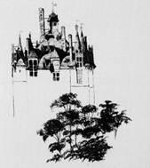

# [[{.calibre10} [[BRETAGNE ET NORMANDIE 1]{.calibre_58}]{.calibre2}]{.calibre2}]{.calibre_55} {#filepos45255838 .calibre_}

[Lettres de voyage adressées à Adèle]{.calibre4}

:::::: calibre_20
::::: calibre_3
::: calibre_16

------------------------------------------------------------------------

::: calibre_16

:::::
::::::

[(1834)]{.calibre_3}

[Victor Hugo]{.calibre_10}

[[VOYAGES
]{.bold}]{.calibre_21}

:::::: calibre_22
::::: calibre_21
[ ]{.bold}

::: calibre_16

------------------------------------------------------------------------

::: calibre_16

:::::
::::::

[
Pour toutes demandes ou suggestions]{.calibre_3}

## [[[]{.calibre2}[]{.calibre2}[]{.calibre2}[]{.calibre2}[]{.calibre2}[]{.calibre2}[]{.calibre2}[]{.calibre2}[]{.calibre2}[]{.calibre2}[]{.calibre2}[]{.calibre2}[]{.calibre2}[]{.calibre2}[]{.calibre2}[]{.calibre2}[]{.calibre2}[]{.calibre2}[]{.calibre2}[]{.calibre2}[]{.calibre2}[]{.calibre2}[]{.calibre2}[]{.calibre2}[]{.calibre2}[]{.calibre2}[]{.calibre2}[]{.calibre2}[]{.calibre2}[]{.calibre2}[]{.calibre2}[]{.calibre2}[]{.calibre2}[]{.calibre2}[]{.calibre2}[]{.calibre2}[Table des matières]{.calibre2}]{.bold1}]{.calibre_24} {#calibre_pb_6381 .calibre_57}

::: calibre_52

::: calibre1

[]{.calibre_10}

> [[[[[[Avertissement]{.underline}]{.calibre_4}](index_split_5197.html#filepos45265883)]{.underline}]{.calibre_14}]{.calibre_10}

> [
> ]{.calibre_10}

> [[1834 :]{.bold}]{.calibre_10}

> [[[[[[Meulan, 23 juillet. -- 8 h.1/2 du matin.]{.underline}]{.calibre_4}](index_split_5198.html#filepos45266521)]{.underline}]{.calibre_14}]{.calibre_10}

> [[[[[[Evreux, 25 juillet.]{.underline}]{.calibre_4}](index_split_5200.html#filepos45268659)]{.underline}]{.calibre_14}]{.calibre_10}

> [[[[[[Rennes, 7 août, jeudi, 5 h. 1/2 du matin.]{.underline}]{.calibre_4}](index_split_5202.html#filepos45270495)]{.underline}]{.calibre_14}]{.calibre_10}

> [[[[[[Brest, 8 août.]{.underline}]{.calibre_4}](index_split_5204.html#filepos45272321)]{.underline}]{.calibre_14}]{.calibre_10}

> [[[[[[Brest, 9 août, 8 heures du soir.]{.underline}]{.calibre_4}](index_split_5206.html#filepos45275184)]{.underline}]{.calibre_14}]{.calibre_10}

> [[[[[[Vannes, 12 août.]{.underline}]{.calibre_4}](index_split_5208.html#filepos45277370)]{.underline}]{.calibre_14}]{.calibre_10}

> [[[[[[Nantes, 14 août.]{.underline}]{.calibre_4}](index_split_5210.html#filepos45280944)]{.underline}]{.calibre_14}]{.calibre_10}

> [[[[[[Tours, 16 août ; 10 heures 1/2 du soir.]{.underline}]{.calibre_4}](index_split_5212.html#filepos45283479)]{.underline}]{.calibre_14}]{.calibre_10}

> [[[[[[17 août, 11 heures du soir.]{.underline}]{.calibre_4}](index_split_5214.html#filepos45288164)]{.underline}]{.calibre_14}]{.calibre_10}

> [[[[[[Etampes, 22 août.]{.underline}]{.calibre_4}](index_split_5216.html#filepos45289170)]{.underline}]{.calibre_14}]{.calibre_10}

> [[[[[[Marines (près Gisors), 26 août, 9 heures du soir.]{.underline}]{.calibre_4}](index_split_5218.html#filepos45292226)]{.underline}]{.calibre_14}]{.calibre_10}

> [[[[[[30 août, Saint-Germain, 11 heures du soir.]{.underline}]{.calibre_4}](index_split_5220.html#filepos45294128)]{.underline}]{.calibre_14}]{.calibre_10}

> [[[[[[Ce dimanche 31, 5 heures du soir.]{.underline}]{.calibre_4}](index_split_5222.html#filepos45295228)]{.underline}]{.calibre_14}]{.calibre_10}

> [
> ]{.calibre_10}

> [[1835 :]{.bold}]{.calibre_10}

> [[[[[[Montereau, 26 juillet. -- 6 heures 1/2 du soir.]{.underline}]{.calibre_4}](index_split_5224.html#filepos45297157)]{.underline}]{.calibre_14}]{.calibre_10}

> [[[[[[Coulommiers, 28 juillet, midi.]{.underline}]{.calibre_4}](index_split_5226.html#filepos45299769)]{.underline}]{.calibre_14}]{.calibre_10}

> [[[[[[La Fère, 1er août, midi.]{.underline}]{.calibre_4}](index_split_5228.html#filepos45303748)]{.underline}]{.calibre_14}]{.calibre_10}

> [[[[[[Amiens, 3 août.]{.underline}]{.calibre_4}](index_split_5230.html#filepos45311283)]{.underline}]{.calibre_14}]{.calibre_10}

> [[[[[[Du Tréport, 6 août.]{.underline}]{.calibre_4}](index_split_5232.html#filepos45313969)]{.underline}]{.calibre_14}]{.calibre_10}

> [[[[[[A Louis Boulanger. -- Le Tréport.]{.underline}]{.calibre_4}](index_split_5234.html#filepos45319092)]{.underline}]{.calibre_14}]{.calibre_10}

> [[[[[[Montivilliers 10 août, 8 heures du matin.]{.underline}]{.calibre_4}](index_split_5236.html#filepos45324405)]{.underline}]{.calibre_14}]{.calibre_10}

> [[[[[[Rouen, 13 août.]{.underline}]{.calibre_4}](index_split_5238.html#filepos45331714)]{.underline}]{.calibre_14}]{.calibre_10}

> [[[[[[La Roche-Guyon, 16 août.]{.underline}]{.calibre_4}](index_split_5240.html#filepos45334946)]{.underline}]{.calibre_14}]{.calibre_10}

> [[[[[[Pontoise, 17 août.]{.underline}]{.calibre_4}](index_split_5242.html#filepos45339746)]{.underline}]{.calibre_14}]{.calibre_10}

> [[[[[[20 août, 1 heure de l\'après-midi.]{.underline}]{.calibre_4}](index_split_5244.html#filepos45341964)]{.underline}]{.calibre_14}]{.calibre_10}

[
!{.calibre3}]{.calibre_10}

## [[[]{.calibre2}[]{.calibre2}[]{.calibre2}[]{.calibre2}[]{.calibre2}[]{.calibre2}[]{.calibre2}[]{.calibre2}[]{.calibre2}[]{.calibre2}[]{.calibre2}[]{.calibre2}[Avertissement]{.calibre2}]{.bold1}]{.calibre_24} {#calibre_pb_6384 .calibre_57}

::: calibre_52

[ ]{.calibre4}

[Pour ce voyage de 1834 et les suivants, les notes d\'albums sont mêlées aux lettres, les unissent et les complètent.]{.calibre4}

[[1834]{.calibre_18}]{.bold}

## [[[]{.calibre2}[]{.calibre2}[]{.calibre2}[]{.calibre2}[]{.calibre2}[]{.calibre2}[]{.calibre2}[]{.calibre2}[]{.calibre2}[]{.calibre2}[]{.calibre2}[]{.calibre2}[]{.calibre2}[]{.calibre2}[]{.calibre2}[]{.calibre2}[]{.calibre2}[]{.calibre2}[]{.calibre2}[]{.calibre2}[]{.calibre2}[]{.calibre2}[]{.calibre2}[]{.calibre2}[]{.calibre2}[]{.calibre2}[]{.calibre2}[]{.calibre2}[]{.calibre2}[]{.calibre2}[]{.calibre2}[]{.calibre2}[]{.calibre2}[]{.calibre2}[Meulan, 23 juillet. -- 8 h.1/2 du matin.]{.calibre2}]{.bold1}]{.calibre_24} {#calibre_pb_6386 .calibre_57}

::: calibre_52

[ ]{.calibre4}

[La fantaisie a tourné, mon Adèle, je suis à Meulan, charmante petite ville du bord de la Seine, pleine de ruines et de vieilles femmes. Il y a deux belles églises, l'une est la Halle au blé, l'autre le grenier à sel. Il y a aussi le fort d'Olivier-le-Daim, mais sans tours et sans portes, et tout déshonoré par les restaurations. C'est égal. L'ensemble de la ville est ravissant, la situation délicieuse au bord de l'eau, dans les îles, les arbres et les galiotes. Je te voudrais là, avec moi, mon pauvre ange !]{.calibre4}

[La diligence de Rouen passe à dix heures. Si j'y trouve une place je la prendrai. Dans ce cas-là, je ne serais à Paris que vendredi dans la journée. Tu sais quelle rage j'ai de voir Rouen.]{.calibre4}

[Quant à la Roche-Guyon, à Monthéry et à Soissons, ce sera pour une autre occasion. A vendredi donc au plus tard, embrasse pour moi toute la petite couvée. Je pense que l'hospitalité des Roches aura toujours été excellente pour moi. A bientôt donc, pense à moi qui t'aime et aime-moi. Tu es ma joie.]{.calibre4}

[ ]{.calibre4}

[[Ton Victor.]{.italic}]{.calibre4}

[[1834]{.calibre_18}]{.bold}

## [[[]{.calibre2}[]{.calibre2}[]{.calibre2}[]{.calibre2}[]{.calibre2}[]{.calibre2}[]{.calibre2}[]{.calibre2}[]{.calibre2}[]{.calibre2}[]{.calibre2}[]{.calibre2}[]{.calibre2}[]{.calibre2}[]{.calibre2}[]{.calibre2}[]{.calibre2}[]{.calibre2}[]{.calibre2}[]{.calibre2}[]{.calibre2}[]{.calibre2}[]{.calibre2}[]{.calibre2}[]{.calibre2}[]{.calibre2}[]{.calibre2}[]{.calibre2}[]{.calibre2}[]{.calibre2}[]{.calibre2}[]{.calibre2}[]{.calibre2}[]{.calibre2}[Evreux, 25 juillet.]{.calibre2}]{.bold1}]{.calibre_24} {#calibre_pb_6388 .calibre_57}

::: calibre_52

[ ]{.calibre4}

[Il m\'a été impossible d\'aborder Rouen. Les routes sont couvertes de gens peureux que les fêtes de juillet chassent de Paris et de gens curieux qu\'elles y attirent. Après mille traverses que je te conterai et qui t\'amuseront, mon pauvre ange, me voici à Évreux. Je voulais repartir ce matin pour Paris par la diligence de Cherbourg qui passe à huit heures. Mais, pas une place là comme ailleurs. Je suis donc réduit aux petites voitures qui sont bien lentes, mais tu sais que j\'aime cette manière de voyager, qui laisse tout voir. Cependant je m\'en plains aujourd\'hui qu\'elle retarde la joie de te voir et de t\'embrasser.]{.calibre4}

[J\'ai trouvé déjà d\'admirables choses qui me serviront beaucoup. J\'en vais revoir d\'autres aujourd\'hui, la cathédrale et Saint-Taurins, deux merveilles. Je pense que je repartirai à quatre heures par la voiture de Rolleboise et que je serai à Paris demain samedi vers sept heures pour dîner.]{.calibre4}

[A demain donc. Mille baisers.]{.calibre4}

[[1834]{.calibre_18}]{.bold}

## [[[]{.calibre2}[]{.calibre2}[]{.calibre2}[]{.calibre2}[]{.calibre2}[]{.calibre2}[]{.calibre2}[]{.calibre2}[]{.calibre2}[]{.calibre2}[]{.calibre2}[]{.calibre2}[]{.calibre2}[]{.calibre2}[]{.calibre2}[]{.calibre2}[]{.calibre2}[]{.calibre2}[]{.calibre2}[]{.calibre2}[]{.calibre2}[]{.calibre2}[]{.calibre2}[]{.calibre2}[]{.calibre2}[]{.calibre2}[]{.calibre2}[]{.calibre2}[]{.calibre2}[]{.calibre2}[]{.calibre2}[]{.calibre2}[]{.calibre2}[]{.calibre2}[Rennes, 7 août, jeudi, 5 h. 1/2 du matin.]{.calibre2}]{.bold1}]{.calibre_24} {#calibre_pb_6390 .calibre_57}

::: calibre_52

[ ]{.calibre4}

[Je t\'écris vite quatre lignes. Je suis arrivé ici au point du jour avec les jeunes filles de Bernard qui sont charmantes de tout point. A part quelques vieilles maisons, la ville ne signifie pas grand-chose. Verneuil, Mortagne, Mayenne, Laval, sont des villes ravissantes. J\'ai passé à Vitré à minuit. Dis cela à ton père ; il comprendra mes regrets.]{.calibre4}

[A Saint-Brieuc, les demoiselles Bernard me quitteront. Donne de leurs bonnes nouvelles à leur père. Dis-lui que je suis son ami. ]{.calibre4}

[Je t\'écrirai de Brest où je serai demain à pareille heure. ]{.calibre4}

[Adieu, mon Adèle. Je t\'aime. A bientôt. Écris-moi long et souvent. Tu es la joie et l'honneur de ma vie. Je baise ton beau front et tes beaux yeux. ]{.calibre4}

[Ici un mot pour Didine. Baise notre Toto pour moi.]{.calibre4}

[[1834]{.calibre_18}]{.bold}

## [[[]{.calibre2}[]{.calibre2}[]{.calibre2}[]{.calibre2}[]{.calibre2}[]{.calibre2}[]{.calibre2}[]{.calibre2}[]{.calibre2}[]{.calibre2}[]{.calibre2}[]{.calibre2}[]{.calibre2}[]{.calibre2}[]{.calibre2}[]{.calibre2}[]{.calibre2}[]{.calibre2}[]{.calibre2}[]{.calibre2}[]{.calibre2}[]{.calibre2}[]{.calibre2}[]{.calibre2}[]{.calibre2}[]{.calibre2}[]{.calibre2}[]{.calibre2}[]{.calibre2}[]{.calibre2}[]{.calibre2}[]{.calibre2}[]{.calibre2}[]{.calibre2}[Brest, 8 août.]{.calibre2}]{.bold1}]{.calibre_24} {#calibre_pb_6392 .calibre_57}

::: calibre_52

[ ]{.calibre4}

[J\'arrive. Je suis encore tout étourdi de trois nuits de malle-poste, sans compter les jours. Trois nuits à grands coups de fouet, à franc étrier, sans boire, ni manger, ni respirer à peine, avec quatre diablesses de roues qui mangent les lieues vraiment quatre à quatre qu\'elles sont. Je t\'assure, ma pauvre amie bien-aimée, que la tête est lasse quand, par une aube de vent et de brume, on descend au grand galop dans Brest, sans rien voir que la vitre abaissée sur vos yeux contre la pluie. Mais ce qui n\'est pas las, ce qui est toujours prêt à t\'écrire, à penser à toi et à t\'aimer, c\'est le coeur de ton pauvre vieux mari qui a été enfant avec toi, quoique tu sois restée bien plus jeune que lui, de coeur, d\'âme et de visage.]{.calibre4}

[Je n\'ai encore rien vu de Brest. Point de monuments, qu\'une grande vilaine église du Louis XV le plus Saint-Sulpice qui soit. Pas de vieilles maisons sculptées. Je crois qu\'il faudra se résigner au bagne et aux vaisseaux de ligne.]{.calibre4}

[A Saint-Brieuc, Mlles Bernard m\'ont quitté. Elles ont été remplacées dans la malle-poste par un officier de marine, homme distingué, M. Esnonne. Il a une fort jolie femme et deux jolis enfants. Il est fort littéraire, sa femme et ses enfants fort poétiques. Leur poésie et la mienne visiteront le bagne ensemble. M. Esnonne m\'y fera entrer sans que j\'aie à trahir mon incognito. ]{.calibre4}

[Dès que j\'aurai une minute, je t\'écrirai. J\'irai sans doute voir Karnac. J\'ai déjà mouillé mes pieds dans l\'océan. ]{.calibre4}

[Comment va mon Toto ? Et toi ? Et tous ? Ecris-moi bien au long. Tu vois et tu sais comme je t\'aime. ]{.calibre4}

[Mille cordialités aux habitants des Roches.]{.calibre4}

[[1834]{.calibre_18}]{.bold}

## [[[]{.calibre2}[]{.calibre2}[]{.calibre2}[]{.calibre2}[]{.calibre2}[]{.calibre2}[]{.calibre2}[]{.calibre2}[]{.calibre2}[]{.calibre2}[]{.calibre2}[]{.calibre2}[]{.calibre2}[]{.calibre2}[]{.calibre2}[]{.calibre2}[]{.calibre2}[]{.calibre2}[]{.calibre2}[]{.calibre2}[]{.calibre2}[]{.calibre2}[]{.calibre2}[]{.calibre2}[]{.calibre2}[]{.calibre2}[]{.calibre2}[]{.calibre2}[]{.calibre2}[]{.calibre2}[]{.calibre2}[]{.calibre2}[]{.calibre2}[]{.calibre2}[Brest, 9 août, 8 heures du soir.]{.calibre2}]{.bold1}]{.calibre_24} {#calibre_pb_6394 .calibre_57}

::: calibre_52

[ ]{.calibre4}

[Cette nuit à quatre heures je partirai pour Auray sur l\'impériale de la diligence.]{.calibre4}

[Je vais voir Quiberon et Karnac. De là je compte remonter la Loire par Nantes jusqu\'à Tours par le bateau à vapeur, puis de Tours à Paris. Là je te reverrai, mon Adèle toujours bien aimée, là je retrouverai ton beau front si pur et si doux pour tout ce qui t\'entoure.]{.calibre4}

[Je n\'ai pas trouvé ici de lettres de toi. J\'en espérais pourtant. Ecris-moi désormais à [Tours]{.italic} poste restante, mets sur l\'adresse [M. le baron Hugo]{.italic}. Cela me fait un excellent incognito.]{.calibre4}

[J\'ai visité aujourd\'hui le port de Brest, un vaisseau de ligne [(l'Algésiras)]{.italic} et le bagne. Tout cela est plein de curiosité et d\'émotions de toutes sortes. J\'ai acheté aux forçats plusieurs petits ouvrages.]{.calibre4}

[Toutes mes journées maintenant, mon Adèle, vont être prises jusqu\'à la dernière minute, car puisque j\'y suis, il faut que je voie tout. Je ne pourrai peut-être plus t\'écrire aussi souvent. Songe que je pense à toi et à vous tous.]{.calibre4}

[Mille bons souvenirs aux Roches.]{.calibre4}

[[1834]{.calibre_18}]{.bold}

## [[[]{.calibre2}[]{.calibre2}[]{.calibre2}[]{.calibre2}[]{.calibre2}[]{.calibre2}[]{.calibre2}[]{.calibre2}[]{.calibre2}[]{.calibre2}[]{.calibre2}[]{.calibre2}[]{.calibre2}[]{.calibre2}[]{.calibre2}[]{.calibre2}[]{.calibre2}[]{.calibre2}[]{.calibre2}[]{.calibre2}[]{.calibre2}[]{.calibre2}[]{.calibre2}[]{.calibre2}[]{.calibre2}[]{.calibre2}[]{.calibre2}[]{.calibre2}[]{.calibre2}[]{.calibre2}[]{.calibre2}[]{.calibre2}[]{.calibre2}[]{.calibre2}[Vannes, 12 août.]{.calibre2}]{.bold1}]{.calibre_24} {#calibre_pb_6396 .calibre_57}

::: calibre_52

[ ]{.calibre4}

[Me voici à Vannes. Je suis allé hier à Karnac dans un affreux cabriolet par d\'affreuses routes, et à Lokmariaker à pied. Cela m\'a fait huit bonnes lieues de marche qui ont crevé mes semelles ; mais j\'ai amassé bien des idées et bien des sujets, chère amie, pour nos conversations de cet hiver.]{.calibre4}

[Tu ne peux te figurer comme les monuments celtiques sont étranges et sinistres. A Karnac, j\'ai eu presque un moment de désespoir ; figure-toi que ces prodigieuses pierres de Karnac, dont tu m\'as si souvent entendu parler, ont presque toutes été jetées bas par les imbéciles paysans, qui en font des murs et des cabanes. Tous les dolmens, un excepté qui porte une croix, sont à terre. Il n\'y a plus que des peulvens. Te rappelles-tu ? Un peulven, c\'est une pierre debout comme nous en avons vu une ensemble à Autun dans ce doux et charmant voyage de 1825.]{.calibre4}

[Les peulvens de Karnac font un effet immense. Ils sont innombrables et rangés en longues avenues. Le monument tout entier, avec ses cromlechs qui sont effacés et ses dolmens qui sont détruits, couvrait une plaine de plus de deux lieues. Maintenant on n\'en voit plus que la ruine. C\'était une chose unique qui n\'est plus. Pays stupide ! peuple stupide ! gouvernement stupide \! ]{.calibre4}

[A Lokmariaker, où j\'ai eu beaucoup de peine à parvenir avec les pieds ensanglantés par les bruyères, il n\'y a plus que deux dolmens, mais beaux. L\'un, couvert d\'une pierre énorme, a été frappé par la foudre, qui a brisé la pierre en trois morceaux. Tu ne peux te figurer quelle ligne sauvage ces monuments-là font dans un paysage. ]{.calibre4}

[J\'ai couché à Auray, chez la mère Seauneau, excellente auberge, et je suis venu ce matin à Vannes., J\'ai mille, choses à y voir, puis je partirai demain pour Nantes. Je compte toujours passer à Tours ; tu peux m\'y adresser tes lettres. Ecris-moi souvent et beaucoup, n\'est-ce pas, mon pauvre ange ? ]{.calibre4}

[Je serai à Paris vers le 20. Embrasse bien tous nos anges pour moi, pauvre diable. Dis à Mme Louise que je ne puis penser sans attendrissement à toute sa bonté pour Toto. Dis à Martine mille bonnes amitiés. Tu es encore sans doute aux Roches au moment où je t\'écris. Je t\'y adresse cette lettre. A bientôt, mon Adèle, je t\'aime plus que jamais.]{.calibre4}

[[1834]{.calibre_18}]{.bold}

## [[[]{.calibre2}[]{.calibre2}[]{.calibre2}[]{.calibre2}[]{.calibre2}[]{.calibre2}[]{.calibre2}[]{.calibre2}[]{.calibre2}[]{.calibre2}[]{.calibre2}[]{.calibre2}[]{.calibre2}[]{.calibre2}[]{.calibre2}[]{.calibre2}[]{.calibre2}[]{.calibre2}[]{.calibre2}[]{.calibre2}[]{.calibre2}[]{.calibre2}[]{.calibre2}[]{.calibre2}[]{.calibre2}[]{.calibre2}[]{.calibre2}[]{.calibre2}[]{.calibre2}[]{.calibre2}[]{.calibre2}[]{.calibre2}[]{.calibre2}[]{.calibre2}[Nantes, 14 août.]{.calibre2}]{.bold1}]{.calibre_24} {#calibre_pb_6398 .calibre_57}

::: calibre_52

[ ]{.calibre4}

[Je suis arrivé ce matin à 3 heures à Nantes ; j\'ai dormi quelques heures, puis j\'ai été voir toute la ville, et me voici prêt à me coucher pour quelques heures encore et à repartir pour Tours par le bateau à vapeur demain à 6 heures du matin. ]{.calibre4}

[J\'ai vu à Nantes beaucoup de belles maisons, la cathédrale, édifice tronqué de toutes époques, qui contient une admirable chose, le tombeau de François II. Parles-en à ton père. Le château de Nantes a dû être magnifique. Ce qui en reste est d\'une grande beauté, bien féodale et bien sévère. Je suis monté au moment où le soleil se couchait sur le clocher de la cathédrale et de là j\'ai vu toute la ville, les quatre bras de la Loire, l'Erdre dont les bords sont charmants, le canal, tous les vieux toits, et la prairie de Mauves. C\'est beau. Pas assez de clochers pourtant. En général, la Bretagne, si pieuse, ne brille pas par les églises. Je serai à Tours samedi matin, après une nuit passée en diligence, ce qui est dur. Voilà la cinquième depuis Paris.]{.calibre4}

[J\'espère qu\'à Tours je trouverai des lettres de toi, Voilà dix jours que je n\'ai eu de tes nouvelles. ]{.calibre4}

[Je présume que tu n\'es plus aux Roches. Je t\'adresse cette lettre à Paris. ]{.calibre4}

[Adieu, A bientôt, ]{.calibre4}

[[Ton Victor]{.italic}.]{.calibre4}

[[1834]{.calibre_18}]{.bold}

## [[[]{.calibre2}[]{.calibre2}[]{.calibre2}[]{.calibre2}[]{.calibre2}[]{.calibre2}[]{.calibre2}[]{.calibre2}[]{.calibre2}[]{.calibre2}[]{.calibre2}[]{.calibre2}[]{.calibre2}[]{.calibre2}[]{.calibre2}[]{.calibre2}[]{.calibre2}[]{.calibre2}[]{.calibre2}[]{.calibre2}[]{.calibre2}[]{.calibre2}[]{.calibre2}[]{.calibre2}[]{.calibre2}[]{.calibre2}[]{.calibre2}[]{.calibre2}[]{.calibre2}[]{.calibre2}[]{.calibre2}[]{.calibre2}[]{.calibre2}[]{.calibre2}[Tours, 16 août ; 10 heures 1/2 du soir.]{.calibre2}]{.bold1}]{.calibre_24} {#calibre_pb_6400 .calibre_57}

::: calibre_52

[ ]{.calibre4}

[Juge de mon désappointement ! Je suis arrivé à Tours ce matin à dix heures, après une affreuse nuit passée dans la [rotonde]{.italic} d'une diligence. La rotonde d\'une diligence, c\'est évidemment le purgatoire. C\'est égal, j\'étais affamé de vos nouvelles à tous, affamé d\'une lettre de toi. Je débarque, je cours à la poste. Rien ! Je m\'attendais à dix lettres ! Le, moment a été dur. Et puis je me suis mis à calculer. En effet, il n\'y a pas de ta faute. Ma lettre de Brest n\'a dû t'arriver que mercredi ou jeudi, et ta réponse ne pouvait être à Tours samedi matin. Je ne partirai que demain soir et j'irai coucher à Amboise. On me promet des lettres peut-être pour demain. Oh ! j\'ai besoin de savoir où vous en êtes tous, et si tu m\'aimes, et si tu penses toujours à moi \! ]{.calibre4}

[Je suis venu de Nantes à Angers par le bateau à vapeur. Les fameux bords de la Loire sont plats et nuls, à cela près d\'Oudon, d\'Ancenis, de Saint-Florent et de quelques rochers çà et là. L\'abord d\'Angers est charmant, mais il appartient à la Mayenne. Le bateau à vapeur est sale, puant et incommode. Entre autres incommodités, j\'y ai rencontré Mme de Féraudy, tu sais ? l\'ancienne Mme de Féraudy, et il m\'a fallu faire l\'aimable. C\'était diabolique. Pour comble, arrivé à Angers, comme j\'allais voir la cathédrale, beau portail et beaux Astraux, elle s\'est pendue à mon bras et, force m\'a été de lui servir de cornac. Je rentrais assez piteux en cette compagnie à l\'hôtel du Faisan, quand voilà, pour dernier coup, le duc d\'Abrantès qui m\'accoste, non pas le duc chevelu et barbu que je connais ; mais un petit duc rouge et joufflu, rasé et cheveux courts, qui s\'en va à Cholet, avec une feuille de route de soldat qu\'il est, prendre la capote bleue et monter la garde dans les bruyères. J\'ai donc dîné entre cette dame et ce monsieur. A huit heures du soir, je suis remonté par bonheur en voiture, dans.la rotonde en question, et je suis débarqué ce matin, moulu, à Tours où il n\'y a pas une lettre de toi pour me remettre l\'âme et le corps. Plains-moi.]{.calibre4}

[Tours que j\'ai visité aujourd\'hui et où je suis l'objet de toutes sortes de persécutions admiratrices, Tours, où j\'ai trouvé [Lucrèce Borgia]{.italic} affichée en pleine foire, et le collège en émoi de mon arrivée, Tours est une telle ville. Force vieilles maisons, surtout en pierre, deux belles tours romanes, une superbe église romane qui sert d\'écurie à l'hôtel de l\'Europe, une ravissante fontaine de la Renaissance, de beaux débris de fortifications, et la cathédrale qui est admirable, admirable d\'architecture et de vitraux. Voilà tout ce que j\'ai vu de Tours aujourd\'hui. Je continuerai demain. ]{.calibre4}

[Je n\'ai fait qu\'entrevoir Angers dans le crépuscule. Les vitraux et le portail de la cathédrale sont merveilleux, le vieux château est très beau, toute la ville est pittoresque. Je trouve que notre bon Pavie ne l\'admire pas assez. Dis-le-lui de ma part.]{.calibre4}

[Demain je verrai Amboise, et je tâcherai de t\'écrire. Ecris-moi, toi, bien long. Si je reçois demain avant mon départ une lettre de toi, je clorai joyeusement celle-ci.]{.calibre4}

[[1834]{.calibre_18}]{.bold}

## [[[]{.calibre2}[]{.calibre2}[]{.calibre2}[]{.calibre2}[]{.calibre2}[]{.calibre2}[]{.calibre2}[]{.calibre2}[]{.calibre2}[]{.calibre2}[]{.calibre2}[]{.calibre2}[]{.calibre2}[]{.calibre2}[]{.calibre2}[]{.calibre2}[]{.calibre2}[]{.calibre2}[]{.calibre2}[]{.calibre2}[]{.calibre2}[]{.calibre2}[]{.calibre2}[]{.calibre2}[]{.calibre2}[]{.calibre2}[]{.calibre2}[]{.calibre2}[]{.calibre2}[]{.calibre2}[]{.calibre2}[]{.calibre2}[]{.calibre2}[]{.calibre2}[17 août, 11 heures du soir.]{.calibre2}]{.bold1}]{.calibre_24} {#calibre_pb_6402 .calibre_57}

::: calibre_52

[ ]{.calibre4}

[Pas de lettres encore aujourd\'hui ! J\'ai quitté Tours bien triste, en recommandant qu\'on m\'envoyât mes lettres à Orléans. Je suis à Amboise dont je visiterai le château demain. Je t\'aime, mon Adèle. Baise pour moi Didine, Toto, Charlot et Dédé, mes bijoux.]{.calibre4}

[[1834]{.calibre_18}]{.bold}

## [[[]{.calibre2}[]{.calibre2}[]{.calibre2}[]{.calibre2}[]{.calibre2}[]{.calibre2}[]{.calibre2}[]{.calibre2}[]{.calibre2}[]{.calibre2}[]{.calibre2}[]{.calibre2}[]{.calibre2}[]{.calibre2}[]{.calibre2}[]{.calibre2}[]{.calibre2}[]{.calibre2}[]{.calibre2}[]{.calibre2}[]{.calibre2}[]{.calibre2}[]{.calibre2}[]{.calibre2}[]{.calibre2}[]{.calibre2}[]{.calibre2}[]{.calibre2}[]{.calibre2}[]{.calibre2}[]{.calibre2}[]{.calibre2}[]{.calibre2}[]{.calibre2}[Etampes, 22 août.]{.calibre2}]{.bold1}]{.calibre_24} {#calibre_pb_6404 .calibre_57}

::: calibre_52

[ ]{.calibre4}

[Merci, mon Adèle, de ta bonne petite lettre du 19. Elle m\'a fait plus de plaisir que je ne puis te dire. Un verre d\'eau à un altéré. Il me tarde d\'avoir toutes les autres, mais je crains que ce bonheur ne soit pour Paris, avec la joie de t\'embrasser. Je dis [je crains]{.italic}, parce qu\'il serait encore possible que mon arrivée fût retardée de trente-six heures. Je suis à Etampes, j\'y ai trouvé une espèce d\'antiquaire, ancien officier de la garde, ami de Paul Lacroix, nommé M. Grandmaison, à qui appartient ce fameux donjon d\'Etampes que tu connais, et qui veut me montrer toutes les ruines des alentours. Elles sont assez nombreuses et fort belles. Nous devons aller voir demain le Temple, ancien monastère écroulé sur la montagne. Il y a ici de belles églises romanes. Une (Saint-Martin) a une tour penchée comme Pise. Il serait possible que j\'allasse de là à Fontainebleau voir le château, s\'il se présente une bonne occasion ; mais les vacances rendent les voitures chères et rares. --- Écris-moi toujours à Melun.]{.calibre4}

[J\'ai passé hier une admirable journée, à Pithiviers et aux environs. Yèvres-le-Châtel, qui est à deux lieues et où je suis allé à pied avec mes souliers percés, contient à lui seul un couvent et un château, ruinés, mais complets. C\'est magnifique. Je dessine tout ce que je vois. Tu en jugeras.]{.calibre4}

[Mon Adèle, ma pauvre amie, si tu savais quelle joie j'aurais de t\'avoir près de moi dans ces moments-là. Oh ! certes, nous ferons un voyage ensemble.]{.calibre4}

[Embrasse pour moi Martine, ma bonne Martine, et nos quatre charmants joujoux. Si vous saviez comme je vous aime tous !]{.calibre4}

[Cette lettre est probablement la dernière que je t\'écrirai. Je la suivrai de près. Je t\'embrasse et je t\'aime.]{.calibre4}

[Ici une lettre pour Poupée. Toto va-t-il bien ? Se plaît-il là-bas ?]{.calibre4}

[[1834]{.calibre_18}]{.bold}

## [[[]{.calibre2}[]{.calibre2}[]{.calibre2}[]{.calibre2}[]{.calibre2}[]{.calibre2}[]{.calibre2}[]{.calibre2}[]{.calibre2}[]{.calibre2}[]{.calibre2}[]{.calibre2}[]{.calibre2}[]{.calibre2}[]{.calibre2}[]{.calibre2}[]{.calibre2}[]{.calibre2}[]{.calibre2}[]{.calibre2}[]{.calibre2}[]{.calibre2}[]{.calibre2}[]{.calibre2}[]{.calibre2}[]{.calibre2}[]{.calibre2}[]{.calibre2}[]{.calibre2}[]{.calibre2}[]{.calibre2}[]{.calibre2}[]{.calibre2}[]{.calibre2}[Marines (près Gisors), 26 août, 9 heures du soir.]{.calibre2}]{.bold1}]{.calibre_24} {#calibre_pb_6406 .calibre_57}

::: calibre_52

[ ]{.calibre4}

[Je suis triste, mon Adèle, mais je ne suis pas fâché. Je t\'ai écrit avant-hier 24, de Montlhéry. La lettre a dû t\'arriver le même jour ; je te priais de m\'écrire poste restante à Pontoise. Le lendemain une lettre aurait pu être à Pontoise. Je viens d\'y passer aujourd\'hui (le surlendemain). Rien. Si tu savais quel besoin j\'ai de tes lettres, tu ne m\'aurais pas laissé ainsi passer dans cette vilaine ville qui a été déserte et ennuyeuse pour moi. Ceci n\'est cependant pas une gronderie, c\'est une simple peine que je te confie à toi si bonne et si parfaite en tout. Ecris-moi maintenant pour me dédommager une bien bien bien longue et bonne lettre, poste restante, à Versailles, où je compte repasser, car j\'ai vraiment le mal du pays ; une absence de vingt-cinq jours est plus que je ne puis porter. Je n\'irai certainement pas jusqu\'à Soissons. Tu me reverras tout d\'un coup, bien heureux et, bien joyeux de t\'embrasser. A bientôt donc.]{.calibre4}

[A toi toujours et partout.]{.calibre4}

[[1834]{.calibre_18}]{.bold}

## [[[]{.calibre2}[]{.calibre2}[]{.calibre2}[]{.calibre2}[]{.calibre2}[]{.calibre2}[]{.calibre2}[]{.calibre2}[]{.calibre2}[]{.calibre2}[]{.calibre2}[]{.calibre2}[]{.calibre2}[]{.calibre2}[]{.calibre2}[]{.calibre2}[]{.calibre2}[]{.calibre2}[]{.calibre2}[]{.calibre2}[]{.calibre2}[]{.calibre2}[]{.calibre2}[]{.calibre2}[]{.calibre2}[]{.calibre2}[]{.calibre2}[]{.calibre2}[]{.calibre2}[]{.calibre2}[]{.calibre2}[]{.calibre2}[]{.calibre2}[]{.calibre2}[30 août, Saint-Germain, 11 heures du soir.]{.calibre2}]{.bold1}]{.calibre_24} {#calibre_pb_6408 .calibre_57}

::: calibre_52

[ ]{.calibre4}

[Cette fois, c\'est [pour de vrai]{.italic}. A tout à l\'heure, mon Adèle. J\'arriverai peut-être avant cette lettre.]{.calibre4}

[J\'ai vu la tour de Gisors et la cathédrale de Beauvais, j\'ai admiré ce que j\'ai vu, mais j\'aime ce que je vais revoir.]{.calibre4}

[Du fond du coeur à toi.]{.calibre4}

[[1834]{.calibre_18}]{.bold}

## [[[]{.calibre2}[]{.calibre2}[]{.calibre2}[]{.calibre2}[]{.calibre2}[]{.calibre2}[]{.calibre2}[]{.calibre2}[]{.calibre2}[]{.calibre2}[]{.calibre2}[]{.calibre2}[]{.calibre2}[]{.calibre2}[]{.calibre2}[]{.calibre2}[]{.calibre2}[]{.calibre2}[]{.calibre2}[]{.calibre2}[]{.calibre2}[]{.calibre2}[]{.calibre2}[]{.calibre2}[]{.calibre2}[]{.calibre2}[]{.calibre2}[]{.calibre2}[]{.calibre2}[]{.calibre2}[]{.calibre2}[]{.calibre2}[]{.calibre2}[]{.calibre2}[Ce dimanche 31, 5 heures du soir.]{.calibre2}]{.bold1}]{.calibre_24} {#calibre_pb_6410 .calibre_57}

::: calibre_52

[ ]{.calibre4}

[Mon Adèle bien-aimée, je suis à Versailles dans le plus grand embarras. C\'est aujourd\'hui la fête des Loges à Saint-Germain. Pas de voiture nulle part, ni de place aux Gondoles depuis huit jours, me dit-on. Je suis venu de Saint-Germain à Versailles à pied, ne trouvant aucun moyen de transport, chercher ta bonne lettre qui m\'a ravi. Je crains bien d\'être obligé de passer la nuit ici et je t\'écris en hâte.]{.calibre4}

[Demain je t\'embrasserai, dussé-je aller à Paris sur la tête. Si je n\'étais pas si fatigué ce soir, je laisserais ma malle à l\'hôtel et je partirais. J\'ai bien soif de te revoir et les petits. Mon Dieu ! que ce retard est encore triste.]{.calibre4}

[[Ton Victor.]{.italic}]{.calibre4}

[ ]{.calibre4}

[Je t\'écris ceci au crayon sur le bureau des Gondoles. Je vais essayer d\'aller jusqu\'à Jouy ; peut-être trouverai-je une voiture. J\'irais bien demander l\'hospitalité aux Roches, mais je suis trop sale.]{.calibre4}

[[1835]{.calibre_18}]{.bold}

## [[[]{.calibre2}[]{.calibre2}[]{.calibre2}[]{.calibre2}[]{.calibre2}[]{.calibre2}[]{.calibre2}[]{.calibre2}[]{.calibre2}[]{.calibre2}[]{.calibre2}[]{.calibre2}[]{.calibre2}[]{.calibre2}[]{.calibre2}[]{.calibre2}[]{.calibre2}[]{.calibre2}[]{.calibre2}[]{.calibre2}[]{.calibre2}[]{.calibre2}[]{.calibre2}[]{.calibre2}[]{.calibre2}[]{.calibre2}[]{.calibre2}[]{.calibre2}[]{.calibre2}[]{.calibre2}[]{.calibre2}[]{.calibre2}[]{.calibre2}[]{.calibre2}[Montereau, 26 juillet. -- 6 heures 1/2 du soir.]{.calibre2}]{.bold1}]{.calibre_24} {#calibre_pb_6412 .calibre_57}

::: calibre_52

[ ]{.calibre4}

[Bonjour, mon pauvre ange. Bonjour, mon Adèle. Comment as-tu fait le voyage ? Tu es arrivée et déjà, j\'espère, quelque peu reposée au moment où je t\'écris. Moi, voici où j\'en suis.]{.calibre4}

[Je suis parti hier matin à sept heures par le bateau à vapeur, et je suis arrivé à Montereau hier à sept heures du soir. J\'y suis encore à l\'heure où je t\'écris, fort contrarié de ne pas trouver de voiture, et ne sachant pas encore en ce moment-ci si je partirai dans une heure pour Sens par la diligence ou demain matin en cabriolet pour Provins. Par Sens le détour est plus grand, mais je verrai Troyes et Châlons-sur-Marne. Autrement, je passerai par Provins, Coulommiers et Château-Thierry. J\'ai affaire à d\'affreux loueurs de voitures qui font tout ce qu\'ils peuvent pour me rançonner. Mais je me défends.]{.calibre4}

[Et toi, penses-tu un peu à ton pauvre mari ? Comment va notre Didine ? Baise-la mille fois pour moi. Serre la main de ma part à ton excellent père. J\'ai quitté hier matin nos chers petits endormis, et je les ai bien baisés pour nous deux. Toto a passé la nuit avec moi, couché tout nu à mon côté. Il était charmant ainsi endormi quand je l\'ai quitté.]{.calibre4}

[A bientôt. Ecris-moi ; Je t\'écrirai du premier séjour que je ferai. En attendant, je t\'embrasse. Je t\'aime bien, va, mon Adèle. ]{.calibre4}

[Mille amitiés à Pavie et à son père et à son frère. Je les aime tous comme tu sais.]{.calibre4}

[[1835]{.calibre_18}]{.bold}

## [[[]{.calibre2}[]{.calibre2}[]{.calibre2}[]{.calibre2}[]{.calibre2}[]{.calibre2}[]{.calibre2}[]{.calibre2}[]{.calibre2}[]{.calibre2}[]{.calibre2}[]{.calibre2}[]{.calibre2}[]{.calibre2}[]{.calibre2}[]{.calibre2}[]{.calibre2}[]{.calibre2}[]{.calibre2}[]{.calibre2}[]{.calibre2}[]{.calibre2}[]{.calibre2}[]{.calibre2}[]{.calibre2}[]{.calibre2}[]{.calibre2}[]{.calibre2}[]{.calibre2}[]{.calibre2}[]{.calibre2}[]{.calibre2}[]{.calibre2}[]{.calibre2}[Coulommiers, 28 juillet, midi.]{.calibre2}]{.bold1}]{.calibre_24} {#calibre_pb_6414 .calibre_57}

::: calibre_52

[ ]{.calibre4}

[Me voici à Coulommiers, mon Adèle, depuis hier soir. C\'est une ville assez insignifiante, avec une église telle quelle, quelques ogives et une tour rococo. Les environs paraissent jolis. On est dans un bassin d\'arbres\...]{.calibre4}

[J\'ai déjà vu Montereau, d\'où je t\'ai écrit, Bray et Provins. Montereau est une ville assez pittoresque, assise sur une espèce d\'Y que forme le confluent de l\'Yonne et de la Seine. Cela produit un pont tortu, d\'où l'église est charmante à voir. Il a passé toutes sortes d\'hommes sur ce pont-là, depuis Jean sans Peur jusqu\'à Napoléon.]{.calibre4}

[J\'ai visité sur la montagne qui domine le pont la place où Napoléon a braqué lui-même son canon en 1814. J\'y ai cueilli une fleur de laurier-rose. Car c\'est maintenant un jardin de plaisance. La vue, de là est belle. L\'immense Y des deux rivières s\'y développe largement dans un paysage magnifique. ]{.calibre4}

[A Bray, petite ville puante, j'ai écrit ce quatrain, m'émerveillant, sur le mur de l\'auberge :]{.calibre4}

[
]{.calibre4}

::: calibre_22
Au diable ! auberge immonde ! Hôtel de la punaise !

::: calibre_22
Où la peau le matin se couvre de rougeurs

::: calibre_22
Où la cuisine pue, où l\'on dort mal à l\'aise,

::: calibre_22
Où l\'on entend chanter les commis-voyageurs !

[ ]{.calibre4}

[(Au moment où je t\'écris, voici une charmante petite poule qui vient becqueter je ne sais quoi à mes pieds dans un rayon de soleil.)]{.calibre4}

[Quant à Provins, c\'est différent, non l\'auberge, mais la ville. Il y a quatre églises, une porte de ville fort belle, un donjon avec quatre tourelles en contreforts, et une enceinte de murailles et de tours ruinées, le tout répandu de la façon la plus charmante sur deux collines baignées jusqu\'à mi-côte dans les arbres\... Et puis, force vieilles maisons, encore pittoresques. J\'ai dessiné le donjon que je te montrerai. Je l'ai visité. Il me servira beaucoup. ]{.calibre4}

[Il me reste à peine assez, de place pour te dire que je veux que tu t\'amuses, que tu penses à moi et que tu m\'aimes. C\'est aujourd\'hui le jour de bonheur pour notre excellent Pavie. Je lui souhaite une femme comme toi. Après cela, qu'il remercie Dieu. ]{.calibre4}

[Je t\'embrasse, et je t\'embrasse encore, ainsi que notre Didine. Je vais déjeuner. Dans une demi-heure, je pars pour Château-Thierry.]{.calibre4}

[Je t\'aime, mon Adèle.]{.calibre4}

[[1835]{.calibre_18}]{.bold}

## [[[]{.calibre2}[]{.calibre2}[]{.calibre2}[]{.calibre2}[]{.calibre2}[]{.calibre2}[]{.calibre2}[]{.calibre2}[]{.calibre2}[]{.calibre2}[]{.calibre2}[]{.calibre2}[]{.calibre2}[]{.calibre2}[]{.calibre2}[]{.calibre2}[]{.calibre2}[]{.calibre2}[]{.calibre2}[]{.calibre2}[]{.calibre2}[]{.calibre2}[]{.calibre2}[]{.calibre2}[]{.calibre2}[]{.calibre2}[]{.calibre2}[]{.calibre2}[]{.calibre2}[]{.calibre2}[]{.calibre2}[]{.calibre2}[]{.calibre2}[]{.calibre2}[La Fère, 1er août, midi.]{.calibre2}]{.bold1}]{.calibre_24} {#calibre_pb_6416 .calibre_57}

::: calibre_52

[ ]{.calibre4}

[Je pense avec bien de la joie, mon Adèle, que dans deux jours j\'aurai de tes nouvelles à Abbeville. J\'espère que tu te seras bien amusée, et que tu auras trouvé nos excellents amis plus excellents que jamais. Quant à moi, j\'ai trouvé les auberges plus exécrables qu\'en aucun temps et qu\'en aucun pays jusqu\'à ce jour.]{.calibre4}

[Je voyage fort au hasard, faisant quelquefois de bons bouts de route à pied et trouvant des voitures à grand-peine. Je vois chemin faisant d\'admirables choses, ce qui me console. J\'ai vu Château-Thierry et la maison de La Fontaine, qui est à vendre. Un vieux président nommé M. Tribert qui l\'habite m\'en a fait les honneurs.]{.calibre4}

[A Soissons, j\'ai visité les belles ruines de Saint-Jean avec la famille du commandant d\'artillerie, M. de Bonneau. Famille aimable et très hospitalière.]{.calibre4}

[A deux lieues de Soissons, dans une charmante vallée repliée loin de toute route, il y a un admirable châtelet du quinzième siècle encore parfaitement habitable. Cela s\'appelle Septmonts. J\'ai prié M. de Bonneau de me donner avis si jamais on voulait vendre ce château une dizaine de mille francs. Je te l\'achèterais, mon Adèle. C\'est la plus ravissante habitation que tu puisses te figurer. Une ancienne maison de plaisance des évêques de Soissons. ]{.calibre4}

[Tu ne peux t\'imaginer la beauté de la vallée de Soissons quand on monte la côte vers Coucy, je l\'ai montée à reculons tant c\'était beau. Les deux flèches à jour de Saint-Jean, la cathédrale, la ville pleine de vieilles tours et de pignons taillés, de superbes horizons verts et bleus, une charmante rivière qui se noue et se dénoue à tous les angles du paysage, juge ! Je t\'aurais bien voulue là, mon pauvre ange, mais j\'aurais plaint tes pauvres pieds obligés de faire quatre lieues de montagnes dans les cailloux jusqu\'à Coucy. ]{.calibre4}

[Je renonce à te peindre Coucy. Je t\'en parlerai. C\'est une ville du moyen-âge sur une colline, presque intacte, avec un admirable donjon au bout, comme l\'ongle au bout du doigt. Tout cela dans une plaine magnifique, coupée de rizières, de routes jaunes, de cours d\'eau et de chemins bordés de pommiers bas qui peignent les charrettes de foin au passage.]{.calibre4}

[De Coucy à Laon, il y a un M. de Coutoul qui mystifie les voyageurs avec une espèce de tour factice en gothique d\'horloger, cachée dans les arbres, laquelle m\'a coûté trente sous donnés au laquais qui me l'a montrée.
]{.calibre4}

[Que le diable l\'emporte !]{.calibre4}

[J\'ai quitté Laon ce matin, vieille ville avec une cathédrale qui est une autre ville, dedans ; une immense cathédrale qui devait porter six tours et qui en a quatre, quatre tours presque byzantines à jour comme des flèches du seizième siècle. Tout est beau à Laon, les églises, les maisons, les environs, tout, excepté l'horrible auberge de la Hure où j\'ai couché et sur le mur de laquelle j\'ai écrit ce petit adieu :]{.calibre4}

[ ]{.calibre4}

[A L\'AUBERGISTE DE « LA HURE ».]{.calibre_10}

[ ]{.calibre4}

[Vendeur de fricot frelaté,]{.calibre_10}

[Hôtelier chez qui se fricasse]{.calibre_10}

[L\'ordure avec la saleté,]{.calibre_10}

[Gargotier chez qui l\'on ramasse]{.calibre_10}

[Soupe maigre et vaisselle grasse]{.calibre_10}

[Et tous les poux de la cité !]{.calibre_10}

[Ton auberge comme ta face]{.calibre_10}

[Est hure pour la bonne grâce !]{.calibre_10}

[Et grouin pour la propreté !]{.calibre_10}

[ ]{.calibre4}

[Il faut te dire que l\'aubergiste est insolent par-dessus le marché, il vous fait manger du poulet crevé et vous rit au nez, le drôle. ]{.calibre4}

[Me voici maintenant à La Fère et je t\'écris en attendant un déjeuner tel quel que je vais partager avec trois faces stupides et campagnardes. Il y a des chasses peintes sur le mur de l\'auberge. J\'ai remarqué que cela est de mauvais augure. Cela veut dire qu\'on n\'aura pas d\'autre gibier qu\'en peinture.]{.calibre4}

[Voici, j\'espère, mon Adèle bien-aimée, une longue lettre. Je compte sur de bien longues lettres de toi aussi, sur des descriptions de tout ce qui t\'arrive, de tout ce que tu vois, de tout ce que tu fais. La prochaine fois j\'écrirai à notre chère petite poupée. Il faut qu\'elle m\'écrive en attendant. Serre bien pour moi la main de ton excellent père, qui se sera retrempé dans sa Bretagne, et que j\'aime comme tu sais. ]{.calibre4}

[Adieu, mon pauvre ange, on m\'appelle pour déjeuner, j\'ai à peine le temps de fermer cette lettre. Mille amitiés à nos amis. Dis leur combien je suis à eux du fond du coeur. Et à toi avant tout, mon Adèle.]{.calibre4}

[[V.]{.italic}]{.calibre4}

[ ]{.calibre4}

[Je pars pour Saint-Quentin où j\'arriverai ce soir. J\'aurai bien de la joie à te revoir, et nos chers petits.]{.calibre4}

[[1835]{.calibre_18}]{.bold}

## [[[]{.calibre2}[]{.calibre2}[]{.calibre2}[]{.calibre2}[]{.calibre2}[]{.calibre2}[]{.calibre2}[]{.calibre2}[]{.calibre2}[]{.calibre2}[]{.calibre2}[]{.calibre2}[]{.calibre2}[]{.calibre2}[]{.calibre2}[]{.calibre2}[]{.calibre2}[]{.calibre2}[]{.calibre2}[]{.calibre2}[]{.calibre2}[]{.calibre2}[]{.calibre2}[]{.calibre2}[]{.calibre2}[]{.calibre2}[]{.calibre2}[]{.calibre2}[]{.calibre2}[]{.calibre2}[]{.calibre2}[]{.calibre2}[]{.calibre2}[]{.calibre2}[Amiens, 3 août.]{.calibre2}]{.bold1}]{.calibre_24} {#calibre_pb_6418 .calibre_57}

::: calibre_52

[ ]{.calibre4}

[J\'adresse cette lettre à Angers avec quelque inquiétude quelle ne t\'y trouve plus, mon Adèle ; cependant je calculé qu\'elle sera à Angers le 6 et que tu n\'en partiras guère que vers le 7. Je suis à Amiens, demain je serai à Abbeville, et j\'aurai de tes lettres dont j\'ai bien soif.]{.calibre4}

[Depuis que je t\'ai écrit, j\'ai vu Saint-Quentin où il n'y a qu'une charmante maison de ville et une jolie façade en bois sculpté de 1598, et Péronne dont j\'ai dessiné le beffroi. Me voici maintenant à Amiens dont la cathédrale va m\'occuper toute la journée. C\'est une merveille.]{.calibre4}

[Et toi, où es-tu ? que fais-tu ? comment vas-tu ? Comme je vais te retrouver gaie et fraîche, n\'est-ce pas ? J\'ai bien besoin de ton sourire.]{.calibre4}

[Tu reverras nos chers petits avant moi, baise-les mille fois pour moi, tu sais comme je les aime, et qu\'après toi, c\'est eux. ]{.calibre4}

[J\'espère que ton père s\'est toujours bien porté dans ce petit voyage. Embrasse-le bien pour moi, et notre Didinette à qui j\'écris.]{.calibre4}

[A bientôt, mon Adèle. Du 15 au 20 je compte être à Paris. D\'ici là, pense à moi.]{.calibre4}

[Demain, Abbeville et tes lettres !]{.calibre4}

[[V.]{.italic}]{.calibre4}

[ ]{.calibre4}

[J\'ai écrit de Coulommiers à Mlle Louise.]{.calibre4}

[Mes plus tendres amitiés à nos amis d\'Angers.]{.calibre4}

[[1835]{.calibre_18}]{.bold}

## [[[]{.calibre2}[]{.calibre2}[]{.calibre2}[]{.calibre2}[]{.calibre2}[]{.calibre2}[]{.calibre2}[]{.calibre2}[]{.calibre2}[]{.calibre2}[]{.calibre2}[]{.calibre2}[]{.calibre2}[]{.calibre2}[]{.calibre2}[]{.calibre2}[]{.calibre2}[]{.calibre2}[]{.calibre2}[]{.calibre2}[]{.calibre2}[]{.calibre2}[]{.calibre2}[]{.calibre2}[]{.calibre2}[]{.calibre2}[]{.calibre2}[]{.calibre2}[]{.calibre2}[]{.calibre2}[]{.calibre2}[]{.calibre2}[]{.calibre2}[]{.calibre2}[Du Tréport, 6 août.]{.calibre2}]{.bold1}]{.calibre_24} {#calibre_pb_6420 .calibre_57}

::: calibre_52

[ ]{.calibre4}

[J\'ai eu hier joie et chagrin, chère amie, joie de recevoir ta lettre, chagrin de n\'en recevoir qu\'une. Enfin, je te sais arrivée à bon port, et ma Didine aussi qui m\'a écrit une bonne petite lettre et que tu baiseras, pour moi. Je suis fâché que la route ait fatigué ton père. Dis-lui de se bien soigner au retour. Au moment où j\'écris ce mot, je pense qu\'il arrivera un peu tard et que sans doute à l\'heure qu\'il est vous êtes en marche vers Paris., C\'est ce qui me détermine à t\'y adresser cette lettre.]{.calibre4}

[J\'ai séjourné près de vingt-quatre heures à Abbeville. J\'étais un peu fatigué d\'une vingtaine de lieues faites à pied à courir les châteaux depuis huit jours, et puis j\'espérais donner le temps d\'arriver à de nouvelles lettres de toi. Je suis allé deux fois à la poste ; rien. Je ne te gronde pas, pauvre chère amie, je sais que tu as fait pour le mieux. J\'ai reçu aussi à Abbeville, par Martine, de bonnes nouvelles de nos chers petits.]{.calibre4}

[J\'ai vu les ruines de Corbie, deux belles tours et quelques circonvallations assez fermement tracées encore ; de Boves, un grand donjon crevassé ; de Picquigny, quelques pans de mur seulement.]{.calibre4}

[Notre-Dame d\'Amiens est un chef-d\'oeuvre prodigieux. J\'y ai rencontré cet imbécile de Joseph Bard comme on trouverait une puce sur Vénus.]{.calibre4}

[Saint-Wulfrand d\'Abbeville a un portail qui est un fouillis de merveilleux petits détails. La ville est une vieille ville à maisons peintes qui m\'a rappelé Burgos ; par là seulement, il est vrai. J\'ai vu hier la ville d\'Eu. Le château est intéressant et curieux quoique ratissé, débarbouillé et gâté par les restaurations récentes. J\'ai visité dans le collège les tombes du Balafré et de sa femme, deux chefs-d'oeuvre du seizième siècle, et, dans la crypte de l\'église, les tombeaux des comtes d\'Eu et d\'Artois. J\'ai été là très observé par deux gendarmes auxquels j\'ai ri au nez. Le soir, je suis venu au Tréport, ne pouvant me résigner à coucher si près de la mer sans l\'avoir à la semelle de mes souliers. Je suis content en ce moment, elle vient baver sous ma croisée.]{.calibre4}

[C\'est une bien belle chose, que la mer, mon Adèle. Il faudra que nous la voyions un jour ensemble.]{.calibre4}

[Je me suis promené toute la soirée sur la falaise. Oh ! c\'est là qu\'on se sent des frémissements d\'aile. Si je n'aimais mon nid à Paris, je m\'élancerais. Mais tu es là, et je reste, et tant que tu seras là, mon ange, je resterai. Je suis donc pris pour la vie, mais j\'aime la cage où tu es !]{.calibre4}

[Je ne sais pas si le désir de voir la mer plus longtemps ne me fera pas aller à Caen au lieu d\'aller à Rouen. En tout cas, écris-moi à Mantes, poste restante. Il me sera facile de faire venir mes lettres de là, si je ne vais pas les chercher moi-même.]{.calibre4}

[J\'écris à Boulanger, et, je t\'envoie la lettre sous ce pli. Fais-la lui parvenir. Voici aussi pour les petits des petites lettres que tu leur remettras avec autant de baisers qu\'elles contiennent de mots.]{.calibre4}

[A bientôt, mon Adèle. Ce sera une vive joie que celle de t\'embrasser.]{.calibre4}

[[Ton Victor.]{.italic}]{.calibre4}

[ ]{.calibre4}

[Mille amitiés à la buona Martina. Bon souvenir à tous ceux qui se souviennent de nous. Comment va ce pauvre bon Nanteuil que j\'ai laissé malade ?]{.calibre4}

[[1835]{.calibre_18}]{.bold}

## [[[]{.calibre2}[]{.calibre2}[]{.calibre2}[]{.calibre2}[]{.calibre2}[]{.calibre2}[]{.calibre2}[]{.calibre2}[]{.calibre2}[]{.calibre2}[]{.calibre2}[]{.calibre2}[]{.calibre2}[]{.calibre2}[]{.calibre2}[]{.calibre2}[]{.calibre2}[]{.calibre2}[]{.calibre2}[]{.calibre2}[]{.calibre2}[]{.calibre2}[]{.calibre2}[]{.calibre2}[]{.calibre2}[]{.calibre2}[]{.calibre2}[]{.calibre2}[]{.calibre2}[]{.calibre2}[]{.calibre2}[]{.calibre2}[]{.calibre2}[]{.calibre2}[A Louis Boulanger. -- Le Tréport.]{.calibre2}]{.bold1}]{.calibre_24} {#calibre_pb_6422 .calibre_57}

::: calibre_52

[ ]{.calibre4}

[Je suis au bord de la mer. Louis, et c\'est une grande chose qui me fait toujours penser à vous. D\'ailleurs, vous savez bien que nous sommes deux frères. Je voudrais que vous fussiez ici, d\'abord parce que vous seriez près de moi, ensuite parce que vous seriez près de la mer. Nous autres, nous avons quelque chose de, sympathique avec la mer. Cela remue en nous des abîmes de poésie. En se promenant sur une falaise on sent qu\'il y a des océans sous le crâne comme sous le ciel. ]{.calibre4}

[Je suis arrivé ici hier soir. En arrivant, j\'ai visité l\'église qui est comme sur le toit du village. On y monte par un escalier. Rien de plus charmant que cette église qui se dresse pour se faire voir de loin aux matelots en mer et pour leur dire : je suis là. J\'aime bien un matelot dans une église (il y en avait un dans l\'église du Tréport). On sent que ces hommes sur qui pèse toujours la mer viennent chercher là le seul contrepoids possible. De tristes choses au bord de l\'océan qu\'une charte et une chambre des députés ! ]{.calibre4}

[Eh bien ! j\'ai senti que l\'art restait grand ! Voyez-vous, il n\'y a que cela, Dieu qui se reflète dans la nature, la nature qui se reflète dans l\'art. ]{.calibre4}

[A la nuit tombante, je suis allé me promener au bord de la mer. La lune se levait ; la marée montait ; des chasse-marées et des bateaux pêcheurs sortaient l\'un après l\'autre en ondulant de l\'étroit goulot du Tréport. Une grande brume grise couvrait le fond de la mer où les voiles s\'enfonçaient en se simplifiant. A mes pieds l\'océan avançait pas à pas. Les lames venaient se poser les unes sur les autres comme les ardoises d\'un toit qu\'on bâtit. Il faisait assez grand vent ; tout l\'horizon, était rempli d\'un vaste tremblement de flaques vertes ; sur tout cela un râle affreux et un aspect sombre, et les larges mousselines de l\'écume se déchirant aux cailloux ; c\'était vraiment beau et monstrueux. La mer était désespérée ; la lune était sinistre, il y avait quelque chose d\'étrange à voir cette immense chimère mystérieuse aux mille écailles monter avec douleur vers cette froide face de cadavre qui l\'attire du regard à travers quatre-vingt-dix mille lieues, comme le serpent attire l\'oiseau. Qu'est-ce donc que cette fascination où l\'océan joue le rôle de l\'oiseau ? ]{.calibre4}

[Hier, en quelques heures, j\'ai vu la mer sous trois aspects bien différents. La première fois, il était deux heures après midi, c\'était entre Abbeville et Valines à ma droite. La mer était loin, c\'était comme un banc de brume posé sur la ligne extrême de l\'horizon. La seconde fois, près d\'Eu, le soleil déclinait, le ciel était gris et plein de vapeurs diffuses, la mer emplissait l\'intervalle de deux hautes collines ; je ne sais comment tombait le rayon du soleil, on eût dit un triangle d\'or massif sans aucun coin sombre ; seulement un léger frissonnement moiré à la surface. Cela m\'apparut subitement au haut d\'une montée comme un trou éblouissant au bas du ciel terne. Figurez-vous cette vision.]{.calibre4}

[Le troisième aspect, c\'était cette marée montante le soir. ]{.calibre4}

[Mais voici une lettre sans fin, et je ne vous ai pas encore parlé de vous, cher ami. Il me semble que parler de la mer, c\'est parler de nous. Est-ce que nous ne dirions pas cela et mille autres choses encore si nous étions ensemble ? Oh ! je vous voudrais ici, mon excellent ami, pour moi ; vous, mon grand peintre, pour l\'océan.]{.calibre4}

[Adieu. Le papier me manque ; je vous serre la main. Faites de belles choses là-bas pendant que j\'en vois ici.]{.calibre4}

[ ]{.calibre4}

[[VICTOR H.]{.italic}]{.calibre4}

[[1835]{.calibre_18}]{.bold}

## [[[]{.calibre2}[]{.calibre2}[]{.calibre2}[]{.calibre2}[]{.calibre2}[]{.calibre2}[]{.calibre2}[]{.calibre2}[]{.calibre2}[]{.calibre2}[]{.calibre2}[]{.calibre2}[]{.calibre2}[]{.calibre2}[]{.calibre2}[]{.calibre2}[]{.calibre2}[]{.calibre2}[]{.calibre2}[]{.calibre2}[]{.calibre2}[]{.calibre2}[]{.calibre2}[]{.calibre2}[]{.calibre2}[]{.calibre2}[]{.calibre2}[]{.calibre2}[]{.calibre2}[]{.calibre2}[]{.calibre2}[]{.calibre2}[]{.calibre2}[]{.calibre2}[Montivilliers 10 août, 8 heures du matin.]{.calibre2}]{.bold1}]{.calibre_24} {#calibre_pb_6424 .calibre_57}

::: calibre_52

[ ]{.calibre4}

[Tu es sans doute bien près d\'arriver à Paris en ce moment, mon Adèle. Je n\'ai pas voulu t\'adresser ma dernière lettre (du Tréport) à Blois, de peur qu\'elle ne t\'y parvînt pas à temps. Tu l\'ouvriras probablement en même temps que celle-ci. ]{.calibre4}

[Depuis que je t\'ai écrit, j\'ai vu tous les bords de la mer du Tréport au Havre où je vais arriver dans trois heures.]{.calibre4}

[J\'ai vu Dieppe, dont le château, assez beau encore d\'aspect, n\'offre plus qu\'un seul débris curieux, c\'est une assez belle fenêtre de la Renaissance par laquelle s\'est évadée, dit-on, la duchesse de Longueville, cette duchesse de Berry de son temps, plus belle que la nôtre pourtant. Au reste, il ne faut peut-être pas trop en croire la tradition. A Amboise, l\'an passé, on m'a montré aussi une fenêtre par où l\'on dit que la duchesse de Longueville s\'est échappée. C\'est une gracieuse fantaisie de la tradition que celle qui attache cette belle dame, au bout d\'une échelle de corde, à toutes les jolies fenêtres de la Renaissance.]{.calibre4}

[Du reste, ville assez insipide que Dieppe, à la mer près qui fait beau tout ce qu\'elle touche, comme la poésie.]{.calibre4}

[Après Dieppe, j\'ai visité Saint-Valéry-en-Caux, petit port insignifiant. Mais une ville charmante, c\'est Fécamp. L'église est du plus beau gothique : sévère, presque romane, avec des chapelles de la Renaissance qui sont des bijoux, et de fort belles tombes du quinzième siècle. Presque plus de vitraux. Les débris du jubé, dispersés çà et là dans l\'église, sont les plus admirables fragments qu\'on puisse voir. Il y a là des têtes comme chez Raphaël dans une fort belle, adoration de la Vierge au tombeau (de grandeur naturelle).Il y a une tête de sculpture peinte d\'un homme qui tient un livre qui est le plus étonnant portrait d\'Ingres que tu puisses te figurer. Je le défierais lui-même de se faire plus ressemblant.]{.calibre4}

[De Fécamp, ne trouvant pas de voiture, je suis allé à pied à Etretat, qui est à quatre lieues, et d\'Etretat ici, quatre autres lieues, Ce qui m\'a fait hier une assez bonne journée. Je suis arrivé à Montivilliers à onze heures du soir. J\'ai frappé à la porte de l\'auberge, et elle m\'a été ouverte par une fort jolie châtelaine qui s'appelle Melle Bouju et qui m\'a très gracieusement donné sa chambre, meublée des acajous les plus flambants, et son papier azuré sur lequel je t'écris, mon Adèle.]{.calibre4}

[Ce que j'ai vu à Etretat est admirable. La falaise est percée de distance en distance de grandes arches naturelles sous lesquelles la mer vient battre dans les marées. J\'ai attendu que la marée fût basse, et, à travers les goémons, les flaques d\'eau, les algues glissantes et les gros galets couverts d\'herbes peignées par le flot qui sont comme des crânes avec des chevelures vertes, je suis arrivé jusqu'à la grande arche que j\'ai dessinée. Il y a, à droite et à gauche, des porches sombres ; l'immense falaise est à pic, la grande arche est à jour, on en voit une seconde à travers ; de gros chapiteaux grossièrement pétris par l'océan gisent de toutes parts. C\'est la plus gigantesque architecture qu\'il y ait. Dis à Boulanger que Piranèse n\'est rien à côté des réalités d\'Etretat.]{.calibre4}

[Au loin, à l\'horizon, il y avait un navire dont les voiles gris de pierre dessinaient sur la mer une colossale figure de Napoléon. Le tout était merveilleux.]{.calibre4}

[J\'oubliais de te dire qu\'à Fécamp j'avais vu la pleine mer par la pleine lune. Magnifique spectacle. Il y avait un navire norvégien qui sortait du port avec ces chants de matelots qui ressemblent à des plaintes. Derrière moi la ville et son clocher entre deux collines ; devant moi le ciel et la mer perdus et mêlés dans un clair de lune immense ! À droite le fanal du port à lumière fixe ; à gauche les grands blocs d\'ombre d\'une falaise écroulée. J\'étais sur un échafaudage du môle qui tremblait à chaque coup de la lame. En ce moment-là, j\'ai pensé à toi, mon pauvre ange, à nos chers petits, à Dédé qui joue place Royale et à tout ce qu\'il y a de frais et de charmant dans l\'ombre que tu répands autour de toi.]{.calibre4}

[Je n\'ai pas encore exploré Montivilliers. J\'en vais repartir dans une heure, juché sur l\'impériale d\'un coucou tel quel qui me mènera au Havre où je déjeunerai. Il va sans dire que je garde partout l\'incognito le plus profond. Je n\'ai encore été reconnu nulle part, excepté à Soissons. Du Havre, selon le Véhicule que je trouverai prêt, je me dirigerai sur Rouen ou sur Caen. Dans ce dernier cas, mon retour serait retardé d\'environ trois jours. A propos, à Dieppe, j\'ai vu le château d\'Arques qui est une sublime ruine.]{.calibre4}

[Ecris-moi toujours à Mantes, mon Adèle.]{.calibre4}

[J\'espère que ce petit voyage t\'aura fait du bien et que tu te portes toujours grasse et fraîche. Je vais profiter de ce que je suis en Normandie pour en voir un bon bout avec quelque détail. Il me tarde bien de t\'embrasser pourtant, et il y a bien longtemps que je ne vous ai tous vus, mes anges.]{.calibre4}

[Mille baisers de ton vieil ami. Embrasse-les tous.]{.calibre4}

[[1835]{.calibre_18}]{.bold}

## [[[]{.calibre2}[]{.calibre2}[]{.calibre2}[]{.calibre2}[]{.calibre2}[]{.calibre2}[]{.calibre2}[]{.calibre2}[]{.calibre2}[]{.calibre2}[]{.calibre2}[]{.calibre2}[]{.calibre2}[]{.calibre2}[]{.calibre2}[]{.calibre2}[]{.calibre2}[]{.calibre2}[]{.calibre2}[]{.calibre2}[]{.calibre2}[]{.calibre2}[]{.calibre2}[]{.calibre2}[]{.calibre2}[]{.calibre2}[]{.calibre2}[]{.calibre2}[]{.calibre2}[]{.calibre2}[]{.calibre2}[]{.calibre2}[]{.calibre2}[]{.calibre2}[Rouen, 13 août.]{.calibre2}]{.bold1}]{.calibre_24} {#calibre_pb_6426 .calibre_57}

::: calibre_52

[ ]{.calibre4}

[Comme je voyage au hasard des voitures que je rencontre, me voici à Rouen, chère amie. J\'ai à peu près renoncé à aller à Caen, ce qui m\'eût entraîné trop loin. Je t\'écris avant d\'avoir rien vu de Rouen, où je suis arrivé hier à onze heures du soir par un clair de lune qui, du haut de la côte, m\'a fait des ombres de la ville et des clartés de la Seine un admirable paysage.]{.calibre4}

[J\'ai vu d\'ailleurs, depuis que je t\'ai écrit, de magnifiques choses, le clocher roman de Montivilliers, la forêt de mâts du Havre, l\'aiguille évidée d\'Harfleur ; Lillebonne, où il y a trois monuments de trois idées, une église gothique, un donjon féodal, un cirque romain ; Tancarville, dont le château ruiné est plus beau qu\'un palais debout ; Caudebec, qui n\'est qu'une dentelle de pierre ; Saint-Wandrille ; auge magnifique où s\'ébat un hideux pourceau dévastateur nommé Lenoir ; Jumièges, qui est encore plus beau que Tournus ; et, à travers tout cela, la Seine, serpentant sur le tout.]{.calibre4}

[Aujourd\'hui je vais voir Rouen.]{.calibre4}

[Tu vois, mon Adèle, qu\'aucune de ces belles et bonnes choses ne m\'empêche de songer à toi, pauvre amie. Tu es la plus belle des choses qui sont belles, tu es la meilleure des choses qui sont bonnes. --- Avec quelle joie je te reverrai !]{.calibre4}

[Il me reste à parcourir les bords de la Seine après Rouen, je les serrerai le plus près possible, et, s\'il me reste, assez d\'argent, je ferai un détour par Gisors pour aller jusqu\'à Compiègne voir Pierrefonds qui manque à ma collection de châteaux.]{.calibre4}

[En attendant les bons et vrais baisers, je t\'embrasse ici, mon Adèle, et nos chers petits, et Martina Leusurica y Galassa. Aime-moi.]{.calibre4}

[Ton meilleur et plus sûr ami.]{.calibre4}

[[V.]{.italic}]{.calibre4}

[ ]{.calibre4}

[Ecris-moi toujours à Mantes, poste restante.]{.calibre4}

[[1835]{.calibre_18}]{.bold}

## [[[]{.calibre2}[]{.calibre2}[]{.calibre2}[]{.calibre2}[]{.calibre2}[]{.calibre2}[]{.calibre2}[]{.calibre2}[]{.calibre2}[]{.calibre2}[]{.calibre2}[]{.calibre2}[]{.calibre2}[]{.calibre2}[]{.calibre2}[]{.calibre2}[]{.calibre2}[]{.calibre2}[]{.calibre2}[]{.calibre2}[]{.calibre2}[]{.calibre2}[]{.calibre2}[]{.calibre2}[]{.calibre2}[]{.calibre2}[]{.calibre2}[]{.calibre2}[]{.calibre2}[]{.calibre2}[]{.calibre2}[]{.calibre2}[]{.calibre2}[]{.calibre2}[La Roche-Guyon, 16 août.]{.calibre2}]{.bold1}]{.calibre_24} {#calibre_pb_6428 .calibre_57}

::: calibre_52

[ ]{.calibre4}

[Je suis à la Roche-Guyon, et j\'y pense à toi. Il y a quatorze ans, presque jour pour jour, j\'étais ici ; et à qui pensais-je ? à toi, mon Adèle. Oh !  rien n\'est changé dans mon coeur. Je t\'aime toujours plus que tout au monde, va, tu peux bien me croire. Tu es ma propre vie !]{.calibre4}

[Rien n\'est changé non plus dans ce triste et sévère paysage. Toujours ce beau croissant de la Seine, toujours ce sombre rebord de collines, toujours cette vaste nappe d\'arbres. Rien n\'est changé non plus dans le château ! Excepté le maître qui est mort, et moi, le passant, qui suis vieilli.]{.calibre4}

[D\'ailleurs c\'est encore le même ameublement seigneurial ; j\'ai revu le fauteuil où s\'est assis Louis XIV, le lit où a couché Henri IV.]{.calibre4}

[Quant au ; lit où j\'avais couché, c\'était le vaste lit du cardinal de La Rochefoucauld ; il y a six mois, M. de Rastignac s\'est plaint au maître actuel d\'y être couché trop au large, ce qui fait que de mon vieux grand lit on a fait des dessus de chaises pour le billard. Ainsi, il ne reste-plus rien de moi ici. Je me trompe, un domestique, me voyant regarder tout cela comme un inconnu qui le verrait pour la première fois, m\'a dit tout à coup : Victor-Hugo, a passé ici. Et il m\'a montré sur un livre d\'inscriptions banales, un demi-vers de moi qu\'un voyageur y a écrit avec mon nom au bas. On montre cela aux étrangers.]{.calibre4}

[Je les ai laissés dans leur erreur. A quoi bon les détromper ? Les vrais souvenirs que j\'avais laissés ici ont disparu. Qu\'importe qu\'un faux les remplace. Mon nom n\'en est pas moins prononcé tous les jours dans ce même lieu où je pensais à toi il y a quatorze ans. Quelles fraîches rêveries alors sous cette tour démantelée ! La, ruine n\'est pas plus ruine qu\'elle n\'était. Mais moi, de combien de côtés je suis déjà écroulé ! Pas cependant du côté de mon amour pour toi, mon pauvre ange ; cela est comme le coeur du mur ; à mesure que le parement tombe, on ne l'en voit que mieux. Dénudé, mais indestructible.]{.calibre4}

[Je laisse aller ma pensée au hasard... Dans une heure je partirai pour Mantes où je trouverai tes lettres, ce qui m\'emplit de joie et d\'impatience. Ah, je t\'aime, c\'est bien vrai. Je voudrais cependant te parler des Andelys où j'ai passé la nuit dernière, et du château Gaillard immense faisceau de tours ruinées qui domine quatre méandres de la Seine. Je l'ai dessiné.]{.calibre4}

[J\'ai vu Rouen. Dis à Boulanger que j\'ai vu Rouen. Il comprendra tout ce qu\'il y a dans ce mot. J\'y ai passé les journées du 13 et du 14. J\'ai vu tout, la chambre des comptes, l\'hôtel du Bourg-Théroulde, le Palais de Justice, le Gros-Horloge, Saint-Ouen, Saint-Maclou, les Vitraux de Saint-Vincent, les fontaines, les vieilles maisons sculptées, et l\'énorme cathédrale qui fait à tout moment au bout des rues de magnifiques apparitions. Je suis monté sur le clocher de la cathédrale et sur la tour de Saint-Ouen. La ville et le paysage, de là-haut, sont admirables. J\'oubliais de te dire que, sous les vieilles casemates du Château-Gaillard, j\'ai trouvé mon nom écrit au crayon à côté du nom de Rossini.]{.calibre4}

[On m\'appelle pour déjeuner. Je te quitte. Dans deux heures je serai à Mantes, avec toi.]{.calibre4}

[[1835]{.calibre_18}]{.bold}

## [[[]{.calibre2}[]{.calibre2}[]{.calibre2}[]{.calibre2}[]{.calibre2}[]{.calibre2}[]{.calibre2}[]{.calibre2}[]{.calibre2}[]{.calibre2}[]{.calibre2}[]{.calibre2}[]{.calibre2}[]{.calibre2}[]{.calibre2}[]{.calibre2}[]{.calibre2}[]{.calibre2}[]{.calibre2}[]{.calibre2}[]{.calibre2}[]{.calibre2}[]{.calibre2}[]{.calibre2}[]{.calibre2}[]{.calibre2}[]{.calibre2}[]{.calibre2}[]{.calibre2}[]{.calibre2}[]{.calibre2}[]{.calibre2}[]{.calibre2}[]{.calibre2}[Pontoise, 17 août.]{.calibre2}]{.bold1}]{.calibre_24} {#calibre_pb_6430 .calibre_57}

::: calibre_52

[ ]{.calibre4}

[J\'ai passé hier à Mantes. J\'ai eu tes lettres. Merci, mon Adèle, de tout ce qu\'elles contiennent de doux et de bon pour moi. Tu m\'aimes, n\'est-ce pas ? Remercie bien de tous ses soins pour toi ton père que j\'aime comme s\'il était le mien. Il est plus que le mien, il est le tien. Remercie ma Didine de sa douce petite lettre. Remercie ce brave Châtillon. Embrasse tous nos chers petits.]{.calibre4}

[J\'attache un prix extrême à tous les détails que tu me donnes. Continue-les et adresse-moi désormais tes lettres poste restante à Villers-Cotterets. Je vais tâcher de voir Compiègne et Pierrefonds. Me voici déjà à Pontoise. Si pourtant je ne trouve pas de voitures pour Senlis, ce dont je suis menacé, je prendrai la voiture de Paris, et alors tu me reverrais tout de suite, et moi je ne me plaindrais pas. Tant pis pour Compiègne. Tu peux maintenant me voir arriver à tout moment.]{.calibre4}

[Je suis heureux que tu te sois un peu amusée à Angers. Je n\'ai le coeur plein que de pensées d\'amour pour : toi et pour nos petits bien-aimés. Embrasse-les tous. Je n\'ai que le temps de fermer ma lettre. La poste part. Mille bonnes amitiés à Martine.]{.calibre4}

[ ]{.calibre4}

[[Ton Victor.]{.italic}]{.calibre4}

[[1835]{.calibre_18}]{.bold}

## [[[]{.calibre2}[]{.calibre2}[]{.calibre2}[]{.calibre2}[]{.calibre2}[]{.calibre2}[]{.calibre2}[]{.calibre2}[]{.calibre2}[]{.calibre2}[]{.calibre2}[]{.calibre2}[]{.calibre2}[]{.calibre2}[]{.calibre2}[]{.calibre2}[]{.calibre2}[]{.calibre2}[]{.calibre2}[]{.calibre2}[]{.calibre2}[]{.calibre2}[]{.calibre2}[]{.calibre2}[]{.calibre2}[]{.calibre2}[]{.calibre2}[]{.calibre2}[]{.calibre2}[]{.calibre2}[]{.calibre2}[]{.calibre2}[]{.calibre2}[]{.calibre2}[20 août, 1 heure de l\'après-midi.]{.calibre2}]{.bold1}]{.calibre_24} {#calibre_pb_6432 .calibre_57}

::: calibre_52

[ ]{.calibre4}

[Je t\'écris de l\'auberge de Pierreronds, mon Adèle, avec l\'admirable ruine sous ma croisée. J\'ai eu beaucoup de peine à venir jusqu\'ici. Les voitures manquent. Je vais gagner Villers-Cotterets, et, si l\'impériale d\'une diligence ne me fait pas défaut, je serai peut-être en même temps que cette lettre à Paris. Mon coeur y est depuis longtemps.]{.calibre4}

[V.]{.calibre4}

[ ]{.calibre4}

[{.calibre3}]{.calibre_7}

[Dans cette lettre : ce dessin du château de Pierrefonds]{.calibre_3}

[[
]{.bold}]{.calibre_12}

[[{.calibre3}]{.bold}]{.calibre_12}
