# [[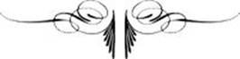{.calibre10} CAHIER COMPLÉMENTAIRE]{.calibre2} À HISTOIRE D'UN CRIME]{.calibre_55} {#filepos38774224 .calibre_}

:::::: calibre_20
::::: calibre_3
::: calibre_16

------------------------------------------------------------------------

::: calibre_16

:::::
::::::

[(1877-1878)]{.calibre_3}

[Victor Hugo]{.calibre_10}

[[HISTOIRE
]{.bold}]{.calibre_21}

:::::: calibre_22
::::: calibre_21
[ ]{.bold}

::: calibre_16

------------------------------------------------------------------------

::: calibre_16

:::::
::::::

[
Pour toutes demandes ou suggestions]{.calibre_3}

## [[[]{.calibre2}[]{.calibre2}[]{.calibre2}[]{.calibre2}[]{.calibre2}[Table des matières]{.calibre2}]{.bold1}]{.calibre_24} {#calibre_pb_5943 .calibre_57}

::: calibre_52

[]{.calibre_10}

> [[[[[Avertissement]{.calibre9}]{.underline}]{.calibre_4}](index_split_4857.html#filepos38789989)]{.calibre_10}

> [[[[[I -- Notes de V. Hugo]{.calibre9}]{.underline}]{.calibre_4}](index_split_4859.html#filepos38790773)]{.calibre_10}

> [[[[[Marc Dufraisse]{.calibre16}]{.underline}]{.calibre_4}](index_split_4860.html#filepos38791232)]{.calibre_10}

> [[[[[Joly]{.calibre16}]{.underline}]{.calibre_4}](index_split_4861.html#filepos38798180)]{.calibre_10}

> [[[[[Amable Lemaître (Journées de décembre)]{.calibre16}]{.underline}]{.calibre_4}](index_split_4862.html#filepos38805791)]{.calibre_10}

> [[[[[Le général Cavaignac]{.calibre16}]{.underline}]{.calibre_4}](index_split_4863.html#filepos38820260)]{.calibre_10}

> [[[[[Le général Changarnier]{.calibre16}]{.underline}]{.calibre_4}](index_split_4864.html#filepos38822349)]{.calibre_10}

> [[[[[Le général Bedeau]{.calibre16}]{.underline}]{.calibre_4}](index_split_4865.html#filepos38827722)]{.calibre_10}

> [[[[[Le colonel Charras]{.calibre16}]{.underline}]{.calibre_4}](index_split_4866.html#filepos38847864)]{.calibre_10}

> [[[[[Nadaud]{.calibre16}]{.underline}]{.calibre_4}](index_split_4867.html#filepos38868378)]{.calibre_10}

> [[[[[Joanny]{.calibre16}]{.underline}]{.calibre_4}](index_split_4868.html#filepos38885646)]{.calibre_10}

> [[[[[Chambolle]{.calibre16}]{.underline}]{.calibre_4}](index_split_4869.html#filepos38895356)]{.calibre_10}

> [[[[[Benoît]{.calibre16}]{.underline}]{.calibre_4}](index_split_4870.html#filepos38897749)]{.calibre_10}

> [[[[[Aubry (du Nord)]{.calibre16}]{.underline}]{.calibre_4}](index_split_4871.html#filepos38912377)]{.calibre_10}

> [[[[[Barricades dans le]{.calibre16} [V^e^]{.calibre16} [arrondissement]{.calibre16}]{.underline}]{.calibre_4}](index_split_4872.html#filepos38918012)]{.calibre_10}

> [[[[[Barbier (Affaire de la chapelle Saint-Denis)]{.calibre16}]{.underline}]{.calibre_4}](index_split_4873.html#filepos38922686)]{.calibre_10}

> [[[[[Baze]{.calibre16}]{.underline}]{.calibre_4}](index_split_4874.html#filepos38937723)]{.calibre_10}

> [[[[[Le général Lamoricière]{.calibre16}]{.underline}]{.calibre_4}](index_split_4875.html#filepos38943259)]{.calibre_10}

> [[[[[Marc Dufraisse]{.calibre16}]{.underline}]{.calibre_4}](index_split_4876.html#filepos38967920)]{.calibre_10}

> [[[[[Arsène Meunier]{.calibre16}]{.underline}]{.calibre_4}](index_split_4877.html#filepos38973324)]{.calibre_10}

> [[[[[Amable Lemaître (Casemates)]{.calibre16}]{.underline}]{.calibre_4}](index_split_4878.html#filepos38981317)]{.calibre_10}

> [[[[[Victor Schoelcher]{.calibre16}]{.underline}]{.calibre_4}](index_split_4879.html#filepos38994749)]{.calibre_10}

> [[[[[Michel (de Bourges)]{.calibre16}]{.underline}]{.calibre_4}](index_split_4880.html#filepos39009852)]{.calibre_10}

> [[[[[Police belge]{.calibre16}]{.underline}]{.calibre_4}](index_split_4881.html#filepos39010887)]{.calibre_10}

> [[[[[Caillaud]{.calibre16}]{.underline}]{.calibre_4}](index_split_4882.html#filepos39012880)]{.calibre_10}

> [[[[[Amable Lemaître (Pontons.)]{.calibre16}]{.underline}]{.calibre_4}](index_split_4883.html#filepos39025874)]{.calibre_10}

> [[[[[Chapitre des pontons]{.calibre16}]{.underline}]{.calibre_4}](index_split_4884.html#filepos39070815)]{.calibre_10}

> [[[[[Victor Hugo]{.calibre16}]{.underline}]{.calibre_4}](index_split_4885.html#filepos39071756)]{.calibre_10}

> [[[[[II -- Pièces justificatives]{.calibre9}]{.underline}]{.calibre_4}](index_split_4886.html#filepos39080957)]{.calibre_10}

> [[[[[Versigny]{.calibre16}]{.underline}]{.calibre_4}](index_split_4887.html#filepos39086608)]{.calibre_10}

> [[[[[Madier de Montjau]{.calibre16}]{.underline}]{.calibre_4}](index_split_4888.html#filepos39109854)]{.calibre_10}

> [[[[[Caylus]{.calibre16}]{.underline}]{.calibre_4}](index_split_4889.html#filepos39134538)]{.calibre_10}

> [[[[[Nadaud]{.calibre16}]{.underline}]{.calibre_4}](index_split_4890.html#filepos39143546)]{.calibre_10}

> [[[[[Esquiros]{.calibre16}]{.underline}]{.calibre_4}](index_split_4891.html#filepos39173525)]{.calibre_10}

> [[[[[Agricol Perdiguier]{.calibre16}]{.underline}]{.calibre_4}](index_split_4892.html#filepos39182108)]{.calibre_10}

> [[[[[Journal d'un socialiste]{.calibre16}]{.underline}]{.calibre_4}](index_split_4893.html#filepos39186116)]{.calibre_10}

> [[[[[Charles Hugo]{.calibre16}]{.underline}]{.calibre_4}](index_split_4894.html#filepos39200317)]{.calibre_10}

> [[[[[Victor Frond]{.calibre16}]{.underline}]{.calibre_4}](index_split_4895.html#filepos39218738)]{.calibre_10}

> [[[[[Chez Victor Schoelcher]{.calibre16}]{.underline}]{.calibre_4}](index_split_4896.html#filepos39236272)]{.calibre_10}

> [[[[[Lorin]{.calibre16}]{.underline}]{.calibre_4}](index_split_4897.html#filepos39246278)]{.calibre_10}

> [[[[[Mme Victor Hugo]{.calibre16}]{.underline}]{.calibre_4}](index_split_4898.html#filepos39248576)]{.calibre_10}

> [[[[[Mme Bouclier]{.calibre16}]{.underline}]{.calibre_4}](index_split_4899.html#filepos39257141)]{.calibre_10}

> [[[[[Jules Bastide]{.calibre16}]{.underline}]{.calibre_4}](index_split_4900.html#filepos39259509)]{.calibre_10}

> [[[[[Scipion Dumas]{.calibre16}]{.underline}]{.calibre_4}](index_split_4901.html#filepos39263081)]{.calibre_10}

> [[[[[Gaston Dussoubs]{.calibre16}]{.underline}]{.calibre_4}](index_split_4902.html#filepos39271149)]{.calibre_10}

> [[[[[Préveraud]{.calibre16}]{.underline}]{.calibre_4}](index_split_4903.html#filepos39274316)]{.calibre_10}

> [[[[[Évènement de décembre 1851, à Metz]{.calibre16}]{.underline}]{.calibre_4}](index_split_4904.html#filepos39284276)]{.calibre_10}

> [[[[[Michot Boutet]{.calibre16}]{.underline}]{.calibre_4}](index_split_4905.html#filepos39294122)]{.calibre_10}

> [[[[[Les transportés]{.calibre16}]{.underline}]{.calibre_4}](index_split_4906.html#filepos39326168)]{.calibre_10}

> [[[[[Albert Castelnau]{.calibre16}]{.underline}]{.calibre_4}](index_split_4907.html#filepos39326811)]{.calibre_10}

> [[[[[Curet]{.calibre16}]{.underline}]{.calibre_4}](index_split_4908.html#filepos39337468)]{.calibre_10}

> [[[[[Auguste Claverie]{.calibre16}]{.underline}]{.calibre_4}](index_split_4909.html#filepos39353259)]{.calibre_10}

> [[[[[Amable Lemaître (Déclaration)]{.calibre16}]{.underline}]{.calibre_4}](index_split_4910.html#filepos39376295)]{.calibre_10}

> [[[[[Jules Miot.]{.calibre16}]{.underline}]{.calibre_4}](index_split_4911.html#filepos39381583)]{.calibre_10}

> [[[[[Évasion d'Afrique des citoyens Fillon, Crubailhes et Frond]{.calibre16}]{.underline}]{.calibre_4}](index_split_4912.html#filepos39386220)]{.calibre_10}

## [[[]{.calibre2}[]{.calibre2}[]{.calibre2}[]{.calibre2}[]{.calibre2}[]{.calibre2}[]{.calibre2}[Avertissement]{.calibre2}]{.bold1}]{.calibre_24} {#calibre_pb_5945 .calibre_57}

::: calibre_52

[ ]{.calibre4}

[Les notes de victor Hugo qui suivent ont été achevées d'imprimer le 31 août 1907 par l'Imprimerie Nationale pour la société d'Éditions Littéraires et Artistiques Paul Ollendorff]{.calibre4}

[!{.calibre3}
]{.calibre4}

## [[[]{.calibre2}[]{.calibre2}[]{.calibre2}[]{.calibre2}[]{.calibre2}[]{.calibre2}[]{.calibre2}[I -- Notes de V. Hugo]{.calibre2}]{.bold1}]{.calibre_24} {#calibre_pb_5948 .calibre_57}

::: calibre_52

[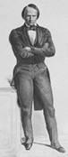{.calibre3}]{.calibre_3}

[[
]{.calibre_7}]{.bold}

### [[[]{.calibre2}[]{.calibre2}[]{.calibre2}[]{.calibre2}[]{.calibre2}[]{.calibre2}[Marc Dufraisse]{.calibre2}[[[[[[^\[88\]^]{.bold1}]{.calibre_43}]{.calibre2}]{.underline1}]{.calibre_42}](index_split_4933.html#filepos40197272){#filepos38791487 .calibre2}]{.bold1}]{.calibre_39} {#marc-dufraisse88 .calibre_38}

[ ]{.calibre4}

[COMMISSION DE RESPONSABILITÉ]{.calibre_10}

[ ]{.calibre4}

[Marc Dufraisse parle vivement contre Bonaparte --- regrettait de n'avoir encore attaque que des princes proscrits, voulait attaquer ce prince debout. --- Michel, Crémieux, Duprat, y combattaient la majorité. --- Marc Dufraisse ne demandait qu'à hâter ce travail afin de pouvoir empoigner le Bonaparte le plus tôt possible. --- De là des confidences de la droite à Marc Dufraisse. Jules de Lasteyrie disait : Nous sommes perdus. L'armée nous discute. Marc Dufraisse lui dit : Voulez-vous nous entendre ? Voulez-vous que nous conspirions ensemble ? Laissez-là les légitimistes et faisons front tous à L. B.]{.calibre4}

[Il est trop tard, dit Lasteyrie. C'est fini, l'Assemblée est morte. --- Ce n'est pas une loi qu'il faut faire, disait Marc Dufraisse, c'est un instrument de guerre. C'est un canon. --- Berryer et Janvier (ce petit drôle, dit Dufraisse) mettaient des bâtons dans les roues.]{.calibre4}

[En outre le petit commerce de Paris envoyait aux représentants des députations pour les prier de ne pas pousser ce débat orageux et laisser passer le jour de l'an.]{.calibre4}

[ ]{.calibre4}

[[Lundi soir [1]{.calibre_63}^[[e]{.calibre_63}]{.calibre18}[[r]{.calibre_63}]{.calibre18}^ décembre.]{.italic}]{.calibre_26}

::: calibre_27

[J. de Lasteyrie et C\... de Leyval disent à Marc Dufraisse : Vous avez raison de presser le vote de la loi de responsabilité, soyez ici demain à midi. Il y a danger.]{.calibre4}

[ ]{.calibre4}

[[Mardi 2.]{.italic}]{.calibre_26}

::: calibre_27

[Marc Dufraisse demeurait faubourg Saint-Marceau, rue Copeau, 17. A toujours demeuré près des prisons. Y allait souvent à deux fins, dit-il, cela m'a bien servi.]{.calibre4}

[Le 2 il apprend le coup d'Etat, sort de chez lui, et voit afficher au coin de la rue Maître-Albert et de la place Maubert. --- Groupes. --- L'afficheur explique ses pancartes. Il colle d'abord la proclamation au peuple français, puis celle à l'armée. --- Un individu pendant ce temps-là disait : --- Ah ! ça, c'est la blague. --- Vient la bonne. --- En ce moment l'afficheur collait le décret de dissolution. Les 5 ou 6,000 coquins étaient 5 ou 6,000 claqueurs.]{.calibre4}

[Rue des Anglais, un autre groupe devant les affiches. --- Indifférence. --- La préfecture de police, aspect désert. --- Deux ou trois factionnaires sur le quai. --- Jusqu'à la rue du Bac, pas de troupes. (A 8 h. 1/2 du matin.) Quelques chasseurs de Vincennes en vedette. Gardaient en riant le trottoir du pont Royal du côté de l'Assemblée. Devant la grille, ni troupes, ni peuple.]{.calibre4}

[ ]{.calibre4}

[Attendu le 2 dans le IVème arrondissement rue du Mail. Pendant que la proposition des questeurs était à l'état d'étude, Baze prenait souvent à part Marc Dufraisse, et lui communiquait les rapports du commissaire de police de l'Assemblée, M. Brun. --- On y voyait à nu le travail de Bonaparte dans la population et dans l'armée, le terrain gagné par Bonaparte et perdu par l'Assemblée, l'armée se groupant de plus en plus autour de Bonaparte, le peuple s'écartant de plus en plus de l'Assemblée. --- Baze disait avoir la preuve que les embauchements bonapartistes s'organisaient à Paris sur une vaste échelle dans deux bureaux\..., l'un à l'Elysée, l'autre à l'hôtel Castellane. --- Les questeurs voulaient\... que Dupin exerçât ce droit, mit en réquisition un colonel, qui refuserait. --- De là saisir l'Assemblée. --- Dupin s'y est toujours refusé. --- Baze a conté la chose à Marc Dufraisse et à Teilhard-Latérisse.]{.calibre4}

[Jules de Lasteyrie dit un jour à Marc Dufraisse (un nom [brûlé]{.italic} comme le mien) : Nous cédons aux démarches des officiers de l'armée qui sont avec nous, soit avec nous orléanistes, soit avec vous républicains, qui nous demandent à mains jointes de faire cesser leur anxiété et de faire décider la question. --- Lamoricière a dit à Marc Dufraisse que la droite l'avait conjuré de se laisser nommer commandant de l'armée ou président de l'Assemblée. --- Lamoricière répondait : Vous ne pouvez résister à Bonaparte que sur le terrain,\... de la Constitution, mais encore de la République. Il faut choisir un général qui soit une affirmation pure et simple de la République. Ce général n'est pas moi. --- Indiquant ainsi Cavaignac. --- Cavaignac a dit devant Marc Dufraisse au général Laidet : Mon Dieu, général, vous aviez peur de la dictature Changarnier. Je puis vous donner l'assurance que l'Assemblée était plus près du colonel Charras que de Changarnier.]{.calibre4}

[[
]{.calibre_7}]{.bold}

### [[[]{.calibre2}[]{.calibre2}[]{.calibre2}[]{.calibre2}[]{.calibre2}[]{.calibre2}[Joly]{.calibre2}]{.bold1}]{.calibre_39} {#joly .calibre_38}

[ ]{.calibre4}

[Joly était préoccupé du coup d'État. Se défiait --- comparait les faits et les rapprochait. Deux circonstances insignifiantes en apparence achèvent de l'éclairer.]{.calibre4}

[Le 29 (vendredi) est accosté par un capitaine de garde nationale appelé Gerestal, avoué, de garde à l'Assemblée, qui lui dit : --- Dans quelques jours, vous allez être expulsés d'ici. Vous trouverez les portes fermées et des coups de crosse. Et l'appel au peuple affiché sur les murs. --- Testelin passait. Joly l'appelle et lui dit : Ecoutez. --- Testelin dit : C'est grave. --- D'autres : C'est impossible.]{.calibre4}

[Deuxième circonstance.]{.calibre4}

[Joly avait un rendez-vous d'affaire avec Charamaule. Il y va le lundi premier. Trouve sa femme, femme [supérieure]{.italic} qui l'a inspiré dans ces journées. Mme Charamaule connaissait un nommé Cazelles, ancien constituant, et bonapartiste. --- Aujourd'hui inspecteur général de police à Lille. --- Joly lui demande : Voyez-vous Cazelles ? --- Elle répond : Presque plus. La dernière fois il nous a dit : Vous aurez l'empire et l'empereur, et vous serez heureux de les avoir.]{.calibre4}

[Joly va à la séance. Ses collègues le voient préoccupé. Il leur dit : C'est pour bientôt. --- Il apprend qu'à la demande de Savoye, Mathieu (de la Drôme) a convoqué la montagne pour le soir. Il y va. Arrive tard. Savoye avait parlé trois quarts d'heure pour dire qu'il fallait faire l'éducation du peuple. --- Que parlez-vous d'instruire le peuple ? dit Joly. Il vous faut des années, des mois, six mois\* vous n'avez pas quatre jours. --- Exclamations. --- Joly insiste. --- Mathieu réplique, et dit : Joly, vous rêvez. Pas de soldats. Pas un caporal pour L. B. --- La montagne est pour Mathieu. Cassai se lève et dit : J'appuie Joly. Il a raison. Il dit : Vous n'avez pas quatre jours, je dis : Vous n'avez pas quatre heures. --- Exclamations. --- Il poursuit : J'ai rendu service à un ouvrier décembriste, il est venu chez moi ce soir, il m'a pris les mains, a pleuré, et m'a dit : M. Cassai, ne couchez pas chez vous cette nuit. On fait le coup. --- Vives discussions. --- Mathieu prouve en trois quarts d'heure que c'est impossible --- qu'on s'est déjà moqué d'eux pour avoir cru cela. --- Amédée Bruys qui avait été de l'expédition nocturne du 16 novembre avec Thiers et Baze, et dont on avait ri, ne voulant pas être ridicule une seconde fois, prend son chapeau et s'en va. --- Cassai vient à Joly et lui dit : On se moque de nous. Je suis ébranlé. Ma foi, je vais aller coucher chez moi. --- Eh bien, non, non ! dit Joly. Vous avez vu l'ouvrier décembriste. Je ne l'ai pas vu. Je crois au coup. --- On se sépare. Il était 11 h. 1/2. --- Un cabriolet à la questure, on empêchait la chose.]{.calibre4}

[Joly monte au cercle de la rue Richelieu, 21. Presque personne. Bruys y était. --- Quoi de nouveau, Joly ? --- Le coup pour cette nuit. --- On rit Pas possible. --- Vous fumez, vous jouez, dit Joly. Eh bien, venez avec moi, faisons patrouille, et si nous trouvons quelque chose, nous irons à la questure. Bruys refuse, Duputz accepte, trois ou quatre autres, ils sont six. Se séparent en deux escouades, l'une par la rue Saint-Honoré, l'autre par les Champs-Elysées, pour cerner et scruter l'Elysée. Ils restent là tournant jusqu'à 3 heures. --- Ne voient rien. --- Ne se rejoignent pas. --- Il y avait avec Joly l'avocat Bouillaud, l'ancien chargé d'affaires de Bruet, Guillemot ; avec Duputz, Amable Lemaître et Féron, rédacteur d'un journal des départements. Ils prêtent l'oreille pour voir s'ils n'entendent pas venir la cavalerie. Bouillaud croit entendre rouler de l'artillerie. C'étaient les maraîchers qui allaient à la halle. --- Vont au quai d'Orsay. --- Personne. --- Il était 3 h. 1/2 du matin. --- Ce ne sera pas pour cette nuit. --- Joly va coucher chez lui. --- A [6]{.italic} h. 1/2 sa concierge le réveille, et lui dit : --- Monsieur, levez-vous. On vient d'arrêter le général Bedeau ici à côté. --- Joly demeurait 51, rue de Verneuil.]{.calibre4}

[Joly dans la nuit du 17 avait fait la même patrouille avec Bruckner. Il avait trouvé l'Elysée [absolument la même chose]{.italic}. De la lumière à telle croisée, la même croisée éclairée. --- Personne n'entrant ni ne sortant. Rien. --- Tout fermé. --- Dans leurs marches et contremarches au coin du carré Marigny, Joly souffrant de sa jambe cassée et du grand froid reste en arrière. Ceux en avant voient deux ou trois ombres, et entendent ouvrir la grille. Joly entendit un bruit de clefs. Ils dirent : C'est la garde qu'on relève. Sans faire attention qu'on relève la garde du dedans et sans ouvrir la porte. C'était L. B. qui sortait avec Fleury.]{.calibre4}

[Il paraît que L. B. craignant l'avortement et qu'on ne vînt le prendre à l'Elysée, est sorti à 3 h. du matin et s'est allé cacher --- on ne sait où --- jusqu'à 10 heures, après l'arrestation des généraux. (C'est un agent de police qui a dit ce fait à Isidore Buvignier, duquel je le tiens.) Duputz raconte qu'il a été au pied de l'obélisque (lieu de repère indiqué), qu'il y a trouvé quatre officiers. --- Ah ! vous voilà ! c'est vous !, --- Vous vous trompez, --- a dit Duputz. Il ajoute que n'ayant pas trouvé Joly et étant convenus conditionnellement que si on voyait quelque chose on avertirait les questeurs, il y était allé, n'avait pu trouver la porte, ou la sonnette, et s'en était allé (peu probable). --- A la caserne du quai d'Orsay à 3 h. 1/2 du matin, tout était comme à l'ordinaire. Il n'y avait pas une fenêtre éclairée.]{.calibre4}

[[
]{.calibre_7}]{.bold}

### [[[]{.calibre2}[]{.calibre2}[]{.calibre2}[]{.calibre2}[]{.calibre2}[]{.calibre2}[Amable Lemaître (Journées de décembre)]{.calibre2}]{.bold1}]{.calibre_39} {#amable-lemaître-journées-de-décembre .calibre_38}

[ ]{.calibre4}

[Lemaître fit [la nuit du 2]{.italic} [décembre]{.italic}, sur l'éveil donne par Joly, la promenade nocturne avec Duputz et un médecin nommé Schwartz. Partent ensemble de la rue Richelieu, vont ensemble jusqu'à la place de la Concorde. A la place de la Concorde se séparent, Joly et les siens par les Champs-Elysées, Lemaître, etc., par le faubourg. Duputz les quitte et passe le pont pour aller voir. Par la rue Saint-Honoré, l'Elysée avait l'aspect ordinaire. Il faisait très froid. Ils avaient marché lentement : --- Rentrons, dit Lemaître. --- Ils convinrent de passer en rentrant par devant certains commissariats de police afin de voir si l'on bougeait. Vont d'abord place de la Concorde, au rendez-vous à l'obélisque. Les autres n'y étaient pas. Ils s'en allèrent, Lemaître et Schwartz, sans revoir les autres. Lemaître demeure rue des Vieux-Augustins, 13. --- Avant de rentrer va voir l'Imprimerie nationale. Agitation. Doubles factionnaires. Fenêtres éclairées, grande porte fermée. Petite porte entrebâillée par laquelle il aperçoit de la troupe en armes dans la cour. Le factionnaire dit : Au large. --- Je veux voir l'heure, dit Lemaître. --- Au large, reprit le soldat. --- Lemaître rentre chez lui, a l'idée de prévenir Vasbenter, rue Coq-Héron, 5, chez Boulé. Se trompe, et tout rêvant rentre machinalement chez lui par la rue Coquillière. Un peu plus tard Vasbenter était arrêté. --- Vasbenter de même que Mayer se croit compromis dans quelque chose et ne songe pas au coup d'Etat. Toutes les imprimeries envahies, dès huit heures du matin.]{.calibre4}

[ ]{.calibre4}

[[2 décembre.]{.italic}]{.calibre_26}

::: calibre_27

[Était dans le quartier commercial qui avoisine la Banque. --- On lui disait : Que les socialistes se lèvent, nous marchands, nous serons avec eux. Tout plutôt que cet homme-là ! --- Rue Montmartre, vis-à-vis le passage des Panoramas, vers 10 h. du matin, il rencontre un général en grand uniforme, le général d'artillerie en retraite (Dolcy) ? Il lui dit qu'il allait à l'Élysée. (Il logeait maison Sallandrouze.) --- A. Lemaître lui dit : Mettez-vous A la tête du peuple, général. --- On l'entoura. Il dit qu'il consentait. La foule, étudiants en médecine, ouvriers, dit : C'est bon, mais il faut qu'il crie : Vive la République ! Il crie. Il faut qu'il crie : A bas le président ! à bas le tyran ! Il cria tout ce qu'on voulut. On le mena sur le boulevard. Un d'eux dit : Il faut le faire passer pour Bedeau. On voulut qu'il se décoiffât en criant. Résistance du vieux général commence là. Un piquet d'infanterie charge et disperse. Le général est entré dans la boutique d'une modiste et s'y est trouvé mal.]{.calibre4}

[Tout le quartier commerçant ne demandait pas mieux (le 2) que de s'allier au peuple. (A. Lemaître me donnera le texte de la convocation d'Hovyn, lieutenant-colonel, et la [protestation des journalistes,]{.italic} plus quelques autres pièces.)]{.calibre4}

[Au faubourg Saint-Martin, à la formation de la barricade du Vème arrondissement, on appelle le peuple aux armes. Des enfants seuls répondent et commencent la barricade. On lâche pied à l'arrivée de la troupe et on se réfugie dans la mairie. La gendarmerie mobile entre et arrête environ 15 enfants de 14 à 17 ans, et [au-dessous.]{.italic} Envoyés dans les casemates et plus tard déportés. Ces enfants furent interrogés par les mêmes juges d'instruction que les hommes. Les juges d'instruction les faisaient changer fréquemment de casemates et leur demandaient : As-tu vu dans telle casemate des hommes ayant été dans les barricades ? Ils leur promettaient la liberté. Leur faisaient donner des [vivres gras.]{.italic} --- Pas un n'a trahi. --- [Nous sommes des gamins, non des mouchards,]{.italic} dit l'un d'eux, le petit Ollivier, 14 ans moins 3 mois. Il avait encore sous le bras son petit cahier. Il était élève à l'école de dessin. Se meurt d'une phtisie à l'hôpital de Brest où il est soigné par l'excellent docteur Quesnel. Un autre petit nommé Malherbe répondit (il avait un sabre) : --- Qui t'a donné ce sabre ? --- Un bon citoyen. --- T'en es-tu servi ? --- Non, je n'ai pu. --- Voulais-tu t'en servir ? --- Oui. --- Pourquoi ? --- Pour tuer celui qui a tué la liberté. --- Le petit, Guerbois, ouvrier peintre, arrêté sur des dénonciations, commérages, répondit : Je n'ai rien fait, mon patron m'a empêché. Mais si j'avais pu[, j'aurais travaillé.]{.italic} --- Au dépôt de la préfecture, enfants mêlés aux voleurs. Guerbois reçoit une lettre de sa mère, et pleure. --- Pourquoi pleures-tu ? Parce que tu es ici ? --- Non, parce que ma mère est pauvre. --- Le petit Malherbe, en montant en voiture cellulaire pour aller dans une maison de correction, cria : Vive la République démocratique et sociale ! Tous les 15 crièrent.]{.calibre4}

[La police avait joué un grand rôle dans l'affaissement de la population. Des hôtels garnis du quartier de la rotonde du Temple reçurent de l'argent pour nourrir et loger les ouvriers. Un franc par homme. Un de ces hôtels, où il y avait 75 individus, a reçu le subside pendant 3 jours. Sur les 75, on en a arrêté 40. Ceux-là, dans les casemates, ont conté le fait.]{.calibre4}

[ ]{.calibre4}

[[3 décembre.]{.italic}]{.calibre_26}

::: calibre_27

[Un peu avant la barricade, Amable Lemaître arriva vers 8 h du matin dans le faubourg. Ils rencontrent Hingray place de la Bastille. Qu'y a-t-il ? Calme. Ils l'abandonnent. Deux soldats leur ordonnent de se retirer. Mais nous ne sommes que trois, dit Lemaître. Les soldats polis Retirez-vous, c'est la consigne. Il y avait des officiers vaguant. Ils vont se placer au milieu des officiers. On leur envoya de nouveau deux soldats. Toujours poliment, et avec le mot Citoyens. Lemaître s'adresse aux officiers. Ils disent C'est la consigne en effet. Quel rôle dit Lemaître. Un lieutenant dit Tenez, nous souffrons. Ne discutons pas. Hingray rentre dans Paris et Lemaître dans le faubourg. Au café Roysin, s'appelant alors Café du peuple. Belin (de la Drôme) y était, et Jules Leroux, ainsi qu'Esquiros. Salle longue et étroite, deux rangs de tables. Une porte bâtarde. Une avant-cour où l'on pouvait mettre un piquet. C'est un coupe-gorge, dit Lemaître. Nomment Amable Lemaître avec Cournet et de Flotte. Arrivèrent un officier d'état-major et un estafier qui furent attaqués par de Flotte et Barbaste, et un M. de Brumion à cheval, demeurant rue de la Sourdière, qui fut arrêté par Lemaître. Où allez-vous ? Je vais me promener à Vincennes. C'est étrange, un pareil jour. Il demanda un laissez-passer à Lemaître qui le lui signa : Le représentant du peuple et un nom quelconque. On conduisit le cheval à Schoelcher qui le refusa.]{.calibre4}

[Schoelcher et quelques autres ne voulaient pas de barricades. Ils voulaient descendre le faubourg, aborder sans armes la troupe et la haranguer. Ne pas combattre. Cournet partageait cet avis. On désarma, outre les deux postes, un piquet d'infanterie commandé par un caporal, 8 hommes, une patrouille qui passait, venant faire une reconnaissance. Les soldats disaient qu'ils allaient passer en conseil de guerre et demandaient qu'on les violentât. Le caporal, en se défendant, se foula le pied et en fut content. Le peuple blâma la construction de la barricade, disant qu'on allait attirer sur le faubourg toutes sortes de malheurs. (Était-ce le peuple ?) La barricade faite, quelques-uns descendent vers la Bastille. Un officier porte-drapeau approcha assez près pour voir faire la barricade. Que faites-vous là ? lui dit Lemaître. Lemaître dit Arrêtez-le. L'officier tira un pistolet de sa poche, mais Cournet lui retint le bras et l'empêcha de faire feu. Trois hommes ont été plus tard arrêtés pour ce fait, nommés Gacher (Quintien) d'Aigueperse, ébéniste, Neveu (Henri), ébéniste, Neveu fils (Eugène), ébéniste, tous trois du faubourg, tous trois transportés en Afrique à l'heure qu'il est, quoiqu'ils aient établi leur alibi. On a lâché l'officier. C'est lui qui a ramené la troupe.]{.calibre4}

[Baudin est tombé à gauche (en montant vers la barrière) de la barricade. Les chevaux étaient encore débridés dans les rues voisines. Cournet avait défendu de tirer. Le feu partit pourtant de la barricade. Les uns dans les jantes des charrettes[[[[^\[89\]^]{.calibre_21}]{.underline}]{.calibre_4}](index_split_4933.html#filepos40200420){#filepos38816741}, les autres sous les charrettes, les autres sur les charrettes. Outre Baudin, deux ou trois hommes furent tués, dit-on, entre autres un nommé Ruin (à vérifier). En sortant de la barricade, ils veulent recommencer une autre barricade à l'intersection des rues Sainte-Marguerite et Charonne. Là des décembristes qui s'opposent. Si vous êtes des représentants, à la bonne heure ! mais vous êtes peut-être des hommes de police. Les représentants sont nos chefs naturels. Ils redescendent, et sur les boulevards rencontrent les représentants qui, fidèles à l'heure indiquée, arrivaient en grand nombre. A. Lemaître conte la chose à Racouchot. (Doutre a été blessé à la main d'un coup de sabre. Ne pas oublier ce fait.) Le 3 au soir, Beslay va avec mes proclamations à l'association des ferblantiers qui était derrière la porte Saint-Martin. Personne. Pas une lumière dans la maison. S'en aller 7 Non. Lemaître siffla. Fit le roulement des peintres. Une fenêtre s'ouvrit. Lemaître cria Marianne, descendez (nom de la République). Qu'est-ce que Marianne dit Beslay. Attendez, dit Lemaître. Deux ouvriers qui avaient passé la nuit là descendirent, et prirent des proclamations. Mais se battront-ils ? Question.]{.calibre4}

[ ]{.calibre4}

[Aspect des bivouacs [la nuit du 4 au 5[.]{.bold}]{.italic}]{.calibre4}

[Au carré Saint-Martin, grands feux, les soldats, ivres, dansaient des farandoles avec des filles publiques, chantaient, tutoyaient les passants. Un dit à Lemaître Bonjour, mon vieux. Le marchand de vin (Ledouble, ne pas le nommer) de la rue Coquillière vendit 300 bouteilles de vin cacheté aux soldats qui gardaient la Banque. Feux de bivouac. Mangeaient charcuterie et pâtisserie cassaient les goulots des bouteilles, se roulaient dans la boue. On distribuait à chaque soldat Id francs (une petite pièce d'or) par jour. Au coin de la place du pont Saint-Michel les gardes municipaux buvaient du punch et du vin de Champagne, jetaient des pièces de cent sous sur les comptoirs. Vin chaud. Le matin, des dettes le sous-officier arrivait et payait en or. Au carré Saint-Martin un soldat offre à boire à Lemaître. (Minuit 1/2). Rue Sainte-Apolline, une vedette l'arrête, et lui offre à boire. Buvons un coup. Non. Le soldat lui montre un écu de 5 francs et lui dit Est-ce que tu crois que je n'ai pas d'argent ? Les uns lui disaient monsieur, les autres citoyen, les autres tu. Au Château-d'Eau, punch monstre. Cavalerie, infanterie. Les uns buvaient, les autres dansaient. Quand on se mettait aux fenêtres, on criait On va vous f\... des coups de fusil. Rue de Lancry, sapeurs du génie ivres, arrêtaient les passants et tiraient des coups de fusil au hasard. Dans les bivouacs que chantait-on ? La Marseillaise et Ça ira ! Au coin des rues des sentinelles.]{.calibre4}

[[
]{.calibre_7}]{.bold}

### [[[]{.calibre2}[]{.calibre2}[]{.calibre2}[]{.calibre2}[]{.calibre2}[]{.calibre2}[Le général Cavaignac]{.calibre2}]{.bold1}]{.calibre_39} {#le-général-cavaignac .calibre_38}

[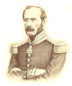{.calibre3}]{.calibre_10}

[Le lundi 1 décembre, l'Opéra-Comique donnait la première représentation du [Château de la Barbe-Bleue]{.italic} de M. Limnander. Cavaignac y était et, dans la loge voisine, Morhy. Morny avait déjà signé les décrets du coup d'État, et souriait à Cavaignac, qui deux heures après était arrêté.]{.calibre4}

[{.calibre3}]{.calibre_10}

[ ]{.calibre4}

[(Conté Par le général Le Flô.)]{.calibre4}

[Quand on arrêta Cavaignac (le 2 décembre), il entra en fureur. Il se tourna indigne et frappant du poing vers les agents. Il mêlait les jurons du soldat aux injonctions du général. Il dit au commissaire de police Souvenez-vous de ceci je puis, tout est possible, rentrer au pouvoir, qui sait ? Eh bien si je rentre au pouvoir demain, après-demain je vous fais guillotiner. Le commissaire pâlit. Mais, général, vous n'êtes pas sanguinaire. Cavaignac regarda l'homme fixement et lui dit avec un calme subit, plus effrayant que sa colère « [Je sens que je le deviens.]{.italic} ».[[[[^\[90\]^]{.calibre_21}]{.underline}]{.calibre_4}](index_split_4933.html#filepos40200770){#filepos38822130}]{.calibre4}

[[
]{.calibre_7}]{.bold}

### [[[]{.calibre2}[]{.calibre2}[]{.calibre2}[]{.calibre2}[]{.calibre2}[]{.calibre2}[Le général Changarnier]{.calibre2}[[[[[[^\[91\]^]{.bold1}]{.calibre_43}]{.calibre2}]{.underline1}]{.calibre_42}](index_split_4933.html#filepos40201110){#filepos38822626 .calibre2}]{.bold1}]{.calibre_39} {#le-général-changarnier91 .calibre_38}

[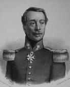{.calibre3}]{.calibre_10}

[[Changarnier]{.italic} --- rue du faubourg Saint-Honoré, 3 (Charras, no 14). On est venu chez lui vers 5 h. 1/2 du matin. On a sonné. Le portier n'a pas ouvert. L'appartement de Changarnier très modeste, trois petites pièces il disait quelquefois [Je suis logé comme un chef de bataillon]{.italic}. Un épicier est logé dans la maison, sa boutique a une porte sur la rue et une porte sur l'intérieur. Sa boutique était ouverte, les épiciers ouvrent de bonne heure dans ce quartier pour vendre le petit verre d'eau-de-vie aux gens qui vont à la halle. Voyant que le portier n'ouvrait pas, les gens de police se ruèrent par chez l'épicier, arrêtant tout le monde, épicier, sa femme et ses garçons. À ce bruit, la femme tira un cordon de sonnette qui sonnait dans la chambre du domestique unique du général, jeune homme de 20 ans, au même étage que le général. Le domestique réveillé en sursaut. On entre chez lui. Il crie, il veut avertir le général, bousculé, bourré, agents et sergents de ville, et le sieur Leras (Leras était commissaire de police de Ham quand L. Bonaparte s'en échappa. Il a reçu force faveurs depuis, et probablement avait aidé à l'évasion de Louis B.). Le général, éveillé par le bruit et les cris, saute en chemise à bas du lit. La porte s'ouvre, le commissaire entre suivi d'estafiers portant des bouts de bougie allumés. Le général étend la main sur sa table de nuit où il avait déposé depuis plusieurs jours une paire de pistolets, prend les pistolets, en met un sur la poitrine de Leras et lui dit Il est chargé, votre vie m'appartient. Leras recule, capitule, mouvement de recul dans les argousins. Leras exhibe son mandat, disant Nous n'en voulons pas à votre vie, mais que voulez-vous faire ? Vous êtes seul et nous sommes cent. Le général comprit l'inutilité de la résistance, s'habilla, prit quelques livres dans sa bibliothèque, notamment les Pensées de Pascal demanda à garder son domestique. Leras y consentit. Où me menez-vous ? Je ne puis vous le dire ici, je vous le dirai dans la voiture. Il insinua même qu'il pourrait, s'il le désirait, le mener à la préfecture s'expliquer avec Maupas. Geste de mépris de Changarnier. En montant en voiture, il vit qu'il était gardé par 50 gendarmes mobiles (1/2 compagnie) dont deux en faction à la porte cochère. (Charras les avait vus en passant). Changarnier fit sa toilette dans les moindres détails, mit sa perruque devant son miroir, il n'a pas depuis 20 ans un cheveu sur la tête, ne se pressa pas. C'est ce qui fit que Charras passa avant lui. La gendarmerie mobile avait été dévouée l'année d'avant à Changarnier. Leras se confondit en excuses envers Changarnier, se désolant d'être forcé d'arrêter un homme qu'il estimait et admirait. Nouveau geste de mépris du général.]{.calibre4}

[Cette nuit-là, un officier supérieur, dont le régiment était caserné près Paris, à 2 lieues, mais dehors, eut l'idée, quand ils eurent l'ordre de partir dans la nuit, à 2 h. du matin, et d'être à la pointe du jour dans un lieu désigné : --- que c'était [le coup d'État en question]{.italic}. Il monta à cheval, suivi d'une ordonnance, sous prétexte d'aller chercher deux officiers sous ses ordres qui couchaient à Paris, mais en réalité pour prévenir Changarnier. Arrivé place Louis XV, il laissa son cheval à son ordonnance, il était en bourgeois, et alla jusqu'à la porte du général. Il vit là deux individus qui avaient l'air de surveiller la porte et d'autres un peu plus loin. Il passa outre, rapidement, alla retrouver son cheval, et éveiller les deux officiers. En revenant, il revint à la porte de Changarnier, retrouva les mêmes individus et s'en alla, craignant de faire un esbroufe et se mettant à douter au dernier moment en présence de ce qui eût dû le confirmer. Ceci est humain.]{.calibre4}

[[
]{.calibre_7}]{.bold}

### [[[]{.calibre2}[]{.calibre2}[]{.calibre2}[]{.calibre2}[]{.calibre2}[]{.calibre2}[Le général Bedeau]{.calibre2}[[[[[[^\[92\]^]{.bold1}]{.calibre_43}]{.calibre2}]{.underline1}]{.calibre_42}](index_split_4933.html#filepos40203480){#filepos38827994 .calibre2}]{.bold1}]{.calibre_39} {#le-général-bedeau92 .calibre_38}

[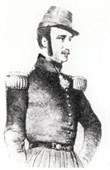{.calibre3}]{.calibre_10}

[Le général Bedeau était vice-président de l'Assemblée ; il demeurait rue de l'Université, n° 50.]{.calibre4}

[Dix jours environ avant le 2 décembre, son domestique, vieux soldat dévoué qui le servait depuis l'Afrique, remarqua un homme en blouse qui dès la nuit tombée se tenait debout dans la rue, à quelques pas de la porte du général, dans une encoignure d'où il semblait observer les allées et venues de la maison. Il remarqua cet homme un soir ; il le retrouva le lendemain, et le surlendemain il le retrouva encore. Il prévint le général. Quelques personnes de la maison interrogèrent cet homme. Il répondit qu'il guettait quelqu'un qui lui devait de l'argent. A d'autres questionneurs il répondit qu' « il flânait ».]{.calibre4}

[Cependant le portier informa le général que cet homme était venu un soir et lui avait demandé à quelles heures le général sortait, à quelles heures il rentrait, quelles étaient ses relations et ses habitudes, si ses domestiques étaient nombreux et à quel étage il demeurait.]{.calibre4}

[C'était le moment où personne ne croyait plus au coup d'État. Cependant, disait plus tard le général en racontant le fait, il devint clair pour moi que ce flâneur, c'était la police.]{.calibre4}

[Faire surveiller chez lui par un argousin un représentant du peuple, un officier général, un vice-président de l'Assemblée, cela ne pouvait venir que de gens qui mettent de la folie dans tous leurs actes ou qui ont, même avant l'heure, le cynisme inutile de leur crime le général, averti, prit soin de se retourner de temps en temps brusquement le soir dans la rue et reconnut qu'en effet cet homme le suivait.]{.calibre4}

[Il ne restait plus qu'à constater le fait et qu'à interpeller le gouvernement. Le général y était résolu. Le lundi [1]{.calibre_63}^[[e]{.calibre_63}]{.calibre18}[[r]{.calibre_63}]{.calibre18}^ décembre il parla de la chose à M. Drouyn de Huys et à M. Charles Abbatucci qui lui dirent tous deux Cela n'est pas possible.]{.calibre4}

[Quand les catastrophes approchent, certains hommes se réservent. Leur conscience semble se demander Quel profit pourrai-je tirer de ce crime ? L'obscurité du résultat rend attentifs et circonspects les lâches qui ne savent pas encore s'ils seront des traîtres. Si on leur montre l'attentat s'ébauchant, ils hochent la tête, ils prennent le parti de douter pour ne pas être forcés de s'indigner.]{.calibre4}

[Le lundi soir, après la séance, il faisait nuit, il pleuvait, le général rentrait chez lui enveloppé dans son paletot. Tout à coup il aperçut « le flâneur » à son poste à quelques pas de la porte et qui tâchait de disparaître dans un coin obscur.]{.calibre4}

[Il alla droit à cet homme et lui dit :]{.calibre4}

[--- Que faites-vous là ?]{.calibre4}

[--- J'attends quelqu'un.]{.calibre4}

[--- Qui ?]{.calibre4}

[--- Quelqu'un qui me doit de l'argent.]{.calibre4}

[--- Tenez, mon drôle, dit vivement le général, c'est de la police bête. Vous êtes un coquin, mais vous êtes un imbécile.]{.calibre4}

[L'homme ne répliqua pas. Preuve de plus. Le général était tenté de le saisir au collet, de le faire arrêter par le prochain poste et d'arriver ainsi à la constatation matérielle du fait. Mais le misérable avait l'air si mal à son aise qu'il en eut pitié.]{.calibre4}

[Quand il rentra chez lui, son concierge le prévint que cet homme était revenu dans la journée et avait fait de nouvelles questions.]{.calibre4}

[--- S'il reparaît encore ici, dit le général, prenez-le à la cravate, appelez mon domestique, ne lâchez pas l'homme, et faites-moi avertir.]{.calibre4}

[Il se coucha vers onze heures comme à son ordinaire et s'endormit paisiblement.]{.calibre4}

[Vers six heures du matin, son domestique, qui couchait près de l'antichambre, fut éveillé par une voix connue. C'était le concierge de la maison qui l'appelait de derrière la porte de l'appartement.]{.calibre4}

[Le domestique se leva, alluma une bougie, entrouvrit la porte et crut reconnaître quelqu'un qu'il voyait souvent venir chez son maître, M. Valette, secrétaire de la présidence de l'Assemblée.]{.calibre4}

[Il se hâta d'entrer dans la chambre du général pour lui annoncer que M. Valette demandait à lui parler.]{.calibre4}

[Il trouva le général sur son séant ce bruit de portes ouvertes de si grand matin l'avait réveillé.]{.calibre4}

[--- Qui est là ? demanda le général.]{.calibre4}

[--- M. Valette, répondit le domestique.]{.calibre4}

[Au même instant un homme se présenta. Cet homme, qui avait en effet quelque ressemblance avec M. Valette, était accompagné d'une espèce d'escouade qu'on entrevoyait derrière lui.]{.calibre4}

[--- Qu'est-ce que cela signifie ? Qui êtes-vous ? s'écria le général.]{.calibre4}

[L'homme entrouvrit son paletot et laissa voir une écharpe.]{.calibre4}

[Le général songea à l'espion de sa rue, au coup d'État prémédité, et comprit.]{.calibre4}

[--- Est-ce que vous oseriez venir pour m'arrêter ? dit-il.]{.calibre4}

[--- Oui, mon général.]{.calibre4}

[--- Qui êtes-vous, monsieur ?]{.calibre4}

[--- Je suis commissaire de police.]{.calibre4}

[--- Comment vous nommez-vous ?]{.calibre4}

[--- Hubaut jeune.]{.calibre4}

[Le général avait entendu parler en effet d'un commissaire de police de ce nom.]{.calibre4}

[--- Monsieur Hubaut, dit-il, savez-vous ce que vous faites ? Vous commettez un crime capital. Je suis représentant du peuple, je suis vice-président de l'Assemblée, je suis inviolable, savez-vous cela ?]{.calibre4}

[--- Oui, général, mais je sais aussi qu'il y a peut-être flagrant délit.]{.calibre4}

[--- Voilà une infâme dérision cria le général. Flagrant délit de quoi ? flagrant délit de sommeil !]{.calibre4}

[--- Général, je ne puis discuter avec vous.]{.calibre4}

[--- Mais enfin, reprit impétueusement le général, vous commissaire de police, ayant mission de déjouer les complots, vous servez un conspirateur vous magistrat, chargé de faire respecter les lois, vous les violez !]{.calibre4}

[--- Je ne puis discuter, général.]{.calibre4}

[--- Vous avez un mandat d'amener ?]{.calibre4}

[--- Oui, général.]{.calibre4}

[--- Montrez-le-moi.]{.calibre4}

[Le commissaire exhiba le mandat et le général y lut, ce qu'on lisait du reste sur tous les mandats, qu'il était « prévenu de complot contre la sûreté de l'État et de détention d'armes de guerre ».]{.calibre4}

[Le général fit un geste significatif.]{.calibre4}

[--- Détention d'armes de guerre. --- Signé MAUPAS.Fort bien.]{.calibre4}

[En ce moment le général crut non plus à un coup d'État dirigé contre la Constitution et la République, mais à un coup de police monté contre quelques hommes seulement, desquels il était.]{.calibre4}

[Le général connaissait l'aventure de Toulouse. Le 17 novembre même, le jour de la proposition des questeurs, on l'avait entendu la raconter dans un groupe à l'Assemblée. Il savait que le Maupas était le magistrat qui met lui-même chez les accusés les objets dont il a besoin pour les perdre. Misérable qui d'une main vous saisit au collet et de l'autre vous glisse la preuve du crime dans la poche.]{.calibre4}

[C'est ce genre de dextérité qui révoltait M. Léon Faucher et qui à attendri M. Bonaparte. À président parjure magistrat faussaire. Ce qui devait conduire M. Maupas au bagne l'a conduit à l'Élysée. Il peut étudier là les différences qui séparent la pourpre impériale de la pourpre de Toulon.]{.calibre4}

[Le général Bedeau dit froidement au commissaire de police : cette signature est un avertissement. Monsieur, veuillez mettre en ma présence les scellés sur tout ce qui est ici.]{.calibre4}

[Le commissaire s'y refusa, alléguant qu'il n'avait pas d'ordres pour cela. Il invita le général à s'habiller.]{.calibre4}

[Le général s'habilla très lentement. Il voulait laisser venir le matin. Il sentait que le jour serait un auxiliaire et que son arrestation serait plus malaisée quand il y aurait des passants dans la rue. Il se savait aimé dans le quartier. Quelques concierges des environs étaient d'anciens soldats.]{.calibre4}

[Plus il tardait, plus le commissaire le pressait. Il fallut finir pourtant.]{.calibre4}

[Quand il fut habillé : --- Général, dit le commissaire, partons vite.]{.calibre4}

[Le général s'adossa à la cheminée, mit les deux mains dans ses poches et dit avec calme : --- Je ne partirai pas.]{.calibre4}

[Les argousins étaient sortis de la chambre pendant que le général s'habillait le commissaire leur fit signe de rentrer.]{.calibre4}

[--- C'est bien, continua le général. C'est ce que je veux. Vous voilà tous. Vous commettrez votre crime tout entier. Je ne m'y prêterai pas. Ah c'est de la force que vous faites ! Messieurs, vous ferez de la violence. Je ne me laisserai pas emmener de mon plein gré. Je ne sortirai pas d'ici, je ne bougerai point. Ah ! moi, représentant du peuple, vous venez m'arrêter Eh bien ! vous m'empoignerez.]{.calibre4}

[Les argousins furent contraints de prendre le général au collet et de le saisir par les bras, et comme il ne marchait pas, de l'emporter.]{.calibre4}

[Quand il fut hors de la chambre, honteux d'eux-mêmes et tremblants de leur action, ils lui demandèrent grâce.]{.calibre4}

[--- Assez ! dirent-ils.]{.calibre4}

[--- Non cria le général. Je ne ferai point un pas.]{.calibre4}

[Ils le portèrent jusque dans la cour, puis jusque dans la rue.]{.calibre4}

[Pendant ce temps-là, le jour était venu. Quelques rares passants apparaissaient.]{.calibre4}

[Un fiacre était à la porte.]{.calibre4}

[--- Montez, général, dit le commissaire.]{.calibre4}

[Le général repoussa le commissaire et les agents et cria d'une voix tonnante Aux armes Aux armes on arrête les représentants ! on viole la Constitution ! je suis vice-président de l'Assemblée à moi aux armes !]{.calibre4}

[La haute et forte voix du général emplissait la rue, les passants stupéfaits s'arrêtaient, les fenêtres et les portes s'ouvraient, le général redoublait ses cris indignés et se débattait au milieu des agents. Un groupe ému commençait à se former autour de la voiture et grossissait.]{.calibre4}

[En ce moment deux escouades de sergents de ville, arrivant l'une par la rue de Poitiers, l'autre par la rue du Bac, débouchèrent au pas de course l'épée à la main.]{.calibre4}

[Les passants se dispersèrent.]{.calibre4}

[On porta le général dans la voiture, le commissaire et deux agents s'y placèrent avec lui, d'autres agents montèrent sur le siège et derrière, et l'on partit, les sergents de ville courant des deux côtés du fiacre, l'épée nue.]{.calibre4}

[Le général croyait encore à une simple machination de police. En entrant dans la voiture, le commissaire Hubaut jeune lui avait dit Calmez-vous, général. Quand vous serez dans le cabinet du préfet, vous vous expliquerez avec lui, et s'il y a malentendu, vous serez libre dans une demi-heure. Il croyait qu'on le menait à la préfecture de police.]{.calibre4}

[Arrivé au Pont-Neuf, il vit qu'on laissait la préfecture de côté.]{.calibre4}

[--- Où me conduisez-vous ? demanda-t-il.]{.calibre4}

[Le commissaire répondit : J'ai de nouveaux ordres.]{.calibre4}

[--- Je comprends, dit le général.]{.calibre4}

[Et il ne douta plus du coup d'État.]{.calibre4}

[On le mena à Mazas comme les autres.]{.calibre4}

[Quelques petits fiacres pareils au sien étaient arrêtés devant la porte. Un escadron de garde républicaine était rangé sous les murs de la prison.]{.calibre4}

[Le général descendit de voiture et pendant que les agents le poussaient devant eux, il cria :]{.calibre4}

[--- Soldats, regardez vos généraux traités comme des forçats !]{.calibre4}

[On craignit quelque émotion dans la troupe et l'on se hâta de refermer sur lui les portes de Mazas.]{.calibre4}

[Au greffe, la première personne qu'il aperçut, ce fut le général Cavaignac. Il l'embrassa. En se retournant, il vit quelqu'un au fond de la salle. C'était le général Changarnier.]{.calibre4}

[Les trois généraux échangèrent avec un serrement de main ce simple mot :]{.calibre4}

[--- Vous aussi !]{.calibre4}

[En montant aux galeries hautes de la prison, Bedeau aperçut un officier en grand uniforme qu'on poussait dans une cellule. C'était le général Le Flô.]{.calibre4}

[On mit le général Bedeau, comme Charras, dans une cellule double où il y avait un lit. Le général Lamoricière, arrivé le premier, avait eu une chambre à feu.]{.calibre4}

[En enfermant le général Bedeau, on lui dit : Vous êtes au secret.]{.calibre4}

[À une certaine heure, on posa sur la tablette scellée sous le guichet de sa porte une écuelle. C'était la nourriture des voleurs qu'on lui envoyait. Il jeta cela. On lui permit de faire venir du café. On lui refusa des plumes et du papier. Il demanda un livre. Le gardien lui apporta je ne sais quel volume de la bibliothèque de la prison.]{.calibre4}

[[
]{.calibre_7}]{.bold}

### [[[]{.calibre2}[]{.calibre2}[]{.calibre2}[]{.calibre2}[]{.calibre2}[]{.calibre2}[Le colonel Charras]{.calibre2}[[[[[[^\[93\]^]{.bold1}]{.calibre_43}]{.calibre2}]{.underline1}]{.calibre_42}](index_split_4933.html#filepos40204433){#filepos38848123 .calibre2}]{.bold1}]{.calibre_39} {#le-colonel-charras93 .calibre_38}

[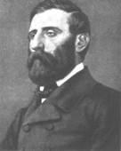{.calibre3}]{.calibre_10}

[Un colonel (avant le vote) vint en bourgeois le matin du 17[[[[^\[94\]^]{.calibre_21}]{.underline}]{.calibre_4}](index_split_4933.html#filepos40208637){#filepos38848552} à 8 heures chez Charras qu'il réveilla et lui dit Causons d'affaires graves, mais votre parole d'honneur que vous ne me nommerez jamais. Je vous la donnerais, dit Charras, en toute autre matière que les choses politiques. Eh bien, reprit le colonel, si l'Assemblée rejette la proposition des questeurs, l'armée est au président ; si elle l'adopte, je vous déclare que moi qui vous parle, tout le premier, j'obéirai à l'Assemblée. Et nous sommes tous dans les mêmes idées. Charras lui promit de ne pas le nommer. Le colonel au 2 décembre a servi le coup d'État.]{.calibre4}

[Le coup d'État devait éclater d'abord le 9 septembre, puis le 13 novembre. Divers motifs le firent ajourner. Quelques jours avant le 9 septembre, le colonel Charras, averti, et s'attendant à la chose, avait chargé deux pistolets à deux coups qu'il plaçait tous les soirs sur sa table de nuit. Le colonel Charras était logé au n° 14 du faubourg Saint-Honoré et le général Changarnier au n° 3. Les deux maisons se faisaient presque vis-à-vis. Vers la fin d'août, Charras rencontrant Changarnier au palais de l'Assemblée, avait échangé avec, le général quelques paroles au sujet des projets possibles de Louis Bonaparte. À cette époque, Changarnier faisait coucher toutes les nuits chez lui quinze hommes dévoués armés jusqu'aux dents. Il dit à Charras : Colonel, si l'on vient vous arrêter, tenez bon, faites le coup de feu, j'en ferai autant de mon côté, je réponds de soulever quelques compagnies, et je viendrai vous délivrer.]{.calibre4}

[Mais point de coup d'État ni le 9 septembre, ni le 13 novembre. Le 17, le rejet de la proposition des questeurs ôta tout prétexte à une parodie du 18 brumaire. Le coup d'État faisait désormais hausser les épaules, même aux plus effarés. [Le Constitutionnel]{.italic} raillait doucement les crédules, et la petite cour intime de la présidence s'indignait contre qui pouvait douter que Louis Bonaparte fût « un honnête homme ». Bref, nous l'avons raconté, un soir, en rentrant chez lui, Charras trouva comme à l'ordinaire ses pistolets sur sa table de nuit, se prit à sourire, et les déchargea.]{.calibre4}

[Il serra la poudre et les balles dans un nécessaire dont il mit et oublia la clef dans sa poche.]{.calibre4}

[Dans la nuit du 2 décembre, il dormait du sommeil le plus profond. Un coup de sonnette le réveille. Il ouvre les yeux. Une veilleuse éclairait sa pendule, il regarde, il était cinq heures et demie du matin.]{.calibre4}

[--- Qu'est cela ? se dit-il.]{.calibre4}

[Second coup de sonnette.]{.calibre4}

[Il regarde de nouveau à la pendule et dit :]{.calibre4}

[--- Cinq heures du matin. C'est le coup d'État.]{.calibre4}

[Et il s'habille.]{.calibre4}

[À demi-vêtu, il sort de sa chambre à coucher, entre dans un petit salon qui lui servait d'antichambre et crie :]{.calibre4}

[--- Qui est là ?]{.calibre4}

[Personne ne répond.]{.calibre4}

[Troisième coup de sonnette.]{.calibre4}

[Charras reprend avec une interjection militaire :]{.calibre4}

[--- Qui est là, n. de D. ?]{.calibre4}

[Une voix d'homme, assez douce, répond cette fois :]{.calibre4}

[--- Ouvrez.]{.calibre4}

[--- Je n'ouvre pas, dit Charras, sans savoir qui vous êtes. Qui êtes-vous ?]{.calibre4}

[La même voix reprend :]{.calibre4}

[--- Je suis le commissaire de police du 1^[er]{.calibre18}^ arrondissement.]{.calibre4}

[--- Vous vous appelez le coup d'État, réplique Charras.]{.calibre4}

[La voix répète assez impérieusement :]{.calibre4}

[--- Ouvrez !]{.calibre4}

[--- Je n'ouvre pas !]{.calibre4}

[Alors Charras entend distinctement ces deux mots :]{.calibre4}

[--- Allons, Messieurs !]{.calibre4}

[Et la porte commence à trembler sous des chocs violents. On l'enfonçait à coups de hache.]{.calibre4}

[Charras crie :]{.calibre4}

[--- Vous êtes des brigands !]{.calibre4}

[Et il songe à ses pistolets. Mais, on vient de le dire, ils étaient déchargés. Charras prend le nécessaire où étaient la poudre et les balles, mais où est la clef ? il la cherche, il ne peut la retrouver.]{.calibre4}

[Cependant on battait toujours la porte, un gond était brisé, la serrure se disloquait, le panneau d'en haut était tombé sous les coups de hache. Charras même voyait apparaître par la brèche une figure, fort laide, me disait-il quelque temps après en me contant l'événement.]{.calibre4}

[La porte cède.]{.calibre4}

[Deux estafiers de haute taille se dressent sur le seuil, l'un d'eux portait une bougie, et entre eux un individu qui entrouvre son habit, montre une écharpe, et dit : --- Je suis l'agent de la loi.]{.calibre4}

[--- En écharpe ou sans écharpe, répond Charras, vous êtes tous des bandits. Que parlez-vous de la loi ? Vous la brisez ! Je vous somme de vous retirer et de respecter la personne inviolable d'un représentant du peuple.]{.calibre4}

[Mais déjà le petit salon était envahi. Les hommes de police se jetèrent sur Charras, les sergents de ville encombrant le salon et les soldats encombrant l'escalier. Les agents avaient pris le soin d'éclairer chaque marche d'un bout de bougie.]{.calibre4}

[Ils étaient une trentaine.]{.calibre4}

[--- Colonel, fit le commissaire, il faudrait vous habiller.]{.calibre4}

[--- En ce cas, faites retirer tous ces drôles, dit Charras, et qu'on me laisse en paix dans ma chambre.]{.calibre4}

[Sur l'ordre du commissaire, les agents refluèrent dans l'escalier, et Charras rentra dans sa chambre suivi seulement du commissaire et de deux ou trois sergents de ville.]{.calibre4}

[En entrant dans la chambre, un des sergents de ville aperçut les pistolets sur la table de nuit et se jeta dessus.]{.calibre4}

[Charras éclata de rire.]{.calibre4}

[--- Imbécile ! dit-il, est-ce que vous vous imaginez qu'il y a quelque chose dedans ! Si ces pistolets avaient été chargés, deux de vous seraient endormis à l'heure qu'il est.]{.calibre4}

[Puis il se mit à s'habiller lentement.]{.calibre4}

[L'homme à figure sinistre qu'il avait entrevu le premier à travers la porte brisée était au nombre des agents de police restés avec le commissaire et réglait tous ses mouvements sur ceux de Charras de façon à se trouver toujours derrière lui.]{.calibre4}

[--- Ah çà, drôle, s'écria Charras en se retournant brusquement, quand on a une figure comme la vôtre, on ne serre pas de si près les honnêtes gens. Où diable avez-vous pris cette face-là ? Il faut donc que vous ayez été le dernier à la distribution des visages dans le ciel !]{.calibre4}

[L'homme reçut la bordée et ne bougea pas. Il continua de se tenir derrière Charras. Sur quoi Charras souriant dit au commissaire :]{.calibre4}

[--- Vous allez me faire assassiner, n'est-ce pas ?]{.calibre4}

[Le commissaire prit un air d'homme du monde offensé :]{.calibre4}

[--- Colonel\...]{.calibre4}

[--- Cet homme, reprit Charras, est chargé de me poignarder par derrière, convenez-en.]{.calibre4}

[--- Colonel, comment pouvez-vous croire ?\...]{.calibre4}

[--- Je crois tout.]{.calibre4}

[--- Je suis un magistrat.]{.calibre4}

[--- Vous êtes un gredin[[[[^\[95\]^]{.calibre_21}]{.underline}]{.calibre_4}](index_split_4933.html#filepos40208892){#filepos38859335}.]{.calibre4}

[--- Colonel...]{.calibre4}

[--- Ou bien vous allez me faire fusiller par un peloton dans ma cour. Allons, parlez franchement.]{.calibre4}

[--- Colonel, nous ne tuons personne.]{.calibre4}

[--- Vous assassinez la République.]{.calibre4}

[--- Colonel, je vous donne ma parole d'honneur.]{.calibre4}

[Chatras l'interrompit : --- À propos, comment vous appelez-vous ?]{.calibre4}

[--- Courteille.]{.calibre4}

[--- Eh bien, monsieur, reprit Charras en regardant cet homme fixement, je vous défends de prononcer le mot honneur !]{.calibre4}

[Quand il fut habillé, le commissaire donna le signal, quatre hommes à encolures de portefaix se placèrent devant et derrière Charras, tout le reste de la bande suivit, et, mouchards en tête, mouchards en queue, on descendit. Au moment de sortir, Charras fit quelques recommandations à son portier qui sanglotait. Il lui paya un compte de lettres. Quatre agents avaient saisi le pauvre vieux homme dans sa loge et le tenaient au collet.]{.calibre4}

[Un de ces petits coupés bas appelés [quarante-sous]{.italic} attendait à la porte. Deux compagnies entouraient la voiture.]{.calibre4}

[Le commissaire ouvrit la portière, Charras monta, le commissaire vint s'asseoir près de lui, un agent de police, espèce de géant qui se courbait en deux dans la voiture, prit place sur le strapontin, le cocher fouetta et l'on partit au galop.]{.calibre4}

[Le commissaire ne donna aucun ordre. Il était évident que le cocher savait où l'on allait.]{.calibre4}

[Les glaces étaient levées.]{.calibre4}

[En passant devant le n° 3, Charras vit deux compagnies en bataille comme devant sa porte, et en conclut qu'on arrêtait le général Changarnier.]{.calibre4}

[La nuit était encore très noire.]{.calibre4}

[La voiture au débouché du faubourg suivit la ligne droite et entra dans la rue Saint-Honoré. Le commissaire s'en aperçut, baissa vivement la glace et cria au cocher :]{.calibre4}

[--- Est-ce qu'on passe par les rues ! prends les boulevards !]{.calibre4}

[Le cocher tourna bride si brusquement qu'il faillit verser. Le coupé heurta rudement la tige de fer d'un réverbère. En ce moment Charras se pencha et vit des points étincelants fourmiller dans l'obscurité. C'était le scintillement des baïonnettes. La place de la Madeleine était couverte de troupes.]{.calibre4}

[Paris dormait encore, et le poignard du coup d'État était déjà hors du fourreau.]{.calibre4}

[Un peu plus loin, Charras aperçut à la lueur d'un réverbère un homme qui posait sur le mur quelque chose « de blanc ». C'était un afficheur qui placardait les proclamations. Une heure plus tard, le jour allait trouver le crime debout, l'appel au peuple dans une main, et le sabre dans l'autre.]{.calibre4}

[Charras ne savait où on le conduisait. La voiture passa la Bastille, côtoya des bataillons immobiles, le sac au dos, silencieux dans la nuit, puis rencontra des batteries attelées, et enfin s'arrêta au pied d'une haute muraille coupée par une porte basse cintrée.]{.calibre4}

[On fit descendre Charras de voiture et on le mena dans une salle à peine éclairée. Là un homme se présenta à lui :]{.calibre4}

[--- Qui êtes-vous ? lui demanda Charras.]{.calibre4}

[--- Je suis le directeur.]{.calibre4}

[--- De quoi ?]{.calibre4}

[--- De Mazas.]{.calibre4}

[--- C'est ici Mazas ?]{.calibre4}

[--- Oui, colonel.]{.calibre4}

[--- Mazas est une prison, et je suis représentant du peuple. Vous savez le jeu que vous jouez.]{.calibre4}

[--- Je sais que je risque ma place.]{.calibre4}

[--- Votre tête, dit Charras.]{.calibre4}

[Cependant le greffier s'était attablé à un bureau, car c'était la salle du greffe, et le commissaire de police près de lui, et l'on se mettait en devoir de dresser l'écrou.]{.calibre4}

[On demanda à Charras son nom. Il répondit :]{.calibre4}

[--- Je n'ai pas de nom !]{.calibre4}

[On insista.]{.calibre4}

[--- Eh bien, reprit-il, mettez le colonel Charras, représentant du peuple. Et, à vos signatures à vous, ajoutez : traîtres et bandits !]{.calibre4}

[Il y avait là un homme qui se tenait debout dans un coin. C'était une façon de général enveloppé d'un manteau, avec un chapeau bordé et un grand collet relevé qui ne laissait voir qu'un nez avec des moustaches et au-dessous la croix de commandeur de la Légion d'honneur. Cet homme assistait à l'écrou, mais restait au fond de la salle et semblait chercher l'ombre.]{.calibre4}

[--- Approchez-vous ! lui cria Charras. Qui êtes-vous ?]{.calibre4}

[L'homme recula.]{.calibre4}

[--- Venez donc ici, reprit Charras, et tournez-vous. Qu'on vous voie un peu en face.]{.calibre4}

[L'homme ne répondit pas et se retourna vers le mur opposé. Charras repartit :]{.calibre4}

[--- Ah faux général Vous me traitez comme si j'étais l'ennemi. Vous me tournez le dos.]{.calibre4}

[L'homme disparut. Il y a même lieu de croire qu'il ne revint pas, car quelques minutes après, quand le général Le Flô, écroué à son tour, arriva, le général, qui était en grand uniforme, trouva auprès du greffier un jeune officier d'état-major auquel il dit Vous déshonorez l'épaulette !]{.calibre4}

[L'officier se mit à pleurer.]{.calibre4}

[Le premier qui arriva à Mazas fut le général Lamoricière. Il maltraita fort et rudoya militairement toute la bande des dresseurs d'écrous. On le mit dans ce qu'on appelle une cellule double. Ces cellules, deux fois plus larges que les autres, en effet, sont réservées à l'infirmerie. En entrant dans cette chambre, le général Lamoricière se heurta contre un escabeau. On entendit tomber le meuble, et le bruit se répandit dans la prison que le général Lamoricière cassait tout dans sa cellule.]{.calibre4}

[Charras arriva le second. La prison étant encore vide, on le plaça, lui aussi, dans une cellule double. Plus tard l'espace manqua, et les représentants furent enfermés dans des cellules simples.]{.calibre4}

[[
]{.calibre_7}]{.bold}

### [[[]{.calibre2}[]{.calibre2}[]{.calibre2}[]{.calibre2}[]{.calibre2}[]{.calibre2}[Nadaud]{.calibre2}[[[[[[^\[96\]^]{.bold1}]{.calibre_43}]{.calibre2}]{.underline1}]{.calibre_42}](index_split_4933.html#filepos40209462){#filepos38868625 .calibre2}]{.bold1}]{.calibre_39} {#nadaud96 .calibre_38}

[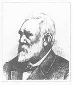{.calibre3}]{.calibre_10}

[Avec Charras ce fut la violence, avec Nadaud ce fut la ruse.]{.calibre4}

[Le représentant Nadaud, ouvrier maçon, était redouté des conspirateurs de l'Élysée. Un soir que Louis Bonaparte passait en revue, en les comptant sur ses doigts, les généraux de l'Assemblée, un de ces intimes, qui plus tard sont des complices, lui dit : [Votre Altesse oublie Nadaud, général des maçons.]{.italic}]{.calibre4}

[Nadaud est un homme d'esprit enveloppé dans un homme de travail. L'enveloppe est rude, mais sied. À l'Assemblée il parlait rarement, toujours à propos, dans les questions spéciales, avec une sorte d'honnêteté paisible et hardie. Sa parole loyale avait le poids qu'il fallait pour tomber au plus profond du coeur des masses. On savait à l'Élysée que Nadaud recevait souvent chez lui les chefs des associations ouvrières, qu'il était particulièrement populaire parmi ce qu'on appelle les ouvriers du bâtiment, et que les terrassiers, les maçons et les peintres, groupés dans les temps de chômage sur la place de l'Hôtel-de-Ville, tourneraient tous la tête et jetteraient leur cri de combat le jour où Nadaud apparaîtrait au coin du quai de la Grève.]{.calibre4}

[Nadaud demeurait rue de Seine-Saint-Germain, n° 9.]{.calibre4}

[Le soir du [1]{.calibre_63}^[[e]{.calibre_63}]{.calibre18}[[r]{.calibre_63}]{.calibre18}^ décembre, il était allé voir M. Cabet qui était de ses amis. M. Cabet lui conseilla de ne pas coucher chez lui cette nuit-là, qu'il y avait quelque chose dans l'air et, ajouta M. Cabet, « beaucoup de baïonnettes dans Paris », et qu'il fallait se tenir sur ses gardes.]{.calibre4}

[À ce moment-là nous l'avons dit déjà, l'opposition républicaine ne croyait plus au coup d'État. On en avait trop parlé pour ne pas finir par en hausser les épaules. Charras déchargeait ses pistolets. Le grand art de M. Louis Bonaparte ce fut de rendre d'abord son attentat ridicule. Avant d'être un crime, ce fut une farce. Quand on pesait dans les balances parfois trompeuses de la raison, les chances du coup d'État, on mettait dans un plateau cet homme médiocre, plus prince que citoyen, plus aventurier que prince, aux habitudes anglaises, à l'accent hollandais, ayant pour panache Boulogne et Strasbourg, cet émigré de l'empire, naguère constable à Londres, maintenant figurant de Franconi, ceinturonné, galonné, emplumé, harnaché, déguisé en général, drapé en neveu, laid, nul, chétif, marchant et parlant mal, enseveli dans des sensualités grossières, occupé des bas de soie de ses laquais, suspect du côté des jeux de bourse et des loteries, capable de tricher dans un tripot ou d'assassiner dans une caverne ; on mettait dans l'autre plateau les difficultés sans nombre de l'attentat, les impossibilités qui semblaient évidentes, les magistrats dont il fallait faire des lâches, les fonctionnaires dont il fallait faire des traîtres, les généraux dont il fallait faire des scélérats, le hasard dont il fallait faire un complice, la loi, le droit, la justice, la liberté, le bon sens, la France, le peuple, l'avenir dont il fallait faire des chimères, et l'on disait : Bah ! --- Personne n'eût pensé que cet homme qui éveillait un tel dédain pût jamais inspirer une telle horreur. C'est là un des côtés particuliers de la figure historique de M. Louis Bonaparte. Il a fallu qu'il devînt atroce pour devenir sérieux.]{.calibre4}

[Nadaud donc ne s'alarma pas, s'en retourna comme à l'ordinaire de chez M. Cabet par le pont du Carrousel et s'en alla paisiblement coucher chez lui.]{.calibre4}

[Au plus profond de son sommeil il se sentit saisir brusquement, il se réveilla et se dressa sur son séant. Un homme le tenait par le bras. Deux autres hommes de haute taille étaient debout au pied de son lit.]{.calibre4}

[--- Qu'est-ce que cela signifie ? cria-t-il.]{.calibre4}

[L'homme qui lui tenait le bras lui dit d'une voix douce :]{.calibre4}

[--- Monsieur Nadaud, ne craignez rien. Nous sommes la police.]{.calibre4}

[--- J'aimerais mieux des voleurs, dit Nadaud.]{.calibre4}

[Il faisait encore nuit. La chambre était éclairée. Il regarda qui tenait la chandelle. C'était son portier.]{.calibre4}

[Ce portier servait à Nadaud de domestique. Il avait l'une des clefs de l'appartement. Nadaud gardait l'autre. Ce portier, sommé d'ouvrir par les agents, avait ouvert. On lui avait mis la chandelle dans les mains et on lui avait dit : Conduisez-nous !]{.calibre4}

[Nadaud fit un mouvement pour se jeter à bas du lit. Les deux hommes de haute taille, qui étaient deux sergents de ville, se précipitèrent sur lui. Le commissaire leur fit lâcher prise :]{.calibre4}

[--- Laissez donc monsieur, Nadaud, leur dit-il.]{.calibre4}

[Puis se tournant vers Nadaud :]{.calibre4}

[--- Monsieur Nadaud, je ne viens pas vous arrêter. Dieu m'en garde. Je viens faire simplement chez vous une petite perquisition. Je veux être franc avec vous, je ne vous cacherai pas que vous êtes accusé de détention d'armes de guerre...]{.calibre4}

[--- Des armes de guerre, moi ! s'écria Nadaud. Ah par exemple, si vous trouvez des armes chez moi...]{.calibre4}

[--- Eh bien, reprit le commissaire, vous n'avez pas d'armes, je le crois, puisque vous le dites, mais vous avez bien çà et là, dans quelque coin, dans quelque tiroir, quelques petites lettres. Eh bien, il faudrait m'en laisser emporter quelques-unes, la, de bonne amitié. Vous êtes impliqué, à ce qu'on dit, dans les sociétés secrètes. Oh mon Dieu ! ce n'est pas grand'chose : Ne craignez rien. Je suis de votre pays, je m'appelle Lagrange, Lagrange, de la Creuse : Est-ce que vous ne vous rappelez pas, mon cher monsieur Nadaud ? J'ai beaucoup connu M. Bac, et M. Frichon, et votre ami M. Dussoubs. Je ne viens pas ici pour vous contrarier. J'ai habité longtemps la Haute-Vienne. Si vous le trouvez bon, j'emporterai quelques lettres, rien de plus. Mon Dieu ! ne craignez rien de moi. Je suis un bon garçon.]{.calibre4}

[Nadaud regardait cet homme entre les deux yeux.]{.calibre4}

[--- Je ne crains rien de vous, dit-il, mais je crains tout de l'homme qui vous envoie.]{.calibre4}

[--- Qui ça ?]{.calibre4}

[--- M. Bonaparte.]{.calibre4}

[Le commissaire de police parut tomber de son haut, jura ses grands dieux, fit probablement des signes de croix, et déclara qu'à ce moment-là le président dormait profondément à l'Élysée, et que M. Bonaparte était absolument étranger à ce qui se passait. C'était une perquisition fort inoffensive dont on l'avait chargé et qui n'aurait probablement aucune suite et pour laquelle il était désolé de réveiller M. Nadaud. Il lui demandait seulement la clef de son secrétaire.]{.calibre4}

[Nadaud la lui donna.]{.calibre4}

[Le commissaire ouvrit le secrétaire, chercha, visita, fouilla, tourna, retourna, fureta, et finit par trier vingt-neuf lettres dont il fit une liasse.]{.calibre4}

[--- Je vais emporter cela, dit-il à Nadaud. Ce sont les lettres les plus insignifiantes que j'aie pu trouver. Vous voyez que je suis bon diable.]{.calibre4}

[--- Emportez tout ce que vous voudrez, répondit Nadaud.]{.calibre4}

[--- Ah çà, reprit le commissaire, j'ai là dix agents dans la cour et dans l'escalier. Je ne sais vraiment pas pour quoi faire. Cela n'a pas le sens commun d'envoyer chez vous tout ce monde-là. Ma parole d'honneur, les voisins pourraient croire à un coup d'État. C'est fort bête. Vous comprenez que je ne vais pas me mettre à dresser procès-verbal devant tous ces drôles. Vous êtes représentant du peuple, et je vous respecte, monsieur Nadaud. Tenez, j'ai un cabriolet en bas. Montez dedans. Nous ferons le procès-verbal chez moi, à notre aise. Vous le rédigerez vous-même. Vous y mettrez ce que vous voudrez. Cela vous va-t-il ? Vous pouvez vous fier à moi. Je suis un honnête homme. Ayez la bonté de vous habiller.]{.calibre4}

[Tout cela était dit d'un tel air de bonhomie et de bonne foi que Nadaud, croyant à une niaiserie de la police, mais non à une scélératesse, s'habilla et le suivit.]{.calibre4}

[Quelques instants après ils étaient tous deux dans le cabriolet.]{.calibre4}

[On prend par la rue Mazarine, on était à peine au deuxième réverbère que le commissaire se frappa le front :]{.calibre4}

[--- Ah ! mon Dieu ! monsieur Nadaud, je me suis trompé. Je vous demande pardon. Ce n'est pas chez moi qu'il faut que je vous conduise.]{.calibre4}

[--- Mais où donc ?]{.calibre4}

[--- À Mazas.]{.calibre4}

[--- À Mazas !]{.calibre4}

[--- Oui, il y a là un juge d'instruction en permanence qui vous entendra. Ce sera l'affaire de quelques minutes. Après quoi je vous ramène chez vous.]{.calibre4}

[--- Vous me ramènerez chez moi ?]{.calibre4}

[--- Ma parole d'honneur !]{.calibre4}

[--- Votre parole d'honneur ! s'écria Nadaud. Vous me trompez.]{.calibre4}

[En ce moment on passait devant la préfecture de police. Il était petit jour. Nadaud se pencha. La rue de Jérusalem était pleine de sergents de ville, « tous bouteilles en mains, buvant à même et sans verre, à la régalade », nous disait Nadaud, dont nous citons les propres paroles. Ces hommes causaient bruyamment et éclataient de rire.]{.calibre4}

[--- Le coup est fait, dit Nadaud.]{.calibre4}

[Il se tourna vers le commissaire de police :]{.calibre4}

[--- C'est une trahison, c'est une lâcheté.]{.calibre4}

[--- Monsieur Nadaud, répondit le commissaire avec sa voix la plus douce, toute résistance est inutile. Le cocher est un agent, et il y a deux agents derrière le cabriolet. Avez-vous de l'argent ? En voulez-vous ? Vous en aurez besoin. J'ai deux napoléons sur moi. Je vous en offre un.]{.calibre4}

[--- Vous êtes un misérable, dit Nadaud. Sur le quai aux fleurs un régiment était en bataille, le sac au dos, prêt à marcher. Vous voyez bien que le coup d'État est fait ! s'écria Nadaud. --- Vous vous trompez, reprit le commissaire imperturbable. Ce déploiement de troupes se fait pour protéger le dépouillement du scrutin Devinck.]{.calibre4}

[Ils arrivèrent à Mazas. On introduisit Nadaud dans le greffe. Il y avait là un général penchant l'oreille, [pas fier]{.italic}, disait plus tard Nadaud, le même général qu'avait vu Charras.]{.calibre4}

[Comme Nadaud entrait dans la salle du greffe, il reconnut dans un coin deux braves citoyens, Artaud et Philippe, arrêtés chez eux le matin même comme chefs [possibles]{.italic} de barricades, et dans l'autre coin de la chambre du greffe il vit M. Thiers entouré de trois ou quatre hommes de haute taille qui le maniaient fort brutalement. On voulait absolument le toiser. Nadaud indigné s'écria :]{.calibre4}

[--- Comment osez-vous traiter ainsi monsieur Thiers !]{.calibre4}

[--- Ah ! tiens ! c'est vous, monsieur Nadaud, dit M. Thiers ; bonjour.]{.calibre4}

[C'était la première fois que les deux représentants se parlaient.]{.calibre4}

[M. Thiers était tranquille et gai il raillait tout le monde, la droite, la gauche, le centre, M. Bonaparte, M. de Montalembert, M. Cavaignac, M. Léon Faucher, et peut-être même un peu M. Thiers.]{.calibre4}

[La conversation ne fut pas longue entre l'homme de la gauche et l'homme de la droite.]{.calibre4}

[On les poussa rudement, chacun d'un côté opposé. Trois ou quatre hommes emmenèrent Nadaud et le jetèrent dans une cellule.]{.calibre4}

[Il y resta dix jours au secret, seul, sans nouvelles de ce qui se passait.]{.calibre4}

[Son gardien lui dit comme à Charras : --- Nous ne savons rien. Nous sommes nous-mêmes consignés.]{.calibre4}

[Le dixième jour le secret fut levé. Crémieux, son voisin de cellule, lui envoya une main de papier. Un ami put pénétrer jusqu'à lui et lui apporta un numéro du [Journal des Débats]{.italic}. Il passa seize jours dans cette cellule : Il n'avait que trente-cinq sous sur lui. Il vécut pendant ces seize jours de la nourriture des voleurs.]{.calibre4}

[Du reste il ne se plaignait pas. Il disait : --- C'est à peu près la nourriture des ouvriers.]{.calibre4}

[Le dix-septième jour on le transféra à Sainte-Pélagie.]{.calibre4}

[[
]{.calibre_7}]{.bold}

### [[[]{.calibre2}[]{.calibre2}[]{.calibre2}[]{.calibre2}[]{.calibre2}[]{.calibre2}[Joanny]{.calibre2}]{.bold1}]{.calibre_39} {#joanny .calibre_38}

[ ]{.calibre4}

[[Joanny]{.italic} --- formier de la [Révolution]{.italic}. Était allé à l'imprimerie Boulé chercher 400 numéros de la [Révolution]{.italic}. En sort à 4 heures du matin. Vers 5 heures du matin, G. l'avertit que l'imprimerie est envahie. Un homme de Courbevoie survient et lui dit Voilà la garnison da Courbevoie qui descend à Paris. Il sort, et voit les affiches du coup d'État. À 9 heures du matin va aux Tuileries. Leguevel, lui et Camper, ancien huissier de Ploërmel.[[[[^\[97\]^]{.calibre_21}]{.underline}]{.calibre_4}](index_split_4933.html#filepos40211013){#filepos38886573} Attendons, disent-ils, la direction des représentants. Les représentants se réunissent. Joanny donne rendez-vous chez Thuillier, marchand de vin rue du Cadran. Bon démocrate.]{.calibre4}

[Ainsi se passe la journée du 2.]{.calibre4}

[ ]{.calibre4}

[[Le 3.]{.italic}]{.calibre_26}

::: calibre_27

[...Au carré Saint-Martin, environ 2 000 personnes. Les deux cadavres étaient au coin de la rue Aumaire, à même sur le pavé, face découverte, le vieux le front troué d'une balle, cheveux blancs, 70 ans. L'autre 20 ans, frappé en pleine poitrine.]{.calibre4}

[...On alla chercher des planches devant la grille du Conservatoire où l'on bâtissait, on mit les cadavres dessus, on les hissa sur les épaules, on se mit en marche, le vieux en tête, plusieurs portant des torches. Les gens du voisinage, portes fermées, mais on voyait leurs têtes regarder à travers les vitres des fenêtres. On alla par la rue Saint-Martin, devant le Conservatoire. Au Conservatoire les trente ouvriers de Joanny lui dirent Ils sont assez pour ceci. Laissons-les aller, et désarmons les gardes nationaux. Laissent, aller les cadavres, et retournent par le passage du Grand-Cerf rue Beaurepaire pour désarmer les gardes nationaux. Mais toutes les portes étaient fermées. Se recrutent de Leguevel, pharmacien, 17, passage du Saumon, et de Camper. Tiennent conseil chez Thuillier, le marchand de vin de la rue du Cadran. Vont aux barricades de la rue Saint-Denis, de la rue Bourg-l'Abbé, de la rue du Petit-Lion. Joanny marchait le premier. Arrivés aux coins des rues du Petit-Lion-Saint-Sauveur, Bourg-l'Abbé et du Grand-Hurleur, là des barricades commencées, réverbères éteints. Coups de fusil de tous côtés éclatent. Se replient. Vont au passage du Grand-Cerf. Fermé. Une chaîne fermée par un cadenas rattachait les deux battants de la grille, mais restait lâche. Jeanty-Sarre les avait rejoints. Deux hommes dans le passage s'opposaient à l'ouverture de la grille. Eux font effort, et forcent la grille au moment où le gardien arrivait avec sa lanterne pour leur ouvrir. Suivent le passage. Poursuivis. Là encore, grille. L'épicier les fait passer par sa boutique, ils sortent par-dessous la porte qui était coupée du bas. Rue Marie-Stuart tiennent conseil. Un des leurs arrive et leur dit Tout est fini. On a dissipé le rassemblement des cadavres. Rentrent chez eux.]{.calibre4}

[[[Le 4]{.italic}]{.bold} au matin, va chez Ledouble, y trouve le père Viguier qui lui dit ce que nous avons fait. Vont sur les boulevards. Trouvent les représentants Guilgot, Bard, etc. Au coin du faubourg Montmartre rencontrent Amable Lemaitre. Cela va commencer. On dit que Canrobert et T. ont brisé leur épée. Bah dit Joanny. Va, dit Lemaître, dans le Ve arrondissement avec tes amis. À midi, on commencera. Il était 10 h. 1/2.]{.calibre4}

[...La barricade Guérin-Boisseau, en face l'entrepôt des glaces, barrait la rue en travers. Faite de pavés et de deux charrettes. Hauteur d'homme. Aucune gorge ni à droite ni à gauche. Les autres se bâtissaient mollement. Il y avait peu de monde. 50 à la Guérin-Boisseau, 4 à l'une, 6 à l'autre, 200 au plus pour toutes. Ouvriers aux fenêtres, refusaient de descendre, disant Donnez-nous des fusils et des cartouches. Les gardes nationaux s'empressaient de donner leurs armes et écrivaient sur leurs portes armes données. On exigeait qu'ils laissassent leurs portes ouvertes.]{.calibre4}

[2 h. 1/2. On attaque la grande barricade de la Porte Saint-Denis. Qu'est-ce ? Joanny monte sur la barricade son sabre à la main, appuyé sur un pavé. Ne bougez pas. Cela dure 10 minutes. Les pantalons rouges passent. La barricade est prise. Attention, dit Joanny, c'est à nous. Ne tirez qu'à bout portant. Joanny, dit Watripon, on va nous prendre par derrière. Il y va. Coup de canon à mitraille.]{.calibre4}

[Une femme frappée en pleine poitrine tombe sur la face. Watripon va la ramasser.]{.calibre4}

[Le plâtre volait des maisons et aveuglait. Tout à coup les soldats arrivent par la rue du Ponceau et par la rue Saint-Denis. Un frère de Joanny le fait prévenir par sa femme qu'ils ont barricadé la rue Guérin-Boisseau. Soyez tranquilles, la rue Guérin-Boisseau est barricadée. Ne pouvaient tenir. Barricades trop basses. Se replient. Gagnent la rue du Cadran, où il y avait une barricade très forte, par la rue Saint-Sauveur où ils prennent quelques fusils et un tambour de la garde nationale. Ils ont la caisse, mais pas les baguettes. Impossibilité de s'en servir. Rencontre un receveur d'Embrun qui lui dit Pas de munitions et on reste là à nous regarder !]{.calibre4}

[Avec 20 ouvriers, Joanny va travailler à une barricade rue du Mail. Ils y vont. Au moment où ils arrivent, une décharge de la troupe qui fracasse le bras à un maître d'hôtel de Metz qui voulait empêcher la barricade. Un charcutier voisin dit : --- C'est bien fait. De quoi se mêle-t-il ? --- Joanny va rue du Cadran. Fait la barricade du coin qui se rattachait à la barricade du Petit-Carreau. Le marchand de vin avait deux portes par lesquelles les deux barricades communiquaient. --- 5 ont été tués dans la barricade de la rue du Cadran, dont un petit ouvrier formier. Les soldats, la barricade prise, ont tiré dans la rue du Cadran, mais sans y entrer.]{.calibre4}

[Rue de la R., 4 citoyens furent saisis « en contravention » dans une arrière-boutique. Ils se donnèrent comme représentants du peuple, pensant qu'on les respecterait sous ce titre et qu'ils se sauveraient ainsi. Un d'eux avait sur lui une écharpe. On les crut, et ils furent immédiatement fusillés. L'un de ces hommes, celui qui avait l'écharpe, était un ouvrier monteur en bronze, il se nommait Pierrebot. Son nom n'est pas sur la liste mortuaire publiée par les gens du coup d'État.]{.calibre4}

[[[Le vendredi 5]{.italic}]{.bold}, Joanny sort de chez lui à 7 heures du matin et trouve devant la porte Thureau qui tenait l'hôtel n° 25, rue du Cadran, et qui lui dit 5 ou 6 sont là, couchés comme des chiens dans la rue. Surviennent officiers et soldats portant fusils et sabres ramassés et des cacolets à blessés. --- Tous les morts militaires ramassés.]{.calibre4}

[Rue du Cadran, en face le marchand de vin Thuillier, à côté du passage qui va de la rue Mandar à la rue du Cadran, cadavre du petit ouvrier formier vêtu d'un pantalon de coutil rayé, sans veste, en chemise, sur le dos, sur le trottoir. Sang. Deux cadavres sur les pavés de la barricade du Cadran à moitié défaite. Trois cadavres sur les pavés de la barricade Petit-Carreau, dont un enfant de 14 ans. Mare de sang. Un avait une blouse, un avait avec son pantalon une chemise de linge très fin. Mares de sang partout dans la rue. Dans une deux guêtres de soldats.]{.calibre4}

[Il va faubourg Montmartre, rencontre Guilgot, puis Gasperini, un médecin rédacteur de la [Révolution]{.italic}. Voulait aller à la Chapelle, trouve le chemin barré par les troupes. Rentre chez lui.]{.calibre4}

[[
]{.calibre_7}]{.bold}

### [[[]{.calibre2}[]{.calibre2}[]{.calibre2}[]{.calibre2}[]{.calibre2}[]{.calibre2}[Chambolle]{.calibre2}]{.bold1}]{.calibre_39} {#chambolle .calibre_38}

[ ]{.calibre4}

[[Chambolle]{.italic}. --- Chez Barrot, 24, rue de la Ferme. On y signait une protestation. Barrot était sorti. Il y eut 25 ou 30 signatures. Il y avait des soldats à tous les angles de la rue. On devait la porter chez Daru, 75, rue de Lille. Chambolle y arriva que les soldats approchaient. Il y avait une sorte de séance assez nombreuse (10h. 1/2 du matin). Barrot dictait une protestation. Daru ajoutait çà et là quelques mots. Ternaux était un de ceux qui écrivaient. Il y avait Falloux. Silencieux. Au moment où l'on signait on entre, et on dit La maison est envahie. Piscatory entre et dit : Que faites-vous ici ? Temps perdu. Maison cernée. Sortons. Je viens de la mairie du Xe. Là nous serons reçus. Enfin c'est une mairie nous avons chance d'y être défendus par la garde nationale et par le peuple. Les soldats entraient. On est parti avant la protestation finie et par conséquent non signée. Quelques-uns restent. Daru du nombre. Un officier entre, et lui dit qu'il est prisonnier chez lui. Broglie, Barrot, Tocqueville peuvent sortir et rejoindre la mairie. Les soldats étaient depuis plus d'une heure devant la maison Daru et y ont laissé entrer librement les représentants. (Daru. Très grand salon. Plusieurs pièces adjacentes.) Daru lui-même était à la porte et ne laissait entrer que les représentants.]{.calibre4}

[...Chambolle était à Mazas dans une cellule du rez-de-chaussée. On entendait les gardiens dire C'est pourtant bien triste de voir ici l'élite de la France ! --- Une nuit, la seconde, de mercredi à jeudi, Chambolle entend une vive fusillade --- puis des cris puis rien. (Eclaircir le fait --- est-ce une attaque sur Mazas ? est-ce une exécution militaire ?)]{.calibre4}

[[
]{.calibre_7}]{.bold}

### [[[]{.calibre2}[]{.calibre2}[]{.calibre2}[]{.calibre2}[]{.calibre2}[]{.calibre2}[Benoît]{.calibre2}]{.bold1}]{.calibre_39} {#benoît .calibre_38}

[ ]{.calibre4}

[[Benoît]{.italic} --- Ouvrier cordonnier. Du comité socialiste de Paris 30, rue Saint-Sauveur.]{.calibre4}

[ ]{.calibre4}

[[2 décembre.]{.italic}]{.calibre_26}

::: calibre_27

[Tout le monde se cherchait, personne ne se trouvait. Vers 10 heures les ateliers commencent à se vider et les rues à s'animer. Le comité socialiste dit : [Il faut attendre ce que fera la montagne]{.italic}. --- Benoît et Mallannet rencontrent sur le boulevard des troupes, et crient : Vive la Constitution ! Vive la République ! Les soldats répondent. Les sergents.de ville se ruent sur eux, et dispersent le groupe. --- Benoît, ancien capitaine dans la 5e. Il va chez les officiers. Presque tous se font malades. Cependant vers midi, un quinzième du [3^[e]{.calibre18}^]{.calibre_63} bataillon se réunissent rue Thévenot, et disent qu'ils veulent bien marcher, mais qu'il faut qu'un chef les couvre.]{.calibre4}

[La colère monte. On arrache les affiches. À 5 heures Benoît fait une démarche près du lieutenant-colonel Duthel, de la Se légion, faubourg Saint-Martin, 104, qui répond [Je crains d'être fusillé.]{.italic}]{.calibre4}

[La permanence de Benoît était rue Rambuteau, 80. Trois permanences dans le VIe arrondissement sous la direction de Mallarmet, Raffet et du comité socialiste. Une au coin du carré Saint-Martin, une rue de Bretagne, une autre rue de. Le soir, 50 membres des associations et des corps d'ouvriers, cordonniers, monteurs en bronze, etc., en plein vent, au marché Saint-Martin. On décide qu'on ira dans les quartiers où l'on est connu et qu'on fera des barricades.]{.calibre4}

[Le matin du 2, Benoît était au moment du passage de L. B. rue de l'Échelle. Cortège piteux. [Air d'un homme qui a passé trois nuits dans une maison de filles]{.italic}. Larochejaquelein arrive. Les ouvriers crient. Vive la République t crie comme eux. En ce moment L. B. entrait aux Tuileries. Attitude hésitante des soldats. Il eût été possible d'enlever là Louis Bonaparte. C'est ce qui lui a fait rebrousser chemin, et entrer brusquement aux Tuileries. À minuit, font des cartouches et de la poudre. On creuse des bûches et on y met de la poudre blanche une mèche et le feu, c'est un projectile terrible. La poudre blanche casse le fusil et veut être employée avec précaution.]{.calibre4}

[ ]{.calibre4}

[[3 décembre.]{.italic}]{.calibre_26}

::: calibre_27

[À 6 h. du matin se réunissent rue Rambuteau, vis-à-vis la rue Quincampoix. À peu près 15. Décident d'aller au faubourg Saint-Antoine, puisque c'est l'ordre de la gauche. Arrivent comme la barricade finissait. S'en vont. L'association des tailleurs était réunie À la bouteille (marchand de vin), en face son local, faubourg Saint-Denis. Ils y vont. Les tailleurs y étaient tous. Décidés au combat. Benoît rencontre Bonnassieux, rédacteur de la Révolution, qui lui dit : Avez-vous une presse ? J'en ai deux. Bonnassieux lui remet ma proclamation. Ne pas le nommer.]{.calibre4}

[Duputz et Buvignier viennent le rejoindre rue Rambuteau. Duputz est d'avis d'attendre que les départements fassent. Rouche, un fabricant de lampes de la rue Sainte-Avoye, et Cailleux, le tambour major de la 5e, sont froids. --- [Mes ouvriers rentrent à l'atelier et ne sont pas décidés à se battre]{.italic}. --- À 7 h. rue du Vert-Bois, rendez-vous. Quelques officiers de la 5^[[e]{.calibre_63}]{.calibre18}^, sans uniforme, Jeanty-Sarre, Barthoud. Une partie des tailleurs était là avec des cannes à épée. Vignes et Anglade, représentants, avaient promis de venir. Ne viennent pas. Benoît se résout à ajourner. Rue Bourg-l'Abbé, des groupes de 100 à 120 personnes, disposées à l'action. Benoît et Mallarmet y vont ensemble. Benoît avait une presse cachée chez lui, qu'on appelait dans le comité socialiste [la presse du VIe arrondissement]{.italic}. Imprime, aidé par plusieurs, ma proclamation et mes décrets.]{.calibre4}

[À minuit, on bâtissait une barricade au coin de la rue aux Ours et de la rue Mauconseil. Le marchand de vin du coin hostile à la barricade. Vers une heure une patrouille dissipe les hommes et renverse la barricade. À 5 h. du matin avaient tiré environ 1500 de la proclamation et 500 d'un décret fait par eux et donnant à l'armée l'élection de ses chefs. À 3 heures, on construisait une barricade au coin de la rue Quincampoix. Chargée par les chasseurs de Vincennes et détruite à coups de canon. Les sergents de ville frappaient du pommeau de l'épée les boutiquiers qui fermaient leurs boutiques.]{.calibre4}

[ ]{.calibre4}

[[4 décembre.]{.italic}]{.calibre_26}

::: calibre_27

[À 8 h. du matin affichent rue Rambuteau et faubourg du Temple les proclamations imprimées la nuit, rue Saint-Martin, rue Saint-Denis, pointe Saint-Eustache. À midi barricade rue Rambuteau vis-à-vis une maison en construction entre la rue Saint-Denis et la Halle deux autres barrant la rue Saint-Denis. Font une petite barricade de retraite rue Mondétour. On avertit Benoît qu'on veut fusiller quelqu'un, disant : [C'est un mouchard.]{.italic} Les gens des fenêtres disaient les uns oui, les autres non. Benoît le fouille, ne trouve rien sur lui, le fait lier à la barricade au coin rues Saint-Denis et Rambuteau, et dit : Ajournons l'exécution. (On avait fait cette barricade avec les voitures du roulage Leblanc. Une jeune femme bien mise y travaillait, prenait les pavés les plus lourds. On amène à Benoît deux porteurs des proclamations du traître. Ils en avaient 7 ou 8 cents. Fait déposer les exemplaires au coin de la petite barricade Mondétour, et y fait mettre le feu. Enthousiasme.) L'homme qu'on voulait fusiller, 38 ans, barbe blonde, pardessus blanc, haute taille, décoré, disait être un ancien capitaine démissionnaire de la [4^[e]{.calibre18}^]{.calibre_63} légion de la garde nationale de Paris. On finit par trouver sa carte d'agent de police dans le fond de sa culotte. Un enfant indigné lui tire un coup de pistolet qui rate.]{.calibre4}

[La barricade attaquée en ce moment par les gendarmes mobiles venant de l'Hôtel de Ville. Une partie des hommes se sont repliés vers les boulevards, les autres vers la Seine (on n'a su ce que le mouchard était devenu), d'autres à la barricade de la maison en construction, puis à la barricade Mondétour. Deux hommes, blessés aux jambes, dont un enfant de 15 ans qui tombe en criant : Vive la République ! --- S'en vont. --- [(Je regardais dans les roulages pour voir s'il n'avait plus rien qui nous servir à faire des barricades.)]{.italic}]{.calibre4}

[On construisait des barricades au coin de la rue Mandar et de la rue du Cadran. Ils y distribuent des cartouches. Vont rue Saint-Denis... Combat acharné. Charges de cavalerie rue Thévenot. Pourtant peu de monde dans les barricades. --- A 3 heures battent en retraite. Se cachent dans les maisons. À la nuit tombante, les rues des Deux-Ponts-Saint-Sauveur, la rue Saint-Sauveur, la rue du Petit-Lion Saint-Sauveur et la rue Beaurepaire jonchées de fusils. Les fusils cachés derrière les grilles des marchands de vin et sous les soubassements des trottoirs. Les ouvriers empêchent d'allumer le gaz.]{.calibre4}

[ ]{.calibre4}

[[Barricade du Petit-Carreau]{.italic}]{.calibre4}

[]{.calibre4}

[Les soldats attaquaient par trois côtés différents en criant : Vive le peuple ! Vive la République ! Quelques hommes mangeaient un morceau de pain chez le boulanger, rue Montorgueil, en face Turpin, épicier. Ils sortent. On les fusille. --- [Vous allez à la barricade]{.italic}, leur dit-on. À la prise de la barricade, les, fugitifs ont vainement cherché à entrer dans les maisons un qui avait l'artère de la cuisse coupée est mort le lendemain faute de soins. Le marchand de vin du coin de la rue du Petit-Carreau et de la rue du Cadran a reçu dans les deux cuisses vingt coups de baïonnette arrêté, a guéri.]{.calibre4}

[La barricade prise, perquisitions dans les maisons voisines. Une vingtaine d'hommes pris dans les maisons [au hasard]{.italic} et sans preuves sont amenés au pied de la barricade. En même temps, une vingtaine d'autres arrêtés dans le petit passage qui conduit de la rue du Cadran au passage du Saumon. Le gardien du passage, gros, borgne, guidait, une chandelle à la main, les perquisitions des soldats. On en fusille 17. Le lendemain, on voyait leurs cadavres dans le passage. Un des fusillés avait réussi à se relever et s'était assis sur un banc vis-à-vis un marchand de jouets d'enfants qui est dans le passage ; est resté là jusqu'à 3 h. du matin, où il a expiré. Pendant 3 heures il demanda un verre d'eau, les soldats le défendaient, personne n'osa le lui donner. Il est mort ainsi. Les vingt amenés au pied de la barricade fusillés. Après la fusillade, les soldats replacèrent tes pavés. Ils les jetaient à tour de bras sur la face des cadavres. Le lendemain matin, on trouvait un pied entre deux souliers vernis dans les pavés. Un autre, les hanches lui sortaient. Un autre avait les genoux déboîtés. Un autre, père de famille, ouvrier en châles, 35 ans, travaillant chez Leblanc, nommé..., tellement mutilé et broyé qu'il n'avait plus forme humaine. [La tête rentrée dans l'estomac]{.italic}. Figurez-vous un [morceau de mou enveloppé d'une blouse]{.italic}. Benoît s'était caché sur un toit d'où il parvint à rentrer chez lui.]{.calibre4}

[Vers 4 h. du matin, un homme, pour échapper aux massacres du boulevard, s'était réfugié dans une maison avec une femme. Les soldats l'ont pris, l'ont fouillé, ont dit avoir trouvé des grains de poudre dans sa poche, l'ont arraché des bras de la femme et fusillé. Au jour levant, la rue pleine de cadavres, des chandelles auprès, presque à toutes les portes. Les soldats enlevaient et cachaient leurs morts. Un soldat disait à un autre : [Dire que je n'ai encore tué personne !]{.italic} [Mon fusil n'a pas étrenné]{.italic}. --- Indignation dans le quartier. Colère et douleur. Si vous eussiez entendu les cris de grâce de toutes les femmes aux fenêtres ! Les gens qui passaient, on fusillait tout une fille publique, rue Thévenot, cacha chez elle 10 blessés républicains et mit dans son antichambre deux soldats blessés afin de couvrir les autres. Un fumiste essayait de fuir par les toits. Au moment où il touchait à sa lucarne, il a glissé et est tombé. S'est tué. Buvignier et Duputz étaient dans le quartier et y ont passé la nuit à la disposition des combattants.]{.calibre4}

[Le lendemain, les cadavres sont restés dans la rue jusqu'à plus de 8 h. du matin. Les chandelles brûlaient encore à côté. On leur jetait de l'eau bénite. On les embrassait. On leur serrait la main. La barricade défaite, des mares de sang. Là une casquette. Là une blouse. Des lambeaux de chair. Sur le trottoir, un jeune homme de 30 ans, brun. On ne lui avait laissé que sa chemise, très blanche. On eût dit une figure de cire, et qu'il n'avait pas souffert. Tué d'une balle au coeur. Les femmes s'exclamaient. Un disait en le voyant : --- Tiens, je regrette de n'avoir pas de linge blanc quand je viens me battre. On est plus regretté.]{.calibre4}

[À la barricade d'en haut, sur la rue Bourbon-Villeneuve, une voiture de plâtre versée par les soldats pour cacher le sang. Des éclaboussures de cervelles sur les murs.]{.calibre4}

[[
]{.calibre_7}]{.bold}

### [[[]{.calibre2}[]{.calibre2}[]{.calibre2}[]{.calibre2}[]{.calibre2}[]{.calibre2}[Aubry (du Nord)]{.calibre2}]{.bold1}]{.calibre_39} {#aubry-du-nord .calibre_38}

[ ]{.calibre4}

[M. Aubry (du Nord) est un représentant d'une soixantaine d'années, cheveux blancs, l'air grave et doux. On est venu le 8 au matin pour l'arrêter chez lui avec une voiture cellulaire. Il était absent.]{.calibre4}

[ ]{.calibre4}

[[2 décembre.]{.italic}]{.calibre_26}

::: calibre_27

[Aubry (du Nord), rue Racine, 5. Plusieurs représentants vers 10h du matin se réunissent chez Iui : Testelin, Loiset, Belin, Huguenin.]{.calibre4}

[Convenu que chacun irait aux informations pour savoir ce que les chefs de l'opposition voulaient faire. On se donne rendez-vous chez Aubry pour midi. --- Aubry objecte que les deux extrémités de la rue sont gardées par des agents de police en surveillance à cause du voisinage du quartier des Écoles. --- Propose chez Loiset qui demeurait de l'autre côté du Luxembourg, rue de Fleurus, 38. --- Plusieurs vont donc chez Loiset à midi. On échange les nouvelles. --- À peine MM. Loiset, Aubry et autres quittaient-ils la maison qu'elle était envahie et la rue occupée par un bataillon. Un commissaire et des agents entrent chez Loiset, visitent l'appartement, et saisissent quelques papiers, entre autres une indication du lieu, les membres de la gauche devaient se réunir rue de la Cerisaie numéro..., --- et de l'heure. On n'avait mis que l'adresse. Mais ils comprirent et prirent ce papier.]{.calibre4}

[En sortant de chez Loiset les représentants eurent avis que des jeunes gens de l'École de médecine se réunissaient pour une manifestation, mais déjà ils s'étaient dispersés et quelques-uns les informèrent que les représentants devaient se réunir au IVe arrondissement. Fausse indication. Ils y allèrent et n'y trouvèrent personne. --- De là au 10^[[e]{.calibre_63}]{.calibre18}^, mais ils arrivèrent que c'était fini.]{.calibre4}

[ ]{.calibre4}

[[3 décembre.]{.italic}]{.calibre_26}

::: calibre_27

[Était à la barricade Baudin.]{.calibre4}

[ ]{.calibre4}

[[4 décembre.]{.italic}]{.calibre_26}

::: calibre_27

[[Aspect de Paris]{.italic}. --- Rue Rambuteau, Aubry (du Nord) et Boysset (malade, saigné la veille, le jeune s'appuyant sur le vieux) font lire le décret de déchéance par un jeune homme à belle voix. On les croit blancs. --- Allez-vous en. --- Nous sommes [rouges]{.italic} ! --- Ah bravo ! vive la montagne ! --- Pendant la lecture une alerte. --- Volée qui s'enfuit. Aubry, Boysset et le lecteur restent fermes. --- On revient. --- Et l'on fait des barricades. --- Aubry et Boysset font ouvrir les portes des maisons et livrer les armes au nom de la Constitution violée.]{.calibre4}

[Barricade de la Porte Saint-Denis. Jeanty-Sarre. Le colonel Quilico blessé à l'épaule. Le lieutenant-colonel Goubaux tué (républicain, c'est bien fait). Un lieutenant tué. --- Trente( ?) grenadiers tués, quinze autres blessés, tous mortellement. [72^[e]{.calibre18}^]{.calibre_63} de ligne. Le capitaine Mauduit dit qu'en arrivant sur la barricade ils virent les baïonnettes du [15^[e]{.calibre18}^]{.calibre_63} léger qui arrivent par derrière. Jeanty-Sarre entendit bien dire Nous sommes pris par derrière ; mais ne vit pas les baïonnettes. Il faisait un brouillard assez intense, auquel s'ajoutait la fumée.]{.calibre4}

[ ]{.calibre4}

[[Le vendredi 5]{.bold}, Versigny, Pierre Lefranc et Aubry (du Nord) et deux autres, présidés par Aubry, se réunissaient dans un café, cabinet particulier, Chaussée d'Antin, pour entendre une proposition des officiers de la garde nationale offrant de réunir 2 000 hommes armés et d'aller installer de force la Haute-Cour. Aubry va chez le lieutenant-colonel Hovyn qui devait se mettre à la tête de cela. Il n'y était pas, on le lui dit absent depuis trois jours. On nous cherche pour nous faire part de l'incident. Mais le fil était rompu. Ils ne savaient pas que nous étions chez Raymond rue de la Madeleine.]{.calibre4}

[[
]{.calibre_7}]{.bold}

### [[[]{.calibre2}[]{.calibre2}[]{.calibre2}[]{.calibre2}[]{.calibre2}[]{.calibre2}[Barricades dans le]{.calibre2} V^[e]{.calibre28}^ arrondissement[[[[[[^\[98\]^]{.bold1}]{.calibre_43}]{.calibre2}]{.underline1}]{.calibre_42}](index_split_4933.html#filepos40211356){#filepos38918323 .calibre2}]{.bold1}]{.calibre_39} {#barricades-dans-le-ve-arrondissement98 .calibre_38}

[ ]{.calibre4}

[[Jeudi 4.]{.italic}]{.calibre_26}

::: calibre_27

[Mairie du Ve --- vers 11 heures on commence les barricades --- On avait renversé deux cabriolets, mais sur les instances des cochers, on leur rend les deux cabriolets et on ne prend que des charettes et des camions. En même temps la barricade des Petites Écuries et de la petite rue Saint-Jean, faubourg saint-denis, au coin du café Aubert. --- Plus de troupes, plus rien, tout est retiré, s'étonnent de n'avoir aucune opposition. --- On vient les écraser quelques heures après --- le poste de la garde nationale est commandé par un nommé Vigoureux, marchand de vin, rue de la Fidélité, non démocrate, [savoyard faisant de l'ordre]{.italic}, propriétaire, lieutenant --- Sommés de rendre leurs armes, les gardes nationaux rendent leurs armes sans violence. --- On prend leurs fusils. --- En tout 30 à 35 fusils. --- Les camarades qui étaient là étaient Maillard, le fabricant de billards, Artaud son frère, père de quatre enfants, déporté à Cayenne, Longepied et son jeune fils, deux hommes de l'association des marchands de vin de la rue Sainte-Apolline, 10. --- Doliger, d'Abbeville, homme de coeur, ami de Vasbenter et de Darimont, harangue au coin de la rue des Petites Écuries. --- A 11h.1/2 trente vont tambour en tête désarmer le poste Saint-Lazare. --- Ils tirent seulement trois coups de feu, reçoivent cinq coups de fusil. --- La troupe se retire. On prend le poste sans fusils, on en casse la porte à coups de crosse. Guérite abandonnée. --- Il y avait dans la cour de Saint-Lazare, qui est un monde, deux-cents sergents de ville et un bataillon d'infanterie.]{.calibre4}

[Barricade élevée rue des Vinaigriers avec les pièces de bois du chantier. Bien faite. Pouvait se défendre. 25 ouvriers la défendaient, des tisseurs de la fabrique Dauphinot, quelques mécaniciens du chemin de fer du nord des fusils pris à la garde nationale. Assaillis vers 3 heures 1/2, une demi-heure avant la nuit. Se sont bien défendus. Ont lutté, même la barricade prise, de porte cochère en porte cochère. 14 ou 16 ont été passés là au fil de la baïonnette. Crucifiés sur les pièces de bois de la barricade teintes horriblement de sang encore trois jours après.]{.calibre4}

[Les chasseurs de Vincennes ont cassé tant de vitres qu'on les a surnommés tout de suite les vitriers.]{.calibre4}

[Faubourg Saint-Martin, en face le 174, ils prennent un gamin dans la rue. Trois fois ils lui ôtent sa chemise pour le fusiller. L'enfant crie, les femmes crient. On finit par le sauver, le prendre en pitié. De l'église Saint-Laurent au 170, il y avait dans la rue 5 cadavres d'hommes fusillés là. On ne voulait pas leur ouvrir les portes.]{.calibre4}

[Rue des Petites-Écuries, 5 hommes défendent la barricade ; après chaque décharge, ils se réfugient dans le passage du Désir qui va du faubourg Saint-Martin au faubourg Saint-Denis. P. C. (Chossat) disait Ah çà, qu'est-ce qui m'a f. une nation comme ça ? Allons donc, bougeons donc La barricade prise par les chasseurs de Vincennes. 2 ou 3 tués. La pâtissière, en face le passage du Désir, tuée d'une balle. (Bien indiquer que le coup d'État laisse faire pendant 5 heures les barricades et s'y prête.)]{.calibre4}

[[
]{.calibre_7}]{.bold}

### [[[]{.calibre2}[]{.calibre2}[]{.calibre2}[]{.calibre2}[]{.calibre2}[]{.calibre2}[Barbier (Affaire de la chapelle Saint-Denis)]{.calibre2}]{.bold1}]{.calibre_39} {#barbier-affaire-de-la-chapelle-saint-denis .calibre_38}

[ ]{.calibre4}

[François Barbier, ouvrier corroyeur, beau, jeune, pâle, barbe et cheveux noirs, intelligent et brave, fondateur de l'association des corroyeurs de Batignolles-Monceaux.]{.calibre4}

[ ]{.calibre4}

[[Mercredi 3.]{.italic}]{.calibre_26}

::: calibre_27

[À la nuit, pendant qu'on prenait la barricade de la rue Aumaire où a été tué le vieillard qu'on a promené sur les boulevards, Barbier et 5 ou 6, dont un nommé Pommerolle, de l'association des corroyeurs, font une barricade rue Saint-Denis, avec deux omnibus et deux cabriolets, plusieurs pierres du trottoir arrachées, vont chez un serrurier chercher des pinces, lequel refuse. Sa boutique était fermée. Une dizaine prennent les poignées de la devanture, disent une deux Au troisième coup la devanture tombe. Il était minuit. Prennent des pinces, arrachent les pavés. La troupe arrive de la Porte Saint-Denis. Êtes-vous armés ? Nous n'avons que trois fusils. Sauvez-vous. Ils s'en vont. La troupe arrive, à Barbier Où allez-vous ? Chez moi. Que faites-vous là ? Je rentre chez moi. Ils ont pris la barricade. Barbier rencontre un allemand et un jeune homme qui sortait des zouaves, avaient chacun une carabine sous leur paletot, avaient la bouche noire de poudre. Venaient de la barricade de la rue Aumaire. Le zouave dit : J'ai gagné cette carabine sur la barricade. J'ai vu tuer le vieux. Je veux emporter ma carabine. Il la met dans son pantalon et ferme sa ceinture par-dessus. Ils se séparèrent. Le zouave dit : Si je ne suis pas tué, je reviendrai te voir dimanche (n'est pas revenu).]{.calibre4}

[ ]{.calibre4}

[La troupe faisait des feux de bivouac sur le boulevard Saint-Denis avec les bois d'une maison en construction rue Saint-Denis. Coupaient tout, échafaudage et charpente, et brûlaient. Respect de la propriété.]{.calibre4}

[ ]{.calibre4}

[François Barbier demeurait près de la barrière, rue Jacinthe, à la Chapelle de ses fenêtres voyait toutes les barricades.]{.calibre4}

[[Le jeudi 4]{.bold}, son frère et lui et quelques amis lisent ma proclamation. Parcourent toutes les fabriques, disent il faut fermer toutes les barrières. À 9 heures du matin on commence les barricades dans la grande rue de la Chapelle. On prie les commis de l'octroi d'enlever leurs papiers et de s'en aller. Font quelques résistances pour la forme, et s'en vont. On coupe les arbres, on lève les pavés, on fait la première barricade sur la grille de la barrière qui servait de squelette à la barricade, une autre sur la droite, une autre sur la gauche, et trois autres dans la grande rue, en montant vers la Chapelle. Pavés, arbres sciés.]{.calibre4}

[Dès le matin, 9 heures coupent le télégraphe électrique --- [ce sous-marin nous gênait]{.italic}. --- Ils font des fouilles, un chef de l'administration du chemin de fer leur montre l'endroit. Ils creusent un mètre, cela passait sur le boulevard extérieur, en face la gare, trouvent un tube en fonte, le cassent à coups de pioche, mettent à nu le fil et font effort pour le couper avec une pelle de jardinier, croient l'avoir coupé. Quelques voitures.]{.calibre4}

[Barricades commencées à 9 heures du matin. À 9 heures du soir pas encore finies. La première montait à la hauteur d'un second étage, la seconde sur la gauche, moins élevée. À 11 heures, quand la barricade a commencé à grandir, vont à la mairie, une quarantaine, prennent trente-deux fusils, malgré le commissaire qui fait obstacle, puis prennent pour mot d'ordre [de Flotte et Esquiros]{.italic} ; toute la journée se passe sans attaque des femmes bien mises descendaient de voiture, posaient leur manchon sur une borne, et remuaient des pavés pour aider à la barricade. Les ouvriers les saluent et les remercient. Elles remontent en voiture au milieu des acclamations. Vers 9 heures on vient dire à Barbier : --- Chef, il y a là quatre hommes qui percent le mur. --- Il prend quatre hommes armés de fusils, et y va, lui armé d'une paire de pistolets. On échange le mot d'ordre. Ces hommes disent Nous sommes des vôtres. Nous venons voir si le télégraphe est coupé. Il n'y a qu'une barricade très faible à Belleville, ici vous êtes les plus solides. Vers 10 heures, 3 facteurs de la poste arrivent et disent : --- Quoi ! Harbier vous êtes là, malheureux vous serez fusillé demain matin. --- Ils avaient des dépêches, on les visite, et on les leur rend telles qu'elles étaient.]{.calibre4}

[Jeune homme survient, et dit : Nous allons être pris par derrière. Il faut du renfort. Barbier dit : Désarmons les gardes nationaux. Ils étaient 200, rangés devant la mairie. Les insurgés y vont. Décharge des gardes nationaux. Un homme tué. Les insurgés se replient sur leurs barricades. Un homme vient avec un broc de vin. Voulez-vous un verre de vin ? Ce n'est pas du vin qu'il nous faut, c'est un peu de courage. Mettons-nous sur un rang derrière la barricade. Ils se postent derrière la barricade de la grille même de la barrière.]{.calibre4}

[On faisait de la poudre (des élèves pharmaciens) dans les petits bureaux de l'octroi. Environ 30 kilos furent faits dans la journée.]{.calibre4}

[Vers 9 heures 1/2 on dit Il y a un roulage qui fait l'exportation des fusils à Vincennes. Ils y vont. Il n'y avait qu'un garçon. Je ne suis pas le maître. On appelle le maître. MM., que demandez-vous 7 Des fusils. Fermez les portes, crie le maître. Ah ! vous voulez nous faire fusiller dans la cour. Chargez les armes ! Barbier avait quatre hommes. Le maître s'amadoue. On fouille la maison. Il n'y avait pas de fusils.]{.calibre4}

[Un grand brun travaillait ardemment barrière la Chapelle à la barricade faite de pavés et de cotrets.]{.calibre4}

[À 10 h. 1/4 le feu commence. La troupe venait non de Paris, mais de Saint-Denis. Depuis 6 heures du soir, elle était sur le pont de Saint-Denis une autre troupe venant de Paris avait passé pour venir à la Chapelle par la petite porte sous le pont du chemin de fer. Seul moyen de sortir de Paris, la barrière étant barricadée.]{.calibre4}

[F. B. Etait allé chez Cavé, le fondeur, faubourg Saint-Denis, et avait dit aux ouvriers Avez-vous quelques pièces de canon sur le chantier ? Nous n'avons pas besoin qu'elles soient polies. Donnez-nous les toutes grossières. Pourvu qu'elles soient forées, elles nous serviront. Les ouvriers eurent peur, et n'osèrent pas. Un employé de la fonderie Cavé était avec Barbier sur la barricade. Il ne rentra pas chez lui. Il a été fusillé.]{.calibre4}

[(Averti à 7 h. du soir qu'ils seront attaqués par derrière, Barbier fit commencer une barricade du côté de la Chapelle, mais il n'y avait que 400 pavés de remués, et la barricade ne barrait à peine qu'une moitié de la rue sur la gauche et s'élevait à 75 centimètres.) Les soldats attaquent du côté de la mairie. On voyait sur la façade la lueur des fusils. La barricade (faible) riposte par deux ou trois feux de peloton. La troupe tiraille 20 minutes les réverbères brisés, nuit on n'était éclairé que par la lueur des coups de fusil (portée de fusil : 150 pas). Quand le feu commença, la troupe était à deux portées de fusil. À chaque décharge elle approchait. Voyant peu de coups et surtout peu d'hommes, elle avança au pas de course. Les insurgés étaient 30 au commencement. 4 tués, le reste se sauve, sauf J. qui restait avec Barbier. Un jeune homme de 17 ans intrépide (enfant haut comme cette chaise), qui avait une calotte rouge. (Mourons ! Si vous êtes tous comme moi, qu'ils nous trouvent tous là.) Quand la barricade fut escaladée, reçut plus de 150 coups de fusil, cria, courut, tomba, se releva, et mourut. On lui avait dit vingt fois : Donne ton fusil à un homme. Il répondait : Eh ! un homme qui connaîtra le danger en aura plus peur que moi. Pendant le feu on s'encourageait : Bah ! ils n'y sont pas encore. Défendons-nous Le marchand de vin du coin avait fermé quelques minutes avant que le feu commençât.]{.calibre4}

[ ]{.calibre4}

[Barbier restait rue Jacinthe, 17, maison du boulanger, tout près. Il parvint à rentrer chez lui, les soldats étaient sur ses talons. Il rentre, monte chez lui, au 41, allume sa chandelle, ouvre la fenêtre ils crient De la lumière et le couchent en joue. (En face les Vendanges de Bourgogne.) Il referme sa fenêtre. Le lendemain matin on trouve devant sa porte deux fusils jetés là par ses camarades qui se sauvaient. Avait laissé son fusil dans la barricade. (Le chef de la barricade pose des sentinelles, envoie des patrouilles, y va lui-même, etc.) Au bout de 20 minutes, c'était fini. Une demi-heure après on enlevait les charrettes.]{.calibre4}

[Le vendredi avant midi les pavés étaient remis. L'artillerie passait où avaient été les barricades. (Barbier avait de grands cheveux et un paletot marron. Voulait faire sauter le pont du chemin de fer.) Le garçon du marchand de vin a été déporté. Il avait dit à Barbier Si vous êtes serré de trop près, venez à la porte de Madame Éloy (près de la barricade), vous n'aurez qu'à dire le mot Rigolot, je vous ouvrirai et vous vous sauverez. Barbier n'y alla pas et se sauva comme plus haut. Un nommé Gambelin qui tenait près de là un jeu de boules (de la police) a fait arrêter plus de 17 personnes, y compris sa propre servante.]{.calibre4}

[Un perruquier, armé d'une barre de fer, parmi les défenseurs de la barricade. Le garçon marchand de vin, déporté (ancien transporté de juin), s'appelait Jean Gambal. N'avait pas combattu. Avait seulement porté des secours. 43 ans. Ancien soldat. Artilleur.]{.calibre4}

[ ]{.calibre4}

[Vers 2 heures du matin, après la prise de la barricade, arrive un laitier avec sa voiture. Amis, crie le laitier. Nous ne connaissons pas d'amis. Ils ont tiré dessus comme sur un mouton. Ils l'ont tué. Il laissait une femme et quatre enfants. Il était parent du boulanger nommé.]{.calibre4}

[Les soldats étaient si enragés qu'ils auraient [tué les chiens et les chats.]{.italic}]{.calibre4}

[Le lendemain matin on déposa les quatre cadavres des défenseurs de la barricade sous une grande porte cochère près de la maison des bains qui est à gauche de la barrière en venant de Paris. Tous jeunes gens dans cette barricade. Les plus vieux avaient trente ans. Il y avait un chanteur à l'Opéra (qui s'en est allé avant la fin).]{.calibre4}

[La grande barricade était faite moitié cotrets moitié pavés. On avait déchargé une grande voiture de cotrets. [N'importe quel canon n'y aurait rien fait]{.italic}, cotrets debout, un rang de pavés dessus, et ainsi de suite jusqu'à la hauteur d'un second étage --- épaisseur 3 mètres. On avait ménagé des jours pour tirer entre les roues des voitures --- On pensait être attaqué par Paris. La barricade n'a pas servi. Les paysans venant de Paris passaient au moyen d'une échelle par-dessus la barricade --- Merci, disaient-ils. Vous faites bien. Nous allons vous aider --- Ils mettaient 5 ou 6 pavés, puis s'en allaient. Les deux autres barricades n'ont pas servi. Ils ont été attaqués du seul côté qui ne fût pas défendu. Une autre faute fut de fermer la petite porte latérale de la barrière. Ils auraient pu passer par là et se servir de la barricade de l'autre côté. Malheureusement, dit Barbier, on fit la faute. Sans cela nous aurions tenu. Nous aurions tous été fusillés, par exemple. Pas moyen d'échapper.]{.calibre4}

[Mme Éloy, cabaretière, et son garçon marchand de vin, déportés pour le fait d'avoir donné asile à F. Barbier.]{.calibre4}

[[
]{.calibre_7}]{.bold}

### [[[]{.calibre2}[]{.calibre2}[]{.calibre2}[]{.calibre2}[]{.calibre2}[]{.calibre2}[Baze]{.calibre2}[[[[[[^\[99\]^]{.bold1}]{.calibre_43}]{.calibre2}]{.underline1}]{.calibre_42}](index_split_4933.html#filepos40211666){#filepos38937968 .calibre2}]{.bold1}]{.calibre_39} {#baze99 .calibre_38}

[ ]{.calibre4}

[[Baze]{.italic}. Longtemps avant savait la proposition faite à des généraux pour faire [sauter l'Assemblée.]{.italic} On avait des preuves complètes. À partir du 7 octobre, jour où Baze arriva à Paris ; M. Baze, seul questeur présent et le général Bedeau, seul président présent, occupaient le palais de l'Assemblée, l'un à la questure, l'autre à la présidence. Dupin absent. Le 13 ou 14, preuve de trahison flagrante, la surveillance redoubla. Alors furent préparées les pièces trouvées chez Baze. En dressant cette formule, se convainquirent que le décret du 1^[er]{.calibre18}^ octobre 1848 n'avait plus force d'exécution ce qui amena la proposition des questeurs. Ils firent faire une vingtaine d'exemplaires dans les bureaux de la questure, écrits de la main du secrétaire général de la questure, sans mystère. Le président Bedeau y fit apposer le sceau de la présidence, mais on laissa la signature en blanc. Ces pièces remises à Baze pour les garder. Elles ont été trouvées en évidence sur le bureau de Baze, il les employait à prouver à ses collègues que la proposition des questeurs était nécessaire, l'appui du décret du 11 octobre manquant. Ainsi nullement fait pour répliquer au projet de Louis Bonaparte de rapporter la loi du 31 mai (fait de la proposition des questeurs). Après le rejet, fort inquiets, rapports alarmants. (Magnan dit aux généraux qu'il lui a été fait des propositions, mais qu'il les a rejetées.)]{.calibre4}

[Le premier décembre au soir il y eut scrutin à la tribune et la séance finit tard.]{.calibre4}

[On va se coucher. Calme profond dans le palais.]{.calibre4}

[ ]{.calibre4}

[[Baze A Ham]{.italic}]{.calibre4}

[13 jours sans livres, plumes, ni papiers. Demande des livres au commandant qui dit : Des livres ! qu'est-ce que c'est que ça ? Je n'en ai pas. (À la fin Changarnier en eut et les lui fit passer.) Sans sortir. Au secret. Très petite chambre. Il avait huit pas à faire. Il faisait deux cents fois l'allée et venue dans sa chambre, puis s'asseyait, disant J'ai fait 1600 pas. 13 jours ainsi.]{.calibre4}

[À la fin, il avisa des planches élevées contre le mur dans un coin de sa chambre. Il pensa qu'il y avait probablement là quelque porte condamnée. Il frappa sur ces planches. Une voix cria : Qui est là ? Baze. Et vous ? Lamoricière. La communication s'établit. C'était une porte en effet qui communiquait à la chambre de Lamoricière et qu'on avait condamnée, en bourrant de foin l'embrasure et en la recouvrant de planches du côté de Baze. Écartez vos planches, dit Lamoricière, j'écarterai ma porte, nous nous pincerons les doigts, mais nous causerons. Ils s'aidèrent de leurs pincettes et firent chacun de leur côté une pesée sur l'obstacle. Baze disait en riant Général, c'est un bris de prison. Vous me faites commettre mon premier délit. Les planches écartées, Baze arracha le foin avec la pincette. La nuit il le brûlait dans sa cheminée, par petits tas, pour que la fumée ne le trahît pas au dehors. Il vida ainsi toute l'embrasure. Alors les deux prisonniers causèrent. Lamoricière parvint à passer à Baze, à travers les fentes des planches, un crayon. Baze put écrire à sa femme une lettre qui parvint.]{.calibre4}

[ ]{.calibre4}

[Voici comment Lamoricière faisait parvenir des lettres. Il prenait une pipe, la bourrait de la lettre, et la posait sur la fenêtre. Le [48^[e]{.calibre18}^]{.calibre_63} [qui]{.calibre_63} était là à Ham aimait ces africains, il se trouvait toujours dans la cour quelque soldat qui passait et qui prenait la pipe. La lettre était mise à la poste. Quand la réponse arrivait, la pipe se retrouvait sur la fenêtre, apportée par une main inconnue. Le général la prenait, la réponse était dedans.]{.calibre4}

[[
]{.calibre_7}]{.bold}

### [[[]{.calibre2}[]{.calibre2}[]{.calibre2}[]{.calibre2}[]{.calibre2}[]{.calibre2}[Le général Lamoricière]{.calibre2}[[[[[[^\[100\]^]{.bold1}]{.calibre_43}]{.calibre2}]{.underline1}]{.calibre_42}](index_split_4933.html#filepos40212588){#filepos38943543 .calibre2}]{.bold1}]{.calibre_39} {#le-général-lamoricière100 .calibre_38}

[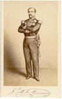{.calibre3}]{.calibre_10}

[[Général Lamoricière]{.italic}. Rue Las-Cases, 11.]{.calibre4}

[[2 décembre.]{.italic}]{.calibre_26}

::: calibre_27

[Était seul chez lui avec un domestique. À 5 h. 1/4 du matin une bande d'agents de police frappe à la porte, le portier ouvre sans difficulté, ils montent, sonnent au [1]{.calibre_63}^[[e]{.calibre_63}]{.calibre18}[[r]{.calibre_63}]{.calibre18}^ et frappent. Le domestique se lève demi-nu, ouvre, voit ces gens, croit à des voleurs on lui demande où est le général, il refuse, il se débat, un porte-habits était là, tombe, fait tomber la chandelle, nuit se fait. Le général dormait toujours profondément, il avait lu tard, [dort dur]{.italic} et était dans le premier sommeil. Les mouchards étaient armés, l'un d'eux tire l'épée et frappe le domestique à la fesse, le domestique croit alors à des assassins, crie : Général ! Général ! Le général s'éveille et dit : Qu'y a-t-il ? (Il couche dans un cabinet à côté de la chambre de sa femme en ce moment absente.) Alors ils sont entrés, le général nu dans son lit se dresse sur son séant : Qu'est-ce ? --- Ordre de vous arrêter. Le commissaire de police dit : Général, je vous connais bien, ne faites pas de résistance, nous sommes armés, toute résistance inutile. --- Pardieu ! je le vois bien, dit le général. Le domestique entre couvert de sang, fort blessé. (Il a été 20 jours au lit.)]{.calibre4}

[Le général s'habille en silence (pensant ils veulent me tuer. Ne faisons jamais ce que veut l'ennemi). Le domestique en entrant se jeta sur les 750 fr. de l'Assemblée, que le général avait mis sur sa cheminée, et les mit dans sa poche, pensant toujours à des voleurs. Le général cherche l'argent et dit au commissaire froidement : Qui me dit que vous n'êtes pas des voleurs ? --- Pas de réponse. --- Je vous arrête au nom de la loi comme prévenu de conspiration contre la sûreté de l'État et dépositaire d'armes. --- Et avait montré son écharpe. --- Le général passa par son cabinet pour sortir. Il faut faire perquisition, dit le commissaire. Pardieu, dit le général, vous trouverez des lettres de ma femme et mes armes d'Afrique. Me les prendrez-vous ? Général, votre parole de ne pas vous évader. Je ne promets rien. Montez dans cette voiture. 4 places. Le commissaire à côté, deux agents devant, croisent leurs jambes dans celles du général. Brutalité. Espoir de résistance, connaissant le caractère vif du général.]{.calibre4}

[On part. On suit la rue Las-Cases, la rue Bellechasse, on va par le quai vers la préfecture de police. En tournant sur le quai au coin du conseil d'État, la glace à la gauche du général était fermée, le général se baisse pour voir du côté de l'Assemblée. Général, général, crie le commissaire, vous essayez de vous évader. Si vous dites un mot, voici ce que je vous mettrai, et de son poing fermé il lui montre un mouchoir rouge roulé en bâillon. Quai désert. La voiture était escortée de gardes à cheval. À la préfecture de police (depuis plusieurs jours on était espionné et suivi) à la préfecture, la voiture s'arrête sous la voûte, le commissaire descend, va parler au préfet, redescend : Général, on n'en veut ni à votre vie, ni à votre liberté. Seulement, on vous arrête parce que vous n'êtes pas dans les idées qui sont nécessaires au salut de l'État. --- (Textuel.) Puis il dit au cocher A Mazas (Silence profond dans la voiture pendant tout le trajet.) Prennent une nouvelle escorte à la préfecture, plus forte que l'autre.]{.calibre4}

[Le jour se faisait quand on arriva à Mazas. A Mazas, nulle formalité ! On dit simplement : le général Lamoricière ! On le fit attendre un instant dans le greffe, puis monter au [1]{.calibre_63}^[[e]{.calibre_63}]{.calibre18}[[r]{.calibre_63}]{.calibre18}^ étage (le général Lamoricière arrivait le 1er) dans une petite chambre avec une fenêtre ordinaire à barreaux d'où le général voyait dans la cour. Voyait relever la garde. En face de celle où fut Thiers. On dressa un lit de sangle. Il y avait une cheminée, on y fit du feu. On le fouilla immédiatement. On lui prit deux lettres insignifiantes qu'il avait dans sa poche, qu'on remit au directeur de la prison. On ne lui laissa que son argent, et on lui dit Vous êtes au secret. On apporta une chaise ; une table ; une chaise percée.]{.calibre4}

[ ]{.calibre4}

[Tous les geôliers avaient la plus grande déférence, quelques-uns anciens soldats, Cavaignac et Le Flô servis par d'anciens soldats de leurs régiments. Lamoricière prit un morceau de papier grand comme le petit doigt et écrivit dessus Dites rue Las-Cases, 11, que le général Lamoricière est à Mazas. Il fit une boulette de ce papier, il voyait des ouvriers dans la cour, il jeta la boulette à travers les carreaux. Les ouvriers la ramassèrent, l'apportèrent à un nommé Joffrès (officier de recrutement) et Joffrès la porta rue Las-Cases le jour même. Le général demanda à déjeuner. Voulez-vous les rations des prisonniers ? Certainement. Différence entre la ration des détenus criminels et celle des détenus politiques une chopine de vin. On lui donna la ration des politiques. Déjeuner et dîner avec cela.]{.calibre4}

[ ]{.calibre4}

[Le soir, reçoit une lettre de son beau-frère et fait dire par le directeur de la prison qu'il se porte bien. On lui apporte un paquet de livres (la Révolution de Thiers) et du linge. (Il avait lu la veille au soir les massacres de septembre dans Thiers jusqu'à 2 h. 1/2 du matin.) Sur les 7 heures, on lui dit : Ne vous couchez pas, vous partirez dans la nuit. --- De temps en temps on venait. On le tient ainsi éveillé jusqu'à 5 h. du matin où on lui dit : Il y a un contre-ordre. --- Toute la journée du lendemain, secret. Mêmes vivres, avec une cuiller de bois et une écuelle de fer, pain assez blanc, mais pas cuit. On lui dit : Mais vous pouvez faire demander au restaurant. Demande une tasse de café au lait, qu'on lui apporte à 4 h. 1/2 du soir. Achète du tabac et des cigares. On les fait promener les deux jours une demi-heure dans les promenoirs cellulaires. Trente pas pour se promener. Dans quelques-uns une corbeille où il y a des fleurs Je vais vous donner, général, un bon promenoir où il y a un jardin. C'était là le jardin. Dans la journée, visite du directeur et du médecin. Avez-vous quelque observation à faire, général ? --- Non. Le soir on lui dit : --- Couchez-vous.]{.calibre4}

[ ]{.calibre4}

[À minuit on les réveille. Vous allez partir. Encore levés jusqu'à 5 h. du matin. Puis descendent, les uns après les autres, et mis en voitures cellulaires, sans savoir avec qui ils étaient. En sortant un monsieur en bourgeois demande impertinemment son nom au général. Vous le savez bien, mon nom, dit le général, et il passe outre. Il aperçoit en passant le lieutenant-colonel Fleury, en uniforme, aide de camp de la République que le général Lamoricière avait fait chef d'escadron, étant ministre de la guerre, et dont presque toute la carrière s'était faite dans sa division. Il était chargé de les [embarquer]{.italic}. En entrant dans la voiture cellulaire, on leur ôte leurs cigares. Une voix répète trois ou quatre fois : Ôtez donc le cigare au général. --- Le gardien hésite et finit pourtant par dire : Jetez votre cigare. --- Ne savaient où ils allaient. Entendaient trotter l'escorte. En observant les tournants des rues, le général pense qu'ils allaient chemin du Nord, d'autres chemin de Rouen. On les met sur le chemin de fer mouvement si rapide qu'ils souffraient horriblement. Le général avait un paquet et son manteau demande à mettre son paquet dans le couloir. On y consent. Froid. Lamoricière demande un cigare et dit Est-ce qu'il est défendu de fumer ? Sur ce, une voix (Cavaignac reconnaissant la voix de Lamoricière) Bonjour. Une autre voix (Changarnier reconnaissant Cavaignac et Lamoricière) Bonjour. Une autre voix (Baze) Bonjour. Dans l'autre voiture, Charras, Le Flô, Bedeau et Roger (du Nord). Les gardiens ne savaient qui ils étaient. Avaient été brutaux jusque-là. Devinrent respectueux. Entre les 2 rangées de cellules il y a un couloir avec une grille en haut d'où l'on voit et d'où l'on respire.]{.calibre4}

[ ]{.calibre4}

[À Ham, on les fit entrer dans la cour, encore jour, descendre de voiture l'un après l'autre. On mit Lamoricière dans la chambre de Cavaignac, échangent une poignée de mains. Puis : MM. descendez. On les mit au secret plus sévèrement encore qu'à Mazas. Lamoricière mis au rez-de-chaussée, dans une chambre humide, dont le papier moisi tombait, cheminée fumait, fenêtre toujours ouverte, ancienne chambre de d'Haussez, y avait gagné des rhumatismes. Pendant le secret, quelques permissions de visites. Refus de prendre les lettres. Le commandant refusait de les recevoir. Lamoricière lui dit Je vais écrire devant vous Je me porte bien. Refus. Mme Le Flô, grosse, vient avec son petit garçon de 8 ans et sa petite fille de 5 ans. Refus de la recevoir. Elle dit au commandant Je vois d'ici les généraux Cavaignac, Lamoricière, Changarnier et Bedeau. Mon mari a une fenêtre de l'autre côté. Laissez-moi faire le tour par le parapet pour que je le voie et que je lui montre ses enfants. Refus. Elle rentra chez elle et fit une fausse couche.]{.calibre4}

[ ]{.calibre4}

[Très mal traités. Refus de plume et d'encre. Lamoricière avait réussi à cacher un crayon. Les soldats du 48^[[e]{.calibre_63}]{.calibre18}^ [dévoués]{.italic} lui font passer des journaux. Du reste, secret rigoureux. On leur apportait à manger. Pas sortir. La chambre de Lamoricière communique avec la chambre de Baze par une porte condamnée. Dans l'épaisseur du mur, du foin et des planches de l'autre côté, Lamoricière frappe. Baze répond. Essayez de me parler.]{.calibre4}

[Font jouer la porte avec une bûche, font une fente, causent, se passant par là des lettres et des papiers. Lamoricière fit passer notamment à Baze une note de Dufaure. Baze disait Vous me faites commettre mon premier délit, le délit de bris de prison. Toujours un gardien les épiait à leur porte.]{.calibre4}

[ ]{.calibre4}

[Le 17ème jour, mis en libre pratique, 8 heures par jour pour causer ensemble, permission de recevoir leurs femmes qui viennent s'établir dans le village, de dîner ensemble. On avait mis des soldats pour faire leurs chambres, un commissaire de police avait été envoyé pour surveiller le commandant du fort. Cet homme, pour être renseigné, fit venir de Poissy ou de Gaillon des hommes patibulaires à [figures d'assassins]{.italic}, dit Lamoricière, pour remplacer les soldats, faire les lits et les servir à table. Si mauvaise mine que Lamoricière dit : --- F\... vos empoisonneurs où vous voudrez. Voilà trois individus qui ne mettront rien sur notre table. Nous voulons être servis par nos domestiques. --- On renonça à ces hommes (du reste prisonniers comme les généraux).]{.calibre4}

[ ]{.calibre4}

[Mensonge de Cassagnac Lamoricière n'a point rencontré Lagrange et n'a rencontré personne en arrivant à Mazas. On lui disait tous les jours On va vous mettre en liberté. Après le vote, après, etc., etc. Roger et Cavaignac sortirent. Ne savaient que penser. À Mazas avaient pensé qu'on les fusillerait (il paraît que Saint-Arnaud avait pour cela des ordres secrets). À Ham, pensèrent qu'on les déporterait. Un oncle de Mme de Lamoricière demande une permission. Refus. D'abord Lefebvre-Duruflé s'y intéresse et parle à l'oncle Dites à votre neveu de voyager en Italie. Il sera martyr jusqu'au bout, dit l'oncle. Le commandant du fort, capitaine \[Baudot \] nommé à Ham par Charras et Lamoricière, [détestable]{.italic}.]{.calibre4}

[ ]{.calibre4}

[Les généraux vivaient dans une cordialité complète. Ceci est l'ennemi commun, nous sommes amis devant lui. Bedeau et Le Flô exaspérés, Lamoricière le plus noir, disaient-ils en riant. B. a un capital de pouvoir à dépenser, ne comptons pas sur une trop prompte délivrance. Changarnier disait : Vous si gai, vous êtes un prophète triste. Je ne suis pas abattu, disait Lamoricière, mais je vois l'avenir sombre. Changarnier froid, ferme, haine âcre et profonde là-dessous pour B.]{.calibre4}

[Il y avait à Ham Mme Baze avec ses deux enfants, Mme Le Flô avec ses deux enfants Mme de Bunes, cousine de Bedeau, Mme de Lamoricière (sans sa petite fille) passaient une partie de la journée au fort, le soir partaient. Ne savaient ce qu'on ferait d'eux. Les bruits les plus contradictoires. Ne craignaient que d'être enlevés la nuit, sans qu'on sût ce qu'ils étaient devenus : c'est ce qui arriva. Dans la nuit du 8 au 9, à 4 h. du matin, on entre dans le couloir qui séparait la chambre de Lamoricière de celle de Changarnier, on tire les verrous au dehors. Bruit de pas chez Changarnier. Dans la cour, Lamoricière voit des figures sinistres, croit reconnaître de ceux qui l'ont arrêté, flambeaux. Se lève, frappe à sa porte. On lui dit : --- Inutile de frapper, vous êtes au secret. --- Pourquoi ? --- Pas de réponse. Au bout de trois quarts d'heure voit entrer une voiture dans la cour. Voit sortir Changarnier qui monte en voiture et leur crie Je vais en Belgique. Puis Charras Je vais à Mons. 2 heures après on avait relevé les factionnaires qui étaient sous la fenêtre, et remplacé par, des factionnaires de police et consigné le [48^[e]{.calibre18}^]{.calibre_63} dans ses quartiers, de peur de l'émotion.]{.calibre4}

[Le commandant du fort entre chez Lamoricière avec un jeune homme de 18 à 20 ans (M. Lehon) : J'ai ordre de vous faire conduire à Calais, puis à Douvres, et là on vous remettra vos papiers. --- Avez-vous un mandat ? --- Point. --- Pays brumeux, cher vivre, traverser la mer, je vais ailleurs. La Belgique. --- Point. --- L'Allemagne. --- Non. --- Aix-la-Chapelle. --- Non. --- (Ils y envoient Baze.) --- Soit, alors en Angleterre. Disposez de nous, monsieur. --- Lehon réfléchit : Voulez-vous Cologne ? --- Oui. --- Marchons. Donnez-moi votre parole que vous irez à Cologne. --- Point de parole, monsieur. Je vous déclare que je serai à Cologne demain soir. Cela doit vous suffire. --- Le Flô partit dans la journée du même jour ainsi que Baze. --- Le lendemain Lamoricière, et le surlendemain Bedeau.]{.calibre4}

[ ]{.calibre4}

[Au dehors, pendant que tout cela se passait au dedans, Lehon arrivé en poste à Ham avait retenu tous les chevaux et toutes les voitures, y compris la diligence de Noyon. Le bruit s'en répand dans la ville. On va avertir ces dames. Il est probable que ces MM. vont partir. --- Les femmes arrivent, la nuit, à peine vêtues, il pleuvait, de l'eau jusqu'à la cheville, vont au fort. Pont-levis levé. Le commandant les voit et leur crie : Que venez-vous faire ici ? Vous allez me faire destituer ! Ces MM. ne partent pas. --- Grossier. Brutal. Injurieux. --- Ces dames sous la pluie, sans parapluie, nuit noire, Lehon et le commandant là. --- Changarnier en sortant se pencha à la vitre. Mais elles ne le virent pas. Charras avait une allumette chimique, il l'alluma pour se faire voir en passant, elles le reconnurent. Le commandant leur cria Il n'y a rien pour vous. Vos maris ne partent pas ce matin. --- Elles étaient restées là deux heures, dans cette incertitude affreuse, se demandant : Vont-ils à Cayenne ?]{.calibre4}

[Sur les 9 h. du matin, le secret levé. Mme de Lamoricière passa la journée avec son mari, mais les généraux restés ne purent communiquer entre eux.]{.calibre4}

[ ]{.calibre4}

[Lamoricière monte dans une espèce d'omnibus pour aller à Noyon, on lui permet sa femme, mais deux agents de police. A Creil, Mme de Lamoricière quitte son mari. À Noyon ils prennent le chemin de fer de Saint-Quentin, à Creil le chemin du Nord, Lamoricière toujours avec ses deux agents de police l'un à côté de lui, l'autre devant, comme un malfaiteur. Ainsi jusqu'à Bruxelles. Silence absolu jusqu'à la frontière. Les agents cherchaient à lier conversation. Lamoricière ne répondait pas. L'un parlait allemand. Dans toutes les stations, buffets, etc., ils ne le quittaient point d'un pas. --- A Quiévrain, obstacle. Le passeport portait : M. un tel, (l'agent en chef) et sa suite (Lamoricière). --- Où sont vos papiers ? C'est ce monsieur qui les a. Cependant on le laisse passer.]{.calibre4}

[Où voulez-vous descendre à Bruxelles ? demande un agent. --- A l'hôtel de Bellevue. --- C'est bien. --- À la gare, ils ne le perdent pas de vue, et le mènent à l'hôtel comme un prisonnier. À l'hôtel, Lamoricière dit Donnez-moi une chambre. Le moins cher possible. --- L'agent en chef ajoute : --- Une chambre sous la même clef. --- Stupéfait.]{.calibre4}

[Thiers arrive, envoie promener les agents lui dit : Vous êtes en Belgique. --- Mais je n'ai pas de papiers, dit Lamoricière. --- On vous en donnera ici. --- J'ai promis d'aller à Cologne. Je reviendrai ensuite. --- Thiers lui conte que le gouvernement français pesait sur le belge et le forçait de partir. Dînent ensemble. Charras vient. Quelques députés belges. Le procureur du roi survient, et dit à Lamoricière : --- Êtes-vous libre ? Voulez-vous la protection de l'autorité belge ? --- J'ai promis d'aller à Cologne, j'irai, dit Lamoricière, je tiens à des papiers réguliers. Ils ont ordre de m'en délivrer. Je ne réclame rien. --- Pouvez-vous m'écrire cela ? dit Verhaeyen. --- Lamoricière lui signe une déclaration en ce sens. Le lendemain matin Lamoricière avait la fièvre. --- Ils le firent lever à 6 heures. Il pleuvait, il a [rattrapé là sa maladie]{.italic}. Ils l'ont mené à Cologne. Il leur met la puce à l'oreille. Avez-vous un passeport pour l'Allemagne ? --- Non. --- Allez vite chez Quinette, prenez des passeports pour vous et moi. --- Ils y vont, de là à Cologne, et lui demandent un certificat de bon traitement. --- Je ne vous en donne pas. Rien de commun entre vous et moi. --- Il les congédie ainsi. Y reste 20 jours malade, puis revient à Bruxelles.]{.calibre4}

[ ]{.calibre4}

[{.calibre3}]{.calibre_10}

[ ]{.calibre4}

[Lamoricière dit : J'entrerai en France sur un âne, sur un chameau, sur une charrette, sur une pièce de canon, sur tout ce qu'on voudra, pourvu que ce soit contre Bonaparte.[[[[^\[101\]^]{.calibre_21}]{.underline}]{.calibre_4}](index_split_4933.html#filepos40214368){#filepos38967699}]{.calibre4}

[[
]{.calibre_7}]{.bold}

### [[[]{.calibre2}[]{.calibre2}[]{.calibre2}[]{.calibre2}[]{.calibre2}[]{.calibre2}[Marc Dufraisse]{.calibre2}[[[[[[^\[102\]^]{.bold1}]{.calibre_43}]{.calibre2}]{.underline1}]{.calibre_42}](index_split_4933.html#filepos40214723){#filepos38968175 .calibre2}]{.bold1}]{.calibre_39} {#marc-dufraisse102 .calibre_38}

[ ]{.calibre4}

[Marc Dufraisse défait son hamac et le gardien lui dit : Il paraît que vous connaissez cela, monsieur ? --- 5 heures sonnaient au moment où Marc Dufraisse défaisait son hamac dans sa cellule. --- Pas de draps. --- Se couche habillé, s'enveloppe dans deux couvertures de laine grège. --- Très froid. --- Marc Dufraisse dormit très bien et passa toute la journée à fumer des cigarettes. --- Tabac acheté à la cantine d'Orsay. --- Le lendemain des draps. --- Pas de couteau. Un gardien lui en apporte un. Marc Dufraisse a acheté un eustache pour deux sous. A. Thouret a brisé ce couteau à Sainte-Pélagie. Mercredi sans papier ni plumes ni livres. Du papier le jeudi matin. Marc Dufraisse écrit une lettre qui ne parvient chez lui que le vendredi soir. Le dimanche matin reçoit ses livres, les deux premiers volumes de Tacite, et un foulard pour se couvrir la tête. Quatre jours pleins en présence de lui-même. Promenade tous les jours une heure, rognée par l'allée et venue. On n'a que trois quarts d'heure. Les gardiens polis. Est resté jusqu'au 17 nourri de la pitance, voulant expérimenter le régime. Malpropre plutôt que mauvais. Boeuf pouvant se manger à toute force. Gamelles de fer battu sales, point lavées. --- Pain de prison. Pas trop mauvais dit Marc Dufraisse, [peu difficile]{.italic}. Une fois la visite du directeur Comment vous trouvez-vous ? Très bien. Puis un officier d'état-major.]{.calibre4}

[Le 17 on le transfère à Sainte-Pélagie, à 8 h. du soir. --- Vous allez partir. --- Tant mieux. --- À Sainte-Pélagie. --- Soit. --- Encore voiture cellulaire, plus que des républicains. --- C'était le fond du sac. --- Benoît, Gambon, Delbetz, Malardier. --- Entraient un à un dans le parloir des avocats à Sainte-Pélagie. --- On s'ébahissait, on se reconnaissait. --- Tiens, c'est vous ! --- Et depuis quand ? --- On se disait les nouvelles. --- Jusque-là on n'avait pas vécu. --- Dans des cellules, par trois et quatre. --- Marc Dufraisse, Burgard, Richardet et Miot, dans la cellule n° 3 du premier corridor. --- Sur les quatre, trois pour la liste de déportation. --- Chambre de voleurs blanchie à la chaux. --- On leur fait mettre des étagères. --- On ne les bouclait pas la nuit. --- Meilleur régime qu'à Mazas. --- Café au lait le matin, soupe grasse à midi et boeuf le soir des légumes. --- On faisait venir ce qu'on voulait. On était libre dans l'intérieur de la prison. --- On se promenait dans la cour politique, pas avec des voleurs, par où s'était faite l'évasion de 1836. --- Gais, calmes, sereins. --- Des voleurs les servaient. --- Quelques-uns ont pris l'habit de la prison, ayant froid avec leurs habits usés. --- Entre autres Antony Thouret, veste et pantalon de drap gris. Après le décret de déportation, Marc Dufraisse prend aussi l'habit comme plus chaud et plus commode. --- Le directeur lui fait donner un pantalon de velours bleu et une vareuse de gros drap, cravate et casquette. --- Le décret paru, les gardiens plus durs. Cela dura peu.]{.calibre4}

[ ]{.calibre4}

[Marc Dufraisse voyait librement Proudhon. --- Proudhon disait : Cela peut durer. S'il fait du socialisme, s'il entre dans le... il durera. Sinon, il tombera dans le grotesque, et il aura aussi son mardi gras (impérial) qui le perdra. --- Avant les décrets Proudhon avait fait un projet de colonisation volontaire (Asie Mineure, Hauts-Carpathes), à substituer à Cayenne. En parle à Marc Dufraisse, puis à Carlier. --- Cela vaut mieux que Cayenne, dit Marc Dufraisse. Carlier goûta la chose et s'en fit honneur près de Morny. Morny écrivit de sa main à Proudhon une permission de sortie de Sainte-Pélagie. Carlier donnait rendez-vous à Proudhon pour aller chez Morny. Ils se virent au ministère. Projet examiné, non repoussé. --- Proudhon réclame pour la polémique libre. --- Vous bornez-vous à Veuillot ? --- Morny dit On pourra bien s'entendre.]{.calibre4}

[[
]{.calibre_7}]{.bold}

### [[[]{.calibre2}[]{.calibre2}[]{.calibre2}[]{.calibre2}[]{.calibre2}[]{.calibre2}[Arsène Meunier]{.calibre2}[[[[[[^\[103\]^]{.bold1}]{.calibre_43}]{.calibre2}]{.underline1}]{.calibre_42}](index_split_4933.html#filepos40215575){#filepos38973586 .calibre2}]{.bold1}]{.calibre_39} {#arsène-meunier103 .calibre_38}

[ ]{.calibre4}

[(Arsène Meunier occupait le n° 32 de la [6^[e]{.calibre18}^]{.calibre_63} division. Au numéro 30, il y avait un comte de représentant, qui depuis quatre jours avait perdu la tête. La nuit, Meunier l'entendait crier et gémir.)]{.calibre4}

[Le 13 à 11 heures du soir on vint le chercher. On le mena dans la cour. Il y avait un convoi de 300 personnes. On les conduisit à Bicêtre. --- Lanciers et une pièce de canon attelée qui les suivit. Trajet à pied. Silence. Coups de poings des sergents de ville à qui parlait. On les mit dans les deux casemates 11 et 12 de la 2^[e]{.calibre18}^ division. Dans la 11ème, ils étaient 152. En marche le bruit des pas et de la pièce permettait de dire quelques mots. À une heure du matin arrivent à Bicêtre, au fort. En sueur. Ils avaient marché au pas de course. Coups de plat de sabre aux dernières files. Pavé glissant.]{.calibre4}

[Dans les casemates ni feu, ni chandelle, ni paille, pavage en bitume, très humide, ruisselant d'eau. On apporte 12 bottes de paille. Ils se couchaient tour à tour 40 pendant deux heures. Les autres marchaient deux par deux au milieu de la casemate. A. M. ne connaissait personne dans ses codétenus. Le colonel Forestier avait été transféré à Bicêtre. Il était dans la casemate n° 6. On y transvasa Arsène Meunier, qui s'y retrouva avec H. Magen, Crocé-Spinelli, Genillier, Goudounèche, maître de pension, Polino, ancien officier au service du shah de Perse.]{.calibre4}

[Nourriture le matin un bouillon, un demi-pain de munition (750 grammes), le soir un morceau de boeuf ou un plat de légumes. Chacun avait une écuelle qu'on lui avait donnée en entrant. Ni cuiller, ni fourchette. Plus tard, cantine autorisée. Tabac, vin, etc. Dans les premiers jours, les familles venaient en si grand nombre qu'il y avait cohue et impossibilité de se voir. (Au fort de Bicêtre pendant l'instruction, au fort d'Ivry après la condamnation, et de là au Havre, puis les pontons, Afrique, Cayenne).]{.calibre4}

[Arsène Meunier sorti le 31 décembre. Il avait passé dans le fort de Bicêtre 1900 détenus, dont 1700 à la fois. Plus que plein. Il y a trente casemates dans ce fort, mais plusieurs employées au service militaire. Sur ces 1900, 750 mis en liberté. 600 au fort d'Ivry (condamnés), 500 encore prisonniers le 31 décembre.]{.calibre4}

[Arsène Meunier arrêté de nouveau le 28[[[[^\[104\]^]{.calibre_21}]{.underline}]{.calibre_4}](index_split_4933.html#filepos40216270){#filepos38978518}. Par un mandat du 22. Pendant son dîner, 15, rue de Ponthieu, chez lui. L'agent dit Ce n'est pas une arrestation. On veut vous parler. Il le mène à pied à la Préfecture. Etait armé. On voyait dans sa poche un pommeau de pistolet. Vient Sylvain Blot, le secrétaire général. Puis Henricy, chef de la police politique. La conversation [étrange]{.italic} avec Henricy. Envoyé au Dépôt. Béranger vient l'y voir. Est ramené à Bicêtre. Puis le 14 février au fort d'Ivry. Y reste jusqu'au 23 mars. [Condamné]{.italic} à dix ans de Lambessa. Interrogatoire monsieur Manceaux, juge d'instruction, qui lui dit Vous avez été arrêté le 2 décembre, relâché le 30 en vertu d'un [arrêt]{.italic} de non-lieu. Vous êtes arrêté de nouveau. Ce ne peut être pour les faits du 2 décembre. C'est donc pour vos [antécédents]{.italic}. Vous êtes socialiste et ancien instituteur primaire. Justifiez-vous. --- Béranger a demandé qu'on commuât Lambessa en exil. --- Élargi et expulsé.]{.calibre4}

[On a amené à Ivry les prisonniers de 15 départements.]{.calibre4}

[Quelques-uns étaient dévorés de vermine. On leur a donné des chemises, des sabots, quelquefois des pantalons. Pour la moindre chose appareil militaire.]{.calibre4}

[Dans la nuit du 17 au 18 décembre, au fort de Bicêtre, on fit sortir les prisonniers, casemate par casemate, on leur dit à demi-voix de se lever, de se mettre 2 par 2 et de sortir. On se réveille. On voyait par la porte entr'ouverte des torches de résine allumées et de la troupe. On crut qu'on allait être fusillé. On s'interrogeait du regard. Bonne contenance du reste. On les mit dans la cour en face des portes des casemates. Les soldats rangés en face le long du mur au port d'armes, homme pour homme. Deux soldats les prenaient par les bras en sortant. Dans cette positon vingt minutes. Un officier, ayant un manteau sur ses épaulettes, les compta, en silence, du doigt. Puis on leur dit Rentrez. En rentrant, ils aperçurent derrière les soldats des scribes à une petite table et M. Hatton, juge d'instruction.]{.calibre4}

[[
]{.calibre_7}]{.bold}

### [[[]{.calibre2}[]{.calibre2}[]{.calibre2}[]{.calibre2}[]{.calibre2}[]{.calibre2}[Amable Lemaître (Casemates)]{.calibre2}[[[[[[^\[105\]^]{.bold1}]{.calibre_43}]{.calibre2}]{.underline1}]{.calibre_42}](index_split_4933.html#filepos40216525){#filepos38981591 .calibre2}]{.bold1}]{.calibre_39} {#amable-lemaître-casemates105 .calibre_38}

[ ]{.calibre4}

[M. Lemaître arrêté à Paris le 14 décembre. On arrête toute la maison disant qu'il y avait là un représentant. Il restait une petite fille de 10 ans qu'on fut obligé de mettre dans une maison voisine. On dit à Lemaître : On vous dit représentant, suivez-moi, et monsieur aussi (M. Paul, négociant en vins) [pour vous avoir donné asile]{.italic}.]{.calibre4}

[On les mena au dépôt. Nous serons bien mal là, dit Lemaître au commissaire. Non. Vous serez bien. Vous serez entre politiques, dit le commissaire. [En ce moment-ci, tous les délits, on les laisse de côté]{.italic} (un des commissaires du VIII, arrondissement ; il demeure rue de Harlay, au Marais).]{.calibre4}

[Il y avait au dépôt deux salles au premier et au second étage. On y était si entassé qu'on ne pouvait s'asseoir sur les bancs qui faisaient le tour des murs que les uns après les autres. Le soir on abaissait des lits de camp dressés contre le mur par des charnières. On ne pouvait pas s'y coucher toute la nuit. La place manquait. On se comptait au pouce pour savoir au juste combien chaque homme pouvait occuper de place. On n'avait chacun qu'un tiers de nuit (3 heures) pour dormir [couché]{.italic}. Ce détail se reproduira dans les casemates. Là, de très jeunes enfants ce qu'on appelait des politiques était un peu mêlé de voleurs. Dans certaines rues, on avait arrêté tout le monde. On arrêtait l'un parce qu'il était chez le marchand de vin, l'autre parce qu'il avait une blouse. Rue des Fossés-Saint-Marcel, on arrêta tous les mâles, y compris les petits garçons. On les confia aux filles publiques (c'est l'usage au dépôt ; elles en ont soin.) qui ont un local à part. Il y en avait trop. Le surplus des enfants reflua dans les salles des hommes.]{.calibre4}

[On ne pouvait écrire à sa famille pour ses besoins que le [3^[e]{.calibre18}^]{.calibre_63} jour après l'arrestation recevoir aucune visite. Ils restèrent 8 jours ainsi sans sortir des salles, on les faisait monter sur les banquettes le long des murs et l'on jetait des seaux d'eau à travers la salle. Infection. Cassaient les carreaux malgré le froid, pour avoir de l'air. Très froid. Quelques-uns mirent la tête aux carreaux. Couchés en joue par les sentinelles. Le gardien les prévient que les soldats avaient ordre de tirer sur toute tête qui voudrait respirer. Le 8ème jour, le directeur leur dit On aurait dû vous interroger dans les 24 heures. [On vous a oubliés]{.italic}. --- Tellement mêlés que les gardiens disaient en désignant tel ou tel Mais voilà un four à plâtre (on appelle four à plâtre les vagabonds des environs de Paris qui couchent là). Le soir du 8^[[e]{.calibre_63}]{.calibre18}^ jour vers 4 heures (nuit en décembre) on les mit dans des voitures cellulaires. Conduits l'un après l'autre à la voiture par deux gendarmes. Un enfant nommé Mazières (15 ans) fut passé de main en main par les agents de police qui se disaient en riant : [Prends donc cet homme politique]{.italic}. L'enfant avait peur et pleurait. Ils croyaient qu'on les menait fusiller. Le bruit en avait couru.]{.calibre4}

[Sales, fatigués, en haillons les femmes des employés aux fenêtres dans la cour de la préfecture riaient et se moquaient d'eux.]{.calibre4}

[Tous les transports du dépôt au fort de Bicêtre se faisaient le soir. On arrivait à Bicêtre vers huit heures. On défilait entre deux haies de soldats portant des torches. Comme il y avait eu beaucoup d'exécutions, ils avaient peur et s'attendaient toujours à être fusillés. On entendait ces paroles : Ah ! mon Dieu ! ma pauvre femme ! Ah ! j'ai trois enfants ! Que deviendront-ils ?]{.calibre4}

[Arrivés au fort, on les déposait dans des casemates glaciales, sept ou huit voitures vidées dans une casemate, 14 hommes par voiture. Paille sur le pavé. Une lanterne éclairant à peine. Une cruche d'eau. On les comptait. Aucun interrogatoire. Aucun écrou. Ils restaient là une heure, puis on les conduisait dans une espèce de greffe entre deux soldats de la ligne. (La ligne obligeante et affectueuse.) Les sous-officiers serraient la main des détenus pendant que les soldats marchaient en avant avec des lanternes. Un sous-officier du 1[4^[e]{.calibre18}^]{.calibre_63} dit : Citoyen Lemaître, vous devez bien nous en vouloir. --- Dans le greffe, une table, trois hommes, trois greffiers, écrivaient les noms et constataient les individualités. --- On demandait à ces greffiers : Qui êtes-vous ? Êtes-vous des magistrats ? Si vous n'êtes pas des magistrats, nous vous répondrons. Tous les magistrats étant des malfaiteurs, nous ne leur répondrions pas. --- On donnait aux détenus un numéro d'ordre, une couverture, une écuelle en terre, et on les conduisait dans d'autres casemates. Là, paille. 120, 130 par casemate. Très haut, des châssis dormants. Le jour et l'air viennent avarement par des soupiraux de 2 pieds de diamètre. Ni tables, ni chaises, ni lits.]{.calibre4}

[Amable Lemaître délégué de la casemate 11. --- Le surlendemain on leur apporte des toiles à paillasses. Ils y mettent eux-mêmes leur paille. Ils ne purent faire que 67 paillasses pour 125 hommes. Les fourreaux de paillasse pour un n'ayant qu'un demi-mètre, il fallut mesurer l'espace à chacun. L'eau mesurée de même, deux bidons pour tous pour toute la nuit. On buvait à même au goulot. Pas de verres. On avait soif. Immondices dans un grand baquet découvert. Pour ne pas s'entrevoir, on mit une couverture devant le baquet. Plus tard sur le Canada on n'était plus des hommes, on fit comme les animaux. Fétidité affreuse.]{.calibre4}

[Nourriture des voleurs. 20 minutes de promenade par jour dans une grande esplanade palissadée sous l'oeil des argousins. Quelquefois la sortie supprimée. Pas de service médical, pas de pharmacie. Les médecins bienveillants, mais n'ayant pas de remèdes. On donnait du camphre. Beaucoup de bronchites aiguës et quelques phtisies produites par la poussière de la paille toujours remuée. 4 casemates durent être converties en infirmeries. Là des lits et des draps. Quarante lits par casemate. La vermine et les poux commencèrent. Presque tous sans linge. Qui avait une chemise était un grand seigneur. Une cantine venait tous les jours. On laissait acheter du vin et des provisions de mauvaise qualité fort cher. Les malheureux exploités par les paysans de la banlieue. Il fallait trois jours pour qu'une réclamation reçut réponse.]{.calibre4}

[Dans toutes les casemates les détenus nommaient au scrutin un délégué chargé de servir d'intermédiaire entre les prisonniers et les geôliers. Un inspecteur venait tous les jours avec le directeur. Cet inspecteur nommé Besuchet, médecin, ancien républicain. --- Recevait mal les réclamations. --- Nous ne sommes pas nourris comme des prisonniers politiques. --- Amable Lemaître lui dit : Que sommes-nous donc ? Je n'en sais rien, vous êtes des gens qu'on a ramassés. Besuchet parlait le chapeau sur la tête. Il voulait qu'on se découvrît devant lui. Un jour, il vint, personne ne bougea, Lemaître gardait son béret blanc. Il vit un homme fumer et lui parler la pipe à la bouche. Il s'emporta. Il dit Comment osez-vous garder votre pipe ? Vous gardez bien votre chapeau, dit le prisonnier.]{.calibre4}

[Le 5ème jour après l'arrivée, reçoivent des papiers timbrés, assignations à comparaître devant des juges d'instruction, ce qui leur fait voir qu'il existait encore quelque chose qui s'appelait la magistrature. Tous ces juges d'instruction étaient des magistrats poussés depuis le 2 décembre, et créés pour la circonstance. Simulacres hideux de justice. Beaucoup refusèrent de répondre. Quelques-uns répondirent avec protestation contre le crime de L. B. --- Après l'interrogatoire, on était élargi (très peu) ou envoyé à Ivry.]{.calibre4}

[Les prisonniers voyaient leurs familles à Bicêtre dans une casemate-parloir avec couloir au milieu pour l'agent séparant les visités et les visiteurs. Bruit effroyable. Il fallait parler haut. Beaucoup aphones ne pouvaient parler. Entre autres Lemaître. Quelques-uns renoncèrent à voir leurs femmes. Elles se trouvaient mal. Toutes, pour obtenir une permission, passaient devant le général Bertrand qui les interrogeait et tâchait de les faire se couper. Un jour les femmes firent effort, écartèrent les soldats, et embrassèrent leurs maris et leurs frères. --- Bah ! dirent les soldats, faites faire ce service par des gendarmes. --- Il n'y avait qu'un parloir pour toutes les casemates, de là 10 minutes à peine pour se voir. Le parloir ouvrait à 8 h. et fermait à 10 h. Elles devaient se lever à 6 h. du matin, faisaient queue (en hiver) à la porte du fort, étaient fouillées, et quelquefois ne voyaient pas ceux qu'elles aimaient. Deux visites par semaine. Les soldats, bons, servaient de petite poste. On était conduit au parloir entre deux soldats.]{.calibre4}

[ ]{.calibre4}

[[Ivry.]{.italic}]{.calibre4}

[Là, divisés en catégories : 1^[re]{.calibre18}^, [2^[e]{.calibre18}^]{.calibre_63}, [3^[e]{.calibre18}^]{.calibre_63}. Mêmes détails. --- Seulement les femmes ne les virent qu'en plein air, sur l'esplanade. Double rang de palissades, couloir pour les sergents de ville. Pluie ou neige sur ces pauvres femmes. On parvenait quelquefois à se toucher la main dans un coin où les palissades s'écartaient.]{.calibre4}

[Allèrent de Bicêtre à Ivry à pied, entre deux haies de soldats, fusils chargés devant eux. Troupe de ligne. Chasseurs de Vincennes. Gendarmerie mobile. --- Si un s'échappe, tous responsables, disaient les officiers. --- Un pauvre bossu nommé Decause, ne pouvant marcher aussi vite que le pas militaire, fut rudoyé. --- Un soldat dit à l'autre : F\... le au bout de ta baïonnette comme un jambon. --- Dans le trajet on faisait éloigner les paysans. Ni cris de la République, rien. Ordre de ne parler qu'à demi-voix. Le trajet se fit le matin par convois de 40 ou 50. Quelquefois 100. Pas liés. N'ont été liés que pour aller d'Ivry au Havre.]{.calibre4}

[Tant que les parisiens ont été près de Paris, très fermes. En mer, ils ne se sont plus senti pied, l'énergie a défailli.]{.calibre4}

[[
]{.calibre_7}]{.bold}

### [[[]{.calibre2}[]{.calibre2}[]{.calibre2}[]{.calibre2}[]{.calibre2}[]{.calibre2}[Victor Schoelcher]{.calibre2}[[[[[[^\[106\]^]{.bold1}]{.calibre_43}]{.calibre2}]{.underline1}]{.calibre_42}](index_split_4933.html#filepos40217102){#filepos38995007 .calibre2}]{.bold1}]{.calibre_39} {#victor-schoelcher106 .calibre_38}

[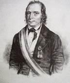{.calibre3}]{.calibre_10}

[Clary entre 2 officiers supérieurs sur le boulevard Saint-Denis. Schoelcher passe pour aller chercher une voiture rue Saint-Denis. --- C'est un éclair. Les officiers le voient et croient le reconnaître --- ils vont l'arrêter. --- Vous, Clary, vous devez le connaître ? --- Non, dit Clary. Ce n'est pas lui.]{.calibre4}

[{.calibre3}]{.calibre_10}

[]{.calibre_10}

[Schoelcher s'en va [par le haut.]{.italic} --- On commençait rue de Charonne une barricade. Il y avait 12 pavés de remués. Ils prennent par les boulevards extérieurs. Pas de voiture au Père-Lachaise. À pied. Hommes du peuple qui les applaudissent au passage. Rue Meslay chez Forestier. Persévérant et brave. Tambours de garde nationale consignés caisses gardées par des piquets de la ligne dans les mairies. Avait été averti le matin étant revenu chez lui. Quitte Dulac et les autres, Un ouvrier, membre de la commission de secours pour les familles des détenus politiques, accoste Schoelcher rue Meslay, lui demande ce qu'il y a à faire, et lui offre de le conduire au Ille arrondissement chez le colonel de la garde nationale Favrel batteur d'or, rue du Caire (aujourd'hui réfugié). Schoelcher voulait d'abord aller à l'association des imprimeurs, faubourg Saint-Denis, pour faire imprimer ma proclamation qu'il avait copiée la veille rue Blanche.]{.calibre4}

[Association absente. Personne. Pas de gardes. Ne voulaient plus se compromettre. Déjà bourgeois. De là chez Favrel. Absent. De là chez le chef de bataillon Laboulée, pharmacien, absent. Rencontré par des ouvriers qui se disent prêts si la garde nationale sort. Le font entrer dans un cabaret au carré Saint-Martin. Schoelcher avait pour idée fixe de publier ma proclamation. Ils lui offrent de forcer l'imprimerie Malteste à l'imprimer. Schoelcher ordonne des barricades pour la soirée et promet de revenir. Un tanneur lui offre l'appui d'un officier de la garde nationale, ancien actionnaire de [la Réforme]{.italic}, rue Jean-Jacques Rousseau, 5. --- Officier très bien disposé, va voir ses chefs, mais espère peu. Schoelcher s'endort chez lui une demi-heure. L'officier et le tanneur reviennent et disent : [Cela ne donne pas]{.italic}. --- De là chez Hovyn, rue des Jeûneurs, lieutenant-colonel de la 5°, absent. On en était inquiet. Sorti le matin, en uniforme. --- Va chez ... pour se reposer, et y apprend qu'on le poursuit. Police à ses trousses. Se cache chez Mme Geoffroy Saint-Hilaire. --- Puis chez deux jeunes prêtres qui se dévouent et qui eussent été perdus si Schoelcher eût été trouvé chez eux.]{.calibre4}

[Schoelcher au 5ème étage. --- Le jeune professeur, leur frère, lui avait donné son lit. --- Il logeait à côté sur un matelas à terre dans un bouge. --- Abnégation. --- Comment manger ? personne ne se doutait que Schoelcher fût dans la maison. --- C'était une pension de jeunes gens. --- Le jeune professeur allait à la cuisine. --- La grande affaire des pensions de prêtres, [c'est de bien nourrir les élèves]{.italic}, de là des dithyrambes des enfants chez les parents. Ce jeune homme allait à la cuisine, faisait des questions à la cuisinière, et volait de quoi nourrir Schoelcher. Pendant 15 jours. L'aîné, l'économe, le meilleur des 3, sut que Schoelcher aimait le thé. Tous les soirs à 10 heures venait prendre le thé avec Schoelcher. Comment faire du thé. Avait acheté une petite théière en porcelaine on mettait la petite cafetière sur le poêle on prenait là une tasse, les .... --- Au bout de quelques jours il acheta une ... et une casserole. Mille difficultés rendre les assiettes, etc. Cela fut surmonté à force de dévouement. Schoelcher ne pouvait se servir lui-même. Ils le servaient en lui lavant sa vaisselle. Admirables soins. Vigoureux fort. Hercule. Bonté de grand'mère. N'avait jamais vu Schoelcher.]{.calibre4}

[Difficultés devant l'idée de faire faire une galantine. L'économe l'apporte lui-même. Schoelcher en vit dix jours. La soutane du jeune allait à Schoelcher. De là le déguisement.]{.calibre4}

[Depuis 8 j. il souffrait que Schoelcher ne mangeât pas de soupe. Il parvient un jour à voler une tasse de bouillon froid puis vole du vermicelle. Le jeune professeur et Schoelcher font du vermicelle. Pâtée affreuse. Font grand feu pour corriger la chose font bouillir cela bout cela fait de la bouillie. Quelle incapacité dit le prêtre aîné en arrivant.]{.calibre4}

[Schoelcher se couchait sur le lit le jour. Le soir l'économe le lui refaisait, disant : Vous serez mal couché. --- Révolté contre le coup d'État, mais point démocrate. Maison du cul-de-sac des Feuillantines de mon enfance. Voyait le jardin grenier. Le soir voyait s'allumer les fenêtres studieuses de l'école normale. Quelques-unes brillaient toute la nuit.]{.calibre4}

[Puis achetait un [beefsteak de veau]{.italic} --- l'apporte dans sa poche --- volait du beurre et faisait cuire le beefsteak de veau dans le laboratoire de chimie, était obligé de brûler une foule d'ordures chimiques pour ôter l'odeur de cuisine. Arrivait triomphant avec son beefsteak de veau. Les domestiques n'ont jamais rien su. Le domestique était à moitié fou. Schoelcher se cachait dans un trou du grenier et le domestique faisait la chambre dans son absence. De temps en temps Schoelcher se cachait dans un trou et les trois faisaient des réceptions d'amis dans la chambre. Un des grands embarras était de s'éclairer sans qu'on vît la lumière. Mettait une bougie dans un verre qui lui servait de flambeau et cachait la lumière derrière un gros volume de Buffon.]{.calibre4}

[Jeune professeur d'histoire naturelle. La grande affaire était de pouvoir s'en aller. Ils étaient de Besançon. Une fois à Besançon, sauvé. Nous répondons de vous. Convenu qu'il s'habillera en prêtre. Le costume du plus jeune des 2 prêtres lui allait. D'abord éclaire le voyage le professeur part avec l'économe pour aller jusqu'à Dijon y vont. Le professeur revient et dit nul danger partez point de surveillance à la gare. Schoelcher part le 22 décembre au soir.]{.calibre4}

[À Dijon, au milieu de la nuit, l'économe attendait. Prennent la diligence jusqu'à Besançon était allé éclairer la route jusqu'à moitié chemin pas l'ombre d'un gendarme. À la gare saute au cou de Schoelcher : mon cher frère, je vous attends --- Schoelcher bien déguisé rencontre Jacques Coste qui le salue, fait le grand tour et lui dit tout bas : courage ! --- Partis à 3 h. du matin, à 9 h. A une lieue de Besançon --- descendent, l'économe et lui entrent dans un couvent de missionnaires --- connu là --- fêté --- déjeuner. Schoelcher fait le prêtre dit le bénédicité et les grâces s'en tire. --- À 1 h. carriole du séminaire connue passe tous les jours à Besançon --- porte fortifiée. --- Première consigne ( ?) laisser passer les séminaristes. --- Voiture de louage de Besançon sur la route à suivre jusqu'au saut du Doubs. --- Froid affreux --- neige --- montagnes --- verglas --- cabriolet ouvert. --- S'arrêtent chez un curé, ancien condisciple, qui les reçoit. L'économe dit je vais voir un cousin juge de paix à tel endroit --- souper --- coucher --- repartent le lendemain par le mauvais temps\..., toujours neige partout. --- Déjà la douane --- douaniers font l'office de gendarmes. Schoelcher allait prêcher --- c'était la veille de Noël --- vraisemblable --- craignant que le frère ne s'enrhumât et que cela ne l'empêchât de prononcer son sermon, les douaniers activent le feu du poète. Midi chez un autre curé inconnu bien reçu, feu, dîner. Finaud, inspecte Schoelcher --- le curé buveur fait boire Schoelcher --- Je ne bois pas de vin. Jamais. --- Comment ! mais vous êtes prêtre ! --- Schoelcher se rattrape comme il peut et songe aux burettes de la messe. --- À 3 h. au village qui est à deux lieues du saut du Doubs, frontière. Juge de paix cousin de l'économe, élevé par lui, plus jeune. Demeure à la maison de ville, la mairie et la [gendarmerie]{.italic} c'est là que Schoelcher se réfugie. Schoelcher prêtre en congé d'une paroisse de Paris, curieux de voir des montagnes pleines de neige ah si vous êtes curieux de voir de la neige, venez boire un verre de bière en Suisse. Vous en verrez là des montagnes. --- À merveille, dit Schoelcher --- café. --- J'aimerais mieux la bière de Suisse, dit Schoelcher. Partent le soir, à pied, par d'affreux chemins --- sapins. Précipices. Schoelcher tombe sept fois, nombre sacré. Coude écorché, poignet égratigné, les deux l'aident et le soutiennent. --- L'économe devient herculéen --- se perdent en route --- arrivent à 7 h. 1/2 du soir au saut du Doubs' ; craignent les douaniers --- c'est la route des contrebandiers --- cascade à truites, d'un côté maisons françaises, de l'autre maisons suisses --- un homme leur fait passer le Doubs sur la glace.]{.calibre4}

[Dans une visite faite à l'Élysée par Pleyel pour ses affaires, on lui avait dit Quant à Schoelcher son affaire est grave --- [nous le voulons, et nous l'aurons]{.italic}. --- Répété par les gens dans les visites domiciliaires chez Constance.]{.calibre4}

[Le bon prêtre touche la terre suisse, dit à Schoelcher, [eh bien, ils ne vous auront pas !]{.italic} (25 décembre 1851) --- fatigué --- plus sénégalais que sibérien, Schoelcher dit : je reste. --- Soupent. --- Le laissent là. --- Couche en Suisse nuit de Noël. Les femmes de la maison vont à la messe de minuit le bon prêtre le lendemain vient lui apporter ses affaires de toilette repart le soir l'économe le conduit aux Brenets, village suisse à pied une lieue sur la glace un déluge. Passé la nuit auberge cabaret point de chambre à feu on les mène dans une chambre où 4 hommes fument leur pipe dans l'obscurité. Cela les fait déguerpir. Point d'autre auberge une vieille femme les voyant prêtres leur dit logez chez moi, je suis catholique. Accepté. Mais la buraliste des diligences leur offre asile ils choisissent cela l'habit les protège Schoelcher écrit, le prêtre dort. À 2 heures la diligence pour le train arrive, le prêtre part. À 8 h. 1/2 les deux dames, buraliste et sa fille, lui servent à déjeuner, et n'osent qu'à peine et avec la plus vive résistance déjeuner avec sa révérence. Comment payer Schoelcher fait la question la femme refuse absolument. Schoelcher embarrassé donne sa bourse de curé, en perles avec glands d'acier, à la jeune fille qui rougit de bonheur d'avoir pour souvenir une bourse de curé. --- Si jamais vous revenez, descendez ici ! --- La jeune fille jolie, fraîche, met sa petite chape, sa coiffe et ses gants fourrés, et le mène au bout de la montagne jusqu'au grand chemin. Charmante chose, le proscrit, faux prêtre, conduit par cette enfant dans ces fières montagnes suisses. Les Brenets sont sur une éminence maisons éparses dans la neige au pied de la colline le soir effet de lumières, étincelles dans la neige. Sonorité de l'air les aboiements des chiens sonnent comme des clairons de là à Bâle --- par le pays de Bâle --- jusqu'à Heidelberg par Fribourg, par le chemin de fer. --- À Fribourg en Brisgau, un gendarme à grand chapeau galonné lui demande son passeport (pour la 1^[ère]{.calibre18}^ fois depuis Paris). --- Heidelberg --- Cologne --- Aix-la-Chapelle --- Verviers --- Liège --- Bruxelles --- par le chemin de fer --- très rapidement et sans incident. --- Bateau à vapeur de Mayence à Cologne, dernier voyage de l'hiver du bateau. --- Le Rhin charriait.]{.calibre4}

[[
]{.calibre_7}]{.bold}

### [[[]{.calibre2}[]{.calibre2}[]{.calibre2}[]{.calibre2}[]{.calibre2}[]{.calibre2}[Michel (de Bourges)]{.calibre2}]{.bold1}]{.calibre_39} {#michel-de-bourges .calibre_38}

[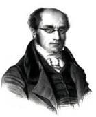{.calibre3}]{.calibre_10}

[Michel. --- Jusqu'au 21 décembre caché à Paris. --- Du 21 décembre au 7 janvier caché à Verdun par Mme Cassai. Le frère de Mme Cassai vient au-devant et le fait entrer en ville malgré les fortifications. --- Averti le 9 qu'on va venir prendre I. (Isidore Buvignier), quitte Verdun, gagne la frontière à travers les neiges par les Ardennes. Passe la frontière paisiblement dans la voiture d'un notaire. Arrive à Arlem, s'y nomme. De là à Bruxelles.]{.calibre4}

[[
]{.calibre_7}]{.bold}

### [[[]{.calibre2}[]{.calibre2}[]{.calibre2}[]{.calibre2}[]{.calibre2}[]{.calibre2}[Police belge]{.calibre2}]{.bold1}]{.calibre_39} {#police-belge .calibre_38}

[ ]{.calibre4}

[Jeanty-Sarre réussit à s'échapper de Paris, arrive à Bruxelles, et va à la police.]{.calibre4}

[L'homme préposé aux étrangers le reçoit en le regardant de travers.]{.calibre4}

[--- Qui êtes-vous, monsieur ? Probablement un refugié politique\....]{.calibre4}

[Jeanty-Sarre l'interrompt :]{.calibre4}

[--- Moi, par exemple ! J'étais dans le commerce, je n'ai pas réussi dans mes affaires, j'ai été forcé de déposer mon bilan, et je viens à Bruxelles\...]{.calibre4}

[--- Pour échapper à vos créanciers, dit l'homme en souriant. Ah ! c'est bien différent, monsieur. Donnez-vous la peine de vous asseoir. Vous resterez à Bruxelles.]{.calibre4}

[ ]{.calibre4}

[{.calibre3}]{.calibre_10}

[ ]{.calibre4}

[--- Monsieur, vous êtes un démagogue.]{.calibre4}

[--- Pour qui me prenez-vous ? je suis un banqueroutier.]{.calibre4}

[--- À la bonne heure]{.calibre4}

[[
]{.calibre_7}]{.bold}

### [[[]{.calibre2}[]{.calibre2}[]{.calibre2}[]{.calibre2}[]{.calibre2}[]{.calibre2}[Caillaud]{.calibre2}]{.bold1}]{.calibre_39} {#caillaud .calibre_38}

[ ]{.calibre4}

[[Caillaud ---]{.italic} lieutenant-colonel de la garde républicaine. Il a formé ce corps.]{.calibre4}

[Ne pas le nommer dans ce qui pourrait le compromettre.]{.calibre4}

[ ]{.calibre4}

[[2 décembre.]{.italic}]{.calibre_26}

::: calibre_27

[Rue des Petits-Augustins, des commissaires de police en écharpe à la tête de deux compagnies de ligne lancées au pas de course, investissaient la rue et pénétraient dans les maisons pour chercher les représentants qu'on y croyait cachés. Vers 1 heures. Dans ce même moment passaient rue Jacob des petits coupés avec des sergents de ville dedans allant faire des arrestations mettaient pour cela les fiacres en réquisition sur toutes les places voisines. Crémieux arrêté dans ce moment-là. (Antérieurement au coup d'État, 15 jours avant le 2 décembre, Mme Thuillier, dont le fils travaillait au [Père Duchéne]{.italic}, habite rue de Neuilly, dans une pension. Elle dit au colonel Caillaud : Je ne sais ce qui se passe, mais le secrétaire d'un commissaire de police vient dîner ici. Depuis quelque temps, il s'en va tout de suite, car nous sommes tous consignés dit-il. Tout ce qui appartient à la police est consigné, commissaires, secrétaires, etc. Il y avait des rumeurs à la préfecture de police et l'on entendait des agents dire Qu'est-ce que cela nous fait à nous ? Nous arrêterons tout ! Un disait : [J'arrêterai mon père, si l'on veut]{.italic} !)]{.calibre4}

[Le 2 au soir, un maître charpentier de la barrière du Combat, nommé Cuvillier, parcourait la rue Saint-Martin avec son poignard dans sa poche, prêt au combat. Le 3 décembre. Au soir, sur les boulevards, cris Vive la République Groupes. Manifestations du boulevard Poissonnière à la Porte-Saint-Denis. Un individu, cheveux gris et barbe blanche, vêtu de noir, criant À bas le tyran Le lendemain 4, le même rue de Choiseul, avec deux prêtres. Agent légitimiste probablement.]{.calibre4}

[ ]{.calibre4}

[[Le 4.]{.italic}]{.calibre_26}

::: calibre_27

[XIIème arrondissement --- peu ému. --- Pourtant 200 ou 300 hommes prêts à combattre. Descendent rue Saint-Martin. Le colonel Caillaud en emmène les plus résolus, il voulait trouver le 15ème léger, qu'il espérait enlever. Il rencontre le 15, en effet, place de la Concorde, il était une heure, mais tout s'ébranlait pour le combat, cavalerie, artillerie, par divisions et brigades et marchant en ligne. Le 15^[e]{.calibre18}^ a marché, au reste. Regards d'intelligence d'un chef de bataillon républicain et de Caillaud. Nul doute qu'il n'eût tourné avec son bataillon, et peut-être son régiment. Caillaud les suit jusqu'à la rue de Choiseul, là, séparé par la foule. Est forcé de faire le tour par la rue de la Paix et la rue Neuve-Saint-Augustin, retardé rue de la Paix par le passage des lanciers (ivres, et en particulier les deux adjudants-majors dont [un ne pouvait pas se tenir sur son cheval]{.italic}. [On s'attendait à le voir tomber à chaque instant]{.italic}.)]{.calibre4}

[La ligne était sur la chaussée au centre, sur les trottoirs marchaient les gendarmes mobiles. Un lancier (ivre) qui s'était porté en avant rencontre des bourgeois, sabre à la main, frappe les bourgeois, 50 ou 60 jeunes gens l'entourent en criant : [Arrêtez !]{.italic} Le lancier revient au galop. On crie : [A l'assassin !]{.italic} Préludes.]{.calibre4}

[Caillaud prend des pistolets, puis va par la rue des Jeûneurs, espérant retrouver le 15^[ème]{.calibre18}^. Impossible. Par la rue Mulhouse gagne le Petit-Carreau, trouve une barricade faite --- gagne la Porté Saint-Denis là commencent, rue Poissonnière et rue des Jeûneurs et rue Saint-Fiacre, les feux de peloton et les feux de deux rangs. Le feu dure 20 minutes sans arrêter. Rue des Jeûneurs plus de 200 s'enfuient, poursuivis par les balles une porte est ouverte, ils s'y jettent, le portier veut la fermer un jeune homme, locataire, crie au concierge : Laissez la porte ouverte ! et les 200 sont sauvés. (Le 4 au matin à 10 heures rue Neuve-des-Petits-Champs à la hauteur de la rue Richelieu, une voiture du Trésor à 4 chevaux, trois employés en tricorne sur le dôme de la voiture, venant de la banque et très chargée visiblement se dirigeait du côté des finances. Une autre, à 3 heures, pareille à celle du matin, rencontrée sur la place de la Bourse, allait vers le Trésor par la rue Neuve-Saint-Augustin.)]{.calibre4}

[Quai de l'école, Caillaud accompagné de 5 ou 6 du VIe arrondissement, marchant séparés à 10 pas de distance, est arrêté par des sergents de ville. --- Où allez-vous ? --- Je vous connais, vous êtes le colonel Caillaud. --- Il s'était débarrassé de ses pistolets à l'entrée[[[[^\[107\]^]{.calibre_21}]{.underline}]{.calibre_4}](index_split_4933.html#filepos40219333){#filepos39019323}................ (tout désert sur les quais) il y avait 30 gardes républicains............... prêts à mettre en joue, allant de ci de là, dans l'attitude de chasseurs qui attendent le gibier. --- Sur les marches du pont, derrière Caillaud, ils disent : --- [N'allez pas plus loin. Jetez-nous-le]{.italic}. Nous allons le fusiller là. Caillaud se retourne : --- Qu'est-ce que j'entends ? Qu'est-ce que vous dites ? Vous n'êtes pas des soldats français, vous n'êtes pas même des vous êtes des assassins. --- Le sergent de ville regarde fixement Caillaud avec un air de profonde indécision, 5 minutes, puis se baisse vivement, lui tâte les poches de la redingote, n'y trouve rien, et crie aux autres : --- Pas encore ! On le mène au terre-plein de la statue Henri IV. Là les chefs de police. On le fait rester en arrière. Il n'entend pas la conversation. Il voit seulement le bras d'un officier de paix levé vers la préfecture de police. On l'y conduit. Cour de Harlay, le sergent de ville entre chez le commissaire un moment, puis revient, on le fait entrer, on lui demande ses noms, il demande lecture du procès-verbal, on lui dit : [C'est inutile. --- Conduisez M. au dépôt.]{.italic} --- Le sergent de ville oublie d'aller chercher un billet d'écrou au bureau de permanence, le directeur du dépôt refuse de recevoir Caillaud. On mène Caillaud à la permanence au chef de bureau Lemaire. Là, Caillaud raconte le fait des marches du Pont-Neuf, et le sergent de ville s'écrie Vous êtes bien heureux que je n'aie rien trouvé sur vous ! Vous ne seriez pas ici Caillaud connaissait le directeur du dépôt. (Voir les paroles du directeur sur la feuille jaune)]{.calibre4}

[Caillaud était au dépôt dans une salle au premier donnant sur les écuries de la préfecture. Il voyait par la fenêtre tout ce qui se passait. Sous la fenêtre un garde républicain et un sergent de ville en faction les yeux fixés sur les fenêtres. Un visage apparaissait, couché en joue Va-t'en, ou je fais feu ! --- Cependant Caillaud regardait. A chaque instant, 8 et 10 fois par jour (le 5, le 6, le 7, le 8) on amenait des prisonniers. Sitôt entrés dans la cour, on les assommait à coups de massue à boules de plomb. Un se défendait avec son parapluie, le crâne enfoncé. On les jetait ainsi ensanglantés dans les cachots. Cris nuit et jour. --- (À la Conciergerie 18 ou 19 hommes assommés et mutilés par les sergents de ville, mis dans un cachot au-dessous du niveau de l'eau, les uns sur les autres, sans voir clair, sans rien. Le lendemain on leur a jeté un morceau de pain comme à des chiens.]{.calibre4}

[Une telle rage d'arrestations que rue Mouffetard, près de la caserne de la garde républicaine, les agents se sont présentés chez un portier et ont dit Donnez les noms de vos locataires. Le portier a donné les noms. Onze ou douze locataires. Ils ont tout arrêté. (Ceci le 5 ou le 6.)]{.calibre4}

[Fait du beau-frère du général Le Flô, juge d'instruction à Morlaix, en congé à Paris. (Voir la feuille jaune [fusillades]{.italic})[[[[^\[108\]^]{.calibre_21}]{.underline}]{.calibre_4}](index_split_4933.html#filepos40219644){#filepos39023228}. Il demande à écrire à Mme Saint-Arnaud. Mme Saint-Arnaud a fait envoyer un aide de camp de son mari qui l'a élargi, mais en le menant lui-même au chemin de fer. Caillaud reste au dépôt 11 jours. On les menait à pied à Bicêtre, armes chargées, et ceci : [le premier qui bouge, fusillé]{.italic}. Caillaud fut mené en voiture cellulaire. 25 jours tant à Bicêtre qu'à Ivry. Le 17 janvier part avec Amable Lemaître. Le 9 il y eut trois transferts au fort d'Ivry, dont un venait de la préfecture, environ 80 prisonniers dans lesquels la police mêle des repris de justice, 7 ou 8. Le 10, sur le [Canada]{.italic}. À la pointe de Plymouth, manque échouer, touche deux fois. Un câble tombe dans la machine. La machine par bonheur broie le câble. Sans quoi perdus. (Transbordés du Canada sur le Duguesclin.) Le capitaine Mallet leur dit J'ai reçu des feuilles vous concernant tous. Votre position m'est connue. Les uns condamnés à l'Afrique et [plus]{.italic}, les autres à l'Afrique et [moins]{.italic}, les uns police correctionnelle, les uns expulsés, les autres déportés, ceci n'est pas officiel, mais officieux. Tartuffe loup de mer.]{.calibre4}

[Vermine. Caillaud couvert de petites plaies de la tête aux pieds. Eau infecte. Après avoir bu, on restait la bouche ouverte pour en perdre le goût. Pas tous les jours de l'eau douce, habituellement de l'eau de mer distillée qui laissait le goût infect que je viens de dire. Fadeur, corruption, goût de cadavre, chien noyé.]{.calibre4}

[Les républicains chantaient [jusqu'au coup de canon]{.italic}. (Le capitaine Mallet étant le plus ancien commandant de la rade, son vaisseau donnait matin et soir par un coup de canon le signal du service.) À partir du coup de canon, profond silence. Mallet, honteux de sa position, ne regardait pas les déportés en face, [toujours les yeux sur ses bottes]{.italic}.]{.calibre4}

[Le colonel Caillaud, [toujours glacé, ne sentait plus ses jambes]{.italic}. Beau vieillard, à cheveux blancs, barbe et moustaches blanches.]{.calibre4}

[[
]{.calibre_7}]{.bold}

### [[[]{.calibre2}[]{.calibre2}[]{.calibre2}[]{.calibre2}[]{.calibre2}[]{.calibre2}[Amable Lemaître (Pontons.)]{.calibre2}[[[[[[^\[109\]^]{.bold1}]{.calibre_43}]{.calibre2}]{.underline1}]{.calibre_42}](index_split_4933.html#filepos40220002){#filepos39026147 .calibre2}]{.bold1}]{.calibre_39} {#amable-lemaître-pontons.109 .calibre_38}

[ ]{.calibre4}

[Le 9 janvier vers 10 heures du soir ils étaient environ 300 au fort d'Ivry. --- On leur mit les chaînes aux mains. Après un appel on les mit en rang deux par deux. On leur dit avant de partir que le moindre cri, le moindre geste, serait réprimé par la force, et on fit charger les armes. Escorte de cavalerie et d'infanterie, derrière deux pièces attelées dont les prisonniers entendaient le roulement sur le pavé. À 10h, partent, arrivent à Paris en silence vers 1 h. du matin. Nuit profonde. Paris mort. Passent devant Bonvalet, où il y avait une noce. Voient en passant danser les ombres sur les vitres éclairées. Suivent les boulevards depuis la barrière Fontainebleau jusqu'au chemin du Havre. Là, force sergents de ville. Brutalités. Canailles ! gibier de Cayenne etc. Des coups de poing et de pommeau d'épée. Là, des prisonniers d'Orléans et de Chartres. Embarqués silencieusement vers 2 heures dans des wagons de [2^[e]{.calibre18}^]{.calibre_63} classe, dans chaque wagon un gendarme et un sergent de ville, 8 prisonniers avec. En tout 475 prisonniers, sur lesquels 16 enfants de 14 à 17 ans.]{.calibre4}

[Arrivés au Havre à 11 h. du matin. Placés entre deux haies de soldats, et immédiatement menés au port. Là le [Canada]{.italic}, frégate à vapeur, mauvais bâtiment, construit autrefois pour le service des paquebots transatlantiques. Une compagnie de soldats de marine en bataille sur le pont, les matelots avec les pistolets et le sabre d'abordage, le capitaine debout sur le pont. On commence l'embarquement, par des ponts en planches et des échelles. Pas de sympathie dans la population. Ils étaient annoncés comme des forçats. Les premiers 40 qui arrivent sur le pont, le capitaine de frégate commandant fait une allocution Vous serez traités avec sévérité, mais avec justice. Aucune résistance. La moindre velléité sera réprimée par la force. Obéissance passive. C'est la loi dans la marine. Ainsi gare à vous.]{.calibre4}

[Un bossu qui ne pouvait plus se soutenir fut porté sur des fusils et embarqué malgré plusieurs prisonniers réclamant pour lui l'hôpital.]{.calibre4}

[ ]{.calibre4}

[À BORD. AVANT LE DÉPART]{.calibre_10}

[ ]{.calibre4}

[À 4 h : du soir, embarquement terminé. On leur donne à manger. A jeun depuis Ivry. On s'était partagé quelques tablettes de chocolat. Aucun avertissement la veille, aucune provision. Les enfants tombaient de faiblesse. On leur apporta des baquets pleins d'une sorte de soupe grasse avec on ne sait quels légumes et de la viande et du pain nageant. C'est comme cela, dit un, qu'on sert les cochons chez nous. Pas de cuiller. On prenait avec ses doigts et on mangeait comme on pouvait. Baquets sales, noirs et qui semblaient avoir servi à toute autre chose. Des barriques à harengs, sciées en deux. Par 10 hommes, on avait choisi un chef de plat qui allait chercher le baquet, l'un apportait le baquet, l'autre le pain (de munition ordinaire).]{.calibre4}

[On les avait fait descendre dans l'entrepont, sous le gaillard d'avant et sous le gaillard d'arrière, trois compartiments différents. L'entrepont était divisé en deux par une double cloison faisant corridor où se tenait la gendarmerie le pistolet au poing et la menace à la bouche. Se sont adoucis plus tard. L'entrepont moins élevé qu'un homme de grande taille, 5 pieds 8 pouces. Le docteur Thomassin, homme de 6 pieds environ, et deux autres, forcés de rester courbés ainsi courbés du 9 janvier au 20 mars.]{.calibre4}

[Ni sièges, ni lits, ni hamacs, aucune fourniture. Assis par terre. À chaque bout un grand baquet de deux pieds de diamètre, pour les excréments, sans couvercle. Nuit et jour. La lumière venait par les hublots. Le bâtiment était de très bas bord, embarquait beaucoup d'eau. Ils furent forcés dans la traversée de fermer les hublots qui étaient garnis comme d'ordinaire de gros verres dépolis. Défense de fumer. Sinon les fers, à fond de cale. Manquant d'air et asphyxiés, ils ouvraient les hublots, l'eau de mer les inondait et les laissait glacés et grelottants. Les baquets n'étaient pas attachés. Le tangage les renversait. Autre inondation. Fétidité. Force malades du mal de mer, vomissant sur tous, notamment Lachambeaudie. Espace si étroit qu'il n'y avait pas de place pour être tous couchés à terre, pas de paille, les uns adossés aux planches, les autres la tête sur leurs genoux. Le second jour seulement des couvertures.]{.calibre4}

[ ]{.calibre4}

[EN ROUTE SUR LE CANADA]{.calibre_10}

[ ]{.calibre4}

[Le 10 on partit vers 4 h. du soir. Le dimanche 11 aperçoivent Cherbourg, le lundi 12 croient avoir marché ; revoient encore Cherbourg. Gros temps. 13 et 14 --- gros temps.]{.calibre4}

[Un nommé Gérard, maire d'une commune d'Eure-et-Loir, arrêté ainsi : --- Vous êtes le maire ? --- Non. Je suis l'adjoint. --- Nous vous arrêtons. --- Mais vous venez pour le maire. --- Oui. C'est égal, nous vous arrêtons tout de même. --- Sur le [Canada]{.italic}, malade. Criait : Matelots, doucement ! Matelots, pas si vite ! --- Riche cultivateur. Bonapartiste. Erreur. --- Disait aux autres : J'ai pourtant fait aiguiser mes baïonnettes contre vous. --- Va-t'en, canaille ! disaient les enfants de Paris.]{.calibre4}

[Dans la nuit du 13 au 14, on gouverne loin de la côte, pour ne pas s'y briser. --- Dans la nuit du 14 au 15, tempête. Le navire perd équilibre. Les boulets sortent de leur dé et roulent à travers le pont. Les lames balaient le pont, brisent le bastingage, démontent une roue, la poulaine enlevée ainsi que les ailes de la roue. Le 15, meilleur temps. On gouverne sur Brest. On y entre le lundi 16, septième jour depuis le Havre. (Ce retard les sauve de Cayenne.)]{.calibre4}

[Pendant la traversée, étant de 7 jours, on les laissa monter sur le pont un quart d'heure par jour, sous l'oeil des gendarmes le pistolet au poing, et par fractions.]{.calibre4}

[Défense aux matelots de leur parler. (Vieux bâtiment, équipage neuf. Cela allait mal.) On leur avait dit que c'étaient des galériens. Les matelots s'aperçurent que ce n'était pas vrai, s'amadouèrent et leur serraient les mains à la dérobée. Le soir dans l'entrepont les prisonniers chantaient des chants républicains, les matelots venaient écouter. Punis pour cela. On veut empêcher le chant. Les prisonniers tiennent bon. Une fois ils chantèrent le Vengeur. Les matelots applaudirent. Les gendarmes se fâchèrent. Refrain :]{.calibre4}

[[]{.italic}]{.calibre_10}

[[Les marins de la République]{.italic}]{.calibre_10}

[[Montaient le vaisseau le Vengeur !]{.italic}]{.calibre_10}

[[]{.italic}]{.calibre_10}

[Les matelots criaient : bis ! bis ! Le soir entre eux, ils faisaient des récits. La nuit commençait de bonne heure, triste. Serrés les uns sur les autres. On se contait des contes pour s'endormir. Quelques-uns des choses de la Révolution. Lachambeaudie disait des fables. On appelait Lemaître : béret blanc. (Son béret)]{.calibre4}

[Pas de cantine sur le vaisseau. Ils demandèrent du vin. On leur en donna le troisième jour, après avoir consulté le règlement de mer, on les assimila aux mousses auxquels (en mer) le règlement permet de donner du vin. Vin de Bordeaux. Bon. Un verre par jour. De l'eau à discrétion, mais saumâtre. Buvaient au bidon pour le vin, un matelot apportait un broc et un gobelet d'étain. Dix gobelets dans un broc. Chacun buvait à son tour au gobelet banal. Aucune toilette. Lavage sur le pont avec de l'eau de mer. À force de fatigue on finissait par dormir. Lachambeaudie qui a des douleurs de coeur n'a pu réussir à trouver le sommeil.]{.calibre4}

[Sur le [Canada]{.italic} on offre à quelques-uns pendant le gros temps de les débarrasser des gendarmes plus malades que les prisonniers, livrés à leur discrétion, couchés sur les escaliers, cloisons ouvertes, vomissant. Un voulait se brûler la cervelle. Quelques matelots dirent : --- Rendez-vous maîtres des gendarmes et de nos officiers. Prenez le commandant, et nous vous mènerons où vous voudrez. --- Un matelot rencontrant Amable Lemaitre à la poulaine lui en fit l'ouverture formelle : --- Mettez le pistolet sur la gorge du commandant et exigez qu'il vous débarque en Angleterre. --- Vasbenter aussi eut l'idée. Offert aussi à Mayer. --- Eurent quelques velléités, mais trop de prisonniers étaient accablés du mal de mer. Renoncèrent. --- Les matelots leur donnaient de leur eau-de-vie.]{.calibre4}

[Spectacle terrible que cet entrepont plein de malades. Les uns furieux, les autres pleurant. Les paysans abattus, les hommes des villes énergiques et [gais]{.italic}. Dans le [Canada]{.italic} : Michot-Boutet, représentant, abattu Pereira, ancien préfet, ferme A. Martin, représentant, affreusement malade goutte, rhumatismes, énorme ; Cahaigne, journaliste de la [Réforme]{.italic} ; Xavier Durieu, ancien constituant le colonel Caillaud le commandant Beaumont, de l'ex-garde républicaine, qui avait commandé l'Hôtel de ville sous Marrast ; Laviolette, négociant riche, capitaine de la [3^[e]{.calibre18}^]{.calibre_63} légion, à Paris Lignières, fabricant de châles ; trois ou quatre médecins, dont Thomassin Borel Royat, graveur, qui avait fait ma médaille du 5 avril (voir mon discours sur la déportation) ; Garraud, statuaire, ancien directeur des Beaux-Arts ; Kesler, de la [Révolution]{.italic} ; Vasbenter, du [Peuple]{.italic} ; Tavernier, rédacteur en chef de la [Constitution du Loiret]{.italic} ; d'anciens notaires, 10 anciens officiers ministériels, plusieurs maires de villes et villages. --- Xavier Durieu très bien, un peu passif. --- Quelques anciens transportés qui trouvaient l'ancien traitement fort doux en comparaison.]{.calibre4}

[Pendant la traversée, Amable Lemaître écrit une relation des faits et des souffrances, la met dans une bouteille et la jette à la mer par un hublot.]{.calibre4}

[En rade de Brest le 16 janvier. Le [Canada]{.italic} jette l'ancre. Passent sur le [Canada]{.italic} la nuit du 16 au 17. (Dans la nuit du 15 au 16, la tempête si forte que les matelots eux-mêmes étaient malades. On dut relever le quart avant l'heure. Les gendarmes gisaient, les prisonniers allaient et venaient presque en liberté, mais tombaient à chaque pas. Plus de marche à la voile. La marche à vapeur d'une seule roue, on n'allait plus qu'au gouvernail.)]{.calibre4}

[Ils espéraient être mieux, le [Canada]{.italic} n'étant qu'un passager. A Brest on leur dit qu'ils étaient déportés à Cayenne, que des notaires pouvaient être mandés par eux pour recevoir leurs volontés, comme pour un testament. En arrivant ils virent en rade la [Belle-Poule]{.italic}, frégate, l'Allier, vaisseau, quelques autres et le [Duguesclin]{.italic}, épars dans la rade. Le [Duguesclin]{.italic} était le vaisseau commandant. Tous à l'ancre. Le 17 janvier un peu de soleil. Mer calmée. On vint les prendre par 40 hommes, on les mit entre gendarmes dans les chaloupes du [Duguesclin]{.italic}. Le commandant Bouët vint sur son canot, descendit avec les premiers 40, et les remit au capitaine (de 2^[e]{.calibre18}^ classe) Mallet, commandant le [Duguesclin]{.italic}. Le trajet des chaloupes se fit sans incident. L'embarquement dura deux heures.]{.calibre4}

[ ]{.calibre4}

[SUR LE DUGESCLIN]{.calibre_10}

[ ]{.calibre4}

[Aspect du [Duguesclin]{.italic} tout différent du [Canada]{.italic}. Vaisseau de 74. Trois batteries. Hauteur d'un second étage au-dessus de la mer. Là reçus entre des haies de soldats de marine, vestes, collets rabattus, mousquets, sabres d'abordage, chapeaux ronds vernis. Les matelots pistolets au poing et sabres d'abordage. En arrivant sur le pont ils virent le gaillard d'arrière armé de ses caronades et les canonniers à leurs pièces. Impression de terreur. Équipage nombreux. Vaisseau couvert de troupes. Environ mille hommes.]{.calibre4}

[ ]{.calibre4}

[Sur le pont on les fit ranger par 40. (On les avait fait délier sur le Canada.) On leur demande s'ils avaient choisi par 40 un délégué : ils dirent oui. (On les désignait entre soi par acclamation.) Voici les délégués Victor Gay, propriétaire --- Lavaur, négociant en vins --- Leroy, notaire --- Couverchal, marchand de vin à Bercy --- A. Lemaître, journaliste --- Delenter, libraire --- le baron Hennett de Kesler, ancien attaché d'ambassade, rédacteur de la [Révolution]{.italic} --- Tavernier, rédacteur en chef de la [Constitution du Loiret]{.italic} --- Vasbenter, rédacteur du [Peuple]{.italic} --- Legendre, artiste dessinateur --- Lemercier, ancien limonadier. --- Par 40, 4 chefs de plats également élus chargés d'aller chercher la pitance. --- À chacun, en arrivant, une toile à hamac et une couverture. Ni écuelles, ni cuillers. --- Rade de Cherbourg quelques-uns avaient fait acheter des cuillers, mais il y en avait une par 10 hommes. Plus tard une femme de Brest visitant le vaisseau fut prise de pitié et envoya 3 ou 400 cuillers de fer.]{.calibre4}

[La même allocution de police que sur le Canada leur interdisant toute communication avec les matelots sous peine des fers. Les délégués chargés de recueillir toutes les plaintes : --- Vous faites une réclamation ? --- De quelle section êtes-vous ? --- De la\... --- Quel délégué ? --- Un tel. --- Eh bien, dites-lui de faire votre réclamation. --- A mesure que les hommes étaient distribués (par un maître d'équipage assisté de deux matelots), descendaient dans la batterie basse. --- Longue, haute de 5 pieds 6 pouces. (Thomassin toujours courbé.) Éclairée par les hublots. Aux deux extrémités deux retranchements en poutrelles doublées de fer à claire-voie. Dans chaque retranchement quatre pièces de canon de 8 en cuivre très luisantes et plus soignées que les prisonniers, --- polies chaque jour. --- Meurtrières par où l'on pouvait les mitrailler.]{.calibre4}

[Sous l'escalier, au milieu, un tonneau appelé le charnier où l'on mettait l'eau à boire. --- Eau mauvaise. --- Ils en manquaient quelquefois. Les conduits de cuivre les empoisonnèrent tout un jour. --- On avait oublié de nettoyer le chainier(on leur donna, dans l'intervalle du nettoiement, de l'eau dans des bidons). On buvait à ce charnier au moyen de tuyaux de fer plongeant dans l'eau en aspirant fortement, ce qui fit plusieurs phtisiques. Les matelots appellent cela [boire au téton]{.italic}. Plus tard on découvrit le charnier sur réclamations et ils purent puiser.]{.calibre4}

[Toilette faite à l'eau de mer qui ne lave pas. Ils n'obtinrent de laver le linge que dix ou douze jours après leur embarquement. Ainsi les arrêtés du 2 décembre étaient depuis deux mois avec leurs chemises sales sur le corps. Vermine. Le linge rempli de poux. Les officiers se plaignirent de voir leurs chemises sécher au soleil. Le commandant Picard leur dit : Vos sacrés poux tiennent plus que les autres. J'ai eu des poux de matelots. Les poux de républicains sont pires. --- Torture la nuit. Il y avait deux rangs de hamacs, un rang près du sol, l'autre près du plafond. Quelques-uns aimaient mieux coucher par terre. Pour aller aux poulaines (lieux) la nuit il fallait ramper à travers cela, déranger les uns, réveiller les autres, se traîner sur tous. Le soir il fallait aider les vieillards à entrer dans leur hamac. Peu savaient faire le noeud de matelot. Ils avaient trois manchots (entre autres Fournier qui avait été fusillé et manqué le 13 juin) et deux jambes de bois, huit ou dix sexagénaires. Les enfants grimpaient aux hamacs en riant, les vieux en gémissant.]{.calibre4}

[Ils avaient de la vermine dès les casemates. Quelques-uns en avaient au point qu'on voyait leurs vêtements remuer. Une partie du jour, ils se mettaient nus devant les hublots, et tuaient leurs poux. Les gamins de Paris en riaient, les appelaient les pégostes et leur mettaient comme aux mouches des queues en papier et de petites voitures. Sur 475 hommes 268 galeux. Les poux n'ont pas d'autre inconvénient que d'empêcher de dormir et d'exciter l'appétit.]{.calibre4}

[Les hamacs faisaient plus que se toucher, ils s'enchevêtraient. Le faux pont était encombré de grandes caisses à eau pour l'éventualité de Cayenne, diminuant encore l'air respirable. Atmosphère chaude et affreusement fétide. Quand les corps étaient couchés la nuit on levait les hublots et il faisait très froid. Toutes les nuits querelles pour les couvertures et les hamacs qu'on prenait les uns aux autres, n'ayant rien pour les serrer. Qui avait perdu son hamac passait la nuit debout ou couché à même sur le plancher.]{.calibre4}

[Rixes fréquentes. Irritabilité générale. Impossibilité de se recueillir un instant et de travailler à quoi que ce soit. Hommes se coudoyant et se marchant sur les pieds toute la journée, se traînant les uns sur les autres toute la nuit, [se chipant]{.italic} le pain (on n'en donnait pas assez). C'était du pain de galérien inférieur au pain de soldat. Lachambeaudie ne pouvait manger chaud. On se jetait sur les gamelles bouillantes. Tant pis pour les retardataires. Amable Lemaître avait une terrine de foie gras. Il la lui prêta pour manger. On mangeait accroupi autour des gamelles, chacun puisant à son tour et mangeant à même. Souvent on se battait. --- J'ai la gamelle, je la garde, et je casse la gueule au premier qui vient me la prendre. --- Pas de lecture possible. Les hublots étant l'air de tout le monde, on n'y stationnait pas. On passait la journée à rien faire. Quelques-uns jouaient aux cartes.]{.calibre4}

[Avertis qu'à la moindre rébellion on les mitraillerait. Les gendarmes toujours au guet disant : Eh bien ! faut-il aller là-bas ? --- On prenait les premiers venus, et on les mettait aux fers. La souffrance amenait des cas de folie. Quelques-uns devinrent furieux (les plus paisibles auparavant). On les mettait aux fers. L'infirmerie était dans un coin du faux pont, du côté opposé était le poste des délégués avec les onze hamacs. À l'autre bout [les poulaines]{.italic}.]{.calibre4}

[ ]{.calibre4}

[TORTURES ET MAUVAIS TRAITEMENTS]{.calibre_10}

[ ]{.calibre4}

[Journée : le matin, pas de réveil général. Le soir, pas de coucher général. On n'était réglé que par l'impossibilité de circuler. --- Dors ou fais semblant, comme aux galères. --- À 8 heures, au jour, distribution de pain. Vers midi, la soupe, haricots, féverolles, gourganes (2 fois par semaine, jeudi et dimanche, de la viande). Le soir, vers 4 heures, autre soupe, ni beurre ni graisse, légumes cuits à l'eau et attendris, étant fort vieux et surs, avec de la potasse qu'on reconnaissait parfaitement. Cinq fois la semaine, légumes secs ou morue (gâtée) cuite à l'eau ; deux fois viande bouillie, boeuf (non divisé par portions, mêlé au bouillon. Il fallait l'y pêcher et se l'arracher. Sur le Canada il y avait des cheveux. Pas sur le [Duguesclin]{.italic}). Une fois seulement on trouva un cigare dedans. --- Les matelots avaient du vin et cinq fois de la viande.]{.calibre4}

[Gale, 268 galeux. Que faire ? Les retrancher. On fixa une cloison. Vous d'un côté, eux de l'autre. On refusa. On serait encore plus mal. Plus de place pour se mouvoir. --- L'équipage d'abord hostile est devenu peu à peu bienveillant et même les gendarmes.]{.calibre4}

[En route, le [Canada]{.italic} avait touché deux fois. Le danger fut grand. Le mécanicien prit ses précautions. Il avait mis son argent dans une ceinture de cuir, résolu à se jeter à l'eau et à gagner les chaloupes de sauvetage à la nage.]{.calibre4}

[Sur le [Duguesclin]{.italic} toutes les lettres ouvertes, rapports faits sur certaines. Lettres remises tard aux prisonniers, souvent supprimées. Il y avait dans un coin du ponton une boîte à lettres. On était quelquefois trois jours sans la lever. Nulle réponse aux plaintes. Le commandant Mallet lut une lettre où on l'appelait polisson. Dans une autre : [ce muffle de commandant croit que nous ne fumons pas, nous fumons dans les coffres.]{.italic} --- On mit les signataires aux fers, c'étaient Boulanger, ouvrier ébéniste, manchot, et Deraisse. Ils y restèrent cinq jours. Un voleur qui avait été mêlé à eux, et qui vola dans le faux pont, y fut mis également. La mise aux fers : on était descendu dans la cale, les fers aux poignets et aux pieds, assis sur le plancher, force poutres à terre, empêchant de se coucher.]{.calibre4}

[Le commandant Mallet, sorte de préfet de police. Recevait les dénonciations, provoquait les demandes de grâce dont il disait ensuite : [Je reçois tous les jours 20 ou 30 platitudes]{.italic}. Le 22 février le commandant apprit qu'on avait acheté des vivres pour fêter le 24. Il profita de cela pour faire lire dans la batterie le décret abolissant la fête, avec défense d'y contrevenir par quelque manifestation que ce fût. Une souscription avait été faite. Il fit défense aux cantinières de monter à bord. --- Ils étaient quelquefois jusqu'à cinq ou six jours sans monter sur le pont, enfermés, ne pouvant ouvrir les sabords, n'ayant d'air que par les hublots. Une fois ils furent douze jours enfermés, 475 hommes ! Le commandant en second, Picard, dit : [Il faudrait faire monter MM. les citoyens, car ils doivent moisir]{.italic}. (Le sabord est une trappe de 4 ou 5 pieds carrés, par où passe la bouche des canons. Cette trappe se lève dans l'intérieur du pont. Quand il n'y a pas de canons, on ferme le sabord. Au milieu du sabord il y a une plus petite trappe qui s'ouvre et se ferme, également vitrée d'un épais verre dépoli, cette trappe, c'est le hublot.) Ordre était donné de ne pas les laisser monter sur le pont, c'était une clémence du commandant de les laisser monter. Chaque fois qu'ils y étaient, il y avait une vigie à la lunette pour voir si quelque embarcation ne se détachait pas du port vers le navire.]{.calibre4}

[ ]{.calibre4}

[LE RÉGIME ALIMENTAIRE]{.calibre_10}

[ ]{.calibre4}

[Exaction sur les vivres : on leur vendait 1 fr. 10 des pains blancs qui ne coûtaient à Brest que quinze sous. Viandes si avariées qu'un jour le médecin en dut faire jeter à la mer. Nulle taxe aux cantinières. Les prisonniers livrés à leur caprice. Ils demandèrent qu'on leur permît d'acheter du vin. Point, Le commandant fit distribuer des jeux : damiers, échecs, cartes, sources de querelles et de troubles. Et il refusait des cuillers pour manger. Il avait promis des livres. Les jeux seuls vinrent.]{.calibre4}

[Le commandant en second, Picard, haineux et hautain. Le colonel Forget chargé des détenus les molestait pour plaire à Picard. Leur annonçait toutes les mauvaises nouvelles et s'en faisait une joie, en leur disant sans cesse Vous êtes pour Cayenne. --- Raillait. --- Biscuit plein de vers. --- Tout le biscuit est comme ça, c'est la vie de mer, dit Forget. --- Sa vue voulait dire : [mauvaise nouvelle]{.italic}. Il disait : [La morue, pour être bonne doit être gâtée]{.italic}. --- Un jour, un qui est à Lambessa, Lavaur, lui dit Vous serez peut-être un jour à notre place et nous à la vôtre. Eh bien ! nous serons meilleurs que vous. --- Bah ! dit Forget.]{.calibre4}

[--- Mallet, ancien bonapartiste, doucereux, jésuite. --- Les médecins, bien. --- Les visages étaient si altérés que le médecin dit : Il faut absolument du vin. --- On donna du vin à 40 par jour. --- Augmentation de dépense. Le cinquième jour on cessa la distribution. Le médecin offrit de payer le vin de ses deniers. --- Non ! dit Picard. (Les galeux demandèrent de la pommade camphrée, on ne voulut leur donner que de la pommade, soufrée, [en haine de Raspail]{.italic}.)]{.calibre4}

[A. Martin, Pereira et Michot-Boutet furent mis à terre sitôt l'arrivée à Brest et enfermés au château de Brest avec Sainguerlé. Xavier Durieu tomba malade et fut porté à l'hôpital. --- 50 lits à l'hôpital toujours occupés par les prisonniers. Il y a à bord deux escaliers extérieurs pour entrer et sortir du vaisseau l'escalier du commandant, commode, et l'escalier des matelots, échelle fixe appliquée contre la paroi du bâtiment, avec deux cordes pour l'aide. Gymnastique. Les malades forcés de descendre par là. Défense de passer par l'escalier du commandant. Les visiteurs, oui, les malades, non. [C'est le règlement]{.italic}. Les déportés étaient du bétail à bord. --- À Brest, quand on les sut arrivés, des canots vinrent côtoyer le [Duguesclin]{.italic} pour leur témoigner sympathie. Cela fit fermer les sabords et ôter l'air aux prisonniers. --- Pas de tables. Quelques bancs. Tous pêle-mêle à terre dans le faux pont. 300 et quelques places de hamacs, le reste devait coucher par terre ou [ne pas se coucher du tout]{.italic} (disait Forget). --- Changez de place tous les jours, disait-il. L'un couchera aujourd'hui, l'autre demain. --- Sur les côtés du navire, des planches où l'on pouvait mettre ses effets. Vers 6 heures nuit. Pas de lumière. La lueur qui descendait des escaliers. On avait froid. Les vieux surtout. --- On se querellait, on se battait quelquefois (des propriétaires riches, des notaires, des médecins) pour une vieille couverture en guenilles. --- On devenait farouche et malveillant. On cachait tout. Chacun pour soi. L'égoïsme s'éveille. --- La promiscuité, chose affreuse. Pour le moindre mot : [mouchard !]{.italic} --- Il y avait là un ancien garde mobile, Albert, qui avait soutenu M. Affre quand il était tombé, décoré pour sa conduite en juin. On lui faisait la vie assez dure. Rixes. Les uns l'attaquaient, les autres le défendaient.]{.calibre4}

[Un jour qu'il montait sur le pont, M. Warée, fils du libraire, faisant des vers, prit à droite au lieu de prendre à gauche. Le gendarme qui les gardait le pistolet au poing, le prit assez brutalement par le bras. --- Ne me touchez pas, dit Warée. --- Mais je ne vous déshonore pas, dit le gendarme. --- Si, vous me déshonorez. --- F\... cet homme aux fers, dit un officier. Warée fut mis aux fers. --- L'évêque offrit la messe aux détenus. On la refusa. Plus tard le commandant Mallet organisa une chapelle avec un aumônier. Ordre de se taire pendant la messe à la batterie basse. Un jour on trouva qu'ils avaient parlé. --- On les priva d'aller sur le pont pendant quatre jours. --- La promenade sur le pont durait deux heures. Le 24 février fut un mardi gras, le commandant défendit la solennité aux prisonniers, permit les mascarades aux matelots.]{.calibre4}

[Les détenus, chiens en cage. L'officier chargé de la nourriture a en compte les rations. Son intérêt est de donner moins. Souvent le commis aux vivres volait des portions. S'appelait Duval.]{.calibre4}

[Mauvaise qualité. Pain plein de vers. Il fallait manger cela. --- Le plus rapproché des autres navires qui mouillaient dans la rade était à plus d'une demi-lieue. --- A Toulon, sur le [Valmy]{.italic}, les détenus recevaient leurs familles, avaient de la viande, avaient du vin, pouvaient faire laver leur linge (faveur), montaient sur le pont librement. À Brest, point. Une mère vint d'une quarantaine de lieues voir son fils détenu. Mallet refusa de la laisser monter. Elle ne put voir son fils que de loin dans un canot qui rôdait autour du navire comme une âme en peine. Un monsieur Mercier de Craon avait l'autorisation du ministre de voir son fils, le capitaine lui créait mille obstacles : [C'est dimanche, ce n'est pas l'heure, cela gêne les manoeuvres]{.italic}, etc. Le pauvre père subissait tout cela. --- La crainte était qu'on ne passât des lettres.]{.calibre4}

[Les vêtements arrivés en guenilles. Tous en haillons. Quinze jours après l'arrivée on leur distribua de vieilles capotes militaires, quelques pantalons, des bonnets de coton, des souliers, une chemise par homme. On avait fait acheter quelques défroques bourgeoises chez les fripiers de Brest. --- En arrivant, ils avaient fait une espèce d'état civil des prisonniers, le commandant ne sachant pas qui il avait à son bord, la confusion des prénoms avait fait détenir ou relâcher tel ou tel. Un pour une erreur d'âge de 10 ans, Pujol, fut retenu et non relâché, --- un nommé Bouvet resta tout le temps à bord pour une erreur de prénom qu'on finit par reconnaître. Relâché au bout de deux mois. Sur l'état on mettait ce dont chacun avait besoin. Il y avait des hommes en pantalon de toile (plein hiver), d'autres pieds nus dans leurs souliers. --- Quelques farouches refusèrent les capotes militaires, songeant à ce qu'avait fait l'armée, et aimant mieux endurer le froid et la nudité que porter l'uniforme.]{.calibre4}

[Un déporté mangé de poux, voyant des visiteurs le regarder avec un air de pitié, leur dit : Vous autres, vous avez vos préfets, vos sous-préfets et vos juges.]{.calibre4}

[ ]{.calibre4}

[LES ENFANTS DÉPORTÉS]{.calibre_10}

[ ]{.calibre4}

[16 enfants à bord du [Duguesclin]{.italic} --- le plus âgé moins de 17 ans ; le plus jeune 14 ans moins trois mois. Apprentis faisant des commissions. Écoliers allant à l'école. Un avait été pris son carton à dessin sous le bras. Sur les 16, 10 arrêtés rue Saint-Martin, dans la mairie du V-. Dossier de chacun dressé par Lemaître. Tous interrogés. --- On voulut les mettre avec les mousses. Ils eurent peur [qu'on ne les fit corvettes]{.italic} ([Hesternoe occurrere ocenca]{.italic})[.]{.italic} Ils voulurent rester avec les détenus. --- Aucun n'avait subi de jugement. --- Pas un voyou. Olivier, le plus jeune, était l'enfant au carton. --- La plupart ne purent donner de nouvelles à leurs mères que sur le [Duguesclin]{.italic} après 3 mois de détention. --- Des enfants si jeunes parmi tant d'hommes ! --- Le commandant offre une supplique pour obtenir leur libération, Presque tous avaient combattu. --- Ne voulaient pas de grâce. --- Ils disaient : nous ne voulons rien de [Badinguet. --- Badingue, Badinguet Batinet]{.italic} sont les trois sobriquets que le peuple de Paris donne à Louis Bonaparte. --- Peu ont été libérés. Les autres envoyés dans des maisons de correction pleurèrent d'y aller. --- Un de 19 ans, (non d'eux) a été déporté en Afrique, nommé Guerbois, peintre, complexion faible, y mourra. --- Quand on les encellula à Brest, le plus petit (non le plus jeune), Malherbe, surnommé ironiquement le grenadier, monta sur les marches de la voiture cellulaire, et à la barbe des gendarmes : --- Montrons autant de coeur que les citoyens. Crions : Vive la République démocratique et sociale ! --- Tous crièrent. --- Disaient aux matelots : [ne nous appelez pas gamins, nous sommes des hommes.]{.italic} On demanda pour eux du vin. Refusé.]{.calibre4}

[Sur les 475 partis, envoyés à Lambessa, environ 200 avec les signes + et --- ;d'autres en police correctionnelle, d'autres internés à 80 lieues de Paris et du lieu de leur arrestation d'autres expulsés, environ 50. Quelques-uns libérés, parmi lesquels des repris de justice. --- Personne à Cayenne. On n'y a pas renoncé pourtant. Pendant que le [Duguesclin]{.italic} était en rade, vers la mi-février, passèrent deux navires, dont le brick le [Victor]{.italic}, portant des déportés pour Cayenne, parmi lesquels nombre de forçats que du [Duguesclin]{.italic} on voyait sur le pont, vêtus de leurs casaques rouges et vertes, et venant de Lorient et de Rochefort. En passant, ils saluèrent les prisonniers du [Duguesclin]{.italic}. --- Ces bâtiments portaient le nouveau gouverneur (civil) de Cayenne, nommé Sarda Garriga.]{.calibre4}

[Le jour où Vasbenter sortit du ponton, sur le quai de Brest on l'arrêta. --- Qu'est-ce ? --- Une lettre a été interceptée, lui dit l'homme de police, d'un monsieur Darié qui vous annonce qu'il vous fêtera à votre descente à terre. Il vous attend à dîner. Nous avons invité M. Darié à ne pas bouger de Recouvrance où il loge, et vous, partez tout de suite, ou la prison. --- Il fallut partir sans embrasser son ami.]{.calibre4}

[Quand on les a transbordés sur le [Canada]{.italic} le commandant a demandé à l'agent Massé un état nominatif. --- Comment ! un état nominatif je n'en ai pas. Est-ce que je sais ce que c'est que tous ces gens-là ? --- Mais je suis capitaine en mer. Je suis officier de l'état civil. --- Qu'est-ce que cela me fait ? --- Mais si un de ces hommes vient à mourir ? --- Jetez-le à la mer. --- Horreur. Il ajoute : Personne ne vous en demandera compte. Ce ne sera toujours pas le président.]{.calibre4}

[--- Et quelle ration ? --- La ration des prisonniers de guerre. --- Mais il y a des vieillards, des malades. J'ai vu même un vieil officier de la légion d'honneur. Cela ne se peut pas. ---]{.calibre4}

[Le commandant prit sur lui de leur faire donner la ration des matelots.]{.calibre4}

[ ]{.calibre4}

[{.calibre3}]{.calibre_10}

[]{.calibre_10}

[Les hamacs mal cloués. --- M. Leroy, ancien notaire, se couche. Son hamac se décloue, il tombe la tête en avant, évanoui. --- Trou à la tête, baigné dans le sang. --- C'était la nuit. --- Les prisonniers se précipitent pour lui porter secours. Un avait une bougie dans sa malle. On l'allume. Un gendarme crie Éteignez la chandelle, ou je la mouche d'un coup de pistolet. ---]{.calibre4}

[ ]{.calibre4}

[{.calibre3}]{.calibre_10}

[ ]{.calibre4}

[[A. Lemaître --- pontons]{.italic}. Quand ils montaient sur le pont, ils voyaient sur la dunette deux caronades braquées, chargées jusqu'à la gueule et pointées de manière à diviser leurs feux sur le pont. L'infanterie de marine qui les gardait se tenait en bataille sur la dunette. Plusieurs fois, ils virent les pièces débouchées, comme prêtes à faire feu. Une fois on les déboucha, parce qu'un d'eux avait parlé haut pendant la messe.]{.calibre4}

[Les femmes, les mères, les soeurs n'étaient pas admises. Toutes sortes de bateaux pleins de parents erraient autour du [Duguesclin]{.italic} comme des âmes en peine.]{.calibre4}

[Une femme fut admise, une seule, un jour, une visiteuse, une curieuse, Mme de Fitz-James. À travers les claires-voies destinées à les espionner on lui montra les prisonniers. Elle rit beaucoup. Pour l'égayer davantage, le capitaine lui montra les lettres des prisonniers à leurs familles dont il avait le dépôt et qu'on lui remettait toutes ouvertes. Dans le nombre, des lettres de pauvres paysans illettrés et désespérés. --- Il fit rire la belle dame des fautes d'orthographe.]{.calibre4}

[ ]{.calibre4}

[{.calibre3}]{.calibre_10}

[ ]{.calibre4}

[À Metz. 14 désignés pour Lambessa. On fait une collecte. On réunit 4 000 francs. On les leur donne. Le procureur général Gerando, fils d'un philanthrope, fait saisir l'argent dans leurs mains. Il a fallu l'intervention de toute la ville émue et indignée pour que les 4 000 francs fussent rendus aux déportés.]{.calibre4}

[[
]{.calibre_7}]{.bold}

### [[[]{.calibre2}[]{.calibre2}[]{.calibre2}[]{.calibre2}[]{.calibre2}[]{.calibre2}[Chapitre des pontons]{.calibre2}[[[[[[^\[110\]^]{.bold1}]{.calibre_43}]{.calibre2}]{.underline1}]{.calibre_42}](index_split_4933.html#filepos40220453){#filepos39071076 .calibre2}]{.bold1}]{.calibre_39} {#chapitre-des-pontons110 .calibre_38}

[ ]{.calibre4}

[Résumer les horreurs en terminant et finir ainsi :]{.calibre4}

[Ah ! prince Napoléon Louis, vous vous croyez empereur, et ces Saint-Arnaud, ces Fialin, ces Fortoul, ces Maupas, se croient vos ministres ! Non pas, tu es le bourreau, et ils sont tes valets !]{.calibre4}

[[
]{.calibre_7}]{.bold}

### [[[]{.calibre2}[]{.calibre2}[]{.calibre2}[]{.calibre2}[]{.calibre2}[]{.calibre2}[Victor Hugo]{.calibre2}[[[[[[^\[111\]^]{.bold1}]{.calibre_43}]{.calibre2}]{.underline1}]{.calibre_42}](index_split_4933.html#filepos40220834){#filepos39072008 .calibre2}]{.bold1}]{.calibre_39} {#victor-hugo111 .calibre_38}

[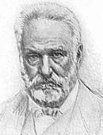{.calibre3}]{.calibre_10}

[Le 2 décembre au matin réveillé par Versigny. Prend son écharpe et va rue Blanche, 70. --- Y trouve l'ancien constituant Alexandre Rey (du National) et Michel (de Bourges). --- Charamaule survient, puis plusieurs autres représentants. Que fera-t-on ? Victor Hugo est d'avis de descendre immédiatement dans la rue avec les écharpes et de commencer le combat. --- [Battre le coup d'état pendant qu'il est chaud,]{.italic} --- brusquer le péril. Michel de Bourges expose, avec d'excellentes raisons, l'utilité de la temporisation, ne rien précipiter, traîner en longueur, pas d'explosion trop hâtive qui avorterait, fatiguer les troupes, au bout de huit jours la victoire viendra d'elle-même. On délibère. L'avis de Michel de Bourges est adopté par la majorité des membres présents. Entre le colonel Forestier. Il offre d'enlever la 6^[e]{.calibre18}^ légion. Il demande à Michel et à Victor Hugo de lui signer sa nomination de colonel, ajoutant que cela lui suffira. Michel lui fait remarquer que ni Hugo ni lui Michel n'ont qualité pour signer une nomination au nom de la gauche. Victor Hugo offre à Forestier de l'accompagner pour donner à ses réquisitions le poids de l'Assemblée représentée. Forestier accepte. Charamaule s'adjoint. (Charamaule admirable d'intrépidité et de sang-froid toujours et partout.) Tous trois partent pour le VIe arrondissement. Vont chez deux chefs de bataillon, le premier hésite, le second est plus ferme. Forestier prie les deux représentants d'aller l'attendre chez Bonvalet (rendez-vous de la gauche) pendant qu'il tâtera le colonel Watrin. Victor Hugo et Charamaule y vont par les boulevards. Victor Hugo reconnu, entouré, acclamé. On lui demande : Que faut-il faire ? --- Courez aux armes et faites des barricades, répond-il. --- Victor Hugo voudrait commencer le combat, mais Charamaule le retient et lui rappelle ce qui a été décidé rue Blanche.]{.calibre4}

[Le rendez-vous Bonvalet ayant avorté, les représentants retournent rue Blanche. Victor Hugo y propose de faire immédiatement un appel aux armes. --- On lui crie : Dictez ! --- Baudin et plusieurs autres écrivent sous sa dictée l'appel aux armes ([Louis B, est un traître]{.italic}, etc.), publié par Cassagnac, Mauduit et Mayer. --- Plusieurs emportent des copies. On se met en quête d'un imprimeur.]{.calibre4}

[Assiste à la réunion rue de la Cerisaie. --- Boulevard Saint-Martin, avec Arnaud (de l'Ariège), Montanelli et Carini, V. Hugo s'adresse à un régiment de cuirassiers et leur reproche leur trahison. --- [Ceux qui servent le traître sont des traîtres]{.italic}. Sombre silence des soldats.]{.calibre4}

[À 8 h. du soir, réunion chez Lafon, quai Jemmapes, 2. On y nomme un comité d'insurrection et de résistance composé de Carnot, de Flotte, Jules Favre, Madier de Montjau, Michel (de Bourges), Victor Hugo et\...]{.calibre4}

[A 10 h. chez Cournet, rue Popincourt, 82. Victor Hugo préside la réunion. Baudin assis près de lui fait fonction de secrétaire. Victor Hugo propose de faire le lendemain une tentative suprême sur le faubourg Saint-Antoine, de s'y trouver [tous à neuf heures]{.italic}, à la salle Roysin, de s'y constituer gouvernement, de s'y fortifier, de s'y créneler au milieu du peuple, et de combattre de là, par les décrets et par les armes, Louis Bonaparte. La gauche, convention et gouvernement, le faubourg, citadelle. Accepté par acclamation. On prend rendez-vous et l'on se sépare à minuit. (Ici se place le fait de la survenue, après la séparation de la première réunion, d'une deuxième réunion composée de plusieurs représentants notables qui accepte la (motion ?) votée, mais ces deux délibérations successives produisent des incertitudes sur l'heure. Aussi quand Victor Hugo arrivait au faubourg le lendemain matin 3, un peu avant 9 heures[[[[^\[112\]^]{.calibre_21}]{.underline}]{.calibre_4}](index_split_4933.html#filepos40221783){#filepos39077057}...]{.calibre4}

[ ]{.calibre4}

[[Le 5.]{.italic}]{.calibre_26}

::: calibre_27

[Prend part aux dernières délibérations du comité chez Raymond, rue de la Madeleine. Charamaule y vient. Tout est désespéré. La bataille est perdue si l'on ne réveille pas le peuple par un grand coup. Charamaule offre de descendre sur le boulevard, en écharpe, suivi de tous les représentants républicains qu'on pourra réunir, en écharpes, une centaine, et d'aller droit au premier régiment qui se trouvera là, de sommer le colonel d'obéir à la loi et en cas de refus de lui brûler la cervelle, et Charamaule montre deux pistolets. Je suis prêt, dit-il.]{.calibre4}

[Victor Hugo lui dit Descendons, je vais avec vous. Michel arrête Charamaule. Vous serez massacré, dit-il, et on dira que vous êtes un assassin. Qui sait si le peuple ne vous donnera pas tort ? --- Michel avait raison. Charamaute se rend. Mais c'est fini. Bonaparte l'emporte.]{.calibre4}

[ ]{.calibre4}

[[Le 6.]{.italic}]{.calibre_26}

::: calibre_27

[Victor Hugo a une dernière conférence avec Michel de Bourges rue d'Alger. Dupont de Bussac a vu Mallarmet. Mallarmet espère pouvoir ranimer le combat le lendemain dimanche. Michel et Victor Hugo se mettent à sa disposition et s'engagent à rester à Paris tant qu'il y aura l'ombre d'une chance de recommencer la lutte. Le dimanche, rien.]{.calibre4}

[Victor Hugo, cherché par la police, mais caché dans un asile sûr, attend jusqu'au 11 décembre.]{.calibre4}

[Le 11, quitte Paris avec un faux passeport, et déguisé, et arrive à Bruxelles [le 12]{.bold} au matin.]{.calibre4}

## [[[]{.calibre2}[]{.calibre2}[]{.calibre2}[]{.calibre2}[]{.calibre2}[]{.calibre2}[]{.calibre2}[II -- Pièces justificatives]{.calibre2}]{.bold1}]{.calibre_24} {#calibre_pb_5976 .calibre_57}

::: calibre_52

[ ]{.calibre4}

[Nous donnons, dans cette seconde partie, les pièces justificatives des faits rapportés par Victor Hugo : [ce sont les dépositions des témoins]{.bold}.]{.calibre4}

[Qu'étaient-ce que ces témoins ? Des hommes appartenant à toutes les nuances de l'opinion républicaine, tous ayant joué un rôle ou tout au moins ayant apporté leur appui au parti de la résistance ou ayant risqué leur vie. Là se trouvent confondus des représentants, des ouvriers, des hommes de lettres, des officiers. Chacun apporte le récit de ce qu'il a vu, de ce qu'il a entendu, de ce qu'il a fait. On peut suivre ainsi tous les efforts pour organiser des barricades, les négociations pour improviser une force armée avec l'aide de quelques officiers fidèles à la loi, les démarches pour imprimer en cachette les décrets et les proclamations des représentants restés libres, les actes de courage accomplis.]{.calibre4}

[Les mille détails qui échappent à l'attention de l'historien ou qui sont sacrifiés à l'étroitesse du cadre, à la nécessité d'exposer les événements dans leurs grandes lignes, sont rapportés dans ces dépositions. Nous assistons à tout le travail qui s'opère sans bruit pour défendre la loi violée, nous surprenons les impressions des combattants, écrites sous l'influence des ardeurs de la lutte, ou parfois plus tard, lorsque le temps a attiédi les colères sans altérer la fraîcheur des souvenirs, et c'est alors que le récit des misères et des tortures subies lors de la transportation prend une singulière grandeur de sérénité stoïque relevée par le sentiment du devoir accompli.]{.calibre4}

[Ces dépositions sont précieuses. Elles nous présentent, sous toutes ses phases, le coup d'État, depuis l'heure où il arrête, où il emprisonne, où il mitraille, où il expulse, jusqu'à sa victoire définitive quand il a réprimé les soulèvements dans les départements et quand il a envoyé à Cayenne et à Lambessa les meilleurs citoyens. Et alors nous avons le récit, des persécutions en province, des procédés employés pour faire ratifier par l'armée le coup d'État des traitements odieux infligés aux déportés pendant leur traversée et à leur lieu d'internement, des mille dangers qu'ils ont affrontés dans une évasion, préférant jouer leur vie dans une aventure plutôt que de périr à petit feu sous le climat meurtrier des colonies. Nous avons dû, pour éviter la monotonie par la répétition des mêmes faits et des mêmes jugements, choisir les dépositions les plus caractéristiques, opérer quelques coupures. Nous avons joint à ces documents des lettres qui fixent quelques points d'histoire ou qui les complètent.]{.calibre4}

[Ces pages ont l'attrait de l'inédit. Elles apportent des révélations nouvelles. Il était difficile de raconter toute la vérité, même au dehors, quand l'empereur était tout-puissant. L'intérêt s'était affaibli quand l'empire était tombé. Victor Hugo avait jugé avec raison que tôt ou tard ces documents devaient être tirés de l'oubli lorsqu'il annonçait la publication de son Cahier complémentaire, ce n'était pas seulement pour lui le désir de fortifier son récit c'était encore un hommage qu'il comptait rendre à ceux qui avaient lutté et qui avaient souffert ; c'était aussi une nouvelle contribution qu'il voulait apporter à l'histoire c'était enfin un enseignement qu'il tenait à donner aux générations futures. Cette déposition d'un témoin n'était pas seulement son oeuvre, elle était l'oeuvre de collaborateurs célèbres et obscurs, d'amis et d'inconnus. Il avait pris la parole en leur nom, il voulait la leur donner à leur tour, jugeant que, si l'heure de la justice ne devait jamais sonner pour quelques-uns d'entre eux, leur dévouement, leur désintéressement, leur fidélité aux principes républicains resteraient, dans l'avenir, comme un grand exemple de leur probité, de leurs vertus, de leur sacrifice à une cause dont ils avaient été les défenseurs et les martyrs.]{.calibre4}

[[
]{.calibre_7}]{.bold}

### [[[]{.calibre2}[]{.calibre2}[]{.calibre2}[]{.calibre2}[]{.calibre2}[]{.calibre2}[Versigny]{.calibre2}[[[[[[^\[113\]^]{.bold1}]{.calibre_43}]{.calibre2}]{.underline1}]{.calibre_42}](index_split_4933.html#filepos40222078){#filepos39086857 .calibre2}]{.bold1}]{.calibre_39} {#versigny113 .calibre_38}

[ ]{.calibre4}

[[Mardi 2 décembre.]{.italic}]{.calibre_26}

::: calibre_27

[À sept heures du matin, Michel de Bourges et Th. Bac vinrent m'annoncer que le représentant Baune avait été arrêté dans la nuit. Je croyais à une nouvelle affaire Mauguin, lorsque Pierre Lefranc arriva qui nous apprit l'arrestation de Cavaignac, Thiers, Bedeau, etc., et nous récita le texte des proclamations déjà affichées presque partout. Nous pensâmes à former le plus promptement possible le noyau d'une réunion. Notre collègue Yvan, secrétaire de l'Assemblée, était mon voisin (rue Boursault), nous nous rendîmes chez lui. L'ancien constituant Laissac nous y suivit de près et nous emmena chez lui (cité Gaillard), où nous nous trouvâmes bientôt dix ou douze. Arnaud (de l'Ariège) et moi, nous n'avions qu'une pensée, rédiger une proclamation, éclairer le peuple. Cet avis fut combattu : on voulait laisser le peuple manifester ses impressions et prendre une attitude. Peu touché de ces considérations, je quittai la réunion pour découvrir une imprimerie et prévenir M. V. Hugo. Ma visite à M. Hugo. Toutes les imprimeries, même à Montmartre, étaient occupées militairement. À onze heures les régiments commençaient à entrer dans Paris.]{.calibre4}

[L'indignation se montrait déjà très intense sur les boulevards, et les soldats étaient accueillis aux cris de Vive la République ! À bas le factieux !]{.calibre4}

[J'arrivai avec plusieurs de mes collègues au coin de la rue du Temple, où Michel de Bourges harangua le peuple.]{.calibre4}

[Les sergents de ville envahirent le domicile du restaurateur Bonvalet et firent plusieurs arrestations. La journée se passa en tentatives de réunions.]{.calibre4}

[[Rue Popincourt]{.italic}. J'ai quitté la réunion à deux heures du matin. Dans la réunion Popincourt j'émis l'opinion qu'il ne fallait pas engager le combat, que tout ce qu'on pouvait faire, c'était d'élever des barricades, sans les défendre. Cet avis fut presque unanimement repoussé et je n'insistai pas.]{.calibre4}

[ ]{.calibre4}

[[Mercredi.]{.italic}]{.calibre_26}

::: calibre_27

[À neuf heures du matin, sur la place de la Bastille, je suis refoulé par un mouvement de troupes. Le lieutenant-colonel du de ligne[[[[^\[114\]^]{.calibre_21}]{.underline}]{.calibre_4}](index_split_4933.html#filepos40223359){#filepos39090240}, dans un accès de fureur, lance son cheval sur un groupe de cinq ou six individus qui venaient de crier : Vive la ligne ! vive la République ! Quatre roulent dans la poussière, deux seulement se sont relevés, mais ensanglantés et mutilés.]{.calibre4}

[Je parvins jusqu'à l'endroit où on avait tenté d'élever et de faire élever une barricade dans le faubourg Saint-Antoine.]{.calibre4}

[Le peuple remplissait les trottoirs du faubourg (la rue était occupée par une masse compacte de troupes) dans les groupes, le peuple racontait simplement, sans même l'animation qu'il apporte dans ses récits les plus simples que des représentants, l'écharpe sur la poitrine, s'étaient résolument placés au-devant la barricade, avaient attendu les troupes qui s'avançaient en croisant la baïonnette, etc. (affaire de Flotte, Schoelcher, Brillier.). Je rencontrai Charassin qui m'annonça la mort de Baudin. Je rebroussai chemin pour répandre la nouvelle de cette mort glorieuse. L'aspect du boulevard était devenu formidable dans toute sa largeur et à perte de vue on ne voyait que fusils, canons et baïonnettes. À la hauteur de la rue du Temple le général Magnan organisait une sorte de batterie là seulement, et dans la rue du Temple, je vis des non-militaires. Ces ouvriers et ces bourgeois s'entassaient et se pressaient pour voir le général et son état-major.]{.calibre4}

[En arrivant je criai : Vive la République ! Le cri fut répété avec une sorte de fureur. Je racontai alors la mort de Baudin, en appelant le peuple aux armes. La fureur et l'indignation furent telles à ce moment que plusieurs jeunes gens se précipitèrent sur les soldats en criant À bas les assassins Les soldats n'opposaient qu'une résistance molle et indécise aux attaques dirigées contre eux par cette poignée d'hommes sans armes. Craignant que cet emportement n'amenât un sacrifice inutile, je m'efforçai, aidé par les officiers du corps, d'arrêter la fougue de ces courageux jeunes gens. Je les engageai à se répandre sur le boulevard et dans les rues pour exciter le peuple et faire commencer des barricades sur le plus grand nombre de points.]{.calibre4}

[Non loin de la porte Saint-Martin ou Saint-Denis je vis une voiture que le peuple suivait et accompagnait de ses acclamations. Nous crûmes reconnaître M. V. Hugo qui, tête nue, presque debout, traversait le boulevard dans cette voiture, en jetant au peuple quelques ardentes paroles.]{.calibre4}

[ ]{.calibre4}

[[Jeudi 4 décembre.]{.italic}]{.calibre_26}

::: calibre_27

[Dès le matin, Charamaule et moi nous fîmes plusieurs courses à l'effet de trouver une imprimerie. Nous ne pûmes réussir dans nos recherches.]{.calibre4}

[Nous avons renouvelé nos tentatives trois jours entiers.]{.calibre4}

[À dix heures du matin sur le boulevard des Italiens, en face du passage de l'Opéra, quatre ou cinq jeunes gens se précipitèrent sur un officier d'état-major, et le renversèrent de son cheval. Les deux guides qui l'accompagnaient prirent la fuite, et l'officier n'eut que le temps de se réfugier dans la mairie du n. arrondissement dont les portes se refermèrent sur lui. J'appris de l'un de ces jeunes citoyens que, au cri de : Vive la République ! poussé par l'un d'eux, cet officier s'était avancé sur eux l'épée haute, ce qui avait motivé de leur part la résistance énergique dont je venais d'être le témoin.]{.calibre4}

[À peine étais-je entré dans la rue Richelieu qu'un autre officier d'état-major, dans une circonstance identique, également précipité à bas de son cheval, était transporté comme mort dans une maison particulière.]{.calibre4}

[ ]{.calibre4}

[[Réunion Grévy]{.italic}]{.calibre_10}

[[]{.italic}]{.calibre_10}

[M. Hingray, que je trouvai chez Grévy, avec notre commission, croyant pouvoir nous procurer deux imprimeries, plusieurs décrets et proclamations furent rédigés par Jules Favre, de concert avec les membres présents, Michel (de Bourges), Victor Hugo, Carnot, etc.]{.calibre4}

[Sain et moi, nous partîmes avec M. Hingray, à la découverte des imprimeries promises. Chez M. Hingray, rue de Verneuil, nous fîmes une copie des textes qui nous avaient été remis. De là, nous allâmes rue Saint-Benoît où Hingray installa Sain. Hingray et moi, nous revînmes sur la rive droite, l'imprimerie dans laquelle je devais être introduit étant situé rue Montmartre.]{.calibre4}

[Il était environ quatre heures.]{.calibre4}

[Arrivés près de l'Institut une vive fusillade nous indiqua que le combat était sérieusement engagé aux environs de la pointe Saint-Eustache et de la place de Grève.]{.calibre4}

[Nous atteignîmes, non sans de grandes difficultés et de longs détours, la place des Victoires. Dans l'une des petites rues qui débouchent sur cette place, un citoyen, seul, construisait silencieusement deux barricades, et avait couvert le pavé de bouteilles cassées. Je sautai avec Hingray par-dessus la barricade pour serrer la main à ce brave citoyen. Seul ? lui dis-je. Non, nous sommes deux, me répondit-il simplement, en me montrant son fusil appuyé contre le mur. Et il se remit à l'ouvrage. Tout autour de nous, dans ce moment, les décharges de coups de fusil isolés, les feux de peloton se succédaient avec une rapidité inouïe, et semblaient partir de tous les côtés à la fois.[[[[^\[115\]^]{.calibre_21}]{.underline}]{.calibre_4}](index_split_4933.html#filepos40223663){#filepos39097513}]{.calibre4}

[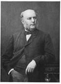{.calibre3}]{.calibre_10}

[Jules Grévy]{.calibre_3}

[[]{.italic}]{.calibre_26}

::: calibre_27

[[Vendredi 5 décembre.]{.italic}]{.calibre_26}

::: calibre_27

[Noël Parfait et moi, nous eûmes une entrevue avec une douzaine d'officiers de la garde nationale ([3^[e]{.calibre18}^]{.calibre_63} légion) chez l'un d'eux, rue des Jeûneurs[[[[^\[116\]^]{.calibre_21}]{.underline}]{.calibre_4}](index_split_4933.html#filepos40224054){#filepos39098471}.]{.calibre4}

[Ces citoyens ne nous cachèrent pas leurs appréhensions à l'endroit de l'insurrection triomphante. Je leur donnai connaissance des décrets qui avaient été rédigés par notre commission, et de l'esprit qui les avait inspirés, surtout celui contenant la convocation immédiate d'une Assemblée souveraine. Je leur fis remarquer que d'ailleurs le peuple se montrait très désenchanté des gouvernements provisoires, des hommes et des noms du passé révolutionnaire je leur promis le concours absolu et dévoué de tout ce qui restait de membres républicains de l'Assemblée nationale.]{.calibre4}

[Après un entretien de 4 heures il fut convenu que ces officiers créeraient entre eux un comité qui se concerterait avec notre commission, et organiserait une armée avec les gardes nationaux républicains.]{.calibre4}

[Tous se montrèrent fort résolus et animés du plus pur et du plus ardent patriotisme, bien qu'ils doutassent fort de la possibilité de triompher d'une armée de plus de cent mille hommes ivres d'eau-de-vie et de sang.]{.calibre4}

[Nous les quittâmes dans la soirée après avoir pris rendez-vous pour le lendemain matin. Mais dans la nuit M. de Chauny fut arrêté et il ne nous fut plus possible de nouer d'autres relations.]{.calibre4}

[Noël Parfait et moi nous étions mis à la recherche de notre commission toute la nuit nous courûmes dans Paris mais toutes nos recherches furent inutiles.]{.calibre4}

[L'espoir que nous avait mis dans le coeur l'appui de la garde nationale était tel que nous voulûmes nous assurer que nous retrouverions sur quelque point ne fût-ce qu'une étincelle de l'ardeur du jeudi. Mais nous traversâmes dans tous les sens les divers foyers de l'insurrection, sans voir autre chose que des soldats aussi nombreux que les pavés, buvant et mangeant joyeusement sur les barricades déjà presque détruites.]{.calibre4}

[Presque toutes les maisons dans certaines rues des quartiers Saint-Martin et du Temple étaient occupées par les troupes.]{.calibre4}

[ ]{.calibre4}

[[Samedi 6 décembre. (Notes rédigées à paris.)]{.italic}]{.calibre_26}

::: calibre_27

[M. Lobry[[[[^\[117\]^]{.calibre_21}]{.underline}]{.calibre_4}](index_split_4933.html#filepos40224350){#filepos39101602}, citoyen de la ville de Douai, est venu à Paris, délégué par la bourgeoisie elle-même, soumettre un plan de résistance aux représentants du peuple.]{.calibre4}

[Le régiment d'artillerie en garnison dans cette ville était dévoué à Charras et Cavaignac. Un capitaine, M. Lesueur d'une rare énergie, était l'alterego du colonel Charras pour le patriotisme et la fermeté, et son ami intime. Le régiment avait, à la presque unanimité, donné un vote négatif au plébiscite. On pouvait donc compter sur lui. Des négociations avaient été entamées prudemment qui ne laissaient aucun doute. La population de la ville était résolue de son côté, la ville bien fortifiée et l'arsenal rempli d'armes. Les populations environnantes ne demandaient que des armes et un centre de ralliement. C'était ce que demandaient des chefs de corps[[[[^\[118\]^]{.calibre_21}]{.underline}]{.calibre_4}](index_split_4933.html#filepos40224699){#filepos39102881} même de l'armée de Paris, et ce centre une fois créé, qui peut prévoir les résistances qui seraient venues s'y rallier de tous les points de la France ?]{.calibre4}

[J'avais appris, d'ailleurs, que les soulèvements des départements avaient forcé Bonaparte de faire sortir 50 000 hommes de Paris.]{.calibre4}

[Si un pouvoir officiel pouvait s'enfermer et se constituer dans la ville de Douai, tout pouvait être remis en question à Paris même.]{.calibre4}

[Il fallait vouloir et oser.]{.calibre4}

[Malheureusement, nous étions tous dispersés Delbecque, moi et M. Lobry, et plus tard Perrinon, tel était l'effectif de notre armée. Delbecque nous perdit lui-même, et je restai seul, avec Perrinon, avec cette pensée et ce projet.]{.calibre4}

[Impossibilité plus absolue que jamais de trouver les membres de la commission de surveillance, qui, croyant d'ailleurs tout terminé, ne devaient plus que songer à éviter d'être fusillés.]{.calibre4}

[Dans cette perplexité, Perrinon et moi, nous nous distribuâmes les rôles. Perrinon avait un passeport, il appartenait à l'armée il fut convenu qu'il partirait pour Douai et se mettrait à la tête du mouvement, au nom des représentants restés libres. Moi, je devais, à défaut de tout autre élément, demander à M. Daru, consacré, le 2 décembre, président réel de l'Assemblée nationale, de venir, avec son bureau, à Douai, afin de donner une âme et un nom à la résistance.]{.calibre4}

[Je ne pus joindre M. Daru que le lendemain dans la nuit.]{.calibre4}

[Perrinon partit avec M. Lobry, sans avoir pu connaître le résultat de ma démarche.]{.calibre4}

[M. Daru me témoigna une extrême bienveillance et la plus grande confiance.]{.calibre4}

[Cependant j'ai conservé cette impression que si le projet lui eût été soumis ou par des hommes de sa nuance politique ou peut-être même par les chefs de notre parti, après des garanties mutuellement échangées, il l'eût très probablement accueilli.]{.calibre4}

[Je me rappelle qu'au moment de le quitter, après une longue conférence, tous les arguments, toutes les chances de succès passées en revue, il me dit : Êtes-vous bien sûr de ce régiment ? --- Je vis clairement alors dans quelle incertitude était son esprit, et je ne doutai pas que, dans d'autres conditions, il ne se fût décidé à un acte énergique comme celui que je lui proposais.]{.calibre4}

[En résumé, M. Daru me manifesta :]{.calibre4}

[1° La crainte d'un échec qui pouvait perdre définitivement l'avenir ;]{.calibre4}

[2° L'autre crainte, pour lui et ses amis politiques, d'une victoire qui leur arracherait la direction du mouvement, et pourrait mettre la France à la disposition des éléments révolutionnaires.]{.calibre4}

[Il m'engagea ardemment à patienter et à abandonner un projet qui pourrait avorter misérablement et compromettre mon parti lui-même et ses chances d'avenir.]{.calibre4}

[Il m'assura dans les termes les plus chaleureux que lui et ses amis n'oubliaient pas, qu'ils écrivaient l'histoire de l'Assemblée et la leur propre, et que jamais ils ne descendraient de la ligne de conduite digne et élevée qu'ils avaient suivie dès l'origine[[[[^\[119\]^]{.calibre_21}]{.underline}]{.calibre_4}](index_split_4933.html#filepos40225040){#filepos39107544}.]{.calibre4}

[Contre Bonaparte, ils organiseront la conspiration gouvernementale des [influences sociales]{.italic} ; ils mineront à la longue, et par un travail de fourmis, le terrain gouvernemental, et à jour fixe, jour éloigné peut-être mais inévitable, il tombera dans le vide fait sous lui et autour de lui.]{.calibre4}

[Il se considère toujours comme président de l'Assemblée nationale, et à ce titre il a investi plus de cent de ses collègues de missions et d'instructions dans ce sens.]{.calibre4}

[Des généraux donneront leur démission (de Rullière, d'Arbouville, etc., ont tenu parole) la cour de cassation cassera les arrêts des conseils de guerre etc., etc. --- Voilà, me dit-il, notre guerre à nous, avec nos armes et sur notre terrain. C'est ainsi que nous voulons arriver à restaurer en France toute la liberté nécessaire pour que les éléments rationnels de conservation et d'opposition aient, sinon le gouvernement, du moins le droit de vivre.]{.calibre4}

[Je le quittai sur ces protestations.]{.calibre4}

[Le lendemain dans la nuit, Perrinon revenait à Paris. Il n'avait pu pénétrer à Douai. Deux cents citoyens et des officiers avaient été arrêtés il n'y avait plus aucune espérance de ce côté.]{.calibre4}

[Poursuivi à vue par les sergents de ville, je suis parti pour la Belgique.]{.calibre4}

[!{.calibre3}[[[[^\[120\]^]{.calibre_21}]{.underline}]{.calibre_4}](index_split_4933.html#filepos40225503){#filepos39109633}]{.calibre4}

[[
]{.calibre_7}]{.bold}

### [[[]{.calibre2}[]{.calibre2}[]{.calibre2}[]{.calibre2}[]{.calibre2}[]{.calibre2}[Madier de Montjau]{.calibre2}[[[[[[^\[121\]^]{.bold1}]{.calibre_43}]{.calibre2}]{.underline1}]{.calibre_42}](index_split_4933.html#filepos40226686){#filepos39110112 .calibre2}]{.bold1}]{.calibre_39} {#madier-de-montjau121 .calibre_38}

[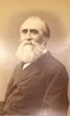{.calibre3}]{.calibre_10}

[[]{.italic}]{.calibre_26}

::: calibre_27

[[29 mai.]{.italic}]{.calibre_26}

::: calibre_27

[Mon cher collègue,]{.calibre4}

[Si tardivement que vous soient fournies les notes que vous m'avez demandées, j'espère qu'elles vous arriveront encore à temps pour trouver place dans votre grand travail et servir à l'histoire qui marquera Bonaparte du sceau de l'infamie.]{.calibre4}

[Je rappelle aussi brièvement que possible les faits qui me sont personnels et ceux venus à ma connaissance par rapport à d'autres, qui me paraissent avoir le plus d'importance.]{.calibre4}

[]{.calibre_10}

[Votre bien dévoué collègue,]{.calibre_10}

[A. MADIER DE MONTJAU aîné.]{.calibre_10}

[ ]{.calibre4}

[Dans la matinée du 2, accompagné de Millière, ancien rédacteur du [Journal du Puy-de-Dôme]{.italic}, de Cazon, avocat, et de Jules Bastide, j'ai fait de vains efforts pour grouper d'abord ou retrouver quelques-uns de nos collègues, déjà dispersés et mis en mouvement par la nouvelle des grands événements qui avaient commencé à s'accomplir pendant la nuit. Après avoir été, tour à tour, infructueusement, au lieu ordinaire des réunions de la Montagne, chez Michel, chez Bixio, où nous apprîmes de Ferdinand de Lasteyrie et de Flandin (depuis membre de la commission consultative, je crois) l'insuccès de la réunion essayée au Xème arrondissement, nous nous rendîmes successivement au faubourg Saint-Antoine et à Belleville pour y susciter des défenseurs à la République. Dans le premier quartier deux choses me frappèrent : la froideur des citoyens dont les affiches bonapartistes semblaient à peine exciter l'émotion ; l'attitude singulière d'une foule compacte d'hommes et de jeunes gens qui, placés devant un régiment de ligne et [presque dans ses rangs]{.italic}, l'accompagnaient en criant : [Vive la République !]{.italic} sans que les chefs militaires non plus que les soldats en eussent l'air préoccupés le moins du monde. Je considérai ces hommes non comme des citoyens dévoués à notre cause, mais comme des agents bonapartistes destinés à tromper par leurs cris la population du faubourg sur la portée véritable du coup d'État et sur les tendances du fripon de l'Élysée.]{.calibre4}

[À Belleville, nous vîmes, Bastide et moi, dans un cabaret que je savais être le rendez-vous ordinaire de quelques démocrates dévoués, trois ou quatre citoyens auxquels je recommandai vivement de préparer leur faubourg à la lutte, de mettre les hommes de bonne volonté en permanence, prenant l'engagement de remonter me mettre à leur tête, soit pour combattre dans le faubourg extérieur, soit pour opérer une jonction avec Paris aussitôt que la résistance commencerait soit dans l'un des faubourgs intérieurs, soit au centre.]{.calibre4}

[Je rejoignis enfin mes collègues, grâce à un avis de Schoelcher, chez Beslay, rue de la Cerisaie, où j'eus le plaisir de me trouver un instant à côté de vous. Vous vous rappellerez peut-être qu'au moment où commença la délibération, je formulai à peu près ainsi mon opinion : [Sur le boulevard où nous étions il y a quelques instants Bastide et moi. Michel de Bourges du haut d'une fenêtre a proclamé la déchéance du président, sa mise hors la loi, et a fait appel au peuple. C'est jusqu'ici, à notre connaissance, le seul acte qui ait produit quelque émotion je propose en conséquence que, ceints de nos écharpes, groupés par deux ou trois, nous parcourions immédiatement les différents quartiers de la ville pour faire prendre les armes aux citoyens et diriger leur action. Plusieurs d'entre nous payeront sans doute leur énergie au moins de leur liberté, mais s'il y a un moyen d'agiter la population c'est celui-là, et je le conseille vivement]{.italic}.]{.calibre4}

[Cet avis fut goûté de quelques-uns, repoussé par d'autres je n'ai pas besoin de vous rappeler comment on proposa de préparer l'esprit public à un mouvement par des proclamations, des affiches comment un ouvrier imprimeur appelé à la séance fut chargé de faire tirer à la brosse un premier placard qui devait être porté le soir chez Lafon comment chez notre collègue du Lot (quai Jemmapes) nous fûmes, Michel, vous, J. Favre, Carnot, de Flotte, Faure (du Rhône) et moi, désignés par nos collègues et les autres citoyens présents pour diriger le mouvement, coordonner la résistance, prendre sans contrôle, individuellement ou collectivement, toutes les mesures qui nous paraîtraient utiles : [Pars magna fuisti !]{.italic}]{.calibre4}

[Nous avons dans cette même soirée, Favre, Carnot, moi, Michel ensuite, essayé chez Landrin une réunion qui n'eut pas d'autre suite parce que M. Sautugra vint nous prévenir que, par un malentendu, vous ne comptiez pas nous rejoindre là et que nous devions nous trouver chez Cournet, ancien officier de marine, rue Popincourt, 80. Avant de nous y rendre nous passâmes tous chez M. Hovyn, lieutenant-colonel de la 5ème légion, ami du [National]{.italic}, et dont nous espérions un utile concours. Interrogé par Bastide et Favre, il se montra pour son compte plein de résolution et de dévouement, mais il nous déclara en même temps qu'il avait trouvé une froideur glaciale chez les officiers qu'il avait voulu tâter, qu'ils voulaient voir, attendre, et qu'à son avis on ne devait guère compter sur la garde nationale que si la résistance se dessinait nettement et énergiquement en dehors d'elle.]{.calibre4}

[Chez Cournet où nous étions rendus quelques instants après, une scène courte, mais dramatique, eut lieu dès notre arrivée. Cournet, garçon énergique, plein de courage et d'ardeur révolutionnaire, et qui avait pris part à l'insurrection de juin 48, apercevant Bastide, que j'avais décidé à se joindre à nous, l'interpella vivement : [« Je vois ici, dit-il, le citoyen J. Bastide. Il était notre adversaire quand bon nombre d'entre nous combattaient derrière les barricades de juin avant gue nous délibérions avec lui ou devant lui je lui demande quels sentiments il apporte au milieu de nous.]{.italic} » J'intervins non moins vivement je dis à Coumet que les sentiments de Bastide ne pouvaient être douteux qu'amené par moi il avait, par lui-même, comme pour moi, droit à toute confiance, à tous égards, et déjà on lui tendait la main, quand Bastide m'interrompant et s'adressant à Cournet d'une voix émue, mais avec autant de calme que de fermeté, répondit : [« C'est moi qui suis interpellé, c'est à moi de répondre l'affaire de juin a été un déplorable malentendu j'ai fait alors ce que j'ai cru que mon devoir me commandait la manière dont je l'ai accompli alors dit comment je l'accomplirai aujourd'hui Quand la République est attaquée, trente ans de ma vie répondent à tous des sentiments qui m'animent et de la conduite que je tiendrai. »]{.italic} On se rapprocha immédiatement une approbation unanime fut donnée à ces loyales paroles et après une courte discussion, rendue quelque peu tumultueuse par le grand nombre de personnes réunies dans un très petit local, rendez-vous fut pris pour le lendemain à la salle Roysih faubourg Saint-Antoine, où Cournet devait se trouver avec le plus grand nombre d'amis possible.]{.calibre4}

[Je couchai quelques heures chez Bastide et nous étions à sept heures du matin en route pour le faubourg. Partis de chez notre ami en voiture, nous nous fîmes déposer au coin de la rue Popincourt pour mieux juger, en parcourant à pied ce faubourg populeux, de ses dispositions. Elles nous parurent et elles étaient réellement désespérantes. À peine une certaine animation se manifestait-elle çà et là. Sur quelques portes ouvertes on causait des faits accomplis, de ce qui allait se passer encore, mais comme de chose indifférente et qui eût intéressé non Paris, mais Pétersbourg ou Berlin. Nous arrivâmes sous l'impression douloureuse de cet examen attentif au lieu du rendez-vous où étaient déjà réunis de Flotte, Maigne, Dulac, Brillier, un ou deux autres encore et notre malheureux et regrettable Baudin.]{.calibre4}

[Schoelcher y arriva bientôt, calme comme d'ordinaire, soigné et irréprochable dans sa tenue comme il l'était à l'Assemblée. Il venait du côté du boulevard, suivi par un petit groupe qui criait : [Vive la République ! Vive la Montagne !]{.italic} On sortit à son arrivée de la salle Roysin dont une escouade de police eût pu fermer trop aisément les étroites issues. Après quelques instants de délibération sur le trottoir, à un signal donné par Schoelcher, les quelques hommes de bonne volonté réunis autour de nous commencèrent à élever avec une charrette de laitier, un ou deux tonneaux, un omnibus, je crois, une barricade si imparfaite, si peu solide, qu'aux deux extrémités elle ne rejoignait pas même les murailles et n'aurait pas tenu devant une attaque sérieuse de quelques minutes. Pendant que quelques hommes restaient à la garder, nous nous rendions au poste du marché Lenoir qui fut désarmé en un clin d'oeil sans coup férir. On l'avait enveloppé des deux côtés, par la rue dont le marché fait un des côtés et par la porte de la halle qui fait face au corps de garde. Les jeunes soldats stupéfaits, ou qui avaient peut-être ordre de ne pas engager si promptement la lutte, se laissèrent enlever sans résistance leurs armes et leurs munitions. J'étais à côté du factionnaire au moment où un ouvrier de Belleville de mes amis (Charles Broquet, bijoutier) lui prenait son fusil. Le jeune soldat par un mouvement instinctif avait rapidement porté la main à la gâchette de son arme en l'arrêtant brusquement, Broquet, avec cette gaieté narquoise qui n'abandonne jamais l'ouvrier parisien, lui dit : « [Doucement, mon petit, ne nous fâchons pas ; vous vous feriez mal et à nous aussi ; il ne faut pas.]{.italic} » Et il prit le fusil et les cartouches. Dans un coin du corps de garde un soldat, en ôtant son shako pour y prendre je crois des cartouches, avait laissé tomber son mouchoir. Un autre ouvrier le ramasse et le lui rend avec la grâce qu'aurait pu déployer un gentleman relevant au milieu d'un bal le gant ou l'éventail de sa danseuse. Mais pendant ce temps (mauvais signe dans les faubourgs 1) une ou deux femmes venues à notre suite, au lieu d'exciter les hommes à la lutte, s'efforçaient avec des cris et des sanglots d'éloigner leurs maris ou leurs frères du lieu du danger et de leur faire poser dans un coin les fusils qu'ils venaient de prendre.]{.calibre4}

[Pendant que quelques-uns d'entre nous retournaient du côté de la barricade qui n'était pas encore menacée, Bastide, Gindrier, Broquet dont j'ai parlé tout à l'heure et moi, nous entrions dans les rues adjacentes du faubourg Saint-Antoine et nous longions la rue Popincourt pour les faire barricader et monter, à Belleville chercher du renfort. Gindrier et moi nous avions nos écharpes déployées à la main. Broquet disait aux ouvriers qu'il rencontrait sur son chemin : [Courage, voilà les Montagnards cette fois parmi nous. Faites votre devoir commencez à faire des barricades ; nous les défendrons tout à l'heure ensemble.]{.italic}]{.calibre4}

[Je répétai cet ordre ainsi que Gindrier, ainsi que Bastide nous invitions en agitant nos écharpes les hommes qui étaient aux portes et aux fenêtres à descendre, à mettre la main à l'oeuvre. Nulle part nous ne trouvâmes ni entraînement, ni dévouement au moment où les quelques coups de fusil tirés dans la rue Saint-Antoine et qui tuèrent le pauvre Baudin furent entendus, toutes les portes se fermèrent et l'un de nous faillit être écrasé en essayant de les faire tenir ouvertes pour que le peuple pût au besoin y trouver un refuge. Un ouvrier que j'engageais à descendre en lui montrant avec mon écharpe des pavés remués par hasard rue Popincourt par des paveurs et auquel je disais Allons, venez commencer, vous voyez bien que l'ouvrage est à moitié fait, me répondit en ricanant : [Bah ! il n'y a rien qui presse. C'est pas encore l'heure !]{.italic}]{.calibre4}

[Nous sommes montés et arrivés à Belleville par la barrière de Ménilmontant au milieu de cette indifférence désespérante et universelle. Nous trouvâmes avant de franchir la barrière quelques hommes dévoués et de moi bien connus qui nous engagèrent, moi surtout très connu depuis les clubs à Belleville, à ne pas entrer dans le faubourg extérieur avant qu'ils eussent averti de notre présence et fait prendre les armes. Ils nous prièrent d'entrer chez un brave et digne garçon que je ne nomme pas parce qu'il n'a pas été inquiété, faubourg du Temple, où l'on viendrait nous chercher bientôt et où nous rédigerions en attendant un appel au peuple je l'écrivis ainsi à la hâte et quelques exemplaires copiés par Bastide furent à l'instant portés dans le faubourg du Temple et dans Belleville :]{.calibre4}

[ ]{.calibre4}

[« AU PEUPLE. »]{.calibre_10}

[ ]{.calibre4}

[« La République attaquée par celui qui lui avait juré fidélité doit se défendre et punir le traître.]{.calibre4}

[À la voix de ses représentants fidèles le faubourg Saint-Antoine s'est levé et combat.]{.calibre4}

[Les départements n'attendaient qu'un signal, il est donné.]{.calibre4}

[Aux armes ! aux armes ! debout tous ceux qui veulent vivre libres ou mourir. »]{.calibre4}

[Pour le Comité de résistance de la Montagne :]{.calibre4}

[Le représentant du peuple délégué :]{.calibre4}

[[Signé]{.italic} : A. MADIER DE MONTJAU aîné. »]{.calibre4}

[ ]{.calibre4}

[Nous attendîmes quelque temps l'effet de cette proclamation et des démarches de nos amis. Une heure après ils venaient nous dire qu'ils n'avaient pu réussir à faire prendre les armes que nos efforts seraient aussi infructueux que le peuple du faubourg n'agirait que lorsqu'on agirait dans Paris et qu'il pourrait se joindre sûrement à la population des quartiers du centre.]{.calibre4}

[Bastide et moi redescendîmes au faubourg Saint-Antoine que la troupe de ligne et la cavalerie occupaient en entier, où l'on cherchait tous ceux qui avaient pris part soit à la barricade, soit à l'attaque des postes. Nous rentrâmes dans la ville et allâmes jusqu'à la rue Saint-Lazare, en traversant le Marais, les quartiers Montorgueil, Montmartre, Notre-Dame-des-Victoires, sans trouver nulle part une étincelle sur laquelle on pût souffler avec quelque chance d'allumer l'incendie. Depuis, mon cher collègue, bien que recherché, traqué comme nous l'étions tous, un peu plus peut-être à cause de l'affaire du faubourg Saint-Antoine, et, bien que deux fois j'aie eu [la main de la police à un pouce de mon collet]{.italic}, je me suis rendu le plus possible à nos réunions chez Landrin, le 3 au soir, où nous causâmes quelques instants ensemble dans la petite chambre à côté du salon chez Marie d'où je sortis le dernier et où je me croisai dans l'escalier, ou de peu s'en faut, avec la police rue de Choiseul, dans les diverses maisons que vous savez chez Grévy trois ou quatre fois enfin le 5 (et je fus le seul qui put arriver ce jour-là) chez Artistide Guilbert rue La Rochefoucault. (Il est inutile, je crois, de prononcer son nom.) Je n'ai besoin de vous rien rappeler que ceci, à quoi je tiens, pour vous comme pour moi : c'est que lorsqu'on proposa chez Landrin, le 3 au soir, de copier les signatures qui devaient être mises au bas de la proclamation, sur la liste de l'Assemblée, vous et moi, ainsi que Michel, nous revendiquâmes l'honneur de tracer notre signature de notre main, sur le décret qui mettait Bonaparte hors la loi et que nous le fîmes tous les trois ensemble et les premiers ce qui fut, du reste, imité avec ardeur par tous ceux de nos collègues présents. --- [Dixi]{.italic} : Vous ferez de ceci ce que bon vous semblera.]{.calibre4}

[Je termine par quelques détails relatifs aux MM. Dumas, mes jeunes parents.]{.calibre4}

[Scipion Dumas, l'aîné, Ossian Dumas, le plus jeune, fils de parents honorables mais pauvres, avaient dû aux sacrifices écrasants de leur famille et à leur bonne conduite de pouvoir sortir le premier de l'École polytechnique officier d'artillerie, le second de Saint-Cyr sous-lieutenant dans l'infanterie de ligne. Ils étaient tous deux animés des meilleurs sentiments politiques. Le dernier, arrivé à Paris pour y tenir garnison quelques mois avant le 2 décembre, était venu me voir, et, averti par Mme Madier que son avancement ne gagnerait rien à notre parenté ni à de trop fréquentes relations avec moi, il avait protesté que rien ne l'empêcherait de cultiver des relations avec un parent dont il honorait le caractère et dont il partageait, en partie du moins, les opinions.]{.calibre4}

[Le 2 décembre trouva son frère Scipion à Metz[[[[^\[122\]^]{.calibre_21}]{.underline}]{.calibre_4}](index_split_4933.html#filepos40228053){#filepos39131976}, lui à Paris. Le 3 au soir j'apprends par un acteur de ce drame sanglant qu'à une barricade de la rue Aumaire un ou deux défenseurs de la Constitution ont été tués, un officier de la ligne et quelques-uns de ses soldats blessés ou tués. Je ne me doutais pas que cette nouvelle me touchait d'aussi près. Séparé de ma famille, de ma femme pendant plusieurs semaines, c'est au moment de partir pour la Belgique seulement que j'ai appris que le malheureux jeune officier qui avait reçu deux balles dans les cuisses était précisément mon jeune parent Ossian Dumas, qui avait horreur du coup d'État, qui ne voulait pas le défendre, et qui, jusqu'à la barricade, protestait contre l'horrible métier qu'en invoquant l'honneur militaire on lui faisait faire à son corps et à son coeur défendant. Il fut porté à l'hôpital où on a dû l'amputer d'une cuisse et où dans les transports du délire il ne cessait de s'écrier Ah que m'a-t-on fait faire ? Quelle horrible chose je ne voulais pas commettre ce crime Des frères etc.]{.calibre4}

[Puis se tournant vers son frère accouru pour le voir et qui avait été mis en retrait d'emploi pour avoir refusé son adhésion au Président, et prenant la croix qu'on lui avait envoyée, il s'écriait encore Cette croix te revient c'est toi qui en es digne, non pas moi Tu as fait ton devoir, toi et moi, ils m'ont fait marcher contre le peuple !]{.calibre4}

[Je n'ai pu savoir encore quel a été le sort définitif de mon malheureux parent, s'il est mort ou s'il a survécu à ses horribles blessures mais ce qui est trop certain, ce que vous pouvez assurer, c'est que deux jeunes gens honorables, courageux, intelligents, seuls soutiens d'une famille qui avait tout sacrifié pour eux, ont vu briser en une heure par le grand acte de M. Bonaparte leur existence et leur avenir.]{.calibre4}

[!{.calibre3}]{.calibre4}

[[
]{.calibre_7}]{.bold}

### [[[]{.calibre2}[]{.calibre2}[]{.calibre2}[]{.calibre2}[]{.calibre2}[]{.calibre2}[Caylus]{.calibre2}[[[[[[^\[123\]^]{.bold1}]{.calibre_43}]{.calibre2}]{.underline1}]{.calibre_42}](index_split_4933.html#filepos40228367){#filepos39134785 .calibre2}]{.bold1}]{.calibre_39} {#caylus123 .calibre_38}

[ ]{.calibre4}

[[Le 2 décembre]{.bold}, à 6 heures du matin, un commissaire de police accompagné d'agents de police, de sergents de ville, et escorté par une compagnie de garde républicaine à pied, a occupé la maison du [National]{.italic}, rue Saint-Georges, no 15. La mission donnée au commissaire était d'arrêter M. Caylus, directeur du National, et de mettre les scellés sur les presses.]{.calibre4}

[Le commissaire a été fort étonné de ne pas trouver M. Caylus, pensant que celui-ci logeait dans la maison dans un appartement situé au 3ème étage, et occupé par M. Prost, imprimeur du journal. Après des efforts inutiles pour arracher à ce dernier l'adresse de M. Caylus, le commissaire a mis les scellés sur les presses, sur les caractères, sur les listes d'abonnés et sur les papiers qu'il a pu trouver puis il est revenu à la charge, et a cherché par des menaces à obtenir de M. Prost et d'un garçon de bureau l'adresse qu'il désirait. À 8 h. 1/2 seulement M. Prost a pu sans danger donner cette adresse le commissaire s'est empressé de [courir]{.italic} avec des agents rue Neuve-Saint-Augustin, 17, la maison a été envahie, les concierges gardés à vue dans leur loge mais les agents n'ont trouvé que madame Caylus et ses enfants, et après une inutile perquisition ils ont dû se retirer sans pouvoir mettre à exécution leur mandat.]{.calibre4}

[Voici un trait de la moralité des finesses de la police. Le commissaire, s'apercevant que madame Caylus est étrangère, crut pouvoir aisément la tromper. Après la perquisition, alors que ses agents passaient dans l'antichambre, il feignit de se cacher d'eux et dit à Mme Caylus : M. votre mari m'a rendu jadis un service je voudrais lui prouver ma reconnaissance en le servant faites-moi lui parler une minute seul à seul, et je lui fournirai les moyens de fuir. Inutile de dire que la finesse était trop grossière pour réussir. Je suis d'ailleurs trop vieux conspirateur pour avoir dit, même à ma femme, où je me rendais en quittant ma maison le matin, averti cinq minutes avant l'arrivée de la police.]{.calibre4}

[Je retourne au [National]{.italic} vers 1 heure il paraît qu'on trouva que les gardes républicains composant la compagnie qui occupait la maison n'étaient pas assez stricts dans leurs rapports avec les personnes nombreuses qui venaient chercher des nouvelles, car on les remplaça par une compagnie d'infanterie de ligne. Dès lors, toute relation avec le dehors fut interdite, M. Prost qui demeure dans la maison ne put plus recevoir qui que ce fût, et fut consigné. Quelques personnes qui avaient à lui parler pour affaires eurent la permission de le faire descendre pendant quelques minutes dans la rue. Ce séquestre absolu a duré jusqu'au 9 et c'est alors que des arrestations nombreuses ont commencé parmi les employés du journal. Seize personnes, compositeurs, tourneurs, garçons de bureau, ont été arrêtées et conduites à la préfecture de police, puis dans les casemates du fort de Bicêtre.]{.calibre4}

[Quel prétexte pour arrêter ces malheureux presque tous pères de famille ? On a prétendu que des imprimés étaient sortis de la maison du [National]{.italic}, dans les journées du 3 et du 4 or je vous ai dit que la maison avait été occupée jusqu'au 9 par la troupe !]{.calibre4}

[J'avais bien eu la pensée de faire servir nos presses à répandre des proclamations j'avais formé avec quelques personnes, que je ne puis nommer, le projet de m'emparer de notre maison. Rien n'était plus facile que d'introduire 20 hommes résolus dans les jardins qui bornent nos ateliers, d'escalader les murs et de prendre par derrière la petite garnison pendant qu'on l'eût occupée par une attaque simulée par la rue Olivier du côté de la rue Saint-Georges. J'avais médité cette attaque pour le 3 ; mais ce jour-là il n'y eut nulle part d'agitation assez sérieuse pour que les troupes qui circulaient sur les boulevards, et celles qui éclairaient la rue Saint-Lazare, fussent appelées dans d'autres quartiers. Le lendemain jeudi, le petit nombre de patriotes décidés à combattre trouvaient leur présence plus utile dans les faubourgs ou plutôt dans le centre de Paris. Je dus donc renoncer à mon plan. Duras, séparé de moi et que je n'ai vu durant aucune de ces journées, avait formé le même projet il eût été bizarre que nous nous fussions rejoints au National conquis par nous sur les rebelles.]{.calibre4}

[[Dans la journée du 4]{.bold}, j'ai acquis la certitude qu'un guet-apens était organisé sur le boulevard par la police. De 10 heures à midi 1/2 il n'y a pas eu un seul soldat de la Porte Saint-Martin à la rue Montmartre. (Je ne parle que de la partie du boulevard parcourue par moi.) J'étais à 10 heures dans la rue Saint-Denis je rentrai quelques instants sur le boulevard Bonne-Nouvelle au domicile où j'avais passé la nuit là je vis devant ma croisée, située à l'entresol, des individus élevant avec des planches d'échafaudage un semblant de barricade. Je me rendis au milieu d'eux et tâchai de leur démontrer que leur travail était absurde, qu'il pouvait donner une confiance dangereuse aux combattants de la barricade du haut de la rue Saint-Denis que de braves gens peu initiés à ce genre de combat pouvaient d'ailleurs chercher à s'y défendre, et qu'ils s'y feraient tuer sans arrêter une seconde les troupes dont le choc renverserait ce ridicule rempart. Je fus fort peu édifié sur le compte des gens qui se trouvaient là et j'eus cependant la satisfaction de voir quelques hommes qui paraissaient déterminés se replier sur la rue Saint-Denis et abandonner les gens dont je me défiais. C'est à ce moment que nous arriva une décharge, et que, me voyant sauter à bas d'une espèce de tonneau sur lequel j'étais monté, le concierge de mon domicile d'emprunt crut que j'avais été atteint par une balle, et répandit la nouvelle de ma mort.]{.calibre4}

[Je fus alors séparé du quartier de l'insurrection. J'oubliais de vous dire que l'appartement d'où j'étais sorti (boulevard Poissonnière) fut criblé de balles par la décharge dont je viens de vous parler. [16 balles]{.italic} étaient logées dans les rideaux du lit où j'avais couché la nuit précédente, les glaces brisées et la vaisselle brisée dans la salle à manger, située sur le derrière et dont j'avais laissé la porte ouverte en descendant.]{.calibre4}

[[Depuis le 5]{.bold}, j'ai erré de domicile en domicile [jusqu'au 9]{.bold}, jour où je suis parti pour Londres.]{.calibre4}

[La confiscation du [National]{.italic} laisse soixante personnes dont plus des deux tiers pères de famille sans aucune ressource.[[[[^\[124\]^]{.calibre_21}]{.underline}]{.calibre_4}](index_split_4933.html#filepos40229250){#filepos39143325}]{.calibre4}

[[
]{.calibre_7}]{.bold}

### [[[]{.calibre2}[]{.calibre2}[]{.calibre2}[]{.calibre2}[]{.calibre2}[]{.calibre2}[Nadaud]{.calibre2}[[[[[[^\[125\]^]{.bold1}]{.calibre_43}]{.calibre2}]{.underline1}]{.calibre_42}](index_split_4933.html#filepos40229816){#filepos39143793 .calibre2}]{.bold1}]{.calibre_39} {#nadaud125 .calibre_38}

[ ]{.calibre4}

[J'occupais à Paris un petit appartement compose de deux pièces, ayant son entrée par la rue de Seine, et éclairé par trois petites croisées s'ouvrant sur la rue Mazarine. Mon concierge, qui faisait ma cuisine et mon ménage, avait toujours à sa disposition une clef qui lui servait tous les matins pour venir m'éveiller à cinq heures 1/2, heure à laquelle j'ai toujours été obligé de me lever pour aller à mon travail.]{.calibre4}

[[Le matin du 2 décembre]{.bold}, il ne vint pas seul, il était accompagné de monsieur le commissaire de police [Desgranges]{.italic}, et d'un grand nombre d'agents, qui s'étaient échelonnés dans la rue, dans la cour, dans l'escalier quatre accompagnèrent leur chef jusque dans ma chambre à coucher.]{.calibre4}

[Je dormais profondément. À une heure et demie après minuit, j'étais encore sur le pont des Arts dans une inquiétude terrible, mortelle non pas que je songeasse au coup d'État pour le lendemain ; encore moins à mon arrestation quatre heures plus tard. Comme tous mes amis politiques, j'avais cessé non pas d'y penser, mais d'y croire, après tant de déclarations presque successives de la part de celui qui, quelque temps auparavant, avait été proclamé le plus honnête homme de France par M. Boulay de la Meurthe, qui jouit d'une certaine considération parmi les libéraux, qui s'était fait une réputation de probité politique, d'un homme qui, quelques jours auparavant, avait déclaré dans son message qu'il ne fallait plus désormais que ni la violence ni la surprise ne décidassent du sort d'une grande nation.]{.calibre4}

[Pour moi, comme pour tout homme d'honneur, une telle déclaration devait suffire, écarter toute crainte.]{.calibre4}

[Le commissaire de police m'éveilla lui-même en passant sa main sur ma poitrine. Je viens non pas vous arrêter, dit-il, mais faire une perquisition minutieuse dans vos papiers. Vous êtes accusé de détention d'armes de guerre. Veuillez, monsieur, vous habiller. Je me croisai les bras, assis sur mon lit. Mille réflexions étranges traversèrent immédiatement mon esprit. L'idée de mon arrestation ne se présenta point un seul instant à moi. A-t-il le droit de pénétrer dans ma chambre, de fouiller dans mes papiers, d'enlever ma correspondance ?]{.calibre4}

[En même temps je me rappelai que dans une demande de poursuite contre deux de nos collègues, Sommier et Richardet, M. Dufaure, ministre de l'intérieur, soutint que le gouvernement avait parfaitement le droit, que la Constitution lui faisait un devoir, de pénétrer dans la demeure d'un représentant, que son domicile ne pouvait être inviolable. La majorité consultée donna raison au ministre.]{.calibre4}

[Je commençai à m'habiller. M. Desgranges me dit alors qu'il connaissait parfaitement mon pays (la Creuse), qu'il était natif de Limoges, qu'il avait passé ses vacances dans cette dernière ville, que de toutes parts il avait entendu parler de moi, que mon nom était devenu très populaire dans tout le centre. Il ajouta qu'il connaissait Bac, Frichon et, continuant la conversation sur un ton de plus en plus amical, il dit : Je suis bien aise que vous n'ayez chez vous ni armes, ni munitions de guerre, je serais désolé qu'il vous arrivât le moindre désagrément et, pour que vous ne doutiez pas de ma parole, je ne veux pas même fouiller dans vos papiers.]{.calibre4}

[En effet, il s'approcha de ma cheminée, prit connaissance de quelques lettres, toutes plus insignifiantes les unes que les autres, il ne chercha ni dans mes mémoires, ni dans ma bibliothèque où étaient placées toutes les lettres que j'avais reçues depuis 1848. Il examina longtemps plusieurs feuillets épars sur ma table, résultat de mon travail depuis huit jours qui devait servir de texte à un discours en réponse à la majorité qui nous refusait le suffrage universel. Il riait de la façon avec laquelle je voulais traiter le président de la République. J'affirme que rien d'aussi vrai ni d'aussi hardi, ni de plus populaire n'avait été lancé contre le lâche tyran à la tribune française. J'en excepte le dernier discours de [M. V. Hugo]{.italic}.]{.calibre4}

[J'étais, je l'avoue, satisfait de tant d'égards, de tant de politesse de la part de ce magistrat policier. Je lui dis en riant que je ne manquerais pas le jour même de porter le fait à la connaissance de la Chambre. --- Venez jusque chez moi, me dit-il [bien bas]{.italic} nous rédigerons ensemble le procès-verbal, vous le ferez comme vous voudrez, mais ici je ne puis dire devant mes agents que ma perquisition a été faite avec soin puisque je ne regarde nulle part dans vos papiers.]{.calibre4}

[À ce moment il me vint à l'idée de sérieuses réflexions d'abord, je craignais beaucoup que lui ou un de ses agents ne se ravisât, et ne demandât que je lui ouvrisse mes armoires, ma bibliothèque c'était une crainte sérieuse, non pour moi, mais pour tous mes amis, tous mes correspondants.]{.calibre4}

[Je désirais autant que le commissaire de police que nous fussions sortis de cette petite chambre. Enfin, me disais-je, si je suis arrêté, je ne dois pas l'être seul. Si nous sommes plusieurs, ce serait une excellente occasion offerte au peuple, à la démocratie de toutes les nuances, pour se lever en masse, et tenter un suprême effort qui, le succès aidant, nous débarrassera de tous les fripons, de tous les traîtres, de tous les faux amis de la démocratie.]{.calibre4}

[Depuis mon retour des vacances, je n'avais cessé de parcourir les faubourgs, de voir les gérants des associations, les hommes influents de chaque quartier, mes camarades les maçons, les tailleurs de pierre, qui sont très nombreux, et que j'allais voir très souvent dans leurs garnis.]{.calibre4}

[Les charpentiers, marbriers, serruriers, menuisiers, que j'avais connus dans les ateliers et dont un très grand nombre venaient me voir le matin, tous sans exception tenaient le même langage, tous n'avaient qu'une crainte, c'est que les représentants de la gauche ne fissent pas leur devoir. Je ne sais quel était le démon qui poussait tous ces honnêtes travailleurs à cette mauvaise pensée, résultat de l'ignorance plutôt que du coeur. Toujours est-il qu'ils ne s'occupaient qu'à calomnier la gauche. Du reste, pour rendre hommage à la vérité, il faut avouer que l'exemple partait de nos rangs, nous n'avions pas assez d'estime les uns pour les autres.]{.calibre4}

[--- Hâtez-vous de vous habiller, M. Nadaud, me dit le commissaire, je ne puis croire que vous doutiez de ma parole.]{.calibre4}

[Un instant après je suivis toute cette bande qui descendit lentement l'escalier et qui sortit de même de la cour, attendu que j'étais entré chez le concierge lui serrer la main, le prier d'enlever tous mes papiers, de les mettre en lieu sûr.]{.calibre4}

[Je montai dans un fiacre, accompagné du commissaire et d'un agent. Bientôt nous quittâmes la rue de Seine pour prendre la rue Mazarine il commençait à faire jour, pas assez pour lire quoi que ce fût, M. Desgranges fit arrêter le cabriolet en face d'un réverbère et me dit en parcourant un papier : Je me suis trompé. C'est à Mazas que je dois vous conduire. Hier au soir à minuit un employé de la préfecture m'apporta le mandat que voici. J'étais absent, je ne le lus pas, ce matin je ne l'avais pas encore regardé quand je me suis rendu chez vous. Vous ne m'avez pas trompé un seul instant, monsieur, vous avez agi honteusement, voilà tout. Je ne regrette qu'une seule chose, c'est de n'avoir pas sur moi d'argent je ne me trouve que trente-cinq sous peut-être me sera-t-il difficile de m'en procurer hors de chez moi. À ce moment, il m'offrit 20 francs que je refusai obstinément.]{.calibre4}

[Nous traversâmes une partie du Pont-Neuf, et nous prîmes ensuite le quai des Lunettes ou de l'Horloge. En passant devant la porte de la préfecture de police, j'aperçus dans le passage une nuée de sergents de ville qui s'amusaient entre eux à poursuivre plusieurs de leurs camarades qui buvaient à même des bouteilles. Sur le quai de la Grève, je vis arriver un régiment de cavalerie qui se rendait du côté des Champs-Elysées. Le commissaire soutenait tantôt que c'était une revue que l'on passait au Champ de Mars, tantôt que l'on prenait des mesures pour empêcher le peuple de se réunir en foule sur la place de l'Hôtel-de-Ville, qu'à dix, onze heures on proclamait Devinck nouvellement élu.]{.calibre4}

[Nous arrivâmes enfin à Mazas. Devant la porte de cette prison, il y avait déjà plus de soixante cabriolets qui venaient d'amener en partie tous les anciens délégués des comités de Paris, les membres des familles des détenus politiques.]{.calibre4}

[Un vieux général se tenait debout, sur le seuil de la porte faisant face à la rotonde intérieure qui domine tout le corps de bâtiment de cette vaste et immense prison. Il paraissait triste, abattu, humilié. On aurait dit que ce vieux traître, qui n'osait fixer personne, commandait en baissant la tête à ses soldats ivres de nous insulter par leurs sourires moqueurs. Je vis à travers une croisée mon collègue Baune qui en m'apercevant se mit à rire. Je ne pus l'approcher, on l'entraîna dans une cellule.]{.calibre4}

[Le commissaire de police qui n'avait pas rédigé mon procès-verbal chez moi, comme je l'ai expliqué plus haut, me fit asseoir près d'une petite table placée à l'angle d'un large corridor, ce qui me permit de voir passer Valentin et mon ami Greppo, et de serrer la main à ce dernier sans échanger aucune parole avec lui. Deux surveillants l'entraînaient dans une cellule. Il se retourna vivement et s'écria : Courage, [mon ami !]{.italic}]{.calibre4}

[Greppo était calme, résigné, comme il l'est naturellement.]{.calibre4}

[Pourquoi n'en dirais-je pas autant d'un homme qui a bien fait du mal à la République depuis 1848, et que je n'ai ni le pouvoir, ni le désir de réhabiliter dans l'opinion publique ? Mais si les républicains se doivent à eux-mêmes, à leur parti, de combattre le mensonge, la perfidie partout où ils la voient apparaître, ils doivent aussi venir en aide aux vaincus quand bien même ils ne seraient pas tombés en servant la même cause.]{.calibre4}

[La vérité est que M. Thiers pas plus que M. Greppo ne paraissait ému la présence du premier me préoccupa très vivement et me fit comprendre que le coup d'État était entrepris par le président contre tous les partis. M. Thiers, en arrivant à Mazas, dans le grand couloir qui fait face à la porte d'entrée et qui conduit au décagone placé au centre de la prison, se promenait dans ce couloir, son manteau sur son bras, et regardant parmi les personnes présentes s'il en reconnaîtrait quelques-unes. Il m'aperçut assis auprès du commissaire de police occupé à rédiger mon procès-verbal. Nous nous saluâmes, il s'approcha de moi en m'appelant par mon nom. Je fus, je l'avoue, un peu étonné. Je ne croyais pas être connu de lui, jamais il ne m'avait parlé ni de loin ni de près on sait que M. Thiers ne se rendait dans les bureaux que lorsqu'il y avait à l'ordre du jour de grandes questions politiques. Je n'avais donc pas eu l'occasion de le rencontrer.]{.calibre4}

[La prison Mazas est composée de six corps de bâtiment, autrement dit six divisions aboutissant toutes vers ce décagone dont j'ai parlé plus haut qui est placé au centre de cette cruelle et triste prison. De telle sorte qu'un employé placé à chaque étage peut d'un seul coup d'oeil découvrir et observer la conduite du surveillant qui entre chez le détenu. C'est dans ce pavillon, qui me parut construit bien légèrement, que se trouvaient placés les juges d'instruction qui nous firent écrouer. C'est là aussi que le prêtre vient le dimanche célébrer le saint office.]{.calibre4}

[Un petit polisson à la mine blême, les yeux presque éteints, rachitique, assis à une table où ils étaient plusieurs, demandait les noms, prénoms, âge, lieu de naissance. Il avait l'air si effronté, si cynique, que quand il écrivait les réponses que lui faisait M. Thiers il éclatait presque de rire, en courbant sa petite vilaine tête et cachant sa laide figure dans ses petites mains amaigries. Voyant cela je m'emportai très vivement, moins pour moi que pour un homme déjà un peu âgé je voyais dans un lieu où il en avait fait mettre beaucoup d'autres le premier historien qui m'avait fait connaître, qui m'avait fait aimer notre grande et immortelle révolution dans un âge peu avancé de la vie, car je servais encore les maçons.]{.calibre4}

[« Un peu de pudeur, Monsieur, quand il s'agit de la gloire de la tribune française, d'un des hommes les plus instruits de l'Europe, d'un homme qui a le plus activement servi votre cause, à vous autres, qui vous intitulez les gens de l'ordre. Lâches et vils réactionnaires, vous serez toujours ingrats. »]{.calibre4}

[Ici, je fus obligé de m'arrêter, on me conduisit en cellule sans me demander qui j'étais, sans être inscrit sur le registre d'écrou. Je restai là pendant 17 jours au secret le plus rigoureux, le plus absolu, [sept]{.italic} jours sans recevoir aucune nouvelle du dehors, sans savoir ce qui s'était passé, sans savoir ce qu'étaient devenus mes amis, la République, tout ce qui m'est cher.]{.calibre4}

[Mon surveillant, Petitot, quoique poli, doux et très honnête dans la manière de faire son service, n'en exécutait pas moins à la lettre sa consigne et le règlement. Du reste, lui comme tous les autres surveillants étaient comme nous emprisonnés, puisque les six premiers jours on ne les laissa point sortir. Ce qui est certain, c'est que je ne puis croire qu'il ait jamais été donné à un homme de passer de plus cruels moments, de subir de plus vives tortures morales que celles que j'éprouvai pendant les six premiers jours qui suivirent mon arrestation.]{.calibre4}

[Les cellules ont environ 3 mètres de longueur sur 2 mètres de largeur, la mienne était double, il y en a 14 semblables dans la prison chacune d'elles a deux lits, les grandes cellules se trouvent dans le grand bâtiment de l'infirmerie. Elles sont doubles afin qu'on puisse, dans certains cas, placer près du malade un homme robuste et bien portant pour lui venir en aide.]{.calibre4}

[L'ameublement se compose d'un hamac, posé la nuit sur des morceaux de bois scellés dans le mur, pour se coucher. Ce hamac est roulé chaque matin à l'aide de courroies qui le retiennent toute la journée le long du mur. La croisée, longue de 65 centimètres sur 40 centimètres de hauteur, vitres dépolies, empêche le détenu de voir dehors quand bien même il monterait sur sa table, une tige de fer, qui est attachée aux barreaux qui grillent la croisée dans sa partie extérieure, la retient également et ne permet d'ouvrir qu'environ 12 ou 15 centimètres dans le haut à zéro en bas, absolument en abat-jour.]{.calibre4}

[En approchant ma table sous cette petite croisée et en plaçant une chaise dessus, je pouvais apercevoir, en regardant de côté, plusieurs maisons habitées par des ouvriers que je reconnus à leurs blouses. Toute la journée du mardi, du mercredi, ils ne cessèrent pas de rester appuyés sur leurs balcons. La cellule que j'occupais est placée dans la division de l'infirmerie et porte le numéro 195. En montant, comme je l'ai expliqué, sur une table, on peut découvrir au moins dix maisons. La voix de ces ouvriers causant tranquillement avec leurs femmes, et le chant, les cris des petits ramoneurs que j'entendais dans la rue, tout cela m'accablait et m'attristait. Du reste je n'entendais aucun coup de canon, aucun coup de fusil, rien qui m'annonçât la lutte de la rue. Tous mes collègues étaient donc arrêtés, la présence de M. Thiers me le faisait du moins craindre. Mais tous ces jeunes hommes, ardents révolutionnaires, avec lesquels j'ai déjà passé vingt ans de ma vie et que je voyais presque tous les jours, étaient donc également séquestrés ? S'ils étaient libres, le canon gronderait, ils seraient dressés contre leurs barricades. Oh oui ils sont tous pris, car ils ne sont pas lâches. Telles étaient les tristes réflexions qui m'agitaient sans cesse.]{.calibre4}

[Le soir je tombai dans un abattement profond. J'eus la fièvre, un mal de tête violent qui ne me quitta pas de toute la journée du jeudi. Le premier jour de mon arrestation, comme pour doubler encore l'horreur de cette triste et sombre prison, le surveillant vint m'annoncer de me tenir prêt, de faire mon paquet, que j'allais partir. À force d'attendre, voyant venir dix heures, je me couchai. J'étais glacé.]{.calibre4}

[À minuit on ouvrit ma cellule, on m'assura que je partirais dans une heure ou deux. De sorte que je fus obligé de passer la nuit debout dans une inquiétude que je n'essaierai pas de décrire. Mais ce qui devient le plus insupportable, ce qui peut le, plus influer sur le moral, sur la santé du prisonnier, surtout si cet homme ne peut vivre de la vie intellectuelle, c'est d'abord l'insuffisance de l'air qui est incontestable, la trop petite dimension de la cellule qui l'oblige à tourner sans cesse sur lui-même comme un animal enfermé dans une cage. Toutes ces précautions prises pour torturer l'âme me paraissent infâmes, inouïes. Ne croyez pas que cette créature humaine soit seule avec sa conscience. Impossible de faire un pas, un geste sans être aperçu, espionné par une figure invisible qui observe vos moindres mouvements à travers un petit trou percé au milieu du guichet par lequel on vous apporte vos vivres et qui n'a pas plus d'un centimètre de diamètre. Le jésuitisme et l'espionnage sont là à coup sûr poussés dans leurs dernières limites, leurs dernières conséquences.]{.calibre4}

[Ce qui est encore plus nuisible à la santé, c'est le genre de carrelage qui sert de parquet qui est fait en briques tendres que l'on appelle façon Bourgogne, tous les planchis sont voûtés en courbe ou segment de cercle que les ouvriers appellent anse de panier. Ces voûtes sont construites en meulière, genre de pierre de cailloux rouges que l'on place ordinairement dans les parties froides et humides, comme, par exemple, aux murs des fortifications de Paris. On est contraint par la pratique de ces choses, avant d'arriver à poser la brique qui sert de carrelage, de garnir les flancs que forme à l'extérieur cette courbe, ce segment de cercle, jusqu'à la hauteur du sommet de l'extrados de la voûte. C'est dans ces endroits que d'ordinaire on fait passer tous les débris, toute la mauvaise marchandise que l'on recouvre ensuite, pour ne pas être vu de l'architecte, de l'inspecteur, d'une couche abondante de mortier. Ensuite ajoutez par-dessus ce mortier une couche de terre horizontale au parquet qui va jusqu'à l'épaisseur du dessous de la brique, une troisième et dernière que l'on emploie pour poser définitivement la brique sur laquelle on marche. De sorte que, quelle que soit la chaleur fournie par le calorifère, elle ne pourra rendre supportable ce genre de carrelage. Quand le prisonnier se plaint de manquer d'air, il a raison, mais ce qui est le plus dangereux pour sa santé, ce qui fait que beaucoup d'entre nous étaient obligés de s'envelopper les pieds dans une couverture ou bien de marcher sans cesse, de cracher, de tousser continuellement, ce n'est pas seulement la mauvaise odeur ni le manque d'air qui contribue à cela, ce sont surtout les briques froides et humides qui sont sous les pieds du détenu. J'en conclus que sur cent prisonniers obligés de passer six mois dans ces cellules, les trois quarts contracteront des maladies de-poitrine, des rhumatismes, qui les empêcheront de travailler et qui en peu de temps les conduiront au tombeau.]{.calibre4}

[La nourriture que l'on vous fait passer à travers un petit guichet garni en dedans d'une petite planchette sur laquelle on pose les gamelles de fer-blanc n'est certainement pas toujours agréable à prendre. Le plus souvent le pain n'est pas cuit et s'écrase entre vos mains. J'obviais à cet inconvénient en retardant de deux ou trois heures mon déjeuner. Plus j'avais appétit, meilleur je le trouvais.]{.calibre4}

[Le bouillon et le boeuf du matin sont passables, ils sont quelquefois préférables à ce que l'on sert dans les auberges fréquentées par la classe ouvrière. La nourriture du soir est moins bonne, les portions trop faibles pour un homme robuste et bien portant un peu de haricots, de lentilles et de fromage et pour toute la journée une chopine de vin assez ordinaire.]{.calibre4}

[Au demeurant, pour moi qui étais habitué à la nourriture des ouvriers qui voyagent, qui changent de quartier à chaque instant, je me trouvais presque satisfait. Pendant les 17 jours de secret je ne dépensai pas un centime, à l'exception de quelques pommes que mon gardien m'apportait du dehors.]{.calibre4}

[Depuis onze heures jusqu'à quatre, c'est le moment de la promenade, à l'exception de deux jours par semaine qui sont consacrés aux visites du parloir. Un surveillant vous avertit en ouvrant la porte de votre cellule et vous remet un petit morceau de bois qui demeure toujours accroché à la porte de sortie et sur lequel est le numéro du lieu que vous habitez. Quand on entre dans cette prison on perd ses nom et prénoms. On ne connaît plus que les chiffres, les numéros. Aussitôt sorti, vous marchez dans un petit couloir en forme de balcon qui est de la même longueur que la division dans laquelle vous êtes placé.]{.calibre4}

[Arrivé au pied de l'escalier du rez-de-chaussée, il faut encore suivre le long du mur et marcher sur une petite planche parallèle aux cellules afin d'éviter la rencontre d'autres détenus, quoique cependant on ait bien soin de les faire arrêter dans les escaliers pour que jamais on ne puisse connaître son voisin. Pendant ce court trajet on vous crie plus de dix fois de courir, de courir. Pour nous représentants ils étaient moins hardis, moins exigeants.]{.calibre4}

[À la porte qui conduit vers les préaux, vous rencontrez encore un surveillant qui vous prend votre numéro. Il tire aussitôt une sonnette, on vous laisse descendre cinq ou six marches, et vous trouvez un autre gardien qui vous fait voir le polygone qui est placé au centre des compartiments qui servent de promenade. Ce dernier vous ouvre une porte qui se referme aussitôt et vous vous trouvez entre deux murs d'environ 3 mètres 50 du sol. Ces deux murs forment un trapèze isocèle. Au bout de ce trapèze qui a environ dix mètres de longueur se trouve une jolie grille en fer à l'extérieur de cette grille se promène un gardien qui ne vous perd pas un instant de vue, il compte pour ainsi dire vos pas. Il va de l'un à l'autre compartiment, et de temps en temps, si vous lui adressez la parole, il vous fait signe qu'il est lui-même l'objet d'une surveillance attentive et de tous les instants.]{.calibre4}

[A l'autre extrémité du trapèze se trouve le polygone, qui est élevé à la hauteur d'un étage, dans lequel est un autre surveillant qui domine, à l'aide d'une petite croisée sur chaque promenoir, les vingt prisonniers qui sortent pendant la même heure. Genre de précautions bien misérables, bien ridicules et complètement inutiles, mais elles démontrent peut-être mieux que les cellules la mauvaise foi, l'inhumanité, la cruauté des inventeurs de ce système que la démocratie se fera un devoir d'abattre, de démolir quand elle sera maîtresse des destinées de la France.]{.calibre4}

[Le 19 décembre on nous conduisit à Sainte-Pélagie. Pour nous humilier on fit réunir à notre sortie tous les gardiens, tous les surveillants et plus de cent sergents de ville qui nous insultaient par leurs sourires et leurs regards moqueurs.]{.calibre4}

[!{.calibre3}]{.calibre4}

[[
]{.calibre_7}]{.bold}

### [[[]{.calibre2}[]{.calibre2}[]{.calibre2}[]{.calibre2}[]{.calibre2}[]{.calibre2}[Esquiros]{.calibre2}[[[[[[^\[126\]^]{.bold1}]{.calibre_43}]{.calibre2}]{.underline1}]{.calibre_42}](index_split_4933.html#filepos40231966){#filepos39173774 .calibre2}]{.bold1}]{.calibre_39} {#esquiros126 .calibre_38}

[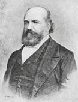{.calibre3}]{.calibre_10}

[Le premier jour (2 décembre) je me rendis à la réunion du Xe arrondissement. Il y aurait, je crois, à décrire les figures des hommes de la droite. Celle de Vatimesnil surtout, longue et pâle, était tout un drame. Il montra d'ailleurs de l'énergie. Un adjoint du maire ayant fait quelques objections et ayant parlé du président de la République : --- Il ne l'est plus, s'écria vivement M. de Vatimesnil, il a violé la Constitution.]{.calibre4}

[Je mis mon nom sur une page volante à côté de celui de Marc Dufraisse, puis, voyant que cette réunion était une souricière et ne me souciant pas du tout d'être pris en si mauvaise compagnie, je m'esquivai.]{.calibre4}

[Je fus reconnu. Pendant deux heures environ, je parcourus les boulevards au bras de Mauduit, ancien chef de bataillon de la IIe nous étions suivis par un groupe de deux ou trois cents personnes, parmi lesquelles bon nombre de gamins qui criaient à tue-tête. Toutes les têtes se découvraient sur notre passage au cri de : Vive la République ! Je remarquai que le cri de : Vive la Constitution ne prenait pas. L'enthousiasme était vraiment extrême. Nous fûmes chargés à la Porte Saint-Denis et jetés dans les rues voisines où Mauduit fut renversé par un sergent de ville un autre, ancien cuisinier associé de la barrière du Maine, reçut un coup d'épée dans le bras.]{.calibre4}

[Durant ces trois jours, je n'ai pu avoir l'adresse d'aucune réunion de représentants nous eûmes trois réunions d'ouvriers que je présidai il fut convenu qu'on se porterait le lendemain dans le faubourg Saint-Antoine.]{.calibre4}

[Ayant su que la barricade Sainte-Marguerite commençait à être attaquée et la croyant suffisamment défendue, nous nous jetâmes dans les rues adjacentes. Une barricade fut commencée par nous rue de Charonne, mais lentement les outils manquaient pour déraciner les pavés. La plupart des hommes que j'avais réunis la veille étaient d'ailleurs opposés au système des barricades : ils avaient tous combattu en juin et soutenaient que le système des sorties brusques était très supérieur à celui de la barricade. Il ne faut pas, disaient-ils, localiser l'insurrection. C'était aussi mon avis.]{.calibre4}

[Nous laissâmes donc une douzaine d'hommes pour garder la barricade (c'étaient les mieux armés), et nous nous dirigeâmes vers l'endroit où l'on disait que s'engageait l'action. Je connaissais peu le faubourg, aussi je me laissai conduire. Chemin faisant, en débouchant dans la grande rue, à travers un détour, nous rencontrâmes de la troupe. On me cria de toutes parts Parlementez Je m'avançai, en effet, près des soldats qui gardaient le coin de la rue et je leur dis Nous sommes vos frères au nom de la République, nous vous conjurons de ne point déshonorer le drapeau français en le tournant contre le droit et contre l'Assemblée nationale. Je suis représentant du peuple, je vous somme de vous joindre à nous.]{.calibre4}

[Il y eut un moment de silence. Le capitaine fit un signe Retirez-vous !\... Au même instant, un lieutenant ou un sous-lieutenant (je ne sais) s'élança sur moi pour me frapper. Un homme du peuple, qui était resté à mes côtés depuis le matin, silencieux, se jeta au-devant de l'épée qui le perça. Il y eût un cri d'horreur dans la foule. Au même instant la troupe exécuta un mouvement de recul et fit une décharge. Je fis tous mes efforts pour relever l'homme qui était tombé ; mais la panique était dans nos rangs je ne pus obtenir qu'on l'emportât, je crois d'ailleurs qu'il était mort.]{.calibre4}

[Ayant regagné, non sans peine, à travers mille détours, la place de la Bastille, j'appris d'Arnaud (de l'Ariège) et de plusieurs autres que j'étais mort le bruit en courut jusqu'au soir.]{.calibre4}

[Je me jetai alors de l'autre côté de la Seine où j'avais donné rendez-vous à mes compagnons pour commencer des barricades dans le faubourg Saint-Marceau nous fîmes deux tentatives qui échouèrent la troupe venait nous charger dès que nous touchions un pavé. On jeta une ou deux voitures par terre, mais la troupe les releva. Le XIIe arrondissement était sans armes et ne voulait pas remuer.]{.calibre4}

[Vers le soir, dans tout le quartier latin, sur la place du Panthéon notamment, les troupes étaient ivres de vin, de sang ou de peur. J'entendis des soldats provoquer les passants : « Ose donc remuer un pavé, disaient-ils à un homme du peuple qui les regardait en silence. »Une femme étant tombée morte rue Saint-Jacques sous la fusillade, ils lui coupèrent les doigts pour avoir ses bagues. Sur la place du Panthéon, des prêtres serraient la main des soldats et les exhortaient à tenir bon. Un fait général, c'est que, dans le XIe arrondissement surtout, il y avait plus d'indignation sous l'habit que sous la blouse. L'ouvrier ne comprenait pas.]{.calibre4}

[Je n'ai pas vu les exécutions qui ont eu lieu à la préfecture de police mais on m'a montré sur le trottoir des traces profondes et des entailles que l'on m'a assuré avoir été creusées par des balles. On avait fusillé, dit-on, à bout portant un grand nombre d'individus. Ce qui est certain, c'est qu'ayant trouvé, la nuit suivante, un gîte dans une petite chambre de la rue Saint-Dominique, près du Champ de Mars, j'entendis toute la nuit des décharges qui se succédaient de quart d'heure en quart d'heure du côté de l'École militaire. Or, l'on ne se battait plus sur aucun point de Paris dans ce moment-là.]{.calibre4}

[!{.calibre3}]{.calibre4}

[[
]{.calibre_7}]{.bold}

### [[[]{.calibre2}[]{.calibre2}[]{.calibre2}[]{.calibre2}[]{.calibre2}[]{.calibre2}[Agricol Perdiguier]{.calibre2}[[[[[[^\[127\]^]{.bold1}]{.calibre_43}]{.calibre2}]{.underline1}]{.calibre_42}](index_split_4933.html#filepos40233297){#filepos39182367 .calibre2}]{.bold1}]{.calibre_39} {#agricol-perdiguier127 .calibre_38}

[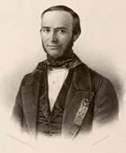{.calibre3}]{.calibre_10}

[ ]{.calibre4}

[Cher collègue,]{.calibre4}

[N'oubliez pas, dans votre histoire du crime du 2 décembre, de signaler que Louis-Napoléon, le prétendu ami du peuple, a été sauvage et cruel envers les ouvriers que le peuple avait élus représentants. Sur dix, huit ont été expulsés et vivent sur la terre étrangère ; voici leurs noms :]{.calibre4}

[Pelletier, aubergiste, actuellement en Angleterre ;]{.calibre4}

[Nadaud, maçon, en Angleterre ;]{.calibre4}

[Bandsept, cordonnier, en Angleterre ;]{.calibre4}

[Greppo, tisseur, en Angleterre ;]{.calibre4}

[Benoît, tisseur, en Suisse ;]{.calibre4}

[Faure, coutelier, en Belgique ;]{.calibre4}

[Michot, menuisier, en Belgique ;]{.calibre4}

[Perdiguier, menuisier, en Belgique.]{.calibre4}

[ ]{.calibre4}

[Les deux qui ont pu rester en France sont :]{.calibre4}

[Guilgot, serrurier ;]{.calibre4}

[Doutre, typographe.]{.calibre4}

[ ]{.calibre4}

[Pour me faire sentir la sympathie de Louis-Napoléon pour les ouvriers, on est venu m'arrêter le 7 décembre au matin, au petit jour, dans mon lit. On m'a conduit à pied, entre vingt soldats et trois agents de police, de mon domicile en face la grande porte de la prison de Mazas. Là on m'a fait monter dans une voiture avec les agents, et on m'a conduit à la préfecture de police. Au greffe, on m'a pris mon couteau et mon canif ; puis on m'a renfermé dans la salle n° 2, au deuxième étage, avec environ deux cents prisonniers, de toutes conditions, de toute nature.]{.calibre4}

[À la nuit, quelques-uns de nos collègues ayant su que j'étais là me firent demander par le directeur, et j'allai leur tenir compagnie. Je fus un peu mieux.]{.calibre4}

[Je vous ai parlé de mon arrestation par les soldats et de ma détention au grand dépôt parce que ces deux faits me sont particuliers, et qu'ils prouvent la haine des agents de Louis-Napoléon pour les ouvriers que le peuple avait choisis pour ses représentants.]{.calibre4}

[Je ne décris rien, je ne peins rien je m'en tiens à ces deux faits. Je laisse de côté la prison cellulaire de Mazas, et Sainte-Pélagie, et tout ce qui m'a été commun avec d'autres.]{.calibre4}

[!{.calibre3}]{.calibre4}

[[
]{.calibre_7}]{.bold}

### [[[]{.calibre2}[]{.calibre2}[]{.calibre2}[]{.calibre2}[]{.calibre2}[]{.calibre2}[Journal d'un socialiste]{.calibre2}[[[[[[^\[128\]^]{.bold1}]{.calibre_43}]{.calibre2}]{.underline1}]{.calibre_42}](index_split_4933.html#filepos40234047){#filepos39186382 .calibre2}]{.bold1}]{.calibre_39} {#journal-dun-socialiste128 .calibre_38}

[ ]{.calibre4}

[...Nous avions suivi les rues de l'Université et Jacob. Nous arrivons bientôt chez notre ami Nétré, rue du Jardinet, 13. Là demeurait un représentant, Jules Leroux. Il venait de sortir, mais nous apprenons par des ouvriers amis les crimes de la nuit. Bientôt arrivent Pierre et Jules Leroux et plusieurs étudiants et ouvriers. Nous convenons qu'il faut résister de toutes nos forces au coup d'État et en profiter pour faire en 1851 ce que nous avions remis à 1852. L'Assemblée dissoute, le président hors la loi, la seule autorité constitutionnelle, c'est la minorité de l'Assemblée qui a voté en faveur du suffrage universel. Il faut donc réunir cette minorité, délivrer ceux de ses membres qui sont prisonniers, adjoindre à ce corps des délégués des corporations ouvrières, établir ce premier noyau de la CONVENTION NATIONALE dans un quartier populeux, et appeler le peuple tout entier à le défendre et à appuyer l'exécution de ses décrets.]{.calibre4}

[Cette idée conçue, on se sépare pour chercher les moyens de la réaliser. Nous typographes, nous nous préparons à imprimer des proclamations et nous allons plus loin nous entendre sur les moyens à employer. Nous avons bientôt réuni un petit nombre d'hommes discrets et résolus dans le local de la société de la [Presse du travail]{.italic}.]{.calibre4}

[ ]{.calibre4}

[Vers 4 heures de l'après-midi, nous avions accompagné les représentants Pierre et Jules Leroux à la réunion de la rue de la Cerisaie, chez le citoyen Beslay. Nous avions demandé, comme délégués des corporations, à assister à cette séance mais on s'y était opposé en disant que nous n'avions pas la qualité de représentants. Du reste, l'opinion qui consistait à réunir la minorité en Convention dans un quartier ayant été proposée avait été écartée devant un avis tout opposé, l'avis du citoyen Madier de Montjau qui demandait que les représentants allassent deux par deux parés de leur écharpe soulever les faubourgs. Cette résistance individuelle pratiquée le lendemain devait coûter la vie au citoyen Baudin sans rien produire d'utile au succès de la défense.]{.calibre4}

[Fatigués de tant de courses sur un pavé glissant par un temps humide, tristes du peu de résultat de nos tentatives, inquiets de l'issue d'une lutte si mal entreprise, nous rentrons chez nous et pour la dernière fois nous couchons dans nos lits.]{.calibre4}

[ ]{.calibre4}

[[Mercredi 3]{.italic}]{.calibre_26}

::: calibre_27

[Il s'établit une permanence dans le local de la [Presse du travail]{.italic} rue Saint-André-des-Arts. De moment en moment les rapports se succèdent. Nous continuons nos démarches pour nous procurer des caractères d'imprimerie. On nous en promet pour le soir. C. L., un de mes anciens amis, ouvrier plein d'intelligence, de courage et de générosité, est venu nous joindre.]{.calibre4}

[Les représentants se cherchent. Plusieurs groupes sont formés et lancent déjà des proclamations, mais ce mouvement sans ensemble agite les esprits sans soulever les masses. Quelques coups de feu sont tirés. Baudin a été tué, d'autres, dit-on, ont succombé. On raconte plusieurs actes d'héroïsme individuel mais il n'est que trop évident que la défense n'est pas conduite. Le manque d'unité dans les efforts va tout perdre.]{.calibre4}

[... La journée avance et rien n'est organisé que nous sachions. Vers 4 heures, C. L. et moi, restés seuls un moment à la [Presse du travail]{.italic}, nous nous mettons à écrire des proclamations expliquant au peuple le plan arrêté la veille et qui consistait à organiser de suite une Convention nationale. Nous nous lisons mutuellement nos projets, il adopte le mien, et nous sortons pour le soumettre à d'autres amis. Chez Nétré, nous trouvons réunis Pierre et Jules Leroux, F. plusieurs compositeurs, Boquet et un de ses amis. Je lis ma proclamation qui est adoptée dans son esprit. J'avais écrit en tête [« Aux travailleurs »,]{.italic} Jules et Boquet proposent de mettre : [Au peuple]{.italic}. Pierre, C. L. et moi nous soutenons les mots : [Aux travailleurs]{.italic}, qui sont adoptés. Sur l'avis de Pierre, nous ajoutons au paragraphe où sont énumérés les crimes de Louis Bonaparte ces mots : « Il fait plus il viole la conscience humaine en forçant nos frères de l'armée à voter pour lui sous l'oeil de leurs chefs, dans les vingt-quatre heures. »]{.calibre4}

[Nous ajoutons encore au projet ces mots qui figurent dans la proclamation imprimée : » Il parle de se démettre du pouvoir, et il contracte avec la Banque un emprunt de vingt-cinq millions qui engage l'avenir sous le rapport des impôts qui atteignent directement la subsistance du pauvre. »]{.calibre4}

[Le projet ainsi augmenté est arrêté et nous partons pour l'imprimer. Mais nous voulons le faire signer par les délégués des corporations, et nous montons à une permanence du quartier où nous sommes sûrs d'en rencontrer un bon nombre. La proclamation est lue et adoptée mais quand nous parlons de la signer collectivement, on nous objecte qu'il est inutile de nous désigner tous d'un même coup aux recherches de la police et on refuse nous obtenons cependant de mettre au bas du manifeste : [Le comité central des corporations]{.italic}.]{.calibre4}

[Parmi les citoyens présents, je reconnais Gustave Naquet que j'avais connu à Lyon et qui était venu nous voir au fort de la Vitriolerie. Il nous apprend que plusieurs réfugiés de Belgique et d'Angleterre avaient pu entrer à Paris et il nous demande d'imprimer une proclamation en leur nom. Il était bien tard pour cela. Cependant nous ajoutons un paragraphe au P. S. relatif à ce concours qui nous vient des réfugiés.]{.calibre4}

[Nous allons souper à l'association de la rue des Fossés-Saint-Germain-l'Auxerrois. Le petit nombre des consommateurs attardés dans cet établissement nous parait très froid. Les associés nous servent sans rien dire. Nous sortons bientôt pour nous rendre à notre travail.]{.calibre4}

[Il était environ 10 h du soir. Retirés dans une petite chambre au fond d'un quartier peu fréquenté, non loin d'une imprimerie occupée par un piquet de gendarmerie mobile, nous nous mettons en devoir d'imprimer notre manifeste. Nous sommes cinq. C. L. qui était resté avec moi tout le jour était là. Les trois autres sont des hommes aussi habiles que convaincus et résolus. Nous nous étions munis le soir même de papier. Les caractères tout neufs étaient depuis longtemps en notre possession. Les uns mouillent pendant que d'autres composent. Vers deux heures du matin nous commençons à imprimer. Nous nous arrangeons de manière à encrer et à presser presque sans bruit, et c'est à grand'peine que des voisins malveillants eussent pu entendre les coups sourds du rouleau à l'encre qui succédaient sur notre petite forme au mouvement léger et rapide du rouleau de laine.]{.calibre4}

[Ma constitution un peu faible n'avait pu résister à la fatigue. Je m'étais couché sur le lit d'un de nos amis et, malgré le bruit du travail et leurs causeries, je m'assoupis. Je rêvai défaite et fusillade, et, quand je rouvris les yeux, la lumière de nos travailleurs commençait à pâlir devant les premières lueurs du jour. Mais leur activité avait été telle que près de quinze cents exemplaires étaient tirés. En une heure il ne reste plus vestige de notre travail. Notre atelier est redevenu une chambre de garçon. Nous-mêmes ne portons plus aucune trace de notre laborieuse veille. Les exemplaires arrangés en petits paquets sont placés en lieu sûr.]{.calibre4}

[En descendant, nous trouvons à la porte de la maison un de nos amis qui avait deviné notre projet et qui avait passé la nuit entière malgré les patrouilles, malgré le froid, pour être en mesure de nous prévenir en cas de danger.]{.calibre4}

[Nous convenons de descendre voir où en sont les choses avant de porter sur nous la proclamation. Dans les rues tout est parfaitement calme. J'arrive chez Nétré au moment où le jour vient de paraître. En route, j'avais rencontré un marchand de journaux et j'avais acheté l'[Estafette]{.italic} qui se vendait 25 centimes à cette heure.]{.calibre4}

[... Le carré Saint-Martin est défendu par de fortes barricades. D'autres se sont élevées sur plusieurs points. On attend des proclamations. Nous distribuons la nôtre. D'heure en heure on en vient chercher. Le soir il n'en restait plus.]{.calibre4}

[Ceux qui ont vu les barricades Saint-Denis, Saint-Martin, Montorgueil et Rochechouart nous assurent que partout elle est bien accueillie, que partout on approuve le plan qu'elle suppose. Mais où sont les représentants ? Les communications sont coupées. On ne traverse plus ni les quais ni les boulevards. Grâce au malheureux système suivi depuis deux jours il est devenu impossible de réunir l'assemblée populaire. Le peuple manque de direction au moment même où il se montre le plus disposé à la défense. De Flotte d'un côté, Victor Hugo d'un autre, Schoelcher ailleurs, poussent activement au combat et vingt fois exposent leur vie, mais on ne sent pas d'unité dans leurs efforts. Nul ne les sent appuyés par un corps organisé. Puis la tentative des royalistes au XIème arrondissement effraie on craint de les voir réapparaître à la fin. On veut bien combattre, mais on veut savoir pourquoi les prolétaires veulent que cela soit pour la révolution, et ils ne savent pas où elle est représentée.]{.calibre4}

[...Vers quatre heures, la fusillade retentit au coeur de Paris. Les rues Saint-Denis, Saint-Martin, Montmartre, Montorgueil et les faubourgs Saint-Denis et Poissonnière sont vaillamment disputés aux troupes par une poignée d'hommes presque sans armes.]{.calibre4}

[À ce moment, on apprend que plusieurs régiments se dirigent des Champs-Elysées vers les quais et qu'ils vont prendre par derrière ceux des nôtres qui sont engagés dans tes rues Saint-Denis et Saint-Martin. Il faut occuper sur la rive gauche ces troupes destinées à agir sur la rive droite. Nous descendons, munis du reste de nos proclamations, et nous nous répandons dans les rues Dauphine, de Seine, Saint-Germain et Saint-André-des-Arts en appelant le peuple aux armes.]{.calibre4}

[Les boutiques se ferment. Une foule se rassemble et dévore les manifestes qu'on lui distribue. En un instant, tous les volets sont couverts de placards. Des hommes montent sur des bornes, les lisent et les commentent...]{.calibre4}

[Nous avons réussi. Voilà la ligne.]{.calibre4}

[A. DESMOULINS [[[[^\[129\]^]{.calibre_21}]{.underline}]{.calibre_4}](index_split_4933.html#filepos40234539){#filepos39200096}]{.calibre4}

[[
]{.calibre_7}]{.bold}

### [[[]{.calibre2}[]{.calibre2}[]{.calibre2}[]{.calibre2}[]{.calibre2}[]{.calibre2}[Charles Hugo]{.calibre2}[[[[[[^\[130\]^]{.bold1}]{.calibre_43}]{.calibre2}]{.underline1}]{.calibre_42}](index_split_4933.html#filepos40235101){#filepos39200570 .calibre2}]{.bold1}]{.calibre_39} {#charles-hugo130 .calibre_38}

[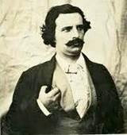{.calibre3}]{.calibre_10}

[CONCIERGERIE.]{.calibre_10}

[RÉCIT DE MON FILS CHARLES.]{.calibre_10}

[ ]{.calibre4}

[Nous apprîmes le coup d'État le 2 décembre à sept heures du matin par l'arrestation de Cholat qui avait été amené à la Conciergerie vers six heures du matin et provisoirement enfermé dans la cellule du détenu politique Nombral. Cholat nous raconta son arrestation. Vers cinq heures, on s'était introduit dans sa maison de Passy, on l'avait fait lever, et, sans lui expliquer les motifs de cette mesure, on l'avait fait monter dans un fiacre. Où me conduisez-vous ? dit en route Cholat au commissaire de police. À Sainte-Pélagie ou à Mazas, lui répondit le commissaire. En passant sur la place de la Concorde, Cholat vit les troupes massées autour de la Chambre\... « Je vois ce que c'est, dit-il alors, le coup d'État est fait. » Plus loin, sur le quai, il aperçut des ouvriers qui passaient et leur fit un appel. « Aux armes, leur cria-t-il, le président fait arrêter les représentants ! » Le commissaire, craignant que Cholat ne renouvelât son appel aux armes pendant le long trajet qu'il restait encore à parcourir, ordonna au cocher de tourner court et de se diriger sur la Conciergerie. Le directeur fut appelé, mais refusa d'écrouer Cholat sans un ordre précis du préfet de police. On alla chercher l'ordre et Cholat fut incarcéré.]{.calibre4}

[Le soir, vers onze heures, nous étions couchés mon frère et moi. Nous ne dormions pas. Tout à coup j'entendis un bruit que je n'avais pas encore entendu depuis que j'habitais la Conciergerie. Je frappai sur le mur qui séparait ma chambre de celle de Joubert. « Qu'est-ce que c'est que ça ? » lui criai-je. Joubert me répondit : « C'est la sonnette d'alarme, c'est le grelot. » On appelle ainsi une petite cloche qui correspond des appartements supérieurs de la préfecture dans l'intérieur de la prison et qui sert à avertir le directeur, dans les circonstances graves, qu'une ou plusieurs arrestations viennent d'être opérées et qu'on va lui envoyer du monde. Cette cloche a un son bref, vif et sinistre. Les détenus et les surveillants l'appellent [le grelot]{.italic}. L'effet de cette sonnette, au milieu du silence et de la nuit, a quelque chose qui glace le coeur.]{.calibre4}

[Un instant après, nouveau bruit. Celui-là ressemblait à de la pluie qui tombe nous nous demandions ce que ce pouvait être. En outre une certaine agitation semblait régner dans les corridors de la prison, à cette heure toujours silencieuse. A force de chercher la cause de cet étrange bruit, je finis par penser que ce devaient être des bottes de paille qu'on traînait sur les dalles. Quelques minutes s'écoulèrent un grand tumulte se fit. Les grilles s'ouvrirent et se fermèrent avec force. On marchait et on parlait haut. Les voix venaient évidemment de la grande galerie voûtée qui conduit du greffe dans l'intérieur de la Conciergerie. Cette galerie humide, froide et pavée comme une rue (on l'appelle même la [rue de Paris]{.italic}) venait de se convertir en casemate.]{.calibre4}

[« Qu'est-ce que c'est que ça encore ? » dis-je à Joubert. « Ce sont des prisonniers qu'on vient d'amener. »]{.calibre4}

[Toute la nuit le grelot ne cessa de résonner.]{.calibre4}

[ ]{.calibre4}

[Le lendemain matin --- le 3 --- nous pûmes voir par l'ogive grillée de notre corridor qui donne sur la [rue de Paris]{.italic} les malheureux qu'on y avait enfermés. Presque tous étaient en habits et portaient des chapeaux. Ils avaient passé la nuit sur la paille. Ils pouvaient être une soixantaine. Nous interrogeâmes les gardiens et nous apprîmes que ces arrestations avaient été faites dans les groupes, principalement dans les groupes de la place du Château-d'Eau. Ce n'était pas tout. Il n'y avait pas eu seulement des gens arrêtés, il y avait eu aussi des gens blessés. A l'infirmerie, on avait dû transporter deux hommes dont l'un avait eu tout le visage abîmé et une partie de la peau du crâne coupée et enlevée d'un coup de sabre, reçu de haut en bas, dans une charge de cavalerie. L'autre malade avait été presque assommé de coups de canne par les sergents de ville. Si ma mémoire est fidèle, il avait même aux mains et au cou de fortes excoriations. Cependant, ces blessures ne présentaient pas de gravité et les blessés purent être transportés dans la journée même à l'Hôtel-Dieu. J'ignore si les soins médicaux nécessaires leur furent donnés, mais je sais que les surveillants et les subalternes furent avec eux d'une excessive brutalité.]{.calibre4}

[[À partir du 2 décembre]{.bold} au soir jusqu'au 10, la [rue de Paris]{.italic} ne cessa de s'emplir. Elle ne se vida que vers le 12 ou le 13. Je termine tout de suite ce qui a trait à cette partie de mes impressions.]{.calibre4}

[Du reste, pas un cri. Un murmure confus. Le silence était ordonné. De temps à autre, un surveillant traversait la galerie et jetait d'un ton brutal un mot d'intimidation ou de défi. Cela était tellement odieux que je ne pus m'empêcher de dire à l'un d'eux : « Mais c'est ignoble, la manière dont vous traitez ces gens-là ! »]{.calibre4}

[Il y avait là plus d'habits que de blouses. Il y avait des commis de magasin l'un entre autres à qui j'ai parlé, un tout jeune homme de bonnes façons et de bonne mine, bien mis et qui m'a dit être là parce qu'il était accusé d'avoir tiré sur la troupe. Il y avait des cochers de fiacre, des bourgeois, des enfants, tous les passants de la rue. Le restaurant Bonvalet était là.]{.calibre4}

[On leur servait la nourriture de la prison, le pain noir, la soupe et l'eau. Ils restèrent du 3 au 6 sans prendre l'air. Pendant trois jours et trois nuits, ces huit cents hommes respirèrent cette affreuse atmosphère. Ils vécurent trois jours dans cette nuit, trois nuits sur ce fumier ! Le 7 on leur permit de sortir dans la cour. On aéra. On battit et on secoua les litières. Elles étaient pleines de vermine.]{.calibre4}

[À la tombée de la nuit, les prisonniers rentraient à l'écurie.]{.calibre4}

[Cela dura une huitaine de jours pendant lesquels le grelot ne cessa de retentir. On amenait des prisonniers et on en remmenait. On les interrogeait par fournées de vingt-cinq et de trente, et on les dirigeait sur les forts. Peu à peu la [rue de Paris]{.italic} se vida et le 9 ou le 10 on nous permit d'y passer lorsque nous étions appelés au parloir. Un matin, pendant que les prisonniers étaient dans la cour, je traversais la [rue de Paris]{.italic}. J'aperçois sous un tas de paille quelque chose qui remuait. Je m'approche et je vois la figure d'un enfant. Tout le reste de son corps était couvert de paille. Il avait les yeux fermés.]{.calibre4}

[« Qu'est-ce que vous avez », lui dis-je.]{.calibre4}

[L'enfant ouvrit les yeux et me dit d'une voix faible et presque mourante :]{.calibre4}

[« Je n'ai rien. »]{.calibre4}

[--- Pourquoi n'allez-vous pas dans la cour ?]{.calibre4}

[--- Je n'ai pas la force.]{.calibre4}

[--- Voulez-vous boire un verre de vin ?]{.calibre4}

[L'enfant me répondit avec un regard plein d'une inexprimable reconnaissance :]{.calibre4}

[--- Oui. Je crois que ça me fera du bien.]{.calibre4}

[Cela présenta des difficultés. Il fallut une autorisation du brigadier pour envoyer à ce malheureux être un morceau de pain et un peu de vin.]{.calibre4}

[Il y avait à l'infirmerie plusieurs détenus arrêtés dans les journées, blessés ou malades. Parmi eux, il y avait un enfant de douze ans. Celui-là n'était pas malade, mais on lui avait accordé un lit. Voici comment il m'a raconté son arrestation :]{.calibre4}

[--- Je passais. J'étais sur le trottoir du quai, devant la préfecture. Je m'étais arrêté pour voir arriver des gens arrêtés et conduits par de la troupe. Le chef, avant d'entrer sous le guichet, compta ses prisonniers. Il y en avait douze. Il en manquait un à l'appel. Alors il me prit au collet en disant :]{.calibre4}

[--- En voilà un qui fera le treizième.]{.calibre4}

[Cet enfant, dont la mise annonçait une famille aisée, avait été réclamé par ses parents. Mais les formalités de la justice avaient retardé sa mise en liberté. On avait consenti à le mettre à l'infirmerie jusqu'à son élargissement. C'était une faveur. Il passa devant le juge d'instruction et fut provisoirement conduit dans un fort.]{.calibre4}

[Je reprends mon récit à la matinée du 3.]{.calibre4}

[Vers midi, nous entendîmes plusieurs coups de fusil. Nous courûmes dans l'infirmerie, momentanément vide, et dont les fenêtres donnent sur la place du Palais de Justice. Un bruit de cavaliers au galop succéda au bruit de la fusillade les gardes républicains postés sur la place descendirent au pas de charge. On venait de leur crier : Aux armes !]{.calibre4}

[Une tentative avait lieu sur la Préfecture. Les coups de fusil durèrent près de trois quarts d'heure. On vint nous dire que la troupe tirait contre un commencement de barricade qui se faisait à l'entrée de la place du Châtelet. Nous crûmes entendre le canon. Tout à coup le grelot sonna. On nous fit sortir de l'infirmerie. On y amenait un blessé un homme en blouse, soutenu par deux surveillants, entra en boitant et en hurlant. Il avait du sang dans le dos. La balle avait traversé la hanche. On le coucha sur un lit tout gémissant.]{.calibre4}

[Le médecin de la prison était absent. [On ne l'envoya pas chercher]{.italic}. Ce fut l'infirmier qui soigna le pauvre blessé. Comment le soigna-t-il ? Le soir, comme je l'interrogeais, il me dit : « Ce n'est rien, dans quinze jours il sera sur ses jambes. » Le lendemain on transporta le blessé à l'Hôtel-Dieu. Il passa vingt-quatre heures confié à un infirmier, voleur et mouchard. Ce filou représentait l'humanité dans le coup d'État.]{.calibre4}

[Nous descendîmes dans la cour, comme d'habitude pleine de détenus, la plupart non politiques. Dans un vestibule qui mène au greffe et qui est exhaussé de quelques marches, on posta des soldats. Un profond silence se fit dans le préau.]{.calibre4}

[--- Au moindre cri, au moindre geste, au moindre mouvement, cria l'officier, voilà les fusils !]{.calibre4}

[Vers trois heures, on sut à la Conciergerie que l'attaque sur la Préfecture avait été repoussée. Les soldats chargés de nous mettre en joue se retirèrent. Tout rentra dans le calme.]{.calibre4}

[On avait craint un moment que la tentative ne fût plus grave, et la défense avait été sérieusement organisée. Les appartements du directeur avaient été occupés militairement. À chacune des meurtrières des grosses tours qui font face au quai, un soldat avait été placé avec ordre de tirer sur tout ce qui passerait. Il y eut même un feu de peloton dirigé sur l'autre côté du quai dans le but d'éloigner les passants. C'était l'un d'eux qu'on venait de nous amener tout sanglant.]{.calibre4}

[Le 2 au matin, j'ai vu de mes yeux par la fenêtre de l'infirmerie deux gardes républicains buvant du vin à même et à plein goulot quand les bouteilles étaient vides, d'autres les remplaçaient. Le 3 au matin, j'ai revu mes deux mêmes gardes républicains buvant encore et de la même manière. Dans la nuit du 2 au 3, nous avons entendu les soldats ivres sur la place du Palais de Justice chanter Veillons au salut de l'Empire !]{.calibre4}

[Parmi les prisonniers amenés dans la rue de Paris à la Conciergerie, il y avait un aveugle.]{.calibre4}

[!{.calibre3}]{.calibre4}

[[
]{.calibre_7}]{.bold}

### [[[]{.calibre2}[]{.calibre2}[]{.calibre2}[]{.calibre2}[]{.calibre2}[]{.calibre2}[Victor Frond]{.calibre2}[[[[[[^\[131\]^]{.bold1}]{.calibre_43}]{.calibre2}]{.underline1}]{.calibre_42}](index_split_4933.html#filepos40236301){#filepos39218991 .calibre2}]{.bold1}]{.calibre_39} {#victor-frond131 .calibre_38}

[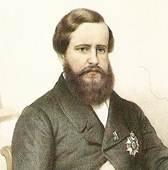{.calibre3}]{.calibre_10}

[VOTE DE L'ARMÉE EN DÉCEMBRE 1851]{.calibre_10}

[ ]{.calibre4}

[Deux registres sur lesquels on lisait en tête de la première page OUI-NON et au-dessous deux lignes expliquant le vote affirmatif ou le refus, étaient distribués dans tous les régiments.]{.calibre4}

[Le 3, on pouvait voir sur le boulevard les soldats ivres se presser autour d'une caisse de tambour qui servait de table venir donner leur signature sur le seul registre qui leur fût présenté, le registre oui. Dans plusieurs régiments les colonels faisaient circuler une simple liste dans d'autres on a poussé le cynisme jusqu'à faire voter les compagnies en masse.]{.calibre4}

[... Ceux qui avaient le plus protesté contre le coup d'État, ceux qui avaient été signalés au ministre comme ennemis de l'ordre, reçurent après la [victoire du crime]{.italic} des feuilles de route soit pour l'Afrique, soit pour les extrémités nord ou midi de la France. --- Depuis on exigea le serment : peu, j'en suis sûr, l'auront prêté, et le nombre des victimes de César doit être aujourd'hui d'autant plus considérable qu'on a vu bien des officiers émettre des votes affirmatifs en décembre, et refuser leur serment plus tard. Ces officiers que la crainte de la perte de leur position avait fait dire oui ont dit non aujourd'hui, préférant la misère au crime.]{.calibre4}

[Ce que je puis dire, c'est ce que j'ai, vu moi-même à la 4^[e]{.calibre18}^ compagnie du bataillon des sapeurs-pompiers de Paris dont j'étais le sous-lieutenant.]{.calibre4}

[À trois heures de l'après-midi, le 3 décembre, le capitaine-ingénieur Vilerme vint à la caserne accompagné du sergent Dubois, premier secrétaire ou trésorier, porteur des deux registres OUI et NON.]{.calibre4}

[M. Vilerme me fit demander dans ma chambre par un homme du poste.]{.calibre4}

[Arrivé auprès de lui et sans me faire connaître le but de sa visite à la caserne :]{.calibre4}

[--- Faites sonner au feu, me dit-il.]{.calibre4}

[Je transmis cet ordre au caporal, et en quelques minutes la compagnie entière, moins les hommes de garde, fut réunie dans la cour. Le capitaine Melotte et le lieutenant Poteau arrivèrent aussi.]{.calibre4}

[--- Faites porter la compagnie dans la cour du gymnase.]{.calibre4}

[Je pressentais quelque chose, la correspondance de l'état-major étant très active. Je savais qu'au dehors j'étais surveillé et que les amis qui venaient étaient suivis. --- Je fis exécuter ce changement de position.]{.calibre4}

[Faites former le cercle, me dit-il, lorsque nous fûmes arrivés dans la cour du gymnase et, prenant des mains du sous-officier qui l'accompagnait une circulaire du ministre, il la remit au sergent-major Gonet avec ordre de la lire.]{.calibre4}

[Au premier mot, je compris ce dont il s'agissait. La veille, on nous avait préparés en faisant afficher sur les murs de la caserne un exemplaire de toutes les proclamations qui avaient été attachées sur les murs de Paris, avec ordre de les lire, ce que je fis faire en effet, avec des commentaires que les hommes acceptaient avec plaisir.]{.calibre4}

[Cette lecture terminée, je voulus demander que l'on expliquât le vote je n'avais rien compris à la dépêche et je pensais que les hommes n'étaient pas plus avancés.]{.calibre4}

[--- Faites rompre le cercle, me dit d'un ton menaçant le capitaine Vilerme, la dépêche du ministre est claire et n'a pas besoin de commentaires. Conduisez vos hommes à la salle d'enseignement.]{.calibre4}

[Arrivés là, les hommes restèrent formés sur deux rangs dans le corridor. Le sergent Dubois se hâta d'ouvrir son registre OUI, de prendre une chaise, un encrier, une plume qu'il installa sur la table, tandis que le fourrier Louis, qui avait reçu sans doute le mot d'ordre, déposait sur le registre NON sa matricule et une profusion d'états nominatifs qui ne devaient servir qu'à jeter de la confusion sur la table.]{.calibre4}

[Les capitaines Vilerme et Melotte et le lieutenant Poteau se placèrent sur un banc derrière la table, faisant face à la porte je me plaçai sur le côté gauche de la table, tandis que le sergent Dubois faisait tous ses préparatifs de l'autre côté de la table, plaçait sa chaise pour que l'homme fût commodément pour donner sa signature, ouvrait son registre sur lequel il indiquait déjà avec l'index de la main gauche la place où le premier homme devait signer ou faire la croix et tenait la plume remplie d'encre pour la donner à l'homme.]{.calibre4}

[Le sergent-major, ayant en main le contrôle de la compagnie, se plaça d'abord à côté de moi, puis alla prendre place à côté de Dubois.]{.calibre4}

[Tous ces préparatifs faits, M. Vilerme donna l'ordre de commencer le vote : les sous-officiers d'abord, les caporaux et les soldats. Les officiers étaient destinés à clore la liste sans doute.]{.calibre4}

[Je me récriai. Nous étions tous citoyens, mais puisqu'on faisait une distinction de grades, je demandai que les officiers commençassent.]{.calibre4}

[... J'espérais, j'avais des raisons d'espérer que mon exemple serait suivi par un bon nombre d'hommes.]{.calibre4}

[M. Vilerme crut devoir faire droit à ma demande, et il invita Melotte et Poteau à ouvrir la liste Melotte pâlit, il hésita un peu, mais une voix lui cria : Et tes quatre mille francs d'appointements ? Il signa oui.]{.calibre4}

[Poteau se dressa sur ses pieds et avec force évolutions de manière à être bien remarqué de M. Vilerme, il vint s'asseoir et écrivit de son mieux avec un soin extrême et en caractères très gros sa signature à côté de celle de M. Melotte.]{.calibre4}

[Arriva mon tour. Je refusai le registre qu'on me présentait, je demandai le second. Je fis débarrasser le bout de la table sur lequel j'étais appuyé, je plaçai mon registre NON à côté de l'autre, je voulus faire mettre une autre plume, un autre encrier, une autre chaise. J'aurais au besoin rempli de mon côté l'office du sergent Dubois, mais M. Vilerme jugea la chose inutile, et Poteau d'applaudir avec force ricanements à mon endroit, tandis que Melotte faisait les cent pas, en proie déjà au remords de s'être associé à la conduite du forban.]{.calibre4}

[Force fut de prendre la plume des mains du sergent Dubois et d'écrire mon vote debout. Le registre OUI était déjà couvert de signatures, il avait circulé dans les autres compagnies le deuxième était vierge de signatures. J'eus l'honneur d'inscrire mon nom en tête de cette liste qui n'était point la liste d'un vote, mais une table de proscription.]{.calibre4}

[Le registre resta ouvert, je m'instituai son gardien.]{.calibre4}

[Les sous-officiers signèrent ; vinrent ensuite les caporaux.]{.calibre4}

[Les deux premiers appelés inscrivirent leur nom sur le registre OUI. Le troisième s'approcha du sergent Dubois, prit la plume et vint hardiment poser sa signature à côté de la mienne. Cet exemple en entraîna deux autres mais le reste, soit par crainte, soit par influence, suivit l'exemple de Melotte et de Poteau.]{.calibre4}

[Arriva le tour des sapeurs. Presque tous répondirent oui, ils savaient en effet qu'une simple infraction aux règles de la plus brutale discipline pouvait leur attirer le châtiment infligé à ceux dont ils tenaient la place. Ils savaient que la moindre désobéissance suffirait pour les faire expulser du bataillon, les envoyer en Afrique ou tout au moins dans un régiment de ligne.]{.calibre4}

[Lorsque les 25 ou 30 premiers sapeurs eurent signé par force (car dans le regard qu'ils me jetaient en arrivant ou après avoir signé je voyais bien qu'ils regrettaient de ne pouvoir signer à côté de moi), ma colère fit explosion, et au moment où l'homme appelé prenait la plume et se penchait sur le registre, je me tournai vers le capitaine Vilerme et lui dis :]{.calibre4}

[--- L'acte qu'on nous demande comme citoyens est un acte suprême qu'on ne peut accomplir qu'en toute connaissance de cause ; le vote n'est point compris, je désire qu'il soit expliqué.]{.calibre4}

[Je m'avançai vers l'autre extrémité de la table et, sans prendre garde à la réponse du capitaine Vilerme qui me menaçait de me faire sortir de la salle, ni aux trépignements furieux de Poteau, je demandai à l'homme qui allait signer : Pour quoi signez-vous ? --- Je ne sais, mon lieutenant. --- Cette réponse m'exaspéra. Puis me tournant vers la compagnie je dis aux hommes : Sachez bien que le vote que vous exprimez, c'est la consécration du coup d'État par votre vote vous autopsiez M. Bonaparte à faire une constitution qui remplace celle votée par neuf cents délégués du peuple. C'est la substitution du gouvernement d'un seul au gouvernement du peuple, qui est le vôtre.]{.calibre4}

[--- Taisez-vous, me dit le capitaine Vilerme. Il m'appartient, à moi seul, d'expliquer le vote et alors il balbutia quelques mots qui ne purent détruire l'effet produit par moi sur les hommes résolus, et j'ai des raisons puissantes de dire qu'il n'en manquait pas.]{.calibre4}

[... Quatre ou cinq hommes en effet vinrent signer, et j'étais assuré d'avoir bien d'autres signatures le lendemain, si des préparatifs d'intimidation n'étaient venus influencer la garde descendante.]{.calibre4}

[...Le 4 au matin, à peine la compagnie fut-elle dans la cour, que M. Jourdain, capitaine adjudant-major, ouvrit son registre négatif, appela les hommes dont les signatures se trouvaient à côté de la mienne, les fit sortir du rang et les amena dans le corridor.]{.calibre4}

[Il demanda les clefs de la salle d'enseignement, et fit subir là à chacun de ces hommes séparément un interrogatoire très long. Pendant le temps que dura cette inquisition, je restai dans la cour, et, lorsque tout fut fini, je montai dans les chambrées. Un caporal vint à moi et me dit : Mon lieutenant, ne m'en voulez pas, mais j'ai été contraint par la menace du conseil de guerre de retirer mon vote [négatif]{.italic}.]{.calibre4}

[Je le fis venir chez moi, il me raconta que M. Jourdain lui avait dit :]{.calibre4}

[--- Savez-vous ce que vous avez signé là ? C'est, je n'en doute pas, les mauvais conseils de M. Frond qui vous ont porté à un acte qui peut attirer sur vous les plus graves désagréments. Songez à votre avenir, songez à votre famille qu'un terrible châtiment peut plonger dans la désolation. Vous avez été trompé ; rétractez-vous, il en est temps encore.]{.calibre4}

[Et après bien des menaces, bien des promesses et surtout un éloge peu flatteur de ma personne ; de mes sentiments, chaque homme effaça d'un trait de plume sa signature qu'il reporta sur le registre oui, sur lequel ma signature restait dès lors toute seule.]{.calibre4}

[Je n'avais plus à douter de ce qui m'attendait, j'étais cependant résolu à en finir, mes projets étaient arrêtés. Cette journée devait être féconde en événements.]{.calibre4}

[Je descendis dans la cour pour faire défiler la garde montante. Je me promenais depuis un moment lorsque je vis arriver à moi un monsieur que je n'avais jamais vu.]{.calibre4}

[--- M. Frond ? me dit-il.]{.calibre4}

[--- C'est moi.]{.calibre4}

[--- Je désirerais vous parler en particulier.]{.calibre4}

[Je le fis monter chez moi. Retirant alors un petit billet de sa poche, il me dit : « Lisez »]{.calibre4}

[C'était un avis de partir si je voulais me soustraire à une arrestation.]{.calibre4}

[--- De qui vient ce billet ? demandai-je.]{.calibre4}

[--- Je ne puis rien dire, me fut-il répondu c'est d'un ami qui se fera connaître plus tard. --- Et sans ajouter un mot, cet émissaire mystérieux se retira.]{.calibre4}

[Je compris tout. Je rédigeai en toute hâte ma démission que, je portai à M. Melotte. --- Je ne suis plus rien ici, je me retire, lui dis-je. Il voulut me répondre, mais déjà la porte était fermée sur moi.]{.calibre4}

[Depuis quelque temps j'avais pris un logement quai de la Toumelle. Je m'y rendis pour changer de vêtements. --- Cette opération fut courte. Il le fallait, du reste, car quelques minutes après mon départ ma chambre fut envahie par la police, une douzaine de sapeurs-pompiers ayant à leur tête un lieutenant que j'ai reconnu au portrait qui m'en a été fait pour le lieutenant Poteau.]{.calibre4}

[Cette narration est écrite avec toute la sincérité que doit avoir un document officiel. --- Je la livre, non point pour mettre à jour ma résistance au coup d'État, mais comme une nouvelle flétrissure à imprimer au front du forban.]{.calibre4}

[!{.calibre3}]{.calibre4}

[[
]{.calibre_7}]{.bold}

### [[[]{.calibre2}[]{.calibre2}[]{.calibre2}[]{.calibre2}[]{.calibre2}[]{.calibre2}[Chez Victor Schoelcher]{.calibre2}[[[[[[^\[132\]^]{.bold1}]{.calibre_43}]{.calibre2}]{.underline1}]{.calibre_42}](index_split_4933.html#filepos40237368){#filepos39236535 .calibre2}]{.bold1}]{.calibre_39} {#chez-victor-schoelcher132 .calibre_38}

[ ]{.calibre4}

[Monsieur, Je m'empresse de vous faire connaître les vexations inqualifiables dont j'ai été l'objet de la part des agents de la police lors du coup d'État du deux décembre par suite de mon dévouement au meilleur des hommes, M. Schoelcher.]{.calibre4}

[Après le 2 décembre, je restai trois jours entiers chez M. Schoelcher sans me coucher, inquiète, ne recevant aucune nouvelle de lui. Dans la journée du 3 décembre, le commissaire de police de la rue Papillon se présenta pour l'arrêter il y avait alors son secrétaire, plusieurs de ses amis en faisant ses investigations dans les divers corps du logement, le commissaire de police m'interpella en ces termes : --- C'est vous qui vous appelez Mme Constance ? --- Sur ma réponse affirmative il ne m'en demanda pas davantage. Dans ces entrefaites entra un jeune homme versant des larmes qui venait s'assurer s'il était vrai que, comme on le disait, M. Schoelcher avait été tué dans le faubourg Saint-Antoine. Privée de toute nouvelle sur son compte, le bruit qui était arrivé aux oreilles de ce jeune homme ne fit qu'augmenter mes angoisses.]{.calibre4}

[Le commissaire de police se retira donc sans rien trouver. Les choses en étaient là lorsque le 5 décembre je reçus un mot de M. Schoelcher, puis une lettre anonyme, en rentrant chez moi à 9 heures du soir, heure à laquelle je me retirais de chez M. Schoelcher ; je déposai le tout sur ma cheminée et je me disposai enfin à me reposer ; à peine étais-je couchée, c'est-à-dire à 11 heures du soir, je fus réveillée par ma portière qui me pria d'ouvrir la porte, ce que je fis immédiatement et sans m'habiller grand fut mon étonnement en voyant entrer avec elle le commissaire de police, des officiers de paix et des sergents de ville ; et, avant de prendre mes vêtements, j'eus à subir le long interrogatoire suivant :]{.calibre4}

[--- Où avez-vous passé les trois dernières nuits ?]{.calibre4}

[--- Chez monsieur.]{.calibre4}

[Le commissaire : --- Cela n'est pas vrai.]{.calibre4}

[--- Vous n'avez qu'à demander à M. Pleyel, lui dis-je, et vous verrez si cela n'est pas vrai.]{.calibre4}

[--- Pourquoi les avez-vous passées chez lui plutôt que chez vous ?]{.calibre4}

[--- Parce que, le croyant blessé, j'attendais qu'on le portât.]{.calibre4}

[--- Vous savez où est votre maître. Il faut que vous le disiez.]{.calibre4}

[--- Le matin du 2 décembre, je portai les journaux à monsieur, et allumai son feu à 7 h. 1/2 du matin à ce moment on sonna et on demanda à lui parler ; j'introduisis la personne dix minutes après, monsieur m'appelle et m'envoie en commission. Il était 8 heures, je pars, je m'en revins à 9 h. ¼ ; je ne trouvai plus M. Schoelcher, et depuis lors je ne l'ai plus revu.]{.calibre4}

[--- Vous devez savoir où il est ? il faut que vous nous le disiez, ou il vous arrivera de la peine.]{.calibre4}

[--- Je vous jure sur l'honneur que je ne sais pas où il est !]{.calibre4}

[À ce moment le commissaire de police s'empare des deux lettres que j'avais déposées sur ma cheminée, et s'adressant à moi :]{.calibre4}

[--- Voilà une lettre de M. Schoelcher. Je reconnais son écriture.]{.calibre4}

[--- Oui, monsieur.]{.calibre4}

[--- Qui vous a porté cette lettre ?]{.calibre4}

[--- Un commissionnaire.]{.calibre4}

[--- Quel est ce commissionnaire ?]{.calibre4}

[--- Je ne le connais pas. Quand un commissionnaire m'apporte une lettre, je le paie et ne regarde pas sa médaille.]{.calibre4}

[--- De qui vous vient l'autre lettre ?]{.calibre4}

[--- Regardez-la, vous verrez que c'est une lettre anonyme dans laquelle [on me dit de me rendre dans la rue que je connais.]{.italic} Or, comme j'en connais beaucoup, je l'ai considérée comme venant de la police et, par conséquent, je n'y ai pas fait attention.]{.calibre4}

[Alors le commissaire de police, ne pouvant maîtriser son impatience, a froissé la lettre et m'a de suite posé cette question : --- M. Schoelcher a des maîtresses. Dites-nous leur nom.]{.calibre4}

[--- J'ignore s'il a ou non des maîtresses.]{.calibre4}

[--- Cependant il reçoit des dames ?]{.calibre4}

[--- Je ne demande jamais les noms de ceux qui visitent M. Schoelcher. D'ailleurs, monsieur, les personnes qui viennent chez M. Schoelcher sont trop haut placées, pour que j'en devienne leur délatrice.]{.calibre4}

[Après cet interrogatoire, que je subis n'ayant qu'une simple chemise, ils se retirèrent dans le fond de la chambre (le commissaire et l'officier de paix), et se mirent à causer à voix basse ; je pus néanmoins saisir ces mots : Nous n'en obtiendrons rien. L'officier de paix ajouta : Il faut la mettre en prison.]{.calibre4}

[Sur ce, ils quittèrent la chambre.]{.calibre4}

[Dix minutes après, l'officier de paix et quatre sergents de ville remontèrent, le premier m'enjoignit de m'habiller et de les suivre. Pendant que je déférais à son injonction en m'habillant, l'officier de paix me dit Vous ne devancerez votre maître que de quelques heures. --- À 11 h. 1/2, par une pluie battante, je me mis en route ayant beaucoup de peine à les suivre. --- Pendant le trajet un sergent de ville me donnait le bras et me le serrait avec tant de force que je lui fis observer que c'était inutile de me faire tant de mal, car mon intention n'était nullement de me sauver. --- Il me répliqua qu'il agissait ainsi parce que le pavé était gras à quoi j'ajoutai : Mais il tombe de l'eau, la crotte n'est que de la bouillie. --- Il me dit : Mais dites donc où il est. Je répondis Mais vous êtes bien drôle. Ne sachant pas où il est, je ne puis vous le dire : C'est qu'on vous reconduirait chez vous. --- À quoi je répondis : Je n'ai besoin de personne pour me reconduire. Je connais mon chemin.]{.calibre4}

[Arrivée à la préfecture de police, haletante et mouillée, j'y trouvai deux officiers que j'acceptai. On me mit ensuite dans une cellule où se trouvait une femme couchée sur la paillasse, qui se nommait Héléna Gosselin, laquelle était malade. J'y passai la nuit assise à ses pieds. Comme moi, elle était arrêtée pour n'avoir pas voulu indiquer l'adresse des personnes qui dînaient chez elle à table d'hôte, et suspectées de républicanisme.]{.calibre4}

[Le lendemain samedi, on nous changea de cellule celle-ci avait 6 pieds de long sur 10 de large, il s'y trouvait 14 à 16 femmes, prostituées, voleuses et autres. Le dimanche nous étions 23, le soir 6 ont été extraites de la cellule où on ne pouvait même respirer.]{.calibre4}

[Je suis restée depuis le 5 décembre à minuit jusqu'au mercredi à 1 h. 1/2, heure à laquelle on me conduisit près du juge d'instruction qui se borna à me faire décliner les noms, prénoms, profession et demeure. Après quoi il me déclara en liberté.]{.calibre4}

[Tel est le récit exact des faits qui me concernent.]{.calibre4}

[[
]{.calibre_7}]{.bold}

### [[[]{.calibre2}[]{.calibre2}[]{.calibre2}[]{.calibre2}[]{.calibre2}[]{.calibre2}[Lorin]{.calibre2}]{.bold1}]{.calibre_39} {#lorin .calibre_38}

[[]{.italic}]{.calibre_26}

::: calibre_27

[[Paris. 1er avril 1878.]{.italic}]{.calibre_26}

::: calibre_27

[ ]{.calibre4}

[Monsieur et illustre Maître,]{.calibre4}

[J'ai lu avec un intérêt passionné votre second volume de l'Histoire d'un Crime, digne du premier.]{.calibre4}

[Un passage m'a frappé tout particulièrement, celui qui concerne Cournet. J'étais, moi, troisième dans la voiture et je puis attester que tous les détails que vous donnez dans le récit de cet épisode émouvant sont parfaitement exacts, sauf un sur lequel je prends la liberté d'appeler votre attention, au cas où vous croiriez devoir le rectifier dans les prochaines éditions.]{.calibre4}

[L'agent n'a été qu'à demi étranglé et la preuve, c'est que le lendemain je l'ai revu à la porte du café Sainte-Agnès, rue Jean-Jacques Rousseau, et que j'ai failli retomber entre ses mains.]{.calibre4}

[Veuillez agréer, Monsieur et illustre Maître, l'assurance de mes sentiments de respect et d'admiration.]{.calibre4}

[!{.calibre3}]{.calibre4}

[Je me serais permis de vous demander audience pour vous remercier de ces belles pages vengeresses, si mon infirmité ne m'en avait empêché. Je suis devenu aveugle depuis quelques années, et condamné à une réclusion qui m'est bien pénible !]{.calibre4}

[[
]{.calibre_7}]{.bold}

### [[[]{.calibre2}[]{.calibre2}[]{.calibre2}[]{.calibre2}[]{.calibre2}[]{.calibre2}[Mme Victor Hugo]{.calibre2}[[[[[[^\[133\]^]{.bold1}]{.calibre_43}]{.calibre2}]{.underline1}]{.calibre_42}](index_split_4933.html#filepos40237890){#filepos39248832 .calibre2}]{.bold1}]{.calibre_39} {#mme-victor-hugo133 .calibre_38}

[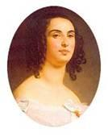{.calibre3}]{.calibre_10}

[... Le mercredi 4 --- je crois bien que c'est le 4 --- un monsieur demande à me parler. Ce monsieur me dit Madame, le coup d'État est sur le point de réussir. Aucune protestation, venant des journalistes, ne paraît. Les représentants n'ont pu jusqu'ici, à ce qu'il me semble, faire afficher leurs proclamations. On les dit traqués et empêchés. Dans cette impérieuse occurrence, nous avons rédigé, mes amis et moi, une proclamation. Il nous fallait un nom au bas de cette proclamation. Nous avons pris celui de M. Victor Hugo, ce nom étant, d'entre tous, le plus aimé et le plus populaire. Nous avons imprimé cette proclamation que voici dans une cuisine, après nous être procuré des caractères.]{.calibre4}

[Comme il faut tout prévoir, comme il est possible et même probable que nous serons vaincus, j'adresse à Monsieur Victor Hugo une lettre à décharge, lettre qui témoignera au besoin que nous nous sommes servis du nom de Monsieur Victor Hugo à son insu.]{.calibre4}

[J'ai remercié ce monsieur d'avoir usé de ton nom pour le bien d'une sainte et grande cause, pour le triomphe de la liberté et des lois.]{.calibre4}

[Ce à quoi Paul[[[[^\[134\]^]{.calibre_21}]{.underline}]{.calibre_4}](index_split_4933.html#filepos40238749){#filepos39250695}, qui était témoin de cette conversation, s'est écrié après le départ de ce monsieur Ma soeur conspire ! Quand je pense que ma soeur conspire bon garçon du reste, mais ayant le nez fort court, et par trop craintif.]{.calibre4}

[Je t'ai remis lorsque je suis allée à Bruxelles la lettre que m'a apportée pour toi, en même temps que cette proclamation, ce monsieur. Cette proclamation est celle, j'en suis sûre maintenant, dont je t'ai envoyé copie.]{.calibre4}

[ ]{.calibre4}

[Proclamation que t'a attribuée ce Mayer[[[[^\[135\]^]{.calibre_21}]{.underline}]{.calibre_4}](index_split_4933.html#filepos40239043){#filepos39251643}]{.calibre4}

[[[[[^\[136\]^]{.calibre_21}]{.underline}]{.calibre_4}](index_split_4933.html#filepos40239301){#filepos39251890}Citoyen,]{.calibre4}

[Pendant la journée aucune proclamation de la Montagne n'ayant paru, quelques-uns de mes amis et moi avons eu l'idée d'en faire une. Trouver 2 ouvriers et les caractères nécessaires a pris un certain temps. Enfin à l'heure qu'il est, 9 heures, environ 2 000 exemplaires sont tirés et en train d'être affichés. Cette proclamation devait être signée d'un nom populaire, nous avons emprunté le vôtre.]{.calibre4}

[Les événements pouvant tourner contre nos espérances démocratiques, vous pourriez être poursuivi et condamné pour ce fait. En vous en remettant un exemplaire, je viens en assumer là responsabilité en déclarant ici au nom de la vérité que vous n'avez pas autorisé à user de votre nom pour ce fait et que cette proclamation a paru à votre insu.]{.calibre4}

[Si une autre déclaration était nécessaire, veuillez être assez bon pour me le faire savoir. À chacun les conséquences de ses actes.]{.calibre4}

[Salut et Fraternité.]{.calibre4}

[E. ALSTORPHIUS.]{.calibre4}

[!{.calibre3}]{.calibre4}

[ ]{.calibre4}

[[Rue de Miromesnil, 51. Paris,]{.italic}]{.calibre_28}

[ ]{.calibre4}

[2 décembre 51 --- 9 heures du soir.]{.calibre_10}

[]{.calibre_10}

[{.calibre3}]{.calibre_10}

[[]{.italic}]{.calibre_26}

::: calibre_27

[Le vendredi 5, vers onze heures du soir, Dumas me vient trouver. Il était accompagné d'un individu. --- Dumas me dit : Monsieur que voilà a quelque chose de fort important à vous dire. --- Le monsieur me dit : Madame, j'ai été camarade de collège avec un garçon, lequel garçon est maintenant officier au 29^[[e]{.calibre_63}]{.calibre18}^ de ligne. Cet officier sort de me dire : Si vous connaissez quelqu'un qui approche Monsieur Victor Hugo, avertissez Monsieur Victor Hugo qu'il se mette en garde, la troupe ayant reçu ordre de le tuer. --- Cet assassinat passerait pour un accident. --- Que Monsieur Hugo ne sorte donc pas, surtout la nuit venue.]{.calibre4}

[ ]{.calibre4}

[!{.calibre3}]{.calibre_10}

[ ]{.calibre4}

[Le samedi 6, quelqu'un demande à me parler. Ce quelqu'un me dit Madame, je suis un petit commerçant de la rue Montmartre. Je n'ai pu me joindre à ceux qui ont résisté au coup d'État, ma femme étant au lit, malade. Je voudrais faire quelque chose pour mon parti. Je vous apporte 50 francs, ce sont mes économies. Je voudrais que Monsieur Victor Hugo en fit l'emploi qu'il voudrait, qu'il le donnât à quelque pauvre veuve, ou à quelque blessé, par exemple. Je n'ai jamais vu Monsieur Victor Hugo, mais je serais tranquille et content s'il voulait lui-même distribuer cette petite somme d'argent.]{.calibre4}

[ ]{.calibre4}

[!{.calibre3}]{.calibre_10}

[ ]{.calibre4}

[J'ai lu à Napoléon ce que tu dis sur lui. Il m'a semblé charmé. Il demande que tu laisses son nom en toutes lettres. Il m'a priée de te témoigner sa reconnaissance. Il demande seulement que tu écrives il flétrit énergiquement l'[acte]{.italic} de son cousin au lieu de dire le [crime]{.italic} de son cousin[[[[^\[137\]^]{.calibre_21}]{.underline}]{.calibre_4}](index_split_4933.html#filepos40239625){#filepos39256754}. Il prétend que tout va mal pour son cousin. Girardin, après avoir lu ce que tu écris sur lui, m'a dit il n'y a pas un mot à changer.]{.calibre4}

[[
]{.calibre_7}]{.bold}

### [[[]{.calibre2}[]{.calibre2}[]{.calibre2}[]{.calibre2}[]{.calibre2}[]{.calibre2}[Mme Bouclier]{.calibre2}[[[[[[^\[138\]^]{.bold1}]{.calibre_43}]{.calibre2}]{.underline1}]{.calibre_42}](index_split_4933.html#filepos40239959){#filepos39257394 .calibre2}]{.bold1}]{.calibre_39} {#mme-bouclier138 .calibre_38}

[ ]{.calibre4}

[Madame[[[[^\[139\]^]{.calibre_21}]{.underline}]{.calibre_4}](index_split_4933.html#filepos40240645){#filepos39257720},]{.calibre4}

[Veuillez, je vous prie, tenir sur l'auguste personne du prince président de la République des discours un peu plus réservés que ceux d'hier à la vente Victor Hugo.]{.calibre4}

[Il pourrait être regrettable d'avoir tenu de semblables discours et pour vous et pour moi. DE MAUPAS.]{.calibre4}

[11 juin 1852.]{.calibre_3}

[ ]{.calibre4}

[!{.calibre3}]{.calibre_10}

[ ]{.calibre4}

[Monsieur,]{.calibre4}

[Avant de recevoir votre lettre je savais que nous étions entourés d'espions jusque dans l'intérieur de nos familles.]{.calibre4}

[Si vous m'arrêtiez pour ce que j'ai dit sur Monsieur Louis Napoléon, vous arrêteriez la France entière quand elle parle des effractions commises au château d'Eu.]{.calibre4}

[C. BOUCLIER née JONIS DESFAYERES]{.calibre4}

[!{.calibre3}]{.calibre4}

[[12 juin 52.]{.italic}]{.calibre_26}

::: calibre_27

[[
]{.calibre_7}]{.bold}

### [[[]{.calibre2}[]{.calibre2}[]{.calibre2}[]{.calibre2}[]{.calibre2}[]{.calibre2}[Jules Bastide]{.calibre2}[[[[[[^\[140\]^]{.bold1}]{.calibre_43}]{.calibre2}]{.underline1}]{.calibre_42}](index_split_4933.html#filepos40240981){#filepos39259763 .calibre2}]{.bold1}]{.calibre_39} {#jules-bastide140 .calibre_38}

[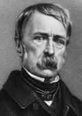{.calibre3}]{.calibre_10}

[À Monseigneur l'Archevêque de Paris.]{.calibre_10}

[[]{.italic}]{.calibre_26}

::: calibre_27

[[Liège, 3 janvier 1852.]{.italic}]{.calibre_26}

::: calibre_27

[ ]{.calibre4}

[Monseigneur,]{.calibre4}

[Je ne puis vous taire la profonde douleur que j'éprouve en apprenant que, par des raisons qui me sont inconnues, vous avez cru devoir adresser à Dieu de solennelles actions de grâces pour le succès d'un parjure et d'une bande d'assassins.]{.calibre4}

[Cette douleur, j'en suis certain, vous la ressentez plus vivement encore. Permettez-moi donc de vous plaindre et de gémir sur cette plaie nouvelle infligée à la religion. Les saints martyrs qui bénissaient leurs bourreaux, mais qui versaient leur sang plutôt que de les encenser, ont dû se voiler la face au bruit des chants de Notre-Dame ; et nous, humbles enfants du Christ, qui depuis trente ans luttons pour que son règne arrive, dans les prisons, dans l'exil, dans les retraites où nous nous cachons comme devraient faire les malfaiteurs, nous avons donc perdu la consolation de penser que nous serions bénis par notre père spirituel.]{.calibre4}

[Pardonnez-moi l'amertume de mes paroles, si je ne vous aimais et vénérais, je ne vous les adresserais pas.]{.calibre4}

[Si l'église n'avait fait que prier pour les criminels, j'aurais compris que c'est la leçon du Fils de Dieu. Mais glorifier le crime ! voilà ce qui dépasse les forces de mon intelligence et ce qui froisse mon cour de patriote et de chrétien.]{.calibre4}

[Agréez, etc.]{.calibre4}

[J. B.[[[[^\[141\]^]{.calibre_21}]{.underline}]{.calibre_4}](index_split_4933.html#filepos40242926){#filepos39262350}]{.calibre4}

[!{.calibre3}]{.calibre4}

[ ]{.calibre4}

[(Lettre écrite par Jules Bastide à l'archevêque Sibour, [qu'il avait nommé]{.italic})[[[[^\[142\]^]{.calibre_21}]{.underline}]{.calibre_4}](index_split_4933.html#filepos40243297){#filepos39262860}]{.calibre4}

[[
]{.calibre_7}]{.bold}

### [[[]{.calibre2}[]{.calibre2}[]{.calibre2}[]{.calibre2}[]{.calibre2}[]{.calibre2}[Scipion Dumas]{.calibre2}[[[[[[^\[143\]^]{.bold1}]{.calibre_43}]{.calibre2}]{.underline1}]{.calibre_42}](index_split_4933.html#filepos40243565){#filepos39263335 .calibre2}]{.bold1}]{.calibre_39} {#scipion-dumas143 .calibre_38}

[ ]{.calibre4}

[[Perpignan, 27 mars 1878.]{.italic}]{.calibre4}

[ ]{.calibre4}

[Mon cher cousin,]{.calibre4}

[Un de mes amis que j'étais allé voir tenait entre les mains le deuxième volume du dernier ouvrage de Victor Hugo, [l'Histoire d'un Crime]{.italic}. Il me tendit le livre non encore coupé en me disant : « Tenez, vous en aurez les prémices ». Je coupai les premières pages, et lus rapidement les premiers chapitres. Tout d'un coup mes yeux tombent sur celui qui a pour titre : Ossian et Scipion. J'essaie de lire, mais les larmes m'en empêchent. Je passe à mon tour le livre à M. Dorche en m'écriant : c'est bien de mon frère et de moi qu'il est question.]{.calibre4}

[Toutes les larmes ne sont pas amères pendant plus d'une heure, je n'ai fait que pleurer, mais, je le répète, ces larmes étaient bien douces. Pourquoi mon pauvre Ossian ne peut-il pas les lire, ces pages magnifiques !]{.calibre4}

[Il venait d'être blessé on le porta dans la loge d'un portier de la rue Rambuteau il demanda immédiatement une plume et une feuille de papier et m'écrivit les quelques lignes que voici :]{.calibre4}

[ ]{.calibre4}

[« Mon cher Scipion,]{.calibre4}

[Je viens de tomber au pied d'une barricade. J'ai les deux jambes brisées. Ce soir, probablement, je serai amputé et dans quelques jours peut-être je ne serai plus.]{.calibre4}

[Tu sais quelles sont mes opinions. Tu dois comprendre combien je souffre d'être tombé pour une cause qui n'est pas la mienne. Dieu l'a voulu ainsi. Mon régiment marchait, je devais suivre mon drapeau. Ne m'en demande pas davantage.]{.calibre4}

[Adieu, mon beau frère persiste dans ta conduite et console nos pauvres parents. »]{.calibre4}

[J'étais en prison depuis plusieurs jours à la citadelle de Lille quand on me remit toute ouverte --- cette lettre. Le général d'André vint me voir ; il me serra affectueusement la main et me dit :]{.calibre4}

[--- Cette lettre écrite dans un pareil moment est sublime. Confiez-la-moi. Je dois la communiquer à qui de droit dans l'intérêt de votre frère et dans le vôtre. Pourquoi faut-il que vous ne soyez pas des nôtres ! Allez auprès de votre pauvre frère vous êtes libre.]{.calibre4}

[C'est alors que je vins à Paris et qu'après avoir cherché partout je trouvai mon frère à l'hôpital du Roule. À partir de ce moment votre pauvre père a tout vu, il a dû vous apprendre le reste.]{.calibre4}

[Victor Hugo dit que j'étais à Metz pendant le coup d'État. Non, j'étais à Douai au 14^[e]{.calibre18}^ d'artillerie : Il dit que j'ai été mis en retrait d'emploi pour avoir poussé à ce qu'on votât non. Je n'eusse pas été arrêté pendant la nuit, emprisonné, sur le point d'être fusillé, si, comme tant d'autres, je n'avais fait que voter non.]{.calibre4}

[J'étais celui des officiers de Douai qui s'était le plus mis en avant, j'étais celui qui s'était offert de marcher avec l'avant-garde si, comme il en était question, le 14ème d'artillerie et le 2^[e]{.calibre18}^ du génie qui étaient à Arras marchaient sur Ham avec les ouvriers de Tourcoing et de Roubaix pour délivrer les députés. Voilà pourquoi on s'acharna après moi plus qu'après tout autre et même longtemps après.]{.calibre4}

[Comment ferai-je parvenir à l'illustre historien l'expression de ma reconnaissance pour les pages si belles dont il nous a honorés, mon frère et moi ? Quel plus grand honneur pouvions-nous recevoir que d'être l'objet d'un de ses plus émouvants chapitres ?]{.calibre4}

[Soyez assez bon pour être mon interprète. Adieu, mon cher cousin, mes amitiés à tous les vôtres.]{.calibre4}

[Votre bien respectueux et bien dévoué,]{.calibre4}

[Scipion DUMAS.]{.calibre4}

[ ]{.calibre4}

[!{.calibre3}]{.calibre_10}

[ ]{.calibre4}

[[Perpignan, 27 mars 1878.]{.italic}]{.calibre4}

[ ]{.calibre4}

[Illustre Maître,]{.calibre4}

[Je suis encore tout ému du touchant chapitre que, dans l'[Histoire d'un Crime]{.italic}, vous venez de consacrer à mon frère Ossian et à moi.]{.calibre4}

[Oui, vous avez dit vrai. Pour mon frère, tous les officiers du 51^[e]{.calibre18}^ [^[[[[^\[144\]^]{.calibre_12}]{.underline}]{.calibre_4}](index_split_4933.html#filepos40245254){#filepos39269842}^]{.calibre_21} de ligne sont là pour l'attester. Quant à moi, ceux qui ont été témoins de ma conduite à Douai et à la prison de Lille pendant ce poignant épisode de Décembre 1851, ceux qui ont suivi mon douloureux calvaire à l'hôpital du Roule, où mon frère avait été porté, ne me trouveront peut-être pas tout à fait indigne de votre bien glorieuse sympathie.]{.calibre4}

[Merci pour le pauvre martyr, mort depuis cinq ans des suites de ses blessures, merci pour sa fille et mes deux fils, à qui vous venez de donner une auréole d'honneur dont ils auront droit d'être fiers, merci surtout de la part de votre plus respectueux admirateur.]{.calibre4}

[S. DUMAS.]{.calibre4}

[!{.calibre3}]{.calibre4}

[Lieutenant-colonel d'artillerie en retraite.]{.calibre4}

[[
]{.calibre_7}]{.bold}

### [[[]{.calibre2}[]{.calibre2}[]{.calibre2}[]{.calibre2}[]{.calibre2}[]{.calibre2}[Gaston Dussoubs]{.calibre2}[[[[[[^\[145\]^]{.bold1}]{.calibre_43}]{.calibre2}]{.underline1}]{.calibre_42}](index_split_4933.html#filepos40245704){#filepos39271405 .calibre2}]{.bold1}]{.calibre_39} {#gaston-dussoubs145 .calibre_38}

[ ]{.calibre4}

[[Anvers, 9 juin 1852.]{.italic}]{.calibre4}

[ ]{.calibre4}

[Mon cher monsieur Victor Hugo,]{.calibre4}

[Anvers, 9 juin 1852. Vous trouverez à la fin du manuscrit qui vous sera remis par Leray une lettre qui renferme quelques nouveaux détails sur la dernière journée de mon frère. Ce cahier contient 23 lettres écrites pendant sa captivité dans les prisons de Poitiers, Fontevrault, Belle-Isle. Mon frère est tout entier dans cette correspondance.]{.calibre4}

[C'était un de ces hommes rares, sans peur et sans reproche, qu'on peut montrer avec orgueil à ses ennemis comme à ses amis.]{.calibre4}

[À Limoges il jouait sa tête le 25 février 48, en proclamant la République, alors qu'on ignorait les événements accomplis le 24 à Paris. Le 27 avril de la même année, dans un mouvement populaire, il exposa plusieurs fois sa vie pour empêcher l'effusion du sang. Trois ans de prison furent la récompense de son dévouement et de son abnégation. Il était en liberté depuis quatre mois et à Paris, où il était venu chercher un refuge contre les poursuites du fisc qui réclamait les frais du procès, depuis quinze jours seulement, lorsque Bonaparte consomma l'attentat du 2 décembre.]{.calibre4}

[Je vous recommande sa mémoire, une page de vous sera la récompense d'une vie bien courte mais bien remplie, puisqu'elle fut consacrée tout entière à la recherche du beau, du vrai et du juste. Elle sera une consolation pour une mère septuagénaire et un père âgé de quatre-vingt-deux ans, elle sera un baume sur la plaie de ces deux vieillards qui s'éteignent dans la solitude.]{.calibre4}

[Si par hasard vous quittiez la Belgique, veuillez, je vous prie, remettre ce cahier entre les mains de Baune.]{.calibre4}

[Recevez, Monsieur, l'assurance de ma profonde estime et de ma vive sympathie.]{.calibre4}

[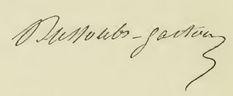{.calibre3}]{.calibre4}

[[
]{.calibre_7}]{.bold}

### [[[]{.calibre2}[]{.calibre2}[]{.calibre2}[]{.calibre2}[]{.calibre2}[]{.calibre2}[Préveraud]{.calibre2}[[[[[[^\[146\]^]{.bold1}]{.calibre_43}]{.calibre2}]{.underline1}]{.calibre_42}](index_split_4933.html#filepos40247245){#filepos39274573 .calibre2}]{.bold1}]{.calibre_39} {#préveraud146 .calibre_38}

[ ]{.calibre4}

[DEUX DÉCEMBRE. DÉPARTEMENT DE L'ALLIER. DONJON ET LAPALISSE.]{.calibre_10}

[ ]{.calibre4}

[Le 3 décembre, à quatre heures du soir, à la nouvelle du coup d'État, les démocrates du Donjon prennent instantanément les armes. Quoique peu nombreux, ils déclarent au maire, M. de Laboutresse, et au juge de paix M. d'Olivier, que Napoléon s'est mis hors la loi et que tout citoyen est tenu de lui refuser obéissance ; M. d'Olivier sort un pistolet et menace de faire feu il est à l'instant désarmé et conduit en prison avec M. de Laboutresse. En peu de temps les démocrates se trouvent en assez grand nombre pour résister à leurs adversaires si ces derniers avaient eu l'idée de prendre les armes.]{.calibre4}

[Une fois maîtres du Donjon, on décide qu'on marchera sur Lapalisse, chef-lieu de sous-préfecture. Fidèles à la voix du tocsin, les démocrates de la campagne ne tardent pas à grossir nos rangs. À une heure après minuit, on est prêt à partir et l'on nomme par acclamation les chefs de la petite troupe, je dis petite, puisqu'elle ne montait pas à quatre-vingts hommes ; quoique dans sa déposition au conseil de guerre de Moulins, M. de Rochefort, sous-préfet, l'ait évaluée à plus de deux cents hommes, j'affirme que les démocrates du Donjon arrivant à Lapalisse n'étaient pas quatre-vingts.]{.calibre4}

[Pour ôter aux amis du coup d'État toute idée de résistance, nous emmenons les prisonniers, et nous nous mettons en marche au chant de la Marseillaise. Après six heures de fatigue, nous arrivons à Lapalisse à huit heures du matin. Le sous-préfet, M. de Rochefort, bonapartiste rallié, qui en 1848 faisait de la propagande pour le compte de son père, candidat légitimiste à la Constituante dans le département du Puy-de-Dôme, s'avance contre nous à la tête de vingt-cinq à trente hommes composés en partie des gros bonnets de la ville, tels que Meilheurat, maire, de Laboutresse, Desverne, Maridet, etc... et portant le costume de pompiers. Arrivés à trente pas l'une de l'autre, sur le mot de halte, prononcé par le sous-préfet, les deux troupes s'arrêtent puis d'un air de Don Quichotte il ajoute : Qui êtes-vous ? --- Démocrates du Donjon. --- Retournez d'où vous venez, vous ne passerez pas. --- Vive la République démocratique et sociale ! telle est notre réponse, et l'on se couche en joue. Tout à coup la panique s'empare de ces braves, et M. de Rochefort si fier et si arrogant donne le premier l'exemple de la fuite. Nous nous contentons d'administrer quelques coups de pied dans le derrière des moins habiles, et nous prenons la mairie où nous trouvons des fusils en quantité. Nous y arrêtons le sous-préfet, et nous nous dirigeons vers l'église pour sonner le tocsin et apprendre aux républicains que le droit et la loi ont encore des défenseurs.]{.calibre4}

[Notre petite troupe se trouvait divisée en ce moment en deux corps, l'un devant la mairie gardant les prisonniers du Donjon, et l'autre devant la maison du curé, qui refusait les clefs du clocher. Tout à coup, les sept gendarmes de Lapalisse, se croyant soutenus par le corps des pompiers mis en déroute et ralliés dans la basse ville, arrivent au galop la carabine au poing, et chargent le petit corps placé devant la mairie et protégé seulement par une voiture renversée en travers de la rue, très large en cet endroit l'autre corps placé devant l'église ne leur donne pas le temps d'exécuter leur manoeuvre ; tout en essuyant la décharge des gendarmes, heureusement sans résultat, il leur riposte par une vive fusillade trois tombent, l'un mort, les deux autres blessés ; deux autres furent également atteints, mais peu grièvement les pompiers qui les suivent n'ont pas plus de courage que la première fois et prennent de nouveau la fuite.]{.calibre4}

[M. le sous-préfet se trouvait au milieu de nous, au moment de l'attaque et, quelques efforts que nous fîmes pour qu'il arrêtât les gendarmes, il préféra les laisser marcher à une mort certaine. Profitant du moment de stupeur bien naturel chez des hommes dont la plupart n'avaient jamais vu le feu, il parvint à s'échapper et à se diriger sur Moulins à la rencontre du troisième régiment de chasseurs qu'il avait fait demander depuis la veille et qui n'était qu'à quelques lieues de Lapalisse.]{.calibre4}

[Le curé effrayé ouvre l'église où l'on dépose le gendarme tué, et l'on sonne le tocsin. C'est en vain que nous attendons pendant quatre heures, les démocrates de la ville et des environs ne répondent pas à notre appel. (Depuis ils ont dû bien des fois maudire leur lâcheté à l'heure qu'il est, les principaux d'entre eux sont en Afrique.) Effrayés de notre petit nombre, les plus timides quittent nos rangs, et au lieu de marcher sur Moulins, nous sommes forcés de nous replier sur le Donjon au nombre de cinquante-trois, la plupart harassés de fatigue. À minuit, nous sommes avertis que trois cents chasseurs et la garde nationale de Bourbon-Cussay commandés par le bâtard Bourbon marchent sur le Donjon. Nous nous comptons et nous nous trouvons vingt à peine capables de prendre les armes. La résistance était folie, et nous abandonnons la ville. Nous nous retirâmes à quelques lieues, comptant sur Paris et prêts à paraître à la première nouvelle mais notre espérance fut vite évanouie, et chacun gagna de son côté.]{.calibre4}

[Là finit notre rôle et commence celui de tous ces hommes qui se montrèrent d'autant plus implacables qu'ils avaient été plus lâches. A huit heures du matin, le 5 décembre, la troupe prit possession du Donjon en ville prise d'assaut.]{.calibre4}

[ ]{.calibre4}

[...Hommes, femmes, enfants, tous furent entassés dans la petite prison de la ville. Dans un espace pouvant contenir à peine dix individus, on en mit plus de soixante. Pas un individu soupçonné de républicanisme ne fut épargné. Je pourrais citer les noms de malheureux ouvriers malades depuis fort longtemps, arrachés violemment de leur lit et transis sur la paille. Mais que lui importait, à ce M. d'Olivier, il voulait assouvir sa soif de tigre et gagner ses chevrons. Son zèle a été en effet récompensé. M. d'Olivier est maintenant juge près le tribunal de Moulins.]{.calibre4}

[D'après les ordres du général Aynard et du préfet de Chamaille, le même qui quelques mois auparavant, dans une proclamation affichée dans toutes les communes du département, osait dire qu'il fallait exterminer tous les socialistes (textuel), M. d'Olivier mit le séquestre sur les propriétés des républicains les hardes et les chevaux ne furent pas épargnés toutefois, par respect pour la propriété, M. d'Olivier avait l'impudence de se servir de ces mêmes chevaux pour aller à la tête des chasseurs et des gendarmes faire les arrestations dans les campagnes. A toute heure, le jour, la nuit, il entrait dans les maisons, cherchait, fouillait même dans les lits où dormaient des femmes et des enfants et là, s'il ne trouvait pas l'objet de ses recherches, il laissait ces malheureux sous la menace de faire fusiller leur mari, leur père, si dans les vingt-quatre heures il ne se constituait pas prisonnier aussi un grand nombre, effrayé, et surtout tourmenté par la faim et le froid, fut-il se livrer.]{.calibre4}

[Tout individu donnant refuge à un insurgé était assimilé aux insurgés.]{.calibre4}

[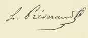{.calibre3}]{.calibre4}

[[
]{.calibre_7}]{.bold}

### [[[]{.calibre2}[]{.calibre2}[]{.calibre2}[]{.calibre2}[]{.calibre2}[]{.calibre2}[Évènement de décembre 1851, à Metz]{.calibre2}]{.bold1}]{.calibre_39} {#évènement-de-décembre-1851-à-metz .calibre_38}

[ ]{.calibre4}

[« Document copié sur l'original d'un officier d'artillerie en garnison à Metz le 2 décembre 1851, prêté par le général Le Flô à M. V. Hugo à Jersey, le dimanche 3 octobre 1852. » [[[[^\[147\]^]{.calibre_21}]{.underline}]{.calibre_4}](index_split_4933.html#filepos40248267){#filepos39284965}.]{.calibre4}

[ ]{.calibre4}

[Les nouvelles des événements du 2 décembre à Paris ne parvinrent à Metz que le 3 au matin. Un assez vif mécontentement se manifesta dans la garnison de cette ville. Les officiers des 1^[e]{.calibre18}[r]{.calibre18}^ et 6^[e]{.calibre18}^ régiments d'artillerie et ceux du 2^[e]{.calibre18}^ régiment du génie se réunirent pour se concerter sur le vote qu'ils étaient appelés à donner. Il fut résolu à la presque unanimité de protester et de voter négativement, les quelques dissidents conseillaient l'abstention tout en protestant.]{.calibre4}

[Le soir, les chefs de corps reçurent du général de division l'ordre de faire lire dans les casernes la proclamation de Louis-Napoléon. Le colonel du 6^[e]{.calibre18}^ d'artillerie refusa d'obtempérer à cet ordre en motivant son refus sur l'illégalité et l'inconstitutionnalité de cette proclamation. Informé de ce refus, le général Marey avoua que l'acte était illégal, que la Constitution était violée, mais que néanmoins, comme il importait de ne point partager l'armée en deux camps, qu'on était sans nouvelles ultérieures de Paris, cette proclamation devait être provisoirement affichée dans les casernes. Ce nouvel ordre ne fut point exécuté dans le 6^[e]{.calibre18}^ régiment d'artillerie cependant l'agitation continuait parmi les corps d'officiers et dans la garnison.]{.calibre4}

[Le 4 au matin, le bruit courut que le général de Lamoricière s'était évadé et se dirigeait sur Metz. Le même jour, les officiers d'artillerie s'assemblèrent pour fêter, selon l'usage, la Sainte-Barbe. Le repas fut triste et silencieux. À son issue le colonel du 6^[e]{.calibre18}^ prenant la parole proposa aux officiers réunis de résister à l'acte illégal du 2 décembre cette proposition fut accueillie avec enthousiasme par ceux présents. On convint de consulter à ce sujet les sous-officiers et soldats des deux régiments d'artillerie. Ceux-ci ayant répondu qu'ils étaient prêts à marcher, on s'aboucha avec les officiers du 2^[e]{.calibre18}^ du génie ceux.ci, après avoir également consulté leurs sous-officiers et soldats et en avoir reçu une réponse favorable, déclarèrent adhérer au mouvement. On résolut alors de s'entendre avec les officiers des trois régiments d'infanterie en garnison dans la ville. La plupart se montrèrent favorables, quelques-uns montrèrent un peu d'hésitation un petit nombre se montra hostile, il en fut de même du corps de sous-officiers dans ces régiments on ne consulta ni les soldats ni les chefs de corps il paraissait certain que les premiers suivraient assez facilement le mouvement une fois commencé les seconds passaient pour être attachés à Louis-Napoléon, on résolut de s'en passer si le cas se présentait. Les négociations occupèrent une partie de la nuit et la matinée du 5.]{.calibre4}

[Vers l'après-midi de ce même jour, tous les officiers des deux régiments d'artillerie, ceux du génie et beaucoup d'officiers d'infanterie se réunirent sur la place d'armes. Le colonel du 6^[e]{.calibre18}^ d'artillerie après les avoir harangués les quitta pour se rendre auprès du général Marey et lui proposer de marcher à leur tête, Il fit la faute de s'y rendre seul à peine entré il fut saisi, revêtu d'habits bourgeois, conduit au chemin de fer, et expédié sous escorte à Paris.]{.calibre4}

[Pendant cet intervalle et à peine le colonel du 6^[e]{.calibre18}^ d'artillerie avait-il quitté la place qu'un colonel d'infanterie s'y présenta. Cet officier, entièrement dévoué à Louis-Napoléon, parla avec énergie aux officiers d'infanterie, les menaça et leur enjoignit de se disperser, ce qu'ils firent les officiers d'artillerie et du génie restèrent réunis sur la place. Ils se retirèrent à la chute du jour pour se réunir de nouveau dans la nuit. Inquiets de ne point voir revenir le colonel du 6^[e]{.calibre18}^ et ne sachant ce qu'il était devenu, ils résolurent d'attendre son retour jusqu'au lendemain, de le remplacer par un autre officier et de continuer le mouvement qui se trouvait préparé. Après cette décision ils se séparèrent de nouveau.]{.calibre4}

[Le lendemain matin, ils apprirent la cause de la disparition du colonel du 6^[e]{.calibre18}^ et en même temps toutes les troupes furent consignées, avec défense à l'infanterie de communiquer sous aucun prétexte avec les soldats de l'artillerie et du génie. Le général, dans un ordre du jour, annonça aux troupes que le bruit de l'évasion du général Lamoricière était faux, que l'armée avait acclamé Louis-Napoléon, et que l'armée entière avait voté comme un seul homme en sa faveur il ajoutait qu'il serait funeste que dans une occasion pareille, et en présence des désordres affreux qui avaient éclaté sur plusieurs points de la France, l'armée ne restât pas unie et qu'il ne doutait pas que la garnison de Metz ne fît comme le reste de leurs camarades. Les officiers virent alors qu'il n'y avait plus rien à faire pour le moment néanmoins ils résolurent de prouver par leur vote qu'ils ne pouvaient point accepter un fait aussi illégal sans protester. Voici, autant qu'il a été possible de le savoir, le résultat des votes de la garnison :]{.calibre4}

[1^[e]{.calibre18}[r]{.calibre18}^ et 6^[ème]{.calibre18}^ régiments d'artillerie : officiers et sous-officiers, à l'unanimité [non]{.italic} soldats, 2/3 [non]{.italic}, 1/3 [oui]{.italic}.]{.calibre4}

[2^[e]{.calibre18}^ régiment du génie : officiers et sous-officiers, à l'unanimité [non]{.italic} ; soldats, 4/5 [non]{.italic}, 1/5 [oui]{.italic}.]{.calibre4}

[Régiments de ligne : officiers et sous-officiers, 2/3 [non]{.italic}, 1/3 [oui]{.italic} ; soldats, 1/2 [non]{.italic}, 1/2 [oui]{.italic}.]{.calibre4}

[École d'application d'artillerie et du génie 10 abstentions, 4 [oui]{.italic}, 116 [non]{.italic}. Dans les régiments d'infanterie les chefs de camp et quelques officiers supérieurs paraissent avoir voté [oui]{.italic}.]{.calibre4}

[Voici en cas de réussite quel avait été le plan de campagne proclamer la déchéance du président et la permanence de l'Assemblée, nommer, au nom de l'Assemblée, un général en chef de l'armée de l'est, se mettre en communication avec les garnisons de Nancy et de Strasbourg, se relier à l'armée de Lyon et marcher sur Paris. Il paraît certain que, si un des généraux s'était présenté aux portes de Metz ainsi qu'on l'avait espéré le premier jour, le mouvement aurait eu lieu et aurait été suivi de succès.]{.calibre4}

[[
]{.calibre_7}]{.bold}

### [[[]{.calibre2}[]{.calibre2}[]{.calibre2}[]{.calibre2}[]{.calibre2}[]{.calibre2}[Michot Boutet]{.calibre2}[[[[[[^\[148\]^]{.bold1}]{.calibre_43}]{.calibre2}]{.underline1}]{.calibre_42}](index_split_4933.html#filepos40248586){#filepos39294376 .calibre2}]{.bold1}]{.calibre_39} {#michot-boutet148 .calibre_38}

[]{.calibre4}

[(Notes pour servir à l'histoire)]{.calibre4}

[ ]{.calibre4}

[Le deux décembre au soir, après avoir assisté à l'exécution de l'attentat commis le matin même, après avoir vu l'armée couvrir le pavé de Paris de ses bataillons, ne jugeant pas notre présence indispensable à Paris, nous convînmes, mon ami et collègue M. Alexandre Martin (du Loiret) et moi, de nous transporter à Orléans, afin de nous rendre compte de l'accueil que feraient au coup d'Etat les populations de ce département.]{.calibre4}

[Chemin faisant nous tînmes conseil, M. Martin et moi, sur la conduite à suivre ; parfaitement décidés à faire l'un et l'autre le sacrifice de notre vie, nous entendions cependant ne faire que ce qui nous paraîtrait utile à la cause de la République ; nous résolûmes de voir par nous-mêmes quelles étaient les dispositions de la population et d'agir avec toute la prudence possible pour ne pas compromettre, dans une tentative insensée, l'existence d'hommes généreux que nous savions disposés à nous suivre, pour ne pas jeter la désolation dans un grand nombre de familles, mais en même temps à payer résolument de nos personnes dans le cas où la résistance nous paraîtrait possible le droit était pour nous, il ne fallait que du courage et, certes, ce n'est pas cela qui nous a manqué.]{.calibre4}

[Arrivés à Orléans, nous passâmes en voiture, avant de parler à personne, sur la place de l'Hôtel-de-Ville, dite place de l'Étape la caserne a son entrée sur cette place même, nous y remarquâmes environ une centaine d'ouvriers en blouse qu'avait amenés là la curiosité plutôt qu'autre chose, et qui paraissaient parfaitement tranquilles.]{.calibre4}

[Nous nous rendîmes chez M. Pereira, c'était alors le 3 décembre il était midi. M. Pereira nous dit que, la veille, lorsque furent apposées les affiches du président, la dissolution de l'Assemblée et la mise en état de siège de la 1re division militaire, dans laquelle est compris le département du Loiret, un sentiment de stupeur avait saisi les habitants d'Orléans. La population d'Orléans est d'ordinaire très inoffensive, timorée, tenant principalement à ses intérêts matériels la bourgeoisie, à quelques exceptions près, est orléaniste les ouvriers sont en majorité républicains la petite boutique s'abstient en politique d'avoir une opinion.]{.calibre4}

[M. Pereira, homme d'un caractère ferme, très droit, très honnête, jouissant d'une grande considération dans Orléans qu'il habitait depuis sa naissance, ancien avoué près la cour d'appel, avait été nommé en 1848 par Ledru-Rollin commissaire du Gouvernement provisoire pour le Loiret, puis préfet par la commission exécutive qui remplaça le Gouvernement provisoire. Il fut destitué par M. Ferdinand Barrot[[[[^\[149\]^]{.calibre_21}]{.underline}]{.calibre_4}](index_split_4933.html#filepos40249252){#filepos39298376}.]{.calibre4}

[... Lorsque M. Pereira apprit que l'Assemblée était dissoute, la Constitution violée, il alla lui-même lire les fameux placards, et là, le 2 décembre, en présence d'un grand nombre de citoyens groupés autour, il les arracha, les déchira publiquement et déclara tout haut qu'il protestait contre l'attentat qui se commettait.]{.calibre4}

[Quelques heures après parut une autre affiche, sortie des bureaux d'un journal républicain de la localité ([La Constitution du Loiret]{.italic}) et signée par trois de ses rédacteurs MM. Tavernier, rédacteur en chef ; M. Hutin, beau-frère de M. Alexandre Martin, et Desjardin, ouvrier lithographe cette affiche portait seulement l'article 68 de la Constitution, puis ces mots : M. L. N. Bonaparte ayant violé son serment et foulé aux pieds la Constitution est déclaré traître à la patrie et déchu de ses fonctions.]{.calibre4}

[Tout cela s'était passé le deux au soir quelques réunions avaient eu lieu l'autorité militaire, investie déjà des pouvoirs que lui conférait l'état de siège, avait laissé faire.]{.calibre4}

[... Le conseil municipal d'Orléans était en permanence, le chef de ce conseil, maire de la ville d'Orléans, M. Lacave, notre collègue à l'Assemblée, avait été arrêté la veille à la mairie du Xe arrondissement, après avoir voté la déchéance du président, on le savait depuis le matin ce conseil était composé en entier des amis de M. Lacave, on convint de faire une démarche toute pacifique auprès de ce conseil pour lui demander ce qu'il comptait faire, et lui remettre une pétition signée par quelques centaines de citoyens qui demandaient que le conseil municipal se prononçât pour le respect que tout le monde doit à la loi.]{.calibre4}

[... Arrivés à la porte de la mairie, quelques-uns des ouvriers qui se trouvaient là nous ayant reconnus, crièrent : Vive la Constitution ! vive la République ! mais ces cris, notre cortège, notre attitude, tout, jusqu'à nos intentions, étaient on ne peut plus pacifiques.]{.calibre4}

[Quelques gardes nationaux de service à la mairie, qui connaissaient parfaitement M. Martin, et qui, je crois, étaient un peu échauffés par la boisson, refusèrent, de leur propre autorité, de nous laisser entrer l'un d'entre eux, plus entêté que les autres, refusa d'obéir aux ordres de son colonel, M. Amy, qui se trouvait là en tenue, et lui ordonnait de nous livrer passage cet homme croisa la baïonnette sur nous M. Robert de Massy, premier adjoint, arriva revêtu de son écharpe, ordonna à cet homme de nous laisser passer, mais sans succès quelques ouvriers impatientés désarmèrent ce furieux et l'écartèrent, sans lui faire aucun mal, et nous entrâmes, M. Martin et moi, dans la salle où se trouvaient ces messieurs parmi lesquels je citerai MM. Robert de Massy, premier adjoint, Rousseau-Deshayes, deuxième adjoint, et les conseillers Loiseleur, Sautton-Parisis, Marchand et quelques autres.]{.calibre4}

[M. Martin engagea avec eux une conversation qui dura environ une demi-heure et les engagea à faire Une proclamation par laquelle ils feraient savoir à la population orléanaise qu'ils entendaient se ranger du côté de la loi et de la Constitution.]{.calibre4}

[Ces messieurs répondirent hautement à M. Martin qu'ils désapprouvaient, qu'ils blâmaient même (ce dernier mot fut prononcé) ce qui se passait ; qu'ils étaient opposés au système de violence que paraissait vouloir inaugurer M. Bonaparte, mais ils se refusèrent à faire autre chose, attendu qu'étant tout simplement un corps administratif, ils ne voulaient pas s'immiscer dans la politique. La conversation d'ailleurs fut toute bienveillante de part et d'autre, je dirais presque amicale.]{.calibre4}

[Pendant ce temps-là nos camarades étaient restés dans la cour, nous ignorions ce qui se passait.]{.calibre4}

[Le général Grand qui commandait à Orléans était, par le décret sur l'état de siège, investi du pouvoir dictatorial, et au premier avis, que sans doute il reçut à l'instant même par la police, de ce qui venait de se passer à la porte de la mairie, il donna immédiatement l'ordre d'arrêter, à l'instant même, [tout le monde]{.italic} qui se trouvait sur la place et dans la cour de la mairie ; la caserne donnant également sur cette place, cet ordre fut exécuté en un clin d'oeil, de sorte que, curieux, hommes politiques, flâneurs, ouvriers, bourgeois inoffensifs ou non, tous, y compris les deux représentants du peuple, furent arrêtés et conduits en prison au milieu d'un carré d'infanterie dont les armes furent chargées devant nous.]{.calibre4}

[Nous causions encore dans la salle de la mairie lorsqu'un agent de police vint, de la part du général, demander MM. Martin et Michot, nous ne nous doutions de rien, lorsque le commissaire entra et nous arrêta au nom de « je ne sais pas quoi » ; je crois qu'il dit : « Par ordre du général », nous descendîmes le perron, et là, nous vîmes le général présidant lui-même à l'exécution de ses ordres et on nous conduisit en prison.]{.calibre4}

[C'était le 3 décembre de deux à quatre heures du soir que tout ceci se passait quelques jours après, une espèce d'instruction judiciaire fut commencée il fut impossible d'établir l'apparence d'une charge sérieuse sur le compte d'aucun d'entre nous nous connaissions le décret de déportation et dans la prison nous en parlions comme d'une mauvaise plaisanterie, en ce qui nous concernait du moins jamais il ne nous vint à l'idée que ce décret pouvait être applicable à notre cas particulier. Nous comptions qu'après l'élection du 20 décembre, ou au plus tard la promulgation de la Constitution, la plus grande partie d'entre nous seraient mis en liberté comme étant non seulement innocents, mais encore complètement étrangers à la politique le hasard seul les ayant poussés le 3 décembre sur la place de l'Etape, il était clair pour nous qu'ils seraient rendus à leurs familles.]{.calibre4}

[... Quinze jours environ après notre arrestation on en mit quelques-uns en liberté, et puis des mandats d'amener furent lancés contre les hommes les plus influents du parti républicain dans la ville et l'arrondissement d'Orléans.]{.calibre4}

[... Ces nouvelles arrestations étant opérées, en défalquant ceux qui avaient été mis en liberté, nous étions encore, au 8 janvier, en prison, au nombre de 84.]{.calibre4}

[... Nous commencions à trouver le temps long, lorsque le vendredi 9 janvier, à huit heures du soir, on vient nous prévenir que nous devions partir le soir même, à neuf heures, pour Paris.]{.calibre4}

[La plupart d'entre nous dont les familles étaient à Orléans demandèrent à ce qu'il leur fût permis de faire venir de chez eux du linge et de l'argent, on le refusa de sorte que nous fûmes obligés de partir sans avoir pu dire adieu à nos femmes et à nos enfants, sans argent et sans linge, et la nuit.]{.calibre4}

[À neuf heures, l'appel commença, on nous réunit au nombre de 54 dans la cour de la prison, 18 d'une première catégorie, 36 de la seconde, le reste fut laissé dans la prison plusieurs, je crois, y sont encore. On nous plaça, cette fois encore, au milieu d'un carré d'infanterie, on fit charger les armes en notre présence, on nous mit dans ce carré par rangs de cinq de front, et deux gendarmes, la carabine chargée, entre chaque rang, et dans cet ordre, on nous conduisit de la prison au chemin de fer un convoi était tout prêt, on nous plaça six détenus, un gendarme et trois soldats, dans chaque compartiment, la locomotive fit entendre son sinistre sifflement, et nous partîmes sous la conduite d'un officier de l'état-major, venu tout exprès de Paris.]{.calibre4}

[À une heure du matin, nous arrivions à la gare de Paris[[[[^\[150\]^]{.calibre_21}]{.underline}]{.calibre_4}](index_split_4933.html#filepos40249718){#filepos39308647}, elle était pleine de troupes et de sergents de ville.]{.calibre4}

[... Nous crûmes un instant qu'on nous dirigeait sur la prison Mazas, mais une fois arrivés au bout nord du pont d'Austerlitz, on nous fit prendre la rive droite de la Seine et suivre les quais.]{.calibre4}

[M. Alexandre Martin, que des douleurs rhumatismales aux pieds et aux jambes empêchaient de marcher et qui était dans un état d'obésité développé d'une manière extraordinairement gênante pour lui, put monter en voiture et suivre le convoi.]{.calibre4}

[Nous étions toujours très inquiets de ce qu'on allait faire de nous, nous croyions qu'on allait nous conduire à la Conciergerie, mais nous nous trompions encore, et ce ne fut pas sans un sentiment de stupeur que nous vîmes l'officier qui marchait toujours en tête dépasser le Pont-Neuf. Nous arrivâmes jusqu'à la place de la Concorde, toujours en suivant les quais de la rive droite ; là, on nous fit tourner à droite, et ce fut seulement alors que nous pûmes nous douter qu'on nous conduisait au Havre, mais nous ne pouvions croire à notre déportation nous pensions qu'on nous conduisait au Mont Saint-Michel ce voyage, à pied, de la gare du chemin de fer d'Orléans à celle de la place du Havre, fait au milieu de la nuit, avait quelque chose de lugubre. Le plus grand silence nous était imposé ; nous avions l'air d'une capture que des bandits conduisent dans leurs repaires, après les avoir pillés et volés. Plusieurs d'entre nous étaient chaussés en sabots, d'autres en pantoufles de matin, il y avait parmi nous des vieillards, dont la marche était pénible et chancelante, que nous étions obligés de soutenir.]{.calibre4}

[Enfin nous arrivâmes par la rue d'Amsterdam dans la cour du chemin de fer ; elle était encombrée de troupes là notre carré s'arrêta un peu à droite et, près de la machine qui sert à charger et à décharger les diligences de dessus les trucs des chemins de fer, nous restâmes là environ une heure pendant laquelle nous vîmes arriver successivement plusieurs détachements semblables aux nôtres, huit ou dix voitures cellulaires enfin, vers trois heures du matin, le convoi étant formé, on nous fit monter dans les compartiments ; six détenus et deux gendarmes mobiles dans chaque, la machine hurla de nouveau, et nous partîmes pour le Havre[[[[^\[151\]^]{.calibre_21}]{.underline}]{.calibre_4}](index_split_4933.html#filepos40250202){#filepos39311750}.]{.calibre4}

[Il était à peu près deux heures de l'après-midi quand nous aperçûmes la mer. Dans le cours de notre voyage, nous avions demandé aux gendarmes placés avec nous quelle était notre destination. L'un d'eux, qui était brigadier, nous répondit qu'il leur était défendu de causer avec nous, ni de répondre à aucune de nos questions cependant il ajouta : Comme vous avez l'air d'être des gens comme il faut et que vous me paraissez ne pas être des [repris de justice]{.italic}, je prendrai sur moi de vous dire ce que j'en sais, ou plutôt ce que je suppose. On ne nous a pas dit où vous alliez, mais comme plusieurs des gendarmes qui sont dans le convoi doivent aller de ce pas à Cayenne pour y garder les repris de justice et les condamnés politiques, comme je crois, continua-t.il, qu'une fois arrivés au Havre, vous trouverez là un navire tout prêt pour Brest, j'en conclus que vous êtes pour Cayenne.]{.calibre4}

[Nous lui demandâmes s'il savait qui nous étions et quelle sorte de gens il conduisait. Il nous répondit qu'ils avaient été commandés dans la nuit même, quelques heures avant notre départ de Paris, pour conduire un convoi de repris de justice et de forçats libérés !\...]{.calibre4}

[C'est ainsi qu'il nous fut à peu près possible d'entrevoir ce que le gouvernement de M. Bonaparte prétendait faire de nous.]{.calibre4}

[Le convoi roulait toujours. Enfin vers deux heures et demie ou trois heures, nous entrâmes dans la gare du Havre, et le convoi s'arrêta. La gare était pleine de troupes. Il y avait plusieurs colonels, des commandants, des officiers supérieurs de marine, des gendarmes. Une voix cria : « Messieurs, dépêchons-nous la marée nous pousse. » On appela aussi M. Auguste Rivière, le célèbre avocat, qui se trouvait parmi nous, et on l'emmena j'ai su depuis qu'une dépêche télégraphique venait d'arriver pour son retour à Paris.]{.calibre4}

[On nous fit descendre. On nous plaça entre deux longues files de soldats et on nous dirigea vers le port. Nous marchâmes environ trois quarts d'heure le long des quais.]{.calibre4}

[... En mettant le pied sur le navire qui devait nous conduire à Brest, on nous accoupla par deux, sans nous attacher cependant, on nous compta, on remit à chacun une couverture, et on nous fit descendre, la première moitié dans la batterie, la seconde, dans laquelle par hasard je me trouvais avec tous mes camarades d'Orléans, dans l'entrepont. On avait commencé par emplir la batterie, on y en introduisit autant que ce local en put tenir, les hommes étant debout, serrés les uns contre les autres, et serrés à ce point qu'il fallait toutes les peines du monde et au moins un quart d'heure de travail et de précautions pour aller d'un bout à l'autre de la pièce. Quand la batterie fut pleine, à n'en pouvoir pas faire tenir un de plus, on essaya de faire entrer le reste dans l'entrepont, mais ce fut impossible, on eut beau nous entasser, ce navire avait été préparé pour trois cents prisonniers et nous étions quatre cent quatre-vingt-cinq.]{.calibre4}

[... Nous n'avions là ni espace, ni jour, ni air. Nous n'avions rien mangé ni rien bu depuis notre départ d'Orléans il était environ cinq heures du soir nous avions dîné dans la prison la veille à pareille heure à Orléans, de sorte que nous étions à 24 heures d'intervalle, à plus de cent vingt ou trente lieues de notre pays, en pleine mer, par un froid et un temps affreux, sans qu'on eût pensé le moins du monde à nous donner de quoi manger.]{.calibre4}

[Là commencèrent pour nous d'horribles réflexions... Qu'allaient devenir nos familles ? Quel affreux moment pour nos femmes et nos enfants en apprenant notre déportation si inattendue, si subite, et surtout si imméritée !]{.calibre4}

[Une heure ou deux après notre départ du Havre il faisait nuit, le vent soufflait avec violence, le navire criait dans ses jointures et dans ses assemblages le mal de mer avait déjà pris la plus grande partie d'entre nous, ceux-là se couchèrent sur le plancher du navire.]{.calibre4}

[On nous distribua à chacun une ration de pain et de biscuit.]{.calibre4}

[... On pensa à se caser du mieux qu'il était possible pour passer la nuit.]{.calibre4}

[Là, de nouvelles difficultés nous attendaient quand le plancher fut couvert d'hommes étendus, couchés sur le côté, vomissant les uns sur les autres, rien pour appuyer nos têtes et serrés autant qu'il était possible pour tenir moins de place, il en restait encore environ un tiers debout, n'ayant de place ni pour s'asseoir, encore moins pour se coucher ; on avisa alors des crochets fixés dans les poutres du plafond et qui étaient destinés à suspendre les hamacs de l'équipage, mais nous n'avions point de hamacs on finit en faisant certains noeuds avec des mouchoirs et des bouts de ficelle par improviser des espèces de hamacs avec nos couvertures, en attachant chaque coin à un crochet. Cela n'offrait guère de sécurité, ni pour ceux qui devaient v coucher, ni pour ceux qui étaient couchés dessous. Enfin, brisés par la fatigue, les plus hardis, les moins lourds se décidèrent à y monter. On finit ainsi par se loger à peu près tous. Quelques couvertures se détachèrent pendant la nuit et plusieurs sont tombés, se sont blessés, eux et ceux sur lesquels ils sont tombés.]{.calibre4}

[... Parmi nous se trouvaient MM. Alexandre Martin, représentant du peuple aux Assemblées constituante et législative, ancien maire de la ville d'Orléans, membre du conseil général depuis bon nombre d'années ; M. Pereira, avocat, avoué près la cour d'appel d'Orléans, membre du conseil général depuis dix ou douze ans, membre du conseil municipal de la ville d'Orléans M. Girard, adjoint au maire de Loury M. Tiercelin, docteur en médecine ; M. Tavernier, rédacteur en chef de la [Constitution]{.italic}, ancien commissaire du Gouvernement provisoire, etc. l'énumération en serait trop longue aucun de nous n'avait rien eu à démêler avec les tribunaux et si j'en crois les renseignements que j'ai pu recueillir, les autres catégories de détenus, qui étaient venus la même nuit que nous du fort d'Ivry, attachés ceux-là deux à deux comme des malfaiteurs, étaient des gens tout aussi honnêtes et irréprochables que nous j'en citerai quelques-uns :]{.calibre4}

[Dans la même pièce que moi se trouvaient MM. Hippolyte Magen, écrivain éditeur ; Xavier Durieu, ancien représentant, ancien rédacteur du [Courrier français]{.italic}, du [Temps]{.italic}, de la [Révolution]{.italic} ; Pierre Lachambeaudie, le fabuliste ; M. Leroy, ancien notaire, rentier, aux Batignolles ; M. Deville, docteur en médecine, professeur d'anatomie, fils de l'ancien constituant, actuellement à Belle-Isle, etc. Il y avait en outre cinq ou six enfants, de l'âge de 10 à 14 ans, des vieillards.]{.calibre4}

[... Partis d'Orléans le 9 janvier, embarqués au Havre le 10, nous avions, nous disait-on, vingt-quatre heures de traversée pour aller jusqu'à Brest mais comme le navire sur lequel nous étions, le [Canada]{.italic}, n'était pas un bon marcheur, nous en aurions probablement pour trente heures. Nous venions de faire plus de cent lieues en vingt-quatre heures, et sans boire, manger, ni dormir, traités comme des malfaiteurs, et nous avions hâte d'arriver à un terme quelconque. Nous nous disions qu'une fois arrivés à Brest, on daignerait au moins nous dire ce qu'on pensait faire de nous.]{.calibre4}

[... Le vent soufflait avec une violence incroyable. Dans notre ignorance de la mer, nous ne savions pas si les effrayantes secousses qu'éprouvait cet affreux navire étaient dues à une tempête ou si c'était l'effet ordinaire d'une mer tranquille. Nous passâmes la première nuit, là journée du lendemain, puis la nuit suivante sans prendre l'air, croyant arriver en rade à chaque instant. Enfin le 12 au matin, la hauteur des vagues diminua sensiblement, les secousses devinrent moins fortes, et vers neuf ou dix heures du matin, le navire s'arrêta.]{.calibre4}

[Nous croyions être arrivés, mais cette fois encore nous devions être trompés. Un matelot qui passait dans le couloir dit tout bas à l'un de nous, pendant que le gendarme tournait le dos, que nous étions en rade de Cherbourg, que nous avions essuyé une tempête qui avait jeté le navire sur les côtes d'Angleterre, que la mer était toujours très mauvaise, et que nous attendrions là un temps plus propice pour nous remettre en mer.]{.calibre4}

[Le 11 au matin, le premier jour de mer, vers huit heures, on nous apporta à manger on nous donna l'ordre de nous réunir, ou plutôt de nous compter, de nous associer par dix, pour faciliter la distribution des aliments. Peu de temps après, on apporta pour chaque catégorie de dix un affreux et sale baquet, exactement semblable à ceux dans lesquels vomissaient ceux qui étaient malades, à moitié plein de vieux haricots durs comme des cailloux on les avait fait bouillir dans de l'eau, mais on ne les avait pas fait cuire ç'aurait été d'ailleurs, je crois, impossible on ajouta à cela du biscuit et une demi-ration de vin nous n'avions pour manger cela ni couteaux, ni cuillers, ni fourchettes. On nous délivra ces dix rations et une demi-heure après on réclama les baquets. Ceux d'entre nous ayant assez faim pour se décider à dévorer cette sale nourriture, furent obligés de puiser à même le baquet avec leurs mains et notez que depuis Orléans il avait été complètement impossible de se nettoyer faute d'eau, d'espace et de linge.]{.calibre4}

[Le soir, on nous distribua également des haricots et du pain, mais pas de vin.]{.calibre4}

[... À Cherbourg, nous trouvâmes moyen, par un gendarme qui allait à terre, de faire acheter quelques cuillers, du papier, de l'encre et des plumes pour écrire. Vers midi, MM. Pereira, Martin et moi nous demandâmes par écrit à parler au commandant du bord afin de pouvoir obtenir pour tout le monde la faveur de monter un peu sur le pont, de prendre un peu d'air : on y fit d'abord répondre que cela était très difficile, mais ce commandant fut tout étonné, à ce que j'ai su peu de jours après, d'avoir à son bord des hommes qui se prétendaient honnêtes gens, et surtout des représentants du peuple. Il paraît qu'on lui avait donné des ordres dont la teneur était telle qu'il croyait sincèrement conduire à Brest des repris de justice et des forçats libérés en rupture de ban.]{.calibre4}

[... Le vendredi, dans le milieu de la journée, nous arrivâmes en vue du goulet de Brest. Le commandant remit la direction de son navire, à sa grande satisfaction, aux soins d'un pilote et nous couchâmes en rade de Brest.]{.calibre4}

[Le lendemain matin, en vertu d'une dépêche télégraphique arrivée depuis quelques jours déjà, on débarqua, pour les enfermer dans le fort de Brest, MM. Alexandre Martin, Pereira, le docteur Deville et moi.]{.calibre4}

[[Louvain, 24 mars 1852.]{.italic}]{.calibre_10}

[[MICHOT]{.bold}-[BOUTET]{.bold}.]{.calibre4}

[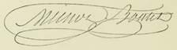{.calibre3}]{.calibre4}

[Place du Vieux-Marché, Louvain.]{.calibre_10}

[[
]{.calibre_7}]{.bold}

### [[[]{.calibre2}[]{.calibre2}[]{.calibre2}[]{.calibre2}[]{.calibre2}[]{.calibre2}[Les transportés]{.calibre2}]{.bold1}]{.calibre_39} {#les-transportés .calibre_38}

[ ]{.calibre4}

[Nous donnons, dans cette troisèmee partie, les pièces justificatives des faits rapportés par Victor Hugo : [ce sont les dépositions des témoins]{.bold} [concernant la déportation.]{.bold}]{.calibre4}

[[
]{.calibre_7}]{.bold}

### [[[]{.calibre2}[]{.calibre2}[]{.calibre2}[]{.calibre2}[]{.calibre2}[]{.calibre2}[Albert Castelnau]{.calibre2}[[[[[[^\[152\]^]{.bold1}]{.calibre_43}]{.calibre2}]{.underline1}]{.calibre_42}](index_split_4933.html#filepos40251104){#filepos39327068 .calibre2}]{.bold1}]{.calibre_39} {#albert-castelnau152 .calibre_38}

[ ]{.calibre4}

[Le premier convoi de la transportation, formé de deux à trois cents habitants de l'Hérault, partit de Cette, le 25 février, sur le bateau à vapeur [le Dauphin]{.italic} ; il se composait de paysans, d'ouvriers et de bourgeois, amenés à bord à grand renfort de chaînes et de mise en scène militaire.]{.calibre4}

[Dès la matinée du 3 décembre avaient commencé dans notre département des arrestations, renouvelées journellement depuis, et qui devaient fournir à l'Afrique un contingent de quinze cents transportés. Nous avions donc parmi nous ce qu'on appelait des insurgés, des personnes arrêtées à Montpellier dans une réunion provoquée par le coup d'État, et de simples suspects déportés pour leurs intentions présumées.]{.calibre4}

[... À peine débarqués, nous fûmes conduits à Birkadem, à trois lieues d'Alger. Le camp qui nous reçut est une enceinte fortifiée pouvant contenir sept ou huit cents hommes, logés dans des baraques de torchis. L'humidité filtrait partout dans ces casernements depuis longtemps inhabités.]{.calibre4}

[Chaque homme, couché dans un hamac de toile, avait droit à un sac de campement et à une couverture de laine. Le hasard nous gratifiait pourtant d'une prison beaucoup plus saine que le camp de Douera et que la Maison-Carrée. La soupe du soldat et du riz bouilli composaient notre nourriture. Une cantine organisée bientôt permit à un certain nombre d'entre nous d'introduire quelque variété dans le système de notre empoisonnement quotidien. Le produit d'une souscription ouverte dans le camp donna même à tous nos camarades les moyens de boire du vin. Mais le débitant de la cantine, comme le fournisseur de la marmite officielle, spéculait indignement sur nous.]{.calibre4}

[Deux cents transportés des départements provençaux ne tardèrent pas à nous rejoindre. L'infirmerie du camp, salle basse et humide, se remplit de malades que les officiers de santé de l'armée, le docteur Crouzat, transporté de l'Hérault, et plus tard le digne docteur Pain, médecin du gouvernement, soignèrent avec zèle. Mais la pharmacie, montée avec une pénurie dérisoire, ne renfermait presque que les médicaments propres au traitement de certaines affections spéciales dont nous étions à l'abri.]{.calibre4}

[Un homme du Var, arrivé au camp dans la dernière période d'une fluxion de poitrine, aggravée par la traversée, est mort sous nos yeux, sans que les remèdes prescrits aient pu lui être fournis. Huit jours après, un de nos co-transportés de Montpellier, le citoyen Français, succombe à la même maladie. Les ordonnances du médecin n'avaient pu pareillement être exécutées pour lui malgré les pressantes réclamations de l'officier de santé et du lieutenant-commandant Muller, les remèdes n'arrivaient pas. Dans cette détresse, notre infirmier volontaire, le citoyen Félix Mougier, se multipliait auprès des malades. Les prodiges de son intelligence et de son dévouement seront toujours présents au coeur de tous ses amis de Birkadem. Je voudrais aussi me rappeler le nom du prêtre, honnête homme qui s'est élevé avec courage sur la tombe de Français contre l'incurie meurtrière de l'administration.]{.calibre4}

[Pendant un séjour de deux mois à Birkadem, j'ai vu passer successivement dans le camp un millier de nouveaux déportés. Birkadem était un lieu d'étape pour les bandes de paysans qu'on envoyait coloniser de leurs os les marais de la Bourkiera, Ain-Benian, Ain-Sultan, etc., etc.]{.calibre4}

[... Il serait trop long de faire défiler ici les types variés que renfermait le camp. Tous les âges, toutes les conditions, étaient représentés. Nous avons eu parmi nous deux femmes, vivant au milieu de quatre cents hommes. Je n'oublierai jamais quelques figures. Un paralytique, plus que sexagénaire, porté sur une charrette d'Alger au camp, pouvait à peine se traîner sur ses béquilles à la porte de l'infirmerie pour se réchauffer au soleil. À côté de lui, on voyait un enfant de quatorze ans, transporté par erreur à la place de son père, blessé à Béziers parmi les défenseurs de la Constitution. La méprise fut découverte dans le port d'Alger par le lieutenant du [Dauphin]{.italic}, au moment de l'appel d'arrivée. L'enfant retenu prisonnier n'a pu revenir en France que deux ou trois mois après. Les individus transportés par erreur figuraient souvent sur le tableau des [graciés]{.italic} ! --- Je citerai aussi un riche propriétaire du Gers, le baron de Sariac, un vieillard qui ne demandait au commandant du camp d'autre faveur que la permission d'entendre la messe. Ce révolutionnaire avait été transporté pour n'avoir pas voulu dénoncer un de nos amis, médecin de son village. Le baron de Sariac, ayant voulu attendrir les partageux de son département en s'abonnant à leur journal, ne devait qu'à un excès de prudence interprété contre ses opinions légitimistes l'honneur de partager notre sort. La transportation a fait de cet homme honnête et éclairé un républicain de plus.]{.calibre4}

[... Au bout de deux mois environ, l'autorité somma les transportés jouissant de ressources personnelles, ou exerçant certaines professions, de désigner la ville où ils désiraient être internés. Cette désignation reçut tantôt la forme d'une demande au gouverneur, tantôt celle d'une simple déclaration écrite. Mais la sanction de l'administration algérienne donnait en tout cas à ces actes un caractère définitif.]{.calibre4}

[Je partis pour Médéa avec cinq de mes compagnons. Nous jouîmes là de notre indépendance personnelle, sous la seule restriction d'une signature à donner chaque jour au bureau de la place. Je parle en passant d'une vexation qui atteignait quelques chasseurs de nos amis : l'interdiction absolue du port d'armes. Mais notre situation devint intolérable lorsqu'on vit qu'on ne pouvait obtenir de nous aucun acte de soumission.]{.calibre4}

[On s'avisa d'un expédient. Un ordre du jour des commandants divisionnaires nous mit en demeure d'adresser au président une demande en maintien de l'internement provisoire accordé par le gouverneur. Et cela après six mois de résidence sur les points que nous habitions !\... Tout refus entraînait la réintégration dans les camps et l'envoi sur les chantiers de travaux publics. Après trois sommations faites de mois en mois, une dizaine de personnes parmi les soixante-dix internés de Médéa persistèrent seules dans la résistance assez générale qu'avait d'abord rencontrée l'inqualifiable exigence du gouvernement. Plusieurs de nos amis purent s'échapper ; si plus tard dans toute l'Algérie on trouve à peine peut-être quelques internés qui aient définitivement refusé de mettre leur nom au bas d'une lettre à Bonaparte, on comprendra les tristes nécessités d'une situation exceptionnelle. Quand une armée a mis bas les armes, le dernier groupe debout sur le champ de bataille peut signer une capitulation honorable.]{.calibre4}

[Voici une des formules usitées pour ces actes que le gouvernement de décembre ne saurait faire accepter pour une soumission :]{.calibre4}

[ ]{.calibre4}

[« Monsieur le Président,]{.calibre4}

[Interné à XXX par décision de M. le gouverneur de l'Algérie, en date du XXX, je vous prie de vouloir bien confirmer cette mesure.]{.calibre4}

[Je suis, etc.]{.calibre4}

[ ]{.calibre4}

[Je ne terminerai pas sans flétrir la manière ignoble dont certaines soumissions complètes ont été arrachées par la menace des travaux forcés sur les routes.]{.calibre4}

[[20 juillet 1853.]{.italic}]{.calibre4}

[ALBERT CASTELNAU. »]{.calibre4}

[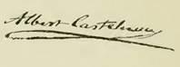{.calibre3}]{.calibre4}

[[
]{.calibre_7}]{.bold}

### [[[]{.calibre2}[]{.calibre2}[]{.calibre2}[]{.calibre2}[]{.calibre2}[]{.calibre2}[Curet]{.calibre2}]{.bold1}]{.calibre_39} {#curet .calibre_38}

[ ]{.calibre4}

[Arrêté le 7 décembre 1851, venant de faire campagne, je fus, pendant vingt-quatre heures, livré à la noirceur d'un donjon fort profond où on ne se reconnaissait qu'à la voix, où se tenaient les propos les plus invraisemblables pour nous compromettre, où les vivres manquaient.]{.calibre4}

[C'était, nous a-t-on assuré, dans l'intention de nous couvrir de vermine qu'on nous avait fait passer par cette première épreuve.]{.calibre4}

[Le lendemain on appela treize d'entre nous, on nous menotta, on nous fit descendre au pied de la forteresse Saint-Nicolas[[[[^\[153\]^]{.calibre_21}]{.underline}]{.calibre_4}](index_split_4933.html#filepos40251678){#filepos39338573}, on nous embarqua dans une grande barque, nous traversâmes la bouche du port, nous entrâmes dans la forteresse Saint-Jean, toujours escortés par autant d'agents de police armés jusqu'aux dents et, arrivés dans la cour de Saint-Jean, nous fûmes enfermés dans un ex-corps de garde, où nous demeurâmes en otages pendant quatre jours.]{.calibre4}

[... On nous avait oubliés pour les vivres, nous nous croyions condamnés à mourir de faim. Mais ce qu'on n'avait pas oublié, c'était un canon de fort calibre braqué sur notre porte et que nous apercevions par le seul trou d'un guichet qu'on nous défendait d'approcher.]{.calibre4}

[Et lorsque nous réclamions, on nous répondait : Eh, de quoi pouvez-vous avoir besoin ? Ne savez-vous donc pas que vous n'avez peut-être pas une heure à vivre ? T Voyez plutôt. --- Et l'on montrait le canon à l'interrogateur. --- Mais ce n'est pas une raison, dit celui-ci, pour que nous soyons condamnés à subir auparavant le supplice de la faim. --- Comment ? s'avisa de répondre un officier. --- Oui, depuis trois jours nous n'avons eu qu'un mauvais morceau de pain de munition qu'on nous a octroyé en traversant d'une forteresse à l'autre. L'eau nous manque, et il paraît qu'on nous a oubliés. --- L'officier murmura je ne sais quoi, fit mine de vouloir briser son épée sur son genou, pirouetta et disparut. Une heure après trois administrations diverses envoyaient chacune leur contingent de provisions.]{.calibre4}

[Quelques jours après nous partions pour le fort d'If. Nous eûmes plus d'un mois de secret. Pas plus de place qu'auparavant. Le jour de la libération du secret, on nous permit une heure de promenade. L'un de nous s'évanouit. Nous étions tous étiolés. Nous restâmes au fort d'If dans l'ensemble environ deux mois.]{.calibre4}

[Nous arrivâmes à la Guyane française en juillet 1852.]{.calibre4}

[Notre traversée n'eut de remarquable que la sévérité dont nous étions l'objet. Si nous nous plaignions du pain ou du biscuit, on nous répondait que c'était bien assez pour des gens de notre espèce. Et pourtant ces provisions étaient le rebut des matelots d'abord, puis des repris de justice, puis des convicts, et c'était à nous qu'on faisait avaler cela. Nous n'avions de l'eau que par minimes rations.]{.calibre4}

[Après trente-deux jours de mer, nous mouillâmes à l'île Royale, aujourd'hui Impériale, bagne principal de la Guyane mais comme rien encore n'était préparé pour nous recevoir, on nous garda à bord huit jours de plus que nos compagnons de voyage. Enfin, le huitième jour, on nous transborda sur le vapeur le Styx qui nous débarqua à l'île La Mère. Rien n'était préparé pour nous recevoir.]{.calibre4}

[... Le gouverneur lui-même, M. Sarda Garriga, était abasourdi de la situation. Le bois pour les baraques et les hommes qui devaient les habiter arrivant en même temps, il nous fallut nous-mêmes construire nos prisons, aidés seulement de quelques ouvriers d'état.]{.calibre4}

[Notre oeuvre était encore fort incomplète lorsque, par ordre supérieur, on forma des catégories. Je fus l'un de ceux qui arrivèrent des premiers à Cayenne (la ville). Là je trouvai vingt-deux autres prisonniers arrivés avant nous sur la frégate [la Forte]{.italic}. --- L'Érigone nous comptait au chiffre de 144.]{.calibre4}

[... Une évasion de 13 d'entre nous qui avait été exécutée à l'île La Mère rendit le gouverneur plus sévère, et malheureusement le gouvernement impérial en tira parti et trouva là l'occasion de nous vexer comme bon lui semblait. [Mais où trouver les hommes.et les moyens]{.italic} pour justifier les rigueurs exercées contre des hommes traités en coupables sans être jugés ? On verra plus loin que rien ne manqua.]{.calibre4}

[Bientôt une deuxième évasion eut lieu de la ville même de Cayenne. Là, j'y jouai le rôle principal. J'accompagnai même les trois amis que j'aidai de tous mes moyens jusques à bord pour ainsi dire, et j'eus à résister à leurs pressantes sollicitations pour ne point partir avec eux pour les Etats-Unis. Je m'étais sur parole réservé à d'autres amis. Quesne, Chambonnière et Gourrieux une fois partis, on fit des recherches minutieuses. L'enquête démontra que j'avais quelquefois parlé avec le capitaine américain. Il est vrai qu'on ne pouvait comprendre, mais je savais l'anglais, j'étais lié avec la maison d'un commissaire commandant d'un quartier\... le canot manquait\... on m'avait vu avec des nègres, rameurs spéciaux de ce commandant-là. Bref, le cas fut jugé capital en fait de connivence et l'on nous enferma tous dans la geôle de Cayenne par ordre du gouverneur. Pourtant, comme rien ne vint à l'appui formel de cette accusation, que du reste bien peu d'entre nous connaissaient à fond l'affaire, on nous relâcha au bout de huit jours mais on nous recommanda, et spécialement à moi, de prendre garde.]{.calibre4}

[[(Le gouverneur de l'île M. Sarda Garriga, jugé trop clément, fut remplacé par M. Fourichon.)]{.italic}]{.calibre4}

[... Cette période fut remarquable par les divers changements administratifs se succédant sans relâche, et il était facile de voir qu'avec le nouveau venu arrivaient aussi pour nous vexer les hommes et les moyens.]{.calibre4}

[D'abord les pauvres exilés de l'île La Mère furent condamnés au travail obligatoire. Ils refusèrent en demandant à être jugés des menaces et de légers retranchements de ration furent la conséquence de ce premier refus. Puis le vin fut supprimé. Puis encore des rations entières. Et toujours les proscrits protestaient. Or, sur ces entrefaites, le capitaine du vaisseau le [Duguesclin]{.italic}, ce bagne flottant, le célèbre Mallet, visitant en touriste l'ile et ses prisonniers, crut devoir s'adresser à ces derniers en ces termes : « Ah ! vous ne voulez pas travailler ! Vous ne voulez pas obéir ni vous soumettre ! Eh bien, nous verrons, on vous prendra par la famine. »]{.calibre4}

[Et il disait cela avec son ventre ballonné de truffes et son haleine puant le champagne, le bandit !]{.calibre4}

[Et en effet, à partir de ce moment, chacun sans exception, malade ou en santé, faible ou fort, capable ou non, eut à travailler ou à mourir de faim.]{.calibre4}

[Ce n'était point chose facile, on le pense bien, que de réduire de pareils hommes. Or, comme on avait littéralement supprimé les vivres, ils se ruèrent sur le magasin, qui par un guet-apens combiné n'était point gardé, en demandant des vivres, un jugement ou la liberté.]{.calibre4}

[Il y avait là une trop belle occasion pour les geôliers pour ne point considérer cette affaire comme une insurrection afin d'en tirer parti, et au besoin d'en avoir raison par un [conseil de guerre.]{.italic}]{.calibre4}

[Le lendemain matin des troupes furent débarquées à l'île La Mère, et en un clin d'oeil une cour martiale prononça huit condamnations : Angéliaume, huit ans de travaux forcés comme meneur ; les autres, dont le nom m'échappe mais que nous retrouverons toujours, en furent quittes pour moins il y eut des emprisonnements de plus d'un an pour quelques-uns et quelques mois pour la plupart.]{.calibre4}

[A partir de ce moment tous nos amis, un seul excepté (Gardanne d'Hyères réclamé dans une habitation), furent embarqués sur les steamers et transportés à l'île Saint-Joseph où se trouvaient les récidivistes (repris de justice).]{.calibre4}

[L'île Saint-Joseph est fort près de l'île Impériale. Celle-ci est le bagne principal.]{.calibre4}

[... Le directeur des deux îles se nomme ainsi : La Richerie --- de la Richerie ou Rucherie, natif de Bourbon ou Guadeloupe, on ne sait au juste, créole enfin on l'entendait souvent jurer contre l'abolition de l'esclavage qui l'avait ruiné, disait-il, ainsi que sa famille.]{.calibre4}

[C'était surtout aux hommes de 48, ainsi qu'il les appelait, qu'il en voulait le plus.]{.calibre4}

[... Le lendemain de l'arrivée de mes pauvres amis à l'île Saint-Joseph, une grande parade de gendarmes, de soldats et de gardes-chiourme, appuyée par un fort détachement d'artillerie, annonça la visite de leur noble directeur.]{.calibre4}

[Il commença par lire le règlement des forçats et leur dit : « Ce règlement est désormais le vôtre. Il dépend de moi, prenez-y bien garde, de vous conduire là où se trouve le FOUET[[[[^\[154\]^]{.calibre_21}]{.underline}]{.calibre_4}](index_split_4933.html#filepos40251936){#filepos39349686} et ceci dépend de votre soumission à mes ordres. D'abord, vous serez rasés comme les forçats, et puis vous irez travailler comme eux, ni plus ni moins celui qui ne fera pas son travail de bon coeur travaillera deux heures de plus que les autres pour compléter son ouvrage. Vos effets sont usés, je le vois, eh bien, je vous octroierai ceux des forçats décédés. Il en sera de même pour les chapeaux et les pantoufles (je ne dis pas souliers). Il est bon, là, le gouvernement, d'avoir tant d'attentions pour des hommes indignes comme vous en vérité. »]{.calibre4}

[Les pauvres proscrits étaient abasourdis. Ils se demandaient si elles étaient vraies, ces paroles inouïes sortant de cette ignoble chose indigne de porter le nom d'homme. Ils étaient consternés, et comme rien ne décelait leur indignation : « Eh bien, dit-il, voyons, allons, vous vous taisez, insurgez-vous maintenant, fumier, poltrons, brigands ! Mais remuez donc ! essayez ! que j'aie le plaisir de vous envoyer quelques balles dans la tête ! »]{.calibre4}

[Et, suffoqué par la colère, il fut emporté dans les bras d'un aide de camp, pouvant à peine murmurer ces derniers mots : « Non point de pitié pour vous, sur mon honneur ! »]{.calibre4}

[À partir de ce jour commença pour les exilés cette vie de tortures journalière inconnue dans les âges passés, et incomprise au milieu du dix-neuvième siècle.]{.calibre4}

[Voici quelques détails :]{.calibre4}

[Angéliaume, huit ans de travaux forcés quatre autres, diverses peines, réclusion, dix-huit mois de prison, privations, cellule, etc.]{.calibre4}

[Chottard (Louis). Les pouces furent presque coupés par les poucettes qu'un bon gendarme serrait. Deux fois il passa de l'île Saint-Joseph à l'île Impériale, celle du fouet. L'a-t-il subi ? Jamais il ne s'est expliqué à ce sujet mais aujourd'hui, de fou qu'il devint, il est devenu imbécile. [Sicut et cadaver]{.italic}.]{.calibre4}

[Agénon (Antoine), éditeur du [Progrès social]{.italic} et du [Travailleur]{.italic}, accusé du crime d'écrire l'histoire de ce temps. --- Peine : 45 jours de réclusion dans une boîte en bois, au pain et à l'eau, sans place pour se mouvoir. Huit jours de repos. Nouvelle réclusion de 15 jours pour le même crime. Après quoi le médecin-chirurgien le trouva si faible, si étiolé, qu'on l'envoya à Cayenne (la ville) où il mourut le troisième jour de son arrivée, 25 août 1853.]{.calibre4}

[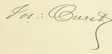{.calibre3}]{.calibre4}

[[
]{.calibre_7}]{.bold}

### [[[]{.calibre2}[]{.calibre2}[]{.calibre2}[]{.calibre2}[]{.calibre2}[]{.calibre2}[Auguste Claverie]{.calibre2}[[[[[[^\[155\]^]{.bold1}]{.calibre_43}]{.calibre2}]{.underline1}]{.calibre_42}](index_split_4933.html#filepos40252205){#filepos39353516 .calibre2}]{.bold1}]{.calibre_39} {#auguste-claverie155 .calibre_38}

[ ]{.calibre4}

[[Camp de Birkadem (province d'Alger), 14 juillet 1852.]{.italic}]{.calibre_26}

::: calibre_27

[ ]{.calibre4}

[Tu dois être bien impatient, mon cher ami, de savoir enfin ce que je suis devenu, et dans quel pays j'ai été jeté par le vent des proscriptions qui ont décimé la France.]{.calibre4}

[Arrivé à Alger le 2 juillet après une traversée qui m'a rudement secoué et pendant laquelle on nous a jetés dans la cale, sorte de fosse aux moutons où nous ne pouvions rester debout, où nous n'avions pas de sièges pour nous asseoir, ayant à peine un peu d'air pour respirer, plongés dans une atmosphère viciée sans qu'on eût pour nous traiter avec tant de rigueur l'excuse du grand nombre des prisonniers, car nous n'étions que 22, je puis enfin te donner quelques détails sur ma position.]{.calibre4}

[D'Alger, où nous avons passé deux jours au lazaret sous de longs hangars ouverts à tous les vents, n'ayant pour toute couche sur la dalle humide qu'un peu de paille, trop peu, hélas d'Alger, on nous a dirigés sur un camp.]{.calibre4}

[... Ici tout est sombre autour de moi sous le calme apparent des visages, je sens des âmes bouillonner. Chacun ronge en silence son frein, tout en songeant, non sans une amère douleur, aux infortunes laissées derrière soi et surtout à la dégradation et au déshonneur de la patrie.]{.calibre4}

[Je suis au camp de Birkadem, situé à 10 kilomètres d'Alger. Il y a avec moi près de six cents de mes compagnons de captivité de presque tous les départements de la France nous ne savons si nous resterons dans ce camp ou si l'on nous enverra plus avant dans les terres.]{.calibre4}

[... Ceux qui sont au camp de Birkadem ne travaillent pas. Quand on a besoin de bras à l'intérieur, on choisit parmi nous les détenus et on les expédie sur Douéra, sur Ain-Sultan, sur Dellys, etc., où il y a déjà beaucoup de transportés. Inutile de te dire, mon cher ami, que je ne travaillerai pas. Tu connais l'énergie de mes résolutions. Toute puissance humaine, contraire à ma volonté, se brisera contre l'inertie de ma résistance. Je refuse donc, comme j'ai déjà refusé, tout travail. Ma main ne touchera pas une pioche. J'irai peut-être à Lambessa, peut-être à Cayenne, mais ma fierté ne sera pas humiliée, et jusqu'à la mort, jusqu'à mon dernier souffle, ma voix protestera contre le parjure dont j'expie le crime ici avec tant d'amis.]{.calibre4}

[À Veuillide et à moi on nous a proposé l'internement à la condition [d'en adresser]{.italic} la demande au gouverneur. Nous avons refusé.]{.calibre4}

[ ]{.calibre4}

[[13 août 1852.]{.italic}]{.calibre4}

[Je t'ai parlé de notre traversée à bord du bateau à vapeur [la Ville-de-Bordeaux]{.italic}. Je t'ai dit en quelques mots que notre arrivée au lazaret d'Alger n'avait rien changé à notre position. A notre arrivée au camp, nous entrâmes dans des grandes baraques en bois où, par l'arrivée de 250 transportés de l'Yonne, les détenus se sont trouvés tellement serrés et entassés qu'ils n'ont pas même la moitié de l'air qu'il faut pour respirer.]{.calibre4}

[ ]{.calibre4}

[... Quant à la nourriture, après avoir passé quatre ou cinq mois pour la plupart avec une ration de soupe et de boeuf le matin, du riz le soir et du pain de munition, toutes choses qui sont assez bonnes un jour et fort mauvaises le lendemain, nous avons enfin obtenu la soupe deux fois par jour ; mais on ne donne que de l'eau, que les soldats du train vont chercher au village de Birkadem avec des mulets et des tonneaux, et qui, par conséquent, n'est pas de la première fraîcheur.]{.calibre4}

[Mais avec de l'argent, me diras-tu, on peut se procurer quelques adoucissements à un régime si sévère et si peu substantiel ? Oui, sans doute, mais à la condition que tous nos achats, pain, viande, vin, fruits, savon, fil, papier, etc., soient faits à une vieille cantinière préposée pour cela au camp, et qui a soin de gagner cent pour cent sur les marchandises, presque toujours de mauvaise qualité, qu'elle nous fait passer par le guichet.]{.calibre4}

[Tout homme qui rentre au camp, soit au retour de la corvée, soit au retour du travail, est fouillé par le sergent de route qui confisque tout, jusqu'aux allumettes, s'il en trouve dans les poches du délinquant. Quand les transportés vont à la promenade le matin sous l'escorte des sergents et des soldats en armes, un factionnaire est placé à la porte de chaque épicier sur les places où les arabes ont l'habitude de porter leurs fruits ou leurs denrées, et un homme, fût-il accablé par la soif, ne peut acheter ni figues, ni pommes, ni quoi que ce soit.]{.calibre4}

[Tout ceci se passe au camp de Birkadem qui passe pour le camp le moins rudement mené en Algérie. Mais à la Bourkika, à Douéra près Guelma, à Aïn-Benian, à Bône et autres Lambessas de cette espèce, le régime est autrement sévère et intolérable. Pour t'en donner une idée, je te dirai qu'à Douéra un sergent, voyant un malheureux transporté qui se tordait dans les étreintes et les tiraillements de coliques cruelles, lui disait : « Pourquoi vous lamentez-vous ? Ne savez-vous pas que votre chair est promise aux chacals » --- Ceci est à la lettre. Sommes-nous donc ici pour qu'on nous y fasse mourir ?]{.calibre4}

[ ]{.calibre4}

[... Arrivons à la question du travail.]{.calibre4}

[Beaucoup ont, bon gré, mal gré, accepté le travail. Au monopole de l'exploitation de nos bourses, par la vieille mégère de la cantine, a succédé le monopole de l'exploitation des bras des transportés, par le gouvernement. On vient de prendre au camp 250 transportés pour être employés au percement de routes dans l'intérieur de l'Algérie. Ils seront nourris à peu près comme au camp, [couchés sur la paille]{.italic} et soldés à raison de vingt centimes par homme et par jour. Ceci est monstrueux, et sur les 20 centimes qu'il leur paie, quand il lui arrive de payer, l'état fait une retenue moyenne de 2 centimes par jour parce qu'il leur fait distribuer du café afin de couper la crudité de l'eau qui les rendrait sans cela tous malades.]{.calibre4}

[Or, depuis 10 heures du matin jusqu'à 2 heures après midi le soleil est si brûlant qu'il semble que chaque rayon qui tombe sur vos bras et sur votre tête vous enlève l'épiderme au soleil, mon thermomètre s'est élevé dernièrement à 580 centigrades.]{.calibre4}

[... J'espère que [tu conserveras religieusement]{.italic} mes lettres afin que plus tard nous puissions puiser dans le souvenir de nos souffrances l'énergie qu'il nous faudra pour ne pas faiblir et reculer. Je veux te citer un fait qui te prouvera que le pouvoir lui-même n'ose pas affronter jusqu'au bout l'opinion publique.]{.calibre4}

[Entre autres transportés dans le camp, il y a un jeune homme de dix-neuf ans, du département de l'Hérault, qu'on a enterré dernièrement dans le cimetière de Birkadem. Un de nos compagnons d'infortune lui a fait une modeste croix en bois, le seul souvenir par lequel il nous a été permis d'honorer la mémoire du malheureux proscrit ; le peintre qui sous mes fenêtres s'occupe en ce moment de graver sur les deux bras de la croix le nom de ce pauvre jeune homme y avait mis : Pierre-Nicolas N., [transporté]{.italic}. Il lui a été intimé l'ordre d'effacer ce mot-là, condition sans laquelle la croix ne pouvait être placée.]{.calibre4}

[Je m'abstiens de réflexions. Nous les ferons plus tard.]{.calibre4}

[... Tu dois comprendre que si je te parle avec tant de liberté, c'est que j'ai trouvé le moyen de faire passer mes lettres sans les soumettre au visa des gardiens.]{.calibre4}

[Ce matin à 3 h. 1/2 le clairon a sonné le réveil ; aussitôt on nous a annoncé pour 5 heures l'arrivée du général Espinasse, aide de camp du président. De là grande rumeur dans le camp. L'amnistie allait donc être proclamée.]{.calibre4}

[Je n'ai pas partagé cette joie, car, pour un homme un peu habitué à apprécier le caractère des actes politiques, le choix d'Espinasse pour une mission de clémence ne pouvait être, ne devait être qu'un nouveau chapitre d'hypocrisie.]{.calibre4}

[A 7 heures, le général est entré au camp le silence le plus complet régnait dans les rangs des transportés réunis dans la cour. Le général a passé devant nous il a commencé par nous dire : « Je viens vous voir en passant, en attendant qu'on ait pris des dispositions pour vous envoyer au travail. »]{.calibre4}

[La déception a été complète. Après avoir fait sonner bien haut l'amnistie du 15 août, on venait insulter au malheur, car, après avoir été fort convenable en passant devant nous, le jeune général a profité du bruit qui s'est fait après que les rangs ont été rompus pour jeter des injures sur le parti républicain. « Les passions se calment en France », a-t-il dit.]{.calibre4}

[Ah ! général ! Pourquoi retenez-vous donc dans les camps les vieillards, les infirmes, les pères de famille, les [femmes]{.italic}, car il y en a, entre autres Pauline Roland ; les passions se calment ! vous le criez trop haut pour que cela soit vrai. Ah [comediante ! Comediante !]{.italic}]{.calibre4}

[En partant, il nous a dit que la grâce ne nous serait accordée que sur notre demande et sur la promesse formelle d'être fidèles au président. Ils tiennent donc au serment, et croient sans doute nous lier par un serment que les souffrances arrachent trop facilement au malheureux, eux qui ont donné si audacieusement l'exemple du plus odieux parjure que l'histoire ait eu à enregistrer.]{.calibre4}

[J'ai sous les yeux tous les propos du général, son petit discours :]{.calibre4}

[« Joignez aux demandes en grâce les certificats. Jurez fidélité et dévouement au prince-président. Le repentir est le meilleur des certificats car enfin vous êtes des égarés. Vous n'avez fait que suivre des hommes qui voulaient être préfets, sous-préfets, percepteurs, qui vous avaient fait croire que les vessies étaient des lanternes, qui voulaient changer le gouvernement et qui maintenant sont [graciés]{.italic}. Vous êtes des pauvres diables qui avez été égarés. Vous vous êtes laissés conduire comme un tas de bêtes que vous êtes. »]{.calibre4}

[... Ce qu'il y a de plus clair dans notre affaire, c'est que ceux d'entre les transportés dont l'âme est trop fière, dont les convictions sont trop profondes, le caractère trop fortement trempé pour crier grâce au tyran ou reculer devant de nouvelles tortures, ceux-là ne rentreront en France qu'à la faveur d'une révolution. Or, ami, sous ce climat meurtrier, sous l'influence fatale de privations indicibles, de souffrances physiques et morales inconnues aux européens, le corps dépérit, la vie s'éteint bien rapidement.]{.calibre4}

[... Pour moi, j'espère résister à toutes les misères ; je suis trop jeune et j'ai trop de foi pour [ne pas être sûr]{.italic} de revoir mon pays aussi glorieux qu'il est humilié, et je compte bien que, dans cette oeuvre de haute réparation à laquelle nous sommes tous conviés, mes amis ne seront pas les derniers à se présenter à la barre pour dresser des actes d'accusation.]{.calibre4}

[ ]{.calibre4}

[[3 septembre 1852.]{.italic}]{.calibre_26}

::: calibre_27

[ ]{.calibre4}

[... Le [Moniteur algérien]{.italic} publie 331 grâces ou commutations de peines pour les transportés. Je ne sais si on veut donner le change à l'opinion publique ce qu'il y a de sûr, c'est que cette liste reproduit le nom de plusieurs transportés [graciés]{.italic} longtemps avant le 15 août.]{.calibre4}

[... Au moment de cacheter ma lettre je reçois une lettre d'un transporté de Birkadem envoyé par-delà la première chaîne de l'Atlas pour travailler avec 300 de nos compagnons partis, il y a quinze jours, du camp. Ce sont les travaux forcés, moins la condamnation par la cour d'assises et moins surtout la nourriture réglée de ces sortes d'établissements. En route et dans les chantiers ils ont toujours couché [à la belle étoile]{.italic}, sans paille et sans vêtements. Ils sont mal nourris, n'ont pas la ration, et dans le trajet ils ont fait vingt-quatre heures de marche sans manger.]{.calibre4}

[Ô sainte humanité de nos gouvernants ! je n'ai pas le temps de te donner tous les renseignements qui viennent de m'arriver ; ils sont tous d'une profonde tristesse, et je suis à me demander si ce n'est pas à la mort qu'on a envoyé tant d'hommes au lieu de les envoyer au travail !]{.calibre4}

[ ]{.calibre4}

[[13 octobre 1852.]{.italic}]{.calibre_26}

::: calibre_27

[ ]{.calibre4}

[... Il y a environ deux mois, on organisa dans les camps des ateliers de travail. Au camp de Douéra, quelques transportés refusèrent énergiquement d'aller travailler à l'assainissement de la plaine de la Métidja ou au percement des routes de l'Atlas. Ce refus de travail, si naturel de la part d'hommes qu'aucun arrêt de justice ne frappe, ne pouvait frapper, fut suivi de chants réputés séditeux et par conséquent rigoureusement punis... [La Marseillaise]{.italic} surtout fut chantée avec une rare énergie. Ce chant, qui jadis donnait tant d'élan aux armées de la République, déplaît furieusement aujourd'hui à nos Hoche et à nos Marceau en herbe. Le lieutenant qui commande à Douéra a la Marseillaise en horreur, et il la déteste d'autant mieux qu'il est plus alcoolisé. Ce soir-là, il avait absorbé une prodigieuse quantité d'absinthe, qui est la boisson de prédilection des soldats d'Afrique, qui sont aux vainqueurs des Pyramides et d'Aboukir ce que le janissaire est au volontaire de 92.]{.calibre4}

[La Marseillaise donc lui déplut souverainement. Il prit cinq transportés, parmi lesquels quatre sous-officiers d'artillerie que le 2 décembre avait surpris dans leurs foyers, et il les fit jeter à la salle de police. Mais les chanteurs étaient au nombre de 100, 200, 300. Ils réclament tous pour partager la punition de leurs camarades. Comment faire ? Le camp, qui dans les premiers temps de la conquête, avait été fait pour des soldats, n'avait pas prévu qu'un jour il servirait de prison à des républicains, proscrits au nom du peuple, en sorte que les salles de police et les cachots ne pouvaient renfermer qu'une vingtaine de disciplinés.]{.calibre4}

[Mais le soldat français, par ce temps-ci surtout, n'est pas homme à rester en si mauvais chemin ! Le lieutenant du camp prit les plus mutins, les mit à la salle de police, et fit au gouverneur général un rapport effrayant où il démontrait l'existence d'un complot, --- les complots ont ceci de particulier qu'aujourd'hui, en toute saison, quelque temps qu'il fasse, ils se forment, grandissent et mûrissent en peu de jours, pour être pourtant fauchés avant le terme. --- De là, grande rumeur. Les moins coupables furent envoyés à la casbah de Bône et cinq transportés, les plus coupables, les organisateurs, parmi lesquels les artilleurs, ont été traduits devant le premier conseil de guerre siégeant à Alger.]{.calibre4}

[Là, malgré les paroles sévères des défenseurs qui demandaient au conseil de quel droit on condamnait ainsi des hommes aux plus rudes peines, travaux forcés, sans un arrêt de justice, le conseil, après une courte délibération, a condamné les coupables, [à l'unanimité, à la peine de mort !]{.italic}]{.calibre4}

[Voilà notre perspective, mon ami. Je ne te dirai pas dans quelle sombre consternation cette fatale nouvelle a jeté le camp. Tu le comprendras facilement.]{.calibre4}

[Tout Alger a été indigné. Tout ce que cette ville renferme de coeurs droits et vraiment honnêtes a flétri cette odieuse condamnation.]{.calibre4}

[Les membres du conseil étaient montrés au doigt. Le capitaine rapporteur en est tombé malade, et ainsi que nous l'avions prévu, ni [l'Akbar]{.italic}, ni le journal officiel, [le Moniteur algérien]{.italic}, n'ont parlé de cette affaire.]{.calibre4}

[Ces jeunes gens ne devaient pas être exécutés ils ne pouvaient l'être, ils ne le seront pas. Le conseil de révision a cassé le jugement et l'affaire va avoir une seconde fois les honneurs de la juridiction militaire. Le procès sera jugé à Blida.]{.calibre4}

[... Un transporté, M. de la Rivière, naguère interné à Médéa, a été réintégré dans le camp pour n'avoir pas voulu faire une demande en grâce ou tout au moins pour n'avoir pas adressé au président une lettre dans laquelle il lui aurait demandé [son internement]{.italic}. Le malheureux croyant que les internements accordés par le gouvernement étaient définitifs, avait fait arriver sa femme et ses enfants. Aujourd'hui on lui défend, par ordre du gouverneur, de recevoir la visite de sa femme, d'embrasser son jeune fils.]{.calibre4}

[Tous les moyens sont bons auprès de ces gens-là pour amener les transportés [à faire leur soumission,]{.italic} langage officiel, comme si, nouveaux Witikinds ou nouveaux saxons, nous nous étions [révoltés]{.italic} contre Charlemagne.]{.calibre4}

[Auguste CLAVERIE.]{.calibre4}

[[
]{.calibre_7}]{.bold}

### [[[]{.calibre2}[]{.calibre2}[]{.calibre2}[]{.calibre2}[]{.calibre2}[]{.calibre2}[Amable Lemaître (Déclaration)]{.calibre2}]{.bold1}]{.calibre_39} {#amable-lemaître-déclaration .calibre_38}

[ ]{.calibre4}

[Je soussigné Alexandre-Marie-Amable LEMAÎTRE, homme de lettres, né à Paris, le [1]{.calibre_63}^[[e]{.calibre_63}]{.calibre18}[[r]{.calibre_63}]{.calibre18}^ mars 1811, y ayant demeuré rue des Vieux-Augustins, 13, IIIe arrondissement, et maintenant en exil à Bruxelles (Belgique),]{.calibre4}

[Déclare que c'est par une erreur inconcevable que :]{.calibre4}

[1° GACHER (Quintien), né à Montpensier, canton d'Aigueperse (Puy-de-Dôme), le 26 décembre 1806, célibataire, ancien fabricant de meubles à Paris, rue du Faubourg-Saint-Antoine, 115 ;]{.calibre4}

[2° NEVEU (Henri) père, veuf, âgé de plus de 60 ans, domicilié à l'hôpital des Enfants-Trouvés, rue du Faubourg-Saint-Antoine, 135 ;]{.calibre4}

[3° NEVEU (Eugène), fils du précédent, âgé d'environ 30 ans, père de famille, ébéniste, rue du Faubourg-Saint-Denis, 90,]{.calibre4}

[ ]{.calibre4}

[Tous trois aujourd'hui déportés à Lambessa (Afrique),]{.calibre4}

[Ont été accusés d'avoir participé le 3 décembre 1851, vers 9 à 10 heures du matin, rue du Faubourg-Saint-Antoine, à la hauteur du passage de la Bonne-Graine, à l'attaque-arrestation de l'officier porte-drapeau d'un régiment de ligne, campé à la Bastille.]{.calibre4}

[Ce fait, dont je m'honore, a été accompli par quelques citoyens et par moi sur les réponses évasives faites par cet officier aux questions que je lui adressai, touchant sa présence isolée, intempestive, au milieu de nous, alors que nous tentions d'organiser la défense des lois et la revendication des droits sacrés du peuple indignement violés par le Plébiscite daté du 2 décembre 1851.]{.calibre4}

[Les trois citoyens susnommés : [Gacher, Neveu père]{.italic} et [fils]{.italic}, sont complètement étrangers à cet acte, et c'est par suite de l'abominable esprit qui a présidé au semblant d'examen (non d'instruction) des hommes arrêtés partout, à toute heure, et par milliers, à cette époque, qu'ils n'ont pas été admis à établir et à prouver tous trois et chacun un alibi.]{.calibre4}

[Mon ami Ferdinand Cournet qui intervint sur le théâtre de la lutte avec le porte-drapeau, et dont le poignet vigoureux, en s'emparant du bras de l'officier, m'épargna un coup de pistolet ajusté presque à bout portant, pourrait peut-être aussi attester de son témoignage les mêmes faits dont la déclaration est faite ici par moi pour satisfaire à la parole que j'ai donnée à Gacher, sur le vaisseau le [Duguesclin]{.italic}, en rade de Brest, au moment solennel où lui [Gacher, Neveu père]{.italic} et [fils]{.italic}, ainsi que deux de nos autres compagnons de captivité, étaient transbordés sur le Mogador, en partance pour Lambessa.]{.calibre4}

[ ]{.calibre4}

[[Bruxelles, 5 juin 1852[[[[[^\[156\]^]{.bold}]{.calibre_21}]{.underline}]{.calibre_4}](index_split_4933.html#filepos40253332){#filepos39380653}.]{.italic}]{.calibre_26}

::: calibre_27

[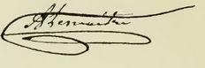{.calibre3}]{.calibre4}

[En l'absence de toute autorité spéciale légale, ont signé pour affirmer la déclaration et la signature d'Amable Lemaître :]{.calibre4}

[]{.calibre4}

[[Les représentants du peuple]{.italic}]{.calibre4}

[[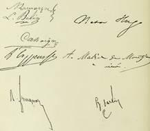{.calibre3}]{.italic}]{.calibre4}

[[
]{.calibre_7}]{.bold}

### [[[]{.calibre2}[]{.calibre2}[]{.calibre2}[]{.calibre2}[]{.calibre2}[]{.calibre2}[Jules Miot.]{.calibre2}[[[[[[^\[157\]^]{.bold1}]{.calibre_43}]{.calibre2}]{.underline1}]{.calibre_42}](index_split_4933.html#filepos40253684){#filepos39381835 .calibre2}]{.bold1}]{.calibre_39} {#jules-miot.157 .calibre_38}

[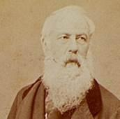{.calibre3}]{.calibre_10}

[ ]{.calibre4}

[Déclaration adressée à M. le général commandant la sous-division de Tlemcen, par Jules Miot, représentant du peuple, transporté à Sebdou :]{.calibre4}

[ ]{.calibre4}

[Monsieur le général,]{.calibre4}

[J'ai été arrêté le 2 décembre 1851, à six heures du matin, chez moi, lorsque j'étais représentant du peuple, c'est-à-dire inviolable. Depuis je n'ai point été interrogé, jugé, ou condamné, d'une façon régulière. On m'a même laissé ignorer jusqu'aux prétextes dont on entendait se servir pour me transporter, [deux fois de suite]{.italic}, en Algérie, après le 2 décembre.]{.calibre4}

[Depuis que je suis ici, on ne m'a fait signifier aucun jugement, aucune condamnation, aucun décret qui me permettent de savoir combien de temps je dois passer sur une terre de proscription aussi brûlante et aussi sauvage que celle sur laquelle j'ai été jeté.]{.calibre4}

[J'ai accepté, sans me plaindre, toutes les mesures qui ont été prises contre moi. Je n'ai adressé aucune demande en grâce et je n'en adresserai point, car je n'ai aucun reproche à me faire, et qu'on ne peut m'en faire aucun.]{.calibre4}

[Ma dignité et ma conscience s'opposent à ce que je demande grâce et merci pour la rémission de fautes, de crimes que je n'ai point commis, et je ne demanderai rien.]{.calibre4}

[J'agis ainsi pour sauvegarder mon honneur, car j'y tiens plus qu'à la vie.]{.calibre4}

[J'ai encore assez bonne opinion de mes adversaires politiques pour croire qu'ils respecteront ce sentiment chez celui dont ils ont compromis la santé, la fortune, le bonheur, la vie peut-être.]{.calibre4}

[Gagner l'affection de ses ennemis politiques est chose impossible, je le sais il n'en est pas de même de leur estime : on l'obtient, même malgré eux, lorsqu'on s'en montre digne. C'est à quoi je me suis toujours attaché par une conduite honorable et que je crois irréprochable.]{.calibre4}

[Agréez, monsieur le général, l'expression de mes sentiments distingués.]{.calibre4}

[J. MIOT.]{.calibre4}

[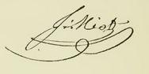{.calibre3}]{.calibre4}

[[Redoute de Sebdou, 10 septembre 1852.]{.italic}]{.calibre_26}

::: calibre_27

[ ]{.calibre4}

[Cette déclaration a été faite à la suite de la sommation qui m'a été faite verbalement, de la part du général Pélissier, d'avoir à faire ma soumission à L. N. Bonaparte, ou de lui adresser une demande en grâce, sous menace d'être envoyé aux travaux forcés d'Algérie si je refusais. À mon refus, on n'a pas exécuté la menace, mais on a continué à me garder à Sebdou jusqu'à janvier 1856.]{.calibre4}

[J. M.]{.calibre4}

[[
]{.calibre_7}]{.bold}

### [[[]{.calibre2}[]{.calibre2}[]{.calibre2}[]{.calibre2}[]{.calibre2}[]{.calibre2}[Évasion d'Afrique des citoyens Fillon, Crubailhes et Frond]{.calibre2}[[[[[[^\[158\]^]{.bold1}]{.calibre_43}]{.calibre2}]{.underline1}]{.calibre_42}](index_split_4933.html#filepos40255638){#filepos39386528 .calibre2}]{.bold1}]{.calibre_39} {#évasion-dafrique-des-citoyens-fillon-crubailhes-et-frond158 .calibre_38}

[ ]{.calibre4}

[... Notre pensée, en choisissant Dellys comme lieu d'internement, était de nous rendre dans un petit port de mer peu fréquenté par les bâtiments marchands et les contrebandiers et de ne point éveiller l'attention des gendarmes sur nos projets d'évasion.]{.calibre4}

[Dellys n'offre point de ressources. Quelques bateaux pêcheurs non pontés et incapables de quitter la côte fréquentent seuls le port.]{.calibre4}

[On voit quelquefois des bateaux de huit et dix tonneaux frétés par des négociants d'Alger et chargés de marchandises pour la côte ou venant prendre des chargements, ou bien encore, ce qui pendant notre séjour est arrivé deux fois, deux bâtiments marchands qui venaient recevoir un chargement des huiles de la Kabylie.]{.calibre4}

[Nous entrâmes souvent en négociation avec les capitaines de ces bateaux, mais toujours sans résultat. Avec les uns nous restions dans la plus grande réserve, avec d'autres nous pouvions nous livrer mais leurs prétentions exagérées ne nous permettaient pas de continuer les négociations.]{.calibre4}

[ ]{.calibre4}

[... Le courrier arrivait, on allait à la poste attendre la distribution que faisait le sergent des transportés. --- J'attends deux cents francs, disait l'un, moi cinquante, disait l'autre, moi cent. On récapitulait ; --- c'est plus qu'il nous en faut pour payer le contrebandier, demain soir après dîner et à nuit close nous partirons\..., et le coeur nous battait bien fort, partagés entre l'espoir d'une tentative d'évasion et la crainte de ne point recevoir de lettres.]{.calibre4}

[Après la distribution, on allait dans un petit coin, on se disait le contenu des lettres : sur dix, un était quelquefois heureux, mais l'argent qu'il recevait ne pouvait que servir à payer ses dettes et à avoir un nouveau crédit.]{.calibre4}

[ ]{.calibre4}

[... Nous étions au 14 septembre, lorsqu'arriva la dépêche qui prescrivait aux commandants supérieurs de faire faire des demandes à M. Bonaparte pour obtenir de rester dans les lieux d'internement.]{.calibre4}

[Il n'y avait plus à hésiter, fuir ou rentrer dans les camps et perdre ainsi le bénéfice de tant de démarches et d'un concours assuré de la part d'Antonio, pêcheur napolitain qui joua le principal rôle dans notre évasion.]{.calibre4}

[Nous eûmes une dernière entrevue. Les uns renoncèrent par impuissance, d'autres, pour des motifs particuliers, Fillon, Crubailhes et moi convînmes de partir le dimanche, immédiatement après l'appel du gendarme.]{.calibre4}

[Après avoir signé notre dernier bulletin de présence, nous allâmes chez Huet prendre un morceau de pain que nous mangeâmes sur le pouce. Le moment était venu, et quoique préparés à tout événement nous avions le coeur serré. Nous quittions au reste des amis que le manque d'argent seul retenait prisonniers.]{.calibre4}

[Pendant ce temps Antonio préparait son embarcation. A 9 heures, nous faisions nos adieux. Antonio quittait le port avec un de ses amis, annonçant qu'il allait à la pêche et venait louvoyer en face de notre petite maisonnette.]{.calibre4}

[Il ne s'agissait point d'embarquer trois hommes seulement Crubailhes avait eu soin de faire venir à Dellys une énorme caisse renfermant tous les effets qu'il avait laissés à Paris et aussi ses papiers de commerce. En arrivant au gourbi, il fallut descendre sur le bord de la mer cette énorme malle et s'exposer à perdre toutes nos chances de liberté pour sauver quelques hardes, qu'il fallut plus tard abandonner à Alicante.]{.calibre4}

[Les matelots voyaient de loin cette manoeuvre ils n'osent nous parler, mais en arrivant au port ils nous déclarent ne pouvoir pas prendre une malle qui, indépendamment du poids et de l'embarras qu'elle occasionnera à bord, sera d un débarquement trop difficile à Alger.]{.calibre4}

[On insiste. Ils consentent à emporter la caisse, et, tandis qu'ils prennent leurs mesures pour cet embarquement, je remonte sur la route. Nous devions rejoindre, par le sentier qui borde la mer, l'embarcation qui devait nous prendre au Sebaoun, à deux heures de Dellys.]{.calibre4}

[Nous suivîmes les sentiers, les haies, tous les endroits enfin où nous étions sûrs de ne trouver personne, et après deux mortelles heures de marche forcée, nous arrivâmes à l'endroit indiqué.]{.calibre4}

[Il était 2 heures de l'après-midi lorsque le bateau prit le large.]{.calibre4}

[... Après le coucher du soleil la bise souffla avec force, presque vent arrière nous espérions marcher assez vite pour débarquer à Alger à 6 heures du matin. Nous avions compté sans le vent qui changea tout à coup vers les onze heures. C'était le siroco qui soufflait malgré la fraîcheur de la mer il arrivait à nous avec ses vapeurs brûlantes qui nous suffoquaient.]{.calibre4}

[La mer embarquait. Des lames entières emplissaient le bateau.]{.calibre4}

[On avait dû prendre le large pour éviter la côte pendant la nuit et en attendant le lever de la lune, mais on suivait toujours la direction d'Alger, autant que l'habitude peut le permettre à un homme qui n'a point de boussole pour se guider.]{.calibre4}

[... Fillon crut un moment à la trahison. Les marins nous disaient en effet Voyez comme la mer est mauvaise, le vent contraire ! Si vous le voulez, nous rentrerons à Dellys.]{.calibre4}

[Plutôt périr ici que de retourner dans notre prison. Mettez à la cape jusqu'au jour, nous verrons alors de quel côté nous diriger.]{.calibre4}

[... Dès le matin 6 heures, le vent changea aussi subitement qu'il l'avait fait la veille. On put se rapprocher de la côte et marcher pour rattraper le temps perdu. Nous n'étions pas arrivés à moitié route d'Alger.]{.calibre4}

[Les vivres étaient épuisés ou gâtés par l'eau de mer. Il restait un peu d'eau et de l'eau-de-vie, on en distribua un peu pour se donner des forces et l'on continua la route.]{.calibre4}

[Vers 11 heures, nous arrivions devant le cap Matifou.]{.calibre4}

[... Nous débarquer de jour sur la plage d'Alger n'était pas très prudent. On accepta donc la proposition que je fis de débarquer le soir après le lever de la lune sous le fort Babazoum, à l'endroit même où on nous avait fait débarquer du Mogador pour entrer au lazaret. De cet endroit à la porte Babazoum il n'y a que quelques pas, nous étions dans la ville.]{.calibre4}

[... Fillon demanda l'adresse de la maison où il était attendu, tandis que Crubailhes et moi nous nous rendions chez M. Barbier dont j'avais fait la connaissance par l'entremise d'un brave camarade de transportation, Saget, ancien notaire de la Nièvre.]{.calibre4}

[Deux petites chambres nous avaient été préparées dans un marabout faisant partie de la maison qu'occupe M. Barbier et dans laquelle se trouve la fabrique de tabac qui occupe 150 ouvriers. Nous restions enfermés là toute la journée. Le matin à 10 heures, et après la sortie des ouvriers, on nous apportait notre déjeuner le soir à 6 heures et après la fermeture des ateliers on nous rendait à la liberté. Nous allions souper à la table de M. Barbier et le soir cet ami nous sacrifiait ses soirées, qu'il venait passer avec nous sur le plateau de notre marabout.]{.calibre4}

[... Fillon était moins heureux. Muni d'une lettre de recommandation il se présente chez M. Drevet, autrefois ardent républicain, mais aujourd'hui timide, d'une politesse froide et ne prêtant que d'une main l'hospitalité qui lui était demandée. Fillon remercia M. Drevet et alla chez d'honnêtes ouvriers.]{.calibre4}

[... Il apprit en détail ce que nous apprenions très vaguement, que le 2 décembre n'avait excité en Alger que haine et mépris, et que l'on délibérait encore le 3, si on ne proclamerait pas la République.]{.calibre4}

[... On chercha un bâtiment qui pût nous emporter gratuitement.]{.calibre4}

[Il y avait peu de bateaux espagnols en rade. Il fallait attendre une occasion ou s'adresser à des hommes qui auraient refusé ou qui auraient demandé un prix exorbitant.]{.calibre4}

[Quinze jours se passèrent en négociations inutiles. Il arriva enfin le bateau du capitaine Renaud, homme intelligent et joignant à un grand courage personnel toutes les qualités du contrebandier. On lui offrit de nous prendre, il y consentit moyennant une somme de 750 francs qui devait être déposée entre les mains du consignataire du bateau et payée contre une lettre de nous, constatant que les engagements pris avaient été tenus.]{.calibre4}

[Mais ici était la question la plus difficile. En quittant Dellys nous avions pour toute fortune 325 francs. Crubailhes n'avait plus sur ses 300 francs que 200 francs, Fillon et moi n'avions plus un centime. L'ami sur lequel j'avais compté à Alger était impuissant, le parti était pauvre, et Fillon ne recevait point de réponse à une demande qu'il avait faite à un de ses amis de Paris.]{.calibre4}

[Quoique gêné, M. Barbier, voyant notre inquiétude, nous dit : Je ferai les fonds nécessaires pour ce départ, je m'arrangerai aussi pour vous donner 100 francs à chacun.]{.calibre4}

[Dans la journée il vit Rey qui lui annonça que Fillon venait de recevoir par une voie secrète 300 francs. M. Barbier s'empressa de nous porter la nouvelle et nous dit que les 300 francs de Fillon réunis avec 250 francs de Crubailhes ne pouvant pas payer les frais de bateau, il ajouterait 250 francs à cette somme, ce qui constituerait ma part. Il ajouta à cette première somme 250 francs, ce qui faisait une avance de 500 francs. M. Barbier me prit un billet de 400 francs, « se proposant, nous dit-il, de se faire rembourser 100 francs par des personnes à lui connues ».]{.calibre4}

[Le bateau trouvé, l'argent déposé, il ne s'agissait plus que de fixer le jour du départ. On choisit le mardi, l'embarquement devait se faire à 9 heures.]{.calibre4}

[... Un matelot gardait l'embarcation. Dès qu'il nous vit arriver il accosta et à peine étions-nous placés que le second poussait au large.]{.calibre4}

[Les voiles furent aussitôt larguées, l'ancre levée, et en moins de vingt minutes le bateau fut en marche.]{.calibre4}

[... Debout sur le pont nous regardions Alger disparaissant peu à peu devant nous. Arrivés devant la tour des signaux, presque en face de notre marabout, j'envoyai un dernier souvenir à notre brave M. Barbier et un adieu à Alger.]{.calibre4}

[À mesure que nous prenions le large le vent devenait plus violent, la mer était aussi plus mauvaise\... Vers minuit, les matelots, qui avaient aussi le mal de mer, ne pouvaient plus marcher et demandaient à rentrer au port. Renaud chercha à les persuader. De notre côté nous demandions à mourir là plutôt que de retomber entre les mains des gendarmes de M. Bonaparte. Marchons, marchons toujours, reprit Renaud.]{.calibre4}

[Quelques minutes après, le mât de beaupré était enlevé, le bâtiment craquait dans tous les sens, les matelots ne pouvaient plus résister à la fatigue, au mal de mer, le capitaine lui-même était malade. Il fallut revenir sur ses pas. À 4 heures du matin nous étions mouillés en rade d'Alger.]{.calibre4}

[Le capitaine descendit à terre à la pointe du jour, alla prévenir Rey et s'entendre avec lui pour nous cacher encore pendant que la mer serait mauvaise et le vent contraire.]{.calibre4}

[Les ouvriers du port vinrent dans la journée réparer les avaries tandis que nous étions couchés au milieu des bottes de paille, privés d'air et de lumière.]{.calibre4}

[La journée se passa ainsi. À 4 heures, le capitaine vint nous prévenir que nous débarquerions à 8 heures.]{.calibre4}

[... L'on nous conduisit dans une vieille masure donnant sur le bord de la mer. Nous restâmes là pendant trois jours. Le troisième au soir nous devions embarquer à 6 heures.]{.calibre4}

[... L'heure indiquée avait été mal comprise par les matelots, l'embarcation n'était pas là, il fallut la héler. Cette faute pouvait nous coûter la liberté, il fallait la réparer.]{.calibre4}

[Le second pria donc un de ses compatriotes de lui prêter son embarcation, ce qu'il fit de très bonne grâce. Nous prîmes place tous les trois et dix minutes après nous étions encore à bord, cachés toujours dans du foin. À 8 heures nous quittions la rade\... Cette fois je quittai Alger sans oser, comme à notre première sortie, lui dire adieu.]{.calibre4}

[... Après quelques heures de sommeil très calme, nous montâmes sur le pont. On voyait à peine la côte d'Afrique, la mer était toujours belle. Toute la journée on chanta des refrains patriotiques.]{.calibre4}

[Nous continuâmes ainsi notre route avec un vent et une mer qui nous restèrent favorables jusqu'à quelques lieues d'Alicante.]{.calibre4}

[En approchant du port, après une traversée de quarante-huit heures, je crus renaître à la vie.]{.calibre4}

[Vers le soir et quelques heures avant notre entrée dans le port, la mer, qui dans la journée avait grossi, devint furieuse. Aussi fallut-il renoncer au projet de débarquement arrêté le matin. À deux ou trois lieues d'Alicante, si le temps était resté beau, le capitaine devait mettre à la mer son embarcation et nous faire mettre à la côte par ses matelots. L'un de ses hommes serait venu nous accompagner pour nous indiquer l'entrée de la ville et nous conduire à l'hôtel qui nous avait été indiqué. Les effets restaient à bord et pouvaient passer pour appartenir au capitaine et au second qui couchaient dans la même cabine.]{.calibre4}

[... La pensée du débarquement préoccupait vivement le capitaine. Débarquer de nuit était impossible, les portes de la ville étaient fermées, il fallait du reste traverser les bureaux de la douane. Débarquer de matin, c'était courir de grands risques et encore fallait-il le faire avant la visite toujours très matinale des douaniers.]{.calibre4}

[Le capitaine voyant ces deux moyens impossibles s'adressa au capitaine d'un bâtiment voisin, lui proposant cent francs pour nous garder à son bord jusqu'après la visite de la douane. Cet homme se fit raconter brièvement qui nous étions et pourquoi on cherchait à nous cacher. Renaud répondit avec sa franchise habituelle que nous étions des évadés des bagnes de M. Bonaparte.]{.calibre4}

[On aurait pu s'attendre à une réponse affirmative de la part de l'autre contrebandier, mais non. Non seulement il repoussa la proposition qui lui était faite, mais encore il rançonna Renaud, le menaçant de le dénoncer s'il ne lui donnait pas cent francs pour avoir osé lui faire une telle proposition. --- C'était un vol infâme. --- Il fallut se laisser exécuter, on donna les cent francs.]{.calibre4}

[Renaud ne se découragea pas, il nous fit conduire à bord d'un autre bateau où il était déjà allé et où on lui avait promis de nous cacher pendant la visite. Mais à peine étions-nous à bord que le capitaine déclarait ne point vouloir nous garder, trouvant trop faible la somme qu'on lui offrait.]{.calibre4}

[Enfin le capitaine d'un bateau partant pour Madère consentit à nous prendre à son bord et à nous déposer à Santa-Paula, petit port situé à 4 heures d'Alicante. Renaud paya 200 francs pour notre transport ; on nous embarqua à 4 heures du matin à fond de cale, une demi-heure après nous faisions voile pour notre nouvelle destination.]{.calibre4}

[Nous arrivâmes en rade à midi. On mouilla très loin du port. L'embarcation fut mise à la mer. On nous distribua des pantalons de bord, des vareuses et des coiffures marines. Comme je fus le premier habillé, c'est avec moi que le capitaine voulut tenter son débarquement\... On fit des tours et des détours, des promenades autour de tous les bâtiments et, lorsqu'on crut le moment favorable, on poussa le canot vers un point de la plage où il n'y avait pas de douaniers.]{.calibre4}

[Comme l'embarcation ne pouvait arriver à terre et qu'il y avait de l'eau jusqu'à mi-jambe, un matelot me prit sur son dos et me porta à terre. Cette opération terminée, l'embarcation poussait au large lorsque nous vîmes, mon conducteur et moi, venir à nous au pas de course un carabinieros auquel rien de ce qui venait de se passer n'avait échappé. « Marchez toujours, me dit mon guide, n'ayez pas l'air de voir cet homme. »]{.calibre4}

[Arrivé à vingt pas, le douanier met en joue et crie : « Halte ou je fais feu. » La position était peu agréable.]{.calibre4}

[--- Pas un mot. Restez immobile, me dit mon contrebandier, et, prenant un ton menaçant : Que veux-tu ? dit-il au douanier. Je ne porte rien, je débarque ici pour raccourcir mon chemin.]{.calibre4}

[--- Ce que je veux, c'est que tu rembarques et que tu viennes débarquer à la jetée.]{.calibre4}

[Les refus d'un côté, les menaces de l'autre se croisaient, tandis que je restais immobile comme une momie en présence de cette carabine braquée sur nous. Impatienté, le carabinieros fit sonner les deux crans de son fusil. Pâle et le coeur plein de rage, mon guide, voyant toute résistance impossible, me dit quelques mots qu'il accentua très fort en me prenant par le bras et que je ne compris pas, et se tournant vers le douanier, il lui dit : Au revoir.]{.calibre4}

[L'embarcation qui avait vu cette lutte avait pris une direction parallèle à la nôtre. Sur un signe de mon guide elle revint à terre, nous rembarquâmes et, par mille détours au milieu de tous les bâtiments, nous revînmes jusqu'à notre bateau dont nous ne fîmes que le tour, et alors, se payant d'audace, le capitaine alla droit au débarcadère. Mon guide et moi débarquâmes au milieu d'un grand nombre de matelots ou curieux et sans émotion nous mîmes nos souliers. Nous allumâmes une cigarette. Un compère était venu au-devant de nous. Mon guide et lui engagèrent très haut une conversation tout ce que je compris, c'est qu'il dit à son ami que nous étions venus à terre faire des provisions.]{.calibre4}

[On me conduisit dans une maison où tout avait été préparé pour nous recevoir et où Fillon et Crubailhes vinrent me rejoindre deux heures après. Leur débarquement s'opéra de la même manière.]{.calibre4}

[... Vers les 9 heures, on nous mit par terre un matelas très large sur lequel nous nous couchâmes tous les trois.]{.calibre4}

[À 3 heures, un guide vint nous appeler et nous conduisit chez un loueur de voitures.]{.calibre4}

[La voiture qu'on nous donna, les seules du reste que l'on trouve dans ce pays, c'est une charrette couverte ayant la forme d'un omnibus avec deux bancs à l'entour, un char à bancs en un mot.]{.calibre4}

[Cette charrette est traînée par deux mules.]{.calibre4}

[... Le capitaine[[[[^\[159\]^]{.calibre_21}]{.underline}]{.calibre_4}](index_split_4933.html#filepos40256265){#filepos39411436} avait espéré que notre débarquement se serait fait la veille, que suivant ses instructions on nous aurait donné une mule à chacun, et que le soir nous serions arrivés à Alicante avant la fermeture des portes. Aussi, inquiet sur notre sort, et avant de se transporter lui-même à Santa-Paula, expédia-t-il son second en avant pour voir s'il ne voyait rien venir, tandis que lui et deux de ses matelots attendaient à la porte pour nous servir de guides quand nous descendrions de voiture.]{.calibre4}

[À 3 kilomètres environ d'Alicante, nous vîmes venir à nous le second comme la voiture marchait au pas, nous marchions derrière elle nous pûmes donc, sans éveiller aucun soupçon, échanger quelques paroles. Il m'apprit que deux alguazils épiaient ses démarches et celles du capitaine, qu'il fallait agir de prudence, quitter la voiture à un demi-kilomètre de la porte d'entrée, ne pas avoir l'air de reconnaître le capitaine et marcher derrière lui.]{.calibre4}

[Près de l'entrée de la ville, nous quittâmes le char à bancs après avoir payé nos places ce fut notre seule dépense. Il prit une route à droite, tandis que nous suivions le capitaine, laissant derrière nous les matelots et le guide.]{.calibre4}

[Nous traversâmes la ville, nous nous rendîmes chez un coiffeur espagnol tout récemment établi et chez lequel était, comme premier garçon, un réfugié de l'Hérault expulsé deux mois avant de Barcelone. Nous fîmes là un peu de toilette de propreté, et sur la demande du capitaine on nous prépara à déjeuner.]{.calibre4}

[Le capitaine qu'avaient inquiété les poursuites de deux agents de police, pressentant d'un autre côté, d'après ce que notre camarade nous avait raconté, que notre présence à Alicante découverte, le gouverneur nous aurait fait mettre en prison jusqu'à constatation officielle de notre position, décida de nous faire sortir de la ville.]{.calibre4}

[Il se procura une charrette, moins bien installée que la première, n'ayant pour toute garniture à l'intérieur qu'une botte de paille, et, sans nous faire part de ses projets, il revint vers midi nous dire : « Nous allons partir pour un village voisin où je vous mettrai en sûreté jusqu'à ce que j'aie trouvé les moyens de régulariser votre position et de vous faire aller plus loin. Une voiture vous attend hors des portes, vous allez exécuter ce que je vais vous prescrire, et avant que vous soyez arrivés au lieu que j'indique au voiturier, je vous rejoindrai à cheval. »]{.calibre4}

[Trois hommes étaient postés sur la place en face de la maison occupée par le coiffeur. Chacun de nous en suivit un. Tous trois se dirigèrent vers le même point en suivant une route différente. À peine étions-nous arrivés au lieu du rendez-vous que nous fûmes rejoints par le voiturier ; nous prîmes place à côté de lui et nous nous dirigeâmes vers Santa-Paula. Le voiturier ignorait lui-même les intentions du capitaine.]{.calibre4}

[Nous fîmes les deux tiers de la route à pied, nous n'avions pas à ménager nos jambes, nous étions convaincus d'arriver à destination avant la nuit close.]{.calibre4}

[Arrivés en face de Santa-Paula et au moment où nous prenions le sentier qui devait nous conduire au village, nous vîmes arriver derrière nous trois cavaliers, fusil et sabre pendant au côté, des pistolets dans les fontes. L'un d'eux que nous reconnûmes pour notre capitaine nous cria de nous arrêter. Il vint à nous au grand trot, fit rebrousser chemin, blâma le voiturier de n'avoir pas exécuté ses ordres, et nous dit que ce n'était point à Santa-Paula où nous étions connus qu'il fallait aller, mais dans un village à côté où un bon dîner nous attendait, où nous trouverions de bons lits, tout le confortable pour nous remettre de nos fatigues et nous préparer à nous mettre en route pour aller à Carthagène.]{.calibre4}

[... Nous arrivâmes vers minuit à un village, nous étions heureux, mais ce n'était qu'une grand'halte\...]{.calibre4}

[Nous continuâmes notre route et, une heure après, nous arrivions devant une ferme de bonne apparence, isolée au milieu des champs.]{.calibre4}

[... L'alcade chez lequel nous étions est un compère. Tout chez lui respire l'aisance, la fortune même. Il y avait là plusieurs hommes, plusieurs fermiers. Tout le monde se mit à table. Nous étions une vingtaine.]{.calibre4}

[... À 2 heures on se coucha sur des matelas que l'on avait jetés par terre et que les bonnes avaient installés pendant notre souper.]{.calibre4}

[À 6 heures, le garçon d'écurie vint annoncer que les chevaux étaient sellés. Trois heures de sommeil avaient suffi au capitaine et à ses compagnons pour réparer leurs forces. En moins de quelques minutes, tous furent habillés. Éveillés en sursaut par le bruit, nous demandâmes de quoi il s'agissait.]{.calibre4}

[« Adieu, mes amis, nous dirent le capitaine et ses compagnons. L'heure de la séparation a sonné. Nous allons continuer notre route. Reposez encore un peu, et après déjeuner la voiture vous conduira à Carthagène. Tout est payé, le voiturier et le guide, mais je ne paierai que contre une lettre de vous constatant que vous êtes arrivés à bon port et que mes hommes se sont bien conduits à votre égard. »]{.calibre4}

[Il poussa la générosité jusqu'à nous offrir de l'argent, à nous qu'il ne connaissait pas et pour qui il avait dépensé déjà plus qu'il n'avait reçu pour nous porter en Espagne. Encore, cet argent ne devait-il lui être payé qu'à son retour à Alger.]{.calibre4}

[... La voiture étant prête, nous fîmes nos adieux et à 8 heures nous quittions une maison qui laissera dans notre coeur un éternel souvenir.]{.calibre4}

[... À un kilomètre de Carthagène nous descendons de voiture. Le guide nous accompagne. Nous cherchons partout un hôtel français. Cette fois encore le sort va nous favoriser. Après bien des recherches infructueuses, nous arrivons enfin à une fonda françesa\...]{.calibre4}

[Après avoir déjeuné, nous faisons connaître au maître d'hôtel notre situation. Il nous promet son concours pour faire régulariser notre position et nous indiquer les moyens les plus faciles et les moins dispendieux pour aller à Gibraltar, notre grande halte avant d'aller à Londres.]{.calibre4}

[... Après avoir échoué chez le commandant militaire de Carthagène, notre hôtelier me dit : « Puisque vous avez été officier, je vous mettrai si vous voulez en relations avec le baron de Asda, ancien capitaine de l'empire, bonapartiste enragé, colonel dans les troupes espagnoles, aujourd'hui en disponibilité, mais bon, sympathique et très influent. »]{.calibre4}

[Je vis ce colonel, lui fis part de notre position et lui demandai s'il voudrait nous faire délivrer un passeport afin de ne pas être inquiétés, et nous indiquer les moyens de faire à peu de frais notre voyage à Gibraltar.]{.calibre4}

[Il alla visiter le maire de la ville, obtint de lui nos passeports que le lendemain il nous fit délivrer.]{.calibre4}

[Nous apprîmes en même temps que le bateau à vapeur l'Isabelle arrivait le matin pour repartir le soir même.]{.calibre4}

[Je me rendis dès 6 heures du matin à bord de l'Isabelle, je demandai à parler au capitaine qui, quoique couché, me reçut dans sa chambre. Je lui demandai pour moi et mes deux camarades un coin sur son bateau.]{.calibre4}

[Le capitaine était républicain. Son concours nous était assuré.]{.calibre4}

[Il fut convenu que nous paierions moitié place, aux troisièmes, sur le pont. Nous prîmes nos billets.]{.calibre4}

[... En arrivant à Gibraltar, nous allâmes remercier le capitaine et avant de quitter le bord nous demandâmes notre compte au maître d'hôtel avec lequel nous nous étions déjà liés. Il nous demanda seulement ses déboursés et nous recommanda à Parker, maître d'hôtel à Gibraltar, qui se chargea de nous faire entrer dans la ville.]{.calibre4}

[« Si vous ne pouvez entrer, dit le capitaine, revenez à bord, je vous mènerai gratuitement à Cadix. »]{.calibre4}

[Les portes de Gibraltar sont toujours fermées. On n'entre dans la ville qu'en traversant une petite ouverture pratiquée dans la grande porte. On examina vaguement nos passeports écrits en espagnol. C'est à ce motif sans doute que nous avons dû de pouvoir entrer dans la ville dont l'entrée est interdite aux réfugiés de toute nation.]{.calibre4}

[... Nous cherchâmes à nous mettre en relations avec quelques français. En parcourant les rues en face de la Bourse, nous vîmes une enseigne portant : Pierre, coiffeur de Paris.]{.calibre4}

[Je m'avançai près d'un monsieur qui se trouvait sur la porte du magasin et lui demandai M. Pierre. « C'est moi, me dit-il, qu'y a-t-il pour votre service ? » Je lui exposai notre situation : « Ah ! me répondit-il, il n'y a ici rien à faire. La plus amère déception vous attend. »]{.calibre4}

[Je rendis compte de cette entrevue à nos amis. Nous retournâmes tous les trois chez M. Pierre. Nous entrâmes dans de plus longs détails et toutes ses réponses nous découragèrent tellement que nous nous décidâmes à partir.]{.calibre4}

[... Le lendemain lundi, nous rencontrâmes le capitaine de l'Isabelle et, quand nous lui eûmes appris que nous ne pouvions rien faire à Gibraltar, il nous renouvela la proposition qu'il nous avait faite déjà de nous conduire à Cadix, ce que nous acceptâmes.]{.calibre4}

[Nous nous rendîmes chez le consul espagnol pour faire viser nos passeports. Il nous fut répondu que ces passeports ne nous avaient été délivrés que pour quitter le territoire espagnol et qu'il ne nous faciliterait pas par sa signature les moyens d'y retourner. Nous insistâmes, tout fut inutile. Il fallut partir.]{.calibre4}

[Après dîner nous nous rendîmes à bord de l'Isabelle. Le consignataire nous avait précédés de quelques minutes qui lui avaient suffi pour arrêter la liste des passagers. Lorsque le capitaine nous vit arriver, il vint au-devant de nous et nous dit : « Je suis désolé, je ne puis vous recevoir, vous arrivez trop tard, ma liste est close, et malgré tout le désir que j'aurais de vous être agréable et utile, je ne puis compromettre le bateau qui aurait un procès pour avoir reçu des voyageurs en contrebande. »]{.calibre4}

[La situation était des plus difficiles. Les portes de la ville allaient se fermer, l'Isabelle avait levé son ancre, un seul bateau restait le long du vapeur, c'était celui du consignataire, consul russe. Le capitaine le pria de vouloir bien nous recevoir dans son embarcation et de favoriser notre rentrée.]{.calibre4}

[À peine étions-nous en mer que le coup de canon, signal de fermeture des portes, se fit entendre mais nous n'étions plus exposés à coucher à la belle étoile. Le consul répondait de nous. Après le débarquement, il se présenta un délégué de la police qui le rendit responsable de nos trois individus.]{.calibre4}

[Le consul nous emmena chez lui. Un chef de police vint nous reconnaître, nous donna un permis de séjour de trois jours, et nous rentrâmes chez Parker, n'ayant plus pour toute fortune que vingt francs.]{.calibre4}

[Nous revîmes le lendemain Pierre, nous fîmes connaissance chez lui du citoyen Campagne, cuisinier du gouverneur, et plus tard de M. Bartibas. Ce furent ces trois amis qui contribuèrent le plus par leurs efforts, leurs sacrifices, à favoriser notre départ pour Londres.]{.calibre4}

[Poussés à bout, désespérés, Fillon et moi vîmes quelques officiers, Fillon comme frère maçon et moi comme frère d'armes.]{.calibre4}

[... Pierre, Campagne et Bartibas travaillaient de leur côté, et à l'aide d'une souscription qu'ils offrirent aussi discrètement qu'elle avait été faite, on put payer notre voyage sur le prix duquel M. Bartibas obtenait réduction de moitié le voyage, les frais d'hôtel payés, il ne restait plus un centime ; M. Bartibas nous prêta une livre, Campagne 50 francs, nous nous embarquâmes donc avec 75 francs. C'était toute notre fortune pour arriver à Londres.]{.calibre4}

[... Nos amis nous conduisirent à bord le lendemain nous étions à Cadix, le surlendemain à Lisbonne.]{.calibre4}

[Le bateau devait passer là toute la journée et ne repartir que le lendemain à 10 heures.]{.calibre4}

[Désireux de connaître la ville, nous descendîmes à terre après notre déjeuner avec l'intention de rentrer pour dîner.]{.calibre4}

[Pierre m'avait remis une lettre pour le citoyen Rainaud, tailleur à Lisbonne. Notre premier soin fut d'aller porter cette lettre.]{.calibre4}

[M. Rainaud était fort occupé. Allez, nous dit-il, visiter la ville (il m'indiqua ce qu'il y avait de plus curieux à voir), et ce soir à 6 h. ½, venez me trouver chez Hoffmann. Je vais faire prévenir plusieurs de mes amis, compatriotes et républicains, et nous passerons la soirée ensemble.]{.calibre4}

[Nous fûmes exacts au rendez-vous. Rainaud y était déjà. À peine étions-nous entrés que nous vîmes arriver successivement plusieurs compatriotes, entre autres Ortaire Fournier, ancien consul.]{.calibre4}

[Après quelques minutes de conversation, nous étions tous comme frères\...]{.calibre4}

[Sans savoir nos besoins, sans que nous ayons dit un mot qui pût faire pressentir notre gêne, deux amis se mirent en campagne, et en moins de deux heures, ils recueillirent une somme de 125 francs qu'ils nous prièrent d'accepter. Nous passâmes ainsi la nuit jusqu'à une heure du matin.]{.calibre4}

[... À 8 heures nous partîmes, accompagnés de nos amis c'était là notre dernière étape, nous ne devions plus nous arrêter qu'en Angleterre, où nous ne tardâmes pas à nous apercevoir du changement. Pour faire connaissance avec eux, les anglais commencèrent par nous voler 35 francs pour un mauvais dîner. Si nous n'avions pas eu les 125 francs de Lisbonne, nous n'aurions pas pu arriver à Londres, nous aurions dû rester à Southampton. Oh ! l'anglais !]{.calibre4}

[Quoi qu'il en soit, j'avoue que, si nous avons bien souffert, dans les forts, sur les pontons et en Afrique, nous avons été bien largement dédommagés.]{.calibre4}

[Que de dévouement ! que de nobles coeurs nous avons trouvés par toute l'Espagne et le Portugal, depuis Alger jusqu'à Southampton ! Mais là commence la déception elle finira pour moi le jour où je quitterai l'Angleterre.]{.calibre4}

[ ]{.calibre4}

[Victor FROND.]{.calibre4}

[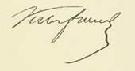{.calibre3}]{.calibre4}

[Les citoyens Frond, Fillon, Crubailhes, on l'a vu, durent traverser de rudes épreuves pour échapper aux poursuites de la police, mais ils rencontrèrent en Espagne et en Portugal des coeurs vaillants, de généreux dévouements. Et c'est en signe de reconnaissance que le comité de la société la Révolution adressa la lettre suivante aux patriotes de Lisbonne et de Gibraltar :]{.calibre4}

[[]{.italic}]{.calibre_10}

[[Lettre du comité la société la Révolution aux patriotes de Lisbonne et de Gibraltar.]{.italic}]{.calibre_10}

[ ]{.calibre4}

[[Londres, ce 26 novembre 1852.]{.italic}]{.calibre4}

[ ]{.calibre4}

[Citoyens,]{.calibre4}

[Lorsque nos camarades de la transportation d'Afrique, les citoyens Frond, Fillon et Crubailhes, après avoir échappé aux poursuites de la police comme aux sinistres de la mer, sont arrivés dans vos parages, vous leur avez prêté loyalement l'assistance et le concours de frères.]{.calibre4}

[Vous avez pratiqué là, citoyens, la grande religion humaine, celle du secours au malheur et vous nous avez rendu, de plus, un service particulier en conservant trois soldats à la cause de la Révolution.]{.calibre4}

[À ce double titre, citoyens, nous regardons comme un devoir de vous adresser nos fraternels remerciements. Votre conduite en ce qui concerne nos trois amis nous est un sûr garant pour l'avenir si de semblables circonstances se présentent et si vous avez encore l'occasion, comme ne le permettent que trop nos temps de malheur, de tendre la main aux martyrs de notre révolution.]{.calibre4}

[Recevez, citoyens, l'assurance de notre cordiale sympathie et agréez notre salut fraternel.]{.calibre4}

[]{.calibre4}

[Pour la société la Révolution :]{.calibre4}

[Les membres du comité.]{.calibre4}

[LEDRU-ROLLIN, CHARLES RIBEYROLLES, CAHAIGNE, F. MARTIN, HUBERT, ROBERT, TERRIER, GLESIA, DERON, PERDIGON, PERRIN, DORLIN.]{.calibre4}

[[]{.bold}]{.calibre_12}

[[
]{.bold}]{.calibre_12}

[[FIN du CAHIER COMPLÉMENTAIRE À L'HISTOIRE D'UN CRIME]{.bold}]{.calibre_12}

[{.calibre3}]{.calibre_10}
