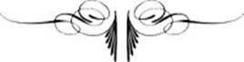
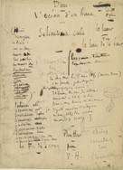

# [[{.calibre10} D]{.calibre2}IEU]{.calibre_55} {#filepos22138512 .calibre_}

:::::: calibre_20
::::: calibre_3
::: calibre_16

------------------------------------------------------------------------

::: calibre_16

:::::
::::::

[(Posthume inachevé -- 1891)]{.calibre_3}

[Victor Hugo]{.calibre_10}

[[POÉSIES]{.bold}]{.calibre_21}

:::::: calibre_22
::::: calibre_21
[ ]{.bold}

::: calibre_16

------------------------------------------------------------------------

::: calibre_16

:::::
::::::

[
Pour toutes demandes ou suggestions]{.calibre_3}

[[!{.calibre3}]{.calibre27}]{.calibre_7}

[[Détail de la Genèse. Michel-Ange, chapelle Sixtine. Vatican.]{.italic}]{.calibre_3}

## [[[]{.calibre2}[]{.calibre2}[]{.calibre2}[]{.calibre2}[]{.calibre2}[]{.calibre2}[]{.calibre2}[]{.calibre2}[]{.calibre2}[]{.calibre2}[]{.calibre2}[]{.calibre2}[]{.calibre2}[]{.calibre2}[]{.calibre2}[]{.calibre2}[]{.calibre2}[]{.calibre2}[]{.calibre2}[]{.calibre2}[]{.calibre2}[]{.calibre2}[]{.calibre2}[]{.calibre2}[]{.calibre2}[]{.calibre2}[]{.calibre2}[]{.calibre2}[]{.calibre2}[]{.calibre2}[Table des matières]{.calibre2}]{.bold1}]{.calibre_24} {#calibre_pb_3534 .calibre_57}

::: calibre_19

[]{.calibre_10}

> [[[[[Introduction]{.calibre9}]{.underline}]{.calibre_4}](index_split_2842.html#filepos22148429)]{.calibre_10}

> [[[[[I. Ascension dans les ténèbres]{.calibre9}]{.underline}]{.calibre_4}](index_split_2844.html#filepos22150643)]{.calibre_10}

> [[[[[I. Le seuil du gouffre]{.calibre16}]{.underline}]{.calibre_4}](index_split_2845.html#filepos22151155)]{.calibre_10}

> [[[[[I -- L'Esprit humain]{.calibre9}]{.underline}]{.calibre_4}](index_split_2846.html#filepos22151621)]{.calibre_10}

> [[[[[II. Les voix]{.calibre16}]{.underline}]{.calibre_4}](index_split_2847.html#filepos22182775)]{.calibre_10}

> [[[[[I -- Une voix]{.calibre9}]{.underline}]{.calibre_4}](index_split_2848.html#filepos22183559)]{.calibre_10}

> [[[[[II -- Une autre voix]{.calibre9}]{.underline}]{.calibre_4}](index_split_2849.html#filepos22189434)]{.calibre_10}

> [[[[[III -- Une autre voix]{.calibre9}]{.underline}]{.calibre_4}](index_split_2850.html#filepos22196446)]{.calibre_10}

> [[[[[IV -- Une autre voix]{.calibre9}]{.underline}]{.calibre_4}](index_split_2851.html#filepos22201920)]{.calibre_10}

> [[[[[V -- Une autre voix]{.calibre9}]{.underline}]{.calibre_4}](index_split_2852.html#filepos22204983)]{.calibre_10}

> [[[[[VI -- Une autre voix]{.calibre9}]{.underline}]{.calibre_4}](index_split_2853.html#filepos22216549)]{.calibre_10}

> [[[[[VII -- Une autre voix]{.calibre9}]{.underline}]{.calibre_4}](index_split_2854.html#filepos22227847)]{.calibre_10}

> [[[[[VIII -- Une autre voix]{.calibre9}]{.underline}]{.calibre_4}](index_split_2855.html#filepos22242030)]{.calibre_10}

> [[[[[IX -- Une autre voix]{.calibre9}]{.underline}]{.calibre_4}](index_split_2856.html#filepos22245604)]{.calibre_10}

> [[[[[X -- Une autre voix]{.calibre9}]{.underline}]{.calibre_4}](index_split_2857.html#filepos22251826)]{.calibre_10}

> [[[[[XI -- Une autre voix]{.calibre9}]{.underline}]{.calibre_4}](index_split_2858.html#filepos22255018)]{.calibre_10}

> [[[[[XII -- Autres voix]{.calibre9}]{.underline}]{.calibre_4}](index_split_2859.html#filepos22257565)]{.calibre_10}

> [[[[[XIII -- Une autre voix]{.calibre9}]{.underline}]{.calibre_4}](index_split_2860.html#filepos22284642)]{.calibre_10}

> [[[[[II. L'océan d'en haut]{.calibre9}]{.underline}]{.calibre_4}](index_split_2861.html#filepos22287601)]{.calibre_10}

> [[[[[I]{.calibre16}]{.underline}]{.calibre_4}](index_split_2862.html#filepos22288269)]{.calibre_10}

> [[[[[II]{.calibre16}]{.underline}]{.calibre_4}](index_split_2863.html#filepos22299193)]{.calibre_10}

> [[[[[III]{.calibre16}]{.underline}]{.calibre_4}](index_split_2864.html#filepos22339207)]{.calibre_10}

> [[[[[IV]{.calibre16}]{.underline}]{.calibre_4}](index_split_2865.html#filepos22350916)]{.calibre_10}

> [[[[[V]{.calibre16}]{.underline}]{.calibre_4}](index_split_2866.html#filepos22370535)]{.calibre_10}

> [[[[[VI]{.calibre16}]{.underline}]{.calibre_4}](index_split_2867.html#filepos22403397)]{.calibre_10}

> [[[[[VII]{.calibre16}]{.underline}]{.calibre_4}](index_split_2868.html#filepos22422390)]{.calibre_10}

> [[[[[VIII]{.calibre16}]{.underline}]{.calibre_4}](index_split_2869.html#filepos22512000)]{.calibre_10}

> [[[[[IX]{.calibre16}]{.underline}]{.calibre_4}](index_split_2870.html#filepos22533442)]{.calibre_10}

> [[[[[Fragments]{.calibre16}]{.underline}]{.calibre_4}](index_split_2871.html#filepos22534124)]{.calibre_10}

> [[[[[Fragments des Voix]{.calibre9}]{.underline}]{.calibre_4}](index_split_2872.html#filepos22535558)]{.calibre_10}

> [[[[[III. Le jour]{.calibre9}]{.underline}]{.calibre_4}](index_split_2873.html#filepos22579092) [[[]{.underline}]{.calibre_4}](index_split_2875.html#filepos22583065)]{.calibre_10}

[ ]{.calibre4}

## [[[]{.calibre2}[]{.calibre2}[]{.calibre2}[]{.calibre2}[]{.calibre2}[]{.calibre2}[]{.calibre2}[]{.calibre2}[]{.calibre2}[]{.calibre2}[]{.calibre2}[]{.calibre2}[]{.calibre2}[]{.calibre2}[]{.calibre2}[]{.calibre2}[]{.calibre2}[]{.calibre2}[]{.calibre2}[]{.calibre2}[]{.calibre2}[]{.calibre2}[]{.calibre2}[]{.calibre2}[]{.calibre2}[]{.calibre2}[]{.calibre2}[]{.calibre2}[]{.calibre2}[]{.calibre2}[]{.calibre2}[]{.calibre2}[]{.calibre2}[]{.calibre2}[]{.calibre2}[]{.calibre2}[]{.calibre2}[]{.calibre2}[]{.calibre2}[]{.calibre2}[]{.calibre2}[]{.calibre2}[]{.calibre2}[]{.calibre2}[]{.calibre2}[]{.calibre2}[]{.calibre2}[]{.calibre2}[]{.calibre2}[]{.calibre2}[]{.calibre2}[]{.calibre2}[]{.calibre2}[]{.calibre2}[]{.calibre2}[]{.calibre2}[]{.calibre2}[]{.calibre2}[]{.calibre2}[]{.calibre2}[]{.calibre2}[]{.calibre2}[]{.calibre2}[]{.calibre2}[]{.calibre2}[]{.calibre2}[]{.calibre2}[]{.calibre2}[]{.calibre2}[]{.calibre2}[]{.calibre2}[]{.calibre2}[]{.calibre2}[]{.calibre2}[]{.calibre2}Introduction]{.bold1}]{.calibre_24} {#calibre_pb_3536 .calibre_57}

::: calibre_19

[]{.calibre_7}

[[Que ce poème au vol de feu]{.calibre_5}]{.calibre4}

[[Effleure le siècle où nous sommes,]{.calibre_5}]{.calibre4}

[[Qu'il passe vite et brille peu,]{.calibre_5}]{.calibre4}

[[Et qu'à travers l'oubli des hommes,]{.calibre_5}]{.calibre4}

[[Sombre, il s'en retourne vers Dieu.]{.calibre_5}[[[^[^[[\[255\]]{.calibre20}]{.calibre19}^]{.calibre18}^]{.underline}]{.calibre_4}](index_split_3513.html#filepos24662736){#filepos22150105}]{.calibre4}

[
]{.calibre_10}

[{.calibre3}
Page manuscrite du recueil [Dieu]{.italic}.]{.calibre_10}

## [[[]{.calibre2}[]{.calibre2}[]{.calibre2}[]{.calibre2}[]{.calibre2}[]{.calibre2}[]{.calibre2}[]{.calibre2}[]{.calibre2}[]{.calibre2}[]{.calibre2}[]{.calibre2}[]{.calibre2}[]{.calibre2}[]{.calibre2}[]{.calibre2}[]{.calibre2}[]{.calibre2}[]{.calibre2}[]{.calibre2}[]{.calibre2}[]{.calibre2}[]{.calibre2}[]{.calibre2}[]{.calibre2}[]{.calibre2}[]{.calibre2}[]{.calibre2}[I.]{.calibre2} Ascension dans les ténèbres]{.bold1}]{.calibre_24} {#calibre_pb_3539 .calibre_57}

::: calibre_19

[
]{.calibre_7}

### [[[]{.calibre2}[]{.calibre2}[]{.calibre2}[]{.calibre2}[]{.calibre2}[]{.calibre2}[]{.calibre2}[]{.calibre2}[]{.calibre2}[]{.calibre2}[]{.calibre2}[]{.calibre2}[]{.calibre2}[]{.calibre2}[]{.calibre2}[]{.calibre2}[]{.calibre2}[]{.calibre2}[]{.calibre2}[]{.calibre2}[]{.calibre2}[]{.calibre2}[]{.calibre2}[]{.calibre2}[]{.calibre2}[]{.calibre2}[]{.calibre2}[]{.calibre2}[I. Le seuil du gouffre]{.calibre2}]{.bold1}]{.calibre_39} {#i.-le-seuil-du-gouffre .calibre_38}

[
]{.calibre_18}

### [[I -- L'Esprit humain]{.bold}]{.calibre_18} {#i-lesprit-humain .calibre_48}

[[
]{.calibre4} Et je voyais au loin sur ma tête un point noir.
Comme on voit une mouche au plafond se mouvoir,
Ce point allait, venait ; et l'ombre était sublime.
Et l'homme, quand il pense, étant ailé, l'abîme
M'attirant dans sa nuit toujours de plus en plus,
Comme une algue qu'entraîne un ténébreux reflux,
Vers ce point noir, planant dans la profondeur blême,
Je me sentais déjà m'envoler de moi-même
Quand je fus arrêté par quelqu'un qui me dit
--- Demeure.
En même temps une main s'étendit.
J'étais déjà très haut dans la nuée obscure.
Et je vis apparaître une étrange figure ;
Un être tout semé de bouches, d'ailes, d'yeux ;
Vivant, presque lugubre et presque radieux.
Vaste, il volait ; plusieurs des ailes étaient chauves.
En s'agitant, les cils de ses prunelles fauves
Jetaient plus de rumeur qu'une troupe d'oiseaux
Et ses plumes faisaient un bruit de grandes eaux.
Cauchemar de la chair ou vision d'apôtre,
Selon qu'il se montrait d'une face ou de l'autre,
Il semblait une bête ou semblait un esprit.
Il paraissait, dans l'air où mon vol le surprit,
Faire de la lumière et faire des ténèbres.
Calme, il me regardait dans les brouillards funèbres.
Et je sentais en lui quelque chose d'humain.
--- Qu'es-tu donc, toi qui viens me barrer le chemin,
Être obscur, frissonnant au souffle de ces brumes ?
Lui dis-je. Il répondit : --- Je suis une des plumes
De la nuit, sombre oiseau de nue et de rayons,
Noir paon épanoui des constellations.
Je suis ce qui court, vole, erre, s'enfle, s'apaise ;
Je suis en même temps ce qui retombe, pèse,
Saisit l'aile qui va, retient l'essor qui fuit,
Et descend ; car le fond de mon être est la nuit.
--- Ton nom ? --- dis-je.
Il reprit :
--- Pour toi qui, loin des causes,
Vas flottant, et ne peux voir qu'un côté des choses,
Je suis l'Esprit Humain.
Mon nom est Légion,
Je suis, l'essaim des bruits et la contagion
Des mots vivants allant et venant d'âme en âme.
Je suis Souffle. Je suis cendre, fumée et flamme.
Tantôt l'instinct brutal, tantôt l'élan divin.
Je suis ce grand passant, vaste, invincible et vain,
Qu'on nomme vent ; et j'ai l'étoile et l'étincelle
Dans ma parole, étant l'haleine universelle ;
L'haleine et non la bouche ; un zéphire me grandit
Et m'abat ; et quand j'ai respiré, j'ai tout dit.
Je suis géant et nain, faux, vrai, sourd et sonore,
Populace dans l'ombre et peuple dans l'aurore ;
Je dis moi, je dis nous ; j'affirme, nous nions.
Je suis le flux des voix et des opinions,
Le fantôme de l'an, du mois, de la semaine,
Fait du groupe fuyant de la nuée humaine.
Homme, toujours en moi la contradiction
Tourne sa roue obscure et j'en suis l'Ixion.
Démos, c'est moi. C'est moi ce qui marche, attend, roule,
Pleure et rit, nie et croit ; je suis le démon Foule.
Je suis comme la trombe, ouragan et pilier.
En même temps je vis dans l'âtre familier.
Oui, j'arrache au tison la soudaine étincelle
Qui heurte un germe obscur que le crâne recèle,
Et qui, des fronts courbés perçant les épaisseurs,
Fait faire explosion à l'esprit des penseurs.
Je vis près d'eux, veilleur intime ; je combine
Le vieux houblon de Flandre et la vigne sabine,
La franche joie attique et le rire gaulois ;
L'antique insouciance avec ses douces lois,
Paix, liberté, gaîté, bon sens, est mon breuvage ;
J'en grise Erasme et Sterne, et même mon sauvage,
Diderot ; et j'en fais couler quelques filets
De l'amphore d'Horace au broc de Rabelais.
Il poursuivit :
--- Je crie à quiconque commence,
--- Assez. --- Finis. --- Je suis le Médiocre immense.
Toutes les fois qu'on parle et qu'on dit : --- Mitoyen,
Mode, médiateur, méridien, moyen,
Par chacun de ces mots on m'évoque, on m'adjure,
Et tantôt c'est louange, et tantôt c'est injure.
Je suis l'esprit Milieu ; l'être neutre qui va
Bas sans trouver Iblis, haut sans voir Jéhovah ;
Dans le nombre, je suis Multitude ; dans l'être,
Borne. Je m'oppose, homme, à l'excès de connaître,
De chercher, de trouver, d'errer, d'aller au bout ;
Je suis Tous, l'ennemi mystérieux de Tout.
Je suis la loi d'arrêt, d'enceinte, de ceinture
Et d'horizon, qui sort de toute la nature ;
L'éther irrespirable et bleu sur la hauteur,
Dans le gouffre implacable et sourd, la pesanteur.
C'est moi qui dis : --- Voici ta sphère. Attends. Arrête.
Tout être a sa frontière, homme ou pierre, ange ou bête,
Et doit, sans dilater sa forme d'aujourd'hui,
Subir le noeud des lois qui se croisent en lui.
Je me nomme Limite et je me nomme Centre.
Je garde tous les seuils de tous les mondes. Rentre.
Tout est par moi, saisi, pris, circonscrit, dompté.
Je me défie, ayant peur de l'extrémité,
De la folie un peu, beaucoup de la sagesse.
Je tiens l'enthousiasme et l'appétit en laisse ;
Pour qu'il aille au réel sans s'écarter du bien,
J'attelle au genre humain ce lion et ce chien ;
Et, comme je suis souffle et poids, nul ne m'évite,
Car tout, comme esprit, flotte, et, comme corps, gravite.
Et l'explication, je te l'ai dit, vivant,
C'est que je suis l'esprit matériel, le vent ;
Et je suis la matière impalpable, la force.
Je contrains toute sève à rester sous l'écorce ;]{.calibre4}

[Et tout piège miroir par mon souffle est terni.
Contre l'enivrement du sinistre infini
Je garde les penseurs, ces pauvres mouches frêles.
Je tiens les pieds de ceux dont l'azur prend les ailes.
Je suis parfum, poison, bien, mal, silence, bruit.
Je suis en haut midi, je suis en bas minuit ;
Je vais, je viens ; je suis l'alternative sombre ;
Je suis l'heure qui fait sortir en frappant l'ombre,
Douze apôtres le jour, la nuit douze césars.
Du beau donnant sa forme au grand, je fais les arts.
Dans les milieux humains, dans les brumes charnelles,
J'erre en voyant ; je suis le troupeau des prunelles.
Je suis l'universel, je suis le partiel.
Je nais de la vapeur ainsi que l'eau du ciel,
Et j'éclos du rocher comme le saxifrage.
Je sors du sentier vert, du foyer, du naufrage,
Du pavé du chemin, de la borne du champ,
Des haillons du noyé sur la grève séchant,
Du flambeau qui s'éteint, de la fleur qui se fane
Je me suis appelé Pyrrhon, Aristophane,
Démocrite, Aristote, Esope, Lucien,
Diogène, Timon, Plaute, Pline l'ancien,
Cervantès, Bacon, Swift, Locke, Rousseau, Voltaire.
Je suis la résultante énorme de la terre.
La raison. --- J'étais là, pensif, troublé, muet ;
Pendant que j'écoutais, l'être continuait :
--- Homme, à nous le mystère est ouvert. Nous en sommes.
Pour l'abîme, je suis un spectre ; pour vous, hommes,
Je suis la Voix qui dit : allez, mais sachez où.
J'erre près du néant le long du garde-fou.
J'avertis. ---
Il reprit :
--- Écoute, esprit qui trembles ;
Et qui ne peux pas même entrevoir les ensembles :
Hommes, vous m'ignorez, mais je vous connais tous ;
Et je suis encore vous, même en dehors de vous.
Entre les brutes, foule, et les anges, élite,
Il est sur chaque terre et chaque satellite,
Un être à part ; pensée et chair matière esprit ;
Page mixte du livre où la nature écrit,
Dernier feuillet du Monstre et premier du Génie ;
Créature où la fange et l'or font l'harmonie,
Dans la bête à moitié, dans l'idée à demi,
Flamme accouplée avec le corps son ennemi,
Double rayon tordu d'ombre et d'aube ravie,
Mystère ; ayant un pied, dans l'échelle de vie,
Sur une fin, un pied sur un commencement ;
Cet être comparant, sentant, voyant, aimant,
C'est l'homme. Que la mort conserve, accroisse ou fauche
Cet à peu près sublime et ce chef-d'oeuvre ébauche,
Qu'il ait ce qu'il appelle une âme, en ce moment
Je ne t'en parle pas, je te dis seulement
Que partout l'homme existe, étant un milieu d'êtres.
Il vit près des soleils, foyers, astres ancêtres.
Sur des terres qui sont plus ou moins loin du feu,
Il vit, domptant son globe ; il est grand, il est peu ;
Par la forme divers, mais un par sa nature ;
Il a l'hydre animal et plante pour ceinture ;
Il est sur le sommet de son visible à lui ;
Et, larve ou deux lueurs se croisent, point d'appui
De tout un phénomène, identique à lui-même,
Marque partout le même étage du problème ;
Entre l'aile, et le ventre il est l'être debout ;
Il est partout le roi planétaire ; partout
Il possède et régit l'astre --- intermédiaire
Entre l'ombre et le grand soleil incendiaire.
Car tout globe qui tourne autour d'une clarté
Est planète de loin, de près humanité.
Or, --- puisque jusqu'à moi ton oeil plonge et pénètre,
C'est moi qui suis l'esprit collectif de cet être,
Partout ; sous toute forme, et dans l'immensité.
Tu n'es qu'homme, ô passant ; je suis humanité.
L'être effrayant, planant dans l'ombre inaccessible,
Ajouta :.
--- Nul ne doit sortir de son possible.
Nul ne doit transgresser son réel. Cependant
Je veux, puisque tu viens dans cette ombre, imprudent,
Faire une exception pour toi que je rencontre.
Quel que soit ton dessein, va ! je n'irai pas contre ;
Homme, je consens même à contenter tes voeux.
Etant de l'infini, je peux e que je veux ;
Ma main peut ouvrir tout puisqu'elle peut tout clore ;
Qui puise de, la nuit peut puiser de l'aurore,
Et ce que tu voudras, je te l'accorderai.
Que demandes-tu ? parle. ---
Et dans l'effroi sacré
Je me taisais ; roseau ployant, vil brin de chaume.
--- Tu n'es pas jusqu'ici venu, dit le fantôme,
Pour ne pas demander quelque chose. Voyons,
Parle. Veux-tu des feux, des nimbes, des rayons ?
Que veux-tu de ce gouffre où, lorsque je me penche,
La colombe nuée accourt, farouche et blanche ?
Veux-tu savoir le fond du serpent, ou du ver ?
Veux-tu que je t'emporte avec moi dans l'éther ?
Je t'obéirai. Parle. Ou faut-il qu'on te montre
Comment l'aurore arrive, et vient à la rencontre
Du parfum de la fleur et du chant des oiseaux ?
Veux-tu que nous prenions la tempête aux naseaux,
Et que nous nous roulions tous deux dans la tourmente,
Quand la meute du vent court sur l'onde écumante
Et quand l'archer tonnerre et le chasseur éclair
Percent de traits la peau d'écailles de la mer ?
Veux-tu qu'à pleines mains, tous deux, dans l'invisible,
O passant, nous puisions l'illusion terrible ?
Veux-tu que nous penchions nos yeux sur les secrets,
Et que nous regardions la nature de près
Pendant qu'elle produit dans l'immense pénombre ?
Parle. Es-tu curieux de l'accouchement sombre ?
Veux-tu voir dans le germe, et voir comment éclot
Le songe ou le rocher, le sommeil ou le flot,
Et prendre sur le fait la création, mère
De la réalité comme de la chimère ?
Veux-tu d'une naissance entendre la rumeur,
Regarder un éden poindre, avoir la primeur
D'une sphère, d'un globe en fleur, d'une lumière ?
Ou voir surgir l'idée, éblouissante, fière,
Cherchant l'époux Génie au fond du ciel lointain ?
Dis, veux-tu dans la nuit, veux-tu dans le destin-
Voir quelque lever d'astre ou quelque lever d'âme ?
Tu peux choisir. Demande, interroge, réclame ;
Parle. J'attends. Faut-il ressaisir, je le puis,
Une étoile aux cheveux dans la fuite des nuits,
Et te la rapporter splendide et frémissante ?
Que veux-tu ? Veux-tu voir dix soleils, vingt, soixante,
Se lever à la fois dans soixante univers ?
Veux-tu voir, sur le seuil des cieux tout grands ouverts,
Le matin dételant les sept chevaux de l'Ourse- ?
Ou veux-tu que, dans l'ombre où le jour à sa source,
Homme, pour te donner le temps d'examiner,
Les mondes, qu'un prodige éternel fait tourner,
S'arrêtent un moment et reprennent haleine ?
Parle.
L'esprit baissa ses ailes de phalène,
Et se tut. L'air tremblait sous mes pieds hasardeux.
Et l'âpre obscurité qui nous voyait tous deux
Et s'étoilait au loin de vagues auréoles,
Put entendre ce sombre échange de paroles.
Entre l'esprit étrange et moi, l'homme ébloui :
--- Non, rien de tout cela. --- Que, demandes-tu ? --- LUI.
Tout sembla devant moi se fermer ; et l'espèce
De clarté qui tremblait dans la nuée épaisse[[[^[^[[\[256\]]{.calibre20}]{.calibre19}^]{.calibre18}^]{.underline}]{.calibre_4}](index_split_3513.html#filepos24663243){#filepos22168001}
Sombra dans l'air plus noir qu'un ciel cimmérien.
J'entendis un éclat de rire, et ne vis rien.
Hélas ! n'étant qu'un homme, une chair misérable,
Dans cette obscurité fauve, âpre, inexorable,
Dans ces brumes sans jour ; sans bords ; sous ce linceul,
Je songeai qu'il était horrible d'être seul.
Puis mon esprit revint à son but : --- voir, connaître,
Savoir ; pendant que l'ombre informe, louche, traître,
Roulant dans ses échos l'affreux rire moqueur,
Grandissait dans l'espace ainsi que dans mon coeur.
Et je criai, ployant mes ailes déjà lasses
--- Dites-moi seulement son nom, tristes espaces,
Pour que je le répète à jamais dans la nuit !]{.calibre4}

[
Et je n'entendis rien que la bise qui fuit.
Alors il me sembla qu'en un sombre mirage,
Comme des tourbillons que chasse un vent d'orage,
Je voyais devant moi pêle-mêle passer
Et croître et frissonner et fuir et s'effacer
Ces cryptes du vertige et ces villes du rêve,
Rome sur ses frontons changeant en croix son glaive,
Thèbes, Jérusalem, Mecque, Médine, Hébron ;
Des figures tenant à la main un clairon,
Et des arbres, hagards, des cavernes, des baumes
Où priaient, barbe au vent, de lugubres Jérômes,
Et, parmi des Babels, des tours, des temples grecs,
D'horribles fronts d'écueils aux cheveux de varechs
Et tout cela, Ninive, Éphèse, Delphes, Abdère,
Tombeau de saint Grégoire où veille un lampadaire,
Marches de Bénarès, pagodes de Ceylan,
Monts d'où l'aigle de mer le soir prend son élan,
Minarets, parthénons, wigwams, temple d'Aglaure
Où l'on voit l'aube, fleur vertigineuse, éclore,
Et grotte de Calvin, et chambre de Luther,
Passages d'anges bleus dans le liquide éther,
Trépieds où flamboyaient, des âmes, yeux de braise :
De la chienne Scylla sur la mer calabraise,
Dodone, Horeb, rochers effarés, bois troublants,
Couvent d'Eschmiadzin aux quatre clochers blancs,
Noir cromlech de Bretagne, affreux cruach d'Irlande,
Poestum où les rosiers suspendent leur guirlande,
Temples des fils de Cham, temples des fils de Seth,
Tout lentement flottait et s'évanouissait
Dans une sorte d'âpre et vague perspective ;
Et ce n'était ; devant ma prunelle attentive,
Que de la vision qui ne fait pas de bruit,
Et de la forme obscure éparse dans la nuit.
Et, pâle, en moi, tout bas, je fis cet appel sombre,
Sans oser élever la voix, de peur de l'ombre :
---Êtres ! lieux ! choses ! nuit ! nuit froide qui te tais !
Cèdres de Salomon, chênes de Teutatès ;
Ô plongeurs de nuée, ô rapporteurs de tables ;
Devins, mages, voyants, hommes épouvantables ;
Thébaïdes, forêts, solitudes ; Ombos
Où les docteurs, vivant dans des creux de tombeaux,
S'emplissent d'inconnu comme d'eau les éponges ;
croisements obscurs des gouffres et des songes,
Sommeil, blanc soupirail des apparitions ;
Germes, avatars, nuit des transformations
Où l'archange s'envole, où le monstre se vautre ;
Mort, noir pont naturel entre une étoile et l'autre,
Communication entre l'homme et le ciel ;
Colosse de Minerve aptère, aux pieds duquel
Le vent respectueux fait tomber ceux qui passent' ;
Flots revenant toujours que les rocs toujours chassent ;
Chauve Apollonius, vieux rêveur sidéral ;
Ô scribes, qui, du bout du bâton augural
Tracez de l'alphabet les ténébreux jambages ;
Époptes grecs fakirs, voghis, bonzes, eubages,
tours d'où se jetaient les circumcellions ;
Sanctuaires ; trépieds, autels, fosse aux lions ;
Vous qui voyez suer les fronts pâles des sages,
Cimetières, repos, asiles, noirs passages
Où viennent s'essuyer les penseurs, ces vaincus ;
Monstrueux caveau peint du roi Psamméticus ;
François d'Assises, Scot, Bruno, sainte Rhipsime
marcheurs attirés aux clartés de la cime ;
Sept sages qui parlez dans l'ombre à Cyrselus ;
Du rêve et du-désert redoutables reclus'
Qui chuchotez avec les bouches invisibles ;
Fronts courbés sous les cieux d'où descendent les bibles ;
Spectres ; effarements de lampe et de flambeau ;
Toi --- qui vois Chanaan ; montagne de, Nébo ;
Moines du mont Athos, chantant de sombres proses' ;
Libellules d'Asie errant dans les jamroses ;
Isthme de Suez fermant l'Inde comme un verrou ;
Ô voûtes d'Ellora, croupes du mont Mérou
D'où s'échappe le Gange aux grandes eaux sacrées ;
Ombre, qui n'as pas l'air de savoir que tu crées ;
vous qui criez : deuil ! vous qui criez : espoir !
Spherus qui, toujours seul dans l'antre toujours noir,
Cherches Dieu --- par les mille ouvertures funèbres,
Blanches, tristes, que font à l'âme les ténèbres ;
Prêtres qu'en votre nuit suit le doute importun ;
Vous, psalmistes, David, Éthan, grave Idithun ;
Jean, interlocuteur de l'oiseau chéroubime ;
Et vous, poètes ; Dante, homme effrayant d'abîme,
Grand front tragique ombré de feuilles de laurier,
Qui t'en reviens, laissant l'obscurité crier,
Rapportant sous tes cils la lueur des avernes ;
Dompteurs qui sans pâlir allez dans les cavernes
Chercher[[[^[^[[\[257\]]{.calibre20}]{.calibre19}^]{.calibre18}^]{.underline}]{.calibre_4}](index_split_3513.html#filepos24663940){#filepos22174794} le hurlement jusque dans son chenil ;
Pilotes nubiens qui remontez le Nil ;
Ô prodigieux cerf aux rameaux noirs qui brames
Dans la forêt des djinns, des pandits et des brames ;
Hommes enterrés vifs, songeant dans vos cercueils ;
Ô pâtres accoudés ; ô bruyères ; écueils
Où rêve au crépuscule une forme sinistre ;
Pythie assise au front du hideux cap Canistre ;
Angles mystérieux où les songeurs entrés
Distinguent vaguement des satrapes mitrés ;
Vous que la lune enivre et trouble, sélénites ;
Vous, bénitiers sanglants des seules eaux bénites,
Yeux en pleurs des martyrs ; vous, savants indécis ;
Merlin, sous l'escarboucle inexprimable assis ;
Toi, Job qui te plains ; toi, Basile, qui médites ;[[[^[^[[\[258\]]{.calibre20}]{.calibre19}^]{.calibre18}^]{.underline}]{.calibre_4}](index_split_3513.html#filepos24664251){#filepos22176020}
Est-ce qu'on ne peut pas voir un peu de jour, dites ?
Et, sombre, j'attendis ; puis je continuai :
--- Quoi ! l'homme tomberait, hagard, exténué,
Comme le moucheron qui bat la vitre blême !
Quoi ! tout aboutirait à du néant suprême !
Tout l'effort des chercheurs frémissants se perdrait !
L'homme habiterait l'ombre et serait au secret !
Marcher serait errer ! l'aile serait punie !
L'aurore, ô cieux profonds, serait une ironie !
Alors, tout haut ; levant la voix, levant les bras,
Éperdu, je criai : --- Cela ne se peut pas !
Grand inconnu ! méchant ou bon ! grand invisible !
Je te le dis en face, Être ! c'est impossible \![[[^[^[[\[259\]]{.calibre20}]{.calibre19}^]{.calibre18}^]{.underline}]{.calibre_4}](index_split_3513.html#filepos24664624){#filepos22177162}]{.calibre4}

[[On éclata de rire une seconde fois\...]{.calibre_63}
Et ce rire était plus un rictus qu'une voix ;
Il remua longtemps l'ombre visionnaire,
Et, s'évanouissant, roula comme un tonnerre
Dans ce prodigieux silence où le néant
Semblait vivre, insondable, immobile et béant.
Ô méditations ! oh ! comme l'esprit souffre
Sous les porches hagards et difformes du gouffre !
Comme le souffle noir du vide vous poursuit,
Sinistre, en vous jetant du trouble et de la nuit !
Comme on sent que le rêve est un être qui vole
Et passe\... --- On m'adressait dans l'ombre la parole ;
Et de funèbres voix que sur mon front j'avais
Comme les endormis en ont à leurs chevets,
Chuchotaient au-dessus de moi des choses sombres.
Je sentais la terreur muette des décombres
Et je me demandais : --- Qui donc murmure ainsi ?
C'était, dans le ciel morne et de brume épaissi,
Comme un nuage obscur de bouches sur ma tête ;
Des faces me parlaient dans un vent de tempête ;
Puis ces voix s'éteignaient comme le vague son
Qui n'est plus la parole et devient le frisson.
Noirs discours ! l'ironie y grinçait dans le râle ;
Des plaintes, sanglotant dans l'ombre sépulcrale
Comme entre les roseaux gémit le gavial,
S'achevaient en sarcasme amer et trivial ;
Je croyais par moments qu'en ces vagues royaumes
J'assistais au concile effrayant des fantômes
Que nous nommons raison, logique, utilité,
Certitude, calcul, sagesse, vérité ;
Il me semblait, parmi le grand murmure austère
De l'horreur, de la nuit, du tombeau, du mystère,
Entendre Aristophane ; et voir, après les pleurs,
Toutes sortes d'éclairs cyniques et railleurs,
Moqueurs, étincelants, percer l'ombre ennemie,
Et Rabelais passer à travers Jérémie ;
J'écoutais frémissant et par moments vaincu.
Était-ce des esprits d'hommes ayant vécu ?
Était-ce les conseils qui flottent dans les nues
Pour quiconque s'égare aux routes inconnues ?
Mon front sous l'infini ployait lugubrement.
L'espace affreux, éther, ténèbres, firmament,
Espèce de taillis sans branches étoilées,
Où les brouillards fuyaient en confuses mêlées,
Semblait d'une forêt le redoutable dais\...
Qu'était-ce que ces voix ? je ne sais. --- J'entendais.
Et ma raison tremblait en moi, diminuée,
Dans des tressaillements d'orage et de nuée.[[[[^\[260\]^]{.calibre_21}]{.underline}]{.calibre_4}](index_split_3513.html#filepos24665100){#filepos22180475}
Cependant par degrés l'ombre devint visible ;
Et l'être qui m'avait parlé précédemment
Reparut, mais grandi jusqu'à l'effarement ;
Il remplissait du haut en bas le sombre dôme
Comme si l'infini dilatait ce fantôme ;
De sorte que l'esprit effrayant n'offrait plus
Que des faces roulant par flux et par reflux,
Un sourd fourmillement d'hydres, d'hommes, de bêtes,
Et que le fond du ciel me semblait plein de têtes.
Ces têtes par moments semblaient se quereller.
Je voyais tous ces yeux dans l'ombre étinceler.
Le monstre grandissait en silence, sans cesse.
Et je ne savais plus ce que c'était. Était-ce
Une montagne, une hydre, un gouffre, une cité,
Un nuage, un amas d'ombre, l'immensité ?
Je sentais tous ces yeux sur moi fixés ensemble.
Tout à coup, frissonnant comme un arbre qui tremble,
Le fantôme géant se répandit en voix,
Qui sous ses flancs confus murmuraient à la fois ;
Et, comme d'un brasier tombent des étincelles,
Comme on voit des oiseaux épars, pigeons, sarcelles,
D'un grand essaim passant s'écarter quelquefois,
Comme un vert tourbillon de feuilles sort d'un bois,
Comme, dans les hauteurs par les vents remuées,
En avant d'un orage il vole des nuées,
Toutes ces voix, mêlant le cri, l'appel, le chant,
De l'immense être informe et noir se détachant,
Me montrant vaguement des masques et des bouches,
Vinrent sur moi bruire avec des bruits farouches,
Parfois en même temps et souvent tour à tour,
Comme des monts, à l'heure où se lève le jour,
L'un après l'autre, au fond de l'horizon s'éclairent
Et des formes, sortant du monstre, me parlèrent :]{.calibre4}

[
]{.calibre_7}

### [[[]{.calibre2}[]{.calibre2}[]{.calibre2}[]{.calibre2}[]{.calibre2}[]{.calibre2}[]{.calibre2}[]{.calibre2}[]{.calibre2}[]{.calibre2}[]{.calibre2}[]{.calibre2}[]{.calibre2}[]{.calibre2}[]{.calibre2}[]{.calibre2}[]{.calibre2}[]{.calibre2}[]{.calibre2}[]{.calibre2}[]{.calibre2}[]{.calibre2}[]{.calibre2}[]{.calibre2}[]{.calibre2}[]{.calibre2}[]{.calibre2}[]{.calibre2}[]{.calibre2}[]{.calibre2}[]{.calibre2}[]{.calibre2}[]{.calibre2}[]{.calibre2}[]{.calibre2}[]{.calibre2}[]{.calibre2}[]{.calibre2}[]{.calibre2}[]{.calibre2}[]{.calibre2}[]{.calibre2}[]{.calibre2}[]{.calibre2}[]{.calibre2}[]{.calibre2}[]{.calibre2}[]{.calibre2}[]{.calibre2}[]{.calibre2}[]{.calibre2}[]{.calibre2}[]{.calibre2}[]{.calibre2}[]{.calibre2}[]{.calibre2}[]{.calibre2}[]{.calibre2}[]{.calibre2}[]{.calibre2}[]{.calibre2}[]{.calibre2}[]{.calibre2}[]{.calibre2}[]{.calibre2}[]{.calibre2}[]{.calibre2}[]{.calibre2}[]{.calibre2}[]{.calibre2}II. Les voix]{.bold1}]{.calibre_39} {#ii.-les-voix .calibre_38}

[
]{.calibre_18}

### [[I -- Une voix]{.bold}]{.calibre_18} {#i-une-voix .calibre_48}

[
Les rudes bûcherons sont venus dans le bois.
--- Si tu ne vois pas nie et doute si tu vois,
A dit Cratès. --- Zénon Gorgias, Pythagore,
Plaute et Sénèque ont dit : --- Si tu vois, nie encore.
Bacon a dit --- Voici l'objet, l'être, le corps,
Le fait. N'en sortez pas ; car tout tremble dehors.
--- Quel est ce monde ? a dit Thalès. Apollodore
A dit : C'est de la nuit que de la cendre adore.
Et Démonax de Chypre, Epicharme de Cos,
Pyrrhon, le grand errant des monts et des échos,
Ont répondu : --- Tout est fantôme. Pas de type.
Tout est larve. --- Et fumée, a repris Aristippe.
--- Rêve ! a dit Sergius, le fatal syrien.
--- Rencontre de l'atome et de l'atome, et rien.
Ces mots noirs ont été jetés par Démocrite.
Ésope a dit : --- À bas, monde ! masque hypocrite !
Épicure qui naît au mois Gamélion,
Et Job qui parle au ver, Dan qui parle au lion,
Amos et Jean troublés par les apocalypses,
Ont dit : --- On ne le voit qu'à travers les éclipses.
--- L'être est le premier texte et l'homme est le second.
Lisible dans la fleur et dans l'arbre fécond,
Et dans le calme éther des cieux que rien n'irrite,
La nature est dans l'homme obscure et mal transcrite.
Voilà ce qu'Alchindé l'Arabe a proclamé.
Cardan a dit : --- Hélas ! c'est fermé, c'est fermé !
Alcidamas a dit : --- Miracle, autel, croyance,
Dogme, religion, fondent sous la science
Dieu sous l'esprit humain, tas de neige au dégel.
Et Goethe au vaste front, Montaigne, Fichte, Hégel,
Se sont penchés pendant que le grand rieur maître,
Rabelais, chuchotait sur l'abîme peut-être.
Diogène a crié : --- Des flambeaux ! des flambeaux !
Shakespeare a murmuré, courbé sur les tombeaux :
--- Fossoyeur, combien Dieu pèse-t-il dans ta pelle ?
Et Jean-Paul a repris : --- Ce qu'ainsi l'homme appelle,
C'est la vague lueur qui tremble sur le sort ;
C'est la phosphorescence impalpable qui sort
De l'incommensurable et lugubre matière ;
Dieu, c'est le feu follet du monde cimetière.
Dante a levé les bras en s'écriant : Pourquoi ?
--- Ô nuit, j'attends que tout s'affirme et dise : moi.
Quel est le sens des mots : foi, conscience humaine,
Raison, devoir ? a dit le pâle Anaximène.
Locke a dit : --- On voit mal avec ces appareils.
Reuchlin a demandé : --- Qu'est-ce que les soleils ?
Sont-ce des piloris ou des apothéoses ?
Lucrèce a dit : --- Quelle est la nature des choses ?
Il a dit : Tout est sourd, faux, muet, décevant.
Sous cette immense mort quelqu'un est-il vivant ?
Sent-on une âme au fond de la substance, et l'être
N'est-il pas tout entier dans ce mot : apparaître ?
L'ombre engendre la nuit. De quoi l'homme est-il sûr ?
Et le ciel, le hasard, l'obscurité, l'azur,
Le mystère, et la vie, et la tombe indignée
Retentissent encore de ces coups de cognée.
Oui, les douteurs ; les fiers incrédules, les forts,
Ont appelé Quelqu'un, quoique restés dehors ;
Ils ont bravé l'odeur que le sépulcre exhale ;
Le front haut, ils disaient à l'ombre colossale :
--- Ose donc nous montrer ton Dieu, que nous voyions
Ce qu'il a de carreaux, ce qu'il a de rayons,
Gouffre horrible, et si c'est avec de la colère
Ou du pardon divin que son visage éclaire !
Et, prêts à tout subir, sans peur, prêts à tout voir,
Calmes, ils regardaient en face le ciel noir,
Et le sourd firmament que l'obscurité voile,
Farouches, attendant quelque chute d'étoile !
Certes, ces curieux, ces hardis ignorants,
Ces lutteurs, ces esprits, ces hommes étaient grands,
Et c'étaient des penseurs à l'âme fiers et fière
Qui jetaient à la nuit ce défi de lumière.
Chercheur, trouveras-tu ce qu'ils n'ont pas trouvé ?
Songeur, rêveras-tu plus loin qu'ils n'ont rêvé ?]{.calibre4}

[]{.calibre_7}

### [[II -- Une autre voix]{.bold}]{.calibre_18} {#ii-une-autre-voix .calibre_48}

[
Ne nous demande pas, ô songeur, qui nous sommes.
S'ils nous entrevoyaient, nous ferions peur aux hommes.
Soit en bien, soit en mal, nous avons conseillé
Quiconque a médité, cherché, pensé, veillé, ---
Tous les grands insensés, tous les sages célèbres :
Nous volons d'arbre en arbre aux forêts de ténèbres ;
Tout ce que l'homme appelle Énigme, Doute, Mort,
Brume, Silence, Effroi, Hasard, Mystère, Sort,
Est pour nous, sous l'horreur des voûtes éternelles,
Comme un taillis obscur par où passent nos ailes ;
Nous sommes les flottants de l'immense azur noir ;
Si quelque mage osait essayer de nous voir,
De saisir un de nous, de compter notre nombre,
Nous nous dissiperions comme des oiseaux d'ombre.
C'est nous que vous nommez démons ; homme, tu sens
Sous des souffles confus tes cheveux frémissants,
C'est nous. Nous versons l'ombre aux jours que tu consommes ;
Nous jetons des lueurs dans ton-sommeil. Nous sommes
Pris dans l'obscurité comme vous dans la chair.
Nous, sommes les passants --- sinistres de l'éclair,
Les méduses du rêve aux robes dénouées,
Les visages d'abîme épars dans les nuées.
Tout ce que vous voyez, nous ne le voyons pas.
Nous ne distinguons point votre terre, vos pas,
Vos faces, d'un soleil invisible inondées,
Mais dans votre cerveau nous voyons vos idées ;
Votre pensée est nue à nos regards moqueurs ;
Nous voyons le dedans vertigineux des coeurs.
L'haleine de la nuit nous chasse et nous oublie,
Et fait flotter le fil mystérieux qui lie
Vos sciences, vos plans, vos travaux, vos desseins,
Vos efforts, vos projets, vos voeux, à nos essaims.
Nous mêlons notre nuit avec votre ignorance ;
Vous appelez cela savoir. La transparence
De l'Être parfois laisse apercevoir nos fronts.
Parfois jusqu'à vos coeurs, la nuit, nous pénétrons,
En rêve, et vous sentez comme une vague étreinte.
Sans cesse des courants d'espérance ou de crainte,
Des flux et des reflux de sentiments divers
Vont, dans les profondeurs de l'espace, à travers
Le vide, l'aquilon, le tombeau, le décombre,
De vous le peuple aveugle à nous le peuple sombre.
L'Inconnu nous tient tous dans ses mornes filets.
Nous sommes vos échos, vous êtes nos reflets ;
Car tout est l'unité. Forme joyeuse ou triste,
Tout se confond dans Tout, et rien à part n'existe,
Ô vivant ! Et sais-tu ce que dit l'abîme ? UN.
Sans que vous le sachiez, nous pensons en commun ;
Nous tremblons au-dessus de vous, livide armée ;
Et de votre feu noir nous sommes la fumée.
Nos formes de la nuit sont le lugubre jeu
Nous allons, nous flottons. --- Et toi, tu cherches Dieu ?
Hélas !
Qui que tu sois, redoute, au gouffre où tu te plonges,
Le vague coudoiement des vains passants des songes.
--- Fuyez d'ici, vivants, dont l'esprit, fléchissant
Sous l'incompréhensible et sous l'éblouissant,
Peut à peine porter le poids d'un évangile.
Ce n'est pas sans danger que des hommes d'argile,
Tremblants quand ils sont las, glacés quand ils sont nus,
Dialoguent dans l'ombre avec des inconnus.
À force de songer, ô pâle solitaire,
Tu sentiras de l'air sous toi ; tu perdras terre\...
Oh ! les souffles ! craignez les souffles de la nuit !
Où vous emportent-ils ? Ceux qu'un rêve conduit
Deviennent rêve eux-mêmes, et, sans être coupables,
Tombent dans l'essaim noir des faces impalpables.
C'est alors qu'éperdu, terrible, tu tendras
Les mains comme les morts sous leurs lugubres draps.
Mais à quoi bon ? Tout fuit. Un vent qui vous pénètre
Vous roule dans l'espace à jamais\... --- O deuil ! être
Des espèces d'esprits misérables chassés !
Oh ! n'entendre jamais ce mot céleste : assez !
Un souffle vous apporte, un souffle vous remmène.
On a, sur ce qu'on garde encore de forme humaine,
D'obscurs attouchements et des passages froids ;
Toute l'ombre n'est plus qu'une suite d'effrois ;
On sent les longs frissons des roseaux de l'abîme.
Jamais le jour. --- Jamais un rayon qui ranime.
Errer ! errer ! errer ! errer ! faire des noeuds
D'ombre, dans l'invisible et le vertigineux !
Monter, tomber, monter, retomber ! sort terrible !
Être à jamais l'informe égaré dans l'horrible,
Le contraire du jour, de l'hymne et de l'encens !
Des témoins de l'énigme, à jamais frémissants
Devant le ténébreux, devant l'inabordable,
Et face à face avec un voile formidable !
Être, en dehors de l'être, en dehors du trépas,
Quelque chose d'affreux qui souffre et ne vit pas !
Être de la clameur dans l'infini semée,
Un vague tourbillon pleurant, une fumée
De larves, de regards, de masques, de rumeurs,
De voix ne pouvant pas même dire : je meurs,
Passant toujours, toujours, toujours, comme un flot sombre,
Sous les arches sans fin du hideux pont de l'ombre \!]{.calibre4}

[]{.calibre_7}

### [[III -- Une autre voix]{.bold}]{.calibre_18} {#iii-une-autre-voix .calibre_48}

[
Malheur au curieux lugubre, --- qui s'acharne
À la vertigineuse et sinistre lucarne !
Malheur aux imprudents penchés, sur l'absolu !
Pour avoir trop sondé, pour avoir trop voulu,
Pour s'être trop plongés dans l'abstraction triste
Où rien de saisissable et d'humain ne persiste,
C'est fini ; les voilà sur les fatals sommets,
Égarés en dehors de l'homme désormais,
Sortis du bien, du mal, de l'orgueil, de l'envie,
De l'amour, de la haine, et plus grands que la vie !
Leur esprit, emporté loin de vous, ô vivants,
Prend, dans la vision des gouffres décevants,
Dans on ne sait quoi d'âpre et d'horrible et d'immense,
Cette divinité que vous nommez démence.
Ils ne sont plus jamais éveillés ni dormants.
Terrestre et claire encore dans ses commencements,
Leur pensée, obscurcie en grandissant, achève
D'ouvrir ses vagues yeux dans le monde du rêve.
Oh ! monde redoutable ! oh ! ce que nous voyons !
Des échelles d'esprits dans de pâles rayons ;
Les flamboiements, les feux, les cratères, les soufres,
Les éclairs, gouvernés par les anges des gouffres ;
Des sons de voix qu'on a dans la joie entendus ;
D'affreux escarpements dans des mondes perdus ;
Des astres, dans des mains portés comme des lampes ;
Et là-bas, dans la nue aux tortueuses rampes,
Errent ceux qui vivaient et ne sont plus ; ils vont,
Tous ces crânes à l'oeil monstrueux et profond,
Tous ces squelettes blancs venus des ossuaires ;
Ils vont, tous ces linceuls, tous ces hideux suaires,
Tous ces draps frissonnants, foule effrayante à voir,
Et, chassant devant lui, dans l'affreux chemin noir,
Leur conscience nue et leur âme sans voiles,
L'ange fouette les morts avec son fouet d'étoiles.
Et l'on voit des lueurs, on entend des appels ;
Les constellations, flamboyants archipels,
Brillent au zénith sombre, et le chaos conspue
Le ciel avec son eau sinistre et corrompue.
Et les désespérés passent. Qui donc sont-ils ?
Sont-ce des esprits morts ? Sont-ce des corps subtils ?
Ils tombent on ne sait de quelle obscure cime,
Tantôt plus noirs, tantôt moins sombres que l'abîme ;
Leur chute flotte au gré de l'air qui les poursuit ;
Ils seraient les flocons, s'il neigeait de la nuit.
Qu'est-ce que ce nuage inconcevable d'êtres,
Phalènes se heurtant à de vagues fenêtres ?
Les uns n'ont qu'un regard et sont comme les yeux
De l'infini glacé, sourd et silencieux ;
D'autres vont droits et blancs dans la profondeur blême ;
D'autres, plus effrayants que les ténèbres même,
Luttent contre la nuit dans les horreurs du vent,
Poussant des cris, mordant l'ombre, n'apercevant
Que la lividité des mornes étendues,
Ne distinguant qu'un flot de formes éperdues,
Et que ce qu'on peut voir de nuée et de cieux.
Dans des renversements de torses furieux.
Et ces larves s'en vont. Est-on sûr qu'elles soient ?
Et les contemplateurs sont là. Tristes, ils voient.
Quoi ? l'inconnu, muré dans sa muette loi.
Et qui dira jamais ce qu'expriment d'effroi
Ces profils ténébreux, ces postures fatales,
Ces yeux hagards noyés dans des aurores pâles ?
Ils pensent, échoués dans l'immobilité ;
La terreur sans espoir fait leur tranquillité ;
Leur épaule fléchit comme s'ils portaient toute
La charpente du monde avec toute la voûte ;
Et, comme en un caveau, goutte à goutte, la nuit
Filtre sous leur front blême où leur oeil fixe luit.
Ils ont pour vision éternelle la Chose
Sans nom, sans jour, sans bruit, sans bord, sans fin, sans cause,
Jamais ne s'arrêtant, jamais ne s'achevant,
Terrible, avec des vols de spectres dans le vent.]{.calibre4}

[]{.calibre_7}

### [[IV -- Une autre voix]{.bold}]{.calibre_18} {#iv-une-autre-voix .calibre_48}

[
Que viens-tu demander à ce monde nocturne ?
Un Dieu ! Pourquoi viens-tu plonger ta main dans l'Urne ?
Job en tire Satan et Mahomet Iblis.
Les gouffres ont-ils Dieu dans leurs profonds oublis ?
Ce Dieu sert-il de centre à leurs circonférences ?
Le voit-on à travers leurs sombres transparences ?
Ou bien est-ce ce Tout, cette âpre immensité,
Ce ciel, que vous, prenez pour une volonté ?
Sont-ce ces profondeurs, ces vents, ces fondrières,
Ces forêts de nuée aux livides clairières.
Ces éléments, ces nuits, ces mornes régions,
Que vous appelez Dieu dans vos religions ?
Avez-vous pour mirage, ô fils du cimetière,
De voir la chose-Dieu sous la chose Matière ?
Est-ce Dieu qui paraît quand s'enfuit l'alcyon ;
Quand l'hydre de l'écume entre en convulsion ;
Quand partout on entend dans la sombre nature
Comme un bruit d'ouragan brisant une mâture,
Quand le ciel lamentable éclate en tristes voix ;
Quand le nuage accourt ; quand les bêtes des bois
Tremblent ; quand les lions, hagards, baissent la tête
Sous des écrasements d'éclairs et de tempête ?
Est-ce lui que la mer appelle en sa clameur ?
Homme, est-il quelque part un effrayant semeur
Qui jette dans l'azur des chiffres et des nombres,
De la graine d'abîme éclose en larves sombres,
Des vivants comme nous qui te semblent des morts,
Des esprits comme toi qui nous semblent des corps,
Et qui voit, dans le champ des espaces sonores,
Ondoyer des épis d'étoiles et d'aurores ?
Qui peut répondre oui ? qui peut répondre non ?
Un geôlier rôde-t-il autour du cabanon ?
Qu'importe ! Vis. Tais-toi. Va-t'en. Aime ton père,
Ta mère et tes enfants. Qui cherche désespère.]{.calibre4}

[]{.calibre_7}

### [[V -- Une autre voix]{.bold}]{.calibre_18} {#v-une-autre-voix .calibre_48}

[
Ah ! c'est l'obscurité, c'est la source profonde
Que ton oeil veut scruter, que veut fouiller ta sonde,
Ô songeur dont la nuit hérisse les cheveux !
Ah ! c'est l'énigme Dieu qui t'occupe ! Tu veux
Aller au fond ! tu veux voir clair dans la nuée !
Vider l'ombre ! Il te faut, pauvre âme exténuée,
Cette science-là\... --- Voyons : tente ; entreprends ;
Avec les papyrus, les missels, les Corans,
Les bibles que les sphynx portaient sur leurs poitrines,
Rebâtis la charpente informe des doctrines ;
Des croyances de l'homme écrasé sous le faix,
Échafaude l'amas monstrueux, et refais
Un édifice avec ces poutres mal unies
Qu'on nomme vérités, dogmes, théogonies ;
Restaure, démolis, fonde. Fais des essais.
Remets le vieux bahut debout sur ses vieux ais ;
Crois comme Jean Climaque et Jean Catéchumène ;
Ou taille un meuble neuf dans la science humaine
Pour y mettre sous clef l'ombre et l'éternité.
Questionne l'autel d'Isis ou d'Astarté,
Ou les temples payens, peu salués des sages,
Ayant de noirs corbeaux nichés dans leurs bossages,
Ou le blême Irmensul debout dans le menhir ;
Creuse dans le passé, creuse dans l'avenir ;
Regarde fixement le Temps noir qui feuillette
L'homme et la vie avec son pouce de squelette ;
Épèle l'univers que le souffle créa,
Texte dont chaque monde est un alinéa ;
Chiffre et déchiffre ; éprouve, interprète, proclame ;
Confronte ce que l'homme a d'ombre dans son âme
Avec ce que le ciel a d'âme dans sa nuit
Relance Olympe ermite au fond de son réduit ;
Interroge le ver sur la toile qu'il file ;
Montre et vois ; fais la pâque ainsi que Théophile
Le quatorzième jour de la lune de mars ;
Visite Ammon ; tiens tête aux colosses camards
Conteste, affirme ; nie, attends ; dis ton rosaire ;
Sens la terre trembler --- sous toi comme Césaire ;
Prêche avant d'être prêtre ainsi que Bellarmin ;
Exprime en ton cerveau tout le savoir humain
Fais-toi de tout comprendre une étrange prouesse ;
Vois venir au-devant l'un de l'autre Boèce
Et Saint-Denis, chacun sa tête dans sa main ;
De la même façon fais le même chemin ;
Hante les profondeurs dont Pythagore est pâle ;
Commente nuphre, Adon, Glareanus de Bâle
Sois druide, fakir, bonze, magicien ;
Installe, si tu veux, sur le modèle ancien,
Au-dessus des brouillards de l'erreur chimérique,
Une sagesse avec entablement dorique ;
Sois le médiateur des aveugles Volta
Dément Clairaut ; Cyrille au front du Golgotha
Voit dans l'Ombre une croix haute de quinze stades
Bossuet de Calvin tance les incartades ;
L'évêque Archelaüs poursuit l'errant Manès ;
Hildebrand dit : Moi SEUL. Luther dit : HERR OMNES
Ce qu'adore Pascal Diderot le diffame ;
Reuchlin dit : --- Vos trois rois ! conte de bonne femme !
--- D'où viennent-ils ? demande Arouet à Calmet ;
De l'Inde ou de l'Afrique ? --- Et Paracelse met
Trois pégases de flamme aux ordres des trois mages ;
Salomon sculpte l'arche ; Huss brise les images ;
Pélage veut la lutte ; Augustin veut la foi ;
Interviens ; crée un centre, une règle, une loi ;
Trouve l'axe commun des doctrines contraires
À force de raison rends les raisonneurs frères ;
Amalgame Épicure avec Ézéchiel ;
Pour ceux-ci, l'univers n'a que l'enfer pour ciel ;
C'est le cachot du mal dont vous êtes les proies ;
Pour ceux-là, c'est le lieu des fêtes et des joies
Les uns vivent chantant : tout est plaisir et jeu !
D'autres lisent le livre à la lueur du feu.
Combine ce zénith et ce nadir des sages.
Fais pour ton oeil, penché sur les faits, sur les âges,
Une lentille avec tout ce que l'homme apprit ;
Cherche ; dis-toi : --- Je vais faire dans mon esprit
Converger la clarté pour la changer en flamme,
Condenser Dieu sur moi pour allumer mon âme.
Fouille Alcuin, saint-Thomas, Gorgias Léontin,
Le ménologe grec, le rituel latin ;
Va de Thèbes Heptapyle à Thèbes Hécatonpyle ;
Éblouis-toi d'énigme et d'effroi la pupille ;
Écris et lis ; sois gond du portail ; sois flambeau,
Sois cardinal avec Sadolet et Bembo ;
Va-t'en dans le désert manger des sauterelles
Comme Jean qui de l'ombre écoutait les querelles ;
Fais une enquête ; prends des informations
Près des vents, près des flots où sont les alcyons ;
Cueille chaque chimère et chaque schisme ; laisse
Novatus pour Eustathe, Arius pour Mélèce ;
Va des juifs aux parsis, va des esprits aux corps,
De la ronde des dieux à la ronde des morts,
De la danse morphasme à la danse macabre.
Veille ; allume ta lampe au sombre candélabre
Que tiennent, près du trône où Septentrion luit,
Persée et Sirius, ces nègres de la nuit.
Interpelle le germe et la cendre ; rédige
Un interrogatoire en forme du prodige ;
Écoute pétiller le feu dans l'encensoir ;
Écoute le cri sourd de la foudre, et, le soir,
Dans le Campo Santo le bruit que fait la pioche ;
Parle à Domnus premier, évêque d'Antioche,
Et sur l'irrémissible et sur le véniel,
Consulte Cassien, Scaliger, Torniel ;
Sois le voyant ! pareil aux tremblants aruspices,
Va regarder la nuit l'horreur des précipices ;
Au fond de tout abîme aie un sinistre aimant ;
Observe, spectateur des deux gouffres, comment
L'homme entre dans la mort et l'astre dans l'éclipse ;
Donne aux vierges ta plume ainsi que Juste Lipse ;
Attends dans l'infini, leur morne promenoir,
Zénon, le sage fou, Gerbert, le pape noir ;
Prie, évoque, bénis, sacre, exorcise, adjure ;
Accoude-toi sur l'être obscur ; fais la gageure
De l'énigme, du sphinx, du gouffre, de demain,
D'hier, de l'avenir ! jauge, la toise en main,
Le ciel par kilomètre ou bien par centiare ;
Drape-toi d'un suaire ou coiffe une tiare ;
Tâte dans le cercueil l'affreux noeud gordien ;
Prends-toi pour unité ; fais-toi méridien ;
Ajoute ta raison, ton but ; ta conjecture
Et ta pensée ainsi qu'un faîte à la nature ;
Mets sur cette Chéops le pyramidion ;
Sois un convertisseur comme Spiridion ;
Sois un avertisseur comme le coq sonore ;
Monte sur le cheval terrible de Lénore,
Ayant pour t'éclairer le feu de ses naseaux,
Et la lumière qu'ont les spectres sur leurs os ;
Superpose et bâtis comme une tour solide
Wiclef, Leibnitz ; le diacre Ambroise, Basilide,
Swedenborg, Lyranus, Rupert, Abulensis,
Cardan, sous l'escarboucle inexprimable assis,
Photin, Cassiodore, Alcidamas, Eusèbe,
Potamon d'Héraclée et Paphnuce de Thèbes,
Tous les docteurs, vrais, faux, grands, petits, inconnus,
Connus, depuis Sophron jusqu'à Théotechnus,
Les devins, les savants, Paris, Rome, Épidaure,
Les poètes sereins, ces frères de l'aurore
Faits de la même pourpre et dorés du même or,
La congrégation des pères de Saint Maur,
La grâce, le péché, l'oraison impétrante,
Les vingt-cinq sessions du concile de Trente,
Les feuillets sibyllins tombés on ne sait d'où,
Le livre turc, le livre hébreu, le livre hindou ;
Passe les jours, les nuits ; deviens blanc dans les rêves ;
Sois Jérôme ; oui, sois Jean rôdant le long des grèves ;
Sois Dante pour penser et sois Newton pour voir ;
Sois Origène, Euler, Platon ! Veux-tu savoir
Ce que tu construiras sur Dieu ? de la fumée.
Oui, combine, l'Égypte, et Delphes, et l'Idumée ;
Cherche le sens des mots Zeus, Vichnou, Mithra ;
Fouille le zodiaque obscur, de Denderah ;
Espère où Nicomaque et Thalès désespèrent ;
Reprends les chiffres noirs, où d'autres se trompèrent
Reprends-les tous, reprends ceux où tu te trompas ;
Tous les cercles que peut contenir ton compas,
Trace-les ; songe ; parle aux arbres ; fais-leur signe ;
Compte, compte, recompte ; additionne, aligne,
Devant l'impénétrable et devant le fatal,
Devant ce qui n'a pas de nombre et de total,
Tous tes zéros, anneaux du rideau de la tombe ;
Le sépulcre, c'est là que toujours on retombe,
Se dresse devant toi, regarde tes travaux,
Bons, mauvais, inexacts, exacts, anciens, nouveaux,
Et ce tas de calculs que, ta pensée anime,
Et te jette ce cri, le seul mot de l'abîme
Qu'il sache, et le seul nom qu'il se connaisse : Après ?
Question que se font dans l'ombre les cyprès.]{.calibre4}

[]{.calibre_7}

### [[VI -- Une autre voix]{.bold}]{.calibre_18} {#vi-une-autre-voix .calibre_48}

[
Et d'abord, de quel Dieu veux-tu parler ? Précise.
Quel est celui qui tient ta pensée indécise ?
Dis, est-ce du Dieu peint en jaune, en rouge, en bleu ;
Habitant d'un triangle où flambe un mot hébreu ;
Face dorée au fond d'une nuée épaisse ;
Portant couronne, étole, et glaive, et sceptre ; espèce
D'empereur, habillé d'un habit de soleil,
Ayant au poing le globe et Satan sous l'orteil,
Assis dans une chaire, et dictant la sentence
D'Arius à Nicée et de Huss à Constance ;
Niant le genre humain, concile universel ;
Servant de majuscule aux pages du missel ;
Dieu qui met Galilée en prison, et de Maistre
En sentinelle au seuil du paradis terrestre ;
Dieu qu'une vieille en rêve, au bruit qu'en se choquant
Font dans l'immensité des foudres de clinquant,
Sous un grand dais d'azur que l'astre damasquine,
Aperçoit lui montrant les numéros d'un quine ;
Dieu gothique, irritable, intolérant, tueur,
Noir vitrail effrayant qu'empourpre la lueur
Du bûcher qui flamboie et pétille derrière ?
Est-ce du Dieu qui veut la chanson pour prière,
Qu'on invoque en trinquant, Dieu bon vivant, qui rit ;
Comprend, sait que la chair est faible, a de l'esprit ;
Dieu point fâcheux qui vit en bonne intelligence
Avec les passions de votre pauvre engeance,
Excusant le péché, l'expliquant au besoin,
Clignant de l'oeil avec le diable dans un coin,
Flânant, regardant l'homme en sa fainéantise,
Mais jamais du côté qui fait une sottise,
Et pas très sûr au fond lui-même d'exister ?
Est-ce du Dieu qu'on voit à Versailles monter
Aux carrosses du roi, bien né, suivant les modes,
Rendant aux Montespans les Bossuets commodes,
Dieu de cour, Dieu de ville, avec soin expurgé
De toute humeur brutale et de tout préjugé,
Complaisant ; paternel aux morales mondaines ;
Avec les Massillons émoussant les Bridaines ;
Dieu qu'un fripon coudoie avec tranquillité ;
Dieu par la politique et le siècle accepté ;
Lâchant son ciel ; disant : Paris vaut une messe ;
Souple et doux, dispensant les rois de leur promesse,
Point janséniste, point pédant, point monacal ;
Permettant à Sanchez d'effaroucher Pascal,
Au banquier d'encoffrer cent pour cent, à la femme,
Laide, d'être méchante, et, belle, d'être infâme ;
Passant l'épice au juge, au marchand le faux poids ;
Habile ; à Notre-Dame accouplant Quincampoix ;
Sévère seulement aux têtes raisonnantes,
Tuant un peu Ramus, biffant l'édit de Nantes,
Mais qui, pourvu qu'on soit, dans les grands jours, pilier
À l'église, et qu'on soit cousin d'un marguillier,
Et qu'on veuille que Rome en tout règne et s'accroisse,
Et qu'on rende le pain bénit à sa paroisse,
Vous prend en amitié, vous soutient chaudement,
Vous épouse, travaille à votre avancement,
Parle à son excellence et vous pousse, et procure
Un grade aux fils aînés, aux cadets une cure,
En attendant la mitre ou les canonicats ;
Dieu facile, logeable, aimable, utile en-cas
Qui se contente, ayant d'indulgence boutique,
D'un peu d'hypocrisie et d'un peu de pratique ;
Dogme et religion des dévots positifs
Qui font de temps en temps des voyages furtifs,
Courts, dans l'éternité, l'abîme, le mystère,
Et l'insondable, avec ce Dieu pour pied-à-terre ?
Est-ce du Dieu guerrier, militaire, sanglant,
Qui s'inquiète peu que vous mangiez du gland
Ou du pain, mais qui veut pour rites et pour cultes
Glaives, piques, corbeaux, scorpions, catapultes,
Grappin horrible où pend un vaisseau tout entier,
Tortue avec sa claie enduite de mortier,
Béliers fixes, heurtant les murs comme des proues,
Telenos enlevant des soldats, tours à roues
Recouvertes de mousse et de crin de cheval ;
Plus tard, pierriers broyant quelque donjon-rival
Jusqu'à ce qu'il s'en aille en cendre et se dissoude,
Mangonneaux, fauconneaux, bat-murs, pièces à coude,
Renversant les cités dans leur fossé bourbeux ;
Volcans grégeois traînés par trente jougs de boeufs,
Canons vénitiens, serpentines lombardes ;
Dieu qui dit à Coglione : attelle les bombardes ;
Qui rit, pauvre blessé, du grabat où tu geins,
Que la bataille enivre avec tous ses engins,
Chaudrons à poix bouillante et fours à boulets rouges,
Qui chasse les manants éperdus de leurs bouges ;
Qui rêve Te Deum qui s'endort aux accents
De l'obusier Lancastre et du mortier Paixhans ;
Qui prête, quand la mine est faite sous la brèche,
Son tonnerre du besoin pour allumer la mèche,
Et, quand la terre s'ouvre avec un large éclair,
S'épanouit de voir les gens sauter en l'air ?
Vision du passé par votre âge subie !
Est-ce du Dieu jugeur ? Oh ! l'étrange lubie !
Dieu chancelier, portant perruque in-folio,
Vidant le procès Homme et l'Être imbroglio !
Dieu président, siégeant dans l'univers grand'chambre,
Jugeant l'âme, et bâillant, sous un ciel de décembre,
Entre l'avocat ange et l'avocat démon ?
Dis, est-ce le dieu guèbre, est-ce le dieu mormon
Qu'il te faut ? Ou le Dieu qui fit rouer Labarre ?
Vois. Choisis. Ou le Dieu qui donne au turc barbare
Des femmes plein la tombe et plein le firmament ?
Ou bien est-ce le Dieu qui fait lugubrement
Chanter, quand l'heure vient de vêpres ou de matines,
L'homme qui n'est plus homme aux chapelles sixtines,
Et qui, lui créateur, se plaît à l'écouter ?
Ou parles-tu du Dieu qu'il faudrait inventer,
Que dans l'ombre la peur concède au phénomène,
Par les sages bâti sur la sagesse humaine,
Utile à ton valet, bon pour ton cuisinier,
Modérateur des sauts de l'anse du panier,
Dieu de raison qu'au fond de son spectre solaire
Le bourgeois bienveillant raille, exile et tolère,
Dieu consenti par Locke et que Grimm refusa,
Très-Haut à qui d'Holbach a donné son visa,
Éternel maçonné par le vivant qui passe,
Entrecolonnement du temps et de l'espace,
Pièce d'architecture ajoutée après coup
À la vie, au destin, au bien, au mal, à tout,
Tour tremblante de vide et hors-d'oeuvre de l'homme ?
Tous ces dieux, quel que soit le nom dont on les nomme,
Sont tout, excepté Dieu.
L'homme abject a besoin,
Étant méchant, d'un juge, et, hideux, d'un témoin ;
Il veut un Dieu. C'est bien. L'homme prend de la brique,
De la pierre, du plomb, du bois, et le fabrique ;
Chaque peuple a le sien ; et la religion
A l'Unité pour masque et pour nom Légion.
Un temple voit la nuit où l'autre voit l'aurore ;
Chéos adore Ammon que Jagrenat ignore ;
Pour Delphes Odin n'est pas ; la solimaniéh
Affirme Mahomet par le dolmen nié.
La terre crée un monstre et se met sous sa garde ;
Et c'est avec stupeur que le grand ciel regarde
Croître sur vos fumiers ce misérable Dieu.
Nous ne nous mettons pas en peine de si peu,
Nous autres les esprits errant dans l'étendue ;
Et, sans nous acharner à la lueur perdue,
Sans poursuivre l'obscure et pâle vision,
Sans exiger de l'ombre une solution,
Nous raillons dans la nuit votre Brahma fétiche,
Dieu qui mêle à sa barbe un infini postiche,
Dieu singe pour le nègre et Dieu peste au Tibet ;
Bourreau dressant sur l'homme un immense gibet,
Boeuf à Memphis, dragon à Tyr, hydre en Chaldée,
Chimère et non raison, idole et non idée.
Ton globe, vieil enfant, joue avec ce hochet.
Homme, esprit fou qu'en vain Diogène cherchait,
Homme, tu fais pitié même aux êtres du gouffre,
Même à l'obscurité qui frissonne et qui souffre ;
Car ton monde étroit rêve un rêve limité ;
Il se compose un Dieu de son infirmité ;
Et, dans l'abjection de ses passions vaines,
Instinct, science, amour, colère, guerres, haines,
Il se fait de sa fange une divinité !
Il pétrit de la terre avec l'éternité !
Et quand dans sa furie, et quand dans sa débauche,
Inepte, il a forgé cette effroyable ébauche,
Ce géant muet, sourd, aveugle, dur, fatal,
Ce spectre d'ombre ayant l'horreur pour piédestal,
Il achève ce Dieu de laideur, d'imposture,
De nuit, avec la peur qu'il a de la nature.
Ô toi qui passes là, que veux-tu donc ?
Et moi :
--- Je veux le nom du vrai, criai-je plein d'effroi,
Pour que je le redise à la terre inquiète.]{.calibre4}

[]{.calibre_7}

### [[VII -- Une autre voix]{.bold}]{.calibre_18} {#vii-une-autre-voix .calibre_48}

[
Est-ce que tu serais par hasard un poète ?
Qui te rend si hardi ? réponds, questionneur.
Viens-tu comme Shakespeare à la tour d'Elseneur ?
Pour entrer dans la brume où s'éteint la science,
Pour tenter le mystère, aurais-tu confiance,
Homme dont l'ombre fuit les pas trop approchants,
Dans le pouvoir suave et sinistre des chants ?
Oui, c'est vrai, le poète est puissant. Qui l'ignore ?
L'esprit, force et clarté, sort de sa voix sonore.
Trophonius est seul dans son caveau divin ;
L'homme lui dit : poète ! et l'abîme : devin !
Amphion chante et met en mouvement les pierres ;
Orphée errant du tigre éblouit les paupières ;
Homère est dans la tombe, et son âme, à travers,
Pousse au Gange Alexandre enivré de ses vers ;
Prenant forme au plus noir de l'antre, les fantômes
Blanchissent à l'appel des blêmes Chrysostome
Isaïe en criant : Deuil ! malheur ! fait hennir
Le féroce Orient qui dit : je vais venir !
Euripide, Sophocle, Eschyle qu'un dieu mine,
Sont comme le trépied d'où jaillit Salamine ;
Elle à son gré vide et lance au peuple hébreu
Les flèches de la pluie ou le carquois du feu ;
L'âpre Archiloque avec le marteau de l'ïambe
Enfonce le clou sombre où se pendra Lycambe ;
Dante dit, l'oeil fixé sur un homme passant
--- Je t'ai vu dans l'enfer ! L'homme, pâle, y descend.
La Marseillaise énorme est un bruit de mêlée ;
Tyrtée est une lyre effrayante ; envolée
Au-devant des combats et des drapeaux mouvants,
Et traînant, après elle un peuple dans les vents.
Les poètes profonds, hommes de la stature
Des éléments, du bien, du mal, de la nature,
Vivaient jadis, géants, en familiarité
Avec le jour, la nuit, l'ombre et l'éternité ;
Ils méditaient, ayant, dans l'horreur solennelle,
Toujours devant leur âme et devant leur prunelle
La contemplation ; ce mur vertigineux ;
Ils avaient la science et l'ignorance en eux ;
Épars, ils blanchissaient le fond des solitudes ;
Ils rêvaient ; ils avaient diverses attitudes ;
Les uns, calmes, restaient, leur menton dans leur main,
Du côté des vivants, sur le rivage humain ;
Ils regardaient passer les foules pêle-mêle,
Homme, femme, vieillard, enfant à la mamelle,
Chocs de glaives, pavois ; codes, moeurs, échafauds,
Les cintres pleins d'azur des grands arcs triomphaux,
Le trône avec son roi, le prêtre avec son livre ;
Et devant tout ce flot, forcené, bruyant, ivre,
Triste, joyeux, confus, violent, inclément,
Sourd, ignorant la chute et l'âpre escarpement,
Ils contemplaient de loin la mort, sombre barrage.
Les autres se tenaient hors du terrestre orage,
Comme s'ils étaient morts, et de l'autre côté ;
Ils regardaient, roulant vers eux, l'humanité
S'engouffrer sous leurs pieds, race à race engloutie ;
De ce faîte, ils étaient présents à la sortie
Des empires, des faits, des grands événements,
Des prines, de puissance et de guerre écumants,
Et voyaient peuples, rois ; tout ce qu'en la, nuit noire
Dégorge le sépulcre ; énorme vomitoire.
Ils rayonnaient ; leurs yeux sereins étincelaient ;
Ils devenaient eux-mêmes ombre et souffle, et semblaient
Au genre humain, perdu dans ses mornes délires,
Des fantômes chantants, passant avec des lyres.
Quelques-uns, murés, sourds, n'avaient plus de regard
Que l'oeil intérieur, lumineux et hagard,
Et ces hommes sacrés, semblables à des mânes,
Hors du monde, habitaient dans l'antre de leurs crânes ;
D'autres vivaient aux bois, et leurs esprits songeaient,
Et, laissant là leurs corps, éblouis, voyageaient ;
Ils erraient d'être en être et du fait à la cause ;
Voyaient s'épanouir l'arbre en apothéose ;
Ils allaient, pénétrant au-delà du réel,
Par la racine au gouffre et par la fleur au ciel,
Dans la création entraient le plus possible,
Tordaient l'insaisissable avec l'inaccessible,
Étudiaient comment se forment les métaux
Dans la forge invisible aux ténébreux marteaux,
Et la sève, et le feu des volcans, et les haltes
Des laves sous l'écorce affreuse des basaltes ;
Le vent chantait pour eux un sublime paean ;
Ils observaient l'hiver, l'Ouragan, l'océan,
L'avalanche, l'écueil, les grêles épaissies,
Les vagues, effarés de ces épilepsies ;
Et, pensifs ; saisissant, jusqu'aux plus hauts zéniths,
Les intersections de tous les infinis,
L'endroit où le bien nuit, l'endroit où le mal aine,
Ils tâchaient de trouver le point fatal, suprême,
Terrible, surprenant, caché sous le linceul,
Sombre, où tous les secrets se fondent en un seul !
Dans les grottes de l'Inde ou dans les rocs d'Eubée,
Lieux où l'on croit toujours être à la nuit tombée,
À Cartlane où la fleur mandragore chanta,
À Delphes, à Summum, dans l'île Éléphanta,
Ou dans la Bactriane ou dans la Sogdiane,
Ou dans les monts qu'emplit la sinistre Diane,
Dans les déserts où l'être a l'air de se mouvoir
En dégageant un sombre et lugubre pouvoir,
Les pâtres rencontraient un homme dont la face
Semblait une lueur étrange de l'espace,
Dont la bouche parlait, et dont l'égarement
Ramenait tout à lui comme un farouche aimant ;
Le loup craignait cet homme, et les brutes fuyantes
S'en allaient de son ombre encore plus effrayantes ;
Et toute chose douce à ses pieds triomphait,
L'agneau, l'aube ; et c'était le poète en effet.
Et de quoi vivait-il ? Nul ne le sait. Son âme
Aspirait l'inconnu comme un puissant dictame ;
Sa chair s'oubliait l'homme était en lui dissous ;
Du, splendide Univers il tâtait le dessous ;
Livide, il assistait aux blancheurs idéales,
Aux détonations d'aurores boréales,
Aux déluges roulant dans leurs vastes limons
Des hydres qui semblaient des gouffres et des monts,
Aux chaos combattant la vie, aux héroïsmes ---
Des globes traversant ces rudes cataclysmes,
Au miracle, à l'atome ; et son regard voyait
Des naissances d'édens dans l'abîme inquiet,
Des jets d'étoiles d'or, des chutes de décombres,
Et des explosions de créations sombres.
Et pendant qu'il rêvait, immobile, voyant
L'inouï, --- l'ignoré, le trouble, l'ondoyant,
Les visions, l'azur indicible, feux, nimbes,
Masques crispés d'enfants sanglotant dans les limbes,
Et la torche de l'astre allant mettre le feu
À des mondes perdus au fond du vide bleu,
Et la larve, à travers les brumes décuplantes,
Entre les doigts des pieds il lui poussait des plantes,
Et les feuilles, qui font leur ouvrage sans bruit,
Couvraient cet homme ainsi qu'un chêne dans la nuit.
Et cette intimité formidable avec l'être
Faisait de e songeur farouche, plus : qu'un prêtre,
Plus qu'un augure, plus qu'un pontife ; un esprit ;
Un spectre à qui, la mort radieuse sourit.
Et c'est de là que vient cette auguste puissance
Faite d'immensité, d'épouvante, d'essence,
Qu'a le poète saint et, qu'on sent dans ses vers
Les prodiges au fond du mystère entr'ouverts
Mêlent leur rayon fauve à son âme élargie,
Presque jusqu'à l'horreur et jusqu'à la magie,
Et qui parfois Côtoie, ainsi qu'un noir plongeur ;
Le cercle où de l'enfer commence la rougeur :
Oui, le poète peut ce qu'il veut ; le poète
Arrête en lui parlant l'immense gypaète ;
Il domine la ville et le désert ; il peut
Unir la terre au ciel ; et, dans le même noeud,
L'idéal au réel, et tisser une toile
Avec des fils de chanvre et des rayons d'étoile ;
Il dégage de tout, du fait, vaste ou petit,
De tout ce qu'on apprend, de tout ce qu'on bâtit,
Du progrès, du tombeau, de la matière même,
Une grande Uranie azurée et suprême ;
Il met sur la science un plafond sidéral ;
Il fait tomber la haine et l'épine-et-le mal.
Ce nom déborde vaste, inouï, réfractaire,
Quelque être que ce soit, au ciel et sur la terre.
O passant, entends-tu bégayer à la fois
Par toutes les rumeurs et par toutes les voix
De la création ténébreuse et murée,
Par toute l'étendue et toute la durée,
Ce nom mystérieux, énorme, illimité ?
Le printemps et l'automne et l'hiver et l'été
Sont quatre accents divers de ce grand nom qui gronde ;
La syllabe du vent n'est pas elle de l'onde ;
Chaque être dit la sienne et la murmure à part ;
L'antilope en a peur quand c'est le léopard.
Qui le proclame au fond de la forêt sonore ;
Et la nuit le prononce autrement, que l'aurore.
L'homme à saisir ce mot s'est parfois occupé ;
Mais en vain ; car ce nom ineffable est coupé
En autant de tronçons qu'il est de créatures ;
Il est épars au loin dans les autres natures ;
Personne n'a l'alpha, personne l'oméga ;
Ce nom, qu'en expirant le passé nous légua,
Sera continué par ceux qui sont à naître ;
Et tout l'univers n'a qu'un objet : nommer l'être !
Et des soleils sont morts et des soleils mourront,
Et l'espace où l'étoile éclot, la flamme au front,
A vu naître et pâlir dans ses profondeurs fauves
Des feux qui ne sont plus que de vieux astres chauves ;
L'heure apporte et reprend les jours, les mois, les ans,
Et la mémoire avorte à compter ces passants,
Et l'ombre épouvantable en ses aveugles ondes
Roule des millions de millions de mondes,
Et le sillon engendre et la fosse enfouit,
Et tout se développe et tout s'évanouit,
Et tout brille et s'éteint ; mon phosphore et le vôtre,
Et les êtres confus tombent l'un après l'autre,
Et toujours, à jamais, sans qu'il cesse un moment
D'emplir le jour, la nuit, l'éther, le firmament,
Sans qu'aucun autre bruit l'interrompe et s'y mêle,
Le nom infini sort de la bouche éternelle !
De la ronce hideuse et de l'âme méchante ;
Tendre, il plane au-dessus du cirque horrible et chante
Pour les martyrs un chant qui fait honte aux lions ;
À la guerre civile il fait dire : oublions !
Il prend les coeurs lointains des peuples et les mêle,
Accouple à la raison la foi, sa soeur jumelle,
Calme la foule, endort le flot, dompte le feu,
Change l'homme ; il peut tout ; hors ceci : nommer Dieu.
Nommer Dieu de façon que l'abîme comprenne.
Il peut tout, hors ceci : faire à l'aube sereine,
Au lys, à l'astre, à l'hydre, à l'éclair enflammé,
Dire dans l'étendue obscure : il, l'a nommé \!]{.calibre4}

[]{.calibre_7}

### [[VIII -- Une autre voix]{.bold}]{.calibre_18} {#viii-une-autre-voix .calibre_48}

[
Est-ce que, voyageur fatal, tu prémédites
Des actions de rêve étranges et maudites,
D'aller, de forcer l'Ombre, et fouillant, et bravant,
De t'enfoncer plus loin que les ailes du vent ?
Dis. Parle. Oh ! les songeurs ont une sombre envie
Ils voudraient tous avoir déjà franchi la vie,
Pour connaître, pour être ailleurs, pour voir plus loin.
Pour eux, vivre est l'Obstacle et savoir le besoin.
En attendant la tombe, ils s'en vont aux nuées,
Par les rêves de l'homme en bas continuées,
Aux vents, aux monts ; aux lieux déserts, aux lieux secrets,
À tout ce qui contient de l'abîme, forêts,
Antres, écueils des mers, nids d'où tombe la plume,
À la, fleur qui s'entrouvre, à l'astre qui s'allume,
À tout ce qui voit l'ombre et tremble sur le bord,
Désaltérer leur soif lugubre de la mort.
As-tu donc aussi, toi, cette soif surhumaine ?
Veux-tu voir ? Est-ce là, passant, ce qui t'amène ?
Sois tranquille, homme. Attends. Cela finit toujours
Par s'ouvrir devant toi, pauvre ombre aux instants courts.
Le mystère, à présent sans clef, sans déchirure,
Clos, fermé par la nuit, la sinistre serrure,
T'apparaît, recouvrant on ne sait quel écrou,
Barré, farouche, ayant tout l'azur pour verrou ;
Ton cadavre en tombant défonce cette porte.
Le ciel noir plie et s'ouvre au poids de la chair morte.
L'homme entre enfin au gouffre exécrable ou béni.
Par la fente que fait la mort à l'infini.
Attends donc cette mort qui fait l'âme complète,
La pénétration de Dieu dans ton squelette,
Les astres, plus nombreux, quand l'homme n'est pas noir,
Dans les plis du linceul que dans les plis du soir ;
Attends l'ascension suprême de la chute ;
Attends la fin du songe, homme, et de la minute.
Cette explication qu'on nomme éternité.
Tout ce que tu peux faire en ton humanité,
--- Écoute, dans, ta chair, homme, dans ta bassesse,
C'est de chercher, partout, de contempler sans, cesse,
De loin, de près, avec ton coeur et ta raison,
Le trépas qui jamais ne manque à l'horizon,
C'est d'observer toujours, à travers ta souffrance,
Ce visage sinistre et noir de l'espérance,
Homme, et de ne jamais quitter des yeux la mort,
Et de vivre tourné, comme l'aiguille au nord,
Vers ce but de ta route ; ô pauvre âme asservie \!]{.calibre4}

[]{.calibre_7}

### [[IX -- Une autre voix]{.bold}]{.calibre_18} {#ix-une-autre-voix .calibre_48}

[
La mort est la veilleuse étrange de la vie,
La lueur allumée au sommet du destin.
Rougeur du soir ayant des blancheurs de matin,
Elle fait apparaître à sa clarté des rives,
Des cieux toute l'énigme en pâles perspectives,
Les cimes des flots d'ombre au fond des gouffres noirs,
Et le bien et le mal, mystérieux miroirs ;
Vivante, incorruptible, égale, elle prolonge
À travers l'apparence, et la brume, et le songe,
Et tout le faux dont l'être éperdu fait l'essai,
Une lumière intègre et terrible de vrai ;
Elle montre la vie ; elle met en saillie
Tous ces masques, amour, haine, raison, folie,
Qui flottent dans le vent pêle-mêle, et qui vont ;
Elle blêmit le bord du sans fin, du sans fond
D'où l'on ne revient pas avec la même forme ;
Elle jette un rayon sur une entrée énorme,
Effleure ces rondeurs, ciel, globe, crâne nu,
Et, tranquille ; avertit, de quoi ? de l'inconnu.
Elle éclaire un port vague où l'on se réfugie.
On voit sur l'infini cette sombre vigie.
Donc, attends.
Autrement, sache, qui que tu sois,
Qu'un voyage en cette ombre est un lugubre choix ;
Le vertige saisit les noirs plongeurs tenaces
Qui du grand ciel farouche affrontent les menaces ;
L'immobile infini, fait un nain du géant.
Avant d'aller plus loin, regarde ton néant.
Car tu ne pourras, pas, quelle que soit ta course,
Aborder l'inconnu, l'origine, la source,
Le lieu fatal où tout s'explique et se rejoint,
Car tu n'entreras point, car tu n'atteindras point,
Car, l'océan de nuit, de bitume et de soufre,
Jamais tu ne pourras le franchir, car, le gouffre,
Tu ne le vaincras pas, quand même tu serais
Une espèce d'esprit des monts et des forêts,
Un coeur sentant en soi la nature bruire ;
Un homme traversé par une énorme lyre !
Quand même tu serais une âme aux yeux ardents
Dont la fauve pensée a pris le mors aux dents,
Et qui, dans la caverne où le trépas seul entre,
Fuit, terrible, aspirant tous les souffles de l'antre !
Quand même tu serais un de ces mages fiers
Que nous voyons parfois, blêmes passants des airs,
Se ruer dans le gouffre où, comme eux, tu te plonges,
Pâles, les poings crispés aux rênes de leurs songes,
Se penchant, se dressant, lâchant et retenant
On ne sait quoi d'obscur, d'envolé, de tonnant,
Regardant, dispersant leurs prunelles livides,
Comme s'ils conduisaient dans l'ombre à grandes guides
À travers l'éther vague et le tourbillon fou,
Dans la brume, au hasard, devant eux, n'importe où,
Peut-être vers la nuit, peut-être vers la cime,
Un char que, traîneraient, avec un bruit d'abîme,
Croupes sombres, fuyant, s'abaissant, s'élevant ;
Six cents chevaux d'éclair, de nuée et de vent !
Te figures-tu donc être, par aventure,
Autre chose qu'un point dans l'aveugle nature ?
Toi, l'homme, cendre et chair, te persuades-tu
Que d'une fonction l'ombre t'a revêtu ?
Quel droit te crois-tu donc à chercher, à poursuivre,
À saisir ce qui peut exister, durer, vivre,
À surprendre, à connaître, à savoir, toi qui n'es
Qu'une larve, et qui meurs aussitôt que tu nais ?
J'admire ton néant inouï s'il suppose
Qu'il est par l'absolu compté pour quelque chose !
Quelle idée, ô songeur du songe humanité,
As-tu de ton cerveau pour croire, en vérité,
Qu'il peut prendre ou laisser une empreinte à l'abîme ?
Ta pensée est abjecte ; étroite, folle, infime
L'homme est de la fumée obscure qui descend.
T'imagines-tu donc laisser trace ; ô passant ?
Rêves-tu l'absolu comme ton fleuve Seine.
Coulant entre les quais de ta ville malsaine,
Recueillant les égouts de toutes tes maisons,
Doctrines, volontés, illusions, raisons ;
Ayant dans son courant, si quelqu'un te réclame,
Quelque pont de Saint-Cloud où l'on repêche l'âme ?
Crois-tu que cette eau vaste et sourde, Immensité,
Ne t'enveloppe pas d'oubli, de cécité,
De silence, et sanglote à ta chute, et soit triste ?
Crois-tu que ta chimère en ce gouffre persiste,
Qu'elle y garde sa forme, espoir, rêve, action ;
Et qu'on retrouve, après ta disparition,
Quelque chose de toi, ton cadavre ou ton ombre,
Aux noirs filets flottants de l'éternité sombre ?]{.calibre4}

[]{.calibre_7}

### [[X -- Une autre voix]{.bold}]{.calibre_18} {#x-une-autre-voix .calibre_48}

[
As-tu vu les penseurs s'en aller dans les cieux ?
Les as-tu vus partir, hautains, séditieux,
Jetant dans l'inconnu leur voix terrifiante,
Espérant abuser de la nuit confiante,
Méditant des larcins prodigieux, rêvant
D'aller toujours plus loin et toujours plus avant,
Se proposant d'atteindre à la source première,
Au centre, au but ; de prendre ou l'ombre ou la lumière
Ou l'être, et de saisir le météore au vol,
Emportés comme Élie, ailés comme saint Paul,
Et de trouver le fond, dût-on faire le vide,
Dût-on escalader le mystère livide,
L'obscurité, les cieux brumeux, les cieux vermeils,
Avec effraction d'azurs et de soleils !
Les as-tu vus, fuyants, blanche robe du prêtre,
Bras levés du devin, décroître et disparaître
Dans la profondeur sourde où tout s'évanouit ?
Parle ? et les as-tu vus devenir de la nuit ?
Es-tu resté tremblant, cherchant leur trace vague ?
Puis, regardant l'éther, les ténèbres, le vague,
Passant les jours, les nuits, debout sur une tour,
Ô songeur, as-tu vu ces hommes au retour ?
Les as-tu vus de l'ombre énorme redescendre ?
Et toi, l'obscur veilleur vêtu du sac de cendre,
Te dressant au-devant de leur vol éperdu,
Leur as-tu dit : --- Eh bien ? --- Et qu'ont-ils répondu,
Ces noirs navigateurs sans navire et sans voiles ?
Et qu'ont-ils rapporté, ces oiseleurs d'étoiles ?
Ils n'ont rien rapporté que des fronts sans couleur
Où rien n'avait grandi, si ce n'est la pâleur.
Tous sont hagards après cette aventure étrange ;
Songeur ! tous ont, empreints au front, des ongles d'ange,
Tous ont dans le regard comme un songe qui fuit,
Tous ont l'air monstrueux en sortant de la nuit !
On en voit quelques-uns dont l'âme saigne et souffre,
Portant de toutes parts les morsures du gouffre.]{.calibre4}

[]{.calibre_7}

### [[XI -- Une autre voix]{.bold}]{.calibre_18} {#xi-une-autre-voix .calibre_48}

[
Les monts sont vieux ; cent fois et cent fois séculaires,
Muets, drapés de nuit sous leurs manteaux polaires,
Leur âge monstrueux épouvante l'esprit ;
Sur leur front ténébreux tout l'abîme est écrit ;
Une neige de jours a neigé sur leur tête ;
Le temps est un morceau de leur masse ; leur faîte,
De loin morne profil qui s'efface de près,
Livre au vent une barbe épaisse de forêts ;
Ils ont vu tous les deuils, toutes les défaillances,
Toutes les morts passer autour de leurs silences ;
Ils ont vu s'écrouler des mondes dans le puits
De l'horreur infinie et sourde ; ils ont depuis
Bien des millions d'ans la lassitude d'être ;
Eh bien, sur leurs noirs flancs décrépits, le vent traître,
L'orage furieux, l'éclair fauve, ce ver
Qui serpente dans l'ombre immense de l'hiver,
L'ouragan qui, farouche, aux grands sommets essuie
Sa chevelure d'air, de tempête et de pluie,
L'aquilon qui revient quand on croit qu'il s'enfuit,
La grêle, et l'avalanche, et la trombe, et le bruit,
Toutes les visions des affreuses nuées,
La tourmente et ses chocs, la bise et ses huées,
S'acharnent ; et ne font, sous leurs dais de brouillards,
Pas même remuer ces effrayants vieillards.
Sois comme eux : si tu vas dans l'espace terrible,
Ne chancelle pas, homme ; et garde un calme horrible.]{.calibre4}

[]{.calibre_7}

### [[XII -- Autres voix]{.bold}]{.calibre_18} {#xii-autres-voix .calibre_48}

[
Remonte aux premiers jours de ton globe ; voilà
Une muraille ; elle est prodigieuse ; elle a
Dix mille pieds de haut, et de largeur dix lieues.
Falaise, alluvion, dans les profondeurs bleues
Ce haut boulevard monte, altier ; froid, surprenant,
Et d'une mer à l'autre il barre un continent :
Vaste géométrie, on dirait que l'équerre ;
Assise par assise, a fait ce mont calcaire,
Et que, forgeant l'espace, on ne sait quels marteaux
L'un sur l'autre ont cloué ses plans horizontaux.
L'escarpement à pic montre en bandes étroites
Ses couches s'allongeant fermes, égales, droites,
Rides profondes, plis de ce front de la nuit.
Contre ce mur se heurte et flotte et roule, et fuit
Ce que chaque saison pêle-mêle charrie.
Ce massif colossal de la maçonnerie
Terrible, que construit et détruit l'élément,
Semble un coffre de pierre immense renfermant
Les archives d'une âpre et sombre catastrophe,
Et tout un monde mort ployé comme une étoffe,
Avec ses fleurs, ses champs, ses rocs boisés ou nus,
Et ses fourmillements de monstres inconnus.
Dans des millions d'ans, ses pierres ruinées,
Ses moellons croulants seront les Pyrénées.
En attendant, vois : large, auguste, encombrant l'air,
Il est encore tout neuf, comme bâti d'hier ;
Rien n'ébrèche sa ligne entière et régulière ;
Et son sommet correct semble une seule pierre
Plate comme le toit d'un palais d'orient ;
Le matin et le soir, en se contrariant,
Font de cette muraille épouvantable et sombre
Tantôt un banc d'aurore et tantôt un bloc d'ombre.
Et fais attention à présent : --- l'air s'émeut ;
Voici que sur le haut, du mur géant, il pleut.
La pluie erre et s'en va, par le vent emportée ;
Mais une goutte d'eau sur le faîte est restée.
Le lendemain, la brume, humide et blanc rideau,
Revient ; il pleut encore ; une autre goutte d'eau
S'ajoute à la première ; et ; sous cette rosée,
Une vasque s'ébauche, et la pierre est creusée.
Désormais sur ce point l'eau va s'obstiner. Vois ;
Il pleut ; et l'on entend comme une triste voix ;
Peut-être est-ce un démon sous la roche, qui grince
De sentir l'eau plus forte et la pierre plus mince.
Il pleut, il pleut, il pleut ; janvier lugubre et mort
Passe avec l'ombre, il pleut ; la goutte tombe, mord,
Et creuse ; avril arrive et rapporte la nue,
Il pleut ; la goutte d'eau, féroce, continue ;
Et la première assise est percée ; et déjà
La deuxième, qu'en vain le granit protégea,
Est atteinte ; et la goutte, implacable, acharnée,
Qui dépense le siècle aussi bien que l'année,
Revient, et plonge, et troue et mine, dur foret,
Et le dedans du mont, formidable, apparaît,
Zone à zone, et voilà que, là-haut, l'aube éclaire,
La goutte étant sphérique, un bassin circulaire.
Un étang que le ciel dore, azure, rougit,
Sur le plateau désert s'étale et s'élargit.
La goutte d'eau revient, revient, revient encore,
Et tombe opiniâtre, et se fait dès l'aurore
Rapporter par le vent qui, la nuit, l'enleva,
Et fait ses volontés dans la montagne, et va,
Vient, soumettant le marbre à ses lois triomphantes,
Et passe entre deux plans, et glisse entre deux fentes,
Et démolit et sculpte, infatigable main.
Urne hier, aujourd'hui réservoir, lac demain,
L'oeuvre augmente et s'enfonce, et l'oeil qui veut la suivre
Croit voir un-trou qu'un ver fait aux pages d'un livre.
Penche-toi : devant nous, comme si nous rêvions,
Forant ce monstrueux monceau d'alluvions,
D'une lame percée allant à l'autre lame,
Obéissant au poids qui d'en bas la réclame,
Hydre outil, vilbrequin ; pioche, trompe, suçoir,
Commençant le matin, recommençant le soir,
Descendant l'escalier de l'épaisseur des couches,
Polissant leurs largeurs en murailles farouches,
Élargissant le haut, baissant l'âpre fond noir,
Évasant et fouillant sans cesse l'entonnoir,
Cognant partout, toujours, hiver, printemps, automne,
Son petit marteau sombre, effrayant, monotone,
Usant le mont, coupant le roc, sciant le grès,
Complétant sa ruine et faisant son progrès,
Et profitant d'un creux pour creuser davantage,
Et d'une argile-à l'autre, et d'étage en étage,
Du haut en bas, de bloc en bloc, de banc en banc,
Errant, roulant, brisant, sapant, taillant, courbant,
La goutte d'eau travaille, et, terrible ouvrière,
Tord en cercles profonds l'énorme fondrière.
Le vaste mont, battu des aquilons sifflants,
Frémit de voir creuser dans ses ténébreux flancs
Ce puits prodigieux par cette vrille infime,
Et de sentir l'atome en lui créer l'abîme.
Sur ce qui s'édifie et ce qui se détruit,
Laissons rouler du temps, du gouffre et de la nuit.
Et maintenant regarde : Un cirque ! un hippodrome,
Un théâtre où Stamboul, Tyr, Memphis, Londres, Rome,
Avec leurs millions d'hommes pourraient s'asseoir,
Où Paris flotterait comme un essaim du soir !
Gavarnie ! un miracle ! un rêve ! Architectures
Sans constructeurs connus, sans noms, sans signatures,
Qui dans l'obscurité gardez votre secret,
Arches, temples qu'Aaron ou Moïse sacrait,
O champ clos de Tarquin où trois-cent milles têtes
Fourmillaient, où l'Atlas hideux vidait ses bêtes,
Casbahs, At-meïdans, tours, Kremlins, Rhamséions,
Où nous, spectres, venons, où nous nous asseyons,
Panthéons, parthénons, cathédrales qu'ont faites
De puissants charpentiers aux âmes de prophètes,
Monts creusés en pagode où vivent des airains,
Aux plafonds monstrueux, sombres ciels souterrains,
Cirques, stades, Elis, Thèbes, arènes de Nîmes ;
Noirs monuments, géants, témoins, grands anonymes,
Vous n'êtes rien, palais, dômes, temples, tombeaux,
Devant ce colysée inouï du chaos !
Vois : l'homme fait ici le bruit de l'éphémère :
C'est l'apparition, l'énigme, la chimère
Taillée à pans coupés et tirée au cordeau.
L'aube est sur le fronton comme un sacré bandeau,
Et cette énormité songe, auguste et tranquille.
Morceau d'Olympe ; reste étrange d'une ville
De l'infini, qu'un être inconnu démembra ;
Cour des lions d'un vague et sinistre Alhambra ;
Gageure de Dédale et de Titan ; démence
Du compas ivre et roi dans la montagne immense ;
Stupeur du voyageur qui suspend son chemin ;
Exagération du monument humain.
Jusqu'à la vision, jusqu'à l'apothéose ;
Monde qui n'est pas l'homme et qui n'est plus la chose ;
Entrée inexprimable et sombre du granit
Dans le rêve, où la pierre en prodige finit
Problème ; précipice édifice ; sculpture
Du mystère ; oeuvre d'art de la fauve nature ;
Construction que nie et que voit la raison,
Et qu'achève, au-delà du terrestre horizon ;
Sur le mur de la nuit, la fresque de L'abîme ;
C'est Vignole à la base et l'éclair sur la cime.
C'est le spectre de tout ce que l'homme bâtit,
Terrible, raillant l'homme, et le faisant petit.
La grande pyramide ici serait la borne.
Où le taureau courbé vient aiguiser sa corne,
Et tu demanderais : quel est donc ce caillou ?
Plante dans le pavé du cirque d'Arles un clou,
Et ce clou jettera dans l'herbe qui se fane
La même ombre qu'ici la colonne trajane.
Quel joueur gigantesque a laissé là ce dé ?
Un mont dort dans un angle, un autre est accoudé
Et la brume à son cou s'enfle et pend comme un goitre.
Vois croître vers la cime et vers le bas décroître,
Écaillant de lichens leurs lourds granits vermeils,
Ces grands cercles de bancs superposés, pareils
A des boas roulés l'un au-dessus de l'autre.
Avec on ne sait quelle attitude d'apôtre,
Un rocher rêve au seuil, et, le long des degrés,
D'autres blocs stupéfaits, voilés, désespérés,
Semblent des Niobés, des Rachels, des Hécubes.
Vois ces pavés ; le moindre a dix mille pieds cubes.
La forme est simple, c'est le cirque ; mais le mur,
À force de grandeur et de vie, est obscur ;
Qu'est-ce que c'est qu'un mur vertical, rouillé, fruste,
Où, comme un bas-relief, le glacier blanc s'incruste ?
Des albâtres, des gneiss, des porphyres caducs
Mêlent à ses créneaux des arches d'aqueducs,
Et là-bas la vapeur sous des frontons estompe
Des éléphants portant des blocs, baissant leur trompe ;
Ces tours sont les piliers angulaires ; de quoi ?
Du vide, de l'éther, du souffle, de l'effroi.
L'impossible est ici debout ; l'aigle seul brave
Cette incommensurable et farouche architrave.
Comme, lorsque la terre a tremblé, sont confus
Dans l'herbe, les claveaux, les chapiteaux, les fûts,
Tout se mêle, l'art grec avec l'art syriaque.
Sous les portes croupit l'ombre hypocondriaque.
Vois : tours où l'on dirait que chante Beethoven,
Pilône, imposte, cippe, obélisque, peulven,
Tout en foule apparaît ; soubassements, balustres
Où l'eau nacrée étale au jour ses vagues lustres ;
Crevasses où pourraient tenir des bataillons ;
Sur les parois des creux pareils à ces sillons
Qu'aux temps diluviens faisaient aux seuils des antres
Et dans les grands roseaux des passages de ventres ;
Là, des courbes, des arcs, des dômes ; par endroits
Des murs carrés, des plans égaux, des angles droits ;
Partout la symétrie inconcevable et sûre ;
Des gradins dont on semble avoir pris la mesure
Aux angles des genoux des archanges assis !
Des pinacles géants portent des oasis ;
Ordre et gouffre ; les pins semblent sous les arcades
L'herbe ; et les arcs-en-ciel s'envolent des cascades.
Tout est cyclopéen, vaste, stupéfiant ;
Le bord fait reculer le chamois défiant ;
L'édifice, étageant ses marches que l'oeil compte ;
Blanchit de --- plus en plus à mesure qu'il monte,
Et, de tous les reflets de l'heure s'empourprant,
Passe du roc calcaire au marbre pur, et prend,
Comme pour consacrer sa forme solennelle,
Sa dernière corniche à la neige éternelle
Combien a-t-il de haut ? demande au ciel profond,
Au vent, à l'avalanche, aux vols : d'oiseaux qui vont,
Aux douze chutes d'eau que l'ombre entend se plaindre
Dans cet épouvantable et tournoyant cylindre,
Aux gaves, épuisés, d'écume et de combats,
Qui s'écroulent ; torrent en haut, fumée en bas !
Piranèse effaré, maçon d'apocalypses,
Seul comprendrait ce noeud d'angles, d'orbes, d'ellipses ;
Pourtant l'oeil peut encore en mesurer, le jour,
La forme inexprimable et l'effrayant contour,
Mais sitôt qu'effaçant le bord, le fond, le centre,
Le soir dans l'édifice ainsi qu'un brouillard entre,
La forme disparaît ; c'est sous le firmament.
Une espèce d'étrange et morne entassement
De brèches, de frontons, de cavernes, de porches
Où les astres hagards tremblent comme des torches,
Et, dans on ne sait quel cintre démesuré,
De l'étoilé qui flotte avec de l'azuré.
Entre encore plus avant dans la chose géante :
Ce cirque, ce bassin, embouchure béante,
Imprime un mouvement de roue à l'aquilon,
Et fait de tout le vent qui passe un tourbillon ;
La bise habite : là, traître et battant de l'aile,
Et la trombe y tournoie en spirale éternelle.
Embûche formidable à prendre l'ouragan !
Le précipice s'ouvre en gueule de volcan,
Et malheur au nuage errant qui se hasarde
À venir regarder par quelque âpre lézarde !
Sitôt qu'il y pénètre, il ne peut plus sortir ;
Il a beau reculer, trembler, se repentir,
Le tourbillon tient : C'est fini. Le nuage
Lutte, bat le courant comme un homme qui nage ;
Il roule. Il est saisi ! Vois, entends-le gronder.
Il fait de vains efforts, il cherche à s'évader ;
On dirait que le gouffre implacable le raille ;
Il monte, il redescend ; le long de la muraille,
Fauve, il quête une issue, un soupirail, un trou ;
Étreint par la rafale, égaré, fuyant, fou,
Il vomit ses grêlons, crache sa pluie, et crible
D'aveugles coups d'éclair l'escarpement terrible ;
Et le vieux mont s'émeut, car les rocs convulsifs
Tremblent quand, s'accrochant aux pitons, aux récifs,
Du haut de l'azur calme où toujours elle rôde,
Libre et sans soupçonner l'immensité de fraude,
À ce sombre entonnoir trébuchant brusquement,
Et de son épouvante et de son hurlement
Ébranlant la paroi, les tours, la plate-forme,
La tempête, ce loup, tombe en ce piège énorme !
Voisinage effrayant pour les arbres, tordus
Par le vent ou roulés dans l'abîme, éperdus !
Du brin d'herbe au rocher, du chêne à la broussaille,
Tout l'horizon autour du cirque noir tressaille,
Le gave a peur, le pic, par l'orage mouillé,
A le frisson dans l'ombre, et le pâtre éveillé,
Pâle, écoute, et, parmi les sapins centenaires,
Entend rugir la nuit cette fosse aux tonnerres !
Et ce cirque qui met, au lieu de loups et d'ours,
Les ouragans aux fers dans ses cabanons sourds,
Ce large amphithéâtre au mur inaccessible,
Cet édifice fou, redoutable, impossible,
Fait à l'esprit, et même au-delà des titans,
Rêver de tels combats et de tels combattants
Qu'on le croirait bâti, qui sait ? pour la mêlée
Des hydres que d'en bas la terre humble et troublée
Entrevoit dans l'horreur du taillis sidéral ;
Qu'il semble en ce champ clos étrange et sépulcral,
Que, sous cette splendide et sublime falaise,
Les constellations pourraient se tordre à l'aise ;
Et que, dans cette arène inouïe, on a peur
Parfois d'y voir descendre à travers la vapeur,
Pour s'entre-dévorer, les bêtes des étoiles ;
Et d'entendre lutter, là, sous de sombres voiles,
Et hurler et rugir le taureau, monstre ailé,
L'effrayant capricorne aux nuages mêlé,
Le lion flamboyant, tout semé d'yeux funèbres,
Bâillant de la lumière et mâchant des ténèbres,
Le scorpion tenant dans ses pattes le soir,
Et, se ruant sur tous, le sagittaire noir,
Ce chasseur au carquois rempli de météores,
Dont par moments on voit, ainsi que des aurores
Qui passent et s'en vont et qu'un sillon d'or suit,
Les flèches d'astres luire et tomber dans la nuit !
Immensité ! l'esprit frissonne. Quel Vitruve
A bâti ce vertige et creusé cette cuve ?
Quel Scopas, quel Sostrate ou quel Eutinopus
A construit cet attique avec des monts rompus ?
Quel Phidias du ciel a fait à sa stature
L'âpre sérénité de cette architecture ?
Qui forgea les crampons ? qui broya les ciments ?
Ô nature, qui donc à ces escarpements
A lié les torrents, ces chevaux dont les queues
Pendent en crins d'argent dans les cascades bleues ?
Du haut de quel zénith tomba le fil à plomb ?
Qui mesura, toisa ; régla ; tailla ? le long
De quel mur idéal a-t-on tracé l'épure ?
De quelle région de la vision pure
Est sorti le rêveur de ce rêve inouï ?
Quel cyclope savant de l'âge évanoui,
Quel être monstrueux, plus grand que les idées ;
A pris un compas haut de cent mille coudées,
Et, le tournant d'un doigt prodigieux et sûr,
A tracé ce grand cercle au niveau de l'azur,
Rondeur sinistre ayant le gouffre pour fenêtre,
Puits qui, lorsque le soir le noircit, pourrait être
La coupe d'ombre énorme où vient boire la-nuit ?
Aux temps où, rien n'étant complètement construit,
Du chaos encore proche on sentait le mélange,
Quand la montagne était encore un tas de fange ;
Quelque étrange géant, fils de Cham ou de Bel,
A-t-il pris brusquement et retourné Babel,
Et l'a-t-il appuyée à ce mont, comme on scelle
Un cachet sur la cire ardente qui ruisselle,
De sorte que, léguant, dans le mont affaissé ;
Sa forme renversée au trou qu'elle a laissé,
La tour s'est dans le roc imprimée en citerne,
Avec sa rampe où l'ombre après le jour alterne,
Et ses escaliers noirs et ses étages ronds ;
Et ses portails : s'ouvrant en bouches de clairons
Si bien que maintenant l'oeil voit ce moule horrible,
Et le creux dont Babel fut le relief terrible !
L'auteur, je te l'ai dit ; c'est l'atome ; l'auteur,
C'est ce fil brun rayant l'azur sur la hauteur,
C'est un peu de brouillard d'où tombe un peu de pluie,
C'est le grain de cristal qu'un souffle tiède essuie,
C'est, au jour ou dans l'ombre, au matin comme au soir,
La molécule d'eau qui coule du ciel noir,
C'est la larme échappée aux cils de la nuée ;
C'est ce qui tremble au bout de l'herbe remuée,
Ce qui n'a pas de nom, ce qui ressemble aux pleurs ;
C'est ce que la lumière, en traversant, les fleurs,
Prend et roule en son vol sans en être chargée,
Ce qu'un petit oiseau boit dans une gorgée !
Oui ; ce cirque et ses tours, édifice sacré
Où le drapeau d'azur du gouffre est arboré,
Ce théâtre où le vent combat la trombe enfuie,
Voilà ce qu'a construit un atome de pluie.
Quel besoin as-tu donc d'un Vishnou, d'un Allah,
D'un Bouddha, d'un Ammon cornu, pour tout cela ?
Pourquoi sortir du cercle où le réel t'enferme ?
À quoi bon détrôner l'élément et le germe ?
Pourquoi donc à la chose ôter sa mission ?
Pourquoi forcer l'atome à l'abdication ?
Pourquoi destituer, homme, le grain de sable ?
Quelqu'un qui dise moi t'est-il indispensable ?
Tu mets en haut de tout un pronom personnel !
Quelle rage as-tu donc d'un faiseur éternel ?
Ne peux-tu faire un pas sans un Très-Haut quelconque ?
L'océan se va-t-il ruer hors de sa conque,
Tout mordre et tout ronger si ton Zéus n'est là
Pour le saisir aux crins et mettre le holà ?
Tout n'est-il qu'une grotte à loger ce druide ?
Crois-tu que le solide étreindra le fluide,
Que la mer manquera d'onde et de gonflement,
Que le soleil fuira, s'éteignant et fumant,
Que le germe oubliera le secret de la vie,
Que la terre prendra la route qui dévie,
Ou que la lune va perdre un de ses quartiers,
Si tu n'as dans un coin, pilant dans les mortiers,
Forgeant, créant, sculptant les os, broyant les poudres,
Un fantôme forgé d'étoiles et de foudres ?
Dis, sans cet arrangeur, vivant, perpétuel,
Soulignant ce qu'il faut changer au rituel,
Dont tu doutes, songeur, pendant que tu l'implores,
Les lys pâliront-ils sur les robes des flores,
Les violettes, dis, perdront-elles la clé
De la boîte aux parfums dans l'herbe et dans le blé ?
Entre l'ombre passée et la flamme future,
Dis, l'homme sera-t-il, en sa sombre aventure,
Englouti par hier ou détruit par demain,
Si tu n'as, pour sauver le triste germe humain,
Quelque Janus bifront, faisant face aux deux hydres ?
La minute va donc figer dans les clepsydres,
Le temps, cet ouvrier mystérieux qui court,
Au cabestan du ciel va donc s'arrêter court,
La lumière, l'aimant, la sève, l'atmosphère,
Vont se déconcerter et ne savoir que faire,
Tout le mouvement va s'interrompre transi
Si ton Brahma ne vient leur crier par ici !
Avril a-t-il besoin d'un mot d'ordre ? Un tonnerre
Est-il un frissonnant et noir fonctionnaire
Attendant que quelqu'un lui fixe son emploi ?
Faut-il donc un veilleur toujours présent, sans quoi
Les astres manqueraient les heures des aurores ?
Le monde est une tour pleine de bruits sonores ;
Faut-il un horloger derrière le cadran,
Réglant les poids dans l'ombre et tant de fois par an,
Mettant de l'ordre au ciel, versant l'huile aux rouages
Des globes, des saisons, des vents et des nuages ;
Disant : Vesper, Vénus, rentrez ! sors, Jupiter !
Donnant à chaque sphère à son tour dans l'éther
Ou la note qui chante, ou la note qui prie,
Et remontant la vaste et sombre sonnerie ?
Prends-tu pour des pantins et pour des jacquemards
Orion, Sirius, Vesta, Saturne et Mars ?
Et la création est-elle une fontaine
À mécanique ainsi que la Samaritaine ?
As-tu donc peur de voir le monde aller tout seul ?
Faut-il que la forêt dise : --- Père, un tilleul !
Un chêne ! des sapins ! donnez-moi de la mousse
Pour que le bruit du vent dans mes antres s'émousse !
Quoi ! cet échange vaste et saint d'attraction,
Ce flux et ce reflux de la création
Qui jette dehors l'être et sans fin le résorbe,
L'univers, ne peut-il rouler, cercle, flamme, orbe,
Sans que ta terreur crie nous fait des étais !
Sans que l'homme, appelant à l'aide Teutatès,
Irmensul, Bhagavan, Chronos, Théos, échine
Un travailleur divin à tourner la machine ?
Fais ce rêve, homme ! et marche où L'erreur te conduit.
Quant à moi ; qui suis l'ombre et qui vais dans la nuit,
Je n'accepterais pas, pour faire des prodiges,
Pour creuser un puits sombre et l'emplir de vertiges,
Pour soulever un monde, effroyable fardeau,
L'échange de ton Dieu contre ma goutte d'eau.
--- Oui, mais la goutte d'eau, criai-je, qui l'a faite ?]{.calibre4}

[]{.calibre_7}

### [[XIII -- Une autre voix]{.bold}]{.calibre_18} {#xiii-une-autre-voix .calibre_48}

[
Swedenborg prit un jour la coupe de Platon,
Et, pensif, s'en alla boire à l'azur terrible.
Il entra sous le porche obscur de l'invisible
Et disparut. Où donc alla-t-il ? Qui le sait ?
Peut-être aux lieux sacrés où Socrate pensait,
Où, dans l'ombre, effleuré de l'urne des Homères,
Le vin de l'idéal sort du puits des chimères.
Peut-être égara-t-il ses pas plus haut encore ;
Jusqu'au gouffre inconnu, jusqu'aux pléiades d'or,
Jusqu'au ruissellement des fontaines d'aurore,
Jusqu'à l'ombre où l'on voit l'inexprimable éclore ;
Là sont les cuves : sève, esprit, immensité ;
Là vit, abonde et croît la vigne de clarté
Où l'on ne trouve pas un seul astre qui dorme,
Où les créations font leur vendange énorme ;
Où la grappe de vie à flots ruisselle, ayant
La pierre du tombeau pour pressoir effrayant ;
Là sont les infinis, la cause, le principe,
L'être qui s'évapore en mondes, se dissipe
En astres, et s'épanche en ciel démesuré :
Il revint éperdu, chancelant, effaré,
Ployant sous la lueur farouche des étoiles ;
Voyant l'homme à travers des épaisseurs de voiles
Et de tremblants rideaux de lumière où, sans fin
Multipliés ; flottaient l'ange et le séraphin ;
Ayant dans son cerveau l'ombre et tous ses délires,
De ses doigts écartés Cherchant de vagues lyres,
Nu, bégayant l'abîme et balbutiant Dieu ;
Rapportant cette joie étrange du ciel bleu
Qui fait peur à la vie et trouble les fils d'Ève,
Et laissant voir, ainsi que le monde du rêve,
Dans de blêmes rayons tombés on ne sait d'où,
Un paradis sinistre au fond de son oeil fou.
La raison l'attendait, grave, et lui dit : Ivrogne !
Esprit, fais ton sillon, homme, fais ta besogne.
Ne va pas au-delà. Cherche Dieu. Mais tiens-toi,
Pour le voir, dans l'amour et non pas dans l'effroi.]{.calibre4}

## [[[]{.calibre2}[]{.calibre2}[]{.calibre2}[]{.calibre2}[]{.calibre2}[]{.calibre2}[]{.calibre2}[]{.calibre2}[]{.calibre2}[]{.calibre2}[]{.calibre2}[]{.calibre2}[]{.calibre2}[]{.calibre2}[]{.calibre2}[]{.calibre2}[]{.calibre2}[]{.calibre2}[]{.calibre2}[]{.calibre2}[]{.calibre2}[]{.calibre2}[]{.calibre2}[]{.calibre2}[]{.calibre2}[]{.calibre2}[]{.calibre2}[]{.calibre2}[]{.calibre2}[]{.calibre2}[]{.calibre2}[]{.calibre2}[]{.calibre2}[]{.calibre2}[]{.calibre2}[]{.calibre2}[]{.calibre2}[]{.calibre2}[]{.calibre2}[]{.calibre2}[]{.calibre2}[]{.calibre2}[]{.calibre2}[]{.calibre2}[]{.calibre2}[]{.calibre2}[]{.calibre2}[]{.calibre2}[]{.calibre2}[II]{.calibre2}. L'océan d'en haut]{.bold1}]{.calibre_24} {#calibre_pb_3557 .calibre_57}

::: calibre_19

[
]{.calibre_7}

### [[[]{.calibre2}[]{.calibre2}[]{.calibre2}[]{.calibre2}[]{.calibre2}[]{.calibre2}[]{.calibre2}[]{.calibre2}[]{.calibre2}[]{.calibre2}[]{.calibre2}[]{.calibre2}[]{.calibre2}[]{.calibre2}[]{.calibre2}[]{.calibre2}[]{.calibre2}[]{.calibre2}[]{.calibre2}[]{.calibre2}[]{.calibre2}[]{.calibre2}[]{.calibre2}[]{.calibre2}[]{.calibre2}[]{.calibre2}[]{.calibre2}[]{.calibre2}[]{.calibre2}[]{.calibre2}[]{.calibre2}[]{.calibre2}[]{.calibre2}[]{.calibre2}[]{.calibre2}[]{.calibre2}[]{.calibre2}[]{.calibre2}[]{.calibre2}[]{.calibre2}[]{.calibre2}[]{.calibre2}[]{.calibre2}[]{.calibre2}[]{.calibre2}[]{.calibre2}[]{.calibre2}[]{.calibre2}[]{.calibre2}[]{.calibre2}[]{.calibre2}[]{.calibre2}[]{.calibre2}[]{.calibre2}[]{.calibre2}[]{.calibre2}[]{.calibre2}[]{.calibre2}[]{.calibre2}[]{.calibre2}[]{.calibre2}[]{.calibre2}[]{.calibre2}[]{.calibre2}[]{.calibre2}[]{.calibre2}[]{.calibre2}[]{.calibre2}[]{.calibre2}[]{.calibre2}I]{.bold1}]{.calibre_39} {#i .calibre_38}

[
Et je vis au-dessus de ma tête un point noir.
Et ce point noir semblait une mouche du soir
Volant à l'heure où, l'ombre à prier nous invite.
Et, l'homme, quand il pense, étant ailé, j'eus vite,
Franchi l'éther, qui s'ouvre à l'essor des esprits
Et cette mouche était une chauve-souris.
Et ce lugubre oiseau volait seul dans l'espace
Et disait : --- C'est énorme et hideux. Ce qui passe
Devant mes yeux me fait trembler. C'est effrayant.
Quand donc serai-je hors de l'ombre ? Et, me voyant,
Il cria :]{.calibre4}

[« Que veux-tu de moi ? » passant rapide.
Je regarde, éperdu, la matière stupide.
Homme, écoute : je suis l'oiseau noir que trouva
Démogorgon en Grèce et dans l'Inde Shiva
Je contemple l'horreur de la sombre nature.
Homme, quel est le sens de l'affreuse aventure
Qu'on appelle univers ? Je le cherche et j'ai peur.
J'interroge ce bloc qui n'est qu'une vapeur ;
J'observe l'infini monstrueux, et je scrute
La taupe et le soleil, l'homme, l'arbre et la brute.
Je suis triste. O passant, comprends-tu ce mot : Rien !
Ce qu'on nomme le mal est peut-être le bien.
Quand un gouffre se comble, un autre puits se creuse.
Tourment, volupté, rire et clameur douloureuse,
Flux et reflux, le juste et l'injuste, le bon,
Le mauvais, blanc et noir, diamant et charbon,
Vrai, faux, pourpre et haillon, le carcan, l'auréole,
Jour et nuit, vie et mort, oui, non ; navette folle
Que pousse le hasard, tisserand de la nuit !
Connaît-on ce qui sert, et sait-on ce qui nuit ?
Tout germe est un fléau, tout choc est un désastre ;
La comète, brûlot des mondes, détruit l'astre ;
Le même être est victime et bourreau tour à tour,
Et pour le moucheron l'hirondelle est vautour.
Les cailloux sont broyés par la bête de somme,
L'âne paît le chardon, l'homme dévore l'homme,
L'agneau broute la fleur, le loup broute l'agneau,
Sombre chaîne éternelle où l'anneau mord l'anneau !
Et ce qu'on voit n'est rien ; les fils tuant les pères,
Les requins, les Nérons, les Séjans, les viperes,
Cela n'est que peu d'ombre et que peu de terreur ;
L'infiniment petit contient la grande horreur ;
L'atome est un bandit qui dévore l'atome ;
L'araignée a sa toile et le ver son royaume ;
Les fourmilières sont des Babels ; l'animal
En se rapetissant se rapproche du mal ;
Plus la force décroît, plus la bête est difforme ;
Et, quand il les regarde avec son oeil énorme,
Homme, les gouttes d'eau font peur à l'océan ;
La rosée en sa perle a Typhon et Satan ;
Ils s'y tordent tous deux à jamais ; l'éphémère
Est Moloch ; l'infusoire, effroyable chimère,
Grince, et si le géant pouvait voir l'embryon,
Le béhémoth fuirait devant le vibrion.
Le Moindre grain de sable est un globe qui roule
Traînant comme la terre une lugubre foule
Qui s'abhorre et s'acharne et s'exècre, et sans fin
Se dévore ; la haine est au fond de la faim.
La sphère imperceptible à la grande est pareille ;
Et le songeur entend, quand, il penche l'oreille,
Une rage tigresse et des cris léonins
Rugir profondément dans ces univers nains.
Toute gueule est un gouffre, et qui mange assassine.
L'animal a sa griffe et l'arbre a sa racine ;
Et la racine affreuse et pareille aux serpents
Fait dans l'obscurité de sombres guet-apens ;
Tout se tient et s'embrasse et s'étreint pour se mordre ;
Un crime universel et monstrueux est l'ordre ;
Tout être boit un sang immense, ruisselant
De la création comme d'un vaste flanc.
On lutte, on frappe, on blesse, on saigne, on souffre, on pleure.
Tout ce que vous voyez est larve ; tout vous leurre,
Et tout rapidement fond dans l'ombre ; car tout
Tremble dans le mystère immense et se dissout ;
La nuit reprend le spectre ainsi que l'eau la neige.
La voix s'éteint avant d'avoir crié : Que sais-je ?
Le printemps, le soleil, les bêtes en chaleur,
Sont une chimérique et monstrueuse fleur ;
À travers son sommeil ce monde effaré souffre ;
Avril n'est que le rêve érotique du gouffre ;
Une pollution nocturne de ruisseaux,
De rameaux, de parfums, d'aube et de chants d'oiseaux.
L'horreur seule survit, par tout continuée.
Et par moments un vent qui sort de la nuée
Dessine des contours, des rayons et des yeux
Dans ce noir tourbillon d'atomes furieux.
O toi qui vas ! l'esprit, le vent, la feuille morte,
Le silence, le bruit, cette aile qui t'emporte,
Le jour que tu crois voir par moments, ce qui luit,
Ce qui tremble, le ciel, l'être, tout est la nuit !
Et la création tout entière, avec l'homme,
Avec ce que l'oeil voit et ce que la voix nomme,
Ses mondes, ses soleils, ses courants inouïs,
Ses météores fous qui volent éblouis,
Avec ses globes d'or pareils à de grands dômes,
Avec son éternel passage de fantômes,
Le flot, l'essaim, l'oiseau, le lys qu'on croit béni,
N'est qu'un vomissement d'ombre dans l'infini !
La nuit produit le mal, le mal produit le pire.
Écoute maintenant ce que je vais te dire :
L'oiseau noir s'arrêta, d'épouvante troublé,
Puis, sombre et frémissant, reprit :
Je suis allé
Jusqu'au fond de cette ombre, et je n'ai vu personne.
Je tressaillis. L'oiseau poursuivit :
J'en frissonne
À jamais, dans ce gouffre où j'erre plein d'effroi !
Dans cette Obscurité personne ne dit : moi !
Noire ébauche de rien que personne n'achève !
L'univers est un monstre et le ciel est un rêve ;
Ni volonté, ni loi, ni pôles, ni milieu ;
Un chaos composé de néants ; pas de Dieu.
Dieu, pourquoi ? L'idéal est absent. Dans ce monde,
La naissance est obscène et l'amour est immonde.
D'ailleurs, est-ce qu'on naît ? est-ce qu'on vit ? quel est
Le vivant, le réel, le certain, le complet ?
Les penseurs, dont la nuit je bats les fronts moroses,
Questionnent en vain la surdité des choses ;
L'eau coule, l'arbre croît, l'âne brait, l'oiseau pond,
Le loup hurle, le ver mange ; rien ne répond.
La profondeur sans but, triste, idiote et blême ;
Quelque chose d'affreux qui s'ignore soi-même ;
C'est tout : sous mon linceul voilà ce que je sais.
Et l'infini m'écrase, et j'ai beau dire : assez !
C'est horrible. Toujours cette vision morne !
Jamais le fond, jamais la fin, jamais la borne !
Donc je te le redis, puisque tu passes là :
J'entends crier en bas, Jéhovah, Christ, Allah !
Tout n'est qu'un sombre amas d'apparitions folles ;
Rien n'existe ; et comment exprimer en paroles
La stupéfaction immense de la nuit ?
L'invisible s'efface et l'impalpable fuit ;
L'ombre dort ; les, foetus se mêlent aux décombres ;
Les formes, aspects vains, se perdent dans les nombres ;
Rien n'a de sens ; et tout, l'objet, l'espoir, l'effort,
Tout est insensé, vide et faux, même la mort ;
L'infini sombre au fond du tombeau déraisonne ;
La bière est un grelot où le cadavre sonne ;
Si quelque chose vit, ce n'est pas encore né.
Muet, quoique béant, sourd, lugubre, étonné,
Les ténèbres en lui, hors de lui les ténèbres,
Sans qu'un rayon, éclos dans ces brumes funèbres,
Vienne jamais blanchir l'horizon infini,
Pas même criminel, et pas même puni,
Le monde erre au hasard dans la nuit éternelle,
Et, n'ayant pas d'aurore, il n'a pas de prunelle.
Le monde est à tâtons dans son propre néant.
La nuit triste emplissait le ciel comme un géant ;
Et la chauve-souris rentra dans l'ombre horrible ;
Et j'entendis l'oiseau, disparu, mais terrible,
Qui criait : --- Dieu n'est pas ! Dieu n'est pas ! désespoir \!]{.calibre4}

[]{.calibre_7}

### [[[]{.calibre2}[]{.calibre2}[]{.calibre2}[]{.calibre2}[]{.calibre2}[]{.calibre2}[]{.calibre2}[]{.calibre2}[]{.calibre2}[]{.calibre2}[]{.calibre2}[]{.calibre2}[]{.calibre2}[]{.calibre2}[]{.calibre2}[]{.calibre2}[]{.calibre2}[]{.calibre2}[]{.calibre2}[]{.calibre2}[]{.calibre2}[]{.calibre2}[]{.calibre2}[]{.calibre2}[]{.calibre2}[]{.calibre2}[]{.calibre2}[II]{.calibre2}]{.bold1}]{.calibre_39} {#ii .calibre_38}

[
Et je vis au-dessus de ma tête un point noir ;
Et ce point noir semblait une mouche dans l'ombre.
Et rien n'avait de borne et rien n'avait de nombre ;
Et tout se confondait avec tout ; l'aquilon
Et la nuit ne faisaient qu'un même tourbillon.
Quelques ; formes sans nom, larves exténuées,
Ou souffles noirs, passaient dans les sourdes nuées ;
Et tout le reste était immobile et voilé.
Alors, montant, montant, montant, je m'envolai
Vers ce point qui semblait reculer dans la brume ;
Car c'est la loi de l'être en qui l'esprit s'allume
D'aller vers ce qui fuit et vers ce qui se tait.
Or ce que j'avais pris pour une mouche était
Un hibou, triste, froid, morne, et de sa prunelle
Il tombait moins de jour que de nuit de son aile.
Et ce hibou parlait devant lui, sans rien voir,
Comme s'il se savait écouté dans le noir.
Inquiet, palpitant, il regardait, avide,
Le fond muet de l'ombre inexprimable et vide,
Et, l'oeil fixe, attentif, sans louer, sans huer,
Disait :
Quelqu'un est là. J'ai senti remuer.
Puis il reprit, parlant à la nuée épaisse :
--- Quelqu'un est là. Mais qui Doute ! angoisse ! énigme ! Est-ce
Le Juste ou l'Inégal, le Bon ou le Méchant ?
Son nom est-il un cri ? son nom est-il un chant ?
Est-ce un père qui doit plus tard, chassant la crainte,
Resplendir, éclaireur du profond labyrinthe ?
Est-ce un hermaphrodite, homme et femme, ange et nuit,
Vers qui tout monte et vole et devant qui tout fuit ?
Est-ce un capricieux qui réprouve ou préfère ?
Est-ce un contemplateur calme qui laisse faire ?
Est-ce un hideux semeur de vrai, de faux, subtil
Et fort, puissant et traître ? Il est là ; mais qu'est-il ?
Alors je m'approchai de cette silhouette,
Et je lui demandai : que fais-tu là, chouette ?
Et le noir chat-huant me dit : Je guette Dieu.
Je suis la larve affreuse aspirant au ciel bleu ;
Je suis l'oeil flamboyant des ténèbres ; j'épie
La grande forme obscure en l'abîme accroupie.
Moi, je ne la vois pas ; mais je crois qu'elle est là.
Un jour dans l'étendue une voix m'appela.
--- Hibou ! me dit Hermès j'étouffais dans le vide ;
Mais Hermès Aegyptus, le grand songeur livide,
M'a pris, tout en rêvant son sacré Poemander,
Et c'est lui qui m'a fait respirer un peu d'air.
Je suis-esprit par l'aile et démon par la griffe.
Dans un long papyrus ; informe hiéroglyphe,
Lourd manuscrit de brume humaine submergé,
Hermès avait écrit ce qu'il avait songé.
Un soir Hermès, à l'heure où l'on sent l'être vivre,
Vit passer l'Inconnu qui lisait dans un livre ;
Et l'Ombre s'approcha du blanc magicien,
Prit le livre d'Hermès et lui laissa le sien.
C'est ce livre que l'Inde épèle, et qu'en sa crypte
La bête Sphinx traduit tout bas au monstre Égypte,
Car il est défendu de parler haut ; on sent,
Au silence du monde effrayé ; Dieu présent.
Dieu ! J'ai dit Dieu. Pourquoi ? Qui le voit ? Qui le prouve ?
C'est le vivant qu'on cherche et le cercueil qu'on trouve.
Qui donc peut adorer ? qui donc peut affirmer ?
Dès qu'on croit ouvrir l'être, on le sent se fermer.
Dieu ! cri sans but peut-être, et nom vide et terrible !
Souhait que fait l'esprit devant l'inaccessible !
Invocation vaine aventurée au fond
Du précipice aveugle où nos songes s'en vont !
Mot qui te porte, ô monde, et sur lequel tu vogues !
Nom mis en question dans les lourds dialogues
Du spectre avec le rêve, ô nuit, et des douleurs
Avec l'homme, et de l'astre avec les sombres fleurs
Qu'éveillent sur l'étang les froids rayons lunaires !
Sujet de la querelle énorme des tonnerres !
Solution-que va nuit et jour poursuivant
La polémique obscure et confuse du vent !
Dieu ! conception folle ou sublime mystère !
Notion que nul crâne, au ciel ou sur la terre,
Fût-il surnaturel, ne saurait contenir !
Quel que soit le passé, quel que soit l'avenir,
Nul ne la saisira, nul ne l'a possédée ;
Et, dans l'urne où l'on veut mettre une telle idée,
On sent de toutes parts des fuites d'infini.
Le ciel à force d'ombre était comme aplani.
Et l'oiseau, dont l'oeil rond jette un reflet de soufre,
Me dit :
Viens, je vais tout t'apprendre. Il est un gouffre.
Comme s'il eût tout dit dans ce mot, le hibou
S'arrêta ; puis reprit :
Quand ? pourquoi ? comment ? où ?
Tout se tait, tout est clos, tout est sourd ; tout recule.
Tout vit dans l'insondable et fatal crépuscule.
L'être mortel médite et songe avec effroi
En attendant qu'un jour quelqu'un dise : c'est moi.
La taciturnité de l'ombre est formidable.
Il semble qu'au-delà du nimbe inabordable,
Une sorte de front vaste et mystérieux
Se meuve vaguement au plus obscur des cieux ;
Et Dieu, s'il est un Dieu, fit à sa ressemblance
L'universelle nuit et l'éternel silence.
Moi, j'attends. Qui va naître ? Est-ce l'aube, ou le soir ?
Un de mes yeux est foi ; mais l'autre est désespoir.
J'examine et je plane. O brumes éternelles !
La nuit rit du regard, l'infini rit des ailes.
Tout devant moi se perd, se mêle et se confond.
Je tâche de saisir, là-bas, dans le profond,
Un moment de clarté, d'oubli, de transparence,
Ou d'entrevoir du moins le cadavre Espérance,
Afin de pouvoir dire au monde épouvanté :
C'est un tombeau ! Le fond, le fait, la vérité,
Le réel, quel qu'il soit, vide ou source féconde,
Voilà ce qu'il me faut, voilà ce que je sonde.
Je suis le regardeur formidable du puits ;
Je suis celui qui veut savoir pourquoi ; je suis.
L'oeil que le torturé dans la torture entrouve ;
Je suis, si par hasard dans le deuil qui le couvre,
Ce monde est le jouet de quelque infâme esprit,
La curiosité de ceux dont on se rit ;
Devant l'âme de tout, hélas, peut-être absente,
Je suis l'Anxiété lugubre et grandissante ;
Et je serais géant, si je n'étais hibou.
L'abîme, c'est le monde, et le monde est mon trou.
Triste, je rêve au creux de l'univers ; et l'ombre
Agite sur mon front son grand branchage sombre.
Je regarde le vide et l'éther fixement,
Et l'ouragan, et l'air, et le sourd firmament,
Et les contorsions sinistres des nuées.
Mes paupières se sont au gouffre habituées.
Toute l'obscurité du ciel vertigineux
Entre en mon crâne, et tient dans mon oeil lumineux.
Je sens frémir sur moi le bord vague du cercle ;
L'urne Peut-être ayant l'infini pour couvercle !
J'ai pour spectacle, au fond de ces limbes hagards,
Pour but à mon esprit, pour but à mes regards,
Pour méditation, pour raison, pour démence,
Le cratère inouï de la noirceur immense ;
Et je suis devenu, n'ayant ni jour ni bruit,
Une espèce de vase horrible de la nuit,
Qu'emplissent lentement la chimère, le rêve,
Les aspects ténébreux, la profondeur sans grève,
Et, sur le seuil du vide aux vagues entonnoirs,
L'âpre frémissement des escarpements noirs.
Homme, il se fait parfois dans cette léthargie,
Dans cette épaisseur triste à jamais élargie,
Comme une déchirure au vent de l'infini.
Alors, moi, le veilleur solitaire et banni,
Je tressaille ; un rayon sort de la plénitude,
Et la création, difforme multitude,
M'apparaît ; et j'entends des bruits, des pas, des voix
Et, dans une clarté de vision, je vois
Ce livide univers, vaste danse macabre,
Où l'astre tourbillonne, où la vague se cabre,
Où tout s'enfuit ! Je vois les sépulcres, les nids,
Le hallier, la montagne, et les rudes granits,
Du vieux squelette monde informes ankyloses,
La plaine vague ouvrant ses pâles fleurs écloses,
Les flots démesurés poussant de longs abois,
Et les gestes hideux des arbres dans les bois.
Et d'en bas il m'arrive une musique, obscure,
L'hymne qu'après Hermès entendit Épicure ;
Tout vibre, et tout devient instrument ; le désert
Chante, et la forêt donne au farouche concert
Son branchage sonore et triste, et le navire
Son gréement, dont le vent fait une sombre lyre.
Tout se transforme et court dans le brouillard trompeur ;
Les morts et les vivants qui sont une vapeur,
Se mêlent ; le volcan, crête et bouche enflammée,
Vomit un long siphon de cendre et de fumée ;
L'air se tord, sans qu'on sache où l'aquilon conduit
Les miasmes pervers et traîtres de la nuit ;
La marée, immuable et hurlante bascule,
Balance l'océan dans l'affreux crépuscule ;
Et la création n'est qu'un noir tremblement.
On ne sait quelle vie émeut lugubrement
L'homme, l'esquif, le mât, l'onde, l'écueil, le havre ;
Et la lune répand sa lueur de cadavre.
Je cherche, un soupirail. Quel sens peut donc avoir
Ce monde aveugle et sourd, cet édifice noir,
Cette création ténébreuse et cloîtrée,
Sans fenêtre, sans toit, sans porte, sans entrée,
Sans issue, ô terreur ! par moment des blancheurs
Passent ; on aperçoit vaguement des chercheurs,
Sans savoir si ce sont réellement des êtres,
Et si tous ces sondeurs du gouffre, mages, prêtres,
Eux-mêmes ne sont pas de l'ombre à qui les vents
Donnent dans le brouillard des formes de vivants ;
On voit les grands fronts blancs d'Égypte et de Chaldée ;
Et, comme les forçats immenses de l'idée,
On voit passer au loin les esprits hasardeux
Traînant la pesanteur des problèmes hideux,
Savants, prophètes, djinns, démons, devins, poètes ;
Et l'abîme leur dit : qu'êtes-vous, si vous êtes ?
Quel est cet univers ? et quel en est l'aïeul ?
Ce qu'on prend pour un ciel est peut-être un linceul.
Qui peut dire où l'on vogue et qui sait où l'on erré ?
Oh ! l'eau terrible ayant des rumeurs de tonnerre !
Les sourds chuchotements du vent sous l'horizon !
Entre le jour et nous quelle épaisse cloison !
Ténèbres. Pourquoi tout parle-t-il à voix basse ?
Tout visage qui rit a, dans l'horrible espace,
Derrière lui pour ombre une tête de mort.
Naître ! mourir ! On entre, entrez. --- Sortez, on sort ! ---
Et je songe à jamais ! à jamais mon oeil sombre
Voit aller et venir l'onde énorme de l'ombre !
À quoi bon ? et vous tous, à quoi bon ? vous vivez ;
Vivez-vous ? et d'ailleurs, pourquoi ? pensez, rêvez,
Mourez ! heurtez vos fronts à la sourde clôture !
Qu'est-ce que le destin ? qu'est-ce que la nature ?
N'est-ce qu'un même texte en deux langues traduit ?
N'est-ce qu'un rameau double ayant le même fruit ?
Le lierre qui verdit à travers le décombre,
La mer par le couchant chauffée au rouge sombre,
Les nuages ayant les cimes pour récifs,
Les tourmentes volant en groupes convulsifs,
La foudre, les Etnas jetant des pierres ponces,
Les crimes s'envoyant les fléaux pour réponses,
L'antre surnaturel, l'étang plein de typhus,
Les prodiges hurlant sous les chênes touffus,
La matière, chaos, profondeur où s'étale
L'air furieux, le feu féroce, l'eau brutale ;
La nuit, cette prison, ce noir cachot mouvant
Où l'on entend la sombre évasion du vent,
Tout est morne. On a peur quand l'aube qui s'éveille
Fait une plaie au bas des cieux, rouge et vermeille ;
On a peur quand la bise épand son long frisson ;
On a peur quand on voit, vague, à fleur d'horizon,
Montrant, dans l'étendue au crépuscule ouverte,
Son dos mystérieux d'or et de nacre verte,
Ramper le scarabée effroyable du soir.
On a peur quand minuit sur les monts vient s'asseoir.
Pourtant, dans cette masse informe et frémissante,
Il semble par moments qu'on saisisse et qu'on sente
Comme un besoin d'hymen et de paix émouvant,
Toutes ces profondeurs de nuée et de vent ;
Tout cherche à se parler et tout cherche à s'entendre ;
La terre, à l'océan jetant un regard tendre,
Attire à son flanc vert ce sombre apprivoisé
Mais l'eau quitte e bord après l'avoir baisé,
Et retombe, et s'enfonce, et redevient, tourmente ;
Il n'est rien qui n'hésite et qui ne se démente ;
Le bien prête son voile au mal qui vient s'offrir ;
Hélas ! l'autre côté de savoir, C'est souffrir ;
Aube et soir, vie et deuil ont les mêmes racines ;
Le sort fait la recherche et l\`angoisse voisines ;
D'où jaillit le regard on voit sortir le pleur ;
Et, si l'oeil dit Lumière, il dit aussi Douleur.
Tout est morne. Il n'est pas d'objet qui ne paraisse
Faire dans l'infini des signes de détresse
Et pendant que, lugubre et vague, autour de, lui,
Dans la blême fumée et dans le vaste ennui,
Le tourbillon des faits et des choses s'engouffre,
Ce spectre de la vie appelé l'homme souffre,
Ces deux tragiques voix, Nature, Humanité,
Se font écho, chacune en son extrémité
La tristesse de l'un sur l'autre se replie ;
La pâle angoisse humaine a-la mélancolie
Du plaintif univers pour explication ;
Et les gémissements de la création
Sont pleins de la misère insondable de l'homme.
Pourtant vous n'êtes rien que des larves en somme !
Vous marchez l'un sur l'autre ; obscurs, troubles, dormants,
Fuyants, et tous vos pas sont des effacements.
Il ne reste de vous, s'il reste quelque chose,
Que l'embryon, peut-être effet, peut-être cause,
Que les rudiments sourds, muets, primordiaux.
L'être éternel est fait d'atomes idiots.
Lui-même est-il ? voilà le sinistre problème.
O semeur, montre-nous du moins la main qui sème !
Hermès, mais qui peut voir ce qu'a vu l'oeil d'Hermès ?
M'a dit qu'il avait vu, du haut des grands sommets,
Au-delà du réel, au-delà du possible,
Une clarté, reflet du visage invisible ;
Elle éclairait la brume où nous nus abîmons ;
Tout le bloc frissonnant des êtres ; arbres, monts,
Ailes, regards, rameaux, était penché sur elle ;
Et, jetant des éclairs soudains, surnaturelle,
Cette lueur sans fond, qu'on n'osait approcher,
Epouvantait parfois le chêne et le rocher
Même le plus terrible et le plus intrépide.
Comme c'est-immobile, et comme c'est rapide !
Comme cela s'échappe à de certains moments !
Comme l'abîme fait d'étranges mouvements !
Oh ! j'ai beau vouloir fuir, et fuir, et fuir encore !
La contemplation du gouffre me dévore.
Oui, je te l'ai dit, oui, sur la sombre hauteur,
Je vois le monde !
Aimants, fluides, pesanteur,
Axes, pôles, chaleur, gaz, rayons, feu sublime,
Toutes les forces sont les chevaux de l'abîme ;
Chevaux prodigieux dont le pied toujours fuit,
Et qui tirent le monde à travers l'âpre nuit ;
Et jamais de sommeil à leur fauve prunelle,
Et jamais d'écurie à leur course éternelle !
Ils vont, ils vont, ils vont, fatals alérions,
Franchissant les zéniths et les septentrions ;
Traînant-tous les soleils dans toutes, les ténèbres,
L'homme sent la terreur lui glacer les vertèbres
Quand d'en bas il entend leur pas mystérieux.
Il dit : --- Comme l'orage est profond dans les cieux !
Comme les vents d'ouest soufflent là-bas au large !
Comme les bâtiments doivent jeter leur charge,
Et comme l'océan doit être affreux à voir !
Comme il pleut cette nuit ! comme il tonne ce soir !
O vivants, fils du temps, de l'espace-et du nombre,
Ce sont les noirs chevaux du chariot de l'ombre.
Écoutez-les passer. L'ouragan tortueux,
La foudre, tout ce bruit difforme et monstrueux
Des souffles dans les monts, des vagues sur la plage,
Sont les hennissements du farouche attelage.
Cette création est toujours en travail ;
L'astre refait son or, et l'aube son émail,
La nuit détruit le jour, l'onde détruit la digue,
Incessamment, sans fin, sans repos, sans fatigue.
Sans cesse les noirceurs, les germes, les clartés,
Les croisements d'éclairs dans les immensités,
Les effluves, les feux, les métaux, les mercures,
Les déluges profonds, ablutions obscures,
Font des enfantements dans la destruction ;
La matière est pensée et l'idée action ;
On naît, on se féconde, on vit, on meurt, sans trêve ;
Et parfois j'aperçois, même au-delà du rêve,
Dans des fonds ou mes yeux n'étaient jamais venus,
Des levers effrayants de mondes inconnus.
Oh ! pourquoi ces chaos, si tout vient d'un génie ?
Oh ! si c'est le néant, pourquoi cette harmonie ?
Est-il, Lui ? L'univers m'apparaît tour à tour
Convulsion, puis ordre ; obscurité, puis jour.
S'Il est, pourquoi sent-on le froid de la couleuvre ?
S'Il est, d'où vient qu'un ver ronge toute son oeuvre,
La mère dans l'enfant, la fleur dans son pistil ?
Et pourquoi souffre-t-on ? Et pourquoi permet-il
La Douleur, cette immense et sombre calomnie ?
Qu'est-ce que fait le mal dans l'univers ? il nie.
Il dit : --- vous rêvez Dieu quand c'est moi qui vous suis.
La preuve qu'il n'est pas, vivants, c'est que je suis.
Est-ce mauvais ou bon ? est-ce splendide ou triste ?
Tout cela suffit-il pour prouver qu'Il existe ?
Et qu'il est quelque part un Auteur, un Voyant,
Un être épouvantable ou secourable, ayant
La distance du mal au bien pour envergure ?
Esprit fait monde avec l'abîme pour figure !
Grand inconnu tenant la pensée en arrêt !
Mais qui nous dit que l'ombre est ce qu'elle paraît ?
Est-elle unité sombre ? est-elle foule horrible ?
Ne voit-on de clarté que par les trous d'un crible ?
Cela roule ; sur qui ? Cela tourne ; sur quoi ?
D'où vient-on ? où va-t-on ? Je ne sais rien. Et toi ?
Et l'oiseau regarda de ses deux Yeux mon âme ;
Et je vis de la nuit tout au fond de leur flamme.
Et, comme je restais pensif, il poursuivit :
Ombre sur ce qui meurt ! ombre sur ce qui vit !
J'ai lu ceci, qu'Hermès écrivit sur sa table :
« Pyrrhon d'Élée était un mage redoutable.
L'abîme en le voyant se mettait à hennir.
Il vint un jour au ciel ; Dieu le laissa venir ;
Il vit la vérité, Dieu la lui laissa prendre.
Comme il redescendait --- car il faut redescendre ;
L'Idéal met dehors les sages enivrés ; ---
Comme il redescendait de degrés en degrés,
De parvis en parvis, de pilastre en, pilastre,
De la terre aperçu, tenant dans sa main l'astre,
Soudain, sombre, il tourna vers les grands cieux brûlants
Son poing terrible et plein de rayons aveuglants,
Et laissant de ses doigts jaillir l'astre, le sage
Dit : je te lâche, ô Dieu, ton étoile au visage !
Et la clarté plongea jusqu'au fond de la nuit ;
On vit un instant Dieu, puis tout s'évanouit. »
Hermès contait encore avoir vu dans un songe.
Un esprit qui lui dit : --- Homme, un doute me ronge.
Je ne me souviens point d'avoir été créé.
J'étais, je flottais, seul, pensif, pas effrayé ;
Forme au vent agrandie, au vent diminuée,
J'étais dans la nuée et j'étais la nuée ;
Je nageais dans le rêve et dans la profondeur.
Tout à coup l'univers naquit ; cette rondeur
Entra dans l'horizon qui devint formidable ;
Je ne supposais pas le vide fécondable ;
J'eus un moment d'effroi ; depuis, avec stupeur,
J'examine ce monde inquiétant ; j'ai peur
D'être dans l'ombre avec quelqu'un de redoutable.
Hermès s'en est allé les deux mains étendues.
Il cherchait, il sondait les profondeurs perdues ;
Et comme lui je cherche ; et dans ce que je fais
J'étouffe, comme avant de chercher, j'étouffais.
Car la nuit me punit de vouloir la connaître.
C'est une obscénité de lever, fût-on prêtre,
Le grand-voile pudique et sacré de l'horreur.
D'ailleurs, que trouve-t-on ? faux sens, fumée, erreur.
L'illusion, riant de son rire sinistre,
Sort de l'ombre, écrit : FIN, et ferme le registre.
On se perd à descendre, on s'égare à monter.
Chercher, c'est offenser ; tenter, c'est attenter ;
Savoir, c'est ignorer. Isis au bandeau triple
À la surdité morne et froide pour disciple.
Ne pas vouloir est bien, ne pas pouvoir est mieux.
Porte envie à l'aveugle, et n'ouvre pas les yeux.
Tais-toi ! tais-toi ! S'il est quelques bouches frivoles
Qui parlent, ô vivant, sache que les paroles
Troublent l'énormité menaçante des cieux.
Le muet est plus saint que le silencieux.
Oui, se murer l'oreille avec, le mur silence ;
Ne jeter aucun poids dans aucune balance ;
Ne pas toucher aux plis lugubres du rideau ;
Oui, garder le bâillon, oui, garder le bandeau ;
Végéter sans vouloir, sans tenter, sans atteindre ;
Laisser les yeux se clore et les soleils s'éteindre ;
Telle est la loi.
Pourtant je veux ; mais je ne puis.
--- Cherche, m'a dit Hermès. Je n'ai rien vu depuis.
Nuée en bas, nuée en haut, nuée au centre ;
Nuit et nuit ; rien devant, rien derrière ; rien entre.
Par moments, des essaims d'atomes vains et fous
Qui flottent ; ce qu'on voit de plus réel, c'est vous,
Mort, tombe, obscurité des blêmes sépultures,
Cimetières, de Dieu ténébreuses cultures.
Mais pourquoi donc ce mot me revient-il toujours ?
Est-ce qu'il est l'écho de ces grands porches sourds ?
Oh ! n'est-il pas plutôt le vide où tout s'achève ;
L'éclat de rire vague et sinistre du rêve ?
Cependant il faut bien un axe à ce qu'on voit ;
Et, quelque chose étant ; il faut que quelqu'un soit.
Haine ou sagesse, joie ou deuil, paix ou colère,
Il faut la clef de voûte et la pierre, angulaire ;
Il faut le point d'appui, le pivot, le milieu.
À la roue univers il faut bien un essieu.
Croyons ! croyons ! Sans voir la source, on peut conclure
De l'oeuvre à l'ouvrier, et de la chevelure
À la tête, et du cercle au centre d'où : tout part,
Et du parfum partout à la fleur quelque part.
Homme, l'Etre doit être. Homme, il n'est pas possible
Que la flèche esprit vole et n'ait pas une cible.
Il ne se peut, si vain et si croulant que soit
Ce monde où l'on voit fuir tout ce qu'on aperçoit ;
Il ne se peut, ô tombe ! ô nuit ! que la nature
Ne soit qu'une inutile et creuse couverture,
Que le fond soit de l'ombre aveugle, que le bout
Soit le vide, et que Rien ait pour écorce Tout.
Il ne se peut qu'avec l'amas crépusculaire
De ses grands bas-reliefs qu'un jour lugubre éclaire,
Avec son bloc de nuit, de brume et de clarté,
La création soit, devant l'immensité,
Un piédestal ayant le néant pour statue.
Croyons. En disant non, l'esprit se prostitue.
L'Être a beau se cacher, tout nous dit : le voilà !
Croyons.
Je me répète, ô songeur, tout cela ;
Mais c'est au doute affreux que toujours je retombe ;
Tant la fleur et la foudre, et l'étoile et la trombe,
Et l'homme et le sépulcre, et la terre et le ciel,
Font trembler et fléchir le rayon visuel !
Tant ce qu\'on aperçoit trouble ce qu'on suppose !
Tant l'effet noir voit peu directement la cause !
Tant, même aux meilleurs yeux, la brume et le rayon,
Les éléments toujours en-contradiction,
Les souffles déchaînés et les ailes captives,
Ouvrent sur l'inconnu de louches perspectives !
Tant il est malaisé de crier : Vérité !
Et tant, la certitude a d'obliquité !
Je regarde et je cherche et j'attends et je songe,
Et le silence froid devant moi se prolonge.
Par moments, dans l'espace où son fantôme a l'air
D'errer avec le vent, la nuée et l'éclair,
Je vois passer Hermès, mon prodigieux maître.
Abordant ou fuyant l'inconnu qu'il pénètre,
Il rêve, il pense, il tend ses deux bras pour prier ;
J'entends alors sa voix formidable crier :
--- Oh ! l'être ! l'être ! l'être effrayant ! il m'accable
Sous son nom inouï, sombre, incommunicable !
Je ne le dirai pas ! Sois tranquille, infini !
Puis il passe terrible, après m'avoir béni.
Et moi je reste là, tressaillant, dans la nue.
Et l'oscillation des gouffres continue.
Oh ! toujours revenir au point d'où l'on partit !
Et derrière le grand toujours voir le petit P.
J'ai beau creuser la vie et creuser la nature ;
J'ai des lueurs de-tout dans ma science obscure,
Mais j'y respire un air de sépulcre ; et j'ai froid.
Oh ! que cet univers, s'il est vide, est étroit !
Oh ! toujours se heurter aux mêmes apparences !
Oh ! toujours se briser aux mêmes ignorances !
S'il existe, d'où vient qu'il se cache et qu'il fuit ?
Est-il dans l'univers comme un grain dans le fruit,
Comme le sel dans l'eau, comme le vin dans l'outre ?
Oh ! percer la matière horrible d'outre en outre !
Faire, à travers le bien, le mal ; l'onde et le feu,
L'homme, l'astre et la bête ; une trouée a Dieu !
Qui le pourra ? personne. Oh ! tout n'est qu'ironie.
Sage celui qui doute et fort celui qui nie !
Tu cherches aussi l'Être, ô passant ! je te plains.
Les firmaments d'abîme et d'abîme sont pleins.
La route est longue, va ! l'éternel, parallèle
À l'infini, t'aura bien vite brisé l'aile.
Cours, vole, essaie, et cherche, et plane, et sois puni !
Moi, l'oeil fixe suffit tant qu'il n'est pas terni,
Je reste où je suis. Va, monte ! Et prends garde en route
Aux visions qui font qu'on s'égare et qu'on doute.
Tu trouveras peut-être à quelque seuil d'enfers
Des fantômes de feu, de pâles Lucifers,
Punis pour s'être mis au front un peu d'aurore,
Larrons de feu céleste ou d'infernal phosphore,
Noirs dénicheurs de nids d'astres dans les rameaux
D'où tombent les terreurs, les songes et les maux.
Passe, et va devant toi, sois méfiant, et rôde,
Sans croire à la clarté, dans la nuit, cette fraude ;
Ne suis pas ce qu'on voit, ne suis pas ce qui luit.
À force de vouloir aveugler tout, la nuit
Finit par faire éclore une lueur athée ;
Et les flamboiements sont de l'ombre révoltée.
J'en suis moi-même.
Alors le hibou frémissant
Se tourna vers la nuit, cherchant l'énorme absent.
On eût dit que sa tête et ses deux ailes grises
Dans un pesant filet invisible étaient prises ;
Il tremblait, puis restait rêveur comme un vieillard.
Tout à coup il cria dans l'immense brouillard :
Profondeurs ! Profondeurs ! Profondeurs formidables !
Embryons éternels, atomes imperdables,
D'où sortez-vous ? Substance, air, flamme, moule humain,
Terre ! avez-vous été pétris par une main ?
O parturition ténébreuse de l'Être !
Je veux trouver, je, veux savoir, je veux connaître !
Le vide est impossible, et tout est plein ; tout vit.
Qui le sait ? Le ciel croule aussitôt qu'on gravit.
Si l'univers nous dit de douter ; ou nous somme
De croire, je l'ignore : Oh ! que dit l'aube à l'homme ?
Que dit le froid mistral et le semoun ardent ?
Vision ! la mer triste entrechoque en grondant,
Sous les nuages lourds que les souffles assemblent,
Ses monstrueux airains en fusion, qui tremblent !
Les flots font un fracas de boucliers affreux
Se heurtant et l'éclair sépulcral est sur eux !
Quelle est la foi, le dogme et la philosophie
Que toute cette horreur sombre nous signifie ?
L'étendue, où, vaincu ; mon vol s'est arrêté,
Est si lugubrement faite d'obscurité,
L'obstacle est si fatal, l'ombre est si dérisoire,
Que j'arrive à ne plus comprendre, à ne rien croire ;
Et je dis à la nuit : pas un être n'est sûr
Même d'un peu de Dieu, nuit, dans un peu d'azur !
Oh ! la création est-elle volontaire ?
Un maître y dit-il moi ? Ciel ! Ciel ! de quel cratère
Du vieux volcan chaos ; sous l'énigme englouti,
Ce monde, éruption sinistre, est-il sorti ?
Quelqu'un a-t-il soufflé sur ses torrents funèbres :
Pour en faire la pierre énorme des ténèbres ?
Quelqu'un l'a-t-il vu lave avant qu'il fût granit ?,
Qui donc, sur le versant monstrueux du zénith,
Figea cette coulée effrayante d'étoiles ?
Est-il ? S'il est, qu'il parle ! Oh ! dis-moi qui tu voiles ;
Ciel morne ! L'être est-il parce que la vue est ?
Je sens sous l'infini ce fantôme muet :
Je le sens ; mais est-il ? Et j'ai beau le poursuivre ;
L'ombre incommensurable et fuyante m'enivre.
Toute ma découverte est, cendre et chute. O deuil !
Le strabisme effrayant du doute est dans mon oeil !
Le fil de l'infini devant moi se dévide.
Que la création soit une chose vide,
Cela ne se peut pas. Où serait la raison ?
Mais d'un autre côté, dans le vaste horizon
Tout souffre ; et tout répond aux questions : je pleure !
L'esprit comme la chair, le siècle comme l'heure,
Le colosse et l'atome infinitésimal.
O nuit ! pourquoi le vide ? Oui, mais pourquoi le mal ?
Oh ! si je trouvais Dieu ! Si je pouvais, à force
D'user ma griffe obscure à saisir cette écorce,
Déchirer l'ombre ! voir ce front, et le voir nu !
Ôter enfin la nuit du visage inconnu !
Mais rien ! Le ciel est faux, l'astre ment, l'aube est traître !
Je n'ai qu'un seul effort, je me cramponne à l'être ;
Je me cramponne à Dieu dans l'ombre sans parois ;
Si Dieu n'existait pas ! Oh ! par moments je crois
Voir pleurer la paupière horrible de l'abîme.
Si Dieu n'existait pas ? si rien n'avait de cime ?
Si les gouffres n'avaient qu'une ombre au milieu d'eux ?
Oh ! serais-je tout seul dans l'infini hideux ?
O vous, les quatre vents soufflant dans le prodige,
Est-il ? est-il ? est-il ? est-il ? Moi-même suis-je ?
Ne verrai-je jamais blanchir les bleus sommets ?
Et devons-nous rester face à face à jamais,
Sous l'énigme, idiote et monstrueuse voûte,
Lui qui s'appelle Nuit, moi qui m'appelle Doute !
Et rien ne répondit ; et l'oiseau curieux
Et funèbre, crispant son ongle furieux,
Frémit ; et, se ruant sur l'espèce de face
Qui toujours dans la brume apparaît et s'efface,
Poursuivant l'éternel évanouissement,
Tâchant de retenir le vide, le moment,
L'éclair, le phénomène informe, le problème,
Et tout ce rien fuyant qu'il ne voyait pas même,
Cherchant un pli, cherchant un noeud, faisant effort
Pour prendre l'impalpable et l'obscur par le bord,
Et pour saisir, dans l'ombre où tout essor avorte,
La nuit par le trou noir de quelque étoile morte,
Las, rauque, haletant dans l'insondable exil :
--- Mais, spectre, arrache donc ce masque ! cria-t-il.
Et je ne le vis plus ; l'ombre avait saisi l'être
Qui voulait saisir l'ombre ; et tout doit disparaître,
Et tout doit s'effacer, et tout, Rhodope, Ossa,
Athos, tout doit passer, et cet oiseau passa.
Seulement, comme un souffle à peine saisissable,
Comme un bruit de fourmi roulant un grain de sable,
Dans le gouffre où venait d'entrer l'oiseau d'Hermès,
J'entendis murmurer tout bas ce mot : jamais !
Toute l'ombre exhalait un brouillard léthifère
Et je demeurai là, ne sachant plus que faire
De mes ailes, n'osant ni chercher, ni vouloir.]{.calibre4}

[]{.calibre_7}

### [[[]{.calibre2}[]{.calibre2}[]{.calibre2}[]{.calibre2}[]{.calibre2}[]{.calibre2}[]{.calibre2}[]{.calibre2}[]{.calibre2}[]{.calibre2}[]{.calibre2}[]{.calibre2}[]{.calibre2}[]{.calibre2}[]{.calibre2}[]{.calibre2}[]{.calibre2}[]{.calibre2}[]{.calibre2}[]{.calibre2}[]{.calibre2}[]{.calibre2}[]{.calibre2}[]{.calibre2}[]{.calibre2}[]{.calibre2}[]{.calibre2}[III]{.calibre2}]{.bold1}]{.calibre_39} {#iii .calibre_38}

[
Et je vis au-dessus de ma tête un point noir ;
Et ce point noir semblait une mouche dans l'ombre.
Dans le profond nadir que la ruine encombre,
Où sans cesse, à jamais, sinistre et se taisant,
Quelque chose de sombre et d'inconnu descend,
Les brouillards indistincts, et gris, fumée énorme,
S'enfonçaient et perdaient lugubrement leur forme,
Pareils à des : chaos l'un sur l'autre écroulés.
Montant toujours, laissant sous mes talons ailés
L'abîme d'en bas, plein de l'ombre inférieure,
Je volai, dans la brume et dans le vent qui pleure,
Vers l'abîme d'en haut, obscur comme un tombeau ;
J'approchai de la mouche, et c'était un corbeau.
Et ce corbeau disait :,
Ils sont deux ! Zoroastre.
L'un est l'esprit de vie, au vol d'aigle, aux yeux d'astre,
Qui rayonne, crée, aime, illumine, construit ;
Et l'autre est l'araignée énorme de la nuit.
Ils sont-deux ; l'un est l'hymne et l'autre est la huée.
Ils sont deux ; le linceul et l'être, la nuée
Et le ciel, la paupière et l'oeil, l'ombre-et le jour,
La haine affreuse, noire, implacable, et l'amour.
Ils sont deux combattants. Le combat, c'est le monde.
L'un, qui mêle à l'azur sa chevelure blonde,
Est l'ange ; il est celui qui, dans le gouffre obscur,
Apporte la clarté, le lys, le-bonheur pur ;
Du monstre aux pieds hideux il traverse les voiles ;
Sur sa robe frissonne un tremblement d'étoiles ;
Il est beau ! Semant l'être et le germe aux limons,
Allumant des blancheurs sur la cime des monts,
Et pénétrant d'un feu mystérieux les choses,
Il vient, et l'on voit l'aube à travers ses doigts roses ;
Et tout rit ; l'herbe est verte et les hommes sont doux.
L'autre surgit à l'heure où pleurent à genoux.
Les mères et-les soeurs, Rachel, Hécube, Électre ;
Le soir monstrueux fait apparaître le spectre ;
Il sort du vaste ennui de l'ombre qui descend ;
Il arrête la sève et fait couler le sang ;
Le jardin sous ses pieds se change en ossuaire ;
De l'horreur infinie il traîne le suaire ;
Il sort pour faire faire aux ténèbres le mal ;
Morne, en l'être charnel comme en l'être aromal,
Il pénètre ; et pendant qu'à l'autre bout du monde,
Abattant les rameaux du crime qu'il émonde,
L'éblouissant Ormus met sur son front vermeil.
Cette tiare d'or qu'on-nomme le soleil,
Lui, sur l'horizon noir, sinistre, à la nuit brune,
Se dresse avec le masque horrible de la lune,
Et, jetant à tout astre un regard de côté,
Rôde, voleur de l'ombre et de l'immensité.
Grâce à lui, l'incendie éclos d'une étincelle,
Le jaguar qui dévore à jamais la gazelle,
La peste, le poison, l'épine, la noirceur,
L'âpre ciguë à qui le serpent dit : ma soeur,
Le feu qui ronge tout, l'eau sur qui tout chavire,
L'avalanche, le roc qui brise le navire,
Le vent qui brise l'arbre, étalent sous le ciel
La vaste impunité du forfait éternel.
Il se penche effrayant sur les dormeurs qui rêvent ;
C'est vers lui qu'à travers l'obscurité s'élèvent
L'hymne d'amour du monstre et le feu du bûcher,
Les langues des serpents cherchant à le lécher,
Tous les dos caressants des bêtes qu'il anime,
Et les miaulements énormes de l'abîme.
Il pousse tous les cris de guerre des humains ;
Dans leurs combats hideux c'est lui qui bat des mains,
Et qui, lâchant la mort sur les têtes frappées,
Attache cette foudre à l'éclair des épées.
Il marche environné de la meute des maux ;
Il heurte aux rochers l'onde et l'homme aux animaux.
Chaque nuit il est près de triompher ; il noie
Les cieux ; il tend la main, il va saisir la proie,
Le monde ; l'océan frémit, le gouffre bout,
Ses dents claquent de joie, il grince, et tout à coup,
À l'heure où les parsis, les mages et les guèbres
Entendent ce bandit rire dans les ténèbres,
Voilà que de l'abîme un rayon blanc jaillit,
Et que, sur le malade expirant dans son lit,
Sur les mères tordant leurs mains désespérées,
Sur le râle éperdu des lugubres marées,
Sur le juste au tombeau, sur l'esclave au carcan,
Sur l'écueil, sur le bois profond, sur le volcan,
Sur tout cet univers que l'ombre veut proscrire,
L'aurore épanouit son immense soutire !
Sous l'univers, hagard, lié d'un triple noeud,
Un être, qui ne sait s'il existe, se meut ;
C'est l'idiot ; le sombre enchaîné de la cave,
Chaos, s'il est permis de nommer cet esclave.
Stupide, il rêve là, connu des spectres seuls,
Caché sous tous les plis que font tous les linceuls,
Ébauche par en haut et par en bas décombre,
Mendiant sourdement un peu de jour dans l'ombre,
Sanglotant au hasard, formidable pleureur,
Il tord ses deux moignons, ignorance et terreur ;
Et la pluie éternelle et lugubre l'inonde.
Il rampe dans un trou ; fondrière du monde ;
Sans yeux, sans pieds, sans voix, mordant et dévoré,
Se heurtant aux parois des gouffres, effaré
D'éclairs pleuvant sur comme sur une cible,
Espèce d'affreux tronc ayant pour gaine horrible
La coque de l'oeuf noir d'où l'univers sortit
Son crâne sous le poids du néant s'aplatit ;
Et l'on voit vaguement tâtonner dans l'informe,
Au fond de l'infini, ce cul-de-jatte énorme.
Il n'entend même pas le bruit que font en haut
Les deux principes dieux, ébranlant son cachot,
Et leurs trépignements sur sa morne demeure.
Le méchant veut qu'il vive et le bon veut qu'il meure.
Ainsi luttent, hélas ! ces deux égaux puissants ;
L'un, roi de l'esprit ; l'autre, empoisonneur des sens ;
Les choses à leur souffle expirent ou végètent.
Rien n'est au-dessus d'eux. Ils sont seuls. Ils se jettent
L'hiver et le printemps, l'éclair et le rayon ;
Ils sont l'effrayant duel de la création.
Tout est leur guerre ; sont dans la flamme, dans l'onde,
Dans la terre où les monts fument, dans l'air qui gronde ;
Leurs chocs font tressaillir les firmaments, et font
Trembler les soleils d'or à ce sombre plafond ;
Et le nid, dans la mousse, est leur champ de bataille.
L'abîme est entr'ouvert quand Arimane bâille ;
Alors l'essaim hagard des hydres se répand.
Les deux colosses, l'un planant, l'autre rampant,
S'étreignent. Où l'on voit deux coeurs qui se haïssent,
Deux dragons qui la nuit l'un vers l'autre se glissent,
Deux forces s'attaquant à grand bruit, deux guerriers
Combattant, deux poignards dont les coups meurtriers
Se croisent, et parfois deux bouches qui se baisent,
Ce sont eux. Noirs assauts qu'aucuns repos n'apaisent !
Jamais de trêve. Ils sont ; et rien n'existe qu'eux.
Les éléments sont-pleins de leurs cris belliqueux.
Et partout où l'on pleure et partout où l'on chante,
Dans l'homme, dans le vent, dans la ronce méchante,
Dans la bête des bois et dans les cieux émus,
L'ombre hurle Arimane et le jour dit Ormus !
Et dans les profondeurs cette lutte s'étale ;
Et l'oscillation est heureuse ou fatale,
Et le large roulis nous berce, ou son reflux
N'emporte que clameurs et sanglots superflus,
Et le boa s'enroule au tronc du sycomore,
Jérusalem voit naître à son côté Gomorrhe,
Thèbes lègue un linceul de sables à Memphis,
Nemrod luit, Marc-Aurèle a Commode pour fils,
Ou l'océan sourit, et l'abîme et l'étoile
S'entendent pour sauver une petite voile,
Le bois chante ; les nids palpitent, les oiseaux
Réjouissent les fleurs en buvant aux ruisseaux,
La mère, en qui l'orgueil à l'extase se mêle,
Emplit d'elle l'enfant qui presse sa mamelle,
Et l'homme semble un dieu de sagesse vêtu,
Et tout grandit en grâce, en puissance, en vertu,
Ou dans le flot du mal tout naufrage et tout sombre,
Selon que le hasard, roi de la lutte sombre,
Précipite Arimane ou voile Ormus terni,
Et fait pencher, au fond du livide infini,
L'un ou l'autre plateau de la balance énorme.
Arimane aux yeux d'ombre attend qu'Ormus s'endorme ;
Ce jour-là, le chaos et le mal le verront
Saisir dans ses bras noirs le ciel au vaste front,
Et, fouillant tout orbite et perçant tous les voiles,
De ce crâne éternel arracher les étoiles ;
Ormus, tout en dormant, frémira de terreur ;
L'immensité, pareille au boeuf qu'un laboureur
A laissé dans un champ ténébreux, et qui beugle,
O nuit, s'éveillera le lendemain aveugle,
Et, dans l'espace affreux sous la brume enfoui,
L'astre éteint cherchera le monde évanoui !
Et le corbeau rentra dans l'ombre formidable.
L'infini sous mes pieds reflétait l'insondable ;
Des lueurs y flottaient comme dans un miroir.]{.calibre4}

[]{.calibre_7}

### [[[]{.calibre2}[]{.calibre2}[]{.calibre2}[]{.calibre2}[]{.calibre2}[]{.calibre2}[]{.calibre2}[]{.calibre2}[]{.calibre2}[]{.calibre2}[]{.calibre2}[]{.calibre2}[]{.calibre2}[]{.calibre2}[]{.calibre2}[]{.calibre2}[]{.calibre2}[]{.calibre2}[]{.calibre2}[]{.calibre2}[]{.calibre2}[]{.calibre2}[]{.calibre2}[]{.calibre2}[]{.calibre2}[]{.calibre2}[]{.calibre2}[IV]{.calibre2}]{.bold1}]{.calibre_39} {#iv .calibre_38}

[
Et je vis au-dessus de ma tête un point noir,
Et ce point noir semblait une mouche dans l'ombre.
J'y volai. L'eau des mers, sous son flot le plus sombre,
À des monstres obscurs qui vont, seuls ou nombreux,
Et l'éther cache aussi des êtres ténébreux ;
Sous les ombres on vit comme on vit sous les ondes.
Je franchis ces hauteurs lugubres et profondes,
Et cette mouche tait un vautour.
Il planait
Dans le : vide, que nul ne sonde et ne connaît,
Criant
--- Hé ! le géant ! Hé ! l'homme de l'abîme !
Est-ce que tu n'es pas fatigué ? de ma cime,
J'entends le craquement éternel de tes os.
Ta livide sueur pleut dans l'affreux chaos.
Es-tu bien las ? Réponds. Sur ton immense épaule
Pèse l'énormité monstrueuse du pôle ;
Le globe, avec les cieux, et les monts chevelus,
Avec les mers roulant les flux et les reflux,
Avec ses dieux ayant des gouffres pour ancêtres,
Avec sa fourmilière épouvantable d'êtres,
Avec ses millions-de chocs, de bruits ; de pas,
Ses vivants et ses morts\... c'est très lourd, n'est-ce pas ?
Nulle voix ne sortit du vide pour répondre ;
Et tout continua d'être horrible, et de fondre
La cécité muette avec l'obscurité.
Et le vautour me vit, et, s'étant arrêté,
Grave et hideux, me dit :
Passant, sache les choses.
Il est des dieux. Ils sont les dieux, mais non les causes.
Il poursuivit :
Je suis le grand vautour béant.
J'étais sur la montagne et j'avais un géant.
Pas l'être à qui je viens de parler, mais un autre.
Vous, hommes, votre loi, c'est d'apprendre ; la nôtre,
À nous, les becs d'acier, craints même des tombeaux,
C'est d'arracher la vie et la chair par lambeaux
Il faut au dur vautour la proie ensanglantée.
La mienne me plaisait ; je mangeais Prométhée ;
Quand Orphée apparut, et-me dit : Viens. J'allai,
Rauque et tout frémissant, vers cet homme étoilé.
Il chantait, et son hymne était une prière,
Et, lui, marchait devant, et je volais derrière ;
Et tout ce que je sais, ténèbres, c'est l'esprit,
C'est Orphée au front calme et doux, qui me l'apprit ;
Stupide, j'ai suivi cette voix enchantée ;
Et c'est ainsi que fut délivré Prométhée.
Écoute. En écoutant l'esprit se forme et naît.
Prométhée, à travers les, tourments, m'enseignait ;
Orphée a complété l'oeuvre de Prométhée ;
Sache à ton tour.
Le monde est de l'ombre agitée ;
L'ombre en heurtant ses flots produit le chaos noir,
D'où sort la masse informe et brute, laissant voir
Dans ses plis ces noirceurs, ces larves, ces chimères
Que la nuit sombre appelle à voix basse les Mères ;
Et le père de tout, c'est le vague étoilé.
L'univers a sur lui, globe d'ombre mêlé,
Trois déesses qui sont trois aveugles terribles.
Maîtresses du réseau des forces invisibles,
Elles ouvrent sans bruit leurs bras insidieux,
Et prennent les titans, les hommes et les dieux ;
L'oeil partout voit surgir une sombre inconnue ;
Sur la terre Vénus, la grande nymphe nue,
En bas, dans l'âpre lieu des mânes redouté,
Le spectre Hécate, en haut l'ombre Fatalité ;
Vénus étreint la vie et rien ne lui résiste,
Hécate tient l'enfer, et, comme un geôlier triste,
L'ombre Destin s'adosse au grand ciel constellé.
On voit sur l'azur noir ce fantôme voilé.
Ainsi le monde, enfer, terre et cieux, plein de haines,
Est triple pour souffrir et frémit sous trois chaînes.
Tout par une noirceur vers un gouffre est conduit.
Hécate, c'est la nuit, le Destin, c'est la nuit,
Et Vénus, c'est la nuit ; Vénus, fauve et fatale,
. A deux filles, la mort et la volupté pâle ;
Et Mort et Volupté sont deux ombres qui font
Chacune sous la vie un abîme sans fond.
Ô déités, tenant, les noires et la blonde,
Les entrailles, le coeur et le cerveau du monde,
Et toute la nature attachée à trois fils !
Les astres sont leurs yeux, les nuits sont leurs profils.
Rien ne peut les fléchir ; c'est en vain qu'on réclame ;
Le sort est tigre, Hécate est sphynx, Vénus est femme.
Une cariatide immense porte tout
Tellus en deuil, Neptune amer, Pluton qui bout,
Arbres, moissons, déserts, flots confus, rocs inertes,
Fleuves laissant traîner leurs longues barbes vertes,
Hommes et champs d'où sort un bruit sourd, tournoiements
Des nuages, de jour ou d'orage écumants,
Et Pan, qui, dérangeant les branchages des ormes,
Apparaît vaguement au fond des bois énormes.
Tout est un groupe obscur d'aspects fallacieux ;
Les astres font un bruit de lyres dans les cieux ;
Le porche sidéral, antre du sort, gouverne
Ce monde triple, ciel, terre en fleurs, rouge Averne.
Une grâce lugubre est mêlée à l'effroi.
Partout quelque chaos, dont quelque monstre est roi,
Obéit, dans l'écume ou la flamme ou l'épine,
Aux yeux d'une Amphitrite ou d'une Proserpine
Ou de quelque Cybèle au front blond et serein.
Partout se croisent l'eau, le feu, l'autan sans frein,
Les satyres dansants, les nymphes chasseresses,
Et dans le sombre azur des essors de déesses.
Et, tour à tour, et l'un après l'autre, au plus noir
De l'antre, que blanchit l'aube et qu'ombre le soir,
On voit passer, forgeant la lumière ou la brume
Sur l'Heure, étincelante et ténébreuse enclume,
Le Jour, la Nuit, géants, cyclopes à l'oeil rond,
Ayant, l'un le soleil, l'autre la lune, au front.
La Matière est au centre, au fond des sombres voûtes,
Hydre, divinité, la plus noire de toutes !
Tout cherche tout, sans but ; sans trêve, sans repos.
Ces femmes qu'un dieu pousse et dont les blanches peaux
En touchant l'arbre ému, font frémir les écorces,
Ces démons composés d'ivresses et de forces,
Les Ménades aux seins de Sirène, aux yeux fous,
Passent levant leur robe au-dessus des genoux,
Mêlant les voix, le luth, la timbale et le cistre.
O monde ténébreux, éblouissant, sinistre !
La fange se soulève et veut lécher les cieux.
Les cieux n'abhorrent pas cet hymen monstrueux.
Omphale aux blonds cheveux étreint le vaste Hercule.
Tout frémit. Dans le vague et trouble crépuscule
Les temples entrevus dressent leurs noirs piliers ;
Les flamboiements des yeux errent dans les halliers :
Le pâtre attend Phoebé ; l'ombre qui se déchire
Laisse voir le dragon, l'elfe, l'hécatonchyre,
Tâchant de s'enlacer, de s'unir, de sentir ;
La blanche vision des nymphes fait sortir
Sylvain des bois, Triton des eaux, Vulcain des forges ;
Pan contemple effaré la nudité des gorges ;
L'arbre est un faune ardent qu'on ne peut assoupir,
Et les antres sont pleins d'un immense soupir,
Dans l'orageux banquet des thyrses et des lyres,
Et de toutes les soifs buvant tous les délires,
Bacchus, environné de tigres, chante et rit ;
Et, dégorgeant au fond des cerveaux qu'il flétrit,
Sa fumée âcre où vont et viennent des fantômes,
Spectres bleus de l'éther, larves des noirs royaumes,
Les cris, les coups, la rage et le baiser lascif,
Le vin cynique emplit les coupes d'or massif.
On fait un nid de l'ombre, un lit de la matière.
Se ruant les seins nus sur la nature entière,
Étonnés, hérissés, debout, couchés, assis,
Les mages de Cybèle et les mages d'Isis,
L'éphèbe au front charmant, les vierges, les prêtresses ;
Les bacchantes livrant aux vents leurs folles tresses,
Naïades, chèvre-pieds, kabyres, aegipans,
Et les hommes chevaux et les femmes serpents,
Les prêtres qu'en passant, bouc rêveur, tu salues,
Les troglodytes roux aux poitrines velues,
Polyphème, Astarté, Cerbère, Hylas, Atys,
Toutes les passions et tous les, appétits,
S'accouplent, Évohé ! rugissent, balbutient,
Et sous l'oeil du destin calme et froid, associent
Le râle et le baiser, la morsure et le chant,
La cruauté joyeuse et le bonheur méchant,
Et toutes les fureurs que la démence invente ;
Et célèbrent, devant l'esprit qui s'épouvante,
Devant l'aube, devant l'astre, devant l'éclair,
Le mystère splendide et hideux de la chair ;
Et cherchant les lieux sourds, les rocs inabordables,
Échevelés, pâmés, amoureux, formidables,
Ivres, l'un qui s'échappe et l'autre qui poursuit,
Dansent dans l'impudeur farouche de la nuit !
Au faîte de l'orgie et dans le bruit des coupes,
La géante qui plonge aux flots ses larges croupes,
Dont chaque mouvement pour l'homme est un fléau,
Le monstre aux millions de visages, Géo,
Sur des Alpes couchée et montagne comme elles,
Prodigue ses amours, ses lèvres, ses mamelles,
Et, s'ouvrant sans relâche aux longs embrassements,
Engouffre en ses flancs noirs tout un monde d'amants,
Le devin, le rôdeur, des monts, l'homme de l'antre,
Epicure, l'esprit, et Silène, le ventre,
Le rayon, le fumier, et tout l'impur troupeau
Des êtres vils ayant des toisons sur la peau,
L'ours, l'hyène et le tigre et la louve échauffée,
Et derrière ce groupe affreux, le pâle Orphée !
Elle se donne à tous ensemble, et, tour à tour,
Les fait rugir de haine et se tordre d'amour,
Les étreint, les ravit, les baise et les dévore.
À ses cils ténébreux elle mêle l'aurore.
L'homme la voit qui guette au milieu des roseaux.
Laissant ses cheveux d'herbe ondoyer dans les eaux.
Elle chante, appuyant à sa hanche écaillée
Ses coudes de branchage et ses mains de feuillée :
--- Viens ! je suis la Nature ! --- Et, charmés, palpitants,
Vaincus, de tous les points du monde en même temps,
Les bergers, les songeurs, les voyants, les colosses,
Les mornes dieux de l'Inde aux têtes de molosses,
Les lourds typhons d'en bas, le peuple hydre et géant,
Pullulant, fécondant, multipliant, créant,
Frémissant d'approcher peut-être de leur mère,
Fixent leurs fauves yeux sur l'obscène chimère !
Et l'écume embrassant le roc sauvage et brut,
Les baisers de l'orage et des vagues en rut,
L'entourent ; et son souffle émeut la bête immonde ;
Et, sans cesse, à jamais, dans l'air, la flamme et l'onde,
À travers l'éternelle et livide vapeur,
La prunelle des nuits regarde avec stupeur,
Et l'ouragan flagelle, et l'océan caresse
La prostitution de la sombre déesse !
C'est ainsi que tout vit et tout meurt, haletant.
L'astre est une étincelle et le siècle un instant.
Le souffle de la mort couvre à chaque rafale
D'ombres le fleuve Styx, d'oiseaux le lac Stymphale,
Et la guerre aux longs cris plane, et les pestes vont
S'accoupler pêle-mêle au bas du ciel profond,
Elles se dressent, soeurs du meurtre et de l'envie,
Et leurs regards de larve épouvantent la vie.
Et l'on entend, au fond des brouillards soucieux,
Hurler la bête fauve effrayante des cieux,
Le Tonnerre, et, troublés, et prêts à se dissoudre,
Les mers, les bois, les monts, sous les pas de la foudre,
Tremblent, et le vent jette à travers ses éclats
Les imprécations du portefaix Atlas.
Car tout pèse sur lui. Je te l'ai dit, le monde,
Avec l'air bleu, le feu vermeil, l'eau verte et ronde,
Avec l'éther, l'espace, et les ascensions
Splendides et sans fin, des constellations,
Oscille, soutenu sur ce vivant pilastre.
Au sommet resplendit l'Olympe, caverne astre.
L'Olympe est couronné de spectres radieux
Qui seraient des brigands s'ils, n'étaient pas des dieux ;
L'Olympe a pour fleurons les douze dieux sublimes.
Leur rayonnement calme aveugle les abîmes.
Au-dessous, les Titans, les mammons, les géants,
L'hydre Glaucus gonflant-sa croupe d'océans,
Rampent, et les sylvains, les trichines, les dives,
Dans les eaux, sous les plis des algues maladives,
Serpentent avec l'orphé horrible, et l'anthia,
Et l'impur Géryon qu'Alcide châtia ;
Et l'on distingue en bas la race lapidaire,
Gorgone, que la lune en tremblant considère,
Les trois parques branlant la tête sur le bruit
Du rouet où le jour est filé par la nuit,
Chronos, face à quatre yeux, Derceto pisciforme ;
Et, comme lé brin d'herbe entre le cèdre et l'orme,
L'homme entre le titan et le dieu disparaît,
Les monstres sur son front faisant une forêt.
Les douze dieux, ayant triomphé, sont tranquilles
Et féroces ; ils ont les temples : dans les villes,
Les forêts dans la plaine et les rocs sur les monts ;
Vulcain, par les Brontès et par les Pyracmons,
Leur fait forger la foudre et le vent en armures ;
Dodone les salue avec de sourds murmures ;
Ils sont grands et sereins, et chacun de leurs pas
Mesure un tiers du ciel dans son vaste compas.
Toute pudeur sur tiers à leur souffle se fane ;
Jupiter est tyran, Cypris est courtisane ;
Phoebus est assassin ; Pallas tue ; et Junon
A le meurtre au regard fixe pour compagnon ;
Éole fou vomit la pluie échevelée ;
Neptune est la tempête et Mars est la mêlée ;
Saturne abat la vie avec sa large faux ;
Parmi les dieux méchants Mercure est le dieu faux ;
Le serpent le soupçonne et le renard le flaire ;
.En haut, l'horrible Amour ; pire que la colère,
Règne, et perçant les coeurs de flèches, diaprant
La terre de rosiers et de tombeaux, il prend
L'univers par les dieux et les dieux par la femme ;
Telle est l'orgie ; et l'oeil va, dans ce monde infâme,
De la substance énorme à l'esprit odieux.
Les fléaux sont titans et les vices sont dieux.
On entend les dieux rire ; on voit leurs vagues trônes
Resplendir-au-dessus des monts Acrocéraunes,
La vie est autour d'eux un sourd frémissement ;
La prière à leurs pieds boîte ; l'oracle ment ;
La moitié de la terre est un marais qui trempe
Dans le chaos, cloaque où l'être informe rampe ;
Et le ciel est trop bas pour qu'Othryx le géant
Se puisse à son réveil mettre sur son, séant.
Et Tout, c'est toi, Substance !
Oui, l'ombre où Pythagore
Voit passer le triton, la nymphe et l'égrégore ;
La Syrène, la nuit, quand brille le halo,
Ouvrant son chant dans l'air, ses nageoires dans l'eau,
C'est toi ; c'est toi, Téthys, la femme aux mains palmées ;
Ces dieux, c'est toi ; c'est toi, ces monstres ; ces pygmées
Et ces géants, c'est toi ; tous ces masques béants,
Corybantes hurlant les cyniques paeans,
Stryges, psylles, c'est toi ; c'est toi, ces myriades
De méduses, d'éons, de faunes, de dryades ;
C'est toi, cette stupeur, c'est toi, ce mouvement,
Matière ! bloc inerte et noir fourmillement !
Et, devant ce chaos, toute philosophie
Pousse un cri, puis se tait, rêve et se pétrifie.
Quant à l'homme, qu'est-il ? Rien. Et je te l'ai dit.
Fait d'un peu de limon que Jupiter perdit,
N'ayant, sous l'affreux ciel d'où tombe la sentence,
Ni loi, ni liberté, ni droit, ni résistance,
Il n'est que le hochet des monstres.]{.calibre4}

[]{.calibre_7}

### [[[]{.calibre2}[]{.calibre2}[]{.calibre2}[]{.calibre2}[]{.calibre2}[]{.calibre2}[]{.calibre2}[]{.calibre2}[]{.calibre2}[]{.calibre2}[]{.calibre2}[]{.calibre2}[]{.calibre2}[]{.calibre2}[]{.calibre2}[]{.calibre2}[]{.calibre2}[]{.calibre2}[]{.calibre2}[]{.calibre2}[]{.calibre2}[]{.calibre2}[]{.calibre2}[]{.calibre2}[]{.calibre2}[]{.calibre2}[]{.calibre2}[V]{.calibre2}]{.bold1}]{.calibre_39} {#filepos22370535 .calibre_38}

[
Nu, fatal,
L'homme commet le crime et les dieux font le mal,
L'homme, face au vil souffle et bouche aux plaintes vaines,
Sent en lui, dans ses os, dans ses nerfs, dans ses veines,
Germer l'arborescence horrible du destin.
Tout-banquet est suspect ; les dieux sont du festin ;
Atrée offre la coupe aux lèvres de Thyeste ;
Oreste est parricide et Jocaste est inceste ;
Phèdre a peur, Myrrha tremble, et Pasiphaè fuit ;
Hélas ! elles ont bu les philtres de la nuit !
Le sort est un bandit ; la vie est une folle.
Le glaive naît du glaive. Agamemnon immole
Sa fille, et Clytemnestre, immole Agamemnon.
--- Justice ; crie Ajax, es-tu ? --- La Mort dit : Non.
Médée est ivre et rit. Oh ! comme vous pleurâtes,
Cassandre, dans l'horreur des ombres scélérates !
Quoique innocents, il vont comme des criminels.
Autour d'eux à jamais se dressent éternels
Le remords, le bois triste où l'on entend des râles,
Le meurtre ; et l'entourage, affreux des spectres pâles.
Apollon forcené se jette, sombre amant,
Sur Daphné ; c'est Daphné qu'atteint le châtiment.
Thémis aveugle tient la balance incertaine.
Tout est dragon, serpent, hydre, polype, antenne,
Griffe, ongle, serre ; et l'homme est pris dans les anneaux
'De Géo, de Typhon, d'Éole et d'Ouranos.
Tous les arbres de l'ombre ont de fatales pommes.
Il suffit de passer dans le taillis des hommes
Pour secouer la branche exécrable des maux.
Le crime et l'équité sont deux néants jumeaux
Que dans le même abîme emporte la même aile.
Sans voir, sans regarder, sans choisir, pêle-mêle,
Le dieu d'en bas, l'inepte et ténébreux Hadès
Jette vieillards, enfants, guerriers, rois sous le dais,
À l'égout Styx, où pleut l'éternelle immondice ;
Sourd ; même pour Orphée, il lui prend Eurydice.
Tout est dérision. Vénus étreint Psyché.
Achille meurt par où sa mère l'a touché.
Oh ! les mères ! Cherchez les fils, cherchez la joie !
Niobé devient pierre et nuit ; Hécube aboie.
Être chaste. À quoi bon ? Vivre austère. Pourquoi ?
Plus de vertu contient plus d'ombre et plus d'effroi.
Les assassins, creuseurs de fosses à la hâte,
Le voleur, écoutant à la, porte qu'il tâte,
Ne sont pas plus troublés qu'Oedipe au front pieux.
Comme le sanglier s'abat sous les épieux.
L'homme tombe percé par les carquois célestes.
Les grands sont les maudits, les bons sont les funestes.
Le ciel sombre est croulant sur les hommes ; l'autel,
Calme et froid, à celui qui l'embrasse est mortel,
Une Eurydice dort sur les marches du temple ;
Le meilleur, si le sort veut en faire un exemple,
N'a plus de coeur ; n'a plus d'entrailles, n'a plus d'yeux,
Ploie et meurt sous le poids formidable des dieux.
Les générations s'envolent dissipées.
Les jours passent ainsi que des lueurs d'épées.
Au-dessus des vivants le sort lève le doigt.
Nul ne fait ce qu'il fait ; nul ne voit ce qu'il ; voit.
Nais : la main du sort s'ouvre. Expire : elle se ferme.
Nul ne sait rien de plus. Guerres sans but, sans terme,
Sans conscience, écume aux dents, et glaive au poing !
La bouche mord l'oreille et ne lui parle point
Le sourd étreint l'aveugle ; on lutte, on se dévore
On se prend ; on se quitte, on se reprend encore ;
Et nul n'est jamais libre un instant sous les cieux ;
Ce que le destin lâche est repris par les dieux ;
Ce qu'épargnent les dieux fatigués, l'amour traître.
Le ressaisit ; tout saigne et tout souffre, sans être.
Le penseur voit, au bord des noirs destins venu,
Se prolonger sans fin dans le gouffre inconnu,
Cette agitation des vagues de ténèbres.
Où sont les grands, les forts, les puissants, les célèbres ?
Ils sont où la fumée est allée, où les bois
Ont envoyé les bruits, les souffles et les voix ;
Et le sourd néant dit : ce n'était pas la peine.
Et maintenant, Platon, Socrate, Callysthène,
Diogène, Zénon, Démocrite, Archytas,
Thalès, Cratès, Pyrrhon, Anaxagore, ô tas
De sages, répondez : qu'est-ce que la sagesse ?
Veille ou dors, viens ou fuis, nie ou crois, prends ou laisse.
Sois immonde ou sois pur sois bon ou sois pervers ;
Insulte l'aube, ou ris sous les feuillages verts ;
Montre-toi, cache-toi ; va-t-en, demeure, oscille ;
Ignore, ou bien apprends ; pense, ou sois imbécile.
Science humaine ! essai de regard ! louche effort
Pour faire un trou de flamme au mur brumeux du sort !
Imprécation sombre et pleine d'anathèmes !
Esprit humain ! rumeur ! passage de systèmes !
Place publique où vont et viennent, dans le soir,
Les projets de penser que l'homme peut avoir !
Le monde est une meule à broyer, la pensée.
Après une science épuisée et lassée,
Une doctrine vient criant : qu'est-ce que c'est ?
Et passe en redisant ce que l'autre disait.
Tous répètent --- Pourquoi ? pourquoi ? --- Nul ne devine
L'obscur secret de l'ombre infernale et divine.
--- Comment sortir ? comment entrer ? Vouloir, savoir,
Ouvrent-ils les verrous de ce dédale noir ?
Essayons de la mort ! Essayons de la vie !
La volonté se sent par le destin suivie.
Si nous redescendions ou si nous remontions ?
Quelle est l'issue, ô nuit ? --- Toutes les questions
Ont des portes d'énigme et des yeux de fantôme ;
Et, tristes, et courbés sous le ténébreux dôme,
Les songeurs frissonnants cherchent les sombres clefs
Dans la sereine horreur des gouffres étoilés.
Et chacun d'eux, penché sur l'ombre où tout s'achève,
Jette à qui passera ces noirs conseils du rêve :
--- La prière est sans but. L'être est un fait hagard.
Ne te mets pas en frais d'amour pour le hasard.
Chante ou maudis. Qu'importe au destin que tu l'aimes ?
Les pas du genre humain sont-bordés de problèmes.
La vie est l'avenue effrayante des sphinx.
L'orgueil et-la science, yeux de paon, yeux de lynx,
Aboutissent au même avortement ; et l'homme.
Tremble, et sent des démons dans tous les dieux qu'il nomme.
Prométhée a voulu sortir de cette nuit,
Éclairer l'homme au fond du mystère introduit ;
Labourer, enseigner, civiliser, et faire
Du globe une vivante et radieuse sphère ;
Tirer du roc sauvage et des halliers épais
Les éblouissements de l'ordre et de la paix,
Défricher la forêt monstrueuse de l'être,
Et faire vivre ceux que le destin fait naître ;
Il a voulu sacrer la terre, ouvrir les yeux,
Mettre le pied de l'homme à l'échelle des cieux,
Soumettre la nature et que l'homme là mène,
Diminuer les dieux de la croissance humaine,
Couvrir les coeurs d'un pan de l'azur étoilé,
Faire du ver rampant jaillir l'esprit ailé,
Tendre une chaîne d'or entre l'arbre et la ville,
Au Tartare à jamais plonger la haine vile,
Lier le mal horrible au chaos épineux,
Et fonder, dans le coeur des hommes lumineux,
Afin que la raison l'achève et le bâtisse,
Un temple ; et remplacer Atlas par la justice.
Les dieux l'ont puni. Seul, vaincu, saignant, amer,
Il est tombé, pleuré des filles de la mer ;
Et moi, j'ai bu le sang de l'enchaîné terrible.
Tout est mort maintenant ; et, dans l'ombre inflexible,
Sous le rayonnement des boucliers divins,
Les efforts des géants et des hommes sort vains.
Toutefois, tant qu'il reste un peu d'air ; l'oiseau vole.
Orphée en me quittant m'a dit cette parole :
« Être ailé ; l'aile est bonne et sainte. Souviens-toi
Qu'espérer est la force et qu'atteindre est la loi.
L'obstacle est là ? passants ; il attend qu'on le brise.
Ce qu'a fait Prométhée est fait ; la flamme est prise ;
Elle est sur terre ; elle est quelque part ; l'homme peut
La retrouver ; grandir ; vivre, exister, s'il veut !
S'il sait penser, gravir, creuser ; saisir, étreindre,
S'il ne laisse jamais le saint flambeau s'éteindre,
« S'il se souvient qu'il peut, puisque l'idée a lui,
Allumer quelque chose en lui de plus que lui,
Qu'il doit lutter, que l'aube est une délivrance,
Et qu'avoir le flambeau, c'est avoir l'espérance ;
Car deux sacrés rayons composent la clarté,
Et l'un est la puissance, et l'autre est la beauté. »
--- Ô vautour, dans la nuit sans fond qui nous assiège,
Où donc est la clarté dont tu parles ? criai-je.
J'attendais la réponse, il avait disparu.
Il s'était effacé sans même avoir décru.
Ainsi vient, tourbillonne et fuit la feuille morte
Au vent que la nuit fait quand elle ouvre sa porte,
À l'heure où sur les monts le pâtre vient s'asseoir.
Et je vis au-dessus de ma tête un point noir.
Et ce point noir semblait une mouche dans l'ombre.
Comme lorsque la lune au fond des brouillards sombre,
Une vague lueur flottait ; l'immensité
Blanchissait.
Je repris ma course, et je montai
Dans l'air que je fendais d'une aile prompte et sûre,
Vers le point qu'on voyait dans l'espace ; à mesure
Que je montais, l'objet grossissait, et, pareil
Aux figures qu'on voit croître dans le sommeil,
Il prenait une forme étrange ; et cette mouche
Était un aigle au vol tournoyant et farouche.
Le vide était moins sombre et le vent moins mauvais.
Chacun des noirs oiseaux vers qui je m'élevais,
Comme jadis le mage était loin de l'apôtre,
Volait seul dans sa zone et ne voyait pas l'autre.
L'aigle criait :
Qui donc est là, gouffre hideux ?
Qui donc dit : il n'est pas ! Qui donc dit : ils sont deux !
Qui donc dit : --- Ils sont douze, ils sont cent, ils sont mille ;
Ils emplissent l'azur comme un peuple une ville ;
Et le ciel serait clair, limpide et radieux,
S'il n'était obscurci du noir essaim des dieux.
Ô vents, il est ! Abîme ! il est seul. Seul, vous dis-je !
Ténèbres, demandez aux soleils. Le prodige,
gouffres, ce serait qu'il ne fût pas. Je suis
L'aigle éclairé d'en haut qui plane au fond des nuits ;
Je suis la bête à qui ressemble le génie ;
J'ai dans mon oeil hagard la lueur infinie ;
Je suis le grand voyant et le grand inquiet.
J'étais près de Moïse alors qu'il s'écriait :
--- O soleil ! nourricier du monde ! anachorète !
Seul au fond du grand ciel comme en une retraite !
Père de l'aube, roi du jour ; maître du feu,
Écarte tes rayons, que je puisse voir Dieu !
Au pied du Sina sombre, il dit : Qui m'accompagne ?
J'ai dit : moi ! --- J'étais là, quand, montant la montagne,
Il s'enfonça, superbe et tremblant a la fois,
Dans le nuage plein de foudres et de voix ;
J'ai suivi le prophète en cette ombre livide\...
sanglots de la mère auprès du berceau vide,
chaîne de l'esclave, ô sceptre de Néron,
Toi, peste au souffle impur, toi, guerre au fier clairon,
Éperviers qui guettez la caille à sa sortie,
Broussailles de l'horreur, ronce, aconit, ortie,
Fatalité, spectre à l'oeil morne, au pas lent,
Mal, millepieds hideux sur l'homme fourmillant,
Chimère Obscurité qui traînes tes vertèbres,
Chouette Nuit, crapaud Chaos, taupes Ténèbres,
Vieux ciel noir du néant, suaire du ciel bleu,
Vous mentez, vous mentez, vous mentez, j'ai vu Dieu !
En ce moment l'oiseau suprême et solitaire
M'aperçut ; fauve, il dit :
--- Quel est ce ver de terre ?
De quel droit voles-tu dans l'ombre où tu rampas ?
Est-ce toi qui disais tout à l'heure : il n'est pas ?
Si c'est toi
Je n'osais parler
Si c'est toi, sache
Qu'il se montre surtout dans tout ce qui le cache.
Qu'es-tu ? Réponds. Sais-tu le but, l'objet, la loi ?
Sais-tu pourquoi le taon mord la vache, pourquoi
L'oiseau mange la mouche et le ver le concombre ?
Dis ? où sont les poumons du vent ? Connais-tu l'ombre ?
Es-tu dans le secret ? Et, quand il a tonné,
Sais-tu ce qu'on a dit ? As-tu questionné
Les flots, quand vers l'écueil que bat leur inclémence
Ils viennent, commentant dans leur rumeur immense
Les actes inconnus de l'onde et de la nuit ?
L'univers est un texte obscur ; l'as-tu traduit ?
Qu'est-ce que nous voulaient les aurores enfuies ?
Pourquoi le larmoiement formidable des pluies ?
Comment l'arbre tient-il dans le pépin du fruit ?
As-tu questionné le Gibel et son bruit,
L'Atlas et son semoun, l'Alpe et son avalanche ?
Connais-tu la Jungfrau, la grande vierge blanche ?
T'a-t-elle dit le fond de la virginité ?
As-tu rempli ta cruche au puits éternité,
Et ta stupidité puise-t-elle à l'abîme ?
Parle. Ton ignorance, homme, est-elle la dîme
Que tu viens prélever, précédé du corbeau,
Sur la science étrange et morne du tombeau,
Brume où se sont perdus tant de mages célèbres ?
T'es-tu penché pour boire à même les ténèbres ?
Et t'es-tu redressé sur le vide où tu vas,
Recrachant ta gorgée et criant : Dieu n'est pas !
En est-il ainsi, brute ? En ce cas, je m'afflige
De te voir. C'est Dieu seul qui règne et vit, te dis-je,
Et Dieu seul qui survit. Fais-tu le froid, le chaud,
La nuit, l'aube ? Est-ce toi qui fais hurler là-haut
L'orage maniaque, et toi qui le fais taire ?
Es-tu le personnage immense du mystère ?
Prouve-le-moi. Voyons, homme. Quand le torrent,
Cet ouvrier terrible, inquiet, dévorant,
Sciant les rocs, traînant les terres aux campagnes,
Se met à décharner dans l'ombre les montagnes.
Empêche-le donc ! dis à l'océan à bas !
Est-ce toi qui, prenant les lions, les courbas
Si bien qu'on ne sait plus, dans leurs fuites funèbres,
Si ce sont des lions ou si ce sont des zèbres !
Es-tu de ceux qui vont dans l'inconnu sans-voir,
Qui se heurtent la nuit à l'immense mur noir,
Et qui, battant l'obstacle avec leurs sombres : ailes,
Glissent sans fin le long, des parois éternelles ?
Sors-tu de quelque grotte affreuse, aux âpres flancs,
Où ton oeil est resté fixe quatre mille ans,
Comme Satan dans l'ombre où Dieu le fit descendre ?
As-tu l'esprit qu'avait la payenne Cassandre
Lorsqu'elle allait voyant d'avance Ajax brigand,
Comptant les grands palais en flamme, et distinguant
Dans la profonde nuit le glaive nu d'Egysthe ?
Parle. Es-tu plein du gouffre ? Es-tu le trismégiste,
Marches-tu de plain-pied avec les cieux, disant
Aux douze heures : venez me parler, à présent
Que vous voilà sur terre, ayant en vous chacune
La gaîté du soleil ou l'horreur de la lune ?
As-tu vécu parmi les bêtes dans les bois,
Le tigre t'indiquant la source, et disant : bois !
Et, lorsque tu songeais la face contre terre,
Un ange, qu'adoraient le lynx et la panthère,
T'a-t-il jeté, de l'ombre écartant les rideaux,
Quelque effrayant manteau d'étoiles sur le dos ?
Pour parler de la sorte, es-tu celui qui lie
Et qui délie ? As-tu le double esprit d'Elie ?
Qu'es-tu ? Dis-moi ton nom. Les prophètes jadis,
À l'heure où, sur les monts par la brume engourdis ;
La large lune d'or surgissait comme un dôme,
Faisaient sur l'horizon des gestes de fantôme,
Dialoguaient avec les vents, et grands, et seuls,
Ils secouaient les nuits ainsi que des linceuls ;
Car le désert, prenant de graves attitudes,
Jadis parlait a l'homme, et l'homme aux solitudes ;
La mer ouvrant son gouffre et l'aigle ouvrant son bec
Entendaient les devins, dans Endor, dans Balbeck,
Faire des questions aux ténèbres, et l'ombre
Donner aux noirs devins l'explication sombre.
Es-tu de ceux-là ? Non ! Tu serais le dernier
Que tu ne serais pas si fou de le nier.
Serais-tu par hasard, ô parleur dérisoire,
Un des grands mécontents de l'immensité noire ?
Trouves-tu que les cieux sacrés vont de travers ?
Peut-être étais-tu là quand Dieu fit l'univers ?
Et sans doute, en ce cas, ta peine fut cruelle
De voir que ce maçon n'avait pas de truelle,
Et qu'il bâtissait l'ombre et l'azur et le ciel,
Et l'être universel et l'être partiel,
Et l'étendue où fuit le pâle météore,
Qu'il bâtissait le temps, qu'il bâtissait l'aurore,
Qu'il bâtissait le jour que l'aube épanouit,
Les vastes firmaments bleus jusque dans la nuit,
Et les dômes profonds où vole la tempête,
Sans monter à l'échelle, une auge sur la tête !
Es-tu quelque être à qui la clarté dit : Va-t-en !
Sorti du grand flanc sombre et triste de Satan ?
Non ! tu n'es qu'un passant frêle et vain. Je convie
Ton esprit à songer que Dieu seul est la vie ;
Tout le reste est la mort ; et je l'affirme en toi
À l'homme, ce buveur de la coupe d'effroi,
Ce pâle choisisseur de redoutables routes,
Cet aveugle qui guette : et ce sourd aux écoutes !
Viens-tu braver ce Dieu que l'ombre a combattu ?
Allons, parle, as-tu vu Léviathan ? L'as-tu
Surpris dans l'antre où l'eau, baigne les granits chauves,
Ou dans quelque forêt pleine de-lueurs fauves ?
Peux-tu dire : j'ai vu Léviathan ! voici
Comment il est ! comment il rampe ! il nage ainsi !
As-tu lu seulement ce qu'en dit Job ? Non, certes !
Écoute alors :
« , Son corps, couvert de lames vertes,
Semble un mouvant amas de boucliers d'airain.
Son sommeil fait le bruit d'un torrent souterrain.
Quand il a soif, sa gueule, ouverte, vaste, horrible,
Boit tout un fleuve avec un aboiement terrible. »
Voilà ce que dit Job, c'est effroyable, eh bien,
Moi qui l'ai vu je dis : ce que dit Job n'est rien.
Léviathan ! Des poils, des crêtes, des mâchoires ;
Ailes qui sont des bras, pieds qui, sont des nageoires,
Des griffes qu'on prendrait pour des herbes, des noeuds,
Mille antennes qui font un branchage épineux,
Un nombril vert ; pareil à la mer qui se creuse,
C'est l'ombre faite monstre, et qui vit ; chose affreuse !
Je ne sais quoi de noir et de prodigieux
Qui mord avec-des dents, qui voit avec des yeux !
La façon dont il met ses pieds l'un devant l'autre
Est horrible ; le flot rugit quand, il s'y vautre ;
Ainsi qu'un vase au feu sur son front la mer bout ;
Il sème en se traînant ses écailles partout
Comme un cygne sa plume au moment de la mue
La foudre tomberait sur lui sans qu'il remue.
Il est l'horreur ; il est l'hydre dont tout frémit ;
Et quand. Léviathan crache, Satan vomit.
Que cet être affreux soit dans le monde où nous sommes
Et puisse regarder le ciel comme les hommes,
Cela trouble l'esprit et confond la raison.
Lorsqu'il passe la nuit derrière l'horizon,
La lueur de ses yeux semble l'aube ; la grève
Blanchit ; le voyageur dit : l'aurore se lève,
Et ne se doute pas, dans sa tranquillité,
Que c'est Léviathan qui fait cette-clarté.
Passant paisible, il songe à l'aube douce et blonde,
À la rosée, aux fleurs\... Quelle terreur profonde,
Quel frisson si dans l'ombre il pouvait soudain voir
Cette forme inouïe et sombre se mouvoir !
Parfois Léviathan redescend vers le gouffre,
Et les masques ont peur au fond du lac de soufre,
Et l'enfer tremble avec son geôlier pâlissant
Quand, là-haut, sur leurs fronts, tout à coup surgissant,
Sa tête, comme un mont qui remuerait sa cime,
Se dresse épouvantable au rebord de l'abîme.
Toi qui viens dans mon ombre, iras-tu le chercher
Dans sa grande herbe verte, ou bien sous son rocher ?
Iras-tu le lier de cordes sous le ventre,
Et le traîneras-tu, hideux, hors de son antre,
Pour faire dans ta cour, en plein soleil, devant
Cet être, objet nocturne, incroyable et vivant
De tant de visions et de tant d'épouvantes,
Attrouper les enfants et rire les servantes !
Eh bien ! dans sa main songe à cela, vil roseau,
Dieu prend Léviathan comme on prend un oiseau !
L'aigle reprit
--- Moïse était seul sous la nue ;
Au fond resplendissait une face inconnue,
Et moi, je regardai ; la face, c'était Dieu.
Je l'ai vu ! Je l'annonce à vous qui vivez peu,
J'ai vu l'effrayant Dieu de l'éternité sombre !
Dieu ! dernier jour du temps ! dernier chiffre du nombre !
Voici ce que l'esprit apprend sur la hauteur :
Avant la créature était le créateur ;
Le temps sans fin était avant le temps qui passe ;
Avant le monde immense était l'immense, espace ;
Avant tout ce qui parle était ce qui se tait ;
Avant tout ce qui vit le possible existait ;
L'infini sans figure au fond de tout séjourne.
Au-dessus du ciel bleu qui remue et qui tourne,
Où les chars des soleils vont, viennent et s'en vont,
Est le ciel immobile, éternel et profond.
Là, vit Dieu. La durée, ainsi qu'une couleuvre,
Se roule et se déroule autour de lui. Son oeuvre,
C'est le monde ; il la fait ; l'oeuvre faite, il s'endort.
Alors partout s'épand comme une nuit de mort
Où les créations flottent abandonnées ;
Après avoir dormi des millions d'années,
L'être incommensurable à qui rien n'est pareil,
Dont l'oeil en s'entrouvrant luit comme le soleil,
Se réveille au milieu d'une extase profonde
Et de son premier souffle il crée un nouveau monde,
Création splendide ; univers lumineux,
Où l'atome étincelle, où se croisent des feux,
Clair, vivant, traversé par des astres sans nombre,
Qui tourbillonne autour de sa bouche dans l'ombre.
Et puis il se rendort, et ce monde s'en va.
Un monde évanoui, qu'importe à Jéhovah ?
Il est, lui seul existe, et l'homme est un fantôme.
Pas plus que le soleil ne s'occupe du chaume
Après la moisson faite et les épis coupes,
L'être ne prend souci des mondes dissipés.
Il est. Cela suffit. Sa plénitude ignore.
La forme fuit, le son meurt dans l'onde sonore,
Ce qui s'éteint s'éteint, ce qui change est changé.
Il dit : je suis c'est tout. C'est en bas qu'on dit : j'ai !
L'ombre croit posséder, d'un vain songe animée,
Et tient des biens de cendre en des doigts de fumée.
Dieu n'a rien, étant tout. Ah ! malheur à-celui
Qui doute : Je vous dis que sa face m'a lui
Et que j'ai vu son oeil sombre dans les tonnerres.
Les patriarches blancs et huit fois centenaires
Lui parlaient autrefois. C'est-lui ! C'est le vivant.
C'est dans la grande nuit le grand soleil levant.
Rien n'existe que Dieu.
Tout le craint, tout le nomme.
La pierre du tombeau souffle sur l'homme, et l'homme
S'évanouit ; ses jours n'ont pas de lendemain
Il marche quelques pas-dans un obscur chemin,
Puis son pied se dissipe et sa route s'efface ;
Il meurt, et tout est mort Quoi qu'il tente ou qu'il fasse,
Il possède l'éclair, le vent, l'instant, le lieu ;
Il est le rêve, et vit le temps de dire adieu.
Fantômes ! vous flottez sur les heures obscures
Dans ce monde où l'on voit passer quelques figures !
Hommes, qu'êtes-vous donc ? Des visages pensifs.
Le mal descend de, vous comme le froid des ifs.
Vos desseins sont des puits d'iniquité ; vous êtes
Des antres où le vie et le crime ont leurs fêtes ;
Vos maisons et vos seuils et vos toits et vos murs
Portent plus de forfaits qu'un cep de raisins mûrs
Vous incrustez d'or fin vos lits de bois d'érable ;
Vous tordez les haillons du pauvre misérable
Et votre pourpre est faite avec le sang qui sort ;
Vous changez-en hochet le redoutable sort ;
Et vous jouez aux dés, riant, perdant des sommes,
Pendant que dans sa nuit le destin joue aux hommes ;
Vos villes sont des bois ; on vole, on fraude, on vend ;
L'ignorant est le pain que mange le savant ;
Et l'homme vautour tient l'homme taupe en sa serre,
Et l'ânier Intérêt fouette l'âne Misère ;
Vous souffrez à toute heure et de tous les côtés.
À quoi bon ? étant tous au néant emportés.
Vous pensez. Croyez-vous ? Vos crânes sont des voûtes
Sans lampes, d'où les pleurs suintent à larges gouttes.
Vous priez. Qui ? comment ? pourquoi ? Vous ne savez.
Vous aimez. O nuit sombre ! ô cieux en vain rêvés !
Vos sens sont un fumier dont votre amour s'arrange,
Et dans votre baiser le porc se mêle à l'ange.
Et Satan a tant fait que votre abaissement
Est noirceur sur la terre et tache au firmament.
Donc il fit tout, ce Dieu ! les cieux, les monts, les bêtes,
Tout, même votre bruit et l'ombre que vous faites ;
Donc il ouvrit la main, le semeur éternel,
Et sema dans l'espace à tous les vents du ciel
Les étoiles, poussière ardente, cendre ignée,
Tout ce que vous voyez la nuit ; cette poignée
De graines d'or, jetée au sillon de clarté,
Tombe dans l'infini pendant l'éternité.
Parfois, quand Dieu regarde, il a honte de l'homme ;
Et les tigres des bois et les césars de Rome,
Les rois portant au front Mané Thécel Pharès,
Réverbèrent, parmi les vivants effarés,
Le vague flamboiement de sa colère, immense.
Hommes, sachez ceci, spectres pleins de démence
Il est, quand il lui plaît, le Dieu farouche. Il met
La marque de sa foudre à tout hautain sommet ;
Lorsqu'il s'éveille, il est terrible ; il frappe, il venge.
Il souffle sur la cendre, il crache sur la fange ;
Il livre Tyr et Suze aux onagres rayés ;
Il poursuit, à travers les siècles effrayés,
Ainsi qu'on traque un loup de repaire en repaire,
Vingt générations pour le crime du père.
O passants de la nuit, marcheurs des noirs sentiers,
Hommes, larves sans nom, qui mourez tout entiers,
Dieu montre brusquement sa face à qui l'outrage ;
Et quand vous l'insultez dans votre folle rage,
Comme le grand lion surgit dans la forêt,
Adonaï s'efface et Sabaoth paraît !
Saint, saint, saint, le seigneur mon Dieu ! Silence, abîmes !
Et l'aigle s'enfonça dans les brumes sublimes
Pareil au grain de feu tombé de l'encensoir.]{.calibre4}

[]{.calibre_7}

### [[[]{.calibre2}[]{.calibre2}[]{.calibre2}[]{.calibre2}[]{.calibre2}[]{.calibre2}[]{.calibre2}[]{.calibre2}[]{.calibre2}[]{.calibre2}[]{.calibre2}[]{.calibre2}[]{.calibre2}[]{.calibre2}[]{.calibre2}[]{.calibre2}[]{.calibre2}[]{.calibre2}[]{.calibre2}[]{.calibre2}[]{.calibre2}[]{.calibre2}[]{.calibre2}[]{.calibre2}[]{.calibre2}[]{.calibre2}[]{.calibre2}[VI]{.calibre2}]{.bold1}]{.calibre_39} {#vi .calibre_38}

[
Et je vis au-dessus de ma tête un point noir ;
Et ce point noir semblait une mouche dans l'ombre.
J'y volai
L'âpre nuit mourait, mais sa pénombre
Mourait dans un jour gris qu'on voyait poindre aux cieux.
Et cette mouche était un griffon monstrueux
Qui faisait trembler l'ombre avec son-aile énorme.
Et le griffon cria :
Que l'aigle d'en bas dorme !
Je veille : Dieu plus haut que l'aigle m'emporta.
Tu viens du Sinaï, je viens du Golgotha ;
Aigle, la foudre emplit ton oeil visionnaire
Moi, j'ai vu le gibet plus grand que le tonnerre !
Quand les bourreaux dressaient la croix, j'étais dessus ;
J'ai frissonné sur l'arbre où l'on cloua Jésus ;
J'ai vu cette agonie immense et solennelle ;
Marc a pris pour l'écrire une plume à mon aile ;
J'ai regardé Jésus saigner et s'assoupir ;
Je sais tout ; je suis plein de son dernier soupir.
Je sème sa parole au souffle de la bise.
Aigle, Christ en sait plus que Moïse, Moïse
N'ayant que les rayons, et Christ ayant les clous.
Non, Dieu n'est pas vengeur ! non, Dieu n'est pas jaloux !
Non, Dieu ne s'endort pas, portant toute la voûte !
Non, l'homme ne meurt pas tout entier.
Aigle, écoute :
Dieu, le monde étant fait, reconnut que cela
N'était-rien, puisque rien n'y disait : me voilà ;
Puisque rien n'y pensait et n'y parlait de sorte
Que la création en-naissant était morte ;
Or l'incréé voulut-engendrer l'immortel.
Il fit l'âme, et la mit dans l'homme, son autel.
L'homme seul reçut l'âme en l'univers visible.
Dieu créa pour Adam ce faîte inaccessible.
Au-dessous de l'homme, âme, intelligence, esprit,
La matière-roula dans la pierre, fleurit
Dans la plante, et hurla dans la bête, sans vivre.
Voyant qu'il avait seul une âme, Adam fut ivre ;
Il voulut la science et déroba le fruit.
C'est pourquoi Dieu jeta les hommes dans la nuit.
Et depuis ce jour-là, l'urne amère est remplie.
Sous la faute d'Adam tout le genre humain plie.
Le labeur est ingrat et le sillon est dur ;
L'homme naît mauvais, triste, inexorable, impur ;
L'enfantement du mal déchire le flanc d'Eve.
La guerre et l'échafaud, ces deux tranchants du glaive,
Vont fauchant l'ignorant, le faible et l'innocent ;
Le fratricide affreux, qui croit le père absent,
Fait peur aux cieux avec le sang qu'on lui voit boire ;
Hélas ! dans la forêt de l'humanité noire,
Un éternel Caïn tue à jamais Abel.
L'homme adore Moloch, Dagon, Teutatès, Bel ;
Et sur les crimes rois les monstres dieux flamboient.
Les vices, meute infâme, autour de l'âme aboient.
Toute l'humanité tinte comme un beffroi.
Partout l'horreur, le râle et le rire, et l'effroi.
Toute bouche est ulcère et tout faîte est cratère.
Un bruit si monstrueux sort de toute la terre
Que la nuit, veuve en deuil, dit au jour qui rougit :
C'est le tigre qui parle ou l'homme qui rugit !
Satan à l'entour vole et plane, oiseau de proie
Des âmes. La douleur formidable est sa joie.
Et plein de feux, de pleurs, de tourments éperdus,
Et de bustes vivants dans les flammes tordus,
Pleins de cris qui s'en vont au bronze de la voûte
Et que la surdité de l'impossible écoute,
Coupole de l'abîme ayant pour pendentifs
D'affreux écroulements d'êtres noirs et plaintifs,
Geôle sans fond, sans jour, sans espoir, sous la foule
Des vivants, sous ce tas de vanité qui roule,
Sous le flot des passants de la vie et du bruit,
Sous le penseur, captif du rêve qu'il construit,
Sous les guerriers casqués et sous les femmes nues,
Sous les larges festins qui chantent jusqu'aux nues,
Sous tout ce qui s'allume et tout e qui s'éteint,
Sous tous les pas de l'homme, orgueil, science, instinct,
Sous tout être qui marche, ou chancelle, ou trébuche,
L'enfer éternel guette et s'ouvre, vaste embûche.
Noir sillon composé de tous les vils limons,
Qui reçoit des esprits et qui rend des démons,
Qui produit des moissons de spectres, et des gerbes
De monstres flamboyants, lugubres et superbes,
D'où sort tout ce qui tue, où croît tout ce qui ment,
Et qui tressaille, ému d'un long frémissement,
Chaque fois qu'il entend l'affreux-cri de la chute,
Chaque fois qu'en sa nuit descend, essaim qui lutte,
Quelque tourbillon sombre et triste où l'âme luit,
Et qu'il voit au-dessus de lui, noire et-sans bruit,
S'ouvrir l'immense main de-son semeur sinistre !
Mais le livre de vie est là, divin registre,
L'homme, c'est l'âme ; l'homme est l'hôte d'un rayon,
Et la matière seule est la damnation.
Dieu pense, et la douleur lentement le désarme.
Dieu s'appelle pardon, l'homme se nomme larme ;
Dieu créa la pitié le : jour où l'homme est né.
Devant les actions de l'homme infortuné
Souvent, la, pureté des firmaments s'indigne ;
Souvent l'astre aux yeux d'aigle et l'ange au vol de cygne
S'étonnent de cette ombre et de cette noirceur ;
Dieu, voyant l'homme fourbe, implacable, oppresseur,
Est triste ; et quand, sortant de la nuit, la Colère
Apparaît, face sombre et que la foudre éclaire,
Rappelant au Seigneur ce que l'homme lui doit,
Prête à maudire, il met sur cette bouche un doigt.
Ce doigt mystérieux-et doux, c'est la clémence.
Le pardon dit tout bas à l'homme : recommence !
Redeviens pur. Remonte à ta source. Essayons
Rentre au creuset : Ton Dieu t'offre dans les rayons,
Pour refaire ton âme obscurcie et difforme,
Le cercueil, ce berceau de la naissance énorme.
Clémence, c'est le fond de Dieu. Dieu boit le fiel.
Dieu ne vengé pas Dieu devant l'azur-du ciel.
Il ne revomit rien sur l'homme. Secourable,
Tendre, il chasse du pied le mal, ce misérable :
Dieu, que l'homme coupable appelait, s'est penché,
Et, voyant l'univers sanglant ; mort, desséché ;
Et, songeant, pour lui-même et pour lui seul sévère,
Que pour sauver un monde il suffit d'un calvaire,
Il a dit : Va, mon fils ! Et son fils est allé.
Rédemption ! mystère ! Ô grand Christ étoilé !
Soif du crucifié, d'amertume assouvie !
Linceul dont tous les-plis font tomber de la vie !
Ô gibet qui bénit Judas et Barabbas !
Qui verse à flots la sève et l'espérance en bas,
Croix, à tous les esprits, arbre, à toutes les plantes !
Sublime embrassement des grandes mains sanglantes !
Oeil mourant de Jésus dont l'éternité luit !
pardon ! ô pitié de l'azur pour la nuit !
Paix céleste qui sort de toutes les clémences !
mont mystérieux des oliviers immenses !
Après le créateur, le sauveur s'est montré..
Le sauveur a veillé pour tous les yeux, pleuré
Pour tous les pleurs, saigné pour toutes les blessures.
Les routes des vivants, hélas ! ne sont pas sûres,
Mais Christ, sur le poteau du fatal carrefour,
Montre d'un bras la nuit et de l'autre le jour !
Après lui sont venus les apôtres, ces têtes
Flamboyantes ; les saints ; martyrs jetés aux bêtes,
Vierges louant Jésus dans le noir tombereau,
Femmes grosses chantant pendant que le bourreau,
Effroyable, arrachait leurs enfants de leurs ventres,
Et les pères des bois et les docteurs des antres,
Et les voix des déserts et des cloîtres, criant
À l'homme en sa nuit froide : Orient ! Orient !
Oh ! vous l'avez cherché sans l'entrevoir, sibylles,
Ce Dieu mystérieux des azurs immobiles !
Filles des visions, toi, sous l'arche d'un pont,
Daphné ; toi, guettant l'oeuf que la chouette pond,
Albunée, et brûlant une torche de cire ;
Toi, celle de Phrygie, épouvante d'Ancyre,
Parlant à l'astre et, pâle, écoutant s'il répond ;
Celle d'Imbrasia ; celle de l'Hellespont
Qui se dresse déesse et qui retombe hyène ;
Toi, Tiburtine ; et toi, la rauque Libyenne,
Criant : Treize ! essayant la loi du nombre impair ;
Toi dont le regard fixe inquiétait Vesper,
Larve d'Endor ; et toi, les dents blanches d'écume,
Les deux seins nus, ô folle effrayante de Cume ;
Chaldéenne, filant un invisible fil ;
Sardique a l'oeil de chèvre, au tragique profil ;
Toi, maigre et toute nue au soleil, Érythrée,
D'azur et de lumière et d'horreur pénétrée ;
Toi, Persique, habitant un sépulcre détruit,
face à qui parlaient les passants de la nuit
Et les échevelés qui se penchent dans l'ombre
Toi, mangeant du cresson dans ta fontaine sombre,
Delphique ; âpres esprits, toutes, vous eûtes beau
Hurler, frapper le vent, remuer le tombeau,
Rouler vos fauves yeux dans la profondeur noire,
Nulle de vous n'a vu clairement dans sa gloire
Ce grand Dieu du pardon sur la terre levé.
Sainte-Thérèse, avec un soupir, l'a trouvé.
Le pardon est plus grand que Caïn, et le couvre.
La clémence de Dieu de tous les côtés s'ouvre,
Et c'est là le seul piège où l'on tombe toujours.
La langue des muets et l'oreille des sourds,
C'est le pardon : La grâce aide clin s'abandonne.
C'est ce qui manque à tous et ce qu'à, tous Dieu donne.
Père, il sourit aux fils clin lui, Montrent le poing.
Dieu serait le puni s'il ne pardonnait point :
Son ciel est un regard clément. Toutes les grâces
Qu'il fait à chaque instant, s'envolent, jamais lasses,
Se dispersent au loin dans tous les univers,
Et, du faible au méchant, du farouche au pervers,
Errent, abeilles d'or, et butinent les âmes,
Puis reviennent, mêlant baumes, encens, dictames,
Rapportant les parfums extraits des coeurs maudits,
Emplir du miel pardon la ruche paradis.
Clémence ! mot formé de toutes les étoiles !
Dieu ! ciel de tous les yeux ! port de toutes les voiles !
Jamais, brume ou tempête, et quel que soit le vent,
L'asile n'est fermé tant que l'homme est vivant ;
Toute lèvre est reçue au céleste ciboire ;
Le sang du sauveur coule et toute âme y peut boire ;
Si ténébreux que soit l'homme qui va partir,
À l'heure de la mort un cri de repentir,
Un appel de la foi que le tombeau recrée,
Un regard attendri vers la lueur sacrée,
Vers ce qu'on insultait et ce qu'on dénigrait,
Un sanglot, moins encore, un soupir, un regret
De l'âme détestant sa tache originelle,
Suffit pour qu'elle échappe à la peine éternelle,
À l'enfer qui, voyant ce que les hommes font,
Tord les chaînes sans fin dans les gouffres sans fond.
Qui que fil sois, esquif, tourne vers Dieu ta proue.
Le châtiment sans terme et sans espoir écroue,
Sous les éternités plus lourdes que les monts,
Les démons seuls et ceux qui deviennent démons.
Pour que la peine tombe immuable et tardive,
Il faut du dernier cri l'horrible récidive ;
Dans l'éternité sombre, Achab, Caligula,
Borgia qu'entre tous la tiare étoila,
Philippe deux, Timour, Phalaris, Louis onze,
Néron, sont au carcan sur des trônes de bronze.
Pourquoi ? parce qu'ils ont dit non ! au grand moment,
Que leur âme est sortie en un vomissement !
L'homme n'a qu'à pleurer pour retrouver son père.
Le malheur lui dit : crois. La mort lui crie : espère !
Qu'il se repente, il tient la clef d'un sort meilleur.
Dieu lui remplace, après l'épreuve et la douleur,
Le paradis des fleurs par l'éden des étoiles.
Ève, à ta nudité Marie offre ses voiles ;
L'ange au glaive de feu rappelle Adam proscrit ;
L'âme arrive portant la croix de Jésus-Christ ;
L'éternel près de lui fait asseoir l'immortelle.
Aigle, la sainteté de l'âme humaine est telle
Qu'au fond du ciel suprême où la clarté sourit,
Où le Père et le Fils se mêlent dans l'Esprit,
Il semble que l'azur égalise et confonde
Jésus, l'âme de l'homme, et Dieu, l'âme du monde !
Et, l'oeil au firmament, ne regardant plus rien,
Comme ivre de rayons, le monstre-aérien,
Lion par la crinière et l'ongle, aigle par l'aile ;
Chanta :
Paix, vie et gloire à la voûte éternelle !
Il est le véritable ! Il vit. Il est présent.
Comme il est l'invisible, il est l'éblouissant ;
Il a créé d'un mot la chose et le mystère,
Tout ce qu'on peut nommer et tout ce qu'il faut taire.
Quand l'homme juste meurt, il lui ferme les yeux ;
Le beau jardin Azur est plein d'esprits joyeux ;
Ils entrent à toute heure et par toutes les portes ;
Dieu fait évanouir les gonds des villes fortes ;
Entre ses doigts distraits il tord le pâle éclair ;
Le grand serpent lui semble un cheveu dans la mer.
Il est le grand poète, il est le grand prophète.
Il est la base, il est le centre, il est le faîte ;
Il est celui qui songe, il est celui qui voit ;
Il connaît l'avenir auquel tout homme a droit,
L'Éden soleil, l'abîme et ses chambres funèbres.
Ceux qui marchent sans lui s'en vont dans les ténèbres.
Il ordonne à la nuit d'envelopper le jour.
Il met la mort, archer, au créneau de la tour.
Les cèdres du Liban, pareils à de vieux prêtres,
Parlent de lui tout bas ; l'ombre de tous les êtres
S'incline devant lui les matins et les soirs.
Les vierges à ses pieds, dans de purs encensoirs,
Font brûler un parfum composé des prières
De tous ceux que le monde appelle ses lumières,
De tous les saints qui sont sur terre et dans le ciel ;
Cette blanche fumée enveloppe l'autel,
Et l'Incréé, caché sous des voiles de flammes,
Se penche, respirant la douce odeur des âmes.
Les colonnes des cieux s'étonnent devant lui ;
Ces hauts piliers, chargés de ce dôme inouï,
Frissonnent éperdus à son souffle, et ressemblent
À leur propre reflet dans des ondes qui tremblent.
Ô Dieu ! roi ! père ! asile ! espoir du criminel !
Éternel laboureur ! moissonneur éternel !
Maître à la première heure et juge à la dernière !
C'est lui qui fit le monde avec de la lumière !
Le firmament est clair de sa sérénité.
Par moments, dans l'azur splendide et redouté,
Ô mystère ! il se fait des silences d'une heure ;
Personne en haut ne chante et nul en bas ne pleure ;
L'ange abaisse, pensif, son clairon éclatant ;
Dieu médite ; le ciel rêve ; l'enfer attend.
Et c'est ce mot qui sort de l'ombre : Je pardonne.
Le griffon s'effaça, comme l'éclair qui tonne,
Dans une brume où rien ne semblait se mouvoir.]{.calibre4}

[]{.calibre_7}

### [[[]{.calibre2}[]{.calibre2}[]{.calibre2}[]{.calibre2}[]{.calibre2}[]{.calibre2}[]{.calibre2}[]{.calibre2}[]{.calibre2}[]{.calibre2}[]{.calibre2}[]{.calibre2}[]{.calibre2}[]{.calibre2}[]{.calibre2}[]{.calibre2}[]{.calibre2}[]{.calibre2}[]{.calibre2}[]{.calibre2}[]{.calibre2}[]{.calibre2}[]{.calibre2}[]{.calibre2}[]{.calibre2}[]{.calibre2}[]{.calibre2}[VII]{.calibre2}]{.bold1}]{.calibre_39} {#vii .calibre_38}

[
Et je vis au-dessus de ma tête un point noir ;
Et ce point noir semblait une mouche dans l'ombre.
La nuit derrière moi, comme un hideux décombre,
Fuyait, et vers le point lointain, vague et vivant,
Je volai, m'enfonçant de plus en plus avant
Dans le bleu firmament doré d'une aube étrange ;
Et cette mouche était un ange.
Et cet archange,
Immense, déployant sur mon front qui rêvait,
Deux ailes, l'une blanche et l'autre noire, avait
L'oeil fixe, et sur son front le jour semblait éclore ;
Et l'aile blanche allait se fondre dans l'aurore,
Et l'aile noire allait se perdre dans la nuit.
Dans ce ciel où mon vol profond m'avait conduit,
Mer où notre ciel noir semblait une presqu'île,
L'ange apparaissait fier, heureux, puissant, tranquille ;
Si la nuit descendait et si le jour montait,
Il ne le savait pas ; on eût dit qu'il était
À jamais immobile ; ayant trouvé la sphère
Où l'extase n'a plus de mouvement à faire,
Et qu'il était créé, lui l'être grand et pur,
Pour ne rien regarder qui ne fût pas l'azur ;
Il se tenait debout sans baisser la prunelle,
Comme s'il ne voyait qu'une chose éternelle.
Et, sentant que vers lui d'en bas quelqu'un venait,
--- Qu'es-tu ? dit l'ange, beau comme l'astre qui naît,
Et sans tourner vers moi ses yeux ni sa figure ;
Et je lui dis : --- O front voisin de l'aube pure,
Je suis l'être à qui plaît la tombe dans l'exil.
L'ange me regarda. --- Demeure, me dit-il.
Puis, et je vis alors qu'il tenait une palme,
Il se mit à parler au gouffre :
--- L'Être est calme.
Dieu vit. Le Oui du jour et le Non de la nuit
Sont deux larves qu'un souffle obscur forme et détruit ;
Le mot noir est un grain de cendre dans la brume,
O gouffre, et le mot blanc est un flocon d'écume ;
L'infini ne sait point ce qu'on murmure en bas ;
Moi, j'écoute et j'entends. Shiva dit : --- Dieu n'est pas,
Et du crime de tout personne n'est coupable.
Hermès dit : --- L'invisible erre dans l'impalpable.
--- Deux dieux, dit Zoroastre. Un désordre normal.
L'être, n'est le combat du bien contre le mal. ---
Orphée au chant profond dit : --- Les dieux semblent être ;
Mais quand on les contemple, on les voit disparaître ;
Tant la Fatalité, larve sans front, sans yeux,
Sans coeur, étreint la terre et l'enfer et les cieux.
Moïse dit : --- Il n'est qu'un Dieu. Dieu crée et venge.
L'homme est une ombre, et meurt. --- Et Jésus au front d'ange
Dit : --- Dieu pardonne. Il rend les bons au paradis.
L'âme humaine survit à l'homme. --- Et moi, je dis,
--- Car, sur chaque échelon de l'échelle où meurt l'ombre,
Le verbe lumineux succède au verbe sombre ;
On monte à la parole après le bégaiement
Je dis :
Dieu, c'est le vrai. Ni vengeur, ni clément ;
Il est juste. Venger l'affront, c'est le connaître,
Et c'est le mériter. Être clément, c'est être
Injuste pour tous eux qu'on ne pardonne pas.
Quand tu vis Sabaoth, aigle, tu te trompas.
Griffon, qui sur ton aile as porté l'évangile,
Ecoute. Écoutez tous ! Zoroastre est d'argile ;
Shiva, qui n'est qu'un sage et que l'Inde croit dieu,
Est un morceau de terre ; Orphée au regard bleu
A senti son squelette au sépulcre descendre ;
Et le voleur du feu, Prométhée, est de cendre ;
Moïse n'est pas près du Seigneur Jésus-Christ
N'est pas près du Seigneur ; nul prophète n'écrit
Près de Dieu ; nul archange ailé, nul personnage,
Nul saint : l'Eternité n'a pas de voisinage.
Écoutez ! Gravissez le réel pas à pas.
Dieu n'est point le pêcheur qui jette des appâts
Au pauvre être fuyant que l'appétit assiège ;
Et son bonheur n'est pas de prendre l'homme au piège.
Pas d'enfer éternel. Quoi, l'être aux instants courts,
Quoi, le vivant rapide enchaîné pour toujours !
Quoi, des illusions, des erreurs, des risées,
Quoi, des fautes d'un jour et d'une ombre, écrasées
Par ce roc immobile et monstrueux, jamais !
Dieu se faisant bourreau du haut des clairs sommets !
Dieu, pire que Shylock, le vil rogneur de piastres !
L'Incréé, couronné de comètes et d'astres,
Tenaillant dans sa cave un moucheron puni !
La grandeur s'acharnant aux petits ! L'infini
Donnant la question à l'insecte qui pleure !
L'Éternité tordant les minutes de l'heure !
Quoi ! ce juge aurait soif, quoi ! ce père aurait faim
De l'angoisse sans borne et du-tourment sans fin !
Il aurait pour travail la souffrance, et pour joie
De faire écarteler, dans l'enfer qui flamboie,
L'homme, atome éperdu, sanglant, épouvanté,
Aux quatre vents de l'ombre et de l'immensité !
Chassez ce songe, vous, fantômes, qui le faites !
Quoi ! ces mondes créés dans des robes de fêtes,
Quoi ! la vie et le jour, l'éther, le firmament,
L'azur, l'océan perle et l'astre diamant,
Cette resplendissante et profonde nature,
Ne seraient qu'une chambre énorme de torture !
Et dans les vastes cieux la constellation,
Du gouffre émerveillé sublime vision,
Mêlant l'étoile bleue et blanche au soleil rouge,
Éclatante, serait la chandelle du bouge !
Que quelqu'un ait rêvé cela, c'est mon ennui.
Et, comme les damnés, hier, demain, aujourd'hui,
Toujours, brûlent au feu qui ne doit pas s'éteindre ;
Et, comme ce serait blâmer. Dieu que les plaindre ;
Ce serait supposer qu'il peut être meilleur ;
En outre, comme, étant larme, angoisse et douleur,
La pitié ferait tache au paradis ; et, comme
Dieu ne doit rien cacher de sa justice a l'homme,
À l'âme, à l'ange, aux saints, et que l'éternel feu,
L'enfer, est un côté de la vertu de Dieu ;
Comme, alors, les élus devant voir la géhenne,
Il faut qu'elle les charme, et que pour eux la peine
Se résolve en bonheur, et qu'avec son tourment
L'enfer soit pour le ciel un assaisonnement,
Et que l'ange se plaise au sanglot qui s'élève ;
Le paradis n'est plus qu'un balcon de la Grève,
Où l'on vient voir, avec un sourire serein,
Brûler la Brinvilliers et rouer vif Mandrin,
Où l'on vient savourer l'agonie âpre et lente,
Et voir l'effet que font l'huile et la poix bouillante
Sur Caïn, et Judas hurler, et Lucifer
Rugir à chaque coup de la barre de fer !
Il se tut ; puis rouvrit ses deux lèvres vermeilles
D'où les mots s'envolaient ainsi que des abeilles,
Comme s'ouvre la ruche après que l'aube a lui
Personne n'est puni pour la faute d'autrui.
D'ailleurs, hommes, le fruit est fait, pour qu'on le cueille.
Le livre monde est fait pour qu'on tourne la feuille.
Savoir, c'est vivre ; et vivre est le droit. Adorer,
C'est connaître ; et la porte aime à voir l'âme entrer.
'Quelle que soit la lutte ou la peine ou l'épreuve,
Chaque fois que l'homme, humble et que le doute abreuve,
Saisit un fait nouveau dans l'ombre, il a goûté
De Dieu, de la lumière et de l'éternité.
C'est bien. C'est vers le jour une marche gagnée.
À grands coups de science, à grands coups de cognée,
Les vivants ont raison, dans leur obscurité,
D'ébaucher la statue immense Vérité.
L'homme est le noir sculpteur, le mystère est le marbre.
Faites. Ève a raison de se dresser vers l'arbre ;
Prométhée a raison, Galilée a raison ;
Colomb, qui cueille un monde au fond de l'horizon,
Fait bien ; Dante envahit la nuit cercle par cercle ;
Spinoza du néant lève l'affreux couvercle ;
Fulton dompte la mer que Xerxès révolta ;
Galvani forge et mêle, à côté de Volta,
Les fluides, force, âme, aimants, métaux, mercures ;
Mesmer tressaillant touche aux frontières obscures ;
C'est ton droit, homme. Eschyle et Shakespeare ont raison,
Ô terre, d'étoiler ton plafond de prison.
Roemer arrête au vol la lumière ravie ;
Guttenberg fait du jour, de l'amour, de la vie
Avec le plomb fondu du vieux supplice humain ;
Pythagore soumet l'ombre a son examen ;
Papin attelle à l'homme, à la terre charmée,
À l'âme ; au char de feu, le noir cheval fumée ;
Halley de la comète est l'éclatant héraut ;
Leibniz offre à l'esprit l'évasion d'en haut,
Et, tressant le calcul, la pensée et l'étude,
Jette dans l'infini l'échelle de Latude ;
Harvey dit : le sang coule, et l'homme vit ! Képler
Prend dans les cieux l'étoile, et Franklin prend l'éclair ;
Jackson ôte l'angoisse à la chair qu'il mutile ;
Ils sont tous dans le vrai, dans le beau, dans l'utile.
Allez ! prenez la bêche et bêchez le jardin !
Mongolfier veut l'azur en attendant l'Éden ;
Bien. Et Luther fait bien d'ouvrir l'âme, et Vésale
Éclairant le dedans de la mort colossale,
Fait bien. L'audace est sainte et Dieu bénit l'effort.
Tous les glaives de feu derrière Adam ont tort.
Monte, esprit. Dieu t'attend. Dans ses deux mains de flamme,
Équilibre, il tient l'astre, et, justice, il tient l'âme ;
Et, l'univers ayant ce but : voir et savoir,
Pour l'astre et pour l'esprit rayonner est devoir.
Monte, et ne tremble pas. C'est une âpre montée.
Quelquefois l'âme hésite, à mi-côte arrêtée.
L'esprit humain qui va, voit devant lui l'écueil,
L'escarpement, l'horreur, le chaos, le cercueil ;
Et le sentier toujours plus sinistre et plus roide.
Ce marcheur a le front baigné de sueur froide.
Va, marcheur ! Mal et Bien portent à leurs deux bouts
L'effroi. Souvent, féroce au bonheur des hiboux,
Le, progrès, rudoyant tous les petits bien-êtres,
Vomit tous les rayons dans toutes les fenêtres.
Le bien est sans pitié. Traverse sans trembler
Tout ce que tu verras autour de toi hurler ;
Le progrès a parfois l'allure vaste et fauve ;
Et le bien bondissant effare : ceux qu'il sauve.
Va donc ! Double le pas ! L'horizon s'élargit.
Va ! monte ! à chaque étape une larve surgit ;
C'est l'avenir debout dans sa figure étrange
L'avenir semble spectre avant d'apparaître-ange.
Marche ! Qui veut aller à lui doit être prêt,
À tous les grands combats ; l'homme se tromperait
S'il croyait qu'on-obtient Dieu sans ; peine, et qu'on pousse
L'enfer dans le-tombeau sans lutte et ; sans secousse.
L'enfantement du mieux a ses convulsions.
Tout dans les cieux se fait par révolutions.
Qu'est-ce que le progrès ? un lumineux désastre,
Tombant comme la bombe et restant comme l'astre.
L'avenir vient avec, le souffle d'un grand vent.
Il chasse rudement les peuples en avant ;
Il fait sous les gibets des tremblements de terre ;
Il creuse brusquement sous l'erreur qu'il fait taire,
Sous tout ce qui fut lâche, atroce, vil, petit,
Des ouvertures d'ombre où le mal s'engloutit.
Va, lutte, Esprit de l'homme ! il ne faut pas qu'on aille
S'imaginer le bien de facile trouvaille.
Le bien étonne ; et l'âme a peur en le créant ;
Il a la majesté suspecte du géant
Quand, écumant, avec une rumeur confuse,
Il sort, lion de l'antre, ou vague de l'écluse.
Oui, le, bien est une eau qui monte dans la nuit ;
Il monte, il est torrent du passé qu'il détruit,
Il est le châtiment ; il vient ; pas de refuge ;
Il monte, il est marée ; il monte, il est déluge !
Sombre inondation de bonheur ! ô terreur,
Dit l'homme ! Et le génie, indomptable éclaireur,
Crie : O joie ! --- Allons, marche, esprit de l'homme ! avance.
Accepte des fléaux l'énorme connivence !
Marche ! Oui, souvent, douteux pour qui l'a souhaité,
Le progrès, effrayant à force de clarté,
A, quand il vient broyer le faux, l'abject, l'horrible,
Des apparitions de crinière terrible :
Sa promesse menace ; et pour tout ce qui doit
Tomber, mourir, finir dans le jour qui s'accroît,
Faux dieux, faux prêtres, mage impur, juge vendable,
Son rire est le rictus de l'aube formidable.
Depuis Adam, depuis Noé, de temps en temps,
Le progrès, qui poursuit ses vaincus haletants,
Qui veut qu'on soit, qu'on marche et qu'on creuse et qu'on taille,
Pousse ses légions d'azur dans la bataille,
Ses penseurs constellés, éthérés, spacieux,
Tous ses olympiens vêtus d'un pan des cieux ;
Euler le sidéral ; le splendide Épicure,
Et, comme les chouans dans la Vendée obscure,
Les hommes du passé, lourds, troublés, nébuleux,
Disent en les voyant : fuyons ! voici les bleus !
Et ces hommes divins, et ces hommes solaires
Font marcher leurs bienfaits aux pas de leurs colères.
Le bien saisit le mal et l'écrase à son tour.
Accepte l'incendie invincible du jour,
Homme ! va ! jette-toi dans ces gueules ouvertes
Qu'on nomme inventions, nouveautés, découvertes !
L'esprit humain, chercheur de Dieu, voit par moments
Les rayons s'irriter comme des flamboiements
Quand, poussant devant lui la foule coutumière,
Il va de l'hydre d'ombre à l'hydre de lumière !
N'importe ! ne crains pas le progrès rugissant
Pour le sage, le bon, le juste et l'innocent !
Ne crains pas le progrès dévorant les ténèbres !
Trouvant les idéals par l'effort des algèbres !
Montant, géométrie et poésie, à Dieu !
Ne crains pas le progrès, conquérant de ciel bleu,
Sphynx qui fait vivre, archer de l'éternelle cible,
Montagnard du sublime et de l'inaccessible !
Suis ce monstre splendide, homme ! car il est beau
De toutes es laideurs qu'on nomme Mirabeau,
Socrate, Camons, Cromwell, Tyrtée, Ésope ;
Et, faisant le niveau du cèdre et de l'hysope ;
Il apparaît, mêlé d'Homère, de Newton,
Et de Moïse, avec la face de Danton,
Et monte aux cieux portant la tête échevelée
De la nuit sombre au bout de sa pique étoilée !
C'est bien.
L'ange songeait, pareil au lys qui penche.
Il semblait ne vouloir voir que son aile blanche ;
On eût dit qu'il chantait et priait tour à tour,
Et qu'il assoupissait et noyait dans le jour,
Ne se sentant plus vivre et palpiter qu'à peine ;
Ses yeux demi fermés pleins de fierté sereine :
Mais l'autre aile tremblait sur son dos frémissant
Comme pour réveiller le grand esprit absent ;
Il rouvrit par degrés ses yeux brillants de gloire,
Et reprit, regardant malgré lui l'aile noire :
--- Oui, c'est vrai, l'ombre. --- Hélas ! quand donc l'Éden, l'hymen,
L'aube ? ô noirs cauchemars du lourd sommeil humain !
Le crime originel ! l'enfer ! Ève et la pomme !
Lugubres visions ! Hélas ! hélas ! pour l'homme,
Dieu ne se fait sentir que par sa pesanteur.
L'homme s'obstine à voir dans Dieu le tourmenteur,
Le boucher sombre, armant de tenailles tonnerres
Et de pinces éclairs ses poings tortionnaires,
Le tortureur sans frein, sans loi, sans coeur, sans but !
Il rêve dans les cieux l'effrayant Belzébuth !
Il se fait un azur, un mystère, une Bible
Qu'emplit une façon d'Être Suprême horrible ;
Les hommes font Dieu sombre !
Oui, quand l'immensité
Germe en religion dans leur coeur agité,
Voilà ce qu'en voyant l'absolu, leurs yeux voient !
Oui, Dieu monstre attisant les mondes qui flamboient !
L'homme voudrait au ciel arracher cet aveu !
Nous ne pouvons parler avec l'homme de Dieu
Sans mâcher quelque idée affreuse de supplice ;
Démons dans le brasier, damnés sous le cilice,
Dieu borné par l'enfer sans bornes, les pavés
De l'ombre à jamais pleins de pâles réprouvés !
Ceux-là, dans l'infini, comme tombe une pierre,
S'enfoncent, et, tremblants, ayant dans leur paupière
Le gouffre, vision et disparition,
Dévidant l'écheveau, de la damnation,
Pendent au fil sans fin d'une chute éternelle ;
Ceux-là râlent, saignant sous leur forme charnelle
Dans on ne : sait quel antre idéal et hideux !
Satan fait un coupable, et le ciel en veut deux ;
Adam et l'homme. Ainsi, comme il est impossible
Que, lorsque l'innocent-dans le monde visible,
Pour la faute d'Adam est puni sans pitié,
Lui, le vrai criminel, ne soit pas châtié,
Adam aurait été conduit devant le juge,
Et là, sombre, à genoux, sans espoir, sans refuge,
Sur le ciel formidable et tendu d'un drap noir,
Lié sur une claie, affreux, terrible à voir,
Sous l'éternité morne abaissant son front blême,
Adam l'ingrat, Adam, le coupable suprême,
Ajoutant tous les maux de sa race à ses maux,
Souffrant, tronc monstrueux, dans ses mille rameaux,
Ayant pour cri le cri qui sort de tous les langes,
Serait exécuté par des bourreaux archanges !
Il serait à jamais supplicié là-haut !
Les hommes, ses enfants, auraient dans leur cachot
Pour plafond le dessous de l'échafaud du père !
Ces étoiles qu'on voit parfois, dans leur repaire,
Par des fentes du ciel s'échappant et glissant,
Tomber sur eux, seraient les gouttes de son sang !
Ah ! fais cela, toi, l'homme à qui l'horreur agrée,
Esprit de jour taché de nuit, âme tigrée !
Homme de Louis onze et de Domitien,
Qui, dans les temps nouveaux comme dans l'âge ancien,
Mets l'âme et le cadavre à jamais en présence !
Qui t'appelles Jeffrye et t'es nommé Mézence !
O du bien et du mal amphibie effrayant,
Homme qui ne vois pas les anges s'enfuyant !
Fais-ces actions-là dans ta brume de crimes ;
Mais ne les prête pas au songeur des abîmes !
Ne les impute pas au Dieu vivant !
L'esprit
S'arrêta, regarda le gouffre, puis reprit :
Cependant, dans tes jours de piété, toi, l'homme,
Tu rends hommage à Dieu ; tu dis : « Je souffre. En somme,
J'ai l'âme. Âme, ici-bas je ne suis pas fini.
Tout est bien. Je vivrai par la mort rajeuni.
Qu'importe que mon corps se blesse et se meurtrisse !
Mon âme ira montrer à Dieu la cicatrice.
Dieu, le débiteur sûr, s'est : toujours acquitté.
Je suis le créancier de la grande équité.
Souffrir, traîner la vie est l'affaire d'une heure ;
L'astre me tire hors de l'ombre inférieure.
Mes maux obligent Dieu ; le baume après le fiel ;
Tout homme en pleurs a droit au regard éternel.
Tous, l'esclave, le nègre aux reins ceints d'un pagne,
Le casseur de cailloux songeant dans la campagne,
Le vil forçat, roulant quelque horrible rocher,
N'ont qu'à gémir pour voir Jéhovah se pencher.
L'oubli que ferait Dieu du dernier et du moindre
Suffirait pour ôter au jour le droit de poindre,
Pour que l'univers ploie et tremble comme un jonc,
Pour que l'étoile ait peur et dise : qu'est-ce donc ?
Et pour qu'au seuil de l'ombre aux profondes marées,
Les constellations se dressent effarées !
Oui ; je souffre, mais j'ai, dans mon accablement,
Hypothèque sur l'aube et sur le firmament,
Sur tous les éléments que, vivants, nous subîmes,
Sur l'équilibre immense et sombre des abîmes !
Je suis aux fers, j'ai soif ; j'ai faim, j'ai froid, j'ai chaud ;
Mais le paradis brille aux fentes du cachot.
De ce monde si noir l'ombre est à claire-voie.
Dieu juste ne veut pas que ma larme me noie ;
Jamais le port ne manque au pauvre matelot ;
Ma tempête aboutit à l'azur ; mon sanglot
Sourit subitement et s'achève cantique.
Mourir, c'est naître à Dieu. Je suis Caton d'Utique,
Je ne veux point du bât que portent les romains,
Et je tombe indigné, poignardé de mes mains,
Sanglant ; je suis Socrate, et je bois la ciguë ;
Je suis Jean Huss, ma chair meurt dans la flamme aiguë ;
Mais j'ai l'éternité. Je suis l'atome humain,
Mais l'enfer aujourd'hui promet le ciel demain ;
Nous luttons, nous râlons, nous gémissons, qu'importe !
Pas un cri n'est perdu, pas un tourment n'avorte ;
Le paradis se fait de toutes les douleurs
Qui deviennent baisers sur le front des meilleurs.
Le deuil conquiert les cieux comme l'aigle sa proie.
La racine malheur s'épanouit en joie
Dans cet Éden sublime où la terre fleurit ;
Mes maux seront un jour mes biens ; je suis l'esprit.
Misère, angoisse, pleurs, tout ce que nous saignâmes
Se retrouve en rayons dans la main de nos âmes ;
Le tombeau, que la nuit flamboyante bénit,
Murmure : Ciel ! avec ses lèvres de granit ;
Là-haut toute souffrance en bonheur est comptée ;
Dieu, ce soleil qui fait même une ombre à l'athée,
Serait injuste et faux si c'était autrement.
Le sépulcre n'est pas une bouche qui ment.
J'ai la peine d'un jour, mais j'ai l'âme immortelle ! »
Alors, homme, pourquoi la brute souffre-t-elle ?
Pourquoi bats-tu ton âne à grands coups de bâton ?
Quel est son lendemain ? Ton âne est-il Caton ?
Pourquoi le héron gris, qui s'enfuit dans les brumes,
Sent-il le noir faucon fouiller du bec ses plumes ?
Pourquoi, troussant ta manche et tachant tes habits,
Plonges-tu les couteaux aux gorges des brebis ?
Pourquoi bois-tu le sang ayant tondu la laine ?
Pourquoi vas-tu traînant tes buffles dans la plaine
Par cet anneau de fer qui perce leurs naseaux ?
Qu'est-ce que l'hydre doit penser au fond des eaux ?
Vois ce saumon d'argent : vers ses pauvres ouïes
Les flammes du brasier montent épanouies ;
Il était fait pour fuir sous l'eau des bleus ruisseaux.
Vois. Juge. Quoi ! la carpe est coupée en morceaux,
Elle est jetée à l'huile ardente, toute vive !
Quoi ! l'huître vit et souffre aux dents de ton convive !
Et c'est, tout ! Te voilà satisfait dans ta chair
Quand, devant un grand tas de fagots, vif et clair,
Ta broche plie, offrant les lièvres et les cailles.
À la bûche qui rit, monstre aux rouges écailles,
Et livrant l'humble essaim qui jouait, qui volait,
Le hallier, et la sauge avec le serpolet,
L'alouette et les prés, l'étang et la macreuse,
Aux mâchoires de feu de l'âtre qui se creuse !
Les charbons dans la cendre ouvrent leurs sombres yeux.
En voyant ce brasier riche, éclatant, joyeux,
Le passant, à travers la vitre illuminée,
S'empourpre ; et, contemplant ta haute cheminée,
Tu ne te doutes pas que, toi-même, tu ris
À la géhenne horrible, et que, rempli de cris,
D'engrenages hideux et de pinces rougies,
Ce beau foyer de pierre, espoir de tes orgies,
Ce réchaud où la mort frémit à pleine voix,
Où les battements d'ailes et les soupirs des bois
S'en vont, chants des vanneaux et baisers des sarcelles,
Dans la fumée affreuse en fauves étincelles,
Cet antre, où l'on entend, quand on vient s'y pencher,
Tous les pétillements du rire et du bûcher,
Où l'oiseau fume, où meurt le nid, où flambe l'orme,
Est un des trous béants de la fournaise énorme !
C'est l'autel vil du ventre et du plaisir charnel ;
Et le fond communique au mystère éternel !
Cours au désert ; la vie est-elle plus joyeuse ?
Que d'effrayants combats dans le creux d'une yeuse
Entre la guêpe tigre et l'abeille du miel !
Va-t'en aux lieux profonds, aux rocs voisins du ciel,
Aux caves des souris, aux ravins à panthères ;
Regarde ce bloc d'ombre et ce tas de mystères ;
Fouille l'air, l'onde, l'herbe ; écoute l'affreux bruit
Des broussailles, le cri des Alpes dans la nuit,
Le hurlement sans nom des jongles tropicales ;
Quelle vaste douleur ! Les hyènes bancales
Rôdent ; sur la perdrix le milan tombe à pic ;
La martre infâme mord le flanc du porc-épic ;
La chèvre, les deux pieds de devant dans la haie,
Voit la couleuvre et bêle avec terreur ; l'orfraie
S'agite dans l'effroi du problème inconnu ;
Sur le crâne pelé du mont sinistre et nu
Le trou de l'aigle est plein de carnage et de fiente ;
La chouette, en qui vit la nuit terrifiante,
Tout en broyant du bec le rat qu'elle surprit,
Songe ; le vautour blanc lui prend sa proie, et rit ;
L'éléphant marche avec un fracas d'épouvante ;
L'affreux jararrara, comme une onde vivante,
Autour des hauts bambous et des joncs tortueux
Se roule, et les roseaux deviennent monstrueux ;
Le museau de la fouine au poulailler se plonge ;
Sur la biche aux yeux bleus le léopard s'allonge ;
Le bison sur son dos emporte le couguard
Qui lui suce le sang pendant qu'il fuit hagard ;
La baudroie erre et semble un monstre chimérique ;
Quand le grand-duc cornu dans les bois d'Amérique
Plane, l'essaim fuyant des ramiers prend son vol.
Vois. L'oblique hibou guette le rossignol.
Le loup montre sa gueule et l'homme son visage,
Le désert frémit. Vois, les pigeons de passage
Qui vont ; pillant le houx et le genévrier,
L'ours qui sort de son antre au mois de février,
Le phoque au poil luisant qui semble frotté d'huile,
Tout le fourmillement des brutes, le reptile,
L'autour, le scorpion tapi dans les lieux frais,
Le renard, le puma, ce grand chat des forêts
Qui fait en miaulant le bruit d'un boeuf qui gronde,
Le lynx, l'impur condor à la prunelle ronde,
Brigands que la nuit cache en son vaste recel,
Le jaguar à l'affût près, des sources de sel,
Les files de chameaux des horizons arabes,
L'ibis mangeur de vers ; le rat mangeur de crabes ;
Les musquas rongeurs pris au fond des lacs vitreux
Par la glace et l'hiver, se dévorant entre eux,
Et les boas nageurs et les boas énygres,
Et les vipères, soeurs du crâne plat des tigres,
Le mulot, la bigaille, et, sortant du ruisseau,
L'horrible caïman à tête de pourceau,
Méduse, cachalot, orphé, requin, marbrée,
Baleine à la mâchoire infecte et délabrée,
Mouches s'engloutissant au gouffre engoulevent,
L'unau, le fourmilier traître, lent et bavant,
L'once au jurement fauve, aux moustaches roidies,
Bêtes de l'ombre errant comme des Canidies,
Tout souffre ; grand, petit, le hardi, le prudent,
Tout rencontre un chasseur, une griffe, une dent !
Une sorte d'horreur implacable enveloppe
L'aigle et le colibri, le tigre et l'antilope.
L'eau noire fait songer le grave pélican.
Partout la gueule s'ouvre à côté du volcan ;
Partout les bois ont peur partout la bête tremble
D'un frisson de colère ou d'épouvante ; il semble
À celui qui ne voit l'être que d'un côté
Qu'une haine inouïe emplit l'immensité.
Hommes, les animaux, confuses multitudes ;
Saignent dans vos cités et dans leurs solitudes ;
La bête pleure, rampe, agonise. Pourquoi ?
Et si le lion dit : qu'est-ce que j'ai fait, moi ?
Que pourras-tu répondre à ce montagnard triste ?
Quoi ! Timour est, Nemrod survit, Caïphe existe ;
Ils souffrent ; mais leur âme est là, blanche et-rêvant,
Qui, prête pour les cieux, frémit dans l'ombre au vent,
Et l'ours et le chacal râlent sans espérance !
Et Dieu voit tout le reste avec indifférence,
Tandis que, regardant fuir Tibère envolé,
Le grand lion rugit sous le ciel étoilé !
Est-ce que cette rosse efflanquée, et qu'on tire
Par la bride au charnier, passe sans te rien dire ?
Pauvre être qui s'en va, ses os trouant sa peau,
Boitant, suivi d'un tas d'enfants, riant troupeau,
Qui viennent lui jeter des pierres et qui chantent !
Est-ce que Montfaucon, ce lieu spectre que hantent
Les noirs Laubardemont, les Maillards, les Vouglans,
Ce sphynx mystérieux des abattoirs sanglants,
Devient soudain pour toi clair comme l'eau de roche,
Parce qu'il démolit sa potence, décroche
L'affreux squelette humain de son fétide étal,
Et se fait, d'étrangleur légal, royal, fatal,
Équarrisseur tuant la brute à tant par tête,
Et, de bourreau de l'homme, assassin de la bête !
Parce qu'il a changé le sang du tablier,
Tout est dit ! Retournez l'effrayant sablier,
.Ou chargez-en le sable, et faites qu'il y tienne
De la cendre animale au lieu de cendre humaine,
Plus d'énigme ! la bête appartient à la mort ;
C'est l'ordre, et tout est bien. Ni doute, ni remord :
Quoi ! partout, crocs, bouchers, égorgements, tueries !
Quoi ! dans les noirs combats du boeuf des Asturies,
Ivresse populaire et passe-temps royaux,
Le cheval éperdu, marche sur ses boyaux,
Le taureau lui crevant le ventre à coups de cornes !
Quoi ! vous jetez des coeurs sanglants aux coins des bornes,
Les pattes des oiseaux et leur pauvre duvet,
Des entrailles, des yeux, et tout cela vivait !
Les chênes qu'adoraient les fauves troglodytes
Sous la hache à grand bruit tombent c'est ; vous le dites,
De la nature morte et l'on peut la tuer.
Le chien aux coups de fouet a dû s'habituer ;
La bête doit souffrir sous le dieu qui foudroie ;
Tout l'arbre qu'on abat et le pavé qu'on broie,
Tout souffre pour souffrir ! C'est bien ? Iniquité !
De quel droit, moi l'esprit, suis-je dans la clarté ?
Pourquoi faut-il que toi, matière, tu pâtisses !
Quoi ! l'astre et le caillou seraient des injustices !
Une injustice en haut ! une injustice en bas !
Quoi ! le porc dans l'ordure et l'âne sous les bâts,
À jamais ! La souffrance à l'angoisse s'enlace ;
Puis, rien ! quoi, l'homme, roi ! quoi, l'être, populace !
Adam seul serait graine et sa seule âme fleur !
Sabaoth vannerait dans un van de douleur
Le monde, et l'homme seul passerait par le crible !
S'il en était ainsi, tout deviendrait terrible,
L'univers fourmillant de bêtes s'emplirait
D'un long rugissement ainsi qu'une forêt,
Les pierres hurleraient : injuste ! injuste ! injuste !
L'arbre en convulsion, la broussaille, l'arbuste,
Se tordraient comme ceux qui sont sur un grabat ;
Et la création ne serait qu'un combat
Des monstres révoltés contre Dieu, belluaire.
S'il en était ainsi, ce monde mortuaire,
Chaos infâme en proie au furieux autan,
Ne vaudrait même pas le crachat de Satan !
S'il en était ainsi, créer serait un crime ;
Une exécration, sortirait de l'abîme,
Te dis-je, on entendrait les brutes gémissant,
Et le loup sans reproche, et le tigre innocent,
Devant les éléments cités en témoignage,
Devant l'infini triste où l'équité surnage,
Dénonçant Dieu, bourreau masqué du monstre obscur.
Alors, sur la sellette immense de l'azur,
L'horreur souffletterait cet accusé sinistre.
Quoi, le malheur pour oeuvre et le mal pour ministre !
Quoi ! ployés à jamais sous un arrêt hideux,
Tant d'êtres si nombreux qu'Adam n'est rien près d'eux !
Quoi, pas de lendemain ! quoi, pas de récompense !
Quoi, l'homme seul dirait : je vivrai, car je pense !
Qu'a-t-il fait pour cela ? l'être, galérien !
Fouettés, brisés, broyés, pétrifiés, puis rien !
Se tordre ! et n'être plus, pour dernière aventure !
L'évanouissement au bout de la torture !
Le supplice, et c'est tout ! quoi, cet être vaincu,
Quoi ! cette créature innocente a vécu,
Souffert, saigné, traîné la terreur, bu la haine,
Et traversé d'un bout à l'autre la géhenne,
Tandis que je rayonne et luis, moi séraphin,
Et quand, lasse, elle tombe, agonisante enfin,
Et pose sur la nuit sa tête exténuée,
Dieu ne lui doit rien ! vide, effacement, nuée,
Silence ; et le néant, oreiller de l'enfer !
Ô loi dont frémirait même un livre de fer,
Qui, par Néron dictée en un éclat de rire,
Ferait pleurer le bronze où l'on voudrait l'écrire !
Quoi ! je suis une bête et fais ce que je puis !
L'abîme ! et puis l'abîme, et puis l'abîme, et puis
L'abîme ! O désespoir ! ce serait la sentence !
Mais toi, l'élu risible, l'homme à quelle-distance
Es-tu de l'animal ? Le sais-tu ? Ta maison
Est celle du castor ; l'Égypte avait raison
D'être inquiète au seuil de la grande syringe ;
Es-tu sûr de ne pas jeter l'ombre d'un singe ?
Quoi ! l'animal n'est rien ! vaux-tu mieux par hasard ?
Le flatteur sait-il mieux ramper que le-lézard ?
L'envieux a-t-il plus d'esprit que la vipère ?
Qui, de l'homme ou du porc, est le fils ou le père ?
Vaux-tu le geai voleur que tu prends à l'appeau ?
Je voudrais bien savoir ce que c'est que ta peau,
Et si les astres, pleins de sombres rêveries,
En la voyant pendue à vos écorcheries,
S'en étonneraient plus, dans le gouffre des cieux,
Que de la peau d'un boeuf aux yeux mystérieux,
Ou du cerf au poil roux jaspé de taches blanches
Dont l'oeil effaré fait des lueurs dans les branches !
Plus d'un secret étrange entre le monstre et toi
Palpite ; et parfois l'homme en sent le vague effroi
Il est des êtres noirs au-dessous de la bête,
Qui, miasme, poison, peste, aquilon, tempête,
Ouvrant en bas la gueule, aveugle des fléaux,
Font à tous les vivants la guerre du chaos.
Quoique sa dent te morde et que ton bras l'assomme,
L'animal est ton frère, et la bête avec l'homme
Contre la nature hydre a souvent combattu ;
Elle te communique une obscure vertu,
Et la peau du lion aidait le grand Hercule.
Ah ! tu te crois plein jour et ris du crépuscule !
La pensée est ton lot ! Dieu n'a rien réussi
Hors toi ! Tu te crois rare et parmi tous choisi,
Parce qu'un vent d'en haut parfois souffle en ta brise,
Et que, de temps en temps, criant : Brahma ! Moïse !
Isis ! ou murmurant : Lamma Sabacthani,
Relayant d'autres soeurs dont le temps est fini,
Une. Religion, dans l'ombre ou la lumière,
Paraît à ton chevet, et, nouvelle infirmière,
Vient charger l'oreiller de ton lit d'hôpital !
Toi providentiel, et le reste fatal !
Mais, voyons, raisonnons un peu ; sois économe
D'extase pour toi-même, et regarde-toi.
L'homme,
Titan du relatif et nain de l'absolu,
Se croit astre, et se voit de clarté chevelu ;
Homme, l'orgueil t'enivre ! et c'est un vin de l'ombre.
Redescends ! redescends ! tout à l'heure, âpre et sombre,
L'aigle en rudoyant l'homme avait raison souvent.
Parce que je t'ai dit, moi : c'est bien ! en avant !
Ne t'en va pas cogner les soleils, larve noire !
Épargne à l'infini l'assaut de l'infusoire.
Voyons, qu'es-tu ? peux-tu toi-même t'affirmer ?
À quoi te résous-tu ? douter ? haïr ? aimer ?
Que crois-tu ? Que sais-tu ? Tu n'as dans ta science
Pas même un parti pris d'ombre ou de confiance.
Tu sais au hasard. Lois que ton oeil calcula,
Faits, chiffres, procédés, classements, tout cela
Contient-il Dieu ? réponds. Ta science est l'ânesse
Qui va, portant sa charge au moulin de Gonesse,
Sans savoir, en marchant front bas et l'oeil troublé,
Si c'est un sac de cendre ou bien un sac de blé.
Que dit l'artiste ému, le prêtre en sa chapelle,
Le vacher retournant le fumier sous sa pelle,
Le pâtre à l'oeil vitreux, l'ermite, l'érudit ?
Que dit l'anatomiste au trappiste ? Que dit
Le plongeur du cadavre au mineur du squelette ?
Que dit le médecin au géologue, athlète
Qui lutte avec la terre et tombe exténué ?
Et l'algébriste exact, par l'espace hué,
Que dit-il, ce berger des chiffres indociles ?
Que dit le devin, roi des stryges et des psylles,
Poussant vers l'inconnu qu'à ton vol tu soumets,
Quelque système aveugle ou boiteux qui jamais
N'arrive au bout d'un fait sans trouble et sans encombre ?
Que dit le philosophe, aventurier de l'ombre ?
Et le poète ami des cieux où l'aube point ?
Que disent, frémissants, pâles, la pioche au poing,
Tous ces noirs fossoyeurs de la fosse Science ?
Homme ! ils disent tous : nuit, misère, imprévoyance,
Erreur, néant, fumée, imbécillité, deuil.
Et c'est avec cela que tu fais ton orgueil !
Jour coudoie ignorance en ton savoir hybride.
Tu ne sais pas tenir ta fantaisie en bride.
Tu vas, tu vas, tu vas ! Où vas-tu ?
Vanité !
Tu crois qu'en te créant Dieu t'a mis de côté,
Que ton berceau contient toutes les origines,
Et que tout se condense en toi ; tu t'imagines
Qu'à mesure que tout naissait et surgissait,
L'Éternel t'en donnait quelque chose ; et que c'est
Sous ton crâne que Dieu pensif traça l'épure
De ce monde qu'emplit son auréole pure.
Tu dis : j'ai la raison, la vertu, la beauté.
Tu dis : Dieu fut très las pour m'avoir inventé,
Et tu crois l'égaler chaque fois que tu bouges.
Allons ! mire-toi donc un peu dans les peaux-rouges !
Que dis-tu-des Yolofs, barbouillés de roucou,
Attachant des colliers d'oreilles à leur cou,
Et des hurons ornés de stupides balafres ?
Mire-toi dans les noirs, mire-toi dans les cafres,
Dans les Yoways ; trouant leurs nez, peignant leurs peaux,
Empoisonnant leur flèche aux glandes des crapauds !
Apprends ceci, rayon apprends ceci, pensée
L'ange commence à l'homme et l'homme au chimpanzé ;
L'orang-outang ton frère, est, un homme à tâtons.
Tu peux bien l'accepter, puisque nous t'acceptons !
Mire-toi d'ans tes goûts, dans tes moeurs, dans tes races !
Dans tes amours brutaux dans tes instincts voraces ;
Dans l'auge où nous voyons boire tes appétits !
Ton histoire ! tes lois ! ton bruit ! ton cliquetis !
Te figures-tu pas que tes gestes, tes guerres,
Tes cris, troublent l'azur de leurs fracas vulgaires,
Et que le jour mesure à ton pas son déclin ?
Crois-tu pas que le ciel est guelfe ou gibelin,
Que l'Être est Armagnac ou Bourguignon, que l'astre
Connaît oui, non, Genève et, Rome, York et Lancastre,
Et que le monde pend à ton sacré cheveu ?
Tes princes ? tes sultans ? tes rois ? demande un peu
Ce que de ta grandeur pensent les astronomes.
Parles-en à Newton. Parce que tu te nommes
César ou Henri quatre, et qu'un beau jour Casca
Ou Ravaillac, te prit en traître, s'embusqua
Dans l'ombre, et te coupa la veine cardiaque,
Crois-tu pas déranger l'énorme zodiaque ?
Et quant à tes cités, Babels de monuments
Où parlent à la fois tous les événements,
Qu'est-ce que cela pèse ? arches, tours, pyramides,
Je serais peu : surpris qu'en ses rayons humides,
L'aube les emportât pêle-mêle un matin
Avec les gouttes d'eau de la sauge et du thym.
Et ton architecture étagée et superbe
Finit par n'être plus qu'un tas de pierre et d'herbe
Où, la tête au soleil, siffle l'aspic subtil :
Ton marbre, dont tu fais des dieux, que devient-il ?
Le temps court, et monnaye en courant tes statues ;
Ton bronze qu'à tes rois guerriers tu prostitues,
On en fait des liards qui valent les héros.
Ton marbre, chaux et plâtre, emplit les tombereaux.
Homme, le papillon qui vit une semaine,
Le puceron qu'un jour crée et qu'un jour remmène,
L'éphémère, enviant cette longévité,
Égalent ton granit devant l'immensité.
Ah ! tes oeuvres, vraiment, parlons-en. Meurtre, envie,
Sang ! Tu construis la mort quand Dieu sème la vie !
Et, pendant que Dieu fait les chênes sur les monts,
Les baobabs pareils à des pieds de mammons,
L'arbre à pain, le palmier splendide, les mélèzes,
D'où sort un chant pareil à la voix des falaises,
L'olivier, le figuier, le cèdre, le nopal,
Tu fais l'arbre gibet, l'arbre croix, l'arbre pal,
L'affreux arbre supplice, énorme, vaste, infâme,
Cyprès dont les rameaux, faisant la nuit sur l'âme,
Sonnent lugubrement comme des enchaînés,
Dont chaque branche, hélas ! porte deux condamnés,
Et penche en frissonnant deux spectres sur l'abîme ;
Au soleil, du côté de l'homme, la victime,
Et du côté de Dieu, dans l'ombre, le bourreau !
Ah ! tu te crois divin ! tu places ton zéro
En regard de cet orbe inouï qu'emplit l'onde
De l'océan sagesse et qu'on nomme le monde !
Ah ! géant ! tout savoir, ce n'est pour toi qu'un jeu.
Pourquoi te contenter d'un à peu près de Dieu ?
Pourquoi ne pas tirer l'abîme à clair ? Colosse !
Plus haut qu'Atlas, et plus que les oiseaux véloce !
Pourquoi te contenter de tes religions ?
Lorsque dans l'infini nous nous réfugions,
Pourquoi ne pas nous suivre, âme au cercueil penchante,
Et tout prendre ? Pourquoi, ce que l'abîme chante,
Ne pas le déchiffrer ? tu n'as qu'à le vouloir !
Si tu ne l'entends pas, tu peux du moins le voir,
L'hymne éternel vibrant sous les éternels voiles.
Les constellations sont des gammes d'étoiles ;
Et les vents par moments te chantent des lambeaux
Du chant prodigieux qui remplit les tombeaux.
Allons, fais un effort, esprit plus grand que l'aigle ;
Prends ton échelle, prends ta plume, prends ta règle ;
Toute cette musique à l'ineffable bruit
Est là sur le registre effrayant de la nuit ;
Va, monte ; tu n'as plus qu'à tracer des portées
Sous les septentrions et sous les voies-lactées
Pour lire à l'instant même, au fond des cieux vermeils,
La symphonie écrite en notes de soleils !
Qu'attends-tu, dis ? Va donc au fond de Dieu ! va vite !
Ah ! souffle du fumier que le parfum évite,
Homme, ombre ! coureur vain de tous les pas perdus !
Marchand des Christs trahis et des Josephs vendus !
Va ! tu sors de la fange, et ta mère malsaine,
C'est la matière infecte et la matière obscène !
Tes sombres légions vermineuses, amas,
Troupeau, tas imbécile adorant des lamas,
Avec ce qu'elles font et ce qu'elles projettent,
Entre la nourriture et l'excrément-végètent !
Mais tu te fais petit ; tu changes d'argument,
Et c'est là, reprends-tu, ta plainte justement
L'homme est un désir vaste en une étreinte étroite,
Un eunuque amoureux, un voyageur qui boîte ;
L'homme n'est rien la terre à chaque heure lui ment ;
La vie est un à-compte au lieu d'être un paiement ;
Tes sages te l'ont dit, et, dans ton humeur noire,
Toi, l'homme, tu n'es pas éloigné de le croire ;
C'est trop peu d'être un homme ; en naissant Dieu devait
Te donner tout l'azur dont la mort te revêt.
Ah ! tu n'es pas déjà content de Dieu toi-même !
Tu voudrais sur la terre être un être suprême ;
Créancier exigeant, tu te plains d'être né
À demi, que le ciel ne t'ait pas tout donné,
Que Dieu soit en retard, que lui, lui qui médite,
Lui qui vit, ne t'ait pas, à l'échéance dite,
Fait livraison de l'ombre et de l'éternité ;
Et tu voudrais encore que tout l'autre côté
De la création, misère inaperçue,
Fût à jamais plongé dans la nuit sans issue !
Mais tu dis : --- Le caillou brisé, l'arbre abattu,
Ne souffrent point ; la bête ignore. --- Qu'en sais-tu ?
Sais-tu la profondeur du soupir, et l'abîme
Du cri ? pour voir le fond du gouffre, es-tu la cime ?
Et s'il était des pleurs qui coulent en dedans ?
Et s'il était un doigt, léché des flots grondants,
Qui sentît tressaillir la montagne plaintive,
Et pour qui le rocher fût une sensitive ?
Que sais-tu ? Ta morale ; ô juif, payen, chrétien,
Est une carte obscure et bizarre du bien
Et du mal, dont tu peins a ton gré les frontières.
Ce livre, dont tu fais la table des matières,
L'as-tu lu ? Que vois-tu par ton trou de prison ?
Portes-tu dans ton oeil l'insondable horizon ?
Fermes-tu l'univers en fermant ta fenêtre ?
De quel droit marques-tu des limites à l'être,
Et dis-tu, te penchant sur le monde obscurci
Et sur le flot vivant : On souffre jusqu'ici !
Eh ! vois donc les douleurs de ces bêtes hagardes !
Ah ! la souffrance étant l'avenir, tu la gardes !
Tu n'en veux que pour toi ! tout le reste est trop vil.
Tu vois l'arbre se tordre et : tu dis Souffre-t-il ?
Tu dis : --- La brute meurt ; son souvenir s'envole
Elle ne s'aperçoit pas même qu'on la vole.
Quoi ! l'homme fils unique, et l'univers bâtard !
Quoi ! tes maux seuls auraient le paradis plus tard
Qui, vrai pour toi, serait pour tout autre une fable !
La bête trouverait l'Éternel insolvable !
Quoi ! les monstres auraient, songeurs silencieux,
Droit de hocher la tête en présence des cieux !
Dieu baisserait les yeux devant leur sombre lutte !
Ils pourraient lui jeter le mépris de la brute !
Quoi ! devant les soleils, les astres triomphaux,
Et l'étoile, et l'aurore, ils pourraient dire : or faux !
Douleur, néant, horreur, seraient la destinée !
Quoi ! la création tout entière damnée,
Rêve affreux ! pas de but ; l'homme seul arrivé ;
Souffrir, et ne rien voir ; la douleur, oeil crevé ;
Tout injuste, une vaste et stupide spirale
D'êtres perdus, sans jour, sans noeud, sans loi morale,
Allant on ne sait où, venant on ne sait d'où,
Et, tout au fond de l'ombre effroyable, Dieu fou !
Ce Jéhovah Moloch ! que veut-on que j'en fasse ?
Songe exécré ! crachat de l'homme sur ta face,
Ô mon Dieu ! calomnie au père universel !
Bave d'inventions qui tacherait le ciel,
Si la fange pouvait atteindre, écume vile,
Dieu, l'outragé sublime, éternel et tranquille !
Non ! tous les êtres sont, et furent, et seront.
Qu'il ait sa cendre au coeur, qu'il ait sa flamme au front,
Tout être est immortel comme essence ; et retrouve
Ce qui lui reste dû par la loi qui l'éprouve ;
Ce n'est point un motif parce qu'on est petit
Pour ne pas être vu ; nul en vain ne pâtit ;
Dieu n'est pas le myope immense de l'espace.
L'aboiement de l'écueil qui-jamais ne se lasse,
Le tonnerre, le vol de l'astre échevelé,
Tous les rugissements du vent démuselé,
La trombe, le volcan, font, dans l'éternel gouffre,
Moins de bruit que ce cri d'un moucheron : je souffre !
Tous les êtres sont Dieu ; tous les flots sont la mer.
Non ! non ! l'écrasement n'est point la loi du ver.
Non ! non ! toute souffrance est un sillon. Prière
Et pleurs défont toujours quelque chose en arrière
Et font, ô cieux sereins ! quelque chose en avant.
Tout être se rachète ou tout être se vend.
Ô dédain de la bête et mépris de la chose !
Double faute de l'homme et son double malheur !
Si pour la vie infime il eût été meilleur,
Au lieu d'écraser tout, s'il eût fait le contraire,
Au lieu d'être bourreau, s'il se fût montré frère,
S'il eût compris l'amas vivant qui remuait,
Et l'être monstrueux, e grand souffrant muet,
L'homme, en butte à cette heure aux aboiements de l'ombre,
Eût été l'aîné roi de la famille sombre.
Cet aveugle serait devenu le voyant.
Il eût vu revenir à lui l'être fuyant.
La vie a son esprit qu'a troublé l'ignorance
Fût apparue avec toute sa transparence,
Et l'homme, sous le marbre ou le bois ou la chair,
De l'âme universelle eût vu le pâle éclair.
En s'inclinant, avec la majesté des prêtres,
Sur ces masques hagards qu'on appelle les êtres,
Calme, il eût relevé le morne abattement
Du monde terrassé qui vit sinistrement.
Sa pitié, s'émiettant aux souffrances farouches,
Eût fait tourner vers lui toutes ces âpres bouches.
La bête eût accepté l'homme ; le chêne l'eût
Accueilli dans les bois de son grave salut ;
La pierre en son horreur l'eût adoré. La roche,
Morne, se fût sentie émue à son approche ;
Et dans tous les cailloux il eût eu des autels.
Il eût senti sous lui de sombres immortels.
Il eût été le mage. Il eût connu les causes.
Il aurait sur son front la lumière des choses ;
Il serait l'Homme Esprit. L'aigle eût fraternisé ;
Et, lui montrant le, ciel, le lion eût posé
Sa griffe sur l'épaule auguste du Génie.
Au lieu de le haïr dans leur morne agonie,
Les vivants effrayants d'en bas eussent béni
Ce grand communiant de l'amour infini.
En le voyant, la fosse eût resplendi, pareille
Aux soirs d'été qu'embrase une clarté vermeille ;
La tombe aurait chanté, le spectre aurait souri.
Il eût des inconnus été le favori,
Bien et mai. La loi vient de derrière la vie
Et derrière la mort continue. Homme, envie
Ton chien ; tu ne sais pas ; triste maître hagard,
S'il n'a pas plus d'azur que toi dans le regard.
Tout vit. Création couvre métempsychose.
Le bien-aimé de ceux-qui sont sous, les écorces,
Sous les granits, avec les sèves et les forces,
Et, dans tous ses travaux, sans cesse, à tout moment,
Toute l'obscurité l'eût baisé doucement.
L'ombre immense serait son fauve auxiliaire.
La nature, de l'homme aurait été le lierre,
Et l'aurait, dans les pleurs, dans les chocs, dans les maux,
Dans les deuils, protégé de ses mille rameaux.
Il eût senti, du fond des insondables cuves,
Monter vers lui les vents, les parfums, les effluves,
Les magnétismes purs, les souffles, les aimants,
Et le secours profond des sombres éléments ;
Les fléaux, qui lui font la guerre du désordre,
Fussent venus lécher ses pieds qu'ils viennent mordre ;
Quand sa barque, le soir, se risque hors du port,
Le flot eût dit au vent : c'est lui. Souffle moins fort.
L'azur eût murmuré : paix à la voile blonde !
L'écueil eût fait effort pour se courber sous l'onde.
L'être multiple épars dans l'expiation
L'eût partout conseillé de son vague rayon ;
Sentant cette belle âme humaine, bonne et tendre,
Se baisser, et toucher leur chaîne, et la détendre,
La création brute au difforme poitrail,
L'instinct, cette lueur de l'âme au soupirail,
Le grand Tout, ce flot sourd qui s'enfle et qui se creuse,
L'énormité, la chose informe et ténébreuse,
L'horreur des bois, l'horreur des mers, l'horreur des cieux,
Tout le mystérieux, tout le prodigieux,
Fût accouru, soumis, à son appel sublime,
À travers l'ombre ; et l'homme eût eu pour chien l'abîme.
Il sentirait, rêveur, satisfait, ébloui,
La pénétration des étoiles en lui ;
L'ange le montrerait à l'ange qui se penche ;
Il serait aujourd'hui la grande tête blanche
Aperçue au-dessus du gouffre et de la nuit.
Mais il n'a rien compris, rien sondé, rien traduit,
Rien aimé, que lui-même et lui seul. L'égoïste
Vit dans sa vanité démesurée et triste,
Presque en dehors du groupe immense des vivants.
Dans ce sombre univers, monceau d'esprits rêvants,
Il voit deux êtres : lui qu'il sent, Dieu qu'il suppose.
L'étincelle de Dieu, l'âme, est dans toute chose.
Le monde est un ensemble où personne n'est seul ;
Tout corps masque un esprit ; toute chair est linceul ;
Et pour voir l'âme on n'a qu'à lever le suaire.
La faute est le squelette et l'être est l'ossuaire.
C'est à dire, ô vivant, car pour la terre il faut
Sans cesse commenter les formules d'en haut,
Que ce monde, où Dieu met ce que des cieux il ôte,
N'est que le cimetière horrible de la faute.
Tout fait, germe : Et la vie est un flanc qui conçoit,
Quoi ? la vie à venir. Tout être, quel qu'il soit,
De l'astre à l'excrément, de la taupe au prophète,
Est un esprit traînant la forme qu'il s'est faite.
Autant que dans la grâce et que dans la beauté,
L'être persiste et vit dans la difformité
Sous l'engloutissement de la matière infâme ;
Autant qu'Eve au doux front, Léviathan, c'est l'âme.
La noirceur d'aujourd'hui fait la nuit de demain.
Oui, bête, arbre, rocher, broussaille du chemin,
Tout être est un vivant de l'immensité sombre ;
L'homme n'est pas le seul qui soit suivi d'une ombre ;
Tous, même le caillou misérable et honteux,
Ont derrière eux une ombre, une ombre devant eux ;
Tous sont l'âme, qui vit, qui vécut, qui doit vivre,
Qui tombe et s'emprisonne, ou monte et se délivre !
Tout ce qui rampe expie une chute du ciel.
La pierre est une cave où rêve un criminel,
Prends garde, esprit ! recule au seuil du mal, arrête !
L'arbre t'attend, le roc te guette, esprit ! La bête
Est une chausse-trape où l'homme peut tomber.
Tremble. Pas d'action qu'on puisse dérober
À Dieu, pour qui dans toi veille ta conscience.
Tout être est responsable ; il croît, décroît, vit, pense,
Condamné par lui-même ou par lui-même absous ;
Tout ce qu'il fait s'en va dans l'espace ; et dessous
Est l'infini, compteur exact, plateau sans bornes ;
Et la chute possible, et les ténèbres mornes
Où serpentent, chassés du vent qui les poursuit,
Les essaims tortueux des mondes de la nuit.
Oui, l'âme dans le mal, hélas, naufrage et sombre.
Hommes, votre lumière est faite avec de l'ombre ;
Sous votre bagne il est d'autres cachots profonds ;
Vous ne vous en doutez pas même ; ô noirs bouffons,
Qui riez, qui chantez, qui raillez, c'est le pire,
Le monde des sanglots commence à votre rire.
En même temps la joie est au-dessus de vous ;
Car, devant le regard de l'Être sans courroux,
Tout se tient ; et l'extase a la douleur s'enlace.
L'ange me regardait, et, sans que je parlasse,
Il voyait ma pensée, et, dans mon âme entrant,
Son oeil fixe rendait mon crâne transparent.
Il dit, levant un doigt de sa main souveraine :
--- Que l'oreille d'en bas qui m'écoute, comprenne
Que l'ange ne s'est pas contredit en montrant
L'homme si vain après l'avoir montré si grand ;
Tout est haut, tout est bas tout est lent, tout va vite ;
Toute chose créée est splendide et petite ;
Tout être a deux aspects, ténèbres et rayons ;
Et la justice sort des confrontations
Du côté misérable avec la face auguste.
L'être est un hideux tronc qui porte un divin buste.
Mais à la conscience heureux qui s'est fié !
Tout, même ce tronc vil, sera glorifié.
Dieu, l'avertisseur juste, incessamment regarde
La vie, et dans les vents murmure : prenez garde !
Et suit des yeux le choc des bons et des mauvais.
Tout à l'heure, ô vivant terrestre, tu pouvais
Me répondre : Oui, le ciel est gibelin ou guelfe ;
L'astre connaît Isis et Phoebus, Thèbes et Delphes,
Genève et Rome, Oedipe et Sphynx, énigme et mot ;
Le météore prend fait et cause là-haut
Pour ou contre Pompée ou César, pour ou contre
Le pâle Capulet qu'un Montaigu rencontre ;
Car dans toute querelle est un peu d'équité,
Et dans toute lueur un peu de vérité ;
Et si la rose rouge a tort, la rose blanche
A raison. Et cela suffit pour que Dieu penche.
Le nuage, le jour ; la rosée en sueur,
La comète traînant sa sinistre lueur,
Tous les êtres profonds qui passent dans l'abîme,
Sont du parti de ceux qu'on foule et qu'on opprime ;
Et, luttant pour le droit et pour la vérité,
Le faible a dans les reins toute l'immensité
De là l'auguste foi du coeur simple et robuste.
Vivants, tous les cheveux de la tête du juste,
Par des fils que nul bras n'a pu briser encore,
Sont liés aux rayons de tous les astres d'or.
Vis, âme : --- Oh ! que Dieu soit dans ce que tu préfères !
La loi, sous ses deux noms une dans les deux sphères,
Vivants, c'est le progrès ; morts, c'est l'ascension.
Toute cité, d'en bas ou d'en haut, est Sion ;
Tout être, par l'effort du labeur volontaire,
Sort de l'épreuve, et rentre au bonheur ; toute terre
Doit devenir Éden et tout ciel paradis.
Les gisants s'écrieront : debout ! les engourdis
Remueront ; l'avenir, parlant d'une voix tendre,
Dira : terre, voici le chemin qu'il faut prendre,
O terre ! et l'harmonie en chantant conquerra
L'horreur du Groenland, l'horreur du Sahara,
Et le sable et la neige, et ces larves barbares,
Caraïbes, hurons, bédouins, malabares,
Peuples sourds de l'Ohio, du Tibet, du Darfour,
Que l'ombre garde assis dans son noir carrefour.
L'aube, cette blancheur juste, sacrée, intègre,
Qui se fait dans la nuit, se fera dans le nègre.
La Rome du désert naîtra de Tombouctou.
Oh ! pourvu que ce soit en avant, Dieu sait où,
Va, vole ! Je l'ai dit, et je te le répète,
Là-bas, où l'on entend sonner de la trompette,
Là-bas dans l'inconnu, là-bas dans le réel,
Dans le vrai ; dans le beau, dans le grand, dans le ciel,
Genre humain, genre humain, ouvre tes larges ailes !
En même temps la mort aux splendides prunelles
Pousse vers l'éternelle et suprême clarté
Le monstre, et l'homme au vent du sépulcre emporté,
Troupeau fuyant qu'au bord du gouffre elle dénombre.
L'aurore est un baiser qui veut les fronts de l'ombre.
Tout se meut, se soulève, et s'efforce, et gravit,
Et se hausse, et s'envole, et ressuscite, et vit !
Rien n'est fait pour rester dans l'obscurité sourde.
L'âme en exil devient à chaque instant moins lourde,
Et s'approche du ciel qui vous réclame tous.
D'heure en heure, pour ceux qui se sont faits plis doux,
La peine s'attendrit l'ombre en bonheur se change ;
La bête est commuée en homme, l'homme en ange ;
Par l'expiation, échelle d'équité,
Dont un bout est nuit froide et l'autre bout clarté,
Sans cesse, sous l'azur que la lumière noie,
L'univers Châtiment monte à l'univers Joie.
Et l'on y vient d'un bond, et du plus triste lieu.
Oui, l'horreur et le mal peuvent aux pieds de Dieu
Se verser tout à coup en urnes de lumière.
Oui, les plus noirs ont droit à la plus blanche sphère ;
Les plus vils ont pour loi d'atteindre les plus hauts.
Tous les rayonnements puisent tous les chaos,
Vident la nuit, et font, ravissement des anges,
Des gerbes d'arcs-en-ciel avec toutes les fanges !
Point de déshérité ! Non ! point de paria !
Je levai les deux mains au ciel ; l'ange cria :
Ô profondeurs, voilà que ce passant s'étonne !
Puis il reprit :
--- Rêveur qu'emporte un vent d'automne,
Sors de l'infirmité de ta stupeur sans yeux.
Apprends l'immensité. Guetteur obscur des cieux,
Sache, ô vivant qui viens regarder l'aube naître,
Que l'expiation va plus avant peut-être
Que tu ne descendis et que tu ne sondas,
Homme, et qu'elle peut faire un élu de Judas
Sache que Dieu, domptant même l'oeil qui fascine,
Change, quand il lui, plaît, le serpent en racine,
Si bien qu'avec le temps ses desseins sont remplis,
Et que de la vipère il fait sortir un lys.
Qu'ont donc appris à l'homme Inde, Égypte et Chaldée,
S'il est pétrifié par cette simple idée
Que l'âme se perdra, se perd et se perdit,
Mais que Dieu peut toujours la trouver ? Qui te dit
Que, le jour où, la mort enfin te fera naître,
Tu ne verras, pas, homme, au seuil des cieux paraître,
Un archange plus grand et plus éblouissant
Et plus beau que celui qui te parle à présent,
Ayant des fleurs soleils, des astres étincelles,
Et tous les diamants du gouffre dans ses ailes,
Qui viendra vers toi, pur, auguste, doux ; serein,
Calme, et qui te dira : c'est moi qui fus Caïn ?
Homme, sache que Dieu pourrait prendre un cloporte,
Un crapaud, l'acarus que ton ulcère porte,
Et lui donner l'aurore et le septentrion.
Sache que Dieu pourrait choisir un vibrion,
Un ver de terre au fond du sépulcre nocturne,
Et lui dire : --- Voilà Sirius et Saturne,
Arcturus, Orion et les pléiades d'or ;
Je te les donne. Prends. Et je te donne encore
Le vaste Jupiter avec ses quatre lunes.
Prends l'ouragan, le bruit, le jour bleu, les nuits brunes,
Le tropique et l'été, le pôle avec l'hiver.
Vénus, perle du soir, je te donne à ce ver.
Ver, prends Aldebaran que vit Jean, mon apôtre,
Et prends ses trois soleils qui roulent l'un sur l'autre ;
Prends tous les firmaments et tous les océans,
Et le haut zodiaque aux douze astres géants,
Tournant comme une roue au fond des ombres noires.
Sache que Dieu pourrait donner toutes ces gloires
A ce vil ver de terre immonde et chassieux
Sans étonner un seul archange dans les cieux !
Et sache aussi que Dieu donnerait à cet être :
Ce que dans tous les lieux l'éternité voit naître,
Tous les astres qu'on voit, tous ceux qu'on ne voit pas,
Tout ce qui tourbillonne au souffle du trépas,
Et les mille flambeaux tremblant sur le grand voile,
Sans que l'infini fût amoindri d'une étoile,
Et qu'ayant tout donné, Dieu n'aurait rien de moins.
Et l'archange reprit : Soleils, soyez témoins,
Soyez témoins, ô cieux, que l'ilote et l'esclave,
Le goitreux dont l'oeil rêve et dont la lèvre bave
Dans ses mornes sommeils,
Et sur son lit maudit, le lépreux solitaire,
cieux, sont vos égaux, et que les vers de terre
Sont vos frères, soleils !
Soyez témoins, éthers où vit l'âme ravie,
Épanouissements de splendeur et de vie,
Édens par Dieu dorés ;
Paradis qui passez avec le son des lyres,
Rayons, soyez témoins, soyez témoins, sourires,
Que les pleurs sont sacrés !
Il ne tient qu\'à la nuit, et cela dépend d'elle,
D'être heureuse, innocente, et sincère, et fidèle,
De nous éblouir tous,
Et de voir tout à coup, clartés dans l'ombre écloses,
Des flots de colibris ; sortis d'un tas de roses,
Aveugler ses hiboux !
Le méchant est un mort dont l'harmonie est veuve.
Il peut, quand il lui plaît, renaître après l'épreuve,
Et revenir, ailé,
Superbe, triomphant, sans pleurs, sans deuil, sans crainte,
Serein car tout esprit de la justice sainte
Est l'époux étoilé !
Hommes ! l'orgueil en vous parfois crie et résiste,
Et vous dites, entant que votre terre est triste :
« Dieu pour nous est sans nom :
Qu'a trouvé Ptolémée et que sait Épicure ?
Double négation » : le ciel noir, l'âme obscure.
L'être est Nuit, l'homme est Non.
Le mal est notre maître et, le doute est notre hôte ;
Dieu nous montre la peine et nous cache la faute ;
Que veut ce dieu lointain ?
Notre vie est si morne et notre âme est si noire,
Hélas ! que, par moments, nous hésitons à croire
L'étoile du matin !
Il semble que Dieu triste essaie à chaque aurore
De créer un jour pur, divin, charmant, sonore,
Par la joie expliqué,
D'un éternel midi réchauffant la nature,
Sans tache\... et chaque soir, la nuit revient, rature
Du jour toujours manqué !
Qui nous dit que ce monde inique et léthifère
Est l'oeuvre de quelqu'un qui sait ce qu'il veut faire ?
Tout rampe de terreur ;
Ces monts, ces mers, ces champs où nos troupeaux vont paître,
Ces globes, ces soleil ; ces cieux ne sont peut-être
Que quelque immense erreur ! »
Et vous criez, vivants sinistres de la tombe :
« L'anathème nous tient l'horreur sur nous surplombe ;
Ce guichetier nous suit ;
L'obscurité nous couve, et la geôle âpre et lourde
Nous guette, et chaque étoile est la lanterne sourde
D'un spectre de la nuit !
Nous sommes prisonniers ; les ténèbres nous gardent ;
Tous les yeux de l'abîme à la fois nous regardent ;
Comment fuir ? on nous voit !
Comment nous évader ? » Il suffit, pour qu'on sorte,
Qu'une bonne action pousse l'énorme porte.
Du bout du petit doigt !
Le Dieu juste, qui met à toute peine un terme
Ne veut pas que le grand sur le petit se ferme ;
Il veut la liberté,
Et c'est avec l'atome, ô pauvre âme inquiète,
Que ce Dieu fait la clef de la serrure faite
Avec l'immensité.
Dieu ne permet à rien l'oppression ; la brute
Et l'ange sont amis ; au fond de toute chute
Dieu met de sa clarté ;
De toute ascension Dieu marque le solstice ;
Il crie aux quatre vents : Égalité ! Justice !
Equilibre ! Équité !
Et l'un des quatre vents va le dire à l'aurore ;
L'autre au couchant pourpré qu'un divin nimbe dore
Et qui s'épanouit
Le troisième le dit au midi qui s'enivre
De l'éblouissement de tout ce qu'il fait vivre ;
Le dernier à la nuit.
Qu'est-ce que le rayon a de plus que la bête ?
Le tigre a sa fureur, le ciel a sa tempête ;
Tout est égal à tout
L'insecte vaut le globe ; et, soleils, sphères, gloires,
Tous les géants, égaux à tous les infusoires,
Gisent sous Dieu debout.
Tout n'est qu'un tourbillon de poussière qui vole.
La mouche et sa lueur, l'astre et son auréole,
Cendre ! apparitions !
Vie ! Être ! ô précipice obscur ! horreurs sacrées,
Où Dieu laisse en rêvant tomber des empyrées
Et des créations !
L'infiniment petit, l'infiniment grand ; songes !
Ces soleils que tu vois, ces azurs où tu plonges ;
Âme errant sans appuis,
Les orbites de feu des sphères vagabondes,
Les éthers constellés, les firmaments ; les mondes,
Cercles du fond du puits !
Ô citerne de l'ombre ! Ô profondeurs livides !
Les plénitudes sont pareilles à des vides.
L'oeil cherche le soutien.
L'être est prodigieux à ce point, j'en frissonne,
Qu'il ressemble au néant ; et Tout par moments donne
Le vertige de Rien !
On revient au néant par l'énormité même,
Oui ! S'il n'était pas là, lui, le témoin suprême,
Oh ! comme on frémirait !
Mais ce grand front serein dans l'immensité rentre,
Et, comme un feu suffit pour éclairer un antre,
L'univers reparaît.
Ô Création, choc de souffles, bruit d'atomes,
Terre, trône de l'homme, univers, cieux, royaumes,
Rayons, sceptres, pavois,
Monde noir qui te tais et qui dors ! Dieu se lève.
Ombre ! il est le regard ; sommeil ! il est le rêve ;
Silence, il est la voix !
Dieu vit. Quiconque mange est assis à sa table.
Il est l'inaccessible, il est l'inévitable ;
L'athée au sombre voeu,
En se précipitant, sans foi, sans loi, sans prisme,
La tête la première ; au fond de l'athéisme,
Brise son âme à Dieu !
Il est le fond de l'être. Oui, terrible ou propice,
Tout vertige le trouve au bas du précipice.
Satan, l'ange échappé,
Se cramponne lui-même au père, et l'on devine
Dans le pli d'un des pans de la robe divine
Ce noir poignet crispé.
Dieu ! Dieu ! Dieu ! l'âme unique est dans tout, et traverse
L'âme individuelle, en chaque être diverse ;
Tout char l'a pour essieu ;
La tête de mort, blême au fond de l'ombre immonde,
Par un de ses deux trous, sinistre, voit le monde,
Et par l'autre voit Dieu.
Cet ensemble, où l'on voit toujours plus d'aube naître,
Et qu'on nomme le ciel et l'enfer, se pénètre ;
Rayon et flamboiement ;
L'un descend, l'autre monte ; et Dieu dans l'ombre passe ;
Et chacun d'eux éclaire un côté de sa face
Au fond du firmament.
Par moments, dans l'azur où l'archange a son aire,
Il se fait des hymens que chante le tonnerre ;
L'âme épouse le ver ;
Et le ciel et l'enfer, et la lumière et l'ombre,
Et le rayon splendide et le flamboiement sombre
Se mêlent dans l'éclair.
Rien n'est désespéré, car rien n'est hors de l'être.
Vivez ! Le disparu peut toujours reparaître.
Le mal par vous construit,
Se place, dans la vaste et morne apocalypse,
Entre votre âme et Dieu ; l'enfer est une éclipse ;
Le mal passe, Dieu luit !
Transfigurations splendides et subites !
Les châtiments sont pleins de sombres : cénobites,
De bras au ciel tendus.
Parfois les lieux profonds ont des sanglots sublimes
Qui jettent tout à coup près de Dieu sur les cimes
Des monstres éperdus !
Chaque globe est un oeuf hideux, sur qui se pose
La nuit triste, où l'on sent remuer quelque chose,
Couvert d'êtres maudits,
Lugubre, affreux, rongé de moisissure verte,
Qu'un jour un bec de feu brise, et d'où, l'aile ouverte,
Sort l'aigle Paradis.
Ce n'est pas le pardon c'est la justice auguste ;
C'est, après le rachat, la délivrance juste ;
L'équitable retour
Des hydres vers l'azur où l'on voit l'astre éclore,
Des muets vers la voix, des larmes vers l'aurore,
Des spectres vers le jour !
Dieu n'est pas moins en bas qu'en haut ; oui, la nature
Sacre l'égalité de toute créature
Devant le créateur ;
Et c'est le coeur de Dieu que sent l'être unanime
Dans ces deux battements énormes de l'abîme,
Profondeur et Hauteur.
Ces deux pulsations de la vie éternelle
Jettent l'âme innocente et l'âme criminelle,
L'une aux cieux ; l'autre aux nuits ;
Chacun va dans la sphère où sa pesanteur tombe.
Dieu, pour noircir l'orfraie et blanchir la colombe,
N'a qu'à dire je suis.
La conscience est là, lueur crépusculaire.
Vous êtes avertis, vivants ; le crime éclaire.
Tu tombes, tu sais où !
La drachme de Judas, par la nuit ramassée,
Rayonne et luit au fond de l'ombre hérissée ;
C'est l'oeil rond du hibou.
Dieu laisse à tous le poids qu'ils ont. Coupable-ou sainte,
L'action est un pied qui marque son empreinte.
. Dieu laisse au mal le mal.
Dieu, choisir ! l'absolu n'a pas de préférence ;
Le cercle ne peut rien sur la circonférence ;
Le parfait est fatal.
Oui, Dieu, c'est l'équilibre. Êtres, Dieu pèse et crée :
À droite l'étendue, à gauche la durée ;
L'évident, l'incompris ;
Les éblouissements, contrepoids des désastres ;
L'abîme balançant l'âme ; ici tous les astres,
Et là tous les esprits.
En lui sont la raison et le centre imperdable ;
Tous les balancements de l'ordre formidable
S'y règlent à la fois ;
Toutes les équités forment cette âme immense ;
Elle est le grand niveau de l'être ; et la clémence
Y serait un faux poids.
L'absolu ! l'absolu ! Ni fureurs, ni faiblesses.
Impassible, étoilée, âpre, tu ne te laisses,
Au fond du ciel béni,
Violer, dans ta paix qu'aucun flot ne déborde,
Jamais, à rien, pas même à la miséricorde,
Sombre vierge Infini !
Rien ne fait vaciller l'axe, que la justice.
Chacun pèse sa vie ; orgueil, sagesse ou vice.
Vivez ! cherchez le mieux !
L'action pend à l'âme. Avec tout ce qu'il sème,
Chaque être à son insu se compose à lui-même
Son poids mystérieux.
La balance n'a pas le droit de faire grâce.
Elle oscille en dehors du temps et de l'espace ;
Elle est la vérité ;
Sous la seule équité son tremblement s'apaise.
Demande aux deux plateaux si l'immensité pèse.
Plus que l'éternité !
L'archange disparut comme, au front du Vésuve,
S'efface une fumée, ou comme, dans la cuve,
S'évanouit l'écume en tombant du pressoir.]{.calibre4}

[]{.calibre_7}

### [[[]{.calibre2}[]{.calibre2}[]{.calibre2}[]{.calibre2}[]{.calibre2}[]{.calibre2}[]{.calibre2}[]{.calibre2}[]{.calibre2}[]{.calibre2}[]{.calibre2}[]{.calibre2}[]{.calibre2}[]{.calibre2}[]{.calibre2}[]{.calibre2}[]{.calibre2}[]{.calibre2}[]{.calibre2}[]{.calibre2}[]{.calibre2}[]{.calibre2}[]{.calibre2}[]{.calibre2}[]{.calibre2}[]{.calibre2}[]{.calibre2}[VIII]{.calibre2}]{.bold1}]{.calibre_39} {#viii .calibre_38}

[
Et je vis au-dessus de ma tête un point noir.
Et ce point noir semblait une mouche dans l'ombre.
Comme un vert rejeton sort d'une souche sombre,
Des profondeurs sortait le jour éblouissant,
Je me précipitai vers le point grandissant,
Plus prompt que les oiseaux envolés hors des branches ;
C'était une lumière avec deux ailes blanches ;
Et qui m'avait semblé, lorsque je l'aperçus,
Obscure, tant le ciel rayonnait-au-dessus.
Cette clarté disait :
--- Pas de droite et de gauche ;
Pas de haut ni de bas ; pas de glaive qui fauche ;
Pas de trône jetant dans l'ombre un vague éclair ;
Pas de lendemain, pas d'aujourd'hui, pas d'hier ;
Pas d'heure frissonnant au vol du temps rapace ;
Point de temps ; point d'ici, point de là ; point d'espace ;
Pas d'aube et pas de soir ; pas de-tiare ayant
L'astre pour escarboucle à son faîte effrayant ;
Pas de balance ; pas de sceptre, pas de globe ;
Pas de Satan caché dans les plis de la robe ;
Pas de robe ; pas d'âme à la main ; pas de mains ;
Et vengeance, pardon, justice, mots humains.
Qui que tu sois, écoute : il est.
Qu'est-il ? Renonce !
L'ombre est la question, le monde est la réponse.
Il est. C'est le vivant, le vaste épanoui !
Ce que contemple au, loin le soleil ébloui,
C'est lui : Les cieux, vous, nous ; les étoiles, poussière !
Il est l'oeil gouffre, ouvert au fond de la lumière,
Vu par tous les flambeaux, senti par tous les nids,
D'où l'univers jaillit en rayons infinis.
Il regarde, et c'est tout. Voir suffit au sublime,
Il crée un monde rien qu'en voyant un abîme
Et cet être qui voit, ayant toujours été,
A toujours tout créé, de toute éternité.
Quand la bouche d'en bas touche à ce nom suprême,
L'essai de la louange est presque le blasphème :
Pas d'explication donc ! Fais mettre à genoux
Ta pensée, et deviens un regard ; comme nous.
Pourquoi chercher les mots où ne sont plus les choses ?
Le vil langage humain n'a pas : d'apothéoses.
Ce qu'Il est, est à peine entrevu du tombeau.
Il échappe aux mots noirs de l'ombre. On aurait beau
Faire une strophe avec les brises éternelles,
Et, pour en parfumer et dorer les deux ailes,
Mettre l'astre dans l'une et dans l'autre la fleur,
Et mêler tout l'azur à leur splendide ampleur,
On ne peindrait pas Dieu. Songeur, qu'on le revête
De bruit et d'aquilon, de foudre et de tempête ;
Qu'on le montre éveillé, qu'on le montre dormant,
Sa respiration soulevant doucement
Toutes les profondeurs de toute l'étendue,
Remuant la comète au fond des cieux perdue,
Le vent sur son cheval, la mort sur son éclair,
Et le balancement monstrueux de la mer,
On ne le peindra pas. Lui ! Lui ! l'inamissible,
L'éternel, l'incréé, l'imprévu, l'impossible,
Il est. La taupe fouille et creuse, et l'aperçoit ;
L'ombre dit à la taupe es-tu sûre qu'il soit ?
La taupe répond : Dieu ! Dieu de l'aigle est la proie.
Suppose que sur terre un seul être en Dieu croie,
Cet être, si jamais le soleil, s'éclipsait,
Remplacerait l'aurore. Et sais-tu ce que c'est
Que le fauve ouragan, tonnant et formidable ?
C'est, dans les profondeurs du gouffre inabordable,
L'infini murmurant : je l'aime ! à demi-voix ;
Quand l'étoile rayonne, elle dit : je le vois !
Tout le cri, tout le bruit et tout l'hymne de l'homme
Avorte à dire Dieu ! Le baiser seul le nomme.
J'aime !
Ici la clarté me dit :
--- Si tu m'en crois,
Va-t'en. Car les rayons brûlants dont tu t'accrois
Pourraient te consumer, frémissant, avant l'heure.
L'homme meurt d'un excès de flamme intérieure ;
L'ange qui va trop loin dit : Ne restons pas là.
En voulant trop voir Dieu, Moïse chancela ;
Un peu plus, il tombait du haut de cette cime,
L'oeil plein des tournoiements terribles de l'abîme.
--- Parle ! oh ! parle ! criai-je à la forme de feu.
--- Ô curieux du gouffre, Empédocle de Dieu,
Je parlerai, dit l'être, et même ton langage ;
Car, quand dans l'infini sous vos yeux on s'engage,
Hommes, on ne peut plus toucher à ses rameaux
Sans en faire tomber vos misérables mots.
Le tout éternel sort de l'éternel atome.
De l'équation Dieu le monde est le binôme
Dieu, c'est le grand réel et le grand inconnu ;
Il est ; et c'est errer que dire : Il est venu.
Quoique l'impénétrable énigme le vêtisse,
Quoiqu'il n'ait ni lever, ni coucher, ni solstice,
Êtres bornés, il marque, au fond du ciel sans bord,
Vos quatre angles, levant, occident, midi, nord ;
Il est X, élément du rayonnement, nombre
De l'infini, clarté formidable de l'ombre,
Lueur sur le coran comme sur le missel,
Éternelle présence à l'oeil universel !
C'est lui l'autorité d'où jaillit l'âme libre ;
C'est lui l'axe invisible autour duquel tout vibre,
Et l'oscillation dans l'immobilité ;
Oscillation sombre, au cercle illimité,
Qui va, prodigieuse, une, inouïe, étrange,
Des oreilles de l'âne aux ailes de l'archange.
L'être sans cesse en lui se forme et se dissout ;
Il est la parallèle éternelle de tout ;
Il est précision, loi, règle, certitude,
Justesse, abstraction, rigueur, exactitude,
Et toute cette algèbre en tendresse se fond.
Et dans l'indéfini, l'obscur et le profond,
À travers ce qu'on nomme air et terre, flamme, onde,
Cet X a quatre bras, pour embrasser le monde,
Et, se dressant visible aux yeux morts ou déçus,
Il est croix sur la terre et s'appelle Jésus.
Hors de la terre il est l'innommé.
Chaque sphère
Le nomme en frissonnant du nom qu'elle préfère,
Mais tous les noms sur Dieu sont des flots insensés.
Quant au globe-chétif et morne où vous passez,
Hommes, l'ange a parlé d'une façon sévère ;
L'homme est l'être sacré que la terre révère ;
Mais l'arbre est quelque chose et la bête est quelqu'un ;
La pierre et son silence, et l'herbe et son parfum ;
Vivent ; l'homme, rayon, doit plaindre la poussière ;
L'être est une famille où l'homme est le grand frère
Et lui, l'âme, d'en haut, il doit, dans leurs combats,
Verser tout son azur sur les âmes d'en bas ;
L'homme, malgré sa haine et malgré sa démence,
Est le commencement de la lumière immense.
L'égalité dans l'ombre ébauche l'unité ;
L'unité, c'est le but de la route clarté.
Âme ! être, c'est aimer.
Il est.
C'est l'être extrême.
Dieu, c'est le jour sans borne et sans fin qui dit : j'aime.
Lui, l'incommensurable, il n'a point de compas ;
Il ne se venge pas, il ne pardonne pas ;
Son baiser éternel ignore la morsure ;
Et quand on dit : justice, on suppose mesure.
Il n'est point juste ; il est. Qui n'est que juste est peu.
La justice, c'est vous, humanité ; mais Dieu
Est la bonté. Dieu, branche où tout oiseau se pose !
Dieu, c'est la flamme aimante au fond de toute chose.
Oh ! tous sont appelés et tous seront élus.
Père, il songe au méchant pour l'aimer un peu plus.
Vivants, Dieu pénétrant en vous ; --- chasse le vice.
L'infini qui dans l'homme entre, y devient justice ;
La justice n'étant que le rapport secret
De ce que l'homme fait à ce que Dieu ferait.
Bonté, c'est la lueur qui dore tous les faîtes ;
Et, pour parler toujours, hommes, comme vous faites,
Vous qui ne pouvez voir que-la forme et le lieu,
Justice est le profil de la face de Dieu.
Vous voyez un côté, vous ne voyez pas l'autre.
Le bon, c'est le martyr ; le juste n'est qu'apôtre ;
Et votre infirmité, c'est que votre raison
De l'horizon humain conclut l'autre horizon.
Limités, vous prenez Dieu pour l'autre hémisphère.
Mais lui, l'être absolu, qu'est-ce qu'il pourrait faire
D'un rapport ? L'innombrable est-il fait pour chiffrer ?
Non, tout dans sa bonté sombre vient s'engouffrer.
On ne sait où l'on vole, on ne sait où l'on tombe,
On nomme cela mort, néant, ténèbres, tombe,
Et, sage, fou, riant, pleurant, tremblant, moqueur,
On s'abîme éperdu dans cet immense coeur !
Dans cet azur sans fond la clémence étoilée
Elle-même s'efface, étant d'ombre mêlée !
L'être pardonné garde un souvenir secret,
Et n'ose aller trop haut ; le pardon semblerait
Reproche à la prière, et Dieu veut qu'elle approche ;
N'étant jamais tristesse, il n'est jamais reproche,
Enfants ; et maintenant, croyez si vous voulez !
Devant le sacrifice et les cieux constellés,
Devant l'aigle effaré ; devant les forêts vertes,
Devant les profondeurs dans tout être entr'ouvertes,
Hommes, on peut nier, mais l'inconvénient
C'est que l'esprit décroît et noircit en niant.
L'être fait pour l'extase et la soif infinie
Devient sarcasme, rire, ignorance, ironie ;
Il n'a plus rien de saint, il n'a plus rien de cher ;
Et sa tête de mort apparaît sous sa chair.
Votre t'erre niant ne serait qu'une infâme,
Et sa nuit grandirait ; car retirer cette âme.
À l'univers, c'est faire un abîme au milieu.
Qui, du centre de l'être insondable, ôte Dieu,
Ôte l'Idée avec tous ses aspects, puissance,
Vérité, liberté, paix, justice, innocence ;
Ôte aux êtres le droit, ôte aux forces l'aimant,
Ote la clef de voûte, et vois l'écroulement !
Je t'ai parlé ta langue, homme que je rencontre.
Et que veux-tu de plus ? faut-il qu'on te le montre ?
O regardeur aveugle et qui te crois voyant,
Comment te montrer Dieu, cet informé effrayant ?
Comment te dire : ici finit, ici commence ?
Fin et commencement sont des mots de démence.
Fin et commencement sont vos deux grands haillons.
Homme, chante ou blasphème à travers tes bâillons ;
Tu mêleras, sans dire un mot de la grande âme,
Ton blasphème à la nuit et ton hymne à la flamme :
L'idée à peine éclot que les mots la défont.
Comment se figurer la face du profond,
Le contour du vivant sans borne, et l'attitude
De la toute-puissance et de la plénitude ?
Est-ce Allah, Brahma, Pan, Jésus, que nous-voyons ?
Ou Jéhovah ? Rayons ! rayons ! rayons ! rayons !
La clarté s'arrêta, comme tout éblouie.
Je m'évanouissais, et la vue et l'ouïe,
Et jusqu'aux battements du coeur s'interrompant,
S'en allaient hors de moi comme une eau se répand.
Et la clarté cria dans la profondeur noire
Où flottaient vaguement sous la brume illusoire
Ces faces de néant qu'on voit dans le trépas :
Ô Ténèbres, sachez ceci : la nuit n'est pas.
Tout est azur, aurore, aube sans crépuscule,
Et fournaise d'extase où l'âme parfum brûle.
Le noir, c'est non ; et non, c'est Rien. Tout est certain.
Tout est blancheur, vertu, soleil levant, matin,
Placide éclair, rayon serein, frisson de flamme.
Un ange qui dirait : la nuit, dirait : je blâme.
Les astres ne sont pas. Ces lueurs des tombeaux
Sont fausses, et le jour ignore les flambeaux.
La constellation dans l'illusion rampe ;
Le plein midi n'aurait que faire d'une lampe ;
Tout rayonnement vient du centre et du milieu ;
Comme il n'est qu'une aurore, il n'est qu'un soleil, Dieu,
Qui pour les yeux de chair, couverts de sombres voiles,
Pleut le jour en rayons et la nuit en étoiles.
L'âme est l'oeil, il est l'astre. Elle ne voit que lui.
Tout est clarté. Le ver rampant, l'ange ébloui,
Tout, les immensités où se perdent les sondes,
Tout, ces vagues de Dieu que vous nommez les mondes,
L'apparent, le réel, vierge en robe de lin,
Homme, enfant, cieux et mers, espaces, tout est plein
D'un resplendissement d'éternité tranquille.
Comptez les milliards de siècles par cent mille,
Vous n'aurez pas dit un devant l'éternité.
Jetez toute votre ombre, ô nuits, à la clarté,
Au gouffre de splendeur que Dieu profond anime,
Et vous ne ferez pas une tache a l'abîme.
Vous n'êtes point. Au bas des cieux où nous montons,
On voit vos grandes mains qui cherchent à tâtons,
O nuits, spectres ! on voit vos formes de nuées
S'approcher et grandir ou fuir diminuées,
Et le grand gouffre bleu, plein d'éblouissements,
O brumes, ne sait rien de vos écroulements,
Et le rayonnement formidable flamboie.
Ombres, vous n'êtes point. Pour être il faut qu'on voie.
Ténèbres, il n'est pas, devant les firmaments,
De ténèbres ; il n'est que des aveuglements.
Des aveugles ! Pourquoi ? Pourquoi la loi, la-règle,
Le gland avant le chêne, et l'oeuf sombre avant l'aigle ?
L'aveugle est l'embryon du voyant ; le voyant
Se change en lumineux ; qui devient, flamboyant ;
C'est la loi. Vous verrez, vous rayonnerez ; ombres !
Vous serez les frontons éternels, ô décombres !
Limbes, vous serez ciel ! Vous l'êtes déjà, nuit !
De même que déjà le germe, c'est le fruit ;
Que déjà dans le gland, monde que l'herbe ignore,
Avec toute sa feuille éclatante d'aurore,
Avec son noir branchage où la lune blêmit,
Solide et frissonnant, le grand chêne frémit,
Plein de cris, de chansons, d'hymens et de querelles ;
Et que dans l'oeuf profond déjà tremblent les ailes !
Devoir être, c'est être. Oui, la fange est cristal :
Chrysalide du bien qu'on appelle le mal,
Ne te plains pas ; un fil à Dieu même te noue.
Le réel, c'est la roue, et non le tour de roue.
larves, vous serez. Attendez votre tour.
Puisque le papillon qu'elle doit être un jour ;
Est là-haut, ouvrant l'aile ; et, joyeux, tourbillonne,
Puisque le paradis qu'il doit être-rayonne,
La chenille n'est pas, l'enfer n'existe point.
À la vie à venir le sort présent se joint.
L'être, qui n'est vivant que complet, se déploie
Composé d'aucune ombre et de toute la joie,
Ne gardant du passé que l'extase, et rempli
D'un souvenir céleste et d'un divin oubli.
L'univers, c'est un livre, et des yeux qui le lisent.
Ceux qui sont dans la nuit ont raison quand ils disent :
Rien n'existe ! Car c'est dans un rêve qu'ils sont.
Rien n'existe que lui ; le flamboiement profond,
Et les âmes, les grains de lumière, les mythes,
Les moi mystérieux, atomes sans limites,
Qui vont vers le grand moi, leur centre et leur aimant ;
Points touchant au zénith par le rayonnement,
Ainsi qu'un vêtement subissant la matière,
Traversant tour à tour dans l'étendue entière
La formule de chair propre à chaque milieu,
Ici la sève, ici le sang, ici le feu ;
Blocs, arbres, griffes, dents, fronts pensants, auréoles ;
Retournant aux cercueils comme à des alvéoles ;
Mourant pour s'épurer, tombant pour s'élever,
Sans fin, ne se perdant que pour se retrouver,
Chaîne d'êtres qu'en haut l'échelle d'or réclame,
Vers l'éternel foyer volant de flamme en flamme,
Juste éclos du pervers, bon sorti du méchant ;
Montant, montant, montant sans cesse, et le cherchant,
Et l'approchant toujours, mais sans jamais l'atteindre,
Lui, l'être qu'on ne peut toucher, ternir, éteindre,
Le voyant, le vivant, sans mort, sans nuit, sans mal,
L'idée énorme au fond de l'immense idéal !
La matière n'est pas et l'âme seule existe.
Rien n'est mort, rien n'est faux, rien n'est noir, rien n'est triste ;
Personne n'est puni, personne n'est banni.
Tous les cercles qui sont dans le cercle infini
N'ont que de l'idéal dans leurs circonférences :
Astres, mondes, soleils, étoiles, apparences,
Masques d'ombre ou de feu, faces des visions,
Globes, humanités, terres, créations,
Univers où jamais on ne voit rien qui dorme,
Points d'intersection du nombre et de la forme,
Chocs de l'éclair puissance et du rayon beauté,
Rencontres de la vie avec l'éternité,
Ô fumée, écoutez ! Et vous, écoutez, âmes,
Qui seules resterez étant souffles et flammes,
Esprits purs qui mourez et naissez tour à tour :
Dieu n'a qu'un front : Lumière ! et n'a qu'un nom : Amour !
Je tremblais ; comme si, prêt à changer de forme,
J'eusse été foudroyé par un baiser énorme.
La clarté flamboyait, transparente et debout.
Et je criai : lumière, ô lumière, est-ce tout ?
Et la clarté me dit : silence. Le prodige
Sort éternellement du mystère, te dis-je.
Aveugle qui croit lire et fou qui croit savoir !]{.calibre4}

[]{.calibre_7}

### [[[]{.calibre2}[]{.calibre2}[]{.calibre2}[]{.calibre2}[]{.calibre2}[]{.calibre2}[]{.calibre2}[]{.calibre2}[]{.calibre2}[]{.calibre2}[]{.calibre2}[]{.calibre2}[]{.calibre2}[]{.calibre2}[]{.calibre2}[]{.calibre2}[]{.calibre2}[]{.calibre2}[]{.calibre2}[]{.calibre2}[]{.calibre2}[]{.calibre2}[]{.calibre2}[]{.calibre2}[]{.calibre2}[]{.calibre2}[]{.calibre2}[IX]{.calibre2}]{.bold1}]{.calibre_39} {#ix .calibre_38}

[
Et je vis au-dessus de ma tête un point noir.
]{.calibre4}

[[12 avril 1855.]{.italic}]{.calibre_26}

::: calibre_27

[
]{.calibre_7}

### [[[]{.calibre2}[]{.calibre2}[]{.calibre2}[]{.calibre2}[]{.calibre2}[]{.calibre2}[]{.calibre2}[]{.calibre2}[]{.calibre2}[]{.calibre2}[]{.calibre2}[]{.calibre2}[]{.calibre2}[]{.calibre2}[]{.calibre2}[]{.calibre2}[]{.calibre2}[]{.calibre2}[]{.calibre2}[]{.calibre2}[]{.calibre2}[]{.calibre2}[]{.calibre2}[]{.calibre2}[]{.calibre2}[]{.calibre2}[]{.calibre2}[]{.calibre2}[]{.calibre2}[]{.calibre2}[]{.calibre2}[]{.calibre2}[]{.calibre2}[]{.calibre2}[]{.calibre2}[]{.calibre2}[]{.calibre2}[]{.calibre2}[]{.calibre2}[]{.calibre2}[]{.calibre2}[]{.calibre2}[]{.calibre2}[]{.calibre2}[]{.calibre2}[]{.calibre2}[]{.calibre2}[]{.calibre2}[]{.calibre2}[]{.calibre2}[]{.calibre2}[]{.calibre2}[]{.calibre2}[]{.calibre2}[]{.calibre2}[]{.calibre2}[]{.calibre2}[]{.calibre2}[]{.calibre2}[]{.calibre2}[]{.calibre2}[]{.calibre2}[]{.calibre2}[]{.calibre2}[]{.calibre2}[]{.calibre2}[]{.calibre2}[]{.calibre2}[]{.calibre2}[]{.calibre2}[]{.calibre2}[]{.calibre2}[]{.calibre2}[]{.calibre2}[]{.calibre2}[]{.calibre2}Fragments]{.bold1}]{.calibre_39} {#fragments .calibre_38}

[[
Que ce poème au vol de feu
Effleure le siècle où nous sommes,
Qu'il passe vite et brille peu,
Et qu'à travers l'oubli des hommes,
Sombre, il s'en retourne vers Dieu.[[[^[^[[\[261\]]{.calibre_46}]{.calibre19}^]{.calibre18}^]{.underline}]{.calibre_4}](index_split_3513.html#filepos24665741){#filepos22535252}]{.calibre_5}]{.calibre4}

[
]{.calibre_18}

### [[Fragments des Voix]{.bold}]{.calibre_18} {#fragments-des-voix .calibre_48}

[
Mais les mages hagards, les sages inquiets,
Les noirs explorateurs des mystérieux faîtes,
Les contempteurs soudain transformés en prophètes,
Comment ont-ils été par la foi terrassés,
Comment ont-ils crié sous l'évidence : Assez !
Demande à l'ineffable, au gouffre, au phénomène !
Qui peut le raconter dans votre langue humaine ?
Ils méditaient, sondant l'inconnu, regardant.
L'espace, ici flot vague et là cratère ardent,
Le grand fond immobile et sourd, la violence
Des visions mêlée à l'éternel silence,
Rien et Tout, le roulis gigantesque des cieux
Dans on ne sait quel vent lugubre et monstrueux,
Des tours d'ombre dont l'oeil ne peut compter les marches,
Des déluges roulant d'inexprimables arches,
La pluie immense au loin rayant les infinis,
Des lueurs blanchissant des masques d'Érynnis,
Des passages subits de méduses, frappées
D'une clarté pareille à des reflets d'épées,
Des ponts difformes, noirs, allant hors du réel
Sinistres, bleuissant vaguement près du ciel,
L'ascension sans but et la chute sans bornes ;
Voilà ce que voyaient ces contemplateurs mornes,
Et tristes, ils disaient : « Cette ombre n'est pas Dieu. »
Par moments les fléaux, dans des souffles de feu,
Survenaient, et taisaient, comme un esquif sans voiles,
Sombrer un monde au fond d'une écume d'étoiles,
La vague des chaos montait engloutissant
Quelque éden encore plein d'un sourire innocent,
Comme un groupe ennemi qui gronde et qui s'insulte,
Les éléments fuyaient avec un grand tumulte,
Tout croulait dans le vide où nul regard n'atteint
Et rien ne vivait plus dans l'univers éteint ;
Or à l'heure où, devant ces sombres catastrophes,
Voyants aveugles, saints tremblants, vains philosophes,
Ils crispaient dans l'espace horrible leur poignet,
A l'heure où la stupeur du doute les gagnait,
Éperdus, ils voyaient subitement des astres
De confirmation poindre dans ces désastres,
Ou sortir brusquement d'un nuage ébloui
Un tonnerre hurlant dans les gouffres : C'est lui !]{.calibre4}

[]{.calibre_7}

[!{.calibre3}]{.calibre_7}

[
Parmi les visions, parmi les paraboles,
Ils vont, ils vont, ils vont. Et ces sagesses folles
Cherchent Dieu, le front pâle et baigné de sueurs ;
Et tout ce qu'on peut voir de farouches lueurs,
Tous les éclairs d'été d'une chaude soirée,
La trombe, tous les yeux d'une meute effarée,
Les passages subits d'astres dans la vapeur,
N'expriment pas l'effroi, le trouble, la stupeur,
De toutes ces raisons, de toutes ces pensées,
Dans cette poursuite âpre et terrible lancées.
]{.calibre4}

[!{.calibre3}]{.calibre_7}

[
Homme, tu sentiras, hagard, frémissant, pâle,
Dans ton être éperdu pénétrer par degrés
Les profondeurs sans fond, les cieux démesurés ;
Tu ne trouveras plus de mots pour tes pensées ;
Tu chercheras en toi les ombres effacées
De ton humanité disparue et fuyant.
Tu deviendras sinistre, impossible, effrayant ;
Et tu te sentiras fumée au fond de l'ombre ;
Tu voudras préciser un lieu, compter un nombre,
Et tu ne pourras plus, n'étant qu'un front rêvant,
Et qu'un sombre esprit vague arraché par le vent ;
Tu seras larve et nuit ; car le songeur à force
De faire avec la vie et les choses divorce,
Se dilate au-delà du terrestre milieu,
Se fond dans l'infini, se décompose en Dieu,
Et mêle lentement sa lueur et sa forme ?
Avec l'obscurité de la nuée énorme.
]{.calibre4}

[[!{.calibre3}]{.calibre27}]{.calibre_7}

[
Prends garde à la recherche effrayante de Dieu !
Heureux qui se limite et sage qui s'enferme !
Ne te hasarde pas dans ce puits !
Le plus ferme
Arrive à je ne sais quelle âpre pâmoison
De son entendement par excès d'horizon.
On dit : allons ! on veut lutter, chercher, combattre
On se décide ; on entre ; on fait deux pas, trois, quatre,
On songe ; on s'aperçoit qu'on est dans l'inconnu,
On frémit ; on voudrait ne pas être venu ;
Mais comment reculer ? le précipice pousse.
On sent la profondeur vertigineuse et douce,
Le formidable amour de l'abîme, et l'aimant
Du ciel épouvantable, impossible et charmant ;
C'est fini. L'on se jette au sans fond, au sans bornes,
On franchit des milieux mystérieux et mornes ;
On traverse la nue et l'énigme et l'horreur
De l'incommensurable et monstrueuse erreur,
Et la création dans l'étendue, à l'aise,
Astre, dans cet azur, mer, sous cette falaise.
On rencontre Rousseau, de Maistre qui vous mord,
Platon évanoui, Pascal fou, Bacon mort ;
On rencontre le bien, le mal, la conscience,
Un brouillard, la sagesse, une nuit, la science ;
On tâche d'abriter sa raison sous sa main ;
Le vent de ce voyage étrange et surhumain
Renverse de l'esprit la flamme aventurière ;
Le flambeau frissonnant voudrait fuir en arrière ;
Et la lampe pâlit, quel qu'en soit le porteur ;
Et, quoi qu'il ait d'essor, d'audace et de hauteur,
Le chercheur quel qu'il soit, cerveau fier, raison sûre,
S'effraie, et cependant va toujours\... --- À mesure
Qu'il prend plus de réel et de vie, et qu'il tient
Plus d'idéal, il tremble, et, sentant qu'il devient
De plus en plus néant et de plus en plus cendre,
Aveugle de trop voir et sourd de trop entendre,
Dans l'éblouissement du ciel toujours plus blanc,
Effaré, désormais plus emporté qu'allant,
Ivre de tout ce sombre azur qui le pénètre,
Sentant l'écrasement de l'abîme sous l'être,
Respirant mal l'air vierge et fatal du zénith,
Il avance, et blanchit, et s'efface ; et finit
Pat se dissoudre, avec son doute ou sa prière,
Dans une énormité de foudre et de lumière.
]{.calibre4}

[[!{.calibre3}]{.calibre27}]{.calibre_7}

[
Quelle chimère as-tu l'audace de couver ?
Pourquoi viens-tu rôder ici ? Crois-tu trouver
Quelque part un Olympe, un Ararat, un Pinde,
Et refaire une Égypte, une Chaldée, une Inde ?
Es-tu de ceux qui font commerce habituel
Avec un bréviaire, avec un rituel ?
Dis-tu : --- Le voile saint, le rideau des idées
Doit être en telle étoffe, avoir tant de coudées ;
L'ange chante tel psaume en rallumant le soir
La lampe de l'étoile accrochée au ciel noir ?
Dis, réponds. Te faut-il des religions faites
De livres, de docteurs, de dimanches et fêtes,
Ayant leur baïram, leur pâque, leur avent ?
Crois-tu que le nuage et la foudre et le vent
Sont des diacres servant la messe des tempêtes ?
Crois-tu qu'un météore, un astre sur nos têtes,
Soit un prélat de l'ombre ou bien un chambellan
Accomplissant, aux jours marqués, tant de fois l'an,
Le cérémonial énorme du prodige ?
Crois-tu qu'il faut à Dieu l'étiquette qu'exige
Bronzini pour le pape ou Dangeau pour le roi ?
Est-ce ce livre-là que tu viens dans l'effroi
Chercher, ô vain passant qu'un jour d'en bas éclaire ?
Espères-tu trouver dans l'ombre un formulaire
Du gouffre, contenant l'heure, le temps, le lieu,
A telle page l'âme, à telle page Dieu ?
Crois-tu dans notre nuit rencontrer des mêlées
De dogmes, de rayons, de choses révélées ?
Es-tu, parle, un croyant de bibles ? un de ceux
Qui cherchent l'éternel dans un sanscrit chanceux ?
Supposes-tu que Dieu passe son temps à faire
Des testaments qu'il jette ensuite à votre sphère ?
Des règlements disant : --- Vis de cette façon.
Tel jour, mange la chair, et, tel jour, le poisson.
L'Amérique n'est pas, n'étant point révélée.
Qu'à jamais Josué rature Galilée ! ---
Dis, te figures-tu l'esprit humain ancré
Dans quelque texte au fond d'un papyrus sacré ?
Bible, ou Coran ? prends-tu Dieu pour un bouquiniste
Qui, pour ces fureteurs livides, Manès triste,
Moïse, Orphée errant de sommet en sommet,
Pythagore, Thalès, Socrate, Mahomet,
Etale dans un coin quelques vieux exemplaires
De l'infini, tombés des profondeurs stellaires,
Et les expose ouverts à qui veut lire, au bord
Du mystère, du ciel, du destin, de la mort,
S'informant peu, tandis qu'aux soleils il s'adosse,
Si quelque page vole et tombe dans la fosse,
Et laissant feuilleter tous ces livres, eddas,
Lévitiques, phédons, pentateuques, védas,
Sur le quai du néant par le vent de l'abîme ?
Ou serais-tu quelqu'un de ces menteurs qu'anime
L'imposture, lugubre et redoutable esprit,
Qui tâchent de trouver le divin manuscrit,
Ou du moins d'en saisir au vol quelque passage,
Pour en faire, plus tard, prétextant un message.
Quelque impur code humain, dur, inique, inégal ;
Et qui, selon qu'ils sont Omar ou bien Fingal,
Forgent un ciel sérail, un paradis d'épées,
Rêvant la femme nue ou les têtes coupées,
Compliquant l'infini d'un vice ou d'un climat,
Et réduisant la Bible énorme à leur format ?
Qui que tu sois, prends garde aux formules écrite
Sache que les autels, les cultes et les rites,
Les Corans, les talmuds, ont besoin pour durer
Que nul principe faux ne les vienne altérer.
La superstition qui leur tend sa mamelle,
Les infecte et les tue ; et quand l'homme se mêle
A ces religions que vous avez en bas,
Elles pourrissent vite et ne se gardent pas.
]{.calibre4}

[[!{.calibre3}]{.calibre27}]{.calibre_7}

[
Le fond de l'être est clos par un nuage obscur,
Traversé de lueurs, aux prodiges semblable,
Voile de l'insondable et de l'incalculable,
Sans limite, sans fin, sans contour, sans milieu ;
C'est ce nuage noir que l'homme appelle Dieu.
Un lugubre aquilon qui souffle en ce mystère,
Et qui vient par moments jusque sur votre terre
Des chercheurs inquiets éteindre les flambeaux,
A ce sombre nuage arrache des lambeaux,
Et ces lambeaux, épars sous les nocturnes dômes,
Flottent dans l'ombre avec des formel de fantômes ;
Et Jupiter chassé par le vent et Vénus,
Moloch, Mithra, Brahma, Cybèle aux huit seins nus,
Odin, Isis, des sphynx de Thèbes saluée,
Sont les vagues flocons de l'énorme nuée.
Oui, ces spectres, de feux rougis, d'aube dorés,
Ces aspects vains, voilà ce que vous adorez ;
Oui, vos religions naissent de ces passages
De vents et de brouillards dans l'esprit de vos sages ;
Oui, ces arrachements du nuage sacré,
Ces fragments monstrueux du grand Tout ignoré,
Qui dans le crépuscule errent, et se déforment,
Sinistres, sur le front des hommes qui s'endorment,
Ces haillons d'infini, vus des pâles mortels,
Sont rêves dans vos nuits et dieux sur vos autels.
]{.calibre4}

[[!{.calibre3}]{.calibre27}]{.calibre_7}

[
A de certains instants, quand on ne sait quel vent
Tourne vers l'infini l'homme, pâle vivant,
Quand cette énigme : Dieu, sur votre terre sourde
Apparaît, triste, énorme, et pour l'homme trop lourde,
Parmi tous les esprits, philosophes, songeurs,
Savants, de l'horizon épiant les rougeurs,
Entre tous les penseurs, figures inquiètes,
Ceux qu'elle émeut le plus, ce sont les noirs poètes.
Dieu ! mot fatal ! il luit ; peut-être il va tonner,
Il flamboie, et l'on voit les bardes s'étonner
Ainsi que des lions au seuil de leur tanière,
Les poètes étant situés de manière
A sentir les premiers tous les souffles qui font
Frissonner des lueurs dans l'abîme sans fond.
Les Lucrèces, les Jobs, les blêmes Jérémies,
La lèvre émue encore de leurs strophes frémies,
Courbés sous l'épouvante, épars dans les courroux,
Ont l'air d'esquifs perdus et de navires fous,
Et l'on voit se dresser, vagues dans les décombres,
Tous ces grands effarés, porteurs des harpes sombres !
Quelques-uns, corps à corps, avec des inconnus
Luttent ; et tout est l'ombre ; et que sont devenus
Tant de systèmes vains, tant de cris, tant de rêves,
Tant d'écume que l'homme a jetée à ses grèves ?
Et chacun interroge ou prie avec frayeur ;
Et l'un parle au marin, et l'autre au fossoyeur.
]{.calibre4}

[[!{.calibre3}]{.calibre27}]{.calibre_7}

[
Hélas, l'homme, jouet de l'élément, en proie
Au sol qui le dévore, au ciel qui le foudroie,
Fatal, débile, et né dans un accablement,
Ayant pour se guider sa raison qui lui ment
Et le peu de clarté que l'instinct lui procure,
Lutte éternellement avec la force obscure !
Vois dans le pli que fait le coude d'un rocher
Ce hameau de pêcheurs, groupant sous son clocher
Quelques vieux toits parmi des barques échouées.
La ceinture sans fin des vagues dénouées
L'enveloppe et le presse et l'étreint, noir serpent.
Il est là, seul, chétif ; et sur lui se répand
L'orage monstrueux, et l'ouragan l'assiège ;
Et l'océan n'est grand que pour lui tendre un piège.
Le colossal nuage où fuit l'aigle chasseur
Et que l'espace emplit de toute sa noirceur,
L'éclair, le bruit, le flot où roule le cadavre,
Toute l'ombre se heurte au mur du petit havre ;
Et c'est l'immensité, c'est la nuit, c'est la mort
Qui se rouille aux anneaux de la chaîne du port.
Ce point imperceptible où, jamais assouvie,
L'onde écume et s'acharne, hommes, c'est votre vie.
Eh bien, étant si peu, quelle folie as-tu
D'escalader ce ciel par tous les vents battu,
D'ailler, toi qui, tremblant, as déjà tant de peine
A porter seulement l'aspect du phénomène,
Toi le terrassé, toi l'errant, toi le banni,
Toi, le vaincu du gouffre, attaquer l'infini !
Que veux-tu ? quelle est donc cette audace insensée
De jeter comme une ancre au gouffre, la pensée ?
Le spectre voilé rit de toi, le spectre nu.
Quel besoin l'homme a-t-il de sonder l'inconnu ?
N'a-t-il donc pas assez déjà de se défendre
Contre l'énormité qui le couvre de cendre
Et de brume et de trouble et d'énigme et de deuil !
Naufragé, laisse-toi ruisseler sur recueil ;
Cet aquilon, ce choc, cette horreur, cette pluie,
C'est l'ombre qui, terrible, à ton néant s'essuie ;
C'est cet inconnu même, ô songeur, qui sur toi
Tombe avec le frisson, la souffrance et l'effroi !
Pendant que le vent roule et verse sur ta tête
Toute l'obscurité dans toute la tempête,
Toi, jeté dans l'espace et pourtant au cachot,
Recueille-toi, courbé sous ce souffle d'en haut,
Et, sans interroger l'horrible ciel sublime,
Sur tes membres glacés laisse couler l'abîme !
]{.calibre4}

[[!{.calibre3}]{.calibre27}]{.calibre_7}

[
Quelle pensée as-tu d'allumer ton esprit
Au bord du noir problème où la raison périt ?
Pourquoi ne pas laisser les grandes ailes d'ombre,
Songeur, se déployer sur cet univers sombre ?
Pourquoi vouloir leurrer d'un feu follet qui fuit
L'antique Adam, errant dans l'insondable nuit ?
Sous ces voûtes de brume où tourbillonne l'heure,
Où le temps filtre et coule et, goutte à goutte, pleure,
Où, minute à minute, hier, aujourd'hui, demain,
On entend dans la nuit tomber le genre humain,
Dans cette immensité de l'ombre indivisible,
Toute lampe essayée est un effort risible,
La foi meurt, la science est un sombre embarras.
Que gagneras-tu donc quand tu réussiras
A jeter des clartés farouches dans le vide ?
Quand tu feras blêmir quelque Babel livide,
Ou, dans les profondeurs dont tout être est banni,
Le spectre monstrueux du pont de l'infini ?
Quand tu feras glisser des lueurs sur ses arches,
Et quand, triste, au-delà de la terre où tu marches,
Songeur, tu blanchiras de ton pâle flambeau
Trois ou quatre degrés du dedans du tombeau ?
Va, renonce, il n'est plus de lumière possible.
Tous les prodiges sont rentrés dans l'invisible.
L'Ombre est sur tout. Qui donc, fût-il le plus aimant
Qui donc pourra lever ou faire seulement
Remuer un instant les grands voiles funèbres,
Les plis démesurés du manteau de ténèbres ?
C'est la faute de l'homme, hélas, si tout est noir.
Le jour, cet obstiné qui ressemble à l'espoir,
Ne demandait pas mieux peut-être que d'éclore ;
Mais tout le mal terrestre a soufflé sur l'aurore ;
La blanche aurore est morte, et l'homme est dans la nuit.
Il lui restait encore, dans le temple où Dieu luit,
L'effrayant chandelier dont la flamme constante
Pendant qu'ils écrivaient, éclaira les Septante ;
Mais il n'a même plus ce foyer du vrai jour ;
Les sept vices de l'homme ont, chacun à leur tour,
Éteint un des flambeaux de la lampe à sept branches ;
Maintenant c'est fini. L'abîme où tu te penches,
L'obscurité lugubre aux vagues épaisseurs,
Le firmament formé de toutes les noirceurs,
Cet océan de nuit où l'esprit flotte et sombre,
Rit de te voir risquer ta lanterne en cette ombre
Où dans la main de Dieu s'est éteint le soleil.
]{.calibre4}

[[!{.calibre3}]{.calibre27}]{.calibre_7}

[
Oui, je le dis, la mort est pleine de matin ;
Tout le sépulcre n'est qu'un point du jour lointain ;
A l'heure où sur leurs fronts la tombe va se clore,
Le coq, l'oiseau sacré de la sereine aurore,
Est nommé par Socrate et nommé par Jésus.
]{.calibre4}

[[!{.calibre3}]{.calibre27}]{.calibre_7}

[
Que ceux qui cherchent Dieu sachent qu'ils cherchent l'ombre,
Etreindre l'infini, c'est le songe du nombre ;
Saisir l'éternité, c'est le songe du temps.
Avec vos grains de sable entasser vos instants,
Faire un monceau de voeux, de systèmes, d'algèbres,
Devant la pyramide immense des ténèbres,
Avec l'esprit humain tâter l'esprit divin,
C'est inutile et fou, c'est imprudent, c'est vain,
C'est triste ; et l'impossible est là qui vous regarde.
Que cherche le devin ? que demande le barde ?
Qu'espère le poète ? Où vont ces curieux ?
Emplir d'éternité ses yeux mystérieux,
Égarer dans l'obscur son vol enthousiaste,
Être de l'inconnu le sombre Ecclésiaste,
Croire qu'on va dans l'âpre et haute région,
Puiser de quoi bâtir une religion
Qui, pure et sans erreur, sur les autres s'élève,
C'est le plus effrayant précipice du rêve.
Vivants, l'homme pour l'homme est l'être essentiel
L'homme a la terre ; eh bien, qu'il laisse là le ciel.
La terre doit suffire à la race adamite.
Hommes, le limité doit vivre en sa limite ;
Hommes, l'être fini doit vivre dans sa fin ;
Et boire, s'il a soif, et manger, s'il a faim,
Et fuir l'ombre où l'attend la chimère exécrée.
Ce n'est point sans raison que la loi qui vous crée
Arrondit, bornant tout comme avec un compas,
L'horizon sous vos yeux, la terre sous vos pas ;
Vous êtes enfermés dans un cercle, la vie.
Restez-y. Tout effort qui va trop haut, dévie.
La pesanteur vous tient par les pieds ; votre chair
S'essouffle, et ne peut rien respirer hors de l'air.
O vivants, votre race est d'un monde héritière ;
Vous avez à vous seuls une nature entière ;
Contentez-vous-en. L'homme a les larges chemins,
Dans le front la pensée et la semence aux mains.
Ne volez pas, marchez. La charrue à la terre
Laisse un sillon vivant, fécond, solide, austère ;
Le navire en fuyant laisse, déjà moins sûr,
Un sillage sur l'eau ; l'aile, rien, dans l'azur.
Que l'homme creuse donc, force au vrai seul guidée,
Avec le double soc du coeur et de l'idée,
Sur son monde, par lui de moissons d'or vêtu,
Que l'homme creuse donc, force au vrai seul guidée,
Avec le double soc du coeur et de l'idée,
Sur son monde, par lui de moissons d'or vêtu,
Un sillon de science, un sillon de Vertu ;
Qu'il fasse de son globe un jardin de lumière ;
Le sort vous a donné la matière première,
Cette ferre à pétrir, ce bloc d'air, de feu, d'eau,
D'argile, à délivrer de l'horreur, son fardeau ;
Monde, dont vous devez féconder les tempêtes,
Qui, jadis, s'est nommé le monstre, étant aux bêtes,
Et qui, repris par l'homme, apprivoisé, dompté,
Sauvé, doit s'appeler un jour l'Humanité,
Voilà l'oeuvre. Restez dans cette sainte tâche.
En voulant saisir Dieu, c'est la terre qu'on lâche ;
Et la terre est le but. Bornez vos pas hardis.
C'est sur terre qu'il faut chercher le paradis.
Laissez le ciel au ciel. L'homme, qui là-haut sombre,
Sur terre est de la vie et dans le ciel de l'ombre ;
Qu'il reste, être réel, dans la réalité.
En marche, argile ! O chair esclave, en liberté !
Debout ! debout ! debout ! Sur la terre engourdie
Allume le progrès comme un grand incendie !
Lave l'or des limons ; tire le mal du bien !
Impose un rail de fer au sable nubien ;
Révolte-toi f Réplique au désert par la ville ;
Les fléaux sont tyrans ; fais ta guerre servile !
Les uns sont des lions, les autres sont des porcs,
Combats, nettoie ! Et règne, et vis ! --- Creuse des ports,
Perce des rocs, conduis des eaux, bâtis des voûtes,
Sur le vieux monde pris croise un filet de routes ;
Sut le globe à grands pas promène-toi, semeur
De mouvement, de bruit, de foule et de rumeur !
Entre deux coups de bec de vautour, Prométhée
A crié, par-dessus la nuit épouvantée :
« Hommes, soyez titans, et remuez les monts,
Secouez la lumière aux yeux des dieux démons !
Levez-vous, levez-vous comme l'aurore blonde,
Hommes, et, dieux vous-même, éblouissez le monde ! »
C'est-à-dire, allez droit au progrès, marchez-y !
Vous avez sous vos pieds, nommes, peuple choisi,
Sous vous, sous votre esprit, sous votre destinée,
Par l'antique chaos la terre assassinée.
De cette grande morte arrachez les linceuls,
Et ressuscitez-là ! Vous le pouvez, vous seuls.
Sondez la profondeur du flot qui vous submerge ;
Violez la forêt, cette effrayante vierge ;
Peuplez, plantez, greffez, labourez, défrichez,
Éclairez ! Dédaignez, sur le grand but penchés,
La rêverie ingrate, aveuglante, énervante !
La pesanteur est reine ; homme, fais-la servante ;
La matière est le poids ; fais-en le portefaix ;
Réunis l'Atlantique au Pacifique ; fais
Des baisers d'océans sous tes pieds formidables ;
Coupe les isthmes ; rends les neiges fécondables ;
Sois partout, sur la terre et sur la mer, épars ;
Vivifie et transforme ; ouvre de toutes parts
Les sciences sur l'ombre ainsi que des paupières
Aux croupes du chaos attache des croupières ;
Sois le vivant ayant l'idéal pour labeur,
Mais l'idéal terrestre et vrai ; sois le courbeur
Terrible et rayonnant des têtes monstrueuses,
Que mordent de côté les gueules tortueuses,
Mais qui, sûr de demain qu'il tient par aujourd'hui
Dédaigne la morsure --- ayant la vie en lui.
Abats l'échafaud ! Rompt les fers ! Brise les piquet !
Donne aux pôles l'été ! Donne avril aux tropiques !
Soit le libérateur du globe enfin heureux !
Tu ne vois qu'un côté, le côté ténébreux ;
La création noire, âpre, vertigineuse,
Te cache du grand Tout la face lumineuse ;
Tu n'as qu'à faire un signe, et tout change ; et voilà
Que ces moteurs sans nom qu'Archimède attela,
Les gaz, ces ouvriers, les aimants, ces cyclopes,
Les forces soulevant toutes les enveloppes,
Les chevaux Éléments et les Fléaux dragons
Font tourner la nature horrible sur ses gonds !
Sois le dompteur géant par qui tout s'émancipe.
Laisse Dieu. Fais le monde homme. Fais-toi principe.
Laisse Dieu dans son ciel comme il te laisse en bas
Suer tes durs labeurs, saigner tes durs combats.
Laisse l'éternité tranquille. Sois la vie.
Sois l'inquiet désir que le réel convie ;
Sois, sur l'altier chemin du vrai, du bon, du beau,
Le grand coureur humain qui porte le flambeau,
Le crieur, le marcheur par qui les choses vivent,
Et que tous les progrès pêle-mêle poursuivent ;
Sois le fougueux, l'ardent, l'orageux, l'agité,
Et ne t'occupe pas de la sérénité !
L'absolu vous ignore. Ignorez-le. Vous, hommes,
Avancez, travaillez ; après, dormez vos sommes ;
Ne vous égarez pas dans les espaces fous.
Car, s'il est à quelqu'un, le ciel n'est pas à vous.
Il est des visiteurs dont cette solitude,
Redoutable, a fini par prendre l'habitude ;
L'éclair y plonge et fuit ; le pur rayon vermeil,
Le temps qu'on ouvre l'oeil, arrive du soleil ;
L'azur a pour passant le pâle météore ;
La comète d'un bond va du soir à l'aurore,
Prompte, ignorée, aveugle, épouvantablement,
Elle franchit de part en part le firmament,
Et retourne, d'un coup de sa lugubre queue,
De l'immensité noire à l'immensité bleue.
Ces farouches oiseaux sont faits pour ce grand vol.
Mais vous, je vous l'ai dit, vous portez le licol
Du globe, de la chair, de la mort, de la vie.
N'ayez donc pas de l'ombre une inutile envie.
Vivez dans ce qui germe et non dans ce qui fuit.
Ne mettez pas le pied sur l'escalier de nuit.
L'énormité, muette, aveugle, continue,
Toujours sinistrement voilée et toujours nue,
Pleine d'un inconnu dont vous ne pouvez point
Distinguer un contour, même quand le jour point,
Toute faite de nuit, de silence, d'abîme,
Sans écho, sans reflet, sans fond, sans bord, sans cime
Ouvre et forme sur vous ses gouffres étoiles,
Vit, songe, et ne sait pas ce que vous lui voulez.
]{.calibre4}

[[!{.calibre3}]{.calibre27}]{.calibre_7}

[
Viens-tu de l'infini feuilleter le dossier ?
Espères-tu trouver la glose d'un Dacier
En marge de la nue et des autres sans nombre,
Et des notes au bas de la page et de l'ombre ?
Dis, te figures-tu que les éthers, remplis
De brumes et de feux mêlant leurs larges plis,
Les globes, l'étendue aux livides frontières,
Sont un livre classé par ordre de matières
Où le Très-Haut, voilé par les bleus horizons,
Prouve son existence et donne ses raisons ?
Crois-tu que Dieu, --- s'il est, --- prévoyant dans sa sphère
Toutes les questions que tu comptes lui faire,
N'a pu se hasarder à créer l'univers,
Les espaces au vol des tourbillons ouverts,
Le vaste monde où rien n'hésite et ne dévie,
Les flots d'êtres roulant sous les souffles de vie,
L'azur reparaissant dès que la brume a fui,
Qu'en bonne forme avec les pièces à l'appui ?
Crois-tu que l'inconnu se hâte de descendre
S'il s'entend appeler par toi, le grain de cendre,
Qu'il va, toi présidant, répondre à l'examen,
Et t'éclairer, tenant les documents en main,
Le but de tout, du jour, de la nuit, de toi-même ?
Crois-tu que l'éternel va, sans l'azur suprême,
T'expliquer l'infini peuplé dans tes conseils,
Et te justifier les cieux et les soleils ?
]{.calibre4}

[[!{.calibre3}]{.calibre27}]{.calibre_7}

[
Quoi ! t'imagines-tu, songeur, qu'on paisse avoir
Une discussion avec l'horreur sacrée ?
Que l'air va te conter comment l'idéal crée ?
Crois-tu que la rumeur orageuse des flots
Chicane ou complimente, entre deux noirs sanglots,
Manon sur les vedas, Moïse sur les nombres ;
Et que les quatre vents, tournant leurs clairons sombres
Au nord, à l'orient, à l'occident, au sud,
Grondent pour le Phédon ou contre le Talmud ?
Crois-tu que Sirius et Mars sont une glose ?
Crois-tu que le semoun ne soit pas autre chose
Que le ciel qui disserte et que l'inflexion
De sa voix répondant à quelque objection ?
Crois-tu que le prodige éternel se dissipe
Comme une opinion d'Orose ou d'Hégesippe ?
Crois-tu que le matin va te faire un traité
De l'Être abstrait, du Verbe et de la Trinité ?
Penses-tu que le bleu, le profond, l'empyrée,
Et que la vaste nuit pâle et désespérée
Tremble aux négations que tu vas lui lancer,
Et qu'avec un dilemme on puisse embarrasser
La comète, qui vient du gouffre, et qu'on réfute
Le soir triste, apportant les autres dans sa chute ?
]{.calibre4}

[[!{.calibre3}]{.calibre27}]{.calibre_7}

[
Jette de la logique à sa grève déserte,
Mais sans finir par donc ni commencer par certes.
L'ombre est un grand hymen, l'abîme est un grand lit ;
L'Être emplit l'étendue et l'emplit et l'emplit ;
Sans qu'on sache comment les globes se soutiennent,
Au même point des cieux les planètes reviennent ;
Les mondes, monstrueux et beaux, uns et divers,
Tous les objets créés, bêtes, monts, rameaux verts,
L'homme par la pensée et la fleur par la tige,
Entrent dans le miracle et sortent du prodige ;
L'air frémit, l'arbre croît, l'oiseau chante, l'eau fuit,
Et des lumières vont jusqu'au fond de la nuit ;
L'illusion serait étrange, que t'en semble,
De voir dans ce splendide et redoutable ensemble,
Dans ce flot de la vie et dans ce noir torrent,
Un docteur de Sorbonne énorme pérorant.
]{.calibre4}

[[!{.calibre3}]{.calibre27}]{.calibre_7}

[
O Dieu ! problème ! essence insondable ! unité !
Si haute vérité qu'elle touche à la fable !
Tu veux t'imaginer, homme, cet ineffable !
Ah ! tu le veux toucher et voir absolument !
Soit Édifie, avec n'importe quel ciment,
Sculpte dans les azurs, dans les brouillards funèbres,
Mets sur le piédestal monstrueux des ténèbres
Un être ayant le monde entier pour fondement ;
Construis quelqu'un d'immense avec ton firmament,
Avec ton empyrée aux splendides pilastres,
Avec ta terre, avec ta mer, avec tes astres ;
Espèce de colosse abîme, ouvrant des yeux
Faits de tous les rayons du ciel prodigieux,
Ayant au front l'essaim des esprits et des dives,
Et, pareil au géant que Rhodes sur deux rives
Bâtit et qui tenait dans sa main une tour,
Ayant un pied dans l'ombre et l'autre sur le jour ;
Oui, mêle à ses cheveux, profusions obscures,
Les pléiades, Cancer, Vénus, les Dioscures,
Et tous ces soleils d'or qu'on voit s'enchevêtrer,
J'y consens ; et je veux que tu fasses entrer
Dans la construction de la sombre figure
Tout ce que rêve l'homme et le prêtre et l'augure,
Le tonnerre, le vent, l'éclair, l'illusion,
Toute l'énormité de la création
Et de la grande nuit redoutable et muette ;
Bien. Que concluras-tu de cette statuette ?
Croiras-tu t'être fait une image de Dieu ?
]{.calibre4}

[[!{.calibre3}]{.calibre27}]{.calibre_7}

[
Et, sombre, j'attendis ; puis je continuai :
--- Quoi ! l'homme tomberait, hagard, exténué,
Comme le moucheron qui bat la vitre blême !
Quoi ! tout aboutirait à du néant suprême !
Tout l'effort des chercheurs frémissants se perdrait !
L'homme habiterait l'ombre et serait au secret !
Marcher serait errer ! l'aile serait punie !
L'aurore, ô cieux profonds, serait une ironie ! ---
Alors, debout, levant la voix, levant les bras,
Éperdu, je criai :
--- Cela ne se peut pas !
Grand Inconnu, méchant ou boni grand Invisible !
Je te le dis en face, Être ! c'est impossible ! ---
]{.calibre4}

[[!{.calibre3}]{.calibre27}]{.calibre_7}

[
Une troisième fois, dans l'effrayant ciel noir
On éclata de rire.
Et muet, sans pouvoir
Deviner d'où venait cette gaîté terrible,
Je regardai, lutteur frémissant, l'ombre horrible.
]{.calibre4}

[[!{.calibre3}]{.calibre27}]{.calibre_7}

[
Dans l'obscurité sourde, impalpable, inouïe,
Je me retrouvai seul, mais je n'étais plus en moi ;
Ou du moins, dans ma tête ouverte aux vents d'effroi,
Je sentis, sans pourtant que l'ombre et le mystère
Eussent cassé le fil qui me lie à la terre,
Monter, grossir, entrer, presque au dernier repli,
Comme une crue étrange et terrible d'oubli ;
Je sentis, dans la forme obscure pour moi-même
Que je suis et qui, brume, erre dans le problème
Presque s'évanouir tout l'être antérieur ;
Si bien que le fantôme et l'effrayant rieur
Et tous les êtres noirs sortis du gouffre énorme
N'étaient plus qu'un nuage en ma mémoire informe,
Et que mon souvenir en un instant perdit
Tout ce que Légion par cent voix m'avait dit.
A peine de ma vie avais-je encore l'idée,
Et ce que jusqu'alors, larve aux lueurs guidée,
J'avais nommé mon âme était je ne sais quoi
Dont je n'étais plus sûr et qui flottait en moi.
Il ne restait de moi qu'une soif de connaître,
Une aspiration vers ce qui pourrait être,
Une bouche voulant boire un peu d'eau qui fuit,
Fût-ce tu creux de la main fatale de la nuit.]{.calibre4}

## [[[]{.calibre2}[]{.calibre2}[]{.calibre2}[]{.calibre2}[]{.calibre2}[]{.calibre2}[]{.calibre2}[]{.calibre2}[]{.calibre2}[]{.calibre2}[]{.calibre2}[]{.calibre2}[]{.calibre2}[]{.calibre2}[]{.calibre2}[]{.calibre2}[]{.calibre2}[]{.calibre2}[]{.calibre2}[]{.calibre2}[]{.calibre2}[]{.calibre2}[]{.calibre2}[]{.calibre2}[]{.calibre2}[]{.calibre2}[]{.calibre2}[]{.calibre2}[]{.calibre2}[]{.calibre2}[]{.calibre2}[]{.calibre2}[]{.calibre2}[]{.calibre2}[]{.calibre2}[]{.calibre2}[]{.calibre2}[]{.calibre2}[]{.calibre2}[]{.calibre2}[]{.calibre2}[]{.calibre2}[]{.calibre2}[]{.calibre2}[]{.calibre2}[III.]{.calibre2} Le jour]{.bold1}]{.calibre_24} {#calibre_pb_3570 .calibre_57}

::: calibre_19

[
Et ce point prit bientôt la forme d'un suaire.
Ses plis vagues jetaient une odeur d'ossuaire ;
Et sous le drap hideux et livide on sentait
Un de ces êtres noirs sur qui la nuit se tait.
C'était de ce linceul qu'était sorti le rire
Qui m'avait par trois fois troublé jusqu'au délire.
Sans que l'Être le dît, je le compris. Mon sang
Se glaça ; je frémis.
L'être parla :
--- Passant,
Écoute. --- Tu n'as vu jusqu'ici que des songes,
Que de vagues lueurs flottant sur des mensonges,
Que les aspects confus qui passent dans les vents
Ou tremblent dans la nuit pour vous autres vivants.
Mais maintenant veux-tu d'une volonté forte
Entrer dans l'infini, quelle que soit la porte ?
Ce que l'homme endormi peut savoir, tu le sais.
Mais, esprit, trouves-tu que ce n'est pas assez ?
Ton regard, d'ombre en ombre et d'étage en étage,
A vu plus d'horizon\... --- en veux-tu davantage ?
Veux-tu, perçant le morne et ténébreux réseau,
T'envoler dans le vrai comme un sinistre oiseau ?
Veux-tu derrière toi laisser tous les décombres,
Temps, espace, et, hagard, sortir des branches sombres ?
Veux-tu, réponds, aller plus loin qu'Amos n'alla,
Et plus savant qu'Esdras et qu'Élie, au-delà
Des prophètes pensifs et des blancs cénobites,
Percer l'ombre, emporté par des ailes subites ?
O semeur du sillon nébuleux, laboureur
Perdu dans la fumée horrible de l'erreur,
Front où s'abat l'essaim tumultueux des rêves,
Doutes, systèmes vains, effrois, luttes sans trêves,
Te plaît-il de savoir comment s'évanouit
En adoration toute cette âpre nuit ?
Veux-tu, flèche tremblante, atteindre enfin la cible ?
Veux-tu toucher le but, regarder l'invisible,
L'innommé, l'idéal, le réel, l'inouï ?
Comprendre, déchiffrer, lire ? être un ébloui ?
Veux-tu planer plus haut que la sombre nature ?
Veux-tu dans la lumière inconcevable et pure
Ouvrir tes yeux, par l'ombre affreuse appesantis ?
Le veux-tu ? Réponds. --- Oui, criai-je. --- Et je sentis
Que la création tremblait comme une toile.
Alors, levant un bras et, d'un pan de son voile,
Couvrant tous les objets terrestres disparus,
Il me toucha le front du doigt.
Et je mourus.]{.calibre4}

[[]{.italic}]{.calibre_3}

[[
]{.bold}]{.calibre_12}

[[{.calibre3}]{.bold}]{.calibre_12}
