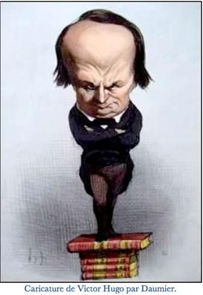

# [[{.calibre10} DISCOURS A L'ASSEMBLÉE NATIONALE]{.calibre2}]{.calibre_55} {#filepos40290716 .calibre_}

:::::: calibre_20
::::: calibre_3
::: calibre_16

------------------------------------------------------------------------

::: calibre_16

:::::
::::::

[Victor Hugo]{.calibre_10}

[[DISCOURS
]{.bold}]{.calibre_21}

:::::: calibre_22
::::: calibre_21
[ ]{.bold}

::: calibre_16

------------------------------------------------------------------------

::: calibre_16

:::::
::::::

[
Pour toutes demandes ou suggestions]{.calibre_3}

[{.calibre3}
]{.calibre_10}
