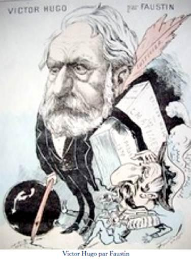

# [[{.calibre10} DISCOURS D'OUVERTURE DU CONGRÈS LITTÉRAIRE INTERNATIONAL]{.calibre2}]{.calibre_55} {#filepos40266708 .calibre_}

:::::: calibre_20
::::: calibre_3
::: calibre_16

------------------------------------------------------------------------

::: calibre_16

:::::
::::::

[(7 juin 1878)]{.calibre_3}

[Victor Hugo]{.calibre_10}

[[DISCOURS
]{.bold}]{.calibre_21}

:::::: calibre_22
::::: calibre_21
[ ]{.bold}

::: calibre_16

------------------------------------------------------------------------

::: calibre_16

:::::
::::::

[
Pour toutes demandes ou suggestions]{.calibre_3}

[{.calibre3}
]{.calibre_10}

## [[[7 juin 1878]{.calibre2}]{.bold1}]{.calibre_24} {#calibre_pb_6049 .calibre_57}

::: calibre_52

[ ]{.calibre4}

[Messieurs,]{.calibre4}

[Ce qui fait la grandeur de la mémorable année où nous sommes, c'est que, souverainement, par-dessus les rumeurs et les clameurs, imposant une interruption majestueuse aux hostilités étonnées, elle donne la parole à la civilisation. On peut dire d'elle : c'est une année obéie. Ce qu'elle a voulu faire, elle le fait. Elle remplace l'ancien ordre du jour, la guerre, par un ordre du jour nouveau, le progrès. Elle a raison des résistances. Les menaces grondent, mais l'union des peuples sourit. L'Oeuvre de l'année 1878 sera indestructible et complète. Rien de provisoire. On sent dans tout ce qui se fait je ne sais quoi de définitif. Cette glorieuse année proclame, par l'exposition de Paris, l'alliance des industries ; par le centenaire de Voltaire, l'alliance des philosophies ; par le congrès ici rassemblé, l'alliance des littératures ([Applaudissements]{.italic}) ; vaste fédération du travail sous toutes les formes ; auguste édifice de la fraternité humaine, qui a pour base les paysans et les ouvriers et pour couronnement les esprits. ([Bravos]{.italic})]{.calibre4}

[L'industrie cherche l'utile, la philosophie cherche le vrai, la littérature cherche le beau. L'utile, le vrai, le beau, voilà le triple but de tout l'effort humain ; et le triomphe de ce sublime effort, c'est, messieurs, la civilisation entre les peuples et la paix entre les hommes.]{.calibre4}

[C'est pour constater ce triomphe que, de tous les points du monde civilisé, vous êtes accourus ici. Vous êtes les intelligences considérables que les nations aiment et vénèrent, vous êtes les talents célèbres, les généreuses voix écoutées, les âmes en travail de progrès. Vous êtes les combattants pacificateurs. Vous apportez ici le rayonnement des renommées. Vous êtes les ambassadeurs de l'esprit humain dans ce grand Paris. Soyez les bienvenus. Écrivains, orateurs, poètes, philosophes, penseurs, lutteurs, la France vous salue. ([Applaudissements prolongés]{.italic})]{.calibre4}

[Vous et nous, nous sommes les concitoyens de la cité universelle. Tous, la main dans la main, affirmons notre unité et notre alliance. Entrons, tous ensemble, dans la grande patrie sereine, dans l'absolu, qui est la justice, dans l'idéal, qui est la vérité.]{.calibre4}

[Ce n'est pas pour un intérêt personnel ou restreint que vous êtes réunis ici ; c'est pour l'intérêt universel. Qu'est-ce que la littérature ? C'est la mise en marche de l'esprit humain. Qu'est-ce que la civilisation ? C'est la perpétuelle découverte que fait à chaque pas l'esprit humain en marche ; de là le mot Progrès. On peut dire que littérature et civilisation sont identiques.]{.calibre4}

[Les peuples se mesurent à leur littérature. Une armée de deux millions d'hommes passe, une Iliade reste ; Xercès a l'armée, l'épopée lui manque, Xercès s'évanouit. La Grèce est petite par le territoire et grande par Eschyle. ([Mouvement]{.italic}) Rome n'est qu'une ville ; mais par Tacite, Lucrèce, Virgile, Horace et Juvénal, cette ville emplit le monde. Si vous évoquez l'Espagne, Cervantes surgit ; si vous parlez de l'Italie, Dante se dresse ; si vous nommez l'Angleterre, Shakespeare apparaît. À de certains moments, la France se résume dans un génie, et le resplendissement de Paris se confond avec la clarté de Voltaire. ([Bravos répétés]{.italic})]{.calibre4}

[Messieurs, votre mission est haute. Vous êtes une sorte d'assemblée constituante de la littérature. Vous avez qualité, sinon pour voter des lois, du moins pour les dicter. Dites des choses justes, énoncez des idées vraies, et si, par impossible, vous n'êtes pas écoutés, eh bien, vous mettrez la législation dans son tort.]{.calibre4}

[Vous allez faire une fondation, la propriété littéraire. Elle est dans le droit, vous allez l'introduire dans le code. Car, je l'affirme, il sera tenu compte de vos solutions et de vos conseils.]{.calibre4}

[Vous allez faire comprendre aux législateurs qui voudraient réduire la littérature à n'être qu'un fait local, que la littérature est un fait universel. La littérature, c'est le gouvernement du genre humain par l'esprit humain, ([Bravo !]{.italic})]{.calibre4}

[La propriété littéraire est d'utilité générale. Toutes les vieilles législations monarchiques ont nié et nient encore la propriété littéraire. Dans quel but ? Dans un but d'asservissement. L'écrivain propriétaire, c'est l'écrivain libre. Lui ôter la propriété, c'est lui ôter l'indépendance. On l'espère du moins. De là ce sophisme singulier, qui serait puéril s'il n'était perfide : la pensée appartient à tous, donc elle ne peut être propriété, donc la propriété littéraire n'existe pas. Confusion étrange, d'abord, de la faculté de penser, qui est générale, avec la pensée, qui est individuelle ; la pensée, c'est le moi ; ensuite, confusion de la pensée, chose abstraite, avec le livre, chose matérielle. La pensée de l'écrivain, en tant que pensée, échappe à toute main qui voudrait la saisir ; elle s'envole d'âme en âme ; elle a ce don et cette force, --- [virum volitare per ora]{.italic}[[[[[[^\[1\]^]{.italic}]{.bold}]{.calibre_21}]{.underline}]{.calibre_4}](index_split_4951.html#filepos40606167){#filepos40275577}--- ; mais le livre est distinct de la pensée ; comme livre, il est saisissable, tellement saisissable qu'il est quelquefois saisi. ([On rit]{.italic}) Le livre, produit de l'imprimerie, appartient à l'industrie et détermine, sous toutes ses formes, un vaste mouvement commercial ; il se vend et s'achète ; il est une propriété, valeur créée et non acquise, richesse ajoutée par l'écrivain à la richesse nationale, et certes, à tous les points de vue, la plus incontestable des propriétés. Cette propriété inviolable, les gouvernements despotiques la violent ; ils confisquent le livre, espérant ainsi confisquer l'écrivain. De là le système des pensions royales. Prendre tout et rendre un peu. Spoliation et sujétion de l'écrivain. On le vole, puis on l'achète. Effort inutile, du reste. L'écrivain échappe. On le fait pauvre, il reste libre. ([Applaudissements]{.italic}) Qui pourrait acheter ces consciences superbes, Rabelais, Molière, Pascal ? Mais la tentative n'en est pas moins faite, et le résultat est lugubre. La monarchie est on ne sait quelle succion terrible des forces vitales d'une nation ; les historiographes donnent aux rois les titres de « pères de la nation » et de « pères des lettres » ; tout se tient dans le funeste ensemble monarchique ; Dangeau, flatteur, le constate d'un côté ; Vauban, sévère, le constate de l'autre ; et, pour ce qu'on appelle « le grand siècle », par exemple, la façon dont les rois sont pères de la nation et pères des lettres aboutit à ces deux faits sinistres : le peuple sans pain, Corneille sans souliers. ([Longs applaudissements]{.italic})]{.calibre4}

[Quelle sombre rature au grand règne !]{.calibre4}

[Voilà où mène la confiscation de la propriété née du travail, soit que cette confiscation pèse sur le peuple, soit qu'elle pèse sur l'écrivain.]{.calibre4}

[Messieurs, rentrons dans le principe : le respect de la propriété. Constatons la propriété littéraire, mais, en même temps, fondons le domaine public. Allons plus loin. Agrandissons-le. Que la loi donne à tous les éditeurs le droit de publier tous les livres après la mort des auteurs, à la seule condition de payer aux héritiers directs une redevance très faible, qui ne dépasse en aucun cas cinq ou dix pour cent du bénéfice net. Ce système très simple, qui concilie la propriété incontestable de l'écrivain avec le droit non moins incontestable du domaine public, a été indiqué ; dans la commission de 1836, par celui qui vous parle en ce moment ; et l'on peut trouver cette solution, avec tous ses développements, dans les procès-verbaux de la commission, publiés alors par le ministère de l'intérieur.]{.calibre4}

[Le principe est double, ne l'oublions pas. Le livre, comme livre, appartient à l'auteur, mais comme pensée, il appartient --- le mot n'est pas trop vaste --- au genre humain. Toutes les intelligences y ont droit. Si l'un des deux droits, le droit de l'écrivain et le droit de l'esprit humain, devait être sacrifié, ce serait, certes, le droit de l'écrivain, car l'intérêt public est notre préoccupation unique, et tous, je le déclare, doivent passer avant nous. ([Marques nombreuses d'approbation]{.italic})]{.calibre4}

[Mais, je viens de le dire, ce sacrifice n'est pas nécessaire.]{.calibre4}

[Ah ! la lumière ! la lumière toujours ! la lumière partout ! Le besoin de tout c'est la lumière. La lumière est dans le livre. Ouvrez le livre tout grand. Laissez-le rayonner, laissez-le faire. Qui que vous soyez qui voulez cultiver, vivifier, édifier, attendrir, apaiser, mettez des livres partout ; enseignez, montrez, démontrez ; multipliez les écoles ; les écoles sont les points lumineux de la civilisation.]{.calibre4}

[Vous avez soin de vos villes, vous voulez être en sûreté dans vos demeures, vous êtes préoccupés de ce péril, laisser la rue obscure ; songez à ce péril plus grand encore, laisser obscur l'esprit humain. Les intelligences sont des routes ouvertes ; elles ont des allants et venants, elles ont des visiteurs, bien ou mal intentionnés, elles peuvent avoir des passants funestes ; une mauvaise pensée est identique à un voleur de nuit, l'âme a des malfaiteurs ; faites le jour partout ; ne laissez pas dans l'intelligence humaine de ces coins ténébreux où peut se blottir la superstition, où peut se cacher l'erreur, où peut s'embusquer le mensonge. L'ignorance est un crépuscule ; le mal y rôde. Songez à l'éclairage des rues, soit ; mais songez aussi, songez surtout, à l'éclairage des esprits. ([Applaudissements prolongés]{.italic})]{.calibre4}

[Il faut pour cela, certes, une prodigieuse dépense de lumière. C'est à cette dépense de lumière que depuis trois siècles la France s'emploie. Messieurs, laissez-moi dire une parole filiale, qui du reste est dans vos coeurs comme dans le mien : rien ne prévaudra contre la France. La France est d'intérêt public. La France s'élève sur l'horizon de tous les peuples. Ah ! disent-ils, il fait jour, la France est là ! ([Oui ! oui ! Bravos répétés]{.italic})]{.calibre4}

[Qu'il puisse y avoir des objections à la France, cela étonne ; il y en a pourtant ; la France a des ennemis. Ce sont les ennemis mêmes de la civilisation, les ennemis du livre, les ennemis de la pensée libre, les ennemis de l'émancipation, de l'examen, de la délivrance ; ceux qui voient dans le dogme un éternel maître et dans le genre humain un éternel mineur. Mais ils perdent leur peine, le passé est passé, les nations ne reviennent pas à leur vomissement, les aveuglements ont une fin, les dimensions de l'ignorance et de l'erreur sont limitées.]{.calibre4}

[Prenez-en votre parti, hommes du passé, nous ne vous craignons pas ! allez, faites, nous vous regardons avec curiosité ! essayez vos forces, insultez 89, découronnez Paris, dites anathème à la liberté de conscience, à la liberté de la presse, à la liberté de la tribune, anathème à la loi civile, anathème à la révolution, anathème à la tolérance, anathème à la science, anathème au progrès ! ne vous lassez pas ! rêvez, pendant que vous y êtes, un syllabus assez grand pour la France et un éteignoir assez grand pour le soleil ! ([Acclamation unanime. Triple salve d'applaudissements]{.italic})]{.calibre4}

[Je ne veux pas finir par une parole amère. Montons et restons dans la sérénité immuable de la pensée. Nous avons commencé l'affirmation de la concorde et de la paix ; continuons cette affirmation hautaine et tranquille.]{.calibre4}

[Je l'ai dit ailleurs, et je le répète, toute la sagesse humaine tient dans ces deux mots : Conciliation et Réconciliation ; conciliation pour les idées, réconciliation pour les hommes.]{.calibre4}

[Messieurs, nous sommes ici entre philosophes, profitons de l'occasion, ne nous gênons pas, disons des vérités. ([Sourires et marques d'approbation]{.italic}) En voici une, une terrible : le genre humain a une maladie, la haine. La haine est mère de la guerre ; la mère est infâme, la fille est affreuse.]{.calibre4}

[Rendons-leur coup sur coup. Haine à la haine ! Guerre à la guerre ! ([Sensation]{.italic})]{.calibre4}

[Savez-vous ce que c'est que cette parole du Christ : « Aimez-vous les uns les autres » ? C'est le désarmement universel. C'est la guérison du genre humain. La vraie rédemption, c'est celle-là. Aimez-vous. On désarme mieux son ennemi en lui tendant la main qu'en lui montrant le poing. Ce conseil de Jésus est un ordre de Dieu. Il est bon. Nous l'acceptons. Nous sommes avec le Christ, nous autres ! L'écrivain est avec l'apôtre ; celui qui pense est avec celui qui aime. ([Bravos]{.italic})]{.calibre4}

[Ah ! poussons le cri de la civilisation ! Non ! non ! non ! nous ne voulons ni des barbares qui guerroient, ni des sauvages qui assassinent ! Nous ne voulons ni de la guerre de peuple à peuple, ni de la guerre d'homme à homme. Toute tuerie est non seulement féroce, mais insensée. Le glaive est absurde et le poignard est imbécile. Nous sommes les combattants de l'esprit, et nous avons pour devoir d'empêcher le combat de la matière ; notre fonction est de toujours nous jeter entre les deux armées. Le droit à la vie est inviolable. Nous ne voyons pas les couronnes, s'il y en a, nous ne voyons que les têtes. Faire grâce, c'est faire la paix. Quand les heures funestes sonnent, nous demandons aux rois d'épargner la vie des peuples, et nous demandons aux républiques d'épargner la vie des empereurs. ([Applaudissements]{.italic})]{.calibre4}

[C'est un beau jour pour le proscrit que le jour où il supplie un peuple pour un prince, et où il tâche d'user, en faveur d'un empereur, de ce grand droit de grâce qui est le droit de l'exil.]{.calibre4}

[Oui, concilier et réconcilier. Telle est notre mission, à nous philosophes. Ô mes frères de la science, de la poésie et de l'art, constatons la toute-puissance civilisatrice de la pensée. À chaque pas que le genre humain fait vers la paix, sentons croître en nous la joie profonde de la vérité. Ayons le fier consentement du travail utile. La vérité est une et n'a pas de rayon divergent ; elle n'a qu'un synonyme, la justice. Il n'y a pas deux lumières, il n'y en a qu'une, la raison. Il n'y a pas deux façons d'être honnête, sensé et vrai. Le rayon qui est dans l'Iliade est identique à la clarté qui est dans le Dictionnaire philosophique. Cet incorruptible rayon traverse les siècles avec la droiture de la flèche et la pureté de l'aurore. Ce rayon triomphera de la nuit, c'est-à-dire de l'antagonisme et de la haine. C'est là le grand prodige littéraire. Il n'y en a pas de plus beau. La force déconcertée et stupéfaite devant le droit, l'arrestation de la guerre par l'esprit, c'est, ô Voltaire, la violence domptée par la sagesse ; c'est ô Homère, Achille pris aux cheveux par Minerve ! ([Longs applaudissements]{.italic})]{.calibre4}

[Et maintenant que je vais finir, permettez-moi un voeu, un voeu qui ne s'adresse à aucun parti et qui s'adresse à tous les coeurs.]{.calibre4}

[Messieurs, il y a un romain qui est célèbre par une idée fixe, il disait : Détruisons Carthage ! J'ai aussi, moi, une pensée qui m'obsède, et la voici : Détruisons la haine. Si les lettres humaines ont un but, c'est celui-là. [Humaniores litterae]{.italic} Messieurs, la meilleure destruction de la haine se fait par le pardon. Ah ! que cette grande année ne s'achève pas sans la pacification définitive, qu'elle se termine en sagesse et en cordialité, et qu'après avoir éteint la guerre étrangère, elle éteigne la guerre civile. C'est le souhait profond de nos âmes. La France à cette heure montre au monde son hospitalité, qu'elle lui montre aussi sa clémence. La clémence ! mettons sur la tête de la France cette couronne ! Toute fête est fraternelle ; une fête qui ne pardonne pas à quelqu'un n'est pas une fête. ([Vive émotion. Bravos redoublés]{.italic}) La logique d'une joie publique, c'est l'amnistie. Que ce soit là la clôture de cette admirable solennité, l'Exposition universelle. Réconciliation ! réconciliation ! Certes, cette rencontre de tout l'effort commun du genre humain, ce rendez-vous des merveilles de l'industrie et du travail, cette salutation des chefs-d'oeuvre entre eux, se confrontant et se comparant, c'est un spectacle auguste ; mais il est un spectacle plus auguste encore, c'est l'exilé debout à l'horizon et la patrie ouvrant les bras ! ([Longue acclamation ; les membres français et étrangers du congrès qui entourent l'orateur sur l'estrade viennent le féliciter et lui serrer la main, au milieu des applaudissements répétés de la salle entière]{.italic})]{.calibre4}
