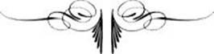
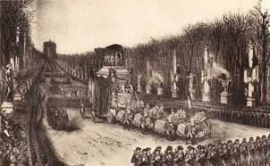

# [[{.calibre10} FUN]{.calibre2}ÉRAILLES DE L'EMPEREUR]{.calibre_55} {#filepos36595945 .calibre_}

:::::: calibre_20
::::: calibre_3
::: calibre_16

------------------------------------------------------------------------

::: calibre_16

:::::
::::::

[(1840)]{.calibre_3}

[Victor Hugo]{.calibre_10}

[[HISTOIRE
]{.bold}]{.calibre_21}

:::::: calibre_22
::::: calibre_21
[ ]{.bold}

::: calibre_16

------------------------------------------------------------------------

::: calibre_16

:::::
::::::

[
Pour toutes demandes ou suggestions]{.calibre_3}

[
]{.calibre_10}

[[[[[^\[1\]^]{.calibre_12}]{.underline}]{.calibre_4}](index_split_4933.html#filepos40148026){#filepos36597743}]{.calibre_10}

[{.calibre3}]{.calibre_10}

[[15 décembre 1840]{.italic}]{.calibre_10}

[Notes prises sur place]{.calibre_7}

[ ]{.calibre4}

[J'ai entendu battre le rappel dans les rues depuis six heures et demie du matin. Je sors à onze heures. Les rues sont désertes, les boutiques fermées, à peine voit-on passer une vieille femme çà et là. On sent que Paris tout entier s'est versé d'un seul côté de la ville comme un liquide dans un vase qui penche.]{.calibre4}

[Il fait très froid, un beau soleil, de légères brumes au ciel. Les ruisseaux sont gelés.]{.calibre4}

[Comme j'arrive au pont Louis-Philippe, une nuée s'abaisse et quelques flocons de neige poussés par la bise viennent me fouetter le visage. En passant près de Notre-Dame je remarque que le bourdon ne tinte pas.]{.calibre4}

[Rue Saint-André-des-Arcs[[[[^\[2\]^]{.calibre_21}]{.underline}]{.calibre_4}](index_split_4933.html#filepos40148587){#filepos36599334} le mouvement fébrile de la fête commence à se faire sentir. Oui, c'est une fête, la fête d'un cercueil exilé qui revient en triomphe. Trois hommes du peuple, de ces pauvres ouvriers en haillons qui ont froid et faim tout l'hiver, marchent devant moi tout joyeux. L'un d'eux saute, danse et fait mille folies en criant : Vive l'empereur ! De jolies grisettes parées passent, menées par leurs étudiants. Des fiacres se hâtent vers les Invalides.]{.calibre4}

[Rue du Four, la neige s'épaissit. Le ciel devient noir. Les flocons de neige le sèment de larmes blanches. Dieu semble vouloir tendre aussi.]{.calibre4}

[Cependant le tourbillon dure peu. Un pâle rayon blanchit l'angle de la rue de Grenelle et de la rue du Bac, et là, les gardes municipaux arrêtent les voitures. Je passe outre. Deux grands chariots vides menés par des soldats du train viennent à grand bruit derrière moi et rentrent dans leur quartier au bout de la rue de Grenelle au moment où je débouche sur la place des Invalides. Là, je crains un moment que tout ne soit fini et que l'empereur ne soit passé tant il vient de passants de mon côté, lesquels semblent s'en retourner. C'est tout simplement la foule qui reflue, refoulée par un cordon de gardes municipaux à pied. Je montre mon billet pour la première estrade à gauche, et je franchis la haie.]{.calibre4}

[Ces estrades sont d'immenses échafaudages qui couvrent, du quai à la grille du dôme, tous les beaux gazons de l'Esplanade. Il y en a trois de chaque côté.]{.calibre4}

[Au moment où j'arrive, le mur des estrades de droite me cache encore la place. J'entends un bruit formidable et lugubre. On dirait d'innombrables marteaux frappant en cadence sur des planches. Ce sont les cent mille spectateurs entassés sur les échafauds, qui, glacés par la bise, piétinent pour se réchauffer en attendant que le cortège passe.]{.calibre4}

[Je monte sur l'estrade. Le spectacle n'est pas moins étrange. Les femmes, presque toutes bottées de gros chaussons et voilées comme des chanteuses du Pont-Neuf, disparaissent sous des amas de fourrures et de manteaux ; les hommes promènent des cache-nez extravagants.]{.calibre4}

[La décoration de la place, bien et mal. Le mesquin habillant le grandiose. Des deux côtés de l'avenue deux rangées de figures héroïques, colossales, pâles à ce froid soleil, qui font un assez bel effet. Elles paraissent de marbre blanc. Mais ce marbre est du plâtre. Au fond, vis-à-vis le dôme, la statue de l'empereur, en bronze. Ce bronze aussi est du plâtre. Dans chaque entre-deux des statues, un pilier en toile peinte et dorée d'assez mauvais goût surmonté d'un pot-à-feu, --- plein de neige pour le moment. Derrière les statues, les estrades et la foule ; entre les statues la garde nationale éparse ; au-dessus des estrades des mâts à la pointe desquels flottent, magnifiquement soixante longues flammes tricolores.]{.calibre4}

[Il paraît qu'on n'a pas eu le temps d'achever l'ornementation de la grande entrée de l'hôtel. On a ébauché au-dessus de la grille une façon d'arc de triomphe funèbre en toile peinte et en crêpe, avec lequel le vent joue comme avec les vieux linges pendus à la lucarne d'une masure. Une rangée de mâts tout nus et tout secs se dressent au-dessus des canons et, à distance, ressemblent à ces allumettes que les petits enfants piquent dans du sable. Des nippes et des haillons qui ont la prétention d'être des tentures noires étoilées d'argent frissonnent et clapotent pauvrement entre ces mâts.]{.calibre4}

[Au fond, le dôme, avec son pavillon et son crêpe, glacé de reflets métalliques, estompé par la brume sur le ciel lumineux, fait une figure sombre et splendide.]{.calibre4}

[Il est midi.]{.calibre4}

[Le canon de l'hôtel tire de quart d'heure en quart d'heure. La foule piétine et bat la semelle. Des gendarmes déguisés en bourgeois, mais trahis par leur éperons et leurs cols d'uniforme, se promènent çà et là. En face de moi un rayon éclaire vivement une assez mauvaise statue de Jeanne d'Arc, qui tient une palme à la main dont elle semble se faire un écran comme si le soleil lui faisait mal aux yeux.]{.calibre4}

[À quelques pas de la statue, un feu, où des gardes nationaux se chauffent les pieds, est allumé dans un tas de sable.]{.calibre4}

[De temps en temps des musiciens militaires envahissent un orchestre dressé entre les deux estrades du côté opposé, y exécutent une fanfare funèbre, puis redescendent en hâte et disparaissent dans la foule, sauf à reparaître le moment d'après. Ils quittent la fanfare pour le cabaret.]{.calibre4}

[Un crieur erre dans l'estrade, vendant des complaintes à un sou et des relations de la cérémonie. J'achète deux de ces papiers.]{.calibre4}

[Tous les yeux sont fixés sur l'angle du quai d'Orsay par où doit déboucher le cortège. Le froid augmente l'impatience. Des fumées blanches et noires montent çà et là à travers le massif brumeux des Champs-Elysées, et l'on entend des détonations lointaines.]{.calibre4}

[Tout à coup les gardes nationaux courent aux armes. Un officier d'ordonnance traverse l'avenue au galop. La haie se forme. Des ouvriers appliquent des échelles aux pilastres et commencent à allumer les pots-à-feu. Une salve de grosse artillerie éclate bruyamment à l'angle est des Invalides. Une épaisse fumée jaune, coupée d'éclairs d'or, remplit tout ce coin. D'où je suis, on voit servir les pièces. Ce sont deux beaux vieux canons sculptés du XVIIe siècle dans le bruit desquels on sent le bronze. --- Le cortège approche.]{.calibre4}

[Il est midi et demi.]{.calibre4}

[À l'extrémité de l'Esplanade, vers la rivière, une double rangée de grenadiers à cheval à buffleteries jaunes, débouche gravement. C'est la gendarmerie de la Seine. C'est la tête du cortège. En ce moment le soleil fait son devoir et apparaît magnifiquement. Nous sommes dans le mois d'Austerlitz.]{.calibre4}

[Après les bonnets à poil de la gendarmerie de la Seine, les casques de cuivre de la garde municipale de Paris, puis les flammes tricolores des lanciers secouées par le vent d'une façon charmante. Fanfares et tambours.]{.calibre4}

[Un homme en blouse bleue grimpe par les charpentes extérieures, au risque de se rompre le cou, dans l'estrade qui me fait face. Personne ne l'aide. Un spectateur en gants blancs le regarde faire et ne lui tend pas la main. L'homme arrive pourtant.]{.calibre4}

[Le cortège, mêlé de généraux et de maréchaux, est d'un admirable aspect. Le soleil, frappant les cuirasses des carabiniers, leur allume à tous sur la poitrine une étoile éblouissante. Les trois écoles militaires passent avec une fière et grave contenance. Puis l'artillerie et l'infanterie, comme si elles allaient au combat ; les caissons ont à leur arrière-train la roue de rechange, les soldats ont le sac sur le dos.]{.calibre4}

[À quelque distance, une grande statue de Louis XIV, largement étoffée, et d'un assez bon style, dorée par le soleil, semble regarder cette pompe avec stupeur.]{.calibre4}

[La garde nationale à cheval paraît. Brouhaha dans la foule. Elle est en assez bon ordre pourtant mais c'est une troupe sans gloire, et cela fait un trou dans un pareil cortège. On rit.]{.calibre4}

[J'entends ce dialogue : --- Tiens ! ce gros colonel ! comme il tient drôlement son sabre ! --- Qu'est-ce que c'est que ça ? --- C'est Montalivet.]{.calibre4}

[D'interminables légions de garde nationale à pied défilent maintenant, fusils renversés comme la ligne, dans l'ombre de ce ciel gris. Un garde national à cheval qui laisse tomber son chapska et galope ainsi quelque temps nu-tête malgré qu'il en ait, amuse fort la galerie, c'est-à-dire cent mille personnes.]{.calibre4}

[De temps en temps le cortège s'arrête, puis il reprend sa marche. On achève d'allumer les pots-à-feu qui fument entre les statues comme de gros bols de punch.]{.calibre4}

[L'attention redouble. Voici la voiture noire à frise d'argent de l'aumônier de la [Belle-Poule]{.italic}, au fond de laquelle on entrevoit le prêtre en deuil ; puis le grand carrosse de velours noir à panneaux-glaces de la commission de Sainte-Hélène, quatre chevaux à chacun de ces deux carrosses.]{.calibre4}

[Tout à coup le canon éclate à la fois à trois points différents de l'horizon. Ce triple bruit simultané enferme l'oreille dans une sorte de triangle formidable et superbe. Des tambours éloignés battent aux champs.]{.calibre4}

[Le char de l'empereur apparaît.]{.calibre4}

[Le soleil voilé jusqu'à ce moment, reparaît en même temps. L'effet est prodigieux.]{.calibre4}

[On voit au loin, dans la vapeur et dans le soleil, sur le fond gris et roux des arbres des Champs-Elysées, à travers de grandes statues blanches qui ressemblent à des fantômes, se mouvoir lentement une espèce de montagne d'or. On n'en distingue encore rien qu'une sorte de scintillement lumineux qui fait étinceler sur toute la surface du char tantôt des étoiles, tantôt des éclairs. Une immense rumeur enveloppe cette apparition.]{.calibre4}

[On dirait que ce char traîne après lui l'acclamation de toute la ville comme une torche traîne sa fumée.]{.calibre4}

[Au moment de tourner dans l'avenue de l'Esplanade, il reste quelques instants arrêté par quelque hasard du chemin devant une statue qui fait l'angle de l'avenue et du quai. J'ai vérifié depuis que cette statue était celle du maréchal Ney.]{.calibre4}

[Au moment où le char-catafalque a paru, il était une heure et demie. Le cortège se remet en marche.]{.calibre4}

[Le char avance lentement. On commence à en distinguer la forme.]{.calibre4}

[Voici les chevaux de selle des maréchaux et des généraux qui tiennent le cordon du poêle impérial.]{.calibre4}

[Voici les quatre-vingt-six sous-officiers légionnaires portant les bannières des quatre-vingt-six départements. Rien de plus beau que ce carré au-dessus duquel frissonne une forêt de drapeaux. On croirait voir marcher un champ de dahlias gigantesques.]{.calibre4}

[Voici un cheval blanc couvert de la tête aux pieds d'un crêpe violet, accompagné d'un chambellan bleu ciel brodé d'argent et conduit par deux valets de pied vêtus de vert et galonnés d'or. C'est la livrée de l'empereur. Frémissement dans la foule : --- [C'est le cheval de bataille de Napoléon !]{.italic} --- La plupart le croyaient fortement. Pour peu que le cheval eût servi deux ans à l'empereur, il aurait trente ans, ce qui est un bel âge de cheval.]{.calibre4}

[Le fait est que ce palefroi est un bon vieux cheval-comparse qui remplit depuis une dizaine d'années l'emploi de cheval de bataille dans tous les enterrements militaires auxquels préside l'administration des pompes funèbres.]{.calibre4}

[Ce coursier de paille porte sur son dos la vraie selle de Bonaparte à Marengo. Une selle de velours cramoisi à double galon d'or, --- assez usée.]{.calibre4}

[Après le cheval viennent en lignes sévères et pressées les cinq cents marins de la [Belle-Poule]{.italic}, jeunes visages pour la plupart, en tenue de combat, en veste ronde, le chapeau rond verni sur la tête, les pistolets à la ceinture, la hache d'abordage à la main et le sabre au côté, un sabre court à large poignée de fer poli.]{.calibre4}

[Les salves continuent.]{.calibre4}

[En ce moment on raconte dans la foule que ce matin le premier coup de canon tiré aux Invalides a coupé les deux cuisses d'un garde municipal. On avait oublié de déboucher la pièce. On ajoute qu'un homme a glissé place Louis XV sous les roues du char et a été écrasé.]{.calibre4}

[Le char est maintenant très près. Il est précédé presque immédiatement de l'état-major de la [Belle-Poule]{.italic} commandé par M. le prince de Joinville à cheval. M. le prince de Joinville a le visage couvert de barbe (blonde), ce qui me paraît contraire aux règlements de la marine militaire. Il porte pour la première fois le grand cordon de la Légion d'honneur. Jusqu'ici il ne figurait sur le livre de la Légion que comme simple chevalier.]{.calibre4}

[Arrivé précisément en face de moi, je ne sais quel obstacle momentané se présente. Le char s'arrête. Il fait une station de quelques minutes entre la statue de Jeanne d'Arc et la statue de Charles V.]{.calibre4}

[Je puis le regarder à mon aise. L'ensemble a de la grandeur. C'est une énorme masse, dorée entièrement, dont les étages vont pyramidant au-dessus des quatre grosses roues dorées qui la portent. Sous le crêpe violet semé d'abeilles, qui le recouvre du haut en bas, on distingue d'assez beaux détails : les aigles effarés du soubassement, les quatorze Victoires du couronnement portant sur une table d'or un simulacre de cercueil. Le vrai cercueil est invisible. On l'a déposé dans la cave du soubassement, ce qui diminue l'émotion.]{.calibre4}

[C'est là le grave défaut de ce char. Il cache ce qu'on voudrait voir, ce que la France a réclamé, ce que le peuple attend, ce que tous les yeux cherchent, le cercueil de Napoléon.]{.calibre4}

[Sur le faux sarcophage on a déposé les insignes de l'empereur, la couronne, l'épée, le sceptre et le manteau. Dans la gorge dorée qui sépare les Victoires du faîte des aigles du soubassement, on voit distinctement, malgré la dorure déjà à demi écaillée, les lignes de suture des planches de sapin. Autre défaut. Cet or n'est qu'en apparence. Sapin et carton-pierre, voilà la réalité. J'aurais voulu pour le char de l'empereur une magnificence qui fût sincère.]{.calibre4}

[Du reste, la masse de cette composition sculpturale n'est pas sans style et sans fierté, quoique le parti pris du dessin et de l'ornementation hésite entre la renaissance et le rococo.]{.calibre4}

[Deux immenses faisceaux de drapeaux pris sur toutes les nations de l'Europe se balancent avec une emphase magnifique à l'avant et à l'arrière du char.]{.calibre4}

[Le char, tout chargé, pèse vingt-six mille livres. Le cercueil seul pèse cinq mille livres.]{.calibre4}

[Rien de plus surprenant et de plus superbe que l'attelage des seize chevaux qui traînent le char. Ce sont d'effrayantes bêtes, empanachées de plumes blanches jusqu'aux reins, et couvertes de la tête aux pieds d'un splendide caparaçon de drap d'or lequel ne laisse voir que leurs yeux ce qui leur donne je ne sais quel air terrible de chevaux-fantômes.]{.calibre4}

[Des valets de pied à la livrée impériale conduisent cette cavalcade formidable.]{.calibre4}

[En revanche, les dignes et vénérables généraux qui portent les cordons du poêle ont la mine la moins fantastique qui soit. En tête deux maréchaux, le duc de Reggio, petit et borgne[[[[^\[3\]^]{.calibre_21}]{.underline}]{.calibre_4}](index_split_4933.html#filepos40149158){#filepos36618900}, à droite ; à gauche, le comte Molitor ; en arrière, à droite, un amiral, le baron Duperré, gros et jovial marin ; à gauche, un lieutenant général, le comte Bertrand, cassé, vieilli, épuisé ; noble et illustre figure. Tous les quatre sont revêtus du cordon rouge.]{.calibre4}

[Le char, soit dit en passant, n'aurait dû avoir que huit chevaux. Huit chevaux, c'est un nombre symbolique qui a un sens dans le cérémonial. Sept chevaux, neuf chevaux, c'est un roulier, seize chevaux, c'est un fardier ; huit chevaux, c'est un empereur[[[[^\[4\]^]{.calibre_21}]{.underline}]{.calibre_4}](index_split_4933.html#filepos40150679){#filepos36619797}.]{.calibre4}

[ ]{.calibre4}

[Les spectateurs des estrades n'ont cessé de battre la semelle qu'au moment où le char-catafalque a passé devant eux. Alors seulement les pieds font silence. On sent qu'une grande pensée traverse cette foule.]{.calibre4}

[Cependant je ne suis pas content d'elle : pas une acclamation. J'ôte mon chapeau, personne ne m'imite. Je suis obligé de crier « Chapeau bas ! » à une douzaine d'hommes, types bourgeois-de-Paris, placés devant moi. Alors seulement ils se découvrent. Cette façon d'être tient probablement à la saison. Ils sont bien froids il est vrai qu'ils sont gelés.]{.calibre4}

[En ce moment un spectateur qui arrive des Champs-Elysées raconte que le peuple, le vrai peuple, a été tout autre. Les bourgeois des estrades ne sont déjà plus le peuple. Il a crié : « Vive l'empereur ! », il voulait dételer les chevaux et traîner le char. Une compagnie de la banlieue s'est mise à genoux, hommes et femmes baisaient les crêpes du sarcophage.]{.calibre4}

[Il y a eu aussi des dialogues politiques : « A bas Guizotm ! » criait l'un et « à bas Thiers ! » répliquait l'autre. « Eh bien ! reprend le premier, qu'est-ce qu'il te fait, Thiers ? Qu'est-ce que tu lui veux, à Thiers, puisqu'il est dégommé ? »]{.calibre4}

[Au temps singulier où nous vivons, le savetier est envieux du Premier ministre.]{.calibre4}

[ ]{.calibre4}

[Le char s'est remis en marche, les tambours battent aux champs, le canon redouble. Napoléon est devant la grille des Invalides. Il est deux heures moins dix minutes.]{.calibre4}

[Derrière le corbillard viennent en costumes civils tous les survivants parmi les anciens serviteurs de l'empereur, puis tous les survivants parmi les soldats de la garde, vêtus de leurs glorieux uniformes déjà étranges pour nous.]{.calibre4}

[Le reste du cortège, composé des régiments de l'armée et de la garde nationale, occupe, dit-on, le quai d'Orsay, le pont Louis XVI, la place de la Concorde et l'avenue des Champs-Elysées jusqu'à l'arc de l'Etoile.]{.calibre4}

[Le char n'entre pas dans la cour des Invalides, la grille posée par Louis XIV serait trop basse. Il se détourne à droite, on voit les marins entrer dans le soubassement et ressortir avec le cercueil, puis disparaître sous le porche élevé à l'entrée du palais. Ils sont dans la cour.]{.calibre4}

[C'est fini pour les spectateurs du dehors. Ils descendent à grand bruit et en toute hâte des estrades. Des groupes s'arrêtent de distance en distance devant des affiches collées sur les planches et ainsi conçues : LEROY, LIMONADIER, [rue de la Serpe, près des Invalides. --- Vins fins et pâtisseries chaudes.]{.italic}]{.calibre4}

[Je puis maintenant examiner la décoration de l'avenue. Presque toutes ces statues de plâtre sont mauvaises. Quelques-unes sont ridicules. Le Louis XIV, qui, à distance, avait de la masse, est grotesque de près. Macdonald est ressemblant. Mortier aussi. Ney le serait, si l'on ne lui avait trop haussé le front. Du reste le sculpteur l'a fait exagéré et risible à force de vouloir être mélancolique. La tête est trop grosse. A ce sujet on raconte que, dans la rapidité de cette improvisation de statues, les mesures ont été mal données. Le jour de la livraison venu, le statuaire a fourni un maréchal Ney trop grand d'un pied. Qu'ont fait les gens des Beaux-arts ? Ils ont scié à la statue une tranche de ventre de douze pouces de large, et ils ont recollé tant bien que mal les deux morceaux.]{.calibre4}

[Le plâtre badigeonné en bronze de l'empereur est embu et couvert de taches qui font ressembler la robe impériale à de la vieille serge verte rapiécée.]{.calibre4}

[ ]{.calibre4}

[Ceci me rappelle --- car la génération des idées est un étrange mystère --- que cet été, chez M. Thiers, j'entendis Marchand, le valet de chambre de l'empereur, raconter que Napoléon aimait les vieux habits et les vieux chapeaux. Je comprends et je partage ce goût.]{.calibre4}

[Pour un cerveau qui travaille, la pression d'un chapeau neuf est insupportable.]{.calibre4}

[--- L'empereur, disait Marchand, avait emporté de France trois habits, deux redingotes et deux chapeaux ; il a fait avec cette garde-robe ses six ans de Sainte-Hélène ; il ne portait pas d'uniforme.]{.calibre4}

[Marchand ajoutait d'autres détails curieux. L'empereur, aux Tuileries, semblait souvent changer rapidement de costume. En réalité il n'en était rien. L'empereur étant habituellement en costume civil, c'est-à-dire une culotte de casimir blanc, bas de soie blancs, souliers à boucles. Mais il y avait toujours là, dans le cabinet voisin, une paire de bottes à l'écuyère doublée en soie blanche jusqu'au-dessus du genou. Quand un incident survenait et qu'il fallait que l'empereur montât à cheval, il ôtait ses souliers, mettait ses bottes, endossait son uniforme, et le voilà militaire. Puis il rentrait, quittait ses bottes, reprenait ses souliers et redevenait civil. La culotte blanche, les bas et les souliers ne servaient jamais qu'un jour. Le lendemain cette défroque impériale appartenait au valet de chambre.]{.calibre4}

[ ]{.calibre4}

[Il est trois heures. Une salve d'artillerie annonce que la cérémonie vient de s'achever aux Invalides. Je rencontre B\... Il en sort. La vue du cercueil a produit une émotion inexprimable.]{.calibre4}

[Les paroles dites ont été simples et grandes. M. le prince de Joinville a dit au roi : [Sire, je vous présente le corps de l'empereur Napoléon]{.italic}. Le roi a répondu : [Je le reçois au nom de la France.]{.italic} --- Puis il a dit à Bertrand : [Général, déposez sur le cercueil la glorieuse épée de l'empereur.]{.italic} Et à Gourgaud : [Général, déposez sur le cercueil le chapeau de l'empereur.]{.italic}]{.calibre4}

[Le [Requiem]{.italic} de Mozart a fait peu d'effet. Belle musique, déjà ridée. Hélas ! la musique se ride !]{.calibre4}

[Le catafalque n'a été terminé qu'une heure avant l'arrivée du cercueil. B\... était dans l'église à huit heures du matin. Elle n'était encore qu'à moitié tendue et les échelles, les outils et les ouvriers l'encombraient. La foule arrivait pendant ce temps-là.]{.calibre4}

[On a essayé de grandes palmes dorées de cinq ou six pieds de haut aux quatre coins du catafalque. Mais après les avoir posées, on a vu qu'elles faisaient un médiocre effet. On les a ôtées [[[[\[5\]]{.calibre16}]{.underline}]{.calibre_4}](index_split_4933.html#filepos40152076){#filepos36628620}.]{.calibre4}

[ ]{.calibre4}

[Du reste B\... est indigné. Il était placé derrière la tribune de la Chambre des députés. Des écoliers de septième seraient fessés s'ils avaient dans un lieu solennel la tenue, la mise et les manières de ces messieurs. À part un groupe qui est demeuré silencieux, grave et sérieux, presque tous ont eu des façons indécentes. La plupart ont gardé leur chapeau sur la tête jusqu'à l'entrée du cercueil, quelques-uns même, profitant de l'ombre, ne se sont pas découverts un seul instant. Ils étaient pourtant devant le roi, devant l'empereur et devant Dieu. Devant la majesté vivante, devant la majesté morte et devant la majesté éternelle. M. Taschereau, en redingote boutonnée, était étendu sur cinq banquettes, le nez à la voûte, les semelles de ses bottes tournées vers le cercueil de Napoléon. Les autres allaient et venaient, escaladaient les banquettes, enjambaient les clôtures et lorgnaient les femmes. Avant l'arrivée du cercueil, M. Taschereau a péroré, il est indigné d'avoir été amené là d'avance, il a presque dit comme Louis XIV : J'ai failli attendre. Il a ajouté une foule de choses spirituelles : Ce ne sont que les prêtres ; quand ce sera le bon Dieu, vous m'avertirez j'ôterai mon chapeau. Je suis de l'avis de Berryer qui a dit à Thiers le jour où l'annonce de Napoléon a été faite à la Chambre : C'est une belle blague, mais c'est une blague, etc. M. Schauenburg racontait des anecdotes.]{.calibre4}

[ ]{.calibre4}

[Mme Adélaïde passe pour mener le roi. Casimir Perier détestait Mme Adélaïde ; un jour qu'il s'emportait contre la Chambre des députés qui le gênait et qu'il allait jusqu'à regretter la forme de la monarchie absolue, Thiers lui dit : [Mon cher Périer, la différence entre la royauté absolue et le gouvernement constitutionnel, la voici en deux mots : subir la Chambre ou subir Mme Adélaïde. Que choisissez-vous ?]{.italic} Casimir Périer garda un moment le silence, puis il dit : [Diable Comme vous y allez ! La Chambre ! Ceci me rappelle que M. Thiers me disait un jour à moi-même : Sous l'ancien régime, il fallait que le ministre plût à Mme de Pompadour, sous celui-ci, il faut qu'il plaise à la Chambre. J'aime encore mieux avoir affaire à mes quatre-cents Fulchiron, quoique je convienne que Fulchiron est moins jolie femme que Mme de Pompadour.]{.italic} M. Lanyer applaudissait M. Taschereau. Il a été fait des calembours. On a dit : Le ministère Guizot découvre le roi, mais Louis-Philippe en est charmé. Il aime qu'on le voie gouverner. Sous le ministère Thiers au contraire, le roi était comme le bois de chauffage, scié et couvert. Et de rire M. Isambert a quitté la tribune réservée où étaient les députés, et quelques minutes après on l'a vu dans la cour d'honneur, battant la semelle avec un garde national. Probablement électeur.]{.calibre4}

[La Chambre des pairs a été grave, digne et sévère. Le roi a attendu une heure et demie dans la sacristie et une heure dans l'église. M. de Lamartine n'est pas venu. M. Berryer non plus. M. Thiers, en frac, s'est approché de la tribune des femmes et y a promené son regard en disant à M. de Malleville : [Où sont les dames ?]{.italic} M. de Malleville a répondu : [Elles n'y sont pas.]{.italic}]{.calibre4}

[ ]{.calibre4}

[M. le prince de Joinville, qui n'avait pas vu sa famille depuis six mois, est allé baiser la main de la reine et serrer joyeusement celles de ses frères et soeurs. La reine l'a reçu gravement, sans effusion, en reine plutôt qu'en mère.]{.calibre4}

[Pendant ce temps-là les archevêques, les curés et les prêtres chantaient le [Requiescat in pace]{.italic} autour du cercueil de Napoléon.]{.calibre4}

[ ]{.calibre4}

[Le cortège a été beau, mais trop exclusivement militaire, suffisant pour Bonaparte, non pour Napoléon. Tous les corps de l'État eussent dû y figurer, au moins par députations. Du reste l'incurie du gouvernement a été extrême. Il était pressé d'en finir. Philippe de Ségur, qui a suivi le char comme ancien aide de camp de l'empereur, m'a conté qu'à Courbevoie, au bord de la rivière, par un froid de quatorze degrés ce matin à huit heures, il n'y avait pas même une salle d'attente chauffée. Ces deux cents nobles vieillards de l'ancienne maison de l'empereur ont dû attendre une heure et demie sous une espèce de temple grec ouvert aux quatre vents.]{.calibre4}

[Même négligence pour les bateaux à vapeur qui ont fait, avec le corps, le trajet du Havre à Paris, trajet admirable d'ailleurs par l'attitude recueillie et grave des populations riveraines. Aucun de ces bateaux n'était convenablement aménagé, les vivres manquaient. Point de lits. Ordre de ne pas descendre à terre.]{.calibre4}

[M. le prince de Joinville était obligé de coucher, lui vingtième, dans une chambre commune, sur une table. D'autres couchaient dessous. On dormait à terre, et les plus heureux sur des banquettes ou des chaises. Il semblait que le pouvoir eût eu de l'humeur. Le prince s'en est plaint tout haut et a dit : [Dans cette affaire, tout ce qui vient du peuple est grand, tout ce qui vient du gouvernement est petit.]{.italic}]{.calibre4}

[ ]{.calibre4}

[Voulant gagner les Champs-Elysées, j'ai traversé le pont suspendu où j'ai donné mon sou. Générosité véritable, car la foule qui encombre le pont se dispense de payer.]{.calibre4}

[Les légions et les régiments sont encore en bataille dans l'avenue de Neuilly.]{.calibre4}

[L'avenue est décorée ou plutôt déshonorée dans toute sa longueur par d'affreuses statues en plâtre figurant des Renommées et par des colonnes triomphales surmontées d'aigles dorés et posés en porte-à-faux sur des piédestaux en marbre gris. Les gamins se divertissent à faire des trous dans ce marbre qui est en toile.]{.calibre4}

[Sur chaque colonne on lit entre deux faisceaux de drapeaux tricolores le nom et la date d'une des victoires de Bonaparte.]{.calibre4}

[Un médiocre décor d'opéra occupe le sommet de l'arc de triomphe, l'empereur debout sur un char entouré de Renommées, ayant à sa droite la Gloire et à sa gauche la Grandeur. Que signifie une statue de la grandeur ? Comment exprimer la grandeur par une statue ? Est-ce en la faisant plus grande que les autres ? Ceci est du galimatias monumental.]{.calibre4}

[Ce décor, mal doré, est tourné vers Paris. En tournant autour de l'arc on le voit par derrière. C'est une vraie ferme de théâtre. Du côté de Neuilly, l'empereur, les Gloires et les Renommées ne sont plus que des châssis grossièrement chantournés.]{.calibre4}

[À propos de cela les figures de l'avenue des Invalides ont été étrangement choisies, soit dit en passant. La liste publiée donne des alliances de noms bizarres et hardies. En voici une : [Lobau. Charlemagne. Hugues Capet.]{.italic}]{.calibre4}

[ ]{.calibre4}

[Il y a quelques mois, je me promenais dans ces mêmes Champs-Élysées avec Thiers, alors premier ministre. Il eût à coup sûr mieux réussi cette cérémonie. Il l'eût prise à coeur. Il avait des idées. Il sent et il aime Napoléon. Il me contait des anecdotes sur l'empereur. M. de Rémusat lui a communiqué les mémoires inédits de sa mère. Il y a là cent détails.]{.calibre4}

[L'empereur était bon et taquin par passe-temps. La taquinerie est la méchanceté des bons. Caroline sa soeur, voulait être reine. Il la fit reine, reine de Naples. Mais la pauvre femme eut beaucoup de soucis dès qu'elle eut un trône, et s'y rida et s'y fana quelque peu.]{.calibre4}

[Un jour Talma déjeunait avec Napoléon --- l'étiquette n'admettait Talma qu'au déjeuner. --- Voici que la reine Caroline arrivant de Naples, pâle et fatiguée, entre chez l'empereur. Il la regarde, puis se tourne vers Talma, fort empêché entre ces deux majestés. Mon cher Talma, lui dit-il, elles veulent toutes être reines, elles y perdent leur beauté. Regardez Caroline. Elle est reine, elle est laide.]{.calibre4}

[ ]{.calibre4}

[Au moment où je passe, on achève de démolir les innombrables estrades tendues de noir et décorées de banquettes de bal qui ont été élevées par des spéculateurs à l'entrée de l'avenue de Neuilly. Sur l'une d'elles, en face du jardin Beaujon, je lis cet écriteau : --- [Places à louer. Tribune d'Austerlitz. S'adresser à M. Berthellemot, confiseur.]{.italic}]{.calibre4}

[De l'autre côté de l'avenue sur une baraque de saltimbanques ornée de deux affreuses peintures d'enseigne représentant l'une, la mort de l'empereur, l'autre, le fait d'armes de Mazagran, je lis cet autre écriteau : NAPOLÉON DANS SON CERCUEIL. TROIS SOUS.]{.calibre4}

[Des hommes du peuple passent et chantent : [Vive mon grand Napoléon ! vive mon vieux Napoléon !]{.italic}]{.calibre4}

[Des marchands parcourent la foule, criant : Tabac et cigares ! D'autres offrent aux passants je ne sais quel liquide chaud et fumant dans une théière de cuivre en forme d'urne et voilée d'un crêpe. Une vieille revendeuse met naïvement son caleçon au milieu du brouhaha.]{.calibre4}

[Vers cinq heures, le char-catafalque, vide maintenant, remonte l'avenue des Champs-Elysées afin d'aller [se remiser]{.italic} sous l'arc de l'Étoile. Ceci est une belle idée. Mais les magnifiques chevaux-spectres sont fatigués. Ils ne marchent qu'avec peine, et lentement, au grand effort des cochers. Rien de plus étrange que les hu-ho et les dia-hu ! tombant sur cet attelage à la fois impérial et fantastique.]{.calibre4}

[Je reviens chez moi par les boulevards. La foule y est immense. Tout à coup elle s'écarte et se retourne avec une sorte de respect. Un homme passe fièrement au milieu d'elle. C'est un ancien houzard de la garde impériale : vétéran de haute taille et de ferme allure. Il est en grand uniforme, pantalon rouge collant, veste blanche à passementerie d'or, dolman bleu ciel, colback à flamme et à torsades, le sabre au côté, la sabretache battant la cuisse, l'aigle sur la gibecière. Autour de lui les petits enfants crient : Vive l'empereur !]{.calibre4}

[Il est certain que toute cette cérémonie a eu un singulier caractère d'escamotage. Le gouvernement semblait avoir peur du fantôme qu'il évoquait. On avait l'air tout à la fois de montrer et de cacher Napoléon. On a laissé dans l'ombre tout ce qui eût été trop grand ou trop touchant. On a dérobé le réel et le grandiose sous des enveloppes plus ou moins splendides, on a escamoté le cortège impérial dans le cortège militaire, on a escamoté l'armée dans la garde nationale, on a escamoté les chambres dans les Invalides, on a escamoté le cercueil dans le cénotaphe.]{.calibre4}

[Il fallait au contraire prendre Napoléon franchement, s'en faire honneur, le traiter royalement et populairement en empereur, et alors on eût trouvé de la force là où l'on a failli chanceler.]{.calibre4}

[ ]{.calibre4}

[Aujourd'hui 11 mars 1841, après trois mois, j'ai revu l'Esplanade des Invalides.]{.calibre4}

[J'étais allé visiter un vieil officier malade. Il faisait le plus beau temps du monde, un soleil chaud et jeune, une journée plutôt de la fin que du commencement du printemps.]{.calibre4}

[Toute l'Esplanade est bouleversée. Elle est encombrée par la ruine des funérailles. On a enlevé l'échafaudage des estrades. Les carrés de gazon qu'elles couvraient ont reparu, hideusement rayés en tous sens par l'ornière profonde des charrettes à plâtras. Des statues qui bordaient l'avenue triomphale, deux seulement sont encore debout : [Marceau et Duguesclin]{.italic}. Çà et là, des tas de pierres, restes des piédestaux.]{.calibre4}

[Des soldats, des invalides, des marchands de pommes errent au milieu de toute cette poésie tombée.]{.calibre4}

[Une foule joyeuse passait rapidement devant les Invalides, allant voir le puits artésien. Dans un coin silencieux de l'Esplanade stationnaient deux omnibus couleur chocolat (Béarnaises), portant cette affiche en grosses lettres :]{.calibre4}

[]{.calibre_10}

[PUITS DE L'ABATTOIR DE GRENELLE.]{.calibre_10}

[]{.calibre_10}

[Il y a trois mois ils portaient celle-ci :]{.calibre4}

[]{.calibre_10}

[FUNÉRAILLES DE NAPOLÉON AUX INVALIDES.]{.calibre_10}

[ ]{.calibre4}

[Dans la cour de l'Hôtel, le soleil égayait et réchauffait une cohue de marmots et de vieillards, la plus charmante du monde. C'était jour de visite publique. Les curieux affluaient. Les jardiniers taillaient les charmilles. Les lilas bourgeonnaient dans les petits jardins des invalides. Un jeune garçon de quatorze ans chantait à tue-tête grimpé sur l'affût du dernier canon à droite, celui-là même qui a tué un gendarme en tirant la première salve funèbre, le 15 décembre.]{.calibre4}

[Je note en passant que depuis trois ans, on a juché ces admirables pièces du XVIe siècle sur de hideux petits affûts en fonte qui sont de l'effet le plus misérable et le plus mesquin. Les anciens affûts de bois, énormes, trapus, massifs, supportaient dignement ces bronzes magnifiques et monstrueux.]{.calibre4}

[Une nuée d'enfants, paresseusement surveillés par leurs bonnes penchées chacune vers leur soldat, s'ébattait parmi les vingt-quatre grosses coulevrines apportées de Constantine et d'Alger.]{.calibre4}

[On a du moins épargné à ces engins gigantesques l'affront des affûts d'[uniforme]{.italic}. Elles gisent couchées à terre des deux côtés de la porte d'entrée. Le temps en a peint le bronze d'un vert clair et charmant, elles sont couvertes d'arabesques par larges plaques, quelques-unes, les moins belles, il faut en convenir, sont de fabrique française. On lit sur la culasse : [François Durand, fondeur du roi de France à Alger]{.italic}.]{.calibre4}

[Pendant que je copiais l'inscription, une toute petite fille, jolie et fraîche, vouée au blanc s'amusait à remplir de sable avec ses petits doigts roses la lumière de l'un de ces gros canons turcs. Un invalide le sabre nu, debout sur ses deux jambes de bois, et chargé sans doute de garder cette artillerie, la regardait faire en souriant.]{.calibre4}

[Au moment où je quittais l'Esplanade, vers trois heures, un petit groupe marchant lentement la traversait. C'était un homme vêtu de noir, un crêpe au bras et au chapeau suivi de trois autres dont l'un couvert d'une blouse bleue tenait un jeune garçon par la main. L'homme au crêpe avait sous le bras une espèce de boîte blanchâtre à demi cachée par un drap noir qu'il portait comme un musicien porte l'étui dans lequel est renfermé son instrument.]{.calibre4}

[Je me suis approché. L'homme noir, c'était un croque-mort ; la boîte, c'était la bière d'un enfant.]{.calibre4}

[Le trajet que faisait le convoi, parallèlement à la façade des Invalides, coupait en croix la ligne qu'avait suivie il y a trois mois le corbillard de Napoléon.]{.calibre4}

[ ]{.calibre4}

[Aujourd'hui 8 mai je suis retourné aux Invalides pour voir la chapelle Saint-Jérôme où l'empereur est provisoirement déposé. Toute trace de la cérémonie du 15 décembre a disparu de l'Esplanade. Les quinconces sont retracés ; le gazon pourtant n'a pas encore repoussé. Il faisait un assez beau soleil mêlé par instant de nuages et de pluie. Les arbres étaient verts et joyeux. Les pauvres vieux invalides causaient doucement avec des tas de marmots, se promenaient dans leurs petits jardins pleins de bouquets. C'est ce charmant moment de l'année où les derniers lilas s'effeuillent, où les premiers faux-ébéniers fleurissent.]{.calibre4}

[Les larges ombres des nuages passaient rapidement dans la cour d'honneur où il y a, sous une archivolte du premier étage, une statue pédestre en plâtre de Napoléon, assez triste écho du Louis XIV équestre fièrement sculpté en pierre sur le grand portail.]{.calibre4}

[Tout autour de la cour, au-dessous de la corniche des toits, sont encore collées, derniers vestiges des funérailles, les longues bandes minces de toile noire sur lesquelles on avait peint en lettres d'or, trois par trois, les noms des généraux de la révolution et de l'empire. Le vent commence pourtant à les arracher çà et là. Sur l'une de ces bandes, dont la pointe détachée flottait à l'air, j'ai lu ces trois noms :]{.calibre4}

[]{.calibre_10}

[SAURET CHAMBURE HUG...]{.calibre_10}

[ ]{.calibre4}

[La fin du troisième nom avait été déchirée et emportée par le vent. Était-ce [Hugo]{.italic} ou [Huguet ?]{.italic}]{.calibre4}

[Quelques jeunes soldats entraient dans l'église. J'ai suivi ces [tourlourous]{.italic}, comme on dit aujourd'hui. Car en temps de guerre le soldat appelle le bourgeois [pékin]{.italic}, en temps de paix le bourgeois appelle le soldat [tourlourou]{.italic}.]{.calibre4}

[L'église était nue et froide, presque déserte. Au fond une grande toile grise tendue du haut en bas masquait l'énorme archivolte du dôme. On entendait derrière cette toile des coups de marteau sourds et presque lugubres.]{.calibre4}

[Je me suis promené quelques instants en lisant sur les piliers les noms de tous les hommes de guerre enterrés là.]{.calibre4}

[Tout le long de la haute nef, au-dessus de nos têtes, les drapeaux conquis sur l'ennemi, ce tas de haillons magnifiques, frissonnaient doucement près de la voûte.]{.calibre4}

[Dans les intervalles des coups de marteau j'entendais un chuchotement dans un coin de l'église. C'était une vieille femme qui se confessait.]{.calibre4}

[Les soldats sont sortis, et moi derrière eux.]{.calibre4}

[Ils ont tourné à droite, par le corridor de Metz, et nous nous sommes mêlés à une foule assez nombreuse et fort parée qui suivait cette direction. Le corridor débouche dans la cour intérieure où est la petite entrée du dôme.]{.calibre4}

[J'ai retrouvé, là, dans l'ombre, trois autres statues de plomb, descendues de je ne sais où, que je me rappelle avoir vues, à cette même place, étant tout enfant, en 1815, lors des mutilations d'édifices, de dynasties et de nations qui se firent à cette époque. Ces trois statues, du plus mauvais style de l'empire, froides comme ce qui est allégorique, mornes comme ce qui est ruiné, bêtes comme ce qui est médiocre, sont là debout le long du mur, dans l'herbe, parmi des tas de chapiteaux, avec je ne sais quel faux air de tragédies sifflées. L'une d'elles tient un lion attaché à une chaîne et représente la Force. Rien n'a l'air désorienté comme une statue posée à plat sur le sol, sans piédestal ; on dirait un cheval sans cavalier ou un roi sans trône. Il n'y a que deux attitudes pour le soldat, la bataille ou la mort il n'y en a que deux pour le roi, l'empire ou le tombeau il n'y en a que deux pour la statue, être debout dans le ciel ou couchée sur la terre.]{.calibre4}

[[Une statue à pied étonne l'esprit et importune l'oeil. On oublie qu'elle est de plâtre ou de bronze, et que le bronze ne marche pas plus que le plâtre, et l'on est tenté de dire à ce pauvre personnage à face hum]{.calibre_63}aine si gauche et si malheureux dans sa posture d'apparat : --- Eh bien ! va donc ! va ! Marche ! continue ton chemin ! démène-toi ! La terre est sous tes pieds. Qui te retient ? qui t'empêche ? --- Du moins le piédestal explique l'immobilité. Pour les statues comme pour les hommes, un piédestal c'est un petit espace étroit et honorable avec quatre précipices tout autour.]{.calibre4}

[Après avoir passé les statues, j'ai tourné à droite et je suis entré dans l'église par la grande porte de la façade postérieure qui donne sur le boulevard.]{.calibre4}

[Plusieurs jeunes femmes ont franchi la porte en même temps que moi en riant et en s'appelant.]{.calibre4}

[La sentinelle nous a laissés passer. C'était un vieux soldat triste et courbé, le sabre au poing, peut-être un ancien grenadier de la garde impériale, --- immobile et muet dans l'ombre, et appuyant le bout de sa jambe de bois usée sur une fleur de lys de marbre à demi arrachée du pavé.]{.calibre4}

[Pour arriver à la chapelle où est Napoléon on marche sur une mosaïque fleurdelysée. La foule, les femmes et les soldats se hâtaient. Je suis entré à pas lents dans l'église.]{.calibre4}

[ ]{.calibre4}

[Un jour d'en haut, blanc et blafard, plutôt un jour d'atelier qu'un jour d'église, éclairait l'intérieur du dôme. Sous la coupole même, à l'endroit où était l'autel et où sera le tombeau, s'élevait abrité du côté de la nef par l'immense toile grise, le grand échafaudage qui a servi à démolir le baldaquin construit sous Louis XIV. Il ne restait plus de ce baldaquin que les fûts des six grosses colonnes de bois qui en soutenaient le chef. Ces colonnes, sans chapiteaux et sans tailloirs, étaient encore supportées verticalement par six façons de bûches qu'on avait substituées aux piédestaux. Les feuillages d'or dont les spirales leur donnaient un faux air de colonnes torses avaient déjà disparu, laissant une trace noire sur les six fûts dorés. Les ouvriers perchés çà et là dans l'intérieur de l'échafaudage avaient l'air de grands oiseaux dans une cage énorme.]{.calibre4}

[D'autres, en bas, arrachaient le pavé. D'autres allaient et venaient dans l'église, portant leurs échelles, sifflant et causant.]{.calibre4}

[À ma droite, la chapelle de Saint-Augustin était pleine de décombres. De larges pans brisés et amoncelés de cette belle mosaïque, où Louis XIV avait enraciné ses fleurs de lys et ses soleils, cachaient les pieds de sainte Monique et de sainte Alipe stupéfaites et comme scandalisées dans leurs niches. La Religion de Girardon, debout entre les deux fenêtres, regardait gravement ce désordre.]{.calibre4}

[Au-delà de la chapelle de Saint-Augustin, de grandes lames de marbre, qui avaient été le dallage du dôme, posées verticalement les unes contre les autres, masquaient à demi un guerrier blanc couché au bas d'une assez haute pyramide de marbre noir engagée dans le mur. Au-dessous du guerrier un écartement des dalles permettait de lire ces trois lettres :]{.calibre4}

[]{.calibre_10}

[UBA]{.calibre_10}

[ ]{.calibre4}

[C'était le tombeau de [VaUBAn.]{.italic}]{.calibre4}

[De l'autre côté de l'église, vis-à-vis le tombeau de Vauban, était le tombeau de Turenne. Celui-ci avait été plus respecté que l'autre.]{.calibre4}

[Aucun entassement de ruines ne s'appuyait à cette grande machine de sculpture, plutôt pompeuse que funèbre, plutôt faite pour l'opéra que pour l'église, selon la froide et noble étiquette qui régissait l'art de Louis XIV. Aucune palissade, aucun déblai n'empêchait le passant de voir Turenne vêtu en empereur romain mourir là d'un boulet autrichien au-dessus du bas-relief en bronze de la bataille de Turheim, et de lire cette date mémorable : 1675, année où Turenne mourut, où le duc de Saint-Simon naquit et où Louis XIV posa la première pierre de l'Hôtel des Invalides.]{.calibre4}

[À droite, contre l'échafaudage du dôme et le tombeau de Turenne, entre le silence de ce sépulcre et le tapage des ouvriers, dans une petite chapelle barricadée et déserte, j'entrevoyais, derrière une balustrade, par l'ouverture d'une arcade blanche, un groupe de statues dorées, posées pêle-mêle, et sans doute arrachées du baldaquin, qui semblaient s'entretenir à voix basse de toute cette dévastation. Elles étaient six, six anges ailés et lumineux, six fantômes d'or sinistrement éclairés d'un pâle rayon de soleil. L'une de ces statues montrait du doigt aux autres la chapelle de Saint-Jérôme sombre et tendue de deuil et semblait prononcer avec terreur ce mot : Napoléon. Au-dessus de ces six spectres, sur la corniche du petit dôme de la chapelle, un grand ange de bois doré jouait de la basse, les yeux levés au ciel, presque avec l'attitude que le Véronèse donne au Tintoret dans [les Noces de Cana]{.italic}.]{.calibre4}

[Cependant j'étais arrivé au seuil de la chapelle de Saint-Jérôme.]{.calibre4}

[ ]{.calibre4}

[Une grande archivolte avec une haute portière de drap violet assez chétif [imprimé]{.italic} de grecques et de palmettes d'or ; au sommet de la portière, l'écusson impérial en bois peint ; à gauche deux faisceaux de drapeaux tricolores surmontés d'aigles qui avaient l'air de coqs retouchés pour la circonstance ; des invalides décorés de la Légion d'honneur, la pique à la main ; la foule silencieuse et recueillie entrant sous la voûte ; au fond, à une profondeur de huit à dix pas, une grille de fer peinte en bronze ; sur la grille, qui est d'une ornementation lourde et molle, des têtes de lion, des [N]{.calibre29} dorées qui ont l'air de clinquant appliqué, les armes de l'empire, la main de Justice et le sceptre surmonté d'une figurine de Charlemagne assis, la couronne en tête et le globe à la main ; au-delà de la grille, l'intérieur de la chapelle, je ne sais quoi d'auguste, de formidable et de saisissant, un lampadaire allumé, un grand aigle d'or, largement éployé, dont le ventre brillait d'un reflet de lampe funèbre et les ailes d'un reflet de soleil, au-dessous de l'aigle, sous une vaste et éblouissante gerbe de drapeaux ennemis, le cercueil dont on voyait les pieds d'ébène et les anneaux d'airain ; sur le cercueil, la grande couronne impériale pareille à celle de Charlemagne, le diadème de laurier d'or pareil à celui de César, le poêle de velours violet semé d'abeilles ; en avant du cercueil, sur une crédence, le chapeau de Sainte-Hélène et l'épée d'Eylau ; sur le mur, à droite du cercueil au milieu d'une rondache argentée ce mot : [Wagram ;]{.italic} à gauche au milieu d'une autre rondache, cet autre mot : [Austerlitz ;]{.italic} tout autour, sur la muraille, une tenture de velours violet brodée d'abeilles et d'aigles ; tout en haut, à la naissance de la voûte, au-dessus de la lampe, de l'aigle, de la couronne, de l'épée et du cercueil, une fresque et dans cette fresque l'ange du jugement sonnant de la trompette sur Saint-Jérôme endormi, --- voilà ce que j'ai vu d'un coup d'oeil, et voilà ce qu'une minute a gravé dans ma mémoire pour ma vie.]{.calibre4}

[ ]{.calibre4}

[Le chapeau bas, large des bouts, peu usé, orné d'une ganse noire, de dessous laquelle sortait une très petite cocarde tricolore, était posé sur l'épée, dont la poignée d'or ciselé était tournée vers l'entrée de la chapelle et la pointe vers le cercueil.]{.calibre4}

[Il y avait de la mesquinerie mêlée à cette grandeur. Cela était mesquin par le drap violet imprimé et non brodé, par le carton peint en pierre, par ce fer creux peint en bronze, par cet écusson de bois, par ces [N]{.calibre29} de paillon, par ce cippe de toile badigeonné en granit, par ces aigles quasi-coqs. Cela était grand par le lieu, par l'homme, par la réalité, par cette épée, par ce chapeau, par cet aigle, par ces soldats, par ce peuple, par ce cercueil d'ébène, par ce rayon de soleil.]{.calibre4}

[La foule était là comme devant un autel où le Dieu serait visible. Mais en sortant de la chapelle, après avoir fait cent pas, elle entrait voir la cuisine et la grande marmite. La foule est ainsi faite.]{.calibre4}

[C'est avec une profonde émotion que je regardais ce cercueil. Je me rappelais qu'il n'y a pas encore un an, au mois de juillet 1840, un M.\*\*\* s'était présenté chez moi et, après m'avoir dit qu'il était maître ébéniste dans la rue des Tournelles et mon voisin, m'avait prié de lui donner mon avis sur un objet important et précieux qu'il était chargé de « confectionner » en ce moment. Comme je m'intéresse fort aux progrès que peut faire cette petite architecture intérieure qu'on appelle l'ameublement, j'avais accueilli cette demande et j'avais suivi M.\*\*\* rue des Tournelles. Là, après m'avoir fait traverser plusieurs grandes salles encombrées et m'avoir montré une foule immense de meubles en chêne et en acajou, chaises gothiques, secrétaires à galerie estampée, tables à pieds tors, parmi lesquels j'avais admiré une vraie vieille armoire de la renaissance incrustée de nacre et de marbre, fort délabrée et fort charmante, l'ébéniste m'avait introduit dans un grand atelier plein d'activité, de hâte et de bruit où une vingtaine d'ouvriers travaillaient avec je ne sais quels morceaux de bois noir entre les mains. J'avais aperçu dans un coin de l'atelier une sorte de grande boîte noire en ébène longue d'environ huit pieds, large de trois, garnie à ses extrémités de gros anneaux de cuivre. Je m'étais approché. C'est là précisément, m'avait dit le maître, ce que je voulais vous montrer. Cette boîte noire, c'était le cercueil de l'empereur. Je l'avais vue alors, je la revoyais aujourd'hui. Je l'avais vue vide, creuse, toute grande ouverte. Je la revoyais pleine, habitée par un grand souvenir, à jamais fermée.]{.calibre4}

[Je me souviens que j'en considérai longtemps l'intérieur, je regardai surtout une grande veine blanchâtre dans la planche d'ébène qui forme la paroi latérale gauche et je me disais : --- Dans quelques mois le couvercle sera scellé sur cette bière, et mes yeux seront peut-être fermés depuis trois ou quatre mille ans avant qu'il soit donné à d'autres yeux humains de voir ce que je vois en ce moment, le dedans du cercueil de Napoléon.]{.calibre4}

[Je pris alors tous les morceaux de cercueil qui n'étaient pas encore ajustés, je les soulevai et je les pesai dans mes mains. Cet ébène était fort beau et fort lourd. Le maître, voulant me donner une idée de l'ensemble, fit poser par six hommes le couvercle sur le cercueil. Je n'approuvai pas cette forme banale qu'on a donnée à cette bière, forme qu'on donne aujourd'hui à tous les cercueils, à tous les autels et à toutes les corbeilles de noces. J'eusse mieux aimé que Napoléon dormît dans une gaine égyptienne comme Sésostris ou dans un sarcophage roman comme Mérovée, le simple est aussi du grand.]{.calibre4}

[Sur le couvercle brillait en assez grandes lettres ce nom : [Napoléon.]{.italic} --- En quel métal sont ces lettres ? dis-je au maître. Il me répondit : En cuivre, mais on les dorera. --- Il faut, repris-je, que ces lettres soient en or. Avant cent ans, les lettres de cuivre seront oxydées et auront rongé le bois du cercueil. Combien les lettres en or coûteraient-elles à l'État ? --- Environ vingt mille francs, monsieur. --- Le soir même j'allai chez M. Thiers, alors président du conseil, et je lui dis la chose. --- Vous avez raison, me dit M. Thiers, les lettres seront en or, je vais en donner l'ordre. --- Trois jours après, le traité du 15 juillet 60 a éclaté ; je ne sais si M. Thiers a donné les ordres, si on les a exécutés, et si les lettres qui sont aujourd'hui sur le cercueil sont des lettres d'or.]{.calibre4}

[ ]{.calibre4}

[Je sortais de la chapelle Saint-Jérôme comme quatre heures sonnaient et je me disais en m'en allant :]{.calibre4}

[--- En apparence, voici un [N]{.calibre29} de clinquant qui brise, éclipse et remplace les [L]{.calibre29} de marbre couronnées et fleurdelysées de Louis XIV ; mais en réalité cela n'est pas. Si ce dôme est étroit, l'histoire est large.]{.calibre4}

[[Un jour viendra où l'on rendra son dôme à Louis XIV ; et où l'on donnera un sépulcre à Napoléon.]{.italic}]{.calibre_28}

[Le grand roi et le grand empereur seront chacun chez eux, en paix l'un avec l'autre, tous deux vénérés, tous deux illustres, l'un parce qu'il personnifie la royauté aux yeux de l'Europe, l'autre parce qu'il représente la France aux yeux du monde.]{.calibre4}

[[]{.bold}]{.calibre_12}

[[
]{.bold}]{.calibre_12}

[[FIN des FUNÉRAILLES DE NAPOLÉON]{.bold}]{.calibre_12}

[[{.calibre3}]{.bold}]{.calibre_12}
