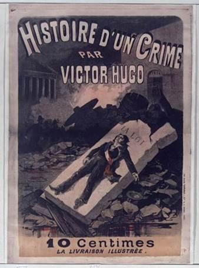
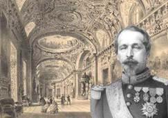
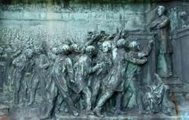
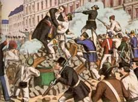
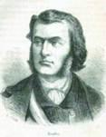
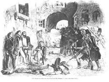
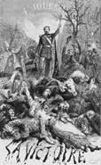
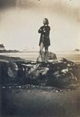
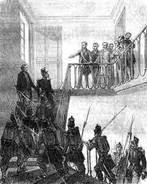

# [[{.calibre10} ]{.calibre2} HISTOIRE D'UN CRIME]{.calibre_55} {#filepos37375334 .calibre_}

:::::: calibre_20
::::: calibre_3
::: calibre_16

------------------------------------------------------------------------

::: calibre_16

:::::
::::::

[(1877-1878)]{.calibre_3}

[Victor Hugo]{.calibre_10}

[[HISTOIRE
]{.bold}]{.calibre_21}

:::::: calibre_22
::::: calibre_21
[ ]{.bold}

::: calibre_16

------------------------------------------------------------------------

::: calibre_16

:::::
::::::

[
Pour toutes demandes ou suggestions]{.calibre_3}

[[{.calibre3}
]{.italic}]{.calibre_3}

## [[[]{.calibre2}[]{.calibre2}[]{.calibre2}[]{.calibre2}[]{.calibre2}[]{.calibre2}[]{.calibre2}[]{.calibre2}[]{.calibre2}[]{.calibre2}[]{.calibre2}[]{.calibre2}[]{.calibre2}[]{.calibre2}[]{.calibre2}[]{.calibre2}[]{.calibre2}[]{.calibre2}[]{.calibre2}[]{.calibre2}[]{.calibre2}[]{.calibre2}[]{.calibre2}[]{.calibre2}[]{.calibre2}[]{.calibre2}[]{.calibre2}[]{.calibre2}[]{.calibre2}[]{.calibre2}[]{.calibre2}[Table des matière]{.calibre2}s]{.bold1}]{.calibre_24} {#calibre_pb_5839 .calibre_57}

::: calibre_52

[]{.calibre_10}

> [[[[[Présentation]{.calibre9}]{.underline}]{.calibre_4}](index_split_4765.html#filepos37400743)]{.calibre_10}

> [[[[[Avertissement]{.calibre9}]{.underline}]{.calibre_4}](index_split_4766.html#filepos37402687)]{.calibre_10}

> [[[[[Note]{.calibre9}]{.underline}]{.calibre_4}](index_split_4767.html#filepos37403610)]{.calibre_10}

> [[[[[Première journée -- Le guet-apens]{.calibre9}]{.underline}]{.calibre_4}](index_split_4769.html#filepos37406139)]{.calibre_10}

> [[[[[I. Sécurité]{.calibre16}]{.underline}]{.calibre_4}](index_split_4770.html#filepos37407169)]{.calibre_10}

> [[[[[II. Paris dort, coup de sonnette]{.calibre16}]{.underline}]{.calibre_4}](index_split_4771.html#filepos37418236)]{.calibre_10}

> [[[[[III. Ce qui s'était passé dans la nuit]{.calibre16}]{.underline}]{.calibre_4}](index_split_4772.html#filepos37425054)]{.calibre_10}

> [[[[[IV. Autres actes nocturnes]{.calibre16}]{.underline}]{.calibre_4}](index_split_4773.html#filepos37476299)]{.calibre_10}

> [[[[[V. Obscurité du crime]{.calibre16}]{.underline}]{.calibre_4}](index_split_4774.html#filepos37482307)]{.calibre_10}

> [[[[[VI. Les Affiches]{.calibre16}]{.underline}]{.calibre_4}](index_split_4775.html#filepos37489553)]{.calibre_10}

> [[[[[VII. Rue Blanche, numéro 70]{.calibre16}]{.underline}]{.calibre_4}](index_split_4776.html#filepos37502057)]{.calibre_10}

> [[[[[VIII. Violation de la salle]{.calibre16}]{.underline}]{.calibre_4}](index_split_4777.html#filepos37525946)]{.calibre_10}

> [[[[[IX. Une fin pire que la mort]{.calibre16}]{.underline}]{.calibre_4}](index_split_4778.html#filepos37558857)]{.calibre_10}

> [[[[[X. La Porte noire]{.calibre16}]{.underline}]{.calibre_4}](index_split_4779.html#filepos37562553)]{.calibre_10}

> [[[[[XI. La Haute Cour]{.calibre16}]{.underline}]{.calibre_4}](index_split_4780.html#filepos37571228)]{.calibre_10}

> [[[[[XII. Mairie du Xème arrondissement]{.calibre16}]{.underline}]{.calibre_4}](index_split_4781.html#filepos37607986)]{.calibre_10}

> [[[[[XIII. Louis-Bonaparte de profil]{.calibre16}]{.underline}]{.calibre_4}](index_split_4782.html#filepos37673344)]{.calibre_10}

> [[[[[XIV. Caserne d'Orsay]{.calibre16}]{.underline}]{.calibre_4}](index_split_4783.html#filepos37679150)]{.calibre_10}

> [[[[[XV. Mazas]{.calibre16}]{.underline}]{.calibre_4}](index_split_4784.html#filepos37708825)]{.calibre_10}

> [[[[[XVI. L'incident du boulevard Saint-Martin]{.calibre16}]{.underline}]{.calibre_4}](index_split_4785.html#filepos37725348)]{.calibre_10}

> [[[[[XVII. Contre-coup du 24 juin sur le 2 décembre]{.calibre16}]{.underline}]{.calibre_4}](index_split_4786.html#filepos37754468)]{.calibre_10}

> [[[[[XVIII. Les Représentants traqués]{.calibre16}]{.underline}]{.calibre_4}](index_split_4787.html#filepos37775844)]{.calibre_10}

> [[[[[XIX. Un pied dans le sépulcre]{.calibre16}]{.underline}]{.calibre_4}](index_split_4788.html#filepos37798694)]{.calibre_10}

> [[[[[XX. Enterrement d'un grand anniversaire]{.calibre16}]{.underline}]{.calibre_4}](index_split_4789.html#filepos37826298)]{.calibre_10}

> [[[[[Deuxième journée -- La lutte]{.calibre9}]{.underline}]{.calibre_4}](index_split_4790.html#filepos37830970)]{.calibre_10}

> [[[[[I. On vient pour m'arrêter]{.calibre16}]{.underline}]{.calibre_4}](index_split_4791.html#filepos37831755)]{.calibre_10}

> [[[[[II. De la Bastille à la rue de Cotte]{.calibre16}]{.underline}]{.calibre_4}](index_split_4792.html#filepos37854294)]{.calibre_10}

> [[[[[III. La Barricade Saint-Antoine]{.calibre16}]{.underline}]{.calibre_4}](index_split_4793.html#filepos37868244)]{.calibre_10}

> [[[[[IV. Les Associations ouvrières nous demandent un ordre de combat]{.calibre16}]{.underline}]{.calibre_4}](index_split_4794.html#filepos37914560)]{.calibre_10}

> [[[[[V. Le Cadavre de Baudin]{.calibre16}]{.underline}]{.calibre_4}](index_split_4795.html#filepos37928827)]{.calibre_10}

> [[[[[VI. Décrets des représentants restés libres]{.calibre16}]{.underline}]{.calibre_4}](index_split_4796.html#filepos37944361)]{.calibre_10}

> [[[[[VII. L'Archevêque]{.calibre16}]{.underline}]{.calibre_4}](index_split_4797.html#filepos37994627)]{.calibre_10}

> [[[[[VIII. Au Mont Valérien]{.calibre16}]{.underline}]{.calibre_4}](index_split_4798.html#filepos38013069)]{.calibre_10}

> [[[[[IX. Commencement d'éclairs dans le peuple]{.calibre16}]{.underline}]{.calibre_4}](index_split_4799.html#filepos38024212)]{.calibre_10}

> [[[[[X. Ce que Fleury allait faire à Mazas]{.calibre16}]{.underline}]{.calibre_4}](index_split_4800.html#filepos38042002)]{.calibre_10}

> [[[[[Troisième journée -- Le massacre]{.calibre9}]{.underline}]{.calibre_4}](index_split_4802.html#filepos38072858)]{.calibre_10}

> [[[[[I. Ceux qui dorment et celui qui ne dort pas]{.calibre16}]{.underline}]{.calibre_4}](index_split_4803.html#filepos38073645)]{.calibre_10}

> [[[[[II. L'Intérieur du comité]{.calibre16}]{.underline}]{.calibre_4}](index_split_4804.html#filepos38079261)]{.calibre_10}

> [[[[[III. Le Dedans de l'Élysée]{.calibre16}]{.underline}]{.calibre_4}](index_split_4805.html#filepos38103496)]{.calibre_10}

> [[[[[IV. Les Familiers]{.calibre16}]{.underline}]{.calibre_4}](index_split_4806.html#filepos38116435)]{.calibre_10}

> [[[[[V. Un auxiliaire indécis]{.calibre16}]{.underline}]{.calibre_4}](index_split_4807.html#filepos38131571)]{.calibre_10}

> [[[[[VI. Denis Dussoubs]{.calibre16}]{.underline}]{.calibre_4}](index_split_4808.html#filepos38138407)]{.calibre_10}

> [[[[[VII. Renseignements et rencontres]{.calibre16}]{.underline}]{.calibre_4}](index_split_4809.html#filepos38142473)]{.calibre_10}

> [[[[[VIII. Situation]{.calibre16}]{.underline}]{.calibre_4}](index_split_4810.html#filepos38156129)]{.calibre_10}

> [[[[[IX. La Porte Saint-Martin]{.calibre16}]{.underline}]{.calibre_4}](index_split_4811.html#filepos38173816)]{.calibre_10}

> [[[[[X. Ma visite aux barricades]{.calibre16}]{.underline}]{.calibre_4}](index_split_4812.html#filepos38179039)]{.calibre_10}

> [[[[[XI. La Barricade de la rue Meslay]{.calibre16}]{.underline}]{.calibre_4}](index_split_4813.html#filepos38193006)]{.calibre_10}

> [[[[[XII. La Barricade de la mairie du Ve arrondissement]{.calibre16}]{.underline}]{.calibre_4}](index_split_4814.html#filepos38204300)]{.calibre_10}

> [[[[[XIII. La Barricade de la rue Thévenot]{.calibre16}]{.underline}]{.calibre_4}](index_split_4815.html#filepos38210672)]{.calibre_10}

> [[[[[XIV. Ossian et Scipion]{.calibre16}]{.underline}]{.calibre_4}](index_split_4816.html#filepos38220161)]{.calibre_10}

> [[[[[XV. La Question se pose]{.calibre16}]{.underline}]{.calibre_4}](index_split_4817.html#filepos38241806)]{.calibre_10}

> [[[[[XVI. Le Massacre]{.calibre16}]{.underline}]{.calibre_4}](index_split_4818.html#filepos38256684)]{.calibre_10}

> [[[[[XVII. Rendez-vous avec les associations ouvrières]{.calibre16}]{.underline}]{.calibre_4}](index_split_4819.html#filepos38283073)]{.calibre_10}

> [[[[[XVIII. Constatation des lois morales]{.calibre16}]{.underline}]{.calibre_4}](index_split_4820.html#filepos38297688)]{.calibre_10}

> [[[[[Quatrième journée -- La victoire]{.calibre9}]{.underline}]{.calibre_4}](index_split_4821.html#filepos38306177)]{.calibre_10}

> [[[[[I. Les Faits de la nuit. La rue Tiquetonne]{.calibre16}]{.underline}]{.calibre_4}](index_split_4822.html#filepos38306656)]{.calibre_10}

> [[[[[II. Les Faits de la nuit. Quartier des Halles]{.calibre16}]{.underline}]{.calibre_4}](index_split_4823.html#filepos38317675)]{.calibre_10}

> [[[[[III. Les Faits de la nuit. Le Petit-Carreau]{.calibre16}]{.underline}]{.calibre_4}](index_split_4824.html#filepos38357583)]{.calibre_10}

> [[[[[IV. Les Faits de la nuit. Le passage du Saumon]{.calibre16}]{.underline}]{.calibre_4}](index_split_4825.html#filepos38394505)]{.calibre_10}

> [[[[[V. Autres choses noires]{.calibre16}]{.underline}]{.calibre_4}](index_split_4826.html#filepos38414509)]{.calibre_10}

> [[[[[VI. La Commission consultative]{.calibre16}]{.underline}]{.calibre_4}](index_split_4827.html#filepos38435027)]{.calibre_10}

> [[[[[VII. L'Autre liste]{.calibre16}]{.underline}]{.calibre_4}](index_split_4828.html#filepos38461571)]{.calibre_10}

> [[[[[VIII. David d'Angers]{.calibre16}]{.underline}]{.calibre_4}](index_split_4829.html#filepos38470255)]{.calibre_10}

> [[[[[IX. Notre dernière réunion]{.calibre16}]{.underline}]{.calibre_4}](index_split_4830.html#filepos38474532)]{.calibre_10}

> [[[[[X. Le Devoir peut avoir deux aspects]{.calibre16}]{.underline}]{.calibre_4}](index_split_4831.html#filepos38486104)]{.calibre_10}

> [[[[[XI. Le Combat finit, l'épreuve commence]{.calibre16}]{.underline}]{.calibre_4}](index_split_4832.html#filepos38514453)]{.calibre_10}

> [[[[[XII. Les Expatriés]{.calibre16}]{.underline}]{.calibre_4}](index_split_4833.html#filepos38519496)]{.calibre_10}

> [[[[[XIII. Commissions militaires et commissions mixtes]{.calibre16}]{.underline}]{.calibre_4}](index_split_4834.html#filepos38562978)]{.calibre_10}

> [[[[[XIV. Détail religieux]{.calibre16}]{.underline}]{.calibre_4}](index_split_4835.html#filepos38575778)]{.calibre_10}

> [[[[[XV. Comment on sortit de Ham]{.calibre16}]{.underline}]{.calibre_4}](index_split_4836.html#filepos38577670)]{.calibre_10}

> [[[[[XVI. Coup d'oeil en arrière]{.calibre16}]{.underline}]{.calibre_4}](index_split_4837.html#filepos38609090)]{.calibre_10}

> [[[[[XVI. Coup d'oeil en arrière]{.calibre16}]{.underline}]{.calibre_4}](index_split_4838.html#filepos38612362)]{.calibre_10}

> [[[[[XVII. Conduite de la gauche]{.calibre16}]{.underline}]{.calibre_4}](index_split_4839.html#filepos38615651)]{.calibre_10}

> [[[[[XVIII. Page écrite à Bruxelles]{.calibre16}]{.underline}]{.calibre_4}](index_split_4840.html#filepos38640792)]{.calibre_10}

> [[[[[XIX. Bénédiction infaillible]{.calibre16}]{.underline}]{.calibre_4}](index_split_4841.html#filepos38652001)]{.calibre_10}

> [[[[[Conclusion -- La chute]{.calibre9}]{.underline}]{.calibre_4}](index_split_4842.html#filepos38654192)]{.calibre_10}

> [[[[[I]{.calibre16}]{.underline}]{.calibre_4}](index_split_4843.html#filepos38654756)]{.calibre_10}

> [[[[[II]{.calibre16}]{.underline}]{.calibre_4}](index_split_4844.html#filepos38660662)]{.calibre_10}

> [[[[[III]{.calibre16}]{.underline}]{.calibre_4}](index_split_4845.html#filepos38668570)]{.calibre_10}

> [[[[[IV]{.calibre16}]{.underline}]{.calibre_4}](index_split_4846.html#filepos38675040)]{.calibre_10}

> [[[[[V]{.calibre16}]{.underline}]{.calibre_4}](index_split_4847.html#filepos38678088)]{.calibre_10}

> [[[[[VI]{.calibre16}]{.underline}]{.calibre_4}](index_split_4848.html#filepos38685119)]{.calibre_10}

> [[[[[VII]{.calibre16}]{.underline}]{.calibre_4}](index_split_4849.html#filepos38691961)]{.calibre_10}

> [[[[[VIII.]{.calibre16}]{.underline}]{.calibre_4}](index_split_4850.html#filepos38698637)]{.calibre_10}

> [[[[[IX]{.calibre16}]{.underline}]{.calibre_4}](index_split_4851.html#filepos38705093)]{.calibre_10}

> [[[[[X]{.calibre16}]{.underline}]{.calibre_4}](index_split_4852.html#filepos38708948)]{.calibre_10}

> [[[[[Séance extraordinaire du 2 décembre 1851]{.calibre9}]{.underline}]{.calibre_4}](index_split_4853.html#filepos38716056)]{.calibre_10}

[
{.calibre3}]{.calibre_3}

[Début décembre 1851 : Le coup d'État de Louis-Napoléon-Bonaparte]{.calibre_3}

[[]{.italic}]{.calibre_3}

## [[[]{.calibre2}[]{.calibre2}[]{.calibre2}[]{.calibre2}[Présentation]{.calibre2}]{.bold1}]{.calibre_24} {#calibre_pb_5842 .calibre_57}

::: calibre_52

[ ]{.calibre4}

[En 1851, Victor Hugo est une célébrité littéraire. Académicien, mais également député à l'Assemblée Nationale, il fera partie des représentants du peuple que le pouvoir politique a décidé d'arrêter dans la nuit du [1]{.calibre_63}^[[e]{.calibre_63}]{.calibre18}[[r]{.calibre_63}]{.calibre18}^ [au]{.calibre_63} 2 décembre.]{.calibre4}

[Après dix-neuf ans d'exil pour s'être opposé à Louis-Napoléon Bonaparte, Victor Hugo achève et publie [l'Histoire d'un crime : La déposition d'un témoin]{.italic}.]{.calibre4}

[Le « crime » dont il parle est le coup d'État sanglant provoqué par le futur Napoléon III contre la République. Victor Hugo commença son récit dès le mois de décembre 1851, mais l'abandonna l'année suivante, au mois de mai, au profit de [Napoléon-le-Petit]{.italic}. Ce travail ne sera finalement achevé et consacré qu'en 1877-78.[[[[^\[44\]^]{.calibre_21}]{.underline}]{.calibre_4}](index_split_4933.html#filepos40181084){#filepos37402468}]{.calibre4}

## [[[]{.calibre2}[]{.calibre2}[]{.calibre2}[]{.calibre2}[]{.calibre2}[]{.calibre2}[]{.calibre2}[Avertissement]{.calibre2}]{.bold1}]{.calibre_24} {#calibre_pb_5844 .calibre_57}

::: calibre_52

[]{.calibre4}

[Ce livre est plus qu'actuel ; il est urgent.]{.calibre4}

[Je le publie.]{.calibre4}

[]{.calibre4}

[[V.H.]{.italic}]{.calibre_10}

[[Paris, 1^[er]{.calibre18}^ octobre 1877.]{.italic}]{.calibre_10}

## [[[]{.calibre2}[]{.calibre2}[]{.calibre2}[]{.calibre2}[]{.calibre2}[]{.calibre2}[]{.calibre2}[[Note]{.calibre2}]{.calibre2}]{.bold1}]{.calibre_24} {#calibre_pb_5846 .calibre_57}

::: calibre_52

[[[[[^\[45\]^]{.calibre_21}]{.underline}]{.calibre_4}](index_split_4933.html#filepos40181361){#filepos37403979}]{.calibre_10}

[Ce livre a été écrit à Bruxelles, dans les premiers mois de l'exil. Il a été commencé le 14 décembre 1851, le lendemain de l'arrivée de l'auteur en Belgique, et terminé le 5 mai 1852, comme si le hasard voulait faire contresigner l'anniversaire de la mort du premier Bonaparte par la condamnation du second. C'est le hasard aussi qui, par un enchevêtrement de travaux, de soucis et de deuils, a retardé jusqu'à cette étrange année 1877 la publication de cette histoire. En faisant coïncider avec les choses d'aujourd'hui le récit des choses d'autrefois, le hasard a-t-il eu une intention ? Nous espérons que non.]{.calibre4}

[Comme on vient de le dire, le récit du coup d'État a été écrit par une main chaude encore de la lutte contre le coup d'État. Le proscrit s'est immédiatement fait historien. Il emportait dans sa mémoire indignée ce crime, et il a voulu n'en rien laisser perdre. De là ce livre.]{.calibre4}

[Le manuscrit de 1851 a été fort peu retouché. Il est resté ce qu'il était, abondant en détails et vivant, on pourrait dire saignant, de réalité.]{.calibre4}

[L'auteur s'est fait juge d'instruction. Ses compagnons de combat et d'exil sont tous venus déposer devant lui. Il a ajouté son témoignage au leur. Maintenant l'histoire est saisie. Elle jugera.]{.calibre4}

[
]{.calibre4}

[!{.calibre3}]{.calibre4}

## [[[]{.calibre2}[]{.calibre2}[]{.calibre2}[]{.calibre2}[]{.calibre2}[]{.calibre2}[]{.calibre2}[]{.calibre2}[]{.calibre2}[]{.calibre2}[]{.calibre2}[]{.calibre2}[]{.calibre2}[]{.calibre2}[]{.calibre2}[]{.calibre2}[]{.calibre2}[]{.calibre2}[]{.calibre2}[]{.calibre2}[]{.calibre2}[]{.calibre2}[]{.calibre2}[]{.calibre2}[]{.calibre2}[]{.calibre2}[]{.calibre2}[]{.calibre2}[]{.calibre2}[]{.calibre2}[[Première journée -- Le guet-apens]{.calibre2}]{.calibre2}]{.bold1}]{.calibre_24} {#calibre_pb_5849 .calibre_57}

::: calibre_52

[{.calibre3}]{.calibre_3}

[Stèle de Allard représentant Victor Hugo à la tribune de l'Assemblée Nationale.]{.calibre_3}

[Aujourd'hui à Veules-les-roses (Seine Maritime)]{.calibre_3}

[[
]{.calibre_7}]{.bold}

### [[[]{.calibre2}[]{.calibre2}[]{.calibre2}[]{.calibre2}[]{.calibre2}[]{.calibre2}[]{.calibre2}[]{.calibre2}[]{.calibre2}[]{.calibre2}[]{.calibre2}[]{.calibre2}[]{.calibre2}[]{.calibre2}[]{.calibre2}[]{.calibre2}[]{.calibre2}[]{.calibre2}[]{.calibre2}[]{.calibre2}[]{.calibre2}[]{.calibre2}[]{.calibre2}[]{.calibre2}[]{.calibre2}[]{.calibre2}[]{.calibre2}[]{.calibre2}[I. Sécurité]{.calibre2}]{.bold1}]{.calibre_39} {#i.-sécurité .calibre_38}

[ ]{.calibre4}

[Le [1]{.calibre_63}^[[e]{.calibre_63}]{.calibre18}[[r]{.calibre_63}]{.calibre18}^ décembre 1851, Charras haussa les épaules et déchargea ses pistolets. Au fait, croire à un coup d'État possible, cela devenait humiliant. L'hypothèse d'une violence illégale de la part de M. Louis Bonaparte s'évanouissait devant un sérieux examen. La grosse affaire du moment était évidemment l'élection Devinck ; il était clair que le gouvernement ne songeait qu'à cela. Quant à un attentat contre la République et contre le peuple, est-ce que quelqu'un pouvait avoir une telle préméditation ? Où était l'homme capable d'un tel rêve ? Pour une tragédie il faut un acteur, et ici, certes, l'acteur manquait. Violer le droit, supprimer l'Assemblée, abolir la Constitution, étrangler la République, terrasser la nation, salir le drapeau, déshonorer l'armée, prostituer le clergé et la magistrature, réussir, triompher, gouverner, administrer, exiler, bannir, déporter, ruiner, assassiner, régner, avec des complicités telles que la loi finit par ressembler au lit d'une fille publique, quoi ! toutes ces énormités seraient faites ! et par qui ? par un colosse ? non ! par un nain. On en venait à rire. On ne disait plus : quel crime ! mais : quelle farce ! Car, enfin, on réfléchissait. Les forfaits veulent de la stature. De certains crimes sont trop hauts pour de certaines mains. Pour faire un 18 brumaire, il faut avoir dans son passé Arcole et dans son avenir Austerlitz. Etre un grand bandit n'est pas donné au premier venu. On se disait : --- Qu'est-ce que c'est que ce fils d'Hortense ? Il a derrière lui Strasbourg au lieu d'Arcole, et Boulogne au lieu d'Austerlitz ; c'est un français né hollandais et naturalisé suisse ; c'est un Bonaparte mâtiné de Verhuell ; il n'est célèbre que par la naïveté de sa pose impériale ; et qui arracherait une plume à son aigle risquerait d'avoir dans la main une plume d'oie. Ce Bonaparte-là n'a pas cours dans l'armée ; c'est une effigie contrefaite, moins or que plomb ; et, certes, les soldats français ne nous rendront pas en rébellions, en atrocités, en massacres, en attentats, en trahisons, la monnaie de ce faux Napoléon. S'il essayait une coquinerie, il avorterait. Pas un régiment ne bougerait. Mais d'ailleurs pourquoi essayerait-il ? Sans doute, il a des côtés louches ; mais pourquoi le supposer absolument scélérat ? De si extrêmes attentats le dépassent ; il en est matériellement incapable ; pourquoi l'en supposer capable moralement ? Ne s'est-il pas lié sur l'honneur ? N'a-t-il pas dit : Personne en Europe ne doute de ma parole ? Ne craignons rien. --- Sur quoi l'on pouvait répliquer : Les crimes sont faits grandement ou petitement ; dans le premier cas, on est César ; dans le second cas, on est Mandrin. César passe le Rubicon, Mandrin enjambe l'égout. --- Mais les hommes sages intervenaient : Ne nous donnons pas le tort des conjectures offensantes. Cet homme a été exilé et malheureux ; l'exil éclaire, le malheur corrige.]{.calibre4}

[Louis Bonaparte de son côté protestait énergiquement. Les faits à sa décharge abondaient. Pourquoi ne serait-il pas de bonne foi ? Il avait pris de remarquables engagements. Vers la fin d'octobre 1848, étant candidat à la présidence, il était allé voir rue de la Tour d'Auvergne, n° 37, quelqu'un à qui il avait dit : --- Je viens m'expliquer avec vous. On me calomnie. Est-ce que je vous fais l'effet d'un insensé ? On suppose que je voudrais recommencer Napoléon ? Il y a deux hommes qu'une grande ambition peut se proposer pour modèles : Napoléon et Washington. L'un est un homme de génie, l'autre est un homme de vertu. Il est absurde de se dire : je serai un homme de génie ; il est honnête de se dire : je serai un homme de vertu. Qu'est-ce qui dépend de nous ? Qu'est-ce que nous pouvons par notre volonté ? Etre un génie ? Non. Etre une probité ? Oui. Avoir du génie n'est pas un but possible ; avoir de la probité en est un. Et que pourrais-je recommencer de Napoléon ? une seule chose. Un crime. La belle ambition ! Pourquoi me supposer fou ? La République étant donnée, je ne suis pas un grand homme, je ne copierai pas Napoléon ; mais je suis un honnête homme, j'imiterai Washington. Mon nom, le nom de Bonaparte, sera sur deux pages de l'Histoire de France : dans la première, il y aura le crime et la gloire, dans la seconde, il y aura la probité et l'honneur. Et la seconde vaudra peut-être la première. Pourquoi ? parce que si Napoléon est plus grand, Washington est meilleur. Entre le héros coupable et le bon citoyen, je choisis le bon citoyen. Telle est mon ambition.]{.calibre4}

[De 1848 à 1851 trois années s'étaient écoulées. On avait longtemps soupçonné Louis Bonaparte ; mais le soupçon prolongé déconcerte l'intelligence et s'use par sa durée inutile. Louis Bonaparte avait eu des ministres doubles, comme Magne et Rouher ; mais il avait eu aussi des ministres simples, comme Léon Faucher et Odilon Barrot ; ces derniers affirmaient qu'il était probe et sincère. On l'avait vu se frapper la poitrine devant la porte de Ham ; sa soeur de lait, Mme Hortense Cornu, écrivait à Mieroslawsky : [Je suis bonne républicaine et je réponds de lui]{.italic} ; son ami de Peauger, homme loyal, disait : [Louis Bonaparte est incapable d'une trahison]{.italic}. Louis Bonaparte n'avait-il pas écrit le livre du Paupérisme ? Dans les cercles intimes de l'Elysée, le comte Potocki était républicain, et le comte d'Orsay était libéral ; Louis Bonaparte disait à Potocki : [Je suis un homme de démocratie]{.italic}, et à d'Orsay : [Je suis un homme de liberté]{.italic}. Le marquis du Hallays était contre le coup d'État, et la marquise du Hallays était pour. Louis Bonaparte disait au marquis : Ne craignez rien (il est vrai qu'il disait à la marquise : Soyez tranquille). L'Assemblée, après avoir montré çà et là quelques velléités d'inquiétude, s'était remise et calmée. On avait le général Neumayer « qui était sûr », et qui, de Lyon où il était, marcherait sur Paris. Changarnier s'écriait : [Représentants du peuple, délibérez en paix]{.italic}. Lui-même, Louis Bonaparte, avait prononcé ces paroles fameuses : [Je verrais un ennemi de mon pays dans quiconque voudrait changer par la force ce qui est établi par la loi]{.italic}. Et d'ailleurs, la force, c'était l'armée ; l'armée avait des chefs, des chefs aimés et victorieux : Lamoricière, Changarnier, Cavaignac, Le Flô, Bedeau, Charras ; se figurait-on l'armée d'Afrique arrêtant les généraux d'Afrique ? Le vendredi 28 novembre 1851, Louis Bonaparte avait dit à Michel (de Bourges) : --- [Je voudrais le mal que je ne le pourrais pas. Hier jeudi, j'ai invité à ma table cinq des colonels de la garnison de Paris ; je me suis passé la fantaisie de les interroger chacun à part ; tous les cinq m'ont déclaré que jamais l'armée ne se prêterait à un coup de force et n'attenterait à l'inviolabilité de l'Assemblée. Vous pouvez dire ceci à vos amis]{.italic}. --- Et il souriait, disait Michel de Bourges rassuré, et moi aussi j'ai souri. A la suite de cela, Michel de Bourges disait à la tribune : C'est mon homme. Dans ce même mois de novembre, sur la plainte en calomnie du président de la République, un journal satirique était condamné à l'amende et à la prison pour une caricature représentant un tir, et Louis Bonaparte ayant la Constitution pour cible. Le ministre de l'intérieur, de Thorigny, ayant déclaré dans le conseil, devant le président, que jamais un dépositaire du pouvoir ne devait violer la loi, qu'autrement il serait... --- [Un malhonnête homme]{.italic}, avait dit le président. Toutes ces paroles et tous ces faits avaient la notoriété publique. L'impossibilité matérielle et morale du coup d'État frappait tous les yeux. Attenter à l'Assemblée nationale ! arrêter les représentants ! quelle folie ! On vient de le voir, Charras, qui s'était longtemps tenu sur ses gardes, renonçait à toute précaution. La sécurité était complète et unanime. Nous étions bien, dans l'Assemblée, quelques-uns qui gardaient un certain doute et qui hochaient parfois la tête ; mais nous passions pour imbéciles.]{.calibre4}

[[
]{.calibre_7}]{.bold}

### [[[]{.calibre2}[]{.calibre2}[]{.calibre2}[]{.calibre2}[]{.calibre2}[]{.calibre2}[]{.calibre2}[]{.calibre2}[]{.calibre2}[]{.calibre2}[]{.calibre2}[]{.calibre2}[]{.calibre2}[]{.calibre2}[]{.calibre2}[]{.calibre2}[]{.calibre2}[]{.calibre2}[]{.calibre2}[]{.calibre2}[]{.calibre2}[]{.calibre2}[]{.calibre2}[]{.calibre2}[]{.calibre2}[]{.calibre2}[]{.calibre2}[]{.calibre2}[II. Paris dort, coup de sonnette]{.calibre2}]{.bold1}]{.calibre_39} {#ii.-paris-dort-coup-de-sonnette .calibre_38}

[ ]{.calibre4}

[Le 2 décembre 1851, le représentant Versigny, de la Haute-Saône, qui demeurait à Paris, rue Léonie, n° 4, dormait. Il dormait profondément ; il avait travaillé une partie de la nuit. Versigny était un jeune homme de trente-deux ans, à la figure douce et blonde, très vaillant esprit, et tourné vers les études sociales et économiques. Il avait passé les premières heures de la nuit dans l'étude d'un livre de Bastiat qu'il annotait, puis, laissant le livre ouvert sur sa table, il s'était endormi. Tout à coup, il fut éveillé en sursaut par un brusque coup de sonnette. Il se dressa sur son séant. C'était le petit jour. Il était environ sept heures du matin.]{.calibre4}

[Ne devinant pas quel pouvait être le motif d'une visite si matinale, et supposant que c'était quelqu'un qui se trompait de porte, il se recoucha, et il allait se rendormir, quand un second coup de sonnette, plus significatif encore que le premier, le réveilla décidément. Il se leva en chemise, et alla ouvrir.]{.calibre4}

[Michel de Bourges et Théodore Bac entrèrent. Michel de Bourges était le voisin de Versigny. Il demeurait rue de Milan, n° 16.]{.calibre4}

[Théodore Bac et Michel étaient pâles et semblaient vivement agités.]{.calibre4}

[--- Versigny, dit Michel, habillez-vous tout de suite. On vient d'arrêter Baune.]{.calibre4}

[--- Bah ! s'écria Versigny, est-ce que c'est l'affaire Mauguin qui recommence ?]{.calibre4}

[--- C'est mieux que cela, reprit Michel. La femme et la fille de Baune sont venues chez moi il y a une demi-heure. Elles m'ont fait éveiller. Baune a été arrêté dans son lit à six heures du matin.]{.calibre4}

[--- Qu'est-ce que cela signifie ? demanda Versigny.]{.calibre4}

[On sonna de nouveau.]{.calibre4}

[--- Voici qui va probablement nous le dire, répondit Michel (de Bourges).]{.calibre4}

[Versigny alla ouvrir. C'était le représentant Pierre Lefranc. Il apportait en effet le mot de l'énigme.]{.calibre4}

[--- Savez-vous ce qui se passe ? dit-il.]{.calibre4}

[--- Oui, répondit Michel, Baune est en prison.]{.calibre4}

[--- C'est la République qui est prisonnière, dit Pierre Lefranc. Avez-vous lu les affiches ?]{.calibre4}

[--- Non.]{.calibre4}

[Pierre Lefranc leur expliqua que les murs se couvraient en ce moment d'affiches, que les curieux se pressaient pour les lire, qu'il s'était approché de l'une d'elles au coin de sa rue, et que le coup était fait.]{.calibre4}

[--- Le coup ! s'écria Michel, dites le crime.]{.calibre4}

[Pierre Lefranc ajouta qu'il y avait trois affiches, un décret et deux proclamations, toutes trois sur papier blanc, et collées les unes contre les autres.]{.calibre4}

[Le décret était en très gros caractères.]{.calibre4}

[L'ancien constituant Laissac, logé, comme Michel (de Bourges), dans le voisinage (4, cité Gaillard), survint. Il apportait les mêmes nouvelles et annonçait d'autres arrestations faites dans la nuit.]{.calibre4}

[Il n'y avait pas une minute à perdre.]{.calibre4}

[On alla prévenir Yvan, le secrétaire de l'Assemblée nommé par la gauche, qui demeurait rue Boursault.]{.calibre4}

[Il fallait se réunir, il fallait avertir et convoquer sur-le-champ les représentants républicains restés libres. Versigny dit : Je vais chercher Victor Hugo.]{.calibre4}

[Il était huit heures du matin, j'étais éveillé, je travaillais dans mon lit. Mon domestique entra, et me dit avec un certain air effrayé :]{.calibre4}

[--- Il y a là un représentant du peuple qui veut parler à monsieur.]{.calibre4}

[--- Qui ?]{.calibre4}

[--- Monsieur Versigny.]{.calibre4}

[--- Faites entrer.]{.calibre4}

[Versigny entra et me dit la chose. Je sautai à bas du lit.]{.calibre4}

[Il me fit part du rendez-vous chez l'ancien constituant Laissac.]{.calibre4}

[--- Allez vite prévenir d'autres représentants, lui dis-je.]{.calibre4}

[Il me quitta.]{.calibre4}

[[
]{.calibre_7}]{.bold}

### [[[]{.calibre2}[]{.calibre2}[]{.calibre2}[]{.calibre2}[]{.calibre2}[]{.calibre2}[]{.calibre2}[]{.calibre2}[]{.calibre2}[]{.calibre2}[]{.calibre2}[]{.calibre2}[]{.calibre2}[]{.calibre2}[]{.calibre2}[]{.calibre2}[]{.calibre2}[]{.calibre2}[]{.calibre2}[]{.calibre2}[]{.calibre2}[]{.calibre2}[]{.calibre2}[]{.calibre2}[]{.calibre2}[]{.calibre2}[]{.calibre2}[]{.calibre2}[III. Ce qui s'était passé dans la nuit]{.calibre2}]{.bold1}]{.calibre_39} {#iii.-ce-qui-sétait-passé-dans-la-nuit .calibre_38}

[ ]{.calibre4}

[Avant les fatales journées de juin 1848, l'Esplanade des Invalides était divisée en huit vastes boulingrins entourés de garde-fous en bois, enfermés entre deux massifs d'arbres, séparés par une rue perpendiculaire au portail des Invalides. Cette rue était coupée par trois rues parallèles à la Seine. Il y avait là de larges gazons où les enfants venaient jouer. Le milieu des huit boulingrins était marqué par un piédestal qui avait porté sous l'empire le lion de bronze de Saint-Marc pris à Venise ; sous la restauration, une figure de Louis XVIII en marbre blanc, et sous Louis-Philippe un buste en plâtre de Lafayette. Le palais de l'Assemblée constituante ayant été presque atteint par une colonne d'insurgés le 22 juin 1848, et les casernes manquant aux environs, le général Cavaignac fit construire, à trois cents pas du palais législatif, dans les boulingrins des Invalides, plusieurs rangées de longues baraques, sous lesquelles le gazon disparut. Ces baraques, où l'on pouvait loger trois ou quatre mille hommes, reçurent des troupes destinées spécialement à défendre l'Assemblée nationale.]{.calibre4}

[Au [1]{.calibre_63}^[[e]{.calibre_63}]{.calibre18}[[r]{.calibre_63}]{.calibre18}^ décembre 1851, les deux régiments casernés dans les baraques de l'Esplanade étaient le [6^[e]{.calibre18}^]{.calibre_63} [et le]{.calibre_63} [42^[e]{.calibre18}^]{.calibre_63} de ligne ; le [6^[e]{.calibre18}^]{.calibre_63}, commandé par le colonel Degardarens de Boisse, fameux avant le 2 décembre ; le [42^[e]{.calibre18}^]{.calibre_63}, par le colonel Espinasse, fameux depuis.]{.calibre4}

[La garde nocturne ordinaire du palais de l'Assemblée était composée d'un bataillon d'infanterie et de trente soldats d'artillerie avec un capitaine. Le ministère de la guerre envoyait en outre quelques cavaliers destinés à faire le service d'ordonnances. Deux obusiers et six pièces de canon, avec leurs caissons, étaient rangés dans une petite cour carrée située à droite de la cour d'honneur, et qu'on appelait la cour des canons. Le chef du bataillon commandait cette petite garnison sous les ordres du commandant militaire du palais placé lui-même sous la direction immédiate des questeurs. A la nuit tombée, on verrouillait les grilles et les portes, on posait les sentinelles, on donnait les consignes, et le palais était fermé comme une citadelle. Le mot d'ordre était le même que celui de la place de Paris.]{.calibre4}

[Les consignes spéciales rédigées par les questeurs interdisaient l'entrée d'aucune force armée autre que la troupe de service.]{.calibre4}

[Dans la nuit du [1]{.calibre_63}^[[e]{.calibre_63}]{.calibre18}[[r]{.calibre_63}]{.calibre18}^ au 2 décembre, le palais législatif était gardé par un bataillon du [42^[e]{.calibre18}^]{.calibre_63}.]{.calibre4}

[La séance du [1]{.calibre_63}^[[e]{.calibre_63}]{.calibre18}[[r]{.calibre_63}]{.calibre18}^ décembre, fort paisible et consacrée à l'examen de la loi municipale, avait fini tard, et s'était terminée par un scrutin à la tribune. Au moment où M. Baze, l'un des questeurs, montait à la tribune pour déposer son vote, un représentant appartenant à ce qu'on appelait « les bancs élyséens », s'approcha de lui et lui dit tout bas : [C'est cette nuit qu'on vous enlève]{.italic}. On recevait tous les jours de ces avertissements, et on avait fini, nous l'avons expliqué plus haut, par n'y plus prendre garde. Cependant, immédiatement après la séance, les questeurs firent appeler le commissaire spécial de police de l'Assemblée. Le président Dupin était présent. Le commissaire interrogé déclara que les rapports de ses agents étaient « au calme plat », ce fut son expression, et qu'il n'y avait, certes, rien à craindre pour cette nuit. Et comme les questeurs insistaient : « Bah ! » dit le président Dupin, et il s'en alla.]{.calibre4}

[Dans la même journée du [1]{.calibre_63}^[[e]{.calibre_63}]{.calibre18}[[r]{.calibre_63}]{.calibre18}^ décembre, vers trois heures du soir, comme le beau-père du général Le Flô traversait le boulevard devant Tortoni, quelqu'un avait passé rapidement près de lui et lui avait jeté dans l'oreille ce mot significatif : [onze heures --- minuit]{.italic}. On s'en émut peu à la questure et quelques-uns en rirent, c'était l'habitude prise. Cependant le général Le Flô ne voulut pas se coucher avant que l'heure indiquée fût passée et resta dans les bureaux de la questure jusque vers une heure du matin.]{.calibre4}

[Le service sténographique de l'Assemblée était fait à l'extérieur par quatre commissionnaires attachés au [Moniteur]{.italic}, et chargés de porter à l'imprimerie la copie des sténographes et de rapporter les épreuves au palais de l'Assemblée où M. Hippolyte Prévost les corrigeait. M. Hippolyte Prévost, chef du service sténographique, et logé en cette qualité au palais législatif, était en même temps rédacteur du feuilleton musical du [Moniteur]{.italic}. Le [1]{.calibre_63}^[[e]{.calibre_63}]{.calibre18}[[r]{.calibre_63}]{.calibre18}^ décembre il était allé voir à l'Opéra-Comique la première représentation d'une pièce nouvelle, il ne rentra qu'après minuit. Le quatrième commissionnaire du [Moniteur]{.italic} l'attendait avec l'épreuve du dernier feuillet de la séance. M. Prévost corrigea l'épreuve, et le commissionnaire s'en alla. Il était en ce moment-là un peu plus d'une heure, la tranquillité était profonde ; excepté la garde, tout dormait dans le palais.]{.calibre4}

[Ce fut vers ce moment de la nuit qu'un incident singulier se produisit. Le capitaine adjudant-major du bataillon de garde à l'Assemblée vint trouver le chef de bataillon, et lui dit : --- Le colonel me fait demander. --- Et il ajouta, selon le règlement militaire : --- Me permettez-vous d'y aller ? --- Le commandant s'étonna. --- Allez ! dit-il avec quelque humeur, mais le colonel a tort de déranger un officier de service. --- Un des soldats de garde entendit, sans comprendre le sens de ces paroles, le commandant se promenant de long en large répéter à plusieurs reprises : Que diable peut-il lui vouloir ?]{.calibre4}

[Une demi-heure après, l'adjudant-major revint. --- Eh bien, demanda le commandant, que vous voulait le colonel ? --- Rien, répondit l'adjudant, il avait à me donner des ordres de service pour demain. Une partie de la nuit s'écoula. Vers quatre heures du matin, l'adjudant-major revint près du chef de bataillon : --- Mon commandant, dit-il, le colonel me fait demander. --- Encore ! s'écria le commandant, ceci devient étrange ; allez-y pourtant.]{.calibre4}

[L'adjudant-major avait, entre autres fonctions, celle de donner les consignes, et par conséquent de les lever.]{.calibre4}

[Dès que l'adjudant-major fut sorti, le chef de bataillon, inquiet, pensa qu'il était de son devoir d'avertir le commandant militaire du palais. Il monta à l'appartement du commandant qui s'appelait le lieutenant-colonel Niol ; le colonel Niol était couché ; les gens de service avaient regagné leurs chambres dans les combles ; le chef de bataillon, tâtonnant dans les corridors, nouveau dans les palais, connaissant peu les êtres, sonna à une porte qui lui sembla celle du commandant militaire. On ne vint pas ; la porte ne s'ouvrit point ; le chef de bataillon redescendit sans avoir pu parler à personne.]{.calibre4}

[De son côté, l'adjudant-major rentra au palais, mais le chef de bataillon ne le revit pas. L'adjudant resta près de la grille de la place de Bourgogne, enveloppé dans son manteau, et se promenant dans la cour comme quelqu'un qui attend.]{.calibre4}

[A l'instant où cinq heures sonnaient à la grande horloge du dôme, les troupes qui dormaient dans le camp baraqué des Invalides furent réveillées brusquement. L'ordre fut donné à voix basse dans les chambrées de prendre les armes en silence. Peu après, deux régiments, le sac au dos, se dirigeaient vers le palais de l'Assemblée. C'était le [6^[e]{.calibre18}^]{.calibre_63} et le [42^[e]{.calibre18}^]{.calibre_63}.]{.calibre4}

[A ce même coup de cinq heures, sur tous les points de Paris à la fois, l'infanterie sortait partout et sans bruit de toutes les casernes, les colonels en tête. Les aides de camp et les officiers d'ordonnance de Louis Bonaparte, disséminés dans tous les casernements, présidaient à la prise d'armes. On ne mit la cavalerie en mouvement que trois quarts d'heure après l'infanterie, de peur que le pas des chevaux sur le pavé ne réveillât trop tôt Paris endormi.]{.calibre4}

[M. de Persigny, qui avait apporté de l'Elysée au camp des Invalides l'ordre de prise d'armes, marchait en tête du [42^[e]{.calibre18}^]{.calibre_63}, à côté du colonel Espinasse. On a raconté dans l'armée, car aujourd'hui, blasé qu'on est sur ces faits douloureux pour l'honneur, on les y raconte avec une sorte de sombre indifférence, on a raconté qu'au moment de sortir avec son régiment, un des colonels, on pourrait le nommer, avait hésité, et que l'homme de l'Elysée, tirant alors de sa poche un paquet cacheté, lui avait dit : --- Colonel, j'en conviens, nous entrons dans un grand hasard. Voici sous ce pli, que je suis chargé de vous remettre, cent mille francs en billets de banque [pour les éventualités]{.italic}. --- Le pli fut accepté, et le régiment partit.]{.calibre4}

[Le soir du 2 décembre, ce colonel disait à une femme : --- J'ai gagné ce matin cent mille francs et mes épaulettes de général. --- La femme le chassa.]{.calibre4}

[Xavier Durieu, qui nous a raconté la chose, a eu plus tard la curiosité de voir cette femme. Elle lui a confirmé le fait. Certes ! elle avait chassé ce misérable : un soldat, traître à son drapeau, oser venir chez elle ! Elle ! recevoir un tel homme ! Non ! elle n'en était pas là ! --- Et, disait Xavier Durieu, elle a ajouté : [Moi, je ne suis qu'une fille publique !]{.italic}]{.calibre4}

[Un autre mystère s'accomplissait à la préfecture de police.]{.calibre4}

[Les habitants attardés de la Cité qui rentraient chez eux à une heure avancée de la nuit, remarquaient un grand nombre de fiacres arrêtés sur divers points, par groupes épars, aux alentours de la rue de Jérusalem.]{.calibre4}

[Dès la veille, à onze heures du soir, on avait consigné dans l'intérieur de la préfecture, sous prétexte de l'arrivée des réfugiés de Gênes et de Londres à Paris, les brigades de sûreté et les huit cents sergents de ville. A trois heures du matin, un ordre de convocation avait été envoyé à domicile aux quarante-huit commissaires de police de Paris et de la banlieue et aux officiers de paix. Une heure après, tous arrivaient. On les fit entrer dans des chambres séparées et on les isola les uns des autres le plus possible.]{.calibre4}

[A cinq heures, des coups de sonnette partirent du cabinet du préfet ; le préfet Maupas appela les commissaires de police l'un après l'autre dans son cabinet, leur révéla le projet, et leur distribua à chacun sa part du crime. Aucun ne refusa ; quelques-uns remercièrent.]{.calibre4}

[Il s'agissait de saisir chez eux soixante-huit démocrates influents dans leurs quartiers et redoutés par l'Elysée comme chefs possibles de barricades. Il fallait, attentat plus audacieux encore, arrêter dans leur maison seize représentants du peuple. On choisit pour cette dernière tâche, parmi les commissaires de police, ceux de ces magistrats qui parurent les plus aptes à devenir des bandits. On partagea à ceux-ci les représentants. Chacun eut le sien. Le sieur Courteille eut Charras, le sieur Desgranges eut Nadaud, le sieur Hubaut aîné eut M. Thiers et le sieur Hubaut jeune le général Bedeau. On donna le général Changarnier à Leras et le général Cavaignac à Colin. Le sieur Dourlens eut le représentant Valentin, le sieur Benoist le représentant Miot, le sieur Allard le représentant Cholat. Le sieur Barlet eut M. Roger (du Nord) ; le général Lamoricière échut au commissaire Blanchet. Le commissaire Gronfier eut le représentant Greppo et le commissaire Boudrot le représentant Lagrange. On distribua aussi les questeurs : M. Baze au sieur Primorin, et le général Le Flô au sieur Bertoglio.]{.calibre4}

[Des mandats d'amener avec les noms des représentants avaient été dressés dans le cabinet même du préfet. On n'avait laissé en blanc que les noms des commissaires. On les remplit au moment du départ.]{.calibre4}

[Outre la force armée qui devait les assister, on régla que chaque commissaire serait accompagné de deux escouades, l'une de sergents de ville, l'autre d'agents en bourgeois. Ainsi que le préfet Maupas l'avait dit à M. Bonaparte, le capitaine de la garde républicaine Baudinet fut adjoint au commissaire Leras pour l'arrestation du général Changarnier.]{.calibre4}

[Vers cinq heures et demie, on fit approcher les fiacres préparés qui attendaient, et tous partirent, chacun avec ses instructions.]{.calibre4}

[Pendant ce temps-là, dans un autre coin de Paris, Vieille rue du Temple, dans cet antique hôtel Soubise dont on a fait l'Imprimerie royale, aujourd'hui Imprimerie nationale, une autre partie de l'attentat se construisait.]{.calibre4}

[Vers une heure du matin, un passant qui gagnait la Vieille rue du Temple par la rue des Vieilles-Haudriettes remarqua, à l'angle de ces deux rues, plusieurs longues et hautes fenêtres vivement éclairées. C'étaient les fenêtres des ateliers de l'Imprimerie nationale. Il tourna à droite et entra dans la Vieille rue du Temple ; un moment après, il passa devant la demi-lune rentrante où s'ouvre le portail de l'Imprimerie ; la grande porte était fermée ; deux factionnaires gardaient la porte bâtarde latérale. Par cette petite porte qui était entrebâillée, le passant regarda dans la cour de l'imprimerie et la vit pleine de soldats. Les soldats ne parlaient pas, on n'entendait aucun bruit, mais on voyait reluire les baïonnettes. Surpris, le passant s'approcha. Un des factionnaires le repoussa rudement et lui cria : Au large !]{.calibre4}

[Comme les sergents de ville à la préfecture de police, les ouvriers avaient été retenus à l'Imprimerie nationale pour un travail de nuit ; en même temps que M. Hippolyte Prévost rentrait au palais législatif, le directeur de l'Imprimerie nationale rentrait à l'Imprimerie, revenant, lui aussi, de l'Opéra-Comique, où il était allé voir la pièce nouvelle, qui était de son frère, M. de Saint-Georges. A peine rentré, le directeur, auquel il était venu un ordre de l'Elysée dans la journée, prit une paire de pistolets de poche et descendit dans le vestibule qui communique par un perron de quelques marches avec la cour de l'Imprimerie. Peu après, la porte de la rue s'ouvrit, un fiacre entra, un homme qui portait un grand portefeuille en descendit. Le directeur alla au-devant de cet homme et lui dit : --- C'est vous, monsieur de Béville ? --- Oui, dit l'homme.]{.calibre4}

[On remisa le fiacre, on l'installa à l'écurie les chevaux, et l'on enferma le cocher dans une salle basse ; on lui donna à boire et on lui mit une bourse dans la main. Les bouteilles de vin et les louis d'or, c'est le fond de ce genre de politique. Le cocher but et s'endormit. On verrouilla la porte de la salle basse.]{.calibre4}

[La grande porte de la cour de l'Imprimerie était à peine fermée qu'elle se rouvrit, donna passage à des hommes armés qui entrèrent en silence, puis se referma. C'était une compagnie de gendarmerie mobile, la [4^[e]{.calibre18}^]{.calibre_63} du [1]{.calibre_63}^[[e]{.calibre_63}]{.calibre18}[[r]{.calibre_63}]{.calibre18}^ bataillon, commandée par un capitaine appelé La Roche d'Oisy. Comme on pourra le remarquer par la suite, pour toutes les expéditions délicates, les hommes du coup d'État eurent soin d'employer la gendarmerie mobile et la garde républicaine, c'est-à-dire deux corps presque entièrement composés d'anciens gardes municipaux ayant au coeur la rancune de Février.]{.calibre4}

[Le capitaine La Roche d'Oisy apportait une lettre du ministre de la guerre qui le mettait, lui et sa troupe, à la disposition du directeur de l'Imprimerie nationale. On chargea les armes sans dire une parole, on posa des factionnaires dans les ateliers, dans les corridors, aux portes, aux fenêtres, partout, deux à la porte de la rue. Le capitaine demanda quelle consigne il devait donner aux soldats. --- [Rien de plus simple]{.italic}, dit l'homme qui était venu dans le fiacre ; [quiconque essaiera de sortir ou d'ouvrir une croisée, fusillé]{.italic}.]{.calibre4}

[Cet homme, qui était en effet M. de Béville, officier d'ordonnance de M. Bonaparte, se retira avec le directeur dans le grand cabinet du premier étage, pièce solitaire qui donne sur le jardin ; là il communiqua au directeur ce qu'il apportait, le décret de dissolution de l'Assemblée, l'appel à l'armée, l'appel au peuple, le décret de convocation des électeurs ; plus la proclamation du préfet Maupas et sa lettre aux commissaires de police. Les quatre premières pièces étaient entièrement écrites de la main du président. On y remarquait çà et là quelques ratures.]{.calibre4}

[Les ouvriers attendaient. On plaça chacun d'eux entre deux gendarmes, avec défense de prononcer une parole, puis on distribua dans l'atelier les pièces à imprimer, coupées en très petits morceaux de façon que pas un ouvrier ne pût lire une phrase entière. Le directeur déclara qu'il leur donnait une heure pour imprimer le tout. Les divers tronçons furent rapportés ensuite au colonel Béville qui les rapprocha et corrigea les épreuves. Le tirage se fit avec les mêmes précautions, chaque presse entre eux soldats. Quelque diligence qu'on y mît, ce travail dura deux heures, les gendarmes surveillant les ouvriers, Béville surveillant Saint-Georges.]{.calibre4}

[Quand ce fut fini, il se fit une chose suspecte et qui ressemble fort à une trahison de la trahison. A traître traître et demi. Ce genre de crime est sujet à cet accident. Béville et Saint-Georges, les deux affidés entre les mains desquels était le secret du coup d'État, c'est-à-dire la tête du président, ce secret qui ne devait à aucun prix transpirer avant l'heure sous peine de voir tout avorter, eurent l'idée de le confier tout de suite à deux cents hommes « pour se rendre compte de l'effet », comme l'ex-colonel Béville l'a dit plus tard, un peu naïvement. Ils lurent les mystérieux documents tout frais imprimés aux gendarmes mobiles rangés dans la cour. Ces anciens gardes municipaux applaudirent. S'ils eussent hué, on se demande ce qu'auraient fait les deux essayeurs du coup d'État. Peut-être M. Bonaparte se fût-il réveillé de son rêve à Vincennes.]{.calibre4}

[On mit en liberté le cocher, on attela le fiacre, et à quatre heures du matin l'officier d'ordonnance et le directeur de l'Imprimerie nationale, désormais deux criminels, arrivèrent à la préfecture de police avec les ballots de décrets. Là les flétrissures commencèrent pour eux, le préfet Maupas leur prit la main.]{.calibre4}

[Des bandes d'afficheurs, embauchés pour cette occasion, partirent dans toutes les directions, emportant les décrets et les proclamations. C'était précisément l'heure où le palais de l'Assemblée nationale était investi. Il y a, rue de l'Université, une porte du palais qui est l'ancienne entrée du palais Bourbon et à laquelle aboutit l'avenue qui mène à l'hôtel du président de l'Assemblée ; cette porte, appelée porte de la présidence, était, selon l'usage, gardée par un factionnaire. Depuis un certain temps l'adjudant-major, mandé deux fois dans la nuit par le colonel Espinasse, se tenait immobile en silence près de cette sentinelle. Cinq minutes après avoir quitté les baraques des Invalides, le [42^[e]{.calibre18}^]{.calibre_63} de ligne, suivi à quelque distance du [6^[e]{.calibre18}^]{.calibre_63} qui avait pris par la rue de Bourgogne, débouchait rue de l'Université. Le régiment, dit un témoin oculaire, marcha comme on marche dans la chambre d'un malade. Il arriva à pas de loup devant la porte de la présidence. Cette embuscade venait surprendre la loi.]{.calibre4}

[Le factionnaire, voyant venir la troupe, se mit en arrêt ; à l'instant où il allait crier qui vive, l'adjudant-major lui saisit le bras, et, en sa qualité d'officier chargé de lever les consignes, lui ordonna de livrer passage au [42^[e]{.calibre18}^]{.calibre_63} ; en même temps il commanda au portier ébahi d'ouvrir. La porte tourna sur ses gonds ; les soldats se répandirent dans l'avenue ; Persigny entra et dit : C'est fait.]{.calibre4}

[L'Assemblée nationale était envahie.]{.calibre4}

[Au bruit des pas, le commandant Meunier accourut. --- Commandant, lui cria le colonel Espinasse, je viens relever votre bataillon. Le commandant pâlit ; il murmura à voix basse : je vois ce que c'est, et son oeil resta un moment fixé à terre. Puis tout à coup il porta rapidement la main à ses épaules et arracha ses épaulettes ; il tira son épée, la cassa sur son genou, jeta les deux tronçons sur le pavé, et, tout tremblant de désespoir, il cria d'une voix terrible à son colonel : --- Colonel, vous déshonorez le numéro du régiment !]{.calibre4}

[--- C'est bon ! c'est bon ! dit Espinasse.]{.calibre4}

[On laissa ouverte cette porte de la présidence, mais toutes les autres entrées restèrent fermées. On releva tous les postes, on changea toutes les sentinelles, le bataillon de garde fut renvoyé au camp des Invalides, les soldats firent les faisceaux dans l'avenue et dans la cour d'honneur ; le [42^[e]{.calibre18}^]{.calibre_63}, toujours en silence, occupa les portes du dehors, les portes du dedans, les cours, les salles, les galeries, les corridors, les couloirs ; tout le inonde dormait toujours dans le palais.]{.calibre4}

[Bientôt arrivèrent deux de ces petits coupés appelés quarante-sous et deux fiacres, escortés de deux détachements de garde républicaine et de chasseurs de Vincennes et de plusieurs escouades d'hommes de police. Les commissaires Bertoglio et Primorin descendirent des deux coupés.]{.calibre4}

[Comme ces voitures arrivaient, on vit paraître à la grille de la place de Bourgogne un personnage chauve, jeune encore. Ce personnage avait toute la tournure d'un homme du monde qui sort de l'Opéra, et il en venait en effet, après avoir passé par une caverne, il est vrai ; il arrivait de l'Elysée. C'était M. de Morny. Il regarda un instant les soldats faire les faisceaux, puis poussa jusqu'à la porte de la présidence. Là il échangea avec M. de Persigny quelques paroles. Un quart d'heure plus tard, accompagné de deux cent cinquante chasseurs de Vincennes, il s'emparait du ministère de l'intérieur, surprenait dans son lit M. de Thorigny effaré, et lui remettait à bout portant une lettre de remerciement de M. Bonaparte. Quelques jours auparavant le candide M. de Thorigny, dont nous avons déjà cité les paroles ingénues, disait dans un groupe près duquel passait M. de Morny : --- Comme ces montagnards calomnient le président ! pour violer son serment, pour faire un coup d'État[, il faudrait qu'il fût un misérable]{.italic}. --- Réveillé brusquement au milieu de la nuit, et relevé de sa faction de ministre comme les sentinelles de l'Assemblée, le bonhomme, tout ahuri et se frottant les yeux, balbutia : [Eh, mais ! le président est donc un.... ?]{.italic} --- Oui, dit Morny avec un éclat de rire.]{.calibre4}

[Celui qui écrit ces lignes a connu Morny. Morny et Waleswski avaient dans la quasi famille régnante la position, l'un de bâtard royal, l'autre de bâtard impérial. Qu'était-ce que Morny ? Disons-le. Un important gai, un intrigant, mais point austère, ami de Romieu et souteneur de Guizot, ayant les manières du monde et les moeurs de la roulette, content de lui, spirituel, combinant une certaine libéralité d'idées avec l'acceptation des crimes utiles, trouvant moyen de faire un gracieux sourire avec de vilaines dents, menant la vie de plaisir, dissipé, mais concentré, laid, de bonne humeur, féroce, bien mis, intrépide, laissant volontiers sous les verrous un frère prisonnier, et prêt à risquer sa tête pour un frère empereur, ayant la même mère que Louis Bonaparte, et, comme Louis Bonaparte, un père quelconque, pouvant s'appeler Beauharnais, pouvant s'appeler Flahaut, et s'appelant Morny, poussant la littérature jusqu'au vaudeville et la politique jusqu'à la tragédie, viveur tueur, ayant toute la frivolité conciliable avec l'assassinat, pouvant être esquissé par Marivaux, à la condition d'être ressaisi par Tacite, aucune conscience, une élégance irréprochable, infâme et aimable, au besoin parfaitement duc ; tel était ce malfaiteur.]{.calibre4}

[Il n'était pas encore six heures du matin. Les troupes commençaient à se masser place de la Concorde, où Leroy-Saint-Arnaud, à cheval, les passait en revue.]{.calibre4}

[Les commissaires de police Bertoglio et Primorin firent mettre en bataille deux compagnies sous la voûte du grand escalier de la questure, mais ne montèrent pas par là. Ils s'étaient fait accompagner d'agents de police qui connaissaient les recoins les plus secrets du palais Bourbon. Ils prirent par les couloirs.]{.calibre4}

[Le général Le Flô était logé dans le pavillon habité par M. de Feuchères du temps de M. le duc de Bourbon. Le général Le Flô avait chez lui cette nuit-là sa soeur et son beau-frère, qui étaient venus lui faire visite à Paris et qui couchaient dans une chambre dont la porte donnait sur un des corridors du palais. Le commissaire Bertoglio heurta à cette porte, se la fit ouvrir, et se rua brusquement lui et ses agents dans cette chambre où une femme était couchée. Le beau-frère du général se jeta à bas du lit, et cria au questeur qui dormait dans une pièce voisine : Adolphe, on force les portes, le palais est plein de soldats, lève-toi ! Le général ouvrit les yeux, il vit le commissaire Bertoglio debout devant son lit.]{.calibre4}

[Il se dressa sur son séant.]{.calibre4}

[--- Général, dit le commissaire, je viens remplir un devoir.]{.calibre4}

[--- Je comprends, dit le général Le Flô, vous êtes un traître.]{.calibre4}

[Le commissaire, balbutiant les mots de « complot contre la sûreté de l'État », déploya un mandat d'amener. Le général, sans prononcer une parole, frappa cet infâme papier d'un revers de main.]{.calibre4}

[Puis il s'habilla, et revêtit son grand uniforme de Constantine et de Médéa, s'imaginant dans sa loyale illusion militaire qu'il y avait encore pour les soldats qu'il allait trouver sur son passage des généraux d'Afrique. Il n'y avait plus que des généraux de guet-apens. Sa femme l'embrassait ; son fils, enfant de sept ans, en chemise et pleurant, disait au commissaire de police : Grâce, monsieur Bonaparte !]{.calibre4}

[Le général, en serrant sa femme dans ses bras, lui murmura à l'oreille :]{.calibre4}

[--- Il y a des pièces dans la cour, tâche de taire tirer un coup de canon !]{.calibre4}

[Le commissaire et les agents l'emmenèrent. Il dédaignait ces hommes de police et ne leur parlait pas ; mais quand il fut dans la cour, quand il vit des soldats, quand il reconnut le colonel Espinasse, son coeur militaire et breton se souleva.]{.calibre4}

[--- Colonel Espinasse, dit-il, vous êtes un infâme, et j'espère vivre assez pour arracher de votre habit vos boutons d'uniforme !]{.calibre4}

[L'ex-colonel Espinasse baissa la tête et bégaya : Je ne vous connais pas.]{.calibre4}

[Un chef de bataillon agita son épée en criant : Nous en avons assez des généraux avocats !]{.calibre4}

[Quelques soldats croisèrent la baïonnette contre le prisonnier désarmé ; trois sergents de ville le poussèrent dans un fiacre, et un sous-lieutenant s'approchant de la voiture, regardant en face cet homme qui, s'il était citoyen, était son représentant, et s'il était soldat, était son général, lui jeta cette hideuse parole : Canaille !]{.calibre4}

[De son côté le commissaire Primorin avait fait un détour pour surprendre plus sûrement l'autre questeur, M. Baze.]{.calibre4}

[L'appartement de M. Baze avait une porte sur un couloir communiquant à la salle de l'Assemblée. C'est à cette porte que le sieur Primorin frappa. --- Qui est là ? demanda une servante qui s'habillait. --- Commissaire de police, répondit Primorin. La servante, croyant que c'était le commissaire de police de l'Assemblée, ouvrit.]{.calibre4}

[En ce moment, M. Baze, qui avait entendu du bruit et qui venait de s'éveiller, passait une robe de chambre et criait : N'ouvrez pas.]{.calibre4}

[Il achevait à peine qu'un homme en bourgeois et trois sergents de ville en uniforme faisaient irruption dans sa chambre. L'homme, entrouvrant son habit et montrant sa ceinture tricolore, dit à M. Baze : --- Reconnaissez-vous ceci ? --- Vous êtes un misérable, répondit le questeur.]{.calibre4}

[Les agents mirent la main sur M. Baze. --- Vous ne m'emmènerez pas ! dit-il ; vous commissaire de police, vous qui êtes magistrat et qui savez ce que vous faites, vous attentez à la représentation nationale, vous violez la loi, vous êtes un criminel ! --- Une lutte s'engagea, corps à corps, de quatre contre un, Madame Baze et ses deux petites filles jetant des cris, la servante repoussée par les sergents de ville à coups de poing. --- Vous êtes des brigands ! criait M. Baze. Ils l'emportèrent en l'air sur les bras, se débattant, nu, sa robe de chambre en lambeaux, le corps couvert de contusions, le poignet déchiré et saignant.]{.calibre4}

[L'escalier, le rez-de-chaussée, la cour, étaient pleins de soldats, la baïonnette au fusil et l'arme au pied. Le questeur s'adressa à eux : --- On arrête vos représentants ! Vous n'avez pas reçu vos armes pour briser les lois ! Un sergent avait une croix toute neuve : --- Est-ce pour cela qu'on vous a donné la croix ? --- Le sergent répondit : Nous ne connaissons qu'un maître. --- Je remarque votre numéro, reprit M. Baze, vous êtes un régiment déshonoré. Les soldats écoutaient dans une attitude morne et semblaient encore endormis. Le commissaire Primorin leur disait : --- Ne répondez pas ! cela ne vous regarde pas ! On porta le questeur à travers les cours au corps de garde de la Porte Noire.]{.calibre4}

[C'est le nom qu'on donne à la petite porte pratiquée sous la voûte en face de la caisse de l'Assemblée et qui s'ouvre vis-à-vis la rue de Lille sur la rue de Bourgogne.]{.calibre4}

[On mit plusieurs factionnaires à la porte du corps de garde et en haut du petit perron qui y conduit, et on laissa là M. Baze sous la garde de trois sergents de ville. Quelques soldats sans armes, en veste, allaient et venaient. Le questeur les interpellait au nom de l'honneur militaire. --- Ne répondez pas, disaient les sergents de ville aux soldats.]{.calibre4}

[Les deux petites filles de M. Baze l'avaient suivi des yeux avec épouvante ; quand elles l'eurent perdu de vue, la plus petite éclata en sanglots. --- Ma soeur, dit l'aînée qui avait sept ans, faisons notre prière. Et les deux enfants, joignant les mains, se mirent à genoux.]{.calibre4}

[Le commissaire Primorin se rua avec sa nuée d'agents dans le cabinet du questeur. Il fit main basse sur tout. Les premiers papiers qu'il aperçut au milieu de la table et qu'il saisit furent ces fameux décrets préparés pour le cas où l'Assemblée aurait voté la proposition des questeurs. Tous les tiroirs furent ouverts et fouillés. Ce bouleversement des papiers de M. Baze, que le commissaire de police appelait « visite domiciliaire », dura plus d'une heure.]{.calibre4}

[On avait apporté à M. Baze ses vêtements, il s'était habillé. Quand la « visite domiciliaire » fut finie, on le fit sortir du corps de garde. Il y avait un fiacre dans la cour, M. Baze y monta, et les trois sergents de ville avec lui. Le fiacre, pour gagner la porte de la présidence, passa par la cour d'honneur, puis par la cour des canons ; le jour paraissait. M. Baze regarda dans cette cour pour voir si les canons y étaient encore. Il vit les caissons rangés en ordre, les timons relevés ; les places des six canons et des deux obusiers étaient vides.]{.calibre4}

[Dans l'avenue de la présidence, le fiacre s'arrêta un instant. Deux haies de soldats, le bras droit appuyé sur le coude de la baïonnette, bordaient les trottoirs de l'avenue. Au pied d'un arbre étaient groupés trois hommes, le colonel Espinasse que M. Baze connaissait et reconnut, une façon de lieutenant-colonel qui avait au cou un ruban orange et noir, et un chef d'escadron de lanciers, tous le sabre à la main et se concertant. Les vitres du fiacre étaient levées ; M. Baze voulut les baisser pour interpeller ces hommes ; les sergents de ville lui saisirent le bras. Survint le commissaire Primorin ; il allait remonter dans le petit coupé à deux places qui l'avait amené. --- Monsieur Baze, dit-il avec cette courtoisie de chiourme que les agents du coup d'État mêlaient volontiers à leur crime, vous êtes mal avec ces trois hommes dans ce fiacre, vous êtes gêné, montez avec moi. --- Laissez-moi, dit le prisonnier, avec ces trois hommes je suis gêné, avec vous je serais souillé.]{.calibre4}

[Une escorte d'infanterie se rangea des deux côtés du fiacre. Le colonel Espinasse cria au cocher : --- Allez par le quai d'Orsay et au pas jusqu'à ce que vous rencontriez l'escorte de cavalerie ; quand les cavaliers prendront la conduite, les fantassins reviendront. --- On partit.]{.calibre4}

[Comme le fiacre tournait le quai d'Orsay, un piquet du 7^[[e]{.calibre_63}]{.calibre18}^ lanciers arrivait à toute bride : c'était l'escorte. Les cavaliers entourèrent le fiacre et l'on prit le galop.]{.calibre4}

[Nul incident dans le trajet. Çà et là, au trot des chevaux, des fenêtres s'ouvraient, des têtes passaient, et le prisonnier, qui avait enfin réussi à baisser une vitre, entendait des voix effarées dire : --- Qu'est-ce que c'est que ça ?]{.calibre4}

[Le fiacre s'arrêta. --- Où sommes-nous ? demanda M. Baze. --- A Mazas, dit un sergent de ville.]{.calibre4}

[Le questeur fut conduit au greffe. Au moment où il entrait, il en vit sortir Baune et Nadaud qu'on emmenait. Une table était au milieu, où vint s'asseoir le commissaire Primorin qui avait suivi le fiacre dans son coupé. Pendant que le commissaire écrivait, M. Baze remarqua sur la table un papier, qui était évidemment une note d'écrou, où étaient écrits dans l'ordre suivant les noms qu'on va lire : Lamoricière, Charras, Cavaignac, Changarnier, Le Flô, Thiers, Bedeau, Roger (du Nord). --- C'était probablement l'ordre dans lequel ces représentants étaient arrivés à la prison.]{.calibre4}

[Quand le sieur Primorin eut terminé ce qu'il écrivait :]{.calibre4}

[--- Maintenant, dit M. Baze, vous allez recevoir ma protestation et la joindre à votre procès-verbal. --- Ce n'est pas un procès-verbal, objecta le commissaire, c'est un simple ordre d'envoi. --- J'entends écrire ma protestation sur-le-champ, répliqua M. Baze. --- Vous aurez le temps dans votre cellule, dit avec un sourire un homme qui se tenait debout près de la table. M. Baze se retourna : --- Qui êtes-vous ? Je suis le directeur de la prison, dit l'homme. --- En ce cas, reprit M. Baze, je vous plains, car vous connaissez le crime que vous commettez. L'homme pâlit et balbutia quelques mots inintelligibles. Le commissaire se levait ; M. Baze prit vivement son fauteuil, s'assit à la table, et dit au sieur Primorin : --- Vous êtes officier public, je vous requiers de joindre ma protestation au procès-verbal. --- Eh bien ! soit, dit le commissaire. M. Baze écrivit la protestation que voici :]{.calibre4}

[« Je soussigné, Jean-Didier Baze, représentant du peuple et questeur de l'Assemblée nationale, enlevé violemment de mon domicile au palais de l'Assemblée nationale et conduit dans cette prison par une force armée à laquelle il m'a été impossible de résister, déclare protester au nom de l'Assemblée nationale et en mon nom contre l'attentat à la représentation nationale commis sur mes collègues et sur moi.]{.calibre4}

[Fait à Mazas, le 2 décembre 1851, à huit heures du matin. »]{.calibre4}

[« BAZE. »]{.calibre4}

[ ]{.calibre4}

[Pendant que ceci se passait à Mazas, les soldats riaient et buvaient dans la cour de l'Assemblée. Ils faisaient du café dans des marmites. Ils avaient allumé dans la cour des feux énormes ; les flammes, poussées par le vent, touchaient par moments les murs de la salle. Un employé supérieur de la questure, officier de la garde nationale, M. Ramon de la Croisette, se risqua à leur dire : Vous allez mettre le feu au palais. Un soldat lui donna un coup de poing.]{.calibre4}

[Quatre des pièces prises à la cour des canons furent mises en batterie contre l'Assemblée, deux sur la place de Bourgogne tournées vers la grille, deux sur le pont de la Concorde tournées vers le grand perron.]{.calibre4}

[En marge de cette instructive histoire, mettons un fait : ce 42^[[e]{.calibre41}]{.calibre18}^ de ligne était le même régiment qui avait arrêté Louis Bonaparte à Boulogne. En 1840, ce régiment prêta main-forte à la loi contre le conspirateur ; en 1851, il prêta main-forte au conspirateur contre la loi. Beautés de l'obéissance passive.]{.calibre4}

[[
]{.calibre_7}]{.bold}

### [[[]{.calibre2}[]{.calibre2}[]{.calibre2}[]{.calibre2}[]{.calibre2}[]{.calibre2}[]{.calibre2}[]{.calibre2}[]{.calibre2}[]{.calibre2}[]{.calibre2}[]{.calibre2}[]{.calibre2}[]{.calibre2}[]{.calibre2}[]{.calibre2}[]{.calibre2}[]{.calibre2}[]{.calibre2}[]{.calibre2}[]{.calibre2}[]{.calibre2}[]{.calibre2}[]{.calibre2}[]{.calibre2}[]{.calibre2}[]{.calibre2}[]{.calibre2}[IV. Autres actes nocturnes]{.calibre2}]{.bold1}]{.calibre_39} {#iv.-autres-actes-nocturnes .calibre_38}

[ ]{.calibre4}

[Dans cette même nuit, sur tous les points de Paris s'accomplissaient des faits de brigandage ; des inconnus, conduisant des troupes armées, et armés eux-mêmes de haches, de maillets, de pinces, de leviers de fer, de casse-têtes, d'épées cachées sous leurs habits, de pistolets dont on distinguait les crosses sous les plis de leurs vêtements, arrivaient en silence autour d'une maison, investissaient la rue, cernaient les abords, crochetaient l'entrée, garrottaient le portier, envahissaient l'escalier, et se ruaient, à travers les portes enfoncées, sur un homme endormi ; et quand l'homme réveillé en sursaut demandait à ces bandits : Qui êtes-vous ? le chef répondait : Commissaire de police. Ceci arriva chez Lamoricière, qui fut colleté par Blanchet, lequel le menaça du bâillon ; chez Greppo, qui fut brutalisé et terrassé par Gronfier, assisté de six hommes portant une lanterne sourde et un merlin ; chez Cavaignac, qui fut empoigné par Colin, lequel, brigand mielleux, se scandalisa de l'entendre « jurer et sacrer » ; chez M. Thiers, qui fut saisi par Hubaut aîné, lequel prétendit l'avoir vu « trembler et pleurer », mensonge mêlé au crime ; chez Valentin, qui fut assailli dans son lit par Dourlens, pris par les pieds et par les épaules, et mis dans un fourgon de police à cadenas ; chez Miot, destiné aux tortures des casemates africaines ; chez Roger (du Nord) qui, vaillamment et spirituellement ironique, offrit du vin de Xérès aux bandits. Charras et Changarnier furent pris au dépourvu. Ils demeuraient, rue Saint-Honoré, presque en face l'un de l'autre, Changarnier au n° 3, Charras au n° 14. Depuis le 9 septembre, Changarnier avait congédié les quinze hommes armés jusqu'aux dents par lesquels il se faisait garder la nuit, et le [1]{.calibre_63}^[[e]{.calibre_63}]{.calibre18}[[r]{.calibre_63}]{.calibre18}^ décembre, Charras, nous l'avons dit, avait déchargé ses pistolets. Ces pistolets vides étaient sur sa table quand on vint le surprendre. Le commissaire de police se jeta dessus. --- Imbécile, lui dit Charras, s'ils avaient été chargés, tu serais mort. Ces pistolets, nous notons ce détail, avaient été donnés à Charras lors de la prise de Mascara, par le général Renault, lequel, au moment où le coup d'État arrêtait Charras, était à cheval dans la rue pour le service du coup d'État. Si les pistolets fussent restés chargés et si le général Renault eût eu la mission d'arrêter Charras, il eût été curieux que les pistolets de Renault tuassent Renault. Charras, certes, n'eût pas hésité. Nous avons déjà indiqué les noms de ces coquins de police, les répéter n'est pas inutile. Ce fut le nommé Courteille qui arrêta Charras ; le nommé Leras arrêta Changarnier ; le nommé Desgranges arrêta Nadaud. Ces hommes, ainsi saisis dans leurs maisons, étaient des représentants du peuple, ils étaient inviolables, de sorte qu'à ce crime, la violation de la personne, s'ajoutait cette forfaiture, le viol de la Constitution.]{.calibre4}

[Aucune effronterie ne manqua à cet attentat. Les agents de police étaient gais. Quelques-uns de ces drôles raillaient. A Mazas, les argousins ricanaient autour de Thiers. Nadaud les réprimanda rudement. Le sieur Hubaut jeune réveilla le général Bedeau. --- Général, vous êtes prisonnier. --- Je suis inviolable. --- Hors le cas de flagrant délit. --- Alors, dit Bedeau, flagrant délit de sommeil. --- On le prit au collet et on le traîna dans un fiacre.]{.calibre4}

[En se rencontrant à Mazas, Nadaud serra la main de Greppo, et Lagrange serra la main de Lamoricière. Cela faisait rire les hommes de police. Un nommé Thirion, colonel, la croix de commandeur au cou, assistait à l'écrou des généraux et des représentants. --- Regardez-moi donc en face, vous ! lui dit Charras. Thirion s'en alla.]{.calibre4}

[Ainsi, sans compter d'autres arrestations qui eurent lieu plus tard, furent emprisonnés, dans la nuit du 2 décembre, seize représentants et soixante-dix-huit citoyens. Les deux agents du crime en rendirent compte à Louis Bonaparte. Coffrés, écrivit Morny. Bouclés, écrivit Maupas. L'un dans l'argot des salons, l'autre dans l'argot des bagnes ; nuances de langage.]{.calibre4}

[[
]{.calibre_7}]{.bold}

### [[[]{.calibre2}[]{.calibre2}[]{.calibre2}[]{.calibre2}[]{.calibre2}[]{.calibre2}[]{.calibre2}[]{.calibre2}[]{.calibre2}[]{.calibre2}[]{.calibre2}[]{.calibre2}[]{.calibre2}[]{.calibre2}[]{.calibre2}[]{.calibre2}[]{.calibre2}[]{.calibre2}[]{.calibre2}[]{.calibre2}[]{.calibre2}[]{.calibre2}[]{.calibre2}[]{.calibre2}[]{.calibre2}[]{.calibre2}[]{.calibre2}[]{.calibre2}[V. Obscurité du crime]{.calibre2}]{.bold1}]{.calibre_39} {#v.-obscurité-du-crime .calibre_38}

[ ]{.calibre4}

[Versigny venait de me quitter.]{.calibre4}

[Pendant que je m'habillais en hâte, survint un homme en qui j'avais toute confiance. C'était un pauvre brave ouvrier ébéniste sans ouvrage, nommé Girard, à qui j'avais donné asile dans une chambre de ma maison, sculpteur sur bois et point illettré. Il venait de la rue. Il était tremblant.]{.calibre4}

[--- Eh bien, lui demandai-je, que dit le peuple ?]{.calibre4}

[Girard me répondit :]{.calibre4}

[--- Cela est trouble. La chose est faite de telle sorte qu'on ne la comprend pas. Les ouvriers lisent les affiches, ne soufflent mot, et vont à leur travail. Il y en a un sur cent qui parle. C'est pour dire : Bon ! Voici comment cela se présente à eux : La loi du 31 mai est abolie. --- C'est bon. --- Le suffrage universel est rétabli. --- C'est bien. --- La majorité réactionnaire est chassée. --- A merveille. --- Thiers est arrêté. --- Parfait. --- Changarnier est empoigné. --- Bravo ! --- Autour de chaque affiche il y a des claqueurs. Ratapoil explique son coup d'État à Jacques Bonhomme. Jacques Bonhomme se laisse prendre. Bref, c'est ma conviction, le peuple adhère.]{.calibre4}

[--- Soit ! dis-je.]{.calibre4}

[--- Mais, me demanda Girard, que ferez-vous, monsieur Victor Hugo ?]{.calibre4}

[Je tirai mon écharpe d'une armoire et je la lui montrai.]{.calibre4}

[Il comprit.]{.calibre4}

[Nous nous serrâmes la main.]{.calibre4}

[Comme il s'en allait, Carini entra.]{.calibre4}

[Le colonel Carini est un homme intrépide. Il a commandé la cavalerie sous Mieroslawsky dans l'insurrection de Sicile. Il a raconté dans quelques pages émues et enthousiastes cette généreuse insurrection. Carini est un de ces italiens qui aiment la France comme nous français nous aimons l'Italie. Tout homme de coeur en ce siècle a deux patries, la Rome d'autrefois et le Paris d'aujourd'hui.]{.calibre4}

[--- Dieu merci, me dit Carini, vous êtes encore libre.]{.calibre4}

[Et il ajouta :]{.calibre4}

[--- Le coup est fait d'une manière formidable. L'Assemblée est investie. J'en viens. La place de la Révolution, les quais, les Tuileries, les boulevards sont encombrés de troupes. Les soldats ont le sac au dos. Les batteries sont attelées. Si l'on se bat, ce sera terrible.]{.calibre4}

[Je lui répondis : --- On se battra.]{.calibre4}

[Et j'ajoutai en riant : --- Vous avez prouvé que les colonels écrivent comme des poètes, maintenant, c'est aux poètes à se battre comme des colonels.]{.calibre4}

[J'entrai dans la chambre de ma femme ; elle ne savait rien et lisait paisiblement le journal dans son lit.]{.calibre4}

[J'avais pris sur moi cinq cents francs en or. Je posai sur le lit de ma femme une boîte qui contenait neuf cents francs, tout l'argent qui me restait, et je lui contai ce qui se passait.]{.calibre4}

[Elle pâlit et me dit : --- Que vas-tu faire ?]{.calibre4}

[--- Mon devoir.]{.calibre4}

[Elle m'embrassa et ne me dit que ce seul mot :]{.calibre4}

[--- Fais.]{.calibre4}

[Mon déjeuner était servi. Je mangeai une côtelette en deux bouchées. Comme je finissais, ma fille entra. A la façon dont je l'embrassai, elle s'émut et me demanda : --- Qu'y a-t-il donc ?]{.calibre4}

[--- Ta mère te l'expliquera, lui dis-je.]{.calibre4}

[Et je partis.]{.calibre4}

[La rue de la Tour-d'Auvergne était paisible et déserte comme à l'ordinaire. Pourtant il y avait près de ma porte quatre ouvriers qui causaient. Ils me saluèrent.]{.calibre4}

[Je leur criai :]{.calibre4}

[--- Vous savez ce qui se passe ?]{.calibre4}

[--- Oui, dirent-ils.]{.calibre4}

[--- Eh bien ? c'est une trahison. Louis Bonaparte égorge la République. Le peuple est attaqué, il faut que le peuple se défende.]{.calibre4}

[--- Il se défendra.]{.calibre4}

[--- Vous me le promettez.]{.calibre4}

[Ils s'écrièrent : --- Oui !]{.calibre4}

[L'un d'eux ajouta : --- Nous vous le jurons.]{.calibre4}

[Ils ont tenu parole. Des barricades ont été faites dans ma rue (rue de la Tour-d'Auvergne), rue des Martyrs, cité Rodier, rue Coquenard, et à Notre-Dame de Lorette.]{.calibre4}

[[
]{.calibre_7}]{.bold}

### [[[]{.calibre2}[]{.calibre2}[]{.calibre2}[]{.calibre2}[]{.calibre2}[]{.calibre2}[]{.calibre2}[]{.calibre2}[]{.calibre2}[]{.calibre2}[]{.calibre2}[]{.calibre2}[]{.calibre2}[]{.calibre2}[]{.calibre2}[]{.calibre2}[]{.calibre2}[]{.calibre2}[]{.calibre2}[]{.calibre2}[]{.calibre2}[]{.calibre2}[]{.calibre2}[]{.calibre2}[]{.calibre2}[]{.calibre2}[]{.calibre2}[]{.calibre2}[VI. Les Affiches]{.calibre2}]{.bold1}]{.calibre_39} {#vi.-les-affiches .calibre_38}

[ ]{.calibre4}

[En quittant ces hommes vaillants, je pus lire, à l'angle de la rue de la Tour-d'Auvergne et de la rue des Martyrs, les trois infâmes affiches placardées pendant la nuit sur les murs de Paris.]{.calibre4}

[Les voici :]{.calibre4}

[PROCLAMATION DU PRÉSIDENT DE LA RÉPUBLIQUE APPEL AU PEUPLE]{.calibre_10}

[ ]{.calibre4}

[« Français !]{.calibre4}

[La situation actuelle ne peut durer plus longtemps. Chaque jour qui s'écoule aggrave les dangers du pays. L'Assemblée qui devait être le plus ferme appui de l'ordre est devenue un foyer de complots. Le patriotisme de trois cents de ses membres n'a pu arrêter ses fatales tendances. Au lieu de faire des lois dans l'intérêt général, elle forge des armes pour la guerre civile ; elle attente aux pouvoirs que je tiens directement du Peuple ; elle encourage toutes les mauvaises passions ; elle compromet le repos de la France ; je l'ai dissoute, et je rends le Peuple entier juge entre elle et moi.]{.calibre4}

[La Constitution, vous le savez, avait été faite dans le but d'affaiblir d'avance le pouvoir que vous alliez me confier. Six millions de suffrages furent une éclatante protestation contre elle, et cependant je l'ai fidèlement observée. Les provocations, les calomnies, les outrages m'ont trouvé impassible. Mais aujourd'hui que le pacte fondamental n'est plus respecté de ceux-là mêmes qui l'invoquent sans cesse, et que les hommes qui ont perdu deux monarchies veulent me lier les mains, afin de renverser la République, mon devoir est de déjouer leurs perfides projets, de maintenir la République et de sauver le pays en invoquant le jugement solennel du seul souverain que je reconnaisse en France : le Peuple.]{.calibre4}

[Je fais donc appel loyal à la nation tout entière, et je vous dis : Si vous voulez continuer cet état de malaise qui nous dégrade et compromet notre avenir, choisissez un autre à ma place, car je ne veux plus d'un pouvoir qui est impuissant à faire le bien, me rend responsable d'actes que je ne puis empêcher et m'enchaîne au gouvernail quand je vois le vaisseau courir vers l'abîme.]{.calibre4}

[Si, au contraire, vous avez encore confiance en moi, donnez-moi les moyens d'accomplir la grande mission que je tiens de vous.]{.calibre4}

[Cette mission consiste à fermer l'ère des révolutions en satisfaisant les besoins légitimes du peuple et en le protégeant contre les passions subversives. Elle consiste surtout à créer des institutions qui survivent aux hommes et qui soient enfin des fondations sur lesquelles on puisse asseoir quelque chose de durable.]{.calibre4}

[Persuadé que l'instabilité du pouvoir, que la prépondérance d'une seule Assemblée sont des causes permanentes de trouble et de discorde, je soumets à vos suffrages les bases fondamentales suivantes d'une Constitution que les Assemblées développeront plus tard :]{.calibre4}

[1° Un chef responsable, nommé pour dix ans ;]{.calibre4}

[2° Des ministres dépendant du pouvoir exécutif seul ;]{.calibre4}

[3° Un conseil d'État formé des hommes les plus distingués, préparant les lois et en soutenant la discussion devant le Corps législatif ;]{.calibre4}

[4° Un Corps législatif discutant et votant les lois, nommé par le suffrage universel, sans scrutin de liste qui fausse l'élection ;]{.calibre4}

[5° Une seconde Assemblée formée de toutes les illustrations du pays, pouvoir pondérateur, gardien du pacte fondamental et des libertés publiques. » Ce système, créé par le premier consul au commencement du siècle, a déjà donné à la France le repos et la prospérité ; il les lui garantirait encore.]{.calibre4}

[Telle est ma conviction profonde. Si vous la partagez, déclarez-le par vos suffrages. Si, au contraire, vous préférez un gouvernement sans force, monarchique ou républicain, emprunté à je ne sais quel passé ou à quel avenir chimérique, répondez négativement.]{.calibre4}

[Ainsi donc, pour la première fois depuis 1804, vous voterez en connaissance de cause, en sachant bien pour qui et pour quoi.]{.calibre4}

[Si je n'obtiens pas la majorité de vos suffrages, alors je provoquerai la réunion d'une nouvelle Assemblée, et je lui remettrai le mandat que j'ai reçu de vous.]{.calibre4}

[Mais si vous croyez que la cause dont mon nom est le symbole, c'est-à-dire la France régénérée par la Révolution de 89 et organisée par l'Empereur, est toujours la vôtre, proclamez-le en consacrant les pouvoirs que je vous demande.]{.calibre4}

[Alors la France et l'Europe seront préservées de l'anarchie, les obstacles s'aplaniront, les rivalités auront disparu, car tous respecteront, dans l'arrêt du Peuple, le décret de la Providence.]{.calibre4}

[Fait au palais de l'Elysée, le 2 décembre 1851.]{.calibre4}

[LOUIS-NAPOLÉON BONAPARTE. »]{.calibre4}

[ ]{.calibre4}

[PROCLAMATION DU PRÉSIDENT DE LA RÉPUBLIQUE A L'ARMÉE]{.calibre_10}

[ ]{.calibre4}

[« Soldats !]{.calibre4}

[Soyez fiers de votre mission ; vous sauverez la patrie, car je compte sur vous, non pour violer les lois, mais pour faire respecter la première loi du pays : la souveraineté nationale, dont je suis le légitime représentant.]{.calibre4}

[Depuis longtemps vous souffriez comme moi des obstacles qui s'opposaient et au bien que je voulais faire et aux démonstrations de vos sympathies en ma faveur. Ces obstacles sont brisés.]{.calibre4}

[L'Assemblée a essayé d'attenter à l'autorité que je tiens de la nation entière, elle a cessé d'exister.]{.calibre4}

[Je fais un loyal appel au Peuple et à l'armée et je leur dis : Ou donnez-moi les moyens d'assurer votre prospérité, ou choisissez un autre à ma place.]{.calibre4}

[En 1830 comme en 1848, on vous a traités en vaincus. Après avoir flétri votre désintéressement héroïque, on a dédaigné de consulter vos sympathies et vos voeux, et cependant vous êtes l'élite de la nation. Aujourd'hui, en ce moment solennel, je veux que l'armée fasse entendre sa voix.]{.calibre4}

[Votez donc librement comme citoyens ; mais comme soldats, n'oubliez pas que l'obéissance passive aux ordres du chef du gouvernement est le devoir rigoureux de l'armée, depuis le général jusqu'au soldat.]{.calibre4}

[C'est à moi, responsable de mes actions devant le peuple et devant la postérité, de prendre les mesures qui me semblent indispensables pour le bien public.]{.calibre4}

[Quant à vous, restez inébranlables dans les règles de la discipline et de l'honneur. Aidez, par votre attitude imposante, le pays à manifester sa volonté dans le calme et la réflexion.]{.calibre4}

[Soyez prêts à réprimer toute tentative contre le libre exercice de la souveraineté du peuple.]{.calibre4}

[Soldats, je ne vous parle pas des souvenirs que mon nom rappelle. Ils sont gravés dans vos coeurs. Nous sommes unis par des liens indissolubles. Votre histoire est la mienne. Il y a entre nous, dans le passé, communauté de gloire et de malheur.]{.calibre4}

[Il y aura dans l'avenir communauté de sentiments et de résolutions pour le repos et la grandeur de la France. Fait au palais de l'Elysée, le 2 décembre 1851.]{.calibre4}

[Signé : L. --- N. BONAPARTE. »]{.calibre4}

[ ]{.calibre4}

[« AU NOM DU PEUPLE FRANÇAIS Le président de la République décrète :]{.calibre4}

[ARTICLE PREMIER L'Assemblée nationale est dissoute.]{.calibre4}

[ART 2. Le suffrage universel est rétabli. La loi du 31 mai est abrogée.]{.calibre4}

[ART. 3 Le peuple français est convoqué dans ses comices, à partir du 14 décembre jusqu'au 21 décembre suivant.]{.calibre4}

[ART. 4 L'état de siège est décrété dans l'étendue de la première division militaire.]{.calibre4}

[ART. 5 Le conseil d'État est dissous.]{.calibre4}

[ART. 6 Le ministre de l'intérieur est chargé de l'exécution du présent décret.]{.calibre4}

[Fait au palais de L'Elysée, le 2 décembre 1851.]{.calibre4}

[LOUIS-NAPOLÉON BONAPARTE. Le ministre de l'intérieur, DE MORNY. »]{.calibre4}

[[
]{.calibre_7}]{.bold}

### [[[]{.calibre2}[]{.calibre2}[]{.calibre2}[]{.calibre2}[]{.calibre2}[]{.calibre2}[]{.calibre2}[]{.calibre2}[]{.calibre2}[]{.calibre2}[]{.calibre2}[]{.calibre2}[]{.calibre2}[]{.calibre2}[]{.calibre2}[]{.calibre2}[]{.calibre2}[]{.calibre2}[]{.calibre2}[]{.calibre2}[]{.calibre2}[]{.calibre2}[]{.calibre2}[]{.calibre2}[]{.calibre2}[]{.calibre2}[]{.calibre2}[]{.calibre2}[VII. Rue Blanche, numéro 70]{.calibre2}]{.bold1}]{.calibre_39} {#vii.-rue-blanche-numéro-70 .calibre_38}

[ ]{.calibre4}

[La cité Gaillard est assez difficile à découvrir. C'est une ruelle déserte de ce quartier neuf qui sépare la rue des Martyrs de la rue Blanche. Je la trouvai pourtant. Comme j'arrivais au numéro 4, Yvan sortit de la porte cochère, et me dit : Je suis là pour vous prévenir. La police a l'éveil sur cette maison. Michel vous attend rue Blanche, numéro 70, à quelques pas d'ici.]{.calibre4}

[Je connaissais le numéro 70 de la rue Blanche. C'est là que demeurait Manin, le mémorable président de la République vénitienne. Du reste, ce n'était pas chez lui qu'on se réunissait.]{.calibre4}

[La portière du numéro 70 me fit monter au premier étage. La porte s'ouvrit, et une femme d'une quarantaine d'années, belle, avec des cheveux gris, Mme la baronne Coppens, que je reconnus pour l'avoir vue dans le monde et chez moi, m'introduisit dans un salon.]{.calibre4}

[Il y avait là Michel de Bourges et Alexandre Rey, ancien constituant, écrivain éloquent, vaillant homme. Alexandre Rey rédigeait alors le National.]{.calibre4}

[On se serra la main.]{.calibre4}

[Michel me dit :]{.calibre4}

[--- Hugo, que voulez-vous faire ?]{.calibre4}

[Je lui répondis :]{.calibre4}

[--- Tout.]{.calibre4}

[--- C'est aussi mon avis, dit-il.]{.calibre4}

[Plusieurs représentants arrivèrent, entre autres Pierre Lefranc, Labrousse, Théodore Bac, Noël Parfait, Arnaud (de l'Ariège), Démosthène Ollivier, ancien constituant, Charamaule. L'indignation était profonde et inexprimable, mais on ne disait pas de paroles inutiles.]{.calibre4}

[Tous avaient cette virile colère d'où sortent les grandes résolutions.]{.calibre4}

[On causa. On exposa la situation. Chacun apportait ses nouvelles.]{.calibre4}

[Théodore Bac venait de chez Léon Faucher qui demeurait rue Blanche. C'était lui qui avait réveillé Léon Faucher et lui avait annoncé la nouvelle. Le premier mot de Léon Faucher avait été : --- C'est un acte infâme.]{.calibre4}

[Charamaule montra dès les premiers moments un courage qui, dans les quatre journées de la lutte, ne s'est pas démenti un seul instant. Charamaule est un homme de haute taille, à la figure énergique et à la parole convaincue ; il votait avec la gauche, mais siégeait parmi la droite. A l'Assemblée il était voisin de Montalembert et de Riancey. Il avait quelquefois avec eux de vives querelles que nous voyions de loin et qui nous égayaient.]{.calibre4}

[Charamaule arriva à la réunion du numéro 70 vêtu d'une sorte de caban militaire en drap bleu, et armé, comme nous le vîmes plus tard.]{.calibre4}

[La situation était grave : seize représentants arrêtés, tous les généraux de l'Assemblée, et celui qui était plus qu'un général, Charras. Tous les journaux supprimés, toutes les imprimeries occupées militairement. Du côté de Bonaparte une armée de quatre-vingt mille hommes, qui pouvait être doublée en quelques heures ; de notre côté, rien. Le peuple trompé, et d'ailleurs désarmé. Le télégraphe à leurs ordres. Toutes les murailles couvertes de leurs affiches, et pour nous pas une casse d'imprimerie, pas un carré de papier. Aucun moyen d'élever la protestation, aucun moyen de commencer le combat. Le coup d'État était cuirassé, la République était nue ; le coup d'État avait un porte-voix, la République avait un bâillon.]{.calibre4}

[Que faire ?]{.calibre4}

[La razzia contre la République, contre la Constitution, contre l'Assemblée, contre le droit, contre la loi, contre le progrès, contre la civilisation, était commandée par des généraux d'Afrique. Ces braves venaient de prouver qu'ils étaient des lâches. Ils avaient bien pris leurs précautions. La peur seule peut donner tant d'habileté. On avait arrêté tous les hommes de guerre de l'Assemblée et tous les hommes d'action de la gauche, Baune, Charles Lagrange, Miot, Valentin, Nadaud, Cholat. Ajoutons que tous les chefs possibles de barricades étaient en prison. Les fabricateurs du guet-apens avaient soigneusement oublié Jules Favre, Michel de Bourges et moi, nous jugeant moins hommes d'action que de tribune, voulant laisser à la gauche des hommes capables de résister, mais incapables de vaincre, espérant nous déshonorer si nous ne combattions pas et nous fusiller si nous combattions.]{.calibre4}

[Aucun du reste n'hésita. La délibération s'ouvrit. D'autres représentants arrivaient de minute en minute. Edgar Quinet, Doutre, Pelletier, Cassal, Bruckner, Baudin, Chauffour. Le salon était plein, les uns assis, la plupart debout, en désordre, mais sans tumulte.]{.calibre4}

[Je parlai le premier.]{.calibre4}

[Je déclarai qu'il fallait entamer la lutte sur-le-champ. Coup pour coup.]{.calibre4}

[Qu'à mon avis les cent cinquante représentants de la gauche devaient se revêtir de leurs écharpes, descendre processionnellement par les rues et les boulevards jusqu'à la Madeleine en criant vive la République ! vive la Constitution ! se présenter au front des troupes, seuls, calmes et désarmés, et sommer la force d'obéir au droit. Si les troupes cédaient, se rendre à l'Assemblée et en finir avec Louis Bonaparte. Si les soldats mitraillaient les législateurs, se disperser dans Paris, crier aux armes et courir aux barricades. Commencer la résistance constitutionnellement, et, si cela échouait, la continuer révolutionnairement. Qu'il fallait se hâter.]{.calibre4}

[Un forfait, disais-je, veut être saisi flagrant. C'est une grande faute de laisser accepter un attentat par les heures qui s'écoulent. Chaque minute qui passe est complice et donne sa signature au crime. Redoutez cette affreuse chose qu'on appelle le fait accompli. Aux armes !]{.calibre4}

[Plusieurs appuyèrent vivement cet avis, entre autres Edgar Quinet, Pelletier et Doutre.]{.calibre4}

[Michel de Bourges fit de graves objections. Mon instinct était de commencer tout de suite. Son avis était de voir venir.]{.calibre4}

[Selon lui, il y avait péril à précipiter le dénouement. Le coup d'État était organisé, et le peuple ne l'était pas. On était pris au dépourvu. Il ne fallait pas se faire d'illusion, les masses ne bougeaient pas encore. Calme profond dans les faubourgs. De la surprise, oui ; de la colère, non. Le peuple de Paris, si intelligent pourtant, ne comprenait pas.]{.calibre4}

[Michel ajoutait : --- Nous ne sommes pas en 1830. Charles X, en chassant les 221, s'était exposé à ce soufflet, la réélection des 221. Nous ne sommes point dans cette situation. Les 221 étaient populaires, l'Assemblée actuelle ne l'est pas. Une chambre injurieusement dissoute, que le peuple soutient, est toujours sûre de vaincre. Aussi le peuple s'est-il levé en 1830. Aujourd'hui il est stagnant. Il est dupe en attendant qu'il soit victime. Et Michel de Bourges concluait : --- Il fallait laisser au peuple le temps de comprendre, de s'irriter et de se lever. Quant à nous, représentants, nous serions téméraires de brusquer la situation. Marcher tout de suite droit aux troupes, c'était se faire mitrailler en pure perte, et priver d'avance la généreuse insurrection pour le droit de ses chefs naturels, les représentants du peuple. C'était décapiter l'armée populaire. La temporisation était bonne, au contraire ; il fallait bien se garder de trop d'entraînement, il était nécessaire de se réserver ; se livrer, c'était perdre la bataille avant de l'avoir commencée. Ainsi, par exemple, il ne fallait pas se rendre à la réunion indiquée par la droite pour midi, tous ceux qui iraient seraient pris. Rester libres, rester debout, rester calmes et, pour agir, attendre que le peuple vînt. Quatre jours de cette agitation sans combat fatigueraient l'armée. Michel était d'avis de commencer pourtant, mais simplement par l'affichage de l'article 68 de la Constitution. Seulement, où trouver un imprimeur ?]{.calibre4}

[Michel de Bourges parlait avec l'expérience du procédé révolutionnaire qui me manquait. Il avait depuis de longues années une certaine pratique des masses. Son avis était sage. Il faut ajouter que tous les renseignements qui nous arrivaient lui venaient en aide et semblaient conclure contre moi. Paris était morne. L'armée du coup d'État l'envahissait paisiblement On ne déchirait même pas les affiches. Presque tous les représentants présents, et les plus intrépides, partagèrent l'avis de Michel : attendre et voir venir. La nuit prochaine, disait-on, le bouillonnement commencera, et l'on concluait comme Michel (de Bourges) : il faut donner au peuple le temps de comprendre. Commencer trop tôt, ce serait risquer d'être seuls. Ce n'est pas dans ce premier moment que nous entraînerions le peuple. Laissons l'indignation lui monter peu à peu au coeur. Prématurée, notre manifestation avorterait. C'était là le sentiment de tous. Moi-même, en les écoutant, je me sentais ébranlé. Ils avaient peut-être raison. Ce serait une faute de donner en vain le signal du combat. A quoi bon l'éclair que ne suit pas le coup de foudre ?]{.calibre4}

[Elever la voix, pousser un cri, trouver un imprimeur, c'était là la première question. Mais y avait-il encore une presse libre ?]{.calibre4}

[Le vieux et brave ancien chef de la [6^[e]{.calibre18}^]{.calibre_63} légion, le colonel Forestier, entra. Il nous prit à part, Michel de Bourges et moi.]{.calibre4}

[--- Ecoutez, nous dit-il, je viens à vous, j'ai été destitué, je ne commande plus ma légion, mais nommez-moi au nom de la gauche colonel de la sixième. Signez-moi un ordre, j'y vais sur-le-champ et je fais battre le rappel. Dans une heure la légion sera sur pied.]{.calibre4}

[--- Colonel, lui répondis-je, je ferai mieux que vous signer un ordre. Je vais vous accompagner.]{.calibre4}

[Et je me tournai vers Charamaule qui avait une voiture en bas.]{.calibre4}

[--- Venez avec nous, lui dis-je.]{.calibre4}

[Forestier était sûr de deux chefs de bataillon de la sixième. Nous convînmes de nous transporter chez eux sur-le-champ, et que Michel et les autres représentants iraient nous attendre chez Bonvalet, boulevard du Temple, près le café Turc. Là on aviserait. Nous partîmes.]{.calibre4}

[Nous traversâmes Paris où se manifestait déjà un certain fourmillement menaçant. Les boulevards étaient couverts d'une foule inquiète. On allait et venait, les passants s'abordaient sans se connaître, grand signe d'anxiété publique, et des groupes parlaient à voix haute au coin des rues. On fermait les boutiques.]{.calibre4}

[--- Allons donc ! s'écria Charamaule.]{.calibre4}

[Depuis le matin il errait dans la ville, et il avait observé avec tristesse l'apathie des masses.]{.calibre4}

[Nous trouvâmes chez eux les deux chefs de bataillon sur lesquels comptait le colonel Forestier. C'étaient deux riches négociants en toiles qui nous reçurent avec quelque embarras. Les commis des magasins s'étaient groupés aux vitres et nous regardaient passer. C'était de la simple curiosité.]{.calibre4}

[Cependant l'un des deux chefs de bataillon contremanda un voyage qu'il devait faire dans la journée même et nous promit son concours. --- Mais, ajouta-t-il, ne vous faites pas illusion ; on prévoit qu'on sera écharpé. Peu d'hommes marcheront.]{.calibre4}

[Le colonel Forestier nous dit : --- Watrin, le colonel actuel de la [6^[e]{.calibre18}^]{.calibre_63}, ne se soucie pas des coups. Il me remettra peut-être le commandement à l'amiable. Je vais aller le trouver seul pour moins l'effaroucher, et je vous rejoindrai chez Bonvalet.]{.calibre4}

[A la hauteur de la Porte Saint-Martin, nous quittâmes notre voiture, et nous suivîmes le boulevard à pied, Charamaule et moi, afin de voir les groupes de plus près et de mieux juger la physionomie de la foule.]{.calibre4}

[Les derniers nivellements de la voie publique ont fait du boulevard de la Porte Saint-Martin un ravin profond dominé par deux escarpements. Au haut de ces escarpements sont les trottoirs garnis de rampes. Les voitures cheminent dans le ravin et les passants sur les trottoirs.]{.calibre4}

[Au moment où nous arrivions sur le boulevard, une longue colonne d'infanterie débouchait dans ce ravin, tambours en tête. Les ondulations épaisses des baïonnettes remplissaient le carré Saint-Martin et se perdaient dans les profondeurs du boulevard Bonne-Nouvelle.]{.calibre4}

[Une foule énorme et compacte couvrait les deux trottoirs du boulevard Saint-Martin. Il y avait une multitude d'ouvriers en blouse accoudés sur les rampes.]{.calibre4}

[Au moment où la tête de la colonne s'engagea dans le défilé devant le théâtre de la Porte Saint-Martin, un cri de : Vive la République ! sortit de toutes les bouches comme s'il était crié par un seul homme. Les soldats continuèrent d'avancer en silence, mais on eût dit que leur pas se ralentissait, et plusieurs d'entre eux regardèrent la foule d'un air indécis. Que signifiait ce cri de Vive la République ? Etait-ce une acclamation ? était-ce une huée ?]{.calibre4}

[Il me sembla dans ce moment-là que la République relevait le front et que le coup d'État baissait la tête.]{.calibre4}

[Cependant Charamaule me dit : --- Vous êtes reconnu.]{.calibre4}

[En effet, à la hauteur du Château-d'Eau, la foule m'entoura. Quelques jeunes gens crièrent : Vive Victor Hugo ! Un d'eux me demanda : --- Citoyen Victor Hugo, que faut-il faire ?]{.calibre4}

[Je répondis : --- Déchirez les affiches factieuses du coup d'État, et criez : Vive la Constitution !]{.calibre4}

[--- Et si l'on tire sur nous ? me dit un jeune ouvrier.]{.calibre4}

[--- Vous courrez aux armes.]{.calibre4}

[--- Bravo ! cria la foule.]{.calibre4}

[J'ajoutai : --- Louis Bonaparte est un rebelle. Il se couvre aujourd'hui de tous les crimes. Nous, représentants du peuple, nous le mettons hors la loi ; mais, sans même qu'il soit besoin de notre déclaration, il est hors la loi par le fait seul de sa trahison. Citoyens ! vous avez deux mains ; prenez dans l'une votre droit, dans l'autre votre fusil, et courez sus à Bonaparte !]{.calibre4}

[--- Bravo ! bravo ! répéta le peuple.]{.calibre4}

[Un bourgeois qui fermait sa boutique me dit : --- Parlez moins haut. Si l'on vous entendait parler comme cela, on vous fusillerait.]{.calibre4}

[--- Eh bien ! repris-je, vous promèneriez mon cadavre, et ce serait une bonne chose que ma mort si la justice de Dieu en sortait !]{.calibre4}

[Tous crièrent : Vive Victor Hugo ! Criez : Vive la Constitution ! leur dis-je.]{.calibre4}

[Un cri formidable de Vive la Constitution ! Vive la République ! sortit de toutes les poitrines. L'enthousiasme, l'indignation, la colère, mêlaient leurs éclairs dans tous les regards. Je pensai alors et je pense encore que c'était là peut-être une minute suprême. Je fus tenté d'enlever toute cette foule et de commencer le combat.]{.calibre4}

[Charamaule me retint. Il me dit tout bas :]{.calibre4}

[--- Vous causerez une mitraillade inutile. Tout le monde est désarmé. L'infanterie est à deux pas de nous, et voici l'artillerie qui arrive. Je tournai la tête. En effet, plusieurs pièces de canon attelées débouchaient au grand trot par la rue de Bondy derrière le Château-d'Eau.]{.calibre4}

[Le conseil de m'abstenir, donné par Charamaule, me frappait. De la part d'un tel homme, et si intrépide, il n'était certes pas suspect. En outre, je me sentais lié par la délibération qui venait d'être prise dans la réunion de la rue Blanche.]{.calibre4}

[Je reculai devant la responsabilité que j'aurais encourue. Saisir un tel moment, ce pouvait être la victoire, ce pouvait aussi être un massacre. Ai-je eu raison ? ai-je eu tort ?]{.calibre4}

[La foule grossissait autour de nous et il devenait difficile d'avancer. Nous voulions cependant gagner le rendez-vous Bonvalet.]{.calibre4}

[Tout à coup quelqu'un me poussa le bras. C'était Léopold Duras, du National.]{.calibre4}

[--- N'allez pas plus loin, me dit-il tout bas. Le restaurant Bonvalet est investi. Michel de Bourges a essayé de haranguer le peuple, mais la troupe est venue. Il n'a réussi à sortir de là qu'avec peine. On a arrêté plusieurs représentants qui veulent l'y rejoindre. Rebroussez chemin. On retourne à l'ancien rendez-vous, rue Blanche. Je vous cherche pour vous le dire.]{.calibre4}

[Un cabriolet passait ; Charamaule fit signe au cocher, nous nous jetâmes dedans, suivis de la foule qui criait : Vive la République ! Vive Victor Hugo !]{.calibre4}

[Il paraît qu'en ce moment-là même une escouade de sergents de ville arrivait sur le boulevard pour m'arrêter. Le cocher alla ventre à terre. Un quart d'heure après, nous étions rue Blanche.]{.calibre4}

[[
]{.calibre_7}]{.bold}

### [[[]{.calibre2}[]{.calibre2}[]{.calibre2}[]{.calibre2}[]{.calibre2}[]{.calibre2}[]{.calibre2}[]{.calibre2}[]{.calibre2}[]{.calibre2}[]{.calibre2}[]{.calibre2}[]{.calibre2}[]{.calibre2}[]{.calibre2}[]{.calibre2}[]{.calibre2}[]{.calibre2}[]{.calibre2}[]{.calibre2}[]{.calibre2}[]{.calibre2}[]{.calibre2}[]{.calibre2}[]{.calibre2}[]{.calibre2}[]{.calibre2}[]{.calibre2}[VIII. Violation de la salle]{.calibre2}]{.bold1}]{.calibre_39} {#viii.-violation-de-la-salle .calibre_38}

[ ]{.calibre4}

[A sept heures du matin, le pont de la Concorde était encore libre ; la grande grille du palais de l'Assemblée était fermée ; à travers les barreaux, on voyait les marches du perron, de ce perron où la République avait été proclamée le 4 mai 1848, couvertes de soldats, et on distinguait les faisceaux formés sur la plate-forme derrière ces hautes colonnes qui, du temps de la Constituante, après le 15 mai et le 23 juin, masquaient de petits obusiers de montagne chargés et braqués.]{.calibre4}

[Un portier à collet rouge, portant la livrée de l'Assemblée, se tenait à la petite porte de la grille. De moment en moment des représentants arrivaient. Le portier disait : --- Ces messieurs sont représentants ? --- et ouvrait. Quelquefois il leur demandait leurs noms.]{.calibre4}

[On entrait sans obstacle chez M. Dupin. A la grande galerie, à la salle à manger, au salon d'honneur de la présidence, on trouvait des valets en livrée qui ouvraient silencieusement les portes comme à l'ordinaire.]{.calibre4}

[Avant le jour, immédiatement après l'arrestation des questeurs, MM. Baze et Le Flô, M. de Panat, seul questeur resté libre, ménagé ou dédaigné comme légitimiste, était venu éveiller M. Dupin, et l'avait invité à convoquer immédiatement les représentants à domicile. M. Dupin avait fait cette réponse inouïe : --- Je n'y vois pas d'urgence.]{.calibre4}

[Presque en même temps que M. de Panat, était accouru le représentant Jérôme Bonaparte. Il avait sommé M. Dupin de se mettre à la tête de l'Assemblée. M. Dupin avait répondu : Je ne puis, je suis gardé. Jérôme Bonaparte éclata de rire. On n'avait en effet pas même daigné mettre un factionnaire à la porte de M. Dupin. On le savait gardé par sa bassesse.]{.calibre4}

[Ce fut plus tard, vers midi seulement, qu'on eut pitié de lui. On sentit que c'était trop de mépris, et on lui accorda deux sentinelles.]{.calibre4}

[A sept heures et demie, quinze ou vingt représentants, et entre autres MM. Eugène Sue, Joret, de Rességuier et de Talhouët, étaient réunis dans le salon de M. Dupin. Ils avaient, eux aussi, fait de vains efforts sur le président. Dans l'embrasure d'une fenêtre un membre spirituel de la majorité, M. Desmousseaux de Givré, un peu sourd et très furieux, se querellait presque avec un représentant de la droite comme lui, qu'il supposait, à tort, favorable au coup d'État.]{.calibre4}

[M. Dupin, séparé du groupe des représentants, seul, vêtu de noir, les mains derrière le dos, la tête basse, se promenait de long en large devant la cheminée où un grand feu était allumé. On parlait tout haut chez lui de lui devant lui, il semblait ne pas entendre.]{.calibre4}

[Deux membres de la gauche survinrent, Benoît (du Rhône) et Crestin. Crestin entra dans le salon, alla droit à M. Dupin, et lui dit : --- Monsieur le président, vous savez ce qui se passe ? Comment se fait-il que l'Assemblée ne soit pas encore convoquée ?]{.calibre4}

[M. Dupin s'arrêta et répondit avec ce geste du dos qui lui était familier :]{.calibre4}

[--- Il n'y a rien à faire.]{.calibre4}

[Puis il se remit à se promener.]{.calibre4}

[--- C'est assez, dit M. de Rességuier.]{.calibre4}

[--- C'est trop, dit Eugène Sue.]{.calibre4}

[Tous les représentants sortirent.]{.calibre4}

[Cependant le pont de la Concorde se couvrait de troupes. Le général Vast-Vimeux, maigre, vieux, petit, ses cheveux blancs plats collés sur les tempes, en grand uniforme, son chapeau bordé sur la tête, chargé de deux grosses épaulettes, étalant son écharpe, non de représentant, mais de général, laquelle écharpe, trop longue, traînait à terre, parcourait à pied le pont, et jetait aux soldats des cris inarticulés d'enthousiasme pour l'empire et le coup d'État. On voyait de ces figures-là en 1814. Seulement, au lieu de porter une grosse cocarde tricolore, elles portaient une grosse cocarde blanche. Au fond, même phénomène. Des vieux criant : Vive le passé ! Presque au même moment, M. de Larochejaquelein traversait la place de la Concorde entouré d'une centaine d'hommes en blouse qui le suivaient en silence et avec un air de curiosité. Plusieurs régiments de cavalerie étaient échelonnés dans la grande avenue des Champs-Elysées.]{.calibre4}

[A huit heures, des forces formidables investissaient le palais législatif. Tous les abords en étaient gardés, toutes les portes en étaient fermées. Cependant quelques représentants parvenaient encore à s'introduire dans l'intérieur du palais, non, comme on l'a raconté à tort, par le passage de l'hôtel du président du côté de l'esplanade des Invalides, mais par la petite porte de la rue de Bourgogne, dite Porte Noire. Cette porte, par je ne sais quel oubli ou par je ne sais quelle combinaison, resta ouverte le 2 décembre jusque vers midi. La rue de Bourgogne était cependant pleine de troupes. Des pelotons épars çà et là, rue de l'Université, laissaient circuler les passants, qui étaient rares.]{.calibre4}

[Les représentants qui s'introduisaient par la porte de la rue de Bourgogne pénétraient jusque dans la salle des Conférences où ils rencontraient leurs collègues sortis de chez M. Dupin. Il y eut bientôt dans cette salle un groupe assez nombreux d'hommes de toutes les fractions de l'Assemblée, parmi lesquels MM. Eugène Sue, Richardet, Fayolle, Joret, Marc Dufraisse, Benoît (du Rhône), Canet, Gambon, d'Adelswoerd, Crépu, Repellin, Teilhard-Latérisse, Rantion, le général Laidet, Paulin Durieu, Chanay, Brillier, Collas (de la Gironde), Monet, Garnon, Favreau et Albert de Rességuier.]{.calibre4}

[Chaque survenant consultait M. de Panat.]{.calibre4}

[--- Ou sont les vice-présidents ?]{.calibre4}

[--- En prison.]{.calibre4}

[--- Et les deux autres questeurs ?]{.calibre4}

[--- Aussi. Et je vous prie de croire, messieurs, ajoutait M. de Panat, que je ne suis pour rien dans l'affront qu'on m'a fait en ne m'arrêtant pas.]{.calibre4}

[L'indignation était au comble ; toutes les nuances se confondaient dans le même sentiment de dédain et de colère, et M. de Rességuier n'était pas moins énergique qu'Eugène Sue. Pour la première fois l'Assemblée semblait n'avoir qu'un coeur et qu'une voix. Chacun disait enfin de l'homme de l'Elysée ce qu'il en pensait, et l'on s'aperçut alors que depuis longtemps Louis Bonaparte avait, sans qu'on s'en rendît compte, créé dans l'Assemblée une parfaite unanimité, l'unanimité du mépris.]{.calibre4}

[M. Collas (de la Gironde) gesticulait et narrait. Il venait du ministère de l'intérieur, il avait vu M. de Morny, il lui avait parlé, il était, lui M. Collas, outré du crime de M. Bonaparte. --- Depuis, ce crime l'a fait conseiller d'État. M. de Panat allait et venait dans les groupes, annonçant aux représentants qu'il avait convoqué l'Assemblée pour une heure. Mais il était impossible d'attendre jusque-là. Le temps pressait. Au palais Bourbon comme rue Blanche, c'était le sentiment général, chaque heure qui s'écoulait accomplissait le coup d'État, chacun sentait comme un remords le poids de son silence ou de son inaction ; le cercle de fer se resserrait, le flot des soldats montait sans cesse et envahissait silencieusement le palais ; à chaque instant on trouvait, à une porte, libre le moment d'auparavant, une sentinelle de plus. Cependant le groupe des représentants réunis dans la salle des Conférences était encore respecté. Il fallait agir, parler, siéger, lutter, et ne pas perdre une minute.]{.calibre4}

[Gambon dit : « Essayons encore de Dupin ; il est notre homme officiel ; nous avons besoin de lui. »]{.calibre4}

[On alla le chercher. On ne le trouva pas. Il n'était plus là ; il avait disparu, il était absent, caché, tapi, blotti, enfoui, évanoui, enterré. Où ? Personne ne le savait. La lâcheté a des trous inconnus.]{.calibre4}

[Tout à coup un homme entra dans la salle, un homme étranger à l'Assemblée, en uniforme, avec l'épaulette d'officier supérieur et l'épée au côté. C'était un chef de bataillon du [42^[e]{.calibre18}^]{.calibre_63} qui venait sommer les représentants de sortir de chez eux. Tous, les royalistes comme les républicains, se ruèrent sur lui, c'est l'expression d'un témoin oculaire indigné. Le général Laidet lui adressa de ces paroles qui ne tombent pas dans l'oreille, mais sur la joue.]{.calibre4}

[--- Je fais mon métier, j'exécute ma consigne, balbutiait l'officier.]{.calibre4}

[--- Vous êtes un imbécile si vous croyez que vous faites votre métier, lui cria Laidet, et vous êtes un misérable si vous savez que vous faites un crime ! Entendez-vous ce que je vous dis ? fâchez-vous, si vous l'osez.]{.calibre4}

[L'officier refusa de s'irriter et reprit : --- Ainsi, messieurs, vous ne voulez pas vous retirer ?]{.calibre4}

[--- Non.]{.calibre4}

[--- Je vais chercher la force.]{.calibre4}

[--- Soit.]{.calibre4}

[Il sortit, et en réalité alla chercher des ordres au ministère de l'intérieur.]{.calibre4}

[Les représentants attendirent dans cette espèce de trouble indescriptible qu'on pourrait appeler la suffocation du droit devant la violence.]{.calibre4}

[Bientôt un d'eux, qui était sorti, rentra précipitamment et les avertit que deux compagnies de gendarmerie mobile arrivaient le fusil au poing.]{.calibre4}

[Marc Dufraisse s'écria :]{.calibre4}

[--- Que l'attentat soit complet ! que le coup d'État vienne nous trouver sur nos sièges ! Allons à la salle des séances ! Il ajouta : Puisque nous y sommes, donnons-nous le spectacle réel et vivant d'un 18 brumaire.]{.calibre4}

[Ils se rendirent tous à la salle des séances. Le passage était libre. La salle Casimir-Perier n'était pas encore occupée par la troupe.]{.calibre4}

[Ils étaient soixante environ. Plusieurs avaient ceint leurs écharpes. Ils entrèrent avec une sorte de recueillement dans la salle.]{.calibre4}

[Là, M. de Rességuier, dans une bonne intention d'ailleurs, et afin de former un groupe plus compact, insista pour que tous s'installassent au côté droit.]{.calibre4}

[--- Non, dit Marc Dufraisse, chacun à son banc.]{.calibre4}

[Ils se dispersèrent dans la salle, chacun à sa place ordinaire.]{.calibre4}

[M. Monet, qui siégeait sur un des bancs inférieurs du centre gauche, tenait dans ses mains un exemplaire de la Constitution.]{.calibre4}

[Quelques minutes s'écoulèrent. Personne ne parlait. C'était ce silence de l'attente qui précède les actes décisifs et les crises finales, et pendant lequel chacun semble écouter respectueusement les dernières instructions de sa conscience.]{.calibre4}

[Tout à coup des soldats de gendarmerie mobile, précédés d'un capitaine le sabre nu, parurent sur le seuil. La salle des séances était violée. Les représentants se levèrent de tous les bancs à la fois, criant : Vive la République ! puis ils se rassirent.]{.calibre4}

[Le représentant Monet resta seul debout, et d'une voix haute et indignée, qui retentissait comme un clairon dans la salle vide, ordonna aux soldats de s'arrêter.]{.calibre4}

[Les soldats s'arrêtèrent, regardant les représentants d'un air ahuri.]{.calibre4}

[Les soldats n'encombraient encore que le couloir de gauche, et ils n'avaient pas dépassé la tribune.]{.calibre4}

[Alors le représentant Monet lut les articles 36, 37 et 68 de la Constitution.]{.calibre4}

[Les articles 36 et 37 consacraient l'inviolabilité des représentants. L'article 68 destituait le président dans le cas de trahison.]{.calibre4}

[Ce moment fut solennel. Les soldats écoutaient silencieusement.]{.calibre4}

[Les articles lus, le représentant d'Adelswoerd, qui siégeait au premier banc inférieur de la gauche et qui était le plus près des soldats, se tourna vers eux et leur dit :]{.calibre4}

[--- Soldats, vous le voyez, le président de la République est un traître et veut faire de vous des traîtres. Vous violez l'enceinte sacrée de la représentation nationale. Au nom de la Constitution, au nom des lois, nous vous ordonnons de sortir.]{.calibre4}

[Pendant qu'Adelswoerd parlait, le chef de bataillon commandant la gendarmerie mobile était entré.]{.calibre4}

[--- Messieurs, dit-il, j'ai ordre de vous inviter à vous retirer, et si vous ne vous retirez pas, de vous expulser.]{.calibre4}

[--- L'ordre de nous expulser ! s'écria Adelswoerd ; et tous les représentants ajoutèrent : L'ordre de qui ? Voyons l'ordre ! Qui a signé l'ordre ?]{.calibre4}

[ ]{.calibre4}

[Le commandant tira un papier et le déplia. A peine l'eut-il déplié qu'il fit un mouvement pour le remettre dans sa poche ; mais le général Laidet s'était jeté sur lui et lui avait saisi le bras. Plusieurs représentants se penchèrent, et on lut l'ordre d'expulsion de l'Assemblée, signé FORTOUL, ministre de la marine.]{.calibre4}

[ ]{.calibre4}

[Marc Dufraisse se tourna vers les gendarmes mobiles et leur cria :]{.calibre4}

[--- Soldats ! votre seule présence ici est une forfaiture. Sortez !]{.calibre4}

[Les soldats semblaient indécis. Mais tout à coup une seconde colonne déboucha par la porte de droite, et, sur un geste du commandant, le capitaine cria :]{.calibre4}

[--- En avant ! F\.... --- les tous dehors !]{.calibre4}

[Alors commença on ne sait quelle lutte corps à corps entre les gendarmes et les législateurs. Les soldats, le fusil au poing, entrèrent dans les bancs du sénat. Repellin, Chanay, Rantion furent violemment arrachés de leurs sièges. Deux gendarmes se ruèrent sur Marc Dufraisse, deux sur Gambon. Ils se débattirent longtemps au premier banc de droite, à la place même où avaient coutume de siéger MM. Odilon Barrot et Abbatucci. Paulin Durieu résista à la violence par la force ; il fallut trois hommes pour le détacher de son banc. Monet fut renversé sur la banquette des commissaires. Ils saisirent d'Adelswoerd à la gorge, et le jetèrent hors de sa stalle. Richardet, infirme, fut culbuté et brutalisé. Quelques-uns furent touchés par la pointe des baïonnettes ; presque tous eurent leurs vêtements déchirés.]{.calibre4}

[Le commandant criait aux soldats : Faites le râteau ! Ce fut ainsi que soixante représentants du peuple furent pris au collet par le coup d'État et chassés de leurs sièges. La voie de fait compléta la trahison. L'acte matériel fut digne de l'acte moral.]{.calibre4}

[Les trois derniers qui sortirent furent Fayolle, Teilhard-Latérisse et Paulin Durieu.]{.calibre4}

[On leur laissa passer la grande porte du palais, et ils se trouvèrent place de Bourgogne.]{.calibre4}

[La place de Bourgogne était occupée par le [42^[e]{.calibre18}^]{.calibre_63} de ligne sous les ordres du colonel Degardarens.]{.calibre4}

[Entre le palais et la statue de la République qui occupait le centre de la place, une pièce de canon était braquée sur l'Assemblée, en face de la grande porte.]{.calibre4}

[A côté de la pièce, des chasseurs de Vincennes chargeaient leurs armes et déchiraient des cartouches.]{.calibre4}

[Le colonel Degardarens était à cheval près d'un groupe de soldats qui attira l'attention des représentants Teilhard-Latérisse, Fayolle et Paulin Durieu.]{.calibre4}

[Au milieu de ce groupe se débattaient énergiquement trois hommes arrêtés criant : Vive la Constitution ! Vive la République !]{.calibre4}

[Fayolle, Paulin Durieu et Teilhard-Latérisse s'approchèrent et reconnurent dans les trois prisonniers trois membres de la majorité, les représentants Toupet des Vignes, Radoult de Lafosse et Arbey.]{.calibre4}

[Le représentant Arbey réclamait vivement. Comme il élevait la voix, le colonel Degardarens lui coupa la parole en ces termes qui méritent d'être conservés :]{.calibre4}

[--- Taisez-vous ! un mot de plus, je vous fais crosser !]{.calibre4}

[Les trois représentants de la gauche, indignés, sommèrent le colonel de relâcher leurs collègues.]{.calibre4}

[--- Colonel, dit Fayolle, vous violez trois fois la loi.]{.calibre4}

[--- Je vais la violer six fois, répondit le colonel ; et il fit arrêter Fayolle, Paulin Durieu et Teilhard-Latérisse.]{.calibre4}

[Les soldats reçurent l'ordre de les conduire au poste du palais en construction pour le ministère des affaires étrangères.]{.calibre4}

[Chemin faisant, les six prisonniers, marchant entre deux files de baïonnettes, rencontrèrent trois autres de leurs collègues, les représentants Eugène Sue, Chanay et Benoît (du Rhône).]{.calibre4}

[Eugène Sue barra le passage à l'officier qui commandait le détachement et lui dit :]{.calibre4}

[--- Nous vous sommons de mettre nos collègues en liberté.]{.calibre4}

[--- Je ne puis, répondit l'officier.]{.calibre4}

[--- En ce cas, complétez vos crimes, dit Eugène Sue. Nous vous sommons de nous arrêter, nous aussi.]{.calibre4}

[L'officier les arrêta.]{.calibre4}

[On les mena au poste du ministère projeté des affaires étrangères et de là plus tard à la caserne du quai d'Orsay. Ce ne fut qu'à la nuit que deux compagnies de ligne vinrent les chercher pour les transférer à ce dernier gîte.]{.calibre4}

[Tout en les faisant placer entre les soldats, l'officier commandant les salua jusqu'à terre et leur dit avec politesse : --- Messieurs, les armes de mes hommes sont chargées.]{.calibre4}

[L'évacuation de la salle s'était faite, comme nous l'avons dit, tumultueusement, les soldats poussant les représentants devant eux par toutes les issues.]{.calibre4}

[Les uns, et dans le nombre ceux dont nous venons de parler, sortirent par la rue de Bourgogne ; les autres furent entraînés par la salle des Pas-Perdus vers la grille qui fait face au pont de la Concorde.]{.calibre4}

[La salle des Pas-Perdus a pour antichambre une espèce de salle-carrefour sur laquelle s'ouvrent l'escalier des tribunes hautes, et plusieurs portes, entre autres la grande porte vitrée de la galerie qui aboutit aux appartements du président de l'Assemblée.]{.calibre4}

[Parvenus à cette salle-carrefour qui est contiguë à la petite rotonde où est la porte latérale de sortie du palais, les soldats laissèrent libres les représentants.]{.calibre4}

[Il se forma là en quelques instants un groupe dans lequel les représentants Canet et Favreau prirent la parole. Un cri s'éleva : Allons chercher Dupin, traînons-le ici, s'il le faut !]{.calibre4}

[On ouvrit la porte vitrée et l'on se précipita dans la galerie. Cette fois, M. Dupin était chez lui. M. Dupin, ayant appris que les gendarmes avaient fait évacuer la salle, était sorti de sa cachette. L'Assemblée étant terrassée, Dupin se dressait debout. La loi étant prisonnière, cet homme se sentait délivré.]{.calibre4}

[Le groupe de représentants conduit par MM. Canet et Favreau le trouva dans son cabinet.]{.calibre4}

[Là s'engagea un dialogue. Les représentants sommèrent le président de se mettre à leur tête et de rentrer dans la salle, lui l'homme de l'Assemblée, avec eux les hommes de la Nation.]{.calibre4}

[M. Dupin refusa net, tint bon, fut très ferme, se cramponna héroïquement à son néant.]{.calibre4}

[--- Que voulez-vous que je fasse ? disait-il, mêlant à ses protestations effarées force axiomes de droit et citations latines, instinct des oiseaux jaseurs qui débitent tout leur répertoire quand ils ont peur. Que voulez-vous que je fasse ? Qui suis-je ? Que puis-je ? je ne suis rien. Personne n'est plus rien. Ubi nihil, nihil. La force est là. Où il y a la force, le peuple perd ses droits. Novus nascitur ordo. Prenez-en votre parti. Je suis bien obligé de me résigner, moi. Dura lex, sed lex. Loi selon la nécessité, entendons-nous bien, et non loi selon le droit. Mais qu'y faire ? Qu'on me laisse tranquille. Je ne peux rien, je fais ce que je peux. Ce n'est pas la bonne volonté qui me manque. Si j'avais quatre hommes et un caporal, je les ferais tuer.]{.calibre4}

[--- Cet homme ne connaît que la force, dirent les représentants ; eh bien, usons de la force.]{.calibre4}

[On lui fit violence, on lui passa une écharpe comme une corde autour du cou, et, comme on l'avait dit, on le traîna vers la salle, se débattant, réclamant sa « liberté », se lamentant, se rebiffant, --- je dirais ruant, si le mot n'était pas noble. Quelques minutes après l'évacuation, cette salle des Pas-Perdus, qui venait de voir passer les représentants empoignés par les gendarmes, vit passer M. Dupin empoigné par les représentants.]{.calibre4}

[On n'alla pas loin. Les soldats barraient la grande porte ouverte à deux battants. Le colonel Espinasse accourut, le commandant de la gendarmerie accourut. On voyait passer de la poche du commandant les pommeaux d'une paire de pistolets.]{.calibre4}

[Le colonel était pâle, le commandant était pâle, M. Dupin était blême. Des deux côtés on avait peur. M. Dupin avait peur du colonel ; le colonel, certes, n'avait pas peur de M. Dupin, mais derrière cette risible et misérable figure il voyait se dresser quelque chose de terrible, son crime, et il tremblait. Il y a dans Homère une scène où Némésis apparaît derrière Thersite.]{.calibre4}

[M. Dupin resta quelques moments interdit, abruti et muet.]{.calibre4}

[Le représentant Gambon lui cria :]{.calibre4}

[--- Parlez donc, monsieur Dupin, la gauche ne vous interrompt pas.]{.calibre4}

[Alors, la parole des représentants dans les reins, la baïonnette des soldats devant la poitrine, le malheureux parla. Ce qui sortit de sa bouche en ce moment, ce que le président de l'Assemblée souveraine de France balbutia devant les gendarmes à cette minute suprême, on ne saurait le recueillir.]{.calibre4}

[Ceux qui ont entendu ces derniers hoquets de la lâcheté agonisante se sont hâtés d'en purifier leurs oreilles. Il paraît pourtant qu'il bégaya quelque chose comme ceci :]{.calibre4}

[--- Vous êtes la force, vous avez des baïonnettes, j'invoque le droit, et je m'en vais. J'ai l'honneur de vous saluer.]{.calibre4}

[Il s'en alla.]{.calibre4}

[On le laissa s'en aller. Au moment de sortir, il se retourna et laissa encore tomber quelques mots. Nous ne les ramasserons pas. L'histoire n'a pas de hotte.]{.calibre4}

[[
]{.calibre_7}]{.bold}

### [[[]{.calibre2}[]{.calibre2}[]{.calibre2}[]{.calibre2}[]{.calibre2}[]{.calibre2}[]{.calibre2}[]{.calibre2}[]{.calibre2}[]{.calibre2}[]{.calibre2}[]{.calibre2}[]{.calibre2}[]{.calibre2}[]{.calibre2}[]{.calibre2}[]{.calibre2}[]{.calibre2}[]{.calibre2}[]{.calibre2}[]{.calibre2}[]{.calibre2}[]{.calibre2}[]{.calibre2}[]{.calibre2}[]{.calibre2}[]{.calibre2}[]{.calibre2}[IX. Une fin pire que la mort]{.calibre2}]{.bold1}]{.calibre_39} {#ix.-une-fin-pire-que-la-mort .calibre_38}

[ ]{.calibre4}

[Nous voudrions laisser là, pour n'en plus reparler jamais, cet homme qui avait porté trois ans ce titre auguste : Président de l'Assemblée nationale de France, et qui n'avait su être que le domestique de la majorité. Il trouva moyen à sa dernière heure de descendre encore plus bas qu'on ne l'aurait cru possible, même à lui. Sa carrière à l'Assemblée avait été d'un valet, sa fin fut d'un laquais.]{.calibre4}

[L'attitude inouïe que M. Dupin eut devant les gendarmes, en grimaçant son semblant de protestation, autorisa même des soupçons. Gambon s'écria : --- Il résiste comme un complice. Il savait tout.]{.calibre4}

[Nous croyons ces soupçons injustes. M. Dupin ne savait rien. Qui donc, parmi les machinateurs du coup d'État, eût pris la peine de s'assurer son adhésion ? Corrompre M. Dupin ! était-ce possible ? Et puis, à quoi bon ? Le payer ? Pourquoi ? c'est de l'argent perdu quand la peur suffit. Il y a des connivences toutes faites d'avance. La couardise est la vieille complaisante de la félonie. Le sang de la loi versé est vite essuyé. Derrière l'assassin qui tient le poignard arrive le trembleur qui tient l'éponge.]{.calibre4}

[Dupin s'enfuit dans son cabinet. On l'y suivit.]{.calibre4}

[--- Mon Dieu, s'écria-t-il, on ne comprend donc pas que je veux rester en paix !]{.calibre4}

[On le torturait en effet depuis le matin pour extraire de lui une impossible parcelle de courage.]{.calibre4}

[--- Vous me maltraitez plus que les gendarmes, disait-il. Les représentants s'installèrent dans son cabinet, s'assirent à sa table pendant qu'il gémissait et bougonnait sur un fauteuil, et rédigèrent un procès-verbal de ce qui venait de se passer, voulant laisser dans les archives trace officielle de l'attentat.]{.calibre4}

[Le procès-verbal terminé, le représentant Canet en donna lecture au président et lui présenta une plume.]{.calibre4}

[--- Que voulez-vous que je fasse de ça ? dit-il.]{.calibre4}

[--- Vous êtes le président, répondit Canet. C'est notre dernière séance. Votre devoir est d'en signer le procès-verbal.]{.calibre4}

[Cet homme refusa.]{.calibre4}

[[
]{.calibre_7}]{.bold}

### [[[]{.calibre2}[]{.calibre2}[]{.calibre2}[]{.calibre2}[]{.calibre2}[]{.calibre2}[]{.calibre2}[]{.calibre2}[]{.calibre2}[]{.calibre2}[]{.calibre2}[]{.calibre2}[]{.calibre2}[]{.calibre2}[]{.calibre2}[]{.calibre2}[]{.calibre2}[]{.calibre2}[]{.calibre2}[]{.calibre2}[]{.calibre2}[]{.calibre2}[]{.calibre2}[]{.calibre2}[]{.calibre2}[]{.calibre2}[]{.calibre2}[]{.calibre2}[X. La Porte noire]{.calibre2}]{.bold1}]{.calibre_39} {#x.-la-porte-noire .calibre_38}

[ ]{.calibre4}

[M. Dupin est une honte incomparable.]{.calibre4}

[Plus tard il accepta le paiement. Il paraît qu'il fut quelque chose comme procureur général à la cour de cassation.]{.calibre4}

[M. Dupin rend à Louis Bonaparte le service d'être à sa place le dernier des hommes.]{.calibre4}

[Continuons cette sombre histoire.]{.calibre4}

[Les représentants de la droite, dans le premier effarement du coup d'État, coururent en grand nombre chez M. Daru, qui était vice-président de l'Assemblée et en même temps un des présidents de la réunion des Pyramides. Cette réunion avait toujours appuyé la politique de l'Elysée, mais sans croire à des préméditations de coup d'État. M. Daru demeurait rue de Lille, n° 75.]{.calibre4}

[Vers dix heures du matin, une centaine environ de ces représentants étaient rassemblés chez M. Daru. Ils résolurent de tenter de pénétrer dans le lieu des séances de l'Assemblée. La rue de Lille débouche dans la rue de Bourgogne, presque en face de la petite porte qui donne entrée dans le palais, et qu'on nomme la Porte Noire.]{.calibre4}

[Ils se dirigèrent vers cette porte, M. Daru en tête. Ils se tenaient sous le bras et marchaient trois par trois. Quelques-uns avaient revêtu leurs écharpes. Ils les ôtèrent plus tard. La Porte Noire, entr'ouverte comme à l'ordinaire, n'était gardée que par deux factionnaires.]{.calibre4}

[Quelques-uns des plus indignés, M. de Kerdrel entre autres, se précipitèrent vers cette porte et cherchèrent à la franchir. Mais elle fut violemment refermée, et il y eut là, entre les représentants et les sergents de ville qui accoururent, une sorte de lutte où un représentant eut le poignet foulé.]{.calibre4}

[En même temps, un bataillon rangé en ligne sur la place de Bourgogne s'ébranla et arriva au pas de course sur le groupe des représentants.]{.calibre4}

[M. Daru, très noble et très ferme, fit signe au commandant d'arrêter ; le bataillon fit halte, et M. Daru, au nom de la Constitution et en sa qualité de vice-président de l'Assemblée, somma les soldats de mettre bas les armes et de livrer passage aux représentants du peuple souverain.]{.calibre4}

[Le commandant du bataillon répliqua par l'injonction de vider la rue immédiatement, déclarant qu'il n'y avait plus d'Assemblée ; que, quant à lui, il ne savait pas ce que c'était que des représentants du peuple, et que, si les personnes qu'il avait devant lui ne se retiraient pas de gré, il les expulserait de force.]{.calibre4}

[--- Nous ne céderons qu'à la violence, dit M. Daru.]{.calibre4}

[--- Vous êtes en forfaiture, ajouta M. de Kerdrel.]{.calibre4}

[L'officier donna ordre de charger.]{.calibre4}

[Les compagnies s'avancèrent en rangs serrés.]{.calibre4}

[Il y eut un moment de confusion. Presque un choc. Les représentants refoulés violemment refluèrent dans la rue de Lille. Quelques-uns tombèrent. Plusieurs membres de la droite furent roulés dans la boue par les soldats. L'un d'eux, M. Etienne, reçut dans l'épaule un coup de crosse. Ajoutons sans transition que, huit jours après, M. Etienne était membre de cette chose qu'on a appelée la Commission Consultative. Il trouvait bon le coup d'État, y compris le coup de crosse.]{.calibre4}

[On revint chez M. Daru ; chemin faisant, le groupe dispersé se rallia et se recruta même de quelques survenants.]{.calibre4}

[--- Messieurs, dit M. Daru, le président nous fait défaut, la salle nous est fermée. Je suis vice-président, ma maison est le palais de l'Assemblée.]{.calibre4}

[Il fit ouvrir un grand salon, et les représentants de la droite s'y installèrent. On y délibéra d'abord assez tumultueusement. Cependant M. Daru fit observer que les moments étaient précieux, et le silence se rétablit.]{.calibre4}

[La première mesure à prendre était évidemment la déchéance du président de la République, en vertu de l'article 68 de la Constitution. Quelques représentants, de ceux que j'avais servi à baptiser et qu'on appelait burgraves, s'assirent autour d'une table et préparèrent la rédaction de l'acte de déchéance.]{.calibre4}

[Comme ils allaient en donner lecture, un représentant qui arrivait du dehors se présenta à la porte du salon et déclara à l'assemblée que la rue de Lille s'emplissait de troupes et qu'on allait cerner l'hôtel.]{.calibre4}

[Il n'y avait pas une minute à perdre.]{.calibre4}

[M. Benoist d'Azy dit : --- Messieurs, allons à la mairie du Xe arrondissement, nous pourrons délibérer là sous la protection de la [10^[e]{.calibre18}^]{.calibre_63} légion dont notre collègue, le général Lauriston, est colonel.]{.calibre4}

[L'hôtel de M. Daru avait une issue sur les derrières par une petite porte qui était au fond du jardin. Beaucoup de représentants sortirent par là.]{.calibre4}

[M. Daru se disposait à les suivre. Il ne restait plus que lui dans le salon avec M. Odilon Barrot et deux ou trois autres quand la porte s'ouvrit. Un capitaine entra et dit à M. Daru :]{.calibre4}

[--- Monsieur le comte, vous êtes mon prisonnier.]{.calibre4}

[--- Où dois-je vous suivre ? demanda M. Daru.]{.calibre4}

[--- J'ai ordre de vous garder à vue dans votre maison.]{.calibre4}

[L'hôtel, en effet, était occupé militairement ; et c'est ainsi que M. Daru fut empêché d'assister à la séance de la mairie du Xe arrondissement.]{.calibre4}

[L'officier laissa sortir M. Odilon Barrot.]{.calibre4}

[[
]{.calibre_7}]{.bold}

### [[[]{.calibre2}[]{.calibre2}[]{.calibre2}[]{.calibre2}[]{.calibre2}[]{.calibre2}[]{.calibre2}[]{.calibre2}[]{.calibre2}[]{.calibre2}[]{.calibre2}[]{.calibre2}[]{.calibre2}[]{.calibre2}[]{.calibre2}[]{.calibre2}[]{.calibre2}[]{.calibre2}[]{.calibre2}[]{.calibre2}[]{.calibre2}[]{.calibre2}[]{.calibre2}[]{.calibre2}[]{.calibre2}[]{.calibre2}[]{.calibre2}[]{.calibre2}[XI. La Haute Cour]{.calibre2}]{.bold1}]{.calibre_39} {#xi.-la-haute-cour .calibre_38}

[ ]{.calibre4}

[Pendant que ceci se passait sur la rive gauche, vers midi, on remarquait dans la grande salle des Pas-Perdus du palais de justice un homme qui allait et venait. Cet homme, soigneusement boutonné dans son paletot, semblait accompagné à distance de plusieurs souteneurs possibles ; de certaines aventures de police ont des auxiliaires dont la figure à double sens inquiète les passants, si bien qu'on se demande : Sont-ce des magistrats ? sont-ce des voleurs ? L'homme au paletot boutonné errait de porte en porte, de couloir en couloir, échangeant des signes d'intelligence avec les espèces d'estafiers qui le suivaient, puis revenait dans la grand'salle, arrêtait au passage les avocats, les avoués, les huissiers, les commis-greffiers, les garçons de salle, et répétait à tous à voix basse, de façon à ne pas être entendu des passants, la même question ; à cette question les uns répondaient : oui ; non, disaient les autres. Et l'homme se remettait à rôder dans le palais de justice avec la mine d'un limier en quête.]{.calibre4}

[C'était le commissaire de police de l'Arsenal.]{.calibre4}

[--- Que cherchait-il ?]{.calibre4}

[La Haute Cour.]{.calibre4}

[--- Que faisait la Haute Cour ?]{.calibre4}

[--- Elle se cachait.]{.calibre4}

[--- Pourquoi faire ? Pour juger ?]{.calibre4}

[--- Oui et non.]{.calibre4}

[Le commissaire de police de l'Arsenal avait reçu le matin du préfet Maupas l'ordre de chercher partout où elle serait la Haute Cour de justice, si par aventure elle croyait devoir se réunir. Confondant la Haute Cour avec le conseil d'État, le commissaire de police était allé d'abord au quai d'Orsay. N'y ayant rien trouvé, pas même le conseil d'État, il était revenu à vide et s'était dirigé à tout hasard vers le palais de justice, pensant que puisqu'il avait à chercher la justice, il la trouverait peut-être là.]{.calibre4}

[Ne la trouvant pas, il s'en alla.]{.calibre4}

[La Haute Cour s'était pourtant réunie.]{.calibre4}

[Où et comment ? on va le voir :]{.calibre4}

[A l'époque dont nous écrivons en ce moment l'histoire, avant les reconstructions actuelles des vieux édifices de Paris, quand on abordait le palais de justice par la cour de Harlay, un escalier peu majestueux vous conduisait, en tournant, dans un long corridor, nommé galerie Mercière. Vers le milieu de ce corridor, on rencontrait deux portes, l'une à droite qui menait à la cour d'appel, l'autre à gauche qui menait à la cour de cassation. La porte de gauche ouvrait à deux battants sur une ancienne galerie, dite de Saint-Louis, récemment restaurée, et qui sert aujourd'hui de salle des Pas-Perdus aux avocats de la cour de cassation. Une statue de saint Louis en bois faisait face à la porte d'entrée. Une entrée, pratiquée dans un pan coupé à droite de cette statue, débouchait sur un couloir tournant terminé par une sorte de cul-de-sac que fermaient en apparence deux doubles portes. Sur la porte de droite on lisait : Cabinet de M. le premier président ; sur la porte de gauche : Chambre du conseil. Entre les deux portes on avait ménagé, pour servir de passage aux avocats qui allaient à la salle de la chambre civile, qui est l'ancienne grand'chambre du parlement, une sorte de boyau étroit et obscur dans lequel, selon l'expression de l'un d'eux, on aurait pu commettre tous les crimes impunément.]{.calibre4}

[Si on laissait de côté le cabinet du premier président et si l'on ouvrait la porte sur laquelle était écrit Chambre du conseil, on traversait une grande pièce, meublée d'une vaste table en fer à cheval qu'entouraient des chaises vertes. Au fond de cette chambre, qui servait en 1793 de salle de délibération aux jurés du tribunal révolutionnaire, une porte coupée dans la boiserie donnait entrée dans un petit couloir où l'on trouvait deux portes, à droite la porte du cabinet du président de la chambre criminelle, à gauche la porte de la buvette. --- A mort, et allons dîner ! --- ces choses se touchent depuis des siècles. Une troisième porte fermait l'extrémité de ce couloir. Cette porte était, pour ainsi dire, la dernière du palais de justice, la plus lointaine, la plus inconnue, la plus perdue ; elle s'ouvrait sur ce qu'on appelle la bibliothèque de la cour de cassation, spacieuse salle en forme d'équerre, éclairée de deux fenêtres donnant sur le grand préau intérieur de la Conciergerie, meublée de quelques chaises de cuir, d'une grande table à tapis vert, et de livres de droit couvrant les murs du plancher jusqu'au plafond.]{.calibre4}

[Cette salle, on le voit, est la plus retirée et la plus cachée qu'il y ait dans le palais.]{.calibre4}

[Ce fut là, dans cette salle, qu'arrivèrent successivement le 2 décembre, vers onze heures du matin, plusieurs hommes vêtus de noir, sans robes, sans insignes, effarés, désorientés, hochant la tête et se parlant bas. Ces hommes tremblants, c'était la Haute Cour de justice.]{.calibre4}

[La Haute Cour de justice se composait, aux termes de la Constitution, de sept magistrats : un président, quatre juges et deux suppléants choisis par la cour de cassation parmi ses propres membres et renouvelés tous les ans.]{.calibre4}

[En décembre 1851 ces sept juges suprêmes s'appelaient Hardouin, Pataille, Moreau, Delapalme, Cauchy, Grandet et Quénaut ; les deux derniers, suppléants.]{.calibre4}

[Ces hommes, à peu près obscurs, avaient des antécédents quelconques. M. Cauchy, il y a quelques années président de chambre à la cour royale de Paris, homme doux et facilement effrayé, était le frère du mathématicien membre de l'Institut, à qui l'on doit le calcul des ondes sonores, et de l'ancien greffier archiviste de la chambre des pairs. M. Delapalme avait été avocat général, fort mêlé aux procès de presse sous la restauration ; M. Pataille avait été député du centre sous la monarchie de juillet ; M. Moreau (de la Seine) était remarquable en cela qu'on l'avait surnommé de la Seine pour le distinguer de M. Moreau (de la Meurthe), lequel de son côté était remarquable en ceci qu'on l'avait surnommé de la Meurthe pour le distinguer de M. Moreau (de la Seine). Le premier suppléant, M. Grandet, avait été président de chambre à Paris. J'ai lu de lui cet éloge : « On ne lui connaît ni caractère ni opinion quelconque. » Le second suppléant, M. Quénaut, libéral, député, fonctionnaire, avocat général, conservateur, docte, obéissant, était parvenu, se faisant de tout un échelon, à la chambre criminelle de la cour de cassation, où il se signalait parmi les sévères. 1848 avait choqué sa notion du droit ; il avait donné sa démission après le 24 février ; il ne l'a pas donnée après le 2 décembre.]{.calibre4}

[M. Hardouin, qui présidait la Haute Cour, était un ancien président d'assises, homme religieux, janséniste rigide, noté parmi ses collègues comme « magistrat scrupuleux », vivant dans Port-Royal, lecteur assidu de Nicolle, de la race des vieux parlementaires du Marais qui allaient au palais de justice montés sur une mule ; la mule était maintenant passée de mode, et qui fût allé chez le président Hardouin n'eût pas plus trouvé l'entêtement dans son écurie que dans sa conscience.]{.calibre4}

[Le matin du 2 décembre, à neuf heures, deux hommes montaient l'escalier de M. Hardouin, rue de Condé, n° 10, et se rencontraient à sa porte. L'un était M. Pataille ; l'autre, un des membres les plus considérables du barreau de la cour de cassation, l'ancien constituant Martin (de Strasbourg). M. Pataille venait se mettre à la disposition de M. Hardouin.]{.calibre4}

[La première pensée de Martin (de Strasbourg), en lisant les affiches du coup d'État, avait été pour la Haute Cour. M. Hardouin fit passer M. Pataille dans une pièce voisine de son cabinet et reçut Martin (de Strasbourg) comme un homme auquel on ne désire pas parler devant témoins. Mis en demeure par Martin (de Strasbourg) de convoquer la Haute Cour, il pria qu'on le laissât « faire » ; déclara que la Haute Cour « ferait son devoir » ; mais qu'il fallait avant tout qu'il « conférât avec ses collègues », et termina par ce mot : --- Ce sera fait aujourd'hui ou demain. --- Aujourd'hui ou demain ! s'écria Martin (de Strasbourg) ; monsieur le président, le salut de la République, le salut du pays dépend peut-être de ce que la Haute Cour fera ou ne fera pas. Votre responsabilité est considérable, songez-y. Quand on est la Haute Cour de justice, on ne fait pas son devoir aujourd'hui ou demain, on le fait tout de suite, sur l'heure, sans perdre une minute, sans hésiter un instant. Martin (de Strasbourg) avait raison, la justice c'est toujours aujourd'hui.]{.calibre4}

[Martin (de Strasbourg) ajouta : --- S'il vous faut un homme pour les actes énergiques, je m'offre. --- M. Hardouin déclina l'offre, affirma qu'il ne perdrait pas un moment, et pria Martin (de Strasbourg) de le laisser « conférer » avec son collègue M. Pataille.]{.calibre4}

[Il convoqua en effet la Haute Cour pour onze heures, et il fut convenu qu'on se réunirait dans la salle de la bibliothèque.]{.calibre4}

[Les juges furent exacts. A onze heures et quart ils étaient tous réunis. M. Pataille arriva le dernier.]{.calibre4}

[Ils prirent séance au bout de la grande table verte. Ils étaient seuls dans la bibliothèque.]{.calibre4}

[Nulle solennité. Le président Hardouin ouvrit ainsi la délibération : --- Messieurs, il n'y a point à exposer la situation, tout le monde sait de quoi il s'agit.]{.calibre4}

[L'article 68 de la Constitution était impérieux. Il avait fallu que la Haute Cour se réunît, sous peine de forfaiture. On gagna du temps, on se constitua, on nomma greffier de la Haute Cour M. Bernard, greffier en chef de la cour de cassation, on l'envoya chercher, et en l'attendant on pria le bibliothécaire, M. Denevers, de tenir la plume. On convint d'une heure et d'un lieu où l'on se réunirait le soir. On s'entretint de la démarche du constituant Martin (de Strasbourg), dont on se fâcha presque comme d'un coup de coude donné par la politique à la justice. On parla un peu du socialisme, de la montagne et de la république rouge, et un peu aussi de l'arrêt qu'on avait à prononcer. On causa, on conta, on blâma, on conjectura, on traîna. Qu'attendait-on ?]{.calibre4}

[Nous avons raconté ce que le commissaire de police faisait de son côté.]{.calibre4}

[Et, à ce propos, quand on songeait, parmi les complices du coup d'État, que le peuple pouvait, pour sommer la Haute Cour de faire son devoir, envahir le palais de justice, et que jamais il n'irait la chercher où elle était, on trouvait cette salle bien choisie ; mais quand on songeait que la police viendrait sans doute aussi pour chasser la Haute Cour et qu'elle ne parviendrait peut-être pas à la trouver, chacun déplorait à part soi le choix de la salle. On avait voulu cacher la Haute Cour, on y avait trop réussi. Il était douloureux de penser que peut-être, quand la police et la force armée arriveraient, les choses seraient trop avancées et la Haute Cour trop compromise.]{.calibre4}

[On avait constitué un greffe, maintenant il fallait constituer un parquet. Deuxième pas, plus grave que le premier.]{.calibre4}

[Les juges temporisaient, espérant que la chance finirait par se décider d'un côté ou de l'autre, soit pour l'Assemblée, soit pour le président, soit contre le coup d'État, soit pour, et qu'il y aurait un vaincu, et que la Haute Cour pourrait alors en toute sécurité mettre la main sur le collet de quelqu'un.]{.calibre4}

[Ils débattirent longuement la question de savoir s'ils décréteraient immédiatement le président d'accusation ou s'ils rendraient un simple arrêt d'information. Ce dernier parti fut adopté.]{.calibre4}

[Ils rédigèrent donc un arrêt. Non l'arrêt honnête et brutal qui a été placardé par les soins des représentants de la gauche et publié, et où se trouvent ces mots de mauvais goût, crime et haute trahison ; cet arrêt, arme de guerre, n'a jamais existé autrement que comme projectile. La sagesse, quand on est juge, consiste quelquefois à rendre un arrêt qui n'en est pas un, un de ces arrêts qui n'engagent pas, où l'on met tout au conditionnel, où l'on n'incrimine personne et où l'on ne qualifie rien. Ce sont des espèces d'interlocutoires qui permettent d'attendre et de voir venir ; lorsqu'on est des hommes sérieux, il ne faut pas, dans les conjonctures délicates, mêler inconsidérément aux événements possibles cette brusquerie qu'on appelle la justice. La Haute Cour s'en rendit compte ; elle rédigea un arrêt prudent ; cet arrêt n'est pas connu ; il est publié ici pour la première fois. Le voici. C'est un chef-d'oeuvre du genre oblique.]{.calibre4}

[ ]{.calibre4}

[EXTRAIT DU REGISTRE DE LA HAUTE COUR DE JUSTICE.]{.calibre_10}

[ ]{.calibre4}

[« La Haute Cour de justice,]{.calibre4}

[Vu l'article 68 de la Constitution ;]{.calibre4}

[Attendu que des placards imprimés, commençant par ces mots : Le président de la République... et portant, à la fin, la signature Louis-Napoléon Bonaparte et de Morny, ministre de l'intérieur, lesdits placards portant, entre autres mesures, dissolution de l'Assemblée nationale, ont été affichés aujourd'hui même, sur les murs de Paris, que ce fait de la dissolution de l'Assemblée nationale par le président de la République serait de nature à réaliser le cas prévu par l'article 68 de la Constitution et rend indispensable aux termes dudit article la réunion de la Haute Cour ;]{.calibre4}

[Déclare que la Haute Cour de justice est constituée, nomme... pour remplir près d'elle les fonctions du ministère public ; pour remplir les fonctions de greffier M. Bernard, greffier en chef de la cour de cassation, et, pour procéder ultérieurement dans les termes dudit article 68 de la Constitution, s'ajourne à demain 3 décembre, heure de midi.]{.calibre4}

[Fait et délibéré en la chambre du conseil, où siégeaient MM. Hardouin, président ; Pataille, Moreau, Delapalme et Cauchy, juges, le 2 décembre 1851. »]{.calibre4}

[ ]{.calibre4}

[Les deux suppléants, MM. Grandet et Quénaut, offrirent de signer l'arrêt, mais le président jugea plus régulier de ne prendre que les signatures des titulaires, les suppléants étant sans qualité quand la cour se trouve au complet.]{.calibre4}

[Cependant il était une heure, la nouvelle commençait à se répandre au palais qu'un décret de déchéance avait été rendu contre Louis Bonaparte par une portion de l'Assemblée ; un des juges, sorti pendant la délibération, rapporta ce bruit à ses collègues. Ceci coïncida avec un accès d'énergie. Le président fit observer qu'il serait à propos de nommer un procureur général.]{.calibre4}

[Ici, difficulté. Qui nommer ? Dans tous les procès précédents, on avait toujours choisi pour procureur général près la Haute Cour le procureur général près la cour d'appel de Paris. Pourquoi innover ? on s'en tint audit procureur général de la cour d'appel. Ce procureur général était pour l'instant M. de Royer, qui avait été garde des sceaux de M. Bonaparte. Difficulté nouvelle et longue discussion.]{.calibre4}

[M. de Royer accepterait-il ? M. Hardouin se chargea d'aller lui porter l'offre. Il n'y avait que la galerie Mercière à traverser.]{.calibre4}

[M. de Royer était dans son cabinet. L'offre le gêna fort. Il resta interdit du choc. Accepter, c'était sérieux ; refuser, c'était grave.]{.calibre4}

[La forfaiture était là. Le 2 décembre, à une heure après midi, même pour un procureur général, le coup d'État était encore un crime. M. de Royer, ne sachant pas si la haute trahison réussirait, se hasardait à la qualifier dans l'intimité et baissait les yeux avec une noble pudeur devant cette violation des lois à laquelle, trois mois plus tard, beaucoup de robes de pourpre, y compris la sienne, ont prêté serment. Mais son indignation n'allait pas jusqu'à l'accusation. L'accusation parle tout haut ; de Royer n'en était encore qu'au murmure. Il était perplexe.]{.calibre4}

[M. Hardouin comprit cette situation de conscience. Insister eût été excessif, il se retira.]{.calibre4}

[Il rentra dans la salle où ses collègues l'attendaient Cependant le commissaire de police de l'Arsenal était revenu.]{.calibre4}

[Il avait fini par réussir à « déterrer » --- ce fut son mot --- la Haute Cour. Il pénétra jusqu'à la chambre du conseil de la chambre civile ; il n'avait encore dans ce moment-là d'autre escorte que les quelques agents du matin. Un garçon passait, le commissaire lui demanda la Haute Cour. --- La Haute Cour ? dit le garçon, qu'est-ce que c'est que ça ? --- A tout hasard le garçon avertit le bibliothécaire, qui vint. Quelques paroles s'échangèrent entre M. Denevers et le commissaire :]{.calibre4}

[--- Que demande-vous ?]{.calibre4}

[--- La Haute Cour.]{.calibre4}

[--- Qui êtes-vous ?]{.calibre4}

[--- Je demande la Haute Cour.]{.calibre4}

[--- Elle est en séance.]{.calibre4}

[--- Où siège-t-elle ?]{.calibre4}

[--- Ici.]{.calibre4}

[Et le bibliothécaire indiqua la porte.]{.calibre4}

[--- C'est bien, dit le commissaire.]{.calibre4}

[Il n'ajouta pas un mot et rentra dans la galerie Mercière.]{.calibre4}

[Nous venons de dire qu'il n'était accompagné en ce moment-là que de quelques agents.]{.calibre4}

[La Haute Cour était en séance en effet. Le président rendait compte aux juges de sa visite au procureur général. Tout à coup on entend un tumulte de pas dans le couloir qui mène de la chambre du conseil à la salle où l'on délibérait. La porte s'ouvre brusquement. Des baïonnettes apparaissent, et au milieu des baïonnettes un homme en paletot boutonné avec une ceinture tricolore sur son paletot.]{.calibre4}

[Les magistrats regardent, stupéfaits.]{.calibre4}

[--- Messieurs, dit l'homme, dispersez-vous sur-le-champ.]{.calibre4}

[Le président Hardouin se lève.]{.calibre4}

[--- Que veut dire ceci ? qui êtes-vous ? savez-vous à qui vous parlez ?]{.calibre4}

[--- Je le sais. Vous êtes la Haute Cour, et je suis le commissaire de police.]{.calibre4}

[--- Eh bien ?]{.calibre4}

[--- Allez-vous-en.]{.calibre4}

[Il y avait là trente-cinq gardes municipaux commandés par un lieutenant et tambour en tête.]{.calibre4}

[--- Mais... dit le président.]{.calibre4}

[Le commissaire l'interrompit par ces paroles qui sont textuelles :]{.calibre4}

[--- Monsieur le président, je n'entamerai point de lutte oratoire avec vous. J'ai des ordres et je vous les transmets. Obéissez.]{.calibre4}

[--- A qui ?]{.calibre4}

[--- Au préfet de police.]{.calibre4}

[Le président fit cette question étrange qui impliquait l'acceptation d'un ordre :]{.calibre4}

[--- Avez-vous un mandat ?]{.calibre4}

[Le commissaire répondit :]{.calibre4}

[--- Oui.]{.calibre4}

[Et il tendit au président un papier.]{.calibre4}

[Les juges étaient pâles.]{.calibre4}

[Le président déplia le papier ; M. Cauchy avançait la tête par-dessus l'épaule de M. Hardouin. Le président lut :]{.calibre4}

[« Ordre de disperser la Haute Cour, et, en cas de refus, d'arrêter MM. Bérenger, Rocher, de Boissieux, Pataille et Hello. »]{.calibre4}

[Et se tournant vers les juges, le président ajouta :]{.calibre4}

[« Signé MAUPAS. »]{.calibre4}

[Puis, s'adressant au commissaire, il reprit :]{.calibre4}

[--- Il y a erreur. Ces noms-là ne sont pas les nôtres. MM. Bérenger, Rocher et de Boissieux ont fait leur temps et ne sont plus juges de la Haute Cour ; quant à M. Hello, il est mort.]{.calibre4}

[La Haute Cour en effet était temporaire et renouvelable ; le coup d'État brisait la Constitution, mais ne la connaissait pas. Le mandat signé Maupas était applicable à la précédente Haute Cour. Le coup d'État s'était fourvoyé sur une vieille liste. Etourderie d'assassins.]{.calibre4}

[--- Monsieur le commissaire de police, continua le président, vous le voyez, ces noms-là ne sont pas les nôtres.]{.calibre4}

[--- Cela m'est égal, répliqua le commissaire. Que ce mandat s'applique ou ne s'applique pas à vous, dispersez-vous, ou je vous arrête tous.]{.calibre4}

[Et il ajouta :]{.calibre4}

[--- Sur-le-champ.]{.calibre4}

[Les juges se turent ; un d'eux prit sur la table une feuille volante qui était l'arrêt rendu par eux et mit ce papier dans sa poche, et ils s'en allèrent.]{.calibre4}

[Le commissaire leur montra la porte où étaient les baïonnettes, et dit :]{.calibre4}

[--- Par là.]{.calibre4}

[Ils sortirent par le couloir entre deux haies de soldats. Le peloton de garde républicaine les escorta jusque dans la galerie Saint-Louis.]{.calibre4}

[Là on les laissa libres, la tête basse.]{.calibre4}

[Il était environ trois heures.]{.calibre4}

[Pendant que ces choses s'accomplissaient dans la bibliothèque, tout à côté, dans l'ancienne grand'chambre du parlement, la cour de cassation siégeait et jugeait comme à son ordinaire, sans rien sentir de ce qui se passait près d'elle. Il faut croire que la police n'a pas d'odeur.]{.calibre4}

[Finissons-en tout de suite de cette Haute Cour.]{.calibre4}

[Le soir, à sept heures et demie, les sept juges se réunirent chez l'un d'eux, celui qui avait emporté l'arrêt, dressèrent procès-verbal, rédigèrent une protestation, et, comprenant le besoin de remplir la ligne laissée en blanc dans leur arrêt, nommèrent sur la proposition de M. Quénaut, procureur général M. Renouard, leur collègue à la cour de cassation. M. Renouard, immédiatement averti, accepta.]{.calibre4}

[Ils se réunirent une dernière fois le lendemain 3, à onze heures du matin, une heure avant l'heure indiquée dans l'arrêt qu'on a lu plus haut, encore dans la bibliothèque de la cour de cassation, M. Renouard présent. Acte lui fut donné de son acceptation et de ce qu'il déclarait requérir l'information. L'arrêt rendu fut porté par M. Quénaut au grand greffe et transcrit immédiatement sur le registre des délibérations intérieures de la cour de cassation, la Haute Cour n'ayant point de registre spécial et ayant, dès l'origine, décidé qu'elle se servirait du registre de la cour de cassation. A la suite de l'arrêt, on transcrivit deux pièces désignées ainsi sur le registre : 1° Procès-verbal constatant l'intervention de la police pendant le délibéré de l'arrêt précédent ; 2° Donné acte de l'acceptation de M. Renouard pour les fonctions de procureur général. En outre, sept copies de ces diverses pièces, faites de la main des juges eux-mêmes et signées d'eux tous, furent mises en lieu sûr, ainsi qu'un calepin sur lequel avaient été transcrites, dit-on, cinq autres décisions secrètes relatives au coup d'État.]{.calibre4}

[Cette page du registre de la cour de cassation existe-t-elle encore à l'heure qu'il est ? Est-il vrai, comme on l'a affirmé, que le préfet Maupas se soit fait apporter le registre et ait déchiré la feuille où était l'arrêt ? Nous n'avons pu éclaircir ce point ; le registre maintenant n'est communiqué à personne, et les employés du grand greffe sont muets.]{.calibre4}

[Tels sont les faits. Résumons-les.]{.calibre4}

[Si cette cour appelée haute eût été de tempérament à concevoir une telle idée que celle de faire son devoir, une fois réunie, se constituer était l'affaire de quelques minutes ; elle eût procédé résolument et rapidement, elle eût nommé procureur général quelque homme énergique tenant à la cour de cassation, du parquet, comme Freslon, ou du barreau, comme Martin (de Strasbourg). En vertu de l'article 68 et sans attendre les actes de l'Assemblée, elle eût rendu un arrêt qualifiant le crime, lancé contre le président et ses complices un décret de prise de corps, et ordonné le dépôt de la personne de Louis Bonaparte dans une maison de force. De son côté le procureur général eût lancé un mandat d'arrêt. Tout cela pouvait être terminé à onze heures et demie, et à ce moment aucune tentative n'avait encore été faite pour disperser la Haute Cour. Ces premiers actes accomplis, la Haute Cour pouvait, en sortant par une porte condamnée qui communique avec la salle des Pas-Perdus, descendre dans la rue et y proclamer, à la face du peuple, son arrêt. Elle n'eût, à cette heure, rencontré aucun obstacle. Enfin, et dans tous les cas, elle devait siéger en costume, dans un prétoire, avec tout l'appareil de la magistrature ; l'agent de police et les soldats se présentant, enjoindre aux soldats, qui eussent obéi peut-être, d'arrêter l'agent ; les soldats désobéissant, se laisser traîner solennellement en prison, afin que le peuple vît sous ses yeux, là, dans la rue, le pied fangeux du coup d'État posé sur la robe de la Justice.]{.calibre4}

[Au lieu de cela, qu'a fait la Haute Cour ?]{.calibre4}

[On vient de le voir.]{.calibre4}

[--- Allez-vous-en.]{.calibre4}

[--- Nous nous en allons.]{.calibre4}

[On se figure autrement le dialogue de Mathieu Molé avec Vidocq.]{.calibre4}

[[
]{.calibre_7}]{.bold}

### [[[]{.calibre2}[]{.calibre2}[]{.calibre2}[]{.calibre2}[]{.calibre2}[]{.calibre2}[]{.calibre2}[]{.calibre2}[]{.calibre2}[]{.calibre2}[]{.calibre2}[]{.calibre2}[]{.calibre2}[]{.calibre2}[]{.calibre2}[]{.calibre2}[]{.calibre2}[]{.calibre2}[]{.calibre2}[]{.calibre2}[]{.calibre2}[]{.calibre2}[]{.calibre2}[]{.calibre2}[]{.calibre2}[]{.calibre2}[]{.calibre2}[]{.calibre2}[XII. Mairie du Xème arrondissement]{.calibre2}]{.bold1}]{.calibre_39} {#xii.-mairie-du-xème-arrondissement .calibre_38}

[[[[[^\[46\]^]{.calibre_21}]{.underline}]{.calibre_4}](index_split_4933.html#filepos40181684){#filepos37608524}]{.calibre_10}

[Les représentants, sortis de chez M. Daru, se rejoignirent et se rallièrent dans la rue. Là on délibéra sommairement, de groupe à groupe. On était nombreux. On pouvait en moins d'une heure, par des avertissements à domicile, rien que sur la rive gauche, vu l'urgence, réunir plus de trois cents membres. Mais où se réunirait-on ? chez Lemardelay ? la rue Richelieu était gardée ; à la salle Martel ? c'était bien loin. On comptait sur la [10^[e]{.calibre18}^]{.calibre_63} légion qui avait pour colonel le général Lauriston ; on s'en tint à la mairie du Xe arrondissement. D'ailleurs le trajet était assez court et l'on n'avait pas besoin de passer les ponts.]{.calibre4}

[On se forma en colonne et l'on se mit en marche.]{.calibre4}

[M. Daru, nous l'avons dit, demeurait rue de Lille, dans le voisinage de l'Assemblée. Tout le tronçon de la rue de Lille compris entre sa maison et le palais Bourbon était occupé par l'infanterie. Le dernier peloton barrait sa porte ; mais il ne la barrait qu'à droite, et non à gauche. Les représentants sortant de chez M. Daru se dirigèrent du côté de la rue des Saints-Pères et laissèrent les soldats derrière eux. La troupe en ce moment-là n'avait pas d'autre instruction que de les empêcher de se réunir au palais de l'Assemblée ; ils purent paisiblement se ranger en colonne dans la rue et partir. S'ils eussent pris à droite au lieu de prendre à gauche, on leur eût fait obstacle. Mais il n'y avait point d'ordre pour cela ; ils passèrent à travers une lacune de la consigne.]{.calibre4}

[Ceci donna, une heure après, un accès de colère à Saint-Arnaud.]{.calibre4}

[Chemin faisant, de nouveaux représentants survenaient, et la colonne grossissait. Les membres de la droite étant la plupart logés dans le faubourg Saint-Germain, la colonne se composait presque entièrement d'hommes de la majorité.]{.calibre4}

[Au coin du palais d'Orsay, ils rencontrèrent un groupe de membres de la gauche qui s'étaient ralliés après la sortie du palais de l'Assemblée, et qui délibéraient. C'étaient les représentants Esquiros, Marc Dufraisse, Victor Hennequin, Colfavru et Chamiot.]{.calibre4}

[Ceux qui marchaient en tête de la colonne se détachèrent, vinrent au groupe et dirent : --- Venez avec nous.]{.calibre4}

[--- Où allez-vous ? demanda Marc Dufraisse.]{.calibre4}

[--- A la mairie du Xe arrondissement.]{.calibre4}

[--- Qu'y faire ?]{.calibre4}

[--- Y décréter la déchéance de Louis Bonaparte.]{.calibre4}

[--- Et ensuite ?]{.calibre4}

[--- Ensuite nous nous rendrons en corps au palais de l'Assemblée, nous nous ferons jour à travers les résistances, et du haut du perron nous lirons le décret de déchéance aux soldats.]{.calibre4}

[--- C'est bien, nous en sommes, dit Marc Dufraisse. Les cinq membres de la gauche se mirent en marche à quelque distance de la colonne. Plusieurs de leurs amis qui s'y étaient mêlés vinrent les retrouver ; et, nous constatons ici un fait sans lui donner plus d'importance qu'il n'en a, les deux fractions de l'Assemblée représentées dans cette réunion improvisée marchèrent vers la mairie désignée sans se confondre, chacune des deux côtés de la rue. Le hasard fit que les hommes de la majorité tinrent la droite de la rue et les hommes de la minorité la gauche.]{.calibre4}

[Personne n'avait d'écharpe. Aucun signe extérieur ne les faisait reconnaître. Les passants les regardaient avec surprise et ne semblaient pas comprendre ce que c'était que cette procession d'hommes silencieux dans les rues solitaires du faubourg Saint-Germain. Une partie de Paris ne connaissait pas encore le coup d'État.]{.calibre4}

[Stratégiquement, comme point de défense, la mairie du Xe arrondissement était mal choisie. Située dans une rue étroite, dans ce court tronçon de la rue de Grenelle-Saint-Germain qui est entre la rue des Saints-Pères et la rue du Sépulcre, voisine du carrefour de la Croix-Rouge auquel les troupes peuvent arriver de tant de points différents, la mairie du Xe arrondissement, resserrée, dominée et bloquée de toutes parts, était une chétive citadelle pour la représentation nationale attaquée. Il est vrai qu'on n'avait pas plus le choix de la citadelle qu'on n'eut plus tard le choix du général.]{.calibre4}

[L'arrivée à la mairie put sembler de bon augure. La grande porte cochère, qui donne sur une cour carrée, était fermée ; elle s'ouvrit. Le poste de garde nationale, composé d'une vingtaine d'hommes, prit les armes et rendit les honneurs militaires à l'Assemblée. Les représentants entrèrent ; un adjoint les reçut avec respect au seuil de la mairie.]{.calibre4}

[--- Le palais de l'Assemblée est fermé par les troupes, dirent les représentants, nous venons délibérer ici. --- L'adjoint les conduisit au premier étage et leur fit ouvrir la grande salle municipale. Les gardes nationaux criaient : Vive l'Assemblée nationale !]{.calibre4}

[Les représentants entrés, on fit fermer la porte. La foule commençait à s'amasser dans la rue et criait : Vive l'Assemblée ! Un certain nombre de personnes étrangères à l'Assemblée pénétrèrent dans la mairie en même temps que les représentants. On craignit l'encombrement, et l'on mit deux factionnaires à une petite porte latérale qu'on laissa ouverte avec ordre de ne laisser passer que les membres de l'Assemblée qui pourraient survenir. M. Hovyn de Tranchère se tint à cette porte et se chargea de les reconnaître.]{.calibre4}

[A leur arrivée à la mairie, les représentants étaient un peu moins de trois cents. Ils dépassèrent ce nombre plus tard. Il était environ onze heures du matin. Tous ne montèrent pas immédiatement dans la salle où l'on devait délibérer. Plusieurs, ceux de la gauche en particulier, restèrent dans la cour mêlés aux gardes nationaux et aux citoyens.]{.calibre4}

[On parlait de ce qu'on allait faire.]{.calibre4}

[Il y eut un premier incident.]{.calibre4}

[Le doyen d'âge de la réunion était M. de Kératry.]{.calibre4}

[Etait-ce lui qui allait présider ?]{.calibre4}

[Les représentants réunis dans la grande salle le désignaient.]{.calibre4}

[Les représentants demeurés dans la cour hésitaient.]{.calibre4}

[Marc Dufraisse aborda MM. Jules de Lasteyrie et Léon de Maleville qui étaient restés parmi les représentants de la gauche, et leur dit : --- A quoi pensent-ils là-haut ? faire présider Kératry ! le nom de Kératry effarouchera le peuple absolument comme le mien effaroucherait la bourgeoisie !]{.calibre4}

[Un membre de la droite, M. de Kéranflech, survint et crut appuyer l'objection en ajoutant : --- Et puis, réfléchissez à l'âge de Kératry. C'est une folie. Mettre un homme de quatre-vingts ans aux prises avec cette heure redoutable !]{.calibre4}

[Mais Esquiros se récria :]{.calibre4}

[--- Mauvaise raison celle-là. Quatre-vingts ans, c'est une force.]{.calibre4}

[--- Oui, bien portés, dit Colfavru. Kératry les porte mal.]{.calibre4}

[--- Rien de plus grand, reprit Esquiros, que les grands octogénaires.]{.calibre4}

[--- Il est beau, ajouta Chamiot, d'être présidés par Nestor.]{.calibre4}

[--- Non par Géronte ! dit Victor Hennequin.]{.calibre4}

[Ce mot mit fin au débat. Kératry fut écarté. MM. Léon de Maleville et Jules de Lasteyrie, deux hommes honorés de tous les partis, se chargèrent de faire entendre raison aux membres de la droite ; il fut décidé que le bureau présiderait. Cinq membres du bureau étaient présents : deux vice-présidents, MM. Benoist d'Azy et Vitet, et trois secrétaires, MM. Grimault, Chapot et Moulin. Des deux autres vice-présidents, l'un, le général Bedeau, était à Mazas, l'autre, M. Daru, était gardé à vue chez lui. Des trois autres secrétaires, deux, MM. Peupin et Lacaze, hommes de l'Elysée, avaient fait défaut ; l'autre, M. Yvan, membre de la gauche, était à la réunion de la gauche, rue Blanche, qui avait lieu presque au même moment.]{.calibre4}

[Cependant un huissier parut sur le perron de la mairie et cria comme aux plus paisibles jours de l'Assemblée : --- Messieurs les représentants, en séance.]{.calibre4}

[Cet huissier, qui appartenait à l'Assemblée et qui l'avait suivie, partagea son sort toute cette journée, y compris la séquestration au quai d'Orsay.]{.calibre4}

[A l'appel de l'huissier, tous les représentants qui étaient dans la cour, et parmi lesquels était un des vice-présidents, M. Vitet, montèrent dans la salle, et la séance s'ouvrit.]{.calibre4}

[Cette séance a été la dernière que l'Assemblée ait tenue dans des conditions régulières. La gauche qui, comme on l'a vu, avait intrépidement ressaisi de son côté le pouvoir législatif en y ajoutant ce que les circonstances commandaient, le devoir révolutionnaire, la gauche tint, sans bureau, sans huissier et sans secrétaires-rédacteurs, des séances auxquelles manque le calque fidèle et froid de la sténographie, mais qui vivent dans nos souvenirs et que l'histoire recueillera.]{.calibre4}

[Deux sténographes de l'Assemblée, MM. Grosselet et Lagache, assistaient à la séance de la mairie du Xe arrondissement. Ils ont pu la recueillir. La censure du coup d'État victorieux a tronqué leur compte rendu et a fait publier par ses historiographes cette version mutilée comme étant la version exacte. Un mensonge de plus, cela ne compte pas. Ce récit sténographique appartient au dossier du 2 décembre ; il est une des pièces capitales du procès que l'avenir instruira. On lira dans les notes de ce livre ce document complet. Les passages guillemetés sont ceux que la censure de M. Bonaparte a supprimés. Cette suppression en fait comprendre la signification et l'importance.]{.calibre4}

[La sténographie reproduit tout, excepté la vie. Le sténographe est une oreille, il entend et ne voit pas. Il est donc nécessaire de combler ici les lacunes inévitables du compte rendu sténographique.]{.calibre4}

[Pour se faire une idée complète de cette séance du Xe arrondissement, il faut se figurer la grande salle de la mairie, espèce de carré long, éclairée à droite par quatre ou cinq fenêtres donnant sur la cour, à gauche, le long du mur, meublée de plusieurs rangées de bancs apportés en hâte, où s'entassaient les trois cents représentants réunis par le hasard. Personne n'était assis, ceux de devant se tenaient debout, ceux de derrière étaient montés sur les bancs. Il y avait çà et là quelques petites tables. Au milieu on allait et venait. Au fond, à l'extrémité opposée à la porte, on voyait une table longue, garnie de bancs, qui occupait toute la largeur du mur, et derrière laquelle siégeait le bureau. Siéger est le mot convenu. Le bureau ne siégeait pas, il était debout comme le reste de l'Assemblée. Les secrétaires, MM. Chapot, Moulin et Grimault, écrivaient debout. A de certains moments, les deux vice-présidents montaient sur les bancs pour être mieux vus de tous les points de la salle. La table était couverte d'un vieux tapis de drap vert, taché d'encre ; on y avait apporté trois ou quatre écritoires, une main de papier y était éparse. C'est là qu'on écrivait les décrets à mesure qu'ils étaient rendus. On multipliait les copies ; quelques représentants s'étaient improvisés secrétaires et aidaient les secrétaires officiels.]{.calibre4}

[Cette grande salle donnait de plain-pied sur le palier. Elle était, comme nous l'avons dit, au premier étage ; on y arrivait par un escalier assez étroit.]{.calibre4}

[Rappelons que presque tous les membres présents là étaient des membres de la droite.]{.calibre4}

[Le premier moment fut un tumulte tragique. Berryer y fit bonne figure. De Berryer, comme de tous les improvisateurs sans style, il ne restera qu'un nom, et un nom très discuté, Berryer ayant été plutôt un avocat plaidant qu'un orateur convaincu. Ce jour-là, Berryer fut bref, logique et sérieux. On commença par ce cri : --- Que faire ? --- Une déclaration, dit M. de Falloux. --- Une protestation, dit M. de Flavigny. --- Un décret, dit Berryer.]{.calibre4}

[En effet, une déclaration, c'était du vent ; une protestation, c'était du bruit ; un décret, c'était un acte. On cria : --- Quel décret ? --- La déchéance, dit Berryer. --- La déchéance, c'était la limite extrême de l'énergie de la droite. Au-delà de la déchéance il y avait la mise hors la loi ; la déchéance était faisable par la droite ; la mise hors la loi n'était possible qu'à la gauche. Ce fut en effet la gauche qui mit Louis Bonaparte hors la loi. Elle le fit dès sa première réunion rue Blanche. On le verra plus loin. A la déchéance la légalité finissait ; à la mise hors la loi la révolution commençait. Les recommencements de révolution sont la suite logique des coups d'État. La déchéance votée, un homme qui plus tard a été un traître, Quentin-Bauchart, cria : --- Signons-la tous.]{.calibre4}

[Tous la signèrent. Odilon Barrot entra, et la signa. Antony Thouret entra, et la signa. Tout à coup M. Piscatory annonça que le maire refusait de laisser pénétrer dans la salle les représentants qui arrivaient. --- Ordonnons-le-lui par décret, dit Berryer. Et le décret fut voté. Grâce à ce décret, MM. Favreau et Monet entrèrent ; ils venaient du palais législatif ; ils racontèrent la lâcheté de Dupin. M. Dahirel, un des meneurs de la droite, était lui-même indigné et disait : --- Nous avons reçu des coups de baïonnette. Des voix s'élevèrent : --- Requérons la [10^[e]{.calibre18}^]{.calibre_63} légion. Qu'on batte le rappel. Lauriston hésite. Ordonnons-lui de défendre l'Assemblée. --- Ordonnons-le-lui par décret, dit Berryer. Ce décret fut rendu, ce qui n'empêcha pas Lauriston de refuser. Un autre décret, proposé encore par Berryer, déclara en forfaiture quiconque avait attenté à l'inviolabilité parlementaire, et ordonna la mise en liberté immédiate des représentants criminellement prisonniers. Tout cela était voté d'emblée, sans discussion, dans une sorte d'immense pêle-mêle unanime, et à travers un orage de dialogues furieux. De temps en temps Berryer faisait faire silence. Puis les clameurs irritées recommençaient. --- Le coup d'État n'osera pas venir jusqu'ici ! Nous sommes ici les maîtres. Nous sommes chez nous. Nous attaquer ici, c'est impossible. Ces misérables n'oseront pas ! --- Si la rumeur eût été moins violente, les représentants eussent pu, à travers les fenêtres ouvertes, entendre, tout à côté d'eux, un bruit de soldats chargeant leurs fusils.]{.calibre4}

[C'était un bataillon de chasseurs de Vincennes qui venait d'entrer silencieusement dans le jardin de la mairie, et qui, en attendant des ordres, chargeait ses armes.]{.calibre4}

[Peu à peu la séance, d'abord confuse et troublée, avait pris un aspect régulier. La clameur était devenue un bourdonnement. La voix de l'huissier criant : Silence, messieurs ! avait fini par dominer le brouhaha. A tout moment de nouveaux représentants survenaient et s'empressaient d'aller signer sur le bureau le décret de déchéance. Comme il y avait foule autour du bureau pour signer, on fit circuler dans la grande salle et dans les deux autres pièces contiguës une douzaine de feuilles volantes sur lesquelles les représentants apposaient leur signature.]{.calibre4}

[Le premier qui signa le décret de déchéance fut M. Dufaure, le dernier fut M. Betting de Lancastel. Des deux présidents, l'un, M. Benoist d'Azy, parlait à l'Assemblée, l'autre, M. Vitet, pâle, mais calme et ferme, distribuait les instructions et les ordres. M. Benoist d'Azy avait une contenance convenable ; mais une certaine hésitation de la parole révélait un trouble intérieur. Les divisions, même dans la droite, n'avaient pas disparu à ce moment critique. On entendait un membre légitimiste dire à demi-voix en parlant d'un des vice-présidents : Ce grand Vitet a l'air d'un sépulcre blanchi. Vitet était orléaniste.]{.calibre4}

[Etant donné l'aventurier auquel on avait affaire, ce Louis Bonaparte capable de tout, l'heure et l'homme étant crépusculaires, quelques personnages légitimistes de l'espèce candide avaient une peur sérieuse, mais comique. Le marquis de \*\*\*, mouche du coche de la droite, allait, venait, pérorait, criait, déclamait, réclamait, proclamait, et tremblait. Un autre, M. A. --- N., suant, rouge, essoufflé, se démenait éperdument : --- Où est le poste ? Combien d'hommes ? Qui est-ce qui commande ? L'officier ! Envoyez-moi l'officier ! Vive la République ! Gardes nationaux, tenez bon ! --- Vive la République ! Toute la droite poussait ce cri. --- Vous voulez donc la faire mourir ! leur disait Esquiros. Quelques-uns étaient mornes ; Bourbousson gardait un silence d'homme d'État vaincu. Un autre, le vicomte de \*\*\*, parent du duc d'Escars, était si épouvanté qu'à chaque instant il s'en allait dans un angle de la cour. Il y avait là, dans la foule qui emplissait cette cour, un gamin de Paris, enfant d'Athènes, qui a été depuis un poète brave et charmant, Albert Glatigny. Albert Glatigny cria à ce vicomte ému : --- Ah çà ! est-ce que vous croyez qu'on éteint les coups d'État comme Gulliver éteignait les incendies !]{.calibre4}

[O rire, que tu es sombre, mêlé aux tragédies !]{.calibre4}

[Les orléanistes étaient plus tranquilles et avaient meilleure attitude. Cela tenait à ce qu'ils couraient eux plus de vrais dangers. Pascal Duprat fit rétablir en tête des décrets les mots République française qu'on avait oubliés.]{.calibre4}

[De temps en temps des hommes qui ne parlaient plus la langue du moment prononçaient ce mot étrange : Dupin. C'étaient alors des huées et des éclats de rire. --- Ne prononcez plus le nom de ce lâche, cria Antony Thouret.]{.calibre4}

[Les motions se croisaient ; c'était une rumeur continue coupée de profonds et solennels silences. Les paroles d'alarme circulaient de groupe en groupe. --- Nous sommes dans un cul-de-sac. Nous serons pris ici comme dans une souricière. --- Puis à chaque motion des voix s'élevaient : --- C'est cela ! c'est juste ! c'est entendu ! On se donnait à voix basse rendez-vous rue de la Chaussée-d'Antin, n°19, pour le cas où l'on serait expulsé de la mairie. M. Bixio emportait le décret de déchéance pour le faire imprimer. Esquiros, Marc Dufraisse, Pascal Duprat, Rigal, Lherbette, Chamiot, Latrade, Colfavru, Antony Thouret jetaient çà et là d'énergiques conseils. M. Dufaure, résolu et indigné, protestait avec autorité. M. Odilon Barrot, immobile dans un coin, gardait le silence de la naïveté stupéfaite.]{.calibre4}

[MM. Passy et de Tocqueville racontaient au milieu des groupes qu'ils avaient, étant ministres, l'inquiétude permanente du coup d'État, et qu'ils voyaient clairement cette idée fixe dans le cerveau de Louis Bonaparte. M. de Tocqueville ajoutait : --- Je me disais chaque soir : je m'endors ministre, si j'allais me réveiller prisonnier !]{.calibre4}

[Quelques-uns de ces hommes qui s'appelaient hommes d'ordre grommelaient, tout en signant le décret de déchéance : Gare la république rouge ! --- et semblaient craindre également de succomber et de réussir. M. de Vatimesnil serrait la main des hommes de la gauche, et les remerciait de leur présence : --- Vous nous faites populaires, disait-il. --- Et Antony Thouret lui répondait : --- Je ne connais aujourd'hui ni droite ni gauche, je ne vois que l'Assemblée.]{.calibre4}

[Le plus jeune des deux sténographes communiquait les feuillets écrits aux représentants qui avaient parlé, les engageait à les revoir tout de suite, et leur disait : --- Nous n'aurons pas le temps de relire. Quelques représentants, descendus dans la rue, montraient au peuple des copies du décret de déchéance signées par les membres du bureau. Un homme du peuple prit une de ces copies et cria : --- Citoyens ! l'encre est encore toute fraîche. Vive la République !]{.calibre4}

[L'adjoint se tenait à la porte de la salle, l'escalier était encombré de gardes nationaux et d'assistants étrangers à l'Assemblée. Plusieurs avaient pénétré jusque dans l'enceinte et parmi eux l'ancien constituant Beslay, homme d'un rare courage. On voulut d'abord les faire sortir, mais ils résistèrent en s'écriant : --- Ce sont nos affaires, vous êtes l'Assemblée, mais nous sommes le peuple. --- Ils ont raison, dit M. Berryer.]{.calibre4}

[M. de Falloux, accompagné de M. de Kéranflech, aborda le constituant Beslay et s'accouda à côté de lui sur le poêle en lui disant : --- Bonjour, collègue ; puis il lui rappela qu'ils avaient tous les deux fait partie de la commission des ateliers nationaux et qu'ils avaient visité ensemble les ouvriers au parc Monceaux ; on se sentait tomber, on devenait tendre aux républicains. La République s'appelle Demain.]{.calibre4}

[Chacun parlait d'où il était, celui-ci montait sur son banc, celui-là sur une chaise, quelques-uns sur des tables. Toutes les contradictions éclataient à la fois. Dans un coin, d'anciens meneurs de l'ordre s'effrayaient du triomphe possible des « rouges ». Dans un autre, les hommes de la droite entouraient les hommes de la gauche et leur demandaient : --- Est-ce que les faubourgs ne se lèveront pas ?]{.calibre4}

[Le narrateur n'a qu'un devoir, raconter. Il dit tout, le mal comme le bien. Quoi qu'il en soit pourtant, et en dépit de tous ces détails que nous n'avons pas dû taire, à part les restrictions que nous avons indiquées, l'attitude des hommes de la droite, qui composaient la grande majorité de cette réunion, fut à beaucoup d'égards honorable et digne. Quelques-uns même, nous venons de l'indiquer, se piquèrent de résolution et d'énergie presque comme s'ils avaient voulu rivaliser avec les membres de la gauche.]{.calibre4}

[Disons-le ici, car on reverra plus d'une fois dans la suite de ce récit ces regards de quelques membres de la droite tournés vers le peuple, et il ne faut pas qu'on s'y méprenne, ces hommes monarchiques qui parlaient d'insurrection populaire et qui invoquaient les faubourgs étaient une minorité dans la majorité, une minorité imperceptible. Antony Thouret proposa à ceux qui étaient là les chefs, de parcourir en corps les quartiers populaires, le décret de déchéance à la main. Mis au pied du mur, ils refusèrent. Ils déclarèrent ne vouloir se défendre que par la force organisée, point par le peuple. Chose bizarre à dire, mais qu'il faut constater, avec leurs habitudes de myopie politique, la résistance populaire armée, même au nom de la loi, leur semblait sédition. Tout ce qu'ils pouvaient supporter d'apparence révolutionnaire, c'était une légion de garde nationale tambours en tête ; ils reculaient devant la barricade ; le droit en blouse n'était plus le droit, la vérité armée d'une pique n'était plus la vérité, la loi dépavant une rue leur faisait l'effet d'une euménide. Au fond, du reste, et en les prenant pour ce qu'ils étaient et pour ce qu'ils signifiaient comme hommes politiques, ces membres de la droite avaient raison. Qu'eussent-ils fait du peuple ? Et qu'eût fait le peuple d'eux ? Comment s'y fussent-ils pris pour mettre le feu aux masses ? Se figure-t-on Falloux tribun soufflant sur le faubourg Saint-Antoine ?]{.calibre4}

[Hélas ! au milieu de ces obscurités accumulées, dans ces fatales complications de circonstances dont le coup d'État profitait si odieusement et si perfidement, dans cet immense malentendu qui était toute la situation, allumer l'étincelle révolutionnaire au coeur du peuple, Danton lui-même n'y eût pas suffi !]{.calibre4}

[Le coup d'État entra dans cette réunion impudemment, son bonnet de forçat sur la tête. Il eut une assurance infâme ; là, du reste, comme partout. Il y avait dans cette mairie trois cents représentants du peuple, Louis Bonaparte envoya pour les chasser un sergent. L'Assemblée ayant résisté au sergent, il envoya un officier, le commandant par intérim du [6^[e]{.calibre18}^]{.calibre_63} bataillon des chasseurs de Vincennes. Cet officier, jeune, blond, goguenard, moitié riant, moitié menaçant, montrait du doigt l'escalier plein de baïonnettes et narguait l'Assemblée.]{.calibre4}

[--- Quel est ce petit blondin ? dit un membre de la droite. Un garde national qui était là dit : --- Jetez-le donc par la fenêtre ! --- Donnez-lui un coup de pied au cul ! cria un homme du peuple, trouvant ainsi devant le Deux-Décembre, comme Cambronne devant Waterloo, le mot extrême et vrai.]{.calibre4}

[Cette Assemblée, si graves que fussent ses torts envers les principes de la Révolution, et ces torts, la démocratie seule avait le droit de les lui reprocher, cette Assemblée, dis-je, c'était l'Assemblée nationale, c'est-à-dire la République incarnée, le suffrage universel vivant, la majesté de la nation debout et visible ; Louis Bonaparte assassina cette Assemblée, et de plus l'insulta. Souffleter est pire que poignarder.]{.calibre4}

[Les jardins des environs, occupés par la troupe, étaient pleins de bouteilles brisées. On avait fait boire les soldats. Ils obéissaient purement et simplement aux épaulettes, et, suivant l'expression d'un témoin oculaire, semblaient « hébétés ». Les représentants les interpellaient et leur disaient : Mais c'est un crime ! ils répondaient : Nous ne savons pas.]{.calibre4}

[On entendit un soldat dire à un autre : --- Qu'as-tu fait de tes dix francs de ce matin ?]{.calibre4}

[Les sergents poussaient les officiers. A l'exception du commandant, qui probablement gagnait la croix, les officiers étaient respectueux, les sergents brutaux.]{.calibre4}

[Un lieutenant ayant semblé fléchir, un sergent lui cria : --- Vous ne commandez pas seul ici. Allons, marchez donc !]{.calibre4}

[M. de Vatimesnil demanda à un soldat : --- Est-ce que vous oserez nous arrêter, nous représentants du peuple ? --- Parbleu ! dit le soldat.]{.calibre4}

[Plusieurs soldats entendant des représentants dire qu'ils n'avaient pas mangé depuis le matin, leur offrirent de leur pain de munition. Quelques représentants acceptèrent. M. de Tocqueville, qui était malade et qu'on voyait tout pâle adossé dans l'encoignure d'une fenêtre, reçut d'un soldat un morceau de ce pain, qu'il partagea avec M. Chambolle.]{.calibre4}

[Deux commissaires de police se présentèrent « en tenue », en habits noirs, avec leurs ceintures-écharpes et leurs chapeaux à ganses noires. L'un était vieux, l'autre était jeune. Le premier s'appelait Lemoine-Tacherat, et non Bacherel, comme on l'a imprimé par erreur ; le second Barlet. Il faut noter ces deux noms. On remarqua l'audace inouïe de ce Barlet. Rien ne lui manqua, la parole cynique, le geste provocateur, l'accent sardonique. Ce fut avec un inexprimable air d'insolence que Barlet, en sommant la réunion de se disperser, ajouta : A tort ou à raison. On murmurait sur les bancs de l'Assemblée : --- Quel est ce polisson ? L'autre, comparé à celui-ci, semblait modéré et passif. Emile Péan cria : --- Le vieux fait son métier, le jeune fait son avancement.]{.calibre4}

[Avant que ce Tacherat et ce Barlet entrassent, avant qu'on entendît les crosses des fusils sonner sur les dalles de l'escalier, cette Assemblée avait songé à la résistance. A quelle résistance ? nous venons de le dire. La majorité ne pouvait admettre qu'une résistance régulière, militaire, en uniforme et en épaulettes. Décréter cette résistance était simple, l'organiser était difficile. Les généraux sur lesquels la majorité avait coutume de compter étant arrêtés, il n'y avait plus là pour elle que deux généraux possibles, Oudinot et Lauriston. Le général marquis de Lauriston, ancien pair de France, à la fois colonel de la [10^[e]{.calibre18}^]{.calibre_63} légion et représentant du peuple, distinguait entre son devoir de représentant et son devoir de colonel. Sommé par quelques-uns de ses amis de la droite de faire battre le rappel et de convoquer la [10^[e]{.calibre18}^]{.calibre_63} légion, il répondait : --- Comme représentant du peuple, je dois mettre le pouvoir exécutif en accusation, mais comme colonel, je dois lui obéir. --- Il paraît qu'il s'enferma obstinément dans ce raisonnement singulier et qu'il fut impossible de le tirer dehors.]{.calibre4}

[--- Qu'il est bête ! disait Piscatory.]{.calibre4}

[--- Qu'il a d'esprit ! disait Falloux.]{.calibre4}

[Le premier officier de garde nationale qui se présenta en uniforme parut être reconnu par deux membres de la droite, qui dirent : --- C'est M. de Périgord ! Ils se trompaient ; c'était M. Guilbot, chef du [3^[e]{.calibre18}^]{.calibre_63} bataillon de la [10^[e]{.calibre18}^]{.calibre_63} légion. Il déclara qu'il était prêt à marcher, au premier ordre de son colonel le général Lauriston. Le général Lauriston descendit dans la cour et remonta un moment après en disant : --- On méconnaît mon autorité. Je viens de donner ma démission. Du reste, le nom de Lauriston n'était point familier aux soldats. Oudinot était plus connu de l'armée. Mais comment ?]{.calibre4}

[Au moment où le nom d'Oudinot fut prononcé, il y eut, dans cette réunion presque exclusivement composée de la droite, un frémissement. En effet, à cette minute critique, à ce nom fatal d'Oudinot, les réflexions se pressaient dans tous les esprits.]{.calibre4}

[Qu'était-ce que le coup d'État ?]{.calibre4}

[C'était « l'expédition de Rome à l'intérieur » qui se faisait. Et contre qui ? contre ceux qui avaient fait l'expédition de Rome à l'extérieur. L'Assemblée nationale de France, dissoute par la violence, ne trouvait plus pour se défendre à cette heure suprême qu'un seul général, et lequel ? précisément celui qui, au nom de l'Assemblée nationale de France, avait dissous par la violence l'Assemblée nationale de Rome. Quelle force pouvait avoir pour sauver une république Oudinot, égorgeur d'une république ? N'était-il pas tout simple que ses propres soldats lui répondissent : --- Qu'est-ce que vous nous voulez ? Ce que nous avons fait à Rome, nous le faisons à Paris. --- Quelle histoire que cette histoire de la trahison ! La Législative française avait écrit le chapitre premier avec le sang de la Constituante romaine ; la Providence écrivait le chapitre second avec le sang de la Législative française, Louis Bonaparte tenant la plume.]{.calibre4}

[En 1849, Louis Bonaparte avait assassiné la souveraineté du peuple dans la personne de ses représentants romains ; en 1851, il l'assassinait dans la personne de ses représentants français. C'était logique, et, quoique ce fût infâme, c'était juste. L'Assemblée législative française portait à la fois le poids des deux crimes, complice du premier, victime du second. Tous ces hommes de la majorité le sentaient, et se courbaient. Ou plutôt, c'était le même crime, le crime du 2 juillet 1849, toujours debout, toujours vivant, qui n'avait fait que changer de nom, qui s'appelait maintenant le 2 décembre, et qui, engendré par cette Assemblée, la poignardait. Presque tous les crimes sont parricides. A un jour donné, ils se retournent contre ceux qui les ont faits, et ils les tuent.]{.calibre4}

[En ce moment si plein de méditations, M. de Falloux dut chercher des yeux M. de Montalembert. M. de Montalembert était à l'Elysée.]{.calibre4}

[Quand Tamisier se leva et prononça ce mot terrible : l'affaire de Rome ! M. de Dampierre, éperdu, lui cria :]{.calibre4}

[--- Taisez-vous ! vous nous tuez !]{.calibre4}

[Ce n'était pas Tamisier qui les tuait, c'était Oudinot.]{.calibre4}

[M. de Dampierre ne s'apercevait pas qu'il criait : --- taisez-vous ! à l'histoire.]{.calibre4}

[Et puis, sans même compter ce souvenir funeste qui eût écrasé en un pareil moment l'homme le mieux doué des grandes qualités militaires, le général Oudinot, excellent officier d'ailleurs et digne fils de son vaillant père, n'avait aucun des dons imposants qui, à l'heure critique des révolutions, émeuvent le soldat et entraînent le peuple. En cet instant-là, pour retourner une armée de cent mille hommes, pour faire rentrer les boulets dans la gueule des canons, pour retrouver sous le vin versé aux prétoriens l'âme vraie du soldat français à demi noyée et presque morte, pour arracher le drapeau au coup d'État et le remettre à la loi, pour entourer l'Assemblée de foudres et d'éclairs, il eût fallu un de ces hommes qui ne sont plus ; il eût fallu la main ferme, la parole calme, le regard froid et profond de Desaix, ce Phocion français ; il eût fallu les vastes épaules, la haute stature, la voix tonnante, l'éloquence injurieuse, insolente, cynique, gaie et sublime de Kléber, ce Mirabeau militaire. Desaix, la figure de l'homme juste, ou Kléber, la face de lion ! Le général Oudinot, petit, gauche, embarrassé, le regard indécis et terne, les pommettes rouges, le front étroit, les cheveux grisonnants et plats, le son de voix poli, le sourire humble, sans parole, sans geste, sans puissance, brave devant l'ennemi, timide devant le premier venu, ayant, certes, l'air d'un soldat, mais ayant aussi l'air d'un prêtre, faisait hésiter l'esprit entre l'épée et le cierge ; il avait dans les yeux une espèce d'Ainsi soit-il !]{.calibre4}

[Il avait les meilleures intentions du monde ; mais que faire ? Seul, sans prestige, sans gloire vraie, sans autorité personnelle, et traînant Rome après lui ! il sentait tout cela lui-même et il en était comme paralysé. Lorsqu'on l'eut nommé, il monta sur une chaise et remercia l'Assemblée avec un coeur ferme, sans doute, mais avec une parole hésitante. Quand le petit officier blond osa le regarder en face et l'affronter, lui, tenant l'épée du peuple, lui général de l'Assemblée souveraine, il ne sut que balbutier des choses malheureuses comme celles-ci : --- Je viens vous déclarer que nous ne pouvons obéir que contraints, forcés, à l'ORDRE qui nous interdirait de rester réunis. --- Il parlait d'obéir, lui qui devait commander. On lui avait passé son écharpe et il en semblait gêné. Il penchait alternativement la tête sur l'une et l'autre épaule, il tenait son chapeau et sa canne à la main, il avait l'air bienveillant. Un membre légitimiste murmurait tout bas à son voisin : --- On dirait un bailli haranguant une noce. --- Et le voisin, légitimiste aussi, répondait : --- Il me rappelle M. le duc d'Angoulême.]{.calibre4}

[Quelle différence avec Tamisier ! Tamisier, pur, sérieux, convaincu, simple capitaine d'artillerie, avait l'air du général. Tamisier, grave et douce figure, forte intelligence, coeur intrépide, espèce de philosophe soldat, plus connu eût pu rendre des services décisifs. On ne sait ce qui fût advenu si la Providence eût donné à Oudinot l'âme de Tamisier ou à Tamisier les épaulettes d'Oudinot.]{.calibre4}

[Dans cette sanglante aventure de décembre, il nous manqua un habit de général bien porté. Il y a un livre à faire sur le rôle de la passementerie dans la destinée des nations.]{.calibre4}

[Tamisier, nommé chef d'état-major quelques instants avant l'invasion de la salle, se mit aux ordres de l'Assemblée. Il était debout sur une table. Il parlait avec une voix vibrante et cordiale. Les plus décontenancés se rassuraient devant cette attitude modeste, probe, dévouée. Tout à coup il se redressa et, regardant en face toute cette majorité royaliste, il s'écria : --- Oui, j'accepte le mandat que vous m'offrez ! j'accepte le mandat de défendre la République ! rien que la République, entendez-vous bien ?]{.calibre4}

[Un cri unanime lui répondit : Vive la République !]{.calibre4}

[--- Tiens, dit Beslay, la voix vous revient comme au 4 mai ! --- Vive la République ! rien que la République ! répétaient les hommes de la droite, Oudinot plus fort que les autres. Tous les bras se tendirent vers Tamisier, toutes les mains serrèrent la sienne. O danger ! irrésistible convertisseur ! à l'heure suprême l'athée invoque Dieu et le royaliste la République. On se cramponne à ce qu'on a nié.]{.calibre4}

[Les narrateurs officiels du coup d'État ont raconté que, dès les commencements de la séance, deux représentants avaient été envoyés par l'Assemblée au ministère de l'intérieur pour « négocier ». Ce qui est certain, c'est que ces deux représentants n'avaient aucun mandat. Ils se présentèrent, non de la part de l'Assemblée, mais en leur nom propre. Ils s'offrirent comme intermédiaires pour terminer pacifiquement la catastrophe commencée. Ils sommèrent, avec une probité un peu ingénue, Morny de se constituer prisonnier et de rentrer sous la loi, lui déclarant qu'en cas de refus l'Assemblée ferait son devoir et appellerait le peuple à la défense de la Constitution et de la République. Morny leur répondit par un sourire assaisonné de ces simples paroles : --- Si vous faites un appel aux armes et si je trouve des représentants sur les barricades, je les fais tous fusiller jusqu'au dernier.]{.calibre4}

[La réunion du Xe arrondissement céda à la force. Le président Vitet exigea qu'on mît la main sur lui. L'agent qui le saisit était pâle et frissonnait. Dans de certains cas, mettre la main sur un homme, c'est la mettre sur le droit, et ceux qui l'osent ont le tremblement de la loi touchée.]{.calibre4}

[La sortie de la mairie fut longue et embarrassée. Il s'écoula une demi-heure environ tandis que les soldats faisaient la haie et que les commissaires de police, tout en ne semblant occupés que du soin de refouler les passants dans la rue, envoyaient chercher des ordres au ministère de l'intérieur. Pendant ce temps-là, quelques représentants, assis autour d'une table de la grande salle, écrivirent à leurs familles, à leurs femmes, à leurs amis. On s'arrachait les dernières feuilles de papier ; les plumes manquaient ; M. de Luynes écrivit à sa femme un billet au crayon. Il n'y avait pas de pains à cacheter, on était forcé d'envoyer les lettres ouvertes ; quelques soldats s'offrirent pour les mettre à la poste. Le fils de M. Chambolle, qui avait accompagné son père jusque-là, se chargea de porter les lettres adressées à Mmes de Luynes, de Lasteyrie et Duvergier de Hauranne.]{.calibre4}

[Le général F., le même qui avait refusé un bataillon au président de la Constituante Marrast, ce qui de colonel l'avait fait général, le général F., au milieu de la cour de la mairie, la face enluminée, à demi ivre, sortant, disait-on, de déjeuner à l'Elysée, présidait à l'attentat. Un membre, dont nous regrettons de ne pas savoir le nom, trempa sa botte dans le ruisseau et l'essuya le long du galon d'or du pantalon d'uniforme du général F. Le représentant Lherbette vint au général F. et lui dit : --- Général, vous êtes un lâche. Puis, se retournant vers ses collègues, il cria : --- Entendez-vous, je dis à ce général qu'il est un lâche. Le général F. ne bougea pas. Il garda la boue sur son uniforme, et l'épithète sur sa joue.]{.calibre4}

[La réunion n'appela pas le peuple aux armes. Nous venons d'expliquer qu'elle n'était pas de force à le faire. Pourtant, au dernier moment, un membre de la gauche, Latrade, fit un nouvel effort. Il prit à part M. Berryer et lui dit : --- L'acte de résistance est consommé ; maintenant ne nous laissons pas arrêter. Dispersons-nous dans les rues en criant : Aux armes ! --- M. Berryer en conféra quelques secondes avec le vice-président Benoist d'Azy, qui refusa.]{.calibre4}

[L'adjoint reconduisit les membres de l'Assemblée jusqu'à la porte de la mairie, chapeau bas ; au moment où ils parurent dans la cour, prêts à sortir, entre deux haies de soldats, les gardes nationaux du poste présentèrent les armes en criant : Vive l'Assemblée ! vivent les représentants du peuple ! On fit désarmer immédiatement les gardes nationaux, et presque de force, par les chasseurs de Vincennes.]{.calibre4}

[Il y avait un marchand de vin en face de la mairie. Lorsque la grande porte de la mairie s'ouvrit à deux battants et que l'Assemblée parut dans la rue, menée par le général F. A cheval, et ayant en tête le vice-président Vitet empoigné à la cravate par un agent de police, quelques hommes en blouses blanches, groupés aux fenêtres de ce marchand de vin, battirent des mains et crièrent : --- C'est bien fait ! à bas les vingt-cinq francs !]{.calibre4}

[On se mit en route.]{.calibre4}

[Les chasseurs de Vincennes, qui marchaient en double haie des deux côtés des prisonniers, leur jetaient des regards de haine. Le général Oudinot disait à demi-voix : --- Cette petite infanterie est terrible, au siège de Rome ils mordaient à l'assaut comme des furieux ; ces gamins sont des diables. --- Les officiers évitaient les regards des représentants. En sortant de la mairie, M. de Coislin passa près d'un officier et s'écria : --- Quelle honte pour l'uniforme ! --- L'officier répondit par des paroles de colère et provoqua M. de Coislin. Quelques instants après, pendant la marche, il s'approcha de M. de Coislin et lui dit : --- Tenez, monsieur, j'ai réfléchi, c'est moi qui ai tort.]{.calibre4}

[On cheminait lentement. A quelques pas de la mairie le cortège rencontra M. Chégaray. Les représentants lui crièrent : Venez ! Il répondit en faisant des mains et des épaules un geste expressif : --- Oh ! ma foi ! puisqu'on ne m'a pas pris !... --- et fit mine de passer outre. Il eut honte pourtant, et vint. On trouve son nom dans l'appel fait à la caserne.]{.calibre4}

[Un peu plus loin, c'était M. de Lespérut qui passait. On lui crie : Lespérut ! Lespérut ! --- Je suis des vôtres, dit-il. Les soldats le repoussaient. Il saisit les crosses des fusils et entra de force dans la colonne.]{.calibre4}

[Dans une des rues qu'on traversa, une fenêtre s'ouvrit. Tout à coup une femme y parut, avec un enfant L'enfant, reconnaissant son père parmi les prisonniers, lui tendait les bras et l'appelait ; la mère, derrière l'enfant, pleurait.]{.calibre4}

[On avait d'abord eu l'idée de mener l'Assemblée en masse et directement à Mazas ; mais le ministère de l'intérieur donna contre-ordre. On craignit ce long trajet à pied, en plein jour, dans des rues populeuses et facilement émues ; on avait sous la main la caserne d'Orsay. On la choisit pour geôle provisoire.]{.calibre4}

[Un des commandants montrait insolemment de l'épée aux passants les représentants arrêtés, et disait à voix haute : --- Ceux-ci sont les blancs, nous avons l'ordre de les épargner. Maintenant c'est le tour de messieurs les représentants rouges. Gare à eux !]{.calibre4}

[Partout où passait le cortège, des trottoirs, des portes, des fenêtres, la population criait : Vive l'Assemblée nationale ! Quand on apercevait les quelques représentants de la gauche mêlés à la colonne, on criait : Vive la République ! vive la Constitution ! vive la loi ! Les boutiques n'étaient pas fermées, et les passants allaient et venaient. Quelques-uns disaient : --- Attendons à ce soir, ceci n'est pas la fin.]{.calibre4}

[Un officier d'état-major à cheval, en grande tenue, rencontra le cortège, aperçut M. de Vatimesnil et vint le saluer. Rue de Beaune, au moment où l'on passait devant la maison de la Démocratie pacifique, un groupe cria : A bas le traître de l'Elysée !]{.calibre4}

[Sur le quai d'Orsay, les cris redoublèrent. Il y avait foule. Des deux côtés du quai, un double rang de soldats de la ligne, se touchant coude à coude, contenait les spectateurs. Dans l'espace laissé libre au milieu, les membres de l'Assemblée s'avançaient lentement ayant à droite et à gauche deux haies de soldats, l'une immobile qui menaçait le peuple, l'autre en marche qui menaçait les représentants.]{.calibre4}

[Les réflexions sérieuses abondent en présence de tous les détails du grand crime que ce livre est destiné à raconter. Tout homme honnête qui se met en face du coup d'État de Louis Bonaparte n'entend au dedans de sa conscience qu'une rumeur de pensées indignées. Quiconque nous lira jusqu'au bout ne nous supposera assurément pas l'idée d'atténuer ce fait monstrueux. Cependant, comme la profonde logique des faits doit toujours être soulignée par l'historien, il est nécessaire de rappeler ici et de répéter, fût-ce à satiété, que, à part les membres de la gauche présents en petit nombre et que nous avons nommés, les trois cents représentants qui défilaient de la sorte sous les yeux de la foule constituaient la vieille majorité royaliste et réactionnaire de l'Assemblée. S'il était possible d'oublier que, quelles que fussent leurs erreurs, quelles que fussent leurs fautes, et nous y insistons, quelles qu'eussent été leurs illusions, ces personnages ainsi traités étaient des représentants de la première des nations civilisées, des législateurs souverains, des sénateurs du peuple, des mandataires inviolables et sacrés du grand droit démocratique, et que, de même que chaque homme porte en soi quelque chose de l'esprit de Dieu, chacun de ces élus du suffrage universel portait quelque chose de l'âme de la France ; s'il était possible d'oublier cela un moment, ce serait, certes, un spectacle plus risible peut-être que triste et à coup sûr plus philosophique que lamentable, de voir, dans cette matinée de décembre, après tant de lois de compression, après tant de mesures d'exception, après tant de votes de censure et d'état de siège, après tant de refus d'amnistie, après tant d'affronts à l'équité, à la justice, à la conscience humaine, à la bonne foi publique, au droit, après tant de complaisances pour la police, après tant de sourires à l'arbitraire, le parti de l'ordre tout entier appréhendé en masse et mené au poste par les sergents de ville !]{.calibre4}

[Un jour, ou pour mieux dire une nuit, le moment étant venu de sauver la société, le coup d'État empoigne brusquement les démagogues, et il se trouve qu'il tient au collet, qui ? les royalistes.]{.calibre4}

[On arriva à la caserne, autrefois caserne des gardes du corps, et sur le fronton de laquelle on voit un écusson sculpté où se distingue encore la trace des trois fleurs de lys effacées en 1830. On fit halte. La porte s'ouvrit. --- Tiens, dit M. de Broglie, c'est ici.]{.calibre4}

[On pouvait lire en ce moment-là, sur le mur de la caserne, et à côté de la porte, une grande affiche portant en grosses lettres :]{.calibre4}

[RÉVISION DE LA CONSTITUTION.]{.calibre_10}

[C'était l'affiche d'une brochure publiée deux ou trois jours avant le coup d'État, sans nom d'auteur, demandant l'empire, et attribuée au président de la République.]{.calibre4}

[Les représentants entrèrent et la porte se referma sur eux. Les cris cessèrent ; la foule, qui a parfois ses rêveries, resta quelque temps sur ce quai, muette, immobile, regardant tour à tour la porte fermée de la caserne et à deux cents pas de là, à demi entrevu dans les brumes crépusculaires de décembre, le fronton silencieux du palais de l'Assemblée.]{.calibre4}

[Les deux commissaires de police allèrent rendre compte à M. de Morny de leur « succès ». M. de Morny dit : Voilà la lutte commencée. C'est bon. Ce sont là les derniers représentants qu'on fera prisonniers.]{.calibre4}

[[
]{.calibre_7}]{.bold}

### [[[]{.calibre2}[]{.calibre2}[]{.calibre2}[]{.calibre2}[]{.calibre2}[]{.calibre2}[]{.calibre2}[]{.calibre2}[]{.calibre2}[]{.calibre2}[]{.calibre2}[]{.calibre2}[]{.calibre2}[]{.calibre2}[]{.calibre2}[]{.calibre2}[]{.calibre2}[]{.calibre2}[]{.calibre2}[]{.calibre2}[]{.calibre2}[]{.calibre2}[]{.calibre2}[]{.calibre2}[]{.calibre2}[]{.calibre2}[]{.calibre2}[]{.calibre2}[XIII. Louis-Bonaparte de profil]{.calibre2}]{.bold1}]{.calibre_39} {#xiii.-louis-bonaparte-de-profil .calibre_38}

[ ]{.calibre4}

[Les esprits de tous ces hommes, insistons-y, étaient très diversement émus.]{.calibre4}

[La fraction légitimiste extrême, qui représente la blancheur du drapeau, n'était pas, il faut le dire, fort exaspérée du coup d'État. Sur beaucoup de visages on pouvait lire le mot de M. de Falloux : Je suis si satisfait que j'ai bien de la peine à ne sembler que résigné. Les purs baissaient les yeux ; cela sied à la pureté ; les hardis levaient le front. On avait une indignation impartiale qui permettait d'admirer un peu. Comme ces généraux ont été habilement mis dedans ! la patrie assassinée, c'est horrible ; mais on s'extasiait sur l'escamotage mêlé au parricide. Un des principaux disait avec un soupir d'envie et de regret : Nous n'avons pas d'homme de ce talent-là ! Un autre murmurait : C'est de l'ordre. Et il ajoutait : Hélas ! Un autre s'écriait : C'est un crime affreux, bien fait. Quelques-uns flottaient, attirés d'un côté par la légalité qui était dans l'Assemblée et de l'autre par l'abomination qui était en Bonaparte, honnêtes âmes en équilibre entre le devoir et l'infamie. Il y eut un M. Thomine-Desmasures qui vint jusqu'à la porte de la grande salle de la mairie, s'arrêta, regarda dedans, regarda dehors, et n'entra pas. Il serait injuste de ne pas constater que d'autres, parmi les purs royalistes, et entre tous M. de Vatimesnil, avaient l'accent sincère et la probe fureur de la justice.]{.calibre4}

[Quoi qu'il en soit, le parti légitimiste, considéré dans son ensemble, n'avait pas l'horreur du coup d'État. Il ne craignait rien. Au fait, les royalistes craindre Louis Bonaparte ? Pourquoi ?]{.calibre4}

[On ne craint pas l'indifférence. Louis Bonaparte était un indifférent. Il ne connaissait qu'une chose, son but. Broyer la route pour y arriver, c'était tout simple ; laisser le reste tranquille. Toute sa politique était là. Ecraser les républicains, dédaigner les royalistes.]{.calibre4}

[Louis Bonaparte n'avait aucune passion. Celui qui écrit ces lignes, causant un jour de Louis Bonaparte avec l'ancien roi de Westphalie, disait : --- En lui, le Hollandais calme le Corse. --- Si Corse il y a, répondit Jérôme.]{.calibre4}

[Louis Bonaparte n'a jamais été qu'un homme qui guette le hasard, espion tâchant de duper Dieu. Il avait la rêverie livide du joueur, qui triche. La tricherie admet l'audace et exclut la colère. Dans sa prison de Ham, il ne lisait qu'un livre, [le Prince]{.italic}. Il n'avait pas de famille, pouvant hésiter entre Bonaparte et Verhuell ; il n'avait pas de patrie, pouvant hésiter entre la France et la Hollande.]{.calibre4}

[Ce Napoléon avait pris Sainte-Hélène en bonne part. Il admirait l'Angleterre. Des ressentiments ! à quoi bon ? Il n'y avait pour lui sur la terre que des intérêts. Il pardonnait parce qu'il exploitait, il oubliait tout parce qu'il calculait tout. Que lui importait son oncle ? il ne le servait pas, il s'en servait. Il mettait sa chétive pensée dans Austerlitz. Il empaillait l'aigle.]{.calibre4}

[La rancune est une dépense improductive. Louis Bonaparte n'avait que la quantité de mémoire utile. Hudson Lowe ne l'empêchait pas de sourire aux Anglais ; le marquis de Montchenu ne l'empêchait pas de sourire aux royalistes. C'était un homme politique sérieux, de bonne compagnie, enfermé dans sa préméditation, point emporté, ne faisant rien au-delà de ce qui est indiqué, sans brusquerie, sans gros mots, discret, correct, savant, causant avec douceur d'un carnage nécessaire, massacreur parce qu'il le faut bien.]{.calibre4}

[Tout cela, nous le répétons, sans passion et sans colère.]{.calibre4}

[Louis Bonaparte était un de ces hommes qui ont subi le refroidissement profond de Machiavel.]{.calibre4}

[C'est en étant cet homme-là qu'il a réussi à submerger le nom de Napoléon en superposant Décembre à Brumaire.]{.calibre4}

[[
]{.calibre_7}]{.bold}

### [[[]{.calibre2}[]{.calibre2}[]{.calibre2}[]{.calibre2}[]{.calibre2}[]{.calibre2}[]{.calibre2}[]{.calibre2}[]{.calibre2}[]{.calibre2}[]{.calibre2}[]{.calibre2}[]{.calibre2}[]{.calibre2}[]{.calibre2}[]{.calibre2}[]{.calibre2}[]{.calibre2}[]{.calibre2}[]{.calibre2}[]{.calibre2}[]{.calibre2}[]{.calibre2}[]{.calibre2}[]{.calibre2}[]{.calibre2}[]{.calibre2}[]{.calibre2}[XIV. Caserne d'Orsay]{.calibre2}]{.bold1}]{.calibre_39} {#xiv.-caserne-dorsay .calibre_38}

[ ]{.calibre4}

[Il était trois heures et demie.]{.calibre4}

[Les représentants prisonniers entrèrent dans la cour de la caserne, parallélogramme assez vaste, enfermé et dominé par de hautes murailles. Ces murailles sont percées de trois rangées de fenêtres et ont cet aspect morne des casernes, des séminaires et des prisons.]{.calibre4}

[On pénètre dans cette cour par un porche voûté qui occupe toute l'épaisseur du corps de logis de façade. Cette voûte, sous laquelle est pratiqué le corps de garde, se clôt du côté du quai par une grande porte pleine à deux battants, et du côté de la cour par une grille en fer. On ferma sur les représentants la porte et la grille. On les « mit en liberté » dans la cour verrouillée et gardée.]{.calibre4}

[--- Laissez-les vaguant, dit un officier.]{.calibre4}

[L'air était froid, le ciel était gris. Quelques soldats, en veste et en bonnet de police, occupés aux corvées, allaient et venaient autour des prisonniers.]{.calibre4}

[M. Grimault d'abord, ensuite M. Antony Thouret, firent l'appel. On se groupa en cercle autour d'eux. Lherbette dit en riant : --- Ceci va bien avec la caserne. Nous avons l'air de sergents-majors qui viennent au rapport. --- On appela les sept cent cinquante noms des représentants. A chaque nom on répondait absent ou présent, et le secrétaire notait au crayon les présents. Quand vint le nom de Morny, quelqu'un cria : A Clichy ! au nom de Persigny, le même cria : A Poissy ! L'improvisateur de ces deux rimes, du reste pauvres, s'est rallié depuis au 2 décembre, à Morny et à Persigny ; il a mis sur sa lâcheté une broderie de sénateur.]{.calibre4}

[L'appel constata la présence des deux cent vingt représentants dont voici les noms :]{.calibre4}

[Le duc de Luynes, d'Andigné de la Chasse, Antony Thouret, Arène, Audren de Kerdrel (Ille-et-Vilaine), Audren de Kerdrel (Morbihan), de Balzac, Barchou de Penhoën, Barillon, O. Barrot, Barthélemy-Saint-Hilaire, Quentin-Bauchart, G. de Beaumont, Béchard, Béhaghel, de Belvèze, Benoist d'Azy, de Bernardi, Berryer, de Berset, Besse, Betting de Lancastel, Blavoyer, Bocher, Boissié, de Botmiliau, Bouvatier, le duc de Broglie, de la Broise, de Bryas, Buffet, Caillel du Tertre, Callet, Camus de la Guibourgère, Canet, de Castillon, de Cazalis, amiral Cécille, Chambolle, Chamiot, Champanhet, Chaper, Chapot, de Charencey, Chassagne, Chauvin, Chazant, de Chazelles, Chégaray, comte de Coislin, Colfavru, Collas de la Motte, Coquerel, de Corcelle, Cordier, Corne, Créton, Daguilhon-Pujol, Dahirel, vicomte Dambray, marquis de Dampierre, de Brotonne, de Fontaine, de Fontenay, Vicomte de Sèze, Desmars, de la Devansaye, Didier, Dieuleveut, Druct-Desvaux, A. Dubois, Dufaure, Dufongerais, Dufour, Dufournel, Marc Dufraisse, P. Duprat, Duvergier de Hauranne, Etienne, vicomte de Falloux, de Faultrier, Faure (Rhône), Favreau, Ferre, des Ferrès, vicomte de Flavigny, de Foblant, Fréchon, Gain, Gasselin, Germonière, de Gicqueau, de Goulard, de Gouyon, de Grandville, de Grasset, Grelier-Dufougeroux, Grévy, Grillon, Grimault, Gros, Guillier de la Tousche, Harscouët de Saint-Georges, marquis d'Havrincourt, Hennecart, Hennequin, d'Hespel, Houël, Hovyn de Tranchère, Huot, Joret, Jouannet, de Kéranflech, de Kératry, de Kéridec, de Kermarec, de Kersauson de Pennendreff, Léo de Laborde, Laboulie, Lacave, Oscar Lafayette, Lafosse, Lagarde, Lagrené, Laimé, Lainé, comte Lanjuinais, Larabit, de Larcy, J. de Lasteyrie, Latrade, Laureau, Laurenceau, général marquis de Lauriston, de Laussat, Lefebvre de Grosriez, Legrand, Legros-Devot, Lemaire, Emile Leroux, Lespérut, de l'Espinoy, Lherbette, de Linsaval, de Luppé, Maréchal, Martin de Villers, Maze-Saunay, Mèze, Arnaud de Melun, Anatole de Melun, Mérentié, Michaud, Mispoulet, Monet, duc de Montebello, de Montigny, Moulin, Murat, Sistrière, Alfred Nettement, d'Olivier, le général Oudinot duc de Reggio, Paillet, Duparc, Passy, Emile Péan, Pécoul, Casimir-Perier, Pidoux, Pigeon, de Pioger, Piscatory, Proa, Prudhomme, Querhoënt, Randoing, Raudot, Raulin, de Ravinel, de Rémusat, Renaud, Rezal, comte de Rességuier, Henri de Riancey, Rigal, de la Rochette, Rodat, de Roquefeuil, des Rotours de Chaulieu, Rouget-Lafosse, Rouillé, Roux-Carbonnel, Sainte-Beuve, de Saint-Germain, général comte de Saint-Priest, Salmon (Meuse), marquis Sauvaire-Barthélemy, de Séré, comte de Sesmaisons, Simonot, de Staplande, de Surville, marquis de Talhouët, Talon, Tamisier, Thuriot de la Rosière, de Tinguy, comte de Tocqueville, de la Tourette, comte de Tréveneuc, Mortimer-Ternaux, de Vatimesnil, baron de Vendeuvre, Vernhette (Héraut), Vernhette (Aveyron), Vésin, Vitet, comte de Vogüé.]{.calibre4}

[Après cette liste de noms, on lit ce qui suit dans le récit sténographique :]{.calibre4}

[« L'appel terminé, le général Oudinot prie les représentants qui sont dispersés dans la cour de se réunir autour de lui et leur fait la communication suivante :]{.calibre4}

[--- Le capitaine adjudant-major, qui est resté ici pour commander la caserne, vient de recevoir l'ordre de faire préparer des chambres dans lesquelles nous aurons à nous retirer, nous considérant comme en captivité. (Très bien !) Voulez-vous que je fasse venir l'adjudant-major ? (Non ! non ! c'est inutile.) Je vais lui dire qu'il ait à exécuter ses ordres. (Oui ! c'est cela !) »]{.calibre4}

[Les représentants restèrent parqués et « vaguant » dans cette cour deux longues heures. On se promenait bras dessus bras dessous. On marchait vite pour se réchauffer. Les hommes de la droite disaient aux hommes de la gauche : --- Ah ! Si vous aviez voté la proposition des questeurs ! Ils disaient aussi : --- Eh bien ! la sentinelle invisible[[[[^\[47\]^]{.calibre_12}]{.underline}]{.calibre_4}](index_split_4933.html#filepos40182158){#filepos37687012} ! Et ils riaient. Et Marc Dufraisse répondait : --- Mandataires du peuple ! délibérez en paix ! Et c'était le tour de la gauche de rire. Du reste nulle amertume. La cordialité d'un malheur commun.]{.calibre4}

[On questionnait sur Louis Bonaparte ses anciens ministres. On demandait à l'amiral Cécille : --- Mais enfin qu'est-ce que c'est ? --- L'amiral répondait par cette définition : --- C'est peu de chose. M. Vésin ajoutait : --- Il veut que l'histoire l'appelle « Sire ». --- Pauvre sire alors ! disait M. Camus de la Guibourgère. M. Odilon Barrot s'écriait : --- Quelle fatalité qu'on ait été condamné à se servir de cet homme !]{.calibre4}

[Cela dit, ces hauteurs atteintes, la philosophie politique était épuisée, et l'on se taisait.]{.calibre4}

[A droite, à côté de la porte, il y avait une cantine exhaussée de quelques marches au-dessus du pavé de la cour. --- Elevons cette cantine à la dignité de buvette, dit l'ancien ambassadeur en Chine, M. de Lagrené. On entrait là, les uns s'approchaient du poêle, les autres demandaient un bouillon. MM. Favreau, Piscatory, Larabit et Vatimesnil s'y étaient réfugiés dans un coin. Dans le coin opposé, des soldats ivres dialoguaient avec des servantes de caserne. M. de Kératry, plié sous ses quatre-vingts ans, était assis près du poêle sur une vieille chaise vermoulue ; la chaise chancelait, le vieillard grelottait.]{.calibre4}

[Vers quatre heures un bataillon de chasseurs de Vincennes arriva dans la cour avec ses gamelles et se mit à manger en chantant et avec de grands éclats de gaîté.]{.calibre4}

[M. de Broglie les regardait et disait à M. Piscatory : --- Chose étrange de voir les marmites des janissaires, disparues de Constantinople, reparaître à Paris !]{.calibre4}

[Presque au même moment un officier d'état-major vint prévenir les représentants, de la part du colonel Feray, que les appartements qu'on leur destinait étaient prêts, et les invita à le suivre. On les introduisit dans le bâtiment de l'est, qui est l'aile de la caserne la plus éloignée du palais du conseil d'État ; on les fit monter au troisième étage. Ils s'attendaient à des chambres et à des lits. Ils trouvèrent de longues salles, de vastes galetas à murs sordides et à plafonds bas, meublés de tables et de bancs de bois. C'étaient là « les appartements ». Ces galetas qui se suivaient donnaient tous sur le même corridor, boyau étroit qui occupait toute la longueur du corps de logis. Dans une de ces salles on voyait, jetés dans un coin, des tambours, une grosse caisse et des instruments de musique militaire. Les représentants se distribuèrent dans ces salles pêle-mêle. M. de Tocqueville, malade, jeta son manteau sur le carreau dans l'embrasure d'une fenêtre et s'y coucha. Il resta ainsi étendu à terre plusieurs heures.]{.calibre4}

[Ces salles étaient chauffées, fort mal, par des poêles en fonte en forme de ruche. Un représentant, voulant y tisonner, en renversa un et faillit mettre le feu au plancher.]{.calibre4}

[La dernière de ces salles avait vue sur le quai. Antony Thouret en ouvrit une fenêtre et s'y accouda. Quelques représentants y vinrent. Les soldats qui bivouaquaient en bas sur le trottoir les aperçurent et se mirent à crier : --- Ah ! les voilà, ces gueux de vingt-cinq francs qui ont voulu rogner notre solde ! --- La police avait en effet la veille semé cette calomnie dans les casernes qu'une proposition avait été déposée sur la tribune pour diminuer la solde des troupes ; on avait été jusqu'à nommer l'auteur de la proposition. Antony Thouret essaya de détromper les soldats. Un officier lui cria : --- C'est un des vôtres qui a fait la proposition, c'est Lamennais.]{.calibre4}

[Vers une heure et demie on introduisit dans les salles MM. Valette, Bixio et Victor Lefranc qui venaient rejoindre leurs collègues et se constituer prisonniers.]{.calibre4}

[La nuit arrivait. On avait faim. Beaucoup n'avaient pas mangé depuis le matin. M. Hovyn de Tranchère, homme de bonne grâce et de dévouement, qui s'était fait portier à la mairie, se fit fourrier à la caserne. Il recueillit cinq francs par représentant, et l'on envoya commander un dîner pour deux cent vingt au café d'Orsay qui fait le coin du quai et de la rue du Bac. On dîna mal et gaîment. Du mouton de gargotte, du mauvais vin et du fromage. Le pain manquait. On mangea comme on put, l'un debout, l'autre sur une chaise, l'un à une table, l'autre à cheval sur un banc, son assiette devant soi, comme à un souper de bal, disait en riant un élégant de la droite, Thuriot de la Rosière, fils du régicide Thuriot. M. de Rémusat se prenait la tête dans les mains. Emile Péan lui disait : --- Nous en reviendrons. Et Gustave de Beaumont s'écriait, s'adressant aux républicains : --- Et vos amis de la gauche ! sauveront-ils l'honneur ? Y aura-t-il une insurrection au moins ? --- On se passait les couverts et les assiettes, avec force attentions de la droite pour la gauche. --- C'est le cas de faire une fusion, disait un jeune légitimiste. Troupiers et cantiniers servaient. Deux ou trois chandelles de suif brûlaient et fumaient sur chaque table. Il y avait peu de verres. Droite et gauche buvaient au même. --- Egalité, Fraternité, disait le marquis Sauvaire-Barthélemy, de la droite. Et Victor Hennequin lui répondait : --- Mais pas Liberté.]{.calibre4}

[Le colonel Feray, gendre du maréchal Bugeaud, commandait la caserne ; il fit offrir son salon à M. de Broglie et à M. Odilon Barrot, qui l'acceptèrent. On ouvrit les portes de la caserne à M. de Kératry, à cause de son grand âge, à M. Dufaure, à cause de sa femme qui était en couches, et à M. Etienne, à cause de la blessure qu'il avait reçue le matin rue de Bourgogne. En même temps on réunit aux deux cent vingt MM. Eugène Sue, Benoît (du Rhône), Fayolle, Chanay, Toupet des Vignes, Radoult de Lafosse, Arbey et Teilhard-Latérisse qui avaient été retenus jusque-là dans le palais neuf des affaires étrangères.]{.calibre4}

[Vers huit heures du soir, le repas terminé, on relâcha un peu la consigne, et l'entre-deux de la porte et de la grille de la caserne commença à s'encombrer de sacs de nuit et d'objets de toilette envoyés par les familles.]{.calibre4}

[On appelait les représentants par leurs noms. Chacun descendait à son tour, et remontait avec son caban, son burnous ou sa chancelière, le tout allègrement. Quelques femmes parvinrent jusqu'à leurs maris. M. Chambolle put serrer à travers la grille la main de son fils.]{.calibre4}

[Tout à coup une voix s'éleva : --- Ah ! nous passerons la nuit ici ! --- On apportait des matelas, on les jeta sur les tables, à terre, où l'on put.]{.calibre4}

[Cinquante ou soixante représentants y trouvèrent place, la plupart restèrent sur leurs bancs. Marc Dufraisse s'arrangea pour passer la nuit sur un tabouret, accoudé sur une table. Heureux qui avait une chaise !]{.calibre4}

[Du reste la cordialité et la gaîté ne se démentirent pas.]{.calibre4}

[--- Place aux burgraves ! dit en souriant un vénérable vieillard de la droite. Un jeune représentant républicain se leva et lui offrit son matelas. On s'accablait réciproquement de paletots, de pardessus et de couvertures.]{.calibre4}

[--- Réconciliation, disait Chamiot en offrant la moitié de son matelas au duc de Luynes. Le duc de Luynes, qui avait deux millions de rente, souriait et répondait à Chamiot : --- Vous êtes saint Martin et je suis le pauvre.]{.calibre4}

[M. Paillet, le célèbre avocat, qui était du tiers état, disait : --- J'ai passé la nuit sur une paillasse bonapartiste, enveloppé dans un burnous montagnard, les pieds dans une peau de mouton démocratique et sociale, et la tête dans un bonnet de coton légitimiste.]{.calibre4}

[Les représentants, prisonniers dans la caserne, pouvaient s'y mouvoir assez librement. On les laissait descendre dans la cour. M. Cordier (du Calvados) remonta en disant : --- Je viens de parler aux soldats. Ils ne savaient pas encore que les généraux ont été arrêtés. Ils ont paru étonnés et mécontents. --- On s'attachait à cela comme à des espérances.]{.calibre4}

[Le représentant Michel Renaud, des Basses-Pyrénées, retrouva parmi les chasseurs de Vincennes qui occupaient la cour plusieurs de ses compatriotes du pays basque. Quelques-uns avaient voté pour lui, et le lui rappelèrent. Ils ajoutaient : --- Ah ? nous voterions encore la liste rouge. --- Un d'eux, tout jeune homme, le prit à part et lui dit : --- Monsieur, avez-vous besoin d'argent ? J'ai là une pièce de quarante sous. Vers dix heures du soir, vacarme dans la cour. Les portes et les grilles tournent à grand bruit sur leurs gonds. Quelque chose entrait qui roulait comme un tonnerre. On se pencha aux fenêtres et l'on aperçut arrêté au bas de l'escalier une espèce de gros coffre oblong, peint en noir, en jaune, en rouge et en vert, porté sur quatre roues, attelé de chevaux de poste, et entouré d'hommes à longues redingotes et à figures farouches, tenant des torches. Dans l'ombre, et l'imagination aidant, ce chariot paraissait tout noir. On y voyait une porte, mais pas d'autre ouverture. Cela ressemblait à un grand cercueil roulant. --- Qu'est-ce que c'est que ça ? C'est un corbillard ? --- Non, c'est une voiture cellulaire. --- Et ces gens-là, ce sont des croque-morts ? --- Non, ce sont des guichetiers. --- Et pour qui ça vient-il ?]{.calibre4}

[--- Pour vous, messieurs ! cria une voix. C'était la voix d'un officier ; et ce qui venait d'entrer, c'était en effet une voiture cellulaire.]{.calibre4}

[En même temps on entendit crier : --- Le premier escadron à cheval ! --- Et cinq minutes après, les lanciers qui devaient accompagner les voitures se rangèrent en ordre de bataille dans la cour.]{.calibre4}

[ ]{.calibre4}

[Alors il y eut dans la caserne une rumeur de ruche en colère. Les représentants montaient et descendaient les escaliers et allaient voir de près la voiture cellulaire. Quelques-uns la touchaient, et n'en croyaient pas leurs yeux. M. Piscatory se croisait avec M. Chambolle et lui criait : --- Je pars là-dedans ! M. Berryer rencontrait Eugène Sue, et ils échangeaient ce dialogue : --- Où allez-vous ? --- Au mont Valérien. Et vous ? --- Je ne sais pas.]{.calibre4}

[A dix heures et demie l'appel commença pour le départ. Des estafiers s'installèrent à une table entre deux chandelles dans une salle basse, au pied de l'escalier, et l'on appela les représentants deux par deux. Les représentants convinrent de ne pas se nommer et de répondre à chaque nom qu'on appellerait : --- Il n'y est pas. Mais ceux des « burgraves » qui avaient accepté le coin du feu du colonel Feray, jugèrent cette petite résistance indigne d'eux et répondirent à l'appel de leurs noms. Ceci entraîna le reste. Tout le monde répondit. Il y eut parmi les légitimistes quelques scènes tragi-comiques. Eux, les seuls qui ne fussent pas menacés, ils tenaient absolument à se croire en danger. Ils ne voulaient pas laisser partir un de leurs orateurs ; ils l'embrassaient et le retenaient presque avec larmes en criant : --- Ne partez pas ! Savez-vous où l'on vous mène ! Songez aux fossés de Vincennes !]{.calibre4}

[Les représentants, appelés deux par deux, comme nous venons de le dire, défilaient dans la salle basse devant les estafiers, puis on les faisait monter dans la boîte à voleurs. Les chargements se faisaient en apparence au hasard et pêle-mêle ; plus tard, pourtant, à la différence des traitements infligés aux représentants dans les diverses prisons, on a pu voir que ce pêle-mêle avait été peut-être un peu arrangé. Quand la première voiture fut pleine, on en fit entrer une seconde avec le même appareil. Les estafiers, un crayon et un carnet à la main, prenaient note de ce que contenait chaque voiture. Ces hommes connaissaient les représentants. Quand Marc Dufraisse, appelé à son tour, entra dans la salle basse, il était accompagné de Benoît (du Rhône.). --- Ah ! voici M. Marc Dufraisse, dit l'estafier qui tenait le crayon. --- A la demande de son nom, Benoît répondit Benoît. --- Du Rhône, ajouta l'agent, et il reprit : car il y a encore Benoist d'Azy et Benoît-Champy.]{.calibre4}

[Le chargement de chaque voiture durait environ une demi-heure. Les survenues successives avaient porté le nombre des représentants prisonniers à deux cent trente-deux. Leur embarquement, ou, pour employer l'expression de M. de Vatimesnil, leur encaquement, commencé peu après dix heures du soir, ne fut terminé que vers sept heures du matin. Quand les voitures cellulaires manquèrent, on amena des omnibus. Ces voitures furent partagées en trois convois, tous trois escortés par les lanciers. Le premier convoi partit vers une heure du matin et fut conduit au Mont Valérien ; le second, vers cinq heures, à Mazas ; le troisième, vers six heures à demie, à Vincennes.]{.calibre4}

[La chose traînant en longueur, ceux qui n'étaient pas appelés profitaient des matelas et tâchaient de dormir. De là, de temps en temps, des silences dans les salles hautes. Au milieu d'un de ces silences, M. Bixio se dressa sur son séant et haussant la voix : --- Messieurs, que pensez-vous de l'obéissance passive ? --- Un éclat de rire général lui répondit. Ce fut encore au milieu d'un de ces silences qu'une voix s'écria :]{.calibre4}

[--- Romieu sera sénateur.]{.calibre4}

[Emile Péan demanda :]{.calibre4}

[--- Que deviendra le spectre rouge ?]{.calibre4}

[--- Il se fera prêtre, répondit Antony Thouret, et deviendra le spectre noir.]{.calibre4}

[D'autres paroles que les historiographes du 2 décembre ont répandues n'ont pas été prononcées. Ainsi Marc Dufraisse n'a jamais tenu ce propos, dont les hommes de Louis Bonaparte ont voulu couvrir leurs crimes : --- Si le président ne fait pas fusiller tous ceux d'entre nous qui résisteront, il ne connaît pas son affaire.]{.calibre4}

[Pour le coup d'État, c'est commode ; mais pour l'histoire, c'est faux.]{.calibre4}

[L'intérieur des voitures cellulaires était éclairé pendant qu'on y montait. On ne « boucla » pas les soupiraux de chaque cage. De cette façon Marc Dufraisse put apercevoir par le vasistas M. de Rémusat dans la cellule qui faisait face à la sienne. M. de Rémusat était monté accouplé à M. Duvergier de Hauranne.]{.calibre4}

[--- Ma foi, monsieur Marc Dufraisse, cria Duvergier de Hauranne quand ils se coudoyèrent dans le couloir de la voiture, ma foi, si quelqu'un m'avait prophétisé : Vous irez à Mazas en voiture cellulaire, j'aurais dit : C'est invraisemblable ; mais si l'on avait ajouté : Vous irez avec Marc Dufraisse, j'aurais dit : C'est impossible.]{.calibre4}

[Lorsqu'une voiture était remplie, cinq ou six agents y montaient et se tenaient debout dans le couloir. On refermait la porte, on relevait le marchepied, et l'on partait.]{.calibre4}

[Quand les voitures cellulaires furent pleines, il restait encore des représentants. On fit, nous l'avons dit, avancer des omnibus. On y poussa les représentants pêle-mêle, rudement, sans déférence pour l'âge ni pour le nom. Le colonel Feray, à cheval, présidait et dirigeait. Au moment d'escalader le marchepied de l'avant-dernière voiture, le duc de Montebello lui cria : --- C'est aujourd'hui l'anniversaire de la bataille d'Austerlitz, et le gendre du maréchal Bugeaud fait monter dans la voiture des forçats le fils du maréchal Lannes.]{.calibre4}

[Lorsqu'on fut au dernier omnibus, il n'y avait que dix-sept places et il restait dix-huit représentants. Les plus lestes montèrent les premiers. Antony Thouret, qui faisait à lui seul équilibre à toute la droite, car il avait autant d'esprit que Thiers et autant de ventre que Murat, Antony Thouret, gros et lent, arriva le dernier. Quand il parut au seuil de l'omnibus dans toute son énormité, il y eut un cri d'effroi : --- Où allait-il se placer ?]{.calibre4}

[Antony Thouret avise vers le fond de l'omnibus Berryer, va droit à lui, s'assied sur ses genoux, et lui dit avec calme : --- Vous avez voulu de la compression, monsieur Berryer. En voilà.]{.calibre4}

[[
]{.calibre_7}]{.bold}

### [[[]{.calibre2}[]{.calibre2}[]{.calibre2}[]{.calibre2}[]{.calibre2}[]{.calibre2}[]{.calibre2}[]{.calibre2}[]{.calibre2}[]{.calibre2}[]{.calibre2}[]{.calibre2}[]{.calibre2}[]{.calibre2}[]{.calibre2}[]{.calibre2}[]{.calibre2}[]{.calibre2}[]{.calibre2}[]{.calibre2}[]{.calibre2}[]{.calibre2}[]{.calibre2}[]{.calibre2}[]{.calibre2}[]{.calibre2}[]{.calibre2}[]{.calibre2}[XV. Mazas]{.calibre2}]{.bold1}]{.calibre_39} {#xv.-mazas .calibre_38}

[ ]{.calibre4}

[Les voitures cellulaires, convoyées jusqu'à Mazas par les lanciers, trouvaient à Mazas un autre escadron de lanciers pour les recevoir. Les représentants descendaient de voiture un à un. L'officier commandant les lanciers se tenait à côté de la portière et les regardait passer avec une curiosité hébétée.]{.calibre4}

[Mazas, qui a remplacé la Force, aujourd'hui démolie, est une immense bâtisse rougeâtre, élevée, tout à côté de l'embarcadère du chemin de fer de Lyon, sur les terrains vagues du faubourg Saint-Antoine. De loin on la croit en briques, de près on reconnaît qu'elle est construite en cailloux noyés dans le ciment. Six grands corps de logis à trois étages, se touchant tous au point de départ et rayonnant autour d'une rotonde qui est le centre commun, séparés par des cours qui vont s'élargissant à mesure que les corps de logis s'écartent, percés de mille petites lucarnes qui sont les jours des cellules, entourés d'une haute muraille, et présentant à vol d'oiseau la figure d'un éventail, voilà Mazas. De la rotonde qui fait le centre s'élance une sorte de minaret qui est la cheminée d'appel. Ce rez-de-chaussée est une salle ronde qui sert de greffe. Au premier étage est l'autel, où un seul prêtre dit la messe pour tous, et l'observatoire, d'où un seul surveillant veille sur toutes les portes de toutes les galeries à la fois. Chaque corps de logis s'appelle division. Les cours sont coupées par de hauts murs en une multitude de petits promenoirs oblongs.]{.calibre4}

[Chaque représentant, à mesure qu'il descendait de voiture, était conduit dans le rond-point où est le greffe. Là on prenait son nom, et on lui donnait en échange de son nom un numéro. Qu'on soit un voleur ou un législateur, cela se pratique ainsi dans cette prison ; le coup d'État passait le niveau. Une fois le représentant écroué et numéroté, on le faisait « filer ». On lui disait : Montez, ou : Allez, et on l'annonçait au bout du corridor auquel on le destinait en criant : --- Tel numéro ! Recevez. --- Le gardien du corridor désigné répondait : --- Envoyez ! --- Le prisonnier montait seul, allait devant lui, et en arrivant il trouvait le gardien debout près d'une porte ouverte. Le gardien disait : --- C'est là, monsieur. Le prisonnier entrait, le gardien refermait la porte, et l'on passait à un autre.]{.calibre4}

[Le coup d'État eut pour les représentants prisonniers des procédés très divers ; ceux qu'on ménageait, les hommes de la droite, on les mit à Vincennes ; ceux qu'on haïssait, les hommes de la gauche, on les mit à Mazas. Ceux de Vincennes eurent les appartements de M. de Montpensier, rouverts exprès pour eux, un dîner excellent et en commun, des bougies, du feu, et les sourires et les génuflexions du gouverneur, qui était le général Courtigis. Ceux de Mazas, voici comme on les traita :]{.calibre4}

[Une voiture cellulaire les déposa à la prison. Ils passèrent d'une boîte dans l'autre. A Mazas, un greffier les enregistra, les mesura, les toisa et les écroua comme des forçats. Le greffe franchi, on conduisit chacun d'eux par une galerie-balcon suspendue dans l'obscurité sous une longue voûte humide jusqu'à une porte étroite qui s'ouvrit brusquement. Arrivé là, un guichetier poussait le représentant par les épaules, et la porte se refermait.]{.calibre4}

[Le représentant ainsi cloîtré se trouvait dans une petite chambre, longue, étroite, obscure. C'est là ce que la langue pleine de précautions que parlent aujourd'hui les lois appelle une « cellule ». Le plein midi de décembre n'y produisait qu'un demi-jour crépusculaire. A une extrémité une porte à guichet, à l'autre, tout près du plafond, à une hauteur de dix ou douze pieds, une lucarne à vitre cannelée. Cette vitre brouillait l'oeil, empêchait de voir le bleu ou le gris du temps et de distinguer le nuage ou le rayon, et donnait je ne sais quoi d'indécis au jour blafard de l'hiver. C'était moins qu'un jour faible, c'était un jour trouble. Les inventeurs de cette vitre cannelée ont réussi à faire loucher le ciel.]{.calibre4}

[Au bout de quelques instants, le prisonnier commençait à apercevoir confusément les objets, et voici ce qu'il trouvait : des murs blanchis à la chaux et verdis çà et là par des émanations diverses, dans un coin un trou rond garni de barreaux de fer et exhalant une odeur infecte, dans un autre coin une tablette tournant sur une charnière comme le strapontin des citadines, et pouvant servir de table, pas de lit, une chaise de paille. Sous les pieds un carreau en briques. La première impression, c'était l'ombre ; la seconde, c'était le froid. Le prisonnier se voyait donc là, seul, transi, dans cette quasi-obscurité, ayant la faculté d'aller et de venir dans huit pieds carrés comme un loup en cage, ou de rester assis sur une chaise comme un idiot à Bicêtre.]{.calibre4}

[Dans cette situation, un ancien républicain de la veille, devenu membre de la majorité et même dans l'occasion quelque peu bonapartiste, M. Emile Leroux, jeté d'ailleurs à Mazas par mégarde et pris sans doute pour quelque autre Leroux, se mit à pleurer de rage. Trois, quatre, cinq heures se passèrent ainsi. Cependant on n'avait pas mangé depuis le matin ; quelques-uns même, dans l'émotion du coup d'État, n'avaient pas déjeuné. La faim venait. Allait-on être oublié là ? Non. Une cloche de la prison sonnait, le guichet de la porte s'ouvrait, un bras tendait au prisonnier une écuelle d'étain et un morceau de pain.]{.calibre4}

[Le prisonnier saisissait avidement le pain et l'écuelle.]{.calibre4}

[Le pain était noir et gluant, l'écuelle contenait une espèce d'eau épaisse, chaude et rousse. Rien de comparable à l'odeur de cette »soupe ». Quant au pain, il ne sentait que le moisi.]{.calibre4}

[Quelle que fût la faim, dans le premier moment, la plupart des prisonniers jetèrent le pain sur le pavé et vidèrent l'écuelle dans le trou à barreaux de fer.]{.calibre4}

[Cependant l'estomac criait, les heures passaient, on ramassait le pain et l'on finissait par manger. Un prisonnier même alla jusqu'à ramasser l'écuelle et jusqu'à essayer d'en essuyer le fond avec son pain qu'il mangea ensuite. Plus tard ce prisonnier, un représentant mis en liberté dans l'exil, me racontait cette nourriture et me disait : Ventre affamé n'a pas de nez.]{.calibre4}

[Du reste solitude absolue, silence profond. Pourtant au bout de quelques heures, M. Emile Leroux --- c'est lui qui a dit le fait à M. Versigny --- entendit de l'autre côté de son mur à sa droite une sorte de frappement singulier, espacé, intermittent, avec des intervalles inégaux. Il prêta l'oreille ; presque au même instant, de l'autre côté du mur à gauche, un frappement du même genre répondit. M. Emile Leroux ravi --- quelle joie d'entendre un bruit quelconque ! --- songea à ses collègues prisonniers comme lui, et se mit à crier d'une voix éclatante : --- Ah ! ah ! vous êtes donc là aussi, vous autres ! Il n'avait pas achevé sa phrase que la porte de sa cellule s'ouvrit avec un grincement de gonds et de verrous ; un homme --- c'était le geôlier --- apparut furieux, et lui dit :]{.calibre4}

[--- Taisez-vous !]{.calibre4}

[Le représentant du peuple, un peu stupéfait, voulut quelque explication.]{.calibre4}

[--- Taisez-vous, reprit le guichetier, ou je vous f... au cachot !]{.calibre4}

[Le guichetier parlait au prisonnier comme le coup d'État parlait à la nation.]{.calibre4}

[M. Emile Leroux, avec ses habitudes entêtées de « parlementarisme », essaya pourtant d'insister.]{.calibre4}

[--- Comment ! dit-il, je ne puis répondre aux signaux que me font deux de mes collègues !]{.calibre4}

[--- Deux de vos collègues ! reprit le geôlier, ce sont deux voleurs. Et il referma la porte en éclatant de rire.]{.calibre4}

[C'étaient en effet deux voleurs entre lesquels était, non crucifié, mais verrouillé, M. Emile Leroux.]{.calibre4}

[La prison Mazas est si ingénieusement bâtie que la moindre parole s'y entend d'une cellule à l'autre. Point d'isolement, par conséquent, en dépit de la cellule. De là ce rigoureux silence imposé par la logique parfaite et atroce du règlement. Que font les voleurs ? Ils ont imaginé un système de frappement télégraphique, et le règlement perd ses peines. M. Emile Leroux avait tout simplement troublé un dialogue commencé.]{.calibre4}

[--- Laissez-nous donc jaspiner bigorne[[[[^\[48\]^]{.calibre_12}]{.underline}]{.calibre_4}](index_split_4933.html#filepos40182538){#filepos37720875}, lui cria le voleur son voisin, qui, pour cette exclamation, fut mis au cachot.]{.calibre4}

[C'était là la vie des représentants à Mazas. Du reste, étant au secret, pas un livre, pas une feuille de papier, pas une plume, pas même la promenade d'une heure dans le préau.]{.calibre4}

[Les voleurs aussi, on vient de le voir, vont à Mazas. Mais à ceux qui savent un métier, on permet de travailler ; à ceux qui savent lire, on passe des livres ; à ceux qui savent écrire, on accorde une écritoire et du papier ; à tous on laisse l'heure l'heure de promenade exigée par l'hygiène et autorisée par le règlement.]{.calibre4}

[Aux représentants, rien. L'isolement, la claustration, le mutisme, l'obscurité, le froid, « la quantité d'ennui qui rend fou », comme a dit Linguet parlant de la Bastille.]{.calibre4}

[Etre assis, jambes et bras croisés, sur une chaise toute la journée ! telle était la situation.]{.calibre4}

[Mais le lit ? On pouvait se coucher ?]{.calibre4}

[Non.]{.calibre4}

[Il n'y avait pas de lit.]{.calibre4}

[A huit heures du soir, le guichetier entrait dans la cellule, atteignait et déplaçait quelque chose qui était roulé sur une planche près du plafond. Ce quelque chose était un hamac.]{.calibre4}

[Le hamac fixé, accroché et tendu, le guichetier souhaitait au prisonnier le bonsoir.]{.calibre4}

[Il y avait sur le hamac une couverture de laine, quelquefois un matelas de deux pouces d'épaisseur. Le prisonnier, enveloppé dans cette couverture, essayait de dormit et ne parvenait qu'à grelotter.]{.calibre4}

[Mais, le lendemain, il pouvait du moins rester couché toute la journée sur son hamac ?]{.calibre4}

[Point.]{.calibre4}

[A sept heures du matin, le guichetier rentrait, souhaitait le bonjour au représentant, le faisait lever, et roulait le hamac dans sa niche près du plafond.]{.calibre4}

[Mais, en ce cas, il fallait ressaisir le hamac d'autorité, le dérouler, le raccrocher et s'y recoucher.]{.calibre4}

[Fort bien. Le cachot.]{.calibre4}

[Cela était ainsi. Le hamac pour la nuit, la chaise pour le jour.]{.calibre4}

[Soyons juste pourtant. Quelques-uns obtinrent des lits, entre autres MM. Thiers et Roger (du Nord). M. Grévy n'en eut pas.]{.calibre4}

[Mazas est une prison-progrès ; il est certain que Mazas est préférable aux plombs de Venise et au cachot sous-fluvial du Châtelet. C'est la philanthropie doctrinaire qui a construit Mazas. Pourtant, on le voit, Mazas laisse à désirer. Disons-le, à un certain point de vue, l'encellulement momentané des faiseurs de lois à Mazas ne nous déplaît pas. Il y a eu peut-être un peu de Providence dans le coup d'État. La Providence, en mettant les législateurs à Mazas, a fait un acte de bonne éducation. Mangez votre cuisine ! il n'est pas mauvais que ceux qui font les prisons en tâtent.]{.calibre4}

[[
]{.calibre_7}]{.bold}

### [[[]{.calibre2}[]{.calibre2}[]{.calibre2}[]{.calibre2}[]{.calibre2}[]{.calibre2}[]{.calibre2}[]{.calibre2}[]{.calibre2}[]{.calibre2}[]{.calibre2}[]{.calibre2}[]{.calibre2}[]{.calibre2}[]{.calibre2}[]{.calibre2}[]{.calibre2}[]{.calibre2}[]{.calibre2}[]{.calibre2}[]{.calibre2}[]{.calibre2}[]{.calibre2}[]{.calibre2}[]{.calibre2}[]{.calibre2}[]{.calibre2}[]{.calibre2}[XVI. L'incident du boulevard Saint-Martin]{.calibre2}]{.bold1}]{.calibre_39} {#xvi.-lincident-du-boulevard-saint-martin .calibre_38}

[ ]{.calibre4}

[Quand nous arrivâmes, Charamaule et moi, au n° 70 de la rue Blanche, qui est montueuse et déserte, un homme, vêtu d'une espèce d'uniforme de sous-officier de marine, se promenait de long en large devant la porte. La portière, qui nous reconnut, nous le fit remarquer. --- Bah ! dit Charamaule, se promener de la sorte et s'habiller de cette façon ! ce n'est certes pas un mouchard.]{.calibre4}

[--- Mon cher collègue, lui dis-je, Bedeau a constaté que la police est bête.]{.calibre4}

[Nous montâmes. Le salon et une petite antichambre qui le précédait étaient pleins de représentants auxquels étaient mêlées beaucoup de personnes étrangères à l'Assemblée. Quelques anciens membres de la Constituante étaient là, entre autres Bastide, et plusieurs journalistes démocrates. Le National était représenté par Alexandre Rey et Léopold Duras, la Révolution par Xavier Durieu, Vasbenter et Watripon, l'Avènement du Peuple par H. Coste, presque tous les autres rédacteurs de l'Avènement étant en prison. Soixante membres de la gauche environ étaient là, et entre autres Edgar Quinet, Schoelcher, Madier de Montjau, Carnot, Noël Parfait, Pierre Lefranc, Bancel, de Flotte, Bruckner, Chaix, Cassal, Esquiros, Durand-Savoyat, Yvan, Carlos Forel, Etchegoyen, Labrousse, Barthélemy (Eure-et-Loir), Huguenin, Aubry (du Nord), Malardier, Victor Chauffour, Belin, Renaud, Bac, Versigny, Sain, Joigneaux, Brives, Guilgot, Pelletier, Doutre, Gindrier, Arnaud (de l'Ariège), Raymond (de l'Isère), Brillier, Maigne, Sartin, Raynaud, Léon Vidal, Lafon, Lamarque, Bourzat, le général Rey.]{.calibre4}

[Tous étaient debout. On causait confusément. Léopold Duras venait de raconter l'investissement du café Bonvalet. Jules Favre et Baudin, assis à une petite table entre les deux croisées, écrivaient. Baudin avait un exemplaire de la Constitution ouvert devant lui, et copiait l'article 68. Quand nous entrâmes, il se fit un silence, et l'on nous demanda : --- Eh bien, qu'y a-t-il de nouveau ?]{.calibre4}

[Charamaule raconta ce qui venait de se passer au boulevard du Temple, et le conseil qu'il avait cru devoir me donner. On l'approuva.]{.calibre4}

[On s'interrogeait de tous les côtés : --- Qu'y a-t-il à faire ? Je pris la parole.]{.calibre4}

[--- Allons au fait et au but, dis-je. Louis Bonaparte gagne du terrain et nous en perdons, ou pour mieux dire, il a encore tout, et nous n'avons encore rien. Nous avons dû nous séparer, Charamaule et moi, du colonel Forestier. Je doute qu'il réussisse. Louis Bonaparte fait tout ce qu'il peut pour nous annuler. Il faut sortir de l'ombre. Il faut qu'on nous sente là. Il faut souffler sur ce commencement d'incendie dont nous avons vu l'étincelle au boulevard du Temple. Il faut faire une proclamation, et que cela soit imprimé n'importe par qui, et que cela soit placardé n'importe comment, mais il le faut ! et tout de suite. Quelque chose de bref, de rapide et d'énergique. Pas de phrases. Dix lignes, un appel aux armes ! Nous sommes la loi, et il y a des jours où la loi doit jeter un cri de guerre. La loi mettant hors d'elle le traître, c'est une chose grande et terrible. Faisons-la.]{.calibre4}

[On m'interrompit : --- Oui, c'est cela, une proclamation !]{.calibre4}

[--- Dictez ! dictez !]{.calibre4}

[--- Dictez, me dit Baudin, j'écris.]{.calibre4}

[Je dictai : « Au Peuple. » Louis-Napoléon Bonaparte est un traître. Il a violé la Constitution. Il s'est parjuré. Il est hors la loi. »]{.calibre4}

[On me cria de toutes parts :]{.calibre4}

[--- C'est cela ! La mise hors la loi ! Continuez.]{.calibre4}

[Je me remis à dicter ; Baudin écrivait : « Les représentants républicains rappellent au peuple et à l'armée l'article 68... » On m'interrompit : --- Citez-le en entier.]{.calibre4}

[--- Non, dis-je, ce serait trop long. Il faut quelque chose qu'on puisse placarder sur une carte, coller avec un pain à cacheter et lire en une minute. Je citerai l'article 110 ; il est court et contient l'appel aux armes.]{.calibre4}

[Je repris : « Les représentants républicains rappellent au peuple et à l'armée l'article 68, et l'article 110 ainsi conçu : --- « L'Assemblée constituante confie la présente Constitution et les droits qu'elle consacre à la garde et au patriotisme de tous les Français. »]{.calibre4}

[« Le peuple, désormais et a jamais en possession du suffrage universel, et qui n'a besoin d'aucun prince pour le lui rendre, saura châtier le rebelle.]{.calibre4}

[Que le peuple fasse son devoir. Les représentants républicains marchent à sa tête.]{.calibre4}

[« Vive la République ! Aux armes ! » On applaudit.]{.calibre4}

[--- Signons tous, dit Pelletier.]{.calibre4}

[--- Occupons-nous de trouver sur-le-champ une imprimerie, dit Schoelcher, et que la proclamation soit affichée tout de suite.]{.calibre4}

[--- Avant la nuit, les jours sont courts, ajouta Joigneaux.]{.calibre4}

[--- Tout de suite, tout de suite, plusieurs copies ! cria-t-on.]{.calibre4}

[ ]{.calibre4}

[Baudin, silencieux et rapide, avait déjà fait une deuxième copie de la proclamation.]{.calibre4}

[Un jeune homme, rédacteur d'un journal républicain des départements, sortit de la foule, et déclara que si on lui remettait immédiatement une copie, la proclamation serait avant deux heures placardée à tous les coins de mur de Paris.]{.calibre4}

[Je lui demandai :]{.calibre4}

[--- Comment vous nommez-vous ?]{.calibre4}

[Il me répondit :]{.calibre4}

[--- Millière.]{.calibre4}

[ ]{.calibre4}

[Millière ; c'est de cette façon que ce nom fit son apparition dans les jours sombres de notre histoire. Je vois encore ce jeune homme pâle, cet oeil à la fois perçant et voilé, ce profil doux et sinistre. L'assassinat et le Panthéon l'attendaient ; trop obscur pour entrer dans le temple, assez méritant pour mourir sur le seuil.]{.calibre4}

[Baudin lui montra la copie qu'il venait de faire. Millière s'approcha :]{.calibre4}

[--- Vous ne me connaissez pas, dit-il, je m'appelle Millière, mais moi je vous connais, vous êtes Baudin.]{.calibre4}

[Baudin lui tendit la main.]{.calibre4}

[J'ai assisté au serrement de mains de ces deux spectres.]{.calibre4}

[Xavier Durieu, qui était rédacteur de la Révolution, fit la même offre que Millière.]{.calibre4}

[Une douzaine de représentants prirent des plumes et s'assirent, les uns autour de la table, les autres avec une feuille de papier sur leurs genoux, et l'on me dit : --- Dictez-nous la proclamation.]{.calibre4}

[J'avais dicté à Baudin : « Louis-Napoléon Bonaparte est un traître. » Jules Favre demanda qu'on effaçât le mot Napoléon, nom de gloire fatalement puissant sur le peuple et sur l'armée, et qu'on mît : « Louis Bonaparte est un traître. » --- Vous avez raison, lui dis-je.]{.calibre4}

[Une discussion suivit. Quelques-uns voulaient qu'on rayât le mot prince. Mais l'Assemblée était impatiente. --- Vite ! vite ! cria-t-on. Nous sommes en décembre, les jours sont courts, répétait Joigneaux.]{.calibre4}

[Douze copies se firent à la fois en quelques minutes. Schoelcher, Rey, Xavier Durieu, Millière en prirent chacun une et partirent à la recherche d'une imprimerie.]{.calibre4}

[Comme ils venaient de sortir, un homme que je ne connaissais pas, mais auquel plusieurs représentants firent accueil, entra et dit : --- Citoyens, cette maison est signalée. Des troupes sont en marche pour vous cerner. Vous n'avez pas un instant à perdre.]{.calibre4}

[Plusieurs voix s'élevèrent.]{.calibre4}

[--- Eh bien ! qu'on nous arrête !]{.calibre4}

[--- Qu'est-ce que cela nous fait ?]{.calibre4}

[--- Qu'ils consomment leur crime !]{.calibre4}

[--- Mes collègues, m'écriai-je, ne nous laissons pas arrêter. Après la lutte, comme il plaira à Dieu ; mais avant le combat, non ! C'est de nous que le peuple attend l'impulsion. Nous pris, tout est fini. Notre devoir est d'engager la bataille, notre droit est de croiser le fer avec le coup d'État. Il faut qu'il ne puisse pas nous saisir, qu'il nous cherche et qu'il ne nous trouve pas. Il faut tromper le bras qu'il étend vers nous, nous dérober à Bonaparte, le harceler, le lasser, l'étonner, l'épuiser, disparaître et reparaître sans cesse, changer d'asile et toujours combattre, être toujours devant lui et jamais sous sa main. Ne quittons pas le terrain. Nous n'avons pas le nombre, ayons l'audace.]{.calibre4}

[On approuva. --- C'est juste, dirent-ils, mais où irons-nous ?]{.calibre4}

[Labrousse dit :]{.calibre4}

[--- Notre ancien collègue à la Constituante, Beslay, offre sa maison.]{.calibre4}

[--- Où demeure-t-il ?]{.calibre4}

[--- Rue de la Cerisaie, 33, au Marais.]{.calibre4}

[--- Eh bien, repris-je, séparons-nous, nous nous retrouverons dans deux heures chez Beslay, rue de la Cerisaie, n° 33.]{.calibre4}

[ ]{.calibre4}

[Tous partirent ; mais les uns après les autres et dans des directions différentes. Je priai Charamaule d'aller m'attendre chez moi, et je sortis à pied avec Noël Parfait et Lafon.]{.calibre4}

[Nous gagnâmes le quartier encore inhabité que côtoie le mur de ronde. Comme nous arrivions à l'angle de la rue Pigalle, nous vîmes à cent pas de nous, dans les ruelles désertes qui la coupent, les soldats qui se glissaient le long des maisons et se dirigeaient vers la rue Blanche.]{.calibre4}

[A trois heures, les membres de la gauche se retrouvèrent rue de la Cerisaie. Mais l'éveil avait été donné, les habitants de ces rues solitaires se mettaient aux fenêtres pour voir passer les représentants ; le lieu de la réunion, situé et resserré au fond d'une arrière-cour, était mal choisi en cas d'investissement ; tous ces inconvénients furent immédiatement reconnus, et la réunion ne dura que peu d'instants. Elle fut présidée par Joly. Xavier Durieu et Jules Gouache, rédacteurs de la Révolution, y assistaient, ainsi que plusieurs proscrits italiens, entre autres le colonel Carini et Montanelli, ancien ministre du grand-duc de Toscane ; j'aimais Montanelli, âme douce et intrépide.]{.calibre4}

[Madier de Montjau apporta des nouvelles de la banlieue. Le colonel Forestier, sans perdre et sans ôter l'espoir, raconta les obstacles qu'il avait rencontrés dans ses efforts pour réunir la [6^[e]{.calibre18}^]{.calibre_63} légion. Il me pressa de lui signer, ainsi que Michel (de Bourges), sa nomination de colonel ; mais Michel de Bourges était absent, et d'ailleurs ni Michel de Bourges ni moi n'avions encore en ce moment-là de mandat de la gauche. Pourtant, mais sous ces réserves, je lui signai sa nomination. Les embarras se multipliaient. La proclamation n'était pas encore imprimée et la nuit arrivait. Schoelcher exposa les difficultés ; toutes les imprimeries fermées et gardées, l'avis affiché que quiconque imprimerait un appel aux armes serait immédiatement fusillé, les ouvriers terrifiés, pas d'argent. On présenta un chapeau, et chacun y jeta ce qu'il avait d'argent sur lui. On réunit ainsi quelques centaines de francs.]{.calibre4}

[Xavier Durieu, dont l'ardent courage ne s'est pas démenti un seul instant, affirma de nouveau qu'il se chargeait de l'impression et promit qu'à huit heures du soir on aurait quarante mille exemplaires de la proclamation. Les instants pressaient. On se sépara en s'assignant pour lieu de rendez-vous le local de l'association des ébénistes, rue de Charonne, et pour heure huit heures du soir, afin de laisser à la situation le temps de se dessiner. Comme nous sortions et que nous traversions la rue Beautreillis, je vis Pierre Leroux venir à moi. Il n'avait pas pris part à nos réunions. Il me dit : --- Je crois cette lutte inutile. Quoique mon point de vue soit différent du vôtre, je suis votre ami. Prenez garde. Il est temps encore de s'arrêter. Vous entrez dans les catacombes. Les catacombes, c'est la mort.]{.calibre4}

[--- C'est la vie aussi, lui dis-je.]{.calibre4}

[C'est égal, je pensais avec joie que mes deux fils étaient en prison, et que ce sombre devoir du combat dans la rue ne s'imposait qu'à moi seul.]{.calibre4}

[Cinq heures nous restaient jusqu'à l'instant du rendez-vous. Je voulus revenir chez moi et embrasser encore une fois ma femme et ma fille, avant de me précipiter dans cet inconnu qui était là, béant et ténébreux, et où plusieurs d'entre nous allaient entrer pour n'en pas sortir.]{.calibre4}

[Arnaud (de l'Ariège) me donnait le bras ; les deux proscrits italiens, Carini et Montanelli, m'accompagnaient.]{.calibre4}

[Montanelli me prenait les mains et me disait : --- Le droit vaincra. Vous vaincrez. Oh ! que cette fois la France ne soit pas égoïste, comme en 1848, et qu'elle délivre l'Italie. Je lui répondais : --- Elle délivrera l'Europe !]{.calibre4}

[C'étaient nos illusions dans ce moment-là, ce qui n'empêche pas que ce ne soient encore aujourd'hui nos espérances. La foi est ainsi faite ; les ténèbres lui prouvent la lumière. Il y a une place de fiacres devant le portail de Saint-Paul. Nous y allâmes. La rue Saint-Antoine fourmillait dans cette rumeur inexprimable qui précède ces étranges batailles de l'idée contre le fait qu'on appelle révolutions. Je croyais entrevoir dans ce grand quartier populaire une lueur, qui s'éteignit, hélas, bientôt ! La place de fiacres devant Saint-Paul était déserte. Les cochers avaient pressenti les barricades possibles et s'étaient enfuis.]{.calibre4}

[Une lieue nous séparait, Arnaud et moi, de nos maisons. Impossible de la faire à pied au milieu de Paris, et reconnus à chaque pas. Deux passants qui survinrent nous tirèrent d'embarras. L'un d'eux disait à l'autre :]{.calibre4}

[--- Les omnibus des boulevards roulent encore.]{.calibre4}

[Nous profitâmes de l'avis et nous allâmes chercher l'omnibus de la Bastille. Nous y montâmes tous les quatre.]{.calibre4}

[J'avais dans le coeur, à tort ou à raison, je le répète, le regret amer de l'occasion échappée le matin. Je me disais que dans les journées décisives ces minutes-là viennent et ne reviennent pas. Il y a deux théories en révolution, enlever le peuple ou le laisser arriver. La première était la mienne ; j'avais obéi, par discipline, à la seconde. Je me le reprochais. Je me disais : Le peuple s'est offert et nous ne l'avons pas pris. C'est à nous maintenant, non de nous offrir, mais de faire plus, de nous donner.]{.calibre4}

[Cependant l'omnibus s'était mis en marche. Il était plein. J'avais pris place au fond à gauche ; Arnaud (de l'Ariège) s'était assis à côté de moi, Carini en face, Montanelli près d'Arnaud. On verra tout à l'heure que ces détails ne sont pas inutiles. Nous ne nous parlions pas, Arnaud et moi. Nous échangions en silence des serrements de main, ce qui est une manière d'échanger des pensées.]{.calibre4}

[A mesure que l'omnibus avançait vers le centre de Paris, la foule était plus pressée sur le boulevard. Quand l'omnibus s'engagea dans le ravin de la Porte-Saint-Martin, un régiment de grosse cavalerie arrivait en sens inverse. Au bout de quelques secondes, ce régiment passa à côté de nous. C'étaient des cuirassiers. Ils défilaient au grand trot et le sabre nu. Le peuple, du haut des trottoirs, se penchait pour les voir passer. Pas un cri. Le peuple morne d'un côté, de l'autre les soldats triomphants, tout cela me remuait.]{.calibre4}

[Subitement le régiment fit halte. Je ne sais quel embarras, dans cet étroit ravin du boulevard où nous étions resserrés, obstruait momentanément sa marche. En s'arrêtant il arrêta l'omnibus. Les soldats étaient là. Nous avions sous les yeux, devant nous, à deux pas, leurs chevaux pressant les chevaux de notre voiture, ces Français devenus des mameloucks, ces citoyens combattants de la grande République transformés en souteneurs du bas-empire. De la place où j'étais je les touchais presque. Je n'y pus tenir.]{.calibre4}

[Je baissai la vitre de l'omnibus, je passai la tête dehors, et, regardant fixement cette ligne épaisse de soldats qui me faisait front, je criai : --- A bas Louis Bonaparte ! Ceux qui servent les traîtres sont des traîtres !]{.calibre4}

[Les plus proches tournèrent la face de mon côté et me regardèrent d'un air ivre ; les autres ne bougèrent pas et restèrent au port d'armes, la visière du casque sur les yeux, les yeux fixés sur les oreilles de leurs chevaux.]{.calibre4}

[Il y a dans les grandes choses l'immobilité des statues et dans les choses basses l'immobilité des mannequins.]{.calibre4}

[L'obéissance passive dans le crime fait du soldat un mannequin.]{.calibre4}

[Au cri que j'avais poussé, Arnaud s'était retourné brusquement ; il avait, lui aussi, abaissé sa vitre, et il était sorti à mi-corps de l'omnibus, le bras tendu vers les soldats, et il criait : --- A bas les traîtres !]{.calibre4}

[A le voir ainsi, avec son geste intrépide, sa belle tête pâle et calme, son regard ardent, sa barbe et ses longs cheveux châtains, on croyait voir la rayonnante et foudroyante figure d'un Christ irrité.]{.calibre4}

[L'exemple fut contagieux et électrique.]{.calibre4}

[--- A bas les traîtres ! crièrent Carini et Montanelli.]{.calibre4}

[--- A bas le dictateur. A bas les traîtres ! répéta un généreux jeune homme que nous ne connaissions pas et qui était assis à côté de Carini.]{.calibre4}

[A l'exception de ce jeune homme, l'omnibus tout entier semblait pris de terreur.]{.calibre4}

[--- Taisez-vous ! criaient ces pauvres gens épouvantés ; vous allez nous faire tous massacrer ! --- Un plus effrayé encore baissa la vitre et se mit à vociférer aux soldats : --- Vive le prince Napoléon ! Vive l'empereur !]{.calibre4}

[Nous étions cinq et nous couvrions ce cri de notre protestation obstinée : --- A bas Louis Bonaparte ! A bas les traîtres !]{.calibre4}

[Les soldats écoutaient dans un silence sombre. Un brigadier, l'air menaçant, se tourna vers nous et agita son sabre. La foule regardait avec stupeur.]{.calibre4}

[Que se passait-il en moi dans ce moment-là ? Je ne saurais le dire. J'étais dans un tourbillon. J'avais cédé à la fois à un calcul, trouvant l'occasion bonne, et à une fureur, trouvant la rencontre insolente. Une femme nous criait du trottoir : --- Vous allez vous faire écharper. Je me figurais vaguement qu'un choc quelconque allait se faire, et que, soit de la foule, soit de l'armée, l'étincelle jaillirait. J'espérais un coup de sabre des soldats, ou un cri de colère du peuple. En somme j'avais plutôt obéi à un instinct qu'à une idée.]{.calibre4}

[Mais rien ne vint, ni le coup de sabre, ni le cri de colère. La troupe ne remua pas, et le peuple garda le silence. Etait-ce trop tard ? Etait-ce trop tôt ?]{.calibre4}

[L'homme ténébreux de l'Elysée n'avait pas prévu le cas de l'insulte à son nom, jetée aux soldats en face, à bout portant. Les soldats n'avaient pas d'ordres. Ils en eurent le soir même. On s'en aperçut le lendemain.]{.calibre4}

[Un moment après, le régiment s'ébranla au galop, et l'omnibus repartit. Tant que les cuirassiers défilèrent près de nous, Arnaud (de l'Ariège), toujours hors de la voiture, continuait à leur crier dans l'oreille, car, comme je viens de le dire, leurs chevaux nous touchaient : --- A bas le dictateur ! à bas les traîtres !]{.calibre4}

[Rue Laffitte nous descendîmes. Carini, Montanelli et Arnaud me quittèrent, et je montai seul vers la rue de la Tour-d'Auvergne. La nuit venait. Comme je tournais l'angle de la rue, un homme passa près de moi. A la lueur d'un réverbère, je reconnus un ouvrier d'une tannerie voisine, et il me dit bas et vite : --- Ne rentrez pas chez vous. La police cerne votre maison.]{.calibre4}

[Je redescendis vers le boulevard par les rues projetées et non encore bâties qui dessinent un Y sous mes fenêtres, derrière ma maison. Ne pouvant embrasser ma femme et ma fille, je songeai à ce que je pourrais faire des instants qui me restaient. Un souvenir me vint à l'esprit.]{.calibre4}

[[
]{.calibre_7}]{.bold}

### [[[]{.calibre2}[]{.calibre2}[]{.calibre2}[]{.calibre2}[]{.calibre2}[]{.calibre2}[]{.calibre2}[]{.calibre2}[]{.calibre2}[]{.calibre2}[]{.calibre2}[]{.calibre2}[]{.calibre2}[]{.calibre2}[]{.calibre2}[]{.calibre2}[]{.calibre2}[]{.calibre2}[]{.calibre2}[]{.calibre2}[]{.calibre2}[]{.calibre2}[]{.calibre2}[]{.calibre2}[]{.calibre2}[]{.calibre2}[]{.calibre2}[]{.calibre2}[XVII. Contre-coup du 24 juin sur le 2 décembre]{.calibre2}]{.bold1}]{.calibre_39} {#xvii.-contre-coup-du-24-juin-sur-le-2-décembre .calibre_38}

[ ]{.calibre4}

[Le dimanche 26 juin 1848, le combat des quatre jours, ce colossal combat, si formidable et si héroïque des deux côtés, durait encore, mais l'insurrection était vaincue presque partout et circonscrite dans le faubourg Saint-Antoine ; quatre hommes, qui avaient défendu parmi les plus intrépides les barricades de la rue du Pont-aux-Choux, de la rue Saint-Claude et de la rue Saint-Louis au Marais, s'échappèrent après les barricades prises et trouvèrent asile dans une maison de la rue Saint-Anastase, au n° 12. On les cacha dans un grenier. Les gardes nationaux et les gardes mobiles les cherchaient pour les fusiller. J'en fus informé. J'étais un des soixante représentants envoyés par l'Assemblée constituante au milieu de la bataille avec mission de précéder partout les colonnes d'attaque, de porter, fût-ce au péril de leur vie, des paroles de paix aux barricades, d'empêcher l'effusion du sang et d'arrêter la guerre civile. J'allai rue Saint-Anastase, et je sauvai les quatre hommes.]{.calibre4}

[Parmi ces hommes, il y avait un pauvre ouvrier de la rue de Charonne dont la femme était en couches en ce moment-là même, et qui pleurait. On comprenait en entendant ses sanglots et en voyant ses haillons comment il avait dû franchir d'un seul bond ces trois pas, misère, désespoir, révolte. Leur chef était un homme jeune, pâle, blond, aux pommettes saillantes, au front intelligent, au regard sérieux et résolu. Lorsque je le mis en liberté et que je lui dis mon nom, lui aussi pleura. Il me dit : --- Quand je pense qu'il y a une heure je savais que vous étiez en face de nous et que j'eusse voulu que le canon de mon fusil eût des yeux pour vous voir et vous tuer ! --- Il ajouta : --- Dans les temps où nous vivons, on ne sait pas, si jamais vous avez besoin de moi pour quoi que ce soit, venez. --- Il se nommait Auguste, et était marchand de vin, rue de la Roquette.]{.calibre4}

[Depuis cette époque, je ne l'avais plus revu qu'une seule fois, le 26 août 1850, le jour où je portais le coin du drap mortuaire de Balzac. Le convoi alla au Père Lachaise. La boutique d'Auguste était sur le chemin. Il y avait foule dans toutes les rues que le convoi traversait. Auguste était sur le seuil de sa porte avec sa jeune femme et deux ou trois ouvriers. Quand je passai, il me salua.]{.calibre4}

[Ce fut son souvenir qui me revint comme je redescendais par des rues désertes derrière ma maison ; en présence du 2 décembre, je songeai à lui. Je pensai qu'il pourrait me renseigner sur le faubourg Saint-Antoine et nous aider dans le soulèvement. Ce jeune homme m'avait fait tout à la fois l'effet d'un soldat et d'un chef, je me rappelai les paroles qu'il m'avait dites et je jugeai utile de le voir. Je commençai par aller trouver, rue Saint-Anastase, la personne courageuse, une femme, qui avait caché Auguste et ses trois compagnons, auxquels depuis elle avait plusieurs fois porté des secours. Je la priai de m'accompagner. Elle y consentit.]{.calibre4}

[Chemin faisant, j'avais dîné avec une tablette de chocolat que Charamaule m'avait donnée.]{.calibre4}

[L'aspect des boulevards en descendant des Italiens vers le Marais m'avait frappé. Les boutiques étaient ouvertes partout comme à l'ordinaire. Il y avait peu de déploiement militaire. Dans les quartiers riches, une agitation profonde et des attroupements ; mais à mesure qu'on avançait vers les quartiers populaires, la solitude se faisait. Devant le café Turc, un régiment était en bataille. Une troupe de jeunes gens en blouse passa devant le régiment en chantant la Marseillaise. Je lui répondis en criant : Aux armes ! Le régiment ne bougea pas. La lumière éclairait sur un mur voisin les affiches de spectacles ; les théâtres étaient ouverts ; je regardai les affiches en passant. On jouait Hernani au théâtre Italien, avec un nouveau ténor nommé Guasco.]{.calibre4}

[La place de la Bastille était traversée comme d'habitude par des allants et venants les plus paisibles du monde. A peine voyait-on quelques ouvriers groupés auprès de la colonne de Juillet et s'entretenant tout bas. On regardait aux vitres d'un cabaret deux hommes qui se querellaient pour et contre le coup d'État ; celui qui était pour avait une blouse, celui qui était contre avait un habit. A quelques pas de là un escamoteur avait posé entre quatre chandelles sa table en X et faisait des tours de gobelets au milieu d'une foule qui ne pensait évidemment qu'à cet escamoteur-là. En tournant les yeux vers les solitudes obscures du quai Mazas, on entrevoyait dans l'ombre plusieurs batteries attelées. Quelques torches allumées çà et là faisaient saillir la silhouette noire des canons.]{.calibre4}

[J'eus quelque peine à retrouver, rue de la Roquette, la porte d'Auguste. Presque toutes les boutiques étaient fermées, ce qui faisait la rue très sombre. Enfin, à travers une devanture en vitres, j'aperçus une lumière qui éclairait un comptoir d'étain. Au-delà du comptoir, à travers une cloison également vitrée et garnie de rideaux blancs, on distinguait vaguement une autre lumière et deux ou trois ombres d'hommes attablés. C'était là.]{.calibre4}

[J'entrai. La porte en s'ouvrant ébranla une sonnette. Au bruit, la porte de la cloison vitrée qui séparait la boutique de l'arrière-boutique s'ouvrit, et Auguste parut.]{.calibre4}

[Il me reconnut sur-le-champ et vint à moi.]{.calibre4}

[--- Ah ! monsieur ! me dit-il, c'est vous !]{.calibre4}

[--- Vous savez ce qui se passe ? lui demandai-je.]{.calibre4}

[--- Oui, monsieur.]{.calibre4}

[Ce « oui, monsieur », prononcé avec calme et même avec un certain embarras, me dit tout. Où j'attendais un cri indigné, j'avais cette réponse paisible. Il me semblait que c'était au faubourg Saint-Antoine lui-même que je parlais. Je compris que c'en était fait de ce côté et que nous n'avions rien à en attendre. Le peuple, cet admirable peuple, s'abandonnait. Je fis pourtant un effort.]{.calibre4}

[--- Louis Bonaparte trahit la République, dis-je, sans m'apercevoir que j'élevais la voix.]{.calibre4}

[Il me toucha le bras, et, me montrant du doigt les ombres qui se dessinaient sur la cloison vitrée de l'arrière-boutique : --- Prenez garde, monsieur, parlez moins haut.]{.calibre4}

[--- Comment ! m'écriai-je, vous en êtes là, vous n'osez pas parler, vous n'osez pas prononcer tout haut le nom de ce Bonaparte, vous marmottez à peine quelques mots à voix basse, ici, dans cette rue, dans ce faubourg Saint-Antoine où de toutes les portes, de toutes les fenêtres, de tous les pavés, de toutes les pierres, on devrait entendre sortir le cri : Aux armes !]{.calibre4}

[Auguste m'exposa ce que j'entrevoyais déjà trop clairement et ce que Girard m'avait fait pressentir le matin, la situation morale du faubourg ; --- que le peuple était « ahuri », qu'il leur semblait à tous que le suffrage universel était restitué ; --- que la loi du 31 mai à bas, c'était une bonne chose.]{.calibre4}

[Ici je l'interrompis :]{.calibre4}

[--- Mais cette loi du 31 mai, c'est Louis Bonaparte qui l'a voulue, c'est Rouher qui l'a faite, c'est Baroche qui l'a proposée, ce sont les bonapartistes qui l'ont votée. Vous êtes éblouis du voleur qui vous a pris votre bourse et qui vous la rend !]{.calibre4}

[--- Pas moi, dit Auguste, mais les autres.]{.calibre4}

[Et il continua : --- Que pour tout dire, la Constitution, on n'y tenait pas beaucoup --- qu'on aimait la République, mais que la République était « conservée » --- que dans tout cela on ne voyait qu'une chose bien clairement, les canons prêts à mitrailler --- qu'on se souvenait de juin 1848 --- qu'il y avait des pauvres gens qui avaient bien souffert --- que Cavaignac avait fait bien du mal --- que les femmes se cramponnaient aux blouses des hommes pour les empêcher d'aller aux barricades --- qu'après ça pourtant, en voyant des hommes comme nous à la tête, on se battrait peut-être, mais que ce qui gênait, c'est qu'on ne savait pas bien pourquoi. Il termina en disant : --- Le haut du faubourg ne va pas, le bas vaut mieux. Par ici on se battra. La rue de la Roquette est bonne, la rue de Charonne est bonne, mais, du côté du Père-Lachaise, ils disent : Qu'est-ce que ça me rapportera ? Ils ne connaissent que les quarante sous de leur journée. Ils ne marcheront pas ; ne comptez pas sur les marbriers. --- Il ajouta avec un sourire : --- Ici nous ne disons pas froid comme marbre, nous disons froid comme marbrier ; --- et il reprit : --- Quant à moi, si je suis en vie, c'est à vous que je le dois. Disposez de moi, je me ferai tuer, je ferai ce que vous voudrez.]{.calibre4}

[Pendant qu'il parlait, je voyais derrière lui s'entrouvrir le rideau blanc de la cloison vitrée. Sa jeune femme, inquiète, regardait.]{.calibre4}

[--- Eh ! mon Dieu, lui dis-je, ce qu'il nous faut, ce n'est pas la vie d'un seul, c'est l'effort de tous.]{.calibre4}

[Il se taisait, je poursuivis :]{.calibre4}

[--- Ainsi, écoutez-moi, vous Auguste, vous qui êtes brave et intelligent, ainsi les faubourgs de Paris, héroïques même quand ils se trompent, les faubourgs de Paris, pour un malentendu, pour une question de salaire mal comprise, pour une définition mal faite du socialisme, se sont levés en juin 1848 contre l'Assemblée issue d'eux-mêmes, contre le suffrage universel, contre leur propre vote, et ils ne se lèveront pas en décembre 1851 pour le droit, pour la loi, pour le peuple, pour la liberté, pour la République ! Vous dites que c'est trouble et que vous ne comprenez pas ; mais, bien au contraire, c'est en juin que tout était obscur, et c'est aujourd'hui que tout est clair !]{.calibre4}

[Pendant que je disais ces derniers mots, la porte de l'arrière-boutique s'était ouverte doucement et quelqu'un était entré. C'était un jeune homme blond comme Auguste, vêtu d'un paletot et coiffé d'une casquette. Je fis un mouvement. Auguste se retourna et me dit : --- Vous pouvez vous fier.]{.calibre4}

[Ce jeune homme ôta sa casquette, s'approcha très près de moi en ayant soin de tourner le dos à la cloison vitrée, et me dit à demi-voix : --- Je vous connais bien. J'étais sur le boulevard du Temple aujourd'hui. Nous vous avons demandé ce qu'il fallait faire ; vous avez dit qu'il fallait prendre les armes. Eh bien, voilà !]{.calibre4}

[Il enfonça ses deux mains dans les poches de son paletot et en tira deux pistolets.]{.calibre4}

[Presque au même moment la sonnette de la porte de la rue tinta. Il remit vivement ses pistolets dans son paletot. Un homme en blouse entra, un ouvrier d'une cinquantaine d'années. Cet homme, sans regarder personne, sans rien dire, jeta sur le comptoir une pièce de monnaie ; Auguste prit un petit verre et le remplit d'eau-de-vie ; l'homme but d'un trait, posa son verre sur le comptoir et s'en alla.]{.calibre4}

[Quand la porte fut refermée : --- Vous voyez, me dit Auguste, ça boit, ça mange, ça dort, et ça ne pense à rien. Les voilà tous !]{.calibre4}

[L'autre l'interrompit impétueusement : --- Un homme n'est pas le peuple !]{.calibre4}

[Et se tournant vers moi :]{.calibre4}

[--- Citoyen Victor Hugo, on marchera. Si tous ne marchent pas, il y en aura qui marcheront. A vrai dire, ce n'est peut-être pas ici qu'il faut commencer, c'est de l'autre côté de l'eau.]{.calibre4}

[Et s'arrêtant brusquement :]{.calibre4}

[--- Après ça, vous n'êtes pas obligé de savoir mon nom.]{.calibre4}

[Il tira de sa poche un petit portefeuille, en arracha un morceau de papier, y écrivit son nom au crayon et me le remit. Je regrette d'avoir oublié ce nom. C'était un ouvrier mécanicien. Afin de ne pas le compromettre, j'ai brûlé ce papier, avec beaucoup d'autres, le samedi matin quand je fus au moment d'être pris.]{.calibre4}

[--- Monsieur, dit Auguste, c'est vrai ; il ne faudrait pas mal juger le faubourg. Comme dit mon ami, il ne partira peut-être pas le premier, mais si on se lève, il se lèvera.]{.calibre4}

[Je m'écriai : --- Et qui voulez-vous qui soit debout, si le faubourg Saint-Antoine est à terre ? qui sera vivant si le peuple est mort !]{.calibre4}

[L'ouvrier mécanicien alla à la porte de la rue, s'assura qu'elle était bien fermée, puis revint, et dit :]{.calibre4}

[--- Il y a beaucoup d'hommes de bonne volonté. Ce sont les chefs qui manquent. Ecoutez, citoyen Victor Hugo, je puis vous dire cela à vous... --- et il ajouta en baissant la voix : --- J'espère un mouvement pour cette nuit.]{.calibre4}

[--- Où ?]{.calibre4}

[--- Au faubourg Saint-Marceau.]{.calibre4}

[--- A quelle heure ?]{.calibre4}

[--- A une heure.]{.calibre4}

[--- Comment le savez-vous ?]{.calibre4}

[--- Parce que j'en serai.]{.calibre4}

[ ]{.calibre4}

[Il reprit : --- Maintenant, citoyen Victor Hugo, s'il y a un mouvement cette nuit dans le faubourg Saint-Marceau, voulez-vous le diriger ? Y consentez-vous ?]{.calibre4}

[--- Oui.]{.calibre4}

[--- Avez-vous votre écharpe ?]{.calibre4}

[Je la tirai à demi de ma poche. Son oeil rayonna de joie.]{.calibre4}

[--- C'est bien, dit-il, le citoyen a ses pistolets, le représentant a son écharpe. Tout le monde est armé.]{.calibre4}

[Je le questionnai : --- Etes-vous sûr de votre mouvement pour cette nuit ?]{.calibre4}

[Il me répondit : --- Nous l'avons préparé, et nous y comptons.]{.calibre4}

[--- En ce cas-là, dis-je, sitôt la première barricade faite, je veux être derrière, venez me chercher.]{.calibre4}

[--- Où ?]{.calibre4}

[--- Partout où je serai.]{.calibre4}

[Il me déclara que si le mouvement devait avoir lieu dans la nuit, il le saurait à dix heures et demie du soir au plus tard et que j'en serais averti avant onze heures. Nous convînmes que, dans quelque lieu que je me trouvasse jusqu'à cette heure, j'en enverrais l'indication chez Auguste, qui se chargerait de la lui faire parvenir.]{.calibre4}

[La jeune femme continuait de regarder. Le colloque se prolongeait et pouvait sembler étrange aux gens de l'arrière-boutique. --- Je m'en vais, dis-je à Auguste.]{.calibre4}

[J'avais entrouvert la porte, il me prit la main, la pressa comme eût fait une femme, et me dit avec un accent profond : --- Vous vous en allez, reviendrez-vous ?]{.calibre4}

[--- Je ne sais pas.]{.calibre4}

[--- C'est juste, reprit-il, personne ne sait ce qui va arriver. Eh bien ! vous allez peut-être être poursuivi et cherché comme je l'ai été. Ce sera peut-être votre tour d'être fusillé, et ce sera mon tour de vous sauver. Vous savez, on peut avoir besoin des petits. Monsieur Victor Hugo, s'il vous fallait un asile, cette maison-ci est à vous. Venez-y. Vous y trouverez un lit où vous pourrez dormir et un homme qui se fera tuer pour vous.]{.calibre4}

[Je le remerciai par un serrement de main, et je partis. Huit heures sonnaient. Je me hâtai vers la rue de Charonne.]{.calibre4}

[[
]{.calibre_7}]{.bold}

### [[[]{.calibre2}[]{.calibre2}[]{.calibre2}[]{.calibre2}[]{.calibre2}[]{.calibre2}[]{.calibre2}[]{.calibre2}[]{.calibre2}[]{.calibre2}[]{.calibre2}[]{.calibre2}[]{.calibre2}[]{.calibre2}[]{.calibre2}[]{.calibre2}[]{.calibre2}[]{.calibre2}[]{.calibre2}[]{.calibre2}[]{.calibre2}[]{.calibre2}[]{.calibre2}[]{.calibre2}[]{.calibre2}[]{.calibre2}[]{.calibre2}[]{.calibre2}[XVIII. Les Représentants traqués]{.calibre2}]{.bold1}]{.calibre_39} {#xviii.-les-représentants-traqués .calibre_38}

[ ]{.calibre4}

[A l'angle de la rue du Faubourg Saint-Antoine, devant la boutique de l'épicier Pépin, à l'endroit même où se dressait à la hauteur de deux étages la gigantesque barricade de juin 1848, les décrets du matin étaient affichés, quelques hommes les examinaient quoiqu'il fît nuit noire et qu'on ne pût les lire, et une vieille femme disait : --- Les vingt-cinq francs sont à bas. Tant mieux !]{.calibre4}

[Quelques pas plus loin, j'entendis prononcer mon nom. Je me retournai. C'étaient Jules Favre, Bourzat, Lafon, Madier de Montjau et Michel de Bourges qui passaient. Je pris congé de la personne vaillante et dévouée qui avait bien voulu m'accompagner. Un fiacre passait, je l'y fis monter, et je rejoignis les cinq représentants. Ils venaient de la rue de Charonne. Ils avaient trouvé le local de l'association des ébénistes fermé. --- Il n'y avait personne, me dit Madier de Montjau. Ces braves gens commencent à avoir un petit capital, ils ne veulent pas le compromettre, ils ont peur de nous, ils disent : Les coups d'État ne nous regardent pas, laissons faire ! --- Cela ne m'étonne pas, lui répondis-je ; dans le moment où nous sommes, une association est un bourgeois.]{.calibre4}

[--- Où irons-nous ? demanda Jules Favre.]{.calibre4}

[Lafon demeurait à deux pas de là, quai Jemmapes, n° 2. Il nous offrit son appartement, nous l'acceptâmes, et nous primes les mesures nécessaires pour faire prévenir les membres de la gauche que nous étions là.]{.calibre4}

[Quelques instants après, nous étions installés chez Lafon, au quatrième étage d'une ancienne et haute maison. Cette maison a vu la prise de la Bastille.]{.calibre4}

[On entrait dans cette maison par une porte bâtarde s'ouvrant sur le quai Jemmapes et donnant sur une cour étroite plus basse que le quai de quelques marches. Bourzat resta à cette porte pour nous avertir en cas d'événement et pour indiquer la maison aux représentants qui surviendraient.]{.calibre4}

[En peu d'instants nous fûmes nombreux, et nous nous retrouvâmes à peu près tous ceux du matin, avec quelques-uns de plus. Lafon nous livra son salon dont les fenêtres donnaient sur des arrière-cours. Nous nous constituâmes une espèce de bureau et nous prîmes place, Jules Favre, Carnot, Michel et moi, à une grande table éclairée de deux bougies et placée devant la cheminée. Les représentants et les assistants siégeaient à l'entour sur des chaises et des fauteuils. Un groupe debout obstruait la porte.]{.calibre4}

[Michel (de Bourges), en entrant, s'écria : --- Nous sommes venus chercher le peuple au faubourg Saint-Antoine. Nous y voici. Il faut y rester !]{.calibre4}

[On applaudit ces paroles.]{.calibre4}

[On exposa la situation, la torpeur des faubourgs, personne à l'association des ébénistes, les portes fermées presque partout. Je racontai ce que j'avais vu et entendu rue de la Roquette, les appréciations du marchand de vin Auguste sur l'indifférence du peuple, les espérances de l'ouvrier mécanicien, la possibilité d'un mouvement dans la nuit au faubourg Saint-Marceau. On convint qu'au premier avis qui me serait donné, j'irais.]{.calibre4}

[Du reste, on ne savait rien encore de ce qui s'était passé dans la journée. On annonça que M. Hovyn, lieutenant-colonel de la [5^[e]{.calibre18}^]{.calibre_63} légion de la garde nationale, avait envoyé des ordres de convocation aux officiers de la légion.]{.calibre4}

[Survinrent quelques écrivains démocrates, parmi lesquels Alexandre Rey et Xavier Durieu, avec Kesler, Fillias et Amable Lemaître, de la Révolution ; un de ces écrivains était Millière.]{.calibre4}

[Millière avait une large déchirure saignante au-dessus du sourcil ; le matin même, en nous quittant, comme il emportait une des copies de la proclamation que j'avais dictée, un homme s'était jeté sur lui pour la lui arracher, la police était évidemment déjà avertie de la proclamation et la guettait ; Millière avait lutté corps à corps avec l'agent de police et l'avait terrassé, non sans emporter cette balafre. Du reste, la proclamation n'était pas encore imprimée. Il était près de neuf heures du soir et rien ne venait. Xavier Durieu affirma qu'une heure ne se passerait pas sans qu'on eût les quarante mille exemplaires promis. On espérait en couvrir dans la nuit les murs de Paris. Chacun des assistants devait se faire afficheur.]{.calibre4}

[Il y avait parmi nous, ce qui était inévitable dans la confusion orageuse de ces premiers moments, beaucoup d'hommes que nous ne connaissions pas. Un de ces hommes avait apporté dix ou douze copies de l'appel aux armes. Il me pria de les signer de ma main afin de pouvoir, disait-il, montrer ma signature au peuple... --- Ou à la police, me dit tout bas Baudin en souriant. Nous n'en étions pas à prendre de ces précautions-là. Je donnai à cet homme toutes les signatures qu'il voulut.]{.calibre4}

[Jules Favre prit la parole. Il importait de constituer l'action de la gauche, d'imprimer au mouvement qui se préparait l'unité d'impulsion, de lui créer un centre, de donner à l'insurrection un pivot, à la gauche une direction, au peuple un point d'appui. Il proposa la formation immédiate d'un comité représentant la gauche entière dans toutes ses nuances, et chargé d'organiser et de diriger l'insurrection.]{.calibre4}

[Tous les représentants acclamèrent cet éloquent et courageux homme. On proposa sept membres. On nomma sur-le-champ Carnot, de Flotte, Jules Favre, Madier de Montjau, Michel de Bourges et moi ; et ainsi fut, par acclamation, composé ce comité d'insurrection que, sur ma demande, on appela comité de résistance ; car l'insurgé, c'était Louis Bonaparte. Nous, nous étions la République. On désirait faire entrer dans le comité un représentant ouvrier. On désigna Faure (du Rhône). Mais Faure, nous ne l'apprîmes que plus tard, avait été arrêté le matin. Le comité se trouva donc de fait composé de six membres.]{.calibre4}

[Le comité s'organisa séance tenante. Un comité de permanence fut formé dans son sein avec fonction de décréter d'urgence, au nom de toute la gauche, de centraliser les nouvelles, les renseignements, les directions, les instructions, les ressources, les ordres. Ce comité de permanence fut composé de quatre membres, qui étaient Carnot, Michel (de Bourges), Jules Favre et moi. De Flotte et Madier de Montjau furent spécialement délégués, de Flotte pour la rive gauche et le quartier des écoles, Madier pour les boulevards et la banlieue.]{.calibre4}

[Ces opérations préliminaires terminées, Lafon prit à part Michel de Bourges et moi et nous dit que l'ancien constituant Proudhon était venu demander l'un de nous deux, qu'il était resté en bas environ un quart d'heure et s'en était allé, en annonçant qu'il nous attendrait place de la Bastille.]{.calibre4}

[Proudhon, qui faisait à cette époque à Sainte-Pélagie ses trois ans de prison pour offense à Louis Bonaparte, avait de temps à autre des permissions de sortie. Le hasard avait fait qu'une de ces permissions était tombée le 2 décembre.]{.calibre4}

[Chose qu'on ne peut s'empêcher de souligner, le 2 décembre, Proudhon était régulièrement détenu en vertu d'une condamnation, et, au moment même où l'on faisait entrer illégalement en prison les représentants inviolables, on en laissait sortir Proudhon qu'on pouvait y garder légalement. Proudhon avait profité de cette mise en liberté pour venir nous trouver.]{.calibre4}

[Je connaissais Proudhon pour l'avoir vu à la Conciergerie où étaient enfermés mes deux fils, et Auguste Vacquerie, et Paul Meurice, mes deux illustres amis, et ces vaillants écrivains, Louis Jourdan, Erdan, Suchet ; je ne pouvais m'empêcher de songer que, certes, ce jour-là on n'eût laissé sortir aucun de ces hommes-là.]{.calibre4}

[Cependant Xavier Durieu me parla à l'oreille. --- Je quitte Proudhon, me dit-il, il voudrait vous voir. Il vous attend en bas, tout près, à l'entrée de la place, vous le trouverez accoudé au parapet sur le canal.]{.calibre4}

[--- J'y vais, lui dis-je.]{.calibre4}

[Je descendis.]{.calibre4}

[Je trouvai en effet, à l'endroit indiqué, Proudhon pensif, les deux coudes appuyés sur le parapet. Il avait ce chapeau à larges bords avec lequel je l'avais souvent vu se promener à grands pas, seul, dans la cour de la Conciergerie.]{.calibre4}

[J'allai à lui.]{.calibre4}

[--- Vous voulez me parler ? dis-je.]{.calibre4}

[--- Oui.]{.calibre4}

[Et il me serra la main.]{.calibre4}

[Le coin où nous étions était solitaire. Nous avions à gauche la place de la Bastille profonde et obscure ; on n'y voyait rien et l'on y sentait une foule ; des régiments y étaient en bataille ; ils ne bivouaquaient pas, ils étaient prêts à marcher ; on entendait la rumeur sourde des haleines ; la place était pleine de ce fourmillement d'étincelles pâles que font les baïonnettes dans la nuit. Au-dessus de ce gouffre de ténèbres se dressait droite et noire la colonne de Juillet.]{.calibre4}

[Proudhon reprit :]{.calibre4}

[--- Voici. Je viens vous avertir, en ami. Vous vous faites des illusions. Le peuple est mis dedans. Il ne bougera pas. Bonaparte l'emportera. Cette bêtise, la restitution du suffrage universel, attrape les niais. Bonaparte passe pour socialiste. Il a dit : Je serai l'empereur de la canaille. C'est une insolence, mais les insolences ont chance de réussir quand elles ont à leur service ceci.]{.calibre4}

[Et Proudhon me montrait du doigt la sinistre lueur des baïonnettes. Il continua :]{.calibre4}

[--- Bonaparte a un but. La République a fait le peuple, il veut refaire la populace. Il réussira, et vous échouerez. Il a pour lui la force, les canons, l'erreur du peuple et les sottises de l'Assemblée. Les quelques hommes de la gauche dont vous êtes ne viendront pas à bout du coup d'État. Vous êtes honnêtes, et il a sur vous cet avantage, qu'il est un coquin. Vous avez des scrupules, et il a sur vous cet avantage, qu'il n'en a pas. Cessez de résister, croyez-moi. La situation est sans ressource. Il faut attendre, mais, en ce moment, la lutte serait folle. Qu'espérez-vous ?]{.calibre4}

[--- Rien, lui dis-je.]{.calibre4}

[--- Et que ferez-vous ?]{.calibre4}

[--- Tout.]{.calibre4}

[Au son de ma voix, il comprit que l'insistance était inutile.]{.calibre4}

[--- Adieu, me dit-il.]{.calibre4}

[Nous nous quittâmes. Il s'enfonça dans l'ombre, je ne l'ai plus revu.]{.calibre4}

[Je remontai chez Lafon.]{.calibre4}

[Cependant les exemplaires de l'appel aux armes n'arrivaient pas. Les représentants inquiets descendaient et remontaient. Quelques-uns allaient attendre et s'informer sur le quai Jemmapes. Il y avait dans la salle un bruit de conversations confuses. Les membres du comité, Madier de Montjau, Jules Favre et Carnot, se retirèrent et me firent dire par Charamaule qu'ils allaient rue des Moulins, n° 10, chez l'ancien constituant Landrin, dans la circonscription de la [5^[e]{.calibre18}^]{.calibre_63} légion, pour y délibérer plus à l'aise, en me priant d'aller les rejoindre. Mais je crus devoir rester. Je m'étais mis à la disposition d'un mouvement éventuel du faubourg Saint-Marceau. J'en attendais l'avis par Auguste, il m'importait de ne pas trop m'éloigner ; en outre il était possible que, si je partais, les représentants de la gauche, ne voyant plus aucun membre du comité au milieu d'eux, se dispersassent sans prendre de résolution, et j'y voyais plus d'un inconvénient.]{.calibre4}

[Le temps s'écoulait, pas de proclamations. Nous sûmes le lendemain que les ballots avaient été saisis par la police. Cournet, un ancien officier de marine républicain qui était présent, prit la parole. Ce qu'était Cournet, quelle nature énergique et déterminée, on le verra plus tard. Il nous représenta que depuis près de deux heures nous étions là, que la police finirait certainement par en être avertie, que les membres de la gauche avaient pour devoir impérieux de se conserver à tout prix à la tête du peuple, que la nécessité même de leur situation leur imposait la précaution de changer fréquemment d'asile, et il termina en nous offrant de venir délibérer chez lui, dans ses ateliers, rue Popincourt, n° 82, au fond d'un cul-de-sac, et toujours à proximité du faubourg Saint-Antoine.]{.calibre4}

[On accepta, j'envoyai prévenir Auguste du déplacement et je lui fis porter l'adresse de Cournet. Lafon resta quai Jemmapes avec mission de nous envoyer les proclamations dès qu'elles lui arriveraient, et nous partîmes sur-le-champ.]{.calibre4}

[Charamaule se chargea d'envoyer rue des Moulins afin de prévenir les autres membres du comité que nous les attendions rue Popincourt, n° 82.]{.calibre4}

[Nous marchions, comme le matin, par petits groupes séparés. Le quai Jemmapes borde la rive gauche du canal Saint-Martin ; nous le remontâmes. Nous n'y rencontrions que quelques ouvriers isolés qui tournaient la tête quand nous étions passés et s'arrêtaient derrière nous d'un air étonné. La nuit était noire. Il tombait quelques gouttes de pluie.]{.calibre4}

[Un peu après la rue du Chemin-Vert, nous prîmes à droite et nous gagnâmes la rue Popincourt. Tout y était désert, éteint, fermé et silencieux comme dans le faubourg Saint-Antoine. Cette rue est longue, nous marchâmes longtemps, nous dépassâmes la caserne. Cournet n'était plus avec nous, il était resté en arrière pour avertir quelques-uns de ses amis et, nous dit-on, pour prendre des mesures de défense en cas d'attaque de sa maison. Nous cherchions le numéro 82. L'obscurité était telle que nous ne pouvions distinguer les chiffres des maisons. Enfin, au bout de la rue, à droite, nous vîmes une lueur ; c'était une boutique d'épicier, la seule qui fût ouverte dans toute la rue. L'un de nous entra et pria l'épicier, qui était assis dans son comptoir, de nous indiquer la maison de M. Cournet. --- En face, dit l'épicier en montrant du doigt une vieille porte cochère basse qu'on distinguait de l'autre côté de la rue, presque vis-à-vis sa boutique.]{.calibre4}

[Nous frappâmes à cette porte. Elle s'ouvrit. Baudin entra le premier, cogna à la vitre de la loge du portier et demanda : --- M. Cournet ? --- Une voix de vieille femme répondit : C'est ici.]{.calibre4}

[La portière était couchée. Tout dormait dans la maison. Nous entrâmes.]{.calibre4}

[Une fois entrés, et la porte cochère refermée derrière nous, nous nous trouvâmes dans une petite cour carrée, formant le centre d'une espèce de masure à deux étages ; un silence de cloître, pas une lumière aux fenêtres ; on distinguait près d'un hangar l'entrée basse d'un escalier étroit, obscur et tortueux. --- Nous nous sommes trompés, dit Charamaule, il est impossible que ce soit ici.]{.calibre4}

[Cependant la portière, entendant tous ces pas d'hommes sous la porte cochère, s'était éveillée tout à fait, avait allumé sa veilleuse, et nous l'apercevions dans sa loge, le visage collé à la vitre, regardant avec effarement ces soixante fantômes noirs, immobiles et debout dans sa cour.]{.calibre4}

[Esquiros lui adressa la parole : --- Est-ce bien sûr ici M. Cournet ? dit-il.]{.calibre4}

[--- M. Cornet ? répondit la bonne femme, sans doute.]{.calibre4}

[Tout s'expliqua. Nous avions demandé Cournet, l'épicier avait entendu Cornet, la portière avait entendu Cornet. Le hasard faisait qu'un M. Cornet demeurait précisément là.]{.calibre4}

[On verra plus tard quel extraordinaire service le hasard nous avait rendu.]{.calibre4}

[Nous sortîmes au grand soulagement de la pauvre portière, et nous nous remîmes en quête. Xavier Durieu parvint à s'orienter et nous tira d'embarras.]{.calibre4}

[Quelques instants après nous tournions à gauche et nous pénétrions dans un cul-de-sac assez long, faiblement éclairé par un vieux réverbère à l'huile de l'ancien éclairage de Paris, puis à gauche encore, et nous entrions par un passage étroit dans une grande cour encombrée d'appentis et de matériaux. Cette fois nous étions chez Cournet.]{.calibre4}

[[
]{.calibre_7}]{.bold}

### [[[]{.calibre2}[]{.calibre2}[]{.calibre2}[]{.calibre2}[]{.calibre2}[]{.calibre2}[]{.calibre2}[]{.calibre2}[]{.calibre2}[]{.calibre2}[]{.calibre2}[]{.calibre2}[]{.calibre2}[]{.calibre2}[]{.calibre2}[]{.calibre2}[]{.calibre2}[]{.calibre2}[]{.calibre2}[]{.calibre2}[]{.calibre2}[]{.calibre2}[]{.calibre2}[]{.calibre2}[]{.calibre2}[]{.calibre2}[]{.calibre2}[]{.calibre2}[XIX. Un pied dans le sépulcre]{.calibre2}]{.bold1}]{.calibre_39} {#xix.-un-pied-dans-le-sépulcre .calibre_38}

[ ]{.calibre4}

[Cournet nous attendait. Il nous reçut au rez-de-chaussée dans une salle basse, où il y avait du feu, une table et quelques chaises ; mais la salle était si petite que le quart de nous la remplissait à n'y pouvoir bouger et que les autres restaient dans la cour. --- Il est impossible de délibérer ici, dit Bancel. --- J'ai une plus grande salle au premier, répondit Cournet, mais c'est un bâtiment en construction qui n'est pas encore meublé et où il n'y a pas de feu. --- Qu'importe ! lui dit-on. Montons au premier.]{.calibre4}

[Nous montâmes au premier par un escalier de bois roide et étroit, et nous prîmes possession de deux salles très basses de plafond, mais dont l'une était assez vaste. Les murs étaient blanchis à la chaux, et il n'y avait pour tous meubles que quelques tabourets de paille.]{.calibre4}

[On me cria : Présidez !]{.calibre4}

[Je m'assis sur un des tabourets, dans l'angle de la première salle, ayant la cheminée à ma droite, et à ma gauche la porte qui s'ouvrait sur l'escalier. Baudin me dit : --- J'ai un crayon et du papier. Je vais vous servir de secrétaire. --- Il prit un tabouret à côté de moi.]{.calibre4}

[Les représentants et les assistants, parmi lesquels il y avait plusieurs blouses, se tenaient debout formant devant Baudin et moi une espèce d'équerre adossée aux deux murs de la salle qui nous faisaient face. Cette foule se prolongeait jusque dans l'escalier. Une chandelle allumée était posée sur la cheminée.]{.calibre4}

[Une sorte d'âme commune agitait cette réunion. Les visages étaient pâles, mais on voyait dans tous les yeux la même grande résolution. Dans toutes ces ombres brillait la même flamme. Plusieurs demandèrent la parole à la fois. Je les priai de donner leurs noms à Baudin, qui les inscrivait et me passait ensuite la liste.]{.calibre4}

[Le premier qui parla fut un ouvrier. Il commença par s'excuser de se mêler aux représentants, lui étranger à l'Assemblée. Les représentants l'interrompirent. --- Non ! non ! dirent-ils, peuple et représentants ne font qu'un. Parlez ! --- Il déclara que, s'il prenait la parole, c'était pour laver de toute suspicion l'honneur de ses frères, les ouvriers de Paris, qu'il avait entendu quelques représentants douter d'eux, qu'il affirmait que c'était injuste, que les ouvriers comprenaient tout le crime de M. Bonaparte et tout le devoir du peuple, qu'ils ne seraient pas sourds à l'appel des représentants républicains, et qu'on le verrait bien. Il dit tout cela simplement, avec une sorte d'embarras fier et de rudesse honnête. Il tint parole. Je le trouvai le lendemain combattant dans la barricade Rambuteau.]{.calibre4}

[Mathieu (de la Drôme) entra comme l'ouvrier finissait. --- J'apporte des nouvelles, cria-t-il. Il se fit un profond silence.]{.calibre4}

[Comme je l'ai dit déjà, depuis le matin nous savions vaguement que la droite avait dû s'assembler, et qu'un certain nombre de nos amis avaient probablement fait partie de la réunion, et c'était tout. Mathieu (de la Drôme) nous apportait les faits de la journée, les détails des arrestations à domicile exécutées sans obstacle, la réunion Daru brutalisée rue de Bourgogne, les représentants chassés de la salle de l'Assemblée, la platitude du président Dupin, l'évanouissement de la Haute Cour, la nullité du conseil d'État, la triste séance de la mairie du Xe arrondissement, l'avortement Oudinot, l'acte de déchéance du président, les deux cent vingt empoignés et menés au quai d'Orsay. Il termina virilement. Le devoir de la gauche croissait d'heure en heure. Le lendemain serait probablement décisif. Il adjura la réunion d'aviser.]{.calibre4}

[Un ouvrier ajouta un fait. Il s'était trouvé le matin rue de Grenelle, sur le passage des membres de l'Assemblée arrêtés ; il était là au moment où l'un des commandants des chasseurs de Vincennes avait prononcé cette parole : --- Maintenant c'est le tour de messieurs les représentants rouges. Gare à eux !]{.calibre4}

[Un des rédacteurs de la Révolution, Hennett de Kesler, qui fut plus tard un proscrit intrépide, compléta les renseignements de Mathieu (de la Drôme). Il raconta la démarche faite par deux membres de l'Assemblée près du soi-disant ministre de l'intérieur Morny et la réponse dudit Morny : « Si je trouve des représentants derrière les barricades, je les fais tous fusiller jusqu'au dernier » ; et cet autre mot du même drôle à propos des membres emmenés quai d'Orsay : Ce sont là les derniers représentants qu'on fera prisonniers. Il nous informa qu'une affiche s'imprimait en ce moment-là même à l'Imprimerie nationale, déclarant que « quiconque serait saisi dans un conciliabule serait immédiatement fusillé ». L'affiche parut en effet le lendemain matin.]{.calibre4}

[Baudin se leva. --- Le coup d'État redouble de rage, s'écria-t-il. Citoyens, redoublons d'énergie !]{.calibre4}

[Tout à coup un homme en blouse entra. Il était essoufflé. Il accourait. Il nous annonça qu'il venait de voir, et il insista --- de voir de ses yeux --- dans la rue Popincourt un bataillon qui marchait en silence et se dirigeait vers l'Impasse du n° 82, que nous étions investis et que nous allions être attaqués. Il nous conjura de nous disperser sur-le-champ.]{.calibre4}

[--- Citoyens représentants, s'écria Cournet, j'ai des vedettes dans l'impasse qui se replieront et viendront nous avertir si le bataillon s'y engage. La porte est étroite et sera barricadée en un clin d'oeil. Nous sommes ici avec vous cinquante hommes armés et résolus, et nous serons deux cents au premier coup de fusil. Nous avons des munitions. Vous pouvez délibérer tranquilles.]{.calibre4}

[Et en achevant il éleva le bras droit et l'on vit sortir de sa manche un large poignard qu'il y tenait caché, et il fit de l'autre main sonner dans ses poches les pommeaux d'une paire de pistolets. --- Eh bien ! dis-je, continuons.]{.calibre4}

[Trois des plus jeunes et des plus éloquents orateurs de la gauche, Bancel, Arnaud (de l'Ariège) et Victor Chauffour, opinèrent successivement. Tous trois étaient importunés de cette idée que, notre appel aux armes n'ayant pas pu encore être affiché, les divers épisodes du boulevard du Temple et du café Bonvalet n'ayant pas amené de résultats, aucun de nos actes, grâce à la pression de Bonaparte, n'ayant encore réussi à se produire, tandis que le fait de la mairie du Xe arrondissement commençait à se répandre dans Paris, il semblait que la droite eût fait acte de résistance avant la gauche. La généreuse émulation du salut public les aiguillonnait. C'était une joie pour eux de savoir qu'un bataillon prêt à attaquer était là, à quelques pas, et que peut-être dans peu de minutes leur sang allait couler.]{.calibre4}

[Du reste les avis se multipliaient, et avec les avis les incertitudes. Quelques illusions se produisaient encore. Un ouvrier adossé tout près de moi à la cheminée venait de dire à demi-voix à un de ses camarades qu'il ne fallait pas compter sur le peuple et que si l'on se battait « on ferait une folie ».]{.calibre4}

[Les incidents et les faits de la journée avaient modifié à quelques égards mon opinion sur la marche à suivre en ces graves conjonctures. Le silence de la foule au moment où Arnaud (de l'Ariège) et moi avions apostrophé les troupes, détruisait l'impression que m'avait laissée quelques heures auparavant l'enthousiasme du peuple au boulevard du Temple. Les hésitations d'Auguste m'avaient frappé, l'association des ébénistes semblait se dérober, la torpeur du faubourg Saint-Antoine était visible, l'inertie du faubourg Saint-Marceau ne l'était pas moins, je devais recevoir l'avis de l'ouvrier mécanicien avant onze heures, et il était plus de onze heures ; les espérances s'éteignaient successivement. Du reste raison de plus, selon moi, pour tonner et réveiller Paris par un spectacle extraordinaire, par un acte hardi de vie et de puissance collective de la part des représentants de la gauche, par l'audace d'un immense dévouement à la République expirante.]{.calibre4}

[On verra plus tard quel concours de circonstances toutes fortuites a empêché cette pensée de se réaliser comme je la comprenais. Les représentants ont fait tout leur devoir, la Providence n'a peut-être pas fait tout le sien. --- Quoi qu'il en soit, en supposant que nous ne fussions pas emportés tout de suite par quelque combat nocturne et immédiat, et qu'à l'heure où je parlais nous eussions encore un lendemain, je sentais le besoin de fixer tous les yeux sur le parti à adopter pour la journée qui allait suivre. --- Je pris la parole.]{.calibre4}

[Je commençai par déchirer complètement le voile de la situation. Je fis le tableau en quatre mots : la Constitution jetée au ruisseau, l'Assemblée menée à coups de crosse en prison, le conseil d'État dissipé, la Haute Cour chassée par un argousin, un commencement évident de victoire pour Louis Bonaparte, Paris pris sous l'armée comme sous un filet, la stupeur partout, toute autorité terrassée, tout pacte mis à néant ; il ne restait plus debout que deux choses, le coup d'État et nous.]{.calibre4}

[« Nous ! et qui sommes-nous ? Ce que nous sommes ! », dis-je, « nous sommes la vérité et la justice ! nous sommes le pouvoir suprême et souverain, le peuple incarné, le droit ! »]{.calibre4}

[Je poursuivis :]{.calibre4}

[« Louis Bonaparte, à chaque minute qui s'écoule, fait un pas de plus dans son crime. Pour lui, rien d'inviolable, rien de sacré ; ce matin il a violé le palais des représentants de la nation, quelques heures plus tard il a mis la main sur leurs personnes, demain, tout à l'heure peut-être, il versera leur sang. Eh bien ! il avance sur nous, avançons sur lui. Le péril grandit, grandissons avec le péril.]{.calibre4}

[Un mouvement d'adhésion se fit dans l'assemblée, je poursuivis :]{.calibre4}

[« Je le répète et j'insiste. Ne faisons grâce à ce malheureux Bonaparte d'aucune des énormités que contient son attentat. Puisqu'il a tiré le vin --- je veux dire le sang --- il faut qu'il le boive. Nous ne sommes pas des individus, nous sommes la nation. Chacun de nous marche vêtu de la souveraineté du peuple. Il ne peut frapper nos personnes sans la déchirer. Forçons sa mitraille à trouer nos écharpes avec nos poitrines. Cet homme est dans une voie où la logique le tient et le mène au parricide. Ce qu'il tue en ce moment, c'est la patrie ! Eh bien ! la balle du pouvoir exécutif à travers l'écharpe du pouvoir législatif, c'est là le parricide visible ! C'est là ce qu'il faut qu'on voie !]{.calibre4}

[--- Nous sommes tout prêts ! crièrent-ils. Votre avis sur les mesures à prendre ?]{.calibre4}

[--- Pas de demi-mesures, répondis-je, un grand acte ! Demain --- si nous sortons d'ici cette nuit --- trouvons-nous tous au faubourg Saint-Antoine...]{.calibre4}

[On m'interrompit : --- Pourquoi le faubourg Saint-Antoine ?]{.calibre4}

[--- Oui, repris-je, le faubourg Saint-Antoine ! Je ne puis croire que le coeur du peuple ait cessé de battre là. Trouvons-nous tous demain au faubourg Saint-Antoine. Il y a vis-à-vis le marché Lenoir une salle qui a servi à un club en 1848...]{.calibre4}

[On me cria : La salle Roysin.]{.calibre4}

[--- C'est cela, dis-je, la salle Roysin. Nous sommes cent vingt représentants républicains restés libres. Installons-nous dans cette salle. Installons-nous-y dans la plénitude et dans la majesté du pouvoir législatif. Nous sommes désormais l'Assemblée, toute l'Assemblée ! Siégeons là, délibérons là, en écharpes, au milieu du peuple. Mettons le faubourg Saint-Antoine en demeure, réfugions-y la représentation nationale, réfugions-y la souveraineté populaire, donnons le peuple à garder au peuple, adjurons-le de se défendre. Au besoin, ordonnons-le-lui !]{.calibre4}

[Une voix m'interrompit : --- On ne donne pas d'ordre au peuple !]{.calibre4}

[--- Si ! m'écriai-je, quand il s'agit du salut public, du salut universel, quand il s'agit de l'avenir de toutes les nationalités européennes, quand il s'agit de défendre la République, la liberté, la civilisation, la Révolution, nous avons le droit, nous représentants de la nation tout entière, de donner, au nom du peuple français, des ordres au peuple parisien ! Réunissons-nous donc demain à cette salle Roysin. A quelle heure ? Pas de trop grand matin. En plein jour. Il faut que les boutiques soient ouvertes, qu'on aille et qu'on vienne, que la population circule, qu'il y ait du monde dans les rues, qu'on nous voie, qu'on sache que c'est nous, que la grandeur de notre exemple aille frapper tous les yeux et remuer tous les coeurs. Soyons là tous de neuf à dix heures du matin. S'il y a quelque obstacle pour la salle Roysin, nous prendrons la première église venue, un manège, un hangar, une enceinte fermée où nous puissions délibérer ; au besoin, comme l'a dit Michel (de Bourges), nous siégerons dans un carrefour entre quatre barricades. Mais provisoirement j'indique la salle Roysin. Ne l'oubliez pas, dans une telle crise il ne faut pas de vide devant la nation. Cela l'effraie. Il faut qu'il y ait quelque part un gouvernement, et qu'on le sache. La rébellion à l'Elysée, le gouvernement au faubourg Saint-Antoine ; la gauche gouvernement, le faubourg Saint-Antoine citadelle ; voilà les idées dont il faut frapper dès demain l'esprit de Paris. A la salle Roysin donc ! De là, au milieu de l'intrépide foule ouvrière de ce grand quartier de Paris, crénelés dans le faubourg comme dans une forteresse, tout à la fois législateurs et généraux, multipliant et inventant les moyens de défense et d'attaque, lançant des proclamations et remuant des pavés, employant les femmes à écrire nos affiches pendant que les hommes se battront, nous décréterons Louis Bonaparte, nous décréterons ses complices, nous frapperons de forfaiture les chefs militaires, nous mettrons hors la loi en masse tout ce crime et tous ces criminels, nous appellerons les citoyens aux armes, nous rappellerons l'armée au devoir, nous nous dresserons debout en face de Louis Bonaparte, terribles comme la République vivante, nous le combattrons d'une main avec la force de la loi, de l'autre avec la force du peuple, nous foudroierons ce révolté misérable, et nous nous dresserons au-dessus de sa tête à la fois comme un grand pouvoir régulier et comme un grand pouvoir révolutionnaire !]{.calibre4}

[Tout en parlant je m'enivrais de ma propre idée. Mon enthousiasme se communiqua à la réunion. On m'acclama. Je m'aperçus que j'allais un peu loin dans l'espérance, que je me laissais entraîner et que je les entraînais, et que je leur présentais le succès comme possible, presque comme facile, dans un moment où il importait que personne ne se fît Illusion. La vérité était sombre, et il était de mon devoir de la dire. Je laissai le silence se rétablir, et je fis signe de la main que j'avais un dernier mot à ajouter ; je repris alors, en baissant la voix :]{.calibre4}

[--- Ecoutez, rendez-vous bien compte de ce que vous faites. D'un côté, cent mille hommes, dix-sept batteries attelées, six mille bouches à feu dans les forts, des magasins, des arsenaux, des munitions de quoi faire la campagne de Russie ; de l'autre, cent vingt représentants, mille ou douze cents patriotes, six cents fusils, deux cartouches par homme, pas un tambour pour battre le rappel, pas un clocher pour sonner le tocsin, pas une imprimerie pour imprimer une proclamation ; à peine çà et là une presse lithographique, une cave où on imprimera en bâte et furtivement un placard à la brosse ; peine de mort contre qui remuera un pavé, peine de mort contre qui s'attroupera, peine de mort contre qui sera trouvé en conciliabule, peine de mort contre qui placardera un appel aux armes ; si vous êtes pris pendant le combat, la mort ; si vous êtes pris après le combat, la déportation ou l'exil ; d'un côté une armée, et le crime ; de l'autre une poignée d'hommes, et le droit. Voilà cette lutte. L'acceptez-vous ?]{.calibre4}

[Un cri unanime me répondit : --- Oui ! oui !]{.calibre4}

[Ce cri ne sortait pas des bouches, il sortait des âmes. Baudin, toujours assis à côté de moi, me serra la main en silence.]{.calibre4}

[On convint donc immédiatement qu'on se retrouverait le lendemain mercredi, entre neuf et dix heures du matin, à la salle Roysin, qu'on y arriverait isolément ou par petits groupes séparés, et qu'on avertirait de ce rendez-vous les absents. Cela fait, il ne restait plus qu'à se séparer. Il pouvait être environ minuit.]{.calibre4}

[Un des éclaireurs de Cournet entra. --- Citoyens représentants, dit-il, le bataillon n'est plus là. La rue est libre.]{.calibre4}

[Le bataillon, sorti probablement de la caserne Popincourt, qui était très voisine, avait occupé la rue vis-à-vis le cul-de-sac pendant plus d'une demi-heure, puis était rentré dans la caserne. Avait-on jugé l'attaque inopportune ou périlleuse, la nuit, dans ce cul-de-sac étroit, et au milieu de ce redoutable quartier Popincourt où l'insurrection avait tenu si longtemps en juin 1848 ? Il paraît certain que les soldats avaient visité quelques maisons du voisinage. Suivant des renseignements qui nous parvinrent plus tard, nous aurions été suivis, en sortant du n° 2 du quai Jemmapes, par un homme de la police, lequel nous aurait vus entrer dans cette maison où logeait un M. Cornet, et serait allé immédiatement à la préfecture dénoncer à ses chefs notre gîte. Le bataillon envoyé pour nous saisir cerna la maison, la fouilla de la cave au grenier, n'y trouva rien, et s'en alla.]{.calibre4}

[Cette quasi-synonymie de Cornet et de Cournet dépista les limiers du coup d'État. Le hasard, on le voit, s'était mêlé utilement de nos affaires.]{.calibre4}

[Je causais près de la porte avec Baudin et nous échangions quelques indications dernières, quand un jeune homme à barbe châtaine, mis comme un homme du monde et en ayant toutes les manières, et que j'avais remarqué pendant que je parlais, s'approcha de moi.]{.calibre4}

[--- Monsieur Victor Hugo, me dit-il, où allez-vous coucher ?]{.calibre4}

[Je n'y avais pas songé jusqu'à ce moment-là.]{.calibre4}

[Il était peu prudent de rentrer chez moi.]{.calibre4}

[--- Ma foi, lui répondis-je, je n'en sais rien.]{.calibre4}

[--- Voulez-vous venir chez moi ?]{.calibre4}

[--- Je veux bien.]{.calibre4}

[Il me donna son nom. Il s'appelait M. de la R.[[[[^\[49\]^]{.calibre_12}]{.underline}]{.calibre_4}](index_split_4933.html#filepos40182796){#filepos37824088}, il connaissait la famille d'alliance de mon frère Abel, les Montferrier parents des Cambacérès, et il demeurait rue Caumartin. Il avait été préfet sous le gouvernement provisoire. Il avait une voiture là. Nous y montâmes ; et comme Baudin m'annonça qu'il passerait la nuit chez Cournet, je lui donnai l'adresse de M. de la R., afin qu'il pût m'y envoyer chercher, si quelque avis de mouvement venait du faubourg Saint-Marceau ou d'ailleurs. Mais je n'espérais plus rien pour la nuit, et j'avais raison.]{.calibre4}

[Un quart d'heure environ après la séparation des représentants et après notre départ de la rue Popincourt, Jules Favre, Madier de Montjau, de Flotte et Carnot, que nous avions fait avertir rue des Moulins, arrivèrent chez Cournet, accompagnés de Schoelcher, de Charamaule, d'Aubry (du Nord) et de Bastide. Quelques représentants se trouvaient encore chez Cournet. Plusieurs, comme Baudin, devaient y passer la nuit. On fit part à nos collègues de ce qui avait été convenu sur ma proposition et du rendez-vous à la salle Roysin ; seulement il paraît qu'il y eut quelques hésitations sur l'heure indiquée, que Baudin, en particulier, ne se la rappela plus exactement, et que nos collègues crurent que le rendez-vous qui avait été donné pour neuf heures du matin était pour huit heures. Ce changement d'heure, dû aux incertitudes des mémoires et dont on ne peut accuser personne, empêcha la réalisation du plan que j'avais conçu d'une Assemblée siégeant au faubourg et livrant bataille à Louis Bonaparte, mais nous donna pour compensation le fait héroïque de la barricade Sainte-Marguerite.]{.calibre4}

[[
]{.calibre_7}]{.bold}

### [[[]{.calibre2}[]{.calibre2}[]{.calibre2}[]{.calibre2}[]{.calibre2}[]{.calibre2}[]{.calibre2}[]{.calibre2}[]{.calibre2}[]{.calibre2}[]{.calibre2}[]{.calibre2}[]{.calibre2}[]{.calibre2}[]{.calibre2}[]{.calibre2}[]{.calibre2}[]{.calibre2}[]{.calibre2}[]{.calibre2}[]{.calibre2}[]{.calibre2}[]{.calibre2}[]{.calibre2}[]{.calibre2}[]{.calibre2}[]{.calibre2}[]{.calibre2}[XX. Enterrement d'un grand anniversaire]{.calibre2}]{.bold1}]{.calibre_39} {#xx.-enterrement-dun-grand-anniversaire .calibre_38}

[ ]{.calibre4}

[Telle fut cette première journée. Regardons-la fixement. Elle le mérite. C'est l'anniversaire d'Austerlitz ; le neveu fête l'oncle. Austerlitz est la bataille la plus éclatante de l'histoire ; le neveu se propose ce problème : faire une noirceur aussi grande que cette splendeur. Il y réussit.]{.calibre4}

[Cette première journée, que d'autres suivront, est déjà complète. Tout y est. C'est le plus effrayant essai de poussée en arrière qui ait jamais été tenté. Jamais un tel écroulement de civilisation ne s'est vu. Tout ce qui était l'édifice est maintenant la ruine ; le sol en est jonché. En une nuit l'inviolabilité de la loi, le droit du citoyen, la dignité du juge, l'honneur du soldat, ont disparu. D'épouvantables remplacements ont eu lieu ; il y avait le serment, il y a le parjure ; il y avait le drapeau, il y a un haillon ; il y avait l'armée, il y a une bande ; il y avait la justice, il y a la forfaiture ; il y avait le code, il y a le sabre ; il y avait un gouvernement, il y a une escroquerie ; il y avait la France, il y a une caverne. Cela s'appelle la société sauvée.]{.calibre4}

[C'est le sauvetage du voyageur par le voleur.]{.calibre4}

[La France passait, Bonaparte l'a arrêtée.]{.calibre4}

[L'hypocrisie qui a précédé le crime égale en difformité l'effronterie qui l'a suivi. La nation était confiante et tranquille. Secousse subite et cynique. L'histoire n'a rien constaté de pareil au 2 décembre. Ici nulle gloire, rien que de l'abjection. Aucun trompe-l'oeil. On se déclarait honnête, on se déclare infâme ; rien de plus simple. Cette journée, presque inintelligible dans sa réussite, a prouvé que la politique a son obscénité. La trahison a brusquement relevé sa jupe immonde ; elle a dit : Eh bien, oui ! Et l'on a vu les nudités d'une âme malpropre. Louis Bonaparte s'est montré sans masque, ce qui a laissé voir l'horreur, et sans voile, ce qui a laissé voir le cloaque.]{.calibre4}

[Hier président de la République, aujourd'hui un chourineur. Il a juré, il jure encore ; mais l'accent a changé. Le serment est devenu le juron. Hier on s'affirmait vierge, aujourd'hui on entre au lupanar, et l'on rit des imbéciles. Figurez-vous Jeanne d'Arc s'avouant Messaline. C'est là le Deux-Décembre.]{.calibre4}

[Des femmes sont mêlées à ce forfait. C'est un attentat mélangé de boudoir et de chiourme. Il s'en dégage, à travers la fétidité du sang, une vague odeur de patchouli. Les complices de ce brigandage sont des hommes aimables, Romieu, Morny ; faire des dettes, cela mène à faire des crimes.]{.calibre4}

[L'Europe fut stupéfaite. C'était le coup de foudre d'un filou. Il faut s'avouer que le tonnerre peut tomber en de mauvaises mains. Palmerston, ce traître, approuva ; le vieux Metternich, rêveur dans sa villa du Rennweg, hocha la tête. Quant à Soult, l'homme d'Austerlitz après Napoléon, il fit ce qu'il avait à faire ; le jour même de ce crime, il mourut. Hélas ! et Austerlitz aussi.]{.calibre4}

## [[[]{.calibre2}[]{.calibre2}[]{.calibre2}[]{.calibre2}[]{.calibre2}[]{.calibre2}[]{.calibre2}[]{.calibre2}[]{.calibre2}[]{.calibre2}[]{.calibre2}[]{.calibre2}[]{.calibre2}[]{.calibre2}[]{.calibre2}[]{.calibre2}[]{.calibre2}[]{.calibre2}[]{.calibre2}[]{.calibre2}[]{.calibre2}[]{.calibre2}[]{.calibre2}[]{.calibre2}[]{.calibre2}[]{.calibre2}[]{.calibre2}[]{.calibre2}[]{.calibre2}[]{.calibre2}[Deuxième journée -- La lutte]{.calibre2}]{.bold1}]{.calibre_24} {#calibre_pb_5871 .calibre_57}

::: calibre_52

[{.calibre3}]{.calibre_3}

[La mort du député Baudin]{.calibre_3}

[[
]{.calibre_7}]{.bold}

### [[[]{.calibre2}[]{.calibre2}[]{.calibre2}[]{.calibre2}[]{.calibre2}[]{.calibre2}[]{.calibre2}[]{.calibre2}[]{.calibre2}[]{.calibre2}[]{.calibre2}[]{.calibre2}[]{.calibre2}[]{.calibre2}[]{.calibre2}[]{.calibre2}[]{.calibre2}[]{.calibre2}[]{.calibre2}[]{.calibre2}[]{.calibre2}[]{.calibre2}[]{.calibre2}[]{.calibre2}[]{.calibre2}[]{.calibre2}[]{.calibre2}[]{.calibre2}[I. On vient pour m'arrêter]{.calibre2}]{.bold1}]{.calibre_39} {#i.-on-vient-pour-marrêter .calibre_38}

[ ]{.calibre4}

[Pour aller de la rue Popincourt à la rue Caumartin, il faut traverser tout Paris. Nous trouvâmes partout un grand calme apparent. Il était une heure du matin quand nous arrivâmes chez M. de la R. Le fiacre s'arrêta près d'une grille que M. de la R. ouvrit à l'aide d'un passe-partout ; à droite, sous la voûte, un escalier montait au premier étage d'un corps de logis isolé que M. de la R. habitait et où il m'introduisit.]{.calibre4}

[Nous pénétrâmes dans un petit salon fort richement meublé, éclairé d'une veilleuse et séparé de la chambre à coucher par une portière en tapisserie aux deux tiers fermée. M. de la R. entra dans cette chambre et en ressortit quelques minutes après, en compagnie d'une ravissante femme blanche et blonde, en robe de chambre, les cheveux dénoués, belle, fraîche, stupéfaite, douce pourtant, et me considérant avec cet effarement qui dans un jeune regard est une grâce de plus. Madame de la R. venait d'être réveillée par son mari. Elle resta un moment sur le seuil de sa chambre, souriant, dormant, très étonnée, un peu effrayée, fixant ses yeux tour à tour sur son mari et sur moi, n'ayant jamais songé peut-être à ce que c'était que la guerre civile, et la voyant entrer brusquement chez elle au milieu de la nuit, sous cette forme inquiétante d'un inconnu qui demande un asile.]{.calibre4}

[Je fis à Madame de la R. mille excuses qu'elle reçut avec une bonté parfaite, et la charmante femme profita de l'incident pour aller caresser une jolie petite fille de deux ans qui dormait au fond du salon dans son berceau, et l'enfant qu'elle baisa lui fit pardonner au proscrit qui la réveillait.]{.calibre4}

[Tout en causant, M. de la R. alluma un excellent feu dans la cheminée, et sa femme, avec un oreiller et des coussins, un caban à lui, une pelisse à elle, m'improvisa en face de la cheminée un lit sur un canapé un peu court que nous allongeâmes avec un fauteuil.]{.calibre4}

[Pendant la délibération de la rue Popincourt, que je venais de présider, Baudin m'avait passé son crayon pour prendre note de quelques noms. J'avais encore ce crayon sur moi. J'en profitai pour écrire à ma femme un billet que Madame de la R. se chargea de porter elle-même à Madame Victor Hugo le lendemain. Tout en vidant mes poches, j'y trouvai une loge pour les Italiens que j'offris à Madame de la R.]{.calibre4}

[Je regardais ce berceau, ces deux beaux jeunes gens heureux, et moi avec mes cheveux et mes habits en désordre, mes souliers couverts de boue, une pensée sombre dans l'esprit, et je me faisais un peu l'effet du hibou dans le nid des rossignols.]{.calibre4}

[Quelques instants après M. et Madame de la R. avaient disparu dans leur chambre, la portière entr'ouverte s'était refermée, je m'étais étendu tout habillé sur le canapé, et ce doux nid, troublé par moi, était rentré dans son gracieux silence.]{.calibre4}

[On peut dormir la veille d'une bataille entre armées, la veille d'une bataille entre citoyens on ne dort pas. Je comptai toutes les heures qui sonnaient à une église peu éloignée ; toute la nuit passèrent dans la rue, qui était sous les fenêtres du salon où j'étais couché, des voitures qui s'enfuyaient de Paris ; elles se succédaient rapides et pressées ; on eût dit la sortie d'un bal. Ne pouvant dormir, je m'étais levé. J'avais un peu écarté les rideaux de mousseline d'une fenêtre, et je cherchais à voir dehors ; l'obscurité était complète. Pas d'étoiles, les nuages passaient avec la violence diffuse d'une nuit d'hiver. Un vent sinistre soufflait. Ce vent des nuées ressemblait au vent des éléments.]{.calibre4}

[Je regardais l'enfant endormi.]{.calibre4}

[J'attendais le petit jour. Il vint. M. de la R. m'avait expliqué, sur ma demande, de quelle façon je pourrais sortir sans déranger personne. Je baisai au front l'enfant, et je sortis du salon. Je descendis en fermant les portes derrière moi le plus doucement que je pus pour ne pas réveiller Madame de la R. La grille s'ouvrit, et je me trouvai dans la rue. Elle était déserte, les boutiques étaient encore fermées, une laitière, son âne à côté d'elle, rangeait paisiblement ses pots sur le trottoir.]{.calibre4}

[Je n'ai plus revu M. de la R. J'ai su depuis dans l'exil qu'il m'avait écrit, et que sa lettre avait été interceptée. Il a, je crois, quitté la France. Que cette page émue lui porte mon souvenir.]{.calibre4}

[La rue Caumartin donne dans la rue Saint-Lazare. Je me dirigeai de ce côté-là. Il faisait tout à fait jour ; j'étais à chaque instant atteint et dépassé par des fiacres chargés de malles et de paquets, qui se hâtaient vers le chemin de fer du Havre. Les passants commençaient à se montrer. Quelques équipages du train remontaient la rue Saint-Lazare en même temps que moi. Vis-à-vis le n° 42, autrefois habité par Mlle Mars, je vis une affiche fraîche posée sur le mur, je m'approchai, je reconnus les caractères de l'Imprimerie nationale, et je lus :]{.calibre4}

[ ]{.calibre4}

[COMPOSITION DU NOUVEAU MINISTÈRE]{.calibre_10}

[Intérieur, M. de Morny.]{.calibre4}

[Guerre, M. le général de division de Saint-Arnaud.]{.calibre4}

[Affaires étrangères, M. de Turgot.]{.calibre4}

[Justice, M. Rouher.]{.calibre4}

[Finances, M. Fould.]{.calibre4}

[Marine, M. Ducos.]{.calibre4}

[Travaux publics, M. Magne.]{.calibre4}

[Instruction publique, M. H. Fortoul.]{.calibre4}

[Commerce, M. Lefebvre-Duruflé.]{.calibre4}

[ ]{.calibre4}

[J'arrachai l'affiche et je la jetai dans le ruisseau ; les soldats du train qui menaient les fourgons me regardèrent faire et passèrent leur chemin.]{.calibre4}

[Rue Saint-Georges, près d'une porte bâtarde, encore une affiche. C'était l'APPEL AU PEUPLE. Quelques personnes la lisaient. Je la déchirai, malgré la résistance du portier qui me parut avoir la fonction de la garder.]{.calibre4}

[Comme je passais place Bréda, quelques fiacres y étaient déjà arrivés. J'en pris un.]{.calibre4}

[J'étais près de chez moi, la tentation était trop forte, j'y allai. En me voyant traverser la cour, le portier me regarda d'un air stupéfait. Je sonnai. Mon domestique Isidore vint m'ouvrir et jeta un grand cri : --- Ah ! c'est vous, monsieur ! On est venu cette nuit pour vous arrêter. --- J'entrai dans la chambre de ma femme, elle était couchée, mais ne dormait pas, et me conta la chose.]{.calibre4}

[Elle s'était couchée à onze heures. Vers minuit et demi, à travers cette espèce de demi-sommeil qui ressemble à l'insomnie, elle entendit des voix d'hommes. Il lui sembla qu'Isidore parlait à quelqu'un dans l'antichambre. Elle n'y prit d'abord pas garde et essaya de s'endormir, mais le bruit de voix continua. Elle se leva sur son séant, et sonna.]{.calibre4}

[Isidore arriva. Elle lui demanda :]{.calibre4}

[--- Est-ce qu'il y a là quelqu'un ?]{.calibre4}

[--- Oui, madame.]{.calibre4}

[--- Qui est-ce ?]{.calibre4}

[--- C'est quelqu'un qui désire parler à monsieur.]{.calibre4}

[--- Monsieur est sorti.]{.calibre4}

[--- C'est ce que j'ai dit, madame.]{.calibre4}

[--- Eh bien ? Ce monsieur ne s'en va pas ?]{.calibre4}

[--- Non, madame. Il dit qu'il a absolument besoin de parler à M. Victor Hugo et qu'il attendra.]{.calibre4}

[Isidore s'était arrêté sur le seuil de la chambre à coucher. Pendant qu'il parlait, un homme gras, frais, vêtu d'un paletot sous lequel on voyait un habit noir, apparut à la porte derrière lui.]{.calibre4}

[Madame Victor Hugo aperçut cet homme qui écoutait en silence.]{.calibre4}

[--- C'est vous, monsieur, qui désirez parler à M. Victor Hugo ?]{.calibre4}

[--- Oui, madame.]{.calibre4}

[--- Il est sorti.]{.calibre4}

[--- J'aurai l'honneur de l'attendre, madame.]{.calibre4}

[--- Il ne rentrera pas.]{.calibre4}

[--- Il faut pourtant que je lui parle.]{.calibre4}

[--- Monsieur, si c'est quelque chose qu'il soit utile de lui dire, vous pouvez me le confier à moi en toute sécurité, je le lui rapporterai fidèlement.]{.calibre4}

[--- Madame, c'est à lui-même qu'il faut que je parle.]{.calibre4}

[--- Mais de quoi s'agit-il donc ? Est-ce des affaires politiques ?]{.calibre4}

[L'homme ne répondit pas.]{.calibre4}

[--- A ce propos, reprit ma femme, que se passe-t-il ?]{.calibre4}

[--- Je crois, madame, que tout est terminé.]{.calibre4}

[--- Dans quel sens ?]{.calibre4}

[--- Dans le sens du président.]{.calibre4}

[Ma femme regarda cet homme fixement et lui dit :]{.calibre4}

[--- Monsieur, vous venez pour arrêter mon mari.]{.calibre4}

[--- C'est vrai, madame, répondit l'homme en entrouvrant son paletot, qui laissa voir une ceinture de commissaire de police.]{.calibre4}

[Il ajouta après un silence : --- Je suis commissaire de police et je suis porteur d'un mandat pour arrêter M. Victor Hugo. Je dois faire perquisition et fouiller la maison.]{.calibre4}

[--- Votre nom, Monsieur ? lui dit Madame Victor Hugo.]{.calibre4}

[--- Je m'appelle Yver.]{.calibre4}

[--- Vous connaissez la Constitution ?]{.calibre4}

[--- Oui, madame\...]{.calibre4}

[--- Vous savez que les représentants du peuple sont inviolables ?]{.calibre4}

[--- Oui madame.]{.calibre4}

[--- C'est bien, monsieur, dit-elle froidement. Vous savez que vous commettez un crime. Les jours comme celui-ci ont un lendemain. Allez, faites.]{.calibre4}

[Le sieur Yver essaya quelques paroles d'explication ou pour mieux dire de justification ; il bégaya le mot conscience, il balbutia le mot honneur. Madame Victor Hugo, calme jusque-là, ne put s'empêcher de l'interrompre avec quelque rudesse.]{.calibre4}

[--- Faites votre métier, monsieur, et ne raisonnez pas ; vous savez que tout fonctionnaire qui porte la main sur un représentant du peuple commet une forfaiture. Vous savez que devant les représentants le président n'est qu'un fonctionnaire comme les autres, le premier chargé d'exécuter leurs ordres. Vous osez venir arrêter un représentant chez lui comme un malfaiteur ! Il y a en effet ici un malfaiteur qu'il faudrait arrêter, c'est vous.]{.calibre4}

[Le sieur Yver baissa la tête et sortit de la chambre, et, par la porte restée entrebâillée, ma femme vit défiler derrière le commissaire bien nourri, bien vêtu et chauve, sept ou huit pauvres diables efflanqués, portant des redingotes sales qui leur tombaient jusqu'aux pieds et d'affreux vieux chapeaux rabattus sur les yeux ; loups conduits par le chien. Ils visitèrent l'appartement, ouvrirent çà et là quelques armoires, et s'en allèrent, --- l'air triste, me dit Isidore.]{.calibre4}

[Le commissaire Yver surtout avait la tête basse ; il la releva pourtant à un certain moment. Isidore, indigné de voir ces hommes chercher ainsi son maître dans tous les coins, se risqua à les narguer. Il ouvrit un tiroir, et dit : Regardez donc s'il ne serait pas là ! --- Le commissaire de police eut dans l'oeil un éclair furieux, et cria :]{.calibre4}

[--- Valet, prenez garde à vous. --- Le valet, c'était lui.]{.calibre4}

[Ces hommes partis, il fut constaté que plusieurs de mes papiers manquaient. Des fragments de manuscrits avaient été volés, entre autres une pièce datée de juillet 1848 et dirigée contre la dictature militaire de Cavaignac, et où il y avait ces vers, écrits à propos de la censure, des conseils de guerre, des suppressions de journaux et en particulier de l'incarcération d'un grand journaliste, Emile de Girardin :]{.calibre4}

[ ]{.calibre4}

[...O honte, un lansquenet]{.calibre_10}

[Gauche, et parodiant César dont il hérite,]{.calibre_10}

[Gouverne les esprits du fond de sa guérite !]{.calibre_10}

[]{.calibre_10}

[Ces manuscrits sont perdus.]{.calibre4}

[La police pouvait revenir d'un moment à l'autre ; --- elle revint en effet quelques minutes après mon départ ; --- j'embrassai ma femme ; je ne voulus pas réveiller ma fille qui venait de s'endormir, et je redescendis. Quelques voisins effrayés m'attendaient dans la cour ; je leur criai en riant : --- Pas encore pris !]{.calibre4}

[Un quart d'heure après, j'étais rue des Moulins, n° 10. Il n'était pas encore huit heures du matin, et, pensant que mes collègues du comité d'insurrection avaient dû passer la nuit là, je jugeai utile d'aller les prendre pour nous rendre tous ensemble à la salle Roysin.]{.calibre4}

[Je ne trouvai rue des Moulins que Madame Landrin. On croyait la maison dénoncée et surveillée, et mes collègues s'étaient transportés rue Villedo, n° 7, chez l'ancien constituant Leblond, avocat des associations ouvrières. Jules Favre y avait passé la nuit. Madame Landrin déjeunait, elle m'offrit place à côté d'elle, mais le temps pressait, j'emportai un morceau de pain, et je partis.]{.calibre4}

[Rue Villedo, n° 7, la servante qui vint m'ouvrir m'introduisit dans un cabinet où étaient Carnot, Michel (de Bourges), Jules Favre, et le maître de la maison, notre ancien collègue, le constituant Leblond.]{.calibre4}

[--- J'ai en bas une voiture, leur dis-je ; le rendez-vous est pour neuf heures à la salle Roysin, au faubourg Saint-Antoine. Partons.]{.calibre4}

[Mais ce n'était point leur avis. Selon eux, les tentatives faites la veille au faubourg Saint-Antoine avaient éclairé ce côté de la situation ; elles suffisaient ; il était inutile d'insister ; il était évident que les quartiers populaires ne se lèveraient pas, il fallait se tourner du côté des quartiers marchands, renoncer à remuer les extrémités de la ville et agiter le centre. Nous étions le comité de résistance, l'âme de l'insurrection ; aller au faubourg Saint-Antoine, investi par des forces considérables, c'était nous livrer à Louis Bonaparte. Ils me rappelèrent ce que j'avais moi-même dit la veille, rue Blanche, à ce sujet. Il fallait organiser immédiatement l'insurrection contre le coup d'État, et l'organiser dans les quartiers possibles, c'est-à-dire dans le vieux labyrinthe des rues Saint-Denis et Saint-Martin ; il fallait rédiger des proclamations, préparer des décrets, créer un mode de publicité quelconque ; on attendait d'importantes communications des associations ouvrières et des sociétés secrètes. Le grand coup que j'aurais voulu porter par notre réunion solennelle de la salle Roysin avorterait ; ils croyaient devoir rester où ils étaient, et, le comité étant peu nombreux et le travail à faire étant immense, ils me priaient de ne pas les quitter.]{.calibre4}

[C'étaient des hommes d'un grand coeur et d'un grand courage qui me parlaient, ils avaient évidemment raison ; mais je ne pouvais pas, moi, ne point aller au rendez-vous que j'avais moi-même fixé. Tous les motifs qu'ils me donnaient étaient bons, j'aurais pu opposer quelques doutes pourtant, mais la discussion eût pris trop de temps, et l'heure avançait. Je ne fis pas d'objections, et je sortis du cabinet sous un prétexte quelconque. Mon chapeau était dans l'antichambre, mon fiacre m'attendait, et je pris le chemin du faubourg Saint-Antoine.]{.calibre4}

[Le centre de Paris semblait avoir gardé sa physionomie de tous les jours. On allait et venait, on achetait et on vendait, on jasait et on riait comme à l'ordinaire. Rue Montorgueil, j'entendis un orgue de Barbarie. Seulement, en approchant du faubourg Saint-Antoine, le phénomène que déjà j'avais remarqué la veille était plus sensible, la solitude se faisait, et une certaine paix lugubre.]{.calibre4}

[Nous arrivâmes place de la Bastille.]{.calibre4}

[Mon cocher s'arrêta.]{.calibre4}

[--- Allez, lui dis-je.]{.calibre4}

[[
]{.calibre_7}]{.bold}

### [[[]{.calibre2}[]{.calibre2}[]{.calibre2}[]{.calibre2}[]{.calibre2}[]{.calibre2}[]{.calibre2}[]{.calibre2}[]{.calibre2}[]{.calibre2}[]{.calibre2}[]{.calibre2}[]{.calibre2}[]{.calibre2}[]{.calibre2}[]{.calibre2}[]{.calibre2}[]{.calibre2}[]{.calibre2}[]{.calibre2}[]{.calibre2}[]{.calibre2}[]{.calibre2}[]{.calibre2}[]{.calibre2}[]{.calibre2}[]{.calibre2}[]{.calibre2}[II. De la Bastille à la rue de Cotte]{.calibre2}]{.bold1}]{.calibre_39} {#ii.-de-la-bastille-à-la-rue-de-cotte .calibre_38}

[ ]{.calibre4}

[La place de la Bastille était tout à la fois déserte et remplie. Trois régiments en bataille ; pas un passant.]{.calibre4}

[Quatre batteries attelées étaient rangées au pied de la colonne. Çà et là quelques groupes d'officiers parlaient à voix basse, sinistres.]{.calibre4}

[Un de ces groupes, le principal, fixa mon attention. Celui-là était silencieux, on n'y causait pas. C'étaient plusieurs hommes à cheval ; l'un, en avant des autres, en habit de général avec le chapeau bordé à plumes noires ; derrière cet homme, deux colonels, et, derrière les colonels, une cavalcade d'aides de camp et d'officiers d'état-major. Ce peloton chamarré se tenait immobile et comme en arrêt entre la colonne et l'entrée du faubourg. A quelque distance de ce groupe se développaient, couvrant toute la place, les régiments en bataille et les canons en batterie.]{.calibre4}

[Mon cocher s'arrêta encore.]{.calibre4}

[--- Continuez, lui dis-je, entrez dans le faubourg.]{.calibre4}

[--- Mais, monsieur, on va nous empêcher.]{.calibre4}

[--- Nous verrons.]{.calibre4}

[La vérité, c'est qu'on ne nous empêcha point.]{.calibre4}

[Le cocher se remit en route, mais hésitant et marchant au pas. L'apparition d'un fiacre dans la place avait causé quelque surprise, et les habitants commençaient à sortir des maisons. Plusieurs s'approchaient de ma voiture.]{.calibre4}

[Nous passâmes devant le groupe d'hommes à grosses épaulettes. Ces hommes, tactique comprise plus tard, n'avaient pas même l'air de nous voir.]{.calibre4}

[L'émotion que j'avais eue la veille devant le régiment de cuirassiers me reprit. Voir en face de moi, à quelques pas, debout, dans l'insolence d'un triomphe tranquille, les assassins de la patrie, cela était au-dessus de mes forces ; je ne pus me contenir. Je m'arrachai mon écharpe, je la pris à poignée, et passant mon bras et ma tête par la vitre du fiacre baissée, et agitant l'écharpe, je criai :]{.calibre4}

[--- Soldats, regardez cette écharpe, c'est le symbole de la loi, c'est l'Assemblée nationale visible. Où est cette écharpe est le droit. Eh bien, voici ce que le droit vous ordonne. On vous trompe, rentrez dans le devoir. C'est un représentant du peuple qui vous parle, et qui représente le peuple représente l'armée. Soldats, avant d'être des soldats, vous avez été des paysans, vous avez été des ouvriers, vous avez été et vous êtes des citoyens. Citoyens, écoutez-moi donc quand je vous parle. La loi seule a le droit de vous commander. Eh bien, aujourd'hui la loi est violée. Par qui ? Par vous. Louis Bonaparte vous entraîne à un crime. Soldats, vous qui êtes l'honneur, écoutez-moi, car je suis le devoir. Soldats, Louis Bonaparte assassine la République. Défendez-la. Louis Bonaparte est un bandit, tous ses complices le suivront au bagne. Ils y sont déjà. Qui est digne du bagne est au bagne. Mériter la chaîne, c'est la porter. Regardez cet homme qui est à votre tête et qui ose vous commander. Vous le prenez pour un général, c'est un forçat.]{.calibre4}

[Les soldats semblaient pétrifiés.]{.calibre4}

[Quelqu'un qui était là (remerciement à cette généreuse âme dévouée) m'étreignit le bras, s'approcha de mon oreille, et me dit : --- Vous allez vous faire fusiller.]{.calibre4}

[Mais je n'entendais pas et je n'écoutais rien.]{.calibre4}

[Je poursuivis, toujours secouant l'écharpe :]{.calibre4}

[--- Vous qui êtes là, habillé comme un général, c'est à vous que je parle, monsieur. Vous savez qui je suis ; je suis un représentant du peuple, et je sais qui vous êtes, et je vous l'ai dit, vous êtes un malfaiteur. Maintenant voulez-vous savoir mon nom ? Le voici :]{.calibre4}

[Et je lui criai mon nom.]{.calibre4}

[Et j'ajoutai :]{.calibre4}

[--- A présent, vous, dites-moi le vôtre.]{.calibre4}

[Il ne répondit pas.]{.calibre4}

[Je repris :]{.calibre4}

[--- Soit, je n'ai pas besoin de savoir votre nom de général, mais je saurai votre numéro de galérien.]{.calibre4}

[L'homme en habit de général courba la tête. Les autres se turent. Je comprenais tous ces regards pourtant, quoiqu'ils ne se levassent pas. Je les voyais baissés et je les sentais furieux. J'eus un mépris énorme, et je passai outre.]{.calibre4}

[Comment s'appelait ce général ? Je l'ignorais et je l'ignore encore.]{.calibre4}

[Une des apologies du coup d'État publiées en Angleterre, en rapportant cet incident et en le qualifiant de « provocation insensée et coupable », dit que la « modération » montrée par les chefs militaires en cette occasion, « [fait honneur au général...]{.italic} » Nous laissons à l'auteur de ce panégyrique la responsabilité de ce nom et de cet éloge.]{.calibre4}

[Je m'engageai dans la rue du faubourg Saint-Antoine.]{.calibre4}

[Mon cocher, qui savait mon nom désormais, n'hésita plus et poussa son cheval. Ces cochers de Paris sont une race intelligente et vaillante.]{.calibre4}

[Comme je dépassais les premières boutiques de la grande rue, neuf heures sonnaient à l'église Saint-Paul.]{.calibre4}

[--- Bon, me dis-je, j'arrive à temps.]{.calibre4}

[Le faubourg avait un aspect extraordinaire. L'entrée était gardée, mais non barrée, par deux compagnies d'infanterie. Deux autres compagnies étaient échelonnées plus loin de distance en distance, occupant la rue et laissant le passage libre. Les boutiques, ouvertes à l'entrée du faubourg, n'étaient plus qu'entrebâillées cent pas plus loin. Les habitants, parmi lesquels je remarquai beaucoup d'ouvriers en blouse, s'entretenaient sur le seuil des portes et regardaient. Je remarquai à chaque pas les affiches du coup d'État, intactes.]{.calibre4}

[Au-delà de la fontaine qui fait l'angle de la rue de Charonne, les boutiques étaient fermées. Deux cordons de soldats se prolongeaient des deux côtés de la rue du faubourg sur la lisière des trottoirs ; les soldats étaient espacés de cinq pas en cinq pas, le fusil haut, la poitrine effacée, la main droite sur la détente, prêts à mettre en joue, gardant le silence, dans l'attitude du guet. A partir de là, à l'embouchure de chacune des petites rues qui viennent aboutir à la grande rue du faubourg, une pièce de canon était braquée. Quelquefois c'était un obusier. Pour se faire une idée précise de ce qu'était cette disposition militaire, on n'a qu'à se figurer, se prolongeant des deux côtés du faubourg Saint-Antoine, deux chapelets dont les soldats seraient les grains et les canons les noeuds.]{.calibre4}

[Cependant mon cocher devenait inquiet. Il se retourna vers moi et me dit : --- Monsieur, ça m'a tout l'air que nous allons rencontrer des barricades par là. Faut-il retourner ?]{.calibre4}

[--- Allez toujours, lui dis-je.]{.calibre4}

[Il continua d'avancer.]{.calibre4}

[Brusquement ce fut impossible. Une compagnie d'infanterie, rangée sur trois lignes, occupait toute la rue d'un trottoir à l'autre. Il y avait à droite une petite rue. Je dis au cocher :]{.calibre4}

[--- Prenez par là.]{.calibre4}

[Il prit à droite, puis à gauche. Nous pénétrâmes dans un labyrinthe de carrefours.]{.calibre4}

[Tout à coup j'entendis une détonation.]{.calibre4}

[Le cocher m'interrogea.]{.calibre4}

[--- Monsieur, de quel côté faut-il aller ?]{.calibre4}

[--- Du côté où vous entendez des coups de fusil.]{.calibre4}

[Nous étions dans une rue étroite ; je voyais à ma gauche au-dessus d'une porte cette inscription : GRAND LAVOIR, et à ma droite une place carrée avec un bâtiment central qui avait l'aspect d'un marché. La place et la rue étaient désertes ; je demandai au cocher :]{.calibre4}

[--- Dans quelle rue sommes-nous ?]{.calibre4}

[--- Dans la rue de Cotte.]{.calibre4}

[--- Où est le café Roysin ?]{.calibre4}

[--- Droit devant nous.]{.calibre4}

[--- Allez-y.]{.calibre4}

[Il se remit à marcher, mais au pas. Une nouvelle détonation éclata, celle-ci très près de nous, l'extrémité de la rue se remplit de fumée ; nous passions en ce moment-là devant le numéro 22, qui a une porte bâtarde au-dessus de laquelle je lisais : PETIT LAVOIR.]{.calibre4}

[Subitement une voix cria au cocher :]{.calibre4}

[--- Arrêtez.]{.calibre4}

[Le cocher s'arrêta, et, la vitre du fiacre étant baissée, une main se tendit vers la mienne. Je reconnus Alexandre Rey.]{.calibre4}

[Cet homme intrépide était pâle.]{.calibre4}

[--- N'allez pas plus loin, me dit-il, c'est fini.]{.calibre4}

[--- Comment, fini ?]{.calibre4}

[--- Oui, on a dû avancer l'heure ; la barricade est prise, j'en arrive. Elle est à quelques pas d'ici, devant nous.]{.calibre4}

[Et il ajouta :]{.calibre4}

[--- Baudin est tué.]{.calibre4}

[La fumée se dissipait à l'extrémité de la rue.]{.calibre4}

[--- Voyez, me dit Alexandre Rey.]{.calibre4}

[J'aperçus, à cent pas devant nous, au point de jonction de la rue Cotte et de la rue Sainte-Marguerite, une barricade très basse que les soldats défaisaient. On emportait un cadavre.]{.calibre4}

[C'était Baudin.]{.calibre4}

[[
]{.calibre_7}]{.bold}

### [[[]{.calibre2}[]{.calibre2}[]{.calibre2}[]{.calibre2}[]{.calibre2}[]{.calibre2}[]{.calibre2}[]{.calibre2}[]{.calibre2}[]{.calibre2}[]{.calibre2}[]{.calibre2}[]{.calibre2}[]{.calibre2}[]{.calibre2}[]{.calibre2}[]{.calibre2}[]{.calibre2}[]{.calibre2}[]{.calibre2}[]{.calibre2}[]{.calibre2}[]{.calibre2}[]{.calibre2}[]{.calibre2}[]{.calibre2}[]{.calibre2}[]{.calibre2}[III. La Barricade Saint-Antoine]{.calibre2}]{.bold1}]{.calibre_39} {#iii.-la-barricade-saint-antoine .calibre_38}

[ ]{.calibre4}

[Voici ce qui s'était passé :]{.calibre4}

[Dans cette même nuit, dès quatre heures du matin, de Flotte était dans le faubourg Saint-Antoine. Il voulait, si quelque mouvement se produisait avant le jour, qu'un représentant du peuple fût là ; et il était de ceux qui, lorsque la généreuse insurrection du droit éclate, veulent remuer les pavés de la première barricade.]{.calibre4}

[Mais rien ne bougea. De Flotte, seul au milieu du faubourg désert et endormi, erra de rue en rue toute la nuit.]{.calibre4}

[Le jour paraît tard en décembre. Avant les premières lueurs du matin, de Flotte était au lieu du rendez-vous vis-à-vis le marché Lenoir.]{.calibre4}

[Ce point n'était que faiblement gardé. Il n'y avait d'autres troupes aux environs que le poste même du marché Lenoir et, à quelque distance, l'autre poste qui occupait le corps de garde situé à l'angle du faubourg et de la rue de Montreuil, près du vieil arbre de liberté planté en 1793 par Santerre. Ni l'un ni l'autre de ces deux postes n'étaient commandés par des officiers.]{.calibre4}

[De Flotte reconnut la position, se promena quelque temps de long en large sur le trottoir, puis, ne voyant encore personne venir, et de crainte d'éveiller l'attention, il s'éloigna et rentra dans les rues latérales du faubourg.]{.calibre4}

[De son côté Aubry (du Nord) s'était levé à cinq heures. Rentré chez lui au milieu de la nuit, en revenant de la rue Popincourt, il n'avait pris que trois heures de repos. Son portier l'avait averti que des hommes suspects étaient venus le demander dans la soirée du 2, et qu'on s'était présenté à la maison d'en face, au numéro 12 de cette même rue Racine, chez Huguenin, pour l'arrêter. C'est ce qui détermina Aubry à sortir avant le jour.]{.calibre4}

[Il alla à pied au faubourg Saint-Antoine. Comme il arrivait à l'endroit désigné pour le rendez-vous, il rencontra Cournet et d'autres de la rue Popincourt. Ils furent presque immédiatement rejoints par Malardier.]{.calibre4}

[Il était petit jour. Le faubourg était désert. Ils marchaient absorbés et parlant à voix basse. Tout à coup un groupe violent et singulier passa près d'eux.]{.calibre4}

[Ils tournèrent la tête. C'était un piquet de lanciers qui entourait quelque chose qu'au crépuscule ils reconnurent pour une voiture cellulaire. Cela roulait sans bruit sur le macadam.]{.calibre4}

[Ils se demandaient ce que cela pouvait signifier, quand un deuxième groupe pareil au premier apparut, puis un troisième, puis un quatrième. Dix voitures cellulaires passèrent ainsi, se suivant de très près et se touchant presque.]{.calibre4}

[--- Mais ce sont nos collègues ! s'écria Aubry (du Nord). En effet, le dernier convoi des représentants prisonniers du quai d'Orsay, le convoi destiné à Vincennes, traversait le faubourg. Il était environ sept heures du matin. Quelques boutiques s'ouvraient, éclairées à l'intérieur, et quelques passants sortaient des maisons.]{.calibre4}

[Ces voitures défilaient l'une après l'autre, fermées, gardées, mornes, muettes ; aucune voix n'en sortait, aucun cri, aucun souffle. Elles emportaient au milieu des épées, des sabres et des lances, avec la rapidité et la fureur du tourbillon, quelque chose qui se taisait ; et ce quelque chose qu'elles emportaient et qui gardait ce silence sinistre, c'était la tribune brisée, c'était la souveraineté des assemblées, c'était l'initiative suprême d'où toute civilisation découle, c'était le verbe qui contient l'avenir du monde, c'était la parole de la France !]{.calibre4}

[Une dernière voiture arriva, que je ne sais quel hasard avait retardée. Elle pouvait être éloignée du convoi principal de trois ou quatre cents mètres, et elle était escortée seulement par trois lanciers. Ce n'était pas une voiture cellulaire, c'était un omnibus, le seul qu'il y eût dans le convoi. Derrière le conducteur qui était un agent de police, on apercevait distinctement les représentants entassés dans l'intérieur. Il semblait facile de les délivrer.]{.calibre4}

[Cournet s'adressa aux passants : --- Citoyens, s'écria-t-il, ce sont vos représentants qu'on emmène ! Vous venez de les voir passer dans les voitures des malfaiteurs ! Bonaparte les arrête contrairement à toutes les lois. Délivrons-les ! Aux armes !]{.calibre4}

[Un groupe s'était formé d'hommes en blouse et d'ouvriers qui allaient à leur travail. Un cri partit du groupe :]{.calibre4}

[--- Vive la République ! et quelques hommes s'élancèrent vers la voiture. La voiture et les lanciers prirent le galop.]{.calibre4}

[--- Aux armes ! répéta Cournet.]{.calibre4}

[--- Aux armes ! reprirent les hommes du peuple.]{.calibre4}

[Il y eut un instant d'élan. Qui sait ce qui eût pu arriver ? C'eût été une chose étrange que la première barricade contre le coup d'État eût été faite avec cet omnibus, et qu'après avoir servi au crime, il servît au châtiment. Mais au moment où le peuple se ruait sur la voiture, on vit plusieurs des représentants prisonniers qu'elle contenait faire des deux mains signe de s'abstenir. --- Eh ! dit un ouvrier, ils ne veulent pas !]{.calibre4}

[Un deuxième reprit : --- Ils ne veulent pas de la liberté !]{.calibre4}

[Un autre ajouta : --- Ils n'en voulaient pas pour nous ; ils n'en veulent pas pour eux.]{.calibre4}

[Tout fut dit, on laissa l'omnibus s'éloigner. Une minute après, l'arrière-garde de l'escorte survint et passa au grand trot, et le groupe qui entourait Aubry (du Nord), Malardier et Cournet, se dispersa.]{.calibre4}

[Le café Roysin venait de s'ouvrir. On s'en souvient, la grande salle de ce café avait servi aux séances d'un club fameux en 1848. C'était là, on se le rappelle également, que le rendez-vous avait été donné.]{.calibre4}

[On entre dans le café Roysin par une allée qui donne sur la rue, puis on traverse un vestibule de quelques mètres de longueur, et l'on trouve une salle assez vaste, avec de hautes fenêtres et des glaces aux murs, et au milieu plusieurs billards, des tables à dessus de marbre, des chaises et des banquettes de velours. C'est cette salle, mal disposée du reste pour une séance où l'on eût délibéré, qui avait été la salle du club Roysin. Cournet, Aubry et Malardier s'y installèrent. En entrant, ils ne dissimulèrent point qui ils étaient ; on les reçut bien, et on leur indiqua une sortie par les jardins, en cas.]{.calibre4}

[De Flotte venait de les rejoindre.]{.calibre4}

[Huit heures sonnaient quand les représentants commencèrent à arriver. Bruckner, Maigne et Brillier d'abord, puis successivement Charamaule, Cassal, Dulac, Bourzat, Madier de Montjau et Baudin. Bourzat, à cause de la boue, selon son habitude, avait des sabots. Qui prendrait Bourzat pour un paysan se tromperait, c'est un bénédictin. Bourzat, imagination méridionale, intelligence vive, fine, lettrée, ornée, a dans sa tête l'Encyclopédie et des sabots à ses pieds. Pourquoi pas ? il est esprit et peuple. L'ancien constituant Bastide arriva avec Madier de Montjau. Baudin serrait la main de tous avec effusion, mais ne parlait pas. Il était pensif. --- Qu'avez-vous, Baudin ? lui demanda Aubry (du Nord). Est-ce que vous êtes triste ? --- Moi, dit Baudin en relevant la tête, je n'ai jamais été plus content !]{.calibre4}

[Se sentait-il déjà l'élu ? quand on est si près de la mort, toute rayonnante de gloire, qui vous sourit dans l'ombre, peut-être l'aperçoit-on.]{.calibre4}

[Un certain nombre d'hommes étrangers à l'Assemblée, tous déterminés comme les représentants eux-mêmes, les accompagnait et les entourait.]{.calibre4}

[Cournet en était le chef. Il y avait parmi eux des ouvriers, mais pas de blouses. Afin de ne point effaroucher la bourgeoisie, on avait recommandé aux ouvriers, notamment chez Derosne et Cail, de venir en habit.]{.calibre4}

[Baudin avait sur lui une copie de la proclamation que je lui avais dictée la veille. Cournet la déplia et la lut. --- Faisons-la tout de suite afficher dans le faubourg, dit-il. Il faut que le peuple sache que Louis Bonaparte est hors la loi. --- Un ouvrier lithographe, qui était là, s'offrit à l'imprimer sur-le-champ. Tous les représentants présents la signèrent, et ils ajoutèrent mon nom à leurs signatures. --- Aubry (du Nord) écrivit en tête les mots : [Assemblée nationale]{.italic}. L'ouvrier emporta la proclamation et tint parole. Quelques heures après, Aubry (du Nord) et plus tard un ami de Cournet appelé Gay le rencontrèrent dans le faubourg du Temple un pot de colle à la main et appliquant la proclamation à tous les coins de rue, à côté même de l'affiche Maupas qui menaçait de la peine de mort quiconque serait trouvé placardant un appel aux armes. Les groupes lisaient les deux affiches à la fois. Détail qu'il faut noter, un sergent de la ligne en uniforme, en pantalon garance et le fusil sur l'épaule, accompagnait l'ouvrier et le faisait respecter. C'était sans doute un soldat sorti du service depuis peu.]{.calibre4}

[L'instant fixé la veille pour le rendez-vous général était de neuf à dix heures du matin. Cette heure avait été choisie afin qu'on eût le temps d'avertir tous les membres de la gauche ; il convenait d'attendre que les autres représentants arrivassent, afin que le groupe ressemblât davantage à une assemblée et que ses manifestations eussent plus d'autorité sur le faubourg.]{.calibre4}

[Plusieurs des représentants déjà arrivés n'avaient pas d'écharpe. On en fit à la hâte quelques-unes dans une maison voisine avec des bandes de calicot rouge, blanc et bleu, et on les leur apporta. Baudin et de Flotte furent de ceux qui se revêtirent de ces écharpes improvisées.]{.calibre4}

[Cependant il n'était pas encore neuf heures que déjà des impatiences se manifestaient autour d'eux[[[[^\[50\]^]{.calibre_21}]{.underline}]{.calibre_4}](index_split_4933.html#filepos40183066){#filepos37882014}. Ces généreuses impatiences, plusieurs les partageaient.]{.calibre4}

[Baudin voulait attendre.]{.calibre4}

[--- Ne devançons pas l'heure, disait-il, laissons à nos collègues le temps d'arriver.]{.calibre4}

[Mais on murmurait autour de Baudin :]{.calibre4}

[--- Non, commencez, donnez le signal, sortez. Le faubourg n'attend que la vue de vos écharpes pour se soulever. Vous êtes peu nombreux, mais on sait que vos amis vont venir vous rejoindre. Cela suffit. Commencez.]{.calibre4}

[La suite a prouvé que cette hâte ne pouvait produire qu'un avortement. Cependant ils jugèrent que le premier exemple que devaient les représentants au peuple, c'était le courage personnel. Ne laisser s'éteindre aucune étincelle, marcher les premiers, marcher en avant, c'était là le devoir. L'apparence d'une hésitation aurait été plus funeste en effet que toutes les témérités.]{.calibre4}

[Schoelcher est une nature de héros ; il a la superbe impatience du danger.]{.calibre4}

[--- Allons, s'écria-t-il, nos amis nous rejoindront. Sortons.]{.calibre4}

[Ils n'avaient pas d'armes.]{.calibre4}

[--- Désarmons le poste qui est là, dit Schoelcher.]{.calibre4}

[Ils sortirent de la salle Roysin en ordre, deux par deux, se tenant sous le bras. Quinze ou vingt hommes du peuple leur faisaient cortège. Ils allaient devant eux criant : Vive la République ! Aux armes !]{.calibre4}

[Quelques enfants les précédaient et les suivaient en criant : Vive la Montagne !]{.calibre4}

[Les boutiques fermées s'entrouvraient. Quelques hommes paraissaient au seuil des portes, quelques femmes se montraient aux fenêtres. Des groupes d'ouvriers qui allaient à leur travail les regardaient passer. On criait : Vivent nos représentants ! Vive la République !]{.calibre4}

[La sympathie était partout, mais nulle part l'insurrection. Le cortège se grossit peu chemin faisant.]{.calibre4}

[Un homme qui menait un cheval sellé s'était joint à eux. On ne savait qui était cet homme, ni d'où venait ce cheval. Cela avait l'air de s'offrir à quelqu'un qui voudrait s'enfuir. Le représentant Dulac ordonna à cet homme de s'éloigner.]{.calibre4}

[Ils arrivèrent ainsi au corps de garde de la rue de Montreuil. A leur approche, la sentinelle poussa le cri d'alerte, et les soldats sortirent du poste en tumulte.]{.calibre4}

[Schoelcher calme, impassible, en manchettes et en cravate blanche, vêtu de noir comme à l'ordinaire, boutonné jusqu'au cou dans sa redingote serrée, avec l'air intrépide et fraternel d'un quaker, marcha droit à eux :]{.calibre4}

[--- Camarades, leur dit-il, nous sommes les représentants du peuple, et nous venons au nom du peuple vous demander vos armes pour la défense de la Constitution et des lois.]{.calibre4}

[Le poste se laissa désarmer. Le sergent seul fit mine de résister, mais on lui dit : --- Vous êtes seul --- et il céda. Les représentants distribuèrent les fusils et les cartouches au groupe résolu qui les entourait.]{.calibre4}

[Quelques soldats s'écrièrent : --- Pourquoi nous prenez-vous nos fusils ? Nous nous battrions pour vous et avec vous.]{.calibre4}

[Les représentants se demandèrent s'ils accepteraient cette offre. Schoelcher y inclinait. Mais l'un d'eux fit observer que quelques gardes mobiles avaient fait la même ouverture aux insurgés de juin et avaient tourné contre l'insurrection les armes qu'on leur avait laissées.]{.calibre4}

[On garda donc les fusils.]{.calibre4}

[Le désarmement fait, on compta les fusils, il y en avait quinze.]{.calibre4}

[--- Nous sommes cent cinquante, dit Cournet, nous n'avons pas assez de fusils.]{.calibre4}

[--- Eh bien, demanda Schoelcher, où y a-t-il un poste ?]{.calibre4}

[--- Au marché Lenoir.]{.calibre4}

[--- Désarmons-le.]{.calibre4}

[Schoelcher en tête, et escortés des quinze hommes armés, les représentants allèrent au marché Lenoir. Le poste du marché Lenoir se laissa désarmer plus volontiers encore que le poste de la rue de Montreuil. Les soldats se tournaient pour qu'on prît leurs cartouches dans leurs gibernes.]{.calibre4}

[On chargea immédiatement les armes.]{.calibre4}

[--- Maintenant, cria de Flotte, nous avons trente fusils, cherchons un coin de rue et faisons une barricade.]{.calibre4}

[Ils étaient alors environ deux cents combattants.]{.calibre4}

[Ils montèrent la rue de Montreuil. Au bout d'une cinquantaine de pas, Schoelcher dit : --- Où allons-nous ? nous tournons le dos à la Bastille. Nous tournons le dos au combat.]{.calibre4}

[Ils redescendirent vers le faubourg.]{.calibre4}

[Ils criaient : Aux armes ! On leur répondait : --- Vivent nos représentants ! Mais quelques jeunes gens seulement se joignirent à eux. Il était évident que le vent de l'émeute ne soufflait pas.]{.calibre4}

[--- N'importe, disait de Flotte, engageons l'action. Ayons la gloire d'être les premiers tués.]{.calibre4}

[Comme ils arrivaient au point où les rues Sainte-Marguerite et de Cotte aboutissent l'une à l'autre et coupent le faubourg, une charrette de paysan chargée de fumier entrait rue Sainte-Marguerite.]{.calibre4}

[--- Ici, cria de Flotte.]{.calibre4}

[Ils arrêtèrent la charrette de fumier et la renversèrent au milieu de la rue du faubourg Saint-Antoine.]{.calibre4}

[Une laitière arriva.]{.calibre4}

[Ils renversèrent la charrette de la laitière.]{.calibre4}

[Un boulanger passait dans sa voiture à pain. Il vit ce qui se faisait, voulut fuir et mit son cheval au galop. Deux ou trois gamins --- de ces enfants de Paris braves comme des lions et lestes comme des chats --- coururent après le boulanger, dépassèrent le cheval qui galopait toujours, l'arrêtèrent et ramenèrent la voiture à la barricade commencée.]{.calibre4}

[On renversa la voiture à pain.]{.calibre4}

[Un omnibus survint qui arrivait de la Bastille.]{.calibre4}

[--- Bon ! dit le conducteur, je vois ce que c'est.]{.calibre4}

[Il descendit de bonne grâce et fit descendre les voyageurs, puis le cocher détela les chevaux et s'en alla en secouant son manteau.]{.calibre4}

[On renversa l'omnibus.]{.calibre4}

[Les quatre voitures mises bout à bout barraient à peine la rue du faubourg, fort large en cet endroit. Tout en les alignant, les hommes de la barricade disaient :]{.calibre4}

[--- N'abîmons pas trop les voitures.]{.calibre4}

[Cela faisait une médiocre barricade, assez basse, trop courte, et qui laissait les trottoirs libres des deux côtés.]{.calibre4}

[En ce moment un officier d'état-major passa suivi d'une ordonnance, aperçut la barricade, et s'enfuit au galop de son cheval.]{.calibre4}

[Schoelcher inspectait tranquillement les voitures renversées. Quand il fut à la charrette de paysan, qui faisait un tas plus élevé que les autres, il dit : --- Il n'y a que celle-là de bonne.]{.calibre4}

[La barricade avançait. On jeta dessus quelques paniers vides qui la grossissaient et l'exhaussaient sans la fortifier.]{.calibre4}

[Ils y travaillaient encore quand un enfant accourut en criant : --- La troupe !]{.calibre4}

[En effet deux compagnies arrivaient de la Bastille au pas de course par le faubourg, échelonnées par pelotons de distance en distance et barrant toute la rue.]{.calibre4}

[Les portes et les fenêtres se fermaient précipitamment. Pendant ce temps-là, dans un coin de la barricade, Bastide impassible contait gravement une histoire à Madier de Montjau. --- Madier, lui disait-il, il y a près de deux cents ans que le prince de Condé, prêt à livrer bataille dans ce même faubourg Saint-Antoine où nous sommes, demandait à un officier qui l'accompagnait : --- As-tu jamais vu une bataille perdue ? --- Non, monseigneur. --- Eh bien, tu vas en voir une. --- Moi, Madier, je vous dis aujourd'hui : --- Vous allez voir tout à l'heure une barricade prise.]{.calibre4}

[Cependant ceux qui étaient armés s'étaient placés à leur position de combat derrière la barricade.]{.calibre4}

[Le moment approchait.]{.calibre4}

[--- Citoyens, cria Schoelcher, ne tirez pas un coup de fusil. Quand l'armée et les faubourgs se battent, c'est le sang du peuple qui coule des deux côtés. Laissez-nous d'abord parler aux soldats.]{.calibre4}

[Il monta sur un des paniers qui exhaussaient la barricade. Les autres représentants se rangèrent près de lui sur l'omnibus. Malardier et Dulac étaient à sa droite. Dulac lui dit : --- Vous me connaissez à peine, citoyen Schoelcher ; moi, je vous aime. Donnez-moi pour mission de rester à côté de vous. Je ne suis que du second rang à l'Assemblée, mais je veux être du premier rang au combat.]{.calibre4}

[En ce moment quelques hommes en blouse, de ceux que le 10 décembre avait embrigadés, parurent à l'angle de la rue Sainte-Marguerite, tout près de la barricade, et crièrent : A bas les vingt-cinq francs !]{.calibre4}

[Baudin, qui avait déjà choisi son poste de combat et qui était debout sur la barricade, regarda fixement ces hommes, et leur dit :]{.calibre4}

[--- [Vous allez voir comment on meurt pour vingt-cinq francs !]{.italic}]{.calibre4}

[Un bruit se fit dans la rue. Quelques dernières portes restées entr'ouvertes se fermèrent. Les deux colonnes d'attaque venaient d'arriver en vue de la barricade. Plus loin on apercevait confusément d'autres rangées de baïonnettes. C'étaient celles qui m'avaient barré le passage.]{.calibre4}

[Schoelcher, élevant le bras avec autorité, fit signe au capitaine qui commandait le premier peloton d'arrêter.]{.calibre4}

[Le capitaine fit de son épée nue un signe négatif. Tout le 2 décembre était dans ces deux gestes. La loi disait :]{.calibre4}

[--- Arrêtez ! Le sabre répondait : --- Non !]{.calibre4}

[Les deux compagnies continuèrent d'avancer, mais à pas lents et en gardant leurs intervalles.]{.calibre4}

[Schoelcher descendit de la barricade dans la rue. De Flotte, Dulac, Malardier, Brillier, Maigne, Bruckner, le suivirent.]{.calibre4}

[Alors on vit un beau spectacle.]{.calibre4}

[Sept représentants du peuple, sans autre arme que leurs écharpes, c'est-à-dire majestueusement revêtus de la loi et du droit, s'avancèrent dans la rue hors de la barricade, et marchèrent droit aux soldats, qui les attendaient le fusil en joue.]{.calibre4}

[Les autres représentants restés dans la barricade disposaient les derniers apprêts de la résistance. Les combattants avaient une attitude intrépide. Le lieutenant de marine Cournet les dominait tous de sa haute taille. Baudin, toujours debout sur l'omnibus renversé, dépassait la barricade de la moitié du corps.]{.calibre4}

[En voyant approcher les sept représentants, les soldats et les officiers eurent un moment de stupeur. Cependant le capitaine fit signe aux représentants d'arrêter.]{.calibre4}

[Ils s'arrêtèrent en effet, et Schoelcher dit d'une voix grave :]{.calibre4}

[--- Soldats ! nous sommes les représentants du peuple souverain, nous sommes vos représentants, nous sommes les élus du suffrage universel. Au nom de la Constitution, au nom du suffrage universel, au nom de la République, nous qui sommes l'Assemblée nationale, nous qui sommes la loi, nous vous ordonnons de vous joindre à nous, nous vous sommons de nous obéir. Vos chefs, c'est nous. L'armée appartient au peuple, et les représentants du peuple sont les chefs de l'armée. Soldats, Louis Bonaparte viole la Constitution, nous l'avons mis hors la loi. Obéissez-nous.]{.calibre4}

[L'officier qui commandait, un capitaine nommé Petit, ne le laissa pas achever.]{.calibre4}

[--- Messieurs, dit-il, j'ai des ordres. Je sors du peuple. Je suis républicain comme vous, mais je ne suis qu'un instrument.]{.calibre4}

[--- Vous connaissez la Constitution, dit Schoelcher.]{.calibre4}

[--- Je ne connais que ma consigne.]{.calibre4}

[--- Il y a une consigne au-dessus de toutes les consignes, reprit Schoelcher ; ce qui oblige le soldat comme le citoyen, c'est la loi.]{.calibre4}

[Il se tournait de nouveau vers les soldats pour les haranguer, mais le capitaine lui cria :]{.calibre4}

[--- Pas un mot de plus ! Vous ne continuerez pas ! Si vous ajoutez une parole, je commande le feu.]{.calibre4}

[--- Que nous importe ! dit Schoelcher.]{.calibre4}

[En ce moment un officier à cheval arriva. C'était le chef du bataillon. Il parla un instant bas au capitaine.]{.calibre4}

[--- Messieurs les représentants, reprit le capitaine en agitant son épée, retirez-vous, ou je fais tirer.]{.calibre4}

[--- Tirez, cria de Flotte.]{.calibre4}

[Les représentants --- étrange et héroïque copie de Fontenoy --- ôtèrent leurs chapeaux et firent face aux fusils.]{.calibre4}

[Schoelcher seul garda son chapeau sur la tête et attendit les bras croisés.]{.calibre4}

[--- A la baïonnette ! cria le capitaine. Et se tournant vers les pelotons : --- Croisez --- baïonnette !]{.calibre4}

[--- Vive la République ! crièrent les représentants.]{.calibre4}

[Les baïonnettes s'abaissèrent, les compagnies s'ébranlèrent, et les soldats fondirent au pas de course sur les représentants immobiles.]{.calibre4}

[Ce fut un instant terrible et grandiose.]{.calibre4}

[Les sept représentants virent arriver les baïonnettes à leurs poitrines sans un mot, sans un geste, sans un pas en arrière. Mais l'hésitation, qui n'était pas dans leur âme, était dans le coeur des soldats.]{.calibre4}

[Les soldats sentirent distinctement qu'il y avait là une double souillure pour leur uniforme, attenter à des représentants du peuple, ce qui est une trahison, et tuer des hommes désarmés, ce qui est une lâcheté. Or, trahison et lâcheté, ce sont là deux épaulettes dont s'accommode quelquefois le général, jamais le soldat.]{.calibre4}

[Quand les baïonnettes furent tellement près des représentants qu'elles leur touchaient la poitrine, elles se détournèrent d'elles-mêmes, et les soldats d'un mouvement unanime passèrent entre les représentants sans leur faire de mal. Schoelcher seul eut sa redingote percée en deux endroits, et, dans sa conviction, ce fut maladresse plutôt qu'intention. Un des soldats qui lui faisaient face voulut l'éloigner du capitaine et le toucha de sa baïonnette. La pointe rencontra le livre d'adresses des représentants que Schoelcher avait dans sa poche et ne perça que le vêtement.]{.calibre4}

[Un soldat dit à de Flotte : --- Citoyen, nous ne voulons pas vous faire de mal.]{.calibre4}

[Pourtant un soldat s'approcha de Bruckner et le mit en joue.]{.calibre4}

[--- Eh bien, dit Bruckner, faites feu.]{.calibre4}

[Le soldat, ému, abaissa son arme et serra la main de Bruckner.]{.calibre4}

[Chose frappante, en dépit de l'ordre donné par les chefs, les deux compagnies arrivèrent successivement jusqu'aux représentants, croisant la baïonnette, et la détournant. La consigne commande, mais l'instinct règne ; la consigne peut être le crime, mais l'instinct, c'est l'honneur. Le chef de bataillon P... a dit plus tard : « On nous avait annoncé que nous aurions affaire à des brigands, nous avons en affaire à des héros. »]{.calibre4}

[Cependant, à la barricade on s'inquiétait, et, les voyant enveloppés et voulant les secourir, on tira un coup de fusil. Ce coup de fusil malheureux tua un soldat entre de Flotte et Schoelcher.]{.calibre4}

[L'officier qui commandait le second peloton d'attaque passait près de Schoelcher comme le pauvre soldat tombait. Schoelcher montra à l'officier l'homme gisant :]{.calibre4}

[--- Lieutenant, voyez.]{.calibre4}

[L'officier répondit avec un geste de désespoir :]{.calibre4}

[--- Que voulez-vous que nous fassions ?]{.calibre4}

[Les deux compagnies ripostèrent au coup de fusil par une décharge générale et s'élancèrent à l'assaut de la barricade, laissant derrière elles les sept représentants stupéfaits d'être encore vivants.]{.calibre4}

[La barricade répondit par une décharge, mais elle ne pouvait tenir. Elle fut emportée.]{.calibre4}

[Baudin fut tué.]{.calibre4}

[Il était resté debout à sa place de combat sur l'omnibus. Trois balles l'atteignirent. Une le frappa de bas en haut à l'oeil droit et pénétra dans le cerveau. Il tomba. Il ne reprit pas connaissance. Une demi-heure après il était mort. On porta son cadavre à l'hôpital Sainte-Marguerite.]{.calibre4}

[Bourzat, qui était près de Baudin avec Aubry (du Nord), eut son manteau percé d'une balle.]{.calibre4}

[Un détail qu'il faut noter encore, c'est que les soldats ne firent aucun prisonnier dans cette barricade. Ceux qui la défendaient se dispersèrent dans les rues du faubourg ou trouvèrent asile dans les maisons voisines. Le représentant Maigne, poussé par des femmes effarées derrière une porte d'allée, s'y trouva enfermé avec un des soldats qui venaient de prendre la barricade. Un moment après, le représentant et le soldat sortirent ensemble. Les représentants purent quitter librement ce premier champ de combat.]{.calibre4}

[A ce commencement solennel de la lutte, une dernière lueur de justice et de droit brillait encore, et la probité militaire reculait avec une sorte de morne anxiété devant l'attentat où on l'engageait. Il y a l'ivresse du bien, et il y a l'ivrognerie du mal ; cette ivrognerie plus tard noya la conscience de l'armée.]{.calibre4}

[L'armée française n'est pas faite pour commettre des crimes. Quand la lutte se prolongea et qu'il fallut exécuter de sauvages ordres du jour, les soldats durent s'étourdir. Ils obéirent, non froidement, ce qui eût été monstrueux, mais avec colère, ce que l'histoire invoquera comme leur excuse ; et, pour beaucoup peut-être, il y avait au fond de cette colère du désespoir.]{.calibre4}

[Le soldat tombé était resté sur le pavé. Ce fut Schoelcher qui le releva. Quelques femmes éplorées et vaillantes sortirent d'une maison. Quelques soldats vinrent. On le porta, Schoelcher lui soutenant la tête, d'abord chez une fruitière, puis à l'hôpital Sainte-Marguerite où l'on avait déjà porté Baudin.]{.calibre4}

[C'était un conscrit. La balle l'avait frappé au côté. On voyait à sa capote grise boutonnée jusqu'au collet le trou souillé de sang. Sa tête tombait sur son épaule, son visage pâle, bridé par la mentonnière du shako, n'avait plus de regard, le sang lui sortait de la bouche. Il paraissait dix-huit ans à peine. Déjà soldat et encore enfant. Il était mort.]{.calibre4}

[Ce pauvre soldat fut la première victime du coup d'État. Baudin fut la seconde.]{.calibre4}

[Avant d'être représentant, Baudin avait été instituteur. Il sortait de cette intelligente et forte famille des maîtres d'école[[[[^\[51\]^]{.calibre_21}]{.underline}]{.calibre_4}](index_split_4933.html#filepos40184480){#filepos37908579}, toujours persécutés, qui sont tombés de la loi Guizot dans la loi Falloux et de la loi Falloux dans la loi Dupanloup. Le crime du maître d'école, c'est de tenir un livre ouvert ; cela suffit, la sacristie le condamne. Il y a maintenant en France dans chaque village un flambeau allumé, le maître d'école, et une bouche qui souffle dessus, le curé. Les maîtres d'école de France, qui savent mourir de faim pour la vérité et pour la science, étaient dignes qu'un des leurs fût tué pour la liberté.]{.calibre4}

[La première fois que je vis Baudin ce fut à l'Assemblée le 13 janvier 1850. Je voulais parler contre la loi d'enseignement. Je n'étais pas inscrit ; Baudin était inscrit le second. Il vint m'offrir son tour. J'acceptai, et je pus parler le surlendemain 15.]{.calibre4}

[Baudin était, pour les rappels à l'ordre et les avanies, un des points de mire du sieur Dupin. Il partageait cet honneur avec les représentants Miot et Valentin.]{.calibre4}

[Baudin monta plusieurs fois à la tribune. Sa parole, hésitante dans la forme, était énergique dans le fond. Il siégeait à la crête de la montagne. Il avait l'esprit ferme et les manières timides. De là dans toute sa personne je ne sais quel embarras mêlé à la décision. C'était un homme de moyenne taille. Sa face colorée et pleine, sa poitrine ouverte, ses épaules larges, annonçaient l'homme robuste, le laboureur maître d'école, le penseur paysan. Il avait cette ressemblance avec Bourzat. Baudin penchait la tête sur son épaule, écoutait avec intelligence et parlait avec une voix douce et grave. Il avait le regard triste et le sourire amer d'un prédestiné.]{.calibre4}

[Le 2 décembre au soir, je lui avais demandé : --- Quel âge avez-vous ? Il m'avait répondu : --- Pas tout à fait trente-trois ans.]{.calibre4}

[--- Et vous ? me dit-il.]{.calibre4}

[--- Quarante-neuf ans.]{.calibre4}

[Et il avait repris :]{.calibre4}

[--- Nous avons le même âge aujourd'hui.]{.calibre4}

[Il songeait en effet à ce lendemain qui nous attendait, et où se cachait ce [peut-être]{.italic} qui est la grande égalité.]{.calibre4}

[Les premiers coups de fusil étaient tirés, un représentant était tombé, et le peuple ne se levait pas. Quel bandeau avait-il sur les yeux ? Quel plomb avait-il sur le coeur ? Hélas ! la nuit que Louis Bonaparte avait su faire sur son crime, loin de se dissiper, s'épaississait. Pour la première fois depuis soixante ans que l'ère providentielle des révolutions est ouverte, Paris, la ville de l'intelligence, semblait ne point comprendre.]{.calibre4}

[En quittant la barricade de la rue Sainte-Marguerite, de Flotte alla au faubourg Saint-Marceau, Madier de Monjau alla à Belleville, Charamaule et Maigne se portèrent sur les boulevards. Schoelcher, Dulac, Malardier et Brillier remontèrent le faubourg Saint-Antoine par les rues latérales que la troupe n'avait pas encore occupées. Ils criaient : Vive la République ! Ils apostrophaient le peuple sur le pas des portes. --- Est-ce donc l'empire que vous voulez ? criait Schoelcher. Ils allèrent jusqu'à chanter la Marseillaise. On ôtait les chapeaux sur leur passage, et l'on criait : Vivent nos représentants ! Mais c'était tout.]{.calibre4}

[Ils avaient soif, et la fatigue les gagnait. Rue de Reuilly un homme sortit d'une porte une bouteille à la main et leur offrit à boire.]{.calibre4}

[Sartin les rejoignit en route. Rue de Charonne, ils entrèrent au local de l'association en permanence. Il n'y avait personne. Mais rien n'abattait leur courage.]{.calibre4}

[Comme ils atteignaient la place de la Bastille, Dulac dit à Schoelcher : --- Je vous demande la permission de vous quitter une heure ou deux, et voici pourquoi : je suis seul ici à Paris avec ma petite fille qui a sept ans. Depuis huit jours elle a la fièvre scarlatine, et hier, quand le coup d'État est arrivé, elle était à la mort. Je n'ai que cette enfant au monde. Je l'ai quittée ce matin pour venir, et elle m'a dit : --- Papa, où vas-tu ? Puisque je ne suis pas tué, je vais voir si elle n'est pas morte.]{.calibre4}

[Deux heures après l'enfant vivait encore, et nous étions en séance de permanence rue Richelieu, n° 15, Jules Favre, Carnot, Michel de Bourges et moi, quand nous vîmes entrer Dulac, qui nous dit : --- Je viens me mettre à votre disposition.]{.calibre4}

[[
]{.calibre_7}]{.bold}

### [[[]{.calibre2}[]{.calibre2}[]{.calibre2}[]{.calibre2}[]{.calibre2}[]{.calibre2}[]{.calibre2}[]{.calibre2}[]{.calibre2}[]{.calibre2}[]{.calibre2}[]{.calibre2}[]{.calibre2}[]{.calibre2}[]{.calibre2}[]{.calibre2}[]{.calibre2}[]{.calibre2}[]{.calibre2}[]{.calibre2}[]{.calibre2}[]{.calibre2}[]{.calibre2}[]{.calibre2}[]{.calibre2}[]{.calibre2}[]{.calibre2}[]{.calibre2}[IV. Les Associations ouvrières nous demandent un ordre de combat]{.calibre2}]{.bold1}]{.calibre_39} {#iv.-les-associations-ouvrières-nous-demandent-un-ordre-de-combat .calibre_38}

[ ]{.calibre4}

[En présence du fait de la barricade Saint-Antoine, si héroïquement construite par les représentants, si tristement délaissée par la population, les dernières illusions, les miennes, durent se dissiper. Baudin tué, le faubourg froid, cela parlait haut. C'était une démonstration suprême, évidente, absolue, de ce fait auquel je ne pouvais me résigner, l'inertie du peuple ; inertie déplorable, s'il comprenait, trahison de lui-même, s'il ne comprenait pas, neutralité fatale dans tous les cas, calamité dont la responsabilité, répétons-le, revenait, non au peuple, mais à ceux qui, en juin 1848, après lui avoir promis l'amnistie, la lui avaient refusée, et qui avaient déconcerté la grande âme du peuple de Paris en lui manquant de parole. Ce que la Constituante avait semé, la Législative le récoltait.]{.calibre4}

[Nous, innocents de la faute, nous en subissions le contrecoup.]{.calibre4}

[L'étincelle que nous avions vue un instant courir dans la foule, Michel (de Bourges), du haut du balcon de Bonvalet, moi, au boulevard du Temple, cette étincelle semblait évanouie. Maigne d'abord, puis Brillier, puis Bruckner, plus tard Charamaule, Madier de Montjau, Bastide et Dulac vinrent nous rendre compte en détail de ce qui s'était passé à la barricade Saint-Antoine, des motifs qui avaient déterminé les représentants présents à ne pas attendre l'heure du rendez-vous fixé, et de la mort de Baudin. Le rapport que je fis moi-même de ce que j'avais vu, et que Cassal et Alexandre Rey complétèrent en y ajoutant des circonstances nouvelles, acheva de fixer la situation. Le comité ne pouvait plus hésiter ; je renonçais moi-même aux espérances que j'avais fondées sur une grande manifestation, sur une puissante réplique au coup d'État, sur une sorte de bataille rangée livrée par les gardiens de la République aux bandits de l'Elysée. Les faubourgs faisaient défaut ; nous avions le levier, le droit, mais la masse à soulever, le peuple, nous ne l'avions pas. Il n'y avait plus rien à espérer, comme ces deux grands orateurs, Michel de Bourges et Jules Favre, avec leur profond sens politique, l'avaient déclaré dès l'abord, que d'une lutte lente, longue, évitant les engagements décisifs, changeant de quartiers, tenant Paris en haleine, faisant dire à chacun : Ce n'est pas fini ; laissant aux résistances des départements le temps de se produire, mettant les troupes sur les dents, et dans laquelle le peuple parisien, qui ne respire pas longtemps la poudre impunément, finirait peut-être par prendre feu. Barricades faites partout, peu défendues, tout de suite refaites, se dérobant et se multipliant à la fois, telle était la stratégie indiquée par la situation. Le comité l'adopta et envoya de tous côtés des ordres dans ce sens. Nous siégions en ce moment-là rue Richelieu, n° 15, chez notre collègue Grévy, qui avait été arrêté la veille au Xe arrondissement, et qui était à Mazas. Son frère nous avait offert sa maison pour délibérer. Les représentants, nos émissaires naturels, affluaient autour de nous, et se répandaient dans Paris avec nos instructions pour organiser sur tous les points la résistance. Ils en étaient les bras, et le comité en était l'âme. Un certain nombre d'anciens constituants, hommes éprouvés, Garnier-Pagès, Marie, Martin (de Strasbourg), Senart, ancien président de la Constituante, Bastide, Laissac, Landrin, s'étaient joints depuis la veille aux représentants. On établit donc, dans les quartiers où cela fut possible, des comités de permanence correspondant avec nous, comité central, et composés ou de représentants ou de citoyens dévoués. Nous choisîmes pour mot d'ordre : [Baudin]{.italic}.]{.calibre4}

[Vers midi, le centre de Paris commença à s'agiter.]{.calibre4}

[On vit apparaître notre appel aux armes placardé d'abord place de la Bourse et rue Montmartre. Les groupes se pressaient pour le lire et luttaient contre les agents de police qui s'efforçaient de déchirer les affiches. D'autres placards lithographiés portaient en regard sur deux colonnes le décret de déchéance rendu à la mairie du Xe arrondissement par la droite, et la mise hors la loi votée par la gauche. On distribuait, imprimé sur papier gris avec des têtes de clous, l'arrêt de la Haute Cour de justice déclarant Louis Bonaparte prévenu du crime de haute trahison et signé HARDOUIN, président, DELAPALME, MOREAU (de la Seine), CAUCHY, BATAILLE, juges. Ce dernier nom était ainsi orthographié par erreur. Il faut lire PATAILLE.]{.calibre4}

[On croyait en ce moment-là, et nous croyions nous-mêmes, à cet arrêt, qui n'était point, on l'a vu, l'arrêt véritable.]{.calibre4}

[En même temps, dans les quartiers populaires, on affichait au coin de toutes les rues deux proclamations. La première portait :]{.calibre4}

[AU PEUPLE]{.calibre_10}

[Art. 3[[[[^\[52\]^]{.calibre_21}]{.underline}]{.calibre_4}](index_split_4933.html#filepos40185080){#filepos37921398}. --- La Constitution est confiée à la garde et au patriotisme des citoyens français.]{.calibre_10}

[LOUIS NAPOLÉON est mis hors la loi.]{.calibre_10}

[L'état de siège est aboli.]{.calibre_10}

[Le suffrage universel est rétabli.]{.calibre_10}

[VIVE LA RÉPUBLIQUE !]{.calibre_10}

[AUX ARMES !]{.calibre_10}

[POUR LA MONTAGNE RÉUNIE,]{.calibre_10}

[Le délégué,]{.calibre_10}

[VICTOR HUGO.]{.calibre_10}

[ ]{.calibre4}

[La seconde était ainsi conçue :]{.calibre4}

[HABITANTS DE PARIS]{.calibre_10}

[Les gardes nationales et le peuple des départements marchent sur Paris pour vous aider à saisir le TRAÎTRE Louis-Napoléon BONAPARTE.]{.calibre_10}

[Pour les représentants du peuple :]{.calibre_10}

[VICTOR HUGO, président.]{.calibre_10}

[SCHOELCHER, secrétaire.]{.calibre_10}

[ ]{.calibre4}

[Cette dernière affiche, imprimée sur des petits carrés de papier, se répandit, dit un historiographe du coup d'État, à des milliers d'exemplaires.]{.calibre4}

[ ]{.calibre4}

[De leur côté, les malfaiteurs installés dans les hôtels du gouvernement répliquaient par des menaces ; les larges placards blancs, c'est-à-dire officiels, se multipliaient. On lisait dans l'un :]{.calibre4}

[« Nous, préfet de police,]{.calibre4}

[Arrêtons ce qui suit :]{.calibre4}

[Art. 1er. --- Tout rassemblement est rigoureusement interdit. Il sera immédiatement dissipé par la force.]{.calibre4}

[Art. 2. --- Tout cri séditieux, toute lecture en public, tout affichage d'écrit politique n'émanant pas d'une autorité régulièrement instituée, sont également interdits.]{.calibre4}

[Art. 3. --- Les agents de la force publique veilleront à l'exécution du présent arrêté.]{.calibre4}

[Fait à la préfecture de police, le 3 décembre 1851. »]{.calibre4}

[[Le préfet de police]{.italic},]{.calibre4}

[DE MAUPAS.]{.calibre4}

[Vu et approuvé,]{.calibre4}

[[Le ministre de l'intérieur]{.italic},]{.calibre4}

[DE MORNY. »]{.calibre4}

[ ]{.calibre4}

[On lisait dans l'autre :]{.calibre4}

[« Le ministre de la guerre,]{.calibre4}

[Vu la loi sur l'état de siège,]{.calibre4}

[Arrête :]{.calibre4}

[Tout individu pris construisant ou défendant une barricade, ou les armes à la main, SERA FUSILLÉ.]{.calibre4}

[[Le général de division, ministre de la guerre]{.italic},]{.calibre4}

[DE SAINT-ARNAUD. »]{.calibre4}

[ ]{.calibre4}

[Nous reproduisons ces proclamations scrupuleusement, et jusqu'à la ponctuation. Les mots SERA FUSILLÉ étaient en majuscules dans l'affiche signée DE SAINT-ARNAUD.]{.calibre4}

[Les boulevards se couvraient d'une foule en fermentation. L'agitation, grandissant dans le centre, gagnait trois arrondissements, le VIe, le IXe et le XIIe. Le quartier des écoles entrait en rumeur. Les étudiants en droit et en médecine acclamaient de Flotte sur la place du Panthéon. Madier de Montjau, ardent, éloquent, parcourait et remuait Belleville. Les troupes, à chaque instant grossies, prenaient position sur tous les points stratégiques de Paris.]{.calibre4}

[A une heure, un jeune homme nous fut amené par l'avocat des associations ouvrières, l'ancien constituant Leblond, chez lequel le comité avait délibéré le matin même. Nous étions en permanence, Carnot, Jules Favre, Michel de Bourges et moi. Ce jeune homme, qui avait la parole grave et le regard intelligent, se nommait King. Il était envoyé vers nous par le comité des associations ouvrières dont il était délégué. Les associations ouvrières, nous dit-il, se mettaient à la disposition du comité d'insurrection légale nommé par la gauche. Elles pouvaient jeter dans la lutte cinq ou six mille homme hommes résolus. On ferait de la poudre ; quant aux fusils, on en trouverait. Les associations ouvrières nous demandaient un ordre de combat signé de nous. Jules Favre prit une plume et écrivit :]{.calibre4}

[« Les représentants soussignés donnent mandat au citoyen King et à ses amis de défendre avec eux, et les armes à la main, le suffrage universel, la République, les lois. »]{.calibre4}

[Il data et nous signâmes tous les quatre.]{.calibre4}

[--- Cela suffit, nous dit le délégué, vous entendrez parler de nous.]{.calibre4}

[Deux heures après, on vint nous annoncer que le combat commençait. On se battait rue Aumaire.]{.calibre4}

[[
]{.calibre_7}]{.bold}

### [[[]{.calibre2}[]{.calibre2}[]{.calibre2}[]{.calibre2}[]{.calibre2}[]{.calibre2}[]{.calibre2}[]{.calibre2}[]{.calibre2}[]{.calibre2}[]{.calibre2}[]{.calibre2}[]{.calibre2}[]{.calibre2}[]{.calibre2}[]{.calibre2}[]{.calibre2}[]{.calibre2}[]{.calibre2}[]{.calibre2}[]{.calibre2}[]{.calibre2}[]{.calibre2}[]{.calibre2}[]{.calibre2}[]{.calibre2}[]{.calibre2}[]{.calibre2}[V. Le Cadavre de Baudin]{.calibre2}]{.bold1}]{.calibre_39} {#v.-le-cadavre-de-baudin .calibre_38}

[ ]{.calibre4}

[{.calibre3}]{.calibre_3}

[Alphonse Baudin]{.calibre_3}

[ ]{.calibre4}

[Du côté du faubourg Saint-Antoine, nous avions, je l'ai dit, à peu près perdu toute espérance, mais les hommes du coup d'État n'avaient pas perdu toute inquiétude. Depuis les tentatives et les barricades du matin, une surveillance rigoureuse y avait été organisée. Quiconque abordait le faubourg avait chance d'être examiné, suivi, et, au moindre soupçon, arrêté. La surveillance était pourtant parfois en défaut. Vers deux heures, un homme de petite taille, à l'air sérieux et attentif, traversait le faubourg. Un sergent de ville et un agent en bourgeois lui barrèrent le chemin. --- Qui êtes-vous ? --- Vous le voyez, un passant. --- Où allez-vous ? --- Là, tout près, chez Bartholomé, contremaître à la sucrerie. --- On le fouille. Lui-même ouvre son portefeuille ; les agents retournent les poches de son gilet et déboutonnent sa chemise sur sa poitrine ; enfin le sergent de ville dit en grommelant : --- Vous me faisiez pourtant l'effet d'avoir été ici ce matin, allez-vous-en. C'était le représentant Gindrier. S'ils ne s'étaient pas arrêtés aux poches du gilet et s'ils avaient fouillé le paletot, ils y auraient trouvé son écharpe ; Gindrier eût été fusillé.]{.calibre4}

[Ne point se laisser arrêter, se conserver libres pour la lutte, tel était le mot d'ordre des membres de la gauche ; c'est pourquoi nous avions nos écharpes sur nous, mais point visibles.]{.calibre4}

[Gindrier n'avait pas mangé de la journée ; il songea à rentrer chez lui et regagna les quartiers neufs du chemin de fer du Havre où il demeurait. Rue de Calais --- c'est une rue déserte qui va de la rue Blanche à la rue de Clichy --- un fiacre passait. Gindrier s'entend appeler par son nom. Il se retourne et aperçoit dans le fiacre deux personnes, parentes de Baudin, et un homme qu'il ne connaissait pas. L'une des parentes de Baudin, madame L..., lui crie : --- Baudin est blessé ! Elle ajouta : --- On l'a porté à l'hospice Saint-Antoine. Nous allons le chercher. Venez avec nous. --- Gindrier monta dans le fiacre.]{.calibre4}

[Cependant l'inconnu était le porte-sonnette du commissaire de police de la rue Sainte-Marguerite-Saint-Antoine. Il avait été chargé par le commissaire d'aller chez Baudin, rue de Clichy, numéro 88, prévenir sa famille. Ne rencontrant que des femmes, il s'était borné à leur dire que le représentant Baudin était blessé. Il s'était offert à les accompagner et se trouvait dans le fiacre. On avait prononcé devant lui le nom de Gindrier. Ce pouvait être une imprudence. On s'en expliqua avec lui ; il déclara qu'il ne trahirait pas le représentant, et il fut convenu que devant le commissaire de police Gindrier serait un parent et s'appellerait Baudin.]{.calibre4}

[Les pauvres femmes espéraient. La blessure était grave peut-être, mais Baudin était jeune et d'une bonne constitution. --- On le sauvera, disaient-elles. Gindrier gardait le silence. Chez le commissaire de police, le voile se déchira. --- Comment va-t-il ? demanda madame L... en entrant. --- Mais, dit le commissaire, il est mort. --- Comment ! mort ? --- Oui, tué sur le coup.]{.calibre4}

[Ce fut un moment douloureux. Le désespoir de ces deux femmes si brusquement frappées au coeur éclata en sanglots. --- Ah ? infâme Bonaparte ! s'écriait madame L..., il a tué Baudin. Eh bien, je le tuerai. Je serai la Charlotte Corday de ce Marat.]{.calibre4}

[Gindrier réclama le corps de Baudin. Le commissaire de police ne consentit à le rendre à la famille qu'en exigeant la promesse qu'on l'enterrerait sur-le-champ et sans bruit et qu'on ne le montrerait pas au peuple. --- Vous comprenez, ajouta-t-il, que la vue d'un représentant tué et sanglant pourrait soulever Paris. --- Le coup d'État faisait des cadavres, mais ne voulait pas qu'on s'en servît.]{.calibre4}

[A ces conditions, le commissaire donna à Gindrier deux hommes et un sauf-conduit pour aller chercher Baudin à l'hospice où il avait été déposé.]{.calibre4}

[Cependant le frère de Baudin, jeune homme de vingt-quatre ans, étudiant en médecine, survint. Ce jeune homme a été depuis arrêté et emprisonné ; son crime, c'est son frère ; poursuivons. On se rendit à l'hospice. Sur le vu du sauf-conduit, le directeur introduisit Gindrier et le jeune Baudin dans une salle basse. Il y avait là trois grabats couverts de draps blancs sous lesquels on distinguait la forme immobile de trois corps humains. Celui des trois qui occupait le lit du milieu, c'était Baudin. Il avait à sa droite le jeune soldat tué une minute avant lui à côté de Schoelcher, et à sa gauche une vieille femme qu'une balle perdue avait atteinte rue de Cotte et que les exécuteurs du coup d'État n'avaient ramassée que plus tard ; dans le premier moment on ne retrouve pas toutes ses richesses.]{.calibre4}

[Les trois cadavres étalent nus sous leur suaire.]{.calibre4}

[On avait seulement laissé à Baudin sa chemise et son gilet de flanelle. On avait trouvé sur lui sept francs, sa montre et sa chaîne d'or, sa médaille de représentant, et un porte-crayon en or dont il s'était servi rue Popincourt, après m'avoir passé l'autre crayon, que je conserve. Gindrier et le jeune Baudin s'approchèrent tête nue du grabat qui était au milieu. On souleva le suaire, et la face de Baudin mort leur apparut. Il était calme et semblait dormir. Aucun trait du visage n'était contracté ; une nuance livide commençait à marbrer ses joues.]{.calibre4}

[On dressa procès-verbal. C'est l'usage. Il ne suffit pas de tuer les gens, Il faut encore dresser procès-verbal. Le jeune Baudin dut signer comme quoi, sur la réquisition du commissaire de police, « on lui faisait livraison » du cadavre de son frère. Pendant ces signatures, Gindrier, dans la cour de l'hospice, s'efforçait, sinon de consoler, du moins de calmer les deux femmes désespérées.]{.calibre4}

[Tout à coup un homme qui venait d'entrer dans la cour, et qui depuis quelques instants le considérait avec attention, l'aborda brusquement :]{.calibre4}

[--- Que faites-vous là ?]{.calibre4}

[--- Que vous importe ! dit Gindrier.]{.calibre4}

[--- Vous venez chercher le corps de Baudin ?]{.calibre4}

[--- Oui.]{.calibre4}

[--- Cette voiture est à vous ?]{.calibre4}

[--- Oui.]{.calibre4}

[--- Montez-y tout de suite, et baissez les stores.]{.calibre4}

[--- Que voulez-vous dire ?]{.calibre4}

[--- Vous êtes le représentant Gindrier. Je vous connais. Vous étiez ce matin à la barricade. Si quelque autre que moi vous voit, vous êtes perdu.]{.calibre4}

[Gindrier suivit le conseil et monta dans le fiacre. Tout en montant il demanda à l'homme :]{.calibre4}

[--- Vous êtes de la police ?]{.calibre4}

[L'homme ne répondit pas. Un moment après, il revint, et dit à voix basse près de la portière du fiacre derrière laquelle Gindrier s'était renfermé :]{.calibre4}

[--- Oui, j'en mange le pain, mais je n'en fais pas le métier.]{.calibre4}

[Les deux hommes de peine envoyés par le commissaire de police prirent Baudin sur le lit de bois et l'apportèrent à la voiture. On le mit au fond du fiacre, la face couverte, et enveloppé du suaire de la tête aux pieds. Un ouvrier qui était là prêta son manteau qu'on jeta sur le cadavre, afin de ne pas attirer l'attention des passants. Madame L... se plaça à côté du corps, Gindrier en face, le jeune Baudin près de Gindrier. Un fiacre suivait où étaient l'autre parente de Baudin et un étudiant en médecine nommé Dutèche.]{.calibre4}

[On partit. Pendant le trajet, la tête du cadavre secoué par la voiture allait et venait d'une épaule à l'autre ; le sang de la blessure recommença à couler et reparaissait en larges plaques rouges à travers le drap blanc. Gindrier, le bras étendu et la main posée sur sa poitrine, l'empêchait de tomber en avant ; madame L... le soutenait de côté.]{.calibre4}

[On avait recommandé au cocher d'aller lentement ; le trajet dura plus d'une heure.]{.calibre4}

[Quand on arriva au n° 88 de la rue de Clichy, la descente du corps attira des curieux devant la porte. Les voisins accoururent. Le frère de Baudin, aidé de Gindrier et de Dutèche, monta le cadavre au quatrième étage, où Baudin demeurait. C'était une maison neuve et il n'y habitait que depuis quelques mois.]{.calibre4}

[Ils le portèrent dans sa chambre, qui était en ordre et telle qu'il l'avait quittée le 2 au matin. Le lit où il n'avait pas couché la nuit précédente n'était pas défait. Un livre qu'il lisait était resté sur sa table, ouvert à la page où il s'était interrompu. Ils déroulèrent le suaire, et Gindrier lui coupa avec des ciseaux sa chemise et son gilet de flanelle. Ils lavèrent le corps. La balle était entrée par l'angle de l'arcade de l'oeil droit et sortie par le derrière de la tête. La plaie de l'oeil n'avait pas saigné. Il s'y était formé une sorte de tumeur ; le sang avait coulé à flots par le trou de l'occiput. On lui mit du linge blanc, on lui fit un lit blanc et on le coucha, la tête sur son oreiller, la face découverte. Les femmes se lamentaient dans la chambre à côté.]{.calibre4}

[Gindrier, déjà, avait rendu le même service à l'ancien constituant James Demontry. En 1850, James Demontry mourut, proscrit, à Cologne. Gindrier partit pour Cologne, alla au cimetière et fit exhumer James Demontry. Il fit extraire le coeur, l'embauma et l'enferma dans un vase d'argent qu'il apporta à Paris. La réunion de la Montagne le délégua avec Chollet et Joigneaux pour porter ce coeur à Dijon, patrie de Demontry, et lui faire des funérailles solennelles. Ces funérailles furent empêchées par ordre de Louis Bonaparte, alors président de la République. L'enterrement des hommes vaillants et fidèles déplaisait à Louis Bonaparte ; leur mort, non.]{.calibre4}

[Quand Baudin fut couché sur son lit, les femmes rentrèrent, et toute cette famille, assise autour du cadavre, pleura. Gindrier, que d'autres devoirs réclamaient, redescendit avec Dutèche. Un rassemblement s'était formé devant la porte.]{.calibre4}

[Un homme en blouse, le chapeau sur la tête, monté sur une borne, pérorait et glorifiait le coup d'État, le suffrage universel rétabli, la loi du 31 mai abolie, « les vingt-cinq francs » supprimés ; Louis Bonaparte a bien fait, etc. --- Gindrier, debout sur le seuil de la porte, éleva la voix : --- Citoyens, là-haut est Baudin, représentant du peuple, tué en défendant le peuple ! Baudin, votre représentant à tous, entendez-vous bien ! Vous êtes devant sa maison, il est là qui saigne sur son lit, et voilà un homme qui ose ici applaudir son assassin ! Citoyens, voulez-vous que je vous dise le nom de cet homme ? Il s'appelle la Police. Honte et infamie aux traîtres et aux lâches ! Respect au cadavre de celui qui est mort pour vous !]{.calibre4}

[Et, fendant l'attroupement, Gindrier prit au collet l'homme qui venait de parler, et, lui jetant son chapeau à terre d'un revers de main, il cria : --- Chapeau bas !]{.calibre4}

[[
]{.calibre_7}]{.bold}

### [[[]{.calibre2}[]{.calibre2}[]{.calibre2}[]{.calibre2}[]{.calibre2}[]{.calibre2}[]{.calibre2}[]{.calibre2}[]{.calibre2}[]{.calibre2}[]{.calibre2}[]{.calibre2}[]{.calibre2}[]{.calibre2}[]{.calibre2}[]{.calibre2}[]{.calibre2}[]{.calibre2}[]{.calibre2}[]{.calibre2}[]{.calibre2}[]{.calibre2}[]{.calibre2}[]{.calibre2}[]{.calibre2}[]{.calibre2}[]{.calibre2}[]{.calibre2}[VI. Décrets des représentants restés libres]{.calibre2}]{.bold1}]{.calibre_39} {#vi.-décrets-des-représentants-restés-libres .calibre_38}

[ ]{.calibre4}

[Le texte de l'arrêt que l'on croyait rendu par la Haute Cour de justice nous avait été apporté par l'ancien constituant Martin (de Strasbourg), avocat à la cour de cassation. En même temps nous apprenions ce qui se passait rue Aumaire. La bataille s'engageait, il importait de la soutenir et de l'alimenter ; il importait de placer toujours la résistance légale à côté de la résistance armée. Les membres réunis la veille à la mairie du Xe arrondissement avaient décrété la déchéance de Louis Bonaparte ; mais ce décret, rendu par une réunion presque exclusivement composée des membres impopulaires de la majorité, pouvait être sans action sur les masses ; il était nécessaire que la gauche le reprît, le fît sien, lui imprimât un accent plus énergique et plus révolutionnaire, et s'emparât de l'arrêt de la Haute Cour, que l'on croyait réel, pour prêter main-forte à cet arrêt et le rendre exécutoire.]{.calibre4}

[Dans notre appel aux armes, nous avions mis Louis Bonaparte hors la loi. Le décret de déchéance, repris et contresigné par nous, s'ajoutait utilement à cette mise hors la loi, et complétait l'acte révolutionnaire par l'acte légal.]{.calibre4}

[Le comité de résistance convoqua les représentants républicains.]{.calibre4}

[L'appartement de M. Grévy où nous étions étant trop resserré, nous assignâmes pour lieu de réunion le n° 10 de la rue des Moulins, quoique avertis que la police avait déjà fait une descente dans cette maison. Mais nous n'avions pas le choix ; en révolution, la prudence est impossible, et l'on s'aperçoit bien vite qu'elle est inutile. Se confier, se confier toujours, telle est la loi des grands actes qui déterminent parfois les grands événements. L'improvisation perpétuelle des moyens, des procédés, des expédients, des ressources, rien pas à pas, tout d'emblée, jamais le terrain sondé, toutes les chances acceptées en bloc, les mauvaises comme les bonnes, tout risqué à la fois de tous les côtés, l'heure, le lieu, l'occasion, les amis, la famille, la liberté, la fortune, la vie, c'est là le combat révolutionnaire.]{.calibre4}

[Vers trois heures, soixante représentants environ étaient réunis rue des Moulins, n° 10, dans le grand salon, sur lequel s'ouvrait un petit cabinet où siégeait le comité de résistance.]{.calibre4}

[C'était une journée de décembre très sombre, et la nuit semblait déjà presque venue. Hetzel entra. L'éditeur Hetzel, qu'on pourrait appeler aussi le poète Hetzel, est un esprit généreux et un grand courage, il a, on le sait, montré de rares qualités politiques comme secrétaire général du ministère des affaires étrangères sous Bastide ; il vint s'offrir à nous, ainsi qu'avait déjà fait dans la matinée le brave et patriote libraire Hingray. Hetzel savait que ce qui nous manquait surtout, c'était une imprimerie. Tant que nous n'avions pas une imprimerie, nous n'avions pas la parole, et Louis Bonaparte parlait seul. Hetzel avait été trouver un imprimeur qui lui avait dit : [Forcez-moi, mettez-moi le pistolet sous la gorge, j'imprimerai tout ce que vous voudrez]{.italic}. Il ne s'agissait donc plus que de réunir quelques amis, de s'emparer de cette imprimerie de vive force, de s'y barricader, et d'y soutenir un siège au besoin pendant qu'on imprimerait nos proclamations et nos décrets ; Hetzel nous l'offrait. Un détail de son arrivée au lieu de notre réunion mérite d'être noté. Comme il approchait de la porte cochère, il vit, dans l'espèce de crépuscule de ce triste jour de décembre, un homme debout et immobile à quelque distance et qui semblait guetter. Il alla à cet homme et reconnut l'ancien commissaire de police de l'Assemblée, M. Yon.]{.calibre4}

[--- Que faites-vous là ? dit brusquement Hetzel. Est-ce que vous êtes là pour nous arrêter ? En ce cas, voici ce que j'ai pour vous. --- Et il tira deux pistolets de ses poches.]{.calibre4}

[M. Yon répondit en souriant :]{.calibre4}

[--- Je veille en effet, non contre vous, mais pour vous ; je vous garde.]{.calibre4}

[M. Yon sachant notre réunion chez Landrin, et craignant que nous n'y fussions arrêtés, faisait spontanément la police pour nous.]{.calibre4}

[Hetzel s'était déjà ouvert de son projet au représentant Labrousse qui devait l'accompagner et lui donner l'appui moral de l'Assemblée dans sa périlleuse expédition. Un premier rendez-vous, convenu entre eux, au café Cardinal, ayant manqué, Labrousse avait laissé au maître du café pour Hetzel un billet ainsi conçu : --- Madame Elisabeth attend M. Hetzel rue des Moulins, n° 10. --- C'est sur ce mot qu'Hetzel était venu.]{.calibre4}

[Nous acceptâmes les offres d'Hetzel, et il fut entendu qu'à la nuit tombante le représentant Versigny, qui remplissait les fonctions de secrétaire du comité, lui porterait nos proclamations, nos décrets, les nouvelles qui nous seraient parvenues, et tout ce que nous jugerions à propos de publier. On régla qu'Hetzel attendrait Versigny sur le trottoir du bout de la rue Richelieu qui longe le café Cardinal.]{.calibre4}

[Cependant Jules Favre, Michel de Bourges et moi, nous avions rédigé le décret final qui devait combiner la déchéance votée par la droite avec la mise hors la loi votée par nous. Nous rentrâmes dans le salon pour le lire aux représentants assemblés et le leur faire signer.]{.calibre4}

[En ce moment la porte s'ouvrit et Emile de Girardin se présenta. Depuis la veille nous ne l'avions pas encore vu.]{.calibre4}

[Emile de Girardin, en le dégageant de cette vapeur qui enveloppe tout combattant dans la mêlée des partis et qui, à distance, change ou obscurcit la figure des hommes, Emile de Girardin est un rare penseur, un écrivain précis, énergique, logique, adroit, robuste, un journaliste dans lequel, comme dans tous les grands journalistes, on sent l'homme d'État. On doit à Emile de Girardin ce progrès mémorable, la presse à bon marché. Emile de Girardin a ce grand don, l'opiniâtreté lucide. Emile de Girardin est un veilleur public ; son journal, c'est son poste ; il attend, il regarde, il épie, il éclaire, il guette, il crie qui vive ; à la moindre alerte, il fait feu avec sa plume ; prêt à toutes les formes du combat, sentinelle aujourd'hui, général demain. Comme tous les esprits sérieux, il comprend, il voit, il reconnaît, il palpe, pour ainsi dire, l'immense et magnifique identité que couvrent ces trois mots : révolution, progrès, liberté ; il veut la révolution, mais surtout par le progrès ; il veut le progrès, mais uniquement par la liberté. On peut, et selon nous quelquefois avec raison, différer d'avis avec lui sur la route à prendre, sur l'attitude à tenir et sur la position à conserver, mais personne ne peut nier son courage qu'il a prouvé sous toutes les formes, ni rejeter son but qui est l'amélioration morale et matérielle du sort de tous. Emile de Girardin est plus démocrate que républicain, plus socialiste que démocrate ; le jour où ces trois idées, démocratie, république, socialisme, c'est-à-dire le principe, la forme et l'application, se feront équilibre dans son esprit, les oscillations qu'il a encore, cesseront. Il a déjà la puissance, il aura la fixité.]{.calibre4}

[Dans le cours de cette séance, on va le voir, je ne fus pas toujours d'accord avec Emile de Girardin. Raison de plus pour que je constate ici combien j'apprécie cet esprit, fait de lumière et de courage. Emile de Girardin, quelque réserve que chacun puisse ou veuille faire, est un des hommes qui honorent la presse contemporaine ; il unit au plus haut degré la dextérité du combattant à la sérénité du penseur.]{.calibre4}

[J'allai à lui et je lui demandai :]{.calibre4}

[--- Vous reste-t-il quelques ouvriers à la Presse ?]{.calibre4}

[Il me répondit : --- Nos presses sont sous le scellé et gardées par la gendarmerie mobile, mais j'ai cinq ou six ouvriers de bonne volonté, on peut tirer quelques placards à la brosse.]{.calibre4}

[--- Eh bien, repris-je, imprimez nos décrets et nos proclamations. --- J'imprimerai, répondit-il, tout ce qui ne sera pas un appel aux armes.]{.calibre4}

[Il ajouta en s'adressant à moi : --- Je connais votre proclamation. C'est un cri de guerre, je ne puis imprimer cela.]{.calibre4}

[On se récria. Il nous déclara alors qu'il faisait de son côté des proclamations, mais dans un sens différent du nôtre. Que selon lui, ce n'était pas par les armes qu'il fallait combattre Louis Bonaparte, mais par le vide. Par les armes il sera vainqueur, par le vide il sera vaincu. Il nous conjura de l'aider à isoler l'homme qu'il appelait éloquemment « le déchu du 2 décembre ». Faisons le vide autour de lui ! s'écriait Emile de Girardin. Proclamons la grève universelle ! Que le marchand cesse de vendre, que le consommateur cesse d'acheter, que l'ouvrier cesse de travailler, que le boucher cesse de tuer, que le boulanger cesse de cuire, que tout chôme, jusqu'à l'imprimerie nationale, que Louis Bonaparte ne trouve pas un compositeur pour composer le [Moniteur]{.italic}, pas un pressier pour le tirer, pas un colleur pour l'afficher ! La grève universelle ! l'isolement, la solitude, le vide autour de cet homme ! Que la nation se retire de lui. Tout pouvoir dont la nation se retire tombe comme un arbre dont la racine se séparerait. Louis Bonaparte, abandonné de tous dans son crime, s'évanouira. Rien qu'en croisant les bras autour de lui, on le fera tomber. Au contraire, tirez-lui des coups de fusil, vous le consolidez. L'armée est ivre, le peuple est ahuri et ne se mêle de rien, la bourgeoisie a peur du président, du peuple, de vous, de tout ! Pas de victoire possible. Vous allez devant vous, en braves gens, vous risquez vos têtes, c'est bien ; vous entraînez avec vous deux ou trois mille hommes intrépides dont le sang, mêlé au vôtre, coule déjà. C'est héroïque, soit. Ce n'est pas politique. Quant à moi, je n'imprimerai pas d'appel aux armes et je me refuse au combat. Organisons la grève universelle !]{.calibre4}

[Ce point de vue était hautain et superbe ; mais malheureusement je le sentais irréalisable. Deux aspects du vrai saisissent Girardin, le côté logique et le côté pratique. Ici, selon moi, le côté pratique faisait défaut.]{.calibre4}

[Michel de Bourges lui répondit. Michel de Bourges, avec sa dialectique ferme et sa raison vive, posait le doigt sur ce qui était pour nous la question immédiate, le crime de Louis Bonaparte, la nécessité de se dresser debout devant ce crime. C'était plutôt une conversation qu'une discussion ; mais Michel (de Bourges), puis Jules Favre, qui parla ensuite, s'y élevèrent à la plus haute éloquence. Jules Favre, digne de comprendre le puissant esprit de Girardin, eût volontiers adopté cette idée, si elle lui eût semblé praticable, de la grève universelle, du vide autour de l'homme ; il la trouvait grande, mais impossible. Une nation ne s'arrête pas court. Même frappée au coeur, elle va encore. Le mouvement social, qui est la vie animale des sociétés, survit au mouvement politique. Quoi que pût espérer Emile de Girardin, il y aura toujours un boucher qui tuera, un boulanger qui cuira, il faut bien manger ! Faire croiser les bras au travail universel, chimère ! disait Jules Favre, rêve ! Le peuple se bat trois jours, quatre jours, huit jours ; la société n'attend pas indéfiniment. Quant à la situation, sans doute elle était terrible, sans doute elle était tragique, et le sang coulait ; mais cette situation, qui l'avait faite ? Louis Bonaparte. Nous, nous l'acceptions telle qu'elle était, rien de plus.]{.calibre4}

[Émile de Girardin, ferme, logique, absolu dans son idée, persista. Quelques-uns pouvaient être ébranlés. Les arguments, si abondants dans ce vigoureux et inépuisable esprit, lui arrivaient en foule. Quant à moi, je voyais devant moi le devoir comme un flambeau.]{.calibre4}

[Je l'interrompis, je m'écriai : --- Il est trop tard pour délibérer sur ce qu'on fera. Ce n'est pas à faire. C'est fait. Le gant du coup d'État est jeté, la gauche le ramasse. C'est aussi simple que cela. L'acte du Deux-Décembre est un défi infâme, insolent, inouï, à la démocratie, à la civilisation, à la liberté, au peuple, à la France. Je répète que nous avons ramassé ce gant. Nous sommes la loi, mais la loi vivante qui peut s'armer au besoin et combattre. Un fusil dans nos mains, c'est une protestation. Je ne sais pas si nous vaincrons, mais nous devons protester. Protester dans le parlement d'abord ; le parlement fermé, protester dans la rue ; la rue fermée, protester dans l'exil ; l'exil accompli, protester dans la tombe. Voilà notre rôle à nous, notre fonction, notre mission. Le mandat des représentants est élastique ; le peuple le donne, les événements l'élargissent.]{.calibre4}

[Pendant que nous délibérions, notre collègue Napoléon Bonaparte, fils de l'ancien roi de Westphalie, était survenu. Il écoutait. Il prit la parole. Il flétrit énergiquement et avec l'accent d'une indignation sincère et généreuse le crime de son cousin, mais il déclara que dans sa pensée une protestation écrite suffisait, protestation des représentants, protestation du conseil d'État, protestation des magistrats, protestation de la presse ; que cette protestation serait unanime et éclairerait la France, que pour toute autre forme de résistance on n'aurait pas l'unanimité. Que, quant à lui, ayant toujours trouvé la Constitution mauvaise, l'ayant dans la Constituante combattue dès le premier instant, il ne la défendrait pas le dernier jour ; il ne donnerait, certes, pas une goutte de sang pour elle. Que la Constitution était morte, mais que la République était vivante ; et qu'il fallait sauver, non la Constitution, cadavre, mais la République, principe !]{.calibre4}

[Les réclamations éclatèrent. Bancel, jeune, ardent, éloquent, impétueux, tout débordant de conviction, s'écria que ce qu'il fallait voir, ce n'était pas les défauts de la Constitution, mais l'horreur du crime commis, la trahison flagrante, le serment violé ; il déclara qu'on pouvait avoir voté contre la Constitution dans l'Assemblée constituante et la défendre aujourd'hui en présence d'un usurpateur, et que c'était logique, et que plusieurs d'entre nous étaient dans ce cas. Il me cita comme exemple. --- Preuve, dit-il, Victor Hugo. --- Il termina ainsi : --- Vous avez assisté à la construction d'un navire, vous l'avez trouvé mal bâti, vous avez donné des conseils qui n'ont pas été écoutés. Cependant vous avez dû monter à bord de ce vaisseau, vos enfants et vos frères y sont avec vous, votre mère y est embarquée. Un pirate arrive, la hache dans une main pour saborder le navire ; la torche dans l'autre pour l'incendier. L'équipage veut se défendre, court aux armes. Direz-vous à l'équipage : Moi, je trouve ce navire mal construit et je veux le laisser détruire ?]{.calibre4}

[--- En pareil cas, ajouta Edgar Quinet, qui n'est pas du parti du navire est du parti du pirate.]{.calibre4}

[On nous cria de toutes parts : Le décret ! lisez le décret !]{.calibre4}

[J'étais debout adossé à la cheminée. Napoléon Bonaparte vint à moi, et, s'approchant de mon oreille :]{.calibre4}

[--- Vous livrez, me dit-il tout bas, une bataille perdue d'avance.]{.calibre4}

[Je lui répondis : --- Je ne regarde pas le succès, je regarde le devoir.]{.calibre4}

[Il répliqua : --- Vous êtes un homme politique, et par conséquent vous devez vous préoccuper du succès. Je vous répète, avant que vous alliez plus loin, que c'est une bataille d'avance perdue.]{.calibre4}

[Je repris : --- Si nous engageons la lutte, la bataille est perdue, vous le dites, je le crois ; mais si nous ne l'engageons pas, c'est l'honneur qui est perdu. J'aime mieux perdre la bataille que l'honneur.]{.calibre4}

[Il resta un moment silencieux, puis il me prit la main.]{.calibre4}

[--- Soit, reprit-il, mais écoutez. Vous courez, vous personnellement, de grands dangers. De tous les hommes de l'Assemblée, vous êtes celui que le président hait le plus. Vous l'avez, du haut de la tribune, surnommé Napoléon-le-Petit ; vous comprenez, c'est inoubliable, cela. En outre, c'est vous qui avez dicté l'appel aux armes, et on le sait. Si vous êtes pris, vous êtes perdu. Vous serez fusillé sur place, ou tout au moins déporté. Avez-vous un lieu sûr où coucher cette nuit ?]{.calibre4}

[Je n'y avais pas encore songé. --- Ma foi non, lui dis-je.]{.calibre4}

[Il reprit : --- Eh bien, venez chez moi. Il n'y a peut-être qu'une maison dans Paris où vous soyez en sûreté, c'est la mienne. On ne viendra pas vous chercher là. Venez-y le jour, la nuit, à quelque heure qu'il vous plaira ; je vous attendrai, et c'est moi qui vous ouvrirai. Je demeure rue d'Alger, n° 5.]{.calibre4}

[Je le remerciai, l'offre était noble et cordiale, j'en fus touché. Je n'en ai point usé, mais je ne l'ai pas oubliée.]{.calibre4}

[On cria de nouveau : --- Lisons le décret. Assis ! assis ! --- Il y avait devant la cheminée une table ronde ; on y apporta une lampe, des plumes, des écritoires et du papier ; les membres du comité s'assirent à cette table ; les représentants prirent place autour d'eux sur les canapés et les fauteuils et sur toutes les chaises qu'on put trouver dans les chambres voisines. Quelques-uns cherchèrent des yeux Napoléon Bonaparte. Il s'était retiré.]{.calibre4}

[Un membre demanda qu'avant toute chose la réunion se déclarât Assemblée nationale et se constituât en nommant immédiatement un président et un bureau. Je fis remarquer que nous n'avions pas à nous déclarer Assemblée, que nous étions l'Assemblée, de droit comme de fait, et toute l'Assemblée, nos collègues absents étant empêchés par la force ; que l'Assemblée nationale, même mutilée par le coup d'État, devait conserver son entité et rester constituée après comme avant ; que nommer un autre président et un autre bureau, ce serait donner prise à Louis Bonaparte, et accepter en quelque sorte le décret de dissolution ; que nous ne devions faire rien de pareil ; que nos décrets devaient être publiés, non avec la signature d'un président quel qu'il fût, mais avec la signature de tous les membres de la gauche non arrêtés, qu'ils auraient ainsi pleine autorité sur le peuple, et pleine action. On renonça à nommer un président. Noël Parfait proposa que nos décrets et nos actes fussent rendus, non avec la formule : l'Assemblée nationale --- décrète : --- etc. mais avec la formule : les représentants du peuple restés libres, --- décrètent : --- etc. --- de cette façon nous conservions toute l'autorité attachée à la qualité de représentants du peuple, sans associer à la solidarité de nos actes les représentants arrêtés. Cette formule avait en outre l'avantage de nous séparer de la droite. Le peuple savait que les seuls représentants restés libres étaient les membres de la gauche. On adopta l'avis de Noël Parfait.]{.calibre4}

[Je donnai lecture du décret de déchéance. Il était conçu en ces termes :]{.calibre4}

[ ]{.calibre4}

[[DÉCLAR]{.bold}ATION]{.calibre_10}

[ ]{.calibre4}

[Les représentants du peuple restés libres, vu l'article 68 de la Constitution ainsi conçu :]{.calibre4}

[« ART. 68. --- Toute mesure par laquelle le président de la République dissout l'Assemblée, la proroge, ou met obstacle à l'exercice de son mandat, est un crime de haute trahison.]{.calibre4}

[Par ce seul fait le président est déchu de ses fonctions ; les citoyens sont tenus de lui refuser obéissance ; le pouvoir exécutif passe de plein droit à l'Assemblée nationale ; les juges de la Haute Cour de justice se réunissent immédiatement, à peine de forfaiture ; ils convoquent les jurés dans le lieu qu'ils désignent pour procéder au jugement du président et de ses complices.]{.calibre4}

[Décrètent :]{.calibre4}

[ARTICLE PREMIER. --- Louis Bonaparte est déchu de ses fonctions de président de la République.]{.calibre4}

[ART. 2. --- Tous citoyens et fonctionnaires publics sont tenus de lui refuser obéissance sous peine de complicité.]{.calibre4}

[ART. 3. --- L'arrêt rendu le 2 décembre par la Haute Cour de justice, et qui déclare Louis Bonaparte prévenu du crime de haute trahison, sera publié et exécuté. En conséquence, les autorités civiles et militaires sont requises, sous peine de forfaiture, de prêter main-forte à l'exécution dudit arrêt.]{.calibre4}

[Fait à Paris en séance de permanence, le 3 décembre 1851.]{.calibre4}

[Le décret lu et voté par acclamation, nous le signâmes, et les représentants se pressèrent en foule autour de la table pour joindre leurs signatures aux nôtres. Sain fit remarquer que cette signature prenait du temps, qu'en outre nous n'étions guère plus de soixante, un grand nombre des membres de la gauche étant en mission dans les rues insurgées. Il demanda si le comité, qui avait pleins pouvoirs de toute la gauche, voyait quelque objection à faire suivre le décret du nom de tous les représentants républicains restés libres sans exception, absents comme présents. Nous répondîmes qu'en effet le décret signé de tous remplissait mieux le but. C'était d'ailleurs l'avis que j'avais ouvert. Bancel avait précisément dans sa poche un vieux numéro du [Moniteur]{.italic} contenant un scrutin de division. On y coupa la liste des membres de la gauche, on y effaça les noms de ceux qui étaient arrêtés, et on joignit cette liste au décret[[[[^\[53\]^]{.calibre_21}]{.underline}]{.calibre_4}](index_split_4933.html#filepos40185885){#filepos37973465}.]{.calibre4}

[Le nom d'Émile de Girardin sur cette liste frappa mes yeux. Il était toujours présent.]{.calibre4}

[--- Signez-vous le décret ? lui demandai-je.]{.calibre4}

[--- Sans hésiter.]{.calibre4}

[--- En ce cas, vous consentez à l'imprimer ?]{.calibre4}

[--- Tout de suite.]{.calibre4}

[Il reprit :]{.calibre4}

[--- N'ayant plus de presses, comme je vous l'ai dit, je ne puis faire tirer qu'en placards et à la brosse ; c'est long, mais ce soir à huit heures vous aurez cinq cents exemplaires.]{.calibre4}

[--- Et, poursuivis-je, vous persistez à refuser d'imprimer l'appel aux armes ?]{.calibre4}

[--- Je persiste.]{.calibre4}

[On fit une double copie du décret qu'Emile de Girardin emporta.]{.calibre4}

[La délibération recommença. A chaque instant des représentants survenaient et apportaient des nouvelles : --- Amiens en insurrection --- Reims et Rouen en mouvement et en marche sur Paris --- le général Canrobert résistant au coup d'État, le général Castellane hésitant --- le ministre des États-Unis demandant ses passeports. --- Nous ajoutions peu de foi à ces bruits, et les faits ont prouvé que nous avions raison.]{.calibre4}

[Cependant Jules Favre avait rédigé le décret suivant, qu'il proposa et qui fut immédiatement adopté :]{.calibre4}

[DÉCRET REPUBLIQUE FRANÇAISE]{.calibre_10}

[[Liberté --- Égalité --- Fraternité]{.italic}]{.calibre_10}

[ ]{.calibre4}

[« Les représentants soussignés, demeurés libres, réunis en assemblée de permanence ;]{.calibre4}

[Vu l'arrestation de la plupart de leurs collègues, vu l'urgence ;]{.calibre4}

[Considérant que pour l'accomplissement de son crime Louis Bonaparte ne s'est pas contenté de multiplier les moyens de destruction les plus formidables contre la vie et les propriétés des citoyens de Paris, qu'il a foulé aux pieds toutes les lois, anéanti toutes les garanties des nations civilisées ;]{.calibre4}

[Considérant que ces criminelles folies ne font qu'augmenter la violente réprobation de toutes les consciences et hâter l'heure de la vengeance nationale, mais qu'il importe de proclamer le droit,]{.calibre4}

[Décrètent :]{.calibre4}

[ARTICLE PREMIER. --- L'état de siège est levé dans tous les départements où il a été établi, les lois ordinaires reprennent leur empire.]{.calibre4}

[ART. 2. --- Il est enjoint à tous les chefs militaires, sous peine de forfaiture, de se démettre immédiatement des pouvoirs extraordinaires qui leur ont été conférés.]{.calibre4}

[ART. 3. --- Les fonctionnaires et agents de la force publique sont chargés, sous peine de forfaiture, de mettre à exécution le présent décret.]{.calibre4}

[Fait en séance de permanence, le 3 décembre 1851. »]{.calibre4}

[Madier de Montjau et de Flotte entrèrent. Ils arrivaient du dehors, ils avaient été partout où la lutte était engagée, ils avaient vu de leurs yeux l'hésitation d'une partie de la population devant ces mots : La loi du 31 mai est abolie, le suffrage universel est rétabli. Les affiches de Louis Bonaparte faisaient évidemment des ravages. Il fallait opposer effort à effort, et ne rien négliger de ce qui pouvait ouvrir les yeux au peuple ; je dictai la proclamation suivante :]{.calibre4}

[]{.calibre_10}

[PROCLAMATION]{.calibre_10}

[ ]{.calibre4}

[« Peuple ! on te trompe.]{.calibre4}

[Louis Bonaparte dit qu'il te rétablit dans tes droits et qu'il te rend le suffrage universel.]{.calibre4}

[Louis Bonaparte en a menti.]{.calibre4}

[Lis ses affiches. Il t'accorde, quelle dérision infâme ! le droit de lui conférer à lui, à lui SEUL, le pouvoir constituant, c'est-à-dire la suprême puissance qui t'appartient. Il t'accorde le droit de le nommer dictateur POUR DIX ANS. En d'autres termes, il t'accorde le droit d'abdiquer et de le couronner ; droit que tu n'as même pas, ô peuple, car une génération ne peut disposer de la souveraineté de la génération qui la suivra.]{.calibre4}

[Oui, il t'accorde à toi, souverain, le droit de te donner un maître, et ce maître, c'est lui.]{.calibre4}

[Hypocrisie et trahison !]{.calibre4}

[Peuple, nous démasquons l'hypocrite, c'est à toi de punir le traître ! »]{.calibre4}

[Le comité de résistance :]{.calibre4}

[Jules Favre --- de Flotte --- Carnot --- Madier de Montjau --- Mathieu (de la Drôme) --- Michel de Bourges --- Victor Hugo. »]{.calibre4}

[Baudin était tombé héroïquement. Il fallait faire connaître au peuple sa mort et honorer sa mémoire. Le décret qu'on va lire fut voté sur la proposition de Michel (de Bourges) :]{.calibre4}

[ ]{.calibre4}

[DÉCRET]{.calibre_10}

[]{.calibre_10}

[« Les représentants du peuple restés libres, considérant que le représentant Baudin est mort sur la barricade du faubourg Saint-Antoine pour la République et pour les lois, et qu'il a bien mérité de la patrie,]{.calibre4}

[Décrètent :]{.calibre4}

[Les honneurs du Panthéon sont décernés au représentant Baudin.]{.calibre4}

[Fait en séance de permanence, le 3 décembre 1851. »]{.calibre4}

[Après les honneurs aux morts, et les nécessités du combat, il importait, selon moi, de réaliser immédiatement et dictatorialement quelque grande amélioration populaire. Je proposai l'abolition des octrois et de l'impôt des boissons. On fit cette objection : --- Pas de caresse au peuple ! après la victoire, nous verrons. En attendant, qu'il combatte ! S'il ne combat pas, s'il ne se lève pas, s'il ne comprend pas que c'est pour lui, que c'est pour son droit que nous, les représentants, nous risquons nos têtes à cette heure, s'il nous laisse seuls sur la brèche en présence du coup d'État, c'est qu'il n'est pas digne de la liberté ! --- Bancel fit remarquer que l'abolition des octrois et de l'impôt des boissons n'était pas une caresse au peuple, mais un secours aux misères, une grande mesure économique réparatrice, une satisfaction au cri public, satisfaction que la droite avait toujours obstinément refusée, et que la gauche, maîtresse du terrain, devait se hâter d'accorder. --- On vota, avec la réserve de ne les publier qu'après la victoire, les deux décrets en un seul, sous cette forme.]{.calibre4}

[ ]{.calibre4}

[DÉCRET]{.calibre_10}

[ ]{.calibre4}

[« Les représentants restés libres,]{.calibre4}

[Décrètent :]{.calibre4}

[Les octrois sont abolis dans toute l'étendue du territoire de la République.]{.calibre4}

[Fait en séance de permanence, le 3 décembre 1851. »]{.calibre4}

[ ]{.calibre4}

[Versigny, avec une copie des proclamations et du décret, partit à la recherche d'Hetzel. Labrousse y alla de son côté. On se donna rendez-vous pour huit heures du soir chez l'ancien membre du gouvernement provisoire Marie, rue Neuve-des-Petits-Champs.]{.calibre4}

[Comme les membres du comité et les représentants se retiraient, on vint me dire que quelqu'un demandait à me parler ; j'entrai dans une espèce de petite chambre attenante au salon et j'y trouvai un homme en blouse à l'air sympathique et intelligent. Cet homme avait à la main un rouleau de papier.]{.calibre4}

[--- Citoyen Victor Hugo, me dit-il, vous n'avez pas d'imprimerie. Voici un moyen de vous en passer.]{.calibre4}

[Il déploya à plat sur la cheminée le rouleau qu'il tenait à la main. C'était un cahier d'une espèce de papier bleu très mince et qui me parut légèrement huilé. Entre chaque feuille de papier bleu il y avait une feuille de papier blanc. Il tira de sa poche une sorte de poinçon émoussé, en disant : La première chose venue peut servir, un clou, une allumette ; et il traça avec le poinçon sur la première feuille du cahier le mot République. Puis tournant les feuillets : Voyez, me dit-il.]{.calibre4}

[Le mot [République]{.italic} était reproduit sur les quinze ou vingt feuilles blanches que contenait le cahier.]{.calibre4}

[Il ajouta : --- On se sert habituellement de ce papier pour décalquer les dessins de fabrique. J'ai pensé qu'il pourrait être utile dans un moment comme celui-ci. J'en ai chez moi une centaine de feuilles, avec lesquelles je puis faire cent copies de ce que vous voudrez, d'une proclamation par exemple, dans le même temps qu'on met pour en faire quatre ou cinq. Ecrivez-moi quelque chose, ce que vous croirez utile dans l'instant où nous sommes, et demain matin ce sera affiché dans Paris à cinq cents exemplaires.]{.calibre4}

[Je n'avais sur moi aucun des actes que nous venions de rédiger, Versigny était parti avec les copies. Je pris une feuille de papier, et j'écrivis sur le coin de la cheminée la proclamation suivante :]{.calibre4}

[A L'ARMÉE]{.calibre_10}

[ ]{.calibre4}

[« Soldats !]{.calibre4}

[Un homme vient de briser la Constitution. Il déchire le serment qu'il avait prêté au peuple, supprime la loi, étouffe le droit, ensanglante Paris, garrotte la France, trahit la République !]{.calibre4}

[Soldats, cet homme vous engage dans son crime.]{.calibre4}

[Il y a deux choses saintes : le drapeau, qui représente l'honneur militaire, et la loi, qui représente le droit national. Soldats, le plus grand des attentats, c'est le drapeau levé contre la loi ! Ne suivez pas plus longtemps le malheureux qui vous égare. Pour un tel crime, les soldats français doivent être des vengeurs, non des complices.]{.calibre4}

[Cet homme dit qu'il s'appelle Bonaparte. Il ment, car Bonaparte est un mot qui veut dire gloire. Cet homme dit qu'il s'appelle Napoléon. Il ment, car Napoléon est un mot qui veut dire génie. Lui, il est obscur et petit. Livrez à la loi ce misérable ! Soldats, c'est un faux Napoléon. Un vrai Napoléon vous ferait recommencer Marengo ; lui, il vous fait recommencer Transnonain !]{.calibre4}

[Tournez les yeux vers la vraie fonction de l'armée française : protéger la patrie, propager la Révolution, délivrer les peuples, soutenir les nationalités, affranchir le continent, briser les chaînes partout, défendre partout le droit, voilà votre rôle parmi les armées d'Europe. Vous êtes dignes des grands champs de bataille.]{.calibre4}

[Soldats ! l'armée française est l'avant-garde de l'humanité.]{.calibre4}

[Rentrez en vous-mêmes, réfléchissez ; reconnaissez-vous, relevez-vous ! Songez à vos généraux arrêtés, pris au collet par des argousins et jetés, menottes aux mains, dans la cellule des voleurs ! Le scélérat qui est à l'Elysée croit que l'armée de la France est une bande du bas-empire ; qu'on la paie et qu'on l'enivre, et qu'elle obéit ! Il vous fait faire une besogne infâme ; il vous fait égorger en plein dix-neuvième siècle, et dans Paris même, la liberté, le progrès, la civilisation. Il vous fait détruire, à vous enfants de la France, tout ce que la France a si glorieusement et si péniblement construit en trois siècles de lumière et en soixante ans de révolutions ! Soldats, si vous êtes la grande armée, respectez la grande nation.]{.calibre4}

[Nous citoyens, nous représentants du peuple et vos représentants, nous vos amis, vos frères, nous qui sommes la loi et le droit, nous qui nous dressons devant vous en vous tendant les bras et que vous frappez aveuglément de vos épées, savez-vous ce qui nous désespère, ce n'est pas de voir notre sang qui coule, c'est de voir votre honneur qui s'en va.]{.calibre4}

[Soldats ! un pas de plus dans l'attentat, un jour de plus avec Louis Bonaparte et vous êtes perdus devant la conscience universelle. Les hommes qui vous commandent sont hors la loi. Ce ne sont pas des généraux, ce sont des malfaiteurs. La casaque des bagnes les attend ; voyez-la dès à présent sur leurs épaules. Soldats, il est temps encore, arrêtez ! revenez à la patrie ! revenez à la République ! Si vous persistiez, savez-vous ce que l'histoire dirait de vous ? Elle dirait : Ils ont foulé aux pieds de leurs chevaux et écrasé sous la roue de leurs canons toutes les lois de leur pays ; eux, des soldats français, ils ont déshonoré l'anniversaire d'Austerlitz et, par leur faute, par leur crime, il dégoutte aujourd'hui du nom de Napoléon sur la France autant de honte qu'il en a autrefois découlé de gloire !]{.calibre4}

[Soldats français ! cessez de prêter main-forte au crime ! »]{.calibre4}

[Mes collègues du comité étaient partis, je ne pouvais les consulter, le temps pressait, je signai :]{.calibre4}

[[« Pour les représentants du peuple restés libres, le représentant membre du comité de résistance.]{.italic}]{.calibre4}

[VICTOR HUGO.]{.calibre4}

[ ]{.calibre4}

[L'homme en blouse emporta la proclamation et me dit : --- Vous la reverrez demain matin. Il tint parole. Je la trouvai le lendemain affichée rue Rambuteau, au coin de la rue de l'Homme-Armé, et à la Chapelle-Saint-Denis. Pour les personnes qui n'étaient pas dans le secret du procédé, elle semblait écrite à la main avec de l'encre bleue.]{.calibre4}

[Je songeai à rentrer chez moi. Quand j'arrivai rue de la Tour-d'Auvergne, devant ma porte, elle se trouvait précisément et par je ne sais quel hasard entr'ouverte. Je la poussai et j'entrai. Je traversai la cour et je montai l'escalier sans rencontrer personne.]{.calibre4}

[Ma femme et ma fille étaient dans le salon au coin du feu avec Madame Paul Meurice. J'entrai sans bruit. Elles causaient à voix basse. Elles parlaient de Pierre Dupont, le chansonnier populaire, qui était venu chez moi demander des armes. Isidore, qui avait été soldat, avait des pistolets et les avait prêtés à Pierre Dupont pour le combat.]{.calibre4}

[Tout à coup ces dames tournèrent la tête et me virent près d'elles, ma fille jeta un cri. --- Oh ! va-t'en, me dit ma femme en me sautant au cou, tu es perdu si tu restes une minute. Tu vas être pris ici ! --- Madame Paul Meurice ajouta : --- On vous cherche. La police était ici il y a un quart d'heure. --- Je ne pus réussir à les rassurer. On me remit un paquet de lettres m'offrant des asiles pour la nuit, quelques-unes signées de noms inconnus. Après quelques minutes, les voyant de plus en plus effrayées, je m'en allai. Ma femme me dit : --- Ce que tu fais, tu le fais pour la justice. Va, continue. J'embrassai ma femme et ma fille. Il y a cinq mois de cela au moment où j'écris ces lignes. Pendant que je m'en allais en exil, elles sont restées près de mon fils Victor en prison, je ne les ai pas revues depuis ce jour-là.]{.calibre4}

[Je sortis comme j'étais entré, il n'y avait dans la loge du portier que deux ou trois petits enfants, assis autour d'une lampe, qui riaient et regardaient des estampes dans un livre.]{.calibre4}

[[
]{.calibre_7}]{.bold}

### [[[]{.calibre2}[]{.calibre2}[]{.calibre2}[]{.calibre2}[]{.calibre2}[]{.calibre2}[]{.calibre2}[]{.calibre2}[]{.calibre2}[]{.calibre2}[]{.calibre2}[]{.calibre2}[]{.calibre2}[]{.calibre2}[]{.calibre2}[]{.calibre2}[]{.calibre2}[]{.calibre2}[]{.calibre2}[]{.calibre2}[]{.calibre2}[]{.calibre2}[]{.calibre2}[]{.calibre2}[]{.calibre2}[]{.calibre2}[]{.calibre2}[]{.calibre2}[VII. L'Archevêque]{.calibre2}]{.bold1}]{.calibre_39} {#vii.-larchevêque .calibre_38}

[ ]{.calibre4}

[Dans cette journée obscure et tragique une idée vint à un homme du peuple.]{.calibre4}

[C'était un ouvrier appartenant à l'honnête et imperceptible minorité des démocrates catholiques. La double exaltation de son esprit, révolutionnaire d'un côté, mystique de l'autre, le rendait un peu suspect dans le peuple, même à ses camarades et à ses amis. Assez dévot pour être appelé jésuite par les socialistes, assez républicain pour être appelé rouge par les réacteurs, il était dans les ateliers du faubourg une exception. Or ce qu'il faut, dans les conjonctures suprêmes, pour saisir et gouverner les masses, ce sont les exceptions par le génie, non les exceptions par l'opinion. Il n'y a pas d'originalité révolutionnaire. Pour être quelque chose dans les temps de régénération et dans les jours de lutte sociale, il faut baigner en plein dans les puissants milieux homogènes qu'on appelle les partis. Les grands courants d'hommes suivent les grands courants d'idées, et le vrai chef révolutionnaire est celui qui sait le mieux pousser ceux-ci dans le sens de celles-là.]{.calibre4}

[Or, l'évangile est d'accord avec la Révolution, mais le catholicisme non. Cela tient à ce que la papauté n'est pas d'accord avec l'évangile. On comprend à merveille le républicain chrétien, on ne comprend pas le démocrate catholique. C'est un composé de deux contraires. C'est un esprit dans lequel la négation barre le passage à l'affirmation. C'est un neutre.]{.calibre4}

[Or, en temps de révolution, qui dit neutre dit impuissant.]{.calibre4}

[Pourtant, dès les premières heures de la résistance au coup d'État, l'ouvrier catholique-démocrate dont nous racontons ici le noble effort se jeta si résolument dans la cause du juste et du vrai qu'en peu d'instants il changea la défiance en confiance et fut acclamé par le peuple. Il fut si vaillant à la construction de la barricade de la rue Aumaire que d'une voix unanime on l'en nomma chef. Au moment de l'attaque, il la défendit comme il l'avait bâtie, ardemment. Ce fut là un triste et glorieux champ de combat ; la plupart de ses compagnons y furent tués, et lui n'échappa que par miracle.]{.calibre4}

[Cependant il parvint à rentrer chez lui, et il se dit avec angoisse : --- Tout est perdu.]{.calibre4}

[Il lui semblait évident que les profondes masses du peuple ne se soulèveraient pas. Vaincre le coup d'État par une révolution, cela paraissait désormais impossible ; on ne pouvait plus le combattre que par la légalité. Ce qui avait été la chance du commencement redevenait l'espérance de la fin, car il croyait la fin fatale et proche. Selon lui, il fallait, à défaut du peuple, essayer maintenant de mettre en mouvement la bourgeoisie. Qu'une légion sortît en armes, et l'Elysée était perdu. Pour cela il fallait frapper un coup décisif, trouver le coeur des classes moyennes, passionner le bourgeois par un grand spectacle qui ne fût pas un spectacle effrayant.]{.calibre4}

[C'est alors que cette pensée vint à cet ouvrier :]{.calibre4}

[Écrire à l'archevêque de Paris.]{.calibre4}

[L'ouvrier prit une plume et de sa pauvre mansarde écrivit à M. l'archevêque de Paris une lettre enthousiaste et grave où lui, homme du peuple et croyant, il disait ceci à son évêque ; nous traduisons le sens de sa lettre :]{.calibre4}

[--- L'heure est solennelle, la guerre civile met aux prises l'armée et le peuple, le sang coule. Quand le sang coule, l'évêque sort. M. Sibour doit continuer M. Affre. L'exemple est grand, l'occasion est plus grande encore.]{.calibre4}

[Que l'archevêque de Paris suivi de tout son clergé, la croix pontificale devant lui, la mitre en tête, sorte processionnellement dans les rues. Qu'il appelle à lui l'Assemblée nationale et la Haute Cour, les législateurs en écharpes et les juges en robes rouges, qu'il appelle à lui les citoyens, qu'il appelle à lui les soldats, et qu'il aille droit à l'Elysée. Que là il lève la main, au nom de la justice, contre celui qui viole les lois, et, au nom de Jésus, contre celui qui verse le sang. Rien qu'avec cette main levée il brisera le coup d'État.]{.calibre4}

[Et il mettra sa statue à côté de la statue de M. Affre, et il sera dit que deux fois deux archevêques de Paris ont écrasé du pied la guerre civile.]{.calibre4}

[L'église est sainte, mais la patrie est sacrée. Il faut que dans l'occasion l'Église vienne au secours de la patrie. ---]{.calibre4}

[La lettre finie, il la signa de sa signature d'ouvrier. Mais maintenant une difficulté se présentait : --- Comment la faire parvenir ?]{.calibre4}

[La porter lui-même ?]{.calibre4}

[Mais le laisserait-on parvenir, lui pauvre artisan en blouse, jusqu'à l'archevêque ?]{.calibre4}

[Et puis, pour arriver jusqu'au palais archiépiscopal, il fallait traverser précisément les quartiers soulevés et où la résistance durait peut-être encore, il fallait franchir des rues encombrées de troupes, il serait arrêté et fouillé, ses mains sentaient la poudre, on le fusillerait, et la lettre ne parviendrait pas !]{.calibre4}

[Comment faire ?]{.calibre4}

[Au moment de désespérer, le nom d'Arnaud (de l'Ariège) se présenta à son souvenir.]{.calibre4}

[Arnaud (de l'Ariège) était le représentant selon son coeur. C'était une noble figure qu'Arnaud (de l'Ariège). Il était démocrate-catholique comme l'ouvrier. A l'Assemblée, il levait haut, mais il portait à peu près seul cette bannière peu suivie qui aspirait à rallier la démocratie à l'église. Arnaud (de l'Ariège), jeune, beau, éloquent, enthousiaste, doux et ferme, combinait les tendances du tribun avec la foi du chevalier. Sa franche nature, sans vouloir se détacher de Rome, adorait la liberté. Il avait deux principes, mais il n'avait pas deux visages. En somme, le démocrate en lui l'emportait. Il me disait un jour :]{.calibre4}

[--- [Je donne la main à Victor Hugo et je ne la donne pas à Montalembert]{.italic}.]{.calibre4}

[L'ouvrier le connaissait. Il lui avait souvent écrit et l'avait vu quelquefois.]{.calibre4}

[Arnaud (de l'Ariège) demeurait dans un quartier resté à peu près libre.]{.calibre4}

[L'ouvrier s'y rendit sur-le-champ.]{.calibre4}

[Comme nous tous, on l'a vu, Arnaud (de l'Ariège) était mêlé à la lutte. Comme la plupart des représentants de la gauche, il n'avait pas reparu chez lui depuis la matinée du 2. Cependant le deuxième jour, il songea à sa jeune femme qu'il avait laissée sans savoir s'il la reverrait, à l'enfant de six mois qu'elle allaitait et qu'il n'avait pas embrassé depuis tant d'heures, à ce doux foyer qu'à de certains instants on a absolument besoin d'entrevoir, il n'y put résister ; l'arrestation, Mazas, la cellule, le ponton, le peloton qui fusille, tout disparut, l'idée du danger s'effaça, il revint chez lui.]{.calibre4}

[C'est précisément dans ce moment-là que l'ouvrier y arriva.]{.calibre4}

[Arnaud (de l'Ariège) le reçut, lut sa lettre, et l'approuva.]{.calibre4}

[Arnaud (de l'Ariège) connaissait personnellement M. l'archevêque de Paris.]{.calibre4}

[M. Sibour, prêtre républicain nommé archevêque de Paris par le général Cavaignac, était le vrai chef d'église que rêvait le catholicisme libéral d'Arnaud (de l'Ariège). Pour l'archevêque, Arnaud (de l'Ariège) représentait à l'Assemblée le catholicisme que M. de Montalembert dénaturait. Le représentant démocrate et l'archevêque républicain avaient dans l'occasion d'assez fréquentes conférences, auxquelles servait d'intermédiaire l'abbé Maret, prêtre intelligent, ami du peuple et du progrès, vicaire général de Paris, qui a été depuis évêque in partibus de Surat. Quelques jours auparavant Arnaud avait vu l'archevêque et reçu ses doléances au sujet des empiétements du parti clérical sur l'autorité épiscopale, et il se proposait même d'interpeller prochainement le ministère à ce sujet et de porter la question à la tribune.]{.calibre4}

[Arnaud joignit à la lettre de l'ouvrier une lettre d'envoi signée de lui et scella les deux lettres dans le même pli.]{.calibre4}

[Mais ici la même question se présentait.]{.calibre4}

[Comment faire parvenir la missive ?]{.calibre4}

[Arnaud, pour des raisons plus graves encore que les motifs de l'ouvrier, ne pouvait la porter lui-même.]{.calibre4}

[Et le temps pressait !]{.calibre4}

[Sa femme vit son embarras et lui dit avec simplicité :]{.calibre4}

[--- Je m'en charge.]{.calibre4}

[Madame Arnaud (de l'Ariège), belle et toute jeune, mariée depuis deux ans à peine, était la fille de l'ancien constituant républicain Guichard ; digne fille d'un tel père et digne femme d'un tel mari.]{.calibre4}

[On se battait dans Paris ; il fallait affronter les dangers des rues, passer à travers les balles, risquer sa vie.]{.calibre4}

[Arnaud (de l'Ariège) hésita.]{.calibre4}

[--- Que veux-tu faire ? lui demanda-t-il.]{.calibre4}

[--- Je porterai cette lettre.]{.calibre4}

[--- Toi-même ?]{.calibre4}

[--- Moi-même.]{.calibre4}

[--- Mais il y a du danger.]{.calibre4}

[Elle leva les yeux et lui dit :]{.calibre4}

[--- T'ai-je fait cette objection avant-hier quand tu m'as quittée ?]{.calibre4}

[Il l'embrassa avec une larme et lui dit : --- Va.]{.calibre4}

[Mais la police du coup d'État était soupçonneuse, beaucoup de femmes étaient fouillées en traversant les rues ; on pouvait trouver cette lettre sur Madame Arnaud. Où cacher cette lettre ?]{.calibre4}

[--- J'emporterai mon enfant, dit Madame Arnaud.]{.calibre4}

[Elle défit les langes de la petite fille, y cacha la lettre, et referma le maillot.]{.calibre4}

[Quand cela fut fini, le père baisa son enfant au front, et la mère s'écria en riant :]{.calibre4}

[--- Oh ! la petite rouge ! Elle n'a que six mois, et la voilà déjà qui conspire !]{.calibre4}

[Madame Arnaud gagna l'archevêché non sans peine. La voiture qui l'y conduisit dut faire force détours. Elle arriva pourtant. Elle demanda l'archevêque. Une femme qui porte un enfant, cela ne peut être bien terrible, on la laissa entrer.]{.calibre4}

[Mais elle se perdit dans les cours et les escaliers. Elle cherchait son chemin, assez déconcertée, quand elle rencontra l'abbé Maret. Elle le connaissait. Elle l'aborda. Elle lui dit l'objet de sa démarche. L'abbé Maret lut la lettre de l'ouvrier et fut pris d'enthousiasme. --- Cela peut tout sauver, dit-il.]{.calibre4}

[Il ajouta : --- Suivez-moi, madame. Je vais vous introduire.]{.calibre4}

[M. l'archevêque de Paris était dans la chambre qui est contiguë à son cabinet. L'abbé Maret fit entrer Madame Arnaud dans le cabinet, prévint l'archevêque, et, un moment après, l'archevêque entra. Outre l'abbé Maret, il avait avec lui l'abbé Deguerry, curé de la Madeleine.]{.calibre4}

[Madame Arnaud remit à M. Sibour les deux lettres de son mari et de l'ouvrier. L'archevêque les lut, et resta pensif.]{.calibre4}

[--- Quelle réponse dois-je porter à mon mari ? demanda Madame Arnaud.]{.calibre4}

[--- Madame, dit l'archevêque, il est trop tard. Il fallait faire cela avant la lutte commencée. Maintenant, ce serait s'exposer à faire couler peut-être encore plus de sang qu'il n'en a été versé.]{.calibre4}

[L'abbé Deguerry garda le silence. L'abbé Maret essaya respectueusement de tourner l'esprit de son évêque vers le grand effort conseillé par l'ouvrier. Il dit quelques paroles éloquentes. Il insista sur ceci que l'apparition de l'archevêque pourrait déterminer une manifestation de la garde nationale et qu'une manifestation de la garde nationale ferait reculer l'Elysée.]{.calibre4}

[--- Non, dit l'archevêque, vous espérez l'impossible. L'Elysée à présent ne reculera plus. On croit que j'arrêterais le sang, point, je le ferais répandre, et à flots. La garde nationale n'a plus de prestige. Si les légions paraissent, l'Elysée fera écraser les légions par les régiments. Et puis, qu'est-ce qu'un archevêque devant l'homme du coup d'État ? Où est le serment ? Où est la foi jurée ? Où est le respect du droit ? On ne rebrousse pas chemin quand on a fait trois pas dans un tel crime. Non ! non ! n'espérez pas ! Cet homme fera tout. Il a frappé la loi dans la main des représentants ; il frapperait Dieu dans la mienne.]{.calibre4}

[Et il congédia Madame Arnaud avec le regard d'un homme accablé.]{.calibre4}

[Faisons le devoir de l'historien. Six semaines après, dans l'église Notre-Dame, quelqu'un chantait le Te Deum en l'honneur de la trahison de Décembre, mettant ainsi Dieu de moitié dans un crime.]{.calibre4}

[C'était l'archevêque Sibour.]{.calibre4}

[[
]{.calibre_7}]{.bold}

### [[[]{.calibre2}[]{.calibre2}[]{.calibre2}[]{.calibre2}[]{.calibre2}[]{.calibre2}[]{.calibre2}[]{.calibre2}[]{.calibre2}[]{.calibre2}[]{.calibre2}[]{.calibre2}[]{.calibre2}[]{.calibre2}[]{.calibre2}[]{.calibre2}[]{.calibre2}[]{.calibre2}[]{.calibre2}[]{.calibre2}[]{.calibre2}[]{.calibre2}[]{.calibre2}[]{.calibre2}[]{.calibre2}[]{.calibre2}[]{.calibre2}[]{.calibre2}[VIII. Au Mont Valérien]{.calibre2}]{.bold1}]{.calibre_39} {#viii.-au-mont-valérien .calibre_38}

[ ]{.calibre4}

[Sur les deux cent trente représentants prisonniers à la caserne du quai d'Orsay cinquante-trois avaient été envoyés au Mont Valérien. On en chargea quatre voitures cellulaires. Il en restait quelques-uns qu'on entassa dans un omnibus. MM. Benoist d'Azy, Falloux, Piscatory, Vatimesnil, furent verrouillés dans les cellules roulantes, tout comme Eugène Sue et Esquiros. L'honorable M. Gustave de Beaumont, grand partisan de l'encellulement, monta en voiture cellulaire. Il n'est pas mal, nous l'avons dit, que le législateur tâte de la loi.]{.calibre4}

[Le commandant du Mont Valérien se présenta sous la voûte du fort pour recevoir les représentants prisonniers.]{.calibre4}

[Il eut d'abord quelque prétention de les écrouer. Le général Oudinot, sous lequel il avait servi, l'apostropha durement :]{.calibre4}

[--- Vous me connaissez ?]{.calibre4}

[--- Oui, mon général.]{.calibre4}

[--- Eh bien, que cela vous suffise. N'en demandez pas davantage.]{.calibre4}

[--- Si, dit Tamisier, demandez-en davantage, et saluez. Nous sommes plus que l'armée, nous sommes la France.]{.calibre4}

[Le commandant comprit. A partir de ce moment, il fut chapeau bas devant les généraux et tête basse devant les représentants.]{.calibre4}

[On les conduisit à la caserne du fort et on les enferma pêle-mêle dans un dortoir auquel on ajouta de nouveaux lits et que les soldats évacuèrent. Ils passèrent là la première nuit. Les lits se touchaient. Les draps étaient sales.]{.calibre4}

[Le lendemain matin, d'après quelques paroles entendues au dehors, le bruit se répandit parmi eux qu'un tri allait être fait dans les cinquante-trois, et que les républicains seraient mis à part. Peu après, le bruit se confirma. Madame de Luynes parvint jusqu'à son mari, et apporta quelques informations. On assurait, entre autres indications, que le garde des sceaux du coup d'État, l'homme qui signait [Eugène Rouher, ministre de la justice]{.italic}, avait dit : --- [Qu'on mette en liberté les hommes de la droite et au cachot les hommes de la gauche. Si la populace bouge, ils répondront de tout. Pour caution de la soumission des faubourgs, nous aurons la tête des rouges]{.italic}.]{.calibre4}

[Nous ne croyons pas que M. Rouher ait dit ce mot, où il y a de l'audace. En ce moment-là, M. Rouher n'en avait pas. Nommé ministre le 2 décembre, il temporisait, il montrait une vague pruderie, il n'osait aller s'installer place Vendôme. Tout ce qui se faisait était-il bien correct ? Dans de certaines âmes, le doute du succès se change en scrupule de conscience. Violer toutes les lois, se parjurer, égorger le droit, assassiner la patrie, est-ce bien honnête ? Tant que le fait n'est pas accompli, on recule ; quand la chose a réussi, on s'y précipite. Où il y a victoire, il n'y a plus forfaiture ; rien n'est tel que le succès pour débarbouiller et rendre acceptable cet inconnu qu'on appelle le crime. Dans les premiers moments, M. Rouher se réserva. Plus tard, il a été un des plus violents conseillers de Louis Bonaparte. C'est tout simple. Sa peur avant explique son zèle après.]{.calibre4}

[La vérité, c'est que les paroles menaçantes avaient été dites, non par Rouher, mais par Persigny.]{.calibre4}

[M. de Luynes fit part à ses collègues de ce qui se préparait et les prévint qu'on allait venir leur demander leurs noms afin de séparer les brebis blanches des boucs écarlates. Un murmure qui parut unanime s'éleva. Des manifestations généreuses honorèrent les représentants de la droite.]{.calibre4}

[--- Non ! non ! ne nommons personne ! Ne nous laissons pas trier ! s'écria M. Gustave de Beaumont.]{.calibre4}

[M. de Vatimesnil ajouta : --- Nous sommes entrés ici tous ensemble ; nous devons en sortir tous ensemble.]{.calibre4}

[Toutefois on vint avertir quelques instants après Antony Thouret qu'une liste des noms se faisait secrètement et que les représentants royalistes étaient invités à la signer. On attribuait, à tort sans doute, cette résolution peu noble à l'honorable M. de Falloux.]{.calibre4}

[Antony Thouret prit vivement la parole au milieu des groupes qui bourdonnaient dans le dortoir.]{.calibre4}

[--- Messieurs, s'écria-t-il, une liste des noms se fait. Ce serait une indignité. Hier, à la mairie du Xe arrondissement, vous nous disiez : il n'y a plus ni gauche ni droite ; nous sommes l'Assemblée. Vous croyiez à la victoire du peuple, et vous vous abritiez derrière nous républicains. Aujourd'hui vous croyez à la victoire du coup d'État, et vous redeviendriez royalistes pour nous livrer, nous démocrates ! Fort bien, faites !]{.calibre4}

[Une clameur générale s'éleva.]{.calibre4}

[--- Non, non, plus de droite ni de gauche. Tous sont l'Assemblée ! Le même sort pour tous !]{.calibre4}

[La liste commencée fut saisie et brûlée.]{.calibre4}

[--- Par décision de la Chambre, dit M. de Vatimesnil en souriant.]{.calibre4}

[Un représentant légitimiste ajouta :]{.calibre4}

[--- De la Chambre, non ! Dites de la chambrée.]{.calibre4}

[Quelques instants après, le commandant du fort se présenta ; et en termes polis, mais qui sentaient l'injonction, invita les représentants du peuple à déclarer chacun leur nom, afin qu'on pût assigner à tous des destinations définitives.]{.calibre4}

[Un cri d'indignation lui répondit.]{.calibre4}

[--- Personne ! Personne ne se nommera, dit le général Oudinot.]{.calibre4}

[Gustave de Beaumont ajouta :]{.calibre4}

[--- Nous avons tous le même nom : Représentants du peuple.]{.calibre4}

[Le commandant salua et sortit.]{.calibre4}

[Au bout de deux heures il revint. Il était assisté cette fois du chef des huissiers de l'Assemblée, un appelé Duponceau, espèce de bonhomme rogue à figure rouge et à cheveux blancs qui, dans les grands jours, se prélassait au pied de la tribune avec un collet argenté, une chaîne sur l'estomac et une épée entre les jambes.]{.calibre4}

[Le commandant dit à Duponceau :]{.calibre4}

[--- Faites votre devoir.]{.calibre4}

[Ce que le commandant entendait et ce que Duponceau comprenait par ce mot [devoir]{.italic}, c'était que l'huissier dénonçât les législateurs. Quelque chose de pareil au valet qui trahit ses maîtres.]{.calibre4}

[Cela se fit ainsi.]{.calibre4}

[Ce Duponceau osa regarder en face les représentants les uns après les autres, et il les nommait au fur et à mesure à un homme de police qui prenait note.]{.calibre4}

[Le sieur Duponceau fut fort maltraité en passant cette revue.]{.calibre4}

[--- Monsieur Duponceau, lui dit M. de Vatimesnil, je vous tenais pour un imbécile, mais je vous croyais un honnête homme.]{.calibre4}

[Le mot le plus dur lui fut adressé par Antony Thouret. Il regarda le sieur Duponceau en face et lui dit :]{.calibre4}

[--- Vous mériteriez de vous appeler Dupin.]{.calibre4}

[L'huissier en effet eût été digne d'être le président, et le président eût été digne d'être l'huissier.]{.calibre4}

[Le troupeau compté, le classement fait, il se trouva treize boucs, dix représentants de la gauche : Eugène Sue, Esquiros, Antony Thouret, Pascal Duprat, Chanay, Fayolle, Paulin Durieu, Benoît, Tamisier, Teilhard-Latérisse, et trois membres de la droite qui depuis la veille étaient devenus brusquement rouges aux yeux du coup d'État : Oudinot, Piscatory et Thuriot de la Rosière.]{.calibre4}

[On les enferma séparément, et l'on mit en liberté, les uns après les autres, les quarante qui restaient.]{.calibre4}

[[
]{.calibre_7}]{.bold}

### [[[]{.calibre2}[]{.calibre2}[]{.calibre2}[]{.calibre2}[]{.calibre2}[]{.calibre2}[]{.calibre2}[]{.calibre2}[]{.calibre2}[]{.calibre2}[]{.calibre2}[]{.calibre2}[]{.calibre2}[]{.calibre2}[]{.calibre2}[]{.calibre2}[]{.calibre2}[]{.calibre2}[]{.calibre2}[]{.calibre2}[]{.calibre2}[]{.calibre2}[]{.calibre2}[]{.calibre2}[]{.calibre2}[]{.calibre2}[]{.calibre2}[]{.calibre2}[IX. Commencement d'éclairs dans le peuple]{.calibre2}]{.bold1}]{.calibre_39} {#ix.-commencement-déclairs-dans-le-peuple .calibre_38}

[ ]{.calibre4}

[La soirée fut menaçante.]{.calibre4}

[Des groupes s'étaient formés sur les boulevards. A la nuit, ils se grossirent et devinrent des attroupements, qui bientôt se mêlèrent et ne firent plus qu'une foule. Foule immense, à chaque instant accrue et troublée par les affluents des rues, heurtée, ondoyante, orageuse, et d'où sortait un bourdonnement tragique. Cette rumeur se condensait dans un mot, dans un nom qui sortait à la fois de toutes les bouches et qui exprimait toute la situation : Soulouque ! Sur cette longue ligne de la Madeleine à la Bastille, presque partout, excepté (était-ce exprès ?) aux Portes Saint-Denis et Saint-Martin, la chaussée était occupée par la troupe, infanterie et cavalerie en bataille, batteries attelées ; sur les trottoirs, des deux côtés de ce bloc immobile et sombre, hérissé de canons, de sabres et de baïonnettes, ruisselait un flot de peuple irrité. Partout l'indignation publique, c'était là l'aspect des boulevards. A la Bastille, calme plat.]{.calibre4}

[A la Porte Saint-Martin, la foule, pressée et inquiète, parlait bas. Des cercles d'ouvriers causaient à demi-voix. La société du Dix-Décembre faisait là quelques efforts. Des hommes en blouse blanche, espèce d'uniforme que la police avait pris pour ces journées-là, disaient : --- Laissons faire ! Que les vingt-cinq francs s'arrangent ! Ils nous ont abandonnés en juin 48 ; qu'ils se tirent d'affaire aujourd'hui tout seuls ! Cela ne nous regarde pas ! --- D'autres blouses, des blouses bleues, leur répondaient : --- Nous savons ce que nous avons à faire. Ça ne fait que commencer. Il faudra voir.]{.calibre4}

[D'autres racontaient qu'on refaisait des barricades rue Aumaire, qu'on y avait déjà tué beaucoup de monde, qu'on tirait sans sommation, que les soldats étaient pris de vin, qu'il y avait sur plusieurs points du quartier des ambulances déjà encombrées de blessés et de morts. Tout cela dit gravement, sans éclats de voix et sans gestes, du ton d'une confidence. De temps en temps la foule faisait silence et prêtait l'oreille, et l'on entendait des fusillades lointaines.]{.calibre4}

[Les groupes disaient : --- [Voilà qu'on commence à déchirer de la toile]{.italic}.]{.calibre4}

[Nous étions en permanence chez Marie, rue Croix-des-Petits-Champs. Les adhésions nous arrivaient de toutes parts. Plusieurs de nos collègues qui n'avaient pu nous retrouver la veille étaient venus nous joindre, entre autres Emmanuel Arago, fils vaillant d'un père illustre, Farconnet et Roussel (de l'Yonne), et quelques notabilités parisiennes au nombre desquelles le jeune et déjà célèbre défenseur de l'Avènement du peuple, M. Desmarets.]{.calibre4}

[Deux hommes éloquents, Jules Favre et Alexandre Rey, assis à une grande table près de la fenêtre du cabinet, rédigeaient une proclamation à la garde nationale. Dans le salon, Sain, assis dans un fauteuil, les pieds sur les chenets et séchant à un grand feu ses bottes mouillées, disait avec ce tranquille et courageux sourire qu'il avait à la tribune : --- Cela va mal pour nous, mais bien pour la République. La loi martiale est proclamée ; on l'exécutera avec férocité, surtout contre nous. Nous sommes guettés, suivis, traqués, et il est peu probable que nous échappions. Aujourd'hui, demain, dans dix minutes peut-être, il y aura « un petit écrasiat » de représentants. Nous serons pris ici ou ailleurs, fusillés sur place ou tués à coups de baïonnette. On promènera nos cadavres, et il faut espérer que cela fera enfin lever le peuple et choir le Bonaparte. Nous sommes morts, mais Bonaparte est perdu.]{.calibre4}

[A huit heures, comme Emile de Girardin l'avait promis, nous reçûmes de l'imprimerie de la Presse cinq cents exemplaires du décret de déchéance et de mise hors la loi visant l'arrêt de la Haute Cour et revêtu de toutes nos signatures. C'était un placard deux fois grand comme la main et imprimé sur du papier à épreuves. Ce fut Noël Parfait qui apporta les cinq cents exemplaires, tout humides encore, entre son gilet et sa chemise. Trente représentants se les partagèrent, et nous les envoyâmes sur les boulevards distribuer le décret au peuple.]{.calibre4}

[L'effet de ce décret tombant au milieu de cette foule fut extraordinaire. Quelques cafés étaient restés ouverts çà et là ; on s'arracha les placards, on se pressa aux devantures éclairées, on s'entassa au pied des réverbères ; quelques-uns montaient sur des bornes ou sur des tables et lisaient à haute voix le décret. --- C'est cela ! bravo ! disait le peuple. --- Les signatures ! les signatures ! criait-on. On lisait les signatures ; à chaque nom populaire, la foule battait des mains. Charamaule, gai et indigné, parcourait les groupes, distribuant les exemplaires du décret ; sa grande taille, sa parole haute et hardie, le paquet de placards qu'il élevait et agitait au-dessus de sa tête, faisaient tendre vers lui toutes les mains. --- Criez à bas Soulouque ! et vous en aurez, disait-il. --- Tout cela en présence des soldats. Un sergent de la ligne, apercevant Charamaule, tendit la main, lui aussi, pour avoir une de ces feuilles que Charamaule distribuait. --- Sergent, lui dit Charamaule, criez : A bas Soulouque ! --- Le sergent hésita un moment, puis répondit : Non ! --- Eh bien, reprit Charamaule, criez : Vive Soulouque ! --- Cette fois le sergent n'hésita pas, il éleva son sabre et, au milieu des éclats de rire et des applaudissements, il cria résolument : Vive Soulouque !]{.calibre4}

[La lecture du décret ajouta une ardeur sombre à l'indignation. On se mit à déchirer de toutes parts les affiches du coup d'État. De la porte du café des Variétés un jeune homme cria à des officiers : --- Vous êtes ivres ! Des ouvriers sur le boulevard Bonne-Nouvelle montraient le poing aux soldats et disaient : --- Tirez donc, lâches, sur des hommes sans armes ! Si nous avions des fusils, vous lèveriez la crosse en l'air. --- On commença à faire des charges de cavalerie devant le café Cardinal.]{.calibre4}

[Comme il n'y avait pas de troupes boulevard Saint-Martin et boulevard du Temple, la foule était compacte là plus qu'ailleurs. Toutes les boutiques y étaient fermées ; les réverbères jetaient seuls quelque lueur ; aux vitres des fenêtres non éclairées on entrevoyait vaguement des têtes qui regardaient. L'obscurité produit le silence ; cette multitude, comme nous l'avons déjà indiqué, se taisait ; on n'entendait qu'un chuchotement confus.]{.calibre4}

[Tout à coup une clarté, un bruit, un tumulte, éclatent au débouché de la rue Saint-Martin. Tous les yeux se tournent de ce côté ; une houle profonde remue la foule ; on se précipite et on se presse aux rampes des hauts trottoirs qui bordent le ravin devant les théâtres de la Porte Saint-Martin et de l'Ambigu. On voit une masse qui se meut et une lumière qui approche. Des voix chantent. On reconnaît ce refrain redoutable : [Aux armes, citoyens ! Formez vos bataillons !]{.italic} Ce sont des torches allumées qui arrivent ; c'est [la Marseillaise]{.italic}, cette autre torche de la révolution et de la guerre, qui flamboie.]{.calibre4}

[La foule se rangeait au passage de l'attroupement qui portait les torches et qui chantait. L'attroupement atteignit le ravin Saint-Martin et s'y engagea. On distingua alors ce que c'était que cette marche lugubre. L'attroupement était composé de deux groupes distincts ; le premier portait sur les épaules une planche où l'on voyait étendu un vieillard à barbe blanche, roide, la bouche béante, les yeux fixes et ayant un trou au front. L'oscillation de la marche faisait remuer le cadavre, et la tête morte s'abaissait et se relevait d'une façon menaçante et pathétique. Un des hommes qui le portaient, pâle, blessé à la poitrine, posait la main sur sa blessure, s'appuyait aux pieds du vieillard, et par moments paraissait lui-même prêt à tomber. L'autre groupe portait une autre civière sur laquelle un jeune homme était couché, le visage blanc et les yeux fermés ; sa chemise souillée, ouverte sur sa poitrine, laissait voir ses plaies. Tout en portant les deux civières, les groupes chantaient. Ils chantaient la [Marseillaise]{.italic}, et à chaque refrain ils s'arrêtaient et élevaient leurs torches en criant : Aux armes ! Quelques jeunes hommes agitaient des sabres nus. Les torches jetaient une lueur sanglante aux fronts blêmes des cadavres et aux faces livides de la foule. Un frisson courut dans le peuple. Il semblait qu'on revît la vision formidable de février.]{.calibre4}

[Ce cortège sinistre venait de la rue Aumaire. Vers huit heures, une trentaine d'ouvriers qui s'étaient recrutés aux environs des Halles, les mêmes qui le lendemain construisirent la barricade de la rue Guérin-Boisseau, étaient arrivés rue Aumaire par la rue du Petit-Lion, la rue Neuve-Bourg-l'Abbé et le carré Saint-Martin. Ils venaient combattre, mais l'action était finie sur ce point. L'infanterie s'était retirée après avoir défait les barricades. Deux cadavres, un vieillard de soixante-dix ans et un jeune homme de vingt-cinq ans, gisaient au coin de la rue, sur le pavé, face découverte, le corps dans une flaque de sang, la tête sur le trottoir où ils étaient tombés. Tous deux étaient vêtus de paletots et semblaient appartenir à la classe bourgeoise.]{.calibre4}

[Le vieux avait son chapeau à côté de lui ; c'était une figure vénérable, barbe blanche, cheveux blancs, l'air calme. Une balle lui avait traversé le crâne.]{.calibre4}

[Le jeune avait eu la poitrine percée de plusieurs chevrotines. L'un était le père, l'autre était le fils. Le fils ayant vu tomber son père avait dit : Je veux mourir. Tous deux étaient couchés l'un près de l'autre.]{.calibre4}

[Il y avait devant la grille du Conservatoire des arts et métiers une maison en construction ; on alla y chercher deux planches, on étendit les cadavres sur ces planches, la foule les souleva sur ses épaules, on apporta des torches et l'on se mit en marche. Rue Saint-Denis, un homme en blouse blanche leur barra le passage. --- Où allez-vous ? leur dit-il. Vous allez attirer des malheurs ! Vous faites les affaires des vingt-cinq francs ! --- A bas la police ! à bas la blouse blanche ! cria la foule. L'homme s'esquiva.]{.calibre4}

[L'attroupement se grossissait chemin faisant, la foule s'ouvrait et répétait en choeur la [Marseillaise]{.italic}, mais à part quelques sabres, personne n'était armé. Sur le boulevard, l'émotion fut profonde. Les femmes joignaient les mains de pitié. On entendait des ouvriers s'écrier : --- Et dire que nous n'avons pas d'armes !]{.calibre4}

[Le cortège, après avoir quelque temps suivi les boulevards, rentra dans les rues, suivi de toute une multitude attendrie et indignée. Il gagna ainsi la rue des Gravilliers. Là une escouade de vingt sergents de ville, sortant brusquement d'une rue étroite, se rua l'épée haute sur les hommes qui portaient les civières et jeta les cadavres dans la boue. Un bataillon de chasseurs survint au pas de course et mit fin à la lutte à coups de baïonnette. Cent deux citoyens prisonniers furent conduits à la préfecture. Les deux cadavres reçurent plusieurs coups d'épée dans la mêlée et furent tués une seconde fois. Le brigadier Revial, qui commandait l'escouade de sergents de ville, a eu la croix pour ce fait d'armes.]{.calibre4}

[Chez Marie nous étions au moment d'êtres cernés. Nous nous décidâmes à quitter la rue Croix-des-Petits-Champs.]{.calibre4}

[A l'Elysée le tremblement commençait. L'ex-commandant Fleury, un des aides de camp de la présidence, fut appelé dans le cabinet où M. Bonaparte s'était tenu toute la journée. M. Bonaparte s'entretint quelques instants seul avec M. Fleury, puis l'aide de camp sortit du cabinet, monta à cheval et partit au galop dans la direction de Mazas.]{.calibre4}

[Ensuite les hommes du coup d'État, réunis dans le cabinet de M. Bonaparte, tinrent conseil. Leurs affaires allaient visiblement mal ; il était probable que la bataille finirait par prendre des proportions redoutables ; jusque-là on l'avait désirée, maintenant on n'était pas bien sûr de ne pas la craindre. On y poussait, en s'en défiant. Il y avait des symptômes alarmants dans la fermeté de la résistance et d'autres non moins graves dans la lâcheté des adhérents. Pas un des nouveaux ministres nommés le matin n'avait pris possession de son ministère ; timidité significative de la part de gens si prompts d'ordinaire à se ruer sur les choses. M. Rouher, particulièrement, avait plongé on ne savait où. Signe d'orage. Louis Bonaparte mis à part, le coup d'État continuait à peser uniquement sur trois noms, Morny, Saint-Arnaud et Maupas. Saint-Arnaud répondait de Magnan. Morny riait et disait à demi-voix : Mais Magnan répond-il de Saint-Arnaud ? Ces hommes prirent des mesures ; ils firent venir de nouveaux régiments ; l'ordre aux garnisons de marcher sur Paris fut envoyé d'une part jusqu'à Cherbourg et de l'autre jusqu'à Maubeuge. Ces coupables, profondément inquiets au fond, cherchaient à se tromper les uns les autres ; ils faisaient bonne contenance entre eux ; tous parlaient de victoire certaine ; chacun en arrière arrangeait sa fuite, en secret et sans rien dire, afin de ne pas donner l'éveil aux autres compromis, et, en cas d'insuccès, de laisser au peuple quelques hommes à dévorer. Pour cette petite école des singes de Machiavel, la condition d'une bonne évasion, c'est d'abandonner ses amis ; en s'enfuyant on jette ses complices derrière soi.]{.calibre4}

[[
]{.calibre_7}]{.bold}

### [[[]{.calibre2}[]{.calibre2}[]{.calibre2}[]{.calibre2}[]{.calibre2}[]{.calibre2}[]{.calibre2}[]{.calibre2}[]{.calibre2}[]{.calibre2}[]{.calibre2}[]{.calibre2}[]{.calibre2}[]{.calibre2}[]{.calibre2}[]{.calibre2}[]{.calibre2}[]{.calibre2}[]{.calibre2}[]{.calibre2}[]{.calibre2}[]{.calibre2}[]{.calibre2}[]{.calibre2}[]{.calibre2}[]{.calibre2}[]{.calibre2}[]{.calibre2}[X. Ce que Fleury allait faire à Mazas]{.calibre2}]{.bold1}]{.calibre_39} {#x.-ce-que-fleury-allait-faire-à-mazas .calibre_38}

[ ]{.calibre4}

[Dans cette même nuit, vers quatre heures du matin, les abords du chemin de fer du nord furent silencieusement investis par deux bataillons, l'un de chasseurs de Vincennes, l'autre de gendarmerie mobile. Plusieurs escouades de sergents de ville s'installèrent dans l'embarcadère. L'ordre fut donné au chef de gare de préparer un train spécial et de faire chauffer une locomotive. On retint un certain nombre de chauffeurs et de mécaniciens pour un service de nuit. Du reste nulle explication pour personne et secret absolu. Un peu avant six heures un mouvement se fit dans la troupe, des sergents de ville arrivèrent en courant, et quelques instants après déboucha au grand trot par la rue du Nord un escadron de lanciers. Au milieu de l'escadron et entre les deux haies des cavaliers, on voyait deux voitures cellulaires traînées par des chevaux de poste ; derrière chaque voiture venait une petite calèche ouverte dans laquelle se tenait un homme seul. En tête des lanciers galopait l'aide de camp Fleury.]{.calibre4}

[Le convoi entra dans la cour, puis dans la gare, et les grilles et les portes se refermèrent.]{.calibre4}

[Les deux hommes qui étaient dans les deux calèches se firent reconnaître du commissaire spécial de la gare auquel l'aide de camp Fleury parla en particulier. Ce convoi mystérieux excita la curiosité des employés du chemin de fer ; les gens de service interrogeaient les hommes de police, mais ceux-ci ne savaient rien. Tout ce qu'ils purent dire, c'est que les voitures cellulaires étaient à huit places, que dans chaque voiture il y avait quatre prisonniers, occupant chacun une cellule, et que les quatre autres cellules étaient remplies par quatre sergents de ville placés entre les prisonniers de façon à empêcher toute communication de cellule à cellule.]{.calibre4}

[Après les divers pourparlers entre l'aide de camp de l'Elysée et les gens du préfet Maupas, on plaça sur des trucs les deux voitures cellulaires, ayant toujours chacune derrière elle la calèche ouverte comme une guérite roulante où un agent de police faisait sentinelle. La locomotive était prête, on accrocha les trucs au tender, et le train partit. Il faisait encore nuit noire.]{.calibre4}

[Le train roula longtemps dans le silence le plus profond. Cependant il gelait ; dans la seconde des deux voitures cellulaires les sergents de ville, gênés et transis, ouvrirent leurs cellules et pour se réchauffer et se dégourdir se mirent à se promener dans l'étroit couloir qui traverse de part en part les voitures cellulaires. Le jour était venu ; les quatre sergents de ville respiraient l'air du dehors et regardaient la campagne par l'espèce de hublot qui borde des deux côtés le plafond du couloir. Tout à coup une voix forte sortit d'une des cellules restées fermées, et cria : --- Ah çà, il fait très froid ! Est-ce qu'on ne peut pas rallumer son cigare ici ?]{.calibre4}

[Une autre voix partit immédiatement d'une autre cellule et dit : --- Tiens, c'est vous ! Bonjour, Lamoricière !]{.calibre4}

[--- Bonjour, Cavaignac, reprit la première voix.]{.calibre4}

[Le général Cavaignac et le général Lamoricière venaient de se reconnaître.]{.calibre4}

[Une troisième voix s'éleva d'une troisième cellule : --- Ah ! vous êtes là, messieurs ! Bonjour et bon voyage !]{.calibre4}

[Celui qui parlait là, c'était le général Changarnier.]{.calibre4}

[--- Messieurs les généraux, cria une quatrième voix, je suis des vôtres.]{.calibre4}

[Les trois généraux reconnurent M. Baze. Un éclat de rire sortit des quatre cellules à la fois.]{.calibre4}

[Cette voiture cellulaire contenait en effet et emportait hors de Paris le questeur Baze et les généraux Lamoricière, Cavaignac et Changarnier. Dans l'autre voiture, qui était placée la première sur les trucs, il y avait le colonel Charras, les généraux Bedeau et Le Flô, et le comte Roger (du Nord).]{.calibre4}

[A minuit, ces huit représentants prisonniers dormaient chacun dans leur cellule à Mazas, lorsqu'on avait frappé brusquement à leur guichet, et une voix leur avait dit : --- Habillez-vous ; on va venir vous chercher. --- Est-ce pour nous fusiller ? cria Charras à travers la porte. --- On ne lui répondit pas.]{.calibre4}

[Chose digne de remarque, cette idée en ce moment leur vint à tous. Et en effet, s'il faut en croire ce qui transpire aujourd'hui des querelles actuelles entre complices, il paraît que, dans le cas où un coup de main aurait été tenté par nous sur Mazas pour les délivrer, cette fusillade était résolue, et que Saint-Arnaud en avait dans sa poche l'ordre écrit et signé : [Louis Bonaparte]{.italic}.]{.calibre4}

[Les prisonniers se levèrent. Déjà, la nuit précédente, un avis pareil leur avait été donné ; ils avaient passé la nuit sur pied, et à six heures du matin les guichetiers leur avaient dit : Vous pouvez vous coucher. Les heures s'écoulèrent ; ils finirent par croire qu'il en serait comme l'autre nuit, et plusieurs d'entre eux entendant sonner cinq heures du matin à l'horloge intérieure de la prison, allaient se remettre au lit, quand les portes de leurs cellules s'ouvrirent. On les fit descendre tous les huit l'un après l'autre dans la rotonde du greffe, puis monter en voiture cellulaire, sans qu'ils se fussent rencontrés ni aperçus dans le trajet. Une espèce d'homme vêtu de noir, à l'air impertinent, assis à une table et une plume à la main, les arrêtait au passage et leur demandait leurs noms. --- Je ne suis pas plus disposé à vous dire mon nom que curieux de savoir le vôtre, répondit le général Lamoricière, et il passa outre.]{.calibre4}

[L'aide de camp Fleury, cachant son uniforme sous son caban, se tenait dans le greffe. Il était chargé, pour employer ses propres termes, de les « embarquer », et d'aller rendre compte de « l'embarquement » à l'Elysée. L'aide de camp Fleury avait fait presque toute sa carrière militaire en Afrique dans la division du général Lamoricière, et c'était le général Lamoricière qui, en 1848, étant ministre de la guerre, l'avait nommé chef d'escadron. En traversant le greffe, le général Lamoricière le regarda fixement.]{.calibre4}

[Quand ils montèrent dans les voitures cellulaires, les généraux avaient le cigare à la bouche. On le leur ôta. Le général Lamoricière avait gardé le sien. Une voix cria du dehors à trois reprises : Empêchez-le donc de fumer. Un sergent de ville qui se tenait debout à la porte de la cellule hésita quelque temps, puis finit pourtant par dire au général : --- Jetez votre cigare.]{.calibre4}

[De là plus tard l'exclamation qui fit reconnaître le général Lamoricière par le général Cavaignac. Les voitures chargées, on partit.]{.calibre4}

[Ils ne savaient ni avec qui ils étaient ni où ils allaient. Chacun observait à part soi, dans sa boîte, les tournants de rue et tâchait de deviner ; les uns crurent qu'on les menait au chemin du Nord, les autres songèrent au chemin du Havre. Ils entendaient le trot de l'escorte sur le pavé.]{.calibre4}

[Sur le chemin de fer, le malaise des cellules alla croissant. Le général Lamoricière, encombré d'un paquet et d'un manteau, était plus à l'étroit encore que les autres. Il ne pouvait faire un mouvement ; le froid le prit ; il finit par jeter une parole qui les mit tous les quatre en communication.]{.calibre4}

[En entendant les noms des prisonniers, les gardiens, brutaux jusque-là, devinrent respectueux. --- Ah çà ! dit le général Changarnier, ouvrez-nous nos cellules et laissez-nous nous promener comme vous dans le couloir. --- Mon général, dit un sergent de ville, cela nous est défendu. Le commissaire de police est derrière la voiture dans une calèche d'où il voit tout ce qui se passe ici. --- Cependant, quelques instants après, les gardiens, sous prétexte du froid, baissèrent la glace dépolie qui fermait le couloir du côté du commissaire, et, ayant ainsi « bloqué la police », comme disait l'un d'eux, ils ouvrirent les cellules des prisonniers.]{.calibre4}

[Ce fut une joie aux quatre représentants de se revoir et de se serrer la main. Chacun des trois généraux, dans cet épanchement, conservait l'attitude de son tempérament, Lamoricière, furieux et spirituel, se ruant de toute sa verve militaire sur « le Bonaparte », Cavaignac calme et froid, Changarnier silencieux et regardant par le hublot dans la campagne. Les sergents de ville se risquaient à jeter çà et là quelques mots. Un d'eux conta aux prisonniers que l'ex-préfet Carlier avait passé la nuit du [1]{.calibre_63}^[[e]{.calibre_63}]{.calibre18}[[r]{.calibre_63}]{.calibre18}^ au 2 à la préfecture de police. --- Quant à moi, disait-il, j'ai quitté la préfecture à minuit, mais je l'y ai vu jusqu'à cette heure-là, et je puis affirmer qu'à minuit il y était encore.]{.calibre4}

[Ils gagnèrent Creil, puis Noyon. A Noyon on les fit déjeuner sans les laisser descendre ; un morceau sur le pouce et un verre de vin. Les commissaires de police ne leur adressaient pas la parole. Puis on referma les voitures, et ils sentirent qu'on les enlevait des trucs et qu'on les replaçait sur des roues. Des chevaux de poste arrivèrent, et les voitures partirent, mais au pas. Ils avaient maintenant pour escorte une compagnie de gendarmes mobiles à pied.]{.calibre4}

[Il y avait dix heures qu'ils étaient en voiture cellulaire quand ils quittèrent Noyon. Cependant l'infanterie fit halte. Ils demandèrent à descendre un instant. --- Nous y consentons, dit un des commissaires de police, mais pour une minute seulement et à condition que vous donnerez votre parole d'honneur de ne pas vous évader. --- Nous ne donnons pas de parole d'honneur, répliquèrent les prisonniers. --- Messieurs, reprit le commissaire, donnez-la-moi seulement pour une minute, le temps de boire un verre d'eau.]{.calibre4}

[--- Non, dit le général Lamoricière, mais le temps de faire le contraire. Et il ajouta : --- A la santé de Louis Bonaparte ! --- On les laissa descendre, toujours l'un après l'autre, et ils purent respirer un moment un peu d'air libre en plein champ, au bord de la route.]{.calibre4}

[Puis le convoi se remit en marche.]{.calibre4}

[Comme le jour baissait, ils aperçurent par leur hublot un bloc de hautes murailles, un peu dépassées par une grosse tour ronde. Un moment après, les voitures s'engagèrent sous une voûte basse, puis s'arrêtèrent au milieu d'une cour longue et carrée, entourée de grands murs et dominée par deux bâtiments dont l'un avait l'aspect d'une caserne et l'autre, grillé à toutes les fenêtres, l'aspect d'une prison. Les portières des voitures s'ouvrirent. Un officier qui portait les épaulettes de capitaine se tenait debout près du marchepied. Le général Changarnier descendit le premier.]{.calibre4}

[--- Où sommes-nous ? dit-il.]{.calibre4}

[L'officier répondit : --- Vous êtes à Ham.]{.calibre4}

[Cet officier était le commandant du fort. Il avait été nommé à ce poste par le général Cavaignac.]{.calibre4}

[Le trajet de Noyon à Ham avait duré trois heures et demie. Ils avaient passé treize heures en voiture dont dix dans le cachot roulant.]{.calibre4}

[On les conduisit séparément à la prison, chacun dans la chambre qui lui était destinée. Cependant le général Lamoricière ayant été mené par mégarde dans la chambre de Cavaignac, les deux généraux purent échanger encore une poignée de main. Le général Lamoricière désira écrire à sa femme ; la seule lettre dont les commissaires de police consentirent à se charger fut un billet portant cette ligne : « Je me porte bien ».]{.calibre4}

[Le principal corps de logis de la prison de Ham est composé d'un étage au-dessus d'un rez-de-chaussée. Le rez-de-chaussée, traversé d'une voûte obscure et surbaissée qui va de la cour principale dans une arrière-cour, contient trois chambres séparées par un couloir ; le premier étage a cinq chambres. L'une des trois chambres du rez-de-chaussée n'est qu'un petit cabinet à peu près inhabitable ; on y logea M. Baze. On installa dans les deux autres chambres d'en bas le général Lamoricière et le général Changarnier. Les cinq autres prisonniers furent distribués dans les cinq chambres du premier étage.]{.calibre4}

[La chambre assignée au général Lamoricière avait été occupée, du temps de la captivité des ministres de Charles X, par l'ex-ministre de la marine, M. d'Haussez. C'était une pièce basse, humide, longtemps inhabitée, qui avait servi de chapelle, contiguë à la voûte noire qui allait d'une cour à l'autre, planchéiée de grosses planches visqueuses et moisies où le pied s'engluait, tapissée d'un papier gris devenu vert qui tombait par lambeaux, salpêtrée du plancher au plafond, éclairée sur la cour de deux fenêtres grillées qu'il fallait toujours laisser ouvertes à cause de la cheminée qui fumait. Au fond le lit, entre les fenêtres une table et deux chaises de paille. L'eau suintait sur les murs. Lorsque le général Lamoricière a quitté cette chambre, il en a emporté des rhumatismes ; M. d'Haussez en était sorti perclus.]{.calibre4}

[Quand les huit prisonniers furent entrés dans leur chambre, on ferma la porte sur eux ; ils entendirent tirer les verrous du dehors et on leur dit : --- Vous êtes au secret.]{.calibre4}

[Le général Cavaignac occupa, au premier, l'ancienne chambre de M. Louis Bonaparte, la meilleure de la prison. La première chose qui frappa les yeux du général, ce fut une inscription tracée sur le mur et indiquant le jour où Louis Bonaparte était entré dans cette forteresse, et le jour où il en était sorti, on sait comment, déguisé en maçon et une planche sur l'épaule. Du reste, le choix de ce logis était une attention de M. Louis Bonaparte qui, ayant pris en 1848 la place du général Cavaignac au pouvoir, voulut qu'en 1851 le général Cavaignac prît sa place en prison.]{.calibre4}

[--- Chassez-croisez ! avait dit Morny en souriant.]{.calibre4}

[Les prisonniers étaient gardés par le 48^[[e]{.calibre_63}]{.calibre18}^ de ligne qui tenait garnison à Ham. Les vieilles bastilles sont indifférentes. Elles obéissent à ceux qui font les coups d'État jusqu'au jour où elles les saisissent. Que leur importent ces mots, équité, vérité, conscience, qui du reste, dans certaines régions, n'émeuvent pas beaucoup plus les hommes que les pierres ! Elles sont les froides et sinistres servantes du juste et de l'injuste. Elles prennent qui on leur donne. Tout leur est bon. Sont-ce des coupables ? c'est bien. Sont-ce des innocents ? à merveille. Cet homme est le machinateur d'un guet-apens. En prison ! Cet homme est la victime d'un guet-apens. Ecrouez ! Dans la même chambre. Au cachot tous les vaincus !]{.calibre4}

[Elles ressemblent, ces hideuses bastilles, à cette vieille justice humaine qui a tout juste autant de conscience qu'elles, qui a jugé Socrate et Jésus, qui, elle aussi, prend et laisse, empoigne et lâche, absout et condamne, libère et incarcère, s'ouvre et se ferme, au gré de la main quelconque qui pousse du dehors le verrou.]{.calibre4}

[[
]{.calibre_7}]{.bold}

[ ]{.calibre4}

[Quand nous sortîmes de chez Marie, il était temps. Les bataillons chargés de nous traquer et de nous prendre approchaient. Nous entendions dans l'ombre le pas mesuré des soldats. Les rues étaient obscures. Nous nous y dispersâmes. Je ne parle pas d'un asile qui nous fut refusé.]{.calibre4}

[Moins de dix minutes après notre départ, la maison de M. Marie fut investie. Un fourmillement de fusils et de sabres s'y rua et l'envahit de la cave au grenier. --- Partout ! partout ! criaient les chefs. Les soldats nous cherchèrent avec quelque vivacité. Sans prendre la peine de se pencher pour regarder, ils fouillèrent sous les lits à coups de baïonnette. Quelquefois ils avaient de la peine à retirer la baïonnette enfoncée dans le mur. Par malheur pour ce zèle, nous n'étions pas là.]{.calibre4}

[Ce zèle venait d'en haut. Les pauvres soldats obéissaient. Tuer les représentants était la consigne. C'était le moment où Morny envoyait cette dépêche à Maupas : --- [Si vous prenez Victor Hugo, faites-en ce que vous voudrez]{.italic}. Tels étaient les euphémismes. Plus tard le coup d'État, dans son décret de bannissement, nous appela « ces individus », ce qui a fait dire à Schoelcher cette fière parole : « [Ces gens-là ne savent pas même exiler poliment]{.italic} ».]{.calibre4}

[Le docteur Véron, qui publie dans ses Mémoires la dépêche Morny-Maupas, ajoute : « M. de Maupas fit chercher Victor Hugo chez son beau-frère, M. Victor Foucher, conseiller à la cour de cassation. On ne l'y trouva pas. »]{.calibre4}

[Un ancien ami, homme de coeur et de talent, M. Henry d'E., m'avait offert un asile dans un petit appartement qu'il avait rue Richelieu ; cet appartement, voisin du Théâtre-Français, était au premier étage d'une maison qui, comme celle de M. Grévy, avait une sortie sur la rue Fontaine-Molière.]{.calibre4}

[J'y allai. M. Henry d'E. Etait absent, son portier m'attendait, et me remit la clef.]{.calibre4}

[« --- Louis Bonaparte a inventé une chose qu'il appelle Commission Consultative, et qu'il charge de rédiger le post-scriptum du crime.]{.calibre4}

[Léon Faucher refuse d'en être, Montalembert hésite, Baroche accepte.]{.calibre4}

[--- Falloux méprise Dupin.]{.calibre4}

[--- Les premiers coups de feu ont été tirés aux Archives. Aux Halles, rue Rambuteau, rue Beaubourg, j'ai entendu des détonations.]{.calibre4}

[--- Fleury, l'aide de camp, s'est risqué à passer rue Montmartre. Un coup de fusil lui a traversé son képi. Il a vite pris le galop. A une heure on a fait voter les régiments sur le coup d'État. Tous adhèrent. Les élèves en droit et en médecine se sont réunis à l'école de droit pour protester. Les gardes municipaux les ont dispersés. Beaucoup d'arrestations. Ce soir, partout des patrouilles. Quelquefois, une patrouille, c'est un régiment tout entier.]{.calibre4}

[--- Le représentant d'Hespel, qui a six pieds, n'a pu trouver à Mazas de cellule aussi longue que lui, et a dû rester chez le concierge où il est gardé à vue.]{.calibre4}

[--- Mesdames Odilon Barrot et de Tocqueville ne savent pas où sont leurs maris. Elles courent de Mazas au Mont Valérien. Les geôliers sont muets. C'est le 19^[[e]{.calibre_63}]{.calibre18}^ léger qui a attaqué la barricade où a été tué Baudin. Cinquante hommes de gendarmerie mobile ont enlevé au pas de course la barricade de l'Oratoire, rue Saint-Honoré. Du reste le combat se dessine ; on sonne le tocsin à la chapelle Bréa. Une barricade renversée met vingt barricades debout. Il y a la barricade des Écoles, rue Saint-André-des-Arts, la barricade des rues du Temple, la barricade du carrefour Phélippeaux défendue par vingt jeunes hommes qui se sont fait tous tuer ; on la reconstruit ; la barricade de la rue de Bretagne, qu'en ce moment Courtigis attaque à coups de canon. Il y a la barricade des Invalides, la barricade de la barrière des Martyrs, la barricade de la Chapelle-Saint-Denis. Les conseils de guerre sont en permanence et font fusiller tous les prisonniers. Le 30^[[e]{.calibre_63}]{.calibre18}^ de ligne a fusillé une femme. Huile sur le feu.]{.calibre4}

[--- Le colonel du 49^[[e]{.calibre_63}]{.calibre18}^ de ligne a donné sa démission. Louis Bonaparte a nommé à sa place le lieutenant-colonel Négrier. M. Brun, officier de police de l'Assemblée, a été arrêté en même temps que les questeurs.]{.calibre4}

[--- On dit que cinquante membres de la majorité ont signé une protestation chez Odilon Barrot.]{.calibre4}

[--- Ce soir, anxiété croissante à l'Elysée. On y craint l'incendie. On a ajouté aux sapeurs-pompiers deux bataillons de sapeurs du génie. Maupas fait garder les gazomètres.]{.calibre4}

[--- Voici sous quelle griffe militaire on a mis Paris : --- Bivouacs sur tous les points stratégiques. Au Pont Neuf et sur le quai aux Fleurs la garde municipale ; place de la Bastille, douze pièces de canon, trois obusiers, mèches allumées ; à l'angle du faubourg, des maisons de six étages occupées par la troupe du haut en bas ; la brigade Marulaz, à l'Hôtel de Ville ; la brigade Sauboul, au Panthéon ; la brigade Courtigis, au faubourg Saint-Antoine ; la division Renault, au faubourg Saint-Marceau. Au palais législatif, les chasseurs de Vincennes et un bataillon du [15^[e]{.calibre18}^]{.calibre_63} léger ; aux Champs-Elysées, infanterie et cavalerie ; à l'avenue Marigny, artillerie. Dans l'intérieur du Cirque, un régiment entier ; il a bivouaqué là toute la nuit. Un escadron de garde municipale bivouaque place Dauphine. Bivouac au conseil d'État, bivouac dans la cour des Tuileries. Plus les garnisons de Saint-Germain et de Courbevoie. --- Deux colonels tués, Loubeau, du [72^[e]{.calibre18}^]{.calibre_63}, et Quilico. Partout des infirmiers passent, portant des civières. Partout des ambulances : bazar de l'Industrie (boulevard Poissonnière) ; salle Saint-Jean, à l'Hôtel de Ville ; rue du Petit-Carreau. --- Dans cette sombre bataille neuf brigades sont engagées, toutes ont une batterie d'artillerie ; un escadron de cavalerie maintient les communications entre les brigades ; quarante mille hommes en lutte, avec une réserve de soixante mille hommes ; cent mille soldats sur Paris. Telle est l'armée du crime. La brigade Reibell, [1]{.calibre_63}^[[e]{.calibre_63}]{.calibre18}[[r]{.calibre_63}]{.calibre18}^ et [2^[e]{.calibre18}^]{.calibre_63} lanciers, protège l'Elysée. Les ministres couchent tous au ministère de l'intérieur, près de Morny. Morny veille, Magnan commande. Demain sera une journée terrible. »]{.calibre4}

[Cette page écrite, je me couchai et je m'endormis.]{.calibre4}

## [[[]{.calibre2}[]{.calibre2}[]{.calibre2}[]{.calibre2}[]{.calibre2}[]{.calibre2}[]{.calibre2}[]{.calibre2}[]{.calibre2}[]{.calibre2}[]{.calibre2}[]{.calibre2}[]{.calibre2}[]{.calibre2}[]{.calibre2}[]{.calibre2}[]{.calibre2}[]{.calibre2}[]{.calibre2}[]{.calibre2}[]{.calibre2}[]{.calibre2}[]{.calibre2}[]{.calibre2}[]{.calibre2}[]{.calibre2}[]{.calibre2}[]{.calibre2}[]{.calibre2}[]{.calibre2}[Troisième journée -- Le massacre]{.calibre2}]{.bold1}]{.calibre_24} {#calibre_pb_5884 .calibre_57}

::: calibre_52

[{.calibre3}]{.calibre_3}

[La fusillade du 4 décembre 1851]{.calibre_3}

[[
]{.calibre_7}]{.bold}

### [[[]{.calibre2}[]{.calibre2}[]{.calibre2}[]{.calibre2}[]{.calibre2}[]{.calibre2}[]{.calibre2}[]{.calibre2}[]{.calibre2}[]{.calibre2}[]{.calibre2}[]{.calibre2}[]{.calibre2}[]{.calibre2}[]{.calibre2}[]{.calibre2}[]{.calibre2}[]{.calibre2}[]{.calibre2}[]{.calibre2}[]{.calibre2}[]{.calibre2}[]{.calibre2}[]{.calibre2}[]{.calibre2}[]{.calibre2}[]{.calibre2}[]{.calibre2}[I. Ceux qui dorment et celui qui ne dort pas]{.calibre2}]{.bold1}]{.calibre_39} {#i.-ceux-qui-dorment-et-celui-qui-ne-dort-pas .calibre_38}

[ ]{.calibre4}

[Dans cette nuit du 3 au 4, pendant qu'accablés de fatigue et promis aux catastrophes, nous dormions d'un sommeil honnête, on ne fermait pas l'oeil à l'Elysée. L'insomnie était là, infâme. Vers deux heures du matin, le plus intime, après Morny, des confidents de l'Elysée, le comte Roguet, ancien pair de France et lieutenant général, sortait du cabinet de Louis Bonaparte : Roguet était accompagné de Saint-Arnaud. Saint-Arnaud était, on s'en souvient, le ministre de la guerre de ce moment-là.]{.calibre4}

[Deux colonels attendaient dans le petit salon de service.]{.calibre4}

[Saint-Arnaud était un général qui avait été figurant à l'Ambigu. Il avait débuté par être comique à la banlieue. Tragique, plus tard. Signalement : haute taille, sec, mince, anguleux, moustaches grises, cheveux plats, mine basse. C'était un coupe-jarret, mais mal élevé. Il prononçait peuple souverain. Morny en riait. [Il ne prononce pas mieux le mot qu'il ne comprend la chose]{.italic}, disait-il. L'Elysée, qui se piquait d'élégance, n'acceptait qu'à demi Saint-Arnaud. Son côté sanglant lui faisait pardonner son côté vulgaire. Saint-Arnaud était brave, violent et timide. Il avait l'audace du soudard galonné et la gaucherie de l'ancien pauvre diable. Nous le vîmes un jour à la tribune, blême, balbutiant, hardi. Il avait un long visage osseux et une mâchoire inquiétante. Son nom de théâtre était Florival. C'était un cabotin passé reître. Il est mort maréchal de France. Figure sinistre.]{.calibre4}

[Les deux colonels qui attendaient Saint-Arnaud dans le salon de service étaient deux hommes d'expédition, chefs chacun d'un de ces régiments décisifs qui, dans les occasions suprêmes, entraînent les autres régiments, selon la consigne, dans la gloire comme à Austerlitz, ou dans le crime comme au Dix-huit Brumaire. Ces deux officiers faisaient partie de ce que Morny appelait « la crème des colonels endettés et viveurs ». Nous ne les nommerons pas ici ; l'un est mort, l'autre existe ; il se reconnaîtra. Du reste, on a pu les entrevoir dans les premières pages de ce livre.]{.calibre4}

[L'un, homme de trente-huit ans, était retors, intrépide, ingrat ; trois qualités pour réussir. Le duc d'Aumale, dans l'Aurès, lui avait sauvé la vie. C'était alors un jeune capitaine. Une balle lui traversa le corps, il tomba dans les buissons, les kabyles accoururent pour lui couper et lui emporter la tête, le duc d'Aumale survint avec deux officiers, un soldat et un trompette, chargea les Kabyles et sauva ce capitaine. L'ayant sauvé, il l'aima. L'un fut reconnaissant, l'autre pas. Le reconnaissant, ce fut le sauveur. Le duc d'Aumale sut gré à ce jeune capitaine de lui avoir donné l'occasion d'un fait d'armes. Il le fit chef d'escadron ; en 1849, ce chef d'escadron fut lieutenant-colonel, commanda une colonne d'assaut au siège de Rome, puis revint en Afrique, où Fleury l'embaucha en même temps que Saint-Arnaud. Louis Bonaparte le fit colonel en juillet 1851, et compta sur lui. En novembre, ce colonel de Louis Bonaparte écrivait au duc d'Aumale : « Il n'y a rien à attendre de ce misérable aventurier. » En décembre, il commandait un régiment meurtrier. Plus tard, dans la Dobrudcha, un cheval maltraité se fâcha et d'un coup de dent lui arracha une joue, de sorte qu'il n'y eut plus place sur ce visage que pour un soufflet.]{.calibre4}

[L'autre grisonnait et avait quarante-huit ans. C'était, lui aussi, un homme de plaisir et de meurtre. Comme citoyen, abject ; comme soldat, vaillant. Il avait sauté un des premiers sur la brèche de Constantine. Beaucoup de bravoure et de bassesse. Aucune chevalerie, que d'industrie. Louis Bonaparte l'avait fait colonel en août 1851. Ses dettes avaient été payées deux fois par deux princes, la première fois par le duc d'Orléans, la seconde fois par le duc de Nemours.]{.calibre4}

[Tels étaient ces colonels.]{.calibre4}

[Saint-Arnaud leur parla quelque temps à voix basse.]{.calibre4}

[[
]{.calibre_7}]{.bold}

### [[[]{.calibre2}[]{.calibre2}[]{.calibre2}[]{.calibre2}[]{.calibre2}[]{.calibre2}[]{.calibre2}[]{.calibre2}[]{.calibre2}[]{.calibre2}[]{.calibre2}[]{.calibre2}[]{.calibre2}[]{.calibre2}[]{.calibre2}[]{.calibre2}[]{.calibre2}[]{.calibre2}[]{.calibre2}[]{.calibre2}[]{.calibre2}[]{.calibre2}[]{.calibre2}[]{.calibre2}[]{.calibre2}[]{.calibre2}[]{.calibre2}[]{.calibre2}[II. L'Intérieur du comité]{.calibre2}]{.bold1}]{.calibre_39} {#ii.-lintérieur-du-comité .calibre_38}

[ ]{.calibre4}

[Dès l'aube, nous étions réunis dans la maison de notre collègue prisonnier, M. Grévy. On nous avait installés dans son cabinet. Nous étions, Michel de Bourges et moi, assis près de la cheminée ; Jules Favre et Carnot écrivaient, l'un sur la table près de la fenêtre, l'autre sur un pupitre à écrire debout. La gauche nous avait investis d'un pouvoir discrétionnaire. Se rassembler en séance devenait à chaque instant plus impossible. Nous rendîmes en son nom et nous remîmes à Hingray, pour qu'il l'imprimât immédiatement, le décret suivant, rédigé à la hâte par Jules Favre :]{.calibre4}

[RÉPUBLIQUE FRANÇAISE]{.calibre_10}

[[Liberté, Égalité, Fraternité]{.italic}]{.calibre_10}

[ ]{.calibre4}

[« Les représentants du peuple, soussignés, demeurés libres, réunis en assemblée de permanence extraordinaire ; vu l'arrestation de la plupart de leurs collègues, vu l'urgence,]{.calibre4}

[Considérant que le crime de Louis-Napoléon Bonaparte, en abolissant par la violence l'action des pouvoirs publics, rétablit la nation dans l'exercice direct de la souveraineté, et que tout ce qui entrave actuellement cette souveraineté doit être annulé,]{.calibre4}

[Considérant que toutes les poursuites commencées, toutes les condamnations prononcées à quelque titre que ce soit pour crimes et délits politiques, sont anéanties par le droit imprescriptible du peuple,]{.calibre4}

[DÉCRÈTENT :]{.calibre4}

[ARTICLE PREMIER. Sont abolies dans tous leurs effets criminels ou civils toutes poursuites commencées, toutes condamnations prononcées pour crimes ou délits politiques.]{.calibre4}

[ART. 2. En conséquence, il est enjoint à tout directeur des maisons d'arrêt ou de détention de mettre immédiatement en liberté toutes les personnes retenues en prison pour les causes indiquées ci-dessus.]{.calibre4}

[ART. 3. Il est également enjoint à tous officiers de parquet et de police judiciaire, sous peine de forfaiture, de mettre à néant toutes les poursuites commencées pour les mêmes causes.]{.calibre4}

[ART. 4. Les fonctionnaires et agents de la force publique sont chargés de l'exécution du présent décret.]{.calibre4}

[Fait à Paris, en assemblée de permanence, le 4 décembre 1831. »]{.calibre4}

[ ]{.calibre4}

[Jules Favre, en me passant le décret pour le signer, me dit en souriant :]{.calibre4}

[--- Mettons en liberté vos fils et vos amis.]{.calibre4}

[--- Oui, repris-je, quatre combattants de plus sur les barricades[[[[^\[54\]^]{.calibre_21}]{.underline}]{.calibre_4}](index_split_4933.html#filepos40186301){#filepos38083563} ! --- Le représentant Dupetz reçut quelques heures plus tard de nos mains ampliation du décret, avec mission de le porter lui-même à la Conciergerie dès que le coup de main que nous préméditions sur la préfecture de police et l'Hôtel de Ville aurait réussi. Malheureusement ce coup de main manqua.]{.calibre4}

[Survint Landrin. Ses fonctions à Paris, en 1848, l'avaient mis à même de connaître à fond le personnel de la police politique et de la police municipale. Il nous prévint qu'il avait vu rôder aux alentours des figures suspectes. Nous étions rue Richelieu, presque vis-à-vis le Théâtre-Français, un des points où abondent le plus de passants, et par conséquent un des points les plus surveillés. Les allées et venues des représentants qui se mettaient en communication avec le comité et qui entraient et sortaient sans cesse seraient inévitablement remarquées et amèneraient une descente de police. Les portiers et les voisins manifestaient déjà un étonnement inquiétant. Nous courions, Landrin le constatait et l'affirmait, les plus grands dangers. --- Vous allez être pris et fusillés, nous dit-il.]{.calibre4}

[Il nous conjura de nous transporter ailleurs. Le frère de M. Grévy, consulté par nous, nous déclara qu'il ne pouvait répondre des gens de sa maison.]{.calibre4}

[Mais que faire ? Traqués depuis deux jours, nous avions épuisé à peu près toutes les bonnes volontés, un asile nous avait été refusé la veille, et en ce moment-là aucune maison ne nous était offerte. Depuis la surveille nous avions changé dix-sept fois d'asile, allant parfois d'une extrémité de Paris à l'autre. Nous commencions à ressentir quelque lassitude. D'ailleurs, je l'ai dit déjà, la maison où nous étions avait ce précieux avantage d'une issue par les derrières sur la rue Fontaine-Molière. Nous nous décidâmes à rester. Seulement nous crûmes devoir prendre nos précautions.]{.calibre4}

[Tous les genres de dévouement éclataient dans les rangs de la gauche autour de nous. Un membre notable de l'Assemblée, un homme d'un rare esprit et d'un rare courage, Durand-Savoyat, s'était fait depuis la veille et est resté jusqu'au dernier jour notre gardien, disons plus, notre huissier et notre portier. Il avait lui-même posé une sonnette sur notre table, et il nous avait dit : Quand vous aurez besoin de moi, sonnez, je viendrai. --- Partout où nous allions, il était là. Il se tenait dans l'antichambre, calme, impassible, silencieux, avec sa grave et noble figure, et sa redingote boutonnée et son large chapeau qui lui donnait l'air d'un ministre anglican. Il ouvrait lui-même la porte d'entrée, reconnaissait les survenants, et écartait les importuns et les inutiles. Du reste toujours gai et disposé à dire sans cesse : Cela va bien. Nous étions perdus, il souriait. L'optimisme dans le désespoir.]{.calibre4}

[Nous l'appelâmes. Landrin lui exposa ses inquiétudes. Nous priâmes Durand-Savoyat de ne laisser désormais séjourner personne dans l'appartement, pas même les représentants du peuple, de prendre note des nouvelles et des renseignements, de ne laisser parvenir jusqu'à nous que les hommes indispensables, en un mot de renvoyer le plus possible tout le monde afin que les allées et venues cessassent. Durand-Savoyat secoua la tête et rentra dans l'antichambre en disant : C'est bon. Il se bornait volontiers à ces deux formules : pour nous : [Cela va bien]{.italic} ; pour lui-même : [C'est bon]{.italic}. C'est bon, noble façon de parler du devoir.]{.calibre4}

[Landrin et Durand-Savoyat sortis, Michel de Bourges prit la parole.]{.calibre4}

[L'art de Louis Bonaparte, copiste de son oncle en cela comme en tout, ç'avait été, dit Michel (de Bourges), de jeter en avant un appel au peuple, un vote à faire, un plébiscite, en un mot de faire surgir en apparence un gouvernement au moment où il en renversait un. Dans les grandes crises où tout penche et paraît prêt à tomber, un peuple a besoin de se rattacher à quelque chose. A défaut d'un autre point d'appui, il prendra la souveraineté de Louis Bonaparte. Eh bien, il faut pour point d'appui offrir, nous, au peuple sa propre souveraineté. L'Assemblée, continua Michel (de Bourges), était morte de fait. La gauche, tronçon populaire de cette Assemblée haïe, pouvait suffire à la situation quelques jours. Rien de plus. Il fallait qu'elle se retrempât elle-même dans la souveraineté nationale. Il était donc important de faire appel, nous aussi, au suffrage universel, d'opposer vote à vote, de mettre debout devant le prince usurpateur le peuple souverain, et de convoquer immédiatement une nouvelle Assemblée. Michel de Bourges proposa un décret. Michel de Bourges avait raison. Derrière la victoire de Louis Bonaparte, on voyait quelque chose de détestable, mais de connu : l'empire ; derrière la victoire de la gauche, il y avait de l'ombre. Il importait de faire le jour derrière nous. Ce qui inquiète le plus les imaginations, c'est la dictature de l'inconnu. Convoquer le plus tôt possible une nouvelle Assemblée, remettre tout de suite la France dans les mains de la France, c'était rassurer les esprits pendant le combat et les rallier après ; c'était la vraie politique.]{.calibre4}

[Depuis quelque temps, tout en écoutant Michel de Bourges et Jules Favre qui l'appuyait, nous croyions entendre dans la salle voisine un bourdonnement qui ressemblait à un bruit de voix. Jules Favre s'était écrié à plusieurs reprises : --- Mais est-ce qu'il y aurait là quelqu'un ? --- Pas possible, lui répondait-on, nous avons recommandé à Durand-Savoyat de ne laisser demeurer personne. --- Et la délibération continuait. Cependant le bruit de voix grossissait insensiblement et finit par devenir si distinct qu'il fallut voir ce que c'était. Carnot entrouvrit la porte. Le salon et l'antichambre contigus au cabinet où nous nous tenions étaient remplis de représentants qui causaient paisiblement.]{.calibre4}

[Surpris, nous appelâmes Durand-Savoyat.]{.calibre4}

[--- Vous n'avez donc pas compris ? lui dit Michel (de Bourges).]{.calibre4}

[--- Mais si, répondit Durand-Savoyat.]{.calibre4}

[--- Cette maison est peut-être signalée, reprit Carnot. Nous sommes en danger d'être pris.]{.calibre4}

[--- Et tués sur place, ajouta Jules Favre en souriant de son sourire calme.]{.calibre4}

[--- Eh bien, répondit Durand-Savoyat, avec son regard plus tranquille encore que le sourire de Jules Favre, précisément. La porte de ce cabinet est dans l'obscurité et peu apparente. J'ai gardé tous les représentants qui sont venus et je les ai mis dans le salon et dans l'antichambre, où ils ont voulu. Cela fait une espèce de foule. Si la police et la troupe arrivent, je dirai : Nous voilà. On nous prendra. On ne verra pas la porte du cabinet, et l'on ne viendra pas jusqu'à vous. Nous paierons pour vous. Si l'on a quelqu'un à tuer, on se contentera de nous.]{.calibre4}

[Et, sans se douter qu'il venait de dire des paroles de héros, Durand-Savoyat rentra dans l'antichambre.]{.calibre4}

[Nous reprîmes la question du décret. Nous étions unanimes sur l'utilité de la convocation immédiate d'une nouvelle Assemblée. Mais à quelle date ? Louis Bonaparte avait désigné le 20 décembre pour son plébiscite ; nous choisîmes le 21. Maintenant quel nom donner à cette Assemblée ? Michel de Bourges insistait pour le nom de [Convention nationale]{.italic}, Jules Favre pour le nom d'[Assemblée constituante]{.italic}, Carnot proposa le nom d'Assemblée souveraine qui, ne réveillant aucun souvenir, laissait le champ libre à toutes les espérances. Le nom d'[Assemblée souveraine]{.italic} fut adopté.]{.calibre4}

[Le décret, dont Carnot voulut bien écrire les considérants sous ma dictée, fut rédigé en ces termes. Il est de ceux qui ont été imprimés et affichés.]{.calibre4}

[ ]{.calibre4}

[N°5]{.calibre_10}

[DÉCRET]{.calibre_10}

[ ]{.calibre4}

[« Le crime de Louis Bonaparte impose aux représentants du peuple demeurés libres de grands devoirs.]{.calibre4}

[La force brutale cherche à rendre impossible l'accomplissement de ces devoirs.]{.calibre4}

[Traqués, errants d'asile en asile, assassinés dans les rues, les représentants républicains délibèrent et agissent, malgré l'infâme police du coup d'État.]{.calibre4}

[L'attentat de Louis-Napoléon, en brisant tous les pouvoirs, n'a laissé debout qu'une autorité, l'autorité suprême, l'autorité du peuple, le suffrage universel.]{.calibre4}

[C'est au peuple souverain qu'il appartient de ressaisir et de reconstituer toutes les forces sociales aujourd'hui dispersées.]{.calibre4}

[En conséquence, les représentants du peuple décrètent :]{.calibre4}

[ARTICLE PREMIER. --- Le peuple est convoqué le 21 décembre 1851 pour élire une Assemblée souveraine.]{.calibre4}

[ART. 2. --- L'élection se fera par le suffrage universel, selon les formes réglées par le décret du gouvernement provisoire du 5 mars 1848.]{.calibre4}

[Fait à Paris, en assemblée de permanence, le 4 décembre 1851. »]{.calibre4}

[ ]{.calibre4}

[Comme je venais de signer ce décret, Durand-Savoyat entra et me dit à voix basse qu'une femme me demandait, et attendait dans l'antichambre. J'y allai. C'était Madame Charrassin. Son mari avait disparu. Le représentant Charrassin, économiste, agronome, savant, était en même temps un homme intrépide. Nous l'avions vu la veille aux endroits les plus périlleux. Etait-il arrêté ? Madame Charrassin venait me demander si nous savions où il était. Je l'ignorais. Elle était allée à Mazas s'informer. Un colonel, qui était à la fois de l'armée et de la police, l'avait reçue et lui avait dit : --- Je ne puis vous permettre de voir votre mari qu'à une condition. --- Laquelle ? Vous ne lui parlerez de rien. --- Comment ! de rien ? --- Pas de nouvelles. Pas de politique. --- Soit. --- Donnez-m'en votre parole d'honneur. Et elle avait répondu : [Comment voulez-vous que je vous donne ma parole d'honneur puisque je ne recevrais pas la vôtre !]{.italic} --- J'ai revu depuis Charrassin dans l'exil.]{.calibre4}

[Madame Charrassin venait de me quitter quand Théodore Bac arriva. Il nous apportait la protestation du conseil d'État.]{.calibre4}

[La voici :]{.calibre4}

[PROTESTATION DU CONSEIL D'ÉTAT]{.calibre_10}

[ ]{.calibre4}

[« Les soussignés, membres du conseil d'État, élus par les Assemblées constituante et législative, réunis, nonobstant le décret du 2 décembre, au lieu de leurs séances, et l'ayant trouvé entouré de la force armée qui leur en a interdit l'accès, protestent contre l'acte qui a prononcé la dissolution du conseil d'État, et déclarent n'avoir cessé leurs fonctions qu'empêchés par la force.]{.calibre4}

[Paris, ce 3 décembre 1851.]{.calibre4}

[Signé : BETHMONT, VIVIEN, BUREAU DE PUZY, STOURM, ED. CHARTON, CUVIER, DE RENNEVILLE, HORACE SAY, BOULATIGNIER, GAUTHIER DE RUMILLY, DE JOUVENCEL, DUNOYER, CARTERET, DE FRESNE, BOUCHENÉ-LEFER, RIVET, BOUDET, CORMENIN, PONS (DE L'HÉRAULT). »]{.calibre4}

[ ]{.calibre4}

[Disons comment s'était passée l'aventure du conseil d'État.]{.calibre4}

[Louis Bonaparte avait fait expulser l'Assemblée par l'armée, la Haute Cour par la police ; il fit expulser le conseil d'État par le portier.]{.calibre4}

[Le 2 décembre au matin, à l'heure même où les représentants de la droite allaient de chez M. Daru à la mairie du Xe arrondissement, les conseillers d'État se rendaient à l'hôtel du quai d'Orsay. Ils entrèrent un à un.]{.calibre4}

[Le quai était couvert de soldats. Un régiment y bivouaquait, avec les fusils en faisceaux.]{.calibre4}

[Les conseillers d'État furent bientôt une trentaine. Ils se mirent à délibérer. Un projet de protestation fut rédigé. Au moment où on allait le signer, le portier, pâle, entra. Il balbutiait. Il déclara qu'il exécutait des ordres, et il leur enjoignit de sortir.]{.calibre4}

[Sur ce, quelques conseillers d'État déclarèrent que, si indignés qu'ils fussent, ils ne mettraient pas leur signature à côté des signatures républicaines.]{.calibre4}

[Manière d'obéir au portier.]{.calibre4}

[M. Bethmont, l'un des présidents du conseil d'État, offrit sa maison. Il demeurait rue Saint-Romain. Les membres républicains y allèrent, et signèrent, sans discussion, la protestation qu'on vient de lire.]{.calibre4}

[Quelques membres, qui demeuraient dans des quartiers éloignés, n'avaient pu venir au rendez-vous. Le plus jeune des conseillers d'État, homme d'un ferme coeur et d'un noble esprit, M. Edouard Charton, se chargea de porter la protestation aux collègues absents.]{.calibre4}

[Il le fit, non sans danger, à pied, n'ayant pu trouver de voiture, arrêté par les soldats, menacé d'être fouillé, ce qui eût été périlleux. Il parvint cependant chez quelques-uns des conseillers d'État. Plusieurs signèrent, Pons (de l'Hérault) résolument, Cormenin avec une sorte de fièvre, Boudet après hésitation. M. Boudet tremblait, sa famille avait peur, on entendait par la fenêtre ouverte des décharges d'artillerie. Charton, vaillant et calme, lui dit : Vos amis Vivien, Rivet et Stourm ont signé. Boudet signa.]{.calibre4}

[Plusieurs refusèrent, alléguant, l'un son grand âge, l'autre le [res angusta domi]{.italic}, un autre, la « peur de faire les affaires des rouges ». --- Dites la peur tout court, répliqua Charton.]{.calibre4}

[Le lendemain 3, MM. Vivien et Bethmont portèrent la protestation à Boulay (de la Meurthe), vice-président de la République et président du conseil d'État, qui les reçut en robe de chambre, et leur cria : [Allez-vous-en. Perdez-vous, soit, mais sans moi]{.italic}.]{.calibre4}

[Le matin du 4, M. de Cormenin biffa sa signature, donnant cette raison inouïe et authentique : --- Le mot ancien conseiller d'État ne fait pas bon effet sur un livre. [Je crains de nuire à mon éditeur]{.italic}.]{.calibre4}

[Encore un détail caractéristique. M. Béhic, le matin du 2, était arrivé pendant qu'on rédigeait la protestation. Il avait entr'ouvert la porte. Près de la porte se tenait M. Gauthier de Rumilly, un des membres les plus justement respectés du conseil d'État. M. Béhic avait demandé à M. Gauthier de Rumilly : --- Que fait-on ? C'est un crime. Que faisons-nous ? M. Gauthier de Rumilly avait répondu : Une protestation. Sur ce mot, M. Béhic avait refermé la porte et avait disparu.]{.calibre4}

[Il reparut plus tard, sous l'empire, ministre.]{.calibre4}

[[
]{.calibre_7}]{.bold}

### [[[]{.calibre2}[]{.calibre2}[]{.calibre2}[]{.calibre2}[]{.calibre2}[]{.calibre2}[]{.calibre2}[]{.calibre2}[]{.calibre2}[]{.calibre2}[]{.calibre2}[]{.calibre2}[]{.calibre2}[]{.calibre2}[]{.calibre2}[]{.calibre2}[]{.calibre2}[]{.calibre2}[]{.calibre2}[]{.calibre2}[]{.calibre2}[]{.calibre2}[]{.calibre2}[]{.calibre2}[]{.calibre2}[]{.calibre2}[]{.calibre2}[]{.calibre2}[III. Le Dedans de l'Élysée]{.calibre2}]{.bold1}]{.calibre_39} {#iii.-le-dedans-de-lélysée .calibre_38}

[ ]{.calibre4}

[Dans la matinée, le docteur Yvan rencontra le docteur Conneau. Ils se connaissaient. Ils causèrent. Yvan était de la gauche. Conneau était de l'Elysée. Yvan sut par Conneau, sur ce qui s'était passé dans la nuit à l'Elysée, des détails qu'il nous transmit.]{.calibre4}

[Un des détails est celui-ci :]{.calibre4}

[Un décret inexorable avait été rendu et il allait être affiché. Ce décret enjoignait à tous la soumission au coup d'État. Saint-Arnaud qui, comme ministre de la guerre, devait signer le décret, l'avait rédigé. Arrivé au dernier paragraphe ainsi conçu : --- Quiconque sera surpris construisant une barricade, placardant une affiche des ex-représentants, ou la lisant, sera... --- Ici Saint-Arnaud s'était arrêté ; Morny avait haussé les épaules, lui avait arraché la plume des mains, et avait écrit : [fusillé]{.italic}.]{.calibre4}

[D'autres choses avaient été décidées, mais on ne les connaissait pas.]{.calibre4}

[Divers renseignements vinrent s'ajouter à ceux-là.]{.calibre4}

[Un garde national nommé Boillay de Dôle avait été de garde du 3 au 4 à l'Elysée. Les croisées du cabinet de Louis Bonaparte, qui était au rez-de-chaussée, avaient été toute la nuit éclairées. Dans le salon d'à côté, il y avait conseil de guerre. De la guérite où il était de faction, Boillay voyait se dessiner sur les vitres des profils noirs et des ombres gesticulantes qui étaient Magnan, Saint-Arnaud, Persigny, Fleury, les spectres du crime.]{.calibre4}

[Korte, le général des cuirassiers, avait été mandé, ainsi que Carrelet, lequel commandait la division qui travailla le plus le lendemain 4. De minuit à trois heures du matin, des généraux et des colonels « n'avaient fait qu'aller et venir ». Il était même venu de simples capitaines. Vers quatre heures, quelques voitures étaient arrivées « avec des femmes ». L'orgie ne fut jamais absente de ce forfait. Le boudoir dans les palais donnait la réplique au lupanar dans les casernes.]{.calibre4}

[La cour était pleine de lanciers qui tenaient en main les chevaux des généraux délibérant.]{.calibre4}

[Deux des femmes qui vinrent là cette nuit-là appartiennent dans une certaine mesure à l'histoire. Il y a de ces silhouettes sur les seconds plans. Ces femmes influèrent sur de malheureux généraux. Toutes deux du meilleur monde. L'une était la marquise de \*\*\*, laquelle avait eu cette aventure de devenir amoureuse de son mari après l'avoir trompé. Elle reconnut que l'amant ne valait pas le mari ; cela arrive. Elle était la fille du plus fantasque des maréchaux de France, et de cette jolie comtesse de \*\*\* à laquelle M. de Chateaubriand, après une nuit d'amour, fit ce quatrain qu'on peut publier aujourd'hui, tous étant morts :]{.calibre4}

[[]{.italic}]{.calibre_10}

[[Des rayons du matin l'horizon se colore,]{.italic}]{.calibre_10}

[[Le jour vient éclairer notre tendre entretien,]{.italic}]{.calibre_10}

[[Mais est-il un sourire aux lèvres de l'aurore]{.italic}]{.calibre_10}

[[Aussi doux que le tien ?]{.italic}]{.calibre_10}

[[]{.italic}]{.calibre_10}

[Le sourire de la fille était aussi doux que celui de la mère, et plus fatal. --- L'autre était madame K., russe, blanche, grande, blonde, gaie, mêlée à la diplomatie obscure, ayant et montrant un coffret plein de lettres d'amour du comte Molé, un peu espionne, absolument charmante et terrible.]{.calibre4}

[Les précautions prises, en cas, étaient visibles même du dehors. Depuis la veille, on apercevait, des fenêtres des maisons voisines, dans la cour de l'Elysée, deux chaises de poste attelées, prêtes à partir, postillons en selle.]{.calibre4}

[Il y avait, aux écuries de l'Elysée, rue Montaigne, d'autres voitures attelées et des chevaux sellés et bridés.]{.calibre4}

[Louis Bonaparte n'avait pas dormi. Dans la nuit, il avait donné des ordres mystérieux ; de là, le matin, sur cette face pâle, une sorte de sérénité épouvantable.]{.calibre4}

[Le crime tranquillisé, chose inquiétante.]{.calibre4}

[Dans la matinée même, il avait presque ri. --- Morny était venu dans son cabinet. Louis Bonaparte, ayant eu de la fièvre, avait fait appeler Conneau, qui assista à la conversation. On croit les gens sûrs ; ils écoutent pourtant.]{.calibre4}

[Morny apportait des rapports de police. Douze ouvriers de l'Imprimerie nationale avaient, dans la nuit du 2, refusé d'imprimer les décrets et les proclamations. On les avait immédiatement arrêtés. Le colonel Forestier était arrêté. On l'avait transféré au fort de Bicêtre, avec Croce-Spinelli, Genillier, Hippolyte Magen, écrivain de talent et de courage, Goudounèche, chef d'institution, et Polino. Ce dernier nom avait frappé Louis Bonaparte : --- Qu'est-ce que ce Polino ? Morny avait répondu : --- Un ancien officier au service du shah de Perse. Et il avait ajouté : --- [Mélange de Don Quichotte et de Sancho Pança]{.italic}. On avait mis ces prisonniers dans la casemate n° 6. Nouvelle question de Louis Bonaparte : --- Qu'est-ce que c'est que ces casemates ? Et Morny avait répondu : --- Des caves, sans air ni jour, vingt-quatre mètres de long, huit de large, cinq de haut, murs ruisselants, pavés humides. Louis Bonaparte avait demandé : --- On leur donne des bottes de paille ? Et Morny avait dit : --- Pas encore ; on verra plus tard.]{.calibre4}

[Il avait ajouté : --- Ceux qu'on déportera sont à Bicêtre ; ceux qu'on fusillera sont à Ivry.]{.calibre4}

[Louis Bonaparte s'était enquis des précautions prises. Morny l'avait complètement renseigné : --- qu'on avait mis une garde dans tous les clochers ; --- qu'on avait mis le scellé sur toutes les presses ; --- qu'on avait mis sous clef tous les tambours de la garde nationale ; --- qu'on n'avait donc à craindre ni une proclamation sortant d'une imprimerie, ni le rappel sortant d'une mairie, ni le tocsin sortant d'un clocher.]{.calibre4}

[Louis Bonaparte avait demandé si toutes les batteries étaient bien au complet, chaque batterie devant être composée de quatre pièces et de deux obusiers. Il avait expressément recommandé de n'employer que des pièces de huit et des obusiers du diamètre de seize centimètres.]{.calibre4}

[--- C'est vrai, avait dit Morny qui était dans le secret, tout cela aura à travailler.]{.calibre4}

[Puis Morny avait parlé de Mazas ; --- qu'il y avait six cents hommes de garde républicaine dans la cour ; tous hommes choisis, et qui, attaqués, se défendraient jusqu'à la dernière extrémité ; --- que les soldats accueillaient les représentants arrêtés avec des éclats de rire, et qu'ils étaient venus regarder Thiers « sous le nez » ; --- que les officiers éloignaient les soldats, mais avec ménagement et « une sorte de respect » ; --- que trois prisonniers étaient « au grand secret » : Greppo, Nadaud et un membre du comité socialiste, Arsène Meunier. Celui-ci occupait le n° 32 de la sixième division. A côté, au n° 30, il y avait un représentant de la droite, qui ne faisait que crier et gémir ; ce qui faisait rire Arsène Meunier ; --- et ce qui fit rire Louis Bonaparte.]{.calibre4}

[Autre détail. Quand le fiacre amenant M. Baze était entré dans la cour de Mazas, il y avait eu un choc contre la porte, et la lanterne du fiacre était tombée à terre et s'était brisée. Le cocher, consterné de l'avarie, se lamentait. Qui paiera cela ? criait-il. Un des agents qui étaient dans la voiture avec le questeur prisonnier, avait dit au cocher : --- Soyez tranquille. Parlez au brigadier. Dans les affaires comme celle-ci, [quand il y a de la casse]{.italic}, c'est le gouvernement qui paie.]{.calibre4}

[Et Bonaparte avait souri et dit dans sa moustache : --- C'est juste.]{.calibre4}

[Un autre récit de Morny l'amusa encore. C'était la colère de Cavaignac en entrant dans la cellule de Mazas. Il y a, à la porte de chaque cellule, un trou appelé lunette, par où les prisonniers sont guettés à leur insu. Les gardiens avaient observé Cavaignac. Il avait commencé par se promener les bras croisés ; puis, l'espace étant trop restreint, il s'était assis sur l'escabeau de la cellule. Ces escabeaux sont d'étroites planchettes portées sur trois pieds convergents qui percent le plateau au centre, et y font une saillie ; de sorte qu'on y est mal assis. Cavaignac s'était dressé et avait d'un coup de pied envoyé l'escabeau à l'autre bout de la cellule. Puis, furieux et jurant, il avait cassé d'un coup de poing la petite table de quinze pouces sur douze qui est, avec l'escabeau, le seul meuble du cachot.]{.calibre4}

[Ce coup de pied et ce coup de poing égayaient Louis Bonaparte.]{.calibre4}

[--- Et Maupas a toujours peur, dit Morny. --- Ceci fit rire encore Bonaparte.]{.calibre4}

[Morny, son rapport fait, s'en alla. Louis Bonaparte entra dans une chambre voisine ; une femme l'y attendait. Il paraît qu'elle venait supplier pour quelqu'un. Le docteur Conneau entendit ces paroles expressives : --- [Madame, je vous passe vos amours ; passez-moi mes haines.]{.italic}]{.calibre4}

[[
]{.calibre_7}]{.bold}

### [[[]{.calibre2}[]{.calibre2}[]{.calibre2}[]{.calibre2}[]{.calibre2}[]{.calibre2}[]{.calibre2}[]{.calibre2}[]{.calibre2}[]{.calibre2}[]{.calibre2}[]{.calibre2}[]{.calibre2}[]{.calibre2}[]{.calibre2}[]{.calibre2}[]{.calibre2}[IV. Les Familiers]{.calibre2}]{.bold1}]{.calibre_39} {#iv.-les-familiers .calibre_38}

[ ]{.calibre4}

[M. Mérimée était naturellement vil ; il ne faut pas lui en vouloir.]{.calibre4}

[Quant à M. de Morny, c'est autre chose, il valait mieux ; il y avait en lui du brigand.]{.calibre4}

[M. de Morny était courageux. Brigandage oblige.]{.calibre4}

[M. Mérimée s'est donné à tort pour un des confidents du coup d'État. Il n'y avait pourtant pas de quoi se vanter.]{.calibre4}

[Mais la vérité c'est que M. Mérimée n'était confident de rien. Louis Bonaparte n'avait pas de confiance inutile.]{.calibre4}

[Ajoutons qu'il est peu probable, malgré quelques indices contraires, que M. Mérimée fût, à l'époque du 2 décembre, en relation directe avec Louis Bonaparte. Cela ne vint que plus tard. Mérimée d'abord ne connut que Morny.]{.calibre4}

[Morny et Mérimée furent tous deux de l'intimité de l'Elysée ; mais différemment. On peut croire Morny, et non Mérimée. Morny était dans les grands secrets, Mérimée dans les petits. Les cours d'amour étaient sa vocation.]{.calibre4}

[Les familiers de l'Elysée étaient de deux sortes, les affidés et les courtisans. Le premier des affidés, c'était Morny ; le premier --- ou le dernier --- des courtisans, c'était Mérimée.]{.calibre4}

[Voici ce qui fit la « fortune » de M. Mérimée.]{.calibre4}

[Les crimes ne sont beaux que dans le premier moment ; ils se fanent vite. Ce genre de succès manque de durée ; il importe d'y ajouter promptement quelque chose.]{.calibre4}

[Il fallait à l'Elysée un ornement littéraire. Un peu d'académie ne messied pas à une caverne. M. Mérimée était disponible. Il était dans sa destinée de signer : [le Fou de l'Impératrice]{.italic}. Madame de Montijo le présenta à Louis Bonaparte qui l'agréa, et qui compléta sa cour par ce plat écrivain de talent. Cette cour était une collection ; étagère de bassesses ; ménagerie de reptiles ; herbier de poisons.]{.calibre4}

[Outre les affidés, qui étaient pour le service, et les courtisans, qui étaient pour l'ornement, il y avait les auxiliaires.]{.calibre4}

[Certaines occasions voulaient du renfort ; quelquefois c'étaient des femmes : « l'escadron volant ».]{.calibre4}

[Quelquefois des hommes : Saint-Arnaud, Espinasse, Saint-Georges, Maupas.]{.calibre4}

[Quelquefois ni hommes ni femmes, le marquis de C\*\*\*.]{.calibre4}

[Cet entourage était remarquable.]{.calibre4}

[Disons-en quelques mots.]{.calibre4}

[Il y avait Vieillard le précepteur, athée de la nuance catholique, bon joueur de billard.]{.calibre4}

[Louis prenait son manteau royal au sérieux, car il s'écria : « Le manteau d'un roi ne sera pas la couverture d'une catin. » « Le ministre Van Maanen, terrifié, manda la chose à l'empereur. L'empereur se mit en colère, non contre Hortense, mais contre Louis. Nonobstant Louis tint bon ; la porte ne fut pas murée, mais sa majesté le fut, et, quand la reine vint, il lui tourna le dos. Cela n'empêcha pas Napoléon III de naître.]{.calibre4}

[Un nombre convenable de coups de canon salua cette naissance.]{.calibre4}

[Telle était l'histoire que, dans l'été de 1840, à Saint-Leu-Taverny, dans la maison dite la Terrasse, devant témoins, dont était Ferdinand B., marquis de la L., camarade d'enfance de l'auteur de ce livre, racontait M. Vieillard, bonapartiste ironique, dévoué sceptique.]{.calibre4}

[Outre Vieillard, il y avait Vaudrey, que Louis Bonaparte fit général en même temps qu'Espinasse. En cas. Un colonel de complots peut être un général de guet-apens.]{.calibre4}

[Il y avait Fialin, le caporal duc.]{.calibre4}

[Il y avait Fleury, destiné à la gloire de voyager à côté du czar « sur une fesse ».]{.calibre4}

[Il y avait Lacrosse, libéral passé clérical, un de ces conservateurs qui poussent l'ordre jusqu'à l'embaumement et la conservation jusqu'à la momie. Plus tard sénateur.]{.calibre4}

[Il y avait Larabit, ami de Lacrosse, tout aussi domestique et non moins sénateur. Il y avait le chanoine Coquereau, l'abbé de [la Belle-Poule]{.italic}. On sait la réponse qu'il fit à une princesse lui demandant : [Qu'est-ce que c'est que l'Elysée ?]{.italic} Il paraît qu'on peut dire à une princesse ce qu'on ne dirait pas à une femme.]{.calibre4}

[Il y avait Hippolyte Fortoul, de l'espèce des grimpeurs, ayant la valeur d'un Gustave Planche ou d'un Philarète Chasles quelconque, grimaud littéraire devenu ministre de la marine, ce qui fit dire à Béranger : [Ce Fortoul connaît tous les mâts, y compris le mât de cocagne]{.italic}.]{.calibre4}

[Il y avait des auvergnats. Deux. Ils se haïssaient. L'un avait surnommé l'autre « le Chaudronnier mélancolique ».]{.calibre4}

[Il y avait Sainte-Beuve, homme distingué et inférieur, ayant l'envie pardonnable à la laideur. Un grand critique comme Cousin est un grand philosophe.]{.calibre4}

[Il y avait Troplong, qui a eu Dupin pour procureur et que Dupin a eu pour président ; Dupin, Troplong, les deux profils du masque posé sur le front de la loi.]{.calibre4}

[Il y avait Abbatucci ; une conscience qui laissait tout passer. Aujourd'hui une rue.]{.calibre4}

[Il y avait l'abbé M., plus tard évêque de Nancy, lequel soulignait d'un sourire les serments de Louis Bonaparte.]{.calibre4}

[Il y avait les habitués d'une loge fameuse de l'Opéra, Montg\*\*\*[[[[^\[55\]^]{.calibre_21}]{.underline}]{.calibre_4}](index_split_4933.html#filepos40186665){#filepos38125203} et Sept\*\*\*[[[[^\[56\]^]{.calibre_21}]{.underline}]{.calibre_4}](index_split_4933.html#filepos40186920){#filepos38125404}, mettant au service d'un prince sans scrupule le côté profond des hommes légers.]{.calibre4}

[Il y avait Romieu. Silhouette d'ivrogne derrière un spectre rouge.]{.calibre4}

[Il y avait Malitourne, pas mauvais ami, obscène et sincère.]{.calibre4}

[Il y avait Cuch\*\*\*[[[[^\[57\]^]{.calibre_21}]{.underline}]{.calibre_4}](index_split_4933.html#filepos40187174){#filepos38126028}, dont le nom faisait hésiter les huissiers à la porte des salons.]{.calibre4}

[Il y avait Suin, homme de bon conseil pour les mauvaises actions.]{.calibre4}

[Il y avait le docteur Véron, lequel avait à la joue ce que les autres hommes de l'Elysée avaient au coeur.]{.calibre4}

[Il y avait Mocquart, ancien joli homme à la cour de Hollande. Mocquart avait des romances dans ses souvenirs. Il pouvait, par l'âge, et peut-être autrement, être le père de Louis Bonaparte. Il était avocat. Il avait eu de l'esprit vers 1829, en même temps que Romieu. Plus tard il avait publié quelque chose, je ne sais plus quoi, qui était solennel et in-quarto, et qu'il m'avait envoyé. C'était lui qui, en mai 1847, était venu, avec le prince de la Moskowa, m'apporter la pétition du roi Jérôme à la Chambre des pairs. Cette pétition demandait la rentrée en France de la famille Bonaparte bannie ; je l'ai appuyée ; bonne action et faute que je referais encore.]{.calibre4}

[Il y avait Billault ; une ressemblance d'orateur, divaguant avec facilité et se trompant avec autorité, réputé homme d'État. Ce qui constitue l'homme d'État, c'est une certaine médiocrité supérieure.]{.calibre4}

[Il y avait Lavalette, complétant Morny et Walewski.]{.calibre4}

[Il y avait Bacciochi...]{.calibre4}

[D'autres encore.]{.calibre4}

[C'est sous l'inspiration de cet entourage intime que, pendant sa présidence, Louis Bonaparte, sorte de Machiavel hollandais, s'en allait ici et là, à la Chambre et ailleurs, à Tours, à Ham, à Dijon, nasillant d'un air endormi des discours pleins de trahison.]{.calibre4}

[L'Elysée, si misérable qu'il soit, tient de la place dans le siècle. L'Elysée a engendré des catastrophes et des ridicules.]{.calibre4}

[On ne peut le passer sous silence.]{.calibre4}

[L'Elysée fut dans Paris le coin inquiétant et noir. Dans ce lieu mauvais on était petit et redoutable. On était en famille, entre nains. On avait cette maxime : jouir. On vivait de la mort publique. Là on respirait de la honte, et l'on se nourrissait de ce qui tue les autres. C'est là que se construisait avec art, intention, industrie et volonté, l'amoindrissement de la France. Là travaillaient, vendus, repus, et complaisants, des hommes publics, lisez : prostitués. On y faisait, nous l'avons indiqué, jusqu'à de la littérature ; Vieillard était un classique de 1830, Morny créait Choufleury, Louis Bonaparte était candidat à l'académie. Lieu étrange. L'hôtel de Rambouillet s'y mêlait à la maison Bancal. L'Elysée a été le laboratoire, le comptoir, le confessionnal, l'alcôve, l'antre du règne. L'Elysée prétendait gouverner tout, même les moeurs, surtout les moeurs. Il a mis le fard sur le sein des femmes en même temps que la rougeur sur la face des hommes ; il donnait le ton à la toilette et à la musique. Il a inventé la crinoline et l'opérette. A l'Elysée, une certaine laideur était considérée comme élégance ; ce qui fait le visage fier y était raillé comme ce qui fait l'âme grande ; c'est à l'Elysée qu'a été conspué l'[os homini sublime dedit]{.italic} ; c'est là qu'ont été, pendant vingt ans, mises à la mode toutes les bassesses, y compris la bassesse du front.]{.calibre4}

[L'histoire, quelle que soit sa fierté, est condamnée à savoir que l'Elysée exista. Le côté grotesque n'empêche pas le côté tragique. Il y a là un salon qui a vu la seconde abdication, l'abdication après Waterloo. C'est à l'Elysée que Napoléon Ier a fini et que Napoléon III a commencé. C'est à l'Elysée que Dupin est apparu aux deux Napoléon ; en 1815, pour abattre le grand, en 1851, pour adorer le petit. A cette dernière époque, ce lieu fut parfaitement sinistre. Il n'y resta plus une vertu. A la cour de Tibère, il y avait encore Thraséas ; mais, autour de Louis Bonaparte, rien. On cherchait la conscience, on trouvait Baroche ; on cherchait la religion, on trouvait Montalembert.]{.calibre4}

[[
]{.calibre_7}]{.bold}

### [[[]{.calibre2}[]{.calibre2}[]{.calibre2}[]{.calibre2}[]{.calibre2}[]{.calibre2}[V. Un auxiliaire indécis]{.calibre2}]{.bold1}]{.calibre_39} {#v.-un-auxiliaire-indécis .calibre_38}

[ ]{.calibre4}

[Dans cette matinée affreusement historique du 4 décembre, l'entourage observait le maître. Louis Bonaparte s'était enfermé ; mais s'enfermer, c'est déjà se révéler. Qui s'enferme, médite ; et, pour de tels hommes, méditer, c'est préméditer. Quelle pouvait être la préméditation de Louis Bonaparte ? Qu'avait-il dans l'esprit ? Question que tous s'adressaient, deux hommes exceptés : Morny, conseiller ; Saint-Arnaud, exécuteur.]{.calibre4}

[Louis Bonaparte avait la prétention, justifiée, de se connaître en hommes. Il s'en piquait, et, à un certain point de vue, il avait raison. D'autres ont la divination ; il avait le flair. C'est bestial, mais sûr.]{.calibre4}

[Il ne s'était, certes, point trompé sur Maupas. Pour crocheter la loi, il avait besoin d'une fausse clef. Il prit Maupas. Aucun engin d'effraction ne se serait mieux comporté que Maupas dans la serrure de la Constitution.]{.calibre4}

[Il ne se trompa point sur Q. B.[[[[^\[58\]^]{.calibre_21}]{.underline}]{.calibre_4}](index_split_4933.html#filepos40187428){#filepos38133263}. Il jugea tout de suite que cet homme grave avait ce qu'il fallait pour être immédiatement un drôle. Et en effet Q. B., après avoir voté et signé la déchéance à la mairie du Xe arrondissement, fut un des trois rapporteurs des commissions mixtes et il a pour sa part, dans l'abominable total qu'a enregistré l'histoire, [seize cent trente-quatre]{.italic} victimes.]{.calibre4}

[Louis Bonaparte se trompa quelquefois pourtant ; notamment sur Peauger. Peauger, quoique choisi par lui, resta honnête homme. Louis Bonaparte, craignant les ouvriers de l'Imprimerie nationale, et non sans motif, car douze, on l'a vu, furent réfractaires, avait inventé une succursale en-cas, une sorte de Sous-Imprimerie de l'État, installée rue du Luxembourg, avec presse mécanique et presse à bras, et composée de huit ouvriers. Peauger avait eu vent de ces sourdes menées, et, défiant, il n'avait pas attendu le coup d'État pour donner publiquement sa démission de directeur de l'Imprimerie nationale. Alors Louis Bonaparte s'adressa à Saint-Georges, meilleur valet.]{.calibre4}

[Il se trompa moins, mais enfin il se trompa aussi sur X...[[[[^\[59\]^]{.calibre_21}]{.underline}]{.calibre_4}](index_split_4933.html#filepos40187690){#filepos38134836}.]{.calibre4}

[Le 2 décembre, X..., auxiliaire jugé nécessaire par Morny, fut un des soucis de Louis Bonaparte.]{.calibre4}

[X... avait quarante-quatre ans, aimait les femmes, voulait avancer ; de là peu de scrupules. Il avait débuté en Afrique sous le colonel Combes dans le 47^[[e]{.calibre_63}]{.calibre18}^ de ligne. Il avait été vaillant à Constantine ; à Zaatcha, il avait dégagé Herbillon, et le siège, mal commencé par Herbillon, avait été bien fini par lui. X..., petit, court, la tête dans les épaules, intrépide, savait admirablement manier une brigade. Son avancement avait eu quatre échelons : d'abord Bugeaud, puis Lamoricière, puis Cavaignac, puis Changarnier. A Paris, en 1851, il vit Lamoricière, qui « lui battit froid », et Changarnier, qui le traita mieux. Il sortit de Satory indigné. Il criait : [Il faut en finir avec ce Louis Bonaparte. Il corrompt l'armée. Ces soldats ivres soulèvent le coeur. Je veux retourner en Afrique]{.italic}. En octobre, Changarnier baissait, et l'enthousiasme de X... tombait. X... fréquenta alors l'Elysée, mais sans se livrer. Il donna parole au général Bedeau, qui comptait sur lui. Le 2 décembre, au point du jour, quelqu'un vint réveiller X... C'était Edgar Ney. X... était un point d'appui pour le coup d'État ; mais consentirait-il ? Edgar Ney lui expliqua l'événement, et ne le quitta qu'après l'avoir vu sortir à la tête du [1]{.calibre_63}^[[e]{.calibre_63}]{.calibre18}[[r]{.calibre_63}]{.calibre18}^ régiment de la caserne de la rue Verte. X... alla prendre position place de la Madeleine. Comme il y arrivait, Larochejaquelein, repoussé de la Chambre par les envahisseurs, traversait la place. Larochejaquelein, pas encore bonapartiste, était furieux. Il aperçut X..., son ancien camarade à l'École militaire en 1830, qu'il tutoyait, alla à lui et lui dit : --- C'est un acte infâme. Que fais-tu ? --- J'attends, répondit X... Larochejaquelein le quitta. X... mit pied à terre et alla voir un parent à lui, conseiller d'État, M. R...[[[[^\[60\]^]{.calibre_21}]{.underline}]{.calibre_4}](index_split_4933.html#filepos40187945){#filepos38137704}, qui demeurait rue de Suresne. Il lui demanda conseil. M. R..., honnête, n'hésita pas. Il répondit : --- Je vais au conseil d'État faire mon devoir. C'est un crime. --- X... hocha la tête et dit : --- [Il faut voir]{.italic}.]{.calibre4}

[Ce [j'attends]{.italic} et cet [il faut voir]{.italic} préoccupaient Louis Bonaparte. Morny dit : [Faisons donner l'escadron volant]{.italic}.]{.calibre4}

[[
]{.calibre_7}]{.bold}

### [[[]{.calibre2}[]{.calibre2}[]{.calibre2}[]{.calibre2}[]{.calibre2}[]{.calibre2}[VI. Denis Dussoubs]{.calibre2}]{.bold1}]{.calibre_39} {#vi.-denis-dussoubs .calibre_38}

[ ]{.calibre4}

[Gaston Dussoubs était un des plus vaillants membres de la gauche. Il était représentant de la Haute-Vienne. Dans les premiers temps de sa présence à l'Assemblée, il portait, comme autrefois Théophile Gautier, un gilet rouge, et le frisson que donnait aux classiques de 1830 le gilet de Gautier, le gilet de Dussoubs le donnait aux royalistes de 1851. M. Parisis, évêque de Langres, auquel un chapeau rouge n'eût pas fait peur, était terrifié du gilet rouge de Dussoubs. Une autre cause d'horreur pour la droite, c'est que Dussoubs avait, disait-on, passé trois ans à Belle-Isle, comme détenu politique, condamnation encourue pour « l'affaire de Limoges ». Le suffrage universel l'aurait donc pris là pour le mettre à l'Assemblée. Aller de la prison au sénat ; chose, certes, peu surprenante dans nos temps variables, et qui se complète parfois ainsi : retourner du sénat à la prison. Mais la vérité, c'est que la droite se trompait. Le condamné de Limoges était, non Gaston Dussoubs, mais Denis, son frère.]{.calibre4}

[En somme, Gaston Dussoubs « effrayait ». Il était spirituel, courageux et doux.]{.calibre4}

[Dans l'automne de 1851, j'allais tous les jours dîner à la Conciergerie avec mes deux fils et mes deux amis en prison. Ces grands coeurs et ces grands esprits, Vacquerie, Meurice, Charles, François-Victor, attiraient leurs pareils, et il y avait, dans ce demi-jour livide des fenêtres à hottes et à barreaux de fer, une petite table de famille où venaient s'asseoir dans l'intimité les éloquents orateurs, et parmi eux Crémieux, et les écrivains puissants et charmants, et parmi eux Peyrat.]{.calibre4}

[Un jour, Michel de Bourges nous amena Gaston Dussoubs.]{.calibre4}

[Gaston Dussoubs habitait le faubourg Saint-Germain, dans le voisinage de l'Assemblée.]{.calibre4}

[Le 2 décembre, nous ne le vîmes pas à nos réunions. Il était malade et avait dû rester couché, « cloué, comme il me l'écrivit, par un rhumatisme articulaire ».]{.calibre4}

[Il avait un frère, plus jeune que lui, que nous venons de nommer, Denis Dussoubs. Le matin du 4, ce frère vint le voir.]{.calibre4}

[Gaston Dussoubs savait le coup d'État et s'indignait d'être forcé de garder le lit. Il s'écriait :]{.calibre4}

[--- Je suis déshonoré. Il y aura des barricades, et mon écharpe n'y sera pas !]{.calibre4}

[--- Si ! dit son frère. Elle y sera !]{.calibre4}

[--- Comment cela ?]{.calibre4}

[--- Prête-la-moi.]{.calibre4}

[--- Prends-la.]{.calibre4}

[Denis prit l'écharpe de Gaston, et s'en alla.]{.calibre4}

[On reverra plus tard Denis Dussoubs.]{.calibre4}

[[
]{.calibre_7}]{.bold}

### [[[]{.calibre2}[]{.calibre2}[]{.calibre2}[]{.calibre2}[]{.calibre2}[]{.calibre2}[VII. Renseignements et rencontres]{.calibre2}]{.bold1}]{.calibre_39} {#vii.-renseignements-et-rencontres .calibre_38}

[ ]{.calibre4}

[Lamoricière, dans cette même matinée, trouva moyen de me faire parvenir, par Madame de Courbonne[[[[^\[61\]^]{.calibre_21}]{.underline}]{.calibre_4}](index_split_4933.html#filepos40188199){#filepos38142984}, le renseignement que voici[[[[^\[62\]^]{.calibre_21}]{.underline}]{.calibre_4}](index_split_4933.html#filepos40188482){#filepos38143202} :]{.calibre4}

[« --- Fort de Ham. --- Le commandant s'appelle Baudot. Sa nomination, faite par Cavaignac en 1848, a été contresignée par Charras. Tous deux sont aujourd'hui ses prisonniers. Le commissaire de police envoyé par Morny au village de Ham, pour surveiller les prisonniers et le geôlier, se nomme Dufaure de Pouillac. »]{.calibre4}

[Je pensai, quand la communication me parvint, que le commandant Baudot, « le geôlier », se prêtait à la transmission si rapide de cet avis.]{.calibre4}

[Indice d'ébranlement du pouvoir central.]{.calibre4}

[Lamoricière, par cette même voie, me fit parvenir quelques détails sur son arrestation et sur celle des généraux ses camarades.]{.calibre4}

[Ces détails complètent ceux que j'ai déjà donnés.]{.calibre4}

[L'arrestation des généraux s'exécuta au même moment, dans leurs divers domiciles, avec des circonstances à peu près identiques. Partout les maisons cernées, les portes ouvertes par ruse ou enfoncées de force, les portiers trompés, quelquefois garrottés, des hommes déguisés, des hommes munis de cordes, des hommes armés de haches, la surprise au lit, la violence nocturne. Quelque chose qui ressemblait, comme je l'ai dit, à une invasion de chauffeurs.]{.calibre4}

[Le général Lamoricière a, selon sa propre expression, « le sommeil dur ». Quel que fût le tapage fait à sa porte, il ne s'éveillait pas. Son domestique, ancien soldat dévoué, parla haut et cria pour réveiller le général. Il engagea même une lutte avec les sergents de ville. Un agent de police lui porta un coup d'épée qui lui traversa le genou[[[[^\[63\]^]{.calibre_21}]{.underline}]{.calibre_4}](index_split_4933.html#filepos40188815){#filepos38145633}. Le général fut réveillé, saisi et emmené.]{.calibre4}

[En passant sur le quai Malaquais, Lamoricière aperçut des troupes qui défilaient le sac au dos. Il se pencha vivement à la portière de la voiture. Le commissaire de police qui l'accompagnait pensa qu'il allait haranguer les soldats. Cet homme saisit le général par le bras et lui dit : --- Général, si vous dites un mot, je vous mets ceci. Et de l'autre main il montra au général dans l'obscurité quelque chose qui était un bâillon.]{.calibre4}

[Tous les généraux arrêtés furent conduits à Mazas. Là on les enferma et on les oublia. A huit heures du soir, le général Changarnier n'avait pas encore mangé.]{.calibre4}

[Le moment de l'arrestation fut rude pour les commissaires de police. Ils eurent là de la honte à boire à grandes gorgées. Pas plus que Charras, Cavaignac, Le Flô, Changarnier, Bedeau et Lamoricière ne les ménagèrent. A l'instant de partir, le général Cavaignac emporta quelque argent. Avant de le mettre dans sa poche, il se tourna vers le commissaire de police Colin qui l'arrêtait, et lui dit : --- Cet argent sera-t-il en sûreté sur moi ?]{.calibre4}

[Le commissaire se récria : --- Ah ! général, que supposez-vous donc là ?]{.calibre4}

[--- Qui est-ce qui me dit que vous n'êtes pas des filous ? répliqua Cavaignac. Au même moment, presque à la même minute, Charras disait au commissaire de police Courteille : --- Qui est-ce qui me dit que vous n'êtes pas des escarpes ?]{.calibre4}

[Quelques jours après, ces malheureux reçurent tous la croix de la légion d'honneur.]{.calibre4}

[Cette croix donnée par le dernier Bonaparte à des gens de police le 2 décembre, c'est la même que le premier Napoléon attachait aux aigles de la Grande Armée après Austerlitz.]{.calibre4}

[Je communiquai ces détails au comité. D'autres rapports affluaient. Quelques-uns concernaient la presse. Depuis le matin du 2, la presse était traitée avec toute la brutalité soldatesque. Serrière, le courageux imprimeur, vint nous dire ce qui avait eu lieu à la Presse. Serrière imprimait [la Presse]{.italic} et [l'Avènement]{.italic} du Peuple, transformation de l'[Evènement]{.italic}, judiciairement supprimé. Le 2, à sept heures du matin, l'imprimerie avait été envahie par vingt-huit soldats de garde républicaine, que commandait un lieutenant nommé Pape (décoré depuis pour cela). Cet homme avait remis à Serrière une défense de rien imprimer signée Nusse. Un commissaire de police accompagnait le lieutenant Pape. Ce commissaire avait signifié à Serrière un « décret du président de la République » supprimant [l'Avènement du Peuple ;]{.italic} puis on avait mis des factionnaires auprès des presses. Les ouvriers avaient résisté ; un margeur avait dit aux soldats : [Nous imprimerons malgré vous]{.italic}. Alors étaient arrivés quarante nouveaux gardes municipaux, avec deux maréchaux des logis et quatre brigadiers, et, tambour en tête, un détachement de ligne commandé par un capitaine. Girardin survint, indigné, et protesta avec tant d'énergie qu'un maréchal des logis lui dit : [Je voudrais avoir un colonel comme vous]{.italic}. Le courage de Girardin gagna les ouvriers, et à force d'adresse et d'audace, sous l'oeil même des gendarmes, ils parvinrent à imprimer les proclamations de Girardin à la presse à bras, et les nôtres à la brosse. Ils les emportaient, tout humides, et par petits paquets, sous leurs gilets.]{.calibre4}

[Heureusement on était ivre. Les gendarmes faisaient boire les soldats, les ouvriers profitaient de cette gaîté pour travailler. Les gardes municipaux riaient, juraient, « faisaient des calembours, buvaient du vin de Champagne et du café » et disaient : [C'est nous qui remplaçons les représentants ; nous avons vingt-cinq francs par jour]{.italic}. Toutes les presses de Paris étaient occupées ainsi militairement. Le coup d'État tenait tout. Ce crime maltraitait même les journaux qui le soutenaient. Aux bureaux du [Moniteur parisien]{.italic}, les sergents de ville voulaient tirer sur quiconque entrouvrait une porte. M. Delamare, directeur de [la Patrie]{.italic}, avait sur les bras quarante gardes municipaux et tremblait qu'ils ne brisassent ses presses. Il dit à l'un d'eux : [Mais je suis avec vous !]{.italic} --- Le gendarme répondit : --- [Qu'est-ce que cela me fait ?]{.italic}]{.calibre4}

[Dans la nuit du 3 au 4, vers trois heures du matin, toutes les imprimeries furent évacuées. Le capitaine dit à Serrière : --- Nous avons ordre de nous concentrer dans nos quartiers. Et Serrière, en nous racontant le fait, ajouta : [Il se prépare quelque chose.]{.italic}]{.calibre4}

[J'avais, depuis la veille, des conversations pour le combat avec Georges Biscarrat, homme brave et probe, dont j'aurai occasion de reparler. Je lui avais donné rendez-vous au n° 19 de la rue Richelieu. De là, dans cette matinée du 4, quelques allées et venues du n° 15 où nous délibérions au n° 19 où je couchais.]{.calibre4}

[A un certain moment, j'étais dans la rue. Je quittais cet honnête et courageux homme ; je vis venir à moi tout le contraire, M. Mérimée.]{.calibre4}

[--- Tiens ! me dit M. Mérimée, je vous cherchais.]{.calibre4}

[Je lui répondis :]{.calibre4}

[--- J'espère que vous ne me trouverez pas.]{.calibre4}

[Il me tendit la main, je lui tournai le dos.]{.calibre4}

[Je ne l'ai plus revu. Je crois qu'il est mort.]{.calibre4}

[Ce Mérimée un jour, vers 1847, me parlait de Morny, et nous avions eu ce dialogue. Mérimée disait : M. de Morny a un grand avenir. Et il m'avait demandé : --- Le connaissez-vous ?]{.calibre4}

[Et j'avais répondu :]{.calibre4}

[--- Ah ! il a un grand avenir ? Oui, je connais M. de Morny. Il a de l'esprit, il va beaucoup dans le monde, il fait des affaires industrielles, il a mis en train l'affaire de la Vieille-Montagne, les mines de zinc, les charbonnages de Liège. J'ai l'honneur de le connaître. C'est un escroc.]{.calibre4}

[Il y avait entre Mérimée et moi cette nuance que je méprisais Morny et qu'il l'estimait.]{.calibre4}

[Morny le lui rendait, et c'était juste.]{.calibre4}

[J'attendis que Mérimée eût dépassé le coin de la rue. Quand il eut disparu, je rentrai au n° 15.]{.calibre4}

[On avait des nouvelles de Canrobert. Le 2 au soir, il était allé voir Madame Le Flô, cette noble femme indignée. Le lendemain 3, il devait y avoir un bal chez Saint-Arnaud, au ministère de la guerre. Le général Le Flô et Madame Le Flô y étaient invités et devaient s'y rencontrer avec le général Canrobert. Mais ce n'est point de cette danse que lui parla Madame Le Flô. --- Général, lui dit-elle, tous vos camarades sont arrêtés ; et c'est à cela que vous allez donner la main ! --- Ce que je vais donner, dit Canrobert, c'est ma démission. Et il ajouta : --- Vous pouvez le dire à Le Flô. Il était pâle et se promenait de long en large, très agité. --- Votre démission, général ? --- Oui, madame. --- Est-ce sûr ? --- Oui, madame, si pourtant il n'y a pas d'émeute... --- Général Canrobert, s'écria Madame Le Flô, voilà un si qui me dit ce que vous allez faire.]{.calibre4}

[Et pourtant Canrobert n'était, certes, point décidé encore. Le fond de Canrobert était l'incertitude. Pélissier, l'homme hargneux et bourru, disait : Fiez-vous donc aux noms des gens ! Je m'appelle [Amable]{.italic} ; Randon[[[[^\[64\]^]{.calibre_21}]{.underline}]{.calibre_4}](index_split_4933.html#filepos40189147){#filepos38155830} s'appelle [César]{.italic}, et Canrobert s'appelle [Certain !]{.italic}]{.calibre4}

[[
]{.calibre_7}]{.bold}

### [[[]{.calibre2}[]{.calibre2}[]{.calibre2}[]{.calibre2}[]{.calibre2}[]{.calibre2}[VIII. Situation]{.calibre2}]{.bold1}]{.calibre_39} {#viii.-situation .calibre_38}

[ ]{.calibre4}

[Quoique la tactique de combat du comité fût, j'en ai déjà dit les motifs, de ne point condenser la résistance dans une heure ni dans un lieu, mais de la répandre sur le plus grand nombre de jours possible, chacun de nous avait l'instinct, comme de leur côté les malfaiteurs de l'Elysée, que la journée serait décisive.]{.calibre4}

[Le moment approchait où le coup d'État nous donnerait l'assaut de toutes parts et où nous aurions à soutenir le choc d'une armée entière. Le peuple, ce grand peuple révolutionnaire des faubourgs de Paris, abandonnerait-il ses représentants ? s'abandonnerait-il lui-même ? ou, réveillé et éclairé, se lèverait-il enfin ? Question de plus en plus poignante et que nous nous répétions avec anxiété.]{.calibre4}

[Aucun indice sérieux du côté de la garde nationale. La proclamation éloquente, écrite chez Marie par Jules Favre et Alexandre Rey, et adressée en notre nom aux légions, n'avait pu être imprimée. Le projet d'Hetzel avait avorté. Versigny et Labrousse n'avaient pu le rejoindre, le lieu de rendez-vous choisi, l'angle du boulevard et de la rue Richelieu, ayant été constamment balayé par les charges de cavalerie. L'effort courageux du colonel Forestier sur la [6^[e]{.calibre18}^]{.calibre_63} légion, la tentative plus timide du lieutenant-colonel Hovyn sur la 5e, avaient échoué. Pourtant l'indignation de Paris se dessinait. La soirée avait été significative.]{.calibre4}

[Hingray nous arriva dès le matin, portant sous son manteau une liasse d'exemplaires du décret de déchéance, réimprimé. Pour nous les apporter, il avait dix fois couru le risque d'être arrêté et fusillé. Nous fîmes immédiatement distribuer et afficher ces exemplaires. Cet affichage s'exécuta résolument ; sur plusieurs points, nos affiches furent collées à côté des affiches du coup d'État qui portaient peine de mort contre quiconque placarderait les décrets émanés des représentants. Hingray nous annonça que nos proclamations et nos décrets avaient été autographiés et circulaient de main en main par milliers d'exemplaires. Il importait de continuer nos publications. Un imprimeur, ancien éditeur de plusieurs journaux démocratiques, M. Boulé, m'avait fait offrir ses services la veille au soir. J'avais pris, en juin 1848, la défense de son imprimerie, dévastée par les gardes nationaux. Je lui écrivis, je mis nos actes et nos décrets dans la lettre, et le représentant Montagut se chargea de les lui porter. M. Boulé s'excusa ; ses presses avaient été envahies à minuit par les sergents de ville.]{.calibre4}

[Par nos soins, et grâce au patriotique concours de plusieurs jeunes élèves en chimie et en pharmacie, on avait fabriqué de la poudre dans plusieurs quartiers. Sur un seul point, rue Jacob, on en avait fabriqué cent kilogrammes dans la nuit. Comme cette fabrication se faisait principalement sur la rive gauche et que le combat avait lieu sur la rive droite, il fallait faire passer les ponts à cette poudre. On s'y prenait comme on pouvait. Vers neuf heures, nous fûmes avertis que la police, informée, avait organisé une surveillance et qu'on fouillait les passants, particulièrement sur le Pont-Neuf.]{.calibre4}

[Un certain plan stratégique se dessinait. Les dix ponts du centre étaient gardés militairement.]{.calibre4}

[On arrêtait dans les rues les gens sur la mine. Un sergent de ville, à l'angle du Pont-au-Change, disait assez haut pour que les passants l'entendissent : [Nous empoignons tous ceux qui n'ont point la barbe faite ou qui ont l'air de n'avoir pas dormi.]{.italic}]{.calibre4}

[Quoi qu'il en fût, nous avions un peu de poudre ; le désarmement de la garde nationale dans plusieurs quartiers avait produit environ huit cents fusils, nos proclamations et nos décrets s'affichaient, notre voix arrivait au peuple, une certaine confiance naissait.]{.calibre4}

[--- Le flot monte ! le flot monte ! disait Edgar Quinet, qui était venu me serrer la main.]{.calibre4}

[On nous annonçait que les écoles s'insurgeraient dans la journée et nous offriraient un asile au milieu d'elles. Jules Favre s'écriait avec joie :]{.calibre4}

[--- Demain nous daterons nos décrets du Panthéon.]{.calibre4}

[Les symptômes de bon augure se multipliaient. Un vieux foyer d'insurrection, la rue Saint-André-des-Arts, s'agitait. L'association dite [la Presse du travail]{.italic} donnait signe de vie. Quelques vaillants ouvriers, groupés autour d'un des leurs, Nétré, rue du Jardinet, n° 13, avaient presque organisé une petite imprimerie, dans une mansarde, à quelques pas d'une caserne de la gendarmerie mobile. Ils avaient passé la nuit, d'abord à rédiger, puis à imprimer un [Manifeste aux Travailleurs]{.italic}, qui appelait le peuple aux armes. Ils étaient cinq hommes habiles et résolus ; ils s'étaient procuré du papier ; ils avaient des caractères tout neufs ; les uns mouillaient pendant que les autres composaient ; vers deux heures du matin, ils s'étaient mis à imprimer ; il ne fallait pas être entendus des voisins ; ils avaient réussi à étouffer les coups sourds du rouleau à l'encre alternant avec le bruit rapide du rouleau de laine. En quelques heures quinze cents exemplaires étaient tirés, et au point du jour ils étaient placardés au coin des rues. Un de ces travailleurs intrépides, leur chef, A. Desmoulins, de la forte race des hommes lettrés et combattants, était très découragé la veille ; à présent il espérait.]{.calibre4}

[La veille il écrivait : « ... Où sont les représentants ? Les communications sont coupées. On ne traverse plus les quais ni les boulevards. Il est devenu impossible de réunir l'Assemblée populaire. Le peuple manque de direction. De Flotte d'un côté, Victor Hugo d'un autre, Schoelcher ailleurs, poussent activement au combat, et vingt fois exposent leur vie ; mais nul ne les sent appuyés par un corps organisé ; et puis la tentative des royalistes du Xe arrondissement effraie ; on craint de les voir réapparaître à la fin. » Maintenant cet homme, si intelligent et si brave, reprenait confiance, et il écrivait : « Décidément, Louis-Napoléon a peur. Les rapports de police sont alarmants pour lui. La résistance des représentants républicains porte ses fruits. Paris s'arme. Certains corps semblent prêts à tourner. La gendarmerie mobile elle-même n'est pas sûre, et, ce matin, un bataillon tout entier a refusé de marcher. Le désordre se met dans les services. Deux batteries ont longtemps tiré l'une sur l'autre sans se reconnaître. On dirait que le coup d'État va manquer. »]{.calibre4}

[Les symptômes, on le voit, s'amélioraient.]{.calibre4}

[Maupas devenait-il insuffisant ? Avait-on recours à un plus habile ? Un fait semblait l'indiquer. La veille au soir, un homme de haute taille avait été vu, entre cinq et sept heures, se promenant devant le café de la place Saint-Michel ; il avait été rejoint par deux des commissaires de police qui avaient fait les arrestations du 2, et leur avait parlé longtemps. Cet homme était Carlier. Allait-il suppléer Maupas ?]{.calibre4}

[Le représentant Labrousse, attablé au café, avait vu ce conciliabule.]{.calibre4}

[Chacun des deux commissaires était suivi de cette espèce d'agent qu'on appelle [le chien du commissaire.]{.italic}]{.calibre4}

[En même temps, des avertissements étranges parvenaient au comité ; il nous était donné connaissance du billet que voici :]{.calibre4}

[ ]{.calibre4}

[3 décembre.]{.calibre4}

[« Mon cher Bocage,]{.calibre4}

[Aujourd'hui, à 6 heures, 25,000 francs ont été promis à celui qui arrêterait ou tuerait Hugo.]{.calibre4}

[Vous savez où il est. Que sous aucun prétexte il ne sorte.]{.calibre4}

[A vous,]{.calibre4}

[ALEX. DUMAS. »]{.calibre4}

[[Au dos]{.italic} : Bocage, 18, rue Cassette[[[[^\[65\]^]{.calibre_21}]{.underline}]{.calibre_4}](index_split_4933.html#filepos40189421){#filepos38166947}.]{.calibre4}

[ ]{.calibre4}

[Il fallait songer aux moindres détails. Il y avait, dans les différents lieux de combat, une diversité de mots d'ordre qui pouvait entraîner des dangers. Nous avions donné pour mot d'ordre, la veille, le nom de Baudin. On avait, par imitation, pris pour mots d'ordre, dans plusieurs barricades, d'autres noms de représentants. Rue Rambuteau, le mot d'ordre était [Eugène Sue et Michel de Bourges]{.italic} ; rue Beaubourg, [Victor Hugo]{.italic} ; à la Chapelle Saint-Denis, [Esquiros et de Flotte]{.italic}. Nous jugeâmes nécessaire de faire cesser cette confusion et de supprimer les noms propres toujours faciles à deviner. Le mot d'ordre convenu fut : [Que fait Joseph ?]{.italic}]{.calibre4}

[A tout moment des renseignements et des informations nous venaient, et de tous les côtés, que des barricades s'élevaient partout, et que la fusillade s'engageait dans les rues centrales. Michel de Bourges s'écria : --- Faites quatre barricades en carré, et nous irons délibérer au milieu.]{.calibre4}

[Nous eûmes des nouvelles du Mont Valérien. Deux prisonniers de plus. Rigal et Belle venaient d'y être écroués. Tous deux de la gauche. Le docteur Rigal était représentant de Gaillac, et Belle de Lavaur. Rigal était malade, on l'avait pris au lit. Dans la prison il gisait sur un grabat, et ne pouvait s'habiller. Son collègue Belle lui servait de valet de chambre.]{.calibre4}

[Vers neuf heures, un ancien capitaine de la [8^[e]{.calibre18}^]{.calibre_63} légion de la garde nationale de 1848, nommé Jourdan, vint s'offrir à nous. C'était un homme hardi, un de ceux qui avaient exécuté, le 24 février au matin, le téméraire coup de main sur l'Hôtel de Ville. Nous le chargeâmes de recommencer ce coup de main et de l'étendre jusqu'à la préfecture de police. Il savait comment s'y prendre. Il nous annonça qu'il avait peu d'hommes, mais qu'il ferait occuper silencieusement dans la journée certaines maisons stratégiques du quai de Gesvres, du quai Le Peletier et de la rue de la Cité, et que, s'il arrivait que les gens du coup d'État, le combat du centre de Paris grandissant, fussent forcés de dégarnir de troupes l'Hôtel de Ville et la préfecture, l'attaque commencerait immédiatement sur ces deux points. Le capitaine Jourdan, disons-le tout de suite, fit ce qu'il nous avait promis ; malheureusement, comme nous l'apprîmes le soir, il commença peut-être un peu trop tôt. Ainsi qu'il l'avait prévu, il arriva un moment où la place de l'Hôtel de Ville fut presque vide de troupes, le général Herbillon ayant été obligé de la quitter avec la cavalerie pour aller prendre à revers les barricades du centre. L'attaque des républicains éclata à l'instant même, les coups de feu partirent des croisées du quai Le Peletier ; mais la gauche de la colonne était encore au pont d'Arcole, une ligne de tirailleurs avait été placée par un chef de bataillon nommé Larochette en avant de l'Hôtel de Ville, le 4[4^[e]{.calibre18}^]{.calibre_63} revint sur ses pas, et la tentative échoua.]{.calibre4}

[Bastide arriva, avec Chaffour et Laissac.]{.calibre4}

[--- Bonnes nouvelles, nous dit-il, tout va bien. Sa figure grave, probe et froide, rayonnait d'une sorte de sérénité civique. Il revenait des barricades et allait y retourner. Il avait reçu deux balles dans son manteau. Je le pris à part, et je lui dis : --- Vous y retournez ? --- Oui. --- Emmenez-moi avec vous. --- Non, répondit-il. Vous êtes nécessaire ici. Aujourd'hui vous êtes général, moi, je suis soldat. --- J'insistai vainement. Il persista à refuser, répétant toujours : --- Le comité est notre centre, il ne doit pas se disperser. Votre devoir est de rester ici. D'ailleurs, ajouta-t-il, soyez tranquille. Vous courez ici encore plus de dangers que nous. Si l'on vous prend, on vous fusillera. --- Eh bien, lui dis-je, le moment peut venir où notre devoir sera de nous mêler au combat. --- Sans doute. Je repris : Vous qui êtes sur les barricades, vous serez meilleur juge que nous de ce moment-là. Donnez-moi votre parole d'honneur que vous ferez pour moi comme vous voudriez que je fisse pour vous, et que vous viendrez me chercher. --- Je vous la donne, me dit-il ; et il me serra les deux mains dans les siennes.]{.calibre4}

[Plus tard pourtant, peu d'instants après le départ de Bastide, quelle que fût ma confiance dans la loyale parole de ce courageux et généreux homme, je ne pus y tenir, et je profitai d'un intervalle de deux heures dont je pus disposer, pour aller voir par mes yeux ce qui se passait et de quelle façon la résistance se comportait.]{.calibre4}

[Je pris une voiture place du Palais-Royal. J'expliquai au cocher qui j'étais, et que j'allais visiter et encourager les barricades ; que j'irais tantôt à pied, tantôt en voiture, et que je me confiais à lui. Je me nommai.]{.calibre4}

[Le premier venu est presque toujours un honnête homme. Ce brave cocher me répondit : --- Je sais où sont les barricades. Je vous conduirai où il faudra. Je vous attendrai où il faudra. Je vous mènerai et je vous ramènerai. Et si vous n'avez pas d'argent, ne me payez pas, je suis fier de ce que je fais.]{.calibre4}

[Et je partis.]{.calibre4}

[[
]{.calibre_7}]{.bold}

### [[[]{.calibre2}[]{.calibre2}[]{.calibre2}[]{.calibre2}[]{.calibre2}[]{.calibre2}[IX. La Porte Saint-Martin]{.calibre2}]{.bold1}]{.calibre_39} {#ix.-la-porte-saint-martin .calibre_38}

[ ]{.calibre4}

[Les faits accomplis dans la matinée étaient déjà très sérieux.]{.calibre4}

[--- Cela prend, avait dit Bastide.]{.calibre4}

[Le difficile, ce n'est pas d'incendier, c'est d'allumer.]{.calibre4}

[Il était évident que Paris commençait à avoir de l'humeur. Paris ne se fâche pas à volonté. Il faut que ce soit sa fantaisie. Un volcan, cela a des nerfs. La colère venait lentement, mais venait. On voyait à l'horizon les premières rougeurs de l'éruption.]{.calibre4}

[Pour l'Elysée comme pour nous, le moment critique approchait. Depuis la veille on se tâtait. Le coup d'État et la République allaient enfin se saisir corps à corps. Le comité avait beau vouloir enrayer, quelque chose d'irrésistible entraînait les derniers défenseurs de la liberté et les poussait vers l'action. La suprême bataille allait s'engager.]{.calibre4}

[A Paris, quand de certaines heures ont sonné, quand apparaît la nécessité immédiate d'un progrès à accomplir ou d'un droit à venger, les insurrections gagnent rapidement toute la ville. Mais elles commencent toujours par quelqu'un. Paris, pour sa vaste tâche historique, se compose de deux personnages révolutionnaires, la bourgeoisie et le peuple. Et à ces deux combattants correspondent deux lieux de combat : la Porte Saint-Martin, quand c'est la bourgeoisie qui se révolte ; la Bastille, quand c'est le peuple. L'oeil de l'homme politique doit toujours être fixé sur ces deux points. Ce sont là, dans la grande histoire contemporaine, deux places célèbres où il semble qu'il y ait toujours un peu de la cendre chaude des révolutions.]{.calibre4}

[Qu'un vent d'en haut souffle, cette cendre ardente se disperse et remplit la ville d'étincelles.]{.calibre4}

[Cette fois, nous en avons indiqué les causes, le redoutable [faubourg Antoine]{.italic} dormait, et, on l'a vu, rien n'avait pu le réveiller. Un parc d'artillerie tout entier campait, mèches allumées, autour de la colonne de Juillet, énorme sourde-muette de la Bastille. Ce haut pilier révolutionnaire, ce témoin silencieux des grandes choses du passé, semblait avoir tout oublié. Chose triste à dire, les pavés qui avaient vu le 14 juillet ne se soulevèrent pas sous les roues des canons du 2 décembre. Ce ne fut donc pas la Bastille qui commença, ce fut la Porte Saint-Martin.]{.calibre4}

[Dès huit heures du matin, les rues Saint-Denis et Saint-Martin d'un bout à l'autre étaient en rumeur ; des courants de passants indignés les descendaient et les remontaient. On y déchirait les affiches du coup d'État ; on y placardait nos proclamations ; des groupes au coin de toutes les rues adjacentes commentaient le décret de mise hors la loi rendu par les membres de la gauche restés libres ; on s'arrachait les exemplaires. Des hommes montés sur les bornes lisaient à haute voix les noms des cent vingt signataires, et, plus encore que la veille, chaque nom significatif ou célèbre était couvert d'applaudissements.]{.calibre4}

[La foule augmentait à chaque instant, et la colère. La rue Saint-Denis tout entière présentait cet aspect étrange que donnent à une rue toutes les portes et toutes les fenêtres fermées et tous les habitants dehors. Regardez les maisons, c'est la mort ; regardez la rue, c'est la tempête.]{.calibre4}

[Une cinquantaine d'hommes résolus sortit tout à coup d'une ruelle latérale et se mit à parcourir la rue en criant : Aux armes ! vivent les représentants de la gauche ! vive la Constitution ! Le désarmement des gardes nationaux commença. Il se fit plus facilement que la veille. En moins d'une heure on eut cent cinquante fusils.]{.calibre4}

[La rue cependant se couvrait de barricades.]{.calibre4}

[[
]{.calibre_7}]{.bold}

### [[[]{.calibre2}[]{.calibre2}[]{.calibre2}[]{.calibre2}[]{.calibre2}[]{.calibre2}[X. Ma visite aux barricades]{.calibre2}]{.bold1}]{.calibre_39} {#x.-ma-visite-aux-barricades .calibre_38}

[ ]{.calibre4}

[Mon cocher me déposa à la pointe Saint-Eustache et me dit : --- Vous voilà dans le guêpier.]{.calibre4}

[Il ajouta : --- Je vous attendrai rue de la Vrillière, près de la place des Victoires. Prenez votre temps.]{.calibre4}

[Je me mis à marcher de barricade en barricade.]{.calibre4}

[Dans la première je rencontrai de Flotte qui s'offrit à me servir de guide. Pas d'homme plus déterminé que de Flotte. J'acceptai, il me mena partout où ma présence pouvait être utile.]{.calibre4}

[Chemin faisant, il me rendit compte des mesures prises par lui pour imprimer nos proclamations ; l'imprimerie Boulé faisant défaut, il s'était adressé à une presse lithographique, rue Bergère, n° 30, et, au péril de leur vie, deux hommes vaillants avaient imprimé cinq cents exemplaires de nos décrets. Ces deux braves ouvriers se nommaient, l'un Rubens, l'autre Achille Poincelot.]{.calibre4}

[Tout en marchant, j'écrivais des notes au crayon (avec le crayon de Baudin que j'avais sur moi) ; j'enregistrais les faits pêle-mêle ; je reproduis ici cette page. Ces choses vivantes sont utiles pour l'histoire. Le coup d'État est là, comme sanglant.]{.calibre4}

[« --- Matinée du 4. On dirait le combat suspendu. Va-t-il reprendre ? Barricades visitées par moi : Une à la pointe Saint-Eustache. Une à la Halle aux huîtres. Une rue Mauconseil. Une rue Tiquetonne. Une rue Mandar (Rocher de Cancale). Une barrant la rue du Cadran et la rue Montorgueil. Quatre fermant le Petit-Carreau. Commencement d'une entre la rue des Deux-Portes et la rue Saint-Sauveur. Une au bout de la rue Saint-Sauveur, barrant la rue Saint-Denis. Une, la plus grande, barrant la rue Saint-Denis à la hauteur de la rue Guérin-Boisseau. Une barrant la rue Grenéta. Une plus avant dans la rue Grenéta barrant la rue Bourg-l'Abbé (au centre une voiture de farine renversée ; bonne barricade). Rue Saint-Denis, une barrant la rue du Petit-Lion-Saint-Sauveur. Une barrant la rue du Grand-Hurleur, avec les quatre coins barricadés. Cette barricade a déjà été attaquée ce matin. Un combattant, Massonnet, fabricant de peignes, rue Saint-Denis, 154, a reçu une balle dans son paletot ; Dupapet, dit l'homme à la longue barbe, est resté le dernier sur la crête de la barricade. On l'a entendu crier aux officiers commandant l'attaque : Vous êtes des traîtres ! On le croit fusillé. --- La troupe s'est retirée, chose étrange, sans démolir la barricade. --- On construit une barricade rue du Renard. --- Quelques gardes nationaux en uniforme la regardent construire, mais n'y travaillent pas. Un d'eux me dit : [Nous ne sommes pas contre vous, vous êtes avec le droit.]{.italic} --- Ils ajoutent qu'il y a douze ou quinze barricades rue Rambuteau. --- Ce matin au point du jour on a tiré le canon, [ferme]{.italic}, me dit l'un d'eux, rue Bourbon-Villeneuve. --- Je vais visiter une fabrique de poudre improvisée par Leguevel chez un pharmacien vis-à-vis la rue Guérin-Boisseau.]{.calibre4}

[« On construit les barricades à l'amiable, sans fâcher personne. On fait ce qu'on peut pour ne pas froisser le voisinage. Les combattants de la barricade Bourg-l'Abbé sont les pieds dans la boue à cause de la pluie. C'est un cloaque. Ils hésitent à demander une botte de paille. Ils se couchent dans l'eau ou sur les pavés.]{.calibre4}

[« J'ai vu là un jeune homme malade sorti de son lit avec la fièvre. Il m'a dit : --- [Je m'y ferai tuer]{.italic}. (Il l'a fait.)]{.calibre4}

[« Rue Bourbon-Villeneuve on n'a pas même demandé « aux bourgeois » un matelas, quoique, la barricade étant canonnée, on en eût besoin pour amortir les boulets.]{.calibre4}

[« Les soldats font mal les barricades, parce qu'ils les font bien. Une barricade doit être branlante ; bien bâtie, elle ne vaut rien ; il faut que les pavés manquent d'aplomb, « afin qu'ils s'éboulent sur les troupiers, me dit un gamin, [et qu'ils leur cassent les pattes]{.italic} ». L'entorse fait partie de la barricade.]{.calibre4}

[« Jeanty-Sarre est le chef de tout un groupe de barricades. Il me présente son second, Charpentier, homme de trente-six ans, lettré et savant. Charpentier s'occupe d'expériences ayant pour but de remplacer le charbon et le bois par le gaz dans la cuisson de la porcelaine, et il me demande la permission de me lire « un de ces jours » [une tragédie]{.italic}. Je lui dis : [Nous en faisons une]{.italic}.]{.calibre4}

[« Jeanty-Sarre gronde Charpentier ; les munitions manquent. Jeanty-Sarre ayant chez lui, rue Saint-Honoré, une livre de poudre de chasse et vingt cartouches de guerre, a envoyé Charpentier les chercher. Charpentier y est allé, a rapporté la poudre de chasse et les cartouches, mais les a distribuées aux combattants des barricades qu'il a rencontrées chemin faisant. --- [Ils étaient comme des affamés]{.italic}, dit-il. Charpentier n'a de sa vie touché une arme à feu. Jeanty-Sarre lui montre à charger un fusil.]{.calibre4}

[« On mange chez le marchand de vin du coin et l'on s'y chauffe. Il fait très froid. Le marchand de vin dit : --- [Ceux qui ont faim, allez manger]{.italic}. Un combattant lui a demandé : --- [Qui est-ce qui paiera ?]{.italic} --- [La mort]{.italic}, a-t-il répondu. Et en effet, quelques heures après, il a reçu dix-sept coups de baïonnette.]{.calibre4}

[« On n'a pas brisé les conduits de gaz, toujours « pour ne pas faire trop de dégât ». On s'est borné à prendre aux portiers du gaz leur clef et aux allumeurs leur perche à ouvrir les tuyaux. De cette façon on est maître d'allumer ou d'éteindre.]{.calibre4}

[« Ce groupe de barricades est fort et jouera un rôle.]{.calibre4}

[« J'ai espéré un moment qu'on l'attaquerait pendant que j'y étais. Le clairon s'est approché, puis s'est éloigné. Et Jeanty-Sarre vient de me dire : --- [Ce sera pour ce soir]{.italic}.]{.calibre4}

[« Son intention est d'éteindre le gaz rue du Petit-Carreau et dans toutes les rues voisines, et de ne laisser qu'un bec allumé rue du Cadran. Il a mis des sentinelles jusqu'au coin de la rue Saint-Denis ; il y a là un côté ouvert, sans barricades, mais peu accessible à la troupe, à cause de l'exiguïté des rues, on n'y peut entrer qu'un à un ; donc peu de danger, utilité des rues étroites ; la troupe « ne vaut rien qu'en bloc », le soldat n'aime pas l'action éparse ; en guerre, se toucher les coudes, c'est la moitié de la bravoure. Jeanty-Sarre a un oncle réactionnaire qu'il ne voit pas et qui demeure tout près rue du Petit-Carreau, n° 1. --- [Quelle peur nous lui ferons tout à l'heure !]{.italic} m'a dit Jeanty-Sarre en riant. Ce matin Jeanty-Sarre a inspecté la barricade Montorgueil. Il n'y avait qu'un homme, qui était ivre, et qui lui a mis le canon de son fusil sur la poitrine en disant : --- [On ne passe pas]{.italic}. --- Jeanty-Sarre l'a désarmé.]{.calibre4}

[« Je vais rue Pagevin. Il y a là, à l'angle de la place des Victoires, une barricade très bien faite. Dans la barricade d'à côté, rue Jean-Jacques-Rousseau, la troupe ce matin n'a pas fait de prisonniers. Les soldats ont tout tué. Il y a des cadavres jusque sur la place des Victoires. La barricade Pagevin s'est maintenue. Ils sont là cinquante, bien armés. J'y entre. --- Tout va bien ? --- Oui. --- Courage ! --- Je serre toutes ces mains vaillantes. On me fait un rapport. On a vu un garde municipal écraser la tête d'un mourant à coups de crosse. Une jeune fille, jolie, voulant rentrer chez elle, s'est réfugiée dans la barricade. Elle y est restée une heure, « épouvantée ». Quand le danger a été passé, le chef de la barricade l'a fait reconduire chez elle « par le plus âgé de ses hommes »]{.calibre4}

[« Comme j'allais sortir de la barricade Pagevin, on m'a amené un prisonnier, »un mouchard », disait-on. Il s'attendait à être fusillé. Je l'ai fait mettre en liberté. »]{.calibre4}

[Bancel était dans cette barricade de la rue Pagevin. Nous nous serrâmes la main.]{.calibre4}

[Il me demanda :]{.calibre4}

[--- Vaincrons-nous ?]{.calibre4}

[--- Oui, lui répondis-je.]{.calibre4}

[Nous en étions presque à ne plus douter.]{.calibre4}

[De Flotte et lui voulurent m'accompagner, craignant que je ne fusse arrêté par un bataillon qui gardait la Banque.]{.calibre4}

[Le temps était brumeux et froid, presque ténébreux.]{.calibre4}

[Cette obscurité nous cachait et nous aidait. Le brouillard était pour nous.]{.calibre4}

[Comme nous touchions au coin de la rue de la Vrillière, un groupe à cheval passa.]{.calibre4}

[C'étaient quelques officiers, précédés d'un homme qui semblait militaire, mais qui n'était pas en uniforme. Il portait un caban à capuchon.]{.calibre4}

[De Flotte me poussa le coude, et me dit à demi-voix :]{.calibre4}

[--- Connaissez-vous Fialin ?]{.calibre4}

[Je répondis :]{.calibre4}

[--- Non.]{.calibre4}

[--- L'avez-vous-vu ?]{.calibre4}

[--- Non.]{.calibre4}

[--- Voulez-vous le voir ?]{.calibre4}

[--- Non.]{.calibre4}

[--- Regardez-le.]{.calibre4}

[Je regardai.]{.calibre4}

[Cet homme en effet passait devant nous. C'était lui qui précédait le groupe d'officiers. Il sortait de la Banque. Etait-il venu y faire un nouvel emprunt forcé ? Les gens qui étaient sur les portes le considéraient avec curiosité et sans colère. Toute sa personne était insolente. Il se tournait de temps en temps pour dire un mot à l'un de ceux qui le suivaient. Cette petite cavalerie piaffait dans la brume et dans la boue. Fialin avait l'air arrogant d'un homme qui caracole devant un crime. Il regardait les passants d'une façon altière. Son cheval était très beau, et, pauvre bête, semblait très fier. Fialin souriait. Il avait à la main la cravache que sa figure méritait.]{.calibre4}

[Il passa. Je n'ai vu cet homme que cette fois.]{.calibre4}

[De Flotte et Bancel ne me quittèrent que lorsqu'ils m'eurent vu remonter dans mon fiacre. Mon brave cocher m'attendait rue de la Vrillière. Il me ramena au numéro 15 de la rue Richelieu.]{.calibre4}

[[
]{.calibre_7}]{.bold}

### [[[]{.calibre2}[]{.calibre2}[]{.calibre2}[]{.calibre2}[]{.calibre2}[]{.calibre2}[XI. La Barricade de la rue Meslay]{.calibre2}]{.bold1}]{.calibre_39} {#xi.-la-barricade-de-la-rue-meslay .calibre_38}

[ ]{.calibre4}

[La première barricade de la rue Saint-Martin fut construite à la hauteur de la rue Meslay. On renversa une grande charrette, on la coucha en travers de la rue et l'on dépava la chaussée ; quelques dalles de trottoirs même furent arrachées. Cette barricade, tête de défense de toute la rue insurgée, ne pouvait être qu'un obstacle momentané. Nulle part les pavés n'y dépassaient la hauteur d'homme. Sur tout un grand tiers de la barricade, ils ne montaient pas au-dessus du genou. --- Cela sera toujours bon pour s'y faire tuer, disait un gamin qui y roulait force pavés. Une centaine de combattants prirent position derrière. Vers neuf heures les mouvements de troupes annoncèrent l'attaque. Les têtes de la colonne de la brigade Marulaz occupèrent l'angle de la rue du côté du boulevard. Une pièce de canon enfilant toute la rue fut mise en batterie devant la Porte Saint-Martin. On s'observa quelque temps des deux parts dans ce silence bourru qui précède le choc, la troupe regardant la barricade hérissée de fusils, la barricade regardant le canon béant. Bientôt l'ordre de l'attaque générale fut donné. Le feu commença. Le premier boulet passa par-dessus la barricade et frappa en pleine poitrine, à vingt pas en arrière, une femme qui passait. Elle tomba éventrée. Le feu devint vif, sans endommager beaucoup la barricade. La pièce était trop près, les boulets portaient trop haut. Les combattants, qui n'avaient pas encore perdu un homme, recevaient chaque boulet au cri de : Vive la République ! mais sans tirer. Ils avaient peu de cartouches et ils les ménageaient. Tout à coup le 49^[[e]{.calibre_63}]{.calibre18}^ régiment déboucha en colonne serrée.]{.calibre4}

[La barricade fit feu.]{.calibre4}

[La fumée emplit la rue ; quand elle se dissipa, on vit une dizaine d'hommes sur le pavé et les soldats se repliant en désordre le long des maisons. Le chef de la barricade, qui était Jeanty-Sarre, cria : Ils lâchent pied. Arrêtez le feu ! ne perdons pas une balle.]{.calibre4}

[La rue resta quelque temps déserte. Le feu de la pièce recommença. Un boulet arrivait de deux en deux minutes, mais portait toujours mal. Un homme qui avait un fusil de chasse s'approcha du chef de la barricade et lui dit : --- Démontons la pièce. Tuons les canonniers. --- Pourquoi ? dit le chef en souriant. Ils ne nous font pas de mal, ne leur en faisons pas.]{.calibre4}

[Cependant on entendait distinctement le clairon au-delà du massif de maisons qui masquait les troupes échelonnées sur le carré Saint-Martin, et il était visible qu'une deuxième attaque se préparait.]{.calibre4}

[Cette attaque serait nécessairement ardente, acharnée, opiniâtre.]{.calibre4}

[Il était également évident que, cette barricade enlevée, la rue entière serait balayée. Les autres barricades étaient plus faibles encore que la première et encore moins défendues. Les bourgeois avaient donné leurs fusils et étaient rentrés dans leurs maisons. Ils prêtaient leur rue, voilà tout.]{.calibre4}

[Il fallait donc tenir dans la barricade de tête le plus longtemps possible. Mais que faire et comment résister ? On avait à peine deux coups à tirer par homme.]{.calibre4}

[Un ravitaillement inattendu leur vint.]{.calibre4}

[Un jeune homme --- je puis le nommer, il est mort[[[[^\[66\]^]{.calibre_21}]{.underline}]{.calibre_4}](index_split_4933.html#filepos40189812){#filepos38197711}, --- Pierre Tissié, qui était un ouvrier et qui était aussi un poète, avait travaillé une partie de la matinée à la barricade, et, au moment où le feu commençait, il s'en était allé, alléguant pour motif qu'on ne lui donnait pas de fusil. On avait dit dans la barricade : En voilà un qui a peur.]{.calibre4}

[Pierre Tissié n'avait pas peur, on le vit plus tard.]{.calibre4}

[Il quitta la barricade.]{.calibre4}

[Pierre Tissié n'avait sur lui que son couteau, qui était un couteau catalan ; il l'ouvrit à tout hasard, le tint à la main, et s'en alla devant lui.]{.calibre4}

[Comme il sortait de la rue Saint-Sauveur, il vit, au coin d'une petite rue déserte dont toutes les fenêtres étaient fermées, un soldat de la ligne en vedette, posté là sans doute par quelque grand'garde peu éloignée.]{.calibre4}

[Ce soldat se tenait en arrêt, le fusil haut, prêt à tirer.]{.calibre4}

[Il entendit le pas de Pierre Tissié et cria :]{.calibre4}

[--- Qui vive ?]{.calibre4}

[--- La mort ! répondit Pierre Tissié.]{.calibre4}

[Le soldat tira, et manqua Pierre Tissié, qui sauta sur lui et l'abattit d'un coup de couteau.]{.calibre4}

[Le soldat s'affaissa et rendit le sang par la bouche.]{.calibre4}

[--- Je ne savais pas si bien dire, murmura Pierre Tissié.]{.calibre4}

[Et il ajouta : --- A l'ambulance !]{.calibre4}

[Il chargea le soldat sur son dos, ramassa le fusil qui était tombé à terre, et revint à la barricade.]{.calibre4}

[--- J'apporte un blessé, dit-il.]{.calibre4}

[--- Un mort, lui cria-t-on.]{.calibre4}

[En effet, le soldat venait d'expirer.]{.calibre4}

[--- Infâme Bonaparte ! dit Tissié. Pauvre pioupiou ! C'est égal, j'ai un fusil.]{.calibre4}

[On vida le sac et la giberne du soldat. On se partagea les cartouches. Il y en avait cent cinquante. Il y avait aussi deux pièces d'or de dix francs, paie des deux journées depuis le 2 décembre. On les jeta sur le pavé. Personne n'en voulut.]{.calibre4}

[On se distribua les cartouches aux cris de : Vive la République !]{.calibre4}

[Cependant les assaillants avaient mis en batterie un obusier à côté du canon.]{.calibre4}

[La distribution des cartouches était à peine finie que l'infanterie parut et se rua sur la barricade à la baïonnette. Ce deuxième assaut, comme on l'avait prévu, fut âpre et rude. On le repoussa. Deux fois l'infanterie revint à la charge, deux fois elle recula, laissant la rue jonchée de morts. Dans l'intervalle des assauts, un obus avait troué et démantelé la barricade, et le canon tirait à mitraille.]{.calibre4}

[La situation était désespérée ; les cartouches étaient épuisées. Quelques-uns commencèrent à jeter leurs fusils et à s'en aller. Pour s'échapper, il n'y avait que la rue Saint-Sauveur, et, pour atteindre le coin de la rue Saint-Sauveur, il fallait franchir la partie basse de la barricade qui laissait presque tout l'homme à découvert. Les biscayens et les balles pleuvaient là. Trois ou quatre y furent tués, dont un, comme Baudin, d'une balle dans l'oeil. Le chef de la barricade s'aperçut tout à coup qu'il était seul avec Pierre Tissié et un enfant de quatorze ans, le même qui avait tant roulé de pavés. Une troisième attaque s'annonçait, et les soldats commençaient à s'avancer le long des maisons.]{.calibre4}

[--- Allons-nous-en, dit le chef de la barricade.]{.calibre4}

[--- Je reste, dit Pierre Tissié.]{.calibre4}

[--- Et moi aussi, dit l'enfant.]{.calibre4}

[Et l'enfant ajouta :]{.calibre4}

[--- Je n'ai ni père ni mère. Autant ça qu'autre chose.]{.calibre4}

[Le chef lâcha son dernier coup de fusil, et se retira comme les autres par la partie basse de la barricade. Une décharge fit tomber son chapeau. Il se baissa et le ramassa. Les soldats n'étaient plus qu'à vingt-cinq pas. Il cria aux deux qui restaient : --- Venez !]{.calibre4}

[--- Non, dit Pierre Tissié.]{.calibre4}

[--- Non, dit l'enfant.]{.calibre4}

[Quelques instants après, les soldats escaladaient la barricade, déjà à demi écroulée.]{.calibre4}

[Pierre Tissié et l'enfant furent tués à coups de baïonnette.]{.calibre4}

[On abandonna dans cette barricade une vingtaine de fusils.]{.calibre4}

[[
]{.calibre_7}]{.bold}

### [[[]{.calibre2}[]{.calibre2}[]{.calibre2}[]{.calibre2}[]{.calibre2}[]{.calibre2}[XII. La Barricade de la mairie du Ve arrondissement]{.calibre2}]{.bold1}]{.calibre_39} {#xii.-la-barricade-de-la-mairie-du-ve-arrondissement .calibre_38}

[ ]{.calibre4}

[Les gardes nationaux en uniforme remplissaient la cour de la mairie du Ve arrondissement. Il en survenait à chaque instant. Un ancien tambour de la garde mobile avait pris une caisse dans une salle basse à côté du corps de garde et s'était mis à battre le rappel dans les rues environnantes. Vers neuf heures un groupe de quatorze ou quinze jeunes gens, la plupart en blouse blanche, entra dans la mairie en criant : Vive la République ! Ils étaient armés de fusils. La garde nationale les accueillit par les cris : A bas Louis Bonaparte ! On fraternisa dans la cour. Tout à coup un mouvement se fit. C'étaient les représentants Doutre et Pelletier qui arrivaient.]{.calibre4}

[--- Que faut-il faire ? cria la foule.]{.calibre4}

[--- Des barricades, dit Pelletier.]{.calibre4}

[On se mit à dépaver.]{.calibre4}

[Une grosse charrette chargée de sacs de farine descendait du faubourg et passait devant la porte de la mairie. On détela les chevaux que le charretier emmena, et l'on tourna la charrette, sans la renverser, en travers de la large chaussée du faubourg. La barricade fut complétée en un instant. Un camion survint. On le prit et on le dressa contre les roues de la charrette, comme on pose un paravent devant une cheminée.]{.calibre4}

[Le reste était futailles et pavés. Grâce au chariot de farine, la barricade était haute et montait jusqu'au premier étage des maisons. Elle coupait le faubourg à l'angle même de la petite rue Saint-Jean. On avait ménagé à la barricade une gorge étroite sur le coin de rue.]{.calibre4}

[--- Une barricade ne suffit pas, dit Doutre, il faut placer la mairie entre deux barrages pour pouvoir se défendre des deux côtés à la fois.]{.calibre4}

[On construisit une autre barricade tournée vers le haut du faubourg. Celle-ci, basse et faible, faite seulement de planches et de pavés. Cent pas environ séparaient les deux barricades. Il y avait trois cents hommes dans cet espace. Cent seulement avaient des fusils. La plupart n'avaient qu'une cartouche.]{.calibre4}

[La fusillade commença vers dix heures. Deux compagnies de ligne parurent et firent quelques feux de peloton. C'était une fausse attaque. La barricade riposta et eut le tort d'épuiser étourdiment ses munitions. La ligne se retira. Alors l'attaque véritable se fit, les chasseurs de Vincennes débouchèrent du coin du boulevard.]{.calibre4}

[Ils se mirent, selon la tactique africaine, à ramper le long des murs, puis ils prirent leur course et se lancèrent sur la barricade.]{.calibre4}

[Plus de munitions dans la barricade. Pas de quartier à attendre.]{.calibre4}

[Ceux qui n'avaient plus ni poudre ni balles jetèrent leurs fusils. Quelques-uns voulurent reprendre position dans la mairie, mais il était impossible de s'y défendre, elle était ouverte et dominée de toutes parts ; ils escaladèrent les murs et se dispersèrent dans les maisons voisines ; d'autres s'échappèrent par la gorge de la barricade qui donnait sur la rue Saint-Jean ; la plupart des combattants gagnèrent le revers de la barricade opposée, et ceux qui avaient encore une cartouche firent du haut des pavés une dernière décharge sur les assaillants. Puis ils attendirent la mort. On les tua tous.]{.calibre4}

[Un de ceux qui parvinrent à se glisser dans la rue Saint-Jean, où du reste ils essuyèrent un feu de peloton des assaillants, était M. H. Coste, rédacteur de l'Evènement et de l'Avènement du Peuple.]{.calibre4}

[M. Coste avait été capitaine dans la garde mobile. A un coude que fait la rue et qui le mit hors de la portée des balles, M. Coste aperçut devant lui l'ancien tambour de la garde mobile qui s'était échappé comme lui par la rue Saint-Jean et qui profitait de la solitude de la rue pour se débarrasser de sa caisse.]{.calibre4}

[--- Garde ta caisse, lui cria-t-il.]{.calibre4}

[--- Pourquoi faire ?]{.calibre4}

[--- Pour battre le rappel.]{.calibre4}

[--- Où ?]{.calibre4}

[--- A Batignolles.]{.calibre4}

[--- Je la garde, dit le tambour.]{.calibre4}

[Ces deux hommes sortaient de la mort et consentaient immédiatement à y rentrer.]{.calibre4}

[Mais comment traverser tout Paris avec cette caisse ? La première patrouille qui les rencontrerait les fusillerait. Un portier d'une maison voisine qui vit leur embarras leur donna une serpillière. Ils en enveloppèrent la caisse, et gagnèrent Batignolles par les rues désertes qui avoisinent le mur de ronde.]{.calibre4}

[[
]{.calibre_7}]{.bold}

### [[[]{.calibre2}[]{.calibre2}[]{.calibre2}[]{.calibre2}[]{.calibre2}[]{.calibre2}[XIII. La Barricade de la rue Thévenot]{.calibre2}]{.bold1}]{.calibre_39} {#xiii.-la-barricade-de-la-rue-thévenot .calibre_38}

[ ]{.calibre4}

[Georges Biscarrat était l'homme qui avait donné le signal de la huée rue de l'Echelle.]{.calibre4}

[Je connaissais Georges Biscarrat depuis juin 1848. Il avait été de cette insurrection funeste. J'avais eu occasion de ne pas lui être inutile. Il était pris, il était à genoux pour être fusillé, j'étais intervenu, et je l'avais sauvé, lui et quelques autres, M. D. D. B., et ce vaillant architecte Rolland qui, plus tard, proscrit, restaura avec talent le palais de justice de Bruxelles.]{.calibre4}

[Cela se passa le 24 juin 1848, dans le sous-sol du n° 93 du boulevard Beaumarchais, maison alors en construction.]{.calibre4}

[Georges Biscarrat s'attacha à moi. Il se trouva qu'il était le neveu d'un des vieux et bons amis de mon enfance, Félix Biscarrat, mort en 1828. Georges Biscarrat venait me voir de temps en temps, et, dans les occasions, il me consultait ou me renseignait.]{.calibre4}

[Voulant le préserver des entraînements malsains, je lui avais donné, et il avait accepté de moi, cette règle de conduite : [Jamais d'insurrection que pour le devoir et pour le droit.]{.italic}]{.calibre4}

[Qu'était-ce que la huée de la rue de l'Echelle ? Racontons l'incident.]{.calibre4}

[Le 2 décembre, Bonaparte avait fait un essai de sortie. Il avait risqué d'aller regarder Paris. Paris n'aime pas à être regardé par de certains yeux. Cela lui semble insultant, et il est plus irrité d'une insulte que d'une blessure. Il subit l'assassinat, non le clignement de paupières de l'assassin. Mal en prit à Louis Bonaparte.]{.calibre4}

[A neuf heures du matin, au moment où la garnison de Courbevoie descendait sur Paris, les affiches du coup d'État étant encore fraîches sur les murs, Louis Bonaparte était sorti de l'Elysée, avait traversé la place de la Concorde, le jardin des Tuileries, puis la cour grillée du Carrousel, et on l'avait vu sortir par le guichet de la rue de l'Echelle. Il y eut tout de suite foule. Louis Bonaparte était en habit de général ; son oncle, l'ancien roi Jérôme, l'accompagnait, et Flahaut, qui se tenait en arrière. Jérôme avait le grand uniforme de maréchal de France avec le chapeau à plume blanche ; le cheval de Louis Bonaparte dépassait de la tête le cheval de Jérôme. Louis Bonaparte était morne, Jérôme attentif, Flahaut épanoui. Flahaut avait son chapeau de travers. Il y avait une grosse escorte de lanciers. Edgar Ney suivait. Bonaparte comptait aller jusqu'à l'Hôtel de Ville. Georges Biscarrat était là. La rue était dépavée, on macadamisait, il monta sur un tas de pierres et jeta ce cri : A bas le dictateur ! A bas les prétoriens ! Les soldats le regardèrent d'un air stupide, et la foule d'un air étonné. Georges Biscarrat (c'est lui qui me l'a dit) sentit que son cri était trop littéraire et qu'on ne comprenait pas, et il cria : [A bas Bonaparte ! A bas les lanciers !]{.italic}]{.calibre4}

[La huée fut électrique. --- [A bas Bonaparte ! A bas les lanciers !]{.italic} --- cria le peuple, et toute la rue devint violente et orageuse. [A bas Bonaparte !]{.italic} La clameur ressemblait à une exécution commençante, Bonaparte fit un brusque mouvement à droite, tourna bride, et rentra dans la cour du Louvre.]{.calibre4}

[Georges Biscarrat sentit le besoin de compléter la huée par une barricade.]{.calibre4}

[Il dit au libraire Benoist Mouilhe, qui venait d'entrouvrir sa boutique : Crier c'est bien, agir c'est mieux. Il rentra chez lui rue du Vert-Bois, mit une blouse, prit une casquette, et descendit vers les rues sombres. Avant la fin du jour il s'était entendu avec quatre associations, les gaziers, les formiers, les châliers et les chapeliers.]{.calibre4}

[Ainsi se passa pour lui la journée du 2.]{.calibre4}

[La journée du 3 s'écoula en allées et venues « à peu près perdues », disait Biscarrat à Versigny. Et il ajoutait : Pourtant j'ai obtenu ceci, qu'on déchirerait partout les affiches du coup d'État ; si bien que pour en rendre l'arrachement plus difficile, la police a fini par les placarder dans les vespasiennes, [où elles sont à leur place]{.italic}.]{.calibre4}

[Le jeudi 4, de grand matin, Georges Biscarrat alla chez Ledouble, restaurateur, où mangeaient habituellement quatre représentants du peuple, Brives, Berthelon, Antoine Bard et Viguier, surnommé le père Viguier. Tous les quatre y étaient. Viguier racontait ce que nous avions fait la veille, et était de mon avis : brusquer le dénouement, culbuter le crime dans son propre gouffre. Biscarrat survint. Les représentants ne le connaissaient pas et le regardèrent. --- Qui êtes-vous ? demanda l'un d'eux. Avant qu'il eût répondu, le docteur Petit entra, déplia un papier, et dit : --- Quelqu'un ici connaît-il l'écriture de Victor Hugo ? --- Moi, dit Biscarrat. Il examina le papier. C'était ma proclamation à l'armée. --- Il faut imprimer cela, dit Petit. --- Je m'en charge, dit Biscarrat. Antoine Bard lui demanda : --- Vous connaissez Victor Hugo ? --- Il m'a sauvé la vie, répondit Biscarrat. Les représentants lui serrèrent la main.]{.calibre4}

[Guilgot arriva. Puis Versigny. Versigny connaissait Biscarrat ; il l'avait vu chez moi. Versigny dit : --- Défiez-vous. Il y a, là dehors, à la porte, un homme. --- C'est un châlier, dit Biscarrat. Il est avec moi, il me suit. --- Mais, reprit Versigny, il a une blouse, et sous cette blouse, un mouchoir. Il a l'air de cacher cela, et dans ce mouchoir il y a quelque chose. --- Des dragées, dit Biscarrat.]{.calibre4}

[C'étaient des cartouches.]{.calibre4}

[Versigny et Biscarrat allèrent au [Siècle]{.italic} ; il y avait au [Siècle]{.italic} trente ouvriers qui tous, au risque d'être fusillés, s'offrirent à imprimer ma proclamation. Biscarrat la leur laissa, et dit à Versigny : A présent il me faut ma barricade.]{.calibre4}

[Le châlier marchait derrière eux. Versigny et Biscarrat se dirigèrent vers le haut du quartier Saint-Denis. En approchant de la porte Saint-Denis, on entendait un grand murmure. Biscarrat riait et disait à Versigny : [Saint-Denis se fâche. Cela va]{.italic}. Biscarrat, chemin faisant, recruta quarante combattants, parmi lesquels Moulins, chef de l'association des corroyeurs. Chapuis, sergent-major de la garde nationale, leur apporta quatre fusils et dix sabres. --- Vous savez où il y en a d'autres ? demanda Biscarrat. --- Oui. Aux Bains Saint-Sauveur. --- Ils y allèrent et y trouvèrent quarante fusils. On leur donna des sabres et des gibernes. Des « messieurs » bien mis vinrent portant des boîtes de fer-blanc où il y avait de la poudre et des balles. Des femmes, vaillamment joyeuses, firent des cartouches. A la première porte touchant la rue du Hasard-Saint-Sauveur ils prirent dans une grande cour de serrurier des barres de fer et des marteaux. Ayant les armes, on eut les hommes. Ils furent tout de suite cent. On se mit à dépaver. Il était dix heures et demie. Vite ! vite ! criait Georges Biscarrat. La barricade de mes rêves ! --- C'était rue Thévenot. Le barrage fut fait, haut et terrible. Abrégeons. A onze heures, Georges Biscarrat avait achevé sa barricade. A midi, il y fut tué.]{.calibre4}

[[
]{.calibre_7}]{.bold}

### [[[]{.calibre2}[]{.calibre2}[]{.calibre2}[]{.calibre2}[]{.calibre2}[]{.calibre2}[XIV. Ossian et Scipion]{.calibre2}]{.bold1}]{.calibre_39} {#xiv.-ossian-et-scipion .calibre_38}

[ ]{.calibre4}

[Les arrestations se multipliaient.]{.calibre4}

[Vers midi, un commissaire de police, nommé Boudrot, se présenta au divan de la rue Le Peletier. Il était accompagné de l'agent Delahodde. Delahodde était cet écrivain socialiste traître qui, démasqué, avait dû passer de la police secrète dans la police publique. Je le connaissais, je note ce détail ; en 1832, il était maître d'études dans l'école où allaient mes deux fils, enfants, et il m'avait adressé des vers. En même temps il m'espionnait. Le divan Le Peletier était le lieu de réunion de beaucoup de journalistes républicains. Delahodde les connaissait tous. Un détachement de garde républicaine occupa les issues du café. Alors se fit l'inspection de tous les habitués, Delahodde marchant devant et le commissaire derrière. Deux gardes municipaux suivaient. De temps en temps Delahodde se retournait, et disait : [Empoignez celui-ci]{.italic}. Ainsi furent arrêtés une vingtaine d'écrivains, parmi lesquels Hennett de Kesler[[[[^\[67\]^]{.calibre_21}]{.underline}]{.calibre_4}](index_split_4933.html#filepos40190210){#filepos38221793}. Kesler était la veille à la barricade Saint-Antoine. Kesler dit à Delahodde : --- Vous êtes un misérable. --- Et vous un ingrat, dit Delahodde. [Je vous sauve la vie]{.italic}. Parole singulière, car il est difficile de croire que Delahodde fût dans le secret de ce qui allait se passer dans cette fatale journée du 4.]{.calibre4}

[Au siège du comité, on nous transmettait de toutes parts des indices encourageants. Testelin, représentant de Lille, n'est pas seulement un homme savant, c'est un homme vaillant. Le 3 au matin, il était arrivé peu de temps après moi à la barricade Saint-Antoine, où Baudin venait d'être tué. Tout était fini de ce côté-là. Testelin était accompagné de Charles Gambon[[[[^\[68\]^]{.calibre_21}]{.underline}]{.calibre_4}](index_split_4933.html#filepos40190537){#filepos38222903}, autre homme intrépide. Les deux représentants errèrent dans les rues agitées et profondes, peu suivis, point compris ; cherchant une fermentation d'insurgés, et ne trouvant qu'un fourmillement de curieux. Testelin pourtant, venu au comité, nous fit part de ceci : Au coin d'une rue du faubourg Saint-Antoine, Gambon et lui avaient aperçu un rassemblement. Ils y étaient allés. Ce rassemblement lisait une affiche placardée au mur. C'était un appel aux armes signé [Victor Hugo]{.italic}. Testelin demanda à Gambon : --- Avez-vous un crayon ? --- Oui, dit Gambon. --- Testelin prit le crayon, s'approcha de l'affiche, et écrivit son nom au-dessous du mien, puis il rendit le crayon à Gambon qui, à son tour, écrivit son nom au-dessous du nom de Testelin. Alors la foule cria : Bravo ! ce sont des bons ! Criez : Vive la République ! dit Testelin. Tous crièrent : Vive la République ! Et du haut des fenêtres ouvertes, ajouta Gambon, les femmes battaient des mains.]{.calibre4}

[--- Les petites mains des femmes applaudissant, c'est bon signe, dit Michel (de Bourges).]{.calibre4}

[Comme on l'a vu, et nous ne saurions trop y insister, ce que voulait le comité de résistance, c'était d'empêcher le plus possible l'effusion du sang. Construire des barricades, les laisser détruire et les recommencer sur d'autres points, éviter l'armée et la fatiguer, faire dans Paris la guerre du désert, reculer toujours, ne céder jamais, prendre le temps pour auxiliaire, ajouter les journées aux journées ; d'une part, laisser au peuple le temps de comprendre et de se lever, d'autre part, vaincre le coup d'État par la lassitude de l'armée ; tel était le plan débattu et adopté.]{.calibre4}

[L'ordre était donc donné de peu défendre les barricades.]{.calibre4}

[Nous disions sous toutes les formes aux combattants :]{.calibre4}

[--- Versez le moins de sang possible ! épargnez le sang des soldats et ménagez le vôtre.]{.calibre4}

[Cependant, une fois la lutte engagée, à de certaines heures vives du combat, il devint impossible sur quelques points de modérer les courages. Plusieurs barricades furent opiniâtrement défendues, notamment rue Rambuteau, rue Montorgueil et rue Neuve-Saint-Eustache.]{.calibre4}

[Ces barricades eurent de courageux chefs.]{.calibre4}

[Notons ici, pour l'histoire, quelques-uns de ces vaillants hommes, silhouettes combattantes, apparues et disparues dans la fumée du combat, Radoux, architecte, Deluc, Mallarmet, Félix Bony, Luneau, ancien capitaine de la garde républicaine, Camille Berru, rédacteur de [l'Avènement]{.italic}, gai, cordial et intrépide, et ce jeune Eugène Millelot, qui devait, à Cayenne, condamné à recevoir deux cents coups de corde, expirer au vingt-troisième coup sous les yeux de son père et de son frère, proscrits et déportés comme lui.]{.calibre4}

[La barricade de la rue Aumaire fut de celles qu'on n'emporta pas sans résistance. Quoique élevée à la hâte, elle était assez bien construite. Quinze ou seize hommes résolus la défendaient ; deux s'y firent tuer.]{.calibre4}

[La barricade fut enlevée à la baïonnette par un bataillon du [16^[e]{.calibre18}^]{.calibre_63} de ligne. Ce bataillon, lancé sur la barricade au pas de course, y fut accueilli par une vive fusillade ; plusieurs soldats furent blessés.]{.calibre4}

[Le premier qui tomba dans les rangs de la ligne fut un officier. C'était un jeune homme de vingt-cinq ans, lieutenant de la première compagnie, nommé Ossian Dumas ; deux balles lui brisèrent comme d'un seul coup les deux jambes.]{.calibre4}

[Il y avait en ce moment-là dans l'armée deux frères du nom de Dumas, Ossian et Scipion. Scipion était l'aîné. Ils étaient parents assez proches du représentant Madier de Montjau.]{.calibre4}

[Ces deux frères étaient d'une famille honorée et pauvre. L'aîné avait passé par l'école polytechnique, le second par l'école Saint-Cyr.]{.calibre4}

[Scipion Dumas était de quatre ans plus âgé que son frère. D'après cette magnifique et mystérieuse loi d'ascension que la Révolution française a créée, et qui a pour ainsi dire posé une échelle au milieu de la société jusqu'alors fatale et inaccessible, la famille de Scipion Dumas s'était imposé les plus rudes privations pour élargir en lui l'intelligence et devant lui l'avenir. Ses parents, touchant héroïsme des familles pauvres d'aujourd'hui, s'étaient refusé le pain pour lui donner la science. C'est ainsi qu'il était arrivé à l'école polytechnique. Il en devint bien vite un des premiers élèves.]{.calibre4}

[Ses études faites, il fut nommé officier d'artillerie et envoyé à Metz. Alors ce fut son tour d'aider l'enfant qui montait après lui. Il tendit la main à son jeune frère. Il économisa sur sa modique paie de lieutenant d'artillerie, et, grâce à lui, Ossian put passer ses examens et entrer à Saint-Cyr. Ossian devint officier comme Scipion. Pendant que Scipion, fixé par un emploi de son grade, restait à Metz, Ossian, incorporé dans un régiment d'infanterie, allait en Afrique. Il fit là ses premières armes.]{.calibre4}

[Scipion et Ossian étaient républicains. Au mois d'octobre 1851, le [16^[e]{.calibre18}^]{.calibre_63} de ligne, où Ossian servait, fut appelé à Paris. C'était un des régiments choisis par la main ténébreuse de Louis Bonaparte et sur lesquels le coup d'État comptait.]{.calibre4}

[Le 2 décembre arriva.]{.calibre4}

[Le lieutenant Ossian Dumas obéit, comme presque tous ses camarades, à l'ordre de prise d'armes, mais chacun autour de lui put remarquer son attitude sombre.]{.calibre4}

[La journée du 3 se passa en marches et en contremarches. Le 4 le combat s'engagea. Le 16e, qui faisait partie de la brigade Herbillon, fut désigné pour enlever les barricades des rues Beaubourg, Transnonain et Aumaire.]{.calibre4}

[Ce lieu de combat était redoutable ; il y avait là comme un carrefour de barricades.]{.calibre4}

[C'est par la rue Aumaire, et par le bataillon dont Ossian faisait partie, que les chefs militaires résolurent de faire commencer l'action.]{.calibre4}

[Au moment où le bataillon, armes chargées, allait se diriger vers la rue Aumaire, Ossian Dumas aborda son capitaine, un brave et ancien officier dont il était aimé, et lui déclara qu'il ne ferait point un pas de plus, que l'acte du 2 décembre était un crime, que Louis Bonaparte était un traître, que c'était à eux, soldats, de tenir le serment que Bonaparte violait, et que, quant à lui, il ne prêterait pas son sabre pour l'égorgement de la République.]{.calibre4}

[Une halte s'était faite. On attendait le signal d'attaque ; les deux officiers, le vieux capitaine et le jeune lieutenant, causaient à voix basse.]{.calibre4}

[--- Et que voulez-vous faire ? demanda le capitaine.]{.calibre4}

[--- Briser mon épée.]{.calibre4}

[--- Vous serez conduit à Vincennes.]{.calibre4}

[--- Cela m'est égal.]{.calibre4}

[--- A coup sûr destitué.]{.calibre4}

[--- C'est possible.]{.calibre4}

[--- Peut-être fusillé. --- Je m'y attends.]{.calibre4}

[--- Mais il n'est plus temps, il fallait donner votre démission hier.]{.calibre4}

[--- Il est toujours temps de ne pas commettre un crime.]{.calibre4}

[Le capitaine, on le voit, n'était pas autre chose qu'un de ces braves de métier, vieillis sous le hausse-col, qui ne connaissent pas d'autre patrie que le drapeau et d'autre loi que la discipline : bras de fer et tête de bois. Ils sont soldats à tel point qu'ils ne sont plus ni citoyens ni hommes. L'honneur ne leur apparaît qu'avec des épaulettes de général. Que leur parlez-vous de devoir politique, d'obéissance aux lois, de Constitution ! est-ce qu'ils connaissent cela ? Qu'est-ce qu'une Constitution, qu'est-ce que les lois les plus saintes, à côté des trois mots qu'un caporal murmure à l'oreille d'une sentinelle ? Prenez une balance, mettez dans un plateau l'évangile, dans l'autre la consigne. Maintenant pesez. Le caporal l'emporte. Dieu est léger.]{.calibre4}

[Dieu fait partie de la consigne de la Saint-Barthélemy. --- [Tuez tout. Il reconnaîtra les siens]{.italic}.]{.calibre4}

[Voilà ce que les prêtres acceptent et parfois glorifient.]{.calibre4}

[La Saint-Barthélemy a été bénie par le pape et décorée de la médaille catholique[[[[^\[69\]^]{.calibre_21}]{.underline}]{.calibre_4}](index_split_4933.html#filepos40190815){#filepos38234547}.]{.calibre4}

[Cependant Ossian Dumas paraissait inébranlable. Le capitaine tenta un dernier effort.]{.calibre4}

[--- Vous vous perdez, lui dit-il.]{.calibre4}

[--- Je sauve mon honneur.]{.calibre4}

[--- C'est précisément votre honneur que vous sacrifiez.]{.calibre4}

[--- Parce que je m'en vais ?]{.calibre4}

[--- S'en aller, c'est déserter.]{.calibre4}

[Cette parole parut frapper Ossian Dumas. Le capitaine continua :]{.calibre4}

[--- On va se battre. Dans quelques minutes la barricade sera attaquée. Vos camarades vont tomber morts ou blessés. Vous êtes un jeune officier, vous n'avez pas encore beaucoup vu le feu...]{.calibre4}

[--- Eh bien, interrompit vivement Ossian Dumas, je n'aurai pas combattu contre la République, on ne dira pas que je suis un traître.]{.calibre4}

[--- Non, mais on dira que vous êtes un poltron.]{.calibre4}

[Ossian ne répliqua pas.]{.calibre4}

[L'instant d'après, le commandement d'attaque fut donné, le bataillon partit au pas de course. La barricade fit feu.]{.calibre4}

[Ossian Dumas fut le premier qui tomba.]{.calibre4}

[Il n'avait pu supporter ce mot : Poltron, et il était resté à sa place, au premier rang.]{.calibre4}

[On le porta à l'ambulance et de là à l'hôpital.]{.calibre4}

[Il avait les deux jambes brisées. Les médecins pensèrent qu'il faudrait peut-être les lui couper toutes les deux.]{.calibre4}

[Le général Saint-Arnaud lui envoya la croix.]{.calibre4}

[On le sait, Louis Bonaparte se hâta de se faire acquitter par les prétoriens complices. Après avoir massacré, le sabre vota.]{.calibre4}

[Le combat fumait encore qu'on fit scrutiner l'armée.]{.calibre4}

[La garnison de Paris vota [oui]{.italic}. Elle s'absolvait elle-même. Il en fut autrement du reste de l'armée. L'honneur militaire s'y indigna et y réveilla la vertu civique. Quelle que fût la pression exercée, quoiqu'on fît voter les régiments dans le schako des colonels, sur beaucoup de points de la France et de l'Algérie, l'armée vota [non]{.italic}.]{.calibre4}

[L'école polytechnique en masse vota non. Presque partout, l'artillerie, dont l'école polytechnique est le berceau, vota comme l'école.]{.calibre4}

[Scipion Dumas, on s'en souvient, était à Metz.]{.calibre4}

[Par je ne sais quel hasard, il se trouva que l'esprit de l'artillerie, prononcé partout ailleurs contre le coup d'État, hésitait à Metz et semblait pencher vers Bonaparte.]{.calibre4}

[Scipion Dumas, en présence de cette indécision, donna l'exemple. Il vota, à haute voix et à bulletin ouvert, [non]{.italic}.]{.calibre4}

[Puis il envoya sa démission. En même temps que le ministre, à Paris, recevait cette démission signée de Scipion Dumas, Scipion Dumas, à Metz, recevait sa destitution signée par le ministre.]{.calibre4}

[Après le vote de Scipion Dumas, la même pensée était venue, à la même heure, au gouvernement et à l'officier, au gouvernement que l'officier était dangereux et qu'on ne pouvait plus l'employer, à l'officier que le gouvernement était infâme et qu'on ne devait plus le servir.]{.calibre4}

[La démission et la destitution se croisèrent en chemin.]{.calibre4}

[Par ce mot destitution, il faut entendre retrait d'emploi. D'après nos lois militaires actuelles, c'est de cette façon qu'on casse maintenant un officier. Retrait d'emploi, c'est-à-dire plus de service, plus de solde ; la misère.]{.calibre4}

[En même temps que son retrait d'emploi, Scipion Dumas apprit l'attaque de la barricade de la rue Aumaire et que son frère y avait eu les deux jambes cassées. Dans la fièvre des événements, il avait été huit jours sans nouvelles d'Ossian. Scipion s'était borné à écrire à son frère pour lui faire part de son vote et de sa démission et l'engager à en faire autant.]{.calibre4}

[--- Son frère blessé ! Son frère au Val-de-Grâce ! --- Il partit sur-le-champ pour Paris.]{.calibre4}

[Il courut à l'hôpital. On le conduisit au lit d'Ossian. Le pauvre jeune homme avait eu les deux jambes coupées la veille.]{.calibre4}

[Au moment où Scipion éperdu parut près de son lit, Ossian tenait à la main la croix que le général Saint-Arnaud venait de lui envoyer.]{.calibre4}

[Le blessé se tourna vers l'aide de camp qui l'avait apportée et lui dit :]{.calibre4}

[--- Je ne veux pas de cette croix. Sur ma poitrine, elle serait teinte du sang de la République.]{.calibre4}

[Et apercevant son frère qui entrait, il lui tendit la croix en criant :]{.calibre4}

[--- Prends-la, toi ! Tu as voté [non]{.italic} et tu as brisé ton épée ! C'est toi qui l'as méritée !]{.calibre4}

[[
]{.calibre_7}]{.bold}

### [[[]{.calibre2}[]{.calibre2}[]{.calibre2}[]{.calibre2}[]{.calibre2}[]{.calibre2}[XV. La Question se pose]{.calibre2}]{.bold1}]{.calibre_39} {#xv.-la-question-se-pose .calibre_38}

[ ]{.calibre4}

[Il était une heure après-midi.]{.calibre4}

[Bonaparte était redevenu sinistre.]{.calibre4}

[Les éclaircies de ces visages-là durent peu.]{.calibre4}

[Il était rentré dans son cabinet, s'était assis devant la cheminée, les deux pieds sur les chenets, immobile ; et personne ne l'approchait plus, que Roguet.]{.calibre4}

[A quoi songeait-il ?]{.calibre4}

[Les torsions de la vipère sont inattendues.]{.calibre4}

[Ce qui a été fait par cet homme dans cette journée infâme, je l'ai dit en détail dans un autre livre.[[[[^\[70\]^]{.calibre_21}]{.underline}]{.calibre_4}](index_split_4933.html#filepos40191136){#filepos38243069}]{.calibre4}

[Par instants Roguet entrait, et l'informait. Bonaparte écoutait en silence, plein de pensées, marbre où bouillonnait une lave.]{.calibre4}

[Il recevait à l'Elysée les mêmes nouvelles que nous rue Richelieu ; mauvaises pour lui, bonnes pour nous.]{.calibre4}

[Dans un des bataillons qui venaient de voter, il y avait eu « cent soixante-dix non ». Ce bataillon a été depuis dissous, et émietté dans l'armée d'Afrique.]{.calibre4}

[On comptait sur le 1[4^[e]{.calibre18}^]{.calibre_63} de ligne qui avait tiré sur le peuple en février. Le colonel du 1[4^[e]{.calibre18}^]{.calibre_63} de ligne n'avait pas voulu recommencer ; il venait de briser son épée.]{.calibre4}

[Notre appel avait fini par être entendu. Décidément, on vient de le voir, Paris se levait. La chute de Bonaparte semblait s'ébaucher. Deux représentants, Fabvier et Crestin, s'abordaient rue Royale, et Crestin, montrant le palais de l'Assemblée, disait à Fabvier : [Demain nous serons là]{.italic}.]{.calibre4}

[Détail à noter, Mazas devenait étrange ; la prison se détendait ; l'intérieur subissait on ne sait quel contrecoup de l'extérieur. Les employés, insolents la veille au passage des représentants allant à la promenade des préaux, les saluaient maintenant jusqu'à terre. Le matin même de ce jeudi 4, le directeur de la prison fit visite aux prisonniers et leur dit : Ce n'est pas ma faute. Il leur apporta des livres et du papier pour écrire, chose jusqu'alors refusée. Le représentant Valentin était au secret ; le 4 au matin, son gardien fut brusquement aimable, et lui offrit de lui faire avoir des nouvelles du dehors par sa femme à lui gardien, laquelle, disait-il, avait été servante chez le général Le Flô. Symptômes expressifs. Quand le geôlier sourit, c'est que la geôle s'entrouvre.]{.calibre4}

[Ajoutons, ce qui n'est pas une contradiction, qu'en même temps on augmentait la garnison de Mazas. On y introduisit douze cents hommes de plus, par détachements de cent hommes, en espaçant leurs entrées, [à petites doses]{.italic}, nous dit un témoin. Plus tard encore, quatre cents hommes. On leur distribua cent litres d'eau-de-vie. Un litre pour seize hommes. Les prisonniers entendaient aller et venir l'artillerie autour de la prison.]{.calibre4}

[La fermentation gagnait les quartiers les plus paisibles. Mais le centre de Paris était surtout menaçant. Le centre de Paris est une mêlée de rues qui semble faite pour la mêlée des émeutes. La Ligue, la Fronde, la Révolution, il faut sans cesse rappeler ces faits utiles, le 14 juillet, le 10 août, 1792, 1830, 1848, sont sortis de là. Ces vaillantes vieilles rues étaient réveillées. A onze heures du matin, de Notre-Dame à la Porte Saint-Martin, il y avait soixante-dix-sept barricades. Trois d'entre elles, celle de la rue Maubuée, celle de la rue Bertin-Poirée, celle de la rue Guérin-Boisseau, atteignaient la hauteur d'un deuxième étage ; la barricade de la Porte Saint-Denis était presque aussi hérissée et aussi farouche que le barrage du faubourg Saint-Antoine en juin 1848. La poignée des représentants du peuple s'était abattue comme une dispersion de flammèches sur ces célèbres carrefours inflammables. Semence d'incendie. Le feu avait pris. L'antique quartier central des Halles, cette ville qui est dans la ville, criait : A bas Bonaparte ! On huait la police, on sifflait les troupes. Quelques régiments semblaient interdits. On leur criait : La crosse en l'air ! Du haut des fenêtres les femmes encourageaient la construction des barricades. Il y avait de la poudre, il y avait des fusils. Maintenant nous n'étions plus seuls. Nous voyions dans l'ombre se dresser derrière nous la tête énorme du peuple.]{.calibre4}

[L'espérance à présent était de notre côté. L'oscillation des incertitudes avait fini par se fixer, et nous étions, j'y insiste, presque en pleine confiance.]{.calibre4}

[Il y eut un moment où, les bonnes nouvelles se multipliant, cette confiance fut telle, que nous, qui avions fait de notre vie l'enjeu de cette partie suprême, pris d'une joie irrésistible en présence du succès d'heure en heure plus certain, nous nous levâmes et nous nous embrassâmes. Michel de Bourges était particulièrement l'offensé de Bonaparte, car il avait cru à sa parole, et il avait été jusqu'à dire : [C'est mon homme]{.italic}. Il était, de nous quatre, le plus indigné. Il eut un éclair de victoire sombre. Il frappa du poing sur la table et s'écria : --- Oh ! le misérable ! demain... --- et il frappa du poing une deuxième fois --- demain, sa tête tombera en place de Grève devant la façade de l'Hôtel de Ville !]{.calibre4}

[Je le regardai.]{.calibre4}

[--- Non, lui dis-je. La tête de cet homme ne tombera pas.]{.calibre4}

[--- Comment ?]{.calibre4}

[--- Je ne veux pas !]{.calibre4}

[--- Pourquoi ?]{.calibre4}

[--- Parce que, dis-je, après un tel crime, laisser vivre Louis Bonaparte, c'est abolir la peine de mort.]{.calibre4}

[Ce généreux Michel de Bourges resta un instant rêveur, puis me serra la main.]{.calibre4}

[Un crime est une occasion et nous donne toujours le choix, et il vaut mieux en faire sortir un progrès qu'un supplice. C'est ce que comprit Michel (de Bourges).]{.calibre4}

[Du reste, ce détail indique à quel point nous espérions. L'apparence était pour nous ; le fond, non. Saint-Arnaud avait des ordres. On les verra. Des incidents singuliers se produisaient.]{.calibre4}

[Vers midi, un général était à cheval sur la place de la Madeleine, pensif, devant ses troupes indécises. Il hésitait. Une voiture s'arrêta, une femme en descendit et vint parler bas au général. La foule put la voir. Le représentant Raymond, qui demeurait place de la Madeleine, n° 4, la vit de sa fenêtre. Cette femme était madame K. Le général, courbé sur son cheval, écouta, puis fit le geste accablé d'un vaincu. Madame K. remonta dans sa voiture. Cet homme, dit-on, aimait cette femme. Elle pouvait, selon le côté de sa beauté dont on était fasciné, inspirer l'héroïsme ou le crime. Cette beauté étrange se composait d'une blancheur d'ange et d'un regard de spectre.]{.calibre4}

[Ce fut le regard qui vainquit.]{.calibre4}

[Cet homme n'hésita plus. Il entra lugubrement dans l'aventure.]{.calibre4}

[De midi à deux heures, il y eut dans cette immense ville livrée à l'inconnu on ne sait quelle farouche attente. Tout était calme et horrible. Les régiments et les batteries attelées quittaient les faubourgs et se massaient sans bruit autour des boulevards. Pas un cri dans les rangs de la troupe. Un témoin dit : « Les soldats marchaient [d'un air bonhomme]{.italic}. » Sur le quai de la Ferronnerie, encombré de bataillons depuis le matin du 2 décembre, il n'y avait plus qu'un poste de gardes municipaux. Tout refluait vers le centre, le peuple aussi bien que l'armée ; le silence de l'armée avait fini par gagner le peuple.]{.calibre4}

[On s'observait.]{.calibre4}

[Les soldats avaient chacun trois jours de vivres et six paquets de cartouches.]{.calibre4}

[On a su depuis qu'il se dépensa en ce moment-là pour dix mille francs d'eau-de-vie par jour pour chaque brigade.]{.calibre4}

[Vers une heure, Magnan alla à l'Hôtel de Ville, fit atteler sous ses yeux les pièces du parc de réserve, et ne s'en alla que lorsque toutes les batteries furent prêtes à marcher.]{.calibre4}

[De certains préparatifs suspects se multipliaient. Vers midi, les ouvriers d'administration et les infirmiers vinrent établir au numéro 2 du faubourg Montmartre une sorte de vaste ambulance ; il y eut comme un encombrement de civières. --- Pourquoi tout cela ? disait la foule.]{.calibre4}

[Le docteur Deville, qui avait soigné Espinasse blessé, l'aperçut sur le boulevard et lui demanda : --- Jusqu'où irez-vous ?]{.calibre4}

[La réponse d'Espinasse est historique.]{.calibre4}

[Il répondit : --- Jusqu'au bout.]{.calibre4}

[Jusqu'au bout. Cela peut s'écrire [jusqu'aux boues]{.italic}.]{.calibre4}

[A deux heures, cinq brigades, de Cotte, Bourgon, Canrobert, Dulac et Reibell, cinq batteries d'artillerie, seize mille quatre cents hommes, infanterie et cavalerie, lanciers, cuirassiers, grenadiers, canonniers, étaient échelonnés, sans qu'on pût deviner pourquoi, entre la rue de la Paix et le faubourg Poissonnière. Des pièces de canon étaient braquées à l'entrée de toutes les rues ; il y en avait onze en batterie rien que sur le boulevard Poissonnière. Les fantassins avaient le fusil haut, les cavaliers avaient le sabre nu. Qu'est-ce que cela voulait dire ? C'était une curiosité, cela valait la peine d'être vu ; et des deux côtés des trottoirs, de tous les seuils des boutiques, de tous les étages des maisons, étonnée, ironique, confiante, la foule regardait.]{.calibre4}

[Peu à peu cependant, cette confiance diminua ; l'ironie s'effaça devant l'étonnement ; l'étonnement se changea en stupeur. Ceux qui ont traversé cette minute extraordinaire ne l'oublieront pas. Il était évident qu'il y avait quelque chose là-dessous. Mais quoi ? Obscurité profonde. Se figure-t-on Paris dans une cave ? On sentait sur soi un plafond bas. On était comme muré dans l'inattendu et dans l'inconnu. On devinait quelque part une volonté mystérieuse. Mais après tout on était fort ; on était la République, on était Paris, on était la France ; que pouvait-on craindre ? Rien. Et l'on criait : A bas Bonaparte ! Les troupes continuaient à se taire, mais les sabre restaient hors du fourreau, et la mèche allumée des canons fumait au coin des rues. Le nuage devenait à chaque instant plus noir, plus sourd et plus muet. Cette épaisseur d'ombre était tragique. On y sentait le penchement des catastrophes et la présence d'un malfaiteur ; la trahison serpentait dans cette nuit ; et nul ne peut prévoir où s'arrêtera le glissement d'une pensée affreuse quand les événements sont en plan incliné.]{.calibre4}

[Qu'allait-il sortir de ces ténèbres ?]{.calibre4}

[[
]{.calibre_7}]{.bold}

### [[[]{.calibre2}[]{.calibre2}[]{.calibre2}[]{.calibre2}[]{.calibre2}[]{.calibre2}[XVI. Le Massacre]{.calibre2}]{.bold1}]{.calibre_39} {#xvi.-le-massacre .calibre_38}

[ ]{.calibre4}

[Brusquement une fenêtre s'ouvrit.]{.calibre4}

[Sur l'enfer.]{.calibre4}

[Dante, s'il se fût penché du haut de l'ombre, eût pu voir dans Paris le huitième cercle de son poème : le funèbre boulevard Montmartre.]{.calibre4}

[Paris en proie à Bonaparte ; spectacle monstrueux.]{.calibre4}

[Les tristes hommes armés groupés sur ce boulevard sentirent entrer en eux une âme épouvantable ; ils cessèrent d'être eux-mêmes et devinrent démons.]{.calibre4}

[Il n'y eut plus un seul soldat français ; il y eut on ne sait quels fantômes accomplissant une besogne horrible dans une lueur de vision.]{.calibre4}

[Il n'y eut plus de drapeau, il n'y eut plus de loi, il n'y eut plus d'humanité, il n'y eut plus de patrie, il n'y eut plus de France ; on se mit à assassiner.]{.calibre4}

[La division Schinderhannes, les brigades Mandrin, Cartouche, Poulailler, Trestaillon et Troppmann apparurent dans les ténèbres, mitraillant et massacrant.]{.calibre4}

[Non, nous n'attribuons pas à l'armée française ce qui se fit dans cette lugubre éclipse de l'honneur.]{.calibre4}

[Il y a des massacres dans l'histoire, abominables, certes, mais ils ont leur raison d'être ; la Saint-Barthélemy et les Dragonnades s'expliquent par la religion, les Vêpres siciliennes et les tueries de septembre s'expliquent par la patrie ; on supprime l'ennemi, on anéantit l'étranger ; crimes pour le bon motif. Mais le carnage du boulevard Montmartre est le crime sans savoir pourquoi.]{.calibre4}

[Le pourquoi existe cependant. Il est effroyable.]{.calibre4}

[Disons-le.]{.calibre4}

[Deux choses sont debout dans un État, la loi et le peuple. Un homme tue la loi. Il sent le châtiment approcher.]{.calibre4}

[Il ne lui reste plus qu'une chose à faire, tuer le peuple. Il tue le peuple.]{.calibre4}

[Le 2 c'est le risque, le 4 c'est l'assurance.]{.calibre4}

[Contre l'indignation qui se lève, on fait surgir l'épouvante.]{.calibre4}

[Cette euménide, la Justice, s'arrête pétrifiée devant cette furie, l'Extermination. Contre Erynnis on dresse Méduse.]{.calibre4}

[Mettre en fuite Némésis, quel triomphe effrayant !]{.calibre4}

[Louis Bonaparte eut cette gloire, qui est le sommet de sa honte.]{.calibre4}

[Racontons-la.]{.calibre4}

[Racontons ce que n'avait pas encore vu l'histoire.]{.calibre4}

[L'assassinat d'un peuple par un homme.]{.calibre4}

[Subitement, à un signal donné, un coup de fusil tiré n'importe où par n'importe qui, la mitraille se rua sur la foule. La mitraille est une foule aussi ; c'est la mort émiettée. Elle ne sait où elle va, ni ce qu'elle fait. Elle tue et passe.]{.calibre4}

[Et en même temps elle a une espèce d'âme ; elle est préméditée ; elle exécute une volonté. Ce moment fut inouï. Ce fut comme une poignée d'éclairs s'abattant sur le peuple. Rien de plus simple. Cela eut la netteté d'une solution ; la mitraille écrasa la multitude. Que venez-vous faire là ? Mourez. Etre un passant, c'est un crime. Pourquoi êtes-vous dans la rue ? Pourquoi traversez-vous le gouvernement ? Le gouvernement est un coupe-gorge. On a annoncé une chose, il faut bien qu'on la fasse ; il faut bien que ce qui est commencé s'achève ; puisqu'on sauve la société, il faut bien qu'on extermine le peuple.]{.calibre4}

[Est-ce qu'il n'y a pas des nécessités sociales ? Est-ce qu'il ne faut pas que Béville ait quatre-vingt-sept mille francs par an, et Fleury quatre-vingt-quinze mille ? Est-ce qu'il ne faut pas que le grand aumônier Menjaud, évêque de Nancy, ait trois cent quarante-deux francs par jour ? et que Bassano et Cambacérès aient par jour chacun trois cent quatre-vingt-trois francs, et Vaillant quatre cent soixante-huit, et Saint-Arnaud huit cent vingt-deux ? Est-ce qu'il ne faut pas que Louis Bonaparte ait par jour soixante-seize mille sept cent douze francs ? Peut-on être empereur à moins ?]{.calibre4}

[En un clin d'oeil il y eut sur le boulevard une tuerie longue d'un quart de lieue. Onze pièces de canon effondrèrent l'hôtel Sallandrouze. Le boulet troua de part en part vingt-huit maisons. Les Bains de Jouvence furent sabordés. Tortoni fut massacré. Tout un quartier de Paris fut plein d'une immense fuite et d'un cri terrible. Partout, mort subite. On ne s'attend à rien. On tombe. D'où cela vient-il ? D'en haut, disent les [Te Deum]{.italic} d'évêques. D'en bas, dit la vérité.]{.calibre4}

[[De plus bas que le bagne, de plus bas que l'enfer.]{.italic}]{.calibre_10}

[[C'est la pensée de Caligula exécutée par Papavoine.]{.italic}]{.calibre_10}

[ ]{.calibre4}

[Xavier Durieu entre sur le boulevard. Il le raconte :]{.calibre4}

[--- [J'ai fait soixante pas, j'ai vu soixante cadavres.]{.italic} Et il recule. Etre dans la rue est un crime, être chez soi est un crime. Les égorgeurs montent dans les maisons et égorgent. Cela s'appelle [chaparder]{.italic} dans l'infâme argot du carnage. --- [Chapardons tout !]{.italic} crient les soldats.]{.calibre4}

[Adde, libraire, boulevard Poissonnière, n° 17, est sur sa porte ; on le tue. Au même moment, car le meurtre est vaste, fort loin de là, rue de Lancry, le propriétaire de la maison n° 5, M. Thirion de Montauban, est sur sa porte ; on le tue. Rue Tiquetonne, un enfant de sept ans, nommé Boursier, passe ; on le tue. Mademoiselle Soulac, rue du Temple, n° 196, ouvre sa fenêtre, on la tue. Même rue, n° 97, deux femmes, mesdames Vidal et Raboisson, couturières, sont chez elles ; on les tue. Belval, ébéniste, rue de la Lune, n° 10, est chez lui ; on le tue. Debaëcque, négociant, rue du Sentier, n° 45, est chez lui ; Couvercelle, fleuriste, rue Saint-Denis, n° 257, est chez lui ; Labitte, bijoutier, boulevard Saint-Martin, n° 55, est chez lui ; Monpelas, parfumeur, rue Saint-Martin, n° 181, est chez lui ; on tue Monpelas, Labitte, Couvercelle et Debaëcque ; on sabre chez elle, rue Saint-Martin, n° 240, une pauvre brodeuse, mademoiselle Seguin, qui n'ayant pas de quoi payer le médecin, est morte à l'hôpital Beaujon, le [1]{.calibre_63}^[[e]{.calibre_63}]{.calibre18}[[r]{.calibre_63}]{.calibre18}^ janvier 1852, le jour même du Te Deum-Sibour à Notre-Dame. Une autre, une giletière, Françoise Noël, arquebusée rue du Faubourg-Montmartre, n° 20, est allée mourir à la Charité. Une autre, madame Ledaust, femme de ménage, demeurant passage du Caire, n° 76, mitraillée devant l'archevêché, a expiré à la Morgue. Des passantes, mademoiselle Gressier, demeurant faubourg Saint-Martin, n° 209, madame Guilard, demeurant faubourg Saint-Denis, n° 77, madame Garnier, demeurant boulevard Bonne-Nouvelle, n° 6, tombées sous la mitraille, la première sur le boulevard Montmartre, les deux autres sur le boulevard Saint-Denis, mais vivantes encore, essayèrent de se relever, devinrent point de mire pour les soldats éclatant de rire, et retombèrent, mortes cette fois. Il y eut des faits d'armes. Le colonel Rochefort, qui a probablement été nommé général pour cela, chargea, rue de la Paix, à la tête d'un régiment de lanciers, des bonnes d'enfants qu'il mit en déroute.]{.calibre4}

[Telle fut cette expédition inénarrable. Tous les hommes qui y travaillèrent étaient en proie à des forces obscures ; tous avaient quelque chose qui les poussait ; Herbillon avait derrière lui Zaatcha, Saint-Arnaud la Kabylie, Renault l'affaire des villages Saint-André et Saint-Hippolyte, Espinasse Rome et l'assaut du 30 juin, Canrobert une femme, Magnan ses dettes.]{.calibre4}

[Faut-il continuer ? On hésite. Le docteur Piquet, homme de soixante-dix ans, fut tué dans son salon d'une balle dans le ventre ; le peintre Jolivard d'une balle dans le front, devant son chevalet ; sa cervelle éclaboussa son tableau. Le capitaine anglais William Jesse esquiva une balle qui perça le plafond au-dessus de sa tête ; dans la librairie voisine des magasins du Prophète, le père, la mère et les deux filles furent sabrés ; on fusilla dans sa boutique un autre libraire, Lefilleul, boulevard Poissonnière ; rue Le Peletier, Boyer, pharmacien, assis à son comptoir, fut « lardé » par les lanciers. Un capitaine, tuant tout devant lui, prit d'assaut la maison du Grand-Balcon. Un domestique fut tué dans les magasins de Brandus. Reibell, à travers la mitraille, disait à Sax : Et moi aussi je fais de la musique. Le café Leblond fut mis à sac. La maison Billecoq fut canonnée au point qu'il fallut l'étançonner le lendemain. Devant la maison Jouvin, il y eut un tas de cadavres, dont un vieillard avec son parapluie et un jeune homme avec son lorgnon. L'hôtel de Castille, la Maison-Dorée, la Petite-Jeannette, le café de Paris, le café Anglais, furent pendant trois heures les cibles de la canonnade. La maison Raquenault s'écroula sous les obus ; les boulets démolirent le bazar Montmartre.]{.calibre4}

[Nul n'échappait. Les fusils et les pistolets travaillaient à bout portant.]{.calibre4}

[C'était l'approche du jour de l'an, il y avait des boutiques d'étrennes ; passage du Saumon, un enfant de treize ans, fuyant devant les feux de peloton, se cacha dans une de ces boutiques sous un monceau de jouets, il y fut saisi et tué. Ceux qui le tuèrent élargissaient en riant ses plaies avec leurs sabres. Une femme m'a dit : [On entendait dans tout le passage les cris du pauvre petit]{.italic}. Quatre hommes furent fusillés devant la même boutique. L'officier leur disait : [Cela vous apprendra à flâner]{.italic}. Un cinquième, nommé Mailleret, laissé pour mort, fut porté le lendemain avec onze plaies, à la Charité. Il y a expiré.]{.calibre4}

[On tirait dans les caves par les soupiraux.]{.calibre4}

[Un ouvrier corroyeur, nommé Moulins, réfugié dans un de ces caves mitraillées, a vu, par la lucarne de la cave, un passant blessé d'une balle à la cuisse, s'asseoir sur le pavé en râlant et s'adosser à une boutique. Des soldats entendent ce râle, accourent et achèvent le blessé à coups de baïonnette.]{.calibre4}

[Une brigade tuait les passants de la Madeleine à l'Opéra ; une autre de l'Opéra au Gymnase ; une autre du boulevard Bonne-Nouvelle à la Porte Saint-Denis ; le [15^[e]{.calibre18}^]{.calibre_63} de ligne ayant enlevé la barricade de la Porte Saint-Denis, il n'y avait point de combat, il n'y avait que le carnage. Le massacre rayonnait --- horrible mot vrai --- du boulevard dans toutes les rues. C'était une pieuvre allongeant ses tentacules. Fuir ? Pourquoi ? Se cacher ? A quoi bon ? La mort courait derrière vous plus vite que vous. Rue Pagevin un soldat dit à un passant : --- Que faites-vous ici ? --- Je rentre chez moi. Le soldat tue le passant. Rue des Marais on tue quatre jeunes gens dans une cour chez eux. Le colonel Espinasse criait : [Après la baïonnette, le canon !]{.italic} Le colonel Rochefort criait : [Piquez, saignez, sabrez !]{.italic} Et il ajoutait : [C'est une économie de poudre et de bruit]{.italic}. Devant le magasin de Barbedienne, un officier faisait admirer à ses camarades son arme, qui était une arme de précision, et disait : [Avec ce fusil-là, je fais des coups superbes entre les deux yeux]{.italic}. Cela dit, il ajustait n'importe qui, et réussissait. Le carnage était frénétique. Pendant que la tuerie, sous les ordres de Carrelet, emplissait le boulevard, la brigade Bourgon ravageait le Temple, la brigade Marulaz ravageait la rue Rambuteau ; la division Renault se distinguait sur la rive gauche. Renault était ce général qui, à Mascara, avait donné à Charras ses pistolets. En 1848, il avait dit à Charras : [Il faut révolutionner l'Europe]{.italic}. Et Charras lui avait dit : [Pas si vite !]{.italic} Louis Bonaparte l'avait fait général de division en juillet 1851. La rue aux Ours fut particulièrement dévastée. Morny le soir disait à Louis Bonaparte : --- [Un bon point au]{.italic} [[15^[e]{.calibre18}^]{.calibre_63} léger. Il a nettoyé la rue aux Ours.]{.italic}]{.calibre4}

[Au coin de la rue du Sentier, un officier de spahis, le sabre levé, criait : --- [Ce n'est pas ça ! Vous n'y entendez rien. Tirez aux femmes !]{.italic} Une femme fuyait, elle était grosse, elle tomba, on la fit accoucher d'un coup de crosse. Une autre, éperdue, allait disparaître à l'angle d'une rue. Elle portait un enfant. Deux soldats l'ajustèrent. L'un dit : [A la femme !]{.italic} Et il abattit la femme. L'enfant roula sur le pavé. L'autre soldat dit : [A l'enfant !]{.italic} Et il tua l'enfant.]{.calibre4}

[Un homme considérable dans la science, le docteur Germain Sée, déclare que dans une seule maison, la maison des Bains de Jouvence, il y avait, à six heures, sous un hangar dans la cour, environ quatre-vingts blessés, presque tous (soixante-dix au moins) « vieillards, femmes et enfants ». Le docteur Sée leur donna les premiers soins.]{.calibre4}

[Il y eut rue Mandar, dit un témoin, « un chapelet de cadavres » qui allait jusqu'à la rue Neuve-Saint-Eustache. Devant la maison Odier, vingt-six cadavres. Trente devant l'hôtel Montmorency. Devant les Variétés, cinquante-deux, dont onze femmes. Rue Grange-Batelière, trois cadavres nus. Le n° 19 du faubourg Montmartre était plein de morts et de blessés.]{.calibre4}

[Une femme en fuite, égarée, les cheveux épars, les bras levés au ciel, courait dans la rue Poissonnière en criant : On tue ! on tue ! on tue ! on tue ! on tue !]{.calibre4}

[Les soldats pariaient. --- Parions que je descends celui-ci. --- C'est ainsi que fut tué, rentrant chez lui, rue de la Paix, n° 52, le comte Poninski.]{.calibre4}

[Je voulus savoir à quoi m'en tenir. De certains forfaits, pour être affirmés, doivent être constatés. J'allai au lieu du meurtre.]{.calibre4}

[Dans une telle angoisse, à force de sentir, on ne pense plus, ou, si l'on pense, c'est éperdument. On ne souhaite plus qu'une fin quelconque. La mort des autres vous fait tant d'horreur que votre propre mort vous fait envie. Si du moins, en mourant, on pouvait servir à quelque chose ! On se souvient des morts qui ont déterminé des indignations et des soulèvements. On n'a plus que cette ambition : être un cadavre utile.]{.calibre4}

[Je marchais, affreusement pensif.]{.calibre4}

[Je me dirigeais vers le boulevard ; j'y voyais une fournaise, j'y entendais un tonnerre.]{.calibre4}

[Je vis venir à moi Jules Simon, qui, dans ces jours funestes, risquait vaillamment une vie précieuse. Il m'arrêta. --- Où allez-vous ? me dit-il. Vous allez vous faire tuer. Qu'est-ce que vous voulez ? --- Cela, lui dis-je.]{.calibre4}

[Nous nous serrâmes la main.]{.calibre4}

[Je continuai d'avancer.]{.calibre4}

[J'arrivai sur le boulevard ; il était indescriptible. J'ai vu ce crime, cette tuerie, cette tragédie. J'ai vu cette pluie de la mort aveugle, j'ai vu tomber autour de moi en foule les massacrés éperdus. C'est pour cela que je signe ce livre UN TÉMOIN.]{.calibre4}

[La destinée a ses intentions. Elle veille mystérieusement sur l'historien futur. Elle le laisse se mêler aux exterminations et aux carnages ; mais elle ne permet pas qu'il y meure, voulant qu'il les raconte.]{.calibre4}

[Au milieu de cet assourdissement inexprimable, Xavier Durieu me croisa comme je traversais le boulevard mitraillé. Il me dit : --- Ah ! vous voilà. Je viens de rencontrer Madame D. Elle vous cherche.]{.calibre4}

[Madame D.[[[[^\[71\]^]{.calibre_21}]{.underline}]{.calibre_4}](index_split_4933.html#filepos40191412){#filepos38277302} et Madame de la R.[[[[^\[72\]^]{.calibre_21}]{.underline}]{.calibre_4}](index_split_4933.html#filepos40191680){#filepos38277511}, deux généreuses et vaillantes femmes, avaient promis à Madame Victor Hugo, malade et au lit, de lui faire savoir où j'étais et de lui donner de mes nouvelles. Madame D. s'était héroïquement aventurée dans ce carnage. Il lui était arrivé ceci : à un coin de rue, elle s'était arrêtée devant un amoncellement de cadavres et avait eu le courage de s'indigner ; au cri d'horreur qu'elle avait poussé, un cavalier était accouru derrière elle, le pistolet au poing, et, sans une porte brusquement ouverte où elle se jeta et qui la sauva, elle était tuée.]{.calibre4}

[On le sait, le total des morts de cette boucherie est inconnu. Bonaparte a fait la nuit sur ce nombre. C'est l'habitude des massacreurs. On ne laisse guère l'histoire établir le compte des massacrés. Ces chiffres-là ont un fourmillement obscur qui s'enfonce vite dans les ténèbres. Un des deux colonels qu'on a entrevus dans les premières pages de ce volume a affirmé que son régiment seul avait tué « au moins deux mille cinq cents individus ». Ce serait plus d'un par soldat. Nous croyons que ce colonel zélé exagère. Le crime quelquefois se vante dans le sens de la noirceur.]{.calibre4}

[Lireux, un écrivain saisi pour être fusillé et qui a échappé par miracle, déclare avoir vu « plus de huit cents cadavres ».]{.calibre4}

[Vers quatre heures, les chaises de poste qui étaient dans la cour de l'Elysée furent dételées.]{.calibre4}

[Cette extermination, qu'un témoin anglais, le capitaine William Jesse, appelle « une fusillade de gaîté de coeur », dura de deux heures à cinq heures. Pendant ces trois effroyables heures, Louis Bonaparte exécuta sa préméditation et consomma son oeuvre. Jusqu'à cet instant la pauvre petite conscience bourgeoise était presque indulgente. Eh bien, quoi, c'était jeu de prince, une espèce d'escroquerie d'état, un tour de passe-passe de grande dimension ; les sceptiques et les capables disaient : « C'est une bonne farce faite à ces imbéciles.[[[[^\[73\]^]{.calibre_21}]{.underline}]{.calibre_4}](index_split_4933.html#filepos40191940){#filepos38280310}«]{.calibre4}

[Subitement, Louis Bonaparte, devenu inquiet, dut démasquer « toute sa politique ». --- [Dites à Saint-Arnaud d'exécuter mes ordres]{.italic}. Saint-Arnaud obéit, le coup d'État fit ce qu'il était dans sa loi de faire, et à partir de ce moment épouvantable un immense ruisseau de sang se mit à couler à travers ce crime.]{.calibre4}

[On laissa les cadavres gisants sur le pavé, effarés, pâles, stupéfaits, les poches retournées. Le tueur soldatesque est condamné à ce crescendo sinistre. Le matin, assassin ; le soir, voleur.]{.calibre4}

[La nuit venue, il y eut enthousiasme et joie à l'Elysée. Ces hommes triomphèrent. Conneau, naïvement, a raconté la scène. Les familiers déliraient. Fialin tutoya Bonaparte. --- Perdez-en l'habitude, lui dit tout bas Vieillard. En effet, ce carnage faisait Bonaparte empereur. Il était maintenant Majesté. On but, on fuma comme les soldats sur le boulevard ; car, après avoir tué tout le jour, on but toute la nuit ; le vin coula sur le sang. A l'Elysée on était émerveillé de la réussite. On s'extasiait, on admirait. Quelle idée le prince avait eue ! Comme la chose avait été menée ! --- Cela vaut mieux que de s'enfuir par Dieppe comme d'Haussez ou par la Membrolle comme Guernon-Ranville ! --- ou d'être pris déguisé en valet de pied et cirant les souliers de Madame de Saint-Fargeau comme ce pauvre Polignac ! --- Guizot n'a pas été plus habile que Polignac, s'écriait Persigny. Fleury se tournait vers Morny : --- Ce ne sont pas vos doctrinaires qui eussent réussi un coup d'État. --- C'est vrai, ils n'étaient pas forts, répondait Morny. Il ajouta : --- « Ce sont pourtant des gens d'esprit, Louis-Philippe, Guizot, Thiers... » --- Louis Bonaparte, ôtant de ses lèvres sa cigarette, interrompit : --- Si ce sont là des gens d'esprit, j'aime mieux être une bête...]{.calibre4}

[--- Féroce, dit l'histoire.]{.calibre4}

[[
]{.calibre_7}]{.bold}

### [[[]{.calibre2}[]{.calibre2}[]{.calibre2}[]{.calibre2}[]{.calibre2}[]{.calibre2}[XVII. Rendez-vous avec les associations ouvrières]{.calibre2}]{.bold1}]{.calibre_39} {#xvii.-rendez-vous-avec-les-associations-ouvrières .calibre_38}

[ ]{.calibre4}

[Que faisait et que devenait notre comité pendant ces choses tragiques ? il est nécessaire de le dire.]{.calibre4}

[Revenons à quelques heures en arrière.]{.calibre4}

[Au moment où l'étrange tuerie commença, le siège du comité était encore rue Richelieu. J'y étais rentré après l'exploration que j'avais cru devoir faire dans plusieurs des quartiers insurgés, et j'en rendais compte à mes collègues. Madier de Montjau, qui arrivait lui aussi des barricades, ajoutait à mon rapport ce qu'il avait vu lui-même. Nous entendions depuis quelque temps d'effroyables détonations, et très proches, qui se mêlaient à nos paroles. Tout à coup Versigny survint. Il nous annonça qu'il se passait sur le boulevard quelque chose d'horrible ; qu'on ne pouvait savoir encore ce que c'était que cette mêlée, mais qu'on canonnait, et qu'on mitraillait, et que les cadavres jonchaient le pavé ; que selon toute apparence c'était un massacre, une sorte de Saint-Barthélemy improvisée par le coup d'État ; qu'on fouillait les maisons à quelques pas de nous, et qu'on tuait tout. Les massacreurs allaient de porte en porte et approchaient. Il nous engagea à quitter sur-le-champ la maison Grévy. Il était évident que le comité d'insurrection serait une trouvaille pour les baïonnettes. Nous nous décidâmes à partir. Un homme élevé par le caractère et par le talent, M. Dupont White, nous offrait un asile chez lui, rue du Mont-Thabor, 11. Nous sortîmes par la porte de service que la maison Grévy avait sur la rue Fontaine-Molière, mais sans hâte, et deux à deux, Madier de Montjau avec Versigny, Michel de Bourges avec Carnot ; je donnais le bras à Jules Favre. Jules Favre, toujours intrépide et souriant, se noua un foulard sur la bouche, et me dit : [Je veux bien être fusillé ; mais je ne veux pas m'enrhumer.]{.italic}]{.calibre4}

[Nous gagnâmes, Jules Favre et moi, les derrières de Saint-Roch par la rue des Moulins. La rue Neuve-Saint-Roch était inondée d'un flot de passants effrayés qui venaient des boulevards, fuyant plutôt que marchant. Les hommes parlaient à voix haute, les femmes criaient. On entendait le canon et le râle déchirant de la mitraille. Toutes les boutiques se fermaient. M. de Falloux, donnant le bras à M. Albert de Rességuier, descendait à grands pas le long de Saint-Roch et se hâtait vers la rue Saint-Honoré.]{.calibre4}

[La rue Saint-Honoré n'était qu'une rumeur. Les gens allaient, venaient, s'arrêtaient, s'interrogeaient, couraient. Les marchands sur le seuil de leurs portes entrebâillées questionnaient les passants, et n'entendaient que ce cri : --- Ah ! mon Dieu ! Les habitants sortaient des maisons tête nue et se mêlaient à la foule. Une pluie fine tombait. Pas une voiture dans la rue. Au tournant de la rue Saint-Roch et de la rue Saint-Honoré, nous entendîmes derrière nous des voix qui disaient : --- Victor Hugo est tué. --- Pas encore, dit Jules Favre, en continuant de sourire et en me serrant le bras. On avait dit la même chose la veille à Esquiros et à Madier de Montjau. Et ce bruit, agréable aux hommes de la réaction, avait pénétré jusqu'à mes deux fils prisonniers dans la Conciergerie.]{.calibre4}

[Le courant des passants refoulé des boulevards et de la rue Richelieu se dirigeait vers la rue de la Paix. Nous y reconnûmes quelques représentants de la droite, arrêtés l'avant-veille et déjà relâchés. M. Buffet, ancien ministre de M. Bonaparte, accompagné de plusieurs autres membres de l'Assemblée, remontait vers le Palais-Royal. Au moment où il passa près de nous, il prononçait le nom de Louis Bonaparte avec exécration.]{.calibre4}

[M. Buffet a de l'importance, c'est un des trois mentons politiques de la droite ; les deux autres sont M. Fould et M. Molé.]{.calibre4}

[Rue du Mont-Thabor, à deux pas de la rue Saint-Honoré, silence et paix. Pas un passant, pas une porte ouverte, pas une tête aux fenêtres.]{.calibre4}

[Dans l'appartement où nous fûmes introduits, au troisième étage, le calme n'était pas moins complet. Les fenêtres donnaient sur une cour intérieure. Cinq ou six fauteuils rouges étaient rangés devant le feu, on voyait sur une table quelques livres qui me parurent être des livres de droit administratif et d'économie politique. Les représentants qui nous rejoignirent presque immédiatement et qui arrivaient en tumulte, jetaient pêle-mêle dans les coins de ce salon paisible leurs parapluies et leurs cabans ruisselants d'eau. Personne ne savait au juste ce qui se passait, chacun apportait ses conjectures.]{.calibre4}

[Le comité était à peine installé dans le cabinet voisin du salon qu'on nous annonça notre ancien collègue Leblond. Il ramenait avec lui le délégué King des associations ouvrières. Le délégué nous dit que les comités des associations étaient en permanence et l'envoyaient vers nous. Suivant les instructions du comité d'insurrection, on avait fait ce qu'on avait pu pour traîner la lutte en longueur en évitant les chocs trop décisifs. Le gros des associations n'avait pas encore donné. Cependant l'action se dessinait. Le combat avait été vif toute la matinée. La société des Droits de l'homme était dans la rue ; l'ancien constituant Beslay avait réuni au passage du Caire six ou sept cents ouvriers du Marais et leur avait fait prendre position aux alentours de la Banque. De nouvelles barricades surgiraient probablement dans la soirée, le mouvement de la résistance se précipitait, la prise corps à corps que le comité avait voulu retarder semblait imminente, tout allait en avant avec une sorte d'emportement ; fallait-il suivre ou s'arrêter ? Fallait-il courir la chance d'en finir d'un coup, qui serait le dernier, et qui laisserait évidemment sur le carreau soit l'empire, soit la République ? Les associations ouvrières nous demandaient des instructions ; elles tenaient toujours en réserve leurs trois ou quatre mille combattants, et pouvaient, selon l'ordre que le comité leur en donnerait, ou les retenir encore, ou les envoyer sur-le-champ au feu. Elles se croyaient sûres de leurs adhérents ; elles feraient ce que nous déciderions, tout en ne nous dissimulant pas que les ouvriers souhaitaient le combat immédiat et qu'il y aurait quelque inconvénient à les laisser se calmer. La majorité des membres du comité penchait toujours vers un certain ralentissement de l'action, tendant à prolonger la lutte ; et il était difficile de leur donner tort. Il était certain que si l'on pouvait faire durer jusqu'à l'autre semaine la situation où le coup d'État avait jeté Paris, Louis Bonaparte était perdu. Paris ne se laisse pas piétiner huit jours par une armée. Cependant j'étais, à part moi, frappé de ceci : --- Les associations ouvrières nous offraient trois ou quatre mille combattants, puissant secours ; --- l'ouvrier comprend peu les stratégies, il vit d'enthousiasme ; les ralentissements le déconcertent ; il ne s'éteint pas, mais il se refroidit ; --- trois mille aujourd'hui, seraient-ils cinq cents demain ? --- Et puis, quelque chose de grave venait de se faire sur le boulevard ; ce que c'était, nous l'ignorions encore ; quelles conséquences cela entraînerait, nous ne pouvions le deviner ; mais il me semblait impossible que le fait encore inconnu, mais violent, qui venait de s'accomplir, ne modifiât pas la situation, et par conséquent ne changeât point notre plan de combat. Je pris la parole dans ce sens. Je déclarai qu'il fallait accepter l'offre des associations et les jeter tout de suite dans la lutte ; j'ajoutai que la guerre révolutionnaire exige souvent de brusques changements de tactique. Un général en rase campagne devant l'ennemi opère comme il veut ; il fait clair autour de lui ; il connaît son effectif, le nombre de ses soldats, le chiffre de ses régiments, tant d'hommes, tant de chevaux, tant de canons ; il sait sa force et la force de l'ennemi ; il choisit son heure et son terrain ; il a une carte sous ses yeux, il voit ce qu'il fait ; sa réserve, il en est sûr, il la tient, il la garde, il la fera donner quand il voudra, il l'aura toujours sous la main. Mais nous, m'écriai-je, nous sommes dans l'indéterminé et dans l'insaisissable. Nous mettons le pied au hasard sur des chances inconnues. Qui est contre nous ? nous l'entrevoyons. Mais qui est avec nous ? nous l'ignorons. Combien de soldats ? Combien de fusils ? Combien de cartouches ? Rien ! de l'obscurité. Peut-être le peuple entier, peut-être personne. Garder une réserve ! mais qui nous répond de cette réserve ? Aujourd'hui c'est une armée, demain ce sera une poignée de poussière. Nous ne voyons clairement que notre devoir ; pour tout le reste, nuit noire. Nous supposons tout, nous ignorons tout. Nous livrons une bataille aveugle ! Frappons tous les coups qu'on peut frapper, allons droit devant nous au hasard, ruons-nous sur le péril ! et ayons foi, car puisque nous sommes la justice et la loi, Dieu doit être dans cette ombre avec nous. Acceptons cette superbe et sinistre aventure du droit désarmé et combattant.]{.calibre4}

[Le constituant Leblond et le délégué King, consultés par le comité, se rallièrent à mon avis. Le comité décida que les associations seraient invitées, en notre nom, par leur délégué, à descendre immédiatement dans la rue et à faire donner toutes leurs forces. --- Mais nous ne gardons rien pour demain, objecta un membre du comité. Quel auxiliaire aurons-nous demain ? --- La victoire, dit Jules Favre. --- Carnot et Michel de Bourges firent remarquer qu'il serait utile que les membres des associations qui faisaient partie de la garde nationale se revêtissent de leurs uniformes. Cela fut convenu ainsi.]{.calibre4}

[Le délégué King se leva. --- Citoyens représentants, nous dit-il, les ordres vont être immédiatement transmis, nos amis sont prêts, dans quelques heures ils se rallieront. Cette nuit, les barricades et le combat !]{.calibre4}

[Je lui demandai : --- Vous serait-il utile qu'un représentant, membre du comité, fût cette nuit, en écharpe, au milieu de vous ?]{.calibre4}

[--- Sans doute, me répondit-il.]{.calibre4}

[--- Eh bien, repris-je, me voici ! Prenez-moi.]{.calibre4}

[--- Nous irons tous, s'écria Jules Favre.]{.calibre4}

[Le délégué fit observer qu'il suffirait que l'un de nous se trouvât là, au moment où les associations descendraient, et qu'il ferait ensuite avertir les autres membres du comité de le venir rejoindre. Il fut entendu que lorsque les lieux de rendez-vous et les points de ralliement seraient fixés, il m'enverrait quelqu'un pour m'en faire part et me conduire où seraient les associations. --- Avant une heure, vous aurez de mes nouvelles, me dit-il en nous quittant.]{.calibre4}

[Comme les délégués partaient, Mathieu (de la Drôme) arriva. En entrant il s'arrêta sur le seuil de la porte, il était pâle, il nous cria : --- Vous n'êtes plus à Paris, vous n'êtes plus sous une république ; vous êtes à Naples et chez le roi Bomba.]{.calibre4}

[Il arrivait des boulevards.]{.calibre4}

[Plus tard j'ai revu Mathieu (de la Drôme) ; je lui ai dit :]{.calibre4}

[--- Mieux que Bomba, Satan.]{.calibre4}

[[
]{.calibre_7}]{.bold}

### [[[]{.calibre2}[]{.calibre2}[]{.calibre2}[]{.calibre2}[]{.calibre2}[]{.calibre2}[XVIII. Constatation des lois morales]{.calibre2}]{.bold1}]{.calibre_39} {#xviii.-constatation-des-lois-morales .calibre_38}

[ ]{.calibre4}

[Le carnage du boulevard Montmartre constitue l'originalité du coup d'État. Sans cette tuerie, le 2 décembre ne serait qu'un 18 brumaire. Louis Bonaparte échappe par le massacre au plagiat.]{.calibre4}

[Il n'avait encore été qu'un copiste. Le petit chapeau de Boulogne, la redingote grise, l'aigle apprivoisé, semblaient grotesques. Qu'est-ce que cette parodie ? disait-on. Il faisait rire ; tout à coup il fit trembler.]{.calibre4}

[L'odieux est la porte de sortie du ridicule.]{.calibre4}

[Il poussa l'odieux jusqu'à l'exécrable.]{.calibre4}

[Il était envieux de la grosseur des grands crimes ; il voulut égaler les pires. Cet effort vers l'horreur lui fait une place à part dans la ménagerie des tyrans. La gredinerie qui veut être aussi grosse que la scélératesse, un Néron petit s'enflant en Lacenaire énorme, tel est le phénomène. L'art pour l'art, l'assassinat pour l'assassinat.]{.calibre4}

[Louis Bonaparte a créé un genre.]{.calibre4}

[C'est de cette façon que Louis Bonaparte fit son entrée dans l'inattendu. Ceci le révéla.]{.calibre4}

[De certains cerveaux sont des abîmes. Depuis longtemps, évidemment, cette pensée, assassiner pour régner, était dans Bonaparte. La préméditation hante les criminels ; c'est par là que la forfaiture commence. Le crime est longtemps en eux, diffus et flottant, presque inconscient ; les âmes ne noircissent que lentement. De telles actions scélérates ne s'improvisent pas ; elles n'arrivent pas du premier coup et d'un seul jet à leur perfection ; elles croissent et mûrissent, informes et indécises, et le milieu d'idées où elles sont les maintient vivantes, disponibles pour le jour venu, et vaguement terribles. Cette idée, le massacre pour le trône, insistons-y, habitait depuis longtemps l'esprit de Louis Bonaparte. Elle était dans le possible de cette âme. Elle y allait et venait comme une larve dans un aquarium, mêlée aux crépuscules, aux doutes, aux appétits, aux expédients, aux songes d'on ne sait quel socialisme césarien, comme une hydre entrevue dans une transparence de chaos. A peine savait-il que cette idée difforme était en lui. Quand il en eut besoin, il la trouva, armée et prête à le servir. Son cerveau insondable l'avait obscurément nourrie. Les gouffres sont conservateurs des monstres.]{.calibre4}

[Jusqu'à ce redoutable jour du 4 décembre, Louis Bonaparte ne se connaissait peut-être pas lui-même tout à fait. Ceux qui étudiaient ce curieux animal impérial n'allaient pas jusqu'à le croire capable de férocité pure et simple. On voyait en lui on ne sait quel être mixte, appliquant des talents d'escroc à des rêves d'empire, qui, même couronné, serait filou, qui ferait dire d'un parricide : Quelle friponnerie ! incapable de prendre pied sur un sommet quelconque, même d'infamie ; toujours à mi-côte, un peu au-dessus des petits coquins, un peu au-dessous des grands malfaiteurs. On le croyait apte à faire tout ce qu'on fait dans les tripots et dans les cavernes, mais avec cette transposition qu'il tricherait dans la caverne et qu'il assassinerait dans le tripot.]{.calibre4}

[Le massacre du boulevard déshabilla brusquement cette âme. On la vit telle qu'elle était ; les sobriquets ridicules, Gros-Bec, Badinguet, s'évanouirent ; on vit le bandit ; on vit le vrai Contrafatto caché dans le faux Bonaparte.]{.calibre4}

[Il y eut un frisson. C'est donc là ce que cet homme tenait en réserve !]{.calibre4}

[On a essayé des apologies. Elles ne pouvaient qu'échouer. Louis Bonaparte est simple, on a bien loué Dupin ; mais le nettoyer, c'est là une opération compliquée. Que faire du 4 décembre ? Comment s'en tirer ? Justifier est plus malaisé que glorifier ; l'éponge travaille plus difficilement que l'encensoir ; les panégyristes du coup d'État ont perdu leur peine. Madame Sand elle-même, grande âme pourtant, a tenté une réhabilitation attristante ; mais toujours, quoi qu'on fasse, le chiffre des morts reparaît à travers ce lavage.]{.calibre4}

[Non, non, aucune atténuation n'est possible. Infortuné Bonaparte ! le sang est tiré, il faut le boire.]{.calibre4}

[Le fait du 4 décembre est le plus colossal coup de poignard qu'un brigand lâché dans la civilisation ait jamais donné, nous ne disons pas à un peuple, mais au genre humain tout entier. Le coup fut monstrueux, et terrassa Paris. Paris terrassé, c'est la conscience, c'est la raison, c'est toute la liberté humaine terrassée. C'est le progrès des siècles gisant sur le pavé. C'est le flambeau de justice, de vérité et de vie, retourné et éteint. Voilà ce que fit Louis Bonaparte le jour où il fit cela.]{.calibre4}

[Le succès du misérable fut complet. Le 2 décembre était perdu ; le 4 décembre sauva le 2 décembre. Ce fut quelque chose comme Erostrate sauvant Judas. Paris comprit que tout n'avait pas été dit en fait d'horreur ; et qu'au-delà de l'oppresseur, il y a le chourineur. Voilà ce que c'est qu'un escarpe volant le manteau de césar. Cet homme était petit, soit, mais effroyable. Paris consentit à cet effroi, renonça à avoir le dernier mot, se coucha, et fit le mort. Il y eut de l'asphyxie dans l'événement. Ce crime ne ressemblait à rien. Quiconque, même après des siècles, fût-il Eschyle ou Tacite, en soulèvera le couvercle, en sentira la fétidité. Paris se résigna, Paris abdiqua, Paris se rendit ; la nouveauté du forfait en fit l'efficacité ; Paris cessa presque d'être Paris ; le lendemain on put entendre dans l'ombre le claquement de dents de ce titan terrifié.]{.calibre4}

[Insistons-y, car il faut constater les lois morales, Louis Bonaparte resta, même après le 4 décembre, Napoléon le Petit. Cette énormité le laissa nain. La dimension du crime ne change pas la stature du criminel, et la petitesse de l'assassin résiste à l'immensité de l'assassinat.]{.calibre4}

[Quoi qu'il en soit, le pygmée eut raison du colosse. L'aveu, si humiliant qu'il soit, ne peut être éludé.]{.calibre4}

[Voilà à quelles rougeurs est condamnée l'histoire, cette grande déshonorée.]{.calibre4}

## [[[]{.calibre2}[]{.calibre2}[]{.calibre2}[]{.calibre2}[]{.calibre2}[]{.calibre2}[]{.calibre2}[Quatrième journée -- La victoire]{.calibre2}]{.bold1}]{.calibre_24} {#calibre_pb_5904 .calibre_57}

::: calibre_52

[{.calibre3}]{.calibre_3}

[[
]{.calibre_7}]{.bold}

### [[[]{.calibre2}[]{.calibre2}[]{.calibre2}[]{.calibre2}[]{.calibre2}[]{.calibre2}[I. Les Faits de la nuit. La rue Tiquetonne]{.calibre2}]{.bold1}]{.calibre_39} {#i.-les-faits-de-la-nuit.-la-rue-tiquetonne .calibre_38}

[ ]{.calibre4}

[Comme Mathieu (de la Drôme) venait de nous dire cette parole : --- [Vous êtes chez le roi Bomba]{.italic}, Charles Gambon entra. Il se laissa tomber sur une chaise et murmura : C'est horrible. Bancel le suivait. --- Nous en venons, dit Bancel. Gambon avait pu s'abriter dans l'embrasure d'une porte. Rien que devant Barbedienne il avait compté trente-sept cadavres. Mais qu'est-ce que cela signifiait ? Dans quel but ce monstrueux meurtre au hasard ? On ne comprenait pas. C'était une énigme dans un massacre.]{.calibre4}

[Nous étions dans l'antre du sphinx.]{.calibre4}

[Labrousse survint. Il était urgent de quitter la maison de Dupont White. Elle était sur le point d'être cernée. Depuis quelques instants, la rue du Mont-Thabor, ordinairement déserte, se peuplait de figures suspectes. Des hommes attentifs semblaient observer le n° 11. Quelques-uns de ces hommes, qui avaient l'air de se concerter, appartenaient à l'ancien Club des Clubs, lequel, grâce aux manoeuvres de la réaction, avait une vague odeur de police. Il était nécessaire de se disperser. Labrousse nous dit : --- Je viens de voir rôder Longepied.]{.calibre4}

[Nous nous séparâmes. On s'en alla isolément et chacun de son côté. On ne savait pas où l'on se reverrait ni si l'on se reverrait. Qu'allait-il arriver et qu'allait-on devenir ? On ne savait. On respirait de l'épouvante.]{.calibre4}

[Je montai vers les boulevards, voulant voir ce qui se passait.]{.calibre4}

[Ce qui se passait, je viens de le dire.]{.calibre4}

[Bancel et Versigny m'avaient rejoint.]{.calibre4}

[Comme je quittais le boulevard, mêlé à un tourbillon de foule terrifiée, ne sachant où j'allais, redescendant vers le centre de Paris, une voix me dit brusquement à l'oreille : --- Il y a là une chose qu'il faut que vous voyiez. Je reconnus cette voix. C'était la voix d'É. P...[[[[^\[74\]^]{.calibre_21}]{.underline}]{.calibre_4}](index_split_4933.html#filepos40192191){#filepos38309485}.]{.calibre4}

[E. P... est un auteur dramatique, homme de talent, que, sous Louis-Philippe, j'ai fait exempter du service militaire. Je ne l'avais pas rencontré depuis quatre ou cinq ans, je le retrouvais dans ce tumulte. Il me parlait comme si nous nous étions vus hier. Tels sont ces effarements-là. On n'a pas le temps de se reconnaître « dans les règles ». On se parle comme si tout était en fuite.]{.calibre4}

[--- Ah ! c'est vous ! lui dis-je. Que me voulez-vous ?]{.calibre4}

[Il me répondit : --- J'habite une maison qui est là.]{.calibre4}

[Et il ajouta :]{.calibre4}

[--- Venez.]{.calibre4}

[Il m'entraîna dans une rue obscure. On entendait des détonations, au fond de la rue on voyait une ruine de barricade. Versigny et Bancel, je viens de le dire, étaient avec moi. E. P... se tourna vers eux.]{.calibre4}

[--- Ces messieurs peuvent venir, dit-il.]{.calibre4}

[Je lui demandai :]{.calibre4}

[--- Quelle est cette rue ?]{.calibre4}

[--- La rue Tiquetonne. Venez.]{.calibre4}

[Nous le suivîmes.]{.calibre4}

[J'ai raconté ailleurs[[[[^\[75\]^]{.calibre_21}]{.underline}]{.calibre_4}](index_split_4933.html#filepos40192454){#filepos38311380} cette chose tragique.]{.calibre4}

[É. P... s'arrêta devant une maison haute et noire. Il poussa une porte d'allée qui n'était pas fermée, puis une autre porte, et nous entrâmes dans une salle basse, toute paisible. Eclairée d'une lampe.]{.calibre4}

[Cette chambre semblait attenante à une boutique. Au fond, on entrevoyait deux lits côte à côte, un grand et un petit. Il y avait au-dessus du petit lit un portrait de femme, et, au-dessus du portrait, un rameau de buis bénit.]{.calibre4}

[La lampe était posée sur une cheminée où brûlait un petit feu.]{.calibre4}

[Près de la lampe, sur une chaise, il y avait une vieille femme, penchée, courbée, pliée en deux, comme cassée, sur une chose qui était dans l'ombre et qu'elle avait dans les bras. Je m'approchai. Ce qu'elle avait dans les bras, c'était un enfant mort.]{.calibre4}

[La pauvre femme sanglotait silencieusement.]{.calibre4}

[É. P..., qui était de la maison, lui toucha l'épaule et dit :]{.calibre4}

[--- Laissez voir.]{.calibre4}

[La vieille femme leva la tête, et je vis sur ses genoux un petit garçon, pâle, à demi déshabillé, joli, avec deux trous rouges au front.]{.calibre4}

[La vieille femme me regarda, mais évidemment elle ne me voyait pas ; elle murmura, se parlant à elle-même :]{.calibre4}

[--- Et dire qu'il m'appelait bonne maman ce matin !]{.calibre4}

[É. P... prit la main de l'enfant, cette main retomba.]{.calibre4}

[--- Sept ans, me dit-il.]{.calibre4}

[Une cuvette était à terre. On avait lavé le visage de l'enfant ; deux filets de sang sortaient des deux trous.]{.calibre4}

[Au fond de la chambre, près d'une armoire entr'ouverte, où l'on apercevait du linge, se tenait debout une femme d'une quarantaine d'années, grave, pauvre, propre, assez belle.]{.calibre4}

[--- Une voisine, me dit É. P...]{.calibre4}

[Il m'expliqua qu'il y avait un médecin dans la maison, que ce médecin était descendu, et avait dit : Rien à faire. L'enfant avait été frappé de deux balles à la tête en traversant la rue « pour se sauver ». On l'avait rapporté à sa grand'mère « qui n'avait que lui ».]{.calibre4}

[Le portrait de la mère morte était au-dessus du petit lit. L'enfant avait les yeux à demi ouverts, et cet inexprimable regard des morts où la perception du réel est remplacée par la vision de l'infini. L'aïeule, à travers ses sanglots, parlait par instants : --- Si c'est Dieu possible ! --- A-t-on idée ! --- Des brigands, quoi !]{.calibre4}

[Elle s'écria :]{.calibre4}

[--- C'est donc ça le gouvernement !]{.calibre4}

[--- Oui, lui dis-je.]{.calibre4}

[Nous achevâmes de déshabiller l'enfant. Il avait une toupie dans sa poche. Sa tête allait et venait d'une épaule à l'autre, je la soutins et je le baisai au front. Versigny et Bancel lui ôtèrent ses bas. La grand-mère eut tout à coup un mouvement.]{.calibre4}

[--- Ne lui faites pas de mal, dit-elle.]{.calibre4}

[Elle prit les deux pieds glacés et blancs dans ses vieilles mains, tâchant de les réchauffer.]{.calibre4}

[Quand le pauvre petit corps fut nu, on songea à l'ensevelir. On tira de l'armoire un drap.]{.calibre4}

[Alors l'aïeule éclata en pleurs terribles.]{.calibre4}

[Elle cria : --- Je veux qu'on me le rende.]{.calibre4}

[Elle se redressa et nous regarda et elle se mit à dire des choses farouches, où Bonaparte était mêlé, et Dieu, et son petit, et l'école où il allait, et sa fille qu'elle avait perdue, et, nous adressant à nous-mêmes des reproches, livide, hagarde, ayant comme un songe dans les yeux, et plus fantôme que l'enfant mort.]{.calibre4}

[Puis elle reprit sa tête dans ses mains, posa ses bras croisés sur son enfant, et se remit à sangloter.]{.calibre4}

[La femme qui était là vint à moi et, sans dire une parole, m'essuya la bouche avec un mouchoir. J'avais du sang aux lèvres.]{.calibre4}

[Que faire, hélas ? Nous sortîmes accablés.]{.calibre4}

[Il était tout à fait nuit. Bancel et Versigny me quittèrent.]{.calibre4}

[[
]{.calibre_7}]{.bold}

### [[[]{.calibre2}[]{.calibre2}[]{.calibre2}[]{.calibre2}[]{.calibre2}[]{.calibre2}[II. Les Faits de la nuit. Quartier des Halles]{.calibre2}]{.bold1}]{.calibre_39} {#ii.-les-faits-de-la-nuit.-quartier-des-halles .calibre_38}

[ ]{.calibre4}

[Je revins à mon gîte, rue Richelieu, n° 19.]{.calibre4}

[Le massacre semblait fini, on n'entendait plus de fusillades.]{.calibre4}

[Comme j'allais frapper à la porte du n° 19, j'eus un moment d'hésitation ; un homme était là, qui semblait attendre. Je marchai droit à cet homme et je lui dis :]{.calibre4}

[--- Vous semblez attendre quelqu'un ?]{.calibre4}

[Il répondit :]{.calibre4}

[--- Oui.]{.calibre4}

[--- Qui ?]{.calibre4}

[--- Vous.]{.calibre4}

[Et il ajouta, en baissant la voix :]{.calibre4}

[--- Je viens pour vous parler.]{.calibre4}

[Je regardai cet homme. Un réverbère l'éclairait, il n'en évitait pas la lumière.]{.calibre4}

[C'était un jeune homme à barbe blonde, en blouse bleue, qui avait l'air doux d'un penseur et les mains robustes d'un ouvrier.]{.calibre4}

[--- Qui êtes-vous ? lui demandai-je.]{.calibre4}

[Il répondit : --- Je suis de l'association des formiers. Je vous connais bien, citoyen Victor Hugo.]{.calibre4}

[--- De quelle part venez-vous ? repris-je.]{.calibre4}

[Il répondit, toujours à voix basse :]{.calibre4}

[--- De la part du citoyen King.]{.calibre4}

[--- C'est bien, lui dis-je.]{.calibre4}

[Il me donna alors son nom. Comme il a survécu aux événements de cette nuit du 4 et qu'il a échappé depuis aux dénonciations, on comprendra que nous ne le nommions point ici, et que nous nous bornions à le désigner dans la suite de ce récit par sa profession et à l'appeler le formier[[[[^\[76\]^]{.calibre_21}]{.underline}]{.calibre_4}](index_split_4933.html#filepos40192754){#filepos38320560}.]{.calibre4}

[--- Qu'avez-vous à me dire ? lui demandai-je.]{.calibre4}

[Il m'expliqua que rien n'était désespéré, que lui et ses amis entendaient continuer la résistance, que les lieux de rendez-vous des associations n'étaient pas encore déterminés, mais qu'ils le seraient dans la soirée, que ma présence était désirée, et que si je voulais me trouver à neuf heures sous l'arcade Colbert, lui ou un autre des leurs y serait et me conduirait. Nous convînmes que pour se faire reconnaître en m'abordant on me dirait le mot d'ordre : « Que fait Joseph ? ».]{.calibre4}

[Je ne sais s'il crut voir en moi quelque doute ou quelque défiance. Il s'interrompit tout à coup et me dit :]{.calibre4}

[--- Au fait, vous n'êtes pas forcé de me croire. On ne pense pas à tout, j'aurais dû me faire donner un mot d'écrit. Dans un moment comme celui-ci, on se défie de tout le monde.]{.calibre4}

[--- Au contraire, lui dis-je, on se confie à tout le monde. Je serai à neuf heures à l'arcade Colbert.]{.calibre4}

[Et je le quittai.]{.calibre4}

[Je rentrai dans mon asile. J'étais las, j'avais faim, j'eus recours au chocolat de Charamaule et à un peu de pain qui me restait ; je me laissai tomber sur un fauteuil, je mangeai et je dormis. Il y a des sommeils noirs. J'eus un de ces sommeils-là, plein de spectres ; je revis l'enfant mort, et les deux trous rouges du front, qui étaient deux bouches ; l'une disait : [Morny]{.italic}, et l'autre : [Saint-Arnaud]{.italic}. Mais on ne fait pas l'histoire pour raconter des songes ; j'abrège. Brusquement je me réveillai. J'eus comme une secousse : --- Pourvu qu'il ne soit pas plus de neuf heures ! J'avais oublié de monter ma montre. Elle était arrêtée. Je sortis en toute hâte. La rue était déserte, les boutiques étaient fermées. Place Louvois, j'entendis l'heure sonner (probablement à la Bibliothèque) ; j'écoutai. Je comptai neuf coups. En deux pas je fus à l'arcade Colbert. Je regardai dans l'obscurité. Personne sous l'arcade.]{.calibre4}

[Je sentis qu'il était impossible de demeurer là et d'avoir l'air de quelqu'un qui attend ; il y a près de l'arcade Colbert un poste de police, et des patrouilles passaient à chaque instant. Je m'enfonçai dans la rue. Je n'y trouvai personne. J'allai jusqu'à la rue Vivienne. A l'angle de la rue Vivienne, un homme était arrêté devant une affiche et cherchait à la déchirer ou à la décoller. Je m'approchai de cet homme qui me prit probablement pour un agent de police et s'enfuit à toutes jambes. Je revins sur mes pas. Vers l'arcade Colbert et comme j'arrivais à l'endroit de la rue où on applique les affiches de spectacles, un ouvrier passa près de moi et me dit rapidement : --- Que fait Joseph ?]{.calibre4}

[Je reconnus le formier.]{.calibre4}

[--- Venez, me dit-il.]{.calibre4}

[Nous nous mîmes en route, sans nous parler et sans avoir l'air de nous connaître, lui marchant devant moi à quelque distance.]{.calibre4}

[Nous allâmes d'abord à deux adresses qu'on ne pourrait indiquer ici sans désigner des victimes aux proscripteurs. Dans ces deux maisons, rien, aucune nouvelle. Personne n'y était venu de la part des associations.]{.calibre4}

[--- Allons au troisième endroit, me dit le formier ; et il m'expliqua qu'ils s'étaient donné entre eux trois lieux de rendez-vous successifs, en cas, pour être toujours sûrs de se rencontrer si par aventure la police découvrait le premier et même le second rendez-vous, précaution que nous prenions de notre côté le plus possible pour nos réunions de la gauche et du comité. Nous étions dans le quartier des Halles. On s'était battu là toute la journée. Il n'y avait plus de réverbères dans les rues. Nous nous arrêtions de temps en temps et nous écoutions, afin de ne pas donner de la tête dans une patrouille. Nous enjambâmes une palissade de planches presque entièrement détruite et dont on avait probablement fait des barricades, et nous traversâmes les vastes démolitions qui encombraient, à cette époque, le bas des rues Montmartre et Montorgueil. Sur la pointe des hauts pignons démantelés on voyait trembler une clarté rougeâtre ; sans doute les reflets des feux de bivouac de la troupe campée aux halles et près de Saint-Eustache. Ce reflet nous éclairait. Le formier pourtant faillit tomber dans un trou profond qui n'était autre chose que la cave d'une maison démolie. En sortant de ces terrains couverts de ruines parmi lesquels on apercevait çà et là quelques arbres, restes d'anciens jardins disparus, nous atteignîmes des rues étroites, tortueuses, complètement obscures, où il était impossible de se reconnaître. Cependant le formier y marchait aussi à l'aise qu'en plein jour et comme quelqu'un qui va droit à son but. Une fois il se retourna et me dit :]{.calibre4}

[--- Tout le quartier est barricadé, et si nos amis descendent, comme je l'espère, je vous réponds qu'on y tiendra longtemps.]{.calibre4}

[ ]{.calibre4}

[Tout à coup il s'arrêta : --- En voici une, dit-il. Nous avions en effet devant nous, à sept ou huit pas, une barricade, toute en pavés, ne dépassant pas la hauteur d'homme et qui apparaissait dans l'ombre comme une sorte de mur en décombres. Une gorge étroite était pratiquée à l'une de ses extrémités. Nous la franchîmes. Il n'y avait personne derrière la barricade.]{.calibre4}

[--- On s'est déjà battu ici tantôt, me dit le formier à voix basse ; et il ajouta après un silence : --- Nous approchons.]{.calibre4}

[Le dépavage avait fait des trous qu'il fallait éviter. Nous enjambions et quelquefois nous sautions de pavé en pavé. Si profonde que soit l'obscurité, il y flotte toujours je ne sais quelle lueur ; tout en allant devant nous, nous aperçûmes à terre, près du trottoir, quelque chose qui ressemblait à une forme allongée. --- Diable ! murmura mon guide, nous allions marcher là-dessus. Il tira une petite allumette-bougie de sa poche et la frotta sur sa manche, l'étincelle jaillit. La clarté tomba sur une face blême qui nous regardait avec des yeux fixes. C'était un cadavre qui gisait là. C'était un vieillard ; le formier promena rapidement l'allumette de la tête aux pieds. Le mort avait presque l'attitude d'un homme en croix ; ses deux bras étaient étendus ; ses cheveux blancs, rouges aux extrémités, trempaient dans la boue ; il avait sous lui une mare de sang ; une large plaque noirâtre à son gilet marquait la place de la balle qui lui avait troué la poitrine ; une de ses bretelles était défaite ; il avait aux pieds de gros souliers lacés. Le formier lui souleva un bras et dit : --- Il a la clavicule cassée. Le mouvement fit remuer la tête, et la bouche ouverte se tourna vers nous, comme si elle allait nous parler. Je regardais cette vision, j'écoutais presque... Brusquement elle disparut.]{.calibre4}

[Cette figure rentra dans les ténèbres, l'allumette venait de s'éteindre.]{.calibre4}

[Nous nous éloignâmes en silence. Au bout d'une vingtaine de pas, le formier, comme se parlant à lui-même, dit à demi-voix : --- Connais pas.]{.calibre4}

[Nous avancions toujours. Des caves aux toits, des rez-de-chaussée aux mansardes, pas une lumière dans les maisons. Il semblait que nous étions errants dans une immense tombe.]{.calibre4}

[Une voix ferme, mâle, sonore, sortit subitement de cette ombre et nous cria : --- Qui vive ?]{.calibre4}

[--- Ah ! ils sont là ! dit le formier ; et il se mit à siffler d'une certaine façon.]{.calibre4}

[--- Arrivez ! reprit la voix.]{.calibre4}

[C'était encore une barricade. Celle-ci, un peu plus haute que l'autre, et séparée de la première par un intervalle d'environ cent pas, était, autant qu'on pouvait le distinguer, bâtie avec des tonneaux pleins de pavés. On apercevait, tout en haut, les roues d'un camion engagé entre les tonneaux. Des planches et des poutres s'y mêlaient. On y avait ménagé une gorge plus étroite encore que la coupure de l'autre barricade.]{.calibre4}

[--- Citoyens, dit le formier en entrant dans la barricade, combien êtes-vous ici ?]{.calibre4}

[La voix qui avait crié qui vive répondit :]{.calibre4}

[--- Nous sommes deux.]{.calibre4}

[--- C'est tout ?]{.calibre4}

[--- C'est tout.]{.calibre4}

[Ils étaient deux en effet, deux hommes qui, seuls dans cette nuit, dans cette rue déserte, derrière ce tas de pavés, attendaient le choc d'un régiment.]{.calibre4}

[Tous deux en blouse ; deux ouvriers ; quelques cartouches dans leur poche et le fusil sur l'épaule.]{.calibre4}

[--- Allons, reprit le formier avec un accent d'impatience, les amis ne sont pas encore arrivés !]{.calibre4}

[--- Eh bien, lui dis-je, attendons-les.]{.calibre4}

[Le formier parla quelque temps à voix basse et probablement me nomma à l'un des deux défenseurs de la barricade, qui s'approcha et me salua : --- Citoyen représentant, dit-il, il va faire chaud ici tout à l'heure.]{.calibre4}

[--- En attendant, lui répondis-je en riant, il fait froid.]{.calibre4}

[Il faisait très froid en effet. La rue, entièrement dépavée derrière la barricade, n'était plus qu'un cloaque, on y avait de l'eau jusqu'à la cheville.]{.calibre4}

[--- Je dis qu'il va faire chaud, reprit l'ouvrier, et vous ferez bien d'aller plus loin.]{.calibre4}

[Le formier lui posa la main sur l'épaule : --- Camarade, il faut que nous restions ici. C'est là à côté, dans l'ambulance, qu'est le rendez-vous.]{.calibre4}

[--- C'est égal, reprit l'autre ouvrier qui était de très petite taille et qui se tenait debout sur un pavé, le citoyen représentant ferait bien d'aller plus loin.]{.calibre4}

[--- Je puis bien être où vous êtes, lui dis-je.]{.calibre4}

[La rue était toute noire ; on ne voyait rien du ciel. En dedans de la barricade, à gauche, du côté où était la coupure, on distinguait une haute cloison en planches mal jointes à travers lesquelles s'échappait par endroits une clarté faible. Au-dessus de la cloison montait à perte de vue une maison de six ou sept étages dont le rez-de-chaussée en réparation, et qu'on reprenait en sous-oeuvre, était fermé par ces planches. Une raie de lumière sortant d'entre les planches tombait sur le mur en face et éclairait une vieille affiche déchirée où on lisait : [Asnières. Joutes sur l'eau. Grand bal]{.italic}.]{.calibre4}

[--- Avez-vous un autre fusil ? demanda le formier au plus grand des deux ouvriers.]{.calibre4}

[--- Si nous avions trois fusils, nous serions trois hommes, répondit l'ouvrier.]{.calibre4}

[Le petit ajouta : --- Est-ce que vous croyez que c'est la bonne volonté qui manque ? Il y aurait des musiciens, mais il n'y a pas de clarinettes.]{.calibre4}

[A côté de la palissade en planches, on entrevoyait une porte étroite et basse qui avait plutôt l'air d'une porte d'échoppe que d'une porte de boutique. La boutique à laquelle appartenait cette porte était fermée hermétiquement, la porte semblait également fermée. Le formier y alla et la poussa doucement. Elle était ouverte.]{.calibre4}

[--- Entrons, me dit-il.]{.calibre4}

[J'entrai le premier, il me suivit, et referma derrière moi la porte tout contre. Nous étions dans une salle basse. Vers le fond, à notre gauche, une porte entrebâillée laissait arriver le reflet d'une lumière. La salle n'était éclairée que par ce reflet. On y apercevait confusément un comptoir et une espèce de poêle peint en noir et en blanc.]{.calibre4}

[On entendait un râlement étouffé, bref, intermittent, qui semblait venir d'une pièce voisine, du même côté que la lumière. Le formier marcha rapidement à la porte entr'ouverte. Je traversai la salle à sa suite, et nous nous trouvâmes dans une sorte de vaste galetas éclairé par une chandelle. Nous étions de l'autre côté de la cloison en planches. Il n'y avait que cette cloison entre nous et la barricade.]{.calibre4}

[Ce galetas était le rez-de-chaussée en démolition. Des colonnettes de fer peintes en rouge et scellées dans des dés de pierre soutenaient de distance en distance les solives du plafond ; sur le devant une énorme charpente dressée debout et marquant le milieu de la palissade de clôture arc-boutait la grosse poutre transversale du premier étage, c'est-à-dire portait toute la maison. Il y avait dans un coin des outils de maçon, un tas de plâtras, une grande échelle double. Quelques chaises de paille çà et là. Pour sol la terre humide. A côté d'une table où était posée une chandelle parmi des fioles de pharmacie, une vieille femme et une petite fille d'environ huit ans, la femme assise, l'enfant accroupie, un grand panier plein de vieux linge devant elles, faisaient de la charpie. Le fond de la salle qui se perdait dans l'ombre était tapissé d'une litière de paille sur laquelle étaient jetés trois matelas. C'était de là que venait le râlement.]{.calibre4}

[--- C'est l'ambulance, me dit le formier.]{.calibre4}

[La vieille femme tourna la tête et, nous apercevant, eut un tressaillement convulsif, puis rassurée probablement par la blouse du formier, elle se leva et vint à nous.]{.calibre4}

[Le formier lui dit quelques mots à l'oreille. Elle répondit : --- Je n'ai vu personne.]{.calibre4}

[Puis elle ajouta : --- Mais ce qui m'inquiète, c'est que mon mari n'est pas encore rentré. On n'a fait que tirer des coups de fusil toute la soirée.]{.calibre4}

[Deux hommes gisaient sur deux des matelas du fond. Le troisième matelas était vide et attendait.]{.calibre4}

[Le blessé le plus près de moi avait reçu un biscayen dans le ventre. C'était lui qui râlait. La vieille femme approcha du matelas avec la chandelle et nous dit tout bas en montrant son poing : --- Si vous voyiez le trou que ça a fait ! Nous lui avons fourré gros de ça de charpie dans le ventre.]{.calibre4}

[Elle reprit : --- Ça n'a pas plus de vingt-cinq ans. Ça sera mort demain matin.]{.calibre4}

[L'autre était plus jeune encore. Il avait à peine dix-huit ans. --- Il a une jolie redingote noire, dit la vieille femme. Ça doit être un étudiant.]{.calibre4}

[Le jeune homme avait tout le bas du visage enveloppé de linges ensanglantés. Elle nous expliqua qu'il avait reçu une balle dans la bouche qui lui avait fracassé la mâchoire. Il avait une fièvre ardente et nous regardait avec des yeux brillants. Il étendait de temps en temps son bras droit jusqu'à une cuvette pleine d'eau où trempait une éponge, prenait l'éponge, l'approchait de son visage et humectait lui-même son pansement.]{.calibre4}

[Il me sembla que son regard se fixait sur moi d'une façon particulière. J'allai à lui, je me baissai et je lui tendis ma main qu'il prit dans les siennes. --- Est-ce que vous me connaissez ? lui demandai-je. Il me répondit oui par un serrement de main dont je sentis l'étreinte jusqu'au coeur.]{.calibre4}

[Le formier me dit : --- Attendez-moi ici un instant, je reviens tout à l'heure. Je vais voir dans le quartier s'il n'y aurait pas moyen d'avoir un fusil.]{.calibre4}

[Il ajouta : --- En voulez-vous un aussi pour vous ?]{.calibre4}

[--- Non, lui dis-je. Je resterai ici, sans fusil. Je n'entre qu'à moitié dans la guerre civile. Je veux bien y mourir, je ne veux pas y tuer.]{.calibre4}

[Je lui demandai s'il pensait que ses amis allaient venir. Il me déclara qu'il n'y comprenait rien, que les hommes des associations devraient être arrivés déjà, qu'au lieu de deux dans la barricade on devrait être vingt, et qu'au lieu de deux barricades dans la rue il devrait y en avoir dix, qu'il fallait qu'il se fût passé quelque chose ; il ajouta :]{.calibre4}

[--- Au reste, je vais voir, promettez-moi de m'attendre ici.]{.calibre4}

[--- Je vous le promets, lui dis-je, j'attendrai, s'il le faut, toute la nuit.]{.calibre4}

[Il me quitta.]{.calibre4}

[La vieille femme était venue se rasseoir près de la petite fille qui ne semblait pas beaucoup comprendre ce qui se passait autour d'elle et qui de temps en temps levait sur moi de grands yeux paisibles. Toutes deux étaient pauvrement vêtues, et il me sembla que l'enfant avait les pieds sans bas. --- Mon homme n'est pas rentré, disait la vieille, mon pauvre homme n'est pas rentré ! pourvu qu'il ne lui soit rien arrivé ! --- Avec des « Ah ! mon Dieu ! » à fendre le coeur, et, tout en se hâtant à sa charpie, elle pleurait. Je ne pouvais m'empêcher de songer avec angoisse à ce vieillard que nous avions vu à quelques pas de là étendu sur le pavé.]{.calibre4}

[Il y avait sur la table un numéro de journal. Je le pris et je le dépliai. C'était la P..., le reste du titre était déchiré. Une main sanglante y était largement imprimée. Un blessé en entrant avait probablement posé la main sur la table à l'endroit où était le journal. Mes yeux tombèrent sur ces lignes :]{.calibre4}

[« M. Victor Hugo vient de publier un appel au pillage et à l'assassinat. »]{.calibre4}

[C'est en ces termes que le journal de l'Elysée qualifiait la proclamation dictée par moi à Baudin et qu'on peut lire au chapitre XVI de cette histoire.]{.calibre4}

[Comme je rejetais le journal sur la table, l'un des deux défenseurs de la barricade entra. C'était le petit.]{.calibre4}

[--- Un verre d'eau, dit-il. A côté des fioles, il y avait une carafe et un verre. Il but avidement.]{.calibre4}

[Il tenait à la main un morceau de pain et un cervelas dans lequel il mordait.]{.calibre4}

[Tout à coup nous entendîmes plusieurs détonations successives se suivant coup sur coup et qui paraissaient peu éloignées. Cela ressemblait, dans le silence de cette nuit noire, au bruit d'une charretée de bois qu'on décharge sur le pavé.]{.calibre4}

[La voix grave et tranquille de l'autre combattant cria du dehors : --- Cela commence.]{.calibre4}

[--- Ai-je le temps de finir mon pain ? demanda le petit.]{.calibre4}

[--- Oui, dit l'autre.]{.calibre4}

[Le petit se tourna alors vers moi.]{.calibre4}

[--- Citoyen représentant, me dit-il, voilà les feux de peloton. On attaque les barricades par là. Vrai, il faut vous en aller.]{.calibre4}

[Je lui répondis : --- Mais vous restez bien, vous.]{.calibre4}

[--- Nous, nous sommes armés, reprit-il ; vous, vous ne l'êtes pas. Vous ne serez bon qu'à vous faire tuer sans profit pour personne. Si vous aviez un fusil, je ne dis pas, mais vous n'en avez pas. Il faut vous en aller.]{.calibre4}

[--- Je ne puis, lui dis-je, j'attends quelqu'un.]{.calibre4}

[Il voulut poursuivre et me presser. Je lui serrai la main.]{.calibre4}

[--- Laissez-moi faire, lui dis-je.]{.calibre4}

[Il comprit que mon devoir était de rester, et n'insista plus.]{.calibre4}

[Il y eut un silence. Il se remit à mordre dans son pain. On n'entendait plus que le râle du mourant. En ce moment-là une espèce de coup sourd et profond arriva jusqu'à nous. La vieille femme sauta sur sa chaise en murmurant : --- C'est le canon.]{.calibre4}

[--- Non, dit le petit homme, c'est une porte cochère qu'on ferme. Puis il reprit : --- Bah ! j'ai fini mon pain ! fit claquer ses deux mains l'une contre l'autre, et sortit.]{.calibre4}

[Cependant les détonations continuaient et semblaient se rapprocher. Un bruit se fit dans la boutique. C'était le formier qui rentrait. Il parut au seuil de l'ambulance.]{.calibre4}

[Il était pâle.]{.calibre4}

[--- Me voici, dit-il, je viens vous chercher. Il faut rentrer chez soi. Allons-nous-en tout de suite.]{.calibre4}

[Je me levai de la chaise où j'étais assis. --- Qu'est-ce que cela signifie ? Est-ce qu'ils ne viendront pas ?]{.calibre4}

[--- Non, répondit-il, personne ne viendra. C'est fini.]{.calibre4}

[Alors il m'expliqua rapidement qu'il avait couru tout le quartier pour trouver un fusil, qu'il avait perdu sa peine, qu'il avait parlé à « deux ou trois », qu'il fallait renoncer aux associations, [qu'elles ne descendraient pas]{.italic}, que ce qui s'était fait dans la journée avait épouvanté, que les meilleurs étaient terrifiés, que les boulevards étaient pleins de cadavres, que la troupe avait fait « des horreurs », que la barricade allait être attaquée, qu'en arrivant il avait entendu un bruit de pas vers le carrefour, et que c'était la troupe qui venait, que nous n'avions plus rien à faire là, qu'il fallait nous en aller, que cette maison était « bêtement choisie », qu'il n'y avait pas d'issue par derrière, que peut-être nous aurions déjà de la peine à sortir de la rue, et que nous n'avions que le temps.]{.calibre4}

[Le tout haletant, bref, saccadé, et entrecoupé à chaque instant de cette exclamation : --- Et dire qu'on n'a pas d'armes ! Et dire que je n'ai pas de fusil !]{.calibre4}

[Comme il achevait, nous entendîmes crier de la barricade : --- Attention ! --- Et presque immédiatement un coup de fusil partit.]{.calibre4}

[Une violente décharge répondit au coup de fusil. Plusieurs balles frappèrent la cloison de l'ambulance, mais elles étaient trop obliques et aucune ne la perça. Nous entendîmes tomber bruyamment dans la rue plusieurs carreaux cassés.]{.calibre4}

[--- Il n'est plus temps, dit le formier avec calme. La barricade est attaquée.]{.calibre4}

[Il prit une chaise et s'assit. Les deux ouvriers étaient évidemment d'excellents tireurs. Deux feux de peloton assaillirent la barricade coup sur coup. La barricade ripostait avec vivacité. Puis le feu s'éteignit. Il y eut comme un silence.]{.calibre4}

[--- Les voilà qui arrivent à la baïonnette ! Ils viennent au pas de course ! dit une voix dans la barricade.]{.calibre4}

[L'autre voix dit : --- Filons.]{.calibre4}

[Un dernier coup de fusil partit. Puis un choc, que nous prîmes pour un avertissement, ébranla notre muraille de planches. C'était en réalité un des ouvriers qui avait jeté son fusil en s'en allant ; le fusil en tombant avait heurté la cloison de l'ambulance. Nous entendîmes le pas rapide des deux combattants qui s'éloignaient.]{.calibre4}

[Presque au même instant un tumulte de voix et de crosses de fusil cognant le pavé emplit la barricade.]{.calibre4}

[--- C'est fait, dit le formier, et il souffla la chandelle.]{.calibre4}

[Au silence qui enveloppait cette rue le moment d'auparavant avait succédé une sorte de vacarme sinistre. Les soldats frappaient à coups de crosse aux portes des maisons. Ce fut par miracle que la porte de la boutique leur échappa. S'ils l'eussent touchée du coude seulement, ils eussent vu qu'elle n'était pas fermée et fussent entrés.]{.calibre4}

[Une voix, qui devait être la voix d'un officier, criait :]{.calibre4}

[--- Eclairez les fenêtres.]{.calibre4}

[Les soldats juraient. Nous les entendions dire : --- Où sont-ils, ces gredins de rouges ? Fouillons les maisons. --- L'ambulance était plongée dans l'obscurité. On n'y prononçait pas un mot, on n'y entendait pas un souffle ; le mourant lui-même, comme s'il eût eu le sentiment du danger, avait cessé de râler. Je sentais la petite fille qui se serrait contre mes jambes.]{.calibre4}

[Un soldat frappait sur les tonneaux et disait en riant :]{.calibre4}

[--- Voilà pour faire du feu cette nuit.]{.calibre4}

[Un autre reprenait : --- Où sont-ils passés ? Ils étaient au moins trente. Visitons les maisons.]{.calibre4}

[Nous en entendîmes un qui faisait des objections :]{.calibre4}

[--- Bah ! qu'est-ce que tu veux faire dans une nuit comme ça ? Entrer chez le bourgeois ! Il y a des terrains par là-bas. Ils se sont ensauvés.]{.calibre4}

[--- C'est égal, répétaient les autres, fouillons les maisons.]{.calibre4}

[En ce moment un coup de fusil partit du fond de la rue.]{.calibre4}

[Ce coup de fusil nous sauva.]{.calibre4}

[C'était probablement, en effet, un des deux ouvriers qui l'avait tiré pour nous dégager.]{.calibre4}

[--- Ça vient de là-bas, crièrent les soldats, ils sont là-bas ! --- Et, prenant tous leur volée à la fois vers le point d'où le coup de fusil était parti, ils quittèrent la barricade et s'enfoncèrent dans la rue en courant.]{.calibre4}

[Nous nous levâmes le formier et moi.]{.calibre4}

[--- Ils n'y sont plus, me dit-il tout bas, vite ! allons-nous-en.]{.calibre4}

[--- Mais cette pauvre femme, dis-je, est-ce que nous allons la laisser là ?]{.calibre4}

[--- Oh ! s'écria-t-elle, n'ayez pas peur, je n'ai rien à craindre, moi, je suis une ambulance. J'ai des blessés. Je vais même rallumer ma chandelle quand vous serez partis. Mais c'est mon pauvre mari qui n'est pas rentré !]{.calibre4}

[Nous traversâmes la boutique sur la pointe des pieds. Le formier entrouvrit doucement la porte, et jeta un coup d'oeil dans la rue. Quelques habitants avaient obéi à l'ordre d'illuminer les fenêtres, et quatre ou cinq chandelles allumées çà et là tremblaient au vent sur le rebord des croisées. La rue était un peu éclairée.]{.calibre4}

[--- Plus personne ! me dit le formier ; mais dépêchons, car ils vont probablement revenir.]{.calibre4}

[Nous sortîmes ; la vieille femme poussa la porte derrière nous, et nous nous trouvâmes dans la rue. Nous franchîmes la barricade et nous nous en éloignâmes à grands pas. Nous passâmes près du vieillard mort. Il était toujours là, gisant sur le pavé, vaguement éclairé par la lueur incertaine des fenêtres ; il semblait dormir. Comme nous atteignions la seconde barricade, nous entendîmes derrière nous les soldats qui revenaient.]{.calibre4}

[Nous parvînmes à rentrer dans les terrains en démolition. Là nous étions en sûreté. Un bruit de mousqueterie arrivait toujours jusqu'à nous. Le formier disait : --- On se bat du côté de la rue de Cléry. Sortis des démolitions, nous fîmes le tour des Halles, non sans péril de tomber dans des patrouilles, par une foule de circuits, et de petite rue en petite rue. Nous gagnâmes la rue Saint-Honoré.]{.calibre4}

[Au coin de la rue de l'Arbre-Sec, nous nous séparâmes, le formier et moi ; --- car en effet, me dit-il, deux courent plus de danger qu'un. --- Et je regagnai mon numéro 19 de la rue Richelieu.]{.calibre4}

[En traversant la rue des Bourdonnais, nous avions aperçu le bivouac de la place Saint-Eustache. Les troupes parties pour l'attaque n'y étaient pas encore rentrées. Quelques compagnies seulement le gardaient. On entendait des éclats de rire. Les soldats se chauffaient à de larges feux allumés çà et là. Dans le feu qui était le plus près de nous on distinguait au milieu du brasier des roues de voitures qui avaient servi aux barricades. De quelques-unes, il ne restait qu'un grand cercle de fer rouge.]{.calibre4}

[[
]{.calibre_7}]{.bold}

### [[[]{.calibre2}[]{.calibre2}[]{.calibre2}[]{.calibre2}[]{.calibre2}[]{.calibre2}[III. Les Faits de la nuit. Le Petit-Carreau]{.calibre2}]{.bold1}]{.calibre_39} {#iii.-les-faits-de-la-nuit.-le-petit-carreau .calibre_38}

[ ]{.calibre4}

[Dans cette même nuit, presque au même moment, à quelques pas de là, un fait sinistre s'accomplissait.]{.calibre4}

[Après la prise de la barricade où Pierre Tissié avait été tué, soixante-dix ou quatre-vingts combattants s'étaient retirés en bon ordre par la rue Saint-Sauveur. Ils étaient arrivés rue Montorgueil et s'étaient ralliés au point de jonction des rues du Petit-Carreau et du Cadran. La rue monte en cet endroit. Il y avait là, au point où la rue du Petit-Carreau touche à la rue de Cléry, une barricade abandonnée, assez haute et bien bâtie. On s'y était battu dans la matinée. Les soldats l'avaient prise et ne l'avaient pas démolie. Pourquoi ? Il y a eu, nous l'avons dit, plusieurs énigmes de ce genre dans cette journée.]{.calibre4}

[Le groupe armé qui venait de la rue Saint-Denis s'était arrêté là et avait attendu. Ces hommes s'étonnaient de n'avoir pas été poursuivis. La troupe avait-elle craint de s'engager à leur suite dans ces petites rues étroites où chaque angle de maison peut cacher une embuscade ? Un contre-ordre avait-il été donné ? Ils faisaient force conjectures. Du reste, ils entendaient tout à côté d'eux, sur le boulevard évidemment, un bruit effrayant de mousqueterie et une canonnade qui ressemblait à un tonnerre continu. N'ayant plus de munitions, ils étaient réduits à écouter. S'ils avaient su ce qui se passait là, ils auraient compris pourquoi on ne les avait pas poursuivis. C'était la boucherie du boulevard qui commençait. Les généraux employés au massacre avaient laissé là la bataille.]{.calibre4}

[Les fuyards du boulevard affluaient de leur côté, mais quand ils apercevaient la barricade, ils rebroussaient chemin. Quelques-uns pourtant vinrent les joindre, indignés et criant vengeance. Un qui demeurait de ce côté courut chez lui et en rapporta un petit baril de fer-blanc plein de cartouches.]{.calibre4}

[C'était de quoi se battre une heure. Ils se mirent à construire une barricade à l'angle de la rue du Cadran. De cette façon, la rue du Petit-Carreau, fermée de deux barricades, l'une vers la rue de Cléry, l'autre au coin de la rue du Cadran, dominait toute la rue Montorgueil. Ils étaient entre les deux barricades comme dans une citadelle. La seconde barricade était plus basse que la première.]{.calibre4}

[Ces hommes avaient presque tous des habits. Quelques-uns remuaient les pavés avec des gants.]{.calibre4}

[Il y avait parmi eux peu d'ouvriers, mais ceux qui s'y trouvaient étaient intelligents et énergiques. Ces ouvriers étaient ce qu'on pourrait nommer l'élite de la foule.]{.calibre4}

[Jeanty-Sarre les avait rejoints ; il fut tout de suite le chef. Charpentier l'accompagnait, trop brave pour renoncer, mais trop rêveur pour commander.]{.calibre4}

[Deux barricades enfermant de la même manière une quarantaine de mètres de la rue Montorgueil venaient d'être construites à la hauteur de la rue Mauconseil.]{.calibre4}

[Trois autres barricades, mais très faibles, coupaient encore la rue Montorgueil dans l'intervalle qui sépare la rue Mauconseil de la pointe Saint-Eustache.]{.calibre4}

[Le soir approchait La fusillade s'éteignait sur le boulevard. Une surprise était possible. Ils établirent un poste au coin de la rue du Cadran, et envoyèrent une grand'garde du côté de la rue Montmartre. Leurs éclaireurs revinrent leur donner quelques renseignements. Un régiment semblait s'apprêter à bivouaquer place des Victoires.]{.calibre4}

[Leur position, forte en apparence, ne l'était pas en réalité. Ils étaient trop peu nombreux pour défendre à la fois sur la rue de Cléry et sur la rue Montorgueil les deux barricades, et la troupe arrivant par leurs derrières, couverte par la seconde barricade, eût été sur eux avant même d'être aperçue. Ceci les détermina à installer un poste rue de Cléry. Ils se mirent en communication avec les barricades de la rue du Cadran et avec les deux barricades Mauconseil. Ces deux dernières barricades n'étaient séparées d'eux que par un espace d'environ cent cinquante pas. Elles étaient hautes de plus de six pieds, assez solides, mais gardées par six ouvriers seulement qui les avaient construites.]{.calibre4}

[Vers quatre heures et demie, au crépuscule, --- le crépuscule arrive de bonne heure en décembre, --- Jeanty-Sarre prit avec lui quatre hommes et alla faire une reconnaissance. Il songeait aussi à élever une barricade avancée dans quelqu'une des petites rues voisines. Chemin faisant, ils en rencontrèrent une qui était abandonnée et qu'on avait construite avec des tonneaux. Mais les tonneaux étaient vides, un seul contenait quelques pavés, et l'on n'eût pu tenir là deux minutes. Comme ils sortaient de cette barricade, une brusque décharge les assaillit. Un peloton d'infanterie, à peine visible dans le petit jour qu'il faisait, était là tout près. Ils se replièrent précipitamment ; mais l'un d'eux, qui était un cordonnier du faubourg du Temple, avait été atteint et était resté sur le pavé. Ils revinrent sur leurs pas et l'emportèrent. Il avait le pouce de la main droite cassé. --- Dieu merci, dit Jeanty-Sarre, ils ne l'ont pas tué. --- Non, dit le pauvre homme, c'est mon pain qu'ils ont tué.]{.calibre4}

[Et il ajouta : --- Je ne pourrai plus travailler. Qui est-ce qui nourrira mes enfants ?]{.calibre4}

[Ils rentrèrent, remportant le blessé. Un des leurs, étudiant en médecine, le pansa.]{.calibre4}

[Les vedettes qu'il fallait poster partout, et qui étaient choisies parmi les hommes les plus sûrs, épuisaient et ruinaient la petite troupe centrale. Ils n'étaient plus guère qu'une trentaine dans la barricade.]{.calibre4}

[Là, comme dans le quartier du Temple, tous les réverbères étaient éteints, les tuyaux de gaz coupés, les fenêtres fermées et noires, pas de lune, pas même d'étoiles. La nuit était profonde.]{.calibre4}

[On entendait des fusillades lointaines. La troupe tiraillait de la pointe Saint-Eustache, et leur envoyait de ce côté une balle toutes les trois minutes comme pour dire : Je suis là. Pourtant ils ne pensaient pas être attaqués avant le matin.]{.calibre4}

[Il y avait parmi eux des dialogues comme celui-ci :]{.calibre4}

[--- Je voudrais bien une botte de paille, disait Charpentier. J'ai dans l'idée que nous coucherons ici cette nuit.]{.calibre4}

[--- Est-ce que tu pourras t'endormir ? lui demanda Jeanty-Sarre.]{.calibre4}

[--- Moi, certainement, je m'endormirai.]{.calibre4}

[Il s'endormit en effet, quelques instants plus tard. Dans ce réseau ténébreux de petites rues coupées de barricades, et bloquées par les troupes, deux marchands de vin étaient restés ouverts. On y faisait plus de charpie qu'on n'y buvait de vin. L'ordre des chefs était de ne boire que de l'eau rougie.]{.calibre4}

[La porte d'un de ces marchands de vin s'ouvrait précisément entre les deux barricades du Petit-Carreau. Il y avait là une pendule sur laquelle on se réglait pour relever les postes. On avait enfermé dans l'arrière-boutique deux individus suspects qui étaient venus se mêler aux combattants. L'un de ces hommes au moment où on l'avait arrêté disait : --- Je viens me battre pour Henri V. --- On les tenait sous clef, un factionnaire à la porte.]{.calibre4}

[Une ambulance avait été établie dans une salle voisine. C'est là que gisait, sur un matelas jeté à terre, le cordonnier blessé.]{.calibre4}

[On avait installé [en cas]{.italic} une autre ambulance rue du Cadran. Une coupure avait été ménagée de ce côté à l'angle de la barricade afin qu'on pût emporter facilement les blessés.]{.calibre4}

[Vers neuf heures et demie du soir un homme arriva à la barricade.]{.calibre4}

[Jeanty-Sarre le reconnut.]{.calibre4}

[--- Bonjour, Denis, lui dit-il.]{.calibre4}

[--- Appelle-moi Gaston, dit l'homme qui arrivait.]{.calibre4}

[--- Pourquoi ça ?]{.calibre4}

[--- Parce que.]{.calibre4}

[--- Est-ce que tu es ton frère ?]{.calibre4}

[--- Oui, je suis mon frère. Aujourd'hui.]{.calibre4}

[--- Soit. Bonjour, Gaston.]{.calibre4}

[Ils se serrèrent la main.]{.calibre4}

[C'était Denis Dussoubs.]{.calibre4}

[Il était pâle, tranquille et sanglant. Il s'était déjà battu le matin. Une balle, à une barricade du faubourg Saint-Martin, lui avait labouré la poitrine, avait glissé sur quelque argent qu'il avait dans son gilet et n'avait arraché que la peau. Il avait eu ce bonheur rare d'être égratigné par une balle. C'était comme un premier coup de griffe de la mort. Il portait une casquette, son chapeau étant resté dans la barricade où il avait combattu ; et il avait remplacé par un caban acheté chez un fripier son paletot troué par la balle, qui était fait de drap de Belle-Isle.]{.calibre4}

[Comment était-il parvenu à la barricade du Petit-Carreau ? Il n'eût pu le dire. Il avait marché devant lui. Il s'était glissé de rue en rue. Le sort prend les prédestinés par la main et les conduit droit au but dans les ténèbres.]{.calibre4}

[Au moment où il entrait dans la barricade on lui cria : --- Qui vive ? Il répondit : --- La République !]{.calibre4}

[On vit Jeanty-Sarre lui serrer la main. On demanda à Jeanty-Sarre :]{.calibre4}

[--- Qui est-ce ?]{.calibre4}

[Jeanty-Sarre répondit :]{.calibre4}

[--- C'est quelqu'un.]{.calibre4}

[Et il ajouta :]{.calibre4}

[--- Nous n'étions que soixante tout à l'heure, nous sommes cent maintenant.]{.calibre4}

[Tous se pressèrent autour du nouveau venu. Jeanty-Sarre lui offrit le commandement.]{.calibre4}

[--- Non, dit-il, il y a une tactique de barricade que je ne sais pas. Je serais mauvais chef, mais je suis bon soldat. Donnez-moi un fusil.]{.calibre4}

[On s'assit sur les pavés. On échangea le récit de ce qu'on avait fait. Denis leur raconta les combats du faubourg Saint-Martin, Jeanty-Sarre dit à Denis les combats de la rue Saint-Denis.]{.calibre4}

[Pendant ce temps-là, les généraux préparaient la dernière attaque, ce que le marquis de Clermont-Tonnerre, en 1822, appelait [le coup de collier]{.italic}, et ce que, en 1789, le prince de Lambesc appelait « le coup de bas ».]{.calibre4}

[Il n'y avait plus dans tout Paris que ce point résistant. Ce noeud de barricades, ce réseau de rues crénelé comme une redoute, c'était là la dernière citadelle du peuple et du droit. Les généraux l'investissaient lentement, pas à pas, et de toutes parts. On concentrait les forces. Eux, ces combattants de l'heure fatale, ne savaient rien de ce qui se faisait. Seulement ils interrompaient de temps en temps leurs récits, et ils écoutaient. De la droite, de la gauche, de l'avant, de l'arrière, de tous les côtés à la fois, un bruit clair, à chaque instant plus sonore et plus distinct, rauque, éclatant, formidable, leur arrivait à travers la nuit. C'étaient les bataillons qui marchaient et chargeaient au clairon dans toutes les rues voisines. Ils reprenaient leur vaillante causerie, puis au bout d'un instant ils s'arrêtaient encore et prêtaient l'oreille à cette espèce de chant sinistre chanté par la mort qui s'approchait.]{.calibre4}

[Quelques-uns pourtant pensaient encore n'être attaqués que le lendemain matin. Les combats de nuit sont rares dans la guerre des rues. Plus que tous les autres combats, ils ont des « hasards ». Peu de généraux s'y aventurent. Mais, parmi les anciens de la barricade, à de certains signes qui ne trompent jamais, on croyait à un assaut immédiat.]{.calibre4}

[En effet, à dix heures et demie du soir --- et non à huit heures, comme le dit le général Magnan dans le méprisable document qu'il appelle son rapport --- un mouvement particulier s'entendit du côté des Halles. C'était la troupe qui s'ébranlait. Le colonel de Lourmel s'était déterminé à attaquer. Le [51^[e]{.calibre18}^]{.calibre_63} de ligne, posté à la pointe Saint-Eustache, entrait dans la rue Montorgueil. Le [2^[e]{.calibre18}^]{.calibre_63} bataillon formait l'avant-garde. Les grenadiers et les voltigeurs lancés au pas de course emportèrent rapidement les trois petites barricades qui étaient au-delà de l'espèce de redoute de la rue Mauconseil, et les barricades peu défendues des rues voisines. C'est dans ce moment-là que fut forcée celle près de laquelle je me trouvais.]{.calibre4}

[De la barricade du Petit-Carreau on entendait le combat de nuit s'approcher dans l'obscurité avec un bruit intermittent, étrange et terrible. C'étaient de grandes clameurs, puis des feux de peloton, puis le silence, et cela recommençait. L'éclair des fusillades faisait apparaître brusquement dans l'ombre les façades des maisons qui avaient quelque chose d'effaré.]{.calibre4}

[Le moment suprême arrivait.]{.calibre4}

[Les vedettes s'étaient repliées dans la barricade. Les postes avancés de la rue de Cléry et de la rue du Cadran étaient rentrés. On se compta. De ceux du matin pas un ne manquait. On était, nous l'avons dit, environ soixante combattants, et non [cent]{.italic}, comme l'affirme le rapport Magnan.]{.calibre4}

[De cette extrémité supérieure de la rue où ils étaient postés, il était difficile de se rendre bien compte de ce qui se passait. Ils ne savaient pas au juste combien il y avait de barricades dans la rue Montorgueil entre la leur et la pointe Saint-Eustache d'où la troupe s'élançait. Ils savaient seulement que le point de résistance le plus rapproché d'eux c'était la double barricade Mauconseil, et que, quand tout serait fini là, ce serait leur tour.]{.calibre4}

[Denis s'était posté sur le revers intérieur de la barricade, de façon à en dépasser la crête de la moitié du corps, et de là il observait. La lueur qui sortait de la porte du marchand de vin permettait de distinguer ses gestes.]{.calibre4}

[Tout à coup il fit un signe. L'attaque commençait à la redoute Mauconseil.]{.calibre4}

[Les soldats, en effet, après avoir hésité quelque temps devant cette double muraille de pavés, assez haute, bien bâtie, et qu'ils supposaient bien défendue, avaient fini par s'y lancer et l'abordaient à coups de fusil.]{.calibre4}

[Ils ne se trompaient pas, elle fut bien défendue. Nous l'avons dit, il n'y avait dans cette barricade que six hommes, six ouvriers qui l'avaient construite. Des six, un seul avait trois cartouches, les autres n'avaient que deux coups à tirer. Ces six hommes entendirent venir le bataillon et rouler la batterie qui le suivait, et ne bougèrent pas. Chacun resta silencieux à son poste de combat, le canon du fusil entre deux pavés. Quand la troupe fut à distance, ils firent feu, le bataillon riposta.]{.calibre4}

[--- C'est bon, ragez, pioupious ! dit en riant celui qui avait trois coups à tirer.]{.calibre4}

[En arrière d'eux, ceux du Petit-Carreau s'étaient groupés autour de Denis et de Jeanty-Sarre, et, accoudés sur la crête de leur barricade, le cou tendu vers la redoute Mauconseil, ils regardaient, comme les gladiateurs de l'heure prochaine.]{.calibre4}

[Les six hommes de cette redoute Mauconseil résistèrent au choc du bataillon près d'un quart d'heure. Ils ne tiraient pas ensemble, afin, comme disait l'un d'eux, [de faire durer le plaisir longtemps]{.italic}. Plaisir de se faire tuer pour le devoir ; grande parole dans cette bouche d'ouvrier. Ils ne se replièrent dans les rues voisines qu'après avoir épuisé leurs munitions. Le dernier, celui qui avait trois coups de fusil, ne lâcha prise qu'au moment où les soldats escaladaient le sommet de la barricade.]{.calibre4}

[Dans la barricade du Petit-Carreau il ne se prononçait pas une parole, on suivait toutes les phases de cette lutte, et l'on se serrait la main.]{.calibre4}

[Tout à coup le bruit cessa, le dernier coup de fusil était tiré. Un moment après, on vit des chandelles allumées se poser sur toutes les fenêtres qui donnaient sur la redoute Mauconseil. Les baïonnettes et les plaques des shakos y étincelaient. La barricade était prise.]{.calibre4}

[Le commandant du bataillon avait, ce qui est toujours usité en pareil cas, envoyé l'ordre aux maisons voisines d'éclairer toutes les croisées.]{.calibre4}

[C'en était fait de la redoute Mauconseil.]{.calibre4}

[En voyant que leur heure était venue, les soixante combattants de la barricade du Petit-Carreau montèrent sur leur monceau de pavés et jetèrent d'une seule voix au milieu de la nuit ce cri éclatant : Vive la République !]{.calibre4}

[Rien ne leur répondit.]{.calibre4}

[Ils entendirent seulement le bataillon charger les armes.]{.calibre4}

[Il se fit parmi eux une sorte de branle-bas de combat. Ils étaient tous écrasés de fatigue, sur pied depuis la veille, portant des pavés ou combattant, la plupart n'ayant ni mangé ni dormi.]{.calibre4}

[Charpentier dit à Jeanty-Sarre :]{.calibre4}

[--- Nous allons être tous tués.]{.calibre4}

[--- Parbleu ! dit Jeanty-Sarre.]{.calibre4}

[Jeanty-Sarre fit fermer la porte du marchand de vin, afin que leur barricade, entièrement plongée dans l'obscurité, leur laissât quelque avantage sur la barricade occupée par les soldats et éclairée.]{.calibre4}

[Cependant le [51^[e]{.calibre18}^]{.calibre_63} fouillait les rues, portait les blessés aux ambulances, et prenait position dans la double barricade Mauconseil. Une demi-heure s'écoula ainsi.]{.calibre4}

[Maintenant, pour bien se faire une idée de ce qui va suivre, il faut se représenter, dans cette rue silencieuse, dans cette noirceur de la nuit, à soixante ou quatre-vingts mètres d'intervalle, à portée de la voix, ces deux redoutes se faisant face et pouvant, comme dans une Iliade, s'adresser la parole.]{.calibre4}

[D'un côté l'armée, de l'autre le peuple ; les ténèbres sur tout.]{.calibre4}

[L'espèce de trêve qui précède toujours les chocs décisifs tirait à sa fin. Les préparatifs étaient terminés de part et d'autre. On entendait les soldats se créneler et les capitaines donner des ordres. Il était évident que la lutte allait s'engager.]{.calibre4}

[--- Commençons, dit Charpentier ; et il arma sa carabine.]{.calibre4}

[Denis lui retint le bras. --- Attendez, dit-il.]{.calibre4}

[On vit alors une chose épique.]{.calibre4}

[Denis gravit lentement les pavés de la barricade, monta jusqu'au sommet, et s'y dressa debout, sans armes, tête nue.]{.calibre4}

[De là il éleva la voix, et faisant face aux soldats, il leur cria : --- Citoyens !]{.calibre4}

[Il y eut à ce mot une sorte de tressaillement électrique qu'on sentit d'une barricade à l'autre. Tous les bruits cessèrent, toutes les voix se turent, il se fit des deux côtés un silence profond, religieux, solennel. A la lueur lointaine des quelques fenêtres illuminées, les soldats entrevoyaient vaguement un homme debout au-dessus d'un amas d'ombre, comme un fantôme qui leur parlait dans la nuit.]{.calibre4}

[Denis continua :]{.calibre4}

[--- Citoyens de l'armée ! écoutez-moi.]{.calibre4}

[Le silence redoubla.]{.calibre4}

[Il reprit :]{.calibre4}

[--- Qu'est-ce que vous venez faire ici ? Vous et nous, nous tous qui sommes dans cette rue, à cette heure, le fusil ou le sabre en main, qu'est-ce que nous allons faire ? Nous entre-tuer ! Nous entre-tuer, citoyens ! Pourquoi ? Parce qu'on jette entre nous un malentendu ! Parce que nous obéissons, vous, à votre discipline, et nous, à notre droit ! Vous croyez exécuter votre consigne ; nous savons, nous, que nous faisons notre devoir. Oui, c'est le suffrage universel, c'est le droit de la République, c'est notre droit que nous défendons, et notre droit, soldats, c'est le vôtre ! L'armée est peuple, comme le peuple est armée. Nous sommes la même nation, le même pays, les mêmes hommes, mon Dieu ! Voyons, est-ce qu'il y a du sang russe dans mes veines, à moi qui vous parle ? Est-ce qu'il y a du sang prussien dans vos veines, à vous qui m'écoutez ? Non ! Pourquoi nous battons-nous alors ? Il est toujours malheureux qu'un homme tire sur un homme. Pourtant, un coup de fusil, d'un français à un anglais, cela se comprend, mais d'un français à un français, ah ! cela blesse la raison, cela blesse la France, cela blesse notre mère !]{.calibre4}

[On l'écoutait avec anxiété. En ce moment, de la barricade opposée, une voix lui cria : --- Rentrez chez vous, alors !]{.calibre4}

[A cette interruption brutale, il y eut parmi les compagnons de Denis un frémissement irrité et l'on entendit quelques fusils qui s'armaient. Denis les contint d'un geste.]{.calibre4}

[Ce geste avait une autorité étrange. --- Qu'est-ce que c'est que cet homme ? se demandaient les combattants de la barricade. Tout à coup ils s'écrièrent :]{.calibre4}

[--- C'est un représentant du peuple.]{.calibre4}

[Denis, en effet, avait subitement revêtu l'écharpe de son frère Gaston.]{.calibre4}

[Ce qu'il avait prémédité allait s'accomplir, l'heure du mensonge héroïque était venue, il s'écria :]{.calibre4}

[--- Soldats, savez-vous quel est l'homme qui vous parle en ce moment ? Ce n'est pas seulement un citoyen, c'est un législateur ! C'est un élu du suffrage universel ! Je me nomme Dussoubs, et je suis représentant du peuple. C'est au nom de l'Assemblée nationale, c'est au nom de l'Assemblée souveraine, c'est au nom du peuple, c'est au nom de la loi que je vous somme de m'entendre. Soldats, vous êtes la force. Eh bien ! quand la loi parle, la force écoute.]{.calibre4}

[Cette fois le silence ne fut plus troublé.]{.calibre4}

[Nous reproduisons ces paroles à peu près textuellement, telles qu'elles sont et qu'elles restent gravées dans la mémoire de ceux qui les ont entendues, mais ce que nous ne pouvons rendre, ce qu'il faut ajouter à ces paroles pour en bien comprendre l'effet, c'est l'attitude, c'est l'accent, c'est le tressaillement ému, c'est la vibration des mots sortant de cette noble poitrine, c'est l'autorité de l'heure et du lieu terrible.]{.calibre4}

[Dents Dussoubs continua. « Il parla environ vingt minutes », nous a dit un témoin. Un autre nous disait : « Il parlait d'une voix forte, toute la rue entendait. » Il fut ardent, éloquent, profond, un juge pour Bonaparte, un ami pour les soldats. Il chercha à les remuer par tout ce qui pouvait encore vibrer en eux ; il leur rappela les vraies guerres, les vraies victoires, la gloire nationale, le vieil honneur militaire, le drapeau. Il leur dit que c'était tout cela que les balles de leurs fusils allaient tuer. Il les adjura, il leur ordonna de se joindre aux défenseurs du peuple et de la loi ; puis, tout à coup, revenant aux premières paroles qu'il avait prononcées, emporté par cette fraternité qui débordait de toute son âme, il s'interrompit au milieu d'une phrase commencée et s'écria :]{.calibre4}

[--- Mais à quoi bon toutes ces paroles ? Ce n'est pas tout cela qu'il faut, c'est une poignée de main entre frères ! Soldats, vous êtes là en face, à cent pas de nous, dans cette barricade, le sabre nu, les fusils braqués, vous me tenez couché en joue ; eh bien, nous tous qui sommes ici, nous vous aimons ! Il n'y a pas un de nous qui ne donnât sa vie pour un de vous. Vous êtes les paysans des campagnes de France, nous sommes les ouvriers de Paris. De quoi s'agit-il donc ? Tout bonnement de se voir, de se parler, de ne pas s'égorger ! Si nous essayions, dites ? Ah ! quant à moi, dans cet affreux champ de bataille de la guerre civile, j'aime mieux mourir que tuer. Tenez, je vais descendre de cette barricade et aller à vous, je n'ai pas d'armes, je sais seulement que vous êtes mes frères, je suis fort, je suis tranquille, et si l'un de vous me présente la baïonnette, je lui tendrai la main.]{.calibre4}

[Il se tut.]{.calibre4}

[Une voix cria de la barricade opposée : --- Avance à l'ordre !]{.calibre4}

[Alors on le vit descendre lentement, pavé à pavé, de la crête vaguement éclairée de la barricade et s'enfoncer la tête haute dans la rue ténébreuse.]{.calibre4}

[De la barricade on le suivit des yeux avec une anxiété inexprimable. Les coeurs ne battaient plus, les bouches ne respiraient plus.]{.calibre4}

[Personne n'essaya de retenir Denis Dussoubs. Chacun sentit qu'il allait où il fallait qu'il allât. Charpentier voulut l'accompagner. --- Veux-tu que j'aille avec toi ? lui cria-t-il. Dussoubs refusa d'un signe de tête.]{.calibre4}

[Dussoubs, seul et grave, s'avança vers la barricade Mauconseil. La nuit était si obscure qu'on le perdit de vue presque tout de suite. On put distinguer, pendant quelques secondes seulement, son attitude intrépide et paisible. Puis il disparut. On ne vit plus rien. Ce fut un moment sinistre. La rue était noire et muette. On entendait seulement dans cette ombre un pas mesuré et ferme qui s'éloignait.]{.calibre4}

[Au bout d'un certain temps, que personne n'a pu apprécier, tant l'émotion ôtait la pensée aux témoins de cette scène extraordinaire, une lueur apparut dans la barricade des soldats ; c'était probablement une lanterne qu'on apportait ou qu'on déplaçait. On revit Dussoubs à cette clarté, il était tout près de la barricade, il allait y atteindre, il y marchait les bras ouverts comme le Christ.]{.calibre4}

[Tout à coup le commandement : --- Feu ! se fit entendre. Une fusillade éclata.]{.calibre4}

[Ils avaient tiré sur Dussoubs à bout portant.]{.calibre4}

[Dussoubs tomba.]{.calibre4}

[Puis il se releva et cria : --- Vive la République ! Une nouvelle balle le frappa, il retomba. Puis on le vit se relever encore une fois, et on l'entendit crier d'une voix forte : --- Je meurs avec la République.]{.calibre4}

[Ce fut sa dernière parole.]{.calibre4}

[Ainsi mourut Denis Dussoubs.]{.calibre4}

[Ce n'était pas en vain qu'il avait dit à son frère : Ton écharpe y sera.]{.calibre4}

[Il voulut que cette écharpe fît son devoir. Il décréta au fond de sa grande âme que cette écharpe triompherait, soit par la loi, soit par la mort.]{.calibre4}

[C'est-à-dire que, dans le premier cas, elle sauverait le droit, et, dans le second cas, l'honneur.]{.calibre4}

[Il put en expirant se dire : J'ai réussi.]{.calibre4}

[Des deux triomphes possibles qu'il avait rêvés, le triomphe sombre n'est pas le moins beau.]{.calibre4}

[L'insurgé de l'Elysée crut avoir tué un représentant du peuple, et s'en vanta. L'unique journal publié par le coup d'État sous ces titres divers, [Patrie, Univers]{.italic}, [Moniteur parisien]{.italic}, etc., annonça le lendemain, vendredi 5, que « l'ex-représentant Dussoubs (Gaston) » avait été tué à la barricade de la rue Neuve-Saint-Eustache, et qu'il portait « un drapeau rouge à la main ».]{.calibre4}

[[
]{.calibre_7}]{.bold}

### [[[]{.calibre2}[]{.calibre2}[]{.calibre2}[]{.calibre2}[]{.calibre2}[]{.calibre2}[IV. Les Faits de la nuit. Le passage du Saumon]{.calibre2}]{.bold1}]{.calibre_39} {#iv.-les-faits-de-la-nuit.-le-passage-du-saumon .calibre_38}

[ ]{.calibre4}

[Quand de la barricade du Petit-Carreau on vit Dussoubs tomber, si glorieusement pour les siens, si honteusement pour ses meurtriers, il y eut un instant de stupeur.]{.calibre4}

[Etait-ce possible ? Etait-ce bien là ce qu'on avait devant les yeux ? Un tel crime commis par nos soldats ? --- L'horreur était dans les âmes.]{.calibre4}

[Cet instant de surprise dura peu. --- Vive la République ! cria la barricade tout d'une voix, et elle riposta au guet-apens par un feu formidable.]{.calibre4}

[Le combat commença. Combat forcené du côté du coup d'État, lutte désespérée du côté de la République. Du côté, des soldats, une résolution affreuse et froide, l'obéissance passive et féroce, le nombre, les bonnes armes, les chefs absolus, des cartouches plein les gibernes. Du côté du peuple, pas de munitions, le désordre, la fatigue, l'épuisement, pas de discipline, l'indignation pour chef.]{.calibre4}

[Il parait que, pendant que Dussoubs parlait, quinze grenadiers, commandés par un sergent nommé Pitrois, avaient réussi à se glisser dans l'obscurité, le long des maisons, et avaient, sans être aperçus ni entendus, pris position assez près de la barricade. Ces quinze hommes se groupèrent tout à coup, la baïonnette en avant, à vingt pas, prêts à escalader. Une décharge les accueillit. Ils reculèrent, laissant quelques cadavres dans le ruisseau. Le chef de bataillon Jeannin cria : --- Finissons-en. --- Le bataillon qui occupait la barricade Mauconseil parut alors tout entier, les baïonnettes hautes, sur la crête inégale de cette barricade, et de là, sans rompre ses lignes, d'un mouvement brusque, mais réglé et inexorable, s'élança dans la rue. Les quatre compagnies, serrées et comme mêlées et à peine entrevues, semblaient ne plus faire qu'un flot qui se précipitait à grand bruit du haut du barrage.]{.calibre4}

[A la barricade du Petit-Carreau, on observait ce mouvement, et l'on avait suspendu le feu. --- En joue, criait Jeanty-Sarre, mais ne tirez pas. Attendez l'ordre.]{.calibre4}

[Chacun s'épaula, les canons des fusils se posèrent entre les pavés, prêts à faire feu, et l'on attendit.]{.calibre4}

[Le bataillon, une fois sorti de la redoute Mauconseil, se forma rapidement en colonne d'attaque, et un moment après on entendit le bruit intermittent du pas de course. C'était le bataillon qui arrivait.]{.calibre4}

[--- Charpentier, dit Jeanty-Sarre, tu as de bons yeux. Sont-ils à mi-chemin ?]{.calibre4}

[--- Oui, dit Charpentier.]{.calibre4}

[--- Feu ! cria Jeanty-Sarre.]{.calibre4}

[La barricade fit feu. Toute la rue disparut dans la fumée. Plusieurs soldats tombèrent. On entendit les cris des blessés. Le bataillon criblé de balles s'arrêta et riposta par un feu de peloton.]{.calibre4}

[Sept ou huit combattants, qui dépassaient de la moitié du corps la barricade faite à la hâte et trop basse, furent atteints. Trois furent tués roide. Un tomba, blessé d'une balle au ventre, entre Jeanty-Sarre et Charpentier. Il hurlait.]{.calibre4}

[--- Vite ! à l'ambulance, dit Jeanty-Sarre.]{.calibre4}

[--- Où ?]{.calibre4}

[--- Rue du Cadran.]{.calibre4}

[Jeanty-Sarre et Charpentier prirent le blessé, l'un par les pieds, l'autre par la tête, et l'emportèrent rue du Cadran par la coupure de la barricade.]{.calibre4}

[Pendant ce temps-là, il y eut un feu de file continu. Plus rien dans la rue que la fumée, les balles sifflant et se croisant, les commandements brefs et répétés, quelques cris plaintifs, et l'éclair des fusils rayant l'obscurité.]{.calibre4}

[Tout à coup une voix forte cria : --- En avant ! Le bataillon reprit le pas de course et s'abattit sur la barricade.]{.calibre4}

[Alors ce fut horrible. On se battit corps à corps, quatre cents d'un côté, cinquante de l'autre. On se prit au collet, à la gorge, à la bouche, aux cheveux. Il n'y avait plus une cartouche dans la barricade, mais il restait le désespoir. Un ouvrier, percé d'outre en outre, s'arracha du ventre la baïonnette et en poignarda un soldat. On ne se voyait pas, et l'on se dévorait. C'était un écrasement à tâtons.]{.calibre4}

[La barricade ne tint pas deux minutes. Elle était basse en plusieurs endroits, on s'en souvient. Elle fut enjambée plutôt qu'escaladée. Cela ne fut que plus héroïque. Un des survivants[[[[^\[77\]^]{.calibre_21}]{.underline}]{.calibre_4}](index_split_4933.html#filepos40193277){#filepos38400833} disait à celui qui écrit ces lignes : --- La barricade se défendit très mal, mais les hommes moururent très bien.]{.calibre4}

[Tout cela se passait pendant que Jeanty-Sarre et Charpentier portaient le blessé à l'ambulance de la rue du Cadran. Le pansement terminé, ils s'en revinrent à la barricade. Ils allaient y arriver quand ils s'entendirent appeler par leurs noms. Une voix faible disait tout à côté d'eux : --- Jeanty-Sarre ! Charpentier ! Ils se retournèrent et virent un des leurs qui se mourait, les genoux fléchissants et adossé au mur. C'était un combattant qui sortait de la barricade. Il n'avait pu faire que quelques pas dans la rue. Il tenait la main sur sa poitrine où il avait reçu une balle à bout portant. Il leur dit d'une voix qui articulait à peine : --- La barricade est prise. Sauvez-vous !]{.calibre4}

[--- Non, dit Jeanty-Sarre, j'ai mon fusil à décharger.]{.calibre4}

[Jeanty-Sarre rentra dans la barricade, tira son coup de fusil, et s'en alla.]{.calibre4}

[Rien de plus effroyable que l'intérieur de la barricade prise.]{.calibre4}

[Les républicains accablés par le nombre ne résistaient plus. Les officiers criaient : --- Pas de prisonniers ! Les soldats tuaient ceux qui étaient debout et achevaient ceux qui étaient tombés. Plusieurs attendirent la mort la tête haute. Des mourants se relevaient et criaient : --- Vive la République ! Quelques soldats broyaient à coups de talon la face des morts pour qu'on ne les reconnût pas. On voyait étendu parmi les cadavres au milieu de la barricade, les cheveux dans le ruisseau, le presque homonyme de Charpentier, Carpentier, délégué du comité socialiste du Xe arrondissement, qui avait été tué à la renverse de deux balles dans la poitrine. Une chandelle allumée, que les soldats avaient prise chez le marchand de vin, était posée sur un pavé.]{.calibre4}

[Les soldats s'acharnaient. On eût dit qu'ils se vengeaient. De qui ? Un ouvrier nommé Paturel reçut trois balles et dix coups de baïonnette, dont quatre dans la tête. On le crut mort et l'on ne redoubla pas. Il se sentit fouiller. On lui prit dix francs qu'il avait sur lui. Il ne mourut que six jours après, et il a pu raconter les détails qu'on vient de lire. Notons en passant que le nom de Paturel ne se trouve sur aucun des inventaires de cadavres publiés par M. Bonaparte.]{.calibre4}

[Soixante républicains s'étaient enfermés dans cette redoute du Petit-Carreau. Quarante-six s'y firent tuer. Ces hommes étaient venus là le matin, libres, fiers de combattre et joyeux de mourir. A minuit, c'était fini. Les fourgons de nuit portèrent le lendemain neuf cadavres au cimetière des hospices et trente-sept à Montmartre.]{.calibre4}

[Jeanty-Sarre avait miraculeusement échappé, ainsi que Charpentier et un troisième dont on n'a pu retrouver le nom. Ils se glissèrent le long des maisons et arrivèrent au passage du Saumon. Les grilles qui ferment le passage la nuit n'atteignent pas jusqu'au cintre de la porte. Ils les escaladèrent et enjambèrent par-dessus les pointes au risque de s'y déchirer. Jeanty-Sarre fit l'escalade le premier ; parvenu en haut, une des lances de la grille traversa son pantalon, l'accrocha, et Jeanty-Sarre tomba la tête en avant sur le pavé. Il se releva, il n'était qu'étourdi. Les deux autres le suivirent, se laissèrent glisser le long des barreaux, et tous trois se trouvèrent dans le passage. Une lampe qui brillait à l'une des extrémités l'éclairait faiblement. Cependant ils entendaient venir les soldats qui les poursuivaient. Pour s'évader par la rue Montmartre, il fallait escalader les grilles à l'autre bout du passage ; ils avaient les mains écorchées, les genoux en sang, ils expiraient de fatigue, ils étaient hors d'état de recommencer une telle ascension.]{.calibre4}

[Jeanty-Sarre savait où logeait le gardien du passage. Il frappa à son volet, et le supplia d'ouvrir. Le gardien refusa.]{.calibre4}

[En ce moment le détachement envoyé à leur poursuite arriva à la grille qu'ils venaient d'escalader. Les soldats, entendant du bruit dans le passage, passèrent les canons de leurs fusils à travers les barreaux. Jeanty-Sarre s'adossa au mur, derrière une de ces colonnes engagées qui décorent le passage ; mais la colonne était fort mince et il n'était couvert qu'à demi. Les soldats tirèrent, les balles sifflèrent, la fumée emplit le passage. Quand elle se dissipa, Jeanty-Sarre vit Charpentier étendu sur les dalles, la face contre terre. Il avait une balle au coeur. Leur autre compagnon gisait à quelques pas de lui, frappé mortellement.]{.calibre4}

[Les soldats n'escaladèrent pas la grille ; mais ils y mirent une sentinelle. Jeanty-Sarre les entendit qui s'en allaient par la rue Mandar. Ils allaient revenir sans doute.]{.calibre4}

[Aucun moyen de fuir. Il tâta successivement toutes les portes autour de lui. Une s'ouvrit enfin. Cela lui fit l'effet d'un miracle. Qui donc avait oublié de fermer cette porte ? La Providence sans doute. Il se blottit derrière, et il resta là plus d'une heure debout, immobile, ne respirant pas.]{.calibre4}

[Il n'entendait plus aucun bruit ; il se hasarda à sortir. Il n'y avait plus de sentinelle. Le détachement avait rejoint le bataillon.]{.calibre4}

[Un de ses amis anciens, un homme auquel il avait rendu de ces services qu'on n'oublie pas, demeurait précisément dans le passage du Saumon. Jeanty-Sarre chercha le numéro, éveilla le portier, lui dit le nom de son ami, se fit ouvrir, monta l'escalier et frappa à la porte. La porte s'ouvrit. L'ami parut, en chemise, une chandelle à la main. Il reconnut Jeanty-Sarre et s'écria :]{.calibre4}

[--- C'est toi ! Comme te voilà fait ! D'où viens-tu ? De quelque émeute ? de quelque folie ? Et tu viens nous compromettre tous ici ? nous faire égorger ? nous faire fusiller ? Ah ça ! qu'est-ce que tu veux de moi ?]{.calibre4}

[--- Que tu me donnes un coup de brosse, dit Jeanty-Sarre.]{.calibre4}

[L'ami prit une brosse, et le brossa, et Jeanty-Sarre s'en alla.]{.calibre4}

[De l'escalier, en redescendant, Jeanty-Sarre cria à son ami : merci !]{.calibre4}

[C'est là un genre d'hospitalité que nous avons retrouvé depuis, en Belgique, en Suisse, et même en Angleterre.]{.calibre4}

[Le lendemain, quand on releva les cadavres, on trouva sur Charpentier un carnet et un crayon, et sur Denis Dussoubs une lettre. Lettre à une femme. Cela aime, ces coeurs stoïques. Le [1]{.calibre_63}^[[e]{.calibre_63}]{.calibre18}[[r]{.calibre_63}]{.calibre18}^ décembre, Denis Dussoubs commençait cette lettre. Il ne l'a pas achevée. La voici :]{.calibre4}

[ ]{.calibre4}

[« Ma chère Marie,]{.calibre4}

[Avez-vous éprouvé ce doux mal d'avoir le regret de ce qui vous regrette ? Pour moi, depuis que je vous ai quittée, je n'ai pas eu d'autre peine que de penser à vous. Ma peine elle-même avait quelque chose de doux et de tendre, et, quoique j'en fusse troublé, j'étais heureux cependant de ressentir au fond de mon coeur combien je vous aimais par le regret que vous me coûtiez. Pourquoi sommes-nous séparés ? Pourquoi ai-je été forcé de vous fuir ? Nous étions si heureux, pourtant ! Lorsque je songe à nos petites soirées si pleines d'abandon, à nos gais entretiens de campagne avec vos soeurs, je me sens pris d'un amer regret. N'est-ce pas que nous nous aimions bien, mon amie ? Nous n'avions pas de secret les uns pour les autres parce que nous n'avions pas le besoin d'en avoir, et de nos lèvres sortait la pensée de nos coeurs sans que nous songeassions à en rien retenir.]{.calibre4}

[Dieu nous a ravi tous ces biens, mais rien ne me consolera de les avoir perdus ; ne déplorez-vous pas comme moi les maux de l'absence ?]{.calibre4}

[Combien peu souvent nous voyons ceux que nous aimons ! Les circonstances nous éloignent d'eux et notre âme tourmentée et attirée en dehors de nous vit dans un perpétuel déchirement. J'éprouve ce mal de l'absence. Je me transporte dans les lieux où vous êtes, je suis des yeux votre travail, ou j'écoute vos paroles, assis auprès de vous et cherchant à deviner le mot que vous allez dire ; vos soeurs cousent à nos côtés. Songes vains... illusions d'un moment... Ma main cherche votre main ; où êtes-vous, ma bien-aimée ?]{.calibre4}

[Ma vie est un exil. Loin de ceux que j'aime et dont je suis aimé, mon coeur les appelle et se consume dans ses regrets. Non, je n'aime pas les grandes villes et leur bruit, villes peuplées d'étrangers, où personne ne vous connaît et où vous ne connaissez personne, où chacun se heurte et se coudoie sans échanger jamais un sourire. --- Mais j'aime nos campagnes tranquilles, la paix du foyer et la voix des amis qui vous caressent. Jusqu'à présent, j'ai toujours vécu en contradiction avec ma nature ; mon sang bouillant, ma nature ennemie de l'injustice, le spectacle de misères imméritées m'ont jeté dans une lutte dont je ne prévois pas l'issue, lutte dans laquelle je veux rester sans peur et sans reproche jusqu'à la fin, mais qui me brise chaque jour et consume ma vie.]{.calibre4}

[Je vous dis à vous, mon amie bien-aimée, les secrètes misères de mon coeur ; non, je n'ai pas à rougir de ce que ma main vient d'écrire, mais mon coeur est malade et souffrant et je te le dis à toi. Je souffre... Je voudrais effacer ces lignes, mais pourquoi ? Pourraient-elles vous offenser ? et que contiennent-elles de blessant pour mon amie ? Ne connais-je pas votre affection et ne sais-je pas que vous m'aimez ? Oui, vous ne m'avez pas trompé, je n'ai pas embrassé une bouche menteuse ; lorsque assise sur mes genoux je m'endormais au charme de vos paroles, je vous ai crue. Je voudrais me rattacher à une barre de fer brûlant ; l'ennui me ronge et me dévore. J'éprouve comme une fureur de ressaisir la vie. Est-ce Paris qui me produit cet effet ? Je voudrais toujours être aux lieux où je ne suis pas. Je vis ici dans une complète solitude. Je vous crois, Marie... »]{.calibre4}

[ ]{.calibre4}

[Le carnet de Charpentier ne contenait rien que ce vers qu'il avait écrit dans l'obscurité au pied de la barricade pendant que Denis Dussoubs parlait :]{.calibre4}

[[]{.italic}]{.calibre_10}

[[Admonet et magna testatur voce per umbras.]{.italic}]{.calibre_10}

[[
]{.calibre_7}]{.bold}

### [[[]{.calibre2}[]{.calibre2}[]{.calibre2}[]{.calibre2}[]{.calibre2}[]{.calibre2}[V. Autres choses noires]{.calibre2}]{.bold1}]{.calibre_39} {#v.-autres-choses-noires .calibre_38}

[ ]{.calibre4}

[Yvan avait revu Conneau. Il nous confirma le détail précisé dans le billet d'Alexandre Dumas à Bocage. Avec le fait nous eûmes les noms. Le 3 décembre, chez M. Abbatucci, rue Caumartin, n° 31, en présence du docteur Conneau et de Piétri, un corse, né à Vezzani, nommé Jacques-François Criscelli[[[[^\[78\]^]{.calibre_21}]{.underline}]{.calibre_4}](index_split_4933.html#filepos40193558){#filepos38415274}, homme attaché au service personnel et secret de Louis Bonaparte, avait reçu de la bouche de Piétri l'offre de vingt-cinq mille francs « pour prendre ou tuer Victor Hugo ». Il avait accepté, et dit : --- C'est bon, si je suis seul. Mais si nous sommes deux ?...]{.calibre4}

[Piétri avait répondu :]{.calibre4}

[--- Ce sera cinquante mille francs.]{.calibre4}

[Cette communication, accompagnée de prières instantes, m'avait été faite par Yvan, rue du Mont-Thabor, pendant que nous étions encore chez Dupont White.]{.calibre4}

[Cela dit, je continue le récit.]{.calibre4}

[Le massacre du 4 ne produisit tout son effet que le lendemain 5 ; l'impulsion donnée par nous à la résistance dura encore quelques heures, et, à la nuit tombante, dans le pâté de maisons compris de la rue du Petit-Carreau à la rue du Temple, on se battit. Les barricades Pagevin, Neuve-Saint-Eustache, Montorgueil, Rambuteau, Beaubourg, Transnonain, furent vaillantes ; il y eut là un enchevêtrement de rues et de carrefours impénétrable, barricadé par le peuple, cerné par l'armée.]{.calibre4}

[L'assaut fut inexorable et acharné.]{.calibre4}

[La barricade de la rue Montorgueil fut une de celles qui tinrent le plus longtemps. Il fallut un bataillon et du canon pour l'emporter. Au dernier moment, elle n'était plus défendue que par trois hommes, deux commis de magasin et un limonadier d'une rue voisine. Quand l'assaut fut donné, la nuit était épaisse, les trois combattants s'échappèrent. Mais ils étaient cernés. Pas d'issue. Pas une porte ouverte. Ils escaladèrent la grille du passage Verdeau, comme Jeanty-Sarre et Charpentier passage du Saumon, sautèrent par-dessus et s'enfuirent dans le passage. Mais l'autre grille était fermée, et, comme à Jeanty-Sarre et à Charpentier, le temps leur manquait pour l'escalader. D'ailleurs ils entendaient les soldats venir des deux côtés. Il y avait dans un recoin à l'entrée du passage quelques planches qui servaient à la fermeture d'une échoppe et que l'échoppier avait l'habitude de déposer là. Ils se blottirent sous ces planches.]{.calibre4}

[Les soldats qui avaient pris la barricade, après avoir fouillé les rues, songèrent à fouiller le passage. Ils escaladèrent les grilles, eux aussi, cherchèrent partout avec des lanternes, et ne trouvèrent rien. Ils s'en allaient, quand l'un d'eux aperçut sous les planches le pied d'un des trois malheureux qui dépassait le bord.]{.calibre4}

[On les tua tous trois sur place à coups de baïonnette. Ils criaient : --- Tuez-nous tout de suite ! Fusillez-nous ! Ne nous faites pas languir.]{.calibre4}

[Les marchands des boutiques voisines entendaient ces cris, mais n'osaient ouvrir leurs portes ni leurs fenêtres, de peur, disait l'un d'eux le lendemain, [qu'on ne leur en fît autant.]{.italic}]{.calibre4}

[L'exécution terminée, les bourreaux laissèrent les trois victimes gisantes dans une mare de sang sur le pavé du passage. L'un de ces malheureux n'expira que le lendemain à huit heures du matin.]{.calibre4}

[Personne n'avait osé demander grâce ; personne n'osa porter secours. On le laissa mourir là.]{.calibre4}

[Un des combattants de la barricade de la rue Beaubourg eut moins de malheur.]{.calibre4}

[On le poursuivait. Il se jeta dans un escalier, gagna un toit, et de là un couloir qui se trouva être le corridor d'en haut d'un hôtel garni. Une clef était à une porte. Il ouvrit hardiment et se trouva face à face avec un homme qui allait se coucher. C'était un voyageur fatigué qui était arrivé le soir même à cet hôtel. Le fugitif dit au voyageur : --- Je suis perdu, sauvez-moi ! et lui explique la chose en trois mots. Le voyageur lui dit : --- Déshabillez-vous et couchez-vous dans mon lit. Puis il alluma un cigare et se mit à fumer paisiblement. Comme l'homme de la barricade venait de se coucher, on frappa à la porte. C'étaient les soldats qui fouillaient la maison. Aux questions qu'ils lui firent, le voyageur montra le lit et dit : --- Nous ne sommes que deux ici. Nous sommes arrivés tantôt. Je fume mon cigare, et mon frère dort. Le garçon d'hôtel, questionné, confirma les dires du voyageur, les soldats s'en allèrent, et personne ne fut fusillé.]{.calibre4}

[Disons-le, les soldats victorieux tuèrent moins que la veille. On ne massacra pas tout dans les barricades prises. L'ordre avait été donné ce jour-là de faire des prisonniers. On put croire même à une certaine humanité. Qu'était cette humanité ? Nous l'allons voir.]{.calibre4}

[A onze heures du soir, tout était fini.]{.calibre4}

[On arrêta tous ceux qu'on trouva dans les rues cernées, combattants ou non, on fit ouvrir les cabarets et les cafés, on fouilla force maisons ; on prit tous les hommes qu'on y trouva, ne laissant que les femmes et les enfants. Deux régiments formés en carré emmenèrent pêle-mêle tous ces prisonniers. On les conduisit aux Tuileries, et on les enferma dans la vaste cave située sous la terrasse du bord de l'eau.]{.calibre4}

[En entrant dans cette cave, les prisonniers se sentirent rassurés. Ils se rappelèrent qu'en juin 1848 les insurgés avaient été renfermés là en grand nombre et plus tard transportés. Ils se dirent qu'eux aussi, sans doute, ils seraient transportés ou traduits devant les conseils de guerre, et qu'ils avaient du temps devant eux.]{.calibre4}

[Ils avaient soif. Beaucoup d'entre eux se battaient depuis le matin, et rien ne rend la bouche aride comme de déchirer des cartouches. Ils demandèrent à boire. On leur apporta trois cruches d'eau.]{.calibre4}

[Une sorte de sécurité leur vint tout à coup. Il y avait parmi eux d'anciens transportés de juin qui avaient déjà été dans cette cave et qui leur dirent : --- En juin on n'a pas eu tant d'humanité. On nous a laissés trois jours et trois nuits sans boire ni manger.]{.calibre4}

[Quelques-uns s'enveloppèrent dans leurs paletots ou leurs cabans, se couchèrent et s'endormirent. A une heure après minuit un grand bruit se fit au dehors ; des soldats portant des torches parurent dans les caves, les prisonniers qui dormaient se réveillèrent en sursaut, un officier leur cria de se lever.]{.calibre4}

[On les fit sortir pêle-mêle comme ils étaient entrés. A mesure qu'ils sortaient, on les accouplait deux par deux au hasard, et un sergent les comptait à haute voix. On ne leur demandait ni leurs noms, ne leurs professions, ni leurs familles, ni qui ils étaient, ni d'où ils venaient ; on se contentait du chiffre. Le chiffre suffisait pour ce qu'on allait faire.]{.calibre4}

[On en compta ainsi trois cent trente-sept. Une fois comptés, on les fit ranger en colonne serrée, toujours deux par deux et se tenant par le bras. Ils n'étaient pas liés, mais des deux côtés de la colonne, à droite et à gauche, ils avaient trois files de soldats emboîtant le pas, et fusils chargés, un bataillon en tête, un bataillon en queue. Ils se mirent en marche serrés et enveloppés par cet encadrement mouvant de baïonnettes.]{.calibre4}

[Au moment où la colonne s'ébranla, un jeune étudiant en droit, un blond et pâle alsacien de vingt ans, qui était dans leurs rangs, demanda à un capitaine qui marchait près de lui l'épée nue :]{.calibre4}

[--- Où allons-nous ?]{.calibre4}

[L'officier ne répondit pas.]{.calibre4}

[Sortis des Tuileries, ils tournèrent à droite et suivirent le quai jusqu'au pont de la Concorde. Ils traversèrent le pont de la Concorde et prirent encore à droite. Ils passèrent ainsi devant l'esplanade des Invalides et atteignirent le quai désert du Gros-Caillou.]{.calibre4}

[Ils étaient, nous venons de le dire, trois cent trente-sept, et, comme ils allaient deux par deux, il y en avait un, le dernier, qui marchait seul. C'était un des plus hardis combattants de la rue Pagevin, ami de Lecomte [minor]{.italic}. Le hasard fit que le sergent qui était placé en serre-file à côté de lui était « son pays ». En passant devant un réverbère ils se reconnurent. Ils échangèrent rapidement quelques paroles à voix basse.]{.calibre4}

[--- Où allons-nous ? dit le prisonnier.]{.calibre4}

[--- A l'École militaire, répondit le sergent. Et il ajouta : --- Ah ! mon pauvre garçon !]{.calibre4}

[Puis il se tint à distance du prisonnier.]{.calibre4}

[Comme la colonne finissait là, il y avait un certain intervalle entre le dernier rang des soldats qui faisaient la haie et le premier rang du peloton qui fermait le cortège.]{.calibre4}

[Comme ils arrivaient à ce boulevard désert du Gros-Caillou dont nous venons de parler, le sergent se rapprocha vivement du prisonnier et lui dit vite et bas :]{.calibre4}

[--- On n'y voit pas clair. C'est un endroit noir. A gauche il y a des arbres. Gagne au large !]{.calibre4}

[--- Mais, dit le prisonnier, on va tirer sur moi.]{.calibre4}

[--- On te manquera.]{.calibre4}

[--- Mais si l'on me tue ?]{.calibre4}

[--- Ce ne sera pas pire que ce qui t'attend.]{.calibre4}

[Le prisonnier comprit, serra la main du sergent, et, profitant de l'intervalle entre la haie et l'arrière-garde, d'un bond il se jeta hors de la colonne et se perdit dans l'obscurité sous les arbres.]{.calibre4}

[--- Un qui se sauve ! cria l'officier qui commandait le dernier peloton. Halte ! Feu !]{.calibre4}

[La colonne s'arrêta. Le peloton d'arrière-garde fit feu au hasard dans la direction que le fuyard avait prise, et, comme le sergent l'avait prévu, le manqua. En quelques instants l'évadé avait atteint les rues qui avoisinent la manufacture des tabacs et s'y était enfoncé. On ne le poursuivit pas. On avait une besogne plus pressée.]{.calibre4}

[Et d'ailleurs, la débandade eût pu se mettre dans les rangs, et pour en reprendre un on risquait de faire échapper les trois cent trente-six.]{.calibre4}

[La colonne continua son chemin. Arrivés au pont d'Iéna, on tourna à gauche, et l'on entra dans le Champ de Mars.]{.calibre4}

[Là on les fusilla tous.]{.calibre4}

[Ces trois cent trente-six cadavres furent du nombre de ceux qu'on porta au cimetière Montmartre, et qu'on y enterra la tête dehors.]{.calibre4}

[De cette façon leurs familles purent les reconnaître. On sut qui ils étaient, après les avoir tués.]{.calibre4}

[Il y avait dans ces trois cent trente-six victimes beaucoup de combattants des barricades des rues Pagevin et Rambuteau, de la rue Neuve-Saint-Eustache et de la Porte Saint-Denis. Il y avait aussi une centaine de passants qu'on avait pris là parce qu'ils y étaient et sans savoir pourquoi.]{.calibre4}

[Au reste, disons-le tout de suite, les exécutions en masse, à partir du 3, se renouvelèrent presque toutes les nuits. C'était parfois au Champ de Mars, parfois à la préfecture de police, quelquefois dans les deux endroits à la fois.]{.calibre4}

[Quand les prisons étaient pleines, M. de Maupas disait :]{.calibre4}

[--- Fusillez !]{.calibre4}

[Les fusillades de la préfecture se faisaient tantôt dans la cour, tantôt rue de Jérusalem. Les malheureux qu'on fusillait étaient adossés au mur qui porte les affiches de spectacle. On avait choisi cet endroit parce qu'il touche à l'égout et que le sang y coulait tout de suite, et laissait moins de traces. Le vendredi 5, on fusilla près de cet égout de la rue de Jérusalem cent cinquante prisonniers. Quelqu'un[[[[^\[79\]^]{.calibre_21}]{.underline}]{.calibre_4}](index_split_4933.html#filepos40194389){#filepos38430769} me disait : --- Le lendemain matin, j'ai passé là, on m'a montré l'endroit, j'ai fouillé entre les pavés avec la pointe de ma botte et j'ai remué la boue. J'ai trouvé le sang.]{.calibre4}

[Ce mot est toute l'histoire du coup d'État et sera toute l'histoire de Louis Bonaparte. Remuez cette boue, vous trouverez le sang.]{.calibre4}

[Que ceci donc soit acquis à l'histoire :]{.calibre4}

[Le massacre du boulevard eut ce prolongement infâme, les exécutions secrètes. Le coup d'État, après avoir été sauvage, redevint mystérieux. Il passa du meurtre effronté en plein jour au meurtre masqué, la nuit.]{.calibre4}

[Les témoignages abondent.]{.calibre4}

[Esquiros, caché au Gros-Caillou, entendait toutes les nuits les fusillades du Champ de Mars.]{.calibre4}

[Chambolle, à Mazas, la deuxième nuit de son arrivée, entendit, de minuit à cinq heures du matin, de telles décharges qu'il crut la prison attaquée.]{.calibre4}

[Comme Montferrier, Desmoulins constata le sang entre les pavés dans la rue de Jérusalem.]{.calibre4}

[Le lieutenant-colonel Caillaud, de l'ancienne garde républicaine, passe sur le Pont-Neuf, il voit des sergents de ville, le mousqueton à l'épaule, viser les passants ; il leur dit : --- Vous déshonorez l'uniforme. On l'arrête. On le fouille. Un sergent de ville lui dit : --- Si nous trouvons une cartouche sur vous, nous vous fusillons. On ne trouve rien. On le mène à la préfecture de police, on l'enferme au dépôt. Le directeur du dépôt vient et lui dit : --- Colonel, je vous connais bien. Ne vous plaignez pas d'être ici. Vous êtes confié à ma garde. Félicitez-vous-en. Voyez-vous, je suis de la maison, je vais et je viens, je vois, j'entends, je sais ce qui se passe, je sais ce qui se dit, je devine ce qui ne se dit pas. J'entends de certains bruits la nuit, je vois de certaines traces le matin. Moi, je ne suis pas méchant. Je vous garde, je vous escamote. Dans ce moment-ci, soyez content d'être avec moi. Si vous n'étiez pas ici, vous seriez sous terre.]{.calibre4}

[Un ancien magistrat, le beau-frère du général Le Flô, cause, sur le pont de la Concorde, devant le perron de la Chambre, avec des officiers ; des gens de police l'accostent : --- Vous embauchez l'armée. Il se récrie, on le jette dans un fiacre et on le mène à la préfecture de police. Au moment d'arriver, il voit passer sur le quai un homme en blouse et en casquette, jeune, poussé à coups de crosse par trois gardes municipaux. A la coupure du parapet, un garde lui crie : --- Entre là. L'homme entre. Deux gardes le fusillent dans le dos. Il tombe. Le troisième garde l'achève d'un coup de fusil dans l'oreille.]{.calibre4}

[Le 13, les massacres n'étaient pas encore finis. Le matin de ce jour-là, au crépuscule, un passant solitaire qui longeait la rue Saint-Honoré vit cheminer entre deux haies de cavaliers trois fourgons pesamment chargés. On pouvait suivre ces fourgons à la trace du sang qui en tombait. Ils venaient du Champ de Mars et allaient au cimetière Montmartre. Ils étaient pleins de cadavres.]{.calibre4}

[[
]{.calibre_7}]{.bold}

### [[[]{.calibre2}[]{.calibre2}[]{.calibre2}[]{.calibre2}[]{.calibre2}[]{.calibre2}[VI. La Commission consultative]{.calibre2}]{.bold1}]{.calibre_39} {#vi.-la-commission-consultative .calibre_38}

[ ]{.calibre4}

[Tout danger étant passé, tout scrupule disparut. Les gens prudents et sages purent avouer le coup d'État. On se laissa afficher.]{.calibre4}

[Voici l'affiche :]{.calibre4}

[]{.calibre_10}

[RÉPUBLIQUE FRANÇAISE]{.calibre_10}

[AU NOM DU PEUPLE FRANÇAIS]{.calibre_10}

[ ]{.calibre4}

[Le Président de la République,]{.calibre4}

[Voulant, jusqu'à la réorganisation du Corps législatif et du conseil d'État, s'entourer d'hommes qui jouissent à juste titre de l'estime et de la confiance du pays, a formé une commission consultative composée de MM.]{.calibre4}

[Abbatucci, ancien conseiller à la cour de cassation (du Loiret).]{.calibre4}

[Le général Achard (de la Moselle).]{.calibre4}

[André (Ernest) \[de la Seine\].]{.calibre4}

[André (de la Charente).]{.calibre4}

[D'Argout gouverneur de la Banque, ancien ministre.]{.calibre4}

[Le général Arrighi de Padoue (de la Corse).]{.calibre4}

[Le général de Bar (de la Seine).]{.calibre4}

[Le général Baraguay d'Hilliers (du Doubs).]{.calibre4}

[Barbaroux, ancien procureur général (de la Réunion).]{.calibre4}

[Baroche, ancien ministre de l'intérieur et des affaires étrangères, vice-président de la commission (de la Charente-Inférieure).]{.calibre4}

[Barrot (Ferdinand), ancien ministre (de la Seine).]{.calibre4}

[Barthe, ancien ministre, premier président de la cour des comptes.]{.calibre4}

[Bataille (de la Haute-Vienne).]{.calibre4}

[Bavoux (Evariste) \[de Seine-et-Marne\].]{.calibre4}

[De Beaumont (de la Somme).]{.calibre4}

[Bérard (de Lot-et-Garonne).]{.calibre4}

[Berger, préfet de la Seine (du Puy-de-Dôme).]{.calibre4}

[Bertrand (de l'Yonne).]{.calibre4}

[Bidault (du Cher).]{.calibre4}

[Bigrel (des Côtes-du-Nord).]{.calibre4}

[Billault, avocat.]{.calibre4}

[Bineau, ancien ministre (de Maine-et-Loire).]{.calibre4}

[Boinvilliers, ancien bâtonnier de l'ordre des avocats (de la Seine).]{.calibre4}

[Bonjean, avocat général à la cour de cassation (de la Drôme).]{.calibre4}

[Boulatignier.]{.calibre4}

[Bourbousson (du Vaucluse).]{.calibre4}

[Bréhier (de la Manche).]{.calibre4}

[De Cambacérès (Hubert).]{.calibre4}

[De Cambacérès (de l'Aisne).]{.calibre4}

[Carlier, ancien préfet de police.]{.calibre4}

[De Casabianca, ancien ministre (de la Corse).]{.calibre4}

[Le général de Castellane, commandant supérieur à Lyon.]{.calibre4}

[De Caulaincourt (du Calvados).]{.calibre4}

[Le vice-amiral Cécille (de la Seine-Inférieure).]{.calibre4}

[Chadenet (de la Meuse).]{.calibre4}

[Charlemagne (de l'Indre).]{.calibre4}

[Chassaigne-Goyon (du Puy-de-Dôme).]{.calibre4}

[Le général de Chasseloup-Laubat (Seine-Inférieure).]{.calibre4}

[Prosper de Chasseloup-Laubat (Charente-Inférieure).]{.calibre4}

[Chaix d'Est-Ange, avocat à Paris (de la Marne).]{.calibre4}

[De Chazeilles, maire de Clermont-Ferrand (du Puy-de-Dôme).]{.calibre4}

[Collas (de la Gironde).]{.calibre4}

[De Crouseilhes, ancien conseiller à la cour de cassation, ancien ministre (des Basses-Pyrénées).]{.calibre4}

[Curial (de l'Orne).]{.calibre4}

[De Cuverville (des Côtes-du-Nord).]{.calibre4}

[Dabeaux (de la Haute-Garonne).]{.calibre4}

[Dariste (des Basses-Pyrénées).]{.calibre4}

[Daviel, ancien ministre.]{.calibre4}

[Delacoste, ancien commissaire général du Rhône.]{.calibre4}

[Delajus (de la Charente-Inférieure).]{.calibre4}

[Delavau (de l'Indre).]{.calibre4}

[Deltheil (du Lot).]{.calibre4}

[Denjoy (de la Gironde).]{.calibre4}

[Desjobert (de la Seine-Inférieure).]{.calibre4}

[Desmaroux (de l'Allier).]{.calibre4}

[Drouyn de Lhuys, ancien ministre (de Seine-et-Marne).]{.calibre4}

[Théodore Ducos, ministre de la marine et des colonies (de la Seine).]{.calibre4}

[Dumas (de l'institut), ancien ministre (du Nord).]{.calibre4}

[Charles Dupin, de l'Institut (de la Seine-Inférieure).]{.calibre4}

[Le général Durrieu (des Landes).]{.calibre4}

[Maurice Duval, ancien préfet.]{.calibre4}

[Eschassériaux (de la Charente-Inférieure).]{.calibre4}

[Le maréchal Exelmans, grand chancelier de la Légion d'honneur.]{.calibre4}

[Ferdinand Favre (de la Loire-Inférieure).]{.calibre4}

[Le général de Flahaut, ancien ambassadeur.]{.calibre4}

[Fortoul, ministre de l'instruction publique (des Basses-Alpes).]{.calibre4}

[Achille Fould, ministre des finances (de la Seine).]{.calibre4}

[De Fourment (de la Somme).]{.calibre4}

[Fouquier d'Hérouël (de l'Aisne).]{.calibre4}

[Frémy (de l'Yonne).]{.calibre4}

[Furtado (de la Seine).]{.calibre4}

[Gasc (de la Haute-Garonne).]{.calibre4}

[Gaslonde (de la Manche).]{.calibre4}

[De Gasparin, ancien ministre.]{.calibre4}

[Ernest de Girardin (de la Charente).]{.calibre4}

[Augustin Giraud (de Maine-et-Loire).]{.calibre4}

[Charles Giraud, de l'Institut, membre du conseil de l'instruction publique, ancien ministre.]{.calibre4}

[Godelle (de l'Aisne).]{.calibre4}

[Goulhot de Saint-Germain (de la Manche).]{.calibre4}

[Le général de Grammont (de la Loire).]{.calibre4}

[De Grammont (de la Haute-Saône).]{.calibre4}

[De Greslan (de la Réunion).]{.calibre4}

[Le général de Grouchy (de la Gironde).]{.calibre4}

[Hallez Claparède (du Bas-Rhin).]{.calibre4}

[Le général d'Hautpoul, ancien ministre (de l'Aude).]{.calibre4}

[Hébert (de l'Aisne).]{.calibre4}

[De Heeckeren (du Haut-Rhin).]{.calibre4}

[D'Hérambault (du Pas-de-Calais).]{.calibre4}

[Hermann.]{.calibre4}

[Heurtier (de la Loire).]{.calibre4}

[Le général Husson (de l'Aube).]{.calibre4}

[Janvier (de Tarn-et-Garonne).]{.calibre4}

[Lacaze (des Hautes-Pyrénées).]{.calibre4}

[Lacrosse, ancien ministre (du Finistère).]{.calibre4}

[Ladoucette (de la Moselle).]{.calibre4}

[Frédéric de Lagrange (du Gers).]{.calibre4}

[De Lagrange (de la Gironde).]{.calibre4}

[Le général de La Hitte, ancien ministre.]{.calibre4}

[Delangle, ancien procureur général.]{.calibre4}

[Lanquetin, président de la commission municipale.]{.calibre4}

[De La Riboissière (d'Ille-et-Vilaine).]{.calibre4}

[Le général de La Woestine.]{.calibre4}

[Lebeuf (de Seine-et-Marne).]{.calibre4}

[Le général Lebreton (de l'Eure-et-Loir).]{.calibre4}

[Le Comte (de l'Yonne).]{.calibre4}

[Le Conte (des Côtes-du-Nord).]{.calibre4}

[Lefebvre-Duruflé, ministre du commerce (de l'Eure).]{.calibre4}

[Lélut (de la Haute-Saône).]{.calibre4}

[Lemarois (de la Manche).]{.calibre4}

[Lemercier (de la Charente).]{.calibre4}

[Lequien (du Pas-de-Calais).]{.calibre4}

[Lestiboudois (du Nord).]{.calibre4}

[Levavasseur (de la Seine-Inférieure).]{.calibre4}

[Le Verrier (de la Manche).]{.calibre4}

[Lezay de Marnésia (de Loir-et-Cher).]{.calibre4}

[Le général Magnan, commandant en chef de l'armée de Paris.]{.calibre4}

[Magne, ministre des travaux publics (de la Dordogne).]{.calibre4}

[Edmond Maigne (de la Dordogne).]{.calibre4}

[Marchant (du Nord).]{.calibre4}

[Mathieu-Bodet, avocat à la cour de cassation.]{.calibre4}

[De Maupas, préfet de police.]{.calibre4}

[De Mérode (du Nord).]{.calibre4}

[Mesnard, président de chambre à la cour de cassation.]{.calibre4}

[Meynadier, ancien préfet (de la Lozère).]{.calibre4}

[De Montalembert (du Doubs).]{.calibre4}

[De Morny (du Puy-de-Dôme).]{.calibre4}

[De Mortemart (de la Seine-Inférieure).]{.calibre4}

[De Mouchy (de l'Oise).]{.calibre4}

[De Moustiers (du Doubs).]{.calibre4}

[Lucien Murat (du Lot).]{.calibre4}

[Le général d'Ornano (d'Indre-et-Loire).]{.calibre4}

[Pepin Lehalleur (de Seine-et-Marne).]{.calibre4}

[Joseph Périer, régent de la Banque.]{.calibre4}

[De Persigny (du Nord).]{.calibre4}

[Plichon, maire d'Arras (du Pas-de-Calais).]{.calibre4}

[Portalis, premier président à la cour de cassation.]{.calibre4}

[Pongérard, maire de Rennes (d'Ille-et-Vilaine).]{.calibre4}

[Le général de Préval.]{.calibre4}

[De Rancé (de l'Algérie).]{.calibre4}

[Le général Randon, ancien ministre, gouverneur général de l'Algérie.]{.calibre4}

[Le général Regnault de Saint-Jean-d'Angély, ancien ministre (de la Charente-Inférieure).]{.calibre4}

[Renouard de Bussière (du Bas-Rhin).]{.calibre4}

[Renouard (de la Lozère).]{.calibre4}

[Le général Rogé.]{.calibre4}

[Rouher, garde des sceaux, ministre de la justice (du Puy-de-Dôme).]{.calibre4}

[De Royer, ancien ministre, procureur général à la cour d'appel de Paris.]{.calibre4}

[Le général de Saint-Arnaud, ministre de la guerre.]{.calibre4}

[De Saint-Arnaud, avocat à la cour d'appel de Paris.]{.calibre4}

[De Salis (de la Moselle).]{.calibre4}

[Sapey (de l'Isère).]{.calibre4}

[Schneider, ancien ministre.]{.calibre4}

[De Ségur d'Aguesseau (des Hautes-Pyrénées).]{.calibre4}

[Seydoux (du Nord).]{.calibre4}

[Amédée Thayer.]{.calibre4}

[Thieullen (des Côtes-du-Nord).]{.calibre4}

[De Thorigny, ancien ministre.]{.calibre4}

[Toupot de Bévaux (de la Haute-Marne).]{.calibre4}

[Tourangin, ancien préfet.]{.calibre4}

[Troplong, premier président de la cour d'appel.]{.calibre4}

[De Turgot, ministre des affaires étrangères.]{.calibre4}

[Vaillant, maréchal de France.]{.calibre4}

[Vaïsse, ancien ministre (du Nord).]{.calibre4}

[De Vandeul (de la Haute-Marne).]{.calibre4}

[Le général Vast-Vimeux (de la Charente-Inférieure).]{.calibre4}

[Vauchelle, maire de Versailles.]{.calibre4}

[Viard (de la Meurthe).]{.calibre4}

[Vieillard (de la Manche).]{.calibre4}

[Vuillefroy.]{.calibre4}

[Vuitry, sous-secrétaire d'état au ministère des finances.]{.calibre4}

[De Wagram.]{.calibre4}

[ ]{.calibre4}

[[Le président de la République,]{.italic}]{.calibre4}

[LOUIS-NAPOLÉON BONAPARTE]{.calibre4}

[[Le ministre de l'intérieur,]{.italic}]{.calibre4}

[DE MORNY.]{.calibre4}

[ ]{.calibre4}

[On retrouve dans cette liste le nom de Bourbousson.]{.calibre4}

[Il eût été fâcheux que ce nom se perdît.]{.calibre4}

[En même temps que cette affiche parut la protestation de M. Daru, ainsi conçue :]{.calibre4}

[ ]{.calibre4}

[[« J'adhère aux actes faits par l'Assemblée nationale à la mairie du Xe arrondissement le 2 décembre 1851, et auxquels j'ai été empêché, par la violence, de participer.]{.italic}]{.calibre_10}

[[DARU »]{.italic}]{.calibre_10}

[[]{.italic}]{.calibre_10}

[Quelques-uns de ces membres de la commission consultative sortaient de Mazas ou du Mont Valérien. Ils avaient été en cellule vingt-quatre heures, puis relâchés.]{.calibre4}

[On voit que ces législateurs gardèrent peu rancune à l'homme qui leur avait fait subir cette désagréable dégustation de la loi.]{.calibre4}

[Plusieurs des personnages insérés dans cette collection n'avaient d'autre renommée que le bruit que faisaient leurs dettes, criant autour d'eux. Tel avait fait deux fois banqueroute ; mais on ajoutait cette circonstance atténuante : [pas sous son nom]{.italic}. Tel autre, qui était d'une compagnie lettrée ou savante, passait pour vendre sa voix. Tel autre, joli, élégant, à la mode, brossé, verni, doré, brodé, entretenu par une femme, vivait dans une espèce de saleté d'âme.]{.calibre4}

[Ces gens-là adhéraient sans trop d'hésitation à l'acte qui sauvait la société.]{.calibre4}

[Quelques autres, parmi ceux qui composent cette mosaïque, n'avaient aucune passion politique et ne consentirent à figurer sur cette liste qu'afin de garder leurs places et leurs traitements ; ils furent sous l'empire ce qu'ils étaient avant l'empire, des neutres ; et ils continuèrent, pendant les dix-neuf années du règne, à exercer leurs fonctions militaires, judiciaires ou administratives, innocemment, entourés de la juste considération due aux imbéciles inoffensifs.]{.calibre4}

[D'autres étaient réellement des hommes politiques, de la docte école qui commence à Guizot et ne finit pas à Parieu, graves médecins de l'ordre social qui rassurent le bourgeois effaré et qui conservent les choses mortes :]{.calibre4}

[[--- Perdrai-je l'oeil ? lui dit messer Pancrace.]{.italic}]{.calibre_10}

[[--- Non, mon ami, je le tiens dans ma main.]{.italic}]{.calibre_10}

[Il y avait, dans ce quasi-conseil d'État, bon nombre d'hommes de police, genre alors estimé --- Carlier, Piétri, Maupas, etc.]{.calibre4}

[Peu après le 2 décembre, sous le nom de commissions mixtes, la police se substitua à la justice, rendit des arrêts, prononça des condamnations, viola judiciairement toutes les lois, sans que la magistrature régulière fît le moindre obstacle à cette magistrature incorrecte ; la justice laissa faire la police, avec le regard satisfait d'un attelage relayé.]{.calibre4}

[Quelques-uns des hommes inscrits sur la liste de cette commission refusèrent : Léon Faucher, Goulard, Mortemart, Frédéric Granier, Marchant, Maillard, Paravey, Beugnot. Les journaux reçurent l'ordre de ne point publier ces refus.]{.calibre4}

[M Beugnot mit sur sa carte : --- [Le comte Beugnot, qui n'est pas de la commission consultative.]{.italic}]{.calibre4}

[M. Joseph Périer s'en alla de coin de rue en coin de rue, un crayon à la main, raturant son nom sur les affiches et disant : --- [Je reprends mon nom où je le retrouve.]{.italic}]{.calibre4}

[Le général Baraguay d'Hilliers ne refusa pas. Brave soldat pourtant ; il avait perdu un bras dans la guerre de Russie. Il a été plus tard maréchal de France ; il eût mérité de ne pas l'être par Louis Bonaparte. Il ne semblait pas qu'il dût finir ainsi. Dans les derniers jours de novembre, le général Baraguay d'Hilliers, assis dans un grand fauteuil devant la haute cheminée de la salle des conférences de l'Assemblée nationale, se chauffait ; quelqu'un, un de ses collègues, celui qui écrit ces lignes, vint s'asseoir près de lui, de l'autre côté de la cheminée. Ils ne se parlèrent pas, étant, l'un de la droite, l'autre de la gauche ; mais M. Piscatory entra, il était un peu de la droite et un peu de la gauche. Il interpella Baraguay d'Hilliers. --- Eh bien, général, savez-vous ce qu'on dit ?]{.calibre4}

[--- Quoi ?]{.calibre4}

[--- Que le président va un de ces jours nous fermer la porte au nez.]{.calibre4}

[Le général Baraguay d'Hilliers répondit, et j'entendis la réponse :]{.calibre4}

[--- [Si monsieur Bonaparte nous ferme la porte de l'Assemblée, la France nous la rouvrira à deux battants.]{.italic}]{.calibre4}

[Louis Bonaparte eut un moment l'idée d'intituler cette commission [Commission exécutive]{.italic}. --- [Non]{.italic}, lui dit Morny, [c'est leur supposer du courage. Ils voudront bien être souteneurs ; ils ne voudront pas être proscripteurs.]{.italic}]{.calibre4}

[Le général Rullière fut destitué pour avoir blâmé l'obéissance passive de l'armée.]{.calibre4}

[Délivrons-nous tout de suite d'un détail. Quelques jours après le 4 décembre, Emmanuel Arago rencontra, faubourg Saint-Honoré, M. Dupin qui remontait la rue.]{.calibre4}

[--- Tiens, dit Arago, est-ce que vous allez à l'Elysée ?]{.calibre4}

[M. Dupin répondit : --- [Je ne vais jamais au b...]{.italic}]{.calibre4}

[Il y alla.]{.calibre4}

[M. Dupin, on s'en souvient, fut nommé procureur général près la cour de cassation.]{.calibre4}

[[
]{.calibre_7}]{.bold}

### [[[]{.calibre2}[]{.calibre2}[]{.calibre2}[]{.calibre2}[]{.calibre2}[]{.calibre2}[VII. L'Autre liste]{.calibre2}]{.bold1}]{.calibre_39} {#vii.-lautre-liste .calibre_38}

[ ]{.calibre4}

[En regard de la liste des adhérents, il convient de placer la liste des proscrits. De cette façon on peut voir d'un coup d'oeil les deux versants du coup d'État.]{.calibre4}

[]{.calibre_10}

[DÉCRET]{.calibre_10}

[ ]{.calibre4}

[ARTICLE PREMIER. --- Sont expulsés du territoire français, de celui de l'Algérie et de celui des colonies, pour cause de sûreté générale, les anciens représentants à l'Assemblée dont les noms suivent :]{.calibre4}

[Edmond Valentin.]{.calibre4}

[Paul Racouchot.]{.calibre4}

[Agricol Perdiguier.]{.calibre4}

[Eugène Cholat.]{.calibre4}

[Louis Latrade.]{.calibre4}

[Michel Renaud.]{.calibre4}

[Joseph Benoît (du Rhône).]{.calibre4}

[Joseph Burgard.]{.calibre4}

[Jean Colfavru.]{.calibre4}

[Joseph Faure (du Rhône).]{.calibre4}

[Pierre-Charles Gambon.]{.calibre4}

[Charles Lagrange.]{.calibre4}

[Martin Nadaud.]{.calibre4}

[Barthélemy Terrier.]{.calibre4}

[Victor Hugo.]{.calibre4}

[Cassal.]{.calibre4}

[Signard.]{.calibre4}

[Viguier.]{.calibre4}

[Charrassin.]{.calibre4}

[Bandsept.]{.calibre4}

[Savoye.]{.calibre4}

[Joly.]{.calibre4}

[Combier.]{.calibre4}

[Boysset.]{.calibre4}

[Duché.]{.calibre4}

[Ennery.]{.calibre4}

[Guilgot.]{.calibre4}

[Hochstuhl.]{.calibre4}

[Michot-Boutet.]{.calibre4}

[Baune.]{.calibre4}

[Berthelon.]{.calibre4}

[Schoelcher.]{.calibre4}

[De Flotte.]{.calibre4}

[Joigneaux.]{.calibre4}

[Laboulaye.]{.calibre4}

[Bruys.]{.calibre4}

[Esquiros.]{.calibre4}

[Madier de Montjau.]{.calibre4}

[Noël Parfait.]{.calibre4}

[Emile Péan.]{.calibre4}

[Pelletier.]{.calibre4}

[Raspail.]{.calibre4}

[Théodore Bac.]{.calibre4}

[Bancel.]{.calibre4}

[Belin (Drôme).]{.calibre4}

[Besse.]{.calibre4}

[Bourzat.]{.calibre4}

[Brives.]{.calibre4}

[Chavoix.]{.calibre4}

[Clément Dulac.]{.calibre4}

[Dupont de Bussac.]{.calibre4}

[Gaston Dussoubs.]{.calibre4}

[Guiter.]{.calibre4}

[Lafon.]{.calibre4}

[Lamarque.]{.calibre4}

[Pierre Lefranc.]{.calibre4}

[Jules Leroux.]{.calibre4}

[Francisque Maigne.]{.calibre4}

[Malardier.]{.calibre4}

[Mathieu (de la Drôme).]{.calibre4}

[Millotte.]{.calibre4}

[Roselli-Mollet.]{.calibre4}

[Charras.]{.calibre4}

[Saint-Ferréol.]{.calibre4}

[Sommier.]{.calibre4}

[Testelin (Nord).]{.calibre4}

[ ]{.calibre4}

[ART. 2. --- Dans le cas où, contrairement au présent décret, l'un des individus désignés en l'article [1]{.calibre_63}^[[e]{.calibre_63}]{.calibre18}[[r]{.calibre_63}]{.calibre18}^ rentrerait sur les territoires qui lui sont interdits, il pourra être déporté, par mesure de sûreté générale.]{.calibre4}

[Fait au palais des Tuileries, le conseil des ministres entendu, le 9 janvier 1852.]{.calibre4}

[Louis BONAPARTE]{.calibre4}

[[Le ministre de l'intérieur,]{.italic}]{.calibre4}

[DE MORNY.]{.calibre4}

[ ]{.calibre4}

[Il y eut en outre une liste d'[éloignés]{.italic} où figuraient Edgar Quinet, Victor Chauffour, le général Laidet, Pascal Duprat, Versigny, Antony Thouret, Thiers, Girardin, et Rémusat. Quatre représentants, Mathé, Greppo, Marc Dufraisse et Richardet, furent ajoutés à la liste ou [expulsés]{.italic}. Le représentant Miot fut réservé aux tortures des casemates d'Afrique. Ainsi, en dehors des massacres, la victoire du coup d'État se solda par ces chiffres : quatre-vingt-huit représentants proscrits, un tué.]{.calibre4}

[Je déjeunais habituellement à Bruxelles dans un café appelé le café des Mille-Colonnes et que fréquentaient les proscrits. Le 10 janvier, j'avais invité à déjeuner Michel (de Bourges), et nous étions assis à la même table. Le garçon m'apporta le [Moniteur français]{.italic} ; j'y jetai un coup d'oeil.]{.calibre4}

[--- Ah ! dis-je, c'est la liste de proscription. Je la parcourus du regard, et je dis à Michel (de Bourges) : --- [J'ai à vous annoncer une mauvaise nouvelle.]{.italic} --- Michel de Bourges devint pâle. J'ajoutai : --- [Vous n'êtes pas sur la liste.]{.italic} --- Son visage rayonna.]{.calibre4}

[Michel de Bourges, si vaillant devant la mort, était faible devant l'exil.]{.calibre4}

[[
]{.calibre_7}]{.bold}

### [[[]{.calibre2}[]{.calibre2}[]{.calibre2}[]{.calibre2}[]{.calibre2}[]{.calibre2}[VIII. David d'Angers]{.calibre2}]{.bold1}]{.calibre_39} {#viii.-david-dangers .calibre_38}

[ ]{.calibre4}

[Brutalités et férocités mêlées. Le grand statuaire David d'Angers fut arrêté chez lui, rue d'Assas, n° 16 ; le commissaire de police, en entrant, lui demanda :]{.calibre4}

[--- Avez-vous des armes chez vous ?]{.calibre4}

[--- Oui, dit David. Pour me défendre.]{.calibre4}

[Et il ajouta :]{.calibre4}

[--- Si j'avais affaire à des gens civilisés.]{.calibre4}

[--- Où sont ces armes ? reprit le commissaire. Voyons-les.]{.calibre4}

[David lui montra son atelier plein de chefs-d'oeuvre.]{.calibre4}

[On le mit dans un fiacre, et on le conduisit au dépôt de la préfecture de police.]{.calibre4}

[Il y a là place pour cent vingt détenus. Ils étaient sept cents. David était, lui douzième, dans un cachot pour deux. Pas de jour ni d'air. Un soupirail étroit au-dessus de leur tête. Un affreux baquet dans un coin, commun à tous, couvert, mais non fermé d'un couvercle de bois. A midi on apportait la soupe. Une espèce d'eau puante et chaude, me disait David. Ils se tenaient debout contre le mur et piétinaient sur les matelas qu'on avait jetés à terre, n'ayant pas de place pour s'y coucher. A la fin pourtant ils se serrèrent tant les uns contre les autres qu'ils parvinrent à s'étendre tout de leur long. On leur avait jeté des couvertures. Quelques-uns dormaient. Au petit jour, les verrous grinçaient, la porte s'ouvrait, le gardien criait : --- Levez-vous ! Ils passaient dans le couloir voisin ; le gardien enlevait les matelas, jetait quelques seaux d'eau sur le pavé, épongeait tant bien que mal, rapportait les matelas sur la dalle humide, et leur disait : Rentrez. On les verrouillait jusqu'au lendemain matin. De temps en temps on amenait une centaine de nouveaux détenus et l'on en venait chercher une centaine d'anciens (ceux qui étaient là depuis deux ou trois jours). Que devenaient-ils ? La nuit, de leur cachot, les prisonniers entendaient des détonations, et les passants, le matin, voyaient, nous l'avons dit, des mares de sang dans la cour de la préfecture.]{.calibre4}

[L'appel des sortants se faisait par ordre alphabétique.]{.calibre4}

[Un jour on appela David d'Angers. David prit son paquet et se disposait à partir, quand le directeur de la geôle qui semblait veiller sur lui survint tout à coup, et dit vivement : --- Restez, monsieur David, restez.]{.calibre4}

[Un matin il vit entrer dans sa cellule Buchez, l'ancien président de l'Assemblée constituante. --- Ah ! dit David, c'est bien, vous venez visiter les prisonniers. --- Je suis prisonnier, dit Buchez.]{.calibre4}

[On voulait exiger de David qu'il partît pour l'Amérique. Il refusa. On se contenta de la Belgique. Le 19 décembre il arriva à Bruxelles. Il vint me voir et me dit : --- Je suis logé au Grand-Monarque, rue des Fripiers, n° 89. --- Et il ajouta en riant : --- Grand monarque. Le roi. Les fripiers. Les royalistes. 89. La Révolution. Le hasard a de l'esprit.]{.calibre4}

[[
]{.calibre_7}]{.bold}

### [[[]{.calibre2}[]{.calibre2}[]{.calibre2}[]{.calibre2}[]{.calibre2}[]{.calibre2}[IX. Notre dernière réunion]{.calibre2}]{.bold1}]{.calibre_39} {#ix.-notre-dernière-réunion .calibre_38}

[ ]{.calibre4}

[Le 3 tout venait à nous, le 5 tout se retira de nous.]{.calibre4}

[Ce fut comme une mer immense qui s'en va. Elle était venue formidable, elle s'en alla sinistre. Sombres marées du peuple.]{.calibre4}

[Et qui eut cette puissance de dire à cet océan : Tu n'iras pas plus loin ? Hélas ! un pygmée.]{.calibre4}

[Ces retraites d'abîme sont insondables.]{.calibre4}

[L'abîme a peur. De quoi ?]{.calibre4}

[De quelque chose de plus profond que lui. Du crime.]{.calibre4}

[Le peuple recula. Il recula le 5, le 6 il disparut.]{.calibre4}

[Il n'y eut plus rien à l'horizon, qu'une sorte de vaste nuit commençante.]{.calibre4}

[Cette nuit a été l'empire.]{.calibre4}

[Nous nous retrouvâmes le 5 ce que nous étions le 2. Seuls.]{.calibre4}

[Mais nous persévérâmes. Notre situation d'âme était ceci : désespérés, oui ; découragés, non.]{.calibre4}

[Les mauvaises nouvelles nous arrivaient, comme l'avant-veille les bonnes, coup sur coup. Aubry (du Nord) était à la Conciergerie. Notre éloquent et cher Crémieux était à Mazas. Louis Blanc qui, quoique banni, venait au secours de la France et nous apportait la grande puissance de son nom et de son âme, avait dû, comme Ledru-Rollin, s'arrêter devant la catastrophe du 4. Il n'avait pu dépasser Tournay.]{.calibre4}

[Quant au général Neumayer, il n'avait pas « marché sur Paris », mais il y était venu. Quoi faire ? Sa soumission.]{.calibre4}

[Nous n'avions plus d'asile. Le n° 15 de la rue Richelieu était surveillé, le n° 11 de la rue du Mont-Thabor était dénoncé. Nous errions dans Paris, nous retrouvant çà et là, et échangeant quelques mots à voix basse, ne sachant pas où nous coucherions et si nous mangerions, et, parmi ces têtes qui ignoraient quel oreiller elles auraient le soir, il y en avait au moins une qui était mise à prix.]{.calibre4}

[On s'abordait, et voici les choses qu'on se disait :]{.calibre4}

[--- Qu'est devenu un tel ?]{.calibre4}

[--- Il est arrêté.]{.calibre4}

[--- Et un tel ?]{.calibre4}

[--- Mort.]{.calibre4}

[--- Et un tel ?]{.calibre4}

[--- Disparu.]{.calibre4}

[Nous eûmes cependant encore une réunion. Ce fut le 6, chez le représentant Raymond, place de la Madeleine. Nous nous y rencontrâmes presque tous. Je pus y serrer la main d'Edgar Quinet, de Chauffour, de Clément Dulac, de Bancel, de Versigny, d'Emile Péan, et je retrouvai avec plaisir notre énergique et intègre hôte de la rue Blanche, Coppens, et notre courageux collègue Pons-Tande, que nous avions perdu de vue dans la fumée de la bataille. Des fenêtres de la chambre où nous délibérions, on apercevait la place de la Madeleine et les boulevards militairement envahis et couverts d'une troupe farouche et profonde, rangée en bataille, et qui semblait encore faire front à un combat possible. Charamaule arriva.]{.calibre4}

[Il tira de son large caban deux pistolets, les posa sur la table, et dit : --- Tout est fini. Il n'y a plus de faisable et de sage qu'un coup de tête. Je l'offre. Etes-vous avec moi, Victor Hugo ?]{.calibre4}

[--- Oui, répondis-je.]{.calibre4}

[Je ne savais ce qu'il allait dire, mais je savais qu'il ne dirait rien que de grand.]{.calibre4}

[En effet :]{.calibre4}

[--- Nous sommes ici, reprit-il, environ cinquante représentants du peuple, encore debout et assemblés. Nous sommes tout ce qui reste de l'Assemblée nationale, du suffrage universel, de la loi, du droit. Demain où serons-nous ? Nous ne savons. Dispersés ou morts. L'heure d'aujourd'hui est à nous ; cette heure passée, nous n'avons plus rien que l'ombre. L'occasion est unique. Profitons-en.]{.calibre4}

[Il s'arrêta, nous regarda fixement de son ferme regard, et reprit :]{.calibre4}

[--- Profitons de ce hasard d'être vivants, et d'être ensemble. Le groupe qui est ici, c'est toute la République. Eh bien, toute la République, offrons-la en nos personnes à l'armée, et faisons devant la République reculer l'armée et devant le droit reculer la force. Il faut que dans cette minute suprême un des deux tremble, la force ou le droit ; si le droit ne tremble pas, la force tremblera. Si nous ne tremblons pas, les soldats trembleront. Marchons au crime. Si la loi avance, le crime reculera. Dans tous les cas, nous aurons fait notre devoir. Vivants, nous serons des sauveurs ; morts, nous serons des héros. Voici ce que je propose :]{.calibre4}

[Il se fit un profond silence.]{.calibre4}

[--- Mettons nos écharpes et descendons tous processionnellement, deux par deux, dans la place de la Madeleine. Vous voyez bien ce colonel qui est là devant le grand perron, avec son régiment en bataille. Nous irons à lui, et là, devant ses soldats, je le sommerai de se ranger au devoir, et de rendre à la République son régiment. S'il refuse...]{.calibre4}

[Charamaule prit dans ses deux mains ses deux pistolets.]{.calibre4}

[--- Je lui brûle la cervelle.]{.calibre4}

[--- Charamaule, lui dis-je, je serai à côté de vous.]{.calibre4}

[--- Je le savais bien, me dit Charamaule.]{.calibre4}

[Il ajouta :]{.calibre4}

[--- Cette explosion réveillera le peuple.]{.calibre4}

[--- Mais, s'écrièrent plusieurs, si elle ne le réveille pas ?]{.calibre4}

[--- Nous mourrons.]{.calibre4}

[--- Je suis avec vous, lui dis-je.]{.calibre4}

[Nous nous serrâmes la main.]{.calibre4}

[Mais les objections éclatèrent.]{.calibre4}

[Personne ne tremblait, mais tous examinaient. Ne serait-ce pas une folie ? Et une folie inutile ? Ne serait-ce pas jouer, sans aucune chance de succès possible, la dernière carte de la République ? Quelle fortune pour Bonaparte ! écraser d'un coup tout ce qui restait de résistants et de militants ! En finir une fois pour toutes. On était vaincu, soit, mais fallait-il ajouter l'anéantissement à la défaite ? Aucune chance de succès possible. On ne brûle pas la cervelle à une armée. Faire ce que conseillait Charamaule, ce serait s'ouvrir la tombe, rien de plus. Ce serait un grand suicide, mais ce serait un suicide. Dans de certains cas, n'être que des héros, c'est de l'égoïsme. On a tout de suite fait, on est illustre, on s'en va dans l'histoire ; c'est commode. On laisse à d'autres derrière soi le rude labeur de la longue protestation, l'inébranlable résistance de l'exil, la vie amère et dure du vaincu qui continue de combattre la victoire. Une certaine patience fait partie de la politique. Savoir attendre la revanche est quelquefois plus difficile que brusquer le dénouement. Il y a deux courages, la bravoure et la persévérance ; le premier est du soldat, le second est du citoyen. Une fin quelconque, même intrépide, ne suffit pas. Se tirer d'affaire par la mort, c'est trop vite fait ; ce qu'il faut, ce qui est malaisé, c'est tirer d'affaire la patrie. Non, disaient de très nobles contradicteurs à Charamaule et à moi, cet Aujourd'hui que vous nous proposez, c'est la suppression de Demain ; prenez garde, il y a une certaine quantité de désertion dans le suicide...]{.calibre4}

[Le mot « désertion » heurta douloureusement Charamaule. --- Soit, dit-il. Je renonce.]{.calibre4}

[Cette scène fut grande, et Quinet, plus tard, dans l'exil, m'en parlait avec une émotion profonde.]{.calibre4}

[On se sépara. On ne se revit plus.]{.calibre4}

[J'étais errant dans la rue. Où coucher ? telle était la question. Je pensais que le n° 19 de la rue Richelieu était probablement espionné comme le n° 15. Mais la nuit était froide ; je me décidai à rentrer, à tout hasard, dans cet asile, peut-être dangereux. J'eus raison de m'y confier. J'y soupai d'un morceau de pain, et j'y passai une très bonne nuit. Le lendemain, au point du jour, en m'éveillant, je pensai aux devoirs qui m'attendaient, je songeai que j'allais sortir, et que probablement je ne rentrerais plus dans cette chambre, et je pris un peu du pain qui me restait, et je l'émiettai sur le bord de la fenêtre pour les oiseaux.]{.calibre4}

[[
]{.calibre_7}]{.bold}

### [[[]{.calibre2}[]{.calibre2}[]{.calibre2}[]{.calibre2}[]{.calibre2}[]{.calibre2}[X. Le Devoir peut avoir deux aspects]{.calibre2}]{.bold1}]{.calibre_39} {#x.-le-devoir-peut-avoir-deux-aspects .calibre_38}

[ ]{.calibre4}

[A-t-il été au pouvoir de la gauche, à un moment quelconque, d'empêcher le coup d'État ?]{.calibre4}

[Nous ne le pensons pas.]{.calibre4}

[Voici pourtant un fait que nous ne croyons pas devoir passer sous silence.]{.calibre4}

[Le 16 novembre 1851 j'étais rue de la Tour-d'Auvergne, numéro 37, chez moi, dans mon cabinet ; il était environ minuit, je travaillais, mon domestique entrouvrit la porte.]{.calibre4}

[--- Monsieur peut-il recevoir ?...]{.calibre4}

[Et il prononça un nom.]{.calibre4}

[--- Oui, dis-je.]{.calibre4}

[Quelqu'un[[[[^\[80\]^]{.calibre_21}]{.underline}]{.calibre_4}](index_split_4933.html#filepos40194749){#filepos38487418} entra.]{.calibre4}

[J'entends ne parler qu'avec réserve de cet homme considérable et distingué. Qu'il me suffise d'indiquer qu'il avait le droit de dire, en désignant les Bonaparte : « ma famille ».]{.calibre4}

[On sait que la famille Bonaparte se divisait en deux branches, la famille impériale et la famille privée. La famille impériale avait la tradition de Napoléon, la famille privée avait la tradition de Lucien ; nuance qui du reste n'a rien d'absolu.]{.calibre4}

[Mon visiteur nocturne prit l'autre coin de la cheminée.]{.calibre4}

[Il commença par me parler des mémoires d'une très noble et vertueuse femme, la princesse \*\*\*[[[[^\[81\]^]{.calibre_21}]{.underline}]{.calibre_4}](index_split_4933.html#filepos40195025){#filepos38488537}, sa mère, dont il m'avait confié le manuscrit, en me demandant mon avis sur l'utilité ou la convenance de la publication ; ce manuscrit, plein d'intérêt d'ailleurs, avait pour moi cette douceur que l'écriture de la princesse ressemblait à l'écriture de ma mère. Mon visiteur, à qui je le remis, le feuilleta quelques instants, puis, s'interrompant brusquement, il se tourna vers moi et me dit :]{.calibre4}

[--- La République est perdue.]{.calibre4}

[Je répondis :]{.calibre4}

[--- A peu près.]{.calibre4}

[Il reprit :]{.calibre4}

[--- A moins que vous ne la sauviez.]{.calibre4}

[--- Moi ?]{.calibre4}

[--- Vous.]{.calibre4}

[--- Comment cela ?]{.calibre4}

[--- Ecoutez-moi.]{.calibre4}

[Alors il m'exposa, avec cette clarté compliquée parfois de paradoxes qui est une des ressources de son très remarquable esprit, la situation à la fois désespérée et forte où nous étions.]{.calibre4}

[Cette situation, que je comprenais comme lui du reste, était ceci :]{.calibre4}

[La droite de l'Assemblée se composait d'environ quatre cents membres, et la gauche d'environ cent quatre-vingts. Les quatre cents de la majorité appartenaient par tiers à trois partis, le parti légitimiste, le parti orléaniste et le parti bonapartiste, et en totalité au parti clérical. Les cent quatre-vingts de la minorité appartenaient à la République. Cette droite se défiait de cette gauche, et avait pris contre la minorité une précaution. Un comité de vigilance, composé des seize principaux membres de la droite, chargé d'imprimer l'unité à cette trinité de partis, et ayant pour mission de surveiller la gauche, telle était cette précaution. La gauche s'était bornée d'abord à un peu d'ironie, et m'empruntant un mot auquel on attachait alors, à tort du reste, l'idée de décrépitude, avait appelé ces seize commissaires [les burgraves]{.italic}. Puis de l'ironie passant à la suspicion, la gauche avait fini par créer de son côté, pour diriger la gauche et observer la droite, un comité de seize membres que la droite s'était hâtée de surnommer [les burgraves rouges]{.italic}. Représailles innocentes. Le résultat, c'est que la droite surveillait la gauche et que la gauche surveillait la droite, et que personne ne surveillait Bonaparte. Deux troupeaux, si inquiets l'un de l'autre qu'ils oubliaient le loup. Pendant ce temps-là, dans la tanière de l'Elysée, Bonaparte travaillait. Le temps que perdait l'Assemblée, majorité et minorité, à se défier d'elle-même, il l'employait. Comme on sent se détacher l'avalanche, on sentait branler dans l'ombre la catastrophe. On épiait l'ennemi, mais on ne se tournait pas du vrai côté. Savoir orienter sa défiance, c'est le secret de la grande politique. L'Assemblée de 1851 n'avait pas cette sagace sûreté de regard ; les faits étaient mal en perspective ; chacun voyait l'avenir à sa façon, et une sorte de myopie politique aveuglait la gauche comme la droite ; on avait peur, mais pas où il fallait ; on était en présence d'un mystère, on avait devant soi un guet-apens ; mais on le cherchait où il n'était pas, et on ne l'apercevait pas où il était ; si bien que ces deux troupeaux, majorité et minorité, se faisaient face effarés ; et tandis que les meneurs d'un côté et les guides de l'autre, graves et attentifs, se demandaient avec anxiété ce que pouvait signifier, les uns, le grondement de la gauche, les autres, le bêlement de la droite, ils étaient exposés à sentir brusquement s'abattre sur leurs épaules les quatre griffes du coup d'État.]{.calibre4}

[Mon interlocuteur me dit :]{.calibre4}

[--- Vous êtes un des Seize ?]{.calibre4}

[--- Oui, répondis-je en souriant, [burgrave rouge]{.italic}.]{.calibre4}

[--- Comme moi [prince rouge]{.italic}.]{.calibre4}

[Et son sourire répondit au mien.]{.calibre4}

[Il reprit :]{.calibre4}

[--- Vous avez pleins pouvoirs ?]{.calibre4}

[--- Oui. Comme les autres.]{.calibre4}

[Et j'ajoutai :]{.calibre4}

[--- Pas plus que les autres. Le côté gauche n'a pas de chefs.]{.calibre4}

[Il poursuivit :]{.calibre4}

[--- Yon, le commissaire de police de l'Assemblée, est républicain ?]{.calibre4}

[--- Oui.]{.calibre4}

[--- Il obéirait à un ordre signé de vous ?]{.calibre4}

[--- Peut-être.]{.calibre4}

[--- Moi je dis : Sans doute.]{.calibre4}

[Il me regarda fixement.]{.calibre4}

[--- Eh bien, faites, cette nuit, arrêter le président.]{.calibre4}

[Ce fut à mon tour de le regarder.]{.calibre4}

[--- Que voulez-vous dire ?]{.calibre4}

[--- Ce que je dis.]{.calibre4}

[Je dois le déclarer, sa parole était nette, ferme et convaincue, et elle m'a laissé, pendant toute cette conversation, et maintenant, et toujours, l'impression d'un accent loyal.]{.calibre4}

[--- Arrêter le président ! m'écriai-je.]{.calibre4}

[Alors il m'exposa que cette chose extraordinaire était simple, que l'armée était indécise, que dans l'armée les généraux d'Afrique balançaient le président, que la garde nationale était pour l'Assemblée, et dans l'Assemblée pour la gauche, que le colonel Forestier répondait de la [8^[e]{.calibre18}^]{.calibre_63} légion, le colonel Gressier de la [6^[e]{.calibre18}^]{.calibre_63} et le colonel Hovyn, de la 5e ; que, sur un ordre des Seize de la gauche, il y aurait une prise d'armes immédiate, que ma signature suffirait, que si je préférais pourtant réunir le comité dans le plus grand secret, on pourrait attendre au lendemain, que, sur l'ordre du comité des Seize, un bataillon marcherait sur l'Elysée, que l'Elysée ne s'attendait à rien, songeait à l'offensive et non à la défensive, et serait pris à l'improviste, que la troupe ne résisterait pas à la garde nationale, que la chose se ferait sans coup férir, que Vincennes s'ouvrirait et se fermerait pendant le sommeil de Paris, que le président achèverait là sa nuit, et que la France à son réveil apprendrait cette double bonne nouvelle : Bonaparte hors de combat et la République hors de danger.]{.calibre4}

[Il ajouta :]{.calibre4}

[--- Vous pouvez compter sur deux généraux, Neumayer à Lyon et La Woëstine à Paris.]{.calibre4}

[Il se leva et s'adossa à la cheminée ; je le vois encore debout et pensif, et il poursuivit :]{.calibre4}

[--- Je ne me sens pas la force de recommencer l'exil, mais je me sens la volonté de sauver ma famille et mon pays.]{.calibre4}

[Il crut probablement voir en moi un mouvement de surprise, car il accentua et souligna presque ces paroles :]{.calibre4}

[--- Je m'explique. Oui, je voudrais sauver ma famille et mon pays. Je porte le nom de Napoléon, mais, vous le savez, sans fanatisme. Je suis Bonaparte, mais non bonapartiste. Ce nom, je le respecte, mais je le juge. Il a déjà une tache, le 18 brumaire. Va-t-il en avoir une autre ? La tache ancienne a disparu sous la gloire. Austerlitz couvre Brumaire. Napoléon s'est absous par le génie. Le peuple a tant admiré qu'il a pardonné. Napoléon est sur la colonne ; c'est fait ; qu'on l'y laisse tranquille. Qu'on ne le recommence pas par son mauvais côté. Qu'on ne force pas la France à se trop souvenir. Cette gloire de Napoléon est vulnérable. Elle a une cicatrice ; fermée, soit. Qu'on ne la rouvre pas. Quoi que les apologistes puissent dire et faire, il n'en est pas moins vrai que Napoléon s'est lui-même porté, par le 18 brumaire, un premier coup.]{.calibre4}

[--- En effet, lui dis-je, c'est toujours contre soi qu'on commet un crime.]{.calibre4}

[--- Eh bien, poursuivit-il, sa gloire a survécu au premier coup, un second coup la tuerait. Je ne veux pas. Je hais le premier 18 brumaire, je crains le second. Je veux l'empêcher.]{.calibre4}

[Il s'arrêta encore, puis continua :]{.calibre4}

[--- C'est pourquoi je suis venu cette nuit chez vous ; je veux secourir cette grande gloire blessée. En vous conseillant ce que je vous conseille, si vous le faites, si la gauche le fait, je sauve le premier Napoléon ; car si un second crime est déposé sur sa gloire, cette gloire disparaît. Oui, ce nom s'effondrerait, et l'histoire n'en voudrait plus. Je vais plus loin et je complète ma pensée. Je sauve aussi le Napoléon actuel, car lui qui déjà n'a pas de gloire, n'aurait que le crime. Je sauve sa mémoire du pilori éternel. Donc arrêtez-le.]{.calibre4}

[Il était vraiment et profondément ému. Il reprit :]{.calibre4}

[--- Quant à la République, pour elle, l'arrestation de Louis Bonaparte, c'est la délivrance. J'ai donc raison de dire que, par ce que je vous propose, je sauve ma famille et mon pays.]{.calibre4}

[--- Mais, lui dis-je, ce que vous me proposez est un coup d'État.]{.calibre4}

[--- Croyez-vous ?]{.calibre4}

[--- Sans doute. Nous sommes la minorité et nous ferions acte de majorité. Nous sommes une portion de l'Assemblée, nous agirions comme si nous étions l'Assemblée entière. Nous qui condamnons toute usurpation, nous usurperions. Nous porterions la main sur un fonctionnaire que l'Assemblée seule a le droit de faire arrêter. Nous, les défenseurs de la Constitution, nous briserions la Constitution. Nous, les hommes de la loi, nous violerions la loi. C'est un coup d'État.]{.calibre4}

[--- Oui, mais un coup d'État pour le bien.]{.calibre4}

[--- Le mal fait pour le bien reste le mal.]{.calibre4}

[--- Même quand il réussit ?]{.calibre4}

[--- Surtout quand il réussit.]{.calibre4}

[--- Pourquoi ?]{.calibre4}

[--- Parce qu'alors il devient exemple.]{.calibre4}

[--- Vous n'approuvez donc pas le 18 fructidor ?]{.calibre4}

[--- Non.]{.calibre4}

[--- Mais les 18 fructidor empêchent les 18 brumaire.]{.calibre4}

[--- Non. Ils les préparent.]{.calibre4}

[--- Mais la raison d'État existe.]{.calibre4}

[--- Non. Ce qui existe, c'est la loi.]{.calibre4}

[--- Le 18 fructidor a été accepté par de très intègres esprits.]{.calibre4}

[--- Je le sais.]{.calibre4}

[--- Blanqui est pour, avec Michelet.]{.calibre4}

[--- Moi je suis contre, avec Barbès.]{.calibre4}

[Du côté moral, je passai au côté pratique.]{.calibre4}

[--- Cela dit, repris-je, examinons votre plan.]{.calibre4}

[Ce plan était hérissé de difficultés. Je les lui fis toucher du doigt.]{.calibre4}

[Compter sur la garde nationale ! Mais le général La Woëstine n'en avait pas encore le commandement. Compter sur l'armée ? Mais le général Neumayer était à Lyon, et non à Paris. Il marcherait au secours de l'Assemblée ? Qu'en savait-on ? Quant à La Woëstine, n'avait-il pas deux visages ? Etait-on sûr de lui ? Appeler aux armes la [8^[e]{.calibre18}^]{.calibre_63} légion ? Mais Forestier n'en était plus colonel. La [5^[e]{.calibre18}^]{.calibre_63} et la 6e ? Mais Gressier et Hovyn n'étaient que lieutenants-colonels, ces légions les suivraient-elles ? Requérir le commissaire Yon ? Mais obéirait-il à la gauche seule ? Il était l'agent de l'Assemblée, et par conséquent de la majorité, mais non de la minorité. Autant de questions. Mais ces questions, les supposât-on résolues, et résolues dans le sens du succès, est-ce que le succès lui-même était la question ? La question n'est jamais le succès, c'est toujours le droit. Or, ici, même ayant le succès, nous n'aurions pas le droit. Pour arrêter le président, il fallait un ordre de l'Assemblée ; nous remplacions l'ordre de l'Assemblée par une voie de fait de la gauche. Escalade et effraction ; escalade du pouvoir, effraction de la loi. Maintenant supposons la résistance ; nous verserions le sang. La loi violée mène au sang versé. Qu'est-ce que tout cela ? C'est un crime.]{.calibre4}

[--- Mais non, s'écria-t-il, c'est le salus populi.]{.calibre4}

[Et il ajouta :]{.calibre4}

[--- [Suprema lex]{.italic}.]{.calibre4}

[--- Pas pour moi, lui dis-je.]{.calibre4}

[J'insistai : --- Je ne tuerais pas un enfant pour sauver un peuple.]{.calibre4}

[--- Caton le ferait.]{.calibre4}

[--- Jésus ne le ferait pas.]{.calibre4}

[Et j'ajoutai :]{.calibre4}

[--- Vous avez pour vous toute l'antiquité. Vous êtes dans la vérité grecque et dans la vérité romaine ; je suis, moi, dans la vérité humaine. L'horizon nouveau est plus large que l'ancien.]{.calibre4}

[Il y eut un silence. Il le rompit.]{.calibre4}

[--- Alors c'est lui qui va attaquer.]{.calibre4}

[--- Soit.]{.calibre4}

[--- Vous allez livrer une bataille presque perdue d'avance.]{.calibre4}

[--- Je le crains.]{.calibre4}

[--- Et ce combat inégal ne peut se terminer pour vous, Victor Hugo, que par la mort ou par l'exil.]{.calibre4}

[--- Je le crois.]{.calibre4}

[--- La mort, c'est un moment ; mais l'exil, c'est long.]{.calibre4}

[--- C'est une habitude à prendre.]{.calibre4}

[Il continua :]{.calibre4}

[--- Vous ne serez pas seulement proscrit. Vous serez calomnié.]{.calibre4}

[--- C'est une habitude prise.]{.calibre4}

[Il insista.]{.calibre4}

[--- Savez-vous ce qu'on dit déjà ?]{.calibre4}

[--- Quoi ?]{.calibre4}

[--- On dit que vous êtes irrité contre lui parce qu'il vous a refusé d'être ministre.]{.calibre4}

[--- Vous savez, vous...]{.calibre4}

[--- Je sais que c'est le contraire. C'est lui qui vous l'a demandé, et c'est vous qui l'avez refusé.]{.calibre4}

[--- Eh bien, alors...]{.calibre4}

[--- On mentira.]{.calibre4}

[--- Qu'importe !]{.calibre4}

[Il s'écria :]{.calibre4}

[--- Ainsi vous aurez fait rentrer en France les Bonaparte[[[[^\[82\]^]{.calibre_21}]{.underline}]{.calibre_4}](index_split_4933.html#filepos40195299){#filepos38509090}, et vous serez banni de France par un Bonaparte !]{.calibre4}

[--- Qui sait, lui dis-je, si je n'ai pas fait une faute ? Cette injustice est peut-être une justice.]{.calibre4}

[Nous nous tûmes tous deux. Il reprit :]{.calibre4}

[--- Pourrez-vous supporter l'exil ?]{.calibre4}

[--- Je tâcherai.]{.calibre4}

[--- Pourrez-vous vivre sans Paris ?]{.calibre4}

[--- J'aurai l'océan.]{.calibre4}

[--- Vous iriez donc au bord de la mer ?]{.calibre4}

[--- Je l'imagine.]{.calibre4}

[--- C'est triste.]{.calibre4}

[--- C'est grand.]{.calibre4}

[Il y eut encore un silence. Il le rompit.]{.calibre4}

[--- Tenez, vous ne savez pas ce que c'est que l'exil. Je le sais, moi. C'est affreux. Certes, je ne recommencerais point. La mort est une chose d'où l'on ne revient pas, l'exil est une chose où l'on ne retourne pas.]{.calibre4}

[--- S'il le faut, lui dis-je, j'irai, et j'y retournerai.]{.calibre4}

[--- Plutôt mourir. Quitter la vie, ce n'est rien, mais quitter la patrie...]{.calibre4}

[--- Hélas ! dis-je, c'est tout.]{.calibre4}

[--- Eh bien, alors, pourquoi accepter l'exil, pouvant l'éviter ? Que mettez-vous donc au-dessus de la patrie ?]{.calibre4}

[--- La conscience.]{.calibre4}

[Cette réponse le laissa rêveur. Pourtant il reprit :]{.calibre4}

[--- Mais, en y réfléchissant, votre conscience vous approuvera.]{.calibre4}

[--- Non.]{.calibre4}

[--- Pourquoi ?]{.calibre4}

[--- Je vous l'ai dit. Parce que ma conscience est ainsi faite qu'elle ne met rien au-dessus d'elle. Je la sens sur moi comme le promontoire pourrait sentir le phare qui est sur lui. Toute la vie est un abîme, et la conscience l'éclaire autour de moi.]{.calibre4}

[--- Et moi aussi, s'écria-t-il, --- et je déclare que rien n'était plus sincère et plus loyal que son accent, --- et moi aussi, je sens et je vois ma conscience. Elle m'approuve. J'ai l'air de trahir Louis, eh bien non, je le sers. Le sauver d'un crime, c'est le sauver. J'ai essayé de tous les moyens. Il ne reste que celui-ci, l'arrêter. En venant à vous, en agissant comme je le fais, je conspire à la fois contre lui et pour lui, contre son pouvoir et pour son honneur. Ce que je fais est bien.]{.calibre4}

[--- C'est vrai, lui dis-je. Vous avez une noble et haute pensée.]{.calibre4}

[Et je repris :]{.calibre4}

[--- Mais nos deux devoirs sont différents. Je ne pourrais empêcher Louis Bonaparte de commettre un crime qu'à la condition d'en commettre un moi-même. Je ne veux ni de 18 brumaire pour lui, ni de 18 fructidor pour moi. J'aime mieux être proscrit que proscripteur. J'ai le choix entre deux crimes, mon crime et le crime de Louis Bonaparte, je ne veux pas de mon crime.]{.calibre4}

[--- Mais alors vous subirez le sien.]{.calibre4}

[--- J'aime mieux subir le crime que le commettre.]{.calibre4}

[Il demeura pensif et me dit :]{.calibre4}

[--- Soit.]{.calibre4}

[Et il ajouta :]{.calibre4}

[--- Peut-être avons-nous tous deux raison.]{.calibre4}

[--- Je le pense, lui dis-je.]{.calibre4}

[Et je lui serrai la main.]{.calibre4}

[Il prit le manuscrit de sa mère et s'en alla.]{.calibre4}

[Il était trois heures du matin. La conversation avait duré plus de deux heures. Je ne me couchai qu'après l'avoir écrite.]{.calibre4}

[[
]{.calibre_7}]{.bold}

### [[[]{.calibre2}[]{.calibre2}[]{.calibre2}[]{.calibre2}[]{.calibre2}[]{.calibre2}[XI. Le Combat finit, l'épreuve commence]{.calibre2}]{.bold1}]{.calibre_39} {#xi.-le-combat-finit-lépreuve-commence .calibre_38}

[ ]{.calibre4}

[Je ne savais plus où aller.]{.calibre4}

[Dans l'après-midi du 7, je me déterminai à rentrer encore une fois au n° 19 de la rue Richelieu. Sous la porte cochère quelqu'un me saisit le bras. C'était Mme D. Elle m'attendait.]{.calibre4}

[--- N'entrez pas, me dit-elle.]{.calibre4}

[--- Je suis découvert ?]{.calibre4}

[--- Oui.]{.calibre4}

[--- Et pris ?]{.calibre4}

[--- Non.]{.calibre4}

[Elle ajouta :]{.calibre4}

[--- Venez.]{.calibre4}

[Nous traversâmes la cour, et nous sortîmes par une porte d'allée sur la rue Fontaine-Molière ; nous gagnâmes la place du Palais-Royal. Les fiacres y stationnaient comme à l'ordinaire. Nous montâmes dans le premier venu.]{.calibre4}

[--- Où allons-nous ? demanda le cocher.]{.calibre4}

[Elle me regarda.]{.calibre4}

[Je répondis :]{.calibre4}

[--- Je ne sais pas.]{.calibre4}

[--- Je le sais, moi, dit-elle.]{.calibre4}

[Les femmes savent toujours où est la Providence.]{.calibre4}

[Une heure après j'étais en sûreté.]{.calibre4}

[A partir du 4, chacun des jours qui s'écoulèrent fut l'affermissement du coup d'État. Notre défaite fut complète et nous nous sentîmes abandonnés. Paris fut comme une forêt où Louis Bonaparte fit la battue des représentants ; la bête fauve traqua les chasseurs. Nous entendions le vague aboiement de Maupas derrière nous. On dut se disperser. La poursuite fut opiniâtre. Nous entrâmes dans la seconde phase du devoir, la catastrophe acceptée et subie. Les vaincus devinrent les proscrits. Chacun eut son dénouement personnel. Le mien fut ce qu'il devait être, l'exil, la mort m'ayant manqué. Je n'ai pas à le raconter ici, ce livre n'est pas mon histoire, et je ne dois rien détourner pour moi-même de l'attention qu'il peut exciter. D'ailleurs, on peut lire ce qui m'est personnel dans un récit qui est un des testaments de l'exil[[[[^\[83\]^]{.calibre_21}]{.underline}]{.calibre_4}](index_split_4933.html#filepos40195607){#filepos38517762}.]{.calibre4}

[Si acharnée que fût la poursuite dirigée contre nous, je ne crus pas devoir quitter Paris tant qu'il y eut une lueur d'espoir, et tant qu'un réveil du peuple sembla possible. Mallarmet me fit dire dans ma retraite qu'un mouvement aurait lieu à Belleville le mardi 9. J'attendis jusqu'au 12. Rien ne remua. Le peuple était bien mort. Heureusement, ces morts-là, comme les morts des dieux, sont momentanées.]{.calibre4}

[J'eus un dernier rendez-vous avec Jules Favre et Michel de Bourges chez Mme Didier, rue de la Ville-Lévêque. Ce fut la nuit. Bastide y vint. Cet homme vaillant me dit :]{.calibre4}

[--- Vous allez quitter Paris ; moi, j'y reste. Prenez-moi pour lieutenant. Faites-moi mouvoir du fond de votre exil. Servez-vous de moi comme d'un bras que vous avez en France.]{.calibre4}

[--- Je me servirai de vous comme d'un coeur, lui dis-je. Le 14, à travers les péripéties que mon fils Charles raconte dans son livre, je parvins à gagner Bruxelles.]{.calibre4}

[Les vaincus sont une cendre, la destinée souffle dessus et les disperse. Il se fit un sinistre évanouissement de tous les combattants du droit et de la loi. Disparition tragique.]{.calibre4}

[[
]{.calibre_7}]{.bold}

### [[[]{.calibre2}[]{.calibre2}[]{.calibre2}[]{.calibre2}[]{.calibre2}[]{.calibre2}[XII. Les Expatriés]{.calibre2}]{.bold1}]{.calibre_39} {#xii.-les-expatriés .calibre_38}

[ ]{.calibre4}

[Le crime ayant réussi, tout s'y ralliait. Persister était possible, résister non. La situation était de plus en plus désespérée. On eût dit une sorte de mur énorme grandissant à l'horizon, et prêt à se fermer.]{.calibre4}

[Issue : l'exil.]{.calibre4}

[Les grandes âmes, gloires du peuple, émigrèrent. On vit cette chose sombre, la France chassée de France.]{.calibre4}

[Mais ce que le présent semble perdre, l'avenir le gagne ; la main qui disperse est aussi la main qui ensemence.]{.calibre4}

[Les représentants de la gauche, cernés, dispersés, poursuivis, traqués, errèrent plusieurs jours d'asile en asile. Ceux qui s'échappèrent ne quittèrent Paris et la France qu'à grand'peine. Madier de Montjau avait des sourcils très noirs et très épais ; il en rasa la moitié, coupa ses cheveux et laissa pousser sa barbe. Yvan, Pelletier, Gindrier, Doutre, rasèrent leur moustache et leur barbe. Versigny arriva à Bruxelles le 14 avec un passeport au nom de Morin. Schoelcher s'habilla en prêtre. Ce costume lui allait admirablement et convenait à son visage austère et à sa voix grave. Un digne prêtre l'aida à se travestir, lui prêta sa soutane et son rabat, lui fit raser ses favoris quelques jours d'avance afin qu'il ne fût pas trahi par la trace blanche de la barbe fraîchement coupée, lui remit son propre passeport, et ne le quitta qu'au chemin de fer[[[[^\[84\]^]{.calibre_21}]{.underline}]{.calibre_4}](index_split_4933.html#filepos40195980){#filepos38521727}.]{.calibre4}

[De Flotte se déguisa en domestique et parvint ainsi à franchir la frontière à Mouscron. De là il gagna Gand, puis Bruxelles.]{.calibre4}

[Dans la nuit du 26 décembre, j'étais rentré dans la petite chambre sans feu que j'occupais au deuxième étage de l'hôtel de la Porte-Verte, n° 9 ; il était minuit, je venais de me coucher, et je commençais à m'endormir quand on frappa à ma porte. Je m'éveillai. Je laissais toujours la clef en dehors. --- Entrez, dis-je. Une servante entra avec une lumière et introduisit près de moi deux hommes que je ne connaissais pas. L'un était un avocat de Gand, M..., l'autre était de Flotte. Il me prit les deux mains et me les serra avec tendresse. --- Quoi, lui dis-je, c'est vous ? --- De Flotte à l'Assemblée avec son front proéminent et pensif, ses yeux profonds, ses cheveux tondus ras et sa longue barbe un peu recourbée, semblait un personnage de Sébastien del Piombo, errant hors du tableau de Lazare ; et j'avais devant les yeux un petit jeune homme maigre et blême avec des lunettes. Mais ce qu'il n'avait pu changer et ce que je retrouvai tout de suite, c'est le grand coeur, la pensée haute, l'esprit énergique, l'indomptable bravoure ; et si je ne le reconnus pas au visage, je le reconnus au serrement de main.]{.calibre4}

[Edgar Quinet fut emmené le 10 par une noble femme valaque, la princesse Cantacuzène, qui se chargea de le conduire à la frontière et qui tint parole. C'était malaisé. Quinet avait un passeport d'étranger au nom de Grubesko, il était valaque et il était convenu qu'il ne savait pas parler le français, lui qui l'écrit en maître. Le voyage fut périlleux. On demanda les passeports sur toute la ligne, à partir de l'embarcadère. A Amiens, on fut particulièrement soupçonneux. Mais à Lille, le danger fut grand. Les gendarmes parcoururent les wagons l'un après l'autre, y entrèrent une lanterne à la main, et comparèrent les signalements aux voyageurs. Plusieurs, qui parurent suspects, furent arrêtés et immédiatement jetés en prison. Edgar Quinet, assis à côté de Mme Cantacuzène, attendait le tour de son wagon. Enfin on y arriva. Mme Cantacuzène se pencha vivement vers les gendarmes et se hâta de présenter son passeport. Mais le brigadier repoussa le passeport de Mme Cantacuzène en disant : --- C'est inutile, madame. Nous n'avons que faire des passeports des femmes. Et il demanda rudement à Quinet : --- Vos papiers ? Quinet tenait son passeport tout déployé. Le gendarme lui dit : --- Descendez du wagon, qu'on compare votre signalement. Il descendit. Mais précisément le passeport valaque ne contenait aucun signalement. Le brigadier fronça le sourcil et dit aux argousins : --- Passeport irrégulier ! Allez chercher le commissaire !]{.calibre4}

[Tout semblait perdu, mais Mme Cantacuzène se mit alors à adresser à Quinet les paroles les plus valaques du monde avec un aplomb et une volubilité incroyables, si bien que le gendarme, convaincu qu'il avait affaire à la Valachie en personne et voyant le convoi prêt à partir, rendit son passeport à Quinet en lui disant : --- Bah ! allez-vous-en ! --- Quelques heures après, Edgar Quinet était en Belgique. Arnaud (de l'Ariège) eut aussi ses péripéties. Il était signalé ; il fallait le cacher. Arnaud étant catholique, Mme Arnaud s'adressa aux prêtres ; l'abbé Deguerry se déroba, l'abbé Maret accepta ; l'abbé Maret fut brave et bon. Arnaud (de l'Ariège) resta caché quinze jours chez ce digne prêtre. Il écrivit, de chez l'abbé Maret, une lettre à l'archevêque de Paris pour l'engager à refuser le Panthéon, qu'un décret de Louis Bonaparte ôtait à la France et donnait à Rome. Cette lettre mit l'archevêque en colère. Arnaud proscrit gagna Bruxelles, et c'est là que mourut à l'âge de dix-huit mois la « petite rouge » qui avait le 3 décembre porté la lettre de l'ouvrier à l'archevêque, ange envoyé par Dieu au prêtre qui n'avait pas compris l'ange et qui ne connaissait plus Dieu.]{.calibre4}

[Dans cette variété d'incidents et d'aventures, chacun eut son drame. Le drame de Cournet fut étrange et terrible.]{.calibre4}

[Cournet, on s'en souvient, avait été officier de marine. C'était un de ces hommes, à décision prompte, qui aimantent les autres hommes et qui, à de certains jours suprêmes, peuvent communiquer l'impulsion aux masses. Il avait l'allure fière, les larges épaules, les bras robustes, les poings puissants, la haute stature, qui donnent confiance aux multitudes, et le regard intelligent qui donne confiance aux penseurs. On le voyait passer, et l'on reconnaissait la force ; on l'écoutait parler, et l'on sentait la volonté, qui est plus que la force. Tout jeune, il avait servi sur nos navires de guerre. Il combinait en lui, dans une certaine mesure, --- et c'est là ce qui faisait de cet homme énergique, bien dirigé et bien employé, un moyen d'entraînement et un point d'appui, --- il combinait la fougue populaire et le calme militaire. C'était une de ces natures faites pour l'ouragan et pour la foule, qui ont commencé leur étude du peuple par l'étude de l'océan, et qui sont à l'aise avec les révolutions comme avec les tempêtes.]{.calibre4}

[Comme nous l'avons raconté, il avait pris une large part au combat, il avait été intrépide et infatigable, il était un de ceux qui pouvaient le ranimer encore. Dès l'après-dînée du mercredi, plusieurs agents étaient chargés de le chercher partout, de le saisir en quelque lieu qu'on le trouvât et de l'amener à la préfecture de police, où l'ordre était donné de le fusiller immédiatement.]{.calibre4}

[Cournet cependant, avec sa hardiesse habituelle, allait et venait librement pour les besoins de la résistance légale, même dans les quartiers occupés par les troupes. Pour toute précaution, il s'était borné à raser ses moustaches.]{.calibre4}

[Dans l'après-midi du jeudi, il se trouvait sur le boulevard, à quelques pas d'un régiment de cavalerie en bataille. Il causait tranquillement avec deux de ses camarades de combat, Huy et Lorin. Tout à coup il se voit enveloppé avec ses deux compagnons par une escouade de sergents de ville ; un homme lui touche le bras et lui dit : --- Vous êtes Cournet. Je vous arrête.]{.calibre4}

[--- Bah ! répond Cournet, je m'appelle Lépine.]{.calibre4}

[L'homme reprend :]{.calibre4}

[--- Vous êtes Cournet. Vous ne me reconnaissez donc pas ? Eh bien, je vous reconnais, moi ; j'ai été avec vous membre du comité électoral socialiste.]{.calibre4}

[Cournet le regarda en face et retrouva cette figure dans sa mémoire. L'homme avait raison. Il avait fait partie, en effet, du conclave de la rue Saint-Spire. Le mouchard reprit en riant :]{.calibre4}

[--- J'ai nommé Eugène Sue avec vous.]{.calibre4}

[Il était inutile de nier, et le moment n'était pas bon pour résister. Il y avait là, nous venons de le dire, vingt sergents de ville et un régiment de dragons.]{.calibre4}

[--- Je vous suis, dit Cournet. On fit avancer un fiacre.]{.calibre4}

[--- Pendant que j'y suis, dit le mouchard, venez tous les trois.]{.calibre4}

[Il fit monter Huy et Lorin avec Cournet, les plaça sur le devant et s'assit au fond près de Cournet, puis il cria au cocher :]{.calibre4}

[--- A la préfecture.]{.calibre4}

[Les sergents de ville entourèrent le fiacre. Mais soit hasard, soit confiance, soit hâte de se faire payer sa capture, l'homme qui avait arrêté Cournet cria au cocher : Vite ! vite ! Et le fiacre partit au galop.]{.calibre4}

[Cependant Cournet savait qu'il serait fusillé dans la cour même en arrivant à la préfecture. Il avait résolu de n'y point aller.]{.calibre4}

[A un détour, rue Saint-Antoine, il jeta un coup d'oeil en arrière et vit que les sergents de ville ne suivaient le fiacre que de très loin.]{.calibre4}

[Aucun des quatre hommes que le fiacre emportait n'avait encore desserré les dents.]{.calibre4}

[Cournet adressa à ses deux compagnons assis en face de lui un regard qui voulait dire : Nous sommes trois, profitons-en pour nous échapper.]{.calibre4}

[Tous deux répondirent par un clignement d'yeux imperceptible qui lui montrait la rue pleine de passants et qui disait : non.]{.calibre4}

[Quelques instants après, le fiacre sortit de la rue Saint-Antoine et entra dans la rue de Fourcy. La rue de Fourcy est habituellement déserte, personne n'y passait en ce moment.]{.calibre4}

[Cournet se tourna brusquement vers le mouchard et lui demanda :]{.calibre4}

[--- Avez-vous un mandat pour m'arrêter ?]{.calibre4}

[--- Non, mais j'ai ma carte.]{.calibre4}

[Et il la tira de sa poche et montra à Cournet sa carte d'agent de police.]{.calibre4}

[Alors il y eut entre ces deux hommes le dialogue que voici :]{.calibre4}

[--- Ce n'est pas régulier.]{.calibre4}

[--- Qu'est-ce que cela me fait ?]{.calibre4}

[--- Vous n'avez pas le droit de m'arrêter.]{.calibre4}

[--- C'est égal, je vous arrête.]{.calibre4}

[--- Voyons, c'est de l'argent qu'il vous faut. En voulez-vous ? J'en ai sur moi, laissez-moi échapper.]{.calibre4}

[--- Gros d'or comme votre tête, je ne voudrais pas. Vous êtes ma plus belle capture, citoyen Cournet.]{.calibre4}

[--- Où me conduisez-vous ?]{.calibre4}

[--- A la préfecture.]{.calibre4}

[--- On m'y fusillera ?]{.calibre4}

[--- C'est possible.]{.calibre4}

[--- Et mes camarades ?]{.calibre4}

[--- Je ne dis pas non.]{.calibre4}

[--- Je ne veux pas y aller.]{.calibre4}

[--- Vous irez pourtant.]{.calibre4}

[--- Je te dis que je n'irai pas, cria Cournet.]{.calibre4}

[Et avec un de ces gestes qui foudroient, il saisit le mouchard à la gorge.]{.calibre4}

[L'agent ne put jeter un cri, il se débattit, une main de bronze l'étreignait.]{.calibre4}

[Sa langue jaillit de sa bouche, ses yeux devinrent horribles et sortirent de leur orbite ; tout à coup sa tête s'affaissa, et une écume rougeâtre monta de son gosier à ses lèvres ; il était mort.]{.calibre4}

[Huy et Lorin, immobiles et comme foudroyés eux-mêmes, regardaient cette chose lugubre.]{.calibre4}

[Ils ne dirent pas un mot, ils ne firent pas un mouvement. Le fiacre roulait toujours.]{.calibre4}

[--- Ouvrez la portière, leur cria Cournet.]{.calibre4}

[Mais ils ne bougèrent pas, il semblait qu'ils fussent devenus de pierre.]{.calibre4}

[Cournet, dont le pouce s'était enfoncé à vif dans le cou du misérable mouchard, essaya d'ouvrir la portière de la main gauche, mais il ne réussit pas, il sentait qu'il n'y parviendrait qu'avec la main droite, il fut obligé de lâcher l'homme. L'homme tomba la face en avant et s'affaissa sur ses genoux.]{.calibre4}

[Cournet ouvrit la portière.]{.calibre4}

[--- Allez-vous-en, leur dit-il.]{.calibre4}

[Huy et Lorin sautèrent dans la rue et s'enfuirent à toutes jambes.]{.calibre4}

[Le cocher ne s'était aperçu de rien.]{.calibre4}

[Cournet les laissa s'éloigner, puis il tourna le bouton de la sonnette, fit arrêter le fiacre, descendit sans se hâter, referma la voiture, tira tranquillement quarante sous de sa bourse, les donna au cocher, lequel n'avait pas quitté son siège, et lui dit : --- Continuez votre chemin.]{.calibre4}

[Il s'enfonça dans Paris. Place des Victoires, il rencontra l'ancien constituant Isidore Buvignier, son ami, sorti depuis six semaines environ des Madelonnettes, où il avait été enfermé pour l'affaire de la [Solidarité républicaine]{.italic}. Buvignier était une des figures remarquables des hauts bancs de la gauche ; blond, tondu ras, l'oeil sévère, il faisait songer aux têtes-rondes d'Angleterre, et il avait plutôt l'air d'un puritain de Cromwell que d'un montagnard de Danton. Cournet lui conta l'aventure ; l'extrémité avait été affreuse.]{.calibre4}

[Buvignier hocha la tête.]{.calibre4}

[--- Tu as tué un homme, lui dit-il.]{.calibre4}

[Dans [Marie Tudor]{.italic}, j'ai fait, en pareil cas, répondre par Fabiani :]{.calibre4}

[--- Non, un juif.]{.calibre4}

[Cournet, qui probablement n'avait pas lu [Marie Tudor]{.italic}, répondit :]{.calibre4}

[--- Non, un mouchard.]{.calibre4}

[Puis il reprit :]{.calibre4}

[--- J'ai tué un mouchard pour sauver trois hommes, dont moi.]{.calibre4}

[Cournet avait raison. On était en plein combat, on le menait fusiller, l'espion qui l'arrêtait était, à proprement parler, un assassin, et certes c'était un cas de légitime défense. J'ajoute que le misérable, démocrate pour le peuple, mouchard pour la police, était deux fois traître. Enfin le mouchard était le pourvoyeur du coup d'État, tandis que Cournet était le combattant de la loi.]{.calibre4}

[--- Il faut te cacher, dit Buvignier, viens-t'en à Juvisy.]{.calibre4}

[Buvignier avait une petite retraite à Juvisy qui est sur la route de Corbeil. Il y était connu et aimé. Cournet et lui y arrivèrent le soir même.]{.calibre4}

[Mais à peine débarqués, des paysans dirent à Buvignier : --- La gendarmerie est déjà venue pour vous arrêter et reviendra cette nuit. --- Il fallut repartir.]{.calibre4}

[Cournet, en péril plus que jamais, cherché, errant, poursuivi, se cacha dans Paris à grand'peine. Il y resta jusqu'au 16. Aucun moyen de se procurer un passeport. Enfin, le 16, des amis qu'il avait dans le chemin de fer du Nord lui firent avoir un passeport spécial ainsi conçu :]{.calibre4}

[« Laissez passer M..., inspecteur chargé du service. »]{.calibre4}

[Il résolut de partir le lendemain et de prendre le convoi de jour, pensant, avec raison peut-être, que les convois de nuit devaient être plus surveillés.]{.calibre4}

[Le départ avait lieu à huit heures du matin.]{.calibre4}

[Le 17, au point du jour, à la faveur du crépuscule, il se glissa de rue en rue jusqu'au chemin de fer du Nord. Sa haute taille était un danger. Il parvint pourtant à la gare. Les chauffeurs le mirent avec eux sur le tender de la machine du convoi qui allait partir. Il n'avait que les vêtements dont il était couvert depuis le 2, point de linge, pas de valise, quelque argent.]{.calibre4}

[En décembre, le jour vient tard et la nuit vient de bonne heure, ce qui est secourable aux proscrits.]{.calibre4}

[Il arriva à la frontière à la nuit close sans encombre.]{.calibre4}

[A Neuvéglise, il était en Belgique, il se crut en sûreté, on lui demanda ses papiers, il se fit conduire chez le bourgmestre et lui dit : --- Je suis un réfugié politique. Le bourgmestre, belge, mais bonapartiste, --- cette variété existe, --- le fit purement et simplement reconduire à la frontière par les gendarmes, avec ordre de le remettre aux autorités françaises.]{.calibre4}

[Cournet se vit perdu.]{.calibre4}

[Les gendarmes belges l'amenèrent à Armentières. S'ils avaient demandé le maire, c'en était fait de Cournet, mais ils demandèrent l'inspecteur des douanes.]{.calibre4}

[Cournet vit poindre une lueur d'espoir.]{.calibre4}

[Il aborda l'inspecteur des douanes la tête haute, et lui toucha la main.]{.calibre4}

[Les gendarmes belges ne l'avaient pas encore lâché.]{.calibre4}

[--- Pardieu, monsieur, dit Cournet au douanier, vous êtes inspecteur des douanes, je suis inspecteur du chemin de fer. D'inspecteur à inspecteur on ne se mange pas, que diable ! De braves belges se sont effarés et me dépêchent à vous entre quatre gendarmes, je ne sais pourquoi. Je suis envoyé par la compagnie du Nord pour refaire quelque part par ici le ballastage d'un pont qui n'est pas solide. Je viens vous prier de me laisser continuer mon chemin. Voici ma passe.]{.calibre4}

[Il présenta la passe au douanier. Le douanier la lut, la trouva en règle, et dit à Cournet :]{.calibre4}

[--- Monsieur l'inspecteur, vous êtes libre.]{.calibre4}

[Cournet, délivré des gendarmes belges par l'autorité française, courut au débarcadère du chemin de fer. Il avait là des amis.]{.calibre4}

[--- Vite, dit-il, il est nuit, mais c'est égal. Tant mieux même. Trouvez-moi quelqu'un qui ait été contrebandier et qui me fasse passer la frontière.]{.calibre4}

[On lui amena un petit jeune garçon de dix-huit ans, blond, rose, frais, wallon, et parlant bien français.]{.calibre4}

[--- Comment vous appelez-vous ? dit Cournet.]{.calibre4}

[--- Henry.]{.calibre4}

[--- Vous avez l'air d'une fille.]{.calibre4}

[--- Mais je suis un homme.]{.calibre4}

[--- C'est vous qui vous chargez de me conduire ?]{.calibre4}

[--- Oui.]{.calibre4}

[--- Vous avez été contrebandier ?]{.calibre4}

[--- Je le suis encore.]{.calibre4}

[--- Vous connaissez les chemins ?]{.calibre4}

[--- Non. Je n'ai que faire des chemins.]{.calibre4}

[--- Qu'est-ce que vous connaissez donc ?]{.calibre4}

[--- Je connais les passages.]{.calibre4}

[--- Il y a deux lignes de douanes.]{.calibre4}

[--- Je le sais bien.]{.calibre4}

[--- Vous me les ferez passer ?]{.calibre4}

[--- Sans doute.]{.calibre4}

[--- Vous ne craignez donc pas les douaniers ?]{.calibre4}

[--- Je crains les chiens.]{.calibre4}

[--- En ce cas, dit Cournet, nous prendrons des bâtons. Ils s'armèrent de gros bâtons en effet. Cournet donna à Henry cinquante francs et lui en promit cinquante autres quand ils auraient franchi la seconde ligne de douane.]{.calibre4}

[--- C'est-à-dire à quatre heures du matin, dit Henry.]{.calibre4}

[Il était minuit.]{.calibre4}

[Ils se mirent en route.]{.calibre4}

[Ce que Henry appelait les « passages », un autre eût appelé cela les obstacles. C'était une succession non interrompue de casse-cous et de fondrières. Il avait plu. Tous les trous étaient des flaques d'eau.]{.calibre4}

[Un sentier inouï serpentait à travers un dédale inextricable, tantôt épineux comme une bruyère, tantôt fangeux comme un marais.]{.calibre4}

[La nuit était noire.]{.calibre4}

[De temps en temps, loin dans l'obscurité, ils entendaient un chien aboyer. Le contrebandier faisait alors des coudes et des zigzags, coupait brusquement à droite ou à gauche, et quelquefois revenait sur ses pas.]{.calibre4}

[Cournet sautant les haies, enjambant les rigoles, buttant à chaque instant, glissant dans les bourbiers, se raccrochant aux ronces, les habits en lambeaux, les mains en sang, mourant de faim, cahoté, harassé, épuisé, exténué, suivait son guide joyeusement.]{.calibre4}

[A toute minute un faux pas ; il tombait dans un cloaque et se relevait couvert de boue. Enfin il tomba dans une mare. Il y avait quatre pieds d'eau, cela le lava.]{.calibre4}

[--- Bravo, dit-il, je suis très propre, mais j'ai très froid.]{.calibre4}

[A quatre heures du matin, ainsi que Henry l'avait promis, ils étaient à Messine, village belge. Les deux lignes de douanes étaient franchies. Cournet n'avait plus rien à craindre ni de la douane, ni de la police, ni du coup d'État, ni des hommes, ni des chiens.]{.calibre4}

[Il donna à Henry les seconds cinquante francs, et continua sa route à pied un peu au hasard.]{.calibre4}

[Ce ne fut que vers le soir qu'il atteignit un chemin de fer. Il y monta et à la nuit tombée il débarqua à la station du Midi, à Bruxelles.]{.calibre4}

[Il avait quitté Paris la veille, n'avait pas dormi une heure, avait marché toute la nuit et n'avait rien mangé. En fouillant dans sa poche, il ne trouva plus son portefeuille, mais il rencontra une croûte de pain. Il fut plus heureux de la trouvaille du croûton qu'affligé de la perte du portefeuille. Il portait son argent dans une ceinture ; le portefeuille, qui avait disparu probablement dans la mare, contenait des lettres, et entre autres une fort utile lettre de recommandation de M. Ernest Koechlin, son ami, pour les représentants Guilgot et Carlos Forel, en ce moment réfugiés à Bruxelles et logés à l'hôtel de Brabant.]{.calibre4}

[En quittant le débarcadère du chemin de fer, il se jeta dans une vigilante et dit au cocher :]{.calibre4}

[--- Hôtel de Brabant.]{.calibre4}

[Il entendit une voix qui répétait : Hôtel de Brabant. Il pencha la tête et vit un homme qui écrivait quelque chose sur un portefeuille avec un crayon à la lueur du réverbère.]{.calibre4}

[C'était probablement quelque homme de police.]{.calibre4}

[Sans passeport, sans lettres, sans papiers, il craignit d'être arrêté dans la nuit, et il avait envie de bien dormir.]{.calibre4}

[--- Un bon lit cette nuit, pensa-t-il, et demain le déluge ! --- A l'hôtel de Brabant il paya le cocher et n'entra pas dans l'hôtel. Aussi bien, il y eût vainement demandé les représentants Forel et Guilgot ; tous deux y étaient sous de faux noms.]{.calibre4}

[Il se mit à errer dans les rues. Il était onze heures du soir, et il y avait longtemps qu'il commençait à être las.]{.calibre4}

[Enfin, il vit une lanterne allumée et sur cette lanterne cette enseigne, [Hôtel de la Monnaie]{.italic}.]{.calibre4}

[Il entra.]{.calibre4}

[L'hôte vint à lui et le regarda d'un air étrange.]{.calibre4}

[Il songea alors lui-même à se regarder.]{.calibre4}

[Sa barbe non rasée, ses cheveux en désordre, sa casquette souillée de boue, ses mains ensanglantées, ses vêtements en loques, il était hideux.]{.calibre4}

[Il tira de sa ceinture un double louis qu'il mit sur la table de la salle basse où il était entré, et il dit à l'hôte :]{.calibre4}

[--- Monsieur, au fait ; je ne suis pas un voleur, je suis un proscrit ; pour tout passeport j'ai de l'argent. J'arrive de Paris. Je voudrais manger d'abord et dormir ensuite.]{.calibre4}

[L'hôte prit le double louis et, attendri, lui fit donner un lit et à souper.]{.calibre4}

[Le lendemain, comme il dormait encore, l'hôte entra dans sa chambre, l'éveilla doucement et lui dit :]{.calibre4}

[--- Tenez, monsieur, si j'étais de vous, j'irais voir le baron Hody.]{.calibre4}

[--- Qu'est-ce que c'est que ça, le baron Hody ? demanda Cournet encore endormi.]{.calibre4}

[L'hôte lui expliqua ce que c'était que le baron Hody. Quant à moi qui ai eu occasion de faire la même question que Cournet, j'ai obtenu de trois habitants de Bruxelles les trois réponses que voici :]{.calibre4}

[--- C'est un chien.]{.calibre4}

[--- C'est une fouine.]{.calibre4}

[--- C'est une hyène.]{.calibre4}

[Il y a probablement dans ces trois réponses quelque exagération.]{.calibre4}

[Un quatrième belge, sans spécifier, s'est borné à me dire :]{.calibre4}

[--- C'est une bête.]{.calibre4}

[Au point de vue des fonctions publiques, M. le baron Hody était ce qu'on appelle à Bruxelles l'administrateur de la sûreté publique, c'est-à-dire une contrefaçon du préfet de police, un peu Carlier, un peu Maupas. Grâce à M. le baron Hody, qui a depuis quitté cette place, et qui du reste était, comme M. de Montalembert, un « simple jésuite », la police belge, à ce moment-là, était un composé de police russe et de police autrichienne. J'ai lu d'étranges lettres confidentielles de ce baron Hody. Action et style, rien de plus cynique et de plus hideux que les polices jésuites quand elles laissent voir leurs trésors secrets. Ce sont des effets de soutane déboutonnée.]{.calibre4}

[A l'époque dont nous parlons (décembre 1851), le parti clérical s'étant rallié à toutes les formes du monarchisme, ce baron Hody confondait sous le niveau de sa protection l'orléanisme avec la légitimité. Je raconte. Rien de plus.]{.calibre4}

[--- Le baron Hody, soit, dit Cournet.]{.calibre4}

[Il se leva, s'habilla, se brossa comme il put, et demanda à l'hôte :]{.calibre4}

[--- Où est la police ?]{.calibre4}

[--- A la justice.]{.calibre4}

[Cela, en effet, est ainsi dans Bruxelles, l'administration de la police fait partie du ministère de la justice, ce qui ne relève pas beaucoup la police et abaisse un peu la justice.]{.calibre4}

[Cournet se fit conduire et arriva jusque devant ce personnage.]{.calibre4}

[M. le baron Hody lui fit l'honneur de lui demander fort sèchement :]{.calibre4}

[--- Qui êtes-vous ?]{.calibre4}

[--- Un réfugié, répondit Cournet. Je suis de ceux que le coup d'État a chassés de Paris.]{.calibre4}

[--- Votre état ?]{.calibre4}

[--- Ancien officier de marine.]{.calibre4}

[--- Ancien officier de marine, reprit le baron Hody, d'un son de voix fort radouci ; avez-vous connu son altesse royale monseigneur le prince de Joinville ?]{.calibre4}

[--- J'ai servi sous lui.]{.calibre4}

[C'était la vérité. Cournet avait servi sous M. de Joinville et s'en faisait honneur.]{.calibre4}

[A cette déclaration, l'administrateur de la sûreté belge se dérida complètement, et dit à Cournet avec le plus gracieux sourire que puisse trouver la police :]{.calibre4}

[--- A la bonne heure, monsieur ; restez ici tant qu'il vous plaira ; nous fermons la Belgique aux Montagnards, mais nous l'ouvrons toute grande aux hommes comme vous.]{.calibre4}

[Quand Cournet me raconta cette réponse de Hody, je songeai que c'était mon quatrième belge qui avait raison.]{.calibre4}

[Un certain comique sinistre était mêlé parfois à ces tragédies. Barthélemy Terrier était représentant du peuple et proscrit. On lui délivra un passeport spécial avec itinéraire obligé jusqu'en Belgique pour lui et sa femme. Muni de ce passeport, il partit avec une femme. Cette femme était un homme. Préveraud, propriétaire au Donjon, un des notables de l'Allier, était le beau-frère de Terrier. Quand le coup d'État vint éclater au Donjon, Préveraud avait pris les armes, rempli son devoir, combattu l'attentat et défendu la loi. C'est pourquoi on l'avait condamné à mort. Justice d'alors, on le sait. Ces justices-là s'exécutaient. Pour ce crime d'être honnête homme, on avait guillotiné Charlet, guillotiné Cuisinier, guillotiné Cirasse. La guillotine était un instrument de règne. L'assassinat par la guillotine était un des moyens d'ordre de ce temps-là. Il fallait sauver Préveraud. Il était petit et mince ; on l'habilla en femme. Il n'était pas assez joli pour qu'on ne lui couvrît point le visage d'un voile épais. On lui mit dans un manchon ses vaillantes et rudes mains de combattant. Ainsi voilé, et un peu augmenté de quelques rondeurs, Préveraud fut une femme charmante. Il devint Mme Terrier, et son beau-frère l'emmena. On traversa Paris paisiblement, et sans autre aventure qu'une imprudence faite par Préveraud qui, voyant le timonier d'une grosse charrette abattu, mit de côté son manchon, releva son voile et sa jupe, et, si Terrier éperdu ne l'eût arrêté, eût aidé le charretier à relever son cheval. Qu'un sergent de ville fût là, et Préveraud était pris. Terrier se hâta de jeter Préveraud dans un wagon, et à la nuit tombante ils partirent pour Bruxelles. Ils étaient seuls dans le wagon, chacun dans un coin et se faisant face. Tout alla bien jusqu'à Amiens. A Amiens, station ; la portière s'ouvrit, et un gendarme vint s'asseoir à côté de Préveraud. Le gendarme demanda le passeport, Terrier le montra ; la petite femme dans son coin, voilée et muette, ne bougeait pas, et le gendarme trouva tout en règle. Il se borna à dire : --- Nous ferons route ensemble ; je suis de service jusqu'à la frontière.]{.calibre4}

[Le train, après les minutes voulues d'arrêt, repartit. La nuit était noire. Terrier s'était endormi. Tout à coup Préveraud sentit un genou presser le sien. C'était le genou de la police. Une botte se posa mollement sur son pied, c'était la botte de la maréchaussée. Une idylle venait de germer dans l'âme du gendarme. Il pressa d'abord tendrement le genou de Préveraud, puis, enhardi par l'heure obscure et par le mari endormi, il risqua sa main jusqu'à l'étoffe de la robe, cas prévu par Molière ; mais la belle voilée était vertueuse. Préveraud, plein de surprise et de rage, repoussa la main du gendarme avec douceur. Le danger était extrême. Trop d'amour du gendarme, une audace de plus, pouvait amener l'inattendu ; cet inattendu changeait brusquement l'églogue en procès-verbal, refaisait du faune un sbire, et transfigurait Tircis en Vidocq, et l'on eût pu voir cette chose étrange : un passant guillotiné parce qu'un gendarme a commis un attentat à la pudeur. Préveraud recula, se rencoigna, maintint les plis de sa robe, déroba ses jambes sous la banquette, continua d'être énergiquement vertueux. Cependant les entreprises du gendarme ne se décourageaient pas, et le péril devenait d'instant en instant plus pressant. La lutte était silencieuse, mais obstinée, caressante d'un côté, furieuse de l'autre ; l'obstacle excitait le gendarme. Terrier dormait. Tout à coup le train s'arrêta, une voix cria : [Quiévrain !]{.italic} et la portière s'ouvrit. On était en Belgique. Le gendarme, forcé de s'arrêter et de rentrer en France, se leva pour descendre, et au moment où il quittait le marchepied et où il touchait terre, il entendit derrière lui sortir de dessous le voile de dentelle ces paroles expressives : [Va-t'en, ou je te casse la gueule !]{.italic}]{.calibre4}

[[
]{.calibre_7}]{.bold}

### [[[]{.calibre2}[]{.calibre2}[]{.calibre2}[]{.calibre2}[]{.calibre2}[]{.calibre2}[XIII. Commissions militaires et commissions mixtes]{.calibre2}]{.bold1}]{.calibre_39} {#xiii.-commissions-militaires-et-commissions-mixtes .calibre_38}

[ ]{.calibre4}

[Il arriva des aventures à la justice.]{.calibre4}

[Ce vieux mot prit un sens nouveau.]{.calibre4}

[Le code cessa d'être sûr. La loi devint quelque chose qui a prêté serment à un crime. Louis Bonaparte institua des juges par lesquels on se sentit arrêté comme au coin d'un bois. De même que la forêt est complice par son épaisseur, la législation fut complice par son obscurité. Ce qui lui manquait à certains endroits pour qu'elle fût tout à fait noire, on le lui ajouta. Comment ? De force. Purement et simplement. Par décret. [Sic jubeo]{.italic}. Le décret du 17 février fut un chef-d'oeuvre. Ce décret compléta la proscription de la personne par la proscription du nom. Domitien n'eût pas trouvé mieux. La conscience humaine fut déconcertée. Le droit, l'équité, la raison, sentirent que le maître avait sur eux l'autorité qu'un voleur a sur une bourse. Pas de réplique. Obéissez. Rien ne ressemble à ces temps infâmes.]{.calibre4}

[Toutes les iniquités furent possibles. Des corps législatifs spécieux survinrent et mirent dans la législation tant d'ombre qu'il fut aisé de faire avec cette obscurité de la noirceur.]{.calibre4}

[Un coup d'État réussi ne se gêne pas. Ce genre de succès se permet tout.]{.calibre4}

[Les faits abondent. Mais nous devons abréger. Nous ne les présentons qu'en raccourci.]{.calibre4}

[Il y eut deux espèces de justices : les commissions militaires et les commissions mixtes.]{.calibre4}

[Les commissions militaires jugeaient à huis clos. Un colonel présidait.]{.calibre4}

[A Paris seulement, il y avait trois commissions militaires. Chacune reçut mille dossiers. Le juge d'instruction envoyait les dossiers au procureur de la République Lascoux, lequel les transmettait au colonel-président. La commission faisait comparaître l'accusé. L'accusé, c'était le dossier. On le fouillait, c'est-à-dire on le feuilletait. L'acte d'accusation était bref. Deux ou trois lignes. Ceci, par exemple :]{.calibre4}

[--- Nom. Prénoms. Profession. --- Homme intelligent. Va au café. --- Lit les journaux. --- Parle. --- Dangereux.]{.calibre4}

[L'accusation était laconique. Le jugement était moins prolixe encore.]{.calibre4}

[C'était un simple signe.]{.calibre4}

[Le dossier examiné, les juges consultés, le colonel prenait une plume et mettait au bout de la ligne accusatrice l'un de ces trois signes :]{.calibre4}

[--- + O]{.calibre4}

[--- signifiait envoi à Lambessa.]{.calibre4}

[+ signifiait déportation à Cayenne. (La guillotine sèche. La mort.)]{.calibre4}

[O signifiait acquittement.]{.calibre4}

[Pendant que cette justice travaillait, l'homme sur lequel elle travaillait était quelquefois encore libre, il allait et venait, tranquille ; brusquement on l'arrêtait, et, sans savoir ce qu'on lui voulait, il partait pour Lambessa ou pour Cayenne.]{.calibre4}

[Sa famille souvent ignorait ce qu'il était devenu.]{.calibre4}

[On demandait à une femme, à une soeur, à une fille, à une mère :]{.calibre4}

[--- Où donc est votre mari ?]{.calibre4}

[--- Où donc est votre frère ?]{.calibre4}

[--- Où donc est votre père ?]{.calibre4}

[--- Où donc est votre fils ?]{.calibre4}

[La femme, la soeur, la fille, la mère, répondait :]{.calibre4}

[--- Je ne sais pas.]{.calibre4}

[Une seule famille, dans l'Allier, la famille Préveraud, du Donjon, a eu onze de ses membres frappés, un de la peine de mort, les autres du bannissement et de la déportation.]{.calibre4}

[Un marchand de vin des Batignolles nommé Brisadoux a été déporté à Cayenne pour cette ligne de son dossier : [Son cabaret est fréquenté par les socialistes.]{.italic}]{.calibre4}

[Voici un dialogue exact, et saisi sur le vif, entre un colonel et son condamné :]{.calibre4}

[--- Vous êtes condamné.]{.calibre4}

[--- Ah çà, pourquoi ?]{.calibre4}

[--- Ma foi, je ne le sais pas trop moi-même. Faites votre examen de conscience. Voyez ce que vous avez fait.]{.calibre4}

[--- Moi ?]{.calibre4}

[--- Oui, vous.]{.calibre4}

[--- Comment ! moi !]{.calibre4}

[--- Vous devez avoir fait quelque chose.]{.calibre4}

[--- Mais non, je n'ai rien fait. Je n'ai pas même fait mon devoir. J'aurais dû prendre mon fusil, descendre dans la rue, haranguer le peuple, faire des barricades ; je suis resté chez moi, platement, comme un fainéant (l'accusé rit), c'est de cela que je m'accuse.]{.calibre4}

[--- Ce n'est pas pour cela que vous êtes condamné. Cherchez bien.]{.calibre4}

[--- Je ne trouve rien.]{.calibre4}

[--- Quoi ! vous n'avez pas été au café ?]{.calibre4}

[--- Si ! j'ai déjeuné.]{.calibre4}

[--- Vous n'avez pas causé ?]{.calibre4}

[--- Si. Peut-être.]{.calibre4}

[--- Vous n'avez pas ri ?]{.calibre4}

[--- J'ai peut-être ri.]{.calibre4}

[--- De qui ? De quoi ?]{.calibre4}

[--- De ce qui se passe. C'est vrai, j'ai eu tort de rire.]{.calibre4}

[--- En même temps vous parliez ?]{.calibre4}

[--- Oui.]{.calibre4}

[--- De qui ?]{.calibre4}

[--- Du président.]{.calibre4}

[--- Que disiez-vous ?]{.calibre4}

[--- Parbleu, ce qu'on peut dire, qu'il avait manqué à son serment.]{.calibre4}

[--- Ensuite ?]{.calibre4}

[--- Qu'il n'avait pas le droit d'arrêter les représentants.]{.calibre4}

[--- Vous avez dit cela ?]{.calibre4}

[--- Oui. Et j'ai ajouté qu'il n'avait pas le droit de tuer les gens sur le boulevard...]{.calibre4}

[Ici le condamné s'interrompt et s'écrie :]{.calibre4}

[--- Et là-dessus on m'envoie à Cayenne !]{.calibre4}

[Le juge regarde fixement le condamné et répond :]{.calibre4}

[--- Eh bien ?]{.calibre4}

[Autre forme de la justice :]{.calibre4}

[Trois individus quelconques, trois fonctionnaires destituables, un préfet, un soldat, un procureur, ayant pour conscience le coup de sonnette de Louis Bonaparte, s'asseyaient à une table, et jugeaient. Qui ? Vous, moi, nous, tout le monde. Pour quels crimes ? Ils inventaient les crimes. Au nom de quelles lois ? Ils inventaient les lois. Quelles peines appliquaient-ils ? Ils inventaient les peines. Connaissaient-ils l'accusé ? Non. L'entendaient-ils ? Non. Le voyaient-ils ? Non. Quels avocats écoutaient-ils ? Aucun. Quels témoins interrogeaient-ils ? Aucun. Quel débat engageaient-ils ? Aucun. Quel public appelaient-ils ? Aucun. Ainsi ni public, ni débat, ni défenseurs, ni témoins, des juges qui ne sont pas des magistrats, un jury où il n'y a pas de jurés, un tribunal qui n'est pas un tribunal, des délits imaginaires, des peines inventées, l'accusé absent, la loi absente ; de toutes ces choses qui ressemblent à un songe il sortit une réalité : la condamnation des innocents.]{.calibre4}

[L'exil, le bannissement, la déportation, la ruine, la nostalgie, la mort, le désespoir de quarante mille familles.]{.calibre4}

[C'est là ce que l'histoire appelle « les commissions mixtes ».]{.calibre4}

[D'ordinaire les grands crimes d'État frappent les grandes têtes, et se contentent de cet écrasement ; ils roulent comme des blocs, tout d'une pièce, et broient les hautes résistances ; les victimes illustres leur suffisent. Mais le Deux-Décembre eut des raffinements ; il lui fallut en outre les victimes petites. Son appétit d'extermination alla jusqu'aux pauvres et jusqu'aux obscurs ; il eut de la colère et de l'animosité jusqu'en bas ; il fit des fêlures au sous-sol social pour y infiltrer la proscription ; les triumvirats locaux, dits « mixtions mixtes », lui servirent à cela. Pas une tête, même humble et chétive, n'échappa. On trouva moyen d'appauvrir les indigents, de ruiner les meurt-de-faim, de dépouiller les déshérités ; le coup d'État fit ce prodige d'ajouter du malheur à la misère. On eût dit que Bonaparte prenait la peine de haïr un paysan ; le vigneron fut arraché de sa vigne, le laboureur de son sillon, le maçon de son échafaudage, le tisserand de son métier. Des hommes acceptèrent cette mission de faire tomber en détail sur les plus imperceptibles existences l'immense calamité publique. Hideuse besogne ! émietter sur les petits et sur les faibles une catastrophe.]{.calibre4}

[[
]{.calibre_7}]{.bold}

### [[[]{.calibre2}[]{.calibre2}[]{.calibre2}[]{.calibre2}[]{.calibre2}[]{.calibre2}[XIV. Détail religieux]{.calibre2}]{.bold1}]{.calibre_39} {#xiv.-détail-religieux .calibre_38}

[ ]{.calibre4}

[Un peu de religion peut se mêler à cette justice. Voici un détail :]{.calibre4}

[Frédéric Morin était, comme Arnaud (de l'Ariège), un républicain catholique. Il pensa que les âmes des victimes du 4 décembre, brusquement jetées par la mitraille du coup d'État dans l'infini et dans l'inconnu, pouvaient avoir besoin d'un secours quelconque, et il entreprit cette chose laborieuse, faire dire une messe pour le repos de ces âmes. Mais les prêtres entendent garder les messes pour leurs amis. Le groupe des républicains catholiques, que dirigeait Frédéric Morin, s'adressa successivement à tous les curés de Paris ; refus. Il s'adressa à l'archevêque ; refus. Des messes pour l'assassin tant qu'on voudra, mais pour les assassinés, jamais. Prier pour des morts de cette espèce, ce serait un scandale. Le refus s'obstina. Comment se tirer de là ? Se passer de la messe eût paru facile à d'autres, mais non à ces croyants opiniâtres. Les dignes catholiques-démocrates en peine finirent par déterrer dans une toute petite paroisse de la banlieue un pauvre vieux vicaire qui consentit à chuchoter tout bas cette messe à l'oreille du bon Dieu, en le priant de n'en rien dire.]{.calibre4}

[[
]{.calibre_7}]{.bold}

### [[[]{.calibre2}[]{.calibre2}[]{.calibre2}[]{.calibre2}[]{.calibre2}[]{.calibre2}[XV. Comment on sortit de Ham]{.calibre2}]{.bold1}]{.calibre_39} {#xv.-comment-on-sortit-de-ham .calibre_38}

[ ]{.calibre4}

[Dans la nuit du 7 au 8 janvier, Charras dormait. Le bruit de ses verrous tirés le réveilla.]{.calibre4}

[--- Tiens, dit-il, on nous met au secret. Et il se rendort. Une heure après, la porte s'ouvre. Le commandant du fort entre en grand uniforme, accompagné d'un homme de Poissy portant un flambeau.]{.calibre4}

[Il était environ quatre heures du matin.]{.calibre4}

[--- Colonel, dit le commandant, habillez-vous tout de suite.]{.calibre4}

[--- Pourquoi faire ?]{.calibre4}

[--- Vous allez partir.]{.calibre4}

[--- Encore quelque infamie probablement !]{.calibre4}

[Le commandant garde le silence. Charras s'habille.]{.calibre4}

[Comme il achevait de s'habiller, survient un petit jeune homme vêtu de noir.]{.calibre4}

[Ce jeune homme adressa la parole à Charras.]{.calibre4}

[--- Colonel, vous allez sortir de la forteresse, vous allez quitter la France. J'ai ordre de vous faire conduire à la frontière.]{.calibre4}

[Charras s'écria :]{.calibre4}

[--- Si c'est pour quitter la France, je ne veux pas quitter la forteresse. C'est un attentat de plus. On n'a pas plus le droit de m'exiler qu'on n'a eu le droit de m'emprisonner. J'ai pour moi la loi, le droit, mes vieux services, mon mandat. Je proteste. Qui êtes-vous, monsieur ?]{.calibre4}

[--- Je suis le chef du cabinet du ministre de l'intérieur.]{.calibre4}

[--- Ah ! c'est vous qui vous appelez Léopold Lehon.]{.calibre4}

[Le jeune homme baissa les yeux.]{.calibre4}

[Charras continua :]{.calibre4}

[--- Vous venez de la part de quelqu'un qu'on appelle ministre de l'intérieur, M. de Morny, je crois. Je connais ce monsieur de Morny. Un jeune chauve ; il a joué le jeu où l'on perd ses cheveux ; maintenant il joue le jeu où l'on risque sa tête.]{.calibre4}

[La conversation était pénible. Le jeune homme regardait beaucoup la pointe de ses bottes.]{.calibre4}

[Après un silence, il se hasarda pourtant à prendre la parole :]{.calibre4}

[--- Monsieur Charras, j'ai ordre de vous dire que si vous aviez besoin d'argent...]{.calibre4}

[Charras l'interrompit impétueusement.]{.calibre4}

[--- Paix-là, monsieur ! pas un mot de plus ! J'ai servi mon pays vingt-cinq ans, sous l'épaulette, au feu, au péril de ma vie, toujours pour l'honneur, jamais pour le gain. Gardez l'argent, vous autres !]{.calibre4}

[--- Mais, monsieur...]{.calibre4}

[--- Silence ! l'argent qui touche à vos mains salirait les miennes.]{.calibre4}

[Il se fit encore un silence que le chef du cabinet particulier rompit encore :]{.calibre4}

[--- Colonel, vous serez accompagné de deux agents qui ont des instructions spéciales, et je dois vous prévenir que vous voyagerez par ordre avec un faux passeport et sous le nom de Vincent.]{.calibre4}

[--- Ah, pardieu ! s'écria Charras, voilà qui est fort ! Qui est-ce qui s'imagine qu'on me fera voyager par ordre avec un faux passeport et sous un faux nom ? --- Et regardant fixement M. Léopold Lehon : --- Sachez, monsieur, que je m'appelle Charras et non Vincent, et que je suis d'une famille où l'on a toujours porté le nom de son père.]{.calibre4}

[On partit.]{.calibre4}

[On fit le trajet en cabriolet jusqu'à Creil, où passe le chemin de fer.]{.calibre4}

[A la gare de Creil, la première personne qu'aperçoit Charras, c'est le général Changarnier.]{.calibre4}

[--- Tiens, c'est vous, général !]{.calibre4}

[Les deux proscrits s'embrassèrent. Tel est l'exil.]{.calibre4}

[--- Que diable font-ils de vous ? dit le général.]{.calibre4}

[--- Ce qu'ils font de vous probablement. Ces chenapans me font voyager sous le nom de Vincent.]{.calibre4}

[--- Et moi, dit Changarnier, sous le nom de Leblanc.]{.calibre4}

[--- Ils auraient dû au moins m'appeler Lerouge, s'écria Charras en éclatant de rire.]{.calibre4}

[Cependant un cercle, tenu à distance par les agents, s'était formé autour d'eux. On les avait reconnus, et on les saluait. Un jeune enfant, que sa mère ne put retenir, courut vivement jusqu'à Charras, et lui prit la main.]{.calibre4}

[Ils montèrent en wagon, libres en apparence comme les autres voyageurs. Seulement on les isola dans des compartiments vides, et chacun d'eux était accompagné de deux hommes qui s'asseyaient à côté et en face de lui et qui ne le quittaient pas du regard. Les gardiens du général Changarnier étaient, comme force et comme taille, les premiers hommes venus. Ceux de Charras étaient des espèces de géants. Charras est de très haute taille ; ils le dépassaient de toute la tête. Ces hommes, qui étaient des argousins, avaient été des carabiniers ; ces espions avaient été des braves.]{.calibre4}

[Charras les questionna. Ils avaient servi tout jeunes, dès 1813. Ainsi ils avaient partagé le bivouac de Napoléon ; maintenant ils mangeaient le même pain que Vidocq. C'est une triste chose qu'un soldat déformé à ce point.]{.calibre4}

[La poche de l'un d'eux était gonflée par quelque chose qu'il y cachait.]{.calibre4}

[Au moment où cet homme traversait la gare, accompagnant Charras, une voyageuse dit :]{.calibre4}

[--- Est-ce qu'il a M. Thiers dans sa poche ?]{.calibre4}

[Ce que l'agent cachait, c'était une paire de pistolets. Sous leurs longues redingotes boutonnées et croisées, ces hommes étaient armés. Ils avaient ordre de traiter « ces messieurs » avec le plus profond respect, et, dans un cas donné, de leur brûler la cervelle.]{.calibre4}

[Les prisonniers avaient été prévenus individuellement qu'ils passeraient près des autorités diverses qu'on rencontrerait en route pour des étrangers, suisses ou belges, expulsés à raison de leurs opinions politiques, et que les agents conserveraient leur qualité d'agents et se présenteraient comme chargés de reconduire ces étrangers jusqu'à la frontière.]{.calibre4}

[Les deux tiers du trajet se firent sans encombre.]{.calibre4}

[A Valenciennes, incident.]{.calibre4}

[Le coup d'État ayant réussi, le zèle régnait. Il n'y avait plus de basse besogne. Dénoncer, c'était plaire ; le zèle est une des formes de la servitude vers lesquelles on se penche le plus volontiers. Le général faisait le soldat ; le préfet faisait le commissaire de police ; le commissaire de police faisait le mouchard.]{.calibre4}

[Le commissaire de police de Valenciennes présidait à la visite des passeports. Il n'aurait voulu pour rien au monde laisser cette haute fonction à un inspecteur subalterne.]{.calibre4}

[Au moment où on lui présenta le passeport du nommé Leblanc, il considéra le nommé Leblanc entre les deux yeux, fit un mouvement et s'écria :]{.calibre4}

[--- Vous êtes le général Changarnier.]{.calibre4}

[--- Cela ne me regarde pas, dit le général.]{.calibre4}

[Sur ce, les deux gardiens du général se récrient et exhibent leurs papiers fort en règle.]{.calibre4}

[--- Monsieur le commissaire, nous sommes agents du gouvernement. Voyez nos propres passeports.]{.calibre4}

[--- Malpropres, dit le général.]{.calibre4}

[Le commissaire hoche la tête. Il avait été employé à Paris et avait été souvent envoyé à l'état-major, aux Tuileries, près du général Changarnier. Il le connaissait fort bien.]{.calibre4}

[--- Voilà qui est fort ! crient les agents. Ils se démènent, déclarent qu'ils sont fonctionnaires de police en mission spéciale, qu'ils ont ordre de conduire à la frontière ce Leblanc expulsé pour cause politique, jurent leurs grands dieux, et donnent leur parole d'honneur que le nommé Leblanc se nomme Leblanc.]{.calibre4}

[--- Je ne crois pas beaucoup aux paroles d'honneur, dit le commissaire.]{.calibre4}

[--- Honnête commissaire, grommela Changarnier, vous avez raison. Depuis le 2 décembre, les paroles d'honneur et les serments ne sont plus que des assignats.]{.calibre4}

[Puis il se mit à sourire.]{.calibre4}

[Le commissaire était de plus en plus perplexe. Les agents finirent par invoquer le témoignage même du prisonnier.]{.calibre4}

[--- Mais, monsieur, dites vous-même votre nom.]{.calibre4}

[--- Tirez-vous de là, répondit Changarnier.]{.calibre4}

[Tout cela n'était rien moins que correct pour un alguazil de province.]{.calibre4}

[Il semblait évident au commissaire de Valenciennes que le général Changarnier s'échappait de Ham, sous un faux nom, avec un faux passeport et de faux agents de police pour donner le change, et que c'était un complot d'évasion qui était au moment de réussir.]{.calibre4}

[--- Descendez tous trois, crie le commissaire.]{.calibre4}

[Le général descend, et en mettant pied à terre aperçoit Charras au fond de son wagon entre ses deux estafiers.]{.calibre4}

[--- Tiens, vous êtes là, Charras ! dit-il.]{.calibre4}

[--- Charras ! s'écrie le commissaire. Charras est là ! Vite ! les passeports de ces messieurs !]{.calibre4}

[Et regardant Charras en face :]{.calibre4}

[--- Est-ce que vous êtes le colonel Charras ?]{.calibre4}

[--- Pardieu ! dit Charras.]{.calibre4}

[Complication. C'était le tour des estafiers de Charras de se démener. Ils déclarent que Charras est le nommé Vincent, étalent passeports et papiers, jurent et protestent. Le commissaire sent tous ses soupçons confirmés.]{.calibre4}

[--- Fort bien, dit-il. J'arrête tout le monde.]{.calibre4}

[Et il remet Changarnier, Charras et les quatre agents aux gendarmes. Le commissaire flairait la croix d'honneur dans le lointain. Il était radieux.]{.calibre4}

[La police empoignait la police. Il arrive parfois que le loup croit saisir une proie et se mord la queue.]{.calibre4}

[On introduit dans une salle basse du débarcadère les six prisonniers, car maintenant il y avait six prisonniers. Le commissaire prévient les autorités. Les autorités accourent, le sous-préfet en tête.]{.calibre4}

[Le sous-préfet, nommé Censier, entre et ne sait pas s'il doit saluer ou questionner, se coucher à plat ventre ou garder son chapeau sur la tête. Ces pauvres diables de magistrats et de fonctionnaires locaux étaient fort embarrassés de leur contenance. Le général Changarnier avait été assez près de la dictature pour les rendre pensifs. Qui sait les événements ? Tout est possible. Hier s'appelait Cavaignac, Aujourd'hui s'appelle Bonaparte, Demain s'appellera Changarnier. Le bon Dieu est cruel de ne pas laisser entrevoir aux sous-préfets le petit bout de l'oreille de l'avenir.]{.calibre4}

[C'est triste pour un respectable fonctionnaire, qui ne demanderait pas mieux que d'être servile ou arrogant à propos, d'être exposé à prodiguer des platitudes à un personnage qui va peut-être pourrir à jamais dans l'exil et qui n'est plus qu'un drôle, ou de risquer de faire des insolences à un brigand de proscrit qui est capable de rentrer vainqueur d'ici à six mois et d'être à son tour le gouvernement. Que faire ? Et puis, on est espionné. Entre fonctionnaires cela se fait. Le moindre mot sera commenté, le moindre geste sera décrit. Comment ménager à la fois ce chou qui s'appelle aujourd'hui et cette chèvre qui s'appelle demain ? Trop questionner froissera le général, trop saluer choquera le président. Comment être à la fois beaucoup sous-préfet et un peu laquais ? Comment combiner l'air de servitude qui plaira à Changarnier avec l'air d'autorité qui plaira à Bonaparte ?]{.calibre4}

[Le sous-préfet crut se tirer d'affaire en disant : --- Général, vous êtes mon prisonnier. Et en ajoutant avec un sourire : --- Faites-moi l'honneur de venir déjeuner chez moi.]{.calibre4}

[Il adressa les mêmes paroles à Charras.]{.calibre4}

[Le général refusa laconiquement.]{.calibre4}

[Charras le regarda fixement et ne lui répondit pas.]{.calibre4}

[Des doutes sur l'identité des prisonniers vinrent au sous-préfet. Il demanda tout bas au commissaire : --- Etes-vous bien sûr ? --- Parbleu ! dit le commissaire.]{.calibre4}

[Le sous-préfet prit le parti de s'adresser à Charras, et, mécontent de son accueil, lui demanda assez sèchement : --- Mais enfin, qui êtes-vous ?]{.calibre4}

[Charras répondit :]{.calibre4}

[--- Nous sommes des colis.]{.calibre4}

[Et se tournant vers ses gardiens à leur tour gardés :]{.calibre4}

[--- Adressez-vous à nos expéditeurs. Interrogez nos douaniers. Affaire de transit. On fit jouer le télégraphe électrique. Valenciennes effaré questionna Paris. Le sous-préfet prévint le ministre de l'intérieur que, grâce à une surveillance pour laquelle il ne s'en fiait qu'à lui-même, il venait de faire une importante capture, qu'il venait d'éventer un complot, de sauver le président, de sauver la société, de sauver la religion, etc., etc., qu'en un mot il venait de saisir le général Changarnier et le colonel Charras, évadés le matin du fort de Ham avec de faux passeports, sans doute pour se mettre à la tête d'un soulèvement, etc., etc., et qu'enfin il demandait au gouvernement ce qu'il fallait faire des deux prisonniers.]{.calibre4}

[Au bout d'une heure la réponse arriva : --- Laissez-les continuer leur chemin.]{.calibre4}

[La police s'aperçut que, dans un élan de zèle, elle avait poussé la profondeur jusqu'à la bêtise. Cela arrive quelquefois.]{.calibre4}

[Le convoi suivant emmena les prisonniers remis, non en liberté, mais à leurs gardiens.]{.calibre4}

[On passa Quiévrain.]{.calibre4}

[On descendit de wagon, puis on y remonta.]{.calibre4}

[Quand le convoi repartit, Charras poussa le profond soupir joyeux d'un homme délivré, et dit : --- Ah ! enfin !]{.calibre4}

[Il leva les yeux et aperçut ses deux geôliers à côté de lui.]{.calibre4}

[Ils étaient montés derrière lui dans le wagon.]{.calibre4}

[--- Ah çà, leur dit-il, c'est vous !]{.calibre4}

[De ces deux hommes il n'y en avait qu'un qui parlait. Celui-là répondit :]{.calibre4}

[--- Mais oui, mon colonel.]{.calibre4}

[--- Qu'est-ce que vous faites ici ?]{.calibre4}

[--- Nous vous gardons.]{.calibre4}

[--- Mais nous sommes en Belgique.]{.calibre4}

[--- C'est possible.]{.calibre4}

[--- La Belgique n'est pas la France.]{.calibre4}

[--- Ah ! cela se peut.]{.calibre4}

[--- Mais si je mettais la tête hors du wagon, si j'appelais, si je vous faisais arrêter, si je réclamais ma liberté ?]{.calibre4}

[--- Vous ne feriez pas tout ça, mon colonel.]{.calibre4}

[--- Comment feriez-vous pour m'en empêcher ?]{.calibre4}

[L'agent montra le pommeau d'un pistolet et dit :]{.calibre4}

[--- Voilà.]{.calibre4}

[Charras prit le parti d'éclater de rire et leur demanda :]{.calibre4}

[--- Mais où donc me lâcherez-vous ?]{.calibre4}

[--- A Bruxelles.]{.calibre4}

[--- C'est-à-dire qu'à Bruxelles vous me tirerez un coup de chapeau, mais qu'à Mons vous me tireriez un coup de pistolet.]{.calibre4}

[--- Comme vous dites, mon colonel.]{.calibre4}

[--- Au fait, dit Charras, cela ne me regarde pas. C'est l'affaire du roi Léopold. Le Bonaparte traite les territoires comme il a traité les représentants. Il a violé l'Assemblée, il viole la Belgique. Mais c'est égal, vous êtes tous un ramassis d'étranges coquins. Celui qui est en haut est fou, ceux qui sont en bas sont stupides. C'est bon, mes amis, laissez-moi dormir.]{.calibre4}

[Il s'endormit en effet.]{.calibre4}

[La même aventure à peu près était arrivée presque au même instant aux généraux Changarnier et Lamoricière et à M. Baze.]{.calibre4}

[Les agents ne quittèrent le général Changarnier qu'à Mons. Là ils le firent descendre du convoi, et lui dirent :]{.calibre4}

[--- Général, c'est ici votre lieu de séjour. Nous vous laissons libre.]{.calibre4}

[--- Ah ! dit-il, c'est mon lieu de séjour, et je suis libre. Eh bien, bonsoir.]{.calibre4}

[Et il remonta lestement dans le wagon au moment où le train repartait, laissant là les deux argousins ébahis.]{.calibre4}

[La police lâcha Charras à Bruxelles, mais ne lâcha pas le général Lamoricière. Les deux agents voulaient le forcer de repartir immédiatement pour Cologne. Le général, qui souffrait d'un rhumatisme gagné à Ham, leur déclara qu'il coucherait à Bruxelles.]{.calibre4}

[--- Soit ! dirent les agents.]{.calibre4}

[Ils le suivirent à l'hôtel de Bellevue. Ils y passèrent la nuit avec lui. On eut beaucoup de peine à les empêcher de coucher dans sa chambre.]{.calibre4}

[Le lendemain ils l'emmenèrent et le conduisirent à Cologne, violant le territoire de Prusse après avoir violé le territoire de Belgique.]{.calibre4}

[Le coup d'État fut plus impudent encore envers M. Baze.]{.calibre4}

[On fit voyager M. Baze avec sa femme et ses enfants sous le nom de Lassalle. Il passait pour le domestique de l'agent de police qui le conduisait.]{.calibre4}

[On le mena ainsi à Aix-la-Chapelle.]{.calibre4}

[Là, au beau milieu de la nuit, au beau milieu de la rue, les agents le déposèrent sans passeport, sans papiers, sans argent, lui et toute la famille. M. Baze, indigné, fut obligé d'en venir à la menace pour obtenir qu'ils le conduisissent et qu'ils le nommassent à un magistrat quelconque. Il entrait probablement dans les petites joies de Bonaparte de faire traiter un questeur de l'Assemblée comme un vagabond.]{.calibre4}

[Dans la nuit du 7 janvier, le général Bedeau, quoiqu'il ne dût partir que le lendemain, fut réveillé comme les autres par le bruit de ses verrous. Il ne comprit pas qu'on l'enfermait, et crut au contraire qu'on élargissait M. Baze, son voisin de cellule. Il cria à travers la porte :]{.calibre4}

[--- Ah bravo, Baze !]{.calibre4}

[Tous les jours en effet les généraux disaient au questeur : Vous n'avez que faire ici. C'est une forteresse militaire, on vous mettra dehors un de ces beaux matins, comme Roger (du Nord).]{.calibre4}

[Cependant le général Bedeau entendait dans la forteresse un bruit inusité. Il se leva et --- « frappa » --- le général Le Flô, son autre voisin de cellule, avec lequel il échangeait de fréquents dialogues militaires peu obligeants pour le coup d'État. Le général Le Flô répondit au frappement, mais il n'en savait pas plus long que le général Bedeau.]{.calibre4}

[Le général Bedeau avait une fenêtre sur la cour intérieure du donjon. Il alla à cette fenêtre, et y vit des lanternes qui allaient et venaient, des espèces de carrioles attelées, et une compagnie du 48^[[e]{.calibre_63}]{.calibre18}^ sous les armes. Un moment après il vit arriver dans la cour le général Changarnier qui monta en carriole et partit. Quelques instants s'écoulèrent, puis il vit passer Charras. Charras l'aperçut à sa fenêtre et lui cria : --- Mons !]{.calibre4}

[Il croyait aller à Mons en effet, et c'est ce qui fit que le lendemain le général Bedeau choisit Mons pour séjour, croyant y retrouver Charras.]{.calibre4}

[Charras parti, M. Léopold Lehon survint, accompagné du commandant du fort, salua Bedeau, expliqua sa mission et se nomma. Le général Bedeau se borna à lui dire : --- On nous bannit, c'est une illégalité et une indignité ajoutées aux autres. Au reste avec les gens qui vous envoient, on ne compte plus.]{.calibre4}

[On ne le fit partir que le lendemain. Louis Bonaparte avait dit : --- Il faut espacer les généraux.]{.calibre4}

[L'homme de police chargé d'escorter le général Bedeau jusqu'en Belgique était un de ceux qui le 2 décembre avaient arrêté le général Cavaignac. Il conta au général Bedeau qu'ils avaient eu un moment d'inquiétude en arrêtant le général Cavaignac, les cinquante hommes de piquet commandés pour assister la police ayant fait défaut.]{.calibre4}

[Dans le compartiment du wagon qui emportait le général Bedeau en Belgique, il y avait une femme, évidemment du monde, de la figure la plus distinguée, et accompagnée de trois petits enfants. Un domestique en livrée qui semblait allemand avait deux des enfants sur ses genoux et leur prodiguait mille petits soins. Du reste, le général, caché par la nuit et enfoui, comme les agents, sous le collet de son manteau, faisait peu d'attention à ce groupe. Quand on fut à Quiévrain, la voyageuse se tourna vers lui, et lui dit : --- Monsieur le général, je vous fais compliment. Vous voici en sûreté.]{.calibre4}

[Le général remercia et lui demanda son nom.]{.calibre4}

[--- La baronne Coppens, dit-elle.]{.calibre4}

[On se souvient que c'est chez M. Coppens, rue Blanche, 70, qu'avait eu lieu le 2 décembre la première réunion de la gauche.]{.calibre4}

[--- Vous avez là, madame, reprit le général, de charmants enfants ; et il ajouta : --- Et un bien bon domestique.]{.calibre4}

[--- C'est mon mari, dit Mme Coppens.]{.calibre4}

[M. Coppens, en effet, était resté cinq semaines comme enseveli dans une cachette pratiquée chez lui. Il s'évadait de France cette nuit-là même sous sa propre livrée. On avait bien fait la leçon aux petits enfants. Le hasard les avait fait monter dans le même wagon que le général Bedeau et les deux estafiers qui le gardaient, et ç'avait été toute la nuit, en présence de ces hommes de police, une terreur de Mme Coppens que quelqu'un des marmots réveillés ne sautât au cou du domestique en disant : P[apa]{.italic}.]{.calibre4}

[[
]{.calibre_7}]{.bold}

### [[[]{.calibre2}[]{.calibre2}[]{.calibre2}[]{.calibre2}[]{.calibre2}[]{.calibre2}[XVI. Coup d'oeil en arrière]{.calibre2}]{.bold1}]{.calibre_39} {#xvi.-coup-doeil-en-arrière .calibre_38}

[ ]{.calibre4}

[Louis Bonaparte avait essayé la majorité comme on essaie un pont ; il l'avait chargée d'iniquités, d'empiétements, d'énormités ; assommades de la place du Havre, cris de vive l'empereur ! distribution d'argent aux troupes, vente dans les rues des journaux bonapartistes, prohibition des journaux républicains et parlementaires, revues de Satory, discours de Dijon ; la majorité porta tout.]{.calibre4}

[--- Bon, dit-il, le coup d'État passera dessus.]{.calibre4}

[Qu'on se rappelle les faits. Avant le 2 décembre le coup d'État se faisait en détail, çà et là, un peu partout, assez effrontément, et la majorité souriait. Le représentant Pascal Duprat était violenté par les agents de police. --- C'est très drôle, disait la droite. --- Le représentant Dain était empoigné. --- Charmant ! --- Le représentant Sartin était arrêté. --- Bravo ! --- Un beau matin, quand toutes les charnières furent bien essayées et graissées, quand tous les fils furent bien attachés, le coup d'État s'exécuta en bloc, brusquement, la majorité cessa de rire, mais le tour était fait. Elle ne s'apercevait pas que, depuis longtemps, pendant qu'elle riait de l'étranglement d'autrui, elle avait la corde au cou.]{.calibre4}

[Insistons sur ceci, non pour punir le passé, mais pour éclairer l'avenir. Bien des mois avant d'être exécuté, le coup d'État était fait. Le jour venu, l'heure sonnée, la mécanique toute montée n'eut qu'à marcher. Rien ne devait manquer et rien ne manqua. Ce qui aurait été un abîme si la majorité eût fait son devoir et compris sa solidarité avec la gauche, n'était pas même une enjambée. L'inviolabilité avait été démolie par les inviolables. La main des gendarmes était accoutumée au collet des représentants comme au collet des voleurs ; la cravate des hommes d'État ne fit pas un pli dans la poigne des argousins, et l'on put admirer M. le vicomte de Falloux, ô candeur ! s'ébahissant d'être traité comme le citoyen Sartin.]{.calibre4}

[La majorité arriva à reculons, en applaudissant toujours Bonaparte, au trou où Bonaparte la fit tomber.]{.calibre4}

[[
]{.calibre_7}]{.bold}

### [[[]{.calibre2}[]{.calibre2}[]{.calibre2}[]{.calibre2}[]{.calibre2}[]{.calibre2}[XVI. Coup d'oeil en arrière]{.calibre2}]{.bold1}]{.calibre_39} {#xvi.-coup-doeil-en-arrière .calibre_38}

[ ]{.calibre4}

[Louis Bonaparte avait essayé la majorité comme on essaie un pont ; il l'avait chargée d'iniquités, d'empiétements, d'énormités ; assommades de la place du Havre, cris de vive l'empereur ! distribution d'argent aux troupes, vente dans les rues des journaux bonapartistes, prohibition des journaux républicains et parlementaires, revues de Satory, discours de Dijon ; la majorité porta tout.]{.calibre4}

[--- Bon, dit-il, le coup d'état passera dessus.]{.calibre4}

[Qu'on se rappelle les faits. Avant le 2 décembre le coup d'état se faisait en détail, çà et là, un peu partout, assez effrontément, et la majorité souriait. Le représentant Pascal Duprat était violenté par les agents de police. --- C'est très drôle, disait la droite. --- Le représentant Dain était empoigné. --- Charmant ! --- Le représentant Sartin était arrêté. --- Bravo ! --- Un beau matin, quand toutes les charnières furent bien essayées et graissées, quand tous les fils furent bien attachés, le coup d'état s'exécuta en bloc, brusquement, la majorité cessa de rire, mais le tour était fait. Elle ne s'apercevait pas que, depuis longtemps, pendant qu'elle riait de l'étranglement d'autrui, elle avait la corde au cou.]{.calibre4}

[Insistons sur ceci, non pour punir le passé, mais pour éclairer l'avenir, bien des mois avant d'être exécuté, le coup d'état était fait. Le jour venu, l'heure sonnée, la mécanique toute montée n'eut qu'à marcher. Rien ne devait manquer et rien ne manqua. Ce qui aurait été un abîme, si la majorité eût fait son devoir et compris sa solidarité avec la gauche, n'était pas même une enjambée. L'inviolabilité avait été démolie par les inviolables. La main des gendarmes était accoutumée au collet des représentants comme au collet des voleurs ; la cravate des « hommes d'état » ne fit pas un pli dans la poigne des argousins, et l'on put admirer M. le vicomte de Falloux, ô candeur ! s'ébahissant d'être traité comme le citoyen Sartin.]{.calibre4}

[La majorité arriva à reculons, en applaudissant toujours Bonaparte, au trou où Bonaparte la fit tomber.]{.calibre4}

[[
]{.calibre_7}]{.bold}

### [[[]{.calibre2}[]{.calibre2}[]{.calibre2}[]{.calibre2}[]{.calibre2}[]{.calibre2}[XVII. Conduite de la gauche]{.calibre2}]{.bold1}]{.calibre_39} {#xvii.-conduite-de-la-gauche .calibre_38}

[ ]{.calibre4}

[La conduite de la gauche républicaine, dans cette grave conjoncture du 2 décembre, fut mémorable.]{.calibre4}

[Le drapeau de la loi était à terre, dans la boue d'une trahison universelle, sous les pieds de Louis Bonaparte ; la gauche releva le drapeau, lava cette boue avec son sang, le déploya, l'agita aux yeux du peuple, et du 2 au 5 décembre, tint Bonaparte en échec.]{.calibre4}

[Quelques hommes, une poignée, cent vingt représentants du peuple, échappés au hasard des arrestations, plongés dans les ténèbres et le silence, sans même avoir pour eux ce cri de la presse libre qui sonne le tocsin des intelligences et qui encourage les combattants, seuls, sans généraux à leurs ordres, sans soldats, sans fusils, sans munitions, descendirent dans la rue, barrèrent résolument passage au coup d'état et livrèrent bataille à ce crime monstrueux, qui avait pris toutes ses précautions, cuirassé de toutes parts, armé jusqu'aux dents, épaississant à volonté autour de lui les forêts de baïonnettes, faisant aboyer une meute d'obusiers et de canons.]{.calibre4}

[On eut la présence d'esprit, qui est l'intrépidité efficace ; on eut, tout manquant, l'improvisation formidable du devoir, jamais décontenancé. On n'avait pas d'imprimerie, on en eut ; on n'avait pas de fusils, on en trouva ; on n'avait pas de balles, on en fondit ; on n'avait pas de poudre, on en fabriqua ; on n'avait rien, que des pavés, et l'on en fit sortir des combattants.]{.calibre4}

[Il est vrai que ces pavés étaient les pavés de Paris ; pierres qui se changent en hommes.]{.calibre4}

[Telle est la puissance du droit que, pendant quatre jours, ces cent vingt hommes, n'ayant pour eux que la bonté de leur cause, firent contrepoids à cette armée de cent mille soldats. Un moment même la balance pencha de leur côté. Grâce à eux, grâce à leur résistance secondée par l'indignation des coeurs honnêtes, il vint une heure où la victoire de la loi sembla possible et même certaine. Le jeudi 4, le coup d'état chancela et fut obligé de s'appuyer sur l'assassinat. On l'a vu, sans la tuerie des boulevards, s'il n'avait pas sauvé son parjure par un massacre, s'il n'avait pas réfugié son crime dans un autre crime, Louis Bonaparte était perdu.]{.calibre4}

[Pendant les longues heures de cette lutte, lutte sans trêve, lutte contre l'armée le jour et contre la police la nuit, lutte inégale, où toute la force était d'un côté et toute la rage, et nous venons de le dire, rien que le droit, de l'autre, pas un de ces cent vingt représentants, pas un ne manqua à l'appel du devoir ; pas un ne refusa le danger, pas un ne recula, pas un ne faiblit. Toutes ces têtes se placèrent résolument sous le couperet, et, quatre jours durant, attendirent qu'il tombât.]{.calibre4}

[Aujourd'hui, captivité, déportation, expatriation, exil, le couperet est tombé à peu près sur toutes ces têtes.]{.calibre4}

[Je suis de ceux qui n'ont eu d'autre mérite dans cette lutte que de rallier à une pensée unique le courage de tous ; mais qu'il me soit permis de rendre ici justice avec effusion à ces hommes parmi lesquels je m'honore d'avoir servi trois ans la sainte cause du progrès humain, à cette gauche insultée, calomniée, méconnue et intrépide, qui fut toujours sur la brèche, qui ne se reposa pas un jour, qui ne recula pas plus devant la conspiration militaire que devant la conspiration parlementaire, et qui, investie par le peuple du mandat de le défendre, le défendit même quand il s'abandonna, le défendit à la tribune avec la parole et dans la rue avec l'épée.]{.calibre4}

[Quand le comité de résistance, dans la séance où fut rédigé et voté le décret de déchéance et de mise hors la loi, usant du pouvoir discrétionnaire que la gauche lui avait confié, décida que toutes les signatures des représentants républicains restés libres seraient apposées au bas du décret, ce fut un acte hardi ; le comité ne se dissimula point que c'était là une liste de proscription qu'il offrait au coup d'état vainqueur toute dressée, et peut-être, dans son for intérieur, craignit-il que quelques-uns ne le désavouassent et ne réclamassent. Le lendemain nous reçûmes deux lettres en effet, deux plaintes. C'étaient deux représentants, qui avaient été omis sur la liste et qui réclamaient l'honneur d'y être rétablis. Ces deux représentants je les rétablis ici en effet dans leur droit d'être proscrits. Voici leurs noms : Anglade et Pradié.]{.calibre4}

[Du mardi 2 au vendredi 5 décembre, les représentants de la gauche et le comité, épiés, harcelés, traqués, toujours au moment d'être découverts et pris, c'est-à-dire massacrés, se transportèrent, pour y délibérer, dans vingt-sept maisons différentes depuis leur première réunion rue Blanche jusqu'à leur dernière conférence chez Raymond. Ils refusèrent les asiles qu'on leur offrit sur la rive gauche, voulant toujours rester au centre du combat. Dans ces déplacements, ils traversèrent plus d'une fois le Paris de la rive droite d'un bout à l'autre, la plupart du temps à pied et faisant des détours pour n'être pas suivis. Tout était péril pour eux, leur nombre, leurs figures connues, leurs précautions même. Les rues populeuses, danger : la police y était en permanence ; les rues désertes, danger : les allées et venues y étaient plus remarquées.]{.calibre4}

[On ne dormait pas, on ne mangeait pas ; on prenait ce qu'on trouvait, un verre d'eau de temps en temps, un morceau de pain çà et là. Mme Landrin nous donna un bouillon ; Mme Grévy un reste de pâté froid. Nous vécûmes un soir d'un peu de chocolat qu'un pharmacien avait fait distribuer dans une barricade. Chez Jeunessex, rue de Grammont, dans la nuit du 3, Michel de Bourges prenait une chaise et disait : --- Voilà mon lit. --- Etait-on fatigué ? On ne le sentait pas. Les vieux comme Ronjat, les malades comme Boysset, tous marchaient. Le péril public, cette fièvre, les soutenait.]{.calibre4}

[Notre collègue vénérable, Lamennais, ne vint pas, mais il resta les trois jours sans se coucher, boutonné dans sa vieille redingote, ses gros souliers aux pieds, prêt à marcher. Il écrivait à l'auteur de ce livre ces trois lignes qu'il est impossible de ne pas citer : [« Vous êtes des héros sans moi. J'en souffre. J'attends vos ordres. Tâchez donc de m'employer à quelque chose, ne fût-ce qu'à mourir. »]{.italic}]{.calibre4}

[Dans les réunions, chacun était comme d'habitude. On eût dit par moments une séance ordinaire dans un des bureaux de l'Assemblée. C'était le calme de tous les jours mêlé à la fermeté des crises suprêmes. Edgar Quinet avait toute sa haute raison, Noël Parfait toute sa vivacité d'esprit, Yvan toute sa pénétration vigoureuse et intelligente, Labrousse toute sa verve. Dans un coin Pierre Lefranc, pamphlétaire et chansonnier, mais pamphlétaire comme Courrier et chansonnier comme Béranger, souriait aux graves et sévères paroles de Dupont de Bussac. Tout ce groupe si brillant des jeunes orateurs de la gauche, Bancel avec sa fougue puissante, Versigny et Victor Chauffour avec leur intrépidité juvénile, Sain avec son sang-froid qui révèle la force, Farconnet avec sa voix douce et son inspiration énergique, se prodiguaient pour la résistance au coup d'état, tantôt dans les délibérations, tantôt parmi le peuple, prouvant que pour être orateur il faut avoir toutes les qualités de combat. De Flotte, infatigable, était toujours prêt à parcourir tout Paris. Xavier Durrieu était brave, Dulac intrépide, Charamaule téméraire. Citoyens et paladins. Du courage, qui eût osé n'en pas avoir parmi tous ces hommes dont pas un ne tremblait ? Barbes incultes, habits défaits, cheveux en désordre, visages pâles, fierté dans tous les yeux. Dans les maisons où l'on était accueilli, on s'installait comme on pouvait. S'il n'y avait pas assez de fauteuils ou de chaises, quelques-uns, épuisés de forces, mais non de coeur, s'asseyaient à terre. Pour les décrets et les proclamations, tous se faisaient copistes ; un dictait, dix écrivaient. On écrivait sur les tables, sur les coins des meubles, sur ses genoux. Souvent le papier manquait, les plumes manquaient. Ces misères créaient des obstacles dans les heures les plus critiques. A telle minute donnée, dans l'histoire des peuples, un encrier dont l'encre est desséchée peut être une calamité publique. Du reste cordialité entre tous ; toutes les nuances effacées. Dans les séances secrètes du comité, Madier de Montjau, ce ferme et généreux coeur, de Flotte, vaillant et profond, philosophe combattant de la Révolution, Carnot, correct, froid, tranquille, inébranlable, Jules Favre, éloquent, courageux, admirable de simplicité et de force, inépuisable en ressources comme en sarcasmes, doublaient en les combinant les puissances si diverses de leurs esprits. Michel de Bourges assis dans un coin de la cheminée ou accoudé sur une table, enveloppé dans son grand paletot, son bonnet de soie noire sur la tête, donnait la réplique à toutes les idées, rendait aux événements coup pour coup, parait au péril, à l'incident, à l'occasion, à la nécessité ; car c'est une de ces opulentes natures qui ont toujours quelque chose de prêt, soit dans leur intelligence, soit dans leur imagination. Les conseils se croisaient sans se heurter. Ces hommes ne se faisaient aucune illusion, ils savaient dans quelle lutte à outrance ils étaient entrés. Nul quartier à attendre. Ils avaient affaire à l'homme qui avait dit : [Ecrasez tout.]{.italic} Ils connaissaient les paroles sanglantes du soi-disant ministre Morny. Ces paroles, les affiches de Saint-Arnaud les traduisaient en décrets, les prétoriens lâchés dans la rue les traduisaient en meurtres. Les membres du comité d'insurrection et les représentants assistant aux réunions n'ignoraient pas que n'importe où ils seraient pris, ils seraient tués sur place à coups de baïonnette. C'était la chance de cette guerre. Ce qui dominait sur tous les visages, c'était la sérénité, cette sérénité profonde qui vient de la conscience heureuse. Par moments cette sérénité arrivait jusqu'à la gaîté. On riait volontiers, et de tout, du pantalon déchiré de celui-ci, du chapeau que celui-là avait rapporté d'une barricade à la place du sien, du cache-nez de cet autre. --- Cachez donc votre grande taille, lui disait-on. On était des enfants, et tout amusait. Le matin du 4, Mathieu de la Drôme entra ; il avait organisé de son côté un comité qui communiquait avec le comité central, il venait nous l'annoncer ; il avait rasé son collier de barbe pour n'être pas reconnu dans les rues. --- Vous avez l'air d'un archevêque, lui cria Michel de Bourges, et ce fut un rire universel. Et tout cela, avec cette pensée que chaque instant ramenait : ce bruit qui se fait à la porte, cette clef qui tourne dans la serrure, c'est peut-être la mort qui entre.]{.calibre4}

[Les représentants et le comité étaient à la discrétion d'un hasard. Plus d'une fois ils purent être saisis, et ils ne le furent pas, soit que certains agents de la police eussent des scrupules (où diable le scrupule va-t-il se nicher ?), soit que ces agents doutassent du résultat final et craignissent de mettre étourdiment la main sur les vainqueurs possibles. Si le commissaire de police Vassalx, qui nous rencontra le matin du 4 sur le trottoir de la rue des Moulins, l'avait voulu, nous étions pris ce jour-là. Il ne nous trahit pas. Mais c'étaient là des exceptions. La poursuite de la police n'en était pas moins ardente et acharnée. Chez Marie, on s'en souvient, les sergents de ville et les gendarmes mobiles arrivèrent dix minutes après que nous avions évacué la maison, et fouillèrent jusque sous les lits à coups de baïonnette.]{.calibre4}

[Parmi les représentants il y avait plusieurs Constituants, et à leur tête Bastide. Bastide en 1848 avait été ministre des affaires étrangères. Dans la deuxième réunion nocturne de la rue Popincourt, on lui reprocha plusieurs de ses actes. --- Laissez-moi d'abord me faire tuer, répondit-il, ensuite vous me reprocherez ce que vous voudrez. Et il ajouta : --- Comment pouvez-vous vous défier de moi qui suis républicain jusqu'au poignard ? Bastide ne consentait pas à appeler notre résistance l'insurrection. Il l'appelait la contre-insurrection. Il disait : --- Victor Hugo a raison. C'est à l'Élysée qu'est l'insurgé. --- J'étais d'avis, on le sait, de brusquer la bataille, de ne rien différer, de ne rien réserver ; je disais : [Il faut battre le coup d'état quand il est chaud]{.italic}. Bastide m'appuyait. Dans le combat il fut impassible, froid, gai sous sa froideur. A la barricade Saint-Antoine au moment où les fusils du coup d'état couchaient en joue les représentants du peuple, il dit en souriant à Madier de Montjau : --- Demandez donc à Schoelcher ce qu'il pense de l'abolition de la peine de mort. (Schoelcher, comme moi, même à cette minute suprême, eût répondu : [qu'il faut l'abolir]{.italic}.) Dans une autre barricade, Bastide, forcé de s'absenter un moment, posa sa pipe sur un pavé. On trouva la pipe de Bastide, et on le crut mort. Il revint, la mitraille pleuvait, il dit : Ma pipe ? Il la ralluma, et se remit à combattre. Deux balles trouèrent son manteau.]{.calibre4}

[Presque tous les représentants de la gauche allèrent aux barricades, aidant soit à les bâtir, soit à les défendre ; outre le grand fait de la barricade Saint-Antoine, où Schoelcher fut si admirable, Esquiros alla à la barricade de la rue de Charonne, de Flotte au Panthéon et à la Chapelle-Saint-Denis, Madier de Montjau à Belleville et rue Aumaire, Doutre et Pelletier à la mairie du Ve arrondissement, Brives rue Beaubourg, Arnaud de l'Ariège rue du Petit-Reposoir, Viguier rue Pagevin, Dupont de Bussac au carré Saint-Martin, Carlos Forel et Boysset rue Rambuteau. Doutre reçut sur la tête un coup de sabre qui fendit son chapeau ; Bourzat eut quatre balles dans son paletot ; Baudin fut tué. Gaston Dussoubs était malade et ne put venir ; son frère, Denis Dussoubs, le remplaça. Où ? Dans le sépulcre.]{.calibre4}

[Baudin tomba sur la première barricade, Denis Dussoubs sur la dernière.]{.calibre4}

[Je fus moins favorisé que Bourzat ; je n'eus dans mon paletot que trois balles, et il m'est impossible de dire d'où elles me vinrent. Probablement du boulevard.]{.calibre4}

[Après la bataille perdue, il n'y eut pas de sauve-qui-peut. Pas de déroute, pas de fuite. Tous restèrent cachés dans Paris, prêts à reparaître, Michel, rue d'Alger ; moi, rue de Navarin. Le comité tint encore séance le samedi 6, à onze heures du soir. Jules Favre, Michel de Bourges et moi, nous nous vîmes dans la nuit chez une généreuse et vaillante femme, madame Didier. Bastide y vint, et me dit : --- Vous allez, si vous n'êtes pas tué ici, entrer dans l'exil. Moi, je resterai à Paris. Prenez-moi pour lieutenant. --- J'ai dit ce fait.]{.calibre4}

[On espérait pour le 9, le mardi, une reprise d'armes qui n'eut pas lieu. Malarmet l'avait annoncée à Dupont de Bussac ; mais le coup du 4 avait atterré Paris. La population ne bougea plus. Les représentants ne se décidèrent à songer à leur sûreté et à quitter la France, à travers mille dangers d'ailleurs, que plusieurs jours après, quand la dernière étincelle de résistance fut éteinte dans le coeur du peuple et la dernière lueur d'espérance dans le ciel.]{.calibre4}

[Plusieurs représentants républicains étaient ouvriers ; ils sont redevenus ouvriers dans l'exil. Nadaud a repris la truelle et est maçon à Londres. Faure (du Rhône), coutelier, et Bansept, cordonnier, sentent que leur métier est devenu leur devoir, et le pratiquent en Angleterre ; Faure fait des couteaux, Bandsept fait des souliers. Greppo est tisserand. C'est lui qui, proscrit, a fait la robe de couronnement de la reine Victoria. Sombre sourire de la destinée. Noël Parfait est correcteur d'imprimerie à Bruxelles ; Agricol Perdiguier, dit Avignonnais-la-Vertu, a ceint son tablier de cuir et est menuisier à Anvers. Hier ces hommes siégeaient dans l'Assemblée souveraine. On voit de ces choses-là dans Plutarque.]{.calibre4}

[L'éloquent et courageux proscrit, Emile Deschanel, a créé, à Bruxelles, avec un rare talent de parole, une nouvelle forme d'enseignement public, les conférences. C'est à lui que revient l'honneur de cette fondation, si féconde et si utile.]{.calibre4}

[Disons-le en terminant, l'Assemblée nationale législative vécut mal et mourut bien.]{.calibre4}

[A ce moment de la chute, irréparable pour les pusillanimes, la droite fut digne, la gauche fut grande.]{.calibre4}

[On n'avait pas encore vu dans l'histoire un parlement tomber de cette façon.]{.calibre4}

[Février avait soufflé sur les députés du pays légal, et les députés s'étaient évanouis. M. Sauzet s'était affaissé derrière la tribune et s'en était allé sans même prendre son chapeau.]{.calibre4}

[Bonaparte, l'autre, le premier, le vrai, avait fait enjamber les fenêtres de l'Orangerie de Saint-Cloud aux Cinq-Cents, un peu embarrassés de leurs grands manteaux.]{.calibre4}

[Cromwell, le plus ancien des Bonapartes, quand il fit son 18 brumaire, n'avait guère rencontré d'autre résistance que quelques imprécations de Milton et de Ludlow, et avait pu dire dans son langage grossièrement gigantesque : [J'ai mis le roi dans mon sac et le parlement dans ma poche.]{.italic}]{.calibre4}

[Il faudrait remonter jusqu'au sénat romain pour y trouver de vraies chaises curules.]{.calibre4}

[La Législative, répétons-le à son honneur, fit bonne contenance devant l'abîme. L'histoire lui en tiendra compte. Après avoir trahi tant de choses, on pouvait craindre que cette Assemblée ne finît par se trahir elle-même. Il n'en a rien été. L'Assemblée législative, on est bien forcé de le rappeler, avait commis fautes sur fautes ; la majorité royaliste y avait persécuté bien odieusement la minorité républicaine, qui faisait vaillamment son devoir en la dénonçant au peuple ; elle avait eu, cette Assemblée, une bien longue cohabitation et une complicité bien fatale avec l'homme de crime qui a fini par l'étrangler comme un voleur étrangle sa concubine dans son lit ; mais, quoi qu'on puisse dire de cette Assemblée fatale, elle n'a pas eu l'évanouissement misérable que Louis Bonaparte espérait, elle n'a pas été lâche. Cela tient à ce qu'elle sortait du suffrage universel. Disons-le, car c'est là un enseignement, la vertu de ce suffrage universel qui l'avait engendrée et qu'elle avait voulu tuer, elle l'a sentie en elle à sa dernière heure. La sève de tout un peuple ne se répand pas vainement dans une Assemblée, même la plus caduque. Au jour suprême cette sève se retrouva. L'Assemblée législative, si chargée qu'elle soit de responsabilités redoutables, sera moins accablée peut-être qu'elle ne le mériterait, par la réprobation de l'avenir.]{.calibre4}

[Grâce au suffrage universel qu'elle avait trahi et qui fit sa foi et sa force au dernier moment, grâce à la gauche qu'elle avait opprimée, bafouée, calomniée et décimée, et qui jeta sur elle le reflet glorieux de son héroïsme, cette assemblée chétive a eu une grande mort.]{.calibre4}

[[
]{.calibre_7}]{.bold}

### [[[]{.calibre2}[]{.calibre2}[]{.calibre2}[]{.calibre2}[]{.calibre2}[]{.calibre2}[XVIII. Page écrite à Bruxelles]{.calibre2}]{.bold1}]{.calibre_39} {#xviii.-page-écrite-à-bruxelles .calibre_38}

[ ]{.calibre4}

[--- Eh bien, oui ! je donnerai un coup de pied dans la porte de ce palais et j'y entrerai avec toi, histoire ! Je saisirai au collet tous ces coupables en flagrant délit perpétuel de tous ces attentats ! J'éclairerai brusquement du plein midi de la vérité cet antre de nuit !]{.calibre4}

[Oui, je ferai le jour ! j'arracherai le rideau, j'ouvrirai la fenêtre, je montrerai à tous les yeux, tel qu'il est, infâme, horrible, opulent, triomphant, joyeux, doré, souillé, cet Élysée, cette cour, ce groupe, ce tas, appelez cela comme vous voudrez ! cette chiourme où rampent et grouillent et s'accouplent et se fécondent toutes les turpitudes, toutes les indignités, toutes les abominations, flibustiers, boucaniers, jureurs de serments, faiseurs de signes de croix, espions, escrocs, bouchers, bourreaux, depuis le condottiere qui vend son épée jusqu'au jésuite qui brocante son bon Dieu ! cette sentine où Baroche coudoie Teste, où chacun apporte ses malpropretés, Magnan ses épaulettes, Montalembert sa religion, Dupin sa personne ! Et surtout le cercle familier, le saint des saints, le conseil privé, la caverne intime où l'on boit, où l'on mange, où l'on rit, où l'on dort, où l'on joue, où l'on est grec, où l'on tutoie l'altesse, où l'on se vautre ! Oh ! quelles ignominies ! C'est là, c'est là ! Le déshonneur, la turpitude, la honte et l'opprobre sont là ! O histoire ! un fer rouge sur toutes ces faces !]{.calibre4}

[C'est là qu'on s'amuse et qu'on ripaille, et qu'on se gave, et qu'on se moque de la France ! C'est là qu'on empoche pêle-mêle avec de grands éclats de rire les millions de louis et les millions de votes ! Voyez-les, regardez-les, ils ont traité la loi comme une fille, ils sont contents ! Le droit est égorgé, la liberté est bâillonnée, le drapeau est déshonoré, le peuple est sous leurs pieds, ils sont heureux ! Et qui sont-ils ? Quels sont ces hommes ? L'Europe ne le sait pas. On les a vus un beau matin sortir d'un crime. Rien de plus. Un tas de drôles qui ont eu beau devenir célèbres et qui sont restés anonymes !]{.calibre4}

[Tenez, ils sont tous là, voyez-les, vous dis-je, regardez-les, vous dis-je, reconnaissez-les, si vous pouvez. De quel sexe sont-ils ? A quelle espèce appartiennent-ils ? Qu'est celui-ci ? C'est un écrivain ? Non, c'est un chien. Il mâche de la chair humaine. Et celui-là ? C'est un chien ? Non, c'est un courtisan. Il a du sang à la patte.]{.calibre4}

[--- Hommes nouveaux − c'est ainsi qu'ils s'appellent. Nouveaux, en effet ! Inattendus, étranges, inouïs, monstrueux ! Le parjure, l'iniquité, le vol, l'assassinat, érigés en départements ministériels, l'escroquerie appliquée au suffrage universel, le gouvernement par le faux, le devoir appelé crime, le crime appelé devoir, le cynisme riant dans l'atroce, c'est de tout cela qu'ils composent leur nouveauté.]{.calibre4}

[Maintenant, c'est bien, ils ont réussi, ils ont le vent en poupe, ils s'en donnent à coeur joie. On a triché la France, on partage. La France est un sac, et l'on y met la main. Fouillez, pardieu, prenez pendant que vous y êtes, pêchez, puisez, pillez, volez ! L'un veut de l'argent, l'autre des places, l'autre un cordon au cou, l'autre une plume au chapeau, l'autre une broderie à la manche, l'autre des nouvelles pour la Bourse, l'autre un chemin de fer, l'autre des femmes, l'autre du pouvoir, l'autre du vin. Je crois bien qu'ils sont contents. Figurez-vous un pauvre diable qui il y a trois ans empruntait dix sous à son portier et qui aujourd'hui, accoudé voluptueusement sur le [Moniteur]{.italic}, n'a qu'à signer un décret pour prendre un million. Se rendre eux-mêmes parfaitement heureux, dévorer à même les finances de l'état, vivre aux dépens du Trésor en fils de famille, cela s'appelle leur politique. Leur ambition a un vrai nom : gloutonnerie. Gouverner, c'est jouir. Cela n'empêche pas de trahir. Au contraire. On s'entr'espionne, on s'entre-trahit. Les petits traîtres trahissent les grands traîtres. Piétri louche vers Maupas et Maupas vers Carlier. Bouge hideux ! On y a fait le coup d'état en commun. Voilà tout. Du reste on n'y est sûr de rien, ni des regards, ni des sourires, ni des arrière-pensées, ni des hommes, ni des femmes, ni du valet, ni du prince, ni des paroles d'honneur, ni des actes de naissance. Chacun se sent frauduleux et se sait suspect. Chacun a ses intentions secrètes. Chacun sait tout seul pourquoi il a fait cela. Pas un ne dit le mot de son crime et personne ne porte le nom de son père. --- Ah ! que Dieu me prête vie et que Jésus me pardonne, je dresserai un gibet haut de cent coudées, je prendrai des clous et un marteau et je crucifierai ce Beauharnais dit Bonaparte entre ce Leroy dit Saint-Arnaud, et ce Fialin dit Persigny !]{.calibre4}

[Et je vous y traînerai aussi, vous tous, complices ! Ce Morny, ce Romieu, ce Fould, sénateur juif, ce Delangle qui porte sur son dos cet écriteau : LA JUSTICE ! et ce Troplong, légiste glorificateur de la violation des lois, jurisconsulte apologiste du coup d'état, magistrat flatteur du parjure, juge panégyriste du meurtre, qui s'en ira à la postérité une éponge pleine de sang et de boue à la main !]{.calibre4}

[J'engage donc le combat. Avec qui ? Avec le dominateur actuel de l'Europe. Il est bon que ce spectacle soit donné au monde. Louis Bonaparte, c'est le succès, c'est le triomphe enivré, c'est le despotisme gai et féroce s'épanouissant dans la victoire, c'est la plénitude folle du pouvoir se cherchant des bornes et ne s'en trouvant pas, ni dans les choses, ni dans les hommes ; Louis Bonaparte tient la France, [urbem Romam habet]{.italic}, et qui tient la France tient le monde ; il est maître des votes, maître des consciences, maître du peuple ; il nomme son successeur, règne à jamais sur les scrutins futurs, dispose de l'éternité et met l'avenir sous pli cacheté ; son Sénat, son Corps législatif, son Conseil d'état, têtes baissées et mêlées derrière lui, lui lèchent les talons ; il mène en laisse les évêques et les cardinaux ; il marche sur la justice qui le maudit et sur les juges qui l'adorent ; trente correspondances informent le continent qu'il a froncé le sourcil et tous les télégraphes électriques tressaillent s'il lève le petit doigt ; on entend autour de lui le froissement des sabres et les tambours battant aux champs ; il siège à l'ombre de l'aigle, au milieu des baïonnettes et des citadelles ; les peuples libres tremblent et cachent leurs libertés de peur qu'il ne les leur vole, la grande république américaine elle-même hésite en sa présence et n'ose lui retirer son ambassadeur, les rois entourés d'armées le regardent en souriant, le coeur plein d'épouvante. Par où commencera-t-il ? Par la Belgique ? par la Suisse ? par le Piémont ? L'Europe s'attend à être envahie. Il peut tout, et il rêve tout.]{.calibre4}

[Eh bien ! ce maître, ce triomphateur, ce vainqueur, ce dictateur, cet empereur, ce tout-puissant, un homme seul, errant, dépouillé, ruiné, terrassé, proscrit, se lève devant lui et l'attaque. Louis Napoléon a dix mille canons et cinq cent mille soldats ; l'écrivain a sa plume et son encrier. L'écrivain n'est rien, c'est un grain de poussière, c'est une ombre, c'est un exilé sans asile, c'est un vagabond sans passeport, mais il a à ses côtés et combattant avec lui deux puissances, le Droit, qui est invincible, et la Vérité, qui est immortelle.]{.calibre4}

[Certes, pour cette lutte à outrance, pour ce duel redoutable, la providence aurait pu choisir un champion plus illustre, un plus grand athlète ; mais qu'importe les hommes, là où c'est l'idée qui combat ! Tel qu'il est, il est bon, répétons-le, que ce spectacle soit donné au monde. Qu'est-ce que cela, en effet ? c'est l'intelligence, atome, qui résiste à la force, colosse.]{.calibre4}

[Je n'ai qu'une pierre dans ma fronde, mais cette pierre est bonne ; cette pierre, c'est la justice.]{.calibre4}

[J'attaque Louis Bonaparte à cette heure où il est debout, à cette heure où il est maître. Il est à son apogée ; tant mieux, c'est ce qui me convient.]{.calibre4}

[Oui, j'attaque Louis Bonaparte, je l'attaque à la face du monde, je l'attaque en présence de Dieu et des hommes, je l'attaque résolument, éperdument, pour l'amour du peuple et de la France ! Il va être empereur, soit. Que du moins il y ait un front qui résiste ; que Louis Bonaparte sache qu'on prend un empire, mais qu'on ne prend pas une conscience.]{.calibre4}

[[
]{.calibre_7}]{.bold}

### [[[]{.calibre2}[]{.calibre2}[]{.calibre2}[]{.calibre2}[]{.calibre2}[]{.calibre2}[XIX. Bénédiction infaillible]{.calibre2}]{.bold1}]{.calibre_39} {#xix.-bénédiction-infaillible .calibre_38}

[ ]{.calibre4}

[Le pape approuva.]{.calibre4}

[Quand les courriers apportèrent à Rome cet événement du 2 décembre, le pape alla à une revue du général Gémeau, et le pria de féliciter de sa part le prince Louis Napoléon.]{.calibre4}

[Il y avait un précédent.]{.calibre4}

[Le 12 septembre 1572, Saint-Goard, ambassadeur du roi de France Charles IX près du roi d'Espagne Philippe II, écrivait de Madrid à son maître Charles IX : « La nouvelle des événements du jour Saint-Barthelemi est arrivée au roi catholique ; il en a monstré contre son naturel et coustume tant d'allégrie qu'il l'a fait plus magnifeste que de toutes les bonnes adventures et fortunes qui lui vindrent jamais. De manière que je le fus trouver le dimanche matin à Saint-Hiéronime, et estant arrivé auprès de luy, il se prist à rire, et avec démonstration d'un extrême plaisir et contentement commença à louer Vostre Majesté. »[[[[^\[85\]^]{.calibre_21}]{.underline}]{.calibre_4}](index_split_4933.html#filepos40196263){#filepos38653667}]{.calibre4}

[La main de Pie IX resta étendue sur la France, devenue l'empire.]{.calibre4}

[Alors, à l'ombre de cette bénédiction, commença une ère de prospérité\...]{.calibre4}

## [[[]{.calibre2}[]{.calibre2}[]{.calibre2}[]{.calibre2}[]{.calibre2}[]{.calibre2}[]{.calibre2}[Conclusion -- La chute]{.calibre2}]{.bold1}]{.calibre_24} {#calibre_pb_5926 .calibre_57}

::: calibre_52

[{.calibre3}]{.calibre_3}

[Victor Hugo en exil.]{.calibre_3}

[[
]{.calibre_7}]{.bold}

### [[[]{.calibre2}[]{.calibre2}[]{.calibre2}[]{.calibre2}[]{.calibre2}[]{.calibre2}[I]{.calibre2}]{.bold1}]{.calibre_39} {#i .calibre_38}

[ ]{.calibre4}

[Je revenais de mon quatrième exil (un exil belge, peu de chose). C'était dans les derniers jours de septembre 1871. Je rentrais en France par la frontière du Luxembourg. Je m'étais endormi dans le wagon. Tout à coup la secousse d'arrêt me réveilla. J'ouvris les yeux.]{.calibre4}

[Le train venait de s'arrêter au milieu d'un paysage charmant.]{.calibre4}

[J'étais dans la demi-lueur du sommeil interrompu ; les idées, indistinctes et diffuses, flottaient, encore à moitié rêves, entre la réalité et moi ; j'avais le vague éblouissement du réveil.]{.calibre4}

[Une rivière coulait à côté du chemin de fer, claire, autour d'une île gaie et verte. Cette verdure était si épaisse que les poules d'eau en y abordant s'y enfouissaient et y disparaissaient. La rivière s'en allait à travers une vallée qui semblait un jardin profond. Il y avait là des pommiers qui faisaient penser à Eve et des saules qui faisaient songer à Galatée. On était, je l'ai dit, dans un de ces mois équinoxiaux où l'on sent le charme des saisons finissantes ; si c'est l'hiver qui s'en va, on entend arriver la chanson du printemps ; si c'est l'été qui s'éteint, on voit poindre à l'horizon un pâle sourire qui est l'automne. Le vent apaisait et mettait d'accord tous ces bruits heureux dont se compose la rumeur des plaines ; le tintement des clochettes semblait bercer le murmure des abeilles ; les derniers papillons se rencontraient avec les premières grappes ; cette heure de l'année mêle la joie de vivre encore à la mélancolie inconsciente de mourir bientôt ; la douceur du soleil était inexprimable. De belles terres rayées de sillons, d'honnêtes toits de paysans ; sous les arbres une herbe couverte d'ombre, des mugissements de boeufs comme dans Virgile, et des fumées de hameaux toutes pénétrées de rayons ; tel était l'ensemble. Des enclumes lointaines sonnaient, rythme du travail dans l'harmonie de la nature. J'écoutais, je méditais confusément, la vallée était admirable et tranquille, le ciel bleu était comme posé sur un aimable cercle de collines ; il y avait au loin des voix d'oiseaux et tout près de moi des voix d'enfants, comme deux chansons d'anges mêlées ; la limpidité universelle m'enveloppait ; toute cette grâce et toute cette grandeur me mettaient dans l'âme une aurore\...]{.calibre4}

[Tout à coup un voyageur demanda :]{.calibre4}

[--- Quel est cet endroit-ci ?]{.calibre4}

[Un autre répondit :]{.calibre4}

[--- Sedan.]{.calibre4}

[Je tressaillis.]{.calibre4}

[Ce paradis était un sépulcre.]{.calibre4}

[Je regardai. La vallée était ronde et creuse comme le fond d'un cratère ; la rivière, toute tortueuse, avait une ressemblance de serpent ; les hautes collines étagées les unes derrière les autres entouraient ce lieu mystérieux comme un triple rang de murailles inexorables ; une fois là, il fallait y rester. Cela faisait songer aux cirques. On ne sait quelle inquiétante verdure, qui avait l'air d'un prolongement de la Forêt-Noire, envahissait toutes les hauteurs et se perdait à l'horizon comme un immense piège impénétrable ; le soleil brillait, les oiseaux chantaient, les charretiers passaient en sifflant, il y avait des brebis, des agneaux et des colombes çà et là, les feuillages frissonnaient et chuchotaient, l'herbe, cette herbe si épaisse, était pleine de fleurs ; c'était épouvantable.]{.calibre4}

[Il me semblait voir trembler sur cette vallée le flamboiement de l'épée de l'ange.]{.calibre4}

[Ce mot, Sedan, avait été comme un voile déchiré. Le paysage était devenu subitement tragique. Ces vagues yeux que l'écorce dessine sur le tronc des arbres regardaient ; quoi ? Quelque chose de terrible et d'évanoui.]{.calibre4}

[C'était là en effet ! et, au moment où je passais, il y avait treize mois moins quelques jours, c'était là qu'était venue aboutir la monstrueuse aventure du 2 décembre. Echouement formidable.]{.calibre4}

[Les sombres itinéraires du sort ne peuvent être étudiés sans un profond serrement de coeur.]{.calibre4}

[[
]{.calibre_7}]{.bold}

### [[[]{.calibre2}[]{.calibre2}[]{.calibre2}[]{.calibre2}[]{.calibre2}[]{.calibre2}[II]{.calibre2}]{.bold1}]{.calibre_39} {#ii .calibre_38}

[ ]{.calibre4}

[Le 31 août 1870, une armée se trouva réunie et comme massée sous les murs de Sedan dans un lieu nommé le fond de Givonne. Cette armée était une armée française, vingt-neuf brigades, quinze divisions, quatre corps d'armée, quatre-vingt-dix mille hommes. Cette armée était dans ce lieu sans qu'on pût deviner pourquoi, sans ordre, sans but, pêle-mêle, espèce de tas d'hommes jeté là comme pour être saisi par une main immense.]{.calibre4}

[Cette armée n'avait, ou semblait n'avoir, pour le moment aucune inquiétude immédiate. On savait ou l'on croyait savoir l'ennemi assez loin. En calculant les étapes à quatre lieues par jour, il était à trois jours de marche. Pourtant, vers le soir, les chefs prirent quelques sages dispositions stratégiques ; l'armée étant appuyée en arrière sur Sedan et sur la Meuse, on la protégea par deux fronts de bataille, l'un composé du 7^[[e]{.calibre_63}]{.calibre18}^ corps, et allant de Floing à Givonne, l'autre composé du [12^[e]{.calibre18}^]{.calibre_63} corps, et allant de Givonne à Bazeilles, triangle dont la Meuse faisait l'hypoténuse. Le [12^[e]{.calibre18}^]{.calibre_63} corps, formé des trois divisions Lacretelle, Lartigue et Wolff, rangées en ligne droite, l'artillerie entre les brigades, était un véritable barrage ayant à ses extrémités Bazeilles et Givonne, et à son centre Daigny ; les deux divisions Petit et Lhéritier, massées en arrière sur deux lignes, contrebutaient ce barrage. Le général Lebrun commandait le [12^[e]{.calibre18}^]{.calibre_63} corps. Le [7^[e]{.calibre18}^]{.calibre_63} corps, commandé par le général Douay, n'avait que deux divisions, la division Dumont et la division Gilbert, et formait l'autre front de bataille couvrant l'armée de Givonne à Floing, du côté d'Illy ; ce front était relativement faible, trop ouvert du côté de Givonne, et protégé seulement du côté de la Meuse par les deux divisions de cavalerie Margueritte et Bonnemains, et par la brigade Guyomar appuyée en équerre sur Floing. Dans ce triangle campaient le [5^[e]{.calibre18}^]{.calibre_63} corps commandé par le général Wimpffen et le [1]{.calibre_63}^[[e]{.calibre_63}]{.calibre18}[[r]{.calibre_63}]{.calibre18}^ corps commandé par le général Ducrot. La division de cavalerie Michel couvrait le [1]{.calibre_63}^[[e]{.calibre_63}]{.calibre18}[[r]{.calibre_63}]{.calibre18}^ corps du côté de Daigny ; le [5^[e]{.calibre18}^]{.calibre_63} s'adossait à Sedan. Quatre divisions, disposées chacune sur deux lignes, les divisions Lhéritier, Grandchamp, Goze et Conseil-Duménil, formaient une sorte de fer à cheval, tourné vers Sedan, et reliant le premier front de bataille au second. La division de cavalerie Ameil et la brigade Fontanges servaient de réserve à ces quatre divisions. Toute l'artillerie était sur les deux fronts de bataille. Deux morceaux de l'armée étaient en l'air, l'un à droite de Sedan, au-delà de Balan, l'autre à gauche de Sedan, en deçà d'Iges. Au-delà de Balan, c'étaient la division Vassoigne et la brigade Reboul ; en deçà d'Iges, c'étaient les deux divisions de cavalerie Margueritte et Bonnemains.]{.calibre4}

[Ces dispositions indiquaient une sécurité profonde. D'abord l'empereur Napoléon III ne fût pas venu là s'il n'eût été parfaitement tranquille. Ce fond de Givonne est ce que Napoléon Ier appelait une « cuvette », et ce que l'amiral Tromp appelait « un pot de chambre ». Pas d'encaissement plus fermé. Une armée est là tellement chez elle qu'elle y est trop ; elle risque de n'en pouvoir plus sortir. C'était la préoccupation de quelques chefs vaillants et prudents, tels que Wimpffen, mais point écoutés. A la rigueur, disaient les gens de l'entourage impérial, on était toujours sûr de pouvoir gagner Mézières, et, en mettant tout au pis, la frontière belge. Mais fallait-il prévoir de si extrêmes éventualités ? En de certains cas, prévoir, c'est presque offenser. On était donc d'accord pour être tranquilles.]{.calibre4}

[Si l'on eût été inquiet, on eût coupé les ponts de la Meuse ; mais on n'y songea même pas. A quoi bon ? L'ennemi était loin. L'empereur, évidemment renseigné, l'affirmait.]{.calibre4}

[L'armée bivouaqua un peu pêle-mêle, nous l'avons dit, et dormit paisiblement toute cette nuit du 31 août, ayant dans tous les cas, ou croyant avoir la retraite sur Mézières ouverte derrière elle. On dédaigna les précautions les plus ordinaires ; on ne fit pas de reconnaissances de cavalerie, on ne mit pas même de grand'gardes, un écrivain militaire allemand l'affirme. On était séparé de l'armée allemande par au moins quatorze lieues, trois jours de marche ; on ne savait pas au juste où elle était ; on la croyait éparse, peu adhérente, mal informée, dirigée un peu au hasard sur plusieurs objectifs à la fois, incapable d'un mouvement convergent sur un point unique comme Sedan ; on croyait savoir que le prince de Saxe marchait sur Châlons et que le prince de Prusse marchait sur Metz ; on ignorait tout de cette armée, ses chefs, son plan, son armement, son effectif. En était-elle encore à la stratégie de Gustave-Adolphe ? En était-elle encore à la tactique de Frédéric II ? On ne savait. On était sûr d'être dans quelques semaines à Berlin. Bah ! l'armée prussienne ! On parlait de cette guerre comme d'un rêve et de cette armée comme d'un fantôme.]{.calibre4}

[Dans cette même nuit, pendant que l'armée française dormait, voici ce qui se faisait :]{.calibre4}

[[
]{.calibre_7}]{.bold}

### [[[]{.calibre2}[]{.calibre2}[]{.calibre2}[]{.calibre2}[]{.calibre2}[]{.calibre2}[III]{.calibre2}]{.bold1}]{.calibre_39} {#iii .calibre_38}

[ ]{.calibre4}

[A une heure trois quarts du matin, au quartier général de Mouzon, Albert, prince royal de Saxe, mettait en mouvement l'armée de la Meuse ; la garde royale prenait les armes par alerte, et deux divisions se dirigeaient, l'une sur Villers-Cernay, par Escombres et Pouru-aux-Bois, l'autre sur Francheval, par Sachy et Pouru-Saint-Remy. L'artillerie de la garde suivait.]{.calibre4}

[Au même instant, le [12^[e]{.calibre18}^]{.calibre_63} corps saxon prenait les armes par alerte, et, par la grande route au sud de Douzy, abordait Lamécourt et se dirigeait sur la Moncelle ; le [1]{.calibre_63}^[[e]{.calibre_63}]{.calibre18}[[r]{.calibre_63}]{.calibre18}^ corps bavarois marchait sur Bazeilles, soutenu à Reuilly-sur-Meuse par une division d'artillerie du [4^[e]{.calibre18}^]{.calibre_63} corps. L'autre division du [4^[e]{.calibre18}^]{.calibre_63} corps passait la Meuse à Mouzon et se massait en réserve à Mairy sur la rive droite. Les trois colonnes se maintenaient reliées entre elles. L'ordre était donné aux avant-gardes de ne commencer aucun mouvement offensif avant cinq heures, et d'occuper silencieusement Pouru-aux-Bois, Pouru-Saint-Remy et le Douay. On avait laissé les sacs aux bagages. Les trains ne bougeaient pas. Le prince de Saxe était à cheval sur la hauteur d'Amblimont.]{.calibre4}

[A la même heure, au quartier général de Chémery, Blumenthal faisait construire par la division wurtembergeoise un pont sur la Meuse. Le [11^[e]{.calibre18}^]{.calibre_63} corps, rompant avant le jour, traversait la Meuse à Dom-le-Mesnil et à Donchery, et gagnait Vrigne-sur-Bois. L'artillerie suivait, et commandait la route de Vrigne à Sedan. La division wurtembergeoise gardait le pont construit par elle et commandait la route de Sedan à Mézières. A cinq heures, le [2^[e]{.calibre18}^]{.calibre_63} corps bavarois, artillerie en tête, faisait rompre une de ses divisions, et la portait par Bulson sur Frénois ; l'autre division passait par Noyers et se formait devant Sedan, entre Frénois et Wadelincourt. L'artillerie de réserve était en batterie sur les hauteurs de la rive gauche, en face de Donchery.]{.calibre4}

[Au même moment, la [6^[e]{.calibre18}^]{.calibre_63} division de cavalerie rompait de Mazeray, et, par Boutancourt et Bolzicourt, gagnait la Meuse à Flize ; la [2^[e]{.calibre18}^]{.calibre_63} division de cavalerie quittait ses cantonnements et prenait position au sud de Boutancourt, la [4^[e]{.calibre18}^]{.calibre_63} division de cavalerie prenait position au sud de Frénois, le [1]{.calibre_63}^[[e]{.calibre_63}]{.calibre18}[[r]{.calibre_63}]{.calibre18}^ corps bavarois s'installait à Remilly, la [5^[e]{.calibre18}^]{.calibre_63} division de cavalerie et le [6^[e]{.calibre18}^]{.calibre_63} corps observaient, et tous, en ligne et en ordre, massés sur les hauteurs, attendaient que l'aube parût. Le prince de Prusse était à cheval sur la colline de Frénois.]{.calibre4}

[En même temps, sur tous les points de l'horizon, d'autres mouvements pareils s'opéraient de toutes parts. Les hautes collines furent toutes subitement envahies par une immense armée noire. Pas un cri de commandement. Deux cent cinquante mille hommes vinrent, muets, faire un cercle autour du fond de Givonne.]{.calibre4}

[Voici quel fut ce cercle :]{.calibre4}

[Les bavarois, aile droite, à Bazeilles, sur la Meuse ; près des bavarois, les saxons, à la Moncelle et à Daigny ; en face de Givonne, la garde royale ; le [5^[e]{.calibre18}^]{.calibre_63} corps à Saint-Menges ; le [11^[e]{.calibre18}^]{.calibre_63} à Flaigneux ; sur la courbe de la Meuse entre Saint-Menges et Donchery, les wurtembergeois ; le comte Stolberg et sa cavalerie, à Donchery ; sur le front, vers Sedan, la deuxième armée bavaroise.]{.calibre4}

[Tout cela s'exécuta d'une façon spectrale, en ordre, sans un souffle, sans un bruit, à travers les forêts, les ravins et les vallées. Marche tortueuse et sinistre. Allongement de reptiles.]{.calibre4}

[A peine entendait-on un murmure sous les feuilles profondes. La bataille silencieuse fourmillait dans les ténèbres en attendant le jour.]{.calibre4}

[L'armée française dormait.]{.calibre4}

[Tout à coup elle se réveilla.]{.calibre4}

[Elle était prisonnière.]{.calibre4}

[Le soleil se leva, splendide du côté de Dieu, terrible du côté de l'homme.]{.calibre4}

[[
]{.calibre_7}]{.bold}

### [[[]{.calibre2}[]{.calibre2}[]{.calibre2}[]{.calibre2}[]{.calibre2}[]{.calibre2}[IV]{.calibre2}]{.bold1}]{.calibre_39} {#iv .calibre_38}

[ ]{.calibre4}

[Fixons la situation.]{.calibre4}

[Les allemands ont pour eux le nombre ; ils sont trois contre un, quatre peut-être ; ils avouent deux cent cinquante mille hommes ; mais il est certain que leur front d'attaque était de trente kilomètres ; ils ont pour eux les positions, ils couronnent les hauteurs, ils emplissent les forêts, ils sont couverts par tous ces escarpements, ils sont masqués par toute cette ombre, ils ont une artillerie incomparable ; l'armée française est dans un fond, presque sans artillerie et sans munitions, toute nue sous leur mitraille. Les allemands ont pour eux l'embuscade, les français n'ont pour eux que l'héroïsme. Mourir est beau, mais surprendre est bon.]{.calibre4}

[Une surprise, c'est là ce fait d'armes.]{.calibre4}

[Est-ce de bonne guerre ? Oui. Mais si ceci est la bonne guerre, qu'est-ce que la mauvaise ?]{.calibre4}

[C'est la même chose.]{.calibre4}

[Cela dit, la bataille de Sedan est racontée.]{.calibre4}

[On voudrait s'arrêter là. Mais on ne peut. Quelle que soit l'horreur de l'historien, l'histoire est un devoir, et ce devoir veut être rempli. Il n'y a pas de pente plus impérieuse que celle-ci : dire la vérité ; qui s'y aventure roule jusqu'au fond. Il le faut. Le justicier est condamné à la justice.]{.calibre4}

[La bataille de Sedan est plus qu'une bataille qui se livre ; c'est un syllogisme qui s'achève. Redoutable préméditation du destin. Le destin ne se hâte jamais, mais arrive toujours. A son heure, le voilà. Il laisse passer les années, puis au moment où l'on y songe le moins, il apparaît. Sedan, c'est l'inattendu, fatal. De temps en temps, dans l'histoire, la logique divine fait des sorties. Sedan est une de ces sorties.]{.calibre4}

[Donc le [1]{.calibre_63}^[[e]{.calibre_63}]{.calibre18}[[r]{.calibre_63}]{.calibre18}^ septembre, à cinq heures du matin, le monde s'éveilla sous le soleil et l'armée française sous la foudre.]{.calibre4}

[[
]{.calibre_7}]{.bold}

### [[[]{.calibre2}[]{.calibre2}[]{.calibre2}[]{.calibre2}[]{.calibre2}[]{.calibre2}[V]{.calibre2}]{.bold1}]{.calibre_39} {#v .calibre_38}

[ ]{.calibre4}

[Bazeilles prend feu, Givonne prend feu, Floing prend feu ; cela commence par une fournaise. Tout l'horizon est une flamme. Le camp français est dans ce cratère, stupéfait, effaré, en sursaut, fourmillement funèbre. Un cercle de tonnerres environne l'armée. On est cerné par l'extermination. Ce meurtre immense se fait sur tous les points à la fois. Les français résistent, et ils sont terribles, n'ayant plus que le désespoir. Nos canons, presque tous de vieux modèle et de peu de portée, sont tout de suite démontés par le tir effroyable et précis des prussiens. La densité de la pluie d'obus sur la vallée est telle que « la terre en est toute rayée, dit un témoin, [comme par un râteau]{.italic} ». Combien de canons ? Onze cents au moins. Douze batteries allemandes, rien que sur la Moncelle ; la [3^[e]{.calibre18}^]{.calibre_63} et la [4^[e]{.calibre18}^]{.calibre_63} Abtheilung, artillerie épouvantable, sur les crêtes de Givonne, avec la [2^[e]{.calibre18}^]{.calibre_63} batterie à cheval pour réserve ; en face de Daigny, dix batteries saxonnes et deux wurtembergeoises ; le rideau d'arbres du bois au nord de Villers-Cernay cache l'Abtheilung montée, qui est là avec la [3^[e]{.calibre18}^]{.calibre_63} grosse artillerie en réserve, et de ce taillis ténébreux sort un feu formidable ; les vingt-quatre pièces de la 1re grosse artillerie sont en batterie dans la clairière voisine du chemin de la Moncelle à la Chapelle ; la batterie de la garde royale incendie le bois de la Garenne ; les bombes et les boulets criblent Sachy, Francheval, Pouru-Saint-Remy et la vallée entre Heibes et Givonne ; et le triple et quadruple rang des bouches à feu se prolonge, sans solution de continuité, jusqu'au calvaire d'Illy, point extrême de l'horizon. Les soldats allemands, assis ou couchés devant les batteries, regardent travailler l'artillerie. Les soldats français tombent et meurent. Parmi les cadavres qui couvrent la plaine, il y en a un, le cadavre d'un officier, sur lequel on trouvera, après la bataille, un pli cacheté contenant cet ordre signé NAPOLÉON : [Aujourd'hui]{.italic} [[1]{.calibre_63}]{.italic}[^[[e]{.calibre_63}]{.calibre18}^]{.italic}[^[[r]{.calibre_63}]{.calibre18}^ septembre, repos pour toute l'armée]{.italic}.[[[[^\[86\]^]{.calibre_21}]{.underline}]{.calibre_4}](index_split_4933.html#filepos40196568){#filepos38681351} Le vaillant [35^[e]{.calibre18}^]{.calibre_63} de ligne disparaît presque tout entier sous l'écrasement des obus ; la brave infanterie de marine tient un moment en échec les saxons mêlés aux bavarois, mais débordée de toutes parts, recule ; toute l'admirable cavalerie de la division Margueritte, lancée contre l'infanterie allemande, s'arrête et s'effondre à mi-chemin, exterminée, dit le rapport prussien, « par des feux bien ajustés et tranquilles ». Ce champ de carnage a trois issues ; toutes trois barrées ; la route de Bouillon, par la garde prussienne, la route de Carignan, par les bavarois, la route de Mézières, par les wurtembergeois. Les français n'ont pas songé à barricader le viaduc du chemin de fer, trois bataillons allemands l'ont occupé dans la nuit ; deux maisons isolées sur la route de Balan pouvaient être le pivot d'une longue résistance, les allemands y sont ; le parc de Monvillers à Bazeilles, touffu et profond, pouvait empêcher la jonction des saxons maîtres de la Moncelle et des bavarois maîtres de Bazeilles ; on y a été devancé ; on y trouve les bavarois coupant les haies avec leurs serpes. L'armée allemande se meut tout d'une pièce, dans une unité absolue ; le prince de Saxe est sur la colline de Mairy d'où il domine toute l'action ; le commandement oscille dans l'armée française ; au commencement de la bataille, à cinq heures trois quarts, Mac-Mahon est blessé d'un éclat d'obus, à sept heures, Ducrot le remplace, à dix heures, Wimpffen remplace Ducrot. D'instant en instant, le mur de feu se rapproche, le roulement de foudre est continu, sinistre pulvérisation de quatre-vingt-dix mille hommes, jamais rien de semblable ne s'est vu, jamais armée ne s'est abîmée sous un pareil écroulement de mitraille. A une heure, tout est perdu. Les régiments pêle-mêle se réfugient dans Sedan. Mais Sedan commence à brûler ; le Dijonval brûle, les ambulances brûlent. Il n'y a plus de possible qu'une trouée. Wimpffen, brave et ferme, la propose à l'empereur. Le [3^[e]{.calibre18}^]{.calibre_63} zouaves, éperdu, a donné l'exemple ; coupé du reste de l'armée, il s'est frayé un passage et a gagné la Belgique. Fuite des lions.]{.calibre4}

[Tout à coup, au-dessus du désastre, au-dessus du monceau énorme des morts et des mourants, au-dessus de tout cet héroïsme infortuné, apparaît la honte. Le drapeau blanc est arboré.]{.calibre4}

[Il y avait là Turenne et Vauban, tous deux présents, l'un par sa statue, l'autre par sa citadelle.]{.calibre4}

[La statue et la citadelle assistèrent à la capitulation épouvantable. Ces deux vierges, l'une de bronze, l'autre de granit, se sentirent prostituées. O face auguste de la patrie ! O rougeur éternelle !]{.calibre4}

[[
]{.calibre_7}]{.bold}

### [[[]{.calibre2}[]{.calibre2}[]{.calibre2}[]{.calibre2}[]{.calibre2}[]{.calibre2}[VI]{.calibre2}]{.bold1}]{.calibre_39} {#vi .calibre_38}

[ ]{.calibre4}

[Ce désastre de Sedan était facile à éviter pour le premier venu, impossible pour Louis Bonaparte. Il l'évita si peu qu'il vint le chercher. [Lex fati]{.italic}.]{.calibre4}

[Notre armée semblait arrangée exprès pour la catastrophe. Le soldat était inquiet, désorienté, affamé. Le 31 août il y avait dans les rues de Sedan des soldats qui cherchaient leur régiment et qui allaient de porte en porte demandant du pain. On a vu qu'un ordre de l'empereur indiquait le lendemain [1^[er]{.calibre18}^]{.calibre_63} septembre pour [jour de repos]{.italic}. En effet l'armée était épuisée de fatigue. Et pourtant elle n'avait eu que de courtes étapes. Le soldat perdait presque l'habitude de marcher. Tel corps, le 1er, par exemple, en était à ne faire que deux lieues par jour (le 29 août, de Stonne à Raucourt).]{.calibre4}

[Pendant ce temps-là l'armée allemande, inexorablement commandée et menée au bâton comme l'armée de Xercès, accomplissait des marches de quatorze lieues en quinze heures, ce qui lui permettait d'arriver à l'improviste et de cerner l'armée française endormie. Se laisser surprendre était la coutume ; le général de Failly s'était laissé surprendre à Beaumont ; le jour, les soldats démontaient leurs fusils pour les nettoyer, la nuit ils dormaient, sans même couper les ponts qui les livraient à l'ennemi ; ainsi l'on négligea de faire sauter les ponts de Mouzon et de Bazeilles. Le [1]{.calibre_63}^[[e]{.calibre_63}]{.calibre18}[[r]{.calibre_63}]{.calibre18}^ septembre, le jour n'avait pas encore paru que déjà une avant-garde de sept bataillons commandée par le général Schultz saisissait le Rulle et assurait la jonction de l'armée de la Meuse avec la garde royale. Presque à la même minute, avec la précision allemande, les wurtembergeois s'emparaient du pont de la Platinerie, et, cachés par le bois Chevalier, les bataillons saxons, déployés en colonnes de compagnie, occupaient tout le chemin de la Moncelle à Villers-Cernay. Aussi, on l'a vu, le réveil de l'armée française fut horrible. A Bazeilles, un brouillard s'ajoutait à la fumée. Nos soldats, assaillis dans cette ombre, ne savaient ce que la mort leur voulait ; ils se battirent de chambre en chambre et de maison en maison.[[[[^\[87\]^]{.calibre_21}]{.underline}]{.calibre_4}](index_split_4933.html#filepos40196912){#filepos38688407} Ce fut en vain que la brigade Reboul vint appuyer la brigade Martin des Paillières ; il fallut céder. En même temps, Ducrot était forcé de se concentrer au bois de la Garenne en avant du calvaire d'Illy ; Douay, ébranlé, se repliait ; Lebrun seul tenait bon sur le plateau de Stenay. Nos troupes occupaient une ligne de cinq kilomètres ; le front de l'armée française faisait face à l'est, la gauche face au nord, l'extrême gauche (brigade Guyomar) face à l'ouest. Mais on ne savait si l'on faisait face à l'ennemi, on ne le voyait pas ; l'extermination frappait sans se montrer ; on avait affaire à Méduse masquée. Notre cavalerie était excellente, mais inutile. Le champ de bataille obstrué par un grand bois, coupé de bouquets d'arbres, de maisons et de fermes et de murs de clôture, était bon pour l'artillerie et l'infanterie, mauvais pour la cavalerie. Le ruisseau de Givonne, qui coule au fond et le traverse, eut pendant trois jours plus de sang que d'eau. Entre autres lieux de carnage, Saint-Menges fut épouvantable. La trouée par Carignan vers Montmédy parut possible un moment, puis se ferma. Il n'y eut plus que ce refuge, Sedan. Sedan, encombré de charrois, de fourgons, d'attelages, de baraques à blessés ; tas de combustible. Cette agonie des héros dura dix heures. Ils refusaient de se rendre, ils s'indignaient, ils voulaient achever leur mort, si vaillamment commencée. On les livra.]{.calibre4}

[Nous l'avons dit, trois hommes, trois soldats intrépides s'étaient succédé dans le commandement, Mac-Mahon, Ducrot, Wimpffen ; Mac Mahon n'eut que le temps d'être blessé, Ducrot n'eut que le temps de faire une faute, Wimpffen n'eut que le temps d'avoir une idée héroïque, et il l'eut ; mais Mac Mahon n'est pas responsable de sa blessure, Ducrot n'est pas responsable de sa faute, et Wimpffen n'est pas responsable de l'impossibilité de la trouée. L'obus qui a frappé Mac Mahon l'a retiré de la catastrophe ; la faute de Ducrot, l'ordre inopportun de retraite donné au général Lebrun, s'explique par l'horreur confuse de la situation et est plutôt une erreur qu'une faute ; Wimpffen, désespéré, avait besoin pour sa trouée de vingt mille soldats, et n'en a pu réunir que deux mille ; l'histoire dégage ces trois hommes ; il n'y a eu, dans ce désastre de Sedan, qu'un seul et fatal général, l'empereur. Ce qui s'est noué le 2 décembre 1851 s'est dénoué le 2 septembre 1870 ; le carnage du boulevard Montmartre et la capitulation de Sedan sont, nous y insistons, les deux parties d'un syllogisme ; la logique et la justice ont la même balance ; il était dans cette destinée funeste de commencer par un drapeau noir, le massacre, et de finir par un drapeau blanc, le déshonneur.]{.calibre4}

[[
]{.calibre_7}]{.bold}

### [[[]{.calibre2}[]{.calibre2}[]{.calibre2}[]{.calibre2}[]{.calibre2}[]{.calibre2}[VII]{.calibre2}]{.bold1}]{.calibre_39} {#vii .calibre_38}

[ ]{.calibre4}

[Il n'y avait pas d'autre choix que la mort ou l'opprobre ; il fallait rendre son âme, ou son épée. Louis Bonaparte rendit son épée.]{.calibre4}

[Il écrivit à Guillaume :]{.calibre4}

[« Monsieur mon frère,]{.calibre4}

[n'ayant pas pu mourir au milieu de mes troupes il ne me reste qu'à remettre mon épée entre les mains de Votre Majesté.]{.calibre4}

[Je suis, de Votre Majesté, le bon frère.]{.calibre4}

[NAPOLÉON.]{.calibre4}

[[Sedan, le]{.italic} [[1]{.calibre_63}]{.italic}[^[[e]{.calibre_63}]{.calibre18}^]{.italic}[^[[r]{.calibre_63}]{.calibre18}^]{.italic} [septembre 1870.]{.italic} »]{.calibre4}

[ ]{.calibre4}

[Guillaume répondit :]{.calibre4}

[« Monsieur mon frère, j'accepte votre épée. » Et le 2 septembre, à six heures du matin, cette plaine ruisselante de sang et couverte de morts, vit passer une calèche à quatre chevaux, attelée à la Daumont, dorée, découverte, et dans cette calèche un homme, la cigarette à la bouche. C'était l'empereur des français allant rendre son épée au roi de Prusse.]{.calibre4}

[Le roi fit attendre l'empereur. C'était de trop bonne heure. Il envoya M. de Bismarck dire à Louis Bonaparte qu' »il ne voulait pas » le recevoir encore. Louis Bonaparte entra dans une masure au bord de la route. Il y avait une chambre avec une table et deux chaises. Bismarck et lui s'accoudèrent sur la table, et causèrent. Causerie lugubre. A l'heure qui plut au roi, vers midi, l'empereur remonta en voiture et alla au château de Bellevue, à mi-chemin du château de Vendresse. Là il attendit que le roi vînt. A une heure, Guillaume arriva de Vendresse et consentit à recevoir Bonaparte. Il le reçut mal. Attila n'a pas la main légère. Le roi, rude bonhomme, montra à l'empereur une commisération involontairement cruelle. Il y a des pitiés accablantes. Le vainqueur reprocha la victoire au vaincu. La brusquerie manie mal une plaie vive. --- Quelle idée avez-vous eue de faire cette guerre ? --- Le vaincu s'excusa, accusant la France. Les hourrahs lointains de l'armée allemande victorieuse coupaient ce dialogue.]{.calibre4}

[Le roi fit reconduire l'empereur par un détachement de la garde royale. Cet excès d'ignominie s'appelle « une escorte d'honneur. »]{.calibre4}

[Après l'épée, l'armée.]{.calibre4}

[Le 3 septembre, il fut fait par Louis Bonaparte livraison à l'Allemagne de quatre-vingt-trois mille soldats français.]{.calibre4}

[« Plus (dit le rapport prussien) :]{.calibre4}

[Un aigle et deux drapeaux.]{.calibre4}

[Quatre cent dix-neuf canons de campagne et mitrailleuses.]{.calibre4}

[Cent trente-neuf pièces de place.]{.calibre4}

[Mille soixante-dix-neuf voitures de toute espèce.]{.calibre4}

[Soixante mille fusils.]{.calibre4}

[Six mille chevaux encore en état de servir. »]{.calibre4}

[ ]{.calibre4}

[Ces chiffres allemands manquent de certitude. Selon que cela semble momentanément utile, les chancelleries auliques enflent ou désenflent le désastre. Il y eut environ treize mille blessés parmi les prisonniers. Les nombres varient dans les documents officiels. Un rapport prussien, additionnant les soldats français blessés ou morts dans la bataille de Sedan, publie ce total : [Seize mille quatre cents hommes]{.italic}. Ce nombre donne le frisson. C'est ce chiffre-là, [seize mille quatre cents hommes]{.italic}, que Saint-Arnaud avait fait travailler sur le boulevard Montmartre le 4 décembre.]{.calibre4}

[A une demi-lieue au nord-ouest de Sedan, près d'Iges, la boucle de la Meuse fait une presqu'île. Un canal coupe l'isthme ; de sorte que la presqu'île est une île. Ce fut là que furent parqués, sous le bâton des caporaux prussiens, quatre-vingt-trois mille soldats français. Quelques sentinelles gardaient cette armée. On en mit peu, insolemment. Ces vaincus restèrent là dix jours, les blessés presque sans soins, les valides presque sans nourriture. L'armée allemande ricanait autour d'eux. Le ciel s'en mêla ; le temps fut affreux. Ni baraques ni tentes. Pas un feu, pas une botte de paille. Pendant dix jours et dix nuits, ces quatre-vingt-trois mille prisonniers bivouaquèrent, la tête sous la pluie, les pieds dans la boue. Beaucoup moururent de fièvre, regrettant la mitraille.]{.calibre4}

[Enfin des wagons à bestiaux vinrent, et les emportèrent.]{.calibre4}

[Le roi mit l'empereur dans un lieu quelconque, Wilhelmshöhe.]{.calibre4}

[Quel haillon, un empereur vidé !]{.calibre4}

[[
]{.calibre_7}]{.bold}

### [[[]{.calibre2}[]{.calibre2}[]{.calibre2}[]{.calibre2}[]{.calibre2}[]{.calibre2}[VIII.]{.calibre2}]{.bold1}]{.calibre_39} {#viii. .calibre_38}

[ ]{.calibre4}

[J'étais là, pensif. Je regardais ces plaines, ces ravins, ces collines, plein de frémissement. J'eusse insulté volontiers ce lieu terrible.]{.calibre4}

[Mais l'horreur sacrée me retenait.]{.calibre4}

[Le chef de la station de Sedan était venu jusqu'à mon wagon et m'expliquait ce que j'avais sous les yeux. Il me semblait apercevoir, à travers ses paroles, les pâles éclairs de la bataille. Tous ces hameaux lointains, épars et charmants au soleil, avaient brûlé ; ils étaient rebâtis ; la nature, si vite distraite, avait tout réparé, tout nettoyé, tout balayé, tout remis en place. Le bouleversement féroce des hommes s'était évanoui, l'ordre éternel avait repris le dessus. Mais, je l'ai dit, le soleil avait beau être là, toute cette vallée était fumée et ténèbres. Au loin sur une éminence, à ma gauche, j'apercevais un vaste château : c'était Vandresse. Là logeait le roi de Prusse. A mi-côte de cette hauteur, le long d'une route, je distinguais au-dessus des arbres, trois pignons aigus : c'était un autre château, Bellevue ; c'était là que Louis Bonaparte s'était rendu à Guillaume ; c'était là qu'il avait donné et livré notre armée ; c'était là que, pas tout de suite admis, invité à un peu de patience, il était resté près d'une heure, muet et livide devant la porte, apportant sa honte, et attendant qu'il plût à Guillaume de lui ouvrir ; c'était là qu'avant de la recevoir, le roi de Prusse avait fait faire antichambre à l'épée de la France. Plus bas, plus près, dans la vallée, à l'entrée de la route menant à Vandresse, on me montrait une espèce de masure. Là, me disait-on, en attendant le roi de Prusse, l'empereur Napoléon III était descendu, blême ; il était entré dans une petite cour qu'on me désigna et où un chien à la chaîne grondait ; il s'était assis sur une pierre près d'un tas de fumier, et il avait dit : J'ai soif. Un soldat prussien lui avait apporté un verre d'eau.]{.calibre4}

[Effroyable fin du coup d'état. Le sang bu ne désaltère pas. Une heure devait venir où le malheureux jetterait ce cri de fièvre et d'agonie. La honte lui réservait cette soif, et la Prusse ce verre d'eau.]{.calibre4}

[Lie affreuse de la destinée.]{.calibre4}

[Au-delà du chemin, à quelques pas de moi, cinq peupliers frissonnants et pâles abritaient une façade de maison dont l'unique étage était surmonté d'une enseigne. Sur cette enseigne était écrit en grosses lettres ce nom : DROUET. J'étais hagard. [Drouet]{.italic}, je lisais [Varennes]{.italic}. Tragique hasard qui mêlait Varennes à Sedan, semblait vouloir confronter les deux catastrophes, et accoupler dans une sorte de même chaîne l'empereur prisonnier de l'étranger au roi prisonnier de son peuple.]{.calibre4}

[L'obscurcissement de la rêverie couvrait pour moi cette plaine. La Meuse me paraissait avoir des reflets rouges, l'île voisine, dont j'avais admiré la verdure, avait pour sous-sol une tombe ; quinze cents chevaux, et autant d'hommes, y étaient enterrés ; de là l'herbe épaisse. Çà et là, à perte de vue, apparaissaient dans la vallée, des monticules avec des végétations sinistres ; chacune de ces végétations marquait la place d'un régiment enseveli. Là avait été anéantie la brigade Guyomar ; là avait été exterminée la division Lhéritier ; ici avait péri le 7^[[e]{.calibre_63}]{.calibre18}^ corps ; là, sans même avoir pu aborder l'infanterie ennemie, était tombée « sous des feux tranquilles et bien ajustés », dit le rapport prussien, toute la cavalerie du général Margueritte. De ces deux sommets, les plus élevés de cette enceinte de collines, Daigny, en face de Givonne, qui a deux cent soixante-seize mètres, Fleigneux, en face d'llly, qui a deux cent quatre-vingt-seize mètres, les batteries de la garde royale de Prusse avaient écrasé l'armée française. Cela s'était fait de haut, avec l'autorité terrible du destin. Il semblait qu'on fût venu là exprès, les uns pour tuer, les autres pour mourir. Un mortier, qui est une vallée, un pilon, qui est l'armée allemande, voilà la bataille de Sedan. Je regardais, sans pouvoir en détacher mes yeux, ce champ du désastre, ces plis de terrain qui n'avaient pas protégé nos régiments, ces ravins où s'était effondrée la cavalerie, tout cet amphithéâtre où s'étageait la catastrophe, les escarpements sombres de la Marphée, ces halliers, ces pentes, ces précipices, ces forêts pleines d'embûches, et dans cette ombre formidable, o toi, l'Invisible ! je te voyais.]{.calibre4}

[[
]{.calibre_7}]{.bold}

### [[[]{.calibre2}[]{.calibre2}[]{.calibre2}[]{.calibre2}[]{.calibre2}[]{.calibre2}[IX]{.calibre2}]{.bold1}]{.calibre_39} {#ix .calibre_38}

[ ]{.calibre4}

[Jamais chute ne fut plus lugubre.]{.calibre4}

[Nulle expiation n'est comparable à celle-là. Ce drame inouï a cinq actes, tellement farouches, qu'Eschyle lui-même n'eût pas osé les rêver. [Le Guet-Apens, la Lutte, le Massacre, la Victoire, la Chute]{.italic}. Quel noeud et quel dénouement ! Un poète qui l'eût prédit eût semblé un traître. Dieu seul pouvait se permettre Sedan.]{.calibre4}

[Tout proportionner, c'est sa loi. A pire que Brumaire, il fallait pire que Waterloo.]{.calibre4}

[Le premier Napoléon, nous l'avons dit ailleurs, avait fait front à la destinée ; il n'avait pas été déshonoré par son supplice ; il était tombé en regardant fixement Dieu. Il était rentré dans Paris, discutant les hommes qui le renversaient, distinguant fièrement entre eux, estimant Lafayette et méprisant Dupin. Il avait jusqu'au dernier moment voulu voir clair dans son sort, il ne s'était pas laissé bander les yeux ; il avait accepté la catastrophe en lui faisant ses conditions. Ici rien de pareil. On pourrait presque dire que le traître est frappé en traître. C'est un malheureux qui se sent manié par le destin, et qui ne sait pas ce qu'on lui fait. Il était au sommet de la puissance, maître aveugle du monde imbécile. Il avait souhaité un plébiscite ; il l'avait eu. Il avait à ses pieds ce même Guillaume. C'est à ce moment-là que brusquement son crime l'a saisi. Il ne s'est pas débattu ; il a été le condamné qui obéit à la condamnation. Il s'est prêté à tout ce que le sort terrible voulait de lui. Pas de patient plus docile. Il n'avait pas d'armée, il a fait la guerre ; il n'avait que Rouher, il a provoqué Bismarck ; il n'avait que Le Boeuf, il a attaqué Moltke. Il a confié Strasbourg à Uhrich ; il a donné Metz à garder à Bazaine. Il avait cent vingt mille hommes à Châlons ; il pouvait couvrir Paris ; il a senti que son crime s'y dressait, menaçant et debout ; il a pris la fuite devant Paris ; il a mené lui-même, exprès et malgré lui, le voulant et sans le vouloir, le sachant et sans le savoir, misérable esprit en proie à l'abîme, il a mené son armée dans un lieu d'extermination ; il a fait ce choix effrayant du champ de bataille sans issue ; il n'avait plus conscience de rien, pas plus de sa faute d'aujourd'hui que de son crime d'autrefois ; il fallait finir, mais il ne pouvait finir qu'en fuyard ; ce condamné n'était pas digne de regarder sa fin en face ; il a baissé la tête, il a tourné le dos ; Dieu l'a exécuté en le dégradant ; Napoléon III, comme empereur, avait droit au tonnerre, mais pour lui le tonnerre a été infamant ; il a été foudroyé par derrière.]{.calibre4}

[[
]{.calibre_7}]{.bold}

### [[[]{.calibre2}[]{.calibre2}[]{.calibre2}[]{.calibre2}[]{.calibre2}[]{.calibre2}[X]{.calibre2}]{.bold1}]{.calibre_39} {#x .calibre_38}

[ ]{.calibre4}

[Oublions cet homme et regardons l'humanité.]{.calibre4}

[L'envahissement de la France en 1870 par l'Allemagne a été un effet de nuit. Le monde s'est étonné que tant d'ombre pût sortir d'un peuple. Cinq mois noirs, voilà le siège de Paris. Faire la nuit, cela peut prouver de la puissance, mais la gloire c'est de faire le jour. La France fait le jour. De là son immense popularité humaine. La civilisation lui doit l'aurore. L'esprit humain pour voir clair se tourne du côté de la France. Cinq mois de ténèbres, voilà ce qu'en 1870 l'Allemagne a réussi à donner aux nations ; la France leur a donné quatre siècles de lumière.]{.calibre4}

[Aujourd'hui le monde civilisé sent plus que jamais le besoin qu'il a de la France. La France a fait sa preuve par son péril. L'apathie ingrate des gouvernements n'a fait qu'accroître l'anxiété des nations. A la vue de Paris menacé, il y eut parmi les peuples une terreur de décapitation. Va-t-on laisser faire l'Allemagne ? Mais la France s'est sauvée toute seule. Elle n'a eu qu'à se lever. [Patuit dea]{.italic}.]{.calibre4}

[Aujourd'hui elle est plus grande que jamais. Ce qui eût tué toute autre nation l'a blessée à peine. L'assombrissement de son horizon a rendu plus visible sa lumière. Ce qu'elle a perdu en territoire elle l'a regagné en rayonnement. Aussi est-elle fraternelle sans effort. Au-dessus de son malheur il y a son sourire. Ce n'est pas sur elle que pèse l'empire gothique. Elle est une nation de citoyens, et non un troupeau de sujets. Les frontières ? Y aura-t-il des frontières dans vingt ans ? Les victoires ? La France a dans le passé les victoires de la guerre et dans l'avenir les victoires de la paix. L'avenir est à Voltaire, et non à Krupp. L'avenir est au livre, et non au glaive. L'avenir est à la vie, et non à la mort. Il y a dans la politique opposée à la France une certaine quantité de sépulcre ; chercher la vie dans les vieilles institutions est chose vaine, et se nourrir du passé c'est mordre dans la cendre. La France a la faculté éclairante ; aucune catastrophe, politique ou militaire, ne lui ôtera cette suprématie mystérieuse. Le nuage passé, on revoit l'étoile.]{.calibre4}

[L'étoile n'a pas de colère ; l'aurore n'a pas de rancune. La lumière se satisfait en étant la lumière. La lumière, c'est tout ; le genre humain n'a pas d'autre amour. La France se sait aimée, parce qu'elle est bonne ; et la plus grande de toutes les puissances, c'est d'être aimée. La révolution française est pour tout le monde. C'est une bataille perpétuellement livrée pour le juste et perpétuellement gagnée pour le vrai. Le juste, c'est le fond de l'homme ; le vrai, c'est le fond de Dieu. Que faire contre une révolution qui a tellement raison ? Rien. L'aimer. C'est ce que font les nations. La France se donne, le monde l'accepte. Tout le phénomène actuel est dans ces quelques mots. On résiste à l'invasion des armées, on ne résiste pas à l'invasion des idées. La gloire des barbares est d'être conquis par l'humanité ; la gloire des sauvages est d'être conquis par la civilisation ; la gloire des ténèbres est d'être conquises par le flambeau. C'est pourquoi la France est voulue et consentie de tous. C'est pourquoi, n'ayant aucune haine, elle n'a aucune crainte ; c'est pourquoi elle est fraternelle et maternelle ; c'est pourquoi elle est impossible à amoindrir, impossible à humilier, impossible à irriter ; c'est pourquoi, après tant d'épreuves, tant de catastrophes, tant de désastres, tant de calamités, tant de chutes, incorruptible et invulnérable, elle tend la main à tous les peuples, de haut.]{.calibre4}

[Quand le regard se fixe sur ce vieux continent remué aujourd'hui d'un souffle nouveau, de certains phénomènes apparaissent et il semble qu'on entrevoit cette chose auguste et mystérieuse, la formation de l'avenir. On peut dire que, de même que la lumière se compose de sept couleurs, la civilisation se compose de sept peuples. De ces peuples, trois, la Grèce, l'Italie et l'Espagne, représentent le midi ; trois, l'Angleterre, l'Allemagne et la Russie, représentent le nord ; le septième, ou le premier, la France, est à la fois Nord et Sud, celtique et latin, goth et grec. Ce pays doit à son ciel ce hasard sublime, le croisement des deux rayons ; le croisement des deux rayons, c'est comme si l'on disait la jonction des deux mains, c'est-à-dire la Paix. Tel est le privilège de cette France ; elle est à la fois solaire et étoilée, elle a dans son ciel autant d'aube que l'Orient et autant d'astres que le Septentrion. Quelquefois c'est dans les ténèbres que sa lueur se lève, c'est dans la nuit noire des révolutions et des guerres que son resplendissement flamboie, et ses aurores sont boréales.]{.calibre4}

[Un jour, avant peu, les sept nations qui résument toute l'humanité, s'allieront et se fondront, comme les sept couleurs du prisme, dans une radieuse courbure céleste ; le prodige de la paix apparaîtra éternel et visible au-dessus de la civilisation, et le monde contemplera, ébloui, l'immense arc-en-ciel des Peuples-Unis d'Europe.]{.calibre4}

[ ]{.calibre4}

[[{.calibre3}]{.bold}]{.calibre_12}

## [[[]{.calibre2}[]{.calibre2}[]{.calibre2}[]{.calibre2}[]{.calibre2}[]{.calibre2}[]{.calibre2}[Séance extraordinaire du 2 décembre 1851]{.calibre2}]{.bold1}]{.calibre_24} {#calibre_pb_5938 .calibre_57}

::: calibre_52

[{.calibre3}]{.calibre_10}

[Réunion des députés. Mairie du Xè arrondissement de Paris]{.calibre_3}

[ ]{.calibre4}

[[Tenue dans la grande salle de la mairie du Xe arrondissement à 7 heures du matin.]{.italic}]{.calibre4}

[ ]{.calibre4}

[Voir en variante un texte rédigé pour le chapitre I, XII (« Mairie du Xe arrondissement ») et réservé par Victor Hugo au moment de l'impression. Le bureau est composé de MM. Benoist d'Azy, Vitet, vice-présidents Chapot, Moulin, Grimault, secrétaires. Une vive agitation règne dans la salle, où sont réunis environ trois cents membres appartenant à toutes les nuances politiques.]{.calibre4}

[
[LE PRÉSIDENT]{.bold}.
La séance est ouverte.
[PLUSIEURS MEMBRES]{.bold}.
Ne perdons pas de temps.
[LE PRÉSIDENT.
]{.bold} Une protestation a été signée par plusieurs de mes collègues en voici le texte.
[M. BERRYER.
]{.bold} Je crois qu'il ne convient pas à l'Assemblée de faire des protestations. L'Assemblée nationale ne peut se rendre dans le lieu ordinaire de ses séances elle se réunit ici elle doit faire un acte d'Assemblée et non une protestation. ([Très bien Marques d'assentiment.)]{.italic} Je demande que nous procédions comme Assemblée libre, au nom de la Constitution.
[M. VITET]{.bold}.
Comme nous pouvons être expulsés par la force, n'est-il pas utile que nous convenions immédiatement d'un autre lieu de réunion, soit à Paris, soit hors Paris ?
[VOIX NOMBREUSES]{.bold}.
Dans Paris ! dans Paris !
[M. BIXIO.
]{.bold} J'ai offert ma maison.
[
M. BERRYER]{.bold}.
Ce sera là le second objet de notre délibération mais la première chose à faire par l'Assemblée qui se trouve déjà en nombre suffisant, c'est de statuer par un décret je demande la parole sur le décret.
[M. MONET.
]{.bold} Je demande la parole sur un fait d'attentat. (Bruit et interruption.)
[M. BERRYER.
]{.bold} Laissons de côté tous les incidents nous n'avons peut-être pas un quart d'heure à nous. Rendons un décret. [(Oui Oui !)]{.italic} Je demande qu'aux termes de l'article 68 de la Constitution, attendu qu'il est mis obstacle à l'exécution de son mandat, « L'Assemblée nationale décrète que Louis-Napoléon Bonaparte est déchu de la présidence de la République, et qu'en conséquence le pouvoir exécutif passe de plein droit à l'Assemblée nationale. » [(Très vive et unanime adhésion. Aux voix.)]{.italic} Je demande que le décret soit signé par tous les membres présents. [(Oui, oui)]{.italic}
[M. BÉCHARD]{.bold}.
J'appuie cette demande. Nous allons rester en permanence.
[M. LE PRÉSIDENT.
]{.bold} Le décret sera immédiatement imprimé par les moyens qu'on pourra avoir. Je mets le décret aux voix. [(Le décret est adopté à l'unanimité, aux cris mêlés de vive la Constitution ! vive la loi vive la République ! Le décret est rédigé par le bureau.)]{.italic}
[M. CHAPOT]{.bold}.
Voici un projet de proclamation qui a été proposé par M. de « Falloux. »
[M. DE FALLOUX.
]{.bold} Donnez-en lecture.
[M. BERRYER.
]{.bold} Nous avons autre chose à faire le décret d'abord.
[M. PISCATORY.
]{.bold} La vraie proclamation, c'est le décret.
[M. BERRYER.
]{.bold} C'est une réunion particulière que celle dans laquelle on fait une « déclaration. Nous sommes ici une assemblée régulière.
[PLUSIEURS VOIX]{.bold}.
Le décret, le décret, pas autre chose
[M. QUENTIN-BAUCHART]{.bold}.
Il faut le signer.
[M. PISCATORY]{.bold}.
Un avis pour hâter le travail. Nous allons faire courir des feuilles sur lesquelles on signera. On les annexera ensuite au décret. [(Oui ! oui !)]{.italic} On fait circuler des feuilles de papier dans l'Assemblée. UN MEMBRE. Il faut donner l'ordre au colonel de la [10^[e]{.calibre18}^]{.calibre_63} légion de défendre l'Assemblée. Le général Lauriston est présent.
[M. BERRYER.
]{.bold} Donnez un ordre écrit.
[PLUSIEURS MEMBRES]{.bold}.
Qu'on batte le rappel. [(Une altercation a lieu dans le fond de la salle entre des représentants et quelques citoyens qu'on veut faire retirer. Un de ces citoyens s'écrie « Messieurs, dans une heure peut-être, nous nous ferons tuer pour vous ! »)]{.italic}
[M. PISCATORY]{.bold}.
Un mot, nous ne pouvons ([Bruit. Écoutez donc, écoutez),]{.italic} nous ne devons pas, nous ne voulons pas exclure les auditeurs. Ceux qui voudront venir seront très bien venus. Il vient de se prononcer un mot que j'ai recueilli « Dans une heure peut-être, nous nous ferons tuer pour l'Assemblée. » Nous ne pouvons recevoir beaucoup de personnes, mais celles qui peuvent tenir ici doivent y rester. ([Bien ! bien !)]{.italic} La tribune est publique par la Constitution. [(Marques d'approbation.)]{.italic}
[LE PRÉSIDENT VITET]{.bold}.
Voici le décret de réquisition « L'Assemblée nationale, conformément à l'article 32 de la Constitution, requiert la [10^[e]{.calibre18}^]{.calibre_63} légion pour défendre le lieu des séances de l'Assemblée. » Je consulte l'Assemblée. [(Le décret est voté à l'unanimité, une certaine agitation succède à ce vote plusieurs membres parlent en même temps.)]{.italic}
[M. BERRYER]{.bold}.
Je supplie l'Assemblée de garder le silence. Le bureau qui rédige en ce moment les décrets, et à qui je propose de remettre tous les pouvoirs pour les différentes mesures à prendre, a besoin de calme et de silence. Ceux qui auront des motions à faire les feront ensuite, mais si tout le monde parle, il sera impossible de s'entendre. [(Le silence se rétablit.)]{.italic}
[UN MEMBRE]{.bold}.
Je demande que l'Assemblée reste en permanence jusqu'à ce qu'on envoie des forces. Si nous nous séparons avant que les forces viennent, nous ne pourrons plus nous réunir.
[M. LEGROS-DEVOT]{.bold}.
Oui, oui, la permanence.
[M. FAVREAU]{.bold}.
Je demande à rendre compte de ce qui s'est passé ce matin à « l'Assemblée. Le ministre de la marine avait donné au colonel Espinasse l'ordre » de faire évacuer les salles. Nous étions trente ou quarante dans la salle des « conférences. Nous avons déclaré que nous nous rendions dans la salle des séances » et que nous y resterions jusqu'à ce qu'on osât nous en expulser. « On est allé chercher M. Dupin qui est venu nous trouver dans la salle des séances nous lui avons remis une écharpe, et lorsque la troupe s'est présentée « il a demandé à parler au chef. Le colonel s'est présenté et M. Dupin lui a dit » J'ai le sentiment du droit et j'en parle le langage. Vous déployez ici l'appareil de la force je proteste.
[M. MONET.
]{.bold} Présent à cette scène, je demande l'insertion au procès-verbal de « l'acte de violence qui a été commis envers nous. Après la lecture que j'ai faite, » sur l'invitation de mes collègues, de l'article 68 de la Constitution, j'ai été appréhendé au corps et arraché violemment de mon banc.
[M. DAHIREL]{.bold}.
Nous qui avons reçu des coups de baïonnette, nous n'en sommes « pas surpris. »
[(MM. ODILON BARROT et DE NAGLE arrivent dans la salle et apposent leur signature sur le décret de déchéance.)]{.italic} M. LE PRÉSIDENT donne mission à M. Hovyn de Tranchère de faire entrer des représentants qui sont retenus à la porte.
[M. PISCATORY]{.bold}.
Je demande à l'Assemblée de lui rendre compte d'un fait qui me paraît important. Je suis allé faire reconnaître plusieurs de mes collègues qui ne pouvaient entrer. Les officiers de paix m'ont dit que le maire avait donné l'ordre de ne faire entrer personne. Je me suis transporté immédiatement chez le maire, qui m'a dit « Je représente le pouvoir exécutif et je ne puis laisser entrer les représentants. » Je lui ai fait connaître le décret que l'Assemblée avait rendu et lui ai dit qu'il n'y avait d'autre pouvoir exécutif que l'Assemblée nationale (très bien 1) et je me suis retiré. J'ai cru qu'il était bon de faire cette déclaration au nom de l'Assemblée. [(Oui, oui. Très bien !)]{.italic} Quelqu'un m'a dit en passant Dépêchez-vous, dans peu de moments la troupe sera ici.
[M. BERRYER]{.bold}.
Je demande provisoirement qu'un décret ordonne au maire de laisser les abords de la salle libre.
[M. DE FALLOUX]{.bold}.
Il me semble que nous ne prévoyons pas deux choses qui me paraissent très vraisemblables la première, que vos ordres ne seront pas exécutés la seconde, que nous serons expulsés d'ici. Il faut convenir d'un autre lieu de réunion.
[M. BERRYER]{.bold}.
Avec les personnes étrangères qui se trouvent présentes, nous ferions une chose peu utile nous saurons bien nous faire avertir du lieu où nous devrons nous réunir. (Non ! non !) Un décret provisoire.
[M. LE PRÉSIDENT]{.bold}.
M. Dufaure a la parole. Silence, messieurs les minutes sont des heures.
[M. DUFAURE]{.bold}.
L'observation qui vient d'être faite est juste ; nous ne pouvons désigner hautement le lieu de notre réunion. Mais je demande que l'Assemblée confère à son bureau le droit de le choisir. Il avertira chacun des membres du lieu de la réunion afin que chacun de nous puisse s'y rendre. Messieurs, nous sommes maintenant les seuls défenseurs de la Constitution, du droit, de la République, du pays. [(Oui, oui, très bien. Des cris de Vive la République se font entendre.)]{.italic} Ne nous manquons pas à nous-mêmes, et s'il faut succomber devant la force brutale, l'histoire nous tiendra compte de ce que, jusqu'au dernier moment, nous avons résisté par tous les moyens qui étaient en notre pouvoir. [(Bravos et applaudissements.)]{.italic}
[M. BERRYER]{.bold}.
Je demande que, par un décret, l'Assemblée nationale ordonne à tous les directeurs de maisons de force ou d'arrêt de délivrer, sous peine de forfaiture, les représentants qui ont été arrêtés. [(Ce décret est mis aux voix par le président et adopté à l'unanimité.)]{.italic}
[LE GÉNÉRAL LAURISTON.
]{.bold} L'Assemblée n'est pas en lieu de sûreté. Les autorités municipales prétendent que nous avons forcé les portes, et qu'elles ne peuvent pas laisser la mairie occupée par nous. Je sais que des agents de police sont allés prévenir l'autorité et que d'ici à peu de temps des forces importantes nous forceront à évacuer la salle. Un représentant arrive et s'écrie « Dépêchons-nous, voilà la force qui arrive. » [(Il est midi et demi.)]{.italic}
[M. ANTONY THOURET]{.bold} entre et signe le décret de déchéance en disant « Ceux qui ne signent pas sont des lâches. » [(Au moment où l'on annonce l'arrivée de la force armée un profond silence s'établit. Tous les membres du bureau montent sur leurs sièges pour être vus de toute l'Assemblée et des chefs de la troupe.)]{.italic}
[M. LE PRÉSIDENT BENOIST D'AZY.
]{.bold} Silence, messieurs « Les chefs de la troupe ne se présentent pas.
[M. ANTONY THOURET]{.bold}.
Puisque ceux qui occupent la mairie n'entrent pas dans » cette salle pour dissoudre cette séance qui est la seule légale, je demande que le « président, au nom de l'Assemblée nationale, envoie une députation qui sommera » la troupe de se retirer au nom du peuple. [(Oui, oui, très bien !)]{.italic}
[M. CANET]{.bold}.
Je demande à en faire partie.
[M. BENOIST D'AZY]{.bold} :
Soyez calmes, messieurs. Notre devoir est de rester en séance » et d'attendre.
[M. PASCAL DUPRAT]{.bold}.
Vous ne vous défendrez que par la révolution.
[M. BERRYER]{.bold}.
Nous nous défendrons par le droit.
[VOIX DIVERSES.
]{.bold} Et la loi. La loi, pas de révolution !
[PASCAL DUPRAT.
]{.bold} Il faut envoyer dans toutes les parties de Paris et « principalement dans les faubourgs, et dire à la population que l'Assemblée nationale » est debout, que l'Assemblée a dans la main toute la puissance du droit, et qu'au « nom du droit, elle fait appel au peuple c'est votre seul moyen de salut. »[(Agitation et rumeurs.)]{.italic}
[PLUSIEURS MEMBRES]{.bold} dans le fond de la salle
On monte ! on monte ! [(Sensation suivie d'un profond silence.)]{.italic}
[M. LE PRÉSIDENT BENOIST D'AZY]{.bold}.
Pas un mot, messieurs, pas un mot ! Silence absolu c'est plus qu'une invitation, permettez-moi de dire que c'est un ordre.
[PLUSIEURS MEMBRES.
]{.bold} C'est un sergent, c'est un sergent qu'on envoie
[M. LE PRÉSIDENT BENOIST D'AZY]{.bold}.
Un sergent est le représentant de la force publique.
[M. DE FALLOUX.
]{.bold} Si nous n'avons pas la force, ayons au moins la dignité.
[UN MEMBRE]{.bold}.
Nous aurons l'un et l'autre [(Profond silence.)]{.italic}
[LE PRÉSIDENT.
]{.bold} Restez à vos places, songez que l'Europe entière vous regarde
[M. LE PRÉSIDENT VITET et M. CHAPOT, l'un des secrétaires, se dirigent vers la porte par laquelle la troupe va pénétrer et s'avancent jusque sur le palier. Un sergent et une douzaine de chasseurs de Vincennes du 6° bataillon occupent les dernières marches de l'escalier.]{.italic}
[MM. GRÉVY, DE CHARENCEY et plusieurs autres représentants ont suivi MM. Vitet et Chapot. Quelques personnes étrangères à l'Assemblée se trouvent aussi sur le palier. Parmi elles nous remarquons M. Beslay, ancien membre de l'Assemblée constituante.]{.italic}
[M. LE PRÉSIDENT VITTET]{.bold}[, s'adressant au sergent :]{.italic}
Que voulez-vous ? Nous sommes réunis en vertu de la Constitution.
[LE SERGENT.
]{.bold} J'exécute les ordres que j'ai reçus.
[M. LE PRÉSIDENT VITET.
]{.bold} Allez parler à votre chef.
[M. CHAPOT.
]{.bold} Dites à votre chef de bataillon de monter ici.
[Au bout d'un instant, un capitaine faisant fonction de chef de bataillon se présente au haut de l'escalier.]{.italic}
[M. LE PRÉSIDENT]{.bold} [s'adressant à cet officier l'Assemblée nationale est ici réunie.]{.italic}
C'est au nom de la loi, au nom de la Constitution que nous vous sommons de vous retirer.
[LE COMMANDANT]{.bold}.
J'ai des ordres.
[M. VITET]{.bold}.
Un décret vient d'être rendu par l'Assemblée qui déclare qu'en vertu de l'article 68 de la Constitution, attendu que le Président de la République porte obstacle à l'exercice du droit de l'Assemblée, le Président est déchu de ses fonctions, que tous les fonctionnaires et dépositaires de la force et de l'autorité publiques sont tenus d'obéir à l'Assemblée nationale. Je vous somme de vous retirer.
[LE COMMANDANT]{.bold}.
Je ne puis pas me retirer.
[M. CHAPOT]{.bold}.
À peine de forfaiture et de trahison à la loi, vous êtes tenu d'obéir sous votre responsabilité personnelle.
[LE COMMANDANT]{.bold}.
Vous connaissez ce que c'est qu'un instrument j'obéis. Du reste, je vais rendre compte immédiatement.
[M. GRÉVY]{.bold}.
N'oubliez pas que vous devez obéissance à la Constitution et à l'article 68.
[LE COMMANDANT.
]{.bold} L'article 68 n'est pas fait pour moi.
[M. BESLAY]{.bold}.
Il est fait pour tout le monde ; vous devez lui obéir.
[M. LE PRÉSIDENT VITET et M. CHAPOT rentrent dans la salle.]{.italic}
[M. VITET rend compte à l'Assemblée de ce qui vient de se passer entre lui et le chef de bataillon.]{.italic}
[M. BERRYER.
]{.bold} Je demande que ce ne soit pas seulement par un acte du bureau, mais par un décret de l'Assemblée, qu'il soit immédiatement déclaré que l'armée de Paris est chargée de veiller à la défense de l'Assemblée nationale, et qu'il soit enjoint au général Magnan, sous peine de forfaiture, de mettre les troupes à la disposition de l'Assemblée.
[M. PASCAL DUPRAT.
]{.bold} Très bien ! Il ne commande plus.
[M. DE RAVINEL]{.bold}.
C'est Baraguay-d'Hilliers qui commande[. (Non ! non ! Si ! si !)]{.italic}
[PLUSIEURS MEMBRES]{.bold}.
Sommez le général sans mettre le nom.
[M. LE PRÉSIDENT BENOIST D'AZY]{.bold}.
Je consulte l'Assemblée. L'Assemblée consultée vote le décret à l'unanimité.
[M. MONET.
]{.bold} Je demande qu'il soit envoyé au président de l'Assemblée un double du décret qui a été rendu, prononçant la déchéance.
[PLUSIEURS MEMBRES.
]{.bold} Il n'y en a plus, il n'y a plus de président [(Agitation.)]{.italic}
[M. PASCAL DUPRAT.
]{.bold} Puisqu'il faut dire le mot, M. Dupin s'est conduit lâchement. Je demande qu'on ne prononce pas son nom. [(vives rumeurs.)]{.italic}
[M. MONET.
]{.bold} J'ai voulu dire le président de la Haute Cour. C'est au président de la Haute Cour qu'il faut envoyer le décret.
[M. LE PRÉSIDENT BENOIST D'AZY]{.bold}.
M. Monet propose que le décret de déchéance soit envoyé au président de la Haute Cour nationale. Je consulte l'Assemblée. L'Assemblée consultée adopte le décret.
[
M. JULES DE LASTEYRIE]{.bold}.
Je vous proposerai, messieurs, de rendre un décret qui ordonne au commandant de l'armée de Paris et à tous les colonels de légion de la garde nationale d'obéir au président de l'Assemblée nationale, sous peine de forfaiture, afin qu'il n'y ait pas un homme qui ne sache dans la capitale quel est son devoir et que, s'il y manque, c'est une trahison envers le pays. [(Très bien ! très bien !)]{.italic}
[M. DUFRAISSE]{.bold}.
Et au commandant de la garde nationale de Paris.
[
M. LE PRÉSIDENT BENOIST D'AZY]{.bold}.
Il est évident que le décret rendu s'applique à tous les fonctionnaires et commandants.
[M. DUFRAISSE]{.bold}.
Il faut spécifier.
[M. PASCAL DUPRAT]{.bold}.
Nous avons à craindre dans les départements le « retentissement des décrets fâcheux qui ont été publiés ce matin par le Président « de la République je demande que l'Assemblée prenne une mesure quelconque » pour faire savoir aux départements quelle est l'attitude que nous avons prise au nom de l'Assemblée nationale.
[PLUSIEURS VOIX]{.bold}.
Nos décrets, nos décrets sont là.
[M. DE RESSÉGUIER]{.bold}.
Je demande que le bureau soit chargé de faire une « proclamation à la France. »
[VOIX DIVERSES.
]{.bold} Les décrets seulement, les décrets.
[
M. LE PRÉSIDENT BENOIST D'AZY.
]{.bold} Si nous avons la possibilité de publier les décrets, tout est fait si non, nous ne pouvons rien.
[M. ANTONY THOURET.
]{.bold} Il faut envoyer des émissaires dans Paris donnez-moi un exemplaire de notre décret.
[M. RIGAL.
]{.bold} Je demande qu'on prenne toutes les mesures nécessaires pour faire imprimer le décret.
[DE TOUTES PARTS.
]{.bold} C'est fait c'est fait
[UN MEMBRE.
]{.bold} Je demande qu'on mette en réquisition le télégraphe.
[M. DE RAVINEL]{.bold}.
Qu'on empêche le directeur de communiquer avec les départements, sinon pour transmettre les décrets de l'Assemblée.
[M. DUFRAISSE.
]{.bold} Je demande, si l'Assemblée croit utile de l'ordonner, qu'il soit rendu un décret qui défende à tout directeur de deniers publics de les livrer sur les ordres des fonctionnaires publics actuels. [(C'est fait c'est fait C'est compris dans le décret)]{.italic}
[M. COLFAVRU.
]{.bold} C'est fait, puisqu'on dit dans le décret que toutes les attributions du pouvoir exécutif passent à l'Assemblée.
[M. DE MONTEBELLO.
]{.bold} La responsabilité pécuniaire est de droit.
[M. ANTONY THOURET.
]{.bold} Il me semble que l'Assemblée doit aussi se préoccuper de la position de nos collègues, les généraux qui sont à Vincennes.
[DE TOUTES PARTS.
]{.bold} C'est fait il y a un décret rendu sur la proposition de M. Berryer.
[M. ANTONY THOURET.
]{.bold} Je demande pardon à l'Assemblée c'est que je suis arrivé trop tard.
[M. LE GÉNÉRAL OUDINOT.
]{.bold} Jamais nous n'avons éprouvé le besoin d'entourer notre président de plus de déférence, de soumission et de considération que dans ce moment. Il est bien qu'il soit investi d'une espèce de dictature, passez-moi l'expression[. (Réclamations de la part de quelques membres.)]{.italic} Je retire l'expression si elle peut éveiller la moindre susceptibilité je veux dire que sa parole doit obtenir immédiatement respect et silence. Notre force, notre dignité sont précisément dans l'unité. Nous sommes unis, il n'y a plus dans l'Assemblée de côté droit, ni de côté gauche. [(Très bien très bien !)]{.italic} Nous avons tous des fibres au coeur c'est la France tout entière qui est blessée en ce moment [(Très bien !)]{.italic} « Un seul mot. Quand le président croira devoir déléguer un ou plusieurs de nous » pour une mission quelconque, que nous lui obéissions. Pour moi, j'obéirai complètement. Je veux qu'il soit entendu que toutes les propositions passeront par le bureau. Sinon qu'arrivera-t-il ? c'est qu'ainsi que vient de le faire M. Antony Thouret, on reproduit des propositions, justes en elles-mêmes, qui déjà ont été faites et adoptées. Ne perdons pas de temps mais que tout passe par le bureau. Obéissons au président pour moi, je me soumets complètement à ses ordres avec « le plus grand empressement. [(Très bien !) »]{.italic}
[M. LE PRÉSIDENT. BENOIST D'AZY.
]{.bold} Je crois que la force de l'Assemblée consiste à conserver une parfaite union. Je propose, conformément à l'avis qui vient de m'être exprimé par plusieurs membres, que le général Oudinot, notre collègue, soit investi du commandement des troupes. [(Très bien très bien bravo !)]{.italic}
[M. TAMISIER.
]{.bold} Sans doute, M. le général Oudinot, comme tous nos collègues, ferait son devoir mais vous devez vous rappeler l'expédition romaine qu'il a commandée. [(Vives rumeurs. Réclamations nombreuses.)]{.italic}
[M. DE RESSÉGUIER.
]{.bold} Vous désarmez l'Assemblée une seconde fois.
[
M. DE DAMPIERRE.
]{.bold} Taisez-vous, vous nous tuez.
[M. TAMISIER.
]{.bold} Laissez-moi achever, vous ne me comprenez pas.
[M. LE PRÉSIDENT BENOIST D'AZY]{.bold}.
S'il y a des divisions parmi nous, nous sommes perdus.
[M. TANSIER]{.bold}.
Ce n'est pas une division mais quelle autorité aura-t-il sur le peuple ?
[M. BERRYER.
]{.bold} Mettez la proposition aux voix, monsieur le Président.
[M. PASCAL DUPRAT.
]{.bold} Nous avons parmi nos collègues un homme qui, dans d'autres circonstances, moins difficiles, il est vrai, a su résister aux pensées fâcheuses de Louis-Napoléon Bonaparte, c'est M. Tamisier. [(Exclamations et rumeurs.)]{.italic}
[M. TAMISIER.
]{.bold} Mais je ne suis pas connu que voulez-vous que je fasse ?
[M. PISCATORY.
]{.bold} En grâce, laissez voter. Qu'il soit bien entendu, ce dont je suis profondément convaincu, que M. Tamisier, quand il a contesté le nom du général Oudinot, ne voulait pas amener de division parmi nous.
[M. TAMISIER]{.bold}.
Non, je le jure. Je n'adhérais pas, parce que je craignais que cette « nomination ne produisit pas sur le peuple de Paris l'effet que vous en attendiez.
[M. LE GÉNÉRAL OUDINOT.
]{.bold} Je suis prêt à me soumettre aux ordres quelconques qu'on me donnera pour le salut de mon pays ainsi j'accepterai tout commandement.
[DE TOUTES PARTS.
]{.bold} Aux voix ! aux voix La nomination du général Oudinot.
[LE PRÉSIDENT BENOIST D'AZY]{.bold}.
Je consulte l'Assemblée. L'Assemblée consultée rend un décret qui nomme le général Oudinot commandant en chef des troupes.
[M. LE GÉNÉRAL OUDINOT.
]{.bold} Un seul mot. Monsieur le Président et mes collègues, je ne puis décliner aucun honneur. Ce serait une injure que je ferais à mes compagnons d'armes ils ont fait en Italie, ils feront partout leur devoir. Aujourd'hui, le nôtre est tracé, il consiste à obéir aux ordres du président, parce que ces ordres, il les puisera dans le droit de l'Assemblée nationale, dans la Constitution. [(Très bien !)]{.italic} Ordonnez donc le général Oudinot obéira s'il avait \" besoin de popularité, il l'aurait puisée ici même. [(Très bien ! très bien !)]{.italic}
[M. DE SAINT-GERMAIN.
]{.bold} Je demande que le décret qui nomme le général Oudinot soit rédigé immédiatement il faut que le général en ait un exemplaire.
[LES MEMBRES DU BUREAU.
]{.bold} On le rédige. [(Pendant que Messieurs les membres du bureau rédigent le décret, M. le général Oudinot s'approche de M. Tamisier et échange avec lui quelques paroles.)]{.italic}
[LE GÉNÉRAL OUDINOT.
]{.bold} Messieurs, je viens d'offrir à M. Tamisier de me servir de chef d'état-major. [(Très bien ! il accepte. Très bien très bien bravos enthousiastes.)]{.italic} Je demande à M. le Président de faire connaître immédiatement à la troupe de ligne l'honneur que vous venez de me confier. [(Très bien !)]{.italic}
[M. TAMISIER.
]{.bold} Messieurs, vous m'avez donné une tâche bien difficile et que je n'ambitionnais pas mais avant de partir pour accomplir les ordres de l'Assemblée, » permettez-moi de jurer que je pars pour défendre la République. [(Voix diverses Très bien Vive la République vive la Constitution !)]{.italic} En ce moment, les membres qui se trouvent auprès de la porte annoncent qu'un officier du 61ème bataillon de chasseurs arrive avec de nouveaux ordres. Le général Oudinot s'avance vers lui accompagné de M. Tamisier.
[M. TAMISIER donne lecture à l'officier du décret qui nomme le général Oudinot général en chef de l'armée de Paris.]{.italic}
[LE GÉNÉRAL OUDINOT]{.bold}, [à l'officier.]{.italic}
Nous sommes ici en vertu de la Constitution. Vous voyez que l'Assemblée nationale vient de me nommer commandant en chef. Je suis le général Oudinot, vous devez reconnaître son autorité, vous lui devez obéissance. Si vous résistiez à ses ordres, vous encourriez les punitions les plus rigoureuses. Immédiatement vous seriez traduit devant les tribunaux. Je vous donne l'ordre de vous retirer.
[L'OFFICIER]{.bold} [(un sous-lieutenant du 6ème chasseurs de Vincennes).]{.italic}
Mon général, vous savez notre position, j'ai reçu des ordres.
[Deux sergents qui sont à côté de l'officier prononcent quelques mots et semblent l'encourager à la résistance.]{.italic}
[LE GÉNÉRAL OUDINOT.
]{.bold} Taisez-vous, laissez parler votre chef ; vous n'avez pas le droit de parler.
[L'UN DES SERGENTS.
]{.bold} Si, j'en ai le droit.
[LE GÉNÉRAL OUDINOT]{.bold}.
Taisez-vous, laissez parler votre chef.
[LE SOUS-LIEUTENANT.
]{.bold} Je ne suis que commandant en second. Si vous voulez, faites monter le commandant en premier.
[LE GÉNÉRAL OUDINOT]{.bold}.
Ainsi vous résistez ?
[L'OFFICIER]{.bold}, [après un instant d'hésitation]{.italic}
Formellement
[LE GÉNÉRAL OUDINOT.
]{.bold} Il va vous être donné un ordre écrit. Si vous y désobéissez, vous en subirez les conséquences. [(Un certain mouvement a lieu parmi les soldats.)]{.italic}
[LE GÉNÉRAL OUDINOT]{.bold}.
Chasseurs, vous avez un chef, vous lui devez respect et obéissance. Laissez-le parler.
[UN SERGENT]{.bold}.
Nous le connaissons c'est un brave.
[LE GÉNÉRAL OUDINOT.
]{.bold} Je lui ai dit qui j'étais je lui demande son nom.
[UN AUTRE SOUS-OFFICIER veut parler.]{.italic}
[LE GÉNÉRAL OUDINOT]{.bold}.
Taisez-vous, ou vous seriez de mauvais soldats.
[L'OFFICIER]{.bold}.
Je m'appelle Charles Guédon, sous-lieutenant au 6ème bataillon de « chasseurs. »
[LE GÉNÉRAL OUDINOT]{.bold}, à l'officier.
Vous déclarez donc que vous avez reçu des ordres et que vous attendrez les instructions du chef qui vous a donné la consigne ?
[LE SOUS-LIEUTENANT.
]{.bold} Oui, mon général.
[LE GÉNÉRAL OUDINOT.
]{.bold} C'est la seule chose que vous ayez à faire. [(M. le général Oudinot et M. Tamisier rentrent dans la salle. Il est une heure un quart.)]{.italic}
[M. LE GÉNÉRAL OUDINOT.
]{.bold} Monsieur le président, je reçois les deux décrets qui me donnent l'un le commandement de la troupe de ligne, l'autre le commandement de la garde nationale. Vous avez bien voulu accepter, sur ma proposition, M. Tamisier comme chef d'état-major pour la troupe de ligne. Je vous prie de vouloir bien accepter M. Mathieu de la Redorte comme chef d'état-major pour la garde nationale [(Très bien.)]{.italic}
C'est à vous à faire ce choix, c'est dans vos pouvoirs.
[M. LE PRÉSIDENT BENOIST D'AZY.
]{.bold} Vous usez de votre droit mais puisque vous nous communiquez votre pensée à cet égard, je crois répondre à l'intention de l'Assemblée en disant que nous applaudissons à votre choix. [(Oui ! oui très bien !)]{.italic}
[LE GÉNÉRAL OUDINOT.
]{.bold} Ainsi vous reconnaissez M. Mathieu de la Redorte comme chef d'état-major pour la garde nationale. [(Marques d'assentiment.)]{.italic}
[M. LE PRÉSIDENT BENOIST D'AZY,]{.bold} [après quelques instants d'attente.]{.italic}
[DE TOUTES PARTS.
]{.bold} Non, non, en permanence.
[M. BERRYER]{.bold}, [rentrant dans la salle avec plusieurs de ses collègues]{.italic}
Messieurs, une fenêtre était ouverte. Il y avait beaucoup de monde dans la rue. J'ai annoncé par la fenêtre que l'Assemblée nationale régulièrement réunie, en nombre plus que suffisant pour la validité de ses décrets, avait prononcé la déchéance du président de la République, que le commandement supérieur de l'armée et de la garde nationale était confié au général Oudinot, et que son chef d'état-major était M. Tamisier. Il y a eu acclamations et bravos. [(Très bien.)]{.italic}
[M.]{.italic} [GUILBOT, chef du]{.italic} [[3^[e]{.calibre18}^]{.calibre_63}]{.italic} [bataillon de la]{.italic} [[10^[e]{.calibre18}^]{.calibre_63}]{.italic} [légion de la garde nationale, se présente en uniforme, à la porte de la salle, et déclare au général Oudinot qu'il vient se mettre à la disposition de l'Assemblée.]{.italic}
[LE GÉNÉRAL OUDINOT]{.bold}.
Bien, bien, commandant, c'est d'un bon exemple.
[M. RALOT, chef du 41^[ème]{.calibre18}^ bataillon, sans uniforme, fait la même déclaration. Après quelques instants, deux commissaires de police se présentent à la porte de la salle et, sur l'ordre du président, s'avancent auprès du bureau.]{.italic}
[L'UN DES COMMISSAIRES]{.bold} [(le plus âgé).]{.italic}
Nous avons ordre de faire évacuer les salles de la mairie êtes-vous disposés à obtempérer à cet ordre ? Nous sommes les mandataires du préfet de police.
[PLUSIEURS MEMBRES.]{.bold}
On n'a pas entendu.
[M. LE PRÉSIDENT BENOIST D'AZY]{.bold}.
M. le Commissaire nous dit qu'il a ordre de faire évacuer la salle. J'adresse à M. le Commissaire cette question Connaît-il l'article 68 de la Constitution ? Sait-il quelles en sont les conséquences ?
[LE COMMISSAIRE]{.bold}.
Sans doute nous connaissons la Constitution mais dans la position où nous nous trouvons, nous sommes obligés d'exécuter les ordres de nos chefs supérieurs.
[M. LE PRÉSIDENT BENOIST D'AZY.]{.bold}
Au nom de l'Assemblée, je vais faire donner lecture de l'article 68 de la Constitution.
[M. LE PRÉSIDENT VITET]{.bold} [fait cette lecture]{.italic}
Toute mesure par laquelle le Président de la République dissout l'Assemblée nationale, la proroge ou met obstacle à l'exercice de son mandat est un crime de haute trahison. Par ce seul fait, le président est déchu de ses fonctions ; les citoyens sont tenus de lui refuser obéissance. Le pouvoir exécutif passe de plein droit à l'Assemblée nationale. Les juges de la Haute cour de justice se réunissent immédiatement à peine de forfaiture ils convoquent les jurés dans le lieu qu'ils désignent ils nomment eux-mêmes les magistrats chargés de remplir les fonctions « du ministère public. »
[M. LE PRÉSIDENT BENOIST D'AZY]{.bold}, [au commissaire.]{.italic}
C'est conformément à l'article 68 de la Constitution, dont vous venez d'entendre la lecture, que l'Assemblée, empêchée de siéger dans le lieu ordinaire de ses séances, s'est réunie dans cette enceinte. Elle a rendu un décret dont il va vous être donné lecture.
[M. LE PRÉSIDENT VITET]{.bold} [donne lecture du décret de déchéance ainsi conçu :
]{.italic} RÉPUBLIQUE FRANÇAISE.
L'Assemblée nationale, réunie extraordinairement à la mairie du XI arrondissement
Vu l'article 68 de la Constitution ainsi conçu.
Attendu que l'Assemblée est empêchée par la violence d'exercer son mandat, Décrète « Louis-Napoléon Bonaparte est déchu de ses fonctions de président de la République les citoyens sont tenus de lui refuser obéissance, le pouvoir exécutif passe de plein droit à l'Assemblée nationale les juges de la Haute Cour de justice sont tenus de se réunir immédiatement sous peine de forfaiture pour procéder au jugement du président de la République et de ses complices.
En conséquence, il est enjoint à tous les fonctionnaires et dépositaires de la force et de l'autorité publiques d'obéir à toutes réquisitions faites au nom de l'Assemblée, sous peine de forfaiture et de haute trahison.
Fait et arrêté à l'unanimité, en séance publique, le 2 décembre 1851.
Pour le président empêché
BENOIST D'AZY, VITET, vice-présidents. GRIMAULT, MOULIN, CHAPOT, secrétaires. Et tous les membres présents »
[M. LE PRÉSIDENT BENOIST D'AZY.
]{.bold} C'est en vertu de ce décret, dont nous pouvons vous remettre une copie, que l'Assemblée s'est réunie ici et qu'elle vous somme, par ma bouche, d'obéir à ses réquisitions. Je vous répète que légalement il n'existe qu'une seule autorité en France en ce moment c'est celle qui est ici réunie. C'est au nom de l'Assemblée, qui en est la gardienne, que nous vous requérons d'obéir. Si la force armée, si le pouvoir usurpateur agit vis-à-vis de l'Assemblée avec la force, nous devons déclarer que, nous, nous sommes dans notre droit. Il est fait appel au pays. Le pays répondra.
[M. DE RAVINEL.
]{.bold} Demandez leurs noms aux commissaires.
[M. LE PRÉSIDENT BENOIST D'AZY.
]{.bold} Nous qui vous parlons, nous sommes MM. Vitet, Benoist d'Azy, vice-présidents Chapot, Grimault et Moulin, secrétaires de l'Assemblée nationale.
[LE COMMISSAIRE]{.bold} [(le plus âgé).]{.italic}
Notre mission est pénible nous n'avons pas même une autorité complète car, dans ce moment, c'est la force militaire qui agit, et la démarche que nous faisons était pour empêcher un conflit que nous aurions regretté. M. le préfet nous avait donné l'ordre de venir vous inviter à vous retirer mais nous avons trouvé ici un détachement considérable de chasseurs de Vincennes, envoyés par l'autorité militaire, qui prétend seule avoir le droit d'agir car la démarche que nous faisons est officieuse et pour empêcher un conflit fâcheux. Nous ne prétendons pas juger la question de droit mais j'ai l'honneur de vous prévenir que l'autorité militaire a des ordres sévères et elle les exécutera très probablement.
[M. LE PRÉSIDENT BENOIST D'AZY]{.bold}.
Vous comprenez parfaitement, monsieur, que l'invitation à laquelle vous donnez en ce moment le caractère officieux ne peut produire aucune impression sur nous. Nous ne céderons qu'à la force.
[LE DEUXIÈME COMMISSAIRE]{.bold} [(le plus jeune).]{.italic}
Monsieur le président, voici l'ordre qu'on nous a donné, et, sans plus attendre, nous nous sommons, que ce soit à tort ou à raison, de vous disperser. [(Violents murmures.)]{.italic}
[PLUSIEURS MEMBRES]{.bold}.
Les noms, les noms des commissaires.
[LE PREMIER COMMISSAIRE]{.bold} [(le plus âgé).]{.italic}
Lemoine-Tacherat et Barlet. En ce moment, un officier arrive, un ordre à la main, et dit Je suis militaire, je reçois un ordre, je dois l'exécuter. Voici cet ordre :
« Commandant, en conséquence des ordres du ministre de la guerre, faites occuper immédiatement la mairie du [X^[e]{.calibre18}^]{.calibre_63} arrondissement, et faites arrêter, s'il est nécessaire, les représentants qui n'obéiraient pas sur-le-champ à l'injonction de se diviser. Le général en chef MAGNAN. » [(Explosion de murmures.)]{.italic}
[PLUSIEURS MEMBRES]{.bold}.
Eh bien qu'on nous arrête, qu'on donne l'ordre de nous « arrêter. » Un autre officier pénètre dans la salle, un ordre à la main. Il s'approche du \" bureau et donne lecture de cet ordre ainsi conçu : « Le général en chef prescrit de laisser sortir de la mairie les représentants qui s'y trouvent et qui n'opposeraient aucune résistance. Quant à ceux qui ne voudraient pas obtempérer à cette injonction, ils seront arrêtés immédiatement et conduits, avec tous les égards possibles, à la prison de Mazas. »
[DE TOUTES PARTS]{.bold}.
Tous à Mazas !
[M. ÉMILE LEROUX]{.bold}.
Oui ! oui ! allons à pied !
[LE PRÉSIDENT BENOIST D'AZY]{.bold} [à l'officier.]{.italic}
Vous vous présentez avec un ordre nous devons, avant tout, vous demander, ainsi que nous l'avons fait déjà à l'officier qui s'est le premier présenté, si vous connaissez l'article 68 de la Constitution, qui déclare que tout acte du pouvoir exécutif pour empêcher la réunion de l'Assemblée est un crime de haute trahison qui fait cesser à l'instant même les pouvoirs du chef du pouvoir exécutif. C'est en vertu de ce décret, qui déclare la déchéance du chef du pouvoir exécutif, que nous agissons en ce moment. Si nous n'avons pas de forces à opposer.
[M. DE LARCY]{.bold}.
Nous opposons la résistance du droit.
[LE PRÉSIDENT BENOIST D'AZY]{.bold}.
J'ajoute que l'Assemblée, obligée de pourvoir à sa sûreté, a nommé le général Oudinot commandant de toutes les forces qui peuvent être appelées à la défendre.
[M. DE LARCY]{.bold}.
Commandant, nous faisons un appel à votre patriotisme comme français.
[M. LE GÉNÉRAL OUDINOT]{.bold} [à l'officier.]{.italic}
Vous êtes le commandant du [6^[e]{.calibre18}^]{.calibre_63} bataillon ?
[L'OFFICIER.
]{.bold} Je suis commandant par intérim. Le commandant est malade.
[LE GÉNÉRAL OUDINOT]{.bold}.
Eh bien commandant du [6^[e]{.calibre18}^]{.calibre_63} bataillon, vous venez d'entendre ce que M. le Président de l'Assemblée vous a dit
[L'OFFICIER]{.bold}.
Oui, mon général.
[LE GÉNÉRAL OUDINOT]{.bold}.
Qu'il n'y avait pour le moment d'autre pouvoir en France que l'Assemblée. En vertu de ce pouvoir, qui m'a délégué le commandement de l'armée et de la garde nationale, je viens vous déclarer que nous ne pouvons obéir que contraints et forcés, à l'ordre qui nous interdirait de rester réunis. En conséquence et en vertu des droits que nous tenons d'elle, je vous ordonne d'évacuer et de faire évacuer la mairie. Vous avez entendu, commandant du [6^[e]{.calibre18}^]{.calibre_63} bataillon, vous avez entendu que je vous ai donné l'ordre de faire évacuer la mairie, allez-vous obéir ?
[L'OFFICIER]{.bold}.
Non, et voici pourquoi j'ai reçu de mes chefs des ordres et je les exécute.
[DE TOUTES PARTS]{.bold}.
A Mazas ! À Mazas
[L'OFFICIER]{.bold}.
Au nom des ordres du pouvoir exécutif, nous nous sommons de vous dissoudre à l'instant même.
[VOIX DIVERSES]{.bold}.
Non, non, il n'y a pas de pouvoir exécutif. Faites-nous sortir de force, employez la force. Sur l'ordre du commandant, plusieurs chasseurs pénètrent dans la salle. Un troisième commissaire de police et plusieurs agents y pénètrent également. Les commissaires et les agents saisissent les membres du bureau M. le général Oudinot, M. Tamisier et plusieurs autres représentants, et les conduisent presque sur le palier. Mais l'escalier est toujours occupé par la troupe. Les commissaires et les officiers montent et descendent pour aller chercher et apporter des ordres. Après un quart d'heure environ, les soldats ouvrent les rangs, les représentants, toujours conduits par les agents et le commissaire, descendent dans la cour le général Forey se présente le général Oudinot lui parle un instant, et se retournant vers les membres de l'Assemblée dit que le général Forey lui a répondu « Nous sommes militaires, nous ne connaissons que nos ordres. »
[M. LE GÉNÉRAL LAURISTON]{.bold}.
Il doit connaître les lois et la Constitution, nous avons été militaires comme lui.
[LE GÉNÉRAL OUDINOT]{.bold}.
Le général Forey prétend qu'il ne doit obéir qu'au pouvoir exécutif.
[LES REPRÉSENTANTS]{.bold}.
Qu'on nous emmène, qu'on nous emmène à Mazas ! Plusieurs gardes nationaux, qui sont dans la cour, crient, chaque fois que la porte s'ouvre pour laisser passer les officiers qui vont et viennent Vive la République ! Vive la Constitution Quelques minutes se passent enfin la porte s'ouvre et les agents ordonnent aux membres du bureau et de l'Assemblée de se mettre en marche.
MM. les présidents BENOIST et VIVET déclarent qu'ils ne sortiront que par la force. Les agents les prennent par les bras et les font sortir dans la rue MM. les secrétaires, le général Oudinot, M. Tamisier et les autres représentants sont conduits de la même manière, et on se met en marche à travers deux haies de soldats. Le président Vitet est tenu au collet par un agent. Le général Forey est en tête des troupes et dirige la colonne. L'Assemblée, ainsi prisonnière, est conduite, au milieu des cris de Vive l'Assemblée Vive la République ! Vive la Constitution ! poussés par les citoyens qui sont dans les rues et aux fenêtres jusqu'à la caserne du quai d'Orsay, en suivant les rues de Grenelle, Saint-Guillaume, rue Neuve-de-l'Université, de l'Université, de Beaune, les quais Voltaire et d'Orsay. Tous les représentants entrent dans la cour de la caserne et on referme la porte sur eux. Il est trois heures vingt minutes. Sur la proposition d'un membre, on procède, dans la cour même, à l'appel nominal,
MM. GRIMAULT, secrétaire, et ANTONY THOURET font l'appel nominal qui constate la présence de 220 membres dont les noms suivent « MM. Albert de Luynes, d'Andigné de la Chasse, A. Thouret, Arène, Audren de Kerdrel (Ille-et-Vilaine), Audren de Kerdrel (Morbihan), de Balzac, Barchou de Penhoën, Barillon, O. Barrot, Barthélemy-Saint-Hilaire, Quentin-Bauchart, G. de Beaumont, Béchard, Behaghel, de Belvèze, Benoist d'Azy, de Bernardi, Berryer, de Berset, Besse, Betting de Lancastel, Blavoyer, Bocher, Boissié, de Botmiliau, Bouvatier, de Broglie, de la Broise, de Bryas, Buffet, Cailleul du Tertre, Callet, Camus de la Guibourgère, Canet, de Castillon, de Cazalis, amiral Cécille, Chambolle, Chamiot, Champanhet, Chaper, Chapot, de Charencey, Chassaigne, Chauvin, Chazant, de Chazelles, Chégaray, de Coislin, Colfavru, Collas de la Motte, Coquerel, de Corcelle, Cordier, Corne, Creton, Daguilhon-Pujol, Dahirel, Dambray, de Dampierre, de Brotonne, de Fontaine, de Fontenay, de Sèze, Desmars, de la Devansaye, Didier, Dieuleveult, Druet-Desvaux, A. Dubois, Dufaure, Dufougerais, Dufour, Dufournel, Marc Dufraisse, P. Duprat, Duvergier de Hauranne, Étienne, de Falloux, de Faultrier, Faure (Rhône), Favreau, Ferre, des Ferrès, de Flavigny, de Foblant, Fréchon, Gain, Gasselin, Germonière, de Gicqueau, de Goulard, de Gouyon, de Grandville, de Grasset, Grelier-Dufougeroux, Grévy, Grillon, Grimault, Gros, Guillier de la Tousche, Harscouët de Saint-George, d'Havrincourt, Hennecart, Hennequin, d'Hespel, Houël, Hovyn de Tranchère, Huot, Joret, Jouannet, de Kéranflech, de Kératry, de Kéridec, de Kermarec, de Kersauson de Pennendreff, Léo de Laborde, Laboulie, Lacave, Oscar Lafayette, Lafosse, Lagarde, Lagrené, Laimé, Lainé, Lanjuinais, Larabit, de Larcy, J. de Lasteyrie, Latrade, Laureau, Laurenceau, général Lauriston, de Laussat, Lefebvre de Grosriez, Legrand, Legros-Devot, Lemaire, Émile Leroux, Lespérut, de Lespinoy, Lherbette, de Linsaval, de Luppé, Maréchal, Martin de Villers, Maze-Saunay, Mèze, Arnaud de Melun, Anatole de Melun, Merentié, Michaut, Mispoulet, Monet, de Montebello, de Montigny, Moulin, Murat, Sistrière, Alfred Nettement, d'Olivier, général Oudinot de Reggio, Paillet, Duparc, Passy, Émile Péan, Pécoui, Casimir-Périer, Pidoux, Pigeon, de Pioger, Piscatory, Proa, Prudhomme, Querhoënt, Randoing, Raudot, Raulin, de Ravinel, de Rémusat, Renaud, Rezal, de Rességuier, Henry de Riancey, Rigal, de la Rochette, Rodat, de Roquefeuil, des Rotours de Chaulieu, Rouget-Lafosse, Rouillé, Roux-Carbonnel, Sainte-Beuve, de Saint-Germain, général de Saint-Priest, Salmon (Meuse), Barthélemy Sauvaire, de Serré, de Sesmaisons, Simonot, de Staplande, de Surville, de Talhouët, Talon, Tamisier, Thuriot de la Rosière, de Tinguy, de Tocqueville, de la Tourette, de Tréveneuc. Mortimer-Ternaux, de Vatimesnil, de Vandoeuvre, Vernhette (Hérault), Vernhette (Aveyron), Vésin, Vitet, de Vogué.]{.calibre4}

[L'appel terminé, le général Oudinot prie les représentants, qui sont dispersés dans la cour, de se réunir autour de lui et leur fait la communication suivante Le capitaine adjudant-major, qui est resté ici pour commander la caserne, vient de recevoir l'ordre de faire préparer des chambres dans lesquelles nous aurons à nous retirer, nous considérant comme en captivité. (Très bien !) Voulez-vous que je fasse venir l'adjudant-major ? (Non non ! c'est inutile !) Je vais lui dire qu'il ait à exécuter ses ordres. (Oui, c'est cela !) Quelques instants après, les chambres étant préparées, plusieurs représentants s'y rendent les autres restent dans la cour. À quatre heures et demie, MM. Valette, Victor Léfranc et Bixio viennent rejoindre leurs collègues et se constituer prisonniers avec eux. À huit heures et demie, le général Radoult de Lafosse, MM. Eugène Sue, Benoit (du Rhône), Toupet des Vignes, Arbey, Paulin Durieu, Teilhard-Latérisse, Chanay et Fayolle, arrêtés le matin au palais de l'Assemblée et détenus pendant la journée au nouveau ministère des affaires étrangères, sont amenés à la caserne et rejoignent leurs collègues dont le nombre total se trouve ainsi porté à 232. À dix heures moins un quart, des voitures cellulaires sont introduites dans la cour. On y fait monter les représentants qui sont emmenés au mont Valérien, à Mazas et à Vincennes. »]{.calibre4}

[[]{.bold}]{.calibre_12}

[[
]{.bold}]{.calibre_12}

[[{.calibre3}]{.bold}]{.calibre_12}
