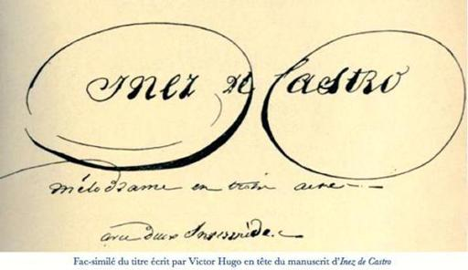

# [[{.calibre10} INEZ DE C]{.calibre2}ASTRO]{.calibre_55} {#filepos24702160 .calibre_}

:::::: calibre_20
::::: calibre_3
::: calibre_16

------------------------------------------------------------------------

::: calibre_16

:::::
::::::

[(1821-1822)]{.calibre_3}

[Victor Hugo]{.calibre_10}

[[THÉÂTRE
]{.bold}]{.calibre_21}

:::::: calibre_22
::::: calibre_21
[ ]{.bold}

::: calibre_16

------------------------------------------------------------------------

::: calibre_16

:::::
::::::

[
Pour toutes demandes ou suggestions]{.calibre_3}

[[
!{.calibre3}]{.calibre37}]{.calibre4}

[Inez de Castro[[[[^\[1\]^]{.calibre_12}]{.underline}]{.calibre_4}](index_split_4205.html#filepos29561496){#filepos24704064}]{.calibre_3}

## [[[]{.calibre2}[]{.calibre2}[]{.calibre2}[]{.calibre2}[]{.calibre2}[]{.calibre2}[]{.calibre2}[]{.calibre2}[]{.calibre2}[]{.calibre2}[]{.calibre2}[]{.calibre2}[]{.calibre2}[]{.calibre2}[]{.calibre2}[]{.calibre2}[]{.calibre2}[]{.calibre2}[]{.calibre2}[]{.calibre2}[]{.calibre2}[]{.calibre2}[]{.calibre2}[]{.calibre2}[]{.calibre2}[]{.calibre2}[]{.calibre2}[]{.calibre2}[]{.calibre2}[]{.calibre2}[]{.calibre2}[]{.calibre2}[]{.calibre2}[]{.calibre2}[]{.calibre2}[]{.calibre2}[]{.calibre2}[]{.calibre2}[]{.calibre2}[]{.calibre2}[]{.calibre2}[]{.calibre2}[]{.calibre2}[]{.calibre2}[]{.calibre2}[]{.calibre2}[]{.calibre2}[]{.calibre2}[]{.calibre2}[]{.calibre2}[]{.calibre2}[]{.calibre2}[]{.calibre2}[]{.calibre2}[]{.calibre2}[]{.calibre2}[]{.calibre2}[]{.calibre2}[]{.calibre2}[]{.calibre2}[]{.calibre2}[]{.calibre2}[]{.calibre2}[]{.calibre2}[]{.calibre2}[]{.calibre2}[]{.calibre2}Table des matières]{.bold1}]{.calibre_24} {#calibre_pb_4296 .calibre_57}

::: calibre_52

[]{.calibre_10}

> [[[[[Personnages]{.calibre9}]{.underline}]{.calibre_4}](index_split_3519.html#filepos24713663)]{.calibre_10}

> [[[[[Acte premier]{.calibre9}]{.underline}]{.calibre_4}](index_split_3520.html#filepos24714965)]{.calibre_10}

> [[[[[Scène I]{.calibre16}]{.underline}]{.calibre_4}](index_split_3520.html#filepos24714965)]{.calibre_10}

> [[[[[Scène II]{.calibre16}]{.underline}]{.calibre_4}](index_split_3521.html#filepos24721583)]{.calibre_10}

> [[[[[Scène III]{.calibre16}]{.underline}]{.calibre_4}](index_split_3522.html#filepos24728624)]{.calibre_10}

> [[[[[Scène IV]{.calibre16}]{.underline}]{.calibre_4}](index_split_3523.html#filepos24729815)]{.calibre_10}

> [[[[[Scène V]{.calibre16}]{.underline}]{.calibre_4}](index_split_3524.html#filepos24735057)]{.calibre_10}

> [[[[[Scène VI]{.calibre16}]{.underline}]{.calibre_4}](index_split_3525.html#filepos24741063)]{.calibre_10}

> [[[[[Scène VII]{.calibre16}]{.underline}]{.calibre_4}](index_split_3526.html#filepos24743755)]{.calibre_10}

> [[[[[Premier Intermède]{.calibre9}]{.underline}]{.calibre_4}](index_split_3527.html#filepos24746957)]{.calibre_10}

> [[[[[Scène I]{.calibre16}]{.underline}]{.calibre_4}](index_split_3527.html#filepos24746957)]{.calibre_10}

> [[[[[Scène II]{.calibre16}]{.underline}]{.calibre_4}](index_split_3528.html#filepos24750388)]{.calibre_10}

> [[[[[Acte deuxième]{.calibre9}]{.underline}]{.calibre_4}](index_split_3529.html#filepos24752439)]{.calibre_10}

> [[[[[Scène I]{.calibre16}]{.underline}]{.calibre_4}](index_split_3529.html#filepos24752439)]{.calibre_10}

> [[[[[Scène II]{.calibre16}]{.underline}]{.calibre_4}](index_split_3530.html#filepos24756629)]{.calibre_10}

> [[[[[Scène III]{.calibre16}]{.underline}]{.calibre_4}](index_split_3531.html#filepos24757618)]{.calibre_10}

> [[[[[Scène IV]{.calibre16}]{.underline}]{.calibre_4}](index_split_3532.html#filepos24760368)]{.calibre_10}

> [[[[[Scène V]{.calibre16}]{.underline}]{.calibre_4}](index_split_3533.html#filepos24765403)]{.calibre_10}

> [[[[[Scène VI]{.calibre16}]{.underline}]{.calibre_4}](index_split_3534.html#filepos24766951)]{.calibre_10}

> [[[[[Scène VII]{.calibre16}]{.underline}]{.calibre_4}](index_split_3535.html#filepos24768625)]{.calibre_10}

> [[[[[Scène VIII]{.calibre16}]{.underline}]{.calibre_4}](index_split_3536.html#filepos24769854)]{.calibre_10}

> [[[[[Scène IX]{.calibre16}]{.underline}]{.calibre_4}](index_split_3537.html#filepos24771417)]{.calibre_10}

> [[[[[Scène X]{.calibre16}]{.underline}]{.calibre_4}](index_split_3538.html#filepos24773852)]{.calibre_10}

> [[[[[Scène XI]{.calibre16}]{.underline}]{.calibre_4}](index_split_3539.html#filepos24780195)]{.calibre_10}

> [[[[[Scène XII]{.calibre16}]{.underline}]{.calibre_4}](index_split_3540.html#filepos24788932)]{.calibre_10}

> [[[[[Second Intermède]{.calibre9}]{.underline}]{.calibre_4}](index_split_3541.html#filepos24790624)]{.calibre_10}

> [[[[[Acte troisième]{.calibre9}]{.underline}]{.calibre_4}](index_split_3542.html#filepos24792342)]{.calibre_10}

> [[[[[Scène I]{.calibre16}]{.underline}]{.calibre_4}](index_split_3542.html#filepos24792342)]{.calibre_10}

> [[[[[Scène II]{.calibre16}]{.underline}]{.calibre_4}](index_split_3543.html#filepos24797103)]{.calibre_10}

> [[[[[Scène III]{.calibre16}]{.underline}]{.calibre_4}](index_split_3544.html#filepos24800485)]{.calibre_10}

> [[[[[Scène IV]{.calibre16}]{.underline}]{.calibre_4}](index_split_3545.html#filepos24803038)]{.calibre_10}

> [[[[[Scène V]{.calibre16}]{.underline}]{.calibre_4}](index_split_3546.html#filepos24805590)]{.calibre_10}

> [[[[[Scène VI et dernière]{.calibre16}]{.underline}]{.calibre_4}](index_split_3547.html#filepos24811126)]{.calibre_10}

[
]{.calibre_7}

[[{.calibre3}]{.italic}]{.calibre_10}

## [[[]{.calibre2}[]{.calibre2}[]{.calibre2}[]{.calibre2}[]{.calibre2}[]{.calibre2}[]{.calibre2}[]{.calibre2}[]{.calibre2}[]{.calibre2}[]{.calibre2}[]{.calibre2}[]{.calibre2}[]{.calibre2}[]{.calibre2}[]{.calibre2}[]{.calibre2}[]{.calibre2}[]{.calibre2}[]{.calibre2}[]{.calibre2}[]{.calibre2}[Personnages.]{.calibre2}]{.bold1}]{.calibre_24} {#calibre_pb_4299 .calibre_57}

::: calibre_52

[
ALPHONSE, le Justicier, roi de Portugal
Don PEDRO, infant de Portugal.
LA REINE.
INEZ DE CASTRO, fille d\'honneur de la Reine.
LES DEUX ENFANTS D\'INEZ.
L'ALCADE D\'ALPUNAR.
ROMERO, paysan.
ALIX, fille de Romero.
GOMEZ, amoureux d\'Alix.
ALBARACIN, chef des Maures.
LE CHANCELIER DE PORTUGAL
LE PRÉSIDENT DU HAUT CONSEIL.
LE HÉRAUT DE JUSTICE.
Juges, Gardes, Exécuteurs. Un Greffier, Geôliers.
Villageois, Piqueurs, Veneurs
Grands, Dames, Officiers.
Guerriers maures, jeunes filles maures]{.calibre4}

[ ]{.calibre4}

[[(La scène est à Lisbonne et aux environs.)]{.italic}]{.calibre_28}

## [[[]{.calibre2}[]{.calibre2}[]{.calibre2}[]{.calibre2}[]{.calibre2}[]{.calibre2}[]{.calibre2}[]{.calibre2}[]{.calibre2}[]{.calibre2}[]{.calibre2}[]{.calibre2}[]{.calibre2}[]{.calibre2}[]{.calibre2}[]{.calibre2}[]{.calibre2}[]{.calibre2}[]{.calibre2}[]{.calibre2}[]{.calibre2}[]{.calibre2}[]{.calibre2}[]{.calibre2}[]{.calibre2}[]{.calibre2}[]{.calibre2}[]{.calibre2}[]{.calibre2}[]{.calibre2}[]{.calibre2}[]{.calibre2}[]{.calibre2}[]{.calibre2}[]{.calibre2}[]{.calibre2}[]{.calibre2}[]{.calibre2}[]{.calibre2}[]{.calibre2}[]{.calibre2}[]{.calibre2}[]{.calibre2}[]{.calibre2}[]{.calibre2}[]{.calibre2}[]{.calibre2}[]{.calibre2}[]{.calibre2}[]{.calibre2}[]{.calibre2}[]{.calibre2}[]{.calibre2}[]{.calibre2}[]{.calibre2}[]{.calibre2}[]{.calibre2}[]{.calibre2}[]{.calibre2}[]{.calibre2}[]{.calibre2}[]{.calibre2}[]{.calibre2}[]{.calibre2}[]{.calibre2}[]{.calibre2}[]{.calibre2}Acte premier]{.bold1}]{.calibre_24} {#calibre_pb_4301 .calibre_57}

::: calibre_52

### [[[]{.calibre2}[]{.calibre2}[]{.calibre2}[]{.calibre2}[]{.calibre2}[]{.calibre2}[]{.calibre2}[]{.calibre2}[]{.calibre2}[]{.calibre2}[]{.calibre2}[]{.calibre2}[]{.calibre2}[]{.calibre2}[]{.calibre2}[]{.calibre2}[]{.calibre2}[]{.calibre2}[]{.calibre2}[]{.calibre2}[]{.calibre2}[]{.calibre2}[]{.calibre2}[]{.calibre2}[]{.calibre2}[]{.calibre2}[]{.calibre2}[]{.calibre2}[]{.calibre2}[]{.calibre2}[]{.calibre2}[]{.calibre2}[]{.calibre2}[]{.calibre2}[]{.calibre2}[]{.calibre2}[]{.calibre2}[]{.calibre2}[]{.calibre2}[]{.calibre2}[]{.calibre2}[]{.calibre2}[]{.calibre2}[]{.calibre2}[]{.calibre2}[]{.calibre2}[]{.calibre2}[]{.calibre2}[]{.calibre2}[]{.calibre2}[]{.calibre2}[]{.calibre2}[]{.calibre2}[]{.calibre2}[]{.calibre2}[]{.calibre2}[]{.calibre2}[]{.calibre2}Scène I]{.bold1}]{.calibre_39} {#scène-i .calibre_38}

[[
Le théâtre représente une forêt, à droite est une chaumière.]{.italic}]{.calibre_28}

[[[[
]{.calibre_75}]{.bold} UN MENDIANT, L\'ALCADE D\'ALPONAR.
Ils arrivent ensemble de l\'intérieur de la forêt]{.italic}]{.calibre_28}

[
[LE MENDIANT]{.bold} [(attirant à lui l'alcade, lui montre d\'un air mystérieux la chaumière).]{.italic}
C\'est ici !
[L'ALCADE]{.bold} [(du même ton).
]{.italic} Cette chaumière renferme les enfants du prince de Portugal.
[LE MENDIANT]{.bold}.
Les enfants de don Pedro et d\'Inez.
[L'ALCADE.]{.bold}
Et quel gage de certitude me donneras-tu ?\...
[LE MENDIANT]{.bold}.
Alcade d\'Alpunar, est-ce à toi de douter de mes paroles ? Les deux enfants nés de l\'union secrète de don Pedro et d\'Inez sont cachés dans cette chaumière. Entre et tu les verras, si tu refuses de me croire.
[L'ALCADE.]{.bold}
Je te crois. C\'est toi qui m\'as dit tout ce que je sais sur cette ténébreuse histoire. L\'infant don Pedro retarde son union avec la nièce de la reine, l\'invasion des Maures rend, dit-il, sa présence nécessaire à l\'armée ; c\'est toi qui m\'as fait connaître et m\'as mis à même d\'apprendre à la reine le véritable motif de ses retards, tu m\'as révélé son mariage secret avec dona Inez de Castro ; il me fallait des preuves de cette alliance ; aujourd\'hui tu me découvres l\'asile où sont cachés les deux enfants, fruits de ces amours clandestins. Ecoute, tu n\'es pas un mendiant, toi qui connais les secrets des rois, dis-moi qui tu es. Mes bienfaits et ceux de la reine récompenseront ton zèle pourvu que ta discrétion l\'égale.
[LE MENDIANT.]{.bold}
Alcade d\'Alpunar, tu parlais tout à l\'heure de l\'invasion des Maures ?\...
[L'ALCADE.
]{.bold} Oui, mais ton nom ? C'est ton nom que je demande. Compte sur ma reconnaissance\...
[LE MENDIANT.
]{.bold} Alcade, je suis Albaracin, le chef des Maures.
[L'ALCADE.
]{.bold} Qu\'entends-je ? Vous, ce chef redouté !\...
[ALBARACIN.
]{.bold} La seule présence de l\'infant don Pedro au camp portugais m\'empêche de pénétrer jusqu\'à Lisbonne ; des soldats commandés par lui sont invincibles. J\'ai dû chercher un moyen de me délivrer de cet ennemi formidable ; je l\'ai trouvé. Mes émissaires ont découvert le mariage caché de l\'héritier du trône avec une fille d\'honneur de la reine. Alors, sous ce déguisement, je suis venu à toi, alcade, à toi, le confident des secrets de cette reine. --- Je n\'en ai point rougi. Le roi Boabdil venait ainsi souvent s\'asseoir sous la tente de l\'ennemi. --- Je t\'ai appris le mariage clandestin de l\'infant, je te livre ses deux enfants ; maintenant c\'est aux fureurs de cette reine à me servir. Les périls de tout ce qu\'il a de cher au monde rappelleront don Pèdre à Lisbonne. Je ne tarderai pas à l\'y suivre, car je ne crains pas l\'armée, mais seulement le général.
[L'ALCADE.
]{.bold} Je ne puis revenir de mon étonnement, de mon effroi\...
[ALBARACIN.
]{.bold} Alcade, nous avons chacun notre profit dans cette aventure. Que ta reine déploie toute sa vengeance sur Inez et ses deux enfants ; plus leurs jours seront menacés, plus ma victoire sera certaine.
[L'ALCADE.
]{.bold} Seigneur\...
[ALBARACIN.
]{.bold} Eh bien ! tu livres ton pays à l\'invasion étrangère, qu\'importe ! Alcade d\'Alpunar, tu seras corrégidor de Lisbonne.
[L'ALCADE.
]{.bold} Croyez, seigneur, que je ne veux servir que les intérêts de la reine\...
[ALBARACIN.
]{.bold} Alcade, je viens de te dire mon secret ; cela te prouve assez combien je te méprise. Adieu ! [(Il sort.)]{.italic}
[L'ALCADE.
]{.bold} Oh ! que n\'ai-je avec moi quatre alguazils ! tu ne reverrais jamais ton camp de pirates et de corsaires, audacieux Albaracin ! Et moi, quelle bonne fortune ! Mettre à la fois la main sur le général maure et sur les enfants d\'Inez ! Allons, il faut se contenter de cette dernière capture. --- [(La]{.italic} [porte]{.italic} [de]{.italic} [la]{.italic} [chaumière]{.italic} [s\'ouvre.)]{.italic} Hé, mais les voilà justement qui sortent, éloignons-nous. [(Il]{.italic} [[s]{.italic}]{.calibre4}[e]{.italic} [retire]{.italic} [au]{.italic} [fond]{.italic} [du]{.italic} [théâtre.)]{.italic}]{.calibre4}

[[
]{.calibre_7}]{.bold}

### [[[]{.calibre2}[]{.calibre2}[]{.calibre2}[]{.calibre2}[]{.calibre2}[]{.calibre2}[]{.calibre2}[]{.calibre2}[]{.calibre2}[]{.calibre2}[]{.calibre2}[]{.calibre2}[]{.calibre2}[]{.calibre2}[]{.calibre2}[]{.calibre2}[]{.calibre2}[]{.calibre2}[]{.calibre2}[]{.calibre2}[]{.calibre2}[]{.calibre2}[]{.calibre2}[]{.calibre2}[]{.calibre2}[]{.calibre2}[]{.calibre2}[]{.calibre2}[]{.calibre2}[]{.calibre2}[]{.calibre2}[]{.calibre2}[]{.calibre2}[]{.calibre2}[]{.calibre2}[]{.calibre2}[]{.calibre2}[]{.calibre2}[]{.calibre2}[]{.calibre2}[]{.calibre2}[]{.calibre2}[]{.calibre2}[]{.calibre2}[]{.calibre2}[]{.calibre2}[]{.calibre2}[]{.calibre2}[]{.calibre2}[]{.calibre2}[]{.calibre2}[]{.calibre2}[]{.calibre2}[]{.calibre2}[]{.calibre2}[]{.calibre2}[]{.calibre2}[]{.calibre2}Scène II]{.bold1}]{.calibre_39} {#scène-ii .calibre_38}

[[
L'ALCADE (au fond du théâtre), ROMERO. LES DEUX ENFANTS.]{.italic}]{.calibre_28}

[
[ROMERO]{.bold} [(pendant]{.italic} [que]{.italic} [les]{.italic} [enfants]{.italic} [jouent]{.italic} [sur]{.italic} [la]{.italic} scène, [il]{.italic} [se]{.italic} [promène]{.italic} [rêveur]{.italic} [sans]{.italic} [voir]{.italic} [l'alcade.)]{.italic}
Pauvres enfants ! si je comprends rien à leur sort, je veux avoir volé les reliques de Notre-Dame-Da-Monte. --- Oui, voilà deux mois qu\'ils sont dans ma chaumière qu\'on a choisie sans doute à cause de son isolement ; mais quels sont leurs parents ? Je crois que Dieu le sait mieux que moi ; --- à moins que leur mère ne soit cette belle dame qui vient de temps en temps les voir comme en cachette, et qui pleure. --- Vraiment, à chaque visite elle laisse une bourse d\'or qui contient plus de dollars que le malin diable n\'en offrit à saint Antoine dans la tentation ; elle appartient à la cour sans doute. --- Mais qu\'importe tout cela ? Je lui dois ma fortune, elle peut compter sur mon dévouement. Car me voilà riche, et ce pauvre Gomez peut maintenant chercher une autre femme que ma fille Alix. --- Comme ils jouent, ces chers petits enfants ! --- Que signifie encore cette recommandation qu\'on me fait de changer leurs noms de baptême !\... Qu\'importe qu\'on s\'appelle Hilarion ou Andreo, si l\'on n\'est pas fils d\'une femme qui n\'est point mariée !\... mais chut ! ces innocents paient peut-être quelque grand crime ou quelque insigne folie\... [(Il]{.italic} [aperçoit]{.italic} [l'alcade.)]{.italic} Que vois-je venir là ? C\'est l\'alcade d\'Alpunar. Peste soit\... Rentrez, enfants.
[L'ALCADE.]{.bold}
Dieu vous garde, père Romero. Vous avez là deux jolis enfants. Ne les renvoyez donc pas.
[ROMERO]{.bold}[.]{.calibre_75}
[(A part.)]{.italic} Que ta langue t\'étrangle ! [(Haut.)]{.italic} Mille grâces, seigneur alcade,\... des enfants peuvent gêner\... [(aux]{.italic} [enfants, vite]{.italic} [et]{.italic} [baissant]{.italic} [la]{.italic} [voix)]{.italic} Rentrez donc, rentrez.
[L'ALCADE.
]{.bold} Non, qu\'ils restent, ils sont charmants. Mais il me semblait, père Romero, que vous n\'aviez qu\'une fille\...
[
ROMERO]{.bold}[.]{.calibre_75}
En effet, seigneur alcade ; mais ce sont les enfants de mon neveu Perez\... qui me les a envoyés au moment où il a été requis de se joindre à la milice qui garde les côtes de l\'invasion des pirates maures.
[LE PETIT GARÇON]{.bold}.
Cela n\'est pas vrai.
[L'ALCADE.
]{.bold} Hum ! que dit-il donc là ? [(A part.)]{.italic} Bon !
[ROMERO]{.bold}[.]{.calibre_75}
[(Bas]{.italic} [à]{.italic} [l'enfant.)]{.italic} Te tairas-tu ? Ose dire encore un mot. [(Haut.)]{.italic} Il parle à sa soeur sans doute.
[L'ALCADE.]{.bold}
Oui\... --- On dit qu\'une grande dame vient les voir quelquefois.
[L\'ENFANT.]{.bold}[
]{.bold} C\'est\...
[ROMERO]{.bold} [(bat]{.italic} [à]{.italic} [l'enfant).]{.italic}
Tais-toi donc ! [(Haut)]{.italic} C\'est leur marraine qui leur apporte quelques présents de leur âge.
[L'ALCADE]{.bold}.
Quelle est leur marraine, père Romero ?
[ROMERO]{.bold}[.]{.calibre_75}
La\... la duchesse de...de Rivas\...
[L\'ENFANT.]{.bold}[
]{.bold} Non.
[
ROMERO]{.bold} [(avec]{.italic} [colère).]{.italic}[[
]{.italic}]{.calibre_75} Cesseras-tu, Gil, de parler avec ta soeur ?
[L'ENFANT]{.bold} [(fièrement).]{.italic}
Je ne m\'appelle point Gil, je m\'appelle don Pèdre.
[L'ALCADE]{.bold} (à [part).]{.italic}[[
]{.italic}]{.calibre_75} Don Pèdre ! bien, c\'est cela.
[ROMERO]{.bold} [(à]{.italic} [î]{.italic} [alcade).]{.italic}[[
]{.italic}]{.calibre_75} Si vous vouliez entrer dans ma cabane, pour vous rafraîchir ?[
]{.calibre_75} [L'ARCADE]{.bold}.
Mille grâces, mon cher Romero, ces enfants m\'intéressent !
[
ROMERO]{.bold} [(à]{.italic} [part).]{.italic} Le maudit homme ! les damnés enfants !
[L'ALCADE]{.bold} [(à]{.italic} [la]{.italic} [petite]{.italic} [fille).]{.italic}[[
]{.italic}]{.calibre_75} Et vous, ma chère fille, comment vous appelle-t-on ?
[LA]{.bold} [PETITE]{.bold} [FILLE]{.bold} [(après]{.italic} [une]{.italic} [révérence).]{.italic}[[
]{.italic}]{.calibre_75} Francisca. On m\'appelait auparavant Inezilla.
[L'ALCADE]{.bold} [(à]{.italic} [part).]{.italic}[[
]{.italic}]{.calibre_75} Don Pèdre ! Inez ! à merveille !
[LE PETIT GARÇON]{.bold}.
Oui, dona Inezilla. C\'était votre nom quand nous demeurions dans le vieux château et que le beau prince nous nommait ses enfants.
[
ROMERO]{.bold}[.]{.calibre_75}
Songez au moins, seigneur alcade, qu\'il ne sait ce qu\'il dit. [(A]{.italic} [part)]{.italic} Miséricorde !
[
L'ALCADE]{.bold}.
[(A]{.italic} [part)]{.italic} La chose est sûre, le nid est trouvé. Allons tout dire à la reine. [(Haut)]{.italic} Salut, père Romero, que la sainte Vierge vous assiste !
[
ROMERO]{.bold}[.]{.calibre_75}
Adieu, seigneur alcade ! [(A]{.italic} [part)]{.italic} Que les démons l\'enlèvent !]{.calibre4}

[[
]{.calibre_7}]{.bold}

### [[[]{.calibre2}[]{.calibre2}[]{.calibre2}[]{.calibre2}[]{.calibre2}[]{.calibre2}[]{.calibre2}[]{.calibre2}[]{.calibre2}[]{.calibre2}[]{.calibre2}[]{.calibre2}[]{.calibre2}[]{.calibre2}[]{.calibre2}[]{.calibre2}[]{.calibre2}[]{.calibre2}[]{.calibre2}[]{.calibre2}[]{.calibre2}[]{.calibre2}[]{.calibre2}[]{.calibre2}[]{.calibre2}[]{.calibre2}[]{.calibre2}[]{.calibre2}[]{.calibre2}[]{.calibre2}[]{.calibre2}[]{.calibre2}[]{.calibre2}[]{.calibre2}[]{.calibre2}[]{.calibre2}[]{.calibre2}[]{.calibre2}[]{.calibre2}[]{.calibre2}[]{.calibre2}[]{.calibre2}[]{.calibre2}[]{.calibre2}[]{.calibre2}[]{.calibre2}[]{.calibre2}[]{.calibre2}[]{.calibre2}[]{.calibre2}[]{.calibre2}[]{.calibre2}[]{.calibre2}[]{.calibre2}[]{.calibre2}[]{.calibre2}[]{.calibre2}[]{.calibre2}Scène III]{.bold1}]{.calibre_39} {#scène-iii .calibre_38}

[
[ROMERO]{.bold}[.]{.calibre_75}
Cet infernal alcade ! De quoi vient-il se mêler là ? Allons, enfants, rentrez, et toi, Gil, ne t\'avise plus de me démentir une autre fois. [(Les]{.italic} [enfants]{.italic} [rentrent]{.italic} [dans]{.italic} [la]{.italic} [cabane)]{.italic} Voyons, qu\'est-ce ? Voici Alix et ce Gomez ! Que me veulent-ils avec leur mine effarée ?]{.calibre4}

[[
]{.calibre_7}]{.bold}

### [[[]{.calibre2}[]{.calibre2}[]{.calibre2}[]{.calibre2}[]{.calibre2}[]{.calibre2}[]{.calibre2}[]{.calibre2}[]{.calibre2}[]{.calibre2}[]{.calibre2}[]{.calibre2}[]{.calibre2}[]{.calibre2}[]{.calibre2}[]{.calibre2}[]{.calibre2}[]{.calibre2}[]{.calibre2}[]{.calibre2}[]{.calibre2}[]{.calibre2}[]{.calibre2}[]{.calibre2}[]{.calibre2}[]{.calibre2}[]{.calibre2}[]{.calibre2}[]{.calibre2}[]{.calibre2}[]{.calibre2}[]{.calibre2}[]{.calibre2}[]{.calibre2}[]{.calibre2}[]{.calibre2}[]{.calibre2}[]{.calibre2}[]{.calibre2}[]{.calibre2}[]{.calibre2}[]{.calibre2}[]{.calibre2}[]{.calibre2}[]{.calibre2}[]{.calibre2}[]{.calibre2}[]{.calibre2}[]{.calibre2}[]{.calibre2}[]{.calibre2}[]{.calibre2}[]{.calibre2}[]{.calibre2}[]{.calibre2}[]{.calibre2}[]{.calibre2}[]{.calibre2}Scène IV]{.bold1}]{.calibre_39} {#scène-iv .calibre_38}

[[
ROMERO, ALIX, GOMEZ
Pendant cette seine, on entend plusieurs fois le bruit du cor dans le bois]{.italic}]{.calibre_28}

[
[ALIX]{.bold}.
Comment ! Est-ce bien vrai, mon père ?\...
[
ROMERO]{.bold}[.]{.calibre_75}
Quoi ?
[GOMEZ]{.bold}.
Seigneur Romero, mon père m\'a dit\...
[ALIX]{.bold}.
Que vous ne vouliez plus me marier avec Gomez.
[
ROMERO]{.bold}[.]{.calibre_75}
[Votre]{.calibre_75} père vous a dit vrai, Gomez.
[ALIX]{.bold}.
O ciel ! et pourquoi donc, mon père ?
[ROMERO]{.bold}[.]{.calibre_75}
Far notre mère de Atocha, les jeunes filles interrogent maintenant leurs pères comme la très sainte inquisition interroge les hérétiques.
[GOMEZ]{.bold}.
Souffrez au moins que je vous demande, seigneur Romero, si vous avez quelque reproche à me faire ?
[
ROMERO]{.bold}[.]{.calibre_75}
Aucun.
[GOMEZ]{.bold}.
Eh bien ! alors pourquoi donc me refuser mon Alix après me l\'avoir tant promise ?
[ROMERO]{.bold}[.]{.calibre_75}
Je ne saurais vous dire, mon cher Gomez, mais cela ne se peut plus.
[ALIX]{.bold}.
Mon père !
[GOMEZ]{.bold}.
Moi qui menais tous les jours votre jument blanche à l\'abreuvoir de Horcarral\... !
[
ROMERO]{.bold}[.]{.calibre_75}
Cela est vrai.
[GOMEZ]{.bold}.
Moi qui ai contraint le nécroman Zulco de lever le sort qu\'il avait jeté sur vos moutons\...
[ROMERO]{.bold}[.]{.calibre_75}
Je ne le conteste pas.
[GOMEZ]{.bold}.
Moi qui vous ai cédé ce morceau des saints vêtements du bienheureux Jean-Baptiste que m\'avait légué ma grand\'mère\...
[ROMERO]{.bold} [(avec impatience).]{.italic}
Fort bien, fort bien, Gomez ! Épargnez-vous des paroles inutiles. Je ne puis vous donner Alix. J\'en suis fâché, que voulez-vous ? Les affaires ont changé.
[GOMEZ]{.bold}.
Quoi ! Auriez-vous éprouvé quelque malheur, quelque perte ? Dites, seigneur Romero, et sur-le-champ, ma cabane, mes filets, mon bateau, tout est vendu pour vous.
[
ROMERO]{.bold}[.]{.calibre_75}
[(A part.)]{.italic} Bon jeune homme ! il m\'afflige ; mais, dans le fait, ma fille est devenue riche, et les doublons de la belle dame l\'élèvent au-dessus d\'un pêcheur.
[ALIX]{.bold}.
Hé bien ! mon père !
[
ROMERO]{.bold}[.]{.calibre_75}
Bien désolé, ma chère fille ; mais j\'ai réfléchi ; la naissance de Gomez\...
[GOMEZ]{.bold}.
Seigneur Romero, je suis le fils d\'un honnête pêcheur.
[
ROMERO]{.bold}[.]{.calibre_75}
Il n\'y en a pas de plus honnête sur toute la côte d\'Ortiz à Pilavera ; mais savez-vous, mon cher Gomez, que l\'un de mes ancêtres a été greffier de l\'alcade d\'Alpuñar ?
[GOMEZ]{.bold}.
J\'ignorais\...
[ALIX]{.bold}.
Mon père, est-ce une raison pareille qui vous fera décider le malheur de votre fille ? Je vous en supplie.
[
ROMERO]{.bold}[.]{.calibre_75}
Allons, jeune fille, il y a du chanvre à filer chez votre mère, et les heures qu\'on donne aux larmes sont perdues pour le travail.
[ALIX]{.bold}.
Non, vous m\'écouterez, mon père. Je vous fléchirai. Hélas ! Gomez est toute mon espérance et toute ma joie. Viens, Gomez, aide-moi à l\'attendrir ; dis-lui que tu m\'aimes, que tu me rendras heureuse\... Mon père, ayez pitié de moi, de mes larmes, ô Dieu [(Elle tombe à ses pieds.)]{.italic}]{.calibre4}

[[
]{.calibre_7}]{.bold}

### [[[]{.calibre2}[]{.calibre2}[]{.calibre2}[]{.calibre2}[]{.calibre2}[]{.calibre2}[]{.calibre2}[]{.calibre2}[]{.calibre2}[]{.calibre2}[]{.calibre2}[]{.calibre2}[]{.calibre2}[]{.calibre2}[]{.calibre2}[]{.calibre2}[]{.calibre2}[]{.calibre2}[]{.calibre2}[]{.calibre2}[]{.calibre2}[]{.calibre2}[]{.calibre2}[]{.calibre2}[]{.calibre2}[]{.calibre2}[]{.calibre2}[]{.calibre2}[]{.calibre2}[]{.calibre2}[]{.calibre2}[]{.calibre2}[]{.calibre2}[]{.calibre2}[]{.calibre2}[]{.calibre2}[]{.calibre2}[]{.calibre2}[]{.calibre2}[]{.calibre2}[]{.calibre2}[]{.calibre2}[]{.calibre2}[]{.calibre2}[]{.calibre2}[]{.calibre2}[]{.calibre2}[]{.calibre2}[]{.calibre2}[]{.calibre2}[]{.calibre2}[]{.calibre2}[]{.calibre2}[]{.calibre2}[]{.calibre2}[]{.calibre2}[]{.calibre2}[]{.calibre2}Scène V]{.bold1}]{.calibre_39} {#scène-v .calibre_38}

[[
LES PRECEDENTS, L\'ALCADE, LE ROI, LA REINE, INEZ, DAMES ET OFFICIERS.
(Toute la cour en habits de chatte.) Valets de pied, Piqueurs, villageois, etc.]{.italic}]{.calibre_28}

[[
]{.italic} [L'ALCADE]{.bold}.
Notre seigneur le roi !
[ALIX]{.bold} [ET]{.bold} [GOMEZ]{.bold}.
Le roi !
[ROMERO]{.bold}.
Le roi ! (Bas à Alix.) Relevez-vous, ma fille.
[LE]{.bold} [ROI]{.bold}.
Qu\'est-ce donc ? D\'où vient que cette belle jeune fille est aux pieds de ce vieillard ?
[
ROMERO]{.bold}[.]{.calibre_75}
Seigneur\... Votre Majesté... Ce n\'est rien\... c\'est\...
[LE]{.bold} [ROI]{.bold}.
Comment ! je veux savoir cela ;.. parlez, jeune fille, qu\'avez-vous ? Ne craignez rien.
[ALIX]{.bold} [(essuyant ses larmes).]{.italic}
Seigneur\... je suppliais mon père de me marier à mon fiancé.
[LE]{.bold} [ROI]{.bold}.
Et qui empêche donc que votre père ne vous marie à votre fiancé ?
[
ROMERO]{.bold}[.]{.calibre_75}
Seigneur, c\'est que\...
[LE]{.bold} [ROI]{.bold}.
Paix ! laissez-la parler.
[ALIX]{.bold}.
C'est que\... Gomez n\'est que le fils d\'un pêcheur, tandis que mon père descend du\... de l\'alcade d'un greffier\...
[ROMERO]{.bold}[.]{.calibre_75}
Du greffier d\'un alcade !
[LE]{.bold} [ROI]{.bold}.
Bien, bien, peu importe ! Vous l\'aimez donc, votre Gomez ?
[ALIX]{.bold}.
Dieu ! tenez, le voilà ! [(Elle montre Gomez.)]{.italic}
[LE]{.bold} [ROI]{.bold} [(à Romero).]{.italic}
Allons, croyez-moi, vieillard, ils s\'aiment, mariez-les ; il ne faut pas tenir à ces préjugés de la naissance.
[ROMERO]{.bold}.
Mais, Votre Majesté, un pêcheur !\...
[LE]{.bold} [ROI]{.bold} [(riant).]{.italic}
Allons, allons, ne serait-il pas possible de combler avec des doublons la distance qui sépare un pêcheur d\'un greffier d\'alcade ? Je m\'en charge, moi ; Gomez touchera sur notre trésor royal une rente de cent doublons d\'or.
[
ROMERO]{.bold} [(unit]{.italic} [les]{.italic} [mains]{.italic} [d\'Alix]{.italic} [et]{.italic} [de]{.italic} Gomez [et]{.italic} [s\'écrie]{.italic} [[:]{.italic}]{.calibre_75}[)]{.italic}[[
]{.italic}]{.calibre_75} Tombez aux pieds du roi, mes enfants ! Vive le roi !
[ALIX]{.bold}, [GOMEZ]{.bold}, [TOUS]{.bold} [LES]{.bold} [VILLAGEOIS]{.bold}.
Vive, vive le roi, notre bon roi !
[LE]{.bold} [ROI]{.bold} [(à]{.italic} [Romero).]{.italic}
Vous, mon brave homme, n\'attachez plus désormais autant d\'importance aux avantages de votre naissance. Ce sont des préjugés, voyez-vous ? [(Romero,]{.italic} [Alix]{.italic} [et]{.italic} [Gomez]{.italic} [s\'inclinent]{.italic} profondé[ment]{.italic} [et]{.italic} [se]{.italic} [retirent]{.italic} [sur]{.italic} [l\'un]{.italic} [des]{.italic} [côtés]{.italic} [de]{.italic} [la]{.italic} [scène.)]{.italic}
L'[ALCADE]{.bold} [(mystérieusement]{.italic} [à]{.italic} [la]{.italic} [reine).]{.italic}
Madame, Votre Majesté m\'a chargé de diriger la chasse. C\'est ici la maison où sont les enfants soupçonnés de don Pèdre.
[LA]{.bold} [REINE]{.bold}.[(A]{.italic} [l'alcade.)]{.italic} [[
]{.italic}]{.calibre_75} Silence ! [(Elle]{.italic} [s\'avance]{.italic} [vers]{.italic} [le]{.italic} [roi,]{.italic} [tous]{.italic} [les]{.italic} [assistants]{.italic} [se]{.italic} [retirent]{.italic} [dans]{.italic} [le]{.italic} [fond.)]{.italic} Si vous visitez cette maison, seigneur, un serviteur fidèle m\'assure que vous y trouverez les fruits de cette intrigue clandestine.
[LE]{.bold} [ROI]{.bold}.
C\'est encore de cette histoire que vous m\'occupez ! Ne croyez rien de tout ce qu\'on vous a rapporté, madame. Don Pèdre ne pense qu\'à son épée. Mon fils épousera votre nièce Constance quand je le lui ordonnerai.
[LA]{.bold} [REINE]{.bold}.
Mais, seigneur, depuis que le traité qui a conclu notre union a décidé également ce mariage entre votre fils et ma nièce, avez-vous remarqué la sombre préoccupation d\'Inez, les regards inquiets que lui lance don Pèdre ?
[LE]{.bold} [ROI]{.bold}.
Observations sans fondement que tout cela ! Et vous voulez encore qu\'un hasard m\'amène en chassant précisément devant la maison\...
[LA]{.bold} [REINE]{.bold}.
Mais que Votre Majesté daigne seulement la visiter.
[LE]{.bold} [ROI]{.bold}.
Non, sans doute, je n\'irai pas troubler la paix de ces pauvres gens par des perquisitions inquiétantes pour eux. Allons, piqueurs, veneurs !]{.calibre4}

[[
]{.calibre_7}]{.bold}

### [[[]{.calibre2}[]{.calibre2}[]{.calibre2}[]{.calibre2}[]{.calibre2}[]{.calibre2}[]{.calibre2}[]{.calibre2}[]{.calibre2}[]{.calibre2}[]{.calibre2}[]{.calibre2}[]{.calibre2}[]{.calibre2}[]{.calibre2}[]{.calibre2}[]{.calibre2}[]{.calibre2}[]{.calibre2}[]{.calibre2}[]{.calibre2}[]{.calibre2}[]{.calibre2}[]{.calibre2}[]{.calibre2}[]{.calibre2}[]{.calibre2}[]{.calibre2}[]{.calibre2}[]{.calibre2}[]{.calibre2}[]{.calibre2}[]{.calibre2}[]{.calibre2}[]{.calibre2}[]{.calibre2}[]{.calibre2}[]{.calibre2}[]{.calibre2}[]{.calibre2}[]{.calibre2}[]{.calibre2}[]{.calibre2}[]{.calibre2}[]{.calibre2}[]{.calibre2}[]{.calibre2}[]{.calibre2}[]{.calibre2}[]{.calibre2}[]{.calibre2}[]{.calibre2}[]{.calibre2}[]{.calibre2}[]{.calibre2}[]{.calibre2}[]{.calibre2}[]{.calibre2}Scène VI]{.bold1}]{.calibre_39} {#scène-vi .calibre_38}

[[[
]{.calibre_75} Les MÊMES. LES DEUX ENFANTS.]{.italic}]{.calibre_28}

[
[LE]{.bold} [PETIT]{.bold} [GARÇON]{.bold} [(entrouvre]{.italic} [la]{.italic} [porte]{.italic} [de]{.italic} [la]{.italic} [maison]{.italic} [et]{.italic} [appelle]{.italic} [sa]{.italic} [soeur).]{.italic}
Oh ! ma soeur, ma soeur, viens voir ! des hommes, des chevaux ! c\'est le roi ! viens voir le roi !
[LA]{.bold} [PETITE]{.bold} [FILLE]{.bold} (se [pressant]{.italic} [contre]{.italic} [son]{.italic} [frère).]{.italic}
Oh !
[LE]{.bold} [[ROI]{.bold}]{.calibre_75}.
Quels sont ces enfants ?
[LA]{.bold} [REINE]{.bold} [(montrant]{.italic} [Inès]{.italic} [au]{.italic} [roi).]{.italic}[[
]{.italic}]{.calibre_75} Seigneur, voyez pâlir Inez.
[(En]{.italic} [ce]{.italic} [moment]{.italic} [le]{.italic} [regard]{.italic} [du]{.italic} [petit]{.italic} [garçon]{.italic} [s\'arrête]{.italic} [sur]{.italic} Inez, [et]{.italic} [il]{.italic} [accourt]{.italic} [vers]{.italic} elle [en]{.italic} [criant]{.italic} [[:]{.italic}]{.calibre_75}[)]{.italic}
Ma mère, ma mère !
[LA]{.bold} [PETITE]{.bold} [FILLE]{.bold}.
Ma mère !
[INEZ]{.bold}.
Grand Dieu ! malheureux enfants !
[(Étonnement]{.italic} [général ;]{.italic} Inez [reçoit]{.italic} [ses]{.italic} [enfants]{.italic} [dans]{.italic} [ses]{.italic} [bras]{.italic} [et]{.italic} [tombe]{.italic} [anéantie]{.italic} [sur]{.italic} [un]{.italic} [banc.)]{.italic}
[LE]{.bold} [ROI]{.bold}.
Leur mère ! Qu\'entends-je ?
[LA]{.bold} [REINE]{.bold}.
Vous le voyez\...
[LE]{.bold} [ROI]{.bold}.
Que tout le monde se retire. Qu\'on me laisse ici seul avec cette femme et ces enfants.]{.calibre4}

[[
]{.calibre_7}]{.bold}

### [[[]{.calibre2}[]{.calibre2}[]{.calibre2}[]{.calibre2}[]{.calibre2}[]{.calibre2}[]{.calibre2}[]{.calibre2}[]{.calibre2}[]{.calibre2}[]{.calibre2}[]{.calibre2}[]{.calibre2}[]{.calibre2}[]{.calibre2}[]{.calibre2}[]{.calibre2}[]{.calibre2}[]{.calibre2}[]{.calibre2}[]{.calibre2}[]{.calibre2}[]{.calibre2}[]{.calibre2}[]{.calibre2}[]{.calibre2}[]{.calibre2}[]{.calibre2}[]{.calibre2}[]{.calibre2}[]{.calibre2}[]{.calibre2}[]{.calibre2}[]{.calibre2}[]{.calibre2}[]{.calibre2}[]{.calibre2}[]{.calibre2}[]{.calibre2}[]{.calibre2}[]{.calibre2}[]{.calibre2}[]{.calibre2}[]{.calibre2}[]{.calibre2}[]{.calibre2}[]{.calibre2}[]{.calibre2}[]{.calibre2}[]{.calibre2}[]{.calibre2}[]{.calibre2}[]{.calibre2}[]{.calibre2}[]{.calibre2}[]{.calibre2}[]{.calibre2}[]{.calibre2}Scène VII]{.bold1}]{.calibre_39} {#scène-vii .calibre_38}

[[
LE ROI, LA REINE, INEZ, LES ENFANTS.]{.italic}]{.calibre_28}

[
[LA]{.bold} [REINE]{.bold}.
Seigneur, pour éclaircir vos doutes, interrogez ma fille d\'honneur.
[LE]{.bold} [ROI]{.bold}.
Doña Inez de Castro, est-il vrai que vous soyez la mère de ces enfants ?
[INEZ]{.bold} [(pressant]{.italic} [dans]{.italic} [ses]{.italic} [bras]{.italic} [ses]{.italic} [enfants]{.italic} [effrayés).]{.italic}[[
]{.italic}]{.calibre_75} Vous le voyez, seigneur.
[LE]{.bold} [ROI]{.bold}.
Doña Inez de Castro, est-il vrai que don Pèdre de Portugal soit le père de ces enfants ?
[INEZ]{.bold}.
Demandez-le lui, seigneur.
[LE]{.bold} [ROI]{.bold}.
Répondez.
[INEZ]{.bold}.
Je ne puis répondre à cette question. Que Votre Majesté prenne ma vie.
[LA]{.bold} [REINE]{.bold}.
Seigneur, que voulez-vous de plus ? Toutes ces réticences ne sont-elles pas des aveux !
[LE]{.bold} [ROI]{.bold}.
Ainsi, doña Inez, vous avez souillé à la fois le noble sang de vos pères et l\'auguste sang de vos rois !
[LA]{.bold} [REINE]{.bold}.
Oui, seigneur, elle a séduit l\'infant, et les fruits de ces impures amours sont devant vos yeux.
[INEZ]{.bold}.
Arrêtez, madame. Don Pèdre est mon époux légitime. Ces enfants sont les siens [(au roi)]{.italic} et les vôtres, seigneur.
[LA]{.bold} [REINE]{.bold}.
Vous l\'entendez.
[LE]{.bold} [ROI]{.bold}.
Quoi ! Vous êtes mariés ! Vous avez pu tous deux oublier à ce point votre naissance !
[INEZ]{.bold}.
Seigneur, nous nous aimions ; les caveaux funèbres de Castro ont été le temple de notre mariage, et mes aïeux ont reçu nos serments.
[LE]{.bold} [ROI]{.bold}.
C\'est à eux que vous en rendrez compte. --- Holà ! Gardes, que l\'on conduise doña Inez à la forteresse de Lisbonne, et que le comte de Mayo m\'en réponde sur sa tête.
[(Les deux enfants s\'attachent en pleurant à Inez que les gardes emmènent.)]{.italic}
[INEZ]{.bold}.
Mes enfants, chers enfants, adieu !]{.calibre4}

## [[[]{.calibre2}[]{.calibre2}[]{.calibre2}[]{.calibre2}[]{.calibre2}[]{.calibre2}[]{.calibre2}[]{.calibre2}[]{.calibre2}[]{.calibre2}[]{.calibre2}[]{.calibre2}[]{.calibre2}[]{.calibre2}[]{.calibre2}[]{.calibre2}[]{.calibre2}[]{.calibre2}[]{.calibre2}[]{.calibre2}[]{.calibre2}[]{.calibre2}[]{.calibre2}[]{.calibre2}[]{.calibre2}[]{.calibre2}[]{.calibre2}[]{.calibre2}[]{.calibre2}[]{.calibre2}[]{.calibre2}[]{.calibre2}[]{.calibre2}[]{.calibre2}[]{.calibre2}[]{.calibre2}[]{.calibre2}[]{.calibre2}[]{.calibre2}[]{.calibre2}[]{.calibre2}[]{.calibre2}[]{.calibre2}[]{.calibre2}[]{.calibre2}[]{.calibre2}[]{.calibre2}[]{.calibre2}[]{.calibre2}[]{.calibre2}[]{.calibre2}[]{.calibre2}[]{.calibre2}[]{.calibre2}[]{.calibre2}[]{.calibre2}[]{.calibre2}[]{.calibre2}[]{.calibre2}[]{.calibre2}[]{.calibre2}[]{.calibre2}[]{.calibre2}[]{.calibre2}[]{.calibre2}[]{.calibre2}[]{.calibre2}Premier Intermède]{.bold1}]{.calibre_24} {#calibre_pb_4309 .calibre_57}

::: calibre_52

[ ]{.calibre4}

[[Le théâtre représente le camp des Maures, assis au bord de la mer sur laquelle on aperçoit les mâts de leurs galères. Les tentes sont ornées de flammes et de banderoles. Des soldats sont épars parmi des trophées et des faisceaux d\'armes. Un choeur de jeunes filles maures et de chevaliers arabes s\'avance en chantant au son des harpes, des tambours, des guitares et des clairons.
]{.italic}]{.calibre4}

### [[[]{.calibre2}[]{.calibre2}[]{.calibre2}[]{.calibre2}[]{.calibre2}[]{.calibre2}[]{.calibre2}[]{.calibre2}[]{.calibre2}[]{.calibre2}[]{.calibre2}[]{.calibre2}[]{.calibre2}[]{.calibre2}[]{.calibre2}[]{.calibre2}[]{.calibre2}[]{.calibre2}[]{.calibre2}[]{.calibre2}[]{.calibre2}[]{.calibre2}[]{.calibre2}[]{.calibre2}[]{.calibre2}[]{.calibre2}[]{.calibre2}[]{.calibre2}[]{.calibre2}[]{.calibre2}[]{.calibre2}[]{.calibre2}[]{.calibre2}[]{.calibre2}[]{.calibre2}[]{.calibre2}[]{.calibre2}[]{.calibre2}[]{.calibre2}[]{.calibre2}[]{.calibre2}[]{.calibre2}[]{.calibre2}[]{.calibre2}[]{.calibre2}[]{.calibre2}[]{.calibre2}[]{.calibre2}[]{.calibre2}[]{.calibre2}[]{.calibre2}[]{.calibre2}[]{.calibre2}[]{.calibre2}[]{.calibre2}[]{.calibre2}[]{.calibre2}[]{.calibre2}Scène I]{.bold1}]{.calibre_39} {#scène-i .calibre_38}

[[[
]{.bold} UN GUERRIER.
ALBARACIN est absent. Avec lui la guerre a quitté son camp pour y faire place aux fêtes.
(On entend une symphonie.).]{.italic}]{.calibre_28}

[
[UNE]{.bold} [JEUNE]{.bold} [FILLE]{.bold}.
Guerriers, mêlez-vous à nos danses.
Mes soeurs, variez les cadences.
Nos maîtres vont suivre nos lois.
Qu\'en nos jeux le tambour résonne,
Et que le fier clairon s\'étonne
D\'accompagner nos douces voix.
[(On]{.italic} danse.)
[UN]{.bold} [GUERRIER]{.bold}.
Que le jour des combats se lève :
Soldats, dans les fêtes nourris,
Nous aimerons les jeux du glaive
Comme la danse des souris.
[(Les danses recommencent.)]{.italic}
[CHOEUR]{.bold}.
Guerriers, mêlez-vous, etc.
[UN]{.bold} [AUTRE]{.bold} [GUERRIER]{.bold}.
En vain le trépas nous menace :
Rions et tendons-nous la main.
Le plaisir enfante l\'audace.
Dansons, nous combattrons demain.
(Les [danses continuent.)]{.italic}
[CHOEUR]{.bold}.
Guerriers, mêlez-vous, etc.
[UN]{.bold} [GUERRIER]{.bold}.
Voici le chef, notre chef, le grand Albaracin !
[TOUS]{.bold}.
Albaracin ! Allah ! Gloire à Albaracin !
[(Ils se prosternent.)]{.italic}]{.calibre4}

[[
]{.calibre_7}]{.bold}

### [[[]{.calibre2}[]{.calibre2}[]{.calibre2}[]{.calibre2}[]{.calibre2}[]{.calibre2}[]{.calibre2}[]{.calibre2}[]{.calibre2}[]{.calibre2}[]{.calibre2}[]{.calibre2}[]{.calibre2}[]{.calibre2}[]{.calibre2}[]{.calibre2}[]{.calibre2}[]{.calibre2}[]{.calibre2}[]{.calibre2}[]{.calibre2}[]{.calibre2}[]{.calibre2}[]{.calibre2}[]{.calibre2}[]{.calibre2}[]{.calibre2}[]{.calibre2}[]{.calibre2}[]{.calibre2}[]{.calibre2}[]{.calibre2}[]{.calibre2}[]{.calibre2}[]{.calibre2}[]{.calibre2}[]{.calibre2}[]{.calibre2}[]{.calibre2}[]{.calibre2}[]{.calibre2}[]{.calibre2}[]{.calibre2}[]{.calibre2}[]{.calibre2}[]{.calibre2}[]{.calibre2}[]{.calibre2}[]{.calibre2}[]{.calibre2}[]{.calibre2}[]{.calibre2}[]{.calibre2}[]{.calibre2}[]{.calibre2}[]{.calibre2}[]{.calibre2}[]{.calibre2}Scène II]{.bold1}]{.calibre_39} {#scène-ii .calibre_38}

[[
LES MÊMES,]{.italic}]{.calibre_28}

[[ALBARACIN. (Il est richement vêtu d\'étoffes de soie et d\'or et porte à sa ceinture un poignard recourbé.)]{.italic}]{.calibre_28}

[
[ALBARACIN]{.bold}.
Compagnons, levez-vous, il faut combattre. [(Tous se lèvent.)]{.italic} C\'est en sortant d\'une fête qu\'on vole plus volontiers sur le champ de bataille. La main qui vient de toucher la guitare n\'en sait que mieux manier le cimeterre. Amis, vous vaincrez ; mes soins ont tout préparé pour la victoire. Le prince de Portugal, le redoutable don Pèdre, a quitté son camp. Vous allez attaquer une armée sans général ; oui, vous allez vaincre ! Venez ! Nous arborerons le croissant jusques sur les murs de Lisbonne. Venez, don Pèdre a laissé ses soldats sans défense pour porter secours à une femme. Aux armes ! braves amis ! aux armes !
[TOUS]{.bold}.
Allah ! Allah ! aux armes !
[
(Les clairons et les cymbales exécutent une marche militaire et les Maures sortent en ordre de bataille.)]{.italic}]{.calibre4}

## [[[]{.calibre2}[]{.calibre2}[]{.calibre2}[]{.calibre2}[]{.calibre2}[]{.calibre2}[]{.calibre2}[]{.calibre2}[]{.calibre2}[]{.calibre2}[]{.calibre2}[]{.calibre2}[]{.calibre2}[]{.calibre2}[]{.calibre2}[]{.calibre2}[]{.calibre2}[]{.calibre2}[]{.calibre2}[]{.calibre2}[]{.calibre2}[]{.calibre2}[]{.calibre2}[]{.calibre2}[]{.calibre2}[]{.calibre2}[]{.calibre2}[]{.calibre2}[]{.calibre2}[]{.calibre2}[]{.calibre2}[]{.calibre2}[]{.calibre2}[]{.calibre2}[]{.calibre2}[]{.calibre2}[]{.calibre2}[]{.calibre2}[]{.calibre2}[]{.calibre2}[]{.calibre2}[]{.calibre2}[]{.calibre2}[]{.calibre2}[]{.calibre2}[]{.calibre2}[]{.calibre2}[]{.calibre2}[]{.calibre2}[]{.calibre2}[]{.calibre2}[]{.calibre2}[]{.calibre2}[]{.calibre2}[]{.calibre2}[]{.calibre2}[]{.calibre2}[]{.calibre2}[]{.calibre2}[]{.calibre2}[]{.calibre2}[]{.calibre2}[]{.calibre2}[]{.calibre2}[]{.calibre2}[]{.calibre2}[]{.calibre2}Acte deuxième]{.bold1}]{.calibre_24} {#calibre_pb_4312 .calibre_57}

::: calibre_52

### [[ []{.calibre2}[]{.calibre2}[]{.calibre2}[]{.calibre2}[]{.calibre2}[]{.calibre2}[]{.calibre2}[]{.calibre2}[]{.calibre2}[]{.calibre2}[]{.calibre2}[]{.calibre2}[]{.calibre2}[]{.calibre2}[]{.calibre2}[]{.calibre2}[]{.calibre2}[]{.calibre2}[]{.calibre2}[]{.calibre2}[]{.calibre2}[]{.calibre2}[]{.calibre2}[]{.calibre2}[]{.calibre2}[]{.calibre2}[]{.calibre2}[]{.calibre2}[]{.calibre2}[]{.calibre2}[]{.calibre2}[]{.calibre2}[]{.calibre2}[]{.calibre2}[]{.calibre2}[]{.calibre2}[]{.calibre2}[]{.calibre2}[]{.calibre2}[]{.calibre2}[]{.calibre2}[]{.calibre2}[]{.calibre2}[]{.calibre2}[]{.calibre2}[]{.calibre2}[]{.calibre2}[]{.calibre2}[]{.calibre2}[]{.calibre2}[]{.calibre2}[]{.calibre2}[]{.calibre2}[]{.calibre2}[]{.calibre2}[]{.calibre2}[]{.calibre2}[]{.calibre2}Scène I]{.bold1}]{.calibre_39} {#scène-i .calibre_38}

[
[Le théâtre représente une vaste salle tendue de draperies noires semées de têtes de mort et de larmes blanches, éclairée par des cierges et des pots à feu. Au fond, est un tribunal également tendu de noir ; à droite, un trône pour le Roi ; à gauche, un échafaud noir surmonté d\'un catafalque et sur lequel on voit briller une hache. Le devant de la scène est occupé par des gardes vêtus de noir et de rouge et des bourreaux couverts de robes de pénitents noirs et portant des torches. Deux gardes se tiennent debout au pied du trône et au pied de l\'échafaud. Devant le tribunal, est la table du greffier.]{.italic}
[UN]{.bold} [GARDE]{.bold} [(à]{.italic} [un]{.italic} [autre]{.italic} [garde).]{.italic}
Fabricio, savez-vous pourquoi le conseil s\'assemble et qui l\'on va juger ?
[LE]{.bold} [SECOND]{.bold} [GARDE]{.bold}.
Je n\'en sais rien.
[LE]{.bold} [PREMIER]{.bold} [GARDE]{.bold}.
On dit que c\'est une femme.
[LE]{.bold} [SECOND]{.bold} [GARDE]{.bold}.
Que m\'importe !
[LE]{.bold} [PREMIER]{.bold} [GARDE]{.bold}.
Pauvre malheureuse ! Si elle entre dans cette salle, elle n\'en sortira pas.
[LE]{.bold} [SECOND]{.bold} [GARDE]{.bold}.
Cela ne me regarde point. Adressez-vous à Melchior l\'exécuteur, il pourra sans doute répondre à vos questions.
[LE]{.bold} [PREMIER]{.bold} [GARDE]{.bold}.
Vous avez raison. [(Il]{.italic} [s\'adresse]{.italic} [à]{.italic} [l'un]{.italic} [des]{.italic} [exécuteurs]{.italic} [debout]{.italic} [au]{.italic} [pied]{.italic} [de]{.italic} [l'échafaud.)]{.italic} Hé, Melchior, connaissez-vous quelle est cette femme que le conseil va juger ?
L'[EXECUTEUR]{.bold}.
Non.
[LE]{.bold} [GARDE]{.bold}[.]{.italic}
C\'est une femme, n\'est-ce pas ?
L'[EXECUTEUR]{.bold}.
Je l\'ignore. D\'ailleurs, cela n\'est pas mon affaire ; je ne connais les gens que lorsqu\'ils sont condamnés.
[LE]{.bold} [GARDE]{.bold} [(à]{.italic} [part).]{.italic}
Je plains l\'accusé, quel qu\'il soit. S\'il s\'assied sur ce banc, c\'est fait de lui.
[UN]{.bold} [OFFICIER]{.bold} [(entrant).]{.italic}[[
]{.italic}]{.calibre_75} Silence ! les juges vont entrer.
[
(Les]{.italic} [gardes]{.italic} [se]{.italic} [rangent,]{.italic} [et]{.italic} [neuf]{.italic} [grands]{.italic} [de]{.italic} [Portugal,]{.italic} [vêtus]{.italic} [de]{.italic} [noir,]{.italic} [prennent]{.italic} [place]{.italic} [au]{.italic} [tribunal.)]{.italic}]{.calibre4}

[[
]{.calibre_7}]{.bold}

### [[[]{.calibre2}[]{.calibre2}[]{.calibre2}[]{.calibre2}[]{.calibre2}[]{.calibre2}[]{.calibre2}[]{.calibre2}[]{.calibre2}[]{.calibre2}[]{.calibre2}[]{.calibre2}[]{.calibre2}[]{.calibre2}[]{.calibre2}[]{.calibre2}[]{.calibre2}[]{.calibre2}[]{.calibre2}[]{.calibre2}[]{.calibre2}[]{.calibre2}[]{.calibre2}[]{.calibre2}[]{.calibre2}[]{.calibre2}[]{.calibre2}[]{.calibre2}[]{.calibre2}[]{.calibre2}[]{.calibre2}[]{.calibre2}[]{.calibre2}[]{.calibre2}[]{.calibre2}[]{.calibre2}[]{.calibre2}[]{.calibre2}[]{.calibre2}[]{.calibre2}[]{.calibre2}[]{.calibre2}[]{.calibre2}[]{.calibre2}[]{.calibre2}[]{.calibre2}[]{.calibre2}[]{.calibre2}[]{.calibre2}[]{.calibre2}[]{.calibre2}[]{.calibre2}[]{.calibre2}[]{.calibre2}[]{.calibre2}[]{.calibre2}[]{.calibre2}[]{.calibre2}Scène II]{.bold1}]{.calibre_39} {#scène-ii .calibre_38}

[[
LES JUGES, au tribunal. LE GREFFIER, à sa table, Gardes, Etc.]{.italic}]{.calibre_28}

[
[LE]{.bold} [PRÉSIDENT]{.bold}.
Seigneurs, levez-vous. Voici le Roi.]{.calibre4}

[[
]{.calibre_7}]{.bold}

### [[[]{.calibre2}[]{.calibre2}[]{.calibre2}[]{.calibre2}[]{.calibre2}[]{.calibre2}[]{.calibre2}[]{.calibre2}[]{.calibre2}[]{.calibre2}[]{.calibre2}[]{.calibre2}[]{.calibre2}[]{.calibre2}[]{.calibre2}[]{.calibre2}[]{.calibre2}[]{.calibre2}[]{.calibre2}[]{.calibre2}[]{.calibre2}[]{.calibre2}[]{.calibre2}[]{.calibre2}[]{.calibre2}[]{.calibre2}[]{.calibre2}[]{.calibre2}[]{.calibre2}[]{.calibre2}[]{.calibre2}[]{.calibre2}[]{.calibre2}[]{.calibre2}[]{.calibre2}[]{.calibre2}[]{.calibre2}[]{.calibre2}[]{.calibre2}[]{.calibre2}[]{.calibre2}[]{.calibre2}[]{.calibre2}[]{.calibre2}[]{.calibre2}[]{.calibre2}[]{.calibre2}[]{.calibre2}[]{.calibre2}[]{.calibre2}[]{.calibre2}[]{.calibre2}[]{.calibre2}[]{.calibre2}[]{.calibre2}[]{.calibre2}[]{.calibre2}[]{.calibre2}Scène III]{.bold1}]{.calibre_39} {#scène-iii .calibre_38}

[[
LES MÊMES, LE ROI.
(Il entre précédé du Héraut de Justice et s\'assied sur son trône qu\'entourent ses gardes.)]{.italic}]{.calibre_28}

[
[LE]{.bold} [HÉRAUT]{.bold}.
Moi, Héraut de la justice du Roi, notre seigneur, voici ce que je dis : Sa Majesté don Alphonse, notre légitime Roi, assemble le Haut-Conseil de la très noble grandesse de ce royaume béni de Portugal et des Algarves.
[LE]{.bold} [PRÉSIDENT]{.bold}.
Le pouvoir de Sa Majesté très fidèle notre seigneur le Roi vient de Dieu.
[LE]{.bold} [ROI]{.bold}.
[(Tous]{.italic} [se]{.italic} [lèvent.)]{.italic}
Nous vous avons convoqués en ce palais afin que vos très excellentes seigneuries décident de la haute accusation portée contre dona Inez, comtesse de Castro, d\'avoir séduit et épousé secrètement notre fils bien-aimé don Pèdre, infant de Portugal.
[LE]{.bold} [HÉRAUT]{.bold} [DE]{.bold} [JUSTICE]{.bold}.
Loi : Tout sujet qui aura osé s\'unir par le mariage à un membre de la famille royale de Bragance sera puni de mort.
[LES]{.bold} [GARDES]{.bold} [ET]{.bold} [EXECUTEURS]{.bold}.
Mort !
[(Le]{.italic} [juges]{.italic} [s\'inclinent.)]{.italic}
[LE]{.bold} [PRÉSIDENT]{.bold}.
Le pouvoir de Sa Majesté très fidèle notre seigneur le Roi vient de Dieu. Le noble Conseil va juger avec l\'aide du saint Esprit.
[LE]{.bold} [HÉRAUT]{.bold} [SI]{.bold} [JUSTICE]{.bold}.
Le Roi sort.
[(Tous]{.italic} [se]{.italic} [lèvent.]{.italic} [Sort]{.italic} [le]{.italic} [Roi)]{.italic} [[
]{.italic}]{.calibre_75} [LE GREFFIER]{.bold} [(aux]{.italic} [gardes).]{.italic}[[
]{.italic}]{.calibre_75} Amenez l\'accusée.]{.calibre4}

[[
]{.calibre_7}]{.bold}

### [[[]{.calibre2}[]{.calibre2}[]{.calibre2}[]{.calibre2}[]{.calibre2}[]{.calibre2}[]{.calibre2}[]{.calibre2}[]{.calibre2}[]{.calibre2}[]{.calibre2}[]{.calibre2}[]{.calibre2}[]{.calibre2}[]{.calibre2}[]{.calibre2}[]{.calibre2}[]{.calibre2}[]{.calibre2}[]{.calibre2}[]{.calibre2}[]{.calibre2}[]{.calibre2}[]{.calibre2}[]{.calibre2}[]{.calibre2}[]{.calibre2}[]{.calibre2}[]{.calibre2}[]{.calibre2}[]{.calibre2}[]{.calibre2}[]{.calibre2}[]{.calibre2}[]{.calibre2}[]{.calibre2}[]{.calibre2}[]{.calibre2}[]{.calibre2}[]{.calibre2}[]{.calibre2}[]{.calibre2}[]{.calibre2}[]{.calibre2}[]{.calibre2}[]{.calibre2}[]{.calibre2}[]{.calibre2}[]{.calibre2}[]{.calibre2}[]{.calibre2}[]{.calibre2}[]{.calibre2}[]{.calibre2}[]{.calibre2}[]{.calibre2}[]{.calibre2}[]{.calibre2}Scène IV]{.bold1}]{.calibre_39} {#scène-iv .calibre_38}

[[
Les mêmes, excepté le Roi, INEZ, vêtue de blanc, enchaînée et escortée de gardes.]{.italic}]{.calibre_28}

[
[LE]{.bold} [PRÉSIDENT]{.bold}.
Au nom de la très miséricordieuse Trinité, je vous demande : Qui êtes-vous ?
[INEZ]{.bold}.
Inez, comtesse de Castro.
[LE]{.bold} [GREFFIER]{.bold}.
Inez, comtesse de Castro, est accusée d\'avoir épousé secrètement Son Altesse Royale don Pèdre, infant de Portugal.
[LE PRÉSIDENT.]{.bold}
Est-elle accusée de ce crime ?
[LE HÉRAUT DE JUSTICE.]{.bold}[
]{.italic} Oui.
[LE PRÉSIDENT.]{.bold}
Qui le prouvera ?
[LE]{.bold} [HÉRAUT]{.bold}.
Moi, avec l\'aide de Dieu.
[LE]{.bold} [PRÉSIDENT]{.bold}.
Parlez : Le Christ vous entend. Songez que la vérité est mère de la justice.
[LE HÉRAUT.]{.bold}
Par devant nous, Héraut de la justice du Roi notre seigneur, a comparu le frère très révérend Urbano Velasquez, religieux de Saint-François, chapelain du château de Castro, lequel a déposé avoir, il y aura six ans à la Sainte-Marie, donné la bénédiction nuptiale, dans les caveaux funèbres de Castro, à dona Iriez et à un inconnu qui s\'est nommé don Pèdre de Portugal. Cela est la vérité.
[LE]{.bold} [PRÉSIDENT]{.bold} [(aux juges).]{.italic}
Seigneurs, le crime est-il prouvé ?
[UN]{.bold} [JUGE]{.bold}.
Avec la permission de sa seigneurie, est-il sûr que cet inconnu fût l\'infant ?
[LE]{.bold} [HÉRAUT]{.bold}.
Le religieux l\'affirme.
[LE]{.bold} [JUGE]{.bold}.
Ce religieux connaissait-il Son Altesse Royale ?
[LE]{.bold} [HÉRAUT]{.bold}.
Nous devons dire qu\'il ne la connaît pas.
[LE]{.bold} [JUGE]{.bold}.
Cette déclaration est insuffisante pour prononcer l\'arrêt de mort de l\'accusée.
[LE]{.bold} [HÉRAUT]{.bold}.
Elle suffit, noble seigneur, puisque l\'accusée avoue son crime.
[LE]{.bold} [PRÉSIDENT]{.bold}.
Les paroles d\'un accusé ne peuvent rien, ni pour ni contre lui. Seigneurs juges, le crime est-il prouvé ?
[LE]{.bold} [MÊME]{.bold} [JUGE]{.bold}.
Non.
[UN]{.bold} [SECOND]{.bold} [JUGE]{.bold}.
Four lever tout obstacle, je demande que l\'infant soit cité devant le Haut Tribunal.
[UN]{.bold} [TROISIÈME]{.bold} [JUGE]{.bold}.
Son Altesse est absente de Lisbonne ; elle est au camp de Billegas.
[LE]{.bold} [SECOND]{.bold} [JUGE]{.bold}.
Qu\'on envoie un messager. Son Altesse peut être ici demain.
[LE]{.bold} [PREMIER]{.bold} [JUGE]{.bold}.
Votre seigneurie prendra garde qu\'un prince du sang royal ne peut comparaître devant un tribunal sans la permission expresse du Roi.
[LE]{.bold} [SECOND]{.bold} [JUGE]{.bold}. [(Il]{.italic} [s\'adresse]{.italic} [au]{.italic} [premier.)]{.italic}
Seigneur, quand il s\'agit d\'un crime d\'État, le très Haut Conseil peut tout pour s\'éclairer, et ses membres devraient dépouiller toutes les préventions de l\'amitié ou de la compassion.
[UN]{.bold} [QUATRIÈME]{.bold} [JUGE]{.bold}.
Noble président, que Votre Seigneurie cite Son Altesse Royale. [
]{.calibre_75} [LE]{.bold} [PREMIER]{.bold} [GRAND]{.bold}.
Je demande à vos seigneuries si cela se peut sans la permission royale.
[LES]{.bold} [JUGES]{.bold}.
Oui. --- Non.
[LE]{.bold} [PRÉSIDENT]{.bold}.
Le tribunal va juger de cette difficulté et se rendre d\'abord à la chapelle, afin d\'éclairer sa délibération par la prière. --- Faites sortir l\'accusée.
[
(Tous]{.italic} [sortent.)]{.italic}]{.calibre4}

[[
]{.calibre_7}]{.bold}

### [[[]{.calibre2}[]{.calibre2}[]{.calibre2}[]{.calibre2}[]{.calibre2}[]{.calibre2}[]{.calibre2}[]{.calibre2}[]{.calibre2}[]{.calibre2}[]{.calibre2}[]{.calibre2}[]{.calibre2}[]{.calibre2}[]{.calibre2}[]{.calibre2}[]{.calibre2}[]{.calibre2}[]{.calibre2}[]{.calibre2}[]{.calibre2}[]{.calibre2}[]{.calibre2}[]{.calibre2}[]{.calibre2}[]{.calibre2}[]{.calibre2}[]{.calibre2}[]{.calibre2}[]{.calibre2}[]{.calibre2}[]{.calibre2}[]{.calibre2}[]{.calibre2}[]{.calibre2}[]{.calibre2}[]{.calibre2}[]{.calibre2}[]{.calibre2}[]{.calibre2}[]{.calibre2}[]{.calibre2}[]{.calibre2}[]{.calibre2}[]{.calibre2}[]{.calibre2}[]{.calibre2}[]{.calibre2}[]{.calibre2}[]{.calibre2}[]{.calibre2}[]{.calibre2}[]{.calibre2}[]{.calibre2}[]{.calibre2}[]{.calibre2}[]{.calibre2}[]{.calibre2}Scène V]{.bold1}]{.calibre_39} {#scène-v .calibre_38}

[[
(La décoration change et représente l\'intérieur d\'une prison.)]{.italic}]{.calibre_28}

[
[L'ALCADE]{.bold} [(seul).]{.italic}
Ces divisions qui ont éclaté dans le Conseil inquiètent la Heine. L\'infant est puissant, les grands l\'aiment ou le craignent, le peuple l\'adore. On dit que, pendant que le tribunal se disputait, la foule commençait à murmurer. Bref ! la reine, que l\'existence d\'Inez blesse dans ses plus chers intérêts, a cru prudent de décider son sort, quelle que soit l\'issue du procès. Je lui ai proposé un moyen, elle m\'a chargé de l\'exécution, et je crois\... [(Entre]{.italic} [un]{.italic} [geôlier.)]{.italic}]{.calibre4}

[[
]{.calibre_7}]{.bold}

### [[[]{.calibre2}[]{.calibre2}[]{.calibre2}[]{.calibre2}[]{.calibre2}[]{.calibre2}[]{.calibre2}[]{.calibre2}[]{.calibre2}[]{.calibre2}[]{.calibre2}[]{.calibre2}[]{.calibre2}[]{.calibre2}[]{.calibre2}[]{.calibre2}[]{.calibre2}[]{.calibre2}[]{.calibre2}[]{.calibre2}[]{.calibre2}[]{.calibre2}[]{.calibre2}[]{.calibre2}[]{.calibre2}[]{.calibre2}[]{.calibre2}[]{.calibre2}[]{.calibre2}[]{.calibre2}[]{.calibre2}[]{.calibre2}[]{.calibre2}[]{.calibre2}[]{.calibre2}[]{.calibre2}[]{.calibre2}[]{.calibre2}[]{.calibre2}[]{.calibre2}[]{.calibre2}[]{.calibre2}[]{.calibre2}[]{.calibre2}[]{.calibre2}[]{.calibre2}[]{.calibre2}[]{.calibre2}[]{.calibre2}[]{.calibre2}[]{.calibre2}[]{.calibre2}[]{.calibre2}[]{.calibre2}[]{.calibre2}[]{.calibre2}[]{.calibre2}[]{.calibre2}Scène VI]{.bold1}]{.calibre_39} {#scène-vi .calibre_38}

[[
L\'ALCADE, UN GEOLIER.]{.italic}]{.calibre_28}

[[
]{.calibre_75} L'[ALCADE]{.bold} [(mystérieusement).]{.italic}
Hé bien ?
[LE]{.bold} [GEOLIER]{.bold}.
Elle a fait ce que vous désiriez.
[
L'ALCADE.]{.bold}
Sans refus, sans hésitation ? Que lui avez-vous dit ? [
]{.calibre_75} [LE]{.bold} [GEOLIER]{.bold}.
Ce que vous m\'aviez ordonné : que le médecin de la forteresse la priait de boire cette potion calmante\...
[
L'ALCADE.]{.bold}
[(A]{.italic} [part.)]{.italic} Calmante pour la Beine. --- Courage ! La prédiction du chef maure s\'accomplira. Me voilà de cette affaire au moins corrégidor de Lisbonne.
[(Il sort.)]{.italic}]{.calibre4}

[[
]{.calibre_7}]{.bold}

### [[[]{.calibre2}[]{.calibre2}[]{.calibre2}[]{.calibre2}[]{.calibre2}[]{.calibre2}[]{.calibre2}[]{.calibre2}[]{.calibre2}[]{.calibre2}[]{.calibre2}[]{.calibre2}[]{.calibre2}[]{.calibre2}[]{.calibre2}[]{.calibre2}[]{.calibre2}[]{.calibre2}[]{.calibre2}[]{.calibre2}[]{.calibre2}[]{.calibre2}[]{.calibre2}[]{.calibre2}[]{.calibre2}[]{.calibre2}[]{.calibre2}[]{.calibre2}[]{.calibre2}[]{.calibre2}[]{.calibre2}[]{.calibre2}[]{.calibre2}[]{.calibre2}[]{.calibre2}[]{.calibre2}[]{.calibre2}[]{.calibre2}[]{.calibre2}[]{.calibre2}[]{.calibre2}[]{.calibre2}[]{.calibre2}[]{.calibre2}[]{.calibre2}[]{.calibre2}[]{.calibre2}[]{.calibre2}[]{.calibre2}[]{.calibre2}[]{.calibre2}[]{.calibre2}[]{.calibre2}[]{.calibre2}[]{.calibre2}[]{.calibre2}[]{.calibre2}[]{.calibre2}Scène VII]{.bold1}]{.calibre_39} {#scène-vii .calibre_38}

[
[LE]{.bold} [GEOLIER]{.bold} [(seul).]{.italic}
Comme il est joyeux, ce seigneur ! Il faut qu\'il s\'intéresse bien à la prisonnière. Il est vrai de dire que la pauvre dona m\'attendrit moi-même, moi qui ne me croyais pas plus tendre que les taureaux de pierre laissés par les Maures dans la vallée de Roconcel. --- Hé ! qui va là ?
[(Une]{.italic} [porte]{.italic} [du]{.italic} [fond]{.italic} [s\'ouvre.)]{.italic}]{.calibre4}

[[
]{.calibre_7}]{.bold}

### [[[]{.calibre2}[]{.calibre2}[]{.calibre2}[]{.calibre2}[]{.calibre2}[]{.calibre2}[]{.calibre2}[]{.calibre2}[]{.calibre2}[]{.calibre2}[]{.calibre2}[]{.calibre2}[]{.calibre2}[]{.calibre2}[]{.calibre2}[]{.calibre2}[]{.calibre2}[]{.calibre2}[]{.calibre2}[]{.calibre2}[]{.calibre2}[]{.calibre2}[]{.calibre2}[]{.calibre2}[]{.calibre2}[]{.calibre2}[]{.calibre2}[]{.calibre2}[]{.calibre2}[]{.calibre2}[]{.calibre2}[]{.calibre2}[]{.calibre2}[]{.calibre2}[]{.calibre2}[]{.calibre2}[]{.calibre2}[]{.calibre2}[]{.calibre2}[]{.calibre2}[]{.calibre2}[]{.calibre2}[]{.calibre2}[]{.calibre2}[]{.calibre2}[]{.calibre2}[]{.calibre2}[]{.calibre2}[]{.calibre2}[]{.calibre2}[]{.calibre2}[]{.calibre2}[]{.calibre2}[]{.calibre2}[]{.calibre2}[]{.calibre2}[]{.calibre2}[]{.calibre2}Scène VIII]{.bold1}]{.calibre_39} {#scène-viii .calibre_38}

[[
LE GEOLIER, DON PÈDRE, caché par un large manteau et un chapeau rabattu. LES DEUX ENFANTS, ROMERO.]{.italic}]{.calibre_28}

[
[DON]{.bold} [PÈDRE]{.bold}.
Au nom de Sa Majesté le Roi, lisez : [(Il]{.italic} [remet]{.italic} [un]{.italic} [parchemin]{.italic} [au]{.italic} [geôlier.)]{.italic}
[LE]{.bold} [GEOLIER]{.bold} [(lisant).]{.italic}
Sa Majesté permet à dona Inez de voir ses enfants. Le comte de Mayo ordonne aux concierge et geôliers de laisser libre passage à l\'officier et au guide desdits enfants auxquels on amènera leur mère\... C'est en effet bien la signature du seigneur comte de Mayo. --- Seigneurs, attendez-moi, je vais chercher la prisonnière.]{.calibre4}

[[
]{.calibre_7}]{.bold}

### [[[]{.calibre2}[]{.calibre2}[]{.calibre2}[]{.calibre2}[]{.calibre2}[]{.calibre2}[]{.calibre2}[]{.calibre2}[]{.calibre2}[]{.calibre2}[]{.calibre2}[]{.calibre2}[]{.calibre2}[]{.calibre2}[]{.calibre2}[]{.calibre2}[]{.calibre2}[]{.calibre2}[]{.calibre2}[]{.calibre2}[]{.calibre2}[]{.calibre2}[]{.calibre2}[]{.calibre2}[]{.calibre2}[]{.calibre2}[]{.calibre2}[]{.calibre2}[]{.calibre2}[]{.calibre2}[]{.calibre2}[]{.calibre2}[]{.calibre2}[]{.calibre2}[]{.calibre2}[]{.calibre2}[]{.calibre2}[]{.calibre2}[]{.calibre2}[]{.calibre2}[]{.calibre2}[]{.calibre2}[]{.calibre2}[]{.calibre2}[]{.calibre2}[]{.calibre2}[]{.calibre2}[]{.calibre2}[]{.calibre2}[]{.calibre2}[]{.calibre2}[]{.calibre2}[]{.calibre2}[]{.calibre2}[]{.calibre2}[]{.calibre2}[]{.calibre2}[]{.calibre2}Scène IX]{.bold1}]{.calibre_39} {#scène-ix .calibre_38}

[[
Les Précédents, excepté le geôlier.]{.italic}]{.calibre_28}

[
[ROMERO]{.bold} [(à]{.italic} [don]{.italic} [Pèdre).]{.italic}
Seigneur, je ne vous connais pas, mais je crois voir des larmes briller dans vos yeux. Hélas ! Si vous vouliez, si vous daigniez m\'aider, il nous serait facile de sauver la prisonnière\... Ah ! je vous en aurais une reconnaissance éternelle\... et l\'infant don Pèdre n\'oublierait pas ce service.
[DON]{.bold} [PEDRE]{.bold} [(surprise).]{.italic}
Comment !
[ROMERO]{.bold}.
J\'expose ma tête peut-être, seigneur, mais je vais tout vous dire. C\'est à moi que dona Inez avait confié ses enfants, ces malheureux enfants qui l\'ont perdue. Ses bienfaits m\'ont tiré de l\'indigence, mon dévouement la tirera du péril, ou je succomberai. C\'est dans ce dessein que je me suis aujourd\'hui introduit dans cette prison comme guide de ces enfants, et ne prévoyant pas qu\'on me ferait garder par un officier. Maintenant, noble seigneur, vous pouvez la sauver avec moi ou me perdre avec elle.
[DON]{.bold} [PEDRE]{.bold} [(il]{.italic} [serre]{.italic} [vivement]{.italic} [la]{.italic} [main]{.italic} [de]{.italic} [Romero).]{.italic}[[
]{.italic}]{.calibre_75} Tu es un brave et digne vieillard\...
[ROMERO]{.bold}.
Seigneur, voici doña Inez. Silence !
[
(Inès]{.italic} [entre]{.italic} [accompagnée]{.italic} [de]{.italic} [gardes]{.italic} [et]{.italic} [enchaînée.)]{.italic}]{.calibre4}

[[
]{.calibre_7}]{.bold}

### [[[]{.calibre2}[]{.calibre2}[]{.calibre2}[]{.calibre2}[]{.calibre2}[]{.calibre2}[]{.calibre2}[]{.calibre2}[]{.calibre2}[]{.calibre2}[]{.calibre2}[]{.calibre2}[]{.calibre2}[]{.calibre2}[]{.calibre2}[]{.calibre2}[]{.calibre2}[]{.calibre2}[]{.calibre2}[]{.calibre2}[]{.calibre2}[]{.calibre2}[]{.calibre2}[]{.calibre2}[]{.calibre2}[]{.calibre2}[]{.calibre2}[]{.calibre2}[]{.calibre2}[]{.calibre2}[]{.calibre2}[]{.calibre2}[]{.calibre2}[]{.calibre2}[]{.calibre2}[]{.calibre2}[]{.calibre2}[]{.calibre2}[]{.calibre2}[]{.calibre2}[]{.calibre2}[]{.calibre2}[]{.calibre2}[]{.calibre2}[]{.calibre2}[]{.calibre2}[]{.calibre2}[]{.calibre2}[]{.calibre2}[]{.calibre2}[]{.calibre2}[]{.calibre2}[]{.calibre2}[]{.calibre2}[]{.calibre2}[]{.calibre2}[]{.calibre2}[]{.calibre2}Scène X]{.bold1}]{.calibre_39} {#scène-x .calibre_38}

[[
LES PRECEDENTS, INEZ, GARDES, GEOLIERS.]{.italic}]{.calibre_28}

[
[DON]{.bold} [PÈDRE]{.bold}.
Geôliers, gardes, retirez-vous. [(Les]{.italic} [gardes]{.italic} [se]{.italic} [retirent.)]{.italic}
[INEZ]{.bold}.
Mes enfants ! mes enfants ! [(Ils]{.italic} [se]{.italic} [jettent]{.italic} [dans]{.italic} [ses]{.italic} [bras.)]{.italic} Votre présence m\'apporte bien de la joie, mais, hélas ! elle m\'annonce mon arrêt de mort sans doute : on me permet un moment de bonheur avant le supplice. Le supplice, ô ciel ! Mourir sans avoir vu don Pèdre, sans lui avoir dit un dernier adieu ! Il n\'aura pu me protéger, je n\'aurai pu le consoler. Mes enfants, embrassez-moi, vous n\'embrasserez plus peut-être votre père, ni votre mère\... O don Pèdre, don Pèdre, où êtes-vous ?
[DON]{.bold} [PÈDRE]{.bold} [(il]{.italic} [jette]{.italic} [son]{.italic} [manteau]{.italic} [et]{.italic} [découvre]{.italic} [sa tête).]{.italic}[[
]{.italic}]{.calibre_75} Inez ! mon Inez bien aimée ! le voici !
[INEZ]{.bold} [(se]{.italic} [jetant]{.italic} [dans ses bras).]{.italic}
Dieu sauveur !
[ROMERO]{.bold} [(tombant]{.italic} [à]{.italic} [genoux).]{.italic}[[
]{.italic}]{.calibre_75} Quoi ! c\'était Son Altesse royale !
[DON]{.bold} [PÈDRE]{.bold} [(pressant]{.italic} Inez [sur]{.italic} [son]{.italic} [coeur]{.italic} [et]{.italic} [tendant]{.italic} [la]{.italic} [main]{.italic} [à]{.italic} [Romero).]{.italic}
Ô ma noble épouse ! --- Oui, brave homme, c\'est moi-même à qui vous avez dévoilé votre dévouement, et, comme vous le disiez, l\'infant don Pèdre n\'oubliera pas ce service. Vous me seconderez pour sauver votre bienfaitrice.
[ROMERO]{.bold}.
Ah ! seigneur, mon sang, ma vie, tout est à vous.
[LE]{.bold} [PETIT]{.bold} [GARÇON]{.bold} [(à]{.italic} [Romero).]{.italic}[[
]{.italic}]{.calibre_75} Vous voyez que je ne suis pas Gil, mais don Pèdre.
[DON]{.bold} [PÈDRE]{.bold}[.]{.calibre_75}
Que vois-je, Inez ! Dieu, des chaînes, d\'infâmes chaînes sur tes mains adorées ! oh ! laisse-moi briser tes fers\... [(Il]{.italic} [brise violemment]{.italic} les [chaînes.)]{.italic} Les misérables ! Qu\'ils sentiront un jour cruellement ma vengeance ! Mais viens, viens maintenant, le temps presse[\...]{.calibre_75}
[LES]{.bold} [DEUX]{.bold} [ENFANTS]{.bold}.
Ma mère, ô venez.
[INEZ]{.bold}.
Prince, que voulez-vous ? Ciel !
[SON]{.bold} [PÈDRE]{.bold}.
Que tu me suives ! couvre-toi de ce manteau.
[INEZ]{.bold}.
Oh ! non ; si nous étions surpris, j\'exposerais vos jours\...
[DON]{.bold} [PÈDRE]{.bold}.
Qu\'importe, lorsqu\'il s\'agit des tiens !
[INEZ]{.bold}.
Ô Dieu ! Déjà peut-être votre vie est menacée. Comment avez-vous pu vous introduire ici ?
[DON]{.bold} [PÈDRE]{.bold}.
Ecoute, j\'étais au camp, près de la côte de Billegas ; un messager secret m\'avertit de tes périls, j\'accours. Le Haut Tribunal était assemblé, en une séance il allait décider ta mort ; un des juges, mon ami dévoué, suscite un incident pour retarder la délibération. Le comte de Mayo, qui me sert également, me facilite secrètement l\'entrée de cette prison. Le peuple est prêt à se soulever, les soldats murmurent. Fuyons, tout nous favorise, j\'ai un château fort dans les Algarves, j\'y soutiendrai, s\'il le faut une guerre contre le Roi ; mon absence permettra aux Maures de débarquer.
[INEZ]{.bold}.
Y pensez-vous, seigneur ? La révolte, la guerre civile !
[DON]{.bold} [PÈDRE]{.bold}.
Tout pour te sauver !
[INEZ]{.bold}.
Ah ! plutôt mille fois mourir !
[DON]{.bold} [PÈDRE]{.bold}.
Ô Inez, n\'es-tu pas mon épouse ? n\'est-ce pas mon premier devoir que de t\'immoler tout, père, trône, patrie ?\... Eh bien, point de révolte, point de guerre, viens, mon Inez, je ne combattrai pas. Je ferai plus pour toi, je me cacherai. Oh ! laisse-toi fléchir, tu sais que je mourrai si tu meurs, ne fais pas deux orphelins de ces enfants auxquels tu dois ta vie, puisqu\'ils ne t\'ont point demandé la leur.
[LES]{.bold} [ENFANTS]{.bold}.
Oh ! Venez ! Venez ! Ma mère, ne pleurez plus !
[INEZ]{.bold}.
Mes enfants, prince, cher prince, laissez-moi, je n\'ai point de force dans le coeur. --- Laissez-moi, de grâce.
[ROMERO]{.bold} [(à genoux).
]{.italic} Madame, au nom du ciel !\...
(En ce moment la porte du fond s\'ouvre. Une foule de gardes et de geôliers entrent avec des torches. Le héraut de justice les précède. Les enfants effrayés se jettent dans les bras d\'Inès et de don Pèdre.)]{.calibre4}

[[
]{.calibre_7}]{.bold}

### [[[]{.calibre2}[]{.calibre2}[]{.calibre2}[]{.calibre2}[]{.calibre2}[]{.calibre2}[]{.calibre2}[]{.calibre2}[]{.calibre2}[]{.calibre2}[]{.calibre2}[]{.calibre2}[]{.calibre2}[]{.calibre2}[]{.calibre2}[]{.calibre2}[]{.calibre2}[]{.calibre2}[]{.calibre2}[]{.calibre2}[]{.calibre2}[]{.calibre2}[]{.calibre2}[]{.calibre2}[]{.calibre2}[]{.calibre2}[]{.calibre2}[]{.calibre2}[]{.calibre2}[]{.calibre2}[]{.calibre2}[]{.calibre2}[]{.calibre2}[]{.calibre2}[]{.calibre2}[]{.calibre2}[]{.calibre2}[]{.calibre2}[]{.calibre2}[]{.calibre2}[]{.calibre2}[]{.calibre2}[]{.calibre2}[]{.calibre2}[]{.calibre2}[]{.calibre2}[]{.calibre2}[]{.calibre2}[]{.calibre2}[]{.calibre2}[]{.calibre2}[]{.calibre2}[]{.calibre2}[]{.calibre2}[]{.calibre2}[]{.calibre2}[]{.calibre2}[]{.calibre2}Scène XI]{.bold1}]{.calibre_39} {#scène-xi .calibre_38}

[[
LES PRECEDENTS, LE ROI, LE HÉRAUT DE JUSTICE, GARDES, GEOLIERS.]{.italic}]{.calibre_28}

[
[LE]{.bold} [HÉRAUT]{.bold}.
Notre seigneur le Roi !
[(Etonnement et terreur.)
]{.italic}
[LE]{.bold} [ROI]{.bold} [(à don Pèdre).]{.italic}
Vous ici, prince !
[DON]{.bold} [PÈDRE]{.bold}.
Seigneur, c\'est de ne m\'y voir pas que vous auriez pu vous étonner.
[LE]{.bold} [ROI]{.bold}.
Avez-vous osé oublier le devoir ?
[DON]{.bold} [PÈDRE]{.bold}.
Mon devoir ! je ne l\'oublie pas, il est de défendre mon épouse légitime menacée.
[LE]{.bold} [ROI]{.bold}.
Fils téméraire ! sujet rebelle ! Savez-vous que la loi du royaume punit du dernier supplice celui qui brave son père et son roi ?
[DON]{.bold} [PÈDRE]{.bold}.
La loi du ciel défend de plus haut d\'abandonner son épouse.
[LE]{.bold} [ROI]{.bold}.
Audacieux ! Est-ce la rébellion que vous invoquez ?
[DON]{.bold} [PÈDRE]{.bold}.
Non, mon père, non seigneur, voici mon épée. [(Il remet son épée.)]{.italic} Sans elle, sans Inez, peut-être aurais-je écouté de séditieuses tentations et usé de ma gloire pour protéger mon amour. Mais maintenant je n\'aspire qu\'à partager son sort quel qu\'il soit. C\'est à cet ange que vous persécutez que Votre Majesté doit l\'innocence de son fils et le salut de son trône.
[LE]{.bold} [ROI]{.bold}.
Qu\'entends-je, Inez ?
[INEZ]{.bold}.
Seigneur, il s\'accuse, ne le croyez pas.
[DON]{.bold} [PÈDRE]{.bold}.
Laissez-moi tout dire, Inez. Oui, seigneur, j\'avais pénétré dans cette prison pour en arracher mon épouse, fuir avec elle, et la défendre avec l\'épée contre Votre Majesté même\... --- C\'était mon dessein, seigneur. La généreuse résistance d\'Inez a tout changé !
[LE]{.bold} [ROI]{.bold}.
Tant de noblesse eût mérité un meilleur sort.
[DON]{.bold} [PÈDRE]{.bold}.
Oui, mon père, et c\'est celle que vous refusez pour fille qui vous a conservé votre fils !
[LE]{.bold} [ROI]{.bold}.
Inez ! pourquoi faut-il qu\'un crime d\'État pèse sur sa tête ?
[DON]{.bold} [PÈDRE]{.bold}.
Un crime ! Si c\'en est un, c\'est moi qui suis coupable. Ah ! vous ne savez pas, mon père, que de soins, que de séductions funestes j\'ai dû employer pour lui faire partager mon amour ! Et quand elle m\'aima, que de larmes, que de vaines prières pour obtenir d\'elle une secrète union ! Ma mort seule\... il fallut l\'en menacer, pour qu\'elle consentît à mon bonheur. Si elle m\'a épousé, ce n\'était que pour sauver mes jours. Ah ! sauvez-la à son tour, mon père ! Punissez-moi, condamnez-moi, que Votre Majesté ordonne mon supplice. Tout le crime doit retomber sur moi qui ai entraîné cette noble Inez dans l\'abîme.
[LE]{.bold} [ROI]{.bold}.
Mon fils !\...
[INEZ]{.bold}.
Ah ! seigneur, ne l\'écoutez pas. C\'est moi qui ai été faible et coupable. Les jours de l\'infant vous doivent être précieux pour vos sujets et contre vos ennemis. Moi, ma vie n\'est rien, prenez-la, seigneur, qu\'importe dans le royaume que je vive ! Il faut un héritier au trône, seigneur, il faut un père à ces enfants qui bientôt n\'auront plus de mère. [(Elle se jette aux pieds du roi.)]{.italic} Seigneur, promettez-moi que don Pèdre vivra, qu\'il vivra pour vous, pour votre peuple, hélas ! et pour mes tristes enfants qui ne seront bientôt plus que les siens.
[
(Les enfants embrassent le Roi, il détourne la tête comme pour]{.italic} cacher [des larmes d\'attendrissement.)]{.italic}
[LE]{.bold} [PETIT]{.bold} [GARÇON]{.bold} [(au Roi, montrant don Pèdre).]{.italic}
Il est mon père, et vous êtes mon père aussi ! --- N\'est-il pas vrai que vous ne tuerez pas ma mère ?
[LE]{.bold} [ROI]{.bold}.
Grand Dieu ! je ne sais où je suis\...
[ROMERO]{.bold} [(à]{.italic} [genoux).]{.italic}
Seigneur, que Votre Majesté se souvienne de ce qu\'elle m\'a dit quand je me refusais au mariage de mes enfants.
[LE]{.bold} [ROI]{.bold}.
Mon fils ! ma fille Inez !.. Oui, don Pèdre, elle est à toi, elle est noble et grande comme une Reine. Laissez-moi embrasser vos enfants, ils sont les miens. --- Qu\'on avertisse la Reine et les Grands ! Que le Haut Tribunal se sépare ; qu\'on sache qu\'Inez est ma fille et que j\'approuve son union avec l\'Infant.
[DON]{.bold} [PÈDRE]{.bold}, [INEZ]{.bold}, [LES]{.bold} [ENFANTS]{.bold} (aux pieds du Roi[).]{.italic}
Ah ! seigneur ! Ô mon père !
[DON]{.bold} [PÈDRE]{.bold} [(serrant]{.italic} [Inez]{.italic} [dans]{.italic} [ses]{.italic} [bras).]{.italic}
Qui eût espéré ce bonheur ? Ô quelles longues années de félicité devant nous, mon Inez ! --- Vous pâlissez, qu\'avez-vous ?
[INEZ]{.bold}.
Je ne sais, prince, cette révolution soudaine peut-être\... On ne passe pas, sans émotion, du désespoir à la joie\...
[DON]{.bold} [PÈDRE]{.bold}.
Juste Dieu ! vos yeux s\'éteignent, votre sein se gonfle !
[INEZ]{.bold}.
Ah ! je brûle ! un feu sourd et violent dévore mes entrailles ! je brûle, ô ciel ! tous mes membres se raidissent\...[(Effroi général.)]{.italic}
[DON]{.bold} [PÈDRE]{.bold}.
Mon Inez ! ma bien aimée Inez ! dis-moi, qu\'as-tu ?
[INEZ]{.bold}.
Soutenez-moi dans vos bras, cher prince, je me sens défaillir\... Donnez-moi mes enfants. [(Elle]{.italic} [tombe]{.italic} [dont]{.italic} [les]{.italic} bras [du prince.)]{.italic}
[LE]{.bold} [ROI]{.bold}.
Mon malheureux fils !
[DON]{.bold} [PÈDRE]{.bold}.
Ô Dieu ! va-t-elle mourir ?\... Qu\'ai-je fait pour qu\'un tel malheur renverse toute ma vie ?
[INEZ]{.bold}.
Oui, je me meurs\... Ce breuvage cruel\...
[DON]{.bold} [PÈDRE]{.bold}.
Le poison !
[LE]{.bold} [ROI]{.bold}.
Qu\'entends-je ?
[DON]{.bold} [PÈDRE]{.bold}.
Je reconnais tes ennemis implacables, Inez, tu seras vengée !
[INEZ]{.bold}.
Oh non !\... J\'aurais vécu bien heureuse, mais je meurs satisfaite, car je meurs votre épouse et innocente devant mon Rai.
[DON]{.bold} [PÈDRE]{.bold}.
Tu meurs donc !\... Dis-moi, mon Inez adorée, il est donc vrai que tu meurs ?\...
[INEZ]{.bold}.
Prince !\... bien cher époux !\... Hélas ! mes enfants, embrassez-moi, consolez votre père\...
[LES]{.bold} [ENFANTS]{.bold}.
Ma mère, ô ne mourez pas, ma mère !\...
[INEZ]{.bold} [(au]{.italic} [Roi)
]{.italic} Seigneur, mon père, pardonnez-moi\...
[LE]{.bold} [ROI]{.bold}.
Ô malheur ! mon cher fils !]{.calibre4}

[[
]{.calibre_7}]{.bold}

### [[[]{.calibre2}[]{.calibre2}[]{.calibre2}[]{.calibre2}[]{.calibre2}[]{.calibre2}[]{.calibre2}[]{.calibre2}[]{.calibre2}[]{.calibre2}[]{.calibre2}[]{.calibre2}[]{.calibre2}[]{.calibre2}[]{.calibre2}[]{.calibre2}[]{.calibre2}[]{.calibre2}[]{.calibre2}[]{.calibre2}[]{.calibre2}[]{.calibre2}[]{.calibre2}[]{.calibre2}[]{.calibre2}[]{.calibre2}[]{.calibre2}[]{.calibre2}[]{.calibre2}[]{.calibre2}[]{.calibre2}[]{.calibre2}[]{.calibre2}[]{.calibre2}[]{.calibre2}[]{.calibre2}[]{.calibre2}[]{.calibre2}[]{.calibre2}[]{.calibre2}[]{.calibre2}[]{.calibre2}[]{.calibre2}[]{.calibre2}[]{.calibre2}[]{.calibre2}[]{.calibre2}[]{.calibre2}[]{.calibre2}[]{.calibre2}[]{.calibre2}[]{.calibre2}[]{.calibre2}[]{.calibre2}[]{.calibre2}[]{.calibre2}[]{.calibre2}[]{.calibre2}Scène XII]{.bold1}]{.calibre_39} {#scène-xii .calibre_38}

[[
LES MÊMES, UN OFFICIER.]{.italic}]{.calibre_28}

[
[L'OFFICIER]{.bold} [(au]{.italic} [Roi).]{.italic}
Seigneur, les Maures sont sous les murs de Lisbonne. Albaracin a profité de l\'absence du prince pour combattre. L\'armée vaincue et découragée attend votre présence.
[LE]{.bold} [ROI]{.bold}.
Grand Dieu ! tous les malheurs à la fois !
[INEZ]{.bold}.
C\'est moi qui cause ce nouveau désastre. [(À]{.italic} [don Pèdre.)]{.italic} Prince, sortez de votre abattement. Adieu, allez combattre\... Je meurs.
[(Elle]{.italic} [expire.)]{.italic}
[DON]{.bold} [PÈDRE]{.bold}.
Ô douleur ! (Il [se]{.italic} [réveille]{.italic} [avec]{.italic} [égarement.)]{.italic} Seigneur ! aux armes ! à la mort ! à la vengeance !]{.calibre4}

## [[[]{.calibre2}[]{.calibre2}[]{.calibre2}[]{.calibre2}[]{.calibre2}[]{.calibre2}[]{.calibre2}[]{.calibre2}[]{.calibre2}[]{.calibre2}[]{.calibre2}[]{.calibre2}[]{.calibre2}[]{.calibre2}[]{.calibre2}[]{.calibre2}[]{.calibre2}[]{.calibre2}[]{.calibre2}[]{.calibre2}[]{.calibre2}[]{.calibre2}[]{.calibre2}[]{.calibre2}[]{.calibre2}[]{.calibre2}[]{.calibre2}[]{.calibre2}[]{.calibre2}[]{.calibre2}[]{.calibre2}[]{.calibre2}[]{.calibre2}[]{.calibre2}[]{.calibre2}[]{.calibre2}[]{.calibre2}[]{.calibre2}[]{.calibre2}[]{.calibre2}[]{.calibre2}[]{.calibre2}[]{.calibre2}[]{.calibre2}[]{.calibre2}[]{.calibre2}[]{.calibre2}[]{.calibre2}[]{.calibre2}[]{.calibre2}[]{.calibre2}[]{.calibre2}[]{.calibre2}[]{.calibre2}[]{.calibre2}[]{.calibre2}[]{.calibre2}[]{.calibre2}[]{.calibre2}[]{.calibre2}[]{.calibre2}[]{.calibre2}[]{.calibre2}[]{.calibre2}[]{.calibre2}[]{.calibre2}[]{.calibre2}Second Intermède]{.bold1}]{.calibre_24} {#calibre_pb_4325 .calibre_57}

::: calibre_52

[
[On voit un champ de bataille sous les murs de Lisbonne. Combat. D\'un côté, Albaracin et les Maures ; de l\'autre, le Roi, don Pèdre et les Portugais. Don Pèdre, entraîné par la chaleur de l\'action, disparaît. Combat du Roi et d\'Albaracin. Le Roi tombe. Les Grands accourent et l\'environnent. On entend en même temps des cris de triomphe.]{.italic}]{.calibre4}

[
[UN]{.bold} [OFFICIER]{.bold}.
Victoire ! victoire ! Les Maures sont repoussés.
[UN]{.bold} [AUTRE]{.bold}.
Le Roi est mort !
[UN]{.bold} [AUTRE]{.bold}.
Le salut de notre patrie nous coûte la perte de notre Roi.
[SOLDATS]{.bold}, [OFFICIERS]{.bold}, [ETC.]{.bold}
Le roi Alphonse est mort ! Vive le roi don Pèdre !]{.calibre4}

## [[[]{.calibre2}[]{.calibre2}[]{.calibre2}[]{.calibre2}[]{.calibre2}[]{.calibre2}[]{.calibre2}[]{.calibre2}[]{.calibre2}[]{.calibre2}[]{.calibre2}[]{.calibre2}[]{.calibre2}[]{.calibre2}[]{.calibre2}[]{.calibre2}[]{.calibre2}[]{.calibre2}[]{.calibre2}[]{.calibre2}[]{.calibre2}[]{.calibre2}[]{.calibre2}[]{.calibre2}[]{.calibre2}[]{.calibre2}[]{.calibre2}[]{.calibre2}[]{.calibre2}[]{.calibre2}[]{.calibre2}[]{.calibre2}[]{.calibre2}[]{.calibre2}[]{.calibre2}[]{.calibre2}[]{.calibre2}[]{.calibre2}[]{.calibre2}[]{.calibre2}[]{.calibre2}[]{.calibre2}[]{.calibre2}[]{.calibre2}[]{.calibre2}[]{.calibre2}[]{.calibre2}[]{.calibre2}[]{.calibre2}[]{.calibre2}[]{.calibre2}[]{.calibre2}[]{.calibre2}[]{.calibre2}[]{.calibre2}[]{.calibre2}[]{.calibre2}[]{.calibre2}[]{.calibre2}[]{.calibre2}[]{.calibre2}[]{.calibre2}[]{.calibre2}[]{.calibre2}[]{.calibre2}[]{.calibre2}[]{.calibre2}Acte troisième]{.bold1}]{.calibre_24} {#calibre_pb_4327 .calibre_57}

::: calibre_52

[ ]{.calibre4}

### [[[]{.calibre2}[]{.calibre2}[]{.calibre2}[]{.calibre2}[]{.calibre2}[]{.calibre2}[]{.calibre2}[]{.calibre2}[]{.calibre2}[]{.calibre2}[]{.calibre2}[]{.calibre2}[]{.calibre2}[]{.calibre2}[]{.calibre2}[]{.calibre2}[]{.calibre2}[]{.calibre2}[]{.calibre2}[]{.calibre2}[]{.calibre2}[]{.calibre2}[]{.calibre2}[]{.calibre2}[]{.calibre2}[]{.calibre2}[]{.calibre2}[]{.calibre2}[]{.calibre2}[]{.calibre2}[]{.calibre2}[]{.calibre2}[]{.calibre2}[]{.calibre2}[]{.calibre2}[]{.calibre2}[]{.calibre2}[]{.calibre2}[]{.calibre2}[]{.calibre2}[]{.calibre2}[]{.calibre2}[]{.calibre2}[]{.calibre2}[]{.calibre2}[]{.calibre2}[]{.calibre2}[]{.calibre2}[]{.calibre2}[]{.calibre2}[]{.calibre2}[]{.calibre2}[]{.calibre2}[]{.calibre2}[]{.calibre2}[]{.calibre2}[]{.calibre2}[]{.calibre2}Scène I]{.bold1}]{.calibre_39} {#scène-i .calibre_38}

[[
(Le théâtre représente le péristyle d\'un palais.)]{.italic}]{.calibre_28}

[
[LA REINE]{.italic} [(en]{.italic} [habits]{.italic} [de]{.italic} [deuil), L\'ALCADE d\'Alpunar,]{.italic} [revêtu]{.italic} [de]{.italic} [la]{.italic} [toge]{.italic} [de]{.italic} [corrégidor,]{.italic} [GRANDS]{.italic} [De]{.italic} [Portugal,]{.italic} [Gardes.]{.italic}]{.calibre4}

[
[(L'alcade,]{.italic} [maintenant]{.italic} corrégidor, [et]{.italic} [la]{.italic} [Reine]{.italic} [sont]{.italic} [sur]{.italic} [le]{.italic} [devant]{.italic} [de]{.italic} [la]{.italic} [scène.]{.italic} [Dans]{.italic} [le]{.italic} [fond,]{.italic} [les]{.italic} [Grands]{.italic} [paraissent s\'entretenir]{.italic} [avec]{.italic} [inquiétude.)]{.italic}
[
]{.italic} [LA]{.bold} [REINE]{.bold} [(à]{.italic} [voix]{.italic} [basse).]{.italic}[[
]{.italic}]{.calibre_75} Quoi ! c\'est vraiment aujourd\'hui qu\'il veut être couronné !
[LE]{.bold} [CORRÉGIDOR]{.bold} [(de]{.italic} [même).]{.italic}
Oui, madame.
[LA]{.bold} [REINE]{.bold}.
Le lendemain de la mort de son père ! Voilà bien la preuve de sa folie.
[LE]{.bold} [CORRÉGIDOR]{.bold}.
Il l\'exige, il l\'ordonne, madame, et par suite de cette démence, il veut que la cathédrale soit, pour son couronnement, tendue de draperies funèbres.
[LA]{.bold} [REINE]{.bold}.
Mais il comprend pourtant qu\'il est Roi ?
[LE]{.bold} [CORRÉGIDOR]{.bold}.
Oui, madame ; on a vu s\'éclaircir un moment cette sombre mélancolie qui, depuis la perte encore si récente d\'Inez (ici [la Reine]{.italic} [tressaille),]{.italic} égare l\'esprit de don Pèdre et que n\'avait même pu dissiper la mort inattendue du Roi son père dans le combat contre les Maures.
[LA]{.bold} [REINE]{.bold} [(à]{.italic} [part).]{.italic}
Puisse cette triste folie durer longtemps ! Ma puissance durera avec elle. [(Haut.)]{.italic} Hé bien, mon cher corrégidor, qu\'a dit le roi don Pèdre ?
[LE]{.bold} [CORRÉGIDOR]{.bold}.
Pompant ce silence farouche qu\'il garde depuis que doña Inez\...
[LA]{.bold} [REINE]{.bold} [(bas]{.italic} [au]{.italic} [corrégidor).]{.italic}
Encore ! Alcade d\'Alpunar, est-ce sans effort que votre mémoire revient sur cet événement ?
[LE]{.bold} [CORRÉGIDOR]{.bold} [(bas).]{.italic}
Puis-je vous repentir de vous avoir servie, madame ? [(Haut.)]{.italic} Sa Majesté a ordonné que tout fût prêt aujourd\'hui pour son couronnement ; puis, comme occupée de quelque dessein secret, elle a demandé si le tombeau de doña Inez n\'était pas déjà placé dans la cathédrale.
[LA]{.bold} [REINE]{.bold}.
Vraiment ! Quel peut être son projet ? Mais je crois que voici le Roi lui-même.
[
(Les Grands se rangent à gauche et à droite.)]{.italic}]{.calibre4}

[[
]{.calibre_7}]{.bold}

### [[[]{.calibre2}[]{.calibre2}[]{.calibre2}[]{.calibre2}[]{.calibre2}[]{.calibre2}[]{.calibre2}[]{.calibre2}[]{.calibre2}[]{.calibre2}[]{.calibre2}[]{.calibre2}[]{.calibre2}[]{.calibre2}[]{.calibre2}[]{.calibre2}[]{.calibre2}[]{.calibre2}[]{.calibre2}[]{.calibre2}[]{.calibre2}[]{.calibre2}[]{.calibre2}[]{.calibre2}[]{.calibre2}[]{.calibre2}[]{.calibre2}[]{.calibre2}[]{.calibre2}[]{.calibre2}[]{.calibre2}[]{.calibre2}[]{.calibre2}[]{.calibre2}[]{.calibre2}[]{.calibre2}[]{.calibre2}[]{.calibre2}[]{.calibre2}[]{.calibre2}[]{.calibre2}[]{.calibre2}[]{.calibre2}[]{.calibre2}[]{.calibre2}[]{.calibre2}[]{.calibre2}[]{.calibre2}[]{.calibre2}[]{.calibre2}[]{.calibre2}[]{.calibre2}[]{.calibre2}[]{.calibre2}[]{.calibre2}[]{.calibre2}[]{.calibre2}[]{.calibre2}Scène II]{.bold1}]{.calibre_39} {#scène-ii .calibre_38}

[[
LES PRECEDENTS, DON PÈDRE, précédé de ses gardes et vêtu de deuil. LES DEUX ENFANTS, également en deuil, PEUPLE, SUITE, ROMERO, GOMEZ, ALIX parmi le peuple.]{.italic}]{.calibre_28}

[
[UN]{.bold} [OFFICIER]{.bold} [DES]{.bold} [GARDES]{.bold}.
Notre seigneur le Roi ! [(Tous]{.italic} [se]{.italic} [découvrent.]{.italic} [Don]{.italic} [Pèdre]{.italic} [s\'avance,]{.italic} [sombre,]{.italic} [les]{.italic} [bras]{.italic} [croisés]{.italic} [sur]{.italic} [sa]{.italic} [poitrine,]{.italic} [la]{.italic} [tête baissée.)]{.italic}
[LE]{.bold} [CORRÉGIDOR]{.bold} [(un]{.italic} [genou]{.italic} [en]{.italic} [terre).]{.italic}
Seigneur, le peuple de Lisbonne attend avec impatience le couronnement de Votre Majesté.
[DON]{.bold} [PÈDRE]{.bold}.
Oui, cela est vrai. --- C\'est moi qui suis le Roi, alcade d'Alpuñar.
[LE]{.bold} [CORRÉGIDOR]{.bold} (troublé).
[(A]{.italic} [part.)]{.italic} Alcade d\'Alpunar ! Juste ciel ! saurait-il ? [(Haut.)]{.italic} Tout est prêt pour cette heureuse fête\...
[DON]{.bold} [PÈDRE]{.bold}.
Ah ! vous avez eu soin aussi de faire construire un échafaud devant la prison d\'État ?
[LE]{.bold} [CORRÉGIDOR]{.bold}.
Un échafaud ! Votre Majesté ! j\'ignorais\... Et pour qui ?
[DON]{.bold} [PÈDRE]{.bold}.
Pour vous, alcade d\'Alpunar.
[LE]{.bold} [CORRÉGIDOR]{.bold}.
Dieu tout puissant ! moi ! je suis innocent ! Grâce, seigneur [!]{.calibre_75} Votre miséricordieuse Majesté.
[DON]{.bold} [PÈDRE]{.bold}.
Silence ! La peur vous fait perdre la mémoire. --- Alcade d\'Alpunar, qui a remis le poison au geôlier ?
[LE]{.bold} [CORRÉGIDOR]{.bold} [(aux]{.italic} [pieds]{.italic} [du]{.italic} [Roi).]{.italic}
Au nom du Ciel, au nom du Dieu clément par qui vous régnez, prenez pitié de moi, seigneur !
[DON]{.bold} [PÈDRE]{.bold}.
Pitié ! tu demandes ce que tu n\'as pas eu, misérable !
[LE]{.bold} [CORRÉGIDOR]{.bold}.
J\'ai tout fait, seigneur, par ordre de la Heine.
[DON]{.bold} [PÈDRE]{.bold}.
Je le sais, lâche ! Qu\'on l\'entraîne et qu\'il meure. Le jour de vengeance est venu.
[
(Des]{.italic} [gardes]{.italic} [entraînent]{.italic} [le]{.italic} [corrégidor.)]{.italic}]{.calibre4}

[[
]{.calibre_7}]{.bold}

### [[[]{.calibre2}[]{.calibre2}[]{.calibre2}[]{.calibre2}[]{.calibre2}[]{.calibre2}[]{.calibre2}[]{.calibre2}[]{.calibre2}[]{.calibre2}[]{.calibre2}[]{.calibre2}[]{.calibre2}[]{.calibre2}[]{.calibre2}[]{.calibre2}[]{.calibre2}[]{.calibre2}[]{.calibre2}[]{.calibre2}[]{.calibre2}[]{.calibre2}[]{.calibre2}[]{.calibre2}[]{.calibre2}[]{.calibre2}[]{.calibre2}[]{.calibre2}[]{.calibre2}[]{.calibre2}[]{.calibre2}[]{.calibre2}[]{.calibre2}[]{.calibre2}[]{.calibre2}[]{.calibre2}[]{.calibre2}[]{.calibre2}[]{.calibre2}[]{.calibre2}[]{.calibre2}[]{.calibre2}[]{.calibre2}[]{.calibre2}[]{.calibre2}[]{.calibre2}[]{.calibre2}[]{.calibre2}[]{.calibre2}[]{.calibre2}[]{.calibre2}[]{.calibre2}[]{.calibre2}[]{.calibre2}[]{.calibre2}[]{.calibre2}[]{.calibre2}[]{.calibre2}Scène III]{.bold1}]{.calibre_39} {#scène-iii .calibre_38}

[[
LES MÊMES, excepté le corrégidor]{.italic}]{.calibre_28}

[
[LA]{.bold} [REINE]{.bold}.
Seigneur, vous ne croyez pas\...
[DON]{.bold} [PÈDRE]{.bold} [(avec]{.italic} [égarement).]{.italic}
Qui me parle ? C\'est elle, ce me semble, cette femme qui a causé tout mon malheur. O Inez ! Inez ! Ta meurtrière est devant mes yeux\... --- [(A]{.italic} [la]{.italic} [Reine.)]{.italic} N\'est-il pas vrai, madame ?
[LA]{.bold} [SEINE]{.bold}.
Votre Majesté\...
[DON]{.bold} [PÈDRE]{.bold}.
Je vous présente les enfants que vous avez rendus orphelins\...
[LA]{.bold} [REINE]{.bold}.
Seigneur, ces soupçons\...
[DON]{.bold} [PÈDRE]{.bold}.
Madame, vous êtes veuve ; moi aussi je suis veuf ; mais nous reverrons peut-être bientôt tous deux les êtres qui partageaient notre vie. Réjouissez-vous avec moi.
[LA]{.bold} [REINE]{.bold} [(tremblante).]{.italic}
Oserez-vous ?\...
[DON]{.bold} [PÈDRE]{.bold}.
Si vous craignez que je n\'attente à une tête royale, fuyez, retournez en Castille, près de votre frère, ou demain je vous envoie dans la tombe, près de votre époux.
[LA]{.bold} [REINE]{.bold}.
Qu\'entends-je, un exil !
[DON]{.bold} [PÈDRE]{.bold} [(avec]{.italic} [fureur).]{.italic}
Reine, femme, ôtez-vous de la portée de mes yeux et de mon épée !
[LA]{.bold} [REINE]{.bold}.
Eh bien ! guerre à vous, Roi insensé.
[(Elle]{.italic} [sort.)]{.italic}]{.calibre4}

[[
]{.calibre_7}]{.bold}

### [[[]{.calibre2}[]{.calibre2}[]{.calibre2}[]{.calibre2}[]{.calibre2}[]{.calibre2}[]{.calibre2}[]{.calibre2}[]{.calibre2}[]{.calibre2}[]{.calibre2}[]{.calibre2}[]{.calibre2}[]{.calibre2}[]{.calibre2}[]{.calibre2}[]{.calibre2}[]{.calibre2}[]{.calibre2}[]{.calibre2}[]{.calibre2}[]{.calibre2}[]{.calibre2}[]{.calibre2}[]{.calibre2}[]{.calibre2}[]{.calibre2}[]{.calibre2}[]{.calibre2}[]{.calibre2}[]{.calibre2}[]{.calibre2}[]{.calibre2}[]{.calibre2}[]{.calibre2}[]{.calibre2}[]{.calibre2}[]{.calibre2}[]{.calibre2}[]{.calibre2}[]{.calibre2}[]{.calibre2}[]{.calibre2}[]{.calibre2}[]{.calibre2}[]{.calibre2}[]{.calibre2}[]{.calibre2}[]{.calibre2}[]{.calibre2}[]{.calibre2}[]{.calibre2}[]{.calibre2}[]{.calibre2}[]{.calibre2}[]{.calibre2}[]{.calibre2}[]{.calibre2}Scène IV]{.bold1}]{.calibre_39} {#scène-iv .calibre_38}

[[
Les mêmes, excepté la Reine]{.italic}]{.calibre_28}

[
[DON]{.bold} [PÈDRE]{.bold}.
Ô Inez ! les cruels m\'ont rendu cruel. Ô mon Inez ! [(Aux]{.italic} [Grands.)]{.italic} L\'archevêque ne m\'attend-il pas à la cathédrale ?\...
[ALIX]{.bold}, [GOMEZ]{.bold}, [LE]{.bold} [PEUPLE]{.bold}.
Vive le Roi ! Hommage au roi don Pèdre !
[ROMERO]{.bold}.
Vire à jamais notre roi don Pèdre !
[DON]{.bold} [PÈDRE]{.bold}.
Quelle est cette voix ?\... Elle a retenti en moi comme une voix fidèle. [(Il se tourne vers Romero.)]{.italic} Ah ! c\'est toi, cligne vieillard ! Approche, je te reconnais. C\'est le jour de récompenser autant que de punir ; tu assisteras à la cérémonie de mon couronnement comme corrégidor de Lisbonne.
[LES]{.bold} [GRANDS]{.bold} [(à]{.italic} [part).]{.italic}
Corrégidor de Lisbonne, un simple paysan ! Il est vraiment en délire !
[ROMERO]{.bold}. [
]{.calibre_75} Ah ! seigneur, je suis indigne\...
[DON]{.bold} [PÈDRE]{.bold}.
Tu en es digne, puisque tu t\'en dis indigne. [(Aux]{.italic} [Grands.)]{.italic} Seigneurs, reconnaissez le nouveau corrégidor.
[LE]{.bold} [PEUPLE]{.bold}.
Vive notre roi bien aimé don Pèdre ! Qu\'il vive à jamais !
[DON]{.bold} [PÈDRE]{.bold} [(à]{.italic} [part).]{.italic}
Ah ! peuple, si tu m\'aimes, demande au ciel ma mort et non ma vie.
[(Il]{.italic} [sort]{.italic} [avec]{.italic} sa [suite.)]{.italic}]{.calibre4}

[[
]{.calibre_7}]{.bold}

### [[[]{.calibre2}[]{.calibre2}[]{.calibre2}[]{.calibre2}[]{.calibre2}[]{.calibre2}[]{.calibre2}[]{.calibre2}[]{.calibre2}[]{.calibre2}[]{.calibre2}[]{.calibre2}[]{.calibre2}[]{.calibre2}[]{.calibre2}[]{.calibre2}[]{.calibre2}[]{.calibre2}[]{.calibre2}[]{.calibre2}[]{.calibre2}[]{.calibre2}[]{.calibre2}[]{.calibre2}[]{.calibre2}[]{.calibre2}[]{.calibre2}[]{.calibre2}[]{.calibre2}[]{.calibre2}[]{.calibre2}[]{.calibre2}[]{.calibre2}[]{.calibre2}[]{.calibre2}[]{.calibre2}[]{.calibre2}[]{.calibre2}[]{.calibre2}[]{.calibre2}[]{.calibre2}[]{.calibre2}[]{.calibre2}[]{.calibre2}[]{.calibre2}[]{.calibre2}[]{.calibre2}[]{.calibre2}[]{.calibre2}[]{.calibre2}[]{.calibre2}[]{.calibre2}[]{.calibre2}[]{.calibre2}[]{.calibre2}[]{.calibre2}[]{.calibre2}[]{.calibre2}Scène V]{.bold1}]{.calibre_39} {#scène-v .calibre_38}

[[
(Le théâtre représente l\'intérieur d\'un caveau sépulcral.)]{.italic}]{.calibre_28}

[[
LE ROI, LE CHANCELIER, LE CORRÉGIDOR, LES ENFANTS, SEIGNEURS, GARDES, PRÊTRES, ETC.]{.italic}]{.calibre_28}

[
[UN]{.bold} [SEIGNEUR]{.bold}.
Quoi ! c\'est devant ce tombeau que Votre Majesté place son trône !
[DON]{.bold} [PÈDRE]{.bold}.
Oui, c\'est ici ! Seigneurs, c\'est ici que je veux être couronné. [(]{.calibre_75}[Etonnement.)]{.italic}
[LE]{.bold} [CHANCELIER]{.bold}.
Hommage, au nom de Dieu, au roi don Pèdre, notre seigneur !
[TOUS]{.bold} [(s'agenouillant).]{.italic}
Hommage !
[LE]{.bold} [CHANCELIER]{.bold}.
Fidélité, au nom de Dieu, au roi don Pèdre, notre seigneur ! [
]{.calibre_75} [[TOUS]{.bold}]{.calibre_75}[.]{.calibre_75}
Fidélité !
[LE]{.bold} [CHANCELIER]{.bold}.
Que le ciel répande les bénédictions sur son règne et les félicités sur sa vie !
[DON]{.bold} [PÈDRE]{.bold} [(comme]{.italic} [éveillé]{.italic} [par]{.italic} [ces]{.italic} [paroles).]{.italic}
Mon règne ! ma vie !\... félicités !\...
[LE]{.bold} [CHANCELIER]{.bold} (au [Roi).]{.italic}
Seigneur, au milieu de l\'ivresse qu\'inspire cette auguste et heureuse cérémonie, que Votre Majesté daigne un moment s\'arracher à la douleur dont l\'accable la mort glorieuse du Roi, son auguste père\...
[DON]{.bold} [PÈDRE]{.bold} [(il]{.italic} [se]{.italic} [lève]{.italic} [de]{.italic} [son]{.italic} [trône).]{.italic}
Oui, il est mort, mon père ! mon veuvage m\'avait fait oublier que je suis orphelin, mon père est mort !\... Ô Dieu ! c\'est elle qui est morte ! elle, mon Inez, celle qui était tout pour moi !
[LE]{.bold} [CHANCELIER]{.bold}.
Roi de Portugal, suspendez votre douleur. Voici l\'instant solennel ; la couronne va être placée sur votre front sacré.
[DON]{.bold} [PÈDRE]{.bold}.
Oui, il faut que vous me couronniez. Mais attendez donc, seigneur chancelier, il faut en même temps couronner votre Reine.
[TOUS]{.bold}.
Notre Reine !
[DON]{.bold} [PÈDRE]{.bold}.
Hé oui, seigneurs ! --- Dites, n\'est-elle pas couchée, là, dans ce caveau funèbre ! --- Oui ce cercueil est sa couche royale. Allons ! Qu\'on aille la chercher, elle attend. --- C\'est votre Reine, plusieurs d\'entre vous, seigneurs, l\'ont persécutée, mais soyez tranquilles, elle ne s\'éveillera pas pour vous nommer à son vengeur. [(On]{.italic} [apporte]{.italic} [sous]{.italic} [un]{.italic} [drap noir]{.italic} [le]{.italic} [cercueil]{.italic} [qui]{.italic} [contient]{.italic} [les]{.italic} [restes]{.italic} [d\'Inez.)]{.italic} La voilà ! --- Qui la reconnaîtra ! Hélas ! [(il]{.italic} [jette]{.italic} [son]{.italic} [manteau]{.italic} [royal]{.italic} [sur le]{.italic} [cercueil)]{.italic} les tigres ne m\'ont laissé d\'elle que cela. Et ce manteau royal ne peut me cacher le linceul.
[LE]{.bold} [CHANCELIER]{.bold}.
Seigneur, voici la couronne et l\'épée.
[DON]{.bold} [PÈDRE]{.bold}.
La couronne, l\'épée, c\'est tout ce que j\'attends. [(Il]{.italic} [prend]{.italic} [la]{.italic} [couronne]{.italic} [et]{.italic} [la]{.italic} [pose]{.italic} [sur]{.italic} [le]{.italic} [cercueil.)]{.italic} Ô Inez, reçois la couronne, je vais prendre l\'épée ; partage mes honneurs sur la terre, je vais partager les tiens dans le ciel. [(Il]{.italic} [prend]{.italic} l\'épée, [embrasse]{.italic} [ses]{.italic} [enfants]{.italic} [et]{.italic} [lève]{.italic} [le]{.italic} [bras]{.italic} [pour]{.italic} [se]{.italic} [frapper.)]{.italic}
[LES]{.bold} [ENFANTS]{.bold}.
Ô mon père !
[TOUS]{.bold}.
Grand Dieu !
[
(En]{.italic} [ce]{.italic} [moment]{.italic} [une]{.italic} [lumière]{.italic} [miraculeuse]{.italic} [remplit]{.italic} [la]{.italic} [scène ;]{.italic} [une]{.italic} [musique]{.italic} [douce]{.italic} [et]{.italic} [lointaine]{.italic} [se]{.italic} [fait]{.italic} [entendre.]{.italic} [L\'ombre d\'Inez]{.italic} [apparaît]{.italic} [radieuse]{.italic} [et]{.italic} [environnée]{.italic} [d\'anges]{.italic} [au]{.italic}[[-]{.italic}]{.calibre_75}[dessus]{.italic} [du]{.italic} [tombeau.)]{.italic}]{.calibre4}

[[
]{.calibre_7}]{.bold}

### [[[]{.calibre2}[]{.calibre2}[]{.calibre2}[]{.calibre2}[]{.calibre2}[]{.calibre2}[]{.calibre2}[]{.calibre2}[]{.calibre2}[]{.calibre2}[]{.calibre2}[]{.calibre2}[]{.calibre2}[]{.calibre2}[]{.calibre2}[]{.calibre2}[]{.calibre2}[]{.calibre2}[]{.calibre2}[]{.calibre2}[]{.calibre2}[]{.calibre2}[]{.calibre2}[]{.calibre2}[]{.calibre2}[]{.calibre2}[]{.calibre2}[]{.calibre2}[]{.calibre2}[]{.calibre2}[]{.calibre2}[]{.calibre2}[]{.calibre2}[]{.calibre2}[]{.calibre2}[]{.calibre2}[]{.calibre2}[]{.calibre2}[]{.calibre2}[]{.calibre2}[]{.calibre2}[]{.calibre2}[]{.calibre2}[]{.calibre2}[]{.calibre2}[]{.calibre2}[]{.calibre2}[]{.calibre2}[]{.calibre2}[]{.calibre2}[]{.calibre2}[]{.calibre2}[]{.calibre2}[]{.calibre2}[]{.calibre2}[]{.calibre2}[]{.calibre2}[]{.calibre2}Scène VI et dernière]{.bold1}]{.calibre_39} {#scène-vi-et-dernière .calibre_38}

[[[
]{.calibre_75} LES PRECEDENTS. L\'OMBRE D'INEZ.]{.italic}]{.calibre_28}

[
[TOUS]{.bold}.
Quel prodige !
[(Ils]{.italic} [tombent]{.italic} [prosternés.)]{.italic} [[
]{.italic}]{.calibre_75} L'[OMBRE]{.bold}.
Arrêtez, don Pèdre ! Un crime allait nous séparer pour jamais. Si vous voulez que l\'éternité nous unisse, vivez pour nos enfants, vivez pour votre peuple. La vie est courte et bien des hommes qui vivent ont besoin de vous sur la terre. Il m\'a été permis, cher époux, de venir du séjour des âmes pour vous dire [ceci]{.italic} de la part du Seigneur : Vivez et souffrez, le bonheur des peuples a quelquefois besoin du malheur des rois.
[DON]{.bold} [PÈDRE]{.bold}.
C'est bien vous, ô mon Inez, je vous revois, je vous obéirai ; mais, ange du ciel, daignez rester près de moi, ne m\'échappez pas. [
]{.calibre_75} [LES]{.bold} [ENFANTS]{.bold} (tendant les bras).
Restez, restez, ma mère, nous sommes heureux !
L'[OMBRE]{.bold}.
Ô mes enfants ! Ô mon époux bien-aimé ! il faut que je vous quitte, mais vous me reverrez toute l\'éternité. Vivez. Adieu !
[(L\'ombre]{.italic} [s\'évanouit).]{.italic}
[DON]{.bold} [PÈDRE]{.bold}.
Ô Dieu ! quel est donc le devoir des rois, puisqu\'il me faut lui sacrifier jusqu\'au bonheur de mourir ?]{.calibre4}

[]{.calibre_10}

[[
]{.bold}]{.calibre_12}

[[
]{.bold}]{.calibre_12}

[[Fin d'INEZ DE CASTRO]{.bold}]{.calibre_12}

[[{.calibre3}]{.bold}]{.calibre_12}
