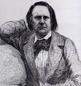
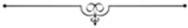
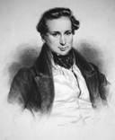

[[
]{.calibre_7}]{.bold}

### [[[La liberté de la presse]{.calibre2}]{.bold1}]{.calibre_39} {#la-liberté-de-la-presse .calibre_38}

[Discours prononcé à l'Assemblée Nationale]{.calibre_10}

[Le 9 juillet 1850
{.calibre3}]{.calibre_10}

[ ]{.calibre4}

[Présidence de M. Dupin]{.calibre_10}

[\[\...\]
L'Assemblée a décidé hier qu'on passerait à la discussion des articles.
[M. Victor Lefranc.]{.bold}
C'est trop fort !
[M. le Président.]{.bold}
Sur l'art. 1^[er]{.calibre18}^ M. Savoye a proposé un article qui est tout à fait l'opposé de la loi. C'est son droit.
[M. Victor Lefranc.]{.bold}
Il ne faut cependant pas supprimer la discussion parce qu'il y a eu tapage.
[(M. Victor Hugo paraît à la tribune. Il échange quelques mots avec M. le président.)]{.italic}
[M. Victor Lefranc.]{.bold}
On ne peut supprimer la discussion.
[M. le Président.]{.bold}
Monsieur Victor Hugo, attendez donc ; vous allez avoir la parole sur cet article.]{.calibre4}

[Si le débat commence au milieu du bruit, tout le reste de la discussion s'en ressentira. Je rappelle que l'Assemblée a décidé hier qu'on passerait à la discussion des articles\...
[Un membre à l'extrême gauche.]{.bold}
Personne n'a entendu !
[M. le Président.]{.bold}
Laissez donc le président s'expliquer.
Sur l'art. 1^[er]{.calibre18}^ deux amendements ont été présentés, l'un de M. Savoye, l'autre de M. Pelletier, demandant l'abolition du cautionnement. C'est tout à fait l'opposé de la loi, qui demande, au contraire, que le cautionnement soit maintenu avec aggravation ; il est évident que c'est là une disposition capitale, générale, sur laquelle M. Victor Hugo a la parole.
[Voix à droite.]{.bold}
Que M. Savoye commence par le développer !
[M. le Président.]{.bold}
M. Savoye cède son tour de parole à M[.]{.italic} Victor Hugo.
[M. Victor Hugo.]{.bold}
Messieurs, comme vient de le dire notre honorable président, l'art. 1^[er]{.calibre18}^ rouvre la discussion de la loi entière, dont il contient toute l'économie.]{.calibre4}

[J'aborde immédiatement cette discussion.]{.calibre4}

[Quoique les vérités qui sont la base de toute démocratie et en particulier de la grande démocratie française aient reçu, le 31 mai dernier, une grave atteinte, comme l'avenir n'est jamais fermé, il est toujours temps de les rappeler à une assemblée législative. Ces vérités, selon moi, les voici :]{.calibre4}

[La souveraineté du peuple, le suffrage universel, la liberté de la presse sont trois choses identiques, ou, pour mieux dire, c'est la même chose sous trois noms différents ; à elles trois, elles constituent notre droit public tout entier. La première en est le principe ; la seconde en est le mode d'action ; la troisième en est l'expression multiple, animée, vivante, mobile comme la nation elle-même. Ces trois faits, ces trois principes liés d'une solidarité essentielle, ayant chacun leur fonction : la souveraineté du peuple vivifiant, le suffrage universel gouvernant, la presse éclairant, se confondent dans une étroite et indissoluble unité, et cette unité, c'est la République. [(Approbation à gauche.)]{.italic}]{.calibre4}

[Partout où ces trois principes, souveraineté du peuple, suffrage universel, liberté de la presse, existent dans leur plénitude et dans leur toute-puissance, la République existe, même sous le mot [monarchie.]{.italic} Là où ces trois principes sont amoindris dans leur développement, opprimés dans leur action, méconnus dans leur solidarité, contestés dans leur majesté, il y a monarchie ou oligarchie, même sous le mot [république.
]{.italic} [M. Bouhier de l'Écluse]{.bold}.
C'est inexact.
[M. Victor Hugo.]{.bold}
Et c'est alors, comme il n'y a plus rien qui soit dans l'ordre vrai et dans la logique, c'est alors qu'on peut voir ce phénomène monstrueux d'un gouvernement renié par ses propres fonctionnaires.
[À gauche.]{.bold}
Très bien ! très bien !
[M. Victor Hugo.]{.bold}
C'est alors que les plus fermes coeurs se prennent à douter des révolutions, de ces grands événements si faciles à trahir, qui font sortir de l'ombre, en même temps, de si grandes idées et de si petits hommes !\...
[À gauche.]{.bold}
Très bien ! très bien ! Bravo ! ([Applaudissements redoublés. --- Quelques applaudissements ironiques se font entendre à droite.)]{.italic}
[Un membre à droite.]{.bold}
C'est du gouvernement provisoire sans doute, que vous voulez parler ; ce sont des épigrammes sur vos nouveaux amis. [(Rumeurs à gauche.)
]{.italic} [M. Victor Hugo.]{.bold}
\...Des révolutions, dis-je...]{.calibre4}

[[(Agitation en sens divers.)]{.italic}
[M. le Président,]{.bold} [à la gauche.]{.italic}
N'interrompez pas [(Exclamations à gauche.)]{.italic} Vous avez applaudi, vous devez être contents. Gardez le silence maintenant. [(On rit.)]{.italic} Je n'ai pas contredit les applaudissements ; je demande le silence maintenant à la droite comme à la gauche. [(Nouveaux rires d'approbation.)
]{.italic} [M. Victor Hugo.]{.bold}
\...Des révolutions, dis-je, que nous proclamons toutes des bienfaits pour l'humanité\.... [(Marques de dénégation.)
]{.italic} [
Voix à droite.]{.bold}
Il en faut faire tous les jours, alors.
[M. Victor Hugo.]{.bold}
\...Que nous considérons, que nous proclamons toutes être des bienfaits pour l'humanité\... [Interruption.
]{.italic} [M. le Président.]{.bold}
Je rappellerai à l'ordre tous les interrupteurs que je distinguerai.
[M. Victor Hugo.]{.bold}
\...Que nous proclamons bienfaits pour l'humanité, quand nous considérons les principes qu'elles dégagent, mais qu'on peut certes appeler des catastrophes quand on voit les ministres qu'elles produisent.]{.calibre4}

[[(Applaudissements à gauche.--- Rires à droite et au banc des ministres.)]{.italic}]{.calibre4}

[Messieurs, ces trois principes que je vous rappelais en commençant, prenons-y garde, sont solidaires, et, ne l'oublions pas, vivent d'une vie commune. Aussi voyez comme ils se défendent réciproquement. La liberté de la presse est-t-elle en péril, le suffrage universel se lève et la protège. Le suffrage universel est-il menacé, la presse accourt et le défend.
[Un membre.]{.bold}
Et l'abandonne. [(On rit.)
]{.italic} [M. Victor Hugo.]{.bold}
Toute atteinte au suffrage universel, toute atteinte à la liberté de la presse, frappe la souveraineté nationale. La liberté mutilée, c'est la souveraineté paralysée ; la souveraineté du peuple n'est pas, si elle ne peut agir et si elle ne peut parler. Or, entraver le suffrage universel, c'est lui ôter l'action ; entraver la liberté de la presse, c'est lui ôter la parole.]{.calibre4}

[Eh bien, messieurs, la première moitié de cette entreprise redoutable a été faite le 31 mai dernier.]{.calibre4}

[On veut aujourd'hui faire la seconde. Tel est le but de la loi proposée. C'est le procès de la souveraineté du peuple qui s'instruit, qui se poursuit et qu'on mène à fin. Il m'est impossible, pour ma part, de ne pas me lever de mon banc et de ne pas venir à cette tribune avertir l'Assemblée. [(Rumeurs à droite. --- Approbation à gauche.)]{.italic}]{.calibre4}

[Messieurs, je l'avouerai, j'avais cru d'abord que le cabinet renoncerait à cette loi.]{.calibre4}

[Il me semblait, en effet, que la liberté de la presse était déjà toute livrée au Gouvernement. La jurisprudence aidant, on avait contre la pensée tout un arsenal d'armes parfaitement inconstitutionnelles, c'est vrai, mais parfaitement légales. Que pouvait-on désirer de plus et de mieux ? La liberté de la presse n'était-elle pas saisie au collet par les sergents de ville dans la personne du colporteur, traquée dans la personne du crieur et de l'afficheur, mise à l'amende dans la personne du vendeur, persécutée dans la personne du libraire, destituée dans la personne de l'imprimeur, emprisonnée dans la personne du gérant ? Il ne lui manquait qu'une chose ; mais malheureusement notre siècle incroyable se refuse à ce genre de spectacles utiles, c'était d'être brûlée vive en pleine place publique, sur un bon bûcher orthodoxe, dans la personne de l'écrivain. [(Exclamations à droite---Vive approbation à gauche.)]{.italic}]{.calibre4}

[Voyez, messieurs, où nous en étions et comme c'était bien arrangé ! De la loi sur les brevets d'imprimerie sainement comprise, on faisait une muraille entre le journaliste et l'imprimeur : écrivez votre journal, soit, on ne l'imprimera pas ! De la loi sur le colportage dûment interprétée, on faisait, une muraille entre le journal et le public : imprimez votre journal, soit, on ne le publiera pas ! Entre ces deux murailles, double enceinte construite autour de la pensée, on disait à la presse : « Tu es libre ! » ce qui ajoutait aux satisfactions de l'arbitraire les joies de l'ironie.]{.calibre4}

[Et en particulier quelle excellente loi que cette loi des brevets d'imprimeur ! Les hommes opiniâtres qui veulent absolument que les constitutions aient un sens, qu'elles portent un fruit et qu'elles contiennent une logique quelconque, ces hommes-là se figuraient que cette loi de 1814 était virtuellement abrogée par l'art. 8 de la constitution qui proclame la liberté de la presse. Ils se disaient avec Benjamin Constant, avec M. Eusèbe Salverte, avec M. Firmin Didot, avec l'honorable M. de Tracy, ils se disaient que cette loi de 1814 était désormais un non-sens ; que la liberté d'écrire, c'était la liberté d'imprimer, ou que ce n'était rien ; qu'en affranchissant la pensée, l'esprit de progrès avait nécessairement affranchi tous les procédés matériels dont elle se sert ; que, sans cela, ce prétendu affranchissement serait une dérision ; que la presse et l'écritoire, c'est la même chose ; que la presse n'est autre chose que l'écritoire élevée à sa plus haute puissance. Ces hommes-là se disaient que la pensée a été créée par Dieu, pour s'envoler libre en sortant du cerveau de l'homme, et que les presses ne font que lui donner ces millions d'ailes dont parle l'Ecriture ; Dieu l'a faite aigle, et Gutenberg l'a faite légion ! que si c'est un malheur, il faut s'y résigner ; car au 19^[e]{.calibre18}^ siècle il n'y a pas, pour les sociétés humaines, d'autre air respirable que la liberté.]{.calibre4}

[Ils se disaient enfin, ces hommes obstinés, que pour les citoyens d'un pays vraiment libre, dans un temps qui doit être, avant tout, une époque d'enseignement universel ; que pour les citoyens d'un pays vraiment libre, dis-je, à la seule condition de mettre à son Oeuvre la marque d'origine, avoir une idée dans son cerveau, avoir un écritoire sur sa table, avoir une presse dans sa maison, c'étaient là trois droits identiques, et que nier l'un c'était nier les deux autres ; que sans doute tous les droits s'exercent sous la réserve de se conformer aux lois, mais à la condition que les lois seront les tutrices et non les geôlières de la liberté.
[À gauche.]{.bold}
Très bien !
[M. Victor Hugo.]{.bold}
Voilà, messieurs, ce que se disaient ces hommes qui ont cette infirmité de s'entêter aux principes qui exigent que les institutions d'un pays prennent pour base la logique et la vérité.]{.calibre4}

[Mais quand je vois les lois qu'on nous présente, j'ai bien peur que la vérité ne soit une démagogue, que la logique ne soit une rouge, et que ce ne soient là un langage et des opinions d'anarchiste et de factieux.]{.calibre4}

[Voyez, messieurs, en regard du système que je viens de vous exposer, qui était celui de Benjamin Constant (je cite avec plaisir le nom de cet infatigable athlète de la liberté) en regard du système que je viens de vous exposer, voyez le système contraire.]{.calibre4}

[Quelle bonne et excellente loi, j'y reviens et j'y insiste, que cette loi des brevets d'imprimerie, entendue comme on l'entend, et pratiquée comme on la pratique ! Quelle bonne et excellente chose que de proclamer en même temps la liberté de l'ouvrier et la servitude de l'outil ; que de dire : la plume est à l'écrivain, mais l'écritoire est à la police ; la presse est libre mais l'imprimerie est esclave !]{.calibre4}

[Et dans l'application, quels beaux résultats ! quels phénomènes d'équité ! Jugez-en. Ceci est une instinctive et utile préface à la discussion de la loi que nous abordons en ce moment.]{.calibre4}

[Voici un exemple, jugez.]{.calibre4}

[Il y a un an, le 13 juin, une imprimerie est saccagée ; par qui ? je ne l'examine pas en ce moment ; je cherche plutôt à atténuer le fait qu'à l'aggraver ; il y a eu deux imprimeries ravagées, mais je ne m'occupe que d'une seule en ce moment. Une imprimerie donc est mise à sac, ravagée de fond en comble ; une commission nommée par le Gouvernement, commission dont le représentant qui vous parle avait l'honneur d'être membre, vérifie les faits, entend des rapports d'experts, déclare qu'il y a lieu à indemnité, et propose, si je ne me trompe, pour cette imprimerie spécialement, un chiffre de 75,000 fr. La décision réparatrice se fait attendre ; au bout d'un an, l'imprimeur, victime du désastre, reçoit enfin une lettre du ministre ; que lui apporte cette lettre ? L'allocation de son indemnité ? Non, le retrait de son brevet.]{.calibre4}

[Admirez ceci, messieurs : des furieux dévastent une imprimerie. Compensation : le Gouvernement ruine l'imprimeur.
[A gauche.]{.bold}
Très bien !]{.calibre4}

[[(L'orateur s'arrête un instant et paraît indisposé.)
]{.italic} [Voix diverses.]{.bold}
Reposez-vous ! reposez-vous !
[M. le Président.]{.bold}
Voulez-vous que je suspende un moment la séance ?
[M. Victor Hugo.]{.bold}
C'est inutile ; je vous remercie. Je reprends.]{.calibre4}

[Est-ce que tout cela n'était pas merveilleux, messieurs ? Est-ce qu'il n'y avait pas, dans cet ensemble de moyens d'action placés dans la main du pouvoir, toute l'intimidation possible ? Est-ce que tout n'était pas épuisé là, en fait d'arbitraire et de tyrannie ? et y avait-il encore quelque chose au-delà ? Oui, messieurs, il y avait cette loi.]{.calibre4}

[Messieurs, je l'avoue, il m'est difficile de parler de cette loi avec sang-froid. Je vais essayer cependant de le faire, et j'y parviendrai.]{.calibre4}

[Ce projet, c'est là son caractère, cherche à faire obstacle de toutes parts à la pensée ; il fait peser sur la presse politique, indépendamment du cautionnement ordinaire, un cautionnement d'un genre nouveau, le cautionnement éventuel, le cautionnement discrétionnaire, le cautionnement de bon plaisir, lequel, selon la fantaisie du ministère public, peut s'élever brusquement à des sommes monstrueuses, exigibles dans les trois jours.]{.calibre4}

[Au rebours de toutes les règles du droit criminel, qui présume toujours l'innocence, ce projet présume la culpabilité, et il condamne d'avance à la ruine un journal qui n'est pas encore jugé. Au moment où la feuille incriminée franchit le passage de la chambre d'accusation à la salle des assises, le cautionnement éventuel est là qui l'attend, qui la saisit, et qui l'exécute entre les deux portes ; puis, quand le journal est mort, il le jette aux jurés et il leur dit : Jugez-le ! Double et indigne dérision et pour le justiciable et pour la justice ! [(Approbation à gauche.)]{.italic}]{.calibre4}

[Messieurs, ce projet favorise une presse aux dépens de l'autre ; il met cyniquement deux poids et deux mesures dans la main de la loi.]{.calibre4}

[En dehors de la politique, ce projet fait tout ce qu'il peut pour diminuer la gloire et la lumière de la France. Il ajoute des impossibilités matérielles, des impossibilités d'argent aux difficultés innombrables déjà qui gênent en France la production et l'avènement des talents. Si Pascal, si La Fontaine, si Voltaire, si Montesquieu, si Diderot, si Jean-Jacques sont vivants, ce projet les assujettit au timbre. Il n'est pas une page illustre qu'il ne fasse salir par le timbre.]{.calibre4}

[Messieurs, ce projet, quelle honte ! pose le stigmate du fisc sur la littérature, sur les chef-d'oeuvres, sur les beaux livres. Ah ! ces beaux livres, au siècle dernier, le bourreau les brûlait, mais il ne les tachait pas. [(Bravos et. approbation à gauche.)]{.italic}]{.calibre4}

[Ce n'était plus que de la cendre, mais cette cendre immortelle, le vent l'emportait et la jetait dans toutes les âmes, comme une semence de vie et de liberté.
[À gauche.]{.bold}
Très bien ! très bien !
[M. Victor Hugo.]{.bold}
Messieurs, sous peine d'amendes folles, folles, je dis le mot, et je désire que la commission l'entende, sous peine d'amendes dont le chiffre, c'est le journal des [Débats]{.italic} qui a publié les calculs le premier, sous peine d'amendes dont le chiffre pour une seule contravention, écoutez bien ceci, pour une seule contravention peut varier de deux millions cinq cent mille francs à dix millions !\... [(Réclamations sur les bancs de la majorité)]{.italic} c'est incontestable.
[M. Barthélemy Saint-Hilaire.]{.bold}
Ce sont des chiffres.
[M. Victor Hugo.]{.bold}
Ce sont des chiffres que voici, que je vous communique, si vous le voulez, car vous n'avez pas étudié votre loi. Lisez-les, ces chiffres, les voilà.]{.calibre4}

[[(L'orateur présente à M. le rapporteur qui siège au banc de la commission le papier qu'il tient à la main. --- Exclamations à droite.)
]{.italic} [M. le Rapporteur.]{.bold}
C'est à moi à qui vous vous adressez ? C'est une plaisanterie que je n'accepte pas, que je ne peux pas accepter de vous.
[M. Victor Hugo.]{.bold}
J'offre ces renseignements à la commission.
[M. le Président.]{.bold}
Le rapporteur n'est pas tenu d'accepter votre offre. [(On rit.)
]{.italic} [M. Victor Hugo,]{.bold} [insistant, toujours le papier à la main.]{.italic}
Je vous l'offre.
[Voix à droite.]{.bold}
Il n'en veut pas.
[Autre voix.]{.bold}
C'est une plaisanterie trop prolongée.
[M. Victor Hugo.]{.bold}
J'offre ce renseignement à la commission ; elle est maîtresse de ne pas l'accepter.
[Au banc de la commission.]{.bold}
On vous répondra à l'art. 10.
[M. Victor Hugo.]{.bold}
Sous la menace de ces amendes extravagantes, ce projet condamne au timbre toute édition publiée par livraison, quelle qu'elle soit, de quelque ouvrage que ce soit, de quelque auteur que ce soit, mort ou vivant. En d'autres termes, il tue la librairie. Entendons-nous : ce n'est que la librairie française qu'il tue, car du contrecoup il enrichit la librairie belge ; il met sur le pavé notre imprimerie, notre librairie, notre fonderie de caractères, notre papeterie ; il ruine nos ateliers, nos manufactures, nos usines ; mais il fait les affaires de la contrefaçon.
[À gauche.]{.bold}
C'est cela ! Très bien !
[M. Victor Hugo.]{.bold}
Il ôte à nos ouvriers leur pain, et il le jette aux ouvriers étrangers.
Messieurs, ce projet, tout empreint de certaines rancunes, timbre toutes les pièces de théâtre, sans exception.
[À droite.]{.bold}
Ah ! ah !
[M. Victor Hugo.]{.bold}
\...Timbre toutes les pièces de théâtre sans exception, je le répète, Corneille aussi bien que Molière ; il se venge de Tartuffe sur Polyeucte. [(Rires d'assentiment à gauche.)]{.italic} Oui, remarquez-le bien, j'insiste, ce projet n'est pas moins hostile à la production littéraire qu'à la polémique politique ; et c'est là, ne vous y trompez pas, ce qui lui donne son vrai cachet de loi cléricale\... [(Oh ! oh ! --- Rires ironiques et rumeurs à droite. --- Applaudissements à gauche.)]{.italic}]{.calibre4}

[\... Il poursuit le théâtre autant que le journal-, il voudrait briser dans les mains de Beaumarchais le miroir où Bazile s'est reconnu. [(Bravos à gauche. --- Rumeurs et marques d'impatience à droite.)
]{.italic} [M. Léon de Maleville.]{.bold}
Et Tartufe ? il est démagogue aujourd'hui ; quand la religion est à la mode, Tartufe est dévot ; mais dans ce moment-ci, il est démagogue. [(Approbation et rires à droite.)
]{.italic} [M. Victor Hugo.]{.bold}
Ce projet de loi n'est pas moins maladroit que malfaisant.
[Une voix.]{.bold}
A l'amendement !
[M. le Président.]{.bold}
Laissez donc discuter ; l'amendement, c'est la loi elle-même.
[M. Victor Hugo.]{.bold}
Le projet n'est pas moins maladroit que malfaisant ; écoutez encore ce détail, vous qui souhaitez que les lettres restent paisibles. Ce projet supprime d'un coup, à Paris seulement, environ 300 recueils spéciaux (j'en ai la liste, je vous la communiquerai), recueils parfaitement inoffensifs et utiles, qui poussent les esprits vers les études les plus calmantes et les plus sereines. Voilà le résultat de ce projet. Enfin, ce qui couronne, ce qui complète tous ces actes, que je qualifierai d'actes de lèse-civilisation, ce projet rend impossible cette presse populaire des petits livres\...
[À droite.]{.bold}
Ah ! ah !
[M. Victor Hugo.]{.bold}
Qui est le pain à bon marché de l'intelligence. [(Approbation à gauche.)
]{.italic} [M. de Tinguy.]{.bold}
Dites le poison.
[M. de la Rochejaquelein.]{.bold}
Mais il y a le contre poison.
[M. Victor Hugo.]{.bold}
En revanche, il crée un privilège de circulation au profit de cette pitoyable coterie ultramontaine à laquelle est livrée maintenant l'instruction publique. Montesquieu sera entravé, mais le père Loriquet sera libre.]{.calibre4}

[Messieurs, la haine de l'intelligence, voilà le fond de ce projet. Il en veut, à qui ? à tout, à la pensée du publiciste, à la pensée du philosophe, à la pensée du poète, au génie de la France.]{.calibre4}

[Ainsi, la pensée et la presse opprimées sous toutes les formes, les livres traqués, le journal persécuté, le théâtre suspect, la littérature suspecte, le talent suspect et traité comme tel, la plume brisée entre les doigts de l'écrivain, la librairie tuée, dix ou douze grandes industries nationales détruites, le pain ôté aux ouvriers, le livre ôté aux intelligences, le privilège de lire vendu aux riches et refusé aux pauvres [(Vive approbation à gauche),]{.italic} tous les flambeaux du peuple éteints, les masses arrêtées, chose impie, dans leur ascension vers la lumière, toute justice violée, le jury destitué et remplacé par les chambres d'accusation, la confiscation rétablie par î'énormité des amendes, la condamnation et l'exécution avant jugement, voilà ce projet !
[À gauche.]{.bold}
C'est cela ! très bien !
[M. Victor Hugo.]{.bold}
Je ne le qualifie pas, je le raconte. [(Très bien !)]{.italic}]{.calibre4}

[Messieurs, après trente-cinq ans d'éducation du pays par la liberté de la presse, alors qu'il est démontré pour tout le monde, par l'éclatant exemple des Etats-Unis, de l'Angleterre, de la Belgique, que la presse libre est tout à la fois le symptôme le plus évident, et l'élément le plus certain de la paix publique ; après trente-cinq ans, dis-je, de possession de la liberté de la presse, après trois siècles de splendeur littéraire et de suprématie intellectuelle, c'est là où nous en sommes ! Les expressions me manquent ; toutes les inventions de la restauration sont dépassées ; en présence d'un projet pareil, les lois de censure sont de la clémence, la loi [de justice et d'amour]{.italic} est un bienfait ; je demande qu'on élève une statue à M. de Peyronnet ! [(Mouvement prolongé. --- Assentiment à gauche. --- Rires ironiques à droite.)
]{.italic} [M. de la Rochejaquelein.]{.bold}
C'est vrai !
[M. Victor Hugo.]{.bold}
Vous riez, mais vous vous méprenez ; ceci n'est pas un sarcasme, c'est un hommage. M. de Peyronnet a été laissé bien loin en arrière par ceux qui ont signé sa condamnation, de même que M. Guizot a été bien dépassé par ceux qui l'ont mis en accusation.
[A gauche.]{.bold}
Très bien !
[M. Victor Hugo.]{.bold}
M. de Peyronnet, dans cette enceinte, je n'en doute pas, et je lui rends cette justice, voterait avec indignation contre ce projet ; et quant à M. Guizot, dont le grand talent honorerait toutes les assemblées s'il faisait jamais partie de celle-ci, ce serait lui, je l'espère qui déposerait sur cette tribune l'acte d'accusation de M. Baroche. [(Hilarité générale. --- Applaudissements à gauche.)]{.italic}]{.calibre4}

[Et vous appelez cela une loi ! Non, ce n'est pas là une loi ; non ; j'en appelle à toutes les consciences honnêtes qui m'écoutent, ce ne sera jamais là une loi de mon pays ; c'est trop, c'est décidément trop de choses mauvaises, trop de choses funestes, vous ne nous ferez pas prendre pour la robe de la loi cette robe de jésuite jetée sur tant d'iniquités ! [(Bravos à gauche.)
]{.italic} [M. de la Rochejaquelein.]{.bold}
Il y a les jésuites religieux et les jésuites politiques.
[M. Victor Hugo.]{.bold}
Ce que c'est que cette loi, ce que c'est que ce projet, voulez-vous que je vous le dise ? C'est une protestation de notre Gouvernement contre nous-mêmes ; cette protestation, qui est dans le coeur de la loi, vous l'avez entendue sortir, hier, du coeur du ministre ! c'est une protestation du ministère et de ses conseillers contre l'esprit de notre siècle et contre l'instinct de notre pays, c'est-à-dire une protestation du fait contre l'idée, de ce qui n'est que la matière du Gouvernement contre ce qui en est la vie, de ce qui n'est que le pouvoir contre ce qui est la puissance, de ce qui doit passer contre ce qui doit rester ; une protestation de quelques hommes chétifs qui n'ont pas même à eux la minute qui s'écoule, contre la grande nation et contre l'immense avenir !
[À gauche.]{.bold}
Très bien ! très bien !
[M. Victor Hugo.]{.bold}
Encore, si cette protestation n'était que puérile, mais c'est qu'elle est fatale ! vous ne vous y associerez pas, messieurs, vous en comprendrez le danger ; vous rejetterez cette loi ; oui, je veux l'espérer ; quant à moi, les clairvoyants de la majorité, et, le jour où ils voudront se compter, ils s'apercevront qu'ils sont les plus nombreux ; les clairvoyants de la majorité finiront par l'emporter sur les aveugles : vous retiendrez à temps un pouvoir qui se perd, et, tôt ou tard, de cette grande Assemblée destinée à se retrouver un jour face à face avec la nation, on verra sortir le vrai Gouvernement du pays. Le vrai Gouvernement du pays, ah ! ce n'est pas lui qui nous apporte une telle loi. Messieurs, dans un siècle comme le nôtre, pour une nation comme la France, après trois révolutions qui ont fait surgir une foule de questions capitales de civilisation dans un ordre inattendu, le vrai Gouvernement, le bon Gouvernement est celui qui accepte toutes les conditions du développement social, qui accueille l'intelligence comme un auxiliaire, la liberté de la presse comme un auxiliaire et non comme une ennemie, qui aide la vérité à sortir de la mêlée des systèmes, qui fait servir toutes les libertés à féconder toutes les forces, qui aborde de bonne foi le problème de l'éducation pour l'enfant et du travail pour l'homme. Le vrai Gouvernement est celui auquel la lumière qui s'accroît ne fait pas mal, et auquel le peuple qui grandit ne fait pas peur. [(Approbation à gauche.)]{.italic} Le vrai Gouvernement est celui qui met loyalement à l'ordre du jour, pour les approfondir et pour les accomplir, toutes les promesses contenues dans l'art. 13 de la constitution, la grande question du peuple, en un mot. Le vrai Gouvernement est celui qui organise et non celui qui comprime ; celui qui se met à la tête de toutes les idées, et non celui qui se met à la suite de toutes les rancunes ; le vrai Gouvernement de la France, au 19^[e]{.calibre18}^ siècle, non, ce n'est pas, ce ne sera jamais celui qui va en arrière ! [(Adhésion à gauche.)]{.italic}
[M. de Lamoricière.]{.bold}
Très bien !
[M. Victor Hugo.]{.bold}
Messieurs, en des temps comme ceux-ci, prenez garde aux pas en arrière ! On vous parle beaucoup de l'abîme, de l'abîme qui est là béant, ouvert, terrible, de l'abîme où la société peut tomber. Messieurs, il y a un abîme, en effet. Seulement il n'est pas devant vous, il est derrière vous : vous n'y marchez pas, vous y reculez.
[À gauche.]{.bold}
Très bien ! très bien !
[M. Victor Hugo.]{.bold}
L'avenir où une réaction insensée vous pousse, quoi qu'on en dise, est assez prochain et assez visible pour qu'on puisse en indiquer, dès à présent, les redoutables linéaments.]{.calibre4}

[Ecoutez. il est temps encore de s'arrêter. En 1829 on pouvait éviter 1830 ; en 1847 on pouvait éviter 1848 ; il suffisait d'écouter ceux qui disaient aux deux monarchies entraînées : Voilà le gouffre ! J'ai le droit de parler ainsi, messieurs ; j'ai été, dans mon obscurité, j'ai été de ceux qui ont averti les deux monarchies entraînées\... [(Exclamations ironiques à droite.)
]{.italic} [M. de Mornay.]{.bold}
N'abordez pas ce terrain-là, croyez-moi !
[M. Victor Hugo.]{.bold}
J'ai été de ceux-là, j'ai eu raison de dire dans mon obscurité, car vous n'en saviez rien ; les faits sont là cependant pour le prouver\...
[Un membre à droite.]{.bold}
Et les lettres aussi.
[M. Victor Hugo.]{.bold}
Je répète que j'ai été de ceux qui ont averti les deux monarchies entraînées\... (Nouvelles exclamations à droite.) Eh bien, je vais vous citer une date, et vous pourrez lire ; lisez ce que j'ai dit à la chambre des pairs, le 13 juin 1847, M. de Montebello doit s'en souvenir. J'ai donc été de ceux qui ont averti les deux monarchies entraînées, qui l'ont fait loyalement, qui l'ont fait inutilement, mais qui l'ont fait avec un sincère et ardent désir de les sauver. [(Rumeurs et chuchotements à droite.)]{.italic}]{.calibre4}

[Eh bien, c'est la troisième fois que j'avertis, et il est probable que j'échouerai encore.]{.calibre4}

[Hommes qui nous gouvernez, ministres ! et en parlant ainsi je m'adresse non seulement aux ministres publics que je vois sur ce banc, mais aux ministres anonymes\...
[À droite.]{.bold}
Ah ! ah !
[M. Victor Hugo.]{.bold}
\.... Car il y a, en ce moment, deux sortes de gouvernants, ceux qui se montrent et ceux qui se cachent (Assentiment à gauche) ; et nous savons tous que M. le Président de la République est un Numa qui a dix-sept Egéries. [(Hilarité générale et prolongée.)
]{.italic} [M. Charles Abbatucci.]{.bold}
Vous faites beaucoup trop d'honneur aux dix-sept ; vous les flattez trop !
[M. Victor Hugo.]{.bold}
Ministres ! ce que vous faites, le savez-vous ? Où vous allez, le voyez-vous ? Non ! eh bien, je vais vous le dire : ces lois que vous nous demandez, ces lois que vous arrachez à la majorité, avant trois mois, vous vous apercevrez d'une chose, c'est qu'elles sont inefficaces ; que dis-je, inefficaces ! aggravantes pour la situation !]{.calibre4}

[La première élection que vous tenterez, la première épreuve que vous ferez de votre suffrage remanié, tournera, on peut vous le prédire, de quelque façon que vous vous y preniez, à la confusion de la réaction.]{.calibre4}

[Voilà pour la question électorale.]{.calibre4}

[Quant à la presse, quelques journaux ruinés ou morts enrichiront de leurs dépouilles ceux qui survivront. Vous trouvez les journaux trop irrités et trop forts : avant trois mois vous aurez doublé leur force ; il est vrai que vous aurez aussi doublé leur colère, ô hommes d'Etat !]{.calibre4}

[Voilà pour les journaux.]{.calibre4}

[Ainsi vous vous serez frappés avec vos propres lois ; vous vous serez blessés avec vos propres armes. Les principes se dresseront de toutes parts contre vous ; persécutés, ce qui les fera forts ; indignés, ce qui les fera terribles ! Vous direz : Le péril s'aggrave ; vous direz : Nous avons frappé le droit de réunion, cela n'a rien fait ; nous avons frappé le suffrage universel, cela n'a rien fait ; nous avons frappé la liberté de la presse, cela n'a rien fait ; il faut extirper le mal dans sa racine. Et alors, poussés irrésistiblement comme de malheureux hommes possédés, subjugués, traînés par la plus implacable des logiques, la logique des fautes qu'on a faites, sous la pression de cette voix fatale qui vous criera : Marchez ! marchez toujours ! que ferez-vous ? [(Bruit et mouvements divers.)]{.italic}]{.calibre4}

[Messieurs, je ne veux pas sonder jusqu'au fond un avenir qui n'est peut-être que trop prochain ; je ne veux pas presser douloureusement et jusqu'à l'épuisement des conjectures les conséquences de toutes vos fautes commencées ; mais je dis que c'est une épouvante pour les bons citoyens, que de voir le Gouvernement s'engager sur une pente connue, au bout de laquelle il y a le précipice. Je dis qu'on a déjà vu plus d'un Gouvernement descendre cette pente, mais qu'on n'en a vu aucun la remonter. Je dis que nous en avons assez, nous qui ne sommes pas le Gouvernement, qui ne sommes que la nation\... [(Rires ironiques à droite.)
]{.italic} [M. Léon de Maleville.]{.bold}
C'est modeste !
[M. Victor Hugo.]{.bold}
Nous en avons assez des provocations et des réactions ! nous en avons assez des hommes qui nous perdent, sous prétexte qu'ils sont des sauveurs ! Je dis que nous ne voulons plus de révolutions nouvelles\...
[A droite.]{.bold}
Ah ! ah !
[M. Victor Hugo.]{.bold}
Je dis que, de même que tout le monde a tout à gagner au progrès, personne n'a plus rien à gagner aux révolutions.]{.calibre4}

[Oui, il faut que ceci soit clair pour tous les esprits, il faut que ceci soit clair pour toutes les consciences ; il est temps d'en finir avec ces éternelles déclamations\... [(Exclamations et rires à droite.)
]{.italic} [Quelques voix à droite.]{.bold}
Oui ! oui ! il est temps !
[M. Victor Hugo.]{.bold}
Il est temps d'en finir avec ces éternelles déclamations qui servent de prétexte à toutes les entreprises contre nos libertés, contre nos droits, contre le suffrage universel, contre la liberté de la presse ; et, quant à moi, je saisirai toutes les occasions, je ne me lasserai jamais de le répéter : dans l'état où est aujourd'hui la question politique, s'il y a des révolutionnaires dans cette Assemblée, ce que je n'affirme pas, s'il y en a, ce n'est pas de ce côté [(la gauche).
]{.italic} [M. Miot.]{.bold}
Il y en a ! [(Hilarité prolongée à droite.)
]{.italic} [M. Léon de Maleville.]{.bold}
Écoutez ! On vous donne un démenti à gauche !
[M. Victor Hugo.]{.bold}
Messieurs, à l'heure où nous sommes, les anarchistes, ce sont les absolutistes. Les révolutionnaires, ce sont les réactionnaires !]{.calibre4}

[Et quant aux véritables auteurs de cette loi qui essayent vainement de se cacher sous leurs rires, quant à nos adversaires jésuites\... (Interruptions diverses à droite.)]{.calibre4}

[Et quant aux véritables auteurs de cette loi, quant à nos adversaires jésuites\... [(Nouvelles interruptions à droite.)
]{.italic} [M. de Heeckeren.]{.bold}
L'orateur parle des jésuites politiques !
[M. Victor Hugo.]{.bold}
Quant à nos adversaires jésuites\...
[Une voix à droite.]{.bold}
Envoyez-le à Bicêtre !
[Une autre voix à droite.]{.bold}
C'est une véritable manie !
[M. Victor Hugo.]{.bold}
\...Quant à nos adversaires jésuites\... [(Bruyantes exclamations à droite.)
]{.italic} [M. le Président]{.bold}, [s'adressant au côté droit.]{.italic}
Vous voulez donc faire la contrepartie ? Vous ne pouvez pas entendre ce mot-là de sang-froid ?
[M. Victor Hugo.]{.bold}
Quant à ces apologistes de l'inquisition\... [(Oh ! oh !)]{.italic} Oui, oui, oui, quant à ces terroristes de l'Eglise, voici ce que j'ai à leur dire\... [(Bruit et interruption à droite.)
]{.italic} [M. le Président.]{.bold}
J'invite la droite à faire silence. Il est évident qu'avec vos interruptions géminées vous marchez à l'imitation de ce que j'ai essayé vainement de réprimer hier ; il faut savoir écouter, et répondre surtout. [(Rires approbatifs.)
]{.italic} [M. Victor Hugo.]{.bold}
Vous ne m'empêcherez pas de parler. [(Oh ! oh !)
]{.italic} [Une voix à droite.]{.bold}
C'est une dérision !
[M. Victor Hugo.]{.bold}
Je touche ici le coeur même de la loi, et je le sens bien à la résistance que j'éprouve là [(la droite).]{.italic} [(Exclamations diverses.)]{.italic} Vous ne m'empêcherez pas de parler, soyez tranquilles. C'est le coeur de la loi, j'y touche et j'y suis ; j'attendrai un quart d'heure, tant que vous voudrez, cela m'est égal. (Bruit à droite.) Quant à ces terroristes de l'Eglise qui ont pour tout argument d'objecter 93 aux hommes de 1850, voici ce que j'ai à leur dire : Cessez, pour en venir à étouffer la liberté de la presse, cessez vos jongleries, cessez vos fantasmagories de démagogie et d'anarchie, cessez ! (Interruption et rires à droite.) Oui, cessez de nous jeter à la tête, et la terreur, et ces temps où l'on disait : « Divin coeur de Marat, divin coeur de Jésus ! » Nous ne confondons pas plus Jésus avec Marat que nous ne le confondons avec vous. [(Approbation à gauche.)]{.italic}]{.calibre4}

[Nous ne confondons pas plus la démocratie et la liberté, avec la terreur, que nous ne confondons le christianisme avec la société de Loyola\...
[M. de Montalembert.]{.bold}
Parlez-nous un peu de Torquemada.
[M. Victor Hugo.]{.bold}
Que nous ne confondons la religion de paix et d'amour avec cette abominable secte partout déguisée, et partout dévoilée, qui, après avoir prêché le meurtre des rois, prêche l'oppression des nations (Approbation à gauche), qui assortit ses infamies aux époques qu'elle traverse, faisant aujourd'hui par la calomnie ce qu'elle ne peut plus faire par le bûcher [(A gauche.]{.italic} Très bien !) assassinant les renommées parce qu'elle ne peut plus brûler les hommes [(Exclamations à droite)]{.italic}, diffamant le siècle parce qu'elle ne peut plus décimer le peuple ! odieuse école de sacrilège, de despotisme et d'hypocrisie, qui dit béatement des choses horribles, qui mêle des maximes de mort à l'Evangile, et qui empoisonne le bénitier ! [(Rires bruyants et ironiques sur les bancs de la majorité. --- Interruptions prolongées.)]{.italic}]{.calibre4}

[Messieurs, au moment de voter sur ce projet de loi, considérez ceci : Tout, aujourd'hui, les arts, les sciences, les lettres, la philosophie, la politique, les royaumes qui se font républiques, les nations qui tendent à se changer en d'immenses familles, les hommes d'instinct, les hommes de foi, les hommes de génie, les masses, tout va aujourd'hui dans le même sens, au même but, par la même route, avec une vitesse toujours accrue, avec une sorte d'harmonie terrible qui révèle l'impulsion directe de Dieu. Le mouvement au 19^[e]{.calibre18}^ siècle, dans ce grand 19^[e]{.calibre18}^ siècle, ce n'est pas seulement le mouvement d'un peuple, c'est le mouvement de tous les peuples. La France va devant et les nations la suivent, La Providence nous dit : Allez ! et sait où nous allons. Nous passons du vieux monde au monde nouveau ! [(Approbation à gauche. --- Rires ironiques à droite.)]{.italic}]{.calibre4}

[Ah ! nos gouvernants, ah ! ceux qui rêvent d'arrêter l'humanité dans sa marche, et de barrer le chemin à la civilisation, ont-ils bien réfléchi à ce qu'ils font ? Se sont-ils rendu compte de la catastrophe qu'ils peuvent amener, de l'effroyable désastre social qu'ils préparent, quand, au milieu du plus prodigieux mouvement d'idées qui ait encore emporté le genre humain, au moment où l'immense convoi passe à toute vapeur\... [(Hilarité générale à droite.)
]{.italic} [M. le Président.]{.bold}
C'est le bruit du convoi.
[M. Victor Hugo.]{.bold}
Ils viennent furtivement, misérablement, mettre de pareilles lois dans les roues de la presse, cette formidable locomotive de la pensée universelle. [(Exclamations à droite.)]{.italic}]{.calibre4}

[Messieurs, un dernier mot, et je descends de cette tribune. [(Exclamations de satisfaction à droite.)
]{.italic} [M. Mathieu]{.bold} (de la Drôme).
Nous prions les sténographes de constater ce mouvement.
[Plusieurs voix à gauche.]{.bold}
Ils sont polis, ces messieurs !
[M. le Président]{.bold}, [se tournant vers la gauche.]{.italic}
Vous avez applaudi en masse ; eh bien, il y a un murmure en masse, et voilà tout ce que je vois. Je ne puis arrêter des mouvements comme ceux-là.
[M. Victor Hugo.]{.bold}
Messieurs, réfléchissez dans votre raison, réfléchissez dans votre patriotisme. Je m'adresse, dans ce moment, à cette majorité vraie qui existe dans cette Assemblée, qui s'est plus d'une fois déjà fait jour, qui l'autre semaine, mettait à néant, par un ajournement dédaigneux, la loi des maires ; qui n'a pas voulu de la forteresse ni de la rétroactivité dans la loi de déportation ; c'est à cette majorité, qui peut sauver le pays, que je parle.]{.calibre4}

[Je ne cherche pas à convaincre ici ces théoriciens du pouvoir qui l'exagèrent, et qui, en l'exagérant, le compromettent ; qui font de la provocation en artistes pour avoir le plaisir de faire ensuite de la compression, et qui, parce qu'ils ont arraché quelques peupliers du pavé de Paris, s'imaginent être de force à déraciner la presse du coeur du peuple. [(Approbation à gauche.--- Rumeurs et rires à droite.)]{.italic}]{.calibre4}

[Je ne cherche pas à convaincre ces hommes d'Etat du passé, infiltrés depuis trente ans de tous les vieux virus de la politique.]{.calibre4}

[Je ne cherche pas à convaincre ces personnages fervents qui excommunient la presse en masse, qui ne daignent pas même distinguer la bonne de la mauvaise, et qui déclarent que le meilleur des journaux ne vaut pas le pire des prédicateurs. [(Rires approbatifs à gauche.)]{.italic} Non, je me détourne de ces esprits extrêmes et fermés, et c'est vous que j'adjure, vous, législateurs nés du suffrage universel, et qui malgré la funeste loi récemment votée, sentez la majesté de votre origine ; c'est vous que je conjure de reconnaître et de proclamer par un vote solennel, par un vote qui sera un arrêt, la puissance et la sainteté de la pensée. Dans cette entreprise contre la presse il n'y a de péril que pour la société. Quel coup espère-t-on porter aux idées avec une pareille loi, et que leur veut-on ? Les comprimer ? Elles sont incompressibles. Les circonscrire ? Elles sont infinies. Les étouffer ? Elles sont immortelles. [(A gauche]{.italic} [: Très bien !)]{.italic} Oui, immortelles.]{.calibre4}

[Un orateur de ce côté [(la droite),]{.italic} dans un discours où il me répondait, l'a nié un jour ; vous vous en souvenez peut-être ?
[Une voix à droite.]{.bold}
Et vous aussi. [(Rires à droite.)
]{.italic} [M. Victor Hugo.]{.bold}
Il s'est écrié que ce ne sont pas les idées qui sont immortelles, que ce sont les dogmes, parce que les idées sont humaines, disait-il, et que les dogmes sont divins.]{.calibre4}

[Ah ! les idées aussi sont divines, et, quant à moi, dans ma bonne volonté profonde et respectueuse pour la religion de nos pères, pour la religion catholique\...
[À droite.]{.bold}
Oh ! oh !
[M. Victor Hugo.]{.bold}
Je souhaite à tous les dogmes, n'en déplaise à l'orateur clérical\... [(Exclamations diverses à droite.)
]{.italic} [Voix à droite.]{.bold}
À l'ordre ! c'est intolérable !
[M. le Président.]{.bold}
Est-ce que vous prétendez que M. de Montalembert n'est pas représentant au même titre que vous ? [(Bruit.)]{.italic}]{.calibre4}

[Si M. de Montalembert demande la parole et relève avec vigueur vos expressions, vous vous plaindrez. Les personnalités sont défendues.
[Une voix à gauche.]{.bold}
M. le président s'est réveillé !
[M. Charras.]{.bold}
Excepté contre la révolution.
[M. le Président.]{.bold}
C'est une rancune qui se continue à travers toute une législature.
[A droite.]{.bold}
C'est cela !
[Une voix à gauche.]{.bold}
Vous laissez insulter la République !
[M. le Président.]{.bold}
La République ne souffre pas et ne se plaint pas ; elle gémit quelquefois de ses défenseurs.
[M. Victor Hugo.]{.bold}
Je n'ai pas supposé un instant, messieurs, que cette qualification pût sembler une injure à l'honorable orateur auquel je l'adressais. Si elle lui semble une injure, je m'empresse de la retirer.
[M. le Président.]{.bold}
Elle m'a paru inconvenante.]{.calibre4}

[[(M. de Montalembert se lève pour répondre.)]{.italic}
[Voix à droite.]{.bold}
Parlez ! parlez !
[À gauche.]{.bold}
Ne vous laissez pas interrompre, monsieur Victor Hugo !
[M. le Président.]{.bold}
Monsieur de Montalembert, laissez achever le discours ; n'interrompez pas ; vous parlerez après ; tous l'avez toujours fait avec plus d'avantage.
[Voix à droite.]{.bold}
Parlez ! parlez !
[Voix à gauche.]{.bold}
Non ! non !
[M. le Président]{.bold}, [à M. Victor Hugo.]{.italic}
Consentez-vous à laisser parler M. de Montalembert ?
[M. Victor Hugo.]{.bold}
J'y consens.
[M. le Président.]{.bold}
M. Victor Hugo y consent.
[M. Charras [et autres membres.]{.italic}]{.bold}
A la tribune !
[M. le Président.]{.bold}
Il est en face de vous !
[M. de Montalembert]{.bold}, [de sa place.]{.italic}
J'accepte pour moi, monsieur le président, ce que vous disiez tout à l'heure de la République. A travers tout ce discours, dirigé surtout contre moi, je ne souffre de rien et ne me plains de rien. [(Approbation à droite. --- Réclamations à gauche.)
]{.italic} [M. Victor Hugo.]{.bold}
L'honorable M. de Montalembert se trompe quand il suppose que c'est à lui que s'adresse ce discours, comme il veut bien l'appeler. [(Hilarité à droite.)]{.italic} Ce n'est pas à lui personnellement que je m'adresse, mais, je n'hésite pas à le dire, c'est à son parti, et quant à son parti, puisqu'il me provoque lui-même à cette explication, il faut bien que je le lui dise\... [(Rires bruyants à droite.)
]{.italic} [M. Piscatory.]{.bold}
Il n'a pas provoqué.
[M. le Président.]{.bold}
Il n'a pas provoqué du tout.
[M. Victor Hugo.]{.bold}
Vous ne voulez donc pas que je réponde\...
[M. le Président.]{.bold}
Vous voulez absolument faire des personnalités.
[M. Victor Hugo.]{.bold}
Combien avez-vous de poids et de mesures ? Voulez-vous, oui ou non, que je réponde ? [(Parlez !)]{.italic} Eh bien, alors, écoutez !
[Voix diverses à droite.]{.bold}
On ne vous a rien dit ; et nous ne voulons pas que vous disiez qu'on vous a provoqué.
[M. Victor Hugo.]{.bold}
Non, je n'aperçois pas M. de Montalembert au milieu des dangers de ma patrie, j'aperçois son parti tout au plus, et, quant à son parti, puisqu'il veut que je le lui dise, il faut bien qu'il sache\... [(Interruption à droite.)
]{.italic} [Quelques voix à droite.]{.bold}
Il ne vous l'a pas demandé.
[M. Victor Hugo.]{.bold}
Puisqu'il veut que je le lui dise, il faut bien qu'il sache\... [(Nouvelle interruption.)
]{.italic} [M. le Président.]{.bold}
M. de Montalembert n'a rien demandé, vous n'avez donc rien à lui répondre !
[M. Victor Hugo.]{.bold}
Comment ! je consens à être interrompu, et vous ne me laissez pas répondre ! Mais c'est un abus de la majorité, et rien de plus (Rires ironiques), sans aucun doute.
[M. le Président.]{.bold}
Vous vous faites vous-mêmes l'objection et la réponse. [(On rit.)
]{.italic} [M. Victor Hugo.]{.bold}
Que m'a dit M. de Montalembert ? que c'était contre lui que je parlais. [(Interruption à droite.)]{.italic}]{.calibre4}

[Eh bien, je lui réponds, j'ai le droit de lui répondre, et vous, vous avez le devoir de m'écouter.
[Voix à droite.]{.bold}
Comment donc !
[M. Victor Hugo.]{.bold}
Sans aucun doute, c'est votre devoir. [(Marques d'assentiment de tous les côtés.)]{.italic}]{.calibre4}

[J'ai le droit de lui répondre que ce n'est pas à lui que je m'adressais, mais à son parti, et quant à son parti, il faut bien qu'il le sache, les temps où il pouvait être un danger public sont passés.
[Voix à droite.]{.bold}
Eh bien, alors, laissez-le tranquille.
[M. le Président]{.bold}, [à l'orateur.]{.italic}
Vous n'êtes plus du tout dans la discussion de la loi. [(C'est vrai !)
]{.italic} [Un membre à l'extrême gauche.]{.bold}
Le président trouble l'orateur.
[M. le Président.]{.bold}
Le président fait ce qu'il peut pour ramener l'orateur à la question. [(Vives dénégations à gauche.)
]{.italic} [M. Victor Hugo.]{.bold}
C'est une oppression !
[M. le Président.]{.bold}
C'est vous qui avez provoqué M. de Montalembert personnellement ; M. de Montalembert a dit : Je ne me plains pas, et vous voulez maintenant, pour faire arriver une réponse, vous faire une objection à vous-même. [(Rires approbatifs à droite.)]{.italic}]{.calibre4}

[Vous êtes en dehors de la question. Maintenant continuez, si vous voulez.
[M. Victor Hugo.]{.bold}
La majorité m'a invité à répondre : veut-elle, oui ou non, que je réponde ? [(Parlez donc !)]{.italic} Ce serait déjà fait.]{.calibre4}

[Il m'est impossible d'accepter la question posée ainsi. Que j'aie fait un discours contre M. de Montalembert, non ; je veux et je dois expliquer que ce n'est pas contre M. de Montalembert que j'ai parlé, mais contre son parti.]{.calibre4}

[Maintenant, je dois dire, puisque j'y suis provoqué\...
[À droite,]{.bold}
Non ! Non !
[M. de Heeckeren.]{.bold}
S'il veut être provoqué, laissez-le, c'est son affaire.
[Un autre membre.]{.bold}
Il avait l'intention de se faire provoquer ; cela rentre dans l'économie de son discours.
[M. Victor Hugo.]{.bold}
Je dois dire, puisque j'y suis provoqué\...
[A droite.]{.bold}
Non ! non !
[M. le Président,]{.bold} [s'adressant à la droite.]{.italic}
Cela ne finira pas ; il est évident que c'est vous qui êtes dans ce moment-ci les indisciplinables de l'Assemblée. Vous êtes intolérables de ce côté-ci maintenant.
[Plusieurs membres à droite.]{.bold}
Non ! non !
[M. le Président.]{.bold}
M. de Montalembert n'a pas besoin d'être soutenu par des clameurs ; il répondra si bon lui semble.
[M. de Sèze.]{.bold}
Il ne s'agit pas de M. de Montalembert, il s'agit de l'Assemblée.
[M. Victor Hugo]{.bold}, [s'adressant à la droite.]{.italic}
Exigez-vous, oui ou non, que je reste sous le coup d'une accusation de M. de Montalembert ?]{.calibre4}

[[À droite.]{.bold}
Parlez ! parlez !
[M. Favreau.]{.bold}
Mais ne dites pas que vous avez été provoqué !
[M. Victor Hugo.]{.bold}
Je répète pour la troisième, pour la quatrième fois que je ne veux pas accepter cette situation que M. de Montalembert veut me faire. Si vous voulez m'empêcher, de force, de répondre, il le faudra bien ; je subirai la violence et je descendrai de cette tribune ; mais autrement, vous devez me laisser m'expliquer, et ce n'est pas Une minute de plus on de moins qui importe.]{.calibre4}

[Eh bien, j'ai dit à M. de Montalembert que ce n'était pas à lui que je m'adressais, mais à son parti.]{.calibre4}

[Et ensuite j'ai dû dire et j'ai voulu dire, parce que je ne veux rien exagérer, pas même ce parti, dans quelle mesure je le considère comme pouvant influer sur la situation actuelle. Eh bien, dans ma conviction, et je m'étonne moi-même d'avoir pu un jour croire le contraire, dans ma conviction, les temps sont passés où le parti jésuite, parce qu'il faut l'appeler par son nom, pouvait être un danger public, et je vais dire pourquoi. [(Mouvement en sens divers.)]{.italic} Oui, énervé comme il l'est, réduit à la ressource des petits hommes et à la misère des petits moyens\...
[Une voix à droite.]{.bold}
Écoutez cela, cela promet.
[M. Victor Hugo.]{.bold}
Obligé pour nous attaquer d'user de cette liberté de la presse, qu'il voudrait tuer et qui le tue ; hérétique lui-même dans les moyens qu'il emploie ; condamné à s'appuyer, dans la politique, sur des voltairiens qui se moquent de lui, et, dans la banque, sur des juifs qu'il brûlerait de si bon coeur\... [(Hilarité générale et approbation à gauche.)]{.italic} Balbutiant en plein 19^[e]{.calibre18}^ siècle son infâme éloge de l'inquisition, au milieu des éclats de rires et des haussements d'épaules, le parti jésuite ne peut plus être parmi nous qu'un sujet d'étonnement, qu'un phénomène, un accident, une curiosité, un miracle, si c'est le mot qui lui plaît ! [(Rires ironiques à droite. --- Vive approbation à gauche.)]{.italic}]{.calibre4}

[Le parti jésuite ne peut plus être parmi nous que quelque chose d'étrange et de hideux comme un oiseau de nuit qui volerait en plein midi, rien de plus ; il fait horreur, il ne fait pas peur. [(Applaudissements à gauche. --- Rires à droite.)
]{.italic} [Un membre à droite.]{.bold}
Et dire que tout cela coûtera 25 francs à la France !\... Et l'on croit que la France consentira à se laisser gouverner ainsi !
[M. Victor Hugo.]{.bold}
Non, il ne nous fait pas peur ; qu'il sache cela, et qu'il soit modeste ! Non, nous ne le craignons pas ! Non, le parti jésuite n'égorgera pas la liberté ; il fait trop grand jour pour cela. Ce qui fait peur, ce que nous craignons, ce dont nous tremblons, c'est le jeu redoutable que joue notre Gouvernement ; il joue le jeu de ce parti, et il n'a pas les mêmes intérêts ; il emploie contre les tendances de la société toutes les forces de la société. Voilà ce qui fait peur, voilà ce qui est un danger, et non le parti jésuite.]{.calibre4}

[Voilà ce que j'avais à répondre à l'honorable M. de Montalembert. [(Hilarité prolongée).]{.italic}]{.calibre4}

[Au moment de descendre de cette tribune, comme il faut que vous connaissiez quelle est la force à laquelle s'attaque et se heurte le projet, comme il faut que vous sachiez où l'on vous mène, à quelle lutte terrible et redoutable on vous entraîne, et contre quel adversaire, permettez-moi un dernier mot.]{.calibre4}

[Messieurs, dans la crise que nous traversons, crise salutaire, après tout, et qui se dénouera bien, c'est ma conviction, on s'écrie de toutes parts que le désordre moral est immense, que le péril social est imminent ; on cherche autour de soi avec anxiété, on regarde, et l'on se demande ! Qui est-ce qui fait tout ce ravage ? Qui est-ce qui fait tout le mal ? Quel est le coupable ? Qui faut-il punir ? qui faut-il frapper ?]{.calibre4}

[Le parti de la peur, car il y a en France et en Europe un parti de la peur, et je ne demande pas mieux que de n'avoir pas à le confondre avec le parti de l'ordre ; le parti de la peur, en Europe, dit : Le coupable c'est la France ; en France, il dit : C'est Paris ; à Paris, il dit : C'est la presse. L'homme froid qui observe et qui pense dit : Le coupable ce n'est pas la presse, ce n'est pas Paris, ce n'est pas la France, le coupable c'est l'esprit humain. [(Mouvements en sens divers.)]{.italic}]{.calibre4}

[C'est l'esprit humain ! l'esprit humain qui a fait les nations ce qu'elles sont, qui, depuis l'origine des choses scrute, examine, discute, débat, doute, contredit, approfondit, affirme et poursuit sans relâche la solution du problème éternellement posé à la créature par le créateur ; c'est l'esprit humain qui, sans cesse persécuté, combattu, comprimé, refoulé, ne disparaît que pour reparaître, et qui, passant d'une oeuvre à l'autre, prend successivement, de siècle en siècle, la figure de tous les grands agitateurs. C'est l'esprit humain qui s'est nommé Jean Hus, et qui n'est pas mort sur le bûcher de Constance ; qui s'est nommé Luther, et qui a ébranlé l'orthodoxie ; qui s'est nommé Voltaire, et qui ébranlé la foi ; qui s'est nommé Mirabeau, et qui a ébranlé la royauté. C'est l'esprit humain qui, depuis que l'histoire existe, a transformé les gouvernements et les sociétés selon une forme de plus en plus acceptable à la raison, qui a été la théocratie, la monarchie, l'aristocratie, et qui est aujourd'hui la démocratie ; qui a été Babylone, Tyr, Jérusalem ; Athènes, Rome, et qui est aujourd'hui Paris ; qui a été à tour et quelquefois tout ensemble erreur, illusion, hérésie, schisme, examen, protestation, vérité. C'est l'esprit humain qui est le grand pasteur des générations et qui, en somme a toujours marché vers le beau, le juste et le vrai, éclairant les multitudes, agrandissant les âmes, dressant de plus en plus la tête du peuple vers le droit, et la tête de l'homme vers Dieu !]{.calibre4}

[Eh bien, je m'adresse au parti de la peur, partout où il est en Europe, non dans cette Assemblée\... [(Ne prenez pour vous ce que je vais dire.)
]{.italic} [A droite.]{.bold}
Soyez tranquille. [(Rires à droite.)
]{.italic} [M. Victor Hugo.]{.bold}
Je m'adresse au parti de la peur et je lui dis : « Regardez bien ce que vous voulez faire, réfléchissez à l'Oeuvre que vous entreprenez, et avant de la tenter, mesurez-la. Je suppose que vous réussissiez : quand vous aurez détruit la presse, il vous restera quelque chose à détruire, Paris. Quand vous aurez détruit Paris ... (Oh ! --- [Exclamations et rires à droite.]{.italic})
[Une voix.]{.bold}
Et Versailles !
[M. le Président.]{.bold}
Cela devient sérieux.
[M. Victor Hugo.]{.bold}
...Il vous restera quelque chose à détruire, la France. Quand vous aurez détruit la France, il vous restera quelque chose à tuer, l'esprit humain.]{.calibre4}

[Oui, je le dis, que le grand parti européen de la peur mesure l'immensité de la tâche que, dans son héroïsme, il veut se donner. Il aurait anéanti la presse jusqu'au dernier journal, Paris jusqu'au dernier pavé, la France jusqu'au dernier hameau, il n'aurait rien fait\... (Interruption et rires à droite) il lui resterait encore à détruire quelque chose, qui est toujours debout, au-dessus des générations, et en quelque sorte entre l'homme et Dieu ; quelque chose qui a écrit tous les livres, inventé tous les arts, découvert tous les mondes, fondé toutes les civilisations ; quelque chose qui reprend toujours sous la forme révolution ce qu'on lui refuse sous la forme progrès : quelque chose qui est insaisissable comme la lumière et inaccessible comme le soleil, et qui s'appelle l'esprit humain !]{.calibre4}

[Je repousse le projet de loi. [(Applaudissements à gauche. --- Un grand nombre de représentants quittent leurs bancs.)
]{.italic} \[\...\]]{.calibre4}

[[]{.bold}]{.calibre_12}

[[
]{.bold}]{.calibre_12}

[[FIN des DISCOURS]{.bold}]{.calibre_12}

[[{.calibre3}]{.bold}]{.calibre_12}

::::::::::::::: calibre1

::: calibre_16

------------------------------------------------------------------------

::: calibre_16

::: calibre1
[[[[[^\[1\]^]{.calibre_12}]{.underline}]{.calibre_4}](index_split_4938.html#filepos40275577){#filepos40606167} Note : « Voler de bouche en bouche », Virgile, Géorgiques, livre III, 8e strophe.]{.calibre16}

::: calibre1
[[[[[^\[2\]^]{.calibre_12}]{.underline}]{.calibre_4}](index_split_4941.html#filepos40296444){#filepos40606516} Camille Pelletan : [Victor Hugo, homme politique]{.italic}. Avant-propos. Librairie Paul Ollendorff. 1907]{.calibre16}

::: calibre1
[[[[[^\[3\]^]{.calibre_12}]{.underline}]{.calibre_4}](index_split_4943.html#filepos40299570){#filepos40606866} Victor Hugo et la peine de mort.]{.calibre16}

::: calibre1
[[[[[^\[4\]^]{.calibre_12}]{.underline}]{.calibre_4}](index_split_4944.html#filepos40305510){#filepos40607142} Victor Hugo à la tribune de l'Assemblée Nationale.]{.calibre16}

::: calibre1
[[[[[^\[5\]^]{.calibre_12}]{.underline}]{.calibre_4}](index_split_4945.html#filepos40323202){#filepos40607452} Les « Romantiques » chassés du Temple par Daumier. Allusion à la « bataille d'Hernani »]{.calibre16}

::: calibre1
[[[[[^\[6\]^]{.calibre_12}]{.underline}]{.calibre_4}](index_split_4946.html#filepos40331833){#filepos40607823} Le 25 septembre 1884, avant de quitter Veules-les-Roses (Seine-Maritime) où il est reçu par son ami Paul Meurice, Victor Hugo organise un banquet au bénéfice de cent petits enfants parmi les plus pauvres de la commune. Il avait fait ce même geste lorsqu'il avait quitté Guernesey sa terre d'exil. (Note ARV)]{.calibre16}

::: calibre1
[[[[[^\[7\]^]{.calibre_12}]{.underline}]{.calibre_4}](index_split_4946.html#filepos40332304){#filepos40608419} Jules Dufaure né le 4 décembre 1798 à Saujon (Charente-Inférieure) et mort le 27 juin 1881 à Rueil-Malmaison (Hauts-de-Seine ; ministre de l\'Intérieur du 13 octobre au 20 décembre 1848 dans le gouvernement Cavaignac, puis sous la présidence de Louis-Napoléon Bonaparte du 2 juin au 31 octobre 1849. (Note ARV)]{.calibre16}

::: calibre1
[[[[[^\[8\]^]{.calibre_12}]{.underline}]{.calibre_4}](index_split_4947.html#filepos40349340){#filepos40609040} L'enseignement au XIX^e^ siècle.]{.calibre16}

::: calibre1
[[[[[^\[9\]^]{.calibre_12}]{.underline}]{.calibre_4}](index_split_4948.html#filepos40408278){#filepos40609347} La déportation.]{.calibre16}

::: calibre1
[[[[[^\[10\]^]{.calibre_12}]{.underline}]{.calibre_4}](index_split_4949.html#filepos40482408){#filepos40609613} Victor Hugo à l'Assemblée Nationale.]{.calibre16}
:::::::::::::::

::: calibre1
# [[]{.calibre2}[]{.calibre2}[]{.calibre2}[]{.calibre2}[]{.calibre2}[]{.calibre2}[CORRESPONDANCE]{.calibre2}]{.calibre_55} {#calibre_pb_6067 .calibre_}

[[{.calibre3}]{.italic}]{.calibre_3}

[[{.calibre3}]{.italic}]{.calibre_3}

[Liste des lettres]{.calibre_49}

[ ]{.calibre4}

[]{.calibre_10}

[[[[[LETTRES A LA FIANC]{.calibre9}[É]{.calibre9}[E]{.calibre9}]{.underline}]{.calibre_4}](index_split_4953.html#filepos40611375)]{.calibre_10}

[[[[[CORRESPONDANCE 1814 -- 1848]{.calibre9}]{.underline}]{.calibre_4}](index_split_5124.html#filepos41399678)]{.calibre_10}

[[[[[CORRESPONDANCE 1849 -- 1868]{.calibre9}]{.underline}]{.calibre_4}](index_split_5165.html#filepos42811298)]{.calibre_10}

[ ]{.calibre4}
