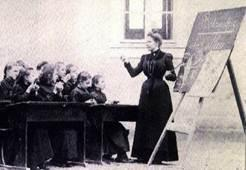

[[
]{.calibre_7}]{.bold}

### [[[La liberté de l'enseignement]{.calibre2}]{.bold1}]{.calibre_39} {#la-liberté-de-lenseignement .calibre_38}

[Discours prononcé à l'Assemblée Nationale]{.calibre_10}

[Le 15 janvier 1850
{.calibre3}]{.calibre_10}

[[[[[^\[8\]^]{.calibre_21}]{.underline}]{.calibre_4}](index_split_4951.html#filepos40609040){#filepos40349340}]{.calibre_10}

[]{.calibre_10}

[Présidence de M. Dupin]{.calibre_10}

[\[\...\]
[M. le président]{.bold}
La parole est à M. Victor Hugo contre le projet.
[M. Victor Hugo.]{.bold}
Messieurs, l'heure est avancée, je tâcherai de donner à ce que j'ai à dire la forme la plus abrégée ; je pense cependant que l'Assemblée, dans une question si importante, voudra bien m'accorder le temps nécessaire pour exposer mes idées ; mais je serai court. [(Oui ! oui ! --- Parlez !)]{.italic}]{.calibre4}

[Messieurs, quand une discussion est ouverte, qui touche à ce qu'il y a de plus sérieux dans les destinées du pays, il faut aller tout de suite, et sans hésiter, au fond de la question. Je commence par dire ce que je voudrais ; je dirai tout à l'heure ce que je ne veux pas.]{.calibre4}

[A mon sens, le but lointain sans doute, et difficile à atteindre, j'en conviens, mais auquel il faut tendre dans cette grande question de l'enseignement, le voici : l'instruction gratuite et obligatoire. [(Vives exclamations à droite.)
]{.italic} [A gauche.]{.bold}
Très bien ! très bien !)
[M. Victor Hugo.]{.bold}
L'instruction gratuite et obligatoire, obligatoire seulement au premier degré, gratuite à tous les degrés. [(Nouvel assentiment à gauche.)]{.italic}]{.calibre4}

[L'enseignement primaire obligatoire, c'est le droit de l'enfant qui, ne vous y trompez pas, est plus sacré encore que le droit du père, et qui se confond avec le droit de l'Etat.]{.calibre4}

[Voici donc, selon moi, le but auquel il faut tendre dans un temps donné : instruction gratuite et obligatoire dans la mesure que je viens de marquer ; un immense enseignement public donné et réglé par l'Etat, partant de l'école de village, et montant de degré en degré jusqu'au collège de France, plus haut encore, jusqu'à l'Institut de France ; les portes de la science toutes grandes ouvertes à toutes les intelligences. [(Vive approbation à gauche.)]{.italic}]{.calibre4}

[Partout où il y a un esprit, partout où il y a un champ, qu'il y ait un livre ! Pas une commune sans une école ! pas une ville sans un collège ! pas un chef-lieu sans une faculté ! Un vaste ensemble, ou, pour mieux dire, un vaste réseau d'ateliers intellectuels, gymnases, lycées, collèges, chaires, bibliothèques\... (Rires à droite et au centre. --- Approbation à gauche), gymnases, lycées, collèges, chaires, bibliothèques\...
[A gauche.]{.bold}
Oui ! oui ! --- Très bien ! très bien ! [(Nouveaux rires à droite.)
]{.italic} [Voix à gauche.]{.bold}
Monsieur le président, empêchez donc que l'orateur soit interrompu.
[M. le président]{.bold}
Vous, voulez-vous que je vous empêche d'applaudir ? C'est vous qui interrompez en applaudissant.
[M. Victor Hugo.]{.bold}
Je ferai remarquer à ce côté de l'Assemblée (la droite) qu'il y a quelque chose de grave à interrompre ainsi, d'une façon qui peut paraître systématique, un orateur avant qu'il ait pu expliquer sa pensée.
[A droite.]{.bold}
Mais ce sont vos amis qui vous applaudissent et qui vous interrompent.
[M. Victor Hugo.]{.bold}
J'ai dit quel était le but à atteindre, j'ajoute qu'il faut que la France entière présente un vaste ensemble, ou, pour mieux dire, un vaste réseau d'ateliers intellectuels : gymnases, lycées, collèges, chaires, bibliothèques, échauffant partout les vocations, éveillant partout les aptitudes. En un mot, je veux que l'échelle de la science soit fermement dressée par les mains de l'Etat, posée dans l'ombre des masses les plus sombres et les plus obscures, et aboutisse à la lumière ; je veux qu'il n'y ait aucune solution de continuité et que le coeur du peuple soit mis en communication avec le cerveau de la France. [(Approbation à gauche --- Exclamations ironiques à droite.)]{.italic} Voilà comment je comprends l'instruction.]{.calibre4}

[Je le répète, c'est le but auquel il faut tendre ; mais ne vous en troublez pas, vous n'êtes pas près de l'atteindre. La solution du problème contient une question financière considérable comme tous les autres problèmes sociaux de notre temps ; ce but, il était nécessaire de l'indiquer, car il faut toujours dire où l'on tend. Si l'heure n'était pas aussi avancée, je développerais devant vous les innombrables points de vue qu'il présente, et les interrupteurs eux-mêmes seraient obligés de s'arrêter devant la grandeur d'un tel but national.
[De toutes parts.]{.bold}
Parlez ! parlez !
[M. Victor Hugo.]{.bold}
Je veux ménager les instants de l'Assemblée\... [(Parlez ! parlez !)]{.italic} Je circonscris le sujet, et j'aborde immédiatement la question dans sa réalité positive actuelle ; je la prends où elle en est aujourd'hui, au point où la raison publique d'une part, et les événements d'autre part, l'ont amenée.]{.calibre4}

[Eh bien, messieurs, à ce point de vue restreint, mais pratique, de la situation actuelle, je veux, je le déclare, la liberté de l'enseignement ; mais je veux la surveillance de l'Etat ; et comme je veux cette surveillance effective, je veux l'Etat laïque, purement laïque, exclusivement laïque. L'honorable M. Guizot l'a dit avant moi dans les assemblées : l'Etat, en matière d'enseignement, n'est, ne peut être autre chose que laïque. Je veux donc la liberté d'enseignement sous la surveillance de l'Etat, et je n'admets, pour personnifier l'Etat dans cette surveillance si délicate et si difficile, qui exige toutes les forces vives du pays, je n'admets que des hommes appartenant sans doute aux carrières les plus graves, mais n'ayant aucun intérêt, soit de conscience, soit de politique, distinct de l'unité nationale.
[A gauche.]{.bold}
C'est cela ! Très bien !
[M. Victor Hugo.]{.bold}
C'est vous dire que je n'introduis, soit dans le conseil supérieur de surveillance, soit dans les conseils secondaires, ni évêques, ni délégués d'évêques. [(Nouvel assentiment à gauche.)]{.italic}]{.calibre4}

[J'entends maintenir, quant à moi, cette antique et salutaire séparation de l'église et de l'Etat, qui était la sagesse de nos pères, et cela, dans l'intérêt de l'Eglise comme dans l'intérêt de l'Etat.]{.calibre4}

[Messieurs, je viens de vous dire ce que je voudrais ; voici maintenant ce que je ne veux pas.]{.calibre4}

[Je ne veux pas de la loi qu'on vous apporte. Pourquoi ? Messieurs, cette loi est une arme. Une arme n'est rien par elle-même ; elle n'existe que par la main qui la saisit. Or, qu'elle est la main qui se saisira de cette loi ? Là est toute la question. Messieurs, c'est la main du parti clérical. [(Mouvement à droite.)
]{.italic} [A gauche.]{.bold}
Voilà la vérité !
[M. Victor Hugo.]{.bold}
Eh bien, je redoute cette main, je veux briser l'arme, je repousse le projet.]{.calibre4}

[J'entre maintenant tout à fait dans la discussion, et j'aborde, tout de suite, et sans hésiter, une objection qu'on nous fait à nous, opposants, placés au point de vue où je suis.]{.calibre4}

[On nous dit : C'est la seule objection qui ait quelque apparence de gravité : on nous dit : Vous voulez exclure le clergé du conseil de surveillance de l'Etat : vous voulez donc proscrire l'enseignement religieux ?]{.calibre4}

[Messieurs, je m'explique. Loin que je veuille proscrire l'enseignement religieux, entendez-vous bien, il est selon moi plus nécessaire aujourd'hui qu'il n'a jamais été. [(Marques d'approbation à droite.)]{.italic} Plus l'homme grandit, plus il doit croire. Il y a un malheur dans notre temps, je dirai presque il n'y a qu'un malheur : c'est une certaine tendance à tout mettre dans cette vie. [(Approbation générale.)]{.italic} A qui la faute ? Chacun se la rejette, je ne récrimine pas.]{.calibre4}

[En donnant à l'homme pour fin et pour but la vie terrestre, la vie matérielle, on aggrave toutes les misères par la négation qui est au bout ; on ajoute à l'accablement des malheureux le poids insupportable du néant, et de ce qui n'est que la souffrance, c'est-à-dire une loi de Dieu, on fait le désespoir. [(Bravos !)
]{.italic} [Voix diverses.]{.bold}
C'est très beau et très vrai !
[M. Victor Hugo.]{.bold}
De là des profondes convulsions sociales. Messieurs, certes, je suis de ceux qui veulent, et personne n'en doute dans cette enceinte, je suis de ceux qui veulent, je ne dis pas avec sincérité, le mot est trop faible, je veux, avec une inexprimable ardeur et par tous les moyens possibles, améliorer dans cette vie le sort matériel de ceux qui souffrent ; mais je n'oublie pas que la première des améliorations, c'est de leur donner l'espérance. [(Marques générales d'assentiment.)]{.italic} Combien s'amoindrissent de misères bornées, limitées, finies après tout, quand il s'y mêle une espérance infinie !]{.calibre4}

[Notre devoir à tous, législateurs ou évêques, prêtres ou écrivains, publicistes ou philosophes, notre devoir à tous, c'est de répandre, c'est de dépenser, c'est de prodiguer, sous toutes les formes toute l'énergie sociale, pour combattre et détruire la misère, et en même temps de faire lever toutes les têtes vers le ciel. [(Vives et nombreuses marques d'approbation.)]{.italic} C'est de diriger toutes les âmes, c'est de tourner toutes les attentes vers une vie ultérieure où justice sera faite, et où justice sera rendue. (Nouvelles marques d'approbation.)]{.calibre4}

[Ce qui allège la souffrance, ce qui sanctifie le travail, ce qui fait l'homme bon, fort, sage, patient, bienveillant, juste, à la fois, humble et grand, digne de l'intelligence, digne de la liberté, c'est d'avoir devant soi la perpétuelle vision d'un monde meilleur rayonnant à travers les ténèbres de cette vie.]{.calibre4}

[Messieurs, quant à moi, j'y crois profondément à ce monde meilleur, et, je le déclare ici, c'est la suprême certitude de ma raison, comme c'est la suprême joie de mon âme. [(Marques nombreuses d'assentiment.)]{.italic}]{.calibre4}

[Je veux donc sincèrement, je dis plus, je veux ardemment l'enseignement religieux. Mais je veux l'enseignement religieux de l'Eglise, et non l'enseignement religieux d'un parti. Je le veux sincère et non hypocrite. [(Approbation à gauche.)]{.italic} Je le veux ayant le ciel pour but et non la terre. [(Marques générales d'approbation.)]{.italic}]{.calibre4}

[Je ne veux pas qu'une chaire envahisse l'autre ; je ne veux pas mêler le prêtre au professeur, ou si je tolère ce mélange, si j'y consens, moi législateur, je le surveille.]{.calibre4}

[J'ouvre sur les séminaires, sur les congrégations enseignantes l'oeil de l'Etat, et de l'Etat laïque, j'y insiste, de l'Etat laïque, jaloux uniquement de sa grandeur et de son unité. Jusqu'au jour, jour que j'appelle de tous mes voeux, où la liberté de l'enseignement, la liberté complète et entière pourra être proclamée\... Et tenez, je m'interromps. Il y a lieu de placer ici une observation importante qui complète l'exposition de mes idées. Si j'obtenais, si j'obtenais du progrès naturel, du progrès du temps, des esprits, si j'obtenais ce que je vous disais dans mes premières paroles, l'instruction gratuite à tous les degrés, obligatoire au premier degré, je mettrais à côté de ce grand enseignement donné par l'Etat, de cette magnifique instruction gratuite, dont je vous ai fait le tableau, normale, française, chrétienne, libérale, offrant à tous pour rien les meilleurs maîtres et les meilleures méthodes, sollicitant les esprits de tout ordre, qui serait un modèle en science et de discipline, et qui élèverait, sans nul doute, le génie national à sa plus haute somme d'intensité, je mettrais à côté de ce magnifique enseignement la liberté de l'enseignement complète, entière, absolue, liberté pour les établissements privés, liberté pour les établissements religieux, soumise seulement aux lois générales, aux lois générales qui gouvernent toutes les libertés ; et je n'aurais pas le souci, et je n'aurais pas le besoin de donner à cette liberté le pouvoir inquiet de l'Etat pour surveillant, parce que je lui donnerais l'enseignement gratuit de l'Etat pour contrepoids.]{.calibre4}

[Eh bien, jusqu'au jour où cette liberté complète de l'enseignement pourra être établie à côté de l'enseignement gratuit de l'Etat, jusqu'à ce jour-là, je veux l'enseignement de l'Eglise, mais je veux l'enseignement de l'Eglise au dedans de l'Eglise et non au dehors.]{.calibre4}

[Surtout je considère comme une dérision de faire surveiller, au nom de l'Etat, par le clergé, l'enseignement du clergé. Je veux, je le répète et je le résume en un mot, ce que voulaient nos pères : l'Eglise chez elle, et l'Etat chez lui.
[Voix diverses à droite.]{.bold}
Qui ? nos pères ? --- Où cela ?
[M. Victor Hugo.]{.bold}
L'Assemblée voit déjà clairement pourquoi je repousse le projet de loi. J'achève de m'expliquer.]{.calibre4}

[Messieurs, le projet de loi qui vous est soumis, le projet de la commission, ainsi que je vous l'indiquais tout à l'heure, c'est à celui-là surtout que je m'attache, car c'est le seul qui soit sérieusement en discussion ; le projet de la commission est quelque chose de plus, de pire, si vous voulez, qu'une loi politique ; c'est une loi stratégique. [(Bruits divers.)]{.italic} Je m'adresse, non pas, certes, au vénérable évêque de Langres, ni à quelque personne que ce soit dans cette Assemblée ; je m'adresse au parti qui a, sinon rédigé, du moins inspiré le projet de loi à ce parti à la fois éteint et ardent, au parti clérical. Je ne sais pas s'il est dans le Gouvernement, je ne sais pas s'il est dans l'Assemblée, je le sens un peu partout [(Rire général),]{.italic} et comme il a l'oreille fine, il m'entendra. [(Nouveaux rires.)]{.italic}]{.calibre4}

[Je m'adresse donc au parti clérical et je lui dis : Cette loi est votre loi. Je me défie de vous ; instruire c'est construire ; je me défie de ce que vous construisez. Je ne veux pas vous confier l'enseignement de la jeunesse, l'âme des enfants, le développement des intelligences neuves qui s'ouvrent à la vie, l'esprit des générations nouvelles, c'est à dire l'avenir de la France. Je ne veux pas vous confier l'avenir de la France, parce que vous le confier, ce serait vous le livrer. [(Mouvement.)]{.italic} Il ne me suffit pas que les générations nouvelles nous succèdent ; je suis de ceux qui veulent qu'elles nous continuent. [(Mouvements divers.)]{.italic}]{.calibre4}

[Voilà pourquoi, hommes du parti clérical, je ne veux ni de votre main, ni de votre souffle sur elles ; je ne veux pas que ce qui a été fait par nos pères soit défait par vous. Après cette gloire, je ne veux pas de celle honte ! [(Vive approbation à gauche. --- A droite : Oh ! oh !)]{.italic}]{.calibre4}

[Votre loi est une loi qui a un masque. Elle dit une chose et elle en fait une autre. [(Mouvement.)]{.italic} C'est une pensée d'asservissement qui prend les allures de la liberté ; c'est une confiscation intitulée donation. [(Rires approbatifs à gauche.)]{.italic} Je n'en veux pas. Du reste, c'est votre habitude : toutes les fois que vous forgez une chaîne vous dites : Voici une liberté. [(Nombreux rires à gauche.)]{.italic} Toutes les fois que vous faites une proscription, vous criez : Voilà une amnistie. [(Vive approbation à gauche.)]{.italic}]{.calibre4}

[Ah ! sur ce point, je suis pleinement de l'avis du vénérable évêque de Langres, je ne vous confonds pas, vous parti clérical, avec l'Eglise, pas plus que je ne confonds le gui avec le chêne. Vous êtes les parasites de l'Eglise, vous êtes la maladie de l'église. [(Mouvements en sens divers.)]{.italic}]{.calibre4}

[Oui, vous êtes la maladie de l'Eglise ; Ignace est l'ennemi de Jésus. Vous êtes non les croyants, mais les sectaires d'une religion que vous ne comprenez pas. [(A gauche :]{.italic} Très bien ! --- [A droite :]{.italic} Oh ! oh !)]{.calibre4}

[Cessez de mêler l'Eglise à vos affaires, à vos stratégies, à vos combinaisons, à vos doctrines, à vos ambitions. Ne l'appelez pas votre mère pour en faire votre servante. [(Applaudissements à gauche.)]{.italic} Surtout ne l'identifiez pas avec vous ; voyez le mal que vous lui faites. M. l'évêque de Langres vous l'a signalé. [(Mouvement.)]{.italic} Voyez comme elle dépérit depuis qu'elle vous a ! Vous vous faites si peu aimer que vous finiriez par la faire haïr. En vérité, je vous le dis, elle se passera fort bien de vous ; laissez-la en repos ; dès que vous n'y serez plus, on y viendra. Laissez-la cette vénérable Eglise, cette vénérable mère, dans sa solitude, dans son abnégation, dans son humilité, tout cela compose sa grandeur, sa solitude lui attirera la foule ; c'est son abnégation qui est sa puissance ; c'est son humilité qui est sa majesté.]{.calibre4}

[Vous parlez de l'enseignement religieux ? L'enseignement religieux véritable, l'enseignement religieux suprême, celui devant lequel il faut se prosterner, celui qu'il ne faut pas troubler, le voici\... [(Mouvement.)]{.italic} C'est la soeur de charité au chevet du mourant ; c'est le frère de la Merci rachetant l'esclave ; c'est Vincent de Paul ramassant l'enfant trouvé ; c'est l'évêque de Marseille au milieu des pestiférés ; c'est l'archevêque de Paris affrontant avec un sourire sublime le faubourg Saint-Antoine révolté, levant son crucifix au-dessus de la guerre civile et s'inquiétant peu de recevoir la mort, pourvu qu'il apporte la paix. Voilà le véritable enseignement religieux. [(Très bien ! très bien !)
]{.italic} [Voix à droite.]{.bold}
Mais c'est précisément là le fruit de l'enseignement religieux.
[M. Victor Hugo.]{.bold}
Voilà l'enseignement religieux réel, profond, efficace, universel, populaire, celui qui, heureusement pour l'humanité et pour la religion, fait encore plus de chrétiens que vous n'en défaites.]{.calibre4}

[Ah ! nous vous connaissons. Nous connaissons le parti clérical ; c'est un parti ancien et qui a des états de services. [(On rit à gauche.)]{.italic} C'est lui qui, depuis des siècles, garde jalousement, indiscrètement et fatalement la porte de l'Eglise. C'est lui qui a trouvé pour la vérité ces deux étais merveilleux : l'ignorance et l'erreur. [(Rumeurs à droite.)]{.italic} C'est lui qui fait défense à la science et au génie d'aller au-delà du missel, et qui veut cloîtrer la pensée dans le dogme. [(Nouvelles rumeurs.)]{.italic} Tous les pas qu'a faits l'intelligence de l'Europe, elle les a faits sans lui et malgré lui. Son histoire est écrite dans l'histoire du progrès humain, mais au verso.]{.calibre4}

[Il s'est opposé à tous. [(Murmures.)]{.italic} C'est lui, c'est le parti clérical qui a fait battre de verges Prinelli pour avoir dit que les étoiles ne tomberaient pas. C'est lui qui a fait appliquer Campanella sept fois à la question pour avoir entrevu le secret de la création et affirmé que le nombre des mondes était infini. C'est lui qui a persécuté Harvey, pour avoir prouvé que le sang circulait. De par Josué, il a enfermé Galilée ; de par saint Paul, il a emprisonné Christophe Colomb. Découvrir la loi du ciel, c'était une impiété ; trouver un monde, c'était une hérésie. C'est lui, c'est le parti clérical, qui a anathématisé Pascal, au nom de la religion ; Montaigne, au nom de la morale ; Molière, au nom de la morale et de la religion. Oui, certes, qui que vous soyez, qui vous dites le parti catholique, et qui êtes le parti clérical, nous vous connaissons. Voilà longtemps déjà que la conscience humaine vous demande : Qu'est-ce que vous me voulez ? Voilà longtemps déjà que vous essayez de mettre un bâillon à l'esprit humain.
[[A gauche.]{.italic}]{.bold}
Très bien ! très bien !
[M. Victor Hugo.]{.bold}
Et vous voulez être les maîtres de l'enseignement ! Et il n'y a pas un écrivain, pas un poète, pas un philosophe, pas un penseur que vous acceptiez, et tout ce qui a été écrit, trouvé, rêvé, déduit, imaginé, illuminé, inventé par les génies, le trésor de la civilisation, l'héritage séculaire des générations, le patrimoine commun des intelligences, vous le rejetez ! Si le cerveau de l'humanité était là devant vos yeux, à votre discrétion, ouvert comme la page d'un livre, vous y feriez des ratures, convenez-en ! [(Rires approbatifs à gauche.)]{.italic}]{.calibre4}

[Tenez, nierez-vous ceci, et accueillerez-vous ce que je vais dire, de ce côté de l'Assemblée [(le [côté]{.bold} droit),]{.italic} avec des sourires ? Il y a un livre, un livre qui semble d'un bout à l'autre une émanation supérieure, un livre qui contient toute la sagesse humaine éclairée par toute la sagesse divine, un livre que la vénération des peuples appelle [le livre,]{.italic} la Bible : eh bien, votre censure a monté jusque-là ! chose inouïe ! il y a eu des papes qui ont proscrit la Bible !
[Voix à droite.]{.bold}
Les papes sont aussi le parti clérical ? Ils ne sont plus l'Eglise ?
[M. Victor Hugo.]{.bold}
Quel étonnement pour les esprits sages, quelle épouvante pour les coeurs simples de voir l'index de Rome posé sur le livre de Dieu ! [(Marques de dénégation.)]{.italic} Et vous ne craignez pas de déconcerter la foi ! et vous réclamez la liberté de l'enseignement, la liberté d'enseigner ! Tenez, entendons-nous, soyons sincères : voulez-vous que je vous dise quelle est la liberté que vous réclamez ? C'est la liberté de ne pas enseigner. [(Rires approbatifs à gauche.)]{.italic}]{.calibre4}

[Ah ! le parti clérical veut, vous voulez qu'on vous donne des peuples à instruire ! Fort bien ! Voyons vos élèves, voyons vos produits.
[A droite.]{.bold}
Oh ! oh !
[M. Démarest]{.bold}
Mais vous les avez dits vous-mêmes : ce sont les soeurs de charité, saint Vincent de Paule.
[M. Victor Hugo.]{.bold}
Voyons vos élèves, dis-je. Qu'est-ce que vous avez fait de l'Italie ? Qu'est-ce que vous avez fait de l'Espagne ? Depuis des siècles, vous tenez dans vos mains, à votre discrétion, à votre école, sous votre férule, ces deux grandes nations, illustres parmi les plus illustres. Qu'en avez-vous fait ? Je vais vous le dire. Grâce à vous, l'Italie, dont aucun homme qui pense ne peut plus prononcer le nom aujourd'hui qu'avec une inexprimable douleur filiale ; l'Italie, cette mère des nations et des génies, qui a répandu sur l'univers toutes les plus éblouissantes merveilles de la poésie et des arts ; l'Italie qui a appris à lire au genre humain ; l'Italie aujourd'hui ne sait pas lire ! [(Approbation à gauche.)]{.italic}]{.calibre4}

[Oui, de tous les Etats de l'Europe, l'Italie est celui où il y a le moins de natifs sachant lire.]{.calibre4}

[L'Espagne, l'Espagne si magnifiquement dotée, qui avait reçu des Romains sa première civilisation, des Arabes sa seconde civilisation, de la Providence, et, malgré vous, un monde, l'Amérique ; l'Espagne a perdu, grâce à vous, grâce à votre joug d'abrutissement qui est un joug de dégradation et d'amoindrissement\.... [(Bravos à gauche)]{.italic} ; l'Espagne a perdu, grâce à vous, ce secret de la puissance qu'elle tenait des Romains, ce génie des arts qu'elle tenait des Arabes, ce monde qu'elle tenait de Dieu ; et en échange de tout ce que vous lui avez fait perdre, elle a reçu de vous l'inquisition. [(Marques très vives d'approbation à gauche.)]{.italic}]{.calibre4}

[Oui, l'inquisition. Eh bien, je vais vous parler de l'inquisition, l'inquisition que certains d'entre vous essayent de réhabiliter aujourd'hui\... [(Vives dénégations à droite.)]{.italic}
[A gauche.]{.bold}
Oui ! oui !
[Voix diverses.]{.bold}
Ce sont des calomnies\... Rappelez l'orateur à l'ordre, monsieur le président.
[M. le président]{.bold}
Vous avez tort de dire : [quelques-uns d'entre vous.]{.italic} Attaquez les partisans dehors, mais pas ici. Vous ne pouvez imputer à personne dans cette Assemblée un dessein prémédité de ce genre-là. [(Rires ironiques à gauche.)
]{.italic} [M. Victor Hugo.]{.bold}
J'ai dit que je m'adressais au parti clérical tout entier ; c'est lui qui est en question, et non pas quelques membres de cette Assemblée ; c'est au parti clérical que je m'adresse, parce qu'il est un danger public, parce qu'il nous envahit. [(A gauche.]{.italic} C'est vrai !) Je dis donc, et l'on pourra vous citer les livres si vous le voulez, que certains d'entre vous, hommes du parti clérical, ont essayé de réhabiliter aujourd'hui l'inquisition, et j'ajoute qu'ils l'ont fait avec une timidité pudique dont je les honore. [(Hilarité à gauche.)
]{.italic} [Une voix à droite.]{.bold}
C'est encore une calomnie que vous ramassez dans le passé de vos nouveaux amis.
[M. Victor Hugo.]{.bold}
Oui, ils ont essayé de réhabiliter l'inquisition, l'inquisition qui a fait périr dans les flammes cinq millions d'hommes ! [(Exclamations à droite.)]{.italic} C'est de l'histoire\...
[Plusieurs voix.]{.bold}
C'est de la poésie !
[M. Victor Hugo.]{.bold}
C'est de l'histoire ! Allez à la bibliothèque, ouvrez le premier livre d'histoire.
[M. de Larcy]{.bold}
L'inquisition, nous la maudissons autant que nous maudissons les crimes de la révolution.
[[Voix nombreuses à droite.]{.italic}]{.bold}
Oui ! oui ! nous la maudissons comme vous.
[M. Victor Hugo.]{.bold}
Mon Dieu, messieurs, vous voulez, je veux, comme vous, la liberté de l'enseignement [(Exclamations à droite)]{.italic} ; mais tâchez de vouloir aussi la liberté de la tribune. [(Approbation à gauche.)]{.italic}]{.calibre4}

[Je maintiens mon droit : je répète que le parti clérical est en question ; je répète que c'est lui qui a donné à l'Espagne l'inquisition...
[A droite.]{.bold}
A la question !
[M. Victor Hugo.]{.bold}
\...Et je répète que j'ai le droit de dire ce que c'est que l'inquisition.
[A droite.]{.bold}
A la question !
[A gauche.]{.bold}
C'est bien la question ! --- Parlez !
[M. Victor Hugo.]{.bold}
Il est un détail que vous pouvez trouver encore dans votre bibliothèque : l'inquisition déclarait les enfants des hérétiques, jusqu'à la deuxième génération, infâmes et incapables d'aucuns honneurs publics, excepté ceux qui avaient dénoncé leurs pères !
[M. DE LARCY.]{.bold}
A la question ! [(Exclamations à gauche.)
]{.italic} [A gauche.]{.bold}
On veut vous mettre à la question !
[M. Victor Hugo.]{.bold}
C'est la question ! Vous n'avez pas le droit de m'indiquer le mode de discussion que je dois suivre.
[A droite.]{.bold}
Mais cela n'a pas trait à la loi en discussion.
[M. de Larcy]{.bold}
A la question !
[M. Victor Hugo.]{.bold}
Tenez, monsieur de Larcy, vous qui m'interrompez, ceci est tout à fait dans la question : l'inquisition tient encore, à l'heure qu'il est, au moment où je parle, dans la bibliothèque du Vatican, les manuscrits de Galilée, clos et sous les scellés de l'index. [(Rires bruyants à gauche.)
]{.italic} [M. de Larcy]{.bold}
Cela n'empêche pas la terre de tourner. [(Nouvelle hilarité.)
]{.italic} [M. Victor Hugo.]{.bold}
Voilà comment le parti clérical entend l'enseignement.]{.calibre4}

[Je disais, et je reprends : Oui, voilà les dons que l'Espagne a reçus du parti clérical ; il est vrai qu'en échange, et pour la consoler de ce que vous lui ôtiez et de ce que vous lui donniez, vous l'avez surnommée la Catholique. [(Interruptions nombreuses à droite.)
]{.italic} [Une voix.]{.bold}
Nous ne lui ôtons rien.
[M. Démarest.]{.bold}
Nous ne sommes pas ces gens-là ; à qui parlez-vous ?
[Un membre à l'orateur.]{.bold}
Parlez en général, ne vous adressez pas à quelques personnes ici.
[A gauche.]{.bold}
A l'ordre les interrupteurs !
[M. le président]{.bold}
Il n'y a pas à rappeler à l'ordre, mais à rappeler un peu à la question.
[A gauche.]{.bold}
L'orateur est dans la question.
[M. Victor Hugo.]{.bold}
Messieurs, si les interruptions ne rompaient pas le fil des idées de l'orateur qui est à la tribune, vous verriez jusqu'à quel point ce que je dis est dans la question. Qu'est-ce que je veux dire et prouver ? que le parti clérical a tenu dans ses mains deux des plus grands peuples du monde ; qu'en a-t-il fait ? Ce foyer qu'on appelle l'Italie, il l'a éteint ; ce colosse qu'on appelle l'Espagne, il l'a miné : l'une est en cendres, l'autre est en ruines. Voilà ce qu'il a fait de deux grands peuples. Eh bien, qu'est-ce qu'il veut faire de la France ? Tenez, le parti clérical vient de Rome ; je lui fais compliment : il a eu là un beau succès, il vient de bâillonner le peuple romain. ([Réclamations à droite.)
]{.italic} [A gauche.]{.bold}
C'est vrai ! c'est vrai !)
[A droite.]{.bold}
Non ! non !
[A gauche.]{.bold}
Oui ! oui !
[M. Victor Hugo.]{.bold}
Oui, hommes du parti clérical, vous venez de bâillonner le peuple romain ; maintenant, vous voulez bâillonner le peuple français ; cela est tentant, j'en conviens ; mais, prenez-y garde, cela est malaisé !
[Une voix.]{.bold}[
]{.italic} Vous savez bien que c'est impossible.
[M. Victor Hugo.]{.bold}
A qui en voulez-vous donc ? Je vais vous le dire. Vous en voulez, vous, membres du parti clérical, à la raison humaine. Pourquoi ? Parce qu'elle fait le jour.]{.calibre4}

[Voulez-vous que je vous dise ce qui vous importune ? C'est cette énorme quantité de lumière libre que la France dégage depuis trois siècles, lumière toute faite de raison, lumière plus éclatante aujourd'hui que jamais, lumière qui fait de la nation française la nation éclairante, de telle sorte qu'on aperçoit la clarté de la France sur la face de tous les peuples de l'univers. Eh bien, cette clarté de la France, cette lumière libre, cette lumière directe, cette lumière qui ne vient pas de Rome, qui vient de Dieu, voilà ce que vous voulez éteindre, voilà ce que nous voulons conserver ! [(Acclamations à gauche. --- Rires ironiques à droite.)]{.italic}]{.calibre4}

[Je repousse votre loi. Je la repousse, parce qu'elle confisque l'enseignement primaire, parce qu'elle dégrade l'enseignement secondaire, parce qu'elle abaisse le niveau de la science, parce qu'elle diminue mon pays. Je repousse votre loi parce que je suis de ceux qui ont un serrement de coeur et la rougeur au front toutes les fois que, par une cause quelconque, la France subit une diminution, que ce soit une diminution de territoire, comme par les traités de 1815, ou une diminution de grandeur intellectuelle, comme par votre loi. [(Nouvelles acclamations à gauche.)
]{.italic} [M. Victor Hugo.]{.bold}
Messieurs, en terminant, permettez-moi d'adresser au parti clérical, au parti qui nous envahit, je le répète, un conseil sérieux.]{.calibre4}

[Certes, ce n'est pas l'habileté qui lui manque. Quand les circonstances l'aident, il est fort, très fort, je dirai même trop fort. Il sait l'art de maintenir une nation dans un état mixte et déplorable, qui n'est pas la mort, mais qui n'est plus la vie ; il appelle cela gouverner. C'est le gouvernement par la léthargie.
[A gauche.]{.bold}
C'est cela ! --- C'est vrai !
[M. Victor Hugo.]{.bold}
Mais qu'il y prenne garde, rien de pareil ne convient à la France. C'est un jeu redoutable que de laisser entrevoir, entrevoir seulement à cette France quelque chose de semblable à l'idéal que voici : La sacristie souveraine, la liberté trahie, l'intelligence vaincue et liée, les livres déchirés, le prône remplaçant la presse, la nuit faite dans les esprits par l'ombre des soutanes et les génies matés par les bedeaux ! [(Applaudissements à gauche. --- Réclamations prolongées à droite.)
]{.italic} [Un membre]{.bold}, au pied de la tribune.
C'est là le parti clérical, les soutanes ? Mais alors, c'est le pape, c'est le clergé tout entier que vous attaquez. [(Vive agitation.)
]{.italic} [M. Léo de Laborde]{.bold}
Vous insultez le clergé catholique. C'est infâme !
[A gauche.]{.bold}
A l'ordre, l'interrupteur ! à l'ordre !
[M. Léo de Laborde]{.bold}
Je le répète, c'est infâme ! On doit parler avec plus de respect quand on parle des soutanes. [(A l'ordre ! à l'ordre !)
]{.italic} [M. Victor Hugo.]{.bold}
Certes, messieurs, le parti clérical est habile, mais cela ne l'empêche pas d'être naïf. Quoi ! il redoute le socialisme, il voit monter le flot, à ce qu'il dit, et il oppose à ce flot qui monte, je ne sais quel obstacle à claire-voie ! Il voit monter le flot, et il s'imagine que la France sera sauvée, quand il aura combiné pour la défendre les hypocrisies sociales avec les résistances matérielles, et qu'il aura mis un jésuite partout où il n'y aura pas un gendarme ! [(Applaudissements répétés à gauche. --- Vives dénégations sur les bancs de la majorité.)
]{.italic} [Voix à droite.]{.bold}
C'est digne de l'Ambigu-Comique !
[M. Victor Hugo.]{.bold}
Je le répète, qu'il y prenne garde et qu'il écoute un conseil. Le 19^[e]{.calibre18}^ siècle lui est contraire ; qu'il renonce à vouloir maîtriser cette grande époque pleine d'instincts profonds et nouveaux ; qu'il y renonce, ou sinon il ne réussira qu'à la courroucer. Il développera imprudemment le côté redoutable et dangereux de notre temps, et il fera surgir des éventualités terribles.]{.calibre4}

[Oui, avec ce système qui fait sortir l'éducation de la sacristie, et le Gouvernement du confessionnal\... [(Réclamations bruyantes et nombreuses à droite. --- C'est épouvantable ! --- A l'ordre ! à l'ordre !)
]{.italic} [Voix à droite.]{.bold}
C'est donc l'Eglise que vous attaquez maintenant !
[M. Denjoy.]{.bold}
C'est de la vieille friperie d'il y a vingt ans !
[M. le président]{.bold}, [s'adressant à l'orateur.]{.italic}
Mais par ces expressions-là vous attaquez non seulement ce que vous appelez le parti clérical, mais la religion elle-même.
[M. PIDOUX]{.bold} à l'[orateur.]{.italic}
Allez à la porte Saint-Martin !
[(Plusieurs membres de la droite interpellent avec vivacité l'orateur ; ces interpellations sont couvertes par les applaudissements de la gauche. --- Aux cris bruyants : A l'ordre ! à l'ordre ! des partis de la droite, répondent les bravos répétés de la gauche.)]{.italic}
[M. de Dampierre.]{.bold}, [de sa place.]{.italic}
Je demande qu'on rappelle l'orateur à l'ordre. [(Vive agitation.)
]{.italic} [M. Léo de Laborde.]{.bold}
Il a insulté une classe de citoyens tout entière.
[A gauche.]{.bold}
N'interrompez pas ! --- A l'ordre !
[M. Victor Hugo.]{.bold}
Je croyais....
[M. Denjoy.]{.bold}
Vous avez insulté le culte catholique\... [(Agitation générale.)
]{.italic} [Voix nombreuses à gauche.]{.bold}
A l'ordre les interrupteurs !
[M. le président]{.bold}
Si vous continuez à interrompre, monsieur Léo de Laborde et monsieur Denjoy, je vous rappellerai à l'ordre.]{.calibre4}

[J'ai donné à l'orateur l'avertissement que j'ai cru devoir lui donner, en lui disant qu'il employait des expressions consacrées au culte, et qui impliquaient une attaque indirecte contre le culte même et la religion : je l'ai engagé à s'abstenir de ces expressions.
[M. Démarest.]{.bold}
Qu'il rétracte ses expressions !
[Un membre à gauche]{.bold}[, s'adressant au président.]{.italic}
Vous avez dit vous-même qu'on ne confessait pas le gouvernement.
[M. le président.]{.bold}
L'Assemblée est partagée en deux camps, voilà ce que je vois. Les uns applaudissent, les autres critiquent ; il y a un milieu, c'est de laisser parler.
[Un membre.]{.bold}
Maintenez la liberté de la tribune !
[M. le président]{.bold}
La liberté de la tribune a des limites. Il n'y a que les excès qui n'ont pas de limites, j'y suis accoutumé ; mais je déplore seulement quand je les vois se produire des deux côtés.
[Un membre à droite.]{.bold}
Il n'y a pas excès de ce côté-ci !
[M. le président]{.bold}
Il y a excès, car il y a tumulte !
[M. Victor Hugo.]{.bold}
Je croyais avoir fait, et dès les premiers mots, une distinction comprise de l'Assemblée.
[A droite.]{.bold}
Allons donc !
[Un membre.]{.bold}
C'est une distinction jésuitique !
[M. Victor Hugo.]{.bold}
Je croyais avoir fait, dis-je, une distinction comprise de l'Assemblée, et j'ajoute applaudie par vous-mêmes, et [le Moniteur]{.italic} le constatera demain\... [(Interruption à droite.)
]{.italic} [M. le président]{.bold}, [s'adressant au côté droit.]{.italic}
Vous voyez bien que le tumulte part de ce côté-là.
[M. Victor Hugo.]{.bold}
[Le Moniteur]{.italic} constatera demain que vous-mêmes, de ce côté [(la droite),]{.italic} avez applaudi à la distinction que j'ai faite en commençant, entre la religion et le parti clérical.
[A droite.]{.bold}
Mais non ! mais non !
[M. le président]{.bold}, [à l'orateur.]{.italic}
Rapprochez-vous du projet de loi.
[M. Victor Hugo.]{.bold}
Eh bien, messieurs, cette distinction, j'y insiste, et j'ai le droit, en couvrant de ma vénération l'Église, notre mère à tous... [(Murmures à droite)
]{.italic} [M. Druet-Desvaux.]{.bold}
Ayez plutôt le courage de l'attaquer !
[Un membre.]{.bold}
Vous l'insultez par vos éloges !
[M. le président]{.bold}, [se tournant vers la droite.]{.italic}
Vous prenez le langage de vos adversaires ; vous insultez l'orateur par vos termes. [(Agitation. --- Plusieurs membres siégeant sur les derniers bancs de l'extrême droite se lèvent et sortent de l'enceinte.)
]{.italic} [M. Léo de Laborde]{.bold}, [au moment où il va franchir la porte.]{.italic}
On ne peut pas continuer à se laisser outrager ainsi\... [(Vives réclamations à gauche.)
]{.italic} [M. le président.]{.bold}
Je vous rappelle à l'ordre, monsieur de Laborde. Quel rôle jouez-vous donc là ? Voilà un quart d'heure que vous êtes debout, occupé à interrompre ! et à haranguer !
[Plusieurs membres à gauche.]{.bold}
Rappelez à l'ordre !
[M. le président.]{.bold}
L'orateur s'est rappelé lui-même à l'ordre en sortant.
[M. Victor Hugo.]{.bold}
Je répète que le parti clérical est un danger public, c'est mon droit de législateur et, au moment où il se présente une loi à la main, j'ai le droit d'examiner cette loi et d'examiner ce parti.
[A gauche.]{.bold}
Très bien ! très bien !
[M. Victor Hugo.]{.bold}
Eh bien, messieurs, je maintiens qu'avec les doctrines, le système et l'histoire que j'ai rappelés, partout où sera le parti clérical, il faut qu'il le sache, il engendrera des révolutions. Partout, pour éviter Torquemada, on se jettera dans Robespierre ! et c'est en cela qu'il est un danger public. [(Murmures à droite.)]{.italic}]{.calibre4}

[Eh ! mon Dieu, messieurs [(l'orateur se tourne vers la droite),]{.italic} est-ce que je vous suis suspect, par hasard ?
[Voix nombreuses à droite.]{.bold}
Oui ! oui ! très suspect ! [(Exclamations et rires à gauche.)
]{.italic} [Un membre.]{.bold}
Beaucoup plus que les montagnards !
[M. Victor Hugo.]{.bold}
Ah ! je vous suis suspect ! [(Oui ! oui ! --- Beaucoup !)]{.italic}]{.calibre4}

[Eh bien, tenez, je finis par là, il faut s'expliquer sur ce point ; c'est en quelque sorte un fait personnel, et vous écouterez, je pense, une explication que vous avez vous-mêmes provoquée.]{.calibre4}

[Je vous suis suspect ! [(Oui ! oui !)]{.italic} Et de quoi ? Mais, l'an dernier, à cette tribune, ici, je défendais l'ordre en péril, comme je défends aujourd'hui la liberté menacée. [(Interruption à droite.)
]{.italic} [M. le président.]{.bold}
Qu'est-ce qu'il y a de personnel dans ce que dit l'orateur maintenant ? Ecoutez donc !
[M. Victor Hugo.]{.bold}
Comment ! vous m'avez provoqué à m'expliquer, et vous ne voulez pas m'écouter ! [(Parlez ! parlez !)]{.italic}]{.calibre4}

[Je défendais l'ordre en péril l'an dernier, à cette tribune, comme je défends aujourd'hui la liberté menacée, comme je défendrais l'ordre demain si le danger revenait de ce côté-là.]{.calibre4}

[Je vous suis suspect ! Mais, voyons, il faut bien que je vous rappelle ces faits : vous étais-je suspect le 23 juin, quand, pour empêcher l'effusion du sang, je marchais aux barricades ?\... [(Exclamations et interruptions diverses à droite.)
]{.italic} [M. Peupin.]{.bold}
Il ne s'agit pas de cela ; il s'agit de doctrines morales et religieuses, pas d'autre chose.[
]{.italic} [M. Victor Hugo.]{.bold}
Comment est-il possible qu'il y ait quelqu'un dans cette enceinte qui doute de ma conscience politique ? Je vous parle en honnête homme et non en agitateur. [(Rumeurs à droite.)]{.italic}]{.calibre4}

[Je vous suis suspect ! [(Oui ! oui !)
]{.italic} [M. le président.]{.bold}
C'est une longue personnalité ; gardez vos sentiments pour vous.]{.calibre4}

[Vous avez eu certainement des torts, monsieur Victor Hugo, quelques expressions provocantes ; mais on s'en est vengé avec usure sur vous, et on m'a dispensé de rien ajouter, car on s'est fait justice à soi-même.
[Un membre à droite.]{.bold}
Vous n'avez pas assez fait, monsieur le président !
[M. le président.]{.bold}
Je voudrais bien vous y voir, interlocuteur ! [(Rire général.)
]{.italic} [M. Victor Hugo.]{.bold}
Messieurs, je n'insiste pas ; je suis de ceux qui ont en le bonheur de rendre, dans des temps difficiles, dans un passé récent, quelques services obscurs à la cause de l'ordre\.... [(Nouvelles rumeurs à droite.)
]{.italic} [Un membre.]{.bold}
Où ?
[M. Victor Hugo.]{.bold}
On a pu les oublier, vous les avez oubliés ; je ne les rappelle pas ; mais j'ai le droit de m'appuyer sur ce passé au moment où je parle.
[Un membre.]{.bold}
Il n'existe pas !
[M. Victor Hugo.]{.bold}
Eh bien, appuyé sur ce passé, sur ce passé tout récent, je vous le déclare, dans ma conviction, ce qu'il faut à la France, c'est l'ordre, mais l'ordre vivant, qui est le progrès ; ce qu'il faut à la France, c'est l'ordre, mais l'ordre vrai, qui résulte de l'éducation, de la croissance normale, paisible, naturelle du peuple ; c'est l'ordre sérieux, profond, se faisant à la fois dans les faits et dans les idées, par le plein rayonnement de l'intelligence nationale. C'est tout le contraire de votre loi. [(Approbation à gauche.)]{.italic}]{.calibre4}

[Nous sommes plus d'un dans cette Assemblée, et le vote vous le prouvera, qui voulons pour ce noble pays la liberté et non la compression, le mouvement pacifique et non la stagnation, la puissance et non la servitude, la grandeur et non le néant. [(Nouvelle approbation à gauche.)
]{.italic} [Plusieurs membres à droite.]{.bold}
Nous voulons cela aussi !
[M. Victor Hugo.]{.bold}
Quoi ! voilà les lois que vous nous apportez ! quoi ! vous, gouvernants, vous, législateurs, vous voulez vous arrêter, vous voulez arrêter la France, vous voulez pétrifier la pensée humaine, éteindre le flambeau divin, matérialiser l'esprit ! [(Réclamations à droite.)]{.italic} Mais vous ne connaissez donc pas, vous ne voyez donc pas les éléments mêmes du temps où vous êtes ! Mais vous êtes donc dans votre siècle comme des étrangers ! Quoi ! c'est dans ce siècle, dans ce grand siècle des nouveautés, des avènements, des conquêtes, des découvertes, que vous rêvez l'immobilité ! C'est dans le siècle de l'espérance que vous proclamez le désespoir ! [(Nouvelles réclamations à droite. --- Approbation à gauche.)]{.italic} Quoi ! vous jetez à terre, comme des hommes de peine fatigués, la gloire, le génie, la pensée, l'intelligence, le progrès, l'avenir, et vous dites : C'est assez ! n'allons pas plus loin ; arrêtons-nous ! [(Mêmes mouvements.)]{.italic}]{.calibre4}

[Mais vous ne voyez donc, pas que tout va, vient, se meut s'accroît, se transforme, et se renouvelle autour de vous, au-dessus de vous, au-dessous de vous ! Ah ! vous voulez vous arrêter ! vous voulez arrêter la nation !\...
[Au centre et à droite.]{.bold}
Non ! non !
[A gauche.]{.bold}
Si ! si !
[M. Soubies.]{.bold}
Puisque la commission trouve l'enseignement des écoles normales primaires trop élevé !
[M. Victor Hugo.]{.bold}
Eh bien, je vous le répète avec une douleur profonde\... [(Rumeurs à droite.)]{.italic} Moi qui déteste les écroulements et les catastrophes, et qui l'ai prouvé, je vous en avertis, la mort dans l'âme\...
[A droite.]{.bold}
Oh ! oh !
[M. Victor Hugo.]{.bold}
Si vous ne voulez pas du progrès, vous aurez les révolutions !]{.calibre4}

[Aux hommes assez insensés pour dire : « L'humanité ne marchera plus », Dieu répond par la terre qui tremble !]{.calibre4}

[Je repousse le projet. [(Vive approbation et applaudissements à gauche.)
]{.italic} [M. le président.]{.bold}
La suite de la délibération est renvoyée à demain.]{.calibre4}

[
\[...\]]{.calibre4}
