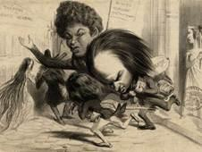

[[
]{.calibre_7}]{.bold}

### [[[La liberté du théâtre]{.calibre2}]{.bold1}]{.calibre_39} {#la-liberté-du-théâtre .calibre_38}

[[Discussion du budget des dépenses de l'intérieur pour 1849]{.bold}]{.calibre_37}

[Discours prononcé à l'Assemblée Nationale]{.calibre_10}

[Le 3 avril 1849]{.calibre_10}

[{.calibre3}]{.calibre_10}

[[[[[^\[5\]^]{.calibre_21}]{.underline}]{.calibre_4}](index_split_4951.html#filepos40607452){#filepos40323202}]{.calibre_10}

[]{.calibre_10}

[Présidence du citoyen Armand Marrast]{.calibre_10}

[\[\...\]
[Le citoyen président.]{.bold}
La parole est à M. Victor Hugo sur le chapitre.
[Le citoyen Victor Hugo.]{.bold}
C'est une simple observation que j'apporte à cette tribune.]{.calibre4}

[Je viens appuyer les observations présentées par l'honorable M. Guichard, et je m'en prévaudrai pour demander à l'Assemblée de maintenir la totalité du crédit, à la condition que M. le ministre de l'intérieur prendra en très sérieuse considération les indications qui viennent de lui être données, et particulièrement la convenance et l'utilité, pour la bonne distribution des sommes votées par vous, d'une allocation directe et spéciale aux caisses de secours des associations dont l'honorable préopinant vient de vous entretenir\... [Voix diverses.]{.italic} Il ne s'agit pas de cela.
[Le citoyen Charles Blanc.]{.bold}
Ce n'est pas ce chapitre-là. Votre observation se rapporte à un chapitre qui, malheureusement, est déjà voté. Il s'agit ici des indemnités annuelles.
[Le citoyen Victor Hugo.]{.bold}
Indemnités et secours à des artistes malheureux.
[Le citoyen Président.]{.bold}
Voici l'intitulé du chapitre : « Indemnités annuelles ou secours accordés à des artistes, auteurs dramatiques, compositeurs, et à leurs veuves. » Par conséquent, l'orateur est parfaitement dans la question.
[Le citoyen Victor Hugo.]{.bold}
J'insiste donc, et je dis que ces associations, dont plusieurs sont déjà anciennes, ont rendu et rendent tous les jours d'immenses services. Elles embrassent la famille presque entière des artistes et des écrivains ; elles ont des caisses de secours qui nourrissent des veuves, des vieillards et des orphelins ; elles connaissent toutes les misères, toutes les souffrances, toutes les pudeurs ; elles font pénétrer le bienfait plus avant que ne peut le faire le Gouvernement ; elles peuvent faire accepter fraternellement des aumônes très modiques que l'Etat ne pourrait pas offrir décemment, c'est-à-dire qu'elles peuvent faire beaucoup plus de bien avec bien moins d'argent. En outre, elles peuvent justifier de l'emploi de sommes qui leur sont confiées par des pièces comptables d'une régularité parfaite. Rien n'est donc meilleur, rien n'est plus utile pour atteindre le but que vous vous proposez en votant un fonds de secours aux artistes, rien n'est plus utile qu'une allocation directe aux caisses de ces associations. L'honorable M. Senard, sur l'avis du comité de l'intérieur, l'a fait, et j'en loue hautement son administration, qui, d'ailleurs, et j'ajouterai avec plaisir cet éloge, s'est toujours montrée très sympathique pour les arts et pour les artistes.]{.calibre4}

[Avant lui, car je tiens à rappeler les précédents et à vous montrer l'extrême régularité de ce que je propose, ou, pour mieux dire, de ce que j'ai l'honneur de conseiller au ministère ; avant lui, la même initiative avait été prise par l'honorable M. de Saivandy.]{.calibre4}

[Je crois donc qu'il serait très utile de suivre l'exemple excellent donné par ces deux ministres ; je recommande cet exemple à M. le ministre de l'intérieur et à M. le ministre de l'instruction publique, chacun en ce qui les concerne, et sous le bénéfice de ces observations, je crois pouvoir prier l'Assemblée de vouloir bien voter la totalité du crédit.]{.calibre4}

[J'ajoute que les besoins des artistes n'ont jamais été plus impérieux, ni plus urgents. Et, messieurs, puisque je suis monté à cette tribune, c'est l'occasion que M. Guichard m'a offerte qui m'y a fait monter, je ne voudrais pas en descendre sans vous rappeler un souvenir qui aura peut-être quelque influence sur vos votes dans la portion de cette discussion qui touche plus particulièrement aux intérêts des lettres et des arts.]{.calibre4}

[Il y a quelques mois, lorsque je discutais à cette même place et que je combattais certaines réductions spéciales qui portaient sur le budget des arts et des lettres, je vous disais que ces réductions, dans certains cas, pouvaient être funestes, qu'elles pouvaient entraîner bien des détresses, qu'elles pouvaient amener même des catastrophes. On trouva à cette époque qu'il y avait quelque exagération dans mes paroles.]{.calibre4}

[Eh bien, messieurs, il m'est impossible de ne pas penser en ce moment, et c'est ici le lieu de le dire, à ce rare et célèbre artiste qui vient de disparaître si fatalement, qu'un secours donné à propos, qu'un travail commandé à temps aurait pu sauver.
[Plusieurs membres.]{.bold}
Nommez-le !
[Le citoyen Victor Hugo.]{.bold}
Antonin Moine.
[Le citoyen ministre de l'intérieur.]{.bold}
Je demande la parole.
[Le citoyen Victor Hugo.]{.bold}
Oui, messieurs, j'insiste, j j'appelle votre attention sur ce point. Ceci mérite votre attention. Ce grand artiste, je le dis avec une amère et profonde douleur, a trouvé plus facile de renoncer à la vie que de lutter contre la misère. [(Mouvements divers.)
]{.italic} [Le citoyen Victor Hugo.]{.bold}
Eh bien, que ce soit là un grave et douloureux enseignement. Je le dépose dans vos consciences. Je m'adresse à la générosité connue et prouvée de cette Assemblée. Je l'ai déjà trouvée, nous l'avons tous trouvée sympathique et bienveillante pour les artistes. En ce moment, ce n'est pas un reproche que je fais à personne, c'est un fait que je constate. Je dis que ce fait doit rester dans vos esprits, et que, dans la suite de la discussion, quand vous aurez à voter, soit à propos du budget de l'intérieur, soit à propos du budget de l'instruction publique sur certaines réductions que je ne qualifie pas d'avance, mais qui peuvent être mal entendues, qui peuvent être déplorables, vous vous souviendrez que des réductions fatales peuvent, pour faire gagner quelques écus au trésor public, faire perdre à la France de grands artistes.]{.calibre4}

[Voilà, messieurs, ce que je tenais à dire. C'est sous la réserve de ces observations que je demande à l'Assemblée de vouloir bien voter la totalité du crédit. Je pense que la commission n'y fera pas d'objection.
\[...\]]{.calibre4}
