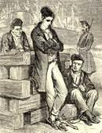

[[
]{.calibre_7}]{.bold}

### [[[La loi sur la déportation]{.calibre2}]{.bold1}]{.calibre_39} {#la-loi-sur-la-déportation .calibre_38}

[Discours prononcé à l'Assemblée Nationale]{.calibre_10}

[Le 5 avril 1850
{.calibre3}
[[[[^\[9\]^]{.calibre_21}]{.underline}]{.calibre_4}](index_split_4951.html#filepos40609347){#filepos40408278}]{.calibre_10}

[]{.calibre_10}

[Présidence de M. Bedeau, vice-président]{.calibre_10}

[\[\...\]
REPRISE DE LA PREMlÈRE DÉLIBÉRATION SUR LE PROJET DE LOI RELATIF A LA DÉPORTATION.]{.calibre_10}

[(M. RODAT, RAPPORTEUR.)]{.calibre_10}

[ ]{.calibre4}

[[M. le président.]{.bold}
Nous reprenons la première délibération sur le projet de loi relatif à la déportation. La parole est a M. Dufraisse.
[Une voix.]{.bold}[
]{.italic} Il n'est pas présent !
[M. le président.]{.bold}
En ce cas, la parole est a M. Víctor Hugo.
[Voix diverses.]{.bold}
M. Dufraisse va arriver.
[M. le président.]{.bold}
Il devait être là. La parole est à M. Victor Hugo.
[M. Victor Hugo.]{.bold}
Parmi les journées de février, journées qu'on ne peut comparer à rien dans l'histoire, il y eut un jour admirable : ce fut celui où cette voix souveraine du peuple, qui, a travers les rumeurs confuses de la place publique, dictait les décrets du gouvernement provisoire, prononça cette grande parole : La peine de mort est abolie en matière politique !]{.calibre4}

[Ce jour-là, messieurs, tous les coeurs généreux, tous les esprits sérieux tressaillirent. Et, en effet, voir le progrès sortir immédiatement, sortir calme et majestueux d'une révolution toute frémissante ; voir, du milieu de cet immense écroulement des lois humaines, se dégager dans toute sa splendeur la loi divine ; voir la multitude se comporter comme un sage ; voir toutes ces intelligences, toutes ces passions, toutes ces âmes, la veille encore pleines de colère, toutes ces bouches qui venaient de déchirer des cartouches, s'unir et se confondre dans un seul cri, le plus beau qui puisse être poussé par la voix humaine : Clémence ! ce fut là, messieurs, pour le philosophe, pour le publiciste, pour l'homme chrétien, pour l'homme politique, ce fut pour la France et pour l'Europe un magnifique spectacle. [(Approbation à gauche.)]{.italic} Ceux mêmes dont les événements de février froissaient les sentiments, les intérêts, les affections, les espérances ; ceux mêmes qui tremblaient, ceux mêmes qui gémissaient, applaudirent et reconnurent que les révolutions peuvent mêler le bien a leurs plus violentes explosions, et qu'elles ont cela de merveilleux, qu'il leur suffit d'une heure sublime pour effacer toutes les heures terribles. [(Rires et exclamations à droite. --- Approbation à gauche.)]{.italic}]{.calibre4}

[Du reste, messieurs, ce triomphe subit et éblouissant, quoique partiel, du dogme qui prescrit l'inviolabilité de la vie humaine, n'étonna pas ceux qui connaissent la puissance des idées. Dans les temps ordinaires, dans ce qu'on est convenu d'appeler les temps calmes, faute d'apercevoir le mouvement profond qui se fait sous la tranquillité apparente de la surface, dans les époques dites époques paisibles, il est de bon goût de dédaigner les idées ; on les raille volontiers : rêves, utopies, déclamations, voilà comme on en parle. On ne tient compte que des faits, et plus ils sont matériels, plus ils sont estimés ; on ne fait cas que des gens d'affaires, des esprits pratiques, comme on dit dans un certain jargon. [(Bravos a gauche. --- Exclamations ironiques a droite.)
]{.italic} [M. de Kerdrel.]{.bold}
C'est le jargon français !
[M. Victor Hugo.]{.bold} [M. Ducoux.]{.bold}
On ne fait cas que de ces hommes positifs qui ne sont, après tout, que des hommes négatifs\... [(Explosion de rires a droite.)]{.italic} [
]{.italic} [Une voix.]{.bold}
Quel pathos !
[M. Victor Hugo.]{.bold}
Mais qu'une révolution survienne, les hommes d'affaires, les gens habiles ne sont plus que des nains\... [(Sourires à droite).
]{.italic} [M. Boissié.]{.bold}
Et les imbéciles sont des géants ! [(Hilarité bruyante et prolongée --- Très bien ! très bien ! --- Assentiment marqué à droite.)
]{.italic} [M. Victor Hugo.]{.bold}
Mais qu'une révolution survienne (je reprends ce que je disais), les hommes d'affaires, les gens habiles ne sont plus que des nains ; toutes les réalités qui n'ont pas la proportion des événements nouveaux s'écroulent et s'évanouissent ; les faits matériels tombent, et les idées qu'on raillait, qu'on dédaignait, grandissent tout à coup d'une grandeur démesurée et imprévue\... [(Interruption.)
]{.italic} [M. le président]{.bold}, [se tournant vers la droite.]{.italic}
Silence donc, messieurs ; vous n'êtes pas chargés d'interrompre à chaque phrase.]{.calibre4}

[Voilà comment on rend les séances violentes, c'est toujours par des concerts d'interruptions.
[M. Victor Hugo.]{.bold}
Je laisse la sagesse de la grande majorité de l'Assemblée juge de cette nature et de ce système d'interruption et je continue :]{.calibre4}

[C'est ainsi, c'est par suite de cette soudaine force d'expansion qu'acquièrent les idées en temps de révolution que s'est faite cette grande chose, l'abolition de la peine de mort en matière politique.]{.calibre4}

[Cette grande chose, messieurs, ce décret fécond qui contenait en germe tout un code, ce progrès qui était plus qu'un progrès, qui était un principe, l'assemblée constituante l'a adopté et consacré ; elle l'a placé, je dirais presque au sommet de la constitution, comme une magnifique avance faite par l'esprit de révolution à l'esprit de civilisation, comme une conquête, mais surtout comme une promesse, comme une sorte de porte ouverte qui laisse, pour ainsi dire, pénétrer au milieu des progrès obscurs et incomplets du présent la lumière sereine de l'avenir. Et, en effet, dans un temps donné, quelle que soit, permettez-moi de vous le dire, votre récente décision en cette matière, dans un temps donné l'abolition de la peine capitale en matière politique doit amener et amènera nécessairement, par la toute-puissance de la logique, l'abolition pure et simple de la peine de mort. [(Vive approbation à gauche.)
]{.italic} [M. Ducoux.]{.bold}
Nous y comptons bien.
[M. Victor Hugo.]{.bold}
Eh bien, messieurs, cette promesse, il s'agit de la retirer ; cette conquête, il s'agit d'y renoncer ; ce principe, c'est-à-dire la chose qui ne recule pas, il s'agit de le briser ; cette journée mémorable de février, marquée par l'enthousiasme d'un grand peuple et par l'enfantement d'un grand progrès, il s'agit de la rayer de l'histoire. Sous ce titre modeste de loi sur la déportation, le Gouvernement vous apporte et votre commission vous propose d'adopter un projet que le sentiment public, qui ne se trompe pas, a déjà traduit et résume dans une seule ligne que voici : La peine de mort est rétablie en matière politique.
[A gauche.]{.bold}
Très bien ! très bien ! [(Réclamations à droite.)
]{.italic} [M. Ducoux.]{.bold}
Avec des raffinements.
[M. le président.]{.bold}
Messieurs, je viens d'entendre des murmures de ce côté [(la droite).]{.italic} Je les traduis sur le champ en objections.
[M. Victor Hugo.]{.bold}
On nous dit : Mais il ne s'agit pas de cela le moins du monde ; personne ne parle de rétablir la peine de mort. Ily a une lacune dans le code, on veut la combler, voilà tout. La pénalité est énervée, on veut la fortifier, rien de plus. On veut tout simplement remplacer la peine de mort par une pénalité qui contient une quantité suffisante d'intimidation. N'est-ce pas messieurs, que c'est bien là ce que l'on dit ? Je traduis fidèlement l'objection. Je vais y répondre.]{.calibre4}

[On veut donc simplement remplacer la peine de mort.
[Voix à gauche.]{.bold}
C'est l'équivalent !
[M. Victor Hugo.]{.bold}
Et comment s'y prend-on ? On combine le climat\... Oui, quoi que vous fassiez, vous aurez beau chercher, choisir, explorer, aller des Marquises à Madagascar, et revenir de Madagascar aux Marquises, aux Marquises dont l'ingénieur de marine Desgras fait un tableau que M. Farconet vous a lu hier, aux Marquises que M. L'amiral Bruat, dans des rapports déposés au ministère de la guerre et dont vous pouvez tous prendre connaissance, appelle le tombeau des Européens ; quoi que vous fassiez, le climat du lieu de déportation, comparé a la France, sera toujours un climat meurtrier, et l'acclimatement, déjà si difficile pour des personnes libres, heureuses, satisfaites, occupées, placées dans les meilleures conditions d'activité et d'hygiène, sera absolument impossible, absolument impossible, entendez-vous bien ! pour de malheureux détenus.
[A gauche.]{.bold}
Très bien !
[M. Victor Hugo.]{.bold}
Je reprends. On veut donc simplement rétablir la peine de mort ; et que fait-on ? On combine le climat, l'exil et la prison : le climat donne sa malignité, l'exil son accablement, la prison son désespoir ; au lieu d'un bourreau. On en a trois : la peine de mort est rétablie. [(Vive approbation et applaudissements a gauche.)]{.italic}]{.calibre4}

[Ah ! quittez ces précautions de parole, cette phraséologie hypocrite\... [(Marques ironiques d'assentiment a droite.)
[Voix diverses.]{.bold}]{.italic}
Oui ! oui ! --- Vous avez raison ! --- donnez l'exemple !
[M. Victor Hugo.]{.bold}
Soyez du moins sincères, et dites avec nous : La peine de mort est rétablie ! [(Interruption de la part de M. le garde des sceaux.)]{.italic} Oui, rétablie, monsieur le garde des sceaux ; oui, la peine de mort est rétablie, je vais vous le prouver tout a l'heure, moins terrible en apparence, plus horrible en réalité. [(Approbation a gauche.)
]{.italic} [Une voix à gauche.]{.bold}
Avec un raffinement de cruauté.
[M. Victor Hugo,]{.bold} [avec vivacité.]{.italic}
Mais voyons, discutons froidement\... [(Rires ironiques à droite.)
]{.italic} [M. Baze.]{.bold}
Donnez l'exemple !
[M. Victor Hugo.]{.bold}
Je ne demande pas mieux.]{.calibre4}

[Apparemment vous ne voulez pas seulement faire une loi très sévère, vous voulez faire aussi une loi exécutable ; vous voulez faire une loi qui ne tombe pas en désuétude le lendemain de sa promulgation. Eh bien, pesez ceci :]{.calibre4}

[Quand vous déposez dans la loi un excès de sévérité, savez-vous ce que vous faites ? Vous y déposez l'impuissance. Vouloir exagérer la pénalité, c'est le plus sur moyen de la paralyser. Pourquoi ? Parce que la peine juste a au fond de toutes les consciences de certaines limites qu'il n'est pas au pouvoir du législateur de déplacer.]{.calibre4}

[Le jour où, par votre ordre, la loi veut transgresser cette limite, cette limite sacrée, entendez-vous bien ? cette limite tracée dans l'équité de l'homme, par le doigt même de Dieu, la loi rencontre la conscience qui lui défend de passer outre.
[Quelques voix à gauche.]{.bold}
Très bien ! très bien !
[M. Victor Hugo.]{.bold}
D'accord avec la conscience, avec le sentiment public, avec l'état des esprits, avec les moeurs, la loi peut tout ; en lutte avec les forces vives de la civilisation et de la société, elle ne peut rien ; les tribunaux hésitent, les jurys acquittent, les textes meurent sous l'oeil des juges. Songez-y, messieurs, tout ce que la pénalité construit en dehors de la justice s'écroule promptement. Et je le dis pour tous les partis, messieurs : Eussiez-vous construit vos iniquités en granit, a chaux et à ciment\... [(Oh ! oh ! --- Rires à droite.)]{.italic}]{.calibre4}

[Ne vous pressez pas tant de rire, messieurs, vous riez des paroles mêmes de l'Ecriture ; j'ai eu tort de ne pas vous prévenir.]{.calibre4}

[Eh bien, je répète (maintenant que je vous ai prévenus, vous ne rirez plus), je répète, et je le dis pour tous les partis : Eussiez-vous construit vos iniquités en granit, comme dit l'Ecriture, à chaux et à ciment, comme dit l'Ecriture, il suffira pour les jeter a terre d'un souffle, de ce souffle qui sort de toutes les bouches, et qu'on appelle l'opinion ! [(Nouvelle approbation a gauche.)
]{.italic} [Un membre.]{.bold}
Le souffle de Dieu, et non pas celui de l'opinion publique !
[M. Victor Hugo.]{.bold}
Je le répète, et voici la formule du vrai en cette matière : Toute loi pénale a de moins en puissance ce qu'elle a de trop en sévérité.]{.calibre4}

[Mais voyons : je suppose que je me trompe, je suppose que mon raisonnement, que je pourrais appuyer d'une foule de preuves, n'est pas juste ; j'admets que votre loi, que votre innovation pénale ne tombera pas en désuétude le lendemain de sa promulgation ; je vous accorde que vous aurez ce grand malheur, après avoir voté une telle loi, de la voir exécutée. Permettez-moi deux questions : Où est l'opportunité d'une pareille loi ? où en est la nécessité ?]{.calibre4}

[On me répond : L'opportunité ! mais vous oubliez donc les attentats d'hier, les attentats de tous les jours, le 15 mai, le 23 juin, le 13 juin ! La nécessité ! mais est-ce qu'il n'est pas nécessaire d'opposer à ces attentats toujours possibles, toujours flagrants,une répression terrible et une immense intimidation ? La révolution de Février nous a ôté l'échafaud politique, nous a ôté la peine de mort ; nous faisons comme nous pouvons pour les remplacer, nous faisons de notre mieux.]{.calibre4}

[Je m'en aperçois ! [(Rires et approbation à gauche. --- Bruit a droite.)
]{.italic} [M. Prudhomme.]{.bold}
Vous nous prêtez ce que nous n'avons pas dit et ce que nous ne pensons pas !
[M. Victor Hugo.]{.bold}
Messieurs, avant d'aller plus loin, permettez-moi un mot d'explication.]{.calibre4}

[Autant que qui que ce soit, j'ai le droit de le dire, et je l'ai prouvé, autant que qui que ce soit, je réprouve et je condamne, sous un régime de suffrage universel, les actes de violence et de désordre, les recours à la force brutale. Ce qui convient à un grand peuple souverain de lui-même, à un grand peuple intelligent, ce n'est pas l'appel aux armes, c'est l'appel aux idées. Pour moi et pour tous les hommes qui veulent franchement la démocratie, l'axiome politique, le voici : Le droit de suffrage abolit le droit d'insurrection. [(Nouvelle approbation à gauche.)
]{.italic} [A droite.]{.bold}
En théorie ; mais en fait ?
[M. Victor Hugo.]{.bold}
Je répète que le droit de suffrage abolit le droit d'insurrection. C'est en cela que le suffrage universel résout et dissout les révolutions. Voilà le principe, principe incontestable, principe absolu.]{.calibre4}

[Pourtant, je dois le dire, dans l'application pénale, le doute et les incertitudes naissent.]{.calibre4}

[Toutes les fois que de funestes et déplorables violations de la paix publique donnent lieu à des poursuites juridiques, rien n'est plus difficile que de préciser les faits et de bien proportionner la peine au délit ; tous nos procès politiques sont là pour le prouver.]{.calibre4}

[Quoi qu'il en soit, la société doit se défendre, je suis pleinement d'accord avec vous sur ce point ; la société doit se défendre, et vous devez la protéger. Ces troubles, ces émeutes, ces insurrections, ces complots, ces attentats, vous voulez les empêcher, les prévenir, les réprimer ! Soit, je le veux comme vous.]{.calibre4}

[Mais entrons dans le coeur de la question. Est-ce que vous avez besoin d'une pénalité nouvelle pour cela ? Mais lisez le Code, mais voyez-y la définition de la déportation. Quel immense pouvoir pour l'intimidation et pour le châtiment ! Mais tournez-vous vers la pénalité actuelle, remarquez tout ce qu'elle remet de terrible entre vos mains !]{.calibre4}

[Quoi, voilà un homme, un homme que le tribunal spécial a condamné, un homme frappé, il faut bien que je le dise, pour le plus incertain de tous les délits, un délit politique, par la plus incertaine de toutes les justices, la justice politique. [(Exclamations et marques nombreuses de dénégation.) Un memore.]{.italic} C'est le droit d'insurrection que vous prêchez.
[M. de Ségur d'Aguessau.]{.bold}
Le crime de juin était-il incertain ?
[M. Victor Hugo.]{.bold}
Messieurs, je m'étonne de cette interruption ; je respecte profondément toutes les juridictions légales et constitutionnelles ; mais, quand je parle comme je viens de le faire, quand je qualifie comme je viens de la qualifier, la justice politique en général, je ne fais que répéter ce qu'a dit dans tous les siècles la raison de tous les peuples, et je ne suis que l'écho de l'histoire.]{.calibre4}

[Je continue, et je vais vous prouver que la pénalité actuelle est plus que suffisante pour réprimer les délits qui vous préoccupent ainsi que moi.]{.calibre4}

[Voilà un homme vous disais-je, que le tribunal spécial a condamné\... [(Nouvelles réclamations)]{.italic}[
]{.italic} [M. le président.]{.bold}
Le droit commun !
[M. Baze.]{.bold}
Il n'y a pas de tribunaux spéciaux. Vous dénaturez tout.
[M. Victor Hugo.]{.bold}
Cet homme, un arrêt de déportation vous le livre ; remarquez ce que vous pouvez en faire ; remarquez le pouvoir que vous donne la loi, je dis la loi actuelle, le Code pénal actuel avec sa définition de la déportation ; cet homme, ce condamné, ce criminel, selon les uns, ce héros, selon les autres\... [(Vives interruptions à droite et au centre.)
]{.italic} [M. le président.]{.bold}
Héros selon ses complices ! [(Bruit.)
]{.italic} [Un membre à droite.]{.bold}
Vous ne devriez pas souffrir ces paroles-là, monsieur le président !
[M. le président.]{.bold}
J'ai déjà répondu et je réponds : Criminel selon la loi, héros selon ses complices. [(Très bien ! très bien !)
]{.italic} [Cris a gauche.]{.bold}
Et Boulogne ! --- Et Strasbourg ! --- Et le maréchal Ney !
[M. Victor Hugo.]{.bold}
Je ne veux pas combattre notre honorable président, mais pour moi le maréchal Ney, déclaré criminel par la justice politique en 1815, est un héros, et je ne suis pas son complice. [(Vive approbation à gauche.)
]{.italic} [Voix à droite.]{.bold}
Il était un héros avant !
[M. Lacaze.]{.bold}
Ce n'est pas pour ses faits héroïques qu'il a été condamné !
[M. De la Moskowa.]{.bold}
Le maréchal Ney a été assassiné, il n'a pas été jugé.
[M. Victor Hugo.]{.bold}
Je reprends. Voilà un homme qu'un arrêt de déportation vous a livré ; cet homme, ce condamné, vous le saisissez au milieu de son influence, de sa renommée, de sa popularité, vous l'arrachez à tout, à sa femme, à ses enfants, à ses amis, à sa famille, à sa patrie ; vous le déracinez violemment de tous ses intérêts, et de toutes ses affections. [(Interruptions et rumeurs diverses.)]{.italic}]{.calibre4}

[Messieurs, je vous expose ce que, dans l'état actuel de la législation, vous pouvez faire d'un condamné. Il n'y a rien là qui puisse exciter les murmures.
[Voix à gauche.]{.bold}
Dites leurs ! [(rires.)]{.italic}
[M. Victor Hugo.]{.bold}
\...Vous l'arrachez à tous ses intérêts, à toutes ses affections ; vous le saisissez, vous le saisissez encore tout plein du bruit qu'il faisait et de la clarté qu'il répandait, et vous le jetez dans les ténèbres, dans le silence, et on ne sait à quelle distance effroyable du sol natal ! vous le tenez là, seul, en proie à lui-même, à ses regrets s'il croit avoir été un homme nécessaire à son pays, à ses remords\... [(Exclamations a droite.)
]{.italic} [M. le président.]{.bold}
Et la justice !
[M. De Bancé.]{.bold}
Jetez le Code pénal au feu bien vite !
[M. Audren de Kerdrel]{.bold} [(ille-et-vilaine).]{.bold}
De l'humanité pour des tigres !
[M. Victor Hugo.]{.bold}
Je reprends, messieurs ; vous allez voir à quel point cette interruption est puérile. [(Ah ! ah !)]{.italic}]{.calibre4}

[Vous tenez là, seul, en proie a lui-même,vous disais-je, à ses regrets, s'il croit avoir été un homme nécessaire à son pays, à ses remords, s'il reconnaît avoir été un homme fatal\...
[M. le président.]{.bold}
Coupable !
[M. Victor Hugo.]{.bold}
Vous le tenez là libre, libre de sa personne, aux termes du code, libre de ses mouvements, mais gardé ; nulle évasion possible ; gardé par une garnison qui occupe l'île, gardé par une croisière qui surveille la côte, gardé par l'Océan, qui ouvre entre cet homme et la patrie un gouffre de 4,000 lieues ! vous tenez cet homme là\...
[M. Heuertier.]{.bold}
Ce n'est pas la loi actuelle.
M. Baroche, [ministre de l'intérieur.]{.italic}
Ce n'est pas la loi actuelle ; vous n'avez pas lu le Code pénal dont vous parlez.
[M. Victor Hugo.]{.bold}
Quand vous aurez designé un lieu pour la déportation, vous exécuterez la loi actuelle dans les termes que voici.]{.calibre4}

[Si vous vouliez me laisser achever, monsieur Baroche, comme je faisais l'autre jour pour vous, tout en ayant bonne envie de vous interrompre [(On rit),]{.italic} vous verriez que j'ai raison.
[M. Rouher]{.bold}, [ministre de la justice.]{.italic}
Il était dans le vrai, et vous n'y êtes pas !
[M. Victor Hugo.]{.bold}
Je dis ce que le Code pénal vous autorise à faire, et tout à l'heure je dirai ce que vous voulez ajouter au Code. Le Code pénal vous autorise a faire ce que je viens de dire. [(Oui ! --- Non !)]{.italic}]{.calibre4}

[Nous sommes d'accord.]{.calibre4}

[Vous tenez cet homme là-bas, incapable de nuire, sans échos autour de lui, rongé par l'isolement, par l'impuissance, par l'oubli, désarmé, brisé, anéanti, et cela ne vous suffit pas ! Ce vaincu, ce proscrit, cet homme politique détruit, cet homme populaire terrassé, vous voulez l'enfermer ! vous voulez faire cette chose sans nom qu'aucune législation n'a encore faite : joindre aux tortures de l'exil les tortures de la captivité ! multiplier une rigueur par une cruauté ! Il ne vous suffit pas d'avoir mis sur cette tête la voûte du ciel tropical, vous voulez y ajouter encore les quatre murs d'une prison ! Cet homme, ce malheureux homme, vous voulez le murer vivant dans une forteresse qui, à cette distance, nous apparaît avec un aspect si funèbre que, vous qui la construisez, oui, je vous le dis, vous n'êtes pas surs ce que vous bâtissez là, et que vous ne savez pas vous-même si c'est un cachot ou si c'est un tombeau ! [(Approbation à gauche.)
]{.italic} [M. Audren de Kerdrel]{.bold} [(ille-et-vilaine).]{.bold}
Ni l'un ni l'autre.
[M. Emmanuel Arago.]{.bold}
Vous verrez !
[M. Audren de Kerdrel]{.bold} [(ille-et-vilaine).]{.bold}
Ah ! nous verrons !
[Une voix a gauche.]{.bold}
C'est bien possible ! [(Rires.)
]{.italic} [M. Victor Hugo.]{.bold}
Vous voulez que, lentement, jour à jour, heure par heure, à petit feu, cette âme, cette intelligence, cette activité, cette ambition, ensevelie toute vivante, toute vivante, je le répète, à 4.500 lieues de la patrie, sous ce soleil étouffant, sous l'horrible pression de cette prison-sépulcre, se torde,se creuse, se dévore, se désespère, demande grâce, appelle la France, implore l'air, la vie, la liberté, et agonise, et expire misérablement ! Ah ! c'est monstrueux ! [(Vive approbation a gauche.)
]{.italic} [Une voix à gauche.]{.bold}
C'est modéré !
[Un membre à droite.]{.bold}
Et les victimes que cet homme a faites !
[M. Victor Hugo.]{.bold}
Je proteste d'avance, au nom de l'humanité, contre ceux qui ont de telles idées. Ce qu'ils appellent une expiation, je l'appelle un martyre, ce qu'ils appellent une justice, je l'appelle un assassinat ! [(Nouveaux applaudissements à gauche.)]{.italic}]{.calibre4}

[Mais levez-vous donc ! orateurs catholiques ! hommes de la religion qui siégez dans cette enceinte et que j'aperçois au milieu de nous, levez-vous, c'est votre rôle ! Qu'est-ce que vous faites sur vos bancs ? Montez à cette tribune, et venez, avec l'autorisation de votre saine foi, avec l'autorisation de votre sainte tradition, venez dire aux hommes que c'est détestable, que ce qu'ils font la est impie ! Rappelez-leur que c'est une loi de mansuétude que le Christ est venu apporter au monde, et non une loi de cruauté ! dites-leur que le jour où l'homme-Dieu a subi la peine de mort, il l'a abolie ! [(Vive approbation a gauche. --- Rumeurs a droite.)]{.italic}]{.calibre4}

[Le jour où l'homme-Dieu a subi la peine de mort, il l'a abolie, car\...[(Nouvelles rumeurs a droite.)
[Voix diverses.]{.bold}]{.italic}
C'est un scandale ! c'est une profanation !
[M. Emmanuel Arago.]{.bold}
Il serait encore crucifié aujourd'hui ! [(Agitation.)
]{.italic} [Une voix à droite.]{.bold}
Par vous !
[M. Victor Hugo.]{.bold}
J'explique ma pensée. Le jour où l'homme-Dieu a subi la peine de mort, il l'a abolie, car\....
[A droite.]{.bold}
Assez ! assez !
[M. Victor Hugo.]{.bold}
Car il a fait voir que la folie de la justice humaine pouvait frapper plus qu'une tête innocente, qu'elle pouvait frapper une tête divine ! [(Assez ! assez !)]{.italic}]{.calibre4}

[Orateurs catholiques que j'appelle à mon aide, dites aux auteurs, dites aux défenseurs du projet, dites-leur que ce n'est pas en faisant agoniser des misérables dans une forteresse à 4,500 lieues de la patrie, qu'ils apaiseront la place publique ; que, bien au contraire, ils créent un danger, le danger d'exaspérer la pitié du peuple et de la changer en colère ! Dites leur que ce n'est pas avec des lois impitoyables qu'on défend un gouvernement, qu'on sauve une société ! dites-leur que ce qu'il faut aux temps douloureux que nous traversons, aux coeurs et aux esprits malades, ce qu'il faut à une situation qui résulte surtout de beaucoup de malentendus et de beaucoup de définitions mal faites, ce ne sont pas des lois de réaction, des lois de rancune, des lois d'acharnement, mais des lois généreuses, des lois clémentes, des lois de sagesse et de concorde !
[[A gauche.]{.italic}]{.bold}
Très bien ! très bien !
[M. Victor Hugo.]{.bold}
Oui, le dernier mot de la crise sociale où nous sommes, je ne me lasserai jamais de le rappeler, ce n'est pas la compression, c'est la fraternité ; car la fraternité, avant d'être la pensée du peuple, était la pensée de Dieu ! [(Approbation à gauche.)
]{.italic} [Voix à droite.]{.bold}
On sait ce que vaut l'amnistie !
[M. Victor Hugo.]{.bold}
Messieurs, je vais presser de plus près encore, l'idée de cette citadelle, je veux dire de cette forteresse, car on froisse la sensibilité de la commission en appelant cela une citadelle.]{.calibre4}

[Voyons ! quand vous aurez institué ce pénitentiaire de déportés, quand vous aurez créé ce cimetière, avez-vous essayé de vous imaginer ce qui arriverait là-bas ? avez-vous la moindre idée de ce qui s'y passera ? Vous êtes-vous dit que vous livriez les hommes frappés par la justice politique à l'inconnu, et à ce qu'il y a de plus horrible dans l'inconnu ? Etes-vous entrés avec vous-mêmes, vous, hommes consciencieux, dans le détail de tout ce que contient de détestable cette idée, cette affreuse idée de la réclusion dans la déportation ?]{.calibre4}

[Tenez ! tout a l'heure, en commençant, j'essayais de vous indiquer d'un mot\...
[(Au moment où l'orateur prononce ces paroles, un cri de femme, provoqué par un accident, se fait entendre dans une tribune de gauche et attire l'attention de l'Assemblée. Le discours est un instant interrompu.)]{.italic}
[M. Victor Hugo,]{.bold} [continuant.]{.italic}
Tenez, tout a l'heure, en commençant, j'essayais de vous indiquer d'un mot ce que serait ce climat, ce que serait cet exil, ce que serait cette forteresse, et je vous disais : trois bourreaux. Eh bien, il y en a un quatrième que j'oubliais :ce sera le directeur du pénitentiaire. [(Murmures à droite.)]{.italic} Messieurs, rappelez-vous Jeannet, le bourreau de Sinnamary ! Vous êtes-vous rendu compte de ce que sera, je dirai presque nécessairement, l'homme quelconque qui acceptera, à la face du monde civilisé, la charge morale de cet odieux établissement des îles Marquises, l'homme qui consentira a être le fossoyeur de cette prison et le geôlier de cette tombe ? [(Exclamations à droite.)
[A gauche.]{.bold}]{.italic}
Très bien ! très bien !
[Voix à droite.]{.bold}
Portez cela à la Porte-Saint-Martin !
[M. Victor Hugo.]{.bold}
Vous êtes-vous figuré, si loin de tout contrôle et de tout redressement, dans cette irresponsabilité complète, avec une autorité sans limites et des victimes sans défense, la tyrannie possible d'une âme méchante et basse ? [(Exclamations à droite.)
]{.italic} [Un membre à gauche.]{.bold}
Et Sainte-Hélène !
[M. Victor Hugo.]{.bold}
Sachez-le, vous qui m'interrompez, les Sainte-Hélène produisent les Hudson Lowe.]{.calibre4}

[Vous êtes-vous représenté toutes les tortures, tous les raffinements, tous les désespoirs qu'un homme qui aurait le tempérament de Hudson Lowe pourrait inventer pour des hommes qui n'auraient pas l'auréole de Napoléon ?]{.calibre4}

[En France, du moins, à Doullens, au Mont-Saint-Michel\... et, puisque je prononce ce mot, je saisis cette occasion pour annoncer à M. le ministre de l'intérieur que je me propose de lui adresser très prochainement une question sur des faits monstrueux qui se seraient accomplis dans la prison du Mont-Saint-Michel ; cela dit, je poursuis : si en France, à Doullens, au Mont Saint-michel, qu'un abus se produise, qu'une iniquité se tente, les journaux s'inquiètent, l'Assemblée s'émeut, et le cri du prisonnier arrive au Gouvernement et au peuple, répété par le double écho de la presse et de la tribune.]{.calibre4}

[Mais dans la forteresse des îles Marquises le patient ne pourra que soupirer douloureusement : Ah ! si le peuple le savait. [(Une voix à droite : Allons donc !)]{.italic}]{.calibre4}

[Oui, là, là-bas, à cette épouvantable distance, dans ce silence, dans cette solitude murée où n'arrivera et d'où ne sortira aucune voix humaine, à qui se plaindra le misérable prisonnier ? qui l'entendra ? Il y aura entre sa plainte et la France le bruit de toutes les vagues de l'Océan. [(A gauche.]{.italic} [Très bien !)]{.italic}]{.calibre4}

[Messieurs, l'ombre et le silence de la mort pèseront sur cet effroyable bagne politique.]{.calibre4}

[Rien n'en transpirera ; rien n'en arrivera jusqu'à vous, rien, si ce n'est par intervalle, de temps en temps, une nouvelle lugubre qui traversera les mers, qui viendra frapper en France et en Europe, comme un glas funèbre, sur le timbre vibrant [et]{.italic} douloureux de l'opinion, et qui vous dira : Tel condamné est mort ! ce condamné ce sera, car a cette heure suprême on ne voit plus que le mérite d'un homme..., ce sera un publiciste célèbre, un historien renommé, un écrivain illustre, un orateur fameux.]{.calibre4}

[Vous prêterez l'oreille à ce bruit sinistre, vous calculerez le petit nombre de mois écoulés, et vous frissonnerez ! [(Murmures à droite. --- Vive approbation a gauche.)]{.italic} Ah ! vous le voyez bien, c'est la peine de mort ! la peine de mort désespérée ! c'est quelque chose de pire que l'échafaud, c'est la peine de mort sans le dernier regard au ciel de la patrie ! [(Applaudissements à gauche.)]{.italic}]{.calibre4}

[Messieurs, vous ne le voudrez pas ; vous rejetterez cette loi. Ce grand príncipe, l'abolition de la peine de mort en matière politique, ce généreux principe tombé de la large main du peuple, vous ne voudrez pas le ressaisir ! vous ne voudrez pas le retirer à la France, qui, loin d'en attendre de vous l'abolition, en attend de vous le complément ! vous ne voudrez pas retirer ce décret, l'honneur de la révolution de Février ! vous ne voudrez pas donner un démenti à ce qui était plus même que le cri de la conscience populaire, à ce qui était le cri de la conscience humaine ! [(Approbation à gauche.)]{.italic}]{.calibre4}

[Mon Dieu ! messieurs, je ne l'ignore pas, je suis de ceux et vous venez de le prouver, dont les opinions ont le malheur de faire sourire de bien grands politiques quand nous prononçons ce mot, la conscience, et que nous en tirons tout ce qu'on doit en tirer selon nous ; ces grands politiques, hommes du reste très consciencieux et très honorables, nous opposent avec bonté la raison d'Etat : La raison d'Etat, disent-ils, la raison d'Etat ! Si nous persistons, oh ! alors, ils se fâchent, nous affirment que nous n'entendons rien aux affaires, que nous n'avons pas le sens politique, que nous ne sommes pas des hommes sérieux. Ils nous déclarent que tout ce que nous croyons trouver dans notre conscience, la foi au progrès, la réforme des pénalités et des fiscalités, l'adoucissement des lois et des moeurs, l'acceptation pleine, loyale, franche, entière de tous les grands principes dégagés par nos révolutions, ils nous déclarent que tout cela, bon en soi sans doute, mène, dans l'application, droit aux déceptions et aux chimères, et que, sur toutes ces choses, il faut s'en rapporter, selon l'occasion et les conjonctures, à ce que conseille la raison d'Etat.]{.calibre4}

[Eh bien, messieurs, j'examine, moi, la raison d'État. Je me rappelle tous les mauvais conseils qu'elle a déjà donnés. J'ouvre l'histoire, je vois, dans tous les temps, toutes les bassesses, toutes les iniquités, toutes les turpitudes, toutes les lâchetés, toutes les cruautés que la raison d'Etat a autorisées, ou qu'elle a faites ; Marat l'invoquait aussi bien que Louis XI ; elle a fait le 2 septembre après avoir fait la Saint-Barthélemy ; elle a laissé sa trace dans les Cévennes et elle l'a laissée à Sinnamary. C'est elle qui dressait les guillotines de 1793, et c'est elle qui dresse les potences de Haynau ! Ah ! mon coeur se soulève ! Ah ! je ne veux, moi, ni de la politique de la guillotine ni de la politique de la potence, ni de Marat, ni de Haynau, ni de cette loi de déportation. [(Applaudissements à gauche.)]{.italic} Oui, quoi qu'on fasse, quoi qu'il arrive, toutes les fois qu'il s'agira de chercher des inspirations ou des conseils, je suis de ceux qui n'hésiteront jamais entre cette vierge qu'on appelle la conscience et cette prostituée qu'on appelle la raison d'État. [(Applaudissements répétés à gauche. --- Un spectateur, placé dans les tribunes publiques, applaudit.)
]{.italic} [M. le président.]{.bold}
J'invite les tribunes a s'abstenir.
[M. Victor Hugo.]{.bold}
Messieurs, s'il était possible, ce qu'à Dieu ne plaise, ce que j'éloigne de toutes mes forces pour ma part, s'il était possible que cette Assemblée acceptât l'innovation pénale monstrueuse qu'on lui propose, il y aurait, je le dis à regret, il y aurait un spectacle douloureux à placer en regard de la mémorable journée que je vous rappelais en commençant. Ce serait une époque de calme défaisant à loisir ce qu'a fait de grand et de bon, dans une sorte d'improvisation sublime, une époque de tempête ; ce seraient les hommes d'Etat se montrant passionnés et aveugles, là où les hommes du peuple se sont montrés intelligents et justes. [(Très bien ! à gauche !)]{.italic} Ce serait la violence dans le sénat, contrastant avec la sagesse dans la place publique. [(Approbation à gauche et murmures a droite.)]{.italic} Oui, la sagesse dans la place publique ! Et savez-vous ce que faisait le peuple de Février en décrétant la clémence ? Il fermait la porte des révolutions. [(Interruption.)
]{.italic} [M. Prudhomme.]{.bold}
Et le 23 juin, c'était de la clémence !
[M. Victor Hugo.]{.bold}
Et savez-vous ce que vous faites si vous décrétez les vengeances ? Vous la rouvrez. [(Murmures a droite.)
]{.italic} [Une voix à droite.]{.bold}
Quel abus de la parole ! L'avenir. Eh bien, c'est précisément sur ce mot, L'avenir, et sur ce qu'il contient, que je veux en terminant appeler votre attention et que je vous engage a réfléchir.
[A droite.]{.bold}
Ah ! ah !
[M. Victor Hugo.]{.bold}
Voyons, pour qui faites-vous cette loi ? Le savez-vous ?
[Voix à droite.]{.bold}
Ah ! voilà !
[Une autre voix à droite.]{.bold}
Elle est faite pour tout le monde !
[M. Victor Hugo.]{.bold}
Messieurs de la majorité, vous l'emportez en ce moment, vous êtes les plus forts ; mais êtes-vous sûrs de l'être toujours ?
[M. Audren de Kerdrel]{.bold}
Non, si on nous déserte comme vous nous avez désertés.
[M. Victor Hugo.]{.bold}
Je vous en supplie dans votre raison, dans votre prudence, dans votre sagesse, ne l'oubliez pas : le glaive de la pénalité politique n'appartient pas à la justice, il appartient au hasard. [(Vives réclamations à droite.)]{.italic} Il passe au vainqueur avec la fortune.
[M. le président.]{.bold}
Vous niez la justice du pays, et vous oubliez que, sous la République, la justice se rend au nom du peuple français ; ou il n'y en a pas, ou il y a celle-là.]{.calibre4}

[La plus grande attaque et le plus grand péril qu'on puisse faire subir à une République, c'est de nier, sous ce gouvernement, la puissance des autorités et des pouvoirs qui sont reconnus sous tous les autres gouvernements. [(Rumeurs à gauche. --- Vive approbation à droite.)
]{.italic} [M. Victor Hugo.]{.bold}
Messieurs, je fais appel à vos souvenirs, et je n'éveillerai aucune susceptibilité en vous disant que, dans des temps qui ne sont pas éloignés de nous, et qui font partie de l'histoire de nos pères, le glaive de la pénalité politique n'appartenait pas à la justice, il appartenait au hasard, il passait au vainqueur avec la fortune et faisait partie de ce mobilier révolutionnaire que tout coup d'État heureux, que toute émeute triomphante trouve dans la rue et ramasse le lendemain de la victoire ; et il avait cela de fatal, ce terrible glaive, que chaque parti semblait destiné tour à tour à le tenir dans ses mains et à le sentir sur sa tête. [(Rumeurs à droite.)]{.italic}]{.calibre4}

[Pouvez-vous nier l'histoire ? Je viens de la rappeler fidèlement.
[A droite,]{.bold}
93 !
[M. Victor Hugo.]{.bold}
Eh bien, messieurs, quand vous combinez, je m'adresse aux auteurs de la loi, quand vous combinez une de ces lois de répression exagérée que les partis victorieux, dans l'entraînement de leur triomphe et dans la bonne foi de leur fanatisme, appellent lois de justice, ne vous sentez-vous pas imprudents en vous-mêmes d'aggraver les peines et de multiplier les rigueurs ? Eh, mon Dieu ! nous vivons dans des temps de troubles ; ce n'est offenser personne que de se préoccuper de l'avenir. Les vertus les plus hautes, les caractères les plus purs, les dévouements les plus éprouvés ne sont pas à l'abri des coups de foudre. Cette loi que vous faites est une loi redoutable, qui peut avoir d'étranges et d'improbables contre coups ; c'est une loi perfide, dont les retours sont inconnus ; et peut-être au moment où je vous parle, savez-vous qui je défends contre vous ? c'est vous ! [(Rires ironiques a droite.)
]{.italic} [Voix à droite.]{.bold}
Merci ! Mais ne prenez pas tant de peine !
[M. Victor Hugo.]{.bold}
Oui, c'est votre prudence que j'invoque, c'est votre modération que je veux éveiller.]{.calibre4}

[Au fond de vos consciences, en vous interrogeant vous-mêmes, vous ne pouvez pas savoir ce que dans des jours donnés, ce que dans des circonstances possibles, malheureusement possibles, votre propre loi fera de vous. [(Nouvelle interruption.)]{.italic} Mon Dieu ! vous fermez les yeux à l'avenir, les fermerez-vous au passé ? [(Rumeurs et protestations à droite.)
]{.italic} [M. Vesin.]{.bold}
C'est un appel à la peur !
[Voix nombreuses.]{.bold}
Nous n'y céderons pas !
[M. Victor Hugo.]{.bold}
Vous vous récriez de ce côté ; vous ne croyez pas à mes paroles.
[Une voix à droite.]{.bold}
On les qualifie.
[M. Victor Hugo.]{.bold}
Vous pouvez fermer les yeux à l'avenir, mais les fermerez-vous au passé ? L'avenir se conteste, le passé ne se récuse pas, Eh bien, tournez la tête, regardez à quelques années seulement en arrière ; supposez que les deux révolutions survenues depuis vingt ans aient été vaincues par la royauté ; supposez que votre loi de déportation eut existé alors, Charles X aurait pu l'appliquer à M. Thiers et Louis-Philippe à M. Odilon Barrot. [(Bravos et applaudissements à gauche.)
]{.italic} [M. Chégabay.]{.bold}
Il ne vous convient pas d'injurier Louis-Philippe qui vous a nommé pair de France.
[M. Odilon Barrot]{.bold}, [de sa place.]{.italic}
J'ai défendu ce gouvernement, je n'ai pas conspiré.
[M. le président.]{.bold}
Vous supposez qu'il était criminel.
[M. Odilon Barrot.]{.bold}
M. Victor Hugo, en me nommant, m'a donné le droit de répondre deux mots ; il est trop juste pour ne pas me le permettre. [(Rumeurs a gauche.)]{.italic}]{.calibre4}

[Si je m'honore de quelque chose dans ma carrière politique, c'est de n'avoir jamais conspiré contre aucun gouvernement [(Marques très vives d'approbation sur les bancs de la majorité),]{.italic} c'est d'avoir défendu jusqu'au bout\... [(Interruptions à gauche.)
]{.italic} [M. le président.]{.bold}
Laissez donc la défense !
[M. Odilon Barrot.]{.bold}
C'est d'avoir défendu jusqu'au bout et le dernier la constitution de mon pays. [(Nouvelles marques prolongées d'approbation sur les mêmes bancs.)]{.italic}]{.calibre4}

[Si vous appelez cela un attentat, et s'il y avait un gouvernement au monde, fut-ce celui de vos amis, qui punit le respect et la défense des lois comme un attentat, ce parti serait d'avance jugé, et vous seriez bien malheureux de lui appartenir. [(Marques nombreuses d'approbation et applaudissements. --- Rires ironiques a gauche.)
]{.italic} [Une voix à droite.]{.bold}
Et pendant qu'il défendait la constitution, M. Victor Hugo chantait le duc de Bordeaux.
[M. Ducoux]{.bold}, [au milieu du bruit]{.italic}
C'est Jupiter faisant de la bouillie !
[M. Victor Hugo.]{.bold}
L'honorable M. Odilon Barrot, dont personne plus que moi n'apprécie le noble caractère\... [(Oh ! oh ! --- Rire prolongé sur les bancs de la majorité.)
]{.italic} [Voix diverses à droite.]{.bold}
Il est bien temps ! --- C'est trop tard !
[A gauche.]{.bold}
Parlez ! parlez !
[M. Victor Hugo.]{.bold}
L'honorable M. Odilon Barrot s'est mépris sur le sens de mes paroles. Quand j'ai parlé d'une justice qui aurait pu l'atteindre, je n'ai pas parlé d'une justice juste, j'ai parlé d'une justice injuste [(Explosion de rires à droite. --- Bruit prolongé.)
]{.italic} [Voix diverses à droite.]{.bold}
Ah ! Ah ! --- Il n'y a qu'une justice ! --- C'est une véritable défaite d'Escobar !
[M. Victor Hugo.]{.bold}
Je répète que je parle d'une justice injuste ; c'est la justice des partis. [(Rumeurs et rires prolongés.)
]{.italic} [Voix diverses.]{.bold}
Allons donc ! allons donc !\... Mais vous oubliez que c'était de la justice de vos amis que vous parliez !
[M. Victor Hugo.]{.bold}
Messieurs, quand je vous parle des revanches possibles de la destinée et de tout ce qu'une pareille loi peut contenir de contre-coups, vous murmurez. [(Mouvement.)]{.italic} Eh bien, si vous murmurez contre ce que je vais vous dire, vous murmurerez contre l'histoire ! Ecoutez : de tous les hommes qui ont dirigé l'opinion ou qui ont dominé le gouvernement depuis soixante ans, il n'en est pas un, pas un, entendez-vous bien ! qui n'ait été précipité, soit avant, soit après. Tous les noms qui rappellent des triomphes rappellent aussi des catastrophes, l'histoire les désigne par des synonymes où leurs disgrâces sont empreintes, tous ! depuis le captif d'Olmutz, qui avait été Lafayette, jusqu'au déporté de Sainte-Héléne, qui avait été Napoléon. Voyez et réfléchissez. Qui a repris le trône en 1811 ?
[Voix nombreuses.]{.bold}
Cela n'a rien de commun avec la loi !
[M. Victor Hugo.]{.bold}
Qui a repris le trône en 1814 ? l'exilé d'Hartwell. Qui a régné après 1830 ? le proscrit de Reichenau, redevenu le proscrit de Claremont. Qui est-ce qui gouverne en ce moment ? le prisonnier de Ham. Faites des lois de proscription maintenant !\...
[Une voix.]{.bold}
Il parait que cela porte bonheur. [(On rit.)
]{.italic} [M. Victor Hugo.]{.bold}
Messieurs, l'innovation pénale qu'on vous propose, la réclusion aggravant la déportation, est mauvaise, barbare, inique ; vous la repousserez, oui, vous la repousserez, j'ai foi dans votre sagesse et dans votre humanité. Songez-y au moment du vote. Quand les hommes mettent dans une loi l'injustice, Dieu y met la justice qui frappe avec cette loi ceux qui l'ont faite. [(Approbation à gauche. Voix diverses à droite.)]{.italic}]{.calibre4}

[C'est la suite du même système d'intimidation ! --- Vous ne nous faites pas peur ! --- meilleur moyen de faire passer la loi ! dire, une dernière prière, une dernière supplication.]{.calibre4}

[Croyez-moi, hommes de tous les partis, qui siégez dans cette enceinte, et parmi lesquels il y a, sur tous ces bancs, tant de coeurs élevés et tant d'intelligences généreuses, croyez-moi, je vous parle avec une conviction bien profonde : ce n'est pas un bon emploi de notre temps que de faire des lois comme celle-ci, que de nous tendre les uns aux autres je ne sais quelles embûches dans une pénalité terrible et obscure, et de creuser pour nos adversaires des abîmes de misère et de souffrances où nous tomberons peut-être nous-mêmes.]{.calibre4}

[Mon Dieu ! quand donc cesserons-nous de nous déchirer et de nous menacer ? Nous avons pourtant autre chose à faire, nous avons autour de nous les travailleurs qui demandent du travail, les enfants qui demandent des écoles, les vieillards qui demandent des asiles\.... [(Interruptions diverses à droite.)
]{.italic} [Quelques voix.]{.bold}
Pour tout cela il faut de la tranquillité ! --- Il faut que le pays ne soit pas agité !
[M. Victor Hugo.]{.bold}
\... Le peuple qui demande du pain, la France qui demande de la gloire !\... [(Mouvements divers.)]{.italic} Nous avons une société nouvelle à faire sortir des flancs de la société ancienne. Ah ! nous n'avons pas le temps de nous haïr. Mon Dieu ! la haine dépense de la force, et, de toutes les manières de dépenser de la force, la haine est la plus mauvaise. Réunissons fraternellement tous nos efforts, au contraire, dans un but commun, le bien du pays ; au lieu d'échafauder péniblement des lois d'irritation et d'animosité, des lois qui calomnient ceux qui les font, cherchons ensemble, et cordialement, la solution pacifique du redoutable problème de civilisation qui nous est posé et qui contient, selon ce que nous en saurons faire, ou les catastrophes les plus fatales ou le plus magnifique avenir. [(Approbation à gauche.)]{.italic}]{.calibre4}

[Nous sommes une génération prédestinée. Nous touchons à une crise décisive, et nous avons de bien plus grands et de bien plus effrayants devoirs que nos pères. Nos pères n'auraient que la France à servir ; nous, nous avons la France à sauver. Non, nous n'avons pas le temps de nous haïr ! Je vote contre le projet de loi. [(Applaudissements et bravos prolongés à gauche. --- Tous les membres des bancs supérieurs de la gauche quittent leurs places et sortent de la salle.)]{.italic}
[Voix à droite.]{.bold}
En place ! en place !
[M. Rouher]{.bold}, [ministre de la justice.]{.italic}
Je ne sais pas si nous sommes une génération prédestinée, mais ce que je sais, c'est que sur notre génération pèse une immense responsabilité, celle de la civilisation à préserver, celle de la sécurité sociale à protéger. [(Très bien !)]{.italic} C'est ce sentiment qui a dicté la loi qui vous est soumise, c'est ce sentiment qui protégera la discussion à laquelle je vais me livrer. Quand j'ai entendu ces antithèses passionnées\...
[M. de Buce.]{.bold}
A froid ! [(Rires à droite.)
]{.italic} [Le ministre de la justice.]{.bold}
...Ces expressions ardentes\...
[Quelques voix à droite.]{.bold}
Et préparées.
[Le ministre de la justice.]{.bold}
\... Précédées de cette singulière préface : « Je veux parler froidement. » [(Nouveaux rires à droite.)]{.italic} Quand j'ai entendu ce magnifique langage\... [(Oh ! oh ! --- Ironiquement sans doute !)
]{.italic} [A droite.]{.bold}
C'est trop !
[Le ministre.]{.bold}
\...Quand j'ai entendu ce magnifique langage qui n'est pas l'oeuvre de l'improvisation, et qui m'a, malgré moi, rappelé certaine fable de La Fontaine [(Chuchotements),]{.italic} je me suis dit que j'avais un devoir à remplir : j'ai fait ce que tout homme d'Etat, ce que le plus humble citoyen doit faire ; je suis descendu, comme vous avez pu le faire vous-mêmes, dans ma conscience, et je me suis dit : Est-il bien vrai que la loi que nous avons soumise à l'Assemblée évoque légitimement ces tristes souvenirs de la Saint-Barthélemy et de 93 ? Est-il bien vrai que nous soyons entrés dans cette voie fâcheuse, détestable à tout jamais ? Et cette interrogation loyale de ma conscience, messieurs, a amené une réponse calme et précise.]{.calibre4}

[Je dois le dire, je ne me suis pas senti touché par l'évocation de ces cruels souvenirs ; je ne me suis pas senti touché, messieurs, parce que cette loi est une loi judiciaire et non pas une loi de parti, parce que cette loi est l'application d'une peine prononcée par la justice régulière du pays : je ne me suis pas senti touché, car je me suis souvenu que cette loi avait été préparée d'avance par l'homme qui, il y a un instant, faisait frémir cette Assemblée par la réponse noble qu'il faisait entendre. [(Assentiment a droite.)]{.italic}]{.calibre4}

[Puis, lorsque j'ai entendu, sous les artifices du langage, cet appel a un sentiment que je ne veux pas qualifier, lorsque j'ai entendu l'honorable préopinant vous dire : Cette loi est une arme a deux tranchants, prenez garde qu'elle ne vous blesse, je me suis senti indigné\... [(Très bien ! très bien !)
]{.italic} [Une voix à droite.]{.bold}
Et vous avez bien fait !
[Le ministre.]{.bold}
...Car on faisait appel au plus vil, au plus lâche de tous les sentiments ; on vous demandait la désertion de tous vos devoirs les plus impérieux, on vous demandait la défection des intérêts de la société, sous prétexte que vous aviez à vous protéger vous-mêmes.]{.calibre4}

[Nous protéger nous-mêmes, messieurs ! nous n'avons pas besoin d'y songer ; cette loi ne nous sera jamais applicable, j'aime à croire qu'elle ne le sera jamais à aucun membre de cette Assemblée.
[Une voix.]{.bold}
Ce n'est pas sûr !
[Le ministre.]{.bold}
Mais aurions-nous la pensée de nous préserver de la violence des partis, aurions-nous l'illusion de croire que si, un jour, les grands intérêts que nous représentons ici sont renversés, nous serons protégés par le parti qui combat aujourd'hui la loi de déportation ou par le parti qui est derrière lui ? Vaine illusion, messieurs ! [(Approbation sur les bancs de la majorité.)]{.italic}]{.calibre4}

[Ne comptons pas sur cette protection. Si les hommes qui nous combattent aujourd'hui triomphent, j'ai bien peur qu'ils ne soient les premières victimes du triomphe qu'ils auront procuré [(C'est cela !)]{.italic} ; j'ai bien peur qu'après ces promesses solennelles et impossibles dans leur étendue, le peuple ne leur demande compte de ce qu'ils ont promis et publié ; j'ai bien peur que, dans sa famine, dans sa misère, il ne se retourne contre eux, et ne leur dise dans ses fureurs : Rendez-moi compte, ambitieux, des promesses que vous m'avez faites ! [(Marques d'adhésion.)]{.italic}]{.calibre4}

[Et alors, messieurs, reparaîtra, comme par une fatalité nécessaire de l'impuissance, de l'impuissance devenue furieuse, reparaîtra ce passé qu'on évoquait il y a un instant.]{.calibre4}

[La déportation n'est pas un mot nouveau, je le sais ; les jurisconsultes distinguent la déportation judiciaire, celle que nous vous demandons, et la déportation politique, celle qui était inscrite dans le décret du 10 mars 1793, celle qui était prononcée alors [pour les crimes et les délits que le Code pénal n'aurait pas prévus,]{.italic} et dont l'application était confiée aux tribunaux révolutionnaires[. (Très bien ! --- C'est cela !)]{.italic}]{.calibre4}

[Je sais que, le 23 avril 1793, on déportait tous les ecclésiastiques qui n'avaient pas prêté serment, non pas avec les préliminaires d'un jugement, mais en décidant immédiatement que, leur identité constatée, ils seraient transportés à la Guyane française. Si c'est de ce passé que vous voulez nous faire peur, nous y sommes résignés à l'avance ; mais, dans la déportation, nous emporterons une conscience calme. [(Approbation sur les bancs de la majorité.)
]{.italic} [Un membre.]{.bold}
Nous nous défendrons.
\[\...\]]{.calibre4}
