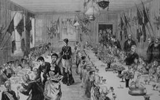

[[
]{.calibre_7}]{.bold}

### [[[La misère]{.calibre2}]{.bold1}]{.calibre_39} {#la-misère .calibre_38}

[Discours prononcé à l'Assemblée Nationale]{.calibre_10}

[Le 9 juillet 1849
{.calibre3}]{.calibre_10}

[[[[[^\[6\]^]{.calibre_21}]{.underline}]{.calibre_4}](index_split_4951.html#filepos40607823){#filepos40331833}]{.calibre_10}

[]{.calibre_10}

[Présidence du citoyen Dupin]{.calibre_10}

[\[\...\]
[Le citoyen ministre]{.bold}.[[[[^\[7\]^]{.calibre_21}]{.underline}]{.calibre_4}](index_split_4951.html#filepos40608419){#filepos40332304}
Je ne sais comment l'expliquer. Il y a quelquefois, en effet, dans notre société, de ces douleurs profondes, de ces dégoûts coupables de la vie qui acceptent la faim comme un moyen d'arriver à la mort. Cela arrive quelquefois. Mais ce que je nie hautement, c'est que dans cette société parisienne, dans cette grande ville qui consacre tant de charité, tant de ressources, tant de secours, tant de secours non pas seulement pécuniaires, mais, ce qui vaut mieux encore, tant de secours personnels, tant de dévouements empressés [(Très bien ! très bien !),]{.italic} sous toutes les formes, au soulagement de la misère de tous les moments, je nie hautement, pour l'honneur de mon pays, que, dans cette société, il y ait eu, pendant six jours, un homme demandant du pain, et mourant pour n'en avoir pas obtenu. [(Approbation générale. --- Applaudissements.)
]{.italic} [Le citoyen Victor Hugo.
]{.bold} Je m'associe pleinement aux paroles que vient de prononcer M. le ministre de l'intérieur ; et demain, ceux de mes honorables collègues qui voudront bien prendre la peine de relire les paroles que j'ai prononcées à cette tribune verront que les sentiments qui animent M. le ministre sont identiquement ceux qui m'animent aussi, moi.]{.calibre4}

[Je ne prétends pas tirer avantage contre la société du monde la plus humaine et la plus civilisée, de quelques faits douloureux que j'ai dû traduire devant cette Assemblée, pour accuser la société entière (Murmures) ; c'était mon devoir. (Non ! non ! --- Si ! si !)]{.calibre4}

[Si ! c'était mon devoir, et j'élèverai la voix toutes les fois qu'il le faudra pour faire connaître à mon pays les souffrances des classes malheureuses\... (Interruption et bruit.)
[Le citoyen Lebeuf.]{.bold}
Vous auriez mieux fait de venir à son secours et de ne pas le laisser mourir de faim.
[Le citoyen Victor Hugo.]{.bold}
Je n'ai pas entendu l'interruption.
[Le citoyen Lebeuf.]{.bold}
Je dis que votre devoir, à vous homme de lettres, c'était de ne pas le laisser mourir de faim.
[Le citoyen Président]{.bold}, à [l'interrupteur.]{.italic}
Votre devoir, à vous, c'est de ne pas interrompre.
[Le citoyen Victor Hugo.]{.bold}
Que l'honorable interrupteur veuille bien monter à cette tribune, qu'il vienne parler ici, et je lui répondrai.
[Le citoyen Lebeuf.]{.bold}
J'ai dit que c'était votre devoir de ne pas laisser mourir de faim un homme de lettres\...
[Voix nombreuses.]{.bold}
N'interrompez pas ! --- A l'ordre !
[Le citoyen Président.]{.bold}
Vous n'avez pas la parole.
[Le citoyen Lebeuf.]{.bold}
On m'interpelle, je réponds.
[Le citoyen Président.]{.bold}
N'interrompez donc pas ; vous n'en avez pas le droit.
[Le citoyen Lebeuf.]{.bold}
Je répondais à une interpellation.
[Le citoyen Président.]{.bold}
Vous n'aviez pas la parole ; vous avez persisté deux fois à interrompre, je vous rappelle à l'ordre.
[Le citoyen Lebeuf.]{.bold}
Je demande la parole.
[Le citoyen Président.]{.bold}
Vous l'aurez après.
[Le citoyen Victor Hugo.]{.bold}
Vous n'avez pas le droit de parler de votre banc ; venez ici, et je vous répondrai. (Bruit.)]{.calibre4}

[Quant aux faits douloureux que j'ai cités, je les maintiens, et je donnerai sur ces faits, à M. le ministre de l'intérieur, toutes les explications désirables.
[Le citoyen Ministre de l'intérieur.]{.bold}
C'est un peu tard !
[Le citoyen Victor Hugo.]{.bold}
Maintenant, je ne suis pas monté à cette tribune seulement pour faire cette observation ; je suis monté à cette tribune pour rétablir les paroles que j'avais prononcées et que l'honorable M. Gustave de Beaumont n'a pas bien entendues. (Rumeurs.)]{.calibre4}

[Messieurs, tout ce qui se dit à cette tribune est très grave, surtout en cette matière, et je ne veux pas qu'on me fasse dire ce que je n'ai pas dit.]{.calibre4}

[J'avais dit qu'on pouvait détruire la misère en ce monde. M. Gustave de Beaumont m'a répondu que la souffrance ne pouvait pas disparaître ; c'étaient les propres paroles dont je m'étais servi. (Interruption.)]{.calibre4}

[Je viens de prendre à la sténographie du [Moniteur]{.italic} les paroles mêmes que j'ai prononcées.]{.calibre4}

[Voici ce que j'avais dit ; je lis ce que les sténographes ont écrit :]{.calibre4}

[« Je ne suis pas, messieurs, de ceux qui croient qu'on peut supprimer la souffrance en ce monde, la souffrance est une loi divine ; mais je suis de ceux qui pensent et qui affirment qu'on peut détruire la misère- » [(Dénégations sur plusieurs bancs.)
]{.italic} [Le citoyen Poujoulat.]{.bold}
C'est une erreur profonde ! On peut l'atténuer, mais non la détruire d'une manière absolue.
[Le citoyen Benoist d'Azy.]{.bold}
Je demande la parole !
[Le citoyen Victor Hugo.]{.bold}
Là-dessus, et ma comparaison doit être encore présente à quelques-uns d'entre vous, j'ai comparé la misère à la lèpre, et j'ai dit : La misère disparaîtra comme la lèpre a disparu.]{.calibre4}

[La misère n'est pas la souffrance ; la misère n'est pas la pauvreté même [(Bruit)]{.italic} ; la misère est une chose sans nom [(Oh ! oh !)]{.italic} que j'ai essayée de caractériser\... [(Interruption.)
]{.italic} [Un membre.]{.bold}
Mais elle a un nom, puisqu'elle s'appelle la misère !
[Le citoyen Victor Hugo.]{.bold}
La souffrance ne peut pas. Disparaître, mais la misère peut disparaître, la misère doit disparaître. C'est vers ce but que la société doit tendre et, pour que mes paroles soient parfaitement comprises je déclare qu'en effet il y aura toujours des malheureux, mais qu'il est possible qu'il n'y ait plus de misérables. [(Approbation à gauche. Rires ironiques sur plusieurs bancs).]{.italic}]{.calibre4}

[Je maintiens ce que j'ai dit. [(Longues rumeurs,)
]{.italic} [Le citoyen Lebeuf.]{.bold}
Messieurs, j'ai le regret d'avoir été rappelé à l'ordre ; mais j'avoue que je n'ai pas été maître de moi quand j'ai entendu M. Victor Hugo citer ici un fait déplorable, incroyable, et déclarer que ce qu'il avait dit, il était de son devoir de le dire.]{.calibre4}

[Je répondrai à M. Victor Hugo que je n'ai pas l'honneur d'être homme de lettres ; mais que si j'étais de la société des gens de lettres, et que j'eusse appris qu'un confrère serait mort pour avoir pendant six jours manqué de pain, je me serais bien gardé d'apporter un pareil fait à la tribune ; j'en rougirais pour mon pays, j'en rougirais pour moi-même ; j'en gémirais pour la société des gens de lettres, qui n'aurait pas découvert et secouru une telle misère. Mais, encore une fois, je ne veux pas y croire ! [(Très bien ! très bien ! --- Bruit à gauche.)
]{.italic} [Le citoyen Victor Hugo.]{.bold}
Je n'ai qu'un mot à répondre ; il est tout simple.]{.calibre4}

[Il ne suffit malheureusement pas d'être homme de lettres pour être informé des faits avant tout le monde. Je n'ai connu le fait dont j'ai parlé que quand il a été consommé. [(Exclamations diverses.)
]{.italic} [Le citoyen Benoist d'Azy.]{.bold}
Je supplie l'Assemblée de permettre que ce débat se prolonge encore un moment. Il s'agit, en effet, des plus grandes questions de notre ordre social. Il s'agit de savoir si on apportera dans l'esprit des populations malheureuses un espoir qui, ainsi que l'a dit l'honorable M. Gustave de Beaumont, ne peut pas être réalisé.]{.calibre4}

[On a porté à cette tribune une parole imprudente. Cette parole vient d'être expliquée ; elle ne l'a pas été, suivant moi, suffisamment ; car, dans les termes généraux, qui ne comprend par le mot de misère ce que tout le monde entend par-là, c'est-à-dire pauvreté ?]{.calibre4}

[L'honorable M. Hugo a expliqué le mot de misère par ce qu'il y a de plus infime dans la misère, par les derniers degrés de la misère. Eh bien, dans l'expression générale de sa pensée, dans ce que tout le monde a entendu, car tous nous l'avons interrompu, on a compris, quand il a dit que l'Etat avait la possibilité de détruire la misère, qu'il allait plus loin, et que l'on pouvait dire aux classes qui souffrent que cet état de souffrance ne tenait qu'à un vice de l'organisation sociale, et qu'il était au pouvoir de l'Etat de le détruire.]{.calibre4}

[C'est à cela que l'honorable M. de Beaumont a parfaitement répondu ; c'est contre cela que nous devons tous en effet protester.
[Voix à gauche.]{.bold}
Pas tous ! pas tous !
[Le citoyen Benoist d'Azy.]{.bold}
J'entends, dans un côté de l'Assemblée, protester contre ce que je dis moi-même, que la pauvreté, que la misère, je répète l'expression, est une des nécessités de la condition de la société.]{.calibre4}

[Eh bien, messieurs, suivons ce débat, prolongeons-le autant qu'il sera nécessaire ; apportez ici, à cette tribune, vous qui m'interrompez, les moyens, la possibilité de détruire la misère\...
[À droite.]{.bold}
C'est cela ! c'est cela !
]{.calibre4}

[[Le citoyen Benoist d'Azy.]{.bold}
Examinons vos théories, prouvez qu'elles sont applicables et qu'un Etat civilisé peut les admettre sans appeler sur lui la plus affreuse de toutes les misères. Prouvez que ces espérances ne sont pas des déceptions et nous serons prêts à vous seconder dans le grand intérêt de l'humanité, qui passe avant tous les autres. Faut-il pour cela des sacrifices ? Vous faut-il le sacrifice de ce que vous enseignez au pauvre à regarder comme un obstacle à sa prospérité, c'est-à-dire la richesse ? Croyez-vous que si c'était vrai la richesse elle-même ne viendrait pas ici faire ce sacrifice ? [(Dénégations à gauche. ---Approbation au centre et à droite.)]{.italic}]{.calibre4}

[Oui, vous verriez recommencer la fameuse nuit du 4 août et chacun, dans l'intérêt de l'humanité, viendrait faire ici son sacrifice. Mais vous êtes insensés si vous ne voyez pas que le sacrifice de toutes les richesses du pays ne suffirait pas pour empêcher la misère ! [(Bruit à gauche.)]{.italic}]{.calibre4}

[Osez venir ici, produisez un système, produisez le tout entier, discutez-le, faites-le accepter par la raison, et on verra alors si vous êtes capables de faire ce que le genre humain tout entier n'a jamais pu réaliser depuis qu'il existe, ce que le Seigneur lui-même a déclaré impossible lorsqu'il a dit : « Vous aurez toujours des pauvres parmi vous ! » [(Approbation à droite et au centre.)
]{.italic} [Un membre à gauche.]{.bold}
La misère n'est pas la pauvreté !
[Le citoyen Benoist d'Azy.]{.bold}
Oui, vous aurez toujours des pauvres. Notre devoir à tous, c'est la charité, non pas la charité par l'Etat, mais la charité individuelle. C'est un devoir pour nous tous. [(Murmures et réclamations à gauche.)]{.italic}]{.calibre4}

[Et quant à la charité par l'Etat, quant à l'assistance publique, comme vous l'appelez, au nom des grands principes de notre société chrétienne, oui, je la regarde comme un devoir pour nous et pour la société tout entière, oui, j'accepte tout ce qu'on fera ; mais je ne veux pas qu'on calomnie mon pays en disant que nous n'avons encore rien fait. Nous en sommes tous préoccupés. Et qu'avons-nous fait depuis que nous sommes ici ?
[À gauche.]{.bold}
Rien ! rien !
[À droite et au centre.]{.bold}
À qui la faute ?
[Le citoyen Benoist d'Azy.]{.bold}
Savez-vous pourquoi nous n'avons rien fait encore ? c'est que vous nous en avez empêchés. [(Exclamations à gauche.)
]{.italic} [Le citoyen de Falloux]{.bold}, [ministre de l'instruction publique,]{.italic}
Le 13 juin nous en a empêchés.
[[[[[Le citoyen Benoist d'Azy]{.calibre_78}]{.underline}]{.bold}]{.calibre_4}](http://www.assemblee-nationale.fr/sycomore/fiche.asp?num_dept=631)[.]{.bold}
J'avais l'honneur de présider cette Assemblée, le jour même où vous avez porté contre le Gouvernement et le chef de la République une accusation qui a jeté le trouble dans le pays\... [(Vives réclamations à gauche.)
]{.italic} [À droite et au centre.]{.bold}
Oui ! oui ! c'est vrai ! --- Très bien !
]{.calibre4}

[[Le citoyen Benoist d'Azy.]{.bold}
Ce jour-là même j'ai fait mettre à l'ordre du jour les propositions qui étaient sous les yeux de l'Assemblée, et qui avaient pour objet de s'occuper des caisses de secours et de retraite pour les classes ouvrières et de plusieurs autres propositions au nombre de 5 ou 6 qui étaient toutes dans l'intérêt des classes pauvres ou des classes qui souffrent.
\[...\]]{.calibre4}
