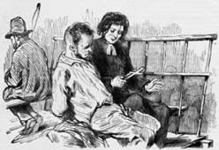

[[
]{.calibre_7}]{.bold}

### [[[L'abolition de la peine de mort]{.calibre2}]{.bold1}]{.calibre_39} {#labolition-de-la-peine-de-mort .calibre_38}

[Discours prononcé à l'Assemblée Nationale]{.calibre_10}

[Le 15 septembre 1848]{.calibre_10}

[{.calibre3}]{.calibre_10}

[[[[[^\[3\]^]{.calibre_21}]{.underline}]{.calibre_4}](index_split_4951.html#filepos40606866){#filepos40299570}]{.calibre_10}

[
\[\...\]
[Le citoyen Président.]{.bold}
La parole est à M. Victor Hugo. [(Mouvement d'attention.)
]{.italic} [
Le citoyen Victor Hugo.]{.bold}
Messieurs, comme l'honorable rapporteur de votre commission, je ne m'attendais pas à parler sur cette grave et importante matière. Je regrette que cette question, la première de toutes peut-être, arrive au milieu de vos délibérations presque à l'improviste, et surprenne les orateurs non préparés. Quant à moi, je dirai peu de mots, mais ils partiront du sentiment d'une conviction profonde et ancienne.]{.calibre4}

[Vous venez de consacrer l'inviolabilité du domicile ; nous vous demandons de consacrer une inviolabilité plus haute, et plus sainte encore ; l'inviolabilité de la vie humaine]{.calibre4}

[Messieurs, une constitution, et surtout une constitution faite par et pour la France, est nécessairement un pas dans la civilisation ; si elle n'est point un pas dans la civilisation, elle n'est rien. [(Très bien !]{.italic}) Eh bien, songez-y !]{.calibre4}

[Qu'est-ce que la peine de mort ? La peine de mort est le signe spécial et éternel de la barbarie. [(Sensation.)]{.italic} Partout où la peine de mort est prodiguée, la barbarie domine ; partout où la peine de mort est rare, la civilisation règne. [(Mouvement)]{.italic}]{.calibre4}

[Ce sont là des faits incontestables.]{.calibre4}

[L'adoucissement de la pénalité est un grand et sérieux progrès. Le XVIII^[e]{.calibre18}^ siècle, c'est là une partie de sa gloire, a aboli la torture ; le XIX^[e]{.calibre18}^ abolira certainement la peine de mort. [(Adhésion à gauche.)
]{.italic} [Plusieurs voix.]{.bold}
Oui ! oui !
[Le citoyen Victor Hugo.]{.bold}
Vous ne l'abolirez pas peut-être aujourd'hui ; mais, n'en doutez pas, vous l'abolirez ou vos successeurs l'aboliront demain !
[Les mêmes voix.]{.bold}
Nous l'abolirons ! [(Agitation.)
]{.italic}]{.calibre4}

[[Le citoyen Victor Hugo.]{.bold}
Vous écrivez en tête du préambule de votre constitution : « En présence de Dieu, » et vous commenceriez par lui dérober, a ce Dieu, ce droit qui n'appartient qu'à lui, le droit de vie et de mort ! [(Très bien ! très bien !]{.italic})]{.calibre4}

[Messieurs, il y a trois choses qui sont à Dieu et qui n'appartiennent pas à l'homme : l'irrévocable, l'irréparable et l'indissoluble. Malheur à l'homme s'il les introduit dans ses lois [(Mouvement.)]{.italic} Tôt ou tard elles font plier la société sous leur poids, elles dérangent l'équilibre nécessaire des lois et des moeurs ; elles ôtent à la justice humaine ses proportions ; et alors il arrive ceci, réfléchissez-y, messieurs, [(Profond silence)]{.italic} que la loi épouvante la conscience ! [(Sensation.)]{.italic} Messieurs, je suis monté à cette tribune pour vous dire un seul mot, un mot décisif, selon moi, ce mot, le voici : [(Écoutez ! écoutez !)]{.italic}]{.calibre4}

[Après Février, le peuple eut une grande pensée : le lendemain du jour où il avait brûlé le trône, il voulut brûler l'échafaud. [(Très bien ! --- Sensation.)]{.italic}]{.calibre4}

[Ceux qui agissaient sur son esprit alors ne furent pas, je le regrette profondément, à la hauteur de son grand coeur.
[À gauche.]{.bold}
Très bien !
[Le citoyen Victor Hugo.]{.bold}
On l'empêcha d'exécuter cette idée sublime.]{.calibre4}

[Eh bien, dans le premier article de la constitution que vous vous votez, vous venez de consacrer la première pensée du peuple, vous avez renversé le trône ; maintenant, consacrez l'autre, renversez l'échafaud ! [(Vif assentiment sur plusieurs bancs.)]{.italic}]{.calibre4}

[Je vote l'abolition pure, simple et définitive de la peine de mort.]{.calibre4}
