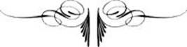

# [[{.calibre10} L'AVARICE ET L'ENVIE]{.calibre2}]{.calibre_55} {#filepos13207538 .calibre_}

:::::: calibre_20
::::: calibre_3
::: calibre_16

------------------------------------------------------------------------

::: calibre_16

:::::
::::::

[(1819)]{.calibre_3}

[Victor Hugo]{.calibre_10}

[[POÉSIES]{.bold}]{.calibre_21}

[(Conte)
]{.calibre_3}

:::::: calibre_22
::::: calibre_3
::: calibre_16

------------------------------------------------------------------------

::: calibre_16

:::::
::::::

[
Pour toutes demandes ou suggestions]{.calibre_3}

[[
]{.underline}]{.calibre_14}

[
L'Avarice et l'Envie, à la marche incertaine,
Un jour s'en allaient par la plaine
Chez un méchant ou chez un fou,
Chez vous ou chez quelqu'autre, ou chez moi-même\... En somme
Elles allaient je ne sais où,
Comme le héron du bonhomme.
Bien que soeurs, ces monstres hideux
Ne s'aiment pas ; aussi, tout le long de la route,
Sans se parler, ils cheminaient tous deux.
L'Avarice, le dos en voûte,
Examinait ce coffre hasardeux
Pour qui sans cesse elle redoute.
L'Envie aussi l'examinait sans doute.
Comptant tous les écus dans son coffre entassés,
Chemin faisant, dame Avarice
Se répétait pour son supplice :
« Je n'en ai point encore assez ! »
De son côté, l'Envie au regard louche,
Lorgnant cet or, objet de tous ses soins,
Disait, en se tordant la bouche :
« Elle en a trop, car j'en ai moins. »
Chacune, à sa façon, méditait sur ce coffre :
Désir soudain à leurs yeux s'offre,
Désir, ce dieu puissant, qui seul peut exaucer
Tous les souhaits qu'on lui veut adresser.
Désir dit aux deux soeurs : « Mesdames,
« Je suis galant, vous êtes femmes,
Choisissez donc tout ce qu'il vous plaira,
Trésors, honneurs, et caetera ;
Surtout, expliquons-nous sans trouble
La première qui parlera
Aura tout ce qu'elle voudra
La seconde en aura le double. »
Vous jugez dans quel embarras
Ce discours mit nos deux luronnes ;
Avares, envieux, que faire en un tel cas ?
Chacune des deux soeurs en murmura tout bas :
« Que me font, ô Désir ! tes trésors, tes couronnes ?
Que m'importent ces biens que m'accorde ta loi ?
Une autre en aura plus que moi ! »
Et chacune, à ce mot funeste,
D'hésiter sans savoir pourquoi.
Le Désir, dieu léger et leste,
Les donne au diable, jure, peste,
Et s'indigne de rester coi.
L'Envie enfin, toujours implacable et cruelle,
Regarde sa soeur en grondant,
Puis, tout à coup, se décidant
« Que l'on m'arrache un oeil, dit-elle. »]{.calibre4}

[ ]{.calibre4}

[[(Ecrit en 1816)]{.italic}]{.calibre4}

[[Publié dans Le Conservateur littéraire]{.italic}]{.calibre_26}

::: calibre_27

[[sous le nom de V. D'AUVERNE, (Pseudonyme de Victor Hugo),]{.italic}]{.calibre_26}

::: calibre_27

[[le 25 décembre 1819.]{.italic}]{.calibre_26}

::: calibre_27
