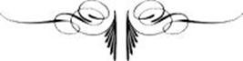

# [[{.calibre10} LES BURGRAVES]{.calibre2}]{.calibre_55} {#filepos28101621 .calibre_}

:::::: calibre_20
::::: calibre_3
::: calibre_16

------------------------------------------------------------------------

::: calibre_16

:::::
::::::

[(1842)]{.calibre_3}

[Victor Hugo]{.calibre_10}

[[THÉÂTRE
]{.bold}]{.calibre_21}

:::::: calibre_22
::::: calibre_21
[ ]{.bold}

::: calibre_16

------------------------------------------------------------------------

::: calibre_16

:::::
::::::

[
Pour toutes demandes ou suggestions]{.calibre_3}

[!{.calibre3}
]{.calibre_10}

[[[[[^\[114\]^]{.calibre_21}]{.underline}]{.calibre_4}](index_split_4205.html#filepos29615006){#filepos28103451}]{.calibre_10}

## [[[]{.calibre2}[]{.calibre2}[]{.calibre2}[]{.calibre2}[]{.calibre2}[]{.calibre2}[]{.calibre2}[]{.calibre2}[]{.calibre2}[]{.calibre2}[]{.calibre2}[]{.calibre2}[]{.calibre2}[]{.calibre2}[]{.calibre2}[]{.calibre2}[]{.calibre2}[]{.calibre2}[]{.calibre2}[]{.calibre2}[]{.calibre2}[]{.calibre2}[]{.calibre2}[Table des matières]{.calibre2}]{.bold1}]{.calibre_24} {#calibre_pb_4904 .calibre_57}

::: calibre_52

[]{.calibre_10}

> [[[[[Préface]{.calibre9}]{.underline}]{.calibre_4}](index_split_4022.html#filepos28109742)]{.calibre_10}

> [[[[[Personnages]{.calibre9}]{.underline}]{.calibre_4}](index_split_4023.html#filepos28138675)]{.calibre_10}

> [[[[[Première Partie -- L'aïeul]{.calibre9}]{.underline}]{.calibre_4}](index_split_4024.html#filepos28140280)]{.calibre_10}

> [[[[[Scène I.]{.calibre16}]{.underline}]{.calibre_4}](index_split_4025.html#filepos28143996)]{.calibre_10}

> [[[[[Scène II.]{.calibre16}]{.underline}]{.calibre_4}](index_split_4026.html#filepos28147646)]{.calibre_10}

> [[[[[Scène III.]{.calibre16}]{.underline}]{.calibre_4}](index_split_4027.html#filepos28175843)]{.calibre_10}

> [[[[[Scène IV.]{.calibre16}]{.underline}]{.calibre_4}](index_split_4028.html#filepos28186356)]{.calibre_10}

> [[[[[Scène V.]{.calibre16}]{.underline}]{.calibre_4}](index_split_4029.html#filepos28198236)]{.calibre_10}

> [[[[[Scène VI.]{.calibre16}]{.underline}]{.calibre_4}](index_split_4030.html#filepos28206920)]{.calibre_10}

> [[[[[Scène VII]{.calibre16}]{.underline}]{.calibre_4}](index_split_4031.html#filepos28220182)]{.calibre_10}

> [[[[[Deuxième Partie -- Le mendiant]{.calibre9}]{.underline}]{.calibre_4}](index_split_4032.html#filepos28225470)]{.calibre_10}

> [[[[[Scène I.]{.calibre16}]{.underline}]{.calibre_4}](index_split_4033.html#filepos28227077)]{.calibre_10}

> [[[[[Scène II.]{.calibre16}]{.underline}]{.calibre_4}](index_split_4034.html#filepos28232682)]{.calibre_10}

> [[[[[Scène III.]{.calibre16}]{.underline}]{.calibre_4}](index_split_4035.html#filepos28236384)]{.calibre_10}

> [[[[[Scène IV.]{.calibre16}]{.underline}]{.calibre_4}](index_split_4036.html#filepos28239991)]{.calibre_10}

> [[[[[Scène V.]{.calibre16}]{.underline}]{.calibre_4}](index_split_4037.html#filepos28254198)]{.calibre_10}

> [[[[[Scène VI]{.calibre16}]{.underline}]{.calibre_4}](index_split_4038.html#filepos28256857)]{.calibre_10}

> [[[[[Troisième Partie -- Le caveau perdu]{.calibre9}]{.underline}]{.calibre_4}](index_split_4039.html#filepos28283906)]{.calibre_10}

> [[[[[Scène I.]{.calibre16}]{.underline}]{.calibre_4}](index_split_4040.html#filepos28285951)]{.calibre_10}

> [[[[[Scène II.]{.calibre16}]{.underline}]{.calibre_4}](index_split_4041.html#filepos28295442)]{.calibre_10}

> [[[[[Scène III.]{.calibre16}]{.underline}]{.calibre_4}](index_split_4042.html#filepos28309482)]{.calibre_10}

> [[[[[Scène IV.]{.calibre16}]{.underline}]{.calibre_4}](index_split_4043.html#filepos28324458)]{.calibre_10}

> [[[[[Une analyse de Charles Magnin]{.calibre9}]{.underline}]{.calibre_4}](index_split_4044.html#filepos28329677)]{.calibre_10}

## [[[]{.calibre2}[]{.calibre2}[]{.calibre2}[]{.calibre2}[]{.calibre2}[]{.calibre2}[]{.calibre2}[]{.calibre2}[]{.calibre2}[]{.calibre2}[]{.calibre2}[]{.calibre2}[]{.calibre2}[]{.calibre2}[]{.calibre2}[]{.calibre2}[]{.calibre2}[]{.calibre2}[]{.calibre2}[]{.calibre2}[]{.calibre2}[]{.calibre2}[]{.calibre2}[]{.calibre2}[]{.calibre2}[]{.calibre2}[]{.calibre2}[]{.calibre2}[]{.calibre2}[]{.calibre2}[]{.calibre2}[]{.calibre2}[]{.calibre2}[]{.calibre2}[]{.calibre2}[]{.calibre2}[]{.calibre2}[]{.calibre2}[]{.calibre2}[]{.calibre2}[]{.calibre2}[]{.calibre2}[]{.calibre2}[]{.calibre2}[]{.calibre2}[]{.calibre2}[]{.calibre2}[]{.calibre2}[]{.calibre2}[]{.calibre2}[]{.calibre2}[]{.calibre2}[]{.calibre2}[]{.calibre2}[]{.calibre2}[]{.calibre2}[]{.calibre2}[]{.calibre2}[]{.calibre2}[]{.calibre2}[]{.calibre2}[]{.calibre2}[]{.calibre2}[]{.calibre2}[]{.calibre2}[]{.calibre2}[]{.calibre2}[]{.calibre2}[]{.calibre2}[]{.calibre2}[]{.calibre2}[]{.calibre2}[]{.calibre2}[]{.calibre2}[]{.calibre2}[]{.calibre2}[]{.calibre2}[]{.calibre2}[]{.calibre2}[]{.calibre2}[]{.calibre2}[]{.calibre2}[]{.calibre2}[]{.calibre2}[]{.calibre2}[]{.calibre2}[]{.calibre2}[]{.calibre2}[]{.calibre2}[]{.calibre2}[]{.calibre2}[]{.calibre2}Préface]{.bold1}]{.calibre_24} {#calibre_pb_4906 .calibre_57}

::: calibre_52

[ ]{.calibre4}

[Au temps d\'Eschyle, la Thessalie était un lieu sinistre. Il y avait eu là autrefois des géants ; il y avait là maintenant des fantômes. Le voyageur qui se hasardait au-delà de Delphes et qui franchissait les forêts vertigineuses du Mont Cnémis, croyait voir partout, la nuit venue, s\'ouvrir et flamboyer l\'oeil des cyclopes ensevelis dans les marais du Sperchius. Les trois mille océanides éplorées lui apparaissaient en foule dans les nuées au-dessus du Pinde ; dans les cent vallées de l\'Oeta il retrouvait l\'empreinte profonde et les coudes horribles des cent bras des hécatonchires tombés jadis sur ces rochers ; il contemplait avec une stupeur religieuse la trace des ongles crispés d\'Encelade sur le flanc du Pélion ; il n\'apercevait pas à l\'horizon l\'immense Prométhée couché, comme une montagne sur une montagne, sur des sommets entourés de tempêtes, car les dieux avaient rendu Prométhée invisible ; mais, à travers les branchages des vieux chênes, les gémissements du colosse arrivaient jusqu\'à lui, passant ; et il entendait par intervalles le monstrueux vautour essuyer son bec d\'airain aux granits sonores du mont Othrys. Par moments, un grondement de tonnerre sortait du mont Olympe, et dans ces instants-là le voyageur épouvanté voyait se soulever au nord, dans les déchirures des monts Cambuniens, la tête difforme du géant Hadès, dieu des ténèbres intérieures ; à l\'orient, au-delà du mont Ossa, il entendait mugir Céto, la femme-baleine ; et à l\'occident, par-dessus le mont Callidrome, à travers la mer des Alcyons, un vent lointain, venu de Sicile, lui apportait l\'aboiement vivant et terrible du gouffre Scylla. Les géologues ne voient aujourd\'hui dans la Thessalie bouleversée que la secousse d\'un tremblement de terre et le passage des eaux diluviennes ; mais, pour Eschyle et ses contemporains, ces plaines ravagées, ces forêts déracinées, ces blocs arrachés et rompus, ces lacs changés en marais, ces montagnes renversées et devenues informes, c\'était quelque chose de plus formidable encore qu\'une terre dévastée par un déluge ou remuée par les volcans ; c\'était l\'effrayant champ de bataille où les titans avaient lutté contre Jupiter.]{.calibre4}

[Ce que la fable a inventé, l'histoire le reproduit parfois. La fiction et la réalité surprennent quelquefois notre esprit par les parallélismes singuliers qu\'il leur découvre. Ainsi, --- pourvu néanmoins qu\'on ne cherche pas dans des pays et dans des faits qui appartiennent à l\'histoire ces impressions surnaturelles, ces grossissements chimériques que l\'oeil des visionnaires prête aux faits purement mythologiques ; en admettant le conte et la légende, mais en conservant le fond de réalité humaine qui manque aux gigantesques machines de la fable antique, --- il y a aujourd\'hui en Europe un lieu qui, toute proportion gardée, est pour nous, au point de vue poétique, ce qu\'était la Thessalie pour Eschyle, c\'est-à-dire un champ de bataille mémorable et prodigieux. On devine que nous voulons parler des bords du Rhin. Là, en effet, comme en Thessalie, tout est foudroyé, désolé, arraché, détruit ; tout porte l\'empreinte d\'une guerre profonde, acharnée, implacable. Pas un rocher qui ne soit une forteresse, pas une forteresse qui ne soit une ruine ; l\'extermination a passé par là ; mais cette extermination est tellement grande, qu\'on sent que le combat a dû être colossal. Là, en effet, il y a six siècles, d\'autres titans ont lutté contre un autre Jupiter. Ces titans, ce sont les burgraves ; ce Jupiter, c\'est l\'empereur d\'Allemagne.]{.calibre4}

[Celui qui écrit ces lignes, --- et qu\'on lui pardonne d\'expliquer ici sa pensée, laquelle a été d\'ailleurs si bien comprise qu\'il est presque réduit à redire aujourd\'hui ce que d\'autres ont déjà dit avant lui et beaucoup mieux que lui ; --- celui qui écrit ces lignes avait depuis longtemps entrevu ce qu\'il y a de neuf, d\'extraordinaire et de profondément intéressant pour nous, peuples nés du moyen âge, dans cette guerre des titans modernes, moins fantastique, mais aussi grandiose peut-être que la guerre des titans antiques. Les titans sont des mythes, les burgraves sont des hommes. Il y a un abîme entre nous et les titans fils d\'Uranus et de Ghê ; il n\'y a entre les burgraves et nous qu\'une série de générations ; nous, nations riveraines du Rhin, nous venons d\'eux ; ils sont nos pères. De là entre eux et nous cette cohésion intime, quoique lointaine, qui fait que, tout en les admirant parce qu\'ils sont grands, nous les comprenons parce qu\'ils sont réels. Ainsi, la réalité qui éveille l\'intérêt, la grandeur qui donne la poésie, la nouveauté qui passionne la foule, voilà sous quel triple aspect la lutte des burgraves et de l\'empereur pouvait s\'offrir à l\'imagination d\'un poète.]{.calibre4}

[L\'auteur des pages qu\'on va lire était préoccupé de ce grand sujet, qui dès longtemps, nous venons de le dire, sollicitait intérieurement sa pensée, lorsqu\'un hasard, il y a quelques années, le conduisit sur les bords du Rhin. La portion du public qui veut bien suivre ses travaux avec quelque intérêt a lu peut-être le livre intitulé [Le Rhin]{.italic}, et sait par conséquent que ce voyage d\'un passant obscur ne fut autre chose qu'une longue et fantasque promenade d\'antiquaire et de rêveur.]{.calibre4}

[La vie que menait l\'auteur dans ces lieux peuplés de souvenirs, on se la figure sans peine. Il vivait là, on doit en convenir, beaucoup plus parmi les pierres du temps passé que parmi les hommes du temps présent. Chaque jour, avec cette passion que comprendront les archéologues et les poètes, il explorait quelque ancien édifice démoli. Quelquefois c\'était dès le matin ; il allait, il gravissait la montagne et la ruine, brisait les ronces et les épines sous ses talons, écartait de la main les rideaux de lierre, escaladait les vieux pans de mur, et là, seul, pensif, oubliant tout, au milieu du chant des oiseaux, sous les rayons du soleil levant, assis sur quelque basalte vert de mousse ou enfoncé jusqu\'aux genoux dans les hautes herbes humides de rosée, il déchiffrait une inscription romane ou mesurait l\'écartement d\'une ogive, tandis que les broussailles de la ruine, joyeusement remuées par le vent au-dessus de sa tête, faisaient tomber sur lui une pluie de fleurs. Quelquefois c\'était le soir ; au moment où le crépuscule ôtait leur forme aux collines et donnait au Rhin la blancheur sinistre de l\'acier, il prenait, lui, le sentier de la montagne, coupé, de temps en temps, par quelque escalier de lave et d\'ardoise, et il montait jusqu\'au burg démantelé. Là, seul comme le matin, plus seul encore, car aucun chevrier n\'oserait se hasarder dans des lieux pareils à ces heures que toutes les superstitions font redoutables, perdu dans l\'obscurité, il se laissait aller à cette tristesse profonde qui vient au coeur quand on se trouve, à la tombée du soir, placé sur quelque sommet désert, entre les étoiles de Dieu, qui s\'allument splendidement au-dessus de notre tête, et les pauvres étoiles de l\'homme, qui s\'allument aussi, elles, derrière la vitre misérable des cabanes, dans l\'ombre, sous nos pieds. Puis l\'heure passait, et quelquefois minuit avait sonné à tous les clochers de la vallée qu\'il était encore là, debout dans quelque brèche du donjon, songeant, regardant, examinant l\'attitude de la ruine, étudiant, témoin importun peut-être, ce que la nature fait dans la solitude et dans les ténèbres ; écoutant, au milieu du fourmillement des animaux nocturnes, tous ces bruits singuliers dont la légende a fait des voix ; contemplant, dans l\'angle des salles et dans la profondeur des corridors, toutes ces formes, vaguement dessinées par la lune et par la nuit, dont la légende a fait des spectres. --- Comme on le voit, ses jours et ses nuits étaient pleins de la même idée ; et il tâchait de dérober à ces ruines tout ce qu\'elles peuvent apprendre à un penseur.]{.calibre4}

[On comprendra aisément qu\'au milieu de ces contemplations et de ces rêveries les burgraves lui soient revenus à l'esprit. Nous le répétons, ce que nous avons dit en commençant de la Thessalie, on peut le dire du Rhin : il a eu jadis des géants, il a aujourd\'hui des fantômes. Ces fantômes apparurent à l\'auteur. Des châteaux qui sont sur ces collines sa méditation passa aux châtelains qui sont dans la chronique, dans la légende et dans l\'histoire. Il avait sous les yeux les édifices, il essaya de se figurer les hommes ; du coquillage on peut conclure le mollusque, de la maison on peut conclure l\'habitant. Et quelles maisons que les burgs du Rhin ! et quels habitants que les burgraves ! Ces grands chevaliers avaient trois armures : la première était faite de courage, c\'était leur coeur ; la deuxième d\'acier, c\'était leur vêtement ; la troisième de granit, c\'était leur forteresse.]{.calibre4}

[Un jour, comme l\'auteur venait de visiter les citadelles écroulées qui hérissent le Wisperthal, il se dit que le moment était venu. Il se dit, sans se dissimuler le peu qu\'il est et le peu qu\'il vaut, que de ce voyage il fallait tirer une oeuvre, que de cette poésie il fallait extraire un poème. L\'idée qui se présenta à lui n\'était pas sans quelque grandeur, il le croit. La voici :]{.calibre4}

[Reconstruire par la pensée, dans toute son ampleur et dans toute sa puissance, un de ces châteaux où les burgraves, égaux aux princes, vivaient d\'une vie presque royale. [Aux douzième et treizième siècles]{.italic}, dit Kohlrausch, [le titre de burgrave prend rang immédiatement au-dessous du titre de roi]{.italic}[[[^[^[[\[115\]]{.calibre20}]{.calibre19}^]{.calibre18}^]{.underline}]{.calibre_4}](index_split_4205.html#filepos29615367){#filepos28122397}. Montrer dans le burg les trois choses qu\'il contenait : une]{.calibre4}

[forteresse, un palais, une caverne ; dans ce burg, ainsi ouvert dans toute sa réalité à l\'oeil étonné du spectateur, installer et faire vivre ensemble et de front quatre générations, l\'aïeul, le père, le fils, le petit-fils ; faire de toute cette famille comme le symbole palpitant et complet de l\'expiation ; mettre sur la tête de l\'aïeul le crime de Caïn, dans le coeur du père les instincts de Nemrod, dans l\'âme du fils les vices de Sardanapale, et laisser entrevoir que le petit-fils pourra bien un jour commettre le crime tout à la fois par passion comme son bisaïeul, par férocité comme son aïeul et par corruption comme son père ; montrer l\'aïeul soumis à Dieu, et le père soumis à l\'aïeul ; relever le premier par le repentir, et le second par la piété filiale, de sorte que l\'aïeul puisse être auguste et que le père puisse être grand, tandis que les deux générations qui les suivent, amoindries par leurs vices croissants, vont s'enfonçant de plus en plus dans les ténèbres. Poser de cette façon devant tous et rendre visible à la foule cette grande échelle morale de la dégradation des races qui devrait être l\'exemple vivant éternellement dressé aux yeux de tous les hommes, et qui n'a été jusqu\'ici entrevue, hélas ! que par les songeurs et les poètes ; donner une figure à cette leçon des sages ; faire de cette abstraction philosophique une réalité dramatique, palpable, saisissante, utile.]{.calibre4}

[Voilà la première partie et, pour ainsi parler, la première face de l\'idée qui lui vint. Du reste, qu\'on ne lui suppose pas la présomption d\'exposer ici ce qu\'il croit avoir fait ; il se borne à expliquer ce qu\'il a voulu faire. Cela dit une fois pour toutes, continuons.]{.calibre4}

[Dans une famille pareille, ainsi développée à tous les regards et à tous les esprits, pour que l\'enseignement soit entier, deux grandes et mystérieuses puissances doivent intervenir, la fatalité et la providence ; la fatalité qui veut punir, la providence qui veut pardonner. Quand l\'idée qu\'on vient de dérouler apparut à l\'auteur, il songea sur-le-champ que cette double intervention était nécessaire à la moralité de l\'oeuvre. Il se dit qu\'il fallait que dans ce palais lugubre, inexpugnable, joyeux et tout-puissant, peuplé d\'hommes de guerre et d\'hommes de plaisir, regorgeant de princes et de soldats, on vît errer, entre les orgies des jeunes gens et les sombres rêveries des vieillards, la grande figure de la servitude ; qu\'il fallait que cette figure fut une femme, car la femme seule, flétrie dans sa chair comme dans son âme, peut représenter l\'esclavage complet ; et qu\'enfin il fallait que cette femme, que cette esclave, vieille, livide, enchaînée, sauvage comme la nature qu\'elle contemple sans cesse, farouche comme la vengeance qu'elle médite nuit et jour, ayant dans le coeur la passion des ténèbres, c\'est-à-dire la haine, et dans l\'esprit la science des ténèbres, c\'est-à-dire la magie, personnifiât la fatalité. Il se dit d\'un autre côté que, s\'il était nécessaire qu\'on vît la servitude se traîner sous les pieds des burgraves, il était nécessaire aussi qu\'on vît la souveraineté éclater au-dessus d\'eux ; il se dit qu\'il fallait qu\'au milieu de ces princes bandits un empereur apparut ; que, dans une oeuvre de ce genre, si le poète avait le droit, pour peindre l\'époque, d\'emprunter à l\'histoire ce qu\'elle enseigne, il avait également le droit d\'employer, pour faire mouvoir ses personnages, ce que la légende autorise ; qu\'il serait beau peut-être de réveiller pour un moment et de faire sortir des profondeurs mystérieuses où il est enseveli le glorieux messie militaire que l\'Allemagne attend encore, le dormeur impérial de Kaiserslautern, et de jeter, terrible et foudroyant, au milieu des géants du Rhin, le Jupiter du douzième siècle, Frédéric Barberousse. Enfin, il se dit qu\'il y aurait peut-être quelque grandeur, tandis qu\'une esclave représenterait la fatalité, à ce qu\'un empereur personnifiât la providence. Ces idées germèrent dans son esprit, et il pensa qu'en disposant de la sorte les figures par lesquelles se traduirait sa pensée, il pourrait, au dénouement, grande et morale conclusion, à son sens du moins, faire briser la fatalité par la providence, l\'esclave par l'empereur, la haine par le pardon.]{.calibre4}

[Comme, dans toute oeuvre, si sombre qu'elle soit, il faut un rayon de lumière, c\'est-à-dire un rayon d\'amour, il pensa encore que ce n\'était point assez de crayonner le contraste des pères et des enfants, la lutte des burgraves et de l\'empereur, la rencontre de la fatalité et de la providence ; qu\'il fallait peindre aussi et surtout deux coeurs qui s\'aiment ; et qu\'un couple chaste et dévoué, pur et touchant, placé au centre de l\'oeuvre et rayonnant à travers le drame entier, devait être l\'âme de toute cette action.]{.calibre4}

[Car c'est là, à notre avis, une condition suprême. Quel que soit le drame, qu\'il contienne une légende, une histoire ou un poème, c\'est bien ; mais qu\'il contienne avant tout la nature et l\'humanité. Faites, si vous le voulez, c\'est le droit souverain du poète, marcher dans vos drames des statues, faites-y ramper des tigres ; mais, entre ces statues et ces tigres, mettez des hommes. Ayez la terreur, mais ayez la pitié. Sous ces griffes d\'acier, sous ces pieds de pierre, faites broyer le coeur humain.]{.calibre4}

[Ainsi l\'histoire, la légende, le conte, la réalité, la nature, la famille, l\'amour, des moeurs naïves, des physionomies sauvages, les princes, les soldats, les aventuriers, les rois, des patriarches comme dans la Bible, des chasseurs d\'hommes comme dans Homère, des titans comme dans Eschyle, tout s\'offrait à la fois à l\'imagination éblouie de l\'auteur dans ce vaste tableau à peindre, et il se sentait irrésistiblement entraîné vers l\'oeuvre qu\'il rêvait, troublé seulement d\'être si peu de chose, et regrettant que ce grand sujet ne rencontrât pas un grand poète. Car là il y avait, certes, l\'occasion d\'une création majestueuse ; on pouvait, dans un sujet pareil, mêler à la peinture d\'une famille féodale la peinture d\'une société héroïque, toucher à la fois des deux mains au sublime et au pathétique, commencer par l\'épopée et finir par le drame.]{.calibre4}

[Après avoir, comme il vient de l\'indiquer et sans se dissimuler d\'ailleurs son infériorité, ébauché ce poème dans sa pensée, l\'auteur se demanda quelle forme il lui donnerait. Selon lui, le poème doit avoir la forme même du sujet. La règle : [Neve minor, neu sit quinto]{.italic}, etc., n\'a qu\'une valeur secondaire à ses yeux. Les Grecs ne s\'en doutaient pas, et les plus imposants chefs-d'oeuvre de la tragédie proprement dite sont nés en dehors de cette prétendue loi. La loi véritable, la voici : Tout ouvrage de l\'esprit doit naître avec la coupe particulière et les divisions spéciales que lui donne logiquement l\'idée qu\'il renferme. Ici, ce que l\'auteur voulait placer et peindre, au point culminant de son oeuvre, entre Barberousse et Guanhumara, entre la providence et la fatalité, c\'était l\'âme du vieux burgrave centenaire Job le Maudit, cette âme qui, arrivée au bord de la tombe, ne mêle plus à sa mélancolie incurable qu\'un triple sentiment : la maison, l\'Allemagne, la famille. Ces trois sentiments donnaient à l\'ouvrage sa division naturelle. L\'auteur résolut donc de composer son drame en trois parties. Et en effet, si l\'on veut bien remplacer un moment en esprit les titres actuels de ces trois actes, lesquels n\'en expriment que le fait extérieur, par des titres plus métaphysiques qui en révéleraient la pensée intérieure, on verra que chacune de ces trois parties correspond à l\'un des trois sentiments fondamentaux du vieux chevalier allemand : maison, Allemagne, famille. La première partie pourrait être intitulée l'[Hospitalité]{.italic} ; la deuxième, la [Patrie]{.italic} ; la troisième, la [Paternité]{.italic}.]{.calibre4}

[La division et la forme du drame une fois arrêtées, l\'auteur résolut d\'écrire sur le frontispice de l\'oeuvre, quand elle serait terminée, le mot [trilogie]{.italic}. Ici, comme ailleurs, trilogie signifie seulement et essentiellement poème en trois chants ou drame en trois actes. Seulement, en l\'employant, l\'auteur voulait réveiller un grand souvenir, glorifier autant qu\'il était en lui, par ce tacite hommage, le vieux poète de l'[Orestie]{.italic} qui, méconnu de ses contemporains, disait avec une tristesse fière : Je consacre mes oeuvres au temps ; et aussi peut-être indiquer au public, par ce rapprochement bien redoutable d\'ailleurs, que ce que le grand Eschyle avait fait pour les titans, il osait, lui, poète malheureusement trop au-dessous de cette magnifique tâche, essayer de le faire pour les burgraves.]{.calibre4}

[Du reste, le public et la presse, cette voix du public, lui ont généreusement tenu compte, non du talent, mais de l\'intention. Chaque jour cette foule sympathique et intelligente qui accourt si volontiers au glorieux théâtre de Corneille et de Molière, vient chercher dans cet ouvrage, non ce que l\'auteur y a mis, mais ce qu\'il a du moins tenté d\'y mettre. Il est fier de l\'attention persistante et sérieuse dont le public veut bien entourer ses travaux, si insuffisants qu\'ils soient, et sans répéter ici ce qu\'il a déjà dit ailleurs, il sent que cette attention est pour lui pleine de responsabilité. Faire constamment effort vers le grand, donner aux esprits le vrai, aux âmes le beau, aux coeurs l'amour, ne jamais offrir aux multitudes un spectacle qui ne soit une idée, voilà ce que le poète doit au peuple. La comédie même, quand elle se mêle au drame, doit contenir une leçon et avoir sa philosophie. De nos jours, le peuple est grand ; pour être compris de lui, le poète doit être sincère. Rien n\'est plus voisin du grand que l'honnête.]{.calibre4}

[Le théâtre doit faire de la pensée le pain de la foule.]{.calibre4}

[Un mot encore, et il a fini. Les [Burgraves]{.italic} ne sont point, comme l'ont cru quelques esprits, excellents d'ailleurs, un ouvrage de pure fantaisie, le produit d'un élan capricieux de l\'imagination. Loin de là : si une oeuvre aussi incomplète valait la peine d\'être discutée à ce point, on surprendrait peut-être beaucoup de personnes en leur disant que, dans la pensée de l\'auteur, il y a eu tout autre chose qu\'un caprice de l\'imagination dans le choix de ce sujet, et, qu\'il lui soit permis d\'ajouter, dans le choix de tous les sujets qu\'il a traités jusqu\'à ce jour. En effet, il y a aujourd\'hui une nationalité européenne, comme il y avait, du temps d\'Eschyle, de Sophocle et d\'Euripide, une nationalité grecque. Le groupe entier de la civilisation, quel qu\'il fût et quel qu\'il soit, a toujours été la grande patrie du poète. Pour Eschyle, c\'était la Grèce ; pour Virgile, c\'était le monde romain ; pour nous, c\'est l\'Europe. Partout où est la lumière, l\'intelligence se sent chez elle et est chez elle. Ainsi, toute proportion gardée, et en supposant qu\'il soit permis de comparer ce qui est petit à ce qui est grand, si Eschyle, en racontant la chute des titans, faisait jadis pour la Grèce une oeuvre nationale, le poète qui raconte la lutte des burgraves fait aujourd\'hui pour l\'Europe une oeuvre également nationale, dans le même sens et avec la même signification. Quelles que soient les antipathies momentanées et les jalousies de frontières, toutes les nations policées appartiennent au même centre et sont indissolublement liées entre elles par une secrète et profonde unité. La civilisation nous fait à tous les mêmes entrailles, le même esprit, le même but, le même avenir. D\'ailleurs, la France qui prête à la civilisation même sa langue universelle et son initiative souveraine, la France, lors même que nous nous unissons à l\'Europe dans une sorte de grande nationalité, n\'en est pas moins notre première patrie comme Athènes était la première patrie d\'Eschyle et de Sophocle. Ils étaient athéniens comme nous sommes français, et nous sommes européens comme ils étaient grecs.]{.calibre4}

[Ceci vaut la peine d\'être développé. L\'auteur le fera peut-être quelque jour. Quand il l\'aura fait, on saisira mieux l\'ensemble des ouvrages qu'il a produits jusqu\'ici ; on en pénétrera la pensée ; on en comprendra la cohésion. Ce faisceau a un lien. En attendant, il le dit et il est heureux de le redire, oui, la civilisation tout entière est la patrie du poète. Cette patrie n\'a d\'autre frontière que la ligne sombre et fatale où commence la barbarie. Un jour, espérons-le, le globe entier sera civilisé, tous les points de la demeure humaine seront éclairés, et alors sera accompli le magnifique rêve de l\'intelligence : avoir pour patrie le monde et pour nation l\'humanité.]{.calibre4}

[[[\[watermark:9782368410165\]]{.calibre_31}]{.italic}
]{.calibre4}

[[25 mars 1843.]{.italic}]{.calibre_26}

::: calibre_27

[[!{.calibre3}]{.italic}]{.calibre_26}

::: calibre_27

## [[[]{.calibre2}[]{.calibre2}[]{.calibre2}[]{.calibre2}[]{.calibre2}[]{.calibre2}[]{.calibre2}[]{.calibre2}[]{.calibre2}[]{.calibre2}[]{.calibre2}[]{.calibre2}[]{.calibre2}[]{.calibre2}[]{.calibre2}[]{.calibre2}[]{.calibre2}[]{.calibre2}[]{.calibre2}[]{.calibre2}[]{.calibre2}[]{.calibre2}[Personnages]{.calibre2}]{.bold1}]{.calibre_24} {#calibre_pb_4908 .calibre_57}

::: calibre_52

[
JOB, Burgrave de Heppenheff.
MAGNUS, files de Job, Burgrave de Wardeck.
HATTO, fils de Magnus, Marquis de Vérone, Burgrave de Nollig.
GORLOIS, fils de Hatto (Bâtard)), Burgrave de Sareck.
FRÉDÉRIC DE HOHENSTAUFEN.
OTBERT.
LE DUC GERHARD de Thuringe.
GILISSA, Margrave de Lusace.
PLATON, Margrave de Moravie.
LUPUS, Comte de Mons.
CADAWALLA, Burgrave d\'Okenfels.
DARIUS, Burgrave de Lahneck.
LA COMTESSE RÉGINA.
GUANHUMARA.
EDWIGE.
KARL, Etudiant, Esclave
HERMANN, Etudiant, Esclave
CYNULFUS, Etudiant, Esclave
HAQUIN, Etudiant, Esclave
GONDICARIUS, Marchand et bourgeois, Esclave.
TEUDON, Marchand et bourgeois, Esclave.
KUNZ, Marchand et bourgeois, Esclave.
SWAN, Marchand et bourgeois, Esclave.
PEREZ, Marchand et bourgeois, Esclave.
JOSSIUS, Soldat.
LE CAPITAINE DU BURG.
UN SOLDAT.]{.calibre4}

[ ]{.calibre4}

[Heppenheff---120..]{.calibre_10}

## [[[]{.calibre2}[]{.calibre2}[]{.calibre2}[]{.calibre2}[]{.calibre2}[]{.calibre2}[]{.calibre2}[]{.calibre2}[]{.calibre2}[]{.calibre2}[]{.calibre2}[]{.calibre2}[]{.calibre2}[]{.calibre2}[]{.calibre2}[]{.calibre2}[]{.calibre2}[]{.calibre2}[]{.calibre2}[]{.calibre2}[]{.calibre2}[]{.calibre2}[]{.calibre2}[]{.calibre2}[]{.calibre2}[]{.calibre2}[]{.calibre2}[]{.calibre2}[]{.calibre2}[]{.calibre2}[]{.calibre2}[]{.calibre2}[]{.calibre2}[]{.calibre2}[]{.calibre2}[]{.calibre2}[]{.calibre2}[]{.calibre2}[]{.calibre2}[]{.calibre2}[]{.calibre2}[]{.calibre2}[]{.calibre2}[]{.calibre2}[]{.calibre2}[]{.calibre2}[]{.calibre2}[]{.calibre2}[]{.calibre2}[]{.calibre2}[]{.calibre2}[]{.calibre2}[]{.calibre2}[]{.calibre2}[]{.calibre2}[]{.calibre2}[]{.calibre2}[]{.calibre2}[]{.calibre2}[]{.calibre2}[]{.calibre2}[]{.calibre2}[]{.calibre2}[]{.calibre2}[]{.calibre2}[]{.calibre2}Première Partie -- L'aïeul]{.bold1}]{.calibre_24} {#calibre_pb_4910 .calibre_57}

::: calibre_52

[ ]{.calibre4}

[[L\'ancienne galerie des portraits seigneuriaux du burg de Heppenheff. Cette galerie, qui était circulaire, se développait autour du grand donjon, et communiquait avec le reste du château par quatre grandes portes situées aux quatre points cardinaux. Au lever du rideau on aperçoit une partie de cette galerie qui fait retour et qu\'on voit se perdre derrière le mur arrondi du donjon. A gauche, une des quatre grandes portes de communication. A droite, une haute et large porte communiquant avec l\'intérieur du donjon, exhaussée sur un degré de trois m a relies et accostée d\'une porte bâtarde. Au fond, un promenoir roman à pleins cintres, à piliers bas, à chapiteaux bizarres, portant un deuxième étage, (praticable), et communiquant avec la galerie par un grand degré de six marches. A travers les larges arcades de ce promenoir, on aperçoit le ciel et le reste du château, dont la plus haute tour est surmontée d\'un immense drapeau noir qui flotte au vent. A gauche, près de la grande porte a deux battants, une petite fenêtre fermée d\'un vitrail haut en couleur. Près de la fenêtre, un fauteuil. Toute la galerie a l\'aspect délabré et inhabité. Les murailles et les voûtes de pierre, sur lesquelles on distingue quelques vestiges de fresques effacées, sont verdies et moisies par le suintement des pluies. Les portraits suspendus dans les panneaux de la galerie sont tous retournés la face contre le mur.]{.italic}]{.calibre4}

[[Au moment où le rideau se lève, le soir vient. La partie du château qu\'on aperçoit par les archivoltes du promenoir au fond du théâtre semble éclairée et illuminée à l\'intérieur, quoiqu\'il fasse encore grand jour. On entend venir de ce côté du burg un bruit de trompettes et.de clairons, et par moments des chansons chantées à pleines voix au cliquetis des verres. --- Plus près, on entend un froissement de ferrailles, comme si une troupe d\'hommes enchaînés allait et venait dans la portion du promenoir qu\'on ne voit pas.]{.italic}]{.calibre4}

[[Une femme seule, vieille, à demi cachée par un long voile noir, vêtue d\'un sac de toile grise en lambeaux, en chaînée d\'une chaîne qui se rattache par un double anneau à sa ceinture et à son pied nu, un collier de fer autour du cou, s\'appuie contre la grande porte, et semble écouter les fanfares et les chants de la salle voisine.]{.italic}]{.calibre4}

[[
]{.calibre_7}]{.bold}

### [[[]{.calibre2}[]{.calibre2}[]{.calibre2}[]{.calibre2}[]{.calibre2}[]{.calibre2}[]{.calibre2}[]{.calibre2}[]{.calibre2}[]{.calibre2}[]{.calibre2}[]{.calibre2}[]{.calibre2}[]{.calibre2}[]{.calibre2}[]{.calibre2}[]{.calibre2}[]{.calibre2}[]{.calibre2}[]{.calibre2}[]{.calibre2}[]{.calibre2}[]{.calibre2}[]{.calibre2}[]{.calibre2}[]{.calibre2}[]{.calibre2}[]{.calibre2}[]{.calibre2}[]{.calibre2}[]{.calibre2}[]{.calibre2}[]{.calibre2}[]{.calibre2}[]{.calibre2}[]{.calibre2}[]{.calibre2}[]{.calibre2}[]{.calibre2}[]{.calibre2}[]{.calibre2}[]{.calibre2}[]{.calibre2}[]{.calibre2}[]{.calibre2}[]{.calibre2}[]{.calibre2}[]{.calibre2}[]{.calibre2}[]{.calibre2}[]{.calibre2}[]{.calibre2}[]{.calibre2}[]{.calibre2}[]{.calibre2}[]{.calibre2}[]{.calibre2}Scène I]{.bold1}]{.calibre_39} {#scène-i .calibre_38}

[[
GUANHUMARA, seule. Elle Écoute.]{.italic}]{.calibre_28}

[
[CHANT DU DEHORS]{.bold}.
Dans les guerres civiles
Nous avons tous les droits.
--- Nargue à toutes les villes
Et nargue à tous les rois !
Le burgrave prospère ;
Tout est dans la terreur.
--- Barons, nargue au Saint-Père,
Et nargue à l\'empereur !
Régnons, nous sommes braves,
Par le fer, par le feu.
--- Nargue à Satan, burgraves !
Burgraves, nargue à Dieu !
[Trompettes et clairons.]{.italic}
[GUANHUMARA]{.bold}.
Les princes sont joyeux. Le festin dure encore.[
Elle regarde de l\'autre côté-du théâtre]{.italic}.
Les captifs sous le fouet travaillent dès l\'aurore.[
Elle écoute.]{.italic}
Là, le bruit de l\'orgie ; --- ici, le bruit des fers.[
Elle fixe son regard sur la porte du donjon à droite.]{.italic}
Là, le père et l\'aïeul, pensifs, chargés d\'hivers,
De tout ce qu\'ils ont fait cherchant la sombre trace,
Méditant sur leur vie ainsi que sur leur race,
Contemplent, seuls ; et loin des rires triomphants,
Leurs forfaits moins hideux encore que leurs enfants.
Dans leurs prospérités, jusqu\'à ce jour entières,
Ces burgraves sont grands. Les marquis des frontières,
Les comtes souverains, les ducs fils des rois goths,
Se courbent devant eux jusqu\'à leur être égaux ;
Le burg, plein de clairons, de chansons, de buées ;
Se dresse inaccessible au milieu des nuées ;
Mille soldats partout, bandits aux yeux ardents,
Veillent, l\'arc et la lance au poing, l\'épée aux dents.
Tout protège et défend cet antre inabordable.
Seule, en un coin désert du château formidable,
Femme et vieille, inconnue, et pliant le genou,
Triste, la chaîne an pied et le carcan au cou,
En baillons et voilée, une esclave se traîne\... ---
Mais, ô princes, tremblez ! cette esclave est la haine !
[Elle se retire au fond du théâtre et monte les degrés du promenoir. Entre par la galerie à droite une troupe d\'esclaves enchaînés, quelques-uns ferrés deux à deux, et portant à la main des instruments de travail, pioches, pics, marteaux, etc. Guanhumara, appuyée à l\'un des piliers du promenoir, les regarde d\'un air pensif. Aux vêlements souillés et déchirés des prisonniers, on distingue encore leurs anciennes professions.]{.italic}]{.calibre4}

[[
]{.calibre_7}]{.bold}

### [[[]{.calibre2}[]{.calibre2}[]{.calibre2}[]{.calibre2}[]{.calibre2}[]{.calibre2}[]{.calibre2}[]{.calibre2}[]{.calibre2}[]{.calibre2}[]{.calibre2}[]{.calibre2}[]{.calibre2}[]{.calibre2}[]{.calibre2}[]{.calibre2}[]{.calibre2}[]{.calibre2}[]{.calibre2}[]{.calibre2}[]{.calibre2}[]{.calibre2}[]{.calibre2}[]{.calibre2}[]{.calibre2}[]{.calibre2}[]{.calibre2}[]{.calibre2}[]{.calibre2}[]{.calibre2}[]{.calibre2}[]{.calibre2}[]{.calibre2}[]{.calibre2}[]{.calibre2}[]{.calibre2}[]{.calibre2}[]{.calibre2}[]{.calibre2}[]{.calibre2}[]{.calibre2}[]{.calibre2}[]{.calibre2}[]{.calibre2}[]{.calibre2}[]{.calibre2}[]{.calibre2}[]{.calibre2}[]{.calibre2}[]{.calibre2}[]{.calibre2}[]{.calibre2}[]{.calibre2}[]{.calibre2}[]{.calibre2}[]{.calibre2}[]{.calibre2}Scène II]{.bold1}]{.calibre_39} {#scène-ii .calibre_38}

[[
LES ESCLAVES, KUNZ, TEUDON, HAQUIN, GONDICARIUS, bourgeois et marchands, barbes grises ; JOSSIUS, vieux soldat ; HERMANN. CYNULFUS, KARL, étudiants de l\'université de Sologne et de l\'école de Mayence ; SWAN (ou Suénion), marchand de Lubeck.]{.italic}]{.calibre_28}

[[
Les prisonniers s\'avancent lentement par groupes séparés, les étudiants avec les étudiants, bourgeois et marchands ensemble, le soldat seul. Les vieux semblent accablés de fatigue et de douleur. Pendant toute cette scène et les deux qui suivent, on continue d\'entendre par moments les fanfares et les chants de la salle voisine.]{.italic}]{.calibre4}

[
[TEUDON]{.bold}, [jetant l\'outil qu\'il tient, et s\'asseyant sur le degré de pierre en avant de la double porte du donjon.]{.italic}
C\'est l\'heure du repos ! --- enfin ! --- Oh ! je suis las !
[KUNZ]{.bold}, [agitant sa chaîne.]{.italic}
Quoi ! j\'étais libre et riche ! Et maintenant !
[GONDICARIUS]{.bold}, [adossé à un pilier.]{.italic}
Hélas !
[CYNULFUS,]{.bold} [suivant de l\'oeil Guanhumara, qui traverse à pas lents le promenoir.]{.italic}
Je voudrais bien savoir qui cette femme épie.
[SWAN,]{.bold} [bas à Cynulfus.]{.italic}
L\'autre mois, par les gens du burg, engeance impie,
Elle fut prise avec des marchands de Saint-Gall.
Je ne sais rien de plus.
[CYNULFUS]{.bold}.
Oh ! cela m\'est égal ;
Mais tandis qu\'on nous lie, on la laisse libre, elle !
[SWAN]{.bold}.
Elle a guéri Hatto d\'une fièvre mortelle,
L\'aîné des petits-fils.
[HAQUIN]{.bold}.
Le burgrave Rollon,
L\'autre jour, fut mordu d\'un serpent au talon ;
Elle l\'a guéri.
[CYNULFUS]{.bold}.
Vrai ?
[HAQUIN.]{.bold}
Je crois, sur ma parole,
Que c\'est une sorcière.
[HERMANN]{.bold}.
Ah bah ! c\'est une folle.
[SWAN]{.bold}.
Elle a mille secrets. Elle a guéri, ma foi,
Non-seulement Rollon et Hatto, mais Éloi,
Knüd, Azzo, ces lépreux que fuyait tout le monde.
[TEUDON]{.bold}.
Cette femme travaille à quelque oeuvre profonde.
Elle a, soyez-en sûrs, de noirs projets noués
Avec ces trois lépreux qui lui sont dévoués.
Partout, dans tous les coins, ensemble on les retrouve.
Ce sont comme trois chiens qui suivent cette louve.
[HAQUIN]{.bold}.
Hier, au cimetière, au logis des lépreux,
Ils étaient tous les quatre et travaillaient entre eux.
Eux, faisaient un cercueil et clouaient sur des planches ;
Elle, agitait un vase, en relevant ses manches,
Chantait bas, comme on chanteaux enfants qu\'on endort,
Et composait un philtre avec des os de mort.
[SWAN]{.bold}.
Cette nuit, ils erraient. La nuit bien étoilée,
Ces trois lépreux masqués, cette femme voilée,
Kunz, c\'était effrayant : Moi, je ne dormais pas,
Et je voyais cela.
[KUNZ]{.bold}.
Je crois, dans tous les cas,
Qu\'ici dans les caveaux ils ont quelque cachette.
L\'autre jour, les lépreux et la vieille sachette
Passaient sous un grand mur d\'un air morne et bourru.
Je détournai les yeux, ils avaient disparu.
Ils s\'étaient enfoncés dans le mur !
[HAQUIN]{.bold}.
Ces trois hommes,
Lépreux ; ensorcelés, avec lesquels nous sommes,
M\'importunent.
[KUNZ]{.bold}.
C\'était près du Caveau Perdu.
Vous, savez ?
[HERMANN]{.bold}.
Ces lépreux servent, et c\'est bien dû,
Celle qui les guérit. Rien de plus simple, en somme.
[SWAN]{.bold}.
Mais au lieu des lépreux, de Hatto, méchant homme,
Kunz, celle qu\'il faudrait guérir dans ce château,
C\'est cette douce enfant, fiancée à Hatto,
La nièce du vieux Job.
[KUNZ]{.bold}.
Régina ! Dieu l\'assiste !
Celle-là, c\'est un ange !
[HERMANN]{.bold}.
Elle se meurt.
[KUNZ]{.bold}.
C\'est triste.
Oui, l\'horreur pour Hatto, l\'ennui, poids étouffant,
La tue. Elle s\'en va chaque jour.
[TEUDON]{.bold}.
Pauvre enfant !
[Guanhumara reparaît au fond du théâtre qu\'elle traverse.]{.italic}
[HAQUIN]{.bold}.
Voici ta vieille encore. --- Vraiment, elle m\'effraie.
Tout en elle, son air, sa tristesse d\'orfraie,
Son regard profond, clair et terrible parfois,
Sa science sans fond, à laquelle je crois,
Me fait peur.
[GONDICARIUS]{.bold}.
Maudit soit ce burg !
[TEUDON]{.bold}
Paix ! je te prie.
[GONDICARIUS]{.bold}.
Mais jamais on ne vient dans cette galerie ;
Nos maîtres sont en fête, et nous sommes loin d\'eux ;
Ou ne peut nous entendre.
[TEUDON]{.bold}, [baissant la voix et indiquant la porte du donjon.]{.italic}
Ils sont là tous les deux !
[GONDICARIUS]{.bold}.
Qui ?
[TEUDON]{.bold}.
Les vieillards. Le père et le fils. Paix, vous dis-je !
Excepté, --- je le tiens de la nourrice Edwige, ---
Madame Régina qui vient près d\'eux prier ;
Excepté cet Otbert, ce jeune aventurier,
Arrivé l\'an passé, bien qu\'encore fort novice,
Au château d'Heppenheff pour y prendre service,
Et que l\'aïeul, puni dans sa postérité,
Aime pour sa jeunesse et pour sa loyauté, ---
Nul n\'ouvre cette porte et personne ici n\'entre.
Le vieil homme de proie est là seul dans son antre.
Naguère au monde entier il jetait ses défis.
Vingt comtes et vingt ducs, ses fils, ses petits-fils,
Cinq générations dont sa montagne est l\'arche,
Entouraient comme un roi ce bandit patriarche.
Mais l\'âge enfin le brise. Il se tient à l\'écart.
Il est là, seul, assis sous un dais de brocart.
Son fils, le vieux Magnus, debout, lui tient sa lance.
Durant des mois entiers il garde le silence ;
Et la nuit on le voit entrer, pâle, accablé,
Dans un couloir secret dont seul il a la clé.
Où va-t-il ?
[SWAN]{.bold}.
Ce vieillard a des peines étranges.
[HAQUIN]{.bold}.
Ses fils pèsent sur lui comme les mauvais anges.
[KUNZ]{.bold}.
Ce n\'est pas vainement qu\'il est maudit.
[GONDICARIUS]{.bold}
Tant mieux !
[SWAN]{.bold}.
Il eut un dernier fils, étant déjà fort vieux.
Il aimait cet enfant. Dieu fit ainsi le monde ;
Toujours la barbe grise aime la tête blonde.
A peine âgé d\'un an, cet enfant, fut volé\...
[KUNZ]{.bold}.
Par une égyptienne.
[CYNULFUS]{.bold}.
Au bord d\'un champ de blé.
[HAQUIN]{.bold}.
Moi, je sais que ce burg, bâti sur une cime,
Après avoir, dit-on, vu jadis un grand crime,
Resta longtemps désert, et puis fut démoli
Par l\'Ordre Teutonique ; enfin les ans, l\'oubli,
L\'effaçaient, quand un jour le maître, homme fantasque,
Ayant changé de nom comme on change de masque,
Y revint. Depuis lors il a sur ce manoir
Arboré pour jamais ce sombre drapeau hoir.
[SWAN]{.bold}, [à Kunz.]{.italic}
As-tu remarqué, fils, au bas de la tour ronde,
Au-dessus du torrent qui dans le ravin gronde,
Une fenêtre étroite, à pic sur les fossés,
Où l\'on voit trois barreaux tordus et défoncés ?
[KUNZ]{.bold}.
C\'est le Caveau Perdu. J\'en parlais tout à l\'heure.
[HAQUIN]{.bold}.
Un gîte sombre. On dit qu\'un fantôme y demeure.
[HERMANN]{.bold}.
Bah !
[CYNULFUS]{.bold}.
L\'on dirait qu\'au mur le sang jadis coula.
[KUNZ]{.bold}.
Le certain, c\'est que nul ne saurait entrer là\...
Le secret de l\'entrée est perdu. La fenêtre
Est tout ce qu\'on en voit. Nul vivant n\'y pénètre.
[SWAN]{.bold}.
Eh bien, le soir, je vais à l\'angle du rocher,
Et là, toutes les nuits, j\'entends quelqu\'un marcher !
[KUNZ]{.bold}, [avec une sorte d\'effroi.]{.italic}
Êtes-vous sûr ?
[SWAN]{.bold}.
Très-sûr.
[TEUDON]{.bold}.
Kunz, brisons là. Nous taire
Serait prudent.
[HAQUIN]{.bold}.
Ce burg est plein d\'un noir mystère.
J\'écoute tout ici, car tout me fait rêver.
[TEUDON]{.bold}.
Parlons d\'autre chose, hein ? Ce qui doit arriver ;
Dieu seul le voit.[
Il se tourne vers un groupe qui n\'a pas encore pris pari à ce qui se passe sur je devant de la scène, et qui paraît fort attentif dans un coin du théâtre à ce que dit un jeune étudiant.]{.italic}
Tiens, Karl, finis-nous ton histoire.
[Karl vient sur le devant du théâtre ; tous se rapprochent et les deux groupes d\'esclaves, jeunes gens et vieillards, se confondent dans une commune attention.]{.italic}
[KARL]{.bold}.
Oui. Mais n\'oubliez point que le fait est notoire,
Que c\'est le mois dernier que l\'aventure eut lieu,
Et qu\'il s\'est écoulé\...[
Il semble chercher un instant dans sa mémoire,]{.italic}
près de vingt ans, pardieu !
Depuis que Barberousse est mort à la croisade.
[HERMANN]{.bold}.
Soit. Ton Max était donc dans un lieu fort maussade !\...
[KARL]{.bold}.
Un lieu lugubre, Hermann. Un endroit redouté,
Un essaim de corbeaux, sinistre, épouvanté,
Tourne éternellement autour de la montagne.
Le soir, leurs cris affreux, lorsque l\'ombre les gagne,
Font fuir jusqu\'à Lautern le chasseur hasardeux.
Des gouttes d\'eau, du front de ce rocher hideux,
Tombaient, comme les pleurs d\'un visage terrible.
Une caverne sombre et d\'une forme horrible
S\'ouvrait dans le ravin. Le comte Max Edmond
Ne craignit pas d\'entrer dans la nuit du vieux mont.
Il s\'aventura donc sous ces grottes funèbres.
Il marchait. Un jour blême éclairait les ténèbres.
Soudain, sous une voûte au fond du souterrain,
Il vit dans l\'ombre, assis sur un fauteuil d\'airain,
Les pieds enveloppés dans les plis de sa robe,
Ayant le sceptre à droite, à gauche ayant le globe,
Un vieillard effrayant, immobile, incliné,
Ceint du glaive, vêtu de pourpre, et couronné.
Sur une table faite avec un bloc de lave,
Cet homme s\'accoudait. Bien que Max soit très-brave
Et qu\'il ait guerroyé sous Jean-le-Bataillard,
Il se sentit pâlir devant ce grand vieillard
Presque enfoui sous l\'herbe, et le lierre et la mousse,
Car c\'était l\'empereur Frédéric Barberousse !
Il dormait, --- d\'un sommeil farouche et surprenant.
Sa barbe, d\'or jadis, de neige maintenant,
Faisait trois fois le four de la table de pierre ;
Ses longs cils blancs fermaient sa pesante paupière ;
Un coeur percé saignait sur son écu vermeil.
Par moments, inquiet, à travers son sommeil,
Il portait vaguement la main à son épée.
De quel rêve cette âme était-elle occupée ?
Dieu le sait.
[HERMANN]{.bold}.
Est-ce tout ?
[KARL]{.bold}.
Non, écoutez encore.
Aux pas du comte Max dans le noir corridor,
L\'homme s\'est réveillé ; sa tête morne et chauve
S\'est dressée, et, fixant sur Max un regard fauve,
Il a dit, en rouvrant ses yeux lourds et voilés :
--- Chevalier, les corbeaux se sont-ils envolés ? ---
Le comte Max Edmond a répondu : --- Non, sire.
A ce mot, le vieillard a laissé sans rien dire
Retomber son front pâle, et Max, plein de terreur,
A vu se rendormir le fantôme empereur !
[Pendant que Karl a parlé, tous les prisonniers sont venus se grouper autour de lui, et l\'ont écouté avec une curiosité toujours croissante. Jossius s\'est approché des premiers dès qu\'il a entendu prononcer le nom de Barberousse.]{.italic}
[HERMANN]{.bold}, [éclatant de rire.]{.italic}
Le conte est beau !
[HAQUIN]{.bold}, [à Karl.]{.italic}
S\'il faut croire la renommée,
Frédéric s\'est noyé devant toute l\'armée
Dans le Cydnus.
[JOSSIUS]{.bold}.
Il s\'est perdu dans le courant.
J\'étais là. J\'ai tout vu. Ce fut terrible et grand.
Jamais ce souvenir dans mon coeur ne s\'émousse.
Otbon de Wittelsbach haïssait Barberousse ;
Mais quand il vit son prince à la merci des flots,
Et que les Turcs sur lui lançaient leurs javelots,
Otbon de Wiltelsbach, palatin de Bavière,
Poussa son cheval noir jusque dans la rivière,
Et, s\'offrant seul aux coups pleuvant avec fureur,
Il cria : Commençons par sauver l\'empereur !
[HERMANN]{.bold}.
Ce fut en vain.
[JOSSIUS]{.bold}.
En vain les meilleurs accoururent !
Soixante-trois soldats et deux comtes moururent
En voulant le sauver.
[KARL]{.bold}.
Cela ne prouve pas
Que son spectre n\'est point dans le val du Malpas.
[SWAN]{.bold}.
Moi ! l\'on m\'a dit, --- la fable est un champ sans limite ! ---
Qu\'échappé par miracle, il s\'était fait ermite,
Et qu\'il vivait encore.
[GONDICARIUS]{.bold}.
Plût au ciel ! et qu\'il vint
Délivrer l\'Allemagne avant douze-cent-vingt ;
Fatale année, où doit, dit-on, crouler l\'Empire !
[SWAN]{.bold}.
Déjà de toutes parts notre grandeur expire.
[HAQUIN]{.bold}.
Si Frédéric était vivant, --- oui, j\'y songeais, ---
Pour nous tirer d\'ici, nous, ses loyaux sujets,
Il recommencerait la guerre des burgraves.
[KUNZ]{.bold}.
Hé ! le monde entier souffre autant que nous, esclaves.
L\'Allemagne est sans chef, et l\'Europe est sans frein.
[HAQUIN]{.bold}.
Le pain manque.
[GONDICARIUS]{.bold}.
Partout on voit aux bords du Rhin
Le noir fourmillement des brigands qui renaissent.
[KUNZ]{.bold}.
Les électeurs entre eux de brigues se repaissent.
[HERMANN]{.bold}.
Cologne est pour Souabe.
[SWAN]{.bold}.
Erfurth est pour Brunswick
[GONDICARIUS]{.bold}.
Mayence élit Berthold.
[KUNZ]{.bold}.
Trèves veut Frédéric,
[GONDICARIUS]{.bold}.
En attendant tout meurt.
[HAQUIN]{.bold}.
Les villes sont fermées.
[SWAN]{.bold}.
On ne peut voyager que par bandes armées.
[KARL]{.bold}.
Par les petits tyrans les peuples sont froissés.
[TEUDON]{.bold}.
Quatre empereurs ! --- C\'est trop. Et ce n\'est pas assez.
En fait de rois, vois-tu, Karl, en vaut plus que quatre.
[KUNZ]{.bold}.
Il faudrait un bras fort pour lutter, pour combattre.
Mais, hélas ! Barberousse est mort, --- bien mort, Suénon !
[SWAN]{.bold}, [à Jossius]{.italic}
A-t-on dans le Cydnus retrouvé son corps ?
[JOSSIUS]{.bold}.
Non.
Les flots l\'ont emporté.
[TEUDON]{.bold}.
Swan, as-tu connaissance
De la prédiction qu\'on fit à sa naissance ?
--- » Cet enfant, dont le monde un jour suivra les lois,
Deux fois sera cru mort et revivra deux fois. » ---
Or, la prédiction, qu\'on raille ou qu\'on oublie,
Une première fois semble s\'être accomplie.
[HERMANN]{.bold}.
Barberousse est l\'objet de cent contes.
[TEUDON]{.bold}.
Je dis
Ce que je sais. J\'ai vu, vers l\'an quatre-vingt-dix,
A Prague, à l\'hôpital, dans une casemate,
Un certain Sfrondati, gentilhomme dalmate,
Fort vieux, et qu\'on disait privé de sa raison.
Cet homme racontait tout haut dans sa prison
Qu\'étant jeune, à cet âge où tout hasard nous pousse,
Chez le duc Frédéric, père de Barberousse,
Il était écuyer. Le duc fut consterné
De la prédiction faite, à son nouveau-né.
De plus, l\'enfant croissait pour une double guerre ;
Gibelin par son père et guelfe par sa mère,
Les deux partis pouvaient le réclamer un jour.
Le père l\'éleva d\'abord dans une tour,
Loin de tous les regards, et le tint invisible,
Comme pour le cacher au sort le plus possible.
Il chercha même encore un autre abri plus tard.
D\'une fille très-noble il avait un bâtard
Qui, né dans la montagne, ignorait que son père
Était duc de Souabe et comté chef de guerre,
Et ne le connaissait que sous le nom d\'Othon.
Le bon duc se cachait de ce fils-là, dit-on,
De peur que le bâtard ne voulût être prince,
Et d\'un coin du duché se faire une province.
Le bâtard par sa mère avait, fort près du Rhin,
Un burg dont il était burgrave et suzerain,
Un château de bandit, un nid d\'aigle, un repaire.
L\'asile parut bon et sûr au pauvre père.
Il vint voir le burgrave, et, l\'ayant embrassé,
Lui confia l\'enfant sous un nom supposé,
Lui disant seulement : Mon fils, voici ton frère !
Puis il partit. --- Au sort nul ne peut se soustraire.
Certes, le duc croyait son fils et son secret
Bien gardés, car l\'enfant lui-même s\'ignorait. ---
Le jeune Barberousse, ainsi, chez le burgrave,
Atteignit ses vingt ans. Or, --- ceci devient grave, ---
Un jour, dans un hallier, au pied d\'un roc, au bord
D\'un torrent qui baignait les murs du château-fort,
Des pâtres qui passaient trouvèrent à l\'aurore
Deux corps sanglants et nus qui palpitaient encore,
Deux hommes poignardés dans le château sans bruit,
Puis jetés à l\'abîme, au torrent, à la nuit ;
Et qui n\'étaient pas morts. Un miracle, vous dis-je !
Ces deux hommes, que Dieu sauvait, par un prodige,
C\'était le Barberousse avec son compagnon,
Ce même Sfrondati, qui seul savait son nom.
On les guérit tous deux. Puis, dans un grand mystère,
Sfrondati ramena le jeune homme à son père,
Qui pour paiement fit mettre au cachot Sfrondati.
Le duc garda son fils, c\'était le bon parti,
Et n\'eut plus qu\'une idée, étouffer cette affaire.
Jamais il ne revit son bâtard. Quand ce père
Sentit sa mort prochaine, il appela son fils,
Et lui fit à genoux baiser un crucifix.
Barberousse, incliné sur ce lit funéraire,
Jura de ne se point révéler à son frère,
Et de ne s\'en venger, s\'il était encore temps,
Que le jour où ce frère atteindrait ses cent ans.
--- C\'est-à-dire jamais ; quoique Dieu soit le maître ! ---
Si bien que le bâtard sera mort sans connaître
Que son père était duc, et son frère empereur.
Sfrondati pâlissait d\'épouvante et d\'horreur
Quand on voulait sonder ce secret de famille.
Les deux frères aimaient tous deux la même fille ;
L\'aîné se crut trahi, tua l\'autre, et vendit
La fille à je ne sais quel horrible bandit,
Qui, la liant au joug sans pitié, comme un homme,
L\'attelait aux bateaux qui vont d\'Ostie à Rome.
Quel destin ! --- Sfrondati disait : C\'est oublié !
Du reste en son esprit tout s\'était délié.
Rien ne surnageait plus dans la nuit de son âme ;
Ni le nom du bâtard, ni le nom de la femme.
Il ne savait comment. Il ne pouvait dire où ---
J\'ai vu cet homme à Prague enfermé comme fou.
Il est mort maintenant.
[HERMANN]{.bold}.
Tu conclus ?
[TEUDON]{.bold}.
Je raisonne.
Si tous ces faits sont vrais, la prophétie est bonne.
Car enfin, --- cet espoir n\'a rien de hasardeux, ---
Accomplie une fois, elle peut l\'être deux.
Barberousse, déjà cru mort dans sa jeunesse,
Pourrait renaître encore\...
[HERMANN]{.bold}, [riant.]{.italic}
Bon ! attends qu\'il renaisse !
[KUNZ]{.bold}, [à Teudon
]{.italic} On m\'a jadis conté ce conte. En ce château
Frédéric Barberousse avait nom Donato.
Le bâtard s\'appelait Fosco. Quant à la belle,
Elle était Corse, autant que je me le rappelle.
Les amants se cachaient dans un caveau discret,
Dont l\'entrée inconnue était leur doux secret ;
C\'est là qu\'un soir Fosco, coeur jaloux, main hardie,
Les surprit, et finit l\'idylle en tragédie.
[GONDICARIUS]{.bold}.
Que Frédéric, du trône atteignant le sommet,
N\'ait jamais recherché la femme qu\'il aimait,
Cela me navrerait dans l\'âme pour sa gloire,
Si je croyais un mot de toute votre histoire.
[TEUDON]{.bold}.
Il l\'a cherchée, ami. De son bras souverain,
Trente ans il a fouillé les repaires du Rhin.
Le bâtard\...
[KUNZ]{.bold}.
Ce Fosco !
[TEUDON]{.bold}, [continuant.]{.italic}
Pour servir en Bretagne,
Avait laissé son burg et quitté la montagne.
Il n\'y revint, dit-on, que fort longtemps après.
L\'empereur investit les monts et les forêts,
Assiégea les châteaux, détruisit les burgraves ;
Mais ne retrouva rien.
[GONDICARIUS]{.bold}, [à Jossius]{.italic}
Vous étiez de ses braves ?
Vous avez bataillé contre ces mécréants ?
Vous souvient-il ?
[JOSSIUS]{.bold}.
C\'étaient des guerres de géants !
Les burgraves entre eux se prêtaient tous main-forte.
Il fallait emporter chaque mur, chaque porte.
En haut, en bas, criblés de coups, baignés de sang,
Les barons combattaient, et laissaient, en poussant
Des rires éclatants sous leurs horribles masques,
L\'huile et le plomb fondu ruisseler sur leurs casques.
Il fallait assiéger dehors, lutter dedans,
Percer avec l\'épée et mordre avec les dents.
Oh ! quels assauts ! Souvent, dans l\'ombre et la fumée,
Le château, pris enfin, s\'écroulait sur l\'armée !
C\'est dans ces guerres-là que Barberousse un jour,
Masqué, mais couronné, seul, au pied d\'une tour,
Lutta contre un bandit qui, forcé dans son bouge,
Lui brûla le bras droit d\'un trèfle de fer rouge,
Si bien que l\'empereur dit au comte d\'Arau :,
--- Je le lui ferai rendre, ami, par le bourreau !
[GONDICARIUS]{.bold}.
Cet homme fut-il pris ?
[JOSSIUS]{.bold}. ---
Non, il se fit passage.
Sa visière empêcha qu\'on ne vît son visage,
Et l\'empereur garda le trèfle sur son bras.
[TEUDON]{.bold}, [à Swan
]{.italic} Je crois que Barberousse est vivant. --- Tu verras.
[JOSSIUS]{.bold}.
Je suis sûr qu\'il est mort.
[CYNULFUS]{.bold}.
Mais Max Edmond ?\...
[HERMANN]{.bold}.
Chimère !
[TEUDON]{.bold}.
La grotte du Malpas\...
[HERMANN]{.bold}.
Un conte de grand\'mère !
[KARL]{.bold}.
Sfrondati cependant jette un jour tout nouveau\...
[HERMANN]{.bold}.
Bah ! Songes d\'un fiévreux qui voit dans son cerveau ;
Où flottent des lueurs toujours diminuées,
Les visions passer ainsi que des nuées !
[Entre un soldat, le fouet à la main.]{.italic}
[LE SOLDAT]{.bold}.
Esclaves, au travail ! Les convives ce soir
Vont venir visiter cette aile du manoir ;
C\'est Monseigneur Hatto, le maître, qui les mène.
Qu\'il ne vous trouve point ici traînant la chaîne.
[
]{.bold} [Les prisonniers ramassent leurs outils, s\'accouplent en silence et sortent la tête basse sous le fouet du soldat. Guanhumara reparaît sur la galerie haute et les suit des yeux. Au moment où les prisonniers disparaissent, entrent par la grande porte Régina, Edwige et Otbert ; Régina, vêtue de blanc ; Edwige, la nourrice, vieille, vêtue de noir ; Otbert, en habit de capitaine aventurier, avec le coutelas et la grande épée ; Régina, toute jeune, pâle, accablée, et se traînant à peine comme une personne malade depuis longtemps et presque mourante. Elle se penche sur le bras d\'Otbert, qui la soutient et fixe sur elle un regard plein d\'angoisse et d\'amour. Edwige la suit Guanhumara, sans être vue d\'aucun des trois, les observe et les écoule quelques instants, puis sort par le côté opposé à celui où elle est entrée.]{.italic}]{.calibre4}

[[
]{.calibre_7}]{.bold}

### [[[]{.calibre2}[]{.calibre2}[]{.calibre2}[]{.calibre2}[]{.calibre2}[]{.calibre2}[]{.calibre2}[]{.calibre2}[]{.calibre2}[]{.calibre2}[]{.calibre2}[]{.calibre2}[]{.calibre2}[]{.calibre2}[]{.calibre2}[]{.calibre2}[]{.calibre2}[]{.calibre2}[]{.calibre2}[]{.calibre2}[]{.calibre2}[]{.calibre2}[]{.calibre2}[]{.calibre2}[]{.calibre2}[]{.calibre2}[]{.calibre2}[]{.calibre2}[]{.calibre2}[]{.calibre2}[]{.calibre2}[]{.calibre2}[]{.calibre2}[]{.calibre2}[]{.calibre2}[]{.calibre2}[]{.calibre2}[]{.calibre2}[]{.calibre2}[]{.calibre2}[]{.calibre2}[]{.calibre2}[]{.calibre2}[]{.calibre2}[]{.calibre2}[]{.calibre2}[]{.calibre2}[]{.calibre2}[]{.calibre2}[]{.calibre2}[]{.calibre2}[]{.calibre2}[]{.calibre2}[]{.calibre2}[]{.calibre2}[]{.calibre2}[]{.calibre2}Scène III]{.bold1}]{.calibre_39} {#scène-iii .calibre_38}

[[
OTBERT, RÉGINA. --- Par instants, EDWIGE]{.italic}]{.calibre_28}

[
[OTBERT]{.bold}.
Appuyez-vous sur moi --- Là, marchez doucement.
Venez sur ce fauteuil vous asseoir un moment.
[
Il la conduit à un grand fauteuil près de la fenêtre.]{.italic}
Comment vous trouvez-vous ?
[RÉGINA]{.bold}.
Mal. J\'ai froid. Je frissonne.
Ce banquet m\'a fait mal.[
A Edwige.]{.italic}
Vois s\'il ne vient personne.
[
Edwige sort.]{.italic}
[OTBERT]{.bold}.
Ne craignez rien. Ils vont boire jusqu\'au matin.
Pourquoi donc êtes-vous allée à ce festin ?
[RÉGINA]{.bold}.
Hatto\...
[OTBERT]{.bold}.
Hatto !
[RÉGINA]{.bold}, [l\'apaisant.]{.italic}
Plus bas. Il eût pu me contraindre,
Je lui suis fiancée.
[OTBERT]{.bold}.
Il fallait donc vous plaindre
Au vieux seigneur. Hatto le craint.
[RÉGINA]{.bold}.
Je vais mourir.
A quoi bon ?
[OTBERT]{.bold}.
Oh ! pourquoi parler ainsi ?
[RÉGINA]{.bold}.
Souffrir,
Rêver, puis s\'en aller. C\'est le sort de la femme.
[OTBERT]{.bold}, [lui montrant la fenêtre.
]{.italic} Voyez ce beau soleil !
[RÉGINA]{.bold}.
Oui, le couchant s\'enflamme.
Nous sommes en automne et nous sommes au soir.
Partout la feuille tombe et le bois devient noir.
[OTBERT]{.bold}.
Les feuilles renaîtront.
[RÉGINA]{.bold}.
Oui.
[Rêvant et regardant le ciel.]{.italic}
Vite ! --- à tire d\'ailes ! ---
--- Oh ! c\'est triste de voir s\'enfuir les hirondelles ! ---
Elles s\'en vont là-bas vas le midi doré.
[OTBERT]{.bold}.
Elles reviendront.
[RÉGINA]{.bold}.
Oui. --- Mais moi je ne verrai
Ni l\'oiseau revenir, ni la feuille renaître !
[OTBERT]{.bold}.
Régina !\...
[RÉGINA]{.bold}.
Mettez-moi plus près de la fenêtre.[
Elle lui donne sa bourse.]{.italic}
Otbert, jetez ma bourse aux pauvres prisonniers.
[Otbert jette la bourse par une des fenêtres du fond. Elle continue, l\'oeil fixé au dehors.]{.italic}
Oui, ce soleil est beau. Ses rayons, --- les derniers ! ---
Sur le front du Taunus posent une couronne ;
Le fleuve luit ; le bois de splendeur s\'environne ;
Les vitres du hameau, là-bas, sont tout en feu ;
Que c\'est beau ! que c\'est grand ! que c\'est charmant, mon Dieu !
La nature est un flot de vie et de lumière !\... ---
Oh ! je n\'ai pas de père et je n\'ai pas de mère,
Nul ne peut me sauver, nul ne peut me guérir,
Je suis seule en ce monde et je me sens mourir !
[OTBERT]{.bold}.
Vous, seule au monde ! et moi ! moi qui vous aime !
[RÉGINA]{.bold}.
Rêve !
Non, vous ne m\'aimez pas, Otbert ! La nuit se lève !
--- La nuit ! --- J\'y vais tomber. Vous m\'oublierez après.
[OTBERT]{.bold}.
Mais pour vous je mourrais et je me damnerais !
Je ne vous aime pas ! --- Elle me désespère ! ---
Depuis un an, du jour où dans ce noir repaire,
Je vous vis, au milieu de ces bandits jaloux,
Je vous aimai. Mes yeux, madame, allaient à vous,
Dans ce morne château, plein de crimes sans nombre,
Comme au seul lys du gouffre, au seul astre de l\'ombre !
Oui, j\'osai vous aimer, vous, comtesse du Rhin !
Vous, promise à Hatto, le comte au coeur d\'airain !
Je vous l\'ai dit, je suis un pauvre capitaine ;
Homme de ferme épée et de race incertaine.
Peut-être moins qu\'un serf peut-être autant qu\'un roi.
Mais tout ce que je suis est à vous. Quittez-moi,
Je meurs. --- Vous êtes deux dans ce château, que j\'aime
Vous d\'abord, avant tout, avant mon père même,
Si j\'en avais un, --- puis[
Montrant la porte du donjon,]{.italic}
Ce vieillard affaissé
Sous le poids inconnu d\'un effrayant passé.
Doux et fort, triste aïeul d\'une horrible famille,
Il met toute sa joie en vous, ô noble fille,
En vous, son dernier culte et son dernier flambeau,
Aube qui blanchissez le seuil de son tombeau !
Moi, soldat dont la fête au poids du sort se plie,
Je vous bénis tous deux, car près de vous j\'oublie,
Et mon âme, qu\'étreint une fatale loi,
Près de lui se sent grande, et pure près de toi !
Vous voyez maintenant tout mon coeur. Oui je pleure,
Et puis je suis jaloux, je souffre. Tout à l\'heure,
Hatto vous regardait, --- vous regardait toujours ! ---
Et moi, moi ! je sentais, à bouillonnements sourds,
De mon coeur à mon front qu\'un feu sinistre éclaire,
Monter toute ma haine et toute ma colère ! ---
Je me suis retenu, j\'aurais dû tout briser. ---
--- Je ne vous aime pas ! --- Enfant, donne un baiser,
Je te donne mon sang. --- Régina ! dis au prêtre
Qu\'il n\'aime pas son Dieu, dis au Toscan sans maître
Qu\'il n\'aime point sa ville, au marin sur la mer,
Qu\'il n\'aime point l\'aurore après les nuits d\'hiver ;
Va trouver sur son banc le forçat las de vivre,
Dis-lui qu\'il n\'aime point la main qui le délivre ;
Mais ne me dis jamais que je ne t\'aime pas !
Car vous êtes pour moi, dans l\'ombre où vont mes pas,
Dans l\'entrave où mon pied se sent pris en arrière,
Plus que la délivrance et plus que la lumière !
Je suis à vous sans terme, à vous éperdument,
Et vous le savez bien. --- Oh ! les femmes vraiment
Sont cruelles toujours et rien ne leur plaît comme
De jouer avec l\'âme et la douleur d\'un homme ! ---
Mais pardon, vous souffrez, je vous parle de moi,
Mon Dieu ! quand je devrais, à genoux devant toi,
Ne point contrarier ta fièvre et ton délire,
Et le baiser les mains en te laissant tout dire !
[RÉGINA]{.bold}.
Mon sort comme le vôtre, Otbert, d\'ennui fut plein.
Que suis-je ? une orpheline. Et vous ? un orphelin.
Le ciel, nous unissant par nos douleurs communes,
Eût pu faire un bonheur de nos deux infortunes ;
Mais\...
[OTBERT]{.bold}, [tombant à genoux devant elle.
]{.italic} Mais je t\'aimerai ! mais je t\'adorerai !
Mais je te servirai ! si tu meurs, je mourrai !
Mais je tuerai Hatto, s\'il ose te déplaire !
Mais je remplacerai, moi, ton père et ta mère !
Oui, tous les deux ! j\'en prends l'engagement sans peur.
Ton père ? j\'ai mon bras ; ta mère ? j\'ai mon coeur !
[RÉGINA]{.bold}.
Ô doux ami ! merci ! Je vois toute votre âme.
Vouloir comme un géant, aimer comme une femme,
C\'est bien vous, mon Otbert ; vous tout entier. Eh bien !
Vous ne pouvez, hélas ! rien pour moi.
[OTBERT]{.bold}, [se relevant.]{.italic}
Si !
[RÉGINA]{.bold}.
Non, rien.
Ce n\'est pas à Hatto qu\'il faut qu\'on me dispute.
Mon fiancé m\'aura sans querelle et sans lutte ;
Vous ne le vaincrez pas, vous si brave et si beau,
Car mon vrai fiancé, vois-tu, c\'est le tombeau !
--- Hélas ! puisque je touche à cette nuit profonde,
Je fais de ce que j\'ai de meilleur en ce monde
Deux parts, l\'une au Seigneur, l\'autre pour vous. Je veux,
Ami, que vous posiez la main sur mes cheveux,
Et je vous dis, au seuil de mon heure suprême :
Otbert, mon âme à Dieu, mon coeur à vous. --- Je t\'aime !
[EDWIGE]{.bold}, [entrant.]{.italic}
Quelqu\'un.
[RÉGINA]{.bold}, [à Edwige]{.italic}.
Viens.[
Elle fait quelques pas vers la porte bâtarde, appuyée sur Edwige et sur Otbert. Au moment d\'entrer sous la porte, elle s\'arrête et se retourne.]{.italic}
Oh ! mourir à seize ans, c\'est affreux,
Quand nous aurions pu vivre, ensemble, aimés, heureux
Mon Otbert, je veux vivre ! Ecoute ma prière !
Ne me laisse pas choir sous cette froide pierre !
La mort me fait horreur ! Sauve-moi, mon amant !
Est-ce que tu pourrais me sauver, dis, vraiment ?
[OTBERT]{.bold}.
Tu vivras \![
Régina sort avec Edwige. La porte se referme. Otbert semble la suivre des yeux et lui parler, quoiqu\'elle ait disparu.]{.italic}
Toi, mourir si jeune ! Belle et pure !
Non, dussé-je au démon me donner, je le jure,
Tu vivras \![
Apercevant Guanhumara qui est depuis quelques instants immobile au fond du théâtre.]{.italic}
Justement.]{.calibre4}

[[
]{.calibre_7}]{.bold}

### [[[]{.calibre2}[]{.calibre2}[]{.calibre2}[]{.calibre2}[]{.calibre2}[]{.calibre2}[]{.calibre2}[]{.calibre2}[]{.calibre2}[]{.calibre2}[]{.calibre2}[]{.calibre2}[]{.calibre2}[]{.calibre2}[]{.calibre2}[]{.calibre2}[]{.calibre2}[]{.calibre2}[]{.calibre2}[]{.calibre2}[]{.calibre2}[]{.calibre2}[]{.calibre2}[]{.calibre2}[]{.calibre2}[]{.calibre2}[]{.calibre2}[]{.calibre2}[]{.calibre2}[]{.calibre2}[]{.calibre2}[]{.calibre2}[]{.calibre2}[]{.calibre2}[]{.calibre2}[]{.calibre2}[]{.calibre2}[]{.calibre2}[]{.calibre2}[]{.calibre2}[]{.calibre2}[]{.calibre2}[]{.calibre2}[]{.calibre2}[]{.calibre2}[]{.calibre2}[]{.calibre2}[]{.calibre2}[]{.calibre2}[]{.calibre2}[]{.calibre2}[]{.calibre2}[]{.calibre2}[]{.calibre2}[]{.calibre2}[]{.calibre2}[]{.calibre2}Scène IV]{.bold1}]{.calibre_39} {#scène-iv .calibre_38}

[[
OTBERT, GUANHUMARA.]{.italic}]{.calibre_28}

[
[OTBERT]{.bold}, [marchant droit à Guanhumara.]{.italic}
Guanhumara, ta main.
J\'ai besoin de toi, viens.
[GUANHUMARA]{.bold}.
Toi, passe ton chemin.
[OTBERT]{.bold} :
Écoute-moi.
[GUANHUMARA]{.bold}.
Tu vas me demander encore
Ton pays ? ta famille ? --- Eli bien, si je l\'ignore ! ---
Si ton nom est Otbert ? si ton nom est Yorghi ?
Pourquoi dans mon exil ton enfance a langui ?
Si c\'est au pays corse, ou bien en Moldavie,
Qu\'enfant je te trouvai, nu, seul, cherchant ta vie ?
Pourquoi dans ce château je t\'ai dit de venir ?
Pourquoi moi-même à toi j\'ose m\'y réunir,
En te disant pourtant de ne pas me connaître ?
Pourquoi, bien que Régine ait fléchi notre maître,
Je garde au cou ma chaîne, et d\'où vient qu\'en tout lieu,
En tout temps, comme on fait pour accomplir un voeu,[
Montrant son pied]{.italic}.
J\'ai porté cet anneau que tu me vois encore ?
Enfin si je suis corse, ou slave, ou juive, ou maure ?
.le ne veux pas répondre et je ne dirai rien.
Livre-moi, si tu veux. Mais non, je le sais bien,
Tu ne trahiras pas, quoique nourrice amère,
Celle qui t\'a nourri, qui t\'a servi de mère.
Et puis la mort n\'a rien qui puisse me troubler.
[Elle veut passer outre. Il là retient.]{.italic}
[OTBERT]{.bold}.
Mais ce n\'est pas de moi que je veux te parler.
Dis-moi, toi qui sais tout, Régina\...
[GUANHUMARA]{.bold}.
\... Sera morte
Avant un mois.
[Elle veut s\'éloigner. Il l\'arrête encore.
]{.italic} [OTBERT]{.bold}.
Peux-tu la sauver ?
[GUANHUMARA]{.bold}.
Que m\'importe \![
Rêvant et se parlant à elle-même.]{.italic}
Oui, quand j\'étais dans l\'Inde au fond des bois, j\'errais-
J\'allais, étudiant, dans la nuit des forêts.
Blême, effrayante à voir, terrible aux lions mêmes,
Les herbes, les poisons, et les philtres suprêmes
Qui font qu\'un trépassé redevient tout d\'abord
Vivant, et qu\'un vivant prend la face d\'un mort.
[OTBERT]{.bold}.
Peux-tu la sauver ? dis.
[GUANHUMARA]{.bold}.
Oui.
[OTBERT]{.bold} :
Par pitié, par grâce,
Pour Dieu qui nous entend, par tes pieds que j\'embrasse-
Sauve-la ! guéris-la !
[GUANHUMARA]{.bold}.
Si tout à l\'heure ici,
Quand tes yeux contemplaient Régina, ton souci,
Hatto soudain était entré comme un orage,
Si devant toi, féroce et riant avec rage,
Il l\'avait poignardée, elle, et jeté son corps
Au torrent qui rugit comme un tigre dehors ;
Puis, si, te saisissant de sa main assassine,
Il t\'avait exposé dans la ville voisine,
L\'anneau d\'esclave au pied, nu, mourant, attaché
Comme une chose à vendre au poteau du marché ;
S\'il t\'avait en effet, toi soldat, toi, né libre,
Vendu, pour qu\'on t\'attelle aux barques sur le Tibre !
Suppose maintenant qu\'après ce jour hideux,
La mort près de cent ans vous oubliât tous deux ;
Après avoir erré de rivage en rivage,
Quand tu reviendrais vieux de ce long esclavage,
Que te resterait-il an coeur ? Parle à présent.
[OTBERT]{.bold},
La vengeance, le meurtre, et la soif de son sang.
[GUANHUMARA]{.bold}.
Eh bien ! Je suis le meurtre et je suis la vengeance.
Je vais, fantôme aveugle, au but marqué d\'avance ;
Je suis la soif du sang ! Que me demandes-tu ?
D\'avoir de la pitié, d\'avoir de la vertu,
De sauver des vivants ? J\'en ris lorsque j\'y pense.
Tu dis avoir besoin de moi ? Quelle imprudence !
Et si de mon côté, glaçant ton coeur d\'effroi,
Je te disais aussi que j\'ai besoin de toi ?
Que j\'ai pour mes projets élevé ton enfance ?
Que je recule, moi, devant ton innocence ?
Recule donc alors, enfant que j\'ai quitté,
Devant ma solitude et ma calamité ! ---
Je viens de te conter mon histoire. Est-ce infâme ?
Seulement, c\'est l\'amant qu\'on a tué ; la femme,
--- C\'était moi, --- fut vendue et survit, l\'assassin
Survit aussi ; tu peux servir à mon dessein. ---
Oh ! j\'ai gémi longtemps. Toute l\'eau de la nue
A coulé sur mon front, et je suis devenue
Hideuse et formidable à force de souffrir.
J\'ai vécu soixante ans de ce qui fait mourir,
De douleur ; faim, misère, exil, pliaient ma tête ;
J\'ai vu le Nil, l\'indus, l\'Océan, la tempête,
Et les immenses nuits des pôles étoilés ;
De durs anneaux de fer dans ma chair sont scellés ;
Vingt maîtres différents, moi, malade et glacée.
Moi, femme, à coups de fouet devant eux m\'ont chassée-
Maintenant, c\'est fini. Je n'ai plus rien d\'humain,[
Mettant la main sur son coeur.]{.italic}
Et je ne sens rien là quand j\'y pose la main.
Je suis une statue et j\'habite une tombe.
Un jour de l\'autre mois, vers l\'heure où le soir tombe,
J\'arrivai, pâle et froide, en ce château perdu ;
Et je m\'étonne encore qu\'on n\'ait pas entendu,
Au bruit de l\'ouragan courbant les branches d\'arbre,
Sur ce pavé fatal venir mes pieds de marbre.
Eh bien ! moi, dont jamais la haine n\'a dormi,
Aujourd\'hui, si je veux, je tiens mon ennemi,
Je le tiens ; il suffit, si je marque son heure,
D\'un mot pour qu\'il chancelle, et d'un pas pour qu\'il meure.
Faut-il le répéter ? C\'est toi, toi seul, qui peux
Me donner la vengeance ainsi que je la veux ;
Mais au moment d\'atteindre à ce but si terrible,
Je me suis dit : Non ! non ! ce serait trop horrible !
Moi, qui touche à l\'enfer, je me sens hésiter.
Ne viens pas me chercher ! ne viens pas me tenter !
Car, si nous en étions à des marchés semblables,
Je te demanderais des choses effroyables.
Dis, voudrais-tu tirer ton poignard du fourreau ?
Te faire meurtrier ? --- te ferais-tu bourreau ? ---
Tu frémis ! va-t\'en donc, coeur faible, bras débile !
Je ne te parle pas, mais laisse-moi tranquille !
[OTBERT]{.bold}, [pâle et baissant la voix.]{.italic}
Qu\'exigerais-tu donc de moi ?
[GUANHUMARA]{.bold}.
Reste innocent.
Va-t\'en !
[OTBERT]{.bold}.
Pour la sauver, je donnerais mon sang.
[GUANHUMARA]{.bold}.
Va-t'en !
[OTBERT]{.bold}.
Je commettrais un crime. Es-tu contente ?
[GUANHUMARA]{.bold}.
Il me tente, démons ! vous voyez qu\'il me tente.
Eh bien ! je le saisis ! --- Tu vas m\'appartenir.
Ne perds pas désormais, quoi qu\'il puisse advenir,
Ton temps à me prier. Mon âme est pleine d\'ombre ;
La prière se perd dans sa profondeur sombre.
Je te l\'ai dit, je suis sans pitié, sans remord,
A moins de voir vivant celui que j\'ai vu mort,
Donato que j\'aimais ! --- Et maintenant, écoute,
Je t\'avertis au seuil de cette affreuse route,
Une dernière fois. Je te dis tout. --- Il faut
Tuer quelqu\'un ; tuer comme sur l\'échafaud,
Ici, qui je voudrai, quand je voudrai, sans grâce,
Sans pardon ! --- Vois !
[OTBERT]{.bold}.
Poursuis.
[GUANHUMARA]{.bold}.
Chaque souffle qui passe
Pousse ta Régina vers la tombe. Sans moi
Elle est morte. Je puis seule la sauver. Vois
Ce flacon. Chaque soir qu\'elle en boive une goutte,
Elle vivra.
[OTBERT]{.bold}.
Grand Dieu ! dis-tu vrai ? Donne !
[GUANHUMARA]{.bold}.
Écoute.
Si demain tu la vois, grâce à cette liqueur,
Venir à toi, la vie au front, la joie au coeur,
Ange, ressuscité, souriante figure,
Tu m\'appartiens !
[OTBERT]{.bold}, éperdu.
C\'est dit.
[GUANHUMARA]{.bold}.
Jure-le.
[OTBERT]{.bold}.
Je le jure !
[GUANHUMARA]{.bold}.
Ta Régina d\'ailleurs me répondra de toi.
C\'est elle qui paierait pour ton manque de foi.
Tu le sais, je connais cette antique demeure ;
J\'en sais tous les secrets ; partout j\'entre à toute heure !
[OTBERT]{.bold}, [étendant la main pour saisir la fiole.]{.italic}
Tu dis qu\'elle vivra ?
[GUANHUMARA]{.bold}.
Oui. Songe à ton serment !
[OTBERT]{.bold}.
Elle sera sauvée ?
[GUANHUMARA]{.bold}.
Oui. Songe qu\'au moment
Où tu prendras ceci --- je vais prendre ton âme.
[OTBERT]{.bold}.
Donne et prends.
[GUANHUMARA]{.bold}, [lui remettant le flacon.]{.italic}
A demain !
[OTBERT]{.bold}.
A demain !
[Guanhumara sort.]{.italic}
[OTBERT]{.bold}, [Seul.]{.italic}
Merci, femme !
Quel que soit ton projet, qui que tu sois, merci !
Ma Régina vivra ! --- Mais portons-lui ceci \![
Il se dirige vers la porte bâtarde, puis s\'arrête un moment et fixe son regard sur la fiole.]{.italic}
Oh ! que l\'enfer me prenne, et qu\'elle vive !
[Il entre précipitamment sous la porte bâtarde, qui se referme derrière lui. Cependant on entend du côté opposé des rires et des chants qui semblent se rapprocher La grande porte s\'ouvre à deux battants.]{.italic}
[Entrent avec une rumeur de joie les princes et les burgraves conduits par Hatto, tous couronnés de fleurs, vêtus de soie et d\'or, sans cottes de mailles, sans gambessons et sans brassards, et le verre en main. Ils causent, boivent et rient par groupes au milieu desquels circulent des pages portant des flacons pleins de vin, des aiguières d\'or et des plateaux chargés de fruits. Au fond, des pertuisaniers immobiles et silencieux. Musiciens. Clairons, trompettes, hérauts d\'armes.]{.italic}]{.calibre4}

[[
]{.calibre_7}]{.bold}

### [[[]{.calibre2}[]{.calibre2}[]{.calibre2}[]{.calibre2}[]{.calibre2}[]{.calibre2}[]{.calibre2}[]{.calibre2}[]{.calibre2}[]{.calibre2}[]{.calibre2}[]{.calibre2}[]{.calibre2}[]{.calibre2}[]{.calibre2}[]{.calibre2}[]{.calibre2}[]{.calibre2}[]{.calibre2}[]{.calibre2}[]{.calibre2}[]{.calibre2}[]{.calibre2}[]{.calibre2}[]{.calibre2}[]{.calibre2}[]{.calibre2}[]{.calibre2}[]{.calibre2}[]{.calibre2}[]{.calibre2}[]{.calibre2}[]{.calibre2}[]{.calibre2}[]{.calibre2}[]{.calibre2}[]{.calibre2}[]{.calibre2}[]{.calibre2}[]{.calibre2}[]{.calibre2}[]{.calibre2}[]{.calibre2}[]{.calibre2}[]{.calibre2}[]{.calibre2}[]{.calibre2}[]{.calibre2}[]{.calibre2}[]{.calibre2}[]{.calibre2}[]{.calibre2}[]{.calibre2}[]{.calibre2}[]{.calibre2}[]{.calibre2}[]{.calibre2}Scène V]{.bold1}]{.calibre_39} {#scène-v .calibre_38}

[[
HATTO, GORLOIS, Le duc GERHARD DE THURINGE, PLATON, margrave de Moravie ; GILISSA, margrave de Lusacé ; ZOAGLIO GIANNILARO, noble génois ; DARIUS, burgrave de Lahneck, CADWALLA, burgrave d\'Okenfels ; LUPUS, comte de Mons (tout jeune homme, comme Gorlois). Autres burgraves et princes, personnages muets, entre autres UTHER, pendragon des Bretons, et les frères de Hatto et de Gorlois. Quelques femmes parées. Pages, officiers, capitaines.]{.italic}]{.calibre_28}

[
[LE COMTE LUPUS]{.bold}, [chantant.]{.italic}
L\'hiver est froid, la bise est forte,
Il neige là-haut sur les monts ---
Aimons, qu\'importe !
Qu\'importe, aimons !
Je suis damné, ma mère est morte,
Mon curé me, fait cent sermons. ---
Aimons, qu\'importe !
Qu\'importe, aimons !
Belzébuth, qui frappe à ma porte,
M\'attend avec tous ses démons. ---
Aimons, qu\'importe !
Qu\'importe, aimons !
[LE MARGRAVE GILISSA]{.bold}, [se penchant à la fenêtre latérale, au comte Lupus.]{.italic}
Comte,
La grand\'porte du burg et le chemin qui monte
Se voit d\'ici.
[LE MARGRAVE PLATON]{.bold}, [examinant le délabrement]{.italic}
de la salle.
Quel deuil et quelle vétusté !
[LE DUC GERHARD]{.bold}, [à Hatto.]{.italic}
On dirait un logis par les spectres hanté.
[HATTO]{.bold}, [désignant la porte du donjon.]{.italic}
C\'est là qu\'est mon aïeul.
[LE DUC GERHARD]{.bold}.
Tout seul ?
[HATTO.]{.bold}
Avec mon père.
[LE MARGRAVE PLATON.]{.bold}
Pour t\'en débarrasser comment as-tu pu faire ?
[HATTO]{.bold}.
Ils ont fait leur temps --- Puis ils ont l\'esprit troublé.
Voilà plus de deux mois que le vieux n\'a parlé.
Il faut bien qu\'à la fin la vieillesse s\'efface.
Il auprès de cent ans. --- Ma foi, j\'ai pris leur place.
Ils se sont retirés.
[GIANNILARO.]{.bold}
D\'eux-mêmes ?
[HATTO]{.bold}.
A peu près.
[Entre un capitaine.]{.italic}
[LE CAPITAINE]{.bold}, [à Hatto.]{.italic}
Monseigneur\...
[HATTO]{.bold}.
Que veux-tu ?
[LE CAPITAINE]{.bold}.
L\'argentier juif Perez
N\'a point encore payé sa rançon.
[HATTO]{.bold}.
Qu\'on le pende.
[LE CAPITAINE]{.bold}.
Puis les bourgeois de Linz, dont la frayeur est grande,
Vous demandent quartier.
[HATTO]{.bold}.
Pillez ! pays conquis.
[LE CAPITAINE]{.bold}.
Et ceux de Rhens ?
[HATTO]{.bold}.
Pillez !
[Le capitaine sort.]{.italic}
[LE BURGRAVE DARIUS]{.bold}, [abordant Hatto, le verre à la main.]{.italic}
Ton vin est bon, marquis !
[Il boit.]{.italic}
[HATTO]{.bold}.
Pardieu ! je le crois bien. C\'est du vin d\'écarlate.
La ville de Bingen, qui me craint et me flatte,
M\'en donne tous les ans deux tonnes.
[LE DUC GERHARD]{.bold}.
Régina,
Ta fiancée, est belle.
[HATTO.]{.bold}
Ah ! l\'on prend ce qu\'on a.
Du côté maternel elle nous est parente.
[LE DUC GERHARD]{.bold}.
Elle paraît malade ?
[HATTO]{.bold}.
Oh ! rien.
[GIANNILARO]{.bold}, [bas au duc Gerhard.]{.italic}
Elle est mourante.
[Entre un capitaine.]{.italic}
[LE CAPITAINE]{.bold}, [à Hatto.]{.italic}
Des marchands vont passer demain.
[HATTO]{.bold}, [à haute voix.]{.italic}
Embusquez-vous.[
Le capitaine sort. Hatto continue en se tournant vers les princes.]{.italic}
Mon père eût été là. Moi, je reste chez nous.
Jadis on guerroyait, maintenant on s\'amuse.
Jadis c\'était la force, à présent c\'est la ruse.
Le passant me maudit ; le passant dit : --- Hatto
Et ses frères font rage en ce sombre château,
Palais mystérieux qu\'assiègent les tempêtes.
Aux margraves, aux ducs, Hatto donne des fêtes,
Et fait servir, courbant leurs têtes sous ses pieds,
Par des princes captifs les princes conviés ! ---
Eli bien ! c\'est un beau sort ! On me craint, on m\'envie.
Moi je ris ! --- Mon donjon brave tout. --- De la vie,
En attendant Satan, je fais un paradis ;
Comme un chasseur ses chiens, je lâche mes bandits ;
Et je vis très-heureux. --- Ma fiancée est belle,
N\'est-ce pas ? --- A propos, ta comtesse Isabelle,
L\'épouses-tu ?
[LE DUC GERHARD]{.bold}.
Non.
[HATTO]{.bold}.
Mais tu lui pris, l\'an passé,
Sa ville, et lui promis d\'épouser.
[LE DUC GERHARD]{.bold}.
Je ne sais ...[
Riant.]{.italic}
Ah oui ! l\'on me le fit jurer sur l\'Évangile !
--- Bon ! --- Je laisse la fille et je garde la ville.
[Il rit.]{.italic}
[HATTO]{.bold}, [riant.]{.italic}
Mais que dit de cela la diète ? ---
[LE DUC GERHARD]{.bold}, [riant toujours.]{.italic}
Elle se tait.
[HATTO]{.bold}.
Mais ton serment ?\...
[LE DUC]{.bold} [GERHAR]{.bold}D.
Ah bah !
]{.calibre4}

[[Depuis quelques instants la porte du donjon à droite s\'est ouverte, et a laissé voir quelques degrés d\'un escalier sombre sur lesquels ont apparu deux vieillards, l\'un âgé d\'un peu plus de soixante ans, cheveux gris, barbe grise ; l\'autre, beaucoup plus vieux, presque tout à fait chauve avec une longue barbe blanche ; tous deux ont la chemise de fer, jambières et brassières de mailles, la grande épée au côté, et, par-dessus leur habit de guerre, le plus vieux porte une simarre blanche doublée de drap d\'or, et l\'autre une grande peau de loup dont la gueule s\'ajuste sur sa tête.]{.italic}]{.calibre4}

[[Derrière le plus vieux se tient debout, immobile comme une figure pétrifiée, un écuyer à barbe blanche, vêtu de fer et élevant au-dessus de la tête du. vieillard une grande bannière noire sans armoiries.]{.italic}]{.calibre4}

[[Otbert, les yeux baissés, est auprès du plus vieux, qui a le bras droit posé sur son épaule, et se tient un peu en arrière.]{.italic}]{.calibre4}

[[Dans l\'ombre, derrière chacun des deux chevaliers, on aperçoit deux écuyers habillés de fer comme leurs maîtres, et non moins vieux, dont la barbe blanchie descend sous la visière à demi baissée de leurs heaumes. Ces écuyers portent sur des coussins de velours écarlate les casques des deux vieillards, grands morions de forme extraordinaire dont les cimiers figurent des gueules d\'animaux fantastiques.]{.italic}]{.calibre4}

[[Les deux vieillards écoutent en silence ; le moins vieux appuie son menton sur ses deux bras réunis et. Ses deux mains sur l\'extrémité du manche d\'une énorme hache d\'Ecosse. Les convives, occupés et causant entre eux, ne les ont pas aperçus.]{.italic}]{.calibre4}

[[
]{.calibre_7}]{.bold}

### [[[]{.calibre2}[]{.calibre2}[]{.calibre2}[]{.calibre2}[]{.calibre2}[]{.calibre2}[]{.calibre2}[]{.calibre2}[]{.calibre2}[]{.calibre2}[]{.calibre2}[]{.calibre2}[]{.calibre2}[]{.calibre2}[]{.calibre2}[]{.calibre2}[]{.calibre2}[]{.calibre2}[]{.calibre2}[]{.calibre2}[]{.calibre2}[]{.calibre2}[]{.calibre2}[]{.calibre2}[]{.calibre2}[]{.calibre2}[]{.calibre2}[]{.calibre2}[]{.calibre2}[]{.calibre2}[]{.calibre2}[]{.calibre2}[]{.calibre2}[]{.calibre2}[]{.calibre2}[]{.calibre2}[]{.calibre2}[]{.calibre2}[]{.calibre2}[]{.calibre2}[]{.calibre2}[]{.calibre2}[]{.calibre2}[]{.calibre2}[]{.calibre2}[]{.calibre2}[]{.calibre2}[]{.calibre2}[]{.calibre2}[]{.calibre2}[]{.calibre2}[]{.calibre2}[]{.calibre2}[]{.calibre2}[]{.calibre2}[]{.calibre2}[]{.calibre2}Scène VI]{.bold1}]{.calibre_39} {#scène-vi .calibre_38}

[[
LES MÊMES, JOB, MAGNUS, OTBERT.]{.italic}]{.calibre_28}

[
[MAGNUS]{.bold}.
Jadis il en était
Des serments qu\'on faisait dans la vieille Allemagne,
Comme de nos habits de guerre et de campagne ;
Ils étaient en acier. --- J\'y songe avec orgueil. ---
C\'était chose solide et reluisante à l\'oeil,
Que l\'on n\'entamait point sans lutte et sans bataille,
A laquelle d\'un homme on mesurait la taille,
Qu\'un noble avait toujours présente à son chevet,
Et qui, même rouillée, était bonne, et servait.
Le brave mort donnait dans sa tombe humble et pure,
Couché dans son serment comme dans son armure,
Et le temps, qui des morts ronge le vêtement,
Parfois brisait l\'armure et jamais le serment.
Mais aujourd\'hui la foi, l\'honneur et les paroles,
Ont pris le train nouveau des modes espagnoles.
Clinquant ! soie ! --- Un serment, avec ou sans témoins,
Dure autant qu\'un pourpoint, --- parfois plus, souvent moins !
S\'use vite, et n\'est plus qu\'un haillon incommode
Qu\'on déchire et qu\'on jette en disant : Vieille mode !
[A ces paroles de Magnus, tous se sont retournés avec stupeur. Moment de silence parmi les convives.]{.italic}
[HATTO]{.bold}, [s\'inclinant devant les vieillards.]{.italic}
Mon père\...
[MAGNUS]{.bold}.
Jeunes gens, vous faites bien du bruit.
Laissez les vieux rêver dans l\'ombre et dans la nuit.
La lueur des festins blesse leurs yeux sévères.
Les vieux choquaient l\'épée ; enfants ! choquez les verres !
Mais loin de nous !
[HATTO]{.bold}.
Seigneur\...[
En ce moment il aperçoit les portraits disposés sur le mur la face contre la pierre.]{.italic}
Mais qui donc ?\...[
A Magnus.]{.italic}
Pardonnez.
Ces portraits ! mes aïeux ! qui les a retournés ?
Qui s\'est permis ?\...
[MAGNUS.]{.bold}
C\'est moi.
[HATTO.]{.bold}
Vous ?
[MAGNUS]{.bold}.
Moi.
[HATTO]{.bold}.
Mon père !\...
[LE DUC GERHARD]{.bold}, [à Hatto :]{.italic}
Il raille !
[MAGNUS]{.bold}, [à Hatto.]{.italic}
Je les ai retournés tous contre la muraille
Pour qu\'ils ne puissent voir la honte de leurs fils.
[HATTO]{.bold}, [furieux.]{.italic}
Barberousse a puni son grand-oncle Louis
Pour un affront moins grand. Puisqu\'à bout on me pousse\...
[MAGNUS]{.bold}, [tournant à demi la tête vers Hatto.]{.italic}
Il me semble qu\'on a parlé de Barberousse.
Il me semble qu\'on a loué ce compagnon.
Que devant moi jamais on ne dise ce nom !
[LE COMTE LUPUS]{.bold}, [riant.]{.italic}
Que vous a-t-il donc fait, bonhomme ?
[MAGNUS]{.bold}.
Ô nos ancêtres !
Restez, restez voilés ! --- Ce qu\'il m\'a fait, mes maîtres ?
--- Ne parlais-tu pas, toi, petit comte de Mons ? ---
Descends les bords du Rhin, du lac jusqu\'aux Sept-Monts,
Et compte les châteaux détruits sur les deux rives ? ---
Ce qu\'il m\'a fait ? --- Nos soeurs et nos filles captives,
Gibets impériaux bâtis pour les vautours
Sur nos rochers avec les pierres de nos tours,
Assauts, guerre et carnage à tous tant que nous sommes,
Carcans d\'esclave au cou des meilleurs gentilshommes,
Voilà ce qu\'il m\'a fait ! --- et ce qu\'il vous a fait ! ---
Trente ans, sous ce César qui toujours triomphait,
L\'incendie et l\'exil, les fers, mille aventures,
Les juges, les cachots, les greffiers, les tortures,
Oui, nous avons souffert tout cela ! nous avons,
Grand Dieu ! comme des juifs, comme des esclavons,
Subi ce long affront, cette longue victoire,
Et nos fils dégradés n\'en savent plus l\'histoire ! ---
Tout pliait devant lui. --- Quand Frédéric premier,
Masqué, mais couvert d\'or du talon au cimier,
Surgissant au sommet d\'une brèche enflammée,
Jetait son gantelet à toute notre armée,
Tout tremblait, tout fuyait, d\'épouvante saisi.
Mon père seul un jour, --- [
Montrant l\'autre vieillard.]{.italic}
mon père que voici ! ---
Lui barrant le chemin dans une cour étroite,
D\'un trèfle au feu rougi lui flétrit la main droite ! ---
Ô souvenirs ! ô temps ! tout s\'est évanoui !
L\'éclair a disparu de notre oeil ébloui.
Les barons sont tombés ; les burgs jonchent la plaine.
De toute la forêt il ne reste qu\'un chêne,[
S\'inclinant devant le vieillard.]{.italic}
Et ce chêne, c\'est vous, mon père vénéré \![
Se redressant.]{.italic}
--- Barberousse ! --- Malheur à ce nom abhorré ! ---
Nos blasons sont cachés sous l\'herbe et les épines.
Le Rhin déshonoré coule entre des ruines ! ---
Oh ! je nous vengerai ! --- ce sera ma grandeur ! ---
Sans trêve, sans merci, sans pitié, sans pudeur,
Sur lui, s\'il n\'est pas mort, on du moins sur sa race !
Rien ne m\'empêchera de le frapper ! --- Dieu fasse
Qu\'avant d\'être au tombeau mon coeur soit soulagé,
Que je ne meure pas avant d\'être vengé !
Car, pour avoir enfin cette suprême joie,
Pour sortir de la tombe et ressaisir ma proie,
Pour pouvoir revenir sur terre après ma mort,
Jeunes gens, je ferais quelque exécrable effort !
Oui, que Dieu veuille ou non, le front haut, le coeur ferme,
Je veux, quelle que soit la porte qui m\'enferme,
Porte du paradis ou porte de l\'enfer,
La briser[
Étendant les bras.]{.italic}
D'un seul coup de ce poignet de fer ! --- [
Il s\'arrête, s\'interrompt et reste un moment silencieux.]{.italic}
Hélas ! que dis-je là, moi, vieillard solitaire !
[Il tombe dans une profonde rêverie, et semble ne plus rien entendre autour de lui. Peu à peu la joie et la hardiesse renaissent parmi les convives. Les deux vieillards semblent deux statues. Le vin circule et les rires recommencent.]{.italic}
[HATTO]{.bold}, [bas au duc Gerhard en lui montrant les vieillards avec un haussement d\'épaules.]{.italic}
L\'âge leur a troublé l\'esprit.
[GORLOIS]{.bold}, [bas au comte Lupus en lui montrant Hatto.]{.italic}
Un jour mon père
Sera comme eux, et moi je serai comme lui.
[HATTO]{.bold}, [au duc.]{.italic}
Tous nos soldats leur sont dévoués. Quel ennui !
[Cependant Gorlois et quelques pages se sont approchés de la fenêtre et regardent au dehors ! Tout à coup Gorlois se retourne.]{.italic}
[GORLOIS]{.bold}, [à Hatto.]{.italic}
Ha ! père, viens donc voir ce vieux à barbe blanche !
[LE COMTE LUPUS]{.bold}, [courant à la fenêtre.]{.italic}
Comme il monte à pas lents le sentier ! son front penche.
[GIANNILARO]{.bold}, [s\'approchant.]{.italic}
Est-il las ?
[LE COMTE LUPUS]{.bold}.
Le vent souffle aux trous de son manteau.
[GORLOIS.]{.bold}
On dirait qu\'il demande abri dans ce château.
[LE MARGRAVE GILISSA]{.bold}.
C\'est quelque mendiant !
[LE BURGRAVE CADWALLA]{.bold}.
Quelque espion !
[LE BURGRAVE DARIUS]{.bold}.
Arrière !
[HATTO,]{.bold} [à la fenêtre.
]{.italic} Qu\'on me chasse à l\'instant ce drôle à coups de pierre !
[LUPUS, GORLOIS]{.bold} [et les pages jetant des pierres.]{.italic}
Va-t\'en, chien !
[MAGNUS]{.bold}, [comme se réveillant en sursaut.]{.italic}
En quel temps sommes-nous, Dieu puissant !
Et qu\'est-ce donc que ceux qui vivent à présent ?
On chasse à coups de pierre un vieillard qui supplie !
Les regardant tous en face.
De mon temps, --- nous avions aussi notre folie,
Nos festins, nos chansons\... --- On était jeune, enfin ! ---
Mais qu\'un vieillard, vaincu par l\'âge et par la faim,
Au milieu d\'un banquet, au milieu d\'une orgie,
Vînt à passer, tremblant, la main de froid rougie,
Soudain on remplissait, cessant tout propos vain,
Un casque de monnaie, un verre de bon vin.
C\'était pour ce passant, que Dieu peut-être envoie !
Après, nous, reprenions nos chants, car, plein de joie,
Un peu de vin au coeur, un peu d\'or dans la main,
Le vieillard souriant poursuivait son chemin.
--- Sur ce que nous faisions jugez ce que vous faites !
[JOB]{.bold}, [se redressant, faisant un pas, et touchant l\'épaule de Magnus.]{.italic}
Jeune homme, taisez-vous. --- De mon temps, dans nos fêtes,
Quand nous buvions, chantant plus haut que vous encore,
Autour d\'un boeuf entier posé sur un plat d\'or,
S\'il arrivait qu\'un vieux passât devant la porte ;
Pauvre, en haillons, pieds nus, suppliant : une escorte
L\'allait chercher ; sitôt qu\'il entrait, les clairons
Éclataient ; on voyait se lever les barons ;
Les jeunes, sans parler, sans chanter, sans sourire,
S\'inclinaient, fussent-ils princes du saint-empire ;
Et les vieillards tendaient la main à l\'inconnu
En lui disant : Seigneur, soyez le bienvenu \![
A Gorlois.]{.italic}
--- Va quérir l\'étranger !
[HATTO]{.bold}, [s\'inclinant.]{.italic}
Mais\...
[JOB]{.bold}, [à Hatto.]{.italic}
Silence !
[LE DUC GERHARD]{.bold}, [à Job.]{.italic}
Excellence\...
[JOB]{.bold}, [au duc.]{.italic}
Qui donc ose parler lorsque j\'ai dit : Silence !
[Tous reculent et se taisent. Gorlois obéit et sort.
]{.italic} [OTBERT]{.bold}, [à part.]{.italic}
Bien, comte ! --- ô vieux lion, contemple avec effroi
Ces chats-tigres hideux qui descendent de toi ;
Mais s\'ils te font enfin quelque injure dernière,
Fais-les frissonner tous en dressant ta crinière !
[GORLOIS]{.bold}, [rentrant, à Job.]{.italic}
Il monte, Monseigneur.
[JOB]{.bold}, [à ceux des princes qui sont restés assis.]{.italic}
Debout \![
A ses fils.]{.italic}
--- Autour de moi \![
A Gorlois.]{.italic}
Ici \![
Aux hérauts et aux trompettes.]{.italic}
Sonnez, clairons, ainsi que pour un roi \![
Fanfares. Les burgraves et les princes se rangent à gauche. Tous les fils et petits-fils de Job, à droite autour de lui. Les pertuisaniers au fond, avec la bannière haute.]{.italic}
Bien.
[Entre par la galerie du fond un mendiant, qui paraît presque aussi vieux que le comte Job. Sa barbe blanche lui descend jusqu\'au ventre. Il est vêtu d\'une robe de bure brune à capuchon en lambeaux, et d\'un grand manteau brun troué ; il a la tête nue, une ceinture de corde où pend un chapelet à gros grains, des chaussures de corde à ses pieds nus. Il s\'arrête au haut du degré de six marches, et reste immobile, appuyé sur un long bâton noueux. Les pertuisaniers le saluent de la bannière et les clairons d\'une nouvelle fanfare. Depuis quelques instants Guanhumara a reparu à l\'étage supérieur du promenoir, et elle assiste à toute la scène.]{.italic}]{.calibre4}

[[
]{.calibre_7}]{.bold}

### [[[]{.calibre2}[]{.calibre2}[]{.calibre2}[]{.calibre2}[]{.calibre2}[]{.calibre2}[]{.calibre2}[]{.calibre2}[]{.calibre2}[]{.calibre2}[]{.calibre2}[]{.calibre2}[]{.calibre2}[]{.calibre2}[]{.calibre2}[]{.calibre2}[]{.calibre2}[]{.calibre2}[]{.calibre2}[]{.calibre2}[]{.calibre2}[]{.calibre2}[]{.calibre2}[]{.calibre2}[]{.calibre2}[]{.calibre2}[]{.calibre2}[]{.calibre2}[]{.calibre2}[]{.calibre2}[]{.calibre2}[]{.calibre2}[]{.calibre2}[]{.calibre2}[]{.calibre2}[]{.calibre2}[]{.calibre2}[]{.calibre2}[]{.calibre2}[]{.calibre2}[]{.calibre2}[]{.calibre2}[]{.calibre2}[]{.calibre2}[]{.calibre2}[]{.calibre2}[]{.calibre2}[]{.calibre2}[]{.calibre2}[]{.calibre2}[]{.calibre2}[]{.calibre2}[]{.calibre2}[]{.calibre2}[]{.calibre2}[]{.calibre2}[]{.calibre2}Scène VII]{.bold1}]{.calibre_39} {#scène-vii .calibre_38}

[[
LES MÊMES, UN MENDIANT.]{.italic}]{.calibre_28}

[
[JOB]{.bold}, [debout au milieu de ses enfants, au mendiant immobile sur le seuil.]{.italic}
Qui que vous soyez, avez-vous ouï dire
Qu\'il est dans le Tau nus, entre Cologne et Spire,
Sur un roc, près duquel les monts sont des coteaux,
Un château renommé parmi tous les châteaux,
Et dans ce burg, bâti sur un monceau de laves,
Un burgrave fameux parmi tous les burgraves ?
Vous a-t-on raconté que cet homme sans lois,
Tout chargé d\'attentats, tout éclatant d\'exploits,
Par la diète à Francfort, par le concile à Pise,
Mis hors du saint-empire et de la sainte-église,
Isolé, foudroyé, réprouvé, mais resté
Debout dans sa montagne et dans sa volonté,
Poursuit, provoque et bat, sans relâche et sans trêves,
Le comte palatin, l\'archevêque de Trêves,
Et, depuis soixante ans, repousse d\'un pied sûr
L\'échelle de l\'empire appliquée à son mur ?
Vous a-t-on dit qu\'il est l\'asile de tout brave,
Qu\'il fait du riche un pauvre, et du maître un esclave ;
Et qu'au-dessus des ducs, des rois, des empereurs,
Aux yeux de l\'Allemagne en proie à leurs fureurs,
Il dresse sur sa tour, comme un défi de haine,
Comme un appel funèbre aux peuples qu\'on enchaîne,
Un grand drapeau de deuil, formidable haillon
Que la tempête tord dans son noir tourbillon ?
Vous a-t-on dit qu\'il touche à sa centième année,
Et qu\'affrontant le ciel, bravant la destinée,
Depuis qu\'il s\'est levé sur son rocher, jamais,
Ni la guerre arrachant les burgs de leurs sommets,
Ni César furieux et tout-puissant, ni Rome,
Ni les ans, fardeau sombre, accablement de l\'homme,
Rien n\'a vaincu, rien n\'a dompté, rien n\'a ployé
Ce vieux titan du Rhin, Job l\'Excommunié ? :
--- Savez-vous cela ?
[LE MENDIANT.]{.bold}
Oui.
[JOB.]{.bold}
Vous êtes chez cet homme.
Soyez le bienvenu, seigneur. C\'est moi qu\'on nomme
Job-le-Maudit.[
Montrant Magnus.]{.italic}
Voici mon fils à mes genoux,[
Montrant Hatto, Gorlois et les autres.]{.italic}
Et les fils de mon fils qui sont moins grands que nous.
Ainsi notre espérance est bien souvent trompée.
Or, de mon père mort je tiens ma vieille épée,
De mon épée un nom qu\'on redoute, et du chef
De ma mère je tiens ce manoir d\'Heppenheff.
Nom, épée et château, tout est à vous, mon hôte.
Maintenant, parlez-nous, à coeur libre, à voix haute.
[LE MENDIANT.]{.bold}
Princes, comtes, seigneurs, --- vous, esclaves, aussi ! ---
J\'entre et je vous salue, et je vous dis ceci :
Si tout est en repos au fond de vos pensées,
Si rien, en méditant vos actions passées,
Ne trouble vos coeurs, purs comme le ciel est bleu,
Vivez, riez, chantez ! --- Sinon, pensez à Dieu !
Jeunes hommes, vieillards aux longues destinées,
--- Vous, couronnés de fleurs, --- vous, couronnés d\'années, ---
Si vous faites le mal sous la voûte des cieux,
Regardez devant vous et soyez sérieux.
Ce sont des instants courts et douteux que les nôtres ;
L\'âge vient pour les uns, la tombe s\'ouvre aux autres.
Donc, jeunes gens, si fiers d\'être puissants et forts,
Songez aux vieux ; et vous, vieillards, songez, aux morts !
Soyez hospitaliers surtout ! C\'est la loi douce,
Quand on chasse un passant, sait-on qui l\'on repousse ?
Sait-on de quelle part il vient ? --- Fussiez-vous rois,
Que le pauvre pour vous soit sacré ! --- Quelquefois,
Dieu, qui d\'un souffle abat les sapins centenaires,
Remplit d\'événements, d\'éclairs et de tonnerres
Déjà grondant dans l\'ombre à l\'heure où nous parlons,
La main qu\'un mendiant cache sous ses haillons !]{.calibre4}

## [[[]{.calibre2}[]{.calibre2}[]{.calibre2}[]{.calibre2}[]{.calibre2}[]{.calibre2}[]{.calibre2}[]{.calibre2}[]{.calibre2}[]{.calibre2}[]{.calibre2}[]{.calibre2}[]{.calibre2}[]{.calibre2}[]{.calibre2}[]{.calibre2}[]{.calibre2}[]{.calibre2}[]{.calibre2}[]{.calibre2}[]{.calibre2}[]{.calibre2}[]{.calibre2}[]{.calibre2}[]{.calibre2}[]{.calibre2}[]{.calibre2}[]{.calibre2}[]{.calibre2}[]{.calibre2}[]{.calibre2}[]{.calibre2}[]{.calibre2}[]{.calibre2}[]{.calibre2}[]{.calibre2}[]{.calibre2}[]{.calibre2}[]{.calibre2}[]{.calibre2}[]{.calibre2}[]{.calibre2}[]{.calibre2}[]{.calibre2}[]{.calibre2}[]{.calibre2}[]{.calibre2}[]{.calibre2}[]{.calibre2}[]{.calibre2}[]{.calibre2}[]{.calibre2}[]{.calibre2}[]{.calibre2}[]{.calibre2}[]{.calibre2}[]{.calibre2}[]{.calibre2}[]{.calibre2}[]{.calibre2}[]{.calibre2}[]{.calibre2}[]{.calibre2}[]{.calibre2}[]{.calibre2}[]{.calibre2}Deuxième Partie -- Le mendiant]{.bold1}]{.calibre_24} {#calibre_pb_4919 .calibre_57}

::: calibre_52

[]{.calibre_7}

[LA SALLE DES PANOPLIES.]{.calibre_7}

[ ]{.calibre4}

[[A gauche, nue porte. Au fond, une galerie à créneaux laissant voir le ciel. Murailles de basalte nues. Ensemble rude et sévère. Armures complètes adossées à tous les piliers.]{.italic}]{.calibre4}

[[Au lever du rideau, le mendiant est debout sur le devant de la scène, appuyé sur un bâton, l\'oeil fixé en terre, et semble en proie à une rêverie douloureuse.]{.italic}]{.calibre4}

[[
]{.calibre_7}]{.bold}

### [[[]{.calibre2}[]{.calibre2}[]{.calibre2}[]{.calibre2}[]{.calibre2}[]{.calibre2}[]{.calibre2}[]{.calibre2}[]{.calibre2}[]{.calibre2}[]{.calibre2}[]{.calibre2}[]{.calibre2}[]{.calibre2}[]{.calibre2}[]{.calibre2}[]{.calibre2}[]{.calibre2}[]{.calibre2}[]{.calibre2}[]{.calibre2}[]{.calibre2}[]{.calibre2}[]{.calibre2}[]{.calibre2}[]{.calibre2}[]{.calibre2}[]{.calibre2}[]{.calibre2}[]{.calibre2}[]{.calibre2}[]{.calibre2}[]{.calibre2}[]{.calibre2}[]{.calibre2}[]{.calibre2}[]{.calibre2}[]{.calibre2}[]{.calibre2}[]{.calibre2}[]{.calibre2}[]{.calibre2}[]{.calibre2}[]{.calibre2}[]{.calibre2}[]{.calibre2}[]{.calibre2}[]{.calibre2}[]{.calibre2}[]{.calibre2}[]{.calibre2}[]{.calibre2}[]{.calibre2}[]{.calibre2}[]{.calibre2}[]{.calibre2}[]{.calibre2}Scène I]{.bold1}]{.calibre_39} {#scène-i .calibre_38}

[[
MENDIANT]{.italic}]{.calibre_28}

[
[LE MENDIANT.]{.bold} [seul]{.italic}[
]{.bold} Le moment est venu de frapper ce grand coup.
On pourrait tout sauver, mais il faut risquer tout.
Qu\'importe, si Dieu m\'aide ! --- Allemagne ! ô patrie !
Que tes fils sont déchus, et de quels coups meurtrie,
Après ce long exil, je te retrouve, hélas !
Ils ont tué Philippe, et chassé Ladislas,
Empoisonné Heinrich ! Ils ont, d\'un front tranquille,
Vendu Coeur-de-Lion comme ils vendraient Achille !
O chute affreuse et sombre ! abaissement profond !
Plus d\'unité. Les noeuds des états se défont.
Je vois dans ce pays, jadis terre des braves,
Des lorrains, des flamands, des saxons, des moraves,
Des francs, des bavarois, mais pas un allemand.
Le métier de chacun est vite fait, vraiment ;
C\'est chanter pour le moine et prêcher pour le prêtre,
Pour le page porter la lance de son maître,
Pour le baron piller, et pour le roi dormir.
Ceux qui ne pillent pas ne savent que gémir,
Et tremblant comme au temps des empereurs saliques,
Adorer une châsse et baiser des reliques !
On est féroce ou lâche ; on est vil ou méchant.
Le comte palatin, comme écuyer tranchant,
A la première voix au collège, après Trêve ;
Il la vend. Du Seigneur on méconnaît la trêve ;
Et le roi de Bohême, un slave ! est électeur.
Chacun veut se dresser de toute sa hauteur.
Partout le droit du poing, l\'horreur, la violence.
Le soc qu\'on foule aux pieds se change en fer de lance ;
Les faux vont à la guerre et laissent la moisson.
L\'incendie est partout En chantant sa chanson,
Tout zingaro qui passe au seuil d\'une chaumière,
Cache sous son manteau son briquet et sa pierre.
Les vandales ont pris Berlin. Ah ! quel tableau !
Les païens à Danzig ! les mogols à Breslau !
Tout cela dans l\'esprit en même temps me monte,
Pêle-mêle, au hasard ; mais c\'est horrible !\... --- ô bonté !
Plus d\'argent. Tout est mort, pays, cité, faubourg.
Comment finira-t-on la flèche de Strasbourg ?
Par qui fait-on porter la bannière des villes ?
Par des juifs enrichis dans les guerres civiles.
Abjection ! --- L\'empire avait de grands piliers,
Hollande, Luxembourg, Clèves, Gueldres, Juliers\...
--- Croulés ! --- Plus de Pologne et plus de Lombardie !
Pour nous défendre au jour d\'une attaque hardie,
Nous avons Ulm, Augsbourg, closes de mauvais pieux !
L\'oeuvre de Charlemagne et d\'Othon-le-Pieux
N\'est plus. Notre frontière à l\'occident s\'efface,
Car la Haute-Lorraine est aux comtes d\'Alsace,
Et la Basse-Lorraine aux comtes de Louvain.
Plus d\'ordre teutonique. Il ne reste à Gauvain
Que vingt-huit chevaliers et cent valets de guerre.
Cependant le Danois menace ; l\'Angleterre
Agite gibelins et guelfes ; le lorrain
Trahit ; le Brabant gronde ; un feu couve à Turin ;
Philippe-Auguste est fort ; Gênes veut une somme ;
L\'interdit pend toujours ; le Saint-Père dans Rome
Rêve, assis dans sa chaire, incertain et hautain ;
Et pas de chef, grand Dieu ! devant un tel destin !
Les électeurs épars, creusant chacun leur plaie ;
Chacun de leur côté, couronnent qui les paie ;
Et, comme un patient qui, sanglant, déchiré,
Meurt, par quatre chevaux lentement démembré,
D\'Anvers à Ratisbonne, et de Lubeck à Spire,
Font par quatre empereurs écarteler l\'empire ! ---
Allemagne ! Allemagne ! Allemagne ! hélas !\...
[Sa tête tombe sur sa poitrine ; il sort à pas lents par le fond du théâtre. Otbert, qui est entré depuis quelques instants, le suit des yeux. Le mendiant s\'enfonce sous les arcades de la galerie.
Tout à coup le visage d\'Otbert s\'éclaire d\'une expression de joie et de surprise. Régina apparaît au fond du théâtre, du côté opposé à celui par lequel le mendiant est sorti. Régina radieuse de bonheur et de santé.]{.italic}]{.calibre4}

[[
]{.calibre_7}]{.bold}

### [[[]{.calibre2}[]{.calibre2}[]{.calibre2}[]{.calibre2}[]{.calibre2}[]{.calibre2}[]{.calibre2}[]{.calibre2}[]{.calibre2}[]{.calibre2}[]{.calibre2}[]{.calibre2}[]{.calibre2}[]{.calibre2}[]{.calibre2}[]{.calibre2}[]{.calibre2}[]{.calibre2}[]{.calibre2}[]{.calibre2}[]{.calibre2}[]{.calibre2}[]{.calibre2}[]{.calibre2}[]{.calibre2}[]{.calibre2}[]{.calibre2}[]{.calibre2}[]{.calibre2}[]{.calibre2}[]{.calibre2}[]{.calibre2}[]{.calibre2}[]{.calibre2}[]{.calibre2}[]{.calibre2}[]{.calibre2}[]{.calibre2}[]{.calibre2}[]{.calibre2}[]{.calibre2}[]{.calibre2}[]{.calibre2}[]{.calibre2}[]{.calibre2}[]{.calibre2}[]{.calibre2}[]{.calibre2}[]{.calibre2}[]{.calibre2}[]{.calibre2}[]{.calibre2}[]{.calibre2}[]{.calibre2}[]{.calibre2}[]{.calibre2}[]{.calibre2}Scène II]{.bold1}]{.calibre_39} {#scène-ii .calibre_38}

[[
OTBERT, RÉGINA.]{.italic}]{.calibre_28}

[
[OTBERT.]{.bold}
Quoi !
Régine, est-il possible ! est-ce vous que je vois ?
[RÉGINA]{.bold}.
Otbert ! Otbert ! je vis, je parle, je respire ;
Mes pieds peuvent marcher, ma bouche peut sourire,
Je n\'ai plus de souffrance et je n\'ai plus d\'effroi,
Je vis, je suis heureuse, et je suis toute à toi !
[OTBERT]{.bold}, [la contemplant.]{.italic}
O bonheur !
[RÉGINA]{.bold}.
Cette nuit, j\'ai dormi, mais --- sans fièvre.
Ton nom, si j\'ai parlé, seul entrouvrait ma lèvre.
Quel-doux sommeil ! vraiment non, je n\'ai pas souffert.
Quand le soleil levant m\'a réveillée, Otbert,
Otbert ! il m\'a semblé que je me sentais naître.
Les passereaux joyeux chantaient sous ma fenêtre,
Les fleurs s\'ouvraient, laissant leurs parfums fuir aux deux ;
Moi, j\'avais l\'âme en joie, et je cherchais des yeux
Tout ce qui m\'envoyait une haleine si pure.
Et tout ce qui chantait dans l\'immense nature ;
Et je disais tout bas, l\'oeil inondé de pleurs :
O doux oiseaux, c\'est moi ! c\'est bien moi, douces fleurs !
--- Je t\'aime, ô mon Otbert !
[Elle se jette dans ses bras. Tirant le flacon de son sein.]{.italic}
Cette fiole est la vie ;
Tu m\'as guérie, Otbert ! ami ! tu m\'as ravie
A la mort. Défends-moi de Hatto maintenant.
[OTBERT.]{.bold}
Régina, ma beauté, mon ange rayonnant,
Ma joie ! Oui je saurai terminer mon ouvrage.
Mais ne m\'admire-pas. Je n\'ai pas de courage,
Je n\'ai pas de vertu, je n\'ai que de l\'amour.
Tu vis ! devant mes yeux je vois un nouveau jour.
Tu vis ! je sens en moi comme une âme nouvelle.
Mais regarde-moi donc ! ô mon Dieu, qu\'elle est belle !
Vrai, tu ne souffres plus ?
[RÉGINA]{.bold}.
Non. Plus rien. C\'est fini.
[OTBERT]{.bold}.
Soyez béni, mon Dieu !
[RÉGINA]{.bold}.
Mon Otbert, sois béni \![
Tous deux restent un moment silencieux se tenant embrassés. Puis Régina s\'arrache des bras d\'Otbert.]{.italic}
Mais le bon comte Job m\'attend. --- Mon bien suprême !
J\'ai voulu seulement te dire que je t\'aime
Adieu.
[OTBERT]{.bold},
Reviens !
[RÉGINA]{.bold}.
Bientôt. Mais je cours, il m\'attend.
[OTBERT]{.bold}, [tombant à genoux et levant les yeux au ciel.]{.italic}
Merci, Seigneur, elle est sauvée !
[Guanhumara apparaît au fond du théâtre.]{.italic}]{.calibre4}

[[
]{.calibre_7}]{.bold}

### [[[]{.calibre2}[]{.calibre2}[]{.calibre2}[]{.calibre2}[]{.calibre2}[]{.calibre2}[]{.calibre2}[]{.calibre2}[]{.calibre2}[]{.calibre2}[]{.calibre2}[]{.calibre2}[]{.calibre2}[]{.calibre2}[]{.calibre2}[]{.calibre2}[]{.calibre2}[]{.calibre2}[]{.calibre2}[]{.calibre2}[]{.calibre2}[]{.calibre2}[]{.calibre2}[]{.calibre2}[]{.calibre2}[]{.calibre2}[]{.calibre2}[]{.calibre2}[]{.calibre2}[]{.calibre2}[]{.calibre2}[]{.calibre2}[]{.calibre2}[]{.calibre2}[]{.calibre2}[]{.calibre2}[]{.calibre2}[]{.calibre2}[]{.calibre2}[]{.calibre2}[]{.calibre2}[]{.calibre2}[]{.calibre2}[]{.calibre2}[]{.calibre2}[]{.calibre2}[]{.calibre2}[]{.calibre2}[]{.calibre2}[]{.calibre2}[]{.calibre2}[]{.calibre2}[]{.calibre2}[]{.calibre2}[]{.calibre2}[]{.calibre2}[]{.calibre2}Scène III]{.bold1}]{.calibre_39} {#scène-iii .calibre_38}

[[
OTBERT, GUANHUMARA.]{.italic}]{.calibre_28}

[
[GUANHUMARA]{.bold}, [posant la main sur l\'épaule d\'Otbert.]{.italic}
Es-tu content ?
[OTBERT]{.bold}, [avec épouvante.]{.italic}
Guanhumara !
[GUANHUMARA]{.bold}.
Tu vois, j\'ai tenu ma promesse.
[OTBERT]{.bold}.
Je tiendrai mon serment.
[GUANHUMARA]{.bold}.
Sans pitié ?
[OTBERT]{.bold}.
Sans faiblesse.[
A part.]{.italic}
Après, je me tuerai.
[GUANHUMARA]{.bold}.
L\'on t\'attendra ce soir.
A minuit.
[OTBERT]{.bold}.
Où ?
[GUANHUMARA]{.bold}.
Devant la tour du drapeau noir.
[OTBERT]{.bold}.
C\'est un lieu redoutable, et personne n\'y passe.
On dit que le rocher garde une sombre trace\...
[GUANHUMARA]{.bold}.
Une trace de sang, qui sur le mur descend
D\'une fenêtre au bord du torrent.
[OTBERT]{.bold}, [avec horreur.]{.italic}
C\'est du sang !
Tu le vois, le sang tache et brûle.
[GUANHUMARA]{.bold}.
Le sang lave
Et désaltère.
[OTBERT]{.bold}.
Allons ! ordonne à ton esclave.
Qui trouverai-je au lieu marqué ?
[GUANHUMARA]{.bold}.
Tu trouveras
Un homme masqué, --- seul.
[OTBERT]{.bold}.
Après ?
[GUANHUMARA]{.bold}.
Tu le suivras.
[OTBERT]{.bold}.
C'est dit.
[Guanhumara saisit vivement le poignard qu\'Otbert porte à sa ceinture, le tire du fourreau et fixe sur la lame un regard terrible, puis ses yeux se relèvent vers le ciel.]{.italic}
[GUANHUMARA]{.bold}.
O vastes cieux ! ô profondeurs sacrées !
Morne sérénité des voûtes azurées !
O nuit dont la tristesse a tant de majesté !
Toi qu\'en mon long exil je n\'ai jamais quitté,
Vieil anneau de ma chaîne, ô compagnon fidèle,
Je vous prends à témoin ; --- et vous, murs, citadelle,
Chênes qui versez l\'ombre aux pas du voyageur,
Vous m\'entendez, --- je voue à ce couteau vengeur
Fosco, baron des bois, des rochers et des plaines,
Sombre comme toi, nuit ; vieux comme vous, grands chênes.
[OTBERT]{.bold}.
Qu\'est-ce que ce Fosco ?
[GUANHUMARA]{.bold}.
Celui qui doit mourir.
[Elle lui remet le poignard.]{.italic}
De ta main. A ce soir.
[Elle sort par la galerie du fond sans voir Job et Régina, qui entrent du côté opposé.]{.italic}
[OTBERT]{.bold}, [Seul.]{.italic}
CieI !]{.calibre4}

[[
]{.calibre_7}]{.bold}

### [[[]{.calibre2}[]{.calibre2}[]{.calibre2}[]{.calibre2}[]{.calibre2}[]{.calibre2}[]{.calibre2}[]{.calibre2}[]{.calibre2}[]{.calibre2}[]{.calibre2}[]{.calibre2}[]{.calibre2}[]{.calibre2}[]{.calibre2}[]{.calibre2}[]{.calibre2}[]{.calibre2}[]{.calibre2}[]{.calibre2}[]{.calibre2}[]{.calibre2}[]{.calibre2}[]{.calibre2}[]{.calibre2}[]{.calibre2}[]{.calibre2}[]{.calibre2}[]{.calibre2}[]{.calibre2}[]{.calibre2}[]{.calibre2}[]{.calibre2}[]{.calibre2}[]{.calibre2}[]{.calibre2}[]{.calibre2}[]{.calibre2}[]{.calibre2}[]{.calibre2}[]{.calibre2}[]{.calibre2}[]{.calibre2}[]{.calibre2}[]{.calibre2}[]{.calibre2}[]{.calibre2}[]{.calibre2}[]{.calibre2}[]{.calibre2}[]{.calibre2}[]{.calibre2}[]{.calibre2}[]{.calibre2}[]{.calibre2}[]{.calibre2}[]{.calibre2}Scène IV]{.bold1}]{.calibre_39} {#scène-iv .calibre_38}

[[
OTBERT, RÉGINA, JOB.]{.italic}]{.calibre_28}

[
[RÉGINA]{.bold}.
[Elle entre en courant, puis se tourne vers le comte Job, qui la suit à pas lents.]{.italic}
Oui, je puis courir.
Voyez, seigneur. [
Elle s\'approche d\'Otbert, qui semble écouter encore les dernières paroles de Guanhumara, et ne les a pas vus entrer.]{.italic}
C\'est nous, Otbert.
[OTBERT]{.bold}, [comme éveillé en sursaut.]{.italic}
Seigneur\... comtesse\...
[JOB]{.bold}.
Ce matin je sentais redoubler ma tristesse.
Ce que ce mendiant, mon hôte, a dit hier
Passait à chaque instant en moi comme un éclair ;[
A Régina.]{.italic}
Puis je songeais à toi, que je voyais mourante ;
A ta mère, ombre triste autour de nous errante\... --- [
A Otbert.]{.italic}
Tout à coup dans ma chambre elle entre, cette enfant.
Fraîche, rose, le front joyeux, l\'air triomphant.
Un miracle ! je ris, je pleure, je chancelle.
--- Venez remercier sire Otbert, me dit-elle.
J\'ai répondu : Courons remercier Otbert.
Nous avons traversé le vieux château désert\...
[RÉGINA]{.bold}, [gaiement.]{.italic}
Et nous voici tous deux courant !
[JOB]{.bold}, [à Otbert.]{.italic}
Mais quel mystère ?
Ma Régina guérie ! --- il ne faut rien me taire\...
Comment donc as-tu fait pour la sauver ainsi ?
[OTBERT]{.bold}.
C\'est un philtre, un secret, qu\'une esclave d\'ici
M\'a vendu.
[JOB]{.bold}.
Cette esclave est libre ! je lui donne
Cent livres d\'or, des champs, des vignes ! Je pardonne
Aux condamnés à mort dans ce burg gémissants !
J\'accorde la franchise à mille paysans,
Au choix de Régina.[
Il leur prend les mains.]{.italic}
J\'ai le coeur plein de joie !
[Les regardant avec tendresse.]{.italic}
Puis il suffit aussi que tous deux je vous voie \![
Il fait quelques pas vers le devant du théâtre et semble tomber dans une profonde rêverie.
]{.italic} C\'est vrai, je suis maudit, je suis seul, je suis vieux !
--- Je suis triste ! --- An donjon qu\'habitent mes aïeux
Je me cache, et là, morne, assis, muet et sombre,
Je regarde pensif autour de moi dans l\'ombre.
Hélas ! tout est bien noir. Je promène mes yeux
Au loin sur l\'Allemagne, et n\'y vois qu\'envieux,
Tyrans, bourreaux, luttant de folie et de crime ;
Pauvre pays, poussé par cent bras vers l\'abîme,
Qui va tomber, si Dieu ne fait sur son chemin.
Passer quelque géant qui lui ternie la main !
Mon pays me fait mal. Je regarde ma race ;
Ma maison, mes enfants\... --- Haine, bassesse, audace !
Hatto contre Magnus ; Gorlois contre Hatto ;
Et déjà sous le loup grince le louveteau.
Ma race me fait peur. Je regarde en moi-même.
--- Ma vie, Ô Dieu ! --- je tremble et mon front devient blême !
Tant chaque souvenir qu\'évoque mon effroi
Prend un masque hideux en passant devant moi !
Oui, tout est noir. --- Démons dans ma patrie en flamme,
Monstres dans ma famille et spectres dans mon âme ! ---
Aussi, lorsqu\'à la fin mon oeil troublé, que suit
La triple vision de cette triple nuit,
Cherchant le jour et Dieu, lentement se relève,
J\'ai besoin, en sortant de l\'abîme où je rêve,
De vous voir près de moi comme deux purs rayons,
Comme au seuil de l\'enfer deux apparitions,
Vous, enfants dont le front de tant de clarté brille,
Toi, jeune homme vaillant ; toi, douce jeune fille ;
Vous qui semblez, vers moi quand vos yeux sont tournés,
Deux anges indulgents sur Satan inclinés !
[OTBERT]{.bold}, [à part.]{.italic}
Hélas !
[RÉGINA]{.bold}.
Ô Monseigneur !
[JOB.]{.bold}
Enfants ! que je vous serre
Tous les deux dans mes bras !
[
A Otbert, en le regardant entre les deux yeux avec tendresse.]{.italic}
Ton regard est sincère.
On sent en foi le preux fidèle à son serment,
Comme l\'aigle au soleil et le fer à l\'aimant.
Tout ce qu\'il a promis, cet enfant l\'exécute,[
A Régina,]{.italic}
N\'est-ce pas ?
[RÉGINA]{.bold}.
Je lui dois la vie.
[JOB]{.bold}.
Avant ma chute,
J\'étais pareil à lui ! grave, pur, chaste et fier
Comme une vierge et comme une épée.[
Il va à la fenêtre.]{.italic}
Ah ! cet air
Est doux, le ciel sourit et le soleil rassure.[
Revenant à Régina et lui montrant Otbert.]{.italic}
Vois-tu, ma Régina, cette noble figure
Me rappelle un enfant, mon pauvre dernier né.
Quand Dieu me le donna, je me crus pardonné.
Voilà vingt ans bientôt. --- Un fils à ma vieillesse !
Quel don du ciel ! J\'allais à son berceau sans cesse.
Même quand il dormait, je lui parlais souvent ;
Car quand on est très-vieux, on devient très-enfant.
Le soir sur mes genoux j\'avais sa tête blonde\... ---
Je te parle d\'un temps ! tu n\'étais pas au monde.
--- Il bégayait déjà les mots dont on sourit.
Il n\'avait pas un an, il avait de l\'esprit ;
Il me connaissait bien ! je ne peux pas te dire,
Il me riait ; et moi, quand je le voyais rire,
J\'avais, pauvre vieillard, un soleil dans le coeur !
J\'en voulais faire un brave, un vaillant, un vainqueur ;
Je l\'avais nommé George\... --- Un jour, --- pensée amère !
--- Il jouait dans les champs ! Oh, quand tu seras mère,
Ne laisse pas jouer tes enfants loin de toi ! ---
On me le prit. --- Des juifs, une femme ! Pourquoi ?
Pour l\'égorger, dit-on, dans leur sabbat. --- Je pleure,
Je pleure après vingt ans comme à la première heure.
Hélas ! je l\'aimais tant ! C\'était mon petit roi.
J\'étais fou, j\'étais ivre, et je sentais en moi
Tout ce que sent une âme en qui le ciel s\'épanche,
Quand ses petites mains touchaient ma barbe blanche !
--- Je ne l\'ai plus revu ! jamais ! --- Mon coeur se rompt \![
A Otbert.]{.italic}
Il serait de ton âge. Il aurait ton beau front.
Il serait innocent comme toi. --- Viens ! --- Je t\'aime.[
Depuis quelques instants Guanhumara est entrée et observe du fond du théâtre sans être vue. --- Job presse Otbert dans un étroit embrassement, et pleure.]{.italic}
Parfois, en te voyant, je me dis : C\'est lui-même !
Par un miracle étrange et charmant à la fois,
Tout en toi, ta candeur, ton air, tes yeux, ta voix,
En rappelant ce fils à mon âme affaiblie,
Fait que je m\'en souviens et fait que je l\'oublie.
Sois mon fils !
[OTBERT]{.bold}.
Monseigneur !
[JOB]{.bold}.
Sois mon fils. --- Comprends-tu ?
Toi, brave enfant, épris d\'honneur et de vertu,
Fils de rien, je le sais, et sans père ni mère,
Mais grand coeur, que remplit une grande chimère,
Sais-tu, quand je te dis : Jeune homme, sois mon fils !
Ce que je veux te dire et ce que je te dis ?
Je veux dire\...[
A Otbert et à Régina.]{.italic}
Écoutez.
\... Que passer sa journée
Près d\'un pauvre vieillard, face au tombeau tournée,
Du matin jusqu\'au soir vivre comme en prison,
Quand on est belle fille et qu\'on est beau garçon,
Ce serait odieux, affreux, contre-nature,
Si l\'on ne pouvait pas, dans cette chambre obscure,
Par-dessus le vieillard, qui s\'aperçoit du jeu,
Se regarder parfois et se sourire un peu.
Je dis que le vieillard en a l\'âme attendrie,
Que je vois bien qu\'on s\'aime, --- et que je vous marie !
[RÉGINA]{.bold}, [éperdue de joie.]{.italic}
Ciel !
[JOB]{.bold}, [à Régina.]{.italic}
Je veux achever ta guérison, moi !
[OTBERT]{.bold}.
Quoi ?
[JOB]{.bold}, [à Régina.]{.italic}
Ta mère était ma nièce et t\'a léguée à moi.
Elle est morte. --- Et j\'ai vu, comme elle, disparaître,
Hélas ! sept de mes fils, les plus vaillants peut-être,
Georges ; mon doux enfant, envolé pour jamais,
Et ma dernière femme, et tout ce que j\'aimais !
C\'est la peine imposée à ceux qui longtemps vivent,
De voir sans cesse, ainsi que les mois qui se suivent,
Les deuils se succéder de saison en saison,
Et les vêtements noirs entrer dans la maison !
--- Toi, du moins, sois heureuse ! --- Enfants, je vous marie !
Hatto te briserait, ma pauvre fleur chérie !
Quand ta mère mourut, je lui dis : --- Meurs en paix ;
Ta fille est mon enfant ; et, s\'il le faut jamais,
Je donnerai mon sang pour elle ! ---
[RÉGINA]{.bold}.
O mon bon père !
[JOB]{.bold}.
Je l\'ai juré \![
A Otbert.]{.italic}
Toi, fils, va, grandis ! fais la guerre.
Tu n\'as rien ; mais pour dot je te donne mon fief
De Kammerberg, mouvant de ma tour d\'Heppenbeff.
Marche comme ont marché Nemrod, César, Pompée !
J\'ai deux mères, vois-tu, ma mère et mon épée.
Je suis bâtard d\'un comte, et légitime fils
De mes exploits. Il faut faire comme je fis.[
A part.]{.italic}
Hélas ! au crime près \![
Hau]{.italic}t.
Mon enfant, sois honnête
Et brave. Dès longtemps j\'arrange dans ma tête
Ce mariage-là. Certes, on peut allier
Le franc-archer Otbert à Job, franc chevalier !
Tu t\'étais dit --- : Toujours je serai, quelle honte !
Le chien du vieux lion, le page du vieux comte.
Captif, tant qu\'il vivra, près de lui ! --- Sur ma foi,
Je t\'aime, mon enfant, mais pour toi, non pour moi.
Oh ! les vieux ne sont pas si méchants qu\'on le pense !
Voyons, arrangeons tout. Je crains Hatto. Silence !
Pas de rupture ici. L\'on jouerait du couteau.[
Baissant la voix.]{.italic}
Mon donjon communique aux fossés du château.
J\'en ai les clefs. Otbert, ce soir, sous bonne garde,
Vous partirez tons deux. Le reste te regarde.
[OTBERT]{.bold}.
Mais\...
[JOB]{.bold}, [souriant]{.italic}.
Tu refuses ?
[OTBERT]{.bold}.
Comte ! ah, c\'est le paradis
Que vous m\'ouvrez !
[JOB]{.bold}.
Alors fais ce que je te dis.
Plus un mot. Le soleil couché, vous fuirez vile.
J\'empêcherai Hatto d\'aller à ta poursuite ;
Et vous vous marierez à Caub.[
Guanhumara, qui a tout entendu, sort. Il prend leurs bras à tous deux sous les siens et les regarde avec tendresse.]{.italic}
Mes amoureux,
Dites-moi seulement que vous êtes heureux.
Moi, je vais rester seul !
[RÉGINA]{.bold}.
Mon père !
[JOB]{.bold}.
Il faut me dire
Un dernier mot d\'amour dans un dernier sourire.
Que deviendrai-je, hélas ! quand vous serez partis ?
Quand mon passé, mes maux, toujours appesantis,
Vont retomber sur moi ?]{.calibre4}

[[A Régina.]{.italic}
Car, vois-tu, ma colombe,
Je soulève un moment ce poids, puis il retombe \![
A Otbert.]{.italic}
Gunther, mon chapelain, vous suivra. J\'ai l\'espoir
Que tout ira bien. Puis, vous reviendrez me voir.
Un jour. --- Ne pleurez pas ! laissez-moi mon courage.
Vous êtes heureux, vous ! Quand on s\'aime à votre âge,
Qu\'importe un vieux qui pleure ! --- Ah ! vous avez vingt ans !
Moi, Dieu ne peut vouloir que je souffre longtemps.[
Il s\'arrache de leurs bras.]{.italic}
Attendez-moi céans.[
A Otbert.]{.italic}
Tu connais bien la porte.
J\'en vais chercher les clefs, et je te les rapporte.[
Il sort par la porte de gauche.]{.italic}]{.calibre4}

[[
]{.calibre_7}]{.bold}

### [[[]{.calibre2}[]{.calibre2}[]{.calibre2}[]{.calibre2}[]{.calibre2}[]{.calibre2}[]{.calibre2}[]{.calibre2}[]{.calibre2}[]{.calibre2}[]{.calibre2}[]{.calibre2}[]{.calibre2}[]{.calibre2}[]{.calibre2}[]{.calibre2}[]{.calibre2}[]{.calibre2}[]{.calibre2}[]{.calibre2}[]{.calibre2}[]{.calibre2}[]{.calibre2}[]{.calibre2}[]{.calibre2}[]{.calibre2}[]{.calibre2}[]{.calibre2}[]{.calibre2}[]{.calibre2}[]{.calibre2}[]{.calibre2}[]{.calibre2}[]{.calibre2}[]{.calibre2}[]{.calibre2}[]{.calibre2}[]{.calibre2}[]{.calibre2}[]{.calibre2}[]{.calibre2}[]{.calibre2}[]{.calibre2}[]{.calibre2}[]{.calibre2}[]{.calibre2}[]{.calibre2}[]{.calibre2}[]{.calibre2}[]{.calibre2}[]{.calibre2}[]{.calibre2}[]{.calibre2}[]{.calibre2}[]{.calibre2}[]{.calibre2}[]{.calibre2}Scène V]{.bold1}]{.calibre_39} {#scène-v .calibre_38}

[[
OTBERT, RÉGINA[.]{.calibre4}]{.italic}]{.calibre_28}

[
[OTBERT]{.bold}, [le regardant sortir avec égarement.]{.italic}
Juste ciel ! tout se mêle en mon esprit troublé.
Fuir avec Régina ! fuir ce burg désolé !
Oh ! si je rêve, ayez pitié de moi, madame,
Ne me réveillez pas. --- Mais c\'est bien toi, mon âme !
Ange, tu m\'appartiens ! fuyons avant ce soir,
Fuyons dès à présent ! --- Si tu pouvais savoir !\... ---
Là l\'Éden radieux, derrière moi l\'abîme !
Je fuis vers le bonheur, je fuis devant le crime !
[RÉGINA]{.bold}.
Que dis-tu ?
[OTBERT]{.bold}.
Régina ! ne crains rien. Je fuirai.
Mais mon serment ! grand Dieu ! Régina ! j\'ai juré !
Qu\'importe ! je fuirai, j\'échapperai. Dieu juste,
Jugez-moi ! Ce vieillard est bon, il est auguste,
Je t\'aime ! Viens, partons ! Tout nous aide à la fois.
Rien ne peut empêcher notre fuite\...
[Pendant ces dernières paroles, Guanhumara est rentrée par la galerie du fond. Elle conduit, Hatto et lui montre du doigt Otbert et Régina qui se tiennent embrassés. Hatto fait un-signe, et derrière lui arrivent en foule les princes, lés burgraves et les soldats. Le marquis leur indique du geste les deux amants qui, absorbés dans leur contemplation d\'eux-mêmes, ne voient rien et n\'entendent rien. Tout à coup, au moment où Otbert se retourne entraînant Régina, Hatto se dresse devant lui. Guanhumara a disparu.]{.italic}]{.calibre4}

[[
]{.calibre_7}]{.bold}

### [[[]{.calibre2}[]{.calibre2}[]{.calibre2}[]{.calibre2}[]{.calibre2}[]{.calibre2}[]{.calibre2}[]{.calibre2}[]{.calibre2}[]{.calibre2}[]{.calibre2}[]{.calibre2}[]{.calibre2}[]{.calibre2}[]{.calibre2}[]{.calibre2}[]{.calibre2}[]{.calibre2}[]{.calibre2}[]{.calibre2}[]{.calibre2}[]{.calibre2}[]{.calibre2}[]{.calibre2}[]{.calibre2}[]{.calibre2}[]{.calibre2}[]{.calibre2}[]{.calibre2}[]{.calibre2}[]{.calibre2}[]{.calibre2}[]{.calibre2}[]{.calibre2}[]{.calibre2}[]{.calibre2}[]{.calibre2}[]{.calibre2}[]{.calibre2}[]{.calibre2}[]{.calibre2}[]{.calibre2}[]{.calibre2}[]{.calibre2}[]{.calibre2}[]{.calibre2}[]{.calibre2}[]{.calibre2}[]{.calibre2}[]{.calibre2}[]{.calibre2}[]{.calibre2}[]{.calibre2}[]{.calibre2}[]{.calibre2}[]{.calibre2}[]{.calibre2}Scène VI]{.bold1}]{.calibre_39} {#scène-vi .calibre_38}

[[
OTBERT, RÉGINA, HATTO, MAGNUS, GORLOIS. LES BURGRAVES, LES PRINCES. GIANNILARO. SOLDATS. Puis LE MENDIANT. Puis JOB.]{.italic}]{.calibre_28}

[
[HATTO]{.bold} [à Otbert.
]{.italic} Tu crois ?
[RÉGINA]{.bold}.
Ciel ! Hatto !
[HATTO]{.bold}, [aux archers.]{.italic}
Saisissez cet homme et cette femme.
[OTBERT]{.bold}, [tirant son épée et arrêtant du geste les soldats.]{.italic}
Marquis Hatto, je sais que tu n\'es qu\'un infâme.
Je te sais traître, impie, abominable et bas.
Je veux savoir aussi si l\'on ne trouve pas
Au fond de ton coeur vil, cloaque d'immondices,
La peur, fange et limon que déposent les vices.
Je soupçonne, entre nous, que tu n\'es qu\'un poltron ;
Et que tous ces seigneurs, --- meilleurs que toi, baron ! ---
Quand j\'aurai secoué ton faux semblant d\'audace,
Vont voir ta lâcheté te monter à la face !
Je représente ici, par son choix souverain,
Régina, fille noble et comtesse du Rhin.
Prince, elle te refuse, et c\'est moi qu\'elle épouse.
Hatto, je te défie, à pied, sur la pelouse,
Auprès de la Wisper, à trois milles d\'ici,
A toute arme, en champ-clos, sans délai, sans merci,
Sans quartier, réservés d\'armet et de Bavière,
A face découverte, au bord de la rivière ;
Et l\'on y jettera le vaincu. Tue ou meurs.[
Régina tombe évanouie. Ses femmes l\'emportent. Otbert barre le passage aux archers, qui veulent s\'approcher.]{.italic}
Que nul ne fasse un pas ! je parle à ces seigneurs.
Aux princes.
Écoutez tous, marquis venus dans la montagne,
Duc Gerhard, sire Uther, pendragon de Bretagne,
Burgrave Darius, burgrave Cadwalla,
Je soumette à vos yeux ce baron que voilà ;
Et j\'invoque céans, pour châtier ses hontes,
Le droit des francs-archers par-devant les francs-comtés !
[
Il jette son gant au visage de Hatto, --- Entre le mendiant, confondu dans la foule des assistants.]{.italic}
[HATTO]{.bold}.
Je t\'ai laissé parler \![
Bas à Zoaglio Giannilaro, qui est près de lui dans ta foule des seigneurs.]{.italic}
Dieu sait, Giannilaro,
Que mon épée en tremble encore dans le fourreau \![
A Otbert,]{.italic}
Maintenant, je te dis : Qui donc es-tu mon brave ?
Parle, es-tu fils de roi, duc souverain, margrave,
Pour m\'oser défier ? Dis ton nom seulement.
Le sais-tu ? Tu te dis l\'archer Otbert.[
Aux seigneurs.]{.italic}
Il ment.[
A Otbert.]{.italic}
Tu mens. Ton nom n\'est pas Otbert. Je vais te dire
D\'où tu viens, d\'où tu sors, ce que tu vaux ! --- messire,
Ton nom est Yorghi Spadaceli. Tu n\'es
Pas même gentilhomme. Allons ! je te connais.
Ton aïeul était corse et ta mère était slave.
Tu n\'es qu\'un vil faussaire, esclave et fils d\'esclave.
Arrière \![
Aux assistants.]{.italic}
Il est, seigneurs, des princes parmi vous.
S\'ils prennent son parti, je les accepte tous,
Pied contre pied, partout, ici, dans l\'avenue,
Deux poignards dans les mains, et la poitrine nue \![
A Otbert.]{.italic}
Mais toi, vil brigand corse, échappé des makis,
Il pousse du pied le gant d\'Otbert.
Jette aux valets ton gant !
[OTBERT]{.bold}.
Misérable !
[LE MENDIANT]{.bold}, [faisant un pas, à Hatto.]{.italic}
Marquis !
J\'ai quatre-vingt-douze ans, mais je te tiendrai tête.
--- Une épée \![
Il jette son bâton et prend l'épée de l\'une des panoplies suspendues au mur.]{.italic}
[HATTO]{.bold}, [éclatant de rire.]{.italic}
Un bouffon manquait à cette fête.
Le voici, messeigneurs. D\'où sort ce compagnon ?
Nous tombons du bohème au mendiant.[
Au mendiant.]{.italic}
Ton nom ?
[LE MENDIANT]{.bold}.
Frédéric de Souabe, empereur d\'Allemagne.
[MAGNUS]{.bold}.
Barberousse !
[Etonnement et stupeur. Tous s'écartent et forment une sorte de grand cercle autour du mendiant, qui dégage de ses haillons une croix attachée à son cou et l\'élève de sa main droite, la gauche appuyée sur l\'épée piquée en terre.]{.italic}
[LE MENDIANT]{.bold}.
Voici la croix de Charlemagne.
[Tous les yeux se fixent sur la, croix. Moment de silence.
Il reprend.]{.italic}
Moi Frédéric, seigneur du mont, où je suis né,
Elu roi des Romains, empereur couronné,
Porte-glaive de Dieu, roi de Bourgogne et d\'Arles,
J\'ai violé la tombe où dormait le grand Chartes ;
J\'en ai fait pénitence ; et, le genou plié,
J\'ai vingt ans au désert pleuré, gémi, prié.
Vivant de l\'eau du ciel et de l\'herbe des roches,
Fantôme dont le pâtre abhorrait les approches,
Le monde entier m\'a cru descendu chez les morts.
Mais j\'entends mon pays qui m\'appelle ; je sors
De l\'ombre où je songeais, exilé volontaire.
Il est temps de lever ma tête hors de terre.
Me reconnaissez-vous ?
[MAGNUS]{.bold}, [s\'approchant.]{.italic}
Ton bras, César romain ?
[LE MENDIANT]{.bold}.
Le trèfle qu'un de vous m\'imprima sur la main ?[
Il présente son bras à Magnus.]{.italic}
Vois.
[
Magnus s\'incline, examine attentivement les bras du mendiant, puis se redresse.]{.italic}
[MAGNUS]{.bold}, [aux assistants.]{.italic}
Je déclare ici, la vérité m\'y pousse,
Que voici l\'empereur Frédéric Barberousse.
[La stupeur est au comble. Le cercle s\'élargit. L\'empereur, appuyé sut la grande épée, se tourne vers les assistants et promène sur eux des regards terribles,]{.italic}
[L\'EMPEREUR]{.bold}.
Vous m\'entendiez jadis marcher dans ces vallons,
Lorsque l\'éperon d\'or sonnait à mes talons.
Vous me reconnaissez, burgraves. --- C\'est le maître.
Celui qui subjugua l\'Europe, et fit renaître.
L\'Allemagne d'Othon, reine au regard serein ;
Celui que choisissaient pour juge souverain,
Comme bon empereur, comme bon gentilhomme,
Trois rois dans Mersebourg et deux papes dans Rome,
Et qui donna, touchant leurs fronts du, sceptre d\'or,
La couronne à Suénon, la tiare à Victor ;
Celui qui des Hermann renversa le vieux trône ;
Qui vainquit tour à tour, en Thrace et dans Icône,
L\'empereur Isaac et le calife Arslan ;
Celui qui, comprimant Gênes, Pise, Milan,
Étouffant guerres, cris, fureurs, trahisons viles,
Prit dans sa large main l\'Italie aux cent villes ;
Il est là qui vous parle. Il surgit devant vous \![
Il fait un pas. Tous reculent.]{.italic}
--- J\'ai su juger les rois, je sais traquer les loups. ---
J\'ai fait pendre les chefs des sept cités lombardes ;
Albert-l\'Ours m\'opposait dix mille hallebardes,
Je le brisai ; mes pas sont dans tous les chemins ;
J\'ai démembré Henri-le-Lion de mes mains,
Arraché ses duchés, arraché ses provinces,
Puis avec ses débris j\'ai fait quatorze princes ;
Enfin j\'ai, quarante ans, avec mes doigts d\'airain,
Pierre à pierre émietté vos donjons dans le Rhin !
Vous me reconnaissez, bandits ! --- Je viens vous dire
Que j\'ai pris en pitié les douleurs de l\'empire,
Que je vais vous rayer du nombre des vivants,
Et jeter votre cendre infâme aux quatre vents \![
Il se tourne vers les archers.]{.italic}
Vos soldats m\'entendront ! Ils sont à moi. J\'y compte.
Ils étaient à la gloire avant d\'être à la honte,
C\'est sous moi qu\'ils servaient avant ces temps d\'horreur,
Et plus d\'un se souvient de son vieil empereur.
N\'est-ce pas, vétérans ? N\'est-ce pas, camarades ?[
Aux burgraves.]{.italic}
Ah ! mécréants ! félons ! ravageurs de bourgades !
Ma mort vous fait renaître. Eh bien ! touchez, voyez,
Entendez ! c\'est bien moi \![
Il marche à grands pas au milieu d\'eux. Tous s\'écartent devant lui.]{.italic}
Sans doute vous croyez
Être des chevaliers ! Vous vous dites : --- Nous sommes
Les fils des grands barons et des grands gentilshommes.
Nous les continuons. --- Vous les continuez ?
Vos pères, toujours fiers, jamais diminués,
Faisaient la grande guerre ; ils se mettaient en marche,
Ils enjambaient les ponts dont on leur brisait l\'arche,
Affrontaient le piquier ainsi que l\'escadron,
Faisaient, musique en tête et sonnant du clairon,
Face à toute une armée et tenaient la campagne,
Et, si haute que fût la tour ou la montagne,
N\'avaient besoin, pour prendre un château rude et fort,
Que d\'une échelle en bois, pliant sous leur effort,
Dressée au pied des murs d\'où ruisselait le soufre,
Ou d\'une corde à noeuds qui, dans l\'ombre du gouffre,
Balançait ces guerriers, moins hommes que démons,
Et que le vent la nuit tordait au flanc des monts !
Blâmait-on ces assauts de nuit, ces capitaines
Défiaient l\'empereur, au grand jour, dans les plaines ;
Puis attendaient, debout dans l\'ombre, un contre vingt,
Que le soleil parût et que l\'empereur vint !
C\'est ainsi qu\'ils gagnaient châteaux, villes et terres ;
Si bien qu\'il se trouvait qu\'après trente ans de guerres,
Quand on cherchait des yeux tous ces faiseurs d\'exploits,
Les petits étaient ducs, et les grands étaient rois ! ---
Vous ! --- comme des chacals et comme des orfraies,
Cachés dans les taillis et dans les oseraies,
Vils, muets, accroupis, un poignard à la main,
Dans quelque mare immonde au bord du grand chemin,
D\'un chien qui peut passer redoutant les morsures,
Vous épiez le soir, près des routes peu sûres,
Le pas d\'un voyageur, le grelot d\'un mulet ;
Vous êtes cent pour prendre un pauvre homme au collet ;
Le coup fait, vous fuyez en hâte à vos repaires\... ---
Et vous osez parler de vos pères ! --- Vos pères,
Hardis parmi les forts, grands parmi les meilleurs,
Étaient des conquérants ; vous êtes des voleurs \![
Les burgraves baissent la tête avec une sombre expression d\'abattement, d\'indignation et d\'épouvante. Il poursuit.]{.italic}
Si vous aviez des coeurs, si vous aviez des âmes,
Ou vous dirait : Vraiment, vous êtes trop infâmes !
Quel moment prenez-vous, lâchement enhardis,
Pour faire, vous, barons, ce métier de bandits ?
L\'heure où notre Allemagne expire !\... Ignominie !
Fils méchants, vous pillez la mère à l\'agonie !
Elle pleure, et levant au ciel ses bras roidis,
Sa voix faible en râlant vous dit : Soyez maudits !
Ce qu\'elle dit tout bas, je le crie à voix haute.
Je suis votre empereur, je ne suis plus votre hôte.
Soyez maudits ! je rentre en mes droits aujourd\'hui,
Et, m\'étant châtié, puis châtier autrui.[
Il aperçoit les deux margraves Platon et Gilissa et marche droit à eux.]{.italic}
Marquis de Moravie et marquis de Lusace,
Vous sur les bords du Rhin ! est-ce là votre place ?
Tandis que ces bandits vous fêtent en riant,
On entend des chevaux hennir à l\'orient.
Les hordes du Levant sont aux portes de Vienne.
Aux frontières, messieurs ! allez ! Qu\'il vous souvienne
De Henri-le-Barbu, d\'Ernest-le-Cuirassé.
Nous gardons le créneau ; vous, gardez le fossé !
Allez \![
Apercevant Zoaglio Giannilaro.]{.italic}
Giannilaro ! ta figure me gêne.
Que viens-tu faire ici ? Génois, retourne à Gêne \![
Au pendragon de Bretagne.]{.italic}
Que nous veut sire Uther ? Quoi ! des bretons aussi !
Tous les aventuriers du monde sont ici \![
Aux deux marquis Platon et Gilissa. ---]{.italic}
Les margraves paieront cent mille marcs d\'amende.[
Au comte Lupus.]{.italic}
Grande jeunesse ; mais perversité plus grande.
Tu n\'es plus rien ! je mets ta ville en liberté.[
Au duc Gerhard.]{.italic}
La comtesse Isabelle a perdu sa comté ;
Le larron, c\'est toi, duc ! Tu t\'en iras à Bâle ;
Nous y convoquerons la chambre impériale,
Et là publiquement, prince, tu marcheras
Une lieue en portant un juif entre tes bras.[
Aux soldats.]{.italic}
Délivrez les captifs ! et de leurs mains d\'esclaves
Qu\'ils attachent leur chaîne au cou de ces burgraves \![
Aux burgraves.]{.italic}
Ah ! vous n\'attendiez point ce réveil, n\'est-ce pas ?
Vous chantiez, verre en main, l\'amour, les longs repas ;
Vous poussiez de grands cris et vous étiez en joies ;
Vous enfonciez gaîment vos ongles dans vos proies ;
Vous déchiriez mon peuple, hélas ! qui m\'est si cher,
Et vous vous partagiez les lambeaux de sa chair !
Tout à coup\... Tout à coup, dans l\'antre inaccessible,
Le vengeur indigné, frissonnant et terrible,
Apparaît ; l\'empereur met le pied sur vos tours,
Et l\'aigle vient s\'abattre au milieu des vautours !
[Tous semblent frappés de consternation et de terreur. Depuis quelques instants. Job est entré et s\'est mêlé en silence aux chevaliers. Magnus seul a écouté l\'empereur, sans trouble, et n\'a cessé de le regarder fixement pendant qu\'il a parlé. Quand Barberousse a fini, Magnus le regarde encore une fois de la tête aux pieds, puis son visage prend une sombre expression, de joie et de fureur.]{.italic}
[MAGNUS]{.bold}, [l\'oeil fixé sur l\'empereur.]{.italic}
Oui, c\'est bien lui ! --- vivant !
[Il écarte d\'un geste formidable les soldats et les princes, marche au fond du théâtre, franchit en deux pas le degré de six marches, saisit de ses deux poings les créneaux de la galerie, et crie au dehors d\'une voix tonnante :]{.italic}
Triplez les sentinelles !
Haut le pont ! bas la herse ! Armez les mangonneaux !
Mille hommes au ravin ! mille hommes aux créneaux !
Soldats ! courez au bois, taillez granits et marbres,
Prenez les plus grands blocs, prenez les plus grands arbres
sur ce mont, qui jette au monde la terreur,
Faites-nous un gibet digne d'un empereur \![
Il redescend.]{.italic}
Il s\'est livré lui-même. Il est pris !
[Croisant les bras et regardant l'empereur en face.]{.italic}
Je t\'admire !
Où sont tes gens ? Où sont les fourriers de l\'empire ?
Entendrons-nous bientôt tes trompettes sonner ?
Vas-tu, sur ce donjon que tu dois ruiner,
Semer, dans les débris où sifflera la bise,
Du sel comme à Lubeck, du chanvre comme à Pise ?
Mais quoi ? je n\'entends rien. Serais-tu seul ici ?
Pas d\'armée, ô César ! Je sais que c\'est ainsi
Que tu fais d\'ordinaire, et que c\'est, de là sorte
Que, l\'épée à la main, seul, brisant, une porte,
Criant tout haut ton nom, tu pris Tarse et Çori ;
Il t\'a suffi d\'un pas, il t\'a suffi d'un cri
Pour forcer Gêne, Utrecht, et Rome abâtardie ;
Iconium plia sous toi ; la Lombardie
Trembla, quand elle vit, à ton souffle d\'enfer,
Frissonner dans Milan l\'arbre aux feuilles de fer ;
Nous savons tout cela ; mais sais-tu qui nous sommes ?[
Montrant les soldats.]{.italic}
Je t\'écoutais parler tout à l'heure à ces hommes,
Leur dire : Vétérans, Camarades ! --- Fort bien ! ---
Pas un n\'a bougé ! vois : C\'est qu\'ici tu n\'es rien,
C\'est mon père qu\'on craint ; c\'est mon père qu\'on aime
Ils sont au comte Job avant d\'être à Dieu même !
L\'hôte seul est sacré, César, pour le bandit. ---
Or, tu n\'es plus notre hôte, et toi-même l\'as dit.[
Montrant Job]{.italic}
Écoute, ce vieillard que tu vois, c\'est mon père.
C\'est lui qui t\'a flétri du fer triangulaire ;
Et l\'on te reconnait aux marques de l\'affront
Mieux qu\'à l'huile sacrée effacée à ton front !
La haine entre vous deux est comme vous ancienne.
Tu mis à prix sa tête, il mit à prix la tienne ;
Il la tient. Te voilà seul et nu parmi nous.
Fritz de Hohenstaufen regarde-nous bien tous !
Plutôt que d\'être entré, car vraiment tu me touches ;
Dans ce cercle muet de chevaliers farouches,
Darius, Cadwalla, Gorlois ; Hatto ; Magnus,
Chez le grand comte Job, burgrave du Taunus ;
Il vaudrait mieux pour toi ; --- roi de Bourgogne et d\'Arles, ---
Empereur, qui ne sais pas même à qui tu parles
Que rien qu\'à sa folie, on aurait reconnu, ---
il vaudrait mieux, plutôt que d'être ici venu
Être entré, quand la nuit tend ses voiles funèbres,
Dans quelque antre d\'Afrique, et parmi les ténèbres,
Voir soudain des lions et des tigres, ô roi,
Sortir de toutes parts de l\'ombre autour de toi !
[Pendant que Magnus a parlé, le cercle des burgraves s\'est resserré lentement autour de, l\'empereur. Derrière les burgraves est venu se ranger silencieusement une triple ligne de soldats armés jusqu\'aux dents, au-dessus desquels s\'élève la grande bannière du burg mi-partie rouge et noire, avec une hache d\'argent brodée dans le champ en gueules, et cette légende sous la hache : Monti Comam,Viro Capot. L\'empereur, sans reculer d\'un pas, tient cette foule en respect. Tout à coup, quand Magnus a fini, l\'un des burgraves tire son épée.]{.italic}
[CADWALLA]{.bold}, [tirant son épée.]{.italic}
César ! César ! César ! rends-nous nos citadelles !
[DARIUS]{.bold}, [tirant son épée.]{.italic}
Nos burgs, qui ne sont plus que des nids d\'hirondelles !
[HATTO]{.bold}, [tirant son épée.]{.italic}
Rends-nous nos amis morts, qui hantent nos donjons
Quand l\'âpre vent des nuits pleure à travers les joncs !
[MAGNUS]{.bold}, [saisissant sa hache.]{.italic}
Ah ! tu sors du sépulcre ! eh bien ! je t\'y repousse.
Afin qu\'au même instant, --- tu comprends, Barberousse !
Où le monde entendra cent voix avec transport
Crier : Il est vivant ! l\'écho dise : Il est mort !
--- Tremble donc, insensé qui menaçais nos têtes !
[
Les burgraves, l\'épée haute, pressent Barberousse avec des cris formidables.]{.italic} [Job sort de la foule et lève la main. Tous se taisent.]{.italic}
[JOB,]{.bold} [à l\'empereur.]{.italic}
Sire, mon fils Magnus vous a dit vrai. Vous êtes
Mon ennemi. C\'est moi qui, soldat irrité ---
Jadis portai la main sur votre majesté.
Je vous hais. --- Mais je veux une Allemagne au monde.
Mon pays plie et penche en une ombre profonde.
Sauvez-le ! Moi, je tombe à genoux en ce lieu
Devant mon empereur que ramène mon Dieu \![
Il s\'agenouille devant Barberousse, puis se tourne à demi, vers les princes et les burgraves.]{.italic}
A genoux tous ! --- Jetez à terre vos épées \![
Tous jettent leurs épées et se prosternent, excepté Magnus. Job, à genoux, parle à l\'empereur.]{.italic}
Vous êtes nécessaire aux nations frappées ;
Vous seul ! Sans vous l\'état touche aux derniers moments.
Il est en Allemagne encore deux allemands ;
Vous et moi. --- Vous et moi, cela suffira, sire.
Régnez\....[
Désignant du geste les assistants.]{.italic}
Quant à ceux-ci, je les ai laissés dire.
Excusez-les ; ce sont des jeunes gens.[
A Magnus, qui est resté debout.]{.italic}
Magnus \![
Magnus, en proie à une sombre irrésolution, semble hésiter : Son père fait un geste. Il tombe à genoux. Job poursuit.]{.italic}
Toujours barons et serfs, fronts casqués et pieds nus,
Chasseurs et laboureurs ont échangé des haines ;
Les montagnes toujours ont fait la guerre aux plaines ;
Vous le savez. Pourtant, j\'en conviens sans effort,
Les barons ont mal fait, les montagnes ont tort !
Se relevant. Aux soldats.
Qu\'on mette en liberté les captifs.[
Les soldats obéissent en silence et détachent les chaînes des prisonniers, qui, pendant celle scène, sont venus se grouper dans la galerie, au fond du Théâtre. Job reprend.]{.italic}
Vous, burgraves,
Prenez, César le veut, leurs fers et leurs entraves.[
Les burgraves se relèvent avec indignation. Job les regarde avec autorité.
]{.italic} --- Moi, d\'abord.[
Il fait signe à un soldat de lui mettre au cou un des colliers de fer. Le soldat baisse la tête et détourne les yeux. Job lui fait signe de nouveau. Le soldat obéit. Les autres burgraves se laissent enchaîner sans résistance. Job, la chaîne au cou, se tourne vers l\'empereur.]{.italic}
Nous voilà comme tu nous voulais,
Très auguste empereur. Dans son propre palais
Le vieux Job est esclave et t\'apporte sa tête.
Maintenant, si des fronts qu\'a battus la tempête
Méritent la pitié, mon maître, écoutez-moi.
Quand vous irez combattre aux frontières, ô roi,
Laissez-nous, --- ; faites-nous cette grâce dernière, ---
Vous suivre, troupe armée et pourtant prisonnière.
Nous garderons nos fers ; mais, tristes et soumis,
Mettez-nous face à face avec vos ennemis,
Devant les plus hardis, devant les plus barbares ;
Et quels qu\'ils soient, hongrois, vandales, magyares,
Fussent-ils plus nombreux que ne sont sur la mer
Les grêles du printemps et les neiges d\'hiver,
Fussent-ils plus épais que les blés sur la plaine,
Vous nous verrez, flétris, l\'oeil baissé, l\'âme pleine
De ce regret amer qui se change en courroux,
Balayer, --- J\'en réponds ! --- ces hordes devant vous,
Terribles, enchaînés, les mains de sang trempées,
Forçats par nos carcans, héros par nos épées !
[LE CAPITAINE DES ARCHERS DU BURG]{.bold}, [s\'avançant vers Job, et s\'inclinant pour prendre ses ordres.]{.italic}
Seigneur\...
[
Job secoue la tête et lui fait signe du doigt de s\'adresser à l\'empereur, silencieux et immobile au milieu du théâtre. Le capitaine se tourne vers l\'empereur et le salue profondément.]{.italic}
Sire\...
[L\'EMPEREUR]{.bold}, [désignant les burgraves.]{.italic}
Aux prisons !
[Les soldats emmènent les barons, excepté Job, qui reste sur un signe de l\'empereur. Tous sortent. Quand ils sont seuls, Frédéric s\'approche de Job et détache sa chaîne. Job se laisse faire avec stupeur. Moment de silence.]{.italic}
[L\'EMPEREUR]{.bold}, [regardant Job en face.]{.italic}
Fosco !
[JOB]{.bold}, [tressaillant avec épouvante.]{.italic}
Ciel !
[L\'EMPEREUR]{.bold}, [le doigt sur la bouche.]{.italic}
Pas de bruit.
[JOB]{.bold}, [à part.]{.italic}
Dieu !
[L\'EMPEREUR]{.bold}.
Va ce soir m\'attendre où tu vas chaque nuit.]{.calibre4}

## [[[]{.calibre2}[]{.calibre2}[]{.calibre2}[]{.calibre2}[]{.calibre2}[]{.calibre2}[]{.calibre2}[]{.calibre2}[]{.calibre2}[]{.calibre2}[]{.calibre2}[]{.calibre2}[]{.calibre2}[]{.calibre2}[]{.calibre2}[]{.calibre2}[]{.calibre2}[]{.calibre2}[]{.calibre2}[]{.calibre2}[]{.calibre2}[]{.calibre2}[]{.calibre2}[]{.calibre2}[]{.calibre2}[]{.calibre2}[]{.calibre2}[]{.calibre2}[]{.calibre2}[]{.calibre2}[]{.calibre2}[]{.calibre2}[]{.calibre2}[]{.calibre2}[]{.calibre2}[]{.calibre2}[]{.calibre2}[]{.calibre2}[]{.calibre2}[]{.calibre2}[]{.calibre2}[]{.calibre2}[]{.calibre2}[]{.calibre2}[]{.calibre2}[]{.calibre2}[]{.calibre2}[]{.calibre2}[]{.calibre2}[]{.calibre2}[]{.calibre2}[]{.calibre2}[]{.calibre2}[]{.calibre2}[]{.calibre2}[]{.calibre2}[]{.calibre2}[]{.calibre2}[]{.calibre2}[]{.calibre2}[]{.calibre2}[]{.calibre2}[]{.calibre2}[]{.calibre2}[]{.calibre2}[]{.calibre2}Troisième Partie -- Le caveau perdu]{.bold1}]{.calibre_24} {#calibre_pb_4927 .calibre_57}

::: calibre_52

[ ]{.calibre4}

[[Un caveau sombre, a voûte basse et cintrée, d\'un aspect humide et hideux. Quelques lambeaux d\'une tapisserie rongée par le temps pendent à la muraille. A droite, une fenêtre dans le grillage de laquelle on distingue trois barreaux brisés et comme violemment écartés. A gauche, un banc et une table de pierre, grossièrement taillée.]{.italic}]{.calibre4}

[[Au fond, dans l\'obscurité, une sorte de galerie dont on entrevoit les piliers soutenant les retombées des archivoltes.]{.italic}]{.calibre4}

[[Il est nuit ; un rayon de lune entre par la fenêtre cl dessine une forme droite et blanche sur le mur opposé.]{.italic}]{.calibre4}

[[Au lever du rideau, Job est seul dans le caveau, assis sur le banc de pierre, et semble en proie à une méditation sombre. Une lanterne allumée est posée sur la dalle à ses pieds. Il est vêtu d\'une sorte de sac en bure grise.]{.italic}]{.calibre4}

[[
]{.calibre_7}]{.bold}

### [[[]{.calibre2}[]{.calibre2}[]{.calibre2}[]{.calibre2}[]{.calibre2}[]{.calibre2}[]{.calibre2}[]{.calibre2}[]{.calibre2}[]{.calibre2}[]{.calibre2}[]{.calibre2}[]{.calibre2}[]{.calibre2}[]{.calibre2}[]{.calibre2}[]{.calibre2}[]{.calibre2}[]{.calibre2}[]{.calibre2}[]{.calibre2}[]{.calibre2}[]{.calibre2}[]{.calibre2}[]{.calibre2}[]{.calibre2}[]{.calibre2}[]{.calibre2}[]{.calibre2}[]{.calibre2}[]{.calibre2}[]{.calibre2}[]{.calibre2}[]{.calibre2}[]{.calibre2}[]{.calibre2}[]{.calibre2}[]{.calibre2}[]{.calibre2}[]{.calibre2}[]{.calibre2}[]{.calibre2}[]{.calibre2}[]{.calibre2}[]{.calibre2}[]{.calibre2}[]{.calibre2}[]{.calibre2}[]{.calibre2}[]{.calibre2}[]{.calibre2}[]{.calibre2}[]{.calibre2}[]{.calibre2}[]{.calibre2}[]{.calibre2}[]{.calibre2}Scène I]{.bold1}]{.calibre_39} {#scène-i .calibre_38}

[[
JOB]{.italic}]{.calibre_28}

[[
JOB]{.bold}, [seul.]{.italic}
Que m\'a dit l\'empereur ? et qu\'ai-je répondu ?
Je n\'ai pas compris. --- Non. --- J\'aurai mal entendu.
Depuis hier en moi je ne sens qu\'ombre et doute.
Je marche en chancelant, comme au hasard ; ma route
S\'efface sur mes pas ; je vais, triste vieillard ;
Et les objets réels, perdus sous un brouillard,
Devant mon oeil troublé, qui dans l\'ombre en vain plonge,
Tremblent derrière un voile ainsi que dans un songe.[
Rêvant]{.italic}.
Le démon joue avec l\'esprit des malheureux,
Oui, c\'est sans doute un rêve. --- Oui, mais il est affreux !
Hélas ! dans notre coeur, percé de triples glaives,
Lorsque la vertu dort, le crime fait les rêves.
Jeune, on rêve au triomphe, et vieux au châtiment.
Deux songes aux deux bouts du sort. --- Le premier ment.
Le second dit-il vrai ?[
Moment de silence.]{.italic}
Ce que je sais pour l\'heure,
C\'est que tout a croulé dans ma haute demeure.
Frédéric Barberousse est maître en ma maison.
O douleur ! --- C\'est égal ! j\'ai bien fait, j\'ai raison,
J\'ai sauvé mon pays ; j\'ai sauvé le royaume.[
Rêvant.]{.italic}
--- L\'empereur ! --- Nous étions l\'un pour l\'autre un fantôme ;
Et nous nous regardions d\'un oeil presque ébloui
Comme les deux géants d\'un monde évanoui !
Nous restons en effet seuls tous deux sur l\'abîme ;
Nous sommes du passé la double et sombre cime ;
Le nouveau siècle a tout submergé ; mais ses flots
N\'ont point couvert nos fronts, parce qu\'ils sont trop hauts !
[S\'enfonçant dans sa rêverie.]{.italic}
L\'un des deux va tomber. C\'est moi. L\'ombre me gagne.
Ô grand événement ! chute de ma montagne !
Demain, le Rhin mon père au vieux monde allemand
Contera ce prodige et cet écroulement,
Et comment a fini, rude et fière secousse,
Le grand duel du vieux Job et du vieux Barberousse.
Demain, je n\'aurai plus de fils, plus de vassaux.
Adieu la lutte immense ! Adieu les noirs assauts !
Adieu gloire ! Demain, j\'entendrai, si j\'écoute,
Les passants me railler et rire sur la route ;
Et tous verront ce Job, qui, cent ans souverain,
Pied à pied défendit chaque roche du Rhin,
--- Job qui, malgré César, malgré Rome, respire, ---
Vaincu, rongé vivant par l\'aigle de l\'empire,
Et, colosse gisant dont on peut s\'approcher,
Cloué, dernier burgrave, à son dernier rocher ! --- [
Il se lève.]{.italic}
Quoi ! c\'est le comte Job ! quoi, c\'est moi qui succombe !\... ---
Silence, orgueil ! tais-toi du moins dans cette tombe \![
Il promène ses regards autour de lui.]{.italic}
C\'est ici, sous ces murs qu\'on dirait palpitants,
Qu\'en une nuit pareille\... --- Oh ! voilà bien longtemps,
Et c\'est toujours hier ! Horreur \![
Il retombe sur le banc de pierre, se cache le visage de ses deux mains et pleure.]{.italic}
Sous cette voûte,
Depuis ce jour, mon crime a sué goutte à goutte
Cette sueur de sang qu\'on nomme le remords.
C\'est ici que je parle à l\'oreille des morts.
Depuis lors l\'insomnie, ô Dieu ! des nuits entières,
M\'a mis ses doigts de plomb dans le creux des paupières ;
Ou, si je m\'endormais, versant un sang vermeil,
Deux ombres traversaient sans cesse mon sommeil.[
Se levant en s\'avançant sur le devant de la scène.]{.italic}
Le monde m\'a cru grand ; dans l\'oubli du tonnerre,
Ces monts ont vu blanchir leur bandit centenaire ;
L\'Europe m\'admirait debout sur nos sommets ;
Mais, quoi que puisse faire un meurtrier, jamais
Sa conscience en deuil n\'est dupe de sa gloire.
Les peuples me croyaient ivre de ma victoire ;
Mais la nuit, --- chaque nuit ! et pendant soixante ans ! ---
Morne, ici je pliais mes genoux pénitents !
Mais ces murs, noir repli de ce burg si célèbre,
Voyaient l\'intérieur indigent et funèbre
De ma fausse grandeur, pleine de cendre, hélas !
Les clairons devant moi jetaient de longs éclats ;
J\'étais puissant ; j\'allais, levant haut ma bannière,
Comte chez l\'empereur, lion dans ma tanière ;
Mais, tandis qu\'à mes pieds tout n\'était que néant,
Mon crime, nain hideux, vivait en moi, géant,
Riait quand on louait ma tête vénérable,
Et, me mordant au coeur, me criait : Misérable \![
Levant les mains au ciel.]{.italic}
Donato ! Ginevra ! victimes ! ferez-vous
Grâce à votre bourreau, quand Dieu nous prendra tous ?
Oh ! frapper sa poitrine, à genoux sur la pierre,
Pleurer, se repentir, vivre l\'âme en prière,
Cela ne suffit pas. Rien ne m\'a pardonné !
Non. je me sais maudit, et je me sens damné \![
Il se rassied.]{.italic}
J\'avais des descendants et j\'avais des ancêtres ;
Mon burg est mort ; mon fils est vieux ; ses fils sont traîtres
Mon dernier né ! --- je l\'ai perdu ! --- dernier trésor !
Otbert et Régina, ceux que j\'aimais encore,
--- Car l\'âme aime toujours, parce qu\'elle est divine, ---
Sont dispersés sans doute au vent de ma ruine.
Je viens de les chercher, tous deux ont disparu.
C\'est trop ! mourons \![
Il tire un poignard de sa ceinture.]{.italic}
Ici, mon coeur l\'a toujours cru,
Quelqu\'un m\'entend.[
Se tournant vers les profondeurs du souterrain.]{.italic}
Eh bien ! je t\'adjure à cette heure,
Pardonne, ô Donato ! grâce avant que je meure !
Job n\'est plus. Fosco reste. Oh ! grâce pour Fosco !
[UNE VOIX]{.bold}, [dans l\'ombre. Faiblement, comme un murmure.]{.italic}
Caïn !
[JOB]{.bold}, [troublé.]{.italic}
On a parlé, je crois ? --- Non, c\'est l\'écho.
Si quelqu\'un me parlait, ce serait de la tombe.
Car le moyen d\'entrer dans cette catacombe,
Ce corridor secret où jamais jour n\'a lui,
Aucun vivant, hors moi, ne le sait aujourd\'hui,
Ceux qui l\'ont su, depuis plus de soixante années,
Sont morts.[
Il fait un pas vers le fond du théâtre.]{.italic}
Mes mains vers toi sont jointes et tournées,
Martyr ! grâce à Fosco !
[LA VOIX]{.bold}.
Caïn !
[JOB]{.bold}, [se redressant debout, épouvanté.]{.italic}
C\'est étonnant !
On a parlé, c\'est sûr ! Eh bien donc, maintenant,
Ombre ! qui que tu sois, fantôme ! je t\'implore !
Frappe ! Je veux mourir plutôt qu\'entendre encore
L\'écho, l\'horrible écho de ce noir souterrain,
Lorsque je dis Fosco, me répondre\...
[LA VOIX]{.bold}.
Caïn ?
[
S\'affaiblissant comme si. elle se perdait dans les profondeurs,
]{.italic} Caïn ! Caïn !
[JOB]{.bold}.
Grand Dieu ! grand Dieu ! mon genou plié.
Je rêve\... --- La douleur, se changeant en folie,
Finit par enivrer comme un vin de l\'enfer.
Oh ! du remords en moi j\'entends le rire amer.
Oui, c\'est un songe affreux qui me suit et m\'accable,
Et devient plus difforme en ce lieu redoutable.
O sombre voix qui sort du tombeau ! me voici-
A quelle question dois-je répondre ici ?
Quelle explication veux-tu ? Sans m\'y soustraire,
Parle, je répondrai !
[Une femme voilée, vêtue de noir, une lampe à la main, apparaît au fond du théâtre. Elle sort de derrière le pilier de gauche.]{.italic}]{.calibre4}

[[
]{.calibre_7}]{.bold}

### [[[]{.calibre2}[]{.calibre2}[]{.calibre2}[]{.calibre2}[]{.calibre2}[]{.calibre2}[]{.calibre2}[]{.calibre2}[]{.calibre2}[]{.calibre2}[]{.calibre2}[]{.calibre2}[]{.calibre2}[]{.calibre2}[]{.calibre2}[]{.calibre2}[]{.calibre2}[]{.calibre2}[]{.calibre2}[]{.calibre2}[]{.calibre2}[]{.calibre2}[]{.calibre2}[]{.calibre2}[]{.calibre2}[]{.calibre2}[]{.calibre2}[]{.calibre2}[]{.calibre2}[]{.calibre2}[]{.calibre2}[]{.calibre2}[]{.calibre2}[]{.calibre2}[]{.calibre2}[]{.calibre2}[]{.calibre2}[]{.calibre2}[]{.calibre2}[]{.calibre2}[]{.calibre2}[]{.calibre2}[]{.calibre2}[]{.calibre2}[]{.calibre2}[]{.calibre2}[]{.calibre2}[]{.calibre2}[]{.calibre2}[]{.calibre2}[]{.calibre2}[]{.calibre2}[]{.calibre2}[]{.calibre2}[]{.calibre2}[]{.calibre2}[]{.calibre2}Scène II]{.bold1}]{.calibre_39} {#scène-ii .calibre_38}

[[
JOB, GUANHUMARA.]{.italic}]{.calibre_28}

[
[GUANHUMARA]{.bold}, [voilée.]{.italic}
Qu\'as-tu fait de ton frère ?
[JOB]{.bold}, [avec terreur.]{.italic}
Qu\'est-ce que cette femme ?
[GUANHUMARA]{.bold}.
Une esclave là-haut,
Mais une reine ici. Comte, à chacun son lot.
Tu sais, ce burg est double, et ses tours colossales
Ont plus d\'une caverne au-dessous de leurs salles.
Tout ce que le soleil éclaire est sous ta loi ;
Tout ce que remplit l\'ombre, ô burgrave, est à moi \![
Elle marche lentement à lui.]{.italic}
Je te tiens, tu ne peux m\'échapper.
[JOB]{.bold}.
Qu\'es-tu, femme ?
[GUANHUMARA]{.bold}.
Je vais te raconter une action infâme.
C\'était\... --- voilà longtemps ! beaucoup depuis sont morts.
Ceux qui comptent cent ans avaient trente ans alors.[
Elle montre un coin du caveau.]{.italic}
Deux amants étaient là. Regarde cette chambre.
C\'était, comme à présent, une nuit de septembre.
Un froid rayon de lune, entrant au bouge obscur,
Découpait un linceul sur la blancheur du mur\...[
Elle se retourne et lui montre le mur éclairé par la lune.]{.italic}
Comme là. --- Tout à coup, l\'épée à la main\...
[JOB]{.bold}.
Grâce !
Assez !\...
[GUANHUMARA]{.bold}.
Tu sais l\'histoire ? Eh bien, Fosco ! la place
Où Donato tomba poignardé\...[
Elle montre le banc de pierre.]{.italic}
La voici. ---
Le bras qui poignarda\...
[
Elle saisit le bras droit de Job.]{.italic}
Le voilà.
[JOB]{.bold}.
Frappe aussi,
Mais tais-toi !
[GUANHUMARA]{.bold}.
L\'on jeta\...[
Elle l\'entraîne rudement vers la fenêtre.]{.italic}
--- viens ! --- par cette fenêtre,
Sfrondati, l\'écuyer, et Donato, son maître ;
Et pour faire passer leurs corps,
[Elle lui montre les trois barreaux rompus.]{.italic}
l\'un des bourreaux
Avec sa main d\'acier brisa ces trois barreaux.[
Elle lui saisit la main de nouveau.]{.italic}
Cette main, aujourd\'hui roseau, la voilà, comte !
[JOB]{.bold}.
Grâce !
[GUANHUMARA]{.bold}.
Quelqu\'un aussi demandait grâce. O bonté !
Une femme tordant ses bras, criant merci !
L\'assassin en riant la fit lier\...[
Désignant du pied une dalle.]{.italic}
Ici !
Puis lui-même il lui mit au pied l\'anneau d\'esclave.
Le voici.[
Elle soulève sa robe et lui montre l\'anneau rivé à son pied nu.]{.italic}
[JOB]{.bold}.
Ginevra !
[GUANHUMARA]{.bold}.
Front mort, main froide, oeil cave.
Oui, mon nom est charmant en Corse, Ginevra !
Ces durs pays du nord en font Guanhumara.
L\'âge, cet autre nord, qui nous glace et nous ride,
De la fille aux doux yeux fait un spectre livide.[
Elle lève son voile et montre à Job son visage décharné et lugubre.
]{.italic} Tu vas mourir.
[JOB.]{.bold}
Merci !
[GUANHUMARA]{.bold}.
Vieillard, attends avant
De me remercier. --- Ton fils George est vivant.
[JOB]{.bold}.
Ciel ! que dis-tu ?
[GUANHUMARA]{.bold}.
C\'est moi qui te l\'ai pris ;
[JOE]{.bold}.
Par grâce !
[GUANHUMARA]{.bold}.
Il avait ce collier au cou.
[Elle tire de sa poitrine et lui jette un petit collier d\'enfant, en or et en perles, qu\'il ramasse et couvre de baisers. Puis il tombe à ses genoux.]{.italic}
[JOB]{.bold}.
Pitié ! j\'embrasse
Tes pieds ! Fais-le-moi voir !
[GUANHUMARA]{.bold}.
Tu vas le voir aussi.
C\'est lui qui va venir te poignarder ici.
[JOB]{.bold}, [se relevant avec horreur.]{.italic}
Dieu ! --- Mais en as-tu fait Un monstre en ta colère,
Pour croire qu\'un enfant voudra tuer son père ?
[GUANHUMARA]{.bold}.
C\'est Otbert !
[JOB]{.bold}, [joignant les mains vers le ciel.]{.italic}
Sois béni ! mon Dieu ! Je le rêvais.
Mais en lui tout est noble, il n\'a rien de mauvais ;
Tu comptes follement sur mon Otbert\...
[GUANHUMARA]{.bold}.
Écoute.
Tu marchais au soleil, j\'ai fait la nuit nia route.
Tu ne m\'as pas senti m\'avancer en rampant.
--- Éveille-toi, Fosco, dans les plis du serpent ! ---
Tandis que l\'empereur t\'occupait tout à l\'heure,
J\'étais chez Régina, j\'étais dans ta demeure ;
Elle a bu, grâce à moi, d\'un philtre tout-puissant ;
J\'étais seule avec elle\... --- et regarde à présent ! ---
[Entrent par le fond de la galerie à droite deux hommes masqués, vêtus de noir et portant un cercueil couvert d\'un drap noir, qui traversent lentement le fond du théâtre. Job court vers eux. Ils s\'arrêtent.]{.italic}
[JOB]{.bold}.
Un cercueil \![
Job écarte le drap noir avec épouvante. Les hommes masqués le laissent faire. Le comte lève le suaire et voit une figure pâle. C'est Régina.]{.italic}
Régina \![
A Guanhumara.]{.italic}
Monstre, tu l\'as tuée.
[GUANHUMARA]{.bold}.
Pas encore. A ces jeux je suis habituée.
Elle est morte pour tous ; pour moi, comte, elle dort.
Si je veux\...[
Elle fait le geste de la résurrection.]{.italic}
[JOB]{.bold}.
Que veux-tu pour l\'éveiller ?
[GUANHUMARA]{.bold}.
Ta mort.
Otbert le sait. C\'est lui qui choisira.[
Elle étend sa main droite sur le cercueil.]{.italic}
Je jure,
Par l\'éternel ennui que nous laisse l\'injure,
Par la Corse au ciel d\'or, au soleil dévorant,
Par le squelette froid qui dort dans le torrent,
Par ce mur qui du sang but la trace livide,
Que ce cercueil d\'ici ne sortira pas vide !
[Les deux hommes porteurs du cercueil se remettent en marche et disparaissent du côté opposé à celui par lequel ils sont entrés.
A Job,]{.italic}
Qu\'il choisisse, elle ou toi ! --- Si tu veux fuir loin d\'eux,
Fuis ! Otbert, Régina mourront alors tous deux.
Ils sont en mon pouvoir.
[JOB]{.bold}, [se cachant le visage de ses mains.]{.italic}
Horreur !
[GUANHUMARA]{.bold}.
Laisse-toi faire,
Meurs ! Régina vivra !
[JOB]{.bold}.
Voyons ! une prière !
Mourir n\'est rien. Prends-moi, prends mes jours, prends mon sang,
Mais ne fais pas commettre un crime à l\'innocent.
Femme, contente-toi d\'une seule victime ;
Un monde étrange à moi se révèle. Mon crime
A fait germer ici dans l\'ombre, sous ces monts,
Un enfer, dont je vois remuer les démons,
Hideux nid de serpents, né des gouttes fatales
Qui de mon poignard nu tombèrent sur ces dalles !
Le meurtre est un semeur qui récolte le mal ;
Je le sais. --- Tu m\'as, pris dans un cercle infernal,
Que le faut-il de plus ? ne suis-je pas ta proie ?
C\'est juste, tu fais bien, je t\'accueille avec joie,
Moi, maudit dans mes fils, maudit dans mes neveux !
Mais épargne l\'enfant ! le dernier ! --- Quoi ! tu veux
Qu'il entre ici pur, noble et sans tache, et qu\'il sorte
Marqué du signe affreux que moi, Caïn, je porte !
--- Ginevra, puisqu\'enfin vous avez cru devoir
Me le prendre, à moi vieux dont il était l\'espoir,
A moi qui du tombeau sentais déjà l\'approche,
--- Je ne veux point ici vous faire de reproche, ---
Enfin, vous l\'avez pris et gardé près de vous,
Sans le faire souffrir, ce pauvre enfant si doux,
N\'est-ce pas ? Vous avez, ô bonheur que j\'envie !
Vu s\'ouvrir son oeil d\'aigle interrogeant la vie,
Et son beau front chercher votre sein réchauffant,
Et naître sa jeune âme !\... --- Eh bien, c\'est votre enfant !
Votre enfant comme à moi ! vraiment, je vous le jure ! ---
Oh ! j\'ai déjà souffert beaucoup, je vous assure.
Je suis puni ! --- Le jour où l\'on vint m\'annoncer
Que George était perdu, qu\'on avait vu passer
Quelqu\'un qui l\'emportait\... je me crus en délire.
--- Je n\'exagère pas, on a pu vous le dire. ---
J\'ai crié ce seul mot : Mon enfant enlevé !
Figurez-vous je suis tombé sur le pavé !
--- Pauvre enfant ! --- Quand j\'y pense ! --- il courait dans les rosés,
Il jouait ! --- N\'est-ce pas, ce sont là de ces choses
Qui torturent ? jugez si j\'ai souffert. --- Eh bien !
Ne fais pas un forfait plus affreux que le mien !
Ne souille pas cette âme encore pure et divine !
Oh ! si tu sens un Coeur battre dans ta poitrine !\...
[GUANHUMARA]{.bold}.
Un coeur ? Je n\'en ai plus. Tu me l\'as arraché.
[JOB]{.bold}.
Oui, je veux bien mourir, dans ce tombeau couché,
--- Pas de sa main. ---
[GUANHUMARA]{.bold}.
Le frère ici tua le frère,
Le fils ici tua le père.
[JOB]{.bold}, [à genoux, les mains jointes, se traînant aux pieds de Guanhumara.]{.italic}
A ma misère
Accorde une autre mort. Je t\'en prie !
[GUANHUMARA]{.bold}.
Ah ! maudit !
Je te priais aussi, je le l\'ai déjà dit,
A genoux, le sein nu, folle et désespérée.
Te souviens-tu qu\'enfin, me levant égarée,
Je criai : --- Je suis corse ! --- et je te menaçai ?
Alors, tout en jetant ta victime au fossé,
Me repoussant du pied avec un rire étrange,
Tu me dis : Venge-toi si tu peux ! --- Je me venge !
[JOB]{.bold}, [toujours à genoux.]{.italic}
Mon fils ne t\'a rien fait ! Grâce ! Je pleure\... Vois !
Songe que je t\'aimais ! j\'étais jaloux !
[GUANHUMARA]{.bold}.
Tais-toi !
[
Levant les yeux au ciel.]{.italic}
C\'est une chose impie entre tant d\'autres crimes
Que le couple effrayant, perdu dans les abîmes,
Qui parle en ce tombeau d\'épouvante entouré,
Ose encore prononcer, amour, ton nom sacré !
[A Job.]{.italic}
Eh bien ! j\'aimais aussi, moi, dont le coeur est vide ! ---
Rends-moi mon Donato ! rends-le moi, fratricide !
[JOB]{.bold}, [se levant avec une résignation sombre.]{.italic}
Otbert sait-il qu\'il doit tuer son père ?
[GUANHUMARA]{.bold}.
\... Non.
Pour sauver Régina, sans savoir ton vrai nom,
Il frappera dans l\'ombre.
[JOB]{.bold}.
Otbert ! nuit lamentable !
[GUANHUMARA]{.bold}.
Il sait, comme un bourreau, qu\'il punit un coupable.
Rien de plus. --- Meurs voilé, tais-toi, ne parle pas,
Si tu veux, j\'y consens.[
Elle détache son voile noir et le lui jette.]{.italic}
[JOB]{.bold}, [saisissant le voile.]{.italic}
Merci !
[GUANHUMARA]{.bold}.
J\'entends un pas.
Recommande ton âme à Dieu. --- C\'est lui. --- Je rentre.
J\'entendrai tout. Je tiens Régina dans mon antre.
Hâtez-vous d\'en finir tous les deux.[
Elle sort par le fond à gauche, du côté où ont disparu les porteurs du cercueil.]{.italic}
[JOB]{.bold}, [tombant à genoux près du banc de pierre.]{.italic}
Juste Dieu !
[Il se couvre la tête du voile noir et demeure agenouillé, immobile, dans l\'altitude de la prière. Entre parla galerie à droite un homme vêtu de noir et masqué comme les deux précédents, portant une torche. Il fait signe d\'entrer à quelqu\'un qui le suit. C\'est Otbert. Otbert, pâle, égaré, éperdu. Au moment où Otbert entre, et pendant qu\'il parle, Job ne fait pas un mouvement. Dès qu\'Otbert est entré, l\'homme masqué disparaît.]{.italic}]{.calibre4}

[[
]{.calibre_7}]{.bold}

### [[[]{.calibre2}[]{.calibre2}[]{.calibre2}[]{.calibre2}[]{.calibre2}[]{.calibre2}[]{.calibre2}[]{.calibre2}[]{.calibre2}[]{.calibre2}[]{.calibre2}[]{.calibre2}[]{.calibre2}[]{.calibre2}[]{.calibre2}[]{.calibre2}[]{.calibre2}[]{.calibre2}[]{.calibre2}[]{.calibre2}[]{.calibre2}[]{.calibre2}[]{.calibre2}[]{.calibre2}[]{.calibre2}[]{.calibre2}[]{.calibre2}[]{.calibre2}[]{.calibre2}[]{.calibre2}[]{.calibre2}[]{.calibre2}[]{.calibre2}[]{.calibre2}[]{.calibre2}[]{.calibre2}[]{.calibre2}[]{.calibre2}[]{.calibre2}[]{.calibre2}[]{.calibre2}[]{.calibre2}[]{.calibre2}[]{.calibre2}[]{.calibre2}[]{.calibre2}[]{.calibre2}[]{.calibre2}[]{.calibre2}[]{.calibre2}[]{.calibre2}[]{.calibre2}[]{.calibre2}[]{.calibre2}[]{.calibre2}[]{.calibre2}[]{.calibre2}Scène III]{.bold1}]{.calibre_39} {#scène-iii .calibre_38}

[[
JOB, OTBERT.]{.italic}]{.calibre_28}

[
[OTBERT]{.bold}.
Où m\'avez-vous conduit ? Quel est ce sombre lieu ?
[Regardant autour de lui.]{.italic}
Mais quoi ! l\'homme masqué n\'est plus là ? Ciel ! où suis-je ?
Serait-ce ici ? --- Déjà ! --- Je frissonne ! --- Un vertige
Me prend.[
Apercevant Job.]{.italic}
Que vois-je là dans l\'ombre ? Oh ! rien ; souvent[
Il se dirige vers Job dans les ténèbres.]{.italic}
La nuit nous trompe\...
[Il pose sa main sur la tête de Job.]{.italic}
Dieu ! c\'est un être vivant \![
Job demeure immobile.]{.italic}
Ciel ! je me sens glacé par la sueur du crime.
Est-ce ici l\'échafaud ? Est-ce là la victime ? ---
Triste Fosco, qu\'il faut que je frappe aujourd\'hui,
Est-ce vous ? répondez ?\... --- Il ne dit rien, c\'est lui !
--- Oh ! qui que vous soyez, parlez-moi, je m\'abhorre,
Je ne vous en veux pas, j\'ignore tout, j\'ignore
Pourquoi vous demeurez immobile, et pourquoi
Vous ne vous dressez pas terrible devant moi !
Je vous suis inconnu comme pour moi vous l\'êtes.
Mais sentez-vous qu\'au moins mes mains n\'étaient pas faites
Pour cela ? Sentez-vous que je suis l\'instrument
D\'une affreuse vengeance et d\'un noir châtiment ?
Savez-vous qu\'un linceul qui traîne en ces ténèbres
Embarrasse mes pieds, pris dans ses plis funèbres ?
Dites, connaissez-vous Régina, mon amour,
Cet ange dont le front dans mon coeur fait le jour ?
Elle est là, voyez-vous, d\'un suaire vêtue,
Morte si je faiblis, vivante si je tue !
--- Ayez pitié de moi, vieillard ! --- Oh ! parlez-moi !
Dites que vous voyez mon trouble et mon effroi,
Que vous me pardonnez votre horrible martyre !
Oh ! que j\'entende au moins votre voix me le dire !
Un seul mot de pardon, vieillard ! mon coeur se fend !
Rien qu\'un seul mot !
[JOB]{.bold}, [se levant et jetant son voile.]{.italic}
Otbert ! mon Otbert ! mon enfant !
[OTBERT]{.bold}.
Sire Job !
[JOB]{.bold}, [le prenant dans ses bras avec emportement.]{.italic}
Non, vers lui tout mon être s\'élance !
C\'est trop me torturer par cet affreux silence !
Je ne suis qu\'un vieillard, faible, en pleurs, terrassé.
Je ne peux pas mourir sans l\'avoir embrassé !
Viens sur mon coeur !]{.calibre4}

[[Il couvre le visage d\'Otbert de larmes et de baisers.
]{.italic} Enfant, laisse, que je te voie.
Tu ne le croirais pas, quoique j\'aie eu la joie
De te voir tous les jours depuis plus de six mois,
Je ne t\'ai pas bien vu\...[
Il le regarde avec des yeux enivrés.]{.italic}
C\'est la première fois !
--- Un jeune homme, à vingt ans, que c\'est beau ! --- que je baise
Ton front pur ! Laisse-moi te contempler à l\'aise !
--- Tu parlais tout à l\'heure, et moi, je me taisais. ---
Tu ne sais pas toi-même à quel point tu disais
Des choses qui m\'allaient remuer les entrailles.
Otbert, tu trouveras pendue à mes murailles
Ma grande épée à main ; je te la donne, enfant !
Mon casque, mon pennon, tant de fois triomphant,
Sont à toi. Je voudrais que tu puisses toi-même
Lire au fond de mon coeur pour voir combien je t\'aime !
Je te bénis ! --- Mon Dieu, donnez-lui tous vos biens,
De longs jours comme à moi, moins sombres que les miens !
Faites qu\'il ait un sort calme, illustre et prospère ;
Et que des fils nombreux, pieux comme leur père,
Soutiennent, pleins d\'amour, ses pas fiers et tremblants,
Quand ces beaux cheveux noirs seront des cheveux blancs !
[OTBERT]{.bold}.
Monseigneur !
[JOB]{.bold}, [lui imposant les mains.]{.italic}
Je bénis cet enfant, cieux et terre,
Dans tout ce qu\'il a fait, dans tout ce qu\'il doit faire !
Sois heureux ! --- Maintenant, Otbert, écoute et vois,
Vois, je ne suis plus père, et je ne suis plus roi ;
Ma famille est captive et ma tour est tombée ;
J\'ai dû livrer mes fils ; j\'ai, la tête courbée,
Dû sauver l\'Allemagne ; oui, --- mais je dois mourir.
Or, ma main tremble. Il faut m\'aider, me secourir\...[
Il tire du fourreau le poignard qu\'Otbert porte à sa ceinture et le lui présente.]{.italic}
C\'est de toi que j\'attends ce service suprême.
[OTBERT]{.bold}, [épouvanté.]{.italic}
De moi ! mais savez-vous que je cherche, ici même,
Quelqu\'un\...
[JOB]{.bold}.
Fosco ? c\'est moi.
[OTBERT]{.bold}.
Vous \![
Reculant et promenant ses yeux dans l\'ombre autour de lui.]{.italic}
Qui que vous soyez !
Spectres qui m\'entourez, démons qui nous voyez,
C\'est lui ! c\'est le vieillard que j\'honore et que j\'aime !
Prenez pitié de nous dans ce moment suprême !
--- Tout se tait ! --- Oh ! mon Dieu ! c\'est Job ! comble d\'effroi \![
Avec désespoir et solennité.]{.italic}
Jamais je ne pourrai lever la main sur toi,
O vieillard ! demi-dieu du Rhin ! tête sacrée !
[JOB]{.bold}.
Mon Otbert, du sépulcre aplanis-moi l\'entrée.
Faut-il te dire tout ? Je suis un criminel.
Ton épouse en ce monde et ta soeur dans le ciel,
Elle est là Régina ! Pâle, glacée et belle.
Celle à-qui tu promis de faire tout pour elle,
De la sauver toujours, car l\'amour est vertu,
Quand tu devrais, au seuil du tombeau, disais-tu,
Rencontrer le démon ouvrant l\'abîme en flamme,
Et lui payer cet ange en lui livrant ton âme !
La mort là tient ! La mort lève son bras maudit
Dont l\'ombre à chaque instant autour d\'elle grandit !
Sauve-la !
[OTBERT]{.bold}, [égaré.]{.italic}
Vous croyez qu\'il faut que je la sauve ?
[JOB]{.bold}.
Peux-tu donc hésiter ? D\'un côté, moi, front chauve,
Vieux damné, qu\'à finir tout semble convier,
Moins héros que brigand, moins aigle qu\'épervier,
Moi, dont souvent la vie impure et sanguinaire
A fait aux pieds de Dieu murmurer le tonnerre !
Moi, vieillesse, ennui, crime ! et, de l\'autre côté,
Innocence, vertu, jeunesse, amour, beauté !
Une femme qui t\'aime ! une enfant qui t\'implore !
O l\'insensé qui doute et qui balance encore
Entre un haillon souillé, sans pourpre et sans honneur,
Et la robe de lin d\'un ange du Seigneur !
--- Elle veut vivre, et moi mourir ! --- Quoi ! tu balances
Quand tu peux d\'un seul coup faire deux délivrances !
Si tu nous aimes !\...
[OTBERT]{.bold}.
Dieu !
[JOB]{.bold}.
Délivre-nous tous deux !
Frappe ! --- Pour le guérir d\'un ulcère hideux,
Saint Sigismond tua Boleslas. Qui l\'en blâme ?
Mon Otbert ! le remords c\'est l\'ulcère de l\'âme.
Guéris-moi du remords !
[OTBERT]{.bold}, [prenant le couteau.]{.italic}
Eh bien !\...
[Il s\'arrête.]{.italic}
[JOB]{.bold}.
Qui te retient ?
[OTBERT]{.bold}, [remettant le poignard au fourreau.]{.italic}
Savez-vous une idée affreuse qui me vient ? ---
Vous eûtes un enfant qu\'une femme bohème
Vola. --- Vous l\'avez dit ce matin. --- Mais, moi-même,
Une femme me prit tout enfant. Nous voyons
Se faire en ce temps-ci d\'étranges actions !
--- Si j\'étais cet enfant ? Si vous étiez mon père ?
[JOB]{.bold}.
[A part.]{.italic}
Dieu \![
Haut.]{.italic}
La douleur, Otbert, t\'égare et t\'exaspère.
Tu n\'es pas cet enfant ! Je te le dis !
[OTBERT]{.bold}.
Pourtant,
Souvent vous m\'appelez mon fils !
[JOB]{.bold}.
Je t\'aime tant !
C\'est l\'habitude ; et puis, c\'est le mot le plus tendre.
[OTBERT]{.bold}.
Je sens là quelque chose\...
[JOB]{.bold}.
Oh ! non !
[OTBERT]{.bold}.
Je crois entendre
Une voix qui me dit\...
[JOB]{.bold}.
C\'est une voix qui ment.
[OTBERT]{.bold}.
Monseigneur ! Monseigneur ! si j\'étais votre enfant !
[JOB]{.bold}.
Mais ne va pas au moins croire cela, par grâce !
J\'eus la preuve\... --- O mon Dieu ! que faut-il que je fasse ?
Que des juifs ont tué l\'enfant dans un festin.
Son cadavre me fut rapporté. Ce matin
Je te l\'ai dit.
[OTBERT]{.bold}.
Non.
[JOB]{.bold}.
Si ! Rappelle ta mémoire.
Non, tu n\'es pas mon fils, Otbert ! tu dois m\'en croire.
Sans les preuves que j\'ai c\'est vrai, je conviens, moi,
Que l\'idée aurait pu m\'en venir comme à toi !
--- Certes ! un enfant que vole une main inconnue\... ---
Je suis même content qu\'elle te soit venue.
Pour pouvoir, à jamais l\'arracher de ton coeur !
Si quand je serai mort, quelqu\'un, quelque imposteur,
Te disait, pour troubler la paix de ta pauvre âme,
Que Job était ton père\... Oh ! ce serait infâme !
N\'en crois rien. Tu n\'es pas mon fils ! non, mon Otbert !
Vois-tu, quand on est vieux, le souvenir se perd ;
Mais la nuit du sabbat, tu le sais, on égorge
Un enfant. C\'est ainsi qu\'on a tué mon George.
Des juifs. J\'en eus la preuve. Otbert ! rassure-toi,
Sois tranquille, mon fils !\... --- Eh bien, encore ! Vois,
Je t\'appelle mon fils. Tu vois bien. L\'habitude ! ---
Mon Dieu ! crois-moi, la lutte à mon âge est bien rude,
Ne garde pas de doute, obéis-moi sans peur !
Vois, je baise ton front, je pressé sur mon coeur
Ta main qui va frapper et qui restera pure !
Toi, mon fils ! --- Ne fais pas ce rêve ! --- Je te jure\...
--- Mais voyons, réfléchis, toi qui penses beaucoup,
Toi qui trouves toujours le côté vrai de tout,
Je me prêterais donc à ce mystère horrible ?
Il faudrait supposer\... --- Est-ce que c\'est possible ?
--- Enfin ; j\'en suis bien sûr, puisque je te le dis ! ---
Otbert, mon bien-aimé, non, tu n\'es pas mon fils !
[LA VOIX]{.bold}, [dans l\'ombre.]{.italic}
Régina ne peut plus attendre qu\'un quart d\'heure.
[OTBERT]{.bold}.
Régina !
[JOB]{.bold}.
Malheureux ! tu veux donc quelle meure ?
[OTBERT]{.bold}.
Dieu puissant ! Aussi, moi, mon Dieu ! j\'ai trop lutté !
Je me sens ivre et fou ! dans ce lieu détesté,
Où les crimes anciens aux nouveaux se confrontent,
Les miasmes du meurtre à la tête me montent !
L\'air qu\'ici l\'on respire est un air malfaisant.[
Egaré.]{.italic}
Est-ce que ce vieux mur veut boire encore du sang ?
[JOB]{.bold}[, lui remettant le couteau dans la main.]{.italic}
Oui !
[OTBERT]{.bold}.
Ne me poussez pas !
[JOB]{.bold}.
Viens !
[OTBERT]{.bold}.
Je glisse à l\'abîme !
Je me retiens plus qu\'à peine aux bords du crime.
Je sens qu\'en ce moment je puis faire un grand pas,
Faire Une chose horrible !\... --- Oh ! ne me poussez pas !
[JOB]{.bold}.
Donc sauve l\'innocent et punis le coupable !
[OTBERT]{.bold}, [prenant le couteau.]{.italic}
Mais ne voyez-vous pas que j\'en serais capable ?
Savez-vous que je n\'ai qu\'à demi ma raison !
Qu\'ils m\'ont fait boire là je ne sais quel poison,
Eux, ces spectres masqués, pour me rendre la force ?
Que ce poison m\'a mis au coeur une âme corse ?
Que je sens Régina qui se meurt ? et qu\'enfin
La louve est là dans l\'ombre, et la tigresse a faim !
[JOB]{.bold}.
Il est temps ! Il est temps que mon crime s\'expie.
Donato m\'implorait ici. Je fus impie.
Otbert, sois sans pitié comme je fus sans coeur !
Je suis le vieux Satan, sois l\'archange vainqueur !
[OTBERT]{.bold}, [levant le couteau.]{.italic}
De ma main, malgré moi, Dieu ! le meurtre s\'échappe !
[JOB]{.bold}, [à genoux devant lui.
]{.italic} Vois quel monstre je suis ! Je le poignardai ! Frappe !
Je le tuai ! c\'était mon frère !
[Otbert, comme fou et hors de lui, lève le couteau. Il va frapper. Quelqu\'un lui arrête le bras. Il se retourne et reconnaît l\'empereur.]{.italic}]{.calibre4}

[[
]{.calibre_7}]{.bold}

### [[[]{.calibre2}[]{.calibre2}[]{.calibre2}[]{.calibre2}[]{.calibre2}[]{.calibre2}[]{.calibre2}[]{.calibre2}[]{.calibre2}[]{.calibre2}[]{.calibre2}[]{.calibre2}[]{.calibre2}[]{.calibre2}[]{.calibre2}[]{.calibre2}[]{.calibre2}[]{.calibre2}[]{.calibre2}[]{.calibre2}[]{.calibre2}[]{.calibre2}[]{.calibre2}[]{.calibre2}[]{.calibre2}[]{.calibre2}[]{.calibre2}[]{.calibre2}[]{.calibre2}[]{.calibre2}[]{.calibre2}[]{.calibre2}[]{.calibre2}[]{.calibre2}[]{.calibre2}[]{.calibre2}[]{.calibre2}[]{.calibre2}[]{.calibre2}[]{.calibre2}[]{.calibre2}[]{.calibre2}[]{.calibre2}[]{.calibre2}[]{.calibre2}[]{.calibre2}[]{.calibre2}[]{.calibre2}[]{.calibre2}[]{.calibre2}[]{.calibre2}[]{.calibre2}[]{.calibre2}[]{.calibre2}[]{.calibre2}[]{.calibre2}[]{.calibre2}Scène IV]{.bold1}]{.calibre_39} {#scène-iv .calibre_38}

[[
LES MÊMES, L\'EMPEREUR, puis GUANHUMARA, puis REGINA.]{.italic}]{.calibre_28}

[
[L\'EMPEREUR]{.bold}.
C\'était moi.
[Otbert laisse tomber le poignard. Job se lève et considère l\'empereur. Guanhumara avance la tête derrière le pilier de gauche et regarde.]{.italic}
[JOB]{.bold}, [à l\'empereur.]{.italic}
Vous !
[OTBERT]{.bold}.
L\'empereur !
[L\'EMPEREUR]{.bold}, [à Job.]{.italic}
Le duc, notre père et ton roi,
M\'avait caché chez toi. Dans quel but ? Je l\'ignore.
[JOB]{.bold}.
Vous, mon frère !
[L\'EMPEREUR]{.bold}.
Sanglant, mais respirant encore,
Tu me tins suspendu hors aux barreaux de fer,
Et tu me dis --- A toi la tombe ! à moi l\'enfer !
Seul, j\'entendis ces mots prononcés sur l\'abîme.
Puis je tombai.
[JOB]{.bold}, [joignant les mains.]{.italic}
C\'est vrai ! Le ciel trompa mon crime !
[L\'EMPEREUR]{.bold}.
Des pâtres m\'ont sauvé.
[JOB]{.bold}, [tombant aux pieds de l\'empereur.]{.italic}
Je suis à tes genoux !
Punis-moi ! Venge-toi !
[L\'EMPEREUR]{.bold}.
Mon frère ! embrassons-nous !
Qu\'a-t-on de mieux à faire aux portes de la tombe ?
Je te pardonne !
[Il le relève et l\'embrasse.]{.italic}
[JOB]{.bold}.
O Dieu puissant !
[GUANHUMARA]{.bold}, [faisant un pas. Le poignard tombe.]{.italic}
Donato vit ! je puis expirer à ses pieds.
Reprenez tous ici tout ce que vous aimiez,
Tout ce qu\'avait saisi ma main froide et jalouse,[
A Job.]{.italic}
Toi, ton fils George \![
A Otbert]{.italic}.
Et toi, Régina, ton épouse !
[
Elle fait un signe. Régina, vêtue de blanc, apparaît au fond de la galerie à gauche, chancelante, soutenue par les deux hommes masqués et comme éblouie. Elle aperçoit Otbert et vient tomber dans ses bras avec un grand cri.]{.italic}
[RÉGINA]{.bold}.
Ciel !
[Otbert, Régina et Job se tiennent éperdument embrassés.
]{.italic} [OTBERT]{.bold}.
Régina ! mon père !
[JOB]{.bold}, [les yeux au ciel.]{.italic}
O Dieu !
[GUANHUMARA]{.bold}, [au fond du théâtre.]{.italic}
Moi, je mourrai !
Sépulcre, reprends-moi !
[Elle porte une fiole à ses lèvres. L\'empereur va vivement à elle.]{.italic}
[L\'EMPEREUR]{.bold}.
Que fais-tu ?
[GUANHUMARA]{.bold}.
J\'ai juré
Que ce cercueil d\'ici ne sortirait pas vide.
[L\'EMPEREUR]{.bold}.
Ginevra !
[GUANHUMARA]{.bold}, [tombant aux pieds de l\'empereur.]{.italic}
Donato ! ce poison est rapide\...
Adieu !
[Elle meurt.]{.italic}
[L\'EMPEREUR]{.bold}, [se relevant.]{.italic}
Je pars aussi ! --- Job, règne sur le Rhin !
[JOB]{.bold}.
Restez, sire !
[L\'EMPEREUR]{.bold}.
Je lègue au monde un souverain.
Tout à l\'heure là-haut le héraut de l\'empire
Vient d\'annoncer qu\'enfin les princes ont à Spire
Élu mon petit-fils Frédéric, empereur.
C\'est un vrai sage, pur de haine, exempt d\'erreur.
Je lui laisse le trône et rentre aux solitudes.
Adieu ! Vivez, régnez, souffrez. Les temps sont rudes !
Job, avant de mourir courbé devant la croix,
J\'ai voulu seulement une dernière fois
Étendre cette main suprême et tutélaire
Comme roi sur mon peuple, et sur toi comme frère.
Quel qu\'ait été le sort, quand l\'heure va sonner,
Heureux qui peut bénir !
[Tous tombent à genoux sous la bénédiction de l\'empereur.]{.italic}
[JOB]{.bold}, [lui prenant la main et la baisant.]{.italic}
Grand qui sait pardonner !]{.calibre4}

[ ]{.calibre4}

[!{.calibre3}]{.calibre_10}

## [[[]{.calibre2}[]{.calibre2}[]{.calibre2}[]{.calibre2}[]{.calibre2}[]{.calibre2}[]{.calibre2}[]{.calibre2}[]{.calibre2}[]{.calibre2}[]{.calibre2}[]{.calibre2}[]{.calibre2}[]{.calibre2}[]{.calibre2}[]{.calibre2}[]{.calibre2}[]{.calibre2}[]{.calibre2}[]{.calibre2}[]{.calibre2}[]{.calibre2}[]{.calibre2}[]{.calibre2}[]{.calibre2}[]{.calibre2}[]{.calibre2}[]{.calibre2}[]{.calibre2}[]{.calibre2}[]{.calibre2}[]{.calibre2}[]{.calibre2}[]{.calibre2}[]{.calibre2}[]{.calibre2}[]{.calibre2}[]{.calibre2}[]{.calibre2}[Une analyse de Charles Magnin]{.calibre2}]{.bold1}]{.calibre_24} {#calibre_pb_4933 .calibre_57}

::: calibre_52

[!{.calibre3}]{.calibre_10}

[[[[[^\[116\]^]{.calibre_21}]{.underline}]{.calibre_4}](index_split_4205.html#filepos29615691){#filepos28330447}
Revue des Deux Mondes T.1,
1843]{.calibre_10}

[ ]{.calibre4}

[Jamais grand peuple n'abdiqua volontiers une grande gloire quand, depuis deux siècles, une nation possède, comme la nôtre, un théâtre supérieur è celui de Rome, presque l'égal de celui d'Athènes, et qu'elle sent cette source de poétiques jouissances près de tarir et de lui échapper, elle ne se résigne pas à cette perte. Tout ce qu'il y a chez elle d'esprits d'élite s'émeut et s'inquiète ; on cherche la cause du mal, on propose des expédients, on se met en quête de remèdes. C'est qu'il ne suffit pas, en effet, pour qu'un art existe, de pouvoir montrer aux curieux, de temps à autres, une série de chefs-d'oeuvre séculaires ; il faut qu'à côté d'eux, sinon au-dessus, viennent incessamment s'ajouter de nouveaux et vivants chefs-d'oeuvre. Il en est comme d'une noble race, qui n'est pas réputée durer parce qu'on voit luire aux murs d'une galerie les images et les blasons de ses aïeux. Il faut encore un héritier et des rejetons à la vieille souche. Aussi, dans les dernières années de la restauration, l'épuisement et la langueur dont semblait atteint le génie tragique, firent-ils pousser un cri d'alarme. Quelques écrivains, sentinelles avancées de l'art, s'insurgèrent, non contre les maîtres de la scène, à Dieu ne plaise, mais contre leurs insuffisants successeurs qui s'imaginaient continuer Racine et Corneille, oubliant que dans l'art on ne continue pas ce que l'on copie, et que [continuer les maîtres]{.italic}, c'est créer et innover à son tour.]{.calibre4}

[Une partie des réformateurs théoriciens, peu satisfaits de n'avoir canonné la tirade que pour revoir la tirade debout et grandissante, de n'avoir proscrit les [a parte]{.italic} et les monologues, que pour voir reparaître les [a parte]{.italic} et s'allonger indéfiniment les monologues, de n'avoir prêché le respect de l'histoire et la lecture des chroniques que pour voir les plus grandes figures historiques déplorablement grossies ou rapetissées, suivant les besoins de l'optique théâtrale : cette armée désappointée, disons-nous, protesta vivement contre l'intrusion sur notre première scène d'un art, à son avis, extravagant et effréné. Une autre brigade de la même troupe, plus frappée de la grandeur du but et de la nouveauté des moyens, applaudit, tout en faisant quelques réserves, à cette forme de drame insolite et fantasque, mais puissant et gracieux, qui, par ses effets comme par son principe, constitue un genre à part, un genre qui a ses inconvénients, sans doute, mais qui les rachète avec usure par des beautés de premier ordre.]{.calibre4}

[Qu'est-ce donc due ce nouveau drame que M. Victor Hugo créait avec tant d'éclat et de verve dans [Hernani]{.italic}, qu'il a continué en le modifiant, je ne dirai pas en le perfectionnant, dans toutes les pièces qui ont suivi, et auquel il revient dans son dernier ouvrage, [les Burgraves]{.italic}, avec une puissance d'exécution égale et, en quelques parties, supérieure à celle de son début ? Ce genre de drame, qui a eu des analogues en Grèce, en Angleterre, en Allemagne, n'en a point sur notre scène, au moins dans le mode sérieux ; il s'adresse à une faculté dont nous ne sommes pas entièrement dépourvus, dieu merci ! mais qui est loin chez nous d'être dominante, l'imagination. A tort ou à raison, M. Hugo a regardé comme épuisé le drame héroïque et sévère de Corneille, la tragédie mythologique et tendre de Racine, la tragédie passionnée et philosophique de Voltaire. Ces trois poètes s'adressaient à l'esprit, à l'âme, à la raison ; M. Victor Hugo crut pouvoir s'adresser en outre et surtout à la fantaisie. Aux combinaisons purement humaines, passionnées, raisonnables, il ajouta des combinaisons surnaturelles et fantastiques ; on avait dramatisé la fable et l'histoire, il crut pouvoir dramatiser la légende. Nos grands poètes tragiques avaient évoqué des hommes ; ils s'étaient assujettis aux conditions de vraisemblance qui résultent du jeu des passions humaines, et ils en avaient tiré des chefs-d'oeuvre de toute sorte. M. Hugo nous présente un spectacle tout différent : ce n'est ni la réalité humaine ni la littéralité historique qu'il a en vue. Ses personnages sont des fantômes, des ombres évoquées par sa baguette magique ; ce sont, même quand ils s'appellent Charles-Quint ou Frédéric de Souabe, les fils de son imagination, les représentants de sa pensée, qu'il introduit, qu'il transforme, qu'il fait évanouir quand et comme il lui plaît ; son drame est un rêve, mais un rêve, si on l'ose dire, taillé dans le granit ou ciselé sur l'acier. [Hernani]{.italic} nous avait montré une romance espagnole élevée aux dimensions du drame ; [les Burgraves]{.italic} sont une ballade allemande, une tradition, ou plutôt un mélange de traditions ayant cours aux bords du Rhin, une [saga]{.italic} dont Hoffmann aurait pu faire un conte fantastique. M. Victor Hugo en a composé une tragédie ou, comme il l'appelle assez inexactement, une [trilogie]{.italic}. Pourquoi non ? N'est-il pas bien permis à M. Victor Hugo de faire ce qu'Eschyle a fait dans [Prométhée]{.italic}, Shakespeare dans [le Roi Lear]{.italic} et [le Songe d'une nuit d'été]{.italic}, Schiller dans [la Fiancée de Messine]{.italic} et dans [Jeanne d'Arc]{.italic} ?]{.calibre4}

[Le drame idéal, merveilleux, fantastique, est aussi légitime, et il a dans l'histoire de l'art de tout aussi beaux précédents que la tragédie basée sur le jeu régulier des passions humaines. Si l'une descend de Sophocle, l'autre remonte à Eschyle ; toutes deux s'adressent à des facultés qui ont un droit égal à être satisfaites. Seulement Eschyle, Shakespeare, Schiller, les maîtres du genre, avaient affaire à des auditeurs mieux disposés que les nôtres. Chose étrange ! quand nous nous trouvons assis en face d'un théâtre, nous devenons sur-le-champ de la plus singulière exigence ; nous voulons, à tout prix, retrouver derrière la rampe la peinture de la vie réelle. O poète ! vous avez eu beau travailler, pendant quinze ans, à faire notre éducation poétique, vos plus transparentes fantaisies n'en risquent pas moins de rester incomprises ; vos plus poétiques fictions risquent d'être traitées d'absurdes, d'impossibles, et par les plus modérées d'invraisemblables. Invraisemblables ! Comprenez-vous l'énormité ? Enfants, nous lisons [Gulliver]{.italic} avec délices ; plus tard, nous nous délassons à la lecture des [Redoutables tours du château d'Otrante]{.italic} ; mais au théâtre, c'est bien différent ! Là, nous voulons de la raison, de la vérité. Combien les Grecs dont on nous parle à tout propos, sans les connaître, avaient une plus large et plus juste idée de l'art dramatique ! Croyez-vous que quand le vieil Eschyle clouait le Titan, martyr de la civilisation hellénique, sur la cime de je ne sais quel Caucase baigné par l'Océan, la Grèce assise dans le théâtre de Bacchus fît à l'auteur des objections géographiques, on se prit à le chicaner sur les invraisemblances de sa fable ? La beauté idéale de la conception et la perfection des vers absolvaient le poète ; et, certes, la grandeur du tableau qui termine le premier acte des [Burgraves]{.italic} aurait fait battre des mains à tout le peuple d'Athènes.]{.calibre4}

[Comme [Hernani]{.italic}, les [Burgraves]{.italic} se composent de deux parties distinctes, trop distinctes même, quoique réunies dans un même cadre. Il y a, d'une part, une légende individuelle, un fabliau mêlé de crime et d'amour ; puis, de l'autre, il y a un coup d'oeil général et comme à vue d'oiseau jeté sur une grande époque historique. Laissons un moment le fabliau et envisageons l'histoire.]{.calibre4}

[Quel a été le but du poète ? Il a voulu nous montrer l'antique et robuste féodalité allemande, depuis les temps historiques jusqu'à son déclin ; d'abord grande et simple comme les héros d'Homère, ensuite loyale encore et valeureuse comme un homme d'armes, puis efféminée, abâtardie, félonne, déclinant ainsi de génération en génération, et s'effaçant enfin d'elle-même devant une idée plus grande et plus forte, l'idée de la patrie commune et de l'unité allemande. Le poète, pour personnifier ces deux grandes forces, celle de l'individu et celle de la société, dont la longue lutte a agité tout le Moyen-Âge, a su trouver les symboles les plus poétiques et les plus frappants. Comme type de la force féodale, il a choisi une famille parmi les burgraves, seigneurs des bords du Rhin, toujours en guerre contre la diète, qui, du lac de Constance aux Sept-Montagnes, ont crénelé la cime de toutes les collines. Il nous introduit dans le château, déjà délabré au XIIIe siècle, aujourd'hui caché dans les bruyères, des seigneurs de Happenheff. Et pour que nous connaissions bien toute cette nichée de vautours, il nous montre d'abord l'aïeul, le centenaire Job, burgrave du Taunus, qui, dans sa longue simarre blanche, semble un roi de pierre au portail d'une cathédrale ; puis son fils Magnus, vigoureux vieillard de soixante et dix ans, colosse de fer, armure vivante ; et au-dessous ses petits-fils, vêtus de soie, troupe folle et cruelle qui se rit de Dieu dans l'orgie. D'un côté, on entend des chansons dissolues et le choc des verres ; de l'autre, on voit une porte close et silencieuse. C'est dans cette partie abandonnée du vieux château que les deux vieillards, Magnus et Job, le père et l'aïeul, vivent à peu près relégués par leurs fils ;]{.calibre4}

[[
Car ils ont fait leur temps ; ils ont l'esprit troublé :
Voilà plus de deux mois que le vieux n'a parlé.]{.italic}]{.calibre4}

[ ]{.calibre4}

[Les jeunes burgraves et leurs joyeux convives viennent en ce lieu finir l'orgie, se vantant de leurs brigandages et de leurs parjures. A ce bruit et à ces propos malséants, la porte des vieux parents s'entrouvre. Magnus et l'aïeul apparaissent sur le seuil graves et soucieux. Magnus, qui a entendu le comte Gérard se vanter en riant d'avoir faussé sa foi, lui jette à la face cette belle leçon d'honneur antique :]{.calibre4}

[[
... Jadis il en était
Des serments qu'on faisait dans la vieille Allemagne
Comme de nos habits de guerre et de campagne ;
Ils étaient en acier...
...
Le brave mort dormait dans sa tombe humble et pure,
Couché dans son serment comme dans son armure ;
Et le temps qui des morts ronge le vêtement
Parfois rongeait l'armure et jamais le serment.]{.italic}]{.calibre4}

[ ]{.calibre4}

[Et comme les propos indécents recommencent :]{.calibre4}

[[]{.italic}]{.calibre_28}

[[
Jeunes gens ! Vous faites bien du bruit :
Laissez les vieux rêver dans l'ombre et dans la nuit.
La lueur des festins blesse leurs yeux sévères :
Les vieux choquaient l'épée ; enfants, choquez les verres ;
Mais loin de nous.]{.italic}]{.calibre4}

[ ]{.calibre4}

[Cependant, voici qu'un pauvre homme demande asile au manoir. Hatto, l'héritier des burgraves, ordonne qu'on le chasse. A ce mot, Magnus, qui était retombé dans sa rêverie, se réveille en sursaut et éclate.]{.calibre4}

[
[... En quel temps vivons-nous, Dieu puissant ?
Et qu'est-ce donc que ceux qui vivent à présent ?
On chasse à coups de pierre un vieillard qui supplie ! ---
De mon temps --- nous avions aussi notre folie,
Nos festins, nos chansons, --- on était jeune enfin, ---
Mais qu'un vieillard vaincu par l'âge et par la faim,
Au milieu d'un banquet, au milieu d'une orgie,
Vînt à passer tremblant, la main de froid rougie,
Soudain on remplissait, cessant tout propos vain,
Un casque de monnaie, un verre de bon vin ;
C'était pour le passant, que Dieu peut-être envoie.
Après nous reprenions nos chants, car plein de joie,
Un peu de vin au coeur, un peu d'or dans la main,
Le vieillard souriant poursuivait son chemin.
Sur ce que nous faisions, jugez ce que vous faites !]{.italic}]{.calibre4}

[ ]{.calibre4}

[Alors Job, le centenaire, qui n'a pas encore fait un mouvement ni prononcé une seule parole, se redresse, fait un pas et touche l'épaule de Magnus :]{.calibre4}

[[
Jeune homme, taisez-vous. --- De mon temps, dans nos fêtes,
Quand nous buvions, chantant plus haut que vous encore,
Autour d'un boeuf entier posé sur un plat d'or,
S'il arrivait qu'un vieux passât devant la porte,
Pauvre, en haillons, pieds nus, suppliant, --- une escorte
L'allait chercher : sitôt qu'il entrait, les clairons
Éclataient, on voyait se lever les barons ;
Les jeunes, sans parler, sans chanter, sans sourire,
S'inclinaient, fussent-ils princes du saint-empire,
Et les vieillards tendaient la main à l'inconnu,
Et lui disaient : Seigneur, soyez le bienvenu.
(A un page.)
Va quérir l'étranger...
[LE PAGE
]{.bold} ... Il monte, Monseigneur.
[JOB]{.bold}, aux burgraves
Debout ! (A ses petits-fils.) Autour de moi,
Ici. (Aux clairons.) Sonnez, clairons, ainsi que pour un roi !]{.italic}]{.calibre_28}

[ ]{.calibre4}

[Et le mendiant, revêtu d'un sarreau de bure, est introduit dans la grand'salle, avec le cérémonial usité pour un monarque. --- C'est là assurément la plus belle et la plus grande peinture de la vie féodale qui ait jamais été tracée. C'est, nous le répétons, un tableau digne de la muse antique.]{.calibre4}

[Il reste, à présent, au poète à donner une voix et un corps à l'autre moitié de sa pensée. Qui prendra-t-il pour représentant de la grande idée de l'unité allemande ? Qui choisira-t-il dans l'histoire comme symbole de l'autorité sociale ? Ici encore M. Hugo a eu la main heureuse. Il a fait choix de celui des chefs de l'empire dont le talon de fer a écrasé le plus de ces nids d'hommes de proie, de l'empereur Frédéric de Souabe... Je me trompe, il suffira au poète (et l'effet de son oeuvre en sera décuplé), il lui suffira de réveiller pour un moment l'[ombre]{.italic} de Frédéric de Souabe. En effet, nous sommes en 1216, il y a plus de vingt ans déjà que Frédéric Barberousse a perdu la vie en Orient, dans les eaux du Cydnus ; mais qu'importe ? Les peuples ne permettent pas de mourir à qui a eu la volonté et le pouvoir de les servir. L'Allemagne n'a jamais tenu pour mort Frédéric Barberousse ; il dort, le grand monarque, voilà tout. Personne ne doute au bord du Rhin qu'il n'habite avec sa cour en Thuringe, sur le mont Kyffhoeuser, près de Nordhausen ; demandez plutôt à Henri Heine, qui vous en donnera des nouvelles toutes fraîches. Ou bien encore, suivant d'autres, le vieux guerrier est assis au fond d'une grotte, balançant son chef blanchi, et quelquefois étendant la main, comme dans un songe, pour reprendre son glaive et son bouclier. De nos jours même, Barberousse est encore, dit-on, le messie qu'attend l'Allemagne, le messie qui, lorsqu'il reviendra dans le monde, fera reverdir l'arbre desséché, et rendra la gloire et la liberté aux Teutons. Ne soyez donc pas surpris d'apprendre que le mendiant qu'on vient d'introduire, au bruit des fanfares, dans le manoir de Happenheff, n'est autre que Frédéric Barberousse. Il se nomme : on hésite à le croire : mais la marque d'un fer rouge qu'autrefois, dans un assaut, le comte Job lui a imprimée sur la main droite, ne permet pas le doute. Tout tremble à la vue formidable de l'apparition impériale.]{.calibre4}

[
[Vous me reconnaissez, bandits ; je viens vous dire
Que j'ai pris en pitié les douleurs de l'empire ;
Que je viens vous rayer du nombre des vivants,
Et jeter votre cendre infâme à tous les vents.
Vos soldats m'entendront ; ils sont à moi ; j'y compte :
Ils étaient à la gloire avant d'être à la honte.
...
N'est-ce pas, vétérans...
Tandis que ces bandits vous fêtent en riant,
On entend les chevaux hennir en Orient.
Les hordes du Levant sont aux portes de Vienne.
(Aux comtes et aux barons.)
Aux frontières, messieurs ! Allez ; qu'il vous souvienne
De Henri-le-Barbu, d'Ernest-le-Cuirassé !
Nous gardons le créneau : vous, gardez le fossé.
Allez !...]{.italic}]{.calibre4}

[ ]{.calibre4}

[Les jeunes burgraves baissent la tête ; le vieux Magnus seul, l'homme de fer, se redresse ; il s'écrie de sa plus forte vois de commandement :]{.calibre4}

[
[...Triplez les sentinelles !
Les archers au donjon ! les frondeurs aux deux ailes !
Haut le pont ! Bas la herse !...]{.italic}]{.calibre4}

[ ]{.calibre4}

[Et d'en ton moins haut, mais aussi ferme :]{.calibre4}

[
[Soldats, courez au bois ; taillez granit et marbres ;
Prenez les plus grands blocs, prenez les plus grands arbres,
Et sur le mont qui jette au monde la terreur,
Faites un grand gibet, digne d'un empereur.]{.italic}]{.calibre4}

[ ]{.calibre4}

[Barberousse est seul ; il n'a pour défense que son courage, son nom et son droit. Alors Job, qui est resté jusque-là impassible et muet, promène un regard pensif de ses petits-fils sur l'empereur ; puis, s'approchant de Frédéric :]{.calibre4}

[
[...Vous êtes
Mon ennemi...
Je vous hais ; mais je veux une Allemagne au monde.
Mon pays plie et penche en une ombre profonde ;
Sauvez-le ! Moi, je tombe à genoux, en ce lieu,
Devant mon empereur que ramène mon Dieu.]{.italic}]{.calibre4}

[ ]{.calibre4}

[Puis, s'attachant au col une chaîne d'esclave, il se remet lui et les siens aux mains du chef de l'empire.]{.calibre4}

[Telle est la partie légendaire plutôt qu'historique du nouveau drame. Tout cela est à la fois d'une grande beauté et d'une grande nouveauté. Mais ces tableaux d'une majesté vraiment épique ne suffisent pas à former un drame. M. Hugo a dû y attacher une seconde légende, qui a le tort très grave (et c'est même le grand défaut de la pièce) de contrarier et d'affaiblir, en plusieurs points, l'impression de la première.]{.calibre4}

[Ce grand vieillard homérique, ce vieux comte Job, qui demeure des mois entiers sans parler et qui parle ensuite comme Nestor, ce noble symbole de la féodalité vaincue et résignée, eh bien ! pour le besoin du drame, l'auteur fera de lui un odieux criminel, un assassin, un fratricide. Il y a soixante et dix ans, fils d'un père inconnu et portant le nom de Fosco, il a, dans une salle basse du donjon de Happenheff, commis un affreux assassinat. Amoureux d'une jeune Corse qui lui préférait son frère Donato, il a poignardé son rival, a jeté son corps dans le fleuve, et a vendu Ginévra comme esclave. Or, Fosco était fils naturel et Donato fils légitime de Frédéric, duc de Souabe. Donato, recueilli par des pêcheurs et guéri de ses blessures, est devenu l'héritier de Frédéric, puis empereur sous le nom de Frédéric Barberousse, sans que Fosco, devenu de son côté burgrave du Taunus, ait jamais reconnu son frère dans l'empereur, qu'il a toute sa vie combattu.]{.calibre4}

[Chaque nuit le comte Job, comme le héros d'un conte d'Hoffmann ([le Majorat]{.italic}, si je ne me trompe), se traîne dans la salle du meurtre et tâche d'effacer la tache de sang qui reparaît toujours. Le mélancolique vieillard, en proie aux remords et le coeur navré des basses inclinations de sa race, reporte toute sa tendresse...]{.calibre4}

[
[Car l'âme aime toujours parce qu'elle est divine,]{.italic}]{.calibre4}

[
... sur une jeune orpheline, Regina, comtesse du Rhin, sa nièce, fiancée sans amour au jeune burgrave Hatto, et sur un jeune archer de sa garde, Otbert, dont les vingt ans lui rappellent un fils de sa vieillesse qu'une femme étrangère a enlevé. Souvent réunis aux côtés du vieillard, Otbert et Regina se sont connus, puis aimés. Les scènes où cet amour s'exprime sont les plus charmantes et les plus gracieuses de l'ouvrage. Le timbre de ces deux jeunes voix amoureuses rappelle et peut-être égale en douceur les soupirs des deux amants de Rimini.
[[REGINA]{.italic}]{.bold}[.]{.italic}[
]{.italic} [Que suis-je ? une orpheline, et vous, un orphelin ;]{.italic}[
]{.italic} [Le ciel, nous unissant par nos douleurs communes,]{.italic}[
]{.italic} [Eût pu faire un bonheur de nos deux infortunes ;
Mais...]{.italic}[
]{.italic} [[OTBERT]{.italic}]{.bold} [à ses genoux.]{.italic}[
]{.italic} [Mais je t'aimerai, mais je t'adorerai,]{.italic}[
]{.italic} [Mais je te servirai ; si tu meurs, je mourrai ;]{.italic}[
]{.italic} [Mais je tuerai Hatto, s'il ose te déplaire ;]{.italic}[
]{.italic} [Mais je remplacerai, moi, ton père et ta mère ;]{.italic}[
]{.italic} [Oui, tous les deux, j'en prends l'engagement sans peur :]{.italic}[
]{.italic} [Ton père, j'ai mon bras ; ta mère, j'ai mon coeur.]{.italic}[
]{.italic} [[REGINA]{.italic}]{.bold}[.]{.italic}[
]{.italic} [O doux ami, merci !...]{.italic}[
]{.italic} [Et ce passage :]{.italic}[
]{.italic} [Je ne vous aime pas ! --- Regina, dis au prêtre ---]{.italic} [
]{.italic} [Qu'il n'aime pas son Dieu ; dis au Toscan sans maître,]{.italic}[
]{.italic} [Qu'il n'aime point sa ville ; au marin sur la mer]{.italic}[
]{.italic} [Qu'il n'aime point l'aurore après les nuits d'hiver.]{.italic}[
]{.italic} [Va trouver sur son banc le forçat las de vivre,]{.italic}[
]{.italic} [Dis-lui qu'il n'aime pas la main qui le délivre,]{.italic}[
]{.italic} [Mais ne me dis jamais que je ne t'aime pas.]{.italic}[
]{.italic} [Car vous êtes pour moi, dans l'ombre où vont mes pas,]{.italic}[
]{.italic} [Dans l'entrave où mon pied se sent pris en arrière,]{.italic}[
]{.italic} [Plus que la délivrance et plus que la lumière.]{.italic}[
]{.italic} [Je suis à vous sans terme, à vous éperdument...]{.italic}[
]{.italic} [Et vous le savez bien... Oh ! les femmes vraiment]{.italic}[
]{.italic} [Sont cruelles toujours et rien ne leur plaît, comme]{.italic}[
]{.italic} [De jouer avec l'âme et la douleur d'un homme...]{.italic}[
]{.italic} [Mais pardon ; vous souffrez..., je vous parle de moi,]{.italic}[
]{.italic} [Mon Dieu, quand je devrais, à genoux devant toi,]{.italic}[
]{.italic} [Ne point contrarier ta fièvre et ton délire,]{.italic}[
]{.italic} [Et te baiser les mains, et te laisser tout dire.]{.italic}[
]{.italic}]{.calibre4}

[« Ta fièvre... » Il est vrai, Regina meurt à seize ans d'un mal inconnu et sans remède. Assise dans un fauteuil, auprès d'une croisée ouverte, elle dit un adieu mélancolique aux prés, aux bois, au soleil, aux hirondelles qui partent et qu'elle ne reverra pas. Mourir si jeune et aimée ! Elle demande à son amant, comme elle ferait à Dieu, de la sauver. Otbert essaiera. Il y a dans le burg une vieille esclave nommée Guanhumara ; cette femme l'a élevé, lui sans parents, et l'a introduit comme archer dans le château. Elle possède des philtres infaillibles pour tuer ou guérir. Otbert l'implore ; elle promet au jeune homme la vie de sa maîtresse, mais à une condition : il servira sa vengeance ; il tuera, la nuit prochaine, l'homme qu'elle désignera, sans discuter, sans hésiter, sans regarder.]{.calibre4}

[Quelle est cette femme ? Quelle injure a-t-elle soufferte ? Qui veut-elle punir ? Guanhumara est cette même femme corse, cette Ginévra qu'il y a soixante ans, Fosco et Donato se sont disputée, et que Fosco a vendue les fers aux pieds. Après bien des courses lointaines, la vieille Corse est revenue dans le burg du comte Job ; c'est elle, il y a vingt ans, qui lui enleva Otbert, son dernier né : aujourd'hui elle veut faire périr le père par la main du fils. Rien n'égale l'implacable haine de cette âme ulcérée par tant d'années de souffrances. Savez-vous ce qui rend si belle cette terrible figure, que le poète semble avoir empruntée des Euménides ? C'est qu'elle est l'énergique personnification de la plus mortelle ennemie de la société féodale Guanhumara n'est pas seulement une esclave irritée ; cette femme hideuse et maudissante, c'est [l'Esclavage]{.italic} :]{.calibre4}

[[
]{.italic} [De durs anneaux de fer dans ma chair sont scellés,]{.italic}[
]{.italic} [Vingt maîtres différents, moi, malade et glacée,]{.italic}[
]{.italic} [Moi, femme, à coups de fouet, devant eux m'ont chassée !]{.italic}[
]{.italic} [Maintenant, c'est fini, je n'ai plus rien d'humain,
(Mettant la main sur son coeur.)
Et je ne sens rien là quand j'y pose la main.]{.italic}[
]{.italic} [Je suis une statue et j'habite une tombe ;]{.italic}[
]{.italic} [J'arrive, pâle et froide, en ce château perdu,]{.italic}[
]{.italic} [Et je m'étonne encore qu'on n'ait pas entendu,]{.italic}[
]{.italic} [Au bruit de l'ouragan courbant les branches d'arbre,]{.italic}[
]{.italic} [Sur le pavé fatal venir mes pieds de marbre.]{.italic}]{.calibre4}

[ ]{.calibre4}

[Il est impossible de lire de tels vers sans se rappeler les choeurs d'Eschyle. Citons encore un morceau de facture eschyhenne. C'est le passage où Guanhumara voue Fosco, son vieil ennemi, au poignard d'Otbert ; on croit entendre comme un écho du fameux Serment des sept chefs :]{.calibre4}

[[
...O vastes cieux ! ô profondeurs sacrées !]{.italic}[
]{.italic} [Morne sérénité des voûtes azurées !]{.italic}[
]{.italic} [O nuit dont la tristesse a tant de majesté !]{.italic}[
]{.italic} [Toi qu'en mon long exil je n'ai jamais quitté,]{.italic}[
]{.italic} [Vieil anneau de ma chaîne, ô compagnon fidèle !]{.italic}[
]{.italic} [Je vous prends à témoin ! et vous, murs, citadelle,]{.italic}[
]{.italic} [Chênes qui versez l'ombre aux pas du voyageur,]{.italic}[
]{.italic} [Vous m'entendez ! Je voue à ce couteau vengeur]{.italic}[
]{.italic} [Fosco, baron des bois, des rochers et des plaines,]{.italic}[
]{.italic} [Sombre comme toi, nuit, vieux comme vous, grands chênes !]{.italic}]{.calibre4}

[ ]{.calibre4}

[Cependant le jeune Otbert ignorait que ce Fosco qu'il doit tuer fût son maître et son bienfaiteur, encore moins pensait-il que ce fût son père. Les scènes dans le caveau perdu, où le parricide est près de s'accomplir, sont d'un effet pénible ; cela ressemble trop au [24 Février]{.italic} de Werner. Au moment où le fer du jeune homme se lève sur le vieillard, Barberousse paraît, arrête la main d'Otbert, et montre à Job étonné Donato son frère vivant et qu'il peut cesser de pleurer. --- Après ce dernier effort, la grande figure de Barberousse, demi-vivante, demi-morte, contente de ce qu'elle a fait pour sa famille et pour l'empire, [rentre dans sa nuit]{.italic} et se recouche dans son mystérieux tombeau.]{.calibre4}

[Après les citations et les remarques qui précèdent, il nous reste peu de chose à dire sur les beautés et les défauts de cet ouvrage. Deux mots seulement.]{.calibre4}

[Cette oeuvre, grande par la pensée, sévère par l'exécution, attachante mais trop compliquée par la fable, nous paraît ce que M. Hugo a tenté jusqu'ici sur la scène de plus grave et de plus élevé. Il y a incontestablement progrès dans l'inspiration, progrès dans l'expression. Si, en employant le mot impropre de [trilogie]{.italic} pour désigner simplement une pièce en trois actes, le poète n'a voulu par-là qu'indiquer la volonté nouvelle chez lui de se rapprocher du drame antique, il a eu toute raison. Dans aucune autre de ses oeuvres dramatiques, M. Hugo n'avait encore dirigé ses admirables facultés de manière à éveiller, comme dans celle-ci, les souvenirs de la scène grecque.]{.calibre4}

[Le reproche le plus grave que me paraît mériter le nouveau drame porte sur une partie de l'art très importante à la scène, mais au fond pourtant secondaire, sur l'agencement de la fable. Il y a dans celle des [Burgraves]{.italic} obscurité et complication. Dans une oeuvre de la nature de celle-ci, où il existe une cause d'obscurité inévitable par suite de l'emploi du merveilleux, il est nécessaire d'apporter la plus grande clarté dans l'exposition des faits qui sont de l'ordre naturel. Dans les [Burgraves]{.italic}, les récits du premier acte n'établissent pas assez nettement la position des personnages ; l'identité surtout du jeune Fosco et du vieux Job passe à peu près inaperçue, et l'incertitude qui en résulte fait planer sur plusieurs parties de la pièce comme une sorte de nuage qui affaiblit l'intérêt.]{.calibre4}

[J'ai entendu plusieurs personnes, et j'avoue que je suis du nombre, regretter vivement que l'auteur n'ait pas trouvé le moyen de ramener dans la seconde moitié de l'ouvrage les teintes gracieuses et passionnées dont il a su tirer un si heureux parti dans la première moitié. Quand la fantaisie se fait la maîtresse et dispose souverainement du drame, ne devrait-elle pas en effet s'efforcer de nous donner de préférence des sensations agréables ? Il y avait d'ailleurs des raisons d'un autre ordre pour ne nous pas laisser trop oublier Regina. L'intérêt qui s'est porté d'abord si vivement sur elle passe ensuite (et c'est un inconvénient grave) exclusivement sur le vieux Job. Pendant toute la durée du dernier acte, les craintes sont pour le vieillard seul, et l'on ne songe plus guère au péril que court la jeune fille. En somme, [les Burgraves]{.italic} sont une composition sévère et élevée, mais où l'on aimerait à trouver plus abondamment ce qui a fait tout pardonner à [Hernani]{.italic}, c'est-à-dire plus de ces détails gracieux qui sont particulièrement nécessaires, suivant moi, aux pièces où la fantaisie domine. C'est en effet aux ouvrages de ce genre que semble surtout devoir s'appliquer le conseil de l'épître aux Pisons :]{.calibre4}

[[
Non satis est pulchra esse poemata ; dulcia sunto.]{.italic}]{.calibre_28}

[[
CHARLES MAGNIN.]{.italic}]{.calibre_26}

::: calibre_27

[[]{.bold}]{.calibre_12}

[[
]{.bold}]{.calibre_12}

[[
]{.bold}]{.calibre_12}

[[{.calibre3}]{.bold}]{.calibre_12}
